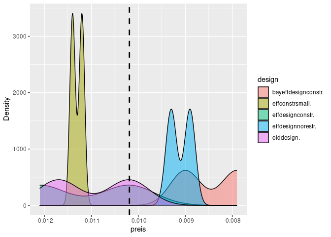
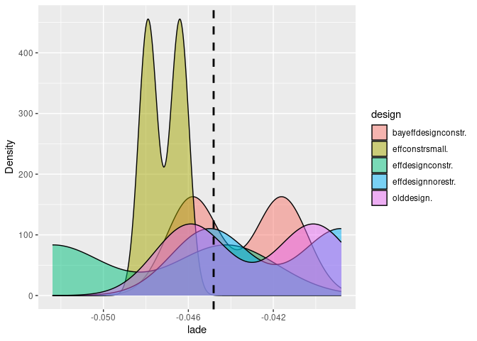
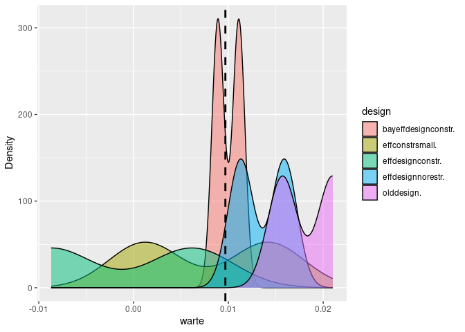

<!-- README.md is generated from README.Rmd. Please edit that file -->

# simulateDCE

<!-- badges: start -->
<!-- badges: end -->

The goal of simulateDCE is to make it easy to simulate choice experiment
datasets using designs from NGENE, `idefix` or `spdesign`. You have to
store the design file(s) in a subfolder and need to specify certain
parameters and the utility functions for the data generating process.
The package is useful for:

1.  Test different designs in terms of statistical power, efficiency and
    unbiasedness

2.  To test the effects of deviations from RUM, e.g. heuristics, on
    model performance for different designs.

3.  In teaching, using simulated data is useful, if you want to know the
    data generating process. It helps to demonstrate Maximum likelihood
    and choice models, knowing exactly what you should expect.

4.  You can use simulation in pre-registration to justify your sample
    size and design choice.

5.  Before data collection, you can use simulated data to estimate the
    models you plan to use in the actual analysis. You can thus make
    sure, you can estimate all effects for given sample sizes.

## Installation

You can install simulateDCE from github. You need to install the
`devtools` package first. The current version is alpha and there is no
version on cran:

``` r

install.packages("devtools")
devtools::install_git('https://github.com/sagebiej/simulateDCE', ref = "main")
```

For the latest development version use this:

``` r

install.packages("devtools")
devtools::install_git('https://github.com/sagebiej/simulateDCE', ref = "devel")
```

## Example

This is a basic example for a simulation:

``` r


rm(list=ls())
library(simulateDCE)
library(rlang)
library(formula.tools)
#> 
#> Attaching package: 'formula.tools'
#> The following object is masked from 'package:rlang':
#> 
#>     env


designpath<- system.file("extdata","SE_DRIVE" ,package = "simulateDCE")

resps =120  # number of respondents
nosim= 400 # number of simulations to run (about 500 is minimum)


# bcoeff <- list(
#   bpreis = -0.036,
#   blade  = -0.034,
#   bwarte = -0.049)


decisiongroups=c(0,0.7,1)

# wrong parameters

# place b coefficients into an r list:
bcoeff  = list(
  bpreis = -0.01,
  blade = -0.07,
  bwarte = 0.02)

manipulations = list(alt1.x2=     expr(alt1.x2/10),
                     alt1.x3=     expr(alt1.x3/10),
                     alt2.x2=     expr(alt2.x2/10),
                     alt2.x3=     expr(alt2.x3/10)
)


#place your utility functions here
ul<-list( u1 =

           list(
             v1 =V.1~  bpreis * alt1.x1 + blade*alt1.x2 + bwarte*alt1.x3   ,
             v2 =V.2~  bpreis * alt2.x1 + blade*alt2.x2 + bwarte*alt2.x3
           )

         ,
         u2 = list(  v1 =V.1~  bpreis * alt1.x1    ,
                     v2 =V.2~  bpreis * alt2.x1)

)


destype="ngene"

sedrive <- sim_all(nosim = nosim, resps=resps, destype = destype,
                   designpath = designpath, u=ul, bcoeff = bcoeff, decisiongroups = decisiongroups)
#> 'simple' is deprecated and will be removed in the future. Use 'exact' instead.
#> bcoeff_lookup already exists; skipping modification.
#> Utility function used in simulation, ie the true utility: 
#> 
#> $u1
#> $u1$v1
#> V.1 ~ bpreis * alt1.x1 + blade * alt1.x2 + bwarte * alt1.x3
#> <environment: 0x5cc5fbecc2e0>
#> 
#> $u1$v2
#> V.2 ~ bpreis * alt2.x1 + blade * alt2.x2 + bwarte * alt2.x3
#> <environment: 0x5cc5fbf0ffd8>
#> 
#> 
#> $u2
#> $u2$v1
#> V.1 ~ bpreis * alt1.x1
#> <environment: 0x5cc5fbf32890>
#> 
#> $u2$v2
#> V.2 ~ bpreis * alt2.x1
#> <environment: 0x5cc5fbf54428>
#> 'destype' is deprecated. Please use 'designtype' instead.
#> New names:
#> • `Choice situation` -> `Choice.situation`
#> • `` -> `...10`
#>  
#>  does sou_gis exist:  FALSE 
#> 
#>  dataset final_set exists:  FALSE 
#> 
#>  decisiongroups exists:  TRUE
#>    1    2 
#> 1007  433 
#> 
#>  data has been created 
#> 
#>  First few observations of the dataset 
#>    ID Choice_situation alt1_x1 alt1_x2 alt1_x3 alt2_x1 alt2_x2 alt2_x3 Block
#> 1  1                7      80      25     100      60     200     100     1
#> 2  1               19      20      25      50      60      25       0     1
#> 3  1               30      20     100      50      80      50     100     1
#> 4  1               32      40     200      25      80      25       0     1
#> 5  1               39      40     200       0      80     100     100     1
#> 6  1               48      60      50      25      20      50     100     1
#>   group    V_1    V_2        e_1        e_2         U_1        U_2 CHOICE
#> 1     1  -0.55 -12.60 -0.5346621  0.7318508  -1.0846621 -11.868149      1
#> 2     1  -0.95  -2.35  0.5773936 -0.7811993  -0.3726064  -3.131199      1
#> 3     1  -6.20  -2.30  1.3382771  0.1158697  -4.8617229  -2.184130      2
#> 4     1 -13.90  -2.55  1.0026198  0.9662150 -12.8973802  -1.583785      2
#> 5     1 -14.40  -5.80  0.4685361 -0.4860094 -13.9314639  -6.286009      2
#> 6     1  -3.60  -1.70  2.5243715  0.6438044  -1.0756285  -1.056196      2
#> 
#>  
#>  Transformed utility function (type: simple ):
#> [1] "U_1 = @bpreis * $alt1_x1 + @blade * $alt1_x2 + @bwarte * $alt1_x3 ;U_2 = @bpreis * $alt2_x1 + @blade * $alt2_x2 + @bwarte * $alt2_x3 ;"
#> This is Run number  1 
#>  does sou_gis exist:  FALSE 
#> 
#>  dataset final_set exists:  FALSE 
#> 
#>  decisiongroups exists:  TRUE
#>    1    2 
#> 1007  433 
#> 
#>  data has been created 
#> 
#>  First few observations of the dataset 
#>    ID Choice_situation alt1_x1 alt1_x2 alt1_x3 alt2_x1 alt2_x2 alt2_x3 Block
#> 1  1                7      80      25     100      60     200     100     1
#> 2  1               19      20      25      50      60      25       0     1
#> 3  1               30      20     100      50      80      50     100     1
#> 4  1               32      40     200      25      80      25       0     1
#> 5  1               39      40     200       0      80     100     100     1
#> 6  1               48      60      50      25      20      50     100     1
#>   group    V_1    V_2        e_1       e_2         U_1         U_2 CHOICE
#> 1     1  -0.55 -12.60  2.0480412 1.0658687   1.4980412 -11.5341313      1
#> 2     1  -0.95  -2.35  1.6458423 3.0029775   0.6958423   0.6529775      1
#> 3     1  -6.20  -2.30  0.8064037 1.7156233  -5.3935963  -0.5843767      2
#> 4     1 -13.90  -2.55 -0.9656518 0.7281514 -14.8656518  -1.8218486      2
#> 5     1 -14.40  -5.80 -0.8679570 3.8650136 -15.2679570  -1.9349864      2
#> 6     1  -3.60  -1.70  0.7468481 1.9040151  -2.8531519   0.2040151      2
#> 
#>  
#>  Initial function value: -998.1319 
#> Initial gradient value:
#> bpreis  blade bwarte 
#>   6900 -38650   7050 
#> initial  value 998.131940 
#> iter   2 value 814.051264
#> iter   3 value 803.513852
#> iter   4 value 803.277976
#> iter   5 value 766.362532
#> iter   6 value 757.804164
#> iter   7 value 756.391651
#> iter   8 value 756.360304
#> iter   9 value 756.360241
#> iter  10 value 756.360224
#> iter  10 value 756.360214
#> iter  10 value 756.360206
#> final  value 756.360206 
#> converged
#> This is Run number  2 
#>  does sou_gis exist:  FALSE 
#> 
#>  dataset final_set exists:  FALSE 
#> 
#>  decisiongroups exists:  TRUE
#>    1    2 
#> 1007  433 
#> 
#>  data has been created 
#> 
#>  First few observations of the dataset 
#>    ID Choice_situation alt1_x1 alt1_x2 alt1_x3 alt2_x1 alt2_x2 alt2_x3 Block
#> 1  1                7      80      25     100      60     200     100     1
#> 2  1               19      20      25      50      60      25       0     1
#> 3  1               30      20     100      50      80      50     100     1
#> 4  1               32      40     200      25      80      25       0     1
#> 5  1               39      40     200       0      80     100     100     1
#> 6  1               48      60      50      25      20      50     100     1
#>   group    V_1    V_2         e_1        e_2         U_1         U_2 CHOICE
#> 1     1  -0.55 -12.60 -0.95903510  1.7469021  -1.5090351 -10.8530979      1
#> 2     1  -0.95  -2.35  0.48567293  1.3550837  -0.4643271  -0.9949163      1
#> 3     1  -6.20  -2.30 -0.07062326 -0.3819651  -6.2706233  -2.6819651      2
#> 4     1 -13.90  -2.55 -0.27359542  1.7458482 -14.1735954  -0.8041518      2
#> 5     1 -14.40  -5.80  0.62747982  1.1230906 -13.7725202  -4.6769094      2
#> 6     1  -3.60  -1.70  5.51924738  0.5975311   1.9192474  -1.1024689      1
#> 
#>  
#>  Initial function value: -998.1319 
#> Initial gradient value:
#> bpreis  blade bwarte 
#>   7320 -40200   5325 
#> initial  value 998.131940 
#> iter   2 value 798.413557
#> iter   3 value 790.367792
#> iter   4 value 788.829313
#> iter   5 value 756.684783
#> iter   6 value 747.942494
#> iter   7 value 746.186623
#> iter   8 value 746.134114
#> iter   9 value 746.133922
#> iter  10 value 746.133904
#> iter  10 value 746.133904
#> iter  10 value 746.133894
#> final  value 746.133894 
#> converged
#> This is Run number  3 
#>  does sou_gis exist:  FALSE 
#> 
#>  dataset final_set exists:  FALSE 
#> 
#>  decisiongroups exists:  TRUE
#>    1    2 
#> 1007  433 
#> 
#>  data has been created 
#> 
#>  First few observations of the dataset 
#>    ID Choice_situation alt1_x1 alt1_x2 alt1_x3 alt2_x1 alt2_x2 alt2_x3 Block
#> 1  1                7      80      25     100      60     200     100     1
#> 2  1               19      20      25      50      60      25       0     1
#> 3  1               30      20     100      50      80      50     100     1
#> 4  1               32      40     200      25      80      25       0     1
#> 5  1               39      40     200       0      80     100     100     1
#> 6  1               48      60      50      25      20      50     100     1
#>   group    V_1    V_2        e_1        e_2         U_1         U_2 CHOICE
#> 1     1  -0.55 -12.60 -0.3494364 -1.2638437  -0.8994364 -13.8638437      1
#> 2     1  -0.95  -2.35 -1.0591545 -0.3654889  -2.0091545  -2.7154889      1
#> 3     1  -6.20  -2.30 -0.6391097 -1.0715919  -6.8391097  -3.3715919      2
#> 4     1 -13.90  -2.55  1.9630398 -0.7375982 -11.9369602  -3.2875982      2
#> 5     1 -14.40  -5.80 -0.7461610  0.5740361 -15.1461610  -5.2259639      2
#> 6     1  -3.60  -1.70  1.1724058  0.9519715  -2.4275942  -0.7480285      2
#> 
#>  
#>  Initial function value: -998.1319 
#> Initial gradient value:
#> bpreis  blade bwarte 
#>   6360 -38275   7025 
#> initial  value 998.131940 
#> iter   2 value 820.132002
#> iter   3 value 808.671749
#> iter   4 value 807.589000
#> iter   5 value 769.808211
#> iter   6 value 761.347358
#> iter   7 value 759.964884
#> iter   8 value 759.935731
#> iter   9 value 759.935680
#> iter  10 value 759.935667
#> iter  10 value 759.935656
#> iter  10 value 759.935656
#> final  value 759.935656 
#> converged
#> This is Run number  4 
#>  does sou_gis exist:  FALSE 
#> 
#>  dataset final_set exists:  FALSE 
#> 
#>  decisiongroups exists:  TRUE
#>    1    2 
#> 1007  433 
#> 
#>  data has been created 
#> 
#>  First few observations of the dataset 
#>    ID Choice_situation alt1_x1 alt1_x2 alt1_x3 alt2_x1 alt2_x2 alt2_x3 Block
#> 1  1                7      80      25     100      60     200     100     1
#> 2  1               19      20      25      50      60      25       0     1
#> 3  1               30      20     100      50      80      50     100     1
#> 4  1               32      40     200      25      80      25       0     1
#> 5  1               39      40     200       0      80     100     100     1
#> 6  1               48      60      50      25      20      50     100     1
#>   group    V_1    V_2        e_1         e_2          U_1        U_2 CHOICE
#> 1     1  -0.55 -12.60  0.1651308  0.04473541  -0.38486924 -12.555265      1
#> 2     1  -0.95  -2.35  1.0457067 -0.56572294   0.09570666  -2.915723      1
#> 3     1  -6.20  -2.30  0.2653277  0.21907004  -5.93467227  -2.080930      2
#> 4     1 -13.90  -2.55 -0.4685129  0.47136596 -14.36851288  -2.078634      2
#> 5     1 -14.40  -5.80  1.5752600  2.73346135 -12.82473995  -3.066539      2
#> 6     1  -3.60  -1.70 -0.3584104  0.55026311  -3.95841043  -1.149737      2
#> 
#>  
#>  Initial function value: -998.1319 
#> Initial gradient value:
#> bpreis  blade bwarte 
#>   6460 -39625   8000 
#> initial  value 998.131940 
#> iter   2 value 794.188083
#> iter   3 value 778.031063
#> iter   4 value 777.087469
#> iter   5 value 743.540679
#> iter   6 value 734.976004
#> iter   7 value 733.845920
#> iter   8 value 733.827251
#> iter   9 value 733.827233
#> iter   9 value 733.827230
#> iter   9 value 733.827220
#> final  value 733.827220 
#> converged
#> This is Run number  5 
#>  does sou_gis exist:  FALSE 
#> 
#>  dataset final_set exists:  FALSE 
#> 
#>  decisiongroups exists:  TRUE
#>    1    2 
#> 1007  433 
#> 
#>  data has been created 
#> 
#>  First few observations of the dataset 
#>    ID Choice_situation alt1_x1 alt1_x2 alt1_x3 alt2_x1 alt2_x2 alt2_x3 Block
#> 1  1                7      80      25     100      60     200     100     1
#> 2  1               19      20      25      50      60      25       0     1
#> 3  1               30      20     100      50      80      50     100     1
#> 4  1               32      40     200      25      80      25       0     1
#> 5  1               39      40     200       0      80     100     100     1
#> 6  1               48      60      50      25      20      50     100     1
#>   group    V_1    V_2        e_1        e_2        U_1         U_2 CHOICE
#> 1     1  -0.55 -12.60 -0.5668505  1.9385048  -1.116850 -10.6614952      1
#> 2     1  -0.95  -2.35 -1.0846610  0.5273078  -2.034661  -1.8226922      2
#> 3     1  -6.20  -2.30 -1.1667192 -0.3741714  -7.366719  -2.6741714      2
#> 4     1 -13.90  -2.55 -0.1146248  1.0349357 -14.014625  -1.5150643      2
#> 5     1 -14.40  -5.80 -0.4668516  2.2256308 -14.866852  -3.5743692      2
#> 6     1  -3.60  -1.70  0.2743071  2.4364835  -3.325693   0.7364835      2
#> 
#>  
#>  Initial function value: -998.1319 
#> Initial gradient value:
#> bpreis  blade bwarte 
#>   6460 -36600   5775 
#> initial  value 998.131940 
#> iter   2 value 849.190980
#> iter   3 value 842.712950
#> iter   4 value 841.936546
#> iter   5 value 799.442275
#> iter   6 value 791.541423
#> iter   7 value 789.904678
#> iter   8 value 789.870085
#> iter   9 value 789.869999
#> iter   9 value 789.869999
#> iter   9 value 789.869999
#> final  value 789.869999 
#> converged
#> This is Run number  6 
#>  does sou_gis exist:  FALSE 
#> 
#>  dataset final_set exists:  FALSE 
#> 
#>  decisiongroups exists:  TRUE
#>    1    2 
#> 1007  433 
#> 
#>  data has been created 
#> 
#>  First few observations of the dataset 
#>    ID Choice_situation alt1_x1 alt1_x2 alt1_x3 alt2_x1 alt2_x2 alt2_x3 Block
#> 1  1                7      80      25     100      60     200     100     1
#> 2  1               19      20      25      50      60      25       0     1
#> 3  1               30      20     100      50      80      50     100     1
#> 4  1               32      40     200      25      80      25       0     1
#> 5  1               39      40     200       0      80     100     100     1
#> 6  1               48      60      50      25      20      50     100     1
#>   group    V_1    V_2        e_1        e_2         U_1          U_2 CHOICE
#> 1     1  -0.55 -12.60  0.1867229 -1.3282405  -0.3632771 -13.92824045      1
#> 2     1  -0.95  -2.35 -0.7120267  0.4058905  -1.6620267  -1.94410949      1
#> 3     1  -6.20  -2.30  0.9499792  1.3408087  -5.2500208  -0.95919130      2
#> 4     1 -13.90  -2.55 -0.6068414 -0.2863894 -14.5068414  -2.83638939      2
#> 5     1 -14.40  -5.80  0.2791787  0.1775473 -14.1208213  -5.62245268      2
#> 6     1  -3.60  -1.70 -0.4503255  1.6392219  -4.0503255  -0.06077805      2
#> 
#>  
#>  Initial function value: -998.1319 
#> Initial gradient value:
#> bpreis  blade bwarte 
#>   6480 -40050   6300 
#> initial  value 998.131940 
#> iter   2 value 797.254783
#> iter   3 value 784.067854
#> iter   4 value 781.033483
#> iter   5 value 748.988742
#> iter   6 value 740.229226
#> iter   7 value 738.865229
#> iter   8 value 738.831723
#> iter   9 value 738.831657
#> iter   9 value 738.831649
#> iter   9 value 738.831643
#> final  value 738.831643 
#> converged
#> This is Run number  7 
#>  does sou_gis exist:  FALSE 
#> 
#>  dataset final_set exists:  FALSE 
#> 
#>  decisiongroups exists:  TRUE
#>    1    2 
#> 1007  433 
#> 
#>  data has been created 
#> 
#>  First few observations of the dataset 
#>    ID Choice_situation alt1_x1 alt1_x2 alt1_x3 alt2_x1 alt2_x2 alt2_x3 Block
#> 1  1                7      80      25     100      60     200     100     1
#> 2  1               19      20      25      50      60      25       0     1
#> 3  1               30      20     100      50      80      50     100     1
#> 4  1               32      40     200      25      80      25       0     1
#> 5  1               39      40     200       0      80     100     100     1
#> 6  1               48      60      50      25      20      50     100     1
#>   group    V_1    V_2         e_1        e_2         U_1        U_2 CHOICE
#> 1     1  -0.55 -12.60  0.21350661 -0.0899883  -0.3364934 -12.689988      1
#> 2     1  -0.95  -2.35  2.12381588 -0.2254029   1.1738159  -2.575403      1
#> 3     1  -6.20  -2.30  4.10025765  0.4750744  -2.0997424  -1.824926      2
#> 4     1 -13.90  -2.55 -0.41310328 -0.6352374 -14.3131033  -3.185237      2
#> 5     1 -14.40  -5.80  0.05799517 -1.3854798 -14.3420048  -7.185480      2
#> 6     1  -3.60  -1.70  2.15245815  0.5629682  -1.4475418  -1.137032      2
#> 
#>  
#>  Initial function value: -998.1319 
#> Initial gradient value:
#> bpreis  blade bwarte 
#>   5760 -37400   6900 
#> initial  value 998.131940 
#> iter   2 value 833.324198
#> iter   3 value 821.238217
#> iter   4 value 819.048965
#> iter   5 value 779.096282
#> iter   6 value 770.853182
#> iter   7 value 769.477617
#> iter   8 value 769.450544
#> iter   9 value 769.450502
#> iter   9 value 769.450491
#> iter   9 value 769.450486
#> final  value 769.450486 
#> converged
#> This is Run number  8 
#>  does sou_gis exist:  FALSE 
#> 
#>  dataset final_set exists:  FALSE 
#> 
#>  decisiongroups exists:  TRUE
#>    1    2 
#> 1007  433 
#> 
#>  data has been created 
#> 
#>  First few observations of the dataset 
#>    ID Choice_situation alt1_x1 alt1_x2 alt1_x3 alt2_x1 alt2_x2 alt2_x3 Block
#> 1  1                7      80      25     100      60     200     100     1
#> 2  1               19      20      25      50      60      25       0     1
#> 3  1               30      20     100      50      80      50     100     1
#> 4  1               32      40     200      25      80      25       0     1
#> 5  1               39      40     200       0      80     100     100     1
#> 6  1               48      60      50      25      20      50     100     1
#>   group    V_1    V_2        e_1        e_2          U_1         U_2 CHOICE
#> 1     1  -0.55 -12.60  0.5798834 -0.3211425   0.02988338 -12.9211425      1
#> 2     1  -0.95  -2.35 -0.6568726  2.9615102  -1.60687260   0.6115102      2
#> 3     1  -6.20  -2.30  1.0462290 -0.8025417  -5.15377097  -3.1025417      2
#> 4     1 -13.90  -2.55  1.9432565 -0.5925105 -11.95674349  -3.1425105      2
#> 5     1 -14.40  -5.80 -0.2125311 -0.5395650 -14.61253107  -6.3395650      2
#> 6     1  -3.60  -1.70  0.5850380  0.8600823  -3.01496199  -0.8399177      2
#> 
#>  
#>  Initial function value: -998.1319 
#> Initial gradient value:
#> bpreis  blade bwarte 
#>   6760 -39500   7725 
#> initial  value 998.131940 
#> iter   2 value 797.555745
#> iter   3 value 783.435479
#> iter   4 value 783.002682
#> iter   5 value 748.858861
#> iter   6 value 740.221327
#> iter   7 value 739.023456
#> iter   8 value 739.001304
#> iter   9 value 739.001293
#> iter   9 value 739.001288
#> iter  10 value 739.001265
#> iter  11 value 739.001253
#> iter  11 value 739.001253
#> iter  11 value 739.001250
#> final  value 739.001250 
#> converged
#> This is Run number  9 
#>  does sou_gis exist:  FALSE 
#> 
#>  dataset final_set exists:  FALSE 
#> 
#>  decisiongroups exists:  TRUE
#>    1    2 
#> 1007  433 
#> 
#>  data has been created 
#> 
#>  First few observations of the dataset 
#>    ID Choice_situation alt1_x1 alt1_x2 alt1_x3 alt2_x1 alt2_x2 alt2_x3 Block
#> 1  1                7      80      25     100      60     200     100     1
#> 2  1               19      20      25      50      60      25       0     1
#> 3  1               30      20     100      50      80      50     100     1
#> 4  1               32      40     200      25      80      25       0     1
#> 5  1               39      40     200       0      80     100     100     1
#> 6  1               48      60      50      25      20      50     100     1
#>   group    V_1    V_2         e_1          e_2        U_1         U_2 CHOICE
#> 1     1  -0.55 -12.60 -0.69241378 -0.027102867  -1.242414 -12.6271029      1
#> 2     1  -0.95  -2.35 -0.33240342  0.957319274  -1.282403  -1.3926807      1
#> 3     1  -6.20  -2.30 -0.02159452  0.523861864  -6.221595  -1.7761381      2
#> 4     1 -13.90  -2.55 -0.43976792  2.255627590 -14.339768  -0.2943724      2
#> 5     1 -14.40  -5.80  1.59548064  0.005022084 -12.804519  -5.7949779      2
#> 6     1  -3.60  -1.70  0.36964385 -0.070284512  -3.230356  -1.7702845      2
#> 
#>  
#>  Initial function value: -998.1319 
#> Initial gradient value:
#> bpreis  blade bwarte 
#>   6140 -38925   7375 
#> initial  value 998.131940 
#> iter   2 value 808.805881
#> iter   3 value 794.383536
#> iter   4 value 792.492764
#> iter   5 value 756.940395
#> iter   6 value 748.397803
#> iter   7 value 747.136101
#> iter   8 value 747.111451
#> iter   9 value 747.111422
#> iter   9 value 747.111412
#> iter   9 value 747.111406
#> final  value 747.111406 
#> converged
#> This is Run number  10 
#>  does sou_gis exist:  FALSE 
#> 
#>  dataset final_set exists:  FALSE 
#> 
#>  decisiongroups exists:  TRUE
#>    1    2 
#> 1007  433 
#> 
#>  data has been created 
#> 
#>  First few observations of the dataset 
#>    ID Choice_situation alt1_x1 alt1_x2 alt1_x3 alt2_x1 alt2_x2 alt2_x3 Block
#> 1  1                7      80      25     100      60     200     100     1
#> 2  1               19      20      25      50      60      25       0     1
#> 3  1               30      20     100      50      80      50     100     1
#> 4  1               32      40     200      25      80      25       0     1
#> 5  1               39      40     200       0      80     100     100     1
#> 6  1               48      60      50      25      20      50     100     1
#>   group    V_1    V_2         e_1         e_2         U_1        U_2 CHOICE
#> 1     1  -0.55 -12.60 -0.55377101 -0.06400035  -1.1037710 -12.664000      1
#> 2     1  -0.95  -2.35  0.65046709  1.31960333  -0.2995329  -1.030397      1
#> 3     1  -6.20  -2.30 -0.08514854 -0.35122632  -6.2851485  -2.651226      2
#> 4     1 -13.90  -2.55 -0.24910236  0.41807233 -14.1491024  -2.131928      2
#> 5     1 -14.40  -5.80  1.44398692  0.61195541 -12.9560131  -5.188045      2
#> 6     1  -3.60  -1.70  1.29566396  0.41997169  -2.3043360  -1.280028      2
#> 
#>  
#>  Initial function value: -998.1319 
#> Initial gradient value:
#> bpreis  blade bwarte 
#>   7240 -39850   6400 
#> initial  value 998.131940 
#> iter   2 value 799.047238
#> iter   3 value 789.288368
#> iter   4 value 788.745320
#> iter   5 value 755.304582
#> iter   6 value 746.556906
#> iter   7 value 745.070645
#> iter   8 value 745.032618
#> iter   9 value 745.032529
#> iter  10 value 745.032514
#> iter  10 value 745.032507
#> iter  10 value 745.032499
#> final  value 745.032499 
#> converged
#> This is Run number  11 
#>  does sou_gis exist:  FALSE 
#> 
#>  dataset final_set exists:  FALSE 
#> 
#>  decisiongroups exists:  TRUE
#>    1    2 
#> 1007  433 
#> 
#>  data has been created 
#> 
#>  First few observations of the dataset 
#>    ID Choice_situation alt1_x1 alt1_x2 alt1_x3 alt2_x1 alt2_x2 alt2_x3 Block
#> 1  1                7      80      25     100      60     200     100     1
#> 2  1               19      20      25      50      60      25       0     1
#> 3  1               30      20     100      50      80      50     100     1
#> 4  1               32      40     200      25      80      25       0     1
#> 5  1               39      40     200       0      80     100     100     1
#> 6  1               48      60      50      25      20      50     100     1
#>   group    V_1    V_2        e_1        e_2         U_1        U_2 CHOICE
#> 1     1  -0.55 -12.60  0.8302687  0.6367215   0.2802687 -11.963278      1
#> 2     1  -0.95  -2.35  0.1713546 -0.6215377  -0.7786454  -2.971538      1
#> 3     1  -6.20  -2.30  0.2922556  0.0418291  -5.9077444  -2.258171      2
#> 4     1 -13.90  -2.55  1.1815540  0.6897143 -12.7184460  -1.860286      2
#> 5     1 -14.40  -5.80 -0.2580984  1.6449478 -14.6580984  -4.155052      2
#> 6     1  -3.60  -1.70  2.0032401  0.0826559  -1.5967599  -1.617344      1
#> 
#>  
#>  Initial function value: -998.1319 
#> Initial gradient value:
#> bpreis  blade bwarte 
#>   5560 -39250   7150 
#> initial  value 998.131940 
#> iter   2 value 805.365550
#> iter   3 value 787.032465
#> iter   4 value 782.361624
#> iter   5 value 748.443105
#> iter   6 value 739.857615
#> iter   7 value 738.659548
#> iter   8 value 738.636756
#> iter   9 value 738.636736
#> iter   9 value 738.636731
#> iter   9 value 738.636727
#> final  value 738.636727 
#> converged
#> This is Run number  12 
#>  does sou_gis exist:  FALSE 
#> 
#>  dataset final_set exists:  FALSE 
#> 
#>  decisiongroups exists:  TRUE
#>    1    2 
#> 1007  433 
#> 
#>  data has been created 
#> 
#>  First few observations of the dataset 
#>    ID Choice_situation alt1_x1 alt1_x2 alt1_x3 alt2_x1 alt2_x2 alt2_x3 Block
#> 1  1                7      80      25     100      60     200     100     1
#> 2  1               19      20      25      50      60      25       0     1
#> 3  1               30      20     100      50      80      50     100     1
#> 4  1               32      40     200      25      80      25       0     1
#> 5  1               39      40     200       0      80     100     100     1
#> 6  1               48      60      50      25      20      50     100     1
#>   group    V_1    V_2        e_1         e_2         U_1         U_2 CHOICE
#> 1     1  -0.55 -12.60 -0.9803801 -0.26153559  -1.5303801 -12.8615356      1
#> 2     1  -0.95  -2.35  1.7419333  0.07796661   0.7919333  -2.2720334      1
#> 3     1  -6.20  -2.30  1.4003382 -0.88584325  -4.7996618  -3.1858432      2
#> 4     1 -13.90  -2.55 -1.4346036 -0.76433179 -15.3346036  -3.3143318      2
#> 5     1 -14.40  -5.80 -0.6871762 -1.84393126 -15.0871762  -7.6439313      2
#> 6     1  -3.60  -1.70  3.1893690  1.48324819  -0.4106310  -0.2167518      2
#> 
#>  
#>  Initial function value: -998.1319 
#> Initial gradient value:
#> bpreis  blade bwarte 
#>   6700 -38575   6775 
#> initial  value 998.131940 
#> iter   2 value 816.882836
#> iter   3 value 806.574919
#> iter   4 value 805.890778
#> iter   5 value 768.813677
#> iter   6 value 760.282612
#> iter   7 value 758.832693
#> iter   8 value 758.799819
#> iter   9 value 758.799752
#> iter  10 value 758.799736
#> iter  10 value 758.799726
#> iter  10 value 758.799725
#> final  value 758.799725 
#> converged
#> This is Run number  13 
#>  does sou_gis exist:  FALSE 
#> 
#>  dataset final_set exists:  FALSE 
#> 
#>  decisiongroups exists:  TRUE
#>    1    2 
#> 1007  433 
#> 
#>  data has been created 
#> 
#>  First few observations of the dataset 
#>    ID Choice_situation alt1_x1 alt1_x2 alt1_x3 alt2_x1 alt2_x2 alt2_x3 Block
#> 1  1                7      80      25     100      60     200     100     1
#> 2  1               19      20      25      50      60      25       0     1
#> 3  1               30      20     100      50      80      50     100     1
#> 4  1               32      40     200      25      80      25       0     1
#> 5  1               39      40     200       0      80     100     100     1
#> 6  1               48      60      50      25      20      50     100     1
#>   group    V_1    V_2        e_1        e_2          U_1        U_2 CHOICE
#> 1     1  -0.55 -12.60 -0.1991772  1.1511615  -0.74917718 -11.448838      1
#> 2     1  -0.95  -2.35  0.9329473  0.3775952  -0.01705267  -1.972405      1
#> 3     1  -6.20  -2.30  1.8494722 -0.5189996  -4.35052776  -2.819000      2
#> 4     1 -13.90  -2.55  0.1553253  0.6869012 -13.74467470  -1.863099      2
#> 5     1 -14.40  -5.80  2.9140428  2.1088163 -11.48595724  -3.691184      2
#> 6     1  -3.60  -1.70  0.9493834 -0.4533498  -2.65061659  -2.153350      2
#> 
#>  
#>  Initial function value: -998.1319 
#> Initial gradient value:
#> bpreis  blade bwarte 
#>   5720 -38225   7225 
#> initial  value 998.131940 
#> iter   2 value 819.997689
#> iter   3 value 805.307244
#> iter   4 value 802.513743
#> iter   5 value 765.124055
#> iter   6 value 756.700421
#> iter   7 value 755.405431
#> iter   8 value 755.380579
#> iter   9 value 755.380550
#> iter   9 value 755.380540
#> iter   9 value 755.380535
#> final  value 755.380535 
#> converged
#> This is Run number  14 
#>  does sou_gis exist:  FALSE 
#> 
#>  dataset final_set exists:  FALSE 
#> 
#>  decisiongroups exists:  TRUE
#>    1    2 
#> 1007  433 
#> 
#>  data has been created 
#> 
#>  First few observations of the dataset 
#>    ID Choice_situation alt1_x1 alt1_x2 alt1_x3 alt2_x1 alt2_x2 alt2_x3 Block
#> 1  1                7      80      25     100      60     200     100     1
#> 2  1               19      20      25      50      60      25       0     1
#> 3  1               30      20     100      50      80      50     100     1
#> 4  1               32      40     200      25      80      25       0     1
#> 5  1               39      40     200       0      80     100     100     1
#> 6  1               48      60      50      25      20      50     100     1
#>   group    V_1    V_2        e_1        e_2         U_1         U_2 CHOICE
#> 1     1  -0.55 -12.60 -1.0226271  1.8022229  -1.5726271 -10.7977771      1
#> 2     1  -0.95  -2.35  0.2449677 -0.7119570  -0.7050323  -3.0619570      1
#> 3     1  -6.20  -2.30 -0.3483096 -0.8870686  -6.5483096  -3.1870686      2
#> 4     1 -13.90  -2.55 -0.3558228  1.8516659 -14.2558228  -0.6983341      2
#> 5     1 -14.40  -5.80  1.9414634  3.9030741 -12.4585366  -1.8969259      2
#> 6     1  -3.60  -1.70  0.8671413  2.5681117  -2.7328587   0.8681117      2
#> 
#>  
#>  Initial function value: -998.1319 
#> Initial gradient value:
#> bpreis  blade bwarte 
#>   6060 -38125   7250 
#> initial  value 998.131940 
#> iter   2 value 821.172714
#> iter   3 value 808.367696
#> iter   4 value 806.782637
#> iter   5 value 768.753533
#> iter   6 value 760.339769
#> iter   7 value 759.013804
#> iter   8 value 758.987644
#> iter   9 value 758.987607
#> iter  10 value 758.987595
#> iter  10 value 758.987585
#> iter  10 value 758.987580
#> final  value 758.987580 
#> converged
#> This is Run number  15 
#>  does sou_gis exist:  FALSE 
#> 
#>  dataset final_set exists:  FALSE 
#> 
#>  decisiongroups exists:  TRUE
#>    1    2 
#> 1007  433 
#> 
#>  data has been created 
#> 
#>  First few observations of the dataset 
#>    ID Choice_situation alt1_x1 alt1_x2 alt1_x3 alt2_x1 alt2_x2 alt2_x3 Block
#> 1  1                7      80      25     100      60     200     100     1
#> 2  1               19      20      25      50      60      25       0     1
#> 3  1               30      20     100      50      80      50     100     1
#> 4  1               32      40     200      25      80      25       0     1
#> 5  1               39      40     200       0      80     100     100     1
#> 6  1               48      60      50      25      20      50     100     1
#>   group    V_1    V_2        e_1        e_2         U_1        U_2 CHOICE
#> 1     1  -0.55 -12.60 -0.6697426 -0.2212345  -1.2197426 -12.821234      1
#> 2     1  -0.95  -2.35  0.1329135 -0.1484477  -0.8170865  -2.498448      1
#> 3     1  -6.20  -2.30  1.8040782 -1.1926918  -4.3959218  -3.492692      2
#> 4     1 -13.90  -2.55 -0.2969303  0.4498545 -14.1969303  -2.100146      2
#> 5     1 -14.40  -5.80 -0.8939682  0.1640928 -15.2939682  -5.635907      2
#> 6     1  -3.60  -1.70 -0.9939891  0.3689768  -4.5939891  -1.331023      2
#> 
#>  
#>  Initial function value: -998.1319 
#> Initial gradient value:
#> bpreis  blade bwarte 
#>   6240 -37875   6650 
#> initial  value 998.131940 
#> iter   2 value 827.899993
#> iter   3 value 817.382899
#> iter   4 value 815.958442
#> iter   5 value 777.095544
#> iter   6 value 768.734927
#> iter   7 value 767.282448
#> iter   8 value 767.251137
#> iter   9 value 767.251077
#> iter   9 value 767.251076
#> iter   9 value 767.251076
#> final  value 767.251076 
#> converged
#> This is Run number  16 
#>  does sou_gis exist:  FALSE 
#> 
#>  dataset final_set exists:  FALSE 
#> 
#>  decisiongroups exists:  TRUE
#>    1    2 
#> 1007  433 
#> 
#>  data has been created 
#> 
#>  First few observations of the dataset 
#>    ID Choice_situation alt1_x1 alt1_x2 alt1_x3 alt2_x1 alt2_x2 alt2_x3 Block
#> 1  1                7      80      25     100      60     200     100     1
#> 2  1               19      20      25      50      60      25       0     1
#> 3  1               30      20     100      50      80      50     100     1
#> 4  1               32      40     200      25      80      25       0     1
#> 5  1               39      40     200       0      80     100     100     1
#> 6  1               48      60      50      25      20      50     100     1
#>   group    V_1    V_2        e_1        e_2         U_1         U_2 CHOICE
#> 1     1  -0.55 -12.60 -0.4430095 -0.5300688  -0.9930095 -13.1300688      1
#> 2     1  -0.95  -2.35  3.5029252 -1.1477896   2.5529252  -3.4977896      1
#> 3     1  -6.20  -2.30  1.2878364  1.4547887  -4.9121636  -0.8452113      2
#> 4     1 -13.90  -2.55  2.0919139 -1.2793114 -11.8080861  -3.8293114      2
#> 5     1 -14.40  -5.80 -0.3452620 -0.5455779 -14.7452620  -6.3455779      2
#> 6     1  -3.60  -1.70 -1.0382948 -0.3328220  -4.6382948  -2.0328220      2
#> 
#>  
#>  Initial function value: -998.1319 
#> Initial gradient value:
#> bpreis  blade bwarte 
#>   5680 -38700   8425 
#> initial  value 998.131940 
#> iter   2 value 805.632321
#> iter   3 value 787.126143
#> iter   4 value 784.943829
#> iter   5 value 749.005847
#> iter   6 value 740.652192
#> iter   7 value 739.522359
#> iter   8 value 739.506073
#> iter   9 value 739.506060
#> iter   9 value 739.506055
#> iter   9 value 739.506052
#> final  value 739.506052 
#> converged
#> This is Run number  17 
#>  does sou_gis exist:  FALSE 
#> 
#>  dataset final_set exists:  FALSE 
#> 
#>  decisiongroups exists:  TRUE
#>    1    2 
#> 1007  433 
#> 
#>  data has been created 
#> 
#>  First few observations of the dataset 
#>    ID Choice_situation alt1_x1 alt1_x2 alt1_x3 alt2_x1 alt2_x2 alt2_x3 Block
#> 1  1                7      80      25     100      60     200     100     1
#> 2  1               19      20      25      50      60      25       0     1
#> 3  1               30      20     100      50      80      50     100     1
#> 4  1               32      40     200      25      80      25       0     1
#> 5  1               39      40     200       0      80     100     100     1
#> 6  1               48      60      50      25      20      50     100     1
#>   group    V_1    V_2         e_1        e_2         U_1         U_2 CHOICE
#> 1     1  -0.55 -12.60  1.10726253  0.1562533   0.5572625 -12.4437467      1
#> 2     1  -0.95  -2.35 -1.03723690  2.4601367  -1.9872369   0.1101367      2
#> 3     1  -6.20  -2.30  0.33340273  0.2966318  -5.8665973  -2.0033682      2
#> 4     1 -13.90  -2.55  0.47342490  1.1619897 -13.4265751  -1.3880103      2
#> 5     1 -14.40  -5.80 -0.04790816 -0.9262372 -14.4479082  -6.7262372      2
#> 6     1  -3.60  -1.70 -0.25237807  0.6792071  -3.8523781  -1.0207929      2
#> 
#>  
#>  Initial function value: -998.1319 
#> Initial gradient value:
#> bpreis  blade bwarte 
#>   6060 -39525   8600 
#> initial  value 998.131940 
#> iter   2 value 791.960827
#> iter   3 value 772.617019
#> iter   4 value 771.139777
#> iter   5 value 737.594100
#> iter   6 value 729.207147
#> iter   7 value 728.147911
#> iter   8 value 728.133621
#> iter   9 value 728.133602
#> iter   9 value 728.133596
#> iter   9 value 728.133596
#> final  value 728.133596 
#> converged
#> This is Run number  18 
#>  does sou_gis exist:  FALSE 
#> 
#>  dataset final_set exists:  FALSE 
#> 
#>  decisiongroups exists:  TRUE
#>    1    2 
#> 1007  433 
#> 
#>  data has been created 
#> 
#>  First few observations of the dataset 
#>    ID Choice_situation alt1_x1 alt1_x2 alt1_x3 alt2_x1 alt2_x2 alt2_x3 Block
#> 1  1                7      80      25     100      60     200     100     1
#> 2  1               19      20      25      50      60      25       0     1
#> 3  1               30      20     100      50      80      50     100     1
#> 4  1               32      40     200      25      80      25       0     1
#> 5  1               39      40     200       0      80     100     100     1
#> 6  1               48      60      50      25      20      50     100     1
#>   group    V_1    V_2        e_1         e_2         U_1        U_2 CHOICE
#> 1     1  -0.55 -12.60  0.7412233  0.62578691   0.1912233 -11.974213      1
#> 2     1  -0.95  -2.35  0.3224486  0.83719236  -0.6275514  -1.512808      1
#> 3     1  -6.20  -2.30 -1.0891595 -0.07786002  -7.2891595  -2.377860      2
#> 4     1 -13.90  -2.55 -0.6999784  0.43833581 -14.5999784  -2.111664      2
#> 5     1 -14.40  -5.80 -0.9937733  0.84542868 -15.3937733  -4.954571      2
#> 6     1  -3.60  -1.70  0.4503231 -0.52201593  -3.1496769  -2.222016      2
#> 
#>  
#>  Initial function value: -998.1319 
#> Initial gradient value:
#> bpreis  blade bwarte 
#>   7360 -40025   5825 
#> initial  value 998.131940 
#> iter   2 value 798.921328
#> iter   3 value 790.485091
#> iter   4 value 789.657678
#> iter   5 value 756.737560
#> iter   6 value 747.986793
#> iter   7 value 746.352573
#> iter   8 value 746.307171
#> iter   9 value 746.307041
#> iter  10 value 746.307026
#> iter  10 value 746.307026
#> iter  10 value 746.307019
#> final  value 746.307019 
#> converged
#> This is Run number  19 
#>  does sou_gis exist:  FALSE 
#> 
#>  dataset final_set exists:  FALSE 
#> 
#>  decisiongroups exists:  TRUE
#>    1    2 
#> 1007  433 
#> 
#>  data has been created 
#> 
#>  First few observations of the dataset 
#>    ID Choice_situation alt1_x1 alt1_x2 alt1_x3 alt2_x1 alt2_x2 alt2_x3 Block
#> 1  1                7      80      25     100      60     200     100     1
#> 2  1               19      20      25      50      60      25       0     1
#> 3  1               30      20     100      50      80      50     100     1
#> 4  1               32      40     200      25      80      25       0     1
#> 5  1               39      40     200       0      80     100     100     1
#> 6  1               48      60      50      25      20      50     100     1
#>   group    V_1    V_2        e_1        e_2          U_1        U_2 CHOICE
#> 1     1  -0.55 -12.60 -0.5742353  0.2599047  -1.12423532 -12.340095      1
#> 2     1  -0.95  -2.35  0.8716942  1.0253969  -0.07830585  -1.324603      1
#> 3     1  -6.20  -2.30  0.4024112 -0.1901571  -5.79758884  -2.490157      2
#> 4     1 -13.90  -2.55  1.1478203 -0.7324204 -12.75217966  -3.282420      2
#> 5     1 -14.40  -5.80  0.5179299  1.2628388 -13.88207015  -4.537161      2
#> 6     1  -3.60  -1.70  0.2990833 -0.4118175  -3.30091671  -2.111818      2
#> 
#>  
#>  Initial function value: -998.1319 
#> Initial gradient value:
#> bpreis  blade bwarte 
#>   5800 -40250   8050 
#> initial  value 998.131940 
#> iter   2 value 784.410953
#> iter   3 value 763.207399
#> iter   4 value 759.363723
#> iter   5 value 728.629462
#> iter   6 value 720.229731
#> iter   7 value 719.188904
#> iter   8 value 719.172593
#> iter   8 value 719.172586
#> final  value 719.172586 
#> converged
#> This is Run number  20 
#>  does sou_gis exist:  FALSE 
#> 
#>  dataset final_set exists:  FALSE 
#> 
#>  decisiongroups exists:  TRUE
#>    1    2 
#> 1007  433 
#> 
#>  data has been created 
#> 
#>  First few observations of the dataset 
#>    ID Choice_situation alt1_x1 alt1_x2 alt1_x3 alt2_x1 alt2_x2 alt2_x3 Block
#> 1  1                7      80      25     100      60     200     100     1
#> 2  1               19      20      25      50      60      25       0     1
#> 3  1               30      20     100      50      80      50     100     1
#> 4  1               32      40     200      25      80      25       0     1
#> 5  1               39      40     200       0      80     100     100     1
#> 6  1               48      60      50      25      20      50     100     1
#>   group    V_1    V_2         e_1       e_2          U_1         U_2 CHOICE
#> 1     1  -0.55 -12.60  1.54093200 0.9146525   0.99093200 -11.6853475      1
#> 2     1  -0.95  -2.35  0.99359644 0.8103119   0.04359644  -1.5396881      1
#> 3     1  -6.20  -2.30 -0.05574717 3.6530462  -6.25574717   1.3530462      2
#> 4     1 -13.90  -2.55  1.14689252 0.3959909 -12.75310748  -2.1540091      2
#> 5     1 -14.40  -5.80 -0.29085079 0.6199654 -14.69085079  -5.1800346      2
#> 6     1  -3.60  -1.70 -0.57138927 1.2125393  -4.17138927  -0.4874607      2
#> 
#>  
#>  Initial function value: -998.1319 
#> Initial gradient value:
#> bpreis  blade bwarte 
#>   5940 -38500   6550 
#> initial  value 998.131940 
#> iter   2 value 819.663167
#> iter   3 value 806.484485
#> iter   4 value 803.481753
#> iter   5 value 766.853816
#> iter   6 value 758.331166
#> iter   7 value 756.931409
#> iter   8 value 756.900884
#> iter   9 value 756.900831
#> iter   9 value 756.900822
#> iter   9 value 756.900817
#> final  value 756.900817 
#> converged
#> This is Run number  21 
#>  does sou_gis exist:  FALSE 
#> 
#>  dataset final_set exists:  FALSE 
#> 
#>  decisiongroups exists:  TRUE
#>    1    2 
#> 1007  433 
#> 
#>  data has been created 
#> 
#>  First few observations of the dataset 
#>    ID Choice_situation alt1_x1 alt1_x2 alt1_x3 alt2_x1 alt2_x2 alt2_x3 Block
#> 1  1                7      80      25     100      60     200     100     1
#> 2  1               19      20      25      50      60      25       0     1
#> 3  1               30      20     100      50      80      50     100     1
#> 4  1               32      40     200      25      80      25       0     1
#> 5  1               39      40     200       0      80     100     100     1
#> 6  1               48      60      50      25      20      50     100     1
#>   group    V_1    V_2        e_1        e_2           U_1         U_2 CHOICE
#> 1     1  -0.55 -12.60  3.1726579 -1.3164440   2.622657902 -13.9164440      1
#> 2     1  -0.95  -2.35  0.9532956  3.6710337   0.003295594   1.3210337      2
#> 3     1  -6.20  -2.30  0.6409443  0.4491905  -5.559055733  -1.8508095      2
#> 4     1 -13.90  -2.55 -0.3810352  2.1951681 -14.281035155  -0.3548319      2
#> 5     1 -14.40  -5.80  1.5795551 -0.3248330 -12.820444855  -6.1248330      2
#> 6     1  -3.60  -1.70 -0.4157202 -0.5185339  -4.015720176  -2.2185339      2
#> 
#>  
#>  Initial function value: -998.1319 
#> Initial gradient value:
#> bpreis  blade bwarte 
#>   6420 -39550   7375 
#> initial  value 998.131940 
#> iter   2 value 799.220577
#> iter   3 value 784.729741
#> iter   4 value 783.181163
#> iter   5 value 749.406678
#> iter   6 value 740.779257
#> iter   7 value 739.551151
#> iter   8 value 739.526731
#> iter   9 value 739.526702
#> iter   9 value 739.526693
#> iter   9 value 739.526686
#> final  value 739.526686 
#> converged
#> This is Run number  22 
#>  does sou_gis exist:  FALSE 
#> 
#>  dataset final_set exists:  FALSE 
#> 
#>  decisiongroups exists:  TRUE
#>    1    2 
#> 1007  433 
#> 
#>  data has been created 
#> 
#>  First few observations of the dataset 
#>    ID Choice_situation alt1_x1 alt1_x2 alt1_x3 alt2_x1 alt2_x2 alt2_x3 Block
#> 1  1                7      80      25     100      60     200     100     1
#> 2  1               19      20      25      50      60      25       0     1
#> 3  1               30      20     100      50      80      50     100     1
#> 4  1               32      40     200      25      80      25       0     1
#> 5  1               39      40     200       0      80     100     100     1
#> 6  1               48      60      50      25      20      50     100     1
#>   group    V_1    V_2        e_1         e_2        U_1        U_2 CHOICE
#> 1     1  -0.55 -12.60 -0.8175021 -0.35435672  -1.367502 -12.954357      1
#> 2     1  -0.95  -2.35 -0.1995796 -0.61567055  -1.149580  -2.965671      1
#> 3     1  -6.20  -2.30  0.7204438  0.23624759  -5.479556  -2.063752      2
#> 4     1 -13.90  -2.55  1.8926614 -0.02072729 -12.007339  -2.570727      2
#> 5     1 -14.40  -5.80 -0.2718300  0.18629880 -14.671830  -5.613701      2
#> 6     1  -3.60  -1.70 -0.6245241  0.21125305  -4.224524  -1.488747      2
#> 
#>  
#>  Initial function value: -998.1319 
#> Initial gradient value:
#> bpreis  blade bwarte 
#>   5600 -37200   7575 
#> initial  value 998.131940 
#> iter   2 value 832.190865
#> iter   3 value 818.820408
#> iter   4 value 816.918318
#> iter   5 value 776.346371
#> iter   6 value 768.166574
#> iter   7 value 766.883717
#> iter   8 value 766.861318
#> iter   9 value 766.861291
#> iter   9 value 766.861281
#> iter   9 value 766.861276
#> final  value 766.861276 
#> converged
#> This is Run number  23 
#>  does sou_gis exist:  FALSE 
#> 
#>  dataset final_set exists:  FALSE 
#> 
#>  decisiongroups exists:  TRUE
#>    1    2 
#> 1007  433 
#> 
#>  data has been created 
#> 
#>  First few observations of the dataset 
#>    ID Choice_situation alt1_x1 alt1_x2 alt1_x3 alt2_x1 alt2_x2 alt2_x3 Block
#> 1  1                7      80      25     100      60     200     100     1
#> 2  1               19      20      25      50      60      25       0     1
#> 3  1               30      20     100      50      80      50     100     1
#> 4  1               32      40     200      25      80      25       0     1
#> 5  1               39      40     200       0      80     100     100     1
#> 6  1               48      60      50      25      20      50     100     1
#>   group    V_1    V_2         e_1        e_2         U_1        U_2 CHOICE
#> 1     1  -0.55 -12.60  0.23997973  1.6529340  -0.3100203 -10.947066      1
#> 2     1  -0.95  -2.35 -0.35775476 -1.0901106  -1.3077548  -3.440111      1
#> 3     1  -6.20  -2.30  0.05300973 -1.1033464  -6.1469903  -3.403346      2
#> 4     1 -13.90  -2.55  1.55715428  1.0464371 -12.3428457  -1.503563      2
#> 5     1 -14.40  -5.80  1.06540419  0.6167304 -13.3345958  -5.183270      2
#> 6     1  -3.60  -1.70 -0.29567605  0.3535731  -3.8956761  -1.346427      2
#> 
#>  
#>  Initial function value: -998.1319 
#> Initial gradient value:
#> bpreis  blade bwarte 
#>   5880 -39025   6950 
#> initial  value 998.131940 
#> iter   2 value 809.832251
#> iter   3 value 794.516541
#> iter   4 value 791.150581
#> iter   5 value 756.230383
#> iter   6 value 747.646775
#> iter   7 value 746.359738
#> iter   8 value 746.333251
#> iter   9 value 746.333218
#> iter   9 value 746.333210
#> iter   9 value 746.333205
#> final  value 746.333205 
#> converged
#> This is Run number  24 
#>  does sou_gis exist:  FALSE 
#> 
#>  dataset final_set exists:  FALSE 
#> 
#>  decisiongroups exists:  TRUE
#>    1    2 
#> 1007  433 
#> 
#>  data has been created 
#> 
#>  First few observations of the dataset 
#>    ID Choice_situation alt1_x1 alt1_x2 alt1_x3 alt2_x1 alt2_x2 alt2_x3 Block
#> 1  1                7      80      25     100      60     200     100     1
#> 2  1               19      20      25      50      60      25       0     1
#> 3  1               30      20     100      50      80      50     100     1
#> 4  1               32      40     200      25      80      25       0     1
#> 5  1               39      40     200       0      80     100     100     1
#> 6  1               48      60      50      25      20      50     100     1
#>   group    V_1    V_2        e_1        e_2        U_1         U_2 CHOICE
#> 1     1  -0.55 -12.60 -0.5811512 -0.6668047  -1.131151 -13.2668047      1
#> 2     1  -0.95  -2.35  2.3536173 -1.0546874   1.403617  -3.4046874      1
#> 3     1  -6.20  -2.30 -1.0869926 -0.5082091  -7.286993  -2.8082091      2
#> 4     1 -13.90  -2.55  0.5573746  2.3065882 -13.342625  -0.2434118      2
#> 5     1 -14.40  -5.80 -0.5445224  0.0458446 -14.944522  -5.7541554      2
#> 6     1  -3.60  -1.70 -0.3383747 -0.7048156  -3.938375  -2.4048156      2
#> 
#>  
#>  Initial function value: -998.1319 
#> Initial gradient value:
#> bpreis  blade bwarte 
#>   6380 -38900   6875 
#> initial  value 998.131940 
#> iter   2 value 811.861737
#> iter   3 value 799.578196
#> iter   4 value 797.953502
#> iter   5 value 762.142990
#> iter   6 value 753.563423
#> iter   7 value 752.195332
#> iter   8 value 752.165387
#> iter   9 value 752.165337
#> iter  10 value 752.165325
#> iter  10 value 752.165317
#> iter  10 value 752.165317
#> final  value 752.165317 
#> converged
#> This is Run number  25 
#>  does sou_gis exist:  FALSE 
#> 
#>  dataset final_set exists:  FALSE 
#> 
#>  decisiongroups exists:  TRUE
#>    1    2 
#> 1007  433 
#> 
#>  data has been created 
#> 
#>  First few observations of the dataset 
#>    ID Choice_situation alt1_x1 alt1_x2 alt1_x3 alt2_x1 alt2_x2 alt2_x3 Block
#> 1  1                7      80      25     100      60     200     100     1
#> 2  1               19      20      25      50      60      25       0     1
#> 3  1               30      20     100      50      80      50     100     1
#> 4  1               32      40     200      25      80      25       0     1
#> 5  1               39      40     200       0      80     100     100     1
#> 6  1               48      60      50      25      20      50     100     1
#>   group    V_1    V_2         e_1        e_2         U_1        U_2 CHOICE
#> 1     1  -0.55 -12.60  0.79506340  2.9684872   0.2450634 -9.6315128      1
#> 2     1  -0.95  -2.35  0.02059948  4.0962295  -0.9294005  1.7462295      2
#> 3     1  -6.20  -2.30 -0.89827309 -0.2988247  -7.0982731 -2.5988247      2
#> 4     1 -13.90  -2.55  1.85670394 -0.5479160 -12.0432961 -3.0979160      2
#> 5     1 -14.40  -5.80  0.33733135  0.2319431 -14.0626686 -5.5680569      2
#> 6     1  -3.60  -1.70  1.80807202  2.1504539  -1.7919280  0.4504539      2
#> 
#>  
#>  Initial function value: -998.1319 
#> Initial gradient value:
#> bpreis  blade bwarte 
#>   5800 -38200   6400 
#> initial  value 998.131940 
#> iter   2 value 824.772414
#> iter   3 value 811.610414
#> iter   4 value 808.317614
#> iter   5 value 770.861084
#> iter   6 value 762.384077
#> iter   7 value 760.960246
#> iter   8 value 760.929323
#> iter   9 value 760.929266
#> iter   9 value 760.929257
#> iter   9 value 760.929252
#> final  value 760.929252 
#> converged
#> This is Run number  26 
#>  does sou_gis exist:  FALSE 
#> 
#>  dataset final_set exists:  FALSE 
#> 
#>  decisiongroups exists:  TRUE
#>    1    2 
#> 1007  433 
#> 
#>  data has been created 
#> 
#>  First few observations of the dataset 
#>    ID Choice_situation alt1_x1 alt1_x2 alt1_x3 alt2_x1 alt2_x2 alt2_x3 Block
#> 1  1                7      80      25     100      60     200     100     1
#> 2  1               19      20      25      50      60      25       0     1
#> 3  1               30      20     100      50      80      50     100     1
#> 4  1               32      40     200      25      80      25       0     1
#> 5  1               39      40     200       0      80     100     100     1
#> 6  1               48      60      50      25      20      50     100     1
#>   group    V_1    V_2         e_1        e_2          U_1        U_2 CHOICE
#> 1     1  -0.55 -12.60  0.61494977  0.7730959   0.06494977 -11.826904      1
#> 2     1  -0.95  -2.35  1.88643832  0.6808709   0.93643832  -1.669129      1
#> 3     1  -6.20  -2.30 -0.86961688 -0.1904128  -7.06961688  -2.490413      2
#> 4     1 -13.90  -2.55 -0.05374765  0.7616439 -13.95374765  -1.788356      2
#> 5     1 -14.40  -5.80  3.47362298  1.5059658 -10.92637702  -4.294034      2
#> 6     1  -3.60  -1.70  0.28917639 -1.3190910  -3.31082361  -3.019091      2
#> 
#>  
#>  Initial function value: -998.1319 
#> Initial gradient value:
#> bpreis  blade bwarte 
#>   6200 -38275   5925 
#> initial  value 998.131940 
#> iter   2 value 825.848063
#> iter   3 value 815.246076
#> iter   4 value 812.696404
#> iter   5 value 775.260391
#> iter   6 value 766.794316
#> iter   7 value 765.220969
#> iter   8 value 765.183547
#> iter   9 value 765.183455
#> iter  10 value 765.183442
#> iter  10 value 765.183442
#> iter  10 value 765.183438
#> final  value 765.183438 
#> converged
#> This is Run number  27 
#>  does sou_gis exist:  FALSE 
#> 
#>  dataset final_set exists:  FALSE 
#> 
#>  decisiongroups exists:  TRUE
#>    1    2 
#> 1007  433 
#> 
#>  data has been created 
#> 
#>  First few observations of the dataset 
#>    ID Choice_situation alt1_x1 alt1_x2 alt1_x3 alt2_x1 alt2_x2 alt2_x3 Block
#> 1  1                7      80      25     100      60     200     100     1
#> 2  1               19      20      25      50      60      25       0     1
#> 3  1               30      20     100      50      80      50     100     1
#> 4  1               32      40     200      25      80      25       0     1
#> 5  1               39      40     200       0      80     100     100     1
#> 6  1               48      60      50      25      20      50     100     1
#>   group    V_1    V_2         e_1        e_2         U_1         U_2 CHOICE
#> 1     1  -0.55 -12.60  0.17428232 -0.5063131  -0.3757177 -13.1063131      1
#> 2     1  -0.95  -2.35  0.59503521  0.4532163  -0.3549648  -1.8967837      1
#> 3     1  -6.20  -2.30 -0.80878323  2.8184548  -7.0087832   0.5184548      2
#> 4     1 -13.90  -2.55  1.16638698 -1.1685989 -12.7336130  -3.7185989      2
#> 5     1 -14.40  -5.80  3.87828296 -0.5075608 -10.5217170  -6.3075608      2
#> 6     1  -3.60  -1.70  0.05482436  1.8947469  -3.5451756   0.1947469      2
#> 
#>  
#>  Initial function value: -998.1319 
#> Initial gradient value:
#> bpreis  blade bwarte 
#>   6540 -37525   6375 
#> initial  value 998.131940 
#> iter   2 value 833.922833
#> iter   3 value 825.513174
#> iter   4 value 824.798810
#> iter   5 value 784.717063
#> iter   6 value 776.469774
#> iter   7 value 774.919701
#> iter   8 value 774.885346
#> iter   9 value 774.885266
#> iter   9 value 774.885264
#> iter   9 value 774.885264
#> final  value 774.885264 
#> converged
#> This is Run number  28 
#>  does sou_gis exist:  FALSE 
#> 
#>  dataset final_set exists:  FALSE 
#> 
#>  decisiongroups exists:  TRUE
#>    1    2 
#> 1007  433 
#> 
#>  data has been created 
#> 
#>  First few observations of the dataset 
#>    ID Choice_situation alt1_x1 alt1_x2 alt1_x3 alt2_x1 alt2_x2 alt2_x3 Block
#> 1  1                7      80      25     100      60     200     100     1
#> 2  1               19      20      25      50      60      25       0     1
#> 3  1               30      20     100      50      80      50     100     1
#> 4  1               32      40     200      25      80      25       0     1
#> 5  1               39      40     200       0      80     100     100     1
#> 6  1               48      60      50      25      20      50     100     1
#>   group    V_1    V_2          e_1        e_2         U_1         U_2 CHOICE
#> 1     1  -0.55 -12.60 -0.009285943 0.99401803  -0.5592859 -11.6059820      1
#> 2     1  -0.95  -2.35  0.292396581 0.18369436  -0.6576034  -2.1663056      1
#> 3     1  -6.20  -2.30 -1.115241992 0.01880581  -7.3152420  -2.2811942      2
#> 4     1 -13.90  -2.55  2.386206195 2.16271800 -11.5137938  -0.3872820      2
#> 5     1 -14.40  -5.80  0.733583378 0.96497297 -13.6664166  -4.8350270      2
#> 6     1  -3.60  -1.70  0.401342416 0.96390485  -3.1986576  -0.7360952      2
#> 
#>  
#>  Initial function value: -998.1319 
#> Initial gradient value:
#> bpreis  blade bwarte 
#>   6080 -38750   8175 
#> initial  value 998.131940 
#> iter   2 value 806.438136
#> iter   3 value 790.250129
#> iter   4 value 789.046565
#> iter   5 value 752.928739
#> iter   6 value 744.477324
#> iter   7 value 743.317181
#> iter   8 value 743.298959
#> iter   9 value 743.298945
#> iter   9 value 743.298942
#> iter  10 value 743.298931
#> iter  10 value 743.298923
#> iter  10 value 743.298922
#> final  value 743.298922 
#> converged
#> This is Run number  29 
#>  does sou_gis exist:  FALSE 
#> 
#>  dataset final_set exists:  FALSE 
#> 
#>  decisiongroups exists:  TRUE
#>    1    2 
#> 1007  433 
#> 
#>  data has been created 
#> 
#>  First few observations of the dataset 
#>    ID Choice_situation alt1_x1 alt1_x2 alt1_x3 alt2_x1 alt2_x2 alt2_x3 Block
#> 1  1                7      80      25     100      60     200     100     1
#> 2  1               19      20      25      50      60      25       0     1
#> 3  1               30      20     100      50      80      50     100     1
#> 4  1               32      40     200      25      80      25       0     1
#> 5  1               39      40     200       0      80     100     100     1
#> 6  1               48      60      50      25      20      50     100     1
#>   group    V_1    V_2        e_1        e_2         U_1         U_2 CHOICE
#> 1     1  -0.55 -12.60  1.7471286 -0.3855214   1.1971286 -12.9855214      1
#> 2     1  -0.95  -2.35  0.1612026  1.2885028  -0.7887974  -1.0614972      1
#> 3     1  -6.20  -2.30  3.1399183  0.7451406  -3.0600817  -1.5548594      2
#> 4     1 -13.90  -2.55  1.1562691  1.1418581 -12.7437309  -1.4081419      2
#> 5     1 -14.40  -5.80 -0.2553048 -0.4954830 -14.6553048  -6.2954830      2
#> 6     1  -3.60  -1.70  1.7257312  0.8319119  -1.8742688  -0.8680881      2
#> 
#>  
#>  Initial function value: -998.1319 
#> Initial gradient value:
#> bpreis  blade bwarte 
#>   5680 -36675   6825 
#> initial  value 998.131940 
#> iter   2 value 843.431492
#> iter   3 value 832.639176
#> iter   4 value 830.764674
#> iter   5 value 788.737420
#> iter   6 value 780.709120
#> iter   7 value 779.326526
#> iter   8 value 779.300299
#> iter   9 value 779.300257
#> iter   9 value 779.300256
#> iter   9 value 779.300256
#> final  value 779.300256 
#> converged
#> This is Run number  30 
#>  does sou_gis exist:  FALSE 
#> 
#>  dataset final_set exists:  FALSE 
#> 
#>  decisiongroups exists:  TRUE
#>    1    2 
#> 1007  433 
#> 
#>  data has been created 
#> 
#>  First few observations of the dataset 
#>    ID Choice_situation alt1_x1 alt1_x2 alt1_x3 alt2_x1 alt2_x2 alt2_x3 Block
#> 1  1                7      80      25     100      60     200     100     1
#> 2  1               19      20      25      50      60      25       0     1
#> 3  1               30      20     100      50      80      50     100     1
#> 4  1               32      40     200      25      80      25       0     1
#> 5  1               39      40     200       0      80     100     100     1
#> 6  1               48      60      50      25      20      50     100     1
#>   group    V_1    V_2        e_1        e_2        U_1        U_2 CHOICE
#> 1     1  -0.55 -12.60 -0.4583561 -0.4276330  -1.008356 -13.027633      1
#> 2     1  -0.95  -2.35 -0.9055229 -0.1672029  -1.855523  -2.517203      1
#> 3     1  -6.20  -2.30  1.7038551  0.7256820  -4.496145  -1.574318      2
#> 4     1 -13.90  -2.55 -0.7621098 -0.4771581 -14.662110  -3.027158      2
#> 5     1 -14.40  -5.80 -0.3998774 -1.0933774 -14.799877  -6.893377      2
#> 6     1  -3.60  -1.70  1.6273573  0.1763657  -1.972643  -1.523634      2
#> 
#>  
#>  Initial function value: -998.1319 
#> Initial gradient value:
#> bpreis  blade bwarte 
#>   6180 -38075   6375 
#> initial  value 998.131940 
#> iter   2 value 826.535088
#> iter   3 value 815.752278
#> iter   4 value 813.745311
#> iter   5 value 775.608465
#> iter   6 value 767.196971
#> iter   7 value 765.709509
#> iter   8 value 765.676337
#> iter   9 value 765.676270
#> iter   9 value 765.676260
#> iter   9 value 765.676254
#> final  value 765.676254 
#> converged
#> This is Run number  31 
#>  does sou_gis exist:  FALSE 
#> 
#>  dataset final_set exists:  FALSE 
#> 
#>  decisiongroups exists:  TRUE
#>    1    2 
#> 1007  433 
#> 
#>  data has been created 
#> 
#>  First few observations of the dataset 
#>    ID Choice_situation alt1_x1 alt1_x2 alt1_x3 alt2_x1 alt2_x2 alt2_x3 Block
#> 1  1                7      80      25     100      60     200     100     1
#> 2  1               19      20      25      50      60      25       0     1
#> 3  1               30      20     100      50      80      50     100     1
#> 4  1               32      40     200      25      80      25       0     1
#> 5  1               39      40     200       0      80     100     100     1
#> 6  1               48      60      50      25      20      50     100     1
#>   group    V_1    V_2        e_1        e_2        U_1         U_2 CHOICE
#> 1     1  -0.55 -12.60 -1.0695231  0.2012381  -1.619523 -12.3987619      1
#> 2     1  -0.95  -2.35 -0.3692137  1.7454102  -1.319214  -0.6045898      2
#> 3     1  -6.20  -2.30  0.9046795  1.4778487  -5.295320  -0.8221513      2
#> 4     1 -13.90  -2.55 -0.2933849  0.7417986 -14.193385  -1.8082014      2
#> 5     1 -14.40  -5.80 -0.6282223  1.8206628 -15.028222  -3.9793372      2
#> 6     1  -3.60  -1.70  0.7008495 -0.9524986  -2.899151  -2.6524986      2
#> 
#>  
#>  Initial function value: -998.1319 
#> Initial gradient value:
#> bpreis  blade bwarte 
#>   6320 -37975   6875 
#> initial  value 998.131940 
#> iter   2 value 825.239839
#> iter   3 value 814.469941
#> iter   4 value 813.367835
#> iter   5 value 774.710702
#> iter   6 value 766.320084
#> iter   7 value 764.901373
#> iter   8 value 764.871231
#> iter   9 value 764.871175
#> iter  10 value 764.871161
#> iter  10 value 764.871151
#> iter  10 value 764.871146
#> final  value 764.871146 
#> converged
#> This is Run number  32 
#>  does sou_gis exist:  FALSE 
#> 
#>  dataset final_set exists:  FALSE 
#> 
#>  decisiongroups exists:  TRUE
#>    1    2 
#> 1007  433 
#> 
#>  data has been created 
#> 
#>  First few observations of the dataset 
#>    ID Choice_situation alt1_x1 alt1_x2 alt1_x3 alt2_x1 alt2_x2 alt2_x3 Block
#> 1  1                7      80      25     100      60     200     100     1
#> 2  1               19      20      25      50      60      25       0     1
#> 3  1               30      20     100      50      80      50     100     1
#> 4  1               32      40     200      25      80      25       0     1
#> 5  1               39      40     200       0      80     100     100     1
#> 6  1               48      60      50      25      20      50     100     1
#>   group    V_1    V_2        e_1         e_2         U_1          U_2 CHOICE
#> 1     1  -0.55 -12.60  0.2923237 -0.34185310  -0.2576763 -12.94185310      1
#> 2     1  -0.95  -2.35  0.1778100  2.28439972  -0.7721900  -0.06560028      2
#> 3     1  -6.20  -2.30  4.6585126  0.50816742  -1.5414874  -1.79183258      1
#> 4     1 -13.90  -2.55  2.6096463  0.06879165 -11.2903537  -2.48120835      2
#> 5     1 -14.40  -5.80 -0.2451368 -0.42604177 -14.6451368  -6.22604177      2
#> 6     1  -3.60  -1.70  1.2610084 -0.99274356  -2.3389916  -2.69274356      1
#> 
#>  
#>  Initial function value: -998.1319 
#> Initial gradient value:
#> bpreis  blade bwarte 
#>   6520 -38150   5800 
#> initial  value 998.131940 
#> iter   2 value 827.981080
#> iter   3 value 819.282063
#> iter   4 value 817.639860
#> iter   5 value 779.580434
#> iter   6 value 771.185328
#> iter   7 value 769.529829
#> iter   8 value 769.489814
#> iter   9 value 769.489708
#> iter  10 value 769.489695
#> iter  10 value 769.489693
#> iter  10 value 769.489692
#> final  value 769.489692 
#> converged
#> This is Run number  33 
#>  does sou_gis exist:  FALSE 
#> 
#>  dataset final_set exists:  FALSE 
#> 
#>  decisiongroups exists:  TRUE
#>    1    2 
#> 1007  433 
#> 
#>  data has been created 
#> 
#>  First few observations of the dataset 
#>    ID Choice_situation alt1_x1 alt1_x2 alt1_x3 alt2_x1 alt2_x2 alt2_x3 Block
#> 1  1                7      80      25     100      60     200     100     1
#> 2  1               19      20      25      50      60      25       0     1
#> 3  1               30      20     100      50      80      50     100     1
#> 4  1               32      40     200      25      80      25       0     1
#> 5  1               39      40     200       0      80     100     100     1
#> 6  1               48      60      50      25      20      50     100     1
#>   group    V_1    V_2        e_1        e_2        U_1         U_2 CHOICE
#> 1     1  -0.55 -12.60 -0.7820398 -0.3618176  -1.332040 -12.9618176      1
#> 2     1  -0.95  -2.35 -0.2823878  0.4905537  -1.232388  -1.8594463      1
#> 3     1  -6.20  -2.30  0.6124959  0.2771269  -5.587504  -2.0228731      2
#> 4     1 -13.90  -2.55  1.1618612  0.4721477 -12.738139  -2.0778523      2
#> 5     1 -14.40  -5.80  2.9320682 -0.3157078 -11.467932  -6.1157078      2
#> 6     1  -3.60  -1.70 -0.5046445  2.4571157  -4.104644   0.7571157      2
#> 
#>  
#>  Initial function value: -998.1319 
#> Initial gradient value:
#> bpreis  blade bwarte 
#>   5980 -37900   6850 
#> initial  value 998.131940 
#> iter   2 value 826.616061
#> iter   3 value 814.587727
#> iter   4 value 812.582007
#> iter   5 value 773.985393
#> iter   6 value 765.615980
#> iter   7 value 764.226528
#> iter   8 value 764.197877
#> iter   9 value 764.197830
#> iter   9 value 764.197819
#> iter   9 value 764.197813
#> final  value 764.197813 
#> converged
#> This is Run number  34 
#>  does sou_gis exist:  FALSE 
#> 
#>  dataset final_set exists:  FALSE 
#> 
#>  decisiongroups exists:  TRUE
#>    1    2 
#> 1007  433 
#> 
#>  data has been created 
#> 
#>  First few observations of the dataset 
#>    ID Choice_situation alt1_x1 alt1_x2 alt1_x3 alt2_x1 alt2_x2 alt2_x3 Block
#> 1  1                7      80      25     100      60     200     100     1
#> 2  1               19      20      25      50      60      25       0     1
#> 3  1               30      20     100      50      80      50     100     1
#> 4  1               32      40     200      25      80      25       0     1
#> 5  1               39      40     200       0      80     100     100     1
#> 6  1               48      60      50      25      20      50     100     1
#>   group    V_1    V_2         e_1         e_2         U_1          U_2 CHOICE
#> 1     1  -0.55 -12.60  1.35318374  1.71399735   0.8031837 -10.88600265      1
#> 2     1  -0.95  -2.35 -0.05992435 -0.10723221  -1.0099244  -2.45723221      1
#> 3     1  -6.20  -2.30  0.09335095 -1.19775312  -6.1066491  -3.49775312      2
#> 4     1 -13.90  -2.55 -0.59008289  0.74789339 -14.4900829  -1.80210661      2
#> 5     1 -14.40  -5.80  1.81945873  0.01755771 -12.5805413  -5.78244229      2
#> 6     1  -3.60  -1.70 -0.12606651  1.78929845  -3.7260665   0.08929845      2
#> 
#>  
#>  Initial function value: -998.1319 
#> Initial gradient value:
#> bpreis  blade bwarte 
#>   5920 -38325   7575 
#> initial  value 998.131940 
#> iter   2 value 816.457874
#> iter   3 value 801.948179
#> iter   4 value 800.077130
#> iter   5 value 762.770038
#> iter   6 value 754.342467
#> iter   7 value 753.083401
#> iter   8 value 753.060307
#> iter   9 value 753.060281
#> iter   9 value 753.060272
#> iter   9 value 753.060266
#> final  value 753.060266 
#> converged
#> This is Run number  35 
#>  does sou_gis exist:  FALSE 
#> 
#>  dataset final_set exists:  FALSE 
#> 
#>  decisiongroups exists:  TRUE
#>    1    2 
#> 1007  433 
#> 
#>  data has been created 
#> 
#>  First few observations of the dataset 
#>    ID Choice_situation alt1_x1 alt1_x2 alt1_x3 alt2_x1 alt2_x2 alt2_x3 Block
#> 1  1                7      80      25     100      60     200     100     1
#> 2  1               19      20      25      50      60      25       0     1
#> 3  1               30      20     100      50      80      50     100     1
#> 4  1               32      40     200      25      80      25       0     1
#> 5  1               39      40     200       0      80     100     100     1
#> 6  1               48      60      50      25      20      50     100     1
#>   group    V_1    V_2         e_1         e_2         U_1         U_2 CHOICE
#> 1     1  -0.55 -12.60  0.14043048  1.39313651  -0.4095695 -11.2068635      1
#> 2     1  -0.95  -2.35 -0.73092421  2.68732915  -1.6809242   0.3373292      2
#> 3     1  -6.20  -2.30 -0.15294274  1.21610800  -6.3529427  -1.0838920      2
#> 4     1 -13.90  -2.55 -0.04897067  1.62698452 -13.9489707  -0.9230155      2
#> 5     1 -14.40  -5.80  1.84091168  0.11293400 -12.5590883  -5.6870660      2
#> 6     1  -3.60  -1.70 -0.72173644 -0.04155647  -4.3217364  -1.7415565      2
#> 
#>  
#>  Initial function value: -998.1319 
#> Initial gradient value:
#> bpreis  blade bwarte 
#>   5960 -38675   7275 
#> initial  value 998.131940 
#> iter   2 value 813.146036
#> iter   3 value 798.593452
#> iter   4 value 796.234509
#> iter   5 value 760.058109
#> iter   6 value 751.554155
#> iter   7 value 750.274208
#> iter   8 value 750.249141
#> iter   9 value 750.249111
#> iter   9 value 750.249101
#> iter   9 value 750.249096
#> final  value 750.249096 
#> converged
#> This is Run number  36 
#>  does sou_gis exist:  FALSE 
#> 
#>  dataset final_set exists:  FALSE 
#> 
#>  decisiongroups exists:  TRUE
#>    1    2 
#> 1007  433 
#> 
#>  data has been created 
#> 
#>  First few observations of the dataset 
#>    ID Choice_situation alt1_x1 alt1_x2 alt1_x3 alt2_x1 alt2_x2 alt2_x3 Block
#> 1  1                7      80      25     100      60     200     100     1
#> 2  1               19      20      25      50      60      25       0     1
#> 3  1               30      20     100      50      80      50     100     1
#> 4  1               32      40     200      25      80      25       0     1
#> 5  1               39      40     200       0      80     100     100     1
#> 6  1               48      60      50      25      20      50     100     1
#>   group    V_1    V_2         e_1         e_2        U_1        U_2 CHOICE
#> 1     1  -0.55 -12.60 -0.54236870  1.37120574  -1.092369 -11.228794      1
#> 2     1  -0.95  -2.35 -0.13553929 -1.50755110  -1.085539  -3.857551      1
#> 3     1  -6.20  -2.30 -0.46534926 -0.08382678  -6.665349  -2.383827      2
#> 4     1 -13.90  -2.55 -0.07478104  0.78998504 -13.974781  -1.760015      2
#> 5     1 -14.40  -5.80  0.62893248  0.12093493 -13.771068  -5.679065      2
#> 6     1  -3.60  -1.70 -0.47623471 -0.68165571  -4.076235  -2.381656      2
#> 
#>  
#>  Initial function value: -998.1319 
#> Initial gradient value:
#> bpreis  blade bwarte 
#>   6000 -37200   6375 
#> initial  value 998.131940 
#> iter   2 value 838.701786
#> iter   3 value 828.804108
#> iter   4 value 827.012125
#> iter   5 value 786.387129
#> iter   6 value 778.216387
#> iter   7 value 776.731959
#> iter   8 value 776.700938
#> iter   9 value 776.700877
#> iter   9 value 776.700876
#> iter   9 value 776.700876
#> final  value 776.700876 
#> converged
#> This is Run number  37 
#>  does sou_gis exist:  FALSE 
#> 
#>  dataset final_set exists:  FALSE 
#> 
#>  decisiongroups exists:  TRUE
#>    1    2 
#> 1007  433 
#> 
#>  data has been created 
#> 
#>  First few observations of the dataset 
#>    ID Choice_situation alt1_x1 alt1_x2 alt1_x3 alt2_x1 alt2_x2 alt2_x3 Block
#> 1  1                7      80      25     100      60     200     100     1
#> 2  1               19      20      25      50      60      25       0     1
#> 3  1               30      20     100      50      80      50     100     1
#> 4  1               32      40     200      25      80      25       0     1
#> 5  1               39      40     200       0      80     100     100     1
#> 6  1               48      60      50      25      20      50     100     1
#>   group    V_1    V_2        e_1         e_2         U_1         U_2 CHOICE
#> 1     1  -0.55 -12.60  1.7042745  1.71020923   1.1542745 -10.8897908      1
#> 2     1  -0.95  -2.35  0.8188401  1.73055549  -0.1311599  -0.6194445      1
#> 3     1  -6.20  -2.30  0.8142049  0.61972236  -5.3857951  -1.6802776      2
#> 4     1 -13.90  -2.55  1.5539823  2.02942975 -12.3460177  -0.5205703      2
#> 5     1 -14.40  -5.80  0.2413219 -0.01021182 -14.1586781  -5.8102118      2
#> 6     1  -3.60  -1.70 -1.1351223  1.98439698  -4.7351223   0.2843970      2
#> 
#>  
#>  Initial function value: -998.1319 
#> Initial gradient value:
#> bpreis  blade bwarte 
#>   6460 -38300   5875 
#> initial  value 998.131940 
#> iter   2 value 825.550793
#> iter   3 value 816.241328
#> iter   4 value 814.381273
#> iter   5 value 776.815424
#> iter   6 value 768.371424
#> iter   7 value 766.748122
#> iter   8 value 766.708831
#> iter   9 value 766.708730
#> iter  10 value 766.708718
#> iter  10 value 766.708715
#> iter  10 value 766.708711
#> final  value 766.708711 
#> converged
#> This is Run number  38 
#>  does sou_gis exist:  FALSE 
#> 
#>  dataset final_set exists:  FALSE 
#> 
#>  decisiongroups exists:  TRUE
#>    1    2 
#> 1007  433 
#> 
#>  data has been created 
#> 
#>  First few observations of the dataset 
#>    ID Choice_situation alt1_x1 alt1_x2 alt1_x3 alt2_x1 alt2_x2 alt2_x3 Block
#> 1  1                7      80      25     100      60     200     100     1
#> 2  1               19      20      25      50      60      25       0     1
#> 3  1               30      20     100      50      80      50     100     1
#> 4  1               32      40     200      25      80      25       0     1
#> 5  1               39      40     200       0      80     100     100     1
#> 6  1               48      60      50      25      20      50     100     1
#>   group    V_1    V_2        e_1        e_2         U_1        U_2 CHOICE
#> 1     1  -0.55 -12.60  0.7138098 -0.6272689   0.1638098 -13.227269      1
#> 2     1  -0.95  -2.35  1.1214789 -0.3768925   0.1714789  -2.726892      1
#> 3     1  -6.20  -2.30 -0.7095841  0.6286292  -6.9095841  -1.671371      2
#> 4     1 -13.90  -2.55  0.6902177 -1.0113477 -13.2097823  -3.561348      2
#> 5     1 -14.40  -5.80  1.0391582 -0.3155666 -13.3608418  -6.115567      2
#> 6     1  -3.60  -1.70  4.6394236  0.6673716   1.0394236  -1.032628      1
#> 
#>  
#>  Initial function value: -998.1319 
#> Initial gradient value:
#> bpreis  blade bwarte 
#>   6240 -38325   6650 
#> initial  value 998.131940 
#> iter   2 value 821.529415
#> iter   3 value 810.144082
#> iter   4 value 808.364363
#> iter   5 value 770.894356
#> iter   6 value 762.425153
#> iter   7 value 760.993309
#> iter   8 value 760.961861
#> iter   9 value 760.961803
#> iter   9 value 760.961803
#> iter   9 value 760.961803
#> final  value 760.961803 
#> converged
#> This is Run number  39 
#>  does sou_gis exist:  FALSE 
#> 
#>  dataset final_set exists:  FALSE 
#> 
#>  decisiongroups exists:  TRUE
#>    1    2 
#> 1007  433 
#> 
#>  data has been created 
#> 
#>  First few observations of the dataset 
#>    ID Choice_situation alt1_x1 alt1_x2 alt1_x3 alt2_x1 alt2_x2 alt2_x3 Block
#> 1  1                7      80      25     100      60     200     100     1
#> 2  1               19      20      25      50      60      25       0     1
#> 3  1               30      20     100      50      80      50     100     1
#> 4  1               32      40     200      25      80      25       0     1
#> 5  1               39      40     200       0      80     100     100     1
#> 6  1               48      60      50      25      20      50     100     1
#>   group    V_1    V_2         e_1         e_2          U_1         U_2 CHOICE
#> 1     1  -0.55 -12.60 -0.78675832  0.06521298  -1.33675832 -12.5347870      1
#> 2     1  -0.95  -2.35  0.96785957  2.19000495   0.01785957  -0.1599950      1
#> 3     1  -6.20  -2.30 -1.04345527  0.19961485  -7.24345527  -2.1003852      2
#> 4     1 -13.90  -2.55 -0.04306056 -0.68188404 -13.94306056  -3.2318840      2
#> 5     1 -14.40  -5.80  3.13787860 -0.01945734 -11.26212140  -5.8194573      2
#> 6     1  -3.60  -1.70  0.29463320  1.46263966  -3.30536680  -0.2373603      2
#> 
#>  
#>  Initial function value: -998.1319 
#> Initial gradient value:
#> bpreis  blade bwarte 
#>   6580 -37625   7150 
#> initial  value 998.131940 
#> iter   2 value 828.350273
#> iter   3 value 818.368201
#> iter   4 value 818.098898
#> iter   5 value 778.265521
#> iter   6 value 769.940285
#> iter   7 value 768.529884
#> iter   8 value 768.500721
#> iter   9 value 768.500664
#> iter  10 value 768.500647
#> iter  10 value 768.500637
#> iter  10 value 768.500631
#> final  value 768.500631 
#> converged
#> This is Run number  40 
#>  does sou_gis exist:  FALSE 
#> 
#>  dataset final_set exists:  FALSE 
#> 
#>  decisiongroups exists:  TRUE
#>    1    2 
#> 1007  433 
#> 
#>  data has been created 
#> 
#>  First few observations of the dataset 
#>    ID Choice_situation alt1_x1 alt1_x2 alt1_x3 alt2_x1 alt2_x2 alt2_x3 Block
#> 1  1                7      80      25     100      60     200     100     1
#> 2  1               19      20      25      50      60      25       0     1
#> 3  1               30      20     100      50      80      50     100     1
#> 4  1               32      40     200      25      80      25       0     1
#> 5  1               39      40     200       0      80     100     100     1
#> 6  1               48      60      50      25      20      50     100     1
#>   group    V_1    V_2         e_1        e_2        U_1         U_2 CHOICE
#> 1     1  -0.55 -12.60  5.64420497 -0.3499432   5.094205 -12.9499432      1
#> 2     1  -0.95  -2.35 -0.87913942 -0.1768537  -1.829139  -2.5268537      1
#> 3     1  -6.20  -2.30  0.18467297  1.7994440  -6.015327  -0.5005560      2
#> 4     1 -13.90  -2.55  0.55369332  1.8287463 -13.346307  -0.7212537      2
#> 5     1 -14.40  -5.80  0.40074217  0.1881833 -13.999258  -5.6118167      2
#> 6     1  -3.60  -1.70 -0.05689137 -0.7171636  -3.656891  -2.4171636      2
#> 
#>  
#>  Initial function value: -998.1319 
#> Initial gradient value:
#> bpreis  blade bwarte 
#>   5780 -37300   7100 
#> initial  value 998.131940 
#> iter   2 value 833.572147
#> iter   3 value 821.535543
#> iter   4 value 819.669924
#> iter   5 value 779.354791
#> iter   6 value 771.141273
#> iter   7 value 769.789226
#> iter   8 value 769.763318
#> iter   9 value 769.763279
#> iter   9 value 769.763268
#> iter   9 value 769.763262
#> final  value 769.763262 
#> converged
#> This is Run number  41 
#>  does sou_gis exist:  FALSE 
#> 
#>  dataset final_set exists:  FALSE 
#> 
#>  decisiongroups exists:  TRUE
#>    1    2 
#> 1007  433 
#> 
#>  data has been created 
#> 
#>  First few observations of the dataset 
#>    ID Choice_situation alt1_x1 alt1_x2 alt1_x3 alt2_x1 alt2_x2 alt2_x3 Block
#> 1  1                7      80      25     100      60     200     100     1
#> 2  1               19      20      25      50      60      25       0     1
#> 3  1               30      20     100      50      80      50     100     1
#> 4  1               32      40     200      25      80      25       0     1
#> 5  1               39      40     200       0      80     100     100     1
#> 6  1               48      60      50      25      20      50     100     1
#>   group    V_1    V_2         e_1         e_2         U_1         U_2 CHOICE
#> 1     1  -0.55 -12.60  0.71344109 -0.61904602   0.1634411 -13.2190460      1
#> 2     1  -0.95  -2.35 -0.77153748  2.68346729  -1.7215375   0.3334673      2
#> 3     1  -6.20  -2.30  0.77589563  1.10408139  -5.4241044  -1.1959186      2
#> 4     1 -13.90  -2.55  2.34094934  1.97225981 -11.5590507  -0.5777402      2
#> 5     1 -14.40  -5.80 -1.14422438  1.35972356 -15.5442244  -4.4402764      2
#> 6     1  -3.60  -1.70  0.06537586  0.04048977  -3.5346241  -1.6595102      2
#> 
#>  
#>  Initial function value: -998.1319 
#> Initial gradient value:
#> bpreis  blade bwarte 
#>   6540 -38450   6950 
#> initial  value 998.131940 
#> iter   2 value 817.889984
#> iter   3 value 806.904123
#> iter   4 value 806.075294
#> iter   5 value 768.711924
#> iter   6 value 760.208173
#> iter   7 value 758.803017
#> iter   8 value 758.772441
#> iter   9 value 758.772384
#> iter  10 value 758.772369
#> iter  10 value 758.772359
#> iter  10 value 758.772359
#> final  value 758.772359 
#> converged
#> This is Run number  42 
#>  does sou_gis exist:  FALSE 
#> 
#>  dataset final_set exists:  FALSE 
#> 
#>  decisiongroups exists:  TRUE
#>    1    2 
#> 1007  433 
#> 
#>  data has been created 
#> 
#>  First few observations of the dataset 
#>    ID Choice_situation alt1_x1 alt1_x2 alt1_x3 alt2_x1 alt2_x2 alt2_x3 Block
#> 1  1                7      80      25     100      60     200     100     1
#> 2  1               19      20      25      50      60      25       0     1
#> 3  1               30      20     100      50      80      50     100     1
#> 4  1               32      40     200      25      80      25       0     1
#> 5  1               39      40     200       0      80     100     100     1
#> 6  1               48      60      50      25      20      50     100     1
#>   group    V_1    V_2         e_1        e_2         U_1         U_2 CHOICE
#> 1     1  -0.55 -12.60  0.66879038  0.4249742   0.1187904 -12.1750258      1
#> 2     1  -0.95  -2.35  1.27022437 -0.3186559   0.3202244  -2.6686559      1
#> 3     1  -6.20  -2.30  3.49196275  0.4859582  -2.7080373  -1.8140418      2
#> 4     1 -13.90  -2.55  0.06579049  0.8237347 -13.8342095  -1.7262653      2
#> 5     1 -14.40  -5.80 -0.35180520 -0.9315576 -14.7518052  -6.7315576      2
#> 6     1  -3.60  -1.70 -0.10000316  1.5322635  -3.7000032  -0.1677365      2
#> 
#>  
#>  Initial function value: -998.1319 
#> Initial gradient value:
#> bpreis  blade bwarte 
#>   6320 -39650   7725 
#> initial  value 998.131940 
#> iter   2 value 795.642293
#> iter   3 value 779.625121
#> iter   4 value 778.030535
#> iter   5 value 744.673312
#> iter   6 value 736.094145
#> iter   7 value 734.934048
#> iter   8 value 734.913266
#> iter   8 value 734.913257
#> final  value 734.913257 
#> converged
#> This is Run number  43 
#>  does sou_gis exist:  FALSE 
#> 
#>  dataset final_set exists:  FALSE 
#> 
#>  decisiongroups exists:  TRUE
#>    1    2 
#> 1007  433 
#> 
#>  data has been created 
#> 
#>  First few observations of the dataset 
#>    ID Choice_situation alt1_x1 alt1_x2 alt1_x3 alt2_x1 alt2_x2 alt2_x3 Block
#> 1  1                7      80      25     100      60     200     100     1
#> 2  1               19      20      25      50      60      25       0     1
#> 3  1               30      20     100      50      80      50     100     1
#> 4  1               32      40     200      25      80      25       0     1
#> 5  1               39      40     200       0      80     100     100     1
#> 6  1               48      60      50      25      20      50     100     1
#>   group    V_1    V_2         e_1        e_2         U_1         U_2 CHOICE
#> 1     1  -0.55 -12.60  1.79728459  0.6615376   1.2472846 -11.9384624      1
#> 2     1  -0.95  -2.35  0.69384936  0.7528065  -0.2561506  -1.5971935      1
#> 3     1  -6.20  -2.30  0.09488667 -0.2946189  -6.1051133  -2.5946189      2
#> 4     1 -13.90  -2.55 -0.17879059  0.2140843 -14.0787906  -2.3359157      2
#> 5     1 -14.40  -5.80  0.20991343  2.4000887 -14.1900866  -3.3999113      2
#> 6     1  -3.60  -1.70  0.80539326  0.9928431  -2.7946067  -0.7071569      2
#> 
#>  
#>  Initial function value: -998.1319 
#> Initial gradient value:
#> bpreis  blade bwarte 
#>   6240 -39925   6900 
#> initial  value 998.131940 
#> iter   2 value 796.234974
#> iter   3 value 780.987785
#> iter   4 value 777.914120
#> iter   5 value 745.620412
#> iter   6 value 736.936690
#> iter   7 value 735.696435
#> iter   8 value 735.669800
#> iter   9 value 735.669767
#> iter   9 value 735.669760
#> iter   9 value 735.669756
#> final  value 735.669756 
#> converged
#> This is Run number  44 
#>  does sou_gis exist:  FALSE 
#> 
#>  dataset final_set exists:  FALSE 
#> 
#>  decisiongroups exists:  TRUE
#>    1    2 
#> 1007  433 
#> 
#>  data has been created 
#> 
#>  First few observations of the dataset 
#>    ID Choice_situation alt1_x1 alt1_x2 alt1_x3 alt2_x1 alt2_x2 alt2_x3 Block
#> 1  1                7      80      25     100      60     200     100     1
#> 2  1               19      20      25      50      60      25       0     1
#> 3  1               30      20     100      50      80      50     100     1
#> 4  1               32      40     200      25      80      25       0     1
#> 5  1               39      40     200       0      80     100     100     1
#> 6  1               48      60      50      25      20      50     100     1
#>   group    V_1    V_2         e_1        e_2        U_1         U_2 CHOICE
#> 1     1  -0.55 -12.60  2.15137793 -0.2996835   1.601378 -12.8996835      1
#> 2     1  -0.95  -2.35  2.20135275  2.6315006   1.251353   0.2815006      1
#> 3     1  -6.20  -2.30 -0.44624093  1.2011576  -6.646241  -1.0988424      2
#> 4     1 -13.90  -2.55 -0.92385415  0.3782121 -14.823854  -2.1717879      2
#> 5     1 -14.40  -5.80  0.75980472 -0.1540351 -13.640195  -5.9540351      2
#> 6     1  -3.60  -1.70 -0.01342134  0.6343489  -3.613421  -1.0656511      2
#> 
#>  
#>  Initial function value: -998.1319 
#> Initial gradient value:
#> bpreis  blade bwarte 
#>   5800 -39325   7200 
#> initial  value 998.131940 
#> iter   2 value 803.937680
#> iter   3 value 786.970750
#> iter   4 value 783.227340
#> iter   5 value 749.361634
#> iter   6 value 740.778429
#> iter   7 value 739.562344
#> iter   8 value 739.538702
#> iter   9 value 739.538679
#> iter   9 value 739.538673
#> iter   9 value 739.538669
#> final  value 739.538669 
#> converged
#> This is Run number  45 
#>  does sou_gis exist:  FALSE 
#> 
#>  dataset final_set exists:  FALSE 
#> 
#>  decisiongroups exists:  TRUE
#>    1    2 
#> 1007  433 
#> 
#>  data has been created 
#> 
#>  First few observations of the dataset 
#>    ID Choice_situation alt1_x1 alt1_x2 alt1_x3 alt2_x1 alt2_x2 alt2_x3 Block
#> 1  1                7      80      25     100      60     200     100     1
#> 2  1               19      20      25      50      60      25       0     1
#> 3  1               30      20     100      50      80      50     100     1
#> 4  1               32      40     200      25      80      25       0     1
#> 5  1               39      40     200       0      80     100     100     1
#> 6  1               48      60      50      25      20      50     100     1
#>   group    V_1    V_2        e_1         e_2         U_1        U_2 CHOICE
#> 1     1  -0.55 -12.60  2.2268981  0.52156093   1.6768981 -12.078439      1
#> 2     1  -0.95  -2.35  1.1853668  0.57665505   0.2353668  -1.773345      1
#> 3     1  -6.20  -2.30  1.8662031 -1.16877987  -4.3337969  -3.468780      2
#> 4     1 -13.90  -2.55  1.8871877  0.26783324 -12.0128123  -2.282167      2
#> 5     1 -14.40  -5.80  2.1544772 -0.06336121 -12.2455228  -5.863361      2
#> 6     1  -3.60  -1.70 -0.8812035 -0.01736191  -4.4812035  -1.717362      2
#> 
#>  
#>  Initial function value: -998.1319 
#> Initial gradient value:
#> bpreis  blade bwarte 
#>   6740 -38750   6250 
#> initial  value 998.131940 
#> iter   2 value 816.998406
#> iter   3 value 807.551852
#> iter   4 value 806.444364
#> iter   5 value 769.928505
#> iter   6 value 761.376496
#> iter   7 value 759.822928
#> iter   8 value 759.785233
#> iter   9 value 759.785144
#> iter  10 value 759.785131
#> iter  10 value 759.785124
#> iter  10 value 759.785122
#> final  value 759.785122 
#> converged
#> This is Run number  46 
#>  does sou_gis exist:  FALSE 
#> 
#>  dataset final_set exists:  FALSE 
#> 
#>  decisiongroups exists:  TRUE
#>    1    2 
#> 1007  433 
#> 
#>  data has been created 
#> 
#>  First few observations of the dataset 
#>    ID Choice_situation alt1_x1 alt1_x2 alt1_x3 alt2_x1 alt2_x2 alt2_x3 Block
#> 1  1                7      80      25     100      60     200     100     1
#> 2  1               19      20      25      50      60      25       0     1
#> 3  1               30      20     100      50      80      50     100     1
#> 4  1               32      40     200      25      80      25       0     1
#> 5  1               39      40     200       0      80     100     100     1
#> 6  1               48      60      50      25      20      50     100     1
#>   group    V_1    V_2        e_1        e_2         U_1        U_2 CHOICE
#> 1     1  -0.55 -12.60  2.0752339  3.5760596   1.5252339 -9.0239404      1
#> 2     1  -0.95  -2.35  0.8326241 -0.7056624  -0.1173759 -3.0556624      1
#> 3     1  -6.20  -2.30 -1.2166153  1.7291134  -7.4166153 -0.5708866      2
#> 4     1 -13.90  -2.55  0.6362095  1.3768847 -13.2637905 -1.1731153      2
#> 5     1 -14.40  -5.80 -0.9054315  0.3000937 -15.3054315 -5.4999063      2
#> 6     1  -3.60  -1.70  0.2473169  1.1548039  -3.3526831 -0.5451961      2
#> 
#>  
#>  Initial function value: -998.1319 
#> Initial gradient value:
#> bpreis  blade bwarte 
#>   6280 -38300   7300 
#> initial  value 998.131940 
#> iter   2 value 818.263020
#> iter   3 value 805.890818
#> iter   4 value 804.812583
#> iter   5 value 767.149205
#> iter   6 value 758.688534
#> iter   7 value 757.361049
#> iter   8 value 757.334486
#> iter   9 value 757.334446
#> iter  10 value 757.334433
#> iter  10 value 757.334423
#> iter  10 value 757.334416
#> final  value 757.334416 
#> converged
#> This is Run number  47 
#>  does sou_gis exist:  FALSE 
#> 
#>  dataset final_set exists:  FALSE 
#> 
#>  decisiongroups exists:  TRUE
#>    1    2 
#> 1007  433 
#> 
#>  data has been created 
#> 
#>  First few observations of the dataset 
#>    ID Choice_situation alt1_x1 alt1_x2 alt1_x3 alt2_x1 alt2_x2 alt2_x3 Block
#> 1  1                7      80      25     100      60     200     100     1
#> 2  1               19      20      25      50      60      25       0     1
#> 3  1               30      20     100      50      80      50     100     1
#> 4  1               32      40     200      25      80      25       0     1
#> 5  1               39      40     200       0      80     100     100     1
#> 6  1               48      60      50      25      20      50     100     1
#>   group    V_1    V_2          e_1         e_2         U_1          U_2 CHOICE
#> 1     1  -0.55 -12.60 -0.002738357 -0.10609074  -0.5527384 -12.70609074      1
#> 2     1  -0.95  -2.35 -1.106705668  2.26787135  -2.0567057  -0.08212865      2
#> 3     1  -6.20  -2.30  0.866482793  0.07076876  -5.3335172  -2.22923124      2
#> 4     1 -13.90  -2.55 -0.515772589  5.44155689 -14.4157726   2.89155689      2
#> 5     1 -14.40  -5.80  2.332070612 -0.22660395 -12.0679294  -6.02660395      2
#> 6     1  -3.60  -1.70 -0.294911813  3.35509553  -3.8949118   1.65509553      2
#> 
#>  
#>  Initial function value: -998.1319 
#> Initial gradient value:
#> bpreis  blade bwarte 
#>   7060 -40100   6825 
#> initial  value 998.131940 
#> iter   2 value 793.158459
#> iter   3 value 781.454262
#> iter   4 value 780.714280
#> iter   5 value 748.201439
#> iter   6 value 739.441585
#> iter   7 value 738.110261
#> iter   8 value 738.078954
#> iter   9 value 738.078898
#> iter  10 value 738.078885
#> iter  10 value 738.078877
#> iter  10 value 738.078870
#> final  value 738.078870 
#> converged
#> This is Run number  48 
#>  does sou_gis exist:  FALSE 
#> 
#>  dataset final_set exists:  FALSE 
#> 
#>  decisiongroups exists:  TRUE
#>    1    2 
#> 1007  433 
#> 
#>  data has been created 
#> 
#>  First few observations of the dataset 
#>    ID Choice_situation alt1_x1 alt1_x2 alt1_x3 alt2_x1 alt2_x2 alt2_x3 Block
#> 1  1                7      80      25     100      60     200     100     1
#> 2  1               19      20      25      50      60      25       0     1
#> 3  1               30      20     100      50      80      50     100     1
#> 4  1               32      40     200      25      80      25       0     1
#> 5  1               39      40     200       0      80     100     100     1
#> 6  1               48      60      50      25      20      50     100     1
#>   group    V_1    V_2        e_1         e_2        U_1         U_2 CHOICE
#> 1     1  -0.55 -12.60  2.9371712 -0.49542166   2.387171 -13.0954217      1
#> 2     1  -0.95  -2.35 -0.1214152  0.74815949  -1.071415  -1.6018405      1
#> 3     1  -6.20  -2.30 -0.1583219 -0.15883663  -6.358322  -2.4588366      2
#> 4     1 -13.90  -2.55  2.1187215  0.02039968 -11.781279  -2.5296003      2
#> 5     1 -14.40  -5.80 -1.4620323  2.24545905 -15.862032  -3.5545409      2
#> 6     1  -3.60  -1.70  0.5090615  1.32945124  -3.090938  -0.3705488      2
#> 
#>  
#>  Initial function value: -998.1319 
#> Initial gradient value:
#> bpreis  blade bwarte 
#>   5960 -37900   6725 
#> initial  value 998.131940 
#> iter   2 value 827.293699
#> iter   3 value 815.341660
#> iter   4 value 813.156383
#> iter   5 value 774.601331
#> iter   6 value 766.229112
#> iter   7 value 764.822091
#> iter   8 value 764.792688
#> iter   9 value 764.792638
#> iter   9 value 764.792628
#> iter   9 value 764.792622
#> final  value 764.792622 
#> converged
#> This is Run number  49 
#>  does sou_gis exist:  FALSE 
#> 
#>  dataset final_set exists:  FALSE 
#> 
#>  decisiongroups exists:  TRUE
#>    1    2 
#> 1007  433 
#> 
#>  data has been created 
#> 
#>  First few observations of the dataset 
#>    ID Choice_situation alt1_x1 alt1_x2 alt1_x3 alt2_x1 alt2_x2 alt2_x3 Block
#> 1  1                7      80      25     100      60     200     100     1
#> 2  1               19      20      25      50      60      25       0     1
#> 3  1               30      20     100      50      80      50     100     1
#> 4  1               32      40     200      25      80      25       0     1
#> 5  1               39      40     200       0      80     100     100     1
#> 6  1               48      60      50      25      20      50     100     1
#>   group    V_1    V_2        e_1        e_2         U_1        U_2 CHOICE
#> 1     1  -0.55 -12.60  0.8564031  0.7850111   0.3064031 -11.814989      1
#> 2     1  -0.95  -2.35  0.6465253 -0.2390917  -0.3034747  -2.589092      1
#> 3     1  -6.20  -2.30  0.0358460  3.6958055  -6.1641540   1.395806      2
#> 4     1 -13.90  -2.55 -0.8363841  1.3921845 -14.7363841  -1.157815      2
#> 5     1 -14.40  -5.80  1.3140880  0.0114584 -13.0859120  -5.788542      2
#> 6     1  -3.60  -1.70  0.8793345 -0.8890097  -2.7206655  -2.589010      2
#> 
#>  
#>  Initial function value: -998.1319 
#> Initial gradient value:
#> bpreis  blade bwarte 
#>   5920 -38175   7275 
#> initial  value 998.131940 
#> iter   2 value 820.374861
#> iter   3 value 806.770309
#> iter   4 value 804.742841
#> iter   5 value 766.995619
#> iter   6 value 758.579463
#> iter   7 value 757.271294
#> iter   8 value 757.245909
#> iter   9 value 757.245876
#> iter   9 value 757.245865
#> iter   9 value 757.245859
#> final  value 757.245859 
#> converged
#> This is Run number  50 
#>  does sou_gis exist:  FALSE 
#> 
#>  dataset final_set exists:  FALSE 
#> 
#>  decisiongroups exists:  TRUE
#>    1    2 
#> 1007  433 
#> 
#>  data has been created 
#> 
#>  First few observations of the dataset 
#>    ID Choice_situation alt1_x1 alt1_x2 alt1_x3 alt2_x1 alt2_x2 alt2_x3 Block
#> 1  1                7      80      25     100      60     200     100     1
#> 2  1               19      20      25      50      60      25       0     1
#> 3  1               30      20     100      50      80      50     100     1
#> 4  1               32      40     200      25      80      25       0     1
#> 5  1               39      40     200       0      80     100     100     1
#> 6  1               48      60      50      25      20      50     100     1
#>   group    V_1    V_2        e_1        e_2        U_1        U_2 CHOICE
#> 1     1  -0.55 -12.60 -1.0705900  5.1100053  -1.620590 -7.4899947      1
#> 2     1  -0.95  -2.35 -1.1243438  2.1529982  -2.074344 -0.1970018      2
#> 3     1  -6.20  -2.30 -0.4195396  0.3477998  -6.619540 -1.9522002      2
#> 4     1 -13.90  -2.55  0.3434726  1.9679806 -13.556527 -0.5820194      2
#> 5     1 -14.40  -5.80 -0.1494952 -0.4306518 -14.549495 -6.2306518      2
#> 6     1  -3.60  -1.70  0.6583265  1.2582679  -2.941673 -0.4417321      2
#> 
#>  
#>  Initial function value: -998.1319 
#> Initial gradient value:
#> bpreis  blade bwarte 
#>   6420 -38975   6775 
#> initial  value 998.131940 
#> iter   2 value 811.262900
#> iter   3 value 799.195027
#> iter   4 value 797.529397
#> iter   5 value 761.935076
#> iter   6 value 753.338990
#> iter   7 value 751.954330
#> iter   8 value 751.923408
#> iter   9 value 751.923355
#> iter  10 value 751.923343
#> iter  10 value 751.923335
#> iter  10 value 751.923335
#> final  value 751.923335 
#> converged
#> This is Run number  51 
#>  does sou_gis exist:  FALSE 
#> 
#>  dataset final_set exists:  FALSE 
#> 
#>  decisiongroups exists:  TRUE
#>    1    2 
#> 1007  433 
#> 
#>  data has been created 
#> 
#>  First few observations of the dataset 
#>    ID Choice_situation alt1_x1 alt1_x2 alt1_x3 alt2_x1 alt2_x2 alt2_x3 Block
#> 1  1                7      80      25     100      60     200     100     1
#> 2  1               19      20      25      50      60      25       0     1
#> 3  1               30      20     100      50      80      50     100     1
#> 4  1               32      40     200      25      80      25       0     1
#> 5  1               39      40     200       0      80     100     100     1
#> 6  1               48      60      50      25      20      50     100     1
#>   group    V_1    V_2        e_1        e_2         U_1       U_2 CHOICE
#> 1     1  -0.55 -12.60 -0.1734721  4.0768734  -0.7234721 -8.523127      1
#> 2     1  -0.95  -2.35 -0.5763385  1.2462055  -1.5263385 -1.103794      2
#> 3     1  -6.20  -2.30  0.2401681 -0.1925522  -5.9598319 -2.492552      2
#> 4     1 -13.90  -2.55 -1.0784556 -0.4946384 -14.9784556 -3.044638      2
#> 5     1 -14.40  -5.80  0.9013395  0.6825405 -13.4986605 -5.117459      2
#> 6     1  -3.60  -1.70  2.3287621 -0.6088609  -1.2712379 -2.308861      1
#> 
#>  
#>  Initial function value: -998.1319 
#> Initial gradient value:
#> bpreis  blade bwarte 
#>   5940 -38350   6625 
#> initial  value 998.131940 
#> iter   2 value 821.439197
#> iter   3 value 808.514081
#> iter   4 value 805.738817
#> iter   5 value 768.627081
#> iter   6 value 760.142531
#> iter   7 value 758.744908
#> iter   8 value 758.714885
#> iter   9 value 758.714834
#> iter   9 value 758.714825
#> iter   9 value 758.714820
#> final  value 758.714820 
#> converged
#> This is Run number  52 
#>  does sou_gis exist:  FALSE 
#> 
#>  dataset final_set exists:  FALSE 
#> 
#>  decisiongroups exists:  TRUE
#>    1    2 
#> 1007  433 
#> 
#>  data has been created 
#> 
#>  First few observations of the dataset 
#>    ID Choice_situation alt1_x1 alt1_x2 alt1_x3 alt2_x1 alt2_x2 alt2_x3 Block
#> 1  1                7      80      25     100      60     200     100     1
#> 2  1               19      20      25      50      60      25       0     1
#> 3  1               30      20     100      50      80      50     100     1
#> 4  1               32      40     200      25      80      25       0     1
#> 5  1               39      40     200       0      80     100     100     1
#> 6  1               48      60      50      25      20      50     100     1
#>   group    V_1    V_2         e_1        e_2         U_1        U_2 CHOICE
#> 1     1  -0.55 -12.60 -0.21332141  0.6115616  -0.7633214 -11.988438      1
#> 2     1  -0.95  -2.35 -0.06550073 -0.2540718  -1.0155007  -2.604072      1
#> 3     1  -6.20  -2.30 -0.47778568  0.6458479  -6.6777857  -1.654152      2
#> 4     1 -13.90  -2.55  0.26206233 -0.5363866 -13.6379377  -3.086387      2
#> 5     1 -14.40  -5.80 -1.28305421 -0.9505438 -15.6830542  -6.750544      2
#> 6     1  -3.60  -1.70 -0.03367503  3.4157704  -3.6336750   1.715770      2
#> 
#>  
#>  Initial function value: -998.1319 
#> Initial gradient value:
#> bpreis  blade bwarte 
#>   5600 -37700   6850 
#> initial  value 998.131940 
#> iter   2 value 829.488034
#> iter   3 value 815.880643
#> iter   4 value 812.851747
#> iter   5 value 773.954597
#> iter   6 value 765.620054
#> iter   7 value 764.262927
#> iter   8 value 764.236153
#> iter   9 value 764.236115
#> iter   9 value 764.236106
#> iter   9 value 764.236102
#> final  value 764.236102 
#> converged
#> This is Run number  53 
#>  does sou_gis exist:  FALSE 
#> 
#>  dataset final_set exists:  FALSE 
#> 
#>  decisiongroups exists:  TRUE
#>    1    2 
#> 1007  433 
#> 
#>  data has been created 
#> 
#>  First few observations of the dataset 
#>    ID Choice_situation alt1_x1 alt1_x2 alt1_x3 alt2_x1 alt2_x2 alt2_x3 Block
#> 1  1                7      80      25     100      60     200     100     1
#> 2  1               19      20      25      50      60      25       0     1
#> 3  1               30      20     100      50      80      50     100     1
#> 4  1               32      40     200      25      80      25       0     1
#> 5  1               39      40     200       0      80     100     100     1
#> 6  1               48      60      50      25      20      50     100     1
#>   group    V_1    V_2       e_1         e_2          U_1         U_2 CHOICE
#> 1     1  -0.55 -12.60 1.5840847 -0.53130286   1.03408467 -13.1313029      1
#> 2     1  -0.95  -2.35 0.9671002  0.57240380   0.01710017  -1.7775962      1
#> 3     1  -6.20  -2.30 1.1787649 -0.04038893  -5.02123513  -2.3403889      2
#> 4     1 -13.90  -2.55 0.5168136  0.74795404 -13.38318641  -1.8020460      2
#> 5     1 -14.40  -5.80 0.0269467  2.70764331 -14.37305330  -3.0923567      2
#> 6     1  -3.60  -1.70 2.1059306  0.91435411  -1.49406938  -0.7856459      2
#> 
#>  
#>  Initial function value: -998.1319 
#> Initial gradient value:
#> bpreis  blade bwarte 
#>   5860 -38500   7325 
#> initial  value 998.131940 
#> iter   2 value 815.434675
#> iter   3 value 800.680455
#> iter   4 value 798.200804
#> iter   5 value 761.549803
#> iter   6 value 753.081569
#> iter   7 value 751.804646
#> iter   8 value 751.780141
#> iter   9 value 751.780113
#> iter   9 value 751.780103
#> iter   9 value 751.780098
#> final  value 751.780098 
#> converged
#> This is Run number  54 
#>  does sou_gis exist:  FALSE 
#> 
#>  dataset final_set exists:  FALSE 
#> 
#>  decisiongroups exists:  TRUE
#>    1    2 
#> 1007  433 
#> 
#>  data has been created 
#> 
#>  First few observations of the dataset 
#>    ID Choice_situation alt1_x1 alt1_x2 alt1_x3 alt2_x1 alt2_x2 alt2_x3 Block
#> 1  1                7      80      25     100      60     200     100     1
#> 2  1               19      20      25      50      60      25       0     1
#> 3  1               30      20     100      50      80      50     100     1
#> 4  1               32      40     200      25      80      25       0     1
#> 5  1               39      40     200       0      80     100     100     1
#> 6  1               48      60      50      25      20      50     100     1
#>   group    V_1    V_2        e_1         e_2         U_1        U_2 CHOICE
#> 1     1  -0.55 -12.60 -1.1226000  0.48452969  -1.6726000 -12.115470      1
#> 2     1  -0.95  -2.35  0.5041335 -0.51810840  -0.4458665  -2.868108      1
#> 3     1  -6.20  -2.30  0.2347791  1.99681704  -5.9652209  -0.303183      2
#> 4     1 -13.90  -2.55  0.4909746 -0.08782500 -13.4090254  -2.637825      2
#> 5     1 -14.40  -5.80 -1.0817428  0.09356892 -15.4817428  -5.706431      2
#> 6     1  -3.60  -1.70 -0.1716076  0.47813314  -3.7716076  -1.221867      2
#> 
#>  
#>  Initial function value: -998.1319 
#> Initial gradient value:
#> bpreis  blade bwarte 
#>   6640 -38100   7375 
#> initial  value 998.131940 
#> iter   2 value 820.359070
#> iter   3 value 809.234542
#> iter   4 value 808.981016
#> iter   5 value 770.540398
#> iter   6 value 762.092484
#> iter   7 value 760.737481
#> iter   8 value 760.710046
#> iter   9 value 760.709998
#> iter  10 value 760.709983
#> iter  10 value 760.709974
#> iter  10 value 760.709966
#> final  value 760.709966 
#> converged
#> This is Run number  55 
#>  does sou_gis exist:  FALSE 
#> 
#>  dataset final_set exists:  FALSE 
#> 
#>  decisiongroups exists:  TRUE
#>    1    2 
#> 1007  433 
#> 
#>  data has been created 
#> 
#>  First few observations of the dataset 
#>    ID Choice_situation alt1_x1 alt1_x2 alt1_x3 alt2_x1 alt2_x2 alt2_x3 Block
#> 1  1                7      80      25     100      60     200     100     1
#> 2  1               19      20      25      50      60      25       0     1
#> 3  1               30      20     100      50      80      50     100     1
#> 4  1               32      40     200      25      80      25       0     1
#> 5  1               39      40     200       0      80     100     100     1
#> 6  1               48      60      50      25      20      50     100     1
#>   group    V_1    V_2        e_1         e_2         U_1        U_2 CHOICE
#> 1     1  -0.55 -12.60  2.9081562  2.42970564   2.3581562 -10.170294      1
#> 2     1  -0.95  -2.35  0.3418053 -0.02434984  -0.6081947  -2.374350      1
#> 3     1  -6.20  -2.30 -0.5075199 -0.67135129  -6.7075199  -2.971351      2
#> 4     1 -13.90  -2.55  0.3120520 -0.21792546 -13.5879480  -2.767925      2
#> 5     1 -14.40  -5.80  0.2889016  0.88446951 -14.1110984  -4.915530      2
#> 6     1  -3.60  -1.70  0.3922307  0.33060741  -3.2077693  -1.369393      2
#> 
#>  
#>  Initial function value: -998.1319 
#> Initial gradient value:
#> bpreis  blade bwarte 
#>   5660 -36700   7575 
#> initial  value 998.131940 
#> iter   2 value 838.829533
#> iter   3 value 826.877525
#> iter   4 value 825.526432
#> iter   5 value 783.392655
#> iter   6 value 775.339955
#> iter   7 value 774.050023
#> iter   8 value 774.027792
#> iter   9 value 774.027762
#> iter   9 value 774.027751
#> iter   9 value 774.027745
#> final  value 774.027745 
#> converged
#> This is Run number  56 
#>  does sou_gis exist:  FALSE 
#> 
#>  dataset final_set exists:  FALSE 
#> 
#>  decisiongroups exists:  TRUE
#>    1    2 
#> 1007  433 
#> 
#>  data has been created 
#> 
#>  First few observations of the dataset 
#>    ID Choice_situation alt1_x1 alt1_x2 alt1_x3 alt2_x1 alt2_x2 alt2_x3 Block
#> 1  1                7      80      25     100      60     200     100     1
#> 2  1               19      20      25      50      60      25       0     1
#> 3  1               30      20     100      50      80      50     100     1
#> 4  1               32      40     200      25      80      25       0     1
#> 5  1               39      40     200       0      80     100     100     1
#> 6  1               48      60      50      25      20      50     100     1
#>   group    V_1    V_2          e_1        e_2         U_1          U_2 CHOICE
#> 1     1  -0.55 -12.60  0.002726308 -0.4310971  -0.5472737 -13.03109715      1
#> 2     1  -0.95  -2.35  0.029817228  0.1321433  -0.9201828  -2.21785665      1
#> 3     1  -6.20  -2.30  0.852524470  2.2600634  -5.3474755  -0.03993665      2
#> 4     1 -13.90  -2.55 -0.387014032  0.1709590 -14.2870140  -2.37904103      2
#> 5     1 -14.40  -5.80 -1.619565647  1.4339483 -16.0195656  -4.36605167      2
#> 6     1  -3.60  -1.70 -0.864710967  3.0335322  -4.4647110   1.33353222      2
#> 
#>  
#>  Initial function value: -998.1319 
#> Initial gradient value:
#> bpreis  blade bwarte 
#>   7200 -40600   6275 
#> initial  value 998.131940 
#> iter   2 value 787.877907
#> iter   3 value 777.147900
#> iter   4 value 775.935444
#> iter   5 value 744.967575
#> iter   6 value 736.153199
#> iter   7 value 734.751407
#> iter   8 value 734.714794
#> iter   9 value 734.714716
#> iter   9 value 734.714705
#> iter   9 value 734.714697
#> final  value 734.714697 
#> converged
#> This is Run number  57 
#>  does sou_gis exist:  FALSE 
#> 
#>  dataset final_set exists:  FALSE 
#> 
#>  decisiongroups exists:  TRUE
#>    1    2 
#> 1007  433 
#> 
#>  data has been created 
#> 
#>  First few observations of the dataset 
#>    ID Choice_situation alt1_x1 alt1_x2 alt1_x3 alt2_x1 alt2_x2 alt2_x3 Block
#> 1  1                7      80      25     100      60     200     100     1
#> 2  1               19      20      25      50      60      25       0     1
#> 3  1               30      20     100      50      80      50     100     1
#> 4  1               32      40     200      25      80      25       0     1
#> 5  1               39      40     200       0      80     100     100     1
#> 6  1               48      60      50      25      20      50     100     1
#>   group    V_1    V_2        e_1          e_2        U_1        U_2 CHOICE
#> 1     1  -0.55 -12.60  0.9945020  0.520600487   0.444502 -12.079400      1
#> 2     1  -0.95  -2.35 -0.1858918  0.007004588  -1.135892  -2.342995      1
#> 3     1  -6.20  -2.30 -0.2102867 -0.641286324  -6.410287  -2.941286      2
#> 4     1 -13.90  -2.55  3.7337388 -0.089307883 -10.166261  -2.639308      2
#> 5     1 -14.40  -5.80  0.2335292 -0.627732068 -14.166471  -6.427732      2
#> 6     1  -3.60  -1.70 -0.3792656  1.148182025  -3.979266  -0.551818      2
#> 
#>  
#>  Initial function value: -998.1319 
#> Initial gradient value:
#> bpreis  blade bwarte 
#>   6760 -40025   7000 
#> initial  value 998.131940 
#> iter   2 value 793.717902
#> iter   3 value 780.617740
#> iter   4 value 779.324508
#> iter   5 value 746.808653
#> iter   6 value 738.088269
#> iter   7 value 736.817074
#> iter   8 value 736.788971
#> iter   9 value 736.788931
#> iter   9 value 736.788920
#> iter   9 value 736.788913
#> final  value 736.788913 
#> converged
#> This is Run number  58 
#>  does sou_gis exist:  FALSE 
#> 
#>  dataset final_set exists:  FALSE 
#> 
#>  decisiongroups exists:  TRUE
#>    1    2 
#> 1007  433 
#> 
#>  data has been created 
#> 
#>  First few observations of the dataset 
#>    ID Choice_situation alt1_x1 alt1_x2 alt1_x3 alt2_x1 alt2_x2 alt2_x3 Block
#> 1  1                7      80      25     100      60     200     100     1
#> 2  1               19      20      25      50      60      25       0     1
#> 3  1               30      20     100      50      80      50     100     1
#> 4  1               32      40     200      25      80      25       0     1
#> 5  1               39      40     200       0      80     100     100     1
#> 6  1               48      60      50      25      20      50     100     1
#>   group    V_1    V_2        e_1           e_2          U_1        U_2 CHOICE
#> 1     1  -0.55 -12.60  0.4571985  1.3058410927  -0.09280151 -11.294159      1
#> 2     1  -0.95  -2.35 -0.1937811 -1.0521658995  -1.14378108  -3.402166      1
#> 3     1  -6.20  -2.30 -0.9002293 -0.3171285445  -7.10022930  -2.617129      2
#> 4     1 -13.90  -2.55  2.0540424 -0.0008984213 -11.84595755  -2.550898      2
#> 5     1 -14.40  -5.80  1.2539520  0.2071496298 -13.14604797  -5.592850      2
#> 6     1  -3.60  -1.70  0.1663033 -0.2220928603  -3.43369670  -1.922093      2
#> 
#>  
#>  Initial function value: -998.1319 
#> Initial gradient value:
#> bpreis  blade bwarte 
#>   6520 -38425   6300 
#> initial  value 998.131940 
#> iter   2 value 821.677556
#> iter   3 value 811.847539
#> iter   4 value 810.449793
#> iter   5 value 773.105717
#> iter   6 value 764.621464
#> iter   7 value 763.090220
#> iter   8 value 763.054354
#> iter   9 value 763.054274
#> iter  10 value 763.054262
#> iter  10 value 763.054255
#> iter  10 value 763.054252
#> final  value 763.054252 
#> converged
#> This is Run number  59 
#>  does sou_gis exist:  FALSE 
#> 
#>  dataset final_set exists:  FALSE 
#> 
#>  decisiongroups exists:  TRUE
#>    1    2 
#> 1007  433 
#> 
#>  data has been created 
#> 
#>  First few observations of the dataset 
#>    ID Choice_situation alt1_x1 alt1_x2 alt1_x3 alt2_x1 alt2_x2 alt2_x3 Block
#> 1  1                7      80      25     100      60     200     100     1
#> 2  1               19      20      25      50      60      25       0     1
#> 3  1               30      20     100      50      80      50     100     1
#> 4  1               32      40     200      25      80      25       0     1
#> 5  1               39      40     200       0      80     100     100     1
#> 6  1               48      60      50      25      20      50     100     1
#>   group    V_1    V_2         e_1         e_2         U_1        U_2 CHOICE
#> 1     1  -0.55 -12.60 -0.43597779  1.56527902  -0.9859778 -11.034721      1
#> 2     1  -0.95  -2.35  3.85699231  0.06030084   2.9069923  -2.289699      1
#> 3     1  -6.20  -2.30  0.28358072  0.33147899  -5.9164193  -1.968521      2
#> 4     1 -13.90  -2.55 -0.23075292  0.17126672 -14.1307529  -2.378733      2
#> 5     1 -14.40  -5.80  0.09154495  1.70106369 -14.3084551  -4.098936      2
#> 6     1  -3.60  -1.70  1.08872305 -0.50416569  -2.5112770  -2.204166      2
#> 
#>  
#>  Initial function value: -998.1319 
#> Initial gradient value:
#> bpreis  blade bwarte 
#>   6380 -38125   6675 
#> initial  value 998.131940 
#> iter   2 value 824.153085
#> iter   3 value 813.691828
#> iter   4 value 812.473636
#> iter   5 value 774.255517
#> iter   6 value 765.832548
#> iter   7 value 764.377969
#> iter   8 value 764.345990
#> iter   9 value 764.345928
#> iter   9 value 764.345928
#> iter   9 value 764.345928
#> final  value 764.345928 
#> converged
#> This is Run number  60 
#>  does sou_gis exist:  FALSE 
#> 
#>  dataset final_set exists:  FALSE 
#> 
#>  decisiongroups exists:  TRUE
#>    1    2 
#> 1007  433 
#> 
#>  data has been created 
#> 
#>  First few observations of the dataset 
#>    ID Choice_situation alt1_x1 alt1_x2 alt1_x3 alt2_x1 alt2_x2 alt2_x3 Block
#> 1  1                7      80      25     100      60     200     100     1
#> 2  1               19      20      25      50      60      25       0     1
#> 3  1               30      20     100      50      80      50     100     1
#> 4  1               32      40     200      25      80      25       0     1
#> 5  1               39      40     200       0      80     100     100     1
#> 6  1               48      60      50      25      20      50     100     1
#>   group    V_1    V_2        e_1        e_2         U_1        U_2 CHOICE
#> 1     1  -0.55 -12.60  0.2508201 -0.3734890  -0.2991799 -12.973489      1
#> 2     1  -0.95  -2.35 -1.3414033 -0.5180348  -2.2914033  -2.868035      1
#> 3     1  -6.20  -2.30  4.8701170  0.1663493  -1.3298830  -2.133651      1
#> 4     1 -13.90  -2.55  2.8363642  2.9052270 -11.0636358   0.355227      2
#> 5     1 -14.40  -5.80 -0.1019067  1.4269929 -14.5019067  -4.373007      2
#> 6     1  -3.60  -1.70 -0.2679252  0.5507058  -3.8679252  -1.149294      2
#> 
#>  
#>  Initial function value: -998.1319 
#> Initial gradient value:
#> bpreis  blade bwarte 
#>   5680 -38625   6500 
#> initial  value 998.131940 
#> iter   2 value 818.145445
#> iter   3 value 803.059787
#> iter   4 value 798.995026
#> iter   5 value 762.916691
#> iter   6 value 754.331446
#> iter   7 value 752.976540
#> iter   8 value 752.947464
#> iter   9 value 752.947416
#> iter   9 value 752.947407
#> iter   9 value 752.947403
#> final  value 752.947403 
#> converged
#> This is Run number  61 
#>  does sou_gis exist:  FALSE 
#> 
#>  dataset final_set exists:  FALSE 
#> 
#>  decisiongroups exists:  TRUE
#>    1    2 
#> 1007  433 
#> 
#>  data has been created 
#> 
#>  First few observations of the dataset 
#>    ID Choice_situation alt1_x1 alt1_x2 alt1_x3 alt2_x1 alt2_x2 alt2_x3 Block
#> 1  1                7      80      25     100      60     200     100     1
#> 2  1               19      20      25      50      60      25       0     1
#> 3  1               30      20     100      50      80      50     100     1
#> 4  1               32      40     200      25      80      25       0     1
#> 5  1               39      40     200       0      80     100     100     1
#> 6  1               48      60      50      25      20      50     100     1
#>   group    V_1    V_2         e_1        e_2         U_1        U_2 CHOICE
#> 1     1  -0.55 -12.60 -0.14092514  1.0831714  -0.6909251 -11.516829      1
#> 2     1  -0.95  -2.35 -0.08381742 -1.7439245  -1.0338174  -4.093924      1
#> 3     1  -6.20  -2.30 -0.42034058  0.8241373  -6.6203406  -1.475863      2
#> 4     1 -13.90  -2.55  3.81712748 -0.3536398 -10.0828725  -2.903640      2
#> 5     1 -14.40  -5.80  0.08110513  1.2564924 -14.3188949  -4.543508      2
#> 6     1  -3.60  -1.70  2.12373749 -0.3276367  -1.4762625  -2.027637      1
#> 
#>  
#>  Initial function value: -998.1319 
#> Initial gradient value:
#> bpreis  blade bwarte 
#>   6140 -38550   7450 
#> initial  value 998.131940 
#> iter   2 value 813.862286
#> iter   3 value 800.098676
#> iter   4 value 798.591095
#> iter   5 value 761.819604
#> iter   6 value 753.332299
#> iter   7 value 752.054468
#> iter   8 value 752.029896
#> iter   9 value 752.029865
#> iter   9 value 752.029854
#> iter   9 value 752.029847
#> final  value 752.029847 
#> converged
#> This is Run number  62 
#>  does sou_gis exist:  FALSE 
#> 
#>  dataset final_set exists:  FALSE 
#> 
#>  decisiongroups exists:  TRUE
#>    1    2 
#> 1007  433 
#> 
#>  data has been created 
#> 
#>  First few observations of the dataset 
#>    ID Choice_situation alt1_x1 alt1_x2 alt1_x3 alt2_x1 alt2_x2 alt2_x3 Block
#> 1  1                7      80      25     100      60     200     100     1
#> 2  1               19      20      25      50      60      25       0     1
#> 3  1               30      20     100      50      80      50     100     1
#> 4  1               32      40     200      25      80      25       0     1
#> 5  1               39      40     200       0      80     100     100     1
#> 6  1               48      60      50      25      20      50     100     1
#>   group    V_1    V_2        e_1         e_2         U_1         U_2 CHOICE
#> 1     1  -0.55 -12.60  0.3758963 -0.43300879  -0.1741037 -13.0330088      1
#> 2     1  -0.95  -2.35  0.6072881 -0.06120956  -0.3427119  -2.4112096      1
#> 3     1  -6.20  -2.30  1.9644980  0.88644384  -4.2355020  -1.4135562      2
#> 4     1 -13.90  -2.55 -0.8964901  1.33120664 -14.7964901  -1.2187934      2
#> 5     1 -14.40  -5.80 -0.9474455  1.23384735 -15.3474455  -4.5661526      2
#> 6     1  -3.60  -1.70 -0.3889098  2.14841735  -3.9889098   0.4484173      2
#> 
#>  
#>  Initial function value: -998.1319 
#> Initial gradient value:
#> bpreis  blade bwarte 
#>   7160 -40725   6900 
#> initial  value 998.131940 
#> iter   2 value 782.639395
#> iter   3 value 770.073151
#> iter   4 value 769.243252
#> iter   5 value 738.689303
#> iter   6 value 729.908723
#> iter   7 value 728.669815
#> iter   8 value 728.641377
#> iter   9 value 728.641335
#> iter   9 value 728.641324
#> iter   9 value 728.641316
#> final  value 728.641316 
#> converged
#> This is Run number  63 
#>  does sou_gis exist:  FALSE 
#> 
#>  dataset final_set exists:  FALSE 
#> 
#>  decisiongroups exists:  TRUE
#>    1    2 
#> 1007  433 
#> 
#>  data has been created 
#> 
#>  First few observations of the dataset 
#>    ID Choice_situation alt1_x1 alt1_x2 alt1_x3 alt2_x1 alt2_x2 alt2_x3 Block
#> 1  1                7      80      25     100      60     200     100     1
#> 2  1               19      20      25      50      60      25       0     1
#> 3  1               30      20     100      50      80      50     100     1
#> 4  1               32      40     200      25      80      25       0     1
#> 5  1               39      40     200       0      80     100     100     1
#> 6  1               48      60      50      25      20      50     100     1
#>   group    V_1    V_2         e_1         e_2         U_1         U_2 CHOICE
#> 1     1  -0.55 -12.60  0.09708567  0.22972358  -0.4529143 -12.3702764      1
#> 2     1  -0.95  -2.35 -0.28340339  0.90102124  -1.2334034  -1.4489788      1
#> 3     1  -6.20  -2.30 -0.72245935  1.42273912  -6.9224594  -0.8772609      2
#> 4     1 -13.90  -2.55 -0.26040919 -0.55923959 -14.1604092  -3.1092396      2
#> 5     1 -14.40  -5.80  5.96485406 -0.04564194  -8.4351459  -5.8456419      2
#> 6     1  -3.60  -1.70  0.77720827  1.06356686  -2.8227917  -0.6364331      2
#> 
#>  
#>  Initial function value: -998.1319 
#> Initial gradient value:
#> bpreis  blade bwarte 
#>   5540 -37050   6825 
#> initial  value 998.131940 
#> iter   2 value 838.484488
#> iter   3 value 826.128444
#> iter   4 value 823.520020
#> iter   5 value 782.698589
#> iter   6 value 774.543489
#> iter   7 value 773.173324
#> iter   8 value 773.147130
#> iter   9 value 773.147091
#> iter   9 value 773.147082
#> iter   9 value 773.147078
#> final  value 773.147078 
#> converged
#> This is Run number  64 
#>  does sou_gis exist:  FALSE 
#> 
#>  dataset final_set exists:  FALSE 
#> 
#>  decisiongroups exists:  TRUE
#>    1    2 
#> 1007  433 
#> 
#>  data has been created 
#> 
#>  First few observations of the dataset 
#>    ID Choice_situation alt1_x1 alt1_x2 alt1_x3 alt2_x1 alt2_x2 alt2_x3 Block
#> 1  1                7      80      25     100      60     200     100     1
#> 2  1               19      20      25      50      60      25       0     1
#> 3  1               30      20     100      50      80      50     100     1
#> 4  1               32      40     200      25      80      25       0     1
#> 5  1               39      40     200       0      80     100     100     1
#> 6  1               48      60      50      25      20      50     100     1
#>   group    V_1    V_2        e_1         e_2         U_1         U_2 CHOICE
#> 1     1  -0.55 -12.60 -0.9645116  0.66883180  -1.5145116 -11.9311682      1
#> 2     1  -0.95  -2.35  1.3703464  0.50142487   0.4203464  -1.8485751      1
#> 3     1  -6.20  -2.30  2.4423214 -0.55877465  -3.7576786  -2.8587746      2
#> 4     1 -13.90  -2.55  0.9106932 -0.06069489 -12.9893068  -2.6106949      2
#> 5     1 -14.40  -5.80  0.7759955  5.06427833 -13.6240045  -0.7357217      2
#> 6     1  -3.60  -1.70  1.5890401  1.53529954  -2.0109599  -0.1647005      2
#> 
#>  
#>  Initial function value: -998.1319 
#> Initial gradient value:
#> bpreis  blade bwarte 
#>   6400 -38375   6575 
#> initial  value 998.131940 
#> iter   2 value 821.095508
#> iter   3 value 810.427510
#> iter   4 value 808.992492
#> iter   5 value 771.547059
#> iter   6 value 763.067506
#> iter   7 value 761.604698
#> iter   8 value 761.571795
#> iter   9 value 761.571730
#> iter   9 value 761.571729
#> iter   9 value 761.571729
#> final  value 761.571729 
#> converged
#> This is Run number  65 
#>  does sou_gis exist:  FALSE 
#> 
#>  dataset final_set exists:  FALSE 
#> 
#>  decisiongroups exists:  TRUE
#>    1    2 
#> 1007  433 
#> 
#>  data has been created 
#> 
#>  First few observations of the dataset 
#>    ID Choice_situation alt1_x1 alt1_x2 alt1_x3 alt2_x1 alt2_x2 alt2_x3 Block
#> 1  1                7      80      25     100      60     200     100     1
#> 2  1               19      20      25      50      60      25       0     1
#> 3  1               30      20     100      50      80      50     100     1
#> 4  1               32      40     200      25      80      25       0     1
#> 5  1               39      40     200       0      80     100     100     1
#> 6  1               48      60      50      25      20      50     100     1
#>   group    V_1    V_2        e_1        e_2         U_1       U_2 CHOICE
#> 1     1  -0.55 -12.60  1.2704263 3.37310339   0.7204263 -9.226897      1
#> 2     1  -0.95  -2.35 -0.3886616 0.08641257  -1.3386616 -2.263587      1
#> 3     1  -6.20  -2.30  0.9599140 0.79382039  -5.2400860 -1.506180      2
#> 4     1 -13.90  -2.55  0.1436504 1.29666697 -13.7563496 -1.253333      2
#> 5     1 -14.40  -5.80  1.0584448 0.70018071 -13.3415552 -5.099819      2
#> 6     1  -3.60  -1.70 -0.9948526 3.43193013  -4.5948526  1.731930      2
#> 
#>  
#>  Initial function value: -998.1319 
#> Initial gradient value:
#> bpreis  blade bwarte 
#>   7500 -39325   5525 
#> initial  value 998.131940 
#> iter   2 value 810.778554
#> iter   3 value 804.127351
#> iter   4 value 803.725034
#> iter   5 value 768.530008
#> iter   6 value 759.937831
#> iter   7 value 758.112106
#> iter   8 value 758.061529
#> iter   9 value 758.061358
#> iter  10 value 758.061342
#> iter  10 value 758.061342
#> iter  10 value 758.061336
#> final  value 758.061336 
#> converged
#> This is Run number  66 
#>  does sou_gis exist:  FALSE 
#> 
#>  dataset final_set exists:  FALSE 
#> 
#>  decisiongroups exists:  TRUE
#>    1    2 
#> 1007  433 
#> 
#>  data has been created 
#> 
#>  First few observations of the dataset 
#>    ID Choice_situation alt1_x1 alt1_x2 alt1_x3 alt2_x1 alt2_x2 alt2_x3 Block
#> 1  1                7      80      25     100      60     200     100     1
#> 2  1               19      20      25      50      60      25       0     1
#> 3  1               30      20     100      50      80      50     100     1
#> 4  1               32      40     200      25      80      25       0     1
#> 5  1               39      40     200       0      80     100     100     1
#> 6  1               48      60      50      25      20      50     100     1
#>   group    V_1    V_2         e_1       e_2        U_1         U_2 CHOICE
#> 1     1  -0.55 -12.60 -0.94274035 1.0587750  -1.492740 -11.5412250      1
#> 2     1  -0.95  -2.35 -0.50325596 0.5223148  -1.453256  -1.8276852      1
#> 3     1  -6.20  -2.30  0.85593397 1.1380797  -5.344066  -1.1619203      2
#> 4     1 -13.90  -2.55  0.90895125 0.5227077 -12.991049  -2.0272923      2
#> 5     1 -14.40  -5.80  0.05103792 1.1640035 -14.348962  -4.6359965      2
#> 6     1  -3.60  -1.70 -0.97035454 1.5549439  -4.570355  -0.1450561      2
#> 
#>  
#>  Initial function value: -998.1319 
#> Initial gradient value:
#> bpreis  blade bwarte 
#>   6340 -40375   7175 
#> initial  value 998.131940 
#> iter   2 value 787.535400
#> iter   3 value 771.277229
#> iter   4 value 768.428218
#> iter   5 value 737.516024
#> iter   6 value 728.858032
#> iter   7 value 727.703811
#> iter   8 value 727.680519
#> iter   9 value 727.680498
#> iter   9 value 727.680492
#> iter   9 value 727.680488
#> final  value 727.680488 
#> converged
#> This is Run number  67 
#>  does sou_gis exist:  FALSE 
#> 
#>  dataset final_set exists:  FALSE 
#> 
#>  decisiongroups exists:  TRUE
#>    1    2 
#> 1007  433 
#> 
#>  data has been created 
#> 
#>  First few observations of the dataset 
#>    ID Choice_situation alt1_x1 alt1_x2 alt1_x3 alt2_x1 alt2_x2 alt2_x3 Block
#> 1  1                7      80      25     100      60     200     100     1
#> 2  1               19      20      25      50      60      25       0     1
#> 3  1               30      20     100      50      80      50     100     1
#> 4  1               32      40     200      25      80      25       0     1
#> 5  1               39      40     200       0      80     100     100     1
#> 6  1               48      60      50      25      20      50     100     1
#>   group    V_1    V_2        e_1        e_2        U_1        U_2 CHOICE
#> 1     1  -0.55 -12.60  2.2173684 -0.3451926   1.667368 -12.945193      1
#> 2     1  -0.95  -2.35 -0.4137732 -0.3473576  -1.363773  -2.697358      1
#> 3     1  -6.20  -2.30 -1.0058077  0.3302565  -7.205808  -1.969743      2
#> 4     1 -13.90  -2.55 -0.2291413 -0.4238604 -14.129141  -2.973860      2
#> 5     1 -14.40  -5.80 -0.1175618  1.4433230 -14.517562  -4.356677      2
#> 6     1  -3.60  -1.70  2.3114642  0.6781493  -1.288536  -1.021851      2
#> 
#>  
#>  Initial function value: -998.1319 
#> Initial gradient value:
#> bpreis  blade bwarte 
#>   6300 -40450   6625 
#> initial  value 998.131940 
#> iter   2 value 789.365128
#> iter   3 value 773.698035
#> iter   4 value 769.900117
#> iter   5 value 739.331998
#> iter   6 value 730.592069
#> iter   7 value 729.375716
#> iter   8 value 729.348246
#> iter   9 value 729.348207
#> iter   9 value 729.348202
#> iter   9 value 729.348197
#> final  value 729.348197 
#> converged
#> This is Run number  68 
#>  does sou_gis exist:  FALSE 
#> 
#>  dataset final_set exists:  FALSE 
#> 
#>  decisiongroups exists:  TRUE
#>    1    2 
#> 1007  433 
#> 
#>  data has been created 
#> 
#>  First few observations of the dataset 
#>    ID Choice_situation alt1_x1 alt1_x2 alt1_x3 alt2_x1 alt2_x2 alt2_x3 Block
#> 1  1                7      80      25     100      60     200     100     1
#> 2  1               19      20      25      50      60      25       0     1
#> 3  1               30      20     100      50      80      50     100     1
#> 4  1               32      40     200      25      80      25       0     1
#> 5  1               39      40     200       0      80     100     100     1
#> 6  1               48      60      50      25      20      50     100     1
#>   group    V_1    V_2        e_1        e_2        U_1        U_2 CHOICE
#> 1     1  -0.55 -12.60  1.9237850  0.3464801   1.373785 -12.253520      1
#> 2     1  -0.95  -2.35  2.1097690  0.8237414   1.159769  -1.526259      1
#> 3     1  -6.20  -2.30  0.6987535  0.4687134  -5.501246  -1.831287      2
#> 4     1 -13.90  -2.55  2.0057769  0.9240380 -11.894223  -1.625962      2
#> 5     1 -14.40  -5.80 -0.9823895 -0.8427107 -15.382389  -6.642711      2
#> 6     1  -3.60  -1.70  1.4806043 -0.5814357  -2.119396  -2.281436      1
#> 
#>  
#>  Initial function value: -998.1319 
#> Initial gradient value:
#> bpreis  blade bwarte 
#>   5980 -37975   7475 
#> initial  value 998.131940 
#> iter   2 value 822.009027
#> iter   3 value 808.751339
#> iter   4 value 807.252887
#> iter   5 value 768.791592
#> iter   6 value 760.417338
#> iter   7 value 759.122939
#> iter   8 value 759.098674
#> iter   9 value 759.098642
#> iter  10 value 759.098630
#> iter  10 value 759.098621
#> iter  10 value 759.098615
#> final  value 759.098615 
#> converged
#> This is Run number  69 
#>  does sou_gis exist:  FALSE 
#> 
#>  dataset final_set exists:  FALSE 
#> 
#>  decisiongroups exists:  TRUE
#>    1    2 
#> 1007  433 
#> 
#>  data has been created 
#> 
#>  First few observations of the dataset 
#>    ID Choice_situation alt1_x1 alt1_x2 alt1_x3 alt2_x1 alt2_x2 alt2_x3 Block
#> 1  1                7      80      25     100      60     200     100     1
#> 2  1               19      20      25      50      60      25       0     1
#> 3  1               30      20     100      50      80      50     100     1
#> 4  1               32      40     200      25      80      25       0     1
#> 5  1               39      40     200       0      80     100     100     1
#> 6  1               48      60      50      25      20      50     100     1
#>   group    V_1    V_2       e_1        e_2         U_1         U_2 CHOICE
#> 1     1  -0.55 -12.60 0.2831594 -0.1999130  -0.2668406 -12.7999130      1
#> 2     1  -0.95  -2.35 0.4834013 -0.2763667  -0.4665987  -2.6263667      1
#> 3     1  -6.20  -2.30 1.1292655  1.5569049  -5.0707345  -0.7430951      2
#> 4     1 -13.90  -2.55 1.0461758  0.6917944 -12.8538242  -1.8582056      2
#> 5     1 -14.40  -5.80 1.4374732 -1.6730457 -12.9625268  -7.4730457      2
#> 6     1  -3.60  -1.70 1.0482825  4.2943994  -2.5517175   2.5943994      2
#> 
#>  
#>  Initial function value: -998.1319 
#> Initial gradient value:
#> bpreis  blade bwarte 
#>   7280 -40550   6250 
#> initial  value 998.131940 
#> iter   2 value 788.693308
#> iter   3 value 778.388955
#> iter   4 value 777.399561
#> iter   5 value 746.195610
#> iter   6 value 737.380478
#> iter   7 value 735.951866
#> iter   8 value 735.914177
#> iter   9 value 735.914093
#> iter  10 value 735.914081
#> iter  10 value 735.914076
#> iter  10 value 735.914069
#> final  value 735.914069 
#> converged
#> This is Run number  70 
#>  does sou_gis exist:  FALSE 
#> 
#>  dataset final_set exists:  FALSE 
#> 
#>  decisiongroups exists:  TRUE
#>    1    2 
#> 1007  433 
#> 
#>  data has been created 
#> 
#>  First few observations of the dataset 
#>    ID Choice_situation alt1_x1 alt1_x2 alt1_x3 alt2_x1 alt2_x2 alt2_x3 Block
#> 1  1                7      80      25     100      60     200     100     1
#> 2  1               19      20      25      50      60      25       0     1
#> 3  1               30      20     100      50      80      50     100     1
#> 4  1               32      40     200      25      80      25       0     1
#> 5  1               39      40     200       0      80     100     100     1
#> 6  1               48      60      50      25      20      50     100     1
#>   group    V_1    V_2         e_1        e_2         U_1         U_2 CHOICE
#> 1     1  -0.55 -12.60  2.98806493 1.14983111   2.4380649 -11.4501689      1
#> 2     1  -0.95  -2.35  1.31764356 0.70060328   0.3676436  -1.6493967      1
#> 3     1  -6.20  -2.30  0.27133930 2.84941387  -5.9286607   0.5494139      2
#> 4     1 -13.90  -2.55 -0.38386691 0.09670359 -14.2838669  -2.4532964      2
#> 5     1 -14.40  -5.80 -0.19966443 0.67225741 -14.5996644  -5.1277426      2
#> 6     1  -3.60  -1.70  0.05103394 0.68438236  -3.5489661  -1.0156176      2
#> 
#>  
#>  Initial function value: -998.1319 
#> Initial gradient value:
#> bpreis  blade bwarte 
#>   7360 -40125   5975 
#> initial  value 998.131940 
#> iter   2 value 796.656315
#> iter   3 value 787.797068
#> iter   4 value 787.032502
#> iter   5 value 754.410469
#> iter   6 value 745.639165
#> iter   7 value 744.060553
#> iter   8 value 744.017332
#> iter   9 value 744.017216
#> iter  10 value 744.017202
#> iter  10 value 744.017197
#> iter  10 value 744.017190
#> final  value 744.017190 
#> converged
#> This is Run number  71 
#>  does sou_gis exist:  FALSE 
#> 
#>  dataset final_set exists:  FALSE 
#> 
#>  decisiongroups exists:  TRUE
#>    1    2 
#> 1007  433 
#> 
#>  data has been created 
#> 
#>  First few observations of the dataset 
#>    ID Choice_situation alt1_x1 alt1_x2 alt1_x3 alt2_x1 alt2_x2 alt2_x3 Block
#> 1  1                7      80      25     100      60     200     100     1
#> 2  1               19      20      25      50      60      25       0     1
#> 3  1               30      20     100      50      80      50     100     1
#> 4  1               32      40     200      25      80      25       0     1
#> 5  1               39      40     200       0      80     100     100     1
#> 6  1               48      60      50      25      20      50     100     1
#>   group    V_1    V_2        e_1         e_2          U_1         U_2 CHOICE
#> 1     1  -0.55 -12.60  1.9558678 -0.28590425   1.40586777 -12.8859043      1
#> 2     1  -0.95  -2.35  0.9939595 -0.47121844   0.04395947  -2.8212184      1
#> 3     1  -6.20  -2.30  1.3622489  2.04312783  -4.83775108  -0.2568722      2
#> 4     1 -13.90  -2.55  0.8113508  6.91967651 -13.08864923   4.3696765      2
#> 5     1 -14.40  -5.80  1.3510047  0.06870411 -13.04899526  -5.7312959      2
#> 6     1  -3.60  -1.70 -2.0749149 -0.35809217  -5.67491489  -2.0580922      2
#> 
#>  
#>  Initial function value: -998.1319 
#> Initial gradient value:
#> bpreis  blade bwarte 
#>   5840 -38800   7350 
#> initial  value 998.131940 
#> iter   2 value 810.909720
#> iter   3 value 795.271293
#> iter   4 value 792.441926
#> iter   5 value 756.788568
#> iter   6 value 748.279850
#> iter   7 value 747.029721
#> iter   8 value 747.005883
#> iter   9 value 747.005858
#> iter   9 value 747.005849
#> iter   9 value 747.005844
#> final  value 747.005844 
#> converged
#> This is Run number  72 
#>  does sou_gis exist:  FALSE 
#> 
#>  dataset final_set exists:  FALSE 
#> 
#>  decisiongroups exists:  TRUE
#>    1    2 
#> 1007  433 
#> 
#>  data has been created 
#> 
#>  First few observations of the dataset 
#>    ID Choice_situation alt1_x1 alt1_x2 alt1_x3 alt2_x1 alt2_x2 alt2_x3 Block
#> 1  1                7      80      25     100      60     200     100     1
#> 2  1               19      20      25      50      60      25       0     1
#> 3  1               30      20     100      50      80      50     100     1
#> 4  1               32      40     200      25      80      25       0     1
#> 5  1               39      40     200       0      80     100     100     1
#> 6  1               48      60      50      25      20      50     100     1
#>   group    V_1    V_2         e_1         e_2        U_1        U_2 CHOICE
#> 1     1  -0.55 -12.60 -0.68005206  0.51367898  -1.230052 -12.086321      1
#> 2     1  -0.95  -2.35  3.89628108 -0.02885329   2.946281  -2.378853      1
#> 3     1  -6.20  -2.30  0.62907324 -1.11398545  -5.570927  -3.413985      2
#> 4     1 -13.90  -2.55 -1.17330829 -0.17502990 -15.073308  -2.725030      2
#> 5     1 -14.40  -5.80  1.83859271 -0.29812469 -12.561407  -6.098125      2
#> 6     1  -3.60  -1.70 -0.08773535 -0.55055796  -3.687735  -2.250558      2
#> 
#>  
#>  Initial function value: -998.1319 
#> Initial gradient value:
#> bpreis  blade bwarte 
#>   5640 -38375   7200 
#> initial  value 998.131940 
#> iter   2 value 817.996336
#> iter   3 value 802.495944
#> iter   4 value 799.232143
#> iter   5 value 762.401709
#> iter   6 value 753.947707
#> iter   7 value 752.666703
#> iter   8 value 752.642195
#> iter   9 value 752.642168
#> iter   9 value 752.642159
#> iter   9 value 752.642155
#> final  value 752.642155 
#> converged
#> This is Run number  73 
#>  does sou_gis exist:  FALSE 
#> 
#>  dataset final_set exists:  FALSE 
#> 
#>  decisiongroups exists:  TRUE
#>    1    2 
#> 1007  433 
#> 
#>  data has been created 
#> 
#>  First few observations of the dataset 
#>    ID Choice_situation alt1_x1 alt1_x2 alt1_x3 alt2_x1 alt2_x2 alt2_x3 Block
#> 1  1                7      80      25     100      60     200     100     1
#> 2  1               19      20      25      50      60      25       0     1
#> 3  1               30      20     100      50      80      50     100     1
#> 4  1               32      40     200      25      80      25       0     1
#> 5  1               39      40     200       0      80     100     100     1
#> 6  1               48      60      50      25      20      50     100     1
#>   group    V_1    V_2        e_1        e_2         U_1         U_2 CHOICE
#> 1     1  -0.55 -12.60  1.0637934  0.8624431   0.5137934 -11.7375569      1
#> 2     1  -0.95  -2.35  0.6601374 -0.7218626  -0.2898626  -3.0718626      1
#> 3     1  -6.20  -2.30 -0.8427415  0.5771343  -7.0427415  -1.7228657      2
#> 4     1 -13.90  -2.55  1.6078021  0.4439846 -12.2921979  -2.1060154      2
#> 5     1 -14.40  -5.80  0.1739378 -0.2364939 -14.2260622  -6.0364939      2
#> 6     1  -3.60  -1.70  1.1675201  1.0402617  -2.4324799  -0.6597383      2
#> 
#>  
#>  Initial function value: -998.1319 
#> Initial gradient value:
#> bpreis  blade bwarte 
#>   6780 -38900   6825 
#> initial  value 998.131940 
#> iter   2 value 811.772035
#> iter   3 value 801.083775
#> iter   4 value 800.422025
#> iter   5 value 764.297307
#> iter   6 value 755.700620
#> iter   7 value 754.275055
#> iter   8 value 754.242478
#> iter   9 value 754.242413
#> iter  10 value 754.242398
#> iter  10 value 754.242388
#> iter  10 value 754.242381
#> final  value 754.242381 
#> converged
#> This is Run number  74 
#>  does sou_gis exist:  FALSE 
#> 
#>  dataset final_set exists:  FALSE 
#> 
#>  decisiongroups exists:  TRUE
#>    1    2 
#> 1007  433 
#> 
#>  data has been created 
#> 
#>  First few observations of the dataset 
#>    ID Choice_situation alt1_x1 alt1_x2 alt1_x3 alt2_x1 alt2_x2 alt2_x3 Block
#> 1  1                7      80      25     100      60     200     100     1
#> 2  1               19      20      25      50      60      25       0     1
#> 3  1               30      20     100      50      80      50     100     1
#> 4  1               32      40     200      25      80      25       0     1
#> 5  1               39      40     200       0      80     100     100     1
#> 6  1               48      60      50      25      20      50     100     1
#>   group    V_1    V_2        e_1        e_2         U_1        U_2 CHOICE
#> 1     1  -0.55 -12.60  2.2924840  0.8739020   1.7424840 -11.726098      1
#> 2     1  -0.95  -2.35  0.1284661 -0.1764717  -0.8215339  -2.526472      1
#> 3     1  -6.20  -2.30  1.0086759  0.4222885  -5.1913241  -1.877712      2
#> 4     1 -13.90  -2.55  2.2127638  0.3745331 -11.6872362  -2.175467      2
#> 5     1 -14.40  -5.80 -0.2433684  4.5157374 -14.6433684  -1.284263      2
#> 6     1  -3.60  -1.70  1.1963571 -0.6265572  -2.4036429  -2.326557      2
#> 
#>  
#>  Initial function value: -998.1319 
#> Initial gradient value:
#> bpreis  blade bwarte 
#>   6820 -40325   5425 
#> initial  value 998.131940 
#> iter   2 value 796.625937
#> iter   3 value 785.810638
#> iter   4 value 782.689526
#> iter   5 value 751.417583
#> iter   6 value 742.606890
#> iter   7 value 741.008584
#> iter   8 value 740.961345
#> iter   9 value 740.961168
#> iter  10 value 740.961150
#> iter  10 value 740.961150
#> iter  11 value 740.961138
#> iter  11 value 740.961135
#> iter  11 value 740.961133
#> final  value 740.961133 
#> converged
#> This is Run number  75 
#>  does sou_gis exist:  FALSE 
#> 
#>  dataset final_set exists:  FALSE 
#> 
#>  decisiongroups exists:  TRUE
#>    1    2 
#> 1007  433 
#> 
#>  data has been created 
#> 
#>  First few observations of the dataset 
#>    ID Choice_situation alt1_x1 alt1_x2 alt1_x3 alt2_x1 alt2_x2 alt2_x3 Block
#> 1  1                7      80      25     100      60     200     100     1
#> 2  1               19      20      25      50      60      25       0     1
#> 3  1               30      20     100      50      80      50     100     1
#> 4  1               32      40     200      25      80      25       0     1
#> 5  1               39      40     200       0      80     100     100     1
#> 6  1               48      60      50      25      20      50     100     1
#>   group    V_1    V_2        e_1        e_2         U_1        U_2 CHOICE
#> 1     1  -0.55 -12.60 -0.7526788  0.7104879  -1.3026788 -11.889512      1
#> 2     1  -0.95  -2.35  1.0967658  1.1902048   0.1467658  -1.159795      1
#> 3     1  -6.20  -2.30  1.2696449 -0.8296046  -4.9303551  -3.129605      2
#> 4     1 -13.90  -2.55  0.4102497  2.8696700 -13.4897503   0.319670      2
#> 5     1 -14.40  -5.80  0.9725670  0.9143179 -13.4274330  -4.885682      2
#> 6     1  -3.60  -1.70  1.5803217 -0.8893010  -2.0196783  -2.589301      1
#> 
#>  
#>  Initial function value: -998.1319 
#> Initial gradient value:
#> bpreis  blade bwarte 
#>   6600 -39500   7300 
#> initial  value 998.131940 
#> iter   2 value 800.275257
#> iter   3 value 786.800005
#> iter   4 value 785.724964
#> iter   5 value 751.632452
#> iter   6 value 742.982749
#> iter   7 value 741.721943
#> iter   8 value 741.695990
#> iter   9 value 741.695955
#> iter  10 value 741.695944
#> iter  10 value 741.695935
#> iter  10 value 741.695928
#> final  value 741.695928 
#> converged
#> This is Run number  76 
#>  does sou_gis exist:  FALSE 
#> 
#>  dataset final_set exists:  FALSE 
#> 
#>  decisiongroups exists:  TRUE
#>    1    2 
#> 1007  433 
#> 
#>  data has been created 
#> 
#>  First few observations of the dataset 
#>    ID Choice_situation alt1_x1 alt1_x2 alt1_x3 alt2_x1 alt2_x2 alt2_x3 Block
#> 1  1                7      80      25     100      60     200     100     1
#> 2  1               19      20      25      50      60      25       0     1
#> 3  1               30      20     100      50      80      50     100     1
#> 4  1               32      40     200      25      80      25       0     1
#> 5  1               39      40     200       0      80     100     100     1
#> 6  1               48      60      50      25      20      50     100     1
#>   group    V_1    V_2          e_1         e_2         U_1        U_2 CHOICE
#> 1     1  -0.55 -12.60 -0.002203018  1.84932479  -0.5522030 -10.750675      1
#> 2     1  -0.95  -2.35  0.055219473  0.35429777  -0.8947805  -1.995702      1
#> 3     1  -6.20  -2.30 -0.688342460 -0.02749961  -6.8883425  -2.327500      2
#> 4     1 -13.90  -2.55  1.096123941  0.52721483 -12.8038761  -2.022785      2
#> 5     1 -14.40  -5.80  0.887343077  1.54773004 -13.5126569  -4.252270      2
#> 6     1  -3.60  -1.70  0.093306994  0.19990133  -3.5066930  -1.500099      2
#> 
#>  
#>  Initial function value: -998.1319 
#> Initial gradient value:
#> bpreis  blade bwarte 
#>   7380 -39075   6425 
#> initial  value 998.131940 
#> iter   2 value 810.468861
#> iter   3 value 801.910484
#> iter   4 value 801.830183
#> iter   5 value 765.949678
#> iter   6 value 757.354382
#> iter   7 value 755.771362
#> iter   8 value 755.731368
#> iter   9 value 755.731260
#> iter  10 value 755.731242
#> iter  10 value 755.731234
#> iter  10 value 755.731226
#> final  value 755.731226 
#> converged
#> This is Run number  77 
#>  does sou_gis exist:  FALSE 
#> 
#>  dataset final_set exists:  FALSE 
#> 
#>  decisiongroups exists:  TRUE
#>    1    2 
#> 1007  433 
#> 
#>  data has been created 
#> 
#>  First few observations of the dataset 
#>    ID Choice_situation alt1_x1 alt1_x2 alt1_x3 alt2_x1 alt2_x2 alt2_x3 Block
#> 1  1                7      80      25     100      60     200     100     1
#> 2  1               19      20      25      50      60      25       0     1
#> 3  1               30      20     100      50      80      50     100     1
#> 4  1               32      40     200      25      80      25       0     1
#> 5  1               39      40     200       0      80     100     100     1
#> 6  1               48      60      50      25      20      50     100     1
#>   group    V_1    V_2        e_1        e_2        U_1         U_2 CHOICE
#> 1     1  -0.55 -12.60 -0.1461190 -0.1267509  -0.696119 -12.7267509      1
#> 2     1  -0.95  -2.35 -0.1065639  1.4266081  -1.056564  -0.9233919      2
#> 3     1  -6.20  -2.30  0.8214025 -0.2072795  -5.378598  -2.5072795      2
#> 4     1 -13.90  -2.55 -1.3949348 -1.2271316 -15.294935  -3.7771316      2
#> 5     1 -14.40  -5.80  1.0483308  0.9607808 -13.351669  -4.8392192      2
#> 6     1  -3.60  -1.70  1.4301829  0.2960541  -2.169817  -1.4039459      2
#> 
#>  
#>  Initial function value: -998.1319 
#> Initial gradient value:
#> bpreis  blade bwarte 
#>   6020 -38075   7150 
#> initial  value 998.131940 
#> iter   2 value 822.471399
#> iter   3 value 809.775560
#> iter   4 value 808.022519
#> iter   5 value 769.885747
#> iter   6 value 761.481827
#> iter   7 value 760.141959
#> iter   8 value 760.115221
#> iter   9 value 760.115181
#> iter  10 value 760.115169
#> iter  10 value 760.115160
#> iter  10 value 760.115160
#> final  value 760.115160 
#> converged
#> This is Run number  78 
#>  does sou_gis exist:  FALSE 
#> 
#>  dataset final_set exists:  FALSE 
#> 
#>  decisiongroups exists:  TRUE
#>    1    2 
#> 1007  433 
#> 
#>  data has been created 
#> 
#>  First few observations of the dataset 
#>    ID Choice_situation alt1_x1 alt1_x2 alt1_x3 alt2_x1 alt2_x2 alt2_x3 Block
#> 1  1                7      80      25     100      60     200     100     1
#> 2  1               19      20      25      50      60      25       0     1
#> 3  1               30      20     100      50      80      50     100     1
#> 4  1               32      40     200      25      80      25       0     1
#> 5  1               39      40     200       0      80     100     100     1
#> 6  1               48      60      50      25      20      50     100     1
#>   group    V_1    V_2        e_1        e_2          U_1        U_2 CHOICE
#> 1     1  -0.55 -12.60 -0.8893032  1.9656623  -1.43930316 -10.634338      1
#> 2     1  -0.95  -2.35  3.3472836  0.4352147   2.39728364  -1.914785      1
#> 3     1  -6.20  -2.30 -0.4710426 -0.6388205  -6.67104263  -2.938821      2
#> 4     1 -13.90  -2.55  0.6830566 -0.3580751 -13.21694344  -2.908075      2
#> 5     1 -14.40  -5.80 -0.1114782  1.2884228 -14.51147819  -4.511577      2
#> 6     1  -3.60  -1.70  3.5861732  0.1459608  -0.01382677  -1.554039      1
#> 
#>  
#>  Initial function value: -998.1319 
#> Initial gradient value:
#> bpreis  blade bwarte 
#>   6520 -40625   6975 
#> initial  value 998.131940 
#> iter   2 value 784.520677
#> iter   3 value 769.116361
#> iter   4 value 766.435370
#> iter   5 value 736.184360
#> iter   6 value 727.483128
#> iter   7 value 726.315096
#> iter   8 value 726.290190
#> iter   9 value 726.290163
#> iter   9 value 726.290163
#> iter   9 value 726.290163
#> final  value 726.290163 
#> converged
#> This is Run number  79 
#>  does sou_gis exist:  FALSE 
#> 
#>  dataset final_set exists:  FALSE 
#> 
#>  decisiongroups exists:  TRUE
#>    1    2 
#> 1007  433 
#> 
#>  data has been created 
#> 
#>  First few observations of the dataset 
#>    ID Choice_situation alt1_x1 alt1_x2 alt1_x3 alt2_x1 alt2_x2 alt2_x3 Block
#> 1  1                7      80      25     100      60     200     100     1
#> 2  1               19      20      25      50      60      25       0     1
#> 3  1               30      20     100      50      80      50     100     1
#> 4  1               32      40     200      25      80      25       0     1
#> 5  1               39      40     200       0      80     100     100     1
#> 6  1               48      60      50      25      20      50     100     1
#>   group    V_1    V_2        e_1        e_2         U_1         U_2 CHOICE
#> 1     1  -0.55 -12.60 -0.1567705 -0.1169315  -0.7067705 -12.7169315      1
#> 2     1  -0.95  -2.35  1.3874137  0.1202300   0.4374137  -2.2297700      1
#> 3     1  -6.20  -2.30  1.0389011  4.0860144  -5.1610989   1.7860144      2
#> 4     1 -13.90  -2.55  0.9800581 -1.1122798 -12.9199419  -3.6622798      2
#> 5     1 -14.40  -5.80  2.8822508  1.6856565 -11.5177492  -4.1143435      2
#> 6     1  -3.60  -1.70 -0.4873458  2.0758497  -4.0873458   0.3758497      2
#> 
#>  
#>  Initial function value: -998.1319 
#> Initial gradient value:
#> bpreis  blade bwarte 
#>   6280 -39675   6425 
#> initial  value 998.131940 
#> iter   2 value 802.589947
#> iter   3 value 788.890342
#> iter   4 value 785.685694
#> iter   5 value 752.574239
#> iter   6 value 743.859365
#> iter   7 value 742.502476
#> iter   8 value 742.470541
#> iter   9 value 742.470483
#> iter   9 value 742.470475
#> iter   9 value 742.470469
#> final  value 742.470469 
#> converged
#> This is Run number  80 
#>  does sou_gis exist:  FALSE 
#> 
#>  dataset final_set exists:  FALSE 
#> 
#>  decisiongroups exists:  TRUE
#>    1    2 
#> 1007  433 
#> 
#>  data has been created 
#> 
#>  First few observations of the dataset 
#>    ID Choice_situation alt1_x1 alt1_x2 alt1_x3 alt2_x1 alt2_x2 alt2_x3 Block
#> 1  1                7      80      25     100      60     200     100     1
#> 2  1               19      20      25      50      60      25       0     1
#> 3  1               30      20     100      50      80      50     100     1
#> 4  1               32      40     200      25      80      25       0     1
#> 5  1               39      40     200       0      80     100     100     1
#> 6  1               48      60      50      25      20      50     100     1
#>   group    V_1    V_2        e_1         e_2        U_1        U_2 CHOICE
#> 1     1  -0.55 -12.60  1.6986578  0.84202093   1.148658 -11.757979      1
#> 2     1  -0.95  -2.35  0.6242290 -0.78962108  -0.325771  -3.139621      1
#> 3     1  -6.20  -2.30  0.4635686  1.13209145  -5.736431  -1.167909      2
#> 4     1 -13.90  -2.55 -0.5302197  0.16731670 -14.430220  -2.382683      2
#> 5     1 -14.40  -5.80  1.3253005  1.37522472 -13.074700  -4.424775      2
#> 6     1  -3.60  -1.70  0.4165892  0.03988974  -3.183411  -1.660110      2
#> 
#>  
#>  Initial function value: -998.1319 
#> Initial gradient value:
#> bpreis  blade bwarte 
#>   6360 -41325   6975 
#> initial  value 998.131940 
#> iter   2 value 773.106087
#> iter   3 value 755.069418
#> iter   4 value 750.865562
#> iter   5 value 723.186784
#> iter   6 value 714.574958
#> iter   7 value 713.534303
#> iter   8 value 713.513225
#> iter   9 value 713.513212
#> iter   9 value 713.513209
#> iter   9 value 713.513206
#> final  value 713.513206 
#> converged
#> This is Run number  81 
#>  does sou_gis exist:  FALSE 
#> 
#>  dataset final_set exists:  FALSE 
#> 
#>  decisiongroups exists:  TRUE
#>    1    2 
#> 1007  433 
#> 
#>  data has been created 
#> 
#>  First few observations of the dataset 
#>    ID Choice_situation alt1_x1 alt1_x2 alt1_x3 alt2_x1 alt2_x2 alt2_x3 Block
#> 1  1                7      80      25     100      60     200     100     1
#> 2  1               19      20      25      50      60      25       0     1
#> 3  1               30      20     100      50      80      50     100     1
#> 4  1               32      40     200      25      80      25       0     1
#> 5  1               39      40     200       0      80     100     100     1
#> 6  1               48      60      50      25      20      50     100     1
#>   group    V_1    V_2        e_1         e_2        U_1        U_2 CHOICE
#> 1     1  -0.55 -12.60  2.8857455  0.69194360   2.335746 -11.908056      1
#> 2     1  -0.95  -2.35 -0.4785646  0.15365553  -1.428565  -2.196344      1
#> 3     1  -6.20  -2.30  0.6992334  0.85319884  -5.500767  -1.446801      2
#> 4     1 -13.90  -2.55  0.5870290  0.08244343 -13.312971  -2.467557      2
#> 5     1 -14.40  -5.80 -1.5699970  1.28708053 -15.969997  -4.512919      2
#> 6     1  -3.60  -1.70 -0.4917272 -0.33048189  -4.091727  -2.030482      2
#> 
#>  
#>  Initial function value: -998.1319 
#> Initial gradient value:
#> bpreis  blade bwarte 
#>   6000 -39275   7600 
#> initial  value 998.131940 
#> iter   2 value 802.288107
#> iter   3 value 785.872757
#> iter   4 value 783.411391
#> iter   5 value 749.140416
#> iter   6 value 740.601795
#> iter   7 value 739.410538
#> iter   8 value 739.388807
#> iter   9 value 739.388788
#> iter   9 value 739.388781
#> iter   9 value 739.388780
#> final  value 739.388780 
#> converged
#> This is Run number  82 
#>  does sou_gis exist:  FALSE 
#> 
#>  dataset final_set exists:  FALSE 
#> 
#>  decisiongroups exists:  TRUE
#>    1    2 
#> 1007  433 
#> 
#>  data has been created 
#> 
#>  First few observations of the dataset 
#>    ID Choice_situation alt1_x1 alt1_x2 alt1_x3 alt2_x1 alt2_x2 alt2_x3 Block
#> 1  1                7      80      25     100      60     200     100     1
#> 2  1               19      20      25      50      60      25       0     1
#> 3  1               30      20     100      50      80      50     100     1
#> 4  1               32      40     200      25      80      25       0     1
#> 5  1               39      40     200       0      80     100     100     1
#> 6  1               48      60      50      25      20      50     100     1
#>   group    V_1    V_2        e_1        e_2         U_1          U_2 CHOICE
#> 1     1  -0.55 -12.60  0.6815306 -0.4990454   0.1315306 -13.09904539      1
#> 2     1  -0.95  -2.35 -0.2967441  2.4164207  -1.2467441   0.06642072      2
#> 3     1  -6.20  -2.30  0.1689444  0.7661130  -6.0310556  -1.53388699      2
#> 4     1 -13.90  -2.55  0.4964737  1.8496352 -13.4035263  -0.70036480      2
#> 5     1 -14.40  -5.80  0.8407347  1.0421646 -13.5592653  -4.75783541      2
#> 6     1  -3.60  -1.70 -1.2571612  1.8605432  -4.8571612   0.16054320      2
#> 
#>  
#>  Initial function value: -998.1319 
#> Initial gradient value:
#> bpreis  blade bwarte 
#>   6900 -39150   6800 
#> initial  value 998.131940 
#> iter   2 value 808.056514
#> iter   3 value 797.396430
#> iter   4 value 796.824326
#> iter   5 value 761.404299
#> iter   6 value 752.761342
#> iter   7 value 751.337283
#> iter   8 value 751.304138
#> iter   9 value 751.304071
#> iter  10 value 751.304056
#> iter  10 value 751.304046
#> iter  10 value 751.304039
#> final  value 751.304039 
#> converged
#> This is Run number  83 
#>  does sou_gis exist:  FALSE 
#> 
#>  dataset final_set exists:  FALSE 
#> 
#>  decisiongroups exists:  TRUE
#>    1    2 
#> 1007  433 
#> 
#>  data has been created 
#> 
#>  First few observations of the dataset 
#>    ID Choice_situation alt1_x1 alt1_x2 alt1_x3 alt2_x1 alt2_x2 alt2_x3 Block
#> 1  1                7      80      25     100      60     200     100     1
#> 2  1               19      20      25      50      60      25       0     1
#> 3  1               30      20     100      50      80      50     100     1
#> 4  1               32      40     200      25      80      25       0     1
#> 5  1               39      40     200       0      80     100     100     1
#> 6  1               48      60      50      25      20      50     100     1
#>   group    V_1    V_2        e_1        e_2        U_1         U_2 CHOICE
#> 1     1  -0.55 -12.60 -0.5597245 -1.0562157  -1.109724 -13.6562157      1
#> 2     1  -0.95  -2.35  2.2426874  1.4630482   1.292687  -0.8869518      1
#> 3     1  -6.20  -2.30 -0.1302133  1.6207747  -6.330213  -0.6792253      2
#> 4     1 -13.90  -2.55  2.7377421  0.7494584 -11.162258  -1.8005416      2
#> 5     1 -14.40  -5.80 -0.6496455 -0.6952994 -15.049646  -6.4952994      2
#> 6     1  -3.60  -1.70 -0.4470218  0.6057720  -4.047022  -1.0942280      2
#> 
#>  
#>  Initial function value: -998.1319 
#> Initial gradient value:
#> bpreis  blade bwarte 
#>   6280 -38400   7275 
#> initial  value 998.131940 
#> iter   2 value 816.973242
#> iter   3 value 804.458518
#> iter   4 value 803.292750
#> iter   5 value 765.943703
#> iter   6 value 757.464569
#> iter   7 value 756.138870
#> iter   8 value 756.112181
#> iter   9 value 756.112140
#> iter  10 value 756.112128
#> iter  10 value 756.112118
#> iter  10 value 756.112112
#> final  value 756.112112 
#> converged
#> This is Run number  84 
#>  does sou_gis exist:  FALSE 
#> 
#>  dataset final_set exists:  FALSE 
#> 
#>  decisiongroups exists:  TRUE
#>    1    2 
#> 1007  433 
#> 
#>  data has been created 
#> 
#>  First few observations of the dataset 
#>    ID Choice_situation alt1_x1 alt1_x2 alt1_x3 alt2_x1 alt2_x2 alt2_x3 Block
#> 1  1                7      80      25     100      60     200     100     1
#> 2  1               19      20      25      50      60      25       0     1
#> 3  1               30      20     100      50      80      50     100     1
#> 4  1               32      40     200      25      80      25       0     1
#> 5  1               39      40     200       0      80     100     100     1
#> 6  1               48      60      50      25      20      50     100     1
#>   group    V_1    V_2         e_1        e_2         U_1         U_2 CHOICE
#> 1     1  -0.55 -12.60 -0.00565409  1.4715000  -0.5556541 -11.1285000      1
#> 2     1  -0.95  -2.35 -0.86209904 -0.8104365  -1.8120990  -3.1604365      1
#> 3     1  -6.20  -2.30 -1.23565575  0.4038228  -7.4356557  -1.8961772      2
#> 4     1 -13.90  -2.55 -0.13403324  4.4855720 -14.0340332   1.9355720      2
#> 5     1 -14.40  -5.80  0.02812253  2.0297037 -14.3718775  -3.7702963      2
#> 6     1  -3.60  -1.70 -0.09737891  2.2596579  -3.6973789   0.5596579      2
#> 
#>  
#>  Initial function value: -998.1319 
#> Initial gradient value:
#> bpreis  blade bwarte 
#>   6620 -39675   6475 
#> initial  value 998.131940 
#> iter   2 value 802.092574
#> iter   3 value 790.123337
#> iter   4 value 788.155126
#> iter   5 value 754.686635
#> iter   6 value 745.975887
#> iter   7 value 744.577068
#> iter   8 value 744.543447
#> iter   9 value 744.543383
#> iter   9 value 744.543373
#> iter   9 value 744.543366
#> final  value 744.543366 
#> converged
#> This is Run number  85 
#>  does sou_gis exist:  FALSE 
#> 
#>  dataset final_set exists:  FALSE 
#> 
#>  decisiongroups exists:  TRUE
#>    1    2 
#> 1007  433 
#> 
#>  data has been created 
#> 
#>  First few observations of the dataset 
#>    ID Choice_situation alt1_x1 alt1_x2 alt1_x3 alt2_x1 alt2_x2 alt2_x3 Block
#> 1  1                7      80      25     100      60     200     100     1
#> 2  1               19      20      25      50      60      25       0     1
#> 3  1               30      20     100      50      80      50     100     1
#> 4  1               32      40     200      25      80      25       0     1
#> 5  1               39      40     200       0      80     100     100     1
#> 6  1               48      60      50      25      20      50     100     1
#>   group    V_1    V_2         e_1         e_2         U_1         U_2 CHOICE
#> 1     1  -0.55 -12.60 -0.23782935  1.22338909  -0.7878293 -11.3766109      1
#> 2     1  -0.95  -2.35 -0.89027730  0.14954986  -1.8402773  -2.2004501      1
#> 3     1  -6.20  -2.30  0.01225359  2.07308943  -6.1877464  -0.2269106      2
#> 4     1 -13.90  -2.55 -0.56036504 -0.07918101 -14.4603650  -2.6291810      2
#> 5     1 -14.40  -5.80 -0.50471200 -1.03424789 -14.9047120  -6.8342479      2
#> 6     1  -3.60  -1.70  1.39182076  4.74249936  -2.2081792   3.0424994      2
#> 
#>  
#>  Initial function value: -998.1319 
#> Initial gradient value:
#> bpreis  blade bwarte 
#>   6500 -39125   5950 
#> initial  value 998.131940 
#> iter   2 value 813.102193
#> iter   3 value 802.363339
#> iter   4 value 799.959552
#> iter   5 value 764.939601
#> iter   6 value 756.303575
#> iter   7 value 754.747740
#> iter   8 value 754.708418
#> iter   9 value 754.708319
#> iter  10 value 754.708306
#> iter  10 value 754.708306
#> iter  10 value 754.708301
#> final  value 754.708301 
#> converged
#> This is Run number  86 
#>  does sou_gis exist:  FALSE 
#> 
#>  dataset final_set exists:  FALSE 
#> 
#>  decisiongroups exists:  TRUE
#>    1    2 
#> 1007  433 
#> 
#>  data has been created 
#> 
#>  First few observations of the dataset 
#>    ID Choice_situation alt1_x1 alt1_x2 alt1_x3 alt2_x1 alt2_x2 alt2_x3 Block
#> 1  1                7      80      25     100      60     200     100     1
#> 2  1               19      20      25      50      60      25       0     1
#> 3  1               30      20     100      50      80      50     100     1
#> 4  1               32      40     200      25      80      25       0     1
#> 5  1               39      40     200       0      80     100     100     1
#> 6  1               48      60      50      25      20      50     100     1
#>   group    V_1    V_2         e_1           e_2         U_1        U_2 CHOICE
#> 1     1  -0.55 -12.60 -0.71164782 -0.0003000682  -1.2616478 -12.600300      1
#> 2     1  -0.95  -2.35  0.02092574  1.2677891730  -0.9290743  -1.082211      1
#> 3     1  -6.20  -2.30  0.07405645 -0.9306325511  -6.1259435  -3.230633      2
#> 4     1 -13.90  -2.55 -0.46904329  0.5459137931 -14.3690433  -2.004086      2
#> 5     1 -14.40  -5.80  0.26722338 -0.1514355147 -14.1327766  -5.951436      2
#> 6     1  -3.60  -1.70 -0.10558449  0.0898571504  -3.7055845  -1.610143      2
#> 
#>  
#>  Initial function value: -998.1319 
#> Initial gradient value:
#> bpreis  blade bwarte 
#>   5500 -37025   8075 
#> initial  value 998.131940 
#> iter   2 value 831.429429
#> iter   3 value 817.182107
#> iter   4 value 815.542847
#> iter   5 value 774.386792
#> iter   6 value 766.259396
#> iter   7 value 765.033427
#> iter   8 value 765.014414
#> iter   8 value 765.014405
#> final  value 765.014405 
#> converged
#> This is Run number  87 
#>  does sou_gis exist:  FALSE 
#> 
#>  dataset final_set exists:  FALSE 
#> 
#>  decisiongroups exists:  TRUE
#>    1    2 
#> 1007  433 
#> 
#>  data has been created 
#> 
#>  First few observations of the dataset 
#>    ID Choice_situation alt1_x1 alt1_x2 alt1_x3 alt2_x1 alt2_x2 alt2_x3 Block
#> 1  1                7      80      25     100      60     200     100     1
#> 2  1               19      20      25      50      60      25       0     1
#> 3  1               30      20     100      50      80      50     100     1
#> 4  1               32      40     200      25      80      25       0     1
#> 5  1               39      40     200       0      80     100     100     1
#> 6  1               48      60      50      25      20      50     100     1
#>   group    V_1    V_2        e_1        e_2        U_1         U_2 CHOICE
#> 1     1  -0.55 -12.60 -0.7188451  0.2618778  -1.268845 -12.3381222      1
#> 2     1  -0.95  -2.35  2.2075609  1.6493675   1.257561  -0.7006325      1
#> 3     1  -6.20  -2.30 -0.8432090  2.0008099  -7.043209  -0.2991901      2
#> 4     1 -13.90  -2.55 -0.6457151  0.1147588 -14.545715  -2.4352412      2
#> 5     1 -14.40  -5.80  0.9222172  3.6196986 -13.477783  -2.1803014      2
#> 6     1  -3.60  -1.70 -1.2049979 -0.9766591  -4.804998  -2.6766591      2
#> 
#>  
#>  Initial function value: -998.1319 
#> Initial gradient value:
#> bpreis  blade bwarte 
#>   6140 -39850   7650 
#> initial  value 998.131940 
#> iter   2 value 793.110813
#> iter   3 value 775.933356
#> iter   4 value 773.456835
#> iter   5 value 740.961570
#> iter   6 value 732.397012
#> iter   7 value 731.258090
#> iter   8 value 731.237662
#> iter   8 value 731.237660
#> final  value 731.237660 
#> converged
#> This is Run number  88 
#>  does sou_gis exist:  FALSE 
#> 
#>  dataset final_set exists:  FALSE 
#> 
#>  decisiongroups exists:  TRUE
#>    1    2 
#> 1007  433 
#> 
#>  data has been created 
#> 
#>  First few observations of the dataset 
#>    ID Choice_situation alt1_x1 alt1_x2 alt1_x3 alt2_x1 alt2_x2 alt2_x3 Block
#> 1  1                7      80      25     100      60     200     100     1
#> 2  1               19      20      25      50      60      25       0     1
#> 3  1               30      20     100      50      80      50     100     1
#> 4  1               32      40     200      25      80      25       0     1
#> 5  1               39      40     200       0      80     100     100     1
#> 6  1               48      60      50      25      20      50     100     1
#>   group    V_1    V_2          e_1         e_2        U_1        U_2 CHOICE
#> 1     1  -0.55 -12.60  1.744638159  1.03020721   1.194638 -11.569793      1
#> 2     1  -0.95  -2.35 -0.793194933 -1.07851091  -1.743195  -3.428511      1
#> 3     1  -6.20  -2.30 -0.007010485  0.61980791  -6.207010  -1.680192      2
#> 4     1 -13.90  -2.55  1.177290376  0.86976812 -12.722710  -1.680232      2
#> 5     1 -14.40  -5.80 -1.132210133  0.72612006 -15.532210  -5.073880      2
#> 6     1  -3.60  -1.70 -0.072517801 -0.06271019  -3.672518  -1.762710      2
#> 
#>  
#>  Initial function value: -998.1319 
#> Initial gradient value:
#> bpreis  blade bwarte 
#>   6580 -38175   6300 
#> initial  value 998.131940 
#> iter   2 value 825.198873
#> iter   3 value 816.019724
#> iter   4 value 814.950279
#> iter   5 value 776.785208
#> iter   6 value 768.364234
#> iter   7 value 766.812165
#> iter   8 value 766.776137
#> iter   9 value 766.776054
#> iter   9 value 766.776054
#> iter   9 value 766.776054
#> final  value 766.776054 
#> converged
#> This is Run number  89 
#>  does sou_gis exist:  FALSE 
#> 
#>  dataset final_set exists:  FALSE 
#> 
#>  decisiongroups exists:  TRUE
#>    1    2 
#> 1007  433 
#> 
#>  data has been created 
#> 
#>  First few observations of the dataset 
#>    ID Choice_situation alt1_x1 alt1_x2 alt1_x3 alt2_x1 alt2_x2 alt2_x3 Block
#> 1  1                7      80      25     100      60     200     100     1
#> 2  1               19      20      25      50      60      25       0     1
#> 3  1               30      20     100      50      80      50     100     1
#> 4  1               32      40     200      25      80      25       0     1
#> 5  1               39      40     200       0      80     100     100     1
#> 6  1               48      60      50      25      20      50     100     1
#>   group    V_1    V_2        e_1         e_2         U_1        U_2 CHOICE
#> 1     1  -0.55 -12.60  1.4232817  2.07696403   0.8732817 -10.523036      1
#> 2     1  -0.95  -2.35  2.7080865  0.94286474   1.7580865  -1.407135      1
#> 3     1  -6.20  -2.30  3.0254708  0.89297547  -3.1745292  -1.407025      2
#> 4     1 -13.90  -2.55 -1.0799164  0.61342594 -14.9799164  -1.936574      2
#> 5     1 -14.40  -5.80  0.8685468  0.70204311 -13.5314532  -5.097957      2
#> 6     1  -3.60  -1.70 -0.2552806 -0.03218343  -3.8552806  -1.732183      2
#> 
#>  
#>  Initial function value: -998.1319 
#> Initial gradient value:
#> bpreis  blade bwarte 
#>   6500 -39800   6050 
#> initial  value 998.131940 
#> iter   2 value 802.352330
#> iter   3 value 790.135954
#> iter   4 value 787.157110
#> iter   5 value 754.310293
#> iter   6 value 745.562416
#> iter   7 value 744.107272
#> iter   8 value 744.070061
#> iter   9 value 744.069972
#> iter   9 value 744.069962
#> iter   9 value 744.069955
#> final  value 744.069955 
#> converged
#> This is Run number  90 
#>  does sou_gis exist:  FALSE 
#> 
#>  dataset final_set exists:  FALSE 
#> 
#>  decisiongroups exists:  TRUE
#>    1    2 
#> 1007  433 
#> 
#>  data has been created 
#> 
#>  First few observations of the dataset 
#>    ID Choice_situation alt1_x1 alt1_x2 alt1_x3 alt2_x1 alt2_x2 alt2_x3 Block
#> 1  1                7      80      25     100      60     200     100     1
#> 2  1               19      20      25      50      60      25       0     1
#> 3  1               30      20     100      50      80      50     100     1
#> 4  1               32      40     200      25      80      25       0     1
#> 5  1               39      40     200       0      80     100     100     1
#> 6  1               48      60      50      25      20      50     100     1
#>   group    V_1    V_2         e_1         e_2         U_1        U_2 CHOICE
#> 1     1  -0.55 -12.60 -0.44094030 -0.32883801  -0.9909403 -12.928838      1
#> 2     1  -0.95  -2.35  0.87180930  0.39872858  -0.0781907  -1.951271      1
#> 3     1  -6.20  -2.30  0.53070026 -0.31913791  -5.6692997  -2.619138      2
#> 4     1 -13.90  -2.55  1.50135707 -0.31045543 -12.3986429  -2.860455      2
#> 5     1 -14.40  -5.80 -0.06862105 -0.07179713 -14.4686210  -5.871797      2
#> 6     1  -3.60  -1.70  0.23052304  5.12983842  -3.3694770   3.429838      2
#> 
#>  
#>  Initial function value: -998.1319 
#> Initial gradient value:
#> bpreis  blade bwarte 
#>   6140 -37325   7500 
#> initial  value 998.131940 
#> iter   2 value 830.755377
#> iter   3 value 819.355764
#> iter   4 value 818.675097
#> iter   5 value 778.120094
#> iter   6 value 769.875666
#> iter   7 value 768.553430
#> iter   8 value 768.528831
#> iter   9 value 768.528793
#> iter  10 value 768.528780
#> iter  10 value 768.528771
#> iter  10 value 768.528764
#> final  value 768.528764 
#> converged
#> This is Run number  91 
#>  does sou_gis exist:  FALSE 
#> 
#>  dataset final_set exists:  FALSE 
#> 
#>  decisiongroups exists:  TRUE
#>    1    2 
#> 1007  433 
#> 
#>  data has been created 
#> 
#>  First few observations of the dataset 
#>    ID Choice_situation alt1_x1 alt1_x2 alt1_x3 alt2_x1 alt2_x2 alt2_x3 Block
#> 1  1                7      80      25     100      60     200     100     1
#> 2  1               19      20      25      50      60      25       0     1
#> 3  1               30      20     100      50      80      50     100     1
#> 4  1               32      40     200      25      80      25       0     1
#> 5  1               39      40     200       0      80     100     100     1
#> 6  1               48      60      50      25      20      50     100     1
#>   group    V_1    V_2        e_1         e_2         U_1        U_2 CHOICE
#> 1     1  -0.55 -12.60  0.8172137  2.77756144   0.2672137 -9.8224386      1
#> 2     1  -0.95  -2.35  4.8469756  0.09810341   3.8969756 -2.2518966      1
#> 3     1  -6.20  -2.30  0.4007139  0.84027400  -5.7992861 -1.4597260      2
#> 4     1 -13.90  -2.55 -0.1725408  1.84094520 -14.0725408 -0.7090548      2
#> 5     1 -14.40  -5.80  0.8811397  2.08972692 -13.5188603 -3.7102731      2
#> 6     1  -3.60  -1.70  0.1976318 -1.13201925  -3.4023682 -2.8320192      2
#> 
#>  
#>  Initial function value: -998.1319 
#> Initial gradient value:
#> bpreis  blade bwarte 
#>   6400 -37850   6275 
#> initial  value 998.131940 
#> iter   2 value 830.048550
#> iter   3 value 820.774742
#> iter   4 value 819.462971
#> iter   5 value 780.467786
#> iter   6 value 772.128770
#> iter   7 value 770.585173
#> iter   8 value 770.550348
#> iter   9 value 770.550270
#> iter   9 value 770.550270
#> iter   9 value 770.550270
#> final  value 770.550270 
#> converged
#> This is Run number  92 
#>  does sou_gis exist:  FALSE 
#> 
#>  dataset final_set exists:  FALSE 
#> 
#>  decisiongroups exists:  TRUE
#>    1    2 
#> 1007  433 
#> 
#>  data has been created 
#> 
#>  First few observations of the dataset 
#>    ID Choice_situation alt1_x1 alt1_x2 alt1_x3 alt2_x1 alt2_x2 alt2_x3 Block
#> 1  1                7      80      25     100      60     200     100     1
#> 2  1               19      20      25      50      60      25       0     1
#> 3  1               30      20     100      50      80      50     100     1
#> 4  1               32      40     200      25      80      25       0     1
#> 5  1               39      40     200       0      80     100     100     1
#> 6  1               48      60      50      25      20      50     100     1
#>   group    V_1    V_2        e_1        e_2         U_1         U_2 CHOICE
#> 1     1  -0.55 -12.60 -0.3782552  0.5277570  -0.9282552 -12.0722430      1
#> 2     1  -0.95  -2.35  0.3848940  1.7450431  -0.5651060  -0.6049569      1
#> 3     1  -6.20  -2.30  1.2760597  0.1427823  -4.9239403  -2.1572177      2
#> 4     1 -13.90  -2.55  0.2774260 -0.8705159 -13.6225740  -3.4205159      2
#> 5     1 -14.40  -5.80 -0.6837159  0.7658291 -15.0837159  -5.0341709      2
#> 6     1  -3.60  -1.70 -0.5557368  1.8227113  -4.1557368   0.1227113      2
#> 
#>  
#>  Initial function value: -998.1319 
#> Initial gradient value:
#> bpreis  blade bwarte 
#>   6760 -40900   8025 
#> initial  value 998.131940 
#> iter   2 value 773.525140
#> iter   3 value 755.780727
#> iter   4 value 754.784495
#> iter   5 value 725.218662
#> iter   6 value 716.705448
#> iter   7 value 715.693984
#> iter   8 value 715.678378
#> iter   9 value 715.678363
#> iter   9 value 715.678358
#> iter   9 value 715.678358
#> final  value 715.678358 
#> converged
#> This is Run number  93 
#>  does sou_gis exist:  FALSE 
#> 
#>  dataset final_set exists:  FALSE 
#> 
#>  decisiongroups exists:  TRUE
#>    1    2 
#> 1007  433 
#> 
#>  data has been created 
#> 
#>  First few observations of the dataset 
#>    ID Choice_situation alt1_x1 alt1_x2 alt1_x3 alt2_x1 alt2_x2 alt2_x3 Block
#> 1  1                7      80      25     100      60     200     100     1
#> 2  1               19      20      25      50      60      25       0     1
#> 3  1               30      20     100      50      80      50     100     1
#> 4  1               32      40     200      25      80      25       0     1
#> 5  1               39      40     200       0      80     100     100     1
#> 6  1               48      60      50      25      20      50     100     1
#>   group    V_1    V_2         e_1         e_2         U_1         U_2 CHOICE
#> 1     1  -0.55 -12.60  0.42406469 -0.45506422  -0.1259353 -13.0550642      1
#> 2     1  -0.95  -2.35  0.26999715  1.10979980  -0.6800028  -1.2402002      1
#> 3     1  -6.20  -2.30 -0.53698555 -1.93636105  -6.7369856  -4.2363611      2
#> 4     1 -13.90  -2.55  0.42871830  0.02752338 -13.4712817  -2.5224766      2
#> 5     1 -14.40  -5.80  0.02837421  0.17888129 -14.3716258  -5.6211187      2
#> 6     1  -3.60  -1.70  3.16162656  0.87174521  -0.4383734  -0.8282548      1
#> 
#>  
#>  Initial function value: -998.1319 
#> Initial gradient value:
#> bpreis  blade bwarte 
#>   7340 -40575   5175 
#> initial  value 998.131940 
#> iter   2 value 793.018991
#> iter   3 value 784.664339
#> iter   4 value 782.695933
#> iter   5 value 751.848644
#> iter   6 value 743.072806
#> iter   7 value 741.320183
#> iter   8 value 741.265254
#> iter   9 value 741.265030
#> iter  10 value 741.265009
#> iter  10 value 741.265009
#> iter  11 value 741.264996
#> iter  11 value 741.264993
#> iter  11 value 741.264990
#> final  value 741.264990 
#> converged
#> This is Run number  94 
#>  does sou_gis exist:  FALSE 
#> 
#>  dataset final_set exists:  FALSE 
#> 
#>  decisiongroups exists:  TRUE
#>    1    2 
#> 1007  433 
#> 
#>  data has been created 
#> 
#>  First few observations of the dataset 
#>    ID Choice_situation alt1_x1 alt1_x2 alt1_x3 alt2_x1 alt2_x2 alt2_x3 Block
#> 1  1                7      80      25     100      60     200     100     1
#> 2  1               19      20      25      50      60      25       0     1
#> 3  1               30      20     100      50      80      50     100     1
#> 4  1               32      40     200      25      80      25       0     1
#> 5  1               39      40     200       0      80     100     100     1
#> 6  1               48      60      50      25      20      50     100     1
#>   group    V_1    V_2        e_1        e_2         U_1        U_2 CHOICE
#> 1     1  -0.55 -12.60  0.7860526  0.2175871   0.2360526 -12.382413      1
#> 2     1  -0.95  -2.35  1.4269285 -0.3319648   0.4769285  -2.681965      1
#> 3     1  -6.20  -2.30  1.6028516 -0.7671012  -4.5971484  -3.067101      2
#> 4     1 -13.90  -2.55 -0.5500101 -0.6169612 -14.4500101  -3.166961      2
#> 5     1 -14.40  -5.80  0.6854648 -0.7490042 -13.7145352  -6.549004      2
#> 6     1  -3.60  -1.70 -1.0744341  0.6171008  -4.6744341  -1.082899      2
#> 
#>  
#>  Initial function value: -998.1319 
#> Initial gradient value:
#> bpreis  blade bwarte 
#>   7040 -37875   6500 
#> initial  value 998.131940 
#> iter   2 value 827.873844
#> iter   3 value 819.910406
#> iter   4 value 819.823583
#> iter   5 value 780.536525
#> iter   6 value 772.212288
#> iter   7 value 770.626266
#> iter   8 value 770.589427
#> iter   9 value 770.589330
#> iter  10 value 770.589313
#> iter  10 value 770.589304
#> iter  10 value 770.589297
#> final  value 770.589297 
#> converged
#> This is Run number  95 
#>  does sou_gis exist:  FALSE 
#> 
#>  dataset final_set exists:  FALSE 
#> 
#>  decisiongroups exists:  TRUE
#>    1    2 
#> 1007  433 
#> 
#>  data has been created 
#> 
#>  First few observations of the dataset 
#>    ID Choice_situation alt1_x1 alt1_x2 alt1_x3 alt2_x1 alt2_x2 alt2_x3 Block
#> 1  1                7      80      25     100      60     200     100     1
#> 2  1               19      20      25      50      60      25       0     1
#> 3  1               30      20     100      50      80      50     100     1
#> 4  1               32      40     200      25      80      25       0     1
#> 5  1               39      40     200       0      80     100     100     1
#> 6  1               48      60      50      25      20      50     100     1
#>   group    V_1    V_2         e_1        e_2         U_1        U_2 CHOICE
#> 1     1  -0.55 -12.60 -0.52030281 -1.0448761  -1.0703028 -13.644876      1
#> 2     1  -0.95  -2.35  0.50106016  0.1937960  -0.4489398  -2.156204      1
#> 3     1  -6.20  -2.30  1.13885214  5.1724104  -5.0611479   2.872410      2
#> 4     1 -13.90  -2.55  0.07858258  0.4218970 -13.8214174  -2.128103      2
#> 5     1 -14.40  -5.80  2.27074668 -0.1716853 -12.1292533  -5.971685      2
#> 6     1  -3.60  -1.70 -1.19075772 -0.2243023  -4.7907577  -1.924302      2
#> 
#>  
#>  Initial function value: -998.1319 
#> Initial gradient value:
#> bpreis  blade bwarte 
#>   5840 -37925   6300 
#> initial  value 998.131940 
#> iter   2 value 829.153988
#> iter   3 value 816.959339
#> iter   4 value 813.984339
#> iter   5 value 775.667894
#> iter   6 value 767.263657
#> iter   7 value 765.802217
#> iter   8 value 765.770403
#> iter   9 value 765.770341
#> iter   9 value 765.770331
#> iter   9 value 765.770326
#> final  value 765.770326 
#> converged
#> This is Run number  96 
#>  does sou_gis exist:  FALSE 
#> 
#>  dataset final_set exists:  FALSE 
#> 
#>  decisiongroups exists:  TRUE
#>    1    2 
#> 1007  433 
#> 
#>  data has been created 
#> 
#>  First few observations of the dataset 
#>    ID Choice_situation alt1_x1 alt1_x2 alt1_x3 alt2_x1 alt2_x2 alt2_x3 Block
#> 1  1                7      80      25     100      60     200     100     1
#> 2  1               19      20      25      50      60      25       0     1
#> 3  1               30      20     100      50      80      50     100     1
#> 4  1               32      40     200      25      80      25       0     1
#> 5  1               39      40     200       0      80     100     100     1
#> 6  1               48      60      50      25      20      50     100     1
#>   group    V_1    V_2        e_1        e_2          U_1        U_2 CHOICE
#> 1     1  -0.55 -12.60  0.4619269  0.1830388  -0.08807309 -12.416961      1
#> 2     1  -0.95  -2.35 -1.1055677  1.2947104  -2.05556768  -1.055290      2
#> 3     1  -6.20  -2.30 -0.9920002  0.7381641  -7.19200015  -1.561836      2
#> 4     1 -13.90  -2.55  1.2400074 -1.8832944 -12.65999258  -4.433294      2
#> 5     1 -14.40  -5.80 -0.8096838  1.3550804 -15.20968378  -4.444920      2
#> 6     1  -3.60  -1.70  1.3494219  4.5936374  -2.25057807   2.893637      2
#> 
#>  
#>  Initial function value: -998.1319 
#> Initial gradient value:
#> bpreis  blade bwarte 
#>   5540 -36625   7350 
#> initial  value 998.131940 
#> iter   2 value 841.160825
#> iter   3 value 829.191831
#> iter   4 value 827.394110
#> iter   5 value 785.186479
#> iter   6 value 777.164053
#> iter   7 value 775.854991
#> iter   8 value 775.831950
#> iter   9 value 775.831919
#> iter   9 value 775.831908
#> iter   9 value 775.831903
#> final  value 775.831903 
#> converged
#> This is Run number  97 
#>  does sou_gis exist:  FALSE 
#> 
#>  dataset final_set exists:  FALSE 
#> 
#>  decisiongroups exists:  TRUE
#>    1    2 
#> 1007  433 
#> 
#>  data has been created 
#> 
#>  First few observations of the dataset 
#>    ID Choice_situation alt1_x1 alt1_x2 alt1_x3 alt2_x1 alt2_x2 alt2_x3 Block
#> 1  1                7      80      25     100      60     200     100     1
#> 2  1               19      20      25      50      60      25       0     1
#> 3  1               30      20     100      50      80      50     100     1
#> 4  1               32      40     200      25      80      25       0     1
#> 5  1               39      40     200       0      80     100     100     1
#> 6  1               48      60      50      25      20      50     100     1
#>   group    V_1    V_2          e_1        e_2         U_1          U_2 CHOICE
#> 1     1  -0.55 -12.60  0.001834528  0.1211372  -0.5481655 -12.47886279      1
#> 2     1  -0.95  -2.35 -0.364888939  1.0070213  -1.3148889  -1.34297872      1
#> 3     1  -6.20  -2.30 -1.023418534  2.2813831  -7.2234185  -0.01861692      2
#> 4     1 -13.90  -2.55  0.084338947 -0.5288091 -13.8156611  -3.07880910      2
#> 5     1 -14.40  -5.80  1.765133967 -1.6300936 -12.6348660  -7.43009358      2
#> 6     1  -3.60  -1.70  0.401290546  1.9348229  -3.1987095   0.23482287      2
#> 
#>  
#>  Initial function value: -998.1319 
#> Initial gradient value:
#> bpreis  blade bwarte 
#>   6160 -37975   6400 
#> initial  value 998.131940 
#> iter   2 value 827.830640
#> iter   3 value 817.119439
#> iter   4 value 815.163047
#> iter   5 value 776.729990
#> iter   6 value 768.343618
#> iter   7 value 766.859410
#> iter   8 value 766.826619
#> iter   9 value 766.826554
#> iter   9 value 766.826543
#> iter   9 value 766.826537
#> final  value 766.826537 
#> converged
#> This is Run number  98 
#>  does sou_gis exist:  FALSE 
#> 
#>  dataset final_set exists:  FALSE 
#> 
#>  decisiongroups exists:  TRUE
#>    1    2 
#> 1007  433 
#> 
#>  data has been created 
#> 
#>  First few observations of the dataset 
#>    ID Choice_situation alt1_x1 alt1_x2 alt1_x3 alt2_x1 alt2_x2 alt2_x3 Block
#> 1  1                7      80      25     100      60     200     100     1
#> 2  1               19      20      25      50      60      25       0     1
#> 3  1               30      20     100      50      80      50     100     1
#> 4  1               32      40     200      25      80      25       0     1
#> 5  1               39      40     200       0      80     100     100     1
#> 6  1               48      60      50      25      20      50     100     1
#>   group    V_1    V_2        e_1         e_2         U_1         U_2 CHOICE
#> 1     1  -0.55 -12.60 -0.2214239  0.23385145  -0.7714239 -12.3661486      1
#> 2     1  -0.95  -2.35  0.1485121  2.05537818  -0.8014879  -0.2946218      2
#> 3     1  -6.20  -2.30 -0.5975881 -0.08669776  -6.7975881  -2.3866978      2
#> 4     1 -13.90  -2.55 -0.5028826  0.77572753 -14.4028826  -1.7742725      2
#> 5     1 -14.40  -5.80 -1.0752891 -0.56008177 -15.4752891  -6.3600818      2
#> 6     1  -3.60  -1.70  1.7581633 -0.53301247  -1.8418367  -2.2330125      1
#> 
#>  
#>  Initial function value: -998.1319 
#> Initial gradient value:
#> bpreis  blade bwarte 
#>   6760 -39125   7225 
#> initial  value 998.131940 
#> iter   2 value 806.211272
#> iter   3 value 794.130963
#> iter   4 value 793.577324
#> iter   5 value 758.186887
#> iter   6 value 749.557951
#> iter   7 value 748.233117
#> iter   8 value 748.204899
#> iter   9 value 748.204853
#> iter  10 value 748.204839
#> iter  10 value 748.204830
#> iter  10 value 748.204822
#> final  value 748.204822 
#> converged
#> This is Run number  99 
#>  does sou_gis exist:  FALSE 
#> 
#>  dataset final_set exists:  FALSE 
#> 
#>  decisiongroups exists:  TRUE
#>    1    2 
#> 1007  433 
#> 
#>  data has been created 
#> 
#>  First few observations of the dataset 
#>    ID Choice_situation alt1_x1 alt1_x2 alt1_x3 alt2_x1 alt2_x2 alt2_x3 Block
#> 1  1                7      80      25     100      60     200     100     1
#> 2  1               19      20      25      50      60      25       0     1
#> 3  1               30      20     100      50      80      50     100     1
#> 4  1               32      40     200      25      80      25       0     1
#> 5  1               39      40     200       0      80     100     100     1
#> 6  1               48      60      50      25      20      50     100     1
#>   group    V_1    V_2         e_1       e_2         U_1         U_2 CHOICE
#> 1     1  -0.55 -12.60  1.06519970 0.2946808   0.5151997 -12.3053192      1
#> 2     1  -0.95  -2.35  0.36221651 0.2169767  -0.5877835  -2.1330233      1
#> 3     1  -6.20  -2.30 -0.15168121 2.4710551  -6.3516812   0.1710551      2
#> 4     1 -13.90  -2.55  2.97693647 1.4339706 -10.9230635  -1.1160294      2
#> 5     1 -14.40  -5.80  0.00316157 0.9153798 -14.3968384  -4.8846202      2
#> 6     1  -3.60  -1.70  1.30588506 1.3028120  -2.2941149  -0.3971880      2
#> 
#>  
#>  Initial function value: -998.1319 
#> Initial gradient value:
#> bpreis  blade bwarte 
#>   5540 -37725   7425 
#> initial  value 998.131940 
#> iter   2 value 825.897094
#> iter   3 value 811.151912
#> iter   4 value 808.437890
#> iter   5 value 769.592293
#> iter   6 value 761.286919
#> iter   7 value 760.005446
#> iter   8 value 759.982305
#> iter   9 value 759.982279
#> iter   9 value 759.982270
#> iter   9 value 759.982265
#> final  value 759.982265 
#> converged
#> This is Run number  100 
#>  does sou_gis exist:  FALSE 
#> 
#>  dataset final_set exists:  FALSE 
#> 
#>  decisiongroups exists:  TRUE
#>    1    2 
#> 1007  433 
#> 
#>  data has been created 
#> 
#>  First few observations of the dataset 
#>    ID Choice_situation alt1_x1 alt1_x2 alt1_x3 alt2_x1 alt2_x2 alt2_x3 Block
#> 1  1                7      80      25     100      60     200     100     1
#> 2  1               19      20      25      50      60      25       0     1
#> 3  1               30      20     100      50      80      50     100     1
#> 4  1               32      40     200      25      80      25       0     1
#> 5  1               39      40     200       0      80     100     100     1
#> 6  1               48      60      50      25      20      50     100     1
#>   group    V_1    V_2        e_1        e_2           U_1        U_2 CHOICE
#> 1     1  -0.55 -12.60  0.5424929  0.8393994  -0.007507102 -11.760601      1
#> 2     1  -0.95  -2.35  1.3364321 -0.5358660   0.386432058  -2.885866      1
#> 3     1  -6.20  -2.30  3.2140910 -0.3558320  -2.985909045  -2.655832      2
#> 4     1 -13.90  -2.55 -1.1102428  1.6823350 -15.010242773  -0.867665      2
#> 5     1 -14.40  -5.80 -0.8430685  1.5801660 -15.243068486  -4.219834      2
#> 6     1  -3.60  -1.70 -0.3074278  0.3142555  -3.907427819  -1.385744      2
#> 
#>  
#>  Initial function value: -998.1319 
#> Initial gradient value:
#> bpreis  blade bwarte 
#>   5860 -37450   6825 
#> initial  value 998.131940 
#> iter   2 value 833.021894
#> iter   3 value 821.415000
#> iter   4 value 819.414169
#> iter   5 value 779.545122
#> iter   6 value 771.290314
#> iter   7 value 769.895365
#> iter   8 value 769.867357
#> iter   9 value 769.867311
#> iter   9 value 769.867300
#> iter   9 value 769.867295
#> final  value 769.867295 
#> converged
#> This is Run number  101 
#>  does sou_gis exist:  FALSE 
#> 
#>  dataset final_set exists:  FALSE 
#> 
#>  decisiongroups exists:  TRUE
#>    1    2 
#> 1007  433 
#> 
#>  data has been created 
#> 
#>  First few observations of the dataset 
#>    ID Choice_situation alt1_x1 alt1_x2 alt1_x3 alt2_x1 alt2_x2 alt2_x3 Block
#> 1  1                7      80      25     100      60     200     100     1
#> 2  1               19      20      25      50      60      25       0     1
#> 3  1               30      20     100      50      80      50     100     1
#> 4  1               32      40     200      25      80      25       0     1
#> 5  1               39      40     200       0      80     100     100     1
#> 6  1               48      60      50      25      20      50     100     1
#>   group    V_1    V_2        e_1        e_2         U_1        U_2 CHOICE
#> 1     1  -0.55 -12.60 -0.4177567  1.1234849  -0.9677567 -11.476515      1
#> 2     1  -0.95  -2.35 -0.8108214  0.2932045  -1.7608214  -2.056796      1
#> 3     1  -6.20  -2.30 -0.7437990  1.1748935  -6.9437990  -1.125107      2
#> 4     1 -13.90  -2.55 -0.2841491 -0.5240037 -14.1841491  -3.074004      2
#> 5     1 -14.40  -5.80  2.0962448  1.6465735 -12.3037552  -4.153427      2
#> 6     1  -3.60  -1.70  0.5646285  0.9756100  -3.0353715  -0.724390      2
#> 
#>  
#>  Initial function value: -998.1319 
#> Initial gradient value:
#> bpreis  blade bwarte 
#>   6180 -40125   7000 
#> initial  value 998.131940 
#> iter   2 value 792.574507
#> iter   3 value 776.314691
#> iter   4 value 772.897455
#> iter   5 value 741.332557
#> iter   6 value 732.660217
#> iter   7 value 731.467736
#> iter   8 value 731.442932
#> iter   9 value 731.442906
#> iter   9 value 731.442900
#> iter   9 value 731.442896
#> final  value 731.442896 
#> converged
#> This is Run number  102 
#>  does sou_gis exist:  FALSE 
#> 
#>  dataset final_set exists:  FALSE 
#> 
#>  decisiongroups exists:  TRUE
#>    1    2 
#> 1007  433 
#> 
#>  data has been created 
#> 
#>  First few observations of the dataset 
#>    ID Choice_situation alt1_x1 alt1_x2 alt1_x3 alt2_x1 alt2_x2 alt2_x3 Block
#> 1  1                7      80      25     100      60     200     100     1
#> 2  1               19      20      25      50      60      25       0     1
#> 3  1               30      20     100      50      80      50     100     1
#> 4  1               32      40     200      25      80      25       0     1
#> 5  1               39      40     200       0      80     100     100     1
#> 6  1               48      60      50      25      20      50     100     1
#>   group    V_1    V_2        e_1        e_2         U_1        U_2 CHOICE
#> 1     1  -0.55 -12.60  0.1628389 -1.1173058  -0.3871611 -13.717306      1
#> 2     1  -0.95  -2.35  0.4535009  1.3115566  -0.4964991  -1.038443      1
#> 3     1  -6.20  -2.30  1.8628134 -0.1766261  -4.3371866  -2.476626      2
#> 4     1 -13.90  -2.55 -0.3649576  0.4817129 -14.2649576  -2.068287      2
#> 5     1 -14.40  -5.80  2.8226493 -0.7196365 -11.5773507  -6.519637      2
#> 6     1  -3.60  -1.70  0.9927357  0.1253296  -2.6072643  -1.574670      2
#> 
#>  
#>  Initial function value: -998.1319 
#> Initial gradient value:
#> bpreis  blade bwarte 
#>   5440 -37450   8125 
#> initial  value 998.131940 
#> iter   2 value 825.356584
#> iter   3 value 809.639500
#> iter   4 value 807.503829
#> iter   5 value 767.735343
#> iter   6 value 759.529343
#> iter   7 value 758.317293
#> iter   8 value 758.298615
#> iter   9 value 758.298600
#> iter   9 value 758.298598
#> iter  10 value 758.298587
#> iter  10 value 758.298579
#> iter  10 value 758.298579
#> final  value 758.298579 
#> converged
#> This is Run number  103 
#>  does sou_gis exist:  FALSE 
#> 
#>  dataset final_set exists:  FALSE 
#> 
#>  decisiongroups exists:  TRUE
#>    1    2 
#> 1007  433 
#> 
#>  data has been created 
#> 
#>  First few observations of the dataset 
#>    ID Choice_situation alt1_x1 alt1_x2 alt1_x3 alt2_x1 alt2_x2 alt2_x3 Block
#> 1  1                7      80      25     100      60     200     100     1
#> 2  1               19      20      25      50      60      25       0     1
#> 3  1               30      20     100      50      80      50     100     1
#> 4  1               32      40     200      25      80      25       0     1
#> 5  1               39      40     200       0      80     100     100     1
#> 6  1               48      60      50      25      20      50     100     1
#>   group    V_1    V_2         e_1        e_2         U_1        U_2 CHOICE
#> 1     1  -0.55 -12.60  0.07796849  1.3753498  -0.4720315 -11.224650      1
#> 2     1  -0.95  -2.35 -0.06360688  0.9425686  -1.0136069  -1.407431      1
#> 3     1  -6.20  -2.30  0.08685488 -0.6554985  -6.1131451  -2.955499      2
#> 4     1 -13.90  -2.55 -0.66296248  1.3728537 -14.5629625  -1.177146      2
#> 5     1 -14.40  -5.80  1.67964597  2.4150648 -12.7203540  -3.384935      2
#> 6     1  -3.60  -1.70  0.09866260  0.5150201  -3.5013374  -1.184980      2
#> 
#>  
#>  Initial function value: -998.1319 
#> Initial gradient value:
#> bpreis  blade bwarte 
#>   7180 -40400   6400 
#> initial  value 998.131940 
#> iter   2 value 790.484082
#> iter   3 value 779.725808
#> iter   4 value 778.723689
#> iter   5 value 747.099805
#> iter   6 value 738.300139
#> iter   7 value 736.900041
#> iter   8 value 736.864265
#> iter   9 value 736.864191
#> iter  10 value 736.864179
#> iter  10 value 736.864173
#> iter  10 value 736.864166
#> final  value 736.864166 
#> converged
#> This is Run number  104 
#>  does sou_gis exist:  FALSE 
#> 
#>  dataset final_set exists:  FALSE 
#> 
#>  decisiongroups exists:  TRUE
#>    1    2 
#> 1007  433 
#> 
#>  data has been created 
#> 
#>  First few observations of the dataset 
#>    ID Choice_situation alt1_x1 alt1_x2 alt1_x3 alt2_x1 alt2_x2 alt2_x3 Block
#> 1  1                7      80      25     100      60     200     100     1
#> 2  1               19      20      25      50      60      25       0     1
#> 3  1               30      20     100      50      80      50     100     1
#> 4  1               32      40     200      25      80      25       0     1
#> 5  1               39      40     200       0      80     100     100     1
#> 6  1               48      60      50      25      20      50     100     1
#>   group    V_1    V_2        e_1         e_2        U_1        U_2 CHOICE
#> 1     1  -0.55 -12.60  1.5828111 -0.53231778   1.032811 -13.132318      1
#> 2     1  -0.95  -2.35 -0.2370028  0.52920908  -1.187003  -1.820791      1
#> 3     1  -6.20  -2.30  0.5973776  3.61496297  -5.602622   1.314963      2
#> 4     1 -13.90  -2.55 -0.1884095 -0.31090653 -14.088409  -2.860907      2
#> 5     1 -14.40  -5.80  1.1612007 -0.06128768 -13.238799  -5.861288      2
#> 6     1  -3.60  -1.70  0.6454892 -0.80832087  -2.954511  -2.508321      2
#> 
#>  
#>  Initial function value: -998.1319 
#> Initial gradient value:
#> bpreis  blade bwarte 
#>   5620 -38275   7525 
#> initial  value 998.131940 
#> iter   2 value 817.536131
#> iter   3 value 801.675184
#> iter   4 value 798.781680
#> iter   5 value 761.613672
#> iter   6 value 753.209023
#> iter   7 value 751.960521
#> iter   8 value 751.938043
#> iter   9 value 751.938021
#> iter   9 value 751.938013
#> iter   9 value 751.938008
#> final  value 751.938008 
#> converged
#> This is Run number  105 
#>  does sou_gis exist:  FALSE 
#> 
#>  dataset final_set exists:  FALSE 
#> 
#>  decisiongroups exists:  TRUE
#>    1    2 
#> 1007  433 
#> 
#>  data has been created 
#> 
#>  First few observations of the dataset 
#>    ID Choice_situation alt1_x1 alt1_x2 alt1_x3 alt2_x1 alt2_x2 alt2_x3 Block
#> 1  1                7      80      25     100      60     200     100     1
#> 2  1               19      20      25      50      60      25       0     1
#> 3  1               30      20     100      50      80      50     100     1
#> 4  1               32      40     200      25      80      25       0     1
#> 5  1               39      40     200       0      80     100     100     1
#> 6  1               48      60      50      25      20      50     100     1
#>   group    V_1    V_2         e_1        e_2         U_1        U_2 CHOICE
#> 1     1  -0.55 -12.60  1.40524442 -0.5430965   0.8552444 -13.143097      1
#> 2     1  -0.95  -2.35  0.06301837 -0.4978175  -0.8869816  -2.847817      1
#> 3     1  -6.20  -2.30 -0.27339252 -0.8589458  -6.4733925  -3.158946      2
#> 4     1 -13.90  -2.55  0.40597044 -0.3665527 -13.4940296  -2.916553      2
#> 5     1 -14.40  -5.80  0.99030336 -1.0762871 -13.4096966  -6.876287      2
#> 6     1  -3.60  -1.70  0.14650550 -0.7617994  -3.4534945  -2.461799      2
#> 
#>  
#>  Initial function value: -998.1319 
#> Initial gradient value:
#> bpreis  blade bwarte 
#>   6960 -40425   5050 
#> initial  value 998.131940 
#> iter   2 value 796.402308
#> iter   3 value 786.462839
#> iter   4 value 783.330902
#> iter   5 value 752.354794
#> iter   6 value 743.546725
#> iter   7 value 741.822076
#> iter   8 value 741.766938
#> iter   9 value 741.766669
#> iter  10 value 741.766643
#> iter  10 value 741.766642
#> iter  11 value 741.766625
#> iter  11 value 741.766619
#> iter  11 value 741.766616
#> final  value 741.766616 
#> converged
#> This is Run number  106 
#>  does sou_gis exist:  FALSE 
#> 
#>  dataset final_set exists:  FALSE 
#> 
#>  decisiongroups exists:  TRUE
#>    1    2 
#> 1007  433 
#> 
#>  data has been created 
#> 
#>  First few observations of the dataset 
#>    ID Choice_situation alt1_x1 alt1_x2 alt1_x3 alt2_x1 alt2_x2 alt2_x3 Block
#> 1  1                7      80      25     100      60     200     100     1
#> 2  1               19      20      25      50      60      25       0     1
#> 3  1               30      20     100      50      80      50     100     1
#> 4  1               32      40     200      25      80      25       0     1
#> 5  1               39      40     200       0      80     100     100     1
#> 6  1               48      60      50      25      20      50     100     1
#>   group    V_1    V_2        e_1        e_2         U_1          U_2 CHOICE
#> 1     1  -0.55 -12.60  0.3706653 -0.6501890  -0.1793347 -13.25018899      1
#> 2     1  -0.95  -2.35 -0.1868625  2.7003048  -1.1368625   0.35030479      2
#> 3     1  -6.20  -2.30  2.2690864  4.4052166  -3.9309136   2.10521657      2
#> 4     1 -13.90  -2.55  4.6366917  2.5933194  -9.2633083   0.04331944      2
#> 5     1 -14.40  -5.80 -0.2063270  0.5632061 -14.6063270  -5.23679388      2
#> 6     1  -3.60  -1.70  0.1576100 -0.2597351  -3.4423900  -1.95973514      2
#> 
#>  
#>  Initial function value: -998.1319 
#> Initial gradient value:
#> bpreis  blade bwarte 
#>   5960 -38625   7950 
#> initial  value 998.131940 
#> iter   2 value 809.775970
#> iter   3 value 793.933928
#> iter   4 value 792.285217
#> iter   5 value 755.875833
#> iter   6 value 747.431923
#> iter   7 value 746.237832
#> iter   8 value 746.217828
#> iter   9 value 746.217812
#> iter   9 value 746.217809
#> iter  10 value 746.217797
#> iter  10 value 746.217788
#> iter  10 value 746.217786
#> final  value 746.217786 
#> converged
#> This is Run number  107 
#>  does sou_gis exist:  FALSE 
#> 
#>  dataset final_set exists:  FALSE 
#> 
#>  decisiongroups exists:  TRUE
#>    1    2 
#> 1007  433 
#> 
#>  data has been created 
#> 
#>  First few observations of the dataset 
#>    ID Choice_situation alt1_x1 alt1_x2 alt1_x3 alt2_x1 alt2_x2 alt2_x3 Block
#> 1  1                7      80      25     100      60     200     100     1
#> 2  1               19      20      25      50      60      25       0     1
#> 3  1               30      20     100      50      80      50     100     1
#> 4  1               32      40     200      25      80      25       0     1
#> 5  1               39      40     200       0      80     100     100     1
#> 6  1               48      60      50      25      20      50     100     1
#>   group    V_1    V_2        e_1        e_2         U_1         U_2 CHOICE
#> 1     1  -0.55 -12.60  1.4762951 -0.6836320   0.9262951 -13.2836320      1
#> 2     1  -0.95  -2.35 -0.4807399  1.0827014  -1.4307399  -1.2672986      2
#> 3     1  -6.20  -2.30  0.6813360  1.5812004  -5.5186640  -0.7187996      2
#> 4     1 -13.90  -2.55  1.7734735  2.1870237 -12.1265265  -0.3629763      2
#> 5     1 -14.40  -5.80 -0.9053541  0.3587707 -15.3053541  -5.4412293      2
#> 6     1  -3.60  -1.70  1.4485602  4.7696816  -2.1514398   3.0696816      2
#> 
#>  
#>  Initial function value: -998.1319 
#> Initial gradient value:
#> bpreis  blade bwarte 
#>   6580 -38575   7450 
#> initial  value 998.131940 
#> iter   2 value 813.171740
#> iter   3 value 800.922688
#> iter   4 value 800.432948
#> iter   5 value 763.447755
#> iter   6 value 754.915769
#> iter   7 value 753.606315
#> iter   8 value 753.580189
#> iter   9 value 753.580148
#> iter  10 value 753.580135
#> iter  10 value 753.580126
#> iter  10 value 753.580118
#> final  value 753.580118 
#> converged
#> This is Run number  108 
#>  does sou_gis exist:  FALSE 
#> 
#>  dataset final_set exists:  FALSE 
#> 
#>  decisiongroups exists:  TRUE
#>    1    2 
#> 1007  433 
#> 
#>  data has been created 
#> 
#>  First few observations of the dataset 
#>    ID Choice_situation alt1_x1 alt1_x2 alt1_x3 alt2_x1 alt2_x2 alt2_x3 Block
#> 1  1                7      80      25     100      60     200     100     1
#> 2  1               19      20      25      50      60      25       0     1
#> 3  1               30      20     100      50      80      50     100     1
#> 4  1               32      40     200      25      80      25       0     1
#> 5  1               39      40     200       0      80     100     100     1
#> 6  1               48      60      50      25      20      50     100     1
#>   group    V_1    V_2       e_1        e_2         U_1        U_2 CHOICE
#> 1     1  -0.55 -12.60 1.2464269  2.4212451   0.6964269 -10.178755      1
#> 2     1  -0.95  -2.35 4.4072346 -1.4690220   3.4572346  -3.819022      1
#> 3     1  -6.20  -2.30 1.2752983  0.6047428  -4.9247017  -1.695257      2
#> 4     1 -13.90  -2.55 1.0704427 -0.1757256 -12.8295573  -2.725726      2
#> 5     1 -14.40  -5.80 1.0463270 -0.1008591 -13.3536730  -5.900859      2
#> 6     1  -3.60  -1.70 0.2063991  7.3843605  -3.3936009   5.684360      2
#> 
#>  
#>  Initial function value: -998.1319 
#> Initial gradient value:
#> bpreis  blade bwarte 
#>   6380 -39800   6925 
#> initial  value 998.131940 
#> iter   2 value 797.959726
#> iter   3 value 783.718605
#> iter   4 value 781.325700
#> iter   5 value 748.458307
#> iter   6 value 739.776260
#> iter   7 value 738.507520
#> iter   8 value 738.479953
#> iter   9 value 738.479915
#> iter   9 value 738.479907
#> iter   9 value 738.479901
#> final  value 738.479901 
#> converged
#> This is Run number  109 
#>  does sou_gis exist:  FALSE 
#> 
#>  dataset final_set exists:  FALSE 
#> 
#>  decisiongroups exists:  TRUE
#>    1    2 
#> 1007  433 
#> 
#>  data has been created 
#> 
#>  First few observations of the dataset 
#>    ID Choice_situation alt1_x1 alt1_x2 alt1_x3 alt2_x1 alt2_x2 alt2_x3 Block
#> 1  1                7      80      25     100      60     200     100     1
#> 2  1               19      20      25      50      60      25       0     1
#> 3  1               30      20     100      50      80      50     100     1
#> 4  1               32      40     200      25      80      25       0     1
#> 5  1               39      40     200       0      80     100     100     1
#> 6  1               48      60      50      25      20      50     100     1
#>   group    V_1    V_2         e_1         e_2         U_1         U_2 CHOICE
#> 1     1  -0.55 -12.60  0.39172647 -0.05203641  -0.1582735 -12.6520364      1
#> 2     1  -0.95  -2.35  0.35006235  0.18508616  -0.5999376  -2.1649138      1
#> 3     1  -6.20  -2.30 -0.10029407  2.41787591  -6.3002941   0.1178759      2
#> 4     1 -13.90  -2.55  1.26744572  3.91574939 -12.6325543   1.3657494      2
#> 5     1 -14.40  -5.80 -1.26637011 -0.98797537 -15.6663701  -6.7879754      2
#> 6     1  -3.60  -1.70  0.03827256  1.82511702  -3.5617274   0.1251170      2
#> 
#>  
#>  Initial function value: -998.1319 
#> Initial gradient value:
#> bpreis  blade bwarte 
#>   6040 -39400   6775 
#> initial  value 998.131940 
#> iter   2 value 805.087619
#> iter   3 value 790.091283
#> iter   4 value 786.704589
#> iter   5 value 752.878187
#> iter   6 value 744.227483
#> iter   7 value 742.932781
#> iter   8 value 742.904817
#> iter   9 value 742.904778
#> iter   9 value 742.904770
#> iter   9 value 742.904766
#> final  value 742.904766 
#> converged
#> This is Run number  110 
#>  does sou_gis exist:  FALSE 
#> 
#>  dataset final_set exists:  FALSE 
#> 
#>  decisiongroups exists:  TRUE
#>    1    2 
#> 1007  433 
#> 
#>  data has been created 
#> 
#>  First few observations of the dataset 
#>    ID Choice_situation alt1_x1 alt1_x2 alt1_x3 alt2_x1 alt2_x2 alt2_x3 Block
#> 1  1                7      80      25     100      60     200     100     1
#> 2  1               19      20      25      50      60      25       0     1
#> 3  1               30      20     100      50      80      50     100     1
#> 4  1               32      40     200      25      80      25       0     1
#> 5  1               39      40     200       0      80     100     100     1
#> 6  1               48      60      50      25      20      50     100     1
#>   group    V_1    V_2        e_1         e_2         U_1         U_2 CHOICE
#> 1     1  -0.55 -12.60 -1.0910901  0.90853720  -1.6410901 -11.6914628      1
#> 2     1  -0.95  -2.35  1.3017514 -1.00060731   0.3517514  -3.3506073      1
#> 3     1  -6.20  -2.30  1.2648228 -0.05677941  -4.9351772  -2.3567794      2
#> 4     1 -13.90  -2.55  0.3140348  1.90530349 -13.5859652  -0.6446965      2
#> 5     1 -14.40  -5.80  0.2810206  0.57483531 -14.1189794  -5.2251647      2
#> 6     1  -3.60  -1.70  0.7601856  0.34027990  -2.8398144  -1.3597201      2
#> 
#>  
#>  Initial function value: -998.1319 
#> Initial gradient value:
#> bpreis  blade bwarte 
#>   5940 -38125   6575 
#> initial  value 998.131940 
#> iter   2 value 824.912812
#> iter   3 value 812.553499
#> iter   4 value 809.950878
#> iter   5 value 772.140296
#> iter   6 value 763.706414
#> iter   7 value 762.287589
#> iter   8 value 762.257174
#> iter   9 value 762.257121
#> iter   9 value 762.257111
#> iter   9 value 762.257106
#> final  value 762.257106 
#> converged
#> This is Run number  111 
#>  does sou_gis exist:  FALSE 
#> 
#>  dataset final_set exists:  FALSE 
#> 
#>  decisiongroups exists:  TRUE
#>    1    2 
#> 1007  433 
#> 
#>  data has been created 
#> 
#>  First few observations of the dataset 
#>    ID Choice_situation alt1_x1 alt1_x2 alt1_x3 alt2_x1 alt2_x2 alt2_x3 Block
#> 1  1                7      80      25     100      60     200     100     1
#> 2  1               19      20      25      50      60      25       0     1
#> 3  1               30      20     100      50      80      50     100     1
#> 4  1               32      40     200      25      80      25       0     1
#> 5  1               39      40     200       0      80     100     100     1
#> 6  1               48      60      50      25      20      50     100     1
#>   group    V_1    V_2        e_1       e_2          U_1        U_2 CHOICE
#> 1     1  -0.55 -12.60 -1.8058212 0.5478766  -2.35582117 -12.052123      1
#> 2     1  -0.95  -2.35  0.8956382 3.9970831  -0.05436175   1.647083      2
#> 3     1  -6.20  -2.30 -1.0416625 1.2273396  -7.24166246  -1.072660      2
#> 4     1 -13.90  -2.55  1.2373552 0.3883678 -12.66264480  -2.161632      2
#> 5     1 -14.40  -5.80  2.2001644 1.0020730 -12.19983560  -4.797927      2
#> 6     1  -3.60  -1.70  0.3534812 0.4687166  -3.24651883  -1.231283      2
#> 
#>  
#>  Initial function value: -998.1319 
#> Initial gradient value:
#> bpreis  blade bwarte 
#>   6680 -39400   6700 
#> initial  value 998.131940 
#> iter   2 value 805.065551
#> iter   3 value 793.444220
#> iter   4 value 792.117019
#> iter   5 value 757.657785
#> iter   6 value 748.986708
#> iter   7 value 747.595235
#> iter   8 value 747.562878
#> iter   9 value 747.562819
#> iter  10 value 747.562807
#> iter  10 value 747.562799
#> iter  10 value 747.562793
#> final  value 747.562793 
#> converged
#> This is Run number  112 
#>  does sou_gis exist:  FALSE 
#> 
#>  dataset final_set exists:  FALSE 
#> 
#>  decisiongroups exists:  TRUE
#>    1    2 
#> 1007  433 
#> 
#>  data has been created 
#> 
#>  First few observations of the dataset 
#>    ID Choice_situation alt1_x1 alt1_x2 alt1_x3 alt2_x1 alt2_x2 alt2_x3 Block
#> 1  1                7      80      25     100      60     200     100     1
#> 2  1               19      20      25      50      60      25       0     1
#> 3  1               30      20     100      50      80      50     100     1
#> 4  1               32      40     200      25      80      25       0     1
#> 5  1               39      40     200       0      80     100     100     1
#> 6  1               48      60      50      25      20      50     100     1
#>   group    V_1    V_2        e_1         e_2         U_1         U_2 CHOICE
#> 1     1  -0.55 -12.60  1.3826689 -1.24161744   0.8326689 -13.8416174      1
#> 2     1  -0.95  -2.35  0.3772576  3.33768768  -0.5727424   0.9876877      2
#> 3     1  -6.20  -2.30  0.2983948 -0.67344002  -5.9016052  -2.9734400      2
#> 4     1 -13.90  -2.55 -0.0890675  3.88421060 -13.9890675   1.3342106      2
#> 5     1 -14.40  -5.80  3.0158876 -0.62171061 -11.3841124  -6.4217106      2
#> 6     1  -3.60  -1.70  0.9935424 -0.08074774  -2.6064576  -1.7807477      2
#> 
#>  
#>  Initial function value: -998.1319 
#> Initial gradient value:
#> bpreis  blade bwarte 
#>   6260 -39875   7375 
#> initial  value 998.131940 
#> iter   2 value 794.308919
#> iter   3 value 778.338280
#> iter   4 value 775.959628
#> iter   5 value 743.431949
#> iter   6 value 734.810346
#> iter   7 value 733.630021
#> iter   8 value 733.607087
#> iter   9 value 733.607066
#> iter   9 value 733.607059
#> iter   9 value 733.607058
#> final  value 733.607058 
#> converged
#> This is Run number  113 
#>  does sou_gis exist:  FALSE 
#> 
#>  dataset final_set exists:  FALSE 
#> 
#>  decisiongroups exists:  TRUE
#>    1    2 
#> 1007  433 
#> 
#>  data has been created 
#> 
#>  First few observations of the dataset 
#>    ID Choice_situation alt1_x1 alt1_x2 alt1_x3 alt2_x1 alt2_x2 alt2_x3 Block
#> 1  1                7      80      25     100      60     200     100     1
#> 2  1               19      20      25      50      60      25       0     1
#> 3  1               30      20     100      50      80      50     100     1
#> 4  1               32      40     200      25      80      25       0     1
#> 5  1               39      40     200       0      80     100     100     1
#> 6  1               48      60      50      25      20      50     100     1
#>   group    V_1    V_2       e_1         e_2         U_1         U_2 CHOICE
#> 1     1  -0.55 -12.60 0.3519052 -0.22087558  -0.1980948 -12.8208756      1
#> 2     1  -0.95  -2.35 1.2378199 -0.07860796   0.2878199  -2.4286080      1
#> 3     1  -6.20  -2.30 0.4250086  2.64291920  -5.7749914   0.3429192      2
#> 4     1 -13.90  -2.55 0.6505979 -0.56735223 -13.2494021  -3.1173522      2
#> 5     1 -14.40  -5.80 0.8804580 -0.51777450 -13.5195420  -6.3177745      2
#> 6     1  -3.60  -1.70 0.2589436 -0.02692288  -3.3410564  -1.7269229      2
#> 
#>  
#>  Initial function value: -998.1319 
#> Initial gradient value:
#> bpreis  blade bwarte 
#>   6620 -39150   6775 
#> initial  value 998.131940 
#> iter   2 value 808.487918
#> iter   3 value 796.925104
#> iter   4 value 795.689517
#> iter   5 value 760.472944
#> iter   6 value 751.841719
#> iter   7 value 750.448134
#> iter   8 value 750.416367
#> iter   9 value 750.416309
#> iter  10 value 750.416297
#> iter  10 value 750.416288
#> iter  10 value 750.416282
#> final  value 750.416282 
#> converged
#> This is Run number  114 
#>  does sou_gis exist:  FALSE 
#> 
#>  dataset final_set exists:  FALSE 
#> 
#>  decisiongroups exists:  TRUE
#>    1    2 
#> 1007  433 
#> 
#>  data has been created 
#> 
#>  First few observations of the dataset 
#>    ID Choice_situation alt1_x1 alt1_x2 alt1_x3 alt2_x1 alt2_x2 alt2_x3 Block
#> 1  1                7      80      25     100      60     200     100     1
#> 2  1               19      20      25      50      60      25       0     1
#> 3  1               30      20     100      50      80      50     100     1
#> 4  1               32      40     200      25      80      25       0     1
#> 5  1               39      40     200       0      80     100     100     1
#> 6  1               48      60      50      25      20      50     100     1
#>   group    V_1    V_2          e_1        e_2         U_1         U_2 CHOICE
#> 1     1  -0.55 -12.60 -0.603536490  4.4812340  -1.1535365 -8.11876598      1
#> 2     1  -0.95  -2.35  1.290789430  2.2773126   0.3407894 -0.07268735      1
#> 3     1  -6.20  -2.30  0.003402257  5.9140531  -6.1965977  3.61405310      2
#> 4     1 -13.90  -2.55  2.397009249  0.9084427 -11.5029908 -1.64155726      2
#> 5     1 -14.40  -5.80  0.742565603 -0.4794452 -13.6574344 -6.27944515      2
#> 6     1  -3.60  -1.70  1.486062314 -0.2661207  -2.1139377 -1.96612070      2
#> 
#>  
#>  Initial function value: -998.1319 
#> Initial gradient value:
#> bpreis  blade bwarte 
#>   6500 -37400   6925 
#> initial  value 998.131940 
#> iter   2 value 832.765736
#> iter   3 value 823.424745
#> iter   4 value 823.020686
#> iter   5 value 782.559148
#> iter   6 value 774.309776
#> iter   7 value 772.861929
#> iter   8 value 772.831602
#> iter   9 value 772.831539
#> iter  10 value 772.831523
#> iter  10 value 772.831513
#> iter  10 value 772.831508
#> final  value 772.831508 
#> converged
#> This is Run number  115 
#>  does sou_gis exist:  FALSE 
#> 
#>  dataset final_set exists:  FALSE 
#> 
#>  decisiongroups exists:  TRUE
#>    1    2 
#> 1007  433 
#> 
#>  data has been created 
#> 
#>  First few observations of the dataset 
#>    ID Choice_situation alt1_x1 alt1_x2 alt1_x3 alt2_x1 alt2_x2 alt2_x3 Block
#> 1  1                7      80      25     100      60     200     100     1
#> 2  1               19      20      25      50      60      25       0     1
#> 3  1               30      20     100      50      80      50     100     1
#> 4  1               32      40     200      25      80      25       0     1
#> 5  1               39      40     200       0      80     100     100     1
#> 6  1               48      60      50      25      20      50     100     1
#>   group    V_1    V_2        e_1       e_2         U_1        U_2 CHOICE
#> 1     1  -0.55 -12.60  0.5331682 1.3911256  -0.0168318 -11.208874      1
#> 2     1  -0.95  -2.35 -1.3483805 1.1460807  -2.2983805  -1.203919      2
#> 3     1  -6.20  -2.30 -0.6134916 0.0323085  -6.8134916  -2.267692      2
#> 4     1 -13.90  -2.55  1.9731837 1.1929599 -11.9268163  -1.357040      2
#> 5     1 -14.40  -5.80 -0.1644487 3.4581791 -14.5644487  -2.341821      2
#> 6     1  -3.60  -1.70  1.6290556 0.4892958  -1.9709444  -1.210704      2
#> 
#>  
#>  Initial function value: -998.1319 
#> Initial gradient value:
#> bpreis  blade bwarte 
#>   6320 -37250   6025 
#> initial  value 998.131940 
#> iter   2 value 839.546954
#> iter   3 value 831.298995
#> iter   4 value 830.002911
#> iter   5 value 789.364037
#> iter   6 value 781.212880
#> iter   7 value 779.624756
#> iter   8 value 779.589912
#> iter   9 value 779.589831
#> iter   9 value 779.589820
#> iter   9 value 779.589816
#> final  value 779.589816 
#> converged
#> This is Run number  116 
#>  does sou_gis exist:  FALSE 
#> 
#>  dataset final_set exists:  FALSE 
#> 
#>  decisiongroups exists:  TRUE
#>    1    2 
#> 1007  433 
#> 
#>  data has been created 
#> 
#>  First few observations of the dataset 
#>    ID Choice_situation alt1_x1 alt1_x2 alt1_x3 alt2_x1 alt2_x2 alt2_x3 Block
#> 1  1                7      80      25     100      60     200     100     1
#> 2  1               19      20      25      50      60      25       0     1
#> 3  1               30      20     100      50      80      50     100     1
#> 4  1               32      40     200      25      80      25       0     1
#> 5  1               39      40     200       0      80     100     100     1
#> 6  1               48      60      50      25      20      50     100     1
#>   group    V_1    V_2         e_1        e_2         U_1        U_2 CHOICE
#> 1     1  -0.55 -12.60  0.06747118 -1.0469348  -0.4825288 -13.646935      1
#> 2     1  -0.95  -2.35  2.01765020  0.5799595   1.0676502  -1.770041      1
#> 3     1  -6.20  -2.30 -0.75327868  1.0381586  -6.9532787  -1.261841      2
#> 4     1 -13.90  -2.55  0.66372100  1.4667980 -13.2362790  -1.083202      2
#> 5     1 -14.40  -5.80  1.91002904  3.0442269 -12.4899710  -2.755773      2
#> 6     1  -3.60  -1.70  1.64466850 -0.5971875  -1.9553315  -2.297188      1
#> 
#>  
#>  Initial function value: -998.1319 
#> Initial gradient value:
#> bpreis  blade bwarte 
#>   6680 -38775   6900 
#> initial  value 998.131940 
#> iter   2 value 813.306633
#> iter   3 value 802.338936
#> iter   4 value 801.590755
#> iter   5 value 765.141387
#> iter   6 value 756.570232
#> iter   7 value 755.161933
#> iter   8 value 755.130457
#> iter   9 value 755.130397
#> iter  10 value 755.130382
#> iter  10 value 755.130372
#> iter  10 value 755.130365
#> final  value 755.130365 
#> converged
#> This is Run number  117 
#>  does sou_gis exist:  FALSE 
#> 
#>  dataset final_set exists:  FALSE 
#> 
#>  decisiongroups exists:  TRUE
#>    1    2 
#> 1007  433 
#> 
#>  data has been created 
#> 
#>  First few observations of the dataset 
#>    ID Choice_situation alt1_x1 alt1_x2 alt1_x3 alt2_x1 alt2_x2 alt2_x3 Block
#> 1  1                7      80      25     100      60     200     100     1
#> 2  1               19      20      25      50      60      25       0     1
#> 3  1               30      20     100      50      80      50     100     1
#> 4  1               32      40     200      25      80      25       0     1
#> 5  1               39      40     200       0      80     100     100     1
#> 6  1               48      60      50      25      20      50     100     1
#>   group    V_1    V_2        e_1        e_2         U_1        U_2 CHOICE
#> 1     1  -0.55 -12.60  1.4045822  0.4387684   0.8545822 -12.161232      1
#> 2     1  -0.95  -2.35  1.3983074  3.4322257   0.4483074   1.082226      2
#> 3     1  -6.20  -2.30 -1.3395984  0.9512213  -7.5395984  -1.348779      2
#> 4     1 -13.90  -2.55 -0.4738667 -0.5406114 -14.3738667  -3.090611      2
#> 5     1 -14.40  -5.80 -0.6829639  2.0351891 -15.0829639  -3.764811      2
#> 6     1  -3.60  -1.70  1.6339875  3.2106441  -1.9660125   1.510644      2
#> 
#>  
#>  Initial function value: -998.1319 
#> Initial gradient value:
#> bpreis  blade bwarte 
#>   7100 -39175   6575 
#> initial  value 998.131940 
#> iter   2 value 808.623354
#> iter   3 value 799.000421
#> iter   4 value 798.628478
#> iter   5 value 763.169641
#> iter   6 value 754.523404
#> iter   7 value 753.024454
#> iter   8 value 752.987845
#> iter   9 value 752.987760
#> iter  10 value 752.987743
#> iter  10 value 752.987734
#> iter  10 value 752.987727
#> final  value 752.987727 
#> converged
#> This is Run number  118 
#>  does sou_gis exist:  FALSE 
#> 
#>  dataset final_set exists:  FALSE 
#> 
#>  decisiongroups exists:  TRUE
#>    1    2 
#> 1007  433 
#> 
#>  data has been created 
#> 
#>  First few observations of the dataset 
#>    ID Choice_situation alt1_x1 alt1_x2 alt1_x3 alt2_x1 alt2_x2 alt2_x3 Block
#> 1  1                7      80      25     100      60     200     100     1
#> 2  1               19      20      25      50      60      25       0     1
#> 3  1               30      20     100      50      80      50     100     1
#> 4  1               32      40     200      25      80      25       0     1
#> 5  1               39      40     200       0      80     100     100     1
#> 6  1               48      60      50      25      20      50     100     1
#>   group    V_1    V_2        e_1        e_2         U_1        U_2 CHOICE
#> 1     1  -0.55 -12.60 -0.6235698 -0.1444569  -1.1735698 -12.744457      1
#> 2     1  -0.95  -2.35  0.5702282 -0.8272312  -0.3797718  -3.177231      1
#> 3     1  -6.20  -2.30 -0.7591878  4.6361855  -6.9591878   2.336186      2
#> 4     1 -13.90  -2.55 -0.1806253  0.7253241 -14.0806253  -1.824676      2
#> 5     1 -14.40  -5.80 -0.2472027  2.1010108 -14.6472027  -3.698989      2
#> 6     1  -3.60  -1.70 -0.7508465 -0.4454714  -4.3508465  -2.145471      2
#> 
#>  
#>  Initial function value: -998.1319 
#> Initial gradient value:
#> bpreis  blade bwarte 
#>   6000 -38475   7200 
#> initial  value 998.131940 
#> iter   2 value 816.471785
#> iter   3 value 802.714777
#> iter   4 value 800.600099
#> iter   5 value 763.746666
#> iter   6 value 755.268351
#> iter   7 value 753.960391
#> iter   8 value 753.934366
#> iter   9 value 753.934331
#> iter   9 value 753.934320
#> iter   9 value 753.934315
#> final  value 753.934315 
#> converged
#> This is Run number  119 
#>  does sou_gis exist:  FALSE 
#> 
#>  dataset final_set exists:  FALSE 
#> 
#>  decisiongroups exists:  TRUE
#>    1    2 
#> 1007  433 
#> 
#>  data has been created 
#> 
#>  First few observations of the dataset 
#>    ID Choice_situation alt1_x1 alt1_x2 alt1_x3 alt2_x1 alt2_x2 alt2_x3 Block
#> 1  1                7      80      25     100      60     200     100     1
#> 2  1               19      20      25      50      60      25       0     1
#> 3  1               30      20     100      50      80      50     100     1
#> 4  1               32      40     200      25      80      25       0     1
#> 5  1               39      40     200       0      80     100     100     1
#> 6  1               48      60      50      25      20      50     100     1
#>   group    V_1    V_2         e_1        e_2         U_1         U_2 CHOICE
#> 1     1  -0.55 -12.60  0.73532364  0.5536026   0.1853236 -12.0463974      1
#> 2     1  -0.95  -2.35  1.06250084 -0.8391651   0.1125008  -3.1891651      1
#> 3     1  -6.20  -2.30  0.13021923 -0.7465294  -6.0697808  -3.0465294      2
#> 4     1 -13.90  -2.55  1.61984241  0.1540740 -12.2801576  -2.3959260      2
#> 5     1 -14.40  -5.80 -0.01241165  4.5142412 -14.4124117  -1.2857588      2
#> 6     1  -3.60  -1.70 -0.76568476  0.9609069  -4.3656848  -0.7390931      2
#> 
#>  
#>  Initial function value: -998.1319 
#> Initial gradient value:
#> bpreis  blade bwarte 
#>   6900 -40675   6575 
#> initial  value 998.131940 
#> iter   2 value 785.510710
#> iter   3 value 772.756777
#> iter   4 value 770.895300
#> iter   5 value 740.440300
#> iter   6 value 731.657421
#> iter   7 value 730.378372
#> iter   8 value 730.347558
#> iter   9 value 730.347508
#> iter   9 value 730.347507
#> iter   9 value 730.347507
#> final  value 730.347507 
#> converged
#> This is Run number  120 
#>  does sou_gis exist:  FALSE 
#> 
#>  dataset final_set exists:  FALSE 
#> 
#>  decisiongroups exists:  TRUE
#>    1    2 
#> 1007  433 
#> 
#>  data has been created 
#> 
#>  First few observations of the dataset 
#>    ID Choice_situation alt1_x1 alt1_x2 alt1_x3 alt2_x1 alt2_x2 alt2_x3 Block
#> 1  1                7      80      25     100      60     200     100     1
#> 2  1               19      20      25      50      60      25       0     1
#> 3  1               30      20     100      50      80      50     100     1
#> 4  1               32      40     200      25      80      25       0     1
#> 5  1               39      40     200       0      80     100     100     1
#> 6  1               48      60      50      25      20      50     100     1
#>   group    V_1    V_2         e_1        e_2         U_1       U_2 CHOICE
#> 1     1  -0.55 -12.60 -0.01594104  4.1415568  -0.5659410 -8.458443      1
#> 2     1  -0.95  -2.35  1.34969009  0.1006979   0.3996901 -2.249302      1
#> 3     1  -6.20  -2.30 -0.82920188 -1.0474885  -7.0292019 -3.347488      2
#> 4     1 -13.90  -2.55 -0.54090910  0.2416173 -14.4409091 -2.308383      2
#> 5     1 -14.40  -5.80  0.03498942 -0.2569341 -14.3650106 -6.056934      2
#> 6     1  -3.60  -1.70  1.45119880  1.4463160  -2.1488012 -0.253684      2
#> 
#>  
#>  Initial function value: -998.1319 
#> Initial gradient value:
#> bpreis  blade bwarte 
#>   5880 -37025   6550 
#> initial  value 998.131940 
#> iter   2 value 840.204456
#> iter   3 value 829.913440
#> iter   4 value 828.081264
#> iter   5 value 786.992376
#> iter   6 value 778.866204
#> iter   7 value 777.423344
#> iter   8 value 777.394222
#> iter   9 value 777.394169
#> iter   9 value 777.394167
#> iter   9 value 777.394167
#> final  value 777.394167 
#> converged
#> This is Run number  121 
#>  does sou_gis exist:  FALSE 
#> 
#>  dataset final_set exists:  FALSE 
#> 
#>  decisiongroups exists:  TRUE
#>    1    2 
#> 1007  433 
#> 
#>  data has been created 
#> 
#>  First few observations of the dataset 
#>    ID Choice_situation alt1_x1 alt1_x2 alt1_x3 alt2_x1 alt2_x2 alt2_x3 Block
#> 1  1                7      80      25     100      60     200     100     1
#> 2  1               19      20      25      50      60      25       0     1
#> 3  1               30      20     100      50      80      50     100     1
#> 4  1               32      40     200      25      80      25       0     1
#> 5  1               39      40     200       0      80     100     100     1
#> 6  1               48      60      50      25      20      50     100     1
#>   group    V_1    V_2          e_1        e_2         U_1         U_2 CHOICE
#> 1     1  -0.55 -12.60 -0.007398645 -0.6456223  -0.5573986 -13.2456223      1
#> 2     1  -0.95  -2.35  2.755982139 -1.4123493   1.8059821  -3.7623493      1
#> 3     1  -6.20  -2.30 -0.962504418  1.8263480  -7.1625044  -0.4736520      2
#> 4     1 -13.90  -2.55 -0.738591477 -0.4129857 -14.6385915  -2.9629857      2
#> 5     1 -14.40  -5.80  0.921618417  3.8217972 -13.4783816  -1.9782028      2
#> 6     1  -3.60  -1.70  0.368379844  1.0427421  -3.2316202  -0.6572579      2
#> 
#>  
#>  Initial function value: -998.1319 
#> Initial gradient value:
#> bpreis  blade bwarte 
#>   6620 -39000   6425 
#> initial  value 998.131940 
#> iter   2 value 812.553482
#> iter   3 value 801.917743
#> iter   4 value 800.469960
#> iter   5 value 764.820947
#> iter   6 value 756.213543
#> iter   7 value 754.735317
#> iter   8 value 754.700099
#> iter   9 value 754.700025
#> iter  10 value 754.700013
#> iter  10 value 754.700006
#> iter  10 value 754.700006
#> final  value 754.700006 
#> converged
#> This is Run number  122 
#>  does sou_gis exist:  FALSE 
#> 
#>  dataset final_set exists:  FALSE 
#> 
#>  decisiongroups exists:  TRUE
#>    1    2 
#> 1007  433 
#> 
#>  data has been created 
#> 
#>  First few observations of the dataset 
#>    ID Choice_situation alt1_x1 alt1_x2 alt1_x3 alt2_x1 alt2_x2 alt2_x3 Block
#> 1  1                7      80      25     100      60     200     100     1
#> 2  1               19      20      25      50      60      25       0     1
#> 3  1               30      20     100      50      80      50     100     1
#> 4  1               32      40     200      25      80      25       0     1
#> 5  1               39      40     200       0      80     100     100     1
#> 6  1               48      60      50      25      20      50     100     1
#>   group    V_1    V_2        e_1        e_2         U_1         U_2 CHOICE
#> 1     1  -0.55 -12.60  1.1044082 -1.0239845   0.5544082 -13.6239845      1
#> 2     1  -0.95  -2.35  1.8460893 -0.3844123   0.8960893  -2.7344123      1
#> 3     1  -6.20  -2.30  4.6929555  0.2772338  -1.5070445  -2.0227662      1
#> 4     1 -13.90  -2.55 -0.6429437  1.7768983 -14.5429437  -0.7731017      2
#> 5     1 -14.40  -5.80  0.1151027 -1.2141846 -14.2848973  -7.0141846      2
#> 6     1  -3.60  -1.70  2.2423465  0.3866359  -1.3576535  -1.3133641      2
#> 
#>  
#>  Initial function value: -998.1319 
#> Initial gradient value:
#> bpreis  blade bwarte 
#>   6680 -39975   6725 
#> initial  value 998.131940 
#> iter   2 value 796.078869
#> iter   3 value 783.337508
#> iter   4 value 781.563694
#> iter   5 value 748.983905
#> iter   6 value 740.254234
#> iter   7 value 738.934391
#> iter   8 value 738.903793
#> iter   9 value 738.903743
#> iter   9 value 738.903743
#> iter   9 value 738.903743
#> final  value 738.903743 
#> converged
#> This is Run number  123 
#>  does sou_gis exist:  FALSE 
#> 
#>  dataset final_set exists:  FALSE 
#> 
#>  decisiongroups exists:  TRUE
#>    1    2 
#> 1007  433 
#> 
#>  data has been created 
#> 
#>  First few observations of the dataset 
#>    ID Choice_situation alt1_x1 alt1_x2 alt1_x3 alt2_x1 alt2_x2 alt2_x3 Block
#> 1  1                7      80      25     100      60     200     100     1
#> 2  1               19      20      25      50      60      25       0     1
#> 3  1               30      20     100      50      80      50     100     1
#> 4  1               32      40     200      25      80      25       0     1
#> 5  1               39      40     200       0      80     100     100     1
#> 6  1               48      60      50      25      20      50     100     1
#>   group    V_1    V_2        e_1        e_2         U_1         U_2 CHOICE
#> 1     1  -0.55 -12.60 -0.4958699  0.4953689  -1.0458699 -12.1046311      1
#> 2     1  -0.95  -2.35  0.8843669  2.6466201  -0.0656331   0.2966201      2
#> 3     1  -6.20  -2.30 -0.7861591  0.7865901  -6.9861591  -1.5134099      2
#> 4     1 -13.90  -2.55 -0.8921643  1.7033495 -14.7921643  -0.8466505      2
#> 5     1 -14.40  -5.80  1.3302444 -1.3219559 -13.0697556  -7.1219559      2
#> 6     1  -3.60  -1.70  0.1916989 -0.4053545  -3.4083011  -2.1053545      2
#> 
#>  
#>  Initial function value: -998.1319 
#> Initial gradient value:
#> bpreis  blade bwarte 
#>   6260 -38575   5850 
#> initial  value 998.131940 
#> iter   2 value 821.834037
#> iter   3 value 811.011828
#> iter   4 value 808.291189
#> iter   5 value 771.753259
#> iter   6 value 763.214772
#> iter   7 value 761.632365
#> iter   8 value 761.593493
#> iter   9 value 761.593391
#> iter  10 value 761.593378
#> iter  10 value 761.593377
#> iter  10 value 761.593372
#> final  value 761.593372 
#> converged
#> This is Run number  124 
#>  does sou_gis exist:  FALSE 
#> 
#>  dataset final_set exists:  FALSE 
#> 
#>  decisiongroups exists:  TRUE
#>    1    2 
#> 1007  433 
#> 
#>  data has been created 
#> 
#>  First few observations of the dataset 
#>    ID Choice_situation alt1_x1 alt1_x2 alt1_x3 alt2_x1 alt2_x2 alt2_x3 Block
#> 1  1                7      80      25     100      60     200     100     1
#> 2  1               19      20      25      50      60      25       0     1
#> 3  1               30      20     100      50      80      50     100     1
#> 4  1               32      40     200      25      80      25       0     1
#> 5  1               39      40     200       0      80     100     100     1
#> 6  1               48      60      50      25      20      50     100     1
#>   group    V_1    V_2        e_1         e_2         U_1         U_2 CHOICE
#> 1     1  -0.55 -12.60 -0.2104237  0.09877969  -0.7604237 -12.5012203      1
#> 2     1  -0.95  -2.35  2.0589260  1.08507825   1.1089260  -1.2649218      1
#> 3     1  -6.20  -2.30  3.1514716 -0.68329469  -3.0485284  -2.9832947      2
#> 4     1 -13.90  -2.55  1.1270583 -0.62843630 -12.7729417  -3.1784363      2
#> 5     1 -14.40  -5.80  1.4032159 -0.33711845 -12.9967841  -6.1371184      2
#> 6     1  -3.60  -1.70 -0.7215012  1.10637593  -4.3215012  -0.5936241      2
#> 
#>  
#>  Initial function value: -998.1319 
#> Initial gradient value:
#> bpreis  blade bwarte 
#>   5880 -39100   7250 
#> initial  value 998.131940 
#> iter   2 value 807.024467
#> iter   3 value 791.045094
#> iter   4 value 787.929812
#> iter   5 value 753.234479
#> iter   6 value 744.677040
#> iter   7 value 743.436278
#> iter   8 value 743.412094
#> iter   9 value 743.412068
#> iter   9 value 743.412061
#> iter   9 value 743.412056
#> final  value 743.412056 
#> converged
#> This is Run number  125 
#>  does sou_gis exist:  FALSE 
#> 
#>  dataset final_set exists:  FALSE 
#> 
#>  decisiongroups exists:  TRUE
#>    1    2 
#> 1007  433 
#> 
#>  data has been created 
#> 
#>  First few observations of the dataset 
#>    ID Choice_situation alt1_x1 alt1_x2 alt1_x3 alt2_x1 alt2_x2 alt2_x3 Block
#> 1  1                7      80      25     100      60     200     100     1
#> 2  1               19      20      25      50      60      25       0     1
#> 3  1               30      20     100      50      80      50     100     1
#> 4  1               32      40     200      25      80      25       0     1
#> 5  1               39      40     200       0      80     100     100     1
#> 6  1               48      60      50      25      20      50     100     1
#>   group    V_1    V_2         e_1        e_2         U_1         U_2 CHOICE
#> 1     1  -0.55 -12.60  0.28295939  1.4161426  -0.2670406 -11.1838574      1
#> 2     1  -0.95  -2.35  2.29162878  1.4828809   1.3416288  -0.8671191      1
#> 3     1  -6.20  -2.30  0.13773400  1.0801234  -6.0622660  -1.2198766      2
#> 4     1 -13.90  -2.55 -1.10820683  0.2308282 -15.0082068  -2.3191718      2
#> 5     1 -14.40  -5.80 -0.02794952 -0.2549103 -14.4279495  -6.0549103      2
#> 6     1  -3.60  -1.70  2.24755125 -1.0006981  -1.3524487  -2.7006981      1
#> 
#>  
#>  Initial function value: -998.1319 
#> Initial gradient value:
#> bpreis  blade bwarte 
#>   5960 -38700   6875 
#> initial  value 998.131940 
#> iter   2 value 815.023033
#> iter   3 value 801.068300
#> iter   4 value 798.261613
#> iter   5 value 762.216639
#> iter   6 value 753.678486
#> iter   7 value 752.342646
#> iter   8 value 752.314655
#> iter   9 value 752.314615
#> iter   9 value 752.314606
#> iter   9 value 752.314601
#> final  value 752.314601 
#> converged
#> This is Run number  126 
#>  does sou_gis exist:  FALSE 
#> 
#>  dataset final_set exists:  FALSE 
#> 
#>  decisiongroups exists:  TRUE
#>    1    2 
#> 1007  433 
#> 
#>  data has been created 
#> 
#>  First few observations of the dataset 
#>    ID Choice_situation alt1_x1 alt1_x2 alt1_x3 alt2_x1 alt2_x2 alt2_x3 Block
#> 1  1                7      80      25     100      60     200     100     1
#> 2  1               19      20      25      50      60      25       0     1
#> 3  1               30      20     100      50      80      50     100     1
#> 4  1               32      40     200      25      80      25       0     1
#> 5  1               39      40     200       0      80     100     100     1
#> 6  1               48      60      50      25      20      50     100     1
#>   group    V_1    V_2        e_1        e_2         U_1         U_2 CHOICE
#> 1     1  -0.55 -12.60  3.1859691 -0.8381323   2.6359691 -13.4381323      1
#> 2     1  -0.95  -2.35  1.1883152 -0.8078310   0.2383152  -3.1578310      1
#> 3     1  -6.20  -2.30  0.7620435  3.6183367  -5.4379565   1.3183367      2
#> 4     1 -13.90  -2.55  1.0069732  1.9725617 -12.8930268  -0.5774383      2
#> 5     1 -14.40  -5.80 -0.2800473  1.2369484 -14.6800473  -4.5630516      2
#> 6     1  -3.60  -1.70  4.4138473  3.1231985   0.8138473   1.4231985      2
#> 
#>  
#>  Initial function value: -998.1319 
#> Initial gradient value:
#> bpreis  blade bwarte 
#>   6100 -38775   6575 
#> initial  value 998.131940 
#> iter   2 value 815.460942
#> iter   3 value 802.537169
#> iter   4 value 799.819079
#> iter   5 value 763.925311
#> iter   6 value 755.356496
#> iter   7 value 753.959953
#> iter   8 value 753.928901
#> iter   9 value 753.928847
#> iter   9 value 753.928837
#> iter   9 value 753.928832
#> final  value 753.928832 
#> converged
#> This is Run number  127 
#>  does sou_gis exist:  FALSE 
#> 
#>  dataset final_set exists:  FALSE 
#> 
#>  decisiongroups exists:  TRUE
#>    1    2 
#> 1007  433 
#> 
#>  data has been created 
#> 
#>  First few observations of the dataset 
#>    ID Choice_situation alt1_x1 alt1_x2 alt1_x3 alt2_x1 alt2_x2 alt2_x3 Block
#> 1  1                7      80      25     100      60     200     100     1
#> 2  1               19      20      25      50      60      25       0     1
#> 3  1               30      20     100      50      80      50     100     1
#> 4  1               32      40     200      25      80      25       0     1
#> 5  1               39      40     200       0      80     100     100     1
#> 6  1               48      60      50      25      20      50     100     1
#>   group    V_1    V_2        e_1          e_2          U_1         U_2 CHOICE
#> 1     1  -0.55 -12.60  0.4704153  1.705396125  -0.07958474 -10.8946039      1
#> 2     1  -0.95  -2.35  0.2806316  0.007796026  -0.66936843  -2.3422040      1
#> 3     1  -6.20  -2.30  0.6016990  1.967345465  -5.59830097  -0.3326545      2
#> 4     1 -13.90  -2.55  0.6087371  0.352152908 -13.29126289  -2.1978471      2
#> 5     1 -14.40  -5.80  1.9502347  0.965958981 -12.44976534  -4.8340410      2
#> 6     1  -3.60  -1.70 -0.9923503 -0.619029628  -4.59235026  -2.3190296      2
#> 
#>  
#>  Initial function value: -998.1319 
#> Initial gradient value:
#> bpreis  blade bwarte 
#>   6360 -39575   7700 
#> initial  value 998.131940 
#> iter   2 value 796.921234
#> iter   3 value 781.307460
#> iter   4 value 779.870670
#> iter   5 value 746.228503
#> iter   6 value 737.641984
#> iter   7 value 736.469027
#> iter   8 value 736.447753
#> iter   8 value 736.447749
#> final  value 736.447749 
#> converged
#> This is Run number  128 
#>  does sou_gis exist:  FALSE 
#> 
#>  dataset final_set exists:  FALSE 
#> 
#>  decisiongroups exists:  TRUE
#>    1    2 
#> 1007  433 
#> 
#>  data has been created 
#> 
#>  First few observations of the dataset 
#>    ID Choice_situation alt1_x1 alt1_x2 alt1_x3 alt2_x1 alt2_x2 alt2_x3 Block
#> 1  1                7      80      25     100      60     200     100     1
#> 2  1               19      20      25      50      60      25       0     1
#> 3  1               30      20     100      50      80      50     100     1
#> 4  1               32      40     200      25      80      25       0     1
#> 5  1               39      40     200       0      80     100     100     1
#> 6  1               48      60      50      25      20      50     100     1
#>   group    V_1    V_2       e_1         e_2         U_1         U_2 CHOICE
#> 1     1  -0.55 -12.60 1.6155602  0.30384009   1.0655602 -12.2961599      1
#> 2     1  -0.95  -2.35 0.7574315 -0.61876202  -0.1925685  -2.9687620      1
#> 3     1  -6.20  -2.30 1.9302551  2.70334303  -4.2697449   0.4033430      2
#> 4     1 -13.90  -2.55 0.5040528  0.10378346 -13.3959472  -2.4462165      2
#> 5     1 -14.40  -5.80 0.6823083  0.04999199 -13.7176917  -5.7500080      2
#> 6     1  -3.60  -1.70 0.2407718  1.10703430  -3.3592282  -0.5929657      2
#> 
#>  
#>  Initial function value: -998.1319 
#> Initial gradient value:
#> bpreis  blade bwarte 
#>   6580 -37950   5925 
#> initial  value 998.131940 
#> iter   2 value 830.175463
#> iter   3 value 821.900026
#> iter   4 value 820.671042
#> iter   5 value 781.912269
#> iter   6 value 773.571604
#> iter   7 value 771.931159
#> iter   8 value 771.892446
#> iter   9 value 771.892347
#> iter  10 value 771.892335
#> iter  10 value 771.892331
#> iter  10 value 771.892327
#> final  value 771.892327 
#> converged
#> This is Run number  129 
#>  does sou_gis exist:  FALSE 
#> 
#>  dataset final_set exists:  FALSE 
#> 
#>  decisiongroups exists:  TRUE
#>    1    2 
#> 1007  433 
#> 
#>  data has been created 
#> 
#>  First few observations of the dataset 
#>    ID Choice_situation alt1_x1 alt1_x2 alt1_x3 alt2_x1 alt2_x2 alt2_x3 Block
#> 1  1                7      80      25     100      60     200     100     1
#> 2  1               19      20      25      50      60      25       0     1
#> 3  1               30      20     100      50      80      50     100     1
#> 4  1               32      40     200      25      80      25       0     1
#> 5  1               39      40     200       0      80     100     100     1
#> 6  1               48      60      50      25      20      50     100     1
#>   group    V_1    V_2          e_1        e_2         U_1         U_2 CHOICE
#> 1     1  -0.55 -12.60  0.013257058  0.6146410  -0.5367429 -11.9853590      1
#> 2     1  -0.95  -2.35 -0.007590402 -0.2269947  -0.9575904  -2.5769947      1
#> 3     1  -6.20  -2.30 -0.129764150 -0.4604442  -6.3297641  -2.7604442      2
#> 4     1 -13.90  -2.55 -0.826629694  0.6566235 -14.7266297  -1.8933765      2
#> 5     1 -14.40  -5.80  0.925438344 -0.3550511 -13.4745617  -6.1550511      2
#> 6     1  -3.60  -1.70  0.523862051  1.2371312  -3.0761379  -0.4628688      2
#> 
#>  
#>  Initial function value: -998.1319 
#> Initial gradient value:
#> bpreis  blade bwarte 
#>   6600 -38925   6375 
#> initial  value 998.131940 
#> iter   2 value 813.935764
#> iter   3 value 803.434884
#> iter   4 value 801.941989
#> iter   5 value 766.082142
#> iter   6 value 757.489358
#> iter   7 value 755.997046
#> iter   8 value 755.961420
#> iter   9 value 755.961344
#> iter  10 value 755.961332
#> iter  10 value 755.961325
#> iter  10 value 755.961325
#> final  value 755.961325 
#> converged
#> This is Run number  130 
#>  does sou_gis exist:  FALSE 
#> 
#>  dataset final_set exists:  FALSE 
#> 
#>  decisiongroups exists:  TRUE
#>    1    2 
#> 1007  433 
#> 
#>  data has been created 
#> 
#>  First few observations of the dataset 
#>    ID Choice_situation alt1_x1 alt1_x2 alt1_x3 alt2_x1 alt2_x2 alt2_x3 Block
#> 1  1                7      80      25     100      60     200     100     1
#> 2  1               19      20      25      50      60      25       0     1
#> 3  1               30      20     100      50      80      50     100     1
#> 4  1               32      40     200      25      80      25       0     1
#> 5  1               39      40     200       0      80     100     100     1
#> 6  1               48      60      50      25      20      50     100     1
#>   group    V_1    V_2         e_1         e_2         U_1         U_2 CHOICE
#> 1     1  -0.55 -12.60 -0.28706691  0.08503725  -0.8370669 -12.5149627      1
#> 2     1  -0.95  -2.35  0.72972559  1.68337268  -0.2202744  -0.6666273      1
#> 3     1  -6.20  -2.30  1.29963033 -0.42474723  -4.9003697  -2.7247472      2
#> 4     1 -13.90  -2.55  1.16782494  4.82519673 -12.7321751   2.2751967      2
#> 5     1 -14.40  -5.80 -0.03524421 -0.37960836 -14.4352442  -6.1796084      2
#> 6     1  -3.60  -1.70 -0.63969585 -0.34121831  -4.2396959  -2.0412183      2
#> 
#>  
#>  Initial function value: -998.1319 
#> Initial gradient value:
#> bpreis  blade bwarte 
#>   6280 -38225   6475 
#> initial  value 998.131940 
#> iter   2 value 823.840237
#> iter   3 value 813.092715
#> iter   4 value 811.346496
#> iter   5 value 773.561946
#> iter   6 value 765.116619
#> iter   7 value 763.642130
#> iter   8 value 763.609118
#> iter   9 value 763.609052
#> iter   9 value 763.609052
#> iter   9 value 763.609052
#> final  value 763.609052 
#> converged
#> This is Run number  131 
#>  does sou_gis exist:  FALSE 
#> 
#>  dataset final_set exists:  FALSE 
#> 
#>  decisiongroups exists:  TRUE
#>    1    2 
#> 1007  433 
#> 
#>  data has been created 
#> 
#>  First few observations of the dataset 
#>    ID Choice_situation alt1_x1 alt1_x2 alt1_x3 alt2_x1 alt2_x2 alt2_x3 Block
#> 1  1                7      80      25     100      60     200     100     1
#> 2  1               19      20      25      50      60      25       0     1
#> 3  1               30      20     100      50      80      50     100     1
#> 4  1               32      40     200      25      80      25       0     1
#> 5  1               39      40     200       0      80     100     100     1
#> 6  1               48      60      50      25      20      50     100     1
#>   group    V_1    V_2        e_1          e_2         U_1        U_2 CHOICE
#> 1     1  -0.55 -12.60 -0.3165315  1.524189532  -0.8665315 -11.075810      1
#> 2     1  -0.95  -2.35  1.3164826  0.652308434   0.3664826  -1.697692      1
#> 3     1  -6.20  -2.30 -1.4117486 -0.016456106  -7.6117486  -2.316456      2
#> 4     1 -13.90  -2.55 -0.2352694 -0.080260767 -14.1352694  -2.630261      2
#> 5     1 -14.40  -5.80  0.6037892  0.500541109 -13.7962108  -5.299459      2
#> 6     1  -3.60  -1.70  0.4378517 -0.009254014  -3.1621483  -1.709254      2
#> 
#>  
#>  Initial function value: -998.1319 
#> Initial gradient value:
#> bpreis  blade bwarte 
#>   5580 -39075   8575 
#> initial  value 998.131940 
#> iter   2 value 799.060048
#> iter   3 value 778.598971
#> iter   4 value 775.824969
#> iter   5 value 741.258481
#> iter   6 value 732.942168
#> iter   7 value 731.848667
#> iter   8 value 731.833511
#> iter   9 value 731.833497
#> iter   9 value 731.833494
#> iter   9 value 731.833494
#> final  value 731.833494 
#> converged
#> This is Run number  132 
#>  does sou_gis exist:  FALSE 
#> 
#>  dataset final_set exists:  FALSE 
#> 
#>  decisiongroups exists:  TRUE
#>    1    2 
#> 1007  433 
#> 
#>  data has been created 
#> 
#>  First few observations of the dataset 
#>    ID Choice_situation alt1_x1 alt1_x2 alt1_x3 alt2_x1 alt2_x2 alt2_x3 Block
#> 1  1                7      80      25     100      60     200     100     1
#> 2  1               19      20      25      50      60      25       0     1
#> 3  1               30      20     100      50      80      50     100     1
#> 4  1               32      40     200      25      80      25       0     1
#> 5  1               39      40     200       0      80     100     100     1
#> 6  1               48      60      50      25      20      50     100     1
#>   group    V_1    V_2        e_1        e_2         U_1          U_2 CHOICE
#> 1     1  -0.55 -12.60 -0.5196768  0.5890659  -1.0696768 -12.01093412      1
#> 2     1  -0.95  -2.35  0.8236607 -0.2641049  -0.1263393  -2.61410492      1
#> 3     1  -6.20  -2.30  4.4109768 -0.1255354  -1.7890232  -2.42553541      1
#> 4     1 -13.90  -2.55 -0.7794212  0.3924532 -14.6794212  -2.15754678      2
#> 5     1 -14.40  -5.80  1.3540949  0.4193582 -13.0459051  -5.38064184      2
#> 6     1  -3.60  -1.70  1.4265360  1.6007162  -2.1734640  -0.09928384      2
#> 
#>  
#>  Initial function value: -998.1319 
#> Initial gradient value:
#> bpreis  blade bwarte 
#>   5720 -36525   7175 
#> initial  value 998.131940 
#> iter   2 value 843.439420
#> iter   3 value 832.706472
#> iter   4 value 831.328997
#> iter   5 value 788.744654
#> iter   6 value 780.755104
#> iter   7 value 779.414690
#> iter   8 value 779.390285
#> iter   9 value 779.390248
#> iter  10 value 779.390236
#> iter  10 value 779.390225
#> iter  10 value 779.390220
#> final  value 779.390220 
#> converged
#> This is Run number  133 
#>  does sou_gis exist:  FALSE 
#> 
#>  dataset final_set exists:  FALSE 
#> 
#>  decisiongroups exists:  TRUE
#>    1    2 
#> 1007  433 
#> 
#>  data has been created 
#> 
#>  First few observations of the dataset 
#>    ID Choice_situation alt1_x1 alt1_x2 alt1_x3 alt2_x1 alt2_x2 alt2_x3 Block
#> 1  1                7      80      25     100      60     200     100     1
#> 2  1               19      20      25      50      60      25       0     1
#> 3  1               30      20     100      50      80      50     100     1
#> 4  1               32      40     200      25      80      25       0     1
#> 5  1               39      40     200       0      80     100     100     1
#> 6  1               48      60      50      25      20      50     100     1
#>   group    V_1    V_2        e_1        e_2         U_1         U_2 CHOICE
#> 1     1  -0.55 -12.60 -0.6985852 -0.3486969  -1.2485852 -12.9486969      1
#> 2     1  -0.95  -2.35  0.3226493 -0.5028395  -0.6273507  -2.8528395      1
#> 3     1  -6.20  -2.30  3.4734443  0.4955129  -2.7265557  -1.8044871      2
#> 4     1 -13.90  -2.55  0.2666107  0.7923951 -13.6333893  -1.7576049      2
#> 5     1 -14.40  -5.80  1.4734701  4.4063127 -12.9265299  -1.3936873      2
#> 6     1  -3.60  -1.70 -0.1324955  1.1545845  -3.7324955  -0.5454155      2
#> 
#>  
#>  Initial function value: -998.1319 
#> Initial gradient value:
#> bpreis  blade bwarte 
#>   5340 -36175   7200 
#> initial  value 998.131940 
#> iter   2 value 847.822259
#> iter   3 value 836.129674
#> iter   4 value 834.008898
#> iter   5 value 790.676626
#> iter   6 value 782.794608
#> iter   7 value 781.486977
#> iter   8 value 781.464486
#> iter   9 value 781.464457
#> iter   9 value 781.464447
#> iter   9 value 781.464442
#> final  value 781.464442 
#> converged
#> This is Run number  134 
#>  does sou_gis exist:  FALSE 
#> 
#>  dataset final_set exists:  FALSE 
#> 
#>  decisiongroups exists:  TRUE
#>    1    2 
#> 1007  433 
#> 
#>  data has been created 
#> 
#>  First few observations of the dataset 
#>    ID Choice_situation alt1_x1 alt1_x2 alt1_x3 alt2_x1 alt2_x2 alt2_x3 Block
#> 1  1                7      80      25     100      60     200     100     1
#> 2  1               19      20      25      50      60      25       0     1
#> 3  1               30      20     100      50      80      50     100     1
#> 4  1               32      40     200      25      80      25       0     1
#> 5  1               39      40     200       0      80     100     100     1
#> 6  1               48      60      50      25      20      50     100     1
#>   group    V_1    V_2         e_1        e_2         U_1        U_2 CHOICE
#> 1     1  -0.55 -12.60  0.87286352 -0.6392067   0.3228635 -13.239207      1
#> 2     1  -0.95  -2.35  1.75347823 -0.2807660   0.8034782  -2.630766      1
#> 3     1  -6.20  -2.30  0.52224873  1.0334426  -5.6777513  -1.266557      2
#> 4     1 -13.90  -2.55 -0.78541897 -1.0078416 -14.6854190  -3.557842      2
#> 5     1 -14.40  -5.80 -0.54515703  1.2838356 -14.9451570  -4.516164      2
#> 6     1  -3.60  -1.70  0.02167894 -1.7751504  -3.5783211  -3.475150      2
#> 
#>  
#>  Initial function value: -998.1319 
#> Initial gradient value:
#> bpreis  blade bwarte 
#>   5840 -36525   7650 
#> initial  value 998.131940 
#> iter   2 value 840.601584
#> iter   3 value 829.543291
#> iter   4 value 828.768332
#> iter   5 value 785.997373
#> iter   6 value 777.977331
#> iter   7 value 776.688733
#> iter   8 value 776.666672
#> iter   9 value 776.666641
#> iter   9 value 776.666629
#> iter   9 value 776.666624
#> final  value 776.666624 
#> converged
#> This is Run number  135 
#>  does sou_gis exist:  FALSE 
#> 
#>  dataset final_set exists:  FALSE 
#> 
#>  decisiongroups exists:  TRUE
#>    1    2 
#> 1007  433 
#> 
#>  data has been created 
#> 
#>  First few observations of the dataset 
#>    ID Choice_situation alt1_x1 alt1_x2 alt1_x3 alt2_x1 alt2_x2 alt2_x3 Block
#> 1  1                7      80      25     100      60     200     100     1
#> 2  1               19      20      25      50      60      25       0     1
#> 3  1               30      20     100      50      80      50     100     1
#> 4  1               32      40     200      25      80      25       0     1
#> 5  1               39      40     200       0      80     100     100     1
#> 6  1               48      60      50      25      20      50     100     1
#>   group    V_1    V_2        e_1         e_2        U_1         U_2 CHOICE
#> 1     1  -0.55 -12.60  0.8856850 -0.41886283   0.335685 -13.0188628      1
#> 2     1  -0.95  -2.35 -0.7252232  0.51405599  -1.675223  -1.8359440      1
#> 3     1  -6.20  -2.30  0.3163594  0.41299380  -5.883641  -1.8870062      2
#> 4     1 -13.90  -2.55  1.9515774 -0.08487522 -11.948423  -2.6348752      2
#> 5     1 -14.40  -5.80  1.2379621 -0.57006197 -13.162038  -6.3700620      2
#> 6     1  -3.60  -1.70  0.3179838  2.16273940  -3.282016   0.4627394      2
#> 
#>  
#>  Initial function value: -998.1319 
#> Initial gradient value:
#> bpreis  blade bwarte 
#>   5980 -37075   6825 
#> initial  value 998.131940 
#> iter   2 value 838.047265
#> iter   3 value 827.742923
#> iter   4 value 826.366996
#> iter   5 value 785.280305
#> iter   6 value 777.135385
#> iter   7 value 775.723808
#> iter   8 value 775.695699
#> iter   9 value 775.695649
#> iter   9 value 775.695649
#> iter   9 value 775.695649
#> final  value 775.695649 
#> converged
#> This is Run number  136 
#>  does sou_gis exist:  FALSE 
#> 
#>  dataset final_set exists:  FALSE 
#> 
#>  decisiongroups exists:  TRUE
#>    1    2 
#> 1007  433 
#> 
#>  data has been created 
#> 
#>  First few observations of the dataset 
#>    ID Choice_situation alt1_x1 alt1_x2 alt1_x3 alt2_x1 alt2_x2 alt2_x3 Block
#> 1  1                7      80      25     100      60     200     100     1
#> 2  1               19      20      25      50      60      25       0     1
#> 3  1               30      20     100      50      80      50     100     1
#> 4  1               32      40     200      25      80      25       0     1
#> 5  1               39      40     200       0      80     100     100     1
#> 6  1               48      60      50      25      20      50     100     1
#>   group    V_1    V_2         e_1         e_2        U_1         U_2 CHOICE
#> 1     1  -0.55 -12.60  2.23167818  2.42646006   1.681678 -10.1735399      1
#> 2     1  -0.95  -2.35  2.01476686  0.47271232   1.064767  -1.8772877      1
#> 3     1  -6.20  -2.30 -0.20470875  0.05081534  -6.404709  -2.2491847      2
#> 4     1 -13.90  -2.55  2.29210249 -0.08752552 -11.607898  -2.6375255      2
#> 5     1 -14.40  -5.80  0.64678624 -0.08449036 -13.753214  -5.8844904      2
#> 6     1  -3.60  -1.70 -0.09931459  1.05061407  -3.699315  -0.6493859      2
#> 
#>  
#>  Initial function value: -998.1319 
#> Initial gradient value:
#> bpreis  blade bwarte 
#>   5900 -38825   8150 
#> initial  value 998.131940 
#> iter   2 value 805.572942
#> iter   3 value 788.489731
#> iter   4 value 786.670826
#> iter   5 value 750.959618
#> iter   6 value 742.528961
#> iter   7 value 741.373855
#> iter   8 value 741.355702
#> iter   9 value 741.355687
#> iter   9 value 741.355684
#> iter   9 value 741.355675
#> final  value 741.355675 
#> converged
#> This is Run number  137 
#>  does sou_gis exist:  FALSE 
#> 
#>  dataset final_set exists:  FALSE 
#> 
#>  decisiongroups exists:  TRUE
#>    1    2 
#> 1007  433 
#> 
#>  data has been created 
#> 
#>  First few observations of the dataset 
#>    ID Choice_situation alt1_x1 alt1_x2 alt1_x3 alt2_x1 alt2_x2 alt2_x3 Block
#> 1  1                7      80      25     100      60     200     100     1
#> 2  1               19      20      25      50      60      25       0     1
#> 3  1               30      20     100      50      80      50     100     1
#> 4  1               32      40     200      25      80      25       0     1
#> 5  1               39      40     200       0      80     100     100     1
#> 6  1               48      60      50      25      20      50     100     1
#>   group    V_1    V_2        e_1         e_2          U_1        U_2 CHOICE
#> 1     1  -0.55 -12.60  0.8511228 -0.02889434   0.30112281 -12.628894      1
#> 2     1  -0.95  -2.35  0.9178843 -0.43448110  -0.03211565  -2.784481      1
#> 3     1  -6.20  -2.30 -0.7812737  0.33578475  -6.98127367  -1.964215      2
#> 4     1 -13.90  -2.55  1.1838083  0.12798655 -12.71619170  -2.422013      2
#> 5     1 -14.40  -5.80  1.4619885  1.73312689 -12.93801148  -4.066873      2
#> 6     1  -3.60  -1.70 -0.5712750  2.11494896  -4.17127502   0.414949      2
#> 
#>  
#>  Initial function value: -998.1319 
#> Initial gradient value:
#> bpreis  blade bwarte 
#>   6460 -38925   7200 
#> initial  value 998.131940 
#> iter   2 value 809.612017
#> iter   3 value 796.934252
#> iter   4 value 795.808298
#> iter   5 value 759.981885
#> iter   6 value 751.403569
#> iter   7 value 750.085991
#> iter   8 value 750.058522
#> iter   9 value 750.058480
#> iter  10 value 750.058468
#> iter  10 value 750.058458
#> iter  10 value 750.058452
#> final  value 750.058452 
#> converged
#> This is Run number  138 
#>  does sou_gis exist:  FALSE 
#> 
#>  dataset final_set exists:  FALSE 
#> 
#>  decisiongroups exists:  TRUE
#>    1    2 
#> 1007  433 
#> 
#>  data has been created 
#> 
#>  First few observations of the dataset 
#>    ID Choice_situation alt1_x1 alt1_x2 alt1_x3 alt2_x1 alt2_x2 alt2_x3 Block
#> 1  1                7      80      25     100      60     200     100     1
#> 2  1               19      20      25      50      60      25       0     1
#> 3  1               30      20     100      50      80      50     100     1
#> 4  1               32      40     200      25      80      25       0     1
#> 5  1               39      40     200       0      80     100     100     1
#> 6  1               48      60      50      25      20      50     100     1
#>   group    V_1    V_2        e_1        e_2         U_1         U_2 CHOICE
#> 1     1  -0.55 -12.60  0.8205621  0.3040667   0.2705621 -12.2959333      1
#> 2     1  -0.95  -2.35  0.6763085  2.0613613  -0.2736915  -0.2886387      1
#> 3     1  -6.20  -2.30  1.1298120 -0.1978730  -5.0701880  -2.4978730      2
#> 4     1 -13.90  -2.55 -0.9525673  0.1635724 -14.8525673  -2.3864276      2
#> 5     1 -14.40  -5.80 -0.1402400  0.8233854 -14.5402400  -4.9766146      2
#> 6     1  -3.60  -1.70 -0.6453974  0.0574075  -4.2453974  -1.6425925      2
#> 
#>  
#>  Initial function value: -998.1319 
#> Initial gradient value:
#> bpreis  blade bwarte 
#>   7020 -39900   7525 
#> initial  value 998.131940 
#> iter   2 value 792.314353
#> iter   3 value 778.832828
#> iter   4 value 778.545369
#> iter   5 value 745.526780
#> iter   6 value 736.825756
#> iter   7 value 735.615245
#> iter   8 value 735.591317
#> iter   9 value 735.591286
#> iter   9 value 735.591278
#> iter   9 value 735.591276
#> final  value 735.591276 
#> converged
#> This is Run number  139 
#>  does sou_gis exist:  FALSE 
#> 
#>  dataset final_set exists:  FALSE 
#> 
#>  decisiongroups exists:  TRUE
#>    1    2 
#> 1007  433 
#> 
#>  data has been created 
#> 
#>  First few observations of the dataset 
#>    ID Choice_situation alt1_x1 alt1_x2 alt1_x3 alt2_x1 alt2_x2 alt2_x3 Block
#> 1  1                7      80      25     100      60     200     100     1
#> 2  1               19      20      25      50      60      25       0     1
#> 3  1               30      20     100      50      80      50     100     1
#> 4  1               32      40     200      25      80      25       0     1
#> 5  1               39      40     200       0      80     100     100     1
#> 6  1               48      60      50      25      20      50     100     1
#>   group    V_1    V_2         e_1         e_2          U_1         U_2 CHOICE
#> 1     1  -0.55 -12.60  0.58365874 -0.09696646   0.03365874 -12.6969665      1
#> 2     1  -0.95  -2.35 -0.97517770  0.86955234  -1.92517770  -1.4804477      2
#> 3     1  -6.20  -2.30 -1.63648937  1.65310178  -7.83648937  -0.6468982      2
#> 4     1 -13.90  -2.55 -0.02224711 -0.20563262 -13.92224711  -2.7556326      2
#> 5     1 -14.40  -5.80  4.36404999  1.41800687 -10.03595001  -4.3819931      2
#> 6     1  -3.60  -1.70  2.28158734 -1.17624436  -1.31841266  -2.8762444      1
#> 
#>  
#>  Initial function value: -998.1319 
#> Initial gradient value:
#> bpreis  blade bwarte 
#>   5880 -38400   8225 
#> initial  value 998.131940 
#> iter   2 value 811.283694
#> iter   3 value 794.969622
#> iter   4 value 793.501579
#> iter   5 value 756.400747
#> iter   6 value 748.013795
#> iter   7 value 746.843840
#> iter   8 value 746.825819
#> iter   9 value 746.825806
#> iter   9 value 746.825803
#> iter   9 value 746.825792
#> final  value 746.825792 
#> converged
#> This is Run number  140 
#>  does sou_gis exist:  FALSE 
#> 
#>  dataset final_set exists:  FALSE 
#> 
#>  decisiongroups exists:  TRUE
#>    1    2 
#> 1007  433 
#> 
#>  data has been created 
#> 
#>  First few observations of the dataset 
#>    ID Choice_situation alt1_x1 alt1_x2 alt1_x3 alt2_x1 alt2_x2 alt2_x3 Block
#> 1  1                7      80      25     100      60     200     100     1
#> 2  1               19      20      25      50      60      25       0     1
#> 3  1               30      20     100      50      80      50     100     1
#> 4  1               32      40     200      25      80      25       0     1
#> 5  1               39      40     200       0      80     100     100     1
#> 6  1               48      60      50      25      20      50     100     1
#>   group    V_1    V_2        e_1         e_2         U_1        U_2 CHOICE
#> 1     1  -0.55 -12.60  0.1195485 -0.99575207  -0.4304515 -13.595752      1
#> 2     1  -0.95  -2.35 -1.0843589 -0.52583176  -2.0343589  -2.875832      1
#> 3     1  -6.20  -2.30  1.9381947 -0.71982923  -4.2618053  -3.019829      2
#> 4     1 -13.90  -2.55  0.1439180  0.52312576 -13.7560820  -2.026874      2
#> 5     1 -14.40  -5.80 -0.2379121 -0.05483515 -14.6379121  -5.854835      2
#> 6     1  -3.60  -1.70 -0.5339392 -0.27023570  -4.1339392  -1.970236      2
#> 
#>  
#>  Initial function value: -998.1319 
#> Initial gradient value:
#> bpreis  blade bwarte 
#>   6360 -35975   6100 
#> initial  value 998.131940 
#> iter   2 value 855.726129
#> iter   3 value 849.449133
#> iter   4 value 848.985625
#> iter   5 value 804.812668
#> iter   6 value 797.105243
#> iter   7 value 795.568336
#> iter   8 value 795.538065
#> iter   9 value 795.537995
#> iter   9 value 795.537989
#> iter   9 value 795.537989
#> final  value 795.537989 
#> converged
#> This is Run number  141 
#>  does sou_gis exist:  FALSE 
#> 
#>  dataset final_set exists:  FALSE 
#> 
#>  decisiongroups exists:  TRUE
#>    1    2 
#> 1007  433 
#> 
#>  data has been created 
#> 
#>  First few observations of the dataset 
#>    ID Choice_situation alt1_x1 alt1_x2 alt1_x3 alt2_x1 alt2_x2 alt2_x3 Block
#> 1  1                7      80      25     100      60     200     100     1
#> 2  1               19      20      25      50      60      25       0     1
#> 3  1               30      20     100      50      80      50     100     1
#> 4  1               32      40     200      25      80      25       0     1
#> 5  1               39      40     200       0      80     100     100     1
#> 6  1               48      60      50      25      20      50     100     1
#>   group    V_1    V_2        e_1        e_2          U_1        U_2 CHOICE
#> 1     1  -0.55 -12.60  0.5204681 -0.8373088  -0.02953187 -13.437309      1
#> 2     1  -0.95  -2.35  0.8694662  0.3745249  -0.08053376  -1.975475      1
#> 3     1  -6.20  -2.30  2.4218607 -0.4524521  -3.77813930  -2.752452      2
#> 4     1 -13.90  -2.55  0.1557874  1.0736752 -13.74421264  -1.476325      2
#> 5     1 -14.40  -5.80 -1.2387726  0.7329548 -15.63877263  -5.067045      2
#> 6     1  -3.60  -1.70  2.2043552 -0.4960609  -1.39564481  -2.196061      1
#> 
#>  
#>  Initial function value: -998.1319 
#> Initial gradient value:
#> bpreis  blade bwarte 
#>   6360 -38050   6325 
#> initial  value 998.131940 
#> iter   2 value 827.024049
#> iter   3 value 817.163741
#> iter   4 value 815.642434
#> iter   5 value 777.278519
#> iter   6 value 768.882294
#> iter   7 value 767.360503
#> iter   8 value 767.326015
#> iter   9 value 767.325941
#> iter  10 value 767.325929
#> iter  10 value 767.325922
#> iter  10 value 767.325917
#> final  value 767.325917 
#> converged
#> This is Run number  142 
#>  does sou_gis exist:  FALSE 
#> 
#>  dataset final_set exists:  FALSE 
#> 
#>  decisiongroups exists:  TRUE
#>    1    2 
#> 1007  433 
#> 
#>  data has been created 
#> 
#>  First few observations of the dataset 
#>    ID Choice_situation alt1_x1 alt1_x2 alt1_x3 alt2_x1 alt2_x2 alt2_x3 Block
#> 1  1                7      80      25     100      60     200     100     1
#> 2  1               19      20      25      50      60      25       0     1
#> 3  1               30      20     100      50      80      50     100     1
#> 4  1               32      40     200      25      80      25       0     1
#> 5  1               39      40     200       0      80     100     100     1
#> 6  1               48      60      50      25      20      50     100     1
#>   group    V_1    V_2        e_1        e_2         U_1         U_2 CHOICE
#> 1     1  -0.55 -12.60  0.9356484  1.3688998   0.3856484 -11.2311002      1
#> 2     1  -0.95  -2.35  2.0059175  2.6400638   1.0559175   0.2900638      1
#> 3     1  -6.20  -2.30  0.2949954 -0.4800333  -5.9050046  -2.7800333      2
#> 4     1 -13.90  -2.55 -1.2173447  2.3460072 -15.1173447  -0.2039928      2
#> 5     1 -14.40  -5.80 -0.4629034  1.3966766 -14.8629034  -4.4033234      2
#> 6     1  -3.60  -1.70  0.1672113  0.6482633  -3.4327887  -1.0517367      2
#> 
#>  
#>  Initial function value: -998.1319 
#> Initial gradient value:
#> bpreis  blade bwarte 
#>   6340 -38125   6775 
#> initial  value 998.131940 
#> iter   2 value 823.649927
#> iter   3 value 812.860074
#> iter   4 value 811.623783
#> iter   5 value 773.423588
#> iter   6 value 764.999157
#> iter   7 value 763.567407
#> iter   8 value 763.536394
#> iter   9 value 763.536335
#> iter  10 value 763.536322
#> iter  10 value 763.536312
#> iter  10 value 763.536308
#> final  value 763.536308 
#> converged
#> This is Run number  143 
#>  does sou_gis exist:  FALSE 
#> 
#>  dataset final_set exists:  FALSE 
#> 
#>  decisiongroups exists:  TRUE
#>    1    2 
#> 1007  433 
#> 
#>  data has been created 
#> 
#>  First few observations of the dataset 
#>    ID Choice_situation alt1_x1 alt1_x2 alt1_x3 alt2_x1 alt2_x2 alt2_x3 Block
#> 1  1                7      80      25     100      60     200     100     1
#> 2  1               19      20      25      50      60      25       0     1
#> 3  1               30      20     100      50      80      50     100     1
#> 4  1               32      40     200      25      80      25       0     1
#> 5  1               39      40     200       0      80     100     100     1
#> 6  1               48      60      50      25      20      50     100     1
#>   group    V_1    V_2         e_1        e_2         U_1        U_2 CHOICE
#> 1     1  -0.55 -12.60 -0.01623733  4.4900386  -0.5662373 -8.1099614      1
#> 2     1  -0.95  -2.35  0.14646683 -0.1479136  -0.8035332 -2.4979136      1
#> 3     1  -6.20  -2.30  0.55993888  0.2951670  -5.6400611 -2.0048330      2
#> 4     1 -13.90  -2.55  1.57540644  1.7172438 -12.3245936 -0.8327562      2
#> 5     1 -14.40  -5.80  0.61582758  4.2606734 -13.7841724 -1.5393266      2
#> 6     1  -3.60  -1.70  0.06077692  2.0014828  -3.5392231  0.3014828      2
#> 
#>  
#>  Initial function value: -998.1319 
#> Initial gradient value:
#> bpreis  blade bwarte 
#>   6080 -38850   8000 
#> initial  value 998.131940 
#> iter   2 value 806.102722
#> iter   3 value 790.137963
#> iter   4 value 788.714221
#> iter   5 value 752.930872
#> iter   6 value 744.455297
#> iter   7 value 743.278152
#> iter   8 value 743.258637
#> iter   9 value 743.258617
#> iter   9 value 743.258613
#> iter   9 value 743.258606
#> final  value 743.258606 
#> converged
#> This is Run number  144 
#>  does sou_gis exist:  FALSE 
#> 
#>  dataset final_set exists:  FALSE 
#> 
#>  decisiongroups exists:  TRUE
#>    1    2 
#> 1007  433 
#> 
#>  data has been created 
#> 
#>  First few observations of the dataset 
#>    ID Choice_situation alt1_x1 alt1_x2 alt1_x3 alt2_x1 alt2_x2 alt2_x3 Block
#> 1  1                7      80      25     100      60     200     100     1
#> 2  1               19      20      25      50      60      25       0     1
#> 3  1               30      20     100      50      80      50     100     1
#> 4  1               32      40     200      25      80      25       0     1
#> 5  1               39      40     200       0      80     100     100     1
#> 6  1               48      60      50      25      20      50     100     1
#>   group    V_1    V_2         e_1         e_2         U_1         U_2 CHOICE
#> 1     1  -0.55 -12.60 -0.02540204  0.08516046  -0.5754020 -12.5148395      1
#> 2     1  -0.95  -2.35  0.12932325 -0.08493782  -0.8206767  -2.4349378      1
#> 3     1  -6.20  -2.30  0.94974298 -0.92341321  -5.2502570  -3.2234132      2
#> 4     1 -13.90  -2.55  5.45093184  0.97000046  -8.4490682  -1.5799995      2
#> 5     1 -14.40  -5.80  0.68751333 -0.09983055 -13.7124867  -5.8998306      2
#> 6     1  -3.60  -1.70  1.06535369  0.74274411  -2.5346463  -0.9572559      2
#> 
#>  
#>  Initial function value: -998.1319 
#> Initial gradient value:
#> bpreis  blade bwarte 
#>   6480 -39550   7625 
#> initial  value 998.131940 
#> iter   2 value 797.674010
#> iter   3 value 782.801550
#> iter   4 value 781.654072
#> iter   5 value 747.826941
#> iter   6 value 739.216033
#> iter   7 value 738.022354
#> iter   8 value 738.000025
#> iter   9 value 738.000002
#> iter   9 value 737.999994
#> iter   9 value 737.999991
#> final  value 737.999991 
#> converged
#> This is Run number  145 
#>  does sou_gis exist:  FALSE 
#> 
#>  dataset final_set exists:  FALSE 
#> 
#>  decisiongroups exists:  TRUE
#>    1    2 
#> 1007  433 
#> 
#>  data has been created 
#> 
#>  First few observations of the dataset 
#>    ID Choice_situation alt1_x1 alt1_x2 alt1_x3 alt2_x1 alt2_x2 alt2_x3 Block
#> 1  1                7      80      25     100      60     200     100     1
#> 2  1               19      20      25      50      60      25       0     1
#> 3  1               30      20     100      50      80      50     100     1
#> 4  1               32      40     200      25      80      25       0     1
#> 5  1               39      40     200       0      80     100     100     1
#> 6  1               48      60      50      25      20      50     100     1
#>   group    V_1    V_2        e_1        e_2         U_1         U_2 CHOICE
#> 1     1  -0.55 -12.60  0.1425866  1.0008970  -0.4074134 -11.5991030      1
#> 2     1  -0.95  -2.35 -1.1802779  1.6102184  -2.1302779  -0.7397816      2
#> 3     1  -6.20  -2.30  0.7753154 -0.2292162  -5.4246846  -2.5292162      2
#> 4     1 -13.90  -2.55 -1.2358724  0.9545549 -15.1358724  -1.5954451      2
#> 5     1 -14.40  -5.80 -0.9534038  2.0717363 -15.3534038  -3.7282637      2
#> 6     1  -3.60  -1.70  1.8562992 -0.3633814  -1.7437008  -2.0633814      1
#> 
#>  
#>  Initial function value: -998.1319 
#> Initial gradient value:
#> bpreis  blade bwarte 
#>   5900 -39275   6850 
#> initial  value 998.131940 
#> iter   2 value 806.619959
#> iter   3 value 790.947770
#> iter   4 value 787.259675
#> iter   5 value 753.144637
#> iter   6 value 744.515946
#> iter   7 value 743.238137
#> iter   8 value 743.211328
#> iter   9 value 743.211293
#> iter   9 value 743.211286
#> iter   9 value 743.211281
#> final  value 743.211281 
#> converged
#> This is Run number  146 
#>  does sou_gis exist:  FALSE 
#> 
#>  dataset final_set exists:  FALSE 
#> 
#>  decisiongroups exists:  TRUE
#>    1    2 
#> 1007  433 
#> 
#>  data has been created 
#> 
#>  First few observations of the dataset 
#>    ID Choice_situation alt1_x1 alt1_x2 alt1_x3 alt2_x1 alt2_x2 alt2_x3 Block
#> 1  1                7      80      25     100      60     200     100     1
#> 2  1               19      20      25      50      60      25       0     1
#> 3  1               30      20     100      50      80      50     100     1
#> 4  1               32      40     200      25      80      25       0     1
#> 5  1               39      40     200       0      80     100     100     1
#> 6  1               48      60      50      25      20      50     100     1
#>   group    V_1    V_2        e_1        e_2          U_1        U_2 CHOICE
#> 1     1  -0.55 -12.60 -0.2867370 -0.9313730  -0.83673697 -13.531373      1
#> 2     1  -0.95  -2.35  0.8640782  0.5480416  -0.08592184  -1.801958      1
#> 3     1  -6.20  -2.30 -1.4136972  0.6295673  -7.61369720  -1.670433      2
#> 4     1 -13.90  -2.55  1.1147061  0.4361971 -12.78529389  -2.113803      2
#> 5     1 -14.40  -5.80  2.4387189  0.3467111 -11.96128112  -5.453289      2
#> 6     1  -3.60  -1.70  0.6153004 -0.8356694  -2.98469961  -2.535669      2
#> 
#>  
#>  Initial function value: -998.1319 
#> Initial gradient value:
#> bpreis  blade bwarte 
#>   6380 -38000   6950 
#> initial  value 998.131940 
#> iter   2 value 824.432157
#> iter   3 value 813.690608
#> iter   4 value 812.771878
#> iter   5 value 774.140127
#> iter   6 value 765.740075
#> iter   7 value 764.328791
#> iter   8 value 764.298907
#> iter   9 value 764.298852
#> iter  10 value 764.298837
#> iter  10 value 764.298827
#> iter  10 value 764.298824
#> final  value 764.298824 
#> converged
#> This is Run number  147 
#>  does sou_gis exist:  FALSE 
#> 
#>  dataset final_set exists:  FALSE 
#> 
#>  decisiongroups exists:  TRUE
#>    1    2 
#> 1007  433 
#> 
#>  data has been created 
#> 
#>  First few observations of the dataset 
#>    ID Choice_situation alt1_x1 alt1_x2 alt1_x3 alt2_x1 alt2_x2 alt2_x3 Block
#> 1  1                7      80      25     100      60     200     100     1
#> 2  1               19      20      25      50      60      25       0     1
#> 3  1               30      20     100      50      80      50     100     1
#> 4  1               32      40     200      25      80      25       0     1
#> 5  1               39      40     200       0      80     100     100     1
#> 6  1               48      60      50      25      20      50     100     1
#>   group    V_1    V_2         e_1         e_2        U_1         U_2 CHOICE
#> 1     1  -0.55 -12.60 -1.24351930  2.14403611  -1.793519 -10.4559639      1
#> 2     1  -0.95  -2.35  2.90579605 -0.09093662   1.955796  -2.4409366      1
#> 3     1  -6.20  -2.30  0.69668368  0.41219840  -5.503316  -1.8878016      2
#> 4     1 -13.90  -2.55  0.05818041  0.10300689 -13.841820  -2.4469931      2
#> 5     1 -14.40  -5.80 -1.29087069 -0.81303065 -15.690871  -6.6130307      2
#> 6     1  -3.60  -1.70  1.35727580  1.41340633  -2.242724  -0.2865937      2
#> 
#>  
#>  Initial function value: -998.1319 
#> Initial gradient value:
#> bpreis  blade bwarte 
#>   6320 -39350   7225 
#> initial  value 998.131940 
#> iter   2 value 803.207714
#> iter   3 value 789.025029
#> iter   4 value 787.183568
#> iter   5 value 752.857580
#> iter   6 value 744.242693
#> iter   7 value 742.980120
#> iter   8 value 742.954307
#> iter   9 value 742.954274
#> iter   9 value 742.954264
#> iter   9 value 742.954258
#> final  value 742.954258 
#> converged
#> This is Run number  148 
#>  does sou_gis exist:  FALSE 
#> 
#>  dataset final_set exists:  FALSE 
#> 
#>  decisiongroups exists:  TRUE
#>    1    2 
#> 1007  433 
#> 
#>  data has been created 
#> 
#>  First few observations of the dataset 
#>    ID Choice_situation alt1_x1 alt1_x2 alt1_x3 alt2_x1 alt2_x2 alt2_x3 Block
#> 1  1                7      80      25     100      60     200     100     1
#> 2  1               19      20      25      50      60      25       0     1
#> 3  1               30      20     100      50      80      50     100     1
#> 4  1               32      40     200      25      80      25       0     1
#> 5  1               39      40     200       0      80     100     100     1
#> 6  1               48      60      50      25      20      50     100     1
#>   group    V_1    V_2         e_1         e_2         U_1         U_2 CHOICE
#> 1     1  -0.55 -12.60  1.19733318  0.51077804   0.6473332 -12.0892220      1
#> 2     1  -0.95  -2.35 -0.52125916  2.13107625  -1.4712592  -0.2189238      2
#> 3     1  -6.20  -2.30 -0.18981702 -0.03074734  -6.3898170  -2.3307473      2
#> 4     1 -13.90  -2.55  1.64015825  3.01803842 -12.2598417   0.4680384      2
#> 5     1 -14.40  -5.80  0.03052362 -0.57099509 -14.3694764  -6.3709951      2
#> 6     1  -3.60  -1.70  1.33886210 -0.39531734  -2.2611379  -2.0953173      2
#> 
#>  
#>  Initial function value: -998.1319 
#> Initial gradient value:
#> bpreis  blade bwarte 
#>   5620 -37600   8125 
#> initial  value 998.131940 
#> iter   2 value 823.285079
#> iter   3 value 808.031135
#> iter   4 value 806.333951
#> iter   5 value 766.884280
#> iter   6 value 758.633079
#> iter   7 value 757.422678
#> iter   8 value 757.403788
#> iter   9 value 757.403772
#> iter   9 value 757.403772
#> iter   9 value 757.403766
#> final  value 757.403766 
#> converged
#> This is Run number  149 
#>  does sou_gis exist:  FALSE 
#> 
#>  dataset final_set exists:  FALSE 
#> 
#>  decisiongroups exists:  TRUE
#>    1    2 
#> 1007  433 
#> 
#>  data has been created 
#> 
#>  First few observations of the dataset 
#>    ID Choice_situation alt1_x1 alt1_x2 alt1_x3 alt2_x1 alt2_x2 alt2_x3 Block
#> 1  1                7      80      25     100      60     200     100     1
#> 2  1               19      20      25      50      60      25       0     1
#> 3  1               30      20     100      50      80      50     100     1
#> 4  1               32      40     200      25      80      25       0     1
#> 5  1               39      40     200       0      80     100     100     1
#> 6  1               48      60      50      25      20      50     100     1
#>   group    V_1    V_2         e_1       e_2         U_1         U_2 CHOICE
#> 1     1  -0.55 -12.60  0.43609393 0.7013268  -0.1139061 -11.8986732      1
#> 2     1  -0.95  -2.35 -1.11922853 3.1194979  -2.0692285   0.7694979      2
#> 3     1  -6.20  -2.30  0.06393889 1.0611855  -6.1360611  -1.2388145      2
#> 4     1 -13.90  -2.55  0.79532654 3.7323890 -13.1046735   1.1823890      2
#> 5     1 -14.40  -5.80 -1.15528773 0.2589116 -15.5552877  -5.5410884      2
#> 6     1  -3.60  -1.70  2.16473543 1.4874184  -1.4352646  -0.2125816      2
#> 
#>  
#>  Initial function value: -998.1319 
#> Initial gradient value:
#> bpreis  blade bwarte 
#>   5320 -35950   6950 
#> initial  value 998.131940 
#> iter   2 value 852.058458
#> iter   3 value 841.022494
#> iter   4 value 838.842118
#> iter   5 value 794.959638
#> iter   6 value 787.156416
#> iter   7 value 785.830916
#> iter   8 value 785.807907
#> iter   9 value 785.807875
#> iter   9 value 785.807866
#> iter   9 value 785.807862
#> final  value 785.807862 
#> converged
#> This is Run number  150 
#>  does sou_gis exist:  FALSE 
#> 
#>  dataset final_set exists:  FALSE 
#> 
#>  decisiongroups exists:  TRUE
#>    1    2 
#> 1007  433 
#> 
#>  data has been created 
#> 
#>  First few observations of the dataset 
#>    ID Choice_situation alt1_x1 alt1_x2 alt1_x3 alt2_x1 alt2_x2 alt2_x3 Block
#> 1  1                7      80      25     100      60     200     100     1
#> 2  1               19      20      25      50      60      25       0     1
#> 3  1               30      20     100      50      80      50     100     1
#> 4  1               32      40     200      25      80      25       0     1
#> 5  1               39      40     200       0      80     100     100     1
#> 6  1               48      60      50      25      20      50     100     1
#>   group    V_1    V_2        e_1         e_2         U_1         U_2 CHOICE
#> 1     1  -0.55 -12.60 -0.1925067  2.04015897  -0.7425067 -10.5598410      1
#> 2     1  -0.95  -2.35  0.1776420  0.05961709  -0.7723580  -2.2903829      1
#> 3     1  -6.20  -2.30  1.7347755 -0.47444233  -4.4652245  -2.7744423      2
#> 4     1 -13.90  -2.55 -0.3297786  1.79303070 -14.2297786  -0.7569693      2
#> 5     1 -14.40  -5.80  0.7295488  0.46424627 -13.6704512  -5.3357537      2
#> 6     1  -3.60  -1.70 -0.3886173  0.29899326  -3.9886173  -1.4010067      2
#> 
#>  
#>  Initial function value: -998.1319 
#> Initial gradient value:
#> bpreis  blade bwarte 
#>   6440 -38450   6275 
#> initial  value 998.131940 
#> iter   2 value 821.505696
#> iter   3 value 811.331868
#> iter   4 value 809.670627
#> iter   5 value 772.483885
#> iter   6 value 763.991729
#> iter   7 value 762.467864
#> iter   8 value 762.432221
#> iter   9 value 762.432143
#> iter  10 value 762.432131
#> iter  10 value 762.432125
#> iter  10 value 762.432123
#> final  value 762.432123 
#> converged
#> This is Run number  151 
#>  does sou_gis exist:  FALSE 
#> 
#>  dataset final_set exists:  FALSE 
#> 
#>  decisiongroups exists:  TRUE
#>    1    2 
#> 1007  433 
#> 
#>  data has been created 
#> 
#>  First few observations of the dataset 
#>    ID Choice_situation alt1_x1 alt1_x2 alt1_x3 alt2_x1 alt2_x2 alt2_x3 Block
#> 1  1                7      80      25     100      60     200     100     1
#> 2  1               19      20      25      50      60      25       0     1
#> 3  1               30      20     100      50      80      50     100     1
#> 4  1               32      40     200      25      80      25       0     1
#> 5  1               39      40     200       0      80     100     100     1
#> 6  1               48      60      50      25      20      50     100     1
#>   group    V_1    V_2        e_1         e_2         U_1        U_2 CHOICE
#> 1     1  -0.55 -12.60 -0.5600606  1.33529786  -1.1100606 -11.264702      1
#> 2     1  -0.95  -2.35  2.4614802  0.16456444   1.5114802  -2.185436      1
#> 3     1  -6.20  -2.30 -0.6452466 -1.11798262  -6.8452466  -3.417983      2
#> 4     1 -13.90  -2.55 -0.2636248 -0.79869186 -14.1636248  -3.348692      2
#> 5     1 -14.40  -5.80 -0.2024300  2.80931145 -14.6024300  -2.990689      2
#> 6     1  -3.60  -1.70  2.7816691 -0.07894998  -0.8183309  -1.778950      1
#> 
#>  
#>  Initial function value: -998.1319 
#> Initial gradient value:
#> bpreis  blade bwarte 
#>   6260 -38025   6725 
#> initial  value 998.131940 
#> iter   2 value 825.384958
#> iter   3 value 814.547207
#> iter   4 value 813.129980
#> iter   5 value 774.696324
#> iter   6 value 766.297102
#> iter   7 value 764.861318
#> iter   8 value 764.830368
#> iter   9 value 764.830311
#> iter   9 value 764.830311
#> iter   9 value 764.830311
#> final  value 764.830311 
#> converged
#> This is Run number  152 
#>  does sou_gis exist:  FALSE 
#> 
#>  dataset final_set exists:  FALSE 
#> 
#>  decisiongroups exists:  TRUE
#>    1    2 
#> 1007  433 
#> 
#>  data has been created 
#> 
#>  First few observations of the dataset 
#>    ID Choice_situation alt1_x1 alt1_x2 alt1_x3 alt2_x1 alt2_x2 alt2_x3 Block
#> 1  1                7      80      25     100      60     200     100     1
#> 2  1               19      20      25      50      60      25       0     1
#> 3  1               30      20     100      50      80      50     100     1
#> 4  1               32      40     200      25      80      25       0     1
#> 5  1               39      40     200       0      80     100     100     1
#> 6  1               48      60      50      25      20      50     100     1
#>   group    V_1    V_2        e_1        e_2        U_1         U_2 CHOICE
#> 1     1  -0.55 -12.60 -0.6250066  0.2262293  -1.175007 -12.3737707      1
#> 2     1  -0.95  -2.35  3.3231726 -0.6459198   2.373173  -2.9959198      1
#> 3     1  -6.20  -2.30 -0.5017023  1.5260813  -6.701702  -0.7739187      2
#> 4     1 -13.90  -2.55  0.5679645  0.1826057 -13.332035  -2.3673943      2
#> 5     1 -14.40  -5.80  0.9951574 -0.4104710 -13.404843  -6.2104710      2
#> 6     1  -3.60  -1.70  1.8083609 -1.3865536  -1.791639  -3.0865536      1
#> 
#>  
#>  Initial function value: -998.1319 
#> Initial gradient value:
#> bpreis  blade bwarte 
#>   4860 -35025   6700 
#> initial  value 998.131940 
#> iter   2 value 864.561788
#> iter   3 value 853.366007
#> iter   4 value 850.618570
#> iter   5 value 804.486120
#> iter   6 value 796.982491
#> iter   7 value 795.705861
#> iter   8 value 795.685667
#> iter   9 value 795.685642
#> iter   9 value 795.685636
#> iter   9 value 795.685633
#> final  value 795.685633 
#> converged
#> This is Run number  153 
#>  does sou_gis exist:  FALSE 
#> 
#>  dataset final_set exists:  FALSE 
#> 
#>  decisiongroups exists:  TRUE
#>    1    2 
#> 1007  433 
#> 
#>  data has been created 
#> 
#>  First few observations of the dataset 
#>    ID Choice_situation alt1_x1 alt1_x2 alt1_x3 alt2_x1 alt2_x2 alt2_x3 Block
#> 1  1                7      80      25     100      60     200     100     1
#> 2  1               19      20      25      50      60      25       0     1
#> 3  1               30      20     100      50      80      50     100     1
#> 4  1               32      40     200      25      80      25       0     1
#> 5  1               39      40     200       0      80     100     100     1
#> 6  1               48      60      50      25      20      50     100     1
#>   group    V_1    V_2        e_1         e_2         U_1        U_2 CHOICE
#> 1     1  -0.55 -12.60 -0.2870767 -0.02050144  -0.8370767 -12.620501      1
#> 2     1  -0.95  -2.35  0.1221351  1.23251082  -0.8278649  -1.117489      1
#> 3     1  -6.20  -2.30  1.0288343  0.70349491  -5.1711657  -1.596505      2
#> 4     1 -13.90  -2.55 -0.7415543  0.29205276 -14.6415543  -2.257947      2
#> 5     1 -14.40  -5.80 -0.5924580 -0.16841918 -14.9924580  -5.968419      2
#> 6     1  -3.60  -1.70 -1.3418374 -0.60850812  -4.9418374  -2.308508      2
#> 
#>  
#>  Initial function value: -998.1319 
#> Initial gradient value:
#> bpreis  blade bwarte 
#>   5380 -36925   7325 
#> initial  value 998.131940 
#> iter   2 value 837.353294
#> iter   3 value 823.886922
#> iter   4 value 821.325484
#> iter   5 value 780.150321
#> iter   6 value 772.039706
#> iter   7 value 770.738327
#> iter   8 value 770.715401
#> iter   9 value 770.715374
#> iter   9 value 770.715364
#> iter   9 value 770.715359
#> final  value 770.715359 
#> converged
#> This is Run number  154 
#>  does sou_gis exist:  FALSE 
#> 
#>  dataset final_set exists:  FALSE 
#> 
#>  decisiongroups exists:  TRUE
#>    1    2 
#> 1007  433 
#> 
#>  data has been created 
#> 
#>  First few observations of the dataset 
#>    ID Choice_situation alt1_x1 alt1_x2 alt1_x3 alt2_x1 alt2_x2 alt2_x3 Block
#> 1  1                7      80      25     100      60     200     100     1
#> 2  1               19      20      25      50      60      25       0     1
#> 3  1               30      20     100      50      80      50     100     1
#> 4  1               32      40     200      25      80      25       0     1
#> 5  1               39      40     200       0      80     100     100     1
#> 6  1               48      60      50      25      20      50     100     1
#>   group    V_1    V_2         e_1        e_2         U_1         U_2 CHOICE
#> 1     1  -0.55 -12.60  1.53920613  0.4633758   0.9892061 -12.1366242      1
#> 2     1  -0.95  -2.35  1.71380230 -0.4433767   0.7638023  -2.7933767      1
#> 3     1  -6.20  -2.30  0.03696869  1.8820436  -6.1630313  -0.4179564      2
#> 4     1 -13.90  -2.55  0.19547196  6.2942176 -13.7045280   3.7442176      2
#> 5     1 -14.40  -5.80 -0.88588605 -0.7344021 -15.2858860  -6.5344021      2
#> 6     1  -3.60  -1.70  0.65747306 -0.3554803  -2.9425269  -2.0554803      2
#> 
#>  
#>  Initial function value: -998.1319 
#> Initial gradient value:
#> bpreis  blade bwarte 
#>   6880 -37700   5775 
#> initial  value 998.131940 
#> iter   2 value 834.023460
#> iter   3 value 827.284290
#> iter   4 value 826.728475
#> iter   5 value 787.034662
#> iter   6 value 778.799035
#> iter   7 value 777.075526
#> iter   8 value 777.034725
#> iter   9 value 777.034609
#> iter  10 value 777.034597
#> iter  10 value 777.034592
#> iter  10 value 777.034587
#> final  value 777.034587 
#> converged
#> This is Run number  155 
#>  does sou_gis exist:  FALSE 
#> 
#>  dataset final_set exists:  FALSE 
#> 
#>  decisiongroups exists:  TRUE
#>    1    2 
#> 1007  433 
#> 
#>  data has been created 
#> 
#>  First few observations of the dataset 
#>    ID Choice_situation alt1_x1 alt1_x2 alt1_x3 alt2_x1 alt2_x2 alt2_x3 Block
#> 1  1                7      80      25     100      60     200     100     1
#> 2  1               19      20      25      50      60      25       0     1
#> 3  1               30      20     100      50      80      50     100     1
#> 4  1               32      40     200      25      80      25       0     1
#> 5  1               39      40     200       0      80     100     100     1
#> 6  1               48      60      50      25      20      50     100     1
#>   group    V_1    V_2        e_1        e_2         U_1        U_2 CHOICE
#> 1     1  -0.55 -12.60 -0.9846353  2.0813401  -1.5346353 -10.518660      1
#> 2     1  -0.95  -2.35  0.3228183 -1.2500166  -0.6271817  -3.600017      1
#> 3     1  -6.20  -2.30  1.3564790 -0.5968467  -4.8435210  -2.896847      2
#> 4     1 -13.90  -2.55  0.3135420 -0.1155842 -13.5864580  -2.665584      2
#> 5     1 -14.40  -5.80  1.5523309  0.1802541 -12.8476691  -5.619746      2
#> 6     1  -3.60  -1.70  1.4359782 -1.2105459  -2.1640218  -2.910546      1
#> 
#>  
#>  Initial function value: -998.1319 
#> Initial gradient value:
#> bpreis  blade bwarte 
#>   6760 -39075   7000 
#> initial  value 998.131940 
#> iter   2 value 808.235077
#> iter   3 value 796.796033
#> iter   4 value 796.120122
#> iter   5 value 760.557113
#> iter   6 value 751.932193
#> iter   7 value 750.559096
#> iter   8 value 750.528560
#> iter   9 value 750.528505
#> iter  10 value 750.528490
#> iter  10 value 750.528480
#> iter  10 value 750.528473
#> final  value 750.528473 
#> converged
#> This is Run number  156 
#>  does sou_gis exist:  FALSE 
#> 
#>  dataset final_set exists:  FALSE 
#> 
#>  decisiongroups exists:  TRUE
#>    1    2 
#> 1007  433 
#> 
#>  data has been created 
#> 
#>  First few observations of the dataset 
#>    ID Choice_situation alt1_x1 alt1_x2 alt1_x3 alt2_x1 alt2_x2 alt2_x3 Block
#> 1  1                7      80      25     100      60     200     100     1
#> 2  1               19      20      25      50      60      25       0     1
#> 3  1               30      20     100      50      80      50     100     1
#> 4  1               32      40     200      25      80      25       0     1
#> 5  1               39      40     200       0      80     100     100     1
#> 6  1               48      60      50      25      20      50     100     1
#>   group    V_1    V_2        e_1        e_2         U_1        U_2 CHOICE
#> 1     1  -0.55 -12.60  1.3284442 -0.8323573   0.7784442 -13.432357      1
#> 2     1  -0.95  -2.35 -0.2553660 -0.1226016  -1.2053660  -2.472602      1
#> 3     1  -6.20  -2.30  0.9513305  2.0407260  -5.2486695  -0.259274      2
#> 4     1 -13.90  -2.55  1.8509883  1.2119672 -12.0490117  -1.338033      2
#> 5     1 -14.40  -5.80  0.2170416  0.6717132 -14.1829584  -5.128287      2
#> 6     1  -3.60  -1.70 -0.5796611  0.1742366  -4.1796611  -1.525763      2
#> 
#>  
#>  Initial function value: -998.1319 
#> Initial gradient value:
#> bpreis  blade bwarte 
#>   6520 -38875   7475 
#> initial  value 998.131940 
#> iter   2 value 808.688095
#> iter   3 value 795.657059
#> iter   4 value 794.915069
#> iter   5 value 758.892339
#> iter   6 value 750.324033
#> iter   7 value 749.044868
#> iter   8 value 749.019613
#> iter   9 value 749.019578
#> iter  10 value 749.019566
#> iter  10 value 749.019557
#> iter  10 value 749.019549
#> final  value 749.019549 
#> converged
#> This is Run number  157 
#>  does sou_gis exist:  FALSE 
#> 
#>  dataset final_set exists:  FALSE 
#> 
#>  decisiongroups exists:  TRUE
#>    1    2 
#> 1007  433 
#> 
#>  data has been created 
#> 
#>  First few observations of the dataset 
#>    ID Choice_situation alt1_x1 alt1_x2 alt1_x3 alt2_x1 alt2_x2 alt2_x3 Block
#> 1  1                7      80      25     100      60     200     100     1
#> 2  1               19      20      25      50      60      25       0     1
#> 3  1               30      20     100      50      80      50     100     1
#> 4  1               32      40     200      25      80      25       0     1
#> 5  1               39      40     200       0      80     100     100     1
#> 6  1               48      60      50      25      20      50     100     1
#>   group    V_1    V_2        e_1        e_2         U_1          U_2 CHOICE
#> 1     1  -0.55 -12.60  0.1196599  0.3701395  -0.4303401 -12.22986050      1
#> 2     1  -0.95  -2.35  1.8375022  2.0634689   0.8875022  -0.28653107      1
#> 3     1  -6.20  -2.30 -0.2368146  0.5991558  -6.4368146  -1.70084418      2
#> 4     1 -13.90  -2.55 -0.7280566  1.1624193 -14.6280566  -1.38758066      2
#> 5     1 -14.40  -5.80  1.6802103 -0.1810604 -12.7197897  -5.98106041      2
#> 6     1  -3.60  -1.70 -0.1156988  1.7546507  -3.7156988   0.05465075      2
#> 
#>  
#>  Initial function value: -998.1319 
#> Initial gradient value:
#> bpreis  blade bwarte 
#>   7160 -40075   5850 
#> initial  value 998.131940 
#> iter   2 value 798.311202
#> iter   3 value 789.045381
#> iter   4 value 787.698957
#> iter   5 value 755.128609
#> iter   6 value 746.366016
#> iter   7 value 744.780987
#> iter   8 value 744.737392
#> iter   9 value 744.737272
#> iter  10 value 744.737259
#> iter  10 value 744.737259
#> iter  10 value 744.737252
#> final  value 744.737252 
#> converged
#> This is Run number  158 
#>  does sou_gis exist:  FALSE 
#> 
#>  dataset final_set exists:  FALSE 
#> 
#>  decisiongroups exists:  TRUE
#>    1    2 
#> 1007  433 
#> 
#>  data has been created 
#> 
#>  First few observations of the dataset 
#>    ID Choice_situation alt1_x1 alt1_x2 alt1_x3 alt2_x1 alt2_x2 alt2_x3 Block
#> 1  1                7      80      25     100      60     200     100     1
#> 2  1               19      20      25      50      60      25       0     1
#> 3  1               30      20     100      50      80      50     100     1
#> 4  1               32      40     200      25      80      25       0     1
#> 5  1               39      40     200       0      80     100     100     1
#> 6  1               48      60      50      25      20      50     100     1
#>   group    V_1    V_2         e_1        e_2         U_1        U_2 CHOICE
#> 1     1  -0.55 -12.60 -0.01687771 -0.1186750  -0.5668777 -12.718675      1
#> 2     1  -0.95  -2.35 -0.31483839  1.2810316  -1.2648384  -1.068968      2
#> 3     1  -6.20  -2.30  1.48161290  0.6009233  -4.7183871  -1.699077      2
#> 4     1 -13.90  -2.55 -0.34127499  0.5603407 -14.2412750  -1.989659      2
#> 5     1 -14.40  -5.80 -0.85863450 -1.4289316 -15.2586345  -7.228932      2
#> 6     1  -3.60  -1.70 -0.69124424  0.3564565  -4.2912442  -1.343544      2
#> 
#>  
#>  Initial function value: -998.1319 
#> Initial gradient value:
#> bpreis  blade bwarte 
#>   5580 -37725   6075 
#> initial  value 998.131940 
#> iter   2 value 833.062560
#> iter   3 value 819.839446
#> iter   4 value 816.162791
#> iter   5 value 777.306314
#> iter   6 value 768.889047
#> iter   7 value 767.425852
#> iter   8 value 767.394077
#> iter   9 value 767.394008
#> iter   9 value 767.393996
#> iter   9 value 767.393991
#> final  value 767.393991 
#> converged
#> This is Run number  159 
#>  does sou_gis exist:  FALSE 
#> 
#>  dataset final_set exists:  FALSE 
#> 
#>  decisiongroups exists:  TRUE
#>    1    2 
#> 1007  433 
#> 
#>  data has been created 
#> 
#>  First few observations of the dataset 
#>    ID Choice_situation alt1_x1 alt1_x2 alt1_x3 alt2_x1 alt2_x2 alt2_x3 Block
#> 1  1                7      80      25     100      60     200     100     1
#> 2  1               19      20      25      50      60      25       0     1
#> 3  1               30      20     100      50      80      50     100     1
#> 4  1               32      40     200      25      80      25       0     1
#> 5  1               39      40     200       0      80     100     100     1
#> 6  1               48      60      50      25      20      50     100     1
#>   group    V_1    V_2        e_1         e_2         U_1        U_2 CHOICE
#> 1     1  -0.55 -12.60  1.6252827  1.56392814   1.0752827 -11.036072      1
#> 2     1  -0.95  -2.35  1.6101609 -0.70950821   0.6601609  -3.059508      1
#> 3     1  -6.20  -2.30  0.3404632  1.94502896  -5.8595368  -0.354971      2
#> 4     1 -13.90  -2.55  1.7445505 -0.45246603 -12.1554495  -3.002466      2
#> 5     1 -14.40  -5.80  2.3145823  3.10005494 -12.0854177  -2.699945      2
#> 6     1  -3.60  -1.70 -0.3846931 -0.07749941  -3.9846931  -1.777499      2
#> 
#>  
#>  Initial function value: -998.1319 
#> Initial gradient value:
#> bpreis  blade bwarte 
#>   6160 -38825   7325 
#> initial  value 998.131940 
#> iter   2 value 810.565721
#> iter   3 value 796.559650
#> iter   4 value 794.769234
#> iter   5 value 758.876864
#> iter   6 value 750.342003
#> iter   7 value 749.063438
#> iter   8 value 749.038146
#> iter   9 value 749.038114
#> iter   9 value 749.038104
#> iter   9 value 749.038098
#> final  value 749.038098 
#> converged
#> This is Run number  160 
#>  does sou_gis exist:  FALSE 
#> 
#>  dataset final_set exists:  FALSE 
#> 
#>  decisiongroups exists:  TRUE
#>    1    2 
#> 1007  433 
#> 
#>  data has been created 
#> 
#>  First few observations of the dataset 
#>    ID Choice_situation alt1_x1 alt1_x2 alt1_x3 alt2_x1 alt2_x2 alt2_x3 Block
#> 1  1                7      80      25     100      60     200     100     1
#> 2  1               19      20      25      50      60      25       0     1
#> 3  1               30      20     100      50      80      50     100     1
#> 4  1               32      40     200      25      80      25       0     1
#> 5  1               39      40     200       0      80     100     100     1
#> 6  1               48      60      50      25      20      50     100     1
#>   group    V_1    V_2        e_1        e_2         U_1        U_2 CHOICE
#> 1     1  -0.55 -12.60 -0.1534838  0.1509388  -0.7034838 -12.449061      1
#> 2     1  -0.95  -2.35 -0.7931639 -1.1335804  -1.7431639  -3.483580      1
#> 3     1  -6.20  -2.30  0.1991533 -0.9363168  -6.0008467  -3.236317      2
#> 4     1 -13.90  -2.55  0.1736630  0.5310906 -13.7263370  -2.018909      2
#> 5     1 -14.40  -5.80  0.9010981  0.2076687 -13.4989019  -5.592331      2
#> 6     1  -3.60  -1.70  0.4056225 -0.4256635  -3.1943775  -2.125664      2
#> 
#>  
#>  Initial function value: -998.1319 
#> Initial gradient value:
#> bpreis  blade bwarte 
#>   6720 -40200   6725 
#> initial  value 998.131940 
#> iter   2 value 792.504082
#> iter   3 value 779.511942
#> iter   4 value 777.665254
#> iter   5 value 745.791488
#> iter   6 value 737.045892
#> iter   7 value 735.750623
#> iter   8 value 735.720557
#> iter   9 value 735.720510
#> iter   9 value 735.720509
#> iter   9 value 735.720509
#> final  value 735.720509 
#> converged
#> This is Run number  161 
#>  does sou_gis exist:  FALSE 
#> 
#>  dataset final_set exists:  FALSE 
#> 
#>  decisiongroups exists:  TRUE
#>    1    2 
#> 1007  433 
#> 
#>  data has been created 
#> 
#>  First few observations of the dataset 
#>    ID Choice_situation alt1_x1 alt1_x2 alt1_x3 alt2_x1 alt2_x2 alt2_x3 Block
#> 1  1                7      80      25     100      60     200     100     1
#> 2  1               19      20      25      50      60      25       0     1
#> 3  1               30      20     100      50      80      50     100     1
#> 4  1               32      40     200      25      80      25       0     1
#> 5  1               39      40     200       0      80     100     100     1
#> 6  1               48      60      50      25      20      50     100     1
#>   group    V_1    V_2        e_1         e_2         U_1         U_2 CHOICE
#> 1     1  -0.55 -12.60  3.8941682 -0.09420352   3.3441682 -12.6942035      1
#> 2     1  -0.95  -2.35  0.4358084 -0.64355644  -0.5141916  -2.9935564      1
#> 3     1  -6.20  -2.30  0.8005120  1.02216237  -5.3994880  -1.2778376      2
#> 4     1 -13.90  -2.55  1.1187836  1.30594143 -12.7812164  -1.2440586      2
#> 5     1 -14.40  -5.80  1.9581834 -0.51155744 -12.4418166  -6.3115574      2
#> 6     1  -3.60  -1.70 -0.1522272  0.90016952  -3.7522272  -0.7998305      2
#> 
#>  
#>  Initial function value: -998.1319 
#> Initial gradient value:
#> bpreis  blade bwarte 
#>   6180 -39575   6800 
#> initial  value 998.131940 
#> iter   2 value 802.223079
#> iter   3 value 787.609132
#> iter   4 value 784.579141
#> iter   5 value 751.191393
#> iter   6 value 742.524072
#> iter   7 value 741.233800
#> iter   8 value 741.205637
#> iter   9 value 741.205597
#> iter   9 value 741.205590
#> iter   9 value 741.205585
#> final  value 741.205585 
#> converged
#> This is Run number  162 
#>  does sou_gis exist:  FALSE 
#> 
#>  dataset final_set exists:  FALSE 
#> 
#>  decisiongroups exists:  TRUE
#>    1    2 
#> 1007  433 
#> 
#>  data has been created 
#> 
#>  First few observations of the dataset 
#>    ID Choice_situation alt1_x1 alt1_x2 alt1_x3 alt2_x1 alt2_x2 alt2_x3 Block
#> 1  1                7      80      25     100      60     200     100     1
#> 2  1               19      20      25      50      60      25       0     1
#> 3  1               30      20     100      50      80      50     100     1
#> 4  1               32      40     200      25      80      25       0     1
#> 5  1               39      40     200       0      80     100     100     1
#> 6  1               48      60      50      25      20      50     100     1
#>   group    V_1    V_2       e_1        e_2         U_1        U_2 CHOICE
#> 1     1  -0.55 -12.60 0.4024772  2.2065009  -0.1475228 -10.393499      1
#> 2     1  -0.95  -2.35 1.9501775 -0.6720595   1.0001775  -3.022059      1
#> 3     1  -6.20  -2.30 2.4944470  1.1268340  -3.7055530  -1.173166      2
#> 4     1 -13.90  -2.55 1.0818204 -0.3008397 -12.8181796  -2.850840      2
#> 5     1 -14.40  -5.80 0.3670193  0.7052709 -14.0329807  -5.094729      2
#> 6     1  -3.60  -1.70 0.7669320  0.5907449  -2.8330680  -1.109255      2
#> 
#>  
#>  Initial function value: -998.1319 
#> Initial gradient value:
#> bpreis  blade bwarte 
#>   6460 -38400   6425 
#> initial  value 998.131940 
#> iter   2 value 821.459643
#> iter   3 value 811.235144
#> iter   4 value 809.808167
#> iter   5 value 772.414800
#> iter   6 value 763.932312
#> iter   7 value 762.433650
#> iter   8 value 762.399186
#> iter   9 value 762.399114
#> iter   9 value 762.399113
#> iter   9 value 762.399113
#> final  value 762.399113 
#> converged
#> This is Run number  163 
#>  does sou_gis exist:  FALSE 
#> 
#>  dataset final_set exists:  FALSE 
#> 
#>  decisiongroups exists:  TRUE
#>    1    2 
#> 1007  433 
#> 
#>  data has been created 
#> 
#>  First few observations of the dataset 
#>    ID Choice_situation alt1_x1 alt1_x2 alt1_x3 alt2_x1 alt2_x2 alt2_x3 Block
#> 1  1                7      80      25     100      60     200     100     1
#> 2  1               19      20      25      50      60      25       0     1
#> 3  1               30      20     100      50      80      50     100     1
#> 4  1               32      40     200      25      80      25       0     1
#> 5  1               39      40     200       0      80     100     100     1
#> 6  1               48      60      50      25      20      50     100     1
#>   group    V_1    V_2        e_1        e_2         U_1          U_2 CHOICE
#> 1     1  -0.55 -12.60 -0.8459106  0.2562057  -1.3959106 -12.34379426      1
#> 2     1  -0.95  -2.35  1.8055598 -0.2288344   0.8555598  -2.57883441      1
#> 3     1  -6.20  -2.30  1.8646730  2.2020751  -4.3353270  -0.09792495      2
#> 4     1 -13.90  -2.55  0.8799374 -0.5573151 -13.0200626  -3.10731515      2
#> 5     1 -14.40  -5.80  4.7217307  0.2221229  -9.6782693  -5.57787711      2
#> 6     1  -3.60  -1.70  0.4361255 -0.8619898  -3.1638745  -2.56198977      2
#> 
#>  
#>  Initial function value: -998.1319 
#> Initial gradient value:
#> bpreis  blade bwarte 
#>   6480 -39225   7050 
#> initial  value 998.131940 
#> iter   2 value 805.972527
#> iter   3 value 793.127502
#> iter   4 value 791.702106
#> iter   5 value 756.829082
#> iter   6 value 748.203899
#> iter   7 value 746.884422
#> iter   8 value 746.856053
#> iter   9 value 746.856009
#> iter  10 value 746.855998
#> iter  10 value 746.855989
#> iter  10 value 746.855983
#> final  value 746.855983 
#> converged
#> This is Run number  164 
#>  does sou_gis exist:  FALSE 
#> 
#>  dataset final_set exists:  FALSE 
#> 
#>  decisiongroups exists:  TRUE
#>    1    2 
#> 1007  433 
#> 
#>  data has been created 
#> 
#>  First few observations of the dataset 
#>    ID Choice_situation alt1_x1 alt1_x2 alt1_x3 alt2_x1 alt2_x2 alt2_x3 Block
#> 1  1                7      80      25     100      60     200     100     1
#> 2  1               19      20      25      50      60      25       0     1
#> 3  1               30      20     100      50      80      50     100     1
#> 4  1               32      40     200      25      80      25       0     1
#> 5  1               39      40     200       0      80     100     100     1
#> 6  1               48      60      50      25      20      50     100     1
#>   group    V_1    V_2         e_1        e_2         U_1         U_2 CHOICE
#> 1     1  -0.55 -12.60  1.35174017 -0.2326349   0.8017402 -12.8326349      1
#> 2     1  -0.95  -2.35  0.04486872  0.4759409  -0.9051313  -1.8740591      1
#> 3     1  -6.20  -2.30  0.76992536  0.3174228  -5.4300746  -1.9825772      2
#> 4     1 -13.90  -2.55 -0.60627405  1.6330446 -14.5062740  -0.9169554      2
#> 5     1 -14.40  -5.80 -1.34156099 -0.7300498 -15.7415610  -6.5300498      2
#> 6     1  -3.60  -1.70  4.19109845 -0.5847035   0.5910984  -2.2847035      1
#> 
#>  
#>  Initial function value: -998.1319 
#> Initial gradient value:
#> bpreis  blade bwarte 
#>   7340 -40925   6625 
#> initial  value 998.131940 
#> iter   2 value 780.605962
#> iter   3 value 769.056220
#> iter   4 value 768.294039
#> iter   5 value 738.250872
#> iter   6 value 729.435459
#> iter   7 value 728.148023
#> iter   8 value 728.116321
#> iter   9 value 728.116266
#> iter  10 value 728.116255
#> iter  10 value 728.116248
#> iter  10 value 728.116241
#> final  value 728.116241 
#> converged
#> This is Run number  165 
#>  does sou_gis exist:  FALSE 
#> 
#>  dataset final_set exists:  FALSE 
#> 
#>  decisiongroups exists:  TRUE
#>    1    2 
#> 1007  433 
#> 
#>  data has been created 
#> 
#>  First few observations of the dataset 
#>    ID Choice_situation alt1_x1 alt1_x2 alt1_x3 alt2_x1 alt2_x2 alt2_x3 Block
#> 1  1                7      80      25     100      60     200     100     1
#> 2  1               19      20      25      50      60      25       0     1
#> 3  1               30      20     100      50      80      50     100     1
#> 4  1               32      40     200      25      80      25       0     1
#> 5  1               39      40     200       0      80     100     100     1
#> 6  1               48      60      50      25      20      50     100     1
#>   group    V_1    V_2        e_1         e_2         U_1        U_2 CHOICE
#> 1     1  -0.55 -12.60  1.4828286 -0.77702401   0.9328286 -13.377024      1
#> 2     1  -0.95  -2.35 -0.1076765  0.28578178  -1.0576765  -2.064218      1
#> 3     1  -6.20  -2.30  1.5515890 -1.37701768  -4.6484110  -3.677018      2
#> 4     1 -13.90  -2.55  0.7053390  0.04244316 -13.1946610  -2.507557      2
#> 5     1 -14.40  -5.80 -0.3282014  4.34726022 -14.7282014  -1.452740      2
#> 6     1  -3.60  -1.70  1.5438018 -0.65594209  -2.0561982  -2.355942      1
#> 
#>  
#>  Initial function value: -998.1319 
#> Initial gradient value:
#> bpreis  blade bwarte 
#>   6600 -39450   7250 
#> initial  value 998.131940 
#> iter   2 value 801.327289
#> iter   3 value 788.069927
#> iter   4 value 786.986615
#> iter   5 value 752.732022
#> iter   6 value 744.083323
#> iter   7 value 742.808823
#> iter   8 value 742.782266
#> iter   9 value 742.782229
#> iter  10 value 742.782218
#> iter  10 value 742.782208
#> iter  10 value 742.782202
#> final  value 742.782202 
#> converged
#> This is Run number  166 
#>  does sou_gis exist:  FALSE 
#> 
#>  dataset final_set exists:  FALSE 
#> 
#>  decisiongroups exists:  TRUE
#>    1    2 
#> 1007  433 
#> 
#>  data has been created 
#> 
#>  First few observations of the dataset 
#>    ID Choice_situation alt1_x1 alt1_x2 alt1_x3 alt2_x1 alt2_x2 alt2_x3 Block
#> 1  1                7      80      25     100      60     200     100     1
#> 2  1               19      20      25      50      60      25       0     1
#> 3  1               30      20     100      50      80      50     100     1
#> 4  1               32      40     200      25      80      25       0     1
#> 5  1               39      40     200       0      80     100     100     1
#> 6  1               48      60      50      25      20      50     100     1
#>   group    V_1    V_2        e_1        e_2         U_1        U_2 CHOICE
#> 1     1  -0.55 -12.60  3.2470518 -1.5662488   2.6970518 -14.166249      1
#> 2     1  -0.95  -2.35  1.5102476  0.5018118   0.5602476  -1.848188      1
#> 3     1  -6.20  -2.30  0.7285373 -0.9111377  -5.4714627  -3.211138      2
#> 4     1 -13.90  -2.55  1.0032664  0.5799024 -12.8967336  -1.970098      2
#> 5     1 -14.40  -5.80 -1.0072278  2.3951188 -15.4072278  -3.404881      2
#> 6     1  -3.60  -1.70 -0.5007747 -0.1459498  -4.1007747  -1.845950      2
#> 
#>  
#>  Initial function value: -998.1319 
#> Initial gradient value:
#> bpreis  blade bwarte 
#>   6020 -37850   6450 
#> initial  value 998.131940 
#> iter   2 value 829.396853
#> iter   3 value 818.195621
#> iter   4 value 815.979070
#> iter   5 value 777.273101
#> iter   6 value 768.912330
#> iter   7 value 767.450212
#> iter   8 value 767.418620
#> iter   9 value 767.418560
#> iter   9 value 767.418550
#> iter   9 value 767.418544
#> final  value 767.418544 
#> converged
#> This is Run number  167 
#>  does sou_gis exist:  FALSE 
#> 
#>  dataset final_set exists:  FALSE 
#> 
#>  decisiongroups exists:  TRUE
#>    1    2 
#> 1007  433 
#> 
#>  data has been created 
#> 
#>  First few observations of the dataset 
#>    ID Choice_situation alt1_x1 alt1_x2 alt1_x3 alt2_x1 alt2_x2 alt2_x3 Block
#> 1  1                7      80      25     100      60     200     100     1
#> 2  1               19      20      25      50      60      25       0     1
#> 3  1               30      20     100      50      80      50     100     1
#> 4  1               32      40     200      25      80      25       0     1
#> 5  1               39      40     200       0      80     100     100     1
#> 6  1               48      60      50      25      20      50     100     1
#>   group    V_1    V_2          e_1        e_2         U_1         U_2 CHOICE
#> 1     1  -0.55 -12.60  6.210010956  0.9690609   5.6600110 -11.6309391      1
#> 2     1  -0.95  -2.35  0.128578778  1.5716314  -0.8214212  -0.7783686      2
#> 3     1  -6.20  -2.30  4.427367559 -0.7495352  -1.7726324  -3.0495352      1
#> 4     1 -13.90  -2.55 -0.432867145  0.8710364 -14.3328671  -1.6789636      2
#> 5     1 -14.40  -5.80  0.002340605  0.9181577 -14.3976594  -4.8818423      2
#> 6     1  -3.60  -1.70 -0.442111183 -0.2147327  -4.0421112  -1.9147327      2
#> 
#>  
#>  Initial function value: -998.1319 
#> Initial gradient value:
#> bpreis  blade bwarte 
#>   6260 -38350   7200 
#> initial  value 998.131940 
#> iter   2 value 818.137327
#> iter   3 value 805.799048
#> iter   4 value 804.553795
#> iter   5 value 767.069334
#> iter   6 value 758.599634
#> iter   7 value 757.260562
#> iter   8 value 757.233309
#> iter   9 value 757.233267
#> iter  10 value 757.233254
#> iter  10 value 757.233244
#> iter  10 value 757.233238
#> final  value 757.233238 
#> converged
#> This is Run number  168 
#>  does sou_gis exist:  FALSE 
#> 
#>  dataset final_set exists:  FALSE 
#> 
#>  decisiongroups exists:  TRUE
#>    1    2 
#> 1007  433 
#> 
#>  data has been created 
#> 
#>  First few observations of the dataset 
#>    ID Choice_situation alt1_x1 alt1_x2 alt1_x3 alt2_x1 alt2_x2 alt2_x3 Block
#> 1  1                7      80      25     100      60     200     100     1
#> 2  1               19      20      25      50      60      25       0     1
#> 3  1               30      20     100      50      80      50     100     1
#> 4  1               32      40     200      25      80      25       0     1
#> 5  1               39      40     200       0      80     100     100     1
#> 6  1               48      60      50      25      20      50     100     1
#>   group    V_1    V_2         e_1         e_2         U_1        U_2 CHOICE
#> 1     1  -0.55 -12.60 -0.16828034 -0.19179388  -0.7182803 -12.791794      1
#> 2     1  -0.95  -2.35 -0.01768426 -0.95595519  -0.9676843  -3.305955      1
#> 3     1  -6.20  -2.30  1.07361811  0.12428209  -5.1263819  -2.175718      2
#> 4     1 -13.90  -2.55 -1.48609969  0.04991446 -15.3860997  -2.500086      2
#> 5     1 -14.40  -5.80  0.56137385  3.00713266 -13.8386262  -2.792867      2
#> 6     1  -3.60  -1.70  0.51907780 -0.28979636  -3.0809222  -1.989796      2
#> 
#>  
#>  Initial function value: -998.1319 
#> Initial gradient value:
#> bpreis  blade bwarte 
#>   5800 -36425   6625 
#> initial  value 998.131940 
#> iter   2 value 847.707465
#> iter   3 value 838.185997
#> iter   4 value 836.660612
#> iter   5 value 793.887708
#> iter   6 value 785.953742
#> iter   7 value 784.537768
#> iter   8 value 784.510629
#> iter   9 value 784.510581
#> iter   9 value 784.510578
#> iter   9 value 784.510578
#> final  value 784.510578 
#> converged
#> This is Run number  169 
#>  does sou_gis exist:  FALSE 
#> 
#>  dataset final_set exists:  FALSE 
#> 
#>  decisiongroups exists:  TRUE
#>    1    2 
#> 1007  433 
#> 
#>  data has been created 
#> 
#>  First few observations of the dataset 
#>    ID Choice_situation alt1_x1 alt1_x2 alt1_x3 alt2_x1 alt2_x2 alt2_x3 Block
#> 1  1                7      80      25     100      60     200     100     1
#> 2  1               19      20      25      50      60      25       0     1
#> 3  1               30      20     100      50      80      50     100     1
#> 4  1               32      40     200      25      80      25       0     1
#> 5  1               39      40     200       0      80     100     100     1
#> 6  1               48      60      50      25      20      50     100     1
#>   group    V_1    V_2        e_1         e_2         U_1         U_2 CHOICE
#> 1     1  -0.55 -12.60  4.4480199 -0.75530324   3.8980199 -13.3553032      1
#> 2     1  -0.95  -2.35  0.8271159  1.36319291  -0.1228841  -0.9868071      1
#> 3     1  -6.20  -2.30  2.9929490  5.74847339  -3.2070510   3.4484734      2
#> 4     1 -13.90  -2.55 -1.2897084  2.81034097 -15.1897084   0.2603410      2
#> 5     1 -14.40  -5.80  0.6008244  0.72731480 -13.7991756  -5.0726852      2
#> 6     1  -3.60  -1.70  0.5481241 -0.06931992  -3.0518759  -1.7693199      2
#> 
#>  
#>  Initial function value: -998.1319 
#> Initial gradient value:
#> bpreis  blade bwarte 
#>   7360 -39400   6650 
#> initial  value 998.131940 
#> iter   2 value 804.455522
#> iter   3 value 794.918487
#> iter   4 value 794.819545
#> iter   5 value 759.968614
#> iter   6 value 751.295296
#> iter   7 value 749.801974
#> iter   8 value 749.764962
#> iter   9 value 749.764873
#> iter  10 value 749.764854
#> iter  10 value 749.764846
#> iter  10 value 749.764837
#> final  value 749.764837 
#> converged
#> This is Run number  170 
#>  does sou_gis exist:  FALSE 
#> 
#>  dataset final_set exists:  FALSE 
#> 
#>  decisiongroups exists:  TRUE
#>    1    2 
#> 1007  433 
#> 
#>  data has been created 
#> 
#>  First few observations of the dataset 
#>    ID Choice_situation alt1_x1 alt1_x2 alt1_x3 alt2_x1 alt2_x2 alt2_x3 Block
#> 1  1                7      80      25     100      60     200     100     1
#> 2  1               19      20      25      50      60      25       0     1
#> 3  1               30      20     100      50      80      50     100     1
#> 4  1               32      40     200      25      80      25       0     1
#> 5  1               39      40     200       0      80     100     100     1
#> 6  1               48      60      50      25      20      50     100     1
#>   group    V_1    V_2         e_1         e_2         U_1        U_2 CHOICE
#> 1     1  -0.55 -12.60  0.18507888  0.16385218  -0.3649211 -12.436148      1
#> 2     1  -0.95  -2.35  0.39011929  0.91902517  -0.5598807  -1.430975      1
#> 3     1  -6.20  -2.30  0.21859640 -0.55904567  -5.9814036  -2.859046      2
#> 4     1 -13.90  -2.55 -1.12228819 -0.38246311 -15.0222882  -2.932463      2
#> 5     1 -14.40  -5.80  0.07611045  1.03420648 -14.3238895  -4.765794      2
#> 6     1  -3.60  -1.70  0.29273584  0.03752286  -3.3072642  -1.662477      2
#> 
#>  
#>  Initial function value: -998.1319 
#> Initial gradient value:
#> bpreis  blade bwarte 
#>   6420 -38725   6925 
#> initial  value 998.131940 
#> iter   2 value 814.132713
#> iter   3 value 802.258990
#> iter   4 value 800.931184
#> iter   5 value 764.520624
#> iter   6 value 755.970302
#> iter   7 value 754.592956
#> iter   8 value 754.563019
#> iter   9 value 754.562967
#> iter  10 value 754.562955
#> iter  10 value 754.562945
#> iter  10 value 754.562945
#> final  value 754.562945 
#> converged
#> This is Run number  171 
#>  does sou_gis exist:  FALSE 
#> 
#>  dataset final_set exists:  FALSE 
#> 
#>  decisiongroups exists:  TRUE
#>    1    2 
#> 1007  433 
#> 
#>  data has been created 
#> 
#>  First few observations of the dataset 
#>    ID Choice_situation alt1_x1 alt1_x2 alt1_x3 alt2_x1 alt2_x2 alt2_x3 Block
#> 1  1                7      80      25     100      60     200     100     1
#> 2  1               19      20      25      50      60      25       0     1
#> 3  1               30      20     100      50      80      50     100     1
#> 4  1               32      40     200      25      80      25       0     1
#> 5  1               39      40     200       0      80     100     100     1
#> 6  1               48      60      50      25      20      50     100     1
#>   group    V_1    V_2         e_1        e_2         U_1        U_2 CHOICE
#> 1     1  -0.55 -12.60  0.38130658  1.0115170  -0.1686934 -11.588483      1
#> 2     1  -0.95  -2.35  0.01982722  1.2410011  -0.9301728  -1.108999      1
#> 3     1  -6.20  -2.30  0.77813010 -0.7520586  -5.4218699  -3.052059      2
#> 4     1 -13.90  -2.55  0.49137246 -0.7456776 -13.4086275  -3.295678      2
#> 5     1 -14.40  -5.80  1.00506794 -0.6362403 -13.3949321  -6.436240      2
#> 6     1  -3.60  -1.70 -0.91253799  0.1935483  -4.5125380  -1.506452      2
#> 
#>  
#>  Initial function value: -998.1319 
#> Initial gradient value:
#> bpreis  blade bwarte 
#>   6860 -40575   6875 
#> initial  value 998.131940 
#> iter   2 value 785.566447
#> iter   3 value 772.155593
#> iter   4 value 770.588870
#> iter   5 value 739.805612
#> iter   6 value 731.052874
#> iter   7 value 729.821595
#> iter   8 value 729.793782
#> iter   9 value 729.793744
#> iter   9 value 729.793735
#> iter   9 value 729.793729
#> final  value 729.793729 
#> converged
#> This is Run number  172 
#>  does sou_gis exist:  FALSE 
#> 
#>  dataset final_set exists:  FALSE 
#> 
#>  decisiongroups exists:  TRUE
#>    1    2 
#> 1007  433 
#> 
#>  data has been created 
#> 
#>  First few observations of the dataset 
#>    ID Choice_situation alt1_x1 alt1_x2 alt1_x3 alt2_x1 alt2_x2 alt2_x3 Block
#> 1  1                7      80      25     100      60     200     100     1
#> 2  1               19      20      25      50      60      25       0     1
#> 3  1               30      20     100      50      80      50     100     1
#> 4  1               32      40     200      25      80      25       0     1
#> 5  1               39      40     200       0      80     100     100     1
#> 6  1               48      60      50      25      20      50     100     1
#>   group    V_1    V_2        e_1        e_2          U_1        U_2 CHOICE
#> 1     1  -0.55 -12.60 -0.4409470 -0.7932469  -0.99094698 -13.393247      1
#> 2     1  -0.95  -2.35  0.9145395 -0.3289082  -0.03546045  -2.678908      1
#> 3     1  -6.20  -2.30  1.1574568 -0.7803319  -5.04254318  -3.080332      2
#> 4     1 -13.90  -2.55 -0.6775352 -0.5768270 -14.57753519  -3.126827      2
#> 5     1 -14.40  -5.80  0.7977654 -0.2551995 -13.60223459  -6.055199      2
#> 6     1  -3.60  -1.70 -1.0778157  0.3826733  -4.67781574  -1.317327      2
#> 
#>  
#>  Initial function value: -998.1319 
#> Initial gradient value:
#> bpreis  blade bwarte 
#>   5900 -39625   6850 
#> initial  value 998.131940 
#> iter   2 value 801.282254
#> iter   3 value 784.716401
#> iter   4 value 780.606245
#> iter   5 value 747.641999
#> iter   6 value 738.977177
#> iter   7 value 737.740404
#> iter   8 value 737.714532
#> iter   9 value 737.714500
#> iter   9 value 737.714494
#> iter   9 value 737.714490
#> final  value 737.714490 
#> converged
#> This is Run number  173 
#>  does sou_gis exist:  FALSE 
#> 
#>  dataset final_set exists:  FALSE 
#> 
#>  decisiongroups exists:  TRUE
#>    1    2 
#> 1007  433 
#> 
#>  data has been created 
#> 
#>  First few observations of the dataset 
#>    ID Choice_situation alt1_x1 alt1_x2 alt1_x3 alt2_x1 alt2_x2 alt2_x3 Block
#> 1  1                7      80      25     100      60     200     100     1
#> 2  1               19      20      25      50      60      25       0     1
#> 3  1               30      20     100      50      80      50     100     1
#> 4  1               32      40     200      25      80      25       0     1
#> 5  1               39      40     200       0      80     100     100     1
#> 6  1               48      60      50      25      20      50     100     1
#>   group    V_1    V_2          e_1       e_2         U_1         U_2 CHOICE
#> 1     1  -0.55 -12.60  1.421346074 0.4893955   0.8713461 -12.1106045      1
#> 2     1  -0.95  -2.35  2.216092730 3.1490119   1.2660927   0.7990119      1
#> 3     1  -6.20  -2.30  1.900551535 1.4918179  -4.2994485  -0.8081821      2
#> 4     1 -13.90  -2.55  1.063080893 1.1520007 -12.8369191  -1.3979993      2
#> 5     1 -14.40  -5.80 -0.003249443 1.4609062 -14.4032494  -4.3390938      2
#> 6     1  -3.60  -1.70  1.932355926 0.7714596  -1.6676441  -0.9285404      2
#> 
#>  
#>  Initial function value: -998.1319 
#> Initial gradient value:
#> bpreis  blade bwarte 
#>   6020 -37375   6250 
#> initial  value 998.131940 
#> iter   2 value 836.943545
#> iter   3 value 826.925249
#> iter   4 value 824.938504
#> iter   5 value 784.846526
#> iter   6 value 776.624489
#> iter   7 value 775.116530
#> iter   8 value 775.084256
#> iter   9 value 775.084190
#> iter   9 value 775.084180
#> iter   9 value 775.084175
#> final  value 775.084175 
#> converged
#> This is Run number  174 
#>  does sou_gis exist:  FALSE 
#> 
#>  dataset final_set exists:  FALSE 
#> 
#>  decisiongroups exists:  TRUE
#>    1    2 
#> 1007  433 
#> 
#>  data has been created 
#> 
#>  First few observations of the dataset 
#>    ID Choice_situation alt1_x1 alt1_x2 alt1_x3 alt2_x1 alt2_x2 alt2_x3 Block
#> 1  1                7      80      25     100      60     200     100     1
#> 2  1               19      20      25      50      60      25       0     1
#> 3  1               30      20     100      50      80      50     100     1
#> 4  1               32      40     200      25      80      25       0     1
#> 5  1               39      40     200       0      80     100     100     1
#> 6  1               48      60      50      25      20      50     100     1
#>   group    V_1    V_2         e_1        e_2         U_1         U_2 CHOICE
#> 1     1  -0.55 -12.60 -0.31013417 -0.2115279  -0.8601342 -12.8115279      1
#> 2     1  -0.95  -2.35 -0.53787463 -0.3893213  -1.4878746  -2.7393213      1
#> 3     1  -6.20  -2.30  0.04893292 -0.3078683  -6.1510671  -2.6078683      2
#> 4     1 -13.90  -2.55 -0.28150001  1.6459548 -14.1815000  -0.9040452      2
#> 5     1 -14.40  -5.80  1.56821981  1.8214466 -12.8317802  -3.9785534      2
#> 6     1  -3.60  -1.70 -0.35828502  2.0678416  -3.9582850   0.3678416      2
#> 
#>  
#>  Initial function value: -998.1319 
#> Initial gradient value:
#> bpreis  blade bwarte 
#>   6080 -39400   7425 
#> initial  value 998.131940 
#> iter   2 value 801.411006
#> iter   3 value 785.492116
#> iter   4 value 782.999205
#> iter   5 value 749.073145
#> iter   6 value 740.496753
#> iter   7 value 739.288779
#> iter   8 value 739.265701
#> iter   9 value 739.265679
#> iter   9 value 739.265672
#> iter   9 value 739.265666
#> final  value 739.265666 
#> converged
#> This is Run number  175 
#>  does sou_gis exist:  FALSE 
#> 
#>  dataset final_set exists:  FALSE 
#> 
#>  decisiongroups exists:  TRUE
#>    1    2 
#> 1007  433 
#> 
#>  data has been created 
#> 
#>  First few observations of the dataset 
#>    ID Choice_situation alt1_x1 alt1_x2 alt1_x3 alt2_x1 alt2_x2 alt2_x3 Block
#> 1  1                7      80      25     100      60     200     100     1
#> 2  1               19      20      25      50      60      25       0     1
#> 3  1               30      20     100      50      80      50     100     1
#> 4  1               32      40     200      25      80      25       0     1
#> 5  1               39      40     200       0      80     100     100     1
#> 6  1               48      60      50      25      20      50     100     1
#>   group    V_1    V_2        e_1         e_2         U_1         U_2 CHOICE
#> 1     1  -0.55 -12.60  0.8872974  0.12341300   0.3372974 -12.4765870      1
#> 2     1  -0.95  -2.35  1.6189959  1.68494407   0.6689959  -0.6650559      1
#> 3     1  -6.20  -2.30  1.8328573 -0.34986021  -4.3671427  -2.6498602      2
#> 4     1 -13.90  -2.55  0.3975676 -0.46245576 -13.5024324  -3.0124558      2
#> 5     1 -14.40  -5.80  0.3211577 -0.06038181 -14.0788423  -5.8603818      2
#> 6     1  -3.60  -1.70 -1.0312273 -1.01319438  -4.6312273  -2.7131944      2
#> 
#>  
#>  Initial function value: -998.1319 
#> Initial gradient value:
#> bpreis  blade bwarte 
#>   5720 -37425   8125 
#> initial  value 998.131940 
#> iter   2 value 825.669270
#> iter   3 value 811.266908
#> iter   4 value 809.984140
#> iter   5 value 769.899215
#> iter   6 value 761.667549
#> iter   7 value 760.451298
#> iter   8 value 760.432272
#> iter   9 value 760.432257
#> iter   9 value 760.432255
#> iter  10 value 760.432241
#> iter  10 value 760.432231
#> iter  10 value 760.432231
#> final  value 760.432231 
#> converged
#> This is Run number  176 
#>  does sou_gis exist:  FALSE 
#> 
#>  dataset final_set exists:  FALSE 
#> 
#>  decisiongroups exists:  TRUE
#>    1    2 
#> 1007  433 
#> 
#>  data has been created 
#> 
#>  First few observations of the dataset 
#>    ID Choice_situation alt1_x1 alt1_x2 alt1_x3 alt2_x1 alt2_x2 alt2_x3 Block
#> 1  1                7      80      25     100      60     200     100     1
#> 2  1               19      20      25      50      60      25       0     1
#> 3  1               30      20     100      50      80      50     100     1
#> 4  1               32      40     200      25      80      25       0     1
#> 5  1               39      40     200       0      80     100     100     1
#> 6  1               48      60      50      25      20      50     100     1
#>   group    V_1    V_2        e_1         e_2         U_1        U_2 CHOICE
#> 1     1  -0.55 -12.60  3.3745435 -0.29377364   2.8245435 -12.893774      1
#> 2     1  -0.95  -2.35 -0.5793627  0.32469731  -1.5293627  -2.025303      1
#> 3     1  -6.20  -2.30 -0.8267588 -1.55561020  -7.0267588  -3.855610      2
#> 4     1 -13.90  -2.55  1.1583074 -0.05119815 -12.7416926  -2.601198      2
#> 5     1 -14.40  -5.80  0.9096218  0.31094409 -13.4903782  -5.489056      2
#> 6     1  -3.60  -1.70  3.2312005 -0.13720072  -0.3687995  -1.837201      1
#> 
#>  
#>  Initial function value: -998.1319 
#> Initial gradient value:
#> bpreis  blade bwarte 
#>   6960 -40275   7050 
#> initial  value 998.131940 
#> iter   2 value 789.275549
#> iter   3 value 776.363160
#> iter   4 value 775.464621
#> iter   5 value 743.600302
#> iter   6 value 734.854965
#> iter   7 value 733.603681
#> iter   8 value 733.576007
#> iter   9 value 733.575967
#> iter  10 value 733.575956
#> iter  10 value 733.575947
#> iter  10 value 733.575940
#> final  value 733.575940 
#> converged
#> This is Run number  177 
#>  does sou_gis exist:  FALSE 
#> 
#>  dataset final_set exists:  FALSE 
#> 
#>  decisiongroups exists:  TRUE
#>    1    2 
#> 1007  433 
#> 
#>  data has been created 
#> 
#>  First few observations of the dataset 
#>    ID Choice_situation alt1_x1 alt1_x2 alt1_x3 alt2_x1 alt2_x2 alt2_x3 Block
#> 1  1                7      80      25     100      60     200     100     1
#> 2  1               19      20      25      50      60      25       0     1
#> 3  1               30      20     100      50      80      50     100     1
#> 4  1               32      40     200      25      80      25       0     1
#> 5  1               39      40     200       0      80     100     100     1
#> 6  1               48      60      50      25      20      50     100     1
#>   group    V_1    V_2          e_1        e_2         U_1         U_2 CHOICE
#> 1     1  -0.55 -12.60  2.174721419  0.2918176   1.6247214 -12.3081824      1
#> 2     1  -0.95  -2.35  1.541069712  0.4410086   0.5910697  -1.9089914      1
#> 3     1  -6.20  -2.30 -1.090772027  1.9146486  -7.2907720  -0.3853514      2
#> 4     1 -13.90  -2.55  0.377090608 -0.9893143 -13.5229094  -3.5393143      2
#> 5     1 -14.40  -5.80 -0.919079935 -0.7391974 -15.3190799  -6.5391974      2
#> 6     1  -3.60  -1.70  0.001740311  1.1685960  -3.5982597  -0.5314040      2
#> 
#>  
#>  Initial function value: -998.1319 
#> Initial gradient value:
#> bpreis  blade bwarte 
#>   6380 -38825   6750 
#> initial  value 998.131940 
#> iter   2 value 813.643151
#> iter   3 value 801.736130
#> iter   4 value 800.051369
#> iter   5 value 764.017687
#> iter   6 value 755.447785
#> iter   7 value 754.051034
#> iter   8 value 754.019933
#> iter   9 value 754.019878
#> iter  10 value 754.019866
#> iter  10 value 754.019858
#> iter  10 value 754.019857
#> final  value 754.019857 
#> converged
#> This is Run number  178 
#>  does sou_gis exist:  FALSE 
#> 
#>  dataset final_set exists:  FALSE 
#> 
#>  decisiongroups exists:  TRUE
#>    1    2 
#> 1007  433 
#> 
#>  data has been created 
#> 
#>  First few observations of the dataset 
#>    ID Choice_situation alt1_x1 alt1_x2 alt1_x3 alt2_x1 alt2_x2 alt2_x3 Block
#> 1  1                7      80      25     100      60     200     100     1
#> 2  1               19      20      25      50      60      25       0     1
#> 3  1               30      20     100      50      80      50     100     1
#> 4  1               32      40     200      25      80      25       0     1
#> 5  1               39      40     200       0      80     100     100     1
#> 6  1               48      60      50      25      20      50     100     1
#>   group    V_1    V_2          e_1         e_2         U_1         U_2 CHOICE
#> 1     1  -0.55 -12.60 -0.157130763  2.14610729  -0.7071308 -10.4538927      1
#> 2     1  -0.95  -2.35 -1.577677435  0.07339648  -2.5276774  -2.2766035      2
#> 3     1  -6.20  -2.30 -0.003356045 -0.17701049  -6.2033560  -2.4770105      2
#> 4     1 -13.90  -2.55  1.337153663 -0.22073210 -12.5628463  -2.7707321      2
#> 5     1 -14.40  -5.80  1.206183765 -0.88403495 -13.1938162  -6.6840350      2
#> 6     1  -3.60  -1.70  1.164644577  2.39105834  -2.4353554   0.6910583      2
#> 
#>  
#>  Initial function value: -998.1319 
#> Initial gradient value:
#> bpreis  blade bwarte 
#>   6160 -39225   7500 
#> initial  value 998.131940 
#> iter   2 value 803.573969
#> iter   3 value 788.306160
#> iter   4 value 786.339931
#> iter   5 value 751.742337
#> iter   6 value 743.178570
#> iter   7 value 741.958460
#> iter   8 value 741.935311
#> iter   9 value 741.935288
#> iter   9 value 741.935279
#> iter   9 value 741.935273
#> final  value 741.935273 
#> converged
#> This is Run number  179 
#>  does sou_gis exist:  FALSE 
#> 
#>  dataset final_set exists:  FALSE 
#> 
#>  decisiongroups exists:  TRUE
#>    1    2 
#> 1007  433 
#> 
#>  data has been created 
#> 
#>  First few observations of the dataset 
#>    ID Choice_situation alt1_x1 alt1_x2 alt1_x3 alt2_x1 alt2_x2 alt2_x3 Block
#> 1  1                7      80      25     100      60     200     100     1
#> 2  1               19      20      25      50      60      25       0     1
#> 3  1               30      20     100      50      80      50     100     1
#> 4  1               32      40     200      25      80      25       0     1
#> 5  1               39      40     200       0      80     100     100     1
#> 6  1               48      60      50      25      20      50     100     1
#>   group    V_1    V_2         e_1        e_2        U_1        U_2 CHOICE
#> 1     1  -0.55 -12.60 -1.36614924  0.3678008  -1.916149 -12.232199      1
#> 2     1  -0.95  -2.35 -0.09774777  0.4061983  -1.047748  -1.943802      1
#> 3     1  -6.20  -2.30 -1.38289196  0.1333675  -7.582892  -2.166633      2
#> 4     1 -13.90  -2.55 -0.60933313 -0.3739232 -14.509333  -2.923923      2
#> 5     1 -14.40  -5.80  1.08012001  2.0695022 -13.319880  -3.730498      2
#> 6     1  -3.60  -1.70  1.76909512 -0.6888554  -1.830905  -2.388855      1
#> 
#>  
#>  Initial function value: -998.1319 
#> Initial gradient value:
#> bpreis  blade bwarte 
#>   5380 -38450   8225 
#> initial  value 998.131940 
#> iter   2 value 810.608798
#> iter   3 value 791.580833
#> iter   4 value 788.319662
#> iter   5 value 751.898298
#> iter   6 value 743.572566
#> iter   7 value 742.413209
#> iter   8 value 742.395716
#> iter   8 value 742.395707
#> final  value 742.395707 
#> converged
#> This is Run number  180 
#>  does sou_gis exist:  FALSE 
#> 
#>  dataset final_set exists:  FALSE 
#> 
#>  decisiongroups exists:  TRUE
#>    1    2 
#> 1007  433 
#> 
#>  data has been created 
#> 
#>  First few observations of the dataset 
#>    ID Choice_situation alt1_x1 alt1_x2 alt1_x3 alt2_x1 alt2_x2 alt2_x3 Block
#> 1  1                7      80      25     100      60     200     100     1
#> 2  1               19      20      25      50      60      25       0     1
#> 3  1               30      20     100      50      80      50     100     1
#> 4  1               32      40     200      25      80      25       0     1
#> 5  1               39      40     200       0      80     100     100     1
#> 6  1               48      60      50      25      20      50     100     1
#>   group    V_1    V_2         e_1        e_2        U_1         U_2 CHOICE
#> 1     1  -0.55 -12.60 -1.42984402 1.15624238  -1.979844 -11.4437576      1
#> 2     1  -0.95  -2.35  0.47558499 1.25333024  -0.474415  -1.0966698      1
#> 3     1  -6.20  -2.30  0.92039109 0.23790478  -5.279609  -2.0620952      2
#> 4     1 -13.90  -2.55  0.11262462 3.27760830 -13.787375   0.7276083      2
#> 5     1 -14.40  -5.80 -0.08676749 0.61826096 -14.486767  -5.1817390      2
#> 6     1  -3.60  -1.70  0.63872769 0.04009302  -2.961272  -1.6599070      2
#> 
#>  
#>  Initial function value: -998.1319 
#> Initial gradient value:
#> bpreis  blade bwarte 
#>   5860 -37675   7550 
#> initial  value 998.131940 
#> iter   2 value 825.792327
#> iter   3 value 812.538935
#> iter   4 value 810.995136
#> iter   5 value 771.683888
#> iter   6 value 763.380591
#> iter   7 value 762.092411
#> iter   8 value 762.069000
#> iter   9 value 762.068970
#> iter   9 value 762.068959
#> iter   9 value 762.068953
#> final  value 762.068953 
#> converged
#> This is Run number  181 
#>  does sou_gis exist:  FALSE 
#> 
#>  dataset final_set exists:  FALSE 
#> 
#>  decisiongroups exists:  TRUE
#>    1    2 
#> 1007  433 
#> 
#>  data has been created 
#> 
#>  First few observations of the dataset 
#>    ID Choice_situation alt1_x1 alt1_x2 alt1_x3 alt2_x1 alt2_x2 alt2_x3 Block
#> 1  1                7      80      25     100      60     200     100     1
#> 2  1               19      20      25      50      60      25       0     1
#> 3  1               30      20     100      50      80      50     100     1
#> 4  1               32      40     200      25      80      25       0     1
#> 5  1               39      40     200       0      80     100     100     1
#> 6  1               48      60      50      25      20      50     100     1
#>   group    V_1    V_2        e_1         e_2           U_1        U_2 CHOICE
#> 1     1  -0.55 -12.60  0.5501851 -1.44881516  1.851489e-04 -14.048815      1
#> 2     1  -0.95  -2.35 -0.9403997  2.01401200 -1.890400e+00  -0.335988      2
#> 3     1  -6.20  -2.30  3.2561479  0.02313325 -2.943852e+00  -2.276867      2
#> 4     1 -13.90  -2.55 -0.6795747  0.93851184 -1.457957e+01  -1.611488      2
#> 5     1 -14.40  -5.80  3.2273245  2.75636301 -1.117268e+01  -3.043637      2
#> 6     1  -3.60  -1.70  1.3287723  0.62510498 -2.271228e+00  -1.074895      2
#> 
#>  
#>  Initial function value: -998.1319 
#> Initial gradient value:
#> bpreis  blade bwarte 
#>   6160 -37525   7050 
#> initial  value 998.131940 
#> iter   2 value 830.623869
#> iter   3 value 819.786132
#> iter   4 value 818.726984
#> iter   5 value 778.803378
#> iter   6 value 770.524132
#> iter   7 value 769.135738
#> iter   8 value 769.107769
#> iter   9 value 769.107721
#> iter  10 value 769.107707
#> iter  10 value 769.107696
#> iter  10 value 769.107692
#> final  value 769.107692 
#> converged
#> This is Run number  182 
#>  does sou_gis exist:  FALSE 
#> 
#>  dataset final_set exists:  FALSE 
#> 
#>  decisiongroups exists:  TRUE
#>    1    2 
#> 1007  433 
#> 
#>  data has been created 
#> 
#>  First few observations of the dataset 
#>    ID Choice_situation alt1_x1 alt1_x2 alt1_x3 alt2_x1 alt2_x2 alt2_x3 Block
#> 1  1                7      80      25     100      60     200     100     1
#> 2  1               19      20      25      50      60      25       0     1
#> 3  1               30      20     100      50      80      50     100     1
#> 4  1               32      40     200      25      80      25       0     1
#> 5  1               39      40     200       0      80     100     100     1
#> 6  1               48      60      50      25      20      50     100     1
#>   group    V_1    V_2        e_1        e_2         U_1         U_2 CHOICE
#> 1     1  -0.55 -12.60  1.3877798  1.5985972   0.8377798 -11.0014028      1
#> 2     1  -0.95  -2.35 -0.7188988 -0.9631932  -1.6688988  -3.3131932      1
#> 3     1  -6.20  -2.30  0.9125603 -0.1913886  -5.2874397  -2.4913886      2
#> 4     1 -13.90  -2.55  2.4980210 -1.3445891 -11.4019790  -3.8945891      2
#> 5     1 -14.40  -5.80 -1.2407653  0.8945358 -15.6407653  -4.9054642      2
#> 6     1  -3.60  -1.70  2.6447546  1.3720081  -0.9552454  -0.3279919      2
#> 
#>  
#>  Initial function value: -998.1319 
#> Initial gradient value:
#> bpreis  blade bwarte 
#>   6700 -39350   7025 
#> initial  value 998.131940 
#> iter   2 value 804.029515
#> iter   3 value 791.861529
#> iter   4 value 790.907386
#> iter   5 value 756.253960
#> iter   6 value 747.596710
#> iter   7 value 746.261089
#> iter   8 value 746.231653
#> iter   9 value 746.231605
#> iter  10 value 746.231591
#> iter  10 value 746.231582
#> iter  10 value 746.231575
#> final  value 746.231575 
#> converged
#> This is Run number  183 
#>  does sou_gis exist:  FALSE 
#> 
#>  dataset final_set exists:  FALSE 
#> 
#>  decisiongroups exists:  TRUE
#>    1    2 
#> 1007  433 
#> 
#>  data has been created 
#> 
#>  First few observations of the dataset 
#>    ID Choice_situation alt1_x1 alt1_x2 alt1_x3 alt2_x1 alt2_x2 alt2_x3 Block
#> 1  1                7      80      25     100      60     200     100     1
#> 2  1               19      20      25      50      60      25       0     1
#> 3  1               30      20     100      50      80      50     100     1
#> 4  1               32      40     200      25      80      25       0     1
#> 5  1               39      40     200       0      80     100     100     1
#> 6  1               48      60      50      25      20      50     100     1
#>   group    V_1    V_2         e_1        e_2         U_1        U_2 CHOICE
#> 1     1  -0.55 -12.60  0.80651529 -0.8156940   0.2565153 -13.415694      1
#> 2     1  -0.95  -2.35 -0.06376154  0.9184796  -1.0137615  -1.431520      1
#> 3     1  -6.20  -2.30 -0.16201991  0.3479954  -6.3620199  -1.952005      2
#> 4     1 -13.90  -2.55 -0.34846009  0.1217536 -14.2484601  -2.428246      2
#> 5     1 -14.40  -5.80 -0.63207541 -0.3123931 -15.0320754  -6.112393      2
#> 6     1  -3.60  -1.70  1.88403816  2.0195630  -1.7159618   0.319563      2
#> 
#>  
#>  Initial function value: -998.1319 
#> Initial gradient value:
#> bpreis  blade bwarte 
#>   6280 -37550   6825 
#> initial  value 998.131940 
#> iter   2 value 831.441654
#> iter   3 value 821.382124
#> iter   4 value 820.418177
#> iter   5 value 780.517258
#> iter   6 value 772.236743
#> iter   7 value 770.800043
#> iter   8 value 770.769984
#> iter   9 value 770.769926
#> iter  10 value 770.769912
#> iter  10 value 770.769902
#> iter  10 value 770.769895
#> final  value 770.769895 
#> converged
#> This is Run number  184 
#>  does sou_gis exist:  FALSE 
#> 
#>  dataset final_set exists:  FALSE 
#> 
#>  decisiongroups exists:  TRUE
#>    1    2 
#> 1007  433 
#> 
#>  data has been created 
#> 
#>  First few observations of the dataset 
#>    ID Choice_situation alt1_x1 alt1_x2 alt1_x3 alt2_x1 alt2_x2 alt2_x3 Block
#> 1  1                7      80      25     100      60     200     100     1
#> 2  1               19      20      25      50      60      25       0     1
#> 3  1               30      20     100      50      80      50     100     1
#> 4  1               32      40     200      25      80      25       0     1
#> 5  1               39      40     200       0      80     100     100     1
#> 6  1               48      60      50      25      20      50     100     1
#>   group    V_1    V_2        e_1         e_2         U_1        U_2 CHOICE
#> 1     1  -0.55 -12.60 -0.5336898  0.01430224  -1.0836898 -12.585698      1
#> 2     1  -0.95  -2.35  0.5064921 -0.80267268  -0.4435079  -3.152673      1
#> 3     1  -6.20  -2.30  0.7161820  0.93388315  -5.4838180  -1.366117      2
#> 4     1 -13.90  -2.55  1.8915819 -0.08514197 -12.0084181  -2.635142      2
#> 5     1 -14.40  -5.80  6.7373003  0.54983778  -7.6626997  -5.250162      2
#> 6     1  -3.60  -1.70 -0.7919913 -0.13593672  -4.3919913  -1.835937      2
#> 
#>  
#>  Initial function value: -998.1319 
#> Initial gradient value:
#> bpreis  blade bwarte 
#>   6720 -39750   6125 
#> initial  value 998.131940 
#> iter   2 value 802.582106
#> iter   3 value 791.516142
#> iter   4 value 789.415144
#> iter   5 value 756.164762
#> iter   6 value 747.435155
#> iter   7 value 745.952436
#> iter   8 value 745.914516
#> iter   9 value 745.914429
#> iter   9 value 745.914418
#> iter   9 value 745.914411
#> final  value 745.914411 
#> converged
#> This is Run number  185 
#>  does sou_gis exist:  FALSE 
#> 
#>  dataset final_set exists:  FALSE 
#> 
#>  decisiongroups exists:  TRUE
#>    1    2 
#> 1007  433 
#> 
#>  data has been created 
#> 
#>  First few observations of the dataset 
#>    ID Choice_situation alt1_x1 alt1_x2 alt1_x3 alt2_x1 alt2_x2 alt2_x3 Block
#> 1  1                7      80      25     100      60     200     100     1
#> 2  1               19      20      25      50      60      25       0     1
#> 3  1               30      20     100      50      80      50     100     1
#> 4  1               32      40     200      25      80      25       0     1
#> 5  1               39      40     200       0      80     100     100     1
#> 6  1               48      60      50      25      20      50     100     1
#>   group    V_1    V_2         e_1        e_2         U_1          U_2 CHOICE
#> 1     1  -0.55 -12.60  1.15265139  2.2761791   0.6026514 -10.32382089      1
#> 2     1  -0.95  -2.35 -0.30652863 -0.3118787  -1.2565286  -2.66187870      1
#> 3     1  -6.20  -2.30 -0.41694314  1.1836174  -6.6169431  -1.11638259      2
#> 4     1 -13.90  -2.55  0.41632608  2.6217143 -13.4836739   0.07171428      2
#> 5     1 -14.40  -5.80 -0.03841894  1.2841927 -14.4384189  -4.51580730      2
#> 6     1  -3.60  -1.70 -0.50718130 -0.5421385  -4.1071813  -2.24213851      2
#> 
#>  
#>  Initial function value: -998.1319 
#> Initial gradient value:
#> bpreis  blade bwarte 
#>   6320 -37575   6500 
#> initial  value 998.131940 
#> iter   2 value 832.782799
#> iter   3 value 823.351503
#> iter   4 value 822.216163
#> iter   5 value 782.414388
#> iter   6 value 774.140895
#> iter   7 value 772.643795
#> iter   8 value 772.611360
#> iter   9 value 772.611293
#> iter   9 value 772.611291
#> iter   9 value 772.611291
#> final  value 772.611291 
#> converged
#> This is Run number  186 
#>  does sou_gis exist:  FALSE 
#> 
#>  dataset final_set exists:  FALSE 
#> 
#>  decisiongroups exists:  TRUE
#>    1    2 
#> 1007  433 
#> 
#>  data has been created 
#> 
#>  First few observations of the dataset 
#>    ID Choice_situation alt1_x1 alt1_x2 alt1_x3 alt2_x1 alt2_x2 alt2_x3 Block
#> 1  1                7      80      25     100      60     200     100     1
#> 2  1               19      20      25      50      60      25       0     1
#> 3  1               30      20     100      50      80      50     100     1
#> 4  1               32      40     200      25      80      25       0     1
#> 5  1               39      40     200       0      80     100     100     1
#> 6  1               48      60      50      25      20      50     100     1
#>   group    V_1    V_2         e_1        e_2         U_1         U_2 CHOICE
#> 1     1  -0.55 -12.60  0.31849409 -1.1475188  -0.2315059 -13.7475188      1
#> 2     1  -0.95  -2.35 -0.22081305  1.6985502  -1.1708130  -0.6514498      2
#> 3     1  -6.20  -2.30  0.05877666  0.1210087  -6.1412233  -2.1789913      2
#> 4     1 -13.90  -2.55  0.40693132 -0.3927151 -13.4930687  -2.9427151      2
#> 5     1 -14.40  -5.80  0.83378602  0.9974509 -13.5662140  -4.8025491      2
#> 6     1  -3.60  -1.70  2.03295389  0.9473908  -1.5670461  -0.7526092      2
#> 
#>  
#>  Initial function value: -998.1319 
#> Initial gradient value:
#> bpreis  blade bwarte 
#>   6580 -37500   6275 
#> initial  value 998.131940 
#> iter   2 value 834.726166
#> iter   3 value 826.636796
#> iter   4 value 825.947470
#> iter   5 value 785.782981
#> iter   6 value 777.551282
#> iter   7 value 775.976183
#> iter   8 value 775.941005
#> iter   9 value 775.940921
#> iter   9 value 775.940919
#> iter   9 value 775.940919
#> final  value 775.940919 
#> converged
#> This is Run number  187 
#>  does sou_gis exist:  FALSE 
#> 
#>  dataset final_set exists:  FALSE 
#> 
#>  decisiongroups exists:  TRUE
#>    1    2 
#> 1007  433 
#> 
#>  data has been created 
#> 
#>  First few observations of the dataset 
#>    ID Choice_situation alt1_x1 alt1_x2 alt1_x3 alt2_x1 alt2_x2 alt2_x3 Block
#> 1  1                7      80      25     100      60     200     100     1
#> 2  1               19      20      25      50      60      25       0     1
#> 3  1               30      20     100      50      80      50     100     1
#> 4  1               32      40     200      25      80      25       0     1
#> 5  1               39      40     200       0      80     100     100     1
#> 6  1               48      60      50      25      20      50     100     1
#>   group    V_1    V_2        e_1        e_2         U_1         U_2 CHOICE
#> 1     1  -0.55 -12.60  1.1768436 -0.4033544   0.6268436 -13.0033544      1
#> 2     1  -0.95  -2.35  1.7434304  3.3584012   0.7934304   1.0084012      2
#> 3     1  -6.20  -2.30  0.4410919 -0.9225754  -5.7589081  -3.2225754      2
#> 4     1 -13.90  -2.55  0.9139621 -0.4707154 -12.9860379  -3.0207154      2
#> 5     1 -14.40  -5.80  1.8159705 -0.3670249 -12.5840295  -6.1670249      2
#> 6     1  -3.60  -1.70 -0.1686814  2.1369949  -3.7686814   0.4369949      2
#> 
#>  
#>  Initial function value: -998.1319 
#> Initial gradient value:
#> bpreis  blade bwarte 
#>   6280 -37975   6525 
#> initial  value 998.131940 
#> iter   2 value 827.122648
#> iter   3 value 816.774891
#> iter   4 value 815.272899
#> iter   5 value 776.706030
#> iter   6 value 768.322593
#> iter   7 value 766.846473
#> iter   8 value 766.813985
#> iter   9 value 766.813920
#> iter   9 value 766.813920
#> iter   9 value 766.813920
#> final  value 766.813920 
#> converged
#> This is Run number  188 
#>  does sou_gis exist:  FALSE 
#> 
#>  dataset final_set exists:  FALSE 
#> 
#>  decisiongroups exists:  TRUE
#>    1    2 
#> 1007  433 
#> 
#>  data has been created 
#> 
#>  First few observations of the dataset 
#>    ID Choice_situation alt1_x1 alt1_x2 alt1_x3 alt2_x1 alt2_x2 alt2_x3 Block
#> 1  1                7      80      25     100      60     200     100     1
#> 2  1               19      20      25      50      60      25       0     1
#> 3  1               30      20     100      50      80      50     100     1
#> 4  1               32      40     200      25      80      25       0     1
#> 5  1               39      40     200       0      80     100     100     1
#> 6  1               48      60      50      25      20      50     100     1
#>   group    V_1    V_2        e_1        e_2        U_1         U_2 CHOICE
#> 1     1  -0.55 -12.60  2.0338425  0.8205150   1.483843 -11.7794850      1
#> 2     1  -0.95  -2.35 -0.8180443 -0.8602384  -1.768044  -3.2102384      1
#> 3     1  -6.20  -2.30  0.6849739 -0.3229602  -5.515026  -2.6229602      2
#> 4     1 -13.90  -2.55  0.3239195  1.8556292 -13.576080  -0.6943708      2
#> 5     1 -14.40  -5.80 -0.7300829 -0.2151003 -15.130083  -6.0151003      2
#> 6     1  -3.60  -1.70  1.4884202 -0.5213997  -2.111580  -2.2213997      1
#> 
#>  
#>  Initial function value: -998.1319 
#> Initial gradient value:
#> bpreis  blade bwarte 
#>   5840 -36775   6075 
#> initial  value 998.131940 
#> iter   2 value 845.878251
#> iter   3 value 836.328672
#> iter   4 value 834.205564
#> iter   5 value 792.548050
#> iter   6 value 784.507969
#> iter   7 value 782.994471
#> iter   8 value 782.963394
#> iter   9 value 782.963331
#> iter   9 value 782.963321
#> iter   9 value 782.963317
#> final  value 782.963317 
#> converged
#> This is Run number  189 
#>  does sou_gis exist:  FALSE 
#> 
#>  dataset final_set exists:  FALSE 
#> 
#>  decisiongroups exists:  TRUE
#>    1    2 
#> 1007  433 
#> 
#>  data has been created 
#> 
#>  First few observations of the dataset 
#>    ID Choice_situation alt1_x1 alt1_x2 alt1_x3 alt2_x1 alt2_x2 alt2_x3 Block
#> 1  1                7      80      25     100      60     200     100     1
#> 2  1               19      20      25      50      60      25       0     1
#> 3  1               30      20     100      50      80      50     100     1
#> 4  1               32      40     200      25      80      25       0     1
#> 5  1               39      40     200       0      80     100     100     1
#> 6  1               48      60      50      25      20      50     100     1
#>   group    V_1    V_2        e_1        e_2         U_1        U_2 CHOICE
#> 1     1  -0.55 -12.60 -0.4316206  2.0186043  -0.9816206 -10.581396      1
#> 2     1  -0.95  -2.35 -0.9205920  0.9624501  -1.8705920  -1.387550      2
#> 3     1  -6.20  -2.30 -1.0869945  0.3877159  -7.2869945  -1.912284      2
#> 4     1 -13.90  -2.55  2.7058583  1.2630219 -11.1941417  -1.286978      2
#> 5     1 -14.40  -5.80 -0.1632859 -0.3171861 -14.5632859  -6.117186      2
#> 6     1  -3.60  -1.70  0.7129282  0.3385117  -2.8870718  -1.361488      2
#> 
#>  
#>  Initial function value: -998.1319 
#> Initial gradient value:
#> bpreis  blade bwarte 
#>   6500 -38400   6275 
#> initial  value 998.131940 
#> iter   2 value 822.177848
#> iter   3 value 812.347784
#> iter   4 value 810.892362
#> iter   5 value 773.494169
#> iter   6 value 765.015975
#> iter   7 value 763.480907
#> iter   8 value 763.444953
#> iter   9 value 763.444873
#> iter  10 value 763.444861
#> iter  10 value 763.444854
#> iter  10 value 763.444851
#> final  value 763.444851 
#> converged
#> This is Run number  190 
#>  does sou_gis exist:  FALSE 
#> 
#>  dataset final_set exists:  FALSE 
#> 
#>  decisiongroups exists:  TRUE
#>    1    2 
#> 1007  433 
#> 
#>  data has been created 
#> 
#>  First few observations of the dataset 
#>    ID Choice_situation alt1_x1 alt1_x2 alt1_x3 alt2_x1 alt2_x2 alt2_x3 Block
#> 1  1                7      80      25     100      60     200     100     1
#> 2  1               19      20      25      50      60      25       0     1
#> 3  1               30      20     100      50      80      50     100     1
#> 4  1               32      40     200      25      80      25       0     1
#> 5  1               39      40     200       0      80     100     100     1
#> 6  1               48      60      50      25      20      50     100     1
#>   group    V_1    V_2        e_1        e_2         U_1         U_2 CHOICE
#> 1     1  -0.55 -12.60  0.8669391  1.2829662   0.3169391 -11.3170338      1
#> 2     1  -0.95  -2.35 -0.4963417  1.0327632  -1.4463417  -1.3172368      2
#> 3     1  -6.20  -2.30 -0.1639651  2.4129229  -6.3639651   0.1129229      2
#> 4     1 -13.90  -2.55  2.1850226 -0.4910186 -11.7149774  -3.0410186      2
#> 5     1 -14.40  -5.80  0.4407121  0.6021247 -13.9592879  -5.1978753      2
#> 6     1  -3.60  -1.70  1.5326628  2.8870041  -2.0673372   1.1870041      2
#> 
#>  
#>  Initial function value: -998.1319 
#> Initial gradient value:
#> bpreis  blade bwarte 
#>   7420 -40625   4875 
#> initial  value 998.131940 
#> iter   2 value 793.259227
#> iter   3 value 785.481207
#> iter   4 value 783.382954
#> iter   5 value 752.757599
#> iter   6 value 744.010708
#> iter   7 value 742.141658
#> iter   8 value 742.079824
#> iter   9 value 742.079515
#> iter  10 value 742.079487
#> iter  10 value 742.079486
#> iter  11 value 742.079468
#> iter  11 value 742.079462
#> iter  11 value 742.079459
#> final  value 742.079459 
#> converged
#> This is Run number  191 
#>  does sou_gis exist:  FALSE 
#> 
#>  dataset final_set exists:  FALSE 
#> 
#>  decisiongroups exists:  TRUE
#>    1    2 
#> 1007  433 
#> 
#>  data has been created 
#> 
#>  First few observations of the dataset 
#>    ID Choice_situation alt1_x1 alt1_x2 alt1_x3 alt2_x1 alt2_x2 alt2_x3 Block
#> 1  1                7      80      25     100      60     200     100     1
#> 2  1               19      20      25      50      60      25       0     1
#> 3  1               30      20     100      50      80      50     100     1
#> 4  1               32      40     200      25      80      25       0     1
#> 5  1               39      40     200       0      80     100     100     1
#> 6  1               48      60      50      25      20      50     100     1
#>   group    V_1    V_2         e_1         e_2         U_1          U_2 CHOICE
#> 1     1  -0.55 -12.60 -0.04740747 -0.21692241  -0.5974075 -12.81692241      1
#> 2     1  -0.95  -2.35  1.50952731 -0.55648315   0.5595273  -2.90648315      1
#> 3     1  -6.20  -2.30  0.59228059 -0.18472714  -5.6077194  -2.48472714      2
#> 4     1 -13.90  -2.55  0.69356433  0.02821362 -13.2064357  -2.52178638      2
#> 5     1 -14.40  -5.80 -0.15262047  1.87286297 -14.5526205  -3.92713703      2
#> 6     1  -3.60  -1.70  0.38306370  1.61245394  -3.2169363  -0.08754606      2
#> 
#>  
#>  Initial function value: -998.1319 
#> Initial gradient value:
#> bpreis  blade bwarte 
#>   6000 -38250   6925 
#> initial  value 998.131940 
#> iter   2 value 821.246532
#> iter   3 value 808.446353
#> iter   4 value 806.263232
#> iter   5 value 768.732781
#> iter   6 value 760.285536
#> iter   7 value 758.922635
#> iter   8 value 758.894445
#> iter   9 value 758.894402
#> iter   9 value 758.894392
#> iter   9 value 758.894386
#> final  value 758.894386 
#> converged
#> This is Run number  192 
#>  does sou_gis exist:  FALSE 
#> 
#>  dataset final_set exists:  FALSE 
#> 
#>  decisiongroups exists:  TRUE
#>    1    2 
#> 1007  433 
#> 
#>  data has been created 
#> 
#>  First few observations of the dataset 
#>    ID Choice_situation alt1_x1 alt1_x2 alt1_x3 alt2_x1 alt2_x2 alt2_x3 Block
#> 1  1                7      80      25     100      60     200     100     1
#> 2  1               19      20      25      50      60      25       0     1
#> 3  1               30      20     100      50      80      50     100     1
#> 4  1               32      40     200      25      80      25       0     1
#> 5  1               39      40     200       0      80     100     100     1
#> 6  1               48      60      50      25      20      50     100     1
#>   group    V_1    V_2         e_1        e_2        U_1        U_2 CHOICE
#> 1     1  -0.55 -12.60  2.77438849  0.3426618   2.224388 -12.257338      1
#> 2     1  -0.95  -2.35  3.31776593  0.4104071   2.367766  -1.939593      1
#> 3     1  -6.20  -2.30 -0.01538850 -1.3005204  -6.215388  -3.600520      2
#> 4     1 -13.90  -2.55  0.05183684 -1.0913297 -13.848163  -3.641330      2
#> 5     1 -14.40  -5.80 -0.54034107  0.2902806 -14.940341  -5.509719      2
#> 6     1  -3.60  -1.70  1.39107077 -0.6858458  -2.208929  -2.385846      1
#> 
#>  
#>  Initial function value: -998.1319 
#> Initial gradient value:
#> bpreis  blade bwarte 
#>   6440 -38950   5975 
#> initial  value 998.131940 
#> iter   2 value 815.636264
#> iter   3 value 804.901308
#> iter   4 value 802.500386
#> iter   5 value 766.969640
#> iter   6 value 758.365476
#> iter   7 value 756.809996
#> iter   8 value 756.771283
#> iter   9 value 756.771187
#> iter  10 value 756.771175
#> iter  10 value 756.771175
#> iter  10 value 756.771170
#> final  value 756.771170 
#> converged
#> This is Run number  193 
#>  does sou_gis exist:  FALSE 
#> 
#>  dataset final_set exists:  FALSE 
#> 
#>  decisiongroups exists:  TRUE
#>    1    2 
#> 1007  433 
#> 
#>  data has been created 
#> 
#>  First few observations of the dataset 
#>    ID Choice_situation alt1_x1 alt1_x2 alt1_x3 alt2_x1 alt2_x2 alt2_x3 Block
#> 1  1                7      80      25     100      60     200     100     1
#> 2  1               19      20      25      50      60      25       0     1
#> 3  1               30      20     100      50      80      50     100     1
#> 4  1               32      40     200      25      80      25       0     1
#> 5  1               39      40     200       0      80     100     100     1
#> 6  1               48      60      50      25      20      50     100     1
#>   group    V_1    V_2         e_1         e_2         U_1       U_2 CHOICE
#> 1     1  -0.55 -12.60  2.23681938  4.23561905   1.6868194 -8.364381      1
#> 2     1  -0.95  -2.35  0.62215365 -0.08347456  -0.3278463 -2.433475      1
#> 3     1  -6.20  -2.30  3.33367967 -0.82596626  -2.8663203 -3.125966      1
#> 4     1 -13.90  -2.55 -0.60050490  1.25185987 -14.5005049 -1.298140      2
#> 5     1 -14.40  -5.80 -1.04581477 -0.79087053 -15.4458148 -6.590871      2
#> 6     1  -3.60  -1.70  0.04483899 -0.13272195  -3.5551610 -1.832722      2
#> 
#>  
#>  Initial function value: -998.1319 
#> Initial gradient value:
#> bpreis  blade bwarte 
#>   5680 -38450   6875 
#> initial  value 998.131940 
#> iter   2 value 818.718002
#> iter   3 value 803.697893
#> iter   4 value 800.168359
#> iter   5 value 763.562357
#> iter   6 value 755.061158
#> iter   7 value 753.740804
#> iter   8 value 753.714085
#> iter   9 value 753.714049
#> iter   9 value 753.714041
#> iter   9 value 753.714036
#> final  value 753.714036 
#> converged
#> This is Run number  194 
#>  does sou_gis exist:  FALSE 
#> 
#>  dataset final_set exists:  FALSE 
#> 
#>  decisiongroups exists:  TRUE
#>    1    2 
#> 1007  433 
#> 
#>  data has been created 
#> 
#>  First few observations of the dataset 
#>    ID Choice_situation alt1_x1 alt1_x2 alt1_x3 alt2_x1 alt2_x2 alt2_x3 Block
#> 1  1                7      80      25     100      60     200     100     1
#> 2  1               19      20      25      50      60      25       0     1
#> 3  1               30      20     100      50      80      50     100     1
#> 4  1               32      40     200      25      80      25       0     1
#> 5  1               39      40     200       0      80     100     100     1
#> 6  1               48      60      50      25      20      50     100     1
#>   group    V_1    V_2        e_1        e_2         U_1        U_2 CHOICE
#> 1     1  -0.55 -12.60 -0.2685430 -0.4870776  -0.8185430 -13.087078      1
#> 2     1  -0.95  -2.35  0.8251384  0.2982941  -0.1248616  -2.051706      1
#> 3     1  -6.20  -2.30 -0.4028685  0.1790501  -6.6028685  -2.120950      2
#> 4     1 -13.90  -2.55  0.2935466 -1.3087466 -13.6064534  -3.858747      2
#> 5     1 -14.40  -5.80  0.5960075  2.7431325 -13.8039925  -3.056868      2
#> 6     1  -3.60  -1.70  0.5781135  1.4689670  -3.0218865  -0.231033      2
#> 
#>  
#>  Initial function value: -998.1319 
#> Initial gradient value:
#> bpreis  blade bwarte 
#>   6960 -41000   6825 
#> initial  value 998.131940 
#> iter   2 value 778.809209
#> iter   3 value 765.158628
#> iter   4 value 763.484505
#> iter   5 value 734.027050
#> iter   6 value 725.271131
#> iter   7 value 724.083866
#> iter   8 value 724.056948
#> iter   9 value 724.056913
#> iter   9 value 724.056912
#> iter   9 value 724.056912
#> final  value 724.056912 
#> converged
#> This is Run number  195 
#>  does sou_gis exist:  FALSE 
#> 
#>  dataset final_set exists:  FALSE 
#> 
#>  decisiongroups exists:  TRUE
#>    1    2 
#> 1007  433 
#> 
#>  data has been created 
#> 
#>  First few observations of the dataset 
#>    ID Choice_situation alt1_x1 alt1_x2 alt1_x3 alt2_x1 alt2_x2 alt2_x3 Block
#> 1  1                7      80      25     100      60     200     100     1
#> 2  1               19      20      25      50      60      25       0     1
#> 3  1               30      20     100      50      80      50     100     1
#> 4  1               32      40     200      25      80      25       0     1
#> 5  1               39      40     200       0      80     100     100     1
#> 6  1               48      60      50      25      20      50     100     1
#>   group    V_1    V_2        e_1         e_2         U_1         U_2 CHOICE
#> 1     1  -0.55 -12.60  2.8492848 -0.53395365   2.2992848 -13.1339536      1
#> 2     1  -0.95  -2.35  0.3839092  1.63353669  -0.5660908  -0.7164633      1
#> 3     1  -6.20  -2.30 -0.5999922 -0.02843212  -6.7999922  -2.3284321      2
#> 4     1 -13.90  -2.55 -0.1481716 -1.16700661 -14.0481716  -3.7170066      2
#> 5     1 -14.40  -5.80 -0.1826396  0.62942178 -14.5826396  -5.1705782      2
#> 6     1  -3.60  -1.70 -0.3461750  0.92165860  -3.9461750  -0.7783414      2
#> 
#>  
#>  Initial function value: -998.1319 
#> Initial gradient value:
#> bpreis  blade bwarte 
#>   6920 -38300   7675 
#> initial  value 998.131940 
#> iter   2 value 815.378508
#> iter   3 value 803.595570
#> iter   4 value 803.587425
#> iter   5 value 765.383725
#> iter   6 value 757.202761
#> iter   7 value 755.994848
#> iter   8 value 755.973212
#> iter   9 value 755.973177
#> iter   9 value 755.973170
#> iter   9 value 755.973160
#> final  value 755.973160 
#> converged
#> This is Run number  196 
#>  does sou_gis exist:  FALSE 
#> 
#>  dataset final_set exists:  FALSE 
#> 
#>  decisiongroups exists:  TRUE
#>    1    2 
#> 1007  433 
#> 
#>  data has been created 
#> 
#>  First few observations of the dataset 
#>    ID Choice_situation alt1_x1 alt1_x2 alt1_x3 alt2_x1 alt2_x2 alt2_x3 Block
#> 1  1                7      80      25     100      60     200     100     1
#> 2  1               19      20      25      50      60      25       0     1
#> 3  1               30      20     100      50      80      50     100     1
#> 4  1               32      40     200      25      80      25       0     1
#> 5  1               39      40     200       0      80     100     100     1
#> 6  1               48      60      50      25      20      50     100     1
#>   group    V_1    V_2        e_1         e_2         U_1         U_2 CHOICE
#> 1     1  -0.55 -12.60  0.2584187  1.27538370  -0.2915813 -11.3246163      1
#> 2     1  -0.95  -2.35 -1.1944636  1.60267970  -2.1444636  -0.7473203      2
#> 3     1  -6.20  -2.30  0.3963088  0.04613938  -5.8036912  -2.2538606      2
#> 4     1 -13.90  -2.55  1.2945879 -1.05373477 -12.6054121  -3.6037348      2
#> 5     1 -14.40  -5.80  0.7435609  1.86424057 -13.6564391  -3.9357594      2
#> 6     1  -3.60  -1.70 -0.7769179  0.82060087  -4.3769179  -0.8793991      2
#> 
#>  
#>  Initial function value: -998.1319 
#> Initial gradient value:
#> bpreis  blade bwarte 
#>   6860 -40000   6125 
#> initial  value 998.131940 
#> iter   2 value 798.553892
#> iter   3 value 787.687845
#> iter   4 value 785.804415
#> iter   5 value 753.230464
#> iter   6 value 744.470930
#> iter   7 value 742.997792
#> iter   8 value 742.959543
#> iter   9 value 742.959455
#> iter   9 value 742.959444
#> iter   9 value 742.959437
#> final  value 742.959437 
#> converged
#> This is Run number  197 
#>  does sou_gis exist:  FALSE 
#> 
#>  dataset final_set exists:  FALSE 
#> 
#>  decisiongroups exists:  TRUE
#>    1    2 
#> 1007  433 
#> 
#>  data has been created 
#> 
#>  First few observations of the dataset 
#>    ID Choice_situation alt1_x1 alt1_x2 alt1_x3 alt2_x1 alt2_x2 alt2_x3 Block
#> 1  1                7      80      25     100      60     200     100     1
#> 2  1               19      20      25      50      60      25       0     1
#> 3  1               30      20     100      50      80      50     100     1
#> 4  1               32      40     200      25      80      25       0     1
#> 5  1               39      40     200       0      80     100     100     1
#> 6  1               48      60      50      25      20      50     100     1
#>   group    V_1    V_2        e_1        e_2         U_1         U_2 CHOICE
#> 1     1  -0.55 -12.60  1.1795092  0.1768442   0.6295092 -12.4231558      1
#> 2     1  -0.95  -2.35  0.4985522  2.6045716  -0.4514478   0.2545716      2
#> 3     1  -6.20  -2.30 -1.2315964  0.9454194  -7.4315964  -1.3545806      2
#> 4     1 -13.90  -2.55 -0.3435481  1.3788827 -14.2435481  -1.1711173      2
#> 5     1 -14.40  -5.80  3.7034150 -0.3254818 -10.6965850  -6.1254818      2
#> 6     1  -3.60  -1.70  2.0566962  3.7886589  -1.5433038   2.0886589      2
#> 
#>  
#>  Initial function value: -998.1319 
#> Initial gradient value:
#> bpreis  blade bwarte 
#>   6820 -40725   7125 
#> initial  value 998.131940 
#> iter   2 value 781.788472
#> iter   3 value 767.303168
#> iter   4 value 765.751687
#> iter   5 value 735.496737
#> iter   6 value 726.782344
#> iter   7 value 725.620422
#> iter   8 value 725.595971
#> iter   9 value 725.595944
#> iter   9 value 725.595937
#> iter   9 value 725.595936
#> final  value 725.595936 
#> converged
#> This is Run number  198 
#>  does sou_gis exist:  FALSE 
#> 
#>  dataset final_set exists:  FALSE 
#> 
#>  decisiongroups exists:  TRUE
#>    1    2 
#> 1007  433 
#> 
#>  data has been created 
#> 
#>  First few observations of the dataset 
#>    ID Choice_situation alt1_x1 alt1_x2 alt1_x3 alt2_x1 alt2_x2 alt2_x3 Block
#> 1  1                7      80      25     100      60     200     100     1
#> 2  1               19      20      25      50      60      25       0     1
#> 3  1               30      20     100      50      80      50     100     1
#> 4  1               32      40     200      25      80      25       0     1
#> 5  1               39      40     200       0      80     100     100     1
#> 6  1               48      60      50      25      20      50     100     1
#>   group    V_1    V_2       e_1        e_2         U_1        U_2 CHOICE
#> 1     1  -0.55 -12.60  2.676615 -0.4508708   2.1266146 -13.050871      1
#> 2     1  -0.95  -2.35  1.159416 -0.5837382   0.2094159  -2.933738      1
#> 3     1  -6.20  -2.30  1.261371 -0.7553756  -4.9386295  -3.055376      2
#> 4     1 -13.90  -2.55  2.460986 -0.4025537 -11.4390143  -2.952554      2
#> 5     1 -14.40  -5.80  0.898933  2.3905539 -13.5010670  -3.409446      2
#> 6     1  -3.60  -1.70 -1.191725  0.2209825  -4.7917249  -1.479018      2
#> 
#>  
#>  Initial function value: -998.1319 
#> Initial gradient value:
#> bpreis  blade bwarte 
#>   6640 -40000   7100 
#> initial  value 998.131940 
#> iter   2 value 793.663299
#> iter   3 value 779.872106
#> iter   4 value 778.346302
#> iter   5 value 745.856404
#> iter   6 value 737.157314
#> iter   7 value 735.913605
#> iter   8 value 735.886988
#> iter   9 value 735.886953
#> iter   9 value 735.886943
#> iter   9 value 735.886936
#> final  value 735.886936 
#> converged
#> This is Run number  199 
#>  does sou_gis exist:  FALSE 
#> 
#>  dataset final_set exists:  FALSE 
#> 
#>  decisiongroups exists:  TRUE
#>    1    2 
#> 1007  433 
#> 
#>  data has been created 
#> 
#>  First few observations of the dataset 
#>    ID Choice_situation alt1_x1 alt1_x2 alt1_x3 alt2_x1 alt2_x2 alt2_x3 Block
#> 1  1                7      80      25     100      60     200     100     1
#> 2  1               19      20      25      50      60      25       0     1
#> 3  1               30      20     100      50      80      50     100     1
#> 4  1               32      40     200      25      80      25       0     1
#> 5  1               39      40     200       0      80     100     100     1
#> 6  1               48      60      50      25      20      50     100     1
#>   group    V_1    V_2        e_1        e_2          U_1         U_2 CHOICE
#> 1     1  -0.55 -12.60 -0.5658026  0.1511926  -1.11580255 -12.4488074      1
#> 2     1  -0.95  -2.35  0.8758248  1.6622111  -0.07417522  -0.6877889      1
#> 3     1  -6.20  -2.30 -0.1747381  1.3247372  -6.37473815  -0.9752628      2
#> 4     1 -13.90  -2.55 -0.6417134  1.1229533 -14.54171342  -1.4270467      2
#> 5     1 -14.40  -5.80  1.6665734 -0.2648074 -12.73342657  -6.0648074      2
#> 6     1  -3.60  -1.70 -0.2353709  0.8166244  -3.83537086  -0.8833756      2
#> 
#>  
#>  Initial function value: -998.1319 
#> Initial gradient value:
#> bpreis  blade bwarte 
#>   6340 -39625   6575 
#> initial  value 998.131940 
#> iter   2 value 802.556116
#> iter   3 value 789.091674
#> iter   4 value 786.330848
#> iter   5 value 752.974064
#> iter   6 value 744.278695
#> iter   7 value 742.933661
#> iter   8 value 742.902636
#> iter   9 value 742.902584
#> iter   9 value 742.902575
#> iter   9 value 742.902570
#> final  value 742.902570 
#> converged
#> This is Run number  200 
#>  does sou_gis exist:  FALSE 
#> 
#>  dataset final_set exists:  FALSE 
#> 
#>  decisiongroups exists:  TRUE
#>    1    2 
#> 1007  433 
#> 
#>  data has been created 
#> 
#>  First few observations of the dataset 
#>    ID Choice_situation alt1_x1 alt1_x2 alt1_x3 alt2_x1 alt2_x2 alt2_x3 Block
#> 1  1                7      80      25     100      60     200     100     1
#> 2  1               19      20      25      50      60      25       0     1
#> 3  1               30      20     100      50      80      50     100     1
#> 4  1               32      40     200      25      80      25       0     1
#> 5  1               39      40     200       0      80     100     100     1
#> 6  1               48      60      50      25      20      50     100     1
#>   group    V_1    V_2         e_1        e_2         U_1          U_2 CHOICE
#> 1     1  -0.55 -12.60  0.74858405 -0.5936579   0.1985841 -13.19365786      1
#> 2     1  -0.95  -2.35 -0.50898491  0.2072589  -1.4589849  -2.14274111      1
#> 3     1  -6.20  -2.30  2.07503380  3.9442964  -4.1249662   1.64429640      2
#> 4     1 -13.90  -2.55 -0.08858795  2.1107706 -13.9885880  -0.43922944      2
#> 5     1 -14.40  -5.80  0.76113817 -0.5174640 -13.6388618  -6.31746397      2
#> 6     1  -3.60  -1.70 -0.70785248  1.7888556  -4.3078525   0.08885562      2
#> 
#>  
#>  Initial function value: -998.1319 
#> Initial gradient value:
#> bpreis  blade bwarte 
#>   5920 -38250   7125 
#> initial  value 998.131940 
#> iter   2 value 820.162332
#> iter   3 value 806.641201
#> iter   4 value 804.398536
#> iter   5 value 766.912473
#> iter   6 value 758.474755
#> iter   7 value 757.149550
#> iter   8 value 757.123155
#> iter   9 value 757.123118
#> iter   9 value 757.123108
#> iter   9 value 757.123102
#> final  value 757.123102 
#> converged
#> This is Run number  201 
#>  does sou_gis exist:  FALSE 
#> 
#>  dataset final_set exists:  FALSE 
#> 
#>  decisiongroups exists:  TRUE
#>    1    2 
#> 1007  433 
#> 
#>  data has been created 
#> 
#>  First few observations of the dataset 
#>    ID Choice_situation alt1_x1 alt1_x2 alt1_x3 alt2_x1 alt2_x2 alt2_x3 Block
#> 1  1                7      80      25     100      60     200     100     1
#> 2  1               19      20      25      50      60      25       0     1
#> 3  1               30      20     100      50      80      50     100     1
#> 4  1               32      40     200      25      80      25       0     1
#> 5  1               39      40     200       0      80     100     100     1
#> 6  1               48      60      50      25      20      50     100     1
#>   group    V_1    V_2        e_1         e_2           U_1        U_2 CHOICE
#> 1     1  -0.55 -12.60 -0.7083281 -0.23988548 -1.258328e+00 -12.839885      1
#> 2     1  -0.95  -2.35  0.9506646 -0.50004482  6.645586e-04  -2.850045      1
#> 3     1  -6.20  -2.30 -0.1447649 -0.03361594 -6.344765e+00  -2.333616      2
#> 4     1 -13.90  -2.55  5.9692551 -1.35843711 -7.930745e+00  -3.908437      2
#> 5     1 -14.40  -5.80 -0.6342011  2.02312797 -1.503420e+01  -3.776872      2
#> 6     1  -3.60  -1.70 -0.3238174 -0.69004692 -3.923817e+00  -2.390047      2
#> 
#>  
#>  Initial function value: -998.1319 
#> Initial gradient value:
#> bpreis  blade bwarte 
#>   6820 -39875   5950 
#> initial  value 998.131940 
#> iter   2 value 801.375294
#> iter   3 value 790.814640
#> iter   4 value 788.724097
#> iter   5 value 755.826632
#> iter   6 value 747.081158
#> iter   7 value 745.554604
#> iter   8 value 745.514137
#> iter   9 value 745.514034
#> iter  10 value 745.514022
#> iter  10 value 745.514022
#> iter  10 value 745.514016
#> final  value 745.514016 
#> converged
#> This is Run number  202 
#>  does sou_gis exist:  FALSE 
#> 
#>  dataset final_set exists:  FALSE 
#> 
#>  decisiongroups exists:  TRUE
#>    1    2 
#> 1007  433 
#> 
#>  data has been created 
#> 
#>  First few observations of the dataset 
#>    ID Choice_situation alt1_x1 alt1_x2 alt1_x3 alt2_x1 alt2_x2 alt2_x3 Block
#> 1  1                7      80      25     100      60     200     100     1
#> 2  1               19      20      25      50      60      25       0     1
#> 3  1               30      20     100      50      80      50     100     1
#> 4  1               32      40     200      25      80      25       0     1
#> 5  1               39      40     200       0      80     100     100     1
#> 6  1               48      60      50      25      20      50     100     1
#>   group    V_1    V_2        e_1        e_2          U_1         U_2 CHOICE
#> 1     1  -0.55 -12.60  0.5697809 -0.7909869   0.01978094 -13.3909869      1
#> 2     1  -0.95  -2.35  2.4273928  1.6648303   1.47739277  -0.6851697      1
#> 3     1  -6.20  -2.30  1.4611589  0.3452577  -4.73884110  -1.9547423      2
#> 4     1 -13.90  -2.55 -0.8986482  0.3966028 -14.79864816  -2.1533972      2
#> 5     1 -14.40  -5.80 -1.2740867  0.3010369 -15.67408671  -5.4989631      2
#> 6     1  -3.60  -1.70  1.5582558 -1.1247511  -2.04174419  -2.8247511      1
#> 
#>  
#>  Initial function value: -998.1319 
#> Initial gradient value:
#> bpreis  blade bwarte 
#>   6480 -37450   6125 
#> initial  value 998.131940 
#> iter   2 value 836.231956
#> iter   3 value 828.120323
#> iter   4 value 827.144406
#> iter   5 value 786.934084
#> iter   6 value 778.723677
#> iter   7 value 777.133218
#> iter   8 value 777.097716
#> iter   9 value 777.097631
#> iter   9 value 777.097630
#> iter   9 value 777.097630
#> final  value 777.097630 
#> converged
#> This is Run number  203 
#>  does sou_gis exist:  FALSE 
#> 
#>  dataset final_set exists:  FALSE 
#> 
#>  decisiongroups exists:  TRUE
#>    1    2 
#> 1007  433 
#> 
#>  data has been created 
#> 
#>  First few observations of the dataset 
#>    ID Choice_situation alt1_x1 alt1_x2 alt1_x3 alt2_x1 alt2_x2 alt2_x3 Block
#> 1  1                7      80      25     100      60     200     100     1
#> 2  1               19      20      25      50      60      25       0     1
#> 3  1               30      20     100      50      80      50     100     1
#> 4  1               32      40     200      25      80      25       0     1
#> 5  1               39      40     200       0      80     100     100     1
#> 6  1               48      60      50      25      20      50     100     1
#>   group    V_1    V_2         e_1         e_2        U_1        U_2 CHOICE
#> 1     1  -0.55 -12.60 -0.97575981  1.77107368  -1.525760 -10.828926      1
#> 2     1  -0.95  -2.35 -0.47955729 -0.02563109  -1.429557  -2.375631      1
#> 3     1  -6.20  -2.30 -0.11500065  0.24392994  -6.315001  -2.056070      2
#> 4     1 -13.90  -2.55 -0.32306038  1.25897720 -14.223060  -1.291023      2
#> 5     1 -14.40  -5.80  0.07754566 -0.51699646 -14.322454  -6.316996      2
#> 6     1  -3.60  -1.70 -1.26012197 -0.26795801  -4.860122  -1.967958      2
#> 
#>  
#>  Initial function value: -998.1319 
#> Initial gradient value:
#> bpreis  blade bwarte 
#>   5540 -37525   7425 
#> initial  value 998.131940 
#> iter   2 value 828.662301
#> iter   3 value 814.421967
#> iter   4 value 811.902972
#> iter   5 value 772.426458
#> iter   6 value 764.166167
#> iter   7 value 762.877585
#> iter   8 value 762.854421
#> iter   9 value 762.854394
#> iter   9 value 762.854384
#> iter   9 value 762.854379
#> final  value 762.854379 
#> converged
#> This is Run number  204 
#>  does sou_gis exist:  FALSE 
#> 
#>  dataset final_set exists:  FALSE 
#> 
#>  decisiongroups exists:  TRUE
#>    1    2 
#> 1007  433 
#> 
#>  data has been created 
#> 
#>  First few observations of the dataset 
#>    ID Choice_situation alt1_x1 alt1_x2 alt1_x3 alt2_x1 alt2_x2 alt2_x3 Block
#> 1  1                7      80      25     100      60     200     100     1
#> 2  1               19      20      25      50      60      25       0     1
#> 3  1               30      20     100      50      80      50     100     1
#> 4  1               32      40     200      25      80      25       0     1
#> 5  1               39      40     200       0      80     100     100     1
#> 6  1               48      60      50      25      20      50     100     1
#>   group    V_1    V_2         e_1        e_2         U_1        U_2 CHOICE
#> 1     1  -0.55 -12.60  2.82756837  0.9945737   2.2775684 -11.605426      1
#> 2     1  -0.95  -2.35  0.02854267 -0.2602364  -0.9214573  -2.610236      1
#> 3     1  -6.20  -2.30  0.98715561  1.1569931  -5.2128444  -1.143007      2
#> 4     1 -13.90  -2.55  0.03342283  1.0614358 -13.8665772  -1.488564      2
#> 5     1 -14.40  -5.80 -0.01490610 -0.1229999 -14.4149061  -5.923000      2
#> 6     1  -3.60  -1.70  3.19890631  0.3938729  -0.4010937  -1.306127      1
#> 
#>  
#>  Initial function value: -998.1319 
#> Initial gradient value:
#> bpreis  blade bwarte 
#>   5640 -36900   7025 
#> initial  value 998.131940 
#> iter   2 value 839.381554
#> iter   3 value 827.670726
#> iter   4 value 825.665146
#> iter   5 value 784.278678
#> iter   6 value 776.177329
#> iter   7 value 774.822840
#> iter   8 value 774.797450
#> iter   9 value 774.797412
#> iter   9 value 774.797401
#> iter   9 value 774.797396
#> final  value 774.797396 
#> converged
#> This is Run number  205 
#>  does sou_gis exist:  FALSE 
#> 
#>  dataset final_set exists:  FALSE 
#> 
#>  decisiongroups exists:  TRUE
#>    1    2 
#> 1007  433 
#> 
#>  data has been created 
#> 
#>  First few observations of the dataset 
#>    ID Choice_situation alt1_x1 alt1_x2 alt1_x3 alt2_x1 alt2_x2 alt2_x3 Block
#> 1  1                7      80      25     100      60     200     100     1
#> 2  1               19      20      25      50      60      25       0     1
#> 3  1               30      20     100      50      80      50     100     1
#> 4  1               32      40     200      25      80      25       0     1
#> 5  1               39      40     200       0      80     100     100     1
#> 6  1               48      60      50      25      20      50     100     1
#>   group    V_1    V_2        e_1        e_2        U_1        U_2 CHOICE
#> 1     1  -0.55 -12.60 -0.6653152  0.2775223  -1.215315 -12.322478      1
#> 2     1  -0.95  -2.35 -0.3506892  0.9136511  -1.300689  -1.436349      1
#> 3     1  -6.20  -2.30 -0.3339382  4.8395650  -6.533938   2.539565      2
#> 4     1 -13.90  -2.55  0.6295637  1.0879722 -13.270436  -1.462028      2
#> 5     1 -14.40  -5.80 -0.4716169 -0.4118703 -14.871617  -6.211870      2
#> 6     1  -3.60  -1.70  0.1401795 -1.1066294  -3.459821  -2.806629      2
#> 
#>  
#>  Initial function value: -998.1319 
#> Initial gradient value:
#> bpreis  blade bwarte 
#>   6720 -38450   6425 
#> initial  value 998.131940 
#> iter   2 value 820.500551
#> iter   3 value 811.148662
#> iter   4 value 810.325943
#> iter   5 value 772.873807
#> iter   6 value 764.382310
#> iter   7 value 762.850214
#> iter   8 value 762.814215
#> iter   9 value 762.814132
#> iter  10 value 762.814118
#> iter  10 value 762.814109
#> iter  10 value 762.814105
#> final  value 762.814105 
#> converged
#> This is Run number  206 
#>  does sou_gis exist:  FALSE 
#> 
#>  dataset final_set exists:  FALSE 
#> 
#>  decisiongroups exists:  TRUE
#>    1    2 
#> 1007  433 
#> 
#>  data has been created 
#> 
#>  First few observations of the dataset 
#>    ID Choice_situation alt1_x1 alt1_x2 alt1_x3 alt2_x1 alt2_x2 alt2_x3 Block
#> 1  1                7      80      25     100      60     200     100     1
#> 2  1               19      20      25      50      60      25       0     1
#> 3  1               30      20     100      50      80      50     100     1
#> 4  1               32      40     200      25      80      25       0     1
#> 5  1               39      40     200       0      80     100     100     1
#> 6  1               48      60      50      25      20      50     100     1
#>   group    V_1    V_2         e_1        e_2         U_1        U_2 CHOICE
#> 1     1  -0.55 -12.60  1.00562084  1.3004540   0.4556208 -11.299546      1
#> 2     1  -0.95  -2.35  1.35113052  0.5180916   0.4011305  -1.831908      1
#> 3     1  -6.20  -2.30  0.69321991  0.2222753  -5.5067801  -2.077725      2
#> 4     1 -13.90  -2.55 -0.53267292 -0.1220737 -14.4326729  -2.672074      2
#> 5     1 -14.40  -5.80  2.19095060  0.5133671 -12.2090494  -5.286633      2
#> 6     1  -3.60  -1.70 -0.01871406  0.5301702  -3.6187141  -1.169830      2
#> 
#>  
#>  Initial function value: -998.1319 
#> Initial gradient value:
#> bpreis  blade bwarte 
#>   6640 -38975   8000 
#> initial  value 998.131940 
#> iter   2 value 803.832796
#> iter   3 value 789.484828
#> iter   4 value 789.203618
#> iter   5 value 753.507337
#> iter   6 value 744.940445
#> iter   7 value 743.754970
#> iter   8 value 743.734896
#> iter   9 value 743.734873
#> iter   9 value 743.734867
#> iter   9 value 743.734863
#> final  value 743.734863 
#> converged
#> This is Run number  207 
#>  does sou_gis exist:  FALSE 
#> 
#>  dataset final_set exists:  FALSE 
#> 
#>  decisiongroups exists:  TRUE
#>    1    2 
#> 1007  433 
#> 
#>  data has been created 
#> 
#>  First few observations of the dataset 
#>    ID Choice_situation alt1_x1 alt1_x2 alt1_x3 alt2_x1 alt2_x2 alt2_x3 Block
#> 1  1                7      80      25     100      60     200     100     1
#> 2  1               19      20      25      50      60      25       0     1
#> 3  1               30      20     100      50      80      50     100     1
#> 4  1               32      40     200      25      80      25       0     1
#> 5  1               39      40     200       0      80     100     100     1
#> 6  1               48      60      50      25      20      50     100     1
#>   group    V_1    V_2         e_1        e_2        U_1          U_2 CHOICE
#> 1     1  -0.55 -12.60  1.79827061 -1.0301249   1.248271 -13.63012489      1
#> 2     1  -0.95  -2.35 -0.70996696  1.7787087  -1.659967  -0.57129125      2
#> 3     1  -6.20  -2.30 -0.69222404  0.1297352  -6.892224  -2.17026482      2
#> 4     1 -13.90  -2.55  1.28727624  2.4872409 -12.612724  -0.06275913      2
#> 5     1 -14.40  -5.80 -0.85938065 -0.8659836 -15.259381  -6.66598355      2
#> 6     1  -3.60  -1.70  0.09647942 -0.4644043  -3.503521  -2.16440430      2
#> 
#>  
#>  Initial function value: -998.1319 
#> Initial gradient value:
#> bpreis  blade bwarte 
#>   5460 -39225   7775 
#> initial  value 998.131940 
#> iter   2 value 802.031969
#> iter   3 value 782.092187
#> iter   4 value 777.723227
#> iter   5 value 743.861703
#> iter   6 value 735.404082
#> iter   7 value 734.264279
#> iter   8 value 734.245285
#> iter   8 value 734.245277
#> final  value 734.245277 
#> converged
#> This is Run number  208 
#>  does sou_gis exist:  FALSE 
#> 
#>  dataset final_set exists:  FALSE 
#> 
#>  decisiongroups exists:  TRUE
#>    1    2 
#> 1007  433 
#> 
#>  data has been created 
#> 
#>  First few observations of the dataset 
#>    ID Choice_situation alt1_x1 alt1_x2 alt1_x3 alt2_x1 alt2_x2 alt2_x3 Block
#> 1  1                7      80      25     100      60     200     100     1
#> 2  1               19      20      25      50      60      25       0     1
#> 3  1               30      20     100      50      80      50     100     1
#> 4  1               32      40     200      25      80      25       0     1
#> 5  1               39      40     200       0      80     100     100     1
#> 6  1               48      60      50      25      20      50     100     1
#>   group    V_1    V_2          e_1        e_2          U_1         U_2 CHOICE
#> 1     1  -0.55 -12.60  0.474340733  1.7911282  -0.07565927 -10.8088718      1
#> 2     1  -0.95  -2.35 -0.556423489  2.9628059  -1.50642349   0.6128059      2
#> 3     1  -6.20  -2.30 -1.296550267  0.3542291  -7.49655027  -1.9457709      2
#> 4     1 -13.90  -2.55 -0.832512501  0.1800411 -14.73251250  -2.3699589      2
#> 5     1 -14.40  -5.80  0.008062101 -0.1892226 -14.39193790  -5.9892226      2
#> 6     1  -3.60  -1.70  0.300677695 -0.3856469  -3.29932230  -2.0856469      2
#> 
#>  
#>  Initial function value: -998.1319 
#> Initial gradient value:
#> bpreis  blade bwarte 
#>   7160 -38275   5350 
#> initial  value 998.131940 
#> iter   2 value 827.439670
#> iter   3 value 821.366945
#> iter   4 value 820.756337
#> iter   5 value 782.650249
#> iter   6 value 774.309125
#> iter   7 value 772.441022
#> iter   8 value 772.393038
#> iter   9 value 772.392877
#> iter  10 value 772.392863
#> iter  10 value 772.392863
#> iter  10 value 772.392859
#> final  value 772.392859 
#> converged
#> This is Run number  209 
#>  does sou_gis exist:  FALSE 
#> 
#>  dataset final_set exists:  FALSE 
#> 
#>  decisiongroups exists:  TRUE
#>    1    2 
#> 1007  433 
#> 
#>  data has been created 
#> 
#>  First few observations of the dataset 
#>    ID Choice_situation alt1_x1 alt1_x2 alt1_x3 alt2_x1 alt2_x2 alt2_x3 Block
#> 1  1                7      80      25     100      60     200     100     1
#> 2  1               19      20      25      50      60      25       0     1
#> 3  1               30      20     100      50      80      50     100     1
#> 4  1               32      40     200      25      80      25       0     1
#> 5  1               39      40     200       0      80     100     100     1
#> 6  1               48      60      50      25      20      50     100     1
#>   group    V_1    V_2        e_1        e_2        U_1         U_2 CHOICE
#> 1     1  -0.55 -12.60  0.8225040 -0.1780247   0.272504 -12.7780247      1
#> 2     1  -0.95  -2.35  2.0999462  1.6790221   1.149946  -0.6709779      1
#> 3     1  -6.20  -2.30  1.2541799  3.1807898  -4.945820   0.8807898      2
#> 4     1 -13.90  -2.55 -1.1655911  0.1878590 -15.065591  -2.3621410      2
#> 5     1 -14.40  -5.80 -0.5826035  1.2253266 -14.982604  -4.5746734      2
#> 6     1  -3.60  -1.70  1.6363569  0.9918696  -1.963643  -0.7081304      2
#> 
#>  
#>  Initial function value: -998.1319 
#> Initial gradient value:
#> bpreis  blade bwarte 
#>   6080 -38725   7000 
#> initial  value 998.131940 
#> iter   2 value 813.924157
#> iter   3 value 800.358844
#> iter   4 value 798.069634
#> iter   5 value 761.970917
#> iter   6 value 753.435851
#> iter   7 value 752.107717
#> iter   8 value 752.080088
#> iter   9 value 752.080048
#> iter   9 value 752.080038
#> iter   9 value 752.080032
#> final  value 752.080032 
#> converged
#> This is Run number  210 
#>  does sou_gis exist:  FALSE 
#> 
#>  dataset final_set exists:  FALSE 
#> 
#>  decisiongroups exists:  TRUE
#>    1    2 
#> 1007  433 
#> 
#>  data has been created 
#> 
#>  First few observations of the dataset 
#>    ID Choice_situation alt1_x1 alt1_x2 alt1_x3 alt2_x1 alt2_x2 alt2_x3 Block
#> 1  1                7      80      25     100      60     200     100     1
#> 2  1               19      20      25      50      60      25       0     1
#> 3  1               30      20     100      50      80      50     100     1
#> 4  1               32      40     200      25      80      25       0     1
#> 5  1               39      40     200       0      80     100     100     1
#> 6  1               48      60      50      25      20      50     100     1
#>   group    V_1    V_2        e_1        e_2         U_1         U_2 CHOICE
#> 1     1  -0.55 -12.60 -1.0804471  1.6148739  -1.6304471 -10.9851261      1
#> 2     1  -0.95  -2.35  1.7314486  0.4688926   0.7814486  -1.8811074      1
#> 3     1  -6.20  -2.30  1.5239115  0.2387191  -4.6760885  -2.0612809      2
#> 4     1 -13.90  -2.55 -0.5629955  1.8695882 -14.4629955  -0.6804118      2
#> 5     1 -14.40  -5.80 -0.1106001 -0.1239423 -14.5106001  -5.9239423      2
#> 6     1  -3.60  -1.70  0.8496519 -0.3173498  -2.7503481  -2.0173498      2
#> 
#>  
#>  Initial function value: -998.1319 
#> Initial gradient value:
#> bpreis  blade bwarte 
#>   6380 -38525   5900 
#> initial  value 998.131940 
#> iter   2 value 822.255128
#> iter   3 value 812.118377
#> iter   4 value 809.853369
#> iter   5 value 773.052328
#> iter   6 value 764.541898
#> iter   7 value 762.948070
#> iter   8 value 762.909123
#> iter   9 value 762.909023
#> iter  10 value 762.909011
#> iter  10 value 762.909011
#> iter  10 value 762.909006
#> final  value 762.909006 
#> converged
#> This is Run number  211 
#>  does sou_gis exist:  FALSE 
#> 
#>  dataset final_set exists:  FALSE 
#> 
#>  decisiongroups exists:  TRUE
#>    1    2 
#> 1007  433 
#> 
#>  data has been created 
#> 
#>  First few observations of the dataset 
#>    ID Choice_situation alt1_x1 alt1_x2 alt1_x3 alt2_x1 alt2_x2 alt2_x3 Block
#> 1  1                7      80      25     100      60     200     100     1
#> 2  1               19      20      25      50      60      25       0     1
#> 3  1               30      20     100      50      80      50     100     1
#> 4  1               32      40     200      25      80      25       0     1
#> 5  1               39      40     200       0      80     100     100     1
#> 6  1               48      60      50      25      20      50     100     1
#>   group    V_1    V_2        e_1        e_2        U_1        U_2 CHOICE
#> 1     1  -0.55 -12.60 -0.7381860  2.3702811  -1.288186 -10.229719      1
#> 2     1  -0.95  -2.35 -1.0710475 -0.3180330  -2.021048  -2.668033      1
#> 3     1  -6.20  -2.30 -0.1021724  0.1380649  -6.302172  -2.161935      2
#> 4     1 -13.90  -2.55  3.2012258  1.2632025 -10.698774  -1.286798      2
#> 5     1 -14.40  -5.80  0.3240949 -0.5851632 -14.075905  -6.385163      2
#> 6     1  -3.60  -1.70 -0.6865354 -1.2800631  -4.286535  -2.980063      2
#> 
#>  
#>  Initial function value: -998.1319 
#> Initial gradient value:
#> bpreis  blade bwarte 
#>   5640 -38125   7800 
#> initial  value 998.131940 
#> iter   2 value 817.997227
#> iter   3 value 802.145859
#> iter   4 value 799.752160
#> iter   5 value 762.038148
#> iter   6 value 753.679818
#> iter   7 value 752.452537
#> iter   8 value 752.431655
#> iter   9 value 752.431635
#> iter   9 value 752.431629
#> iter   9 value 752.431629
#> final  value 752.431629 
#> converged
#> This is Run number  212 
#>  does sou_gis exist:  FALSE 
#> 
#>  dataset final_set exists:  FALSE 
#> 
#>  decisiongroups exists:  TRUE
#>    1    2 
#> 1007  433 
#> 
#>  data has been created 
#> 
#>  First few observations of the dataset 
#>    ID Choice_situation alt1_x1 alt1_x2 alt1_x3 alt2_x1 alt2_x2 alt2_x3 Block
#> 1  1                7      80      25     100      60     200     100     1
#> 2  1               19      20      25      50      60      25       0     1
#> 3  1               30      20     100      50      80      50     100     1
#> 4  1               32      40     200      25      80      25       0     1
#> 5  1               39      40     200       0      80     100     100     1
#> 6  1               48      60      50      25      20      50     100     1
#>   group    V_1    V_2        e_1        e_2        U_1        U_2 CHOICE
#> 1     1  -0.55 -12.60 -0.5518995  0.7412249  -1.101900 -11.858775      1
#> 2     1  -0.95  -2.35 -1.2393277 -0.3694231  -2.189328  -2.719423      1
#> 3     1  -6.20  -2.30  2.7140459  0.6899771  -3.485954  -1.610023      2
#> 4     1 -13.90  -2.55  0.5622765  0.9551819 -13.337723  -1.594818      2
#> 5     1 -14.40  -5.80 -0.3327129 -0.1355594 -14.732713  -5.935559      2
#> 6     1  -3.60  -1.70  0.3038434 -1.2381983  -3.296157  -2.938198      2
#> 
#>  
#>  Initial function value: -998.1319 
#> Initial gradient value:
#> bpreis  blade bwarte 
#>   6480 -39400   5850 
#> initial  value 998.131940 
#> iter   2 value 809.433833
#> iter   3 value 798.150084
#> iter   4 value 795.306960
#> iter   5 value 761.213008
#> iter   6 value 752.519260
#> iter   7 value 750.971687
#> iter   8 value 750.931472
#> iter   9 value 750.931362
#> iter  10 value 750.931350
#> iter  10 value 750.931349
#> iter  10 value 750.931343
#> final  value 750.931343 
#> converged
#> This is Run number  213 
#>  does sou_gis exist:  FALSE 
#> 
#>  dataset final_set exists:  FALSE 
#> 
#>  decisiongroups exists:  TRUE
#>    1    2 
#> 1007  433 
#> 
#>  data has been created 
#> 
#>  First few observations of the dataset 
#>    ID Choice_situation alt1_x1 alt1_x2 alt1_x3 alt2_x1 alt2_x2 alt2_x3 Block
#> 1  1                7      80      25     100      60     200     100     1
#> 2  1               19      20      25      50      60      25       0     1
#> 3  1               30      20     100      50      80      50     100     1
#> 4  1               32      40     200      25      80      25       0     1
#> 5  1               39      40     200       0      80     100     100     1
#> 6  1               48      60      50      25      20      50     100     1
#>   group    V_1    V_2        e_1       e_2         U_1         U_2 CHOICE
#> 1     1  -0.55 -12.60  0.8397235 0.8683139   0.2897235 -11.7316861      1
#> 2     1  -0.95  -2.35 -0.5890346 0.9158195  -1.5390346  -1.4341805      2
#> 3     1  -6.20  -2.30  2.0217331 0.8086952  -4.1782669  -1.4913048      2
#> 4     1 -13.90  -2.55 -1.1671817 0.2152469 -15.0671817  -2.3347531      2
#> 5     1 -14.40  -5.80  0.6411148 0.3520927 -13.7588852  -5.4479073      2
#> 6     1  -3.60  -1.70  0.1473700 1.2898364  -3.4526300  -0.4101636      2
#> 
#>  
#>  Initial function value: -998.1319 
#> Initial gradient value:
#> bpreis  blade bwarte 
#>   5560 -35925   6275 
#> initial  value 998.131940 
#> iter   2 value 855.875285
#> iter   3 value 846.557284
#> iter   4 value 844.541095
#> iter   5 value 800.651093
#> iter   6 value 792.889076
#> iter   7 value 791.466039
#> iter   8 value 791.439678
#> iter   9 value 791.439632
#> iter   9 value 791.439631
#> iter   9 value 791.439631
#> final  value 791.439631 
#> converged
#> This is Run number  214 
#>  does sou_gis exist:  FALSE 
#> 
#>  dataset final_set exists:  FALSE 
#> 
#>  decisiongroups exists:  TRUE
#>    1    2 
#> 1007  433 
#> 
#>  data has been created 
#> 
#>  First few observations of the dataset 
#>    ID Choice_situation alt1_x1 alt1_x2 alt1_x3 alt2_x1 alt2_x2 alt2_x3 Block
#> 1  1                7      80      25     100      60     200     100     1
#> 2  1               19      20      25      50      60      25       0     1
#> 3  1               30      20     100      50      80      50     100     1
#> 4  1               32      40     200      25      80      25       0     1
#> 5  1               39      40     200       0      80     100     100     1
#> 6  1               48      60      50      25      20      50     100     1
#>   group    V_1    V_2        e_1         e_2          U_1        U_2 CHOICE
#> 1     1  -0.55 -12.60  0.5880903  1.72894066   0.03809032 -10.871059      1
#> 2     1  -0.95  -2.35 -1.3183744  0.02608701  -2.26837443  -2.323913      1
#> 3     1  -6.20  -2.30 -0.5867485 -0.76564477  -6.78674846  -3.065645      2
#> 4     1 -13.90  -2.55  2.5043098  0.68273099 -11.39569015  -1.867269      2
#> 5     1 -14.40  -5.80  3.0882450 -1.53274335 -11.31175496  -7.332743      2
#> 6     1  -3.60  -1.70 -1.2458252 -0.81017421  -4.84582520  -2.510174      2
#> 
#>  
#>  Initial function value: -998.1319 
#> Initial gradient value:
#> bpreis  blade bwarte 
#>   6380 -38750   7775 
#> initial  value 998.131940 
#> iter   2 value 808.808801
#> iter   3 value 794.775476
#> iter   4 value 794.006426
#> iter   5 value 757.686181
#> iter   6 value 749.161460
#> iter   7 value 747.932226
#> iter   8 value 747.910021
#> iter   9 value 747.909995
#> iter   9 value 747.909988
#> iter   9 value 747.909986
#> final  value 747.909986 
#> converged
#> This is Run number  215 
#>  does sou_gis exist:  FALSE 
#> 
#>  dataset final_set exists:  FALSE 
#> 
#>  decisiongroups exists:  TRUE
#>    1    2 
#> 1007  433 
#> 
#>  data has been created 
#> 
#>  First few observations of the dataset 
#>    ID Choice_situation alt1_x1 alt1_x2 alt1_x3 alt2_x1 alt2_x2 alt2_x3 Block
#> 1  1                7      80      25     100      60     200     100     1
#> 2  1               19      20      25      50      60      25       0     1
#> 3  1               30      20     100      50      80      50     100     1
#> 4  1               32      40     200      25      80      25       0     1
#> 5  1               39      40     200       0      80     100     100     1
#> 6  1               48      60      50      25      20      50     100     1
#>   group    V_1    V_2         e_1        e_2         U_1         U_2 CHOICE
#> 1     1  -0.55 -12.60  0.09169008 -0.1369218  -0.4583099 -12.7369218      1
#> 2     1  -0.95  -2.35 -0.09315536 -0.6526726  -1.0431554  -3.0026726      1
#> 3     1  -6.20  -2.30 -0.45936153  3.2561633  -6.6593615   0.9561633      2
#> 4     1 -13.90  -2.55 -0.26124703 -0.3651859 -14.1612470  -2.9151859      2
#> 5     1 -14.40  -5.80  1.02114270  1.0287486 -13.3788573  -4.7712514      2
#> 6     1  -3.60  -1.70 -0.30273714  0.8162572  -3.9027371  -0.8837428      2
#> 
#>  
#>  Initial function value: -998.1319 
#> Initial gradient value:
#> bpreis  blade bwarte 
#>   6000 -39350   7125 
#> initial  value 998.131940 
#> iter   2 value 803.935733
#> iter   3 value 788.262130
#> iter   4 value 785.181803
#> iter   5 value 751.201637
#> iter   6 value 742.598680
#> iter   7 value 741.353379
#> iter   8 value 741.328242
#> iter   9 value 741.328214
#> iter   9 value 741.328206
#> iter   9 value 741.328201
#> final  value 741.328201 
#> converged
#> This is Run number  216 
#>  does sou_gis exist:  FALSE 
#> 
#>  dataset final_set exists:  FALSE 
#> 
#>  decisiongroups exists:  TRUE
#>    1    2 
#> 1007  433 
#> 
#>  data has been created 
#> 
#>  First few observations of the dataset 
#>    ID Choice_situation alt1_x1 alt1_x2 alt1_x3 alt2_x1 alt2_x2 alt2_x3 Block
#> 1  1                7      80      25     100      60     200     100     1
#> 2  1               19      20      25      50      60      25       0     1
#> 3  1               30      20     100      50      80      50     100     1
#> 4  1               32      40     200      25      80      25       0     1
#> 5  1               39      40     200       0      80     100     100     1
#> 6  1               48      60      50      25      20      50     100     1
#>   group    V_1    V_2        e_1        e_2         U_1        U_2 CHOICE
#> 1     1  -0.55 -12.60 -0.2066983  2.6146710  -0.7566983 -9.9853290      1
#> 2     1  -0.95  -2.35  0.3564629  1.9682892  -0.5935371 -0.3817108      2
#> 3     1  -6.20  -2.30  1.0512524  1.6769366  -5.1487476 -0.6230634      2
#> 4     1 -13.90  -2.55  2.0165478  0.8636186 -11.8834522 -1.6863814      2
#> 5     1 -14.40  -5.80  1.2738111  0.2055095 -13.1261889 -5.5944905      2
#> 6     1  -3.60  -1.70 -0.4822271 -0.4540221  -4.0822271 -2.1540221      2
#> 
#>  
#>  Initial function value: -998.1319 
#> Initial gradient value:
#> bpreis  blade bwarte 
#>   5720 -37900   7275 
#> initial  value 998.131940 
#> iter   2 value 824.311550
#> iter   3 value 810.335267
#> iter   4 value 807.912021
#> iter   5 value 769.479035
#> iter   6 value 761.124843
#> iter   7 value 759.819415
#> iter   8 value 759.794711
#> iter   9 value 759.794680
#> iter   9 value 759.794670
#> iter   9 value 759.794665
#> final  value 759.794665 
#> converged
#> This is Run number  217 
#>  does sou_gis exist:  FALSE 
#> 
#>  dataset final_set exists:  FALSE 
#> 
#>  decisiongroups exists:  TRUE
#>    1    2 
#> 1007  433 
#> 
#>  data has been created 
#> 
#>  First few observations of the dataset 
#>    ID Choice_situation alt1_x1 alt1_x2 alt1_x3 alt2_x1 alt2_x2 alt2_x3 Block
#> 1  1                7      80      25     100      60     200     100     1
#> 2  1               19      20      25      50      60      25       0     1
#> 3  1               30      20     100      50      80      50     100     1
#> 4  1               32      40     200      25      80      25       0     1
#> 5  1               39      40     200       0      80     100     100     1
#> 6  1               48      60      50      25      20      50     100     1
#>   group    V_1    V_2       e_1        e_2         U_1        U_2 CHOICE
#> 1     1  -0.55 -12.60 0.9269806 -0.4281532   0.3769806 -13.028153      1
#> 2     1  -0.95  -2.35 1.9402842 -0.3252042   0.9902842  -2.675204      1
#> 3     1  -6.20  -2.30 3.3392293  0.3297800  -2.8607707  -1.970220      2
#> 4     1 -13.90  -2.55 1.6926674 -0.6094662 -12.2073326  -3.159466      2
#> 5     1 -14.40  -5.80 3.9327639 -0.1386314 -10.4672361  -5.938631      2
#> 6     1  -3.60  -1.70 1.6349908 -1.3948699  -1.9650092  -3.094870      1
#> 
#>  
#>  Initial function value: -998.1319 
#> Initial gradient value:
#> bpreis  blade bwarte 
#>   5900 -39075   7025 
#> initial  value 998.131940 
#> iter   2 value 808.666363
#> iter   3 value 793.236179
#> iter   4 value 789.971672
#> iter   5 value 755.191358
#> iter   6 value 746.609712
#> iter   7 value 745.335143
#> iter   8 value 745.309189
#> iter   9 value 745.309157
#> iter   9 value 745.309150
#> iter   9 value 745.309145
#> final  value 745.309145 
#> converged
#> This is Run number  218 
#>  does sou_gis exist:  FALSE 
#> 
#>  dataset final_set exists:  FALSE 
#> 
#>  decisiongroups exists:  TRUE
#>    1    2 
#> 1007  433 
#> 
#>  data has been created 
#> 
#>  First few observations of the dataset 
#>    ID Choice_situation alt1_x1 alt1_x2 alt1_x3 alt2_x1 alt2_x2 alt2_x3 Block
#> 1  1                7      80      25     100      60     200     100     1
#> 2  1               19      20      25      50      60      25       0     1
#> 3  1               30      20     100      50      80      50     100     1
#> 4  1               32      40     200      25      80      25       0     1
#> 5  1               39      40     200       0      80     100     100     1
#> 6  1               48      60      50      25      20      50     100     1
#>   group    V_1    V_2         e_1         e_2        U_1          U_2 CHOICE
#> 1     1  -0.55 -12.60 -1.16000160 -0.03526239  -1.710002 -12.63526239      1
#> 2     1  -0.95  -2.35 -0.89423071 -0.64229143  -1.844231  -2.99229143      1
#> 3     1  -6.20  -2.30 -1.17382981  0.14981155  -7.373830  -2.15018845      2
#> 4     1 -13.90  -2.55  0.22575472 -0.32449013 -13.674245  -2.87449013      2
#> 5     1 -14.40  -5.80 -0.03684955  0.32234712 -14.436850  -5.47765288      2
#> 6     1  -3.60  -1.70  0.28921266  1.60723484  -3.310787  -0.09276516      2
#> 
#>  
#>  Initial function value: -998.1319 
#> Initial gradient value:
#> bpreis  blade bwarte 
#>   5920 -38300   7725 
#> initial  value 998.131940 
#> iter   2 value 815.900592
#> iter   3 value 801.140831
#> iter   4 value 799.430577
#> iter   5 value 762.025225
#> iter   6 value 753.610059
#> iter   7 value 752.369440
#> iter   8 value 752.347448
#> iter   9 value 752.347424
#> iter   9 value 752.347416
#> iter   9 value 752.347410
#> final  value 752.347410 
#> converged
#> This is Run number  219 
#>  does sou_gis exist:  FALSE 
#> 
#>  dataset final_set exists:  FALSE 
#> 
#>  decisiongroups exists:  TRUE
#>    1    2 
#> 1007  433 
#> 
#>  data has been created 
#> 
#>  First few observations of the dataset 
#>    ID Choice_situation alt1_x1 alt1_x2 alt1_x3 alt2_x1 alt2_x2 alt2_x3 Block
#> 1  1                7      80      25     100      60     200     100     1
#> 2  1               19      20      25      50      60      25       0     1
#> 3  1               30      20     100      50      80      50     100     1
#> 4  1               32      40     200      25      80      25       0     1
#> 5  1               39      40     200       0      80     100     100     1
#> 6  1               48      60      50      25      20      50     100     1
#>   group    V_1    V_2         e_1         e_2         U_1       U_2 CHOICE
#> 1     1  -0.55 -12.60 -0.91658657  3.91101543  -1.4665866 -8.688985      1
#> 2     1  -0.95  -2.35  0.08912086  0.07344246  -0.8608791 -2.276558      1
#> 3     1  -6.20  -2.30  1.74606889  0.59702546  -4.4539311 -1.702975      2
#> 4     1 -13.90  -2.55  2.04921261  0.42832508 -11.8507874 -2.121675      2
#> 5     1 -14.40  -5.80  1.52153305 -0.40264686 -12.8784670 -6.202647      2
#> 6     1  -3.60  -1.70  0.54033159 -0.86860529  -3.0596684 -2.568605      2
#> 
#>  
#>  Initial function value: -998.1319 
#> Initial gradient value:
#> bpreis  blade bwarte 
#>   6420 -38650   6850 
#> initial  value 998.131940 
#> iter   2 value 815.638568
#> iter   3 value 804.051855
#> iter   4 value 802.712554
#> iter   5 value 766.072786
#> iter   6 value 757.535318
#> iter   7 value 756.138987
#> iter   8 value 756.108346
#> iter   9 value 756.108292
#> iter  10 value 756.108279
#> iter  10 value 756.108270
#> iter  10 value 756.108268
#> final  value 756.108268 
#> converged
#> This is Run number  220 
#>  does sou_gis exist:  FALSE 
#> 
#>  dataset final_set exists:  FALSE 
#> 
#>  decisiongroups exists:  TRUE
#>    1    2 
#> 1007  433 
#> 
#>  data has been created 
#> 
#>  First few observations of the dataset 
#>    ID Choice_situation alt1_x1 alt1_x2 alt1_x3 alt2_x1 alt2_x2 alt2_x3 Block
#> 1  1                7      80      25     100      60     200     100     1
#> 2  1               19      20      25      50      60      25       0     1
#> 3  1               30      20     100      50      80      50     100     1
#> 4  1               32      40     200      25      80      25       0     1
#> 5  1               39      40     200       0      80     100     100     1
#> 6  1               48      60      50      25      20      50     100     1
#>   group    V_1    V_2        e_1       e_2         U_1          U_2 CHOICE
#> 1     1  -0.55 -12.60 -1.0654828 0.6547639  -1.6154828 -11.94523608      1
#> 2     1  -0.95  -2.35  0.3993259 0.3562450  -0.5506741  -1.99375501      1
#> 3     1  -6.20  -2.30  2.7682318 1.1207055  -3.4317682  -1.17929447      2
#> 4     1 -13.90  -2.55  1.0575306 1.3948554 -12.8424694  -1.15514458      2
#> 5     1 -14.40  -5.80  2.4069026 0.2330548 -11.9930974  -5.56694521      2
#> 6     1  -3.60  -1.70 -1.1249150 1.7991393  -4.7249150   0.09913926      2
#> 
#>  
#>  Initial function value: -998.1319 
#> Initial gradient value:
#> bpreis  blade bwarte 
#>   5820 -37775   7350 
#> initial  value 998.131940 
#> iter   2 value 825.601490
#> iter   3 value 812.297340
#> iter   4 value 810.377079
#> iter   5 value 771.446108
#> iter   6 value 763.119233
#> iter   7 value 761.810783
#> iter   8 value 761.786157
#> iter   9 value 761.786125
#> iter   9 value 761.786114
#> iter   9 value 761.786108
#> final  value 761.786108 
#> converged
#> This is Run number  221 
#>  does sou_gis exist:  FALSE 
#> 
#>  dataset final_set exists:  FALSE 
#> 
#>  decisiongroups exists:  TRUE
#>    1    2 
#> 1007  433 
#> 
#>  data has been created 
#> 
#>  First few observations of the dataset 
#>    ID Choice_situation alt1_x1 alt1_x2 alt1_x3 alt2_x1 alt2_x2 alt2_x3 Block
#> 1  1                7      80      25     100      60     200     100     1
#> 2  1               19      20      25      50      60      25       0     1
#> 3  1               30      20     100      50      80      50     100     1
#> 4  1               32      40     200      25      80      25       0     1
#> 5  1               39      40     200       0      80     100     100     1
#> 6  1               48      60      50      25      20      50     100     1
#>   group    V_1    V_2        e_1          e_2         U_1        U_2 CHOICE
#> 1     1  -0.55 -12.60  0.9000783 -0.004409697   0.3500783 -12.604410      1
#> 2     1  -0.95  -2.35 -0.4800878  0.563000045  -1.4300878  -1.787000      1
#> 3     1  -6.20  -2.30  0.4041835  0.605752274  -5.7958165  -1.694248      2
#> 4     1 -13.90  -2.55 -0.7918820  0.761345481 -14.6918820  -1.788655      2
#> 5     1 -14.40  -5.80  0.8632203  0.200058745 -13.5367797  -5.599941      2
#> 6     1  -3.60  -1.70  0.8651042  0.042409954  -2.7348958  -1.657590      2
#> 
#>  
#>  Initial function value: -998.1319 
#> Initial gradient value:
#> bpreis  blade bwarte 
#>   6580 -39000   7225 
#> initial  value 998.131940 
#> iter   2 value 808.253020
#> iter   3 value 795.813338
#> iter   4 value 794.951389
#> iter   5 value 759.274754
#> iter   6 value 750.677054
#> iter   7 value 749.358660
#> iter   8 value 749.331012
#> iter   9 value 749.330969
#> iter  10 value 749.330956
#> iter  10 value 749.330946
#> iter  10 value 749.330939
#> final  value 749.330939 
#> converged
#> This is Run number  222 
#>  does sou_gis exist:  FALSE 
#> 
#>  dataset final_set exists:  FALSE 
#> 
#>  decisiongroups exists:  TRUE
#>    1    2 
#> 1007  433 
#> 
#>  data has been created 
#> 
#>  First few observations of the dataset 
#>    ID Choice_situation alt1_x1 alt1_x2 alt1_x3 alt2_x1 alt2_x2 alt2_x3 Block
#> 1  1                7      80      25     100      60     200     100     1
#> 2  1               19      20      25      50      60      25       0     1
#> 3  1               30      20     100      50      80      50     100     1
#> 4  1               32      40     200      25      80      25       0     1
#> 5  1               39      40     200       0      80     100     100     1
#> 6  1               48      60      50      25      20      50     100     1
#>   group    V_1    V_2        e_1        e_2        U_1         U_2 CHOICE
#> 1     1  -0.55 -12.60 -0.5974888  0.7207872  -1.147489 -11.8792128      1
#> 2     1  -0.95  -2.35  2.4177932  1.2107015   1.467793  -1.1392985      1
#> 3     1  -6.20  -2.30 -0.9147225  0.8125029  -7.114723  -1.4874971      2
#> 4     1 -13.90  -2.55  0.9994110  2.1232375 -12.900589  -0.4267625      2
#> 5     1 -14.40  -5.80 -1.0913688  4.5534294 -15.491369  -1.2465706      2
#> 6     1  -3.60  -1.70 -0.0112052 -0.3993452  -3.611205  -2.0993452      2
#> 
#>  
#>  Initial function value: -998.1319 
#> Initial gradient value:
#> bpreis  blade bwarte 
#>   6680 -38075   7100 
#> initial  value 998.131940 
#> iter   2 value 822.261078
#> iter   3 value 811.942835
#> iter   4 value 811.632289
#> iter   5 value 773.078012
#> iter   6 value 764.644017
#> iter   7 value 763.231041
#> iter   8 value 763.200911
#> iter   9 value 763.200851
#> iter  10 value 763.200835
#> iter  10 value 763.200825
#> iter  10 value 763.200818
#> final  value 763.200818 
#> converged
#> This is Run number  223 
#>  does sou_gis exist:  FALSE 
#> 
#>  dataset final_set exists:  FALSE 
#> 
#>  decisiongroups exists:  TRUE
#>    1    2 
#> 1007  433 
#> 
#>  data has been created 
#> 
#>  First few observations of the dataset 
#>    ID Choice_situation alt1_x1 alt1_x2 alt1_x3 alt2_x1 alt2_x2 alt2_x3 Block
#> 1  1                7      80      25     100      60     200     100     1
#> 2  1               19      20      25      50      60      25       0     1
#> 3  1               30      20     100      50      80      50     100     1
#> 4  1               32      40     200      25      80      25       0     1
#> 5  1               39      40     200       0      80     100     100     1
#> 6  1               48      60      50      25      20      50     100     1
#>   group    V_1    V_2        e_1        e_2        U_1           U_2 CHOICE
#> 1     1  -0.55 -12.60  1.8476100  1.3207487   1.297610 -11.279251334      1
#> 2     1  -0.95  -2.35 -0.8531956  2.3562997  -1.803196   0.006299748      2
#> 3     1  -6.20  -2.30  1.3090482 -1.4392946  -4.890952  -3.739294611      2
#> 4     1 -13.90  -2.55  0.7109863  1.2417223 -13.189014  -1.308277719      2
#> 5     1 -14.40  -5.80  2.1710187  0.4505619 -12.228981  -5.349438056      2
#> 6     1  -3.60  -1.70 -1.3060764 -0.1635694  -4.906076  -1.863569387      2
#> 
#>  
#>  Initial function value: -998.1319 
#> Initial gradient value:
#> bpreis  blade bwarte 
#>   6280 -37325   6150 
#> initial  value 998.131940 
#> iter   2 value 837.964233
#> iter   3 value 829.286267
#> iter   4 value 827.941315
#> iter   5 value 787.517484
#> iter   6 value 779.333333
#> iter   7 value 777.774281
#> iter   8 value 777.740246
#> iter   9 value 777.740170
#> iter   9 value 777.740170
#> iter   9 value 777.740170
#> final  value 777.740170 
#> converged
#> This is Run number  224 
#>  does sou_gis exist:  FALSE 
#> 
#>  dataset final_set exists:  FALSE 
#> 
#>  decisiongroups exists:  TRUE
#>    1    2 
#> 1007  433 
#> 
#>  data has been created 
#> 
#>  First few observations of the dataset 
#>    ID Choice_situation alt1_x1 alt1_x2 alt1_x3 alt2_x1 alt2_x2 alt2_x3 Block
#> 1  1                7      80      25     100      60     200     100     1
#> 2  1               19      20      25      50      60      25       0     1
#> 3  1               30      20     100      50      80      50     100     1
#> 4  1               32      40     200      25      80      25       0     1
#> 5  1               39      40     200       0      80     100     100     1
#> 6  1               48      60      50      25      20      50     100     1
#>   group    V_1    V_2        e_1         e_2         U_1         U_2 CHOICE
#> 1     1  -0.55 -12.60 -1.1452453  0.13098693  -1.6952453 -12.4690131      1
#> 2     1  -0.95  -2.35  0.3876162  0.77493437  -0.5623838  -1.5750656      1
#> 3     1  -6.20  -2.30  1.6711713  0.74241078  -4.5288287  -1.5575892      2
#> 4     1 -13.90  -2.55 -0.7816148  1.76706709 -14.6816148  -0.7829329      2
#> 5     1 -14.40  -5.80  0.4505547 -0.46879084 -13.9494453  -6.2687908      2
#> 6     1  -3.60  -1.70  0.3612035  0.07746109  -3.2387965  -1.6225389      2
#> 
#>  
#>  Initial function value: -998.1319 
#> Initial gradient value:
#> bpreis  blade bwarte 
#>   5960 -36850   6500 
#> initial  value 998.131940 
#> iter   2 value 842.752952
#> iter   3 value 833.218933
#> iter   4 value 831.692715
#> iter   5 value 790.047163
#> iter   6 value 781.982992
#> iter   7 value 780.525025
#> iter   8 value 780.495636
#> iter   9 value 780.495581
#> iter   9 value 780.495578
#> iter   9 value 780.495578
#> final  value 780.495578 
#> converged
#> This is Run number  225 
#>  does sou_gis exist:  FALSE 
#> 
#>  dataset final_set exists:  FALSE 
#> 
#>  decisiongroups exists:  TRUE
#>    1    2 
#> 1007  433 
#> 
#>  data has been created 
#> 
#>  First few observations of the dataset 
#>    ID Choice_situation alt1_x1 alt1_x2 alt1_x3 alt2_x1 alt2_x2 alt2_x3 Block
#> 1  1                7      80      25     100      60     200     100     1
#> 2  1               19      20      25      50      60      25       0     1
#> 3  1               30      20     100      50      80      50     100     1
#> 4  1               32      40     200      25      80      25       0     1
#> 5  1               39      40     200       0      80     100     100     1
#> 6  1               48      60      50      25      20      50     100     1
#>   group    V_1    V_2        e_1         e_2        U_1        U_2 CHOICE
#> 1     1  -0.55 -12.60 -0.5534737  0.51978165  -1.103474 -12.080218      1
#> 2     1  -0.95  -2.35  2.2873416  0.72168668   1.337342  -1.628313      1
#> 3     1  -6.20  -2.30  2.7367478  0.46097836  -3.463252  -1.839022      2
#> 4     1 -13.90  -2.55  2.6558252 -0.38613520 -11.244175  -2.936135      2
#> 5     1 -14.40  -5.80  3.9567387 -0.21961638 -10.443261  -6.019616      2
#> 6     1  -3.60  -1.70  2.2565819 -0.01522072  -1.343418  -1.715221      1
#> 
#>  
#>  Initial function value: -998.1319 
#> Initial gradient value:
#> bpreis  blade bwarte 
#>   6240 -38975   8025 
#> initial  value 998.131940 
#> iter   2 value 804.001710
#> iter   3 value 788.334758
#> iter   4 value 787.279503
#> iter   5 value 751.775799
#> iter   6 value 743.269799
#> iter   7 value 742.099602
#> iter   8 value 742.080249
#> iter   9 value 742.080228
#> iter   9 value 742.080220
#> iter   9 value 742.080216
#> final  value 742.080216 
#> converged
#> This is Run number  226 
#>  does sou_gis exist:  FALSE 
#> 
#>  dataset final_set exists:  FALSE 
#> 
#>  decisiongroups exists:  TRUE
#>    1    2 
#> 1007  433 
#> 
#>  data has been created 
#> 
#>  First few observations of the dataset 
#>    ID Choice_situation alt1_x1 alt1_x2 alt1_x3 alt2_x1 alt2_x2 alt2_x3 Block
#> 1  1                7      80      25     100      60     200     100     1
#> 2  1               19      20      25      50      60      25       0     1
#> 3  1               30      20     100      50      80      50     100     1
#> 4  1               32      40     200      25      80      25       0     1
#> 5  1               39      40     200       0      80     100     100     1
#> 6  1               48      60      50      25      20      50     100     1
#>   group    V_1    V_2        e_1        e_2        U_1          U_2 CHOICE
#> 1     1  -0.55 -12.60  1.7441052  0.2947034   1.194105 -12.30529658      1
#> 2     1  -0.95  -2.35 -0.7036946 -1.5217352  -1.653695  -3.87173525      1
#> 3     1  -6.20  -2.30  0.6120319  1.3815294  -5.587968  -0.91847058      2
#> 4     1 -13.90  -2.55  0.9700783  2.5828218 -12.929922   0.03282182      2
#> 5     1 -14.40  -5.80  0.2687309  2.1144806 -14.131269  -3.68551941      2
#> 6     1  -3.60  -1.70 -1.2389821  0.4902838  -4.838982  -1.20971616      2
#> 
#>  
#>  Initial function value: -998.1319 
#> Initial gradient value:
#> bpreis  blade bwarte 
#>   7160 -38425   5725 
#> initial  value 998.131940 
#> iter   2 value 823.668463
#> iter   3 value 816.850808
#> iter   4 value 816.408532
#> iter   5 value 778.669920
#> iter   6 value 770.251297
#> iter   7 value 768.484599
#> iter   8 value 768.439764
#> iter   9 value 768.439627
#> iter  10 value 768.439613
#> iter  10 value 768.439609
#> iter  10 value 768.439606
#> final  value 768.439606 
#> converged
#> This is Run number  227 
#>  does sou_gis exist:  FALSE 
#> 
#>  dataset final_set exists:  FALSE 
#> 
#>  decisiongroups exists:  TRUE
#>    1    2 
#> 1007  433 
#> 
#>  data has been created 
#> 
#>  First few observations of the dataset 
#>    ID Choice_situation alt1_x1 alt1_x2 alt1_x3 alt2_x1 alt2_x2 alt2_x3 Block
#> 1  1                7      80      25     100      60     200     100     1
#> 2  1               19      20      25      50      60      25       0     1
#> 3  1               30      20     100      50      80      50     100     1
#> 4  1               32      40     200      25      80      25       0     1
#> 5  1               39      40     200       0      80     100     100     1
#> 6  1               48      60      50      25      20      50     100     1
#>   group    V_1    V_2        e_1        e_2        U_1        U_2 CHOICE
#> 1     1  -0.55 -12.60  3.4441583  2.6284613   2.894158 -9.9715387      1
#> 2     1  -0.95  -2.35 -1.0597370  0.4807928  -2.009737 -1.8692072      2
#> 3     1  -6.20  -2.30  0.2773811  2.1961445  -5.922619 -0.1038555      2
#> 4     1 -13.90  -2.55 -0.8482658  1.0370210 -14.748266 -1.5129790      2
#> 5     1 -14.40  -5.80  0.1758028 -0.3642346 -14.224197 -6.1642346      2
#> 6     1  -3.60  -1.70  1.4461426  0.4603274  -2.153857 -1.2396726      2
#> 
#>  
#>  Initial function value: -998.1319 
#> Initial gradient value:
#> bpreis  blade bwarte 
#>   6220 -36625   5775 
#> initial  value 998.131940 
#> iter   2 value 849.049071
#> iter   3 value 841.696413
#> iter   4 value 840.394412
#> iter   5 value 798.144243
#> iter   6 value 790.213110
#> iter   7 value 788.605465
#> iter   8 value 788.571698
#> iter   9 value 788.571618
#> iter   9 value 788.571608
#> iter   9 value 788.571604
#> final  value 788.571604 
#> converged
#> This is Run number  228 
#>  does sou_gis exist:  FALSE 
#> 
#>  dataset final_set exists:  FALSE 
#> 
#>  decisiongroups exists:  TRUE
#>    1    2 
#> 1007  433 
#> 
#>  data has been created 
#> 
#>  First few observations of the dataset 
#>    ID Choice_situation alt1_x1 alt1_x2 alt1_x3 alt2_x1 alt2_x2 alt2_x3 Block
#> 1  1                7      80      25     100      60     200     100     1
#> 2  1               19      20      25      50      60      25       0     1
#> 3  1               30      20     100      50      80      50     100     1
#> 4  1               32      40     200      25      80      25       0     1
#> 5  1               39      40     200       0      80     100     100     1
#> 6  1               48      60      50      25      20      50     100     1
#>   group    V_1    V_2        e_1         e_2         U_1         U_2 CHOICE
#> 1     1  -0.55 -12.60  0.0447475 -0.40380582  -0.5052525 -13.0038058      1
#> 2     1  -0.95  -2.35  3.5619603  1.67717616   2.6119603  -0.6728238      1
#> 3     1  -6.20  -2.30  0.7238402  3.03673666  -5.4761598   0.7367367      2
#> 4     1 -13.90  -2.55  0.7806459 -0.08152807 -13.1193541  -2.6315281      2
#> 5     1 -14.40  -5.80  0.9494378  1.00268280 -13.4505622  -4.7973172      2
#> 6     1  -3.60  -1.70 -0.5529688  0.98569664  -4.1529688  -0.7143034      2
#> 
#>  
#>  Initial function value: -998.1319 
#> Initial gradient value:
#> bpreis  blade bwarte 
#>   5500 -36900   7075 
#> initial  value 998.131940 
#> iter   2 value 839.113520
#> iter   3 value 826.637404
#> iter   4 value 824.257472
#> iter   5 value 782.968090
#> iter   6 value 774.862478
#> iter   7 value 773.525022
#> iter   8 value 773.500427
#> iter   9 value 773.500393
#> iter   9 value 773.500383
#> iter   9 value 773.500378
#> final  value 773.500378 
#> converged
#> This is Run number  229 
#>  does sou_gis exist:  FALSE 
#> 
#>  dataset final_set exists:  FALSE 
#> 
#>  decisiongroups exists:  TRUE
#>    1    2 
#> 1007  433 
#> 
#>  data has been created 
#> 
#>  First few observations of the dataset 
#>    ID Choice_situation alt1_x1 alt1_x2 alt1_x3 alt2_x1 alt2_x2 alt2_x3 Block
#> 1  1                7      80      25     100      60     200     100     1
#> 2  1               19      20      25      50      60      25       0     1
#> 3  1               30      20     100      50      80      50     100     1
#> 4  1               32      40     200      25      80      25       0     1
#> 5  1               39      40     200       0      80     100     100     1
#> 6  1               48      60      50      25      20      50     100     1
#>   group    V_1    V_2        e_1        e_2         U_1         U_2 CHOICE
#> 1     1  -0.55 -12.60  1.9852670  2.5355131   1.4352670 -10.0644869      1
#> 2     1  -0.95  -2.35  1.1320253  1.9968171   0.1820253  -0.3531829      1
#> 3     1  -6.20  -2.30 -0.6673611 -1.0597203  -6.8673611  -3.3597203      2
#> 4     1 -13.90  -2.55  1.0495013  1.3418826 -12.8504987  -1.2081174      2
#> 5     1 -14.40  -5.80 -0.8831389  0.1121219 -15.2831389  -5.6878781      2
#> 6     1  -3.60  -1.70  1.0609421  2.1497227  -2.5390579   0.4497227      2
#> 
#>  
#>  Initial function value: -998.1319 
#> Initial gradient value:
#> bpreis  blade bwarte 
#>   6120 -37525   7850 
#> initial  value 998.131940 
#> iter   2 value 825.892580
#> iter   3 value 813.272609
#> iter   4 value 812.660445
#> iter   5 value 772.686939
#> iter   6 value 764.388726
#> iter   7 value 763.125869
#> iter   8 value 763.104057
#> iter   9 value 763.104028
#> iter   9 value 763.104020
#> iter   9 value 763.104012
#> final  value 763.104012 
#> converged
#> This is Run number  230 
#>  does sou_gis exist:  FALSE 
#> 
#>  dataset final_set exists:  FALSE 
#> 
#>  decisiongroups exists:  TRUE
#>    1    2 
#> 1007  433 
#> 
#>  data has been created 
#> 
#>  First few observations of the dataset 
#>    ID Choice_situation alt1_x1 alt1_x2 alt1_x3 alt2_x1 alt2_x2 alt2_x3 Block
#> 1  1                7      80      25     100      60     200     100     1
#> 2  1               19      20      25      50      60      25       0     1
#> 3  1               30      20     100      50      80      50     100     1
#> 4  1               32      40     200      25      80      25       0     1
#> 5  1               39      40     200       0      80     100     100     1
#> 6  1               48      60      50      25      20      50     100     1
#>   group    V_1    V_2         e_1        e_2        U_1        U_2 CHOICE
#> 1     1  -0.55 -12.60  0.03255199  2.7785120  -0.517448 -9.8214880      1
#> 2     1  -0.95  -2.35  2.77938134  1.2514665   1.829381 -1.0985335      1
#> 3     1  -6.20  -2.30 -0.21063749 -0.5963459  -6.410637 -2.8963459      2
#> 4     1 -13.90  -2.55  1.91723859  3.5261275 -11.982761  0.9761275      2
#> 5     1 -14.40  -5.80  0.72171373  0.8986288 -13.678286 -4.9013712      2
#> 6     1  -3.60  -1.70  0.61462267  0.4009530  -2.985377 -1.2990470      2
#> 
#>  
#>  Initial function value: -998.1319 
#> Initial gradient value:
#> bpreis  blade bwarte 
#>   5860 -38025   8150 
#> initial  value 998.131940 
#> iter   2 value 817.132946
#> iter   3 value 801.813499
#> iter   4 value 800.504616
#> iter   5 value 762.214966
#> iter   6 value 753.869159
#> iter   7 value 752.672882
#> iter   8 value 752.654045
#> iter   9 value 752.654027
#> iter   9 value 752.654020
#> iter   9 value 752.654016
#> final  value 752.654016 
#> converged
#> This is Run number  231 
#>  does sou_gis exist:  FALSE 
#> 
#>  dataset final_set exists:  FALSE 
#> 
#>  decisiongroups exists:  TRUE
#>    1    2 
#> 1007  433 
#> 
#>  data has been created 
#> 
#>  First few observations of the dataset 
#>    ID Choice_situation alt1_x1 alt1_x2 alt1_x3 alt2_x1 alt2_x2 alt2_x3 Block
#> 1  1                7      80      25     100      60     200     100     1
#> 2  1               19      20      25      50      60      25       0     1
#> 3  1               30      20     100      50      80      50     100     1
#> 4  1               32      40     200      25      80      25       0     1
#> 5  1               39      40     200       0      80     100     100     1
#> 6  1               48      60      50      25      20      50     100     1
#>   group    V_1    V_2         e_1          e_2        U_1         U_2 CHOICE
#> 1     1  -0.55 -12.60 -0.73531656 -1.530465749  -1.285317 -14.1304657      1
#> 2     1  -0.95  -2.35 -0.48852775  2.150363214  -1.438528  -0.1996368      2
#> 3     1  -6.20  -2.30  0.10929049 -0.962438246  -6.090710  -3.2624382      2
#> 4     1 -13.90  -2.55  0.11701363 -1.239015260 -13.782986  -3.7890153      2
#> 5     1 -14.40  -5.80 -0.35429037  0.002149594 -14.754290  -5.7978504      2
#> 6     1  -3.60  -1.70 -0.05224961  2.132736925  -3.652250   0.4327369      2
#> 
#>  
#>  Initial function value: -998.1319 
#> Initial gradient value:
#> bpreis  blade bwarte 
#>   6480 -39450   7575 
#> initial  value 998.131940 
#> iter   2 value 799.503982
#> iter   3 value 784.965112
#> iter   4 value 783.844908
#> iter   5 value 749.690918
#> iter   6 value 741.080205
#> iter   7 value 739.869311
#> iter   8 value 739.846278
#> iter   9 value 739.846252
#> iter   9 value 739.846244
#> iter   9 value 739.846243
#> final  value 739.846243 
#> converged
#> This is Run number  232 
#>  does sou_gis exist:  FALSE 
#> 
#>  dataset final_set exists:  FALSE 
#> 
#>  decisiongroups exists:  TRUE
#>    1    2 
#> 1007  433 
#> 
#>  data has been created 
#> 
#>  First few observations of the dataset 
#>    ID Choice_situation alt1_x1 alt1_x2 alt1_x3 alt2_x1 alt2_x2 alt2_x3 Block
#> 1  1                7      80      25     100      60     200     100     1
#> 2  1               19      20      25      50      60      25       0     1
#> 3  1               30      20     100      50      80      50     100     1
#> 4  1               32      40     200      25      80      25       0     1
#> 5  1               39      40     200       0      80     100     100     1
#> 6  1               48      60      50      25      20      50     100     1
#>   group    V_1    V_2        e_1         e_2         U_1         U_2 CHOICE
#> 1     1  -0.55 -12.60 -0.8773840 -0.03556040  -1.4273840 -12.6355604      1
#> 2     1  -0.95  -2.35  1.5218759  3.73471566   0.5718759   1.3847157      2
#> 3     1  -6.20  -2.30 -0.7278281 -0.01909818  -6.9278281  -2.3190982      2
#> 4     1 -13.90  -2.55  1.0088512  0.66409343 -12.8911488  -1.8859066      2
#> 5     1 -14.40  -5.80  3.3750571  0.66021795 -11.0249429  -5.1397820      2
#> 6     1  -3.60  -1.70  0.3978376  1.34839978  -3.2021624  -0.3516002      2
#> 
#>  
#>  Initial function value: -998.1319 
#> Initial gradient value:
#> bpreis  blade bwarte 
#>   6260 -38800   6175 
#> initial  value 998.131940 
#> iter   2 value 817.016408
#> iter   3 value 805.408360
#> iter   4 value 802.782092
#> iter   5 value 766.891990
#> iter   6 value 758.309422
#> iter   7 value 756.814807
#> iter   8 value 756.779226
#> iter   9 value 756.779148
#> iter   9 value 756.779137
#> iter   9 value 756.779131
#> final  value 756.779131 
#> converged
#> This is Run number  233 
#>  does sou_gis exist:  FALSE 
#> 
#>  dataset final_set exists:  FALSE 
#> 
#>  decisiongroups exists:  TRUE
#>    1    2 
#> 1007  433 
#> 
#>  data has been created 
#> 
#>  First few observations of the dataset 
#>    ID Choice_situation alt1_x1 alt1_x2 alt1_x3 alt2_x1 alt2_x2 alt2_x3 Block
#> 1  1                7      80      25     100      60     200     100     1
#> 2  1               19      20      25      50      60      25       0     1
#> 3  1               30      20     100      50      80      50     100     1
#> 4  1               32      40     200      25      80      25       0     1
#> 5  1               39      40     200       0      80     100     100     1
#> 6  1               48      60      50      25      20      50     100     1
#>   group    V_1    V_2         e_1        e_2        U_1         U_2 CHOICE
#> 1     1  -0.55 -12.60 -0.48119914  0.7116074  -1.031199 -11.8883926      1
#> 2     1  -0.95  -2.35 -0.44626121  0.1265621  -1.396261  -2.2234379      1
#> 3     1  -6.20  -2.30  0.08820424  0.6102511  -6.111796  -1.6897489      2
#> 4     1 -13.90  -2.55  0.58974194 -1.2617690 -13.310258  -3.8117690      2
#> 5     1 -14.40  -5.80 -0.15078747  4.0017594 -14.550787  -1.7982406      2
#> 6     1  -3.60  -1.70  2.03602961  1.5876173  -1.563970  -0.1123827      2
#> 
#>  
#>  Initial function value: -998.1319 
#> Initial gradient value:
#> bpreis  blade bwarte 
#>   6360 -39025   6975 
#> initial  value 998.131940 
#> iter   2 value 809.472073
#> iter   3 value 796.658382
#> iter   4 value 794.968249
#> iter   5 value 759.567558
#> iter   6 value 750.973226
#> iter   7 value 749.635459
#> iter   8 value 749.606661
#> iter   9 value 749.606616
#> iter  10 value 749.606605
#> iter  10 value 749.606597
#> iter  10 value 749.606591
#> final  value 749.606591 
#> converged
#> This is Run number  234 
#>  does sou_gis exist:  FALSE 
#> 
#>  dataset final_set exists:  FALSE 
#> 
#>  decisiongroups exists:  TRUE
#>    1    2 
#> 1007  433 
#> 
#>  data has been created 
#> 
#>  First few observations of the dataset 
#>    ID Choice_situation alt1_x1 alt1_x2 alt1_x3 alt2_x1 alt2_x2 alt2_x3 Block
#> 1  1                7      80      25     100      60     200     100     1
#> 2  1               19      20      25      50      60      25       0     1
#> 3  1               30      20     100      50      80      50     100     1
#> 4  1               32      40     200      25      80      25       0     1
#> 5  1               39      40     200       0      80     100     100     1
#> 6  1               48      60      50      25      20      50     100     1
#>   group    V_1    V_2         e_1        e_2         U_1        U_2 CHOICE
#> 1     1  -0.55 -12.60 -0.20312965 -0.4369401  -0.7531296 -13.036940      1
#> 2     1  -0.95  -2.35  1.58038645 -0.5655113   0.6303864  -2.915511      1
#> 3     1  -6.20  -2.30  0.68258610 -0.3409222  -5.5174139  -2.640922      2
#> 4     1 -13.90  -2.55  1.08750589 -0.4550891 -12.8124941  -3.005089      2
#> 5     1 -14.40  -5.80 -0.09852209 -1.1345732 -14.4985221  -6.934573      2
#> 6     1  -3.60  -1.70 -0.64938331 -1.0224924  -4.2493833  -2.722492      2
#> 
#>  
#>  Initial function value: -998.1319 
#> Initial gradient value:
#> bpreis  blade bwarte 
#>   6620 -40700   6375 
#> initial  value 998.131940 
#> iter   2 value 786.396879
#> iter   3 value 772.502015
#> iter   4 value 769.353571
#> iter   5 value 739.332176
#> iter   6 value 730.547941
#> iter   7 value 729.276095
#> iter   8 value 729.245000
#> iter   9 value 729.244945
#> iter   9 value 729.244939
#> iter   9 value 729.244933
#> final  value 729.244933 
#> converged
#> This is Run number  235 
#>  does sou_gis exist:  FALSE 
#> 
#>  dataset final_set exists:  FALSE 
#> 
#>  decisiongroups exists:  TRUE
#>    1    2 
#> 1007  433 
#> 
#>  data has been created 
#> 
#>  First few observations of the dataset 
#>    ID Choice_situation alt1_x1 alt1_x2 alt1_x3 alt2_x1 alt2_x2 alt2_x3 Block
#> 1  1                7      80      25     100      60     200     100     1
#> 2  1               19      20      25      50      60      25       0     1
#> 3  1               30      20     100      50      80      50     100     1
#> 4  1               32      40     200      25      80      25       0     1
#> 5  1               39      40     200       0      80     100     100     1
#> 6  1               48      60      50      25      20      50     100     1
#>   group    V_1    V_2         e_1        e_2         U_1        U_2 CHOICE
#> 1     1  -0.55 -12.60 -0.80982266  1.4263786  -1.3598227 -11.173621      1
#> 2     1  -0.95  -2.35  1.27694536  0.9225383   0.3269454  -1.427462      1
#> 3     1  -6.20  -2.30  2.98622402 -0.3988181  -3.2137760  -2.698818      2
#> 4     1 -13.90  -2.55 -0.36101653  0.3252803 -14.2610165  -2.224720      2
#> 5     1 -14.40  -5.80 -0.07688913  0.3382052 -14.4768891  -5.461795      2
#> 6     1  -3.60  -1.70 -0.33120811  0.2577318  -3.9312081  -1.442268      2
#> 
#>  
#>  Initial function value: -998.1319 
#> Initial gradient value:
#> bpreis  blade bwarte 
#>   5980 -38925   7200 
#> initial  value 998.131940 
#> iter   2 value 809.888783
#> iter   3 value 794.990142
#> iter   4 value 792.372727
#> iter   5 value 757.001830
#> iter   6 value 748.455523
#> iter   7 value 747.182970
#> iter   8 value 747.157635
#> iter   9 value 747.157605
#> iter   9 value 747.157596
#> iter   9 value 747.157591
#> final  value 747.157591 
#> converged
#> This is Run number  236 
#>  does sou_gis exist:  FALSE 
#> 
#>  dataset final_set exists:  FALSE 
#> 
#>  decisiongroups exists:  TRUE
#>    1    2 
#> 1007  433 
#> 
#>  data has been created 
#> 
#>  First few observations of the dataset 
#>    ID Choice_situation alt1_x1 alt1_x2 alt1_x3 alt2_x1 alt2_x2 alt2_x3 Block
#> 1  1                7      80      25     100      60     200     100     1
#> 2  1               19      20      25      50      60      25       0     1
#> 3  1               30      20     100      50      80      50     100     1
#> 4  1               32      40     200      25      80      25       0     1
#> 5  1               39      40     200       0      80     100     100     1
#> 6  1               48      60      50      25      20      50     100     1
#>   group    V_1    V_2        e_1         e_2        U_1         U_2 CHOICE
#> 1     1  -0.55 -12.60  1.7965914 -0.04870332   1.246591 -12.6487033      1
#> 2     1  -0.95  -2.35 -0.3530705 -0.35677258  -1.303071  -2.7067726      1
#> 3     1  -6.20  -2.30  0.6195920 -0.69061997  -5.580408  -2.9906200      2
#> 4     1 -13.90  -2.55  0.6252621  1.19040595 -13.274738  -1.3595940      2
#> 5     1 -14.40  -5.80  0.5936413 -0.27481174 -13.806359  -6.0748117      2
#> 6     1  -3.60  -1.70 -0.5563107  2.55929414  -4.156311   0.8592941      2
#> 
#>  
#>  Initial function value: -998.1319 
#> Initial gradient value:
#> bpreis  blade bwarte 
#>   5900 -38250   7375 
#> initial  value 998.131940 
#> iter   2 value 818.729364
#> iter   3 value 804.677775
#> iter   4 value 802.616641
#> iter   5 value 765.113626
#> iter   6 value 756.689200
#> iter   7 value 755.400449
#> iter   8 value 755.375906
#> iter   9 value 755.375875
#> iter   9 value 755.375865
#> iter   9 value 755.375859
#> final  value 755.375859 
#> converged
#> This is Run number  237 
#>  does sou_gis exist:  FALSE 
#> 
#>  dataset final_set exists:  FALSE 
#> 
#>  decisiongroups exists:  TRUE
#>    1    2 
#> 1007  433 
#> 
#>  data has been created 
#> 
#>  First few observations of the dataset 
#>    ID Choice_situation alt1_x1 alt1_x2 alt1_x3 alt2_x1 alt2_x2 alt2_x3 Block
#> 1  1                7      80      25     100      60     200     100     1
#> 2  1               19      20      25      50      60      25       0     1
#> 3  1               30      20     100      50      80      50     100     1
#> 4  1               32      40     200      25      80      25       0     1
#> 5  1               39      40     200       0      80     100     100     1
#> 6  1               48      60      50      25      20      50     100     1
#>   group    V_1    V_2         e_1        e_2        U_1          U_2 CHOICE
#> 1     1  -0.55 -12.60 -1.00448599  0.5773295  -1.554486 -12.02267052      1
#> 2     1  -0.95  -2.35 -1.05295748  2.4025245  -2.002957   0.05252447      2
#> 3     1  -6.20  -2.30 -0.17379317  4.6904100  -6.373793   2.39041002      2
#> 4     1 -13.90  -2.55  0.08746244 -0.7566977 -13.812538  -3.30669772      2
#> 5     1 -14.40  -5.80  0.30851843  1.6665333 -14.091482  -4.13346667      2
#> 6     1  -3.60  -1.70  0.53126972  0.2393648  -3.068730  -1.46063515      2
#> 
#>  
#>  Initial function value: -998.1319 
#> Initial gradient value:
#> bpreis  blade bwarte 
#>   6240 -39125   7100 
#> initial  value 998.131940 
#> iter   2 value 807.356921
#> iter   3 value 793.531199
#> iter   4 value 791.502450
#> iter   5 value 756.531381
#> iter   6 value 747.937458
#> iter   7 value 746.641842
#> iter   8 value 746.614866
#> iter   9 value 746.614830
#> iter   9 value 746.614820
#> iter   9 value 746.614814
#> final  value 746.614814 
#> converged
#> This is Run number  238 
#>  does sou_gis exist:  FALSE 
#> 
#>  dataset final_set exists:  FALSE 
#> 
#>  decisiongroups exists:  TRUE
#>    1    2 
#> 1007  433 
#> 
#>  data has been created 
#> 
#>  First few observations of the dataset 
#>    ID Choice_situation alt1_x1 alt1_x2 alt1_x3 alt2_x1 alt2_x2 alt2_x3 Block
#> 1  1                7      80      25     100      60     200     100     1
#> 2  1               19      20      25      50      60      25       0     1
#> 3  1               30      20     100      50      80      50     100     1
#> 4  1               32      40     200      25      80      25       0     1
#> 5  1               39      40     200       0      80     100     100     1
#> 6  1               48      60      50      25      20      50     100     1
#>   group    V_1    V_2        e_1        e_2         U_1         U_2 CHOICE
#> 1     1  -0.55 -12.60  0.8405225  1.2268711   0.2905225 -11.3731289      1
#> 2     1  -0.95  -2.35 -0.1030576  0.2193215  -1.0530576  -2.1306785      1
#> 3     1  -6.20  -2.30  0.6144532  1.3732119  -5.5855468  -0.9267881      2
#> 4     1 -13.90  -2.55 -0.2888606 -0.9605566 -14.1888606  -3.5105566      2
#> 5     1 -14.40  -5.80  0.2597323  2.3425253 -14.1402677  -3.4574747      2
#> 6     1  -3.60  -1.70 -0.6243951  0.1923333  -4.2243951  -1.5076667      2
#> 
#>  
#>  Initial function value: -998.1319 
#> Initial gradient value:
#> bpreis  blade bwarte 
#>   6260 -38050   6900 
#> initial  value 998.131940 
#> iter   2 value 824.087932
#> iter   3 value 812.903341
#> iter   4 value 811.618463
#> iter   5 value 773.234850
#> iter   6 value 764.827717
#> iter   7 value 763.423150
#> iter   8 value 763.393480
#> iter   9 value 763.393428
#> iter  10 value 763.393414
#> iter  10 value 763.393404
#> iter  10 value 763.393400
#> final  value 763.393400 
#> converged
#> This is Run number  239 
#>  does sou_gis exist:  FALSE 
#> 
#>  dataset final_set exists:  FALSE 
#> 
#>  decisiongroups exists:  TRUE
#>    1    2 
#> 1007  433 
#> 
#>  data has been created 
#> 
#>  First few observations of the dataset 
#>    ID Choice_situation alt1_x1 alt1_x2 alt1_x3 alt2_x1 alt2_x2 alt2_x3 Block
#> 1  1                7      80      25     100      60     200     100     1
#> 2  1               19      20      25      50      60      25       0     1
#> 3  1               30      20     100      50      80      50     100     1
#> 4  1               32      40     200      25      80      25       0     1
#> 5  1               39      40     200       0      80     100     100     1
#> 6  1               48      60      50      25      20      50     100     1
#>   group    V_1    V_2        e_1        e_2         U_1        U_2 CHOICE
#> 1     1  -0.55 -12.60  3.1772484  0.2126690   2.6272484 -12.387331      1
#> 2     1  -0.95  -2.35  0.0816046  0.2679445  -0.8683954  -2.082055      1
#> 3     1  -6.20  -2.30 -0.2190574  0.3126964  -6.4190574  -1.987304      2
#> 4     1 -13.90  -2.55  0.9748933  1.1207130 -12.9251067  -1.429287      2
#> 5     1 -14.40  -5.80  2.5001654  0.1922016 -11.8998346  -5.607798      2
#> 6     1  -3.60  -1.70  0.2016867 -0.2987466  -3.3983133  -1.998747      2
#> 
#>  
#>  Initial function value: -998.1319 
#> Initial gradient value:
#> bpreis  blade bwarte 
#>   6560 -39400   6925 
#> initial  value 998.131940 
#> iter   2 value 803.957698
#> iter   3 value 791.377019
#> iter   4 value 789.925105
#> iter   5 value 755.555420
#> iter   6 value 746.898259
#> iter   7 value 745.564684
#> iter   8 value 745.535133
#> iter   9 value 745.535085
#> iter  10 value 745.535074
#> iter  10 value 745.535065
#> iter  10 value 745.535060
#> final  value 745.535060 
#> converged
#> This is Run number  240 
#>  does sou_gis exist:  FALSE 
#> 
#>  dataset final_set exists:  FALSE 
#> 
#>  decisiongroups exists:  TRUE
#>    1    2 
#> 1007  433 
#> 
#>  data has been created 
#> 
#>  First few observations of the dataset 
#>    ID Choice_situation alt1_x1 alt1_x2 alt1_x3 alt2_x1 alt2_x2 alt2_x3 Block
#> 1  1                7      80      25     100      60     200     100     1
#> 2  1               19      20      25      50      60      25       0     1
#> 3  1               30      20     100      50      80      50     100     1
#> 4  1               32      40     200      25      80      25       0     1
#> 5  1               39      40     200       0      80     100     100     1
#> 6  1               48      60      50      25      20      50     100     1
#>   group    V_1    V_2        e_1        e_2        U_1          U_2 CHOICE
#> 1     1  -0.55 -12.60  5.0093042 1.02414952   4.459304 -11.57585048      1
#> 2     1  -0.95  -2.35  3.3717477 0.58398147   2.421748  -1.76601853      1
#> 3     1  -6.20  -2.30 -0.5433670 2.35125957  -6.743367   0.05125957      2
#> 4     1 -13.90  -2.55  0.4631510 0.70165006 -13.436849  -1.84834994      2
#> 5     1 -14.40  -5.80  0.4880912 0.03061548 -13.911909  -5.76938452      2
#> 6     1  -3.60  -1.70  1.9404469 0.27519715  -1.659553  -1.42480285      2
#> 
#>  
#>  Initial function value: -998.1319 
#> Initial gradient value:
#> bpreis  blade bwarte 
#>   6700 -38775   7350 
#> initial  value 998.131940 
#> iter   2 value 810.726593
#> iter   3 value 798.730358
#> iter   4 value 798.302582
#> iter   5 value 761.871486
#> iter   6 value 753.298017
#> iter   7 value 751.974126
#> iter   8 value 751.946825
#> iter   9 value 751.946781
#> iter  10 value 751.946766
#> iter  10 value 751.946757
#> iter  10 value 751.946749
#> final  value 751.946749 
#> converged
#> This is Run number  241 
#>  does sou_gis exist:  FALSE 
#> 
#>  dataset final_set exists:  FALSE 
#> 
#>  decisiongroups exists:  TRUE
#>    1    2 
#> 1007  433 
#> 
#>  data has been created 
#> 
#>  First few observations of the dataset 
#>    ID Choice_situation alt1_x1 alt1_x2 alt1_x3 alt2_x1 alt2_x2 alt2_x3 Block
#> 1  1                7      80      25     100      60     200     100     1
#> 2  1               19      20      25      50      60      25       0     1
#> 3  1               30      20     100      50      80      50     100     1
#> 4  1               32      40     200      25      80      25       0     1
#> 5  1               39      40     200       0      80     100     100     1
#> 6  1               48      60      50      25      20      50     100     1
#>   group    V_1    V_2         e_1        e_2         U_1         U_2 CHOICE
#> 1     1  -0.55 -12.60 -0.31016368  0.8647829  -0.8601637 -11.7352171      1
#> 2     1  -0.95  -2.35  1.11268413  3.9797480   0.1626841   1.6297480      2
#> 3     1  -6.20  -2.30  0.35103620  0.9718929  -5.8489638  -1.3281071      2
#> 4     1 -13.90  -2.55 -0.52632554 -0.3870442 -14.4263255  -2.9370442      2
#> 5     1 -14.40  -5.80 -0.01124584 -0.2165955 -14.4112458  -6.0165955      2
#> 6     1  -3.60  -1.70 -0.87348806  1.3790042  -4.4734881  -0.3209958      2
#> 
#>  
#>  Initial function value: -998.1319 
#> Initial gradient value:
#> bpreis  blade bwarte 
#>   6720 -40375   6750 
#> initial  value 998.131940 
#> iter   2 value 789.591202
#> iter   3 value 776.204988
#> iter   4 value 774.224881
#> iter   5 value 742.933012
#> iter   6 value 734.183495
#> iter   7 value 732.917333
#> iter   8 value 732.888181
#> iter   9 value 732.888137
#> iter   9 value 732.888137
#> iter   9 value 732.888137
#> final  value 732.888137 
#> converged
#> This is Run number  242 
#>  does sou_gis exist:  FALSE 
#> 
#>  dataset final_set exists:  FALSE 
#> 
#>  decisiongroups exists:  TRUE
#>    1    2 
#> 1007  433 
#> 
#>  data has been created 
#> 
#>  First few observations of the dataset 
#>    ID Choice_situation alt1_x1 alt1_x2 alt1_x3 alt2_x1 alt2_x2 alt2_x3 Block
#> 1  1                7      80      25     100      60     200     100     1
#> 2  1               19      20      25      50      60      25       0     1
#> 3  1               30      20     100      50      80      50     100     1
#> 4  1               32      40     200      25      80      25       0     1
#> 5  1               39      40     200       0      80     100     100     1
#> 6  1               48      60      50      25      20      50     100     1
#>   group    V_1    V_2        e_1         e_2          U_1         U_2 CHOICE
#> 1     1  -0.55 -12.60  0.6494390  1.54342819   0.09943900 -11.0565718      1
#> 2     1  -0.95  -2.35  1.0192253  0.08960209   0.06922532  -2.2603979      1
#> 3     1  -6.20  -2.30 -0.3140770  2.96674827  -6.51407703   0.6667483      2
#> 4     1 -13.90  -2.55 -0.3208263  2.28910240 -14.22082633  -0.2608976      2
#> 5     1 -14.40  -5.80  1.5841395 -0.17950177 -12.81586051  -5.9795018      2
#> 6     1  -3.60  -1.70  0.5659185 -0.62849461  -3.03408154  -2.3284946      2
#> 
#>  
#>  Initial function value: -998.1319 
#> Initial gradient value:
#> bpreis  blade bwarte 
#>   6840 -37400   6400 
#> initial  value 998.131940 
#> iter   2 value 835.178170
#> iter   3 value 827.635495
#> iter   4 value 827.446241
#> iter   5 value 786.873888
#> iter   6 value 778.675208
#> iter   7 value 777.085423
#> iter   8 value 777.049741
#> iter   9 value 777.049650
#> iter  10 value 777.049634
#> iter  10 value 777.049625
#> iter  10 value 777.049616
#> final  value 777.049616 
#> converged
#> This is Run number  243 
#>  does sou_gis exist:  FALSE 
#> 
#>  dataset final_set exists:  FALSE 
#> 
#>  decisiongroups exists:  TRUE
#>    1    2 
#> 1007  433 
#> 
#>  data has been created 
#> 
#>  First few observations of the dataset 
#>    ID Choice_situation alt1_x1 alt1_x2 alt1_x3 alt2_x1 alt2_x2 alt2_x3 Block
#> 1  1                7      80      25     100      60     200     100     1
#> 2  1               19      20      25      50      60      25       0     1
#> 3  1               30      20     100      50      80      50     100     1
#> 4  1               32      40     200      25      80      25       0     1
#> 5  1               39      40     200       0      80     100     100     1
#> 6  1               48      60      50      25      20      50     100     1
#>   group    V_1    V_2       e_1        e_2          U_1       U_2 CHOICE
#> 1     1  -0.55 -12.60 2.4805062  3.0838861   1.93050618 -9.516114      1
#> 2     1  -0.95  -2.35 1.0495383 -0.1520628   0.09953833 -2.502063      1
#> 3     1  -6.20  -2.30 1.9789513 -0.7203178  -4.22104871 -3.020318      2
#> 4     1 -13.90  -2.55 0.8635060  0.1326368 -13.03649397 -2.417363      2
#> 5     1 -14.40  -5.80 0.2057064  2.3673315 -14.19429357 -3.432668      2
#> 6     1  -3.60  -1.70 0.3295832 -0.4042369  -3.27041683 -2.104237      2
#> 
#>  
#>  Initial function value: -998.1319 
#> Initial gradient value:
#> bpreis  blade bwarte 
#>   6400 -38850   6225 
#> initial  value 998.131940 
#> iter   2 value 815.947555
#> iter   3 value 804.900656
#> iter   4 value 802.724024
#> iter   5 value 766.852562
#> iter   6 value 758.269569
#> iter   7 value 756.768084
#> iter   8 value 756.732173
#> iter   9 value 756.732095
#> iter   9 value 756.732084
#> iter   9 value 756.732078
#> final  value 756.732078 
#> converged
#> This is Run number  244 
#>  does sou_gis exist:  FALSE 
#> 
#>  dataset final_set exists:  FALSE 
#> 
#>  decisiongroups exists:  TRUE
#>    1    2 
#> 1007  433 
#> 
#>  data has been created 
#> 
#>  First few observations of the dataset 
#>    ID Choice_situation alt1_x1 alt1_x2 alt1_x3 alt2_x1 alt2_x2 alt2_x3 Block
#> 1  1                7      80      25     100      60     200     100     1
#> 2  1               19      20      25      50      60      25       0     1
#> 3  1               30      20     100      50      80      50     100     1
#> 4  1               32      40     200      25      80      25       0     1
#> 5  1               39      40     200       0      80     100     100     1
#> 6  1               48      60      50      25      20      50     100     1
#>   group    V_1    V_2          e_1         e_2         U_1         U_2 CHOICE
#> 1     1  -0.55 -12.60  0.655043227  1.22161720   0.1050432 -11.3783828      1
#> 2     1  -0.95  -2.35 -0.002454318 -0.24362416  -0.9524543  -2.5936242      1
#> 3     1  -6.20  -2.30 -1.006912432 -0.09113768  -7.2069124  -2.3911377      2
#> 4     1 -13.90  -2.55 -0.549814037  3.38010125 -14.4498140   0.8301013      2
#> 5     1 -14.40  -5.80  1.731383699  1.19105735 -12.6686163  -4.6089427      2
#> 6     1  -3.60  -1.70 -0.477807517  1.59538957  -4.0778075  -0.1046104      2
#> 
#>  
#>  Initial function value: -998.1319 
#> Initial gradient value:
#> bpreis  blade bwarte 
#>   6120 -38175   7600 
#> initial  value 998.131940 
#> iter   2 value 818.360246
#> iter   3 value 804.983630
#> iter   4 value 803.822680
#> iter   5 value 765.866144
#> iter   6 value 757.446109
#> iter   7 value 756.170251
#> iter   8 value 756.146611
#> iter   9 value 756.146580
#> iter   9 value 756.146569
#> iter   9 value 756.146563
#> final  value 756.146563 
#> converged
#> This is Run number  245 
#>  does sou_gis exist:  FALSE 
#> 
#>  dataset final_set exists:  FALSE 
#> 
#>  decisiongroups exists:  TRUE
#>    1    2 
#> 1007  433 
#> 
#>  data has been created 
#> 
#>  First few observations of the dataset 
#>    ID Choice_situation alt1_x1 alt1_x2 alt1_x3 alt2_x1 alt2_x2 alt2_x3 Block
#> 1  1                7      80      25     100      60     200     100     1
#> 2  1               19      20      25      50      60      25       0     1
#> 3  1               30      20     100      50      80      50     100     1
#> 4  1               32      40     200      25      80      25       0     1
#> 5  1               39      40     200       0      80     100     100     1
#> 6  1               48      60      50      25      20      50     100     1
#>   group    V_1    V_2        e_1        e_2        U_1         U_2 CHOICE
#> 1     1  -0.55 -12.60  2.8445037  0.4627549   2.294504 -12.1372451      1
#> 2     1  -0.95  -2.35 -0.1232785  0.0791009  -1.073279  -2.2708991      1
#> 3     1  -6.20  -2.30  0.5272793 -1.0085839  -5.672721  -3.3085839      2
#> 4     1 -13.90  -2.55  1.9527666 -0.9632221 -11.947233  -3.5132221      2
#> 5     1 -14.40  -5.80  0.9935716  2.0774481 -13.406428  -3.7225519      2
#> 6     1  -3.60  -1.70  1.8113113  1.1359141  -1.788689  -0.5640859      2
#> 
#>  
#>  Initial function value: -998.1319 
#> Initial gradient value:
#> bpreis  blade bwarte 
#>   5860 -36750   6000 
#> initial  value 998.131940 
#> iter   2 value 846.554042
#> iter   3 value 837.205108
#> iter   4 value 835.097604
#> iter   5 value 793.376229
#> iter   6 value 785.348486
#> iter   7 value 783.819987
#> iter   8 value 783.788448
#> iter   9 value 783.788381
#> iter   9 value 783.788372
#> iter   9 value 783.788368
#> final  value 783.788368 
#> converged
#> This is Run number  246 
#>  does sou_gis exist:  FALSE 
#> 
#>  dataset final_set exists:  FALSE 
#> 
#>  decisiongroups exists:  TRUE
#>    1    2 
#> 1007  433 
#> 
#>  data has been created 
#> 
#>  First few observations of the dataset 
#>    ID Choice_situation alt1_x1 alt1_x2 alt1_x3 alt2_x1 alt2_x2 alt2_x3 Block
#> 1  1                7      80      25     100      60     200     100     1
#> 2  1               19      20      25      50      60      25       0     1
#> 3  1               30      20     100      50      80      50     100     1
#> 4  1               32      40     200      25      80      25       0     1
#> 5  1               39      40     200       0      80     100     100     1
#> 6  1               48      60      50      25      20      50     100     1
#>   group    V_1    V_2        e_1        e_2         U_1         U_2 CHOICE
#> 1     1  -0.55 -12.60  2.1947171  1.2179700   1.6447171 -11.3820300      1
#> 2     1  -0.95  -2.35  1.2186088  1.7841259   0.2686088  -0.5658741      1
#> 3     1  -6.20  -2.30  1.4122247  0.9045920  -4.7877753  -1.3954080      2
#> 4     1 -13.90  -2.55  0.1791404 -0.5492948 -13.7208596  -3.0992948      2
#> 5     1 -14.40  -5.80  1.6302392  1.9455393 -12.7697608  -3.8544607      2
#> 6     1  -3.60  -1.70 -0.9766555  0.2611104  -4.5766555  -1.4388896      2
#> 
#>  
#>  Initial function value: -998.1319 
#> Initial gradient value:
#> bpreis  blade bwarte 
#>   6680 -38300   6525 
#> initial  value 998.131940 
#> iter   2 value 822.181386
#> iter   3 value 812.747373
#> iter   4 value 811.998231
#> iter   5 value 774.108233
#> iter   6 value 765.647492
#> iter   7 value 764.133339
#> iter   8 value 764.098441
#> iter   9 value 764.098363
#> iter  10 value 764.098348
#> iter  10 value 764.098338
#> iter  10 value 764.098333
#> final  value 764.098333 
#> converged
#> This is Run number  247 
#>  does sou_gis exist:  FALSE 
#> 
#>  dataset final_set exists:  FALSE 
#> 
#>  decisiongroups exists:  TRUE
#>    1    2 
#> 1007  433 
#> 
#>  data has been created 
#> 
#>  First few observations of the dataset 
#>    ID Choice_situation alt1_x1 alt1_x2 alt1_x3 alt2_x1 alt2_x2 alt2_x3 Block
#> 1  1                7      80      25     100      60     200     100     1
#> 2  1               19      20      25      50      60      25       0     1
#> 3  1               30      20     100      50      80      50     100     1
#> 4  1               32      40     200      25      80      25       0     1
#> 5  1               39      40     200       0      80     100     100     1
#> 6  1               48      60      50      25      20      50     100     1
#>   group    V_1    V_2        e_1        e_2         U_1        U_2 CHOICE
#> 1     1  -0.55 -12.60  1.2088165  0.5931075   0.6588165 -12.006892      1
#> 2     1  -0.95  -2.35  0.4808139 -1.0211328  -0.4691861  -3.371133      1
#> 3     1  -6.20  -2.30  3.5088141  0.4158355  -2.6911859  -1.884164      2
#> 4     1 -13.90  -2.55  0.8408609 -0.0235867 -13.0591391  -2.573587      2
#> 5     1 -14.40  -5.80 -0.5046380 -0.7710901 -14.9046380  -6.571090      2
#> 6     1  -3.60  -1.70  2.1141948 -0.7719867  -1.4858052  -2.471987      1
#> 
#>  
#>  Initial function value: -998.1319 
#> Initial gradient value:
#> bpreis  blade bwarte 
#>   6180 -38200   6125 
#> initial  value 998.131940 
#> iter   2 value 825.987177
#> iter   3 value 815.241085
#> iter   4 value 812.885430
#> iter   5 value 775.191752
#> iter   6 value 766.746118
#> iter   7 value 765.214787
#> iter   8 value 765.179433
#> iter   9 value 765.179354
#> iter   9 value 765.179343
#> iter   9 value 765.179338
#> final  value 765.179338 
#> converged
#> This is Run number  248 
#>  does sou_gis exist:  FALSE 
#> 
#>  dataset final_set exists:  FALSE 
#> 
#>  decisiongroups exists:  TRUE
#>    1    2 
#> 1007  433 
#> 
#>  data has been created 
#> 
#>  First few observations of the dataset 
#>    ID Choice_situation alt1_x1 alt1_x2 alt1_x3 alt2_x1 alt2_x2 alt2_x3 Block
#> 1  1                7      80      25     100      60     200     100     1
#> 2  1               19      20      25      50      60      25       0     1
#> 3  1               30      20     100      50      80      50     100     1
#> 4  1               32      40     200      25      80      25       0     1
#> 5  1               39      40     200       0      80     100     100     1
#> 6  1               48      60      50      25      20      50     100     1
#>   group    V_1    V_2         e_1         e_2         U_1         U_2 CHOICE
#> 1     1  -0.55 -12.60  0.02810859 -0.61540022  -0.5218914 -13.2154002      1
#> 2     1  -0.95  -2.35 -1.27613975  0.54502206  -2.2261397  -1.8049779      2
#> 3     1  -6.20  -2.30  0.14504544  0.40146568  -6.0549546  -1.8985343      2
#> 4     1 -13.90  -2.55  2.08761878  0.05451075 -11.8123812  -2.4954893      2
#> 5     1 -14.40  -5.80  1.33323333  0.58618945 -13.0667667  -5.2138106      2
#> 6     1  -3.60  -1.70  0.42835266  2.52480226  -3.1716473   0.8248023      2
#> 
#>  
#>  Initial function value: -998.1319 
#> Initial gradient value:
#> bpreis  blade bwarte 
#>   6680 -40875   6800 
#> initial  value 998.131940 
#> iter   2 value 781.280346
#> iter   3 value 766.563653
#> iter   4 value 763.997399
#> iter   5 value 734.433159
#> iter   6 value 725.700456
#> iter   7 value 724.523136
#> iter   8 value 724.496845
#> iter   9 value 724.496813
#> iter   9 value 724.496812
#> iter   9 value 724.496812
#> final  value 724.496812 
#> converged
#> This is Run number  249 
#>  does sou_gis exist:  FALSE 
#> 
#>  dataset final_set exists:  FALSE 
#> 
#>  decisiongroups exists:  TRUE
#>    1    2 
#> 1007  433 
#> 
#>  data has been created 
#> 
#>  First few observations of the dataset 
#>    ID Choice_situation alt1_x1 alt1_x2 alt1_x3 alt2_x1 alt2_x2 alt2_x3 Block
#> 1  1                7      80      25     100      60     200     100     1
#> 2  1               19      20      25      50      60      25       0     1
#> 3  1               30      20     100      50      80      50     100     1
#> 4  1               32      40     200      25      80      25       0     1
#> 5  1               39      40     200       0      80     100     100     1
#> 6  1               48      60      50      25      20      50     100     1
#>   group    V_1    V_2        e_1        e_2         U_1         U_2 CHOICE
#> 1     1  -0.55 -12.60 -1.6333742 -0.7362471  -2.1833742 -13.3362471      1
#> 2     1  -0.95  -2.35 -0.7205674  0.5910431  -1.6705674  -1.7589569      1
#> 3     1  -6.20  -2.30  0.4194497  3.6669410  -5.7805503   1.3669410      2
#> 4     1 -13.90  -2.55  0.8342635  2.3644905 -13.0657365  -0.1855095      2
#> 5     1 -14.40  -5.80 -0.4914265  0.7035326 -14.8914265  -5.0964674      2
#> 6     1  -3.60  -1.70  4.4156025  1.8720871   0.8156025   0.1720871      1
#> 
#>  
#>  Initial function value: -998.1319 
#> Initial gradient value:
#> bpreis  blade bwarte 
#>   6200 -36725   6500 
#> initial  value 998.131940 
#> iter   2 value 844.266208
#> iter   3 value 835.862053
#> iter   4 value 834.980809
#> iter   5 value 792.810447
#> iter   6 value 784.796024
#> iter   7 value 783.312871
#> iter   8 value 783.282686
#> iter   9 value 783.282623
#> iter   9 value 783.282619
#> iter   9 value 783.282619
#> final  value 783.282619 
#> converged
#> This is Run number  250 
#>  does sou_gis exist:  FALSE 
#> 
#>  dataset final_set exists:  FALSE 
#> 
#>  decisiongroups exists:  TRUE
#>    1    2 
#> 1007  433 
#> 
#>  data has been created 
#> 
#>  First few observations of the dataset 
#>    ID Choice_situation alt1_x1 alt1_x2 alt1_x3 alt2_x1 alt2_x2 alt2_x3 Block
#> 1  1                7      80      25     100      60     200     100     1
#> 2  1               19      20      25      50      60      25       0     1
#> 3  1               30      20     100      50      80      50     100     1
#> 4  1               32      40     200      25      80      25       0     1
#> 5  1               39      40     200       0      80     100     100     1
#> 6  1               48      60      50      25      20      50     100     1
#>   group    V_1    V_2        e_1        e_2        U_1         U_2 CHOICE
#> 1     1  -0.55 -12.60  1.7381788  1.5872388   1.188179 -11.0127612      1
#> 2     1  -0.95  -2.35 -0.7568609  2.6698661  -1.706861   0.3198661      2
#> 3     1  -6.20  -2.30  2.1164821  0.8411596  -4.083518  -1.4588404      2
#> 4     1 -13.90  -2.55  0.3853132  1.0538036 -13.514687  -1.4961964      2
#> 5     1 -14.40  -5.80  0.5614486 -0.2464262 -13.838551  -6.0464262      2
#> 6     1  -3.60  -1.70 -0.2661704  0.8739728  -3.866170  -0.8260272      2
#> 
#>  
#>  Initial function value: -998.1319 
#> Initial gradient value:
#> bpreis  blade bwarte 
#>   5760 -36625   6350 
#> initial  value 998.131940 
#> iter   2 value 846.527470
#> iter   3 value 836.680841
#> iter   4 value 834.681412
#> iter   5 value 792.580035
#> iter   6 value 784.580769
#> iter   7 value 783.124309
#> iter   8 value 783.095515
#> iter   9 value 783.095462
#> iter   9 value 783.095461
#> iter   9 value 783.095461
#> final  value 783.095461 
#> converged
#> This is Run number  251 
#>  does sou_gis exist:  FALSE 
#> 
#>  dataset final_set exists:  FALSE 
#> 
#>  decisiongroups exists:  TRUE
#>    1    2 
#> 1007  433 
#> 
#>  data has been created 
#> 
#>  First few observations of the dataset 
#>    ID Choice_situation alt1_x1 alt1_x2 alt1_x3 alt2_x1 alt2_x2 alt2_x3 Block
#> 1  1                7      80      25     100      60     200     100     1
#> 2  1               19      20      25      50      60      25       0     1
#> 3  1               30      20     100      50      80      50     100     1
#> 4  1               32      40     200      25      80      25       0     1
#> 5  1               39      40     200       0      80     100     100     1
#> 6  1               48      60      50      25      20      50     100     1
#>   group    V_1    V_2        e_1        e_2         U_1         U_2 CHOICE
#> 1     1  -0.55 -12.60 -1.1561369  0.7081376  -1.7061369 -11.8918624      1
#> 2     1  -0.95  -2.35  1.4298268  5.7933276   0.4798268   3.4433276      2
#> 3     1  -6.20  -2.30  2.3851884 -0.8059106  -3.8148116  -3.1059106      2
#> 4     1 -13.90  -2.55 -0.8106951  1.2064598 -14.7106951  -1.3435402      2
#> 5     1 -14.40  -5.80 -0.8619319  1.3703933 -15.2619319  -4.4296067      2
#> 6     1  -3.60  -1.70  0.4952075  2.3965973  -3.1047925   0.6965973      2
#> 
#>  
#>  Initial function value: -998.1319 
#> Initial gradient value:
#> bpreis  blade bwarte 
#>   6140 -38150   6675 
#> initial  value 998.131940 
#> iter   2 value 823.951017
#> iter   3 value 812.417941
#> iter   4 value 810.512955
#> iter   5 value 772.582669
#> iter   6 value 764.152880
#> iter   7 value 762.728128
#> iter   8 value 762.697398
#> iter   9 value 762.697342
#> iter   9 value 762.697342
#> iter   9 value 762.697342
#> final  value 762.697342 
#> converged
#> This is Run number  252 
#>  does sou_gis exist:  FALSE 
#> 
#>  dataset final_set exists:  FALSE 
#> 
#>  decisiongroups exists:  TRUE
#>    1    2 
#> 1007  433 
#> 
#>  data has been created 
#> 
#>  First few observations of the dataset 
#>    ID Choice_situation alt1_x1 alt1_x2 alt1_x3 alt2_x1 alt2_x2 alt2_x3 Block
#> 1  1                7      80      25     100      60     200     100     1
#> 2  1               19      20      25      50      60      25       0     1
#> 3  1               30      20     100      50      80      50     100     1
#> 4  1               32      40     200      25      80      25       0     1
#> 5  1               39      40     200       0      80     100     100     1
#> 6  1               48      60      50      25      20      50     100     1
#>   group    V_1    V_2        e_1         e_2        U_1         U_2 CHOICE
#> 1     1  -0.55 -12.60  2.5596742  0.55386934   2.009674 -12.0461307      1
#> 2     1  -0.95  -2.35 -0.2015699  2.93604776  -1.151570   0.5860478      2
#> 3     1  -6.20  -2.30 -0.1707201 -0.07179202  -6.370720  -2.3717920      2
#> 4     1 -13.90  -2.55 -0.1397897  0.04092373 -14.039790  -2.5090763      2
#> 5     1 -14.40  -5.80 -0.3211993  2.73792648 -14.721199  -3.0620735      2
#> 6     1  -3.60  -1.70  0.3891829  1.58555717  -3.210817  -0.1144428      2
#> 
#>  
#>  Initial function value: -998.1319 
#> Initial gradient value:
#> bpreis  blade bwarte 
#>   6180 -39125   6675 
#> initial  value 998.131940 
#> iter   2 value 809.707936
#> iter   3 value 796.307177
#> iter   4 value 793.614386
#> iter   5 value 758.761945
#> iter   6 value 750.140558
#> iter   7 value 748.781748
#> iter   8 value 748.751536
#> iter   9 value 748.751486
#> iter   9 value 748.751477
#> iter   9 value 748.751472
#> final  value 748.751472 
#> converged
#> This is Run number  253 
#>  does sou_gis exist:  FALSE 
#> 
#>  dataset final_set exists:  FALSE 
#> 
#>  decisiongroups exists:  TRUE
#>    1    2 
#> 1007  433 
#> 
#>  data has been created 
#> 
#>  First few observations of the dataset 
#>    ID Choice_situation alt1_x1 alt1_x2 alt1_x3 alt2_x1 alt2_x2 alt2_x3 Block
#> 1  1                7      80      25     100      60     200     100     1
#> 2  1               19      20      25      50      60      25       0     1
#> 3  1               30      20     100      50      80      50     100     1
#> 4  1               32      40     200      25      80      25       0     1
#> 5  1               39      40     200       0      80     100     100     1
#> 6  1               48      60      50      25      20      50     100     1
#>   group    V_1    V_2        e_1          e_2        U_1        U_2 CHOICE
#> 1     1  -0.55 -12.60 -0.6197171  0.999364053  -1.169717 -11.600636      1
#> 2     1  -0.95  -2.35  1.1803660  0.557361371   0.230366  -1.792639      1
#> 3     1  -6.20  -2.30  2.7702375 -0.938393045  -3.429762  -3.238393      2
#> 4     1 -13.90  -2.55 -1.0333665  0.000621511 -14.933366  -2.549378      2
#> 5     1 -14.40  -5.80  5.6772584  0.337473267  -8.722742  -5.462527      2
#> 6     1  -3.60  -1.70  0.7180809 -1.523482153  -2.881919  -3.223482      1
#> 
#>  
#>  Initial function value: -998.1319 
#> Initial gradient value:
#> bpreis  blade bwarte 
#>   6700 -40025   7325 
#> initial  value 998.131940 
#> iter   2 value 791.919262
#> iter   3 value 777.766786
#> iter   4 value 776.609688
#> iter   5 value 744.145843
#> iter   6 value 735.460709
#> iter   7 value 734.252548
#> iter   8 value 734.227952
#> iter   9 value 734.227923
#> iter   9 value 734.227913
#> iter   9 value 734.227906
#> final  value 734.227906 
#> converged
#> This is Run number  254 
#>  does sou_gis exist:  FALSE 
#> 
#>  dataset final_set exists:  FALSE 
#> 
#>  decisiongroups exists:  TRUE
#>    1    2 
#> 1007  433 
#> 
#>  data has been created 
#> 
#>  First few observations of the dataset 
#>    ID Choice_situation alt1_x1 alt1_x2 alt1_x3 alt2_x1 alt2_x2 alt2_x3 Block
#> 1  1                7      80      25     100      60     200     100     1
#> 2  1               19      20      25      50      60      25       0     1
#> 3  1               30      20     100      50      80      50     100     1
#> 4  1               32      40     200      25      80      25       0     1
#> 5  1               39      40     200       0      80     100     100     1
#> 6  1               48      60      50      25      20      50     100     1
#>   group    V_1    V_2        e_1         e_2         U_1         U_2 CHOICE
#> 1     1  -0.55 -12.60  4.1904158  2.59241227   3.6404158 -10.0075877      1
#> 2     1  -0.95  -2.35  0.6318071  2.14138571  -0.3181929  -0.2086143      2
#> 3     1  -6.20  -2.30 -0.4486886  0.32046953  -6.6486886  -1.9795305      2
#> 4     1 -13.90  -2.55  3.4114280  0.03430246 -10.4885720  -2.5156975      2
#> 5     1 -14.40  -5.80 -0.7089325  2.62019631 -15.1089325  -3.1798037      2
#> 6     1  -3.60  -1.70  6.6011162 -0.72163302   3.0011162  -2.4216330      1
#> 
#>  
#>  Initial function value: -998.1319 
#> Initial gradient value:
#> bpreis  blade bwarte 
#>   6160 -38750   7500 
#> initial  value 998.131940 
#> iter   2 value 810.634163
#> iter   3 value 796.418401
#> iter   4 value 794.857008
#> iter   5 value 758.707181
#> iter   6 value 750.192886
#> iter   7 value 748.934718
#> iter   8 value 748.910741
#> iter   9 value 748.910713
#> iter   9 value 748.910703
#> iter   9 value 748.910696
#> final  value 748.910696 
#> converged
#> This is Run number  255 
#>  does sou_gis exist:  FALSE 
#> 
#>  dataset final_set exists:  FALSE 
#> 
#>  decisiongroups exists:  TRUE
#>    1    2 
#> 1007  433 
#> 
#>  data has been created 
#> 
#>  First few observations of the dataset 
#>    ID Choice_situation alt1_x1 alt1_x2 alt1_x3 alt2_x1 alt2_x2 alt2_x3 Block
#> 1  1                7      80      25     100      60     200     100     1
#> 2  1               19      20      25      50      60      25       0     1
#> 3  1               30      20     100      50      80      50     100     1
#> 4  1               32      40     200      25      80      25       0     1
#> 5  1               39      40     200       0      80     100     100     1
#> 6  1               48      60      50      25      20      50     100     1
#>   group    V_1    V_2       e_1        e_2         U_1         U_2 CHOICE
#> 1     1  -0.55 -12.60 0.4402523 -0.9887353  -0.1097477 -13.5887353      1
#> 2     1  -0.95  -2.35 1.5494531  2.8822533   0.5994531   0.5322533      1
#> 3     1  -6.20  -2.30 0.7975385 -0.4613180  -5.4024615  -2.7613180      2
#> 4     1 -13.90  -2.55 0.8567760 -0.9043923 -13.0432240  -3.4543923      2
#> 5     1 -14.40  -5.80 0.2642116 -0.6270664 -14.1357884  -6.4270664      2
#> 6     1  -3.60  -1.70 0.4927658  1.8388325  -3.1072342   0.1388325      2
#> 
#>  
#>  Initial function value: -998.1319 
#> Initial gradient value:
#> bpreis  blade bwarte 
#>   6660 -39125   6500 
#> initial  value 998.131940 
#> iter   2 value 810.270795
#> iter   3 value 799.443926
#> iter   4 value 798.081893
#> iter   5 value 762.782520
#> iter   6 value 754.152172
#> iter   7 value 752.695273
#> iter   8 value 752.660657
#> iter   9 value 752.660586
#> iter  10 value 752.660574
#> iter  10 value 752.660567
#> iter  10 value 752.660561
#> final  value 752.660561 
#> converged
#> This is Run number  256 
#>  does sou_gis exist:  FALSE 
#> 
#>  dataset final_set exists:  FALSE 
#> 
#>  decisiongroups exists:  TRUE
#>    1    2 
#> 1007  433 
#> 
#>  data has been created 
#> 
#>  First few observations of the dataset 
#>    ID Choice_situation alt1_x1 alt1_x2 alt1_x3 alt2_x1 alt2_x2 alt2_x3 Block
#> 1  1                7      80      25     100      60     200     100     1
#> 2  1               19      20      25      50      60      25       0     1
#> 3  1               30      20     100      50      80      50     100     1
#> 4  1               32      40     200      25      80      25       0     1
#> 5  1               39      40     200       0      80     100     100     1
#> 6  1               48      60      50      25      20      50     100     1
#>   group    V_1    V_2        e_1         e_2         U_1        U_2 CHOICE
#> 1     1  -0.55 -12.60 -0.2436453  1.18896074  -0.7936453 -11.411039      1
#> 2     1  -0.95  -2.35  2.2454091 -0.11922326   1.2954091  -2.469223      1
#> 3     1  -6.20  -2.30 -0.2637810  0.42521340  -6.4637810  -1.874787      2
#> 4     1 -13.90  -2.55 -0.5819784  2.42218098 -14.4819784  -0.127819      2
#> 5     1 -14.40  -5.80  4.0508737 -0.01946365 -10.3491263  -5.819464      2
#> 6     1  -3.60  -1.70  1.3757228  2.77810478  -2.2242772   1.078105      2
#> 
#>  
#>  Initial function value: -998.1319 
#> Initial gradient value:
#> bpreis  blade bwarte 
#>   6100 -40625   8150 
#> initial  value 998.131940 
#> iter   2 value 777.662101
#> iter   3 value 757.006316
#> iter   4 value 754.138877
#> iter   5 value 724.325319
#> iter   6 value 715.943653
#> iter   7 value 714.935922
#> iter   8 value 714.920615
#> iter   9 value 714.920604
#> iter   9 value 714.920598
#> iter   9 value 714.920598
#> final  value 714.920598 
#> converged
#> This is Run number  257 
#>  does sou_gis exist:  FALSE 
#> 
#>  dataset final_set exists:  FALSE 
#> 
#>  decisiongroups exists:  TRUE
#>    1    2 
#> 1007  433 
#> 
#>  data has been created 
#> 
#>  First few observations of the dataset 
#>    ID Choice_situation alt1_x1 alt1_x2 alt1_x3 alt2_x1 alt2_x2 alt2_x3 Block
#> 1  1                7      80      25     100      60     200     100     1
#> 2  1               19      20      25      50      60      25       0     1
#> 3  1               30      20     100      50      80      50     100     1
#> 4  1               32      40     200      25      80      25       0     1
#> 5  1               39      40     200       0      80     100     100     1
#> 6  1               48      60      50      25      20      50     100     1
#>   group    V_1    V_2        e_1        e_2         U_1         U_2 CHOICE
#> 1     1  -0.55 -12.60 1.27071338 -0.3540568   0.7207134 -12.9540568      1
#> 2     1  -0.95  -2.35 0.07494138  0.4708555  -0.8750586  -1.8791445      1
#> 3     1  -6.20  -2.30 1.49787382  1.5970045  -4.7021262  -0.7029955      2
#> 4     1 -13.90  -2.55 0.04792892 -0.3201371 -13.8520711  -2.8701371      2
#> 5     1 -14.40  -5.80 0.50897854  0.7292844 -13.8910215  -5.0707156      2
#> 6     1  -3.60  -1.70 0.36966777 -0.3580409  -3.2303322  -2.0580409      2
#> 
#>  
#>  Initial function value: -998.1319 
#> Initial gradient value:
#> bpreis  blade bwarte 
#>   7040 -39325   6300 
#> initial  value 998.131940 
#> iter   2 value 807.854068
#> iter   3 value 798.454167
#> iter   4 value 797.719068
#> iter   5 value 762.759881
#> iter   6 value 754.095581
#> iter   7 value 752.556624
#> iter   8 value 752.517842
#> iter   9 value 752.517749
#> iter  10 value 752.517734
#> iter  10 value 752.517727
#> iter  10 value 752.517720
#> final  value 752.517720 
#> converged
#> This is Run number  258 
#>  does sou_gis exist:  FALSE 
#> 
#>  dataset final_set exists:  FALSE 
#> 
#>  decisiongroups exists:  TRUE
#>    1    2 
#> 1007  433 
#> 
#>  data has been created 
#> 
#>  First few observations of the dataset 
#>    ID Choice_situation alt1_x1 alt1_x2 alt1_x3 alt2_x1 alt2_x2 alt2_x3 Block
#> 1  1                7      80      25     100      60     200     100     1
#> 2  1               19      20      25      50      60      25       0     1
#> 3  1               30      20     100      50      80      50     100     1
#> 4  1               32      40     200      25      80      25       0     1
#> 5  1               39      40     200       0      80     100     100     1
#> 6  1               48      60      50      25      20      50     100     1
#>   group    V_1    V_2         e_1        e_2         U_1        U_2 CHOICE
#> 1     1  -0.55 -12.60  0.33196803  2.0588522  -0.2180320 -10.541148      1
#> 2     1  -0.95  -2.35  0.12840013 -0.2039175  -0.8215999  -2.553917      1
#> 3     1  -6.20  -2.30 -0.08936058  0.1248208  -6.2893606  -2.175179      2
#> 4     1 -13.90  -2.55  0.89975357  0.4167752 -13.0002464  -2.133225      2
#> 5     1 -14.40  -5.80 -0.44046379 -0.2346377 -14.8404638  -6.034638      2
#> 6     1  -3.60  -1.70  0.52815807  0.3637958  -3.0718419  -1.336204      2
#> 
#>  
#>  Initial function value: -998.1319 
#> Initial gradient value:
#> bpreis  blade bwarte 
#>   6040 -38150   6875 
#> initial  value 998.131940 
#> iter   2 value 822.927788
#> iter   3 value 810.617600
#> iter   4 value 808.600803
#> iter   5 value 770.726039
#> iter   6 value 762.298998
#> iter   7 value 760.918630
#> iter   8 value 760.889857
#> iter   9 value 760.889811
#> iter   9 value 760.889800
#> iter   9 value 760.889794
#> final  value 760.889794 
#> converged
#> This is Run number  259 
#>  does sou_gis exist:  FALSE 
#> 
#>  dataset final_set exists:  FALSE 
#> 
#>  decisiongroups exists:  TRUE
#>    1    2 
#> 1007  433 
#> 
#>  data has been created 
#> 
#>  First few observations of the dataset 
#>    ID Choice_situation alt1_x1 alt1_x2 alt1_x3 alt2_x1 alt2_x2 alt2_x3 Block
#> 1  1                7      80      25     100      60     200     100     1
#> 2  1               19      20      25      50      60      25       0     1
#> 3  1               30      20     100      50      80      50     100     1
#> 4  1               32      40     200      25      80      25       0     1
#> 5  1               39      40     200       0      80     100     100     1
#> 6  1               48      60      50      25      20      50     100     1
#>   group    V_1    V_2        e_1         e_2        U_1        U_2 CHOICE
#> 1     1  -0.55 -12.60 -0.8780564  2.20764333  -1.428056 -10.392357      1
#> 2     1  -0.95  -2.35  1.4397950 -1.50001471   0.489795  -3.850015      1
#> 3     1  -6.20  -2.30 -0.2169486 -0.91174839  -6.416949  -3.211748      2
#> 4     1 -13.90  -2.55 -0.1822472 -0.09998267 -14.082247  -2.649983      2
#> 5     1 -14.40  -5.80  0.6001515 -0.08210979 -13.799849  -5.882110      2
#> 6     1  -3.60  -1.70  1.7128590 -1.49172820  -1.887141  -3.191728      1
#> 
#>  
#>  Initial function value: -998.1319 
#> Initial gradient value:
#> bpreis  blade bwarte 
#>   6480 -40025   7825 
#> initial  value 998.131940 
#> iter   2 value 789.078234
#> iter   3 value 772.664622
#> iter   4 value 771.347166
#> iter   5 value 739.089936
#> iter   6 value 730.502929
#> iter   7 value 729.385127
#> iter   8 value 729.365821
#> iter   9 value 729.365800
#> iter   9 value 729.365792
#> iter   9 value 729.365786
#> final  value 729.365786 
#> converged
#> This is Run number  260 
#>  does sou_gis exist:  FALSE 
#> 
#>  dataset final_set exists:  FALSE 
#> 
#>  decisiongroups exists:  TRUE
#>    1    2 
#> 1007  433 
#> 
#>  data has been created 
#> 
#>  First few observations of the dataset 
#>    ID Choice_situation alt1_x1 alt1_x2 alt1_x3 alt2_x1 alt2_x2 alt2_x3 Block
#> 1  1                7      80      25     100      60     200     100     1
#> 2  1               19      20      25      50      60      25       0     1
#> 3  1               30      20     100      50      80      50     100     1
#> 4  1               32      40     200      25      80      25       0     1
#> 5  1               39      40     200       0      80     100     100     1
#> 6  1               48      60      50      25      20      50     100     1
#>   group    V_1    V_2        e_1        e_2         U_1         U_2 CHOICE
#> 1     1  -0.55 -12.60  1.2026689 -0.2758724   0.6526689 -12.8758724      1
#> 2     1  -0.95  -2.35 -1.5887154  3.0894023  -2.5387154   0.7394023      2
#> 3     1  -6.20  -2.30  1.0129490 -0.3665425  -5.1870510  -2.6665425      2
#> 4     1 -13.90  -2.55  2.8700788  0.7383350 -11.0299212  -1.8116650      2
#> 5     1 -14.40  -5.80  3.1028744 -0.5085462 -11.2971256  -6.3085462      2
#> 6     1  -3.60  -1.70  0.0027649  0.4068498  -3.5972351  -1.2931502      2
#> 
#>  
#>  Initial function value: -998.1319 
#> Initial gradient value:
#> bpreis  blade bwarte 
#>   5680 -37750   7200 
#> initial  value 998.131940 
#> iter   2 value 826.843666
#> iter   3 value 813.126525
#> iter   4 value 810.641819
#> iter   5 value 771.784682
#> iter   6 value 763.460592
#> iter   7 value 762.142673
#> iter   8 value 762.117632
#> iter   9 value 762.117600
#> iter   9 value 762.117590
#> iter   9 value 762.117585
#> final  value 762.117585 
#> converged
#> This is Run number  261 
#>  does sou_gis exist:  FALSE 
#> 
#>  dataset final_set exists:  FALSE 
#> 
#>  decisiongroups exists:  TRUE
#>    1    2 
#> 1007  433 
#> 
#>  data has been created 
#> 
#>  First few observations of the dataset 
#>    ID Choice_situation alt1_x1 alt1_x2 alt1_x3 alt2_x1 alt2_x2 alt2_x3 Block
#> 1  1                7      80      25     100      60     200     100     1
#> 2  1               19      20      25      50      60      25       0     1
#> 3  1               30      20     100      50      80      50     100     1
#> 4  1               32      40     200      25      80      25       0     1
#> 5  1               39      40     200       0      80     100     100     1
#> 6  1               48      60      50      25      20      50     100     1
#>   group    V_1    V_2         e_1        e_2         U_1         U_2 CHOICE
#> 1     1  -0.55 -12.60 -0.03938052  1.1927672  -0.5893805 -11.4072328      1
#> 2     1  -0.95  -2.35  3.13432496  0.2028294   2.1843250  -2.1471706      1
#> 3     1  -6.20  -2.30 -0.42791980  0.1915672  -6.6279198  -2.1084328      2
#> 4     1 -13.90  -2.55  2.85895386 -0.5962267 -11.0410461  -3.1462267      2
#> 5     1 -14.40  -5.80 -0.93648301 -1.1104720 -15.3364830  -6.9104720      2
#> 6     1  -3.60  -1.70  0.08913710  1.0899383  -3.5108629  -0.6100617      2
#> 
#>  
#>  Initial function value: -998.1319 
#> Initial gradient value:
#> bpreis  blade bwarte 
#>   5360 -37550   7425 
#> initial  value 998.131940 
#> iter   2 value 828.307070
#> iter   3 value 812.975935
#> iter   4 value 809.816103
#> iter   5 value 770.574733
#> iter   6 value 762.307716
#> iter   7 value 761.032284
#> iter   8 value 761.009774
#> iter   9 value 761.009751
#> iter   9 value 761.009742
#> iter   9 value 761.009738
#> final  value 761.009738 
#> converged
#> This is Run number  262 
#>  does sou_gis exist:  FALSE 
#> 
#>  dataset final_set exists:  FALSE 
#> 
#>  decisiongroups exists:  TRUE
#>    1    2 
#> 1007  433 
#> 
#>  data has been created 
#> 
#>  First few observations of the dataset 
#>    ID Choice_situation alt1_x1 alt1_x2 alt1_x3 alt2_x1 alt2_x2 alt2_x3 Block
#> 1  1                7      80      25     100      60     200     100     1
#> 2  1               19      20      25      50      60      25       0     1
#> 3  1               30      20     100      50      80      50     100     1
#> 4  1               32      40     200      25      80      25       0     1
#> 5  1               39      40     200       0      80     100     100     1
#> 6  1               48      60      50      25      20      50     100     1
#>   group    V_1    V_2        e_1        e_2         U_1          U_2 CHOICE
#> 1     1  -0.55 -12.60  0.1425067 -1.4406223  -0.4074933 -14.04062235      1
#> 2     1  -0.95  -2.35  0.1678418  1.3499121  -0.7821582  -1.00008795      1
#> 3     1  -6.20  -2.30 -0.1230280 -0.6759555  -6.3230280  -2.97595551      2
#> 4     1 -13.90  -2.55  2.4721228  2.4826997 -11.4278772  -0.06730028      2
#> 5     1 -14.40  -5.80  0.5183590 -0.4281362 -13.8816410  -6.22813621      2
#> 6     1  -3.60  -1.70 -0.4999486  1.1265143  -4.0999486  -0.57348566      2
#> 
#>  
#>  Initial function value: -998.1319 
#> Initial gradient value:
#> bpreis  blade bwarte 
#>   6460 -38925   7800 
#> initial  value 998.131940 
#> iter   2 value 806.010915
#> iter   3 value 791.830837
#> iter   4 value 791.153079
#> iter   5 value 755.342687
#> iter   6 value 746.791024
#> iter   7 value 745.574160
#> iter   8 value 745.552279
#> iter   8 value 745.552272
#> final  value 745.552272 
#> converged
#> This is Run number  263 
#>  does sou_gis exist:  FALSE 
#> 
#>  dataset final_set exists:  FALSE 
#> 
#>  decisiongroups exists:  TRUE
#>    1    2 
#> 1007  433 
#> 
#>  data has been created 
#> 
#>  First few observations of the dataset 
#>    ID Choice_situation alt1_x1 alt1_x2 alt1_x3 alt2_x1 alt2_x2 alt2_x3 Block
#> 1  1                7      80      25     100      60     200     100     1
#> 2  1               19      20      25      50      60      25       0     1
#> 3  1               30      20     100      50      80      50     100     1
#> 4  1               32      40     200      25      80      25       0     1
#> 5  1               39      40     200       0      80     100     100     1
#> 6  1               48      60      50      25      20      50     100     1
#>   group    V_1    V_2        e_1         e_2          U_1        U_2 CHOICE
#> 1     1  -0.55 -12.60  0.6377269 -0.50416279   0.08772691 -13.104163      1
#> 2     1  -0.95  -2.35 -0.5738979 -0.01040989  -1.52389790  -2.360410      1
#> 3     1  -6.20  -2.30  1.0005281 -0.16308516  -5.19947187  -2.463085      2
#> 4     1 -13.90  -2.55  0.7276166  0.29187939 -13.17238336  -2.258121      2
#> 5     1 -14.40  -5.80  2.3134102  3.51299710 -12.08658979  -2.287003      2
#> 6     1  -3.60  -1.70  1.7366259 -0.12815988  -1.86337412  -1.828160      2
#> 
#>  
#>  Initial function value: -998.1319 
#> Initial gradient value:
#> bpreis  blade bwarte 
#>   5920 -37100   6550 
#> initial  value 998.131940 
#> iter   2 value 839.187781
#> iter   3 value 828.928431
#> iter   4 value 827.146195
#> iter   5 value 786.245981
#> iter   6 value 778.098462
#> iter   7 value 776.651350
#> iter   8 value 776.621914
#> iter   9 value 776.621860
#> iter   9 value 776.621858
#> iter   9 value 776.621858
#> final  value 776.621858 
#> converged
#> This is Run number  264 
#>  does sou_gis exist:  FALSE 
#> 
#>  dataset final_set exists:  FALSE 
#> 
#>  decisiongroups exists:  TRUE
#>    1    2 
#> 1007  433 
#> 
#>  data has been created 
#> 
#>  First few observations of the dataset 
#>    ID Choice_situation alt1_x1 alt1_x2 alt1_x3 alt2_x1 alt2_x2 alt2_x3 Block
#> 1  1                7      80      25     100      60     200     100     1
#> 2  1               19      20      25      50      60      25       0     1
#> 3  1               30      20     100      50      80      50     100     1
#> 4  1               32      40     200      25      80      25       0     1
#> 5  1               39      40     200       0      80     100     100     1
#> 6  1               48      60      50      25      20      50     100     1
#>   group    V_1    V_2        e_1        e_2          U_1         U_2 CHOICE
#> 1     1  -0.55 -12.60  0.6209664  0.6631102   0.07096643 -11.9368898      1
#> 2     1  -0.95  -2.35  0.8757897 -1.5785130  -0.07421032  -3.9285130      1
#> 3     1  -6.20  -2.30 -0.5101587  3.4580951  -6.71015870   1.1580951      2
#> 4     1 -13.90  -2.55 -0.2240903  0.8752780 -14.12409029  -1.6747220      2
#> 5     1 -14.40  -5.80  0.9276813  3.3713160 -13.47231873  -2.4286840      2
#> 6     1  -3.60  -1.70 -0.1044358  1.1091605  -3.70443581  -0.5908395      2
#> 
#>  
#>  Initial function value: -998.1319 
#> Initial gradient value:
#> bpreis  blade bwarte 
#>   6020 -37825   7100 
#> initial  value 998.131940 
#> iter   2 value 826.266903
#> iter   3 value 814.185859
#> iter   4 value 812.588821
#> iter   5 value 773.680367
#> iter   6 value 765.331249
#> iter   7 value 763.973071
#> iter   8 value 763.945951
#> iter   9 value 763.945909
#> iter  10 value 763.945897
#> iter  10 value 763.945887
#> iter  10 value 763.945885
#> final  value 763.945885 
#> converged
#> This is Run number  265 
#>  does sou_gis exist:  FALSE 
#> 
#>  dataset final_set exists:  FALSE 
#> 
#>  decisiongroups exists:  TRUE
#>    1    2 
#> 1007  433 
#> 
#>  data has been created 
#> 
#>  First few observations of the dataset 
#>    ID Choice_situation alt1_x1 alt1_x2 alt1_x3 alt2_x1 alt2_x2 alt2_x3 Block
#> 1  1                7      80      25     100      60     200     100     1
#> 2  1               19      20      25      50      60      25       0     1
#> 3  1               30      20     100      50      80      50     100     1
#> 4  1               32      40     200      25      80      25       0     1
#> 5  1               39      40     200       0      80     100     100     1
#> 6  1               48      60      50      25      20      50     100     1
#>   group    V_1    V_2        e_1         e_2         U_1        U_2 CHOICE
#> 1     1  -0.55 -12.60 -0.2552601 -0.08744323  -0.8052601 -12.687443      1
#> 2     1  -0.95  -2.35 -0.8589044  1.28768019  -1.8089044  -1.062320      2
#> 3     1  -6.20  -2.30  0.9168319  0.22914383  -5.2831681  -2.070856      2
#> 4     1 -13.90  -2.55  0.5863428  0.47770852 -13.3136572  -2.072291      2
#> 5     1 -14.40  -5.80 -1.8810551 -0.27699357 -16.2810551  -6.076994      2
#> 6     1  -3.60  -1.70  2.2326590 -0.95832001  -1.3673410  -2.658320      1
#> 
#>  
#>  Initial function value: -998.1319 
#> Initial gradient value:
#> bpreis  blade bwarte 
#>   6320 -38000   7000 
#> initial  value 998.131940 
#> iter   2 value 824.199771
#> iter   3 value 813.149956
#> iter   4 value 812.129540
#> iter   5 value 773.535088
#> iter   6 value 765.136071
#> iter   7 value 763.739798
#> iter   8 value 763.710586
#> iter   9 value 763.710534
#> iter  10 value 763.710520
#> iter  10 value 763.710509
#> iter  10 value 763.710507
#> final  value 763.710507 
#> converged
#> This is Run number  266 
#>  does sou_gis exist:  FALSE 
#> 
#>  dataset final_set exists:  FALSE 
#> 
#>  decisiongroups exists:  TRUE
#>    1    2 
#> 1007  433 
#> 
#>  data has been created 
#> 
#>  First few observations of the dataset 
#>    ID Choice_situation alt1_x1 alt1_x2 alt1_x3 alt2_x1 alt2_x2 alt2_x3 Block
#> 1  1                7      80      25     100      60     200     100     1
#> 2  1               19      20      25      50      60      25       0     1
#> 3  1               30      20     100      50      80      50     100     1
#> 4  1               32      40     200      25      80      25       0     1
#> 5  1               39      40     200       0      80     100     100     1
#> 6  1               48      60      50      25      20      50     100     1
#>   group    V_1    V_2        e_1        e_2           U_1        U_2 CHOICE
#> 1     1  -0.55 -12.60  0.5521719  2.1162354   0.002171926 -10.483765      1
#> 2     1  -0.95  -2.35  0.9513936 -0.7059960   0.001393558  -3.055996      1
#> 3     1  -6.20  -2.30  1.0143771  1.0757955  -5.185622869  -1.224204      2
#> 4     1 -13.90  -2.55  1.4865684 -0.3557861 -12.413431599  -2.905786      2
#> 5     1 -14.40  -5.80  0.3326057  0.8715644 -14.067394292  -4.928436      2
#> 6     1  -3.60  -1.70 -0.5109481  0.1392917  -4.110948112  -1.560708      2
#> 
#>  
#>  Initial function value: -998.1319 
#> Initial gradient value:
#> bpreis  blade bwarte 
#>   6160 -37575   7950 
#> initial  value 998.131940 
#> iter   2 value 824.547919
#> iter   3 value 811.706234
#> iter   4 value 811.198739
#> iter   5 value 771.355225
#> iter   6 value 763.040429
#> iter   7 value 761.793135
#> iter   8 value 761.772096
#> iter   8 value 761.772095
#> final  value 761.772095 
#> converged
#> This is Run number  267 
#>  does sou_gis exist:  FALSE 
#> 
#>  dataset final_set exists:  FALSE 
#> 
#>  decisiongroups exists:  TRUE
#>    1    2 
#> 1007  433 
#> 
#>  data has been created 
#> 
#>  First few observations of the dataset 
#>    ID Choice_situation alt1_x1 alt1_x2 alt1_x3 alt2_x1 alt2_x2 alt2_x3 Block
#> 1  1                7      80      25     100      60     200     100     1
#> 2  1               19      20      25      50      60      25       0     1
#> 3  1               30      20     100      50      80      50     100     1
#> 4  1               32      40     200      25      80      25       0     1
#> 5  1               39      40     200       0      80     100     100     1
#> 6  1               48      60      50      25      20      50     100     1
#>   group    V_1    V_2        e_1        e_2          U_1         U_2 CHOICE
#> 1     1  -0.55 -12.60  3.6418425  1.1239771   3.09184245 -11.4760229      1
#> 2     1  -0.95  -2.35  0.9290501 -0.5259110  -0.02094991  -2.8759110      1
#> 3     1  -6.20  -2.30  1.8655929  1.3855948  -4.33440705  -0.9144052      2
#> 4     1 -13.90  -2.55  0.6335735  4.4043032 -13.26642652   1.8543032      2
#> 5     1 -14.40  -5.80  1.3032937  0.4693574 -13.09670632  -5.3306426      2
#> 6     1  -3.60  -1.70 -1.5845678  3.6242659  -5.18456785   1.9242659      2
#> 
#>  
#>  Initial function value: -998.1319 
#> Initial gradient value:
#> bpreis  blade bwarte 
#>   7080 -38775   6875 
#> initial  value 998.131940 
#> iter   2 value 812.963624
#> iter   3 value 803.078116
#> iter   4 value 802.940144
#> iter   5 value 766.323858
#> iter   6 value 757.748867
#> iter   7 value 756.287536
#> iter   8 value 756.253636
#> iter   9 value 756.253561
#> iter  10 value 756.253542
#> iter  10 value 756.253533
#> iter  10 value 756.253525
#> final  value 756.253525 
#> converged
#> This is Run number  268 
#>  does sou_gis exist:  FALSE 
#> 
#>  dataset final_set exists:  FALSE 
#> 
#>  decisiongroups exists:  TRUE
#>    1    2 
#> 1007  433 
#> 
#>  data has been created 
#> 
#>  First few observations of the dataset 
#>    ID Choice_situation alt1_x1 alt1_x2 alt1_x3 alt2_x1 alt2_x2 alt2_x3 Block
#> 1  1                7      80      25     100      60     200     100     1
#> 2  1               19      20      25      50      60      25       0     1
#> 3  1               30      20     100      50      80      50     100     1
#> 4  1               32      40     200      25      80      25       0     1
#> 5  1               39      40     200       0      80     100     100     1
#> 6  1               48      60      50      25      20      50     100     1
#>   group    V_1    V_2         e_1        e_2         U_1        U_2 CHOICE
#> 1     1  -0.55 -12.60  1.85863948 -0.4506675   1.3086395 -13.050668      1
#> 2     1  -0.95  -2.35  0.04596431 -1.5868603  -0.9040357  -3.936860      1
#> 3     1  -6.20  -2.30 -1.23894270  0.2192232  -7.4389427  -2.080777      2
#> 4     1 -13.90  -2.55 -1.77185545 -0.4983418 -15.6718554  -3.048342      2
#> 5     1 -14.40  -5.80 -0.40853453  0.2119774 -14.8085345  -5.588023      2
#> 6     1  -3.60  -1.70  0.50957777 -0.4919903  -3.0904222  -2.191990      2
#> 
#>  
#>  Initial function value: -998.1319 
#> Initial gradient value:
#> bpreis  blade bwarte 
#>   6840 -39725   5950 
#> initial  value 998.131940 
#> iter   2 value 803.676913
#> iter   3 value 793.477023
#> iter   4 value 791.586709
#> iter   5 value 758.173955
#> iter   6 value 749.450544
#> iter   7 value 747.901674
#> iter   8 value 747.860808
#> iter   9 value 747.860704
#> iter  10 value 747.860691
#> iter  10 value 747.860691
#> iter  10 value 747.860685
#> final  value 747.860685 
#> converged
#> This is Run number  269 
#>  does sou_gis exist:  FALSE 
#> 
#>  dataset final_set exists:  FALSE 
#> 
#>  decisiongroups exists:  TRUE
#>    1    2 
#> 1007  433 
#> 
#>  data has been created 
#> 
#>  First few observations of the dataset 
#>    ID Choice_situation alt1_x1 alt1_x2 alt1_x3 alt2_x1 alt2_x2 alt2_x3 Block
#> 1  1                7      80      25     100      60     200     100     1
#> 2  1               19      20      25      50      60      25       0     1
#> 3  1               30      20     100      50      80      50     100     1
#> 4  1               32      40     200      25      80      25       0     1
#> 5  1               39      40     200       0      80     100     100     1
#> 6  1               48      60      50      25      20      50     100     1
#>   group    V_1    V_2        e_1        e_2         U_1         U_2 CHOICE
#> 1     1  -0.55 -12.60  0.7718741 -0.3199869   0.2218741 -12.9199869      1
#> 2     1  -0.95  -2.35 -0.3593836 -0.6087115  -1.3093836  -2.9587115      1
#> 3     1  -6.20  -2.30 -0.2082694  0.4688898  -6.4082694  -1.8311102      2
#> 4     1 -13.90  -2.55  1.1035857  0.4758437 -12.7964143  -2.0741563      2
#> 5     1 -14.40  -5.80  1.2532171  2.1069011 -13.1467829  -3.6930989      2
#> 6     1  -3.60  -1.70  0.1925566  1.2763763  -3.4074434  -0.4236237      2
#> 
#>  
#>  Initial function value: -998.1319 
#> Initial gradient value:
#> bpreis  blade bwarte 
#>   6400 -38225   6325 
#> initial  value 998.131940 
#> iter   2 value 824.513406
#> iter   3 value 814.505051
#> iter   4 value 812.957506
#> iter   5 value 775.096424
#> iter   6 value 766.656763
#> iter   7 value 765.137024
#> iter   8 value 765.102162
#> iter   9 value 765.102086
#> iter  10 value 765.102074
#> iter  10 value 765.102068
#> iter  10 value 765.102064
#> final  value 765.102064 
#> converged
#> This is Run number  270 
#>  does sou_gis exist:  FALSE 
#> 
#>  dataset final_set exists:  FALSE 
#> 
#>  decisiongroups exists:  TRUE
#>    1    2 
#> 1007  433 
#> 
#>  data has been created 
#> 
#>  First few observations of the dataset 
#>    ID Choice_situation alt1_x1 alt1_x2 alt1_x3 alt2_x1 alt2_x2 alt2_x3 Block
#> 1  1                7      80      25     100      60     200     100     1
#> 2  1               19      20      25      50      60      25       0     1
#> 3  1               30      20     100      50      80      50     100     1
#> 4  1               32      40     200      25      80      25       0     1
#> 5  1               39      40     200       0      80     100     100     1
#> 6  1               48      60      50      25      20      50     100     1
#>   group    V_1    V_2         e_1        e_2         U_1        U_2 CHOICE
#> 1     1  -0.55 -12.60  1.60425824  0.3128764   1.0542582 -12.287124      1
#> 2     1  -0.95  -2.35  0.07235627  3.5707550  -0.8776437   1.220755      2
#> 3     1  -6.20  -2.30  0.96356455 -0.1455178  -5.2364354  -2.445518      2
#> 4     1 -13.90  -2.55  1.17866977  0.7324385 -12.7213302  -1.817561      2
#> 5     1 -14.40  -5.80  0.68413629  0.6136341 -13.7158637  -5.186366      2
#> 6     1  -3.60  -1.70 -0.25629799 -0.1790901  -3.8562980  -1.879090      2
#> 
#>  
#>  Initial function value: -998.1319 
#> Initial gradient value:
#> bpreis  blade bwarte 
#>   6320 -38800   6125 
#> initial  value 998.131940 
#> iter   2 value 817.221522
#> iter   3 value 805.990434
#> iter   4 value 803.505758
#> iter   5 value 767.572377
#> iter   6 value 758.993323
#> iter   7 value 757.478627
#> iter   8 value 757.442193
#> iter   9 value 757.442111
#> iter   9 value 757.442100
#> iter   9 value 757.442094
#> final  value 757.442094 
#> converged
#> This is Run number  271 
#>  does sou_gis exist:  FALSE 
#> 
#>  dataset final_set exists:  FALSE 
#> 
#>  decisiongroups exists:  TRUE
#>    1    2 
#> 1007  433 
#> 
#>  data has been created 
#> 
#>  First few observations of the dataset 
#>    ID Choice_situation alt1_x1 alt1_x2 alt1_x3 alt2_x1 alt2_x2 alt2_x3 Block
#> 1  1                7      80      25     100      60     200     100     1
#> 2  1               19      20      25      50      60      25       0     1
#> 3  1               30      20     100      50      80      50     100     1
#> 4  1               32      40     200      25      80      25       0     1
#> 5  1               39      40     200       0      80     100     100     1
#> 6  1               48      60      50      25      20      50     100     1
#>   group    V_1    V_2        e_1        e_2         U_1         U_2 CHOICE
#> 1     1  -0.55 -12.60  1.3979533 -0.3033646   0.8479533 -12.9033646      1
#> 2     1  -0.95  -2.35  1.2403548 -0.1480009   0.2903548  -2.4980009      1
#> 3     1  -6.20  -2.30  0.0979576 -0.4825124  -6.1020424  -2.7825124      2
#> 4     1 -13.90  -2.55 -0.5131946  2.7826686 -14.4131946   0.2326686      2
#> 5     1 -14.40  -5.80  1.4826828  0.8766343 -12.9173172  -4.9233657      2
#> 6     1  -3.60  -1.70  0.7357638  1.2998386  -2.8642362  -0.4001614      2
#> 
#>  
#>  Initial function value: -998.1319 
#> Initial gradient value:
#> bpreis  blade bwarte 
#>   6140 -38450   7975 
#> initial  value 998.131940 
#> iter   2 value 812.070245
#> iter   3 value 797.297561
#> iter   4 value 796.294107
#> iter   5 value 759.173788
#> iter   6 value 750.725941
#> iter   7 value 749.518966
#> iter   8 value 749.498661
#> iter   9 value 749.498644
#> iter   9 value 749.498641
#> iter  10 value 749.498626
#> iter  10 value 749.498616
#> iter  10 value 749.498614
#> final  value 749.498614 
#> converged
#> This is Run number  272 
#>  does sou_gis exist:  FALSE 
#> 
#>  dataset final_set exists:  FALSE 
#> 
#>  decisiongroups exists:  TRUE
#>    1    2 
#> 1007  433 
#> 
#>  data has been created 
#> 
#>  First few observations of the dataset 
#>    ID Choice_situation alt1_x1 alt1_x2 alt1_x3 alt2_x1 alt2_x2 alt2_x3 Block
#> 1  1                7      80      25     100      60     200     100     1
#> 2  1               19      20      25      50      60      25       0     1
#> 3  1               30      20     100      50      80      50     100     1
#> 4  1               32      40     200      25      80      25       0     1
#> 5  1               39      40     200       0      80     100     100     1
#> 6  1               48      60      50      25      20      50     100     1
#>   group    V_1    V_2        e_1        e_2         U_1         U_2 CHOICE
#> 1     1  -0.55 -12.60  0.2048856  0.7941502  -0.3451144 -11.8058498      1
#> 2     1  -0.95  -2.35  1.4538246  1.3645683   0.5038246  -0.9854317      1
#> 3     1  -6.20  -2.30  1.7738528  0.3578582  -4.4261472  -1.9421418      2
#> 4     1 -13.90  -2.55  1.4193496  2.0273056 -12.4806504  -0.5226944      2
#> 5     1 -14.40  -5.80 -0.4247481  3.9689190 -14.8247481  -1.8310810      2
#> 6     1  -3.60  -1.70  4.8461607 -0.4444106   1.2461607  -2.1444106      1
#> 
#>  
#>  Initial function value: -998.1319 
#> Initial gradient value:
#> bpreis  blade bwarte 
#>   6460 -38625   7300 
#> initial  value 998.131940 
#> iter   2 value 813.436569
#> iter   3 value 801.091505
#> iter   4 value 800.236617
#> iter   5 value 763.462989
#> iter   6 value 754.932131
#> iter   7 value 753.609375
#> iter   8 value 753.582383
#> iter   9 value 753.582341
#> iter  10 value 753.582327
#> iter  10 value 753.582318
#> iter  10 value 753.582311
#> final  value 753.582311 
#> converged
#> This is Run number  273 
#>  does sou_gis exist:  FALSE 
#> 
#>  dataset final_set exists:  FALSE 
#> 
#>  decisiongroups exists:  TRUE
#>    1    2 
#> 1007  433 
#> 
#>  data has been created 
#> 
#>  First few observations of the dataset 
#>    ID Choice_situation alt1_x1 alt1_x2 alt1_x3 alt2_x1 alt2_x2 alt2_x3 Block
#> 1  1                7      80      25     100      60     200     100     1
#> 2  1               19      20      25      50      60      25       0     1
#> 3  1               30      20     100      50      80      50     100     1
#> 4  1               32      40     200      25      80      25       0     1
#> 5  1               39      40     200       0      80     100     100     1
#> 6  1               48      60      50      25      20      50     100     1
#>   group    V_1    V_2        e_1        e_2        U_1        U_2 CHOICE
#> 1     1  -0.55 -12.60 -1.2631006 -0.4689069  -1.813101 -13.068907      1
#> 2     1  -0.95  -2.35 -1.1052696  0.4636591  -2.055270  -1.886341      2
#> 3     1  -6.20  -2.30 -0.4097308 -0.2536360  -6.609731  -2.553636      2
#> 4     1 -13.90  -2.55 -0.7447861  4.4598698 -14.644786   1.909870      2
#> 5     1 -14.40  -5.80  2.4652082 -0.6402120 -11.934792  -6.440212      2
#> 6     1  -3.60  -1.70 -0.9450787 -0.2502349  -4.545079  -1.950235      2
#> 
#>  
#>  Initial function value: -998.1319 
#> Initial gradient value:
#> bpreis  blade bwarte 
#>   6580 -36225   6400 
#> initial  value 998.131940 
#> iter   2 value 850.892455
#> iter   3 value 844.306361
#> iter   4 value 844.158057
#> iter   5 value 800.508369
#> iter   6 value 792.693377
#> iter   7 value 791.161015
#> iter   8 value 791.129950
#> iter   9 value 791.129874
#> iter   9 value 791.129871
#> iter   9 value 791.129871
#> final  value 791.129871 
#> converged
#> This is Run number  274 
#>  does sou_gis exist:  FALSE 
#> 
#>  dataset final_set exists:  FALSE 
#> 
#>  decisiongroups exists:  TRUE
#>    1    2 
#> 1007  433 
#> 
#>  data has been created 
#> 
#>  First few observations of the dataset 
#>    ID Choice_situation alt1_x1 alt1_x2 alt1_x3 alt2_x1 alt2_x2 alt2_x3 Block
#> 1  1                7      80      25     100      60     200     100     1
#> 2  1               19      20      25      50      60      25       0     1
#> 3  1               30      20     100      50      80      50     100     1
#> 4  1               32      40     200      25      80      25       0     1
#> 5  1               39      40     200       0      80     100     100     1
#> 6  1               48      60      50      25      20      50     100     1
#>   group    V_1    V_2         e_1        e_2         U_1         U_2 CHOICE
#> 1     1  -0.55 -12.60 -0.77612950 -0.3865490  -1.3261295 -12.9865490      1
#> 2     1  -0.95  -2.35  0.05689359  0.3934569  -0.8931064  -1.9565431      1
#> 3     1  -6.20  -2.30  0.70066342 -0.8065447  -5.4993366  -3.1065447      2
#> 4     1 -13.90  -2.55 -0.86424704 -1.6095553 -14.7642470  -4.1595553      2
#> 5     1 -14.40  -5.80  1.63653758  1.2759479 -12.7634624  -4.5240521      2
#> 6     1  -3.60  -1.70  1.39532466  2.5278723  -2.2046753   0.8278723      2
#> 
#>  
#>  Initial function value: -998.1319 
#> Initial gradient value:
#> bpreis  blade bwarte 
#>   6460 -39600   7900 
#> initial  value 998.131940 
#> iter   2 value 795.211057
#> iter   3 value 779.397964
#> iter   4 value 778.392022
#> iter   5 value 744.756702
#> iter   6 value 736.178833
#> iter   7 value 735.032101
#> iter   8 value 735.012473
#> iter   9 value 735.012451
#> iter   9 value 735.012444
#> iter   9 value 735.012435
#> final  value 735.012435 
#> converged
#> This is Run number  275 
#>  does sou_gis exist:  FALSE 
#> 
#>  dataset final_set exists:  FALSE 
#> 
#>  decisiongroups exists:  TRUE
#>    1    2 
#> 1007  433 
#> 
#>  data has been created 
#> 
#>  First few observations of the dataset 
#>    ID Choice_situation alt1_x1 alt1_x2 alt1_x3 alt2_x1 alt2_x2 alt2_x3 Block
#> 1  1                7      80      25     100      60     200     100     1
#> 2  1               19      20      25      50      60      25       0     1
#> 3  1               30      20     100      50      80      50     100     1
#> 4  1               32      40     200      25      80      25       0     1
#> 5  1               39      40     200       0      80     100     100     1
#> 6  1               48      60      50      25      20      50     100     1
#>   group    V_1    V_2         e_1        e_2         U_1        U_2 CHOICE
#> 1     1  -0.55 -12.60  0.16437206  2.3694129  -0.3856279 -10.230587      1
#> 2     1  -0.95  -2.35  0.07988825 -0.3717487  -0.8701117  -2.721749      1
#> 3     1  -6.20  -2.30  0.26699233 -0.4774439  -5.9330077  -2.777444      2
#> 4     1 -13.90  -2.55  1.86501522 -0.3565152 -12.0349848  -2.906515      2
#> 5     1 -14.40  -5.80 -1.77503947 -0.3541150 -16.1750395  -6.154115      2
#> 6     1  -3.60  -1.70 -1.63781093 -0.5333874  -5.2378109  -2.233387      2
#> 
#>  
#>  Initial function value: -998.1319 
#> Initial gradient value:
#> bpreis  blade bwarte 
#>   6940 -40675   8075 
#> initial  value 998.131940 
#> iter   2 value 776.661939
#> iter   3 value 759.798327
#> iter   4 value 759.358912
#> iter   5 value 728.963762
#> iter   6 value 720.395247
#> iter   7 value 719.362215
#> iter   8 value 719.346455
#> iter   9 value 719.346436
#> iter   9 value 719.346435
#> iter   9 value 719.346435
#> final  value 719.346435 
#> converged
#> This is Run number  276 
#>  does sou_gis exist:  FALSE 
#> 
#>  dataset final_set exists:  FALSE 
#> 
#>  decisiongroups exists:  TRUE
#>    1    2 
#> 1007  433 
#> 
#>  data has been created 
#> 
#>  First few observations of the dataset 
#>    ID Choice_situation alt1_x1 alt1_x2 alt1_x3 alt2_x1 alt2_x2 alt2_x3 Block
#> 1  1                7      80      25     100      60     200     100     1
#> 2  1               19      20      25      50      60      25       0     1
#> 3  1               30      20     100      50      80      50     100     1
#> 4  1               32      40     200      25      80      25       0     1
#> 5  1               39      40     200       0      80     100     100     1
#> 6  1               48      60      50      25      20      50     100     1
#>   group    V_1    V_2        e_1        e_2         U_1         U_2 CHOICE
#> 1     1  -0.55 -12.60  0.9293992 -0.2619156   0.3793992 -12.8619156      1
#> 2     1  -0.95  -2.35 -1.4085752 -0.4011672  -2.3585752  -2.7511672      1
#> 3     1  -6.20  -2.30  0.8568314 -0.6484953  -5.3431686  -2.9484953      2
#> 4     1 -13.90  -2.55 -0.8541278 -0.6760779 -14.7541278  -3.2260779      2
#> 5     1 -14.40  -5.80  1.8478614  3.4641571 -12.5521386  -2.3358429      2
#> 6     1  -3.60  -1.70  2.4065746  1.1664569  -1.1934254  -0.5335431      2
#> 
#>  
#>  Initial function value: -998.1319 
#> Initial gradient value:
#> bpreis  blade bwarte 
#>   6800 -39175   6475 
#> initial  value 998.131940 
#> iter   2 value 809.508874
#> iter   3 value 799.180322
#> iter   4 value 798.126497
#> iter   5 value 762.865888
#> iter   6 value 754.225102
#> iter   7 value 752.747693
#> iter   8 value 752.712040
#> iter   9 value 752.711963
#> iter  10 value 752.711950
#> iter  10 value 752.711942
#> iter  10 value 752.711936
#> final  value 752.711936 
#> converged
#> This is Run number  277 
#>  does sou_gis exist:  FALSE 
#> 
#>  dataset final_set exists:  FALSE 
#> 
#>  decisiongroups exists:  TRUE
#>    1    2 
#> 1007  433 
#> 
#>  data has been created 
#> 
#>  First few observations of the dataset 
#>    ID Choice_situation alt1_x1 alt1_x2 alt1_x3 alt2_x1 alt2_x2 alt2_x3 Block
#> 1  1                7      80      25     100      60     200     100     1
#> 2  1               19      20      25      50      60      25       0     1
#> 3  1               30      20     100      50      80      50     100     1
#> 4  1               32      40     200      25      80      25       0     1
#> 5  1               39      40     200       0      80     100     100     1
#> 6  1               48      60      50      25      20      50     100     1
#>   group    V_1    V_2        e_1        e_2        U_1         U_2 CHOICE
#> 1     1  -0.55 -12.60 -0.9055812  0.1417301  -1.455581 -12.4582699      1
#> 2     1  -0.95  -2.35  1.9247040 -0.2951434   0.974704  -2.6451434      1
#> 3     1  -6.20  -2.30  1.3158075 -1.4302361  -4.884192  -3.7302361      2
#> 4     1 -13.90  -2.55  1.0070552  0.8472370 -12.892945  -1.7027630      2
#> 5     1 -14.40  -5.80 -0.6332324 -0.7995667 -15.033232  -6.5995667      2
#> 6     1  -3.60  -1.70  0.6365395  0.9161157  -2.963460  -0.7838843      2
#> 
#>  
#>  Initial function value: -998.1319 
#> Initial gradient value:
#> bpreis  blade bwarte 
#>   6120 -37225   6350 
#> initial  value 998.131940 
#> iter   2 value 838.431526
#> iter   3 value 829.040606
#> iter   4 value 827.527501
#> iter   5 value 786.886136
#> iter   6 value 778.715630
#> iter   7 value 777.212920
#> iter   8 value 777.181141
#> iter   9 value 777.181076
#> iter   9 value 777.181074
#> iter   9 value 777.181074
#> final  value 777.181074 
#> converged
#> This is Run number  278 
#>  does sou_gis exist:  FALSE 
#> 
#>  dataset final_set exists:  FALSE 
#> 
#>  decisiongroups exists:  TRUE
#>    1    2 
#> 1007  433 
#> 
#>  data has been created 
#> 
#>  First few observations of the dataset 
#>    ID Choice_situation alt1_x1 alt1_x2 alt1_x3 alt2_x1 alt2_x2 alt2_x3 Block
#> 1  1                7      80      25     100      60     200     100     1
#> 2  1               19      20      25      50      60      25       0     1
#> 3  1               30      20     100      50      80      50     100     1
#> 4  1               32      40     200      25      80      25       0     1
#> 5  1               39      40     200       0      80     100     100     1
#> 6  1               48      60      50      25      20      50     100     1
#>   group    V_1    V_2          e_1       e_2         U_1         U_2 CHOICE
#> 1     1  -0.55 -12.60 -0.001524013 0.6411316  -0.5515240 -11.9588684      1
#> 2     1  -0.95  -2.35  0.750347116 1.0546986  -0.1996529  -1.2953014      1
#> 3     1  -6.20  -2.30  0.466137457 1.2934910  -5.7338625  -1.0065090      2
#> 4     1 -13.90  -2.55 -0.556914859 1.0221688 -14.4569149  -1.5278312      2
#> 5     1 -14.40  -5.80  0.531830013 2.6158880 -13.8681700  -3.1841120      2
#> 6     1  -3.60  -1.70  0.340057256 2.2176824  -3.2599427   0.5176824      2
#> 
#>  
#>  Initial function value: -998.1319 
#> Initial gradient value:
#> bpreis  blade bwarte 
#>   6660 -39800   6675 
#> initial  value 998.131940 
#> iter   2 value 799.085962
#> iter   3 value 786.689506
#> iter   4 value 784.952572
#> iter   5 value 751.821650
#> iter   6 value 743.104778
#> iter   7 value 741.755967
#> iter   8 value 741.724457
#> iter   9 value 741.724402
#> iter   9 value 741.724402
#> iter   9 value 741.724402
#> final  value 741.724402 
#> converged
#> This is Run number  279 
#>  does sou_gis exist:  FALSE 
#> 
#>  dataset final_set exists:  FALSE 
#> 
#>  decisiongroups exists:  TRUE
#>    1    2 
#> 1007  433 
#> 
#>  data has been created 
#> 
#>  First few observations of the dataset 
#>    ID Choice_situation alt1_x1 alt1_x2 alt1_x3 alt2_x1 alt2_x2 alt2_x3 Block
#> 1  1                7      80      25     100      60     200     100     1
#> 2  1               19      20      25      50      60      25       0     1
#> 3  1               30      20     100      50      80      50     100     1
#> 4  1               32      40     200      25      80      25       0     1
#> 5  1               39      40     200       0      80     100     100     1
#> 6  1               48      60      50      25      20      50     100     1
#>   group    V_1    V_2        e_1        e_2        U_1         U_2 CHOICE
#> 1     1  -0.55 -12.60  2.7837237  1.5654851   2.233724 -11.0345149      1
#> 2     1  -0.95  -2.35 -0.7079730 -0.2799493  -1.657973  -2.6299493      1
#> 3     1  -6.20  -2.30  2.0591468  1.3507134  -4.140853  -0.9492866      2
#> 4     1 -13.90  -2.55 -0.2930431  0.4137083 -14.193043  -2.1362917      2
#> 5     1 -14.40  -5.80  0.6432261  2.3224831 -13.756774  -3.4775169      2
#> 6     1  -3.60  -1.70 -1.0362391  0.1764486  -4.636239  -1.5235514      2
#> 
#>  
#>  Initial function value: -998.1319 
#> Initial gradient value:
#> bpreis  blade bwarte 
#>   6700 -38250   7300 
#> initial  value 998.131940 
#> iter   2 value 818.607814
#> iter   3 value 807.576347
#> iter   4 value 807.320138
#> iter   5 value 769.300237
#> iter   6 value 760.820854
#> iter   7 value 759.453848
#> iter   8 value 759.425536
#> iter   9 value 759.425485
#> iter  10 value 759.425469
#> iter  10 value 759.425460
#> iter  10 value 759.425452
#> final  value 759.425452 
#> converged
#> This is Run number  280 
#>  does sou_gis exist:  FALSE 
#> 
#>  dataset final_set exists:  FALSE 
#> 
#>  decisiongroups exists:  TRUE
#>    1    2 
#> 1007  433 
#> 
#>  data has been created 
#> 
#>  First few observations of the dataset 
#>    ID Choice_situation alt1_x1 alt1_x2 alt1_x3 alt2_x1 alt2_x2 alt2_x3 Block
#> 1  1                7      80      25     100      60     200     100     1
#> 2  1               19      20      25      50      60      25       0     1
#> 3  1               30      20     100      50      80      50     100     1
#> 4  1               32      40     200      25      80      25       0     1
#> 5  1               39      40     200       0      80     100     100     1
#> 6  1               48      60      50      25      20      50     100     1
#>   group    V_1    V_2        e_1        e_2        U_1         U_2 CHOICE
#> 1     1  -0.55 -12.60 -0.4847143 -0.9930409  -1.034714 -13.5930409      1
#> 2     1  -0.95  -2.35 -1.3183224  0.3057531  -2.268322  -2.0442469      2
#> 3     1  -6.20  -2.30  1.3990523  0.8340658  -4.800948  -1.4659342      2
#> 4     1 -13.90  -2.55  2.1841161 -0.6417372 -11.715884  -3.1917372      2
#> 5     1 -14.40  -5.80  1.5175532 -0.9624980 -12.882447  -6.7624980      2
#> 6     1  -3.60  -1.70  0.2836440  1.9346242  -3.316356   0.2346242      2
#> 
#>  
#>  Initial function value: -998.1319 
#> Initial gradient value:
#> bpreis  blade bwarte 
#>   5980 -38650   7725 
#> initial  value 998.131940 
#> iter   2 value 810.814263
#> iter   3 value 795.516409
#> iter   4 value 793.698524
#> iter   5 value 757.372226
#> iter   6 value 748.904535
#> iter   7 value 747.681931
#> iter   8 value 747.660163
#> iter   9 value 747.660142
#> iter   9 value 747.660134
#> iter   9 value 747.660134
#> final  value 747.660134 
#> converged
#> This is Run number  281 
#>  does sou_gis exist:  FALSE 
#> 
#>  dataset final_set exists:  FALSE 
#> 
#>  decisiongroups exists:  TRUE
#>    1    2 
#> 1007  433 
#> 
#>  data has been created 
#> 
#>  First few observations of the dataset 
#>    ID Choice_situation alt1_x1 alt1_x2 alt1_x3 alt2_x1 alt2_x2 alt2_x3 Block
#> 1  1                7      80      25     100      60     200     100     1
#> 2  1               19      20      25      50      60      25       0     1
#> 3  1               30      20     100      50      80      50     100     1
#> 4  1               32      40     200      25      80      25       0     1
#> 5  1               39      40     200       0      80     100     100     1
#> 6  1               48      60      50      25      20      50     100     1
#>   group    V_1    V_2         e_1        e_2         U_1           U_2 CHOICE
#> 1     1  -0.55 -12.60  0.90509759  0.1638638   0.3550976 -12.436136228      1
#> 2     1  -0.95  -2.35 -0.71653521  0.9526180  -1.6665352  -1.397382042      2
#> 3     1  -6.20  -2.30  0.13383855 -0.8447082  -6.0661614  -3.144708183      2
#> 4     1 -13.90  -2.55 -0.11044502  5.0615541 -14.0104450   2.511554103      2
#> 5     1 -14.40  -5.80 -0.38939275  1.1222731 -14.7893928  -4.677726854      2
#> 6     1  -3.60  -1.70 -0.06628418  1.7069123  -3.6662842   0.006912299      2
#> 
#>  
#>  Initial function value: -998.1319 
#> Initial gradient value:
#> bpreis  blade bwarte 
#>   6680 -38650   6825 
#> initial  value 998.131940 
#> iter   2 value 815.542924
#> iter   3 value 804.944413
#> iter   4 value 804.212859
#> iter   5 value 767.377801
#> iter   6 value 758.831194
#> iter   7 value 757.398925
#> iter   8 value 757.366657
#> iter   9 value 757.366593
#> iter  10 value 757.366578
#> iter  10 value 757.366568
#> iter  10 value 757.366567
#> final  value 757.366567 
#> converged
#> This is Run number  282 
#>  does sou_gis exist:  FALSE 
#> 
#>  dataset final_set exists:  FALSE 
#> 
#>  decisiongroups exists:  TRUE
#>    1    2 
#> 1007  433 
#> 
#>  data has been created 
#> 
#>  First few observations of the dataset 
#>    ID Choice_situation alt1_x1 alt1_x2 alt1_x3 alt2_x1 alt2_x2 alt2_x3 Block
#> 1  1                7      80      25     100      60     200     100     1
#> 2  1               19      20      25      50      60      25       0     1
#> 3  1               30      20     100      50      80      50     100     1
#> 4  1               32      40     200      25      80      25       0     1
#> 5  1               39      40     200       0      80     100     100     1
#> 6  1               48      60      50      25      20      50     100     1
#>   group    V_1    V_2        e_1        e_2         U_1        U_2 CHOICE
#> 1     1  -0.55 -12.60  0.2013878  0.5743022  -0.3486122 -12.025698      1
#> 2     1  -0.95  -2.35  1.2066503  0.4031522   0.2566503  -1.946848      1
#> 3     1  -6.20  -2.30 -0.5835865  0.4178137  -6.7835865  -1.882186      2
#> 4     1 -13.90  -2.55  4.6214791 -0.2441506  -9.2785209  -2.794151      2
#> 5     1 -14.40  -5.80  1.0993522  0.5707295 -13.3006478  -5.229271      2
#> 6     1  -3.60  -1.70 -0.4120859  0.1823609  -4.0120859  -1.517639      2
#> 
#>  
#>  Initial function value: -998.1319 
#> Initial gradient value:
#> bpreis  blade bwarte 
#>   6260 -38850   7175 
#> initial  value 998.131940 
#> iter   2 value 811.005481
#> iter   3 value 797.705430
#> iter   4 value 796.054238
#> iter   5 value 760.162451
#> iter   6 value 751.608600
#> iter   7 value 750.299799
#> iter   8 value 750.272891
#> iter   9 value 750.272853
#> iter  10 value 750.272842
#> iter  10 value 750.272833
#> iter  10 value 750.272827
#> final  value 750.272827 
#> converged
#> This is Run number  283 
#>  does sou_gis exist:  FALSE 
#> 
#>  dataset final_set exists:  FALSE 
#> 
#>  decisiongroups exists:  TRUE
#>    1    2 
#> 1007  433 
#> 
#>  data has been created 
#> 
#>  First few observations of the dataset 
#>    ID Choice_situation alt1_x1 alt1_x2 alt1_x3 alt2_x1 alt2_x2 alt2_x3 Block
#> 1  1                7      80      25     100      60     200     100     1
#> 2  1               19      20      25      50      60      25       0     1
#> 3  1               30      20     100      50      80      50     100     1
#> 4  1               32      40     200      25      80      25       0     1
#> 5  1               39      40     200       0      80     100     100     1
#> 6  1               48      60      50      25      20      50     100     1
#>   group    V_1    V_2         e_1         e_2         U_1        U_2 CHOICE
#> 1     1  -0.55 -12.60  1.00819158 -1.13168941   0.4581916 -13.731689      1
#> 2     1  -0.95  -2.35  0.42936756  4.24022332  -0.5206324   1.890223      2
#> 3     1  -6.20  -2.30 -0.55317758  0.92729462  -6.7531776  -1.372705      2
#> 4     1 -13.90  -2.55  1.10763434 -0.04370111 -12.7923657  -2.593701      2
#> 5     1 -14.40  -5.80 -0.00558303  0.48576025 -14.4055830  -5.314240      2
#> 6     1  -3.60  -1.70  0.25969910  4.65542024  -3.3403009   2.955420      2
#> 
#>  
#>  Initial function value: -998.1319 
#> Initial gradient value:
#> bpreis  blade bwarte 
#>   6280 -38475   6700 
#> initial  value 998.131940 
#> iter   2 value 819.081953
#> iter   3 value 807.501082
#> iter   4 value 805.762303
#> iter   5 value 768.718316
#> iter   6 value 760.217025
#> iter   7 value 758.798340
#> iter   8 value 758.767109
#> iter   9 value 758.767052
#> iter   9 value 758.767052
#> iter   9 value 758.767052
#> final  value 758.767052 
#> converged
#> This is Run number  284 
#>  does sou_gis exist:  FALSE 
#> 
#>  dataset final_set exists:  FALSE 
#> 
#>  decisiongroups exists:  TRUE
#>    1    2 
#> 1007  433 
#> 
#>  data has been created 
#> 
#>  First few observations of the dataset 
#>    ID Choice_situation alt1_x1 alt1_x2 alt1_x3 alt2_x1 alt2_x2 alt2_x3 Block
#> 1  1                7      80      25     100      60     200     100     1
#> 2  1               19      20      25      50      60      25       0     1
#> 3  1               30      20     100      50      80      50     100     1
#> 4  1               32      40     200      25      80      25       0     1
#> 5  1               39      40     200       0      80     100     100     1
#> 6  1               48      60      50      25      20      50     100     1
#>   group    V_1    V_2         e_1        e_2         U_1         U_2 CHOICE
#> 1     1  -0.55 -12.60 -0.36788545 1.52636031  -0.9178854 -11.0736397      1
#> 2     1  -0.95  -2.35  0.63709467 0.70875165  -0.3129053  -1.6412484      1
#> 3     1  -6.20  -2.30  1.17739812 3.10833616  -5.0226019   0.8083362      2
#> 4     1 -13.90  -2.55 -0.09264853 0.33344740 -13.9926485  -2.2165526      2
#> 5     1 -14.40  -5.80  0.74080958 0.46590215 -13.6591904  -5.3340978      2
#> 6     1  -3.60  -1.70  0.08153080 0.09503826  -3.5184692  -1.6049617      2
#> 
#>  
#>  Initial function value: -998.1319 
#> Initial gradient value:
#> bpreis  blade bwarte 
#>   6600 -38725   6100 
#> initial  value 998.131940 
#> iter   2 value 818.228753
#> iter   3 value 808.503501
#> iter   4 value 806.905439
#> iter   5 value 770.473138
#> iter   6 value 761.927271
#> iter   7 value 760.358929
#> iter   8 value 760.320643
#> iter   9 value 760.320551
#> iter  10 value 760.320539
#> iter  10 value 760.320535
#> iter  10 value 760.320530
#> final  value 760.320530 
#> converged
#> This is Run number  285 
#>  does sou_gis exist:  FALSE 
#> 
#>  dataset final_set exists:  FALSE 
#> 
#>  decisiongroups exists:  TRUE
#>    1    2 
#> 1007  433 
#> 
#>  data has been created 
#> 
#>  First few observations of the dataset 
#>    ID Choice_situation alt1_x1 alt1_x2 alt1_x3 alt2_x1 alt2_x2 alt2_x3 Block
#> 1  1                7      80      25     100      60     200     100     1
#> 2  1               19      20      25      50      60      25       0     1
#> 3  1               30      20     100      50      80      50     100     1
#> 4  1               32      40     200      25      80      25       0     1
#> 5  1               39      40     200       0      80     100     100     1
#> 6  1               48      60      50      25      20      50     100     1
#>   group    V_1    V_2        e_1        e_2         U_1         U_2 CHOICE
#> 1     1  -0.55 -12.60 -0.6022371 -1.2033874  -1.1522371 -13.8033874      1
#> 2     1  -0.95  -2.35  1.8182032 -0.5521168   0.8682032  -2.9021168      1
#> 3     1  -6.20  -2.30  0.5816969 -0.4030901  -5.6183031  -2.7030901      2
#> 4     1 -13.90  -2.55 -0.6125738  1.9198178 -14.5125738  -0.6301822      2
#> 5     1 -14.40  -5.80  0.2860004  2.7830409 -14.1139996  -3.0169591      2
#> 6     1  -3.60  -1.70 -0.3261783 -0.8303205  -3.9261783  -2.5303205      2
#> 
#>  
#>  Initial function value: -998.1319 
#> Initial gradient value:
#> bpreis  blade bwarte 
#>   6580 -39500   7625 
#> initial  value 998.131940 
#> iter   2 value 798.351681
#> iter   3 value 783.950087
#> iter   4 value 783.086683
#> iter   5 value 749.024474
#> iter   6 value 740.402224
#> iter   7 value 739.197563
#> iter   8 value 739.174837
#> iter   9 value 739.174811
#> iter   9 value 739.174804
#> iter   9 value 739.174801
#> final  value 739.174801 
#> converged
#> This is Run number  286 
#>  does sou_gis exist:  FALSE 
#> 
#>  dataset final_set exists:  FALSE 
#> 
#>  decisiongroups exists:  TRUE
#>    1    2 
#> 1007  433 
#> 
#>  data has been created 
#> 
#>  First few observations of the dataset 
#>    ID Choice_situation alt1_x1 alt1_x2 alt1_x3 alt2_x1 alt2_x2 alt2_x3 Block
#> 1  1                7      80      25     100      60     200     100     1
#> 2  1               19      20      25      50      60      25       0     1
#> 3  1               30      20     100      50      80      50     100     1
#> 4  1               32      40     200      25      80      25       0     1
#> 5  1               39      40     200       0      80     100     100     1
#> 6  1               48      60      50      25      20      50     100     1
#>   group    V_1    V_2        e_1         e_2         U_1         U_2 CHOICE
#> 1     1  -0.55 -12.60  1.1905537  2.18196627   0.6405537 -10.4180337      1
#> 2     1  -0.95  -2.35  0.5388286 -0.27934489  -0.4111714  -2.6293449      1
#> 3     1  -6.20  -2.30 -0.2610999  0.26879412  -6.4610999  -2.0312059      2
#> 4     1 -13.90  -2.55  0.9420888 -0.17029248 -12.9579112  -2.7202925      2
#> 5     1 -14.40  -5.80  0.1548488  0.06150118 -14.2451512  -5.7384988      2
#> 6     1  -3.60  -1.70 -0.1984917  0.95709282  -3.7984917  -0.7429072      2
#> 
#>  
#>  Initial function value: -998.1319 
#> Initial gradient value:
#> bpreis  blade bwarte 
#>   6180 -40400   7475 
#> initial  value 998.131940 
#> iter   2 value 785.470845
#> iter   3 value 767.570924
#> iter   4 value 764.434163
#> iter   5 value 733.773438
#> iter   6 value 725.191845
#> iter   7 value 724.092364
#> iter   8 value 724.072099
#> iter   9 value 724.072087
#> iter   9 value 724.072083
#> iter   9 value 724.072080
#> final  value 724.072080 
#> converged
#> This is Run number  287 
#>  does sou_gis exist:  FALSE 
#> 
#>  dataset final_set exists:  FALSE 
#> 
#>  decisiongroups exists:  TRUE
#>    1    2 
#> 1007  433 
#> 
#>  data has been created 
#> 
#>  First few observations of the dataset 
#>    ID Choice_situation alt1_x1 alt1_x2 alt1_x3 alt2_x1 alt2_x2 alt2_x3 Block
#> 1  1                7      80      25     100      60     200     100     1
#> 2  1               19      20      25      50      60      25       0     1
#> 3  1               30      20     100      50      80      50     100     1
#> 4  1               32      40     200      25      80      25       0     1
#> 5  1               39      40     200       0      80     100     100     1
#> 6  1               48      60      50      25      20      50     100     1
#>   group    V_1    V_2        e_1        e_2          U_1         U_2 CHOICE
#> 1     1  -0.55 -12.60  0.5076248 0.98609725  -0.04237522 -11.6139028      1
#> 2     1  -0.95  -2.35  1.3573293 0.03920183   0.40732928  -2.3107982      1
#> 3     1  -6.20  -2.30 -0.3641849 2.01204306  -6.56418492  -0.2879569      2
#> 4     1 -13.90  -2.55 -0.1267031 4.96725074 -14.02670315   2.4172507      2
#> 5     1 -14.40  -5.80  0.2795242 1.54785148 -14.12047585  -4.2521485      2
#> 6     1  -3.60  -1.70  0.6619803 1.37428527  -2.93801969  -0.3257147      2
#> 
#>  
#>  Initial function value: -998.1319 
#> Initial gradient value:
#> bpreis  blade bwarte 
#>   6800 -39850   6600 
#> initial  value 998.131940 
#> iter   2 value 798.567507
#> iter   3 value 786.834120
#> iter   4 value 785.399487
#> iter   5 value 752.302906
#> iter   6 value 743.571146
#> iter   7 value 742.194513
#> iter   8 value 742.161541
#> iter   9 value 742.161480
#> iter  10 value 742.161469
#> iter  10 value 742.161462
#> iter  10 value 742.161456
#> final  value 742.161456 
#> converged
#> This is Run number  288 
#>  does sou_gis exist:  FALSE 
#> 
#>  dataset final_set exists:  FALSE 
#> 
#>  decisiongroups exists:  TRUE
#>    1    2 
#> 1007  433 
#> 
#>  data has been created 
#> 
#>  First few observations of the dataset 
#>    ID Choice_situation alt1_x1 alt1_x2 alt1_x3 alt2_x1 alt2_x2 alt2_x3 Block
#> 1  1                7      80      25     100      60     200     100     1
#> 2  1               19      20      25      50      60      25       0     1
#> 3  1               30      20     100      50      80      50     100     1
#> 4  1               32      40     200      25      80      25       0     1
#> 5  1               39      40     200       0      80     100     100     1
#> 6  1               48      60      50      25      20      50     100     1
#>   group    V_1    V_2         e_1        e_2         U_1        U_2 CHOICE
#> 1     1  -0.55 -12.60  1.65580316 -0.4708927   1.1058032 -13.070893      1
#> 2     1  -0.95  -2.35  0.77763706 -0.2816477  -0.1723629  -2.631648      1
#> 3     1  -6.20  -2.30  0.68765278 -0.6020579  -5.5123472  -2.902058      2
#> 4     1 -13.90  -2.55 -0.04588102  0.1147279 -13.9458810  -2.435272      2
#> 5     1 -14.40  -5.80  0.08748400  1.7322508 -14.3125160  -4.067749      2
#> 6     1  -3.60  -1.70 -0.37499139  0.2620016  -3.9749914  -1.437998      2
#> 
#>  
#>  Initial function value: -998.1319 
#> Initial gradient value:
#> bpreis  blade bwarte 
#>   6460 -38850   6600 
#> initial  value 998.131940 
#> iter   2 value 814.007535
#> iter   3 value 802.666717
#> iter   4 value 801.050467
#> iter   5 value 765.044212
#> iter   6 value 756.466101
#> iter   7 value 755.032867
#> iter   8 value 755.000046
#> iter   9 value 754.999983
#> iter   9 value 754.999983
#> iter   9 value 754.999983
#> final  value 754.999983 
#> converged
#> This is Run number  289 
#>  does sou_gis exist:  FALSE 
#> 
#>  dataset final_set exists:  FALSE 
#> 
#>  decisiongroups exists:  TRUE
#>    1    2 
#> 1007  433 
#> 
#>  data has been created 
#> 
#>  First few observations of the dataset 
#>    ID Choice_situation alt1_x1 alt1_x2 alt1_x3 alt2_x1 alt2_x2 alt2_x3 Block
#> 1  1                7      80      25     100      60     200     100     1
#> 2  1               19      20      25      50      60      25       0     1
#> 3  1               30      20     100      50      80      50     100     1
#> 4  1               32      40     200      25      80      25       0     1
#> 5  1               39      40     200       0      80     100     100     1
#> 6  1               48      60      50      25      20      50     100     1
#>   group    V_1    V_2        e_1        e_2          U_1        U_2 CHOICE
#> 1     1  -0.55 -12.60  0.6011042 -0.6826234   0.05110418 -13.282623      1
#> 2     1  -0.95  -2.35 -0.1339453 -0.6745897  -1.08394527  -3.024590      1
#> 3     1  -6.20  -2.30  1.2313434 -0.1002653  -4.96865656  -2.400265      2
#> 4     1 -13.90  -2.55 -0.1695969  0.6437505 -14.06959694  -1.906249      2
#> 5     1 -14.40  -5.80 -0.2062934  0.8690371 -14.60629341  -4.930963      2
#> 6     1  -3.60  -1.70 -0.8048178 -0.4197297  -4.40481781  -2.119730      2
#> 
#>  
#>  Initial function value: -998.1319 
#> Initial gradient value:
#> bpreis  blade bwarte 
#>   7100 -41100   6375 
#> initial  value 998.131940 
#> iter   2 value 779.349120
#> iter   3 value 767.145852
#> iter   4 value 765.318087
#> iter   5 value 736.111955
#> iter   6 value 727.303168
#> iter   7 value 726.024776
#> iter   8 value 725.992472
#> iter   9 value 725.992415
#> iter   9 value 725.992414
#> iter   9 value 725.992414
#> final  value 725.992414 
#> converged
#> This is Run number  290 
#>  does sou_gis exist:  FALSE 
#> 
#>  dataset final_set exists:  FALSE 
#> 
#>  decisiongroups exists:  TRUE
#>    1    2 
#> 1007  433 
#> 
#>  data has been created 
#> 
#>  First few observations of the dataset 
#>    ID Choice_situation alt1_x1 alt1_x2 alt1_x3 alt2_x1 alt2_x2 alt2_x3 Block
#> 1  1                7      80      25     100      60     200     100     1
#> 2  1               19      20      25      50      60      25       0     1
#> 3  1               30      20     100      50      80      50     100     1
#> 4  1               32      40     200      25      80      25       0     1
#> 5  1               39      40     200       0      80     100     100     1
#> 6  1               48      60      50      25      20      50     100     1
#>   group    V_1    V_2          e_1        e_2         U_1         U_2 CHOICE
#> 1     1  -0.55 -12.60  0.008949155  1.6955392  -0.5410508 -10.9044608      1
#> 2     1  -0.95  -2.35  1.311077425  0.1578775   0.3610774  -2.1921225      1
#> 3     1  -6.20  -2.30 -0.300495483 -0.8522437  -6.5004955  -3.1522437      2
#> 4     1 -13.90  -2.55  3.281663352  0.8756732 -10.6183366  -1.6743268      2
#> 5     1 -14.40  -5.80 -0.523778478  1.6556789 -14.9237785  -4.1443211      2
#> 6     1  -3.60  -1.70  0.390782230  2.4784976  -3.2092178   0.7784976      2
#> 
#>  
#>  Initial function value: -998.1319 
#> Initial gradient value:
#> bpreis  blade bwarte 
#>   6780 -40425   7250 
#> initial  value 998.131940 
#> iter   2 value 785.945036
#> iter   3 value 771.545249
#> iter   4 value 770.243577
#> iter   5 value 739.026683
#> iter   6 value 730.323080
#> iter   7 value 729.144734
#> iter   8 value 729.120485
#> iter   9 value 729.120458
#> iter   9 value 729.120450
#> iter   9 value 729.120449
#> final  value 729.120449 
#> converged
#> This is Run number  291 
#>  does sou_gis exist:  FALSE 
#> 
#>  dataset final_set exists:  FALSE 
#> 
#>  decisiongroups exists:  TRUE
#>    1    2 
#> 1007  433 
#> 
#>  data has been created 
#> 
#>  First few observations of the dataset 
#>    ID Choice_situation alt1_x1 alt1_x2 alt1_x3 alt2_x1 alt2_x2 alt2_x3 Block
#> 1  1                7      80      25     100      60     200     100     1
#> 2  1               19      20      25      50      60      25       0     1
#> 3  1               30      20     100      50      80      50     100     1
#> 4  1               32      40     200      25      80      25       0     1
#> 5  1               39      40     200       0      80     100     100     1
#> 6  1               48      60      50      25      20      50     100     1
#>   group    V_1    V_2        e_1        e_2         U_1         U_2 CHOICE
#> 1     1  -0.55 -12.60 -0.9916452 -0.1556574  -1.5416452 -12.7556574      1
#> 2     1  -0.95  -2.35  0.4452418 -0.8554306  -0.5047582  -3.2054306      1
#> 3     1  -6.20  -2.30  1.6855650 -0.6379268  -4.5144350  -2.9379268      2
#> 4     1 -13.90  -2.55  2.1738105  2.1950055 -11.7261895  -0.3549945      2
#> 5     1 -14.40  -5.80 -0.5885028  1.6089816 -14.9885028  -4.1910184      2
#> 6     1  -3.60  -1.70 -0.1394898  0.1004576  -3.7394898  -1.5995424      2
#> 
#>  
#>  Initial function value: -998.1319 
#> Initial gradient value:
#> bpreis  blade bwarte 
#>   5900 -38650   7450 
#> initial  value 998.131940 
#> iter   2 value 812.506146
#> iter   3 value 797.376118
#> iter   4 value 795.017916
#> iter   5 value 758.800075
#> iter   6 value 750.317222
#> iter   7 value 749.063814
#> iter   8 value 749.040236
#> iter   9 value 749.040210
#> iter   9 value 749.040201
#> iter   9 value 749.040196
#> final  value 749.040196 
#> converged
#> This is Run number  292 
#>  does sou_gis exist:  FALSE 
#> 
#>  dataset final_set exists:  FALSE 
#> 
#>  decisiongroups exists:  TRUE
#>    1    2 
#> 1007  433 
#> 
#>  data has been created 
#> 
#>  First few observations of the dataset 
#>    ID Choice_situation alt1_x1 alt1_x2 alt1_x3 alt2_x1 alt2_x2 alt2_x3 Block
#> 1  1                7      80      25     100      60     200     100     1
#> 2  1               19      20      25      50      60      25       0     1
#> 3  1               30      20     100      50      80      50     100     1
#> 4  1               32      40     200      25      80      25       0     1
#> 5  1               39      40     200       0      80     100     100     1
#> 6  1               48      60      50      25      20      50     100     1
#>   group    V_1    V_2         e_1         e_2         U_1         U_2 CHOICE
#> 1     1  -0.55 -12.60 -0.60597228 -0.94821184  -1.1559723 -13.5482118      1
#> 2     1  -0.95  -2.35  0.12246990  0.18554587  -0.8275301  -2.1644541      1
#> 3     1  -6.20  -2.30 -1.07231477 -0.17785620  -7.2723148  -2.4778562      2
#> 4     1 -13.90  -2.55  0.04241251  0.06740511 -13.8575875  -2.4825949      2
#> 5     1 -14.40  -5.80  2.04608595  5.22571290 -12.3539141  -0.5742871      2
#> 6     1  -3.60  -1.70 -0.11791534 -1.01692523  -3.7179153  -2.7169252      2
#> 
#>  
#>  Initial function value: -998.1319 
#> Initial gradient value:
#> bpreis  blade bwarte 
#>   6460 -39250   7300 
#> initial  value 998.131940 
#> iter   2 value 804.182615
#> iter   3 value 790.644777
#> iter   4 value 789.374218
#> iter   5 value 754.587770
#> iter   6 value 745.974760
#> iter   7 value 744.702271
#> iter   8 value 744.676314
#> iter   9 value 744.676279
#> iter  10 value 744.676268
#> iter  10 value 744.676259
#> iter  10 value 744.676253
#> final  value 744.676253 
#> converged
#> This is Run number  293 
#>  does sou_gis exist:  FALSE 
#> 
#>  dataset final_set exists:  FALSE 
#> 
#>  decisiongroups exists:  TRUE
#>    1    2 
#> 1007  433 
#> 
#>  data has been created 
#> 
#>  First few observations of the dataset 
#>    ID Choice_situation alt1_x1 alt1_x2 alt1_x3 alt2_x1 alt2_x2 alt2_x3 Block
#> 1  1                7      80      25     100      60     200     100     1
#> 2  1               19      20      25      50      60      25       0     1
#> 3  1               30      20     100      50      80      50     100     1
#> 4  1               32      40     200      25      80      25       0     1
#> 5  1               39      40     200       0      80     100     100     1
#> 6  1               48      60      50      25      20      50     100     1
#>   group    V_1    V_2          e_1        e_2         U_1         U_2 CHOICE
#> 1     1  -0.55 -12.60  1.029249747  0.3062264   0.4792497 -12.2937736      1
#> 2     1  -0.95  -2.35  0.514623864 -1.8646259  -0.4353761  -4.2146259      1
#> 3     1  -6.20  -2.30 -0.448628938 -0.2372209  -6.6486289  -2.5372209      2
#> 4     1 -13.90  -2.55  0.001758364 -1.0346977 -13.8982416  -3.5846977      2
#> 5     1 -14.40  -5.80  2.537414429 -0.6550224 -11.8625856  -6.4550224      2
#> 6     1  -3.60  -1.70  0.715012376  1.1727556  -2.8849876  -0.5272444      2
#> 
#>  
#>  Initial function value: -998.1319 
#> Initial gradient value:
#> bpreis  blade bwarte 
#>   6340 -39650   8000 
#> initial  value 998.131940 
#> iter   2 value 793.893537
#> iter   3 value 777.214278
#> iter   4 value 775.934878
#> iter   5 value 742.562318
#> iter   6 value 734.018357
#> iter   7 value 732.894443
#> iter   8 value 732.875967
#> iter   9 value 732.875950
#> iter   9 value 732.875947
#> iter   9 value 732.875938
#> final  value 732.875938 
#> converged
#> This is Run number  294 
#>  does sou_gis exist:  FALSE 
#> 
#>  dataset final_set exists:  FALSE 
#> 
#>  decisiongroups exists:  TRUE
#>    1    2 
#> 1007  433 
#> 
#>  data has been created 
#> 
#>  First few observations of the dataset 
#>    ID Choice_situation alt1_x1 alt1_x2 alt1_x3 alt2_x1 alt2_x2 alt2_x3 Block
#> 1  1                7      80      25     100      60     200     100     1
#> 2  1               19      20      25      50      60      25       0     1
#> 3  1               30      20     100      50      80      50     100     1
#> 4  1               32      40     200      25      80      25       0     1
#> 5  1               39      40     200       0      80     100     100     1
#> 6  1               48      60      50      25      20      50     100     1
#>   group    V_1    V_2        e_1        e_2         U_1        U_2 CHOICE
#> 1     1  -0.55 -12.60  0.4373996  0.1241813  -0.1126004 -12.475819      1
#> 2     1  -0.95  -2.35 -0.5165349  1.0056473  -1.4665349  -1.344353      2
#> 3     1  -6.20  -2.30  2.0784907  1.2938491  -4.1215093  -1.006151      2
#> 4     1 -13.90  -2.55  1.7012782  0.6811564 -12.1987218  -1.868844      2
#> 5     1 -14.40  -5.80  0.1512028 -0.5688786 -14.2487972  -6.368879      2
#> 6     1  -3.60  -1.70  0.9094314 -0.7829091  -2.6905686  -2.482909      2
#> 
#>  
#>  Initial function value: -998.1319 
#> Initial gradient value:
#> bpreis  blade bwarte 
#>   6620 -37150   6000 
#> initial  value 998.131940 
#> iter   2 value 840.750672
#> iter   3 value 833.693096
#> iter   4 value 833.079268
#> iter   5 value 791.941793
#> iter   6 value 783.843641
#> iter   7 value 782.210124
#> iter   8 value 782.173958
#> iter   9 value 782.173866
#> iter   9 value 782.173864
#> iter   9 value 782.173864
#> final  value 782.173864 
#> converged
#> This is Run number  295 
#>  does sou_gis exist:  FALSE 
#> 
#>  dataset final_set exists:  FALSE 
#> 
#>  decisiongroups exists:  TRUE
#>    1    2 
#> 1007  433 
#> 
#>  data has been created 
#> 
#>  First few observations of the dataset 
#>    ID Choice_situation alt1_x1 alt1_x2 alt1_x3 alt2_x1 alt2_x2 alt2_x3 Block
#> 1  1                7      80      25     100      60     200     100     1
#> 2  1               19      20      25      50      60      25       0     1
#> 3  1               30      20     100      50      80      50     100     1
#> 4  1               32      40     200      25      80      25       0     1
#> 5  1               39      40     200       0      80     100     100     1
#> 6  1               48      60      50      25      20      50     100     1
#>   group    V_1    V_2        e_1        e_2        U_1         U_2 CHOICE
#> 1     1  -0.55 -12.60 -0.7938052 -0.9760831  -1.343805 -13.5760831      1
#> 2     1  -0.95  -2.35 -1.0282976  2.0448155  -1.978298  -0.3051845      2
#> 3     1  -6.20  -2.30  1.9459048  1.2208429  -4.254095  -1.0791571      2
#> 4     1 -13.90  -2.55 -0.6605715  1.6678608 -14.560571  -0.8821392      2
#> 5     1 -14.40  -5.80 -0.3434108 -1.1886303 -14.743411  -6.9886303      2
#> 6     1  -3.60  -1.70  2.3465152 -0.2127604  -1.253485  -1.9127604      1
#> 
#>  
#>  Initial function value: -998.1319 
#> Initial gradient value:
#> bpreis  blade bwarte 
#>   6940 -39775   6500 
#> initial  value 998.131940 
#> iter   2 value 800.092343
#> iter   3 value 789.243112
#> iter   4 value 788.152435
#> iter   5 value 754.693154
#> iter   6 value 745.961532
#> iter   7 value 744.534405
#> iter   8 value 744.499295
#> iter   9 value 744.499223
#> iter  10 value 744.499211
#> iter  10 value 744.499204
#> iter  10 value 744.499197
#> final  value 744.499197 
#> converged
#> This is Run number  296 
#>  does sou_gis exist:  FALSE 
#> 
#>  dataset final_set exists:  FALSE 
#> 
#>  decisiongroups exists:  TRUE
#>    1    2 
#> 1007  433 
#> 
#>  data has been created 
#> 
#>  First few observations of the dataset 
#>    ID Choice_situation alt1_x1 alt1_x2 alt1_x3 alt2_x1 alt2_x2 alt2_x3 Block
#> 1  1                7      80      25     100      60     200     100     1
#> 2  1               19      20      25      50      60      25       0     1
#> 3  1               30      20     100      50      80      50     100     1
#> 4  1               32      40     200      25      80      25       0     1
#> 5  1               39      40     200       0      80     100     100     1
#> 6  1               48      60      50      25      20      50     100     1
#>   group    V_1    V_2        e_1        e_2        U_1         U_2 CHOICE
#> 1     1  -0.55 -12.60 -0.7061212 -0.6689785  -1.256121 -13.2689785      1
#> 2     1  -0.95  -2.35 -1.1758519  0.9209812  -2.125852  -1.4290188      2
#> 3     1  -6.20  -2.30  3.2063767  2.0893906  -2.993623  -0.2106094      2
#> 4     1 -13.90  -2.55  2.5097990  1.7489708 -11.390201  -0.8010292      2
#> 5     1 -14.40  -5.80  1.2575136 -1.2619651 -13.142486  -7.0619651      2
#> 6     1  -3.60  -1.70  2.3667859  0.5637031  -1.233214  -1.1362969      2
#> 
#>  
#>  Initial function value: -998.1319 
#> Initial gradient value:
#> bpreis  blade bwarte 
#>   7040 -40525   7075 
#> initial  value 998.131940 
#> iter   2 value 785.046841
#> iter   3 value 771.923139
#> iter   4 value 771.078567
#> iter   5 value 739.970771
#> iter   6 value 731.217083
#> iter   7 value 729.996208
#> iter   8 value 729.969426
#> iter   9 value 729.969390
#> iter   9 value 729.969380
#> iter   9 value 729.969372
#> final  value 729.969372 
#> converged
#> This is Run number  297 
#>  does sou_gis exist:  FALSE 
#> 
#>  dataset final_set exists:  FALSE 
#> 
#>  decisiongroups exists:  TRUE
#>    1    2 
#> 1007  433 
#> 
#>  data has been created 
#> 
#>  First few observations of the dataset 
#>    ID Choice_situation alt1_x1 alt1_x2 alt1_x3 alt2_x1 alt2_x2 alt2_x3 Block
#> 1  1                7      80      25     100      60     200     100     1
#> 2  1               19      20      25      50      60      25       0     1
#> 3  1               30      20     100      50      80      50     100     1
#> 4  1               32      40     200      25      80      25       0     1
#> 5  1               39      40     200       0      80     100     100     1
#> 6  1               48      60      50      25      20      50     100     1
#>   group    V_1    V_2         e_1        e_2         U_1         U_2 CHOICE
#> 1     1  -0.55 -12.60 -0.14881095  0.9628600  -0.6988109 -11.6371400      1
#> 2     1  -0.95  -2.35 -1.14492168  1.2328233  -2.0949217  -1.1171767      2
#> 3     1  -6.20  -2.30 -0.24911549  2.4536071  -6.4491155   0.1536071      2
#> 4     1 -13.90  -2.55  1.80287760 -0.6935562 -12.0971224  -3.2435562      2
#> 5     1 -14.40  -5.80  0.54510694 -0.0591580 -13.8548931  -5.8591580      2
#> 6     1  -3.60  -1.70  0.06751875 -1.2220161  -3.5324813  -2.9220161      2
#> 
#>  
#>  Initial function value: -998.1319 
#> Initial gradient value:
#> bpreis  blade bwarte 
#>   6980 -38725   5425 
#> initial  value 998.131940 
#> iter   2 value 820.869048
#> iter   3 value 813.534167
#> iter   4 value 812.315178
#> iter   5 value 775.724510
#> iter   6 value 767.240817
#> iter   7 value 765.437546
#> iter   8 value 765.389753
#> iter   9 value 765.389596
#> iter  10 value 765.389580
#> iter  10 value 765.389580
#> iter  10 value 765.389574
#> final  value 765.389574 
#> converged
#> This is Run number  298 
#>  does sou_gis exist:  FALSE 
#> 
#>  dataset final_set exists:  FALSE 
#> 
#>  decisiongroups exists:  TRUE
#>    1    2 
#> 1007  433 
#> 
#>  data has been created 
#> 
#>  First few observations of the dataset 
#>    ID Choice_situation alt1_x1 alt1_x2 alt1_x3 alt2_x1 alt2_x2 alt2_x3 Block
#> 1  1                7      80      25     100      60     200     100     1
#> 2  1               19      20      25      50      60      25       0     1
#> 3  1               30      20     100      50      80      50     100     1
#> 4  1               32      40     200      25      80      25       0     1
#> 5  1               39      40     200       0      80     100     100     1
#> 6  1               48      60      50      25      20      50     100     1
#>   group    V_1    V_2        e_1        e_2         U_1         U_2 CHOICE
#> 1     1  -0.55 -12.60  0.9067815  0.8753344   0.3567815 -11.7246656      1
#> 2     1  -0.95  -2.35 -0.3677609  1.2240229  -1.3177609  -1.1259771      2
#> 3     1  -6.20  -2.30  0.1482319  2.6328132  -6.0517681   0.3328132      2
#> 4     1 -13.90  -2.55 -0.3982143  0.3043862 -14.2982143  -2.2456138      2
#> 5     1 -14.40  -5.80  0.1167783 -0.4050884 -14.2832217  -6.2050884      2
#> 6     1  -3.60  -1.70  1.0130777 -0.6064547  -2.5869223  -2.3064547      2
#> 
#>  
#>  Initial function value: -998.1319 
#> Initial gradient value:
#> bpreis  blade bwarte 
#>   5500 -37825   7150 
#> initial  value 998.131940 
#> iter   2 value 826.089012
#> iter   3 value 811.223275
#> iter   4 value 808.003946
#> iter   5 value 769.543490
#> iter   6 value 761.194658
#> iter   7 value 759.889914
#> iter   8 value 759.865375
#> iter   9 value 759.865346
#> iter   9 value 759.865338
#> iter   9 value 759.865333
#> final  value 759.865333 
#> converged
#> This is Run number  299 
#>  does sou_gis exist:  FALSE 
#> 
#>  dataset final_set exists:  FALSE 
#> 
#>  decisiongroups exists:  TRUE
#>    1    2 
#> 1007  433 
#> 
#>  data has been created 
#> 
#>  First few observations of the dataset 
#>    ID Choice_situation alt1_x1 alt1_x2 alt1_x3 alt2_x1 alt2_x2 alt2_x3 Block
#> 1  1                7      80      25     100      60     200     100     1
#> 2  1               19      20      25      50      60      25       0     1
#> 3  1               30      20     100      50      80      50     100     1
#> 4  1               32      40     200      25      80      25       0     1
#> 5  1               39      40     200       0      80     100     100     1
#> 6  1               48      60      50      25      20      50     100     1
#>   group    V_1    V_2        e_1       e_2          U_1         U_2 CHOICE
#> 1     1  -0.55 -12.60  1.5361188 1.2465345   0.98611875 -11.3534655      1
#> 2     1  -0.95  -2.35  0.9603229 1.8858991   0.01032288  -0.4641009      1
#> 3     1  -6.20  -2.30  2.0126352 0.6903366  -4.18736484  -1.6096634      2
#> 4     1 -13.90  -2.55  1.8404572 0.6342280 -12.05954279  -1.9157720      2
#> 5     1 -14.40  -5.80 -0.5978029 1.4999378 -14.99780294  -4.3000622      2
#> 6     1  -3.60  -1.70 -0.1646452 1.9801847  -3.76464524   0.2801847      2
#> 
#>  
#>  Initial function value: -998.1319 
#> Initial gradient value:
#> bpreis  blade bwarte 
#>   6540 -41075   7775 
#> initial  value 998.131940 
#> iter   2 value 772.434527
#> iter   3 value 754.113941
#> iter   4 value 752.026103
#> iter   5 value 723.240968
#> iter   6 value 714.741473
#> iter   7 value 713.732106
#> iter   8 value 713.715280
#> iter   8 value 713.715275
#> final  value 713.715275 
#> converged
#> This is Run number  300 
#>  does sou_gis exist:  FALSE 
#> 
#>  dataset final_set exists:  FALSE 
#> 
#>  decisiongroups exists:  TRUE
#>    1    2 
#> 1007  433 
#> 
#>  data has been created 
#> 
#>  First few observations of the dataset 
#>    ID Choice_situation alt1_x1 alt1_x2 alt1_x3 alt2_x1 alt2_x2 alt2_x3 Block
#> 1  1                7      80      25     100      60     200     100     1
#> 2  1               19      20      25      50      60      25       0     1
#> 3  1               30      20     100      50      80      50     100     1
#> 4  1               32      40     200      25      80      25       0     1
#> 5  1               39      40     200       0      80     100     100     1
#> 6  1               48      60      50      25      20      50     100     1
#>   group    V_1    V_2         e_1          e_2         U_1        U_2 CHOICE
#> 1     1  -0.55 -12.60  2.15985898 -0.538808880   1.6098590 -13.138809      1
#> 2     1  -0.95  -2.35  1.37166454  0.356914519   0.4216645  -1.993085      1
#> 3     1  -6.20  -2.30 -0.16082264  0.429795970  -6.3608226  -1.870204      2
#> 4     1 -13.90  -2.55 -0.29086665  0.002522419 -14.1908667  -2.547478      2
#> 5     1 -14.40  -5.80  0.06632225 -0.550516303 -14.3336778  -6.350516      2
#> 6     1  -3.60  -1.70  0.64579898  0.110839458  -2.9542010  -1.589161      2
#> 
#>  
#>  Initial function value: -998.1319 
#> Initial gradient value:
#> bpreis  blade bwarte 
#>   6720 -37775   6125 
#> initial  value 998.131940 
#> iter   2 value 831.530493
#> iter   3 value 823.698904
#> iter   4 value 823.037123
#> iter   5 value 783.604943
#> iter   6 value 775.308642
#> iter   7 value 773.686855
#> iter   8 value 773.649295
#> iter   9 value 773.649199
#> iter   9 value 773.649198
#> iter   9 value 773.649198
#> final  value 773.649198 
#> converged
#> This is Run number  301 
#>  does sou_gis exist:  FALSE 
#> 
#>  dataset final_set exists:  FALSE 
#> 
#>  decisiongroups exists:  TRUE
#>    1    2 
#> 1007  433 
#> 
#>  data has been created 
#> 
#>  First few observations of the dataset 
#>    ID Choice_situation alt1_x1 alt1_x2 alt1_x3 alt2_x1 alt2_x2 alt2_x3 Block
#> 1  1                7      80      25     100      60     200     100     1
#> 2  1               19      20      25      50      60      25       0     1
#> 3  1               30      20     100      50      80      50     100     1
#> 4  1               32      40     200      25      80      25       0     1
#> 5  1               39      40     200       0      80     100     100     1
#> 6  1               48      60      50      25      20      50     100     1
#>   group    V_1    V_2        e_1         e_2        U_1        U_2 CHOICE
#> 1     1  -0.55 -12.60 -1.0314769  0.50718647  -1.581477 -12.092814      1
#> 2     1  -0.95  -2.35 -0.2983395 -0.09345339  -1.248339  -2.443453      1
#> 3     1  -6.20  -2.30  0.9058604  0.56780467  -5.294140  -1.732195      2
#> 4     1 -13.90  -2.55 -0.5552764  0.32242730 -14.455276  -2.227573      2
#> 5     1 -14.40  -5.80 -0.7087601  1.05892282 -15.108760  -4.741077      2
#> 6     1  -3.60  -1.70  0.7342840  0.61491542  -2.865716  -1.085085      2
#> 
#>  
#>  Initial function value: -998.1319 
#> Initial gradient value:
#> bpreis  blade bwarte 
#>   6840 -40400   7550 
#> initial  value 998.131940 
#> iter   2 value 784.501724
#> iter   3 value 769.537085
#> iter   4 value 768.676956
#> iter   5 value 737.349320
#> iter   6 value 728.676280
#> iter   7 value 727.538787
#> iter   8 value 727.517249
#> iter   8 value 727.517240
#> final  value 727.517240 
#> converged
#> This is Run number  302 
#>  does sou_gis exist:  FALSE 
#> 
#>  dataset final_set exists:  FALSE 
#> 
#>  decisiongroups exists:  TRUE
#>    1    2 
#> 1007  433 
#> 
#>  data has been created 
#> 
#>  First few observations of the dataset 
#>    ID Choice_situation alt1_x1 alt1_x2 alt1_x3 alt2_x1 alt2_x2 alt2_x3 Block
#> 1  1                7      80      25     100      60     200     100     1
#> 2  1               19      20      25      50      60      25       0     1
#> 3  1               30      20     100      50      80      50     100     1
#> 4  1               32      40     200      25      80      25       0     1
#> 5  1               39      40     200       0      80     100     100     1
#> 6  1               48      60      50      25      20      50     100     1
#>   group    V_1    V_2       e_1        e_2         U_1        U_2 CHOICE
#> 1     1  -0.55 -12.60 -1.094580 -0.6039929  -1.6445796 -13.203993      1
#> 2     1  -0.95  -2.35  1.314734 -0.3358880   0.3647341  -2.685888      1
#> 3     1  -6.20  -2.30 -1.225248 -0.2580781  -7.4252477  -2.558078      2
#> 4     1 -13.90  -2.55  1.266008  0.1781303 -12.6339917  -2.371870      2
#> 5     1 -14.40  -5.80  1.150231  1.1993404 -13.2497691  -4.600660      2
#> 6     1  -3.60  -1.70  4.937996 -0.9948892   1.3379958  -2.694889      1
#> 
#>  
#>  Initial function value: -998.1319 
#> Initial gradient value:
#> bpreis  blade bwarte 
#>   6760 -36475   5975 
#> initial  value 998.131940 
#> iter   2 value 849.574907
#> iter   3 value 843.707622
#> iter   4 value 843.532292
#> iter   5 value 800.514690
#> iter   6 value 792.666006
#> iter   7 value 791.027325
#> iter   8 value 790.992729
#> iter   9 value 790.992636
#> iter   9 value 790.992632
#> iter   9 value 790.992632
#> final  value 790.992632 
#> converged
#> This is Run number  303 
#>  does sou_gis exist:  FALSE 
#> 
#>  dataset final_set exists:  FALSE 
#> 
#>  decisiongroups exists:  TRUE
#>    1    2 
#> 1007  433 
#> 
#>  data has been created 
#> 
#>  First few observations of the dataset 
#>    ID Choice_situation alt1_x1 alt1_x2 alt1_x3 alt2_x1 alt2_x2 alt2_x3 Block
#> 1  1                7      80      25     100      60     200     100     1
#> 2  1               19      20      25      50      60      25       0     1
#> 3  1               30      20     100      50      80      50     100     1
#> 4  1               32      40     200      25      80      25       0     1
#> 5  1               39      40     200       0      80     100     100     1
#> 6  1               48      60      50      25      20      50     100     1
#>   group    V_1    V_2         e_1        e_2         U_1          U_2 CHOICE
#> 1     1  -0.55 -12.60 -0.40590684  1.5524560  -0.9559068 -11.04754398      1
#> 2     1  -0.95  -2.35 -0.33068900  2.2673515  -1.2806890  -0.08264855      2
#> 3     1  -6.20  -2.30 -0.38422678  0.1304595  -6.5842268  -2.16954055      2
#> 4     1 -13.90  -2.55 -0.57065640  1.7052237 -14.4706564  -0.84477627      2
#> 5     1 -14.40  -5.80 -0.02260589 -1.0794134 -14.4226059  -6.87941340      2
#> 6     1  -3.60  -1.70  0.06341166  0.3808744  -3.5365883  -1.31912564      2
#> 
#>  
#>  Initial function value: -998.1319 
#> Initial gradient value:
#> bpreis  blade bwarte 
#>   6840 -39500   6275 
#> initial  value 998.131940 
#> iter   2 value 805.562955
#> iter   3 value 795.221860
#> iter   4 value 793.854560
#> iter   5 value 759.629597
#> iter   6 value 750.937319
#> iter   7 value 749.441954
#> iter   8 value 749.404488
#> iter   9 value 749.404404
#> iter  10 value 749.404392
#> iter  10 value 749.404386
#> iter  10 value 749.404380
#> final  value 749.404380 
#> converged
#> This is Run number  304 
#>  does sou_gis exist:  FALSE 
#> 
#>  dataset final_set exists:  FALSE 
#> 
#>  decisiongroups exists:  TRUE
#>    1    2 
#> 1007  433 
#> 
#>  data has been created 
#> 
#>  First few observations of the dataset 
#>    ID Choice_situation alt1_x1 alt1_x2 alt1_x3 alt2_x1 alt2_x2 alt2_x3 Block
#> 1  1                7      80      25     100      60     200     100     1
#> 2  1               19      20      25      50      60      25       0     1
#> 3  1               30      20     100      50      80      50     100     1
#> 4  1               32      40     200      25      80      25       0     1
#> 5  1               39      40     200       0      80     100     100     1
#> 6  1               48      60      50      25      20      50     100     1
#>   group    V_1    V_2        e_1        e_2         U_1       U_2 CHOICE
#> 1     1  -0.55 -12.60 -0.1941545  3.4089685  -0.7441545 -9.191032      1
#> 2     1  -0.95  -2.35 -1.0789333  0.6011597  -2.0289333 -1.748840      2
#> 3     1  -6.20  -2.30  1.6960547  0.6016739  -4.5039453 -1.698326      2
#> 4     1 -13.90  -2.55  0.6120742 -0.2948327 -13.2879258 -2.844833      2
#> 5     1 -14.40  -5.80  0.3942412  2.4759091 -14.0057588 -3.324091      2
#> 6     1  -3.60  -1.70  3.2190117  0.2208039  -0.3809883 -1.479196      1
#> 
#>  
#>  Initial function value: -998.1319 
#> Initial gradient value:
#> bpreis  blade bwarte 
#>   7220 -41850   6450 
#> initial  value 998.131940 
#> iter   2 value 766.187794
#> iter   3 value 753.018139
#> iter   4 value 750.972112
#> iter   5 value 724.162974
#> iter   6 value 715.413173
#> iter   7 value 714.273728
#> iter   8 value 714.246030
#> iter   9 value 714.245992
#> iter   9 value 714.245991
#> iter   9 value 714.245991
#> final  value 714.245991 
#> converged
#> This is Run number  305 
#>  does sou_gis exist:  FALSE 
#> 
#>  dataset final_set exists:  FALSE 
#> 
#>  decisiongroups exists:  TRUE
#>    1    2 
#> 1007  433 
#> 
#>  data has been created 
#> 
#>  First few observations of the dataset 
#>    ID Choice_situation alt1_x1 alt1_x2 alt1_x3 alt2_x1 alt2_x2 alt2_x3 Block
#> 1  1                7      80      25     100      60     200     100     1
#> 2  1               19      20      25      50      60      25       0     1
#> 3  1               30      20     100      50      80      50     100     1
#> 4  1               32      40     200      25      80      25       0     1
#> 5  1               39      40     200       0      80     100     100     1
#> 6  1               48      60      50      25      20      50     100     1
#>   group    V_1    V_2        e_1        e_2         U_1         U_2 CHOICE
#> 1     1  -0.55 -12.60  0.3478016  1.7110517  -0.2021984 -10.8889483      1
#> 2     1  -0.95  -2.35 -0.2451101  1.3942342  -1.1951101  -0.9557658      2
#> 3     1  -6.20  -2.30  0.6828095  0.2478457  -5.5171905  -2.0521543      2
#> 4     1 -13.90  -2.55  3.0780664 -0.1979902 -10.8219336  -2.7479902      2
#> 5     1 -14.40  -5.80 -0.1020145  1.6251434 -14.5020145  -4.1748566      2
#> 6     1  -3.60  -1.70 -0.8691831  4.7392815  -4.4691831   3.0392815      2
#> 
#>  
#>  Initial function value: -998.1319 
#> Initial gradient value:
#> bpreis  blade bwarte 
#>   6280 -38800   6375 
#> initial  value 998.131940 
#> iter   2 value 816.019245
#> iter   3 value 804.269008
#> iter   4 value 801.912782
#> iter   5 value 765.964753
#> iter   6 value 757.389612
#> iter   7 value 755.932605
#> iter   8 value 755.898783
#> iter   9 value 755.898716
#> iter   9 value 755.898705
#> iter   9 value 755.898700
#> final  value 755.898700 
#> converged
#> This is Run number  306 
#>  does sou_gis exist:  FALSE 
#> 
#>  dataset final_set exists:  FALSE 
#> 
#>  decisiongroups exists:  TRUE
#>    1    2 
#> 1007  433 
#> 
#>  data has been created 
#> 
#>  First few observations of the dataset 
#>    ID Choice_situation alt1_x1 alt1_x2 alt1_x3 alt2_x1 alt2_x2 alt2_x3 Block
#> 1  1                7      80      25     100      60     200     100     1
#> 2  1               19      20      25      50      60      25       0     1
#> 3  1               30      20     100      50      80      50     100     1
#> 4  1               32      40     200      25      80      25       0     1
#> 5  1               39      40     200       0      80     100     100     1
#> 6  1               48      60      50      25      20      50     100     1
#>   group    V_1    V_2        e_1        e_2         U_1         U_2 CHOICE
#> 1     1  -0.55 -12.60  3.7118829  0.4204475   3.1618829 -12.1795525      1
#> 2     1  -0.95  -2.35  1.7955725  1.7363490   0.8455725  -0.6136510      1
#> 3     1  -6.20  -2.30  0.4305091 -0.5401033  -5.7694909  -2.8401033      2
#> 4     1 -13.90  -2.55 -0.7927717  2.4304739 -14.6927717  -0.1195261      2
#> 5     1 -14.40  -5.80  1.2183661  4.1554752 -13.1816339  -1.6445248      2
#> 6     1  -3.60  -1.70  0.3869888 -0.2138273  -3.2130112  -1.9138273      2
#> 
#>  
#>  Initial function value: -998.1319 
#> Initial gradient value:
#> bpreis  blade bwarte 
#>   6340 -37525   6700 
#> initial  value 998.131940 
#> iter   2 value 832.410565
#> iter   3 value 822.815260
#> iter   4 value 821.909317
#> iter   5 value 781.911301
#> iter   6 value 773.642775
#> iter   7 value 772.177353
#> iter   8 value 772.146191
#> iter   9 value 772.146128
#> iter  10 value 772.146114
#> iter  10 value 772.146103
#> iter  10 value 772.146095
#> final  value 772.146095 
#> converged
#> This is Run number  307 
#>  does sou_gis exist:  FALSE 
#> 
#>  dataset final_set exists:  FALSE 
#> 
#>  decisiongroups exists:  TRUE
#>    1    2 
#> 1007  433 
#> 
#>  data has been created 
#> 
#>  First few observations of the dataset 
#>    ID Choice_situation alt1_x1 alt1_x2 alt1_x3 alt2_x1 alt2_x2 alt2_x3 Block
#> 1  1                7      80      25     100      60     200     100     1
#> 2  1               19      20      25      50      60      25       0     1
#> 3  1               30      20     100      50      80      50     100     1
#> 4  1               32      40     200      25      80      25       0     1
#> 5  1               39      40     200       0      80     100     100     1
#> 6  1               48      60      50      25      20      50     100     1
#>   group    V_1    V_2         e_1         e_2          U_1        U_2 CHOICE
#> 1     1  -0.55 -12.60  0.58356302  1.27763642   0.03356302 -11.322364      1
#> 2     1  -0.95  -2.35 -0.12069215 -0.14483300  -1.07069215  -2.494833      1
#> 3     1  -6.20  -2.30  0.01304100  0.06300025  -6.18695900  -2.237000      2
#> 4     1 -13.90  -2.55  0.04833979 -0.72771657 -13.85166021  -3.277717      2
#> 5     1 -14.40  -5.80 -0.31499846 -1.20290065 -14.71499846  -7.002901      2
#> 6     1  -3.60  -1.70  0.84668095  0.03858374  -2.75331905  -1.661416      2
#> 
#>  
#>  Initial function value: -998.1319 
#> Initial gradient value:
#> bpreis  blade bwarte 
#>   5400 -36175   7525 
#> initial  value 998.131940 
#> iter   2 value 845.930639
#> iter   3 value 834.155696
#> iter   4 value 832.456199
#> iter   5 value 788.977059
#> iter   6 value 781.089171
#> iter   7 value 779.810499
#> iter   8 value 779.789297
#> iter   9 value 779.789270
#> iter   9 value 779.789260
#> iter   9 value 779.789255
#> final  value 779.789255 
#> converged
#> This is Run number  308 
#>  does sou_gis exist:  FALSE 
#> 
#>  dataset final_set exists:  FALSE 
#> 
#>  decisiongroups exists:  TRUE
#>    1    2 
#> 1007  433 
#> 
#>  data has been created 
#> 
#>  First few observations of the dataset 
#>    ID Choice_situation alt1_x1 alt1_x2 alt1_x3 alt2_x1 alt2_x2 alt2_x3 Block
#> 1  1                7      80      25     100      60     200     100     1
#> 2  1               19      20      25      50      60      25       0     1
#> 3  1               30      20     100      50      80      50     100     1
#> 4  1               32      40     200      25      80      25       0     1
#> 5  1               39      40     200       0      80     100     100     1
#> 6  1               48      60      50      25      20      50     100     1
#>   group    V_1    V_2         e_1        e_2         U_1         U_2 CHOICE
#> 1     1  -0.55 -12.60 -0.08226743  1.7623610  -0.6322674 -10.8376390      1
#> 2     1  -0.95  -2.35  0.37250021 -1.2937515  -0.5774998  -3.6437515      1
#> 3     1  -6.20  -2.30  1.58191587  2.0350729  -4.6180841  -0.2649271      2
#> 4     1 -13.90  -2.55  0.79278414 -0.2474368 -13.1072159  -2.7974368      2
#> 5     1 -14.40  -5.80  1.31923177  1.1375148 -13.0807682  -4.6624852      2
#> 6     1  -3.60  -1.70  1.29156677 -0.4790823  -2.3084332  -2.1790823      2
#> 
#>  
#>  Initial function value: -998.1319 
#> Initial gradient value:
#> bpreis  blade bwarte 
#>   6020 -38025   7200 
#> initial  value 998.131940 
#> iter   2 value 822.892938
#> iter   3 value 810.215793
#> iter   4 value 808.549339
#> iter   5 value 770.248237
#> iter   6 value 761.855908
#> iter   7 value 760.521086
#> iter   8 value 760.494689
#> iter   9 value 760.494651
#> iter  10 value 760.494639
#> iter  10 value 760.494629
#> iter  10 value 760.494624
#> final  value 760.494624 
#> converged
#> This is Run number  309 
#>  does sou_gis exist:  FALSE 
#> 
#>  dataset final_set exists:  FALSE 
#> 
#>  decisiongroups exists:  TRUE
#>    1    2 
#> 1007  433 
#> 
#>  data has been created 
#> 
#>  First few observations of the dataset 
#>    ID Choice_situation alt1_x1 alt1_x2 alt1_x3 alt2_x1 alt2_x2 alt2_x3 Block
#> 1  1                7      80      25     100      60     200     100     1
#> 2  1               19      20      25      50      60      25       0     1
#> 3  1               30      20     100      50      80      50     100     1
#> 4  1               32      40     200      25      80      25       0     1
#> 5  1               39      40     200       0      80     100     100     1
#> 6  1               48      60      50      25      20      50     100     1
#>   group    V_1    V_2         e_1          e_2         U_1         U_2 CHOICE
#> 1     1  -0.55 -12.60  1.50480533  1.801557091   0.9548053 -10.7984429      1
#> 2     1  -0.95  -2.35  0.16168568  0.003540297  -0.7883143  -2.3464597      1
#> 3     1  -6.20  -2.30  0.12520410  4.131404980  -6.0747959   1.8314050      2
#> 4     1 -13.90  -2.55 -0.18819509  4.846869497 -14.0881951   2.2968695      2
#> 5     1 -14.40  -5.80 -0.00632819 -0.379901772 -14.4063282  -6.1799018      2
#> 6     1  -3.60  -1.70 -1.24212465  1.303711640  -4.8421246  -0.3962884      2
#> 
#>  
#>  Initial function value: -998.1319 
#> Initial gradient value:
#> bpreis  blade bwarte 
#>   6540 -38800   7075 
#> initial  value 998.131940 
#> iter   2 value 812.098544
#> iter   3 value 800.225868
#> iter   4 value 799.278769
#> iter   5 value 763.000301
#> iter   6 value 754.432559
#> iter   7 value 753.074910
#> iter   8 value 753.045765
#> iter   9 value 753.045716
#> iter  10 value 753.045703
#> iter  10 value 753.045693
#> iter  10 value 753.045686
#> final  value 753.045686 
#> converged
#> This is Run number  310 
#>  does sou_gis exist:  FALSE 
#> 
#>  dataset final_set exists:  FALSE 
#> 
#>  decisiongroups exists:  TRUE
#>    1    2 
#> 1007  433 
#> 
#>  data has been created 
#> 
#>  First few observations of the dataset 
#>    ID Choice_situation alt1_x1 alt1_x2 alt1_x3 alt2_x1 alt2_x2 alt2_x3 Block
#> 1  1                7      80      25     100      60     200     100     1
#> 2  1               19      20      25      50      60      25       0     1
#> 3  1               30      20     100      50      80      50     100     1
#> 4  1               32      40     200      25      80      25       0     1
#> 5  1               39      40     200       0      80     100     100     1
#> 6  1               48      60      50      25      20      50     100     1
#>   group    V_1    V_2        e_1        e_2        U_1        U_2 CHOICE
#> 1     1  -0.55 -12.60  1.7958703 -0.7509965   1.245870 -13.350997      1
#> 2     1  -0.95  -2.35 -0.3219374  0.8200184  -1.271937  -1.529982      1
#> 3     1  -6.20  -2.30  1.3087280 -1.1667017  -4.891272  -3.466702      2
#> 4     1 -13.90  -2.55 -0.4568792 -0.3408168 -14.356879  -2.890817      2
#> 5     1 -14.40  -5.80  1.2741497 -0.2701575 -13.125850  -6.070158      2
#> 6     1  -3.60  -1.70  0.2961015  0.5498952  -3.303898  -1.150105      2
#> 
#>  
#>  Initial function value: -998.1319 
#> Initial gradient value:
#> bpreis  blade bwarte 
#>   5640 -36525   7050 
#> initial  value 998.131940 
#> iter   2 value 844.159748
#> iter   3 value 833.248612
#> iter   4 value 831.564070
#> iter   5 value 789.071110
#> iter   6 value 781.085447
#> iter   7 value 779.735822
#> iter   8 value 779.711083
#> iter   9 value 779.711045
#> iter   9 value 779.711034
#> iter   9 value 779.711029
#> final  value 779.711029 
#> converged
#> This is Run number  311 
#>  does sou_gis exist:  FALSE 
#> 
#>  dataset final_set exists:  FALSE 
#> 
#>  decisiongroups exists:  TRUE
#>    1    2 
#> 1007  433 
#> 
#>  data has been created 
#> 
#>  First few observations of the dataset 
#>    ID Choice_situation alt1_x1 alt1_x2 alt1_x3 alt2_x1 alt2_x2 alt2_x3 Block
#> 1  1                7      80      25     100      60     200     100     1
#> 2  1               19      20      25      50      60      25       0     1
#> 3  1               30      20     100      50      80      50     100     1
#> 4  1               32      40     200      25      80      25       0     1
#> 5  1               39      40     200       0      80     100     100     1
#> 6  1               48      60      50      25      20      50     100     1
#>   group    V_1    V_2        e_1        e_2         U_1        U_2 CHOICE
#> 1     1  -0.55 -12.60  2.9673955  0.3836809   2.4173955 -12.216319      1
#> 2     1  -0.95  -2.35 -0.8194546 -1.5325756  -1.7694546  -3.882576      1
#> 3     1  -6.20  -2.30  1.8328013  0.1247555  -4.3671987  -2.175245      2
#> 4     1 -13.90  -2.55 -0.4657669 -1.0624877 -14.3657669  -3.612488      2
#> 5     1 -14.40  -5.80 -1.0640077  0.8685816 -15.4640077  -4.931418      2
#> 6     1  -3.60  -1.70  4.4382296 -0.4285952   0.8382296  -2.128595      1
#> 
#>  
#>  Initial function value: -998.1319 
#> Initial gradient value:
#> bpreis  blade bwarte 
#>   6520 -40750   6825 
#> initial  value 998.131940 
#> iter   2 value 783.314945
#> iter   3 value 767.935947
#> iter   4 value 764.921868
#> iter   5 value 735.113853
#> iter   6 value 726.395622
#> iter   7 value 725.223427
#> iter   8 value 725.197690
#> iter   9 value 725.197660
#> iter   9 value 725.197660
#> iter   9 value 725.197660
#> final  value 725.197660 
#> converged
#> This is Run number  312 
#>  does sou_gis exist:  FALSE 
#> 
#>  dataset final_set exists:  FALSE 
#> 
#>  decisiongroups exists:  TRUE
#>    1    2 
#> 1007  433 
#> 
#>  data has been created 
#> 
#>  First few observations of the dataset 
#>    ID Choice_situation alt1_x1 alt1_x2 alt1_x3 alt2_x1 alt2_x2 alt2_x3 Block
#> 1  1                7      80      25     100      60     200     100     1
#> 2  1               19      20      25      50      60      25       0     1
#> 3  1               30      20     100      50      80      50     100     1
#> 4  1               32      40     200      25      80      25       0     1
#> 5  1               39      40     200       0      80     100     100     1
#> 6  1               48      60      50      25      20      50     100     1
#>   group    V_1    V_2        e_1        e_2         U_1         U_2 CHOICE
#> 1     1  -0.55 -12.60  0.7598337  2.1988437   0.2098337 -10.4011563      1
#> 2     1  -0.95  -2.35  1.6586575 -0.5472722   0.7086575  -2.8972722      1
#> 3     1  -6.20  -2.30  0.7093915 -0.4065676  -5.4906085  -2.7065676      2
#> 4     1 -13.90  -2.55 -0.2951693  2.2431632 -14.1951693  -0.3068368      2
#> 5     1 -14.40  -5.80  0.5099310 -0.7741198 -13.8900690  -6.5741198      2
#> 6     1  -3.60  -1.70  2.7061986  0.5877788  -0.8938014  -1.1122212      1
#> 
#>  
#>  Initial function value: -998.1319 
#> Initial gradient value:
#> bpreis  blade bwarte 
#>   6240 -38850   7250 
#> initial  value 998.131940 
#> iter   2 value 810.587099
#> iter   3 value 797.044385
#> iter   4 value 795.405145
#> iter   5 value 759.525050
#> iter   6 value 750.976376
#> iter   7 value 749.681323
#> iter   8 value 749.655125
#> iter   9 value 749.655089
#> iter  10 value 749.655078
#> iter  10 value 749.655069
#> iter  10 value 749.655064
#> final  value 749.655064 
#> converged
#> This is Run number  313 
#>  does sou_gis exist:  FALSE 
#> 
#>  dataset final_set exists:  FALSE 
#> 
#>  decisiongroups exists:  TRUE
#>    1    2 
#> 1007  433 
#> 
#>  data has been created 
#> 
#>  First few observations of the dataset 
#>    ID Choice_situation alt1_x1 alt1_x2 alt1_x3 alt2_x1 alt2_x2 alt2_x3 Block
#> 1  1                7      80      25     100      60     200     100     1
#> 2  1               19      20      25      50      60      25       0     1
#> 3  1               30      20     100      50      80      50     100     1
#> 4  1               32      40     200      25      80      25       0     1
#> 5  1               39      40     200       0      80     100     100     1
#> 6  1               48      60      50      25      20      50     100     1
#>   group    V_1    V_2        e_1         e_2         U_1        U_2 CHOICE
#> 1     1  -0.55 -12.60 -0.4312399  1.98602725  -0.9812399 -10.613973      1
#> 2     1  -0.95  -2.35 -0.2212085 -0.04895586  -1.1712085  -2.398956      1
#> 3     1  -6.20  -2.30  0.4556414  0.24529476  -5.7443586  -2.054705      2
#> 4     1 -13.90  -2.55  0.6738632  0.73677725 -13.2261368  -1.813223      2
#> 5     1 -14.40  -5.80 -0.3985851  0.52918028 -14.7985851  -5.270820      2
#> 6     1  -3.60  -1.70 -0.6329371 -0.09286154  -4.2329371  -1.792862      2
#> 
#>  
#>  Initial function value: -998.1319 
#> Initial gradient value:
#> bpreis  blade bwarte 
#>   7160 -39975   6350 
#> initial  value 998.131940 
#> iter   2 value 797.469323
#> iter   3 value 787.397342
#> iter   4 value 786.580313
#> iter   5 value 753.596279
#> iter   6 value 744.835139
#> iter   7 value 743.365620
#> iter   8 value 743.327936
#> iter   9 value 743.327850
#> iter  10 value 743.327837
#> iter  10 value 743.327830
#> iter  10 value 743.327823
#> final  value 743.327823 
#> converged
#> This is Run number  314 
#>  does sou_gis exist:  FALSE 
#> 
#>  dataset final_set exists:  FALSE 
#> 
#>  decisiongroups exists:  TRUE
#>    1    2 
#> 1007  433 
#> 
#>  data has been created 
#> 
#>  First few observations of the dataset 
#>    ID Choice_situation alt1_x1 alt1_x2 alt1_x3 alt2_x1 alt2_x2 alt2_x3 Block
#> 1  1                7      80      25     100      60     200     100     1
#> 2  1               19      20      25      50      60      25       0     1
#> 3  1               30      20     100      50      80      50     100     1
#> 4  1               32      40     200      25      80      25       0     1
#> 5  1               39      40     200       0      80     100     100     1
#> 6  1               48      60      50      25      20      50     100     1
#>   group    V_1    V_2         e_1        e_2         U_1        U_2 CHOICE
#> 1     1  -0.55 -12.60  0.07219961 -0.1886265  -0.4778004 -12.788627      1
#> 2     1  -0.95  -2.35 -0.32335231 -0.4993384  -1.2733523  -2.849338      1
#> 3     1  -6.20  -2.30  0.41933730 -0.6681020  -5.7806627  -2.968102      2
#> 4     1 -13.90  -2.55  0.54981169 -0.1217973 -13.3501883  -2.671797      2
#> 5     1 -14.40  -5.80  1.39773965  0.1849908 -13.0022603  -5.615009      2
#> 6     1  -3.60  -1.70 -0.30607395 -0.3337629  -3.9060740  -2.033763      2
#> 
#>  
#>  Initial function value: -998.1319 
#> Initial gradient value:
#> bpreis  blade bwarte 
#>   6080 -38600   6325 
#> initial  value 998.131940 
#> iter   2 value 819.297768
#> iter   3 value 806.952963
#> iter   4 value 804.090450
#> iter   5 value 767.693466
#> iter   6 value 759.146204
#> iter   7 value 757.693663
#> iter   8 value 757.660495
#> iter   9 value 757.660429
#> iter   9 value 757.660419
#> iter   9 value 757.660414
#> final  value 757.660414 
#> converged
#> This is Run number  315 
#>  does sou_gis exist:  FALSE 
#> 
#>  dataset final_set exists:  FALSE 
#> 
#>  decisiongroups exists:  TRUE
#>    1    2 
#> 1007  433 
#> 
#>  data has been created 
#> 
#>  First few observations of the dataset 
#>    ID Choice_situation alt1_x1 alt1_x2 alt1_x3 alt2_x1 alt2_x2 alt2_x3 Block
#> 1  1                7      80      25     100      60     200     100     1
#> 2  1               19      20      25      50      60      25       0     1
#> 3  1               30      20     100      50      80      50     100     1
#> 4  1               32      40     200      25      80      25       0     1
#> 5  1               39      40     200       0      80     100     100     1
#> 6  1               48      60      50      25      20      50     100     1
#>   group    V_1    V_2         e_1        e_2         U_1         U_2 CHOICE
#> 1     1  -0.55 -12.60 -0.36654271 -0.2614218  -0.9165427 -12.8614218      1
#> 2     1  -0.95  -2.35  0.55885513  0.1550267  -0.3911449  -2.1949733      1
#> 3     1  -6.20  -2.30 -0.88384255 -0.9596687  -7.0838425  -3.2596687      2
#> 4     1 -13.90  -2.55 -0.01315882  3.2964378 -13.9131588   0.7464378      2
#> 5     1 -14.40  -5.80  0.62881653  0.1870362 -13.7711835  -5.6129638      2
#> 6     1  -3.60  -1.70  0.38536530 -0.1703279  -3.2146347  -1.8703279      2
#> 
#>  
#>  Initial function value: -998.1319 
#> Initial gradient value:
#> bpreis  blade bwarte 
#>   6540 -39750   7725 
#> initial  value 998.131940 
#> iter   2 value 793.933463
#> iter   3 value 778.614151
#> iter   4 value 777.570860
#> iter   5 value 744.354542
#> iter   6 value 735.740694
#> iter   7 value 734.578079
#> iter   8 value 734.557033
#> iter   9 value 734.557019
#> iter   9 value 734.557015
#> iter  10 value 734.556999
#> iter  10 value 734.556990
#> iter  10 value 734.556986
#> final  value 734.556986 
#> converged
#> This is Run number  316 
#>  does sou_gis exist:  FALSE 
#> 
#>  dataset final_set exists:  FALSE 
#> 
#>  decisiongroups exists:  TRUE
#>    1    2 
#> 1007  433 
#> 
#>  data has been created 
#> 
#>  First few observations of the dataset 
#>    ID Choice_situation alt1_x1 alt1_x2 alt1_x3 alt2_x1 alt2_x2 alt2_x3 Block
#> 1  1                7      80      25     100      60     200     100     1
#> 2  1               19      20      25      50      60      25       0     1
#> 3  1               30      20     100      50      80      50     100     1
#> 4  1               32      40     200      25      80      25       0     1
#> 5  1               39      40     200       0      80     100     100     1
#> 6  1               48      60      50      25      20      50     100     1
#>   group    V_1    V_2       e_1         e_2         U_1        U_2 CHOICE
#> 1     1  -0.55 -12.60  1.629480 -0.33385311   1.0794796 -12.933853      1
#> 2     1  -0.95  -2.35  1.845130  0.53983855   0.8951301  -1.810161      1
#> 3     1  -6.20  -2.30  3.448022 -0.06794323  -2.7519780  -2.367943      2
#> 4     1 -13.90  -2.55 -1.364370  1.35255294 -15.2643703  -1.197447      2
#> 5     1 -14.40  -5.80 -1.718977  0.50819185 -16.1189767  -5.291808      2
#> 6     1  -3.60  -1.70 -1.538403 -0.60846442  -5.1384034  -2.308464      2
#> 
#>  
#>  Initial function value: -998.1319 
#> Initial gradient value:
#> bpreis  blade bwarte 
#>   6120 -38600   8500 
#> initial  value 998.131940 
#> iter   2 value 806.427929
#> iter   3 value 789.825732
#> iter   4 value 789.050460
#> iter   5 value 752.407194
#> iter   6 value 743.990863
#> iter   7 value 742.866716
#> iter   8 value 742.850945
#> iter   9 value 742.850927
#> iter   9 value 742.850920
#> iter   9 value 742.850916
#> final  value 742.850916 
#> converged
#> This is Run number  317 
#>  does sou_gis exist:  FALSE 
#> 
#>  dataset final_set exists:  FALSE 
#> 
#>  decisiongroups exists:  TRUE
#>    1    2 
#> 1007  433 
#> 
#>  data has been created 
#> 
#>  First few observations of the dataset 
#>    ID Choice_situation alt1_x1 alt1_x2 alt1_x3 alt2_x1 alt2_x2 alt2_x3 Block
#> 1  1                7      80      25     100      60     200     100     1
#> 2  1               19      20      25      50      60      25       0     1
#> 3  1               30      20     100      50      80      50     100     1
#> 4  1               32      40     200      25      80      25       0     1
#> 5  1               39      40     200       0      80     100     100     1
#> 6  1               48      60      50      25      20      50     100     1
#>   group    V_1    V_2         e_1        e_2         U_1        U_2 CHOICE
#> 1     1  -0.55 -12.60 -0.06908058 -0.3912956  -0.6190806 -12.991296      1
#> 2     1  -0.95  -2.35 -0.78614594 -0.9567659  -1.7361459  -3.306766      1
#> 3     1  -6.20  -2.30 -0.28215590  0.6953846  -6.4821559  -1.604615      2
#> 4     1 -13.90  -2.55  0.95008130 -1.2485916 -12.9499187  -3.798592      2
#> 5     1 -14.40  -5.80  0.52450917 -0.4985620 -13.8754908  -6.298562      2
#> 6     1  -3.60  -1.70  0.60343276  0.5020075  -2.9965672  -1.197993      2
#> 
#>  
#>  Initial function value: -998.1319 
#> Initial gradient value:
#> bpreis  blade bwarte 
#>   5980 -37250   6725 
#> initial  value 998.131940 
#> iter   2 value 836.230660
#> iter   3 value 825.718979
#> iter   4 value 824.131617
#> iter   5 value 783.584732
#> iter   6 value 775.390734
#> iter   7 value 773.965346
#> iter   8 value 773.936417
#> iter   9 value 773.936366
#> iter   9 value 773.936364
#> iter   9 value 773.936364
#> final  value 773.936364 
#> converged
#> This is Run number  318 
#>  does sou_gis exist:  FALSE 
#> 
#>  dataset final_set exists:  FALSE 
#> 
#>  decisiongroups exists:  TRUE
#>    1    2 
#> 1007  433 
#> 
#>  data has been created 
#> 
#>  First few observations of the dataset 
#>    ID Choice_situation alt1_x1 alt1_x2 alt1_x3 alt2_x1 alt2_x2 alt2_x3 Block
#> 1  1                7      80      25     100      60     200     100     1
#> 2  1               19      20      25      50      60      25       0     1
#> 3  1               30      20     100      50      80      50     100     1
#> 4  1               32      40     200      25      80      25       0     1
#> 5  1               39      40     200       0      80     100     100     1
#> 6  1               48      60      50      25      20      50     100     1
#>   group    V_1    V_2       e_1        e_2          U_1         U_2 CHOICE
#> 1     1  -0.55 -12.60 1.1591665 -0.1564187   0.60916653 -12.7564187      1
#> 2     1  -0.95  -2.35 1.0152183 -0.8295712   0.06521828  -3.1795712      1
#> 3     1  -6.20  -2.30 0.6550211 -0.4054553  -5.54497890  -2.7054553      2
#> 4     1 -13.90  -2.55 0.7746068  0.6274750 -13.12539321  -1.9225250      2
#> 5     1 -14.40  -5.80 0.2259394  0.3745007 -14.17406059  -5.4254993      2
#> 6     1  -3.60  -1.70 1.7145243  1.1914711  -1.88547574  -0.5085289      2
#> 
#>  
#>  Initial function value: -998.1319 
#> Initial gradient value:
#> bpreis  blade bwarte 
#>   7020 -39825   7100 
#> initial  value 998.131940 
#> iter   2 value 795.970683
#> iter   3 value 783.852889
#> iter   4 value 783.366889
#> iter   5 value 750.028053
#> iter   6 value 741.302728
#> iter   7 value 739.998851
#> iter   8 value 739.969869
#> iter   9 value 739.969822
#> iter  10 value 739.969808
#> iter  10 value 739.969799
#> iter  10 value 739.969791
#> final  value 739.969791 
#> converged
#> This is Run number  319 
#>  does sou_gis exist:  FALSE 
#> 
#>  dataset final_set exists:  FALSE 
#> 
#>  decisiongroups exists:  TRUE
#>    1    2 
#> 1007  433 
#> 
#>  data has been created 
#> 
#>  First few observations of the dataset 
#>    ID Choice_situation alt1_x1 alt1_x2 alt1_x3 alt2_x1 alt2_x2 alt2_x3 Block
#> 1  1                7      80      25     100      60     200     100     1
#> 2  1               19      20      25      50      60      25       0     1
#> 3  1               30      20     100      50      80      50     100     1
#> 4  1               32      40     200      25      80      25       0     1
#> 5  1               39      40     200       0      80     100     100     1
#> 6  1               48      60      50      25      20      50     100     1
#>   group    V_1    V_2        e_1        e_2         U_1        U_2 CHOICE
#> 1     1  -0.55 -12.60  1.0473500  0.2164144   0.4973500 -12.383586      1
#> 2     1  -0.95  -2.35  0.5382308  0.6379600  -0.4117692  -1.712040      1
#> 3     1  -6.20  -2.30  0.9016668 -0.1106530  -5.2983332  -2.410653      2
#> 4     1 -13.90  -2.55  0.6270367  0.3556341 -13.2729633  -2.194366      2
#> 5     1 -14.40  -5.80  4.8086493  1.1028323  -9.5913507  -4.697168      2
#> 6     1  -3.60  -1.70 -0.2528278 -0.6407626  -3.8528278  -2.340763      2
#> 
#>  
#>  Initial function value: -998.1319 
#> Initial gradient value:
#> bpreis  blade bwarte 
#>   6960 -39200   6250 
#> initial  value 998.131940 
#> iter   2 value 810.082501
#> iter   3 value 800.706271
#> iter   4 value 799.829969
#> iter   5 value 764.543425
#> iter   6 value 755.903049
#> iter   7 value 754.352693
#> iter   8 value 754.313796
#> iter   9 value 754.313702
#> iter  10 value 754.313688
#> iter  10 value 754.313681
#> iter  10 value 754.313674
#> final  value 754.313674 
#> converged
#> This is Run number  320 
#>  does sou_gis exist:  FALSE 
#> 
#>  dataset final_set exists:  FALSE 
#> 
#>  decisiongroups exists:  TRUE
#>    1    2 
#> 1007  433 
#> 
#>  data has been created 
#> 
#>  First few observations of the dataset 
#>    ID Choice_situation alt1_x1 alt1_x2 alt1_x3 alt2_x1 alt2_x2 alt2_x3 Block
#> 1  1                7      80      25     100      60     200     100     1
#> 2  1               19      20      25      50      60      25       0     1
#> 3  1               30      20     100      50      80      50     100     1
#> 4  1               32      40     200      25      80      25       0     1
#> 5  1               39      40     200       0      80     100     100     1
#> 6  1               48      60      50      25      20      50     100     1
#>   group    V_1    V_2         e_1         e_2          U_1         U_2 CHOICE
#> 1     1  -0.55 -12.60  0.62147554 -1.25170625   0.07147554 -13.8517062      1
#> 2     1  -0.95  -2.35 -0.02247538 -0.32550634  -0.97247538  -2.6755063      1
#> 3     1  -6.20  -2.30  0.41162730  2.79392450  -5.78837270   0.4939245      2
#> 4     1 -13.90  -2.55 -0.03282543 -0.06878074 -13.93282543  -2.6187807      2
#> 5     1 -14.40  -5.80 -0.62926088  0.88401003 -15.02926088  -4.9159900      2
#> 6     1  -3.60  -1.70  0.84006966 -0.03880140  -2.75993034  -1.7388014      2
#> 
#>  
#>  Initial function value: -998.1319 
#> Initial gradient value:
#> bpreis  blade bwarte 
#>   6240 -38950   7050 
#> initial  value 998.131940 
#> iter   2 value 810.245376
#> iter   3 value 796.889710
#> iter   4 value 794.966932
#> iter   5 value 759.431501
#> iter   6 value 750.857944
#> iter   7 value 749.539050
#> iter   8 value 749.511355
#> iter   9 value 749.511315
#> iter   9 value 749.511304
#> iter   9 value 749.511298
#> final  value 749.511298 
#> converged
#> This is Run number  321 
#>  does sou_gis exist:  FALSE 
#> 
#>  dataset final_set exists:  FALSE 
#> 
#>  decisiongroups exists:  TRUE
#>    1    2 
#> 1007  433 
#> 
#>  data has been created 
#> 
#>  First few observations of the dataset 
#>    ID Choice_situation alt1_x1 alt1_x2 alt1_x3 alt2_x1 alt2_x2 alt2_x3 Block
#> 1  1                7      80      25     100      60     200     100     1
#> 2  1               19      20      25      50      60      25       0     1
#> 3  1               30      20     100      50      80      50     100     1
#> 4  1               32      40     200      25      80      25       0     1
#> 5  1               39      40     200       0      80     100     100     1
#> 6  1               48      60      50      25      20      50     100     1
#>   group    V_1    V_2         e_1        e_2        U_1        U_2 CHOICE
#> 1     1  -0.55 -12.60 -1.47064696  0.5297818  -2.020647 -12.070218      1
#> 2     1  -0.95  -2.35 -0.20229351  3.4539031  -1.152294   1.103903      2
#> 3     1  -6.20  -2.30 -0.46642555  0.9638335  -6.666426  -1.336167      2
#> 4     1 -13.90  -2.55  0.21087505 -0.1197997 -13.689125  -2.669800      2
#> 5     1 -14.40  -5.80 -0.04661594  1.1393276 -14.446616  -4.660672      2
#> 6     1  -3.60  -1.70 -0.21215975 -0.3721022  -3.812160  -2.072102      2
#> 
#>  
#>  Initial function value: -998.1319 
#> Initial gradient value:
#> bpreis  blade bwarte 
#>   7020 -39400   6275 
#> initial  value 998.131940 
#> iter   2 value 806.870198
#> iter   3 value 797.345698
#> iter   4 value 796.502692
#> iter   5 value 761.797805
#> iter   6 value 753.121303
#> iter   7 value 751.587291
#> iter   8 value 751.548489
#> iter   9 value 751.548396
#> iter  10 value 751.548382
#> iter  10 value 751.548375
#> iter  10 value 751.548368
#> final  value 751.548368 
#> converged
#> This is Run number  322 
#>  does sou_gis exist:  FALSE 
#> 
#>  dataset final_set exists:  FALSE 
#> 
#>  decisiongroups exists:  TRUE
#>    1    2 
#> 1007  433 
#> 
#>  data has been created 
#> 
#>  First few observations of the dataset 
#>    ID Choice_situation alt1_x1 alt1_x2 alt1_x3 alt2_x1 alt2_x2 alt2_x3 Block
#> 1  1                7      80      25     100      60     200     100     1
#> 2  1               19      20      25      50      60      25       0     1
#> 3  1               30      20     100      50      80      50     100     1
#> 4  1               32      40     200      25      80      25       0     1
#> 5  1               39      40     200       0      80     100     100     1
#> 6  1               48      60      50      25      20      50     100     1
#>   group    V_1    V_2         e_1        e_2         U_1         U_2 CHOICE
#> 1     1  -0.55 -12.60 -0.78701341  1.5295592  -1.3370134 -11.0704408      1
#> 2     1  -0.95  -2.35  1.74620565  0.2455997   0.7962057  -2.1044003      1
#> 3     1  -6.20  -2.30 -0.07882724  1.1717892  -6.2788272  -1.1282108      2
#> 4     1 -13.90  -2.55  0.55789649  2.1511872 -13.3421035  -0.3988128      2
#> 5     1 -14.40  -5.80 -0.30563354 -0.8423720 -14.7056335  -6.6423720      2
#> 6     1  -3.60  -1.70  1.39817121 -1.5852613  -2.2018288  -3.2852613      1
#> 
#>  
#>  Initial function value: -998.1319 
#> Initial gradient value:
#> bpreis  blade bwarte 
#>   6320 -38950   5950 
#> initial  value 998.131940 
#> iter   2 value 815.832647
#> iter   3 value 804.480538
#> iter   4 value 801.674112
#> iter   5 value 766.251827
#> iter   6 value 757.634826
#> iter   7 value 756.094215
#> iter   8 value 756.055958
#> iter   9 value 756.055861
#> iter  10 value 756.055849
#> iter  10 value 756.055849
#> iter  10 value 756.055844
#> final  value 756.055844 
#> converged
#> This is Run number  323 
#>  does sou_gis exist:  FALSE 
#> 
#>  dataset final_set exists:  FALSE 
#> 
#>  decisiongroups exists:  TRUE
#>    1    2 
#> 1007  433 
#> 
#>  data has been created 
#> 
#>  First few observations of the dataset 
#>    ID Choice_situation alt1_x1 alt1_x2 alt1_x3 alt2_x1 alt2_x2 alt2_x3 Block
#> 1  1                7      80      25     100      60     200     100     1
#> 2  1               19      20      25      50      60      25       0     1
#> 3  1               30      20     100      50      80      50     100     1
#> 4  1               32      40     200      25      80      25       0     1
#> 5  1               39      40     200       0      80     100     100     1
#> 6  1               48      60      50      25      20      50     100     1
#>   group    V_1    V_2         e_1         e_2         U_1          U_2 CHOICE
#> 1     1  -0.55 -12.60 -1.38205614  0.37708040  -1.9320561 -12.22291960      1
#> 2     1  -0.95  -2.35  1.51015207 -0.01738002   0.5601521  -2.36738002      1
#> 3     1  -6.20  -2.30  2.11443822  2.35480584  -4.0855618   0.05480584      2
#> 4     1 -13.90  -2.55 -0.63516341  2.27650377 -14.5351634  -0.27349623      2
#> 5     1 -14.40  -5.80  0.21084765 -0.62198258 -14.1891524  -6.42198258      2
#> 6     1  -3.60  -1.70 -0.01578352  0.79606526  -3.6157835  -0.90393474      2
#> 
#>  
#>  Initial function value: -998.1319 
#> Initial gradient value:
#> bpreis  blade bwarte 
#>   5940 -37500   6425 
#> initial  value 998.131940 
#> iter   2 value 834.398041
#> iter   3 value 823.553041
#> iter   4 value 821.385339
#> iter   5 value 781.688435
#> iter   6 value 773.421222
#> iter   7 value 771.955222
#> iter   8 value 771.924271
#> iter   9 value 771.924212
#> iter   9 value 771.924202
#> iter   9 value 771.924197
#> final  value 771.924197 
#> converged
#> This is Run number  324 
#>  does sou_gis exist:  FALSE 
#> 
#>  dataset final_set exists:  FALSE 
#> 
#>  decisiongroups exists:  TRUE
#>    1    2 
#> 1007  433 
#> 
#>  data has been created 
#> 
#>  First few observations of the dataset 
#>    ID Choice_situation alt1_x1 alt1_x2 alt1_x3 alt2_x1 alt2_x2 alt2_x3 Block
#> 1  1                7      80      25     100      60     200     100     1
#> 2  1               19      20      25      50      60      25       0     1
#> 3  1               30      20     100      50      80      50     100     1
#> 4  1               32      40     200      25      80      25       0     1
#> 5  1               39      40     200       0      80     100     100     1
#> 6  1               48      60      50      25      20      50     100     1
#>   group    V_1    V_2         e_1        e_2          U_1         U_2 CHOICE
#> 1     1  -0.55 -12.60  0.46787091  1.0533915  -0.08212909 -11.5466085      1
#> 2     1  -0.95  -2.35 -0.46529368 -0.5091562  -1.41529368  -2.8591562      1
#> 3     1  -6.20  -2.30  0.26367336 -1.5893438  -5.93632664  -3.8893438      2
#> 4     1 -13.90  -2.55  1.97487699 -0.1982987 -11.92512301  -2.7482987      2
#> 5     1 -14.40  -5.80  0.07546907  0.4870631 -14.32453093  -5.3129369      2
#> 6     1  -3.60  -1.70 -0.04707616  0.7349967  -3.64707616  -0.9650033      2
#> 
#>  
#>  Initial function value: -998.1319 
#> Initial gradient value:
#> bpreis  blade bwarte 
#>   5860 -37075   7250 
#> initial  value 998.131940 
#> iter   2 value 835.724851
#> iter   3 value 824.291326
#> iter   4 value 822.944198
#> iter   5 value 781.856856
#> iter   6 value 773.701367
#> iter   7 value 772.359923
#> iter   8 value 772.334779
#> iter   9 value 772.334741
#> iter  10 value 772.334728
#> iter  10 value 772.334718
#> iter  10 value 772.334717
#> final  value 772.334717 
#> converged
#> This is Run number  325 
#>  does sou_gis exist:  FALSE 
#> 
#>  dataset final_set exists:  FALSE 
#> 
#>  decisiongroups exists:  TRUE
#>    1    2 
#> 1007  433 
#> 
#>  data has been created 
#> 
#>  First few observations of the dataset 
#>    ID Choice_situation alt1_x1 alt1_x2 alt1_x3 alt2_x1 alt2_x2 alt2_x3 Block
#> 1  1                7      80      25     100      60     200     100     1
#> 2  1               19      20      25      50      60      25       0     1
#> 3  1               30      20     100      50      80      50     100     1
#> 4  1               32      40     200      25      80      25       0     1
#> 5  1               39      40     200       0      80     100     100     1
#> 6  1               48      60      50      25      20      50     100     1
#>   group    V_1    V_2        e_1        e_2        U_1         U_2 CHOICE
#> 1     1  -0.55 -12.60  1.8914225 -0.0459648   1.341423 -12.6459648      1
#> 2     1  -0.95  -2.35 -0.6912446 -0.3965918  -1.641245  -2.7465918      1
#> 3     1  -6.20  -2.30 -0.7232214 -0.4788291  -6.923221  -2.7788291      2
#> 4     1 -13.90  -2.55 -1.1017164  2.1832367 -15.001716  -0.3667633      2
#> 5     1 -14.40  -5.80 -0.4048291 -0.8246345 -14.804829  -6.6246345      2
#> 6     1  -3.60  -1.70 -0.8388993  0.7410073  -4.438899  -0.9589927      2
#> 
#>  
#>  Initial function value: -998.1319 
#> Initial gradient value:
#> bpreis  blade bwarte 
#>   6240 -38525   7200 
#> initial  value 998.131940 
#> iter   2 value 815.626289
#> iter   3 value 802.856747
#> iter   4 value 801.428395
#> iter   5 value 764.512520
#> iter   6 value 756.012573
#> iter   7 value 754.686210
#> iter   8 value 754.659194
#> iter   9 value 754.659154
#> iter  10 value 754.659142
#> iter  10 value 754.659132
#> iter  10 value 754.659127
#> final  value 754.659127 
#> converged
#> This is Run number  326 
#>  does sou_gis exist:  FALSE 
#> 
#>  dataset final_set exists:  FALSE 
#> 
#>  decisiongroups exists:  TRUE
#>    1    2 
#> 1007  433 
#> 
#>  data has been created 
#> 
#>  First few observations of the dataset 
#>    ID Choice_situation alt1_x1 alt1_x2 alt1_x3 alt2_x1 alt2_x2 alt2_x3 Block
#> 1  1                7      80      25     100      60     200     100     1
#> 2  1               19      20      25      50      60      25       0     1
#> 3  1               30      20     100      50      80      50     100     1
#> 4  1               32      40     200      25      80      25       0     1
#> 5  1               39      40     200       0      80     100     100     1
#> 6  1               48      60      50      25      20      50     100     1
#>   group    V_1    V_2        e_1         e_2         U_1         U_2 CHOICE
#> 1     1  -0.55 -12.60  0.9457421  0.01379859   0.3957421 -12.5862014      1
#> 2     1  -0.95  -2.35 -0.5945031  2.98566041  -1.5445031   0.6356604      2
#> 3     1  -6.20  -2.30 -0.2877314  3.83116242  -6.4877314   1.5311624      2
#> 4     1 -13.90  -2.55  1.1321191  2.43504301 -12.7678809  -0.1149570      2
#> 5     1 -14.40  -5.80  0.3785449  0.51901195 -14.0214551  -5.2809881      2
#> 6     1  -3.60  -1.70  0.3515232 -0.25457716  -3.2484768  -1.9545772      2
#> 
#>  
#>  Initial function value: -998.1319 
#> Initial gradient value:
#> bpreis  blade bwarte 
#>   5940 -38375   6850 
#> initial  value 998.131940 
#> iter   2 value 819.883974
#> iter   3 value 806.603552
#> iter   4 value 804.030163
#> iter   5 value 766.964926
#> iter   6 value 758.487525
#> iter   7 value 757.127083
#> iter   8 value 757.098719
#> iter   9 value 757.098676
#> iter   9 value 757.098667
#> iter   9 value 757.098661
#> final  value 757.098661 
#> converged
#> This is Run number  327 
#>  does sou_gis exist:  FALSE 
#> 
#>  dataset final_set exists:  FALSE 
#> 
#>  decisiongroups exists:  TRUE
#>    1    2 
#> 1007  433 
#> 
#>  data has been created 
#> 
#>  First few observations of the dataset 
#>    ID Choice_situation alt1_x1 alt1_x2 alt1_x3 alt2_x1 alt2_x2 alt2_x3 Block
#> 1  1                7      80      25     100      60     200     100     1
#> 2  1               19      20      25      50      60      25       0     1
#> 3  1               30      20     100      50      80      50     100     1
#> 4  1               32      40     200      25      80      25       0     1
#> 5  1               39      40     200       0      80     100     100     1
#> 6  1               48      60      50      25      20      50     100     1
#>   group    V_1    V_2        e_1       e_2         U_1         U_2 CHOICE
#> 1     1  -0.55 -12.60  1.0577793 0.8791231   0.5077793 -11.7208769      1
#> 2     1  -0.95  -2.35  5.0438882 0.9149064   4.0938882  -1.4350936      1
#> 3     1  -6.20  -2.30 -1.5418716 1.9689192  -7.7418716  -0.3310808      2
#> 4     1 -13.90  -2.55 -1.5791201 1.0168672 -15.4791201  -1.5331328      2
#> 5     1 -14.40  -5.80 -0.1454676 0.1607948 -14.5454676  -5.6392052      2
#> 6     1  -3.60  -1.70 -0.6114485 0.7155251  -4.2114485  -0.9844749      2
#> 
#>  
#>  Initial function value: -998.1319 
#> Initial gradient value:
#> bpreis  blade bwarte 
#>   6820 -39775   7275 
#> initial  value 998.131940 
#> iter   2 value 795.976941
#> iter   3 value 782.847966
#> iter   4 value 782.105967
#> iter   5 value 748.740736
#> iter   6 value 740.047123
#> iter   7 value 738.791162
#> iter   8 value 738.764807
#> iter   9 value 738.764770
#> iter  10 value 738.764758
#> iter  10 value 738.764749
#> iter  10 value 738.764742
#> final  value 738.764742 
#> converged
#> This is Run number  328 
#>  does sou_gis exist:  FALSE 
#> 
#>  dataset final_set exists:  FALSE 
#> 
#>  decisiongroups exists:  TRUE
#>    1    2 
#> 1007  433 
#> 
#>  data has been created 
#> 
#>  First few observations of the dataset 
#>    ID Choice_situation alt1_x1 alt1_x2 alt1_x3 alt2_x1 alt2_x2 alt2_x3 Block
#> 1  1                7      80      25     100      60     200     100     1
#> 2  1               19      20      25      50      60      25       0     1
#> 3  1               30      20     100      50      80      50     100     1
#> 4  1               32      40     200      25      80      25       0     1
#> 5  1               39      40     200       0      80     100     100     1
#> 6  1               48      60      50      25      20      50     100     1
#>   group    V_1    V_2        e_1         e_2          U_1        U_2 CHOICE
#> 1     1  -0.55 -12.60  0.6164419 -0.55315774   0.06644195 -13.153158      1
#> 2     1  -0.95  -2.35 -1.1933987  0.87491435  -2.14339874  -1.475086      2
#> 3     1  -6.20  -2.30  2.0312490 -0.39272183  -4.16875101  -2.692722      2
#> 4     1 -13.90  -2.55  0.3600632  1.21118110 -13.53993684  -1.338819      2
#> 5     1 -14.40  -5.80  1.5030814  0.04612378 -12.89691861  -5.753876      2
#> 6     1  -3.60  -1.70 -0.6303895 -1.10337349  -4.23038950  -2.803373      2
#> 
#>  
#>  Initial function value: -998.1319 
#> Initial gradient value:
#> bpreis  blade bwarte 
#>   6720 -39575   7650 
#> initial  value 998.131940 
#> iter   2 value 796.916369
#> iter   3 value 782.767329
#> iter   4 value 782.181793
#> iter   5 value 748.280607
#> iter   6 value 739.638262
#> iter   7 value 738.436342
#> iter   8 value 738.413678
#> iter   8 value 738.413678
#> final  value 738.413678 
#> converged
#> This is Run number  329 
#>  does sou_gis exist:  FALSE 
#> 
#>  dataset final_set exists:  FALSE 
#> 
#>  decisiongroups exists:  TRUE
#>    1    2 
#> 1007  433 
#> 
#>  data has been created 
#> 
#>  First few observations of the dataset 
#>    ID Choice_situation alt1_x1 alt1_x2 alt1_x3 alt2_x1 alt2_x2 alt2_x3 Block
#> 1  1                7      80      25     100      60     200     100     1
#> 2  1               19      20      25      50      60      25       0     1
#> 3  1               30      20     100      50      80      50     100     1
#> 4  1               32      40     200      25      80      25       0     1
#> 5  1               39      40     200       0      80     100     100     1
#> 6  1               48      60      50      25      20      50     100     1
#>   group    V_1    V_2         e_1         e_2         U_1        U_2 CHOICE
#> 1     1  -0.55 -12.60 -0.63345292 -0.03478091  -1.1834529 -12.634781      1
#> 2     1  -0.95  -2.35 -0.02588636  1.05382460  -0.9758864  -1.296175      1
#> 3     1  -6.20  -2.30  1.57338664 -0.49584678  -4.6266134  -2.795847      2
#> 4     1 -13.90  -2.55  0.40664092 -0.86091031 -13.4933591  -3.410910      2
#> 5     1 -14.40  -5.80  0.61196773  0.85964961 -13.7880323  -4.940350      2
#> 6     1  -3.60  -1.70  1.03426258  1.26900504  -2.5657374  -0.430995      2
#> 
#>  
#>  Initial function value: -998.1319 
#> Initial gradient value:
#> bpreis  blade bwarte 
#>   5520 -36575   8450 
#> initial  value 998.131940 
#> iter   2 value 834.882150
#> iter   3 value 821.124482
#> iter   4 value 820.117962
#> iter   5 value 777.433798
#> iter   6 value 769.398374
#> iter   7 value 768.214596
#> iter   8 value 768.198228
#> iter   8 value 768.198224
#> final  value 768.198224 
#> converged
#> This is Run number  330 
#>  does sou_gis exist:  FALSE 
#> 
#>  dataset final_set exists:  FALSE 
#> 
#>  decisiongroups exists:  TRUE
#>    1    2 
#> 1007  433 
#> 
#>  data has been created 
#> 
#>  First few observations of the dataset 
#>    ID Choice_situation alt1_x1 alt1_x2 alt1_x3 alt2_x1 alt2_x2 alt2_x3 Block
#> 1  1                7      80      25     100      60     200     100     1
#> 2  1               19      20      25      50      60      25       0     1
#> 3  1               30      20     100      50      80      50     100     1
#> 4  1               32      40     200      25      80      25       0     1
#> 5  1               39      40     200       0      80     100     100     1
#> 6  1               48      60      50      25      20      50     100     1
#>   group    V_1    V_2        e_1        e_2         U_1        U_2 CHOICE
#> 1     1  -0.55 -12.60  2.2014078 -0.7721612   1.6514078 -13.372161      1
#> 2     1  -0.95  -2.35  1.3805602 -0.3667444   0.4305602  -2.716744      1
#> 3     1  -6.20  -2.30  0.3148464 -1.3149346  -5.8851536  -3.614935      2
#> 4     1 -13.90  -2.55  1.4536262 -1.5521222 -12.4463738  -4.102122      2
#> 5     1 -14.40  -5.80  0.5691426 -0.4494811 -13.8308574  -6.249481      2
#> 6     1  -3.60  -1.70 -0.1372707  0.2990096  -3.7372707  -1.400990      2
#> 
#>  
#>  Initial function value: -998.1319 
#> Initial gradient value:
#> bpreis  blade bwarte 
#>   6660 -40100   6075 
#> initial  value 998.131940 
#> iter   2 value 797.419252
#> iter   3 value 785.442034
#> iter   4 value 782.733413
#> iter   5 value 750.717645
#> iter   6 value 741.943265
#> iter   7 value 740.506463
#> iter   8 value 740.469232
#> iter   9 value 740.469146
#> iter   9 value 740.469136
#> iter   9 value 740.469129
#> final  value 740.469129 
#> converged
#> This is Run number  331 
#>  does sou_gis exist:  FALSE 
#> 
#>  dataset final_set exists:  FALSE 
#> 
#>  decisiongroups exists:  TRUE
#>    1    2 
#> 1007  433 
#> 
#>  data has been created 
#> 
#>  First few observations of the dataset 
#>    ID Choice_situation alt1_x1 alt1_x2 alt1_x3 alt2_x1 alt2_x2 alt2_x3 Block
#> 1  1                7      80      25     100      60     200     100     1
#> 2  1               19      20      25      50      60      25       0     1
#> 3  1               30      20     100      50      80      50     100     1
#> 4  1               32      40     200      25      80      25       0     1
#> 5  1               39      40     200       0      80     100     100     1
#> 6  1               48      60      50      25      20      50     100     1
#>   group    V_1    V_2       e_1       e_2         U_1       U_2 CHOICE
#> 1     1  -0.55 -12.60 -0.498349 4.0480043  -1.0483490 -8.551996      1
#> 2     1  -0.95  -2.35  1.124881 0.4956368   0.1748814 -1.854363      1
#> 3     1  -6.20  -2.30  1.480164 1.0776677  -4.7198361 -1.222332      2
#> 4     1 -13.90  -2.55  1.052400 0.5539734 -12.8475997 -1.996027      2
#> 5     1 -14.40  -5.80  1.328359 1.1621677 -13.0716409 -4.637832      2
#> 6     1  -3.60  -1.70  1.113688 0.5633360  -2.4863120 -1.136664      2
#> 
#>  
#>  Initial function value: -998.1319 
#> Initial gradient value:
#> bpreis  blade bwarte 
#>   6340 -39150   6550 
#> initial  value 998.131940 
#> iter   2 value 809.894170
#> iter   3 value 797.476439
#> iter   4 value 795.166803
#> iter   5 value 760.255640
#> iter   6 value 751.624165
#> iter   7 value 750.223422
#> iter   8 value 750.191202
#> iter   9 value 750.191144
#> iter   9 value 750.191134
#> iter   9 value 750.191128
#> final  value 750.191128 
#> converged
#> This is Run number  332 
#>  does sou_gis exist:  FALSE 
#> 
#>  dataset final_set exists:  FALSE 
#> 
#>  decisiongroups exists:  TRUE
#>    1    2 
#> 1007  433 
#> 
#>  data has been created 
#> 
#>  First few observations of the dataset 
#>    ID Choice_situation alt1_x1 alt1_x2 alt1_x3 alt2_x1 alt2_x2 alt2_x3 Block
#> 1  1                7      80      25     100      60     200     100     1
#> 2  1               19      20      25      50      60      25       0     1
#> 3  1               30      20     100      50      80      50     100     1
#> 4  1               32      40     200      25      80      25       0     1
#> 5  1               39      40     200       0      80     100     100     1
#> 6  1               48      60      50      25      20      50     100     1
#>   group    V_1    V_2        e_1        e_2        U_1         U_2 CHOICE
#> 1     1  -0.55 -12.60  2.3830268 -0.1846500   1.833027 -12.7846500      1
#> 2     1  -0.95  -2.35 -0.4897286  1.5980095  -1.439729  -0.7519905      2
#> 3     1  -6.20  -2.30  1.2550224  0.9405607  -4.944978  -1.3594393      2
#> 4     1 -13.90  -2.55 -1.1909683  0.6612989 -15.090968  -1.8887011      2
#> 5     1 -14.40  -5.80  2.9816990  2.2632610 -11.418301  -3.5367390      2
#> 6     1  -3.60  -1.70  1.6000323 -0.2105599  -1.999968  -1.9105599      2
#> 
#>  
#>  Initial function value: -998.1319 
#> Initial gradient value:
#> bpreis  blade bwarte 
#>   6220 -39375   6400 
#> initial  value 998.131940 
#> iter   2 value 807.335537
#> iter   3 value 793.988764
#> iter   4 value 790.869914
#> iter   5 value 756.832940
#> iter   6 value 748.153759
#> iter   7 value 746.766114
#> iter   8 value 746.733642
#> iter   9 value 746.733581
#> iter   9 value 746.733572
#> iter   9 value 746.733567
#> final  value 746.733567 
#> converged
#> This is Run number  333 
#>  does sou_gis exist:  FALSE 
#> 
#>  dataset final_set exists:  FALSE 
#> 
#>  decisiongroups exists:  TRUE
#>    1    2 
#> 1007  433 
#> 
#>  data has been created 
#> 
#>  First few observations of the dataset 
#>    ID Choice_situation alt1_x1 alt1_x2 alt1_x3 alt2_x1 alt2_x2 alt2_x3 Block
#> 1  1                7      80      25     100      60     200     100     1
#> 2  1               19      20      25      50      60      25       0     1
#> 3  1               30      20     100      50      80      50     100     1
#> 4  1               32      40     200      25      80      25       0     1
#> 5  1               39      40     200       0      80     100     100     1
#> 6  1               48      60      50      25      20      50     100     1
#>   group    V_1    V_2        e_1         e_2          U_1          U_2 CHOICE
#> 1     1  -0.55 -12.60 -1.0589620 -0.15474069  -1.60896196 -12.75474069      1
#> 2     1  -0.95  -2.35 -0.3511384  0.01170706  -1.30113837  -2.33829294      1
#> 3     1  -6.20  -2.30  0.5861452  2.33444235  -5.61385479   0.03444235      2
#> 4     1 -13.90  -2.55 -0.4451951  0.34134033 -14.34519513  -2.20865967      2
#> 5     1 -14.40  -5.80  1.2166667  4.20368226 -13.18333330  -1.59631774      2
#> 6     1  -3.60  -1.70  3.5658421  2.79183590  -0.03415792   1.09183590      2
#> 
#>  
#>  Initial function value: -998.1319 
#> Initial gradient value:
#> bpreis  blade bwarte 
#>   6420 -37475   6425 
#> initial  value 998.131940 
#> iter   2 value 834.458349
#> iter   3 value 825.663412
#> iter   4 value 824.762800
#> iter   5 value 784.607062
#> iter   6 value 776.368431
#> iter   7 value 774.843259
#> iter   8 value 774.809969
#> iter   9 value 774.809896
#> iter   9 value 774.809894
#> iter   9 value 774.809894
#> final  value 774.809894 
#> converged
#> This is Run number  334 
#>  does sou_gis exist:  FALSE 
#> 
#>  dataset final_set exists:  FALSE 
#> 
#>  decisiongroups exists:  TRUE
#>    1    2 
#> 1007  433 
#> 
#>  data has been created 
#> 
#>  First few observations of the dataset 
#>    ID Choice_situation alt1_x1 alt1_x2 alt1_x3 alt2_x1 alt2_x2 alt2_x3 Block
#> 1  1                7      80      25     100      60     200     100     1
#> 2  1               19      20      25      50      60      25       0     1
#> 3  1               30      20     100      50      80      50     100     1
#> 4  1               32      40     200      25      80      25       0     1
#> 5  1               39      40     200       0      80     100     100     1
#> 6  1               48      60      50      25      20      50     100     1
#>   group    V_1    V_2        e_1        e_2        U_1        U_2 CHOICE
#> 1     1  -0.55 -12.60  1.9370693  1.1731714   1.387069 -11.426829      1
#> 2     1  -0.95  -2.35 -0.1109525 -0.5582708  -1.060953  -2.908271      1
#> 3     1  -6.20  -2.30  1.1757224 -0.1306707  -5.024278  -2.430671      2
#> 4     1 -13.90  -2.55  0.7755591  1.3042647 -13.124441  -1.245735      2
#> 5     1 -14.40  -5.80  3.8068524  3.3777310 -10.593148  -2.422269      2
#> 6     1  -3.60  -1.70 -0.3400079 -0.5529537  -3.940008  -2.252954      2
#> 
#>  
#>  Initial function value: -998.1319 
#> Initial gradient value:
#> bpreis  blade bwarte 
#>   6480 -39975   7375 
#> initial  value 998.131940 
#> iter   2 value 792.600854
#> iter   3 value 777.487972
#> iter   4 value 775.768040
#> iter   5 value 743.341727
#> iter   6 value 734.691219
#> iter   7 value 733.503723
#> iter   8 value 733.480264
#> iter   9 value 733.480240
#> iter   9 value 733.480232
#> iter   9 value 733.480231
#> final  value 733.480231 
#> converged
#> This is Run number  335 
#>  does sou_gis exist:  FALSE 
#> 
#>  dataset final_set exists:  FALSE 
#> 
#>  decisiongroups exists:  TRUE
#>    1    2 
#> 1007  433 
#> 
#>  data has been created 
#> 
#>  First few observations of the dataset 
#>    ID Choice_situation alt1_x1 alt1_x2 alt1_x3 alt2_x1 alt2_x2 alt2_x3 Block
#> 1  1                7      80      25     100      60     200     100     1
#> 2  1               19      20      25      50      60      25       0     1
#> 3  1               30      20     100      50      80      50     100     1
#> 4  1               32      40     200      25      80      25       0     1
#> 5  1               39      40     200       0      80     100     100     1
#> 6  1               48      60      50      25      20      50     100     1
#>   group    V_1    V_2         e_1         e_2         U_1         U_2 CHOICE
#> 1     1  -0.55 -12.60  2.17450730  0.06087795   1.6245073 -12.5391221      1
#> 2     1  -0.95  -2.35  0.78615543  1.94370318  -0.1638446  -0.4062968      1
#> 3     1  -6.20  -2.30 -0.35607041  0.49310307  -6.5560704  -1.8068969      2
#> 4     1 -13.90  -2.55  2.49375070 -0.96443223 -11.4062493  -3.5144322      2
#> 5     1 -14.40  -5.80  0.06726243 -0.25792727 -14.3327376  -6.0579273      2
#> 6     1  -3.60  -1.70  0.07467203  0.21506193  -3.5253280  -1.4849381      2
#> 
#>  
#>  Initial function value: -998.1319 
#> Initial gradient value:
#> bpreis  blade bwarte 
#>   6780 -39175   6275 
#> initial  value 998.131940 
#> iter   2 value 810.537920
#> iter   3 value 800.503656
#> iter   4 value 799.218868
#> iter   5 value 764.005789
#> iter   6 value 755.368255
#> iter   7 value 753.849154
#> iter   8 value 753.811648
#> iter   9 value 753.811562
#> iter  10 value 753.811549
#> iter  10 value 753.811544
#> iter  10 value 753.811538
#> final  value 753.811538 
#> converged
#> This is Run number  336 
#>  does sou_gis exist:  FALSE 
#> 
#>  dataset final_set exists:  FALSE 
#> 
#>  decisiongroups exists:  TRUE
#>    1    2 
#> 1007  433 
#> 
#>  data has been created 
#> 
#>  First few observations of the dataset 
#>    ID Choice_situation alt1_x1 alt1_x2 alt1_x3 alt2_x1 alt2_x2 alt2_x3 Block
#> 1  1                7      80      25     100      60     200     100     1
#> 2  1               19      20      25      50      60      25       0     1
#> 3  1               30      20     100      50      80      50     100     1
#> 4  1               32      40     200      25      80      25       0     1
#> 5  1               39      40     200       0      80     100     100     1
#> 6  1               48      60      50      25      20      50     100     1
#>   group    V_1    V_2        e_1        e_2        U_1         U_2 CHOICE
#> 1     1  -0.55 -12.60 -0.9344689 -0.1999444  -1.484469 -12.7999444      1
#> 2     1  -0.95  -2.35 -0.2264984 -0.4230930  -1.176498  -2.7730930      1
#> 3     1  -6.20  -2.30 -0.3654192  1.6548446  -6.565419  -0.6451554      2
#> 4     1 -13.90  -2.55  0.3353433  0.6751990 -13.564657  -1.8748010      2
#> 5     1 -14.40  -5.80  3.1321961  1.2437724 -11.267804  -4.5562276      2
#> 6     1  -3.60  -1.70  0.1995289  0.7236368  -3.400471  -0.9763632      2
#> 
#>  
#>  Initial function value: -998.1319 
#> Initial gradient value:
#> bpreis  blade bwarte 
#>   6240 -37575   7425 
#> initial  value 998.131940 
#> iter   2 value 827.724970
#> iter   3 value 816.322784
#> iter   4 value 815.665436
#> iter   5 value 775.809336
#> iter   6 value 767.501065
#> iter   7 value 766.166077
#> iter   8 value 766.140486
#> iter   9 value 766.140445
#> iter  10 value 766.140431
#> iter  10 value 766.140421
#> iter  10 value 766.140415
#> final  value 766.140415 
#> converged
#> This is Run number  337 
#>  does sou_gis exist:  FALSE 
#> 
#>  dataset final_set exists:  FALSE 
#> 
#>  decisiongroups exists:  TRUE
#>    1    2 
#> 1007  433 
#> 
#>  data has been created 
#> 
#>  First few observations of the dataset 
#>    ID Choice_situation alt1_x1 alt1_x2 alt1_x3 alt2_x1 alt2_x2 alt2_x3 Block
#> 1  1                7      80      25     100      60     200     100     1
#> 2  1               19      20      25      50      60      25       0     1
#> 3  1               30      20     100      50      80      50     100     1
#> 4  1               32      40     200      25      80      25       0     1
#> 5  1               39      40     200       0      80     100     100     1
#> 6  1               48      60      50      25      20      50     100     1
#>   group    V_1    V_2         e_1         e_2         U_1          U_2 CHOICE
#> 1     1  -0.55 -12.60 -0.19867472  0.08149714  -0.7486747 -12.51850286      1
#> 2     1  -0.95  -2.35  2.34185369  0.35699970   1.3918537  -1.99300030      1
#> 3     1  -6.20  -2.30 -0.07446225 -0.10584834  -6.2744622  -2.40584834      2
#> 4     1 -13.90  -2.55  1.29217815 -0.26625308 -12.6078218  -2.81625308      2
#> 5     1 -14.40  -5.80  0.06267331  0.48748990 -14.3373267  -5.31251010      2
#> 6     1  -3.60  -1.70 -1.20717399  1.71801337  -4.8071740   0.01801337      2
#> 
#>  
#>  Initial function value: -998.1319 
#> Initial gradient value:
#> bpreis  blade bwarte 
#>   6420 -37325   7150 
#> initial  value 998.131940 
#> iter   2 value 832.593680
#> iter   3 value 822.704872
#> iter   4 value 822.319291
#> iter   5 value 781.668776
#> iter   6 value 773.426751
#> iter   7 value 772.024920
#> iter   8 value 771.996651
#> iter   9 value 771.996597
#> iter  10 value 771.996581
#> iter  10 value 771.996571
#> iter  10 value 771.996565
#> final  value 771.996565 
#> converged
#> This is Run number  338 
#>  does sou_gis exist:  FALSE 
#> 
#>  dataset final_set exists:  FALSE 
#> 
#>  decisiongroups exists:  TRUE
#>    1    2 
#> 1007  433 
#> 
#>  data has been created 
#> 
#>  First few observations of the dataset 
#>    ID Choice_situation alt1_x1 alt1_x2 alt1_x3 alt2_x1 alt2_x2 alt2_x3 Block
#> 1  1                7      80      25     100      60     200     100     1
#> 2  1               19      20      25      50      60      25       0     1
#> 3  1               30      20     100      50      80      50     100     1
#> 4  1               32      40     200      25      80      25       0     1
#> 5  1               39      40     200       0      80     100     100     1
#> 6  1               48      60      50      25      20      50     100     1
#>   group    V_1    V_2        e_1        e_2        U_1        U_2 CHOICE
#> 1     1  -0.55 -12.60  3.8362462 -0.1823339   3.286246 -12.782334      1
#> 2     1  -0.95  -2.35 -0.6571561  0.5452190  -1.607156  -1.804781      1
#> 3     1  -6.20  -2.30  2.3490039 -1.6625787  -3.850996  -3.962579      1
#> 4     1 -13.90  -2.55  2.8095248  0.4908367 -11.090475  -2.059163      2
#> 5     1 -14.40  -5.80 -0.7897648 -0.4467115 -15.189765  -6.246712      2
#> 6     1  -3.60  -1.70  2.1597726 -0.7062147  -1.440227  -2.406215      1
#> 
#>  
#>  Initial function value: -998.1319 
#> Initial gradient value:
#> bpreis  blade bwarte 
#>   5820 -38150   6775 
#> initial  value 998.131940 
#> iter   2 value 823.538814
#> iter   3 value 810.213233
#> iter   4 value 807.387565
#> iter   5 value 769.727475
#> iter   6 value 761.291007
#> iter   7 value 759.919689
#> iter   8 value 759.891325
#> iter   9 value 759.891282
#> iter   9 value 759.891272
#> iter   9 value 759.891267
#> final  value 759.891267 
#> converged
#> This is Run number  339 
#>  does sou_gis exist:  FALSE 
#> 
#>  dataset final_set exists:  FALSE 
#> 
#>  decisiongroups exists:  TRUE
#>    1    2 
#> 1007  433 
#> 
#>  data has been created 
#> 
#>  First few observations of the dataset 
#>    ID Choice_situation alt1_x1 alt1_x2 alt1_x3 alt2_x1 alt2_x2 alt2_x3 Block
#> 1  1                7      80      25     100      60     200     100     1
#> 2  1               19      20      25      50      60      25       0     1
#> 3  1               30      20     100      50      80      50     100     1
#> 4  1               32      40     200      25      80      25       0     1
#> 5  1               39      40     200       0      80     100     100     1
#> 6  1               48      60      50      25      20      50     100     1
#>   group    V_1    V_2        e_1        e_2        U_1         U_2 CHOICE
#> 1     1  -0.55 -12.60  2.3524023 -0.9301874   1.802402 -13.5301874      1
#> 2     1  -0.95  -2.35  0.5030850  3.4490365  -0.446915   1.0990365      2
#> 3     1  -6.20  -2.30 -0.4448381  1.6999167  -6.644838  -0.6000833      2
#> 4     1 -13.90  -2.55  0.8116578  1.3919652 -13.088342  -1.1580348      2
#> 5     1 -14.40  -5.80 -0.6964294 -1.1663204 -15.096429  -6.9663204      2
#> 6     1  -3.60  -1.70  2.4871416  0.2208575  -1.112858  -1.4791425      1
#> 
#>  
#>  Initial function value: -998.1319 
#> Initial gradient value:
#> bpreis  blade bwarte 
#>   6420 -37250   6350 
#> initial  value 998.131940 
#> iter   2 value 837.889089
#> iter   3 value 829.568678
#> iter   4 value 828.744820
#> iter   5 value 787.951013
#> iter   6 value 779.784982
#> iter   7 value 778.244580
#> iter   8 value 778.211266
#> iter   9 value 778.211191
#> iter   9 value 778.211188
#> iter   9 value 778.211188
#> final  value 778.211188 
#> converged
#> This is Run number  340 
#>  does sou_gis exist:  FALSE 
#> 
#>  dataset final_set exists:  FALSE 
#> 
#>  decisiongroups exists:  TRUE
#>    1    2 
#> 1007  433 
#> 
#>  data has been created 
#> 
#>  First few observations of the dataset 
#>    ID Choice_situation alt1_x1 alt1_x2 alt1_x3 alt2_x1 alt2_x2 alt2_x3 Block
#> 1  1                7      80      25     100      60     200     100     1
#> 2  1               19      20      25      50      60      25       0     1
#> 3  1               30      20     100      50      80      50     100     1
#> 4  1               32      40     200      25      80      25       0     1
#> 5  1               39      40     200       0      80     100     100     1
#> 6  1               48      60      50      25      20      50     100     1
#>   group    V_1    V_2         e_1        e_2         U_1          U_2 CHOICE
#> 1     1  -0.55 -12.60  2.72489900  0.3149005   2.1748990 -12.28509945      1
#> 2     1  -0.95  -2.35  0.02140309  1.8697448  -0.9285969  -0.48025524      2
#> 3     1  -6.20  -2.30  2.10168021 -0.3444461  -4.0983198  -2.64444611      2
#> 4     1 -13.90  -2.55 -1.01255683  1.3334944 -14.9125568  -1.21650560      2
#> 5     1 -14.40  -5.80  1.39672169  1.6207472 -13.0032783  -4.17925276      2
#> 6     1  -3.60  -1.70  0.18949537  1.7284294  -3.4105046   0.02842944      2
#> 
#>  
#>  Initial function value: -998.1319 
#> Initial gradient value:
#> bpreis  blade bwarte 
#>   5880 -37125   7150 
#> initial  value 998.131940 
#> iter   2 value 835.619342
#> iter   3 value 824.321636
#> iter   4 value 822.911472
#> iter   5 value 781.978888
#> iter   6 value 773.811433
#> iter   7 value 772.455440
#> iter   8 value 772.429577
#> iter   9 value 772.429536
#> iter  10 value 772.429524
#> iter  10 value 772.429514
#> iter  10 value 772.429510
#> final  value 772.429510 
#> converged
#> This is Run number  341 
#>  does sou_gis exist:  FALSE 
#> 
#>  dataset final_set exists:  FALSE 
#> 
#>  decisiongroups exists:  TRUE
#>    1    2 
#> 1007  433 
#> 
#>  data has been created 
#> 
#>  First few observations of the dataset 
#>    ID Choice_situation alt1_x1 alt1_x2 alt1_x3 alt2_x1 alt2_x2 alt2_x3 Block
#> 1  1                7      80      25     100      60     200     100     1
#> 2  1               19      20      25      50      60      25       0     1
#> 3  1               30      20     100      50      80      50     100     1
#> 4  1               32      40     200      25      80      25       0     1
#> 5  1               39      40     200       0      80     100     100     1
#> 6  1               48      60      50      25      20      50     100     1
#>   group    V_1    V_2        e_1        e_2         U_1        U_2 CHOICE
#> 1     1  -0.55 -12.60  0.7428068  2.2897717   0.1928068 -10.310228      1
#> 2     1  -0.95  -2.35  0.8053019 -1.6774258  -0.1446981  -4.027426      1
#> 3     1  -6.20  -2.30 -1.3720056 -0.5339634  -7.5720056  -2.833963      2
#> 4     1 -13.90  -2.55 -0.1080168  3.0104230 -14.0080168   0.460423      2
#> 5     1 -14.40  -5.80 -0.9774153  2.2464676 -15.3774153  -3.553532      2
#> 6     1  -3.60  -1.70  1.4997238  0.1296843  -2.1002762  -1.570316      2
#> 
#>  
#>  Initial function value: -998.1319 
#> Initial gradient value:
#> bpreis  blade bwarte 
#>   6700 -39225   7250 
#> initial  value 998.131940 
#> iter   2 value 804.631655
#> iter   3 value 792.132029
#> iter   4 value 791.422984
#> iter   5 value 756.381034
#> iter   6 value 747.745656
#> iter   7 value 746.440289
#> iter   8 value 746.412789
#> iter   9 value 746.412747
#> iter  10 value 746.412734
#> iter  10 value 746.412724
#> iter  10 value 746.412717
#> final  value 746.412717 
#> converged
#> This is Run number  342 
#>  does sou_gis exist:  FALSE 
#> 
#>  dataset final_set exists:  FALSE 
#> 
#>  decisiongroups exists:  TRUE
#>    1    2 
#> 1007  433 
#> 
#>  data has been created 
#> 
#>  First few observations of the dataset 
#>    ID Choice_situation alt1_x1 alt1_x2 alt1_x3 alt2_x1 alt2_x2 alt2_x3 Block
#> 1  1                7      80      25     100      60     200     100     1
#> 2  1               19      20      25      50      60      25       0     1
#> 3  1               30      20     100      50      80      50     100     1
#> 4  1               32      40     200      25      80      25       0     1
#> 5  1               39      40     200       0      80     100     100     1
#> 6  1               48      60      50      25      20      50     100     1
#>   group    V_1    V_2          e_1          e_2        U_1         U_2 CHOICE
#> 1     1  -0.55 -12.60  1.840371383 -1.144275520   1.290371 -13.7442755      1
#> 2     1  -0.95  -2.35 -0.180659912  0.006129065  -1.130660  -2.3438709      1
#> 3     1  -6.20  -2.30  0.169224400 -0.777003133  -6.030776  -3.0770031      2
#> 4     1 -13.90  -2.55  0.828893820 -0.117982112 -13.071106  -2.6679821      2
#> 5     1 -14.40  -5.80  0.752175670 -0.180421255 -13.647824  -5.9804213      2
#> 6     1  -3.60  -1.70  0.005402943  2.129517292  -3.594597   0.4295173      2
#> 
#>  
#>  Initial function value: -998.1319 
#> Initial gradient value:
#> bpreis  blade bwarte 
#>   6180 -38625   6825 
#> initial  value 998.131940 
#> iter   2 value 816.294918
#> iter   3 value 803.736142
#> iter   4 value 801.684681
#> iter   5 value 765.192114
#> iter   6 value 756.664611
#> iter   7 value 755.289655
#> iter   8 value 755.260043
#> iter   9 value 755.259994
#> iter   9 value 755.259984
#> iter   9 value 755.259977
#> final  value 755.259977 
#> converged
#> This is Run number  343 
#>  does sou_gis exist:  FALSE 
#> 
#>  dataset final_set exists:  FALSE 
#> 
#>  decisiongroups exists:  TRUE
#>    1    2 
#> 1007  433 
#> 
#>  data has been created 
#> 
#>  First few observations of the dataset 
#>    ID Choice_situation alt1_x1 alt1_x2 alt1_x3 alt2_x1 alt2_x2 alt2_x3 Block
#> 1  1                7      80      25     100      60     200     100     1
#> 2  1               19      20      25      50      60      25       0     1
#> 3  1               30      20     100      50      80      50     100     1
#> 4  1               32      40     200      25      80      25       0     1
#> 5  1               39      40     200       0      80     100     100     1
#> 6  1               48      60      50      25      20      50     100     1
#>   group    V_1    V_2         e_1        e_2         U_1        U_2 CHOICE
#> 1     1  -0.55 -12.60 -0.02531463  0.1906863  -0.5753146 -12.409314      1
#> 2     1  -0.95  -2.35 -0.61876090  0.4279317  -1.5687609  -1.922068      1
#> 3     1  -6.20  -2.30  0.18000464 -1.5466374  -6.0199954  -3.846637      2
#> 4     1 -13.90  -2.55  0.95573340 -0.3893291 -12.9442666  -2.939329      2
#> 5     1 -14.40  -5.80  5.78483356 -0.1020647  -8.6151664  -5.902065      2
#> 6     1  -3.60  -1.70  1.73463023 -0.7188000  -1.8653698  -2.418800      1
#> 
#>  
#>  Initial function value: -998.1319 
#> Initial gradient value:
#> bpreis  blade bwarte 
#>   7040 -41025   7575 
#> initial  value 998.131940 
#> iter   2 value 773.979879
#> iter   3 value 758.499143
#> iter   4 value 757.747071
#> iter   5 value 728.330119
#> iter   6 value 719.680609
#> iter   7 value 718.612603
#> iter   8 value 718.593152
#> iter   9 value 718.593129
#> iter   9 value 718.593122
#> iter   9 value 718.593116
#> final  value 718.593116 
#> converged
#> This is Run number  344 
#>  does sou_gis exist:  FALSE 
#> 
#>  dataset final_set exists:  FALSE 
#> 
#>  decisiongroups exists:  TRUE
#>    1    2 
#> 1007  433 
#> 
#>  data has been created 
#> 
#>  First few observations of the dataset 
#>    ID Choice_situation alt1_x1 alt1_x2 alt1_x3 alt2_x1 alt2_x2 alt2_x3 Block
#> 1  1                7      80      25     100      60     200     100     1
#> 2  1               19      20      25      50      60      25       0     1
#> 3  1               30      20     100      50      80      50     100     1
#> 4  1               32      40     200      25      80      25       0     1
#> 5  1               39      40     200       0      80     100     100     1
#> 6  1               48      60      50      25      20      50     100     1
#>   group    V_1    V_2        e_1        e_2         U_1         U_2 CHOICE
#> 1     1  -0.55 -12.60  0.7692084  0.7352012   0.2192084 -11.8647988      1
#> 2     1  -0.95  -2.35 -1.8969808  1.2309850  -2.8469808  -1.1190150      2
#> 3     1  -6.20  -2.30 -0.2699617  3.1934366  -6.4699617   0.8934366      2
#> 4     1 -13.90  -2.55  0.3955223 -0.9354481 -13.5044777  -3.4854481      2
#> 5     1 -14.40  -5.80  0.2868132  1.3083763 -14.1131868  -4.4916237      2
#> 6     1  -3.60  -1.70  2.9389821  0.2635140  -0.6610179  -1.4364860      1
#> 
#>  
#>  Initial function value: -998.1319 
#> Initial gradient value:
#> bpreis  blade bwarte 
#>   6620 -40675   7025 
#> initial  value 998.131940 
#> iter   2 value 783.352827
#> iter   3 value 768.259852
#> iter   4 value 765.961852
#> iter   5 value 735.760448
#> iter   6 value 727.056498
#> iter   7 value 725.892092
#> iter   8 value 725.867364
#> iter   9 value 725.867338
#> iter   9 value 725.867331
#> iter   9 value 725.867326
#> final  value 725.867326 
#> converged
#> This is Run number  345 
#>  does sou_gis exist:  FALSE 
#> 
#>  dataset final_set exists:  FALSE 
#> 
#>  decisiongroups exists:  TRUE
#>    1    2 
#> 1007  433 
#> 
#>  data has been created 
#> 
#>  First few observations of the dataset 
#>    ID Choice_situation alt1_x1 alt1_x2 alt1_x3 alt2_x1 alt2_x2 alt2_x3 Block
#> 1  1                7      80      25     100      60     200     100     1
#> 2  1               19      20      25      50      60      25       0     1
#> 3  1               30      20     100      50      80      50     100     1
#> 4  1               32      40     200      25      80      25       0     1
#> 5  1               39      40     200       0      80     100     100     1
#> 6  1               48      60      50      25      20      50     100     1
#>   group    V_1    V_2         e_1       e_2         U_1         U_2 CHOICE
#> 1     1  -0.55 -12.60 -0.03910911 1.6391779  -0.5891091 -10.9608221      1
#> 2     1  -0.95  -2.35  0.31517967 2.0893938  -0.6348203  -0.2606062      2
#> 3     1  -6.20  -2.30 -0.12868398 1.2851888  -6.3286840  -1.0148112      2
#> 4     1 -13.90  -2.55 -0.69674029 0.3612209 -14.5967403  -2.1887791      2
#> 5     1 -14.40  -5.80  1.60706151 0.1813545 -12.7929385  -5.6186455      2
#> 6     1  -3.60  -1.70 -1.33724400 0.0639025  -4.9372440  -1.6360975      2
#> 
#>  
#>  Initial function value: -998.1319 
#> Initial gradient value:
#> bpreis  blade bwarte 
#>   7100 -40200   6400 
#> initial  value 998.131940 
#> iter   2 value 793.765130
#> iter   3 value 783.031321
#> iter   4 value 781.963710
#> iter   5 value 749.755901
#> iter   6 value 740.974387
#> iter   7 value 739.556976
#> iter   8 value 739.520995
#> iter   9 value 739.520919
#> iter  10 value 739.520907
#> iter  10 value 739.520901
#> iter  10 value 739.520894
#> final  value 739.520894 
#> converged
#> This is Run number  346 
#>  does sou_gis exist:  FALSE 
#> 
#>  dataset final_set exists:  FALSE 
#> 
#>  decisiongroups exists:  TRUE
#>    1    2 
#> 1007  433 
#> 
#>  data has been created 
#> 
#>  First few observations of the dataset 
#>    ID Choice_situation alt1_x1 alt1_x2 alt1_x3 alt2_x1 alt2_x2 alt2_x3 Block
#> 1  1                7      80      25     100      60     200     100     1
#> 2  1               19      20      25      50      60      25       0     1
#> 3  1               30      20     100      50      80      50     100     1
#> 4  1               32      40     200      25      80      25       0     1
#> 5  1               39      40     200       0      80     100     100     1
#> 6  1               48      60      50      25      20      50     100     1
#>   group    V_1    V_2        e_1         e_2         U_1        U_2 CHOICE
#> 1     1  -0.55 -12.60 -0.1421221  0.08251169  -0.6921221 -12.517488      1
#> 2     1  -0.95  -2.35  0.8369211  0.80858431  -0.1130789  -1.541416      1
#> 3     1  -6.20  -2.30  2.8699339 -1.02739652  -3.3300661  -3.327397      2
#> 4     1 -13.90  -2.55  1.2357735 -1.31597203 -12.6642265  -3.865972      2
#> 5     1 -14.40  -5.80 -0.9792634 -0.70896788 -15.3792634  -6.508968      2
#> 6     1  -3.60  -1.70  4.3953201  0.30450941   0.7953201  -1.395491      1
#> 
#>  
#>  Initial function value: -998.1319 
#> Initial gradient value:
#> bpreis  blade bwarte 
#>   6560 -39100   5150 
#> initial  value 998.131940 
#> iter   2 value 816.875929
#> iter   3 value 807.145751
#> iter   4 value 804.227240
#> iter   5 value 769.235821
#> iter   6 value 760.606304
#> iter   7 value 758.824920
#> iter   8 value 758.773957
#> iter   9 value 758.773733
#> iter  10 value 758.773706
#> iter  10 value 758.773706
#> iter  11 value 758.773694
#> iter  11 value 758.773691
#> iter  11 value 758.773689
#> final  value 758.773689 
#> converged
#> This is Run number  347 
#>  does sou_gis exist:  FALSE 
#> 
#>  dataset final_set exists:  FALSE 
#> 
#>  decisiongroups exists:  TRUE
#>    1    2 
#> 1007  433 
#> 
#>  data has been created 
#> 
#>  First few observations of the dataset 
#>    ID Choice_situation alt1_x1 alt1_x2 alt1_x3 alt2_x1 alt2_x2 alt2_x3 Block
#> 1  1                7      80      25     100      60     200     100     1
#> 2  1               19      20      25      50      60      25       0     1
#> 3  1               30      20     100      50      80      50     100     1
#> 4  1               32      40     200      25      80      25       0     1
#> 5  1               39      40     200       0      80     100     100     1
#> 6  1               48      60      50      25      20      50     100     1
#>   group    V_1    V_2        e_1         e_2        U_1        U_2 CHOICE
#> 1     1  -0.55 -12.60 -0.4963171  1.54776181  -1.046317 -11.052238      1
#> 2     1  -0.95  -2.35 -0.4092942 -0.73490196  -1.359294  -3.084902      1
#> 3     1  -6.20  -2.30  0.9007669  0.06077286  -5.299233  -2.239227      2
#> 4     1 -13.90  -2.55 -1.1846619  0.96892488 -15.084662  -1.581075      2
#> 5     1 -14.40  -5.80  0.1620215 -1.08171979 -14.237979  -6.881720      2
#> 6     1  -3.60  -1.70  1.9468417 -1.12592985  -1.653158  -2.825930      1
#> 
#>  
#>  Initial function value: -998.1319 
#> Initial gradient value:
#> bpreis  blade bwarte 
#>   6280 -39225   7225 
#> initial  value 998.131940 
#> iter   2 value 805.120005
#> iter   3 value 791.017050
#> iter   4 value 789.157742
#> iter   5 value 754.461374
#> iter   6 value 745.862181
#> iter   7 value 744.591508
#> iter   8 value 744.565599
#> iter   9 value 744.565566
#> iter   9 value 744.565556
#> iter   9 value 744.565550
#> final  value 744.565550 
#> converged
#> This is Run number  348 
#>  does sou_gis exist:  FALSE 
#> 
#>  dataset final_set exists:  FALSE 
#> 
#>  decisiongroups exists:  TRUE
#>    1    2 
#> 1007  433 
#> 
#>  data has been created 
#> 
#>  First few observations of the dataset 
#>    ID Choice_situation alt1_x1 alt1_x2 alt1_x3 alt2_x1 alt2_x2 alt2_x3 Block
#> 1  1                7      80      25     100      60     200     100     1
#> 2  1               19      20      25      50      60      25       0     1
#> 3  1               30      20     100      50      80      50     100     1
#> 4  1               32      40     200      25      80      25       0     1
#> 5  1               39      40     200       0      80     100     100     1
#> 6  1               48      60      50      25      20      50     100     1
#>   group    V_1    V_2        e_1        e_2         U_1        U_2 CHOICE
#> 1     1  -0.55 -12.60  0.1070251  1.3735966  -0.4429749 -11.226403      1
#> 2     1  -0.95  -2.35  2.5382252 -1.2283300   1.5882252  -3.578330      1
#> 3     1  -6.20  -2.30  0.3895258  0.2032263  -5.8104742  -2.096774      2
#> 4     1 -13.90  -2.55 -1.2189927 -0.1188508 -15.1189927  -2.668851      2
#> 5     1 -14.40  -5.80  2.6274349  0.1071135 -11.7725651  -5.692886      2
#> 6     1  -3.60  -1.70  2.2582843 -0.6188796  -1.3417157  -2.318880      1
#> 
#>  
#>  Initial function value: -998.1319 
#> Initial gradient value:
#> bpreis  blade bwarte 
#>   7020 -39425   5650 
#> initial  value 998.131940 
#> iter   2 value 809.422403
#> iter   3 value 800.910052
#> iter   4 value 799.485381
#> iter   5 value 765.000282
#> iter   6 value 756.347193
#> iter   7 value 754.653113
#> iter   8 value 754.607029
#> iter   9 value 754.606889
#> iter  10 value 754.606874
#> iter  10 value 754.606874
#> iter  10 value 754.606868
#> final  value 754.606868 
#> converged
#> This is Run number  349 
#>  does sou_gis exist:  FALSE 
#> 
#>  dataset final_set exists:  FALSE 
#> 
#>  decisiongroups exists:  TRUE
#>    1    2 
#> 1007  433 
#> 
#>  data has been created 
#> 
#>  First few observations of the dataset 
#>    ID Choice_situation alt1_x1 alt1_x2 alt1_x3 alt2_x1 alt2_x2 alt2_x3 Block
#> 1  1                7      80      25     100      60     200     100     1
#> 2  1               19      20      25      50      60      25       0     1
#> 3  1               30      20     100      50      80      50     100     1
#> 4  1               32      40     200      25      80      25       0     1
#> 5  1               39      40     200       0      80     100     100     1
#> 6  1               48      60      50      25      20      50     100     1
#>   group    V_1    V_2         e_1       e_2         U_1         U_2 CHOICE
#> 1     1  -0.55 -12.60 -0.01433267 1.6887938  -0.5643327 -10.9112062      1
#> 2     1  -0.95  -2.35  0.31574402 1.2191064  -0.6342560  -1.1308936      1
#> 3     1  -6.20  -2.30 -0.06492914 0.3449202  -6.2649291  -1.9550798      2
#> 4     1 -13.90  -2.55  3.02505611 0.3281834 -10.8749439  -2.2218166      2
#> 5     1 -14.40  -5.80 -0.62320971 0.3506439 -15.0232097  -5.4493561      2
#> 6     1  -3.60  -1.70 -0.16654804 2.6227382  -3.7665480   0.9227382      2
#> 
#>  
#>  Initial function value: -998.1319 
#> Initial gradient value:
#> bpreis  blade bwarte 
#>   6780 -38625   6300 
#> initial  value 998.131940 
#> iter   2 value 818.532458
#> iter   3 value 809.335732
#> iter   4 value 808.445193
#> iter   5 value 771.500496
#> iter   6 value 762.974936
#> iter   7 value 761.417934
#> iter   8 value 761.380454
#> iter   9 value 761.380365
#> iter  10 value 761.380351
#> iter  10 value 761.380344
#> iter  10 value 761.380340
#> final  value 761.380340 
#> converged
#> This is Run number  350 
#>  does sou_gis exist:  FALSE 
#> 
#>  dataset final_set exists:  FALSE 
#> 
#>  decisiongroups exists:  TRUE
#>    1    2 
#> 1007  433 
#> 
#>  data has been created 
#> 
#>  First few observations of the dataset 
#>    ID Choice_situation alt1_x1 alt1_x2 alt1_x3 alt2_x1 alt2_x2 alt2_x3 Block
#> 1  1                7      80      25     100      60     200     100     1
#> 2  1               19      20      25      50      60      25       0     1
#> 3  1               30      20     100      50      80      50     100     1
#> 4  1               32      40     200      25      80      25       0     1
#> 5  1               39      40     200       0      80     100     100     1
#> 6  1               48      60      50      25      20      50     100     1
#>   group    V_1    V_2        e_1          e_2        U_1        U_2 CHOICE
#> 1     1  -0.55 -12.60  4.0230003  0.833798587   3.473000 -11.766201      1
#> 2     1  -0.95  -2.35 -1.4871632 -0.615569238  -2.437163  -2.965569      1
#> 3     1  -6.20  -2.30 -1.0053340  1.572916981  -7.205334  -0.727083      2
#> 4     1 -13.90  -2.55  1.3485823 -1.433612543 -12.551418  -3.983613      2
#> 5     1 -14.40  -5.80  1.6443260 -0.004162723 -12.755674  -5.804163      2
#> 6     1  -3.60  -1.70 -0.7486553 -0.173373405  -4.348655  -1.873373      2
#> 
#>  
#>  Initial function value: -998.1319 
#> Initial gradient value:
#> bpreis  blade bwarte 
#>   6820 -40575   6550 
#> initial  value 998.131940 
#> iter   2 value 787.340478
#> iter   3 value 774.450360
#> iter   4 value 772.385245
#> iter   5 value 741.686081
#> iter   6 value 732.908298
#> iter   7 value 731.619766
#> iter   8 value 731.588727
#> iter   9 value 731.588675
#> iter   9 value 731.588675
#> iter   9 value 731.588675
#> final  value 731.588675 
#> converged
#> This is Run number  351 
#>  does sou_gis exist:  FALSE 
#> 
#>  dataset final_set exists:  FALSE 
#> 
#>  decisiongroups exists:  TRUE
#>    1    2 
#> 1007  433 
#> 
#>  data has been created 
#> 
#>  First few observations of the dataset 
#>    ID Choice_situation alt1_x1 alt1_x2 alt1_x3 alt2_x1 alt2_x2 alt2_x3 Block
#> 1  1                7      80      25     100      60     200     100     1
#> 2  1               19      20      25      50      60      25       0     1
#> 3  1               30      20     100      50      80      50     100     1
#> 4  1               32      40     200      25      80      25       0     1
#> 5  1               39      40     200       0      80     100     100     1
#> 6  1               48      60      50      25      20      50     100     1
#>   group    V_1    V_2        e_1         e_2        U_1        U_2 CHOICE
#> 1     1  -0.55 -12.60 -1.0231889 -0.01071702  -1.573189 -12.610717      1
#> 2     1  -0.95  -2.35  1.9699135  4.06919077   1.019913   1.719191      2
#> 3     1  -6.20  -2.30  0.5046416 -0.95647561  -5.695358  -3.256476      2
#> 4     1 -13.90  -2.55  0.8071614  0.44074450 -13.092839  -2.109255      2
#> 5     1 -14.40  -5.80  0.6271912 -0.35827125 -13.772809  -6.158271      2
#> 6     1  -3.60  -1.70  2.3725348 -0.35232170  -1.227465  -2.052322      1
#> 
#>  
#>  Initial function value: -998.1319 
#> Initial gradient value:
#> bpreis  blade bwarte 
#>   6320 -40575   7550 
#> initial  value 998.131940 
#> iter   2 value 782.134675
#> iter   3 value 764.430684
#> iter   4 value 761.753671
#> iter   5 value 731.521445
#> iter   6 value 722.946360
#> iter   7 value 721.865700
#> iter   8 value 721.846121
#> iter   8 value 721.846115
#> final  value 721.846115 
#> converged
#> This is Run number  352 
#>  does sou_gis exist:  FALSE 
#> 
#>  dataset final_set exists:  FALSE 
#> 
#>  decisiongroups exists:  TRUE
#>    1    2 
#> 1007  433 
#> 
#>  data has been created 
#> 
#>  First few observations of the dataset 
#>    ID Choice_situation alt1_x1 alt1_x2 alt1_x3 alt2_x1 alt2_x2 alt2_x3 Block
#> 1  1                7      80      25     100      60     200     100     1
#> 2  1               19      20      25      50      60      25       0     1
#> 3  1               30      20     100      50      80      50     100     1
#> 4  1               32      40     200      25      80      25       0     1
#> 5  1               39      40     200       0      80     100     100     1
#> 6  1               48      60      50      25      20      50     100     1
#>   group    V_1    V_2        e_1        e_2         U_1         U_2 CHOICE
#> 1     1  -0.55 -12.60 -0.1767934 -1.7626297  -0.7267934 -14.3626297      1
#> 2     1  -0.95  -2.35  4.1777955  1.8719151   3.2277955  -0.4780849      1
#> 3     1  -6.20  -2.30  2.0225471  1.1616393  -4.1774529  -1.1383607      2
#> 4     1 -13.90  -2.55 -0.3668602  0.1575424 -14.2668602  -2.3924576      2
#> 5     1 -14.40  -5.80 -0.4243312  1.9044261 -14.8243312  -3.8955739      2
#> 6     1  -3.60  -1.70  0.7445153  3.8724074  -2.8554847   2.1724074      2
#> 
#>  
#>  Initial function value: -998.1319 
#> Initial gradient value:
#> bpreis  blade bwarte 
#>   6360 -40350   7950 
#> initial  value 998.131940 
#> iter   2 value 783.234317
#> iter   3 value 765.200002
#> iter   4 value 763.358892
#> iter   5 value 732.308498
#> iter   6 value 723.787577
#> iter   7 value 722.723758
#> iter   8 value 722.706459
#> iter   8 value 722.706452
#> final  value 722.706452 
#> converged
#> This is Run number  353 
#>  does sou_gis exist:  FALSE 
#> 
#>  dataset final_set exists:  FALSE 
#> 
#>  decisiongroups exists:  TRUE
#>    1    2 
#> 1007  433 
#> 
#>  data has been created 
#> 
#>  First few observations of the dataset 
#>    ID Choice_situation alt1_x1 alt1_x2 alt1_x3 alt2_x1 alt2_x2 alt2_x3 Block
#> 1  1                7      80      25     100      60     200     100     1
#> 2  1               19      20      25      50      60      25       0     1
#> 3  1               30      20     100      50      80      50     100     1
#> 4  1               32      40     200      25      80      25       0     1
#> 5  1               39      40     200       0      80     100     100     1
#> 6  1               48      60      50      25      20      50     100     1
#>   group    V_1    V_2        e_1        e_2        U_1        U_2 CHOICE
#> 1     1  -0.55 -12.60 -0.5889278  1.4076894  -1.138928 -11.192311      1
#> 2     1  -0.95  -2.35 -0.6842479 -0.5114510  -1.634248  -2.861451      1
#> 3     1  -6.20  -2.30  0.4429901 -0.5546245  -5.757010  -2.854624      2
#> 4     1 -13.90  -2.55 -0.5745614  0.3328260 -14.474561  -2.217174      2
#> 5     1 -14.40  -5.80 -0.9843947 -1.1808871 -15.384395  -6.980887      2
#> 6     1  -3.60  -1.70  1.4004910  0.1947095  -2.199509  -1.505290      2
#> 
#>  
#>  Initial function value: -998.1319 
#> Initial gradient value:
#> bpreis  blade bwarte 
#>   6380 -39075   7150 
#> initial  value 998.131940 
#> iter   2 value 807.730018
#> iter   3 value 794.545094
#> iter   4 value 793.043329
#> iter   5 value 757.769096
#> iter   6 value 749.174792
#> iter   7 value 747.869024
#> iter   8 value 747.841730
#> iter   9 value 747.841691
#> iter  10 value 747.841680
#> iter  10 value 747.841671
#> iter  10 value 747.841665
#> final  value 747.841665 
#> converged
#> This is Run number  354 
#>  does sou_gis exist:  FALSE 
#> 
#>  dataset final_set exists:  FALSE 
#> 
#>  decisiongroups exists:  TRUE
#>    1    2 
#> 1007  433 
#> 
#>  data has been created 
#> 
#>  First few observations of the dataset 
#>    ID Choice_situation alt1_x1 alt1_x2 alt1_x3 alt2_x1 alt2_x2 alt2_x3 Block
#> 1  1                7      80      25     100      60     200     100     1
#> 2  1               19      20      25      50      60      25       0     1
#> 3  1               30      20     100      50      80      50     100     1
#> 4  1               32      40     200      25      80      25       0     1
#> 5  1               39      40     200       0      80     100     100     1
#> 6  1               48      60      50      25      20      50     100     1
#>   group    V_1    V_2        e_1         e_2        U_1        U_2 CHOICE
#> 1     1  -0.55 -12.60 -0.4956821  0.03096127  -1.045682 -12.569039      1
#> 2     1  -0.95  -2.35 -0.1474271 -0.19864114  -1.097427  -2.548641      1
#> 3     1  -6.20  -2.30  1.3401975  0.68786517  -4.859803  -1.612135      2
#> 4     1 -13.90  -2.55  1.7107599  1.14629727 -12.189240  -1.403703      2
#> 5     1 -14.40  -5.80 -0.4163354 -1.05937308 -14.816335  -6.859373      2
#> 6     1  -3.60  -1.70 -0.7355363 -0.33361057  -4.335536  -2.033611      2
#> 
#>  
#>  Initial function value: -998.1319 
#> Initial gradient value:
#> bpreis  blade bwarte 
#>   6500 -38425   6625 
#> initial  value 998.131940 
#> iter   2 value 820.035676
#> iter   3 value 809.586530
#> iter   4 value 808.421991
#> iter   5 value 771.038591
#> iter   6 value 762.546780
#> iter   7 value 761.083672
#> iter   8 value 761.050621
#> iter   9 value 761.050554
#> iter  10 value 761.050541
#> iter  10 value 761.050532
#> iter  10 value 761.050528
#> final  value 761.050528 
#> converged
#> This is Run number  355 
#>  does sou_gis exist:  FALSE 
#> 
#>  dataset final_set exists:  FALSE 
#> 
#>  decisiongroups exists:  TRUE
#>    1    2 
#> 1007  433 
#> 
#>  data has been created 
#> 
#>  First few observations of the dataset 
#>    ID Choice_situation alt1_x1 alt1_x2 alt1_x3 alt2_x1 alt2_x2 alt2_x3 Block
#> 1  1                7      80      25     100      60     200     100     1
#> 2  1               19      20      25      50      60      25       0     1
#> 3  1               30      20     100      50      80      50     100     1
#> 4  1               32      40     200      25      80      25       0     1
#> 5  1               39      40     200       0      80     100     100     1
#> 6  1               48      60      50      25      20      50     100     1
#>   group    V_1    V_2        e_1        e_2         U_1           U_2 CHOICE
#> 1     1  -0.55 -12.60  0.1647103 0.07930866  -0.3852897 -12.520691341      1
#> 2     1  -0.95  -2.35 -0.1424667 0.09561892  -1.0924667  -2.254381083      1
#> 3     1  -6.20  -2.30  0.1453071 2.29248432  -6.0546929  -0.007515684      2
#> 4     1 -13.90  -2.55  0.2810925 0.06856221 -13.6189075  -2.481437787      2
#> 5     1 -14.40  -5.80  0.2624897 0.28416731 -14.1375103  -5.515832692      2
#> 6     1  -3.60  -1.70  0.1326678 0.87133245  -3.4673322  -0.828667548      2
#> 
#>  
#>  Initial function value: -998.1319 
#> Initial gradient value:
#> bpreis  blade bwarte 
#>   5800 -38275   7200 
#> initial  value 998.131940 
#> iter   2 value 819.411201
#> iter   3 value 805.080679
#> iter   4 value 802.488279
#> iter   5 value 765.186242
#> iter   6 value 756.750302
#> iter   7 value 755.447849
#> iter   8 value 755.422520
#> iter   9 value 755.422489
#> iter   9 value 755.422479
#> iter   9 value 755.422474
#> final  value 755.422474 
#> converged
#> This is Run number  356 
#>  does sou_gis exist:  FALSE 
#> 
#>  dataset final_set exists:  FALSE 
#> 
#>  decisiongroups exists:  TRUE
#>    1    2 
#> 1007  433 
#> 
#>  data has been created 
#> 
#>  First few observations of the dataset 
#>    ID Choice_situation alt1_x1 alt1_x2 alt1_x3 alt2_x1 alt2_x2 alt2_x3 Block
#> 1  1                7      80      25     100      60     200     100     1
#> 2  1               19      20      25      50      60      25       0     1
#> 3  1               30      20     100      50      80      50     100     1
#> 4  1               32      40     200      25      80      25       0     1
#> 5  1               39      40     200       0      80     100     100     1
#> 6  1               48      60      50      25      20      50     100     1
#>   group    V_1    V_2        e_1        e_2         U_1        U_2 CHOICE
#> 1     1  -0.55 -12.60  3.1639730  2.2700330   2.6139730 -10.329967      1
#> 2     1  -0.95  -2.35  1.9268195 -0.5313038   0.9768195  -2.881304      1
#> 3     1  -6.20  -2.30 -1.2520206  0.4916557  -7.4520206  -1.808344      2
#> 4     1 -13.90  -2.55  0.7966865 -0.2261394 -13.1033135  -2.776139      2
#> 5     1 -14.40  -5.80  0.9265471 -0.9538936 -13.4734529  -6.753894      2
#> 6     1  -3.60  -1.70  1.3908764 -0.4156827  -2.2091236  -2.115683      2
#> 
#>  
#>  Initial function value: -998.1319 
#> Initial gradient value:
#> bpreis  blade bwarte 
#>   6960 -39750   5700 
#> initial  value 998.131940 
#> iter   2 value 804.298384
#> iter   3 value 794.943756
#> iter   4 value 793.129145
#> iter   5 value 759.748662
#> iter   6 value 751.032268
#> iter   7 value 749.398314
#> iter   8 value 749.353398
#> iter   9 value 749.353266
#> iter  10 value 749.353252
#> iter  10 value 749.353252
#> iter  10 value 749.353245
#> final  value 749.353245 
#> converged
#> This is Run number  357 
#>  does sou_gis exist:  FALSE 
#> 
#>  dataset final_set exists:  FALSE 
#> 
#>  decisiongroups exists:  TRUE
#>    1    2 
#> 1007  433 
#> 
#>  data has been created 
#> 
#>  First few observations of the dataset 
#>    ID Choice_situation alt1_x1 alt1_x2 alt1_x3 alt2_x1 alt2_x2 alt2_x3 Block
#> 1  1                7      80      25     100      60     200     100     1
#> 2  1               19      20      25      50      60      25       0     1
#> 3  1               30      20     100      50      80      50     100     1
#> 4  1               32      40     200      25      80      25       0     1
#> 5  1               39      40     200       0      80     100     100     1
#> 6  1               48      60      50      25      20      50     100     1
#>   group    V_1    V_2        e_1        e_2         U_1        U_2 CHOICE
#> 1     1  -0.55 -12.60 -0.2163244  2.0755156  -0.7663244 -10.524484      1
#> 2     1  -0.95  -2.35  0.1444617  2.7800720  -0.8055383   0.430072      2
#> 3     1  -6.20  -2.30  4.1538867  1.2051474  -2.0461133  -1.094853      2
#> 4     1 -13.90  -2.55  0.1143133  0.2053682 -13.7856867  -2.344632      2
#> 5     1 -14.40  -5.80  0.2530071 -0.7430220 -14.1469929  -6.543022      2
#> 6     1  -3.60  -1.70 -0.4340374 -0.4435678  -4.0340374  -2.143568      2
#> 
#>  
#>  Initial function value: -998.1319 
#> Initial gradient value:
#> bpreis  blade bwarte 
#>   7540 -37625   5175 
#> initial  value 998.131940 
#> iter   2 value 836.630691
#> iter   3 value 832.151170
#> iter   4 value 832.119520
#> iter   5 value 791.884196
#> iter   6 value 783.886878
#> iter   7 value 781.937015
#> iter   8 value 781.889829
#> iter   9 value 781.889663
#> iter   9 value 781.889653
#> iter   9 value 781.889648
#> final  value 781.889648 
#> converged
#> This is Run number  358 
#>  does sou_gis exist:  FALSE 
#> 
#>  dataset final_set exists:  FALSE 
#> 
#>  decisiongroups exists:  TRUE
#>    1    2 
#> 1007  433 
#> 
#>  data has been created 
#> 
#>  First few observations of the dataset 
#>    ID Choice_situation alt1_x1 alt1_x2 alt1_x3 alt2_x1 alt2_x2 alt2_x3 Block
#> 1  1                7      80      25     100      60     200     100     1
#> 2  1               19      20      25      50      60      25       0     1
#> 3  1               30      20     100      50      80      50     100     1
#> 4  1               32      40     200      25      80      25       0     1
#> 5  1               39      40     200       0      80     100     100     1
#> 6  1               48      60      50      25      20      50     100     1
#>   group    V_1    V_2         e_1         e_2         U_1         U_2 CHOICE
#> 1     1  -0.55 -12.60 -0.06739831  0.69529612  -0.6173983 -11.9047039      1
#> 2     1  -0.95  -2.35  0.81668059 -0.03531337  -0.1333194  -2.3853134      1
#> 3     1  -6.20  -2.30  0.72046779  0.85285334  -5.4795322  -1.4471467      2
#> 4     1 -13.90  -2.55 -0.15622525  0.10450807 -14.0562253  -2.4454919      2
#> 5     1 -14.40  -5.80 -0.90321422  0.52869760 -15.3032142  -5.2713024      2
#> 6     1  -3.60  -1.70  1.58720911  2.46149805  -2.0127909   0.7614981      2
#> 
#>  
#>  Initial function value: -998.1319 
#> Initial gradient value:
#> bpreis  blade bwarte 
#>   6760 -38125   6750 
#> initial  value 998.131940 
#> iter   2 value 823.398595
#> iter   3 value 813.994851
#> iter   4 value 813.612432
#> iter   5 value 775.153250
#> iter   6 value 766.723202
#> iter   7 value 765.234403
#> iter   8 value 765.200888
#> iter   9 value 765.200814
#> iter  10 value 765.200797
#> iter  10 value 765.200787
#> iter  10 value 765.200783
#> final  value 765.200783 
#> converged
#> This is Run number  359 
#>  does sou_gis exist:  FALSE 
#> 
#>  dataset final_set exists:  FALSE 
#> 
#>  decisiongroups exists:  TRUE
#>    1    2 
#> 1007  433 
#> 
#>  data has been created 
#> 
#>  First few observations of the dataset 
#>    ID Choice_situation alt1_x1 alt1_x2 alt1_x3 alt2_x1 alt2_x2 alt2_x3 Block
#> 1  1                7      80      25     100      60     200     100     1
#> 2  1               19      20      25      50      60      25       0     1
#> 3  1               30      20     100      50      80      50     100     1
#> 4  1               32      40     200      25      80      25       0     1
#> 5  1               39      40     200       0      80     100     100     1
#> 6  1               48      60      50      25      20      50     100     1
#>   group    V_1    V_2       e_1         e_2          U_1        U_2 CHOICE
#> 1     1  -0.55 -12.60 0.6188256 -0.06815642   0.06882556 -12.668156      1
#> 2     1  -0.95  -2.35 0.5141668  0.12498910  -0.43583323  -2.225011      1
#> 3     1  -6.20  -2.30 0.3418607 -0.47637036  -5.85813935  -2.776370      2
#> 4     1 -13.90  -2.55 0.7931820 -1.18340333 -13.10681803  -3.733403      2
#> 5     1 -14.40  -5.80 0.3194183  0.43100700 -14.08058172  -5.368993      2
#> 6     1  -3.60  -1.70 0.8196028 -1.63211592  -2.78039724  -3.332116      1
#> 
#>  
#>  Initial function value: -998.1319 
#> Initial gradient value:
#> bpreis  blade bwarte 
#>   6420 -39150   7150 
#> initial  value 998.131940 
#> iter   2 value 806.579370
#> iter   3 value 793.414178
#> iter   4 value 791.969250
#> iter   5 value 756.901162
#> iter   6 value 748.294456
#> iter   7 value 746.991423
#> iter   8 value 746.964086
#> iter   9 value 746.964047
#> iter  10 value 746.964035
#> iter  10 value 746.964026
#> iter  10 value 746.964021
#> final  value 746.964021 
#> converged
#> This is Run number  360 
#>  does sou_gis exist:  FALSE 
#> 
#>  dataset final_set exists:  FALSE 
#> 
#>  decisiongroups exists:  TRUE
#>    1    2 
#> 1007  433 
#> 
#>  data has been created 
#> 
#>  First few observations of the dataset 
#>    ID Choice_situation alt1_x1 alt1_x2 alt1_x3 alt2_x1 alt2_x2 alt2_x3 Block
#> 1  1                7      80      25     100      60     200     100     1
#> 2  1               19      20      25      50      60      25       0     1
#> 3  1               30      20     100      50      80      50     100     1
#> 4  1               32      40     200      25      80      25       0     1
#> 5  1               39      40     200       0      80     100     100     1
#> 6  1               48      60      50      25      20      50     100     1
#>   group    V_1    V_2         e_1        e_2        U_1         U_2 CHOICE
#> 1     1  -0.55 -12.60 -0.45632825  0.4773167  -1.006328 -12.1226833      1
#> 2     1  -0.95  -2.35  1.41010702 -0.1876814   0.460107  -2.5376814      1
#> 3     1  -6.20  -2.30  0.52837584 -0.2807183  -5.671624  -2.5807183      2
#> 4     1 -13.90  -2.55  1.14854173  3.1284415 -12.751458   0.5784415      2
#> 5     1 -14.40  -5.80  0.19964892  0.4862284 -14.200351  -5.3137716      2
#> 6     1  -3.60  -1.70  0.07946421 -0.2202404  -3.520536  -1.9202404      2
#> 
#>  
#>  Initial function value: -998.1319 
#> Initial gradient value:
#> bpreis  blade bwarte 
#>   6240 -36775   6425 
#> initial  value 998.131940 
#> iter   2 value 843.966177
#> iter   3 value 835.715227
#> iter   4 value 834.837824
#> iter   5 value 792.798838
#> iter   6 value 784.774229
#> iter   7 value 783.273462
#> iter   8 value 783.242586
#> iter   9 value 783.242520
#> iter   9 value 783.242516
#> iter   9 value 783.242516
#> final  value 783.242516 
#> converged
#> This is Run number  361 
#>  does sou_gis exist:  FALSE 
#> 
#>  dataset final_set exists:  FALSE 
#> 
#>  decisiongroups exists:  TRUE
#>    1    2 
#> 1007  433 
#> 
#>  data has been created 
#> 
#>  First few observations of the dataset 
#>    ID Choice_situation alt1_x1 alt1_x2 alt1_x3 alt2_x1 alt2_x2 alt2_x3 Block
#> 1  1                7      80      25     100      60     200     100     1
#> 2  1               19      20      25      50      60      25       0     1
#> 3  1               30      20     100      50      80      50     100     1
#> 4  1               32      40     200      25      80      25       0     1
#> 5  1               39      40     200       0      80     100     100     1
#> 6  1               48      60      50      25      20      50     100     1
#>   group    V_1    V_2         e_1        e_2          U_1         U_2 CHOICE
#> 1     1  -0.55 -12.60  0.51498132  2.4538083  -0.03501868 -10.1461917      1
#> 2     1  -0.95  -2.35 -0.71842931 -0.9474839  -1.66842931  -3.2974839      1
#> 3     1  -6.20  -2.30  0.05002474 -0.6330070  -6.14997526  -2.9330070      2
#> 4     1 -13.90  -2.55  0.16714203 -0.3488155 -13.73285797  -2.8988155      2
#> 5     1 -14.40  -5.80  1.91759542  0.6568617 -12.48240458  -5.1431383      2
#> 6     1  -3.60  -1.70  0.66187875  1.3674711  -2.93812125  -0.3325289      2
#> 
#>  
#>  Initial function value: -998.1319 
#> Initial gradient value:
#> bpreis  blade bwarte 
#>   6080 -38875   7300 
#> initial  value 998.131940 
#> iter   2 value 810.012725
#> iter   3 value 795.563277
#> iter   4 value 793.445374
#> iter   5 value 757.797076
#> iter   6 value 749.259800
#> iter   7 value 747.988233
#> iter   8 value 747.963147
#> iter   9 value 747.963116
#> iter   9 value 747.963106
#> iter   9 value 747.963101
#> final  value 747.963101 
#> converged
#> This is Run number  362 
#>  does sou_gis exist:  FALSE 
#> 
#>  dataset final_set exists:  FALSE 
#> 
#>  decisiongroups exists:  TRUE
#>    1    2 
#> 1007  433 
#> 
#>  data has been created 
#> 
#>  First few observations of the dataset 
#>    ID Choice_situation alt1_x1 alt1_x2 alt1_x3 alt2_x1 alt2_x2 alt2_x3 Block
#> 1  1                7      80      25     100      60     200     100     1
#> 2  1               19      20      25      50      60      25       0     1
#> 3  1               30      20     100      50      80      50     100     1
#> 4  1               32      40     200      25      80      25       0     1
#> 5  1               39      40     200       0      80     100     100     1
#> 6  1               48      60      50      25      20      50     100     1
#>   group    V_1    V_2         e_1        e_2         U_1         U_2 CHOICE
#> 1     1  -0.55 -12.60 -0.23390383 -0.1052986  -0.7839038 -12.7052986      1
#> 2     1  -0.95  -2.35 -0.08126034  1.6060861  -1.0312603  -0.7439139      2
#> 3     1  -6.20  -2.30  0.51963484  5.4460350  -5.6803652   3.1460350      2
#> 4     1 -13.90  -2.55  1.09290992  0.7979132 -12.8070901  -1.7520868      2
#> 5     1 -14.40  -5.80  0.04661247  1.5709687 -14.3533875  -4.2290313      2
#> 6     1  -3.60  -1.70  1.93927856 -0.5402503  -1.6607214  -2.2402503      1
#> 
#>  
#>  Initial function value: -998.1319 
#> Initial gradient value:
#> bpreis  blade bwarte 
#>   6580 -37025   6000 
#> initial  value 998.131940 
#> iter   2 value 842.458362
#> iter   3 value 835.460265
#> iter   4 value 834.835288
#> iter   5 value 793.373097
#> iter   6 value 785.313892
#> iter   7 value 783.688344
#> iter   8 value 783.652790
#> iter   9 value 783.652701
#> iter   9 value 783.652699
#> iter   9 value 783.652699
#> final  value 783.652699 
#> converged
#> This is Run number  363 
#>  does sou_gis exist:  FALSE 
#> 
#>  dataset final_set exists:  FALSE 
#> 
#>  decisiongroups exists:  TRUE
#>    1    2 
#> 1007  433 
#> 
#>  data has been created 
#> 
#>  First few observations of the dataset 
#>    ID Choice_situation alt1_x1 alt1_x2 alt1_x3 alt2_x1 alt2_x2 alt2_x3 Block
#> 1  1                7      80      25     100      60     200     100     1
#> 2  1               19      20      25      50      60      25       0     1
#> 3  1               30      20     100      50      80      50     100     1
#> 4  1               32      40     200      25      80      25       0     1
#> 5  1               39      40     200       0      80     100     100     1
#> 6  1               48      60      50      25      20      50     100     1
#>   group    V_1    V_2        e_1        e_2         U_1        U_2 CHOICE
#> 1     1  -0.55 -12.60 -0.4375808  2.5347218  -0.9875808 -10.065278      1
#> 2     1  -0.95  -2.35  0.4008422 -0.5472970  -0.5491578  -2.897297      1
#> 3     1  -6.20  -2.30  0.4459111  0.0593896  -5.7540889  -2.240610      2
#> 4     1 -13.90  -2.55  1.4093182  0.4646540 -12.4906818  -2.085346      2
#> 5     1 -14.40  -5.80 -0.5070267  3.3176282 -14.9070267  -2.482372      2
#> 6     1  -3.60  -1.70  0.4878147 -0.3172919  -3.1121853  -2.017292      2
#> 
#>  
#>  Initial function value: -998.1319 
#> Initial gradient value:
#> bpreis  blade bwarte 
#>   6220 -39075   7825 
#> initial  value 998.131940 
#> iter   2 value 803.797170
#> iter   3 value 788.358299
#> iter   4 value 787.012756
#> iter   5 value 751.851182
#> iter   6 value 743.322542
#> iter   7 value 742.132008
#> iter   8 value 742.111126
#> iter   8 value 742.111115
#> final  value 742.111115 
#> converged
#> This is Run number  364 
#>  does sou_gis exist:  FALSE 
#> 
#>  dataset final_set exists:  FALSE 
#> 
#>  decisiongroups exists:  TRUE
#>    1    2 
#> 1007  433 
#> 
#>  data has been created 
#> 
#>  First few observations of the dataset 
#>    ID Choice_situation alt1_x1 alt1_x2 alt1_x3 alt2_x1 alt2_x2 alt2_x3 Block
#> 1  1                7      80      25     100      60     200     100     1
#> 2  1               19      20      25      50      60      25       0     1
#> 3  1               30      20     100      50      80      50     100     1
#> 4  1               32      40     200      25      80      25       0     1
#> 5  1               39      40     200       0      80     100     100     1
#> 6  1               48      60      50      25      20      50     100     1
#>   group    V_1    V_2         e_1         e_2         U_1        U_2 CHOICE
#> 1     1  -0.55 -12.60  0.01995143  0.53422335  -0.5300486 -12.065777      1
#> 2     1  -0.95  -2.35 -0.62971605  0.06020800  -1.5797160  -2.289792      1
#> 3     1  -6.20  -2.30  0.60995632  0.08139514  -5.5900437  -2.218605      2
#> 4     1 -13.90  -2.55  1.60937819  0.61695081 -12.2906218  -1.933049      2
#> 5     1 -14.40  -5.80 -0.40124867  0.31516816 -14.8012487  -5.484832      2
#> 6     1  -3.60  -1.70  2.24563245 -0.54011054  -1.3543676  -2.240111      1
#> 
#>  
#>  Initial function value: -998.1319 
#> Initial gradient value:
#> bpreis  blade bwarte 
#>   7060 -40475   6650 
#> initial  value 998.131940 
#> iter   2 value 788.148555
#> iter   3 value 776.257903
#> iter   4 value 775.121898
#> iter   5 value 743.831508
#> iter   6 value 735.044632
#> iter   7 value 733.728957
#> iter   8 value 733.697153
#> iter   9 value 733.697098
#> iter   9 value 733.697087
#> iter   9 value 733.697079
#> final  value 733.697079 
#> converged
#> This is Run number  365 
#>  does sou_gis exist:  FALSE 
#> 
#>  dataset final_set exists:  FALSE 
#> 
#>  decisiongroups exists:  TRUE
#>    1    2 
#> 1007  433 
#> 
#>  data has been created 
#> 
#>  First few observations of the dataset 
#>    ID Choice_situation alt1_x1 alt1_x2 alt1_x3 alt2_x1 alt2_x2 alt2_x3 Block
#> 1  1                7      80      25     100      60     200     100     1
#> 2  1               19      20      25      50      60      25       0     1
#> 3  1               30      20     100      50      80      50     100     1
#> 4  1               32      40     200      25      80      25       0     1
#> 5  1               39      40     200       0      80     100     100     1
#> 6  1               48      60      50      25      20      50     100     1
#>   group    V_1    V_2        e_1        e_2         U_1        U_2 CHOICE
#> 1     1  -0.55 -12.60  0.8751368 -0.9911158   0.3251368 -13.591116      1
#> 2     1  -0.95  -2.35  0.1464418  3.5580936  -0.8035582   1.208094      2
#> 3     1  -6.20  -2.30 -1.1980566 -0.1028167  -7.3980566  -2.402817      2
#> 4     1 -13.90  -2.55  2.7824423 -0.6203856 -11.1175577  -3.170386      2
#> 5     1 -14.40  -5.80 -0.3606440  0.6812046 -14.7606440  -5.118795      2
#> 6     1  -3.60  -1.70  0.8549905  2.9972896  -2.7450095   1.297290      2
#> 
#>  
#>  Initial function value: -998.1319 
#> Initial gradient value:
#> bpreis  blade bwarte 
#>   6540 -38900   6550 
#> initial  value 998.131940 
#> iter   2 value 813.464444
#> iter   3 value 802.458650
#> iter   4 value 800.983558
#> iter   5 value 765.069570
#> iter   6 value 756.481052
#> iter   7 value 755.031367
#> iter   8 value 754.997685
#> iter   9 value 754.997618
#> iter  10 value 754.997606
#> iter  10 value 754.997598
#> iter  10 value 754.997597
#> final  value 754.997597 
#> converged
#> This is Run number  366 
#>  does sou_gis exist:  FALSE 
#> 
#>  dataset final_set exists:  FALSE 
#> 
#>  decisiongroups exists:  TRUE
#>    1    2 
#> 1007  433 
#> 
#>  data has been created 
#> 
#>  First few observations of the dataset 
#>    ID Choice_situation alt1_x1 alt1_x2 alt1_x3 alt2_x1 alt2_x2 alt2_x3 Block
#> 1  1                7      80      25     100      60     200     100     1
#> 2  1               19      20      25      50      60      25       0     1
#> 3  1               30      20     100      50      80      50     100     1
#> 4  1               32      40     200      25      80      25       0     1
#> 5  1               39      40     200       0      80     100     100     1
#> 6  1               48      60      50      25      20      50     100     1
#>   group    V_1    V_2       e_1         e_2          U_1         U_2 CHOICE
#> 1     1  -0.55 -12.60 0.5695015  0.20727390   0.01950149 -12.3927261      1
#> 2     1  -0.95  -2.35 0.2393554  0.29883996  -0.71064464  -2.0511600      1
#> 3     1  -6.20  -2.30 2.1657006 -0.19050295  -4.03429936  -2.4905029      2
#> 4     1 -13.90  -2.55 1.4067805  0.63720574 -12.49321950  -1.9127943      2
#> 5     1 -14.40  -5.80 0.6878175 -0.06525298 -13.71218248  -5.8652530      2
#> 6     1  -3.60  -1.70 0.4342491  1.46327143  -3.16575094  -0.2367286      2
#> 
#>  
#>  Initial function value: -998.1319 
#> Initial gradient value:
#> bpreis  blade bwarte 
#>   6080 -37950   6125 
#> initial  value 998.131940 
#> iter   2 value 829.572433
#> iter   3 value 818.815599
#> iter   4 value 816.389203
#> iter   5 value 778.008470
#> iter   6 value 769.620999
#> iter   7 value 768.093586
#> iter   8 value 768.059064
#> iter   9 value 768.058989
#> iter   9 value 768.058978
#> iter   9 value 768.058973
#> final  value 768.058973 
#> converged
#> This is Run number  367 
#>  does sou_gis exist:  FALSE 
#> 
#>  dataset final_set exists:  FALSE 
#> 
#>  decisiongroups exists:  TRUE
#>    1    2 
#> 1007  433 
#> 
#>  data has been created 
#> 
#>  First few observations of the dataset 
#>    ID Choice_situation alt1_x1 alt1_x2 alt1_x3 alt2_x1 alt2_x2 alt2_x3 Block
#> 1  1                7      80      25     100      60     200     100     1
#> 2  1               19      20      25      50      60      25       0     1
#> 3  1               30      20     100      50      80      50     100     1
#> 4  1               32      40     200      25      80      25       0     1
#> 5  1               39      40     200       0      80     100     100     1
#> 6  1               48      60      50      25      20      50     100     1
#>   group    V_1    V_2        e_1        e_2           U_1         U_2 CHOICE
#> 1     1  -0.55 -12.60 -0.1874893 -1.2087198  -0.737489278 -13.8087198      1
#> 2     1  -0.95  -2.35  0.9526646  0.1423270   0.002664623  -2.2076730      1
#> 3     1  -6.20  -2.30  1.8403500  1.8578535  -4.359649967  -0.4421465      2
#> 4     1 -13.90  -2.55  2.8530679 -0.2822310 -11.046932091  -2.8322310      2
#> 5     1 -14.40  -5.80 -0.8516124  2.7621652 -15.251612433  -3.0378348      2
#> 6     1  -3.60  -1.70  6.3520478  0.9184675   2.752047773  -0.7815325      1
#> 
#>  
#>  Initial function value: -998.1319 
#> Initial gradient value:
#> bpreis  blade bwarte 
#>   6400 -39375   7975 
#> initial  value 998.131940 
#> iter   2 value 798.210136
#> iter   3 value 782.427358
#> iter   4 value 781.475501
#> iter   5 value 747.154833
#> iter   6 value 738.600097
#> iter   7 value 737.447510
#> iter   8 value 737.428186
#> iter   9 value 737.428165
#> iter   9 value 737.428157
#> iter   9 value 737.428148
#> final  value 737.428148 
#> converged
#> This is Run number  368 
#>  does sou_gis exist:  FALSE 
#> 
#>  dataset final_set exists:  FALSE 
#> 
#>  decisiongroups exists:  TRUE
#>    1    2 
#> 1007  433 
#> 
#>  data has been created 
#> 
#>  First few observations of the dataset 
#>    ID Choice_situation alt1_x1 alt1_x2 alt1_x3 alt2_x1 alt2_x2 alt2_x3 Block
#> 1  1                7      80      25     100      60     200     100     1
#> 2  1               19      20      25      50      60      25       0     1
#> 3  1               30      20     100      50      80      50     100     1
#> 4  1               32      40     200      25      80      25       0     1
#> 5  1               39      40     200       0      80     100     100     1
#> 6  1               48      60      50      25      20      50     100     1
#>   group    V_1    V_2        e_1        e_2         U_1       U_2 CHOICE
#> 1     1  -0.55 -12.60  0.4062999  2.8343699  -0.1437001 -9.765630      1
#> 2     1  -0.95  -2.35  1.5973706 -1.5884579   0.6473706 -3.938458      1
#> 3     1  -6.20  -2.30  0.3456394 -0.4764808  -5.8543606 -2.776481      2
#> 4     1 -13.90  -2.55 -0.8083315 -0.6385367 -14.7083315 -3.188537      2
#> 5     1 -14.40  -5.80  1.0850059  0.1068061 -13.3149941 -5.693194      2
#> 6     1  -3.60  -1.70  0.5018938  3.3553942  -3.0981062  1.655394      2
#> 
#>  
#>  Initial function value: -998.1319 
#> Initial gradient value:
#> bpreis  blade bwarte 
#>   5580 -37275   7000 
#> initial  value 998.131940 
#> iter   2 value 834.499348
#> iter   3 value 821.640321
#> iter   4 value 819.097887
#> iter   5 value 778.892110
#> iter   6 value 770.679340
#> iter   7 value 769.330882
#> iter   8 value 769.305245
#> iter   9 value 769.305209
#> iter   9 value 769.305199
#> iter   9 value 769.305194
#> final  value 769.305194 
#> converged
#> This is Run number  369 
#>  does sou_gis exist:  FALSE 
#> 
#>  dataset final_set exists:  FALSE 
#> 
#>  decisiongroups exists:  TRUE
#>    1    2 
#> 1007  433 
#> 
#>  data has been created 
#> 
#>  First few observations of the dataset 
#>    ID Choice_situation alt1_x1 alt1_x2 alt1_x3 alt2_x1 alt2_x2 alt2_x3 Block
#> 1  1                7      80      25     100      60     200     100     1
#> 2  1               19      20      25      50      60      25       0     1
#> 3  1               30      20     100      50      80      50     100     1
#> 4  1               32      40     200      25      80      25       0     1
#> 5  1               39      40     200       0      80     100     100     1
#> 6  1               48      60      50      25      20      50     100     1
#>   group    V_1    V_2        e_1        e_2        U_1         U_2 CHOICE
#> 1     1  -0.55 -12.60 -0.7902159 -0.8189835  -1.340216 -13.4189835      1
#> 2     1  -0.95  -2.35 -0.3906358 -0.4260556  -1.340636  -2.7760556      1
#> 3     1  -6.20  -2.30  1.0894944  1.7445495  -5.110506  -0.5554505      2
#> 4     1 -13.90  -2.55 -0.1850612  0.6815254 -14.085061  -1.8684746      2
#> 5     1 -14.40  -5.80  0.6805067  2.3398522 -13.719493  -3.4601478      2
#> 6     1  -3.60  -1.70  0.5428826 -0.7067463  -3.057117  -2.4067463      2
#> 
#>  
#>  Initial function value: -998.1319 
#> Initial gradient value:
#> bpreis  blade bwarte 
#>   6600 -39800   7750 
#> initial  value 998.131940 
#> iter   2 value 792.951216
#> iter   3 value 777.683514
#> iter   4 value 776.777968
#> iter   5 value 743.683178
#> iter   6 value 735.062785
#> iter   7 value 733.905691
#> iter   8 value 733.884880
#> iter   9 value 733.884862
#> iter   9 value 733.884859
#> iter  10 value 733.884845
#> iter  10 value 733.884836
#> iter  10 value 733.884834
#> final  value 733.884834 
#> converged
#> This is Run number  370 
#>  does sou_gis exist:  FALSE 
#> 
#>  dataset final_set exists:  FALSE 
#> 
#>  decisiongroups exists:  TRUE
#>    1    2 
#> 1007  433 
#> 
#>  data has been created 
#> 
#>  First few observations of the dataset 
#>    ID Choice_situation alt1_x1 alt1_x2 alt1_x3 alt2_x1 alt2_x2 alt2_x3 Block
#> 1  1                7      80      25     100      60     200     100     1
#> 2  1               19      20      25      50      60      25       0     1
#> 3  1               30      20     100      50      80      50     100     1
#> 4  1               32      40     200      25      80      25       0     1
#> 5  1               39      40     200       0      80     100     100     1
#> 6  1               48      60      50      25      20      50     100     1
#>   group    V_1    V_2        e_1        e_2         U_1         U_2 CHOICE
#> 1     1  -0.55 -12.60 -0.3909281 -0.6072395  -0.9409281 -13.2072395      1
#> 2     1  -0.95  -2.35 -0.3691396  1.6925847  -1.3191396  -0.6574153      2
#> 3     1  -6.20  -2.30  0.3141480  2.4939592  -5.8858520   0.1939592      2
#> 4     1 -13.90  -2.55  1.6185558 -0.6706478 -12.2814442  -3.2206478      2
#> 5     1 -14.40  -5.80  2.6666213 -1.3239352 -11.7333787  -7.1239352      2
#> 6     1  -3.60  -1.70 -0.3682570 -0.4843449  -3.9682570  -2.1843449      2
#> 
#>  
#>  Initial function value: -998.1319 
#> Initial gradient value:
#> bpreis  blade bwarte 
#>   6500 -39150   6975 
#> initial  value 998.131940 
#> iter   2 value 807.500091
#> iter   3 value 795.041824
#> iter   4 value 793.660719
#> iter   5 value 758.533229
#> iter   6 value 749.913357
#> iter   7 value 748.571412
#> iter   8 value 748.542120
#> iter   9 value 748.542073
#> iter  10 value 748.542061
#> iter  10 value 748.542052
#> iter  10 value 748.542046
#> final  value 748.542046 
#> converged
#> This is Run number  371 
#>  does sou_gis exist:  FALSE 
#> 
#>  dataset final_set exists:  FALSE 
#> 
#>  decisiongroups exists:  TRUE
#>    1    2 
#> 1007  433 
#> 
#>  data has been created 
#> 
#>  First few observations of the dataset 
#>    ID Choice_situation alt1_x1 alt1_x2 alt1_x3 alt2_x1 alt2_x2 alt2_x3 Block
#> 1  1                7      80      25     100      60     200     100     1
#> 2  1               19      20      25      50      60      25       0     1
#> 3  1               30      20     100      50      80      50     100     1
#> 4  1               32      40     200      25      80      25       0     1
#> 5  1               39      40     200       0      80     100     100     1
#> 6  1               48      60      50      25      20      50     100     1
#>   group    V_1    V_2        e_1        e_2        U_1         U_2 CHOICE
#> 1     1  -0.55 -12.60  2.8273588  1.1024889   2.277359 -11.4975111      1
#> 2     1  -0.95  -2.35 -0.2498194 -0.4256222  -1.199819  -2.7756222      1
#> 3     1  -6.20  -2.30  0.8873638 -0.1677692  -5.312636  -2.4677692      2
#> 4     1 -13.90  -2.55  1.0876094 -0.6882743 -12.812391  -3.2382743      2
#> 5     1 -14.40  -5.80 -0.9126750  0.8517798 -15.312675  -4.9482202      2
#> 6     1  -3.60  -1.70 -0.7615486  1.0037164  -4.361549  -0.6962836      2
#> 
#>  
#>  Initial function value: -998.1319 
#> Initial gradient value:
#> bpreis  blade bwarte 
#>   6000 -39000   7725 
#> initial  value 998.131940 
#> iter   2 value 805.646106
#> iter   3 value 789.618798
#> iter   4 value 787.555409
#> iter   5 value 752.359711
#> iter   6 value 743.855228
#> iter   7 value 742.656718
#> iter   8 value 742.635422
#> iter   9 value 742.635403
#> iter   9 value 742.635397
#> iter   9 value 742.635394
#> final  value 742.635394 
#> converged
#> This is Run number  372 
#>  does sou_gis exist:  FALSE 
#> 
#>  dataset final_set exists:  FALSE 
#> 
#>  decisiongroups exists:  TRUE
#>    1    2 
#> 1007  433 
#> 
#>  data has been created 
#> 
#>  First few observations of the dataset 
#>    ID Choice_situation alt1_x1 alt1_x2 alt1_x3 alt2_x1 alt2_x2 alt2_x3 Block
#> 1  1                7      80      25     100      60     200     100     1
#> 2  1               19      20      25      50      60      25       0     1
#> 3  1               30      20     100      50      80      50     100     1
#> 4  1               32      40     200      25      80      25       0     1
#> 5  1               39      40     200       0      80     100     100     1
#> 6  1               48      60      50      25      20      50     100     1
#>   group    V_1    V_2        e_1        e_2         U_1         U_2 CHOICE
#> 1     1  -0.55 -12.60 -0.2984392  2.4489337  -0.8484392 -10.1510663      1
#> 2     1  -0.95  -2.35 -0.4680845 -0.1391742  -1.4180845  -2.4891742      1
#> 3     1  -6.20  -2.30  0.8443279 -1.0376599  -5.3556721  -3.3376599      2
#> 4     1 -13.90  -2.55 -0.8184065  3.0300119 -14.7184065   0.4800119      2
#> 5     1 -14.40  -5.80 -1.3966762  0.2316948 -15.7966762  -5.5683052      2
#> 6     1  -3.60  -1.70 -0.8443892  0.8223841  -4.4443892  -0.8776159      2
#> 
#>  
#>  Initial function value: -998.1319 
#> Initial gradient value:
#> bpreis  blade bwarte 
#>   6980 -38750   6975 
#> initial  value 998.131940 
#> iter   2 value 812.911051
#> iter   3 value 802.599545
#> iter   4 value 802.398700
#> iter   5 value 765.749538
#> iter   6 value 757.173248
#> iter   7 value 755.743221
#> iter   8 value 755.710822
#> iter   9 value 755.710754
#> iter  10 value 755.710736
#> iter  10 value 755.710727
#> iter  10 value 755.710719
#> final  value 755.710719 
#> converged
#> This is Run number  373 
#>  does sou_gis exist:  FALSE 
#> 
#>  dataset final_set exists:  FALSE 
#> 
#>  decisiongroups exists:  TRUE
#>    1    2 
#> 1007  433 
#> 
#>  data has been created 
#> 
#>  First few observations of the dataset 
#>    ID Choice_situation alt1_x1 alt1_x2 alt1_x3 alt2_x1 alt2_x2 alt2_x3 Block
#> 1  1                7      80      25     100      60     200     100     1
#> 2  1               19      20      25      50      60      25       0     1
#> 3  1               30      20     100      50      80      50     100     1
#> 4  1               32      40     200      25      80      25       0     1
#> 5  1               39      40     200       0      80     100     100     1
#> 6  1               48      60      50      25      20      50     100     1
#>   group    V_1    V_2         e_1        e_2         U_1          U_2 CHOICE
#> 1     1  -0.55 -12.60  0.40311048  0.6188739  -0.1468895 -11.98112608      1
#> 2     1  -0.95  -2.35 -0.07586796  3.8948570  -1.0258680   1.54485697      2
#> 3     1  -6.20  -2.30  0.26682261  2.3918669  -5.9331774   0.09186686      2
#> 4     1 -13.90  -2.55 -0.57302935  1.1657545 -14.4730293  -1.38424551      2
#> 5     1 -14.40  -5.80 -1.04429617  0.3873057 -15.4442962  -5.41269430      2
#> 6     1  -3.60  -1.70 -0.07368434 -0.8095394  -3.6736843  -2.50953943      2
#> 
#>  
#>  Initial function value: -998.1319 
#> Initial gradient value:
#> bpreis  blade bwarte 
#>   6560 -38525   6175 
#> initial  value 998.131940 
#> iter   2 value 820.813180
#> iter   3 value 811.159712
#> iter   4 value 809.679208
#> iter   5 value 772.638315
#> iter   6 value 764.135057
#> iter   7 value 762.576863
#> iter   8 value 762.539612
#> iter   9 value 762.539525
#> iter  10 value 762.539513
#> iter  10 value 762.539507
#> iter  10 value 762.539505
#> final  value 762.539505 
#> converged
#> This is Run number  374 
#>  does sou_gis exist:  FALSE 
#> 
#>  dataset final_set exists:  FALSE 
#> 
#>  decisiongroups exists:  TRUE
#>    1    2 
#> 1007  433 
#> 
#>  data has been created 
#> 
#>  First few observations of the dataset 
#>    ID Choice_situation alt1_x1 alt1_x2 alt1_x3 alt2_x1 alt2_x2 alt2_x3 Block
#> 1  1                7      80      25     100      60     200     100     1
#> 2  1               19      20      25      50      60      25       0     1
#> 3  1               30      20     100      50      80      50     100     1
#> 4  1               32      40     200      25      80      25       0     1
#> 5  1               39      40     200       0      80     100     100     1
#> 6  1               48      60      50      25      20      50     100     1
#>   group    V_1    V_2        e_1        e_2         U_1        U_2 CHOICE
#> 1     1  -0.55 -12.60  1.0094982  1.0977488   0.4594982 -11.502251      1
#> 2     1  -0.95  -2.35  0.1242718 -0.1444734  -0.8257282  -2.494473      1
#> 3     1  -6.20  -2.30  2.6413519 -0.6005646  -3.5586481  -2.900565      2
#> 4     1 -13.90  -2.55  3.2114058  0.8292145 -10.6885942  -1.720785      2
#> 5     1 -14.40  -5.80 -0.9376428  1.5703528 -15.3376428  -4.229647      2
#> 6     1  -3.60  -1.70  0.9083187  1.2261480  -2.6916813  -0.473852      2
#> 
#>  
#>  Initial function value: -998.1319 
#> Initial gradient value:
#> bpreis  blade bwarte 
#>   5680 -38625   6800 
#> initial  value 998.131940 
#> iter   2 value 816.578230
#> iter   3 value 801.196248
#> iter   4 value 797.396418
#> iter   5 value 761.347269
#> iter   6 value 752.802784
#> iter   7 value 751.486929
#> iter   8 value 751.459930
#> iter   9 value 751.459893
#> iter   9 value 751.459885
#> iter   9 value 751.459881
#> final  value 751.459881 
#> converged
#> This is Run number  375 
#>  does sou_gis exist:  FALSE 
#> 
#>  dataset final_set exists:  FALSE 
#> 
#>  decisiongroups exists:  TRUE
#>    1    2 
#> 1007  433 
#> 
#>  data has been created 
#> 
#>  First few observations of the dataset 
#>    ID Choice_situation alt1_x1 alt1_x2 alt1_x3 alt2_x1 alt2_x2 alt2_x3 Block
#> 1  1                7      80      25     100      60     200     100     1
#> 2  1               19      20      25      50      60      25       0     1
#> 3  1               30      20     100      50      80      50     100     1
#> 4  1               32      40     200      25      80      25       0     1
#> 5  1               39      40     200       0      80     100     100     1
#> 6  1               48      60      50      25      20      50     100     1
#>   group    V_1    V_2        e_1        e_2         U_1         U_2 CHOICE
#> 1     1  -0.55 -12.60  0.8416216  0.4739841   0.2916216 -12.1260159      1
#> 2     1  -0.95  -2.35  0.7674261  1.9003111  -0.1825739  -0.4496889      1
#> 3     1  -6.20  -2.30 -0.1642891  0.5924705  -6.3642891  -1.7075295      2
#> 4     1 -13.90  -2.55 -1.2235572  0.3337879 -15.1235572  -2.2162121      2
#> 5     1 -14.40  -5.80  1.9947066  3.4438550 -12.4052934  -2.3561450      2
#> 6     1  -3.60  -1.70  0.4160676 -0.4382540  -3.1839324  -2.1382540      2
#> 
#>  
#>  Initial function value: -998.1319 
#> Initial gradient value:
#> bpreis  blade bwarte 
#>   5680 -37725   6675 
#> initial  value 998.131940 
#> iter   2 value 830.066285
#> iter   3 value 817.050882
#> iter   4 value 814.099169
#> iter   5 value 775.240155
#> iter   6 value 766.894687
#> iter   7 value 765.505296
#> iter   8 value 765.477041
#> iter   9 value 765.476996
#> iter   9 value 765.476987
#> iter   9 value 765.476983
#> final  value 765.476983 
#> converged
#> This is Run number  376 
#>  does sou_gis exist:  FALSE 
#> 
#>  dataset final_set exists:  FALSE 
#> 
#>  decisiongroups exists:  TRUE
#>    1    2 
#> 1007  433 
#> 
#>  data has been created 
#> 
#>  First few observations of the dataset 
#>    ID Choice_situation alt1_x1 alt1_x2 alt1_x3 alt2_x1 alt2_x2 alt2_x3 Block
#> 1  1                7      80      25     100      60     200     100     1
#> 2  1               19      20      25      50      60      25       0     1
#> 3  1               30      20     100      50      80      50     100     1
#> 4  1               32      40     200      25      80      25       0     1
#> 5  1               39      40     200       0      80     100     100     1
#> 6  1               48      60      50      25      20      50     100     1
#>   group    V_1    V_2       e_1       e_2          U_1         U_2 CHOICE
#> 1     1  -0.55 -12.60 0.6336797 0.3933123   0.08367973 -12.2066877      1
#> 2     1  -0.95  -2.35 0.8934883 1.6525625  -0.05651167  -0.6974375      1
#> 3     1  -6.20  -2.30 1.9000939 0.8107729  -4.29990613  -1.4892271      2
#> 4     1 -13.90  -2.55 2.1753895 1.2698681 -11.72461046  -1.2801319      2
#> 5     1 -14.40  -5.80 2.0232928 1.8456050 -12.37670722  -3.9543950      2
#> 6     1  -3.60  -1.70 2.1533809 0.2632653  -1.44661913  -1.4367347      2
#> 
#>  
#>  Initial function value: -998.1319 
#> Initial gradient value:
#> bpreis  blade bwarte 
#>   7020 -39125   6575 
#> initial  value 998.131940 
#> iter   2 value 809.477345
#> iter   3 value 799.713789
#> iter   4 value 799.231085
#> iter   5 value 763.657755
#> iter   6 value 755.020669
#> iter   7 value 753.528709
#> iter   8 value 753.492554
#> iter   9 value 753.492472
#> iter  10 value 753.492456
#> iter  10 value 753.492446
#> iter  10 value 753.492439
#> final  value 753.492439 
#> converged
#> This is Run number  377 
#>  does sou_gis exist:  FALSE 
#> 
#>  dataset final_set exists:  FALSE 
#> 
#>  decisiongroups exists:  TRUE
#>    1    2 
#> 1007  433 
#> 
#>  data has been created 
#> 
#>  First few observations of the dataset 
#>    ID Choice_situation alt1_x1 alt1_x2 alt1_x3 alt2_x1 alt2_x2 alt2_x3 Block
#> 1  1                7      80      25     100      60     200     100     1
#> 2  1               19      20      25      50      60      25       0     1
#> 3  1               30      20     100      50      80      50     100     1
#> 4  1               32      40     200      25      80      25       0     1
#> 5  1               39      40     200       0      80     100     100     1
#> 6  1               48      60      50      25      20      50     100     1
#>   group    V_1    V_2       e_1        e_2         U_1         U_2 CHOICE
#> 1     1  -0.55 -12.60 2.6985567  1.0295795   2.1485567 -11.5704205      1
#> 2     1  -0.95  -2.35 1.4779324  1.3619245   0.5279324  -0.9880755      1
#> 3     1  -6.20  -2.30 0.6740668  1.5149367  -5.5259332  -0.7850633      2
#> 4     1 -13.90  -2.55 1.2484564  1.8452279 -12.6515436  -0.7047721      2
#> 5     1 -14.40  -5.80 1.7680666 -1.0564887 -12.6319334  -6.8564887      2
#> 6     1  -3.60  -1.70 0.5286699  0.8785516  -3.0713301  -0.8214484      2
#> 
#>  
#>  Initial function value: -998.1319 
#> Initial gradient value:
#> bpreis  blade bwarte 
#>   6920 -39200   6350 
#> initial  value 998.131940 
#> iter   2 value 809.632558
#> iter   3 value 799.928793
#> iter   4 value 799.041545
#> iter   5 value 763.775590
#> iter   6 value 755.131952
#> iter   7 value 753.611110
#> iter   8 value 753.573484
#> iter   9 value 753.573397
#> iter  10 value 753.573383
#> iter  10 value 753.573376
#> iter  10 value 753.573369
#> final  value 753.573369 
#> converged
#> This is Run number  378 
#>  does sou_gis exist:  FALSE 
#> 
#>  dataset final_set exists:  FALSE 
#> 
#>  decisiongroups exists:  TRUE
#>    1    2 
#> 1007  433 
#> 
#>  data has been created 
#> 
#>  First few observations of the dataset 
#>    ID Choice_situation alt1_x1 alt1_x2 alt1_x3 alt2_x1 alt2_x2 alt2_x3 Block
#> 1  1                7      80      25     100      60     200     100     1
#> 2  1               19      20      25      50      60      25       0     1
#> 3  1               30      20     100      50      80      50     100     1
#> 4  1               32      40     200      25      80      25       0     1
#> 5  1               39      40     200       0      80     100     100     1
#> 6  1               48      60      50      25      20      50     100     1
#>   group    V_1    V_2       e_1        e_2          U_1          U_2 CHOICE
#> 1     1  -0.55 -12.60 0.6366927  1.6028180   0.08669266 -10.99718195      1
#> 2     1  -0.95  -2.35 1.6326450  2.1872964   0.68264500  -0.16270357      1
#> 3     1  -6.20  -2.30 0.1648658 -0.2870617  -6.03513422  -2.58706174      2
#> 4     1 -13.90  -2.55 0.6211208 -0.8389696 -13.27887924  -3.38896964      2
#> 5     1 -14.40  -5.80 0.1086370  1.7454727 -14.29136297  -4.05452735      2
#> 6     1  -3.60  -1.70 1.7543899  1.7103005  -1.84561007   0.01030046      2
#> 
#>  
#>  Initial function value: -998.1319 
#> Initial gradient value:
#> bpreis  blade bwarte 
#>   5900 -38450   8125 
#> initial  value 998.131940 
#> iter   2 value 811.211263
#> iter   3 value 795.105425
#> iter   4 value 793.571699
#> iter   5 value 756.627645
#> iter   6 value 748.224357
#> iter   7 value 747.044111
#> iter   8 value 747.025357
#> iter   9 value 747.025339
#> iter   9 value 747.025332
#> iter   9 value 747.025324
#> final  value 747.025324 
#> converged
#> This is Run number  379 
#>  does sou_gis exist:  FALSE 
#> 
#>  dataset final_set exists:  FALSE 
#> 
#>  decisiongroups exists:  TRUE
#>    1    2 
#> 1007  433 
#> 
#>  data has been created 
#> 
#>  First few observations of the dataset 
#>    ID Choice_situation alt1_x1 alt1_x2 alt1_x3 alt2_x1 alt2_x2 alt2_x3 Block
#> 1  1                7      80      25     100      60     200     100     1
#> 2  1               19      20      25      50      60      25       0     1
#> 3  1               30      20     100      50      80      50     100     1
#> 4  1               32      40     200      25      80      25       0     1
#> 5  1               39      40     200       0      80     100     100     1
#> 6  1               48      60      50      25      20      50     100     1
#>   group    V_1    V_2        e_1       e_2         U_1        U_2 CHOICE
#> 1     1  -0.55 -12.60  0.4299685 0.3667506  -0.1200315 -12.233249      1
#> 2     1  -0.95  -2.35  0.6316911 0.3922987  -0.3183089  -1.957701      1
#> 3     1  -6.20  -2.30 -0.2325828 0.2415930  -6.4325828  -2.058407      2
#> 4     1 -13.90  -2.55 -0.0566559 0.6890830 -13.9566559  -1.860917      2
#> 5     1 -14.40  -5.80 -0.1040032 1.4518417 -14.5040032  -4.348158      2
#> 6     1  -3.60  -1.70  0.8550014 0.2665985  -2.7449986  -1.433401      2
#> 
#>  
#>  Initial function value: -998.1319 
#> Initial gradient value:
#> bpreis  blade bwarte 
#>   6920 -41625   7525 
#> initial  value 998.131940 
#> iter   2 value 764.397068
#> iter   3 value 747.441781
#> iter   4 value 745.870165
#> iter   5 value 718.539216
#> iter   6 value 710.004995
#> iter   7 value 709.018109
#> iter   8 value 709.000720
#> iter   9 value 709.000705
#> iter   9 value 709.000702
#> iter   9 value 709.000702
#> final  value 709.000702 
#> converged
#> This is Run number  380 
#>  does sou_gis exist:  FALSE 
#> 
#>  dataset final_set exists:  FALSE 
#> 
#>  decisiongroups exists:  TRUE
#>    1    2 
#> 1007  433 
#> 
#>  data has been created 
#> 
#>  First few observations of the dataset 
#>    ID Choice_situation alt1_x1 alt1_x2 alt1_x3 alt2_x1 alt2_x2 alt2_x3 Block
#> 1  1                7      80      25     100      60     200     100     1
#> 2  1               19      20      25      50      60      25       0     1
#> 3  1               30      20     100      50      80      50     100     1
#> 4  1               32      40     200      25      80      25       0     1
#> 5  1               39      40     200       0      80     100     100     1
#> 6  1               48      60      50      25      20      50     100     1
#>   group    V_1    V_2        e_1        e_2        U_1         U_2 CHOICE
#> 1     1  -0.55 -12.60  2.9233471 -0.2593132   2.373347 -12.8593132      1
#> 2     1  -0.95  -2.35  2.0873200  2.1207258   1.137320  -0.2292742      1
#> 3     1  -6.20  -2.30  0.9967502  1.6615115  -5.203250  -0.6384885      2
#> 4     1 -13.90  -2.55 -0.4637537  0.8230316 -14.363754  -1.7269684      2
#> 5     1 -14.40  -5.80  1.6764089  0.5599035 -12.723591  -5.2400965      2
#> 6     1  -3.60  -1.70 -0.1407450 -0.1025925  -3.740745  -1.8025925      2
#> 
#>  
#>  Initial function value: -998.1319 
#> Initial gradient value:
#> bpreis  blade bwarte 
#>   6240 -39800   7200 
#> initial  value 998.131940 
#> iter   2 value 796.501366
#> iter   3 value 780.971417
#> iter   4 value 778.392952
#> iter   5 value 745.649741
#> iter   6 value 737.009404
#> iter   7 value 735.798112
#> iter   8 value 735.773603
#> iter   9 value 735.773577
#> iter   9 value 735.773570
#> iter   9 value 735.773565
#> final  value 735.773565 
#> converged
#> This is Run number  381 
#>  does sou_gis exist:  FALSE 
#> 
#>  dataset final_set exists:  FALSE 
#> 
#>  decisiongroups exists:  TRUE
#>    1    2 
#> 1007  433 
#> 
#>  data has been created 
#> 
#>  First few observations of the dataset 
#>    ID Choice_situation alt1_x1 alt1_x2 alt1_x3 alt2_x1 alt2_x2 alt2_x3 Block
#> 1  1                7      80      25     100      60     200     100     1
#> 2  1               19      20      25      50      60      25       0     1
#> 3  1               30      20     100      50      80      50     100     1
#> 4  1               32      40     200      25      80      25       0     1
#> 5  1               39      40     200       0      80     100     100     1
#> 6  1               48      60      50      25      20      50     100     1
#>   group    V_1    V_2         e_1        e_2        U_1          U_2 CHOICE
#> 1     1  -0.55 -12.60 -0.98134842  2.1886455  -1.531348 -10.41135446      1
#> 2     1  -0.95  -2.35 -0.95216744 -0.1455566  -1.902167  -2.49555657      1
#> 3     1  -6.20  -2.30 -0.69298069  2.2827336  -6.892981  -0.01726645      2
#> 4     1 -13.90  -2.55  0.08347104  0.9776597 -13.816529  -1.57234034      2
#> 5     1 -14.40  -5.80 -0.04771824 -0.3847907 -14.447718  -6.18479073      2
#> 6     1  -3.60  -1.70  1.16966859  2.2530089  -2.430331   0.55300889      2
#> 
#>  
#>  Initial function value: -998.1319 
#> Initial gradient value:
#> bpreis  blade bwarte 
#>   5720 -36125   7525 
#> initial  value 998.131940 
#> iter   2 value 846.520309
#> iter   3 value 836.101753
#> iter   4 value 835.218213
#> iter   5 value 791.396658
#> iter   6 value 783.511009
#> iter   7 value 782.218537
#> iter   8 value 782.196578
#> iter   9 value 782.196545
#> iter  10 value 782.196533
#> iter  10 value 782.196525
#> iter  10 value 782.196520
#> final  value 782.196520 
#> converged
#> This is Run number  382 
#>  does sou_gis exist:  FALSE 
#> 
#>  dataset final_set exists:  FALSE 
#> 
#>  decisiongroups exists:  TRUE
#>    1    2 
#> 1007  433 
#> 
#>  data has been created 
#> 
#>  First few observations of the dataset 
#>    ID Choice_situation alt1_x1 alt1_x2 alt1_x3 alt2_x1 alt2_x2 alt2_x3 Block
#> 1  1                7      80      25     100      60     200     100     1
#> 2  1               19      20      25      50      60      25       0     1
#> 3  1               30      20     100      50      80      50     100     1
#> 4  1               32      40     200      25      80      25       0     1
#> 5  1               39      40     200       0      80     100     100     1
#> 6  1               48      60      50      25      20      50     100     1
#>   group    V_1    V_2         e_1        e_2         U_1         U_2 CHOICE
#> 1     1  -0.55 -12.60 -0.02408941 -0.3231195  -0.5740894 -12.9231195      1
#> 2     1  -0.95  -2.35 -0.28691271  1.3415195  -1.2369127  -1.0084805      2
#> 3     1  -6.20  -2.30 -0.69591141  0.8037257  -6.8959114  -1.4962743      2
#> 4     1 -13.90  -2.55  0.97163116  2.0660749 -12.9283688  -0.4839251      2
#> 5     1 -14.40  -5.80  2.51790328  1.9915539 -11.8820967  -3.8084461      2
#> 6     1  -3.60  -1.70  0.88624229 -1.9995759  -2.7137577  -3.6995759      1
#> 
#>  
#>  Initial function value: -998.1319 
#> Initial gradient value:
#> bpreis  blade bwarte 
#>   6900 -40700   5975 
#> initial  value 998.131940 
#> iter   2 value 788.075215
#> iter   3 value 776.338320
#> iter   4 value 773.726556
#> iter   5 value 743.491964
#> iter   6 value 734.672884
#> iter   7 value 733.264983
#> iter   8 value 733.226944
#> iter   9 value 733.226852
#> iter   9 value 733.226843
#> iter   9 value 733.226835
#> final  value 733.226835 
#> converged
#> This is Run number  383 
#>  does sou_gis exist:  FALSE 
#> 
#>  dataset final_set exists:  FALSE 
#> 
#>  decisiongroups exists:  TRUE
#>    1    2 
#> 1007  433 
#> 
#>  data has been created 
#> 
#>  First few observations of the dataset 
#>    ID Choice_situation alt1_x1 alt1_x2 alt1_x3 alt2_x1 alt2_x2 alt2_x3 Block
#> 1  1                7      80      25     100      60     200     100     1
#> 2  1               19      20      25      50      60      25       0     1
#> 3  1               30      20     100      50      80      50     100     1
#> 4  1               32      40     200      25      80      25       0     1
#> 5  1               39      40     200       0      80     100     100     1
#> 6  1               48      60      50      25      20      50     100     1
#>   group    V_1    V_2        e_1         e_2         U_1        U_2 CHOICE
#> 1     1  -0.55 -12.60 -0.4022502 -0.75425242  -0.9522502 -13.354252      1
#> 2     1  -0.95  -2.35  0.6445126 -0.06195407  -0.3054874  -2.411954      1
#> 3     1  -6.20  -2.30 -1.0436236 -0.09434359  -7.2436236  -2.394344      2
#> 4     1 -13.90  -2.55 -0.3128351  0.79290920 -14.2128351  -1.757091      2
#> 5     1 -14.40  -5.80 -1.0383794  0.10552442 -15.4383794  -5.694476      2
#> 6     1  -3.60  -1.70  1.0426777  0.35749799  -2.5573223  -1.342502      2
#> 
#>  
#>  Initial function value: -998.1319 
#> Initial gradient value:
#> bpreis  blade bwarte 
#>   6240 -38400   7300 
#> initial  value 998.131940 
#> iter   2 value 816.854078
#> iter   3 value 804.130658
#> iter   4 value 802.881237
#> iter   5 value 765.561760
#> iter   6 value 757.085971
#> iter   7 value 755.767722
#> iter   8 value 755.741401
#> iter   9 value 755.741362
#> iter  10 value 755.741350
#> iter  10 value 755.741340
#> iter  10 value 755.741334
#> final  value 755.741334 
#> converged
#> This is Run number  384 
#>  does sou_gis exist:  FALSE 
#> 
#>  dataset final_set exists:  FALSE 
#> 
#>  decisiongroups exists:  TRUE
#>    1    2 
#> 1007  433 
#> 
#>  data has been created 
#> 
#>  First few observations of the dataset 
#>    ID Choice_situation alt1_x1 alt1_x2 alt1_x3 alt2_x1 alt2_x2 alt2_x3 Block
#> 1  1                7      80      25     100      60     200     100     1
#> 2  1               19      20      25      50      60      25       0     1
#> 3  1               30      20     100      50      80      50     100     1
#> 4  1               32      40     200      25      80      25       0     1
#> 5  1               39      40     200       0      80     100     100     1
#> 6  1               48      60      50      25      20      50     100     1
#>   group    V_1    V_2         e_1         e_2         U_1         U_2 CHOICE
#> 1     1  -0.55 -12.60  0.86016070  2.09920781   0.3101607 -10.5007922      1
#> 2     1  -0.95  -2.35  4.86636467 -0.61936208   3.9163647  -2.9693621      1
#> 3     1  -6.20  -2.30  0.22126184  0.08310593  -5.9787382  -2.2168941      2
#> 4     1 -13.90  -2.55 -1.26723880  1.85423949 -15.1672388  -0.6957605      2
#> 5     1 -14.40  -5.80  0.37560552  2.73209412 -14.0243945  -3.0679059      2
#> 6     1  -3.60  -1.70  0.06485589  1.80668976  -3.5351441   0.1066898      2
#> 
#>  
#>  Initial function value: -998.1319 
#> Initial gradient value:
#> bpreis  blade bwarte 
#>   6060 -38750   6700 
#> initial  value 998.131940 
#> iter   2 value 815.191067
#> iter   3 value 801.930440
#> iter   4 value 799.233029
#> iter   5 value 763.277896
#> iter   6 value 754.720174
#> iter   7 value 753.348200
#> iter   8 value 753.318367
#> iter   9 value 753.318318
#> iter   9 value 753.318309
#> iter   9 value 753.318304
#> final  value 753.318304 
#> converged
#> This is Run number  385 
#>  does sou_gis exist:  FALSE 
#> 
#>  dataset final_set exists:  FALSE 
#> 
#>  decisiongroups exists:  TRUE
#>    1    2 
#> 1007  433 
#> 
#>  data has been created 
#> 
#>  First few observations of the dataset 
#>    ID Choice_situation alt1_x1 alt1_x2 alt1_x3 alt2_x1 alt2_x2 alt2_x3 Block
#> 1  1                7      80      25     100      60     200     100     1
#> 2  1               19      20      25      50      60      25       0     1
#> 3  1               30      20     100      50      80      50     100     1
#> 4  1               32      40     200      25      80      25       0     1
#> 5  1               39      40     200       0      80     100     100     1
#> 6  1               48      60      50      25      20      50     100     1
#>   group    V_1    V_2        e_1        e_2         U_1        U_2 CHOICE
#> 1     1  -0.55 -12.60 -0.5750582  0.7749512  -1.1250582 -11.825049      1
#> 2     1  -0.95  -2.35  1.7181055  3.5591389   0.7681055   1.209139      2
#> 3     1  -6.20  -2.30  1.8240353 -0.4220063  -4.3759647  -2.722006      2
#> 4     1 -13.90  -2.55  4.0793705 -0.7976963  -9.8206295  -3.347696      2
#> 5     1 -14.40  -5.80  1.7985952  0.8337251 -12.6014048  -4.966275      2
#> 6     1  -3.60  -1.70 -0.7872331  2.6730500  -4.3872331   0.973050      2
#> 
#>  
#>  Initial function value: -998.1319 
#> Initial gradient value:
#> bpreis  blade bwarte 
#>   6340 -37200   7475 
#> initial  value 998.131940 
#> iter   2 value 832.449713
#> iter   3 value 821.863762
#> iter   4 value 821.556165
#> iter   5 value 780.569566
#> iter   6 value 772.343081
#> iter   7 value 771.001017
#> iter   8 value 770.975645
#> iter   9 value 770.975602
#> iter  10 value 770.975587
#> iter  10 value 770.975579
#> iter  10 value 770.975572
#> final  value 770.975572 
#> converged
#> This is Run number  386 
#>  does sou_gis exist:  FALSE 
#> 
#>  dataset final_set exists:  FALSE 
#> 
#>  decisiongroups exists:  TRUE
#>    1    2 
#> 1007  433 
#> 
#>  data has been created 
#> 
#>  First few observations of the dataset 
#>    ID Choice_situation alt1_x1 alt1_x2 alt1_x3 alt2_x1 alt2_x2 alt2_x3 Block
#> 1  1                7      80      25     100      60     200     100     1
#> 2  1               19      20      25      50      60      25       0     1
#> 3  1               30      20     100      50      80      50     100     1
#> 4  1               32      40     200      25      80      25       0     1
#> 5  1               39      40     200       0      80     100     100     1
#> 6  1               48      60      50      25      20      50     100     1
#>   group    V_1    V_2        e_1         e_2         U_1         U_2 CHOICE
#> 1     1  -0.55 -12.60  1.5546662 -0.67921366   1.0046662 -13.2792137      1
#> 2     1  -0.95  -2.35  0.4346368  0.01529455  -0.5153632  -2.3347055      1
#> 3     1  -6.20  -2.30  2.4643902  1.98883111  -3.7356098  -0.3111689      2
#> 4     1 -13.90  -2.55 -1.3766436  0.71933013 -15.2766436  -1.8306699      2
#> 5     1 -14.40  -5.80 -1.0012224  1.04021914 -15.4012224  -4.7597809      2
#> 6     1  -3.60  -1.70 -0.6257157  0.14101634  -4.2257157  -1.5589837      2
#> 
#>  
#>  Initial function value: -998.1319 
#> Initial gradient value:
#> bpreis  blade bwarte 
#>   6040 -37725   6400 
#> initial  value 998.131940 
#> iter   2 value 831.381448
#> iter   3 value 820.595030
#> iter   4 value 818.501825
#> iter   5 value 779.408249
#> iter   6 value 771.083088
#> iter   7 value 769.605764
#> iter   8 value 769.573850
#> iter   9 value 769.573788
#> iter   9 value 769.573778
#> iter   9 value 769.573773
#> final  value 769.573773 
#> converged
#> This is Run number  387 
#>  does sou_gis exist:  FALSE 
#> 
#>  dataset final_set exists:  FALSE 
#> 
#>  decisiongroups exists:  TRUE
#>    1    2 
#> 1007  433 
#> 
#>  data has been created 
#> 
#>  First few observations of the dataset 
#>    ID Choice_situation alt1_x1 alt1_x2 alt1_x3 alt2_x1 alt2_x2 alt2_x3 Block
#> 1  1                7      80      25     100      60     200     100     1
#> 2  1               19      20      25      50      60      25       0     1
#> 3  1               30      20     100      50      80      50     100     1
#> 4  1               32      40     200      25      80      25       0     1
#> 5  1               39      40     200       0      80     100     100     1
#> 6  1               48      60      50      25      20      50     100     1
#>   group    V_1    V_2        e_1        e_2         U_1        U_2 CHOICE
#> 1     1  -0.55 -12.60  1.1934979  0.5068392   0.6434979 -12.093161      1
#> 2     1  -0.95  -2.35 -0.3887606  0.7939239  -1.3387606  -1.556076      1
#> 3     1  -6.20  -2.30  1.4601304 -0.8008198  -4.7398696  -3.100820      2
#> 4     1 -13.90  -2.55  0.4544119  0.7148145 -13.4455881  -1.835186      2
#> 5     1 -14.40  -5.80  0.9843404  0.2833669 -13.4156596  -5.516633      2
#> 6     1  -3.60  -1.70 -0.5844084 -1.1428747  -4.1844084  -2.842875      2
#> 
#>  
#>  Initial function value: -998.1319 
#> Initial gradient value:
#> bpreis  blade bwarte 
#>   6660 -38875   6375 
#> initial  value 998.131940 
#> iter   2 value 814.618530
#> iter   3 value 804.447411
#> iter   4 value 803.156669
#> iter   5 value 767.082485
#> iter   6 value 758.499976
#> iter   7 value 756.995069
#> iter   8 value 756.959054
#> iter   9 value 756.958975
#> iter  10 value 756.958963
#> iter  10 value 756.958956
#> iter  10 value 756.958954
#> final  value 756.958954 
#> converged
#> This is Run number  388 
#>  does sou_gis exist:  FALSE 
#> 
#>  dataset final_set exists:  FALSE 
#> 
#>  decisiongroups exists:  TRUE
#>    1    2 
#> 1007  433 
#> 
#>  data has been created 
#> 
#>  First few observations of the dataset 
#>    ID Choice_situation alt1_x1 alt1_x2 alt1_x3 alt2_x1 alt2_x2 alt2_x3 Block
#> 1  1                7      80      25     100      60     200     100     1
#> 2  1               19      20      25      50      60      25       0     1
#> 3  1               30      20     100      50      80      50     100     1
#> 4  1               32      40     200      25      80      25       0     1
#> 5  1               39      40     200       0      80     100     100     1
#> 6  1               48      60      50      25      20      50     100     1
#>   group    V_1    V_2         e_1         e_2         U_1         U_2 CHOICE
#> 1     1  -0.55 -12.60  1.36159854 -0.61719830   0.8115985 -13.2171983      1
#> 2     1  -0.95  -2.35 -0.06827419 -1.02220040  -1.0182742  -3.3722004      1
#> 3     1  -6.20  -2.30 -1.12219955 -0.95754697  -7.3221995  -3.2575470      2
#> 4     1 -13.90  -2.55 -0.72812885 -0.06459167 -14.6281289  -2.6145917      2
#> 5     1 -14.40  -5.80  0.71409152 -1.03773856 -13.6859085  -6.8377386      2
#> 6     1  -3.60  -1.70 -0.79821620  1.08541548  -4.3982162  -0.6145845      2
#> 
#>  
#>  Initial function value: -998.1319 
#> Initial gradient value:
#> bpreis  blade bwarte 
#>   6720 -39925   6150 
#> initial  value 998.131940 
#> iter   2 value 799.745642
#> iter   3 value 788.312436
#> iter   4 value 786.072679
#> iter   5 value 753.394435
#> iter   6 value 744.643204
#> iter   7 value 743.188895
#> iter   8 value 743.151675
#> iter   9 value 743.151591
#> iter   9 value 743.151581
#> iter   9 value 743.151574
#> final  value 743.151574 
#> converged
#> This is Run number  389 
#>  does sou_gis exist:  FALSE 
#> 
#>  dataset final_set exists:  FALSE 
#> 
#>  decisiongroups exists:  TRUE
#>    1    2 
#> 1007  433 
#> 
#>  data has been created 
#> 
#>  First few observations of the dataset 
#>    ID Choice_situation alt1_x1 alt1_x2 alt1_x3 alt2_x1 alt2_x2 alt2_x3 Block
#> 1  1                7      80      25     100      60     200     100     1
#> 2  1               19      20      25      50      60      25       0     1
#> 3  1               30      20     100      50      80      50     100     1
#> 4  1               32      40     200      25      80      25       0     1
#> 5  1               39      40     200       0      80     100     100     1
#> 6  1               48      60      50      25      20      50     100     1
#>   group    V_1    V_2        e_1        e_2         U_1         U_2 CHOICE
#> 1     1  -0.55 -12.60  1.2616386  1.4979140   0.7116386 -11.1020860      1
#> 2     1  -0.95  -2.35  1.2850819 -0.1074828   0.3350819  -2.4574828      1
#> 3     1  -6.20  -2.30  1.0901391  0.6865399  -5.1098609  -1.6134601      2
#> 4     1 -13.90  -2.55 -0.6815610  1.5983537 -14.5815610  -0.9516463      2
#> 5     1 -14.40  -5.80 -0.7099566  0.0504715 -15.1099566  -5.7495285      2
#> 6     1  -3.60  -1.70  2.7168153  1.1040768  -0.8831847  -0.5959232      2
#> 
#>  
#>  Initial function value: -998.1319 
#> Initial gradient value:
#> bpreis  blade bwarte 
#>   6480 -38950   7150 
#> initial  value 998.131940 
#> iter   2 value 809.511573
#> iter   3 value 796.974740
#> iter   4 value 795.840962
#> iter   5 value 760.079997
#> iter   6 value 751.495065
#> iter   7 value 750.168892
#> iter   8 value 750.140925
#> iter   9 value 750.140882
#> iter  10 value 750.140869
#> iter  10 value 750.140859
#> iter  10 value 750.140853
#> final  value 750.140853 
#> converged
#> This is Run number  390 
#>  does sou_gis exist:  FALSE 
#> 
#>  dataset final_set exists:  FALSE 
#> 
#>  decisiongroups exists:  TRUE
#>    1    2 
#> 1007  433 
#> 
#>  data has been created 
#> 
#>  First few observations of the dataset 
#>    ID Choice_situation alt1_x1 alt1_x2 alt1_x3 alt2_x1 alt2_x2 alt2_x3 Block
#> 1  1                7      80      25     100      60     200     100     1
#> 2  1               19      20      25      50      60      25       0     1
#> 3  1               30      20     100      50      80      50     100     1
#> 4  1               32      40     200      25      80      25       0     1
#> 5  1               39      40     200       0      80     100     100     1
#> 6  1               48      60      50      25      20      50     100     1
#>   group    V_1    V_2        e_1         e_2         U_1         U_2 CHOICE
#> 1     1  -0.55 -12.60  1.0300587 -0.05836067   0.4800587 -12.6583607      1
#> 2     1  -0.95  -2.35 -0.6573730  1.95293425  -1.6073730  -0.3970657      2
#> 3     1  -6.20  -2.30  1.1908195  1.06384082  -5.0091805  -1.2361592      2
#> 4     1 -13.90  -2.55  0.6757082 -0.30707691 -13.2242918  -2.8570769      2
#> 5     1 -14.40  -5.80  1.3173434  0.29613831 -13.0826566  -5.5038617      2
#> 6     1  -3.60  -1.70 -0.6502400  0.72564662  -4.2502400  -0.9743534      2
#> 
#>  
#>  Initial function value: -998.1319 
#> Initial gradient value:
#> bpreis  blade bwarte 
#>   6840 -39375   6400 
#> initial  value 998.131940 
#> iter   2 value 806.835596
#> iter   3 value 796.471155
#> iter   4 value 795.313944
#> iter   5 value 760.665973
#> iter   6 value 751.992247
#> iter   7 value 750.512155
#> iter   8 value 750.475792
#> iter   9 value 750.475712
#> iter  10 value 750.475700
#> iter  10 value 750.475693
#> iter  10 value 750.475687
#> final  value 750.475687 
#> converged
#> This is Run number  391 
#>  does sou_gis exist:  FALSE 
#> 
#>  dataset final_set exists:  FALSE 
#> 
#>  decisiongroups exists:  TRUE
#>    1    2 
#> 1007  433 
#> 
#>  data has been created 
#> 
#>  First few observations of the dataset 
#>    ID Choice_situation alt1_x1 alt1_x2 alt1_x3 alt2_x1 alt2_x2 alt2_x3 Block
#> 1  1                7      80      25     100      60     200     100     1
#> 2  1               19      20      25      50      60      25       0     1
#> 3  1               30      20     100      50      80      50     100     1
#> 4  1               32      40     200      25      80      25       0     1
#> 5  1               39      40     200       0      80     100     100     1
#> 6  1               48      60      50      25      20      50     100     1
#>   group    V_1    V_2        e_1        e_2         U_1        U_2 CHOICE
#> 1     1  -0.55 -12.60  1.1793078  0.0597127   0.6293078 -12.540287      1
#> 2     1  -0.95  -2.35  3.8157788  0.7884374   2.8657788  -1.561563      1
#> 3     1  -6.20  -2.30  1.6935533  0.8035916  -4.5064467  -1.496408      2
#> 4     1 -13.90  -2.55  2.4354232  0.3897652 -11.4645768  -2.160235      2
#> 5     1 -14.40  -5.80  1.9754951 -0.7870454 -12.4245049  -6.587045      2
#> 6     1  -3.60  -1.70 -0.8367366 -0.4017785  -4.4367366  -2.101778      2
#> 
#>  
#>  Initial function value: -998.1319 
#> Initial gradient value:
#> bpreis  blade bwarte 
#>   5700 -36925   6475 
#> initial  value 998.131940 
#> iter   2 value 841.964213
#> iter   3 value 831.073092
#> iter   4 value 828.757340
#> iter   5 value 787.527215
#> iter   6 value 779.419312
#> iter   7 value 777.984234
#> iter   8 value 777.955670
#> iter   9 value 777.955620
#> iter   9 value 777.955611
#> iter   9 value 777.955606
#> final  value 777.955606 
#> converged
#> This is Run number  392 
#>  does sou_gis exist:  FALSE 
#> 
#>  dataset final_set exists:  FALSE 
#> 
#>  decisiongroups exists:  TRUE
#>    1    2 
#> 1007  433 
#> 
#>  data has been created 
#> 
#>  First few observations of the dataset 
#>    ID Choice_situation alt1_x1 alt1_x2 alt1_x3 alt2_x1 alt2_x2 alt2_x3 Block
#> 1  1                7      80      25     100      60     200     100     1
#> 2  1               19      20      25      50      60      25       0     1
#> 3  1               30      20     100      50      80      50     100     1
#> 4  1               32      40     200      25      80      25       0     1
#> 5  1               39      40     200       0      80     100     100     1
#> 6  1               48      60      50      25      20      50     100     1
#>   group    V_1    V_2         e_1        e_2        U_1        U_2 CHOICE
#> 1     1  -0.55 -12.60  1.98760318  0.5246833   1.437603 -12.075317      1
#> 2     1  -0.95  -2.35  2.50915485  0.2717297   1.559155  -2.078270      1
#> 3     1  -6.20  -2.30  1.15533925  0.6709925  -5.044661  -1.629008      2
#> 4     1 -13.90  -2.55 -0.32659327 -0.2357859 -14.226593  -2.785786      2
#> 5     1 -14.40  -5.80  1.64875434  1.5635779 -12.751246  -4.236422      2
#> 6     1  -3.60  -1.70 -0.03715614  0.6983324  -3.637156  -1.001668      2
#> 
#>  
#>  Initial function value: -998.1319 
#> Initial gradient value:
#> bpreis  blade bwarte 
#>   6480 -39050   6950 
#> initial  value 998.131940 
#> iter   2 value 809.148236
#> iter   3 value 796.850569
#> iter   4 value 795.466566
#> iter   5 value 760.037556
#> iter   6 value 751.432168
#> iter   7 value 750.078961
#> iter   8 value 750.049374
#> iter   9 value 750.049325
#> iter  10 value 750.049313
#> iter  10 value 750.049304
#> iter  10 value 750.049298
#> final  value 750.049298 
#> converged
#> This is Run number  393 
#>  does sou_gis exist:  FALSE 
#> 
#>  dataset final_set exists:  FALSE 
#> 
#>  decisiongroups exists:  TRUE
#>    1    2 
#> 1007  433 
#> 
#>  data has been created 
#> 
#>  First few observations of the dataset 
#>    ID Choice_situation alt1_x1 alt1_x2 alt1_x3 alt2_x1 alt2_x2 alt2_x3 Block
#> 1  1                7      80      25     100      60     200     100     1
#> 2  1               19      20      25      50      60      25       0     1
#> 3  1               30      20     100      50      80      50     100     1
#> 4  1               32      40     200      25      80      25       0     1
#> 5  1               39      40     200       0      80     100     100     1
#> 6  1               48      60      50      25      20      50     100     1
#>   group    V_1    V_2        e_1        e_2          U_1        U_2 CHOICE
#> 1     1  -0.55 -12.60  0.5609193  0.8057181   0.01091932 -11.794282      1
#> 2     1  -0.95  -2.35 -0.2319742 -0.2740095  -1.18197415  -2.624010      1
#> 3     1  -6.20  -2.30  2.6065732  0.3612030  -3.59342683  -1.938797      2
#> 4     1 -13.90  -2.55 -0.1184011 -0.3454797 -14.01840113  -2.895480      2
#> 5     1 -14.40  -5.80 -0.5362941  0.9843056 -14.93629406  -4.815694      2
#> 6     1  -3.60  -1.70 -0.5271261 -0.7200434  -4.12712612  -2.420043      2
#> 
#>  
#>  Initial function value: -998.1319 
#> Initial gradient value:
#> bpreis  blade bwarte 
#>   5900 -37575   5900 
#> initial  value 998.131940 
#> iter   2 value 835.910071
#> iter   3 value 825.124327
#> iter   4 value 822.340933
#> iter   5 value 782.985077
#> iter   6 value 774.678965
#> iter   7 value 773.122856
#> iter   8 value 773.088035
#> iter   9 value 773.087952
#> iter  10 value 773.087940
#> iter  10 value 773.087940
#> iter  10 value 773.087937
#> final  value 773.087937 
#> converged
#> This is Run number  394 
#>  does sou_gis exist:  FALSE 
#> 
#>  dataset final_set exists:  FALSE 
#> 
#>  decisiongroups exists:  TRUE
#>    1    2 
#> 1007  433 
#> 
#>  data has been created 
#> 
#>  First few observations of the dataset 
#>    ID Choice_situation alt1_x1 alt1_x2 alt1_x3 alt2_x1 alt2_x2 alt2_x3 Block
#> 1  1                7      80      25     100      60     200     100     1
#> 2  1               19      20      25      50      60      25       0     1
#> 3  1               30      20     100      50      80      50     100     1
#> 4  1               32      40     200      25      80      25       0     1
#> 5  1               39      40     200       0      80     100     100     1
#> 6  1               48      60      50      25      20      50     100     1
#>   group    V_1    V_2         e_1        e_2        U_1         U_2 CHOICE
#> 1     1  -0.55 -12.60  1.87306595  0.7340686   1.323066 -11.8659314      1
#> 2     1  -0.95  -2.35  3.55007143  1.5317993   2.600071  -0.8182007      1
#> 3     1  -6.20  -2.30  1.92309765 -0.6364091  -4.276902  -2.9364091      2
#> 4     1 -13.90  -2.55  0.73380606  1.9614065 -13.166194  -0.5885935      2
#> 5     1 -14.40  -5.80 -0.06800317  2.3975514 -14.468003  -3.4024486      2
#> 6     1  -3.60  -1.70  2.02615738  0.5378184  -1.573843  -1.1621816      2
#> 
#>  
#>  Initial function value: -998.1319 
#> Initial gradient value:
#> bpreis  blade bwarte 
#>   6420 -38350   6475 
#> initial  value 998.131940 
#> iter   2 value 821.954559
#> iter   3 value 811.576562
#> iter   4 value 810.124366
#> iter   5 value 772.601574
#> iter   6 value 764.129285
#> iter   7 value 762.643118
#> iter   8 value 762.609300
#> iter   9 value 762.609230
#> iter   9 value 762.609230
#> iter   9 value 762.609230
#> final  value 762.609230 
#> converged
#> This is Run number  395 
#>  does sou_gis exist:  FALSE 
#> 
#>  dataset final_set exists:  FALSE 
#> 
#>  decisiongroups exists:  TRUE
#>    1    2 
#> 1007  433 
#> 
#>  data has been created 
#> 
#>  First few observations of the dataset 
#>    ID Choice_situation alt1_x1 alt1_x2 alt1_x3 alt2_x1 alt2_x2 alt2_x3 Block
#> 1  1                7      80      25     100      60     200     100     1
#> 2  1               19      20      25      50      60      25       0     1
#> 3  1               30      20     100      50      80      50     100     1
#> 4  1               32      40     200      25      80      25       0     1
#> 5  1               39      40     200       0      80     100     100     1
#> 6  1               48      60      50      25      20      50     100     1
#>   group    V_1    V_2        e_1        e_2          U_1         U_2 CHOICE
#> 1     1  -0.55 -12.60 -0.5197825  0.2284862  -1.06978247 -12.3715138      1
#> 2     1  -0.95  -2.35  0.9222157 -0.1965568  -0.02778429  -2.5465568      1
#> 3     1  -6.20  -2.30  0.4212002  0.9388130  -5.77879980  -1.3611870      2
#> 4     1 -13.90  -2.55 -0.5108112  0.3571466 -14.41081125  -2.1928534      2
#> 5     1 -14.40  -5.80  0.5565217  0.1597867 -13.84347832  -5.6402133      2
#> 6     1  -3.60  -1.70  0.7062580  2.1187989  -2.89374204   0.4187989      2
#> 
#>  
#>  Initial function value: -998.1319 
#> Initial gradient value:
#> bpreis  blade bwarte 
#>   6700 -39600   6375 
#> initial  value 998.131940 
#> iter   2 value 803.678521
#> iter   3 value 792.391759
#> iter   4 value 790.634522
#> iter   5 value 756.855822
#> iter   6 value 748.150599
#> iter   7 value 746.710049
#> iter   8 value 746.674721
#> iter   9 value 746.674648
#> iter   9 value 746.674637
#> iter   9 value 746.674630
#> final  value 746.674630 
#> converged
#> This is Run number  396 
#>  does sou_gis exist:  FALSE 
#> 
#>  dataset final_set exists:  FALSE 
#> 
#>  decisiongroups exists:  TRUE
#>    1    2 
#> 1007  433 
#> 
#>  data has been created 
#> 
#>  First few observations of the dataset 
#>    ID Choice_situation alt1_x1 alt1_x2 alt1_x3 alt2_x1 alt2_x2 alt2_x3 Block
#> 1  1                7      80      25     100      60     200     100     1
#> 2  1               19      20      25      50      60      25       0     1
#> 3  1               30      20     100      50      80      50     100     1
#> 4  1               32      40     200      25      80      25       0     1
#> 5  1               39      40     200       0      80     100     100     1
#> 6  1               48      60      50      25      20      50     100     1
#>   group    V_1    V_2        e_1         e_2         U_1        U_2 CHOICE
#> 1     1  -0.55 -12.60  0.7716232 -0.07867748   0.2216232 -12.678677      1
#> 2     1  -0.95  -2.35  1.2084628  0.55151828   0.2584628  -1.798482      1
#> 3     1  -6.20  -2.30  1.2289188 -0.84870033  -4.9710812  -3.148700      2
#> 4     1 -13.90  -2.55  0.5936138  1.28716332 -13.3063862  -1.262837      2
#> 5     1 -14.40  -5.80  0.7854765  0.07561280 -13.6145235  -5.724387      2
#> 6     1  -3.60  -1.70 -0.8077821 -0.18979441  -4.4077821  -1.889794      2
#> 
#>  
#>  Initial function value: -998.1319 
#> Initial gradient value:
#> bpreis  blade bwarte 
#>   6320 -38550   5950 
#> initial  value 998.131940 
#> iter   2 value 821.700769
#> iter   3 value 811.158228
#> iter   4 value 808.737250
#> iter   5 value 772.053890
#> iter   6 value 763.530926
#> iter   7 value 761.959675
#> iter   8 value 761.921551
#> iter   9 value 761.921456
#> iter  10 value 761.921444
#> iter  10 value 761.921444
#> iter  10 value 761.921440
#> final  value 761.921440 
#> converged
#> This is Run number  397 
#>  does sou_gis exist:  FALSE 
#> 
#>  dataset final_set exists:  FALSE 
#> 
#>  decisiongroups exists:  TRUE
#>    1    2 
#> 1007  433 
#> 
#>  data has been created 
#> 
#>  First few observations of the dataset 
#>    ID Choice_situation alt1_x1 alt1_x2 alt1_x3 alt2_x1 alt2_x2 alt2_x3 Block
#> 1  1                7      80      25     100      60     200     100     1
#> 2  1               19      20      25      50      60      25       0     1
#> 3  1               30      20     100      50      80      50     100     1
#> 4  1               32      40     200      25      80      25       0     1
#> 5  1               39      40     200       0      80     100     100     1
#> 6  1               48      60      50      25      20      50     100     1
#>   group    V_1    V_2         e_1         e_2         U_1         U_2 CHOICE
#> 1     1  -0.55 -12.60 -0.09800931  0.07762348  -0.6480093 -12.5223765      1
#> 2     1  -0.95  -2.35 -0.71189947 -1.03019867  -1.6618995  -3.3801987      1
#> 3     1  -6.20  -2.30 -0.42530173  0.32014262  -6.6253017  -1.9798574      2
#> 4     1 -13.90  -2.55  1.41832048  1.19219493 -12.4816795  -1.3578051      2
#> 5     1 -14.40  -5.80  0.05305799  0.86979775 -14.3469420  -4.9302023      2
#> 6     1  -3.60  -1.70 -0.51863770  2.55608217  -4.1186377   0.8560822      2
#> 
#>  
#>  Initial function value: -998.1319 
#> Initial gradient value:
#> bpreis  blade bwarte 
#>   6700 -37325   5775 
#> initial  value 998.131940 
#> iter   2 value 839.352210
#> iter   3 value 832.595632
#> iter   4 value 831.896448
#> iter   5 value 791.251158
#> iter   6 value 783.120603
#> iter   7 value 781.427220
#> iter   8 value 781.388647
#> iter   9 value 781.388543
#> iter   9 value 781.388532
#> iter   9 value 781.388527
#> final  value 781.388527 
#> converged
#> This is Run number  398 
#>  does sou_gis exist:  FALSE 
#> 
#>  dataset final_set exists:  FALSE 
#> 
#>  decisiongroups exists:  TRUE
#>    1    2 
#> 1007  433 
#> 
#>  data has been created 
#> 
#>  First few observations of the dataset 
#>    ID Choice_situation alt1_x1 alt1_x2 alt1_x3 alt2_x1 alt2_x2 alt2_x3 Block
#> 1  1                7      80      25     100      60     200     100     1
#> 2  1               19      20      25      50      60      25       0     1
#> 3  1               30      20     100      50      80      50     100     1
#> 4  1               32      40     200      25      80      25       0     1
#> 5  1               39      40     200       0      80     100     100     1
#> 6  1               48      60      50      25      20      50     100     1
#>   group    V_1    V_2          e_1        e_2         U_1         U_2 CHOICE
#> 1     1  -0.55 -12.60 -0.005288403  2.1169402  -0.5552884 -10.4830598      1
#> 2     1  -0.95  -2.35 -0.472443097  1.5677220  -1.4224431  -0.7822780      2
#> 3     1  -6.20  -2.30  1.991515053  1.9780401  -4.2084849  -0.3219599      2
#> 4     1 -13.90  -2.55  0.630065536 -0.7929014 -13.2699345  -3.3429014      2
#> 5     1 -14.40  -5.80  0.060043352 -0.5819580 -14.3399566  -6.3819580      2
#> 6     1  -3.60  -1.70  1.788968914  0.2464999  -1.8110311  -1.4535001      2
#> 
#>  
#>  Initial function value: -998.1319 
#> Initial gradient value:
#> bpreis  blade bwarte 
#>   6480 -38100   6650 
#> initial  value 998.131940 
#> iter   2 value 824.558933
#> iter   3 value 814.553368
#> iter   4 value 813.575052
#> iter   5 value 775.206284
#> iter   6 value 766.789392
#> iter   7 value 765.316547
#> iter   8 value 765.283844
#> iter   9 value 765.283777
#> iter  10 value 765.283763
#> iter  10 value 765.283753
#> iter  10 value 765.283747
#> final  value 765.283747 
#> converged
#> This is Run number  399 
#>  does sou_gis exist:  FALSE 
#> 
#>  dataset final_set exists:  FALSE 
#> 
#>  decisiongroups exists:  TRUE
#>    1    2 
#> 1007  433 
#> 
#>  data has been created 
#> 
#>  First few observations of the dataset 
#>    ID Choice_situation alt1_x1 alt1_x2 alt1_x3 alt2_x1 alt2_x2 alt2_x3 Block
#> 1  1                7      80      25     100      60     200     100     1
#> 2  1               19      20      25      50      60      25       0     1
#> 3  1               30      20     100      50      80      50     100     1
#> 4  1               32      40     200      25      80      25       0     1
#> 5  1               39      40     200       0      80     100     100     1
#> 6  1               48      60      50      25      20      50     100     1
#>   group    V_1    V_2         e_1        e_2         U_1        U_2 CHOICE
#> 1     1  -0.55 -12.60  0.04688664 -1.2120014  -0.5031134 -13.812001      1
#> 2     1  -0.95  -2.35 -0.13104231  1.0593395  -1.0810423  -1.290660      1
#> 3     1  -6.20  -2.30 -0.32275209 -0.4262292  -6.5227521  -2.726229      2
#> 4     1 -13.90  -2.55  0.20126180 -0.2126988 -13.6987382  -2.762699      2
#> 5     1 -14.40  -5.80  0.50840447 -0.2068077 -13.8915955  -6.006808      2
#> 6     1  -3.60  -1.70 -1.41150988 -1.3783189  -5.0115099  -3.078319      2
#> 
#>  
#>  Initial function value: -998.1319 
#> Initial gradient value:
#> bpreis  blade bwarte 
#>   6180 -39400   7425 
#> initial  value 998.131940 
#> iter   2 value 801.363611
#> iter   3 value 785.961565
#> iter   4 value 783.821350
#> iter   5 value 749.788339
#> iter   6 value 741.201845
#> iter   7 value 739.985822
#> iter   8 value 739.962368
#> iter   9 value 739.962345
#> iter   9 value 739.962336
#> iter   9 value 739.962330
#> final  value 739.962330 
#> converged
#> This is Run number  400 
#>  does sou_gis exist:  FALSE 
#> 
#>  dataset final_set exists:  FALSE 
#> 
#>  decisiongroups exists:  TRUE
#>    1    2 
#> 1007  433 
#> 
#>  data has been created 
#> 
#>  First few observations of the dataset 
#>    ID Choice_situation alt1_x1 alt1_x2 alt1_x3 alt2_x1 alt2_x2 alt2_x3 Block
#> 1  1                7      80      25     100      60     200     100     1
#> 2  1               19      20      25      50      60      25       0     1
#> 3  1               30      20     100      50      80      50     100     1
#> 4  1               32      40     200      25      80      25       0     1
#> 5  1               39      40     200       0      80     100     100     1
#> 6  1               48      60      50      25      20      50     100     1
#>   group    V_1    V_2        e_1         e_2          U_1        U_2 CHOICE
#> 1     1  -0.55 -12.60  0.2217718  0.20697389  -0.32822816 -12.393026      1
#> 2     1  -0.95  -2.35  1.0128797 -1.03146229   0.06287967  -3.381462      1
#> 3     1  -6.20  -2.30  0.8820241 -1.11248262  -5.31797587  -3.412483      2
#> 4     1 -13.90  -2.55  1.8566836 -0.79412064 -12.04331641  -3.344121      2
#> 5     1 -14.40  -5.80 -0.7138804 -0.27749917 -15.11388043  -6.077499      2
#> 6     1  -3.60  -1.70  3.4019058  0.01002359  -0.19809417  -1.689976      1
#> 
#>  
#>  Initial function value: -998.1319 
#> Initial gradient value:
#> bpreis  blade bwarte 
#>   6200 -38975   6950 
#> initial  value 998.131940 
#> iter   2 value 810.452373
#> iter   3 value 797.032710
#> iter   4 value 794.853280
#> iter   5 value 759.452026
#> iter   6 value 750.870833
#> iter   7 value 749.542047
#> iter   8 value 749.513770
#> iter   9 value 749.513728
#> iter   9 value 749.513718
#> iter   9 value 749.513712
#> final  value 749.513712 
#> converged
#> 
#> 
#> ================  ====  ===  =====  ====  ======  =====  =====  =====  =====  ========  ====
#> \                 vars    n   mean    sd  median    min    max  range   skew  kurtosis    se
#> ================  ====  ===  =====  ====  ======  =====  =====  =====  =====  ========  ====
#> est_bpreis           1  400  -0.01  0.00   -0.01  -0.01   0.00   0.01   0.14     -0.09  0.00
#> est_blade            2  400  -0.01  0.00   -0.01  -0.02  -0.01   0.00  -0.01      0.00  0.00
#> est_bwarte           3  400   0.01  0.00    0.01   0.00   0.01   0.01   0.12     -0.21  0.00
#> rob_pval0_bpreis     4  400   0.08  0.14    0.03   0.00   0.89   0.89   3.12     11.56  0.01
#> rob_pval0_blade      5  400   0.00  0.00    0.00   0.00   0.00   0.00    NaN       NaN  0.00
#> rob_pval0_bwarte     6  400   0.00  0.00    0.00   0.00   0.02   0.02  12.43    157.23  0.00
#> ================  ====  ===  =====  ====  ======  =====  =====  =====  =====  ========  ====
#> 
#> FALSE  TRUE 
#>  39.5  60.5
#> 'simple' is deprecated and will be removed in the future. Use 'exact' instead.
#> bcoeff_lookup already exists; skipping modification.
#> Utility function used in simulation, ie the true utility: 
#> 
#> $u1
#> $u1$v1
#> V.1 ~ bpreis * alt1.x1 + blade * alt1.x2 + bwarte * alt1.x3
#> <environment: 0x5cc5fa59c340>
#> 
#> $u1$v2
#> V.2 ~ bpreis * alt2.x1 + blade * alt2.x2 + bwarte * alt2.x3
#> <environment: 0x5cc5ff73c3f8>
#> 
#> 
#> $u2
#> $u2$v1
#> V.1 ~ bpreis * alt1.x1
#> <environment: 0x5cc5fa47aac8>
#> 
#> $u2$v2
#> V.2 ~ bpreis * alt2.x1
#> <environment: 0x5cc602342058>
#> 'destype' is deprecated. Please use 'designtype' instead.
#> New names:
#>  
#>  does sou_gis exist:  FALSE 
#> 
#>  dataset final_set exists:  FALSE 
#> 
#>  decisiongroups exists:  TRUE
#>    1    2 
#> 1007  433 
#> 
#>  data has been created 
#> 
#>  First few observations of the dataset 
#>    ID Choice_situation alt1_x1 alt1_x2 alt1_x3 alt2_x1 alt2_x2 alt2_x3 Block
#> 1  1               12      60      25       0      20     200     100     1
#> 2  1               16      20     100      50      40      50       0     1
#> 3  1               17      20     200       0      80     100     100     1
#> 4  1               25      60      50     100      20     200      50     1
#> 5  1               29      20      50     100      80      50       0     1
#> 6  1               32      40     100      25      80      25      50     1
#>   group    V_1    V_2        e_1        e_2         U_1         U_2 CHOICE
#> 1     1  -2.35 -12.20  3.4067198  2.2592227   1.0567198  -9.9407773      1
#> 2     1  -6.20  -3.90  0.3349690 -0.8642693  -5.8650310  -4.7642693      2
#> 3     1 -14.20  -5.80  1.3866982  1.1314531 -12.8133018  -4.6685469      2
#> 4     1  -2.10 -13.20  0.4485455  0.1741001  -1.6514545 -13.0258999      1
#> 5     1  -1.70  -4.30  0.9047444  0.7390266  -0.7952556  -3.5609734      1
#> 6     1  -6.90  -1.55 -1.0202728  1.2444422  -7.9202728  -0.3055578      2
#> 
#>  
#>  Transformed utility function (type: simple ):
#> [1] "U_1 = @bpreis * $alt1_x1 + @blade * $alt1_x2 + @bwarte * $alt1_x3 ;U_2 = @bpreis * $alt2_x1 + @blade * $alt2_x2 + @bwarte * $alt2_x3 ;"
#> This is Run number  1 
#>  does sou_gis exist:  FALSE 
#> 
#>  dataset final_set exists:  FALSE 
#> 
#>  decisiongroups exists:  TRUE
#>    1    2 
#> 1007  433 
#> 
#>  data has been created 
#> 
#>  First few observations of the dataset 
#>    ID Choice_situation alt1_x1 alt1_x2 alt1_x3 alt2_x1 alt2_x2 alt2_x3 Block
#> 1  1               12      60      25       0      20     200     100     1
#> 2  1               16      20     100      50      40      50       0     1
#> 3  1               17      20     200       0      80     100     100     1
#> 4  1               25      60      50     100      20     200      50     1
#> 5  1               29      20      50     100      80      50       0     1
#> 6  1               32      40     100      25      80      25      50     1
#>   group    V_1    V_2        e_1         e_2         U_1        U_2 CHOICE
#> 1     1  -2.35 -12.20 -0.7319505  0.11444472  -3.0819505 -12.085555      1
#> 2     1  -6.20  -3.90  1.4362204  0.42102585  -4.7637796  -3.478974      2
#> 3     1 -14.20  -5.80  0.6587789  1.32408012 -13.5412211  -4.475920      2
#> 4     1  -2.10 -13.20  2.7182567  0.10518714   0.6182567 -13.094813      1
#> 5     1  -1.70  -4.30 -0.9148015 -0.52089662  -2.6148015  -4.820897      1
#> 6     1  -6.90  -1.55 -1.0560936 -0.01388186  -7.9560936  -1.563882      2
#> 
#>  
#>  Initial function value: -998.1319 
#> Initial gradient value:
#> bpreis  blade bwarte 
#>   4720 -38550   7325 
#> initial  value 998.131940 
#> iter   2 value 825.310412
#> iter   3 value 821.153371
#> iter   4 value 816.651404
#> iter   5 value 770.388073
#> iter   6 value 760.396657
#> iter   7 value 758.911258
#> iter   8 value 758.884143
#> iter   9 value 758.884012
#> iter  10 value 758.883964
#> iter  10 value 758.883961
#> iter  10 value 758.883954
#> final  value 758.883954 
#> converged
#> This is Run number  2 
#>  does sou_gis exist:  FALSE 
#> 
#>  dataset final_set exists:  FALSE 
#> 
#>  decisiongroups exists:  TRUE
#>    1    2 
#> 1007  433 
#> 
#>  data has been created 
#> 
#>  First few observations of the dataset 
#>    ID Choice_situation alt1_x1 alt1_x2 alt1_x3 alt2_x1 alt2_x2 alt2_x3 Block
#> 1  1               12      60      25       0      20     200     100     1
#> 2  1               16      20     100      50      40      50       0     1
#> 3  1               17      20     200       0      80     100     100     1
#> 4  1               25      60      50     100      20     200      50     1
#> 5  1               29      20      50     100      80      50       0     1
#> 6  1               32      40     100      25      80      25      50     1
#>   group    V_1    V_2        e_1        e_2         U_1        U_2 CHOICE
#> 1     1  -2.35 -12.20 -1.2295296 -0.8751128  -3.5795296 -13.075113      1
#> 2     1  -6.20  -3.90  0.1574216  1.1650507  -6.0425784  -2.734949      2
#> 3     1 -14.20  -5.80  0.5427261  0.5174867 -13.6572739  -5.282513      2
#> 4     1  -2.10 -13.20 -0.2517136  3.6272465  -2.3517136  -9.572754      1
#> 5     1  -1.70  -4.30  0.8085399 -0.6735272  -0.8914601  -4.973527      1
#> 6     1  -6.90  -1.55 -0.5439133 -0.8040005  -7.4439133  -2.354000      2
#> 
#>  
#>  Initial function value: -998.1319 
#> Initial gradient value:
#> bpreis  blade bwarte 
#>   4280 -37750   7575 
#> initial  value 998.131940 
#> iter   2 value 834.994815
#> iter   3 value 830.862279
#> iter   4 value 825.857090
#> iter   5 value 776.264858
#> iter   6 value 766.555380
#> iter   7 value 765.023705
#> iter   8 value 764.998426
#> iter   9 value 764.998337
#> iter  10 value 764.998279
#> iter  10 value 764.998279
#> iter  10 value 764.998275
#> final  value 764.998275 
#> converged
#> This is Run number  3 
#>  does sou_gis exist:  FALSE 
#> 
#>  dataset final_set exists:  FALSE 
#> 
#>  decisiongroups exists:  TRUE
#>    1    2 
#> 1007  433 
#> 
#>  data has been created 
#> 
#>  First few observations of the dataset 
#>    ID Choice_situation alt1_x1 alt1_x2 alt1_x3 alt2_x1 alt2_x2 alt2_x3 Block
#> 1  1               12      60      25       0      20     200     100     1
#> 2  1               16      20     100      50      40      50       0     1
#> 3  1               17      20     200       0      80     100     100     1
#> 4  1               25      60      50     100      20     200      50     1
#> 5  1               29      20      50     100      80      50       0     1
#> 6  1               32      40     100      25      80      25      50     1
#>   group    V_1    V_2        e_1        e_2         U_1        U_2 CHOICE
#> 1     1  -2.35 -12.20 -0.7322418  3.6273303  -3.0822418  -8.572670      1
#> 2     1  -6.20  -3.90  2.5280089  0.9755771  -3.6719911  -2.924423      2
#> 3     1 -14.20  -5.80 -0.3422426  1.1968711 -14.5422426  -4.603129      2
#> 4     1  -2.10 -13.20 -1.2580096  0.2338313  -3.3580096 -12.966169      1
#> 5     1  -1.70  -4.30  1.1329713  0.1901108  -0.5670287  -4.109889      1
#> 6     1  -6.90  -1.55 -0.6143258 -0.3320346  -7.5143258  -1.882035      2
#> 
#>  
#>  Initial function value: -998.1319 
#> Initial gradient value:
#> bpreis  blade bwarte 
#>   3980 -35800   9850 
#> initial  value 998.131940 
#> iter   2 value 845.231568
#> iter   3 value 824.696946
#> iter   4 value 824.248186
#> iter   5 value 783.361872
#> iter   6 value 776.267336
#> iter   7 value 775.643166
#> iter   8 value 775.621372
#> iter   9 value 775.621110
#> iter  10 value 775.620878
#> iter  11 value 775.620621
#> iter  12 value 775.620511
#> iter  12 value 775.620511
#> iter  12 value 775.620511
#> final  value 775.620511 
#> converged
#> This is Run number  4 
#>  does sou_gis exist:  FALSE 
#> 
#>  dataset final_set exists:  FALSE 
#> 
#>  decisiongroups exists:  TRUE
#>    1    2 
#> 1007  433 
#> 
#>  data has been created 
#> 
#>  First few observations of the dataset 
#>    ID Choice_situation alt1_x1 alt1_x2 alt1_x3 alt2_x1 alt2_x2 alt2_x3 Block
#> 1  1               12      60      25       0      20     200     100     1
#> 2  1               16      20     100      50      40      50       0     1
#> 3  1               17      20     200       0      80     100     100     1
#> 4  1               25      60      50     100      20     200      50     1
#> 5  1               29      20      50     100      80      50       0     1
#> 6  1               32      40     100      25      80      25      50     1
#>   group    V_1    V_2        e_1        e_2         U_1        U_2 CHOICE
#> 1     1  -2.35 -12.20 -1.1297209 0.52518522  -3.4797209 -11.674815      1
#> 2     1  -6.20  -3.90  2.4520130 1.04414498  -3.7479870  -2.855855      2
#> 3     1 -14.20  -5.80  2.4018497 0.92780739 -11.7981503  -4.872193      2
#> 4     1  -2.10 -13.20  1.5132752 0.59761188  -0.5867248 -12.602388      1
#> 5     1  -1.70  -4.30  1.4571803 0.07054883  -0.2428197  -4.229451      1
#> 6     1  -6.90  -1.55 -0.1447297 3.01532050  -7.0447297   1.465321      2
#> 
#>  
#>  Initial function value: -998.1319 
#> Initial gradient value:
#> bpreis  blade bwarte 
#>   4740 -37775   7100 
#> initial  value 998.131940 
#> iter   2 value 837.590811
#> iter   3 value 834.923861
#> iter   4 value 831.190558
#> iter   5 value 782.541478
#> iter   6 value 772.727586
#> iter   7 value 771.203023
#> iter   8 value 771.173745
#> iter   9 value 771.173710
#> iter  10 value 771.173539
#> iter  10 value 771.173539
#> iter  11 value 771.173507
#> iter  12 value 771.173490
#> iter  12 value 771.173489
#> iter  12 value 771.173486
#> final  value 771.173486 
#> converged
#> This is Run number  5 
#>  does sou_gis exist:  FALSE 
#> 
#>  dataset final_set exists:  FALSE 
#> 
#>  decisiongroups exists:  TRUE
#>    1    2 
#> 1007  433 
#> 
#>  data has been created 
#> 
#>  First few observations of the dataset 
#>    ID Choice_situation alt1_x1 alt1_x2 alt1_x3 alt2_x1 alt2_x2 alt2_x3 Block
#> 1  1               12      60      25       0      20     200     100     1
#> 2  1               16      20     100      50      40      50       0     1
#> 3  1               17      20     200       0      80     100     100     1
#> 4  1               25      60      50     100      20     200      50     1
#> 5  1               29      20      50     100      80      50       0     1
#> 6  1               32      40     100      25      80      25      50     1
#>   group    V_1    V_2        e_1         e_2        U_1        U_2 CHOICE
#> 1     1  -2.35 -12.20  0.7052337 -0.01113643  -1.644766 -12.211136      1
#> 2     1  -6.20  -3.90 -0.9929875  1.54859296  -7.192987  -2.351407      2
#> 3     1 -14.20  -5.80 -0.8621834  3.35798866 -15.062183  -2.442011      2
#> 4     1  -2.10 -13.20  0.3661770  1.04306171  -1.733823 -12.156938      1
#> 5     1  -1.70  -4.30 -0.2749495  0.49903110  -1.974949  -3.800969      1
#> 6     1  -6.90  -1.55  1.9017416  0.20376958  -4.998258  -1.346230      2
#> 
#>  
#>  Initial function value: -998.1319 
#> Initial gradient value:
#> bpreis  blade bwarte 
#>   4880 -38025   7525 
#> initial  value 998.131940 
#> iter   2 value 831.778853
#> iter   3 value 830.002808
#> iter   4 value 827.116558
#> iter   5 value 778.357684
#> iter   6 value 768.524369
#> iter   7 value 767.041356
#> iter   8 value 767.013562
#> iter   9 value 767.013261
#> iter  10 value 767.013063
#> iter  10 value 767.013062
#> iter  11 value 767.013045
#> iter  12 value 767.013001
#> iter  12 value 767.013001
#> iter  12 value 767.012999
#> final  value 767.012999 
#> converged
#> This is Run number  6 
#>  does sou_gis exist:  FALSE 
#> 
#>  dataset final_set exists:  FALSE 
#> 
#>  decisiongroups exists:  TRUE
#>    1    2 
#> 1007  433 
#> 
#>  data has been created 
#> 
#>  First few observations of the dataset 
#>    ID Choice_situation alt1_x1 alt1_x2 alt1_x3 alt2_x1 alt2_x2 alt2_x3 Block
#> 1  1               12      60      25       0      20     200     100     1
#> 2  1               16      20     100      50      40      50       0     1
#> 3  1               17      20     200       0      80     100     100     1
#> 4  1               25      60      50     100      20     200      50     1
#> 5  1               29      20      50     100      80      50       0     1
#> 6  1               32      40     100      25      80      25      50     1
#>   group    V_1    V_2         e_1        e_2        U_1        U_2 CHOICE
#> 1     1  -2.35 -12.20 -0.05385395 -0.6374426  -2.403854 -12.837443      1
#> 2     1  -6.20  -3.90 -0.03725587 -0.4194024  -6.237256  -4.319402      2
#> 3     1 -14.20  -5.80  1.81374075 -0.9260723 -12.386259  -6.726072      2
#> 4     1  -2.10 -13.20 -0.50216610  0.2567539  -2.602166 -12.943246      1
#> 5     1  -1.70  -4.30  0.53083692  0.2043818  -1.169163  -4.095618      1
#> 6     1  -6.90  -1.55  0.39289697  4.4403211  -6.507103   2.890321      2
#> 
#>  
#>  Initial function value: -998.1319 
#> Initial gradient value:
#> bpreis  blade bwarte 
#>   4680 -36175   8200 
#> initial  value 998.131940 
#> iter   2 value 852.431655
#> iter   3 value 838.279037
#> iter   4 value 837.676018
#> iter   5 value 795.711241
#> iter   6 value 787.815682
#> iter   7 value 786.665519
#> iter   8 value 786.628507
#> iter   9 value 786.627917
#> iter  10 value 786.627731
#> iter  11 value 786.627493
#> iter  12 value 786.627347
#> iter  12 value 786.627347
#> iter  12 value 786.627347
#> final  value 786.627347 
#> converged
#> This is Run number  7 
#>  does sou_gis exist:  FALSE 
#> 
#>  dataset final_set exists:  FALSE 
#> 
#>  decisiongroups exists:  TRUE
#>    1    2 
#> 1007  433 
#> 
#>  data has been created 
#> 
#>  First few observations of the dataset 
#>    ID Choice_situation alt1_x1 alt1_x2 alt1_x3 alt2_x1 alt2_x2 alt2_x3 Block
#> 1  1               12      60      25       0      20     200     100     1
#> 2  1               16      20     100      50      40      50       0     1
#> 3  1               17      20     200       0      80     100     100     1
#> 4  1               25      60      50     100      20     200      50     1
#> 5  1               29      20      50     100      80      50       0     1
#> 6  1               32      40     100      25      80      25      50     1
#>   group    V_1    V_2        e_1        e_2        U_1         U_2 CHOICE
#> 1     1  -2.35 -12.20  0.2145506 -0.9101014  -2.135449 -13.1101014      1
#> 2     1  -6.20  -3.90  0.5533264  1.9511195  -5.646674  -1.9488805      2
#> 3     1 -14.20  -5.80 -1.1585438  0.6832981 -15.358544  -5.1167019      2
#> 4     1  -2.10 -13.20 -0.6593329  0.2395157  -2.759333 -12.9604843      1
#> 5     1  -1.70  -4.30 -0.3714403 -0.1176897  -2.071440  -4.4176897      1
#> 6     1  -6.90  -1.55  0.5245958  1.2349465  -6.375404  -0.3150535      2
#> 
#>  
#>  Initial function value: -998.1319 
#> Initial gradient value:
#> bpreis  blade bwarte 
#>   3880 -37175   7875 
#> initial  value 998.131940 
#> iter   2 value 840.717972
#> iter   3 value 836.460799
#> iter   4 value 830.879941
#> iter   5 value 778.615877
#> iter   6 value 769.152550
#> iter   7 value 767.574797
#> iter   8 value 767.551216
#> iter   8 value 767.551216
#> final  value 767.551216 
#> converged
#> This is Run number  8 
#>  does sou_gis exist:  FALSE 
#> 
#>  dataset final_set exists:  FALSE 
#> 
#>  decisiongroups exists:  TRUE
#>    1    2 
#> 1007  433 
#> 
#>  data has been created 
#> 
#>  First few observations of the dataset 
#>    ID Choice_situation alt1_x1 alt1_x2 alt1_x3 alt2_x1 alt2_x2 alt2_x3 Block
#> 1  1               12      60      25       0      20     200     100     1
#> 2  1               16      20     100      50      40      50       0     1
#> 3  1               17      20     200       0      80     100     100     1
#> 4  1               25      60      50     100      20     200      50     1
#> 5  1               29      20      50     100      80      50       0     1
#> 6  1               32      40     100      25      80      25      50     1
#>   group    V_1    V_2        e_1        e_2        U_1        U_2 CHOICE
#> 1     1  -2.35 -12.20 -0.2892283  0.7829595  -2.639228 -11.417040      1
#> 2     1  -6.20  -3.90  0.9495775 -0.9723260  -5.250423  -4.872326      2
#> 3     1 -14.20  -5.80  0.1064353  2.1516768 -14.093565  -3.648323      2
#> 4     1  -2.10 -13.20  0.5013370  2.0012226  -1.598663 -11.198777      1
#> 5     1  -1.70  -4.30  0.1789177  0.9749531  -1.521082  -3.325047      1
#> 6     1  -6.90  -1.55  1.2743899  1.7829220  -5.625610   0.232922      2
#> 
#>  
#>  Initial function value: -998.1319 
#> Initial gradient value:
#> bpreis  blade bwarte 
#>   4260 -37125   7300 
#> initial  value 998.131940 
#> iter   2 value 845.078792
#> iter   3 value 841.817304
#> iter   4 value 837.254910
#> iter   5 value 785.962000
#> iter   6 value 776.408451
#> iter   7 value 774.862606
#> iter   8 value 774.836293
#> iter   9 value 774.836222
#> iter  10 value 774.836169
#> iter  10 value 774.836168
#> iter  10 value 774.836160
#> final  value 774.836160 
#> converged
#> This is Run number  9 
#>  does sou_gis exist:  FALSE 
#> 
#>  dataset final_set exists:  FALSE 
#> 
#>  decisiongroups exists:  TRUE
#>    1    2 
#> 1007  433 
#> 
#>  data has been created 
#> 
#>  First few observations of the dataset 
#>    ID Choice_situation alt1_x1 alt1_x2 alt1_x3 alt2_x1 alt2_x2 alt2_x3 Block
#> 1  1               12      60      25       0      20     200     100     1
#> 2  1               16      20     100      50      40      50       0     1
#> 3  1               17      20     200       0      80     100     100     1
#> 4  1               25      60      50     100      20     200      50     1
#> 5  1               29      20      50     100      80      50       0     1
#> 6  1               32      40     100      25      80      25      50     1
#>   group    V_1    V_2        e_1        e_2        U_1         U_2 CHOICE
#> 1     1  -2.35 -12.20 -0.6909745  1.0868451  -3.040974 -11.1131549      1
#> 2     1  -6.20  -3.90  0.1503257  3.1449802  -6.049674  -0.7550198      2
#> 3     1 -14.20  -5.80 -0.9296206 -0.4196626 -15.129621  -6.2196626      2
#> 4     1  -2.10 -13.20  0.1293581  2.2839048  -1.970642 -10.9160952      1
#> 5     1  -1.70  -4.30 -0.3476424  1.2378285  -2.047642  -3.0621715      1
#> 6     1  -6.90  -1.55  0.7593131 -0.4419187  -6.140687  -1.9919187      2
#> 
#>  
#>  Initial function value: -998.1319 
#> Initial gradient value:
#> bpreis  blade bwarte 
#>   3920 -35800   9050 
#> initial  value 998.131940 
#> iter   2 value 851.001999
#> iter   3 value 832.983518
#> iter   4 value 831.764257
#> iter   5 value 789.120672
#> iter   6 value 781.686178
#> iter   7 value 780.796413
#> iter   8 value 780.764223
#> iter   9 value 780.763688
#> iter  10 value 780.763551
#> iter  11 value 780.763385
#> iter  12 value 780.763273
#> iter  12 value 780.763273
#> iter  12 value 780.763273
#> final  value 780.763273 
#> converged
#> This is Run number  10 
#>  does sou_gis exist:  FALSE 
#> 
#>  dataset final_set exists:  FALSE 
#> 
#>  decisiongroups exists:  TRUE
#>    1    2 
#> 1007  433 
#> 
#>  data has been created 
#> 
#>  First few observations of the dataset 
#>    ID Choice_situation alt1_x1 alt1_x2 alt1_x3 alt2_x1 alt2_x2 alt2_x3 Block
#> 1  1               12      60      25       0      20     200     100     1
#> 2  1               16      20     100      50      40      50       0     1
#> 3  1               17      20     200       0      80     100     100     1
#> 4  1               25      60      50     100      20     200      50     1
#> 5  1               29      20      50     100      80      50       0     1
#> 6  1               32      40     100      25      80      25      50     1
#>   group    V_1    V_2        e_1         e_2        U_1        U_2 CHOICE
#> 1     1  -2.35 -12.20 -0.2878232  0.21470560  -2.637823 -11.985294      1
#> 2     1  -6.20  -3.90  0.1954157  1.81243376  -6.004584  -2.087566      2
#> 3     1 -14.20  -5.80 -0.5789778  0.40708226 -14.778978  -5.392918      2
#> 4     1  -2.10 -13.20  4.2857778 -0.36017762   2.185778 -13.560178      1
#> 5     1  -1.70  -4.30 -0.2196795  1.76443561  -1.919679  -2.535564      1
#> 6     1  -6.90  -1.55  0.4892240 -0.06706601  -6.410776  -1.617066      2
#> 
#>  
#>  Initial function value: -998.1319 
#> Initial gradient value:
#> bpreis  blade bwarte 
#>   4380 -37275   9275 
#> initial  value 998.131940 
#> iter   2 value 830.624563
#> iter   3 value 812.196231
#> iter   4 value 811.384449
#> iter   5 value 771.887319
#> iter   6 value 764.075665
#> iter   7 value 763.246978
#> iter   8 value 763.209214
#> iter   9 value 763.208609
#> iter  10 value 763.208327
#> iter  11 value 763.208033
#> iter  12 value 763.207960
#> iter  12 value 763.207960
#> iter  12 value 763.207960
#> final  value 763.207960 
#> converged
#> This is Run number  11 
#>  does sou_gis exist:  FALSE 
#> 
#>  dataset final_set exists:  FALSE 
#> 
#>  decisiongroups exists:  TRUE
#>    1    2 
#> 1007  433 
#> 
#>  data has been created 
#> 
#>  First few observations of the dataset 
#>    ID Choice_situation alt1_x1 alt1_x2 alt1_x3 alt2_x1 alt2_x2 alt2_x3 Block
#> 1  1               12      60      25       0      20     200     100     1
#> 2  1               16      20     100      50      40      50       0     1
#> 3  1               17      20     200       0      80     100     100     1
#> 4  1               25      60      50     100      20     200      50     1
#> 5  1               29      20      50     100      80      50       0     1
#> 6  1               32      40     100      25      80      25      50     1
#>   group    V_1    V_2        e_1        e_2        U_1        U_2 CHOICE
#> 1     1  -2.35 -12.20  0.3936919 -0.2443918  -1.956308 -12.444392      1
#> 2     1  -6.20  -3.90 -0.2718327  0.0466080  -6.471833  -3.853392      2
#> 3     1 -14.20  -5.80 -1.2377716  1.1402276 -15.437772  -4.659772      2
#> 4     1  -2.10 -13.20  4.3819161 -1.0371597   2.281916 -14.237160      1
#> 5     1  -1.70  -4.30  0.6550745 -0.3523469  -1.044925  -4.652347      1
#> 6     1  -6.90  -1.55  0.3616460  0.2859499  -6.538354  -1.264050      2
#> 
#>  
#>  Initial function value: -998.1319 
#> Initial gradient value:
#> bpreis  blade bwarte 
#>   4200 -38250   8450 
#> initial  value 998.131940 
#> iter   2 value 822.511961
#> iter   3 value 818.363656
#> iter   4 value 813.532954
#> iter   5 value 763.923355
#> iter   6 value 754.322033
#> iter   7 value 752.769627
#> iter   8 value 752.746351
#> iter   9 value 752.746276
#> iter  10 value 752.746118
#> iter  10 value 752.746115
#> iter  10 value 752.746107
#> final  value 752.746107 
#> converged
#> This is Run number  12 
#>  does sou_gis exist:  FALSE 
#> 
#>  dataset final_set exists:  FALSE 
#> 
#>  decisiongroups exists:  TRUE
#>    1    2 
#> 1007  433 
#> 
#>  data has been created 
#> 
#>  First few observations of the dataset 
#>    ID Choice_situation alt1_x1 alt1_x2 alt1_x3 alt2_x1 alt2_x2 alt2_x3 Block
#> 1  1               12      60      25       0      20     200     100     1
#> 2  1               16      20     100      50      40      50       0     1
#> 3  1               17      20     200       0      80     100     100     1
#> 4  1               25      60      50     100      20     200      50     1
#> 5  1               29      20      50     100      80      50       0     1
#> 6  1               32      40     100      25      80      25      50     1
#>   group    V_1    V_2        e_1        e_2         U_1         U_2 CHOICE
#> 1     1  -2.35 -12.20  2.1565560  4.2978838  -0.1934440  -7.9021162      1
#> 2     1  -6.20  -3.90  0.7194092  2.1767754  -5.4805908  -1.7232246      2
#> 3     1 -14.20  -5.80  2.1606670 -0.5126003 -12.0393330  -6.3126003      2
#> 4     1  -2.10 -13.20 -1.1897251  1.7594412  -3.2897251 -11.4405588      1
#> 5     1  -1.70  -4.30  1.0239231  0.6546142  -0.6760769  -3.6453858      1
#> 6     1  -6.90  -1.55 -1.1935798  0.6107404  -8.0935798  -0.9392596      2
#> 
#>  
#>  Initial function value: -998.1319 
#> Initial gradient value:
#> bpreis  blade bwarte 
#>   4440 -37700   8225 
#> initial  value 998.131940 
#> iter   2 value 831.903199
#> iter   3 value 830.115835
#> iter   4 value 826.780464
#> iter   5 value 775.391236
#> iter   6 value 765.828773
#> iter   7 value 764.307418
#> iter   8 value 764.283799
#> iter   9 value 764.283629
#> iter  10 value 764.283507
#> iter  10 value 764.283503
#> iter  11 value 764.283458
#> iter  12 value 764.283374
#> iter  12 value 764.283368
#> iter  12 value 764.283368
#> final  value 764.283368 
#> converged
#> This is Run number  13 
#>  does sou_gis exist:  FALSE 
#> 
#>  dataset final_set exists:  FALSE 
#> 
#>  decisiongroups exists:  TRUE
#>    1    2 
#> 1007  433 
#> 
#>  data has been created 
#> 
#>  First few observations of the dataset 
#>    ID Choice_situation alt1_x1 alt1_x2 alt1_x3 alt2_x1 alt2_x2 alt2_x3 Block
#> 1  1               12      60      25       0      20     200     100     1
#> 2  1               16      20     100      50      40      50       0     1
#> 3  1               17      20     200       0      80     100     100     1
#> 4  1               25      60      50     100      20     200      50     1
#> 5  1               29      20      50     100      80      50       0     1
#> 6  1               32      40     100      25      80      25      50     1
#>   group    V_1    V_2        e_1         e_2        U_1        U_2 CHOICE
#> 1     1  -2.35 -12.20 -0.4740991  2.02404962  -2.824099 -10.175950      1
#> 2     1  -6.20  -3.90  1.5845029  0.28002640  -4.615497  -3.619974      2
#> 3     1 -14.20  -5.80  1.2377882 -0.70639653 -12.962212  -6.506397      2
#> 4     1  -2.10 -13.20 -0.4920876  0.49082851  -2.592088 -12.709171      1
#> 5     1  -1.70  -4.30 -0.4617310  0.04827574  -2.161731  -4.251724      1
#> 6     1  -6.90  -1.55  0.8715223 -1.29838773  -6.028478  -2.848388      2
#> 
#>  
#>  Initial function value: -998.1319 
#> Initial gradient value:
#> bpreis  blade bwarte 
#>   4700 -38850   8950 
#> initial  value 998.131940 
#> iter   2 value 810.750095
#> iter   3 value 808.118962
#> iter   4 value 805.642437
#> iter   5 value 756.871744
#> iter   6 value 747.251102
#> iter   7 value 745.713749
#> iter   8 value 745.690615
#> iter   9 value 745.690413
#> iter  10 value 745.690210
#> iter  10 value 745.690205
#> iter  11 value 745.690171
#> iter  12 value 745.690157
#> iter  12 value 745.690154
#> iter  13 value 745.690139
#> iter  14 value 745.690127
#> iter  14 value 745.690125
#> iter  14 value 745.690125
#> final  value 745.690125 
#> converged
#> This is Run number  14 
#>  does sou_gis exist:  FALSE 
#> 
#>  dataset final_set exists:  FALSE 
#> 
#>  decisiongroups exists:  TRUE
#>    1    2 
#> 1007  433 
#> 
#>  data has been created 
#> 
#>  First few observations of the dataset 
#>    ID Choice_situation alt1_x1 alt1_x2 alt1_x3 alt2_x1 alt2_x2 alt2_x3 Block
#> 1  1               12      60      25       0      20     200     100     1
#> 2  1               16      20     100      50      40      50       0     1
#> 3  1               17      20     200       0      80     100     100     1
#> 4  1               25      60      50     100      20     200      50     1
#> 5  1               29      20      50     100      80      50       0     1
#> 6  1               32      40     100      25      80      25      50     1
#>   group    V_1    V_2        e_1        e_2         U_1         U_2 CHOICE
#> 1     1  -2.35 -12.20 0.42455157  0.1152696  -1.9254484 -12.0847304      1
#> 2     1  -6.20  -3.90 0.08346348  0.8884457  -6.1165365  -3.0115543      2
#> 3     1 -14.20  -5.80 1.20013917 -0.4530278 -12.9998608  -6.2530278      2
#> 4     1  -2.10 -13.20 1.98972840  1.0847762  -0.1102716 -12.1152238      1
#> 5     1  -1.70  -4.30 0.11247627  0.5792154  -1.5875237  -3.7207846      1
#> 6     1  -6.90  -1.55 1.57090220  2.2902244  -5.3290978   0.7402244      2
#> 
#>  
#>  Initial function value: -998.1319 
#> Initial gradient value:
#> bpreis  blade bwarte 
#>   4420 -37350   8125 
#> initial  value 998.131940 
#> iter   2 value 837.328108
#> iter   3 value 836.166848
#> iter   4 value 833.010943
#> iter   5 value 780.564460
#> iter   6 value 771.081929
#> iter   7 value 769.561564
#> iter   8 value 769.537529
#> iter   9 value 769.537244
#> iter  10 value 769.537120
#> iter  10 value 769.537111
#> iter  10 value 769.537100
#> final  value 769.537100 
#> converged
#> This is Run number  15 
#>  does sou_gis exist:  FALSE 
#> 
#>  dataset final_set exists:  FALSE 
#> 
#>  decisiongroups exists:  TRUE
#>    1    2 
#> 1007  433 
#> 
#>  data has been created 
#> 
#>  First few observations of the dataset 
#>    ID Choice_situation alt1_x1 alt1_x2 alt1_x3 alt2_x1 alt2_x2 alt2_x3 Block
#> 1  1               12      60      25       0      20     200     100     1
#> 2  1               16      20     100      50      40      50       0     1
#> 3  1               17      20     200       0      80     100     100     1
#> 4  1               25      60      50     100      20     200      50     1
#> 5  1               29      20      50     100      80      50       0     1
#> 6  1               32      40     100      25      80      25      50     1
#>   group    V_1    V_2        e_1        e_2         U_1        U_2 CHOICE
#> 1     1  -2.35 -12.20  0.1918681  3.4090631  -2.1581319  -8.790937      1
#> 2     1  -6.20  -3.90 -0.2645194  0.3125024  -6.4645194  -3.587498      2
#> 3     1 -14.20  -5.80  0.4719808  2.2698821 -13.7280192  -3.530118      2
#> 4     1  -2.10 -13.20 -1.0987583  0.1187937  -3.1987583 -13.081206      1
#> 5     1  -1.70  -4.30  1.8079772  0.7633315   0.1079772  -3.536669      1
#> 6     1  -6.90  -1.55  2.1257787 -0.5221384  -4.7742213  -2.072138      2
#> 
#>  
#>  Initial function value: -998.1319 
#> Initial gradient value:
#> bpreis  blade bwarte 
#>   5040 -38075   8325 
#> initial  value 998.131940 
#> iter   2 value 826.242674
#> iter   3 value 826.003131
#> iter   4 value 824.636608
#> iter   5 value 774.324871
#> iter   6 value 764.580289
#> iter   7 value 763.074809
#> iter   8 value 763.049968
#> iter   9 value 763.049748
#> iter  10 value 763.049634
#> iter  11 value 763.049606
#> iter  12 value 763.049274
#> iter  12 value 763.049274
#> iter  12 value 763.049274
#> final  value 763.049274 
#> converged
#> This is Run number  16 
#>  does sou_gis exist:  FALSE 
#> 
#>  dataset final_set exists:  FALSE 
#> 
#>  decisiongroups exists:  TRUE
#>    1    2 
#> 1007  433 
#> 
#>  data has been created 
#> 
#>  First few observations of the dataset 
#>    ID Choice_situation alt1_x1 alt1_x2 alt1_x3 alt2_x1 alt2_x2 alt2_x3 Block
#> 1  1               12      60      25       0      20     200     100     1
#> 2  1               16      20     100      50      40      50       0     1
#> 3  1               17      20     200       0      80     100     100     1
#> 4  1               25      60      50     100      20     200      50     1
#> 5  1               29      20      50     100      80      50       0     1
#> 6  1               32      40     100      25      80      25      50     1
#>   group    V_1    V_2        e_1        e_2        U_1         U_2 CHOICE
#> 1     1  -2.35 -12.20  1.2651461 -0.4113575  -1.084854 -12.6113575      1
#> 2     1  -6.20  -3.90  1.3529913  1.5229075  -4.847009  -2.3770925      2
#> 3     1 -14.20  -5.80  0.3084988  0.5483560 -13.891501  -5.2516440      2
#> 4     1  -2.10 -13.20  0.5304605 -0.1648219  -1.569540 -13.3648219      1
#> 5     1  -1.70  -4.30 -0.2476335  0.8715403  -1.947633  -3.4284597      1
#> 6     1  -6.90  -1.55  0.9365203  0.5906034  -5.963480  -0.9593966      2
#> 
#>  
#>  Initial function value: -998.1319 
#> Initial gradient value:
#> bpreis  blade bwarte 
#>   4680 -36300   7650 
#> initial  value 998.131940 
#> iter   2 value 854.173206
#> iter   3 value 841.432938
#> iter   4 value 840.281623
#> iter   5 value 797.653485
#> iter   6 value 789.628204
#> iter   7 value 788.153963
#> iter   8 value 788.102437
#> iter   9 value 788.101627
#> iter  10 value 788.101449
#> iter  11 value 788.101237
#> iter  12 value 788.101099
#> iter  12 value 788.101099
#> iter  12 value 788.101099
#> final  value 788.101099 
#> converged
#> This is Run number  17 
#>  does sou_gis exist:  FALSE 
#> 
#>  dataset final_set exists:  FALSE 
#> 
#>  decisiongroups exists:  TRUE
#>    1    2 
#> 1007  433 
#> 
#>  data has been created 
#> 
#>  First few observations of the dataset 
#>    ID Choice_situation alt1_x1 alt1_x2 alt1_x3 alt2_x1 alt2_x2 alt2_x3 Block
#> 1  1               12      60      25       0      20     200     100     1
#> 2  1               16      20     100      50      40      50       0     1
#> 3  1               17      20     200       0      80     100     100     1
#> 4  1               25      60      50     100      20     200      50     1
#> 5  1               29      20      50     100      80      50       0     1
#> 6  1               32      40     100      25      80      25      50     1
#>   group    V_1    V_2       e_1        e_2         U_1        U_2 CHOICE
#> 1     1  -2.35 -12.20 6.1638485  0.4776054   3.8138485 -11.722395      1
#> 2     1  -6.20  -3.90 1.2891821 -0.9421834  -4.9108179  -4.842183      2
#> 3     1 -14.20  -5.80 0.8159298  0.2965880 -13.3840702  -5.503412      2
#> 4     1  -2.10 -13.20 0.4088749  1.7626748  -1.6911251 -11.437325      1
#> 5     1  -1.70  -4.30 1.8168295  0.1880587   0.1168295  -4.111941      1
#> 6     1  -6.90  -1.55 1.8250701  0.3183898  -5.0749299  -1.231610      2
#> 
#>  
#>  Initial function value: -998.1319 
#> Initial gradient value:
#> bpreis  blade bwarte 
#>   5020 -37950   7550 
#> initial  value 998.131940 
#> iter   2 value 832.727257
#> iter   3 value 831.725068
#> iter   4 value 829.475310
#> iter   5 value 780.350914
#> iter   6 value 770.524082
#> iter   7 value 769.038864
#> iter   8 value 769.009817
#> iter   9 value 769.009538
#> iter  10 value 769.009427
#> iter  11 value 769.009414
#> iter  12 value 769.009110
#> iter  12 value 769.009110
#> iter  12 value 769.009110
#> final  value 769.009110 
#> converged
#> This is Run number  18 
#>  does sou_gis exist:  FALSE 
#> 
#>  dataset final_set exists:  FALSE 
#> 
#>  decisiongroups exists:  TRUE
#>    1    2 
#> 1007  433 
#> 
#>  data has been created 
#> 
#>  First few observations of the dataset 
#>    ID Choice_situation alt1_x1 alt1_x2 alt1_x3 alt2_x1 alt2_x2 alt2_x3 Block
#> 1  1               12      60      25       0      20     200     100     1
#> 2  1               16      20     100      50      40      50       0     1
#> 3  1               17      20     200       0      80     100     100     1
#> 4  1               25      60      50     100      20     200      50     1
#> 5  1               29      20      50     100      80      50       0     1
#> 6  1               32      40     100      25      80      25      50     1
#>   group    V_1    V_2        e_1        e_2        U_1        U_2 CHOICE
#> 1     1  -2.35 -12.20 -1.1713109  0.2794148  -3.521311 -11.920585      1
#> 2     1  -6.20  -3.90  0.2835647  1.1816846  -5.916435  -2.718315      2
#> 3     1 -14.20  -5.80  1.0865846  0.1951784 -13.113415  -5.604822      2
#> 4     1  -2.10 -13.20 -0.3939160 -0.3043081  -2.493916 -13.504308      1
#> 5     1  -1.70  -4.30 -0.1644935 -1.0311772  -1.864494  -5.331177      1
#> 6     1  -6.90  -1.55  3.4643930  4.2741223  -3.435607   2.724122      2
#> 
#>  
#>  Initial function value: -998.1319 
#> Initial gradient value:
#> bpreis  blade bwarte 
#>   4020 -35600   8675 
#> initial  value 998.131940 
#> iter   2 value 856.112219
#> iter   3 value 839.539953
#> iter   4 value 838.313043
#> iter   5 value 795.027697
#> iter   6 value 787.528633
#> iter   7 value 786.523255
#> iter   8 value 786.489326
#> iter   9 value 786.488773
#> iter  10 value 786.488629
#> iter  11 value 786.488467
#> iter  12 value 786.488360
#> iter  12 value 786.488360
#> iter  12 value 786.488360
#> final  value 786.488360 
#> converged
#> This is Run number  19 
#>  does sou_gis exist:  FALSE 
#> 
#>  dataset final_set exists:  FALSE 
#> 
#>  decisiongroups exists:  TRUE
#>    1    2 
#> 1007  433 
#> 
#>  data has been created 
#> 
#>  First few observations of the dataset 
#>    ID Choice_situation alt1_x1 alt1_x2 alt1_x3 alt2_x1 alt2_x2 alt2_x3 Block
#> 1  1               12      60      25       0      20     200     100     1
#> 2  1               16      20     100      50      40      50       0     1
#> 3  1               17      20     200       0      80     100     100     1
#> 4  1               25      60      50     100      20     200      50     1
#> 5  1               29      20      50     100      80      50       0     1
#> 6  1               32      40     100      25      80      25      50     1
#>   group    V_1    V_2         e_1        e_2        U_1        U_2 CHOICE
#> 1     1  -2.35 -12.20 -1.37400935 -0.7450607  -3.724009 -12.945061      1
#> 2     1  -6.20  -3.90 -0.08352759  1.0874457  -6.283528  -2.812554      2
#> 3     1 -14.20  -5.80  1.40145401 -0.1174018 -12.798546  -5.917402      2
#> 4     1  -2.10 -13.20 -1.51563727  1.3599491  -3.615637 -11.840051      1
#> 5     1  -1.70  -4.30  0.44860060  0.3905686  -1.251399  -3.909431      1
#> 6     1  -6.90  -1.55  0.27158974 -0.6420536  -6.628410  -2.192054      2
#> 
#>  
#>  Initial function value: -998.1319 
#> Initial gradient value:
#> bpreis  blade bwarte 
#>   5260 -40225   8050 
#> initial  value 998.131940 
#> iter   2 value 795.676754
#> iter   3 value 791.303413
#> iter   4 value 788.323962
#> iter   5 value 746.513628
#> iter   6 value 736.518658
#> iter   7 value 735.141203
#> iter   8 value 735.117266
#> iter   9 value 735.117056
#> iter  10 value 735.116628
#> iter  11 value 735.116609
#> iter  12 value 735.116474
#> iter  12 value 735.116474
#> iter  12 value 735.116474
#> final  value 735.116474 
#> converged
#> This is Run number  20 
#>  does sou_gis exist:  FALSE 
#> 
#>  dataset final_set exists:  FALSE 
#> 
#>  decisiongroups exists:  TRUE
#>    1    2 
#> 1007  433 
#> 
#>  data has been created 
#> 
#>  First few observations of the dataset 
#>    ID Choice_situation alt1_x1 alt1_x2 alt1_x3 alt2_x1 alt2_x2 alt2_x3 Block
#> 1  1               12      60      25       0      20     200     100     1
#> 2  1               16      20     100      50      40      50       0     1
#> 3  1               17      20     200       0      80     100     100     1
#> 4  1               25      60      50     100      20     200      50     1
#> 5  1               29      20      50     100      80      50       0     1
#> 6  1               32      40     100      25      80      25      50     1
#>   group    V_1    V_2        e_1         e_2        U_1        U_2 CHOICE
#> 1     1  -2.35 -12.20 -0.2144009 -0.86481610  -2.564401 -13.064816      1
#> 2     1  -6.20  -3.90 -1.3853106 -1.65350286  -7.585311  -5.553503      2
#> 3     1 -14.20  -5.80  0.1451558 -0.52504721 -14.054844  -6.325047      2
#> 4     1  -2.10 -13.20  0.8084614 -0.03173075  -1.291539 -13.231731      1
#> 5     1  -1.70  -4.30  0.6589040 -0.11177173  -1.041096  -4.411772      1
#> 6     1  -6.90  -1.55 -0.6975627  0.45258704  -7.597563  -1.097413      2
#> 
#>  
#>  Initial function value: -998.1319 
#> Initial gradient value:
#> bpreis  blade bwarte 
#>   4780 -36250   7250 
#> initial  value 998.131940 
#> iter   2 value 857.111653
#> iter   3 value 845.559907
#> iter   4 value 844.274380
#> iter   5 value 801.199265
#> iter   6 value 793.157004
#> iter   7 value 791.458031
#> iter   8 value 791.398462
#> iter   9 value 791.397571
#> iter  10 value 791.397401
#> iter  11 value 791.397189
#> iter  12 value 791.397055
#> iter  12 value 791.397055
#> iter  12 value 791.397055
#> final  value 791.397055 
#> converged
#> This is Run number  21 
#>  does sou_gis exist:  FALSE 
#> 
#>  dataset final_set exists:  FALSE 
#> 
#>  decisiongroups exists:  TRUE
#>    1    2 
#> 1007  433 
#> 
#>  data has been created 
#> 
#>  First few observations of the dataset 
#>    ID Choice_situation alt1_x1 alt1_x2 alt1_x3 alt2_x1 alt2_x2 alt2_x3 Block
#> 1  1               12      60      25       0      20     200     100     1
#> 2  1               16      20     100      50      40      50       0     1
#> 3  1               17      20     200       0      80     100     100     1
#> 4  1               25      60      50     100      20     200      50     1
#> 5  1               29      20      50     100      80      50       0     1
#> 6  1               32      40     100      25      80      25      50     1
#>   group    V_1    V_2        e_1        e_2          U_1        U_2 CHOICE
#> 1     1  -2.35 -12.20  2.3703675  1.1503162   0.02036752 -11.049684      1
#> 2     1  -6.20  -3.90  1.4733011  1.4447841  -4.72669887  -2.455216      2
#> 3     1 -14.20  -5.80  0.7403851 -0.5302634 -13.45961492  -6.330263      2
#> 4     1  -2.10 -13.20 -0.4780235  6.3332672  -2.57802349  -6.866733      1
#> 5     1  -1.70  -4.30 -0.8151027 -1.4223288  -2.51510272  -5.722329      1
#> 6     1  -6.90  -1.55  2.0824132  0.1129708  -4.81758677  -1.437029      2
#> 
#>  
#>  Initial function value: -998.1319 
#> Initial gradient value:
#> bpreis  blade bwarte 
#>   4580 -36925   8150 
#> initial  value 998.131940 
#> iter   2 value 842.977619
#> iter   3 value 828.454046
#> iter   4 value 827.179798
#> iter   5 value 785.975479
#> iter   6 value 777.816126
#> iter   7 value 776.551710
#> iter   8 value 776.502040
#> iter   9 value 776.501156
#> iter  10 value 776.500984
#> iter  11 value 776.500800
#> iter  12 value 776.500657
#> iter  12 value 776.500657
#> iter  12 value 776.500657
#> final  value 776.500657 
#> converged
#> This is Run number  22 
#>  does sou_gis exist:  FALSE 
#> 
#>  dataset final_set exists:  FALSE 
#> 
#>  decisiongroups exists:  TRUE
#>    1    2 
#> 1007  433 
#> 
#>  data has been created 
#> 
#>  First few observations of the dataset 
#>    ID Choice_situation alt1_x1 alt1_x2 alt1_x3 alt2_x1 alt2_x2 alt2_x3 Block
#> 1  1               12      60      25       0      20     200     100     1
#> 2  1               16      20     100      50      40      50       0     1
#> 3  1               17      20     200       0      80     100     100     1
#> 4  1               25      60      50     100      20     200      50     1
#> 5  1               29      20      50     100      80      50       0     1
#> 6  1               32      40     100      25      80      25      50     1
#>   group    V_1    V_2       e_1       e_2        U_1        U_2 CHOICE
#> 1     1  -2.35 -12.20 0.6900697 1.0958959  -1.659930 -11.104104      1
#> 2     1  -6.20  -3.90 1.1771276 5.0803128  -5.022872   1.180313      2
#> 3     1 -14.20  -5.80 1.5275729 3.5040715 -12.672427  -2.295928      2
#> 4     1  -2.10 -13.20 0.7674494 3.1030246  -1.332551 -10.096975      1
#> 5     1  -1.70  -4.30 0.4678916 2.6639779  -1.232108  -1.636022      1
#> 6     1  -6.90  -1.55 3.8644370 0.2558699  -3.035563  -1.294130      2
#> 
#>  
#>  Initial function value: -998.1319 
#> Initial gradient value:
#> bpreis  blade bwarte 
#>   4640 -36125   8275 
#> initial  value 998.131940 
#> iter   2 value 852.575541
#> iter   3 value 838.159059
#> iter   4 value 837.565116
#> iter   5 value 795.577382
#> iter   6 value 787.719425
#> iter   7 value 786.603611
#> iter   8 value 786.567932
#> iter   9 value 786.567363
#> iter  10 value 786.567180
#> iter  11 value 786.566944
#> iter  12 value 786.566801
#> iter  12 value 786.566801
#> iter  12 value 786.566801
#> final  value 786.566801 
#> converged
#> This is Run number  23 
#>  does sou_gis exist:  FALSE 
#> 
#>  dataset final_set exists:  FALSE 
#> 
#>  decisiongroups exists:  TRUE
#>    1    2 
#> 1007  433 
#> 
#>  data has been created 
#> 
#>  First few observations of the dataset 
#>    ID Choice_situation alt1_x1 alt1_x2 alt1_x3 alt2_x1 alt2_x2 alt2_x3 Block
#> 1  1               12      60      25       0      20     200     100     1
#> 2  1               16      20     100      50      40      50       0     1
#> 3  1               17      20     200       0      80     100     100     1
#> 4  1               25      60      50     100      20     200      50     1
#> 5  1               29      20      50     100      80      50       0     1
#> 6  1               32      40     100      25      80      25      50     1
#>   group    V_1    V_2        e_1        e_2          U_1         U_2 CHOICE
#> 1     1  -2.35 -12.20  3.0696373  0.1139559   0.71963728 -12.0860441      1
#> 2     1  -6.20  -3.90  1.0380117  0.2643139  -5.16198826  -3.6356861      2
#> 3     1 -14.20  -5.80  1.7228809 -1.4468334 -12.47711905  -7.2468334      2
#> 4     1  -2.10 -13.20 -0.8658669  1.3431095  -2.96586694 -11.8568905      1
#> 5     1  -1.70  -4.30  1.6014845 -0.7574144  -0.09851551  -5.0574144      1
#> 6     1  -6.90  -1.55  0.4443535  1.3386907  -6.45564646  -0.2113093      2
#> 
#>  
#>  Initial function value: -998.1319 
#> Initial gradient value:
#> bpreis  blade bwarte 
#>   4920 -36525   7425 
#> initial  value 998.131940 
#> iter   2 value 852.647158
#> iter   3 value 840.822601
#> iter   4 value 839.848203
#> iter   5 value 797.714440
#> iter   6 value 789.572769
#> iter   7 value 787.985914
#> iter   8 value 787.930145
#> iter   9 value 787.929278
#> iter  10 value 787.929083
#> iter  11 value 787.928838
#> iter  12 value 787.928683
#> iter  12 value 787.928683
#> iter  12 value 787.928683
#> final  value 787.928683 
#> converged
#> This is Run number  24 
#>  does sou_gis exist:  FALSE 
#> 
#>  dataset final_set exists:  FALSE 
#> 
#>  decisiongroups exists:  TRUE
#>    1    2 
#> 1007  433 
#> 
#>  data has been created 
#> 
#>  First few observations of the dataset 
#>    ID Choice_situation alt1_x1 alt1_x2 alt1_x3 alt2_x1 alt2_x2 alt2_x3 Block
#> 1  1               12      60      25       0      20     200     100     1
#> 2  1               16      20     100      50      40      50       0     1
#> 3  1               17      20     200       0      80     100     100     1
#> 4  1               25      60      50     100      20     200      50     1
#> 5  1               29      20      50     100      80      50       0     1
#> 6  1               32      40     100      25      80      25      50     1
#>   group    V_1    V_2        e_1         e_2        U_1         U_2 CHOICE
#> 1     1  -2.35 -12.20  0.5480181 -0.67530780  -1.801982 -12.8753078      1
#> 2     1  -6.20  -3.90 -1.0115325  0.78782907  -7.211533  -3.1121709      2
#> 3     1 -14.20  -5.80 -0.9401809 -0.05642427 -15.140181  -5.8564243      2
#> 4     1  -2.10 -13.20  0.5216900  2.68799285  -1.578310 -10.5120072      1
#> 5     1  -1.70  -4.30  0.2058140  0.81199836  -1.494186  -3.4880016      1
#> 6     1  -6.90  -1.55  0.4105592  1.16010664  -6.489441  -0.3898934      2
#> 
#>  
#>  Initial function value: -998.1319 
#> Initial gradient value:
#> bpreis  blade bwarte 
#>   3080 -36275  10075 
#> initial  value 998.131940 
#> iter   2 value 836.322535
#> iter   3 value 812.585895
#> iter   4 value 809.787675
#> iter   5 value 766.755092
#> iter   6 value 759.803512
#> iter   7 value 759.018700
#> iter   8 value 758.977637
#> iter   9 value 758.977188
#> iter  10 value 758.977159
#> iter  11 value 758.977123
#> iter  12 value 758.977079
#> iter  12 value 758.977079
#> iter  12 value 758.977079
#> final  value 758.977079 
#> converged
#> This is Run number  25 
#>  does sou_gis exist:  FALSE 
#> 
#>  dataset final_set exists:  FALSE 
#> 
#>  decisiongroups exists:  TRUE
#>    1    2 
#> 1007  433 
#> 
#>  data has been created 
#> 
#>  First few observations of the dataset 
#>    ID Choice_situation alt1_x1 alt1_x2 alt1_x3 alt2_x1 alt2_x2 alt2_x3 Block
#> 1  1               12      60      25       0      20     200     100     1
#> 2  1               16      20     100      50      40      50       0     1
#> 3  1               17      20     200       0      80     100     100     1
#> 4  1               25      60      50     100      20     200      50     1
#> 5  1               29      20      50     100      80      50       0     1
#> 6  1               32      40     100      25      80      25      50     1
#>   group    V_1    V_2        e_1        e_2        U_1        U_2 CHOICE
#> 1     1  -2.35 -12.20 -0.3893017  1.9209584 -2.7393017 -10.279042      1
#> 2     1  -6.20  -3.90  1.2374886 -0.7597671 -4.9625114  -4.659767      2
#> 3     1 -14.20  -5.80  4.4373183 -0.1483760 -9.7626817  -5.948376      2
#> 4     1  -2.10 -13.20  0.2997054  0.4157365 -1.8002946 -12.784263      1
#> 5     1  -1.70  -4.30  0.9823897  1.3023428 -0.7176103  -2.997657      1
#> 6     1  -6.90  -1.55 -1.5504738 -0.3523872 -8.4504738  -1.902387      2
#> 
#>  
#>  Initial function value: -998.1319 
#> Initial gradient value:
#> bpreis  blade bwarte 
#>   4040 -37375   8550 
#> initial  value 998.131940 
#> iter   2 value 833.958960
#> iter   3 value 831.711247
#> iter   4 value 827.450521
#> iter   5 value 774.246051
#> iter   6 value 764.880122
#> iter   7 value 763.297352
#> iter   8 value 763.274864
#> iter   9 value 763.274804
#> iter  10 value 763.274618
#> iter  10 value 763.274615
#> iter  10 value 763.274606
#> final  value 763.274606 
#> converged
#> This is Run number  26 
#>  does sou_gis exist:  FALSE 
#> 
#>  dataset final_set exists:  FALSE 
#> 
#>  decisiongroups exists:  TRUE
#>    1    2 
#> 1007  433 
#> 
#>  data has been created 
#> 
#>  First few observations of the dataset 
#>    ID Choice_situation alt1_x1 alt1_x2 alt1_x3 alt2_x1 alt2_x2 alt2_x3 Block
#> 1  1               12      60      25       0      20     200     100     1
#> 2  1               16      20     100      50      40      50       0     1
#> 3  1               17      20     200       0      80     100     100     1
#> 4  1               25      60      50     100      20     200      50     1
#> 5  1               29      20      50     100      80      50       0     1
#> 6  1               32      40     100      25      80      25      50     1
#>   group    V_1    V_2          e_1        e_2        U_1        U_2 CHOICE
#> 1     1  -2.35 -12.20 -0.007008881  1.4549374  -2.357009 -10.745063      1
#> 2     1  -6.20  -3.90  1.374385934  0.9222580  -4.825614  -2.977742      2
#> 3     1 -14.20  -5.80 -0.567117601 -0.6089608 -14.767118  -6.408961      2
#> 4     1  -2.10 -13.20  1.012107501  0.5314781  -1.087892 -12.668522      1
#> 5     1  -1.70  -4.30 -0.603949880  0.5813597  -2.303950  -3.718640      1
#> 6     1  -6.90  -1.55 -1.102216774 -1.4307725  -8.002217  -2.980772      2
#> 
#>  
#>  Initial function value: -998.1319 
#> Initial gradient value:
#> bpreis  blade bwarte 
#>   4520 -36500   8750 
#> initial  value 998.131940 
#> iter   2 value 844.621456
#> iter   3 value 828.440266
#> iter   4 value 827.832743
#> iter   5 value 786.851474
#> iter   6 value 779.002893
#> iter   7 value 778.056973
#> iter   8 value 778.023430
#> iter   9 value 778.022858
#> iter  10 value 778.022675
#> iter  11 value 778.022422
#> iter  12 value 778.022265
#> iter  12 value 778.022265
#> iter  12 value 778.022265
#> final  value 778.022265 
#> converged
#> This is Run number  27 
#>  does sou_gis exist:  FALSE 
#> 
#>  dataset final_set exists:  FALSE 
#> 
#>  decisiongroups exists:  TRUE
#>    1    2 
#> 1007  433 
#> 
#>  data has been created 
#> 
#>  First few observations of the dataset 
#>    ID Choice_situation alt1_x1 alt1_x2 alt1_x3 alt2_x1 alt2_x2 alt2_x3 Block
#> 1  1               12      60      25       0      20     200     100     1
#> 2  1               16      20     100      50      40      50       0     1
#> 3  1               17      20     200       0      80     100     100     1
#> 4  1               25      60      50     100      20     200      50     1
#> 5  1               29      20      50     100      80      50       0     1
#> 6  1               32      40     100      25      80      25      50     1
#>   group    V_1    V_2        e_1         e_2         U_1        U_2 CHOICE
#> 1     1  -2.35 -12.20  2.6862357 -0.37731581   0.3362357 -12.577316      1
#> 2     1  -6.20  -3.90  2.6588761  0.66005481  -3.5411239  -3.239945      2
#> 3     1 -14.20  -5.80  2.5184884  0.55342696 -11.6815116  -5.246573      2
#> 4     1  -2.10 -13.20 -0.2629038 -0.02022635  -2.3629038 -13.220226      1
#> 5     1  -1.70  -4.30 -0.2897550 -0.73905191  -1.9897550  -5.039052      1
#> 6     1  -6.90  -1.55 -0.4053292 -0.42239065  -7.3053292  -1.972391      2
#> 
#>  
#>  Initial function value: -998.1319 
#> Initial gradient value:
#> bpreis  blade bwarte 
#>   4020 -36350   9100 
#> initial  value 998.131940 
#> iter   2 value 843.798578
#> iter   3 value 825.580600
#> iter   4 value 824.305292
#> iter   5 value 782.554496
#> iter   6 value 774.951378
#> iter   7 value 774.052306
#> iter   8 value 774.016304
#> iter   9 value 774.015690
#> iter  10 value 774.015651
#> iter  11 value 774.015475
#> iter  12 value 774.015252
#> iter  12 value 774.015252
#> iter  12 value 774.015252
#> final  value 774.015252 
#> converged
#> This is Run number  28 
#>  does sou_gis exist:  FALSE 
#> 
#>  dataset final_set exists:  FALSE 
#> 
#>  decisiongroups exists:  TRUE
#>    1    2 
#> 1007  433 
#> 
#>  data has been created 
#> 
#>  First few observations of the dataset 
#>    ID Choice_situation alt1_x1 alt1_x2 alt1_x3 alt2_x1 alt2_x2 alt2_x3 Block
#> 1  1               12      60      25       0      20     200     100     1
#> 2  1               16      20     100      50      40      50       0     1
#> 3  1               17      20     200       0      80     100     100     1
#> 4  1               25      60      50     100      20     200      50     1
#> 5  1               29      20      50     100      80      50       0     1
#> 6  1               32      40     100      25      80      25      50     1
#>   group    V_1    V_2        e_1         e_2         U_1        U_2 CHOICE
#> 1     1  -2.35 -12.20  3.2749799 -0.66467520   0.9249799 -12.864675      1
#> 2     1  -6.20  -3.90  0.2139321  1.34579503  -5.9860679  -2.554205      2
#> 3     1 -14.20  -5.80  1.3861520 -0.46153021 -12.8138480  -6.261530      2
#> 4     1  -2.10 -13.20  0.1806948  0.01678434  -1.9193052 -13.183216      1
#> 5     1  -1.70  -4.30  1.8833165  2.67416799   0.1833165  -1.625832      1
#> 6     1  -6.90  -1.55 -0.2887903  3.10945865  -7.1887903   1.559459      2
#> 
#>  
#>  Initial function value: -998.1319 
#> Initial gradient value:
#> bpreis  blade bwarte 
#>   3840 -38475   8975 
#> initial  value 998.131940 
#> iter   2 value 815.369378
#> iter   3 value 809.337321
#> iter   4 value 803.065800
#> iter   5 value 753.511607
#> iter   6 value 744.059730
#> iter   7 value 742.411057
#> iter   8 value 742.384355
#> iter   9 value 742.384262
#> iter  10 value 742.384231
#> iter  10 value 742.384229
#> iter  10 value 742.384229
#> final  value 742.384229 
#> converged
#> This is Run number  29 
#>  does sou_gis exist:  FALSE 
#> 
#>  dataset final_set exists:  FALSE 
#> 
#>  decisiongroups exists:  TRUE
#>    1    2 
#> 1007  433 
#> 
#>  data has been created 
#> 
#>  First few observations of the dataset 
#>    ID Choice_situation alt1_x1 alt1_x2 alt1_x3 alt2_x1 alt2_x2 alt2_x3 Block
#> 1  1               12      60      25       0      20     200     100     1
#> 2  1               16      20     100      50      40      50       0     1
#> 3  1               17      20     200       0      80     100     100     1
#> 4  1               25      60      50     100      20     200      50     1
#> 5  1               29      20      50     100      80      50       0     1
#> 6  1               32      40     100      25      80      25      50     1
#>   group    V_1    V_2         e_1       e_2        U_1         U_2 CHOICE
#> 1     1  -2.35 -12.20 -0.37262927 0.8670987  -2.722629 -11.3329013      1
#> 2     1  -6.20  -3.90 -0.06000197 0.6706381  -6.260002  -3.2293619      2
#> 3     1 -14.20  -5.80  0.43856037 0.6647895 -13.761440  -5.1352105      2
#> 4     1  -2.10 -13.20 -0.15682800 1.9586036  -2.256828 -11.2413964      1
#> 5     1  -1.70  -4.30 -0.49391714 0.8200100  -2.193917  -3.4799900      1
#> 6     1  -6.90  -1.55 -0.55802445 1.1719655  -7.458024  -0.3780345      2
#> 
#>  
#>  Initial function value: -998.1319 
#> Initial gradient value:
#> bpreis  blade bwarte 
#>   5380 -36850   7750 
#> initial  value 998.131940 
#> iter   2 value 846.514471
#> iter   3 value 834.496451
#> iter   4 value 834.347603
#> iter   5 value 793.886815
#> iter   6 value 785.600122
#> iter   7 value 784.307860
#> iter   8 value 784.267126
#> iter   9 value 784.266542
#> iter  10 value 784.266343
#> iter  11 value 784.266059
#> iter  12 value 784.265883
#> iter  12 value 784.265883
#> iter  12 value 784.265883
#> final  value 784.265883 
#> converged
#> This is Run number  30 
#>  does sou_gis exist:  FALSE 
#> 
#>  dataset final_set exists:  FALSE 
#> 
#>  decisiongroups exists:  TRUE
#>    1    2 
#> 1007  433 
#> 
#>  data has been created 
#> 
#>  First few observations of the dataset 
#>    ID Choice_situation alt1_x1 alt1_x2 alt1_x3 alt2_x1 alt2_x2 alt2_x3 Block
#> 1  1               12      60      25       0      20     200     100     1
#> 2  1               16      20     100      50      40      50       0     1
#> 3  1               17      20     200       0      80     100     100     1
#> 4  1               25      60      50     100      20     200      50     1
#> 5  1               29      20      50     100      80      50       0     1
#> 6  1               32      40     100      25      80      25      50     1
#>   group    V_1    V_2        e_1           e_2          U_1         U_2 CHOICE
#> 1     1  -2.35 -12.20  1.6983266 -0.5606535377  -0.65167343 -12.7606535      1
#> 2     1  -6.20  -3.90  2.3454175 -0.0003949978  -3.85458251  -3.9003950      1
#> 3     1 -14.20  -5.80 -0.7683467  0.7140527393 -14.96834665  -5.0859473      2
#> 4     1  -2.10 -13.20  2.0763598 -0.3413050988  -0.02364018 -13.5413051      1
#> 5     1  -1.70  -4.30  1.5126180 -0.0308160859  -0.18738200  -4.3308161      1
#> 6     1  -6.90  -1.55  0.2978253  0.6158008780  -6.60217471  -0.9341991      2
#> 
#>  
#>  Initial function value: -998.1319 
#> Initial gradient value:
#> bpreis  blade bwarte 
#>   4780 -37775   8550 
#> initial  value 998.131940 
#> iter   2 value 828.934527
#> iter   3 value 828.821765
#> iter   4 value 827.122455
#> iter   5 value 775.196756
#> iter   6 value 765.608540
#> iter   7 value 764.078088
#> iter   8 value 764.054801
#> iter   9 value 764.054682
#> iter  10 value 764.054357
#> iter  11 value 764.054334
#> iter  12 value 764.054225
#> iter  12 value 764.054225
#> iter  12 value 764.054225
#> final  value 764.054225 
#> converged
#> This is Run number  31 
#>  does sou_gis exist:  FALSE 
#> 
#>  dataset final_set exists:  FALSE 
#> 
#>  decisiongroups exists:  TRUE
#>    1    2 
#> 1007  433 
#> 
#>  data has been created 
#> 
#>  First few observations of the dataset 
#>    ID Choice_situation alt1_x1 alt1_x2 alt1_x3 alt2_x1 alt2_x2 alt2_x3 Block
#> 1  1               12      60      25       0      20     200     100     1
#> 2  1               16      20     100      50      40      50       0     1
#> 3  1               17      20     200       0      80     100     100     1
#> 4  1               25      60      50     100      20     200      50     1
#> 5  1               29      20      50     100      80      50       0     1
#> 6  1               32      40     100      25      80      25      50     1
#>   group    V_1    V_2        e_1        e_2         U_1        U_2 CHOICE
#> 1     1  -2.35 -12.20  0.2038101  0.2988100  -2.1461899 -11.901190      1
#> 2     1  -6.20  -3.90  0.6150782  0.3541169  -5.5849218  -3.545883      2
#> 3     1 -14.20  -5.80  0.2087358  0.6498554 -13.9912642  -5.150145      2
#> 4     1  -2.10 -13.20  1.9292007 -0.3884696  -0.1707993 -13.588470      1
#> 5     1  -1.70  -4.30  1.1095214  0.4415471  -0.5904786  -3.858453      1
#> 6     1  -6.90  -1.55 -0.2764128  0.3636535  -7.1764128  -1.186347      2
#> 
#>  
#>  Initial function value: -998.1319 
#> Initial gradient value:
#> bpreis  blade bwarte 
#>   4380 -36475   7675 
#> initial  value 998.131940 
#> iter   2 value 851.615752
#> iter   3 value 851.513373
#> iter   4 value 848.587435
#> iter   5 value 794.120244
#> iter   6 value 784.881649
#> iter   7 value 783.377746
#> iter   8 value 783.352192
#> iter   9 value 783.352018
#> iter  10 value 783.351926
#> iter  10 value 783.351920
#> iter  11 value 783.351860
#> iter  12 value 783.351750
#> iter  12 value 783.351740
#> iter  12 value 783.351740
#> final  value 783.351740 
#> converged
#> This is Run number  32 
#>  does sou_gis exist:  FALSE 
#> 
#>  dataset final_set exists:  FALSE 
#> 
#>  decisiongroups exists:  TRUE
#>    1    2 
#> 1007  433 
#> 
#>  data has been created 
#> 
#>  First few observations of the dataset 
#>    ID Choice_situation alt1_x1 alt1_x2 alt1_x3 alt2_x1 alt2_x2 alt2_x3 Block
#> 1  1               12      60      25       0      20     200     100     1
#> 2  1               16      20     100      50      40      50       0     1
#> 3  1               17      20     200       0      80     100     100     1
#> 4  1               25      60      50     100      20     200      50     1
#> 5  1               29      20      50     100      80      50       0     1
#> 6  1               32      40     100      25      80      25      50     1
#>   group    V_1    V_2        e_1        e_2         U_1         U_2 CHOICE
#> 1     1  -2.35 -12.20  2.6395857 -0.2143965   0.2895857 -12.4143965      1
#> 2     1  -6.20  -3.90  1.5886761  0.3125212  -4.6113239  -3.5874788      2
#> 3     1 -14.20  -5.80 -0.2723993 -1.5754728 -14.4723993  -7.3754728      2
#> 4     1  -2.10 -13.20  0.7339479  0.2318166  -1.3660521 -12.9681834      1
#> 5     1  -1.70  -4.30 -1.0516375 -0.4357972  -2.7516375  -4.7357972      1
#> 6     1  -6.90  -1.55 -1.2416690  0.7184026  -8.1416690  -0.8315974      2
#> 
#>  
#>  Initial function value: -998.1319 
#> Initial gradient value:
#> bpreis  blade bwarte 
#>   4780 -37325   7875 
#> initial  value 998.131940 
#> iter   2 value 839.381605
#> iter   3 value 839.322146
#> iter   4 value 837.224483
#> iter   5 value 785.205412
#> iter   6 value 775.641244
#> iter   7 value 774.138505
#> iter   8 value 774.111379
#> iter   9 value 774.111017
#> iter  10 value 774.110810
#> iter  11 value 774.110772
#> iter  12 value 774.110691
#> iter  12 value 774.110691
#> iter  12 value 774.110691
#> final  value 774.110691 
#> converged
#> This is Run number  33 
#>  does sou_gis exist:  FALSE 
#> 
#>  dataset final_set exists:  FALSE 
#> 
#>  decisiongroups exists:  TRUE
#>    1    2 
#> 1007  433 
#> 
#>  data has been created 
#> 
#>  First few observations of the dataset 
#>    ID Choice_situation alt1_x1 alt1_x2 alt1_x3 alt2_x1 alt2_x2 alt2_x3 Block
#> 1  1               12      60      25       0      20     200     100     1
#> 2  1               16      20     100      50      40      50       0     1
#> 3  1               17      20     200       0      80     100     100     1
#> 4  1               25      60      50     100      20     200      50     1
#> 5  1               29      20      50     100      80      50       0     1
#> 6  1               32      40     100      25      80      25      50     1
#>   group    V_1    V_2         e_1        e_2         U_1         U_2 CHOICE
#> 1     1  -2.35 -12.20  1.62198172  0.1192210  -0.7280183 -12.0807790      1
#> 2     1  -6.20  -3.90  0.69146605  1.0669748  -5.5085339  -2.8330252      2
#> 3     1 -14.20  -5.80 -0.39009408 -1.2766655 -14.5900941  -7.0766655      2
#> 4     1  -2.10 -13.20  4.35295631  0.5151864   2.2529563 -12.6848136      1
#> 5     1  -1.70  -4.30  0.02659975  1.8254432  -1.6734002  -2.4745568      1
#> 6     1  -6.90  -1.55  0.05662132  1.2343851  -6.8433787  -0.3156149      2
#> 
#>  
#>  Initial function value: -998.1319 
#> Initial gradient value:
#> bpreis  blade bwarte 
#>   3700 -36225   9200 
#> initial  value 998.131940 
#> iter   2 value 844.355446
#> iter   3 value 825.144004
#> iter   4 value 823.217247
#> iter   5 value 780.588481
#> iter   6 value 773.101934
#> iter   7 value 772.179943
#> iter   8 value 772.141053
#> iter   9 value 772.140421
#> iter   9 value 772.140414
#> iter   9 value 772.140414
#> final  value 772.140414 
#> converged
#> This is Run number  34 
#>  does sou_gis exist:  FALSE 
#> 
#>  dataset final_set exists:  FALSE 
#> 
#>  decisiongroups exists:  TRUE
#>    1    2 
#> 1007  433 
#> 
#>  data has been created 
#> 
#>  First few observations of the dataset 
#>    ID Choice_situation alt1_x1 alt1_x2 alt1_x3 alt2_x1 alt2_x2 alt2_x3 Block
#> 1  1               12      60      25       0      20     200     100     1
#> 2  1               16      20     100      50      40      50       0     1
#> 3  1               17      20     200       0      80     100     100     1
#> 4  1               25      60      50     100      20     200      50     1
#> 5  1               29      20      50     100      80      50       0     1
#> 6  1               32      40     100      25      80      25      50     1
#>   group    V_1    V_2        e_1        e_2        U_1        U_2 CHOICE
#> 1     1  -2.35 -12.20  0.4804763  0.4996805  -1.869524 -11.700319      1
#> 2     1  -6.20  -3.90  2.3704964  0.3812655  -3.829504  -3.518735      2
#> 3     1 -14.20  -5.80  2.3940746 -0.6394105 -11.805925  -6.439410      2
#> 4     1  -2.10 -13.20 -1.0328887 -0.4851286  -3.132889 -13.685129      1
#> 5     1  -1.70  -4.30  0.2677072  0.2764882  -1.432293  -4.023512      1
#> 6     1  -6.90  -1.55 -0.7486153  3.0485042  -7.648615   1.498504      2
#> 
#>  
#>  Initial function value: -998.1319 
#> Initial gradient value:
#> bpreis  blade bwarte 
#>   5100 -36250   7850 
#> initial  value 998.131940 
#> iter   2 value 853.707124
#> iter   3 value 841.193921
#> iter   4 value 840.951064
#> iter   5 value 799.274498
#> iter   6 value 791.252344
#> iter   7 value 789.996333
#> iter   8 value 789.959274
#> iter   9 value 789.958762
#> iter  10 value 789.958582
#> iter  11 value 789.958330
#> iter  12 value 789.958182
#> iter  12 value 789.958182
#> iter  12 value 789.958182
#> final  value 789.958182 
#> converged
#> This is Run number  35 
#>  does sou_gis exist:  FALSE 
#> 
#>  dataset final_set exists:  FALSE 
#> 
#>  decisiongroups exists:  TRUE
#>    1    2 
#> 1007  433 
#> 
#>  data has been created 
#> 
#>  First few observations of the dataset 
#>    ID Choice_situation alt1_x1 alt1_x2 alt1_x3 alt2_x1 alt2_x2 alt2_x3 Block
#> 1  1               12      60      25       0      20     200     100     1
#> 2  1               16      20     100      50      40      50       0     1
#> 3  1               17      20     200       0      80     100     100     1
#> 4  1               25      60      50     100      20     200      50     1
#> 5  1               29      20      50     100      80      50       0     1
#> 6  1               32      40     100      25      80      25      50     1
#>   group    V_1    V_2         e_1         e_2        U_1        U_2 CHOICE
#> 1     1  -2.35 -12.20  0.63579675  1.14568509  -1.714203 -11.054315      1
#> 2     1  -6.20  -3.90 -0.39858372  0.93945936  -6.598584  -2.960541      2
#> 3     1 -14.20  -5.80  2.26660274 -0.28238476 -11.933397  -6.082385      2
#> 4     1  -2.10 -13.20  0.58755458 -0.18785251  -1.512445 -13.387853      1
#> 5     1  -1.70  -4.30 -0.08175432 -0.05879871  -1.781754  -4.358799      1
#> 6     1  -6.90  -1.55 -0.80715466 -0.41908850  -7.707155  -1.969089      2
#> 
#>  
#>  Initial function value: -998.1319 
#> Initial gradient value:
#> bpreis  blade bwarte 
#>   5360 -37400   7925 
#> initial  value 998.131940 
#> iter   2 value 838.104587
#> iter   3 value 825.407234
#> iter   4 value 825.180447
#> iter   5 value 785.864212
#> iter   6 value 777.414587
#> iter   7 value 776.189367
#> iter   8 value 776.145791
#> iter   9 value 776.145065
#> iter  10 value 776.144837
#> iter  11 value 776.144521
#> iter  12 value 776.144313
#> iter  12 value 776.144313
#> iter  12 value 776.144313
#> final  value 776.144313 
#> converged
#> This is Run number  36 
#>  does sou_gis exist:  FALSE 
#> 
#>  dataset final_set exists:  FALSE 
#> 
#>  decisiongroups exists:  TRUE
#>    1    2 
#> 1007  433 
#> 
#>  data has been created 
#> 
#>  First few observations of the dataset 
#>    ID Choice_situation alt1_x1 alt1_x2 alt1_x3 alt2_x1 alt2_x2 alt2_x3 Block
#> 1  1               12      60      25       0      20     200     100     1
#> 2  1               16      20     100      50      40      50       0     1
#> 3  1               17      20     200       0      80     100     100     1
#> 4  1               25      60      50     100      20     200      50     1
#> 5  1               29      20      50     100      80      50       0     1
#> 6  1               32      40     100      25      80      25      50     1
#>   group    V_1    V_2        e_1         e_2        U_1        U_2 CHOICE
#> 1     1  -2.35 -12.20  1.3561211  0.01237756 -0.9938789 -12.187622      1
#> 2     1  -6.20  -3.90 -0.2871143 -0.02079995 -6.4871143  -3.920800      2
#> 3     1 -14.20  -5.80  4.2980215 -0.86093094 -9.9019785  -6.660931      2
#> 4     1  -2.10 -13.20 -0.2549352  1.25937829 -2.3549352 -11.940622      1
#> 5     1  -1.70  -4.30  0.5772472  0.54639164 -1.1227528  -3.753608      1
#> 6     1  -6.90  -1.55  2.0653982 -0.04400445 -4.8346018  -1.594004      2
#> 
#>  
#>  Initial function value: -998.1319 
#> Initial gradient value:
#> bpreis  blade bwarte 
#>   6020 -38500   6525 
#> initial  value 998.131940 
#> iter   2 value 830.150507
#> iter   3 value 830.081442
#> iter   4 value 829.188354
#> iter   5 value 784.046956
#> iter   6 value 773.884648
#> iter   7 value 772.250724
#> iter   8 value 772.205243
#> iter   9 value 772.204970
#> iter  10 value 772.204546
#> iter  11 value 772.204522
#> iter  12 value 772.204406
#> iter  12 value 772.204406
#> iter  12 value 772.204406
#> final  value 772.204406 
#> converged
#> This is Run number  37 
#>  does sou_gis exist:  FALSE 
#> 
#>  dataset final_set exists:  FALSE 
#> 
#>  decisiongroups exists:  TRUE
#>    1    2 
#> 1007  433 
#> 
#>  data has been created 
#> 
#>  First few observations of the dataset 
#>    ID Choice_situation alt1_x1 alt1_x2 alt1_x3 alt2_x1 alt2_x2 alt2_x3 Block
#> 1  1               12      60      25       0      20     200     100     1
#> 2  1               16      20     100      50      40      50       0     1
#> 3  1               17      20     200       0      80     100     100     1
#> 4  1               25      60      50     100      20     200      50     1
#> 5  1               29      20      50     100      80      50       0     1
#> 6  1               32      40     100      25      80      25      50     1
#>   group    V_1    V_2       e_1           e_2        U_1        U_2 CHOICE
#> 1     1  -2.35 -12.20 1.1310102  2.0336062685  -1.218990 -10.166394      1
#> 2     1  -6.20  -3.90 0.2290076  0.7067515962  -5.970992  -3.193248      2
#> 3     1 -14.20  -5.80 0.6564241 -0.0004879638 -13.543576  -5.800488      2
#> 4     1  -2.10 -13.20 0.9035120  0.2765372028  -1.196488 -12.923463      1
#> 5     1  -1.70  -4.30 0.4558847  0.4893635150  -1.244115  -3.810636      1
#> 6     1  -6.90  -1.55 1.0354170 -0.9631780882  -5.864583  -2.513178      2
#> 
#>  
#>  Initial function value: -998.1319 
#> Initial gradient value:
#> bpreis  blade bwarte 
#>   5180 -37700   7675 
#> initial  value 998.131940 
#> iter   2 value 835.502991
#> iter   3 value 823.054663
#> iter   4 value 822.210782
#> iter   5 value 782.851450
#> iter   6 value 774.302289
#> iter   7 value 772.851316
#> iter   8 value 772.792130
#> iter   9 value 772.791057
#> iter  10 value 772.790842
#> iter  11 value 772.790589
#> iter  12 value 772.790395
#> iter  12 value 772.790395
#> iter  12 value 772.790395
#> final  value 772.790395 
#> converged
#> This is Run number  38 
#>  does sou_gis exist:  FALSE 
#> 
#>  dataset final_set exists:  FALSE 
#> 
#>  decisiongroups exists:  TRUE
#>    1    2 
#> 1007  433 
#> 
#>  data has been created 
#> 
#>  First few observations of the dataset 
#>    ID Choice_situation alt1_x1 alt1_x2 alt1_x3 alt2_x1 alt2_x2 alt2_x3 Block
#> 1  1               12      60      25       0      20     200     100     1
#> 2  1               16      20     100      50      40      50       0     1
#> 3  1               17      20     200       0      80     100     100     1
#> 4  1               25      60      50     100      20     200      50     1
#> 5  1               29      20      50     100      80      50       0     1
#> 6  1               32      40     100      25      80      25      50     1
#>   group    V_1    V_2         e_1         e_2        U_1        U_2 CHOICE
#> 1     1  -2.35 -12.20  0.42817501 -0.39894103  -1.921825 -12.598941      1
#> 2     1  -6.20  -3.90  0.08118998 -0.61713647  -6.118810  -4.517136      2
#> 3     1 -14.20  -5.80  1.44285357 -0.46523310 -12.757146  -6.265233      2
#> 4     1  -2.10 -13.20  1.58995603  1.55947203  -0.510044 -11.640528      1
#> 5     1  -1.70  -4.30 -0.84971510  0.09245052  -2.549715  -4.207549      1
#> 6     1  -6.90  -1.55  0.91764723 -0.40349353  -5.982353  -1.953494      2
#> 
#>  
#>  Initial function value: -998.1319 
#> Initial gradient value:
#> bpreis  blade bwarte 
#>   4600 -38100   8125 
#> initial  value 998.131940 
#> iter   2 value 827.007267
#> iter   3 value 824.771711
#> iter   4 value 821.509992
#> iter   5 value 771.786435
#> iter   6 value 762.086876
#> iter   7 value 760.587735
#> iter   8 value 760.563641
#> iter   9 value 760.563446
#> iter  10 value 760.563308
#> iter  10 value 760.563307
#> iter  11 value 760.563260
#> iter  12 value 760.563160
#> iter  12 value 760.563152
#> iter  12 value 760.563147
#> final  value 760.563147 
#> converged
#> This is Run number  39 
#>  does sou_gis exist:  FALSE 
#> 
#>  dataset final_set exists:  FALSE 
#> 
#>  decisiongroups exists:  TRUE
#>    1    2 
#> 1007  433 
#> 
#>  data has been created 
#> 
#>  First few observations of the dataset 
#>    ID Choice_situation alt1_x1 alt1_x2 alt1_x3 alt2_x1 alt2_x2 alt2_x3 Block
#> 1  1               12      60      25       0      20     200     100     1
#> 2  1               16      20     100      50      40      50       0     1
#> 3  1               17      20     200       0      80     100     100     1
#> 4  1               25      60      50     100      20     200      50     1
#> 5  1               29      20      50     100      80      50       0     1
#> 6  1               32      40     100      25      80      25      50     1
#>   group    V_1    V_2        e_1        e_2        U_1         U_2 CHOICE
#> 1     1  -2.35 -12.20 -0.2293600 -0.8876553  -2.579360 -13.0876553      1
#> 2     1  -6.20  -3.90  0.1966103 -1.5463738  -6.003390  -5.4463738      2
#> 3     1 -14.20  -5.80  0.9458235  1.0368767 -13.254176  -4.7631233      2
#> 4     1  -2.10 -13.20 -0.1769461 -0.4227397  -2.276946 -13.6227397      1
#> 5     1  -1.70  -4.30  2.1118930 -1.1196273   0.411893  -5.4196273      1
#> 6     1  -6.90  -1.55  1.6798599  2.0891961  -5.220140   0.5391961      2
#> 
#>  
#>  Initial function value: -998.1319 
#> Initial gradient value:
#> bpreis  blade bwarte 
#>   4440 -36475   7875 
#> initial  value 998.131940 
#> iter   2 value 850.472860
#> iter   3 value 836.593603
#> iter   4 value 834.978310
#> iter   5 value 792.391997
#> iter   6 value 784.338409
#> iter   7 value 782.926301
#> iter   8 value 782.873361
#> iter   9 value 782.872499
#> iter  10 value 782.872352
#> iter  11 value 782.872204
#> iter  12 value 782.872090
#> iter  12 value 782.872090
#> iter  12 value 782.872090
#> final  value 782.872090 
#> converged
#> This is Run number  40 
#>  does sou_gis exist:  FALSE 
#> 
#>  dataset final_set exists:  FALSE 
#> 
#>  decisiongroups exists:  TRUE
#>    1    2 
#> 1007  433 
#> 
#>  data has been created 
#> 
#>  First few observations of the dataset 
#>    ID Choice_situation alt1_x1 alt1_x2 alt1_x3 alt2_x1 alt2_x2 alt2_x3 Block
#> 1  1               12      60      25       0      20     200     100     1
#> 2  1               16      20     100      50      40      50       0     1
#> 3  1               17      20     200       0      80     100     100     1
#> 4  1               25      60      50     100      20     200      50     1
#> 5  1               29      20      50     100      80      50       0     1
#> 6  1               32      40     100      25      80      25      50     1
#>   group    V_1    V_2         e_1        e_2         U_1        U_2 CHOICE
#> 1     1  -2.35 -12.20  0.31330943 -0.3917061  -2.0366906 -12.591706      1
#> 2     1  -6.20  -3.90 -0.44968319 -1.0152068  -6.6496832  -4.915207      2
#> 3     1 -14.20  -5.80 -0.02694603 -0.4131738 -14.2269460  -6.213174      2
#> 4     1  -2.10 -13.20 -0.10255449  0.2843361  -2.2025545 -12.915664      1
#> 5     1  -1.70  -4.30  1.10133148  0.2175302  -0.5986685  -4.082470      1
#> 6     1  -6.90  -1.55  2.80880255  3.1015288  -4.0911974   1.551529      2
#> 
#>  
#>  Initial function value: -998.1319 
#> Initial gradient value:
#> bpreis  blade bwarte 
#>   5140 -37975   8325 
#> initial  value 998.131940 
#> iter   2 value 827.660966
#> iter   3 value 813.281188
#> iter   4 value 812.793716
#> iter   5 value 774.601260
#> iter   6 value 766.120791
#> iter   7 value 765.030252
#> iter   8 value 764.983758
#> iter   9 value 764.982875
#> iter  10 value 764.982820
#> iter  11 value 764.982504
#> iter  12 value 764.982111
#> iter  12 value 764.982111
#> iter  12 value 764.982111
#> final  value 764.982111 
#> converged
#> This is Run number  41 
#>  does sou_gis exist:  FALSE 
#> 
#>  dataset final_set exists:  FALSE 
#> 
#>  decisiongroups exists:  TRUE
#>    1    2 
#> 1007  433 
#> 
#>  data has been created 
#> 
#>  First few observations of the dataset 
#>    ID Choice_situation alt1_x1 alt1_x2 alt1_x3 alt2_x1 alt2_x2 alt2_x3 Block
#> 1  1               12      60      25       0      20     200     100     1
#> 2  1               16      20     100      50      40      50       0     1
#> 3  1               17      20     200       0      80     100     100     1
#> 4  1               25      60      50     100      20     200      50     1
#> 5  1               29      20      50     100      80      50       0     1
#> 6  1               32      40     100      25      80      25      50     1
#>   group    V_1    V_2        e_1        e_2         U_1         U_2 CHOICE
#> 1     1  -2.35 -12.20 -0.8336767  1.2926512  -3.1836767 -10.9073488      1
#> 2     1  -6.20  -3.90 -0.7142264  0.4934506  -6.9142264  -3.4065494      2
#> 3     1 -14.20  -5.80 -0.6275591  1.1206589 -14.8275591  -4.6793411      2
#> 4     1  -2.10 -13.20 -0.5123700  0.9882496  -2.6123700 -12.2117504      1
#> 5     1  -1.70  -4.30  0.7354067 -0.8042403  -0.9645933  -5.1042403      1
#> 6     1  -6.90  -1.55  3.1833829  1.4034197  -3.7166171  -0.1465803      2
#> 
#>  
#>  Initial function value: -998.1319 
#> Initial gradient value:
#> bpreis  blade bwarte 
#>   4840 -37450   8450 
#> initial  value 998.131940 
#> iter   2 value 834.093070
#> iter   3 value 819.014869
#> iter   4 value 818.316519
#> iter   5 value 778.865009
#> iter   6 value 770.598512
#> iter   7 value 769.521666
#> iter   8 value 769.477576
#> iter   9 value 769.476753
#> iter   9 value 769.476744
#> iter   9 value 769.476744
#> final  value 769.476744 
#> converged
#> This is Run number  42 
#>  does sou_gis exist:  FALSE 
#> 
#>  dataset final_set exists:  FALSE 
#> 
#>  decisiongroups exists:  TRUE
#>    1    2 
#> 1007  433 
#> 
#>  data has been created 
#> 
#>  First few observations of the dataset 
#>    ID Choice_situation alt1_x1 alt1_x2 alt1_x3 alt2_x1 alt2_x2 alt2_x3 Block
#> 1  1               12      60      25       0      20     200     100     1
#> 2  1               16      20     100      50      40      50       0     1
#> 3  1               17      20     200       0      80     100     100     1
#> 4  1               25      60      50     100      20     200      50     1
#> 5  1               29      20      50     100      80      50       0     1
#> 6  1               32      40     100      25      80      25      50     1
#>   group    V_1    V_2        e_1       e_2        U_1        U_2 CHOICE
#> 1     1  -2.35 -12.20 -0.7388208 3.9251731  -3.088821  -8.274827      1
#> 2     1  -6.20  -3.90  0.2972668 0.9915603  -5.902733  -2.908440      2
#> 3     1 -14.20  -5.80 -0.2661600 2.7051783 -14.466160  -3.094822      2
#> 4     1  -2.10 -13.20  0.7131473 0.3559195  -1.386853 -12.844081      1
#> 5     1  -1.70  -4.30  0.4587632 0.4930344  -1.241237  -3.806966      1
#> 6     1  -6.90  -1.55  2.3611070 0.4555440  -4.538893  -1.094456      2
#> 
#>  
#>  Initial function value: -998.1319 
#> Initial gradient value:
#> bpreis  blade bwarte 
#>   5280 -37300   7450 
#> initial  value 998.131940 
#> iter   2 value 842.276553
#> iter   3 value 830.720991
#> iter   4 value 830.082702
#> iter   5 value 789.905678
#> iter   6 value 781.456213
#> iter   7 value 779.905338
#> iter   8 value 779.847309
#> iter   9 value 779.846348
#> iter  10 value 779.846121
#> iter  11 value 779.845832
#> iter  12 value 779.845637
#> iter  12 value 779.845637
#> iter  12 value 779.845637
#> final  value 779.845637 
#> converged
#> This is Run number  43 
#>  does sou_gis exist:  FALSE 
#> 
#>  dataset final_set exists:  FALSE 
#> 
#>  decisiongroups exists:  TRUE
#>    1    2 
#> 1007  433 
#> 
#>  data has been created 
#> 
#>  First few observations of the dataset 
#>    ID Choice_situation alt1_x1 alt1_x2 alt1_x3 alt2_x1 alt2_x2 alt2_x3 Block
#> 1  1               12      60      25       0      20     200     100     1
#> 2  1               16      20     100      50      40      50       0     1
#> 3  1               17      20     200       0      80     100     100     1
#> 4  1               25      60      50     100      20     200      50     1
#> 5  1               29      20      50     100      80      50       0     1
#> 6  1               32      40     100      25      80      25      50     1
#>   group    V_1    V_2        e_1         e_2        U_1         U_2 CHOICE
#> 1     1  -2.35 -12.20  3.3392590 -0.17314272   0.989259 -12.3731427      1
#> 2     1  -6.20  -3.90 -0.4092820  2.90145662  -6.609282  -0.9985434      2
#> 3     1 -14.20  -5.80  3.0993024 -0.23225518 -11.100698  -6.0322552      2
#> 4     1  -2.10 -13.20 -0.6871393  0.32581572  -2.787139 -12.8741843      1
#> 5     1  -1.70  -4.30 -1.3140607 -0.32474045  -3.014061  -4.6247404      1
#> 6     1  -6.90  -1.55 -0.5506818  0.00384525  -7.450682  -1.5461548      2
#> 
#>  
#>  Initial function value: -998.1319 
#> Initial gradient value:
#> bpreis  blade bwarte 
#>   5100 -37375   7450 
#> initial  value 998.131940 
#> iter   2 value 841.260581
#> iter   3 value 829.359060
#> iter   4 value 828.302067
#> iter   5 value 787.962052
#> iter   6 value 779.502699
#> iter   7 value 777.899749
#> iter   8 value 777.836301
#> iter   9 value 777.835217
#> iter  10 value 777.835018
#> iter  11 value 777.834785
#> iter  12 value 777.834613
#> iter  12 value 777.834613
#> iter  12 value 777.834613
#> final  value 777.834613 
#> converged
#> This is Run number  44 
#>  does sou_gis exist:  FALSE 
#> 
#>  dataset final_set exists:  FALSE 
#> 
#>  decisiongroups exists:  TRUE
#>    1    2 
#> 1007  433 
#> 
#>  data has been created 
#> 
#>  First few observations of the dataset 
#>    ID Choice_situation alt1_x1 alt1_x2 alt1_x3 alt2_x1 alt2_x2 alt2_x3 Block
#> 1  1               12      60      25       0      20     200     100     1
#> 2  1               16      20     100      50      40      50       0     1
#> 3  1               17      20     200       0      80     100     100     1
#> 4  1               25      60      50     100      20     200      50     1
#> 5  1               29      20      50     100      80      50       0     1
#> 6  1               32      40     100      25      80      25      50     1
#>   group    V_1    V_2        e_1        e_2        U_1         U_2 CHOICE
#> 1     1  -2.35 -12.20  1.0561136  0.7667949  -1.293886 -11.4332051      1
#> 2     1  -6.20  -3.90  0.2904447  3.4802587  -5.909555  -0.4197413      2
#> 3     1 -14.20  -5.80  0.5007030  0.4527343 -13.699297  -5.3472657      2
#> 4     1  -2.10 -13.20 -1.0622565 -0.4565755  -3.162257 -13.6565755      1
#> 5     1  -1.70  -4.30 -0.4197725 -0.4633292  -2.119772  -4.7633292      1
#> 6     1  -6.90  -1.55  0.5183234  5.1021769  -6.381677   3.5521769      2
#> 
#>  
#>  Initial function value: -998.1319 
#> Initial gradient value:
#> bpreis  blade bwarte 
#>   4220 -36000   7525 
#> initial  value 998.131940 
#> iter   2 value 858.408517
#> iter   3 value 858.371355
#> iter   4 value 855.211237
#> iter   5 value 799.505498
#> iter   6 value 790.456593
#> iter   7 value 788.959034
#> iter   8 value 788.934299
#> iter   9 value 788.934229
#> iter  10 value 788.934008
#> iter  10 value 788.934007
#> iter  11 value 788.933975
#> iter  12 value 788.933914
#> iter  12 value 788.933906
#> iter  12 value 788.933904
#> final  value 788.933904 
#> converged
#> This is Run number  45 
#>  does sou_gis exist:  FALSE 
#> 
#>  dataset final_set exists:  FALSE 
#> 
#>  decisiongroups exists:  TRUE
#>    1    2 
#> 1007  433 
#> 
#>  data has been created 
#> 
#>  First few observations of the dataset 
#>    ID Choice_situation alt1_x1 alt1_x2 alt1_x3 alt2_x1 alt2_x2 alt2_x3 Block
#> 1  1               12      60      25       0      20     200     100     1
#> 2  1               16      20     100      50      40      50       0     1
#> 3  1               17      20     200       0      80     100     100     1
#> 4  1               25      60      50     100      20     200      50     1
#> 5  1               29      20      50     100      80      50       0     1
#> 6  1               32      40     100      25      80      25      50     1
#>   group    V_1    V_2        e_1        e_2        U_1        U_2 CHOICE
#> 1     1  -2.35 -12.20  0.9770879 -0.5331898  -1.372912 -12.733190      1
#> 2     1  -6.20  -3.90  0.6188149  0.9935593  -5.581185  -2.906441      2
#> 3     1 -14.20  -5.80  1.3031484 -1.2303248 -12.896852  -7.030325      2
#> 4     1  -2.10 -13.20 -0.3870820  0.6134700  -2.487082 -12.586530      1
#> 5     1  -1.70  -4.30  3.4573002 -0.2934759   1.757300  -4.593476      1
#> 6     1  -6.90  -1.55  0.5435977 -0.9309058  -6.356402  -2.480906      2
#> 
#>  
#>  Initial function value: -998.1319 
#> Initial gradient value:
#> bpreis  blade bwarte 
#>   3940 -35400   8500 
#> initial  value 998.131940 
#> iter   2 value 859.622019
#> iter   3 value 843.478845
#> iter   4 value 842.025135
#> iter   5 value 797.994798
#> iter   6 value 790.526816
#> iter   7 value 789.448592
#> iter   8 value 789.412644
#> iter   9 value 789.412079
#> iter  10 value 789.411946
#> iter  11 value 789.411806
#> iter  12 value 789.411711
#> iter  12 value 789.411711
#> iter  12 value 789.411711
#> final  value 789.411711 
#> converged
#> This is Run number  46 
#>  does sou_gis exist:  FALSE 
#> 
#>  dataset final_set exists:  FALSE 
#> 
#>  decisiongroups exists:  TRUE
#>    1    2 
#> 1007  433 
#> 
#>  data has been created 
#> 
#>  First few observations of the dataset 
#>    ID Choice_situation alt1_x1 alt1_x2 alt1_x3 alt2_x1 alt2_x2 alt2_x3 Block
#> 1  1               12      60      25       0      20     200     100     1
#> 2  1               16      20     100      50      40      50       0     1
#> 3  1               17      20     200       0      80     100     100     1
#> 4  1               25      60      50     100      20     200      50     1
#> 5  1               29      20      50     100      80      50       0     1
#> 6  1               32      40     100      25      80      25      50     1
#>   group    V_1    V_2        e_1         e_2        U_1         U_2 CHOICE
#> 1     1  -2.35 -12.20  8.0946745 -0.39534642   5.744674 -12.5953464      1
#> 2     1  -6.20  -3.90 -0.5413074 -0.28762967  -6.741307  -4.1876297      2
#> 3     1 -14.20  -5.80 -1.1400700 -0.04888199 -15.340070  -5.8488820      2
#> 4     1  -2.10 -13.20 -0.1074818 -0.90853832  -2.207482 -14.1085383      1
#> 5     1  -1.70  -4.30  0.0373976  2.65389998  -1.662602  -1.6461000      2
#> 6     1  -6.90  -1.55 -0.5826485  2.44500364  -7.482649   0.8950036      2
#> 
#>  
#>  Initial function value: -998.1319 
#> Initial gradient value:
#> bpreis  blade bwarte 
#>   5380 -39325   7275 
#> initial  value 998.131940 
#> iter   2 value 814.218426
#> iter   3 value 811.497369
#> iter   4 value 808.803130
#> iter   5 value 765.139770
#> iter   6 value 754.925747
#> iter   7 value 753.508775
#> iter   8 value 753.480105
#> iter   9 value 753.479719
#> iter  10 value 753.479677
#> iter  10 value 753.479676
#> iter  11 value 753.479640
#> iter  12 value 753.479513
#> iter  12 value 753.479509
#> iter  13 value 753.479496
#> iter  13 value 753.479494
#> iter  13 value 753.479493
#> final  value 753.479493 
#> converged
#> This is Run number  47 
#>  does sou_gis exist:  FALSE 
#> 
#>  dataset final_set exists:  FALSE 
#> 
#>  decisiongroups exists:  TRUE
#>    1    2 
#> 1007  433 
#> 
#>  data has been created 
#> 
#>  First few observations of the dataset 
#>    ID Choice_situation alt1_x1 alt1_x2 alt1_x3 alt2_x1 alt2_x2 alt2_x3 Block
#> 1  1               12      60      25       0      20     200     100     1
#> 2  1               16      20     100      50      40      50       0     1
#> 3  1               17      20     200       0      80     100     100     1
#> 4  1               25      60      50     100      20     200      50     1
#> 5  1               29      20      50     100      80      50       0     1
#> 6  1               32      40     100      25      80      25      50     1
#>   group    V_1    V_2        e_1        e_2         U_1        U_2 CHOICE
#> 1     1  -2.35 -12.20 -1.0046455 -1.1623668  -3.3546455 -13.362367      1
#> 2     1  -6.20  -3.90  0.7514134  0.5142024  -5.4485866  -3.385798      2
#> 3     1 -14.20  -5.80  0.3465487  0.6153043 -13.8534513  -5.184696      2
#> 4     1  -2.10 -13.20  1.2504921 -0.1115016  -0.8495079 -13.311502      1
#> 5     1  -1.70  -4.30 -0.5127211  1.5830428  -2.2127211  -2.716957      1
#> 6     1  -6.90  -1.55  1.7555586  3.1278597  -5.1444414   1.577860      2
#> 
#>  
#>  Initial function value: -998.1319 
#> Initial gradient value:
#> bpreis  blade bwarte 
#>   4840 -37475   8425 
#> initial  value 998.131940 
#> iter   2 value 833.913655
#> iter   3 value 818.897168
#> iter   4 value 818.163935
#> iter   5 value 778.717338
#> iter   6 value 770.436612
#> iter   7 value 769.345531
#> iter   8 value 769.300585
#> iter   9 value 769.299742
#> iter   9 value 769.299735
#> iter   9 value 769.299735
#> final  value 769.299735 
#> converged
#> This is Run number  48 
#>  does sou_gis exist:  FALSE 
#> 
#>  dataset final_set exists:  FALSE 
#> 
#>  decisiongroups exists:  TRUE
#>    1    2 
#> 1007  433 
#> 
#>  data has been created 
#> 
#>  First few observations of the dataset 
#>    ID Choice_situation alt1_x1 alt1_x2 alt1_x3 alt2_x1 alt2_x2 alt2_x3 Block
#> 1  1               12      60      25       0      20     200     100     1
#> 2  1               16      20     100      50      40      50       0     1
#> 3  1               17      20     200       0      80     100     100     1
#> 4  1               25      60      50     100      20     200      50     1
#> 5  1               29      20      50     100      80      50       0     1
#> 6  1               32      40     100      25      80      25      50     1
#>   group    V_1    V_2         e_1        e_2        U_1        U_2 CHOICE
#> 1     1  -2.35 -12.20 -0.79058067  0.7202817  -3.140581 -11.479718      1
#> 2     1  -6.20  -3.90  0.79204040  0.1129894  -5.407960  -3.787011      2
#> 3     1 -14.20  -5.80  0.85399183  1.5300737 -13.346008  -4.269926      2
#> 4     1  -2.10 -13.20 -0.22768638  0.8309363  -2.327686 -12.369064      1
#> 5     1  -1.70  -4.30  6.26732611  0.9631317   4.567326  -3.336868      1
#> 6     1  -6.90  -1.55  0.04578162 -0.3114252  -6.854218  -1.861425      2
#> 
#>  
#>  Initial function value: -998.1319 
#> Initial gradient value:
#> bpreis  blade bwarte 
#>   4940 -37925   7775 
#> initial  value 998.131940 
#> iter   2 value 831.743323
#> iter   3 value 830.815168
#> iter   4 value 828.595191
#> iter   5 value 778.903110
#> iter   6 value 769.127999
#> iter   7 value 767.642800
#> iter   8 value 767.615278
#> iter   9 value 767.614868
#> iter  10 value 767.614679
#> iter  11 value 767.614657
#> iter  12 value 767.614570
#> iter  12 value 767.614570
#> iter  12 value 767.614570
#> final  value 767.614570 
#> converged
#> This is Run number  49 
#>  does sou_gis exist:  FALSE 
#> 
#>  dataset final_set exists:  FALSE 
#> 
#>  decisiongroups exists:  TRUE
#>    1    2 
#> 1007  433 
#> 
#>  data has been created 
#> 
#>  First few observations of the dataset 
#>    ID Choice_situation alt1_x1 alt1_x2 alt1_x3 alt2_x1 alt2_x2 alt2_x3 Block
#> 1  1               12      60      25       0      20     200     100     1
#> 2  1               16      20     100      50      40      50       0     1
#> 3  1               17      20     200       0      80     100     100     1
#> 4  1               25      60      50     100      20     200      50     1
#> 5  1               29      20      50     100      80      50       0     1
#> 6  1               32      40     100      25      80      25      50     1
#>   group    V_1    V_2         e_1        e_2          U_1        U_2 CHOICE
#> 1     1  -2.35 -12.20  2.30682651  0.3126437  -0.04317349 -11.887356      1
#> 2     1  -6.20  -3.90  2.62194660  1.4702864  -3.57805340  -2.429714      2
#> 3     1 -14.20  -5.80  0.24474927  0.6753785 -13.95525073  -5.124621      2
#> 4     1  -2.10 -13.20  2.46406130 -0.7541648   0.36406130 -13.954165      1
#> 5     1  -1.70  -4.30 -1.48412757  0.5572091  -3.18412757  -3.742791      1
#> 6     1  -6.90  -1.55 -0.09641577 -0.1128043  -6.99641577  -1.662804      2
#> 
#>  
#>  Initial function value: -998.1319 
#> Initial gradient value:
#> bpreis  blade bwarte 
#>   4360 -36500   8225 
#> initial  value 998.131940 
#> iter   2 value 847.947902
#> iter   3 value 832.956590
#> iter   4 value 831.500810
#> iter   5 value 789.306615
#> iter   6 value 781.326888
#> iter   7 value 780.088309
#> iter   8 value 780.041383
#> iter   9 value 780.040579
#> iter  10 value 780.040424
#> iter  11 value 780.040266
#> iter  12 value 780.040144
#> iter  12 value 780.040144
#> iter  12 value 780.040144
#> final  value 780.040144 
#> converged
#> This is Run number  50 
#>  does sou_gis exist:  FALSE 
#> 
#>  dataset final_set exists:  FALSE 
#> 
#>  decisiongroups exists:  TRUE
#>    1    2 
#> 1007  433 
#> 
#>  data has been created 
#> 
#>  First few observations of the dataset 
#>    ID Choice_situation alt1_x1 alt1_x2 alt1_x3 alt2_x1 alt2_x2 alt2_x3 Block
#> 1  1               12      60      25       0      20     200     100     1
#> 2  1               16      20     100      50      40      50       0     1
#> 3  1               17      20     200       0      80     100     100     1
#> 4  1               25      60      50     100      20     200      50     1
#> 5  1               29      20      50     100      80      50       0     1
#> 6  1               32      40     100      25      80      25      50     1
#>   group    V_1    V_2          e_1        e_2        U_1         U_2 CHOICE
#> 1     1  -2.35 -12.20  1.703579024 -0.9510993  -0.646421 -13.1510993      1
#> 2     1  -6.20  -3.90 -0.008326799  0.7815381  -6.208327  -3.1184619      2
#> 3     1 -14.20  -5.80  0.808150589  0.6003857 -13.391849  -5.1996143      2
#> 4     1  -2.10 -13.20 -0.136086526  2.4637606  -2.236087 -10.7362394      1
#> 5     1  -1.70  -4.30 -0.305163828  1.7509572  -2.005164  -2.5490428      1
#> 6     1  -6.90  -1.55  0.185886476  1.2428984  -6.714114  -0.3071016      2
#> 
#>  
#>  Initial function value: -998.1319 
#> Initial gradient value:
#> bpreis  blade bwarte 
#>   4140 -36400   8475 
#> initial  value 998.131940 
#> iter   2 value 847.474333
#> iter   3 value 831.355690
#> iter   4 value 829.675559
#> iter   5 value 787.199726
#> iter   6 value 779.339296
#> iter   7 value 778.186698
#> iter   8 value 778.141966
#> iter   9 value 778.141201
#> iter  10 value 778.141066
#> iter  11 value 778.140938
#> iter  12 value 778.140833
#> iter  12 value 778.140833
#> iter  12 value 778.140833
#> final  value 778.140833 
#> converged
#> This is Run number  51 
#>  does sou_gis exist:  FALSE 
#> 
#>  dataset final_set exists:  FALSE 
#> 
#>  decisiongroups exists:  TRUE
#>    1    2 
#> 1007  433 
#> 
#>  data has been created 
#> 
#>  First few observations of the dataset 
#>    ID Choice_situation alt1_x1 alt1_x2 alt1_x3 alt2_x1 alt2_x2 alt2_x3 Block
#> 1  1               12      60      25       0      20     200     100     1
#> 2  1               16      20     100      50      40      50       0     1
#> 3  1               17      20     200       0      80     100     100     1
#> 4  1               25      60      50     100      20     200      50     1
#> 5  1               29      20      50     100      80      50       0     1
#> 6  1               32      40     100      25      80      25      50     1
#>   group    V_1    V_2         e_1         e_2        U_1         U_2 CHOICE
#> 1     1  -2.35 -12.20  0.98194900  0.50973468  -1.368051 -11.6902653      1
#> 2     1  -6.20  -3.90 -0.36553577  1.50277704  -6.565536  -2.3972230      2
#> 3     1 -14.20  -5.80 -0.14931099  3.59693518 -14.349311  -2.2030648      2
#> 4     1  -2.10 -13.20  0.19822848  0.40146056  -1.901772 -12.7985394      1
#> 5     1  -1.70  -4.30 -0.03639585 -0.01177724  -1.736396  -4.3117772      1
#> 6     1  -6.90  -1.55  1.22512314  2.53600584  -5.674877   0.9860058      2
#> 
#>  
#>  Initial function value: -998.1319 
#> Initial gradient value:
#> bpreis  blade bwarte 
#>   4560 -37200   7875 
#> initial  value 998.131940 
#> iter   2 value 840.973282
#> iter   3 value 840.327073
#> iter   4 value 837.556467
#> iter   5 value 785.121194
#> iter   6 value 775.628088
#> iter   7 value 774.122135
#> iter   8 value 774.096429
#> iter   9 value 774.096090
#> iter  10 value 774.095952
#> iter  11 value 774.095939
#> iter  12 value 774.095864
#> iter  12 value 774.095864
#> iter  12 value 774.095864
#> final  value 774.095864 
#> converged
#> This is Run number  52 
#>  does sou_gis exist:  FALSE 
#> 
#>  dataset final_set exists:  FALSE 
#> 
#>  decisiongroups exists:  TRUE
#>    1    2 
#> 1007  433 
#> 
#>  data has been created 
#> 
#>  First few observations of the dataset 
#>    ID Choice_situation alt1_x1 alt1_x2 alt1_x3 alt2_x1 alt2_x2 alt2_x3 Block
#> 1  1               12      60      25       0      20     200     100     1
#> 2  1               16      20     100      50      40      50       0     1
#> 3  1               17      20     200       0      80     100     100     1
#> 4  1               25      60      50     100      20     200      50     1
#> 5  1               29      20      50     100      80      50       0     1
#> 6  1               32      40     100      25      80      25      50     1
#>   group    V_1    V_2        e_1         e_2        U_1        U_2 CHOICE
#> 1     1  -2.35 -12.20  0.1222335 -0.52915171  -2.227766 -12.729152      1
#> 2     1  -6.20  -3.90  2.1135934 -0.06660978  -4.086407  -3.966610      2
#> 3     1 -14.20  -5.80  3.1754112  0.68444905 -11.024589  -5.115551      2
#> 4     1  -2.10 -13.20 -0.6841028 -0.63325480  -2.784103 -13.833255      1
#> 5     1  -1.70  -4.30  0.1287893  0.18839710  -1.571211  -4.111603      1
#> 6     1  -6.90  -1.55 -0.6705420  4.97460520  -7.570542   3.424605      2
#> 
#>  
#>  Initial function value: -998.1319 
#> Initial gradient value:
#> bpreis  blade bwarte 
#>   3280 -36875  10200 
#> initial  value 998.131940 
#> iter   2 value 827.826419
#> iter   3 value 827.302910
#> iter   4 value 822.101520
#> iter   5 value 762.706874
#> iter   6 value 753.782524
#> iter   7 value 751.925158
#> iter   8 value 751.886775
#> iter   9 value 751.886733
#> iter   9 value 751.886730
#> iter   9 value 751.886730
#> final  value 751.886730 
#> converged
#> This is Run number  53 
#>  does sou_gis exist:  FALSE 
#> 
#>  dataset final_set exists:  FALSE 
#> 
#>  decisiongroups exists:  TRUE
#>    1    2 
#> 1007  433 
#> 
#>  data has been created 
#> 
#>  First few observations of the dataset 
#>    ID Choice_situation alt1_x1 alt1_x2 alt1_x3 alt2_x1 alt2_x2 alt2_x3 Block
#> 1  1               12      60      25       0      20     200     100     1
#> 2  1               16      20     100      50      40      50       0     1
#> 3  1               17      20     200       0      80     100     100     1
#> 4  1               25      60      50     100      20     200      50     1
#> 5  1               29      20      50     100      80      50       0     1
#> 6  1               32      40     100      25      80      25      50     1
#>   group    V_1    V_2         e_1         e_2         U_1        U_2 CHOICE
#> 1     1  -2.35 -12.20  2.74947912  0.01250242   0.3994791 -12.187498      1
#> 2     1  -6.20  -3.90 -1.09408501 -0.40845736  -7.2940850  -4.308457      2
#> 3     1 -14.20  -5.80  0.06814824  1.81261473 -14.1318518  -3.987385      2
#> 4     1  -2.10 -13.20 -1.26604008  0.31517105  -3.3660401 -12.884829      1
#> 5     1  -1.70  -4.30  0.91460636  0.73359870  -0.7853936  -3.566401      1
#> 6     1  -6.90  -1.55  0.15480907 -0.24158386  -6.7451909  -1.791584      2
#> 
#>  
#>  Initial function value: -998.1319 
#> Initial gradient value:
#> bpreis  blade bwarte 
#>   4420 -39025   8400 
#> initial  value 998.131940 
#> iter   2 value 811.658210
#> iter   3 value 806.453678
#> iter   4 value 801.548884
#> iter   5 value 754.974336
#> iter   6 value 745.234252
#> iter   7 value 743.727283
#> iter   8 value 743.703415
#> iter   9 value 743.703300
#> iter  10 value 743.703145
#> iter  10 value 743.703135
#> iter  10 value 743.703135
#> final  value 743.703135 
#> converged
#> This is Run number  54 
#>  does sou_gis exist:  FALSE 
#> 
#>  dataset final_set exists:  FALSE 
#> 
#>  decisiongroups exists:  TRUE
#>    1    2 
#> 1007  433 
#> 
#>  data has been created 
#> 
#>  First few observations of the dataset 
#>    ID Choice_situation alt1_x1 alt1_x2 alt1_x3 alt2_x1 alt2_x2 alt2_x3 Block
#> 1  1               12      60      25       0      20     200     100     1
#> 2  1               16      20     100      50      40      50       0     1
#> 3  1               17      20     200       0      80     100     100     1
#> 4  1               25      60      50     100      20     200      50     1
#> 5  1               29      20      50     100      80      50       0     1
#> 6  1               32      40     100      25      80      25      50     1
#>   group    V_1    V_2         e_1        e_2        U_1        U_2 CHOICE
#> 1     1  -2.35 -12.20  0.51372700  0.7989452  -1.836273 -11.401055      1
#> 2     1  -6.20  -3.90  0.40590012  1.2053960  -5.794100  -2.694604      2
#> 3     1 -14.20  -5.80  0.08897046 -1.0653002 -14.111030  -6.865300      2
#> 4     1  -2.10 -13.20 -1.52647558  1.1804794  -3.626476 -12.019521      1
#> 5     1  -1.70  -4.30  0.39127006 -1.2260929  -1.308730  -5.526093      1
#> 6     1  -6.90  -1.55  0.39037691 -0.2882428  -6.509623  -1.838243      2
#> 
#>  
#>  Initial function value: -998.1319 
#> Initial gradient value:
#> bpreis  blade bwarte 
#>   4720 -37775   7750 
#> initial  value 998.131940 
#> iter   2 value 833.915055
#> iter   3 value 832.381270
#> iter   4 value 829.449940
#> iter   5 value 779.331643
#> iter   6 value 769.624438
#> iter   7 value 768.133087
#> iter   8 value 768.106738
#> iter   9 value 768.106386
#> iter  10 value 768.106287
#> iter  10 value 768.106283
#> iter  11 value 768.106257
#> iter  12 value 768.106184
#> iter  12 value 768.106181
#> iter  12 value 768.106178
#> final  value 768.106178 
#> converged
#> This is Run number  55 
#>  does sou_gis exist:  FALSE 
#> 
#>  dataset final_set exists:  FALSE 
#> 
#>  decisiongroups exists:  TRUE
#>    1    2 
#> 1007  433 
#> 
#>  data has been created 
#> 
#>  First few observations of the dataset 
#>    ID Choice_situation alt1_x1 alt1_x2 alt1_x3 alt2_x1 alt2_x2 alt2_x3 Block
#> 1  1               12      60      25       0      20     200     100     1
#> 2  1               16      20     100      50      40      50       0     1
#> 3  1               17      20     200       0      80     100     100     1
#> 4  1               25      60      50     100      20     200      50     1
#> 5  1               29      20      50     100      80      50       0     1
#> 6  1               32      40     100      25      80      25      50     1
#>   group    V_1    V_2         e_1        e_2        U_1        U_2 CHOICE
#> 1     1  -2.35 -12.20  1.19327923  1.2215320  -1.156721 -10.978468      1
#> 2     1  -6.20  -3.90  2.26838942  2.4169136  -3.931611  -1.483086      2
#> 3     1 -14.20  -5.80 -0.24473387  0.2727369 -14.444734  -5.527263      2
#> 4     1  -2.10 -13.20 -0.12440643  2.5800021  -2.224406 -10.619998      1
#> 5     1  -1.70  -4.30 -0.09188671  0.7590902  -1.791887  -3.540910      1
#> 6     1  -6.90  -1.55  1.54910607 -0.2135422  -5.350894  -1.763542      2
#> 
#>  
#>  Initial function value: -998.1319 
#> Initial gradient value:
#> bpreis  blade bwarte 
#>   5180 -36200   7100 
#> initial  value 998.131940 
#> iter   2 value 858.622824
#> iter   3 value 848.148348
#> iter   4 value 847.561718
#> iter   5 value 804.901921
#> iter   6 value 796.871217
#> iter   7 value 795.165635
#> iter   8 value 795.111488
#> iter   9 value 795.110742
#> iter  10 value 795.110534
#> iter  11 value 795.110246
#> iter  12 value 795.110089
#> iter  12 value 795.110089
#> iter  12 value 795.110089
#> final  value 795.110089 
#> converged
#> This is Run number  56 
#>  does sou_gis exist:  FALSE 
#> 
#>  dataset final_set exists:  FALSE 
#> 
#>  decisiongroups exists:  TRUE
#>    1    2 
#> 1007  433 
#> 
#>  data has been created 
#> 
#>  First few observations of the dataset 
#>    ID Choice_situation alt1_x1 alt1_x2 alt1_x3 alt2_x1 alt2_x2 alt2_x3 Block
#> 1  1               12      60      25       0      20     200     100     1
#> 2  1               16      20     100      50      40      50       0     1
#> 3  1               17      20     200       0      80     100     100     1
#> 4  1               25      60      50     100      20     200      50     1
#> 5  1               29      20      50     100      80      50       0     1
#> 6  1               32      40     100      25      80      25      50     1
#>   group    V_1    V_2         e_1         e_2         U_1        U_2 CHOICE
#> 1     1  -2.35 -12.20  0.06679665 -1.01650683  -2.2832034 -13.216507      1
#> 2     1  -6.20  -3.90  2.70837623  0.11359293  -3.4916238  -3.786407      1
#> 3     1 -14.20  -5.80  0.28956855  0.05244931 -13.9104315  -5.747551      2
#> 4     1  -2.10 -13.20 -1.13139743  0.46590643  -3.2313974 -12.734094      1
#> 5     1  -1.70  -4.30  1.33135036 -0.03279888  -0.3686496  -4.332799      1
#> 6     1  -6.90  -1.55  0.11170111  4.15743107  -6.7882989   2.607431      2
#> 
#>  
#>  Initial function value: -998.1319 
#> Initial gradient value:
#> bpreis  blade bwarte 
#>   4660 -38025   7450 
#> initial  value 998.131940 
#> iter   2 value 832.112239
#> iter   3 value 829.148075
#> iter   4 value 825.252427
#> iter   5 value 776.771792
#> iter   6 value 766.944614
#> iter   7 value 765.448549
#> iter   8 value 765.421769
#> iter   9 value 765.421556
#> iter  10 value 765.421506
#> iter  10 value 765.421505
#> iter  11 value 765.421488
#> iter  12 value 765.421438
#> iter  12 value 765.421436
#> iter  12 value 765.421433
#> final  value 765.421433 
#> converged
#> This is Run number  57 
#>  does sou_gis exist:  FALSE 
#> 
#>  dataset final_set exists:  FALSE 
#> 
#>  decisiongroups exists:  TRUE
#>    1    2 
#> 1007  433 
#> 
#>  data has been created 
#> 
#>  First few observations of the dataset 
#>    ID Choice_situation alt1_x1 alt1_x2 alt1_x3 alt2_x1 alt2_x2 alt2_x3 Block
#> 1  1               12      60      25       0      20     200     100     1
#> 2  1               16      20     100      50      40      50       0     1
#> 3  1               17      20     200       0      80     100     100     1
#> 4  1               25      60      50     100      20     200      50     1
#> 5  1               29      20      50     100      80      50       0     1
#> 6  1               32      40     100      25      80      25      50     1
#>   group    V_1    V_2        e_1        e_2        U_1        U_2 CHOICE
#> 1     1  -2.35 -12.20 -0.9152459  1.3086786  -3.265246 -10.891321      1
#> 2     1  -6.20  -3.90  2.2545075  0.1260269  -3.945493  -3.773973      2
#> 3     1 -14.20  -5.80 -0.5405821  0.3233013 -14.740582  -5.476699      2
#> 4     1  -2.10 -13.20 -0.3358695  0.7498803  -2.435869 -12.450120      1
#> 5     1  -1.70  -4.30  0.3615463 -0.3853142  -1.338454  -4.685314      1
#> 6     1  -6.90  -1.55  2.2002336  3.1676627  -4.699766   1.617663      2
#> 
#>  
#>  Initial function value: -998.1319 
#> Initial gradient value:
#> bpreis  blade bwarte 
#>   4880 -38100   7675 
#> initial  value 998.131940 
#> iter   2 value 829.847077
#> iter   3 value 828.143604
#> iter   4 value 825.385899
#> iter   5 value 776.562955
#> iter   6 value 766.735330
#> iter   7 value 765.257041
#> iter   8 value 765.229984
#> iter   9 value 765.229607
#> iter  10 value 765.229485
#> iter  10 value 765.229482
#> iter  11 value 765.229457
#> iter  12 value 765.229382
#> iter  12 value 765.229379
#> iter  12 value 765.229376
#> final  value 765.229376 
#> converged
#> This is Run number  58 
#>  does sou_gis exist:  FALSE 
#> 
#>  dataset final_set exists:  FALSE 
#> 
#>  decisiongroups exists:  TRUE
#>    1    2 
#> 1007  433 
#> 
#>  data has been created 
#> 
#>  First few observations of the dataset 
#>    ID Choice_situation alt1_x1 alt1_x2 alt1_x3 alt2_x1 alt2_x2 alt2_x3 Block
#> 1  1               12      60      25       0      20     200     100     1
#> 2  1               16      20     100      50      40      50       0     1
#> 3  1               17      20     200       0      80     100     100     1
#> 4  1               25      60      50     100      20     200      50     1
#> 5  1               29      20      50     100      80      50       0     1
#> 6  1               32      40     100      25      80      25      50     1
#>   group    V_1    V_2        e_1        e_2        U_1        U_2 CHOICE
#> 1     1  -2.35 -12.20  0.2239443  0.2591357  -2.126056 -11.940864      1
#> 2     1  -6.20  -3.90 -0.7100291  0.4965561  -6.910029  -3.403444      2
#> 3     1 -14.20  -5.80  1.0560323  3.0649659 -13.143968  -2.735034      2
#> 4     1  -2.10 -13.20  0.8632542 -1.1615996  -1.236746 -14.361600      1
#> 5     1  -1.70  -4.30 -0.8380725  1.4809453  -2.538073  -2.819055      1
#> 6     1  -6.90  -1.55  0.6282001 -0.7188565  -6.271800  -2.268857      2
#> 
#>  
#>  Initial function value: -998.1319 
#> Initial gradient value:
#> bpreis  blade bwarte 
#>   5500 -38750   8350 
#> initial  value 998.131940 
#> iter   2 value 816.307454
#> iter   3 value 815.876855
#> iter   4 value 815.276526
#> iter   5 value 767.540077
#> iter   6 value 757.583179
#> iter   7 value 756.097847
#> iter   8 value 756.073573
#> iter   9 value 756.073407
#> iter  10 value 756.073027
#> iter  11 value 756.072947
#> iter  12 value 756.072815
#> iter  12 value 756.072815
#> iter  12 value 756.072815
#> final  value 756.072815 
#> converged
#> This is Run number  59 
#>  does sou_gis exist:  FALSE 
#> 
#>  dataset final_set exists:  FALSE 
#> 
#>  decisiongroups exists:  TRUE
#>    1    2 
#> 1007  433 
#> 
#>  data has been created 
#> 
#>  First few observations of the dataset 
#>    ID Choice_situation alt1_x1 alt1_x2 alt1_x3 alt2_x1 alt2_x2 alt2_x3 Block
#> 1  1               12      60      25       0      20     200     100     1
#> 2  1               16      20     100      50      40      50       0     1
#> 3  1               17      20     200       0      80     100     100     1
#> 4  1               25      60      50     100      20     200      50     1
#> 5  1               29      20      50     100      80      50       0     1
#> 6  1               32      40     100      25      80      25      50     1
#>   group    V_1    V_2        e_1       e_2         U_1         U_2 CHOICE
#> 1     1  -2.35 -12.20 -0.2413716 1.6783906  -2.5913716 -10.5216094      1
#> 2     1  -6.20  -3.90  2.1052818 0.4999755  -4.0947182  -3.4000245      2
#> 3     1 -14.20  -5.80 -1.2109782 0.1597809 -15.4109782  -5.6402191      2
#> 4     1  -2.10 -13.20  1.2620759 0.8817886  -0.8379241 -12.3182114      1
#> 5     1  -1.70  -4.30  0.1492418 0.3312733  -1.5507582  -3.9687267      1
#> 6     1  -6.90  -1.55 -0.6768452 1.7362861  -7.5768452   0.1862861      2
#> 
#>  
#>  Initial function value: -998.1319 
#> Initial gradient value:
#> bpreis  blade bwarte 
#>   4540 -36425   8025 
#> initial  value 998.131940 
#> iter   2 value 850.264790
#> iter   3 value 836.220121
#> iter   4 value 835.042206
#> iter   5 value 792.855482
#> iter   6 value 784.847363
#> iter   7 value 783.548253
#> iter   8 value 783.501353
#> iter   9 value 783.500569
#> iter  10 value 783.500395
#> iter  11 value 783.500198
#> iter  12 value 783.500062
#> iter  12 value 783.500062
#> iter  12 value 783.500062
#> final  value 783.500062 
#> converged
#> This is Run number  60 
#>  does sou_gis exist:  FALSE 
#> 
#>  dataset final_set exists:  FALSE 
#> 
#>  decisiongroups exists:  TRUE
#>    1    2 
#> 1007  433 
#> 
#>  data has been created 
#> 
#>  First few observations of the dataset 
#>    ID Choice_situation alt1_x1 alt1_x2 alt1_x3 alt2_x1 alt2_x2 alt2_x3 Block
#> 1  1               12      60      25       0      20     200     100     1
#> 2  1               16      20     100      50      40      50       0     1
#> 3  1               17      20     200       0      80     100     100     1
#> 4  1               25      60      50     100      20     200      50     1
#> 5  1               29      20      50     100      80      50       0     1
#> 6  1               32      40     100      25      80      25      50     1
#>   group    V_1    V_2        e_1         e_2         U_1        U_2 CHOICE
#> 1     1  -2.35 -12.20 -0.9403374 -0.89843536  -3.2903374 -13.098435      1
#> 2     1  -6.20  -3.90  1.8100131  0.31054109  -4.3899869  -3.589459      2
#> 3     1 -14.20  -5.80  0.9700724  1.04086594 -13.2299276  -4.759134      2
#> 4     1  -2.10 -13.20  1.3108147 -1.35465609  -0.7891853 -14.554656      1
#> 5     1  -1.70  -4.30  0.2377307 -0.90326217  -1.4622693  -5.203262      1
#> 6     1  -6.90  -1.55  0.1550381 -0.02513497  -6.7449619  -1.575135      2
#> 
#>  
#>  Initial function value: -998.1319 
#> Initial gradient value:
#> bpreis  blade bwarte 
#>   4960 -38325   7325 
#> initial  value 998.131940 
#> iter   2 value 828.659437
#> iter   3 value 826.252404
#> iter   4 value 823.062892
#> iter   5 value 775.813092
#> iter   6 value 765.858210
#> iter   7 value 764.379274
#> iter   8 value 764.350739
#> iter   9 value 764.350501
#> iter  10 value 764.350336
#> iter  10 value 764.350335
#> iter  11 value 764.350313
#> iter  12 value 764.350279
#> iter  12 value 764.350279
#> iter  12 value 764.350276
#> final  value 764.350276 
#> converged
#> This is Run number  61 
#>  does sou_gis exist:  FALSE 
#> 
#>  dataset final_set exists:  FALSE 
#> 
#>  decisiongroups exists:  TRUE
#>    1    2 
#> 1007  433 
#> 
#>  data has been created 
#> 
#>  First few observations of the dataset 
#>    ID Choice_situation alt1_x1 alt1_x2 alt1_x3 alt2_x1 alt2_x2 alt2_x3 Block
#> 1  1               12      60      25       0      20     200     100     1
#> 2  1               16      20     100      50      40      50       0     1
#> 3  1               17      20     200       0      80     100     100     1
#> 4  1               25      60      50     100      20     200      50     1
#> 5  1               29      20      50     100      80      50       0     1
#> 6  1               32      40     100      25      80      25      50     1
#>   group    V_1    V_2        e_1        e_2        U_1        U_2 CHOICE
#> 1     1  -2.35 -12.20  0.3606790 -0.4836395  -1.989321 -12.683639      1
#> 2     1  -6.20  -3.90  1.2360164  0.7274717  -4.963984  -3.172528      2
#> 3     1 -14.20  -5.80 -0.9873912  1.0959163 -15.187391  -4.704084      2
#> 4     1  -2.10 -13.20 -0.2012224 -0.6221022  -2.301222 -13.822102      1
#> 5     1  -1.70  -4.30  3.5924705  1.9395643   1.892470  -2.360436      1
#> 6     1  -6.90  -1.55 -1.0628638 -0.5837008  -7.962864  -2.133701      2
#> 
#>  
#>  Initial function value: -998.1319 
#> Initial gradient value:
#> bpreis  blade bwarte 
#>   5520 -39450   7900 
#> initial  value 998.131940 
#> iter   2 value 808.652731
#> iter   3 value 806.755819
#> iter   4 value 805.322503
#> iter   5 value 760.821745
#> iter   6 value 750.710600
#> iter   7 value 749.295291
#> iter   8 value 749.269313
#> iter   9 value 749.268939
#> iter  10 value 749.268759
#> iter  11 value 749.268731
#> iter  12 value 749.268411
#> iter  12 value 749.268411
#> iter  12 value 749.268411
#> final  value 749.268411 
#> converged
#> This is Run number  62 
#>  does sou_gis exist:  FALSE 
#> 
#>  dataset final_set exists:  FALSE 
#> 
#>  decisiongroups exists:  TRUE
#>    1    2 
#> 1007  433 
#> 
#>  data has been created 
#> 
#>  First few observations of the dataset 
#>    ID Choice_situation alt1_x1 alt1_x2 alt1_x3 alt2_x1 alt2_x2 alt2_x3 Block
#> 1  1               12      60      25       0      20     200     100     1
#> 2  1               16      20     100      50      40      50       0     1
#> 3  1               17      20     200       0      80     100     100     1
#> 4  1               25      60      50     100      20     200      50     1
#> 5  1               29      20      50     100      80      50       0     1
#> 6  1               32      40     100      25      80      25      50     1
#>   group    V_1    V_2         e_1        e_2         U_1        U_2 CHOICE
#> 1     1  -2.35 -12.20  0.05554581 -0.1883352  -2.2944542 -12.388335      1
#> 2     1  -6.20  -3.90  2.14079827 -0.6942596  -4.0592017  -4.594260      1
#> 3     1 -14.20  -5.80  1.67514876 -0.2747328 -12.5248512  -6.074733      2
#> 4     1  -2.10 -13.20 -0.67376439  0.9152453  -2.7737644 -12.284755      1
#> 5     1  -1.70  -4.30  1.26531454  0.3944486  -0.4346855  -3.905551      1
#> 6     1  -6.90  -1.55 -0.47477404 -0.6525285  -7.3747740  -2.202529      2
#> 
#>  
#>  Initial function value: -998.1319 
#> Initial gradient value:
#> bpreis  blade bwarte 
#>   4260 -36750   7500 
#> initial  value 998.131940 
#> iter   2 value 848.946136
#> iter   3 value 847.155311
#> iter   4 value 843.271386
#> iter   5 value 790.199813
#> iter   6 value 780.830378
#> iter   7 value 779.307465
#> iter   8 value 779.282190
#> iter   9 value 779.282056
#> iter  10 value 779.281946
#> iter  10 value 779.281946
#> iter  11 value 779.281922
#> iter  12 value 779.281904
#> iter  12 value 779.281904
#> iter  12 value 779.281900
#> final  value 779.281900 
#> converged
#> This is Run number  63 
#>  does sou_gis exist:  FALSE 
#> 
#>  dataset final_set exists:  FALSE 
#> 
#>  decisiongroups exists:  TRUE
#>    1    2 
#> 1007  433 
#> 
#>  data has been created 
#> 
#>  First few observations of the dataset 
#>    ID Choice_situation alt1_x1 alt1_x2 alt1_x3 alt2_x1 alt2_x2 alt2_x3 Block
#> 1  1               12      60      25       0      20     200     100     1
#> 2  1               16      20     100      50      40      50       0     1
#> 3  1               17      20     200       0      80     100     100     1
#> 4  1               25      60      50     100      20     200      50     1
#> 5  1               29      20      50     100      80      50       0     1
#> 6  1               32      40     100      25      80      25      50     1
#>   group    V_1    V_2       e_1         e_2         U_1         U_2 CHOICE
#> 1     1  -2.35 -12.20 0.7049117  0.83650472  -1.6450883 -11.3634953      1
#> 2     1  -6.20  -3.90 1.2413823  3.14874439  -4.9586177  -0.7512556      2
#> 3     1 -14.20  -5.80 0.7515753  0.04476255 -13.4484247  -5.7552375      2
#> 4     1  -2.10 -13.20 1.7082685 -0.60583605  -0.3917315 -13.8058361      1
#> 5     1  -1.70  -4.30 0.9144838  1.33293480  -0.7855162  -2.9670652      1
#> 6     1  -6.90  -1.55 3.3565398  0.87857828  -3.5434602  -0.6714217      2
#> 
#>  
#>  Initial function value: -998.1319 
#> Initial gradient value:
#> bpreis  blade bwarte 
#>   4840 -38200   9225 
#> initial  value 998.131940 
#> iter   2 value 818.311397
#> iter   3 value 818.072991
#> iter   4 value 816.931939
#> iter   5 value 765.113829
#> iter   6 value 755.550308
#> iter   7 value 753.984050
#> iter   8 value 753.962499
#> iter   9 value 753.962267
#> iter  10 value 753.962114
#> iter  10 value 753.962114
#> iter  11 value 753.962069
#> iter  11 value 753.962066
#> iter  12 value 753.962053
#> iter  12 value 753.962046
#> iter  12 value 753.962046
#> final  value 753.962046 
#> converged
#> This is Run number  64 
#>  does sou_gis exist:  FALSE 
#> 
#>  dataset final_set exists:  FALSE 
#> 
#>  decisiongroups exists:  TRUE
#>    1    2 
#> 1007  433 
#> 
#>  data has been created 
#> 
#>  First few observations of the dataset 
#>    ID Choice_situation alt1_x1 alt1_x2 alt1_x3 alt2_x1 alt2_x2 alt2_x3 Block
#> 1  1               12      60      25       0      20     200     100     1
#> 2  1               16      20     100      50      40      50       0     1
#> 3  1               17      20     200       0      80     100     100     1
#> 4  1               25      60      50     100      20     200      50     1
#> 5  1               29      20      50     100      80      50       0     1
#> 6  1               32      40     100      25      80      25      50     1
#>   group    V_1    V_2         e_1        e_2        U_1        U_2 CHOICE
#> 1     1  -2.35 -12.20  0.74224034  1.1042593  -1.607760 -11.095741      1
#> 2     1  -6.20  -3.90  0.11250293 -0.8977172  -6.087497  -4.797717      2
#> 3     1 -14.20  -5.80 -0.40348622  0.4970745 -14.603486  -5.302926      2
#> 4     1  -2.10 -13.20  0.08981291 -0.4154599  -2.010187 -13.615460      1
#> 5     1  -1.70  -4.30  1.34411399  0.1835940  -0.355886  -4.116406      1
#> 6     1  -6.90  -1.55  2.38868673 -0.2847194  -4.511313  -1.834719      2
#> 
#>  
#>  Initial function value: -998.1319 
#> Initial gradient value:
#> bpreis  blade bwarte 
#>   5000 -39175   7900 
#> initial  value 998.131940 
#> iter   2 value 812.819943
#> iter   3 value 809.516865
#> iter   4 value 806.380262
#> iter   5 value 761.021080
#> iter   6 value 751.033668
#> iter   7 value 749.602087
#> iter   8 value 749.577446
#> iter   9 value 749.577327
#> iter  10 value 749.576927
#> iter  10 value 749.576924
#> iter  11 value 749.576868
#> iter  12 value 749.576841
#> iter  12 value 749.576835
#> iter  12 value 749.576835
#> final  value 749.576835 
#> converged
#> This is Run number  65 
#>  does sou_gis exist:  FALSE 
#> 
#>  dataset final_set exists:  FALSE 
#> 
#>  decisiongroups exists:  TRUE
#>    1    2 
#> 1007  433 
#> 
#>  data has been created 
#> 
#>  First few observations of the dataset 
#>    ID Choice_situation alt1_x1 alt1_x2 alt1_x3 alt2_x1 alt2_x2 alt2_x3 Block
#> 1  1               12      60      25       0      20     200     100     1
#> 2  1               16      20     100      50      40      50       0     1
#> 3  1               17      20     200       0      80     100     100     1
#> 4  1               25      60      50     100      20     200      50     1
#> 5  1               29      20      50     100      80      50       0     1
#> 6  1               32      40     100      25      80      25      50     1
#>   group    V_1    V_2         e_1         e_2          U_1        U_2 CHOICE
#> 1     1  -2.35 -12.20  0.08691641 -0.02878832  -2.26308359 -12.228788      1
#> 2     1  -6.20  -3.90 -0.91774016  1.34660555  -7.11774016  -2.553394      2
#> 3     1 -14.20  -5.80  1.37308501 -0.23456203 -12.82691499  -6.034562      2
#> 4     1  -2.10 -13.20  0.18093148  1.44403306  -1.91906852 -11.755967      1
#> 5     1  -1.70  -4.30  1.71474876  2.58269500   0.01474876  -1.717305      1
#> 6     1  -6.90  -1.55  0.20839467 -0.28189139  -6.69160533  -1.831891      2
#> 
#>  
#>  Initial function value: -998.1319 
#> Initial gradient value:
#> bpreis  blade bwarte 
#>   4040 -36825   8375 
#> initial  value 998.131940 
#> iter   2 value 842.480456
#> iter   3 value 841.443751
#> iter   4 value 837.639787
#> iter   5 value 782.770535
#> iter   6 value 773.534759
#> iter   7 value 771.971682
#> iter   8 value 771.949357
#> iter   9 value 771.949269
#> iter  10 value 771.949142
#> iter  10 value 771.949134
#> iter  11 value 771.949105
#> iter  12 value 771.949057
#> iter  12 value 771.949048
#> iter  12 value 771.949047
#> final  value 771.949047 
#> converged
#> This is Run number  66 
#>  does sou_gis exist:  FALSE 
#> 
#>  dataset final_set exists:  FALSE 
#> 
#>  decisiongroups exists:  TRUE
#>    1    2 
#> 1007  433 
#> 
#>  data has been created 
#> 
#>  First few observations of the dataset 
#>    ID Choice_situation alt1_x1 alt1_x2 alt1_x3 alt2_x1 alt2_x2 alt2_x3 Block
#> 1  1               12      60      25       0      20     200     100     1
#> 2  1               16      20     100      50      40      50       0     1
#> 3  1               17      20     200       0      80     100     100     1
#> 4  1               25      60      50     100      20     200      50     1
#> 5  1               29      20      50     100      80      50       0     1
#> 6  1               32      40     100      25      80      25      50     1
#>   group    V_1    V_2         e_1        e_2        U_1        U_2 CHOICE
#> 1     1  -2.35 -12.20  0.05593889  1.4049648  -2.294061 -10.795035      1
#> 2     1  -6.20  -3.90 -0.37450786 -0.4704617  -6.574508  -4.370462      2
#> 3     1 -14.20  -5.80  0.37534751 -0.5989741 -13.824652  -6.398974      2
#> 4     1  -2.10 -13.20 -0.83005334 -0.3126427  -2.930053 -13.512643      1
#> 5     1  -1.70  -4.30  0.43988701  0.2521451  -1.260113  -4.047855      1
#> 6     1  -6.90  -1.55  1.42117014 -0.1803194  -5.478830  -1.730319      2
#> 
#>  
#>  Initial function value: -998.1319 
#> Initial gradient value:
#> bpreis  blade bwarte 
#>   4380 -36700   7400 
#> initial  value 998.131940 
#> iter   2 value 850.259110
#> iter   3 value 848.971779
#> iter   4 value 845.483840
#> iter   5 value 792.449196
#> iter   6 value 783.084643
#> iter   7 value 781.568142
#> iter   8 value 781.541896
#> iter   9 value 781.541818
#> iter  10 value 781.541629
#> iter  10 value 781.541629
#> iter  11 value 781.541610
#> iter  12 value 781.541551
#> iter  12 value 781.541551
#> iter  12 value 781.541548
#> final  value 781.541548 
#> converged
#> This is Run number  67 
#>  does sou_gis exist:  FALSE 
#> 
#>  dataset final_set exists:  FALSE 
#> 
#>  decisiongroups exists:  TRUE
#>    1    2 
#> 1007  433 
#> 
#>  data has been created 
#> 
#>  First few observations of the dataset 
#>    ID Choice_situation alt1_x1 alt1_x2 alt1_x3 alt2_x1 alt2_x2 alt2_x3 Block
#> 1  1               12      60      25       0      20     200     100     1
#> 2  1               16      20     100      50      40      50       0     1
#> 3  1               17      20     200       0      80     100     100     1
#> 4  1               25      60      50     100      20     200      50     1
#> 5  1               29      20      50     100      80      50       0     1
#> 6  1               32      40     100      25      80      25      50     1
#>   group    V_1    V_2        e_1        e_2         U_1         U_2 CHOICE
#> 1     1  -2.35 -12.20 -0.1303160  2.2271925  -2.4803160  -9.9728075      1
#> 2     1  -6.20  -3.90  4.4813891  2.6635557  -1.7186109  -1.2364443      2
#> 3     1 -14.20  -5.80  2.2320284 -0.5483224 -11.9679716  -6.3483224      2
#> 4     1  -2.10 -13.20  1.6570825 -0.2070998  -0.4429175 -13.4070998      1
#> 5     1  -1.70  -4.30 -0.1750784  0.4829291  -1.8750784  -3.8170709      1
#> 6     1  -6.90  -1.55 -0.2696483  1.3620277  -7.1696483  -0.1879723      2
#> 
#>  
#>  Initial function value: -998.1319 
#> Initial gradient value:
#> bpreis  blade bwarte 
#>   3720 -37575   8875 
#> initial  value 998.131940 
#> iter   2 value 828.675389
#> iter   3 value 824.678385
#> iter   4 value 819.010998
#> iter   5 value 766.051896
#> iter   6 value 756.732432
#> iter   7 value 755.069437
#> iter   8 value 755.045403
#> iter   9 value 755.045349
#> iter  10 value 755.045297
#> iter  10 value 755.045296
#> iter  11 value 755.045284
#> iter  11 value 755.045279
#> iter  11 value 755.045279
#> final  value 755.045279 
#> converged
#> This is Run number  68 
#>  does sou_gis exist:  FALSE 
#> 
#>  dataset final_set exists:  FALSE 
#> 
#>  decisiongroups exists:  TRUE
#>    1    2 
#> 1007  433 
#> 
#>  data has been created 
#> 
#>  First few observations of the dataset 
#>    ID Choice_situation alt1_x1 alt1_x2 alt1_x3 alt2_x1 alt2_x2 alt2_x3 Block
#> 1  1               12      60      25       0      20     200     100     1
#> 2  1               16      20     100      50      40      50       0     1
#> 3  1               17      20     200       0      80     100     100     1
#> 4  1               25      60      50     100      20     200      50     1
#> 5  1               29      20      50     100      80      50       0     1
#> 6  1               32      40     100      25      80      25      50     1
#>   group    V_1    V_2        e_1         e_2        U_1        U_2 CHOICE
#> 1     1  -2.35 -12.20  3.3833380  0.86922487   1.033338 -11.330775      1
#> 2     1  -6.20  -3.90  0.8437777  0.00852502  -5.356222  -3.891475      2
#> 3     1 -14.20  -5.80  0.5613912  0.11544104 -13.638609  -5.684559      2
#> 4     1  -2.10 -13.20 -1.3817953 -0.65112548  -3.481795 -13.851125      1
#> 5     1  -1.70  -4.30  0.3651437 -0.50626862  -1.334856  -4.806269      1
#> 6     1  -6.90  -1.55 -1.3438314  2.58832529  -8.243831   1.038325      2
#> 
#>  
#>  Initial function value: -998.1319 
#> Initial gradient value:
#> bpreis  blade bwarte 
#>   3940 -35175   9450 
#> initial  value 998.131940 
#> iter   2 value 855.792320
#> iter   3 value 836.815291
#> iter   4 value 836.277056
#> iter   5 value 793.999774
#> iter   6 value 786.930148
#> iter   7 value 786.234393
#> iter   8 value 786.213842
#> iter   9 value 786.213554
#> iter  10 value 786.213422
#> iter  11 value 786.213222
#> iter  12 value 786.213119
#> iter  12 value 786.213119
#> iter  12 value 786.213119
#> final  value 786.213119 
#> converged
#> This is Run number  69 
#>  does sou_gis exist:  FALSE 
#> 
#>  dataset final_set exists:  FALSE 
#> 
#>  decisiongroups exists:  TRUE
#>    1    2 
#> 1007  433 
#> 
#>  data has been created 
#> 
#>  First few observations of the dataset 
#>    ID Choice_situation alt1_x1 alt1_x2 alt1_x3 alt2_x1 alt2_x2 alt2_x3 Block
#> 1  1               12      60      25       0      20     200     100     1
#> 2  1               16      20     100      50      40      50       0     1
#> 3  1               17      20     200       0      80     100     100     1
#> 4  1               25      60      50     100      20     200      50     1
#> 5  1               29      20      50     100      80      50       0     1
#> 6  1               32      40     100      25      80      25      50     1
#>   group    V_1    V_2        e_1        e_2        U_1        U_2 CHOICE
#> 1     1  -2.35 -12.20 -0.4651999  0.3885999  -2.815200 -11.811400      1
#> 2     1  -6.20  -3.90  1.1080846 -0.5256243  -5.091915  -4.425624      2
#> 3     1 -14.20  -5.80  2.0956649  2.4927948 -12.104335  -3.307205      2
#> 4     1  -2.10 -13.20  1.3005730 -0.5364762  -0.799427 -13.736476      1
#> 5     1  -1.70  -4.30 -0.4120258 -0.6109967  -2.112026  -4.910997      1
#> 6     1  -6.90  -1.55 -0.2608904  0.4550302  -7.160890  -1.094970      2
#> 
#>  
#>  Initial function value: -998.1319 
#> Initial gradient value:
#> bpreis  blade bwarte 
#>   4400 -36775   8150 
#> initial  value 998.131940 
#> iter   2 value 844.855215
#> iter   3 value 830.022989
#> iter   4 value 828.389904
#> iter   5 value 786.543782
#> iter   6 value 778.446270
#> iter   7 value 777.151138
#> iter   8 value 777.099923
#> iter   9 value 777.099038
#> iter  10 value 777.098891
#> iter  11 value 777.098752
#> iter  12 value 777.098636
#> iter  12 value 777.098636
#> iter  12 value 777.098636
#> final  value 777.098636 
#> converged
#> This is Run number  70 
#>  does sou_gis exist:  FALSE 
#> 
#>  dataset final_set exists:  FALSE 
#> 
#>  decisiongroups exists:  TRUE
#>    1    2 
#> 1007  433 
#> 
#>  data has been created 
#> 
#>  First few observations of the dataset 
#>    ID Choice_situation alt1_x1 alt1_x2 alt1_x3 alt2_x1 alt2_x2 alt2_x3 Block
#> 1  1               12      60      25       0      20     200     100     1
#> 2  1               16      20     100      50      40      50       0     1
#> 3  1               17      20     200       0      80     100     100     1
#> 4  1               25      60      50     100      20     200      50     1
#> 5  1               29      20      50     100      80      50       0     1
#> 6  1               32      40     100      25      80      25      50     1
#>   group    V_1    V_2        e_1        e_2         U_1        U_2 CHOICE
#> 1     1  -2.35 -12.20 -0.8165725  0.9626176  -3.1665725 -11.237382      1
#> 2     1  -6.20  -3.90  1.1118690  0.5078099  -5.0881310  -3.392190      2
#> 3     1 -14.20  -5.80  2.0329138  0.7559811 -12.1670862  -5.044019      2
#> 4     1  -2.10 -13.20  2.9823756 -1.1659006   0.8823756 -14.365901      1
#> 5     1  -1.70  -4.30  2.8614145 -0.1327276   1.1614145  -4.432728      1
#> 6     1  -6.90  -1.55  1.2917455  0.3822399  -5.6082545  -1.167760      2
#> 
#>  
#>  Initial function value: -998.1319 
#> Initial gradient value:
#> bpreis  blade bwarte 
#>   4660 -36975   6600 
#> initial  value 998.131940 
#> iter   2 value 851.020828
#> iter   3 value 848.611774
#> iter   4 value 844.971960
#> iter   5 value 794.612407
#> iter   6 value 785.045825
#> iter   7 value 783.435321
#> iter   8 value 783.402730
#> iter   9 value 783.402692
#> iter  10 value 783.402645
#> iter  10 value 783.402642
#> iter  10 value 783.402642
#> final  value 783.402642 
#> converged
#> This is Run number  71 
#>  does sou_gis exist:  FALSE 
#> 
#>  dataset final_set exists:  FALSE 
#> 
#>  decisiongroups exists:  TRUE
#>    1    2 
#> 1007  433 
#> 
#>  data has been created 
#> 
#>  First few observations of the dataset 
#>    ID Choice_situation alt1_x1 alt1_x2 alt1_x3 alt2_x1 alt2_x2 alt2_x3 Block
#> 1  1               12      60      25       0      20     200     100     1
#> 2  1               16      20     100      50      40      50       0     1
#> 3  1               17      20     200       0      80     100     100     1
#> 4  1               25      60      50     100      20     200      50     1
#> 5  1               29      20      50     100      80      50       0     1
#> 6  1               32      40     100      25      80      25      50     1
#>   group    V_1    V_2        e_1        e_2         U_1        U_2 CHOICE
#> 1     1  -2.35 -12.20 -0.3976929  0.9177073  -2.7476929 -11.282293      1
#> 2     1  -6.20  -3.90  2.7823111  0.5875632  -3.4176889  -3.312437      2
#> 3     1 -14.20  -5.80  0.3129113  0.4492086 -13.8870887  -5.350791      2
#> 4     1  -2.10 -13.20 -0.5796708  2.1342480  -2.6796708 -11.065752      1
#> 5     1  -1.70  -4.30  1.2523503 -0.9882201  -0.4476497  -5.288220      1
#> 6     1  -6.90  -1.55  0.8617463 -0.5378500  -6.0382537  -2.087850      2
#> 
#>  
#>  Initial function value: -998.1319 
#> Initial gradient value:
#> bpreis  blade bwarte 
#>   4720 -39200   8825 
#> initial  value 998.131940 
#> iter   2 value 806.385411
#> iter   3 value 802.788700
#> iter   4 value 799.838408
#> iter   5 value 752.711387
#> iter   6 value 743.042890
#> iter   7 value 741.529469
#> iter   8 value 741.505839
#> iter   9 value 741.505630
#> iter  10 value 741.505417
#> iter  10 value 741.505411
#> iter  10 value 741.505410
#> final  value 741.505410 
#> converged
#> This is Run number  72 
#>  does sou_gis exist:  FALSE 
#> 
#>  dataset final_set exists:  FALSE 
#> 
#>  decisiongroups exists:  TRUE
#>    1    2 
#> 1007  433 
#> 
#>  data has been created 
#> 
#>  First few observations of the dataset 
#>    ID Choice_situation alt1_x1 alt1_x2 alt1_x3 alt2_x1 alt2_x2 alt2_x3 Block
#> 1  1               12      60      25       0      20     200     100     1
#> 2  1               16      20     100      50      40      50       0     1
#> 3  1               17      20     200       0      80     100     100     1
#> 4  1               25      60      50     100      20     200      50     1
#> 5  1               29      20      50     100      80      50       0     1
#> 6  1               32      40     100      25      80      25      50     1
#>   group    V_1    V_2        e_1         e_2          U_1         U_2 CHOICE
#> 1     1  -2.35 -12.20  0.5039744  3.74164899  -1.84602559  -8.4583510      1
#> 2     1  -6.20  -3.90  0.6014584  1.09783691  -5.59854157  -2.8021631      2
#> 3     1 -14.20  -5.80 -0.7142847  0.05776387 -14.91428468  -5.7422361      2
#> 4     1  -2.10 -13.20  2.0433677 -0.80199150  -0.05663231 -14.0019915      1
#> 5     1  -1.70  -4.30  0.1146474  1.99534585  -1.58535256  -2.3046542      1
#> 6     1  -6.90  -1.55  2.5278417  2.13058140  -4.37215827   0.5805814      2
#> 
#>  
#>  Initial function value: -998.1319 
#> Initial gradient value:
#> bpreis  blade bwarte 
#>   3780 -36925   8600 
#> initial  value 998.131940 
#> iter   2 value 839.409943
#> iter   3 value 837.209696
#> iter   4 value 832.400696
#> iter   5 value 777.476360
#> iter   6 value 768.266911
#> iter   7 value 766.648901
#> iter   8 value 766.626719
#> iter   9 value 766.626676
#> iter  10 value 766.626555
#> iter  10 value 766.626550
#> iter  10 value 766.626545
#> final  value 766.626545 
#> converged
#> This is Run number  73 
#>  does sou_gis exist:  FALSE 
#> 
#>  dataset final_set exists:  FALSE 
#> 
#>  decisiongroups exists:  TRUE
#>    1    2 
#> 1007  433 
#> 
#>  data has been created 
#> 
#>  First few observations of the dataset 
#>    ID Choice_situation alt1_x1 alt1_x2 alt1_x3 alt2_x1 alt2_x2 alt2_x3 Block
#> 1  1               12      60      25       0      20     200     100     1
#> 2  1               16      20     100      50      40      50       0     1
#> 3  1               17      20     200       0      80     100     100     1
#> 4  1               25      60      50     100      20     200      50     1
#> 5  1               29      20      50     100      80      50       0     1
#> 6  1               32      40     100      25      80      25      50     1
#>   group    V_1    V_2        e_1        e_2         U_1        U_2 CHOICE
#> 1     1  -2.35 -12.20 -1.4494958  1.7345651  -3.7994958 -10.465435      1
#> 2     1  -6.20  -3.90  0.3442363  1.0075835  -5.8557637  -2.892417      2
#> 3     1 -14.20  -5.80  1.2978076  3.4928670 -12.9021924  -2.307133      2
#> 4     1  -2.10 -13.20 -0.5748624 -0.1875035  -2.6748624 -13.387504      1
#> 5     1  -1.70  -4.30  0.8694614 -0.4563697  -0.8305386  -4.756370      1
#> 6     1  -6.90  -1.55 -0.2704916  0.4798187  -7.1704916  -1.070181      2
#> 
#>  
#>  Initial function value: -998.1319 
#> Initial gradient value:
#> bpreis  blade bwarte 
#>   4320 -37150   7175 
#> initial  value 998.131940 
#> iter   2 value 845.474908
#> iter   3 value 842.184350
#> iter   4 value 837.692625
#> iter   5 value 786.745469
#> iter   6 value 777.161731
#> iter   7 value 775.610103
#> iter   8 value 775.582905
#> iter   9 value 775.582871
#> iter  10 value 775.582813
#> iter  10 value 775.582810
#> iter  10 value 775.582801
#> final  value 775.582801 
#> converged
#> This is Run number  74 
#>  does sou_gis exist:  FALSE 
#> 
#>  dataset final_set exists:  FALSE 
#> 
#>  decisiongroups exists:  TRUE
#>    1    2 
#> 1007  433 
#> 
#>  data has been created 
#> 
#>  First few observations of the dataset 
#>    ID Choice_situation alt1_x1 alt1_x2 alt1_x3 alt2_x1 alt2_x2 alt2_x3 Block
#> 1  1               12      60      25       0      20     200     100     1
#> 2  1               16      20     100      50      40      50       0     1
#> 3  1               17      20     200       0      80     100     100     1
#> 4  1               25      60      50     100      20     200      50     1
#> 5  1               29      20      50     100      80      50       0     1
#> 6  1               32      40     100      25      80      25      50     1
#>   group    V_1    V_2        e_1        e_2         U_1        U_2 CHOICE
#> 1     1  -2.35 -12.20  1.4055048  0.6363696  -0.9444952 -11.563630      1
#> 2     1  -6.20  -3.90 -0.8410177 -0.6075035  -7.0410177  -4.507503      2
#> 3     1 -14.20  -5.80  0.5864629  0.8108504 -13.6135371  -4.989150      2
#> 4     1  -2.10 -13.20 -0.7713636  4.6759420  -2.8713636  -8.524058      1
#> 5     1  -1.70  -4.30  0.2133817  1.8492769  -1.4866183  -2.450723      1
#> 6     1  -6.90  -1.55  1.8425574  0.3298618  -5.0574426  -1.220138      2
#> 
#>  
#>  Initial function value: -998.1319 
#> Initial gradient value:
#> bpreis  blade bwarte 
#>   4620 -37475   8700 
#> initial  value 998.131940 
#> iter   2 value 832.019744
#> iter   3 value 815.771456
#> iter   4 value 814.825325
#> iter   5 value 775.292606
#> iter   6 value 767.139963
#> iter   7 value 766.124507
#> iter   8 value 766.080129
#> iter   9 value 766.079306
#> iter  10 value 766.079220
#> iter  11 value 766.078980
#> iter  12 value 766.078715
#> iter  12 value 766.078715
#> iter  12 value 766.078715
#> final  value 766.078715 
#> converged
#> This is Run number  75 
#>  does sou_gis exist:  FALSE 
#> 
#>  dataset final_set exists:  FALSE 
#> 
#>  decisiongroups exists:  TRUE
#>    1    2 
#> 1007  433 
#> 
#>  data has been created 
#> 
#>  First few observations of the dataset 
#>    ID Choice_situation alt1_x1 alt1_x2 alt1_x3 alt2_x1 alt2_x2 alt2_x3 Block
#> 1  1               12      60      25       0      20     200     100     1
#> 2  1               16      20     100      50      40      50       0     1
#> 3  1               17      20     200       0      80     100     100     1
#> 4  1               25      60      50     100      20     200      50     1
#> 5  1               29      20      50     100      80      50       0     1
#> 6  1               32      40     100      25      80      25      50     1
#>   group    V_1    V_2         e_1         e_2        U_1        U_2 CHOICE
#> 1     1  -2.35 -12.20 -0.04937408 -0.39690198  -2.399374 -12.596902      1
#> 2     1  -6.20  -3.90 -1.27871756  0.88952995  -7.478718  -3.010470      2
#> 3     1 -14.20  -5.80  0.89763527 -0.07210279 -13.302365  -5.872103      2
#> 4     1  -2.10 -13.20  0.18292648 -0.10810404  -1.917074 -13.308104      1
#> 5     1  -1.70  -4.30 -0.22566958 -0.84315770  -1.925670  -5.143158      1
#> 6     1  -6.90  -1.55 -1.35869959  0.58450903  -8.258700  -0.965491      2
#> 
#>  
#>  Initial function value: -998.1319 
#> Initial gradient value:
#> bpreis  blade bwarte 
#>   3780 -36775   8800 
#> initial  value 998.131940 
#> iter   2 value 840.068799
#> iter   3 value 838.857927
#> iter   4 value 834.507321
#> iter   5 value 778.460092
#> iter   6 value 769.335728
#> iter   7 value 767.704145
#> iter   8 value 767.682167
#> iter   9 value 767.682117
#> iter  10 value 767.682003
#> iter  10 value 767.682002
#> iter  10 value 767.682002
#> final  value 767.682002 
#> converged
#> This is Run number  76 
#>  does sou_gis exist:  FALSE 
#> 
#>  dataset final_set exists:  FALSE 
#> 
#>  decisiongroups exists:  TRUE
#>    1    2 
#> 1007  433 
#> 
#>  data has been created 
#> 
#>  First few observations of the dataset 
#>    ID Choice_situation alt1_x1 alt1_x2 alt1_x3 alt2_x1 alt2_x2 alt2_x3 Block
#> 1  1               12      60      25       0      20     200     100     1
#> 2  1               16      20     100      50      40      50       0     1
#> 3  1               17      20     200       0      80     100     100     1
#> 4  1               25      60      50     100      20     200      50     1
#> 5  1               29      20      50     100      80      50       0     1
#> 6  1               32      40     100      25      80      25      50     1
#>   group    V_1    V_2        e_1        e_2        U_1        U_2 CHOICE
#> 1     1  -2.35 -12.20  0.4519911 0.61047138  -1.898009 -11.589529      1
#> 2     1  -6.20  -3.90 -0.2928155 1.27601586  -6.492815  -2.623984      2
#> 3     1 -14.20  -5.80  1.3831303 2.81239788 -12.816870  -2.987602      2
#> 4     1  -2.10 -13.20  0.5743638 1.89840165  -1.525636 -11.301598      1
#> 5     1  -1.70  -4.30 -1.1256945 0.48999387  -2.825695  -3.810006      1
#> 6     1  -6.90  -1.55 -0.0161102 0.08131718  -6.916110  -1.468683      2
#> 
#>  
#>  Initial function value: -998.1319 
#> Initial gradient value:
#> bpreis  blade bwarte 
#>   4420 -38725   8250 
#> initial  value 998.131940 
#> iter   2 value 817.068573
#> iter   3 value 812.457111
#> iter   4 value 807.734063
#> iter   5 value 760.297454
#> iter   6 value 750.542999
#> iter   7 value 749.037400
#> iter   8 value 749.013823
#> iter   9 value 749.013736
#> iter  10 value 749.013544
#> iter  10 value 749.013534
#> iter  10 value 749.013523
#> final  value 749.013523 
#> converged
#> This is Run number  77 
#>  does sou_gis exist:  FALSE 
#> 
#>  dataset final_set exists:  FALSE 
#> 
#>  decisiongroups exists:  TRUE
#>    1    2 
#> 1007  433 
#> 
#>  data has been created 
#> 
#>  First few observations of the dataset 
#>    ID Choice_situation alt1_x1 alt1_x2 alt1_x3 alt2_x1 alt2_x2 alt2_x3 Block
#> 1  1               12      60      25       0      20     200     100     1
#> 2  1               16      20     100      50      40      50       0     1
#> 3  1               17      20     200       0      80     100     100     1
#> 4  1               25      60      50     100      20     200      50     1
#> 5  1               29      20      50     100      80      50       0     1
#> 6  1               32      40     100      25      80      25      50     1
#>   group    V_1    V_2        e_1        e_2        U_1        U_2 CHOICE
#> 1     1  -2.35 -12.20  0.7092839 -0.7296749  -1.640716 -12.929675      1
#> 2     1  -6.20  -3.90  0.6129858  1.0979546  -5.587014  -2.802045      2
#> 3     1 -14.20  -5.80 -0.4285098 -0.9858998 -14.628510  -6.785900      2
#> 4     1  -2.10 -13.20 -0.2134370  1.2988319  -2.313437 -11.901168      1
#> 5     1  -1.70  -4.30 -0.2862218  0.3581475  -1.986222  -3.941853      1
#> 6     1  -6.90  -1.55 -0.6343464 -0.3393799  -7.534346  -1.889380      2
#> 
#>  
#>  Initial function value: -998.1319 
#> Initial gradient value:
#> bpreis  blade bwarte 
#>   4760 -37125   8250 
#> initial  value 998.131940 
#> iter   2 value 839.755472
#> iter   3 value 825.226355
#> iter   4 value 824.349966
#> iter   5 value 783.968283
#> iter   6 value 775.750450
#> iter   7 value 774.570434
#> iter   8 value 774.524300
#> iter   9 value 774.523459
#> iter  10 value 774.523263
#> iter  11 value 774.523026
#> iter  12 value 774.522855
#> iter  12 value 774.522855
#> iter  12 value 774.522855
#> final  value 774.522855 
#> converged
#> This is Run number  78 
#>  does sou_gis exist:  FALSE 
#> 
#>  dataset final_set exists:  FALSE 
#> 
#>  decisiongroups exists:  TRUE
#>    1    2 
#> 1007  433 
#> 
#>  data has been created 
#> 
#>  First few observations of the dataset 
#>    ID Choice_situation alt1_x1 alt1_x2 alt1_x3 alt2_x1 alt2_x2 alt2_x3 Block
#> 1  1               12      60      25       0      20     200     100     1
#> 2  1               16      20     100      50      40      50       0     1
#> 3  1               17      20     200       0      80     100     100     1
#> 4  1               25      60      50     100      20     200      50     1
#> 5  1               29      20      50     100      80      50       0     1
#> 6  1               32      40     100      25      80      25      50     1
#>   group    V_1    V_2        e_1         e_2        U_1         U_2 CHOICE
#> 1     1  -2.35 -12.20  1.2608798 -1.11279258  -1.089120 -13.3127926      1
#> 2     1  -6.20  -3.90 -0.3279171  2.94484766  -6.527917  -0.9551523      2
#> 3     1 -14.20  -5.80  1.9931025  0.25163443 -12.206898  -5.5483656      2
#> 4     1  -2.10 -13.20  0.2185614  0.71829931  -1.881439 -12.4817007      1
#> 5     1  -1.70  -4.30 -1.0710554  0.05103286  -2.771055  -4.2489671      1
#> 6     1  -6.90  -1.55  2.8050428 -0.84598798  -4.094957  -2.3959880      2
#> 
#>  
#>  Initial function value: -998.1319 
#> Initial gradient value:
#> bpreis  blade bwarte 
#>   4240 -36225   8775 
#> initial  value 998.131940 
#> iter   2 value 847.812074
#> iter   3 value 831.118040
#> iter   4 value 830.109929
#> iter   5 value 788.211325
#> iter   6 value 780.498499
#> iter   7 value 779.524584
#> iter   8 value 779.489161
#> iter   9 value 779.488550
#> iter  10 value 779.488389
#> iter  11 value 779.488189
#> iter  12 value 779.488056
#> iter  12 value 779.488056
#> iter  12 value 779.488056
#> final  value 779.488056 
#> converged
#> This is Run number  79 
#>  does sou_gis exist:  FALSE 
#> 
#>  dataset final_set exists:  FALSE 
#> 
#>  decisiongroups exists:  TRUE
#>    1    2 
#> 1007  433 
#> 
#>  data has been created 
#> 
#>  First few observations of the dataset 
#>    ID Choice_situation alt1_x1 alt1_x2 alt1_x3 alt2_x1 alt2_x2 alt2_x3 Block
#> 1  1               12      60      25       0      20     200     100     1
#> 2  1               16      20     100      50      40      50       0     1
#> 3  1               17      20     200       0      80     100     100     1
#> 4  1               25      60      50     100      20     200      50     1
#> 5  1               29      20      50     100      80      50       0     1
#> 6  1               32      40     100      25      80      25      50     1
#>   group    V_1    V_2        e_1        e_2         U_1        U_2 CHOICE
#> 1     1  -2.35 -12.20 -0.3399326  1.2372152 -2.68993256 -10.962785      1
#> 2     1  -6.20  -3.90 -0.4568115  0.7409915 -6.65681154  -3.159009      2
#> 3     1 -14.20  -5.80  4.8352628 -0.9642566 -9.36473716  -6.764257      2
#> 4     1  -2.10 -13.20  0.9231170  0.5452014 -1.17688299 -12.654799      1
#> 5     1  -1.70  -4.30  1.6846959 -0.7585376 -0.01530415  -5.058538      1
#> 6     1  -6.90  -1.55  1.9289033  0.5238088 -4.97109674  -1.026191      2
#> 
#>  
#>  Initial function value: -998.1319 
#> Initial gradient value:
#> bpreis  blade bwarte 
#>   4740 -37125   8325 
#> initial  value 998.131940 
#> iter   2 value 839.271032
#> iter   3 value 824.493233
#> iter   4 value 823.644758
#> iter   5 value 783.327214
#> iter   6 value 775.131054
#> iter   7 value 773.986059
#> iter   8 value 773.941167
#> iter   9 value 773.940345
#> iter  10 value 773.940149
#> iter  11 value 773.939909
#> iter  12 value 773.939737
#> iter  12 value 773.939737
#> iter  12 value 773.939737
#> final  value 773.939737 
#> converged
#> This is Run number  80 
#>  does sou_gis exist:  FALSE 
#> 
#>  dataset final_set exists:  FALSE 
#> 
#>  decisiongroups exists:  TRUE
#>    1    2 
#> 1007  433 
#> 
#>  data has been created 
#> 
#>  First few observations of the dataset 
#>    ID Choice_situation alt1_x1 alt1_x2 alt1_x3 alt2_x1 alt2_x2 alt2_x3 Block
#> 1  1               12      60      25       0      20     200     100     1
#> 2  1               16      20     100      50      40      50       0     1
#> 3  1               17      20     200       0      80     100     100     1
#> 4  1               25      60      50     100      20     200      50     1
#> 5  1               29      20      50     100      80      50       0     1
#> 6  1               32      40     100      25      80      25      50     1
#>   group    V_1    V_2        e_1         e_2         U_1        U_2 CHOICE
#> 1     1  -2.35 -12.20  5.0662042 -0.19352523   2.7162042 -12.393525      1
#> 2     1  -6.20  -3.90 -0.3584616 -0.10399107  -6.5584616  -4.003991      2
#> 3     1 -14.20  -5.80  0.1611421  0.11054841 -14.0388579  -5.689452      2
#> 4     1  -2.10 -13.20  2.6498533 -1.38669236   0.5498533 -14.586692      1
#> 5     1  -1.70  -4.30  0.7553165 -1.22336938  -0.9446835  -5.523369      1
#> 6     1  -6.90  -1.55 -0.5841141 -0.08842405  -7.4841141  -1.638424      2
#> 
#>  
#>  Initial function value: -998.1319 
#> Initial gradient value:
#> bpreis  blade bwarte 
#>   5060 -37600   7075 
#> initial  value 998.131940 
#> iter   2 value 840.250016
#> iter   3 value 839.364399
#> iter   4 value 836.983802
#> iter   5 value 787.671916
#> iter   6 value 777.898411
#> iter   7 value 776.373204
#> iter   8 value 776.340978
#> iter   9 value 776.340855
#> iter  10 value 776.340445
#> iter  10 value 776.340445
#> iter  11 value 776.340421
#> iter  12 value 776.340404
#> iter  12 value 776.340404
#> iter  12 value 776.340400
#> final  value 776.340400 
#> converged
#> This is Run number  81 
#>  does sou_gis exist:  FALSE 
#> 
#>  dataset final_set exists:  FALSE 
#> 
#>  decisiongroups exists:  TRUE
#>    1    2 
#> 1007  433 
#> 
#>  data has been created 
#> 
#>  First few observations of the dataset 
#>    ID Choice_situation alt1_x1 alt1_x2 alt1_x3 alt2_x1 alt2_x2 alt2_x3 Block
#> 1  1               12      60      25       0      20     200     100     1
#> 2  1               16      20     100      50      40      50       0     1
#> 3  1               17      20     200       0      80     100     100     1
#> 4  1               25      60      50     100      20     200      50     1
#> 5  1               29      20      50     100      80      50       0     1
#> 6  1               32      40     100      25      80      25      50     1
#>   group    V_1    V_2        e_1        e_2        U_1         U_2 CHOICE
#> 1     1  -2.35 -12.20  1.3142708 -0.3536049  -1.035729 -12.5536049      1
#> 2     1  -6.20  -3.90  0.7193266  0.9760824  -5.480673  -2.9239176      2
#> 3     1 -14.20  -5.80 -0.2945289  0.5374173 -14.494529  -5.2625827      2
#> 4     1  -2.10 -13.20 -1.4992786  0.7774192  -3.599279 -12.4225808      1
#> 5     1  -1.70  -4.30  2.8189908  0.4188651   1.118991  -3.8811349      1
#> 6     1  -6.90  -1.55 -0.6367349  1.0924987  -7.536735  -0.4575013      2
#> 
#>  
#>  Initial function value: -998.1319 
#> Initial gradient value:
#> bpreis  blade bwarte 
#>   4660 -38175   7100 
#> initial  value 998.131940 
#> iter   2 value 831.910454
#> iter   3 value 827.862946
#> iter   4 value 823.299517
#> iter   5 value 776.145148
#> iter   6 value 766.205683
#> iter   7 value 764.682313
#> iter   8 value 764.653548
#> iter   9 value 764.653476
#> iter  10 value 764.653433
#> iter  10 value 764.653432
#> iter  10 value 764.653430
#> final  value 764.653430 
#> converged
#> This is Run number  82 
#>  does sou_gis exist:  FALSE 
#> 
#>  dataset final_set exists:  FALSE 
#> 
#>  decisiongroups exists:  TRUE
#>    1    2 
#> 1007  433 
#> 
#>  data has been created 
#> 
#>  First few observations of the dataset 
#>    ID Choice_situation alt1_x1 alt1_x2 alt1_x3 alt2_x1 alt2_x2 alt2_x3 Block
#> 1  1               12      60      25       0      20     200     100     1
#> 2  1               16      20     100      50      40      50       0     1
#> 3  1               17      20     200       0      80     100     100     1
#> 4  1               25      60      50     100      20     200      50     1
#> 5  1               29      20      50     100      80      50       0     1
#> 6  1               32      40     100      25      80      25      50     1
#>   group    V_1    V_2         e_1        e_2        U_1        U_2 CHOICE
#> 1     1  -2.35 -12.20  0.18164345 -0.1033646  -2.168357 -12.303365      1
#> 2     1  -6.20  -3.90  0.85906048 -1.0061318  -5.340940  -4.906132      2
#> 3     1 -14.20  -5.80  0.08271827 -0.8723209 -14.117282  -6.672321      2
#> 4     1  -2.10 -13.20  3.50633784  0.7939991   1.406338 -12.406001      1
#> 5     1  -1.70  -4.30 -0.20138580 -0.9616517  -1.901386  -5.261652      1
#> 6     1  -6.90  -1.55  0.40847472 -0.3435611  -6.491525  -1.893561      2
#> 
#>  
#>  Initial function value: -998.1319 
#> Initial gradient value:
#> bpreis  blade bwarte 
#>   5240 -39000   7375 
#> initial  value 998.131940 
#> iter   2 value 818.545887
#> iter   3 value 816.018234
#> iter   4 value 813.272554
#> iter   5 value 768.260275
#> iter   6 value 758.135678
#> iter   7 value 756.699858
#> iter   8 value 756.671518
#> iter   9 value 756.671137
#> iter  10 value 756.671057
#> iter  10 value 756.671057
#> iter  11 value 756.671023
#> iter  12 value 756.670923
#> iter  12 value 756.670923
#> iter  12 value 756.670917
#> final  value 756.670917 
#> converged
#> This is Run number  83 
#>  does sou_gis exist:  FALSE 
#> 
#>  dataset final_set exists:  FALSE 
#> 
#>  decisiongroups exists:  TRUE
#>    1    2 
#> 1007  433 
#> 
#>  data has been created 
#> 
#>  First few observations of the dataset 
#>    ID Choice_situation alt1_x1 alt1_x2 alt1_x3 alt2_x1 alt2_x2 alt2_x3 Block
#> 1  1               12      60      25       0      20     200     100     1
#> 2  1               16      20     100      50      40      50       0     1
#> 3  1               17      20     200       0      80     100     100     1
#> 4  1               25      60      50     100      20     200      50     1
#> 5  1               29      20      50     100      80      50       0     1
#> 6  1               32      40     100      25      80      25      50     1
#>   group    V_1    V_2          e_1         e_2        U_1        U_2 CHOICE
#> 1     1  -2.35 -12.20  0.006557373  2.35812781  -2.343443  -9.841872      1
#> 2     1  -6.20  -3.90 -0.570835146  1.04128380  -6.770835  -2.858716      2
#> 3     1 -14.20  -5.80  0.666473890  1.62960017 -13.533526  -4.170400      2
#> 4     1  -2.10 -13.20  0.628472938  1.23254962  -1.471527 -11.967450      1
#> 5     1  -1.70  -4.30  6.773680751  1.58148590   5.073681  -2.718514      1
#> 6     1  -6.90  -1.55 -0.610179733 -0.03501699  -7.510180  -1.585017      2
#> 
#>  
#>  Initial function value: -998.1319 
#> Initial gradient value:
#> bpreis  blade bwarte 
#>   4600 -35175   7575 
#> initial  value 998.131940 
#> iter   2 value 868.444370
#> iter   3 value 856.209917
#> iter   4 value 855.446727
#> iter   5 value 811.042523
#> iter   6 value 803.484509
#> iter   7 value 802.090879
#> iter   8 value 802.051597
#> iter   9 value 802.051076
#> iter  10 value 802.050911
#> iter  11 value 802.050691
#> iter  12 value 802.050578
#> iter  12 value 802.050578
#> iter  12 value 802.050578
#> final  value 802.050578 
#> converged
#> This is Run number  84 
#>  does sou_gis exist:  FALSE 
#> 
#>  dataset final_set exists:  FALSE 
#> 
#>  decisiongroups exists:  TRUE
#>    1    2 
#> 1007  433 
#> 
#>  data has been created 
#> 
#>  First few observations of the dataset 
#>    ID Choice_situation alt1_x1 alt1_x2 alt1_x3 alt2_x1 alt2_x2 alt2_x3 Block
#> 1  1               12      60      25       0      20     200     100     1
#> 2  1               16      20     100      50      40      50       0     1
#> 3  1               17      20     200       0      80     100     100     1
#> 4  1               25      60      50     100      20     200      50     1
#> 5  1               29      20      50     100      80      50       0     1
#> 6  1               32      40     100      25      80      25      50     1
#>   group    V_1    V_2        e_1        e_2       U_1        U_2 CHOICE
#> 1     1  -2.35 -12.20  0.7410103  0.9308367 -1.608990 -11.269163      1
#> 2     1  -6.20  -3.90  0.2023885 -1.1993718 -5.997611  -5.099372      2
#> 3     1 -14.20  -5.80  6.5631674  2.7665919 -7.636833  -3.033408      2
#> 4     1  -2.10 -13.20  0.2260080 -0.3893936 -1.873992 -13.589394      1
#> 5     1  -1.70  -4.30 -0.2491636 -0.1650799 -1.949164  -4.465080      1
#> 6     1  -6.90  -1.55  3.1025138 -0.4356947 -3.797486  -1.985695      2
#> 
#>  
#>  Initial function value: -998.1319 
#> Initial gradient value:
#> bpreis  blade bwarte 
#>   4120 -36325   7950 
#> initial  value 998.131940 
#> iter   2 value 851.706422
#> iter   3 value 851.424004
#> iter   4 value 848.010123
#> iter   5 value 792.374803
#> iter   6 value 783.247393
#> iter   7 value 781.726859
#> iter   8 value 781.703535
#> iter   9 value 781.703289
#> iter  10 value 781.703225
#> iter  10 value 781.703218
#> iter  11 value 781.703202
#> iter  12 value 781.703154
#> iter  12 value 781.703149
#> iter  12 value 781.703149
#> final  value 781.703149 
#> converged
#> This is Run number  85 
#>  does sou_gis exist:  FALSE 
#> 
#>  dataset final_set exists:  FALSE 
#> 
#>  decisiongroups exists:  TRUE
#>    1    2 
#> 1007  433 
#> 
#>  data has been created 
#> 
#>  First few observations of the dataset 
#>    ID Choice_situation alt1_x1 alt1_x2 alt1_x3 alt2_x1 alt2_x2 alt2_x3 Block
#> 1  1               12      60      25       0      20     200     100     1
#> 2  1               16      20     100      50      40      50       0     1
#> 3  1               17      20     200       0      80     100     100     1
#> 4  1               25      60      50     100      20     200      50     1
#> 5  1               29      20      50     100      80      50       0     1
#> 6  1               32      40     100      25      80      25      50     1
#>   group    V_1    V_2         e_1        e_2         U_1        U_2 CHOICE
#> 1     1  -2.35 -12.20  2.15685920  1.6181790  -0.1931408 -10.581821      1
#> 2     1  -6.20  -3.90  0.46672790 -0.5924700  -5.7332721  -4.492470      2
#> 3     1 -14.20  -5.80 -0.32280936  0.7126463 -14.5228094  -5.087354      2
#> 4     1  -2.10 -13.20 -0.25683466  0.5463735  -2.3568347 -12.653627      1
#> 5     1  -1.70  -4.30  0.08682804 -0.7854899  -1.6131720  -5.085490      1
#> 6     1  -6.90  -1.55  1.00940826  0.1061092  -5.8905917  -1.443891      2
#> 
#>  
#>  Initial function value: -998.1319 
#> Initial gradient value:
#> bpreis  blade bwarte 
#>   4420 -39225   6775 
#> initial  value 998.131940 
#> iter   2 value 818.003724
#> iter   3 value 808.752365
#> iter   4 value 801.533124
#> iter   5 value 758.677619
#> iter   6 value 748.357946
#> iter   7 value 746.817670
#> iter   8 value 746.784597
#> iter   9 value 746.784494
#> iter  10 value 746.784477
#> iter  10 value 746.784469
#> iter  11 value 746.784455
#> iter  11 value 746.784452
#> iter  11 value 746.784450
#> final  value 746.784450 
#> converged
#> This is Run number  86 
#>  does sou_gis exist:  FALSE 
#> 
#>  dataset final_set exists:  FALSE 
#> 
#>  decisiongroups exists:  TRUE
#>    1    2 
#> 1007  433 
#> 
#>  data has been created 
#> 
#>  First few observations of the dataset 
#>    ID Choice_situation alt1_x1 alt1_x2 alt1_x3 alt2_x1 alt2_x2 alt2_x3 Block
#> 1  1               12      60      25       0      20     200     100     1
#> 2  1               16      20     100      50      40      50       0     1
#> 3  1               17      20     200       0      80     100     100     1
#> 4  1               25      60      50     100      20     200      50     1
#> 5  1               29      20      50     100      80      50       0     1
#> 6  1               32      40     100      25      80      25      50     1
#>   group    V_1    V_2        e_1        e_2         U_1        U_2 CHOICE
#> 1     1  -2.35 -12.20 -0.3010769 -0.9141604  -2.6510769 -13.114160      1
#> 2     1  -6.20  -3.90  0.1023188  0.8035392  -6.0976812  -3.096461      2
#> 3     1 -14.20  -5.80 -0.2459610 -0.1114015 -14.4459610  -5.911402      2
#> 4     1  -2.10 -13.20  0.4101373  0.5824786  -1.6898627 -12.617521      1
#> 5     1  -1.70  -4.30  1.4802254 -0.9604515  -0.2197746  -5.260452      1
#> 6     1  -6.90  -1.55  2.0798398  0.1295004  -4.8201602  -1.420500      2
#> 
#>  
#>  Initial function value: -998.1319 
#> Initial gradient value:
#> bpreis  blade bwarte 
#>   5220 -37050   6750 
#> initial  value 998.131940 
#> iter   2 value 849.418370
#> iter   3 value 839.474163
#> iter   4 value 838.177804
#> iter   5 value 796.663048
#> iter   6 value 788.310262
#> iter   7 value 786.256936
#> iter   8 value 786.177593
#> iter   9 value 786.176371
#> iter  10 value 786.176345
#> iter  11 value 786.176117
#> iter  12 value 786.175818
#> iter  12 value 786.175818
#> iter  12 value 786.175818
#> final  value 786.175818 
#> converged
#> This is Run number  87 
#>  does sou_gis exist:  FALSE 
#> 
#>  dataset final_set exists:  FALSE 
#> 
#>  decisiongroups exists:  TRUE
#>    1    2 
#> 1007  433 
#> 
#>  data has been created 
#> 
#>  First few observations of the dataset 
#>    ID Choice_situation alt1_x1 alt1_x2 alt1_x3 alt2_x1 alt2_x2 alt2_x3 Block
#> 1  1               12      60      25       0      20     200     100     1
#> 2  1               16      20     100      50      40      50       0     1
#> 3  1               17      20     200       0      80     100     100     1
#> 4  1               25      60      50     100      20     200      50     1
#> 5  1               29      20      50     100      80      50       0     1
#> 6  1               32      40     100      25      80      25      50     1
#>   group    V_1    V_2        e_1         e_2         U_1        U_2 CHOICE
#> 1     1  -2.35 -12.20  1.2281456  0.07351175  -1.1218544 -12.126488      1
#> 2     1  -6.20  -3.90  1.5385527  0.00620283  -4.6614473  -3.893797      2
#> 3     1 -14.20  -5.80 -0.2672927  2.42437809 -14.4672927  -3.375622      2
#> 4     1  -2.10 -13.20 -0.2231812  1.63727386  -2.3231812 -11.562726      1
#> 5     1  -1.70  -4.30  1.2463589  0.24978596  -0.4536411  -4.050214      1
#> 6     1  -6.90  -1.55  0.6295867 -1.34875019  -6.2704133  -2.898750      2
#> 
#>  
#>  Initial function value: -998.1319 
#> Initial gradient value:
#> bpreis  blade bwarte 
#>   4600 -38650   8575 
#> initial  value 998.131940 
#> iter   2 value 816.185596
#> iter   3 value 813.204255
#> iter   4 value 809.970548
#> iter   5 value 761.322245
#> iter   6 value 751.639968
#> iter   7 value 750.124991
#> iter   8 value 750.101974
#> iter   9 value 750.101845
#> iter  10 value 750.101566
#> iter  10 value 750.101565
#> iter  11 value 750.101550
#> iter  12 value 750.101498
#> iter  12 value 750.101498
#> iter  12 value 750.101494
#> final  value 750.101494 
#> converged
#> This is Run number  88 
#>  does sou_gis exist:  FALSE 
#> 
#>  dataset final_set exists:  FALSE 
#> 
#>  decisiongroups exists:  TRUE
#>    1    2 
#> 1007  433 
#> 
#>  data has been created 
#> 
#>  First few observations of the dataset 
#>    ID Choice_situation alt1_x1 alt1_x2 alt1_x3 alt2_x1 alt2_x2 alt2_x3 Block
#> 1  1               12      60      25       0      20     200     100     1
#> 2  1               16      20     100      50      40      50       0     1
#> 3  1               17      20     200       0      80     100     100     1
#> 4  1               25      60      50     100      20     200      50     1
#> 5  1               29      20      50     100      80      50       0     1
#> 6  1               32      40     100      25      80      25      50     1
#>   group    V_1    V_2        e_1        e_2        U_1        U_2 CHOICE
#> 1     1  -2.35 -12.20 -0.3899620  3.6925034  -2.739962  -8.507497      1
#> 2     1  -6.20  -3.90  1.9221369  0.3410687  -4.277863  -3.558931      2
#> 3     1 -14.20  -5.80  2.5180977  0.8891951 -11.681902  -4.910805      2
#> 4     1  -2.10 -13.20  0.8369726  1.2324104  -1.263027 -11.967590      1
#> 5     1  -1.70  -4.30 -0.5723168 -0.3453459  -2.272317  -4.645346      1
#> 6     1  -6.90  -1.55  1.7238869  3.7486137  -5.176113   2.198614      2
#> 
#>  
#>  Initial function value: -998.1319 
#> Initial gradient value:
#> bpreis  blade bwarte 
#>   4660 -36750   8750 
#> initial  value 998.131940 
#> iter   2 value 841.423991
#> iter   3 value 825.403712
#> iter   4 value 824.930412
#> iter   5 value 784.559152
#> iter   6 value 776.612530
#> iter   7 value 775.679787
#> iter   8 value 775.646194
#> iter   9 value 775.645622
#> iter  10 value 775.645429
#> iter  11 value 775.645149
#> iter  12 value 775.644977
#> iter  12 value 775.644977
#> iter  12 value 775.644977
#> final  value 775.644977 
#> converged
#> This is Run number  89 
#>  does sou_gis exist:  FALSE 
#> 
#>  dataset final_set exists:  FALSE 
#> 
#>  decisiongroups exists:  TRUE
#>    1    2 
#> 1007  433 
#> 
#>  data has been created 
#> 
#>  First few observations of the dataset 
#>    ID Choice_situation alt1_x1 alt1_x2 alt1_x3 alt2_x1 alt2_x2 alt2_x3 Block
#> 1  1               12      60      25       0      20     200     100     1
#> 2  1               16      20     100      50      40      50       0     1
#> 3  1               17      20     200       0      80     100     100     1
#> 4  1               25      60      50     100      20     200      50     1
#> 5  1               29      20      50     100      80      50       0     1
#> 6  1               32      40     100      25      80      25      50     1
#>   group    V_1    V_2        e_1        e_2         U_1        U_2 CHOICE
#> 1     1  -2.35 -12.20  2.8252059  3.2157923   0.4752059  -8.984208      1
#> 2     1  -6.20  -3.90 -1.6099043  2.0010008  -7.8099043  -1.898999      2
#> 3     1 -14.20  -5.80 -0.4744442  0.2704471 -14.6744442  -5.529553      2
#> 4     1  -2.10 -13.20 -0.4882044 -0.3979737  -2.5882044 -13.597974      1
#> 5     1  -1.70  -4.30 -0.3199300 -0.9464690  -2.0199300  -5.246469      1
#> 6     1  -6.90  -1.55 -0.7328442 -0.7353443  -7.6328442  -2.285344      2
#> 
#>  
#>  Initial function value: -998.1319 
#> Initial gradient value:
#> bpreis  blade bwarte 
#>   4240 -37500   9300 
#> initial  value 998.131940 
#> iter   2 value 827.275275
#> iter   3 value 827.058454
#> iter   4 value 824.532562
#> iter   5 value 769.781233
#> iter   6 value 760.483775
#> iter   7 value 758.859056
#> iter   8 value 758.836213
#> iter   9 value 758.836080
#> iter  10 value 758.835983
#> iter  10 value 758.835979
#> iter  11 value 758.835957
#> iter  11 value 758.835948
#> iter  11 value 758.835946
#> final  value 758.835946 
#> converged
#> This is Run number  90 
#>  does sou_gis exist:  FALSE 
#> 
#>  dataset final_set exists:  FALSE 
#> 
#>  decisiongroups exists:  TRUE
#>    1    2 
#> 1007  433 
#> 
#>  data has been created 
#> 
#>  First few observations of the dataset 
#>    ID Choice_situation alt1_x1 alt1_x2 alt1_x3 alt2_x1 alt2_x2 alt2_x3 Block
#> 1  1               12      60      25       0      20     200     100     1
#> 2  1               16      20     100      50      40      50       0     1
#> 3  1               17      20     200       0      80     100     100     1
#> 4  1               25      60      50     100      20     200      50     1
#> 5  1               29      20      50     100      80      50       0     1
#> 6  1               32      40     100      25      80      25      50     1
#>   group    V_1    V_2         e_1        e_2        U_1        U_2 CHOICE
#> 1     1  -2.35 -12.20  0.49891682  2.0281329  -1.851083 -10.171867      1
#> 2     1  -6.20  -3.90 -0.40957352  2.0659096  -6.609574  -1.834090      2
#> 3     1 -14.20  -5.80  1.00185344  0.2533755 -13.198147  -5.546624      2
#> 4     1  -2.10 -13.20 -0.40556423  0.2048927  -2.505564 -12.995107      1
#> 5     1  -1.70  -4.30 -0.64828977  1.3893261  -2.348290  -2.910674      1
#> 6     1  -6.90  -1.55 -0.00287213 -0.2826485  -6.902872  -1.832648      2
#> 
#>  
#>  Initial function value: -998.1319 
#> Initial gradient value:
#> bpreis  blade bwarte 
#>   4420 -36100   8075 
#> initial  value 998.131940 
#> iter   2 value 854.033442
#> iter   3 value 839.757460
#> iter   4 value 838.555263
#> iter   5 value 795.747354
#> iter   6 value 787.878810
#> iter   7 value 786.613038
#> iter   8 value 786.569092
#> iter   9 value 786.568378
#> iter  10 value 786.568212
#> iter  11 value 786.568023
#> iter  12 value 786.567897
#> iter  12 value 786.567897
#> iter  12 value 786.567897
#> final  value 786.567897 
#> converged
#> This is Run number  91 
#>  does sou_gis exist:  FALSE 
#> 
#>  dataset final_set exists:  FALSE 
#> 
#>  decisiongroups exists:  TRUE
#>    1    2 
#> 1007  433 
#> 
#>  data has been created 
#> 
#>  First few observations of the dataset 
#>    ID Choice_situation alt1_x1 alt1_x2 alt1_x3 alt2_x1 alt2_x2 alt2_x3 Block
#> 1  1               12      60      25       0      20     200     100     1
#> 2  1               16      20     100      50      40      50       0     1
#> 3  1               17      20     200       0      80     100     100     1
#> 4  1               25      60      50     100      20     200      50     1
#> 5  1               29      20      50     100      80      50       0     1
#> 6  1               32      40     100      25      80      25      50     1
#>   group    V_1    V_2         e_1        e_2        U_1         U_2 CHOICE
#> 1     1  -2.35 -12.20 -0.04731083  1.2046841  -2.397311 -10.9953159      1
#> 2     1  -6.20  -3.90 -0.50858903 -0.2590025  -6.708589  -4.1590025      2
#> 3     1 -14.20  -5.80 -1.42204082  0.3560212 -15.622041  -5.4439788      2
#> 4     1  -2.10 -13.20  3.96125219 -0.2783707   1.861252 -13.4783707      1
#> 5     1  -1.70  -4.30 -0.47344109  0.2934525  -2.173441  -4.0065475      1
#> 6     1  -6.90  -1.55  0.29926013  1.1701623  -6.600740  -0.3798377      2
#> 
#>  
#>  Initial function value: -998.1319 
#> Initial gradient value:
#> bpreis  blade bwarte 
#>   4840 -39125   8300 
#> initial  value 998.131940 
#> iter   2 value 811.033137
#> iter   3 value 807.597655
#> iter   4 value 804.449714
#> iter   5 value 758.119461
#> iter   6 value 748.275491
#> iter   7 value 746.812537
#> iter   8 value 746.789105
#> iter   9 value 746.788968
#> iter  10 value 746.788596
#> iter  10 value 746.788591
#> iter  11 value 746.788569
#> iter  12 value 746.788528
#> iter  12 value 746.788527
#> iter  12 value 746.788522
#> final  value 746.788522 
#> converged
#> This is Run number  92 
#>  does sou_gis exist:  FALSE 
#> 
#>  dataset final_set exists:  FALSE 
#> 
#>  decisiongroups exists:  TRUE
#>    1    2 
#> 1007  433 
#> 
#>  data has been created 
#> 
#>  First few observations of the dataset 
#>    ID Choice_situation alt1_x1 alt1_x2 alt1_x3 alt2_x1 alt2_x2 alt2_x3 Block
#> 1  1               12      60      25       0      20     200     100     1
#> 2  1               16      20     100      50      40      50       0     1
#> 3  1               17      20     200       0      80     100     100     1
#> 4  1               25      60      50     100      20     200      50     1
#> 5  1               29      20      50     100      80      50       0     1
#> 6  1               32      40     100      25      80      25      50     1
#>   group    V_1    V_2         e_1        e_2          U_1        U_2 CHOICE
#> 1     1  -2.35 -12.20  0.70951345 -0.7903765  -1.64048655 -12.990377      1
#> 2     1  -6.20  -3.90 -0.04594059 -0.6133461  -6.24594059  -4.513346      2
#> 3     1 -14.20  -5.80  1.75782510 -0.1693818 -12.44217490  -5.969382      2
#> 4     1  -2.10 -13.20 -0.31131070  3.3526483  -2.41131070  -9.847352      1
#> 5     1  -1.70  -4.30  1.73733633  1.1470262   0.03733633  -3.152974      1
#> 6     1  -6.90  -1.55  0.33397542  3.1130814  -6.56602458   1.563081      2
#> 
#>  
#>  Initial function value: -998.1319 
#> Initial gradient value:
#> bpreis  blade bwarte 
#>   5220 -37775   7700 
#> initial  value 998.131940 
#> iter   2 value 834.314337
#> iter   3 value 821.844110
#> iter   4 value 821.067774
#> iter   5 value 781.940916
#> iter   6 value 773.367865
#> iter   7 value 771.940261
#> iter   8 value 771.881778
#> iter   9 value 771.880709
#> iter  10 value 771.880489
#> iter  11 value 771.880227
#> iter  12 value 771.880026
#> iter  12 value 771.880026
#> iter  12 value 771.880026
#> final  value 771.880026 
#> converged
#> This is Run number  93 
#>  does sou_gis exist:  FALSE 
#> 
#>  dataset final_set exists:  FALSE 
#> 
#>  decisiongroups exists:  TRUE
#>    1    2 
#> 1007  433 
#> 
#>  data has been created 
#> 
#>  First few observations of the dataset 
#>    ID Choice_situation alt1_x1 alt1_x2 alt1_x3 alt2_x1 alt2_x2 alt2_x3 Block
#> 1  1               12      60      25       0      20     200     100     1
#> 2  1               16      20     100      50      40      50       0     1
#> 3  1               17      20     200       0      80     100     100     1
#> 4  1               25      60      50     100      20     200      50     1
#> 5  1               29      20      50     100      80      50       0     1
#> 6  1               32      40     100      25      80      25      50     1
#>   group    V_1    V_2          e_1         e_2        U_1         U_2 CHOICE
#> 1     1  -2.35 -12.20 -0.002544636  3.01269958  -2.352545  -9.1873004      1
#> 2     1  -6.20  -3.90  0.461620685 -0.57228098  -5.738379  -4.4722810      2
#> 3     1 -14.20  -5.80 -0.104974303  1.87082085 -14.304974  -3.9291792      2
#> 4     1  -2.10 -13.20  0.917834504  0.03849098  -1.182165 -13.1615090      1
#> 5     1  -1.70  -4.30 -1.047649137  1.06059458  -2.747649  -3.2394054      1
#> 6     1  -6.90  -1.55  2.266104335  0.79433077  -4.633896  -0.7556692      2
#> 
#>  
#>  Initial function value: -998.1319 
#> Initial gradient value:
#> bpreis  blade bwarte 
#>   5240 -39025   7300 
#> initial  value 998.131940 
#> iter   2 value 818.593263
#> iter   3 value 815.915283
#> iter   4 value 813.027616
#> iter   5 value 768.271419
#> iter   6 value 758.128104
#> iter   7 value 756.690588
#> iter   8 value 756.661966
#> iter   9 value 756.661623
#> iter  10 value 756.661524
#> iter  10 value 756.661522
#> iter  11 value 756.661497
#> iter  12 value 756.661419
#> iter  12 value 756.661417
#> iter  12 value 756.661412
#> final  value 756.661412 
#> converged
#> This is Run number  94 
#>  does sou_gis exist:  FALSE 
#> 
#>  dataset final_set exists:  FALSE 
#> 
#>  decisiongroups exists:  TRUE
#>    1    2 
#> 1007  433 
#> 
#>  data has been created 
#> 
#>  First few observations of the dataset 
#>    ID Choice_situation alt1_x1 alt1_x2 alt1_x3 alt2_x1 alt2_x2 alt2_x3 Block
#> 1  1               12      60      25       0      20     200     100     1
#> 2  1               16      20     100      50      40      50       0     1
#> 3  1               17      20     200       0      80     100     100     1
#> 4  1               25      60      50     100      20     200      50     1
#> 5  1               29      20      50     100      80      50       0     1
#> 6  1               32      40     100      25      80      25      50     1
#>   group    V_1    V_2         e_1        e_2         U_1        U_2 CHOICE
#> 1     1  -2.35 -12.20 -0.07649172 -0.4126947  -2.4264917 -12.612695      1
#> 2     1  -6.20  -3.90  0.91224528  0.3568797  -5.2877547  -3.543120      2
#> 3     1 -14.20  -5.80 -0.51983325 -0.3146800 -14.7198332  -6.114680      2
#> 4     1  -2.10 -13.20  1.03192599  0.2935649  -1.0680740 -12.906435      1
#> 5     1  -1.70  -4.30  1.62874650  1.0643130  -0.0712535  -3.235687      1
#> 6     1  -6.90  -1.55 -0.70073712  6.7215510  -7.6007371   5.171551      2
#> 
#>  
#>  Initial function value: -998.1319 
#> Initial gradient value:
#> bpreis  blade bwarte 
#>   5020 -38850   7450 
#> initial  value 998.131940 
#> iter   2 value 820.317754
#> iter   3 value 817.229385
#> iter   4 value 813.856785
#> iter   5 value 768.247771
#> iter   6 value 758.194501
#> iter   7 value 756.748091
#> iter   8 value 756.721008
#> iter   9 value 756.720699
#> iter  10 value 756.720675
#> iter  10 value 756.720672
#> iter  11 value 756.720645
#> iter  12 value 756.720554
#> iter  12 value 756.720553
#> iter  13 value 756.720540
#> iter  14 value 756.720528
#> iter  14 value 756.720527
#> iter  14 value 756.720527
#> final  value 756.720527 
#> converged
#> This is Run number  95 
#>  does sou_gis exist:  FALSE 
#> 
#>  dataset final_set exists:  FALSE 
#> 
#>  decisiongroups exists:  TRUE
#>    1    2 
#> 1007  433 
#> 
#>  data has been created 
#> 
#>  First few observations of the dataset 
#>    ID Choice_situation alt1_x1 alt1_x2 alt1_x3 alt2_x1 alt2_x2 alt2_x3 Block
#> 1  1               12      60      25       0      20     200     100     1
#> 2  1               16      20     100      50      40      50       0     1
#> 3  1               17      20     200       0      80     100     100     1
#> 4  1               25      60      50     100      20     200      50     1
#> 5  1               29      20      50     100      80      50       0     1
#> 6  1               32      40     100      25      80      25      50     1
#>   group    V_1    V_2         e_1        e_2         U_1        U_2 CHOICE
#> 1     1  -2.35 -12.20  1.75476506  1.1376200  -0.5952349 -11.062380      1
#> 2     1  -6.20  -3.90  0.37143699 -0.4064870  -5.8285630  -4.306487      2
#> 3     1 -14.20  -5.80  0.05597248  1.8895934 -14.1440275  -3.910407      2
#> 4     1  -2.10 -13.20 -1.57002365  0.7956458  -3.6700237 -12.404354      1
#> 5     1  -1.70  -4.30  1.02477855  2.7510652  -0.6752215  -1.548935      1
#> 6     1  -6.90  -1.55  0.27774933 -1.4798926  -6.6222507  -3.029893      2
#> 
#>  
#>  Initial function value: -998.1319 
#> Initial gradient value:
#> bpreis  blade bwarte 
#>   4180 -37950   8700 
#> initial  value 998.131940 
#> iter   2 value 825.118573
#> iter   3 value 822.218489
#> iter   4 value 818.088146
#> iter   5 value 766.677225
#> iter   6 value 757.197793
#> iter   7 value 755.620741
#> iter   8 value 755.597842
#> iter   9 value 755.597757
#> iter  10 value 755.597589
#> iter  10 value 755.597589
#> iter  10 value 755.597582
#> final  value 755.597582 
#> converged
#> This is Run number  96 
#>  does sou_gis exist:  FALSE 
#> 
#>  dataset final_set exists:  FALSE 
#> 
#>  decisiongroups exists:  TRUE
#>    1    2 
#> 1007  433 
#> 
#>  data has been created 
#> 
#>  First few observations of the dataset 
#>    ID Choice_situation alt1_x1 alt1_x2 alt1_x3 alt2_x1 alt2_x2 alt2_x3 Block
#> 1  1               12      60      25       0      20     200     100     1
#> 2  1               16      20     100      50      40      50       0     1
#> 3  1               17      20     200       0      80     100     100     1
#> 4  1               25      60      50     100      20     200      50     1
#> 5  1               29      20      50     100      80      50       0     1
#> 6  1               32      40     100      25      80      25      50     1
#>   group    V_1    V_2         e_1        e_2         U_1        U_2 CHOICE
#> 1     1  -2.35 -12.20 -0.99460283  0.6204715  -3.3446028 -11.579529      1
#> 2     1  -6.20  -3.90  0.27052160  2.0403030  -5.9294784  -1.859697      2
#> 3     1 -14.20  -5.80  0.06212584  0.4919944 -14.1378742  -5.308006      2
#> 4     1  -2.10 -13.20 -0.28130468 -0.7168769  -2.3813047 -13.916877      1
#> 5     1  -1.70  -4.30  2.07091585  0.8318879   0.3709159  -3.468112      1
#> 6     1  -6.90  -1.55  1.75504684 -1.0429918  -5.1449532  -2.592992      2
#> 
#>  
#>  Initial function value: -998.1319 
#> Initial gradient value:
#> bpreis  blade bwarte 
#>   4240 -34975   7900 
#> initial  value 998.131940 
#> iter   2 value 868.696169
#> iter   3 value 855.026244
#> iter   4 value 853.943908
#> iter   5 value 809.123841
#> iter   6 value 801.699248
#> iter   7 value 800.440198
#> iter   8 value 800.403533
#> iter   9 value 800.403021
#> iter  10 value 800.402872
#> iter  11 value 800.402691
#> iter  12 value 800.402591
#> iter  12 value 800.402591
#> iter  12 value 800.402591
#> final  value 800.402591 
#> converged
#> This is Run number  97 
#>  does sou_gis exist:  FALSE 
#> 
#>  dataset final_set exists:  FALSE 
#> 
#>  decisiongroups exists:  TRUE
#>    1    2 
#> 1007  433 
#> 
#>  data has been created 
#> 
#>  First few observations of the dataset 
#>    ID Choice_situation alt1_x1 alt1_x2 alt1_x3 alt2_x1 alt2_x2 alt2_x3 Block
#> 1  1               12      60      25       0      20     200     100     1
#> 2  1               16      20     100      50      40      50       0     1
#> 3  1               17      20     200       0      80     100     100     1
#> 4  1               25      60      50     100      20     200      50     1
#> 5  1               29      20      50     100      80      50       0     1
#> 6  1               32      40     100      25      80      25      50     1
#>   group    V_1    V_2        e_1        e_2          U_1        U_2 CHOICE
#> 1     1  -2.35 -12.20  1.6804658  7.8234856  -0.66953424  -4.376514      1
#> 2     1  -6.20  -3.90 -1.1723727  2.2616485  -7.37237269  -1.638352      2
#> 3     1 -14.20  -5.80  0.5888012  0.2182166 -13.61119883  -5.581783      2
#> 4     1  -2.10 -13.20  2.1592152 -0.4703820   0.05921521 -13.670382      1
#> 5     1  -1.70  -4.30 -0.1667923  2.4902909  -1.86679234  -1.809709      2
#> 6     1  -6.90  -1.55  3.5732289  0.1049713  -3.32677109  -1.445029      2
#> 
#>  
#>  Initial function value: -998.1319 
#> Initial gradient value:
#> bpreis  blade bwarte 
#>   3880 -35475   9075 
#> initial  value 998.131940 
#> iter   2 value 854.786382
#> iter   3 value 836.758096
#> iter   4 value 835.665082
#> iter   5 value 792.683592
#> iter   6 value 785.376819
#> iter   7 value 784.518924
#> iter   8 value 784.489941
#> iter   9 value 784.489473
#> iter  10 value 784.489337
#> iter  11 value 784.489169
#> iter  12 value 784.489063
#> iter  12 value 784.489063
#> iter  12 value 784.489063
#> final  value 784.489063 
#> converged
#> This is Run number  98 
#>  does sou_gis exist:  FALSE 
#> 
#>  dataset final_set exists:  FALSE 
#> 
#>  decisiongroups exists:  TRUE
#>    1    2 
#> 1007  433 
#> 
#>  data has been created 
#> 
#>  First few observations of the dataset 
#>    ID Choice_situation alt1_x1 alt1_x2 alt1_x3 alt2_x1 alt2_x2 alt2_x3 Block
#> 1  1               12      60      25       0      20     200     100     1
#> 2  1               16      20     100      50      40      50       0     1
#> 3  1               17      20     200       0      80     100     100     1
#> 4  1               25      60      50     100      20     200      50     1
#> 5  1               29      20      50     100      80      50       0     1
#> 6  1               32      40     100      25      80      25      50     1
#>   group    V_1    V_2        e_1        e_2         U_1        U_2 CHOICE
#> 1     1  -2.35 -12.20 -0.5462102 -1.1871589  -2.8962102 -13.387159      1
#> 2     1  -6.20  -3.90  0.7099834  2.1583818  -5.4900166  -1.741618      2
#> 3     1 -14.20  -5.80 -0.2238515 -1.4977059 -14.4238515  -7.297706      2
#> 4     1  -2.10 -13.20  0.5999046  2.8819350  -1.5000954 -10.318065      1
#> 5     1  -1.70  -4.30  0.9987987  0.4645474  -0.7012013  -3.835453      1
#> 6     1  -6.90  -1.55 -0.1866644 -0.7704091  -7.0866644  -2.320409      2
#> 
#>  
#>  Initial function value: -998.1319 
#> Initial gradient value:
#> bpreis  blade bwarte 
#>   4760 -37900   7825 
#> initial  value 998.131940 
#> iter   2 value 831.737854
#> iter   3 value 830.213381
#> iter   4 value 827.407609
#> iter   5 value 777.559280
#> iter   6 value 767.825921
#> iter   7 value 766.337915
#> iter   8 value 766.311793
#> iter   9 value 766.311410
#> iter  10 value 766.311377
#> iter  10 value 766.311371
#> iter  10 value 766.311371
#> final  value 766.311371 
#> converged
#> This is Run number  99 
#>  does sou_gis exist:  FALSE 
#> 
#>  dataset final_set exists:  FALSE 
#> 
#>  decisiongroups exists:  TRUE
#>    1    2 
#> 1007  433 
#> 
#>  data has been created 
#> 
#>  First few observations of the dataset 
#>    ID Choice_situation alt1_x1 alt1_x2 alt1_x3 alt2_x1 alt2_x2 alt2_x3 Block
#> 1  1               12      60      25       0      20     200     100     1
#> 2  1               16      20     100      50      40      50       0     1
#> 3  1               17      20     200       0      80     100     100     1
#> 4  1               25      60      50     100      20     200      50     1
#> 5  1               29      20      50     100      80      50       0     1
#> 6  1               32      40     100      25      80      25      50     1
#>   group    V_1    V_2           e_1         e_2          U_1        U_2 CHOICE
#> 1     1  -2.35 -12.20  2.3315898832  2.05543660  -0.01841012 -10.144563      1
#> 2     1  -6.20  -3.90  4.7108183578 -0.22771780  -1.48918164  -4.127718      1
#> 3     1 -14.20  -5.80 -0.3416886667 -0.08102251 -14.54168867  -5.881023      2
#> 4     1  -2.10 -13.20  0.0009812646 -0.64774726  -2.09901874 -13.847747      1
#> 5     1  -1.70  -4.30  0.0158874385  2.67469882  -1.68411256  -1.625301      2
#> 6     1  -6.90  -1.55  0.8868829836  0.47373977  -6.01311702  -1.076260      2
#> 
#>  
#>  Initial function value: -998.1319 
#> Initial gradient value:
#> bpreis  blade bwarte 
#>   5080 -38100   8125 
#> initial  value 998.131940 
#> iter   2 value 827.160706
#> iter   3 value 826.778951
#> iter   4 value 825.297884
#> iter   5 value 775.491644
#> iter   6 value 765.702107
#> iter   7 value 764.208502
#> iter   8 value 764.182275
#> iter   9 value 764.181846
#> iter  10 value 764.181686
#> iter  11 value 764.181624
#> iter  12 value 764.181527
#> iter  12 value 764.181527
#> iter  12 value 764.181527
#> final  value 764.181527 
#> converged
#> This is Run number  100 
#>  does sou_gis exist:  FALSE 
#> 
#>  dataset final_set exists:  FALSE 
#> 
#>  decisiongroups exists:  TRUE
#>    1    2 
#> 1007  433 
#> 
#>  data has been created 
#> 
#>  First few observations of the dataset 
#>    ID Choice_situation alt1_x1 alt1_x2 alt1_x3 alt2_x1 alt2_x2 alt2_x3 Block
#> 1  1               12      60      25       0      20     200     100     1
#> 2  1               16      20     100      50      40      50       0     1
#> 3  1               17      20     200       0      80     100     100     1
#> 4  1               25      60      50     100      20     200      50     1
#> 5  1               29      20      50     100      80      50       0     1
#> 6  1               32      40     100      25      80      25      50     1
#>   group    V_1    V_2        e_1        e_2           U_1        U_2 CHOICE
#> 1     1  -2.35 -12.20 -0.2749904  2.4036846  -2.624990392  -9.796315      1
#> 2     1  -6.20  -3.90  1.1747567  2.4109400  -5.025243267  -1.489060      2
#> 3     1 -14.20  -5.80  0.8599178 -0.6658785 -13.340082201  -6.465879      2
#> 4     1  -2.10 -13.20  3.3923544 -0.4249671   1.292354434 -13.624967      1
#> 5     1  -1.70  -4.30  1.7075315 -0.5737491   0.007531473  -4.873749      1
#> 6     1  -6.90  -1.55  0.4773335 -0.2693873  -6.422666472  -1.819387      2
#> 
#>  
#>  Initial function value: -998.1319 
#> Initial gradient value:
#> bpreis  blade bwarte 
#>   5080 -36025   8325 
#> initial  value 998.131940 
#> iter   2 value 853.590373
#> iter   3 value 839.779287
#> iter   4 value 839.735559
#> iter   5 value 798.398646
#> iter   6 value 790.565956
#> iter   7 value 789.582415
#> iter   8 value 789.557102
#> iter   9 value 789.556798
#> iter  10 value 789.556685
#> iter  11 value 789.556483
#> iter  12 value 789.556357
#> iter  12 value 789.556357
#> iter  12 value 789.556357
#> final  value 789.556357 
#> converged
#> This is Run number  101 
#>  does sou_gis exist:  FALSE 
#> 
#>  dataset final_set exists:  FALSE 
#> 
#>  decisiongroups exists:  TRUE
#>    1    2 
#> 1007  433 
#> 
#>  data has been created 
#> 
#>  First few observations of the dataset 
#>    ID Choice_situation alt1_x1 alt1_x2 alt1_x3 alt2_x1 alt2_x2 alt2_x3 Block
#> 1  1               12      60      25       0      20     200     100     1
#> 2  1               16      20     100      50      40      50       0     1
#> 3  1               17      20     200       0      80     100     100     1
#> 4  1               25      60      50     100      20     200      50     1
#> 5  1               29      20      50     100      80      50       0     1
#> 6  1               32      40     100      25      80      25      50     1
#>   group    V_1    V_2       e_1        e_2          U_1         U_2 CHOICE
#> 1     1  -2.35 -12.20 0.4079910 -0.8162012  -1.94200896 -13.0162012      1
#> 2     1  -6.20  -3.90 0.1914849  1.4814915  -6.00851506  -2.4185085      2
#> 3     1 -14.20  -5.80 3.6540535 -0.3954948 -10.54594652  -6.1954948      2
#> 4     1  -2.10 -13.20 0.5519237  1.2387365  -1.54807631 -11.9612635      1
#> 5     1  -1.70  -4.30 1.7658721  4.0701144   0.06587208  -0.2298856      1
#> 6     1  -6.90  -1.55 0.3501438 -1.2284613  -6.54985618  -2.7784613      2
#> 
#>  
#>  Initial function value: -998.1319 
#> Initial gradient value:
#> bpreis  blade bwarte 
#>   4440 -37700   8075 
#> initial  value 998.131940 
#> iter   2 value 832.838065
#> iter   3 value 830.771989
#> iter   4 value 827.224463
#> iter   5 value 776.194040
#> iter   6 value 766.601257
#> iter   7 value 765.087081
#> iter   8 value 765.063059
#> iter   9 value 765.062831
#> iter  10 value 765.062673
#> iter  10 value 765.062672
#> iter  11 value 765.062655
#> iter  12 value 765.062623
#> iter  12 value 765.062623
#> iter  12 value 765.062622
#> final  value 765.062622 
#> converged
#> This is Run number  102 
#>  does sou_gis exist:  FALSE 
#> 
#>  dataset final_set exists:  FALSE 
#> 
#>  decisiongroups exists:  TRUE
#>    1    2 
#> 1007  433 
#> 
#>  data has been created 
#> 
#>  First few observations of the dataset 
#>    ID Choice_situation alt1_x1 alt1_x2 alt1_x3 alt2_x1 alt2_x2 alt2_x3 Block
#> 1  1               12      60      25       0      20     200     100     1
#> 2  1               16      20     100      50      40      50       0     1
#> 3  1               17      20     200       0      80     100     100     1
#> 4  1               25      60      50     100      20     200      50     1
#> 5  1               29      20      50     100      80      50       0     1
#> 6  1               32      40     100      25      80      25      50     1
#>   group    V_1    V_2        e_1         e_2         U_1        U_2 CHOICE
#> 1     1  -2.35 -12.20 -1.4812427  0.05158502  -3.8312427 -12.148415      1
#> 2     1  -6.20  -3.90  2.3049594  0.81413303  -3.8950406  -3.085867      2
#> 3     1 -14.20  -5.80 -0.1459469 -0.31402692 -14.3459469  -6.114027      2
#> 4     1  -2.10 -13.20  1.0471054  0.92633216  -1.0528946 -12.273668      1
#> 5     1  -1.70  -4.30  2.1909172  0.25721334   0.4909172  -4.042787      1
#> 6     1  -6.90  -1.55 -0.6036608 -1.53812679  -7.5036608  -3.088127      2
#> 
#>  
#>  Initial function value: -998.1319 
#> Initial gradient value:
#> bpreis  blade bwarte 
#>   5240 -38825   6850 
#> initial  value 998.131940 
#> iter   2 value 823.982573
#> iter   3 value 821.040668
#> iter   4 value 817.704584
#> iter   5 value 773.195450
#> iter   6 value 763.019507
#> iter   7 value 761.524643
#> iter   8 value 761.492486
#> iter   9 value 761.492462
#> iter  10 value 761.492272
#> iter  10 value 761.492270
#> iter  11 value 761.492221
#> iter  11 value 761.492211
#> iter  11 value 761.492210
#> final  value 761.492210 
#> converged
#> This is Run number  103 
#>  does sou_gis exist:  FALSE 
#> 
#>  dataset final_set exists:  FALSE 
#> 
#>  decisiongroups exists:  TRUE
#>    1    2 
#> 1007  433 
#> 
#>  data has been created 
#> 
#>  First few observations of the dataset 
#>    ID Choice_situation alt1_x1 alt1_x2 alt1_x3 alt2_x1 alt2_x2 alt2_x3 Block
#> 1  1               12      60      25       0      20     200     100     1
#> 2  1               16      20     100      50      40      50       0     1
#> 3  1               17      20     200       0      80     100     100     1
#> 4  1               25      60      50     100      20     200      50     1
#> 5  1               29      20      50     100      80      50       0     1
#> 6  1               32      40     100      25      80      25      50     1
#>   group    V_1    V_2        e_1        e_2         U_1        U_2 CHOICE
#> 1     1  -2.35 -12.20  1.4537448  0.5306759  -0.8962552 -11.669324      1
#> 2     1  -6.20  -3.90  2.0038873  0.7907346  -4.1961127  -3.109265      2
#> 3     1 -14.20  -5.80  0.9048046  1.1175996 -13.2951954  -4.682400      2
#> 4     1  -2.10 -13.20  0.4674015  0.7068261  -1.6325985 -12.493174      1
#> 5     1  -1.70  -4.30  0.7021442  1.8859523  -0.9978558  -2.414048      1
#> 6     1  -6.90  -1.55 -0.3290045 -0.9432886  -7.2290045  -2.493289      2
#> 
#>  
#>  Initial function value: -998.1319 
#> Initial gradient value:
#> bpreis  blade bwarte 
#>   4840 -38075   7275 
#> initial  value 998.131940 
#> iter   2 value 832.464692
#> iter   3 value 829.957257
#> iter   4 value 826.501729
#> iter   5 value 778.507509
#> iter   6 value 768.622799
#> iter   7 value 767.127165
#> iter   8 value 767.098667
#> iter   9 value 767.098497
#> iter   9 value 767.098488
#> iter   9 value 767.098488
#> final  value 767.098488 
#> converged
#> This is Run number  104 
#>  does sou_gis exist:  FALSE 
#> 
#>  dataset final_set exists:  FALSE 
#> 
#>  decisiongroups exists:  TRUE
#>    1    2 
#> 1007  433 
#> 
#>  data has been created 
#> 
#>  First few observations of the dataset 
#>    ID Choice_situation alt1_x1 alt1_x2 alt1_x3 alt2_x1 alt2_x2 alt2_x3 Block
#> 1  1               12      60      25       0      20     200     100     1
#> 2  1               16      20     100      50      40      50       0     1
#> 3  1               17      20     200       0      80     100     100     1
#> 4  1               25      60      50     100      20     200      50     1
#> 5  1               29      20      50     100      80      50       0     1
#> 6  1               32      40     100      25      80      25      50     1
#>   group    V_1    V_2         e_1        e_2        U_1         U_2 CHOICE
#> 1     1  -2.35 -12.20 -0.40140541  0.7093695  -2.751405 -11.4906305      1
#> 2     1  -6.20  -3.90  1.90602588 -0.4218238  -4.293974  -4.3218238      1
#> 3     1 -14.20  -5.80  1.15946145  3.5923799 -13.040539  -2.2076201      2
#> 4     1  -2.10 -13.20 -0.08381045  0.9720079  -2.183810 -12.2279921      1
#> 5     1  -1.70  -4.30 -0.01500206  0.8907941  -1.715002  -3.4092059      1
#> 6     1  -6.90  -1.55 -0.52757926  2.4772321  -7.427579   0.9272321      2
#> 
#>  
#>  Initial function value: -998.1319 
#> Initial gradient value:
#> bpreis  blade bwarte 
#>   4940 -35150   7100 
#> initial  value 998.131940 
#> iter   2 value 871.478534
#> iter   3 value 860.992859
#> iter   4 value 860.463363
#> iter   5 value 815.861088
#> iter   6 value 808.285567
#> iter   7 value 806.686941
#> iter   8 value 806.643973
#> iter   9 value 806.643460
#> iter  10 value 806.643289
#> iter  11 value 806.643046
#> iter  12 value 806.642932
#> iter  12 value 806.642932
#> iter  12 value 806.642932
#> final  value 806.642932 
#> converged
#> This is Run number  105 
#>  does sou_gis exist:  FALSE 
#> 
#>  dataset final_set exists:  FALSE 
#> 
#>  decisiongroups exists:  TRUE
#>    1    2 
#> 1007  433 
#> 
#>  data has been created 
#> 
#>  First few observations of the dataset 
#>    ID Choice_situation alt1_x1 alt1_x2 alt1_x3 alt2_x1 alt2_x2 alt2_x3 Block
#> 1  1               12      60      25       0      20     200     100     1
#> 2  1               16      20     100      50      40      50       0     1
#> 3  1               17      20     200       0      80     100     100     1
#> 4  1               25      60      50     100      20     200      50     1
#> 5  1               29      20      50     100      80      50       0     1
#> 6  1               32      40     100      25      80      25      50     1
#>   group    V_1    V_2        e_1         e_2        U_1        U_2 CHOICE
#> 1     1  -2.35 -12.20  0.5000914 -0.30229569  -1.849909 -12.502296      1
#> 2     1  -6.20  -3.90  1.3090386 -0.69365525  -4.890961  -4.593655      2
#> 3     1 -14.20  -5.80 -1.3005179 -0.99797290 -15.500518  -6.797973      2
#> 4     1  -2.10 -13.20  0.3932459  0.05412133  -1.706754 -13.145879      1
#> 5     1  -1.70  -4.30  0.5934903  3.30139397  -1.106510  -0.998606      2
#> 6     1  -6.90  -1.55 -0.4097989 -0.72167328  -7.309799  -2.271673      2
#> 
#>  
#>  Initial function value: -998.1319 
#> Initial gradient value:
#> bpreis  blade bwarte 
#>   4620 -36650   8350 
#> initial  value 998.131940 
#> iter   2 value 845.348771
#> iter   3 value 830.468515
#> iter   4 value 829.646273
#> iter   5 value 788.437234
#> iter   6 value 780.413280
#> iter   7 value 779.288065
#> iter   8 value 779.247129
#> iter   9 value 779.246413
#> iter  10 value 779.246223
#> iter  11 value 779.245991
#> iter  12 value 779.245833
#> iter  12 value 779.245833
#> iter  12 value 779.245833
#> final  value 779.245833 
#> converged
#> This is Run number  106 
#>  does sou_gis exist:  FALSE 
#> 
#>  dataset final_set exists:  FALSE 
#> 
#>  decisiongroups exists:  TRUE
#>    1    2 
#> 1007  433 
#> 
#>  data has been created 
#> 
#>  First few observations of the dataset 
#>    ID Choice_situation alt1_x1 alt1_x2 alt1_x3 alt2_x1 alt2_x2 alt2_x3 Block
#> 1  1               12      60      25       0      20     200     100     1
#> 2  1               16      20     100      50      40      50       0     1
#> 3  1               17      20     200       0      80     100     100     1
#> 4  1               25      60      50     100      20     200      50     1
#> 5  1               29      20      50     100      80      50       0     1
#> 6  1               32      40     100      25      80      25      50     1
#>   group    V_1    V_2        e_1        e_2        U_1        U_2 CHOICE
#> 1     1  -2.35 -12.20  3.4489183 -0.8182376   1.098918 -13.018238      1
#> 2     1  -6.20  -3.90  2.1715747  2.4147744  -4.028425  -1.485226      2
#> 3     1 -14.20  -5.80  0.7769808  1.5580908 -13.423019  -4.241909      2
#> 4     1  -2.10 -13.20 -0.6056746  0.6472338  -2.705675 -12.552766      1
#> 5     1  -1.70  -4.30  2.9298958  1.9208159   1.229896  -2.379184      1
#> 6     1  -6.90  -1.55  0.7805345 -0.5311440  -6.119465  -2.081144      2
#> 
#>  
#>  Initial function value: -998.1319 
#> Initial gradient value:
#> bpreis  blade bwarte 
#>   4900 -37725   7875 
#> initial  value 998.131940 
#> iter   2 value 833.927016
#> iter   3 value 833.427321
#> iter   4 value 831.379188
#> iter   5 value 780.762018
#> iter   6 value 771.061512
#> iter   7 value 769.567631
#> iter   8 value 769.540379
#> iter   9 value 769.539960
#> iter  10 value 769.539789
#> iter  11 value 769.539753
#> iter  12 value 769.539663
#> iter  12 value 769.539663
#> iter  12 value 769.539663
#> final  value 769.539663 
#> converged
#> This is Run number  107 
#>  does sou_gis exist:  FALSE 
#> 
#>  dataset final_set exists:  FALSE 
#> 
#>  decisiongroups exists:  TRUE
#>    1    2 
#> 1007  433 
#> 
#>  data has been created 
#> 
#>  First few observations of the dataset 
#>    ID Choice_situation alt1_x1 alt1_x2 alt1_x3 alt2_x1 alt2_x2 alt2_x3 Block
#> 1  1               12      60      25       0      20     200     100     1
#> 2  1               16      20     100      50      40      50       0     1
#> 3  1               17      20     200       0      80     100     100     1
#> 4  1               25      60      50     100      20     200      50     1
#> 5  1               29      20      50     100      80      50       0     1
#> 6  1               32      40     100      25      80      25      50     1
#>   group    V_1    V_2         e_1        e_2        U_1         U_2 CHOICE
#> 1     1  -2.35 -12.20  0.03161072 -0.6483865  -2.318389 -12.8483865      1
#> 2     1  -6.20  -3.90 -0.83412787 -0.8700861  -7.034128  -4.7700861      2
#> 3     1 -14.20  -5.80  0.81627812  1.1674127 -13.383722  -4.6325873      2
#> 4     1  -2.10 -13.20  0.32777239 -0.5539485  -1.772228 -13.7539485      1
#> 5     1  -1.70  -4.30  0.23990160  2.3436375  -1.460098  -1.9563625      1
#> 6     1  -6.90  -1.55  1.66923123  0.8466937  -5.230769  -0.7033063      2
#> 
#>  
#>  Initial function value: -998.1319 
#> Initial gradient value:
#> bpreis  blade bwarte 
#>   5800 -39200   8300 
#> initial  value 998.131940 
#> iter   2 value 809.819226
#> iter   3 value 809.115534
#> iter   4 value 808.820495
#> iter   5 value 762.987148
#> iter   6 value 752.913973
#> iter   7 value 751.449182
#> iter   8 value 751.425478
#> iter   9 value 751.425287
#> iter  10 value 751.424868
#> iter  11 value 751.424780
#> iter  12 value 751.424679
#> iter  12 value 751.424679
#> iter  12 value 751.424679
#> final  value 751.424679 
#> converged
#> This is Run number  108 
#>  does sou_gis exist:  FALSE 
#> 
#>  dataset final_set exists:  FALSE 
#> 
#>  decisiongroups exists:  TRUE
#>    1    2 
#> 1007  433 
#> 
#>  data has been created 
#> 
#>  First few observations of the dataset 
#>    ID Choice_situation alt1_x1 alt1_x2 alt1_x3 alt2_x1 alt2_x2 alt2_x3 Block
#> 1  1               12      60      25       0      20     200     100     1
#> 2  1               16      20     100      50      40      50       0     1
#> 3  1               17      20     200       0      80     100     100     1
#> 4  1               25      60      50     100      20     200      50     1
#> 5  1               29      20      50     100      80      50       0     1
#> 6  1               32      40     100      25      80      25      50     1
#>   group    V_1    V_2        e_1        e_2        U_1         U_2 CHOICE
#> 1     1  -2.35 -12.20  0.2108041  1.0967799  -2.139196 -11.1032201      1
#> 2     1  -6.20  -3.90  0.4956491 -0.2418877  -5.704351  -4.1418877      2
#> 3     1 -14.20  -5.80  0.7063748 -0.1584985 -13.493625  -5.9584985      2
#> 4     1  -2.10 -13.20  0.7124667 -0.4456100  -1.387533 -13.6456100      1
#> 5     1  -1.70  -4.30  0.2598926 -0.7813890  -1.440107  -5.0813890      1
#> 6     1  -6.90  -1.55 -0.9386438  1.3496515  -7.838644  -0.2003485      2
#> 
#>  
#>  Initial function value: -998.1319 
#> Initial gradient value:
#> bpreis  blade bwarte 
#>   4840 -37200   8425 
#> initial  value 998.131940 
#> iter   2 value 837.647995
#> iter   3 value 822.742205
#> iter   4 value 822.142081
#> iter   5 value 782.276052
#> iter   6 value 774.070759
#> iter   7 value 772.997513
#> iter   8 value 772.956073
#> iter   9 value 772.955320
#> iter  10 value 772.955114
#> iter  11 value 772.954838
#> iter  12 value 772.954651
#> iter  12 value 772.954651
#> iter  12 value 772.954651
#> final  value 772.954651 
#> converged
#> This is Run number  109 
#>  does sou_gis exist:  FALSE 
#> 
#>  dataset final_set exists:  FALSE 
#> 
#>  decisiongroups exists:  TRUE
#>    1    2 
#> 1007  433 
#> 
#>  data has been created 
#> 
#>  First few observations of the dataset 
#>    ID Choice_situation alt1_x1 alt1_x2 alt1_x3 alt2_x1 alt2_x2 alt2_x3 Block
#> 1  1               12      60      25       0      20     200     100     1
#> 2  1               16      20     100      50      40      50       0     1
#> 3  1               17      20     200       0      80     100     100     1
#> 4  1               25      60      50     100      20     200      50     1
#> 5  1               29      20      50     100      80      50       0     1
#> 6  1               32      40     100      25      80      25      50     1
#>   group    V_1    V_2        e_1        e_2        U_1        U_2 CHOICE
#> 1     1  -2.35 -12.20 -0.4600599  1.4704877  -2.810060 -10.729512      1
#> 2     1  -6.20  -3.90  2.5049667  0.5602735  -3.695033  -3.339726      2
#> 3     1 -14.20  -5.80 -0.5291462 -0.2513481 -14.729146  -6.051348      2
#> 4     1  -2.10 -13.20 -0.3335472 -1.4429086  -2.433547 -14.642909      1
#> 5     1  -1.70  -4.30 -0.6569452  0.3729968  -2.356945  -3.927003      1
#> 6     1  -6.90  -1.55  0.7496052  0.2483555  -6.150395  -1.301644      2
#> 
#>  
#>  Initial function value: -998.1319 
#> Initial gradient value:
#> bpreis  blade bwarte 
#>   4900 -37225   8000 
#> initial  value 998.131940 
#> iter   2 value 840.008831
#> iter   3 value 826.387453
#> iter   4 value 825.518935
#> iter   5 value 785.231876
#> iter   6 value 776.911707
#> iter   7 value 775.619076
#> iter   8 value 775.568739
#> iter   9 value 775.567833
#> iter  10 value 775.567629
#> iter  11 value 775.567388
#> iter  12 value 775.567211
#> iter  12 value 775.567211
#> iter  12 value 775.567211
#> final  value 775.567211 
#> converged
#> This is Run number  110 
#>  does sou_gis exist:  FALSE 
#> 
#>  dataset final_set exists:  FALSE 
#> 
#>  decisiongroups exists:  TRUE
#>    1    2 
#> 1007  433 
#> 
#>  data has been created 
#> 
#>  First few observations of the dataset 
#>    ID Choice_situation alt1_x1 alt1_x2 alt1_x3 alt2_x1 alt2_x2 alt2_x3 Block
#> 1  1               12      60      25       0      20     200     100     1
#> 2  1               16      20     100      50      40      50       0     1
#> 3  1               17      20     200       0      80     100     100     1
#> 4  1               25      60      50     100      20     200      50     1
#> 5  1               29      20      50     100      80      50       0     1
#> 6  1               32      40     100      25      80      25      50     1
#>   group    V_1    V_2        e_1        e_2         U_1         U_2 CHOICE
#> 1     1  -2.35 -12.20  0.2036090  0.7283846  -2.1463910 -11.4716154      1
#> 2     1  -6.20  -3.90  0.4676617  0.2784334  -5.7323383  -3.6215666      2
#> 3     1 -14.20  -5.80  0.1859984  0.1470979 -14.0140016  -5.6529021      2
#> 4     1  -2.10 -13.20 -0.3001097  2.0874261  -2.4001097 -11.1125739      1
#> 5     1  -1.70  -4.30  1.2791438 -0.3651491  -0.4208562  -4.6651491      1
#> 6     1  -6.90  -1.55  0.9454083  1.6593665  -5.9545917   0.1093665      2
#> 
#>  
#>  Initial function value: -998.1319 
#> Initial gradient value:
#> bpreis  blade bwarte 
#>   4340 -36700   8550 
#> initial  value 998.131940 
#> iter   2 value 843.242397
#> iter   3 value 827.202216
#> iter   4 value 825.910783
#> iter   5 value 784.446618
#> iter   6 value 776.494698
#> iter   7 value 775.398651
#> iter   8 value 775.355386
#> iter   9 value 775.354612
#> iter  10 value 775.354453
#> iter  11 value 775.354278
#> iter  12 value 775.354144
#> iter  12 value 775.354144
#> iter  12 value 775.354144
#> final  value 775.354144 
#> converged
#> This is Run number  111 
#>  does sou_gis exist:  FALSE 
#> 
#>  dataset final_set exists:  FALSE 
#> 
#>  decisiongroups exists:  TRUE
#>    1    2 
#> 1007  433 
#> 
#>  data has been created 
#> 
#>  First few observations of the dataset 
#>    ID Choice_situation alt1_x1 alt1_x2 alt1_x3 alt2_x1 alt2_x2 alt2_x3 Block
#> 1  1               12      60      25       0      20     200     100     1
#> 2  1               16      20     100      50      40      50       0     1
#> 3  1               17      20     200       0      80     100     100     1
#> 4  1               25      60      50     100      20     200      50     1
#> 5  1               29      20      50     100      80      50       0     1
#> 6  1               32      40     100      25      80      25      50     1
#>   group    V_1    V_2        e_1         e_2        U_1        U_2 CHOICE
#> 1     1  -2.35 -12.20 -0.8473046 -0.02600532  -3.197305 -12.226005      1
#> 2     1  -6.20  -3.90  0.9876186 -1.22564925  -5.212381  -5.125649      2
#> 3     1 -14.20  -5.80  1.9564033 -0.62091324 -12.243597  -6.420913      2
#> 4     1  -2.10 -13.20 -0.4117944 -0.92077981  -2.511794 -14.120780      1
#> 5     1  -1.70  -4.30  0.0789743  2.31062567  -1.621026  -1.989374      1
#> 6     1  -6.90  -1.55 -0.9954379  0.30736517  -7.895438  -1.242635      2
#> 
#>  
#>  Initial function value: -998.1319 
#> Initial gradient value:
#> bpreis  blade bwarte 
#>   5080 -37175   6875 
#> initial  value 998.131940 
#> iter   2 value 847.092228
#> iter   3 value 846.758717
#> iter   4 value 844.602380
#> iter   5 value 794.290087
#> iter   6 value 784.662819
#> iter   7 value 783.103648
#> iter   8 value 783.069596
#> iter   9 value 783.069455
#> iter  10 value 783.069089
#> iter  10 value 783.069089
#> iter  11 value 783.069074
#> iter  12 value 783.069033
#> iter  12 value 783.069033
#> iter  12 value 783.069031
#> final  value 783.069031 
#> converged
#> This is Run number  112 
#>  does sou_gis exist:  FALSE 
#> 
#>  dataset final_set exists:  FALSE 
#> 
#>  decisiongroups exists:  TRUE
#>    1    2 
#> 1007  433 
#> 
#>  data has been created 
#> 
#>  First few observations of the dataset 
#>    ID Choice_situation alt1_x1 alt1_x2 alt1_x3 alt2_x1 alt2_x2 alt2_x3 Block
#> 1  1               12      60      25       0      20     200     100     1
#> 2  1               16      20     100      50      40      50       0     1
#> 3  1               17      20     200       0      80     100     100     1
#> 4  1               25      60      50     100      20     200      50     1
#> 5  1               29      20      50     100      80      50       0     1
#> 6  1               32      40     100      25      80      25      50     1
#>   group    V_1    V_2         e_1        e_2        U_1        U_2 CHOICE
#> 1     1  -2.35 -12.20 -0.32851519  1.1561615  -2.678515 -11.043839      1
#> 2     1  -6.20  -3.90  0.07855314  1.1513832  -6.121447  -2.748617      2
#> 3     1 -14.20  -5.80 -1.38328018  1.4413701 -15.583280  -4.358630      2
#> 4     1  -2.10 -13.20  0.81934598  1.6632724  -1.280654 -11.536728      1
#> 5     1  -1.70  -4.30 -0.73046403  2.1756354  -2.430464  -2.124365      2
#> 6     1  -6.90  -1.55  1.79683636 -0.5629719  -5.103164  -2.112972      2
#> 
#>  
#>  Initial function value: -998.1319 
#> Initial gradient value:
#> bpreis  blade bwarte 
#>   4420 -36800   8650 
#> initial  value 998.131940 
#> iter   2 value 841.319488
#> iter   3 value 825.109759
#> iter   4 value 824.051122
#> iter   5 value 783.065683
#> iter   6 value 775.106269
#> iter   7 value 774.068757
#> iter   8 value 774.027742
#> iter   9 value 774.027001
#> iter  10 value 774.026831
#> iter  11 value 774.026624
#> iter  12 value 774.026475
#> iter  12 value 774.026475
#> iter  12 value 774.026475
#> final  value 774.026475 
#> converged
#> This is Run number  113 
#>  does sou_gis exist:  FALSE 
#> 
#>  dataset final_set exists:  FALSE 
#> 
#>  decisiongroups exists:  TRUE
#>    1    2 
#> 1007  433 
#> 
#>  data has been created 
#> 
#>  First few observations of the dataset 
#>    ID Choice_situation alt1_x1 alt1_x2 alt1_x3 alt2_x1 alt2_x2 alt2_x3 Block
#> 1  1               12      60      25       0      20     200     100     1
#> 2  1               16      20     100      50      40      50       0     1
#> 3  1               17      20     200       0      80     100     100     1
#> 4  1               25      60      50     100      20     200      50     1
#> 5  1               29      20      50     100      80      50       0     1
#> 6  1               32      40     100      25      80      25      50     1
#>   group    V_1    V_2         e_1        e_2        U_1         U_2 CHOICE
#> 1     1  -2.35 -12.20 -0.67908208 -0.6172328  -3.029082 -12.8172328      1
#> 2     1  -6.20  -3.90 -0.17856471  0.2350492  -6.378565  -3.6649508      2
#> 3     1 -14.20  -5.80  0.24288854  3.4118086 -13.957111  -2.3881914      2
#> 4     1  -2.10 -13.20  0.70465092  2.1744507  -1.395349 -11.0255493      1
#> 5     1  -1.70  -4.30  0.02635375  1.4552814  -1.673646  -2.8447186      1
#> 6     1  -6.90  -1.55  0.09274352  0.7452774  -6.807256  -0.8047226      2
#> 
#>  
#>  Initial function value: -998.1319 
#> Initial gradient value:
#> bpreis  blade bwarte 
#>   3980 -35975   7550 
#> initial  value 998.131940 
#> iter   2 value 858.355060
#> iter   3 value 857.217708
#> iter   4 value 853.269406
#> iter   5 value 797.407201
#> iter   6 value 788.367794
#> iter   7 value 786.849729
#> iter   8 value 786.826365
#> iter   9 value 786.826258
#> iter  10 value 786.826165
#> iter  10 value 786.826165
#> iter  11 value 786.826143
#> iter  12 value 786.826129
#> iter  12 value 786.826129
#> iter  12 value 786.826128
#> final  value 786.826128 
#> converged
#> This is Run number  114 
#>  does sou_gis exist:  FALSE 
#> 
#>  dataset final_set exists:  FALSE 
#> 
#>  decisiongroups exists:  TRUE
#>    1    2 
#> 1007  433 
#> 
#>  data has been created 
#> 
#>  First few observations of the dataset 
#>    ID Choice_situation alt1_x1 alt1_x2 alt1_x3 alt2_x1 alt2_x2 alt2_x3 Block
#> 1  1               12      60      25       0      20     200     100     1
#> 2  1               16      20     100      50      40      50       0     1
#> 3  1               17      20     200       0      80     100     100     1
#> 4  1               25      60      50     100      20     200      50     1
#> 5  1               29      20      50     100      80      50       0     1
#> 6  1               32      40     100      25      80      25      50     1
#>   group    V_1    V_2         e_1           e_2        U_1        U_2 CHOICE
#> 1     1  -2.35 -12.20 -0.21211488  0.0002347488  -2.562115 -12.199765      1
#> 2     1  -6.20  -3.90  0.54538410  0.1543775376  -5.654616  -3.745622      2
#> 3     1 -14.20  -5.80  1.14179789 -0.6938781477 -13.058202  -6.493878      2
#> 4     1  -2.10 -13.20 -0.92658971  0.8548961868  -3.026590 -12.345104      1
#> 5     1  -1.70  -4.30 -0.71589547 -1.1728768929  -2.415895  -5.472877      1
#> 6     1  -6.90  -1.55 -0.03692229 -0.2732348157  -6.936922  -1.823235      2
#> 
#>  
#>  Initial function value: -998.1319 
#> Initial gradient value:
#> bpreis  blade bwarte 
#>   4120 -35175   9100 
#> initial  value 998.131940 
#> iter   2 value 858.439609
#> iter   3 value 840.955349
#> iter   4 value 840.470566
#> iter   5 value 797.888984
#> iter   6 value 790.669628
#> iter   7 value 789.886996
#> iter   8 value 789.865183
#> iter   9 value 789.864869
#> iter  10 value 789.864736
#> iter  11 value 789.864545
#> iter  12 value 789.864444
#> iter  12 value 789.864444
#> iter  12 value 789.864444
#> final  value 789.864444 
#> converged
#> This is Run number  115 
#>  does sou_gis exist:  FALSE 
#> 
#>  dataset final_set exists:  FALSE 
#> 
#>  decisiongroups exists:  TRUE
#>    1    2 
#> 1007  433 
#> 
#>  data has been created 
#> 
#>  First few observations of the dataset 
#>    ID Choice_situation alt1_x1 alt1_x2 alt1_x3 alt2_x1 alt2_x2 alt2_x3 Block
#> 1  1               12      60      25       0      20     200     100     1
#> 2  1               16      20     100      50      40      50       0     1
#> 3  1               17      20     200       0      80     100     100     1
#> 4  1               25      60      50     100      20     200      50     1
#> 5  1               29      20      50     100      80      50       0     1
#> 6  1               32      40     100      25      80      25      50     1
#>   group    V_1    V_2        e_1        e_2        U_1        U_2 CHOICE
#> 1     1  -2.35 -12.20 -1.0877371  0.5322919  -3.437737 -11.667708      1
#> 2     1  -6.20  -3.90 -1.0644939 -0.4748330  -7.264494  -4.374833      2
#> 3     1 -14.20  -5.80  0.1388093  0.7215145 -14.061191  -5.078485      2
#> 4     1  -2.10 -13.20  0.8783040 -1.2465353  -1.221696 -14.446535      1
#> 5     1  -1.70  -4.30  0.4531047 -0.5759108  -1.246895  -4.875911      1
#> 6     1  -6.90  -1.55 -0.4005852 -0.3492541  -7.300585  -1.899254      2
#> 
#>  
#>  Initial function value: -998.1319 
#> Initial gradient value:
#> bpreis  blade bwarte 
#>   4340 -37525   8100 
#> initial  value 998.131940 
#> iter   2 value 835.030800
#> iter   3 value 832.976787
#> iter   4 value 829.244684
#> iter   5 value 777.548338
#> iter   6 value 768.019109
#> iter   7 value 766.494836
#> iter   8 value 766.471117
#> iter   9 value 766.470917
#> iter  10 value 766.470771
#> iter  10 value 766.470770
#> iter  11 value 766.470751
#> iter  12 value 766.470723
#> iter  12 value 766.470723
#> iter  12 value 766.470718
#> final  value 766.470718 
#> converged
#> This is Run number  116 
#>  does sou_gis exist:  FALSE 
#> 
#>  dataset final_set exists:  FALSE 
#> 
#>  decisiongroups exists:  TRUE
#>    1    2 
#> 1007  433 
#> 
#>  data has been created 
#> 
#>  First few observations of the dataset 
#>    ID Choice_situation alt1_x1 alt1_x2 alt1_x3 alt2_x1 alt2_x2 alt2_x3 Block
#> 1  1               12      60      25       0      20     200     100     1
#> 2  1               16      20     100      50      40      50       0     1
#> 3  1               17      20     200       0      80     100     100     1
#> 4  1               25      60      50     100      20     200      50     1
#> 5  1               29      20      50     100      80      50       0     1
#> 6  1               32      40     100      25      80      25      50     1
#>   group    V_1    V_2        e_1         e_2        U_1        U_2 CHOICE
#> 1     1  -2.35 -12.20 -0.5140125 -1.36609455  -2.864012 -13.566095      1
#> 2     1  -6.20  -3.90  0.5196158  0.17772103  -5.680384  -3.722279      2
#> 3     1 -14.20  -5.80  2.0144796  0.82693930 -12.185520  -4.973061      2
#> 4     1  -2.10 -13.20 -0.6178215  0.75858402  -2.717822 -12.441416      1
#> 5     1  -1.70  -4.30 -0.6795010 -0.04639285  -2.379501  -4.346393      1
#> 6     1  -6.90  -1.55  0.1580696  0.07871844  -6.741930  -1.471282      2
#> 
#>  
#>  Initial function value: -998.1319 
#> Initial gradient value:
#> bpreis  blade bwarte 
#>   4280 -38475   9225 
#> initial  value 998.131940 
#> iter   2 value 814.059877
#> iter   3 value 810.974415
#> iter   4 value 807.456986
#> iter   5 value 756.781021
#> iter   6 value 747.340702
#> iter   7 value 745.733679
#> iter   8 value 745.708610
#> iter   9 value 745.708435
#> iter  10 value 745.708349
#> iter  10 value 745.708347
#> iter  10 value 745.708346
#> final  value 745.708346 
#> converged
#> This is Run number  117 
#>  does sou_gis exist:  FALSE 
#> 
#>  dataset final_set exists:  FALSE 
#> 
#>  decisiongroups exists:  TRUE
#>    1    2 
#> 1007  433 
#> 
#>  data has been created 
#> 
#>  First few observations of the dataset 
#>    ID Choice_situation alt1_x1 alt1_x2 alt1_x3 alt2_x1 alt2_x2 alt2_x3 Block
#> 1  1               12      60      25       0      20     200     100     1
#> 2  1               16      20     100      50      40      50       0     1
#> 3  1               17      20     200       0      80     100     100     1
#> 4  1               25      60      50     100      20     200      50     1
#> 5  1               29      20      50     100      80      50       0     1
#> 6  1               32      40     100      25      80      25      50     1
#>   group    V_1    V_2         e_1        e_2         U_1         U_2 CHOICE
#> 1     1  -2.35 -12.20 -0.09137498  3.6127809  -2.4413750  -8.5872191      1
#> 2     1  -6.20  -3.90  0.11303570 -0.2336817  -6.0869643  -4.1336817      2
#> 3     1 -14.20  -5.80  0.18366531  3.7779450 -14.0163347  -2.0220550      2
#> 4     1  -2.10 -13.20 -0.43863862 -0.1814993  -2.5386386 -13.3814993      1
#> 5     1  -1.70  -4.30  2.09093679 -0.6909362   0.3909368  -4.9909362      1
#> 6     1  -6.90  -1.55 -0.24385128  0.8031512  -7.1438513  -0.7468488      2
#> 
#>  
#>  Initial function value: -998.1319 
#> Initial gradient value:
#> bpreis  blade bwarte 
#>   4520 -37150   7625 
#> initial  value 998.131940 
#> iter   2 value 843.098724
#> iter   3 value 841.898313
#> iter   4 value 838.707941
#> iter   5 value 786.695234
#> iter   6 value 777.186229
#> iter   7 value 775.679939
#> iter   8 value 775.653690
#> iter   9 value 775.653460
#> iter  10 value 775.653284
#> iter  10 value 775.653283
#> iter  11 value 775.653255
#> iter  12 value 775.653225
#> iter  12 value 775.653225
#> iter  12 value 775.653217
#> final  value 775.653217 
#> converged
#> This is Run number  118 
#>  does sou_gis exist:  FALSE 
#> 
#>  dataset final_set exists:  FALSE 
#> 
#>  decisiongroups exists:  TRUE
#>    1    2 
#> 1007  433 
#> 
#>  data has been created 
#> 
#>  First few observations of the dataset 
#>    ID Choice_situation alt1_x1 alt1_x2 alt1_x3 alt2_x1 alt2_x2 alt2_x3 Block
#> 1  1               12      60      25       0      20     200     100     1
#> 2  1               16      20     100      50      40      50       0     1
#> 3  1               17      20     200       0      80     100     100     1
#> 4  1               25      60      50     100      20     200      50     1
#> 5  1               29      20      50     100      80      50       0     1
#> 6  1               32      40     100      25      80      25      50     1
#>   group    V_1    V_2        e_1        e_2         U_1         U_2 CHOICE
#> 1     1  -2.35 -12.20  2.7345434 -0.9716435   0.3845434 -13.1716435      1
#> 2     1  -6.20  -3.90  2.6798949 -0.4213632  -3.5201051  -4.3213632      1
#> 3     1 -14.20  -5.80 -0.2692402 -0.4905069 -14.4692402  -6.2905069      2
#> 4     1  -2.10 -13.20 -0.6984046  0.5068236  -2.7984046 -12.6931764      1
#> 5     1  -1.70  -4.30  0.5454713  0.1233905  -1.1545287  -4.1766095      1
#> 6     1  -6.90  -1.55 -0.9141432  2.3300929  -7.8141432   0.7800929      2
#> 
#>  
#>  Initial function value: -998.1319 
#> Initial gradient value:
#> bpreis  blade bwarte 
#>   5520 -37075   6150 
#> initial  value 998.131940 
#> iter   2 value 851.968660
#> iter   3 value 843.755045
#> iter   4 value 842.522639
#> iter   5 value 800.924950
#> iter   6 value 792.633830
#> iter   7 value 790.167799
#> iter   8 value 790.071787
#> iter   9 value 790.070333
#> iter  10 value 790.070250
#> iter  11 value 790.069994
#> iter  12 value 790.069742
#> iter  12 value 790.069742
#> iter  12 value 790.069742
#> final  value 790.069742 
#> converged
#> This is Run number  119 
#>  does sou_gis exist:  FALSE 
#> 
#>  dataset final_set exists:  FALSE 
#> 
#>  decisiongroups exists:  TRUE
#>    1    2 
#> 1007  433 
#> 
#>  data has been created 
#> 
#>  First few observations of the dataset 
#>    ID Choice_situation alt1_x1 alt1_x2 alt1_x3 alt2_x1 alt2_x2 alt2_x3 Block
#> 1  1               12      60      25       0      20     200     100     1
#> 2  1               16      20     100      50      40      50       0     1
#> 3  1               17      20     200       0      80     100     100     1
#> 4  1               25      60      50     100      20     200      50     1
#> 5  1               29      20      50     100      80      50       0     1
#> 6  1               32      40     100      25      80      25      50     1
#>   group    V_1    V_2        e_1         e_2         U_1        U_2 CHOICE
#> 1     1  -2.35 -12.20  2.0366815 -0.09483435  -0.3133185 -12.294834      1
#> 2     1  -6.20  -3.90  0.1135647  0.87455300  -6.0864353  -3.025447      2
#> 3     1 -14.20  -5.80 -0.7157262 -1.27910309 -14.9157262  -7.079103      2
#> 4     1  -2.10 -13.20  0.2852741  0.02788709  -1.8147259 -13.172113      1
#> 5     1  -1.70  -4.30 -0.3721056  0.20768438  -2.0721056  -4.092316      1
#> 6     1  -6.90  -1.55 -0.2523304 -0.26971477  -7.1523304  -1.819715      2
#> 
#>  
#>  Initial function value: -998.1319 
#> Initial gradient value:
#> bpreis  blade bwarte 
#>   4760 -39125   7250 
#> initial  value 998.131940 
#> iter   2 value 817.237940
#> iter   3 value 811.744572
#> iter   4 value 806.499551
#> iter   5 value 762.577763
#> iter   6 value 752.455199
#> iter   7 value 750.990088
#> iter   8 value 750.962768
#> iter   9 value 750.962742
#> iter  10 value 750.962661
#> iter  10 value 750.962660
#> iter  10 value 750.962654
#> final  value 750.962654 
#> converged
#> This is Run number  120 
#>  does sou_gis exist:  FALSE 
#> 
#>  dataset final_set exists:  FALSE 
#> 
#>  decisiongroups exists:  TRUE
#>    1    2 
#> 1007  433 
#> 
#>  data has been created 
#> 
#>  First few observations of the dataset 
#>    ID Choice_situation alt1_x1 alt1_x2 alt1_x3 alt2_x1 alt2_x2 alt2_x3 Block
#> 1  1               12      60      25       0      20     200     100     1
#> 2  1               16      20     100      50      40      50       0     1
#> 3  1               17      20     200       0      80     100     100     1
#> 4  1               25      60      50     100      20     200      50     1
#> 5  1               29      20      50     100      80      50       0     1
#> 6  1               32      40     100      25      80      25      50     1
#>   group    V_1    V_2         e_1        e_2        U_1        U_2 CHOICE
#> 1     1  -2.35 -12.20  1.24027988  0.5732353  -1.109720 -11.626765      1
#> 2     1  -6.20  -3.90 -0.48024159 -0.4890192  -6.680242  -4.389019      2
#> 3     1 -14.20  -5.80 -0.38233676 -0.2497660 -14.582337  -6.049766      2
#> 4     1  -2.10 -13.20 -0.64242042 -0.5240717  -2.742420 -13.724072      1
#> 5     1  -1.70  -4.30 -0.09939448  2.2864335  -1.799394  -2.013567      1
#> 6     1  -6.90  -1.55  1.33511071 -1.1720366  -5.564889  -2.722037      2
#> 
#>  
#>  Initial function value: -998.1319 
#> Initial gradient value:
#> bpreis  blade bwarte 
#>   3400 -36150   8950 
#> initial  value 998.131940 
#> iter   2 value 846.639551
#> iter   3 value 845.781297
#> iter   4 value 840.673805
#> iter   5 value 781.963073
#> iter   6 value 773.082551
#> iter   7 value 771.388196
#> iter   8 value 771.366187
#> iter   9 value 771.366155
#> iter  10 value 771.366114
#> iter  11 value 771.366097
#> iter  11 value 771.366093
#> iter  11 value 771.366093
#> final  value 771.366093 
#> converged
#> This is Run number  121 
#>  does sou_gis exist:  FALSE 
#> 
#>  dataset final_set exists:  FALSE 
#> 
#>  decisiongroups exists:  TRUE
#>    1    2 
#> 1007  433 
#> 
#>  data has been created 
#> 
#>  First few observations of the dataset 
#>    ID Choice_situation alt1_x1 alt1_x2 alt1_x3 alt2_x1 alt2_x2 alt2_x3 Block
#> 1  1               12      60      25       0      20     200     100     1
#> 2  1               16      20     100      50      40      50       0     1
#> 3  1               17      20     200       0      80     100     100     1
#> 4  1               25      60      50     100      20     200      50     1
#> 5  1               29      20      50     100      80      50       0     1
#> 6  1               32      40     100      25      80      25      50     1
#>   group    V_1    V_2         e_1        e_2        U_1         U_2 CHOICE
#> 1     1  -2.35 -12.20 -0.04222054 -0.2485311  -2.392221 -12.4485311      1
#> 2     1  -6.20  -3.90 -1.03776776  2.6307776  -7.237768  -1.2692224      2
#> 3     1 -14.20  -5.80  0.58557080 -1.1741697 -13.614429  -6.9741697      2
#> 4     1  -2.10 -13.20  0.34353713  1.4942259  -1.756463 -11.7057741      1
#> 5     1  -1.70  -4.30  0.51756185  2.9132265  -1.182438  -1.3867735      1
#> 6     1  -6.90  -1.55 -0.19531985  0.7059419  -7.095320  -0.8440581      2
#> 
#>  
#>  Initial function value: -998.1319 
#> Initial gradient value:
#> bpreis  blade bwarte 
#>   5340 -37175   6775 
#> initial  value 998.131940 
#> iter   2 value 847.612138
#> iter   3 value 837.776639
#> iter   4 value 836.702336
#> iter   5 value 795.650996
#> iter   6 value 787.253424
#> iter   7 value 785.231997
#> iter   8 value 785.154154
#> iter   9 value 785.152942
#> iter  10 value 785.152926
#> iter  11 value 785.152663
#> iter  12 value 785.152311
#> iter  12 value 785.152311
#> iter  12 value 785.152311
#> final  value 785.152311 
#> converged
#> This is Run number  122 
#>  does sou_gis exist:  FALSE 
#> 
#>  dataset final_set exists:  FALSE 
#> 
#>  decisiongroups exists:  TRUE
#>    1    2 
#> 1007  433 
#> 
#>  data has been created 
#> 
#>  First few observations of the dataset 
#>    ID Choice_situation alt1_x1 alt1_x2 alt1_x3 alt2_x1 alt2_x2 alt2_x3 Block
#> 1  1               12      60      25       0      20     200     100     1
#> 2  1               16      20     100      50      40      50       0     1
#> 3  1               17      20     200       0      80     100     100     1
#> 4  1               25      60      50     100      20     200      50     1
#> 5  1               29      20      50     100      80      50       0     1
#> 6  1               32      40     100      25      80      25      50     1
#>   group    V_1    V_2       e_1        e_2         U_1        U_2 CHOICE
#> 1     1  -2.35 -12.20 1.0016892  2.3143741  -1.3483108  -9.885626      1
#> 2     1  -6.20  -3.90 1.6101777  1.2950576  -4.5898223  -2.604942      2
#> 3     1 -14.20  -5.80 1.9642354 -0.2866202 -12.2357646  -6.086620      2
#> 4     1  -2.10 -13.20 1.2871474  1.0206118  -0.8128526 -12.179388      1
#> 5     1  -1.70  -4.30 1.1514761  0.5088446  -0.5485239  -3.791155      1
#> 6     1  -6.90  -1.55 0.8105237 -0.3219842  -6.0894763  -1.871984      2
#> 
#>  
#>  Initial function value: -998.1319 
#> Initial gradient value:
#> bpreis  blade bwarte 
#>   4980 -38725   7325 
#> initial  value 998.131940 
#> iter   2 value 822.853584
#> iter   3 value 819.655096
#> iter   4 value 816.069924
#> iter   5 value 770.295687
#> iter   6 value 760.245544
#> iter   7 value 758.785174
#> iter   8 value 758.757404
#> iter   9 value 758.757151
#> iter  10 value 758.757124
#> iter  10 value 758.757120
#> iter  10 value 758.757117
#> final  value 758.757117 
#> converged
#> This is Run number  123 
#>  does sou_gis exist:  FALSE 
#> 
#>  dataset final_set exists:  FALSE 
#> 
#>  decisiongroups exists:  TRUE
#>    1    2 
#> 1007  433 
#> 
#>  data has been created 
#> 
#>  First few observations of the dataset 
#>    ID Choice_situation alt1_x1 alt1_x2 alt1_x3 alt2_x1 alt2_x2 alt2_x3 Block
#> 1  1               12      60      25       0      20     200     100     1
#> 2  1               16      20     100      50      40      50       0     1
#> 3  1               17      20     200       0      80     100     100     1
#> 4  1               25      60      50     100      20     200      50     1
#> 5  1               29      20      50     100      80      50       0     1
#> 6  1               32      40     100      25      80      25      50     1
#>   group    V_1    V_2        e_1       e_2         U_1        U_2 CHOICE
#> 1     1  -2.35 -12.20 -0.1505136  5.677472  -2.5005136  -6.522528      1
#> 2     1  -6.20  -3.90  3.1014103 -1.040188  -3.0985897  -4.940188      1
#> 3     1 -14.20  -5.80  0.9785421  1.629698 -13.2214579  -4.170302      2
#> 4     1  -2.10 -13.20  2.5095816  2.671151   0.4095816 -10.528849      1
#> 5     1  -1.70  -4.30  0.5502141  1.907676  -1.1497859  -2.392324      1
#> 6     1  -6.90  -1.55 -0.6353017  1.189380  -7.5353017  -0.360620      2
#> 
#>  
#>  Initial function value: -998.1319 
#> Initial gradient value:
#> bpreis  blade bwarte 
#>   4540 -35825   7625 
#> initial  value 998.131940 
#> iter   2 value 860.231791
#> iter   3 value 847.487802
#> iter   4 value 846.292879
#> iter   5 value 802.670157
#> iter   6 value 794.836996
#> iter   7 value 793.374416
#> iter   8 value 793.326133
#> iter   9 value 793.325412
#> iter  10 value 793.325246
#> iter  11 value 793.325043
#> iter  12 value 793.324920
#> iter  12 value 793.324920
#> iter  12 value 793.324920
#> final  value 793.324920 
#> converged
#> This is Run number  124 
#>  does sou_gis exist:  FALSE 
#> 
#>  dataset final_set exists:  FALSE 
#> 
#>  decisiongroups exists:  TRUE
#>    1    2 
#> 1007  433 
#> 
#>  data has been created 
#> 
#>  First few observations of the dataset 
#>    ID Choice_situation alt1_x1 alt1_x2 alt1_x3 alt2_x1 alt2_x2 alt2_x3 Block
#> 1  1               12      60      25       0      20     200     100     1
#> 2  1               16      20     100      50      40      50       0     1
#> 3  1               17      20     200       0      80     100     100     1
#> 4  1               25      60      50     100      20     200      50     1
#> 5  1               29      20      50     100      80      50       0     1
#> 6  1               32      40     100      25      80      25      50     1
#>   group    V_1    V_2        e_1         e_2        U_1        U_2 CHOICE
#> 1     1  -2.35 -12.20 -0.9123980  0.38570156  -3.262398 -11.814298      1
#> 2     1  -6.20  -3.90  1.5498398 -0.09666985  -4.650160  -3.996670      2
#> 3     1 -14.20  -5.80 -1.3184796 -0.01495153 -15.518480  -5.814952      2
#> 4     1  -2.10 -13.20 -1.4884834  0.19432379  -3.588483 -13.005676      1
#> 5     1  -1.70  -4.30 -0.4161544  0.60705575  -2.116154  -3.692944      1
#> 6     1  -6.90  -1.55  0.1930911  0.20397130  -6.706909  -1.346029      2
#> 
#>  
#>  Initial function value: -998.1319 
#> Initial gradient value:
#> bpreis  blade bwarte 
#>   4100 -35750   8150 
#> initial  value 998.131940 
#> iter   2 value 857.706440
#> iter   3 value 842.715591
#> iter   4 value 841.057462
#> iter   5 value 797.154901
#> iter   6 value 789.448607
#> iter   7 value 788.193302
#> iter   8 value 788.149515
#> iter   9 value 788.148832
#> iter  10 value 788.148700
#> iter  11 value 788.148568
#> iter  12 value 788.148471
#> iter  12 value 788.148471
#> iter  12 value 788.148471
#> final  value 788.148471 
#> converged
#> This is Run number  125 
#>  does sou_gis exist:  FALSE 
#> 
#>  dataset final_set exists:  FALSE 
#> 
#>  decisiongroups exists:  TRUE
#>    1    2 
#> 1007  433 
#> 
#>  data has been created 
#> 
#>  First few observations of the dataset 
#>    ID Choice_situation alt1_x1 alt1_x2 alt1_x3 alt2_x1 alt2_x2 alt2_x3 Block
#> 1  1               12      60      25       0      20     200     100     1
#> 2  1               16      20     100      50      40      50       0     1
#> 3  1               17      20     200       0      80     100     100     1
#> 4  1               25      60      50     100      20     200      50     1
#> 5  1               29      20      50     100      80      50       0     1
#> 6  1               32      40     100      25      80      25      50     1
#>   group    V_1    V_2        e_1        e_2        U_1        U_2 CHOICE
#> 1     1  -2.35 -12.20  0.7573370  0.3504043  -1.592663 -11.849596      1
#> 2     1  -6.20  -3.90 -0.4384079  1.3770454  -6.638408  -2.522955      2
#> 3     1 -14.20  -5.80 -0.8598882  1.3788316 -15.059888  -4.421168      2
#> 4     1  -2.10 -13.20 -0.5838965  0.5965356  -2.683897 -12.603464      1
#> 5     1  -1.70  -4.30 -0.5884171 -0.4921006  -2.288417  -4.792101      1
#> 6     1  -6.90  -1.55  0.2653371  1.2149100  -6.634663  -0.335090      2
#> 
#>  
#>  Initial function value: -998.1319 
#> Initial gradient value:
#> bpreis  blade bwarte 
#>   4760 -37225   7175 
#> initial  value 998.131940 
#> iter   2 value 844.736737
#> iter   3 value 843.548964
#> iter   4 value 840.610099
#> iter   5 value 789.840495
#> iter   6 value 780.231657
#> iter   7 value 778.710434
#> iter   8 value 778.680882
#> iter   9 value 778.680793
#> iter  10 value 778.680467
#> iter  10 value 778.680467
#> iter  11 value 778.680437
#> iter  11 value 778.680433
#> iter  11 value 778.680432
#> final  value 778.680432 
#> converged
#> This is Run number  126 
#>  does sou_gis exist:  FALSE 
#> 
#>  dataset final_set exists:  FALSE 
#> 
#>  decisiongroups exists:  TRUE
#>    1    2 
#> 1007  433 
#> 
#>  data has been created 
#> 
#>  First few observations of the dataset 
#>    ID Choice_situation alt1_x1 alt1_x2 alt1_x3 alt2_x1 alt2_x2 alt2_x3 Block
#> 1  1               12      60      25       0      20     200     100     1
#> 2  1               16      20     100      50      40      50       0     1
#> 3  1               17      20     200       0      80     100     100     1
#> 4  1               25      60      50     100      20     200      50     1
#> 5  1               29      20      50     100      80      50       0     1
#> 6  1               32      40     100      25      80      25      50     1
#>   group    V_1    V_2        e_1        e_2         U_1        U_2 CHOICE
#> 1     1  -2.35 -12.20 -0.6756415  0.7055207  -3.0256415 -11.494479      1
#> 2     1  -6.20  -3.90  0.3086389  0.6147182  -5.8913611  -3.285282      2
#> 3     1 -14.20  -5.80 -0.2258853  0.2674702 -14.4258853  -5.532530      2
#> 4     1  -2.10 -13.20 -0.2322854  0.5821128  -2.3322854 -12.617887      1
#> 5     1  -1.70  -4.30  1.8727015  0.9561527   0.1727015  -3.343847      1
#> 6     1  -6.90  -1.55  1.3664775 -0.8963681  -5.5335225  -2.446368      2
#> 
#>  
#>  Initial function value: -998.1319 
#> Initial gradient value:
#> bpreis  blade bwarte 
#>   5220 -36125   7750 
#> initial  value 998.131940 
#> iter   2 value 855.878662
#> iter   3 value 843.854416
#> iter   4 value 843.718269
#> iter   5 value 801.873280
#> iter   6 value 793.881447
#> iter   7 value 792.606571
#> iter   8 value 792.571120
#> iter   9 value 792.570679
#> iter  10 value 792.570522
#> iter  11 value 792.570287
#> iter  12 value 792.570150
#> iter  12 value 792.570150
#> iter  12 value 792.570150
#> final  value 792.570150 
#> converged
#> This is Run number  127 
#>  does sou_gis exist:  FALSE 
#> 
#>  dataset final_set exists:  FALSE 
#> 
#>  decisiongroups exists:  TRUE
#>    1    2 
#> 1007  433 
#> 
#>  data has been created 
#> 
#>  First few observations of the dataset 
#>    ID Choice_situation alt1_x1 alt1_x2 alt1_x3 alt2_x1 alt2_x2 alt2_x3 Block
#> 1  1               12      60      25       0      20     200     100     1
#> 2  1               16      20     100      50      40      50       0     1
#> 3  1               17      20     200       0      80     100     100     1
#> 4  1               25      60      50     100      20     200      50     1
#> 5  1               29      20      50     100      80      50       0     1
#> 6  1               32      40     100      25      80      25      50     1
#>   group    V_1    V_2         e_1       e_2        U_1        U_2 CHOICE
#> 1     1  -2.35 -12.20 -0.18239791  5.014974  -2.532398  -7.185026      1
#> 2     1  -6.20  -3.90 -0.09821512  1.093688  -6.298215  -2.806312      2
#> 3     1 -14.20  -5.80  1.70352244  1.032816 -12.496478  -4.767184      2
#> 4     1  -2.10 -13.20 -0.39841541  2.254206  -2.498415 -10.945794      1
#> 5     1  -1.70  -4.30 -1.34278337  1.479273  -3.042783  -2.820727      2
#> 6     1  -6.90  -1.55  0.94808958 -1.994770  -5.951910  -3.544770      2
#> 
#>  
#>  Initial function value: -998.1319 
#> Initial gradient value:
#> bpreis  blade bwarte 
#>   4820 -38050   8150 
#> initial  value 998.131940 
#> iter   2 value 827.656968
#> iter   3 value 826.516513
#> iter   4 value 824.225901
#> iter   5 value 774.178354
#> iter   6 value 764.457903
#> iter   7 value 762.963210
#> iter   8 value 762.938271
#> iter   9 value 762.937932
#> iter  10 value 762.937729
#> iter  11 value 762.937705
#> iter  12 value 762.937623
#> iter  12 value 762.937623
#> iter  12 value 762.937623
#> final  value 762.937623 
#> converged
#> This is Run number  128 
#>  does sou_gis exist:  FALSE 
#> 
#>  dataset final_set exists:  FALSE 
#> 
#>  decisiongroups exists:  TRUE
#>    1    2 
#> 1007  433 
#> 
#>  data has been created 
#> 
#>  First few observations of the dataset 
#>    ID Choice_situation alt1_x1 alt1_x2 alt1_x3 alt2_x1 alt2_x2 alt2_x3 Block
#> 1  1               12      60      25       0      20     200     100     1
#> 2  1               16      20     100      50      40      50       0     1
#> 3  1               17      20     200       0      80     100     100     1
#> 4  1               25      60      50     100      20     200      50     1
#> 5  1               29      20      50     100      80      50       0     1
#> 6  1               32      40     100      25      80      25      50     1
#>   group    V_1    V_2        e_1        e_2         U_1         U_2 CHOICE
#> 1     1  -2.35 -12.20  3.1651854  0.1840418   0.8151854 -12.0159582      1
#> 2     1  -6.20  -3.90 -0.4119567  1.5007353  -6.6119567  -2.3992647      2
#> 3     1 -14.20  -5.80  1.3404447 -0.5106557 -12.8595553  -6.3106557      2
#> 4     1  -2.10 -13.20 -0.7945385  3.4739843  -2.8945385  -9.7260157      1
#> 5     1  -1.70  -4.30  0.5125475  0.5148778  -1.1874525  -3.7851222      1
#> 6     1  -6.90  -1.55 -0.2390756  0.6835191  -7.1390756  -0.8664809      2
#> 
#>  
#>  Initial function value: -998.1319 
#> Initial gradient value:
#> bpreis  blade bwarte 
#>   5040 -38375   8250 
#> initial  value 998.131940 
#> iter   2 value 822.437503
#> iter   3 value 821.473704
#> iter   4 value 819.788360
#> iter   5 value 770.696397
#> iter   6 value 760.886765
#> iter   7 value 759.398912
#> iter   8 value 759.374124
#> iter   9 value 759.373895
#> iter  10 value 759.373687
#> iter  10 value 759.373685
#> iter  10 value 759.373683
#> final  value 759.373683 
#> converged
#> This is Run number  129 
#>  does sou_gis exist:  FALSE 
#> 
#>  dataset final_set exists:  FALSE 
#> 
#>  decisiongroups exists:  TRUE
#>    1    2 
#> 1007  433 
#> 
#>  data has been created 
#> 
#>  First few observations of the dataset 
#>    ID Choice_situation alt1_x1 alt1_x2 alt1_x3 alt2_x1 alt2_x2 alt2_x3 Block
#> 1  1               12      60      25       0      20     200     100     1
#> 2  1               16      20     100      50      40      50       0     1
#> 3  1               17      20     200       0      80     100     100     1
#> 4  1               25      60      50     100      20     200      50     1
#> 5  1               29      20      50     100      80      50       0     1
#> 6  1               32      40     100      25      80      25      50     1
#>   group    V_1    V_2          e_1         e_2        U_1        U_2 CHOICE
#> 1     1  -2.35 -12.20  0.030228998 -0.81525133  -2.319771 -13.015251      1
#> 2     1  -6.20  -3.90 -0.002161270  0.46314506  -6.202161  -3.436855      2
#> 3     1 -14.20  -5.80 -0.005469986  3.18949727 -14.205470  -2.610503      2
#> 4     1  -2.10 -13.20 -1.801684136 -0.36667101  -3.901684 -13.566671      1
#> 5     1  -1.70  -4.30 -1.152923130  0.24832529  -2.852923  -4.051675      1
#> 6     1  -6.90  -1.55 -0.134797343  0.03610368  -7.034797  -1.513896      2
#> 
#>  
#>  Initial function value: -998.1319 
#> Initial gradient value:
#> bpreis  blade bwarte 
#>   4980 -37875   7950 
#> initial  value 998.131940 
#> iter   2 value 831.398350
#> iter   3 value 830.960214
#> iter   4 value 829.141569
#> iter   5 value 778.892601
#> iter   6 value 769.149129
#> iter   7 value 767.656557
#> iter   8 value 767.629426
#> iter   9 value 767.628970
#> iter  10 value 767.628849
#> iter  11 value 767.628809
#> iter  12 value 767.628684
#> iter  12 value 767.628684
#> iter  12 value 767.628684
#> final  value 767.628684 
#> converged
#> This is Run number  130 
#>  does sou_gis exist:  FALSE 
#> 
#>  dataset final_set exists:  FALSE 
#> 
#>  decisiongroups exists:  TRUE
#>    1    2 
#> 1007  433 
#> 
#>  data has been created 
#> 
#>  First few observations of the dataset 
#>    ID Choice_situation alt1_x1 alt1_x2 alt1_x3 alt2_x1 alt2_x2 alt2_x3 Block
#> 1  1               12      60      25       0      20     200     100     1
#> 2  1               16      20     100      50      40      50       0     1
#> 3  1               17      20     200       0      80     100     100     1
#> 4  1               25      60      50     100      20     200      50     1
#> 5  1               29      20      50     100      80      50       0     1
#> 6  1               32      40     100      25      80      25      50     1
#>   group    V_1    V_2        e_1        e_2         U_1          U_2 CHOICE
#> 1     1  -2.35 -12.20  2.5125512  0.5868629   0.1625512 -11.61313705      1
#> 2     1  -6.20  -3.90 -0.1876644  3.3903967  -6.3876644  -0.50960325      2
#> 3     1 -14.20  -5.80  0.3928805 -0.8712741 -13.8071195  -6.67127413      2
#> 4     1  -2.10 -13.20 -0.2093922 -1.1212865  -2.3093922 -14.32128651      1
#> 5     1  -1.70  -4.30  0.1461210  1.6551210  -1.5538790  -2.64487902      1
#> 6     1  -6.90  -1.55  0.3450829  1.4968477  -6.5549171  -0.05315232      2
#> 
#>  
#>  Initial function value: -998.1319 
#> Initial gradient value:
#> bpreis  blade bwarte 
#>   5120 -39025   7450 
#> initial  value 998.131940 
#> iter   2 value 817.736729
#> iter   3 value 814.728745
#> iter   4 value 811.574235
#> iter   5 value 766.560236
#> iter   6 value 756.464096
#> iter   7 value 755.030437
#> iter   8 value 755.003261
#> iter   9 value 755.002919
#> iter  10 value 755.002882
#> iter  10 value 755.002879
#> iter  11 value 755.002849
#> iter  12 value 755.002742
#> iter  12 value 755.002735
#> iter  13 value 755.002720
#> iter  13 value 755.002720
#> iter  13 value 755.002719
#> final  value 755.002719 
#> converged
#> This is Run number  131 
#>  does sou_gis exist:  FALSE 
#> 
#>  dataset final_set exists:  FALSE 
#> 
#>  decisiongroups exists:  TRUE
#>    1    2 
#> 1007  433 
#> 
#>  data has been created 
#> 
#>  First few observations of the dataset 
#>    ID Choice_situation alt1_x1 alt1_x2 alt1_x3 alt2_x1 alt2_x2 alt2_x3 Block
#> 1  1               12      60      25       0      20     200     100     1
#> 2  1               16      20     100      50      40      50       0     1
#> 3  1               17      20     200       0      80     100     100     1
#> 4  1               25      60      50     100      20     200      50     1
#> 5  1               29      20      50     100      80      50       0     1
#> 6  1               32      40     100      25      80      25      50     1
#>   group    V_1    V_2        e_1         e_2        U_1         U_2 CHOICE
#> 1     1  -2.35 -12.20 -0.2060631 -0.01558264  -2.556063 -12.2155826      1
#> 2     1  -6.20  -3.90  0.7707421  0.77263842  -5.429258  -3.1273616      2
#> 3     1 -14.20  -5.80  1.6044850  1.24227409 -12.595515  -4.5577259      2
#> 4     1  -2.10 -13.20 -1.2009451  0.69290972  -3.300945 -12.5070903      1
#> 5     1  -1.70  -4.30  3.1853672  1.64548808   1.485367  -2.6545119      1
#> 6     1  -6.90  -1.55  2.4732815  2.01945264  -4.426718   0.4694526      2
#> 
#>  
#>  Initial function value: -998.1319 
#> Initial gradient value:
#> bpreis  blade bwarte 
#>   5440 -38275   6150 
#> initial  value 998.131940 
#> iter   2 value 835.402757
#> iter   3 value 833.206642
#> iter   4 value 830.291329
#> iter   5 value 785.227006
#> iter   6 value 775.168278
#> iter   7 value 773.476424
#> iter   8 value 773.433453
#> iter   9 value 773.433372
#> iter  10 value 773.433341
#> iter  10 value 773.433332
#> iter  10 value 773.433332
#> final  value 773.433332 
#> converged
#> This is Run number  132 
#>  does sou_gis exist:  FALSE 
#> 
#>  dataset final_set exists:  FALSE 
#> 
#>  decisiongroups exists:  TRUE
#>    1    2 
#> 1007  433 
#> 
#>  data has been created 
#> 
#>  First few observations of the dataset 
#>    ID Choice_situation alt1_x1 alt1_x2 alt1_x3 alt2_x1 alt2_x2 alt2_x3 Block
#> 1  1               12      60      25       0      20     200     100     1
#> 2  1               16      20     100      50      40      50       0     1
#> 3  1               17      20     200       0      80     100     100     1
#> 4  1               25      60      50     100      20     200      50     1
#> 5  1               29      20      50     100      80      50       0     1
#> 6  1               32      40     100      25      80      25      50     1
#>   group    V_1    V_2        e_1        e_2         U_1        U_2 CHOICE
#> 1     1  -2.35 -12.20  1.9666891 -0.3345445  -0.3833109 -12.534544      1
#> 2     1  -6.20  -3.90  0.3052846  1.6229937  -5.8947154  -2.277006      2
#> 3     1 -14.20  -5.80 -0.4057516  3.5136987 -14.6057516  -2.286301      2
#> 4     1  -2.10 -13.20  0.5944379  0.8094452  -1.5055621 -12.390555      1
#> 5     1  -1.70  -4.30 -0.1204873  3.1016291  -1.8204873  -1.198371      2
#> 6     1  -6.90  -1.55  2.2216167  2.5777421  -4.6783833   1.027742      2
#> 
#>  
#>  Initial function value: -998.1319 
#> Initial gradient value:
#> bpreis  blade bwarte 
#>   5620 -38500   6550 
#> initial  value 998.131940 
#> iter   2 value 830.215398
#> iter   3 value 828.997923
#> iter   4 value 826.987284
#> iter   5 value 781.797237
#> iter   6 value 771.660622
#> iter   7 value 770.079535
#> iter   8 value 770.040349
#> iter   9 value 770.040211
#> iter  10 value 770.039934
#> iter  10 value 770.039934
#> iter  11 value 770.039920
#> iter  12 value 770.039869
#> iter  12 value 770.039869
#> iter  12 value 770.039864
#> final  value 770.039864 
#> converged
#> This is Run number  133 
#>  does sou_gis exist:  FALSE 
#> 
#>  dataset final_set exists:  FALSE 
#> 
#>  decisiongroups exists:  TRUE
#>    1    2 
#> 1007  433 
#> 
#>  data has been created 
#> 
#>  First few observations of the dataset 
#>    ID Choice_situation alt1_x1 alt1_x2 alt1_x3 alt2_x1 alt2_x2 alt2_x3 Block
#> 1  1               12      60      25       0      20     200     100     1
#> 2  1               16      20     100      50      40      50       0     1
#> 3  1               17      20     200       0      80     100     100     1
#> 4  1               25      60      50     100      20     200      50     1
#> 5  1               29      20      50     100      80      50       0     1
#> 6  1               32      40     100      25      80      25      50     1
#>   group    V_1    V_2        e_1         e_2         U_1        U_2 CHOICE
#> 1     1  -2.35 -12.20 -0.8296372  6.78312244  -3.1796372  -5.416878      1
#> 2     1  -6.20  -3.90  1.3798955  1.40186349  -4.8201045  -2.498137      2
#> 3     1 -14.20  -5.80 -0.1950692  0.04042476 -14.3950692  -5.759575      2
#> 4     1  -2.10 -13.20  2.9033421  1.47087436   0.8033421 -11.729126      1
#> 5     1  -1.70  -4.30  1.1291111  0.30111061  -0.5708889  -3.998889      1
#> 6     1  -6.90  -1.55  0.5369565 -0.15209997  -6.3630435  -1.702100      2
#> 
#>  
#>  Initial function value: -998.1319 
#> Initial gradient value:
#> bpreis  blade bwarte 
#>   5680 -41450   8950 
#> initial  value 998.131940 
#> iter   2 value 769.549423
#> iter   3 value 764.266537
#> iter   4 value 763.046060
#> iter   5 value 724.028308
#> iter   6 value 714.649269
#> iter   7 value 713.202737
#> iter   8 value 713.170499
#> iter   9 value 713.170160
#> iter  10 value 713.169964
#> iter  11 value 713.169819
#> iter  12 value 713.169790
#> iter  12 value 713.169790
#> iter  12 value 713.169790
#> final  value 713.169790 
#> converged
#> This is Run number  134 
#>  does sou_gis exist:  FALSE 
#> 
#>  dataset final_set exists:  FALSE 
#> 
#>  decisiongroups exists:  TRUE
#>    1    2 
#> 1007  433 
#> 
#>  data has been created 
#> 
#>  First few observations of the dataset 
#>    ID Choice_situation alt1_x1 alt1_x2 alt1_x3 alt2_x1 alt2_x2 alt2_x3 Block
#> 1  1               12      60      25       0      20     200     100     1
#> 2  1               16      20     100      50      40      50       0     1
#> 3  1               17      20     200       0      80     100     100     1
#> 4  1               25      60      50     100      20     200      50     1
#> 5  1               29      20      50     100      80      50       0     1
#> 6  1               32      40     100      25      80      25      50     1
#>   group    V_1    V_2        e_1        e_2         U_1        U_2 CHOICE
#> 1     1  -2.35 -12.20  0.9047207  1.4634517  -1.4452793 -10.736548      1
#> 2     1  -6.20  -3.90  0.5698449 -0.2955863  -5.6301551  -4.195586      2
#> 3     1 -14.20  -5.80 -0.9076158 -0.2627875 -15.1076158  -6.062787      2
#> 4     1  -2.10 -13.20  1.6993564  1.0076115  -0.4006436 -12.192388      1
#> 5     1  -1.70  -4.30 -0.2463560 -0.7759151  -1.9463560  -5.075915      1
#> 6     1  -6.90  -1.55  2.2631300 -0.1042252  -4.6368700  -1.654225      2
#> 
#>  
#>  Initial function value: -998.1319 
#> Initial gradient value:
#> bpreis  blade bwarte 
#>   4260 -37125   8625 
#> initial  value 998.131940 
#> iter   2 value 837.048821
#> iter   3 value 836.745326
#> iter   4 value 833.840122
#> iter   5 value 779.375516
#> iter   6 value 770.062500
#> iter   7 value 768.496760
#> iter   8 value 768.474441
#> iter   9 value 768.474361
#> iter  10 value 768.474109
#> iter  10 value 768.474108
#> iter  10 value 768.474102
#> final  value 768.474102 
#> converged
#> This is Run number  135 
#>  does sou_gis exist:  FALSE 
#> 
#>  dataset final_set exists:  FALSE 
#> 
#>  decisiongroups exists:  TRUE
#>    1    2 
#> 1007  433 
#> 
#>  data has been created 
#> 
#>  First few observations of the dataset 
#>    ID Choice_situation alt1_x1 alt1_x2 alt1_x3 alt2_x1 alt2_x2 alt2_x3 Block
#> 1  1               12      60      25       0      20     200     100     1
#> 2  1               16      20     100      50      40      50       0     1
#> 3  1               17      20     200       0      80     100     100     1
#> 4  1               25      60      50     100      20     200      50     1
#> 5  1               29      20      50     100      80      50       0     1
#> 6  1               32      40     100      25      80      25      50     1
#>   group    V_1    V_2         e_1        e_2         U_1        U_2 CHOICE
#> 1     1  -2.35 -12.20  1.00087328 -0.1231122  -1.3491267 -12.323112      1
#> 2     1  -6.20  -3.90  0.17767438  0.1621301  -6.0223256  -3.737870      2
#> 3     1 -14.20  -5.80 -0.05462735  0.9400620 -14.2546273  -4.859938      2
#> 4     1  -2.10 -13.20  0.87181329 -0.9300294  -1.2281867 -14.130029      1
#> 5     1  -1.70  -4.30  0.90455918 -0.6954916  -0.7954408  -4.995492      1
#> 6     1  -6.90  -1.55  2.42433845  0.5299663  -4.4756615  -1.020034      2
#> 
#>  
#>  Initial function value: -998.1319 
#> Initial gradient value:
#> bpreis  blade bwarte 
#>   5020 -38125   7775 
#> initial  value 998.131940 
#> iter   2 value 828.935460
#> iter   3 value 827.879282
#> iter   4 value 825.755609
#> iter   5 value 776.766571
#> iter   6 value 766.928224
#> iter   7 value 765.450075
#> iter   8 value 765.422453
#> iter   9 value 765.422013
#> iter  10 value 765.421851
#> iter  11 value 765.421827
#> iter  12 value 765.421719
#> iter  12 value 765.421719
#> iter  12 value 765.421719
#> final  value 765.421719 
#> converged
#> This is Run number  136 
#>  does sou_gis exist:  FALSE 
#> 
#>  dataset final_set exists:  FALSE 
#> 
#>  decisiongroups exists:  TRUE
#>    1    2 
#> 1007  433 
#> 
#>  data has been created 
#> 
#>  First few observations of the dataset 
#>    ID Choice_situation alt1_x1 alt1_x2 alt1_x3 alt2_x1 alt2_x2 alt2_x3 Block
#> 1  1               12      60      25       0      20     200     100     1
#> 2  1               16      20     100      50      40      50       0     1
#> 3  1               17      20     200       0      80     100     100     1
#> 4  1               25      60      50     100      20     200      50     1
#> 5  1               29      20      50     100      80      50       0     1
#> 6  1               32      40     100      25      80      25      50     1
#>   group    V_1    V_2        e_1        e_2        U_1        U_2 CHOICE
#> 1     1  -2.35 -12.20 -1.6430989 -0.4755804  -3.993099 -12.675580      1
#> 2     1  -6.20  -3.90  0.2748011  0.6350398  -5.925199  -3.264960      2
#> 3     1 -14.20  -5.80 -0.1934580  0.9159575 -14.393458  -4.884043      2
#> 4     1  -2.10 -13.20  0.4094289 -0.9723584  -1.690571 -14.172358      1
#> 5     1  -1.70  -4.30 -1.0324143  0.9206890  -2.732414  -3.379311      1
#> 6     1  -6.90  -1.55  0.4380969  0.4666273  -6.461903  -1.083373      2
#> 
#>  
#>  Initial function value: -998.1319 
#> Initial gradient value:
#> bpreis  blade bwarte 
#>   4680 -38425   7975 
#> initial  value 998.131940 
#> iter   2 value 823.315184
#> iter   3 value 820.406064
#> iter   4 value 816.879183
#> iter   5 value 768.691853
#> iter   6 value 758.880773
#> iter   7 value 757.401071
#> iter   8 value 757.376619
#> iter   9 value 757.376431
#> iter  10 value 757.376274
#> iter  10 value 757.376274
#> iter  11 value 757.376237
#> iter  12 value 757.376144
#> iter  12 value 757.376142
#> iter  12 value 757.376137
#> final  value 757.376137 
#> converged
#> This is Run number  137 
#>  does sou_gis exist:  FALSE 
#> 
#>  dataset final_set exists:  FALSE 
#> 
#>  decisiongroups exists:  TRUE
#>    1    2 
#> 1007  433 
#> 
#>  data has been created 
#> 
#>  First few observations of the dataset 
#>    ID Choice_situation alt1_x1 alt1_x2 alt1_x3 alt2_x1 alt2_x2 alt2_x3 Block
#> 1  1               12      60      25       0      20     200     100     1
#> 2  1               16      20     100      50      40      50       0     1
#> 3  1               17      20     200       0      80     100     100     1
#> 4  1               25      60      50     100      20     200      50     1
#> 5  1               29      20      50     100      80      50       0     1
#> 6  1               32      40     100      25      80      25      50     1
#>   group    V_1    V_2        e_1        e_2        U_1        U_2 CHOICE
#> 1     1  -2.35 -12.20  0.9561977  0.5583094  -1.393802 -11.641691      1
#> 2     1  -6.20  -3.90 -0.5205921 -1.2038903  -6.720592  -5.103890      2
#> 3     1 -14.20  -5.80 -0.3548745  2.8513641 -14.554874  -2.948636      2
#> 4     1  -2.10 -13.20  0.4397753  0.5957704  -1.660225 -12.604230      1
#> 5     1  -1.70  -4.30  0.4915706  2.8890493  -1.208429  -1.410951      1
#> 6     1  -6.90  -1.55  1.5699834  0.1340258  -5.330017  -1.415974      2
#> 
#>  
#>  Initial function value: -998.1319 
#> Initial gradient value:
#> bpreis  blade bwarte 
#>   4940 -36800   8475 
#> initial  value 998.131940 
#> iter   2 value 842.664165
#> iter   3 value 827.938383
#> iter   4 value 827.675112
#> iter   5 value 787.477294
#> iter   6 value 779.390695
#> iter   7 value 778.392237
#> iter   8 value 778.358841
#> iter   9 value 778.358297
#> iter  10 value 778.358098
#> iter  11 value 778.357809
#> iter  12 value 778.357634
#> iter  12 value 778.357634
#> iter  12 value 778.357634
#> final  value 778.357634 
#> converged
#> This is Run number  138 
#>  does sou_gis exist:  FALSE 
#> 
#>  dataset final_set exists:  FALSE 
#> 
#>  decisiongroups exists:  TRUE
#>    1    2 
#> 1007  433 
#> 
#>  data has been created 
#> 
#>  First few observations of the dataset 
#>    ID Choice_situation alt1_x1 alt1_x2 alt1_x3 alt2_x1 alt2_x2 alt2_x3 Block
#> 1  1               12      60      25       0      20     200     100     1
#> 2  1               16      20     100      50      40      50       0     1
#> 3  1               17      20     200       0      80     100     100     1
#> 4  1               25      60      50     100      20     200      50     1
#> 5  1               29      20      50     100      80      50       0     1
#> 6  1               32      40     100      25      80      25      50     1
#>   group    V_1    V_2         e_1        e_2        U_1        U_2 CHOICE
#> 1     1  -2.35 -12.20 -0.70526404  0.4645009  -3.055264 -11.735499      1
#> 2     1  -6.20  -3.90  3.25032451  0.8835938  -2.949675  -3.016406      1
#> 3     1 -14.20  -5.80 -0.14790538  2.0205617 -14.347905  -3.779438      2
#> 4     1  -2.10 -13.20 -0.46639417 -0.4347895  -2.566394 -13.634790      1
#> 5     1  -1.70  -4.30 -0.06023598  2.6715640  -1.760236  -1.628436      2
#> 6     1  -6.90  -1.55 -0.65016575  0.2658678  -7.550166  -1.284132      2
#> 
#>  
#>  Initial function value: -998.1319 
#> Initial gradient value:
#> bpreis  blade bwarte 
#>   3780 -35975   9000 
#> initial  value 998.131940 
#> iter   2 value 849.012180
#> iter   3 value 830.740112
#> iter   4 value 828.998365
#> iter   5 value 786.006982
#> iter   6 value 778.506680
#> iter   7 value 777.549484
#> iter   8 value 777.512130
#> iter   9 value 777.511511
#> iter  10 value 777.511396
#> iter  11 value 777.511282
#> iter  12 value 777.511191
#> iter  12 value 777.511191
#> iter  12 value 777.511191
#> final  value 777.511191 
#> converged
#> This is Run number  139 
#>  does sou_gis exist:  FALSE 
#> 
#>  dataset final_set exists:  FALSE 
#> 
#>  decisiongroups exists:  TRUE
#>    1    2 
#> 1007  433 
#> 
#>  data has been created 
#> 
#>  First few observations of the dataset 
#>    ID Choice_situation alt1_x1 alt1_x2 alt1_x3 alt2_x1 alt2_x2 alt2_x3 Block
#> 1  1               12      60      25       0      20     200     100     1
#> 2  1               16      20     100      50      40      50       0     1
#> 3  1               17      20     200       0      80     100     100     1
#> 4  1               25      60      50     100      20     200      50     1
#> 5  1               29      20      50     100      80      50       0     1
#> 6  1               32      40     100      25      80      25      50     1
#>   group    V_1    V_2        e_1        e_2         U_1         U_2 CHOICE
#> 1     1  -2.35 -12.20  2.6179669  0.4138802   0.2679669 -11.7861198      1
#> 2     1  -6.20  -3.90  0.5167349  0.5897659  -5.6832651  -3.3102341      2
#> 3     1 -14.20  -5.80  0.9242489  0.2471655 -13.2757511  -5.5528345      2
#> 4     1  -2.10 -13.20 -0.4122460 -0.8206181  -2.5122460 -14.0206181      1
#> 5     1  -1.70  -4.30 -0.5957727  1.1843824  -2.2957727  -3.1156176      1
#> 6     1  -6.90  -1.55  1.3258765  0.5762152  -5.5741235  -0.9737848      2
#> 
#>  
#>  Initial function value: -998.1319 
#> Initial gradient value:
#> bpreis  blade bwarte 
#>   4660 -36975   9725 
#> initial  value 998.131940 
#> iter   2 value 831.467443
#> iter   3 value 812.173084
#> iter   4 value 812.114170
#> iter   5 value 773.622420
#> iter   6 value 766.098383
#> iter   7 value 765.473737
#> iter   8 value 765.450868
#> iter   9 value 765.450491
#> iter  10 value 765.450399
#> iter  11 value 765.450314
#> iter  12 value 765.449597
#> iter  12 value 765.449597
#> iter  12 value 765.449597
#> final  value 765.449597 
#> converged
#> This is Run number  140 
#>  does sou_gis exist:  FALSE 
#> 
#>  dataset final_set exists:  FALSE 
#> 
#>  decisiongroups exists:  TRUE
#>    1    2 
#> 1007  433 
#> 
#>  data has been created 
#> 
#>  First few observations of the dataset 
#>    ID Choice_situation alt1_x1 alt1_x2 alt1_x3 alt2_x1 alt2_x2 alt2_x3 Block
#> 1  1               12      60      25       0      20     200     100     1
#> 2  1               16      20     100      50      40      50       0     1
#> 3  1               17      20     200       0      80     100     100     1
#> 4  1               25      60      50     100      20     200      50     1
#> 5  1               29      20      50     100      80      50       0     1
#> 6  1               32      40     100      25      80      25      50     1
#>   group    V_1    V_2        e_1        e_2         U_1          U_2 CHOICE
#> 1     1  -2.35 -12.20  1.9020177  0.6346227  -0.4479823 -11.56537732      1
#> 2     1  -6.20  -3.90  0.5507520 -1.0641570  -5.6492480  -4.96415703      2
#> 3     1 -14.20  -5.80  2.3930554  0.7945792 -11.8069446  -5.00542078      2
#> 4     1  -2.10 -13.20 -0.8874251  1.9348575  -2.9874251 -11.26514254      1
#> 5     1  -1.70  -4.30 -0.9854361  2.6974936  -2.6854361  -1.60250643      2
#> 6     1  -6.90  -1.55 -0.6140004  1.6050605  -7.5140004   0.05506046      2
#> 
#>  
#>  Initial function value: -998.1319 
#> Initial gradient value:
#> bpreis  blade bwarte 
#>   4300 -34775   8050 
#> initial  value 998.131940 
#> iter   2 value 870.164350
#> iter   3 value 856.293449
#> iter   4 value 855.545627
#> iter   5 value 810.941549
#> iter   6 value 803.629706
#> iter   7 value 802.478291
#> iter   8 value 802.447748
#> iter   9 value 802.447341
#> iter  10 value 802.447198
#> iter  11 value 802.447014
#> iter  12 value 802.446919
#> iter  12 value 802.446919
#> iter  12 value 802.446919
#> final  value 802.446919 
#> converged
#> This is Run number  141 
#>  does sou_gis exist:  FALSE 
#> 
#>  dataset final_set exists:  FALSE 
#> 
#>  decisiongroups exists:  TRUE
#>    1    2 
#> 1007  433 
#> 
#>  data has been created 
#> 
#>  First few observations of the dataset 
#>    ID Choice_situation alt1_x1 alt1_x2 alt1_x3 alt2_x1 alt2_x2 alt2_x3 Block
#> 1  1               12      60      25       0      20     200     100     1
#> 2  1               16      20     100      50      40      50       0     1
#> 3  1               17      20     200       0      80     100     100     1
#> 4  1               25      60      50     100      20     200      50     1
#> 5  1               29      20      50     100      80      50       0     1
#> 6  1               32      40     100      25      80      25      50     1
#>   group    V_1    V_2         e_1        e_2        U_1         U_2 CHOICE
#> 1     1  -2.35 -12.20 -1.14278495  0.3770386  -3.492785 -11.8229614      1
#> 2     1  -6.20  -3.90  0.27670620  0.1870049  -5.923294  -3.7129951      2
#> 3     1 -14.20  -5.80  0.44130386  0.8183340 -13.758696  -4.9816660      2
#> 4     1  -2.10 -13.20 -1.21620150  0.7979969  -3.316201 -12.4020031      1
#> 5     1  -1.70  -4.30  0.03407753 -0.6738035  -1.665922  -4.9738035      1
#> 6     1  -6.90  -1.55 -0.68220666  1.3679736  -7.582207  -0.1820264      2
#> 
#>  
#>  Initial function value: -998.1319 
#> Initial gradient value:
#> bpreis  blade bwarte 
#>   4920 -37500   8625 
#> initial  value 998.131940 
#> iter   2 value 832.272898
#> iter   3 value 816.808748
#> iter   4 value 816.371791
#> iter   5 value 777.391662
#> iter   6 value 769.157645
#> iter   7 value 768.182523
#> iter   8 value 768.143212
#> iter   9 value 768.142506
#> iter  10 value 768.142431
#> iter  11 value 768.142107
#> iter  12 value 768.141761
#> iter  12 value 768.141761
#> iter  12 value 768.141761
#> final  value 768.141761 
#> converged
#> This is Run number  142 
#>  does sou_gis exist:  FALSE 
#> 
#>  dataset final_set exists:  FALSE 
#> 
#>  decisiongroups exists:  TRUE
#>    1    2 
#> 1007  433 
#> 
#>  data has been created 
#> 
#>  First few observations of the dataset 
#>    ID Choice_situation alt1_x1 alt1_x2 alt1_x3 alt2_x1 alt2_x2 alt2_x3 Block
#> 1  1               12      60      25       0      20     200     100     1
#> 2  1               16      20     100      50      40      50       0     1
#> 3  1               17      20     200       0      80     100     100     1
#> 4  1               25      60      50     100      20     200      50     1
#> 5  1               29      20      50     100      80      50       0     1
#> 6  1               32      40     100      25      80      25      50     1
#>   group    V_1    V_2         e_1        e_2         U_1          U_2 CHOICE
#> 1     1  -2.35 -12.20  1.50553038  0.4630404  -0.8444696 -11.73695960      1
#> 2     1  -6.20  -3.90  1.66739524 -0.5079506  -4.5326048  -4.40795059      2
#> 3     1 -14.20  -5.80  1.28493694 -0.6124031 -12.9150631  -6.41240310      2
#> 4     1  -2.10 -13.20 -1.05449759 -0.5518868  -3.1544976 -13.75188683      1
#> 5     1  -1.70  -4.30 -0.02537667 -0.3351633  -1.7253767  -4.63516330      1
#> 6     1  -6.90  -1.55 -0.80031321  1.6022778  -7.7003132   0.05227783      2
#> 
#>  
#>  Initial function value: -998.1319 
#> Initial gradient value:
#> bpreis  blade bwarte 
#>   4000 -35400   8625 
#> initial  value 998.131940 
#> iter   2 value 858.861888
#> iter   3 value 842.487832
#> iter   4 value 841.290578
#> iter   5 value 797.668529
#> iter   6 value 790.233658
#> iter   7 value 789.222911
#> iter   8 value 789.190067
#> iter   9 value 789.189544
#> iter  10 value 789.189402
#> iter  11 value 789.189241
#> iter  12 value 789.189138
#> iter  12 value 789.189138
#> iter  12 value 789.189138
#> final  value 789.189138 
#> converged
#> This is Run number  143 
#>  does sou_gis exist:  FALSE 
#> 
#>  dataset final_set exists:  FALSE 
#> 
#>  decisiongroups exists:  TRUE
#>    1    2 
#> 1007  433 
#> 
#>  data has been created 
#> 
#>  First few observations of the dataset 
#>    ID Choice_situation alt1_x1 alt1_x2 alt1_x3 alt2_x1 alt2_x2 alt2_x3 Block
#> 1  1               12      60      25       0      20     200     100     1
#> 2  1               16      20     100      50      40      50       0     1
#> 3  1               17      20     200       0      80     100     100     1
#> 4  1               25      60      50     100      20     200      50     1
#> 5  1               29      20      50     100      80      50       0     1
#> 6  1               32      40     100      25      80      25      50     1
#>   group    V_1    V_2        e_1        e_2        U_1        U_2 CHOICE
#> 1     1  -2.35 -12.20 -0.6184714 -0.3382554  -2.968471 -12.538255      1
#> 2     1  -6.20  -3.90  0.7646971 -0.1450559  -5.435303  -4.045056      2
#> 3     1 -14.20  -5.80  0.3458026  3.0456260 -13.854197  -2.754374      2
#> 4     1  -2.10 -13.20  2.2147020  0.2873064   0.114702 -12.912694      1
#> 5     1  -1.70  -4.30  0.1519505 -1.0078894  -1.548049  -5.307889      1
#> 6     1  -6.90  -1.55  1.6379028 -1.3691748  -5.262097  -2.919175      2
#> 
#>  
#>  Initial function value: -998.1319 
#> Initial gradient value:
#> bpreis  blade bwarte 
#>   4160 -38350   7825 
#> initial  value 998.131940 
#> iter   2 value 824.913023
#> iter   3 value 818.903891
#> iter   4 value 812.780168
#> iter   5 value 765.037637
#> iter   6 value 755.237644
#> iter   7 value 753.698102
#> iter   8 value 753.673340
#> iter   9 value 753.673307
#> iter  10 value 753.673248
#> iter  10 value 753.673247
#> iter  10 value 753.673246
#> final  value 753.673246 
#> converged
#> This is Run number  144 
#>  does sou_gis exist:  FALSE 
#> 
#>  dataset final_set exists:  FALSE 
#> 
#>  decisiongroups exists:  TRUE
#>    1    2 
#> 1007  433 
#> 
#>  data has been created 
#> 
#>  First few observations of the dataset 
#>    ID Choice_situation alt1_x1 alt1_x2 alt1_x3 alt2_x1 alt2_x2 alt2_x3 Block
#> 1  1               12      60      25       0      20     200     100     1
#> 2  1               16      20     100      50      40      50       0     1
#> 3  1               17      20     200       0      80     100     100     1
#> 4  1               25      60      50     100      20     200      50     1
#> 5  1               29      20      50     100      80      50       0     1
#> 6  1               32      40     100      25      80      25      50     1
#>   group    V_1    V_2        e_1        e_2        U_1        U_2 CHOICE
#> 1     1  -2.35 -12.20  1.2182593  1.2888106  -1.131741 -10.911189      1
#> 2     1  -6.20  -3.90  0.6360745 -0.3381205  -5.563925  -4.238121      2
#> 3     1 -14.20  -5.80  0.1174086  1.2771071 -14.082591  -4.522893      2
#> 4     1  -2.10 -13.20  0.2748342  1.0887117  -1.825166 -12.111288      1
#> 5     1  -1.70  -4.30 -0.2984017  3.0752814  -1.998402  -1.224719      2
#> 6     1  -6.90  -1.55 -0.3388118 -0.3731255  -7.238812  -1.923126      2
#> 
#>  
#>  Initial function value: -998.1319 
#> Initial gradient value:
#> bpreis  blade bwarte 
#>   4620 -38300   7275 
#> initial  value 998.131940 
#> iter   2 value 829.147149
#> iter   3 value 824.935211
#> iter   4 value 820.262398
#> iter   5 value 773.221522
#> iter   6 value 763.284370
#> iter   7 value 761.778191
#> iter   8 value 761.750796
#> iter   9 value 761.750689
#> iter   9 value 761.750681
#> iter   9 value 761.750676
#> final  value 761.750676 
#> converged
#> This is Run number  145 
#>  does sou_gis exist:  FALSE 
#> 
#>  dataset final_set exists:  FALSE 
#> 
#>  decisiongroups exists:  TRUE
#>    1    2 
#> 1007  433 
#> 
#>  data has been created 
#> 
#>  First few observations of the dataset 
#>    ID Choice_situation alt1_x1 alt1_x2 alt1_x3 alt2_x1 alt2_x2 alt2_x3 Block
#> 1  1               12      60      25       0      20     200     100     1
#> 2  1               16      20     100      50      40      50       0     1
#> 3  1               17      20     200       0      80     100     100     1
#> 4  1               25      60      50     100      20     200      50     1
#> 5  1               29      20      50     100      80      50       0     1
#> 6  1               32      40     100      25      80      25      50     1
#>   group    V_1    V_2        e_1        e_2         U_1        U_2 CHOICE
#> 1     1  -2.35 -12.20  1.3268659  0.9699766  -1.0231341 -11.230023      1
#> 2     1  -6.20  -3.90  1.1918663 -0.6035578  -5.0081337  -4.503558      2
#> 3     1 -14.20  -5.80  1.3489218 -0.6402207 -12.8510782  -6.440221      2
#> 4     1  -2.10 -13.20 -0.3665130 -1.2909765  -2.4665130 -14.490976      1
#> 5     1  -1.70  -4.30  1.1160538 -0.4540840  -0.5839462  -4.754084      1
#> 6     1  -6.90  -1.55  0.3425307 -0.3704554  -6.5574693  -1.920455      2
#> 
#>  
#>  Initial function value: -998.1319 
#> Initial gradient value:
#> bpreis  blade bwarte 
#>   4740 -38375   7575 
#> initial  value 998.131940 
#> iter   2 value 826.440486
#> iter   3 value 823.278824
#> iter   4 value 819.469422
#> iter   5 value 771.968843
#> iter   6 value 762.071114
#> iter   7 value 760.594723
#> iter   8 value 760.568589
#> iter   9 value 760.568336
#> iter  10 value 760.568295
#> iter  10 value 760.568293
#> iter  11 value 760.568271
#> iter  12 value 760.568201
#> iter  12 value 760.568196
#> iter  12 value 760.568191
#> final  value 760.568191 
#> converged
#> This is Run number  146 
#>  does sou_gis exist:  FALSE 
#> 
#>  dataset final_set exists:  FALSE 
#> 
#>  decisiongroups exists:  TRUE
#>    1    2 
#> 1007  433 
#> 
#>  data has been created 
#> 
#>  First few observations of the dataset 
#>    ID Choice_situation alt1_x1 alt1_x2 alt1_x3 alt2_x1 alt2_x2 alt2_x3 Block
#> 1  1               12      60      25       0      20     200     100     1
#> 2  1               16      20     100      50      40      50       0     1
#> 3  1               17      20     200       0      80     100     100     1
#> 4  1               25      60      50     100      20     200      50     1
#> 5  1               29      20      50     100      80      50       0     1
#> 6  1               32      40     100      25      80      25      50     1
#>   group    V_1    V_2        e_1        e_2        U_1        U_2 CHOICE
#> 1     1  -2.35 -12.20 -0.5394223 -0.2071462  -2.889422 -12.407146      1
#> 2     1  -6.20  -3.90  0.9522201 -0.4635620  -5.247780  -4.363562      2
#> 3     1 -14.20  -5.80 -0.3490752  1.1948801 -14.549075  -4.605120      2
#> 4     1  -2.10 -13.20  0.2681402  0.1396095  -1.831860 -13.060391      1
#> 5     1  -1.70  -4.30 -0.7466344 -0.4892025  -2.446634  -4.789202      1
#> 6     1  -6.90  -1.55  1.2767406  0.1893781  -5.623259  -1.360622      2
#> 
#>  
#>  Initial function value: -998.1319 
#> Initial gradient value:
#> bpreis  blade bwarte 
#>   5120 -38525   7700 
#> initial  value 998.131940 
#> iter   2 value 823.650084
#> iter   3 value 822.032440
#> iter   4 value 819.787231
#> iter   5 value 772.380340
#> iter   6 value 762.424207
#> iter   7 value 760.965158
#> iter   8 value 760.937604
#> iter   9 value 760.937142
#> iter  10 value 760.937061
#> iter  11 value 760.937050
#> iter  12 value 760.936870
#> iter  12 value 760.936870
#> iter  12 value 760.936870
#> final  value 760.936870 
#> converged
#> This is Run number  147 
#>  does sou_gis exist:  FALSE 
#> 
#>  dataset final_set exists:  FALSE 
#> 
#>  decisiongroups exists:  TRUE
#>    1    2 
#> 1007  433 
#> 
#>  data has been created 
#> 
#>  First few observations of the dataset 
#>    ID Choice_situation alt1_x1 alt1_x2 alt1_x3 alt2_x1 alt2_x2 alt2_x3 Block
#> 1  1               12      60      25       0      20     200     100     1
#> 2  1               16      20     100      50      40      50       0     1
#> 3  1               17      20     200       0      80     100     100     1
#> 4  1               25      60      50     100      20     200      50     1
#> 5  1               29      20      50     100      80      50       0     1
#> 6  1               32      40     100      25      80      25      50     1
#>   group    V_1    V_2        e_1        e_2        U_1         U_2 CHOICE
#> 1     1  -2.35 -12.20 -0.1194239  0.7065336  -2.469424 -11.4934664      1
#> 2     1  -6.20  -3.90  0.5714252  3.0361653  -5.628575  -0.8638347      2
#> 3     1 -14.20  -5.80 -1.6576921  4.7963905 -15.857692  -1.0036095      2
#> 4     1  -2.10 -13.20 -0.1748776 -1.0945564  -2.274878 -14.2945564      1
#> 5     1  -1.70  -4.30 -0.4038719 -1.2277812  -2.103872  -5.5277812      1
#> 6     1  -6.90  -1.55  2.6436938  0.9061712  -4.256306  -0.6438288      2
#> 
#>  
#>  Initial function value: -998.1319 
#> Initial gradient value:
#> bpreis  blade bwarte 
#>   4320 -36625   7850 
#> initial  value 998.131940 
#> iter   2 value 848.593339
#> iter   3 value 848.242790
#> iter   4 value 845.142501
#> iter   5 value 790.778112
#> iter   6 value 781.507868
#> iter   7 value 779.996119
#> iter   8 value 779.971461
#> iter   9 value 779.971194
#> iter  10 value 779.971045
#> iter  10 value 779.971037
#> iter  11 value 779.971022
#> iter  12 value 779.970995
#> iter  12 value 779.970993
#> iter  12 value 779.970993
#> final  value 779.970993 
#> converged
#> This is Run number  148 
#>  does sou_gis exist:  FALSE 
#> 
#>  dataset final_set exists:  FALSE 
#> 
#>  decisiongroups exists:  TRUE
#>    1    2 
#> 1007  433 
#> 
#>  data has been created 
#> 
#>  First few observations of the dataset 
#>    ID Choice_situation alt1_x1 alt1_x2 alt1_x3 alt2_x1 alt2_x2 alt2_x3 Block
#> 1  1               12      60      25       0      20     200     100     1
#> 2  1               16      20     100      50      40      50       0     1
#> 3  1               17      20     200       0      80     100     100     1
#> 4  1               25      60      50     100      20     200      50     1
#> 5  1               29      20      50     100      80      50       0     1
#> 6  1               32      40     100      25      80      25      50     1
#>   group    V_1    V_2        e_1         e_2         U_1        U_2 CHOICE
#> 1     1  -2.35 -12.20  0.4262273 -0.09221380  -1.9237727 -12.292214      1
#> 2     1  -6.20  -3.90 -0.1090225 -0.02209498  -6.3090225  -3.922095      2
#> 3     1 -14.20  -5.80  1.0906531  1.71616611 -13.1093469  -4.083834      2
#> 4     1  -2.10 -13.20  1.9494685 -0.85593687  -0.1505315 -14.055937      1
#> 5     1  -1.70  -4.30  1.9366725 -0.62195367   0.2366725  -4.921954      1
#> 6     1  -6.90  -1.55 -1.2505745 -0.53042159  -8.1505745  -2.080422      2
#> 
#>  
#>  Initial function value: -998.1319 
#> Initial gradient value:
#> bpreis  blade bwarte 
#>   4460 -38175   8200 
#> initial  value 998.131940 
#> iter   2 value 825.384956
#> iter   3 value 822.398736
#> iter   4 value 818.535317
#> iter   5 value 769.011261
#> iter   6 value 759.331659
#> iter   7 value 757.820634
#> iter   8 value 757.797106
#> iter   8 value 757.797105
#> final  value 757.797105 
#> converged
#> This is Run number  149 
#>  does sou_gis exist:  FALSE 
#> 
#>  dataset final_set exists:  FALSE 
#> 
#>  decisiongroups exists:  TRUE
#>    1    2 
#> 1007  433 
#> 
#>  data has been created 
#> 
#>  First few observations of the dataset 
#>    ID Choice_situation alt1_x1 alt1_x2 alt1_x3 alt2_x1 alt2_x2 alt2_x3 Block
#> 1  1               12      60      25       0      20     200     100     1
#> 2  1               16      20     100      50      40      50       0     1
#> 3  1               17      20     200       0      80     100     100     1
#> 4  1               25      60      50     100      20     200      50     1
#> 5  1               29      20      50     100      80      50       0     1
#> 6  1               32      40     100      25      80      25      50     1
#>   group    V_1    V_2         e_1         e_2        U_1         U_2 CHOICE
#> 1     1  -2.35 -12.20  0.10483817  4.44348215  -2.245162  -7.7565178      1
#> 2     1  -6.20  -3.90 -0.01301967 -1.39831999  -6.213020  -5.2983200      2
#> 3     1 -14.20  -5.80  2.68002284  1.58479132 -11.519977  -4.2152087      2
#> 4     1  -2.10 -13.20 -0.06636276  0.19714875  -2.166363 -13.0028512      1
#> 5     1  -1.70  -4.30 -0.89227643 -0.02349833  -2.592276  -4.3234983      1
#> 6     1  -6.90  -1.55 -1.01066435  1.12761058  -7.910664  -0.4223894      2
#> 
#>  
#>  Initial function value: -998.1319 
#> Initial gradient value:
#> bpreis  blade bwarte 
#>   4600 -36950   8325 
#> initial  value 998.131940 
#> iter   2 value 841.550310
#> iter   3 value 826.572962
#> iter   4 value 825.513733
#> iter   5 value 784.645025
#> iter   6 value 776.519908
#> iter   7 value 775.353038
#> iter   8 value 775.307357
#> iter   9 value 775.306530
#> iter  10 value 775.306348
#> iter  11 value 775.306139
#> iter  12 value 775.305984
#> iter  12 value 775.305984
#> iter  12 value 775.305984
#> final  value 775.305984 
#> converged
#> This is Run number  150 
#>  does sou_gis exist:  FALSE 
#> 
#>  dataset final_set exists:  FALSE 
#> 
#>  decisiongroups exists:  TRUE
#>    1    2 
#> 1007  433 
#> 
#>  data has been created 
#> 
#>  First few observations of the dataset 
#>    ID Choice_situation alt1_x1 alt1_x2 alt1_x3 alt2_x1 alt2_x2 alt2_x3 Block
#> 1  1               12      60      25       0      20     200     100     1
#> 2  1               16      20     100      50      40      50       0     1
#> 3  1               17      20     200       0      80     100     100     1
#> 4  1               25      60      50     100      20     200      50     1
#> 5  1               29      20      50     100      80      50       0     1
#> 6  1               32      40     100      25      80      25      50     1
#>   group    V_1    V_2        e_1       e_2        U_1        U_2 CHOICE
#> 1     1  -2.35 -12.20 -0.5189499  1.177245  -2.868950 -11.022755      1
#> 2     1  -6.20  -3.90 -0.5969797  0.681197  -6.796980  -3.218803      2
#> 3     1 -14.20  -5.80  0.5800566 -1.161793 -13.619943  -6.961793      2
#> 4     1  -2.10 -13.20 -0.6853525  1.421181  -2.785353 -11.778819      1
#> 5     1  -1.70  -4.30 -0.9593668  1.158412  -2.659367  -3.141588      1
#> 6     1  -6.90  -1.55 -0.5064684 -0.152482  -7.406468  -1.702482      2
#> 
#>  
#>  Initial function value: -998.1319 
#> Initial gradient value:
#> bpreis  blade bwarte 
#>   4700 -35875   7000 
#> initial  value 998.131940 
#> iter   2 value 863.145124
#> iter   3 value 852.175156
#> iter   4 value 850.713457
#> iter   5 value 806.541348
#> iter   6 value 798.635861
#> iter   7 value 796.812716
#> iter   8 value 796.750468
#> iter   9 value 796.749589
#> iter  10 value 796.749439
#> iter  11 value 796.749247
#> iter  12 value 796.749130
#> iter  12 value 796.749130
#> iter  12 value 796.749130
#> final  value 796.749130 
#> converged
#> This is Run number  151 
#>  does sou_gis exist:  FALSE 
#> 
#>  dataset final_set exists:  FALSE 
#> 
#>  decisiongroups exists:  TRUE
#>    1    2 
#> 1007  433 
#> 
#>  data has been created 
#> 
#>  First few observations of the dataset 
#>    ID Choice_situation alt1_x1 alt1_x2 alt1_x3 alt2_x1 alt2_x2 alt2_x3 Block
#> 1  1               12      60      25       0      20     200     100     1
#> 2  1               16      20     100      50      40      50       0     1
#> 3  1               17      20     200       0      80     100     100     1
#> 4  1               25      60      50     100      20     200      50     1
#> 5  1               29      20      50     100      80      50       0     1
#> 6  1               32      40     100      25      80      25      50     1
#>   group    V_1    V_2        e_1         e_2         U_1        U_2 CHOICE
#> 1     1  -2.35 -12.20 -0.7441344  0.20432689  -3.0941344 -11.995673      1
#> 2     1  -6.20  -3.90 -0.5318303 -0.24182888  -6.7318303  -4.141829      2
#> 3     1 -14.20  -5.80 -0.7929602 -0.59529334 -14.9929602  -6.395293      2
#> 4     1  -2.10 -13.20 -0.3592985  0.01398475  -2.4592985 -13.186015      1
#> 5     1  -1.70  -4.30  1.9341122 -1.09345624   0.2341122  -5.393456      1
#> 6     1  -6.90  -1.55  0.7748980  0.07166224  -6.1251020  -1.478338      2
#> 
#>  
#>  Initial function value: -998.1319 
#> Initial gradient value:
#> bpreis  blade bwarte 
#>   4060 -36350   8100 
#> initial  value 998.131940 
#> iter   2 value 850.414803
#> iter   3 value 850.145300
#> iter   4 value 846.644174
#> iter   5 value 790.728724
#> iter   6 value 781.616661
#> iter   7 value 780.083904
#> iter   8 value 780.061170
#> iter   9 value 780.060932
#> iter  10 value 780.060902
#> iter  10 value 780.060895
#> iter  11 value 780.060882
#> iter  12 value 780.060851
#> iter  12 value 780.060846
#> iter  13 value 780.060826
#> iter  13 value 780.060825
#> iter  13 value 780.060825
#> final  value 780.060825 
#> converged
#> This is Run number  152 
#>  does sou_gis exist:  FALSE 
#> 
#>  dataset final_set exists:  FALSE 
#> 
#>  decisiongroups exists:  TRUE
#>    1    2 
#> 1007  433 
#> 
#>  data has been created 
#> 
#>  First few observations of the dataset 
#>    ID Choice_situation alt1_x1 alt1_x2 alt1_x3 alt2_x1 alt2_x2 alt2_x3 Block
#> 1  1               12      60      25       0      20     200     100     1
#> 2  1               16      20     100      50      40      50       0     1
#> 3  1               17      20     200       0      80     100     100     1
#> 4  1               25      60      50     100      20     200      50     1
#> 5  1               29      20      50     100      80      50       0     1
#> 6  1               32      40     100      25      80      25      50     1
#>   group    V_1    V_2         e_1       e_2        U_1        U_2 CHOICE
#> 1     1  -2.35 -12.20  0.93230329 1.3069402  -1.417697 -10.893060      1
#> 2     1  -6.20  -3.90  0.07570483 2.2447643  -6.124295  -1.655236      2
#> 3     1 -14.20  -5.80 -0.79042720 0.4042427 -14.990427  -5.395757      2
#> 4     1  -2.10 -13.20  1.27540399 0.4691054  -0.824596 -12.730895      1
#> 5     1  -1.70  -4.30  0.06185483 0.1486429  -1.638145  -4.151357      1
#> 6     1  -6.90  -1.55  0.47701449 0.3032351  -6.422986  -1.246765      2
#> 
#>  
#>  Initial function value: -998.1319 
#> Initial gradient value:
#> bpreis  blade bwarte 
#>   4600 -37325   7250 
#> initial  value 998.131940 
#> iter   2 value 842.895373
#> iter   3 value 840.877081
#> iter   4 value 837.322036
#> iter   5 value 786.775051
#> iter   6 value 777.144147
#> iter   7 value 775.623138
#> iter   8 value 775.595142
#> iter   9 value 775.595084
#> iter  10 value 775.594883
#> iter  10 value 775.594883
#> iter  11 value 775.594856
#> iter  12 value 775.594824
#> iter  12 value 775.594822
#> iter  12 value 775.594819
#> final  value 775.594819 
#> converged
#> This is Run number  153 
#>  does sou_gis exist:  FALSE 
#> 
#>  dataset final_set exists:  FALSE 
#> 
#>  decisiongroups exists:  TRUE
#>    1    2 
#> 1007  433 
#> 
#>  data has been created 
#> 
#>  First few observations of the dataset 
#>    ID Choice_situation alt1_x1 alt1_x2 alt1_x3 alt2_x1 alt2_x2 alt2_x3 Block
#> 1  1               12      60      25       0      20     200     100     1
#> 2  1               16      20     100      50      40      50       0     1
#> 3  1               17      20     200       0      80     100     100     1
#> 4  1               25      60      50     100      20     200      50     1
#> 5  1               29      20      50     100      80      50       0     1
#> 6  1               32      40     100      25      80      25      50     1
#>   group    V_1    V_2       e_1         e_2         U_1         U_2 CHOICE
#> 1     1  -2.35 -12.20 2.1118740  0.04302934  -0.2381260 -12.1569707      1
#> 2     1  -6.20  -3.90 0.1858324  2.25471676  -6.0141676  -1.6452832      2
#> 3     1 -14.20  -5.80 0.4138544  0.93022643 -13.7861456  -4.8697736      2
#> 4     1  -2.10 -13.20 0.4979159 -0.82537069  -1.6020841 -14.0253707      1
#> 5     1  -1.70  -4.30 1.0204545  0.00400891  -0.6795455  -4.2959911      1
#> 6     1  -6.90  -1.55 0.3199941  2.37460107  -6.5800059   0.8246011      2
#> 
#>  
#>  Initial function value: -998.1319 
#> Initial gradient value:
#> bpreis  blade bwarte 
#>   4680 -38075   8275 
#> initial  value 998.131940 
#> iter   2 value 826.458819
#> iter   3 value 824.873127
#> iter   4 value 822.184859
#> iter   5 value 771.984770
#> iter   6 value 762.308981
#> iter   7 value 760.804265
#> iter   8 value 760.780355
#> iter   9 value 760.780203
#> iter  10 value 760.779923
#> iter  10 value 760.779913
#> iter  11 value 760.779876
#> iter  12 value 760.779818
#> iter  13 value 760.779800
#> iter  14 value 760.779787
#> iter  14 value 760.779786
#> iter  14 value 760.779786
#> final  value 760.779786 
#> converged
#> This is Run number  154 
#>  does sou_gis exist:  FALSE 
#> 
#>  dataset final_set exists:  FALSE 
#> 
#>  decisiongroups exists:  TRUE
#>    1    2 
#> 1007  433 
#> 
#>  data has been created 
#> 
#>  First few observations of the dataset 
#>    ID Choice_situation alt1_x1 alt1_x2 alt1_x3 alt2_x1 alt2_x2 alt2_x3 Block
#> 1  1               12      60      25       0      20     200     100     1
#> 2  1               16      20     100      50      40      50       0     1
#> 3  1               17      20     200       0      80     100     100     1
#> 4  1               25      60      50     100      20     200      50     1
#> 5  1               29      20      50     100      80      50       0     1
#> 6  1               32      40     100      25      80      25      50     1
#>   group    V_1    V_2        e_1        e_2        U_1         U_2 CHOICE
#> 1     1  -2.35 -12.20 -0.1735392  0.2238088  -2.523539 -11.9761912      1
#> 2     1  -6.20  -3.90  1.5232323 -0.6347377  -4.676768  -4.5347377      2
#> 3     1 -14.20  -5.80 -0.3944713  1.7222367 -14.594471  -4.0777633      2
#> 4     1  -2.10 -13.20  0.1301620  0.9069740  -1.969838 -12.2930260      1
#> 5     1  -1.70  -4.30 -0.6919609 -0.6884563  -2.391961  -4.9884563      1
#> 6     1  -6.90  -1.55  1.9993664  0.9811121  -4.900634  -0.5688879      2
#> 
#>  
#>  Initial function value: -998.1319 
#> Initial gradient value:
#> bpreis  blade bwarte 
#>   3620 -35750   7675 
#> initial  value 998.131940 
#> iter   2 value 860.011147
#> iter   3 value 857.760542
#> iter   4 value 852.940924
#> iter   5 value 795.938604
#> iter   6 value 786.987105
#> iter   7 value 785.431473
#> iter   8 value 785.409650
#> iter   9 value 785.409582
#> iter  10 value 785.409569
#> iter  10 value 785.409568
#> iter  11 value 785.409551
#> iter  11 value 785.409545
#> iter  11 value 785.409545
#> final  value 785.409545 
#> converged
#> This is Run number  155 
#>  does sou_gis exist:  FALSE 
#> 
#>  dataset final_set exists:  FALSE 
#> 
#>  decisiongroups exists:  TRUE
#>    1    2 
#> 1007  433 
#> 
#>  data has been created 
#> 
#>  First few observations of the dataset 
#>    ID Choice_situation alt1_x1 alt1_x2 alt1_x3 alt2_x1 alt2_x2 alt2_x3 Block
#> 1  1               12      60      25       0      20     200     100     1
#> 2  1               16      20     100      50      40      50       0     1
#> 3  1               17      20     200       0      80     100     100     1
#> 4  1               25      60      50     100      20     200      50     1
#> 5  1               29      20      50     100      80      50       0     1
#> 6  1               32      40     100      25      80      25      50     1
#>   group    V_1    V_2         e_1        e_2         U_1        U_2 CHOICE
#> 1     1  -2.35 -12.20  0.05910728  0.1062182  -2.2908927 -12.093782      1
#> 2     1  -6.20  -3.90  0.77823749  2.7720667  -5.4217625  -1.127933      2
#> 3     1 -14.20  -5.80 -0.38819841  0.4615471 -14.5881984  -5.338453      2
#> 4     1  -2.10 -13.20  2.47880267  0.6437724   0.3788027 -12.556228      1
#> 5     1  -1.70  -4.30 -0.06780830  0.7259937  -1.7678083  -3.574006      1
#> 6     1  -6.90  -1.55  0.54705140 -1.5298314  -6.3529486  -3.079831      2
#> 
#>  
#>  Initial function value: -998.1319 
#> Initial gradient value:
#> bpreis  blade bwarte 
#>   4520 -36775   7775 
#> initial  value 998.131940 
#> iter   2 value 847.206680
#> iter   3 value 833.610987
#> iter   4 value 831.869614
#> iter   5 value 789.752415
#> iter   6 value 781.566132
#> iter   7 value 780.083773
#> iter   8 value 780.026007
#> iter   9 value 780.025059
#> iter  10 value 780.024918
#> iter  11 value 780.024785
#> iter  12 value 780.024675
#> iter  12 value 780.024675
#> iter  12 value 780.024675
#> final  value 780.024675 
#> converged
#> This is Run number  156 
#>  does sou_gis exist:  FALSE 
#> 
#>  dataset final_set exists:  FALSE 
#> 
#>  decisiongroups exists:  TRUE
#>    1    2 
#> 1007  433 
#> 
#>  data has been created 
#> 
#>  First few observations of the dataset 
#>    ID Choice_situation alt1_x1 alt1_x2 alt1_x3 alt2_x1 alt2_x2 alt2_x3 Block
#> 1  1               12      60      25       0      20     200     100     1
#> 2  1               16      20     100      50      40      50       0     1
#> 3  1               17      20     200       0      80     100     100     1
#> 4  1               25      60      50     100      20     200      50     1
#> 5  1               29      20      50     100      80      50       0     1
#> 6  1               32      40     100      25      80      25      50     1
#>   group    V_1    V_2        e_1        e_2         U_1         U_2 CHOICE
#> 1     1  -2.35 -12.20  2.3987670  1.1128905   0.0487670 -11.0871095      1
#> 2     1  -6.20  -3.90  1.3249180  3.2559825  -4.8750820  -0.6440175      2
#> 3     1 -14.20  -5.80  0.7266445  0.6275957 -13.4733555  -5.1724043      2
#> 4     1  -2.10 -13.20  1.8858861 -0.5076787  -0.2141139 -13.7076787      1
#> 5     1  -1.70  -4.30 -1.1072024  0.9881830  -2.8072024  -3.3118170      1
#> 6     1  -6.90  -1.55 -0.1339105 -0.6612467  -7.0339105  -2.2112467      2
#> 
#>  
#>  Initial function value: -998.1319 
#> Initial gradient value:
#> bpreis  blade bwarte 
#>   4220 -36800   9400 
#> initial  value 998.131940 
#> iter   2 value 835.966053
#> iter   3 value 817.010710
#> iter   4 value 816.221308
#> iter   5 value 775.992142
#> iter   6 value 768.374918
#> iter   7 value 767.590411
#> iter   8 value 767.556999
#> iter   9 value 767.556480
#> iter  10 value 767.556233
#> iter  11 value 767.555952
#> iter  12 value 767.555864
#> iter  12 value 767.555864
#> iter  12 value 767.555864
#> final  value 767.555864 
#> converged
#> This is Run number  157 
#>  does sou_gis exist:  FALSE 
#> 
#>  dataset final_set exists:  FALSE 
#> 
#>  decisiongroups exists:  TRUE
#>    1    2 
#> 1007  433 
#> 
#>  data has been created 
#> 
#>  First few observations of the dataset 
#>    ID Choice_situation alt1_x1 alt1_x2 alt1_x3 alt2_x1 alt2_x2 alt2_x3 Block
#> 1  1               12      60      25       0      20     200     100     1
#> 2  1               16      20     100      50      40      50       0     1
#> 3  1               17      20     200       0      80     100     100     1
#> 4  1               25      60      50     100      20     200      50     1
#> 5  1               29      20      50     100      80      50       0     1
#> 6  1               32      40     100      25      80      25      50     1
#>   group    V_1    V_2         e_1        e_2        U_1        U_2 CHOICE
#> 1     1  -2.35 -12.20 -1.00133360  0.7250452  -3.351334 -11.474955      1
#> 2     1  -6.20  -3.90  1.32483969 -0.5722736  -4.875160  -4.472274      2
#> 3     1 -14.20  -5.80  3.76193506 -0.6517790 -10.438065  -6.451779      2
#> 4     1  -2.10 -13.20 -0.40508367 -1.0466148  -2.505084 -14.246615      1
#> 5     1  -1.70  -4.30 -0.08607824 -0.2089949  -1.786078  -4.508995      1
#> 6     1  -6.90  -1.55  1.21400011 -0.6583055  -5.686000  -2.208306      2
#> 
#>  
#>  Initial function value: -998.1319 
#> Initial gradient value:
#> bpreis  blade bwarte 
#>   4800 -37575   7725 
#> initial  value 998.131940 
#> iter   2 value 836.865202
#> iter   3 value 836.081766
#> iter   4 value 833.630529
#> iter   5 value 782.827732
#> iter   6 value 773.164587
#> iter   7 value 771.669999
#> iter   8 value 771.642610
#> iter   9 value 771.642277
#> iter  10 value 771.642056
#> iter  11 value 771.642041
#> iter  12 value 771.641958
#> iter  12 value 771.641958
#> iter  12 value 771.641958
#> final  value 771.641958 
#> converged
#> This is Run number  158 
#>  does sou_gis exist:  FALSE 
#> 
#>  dataset final_set exists:  FALSE 
#> 
#>  decisiongroups exists:  TRUE
#>    1    2 
#> 1007  433 
#> 
#>  data has been created 
#> 
#>  First few observations of the dataset 
#>    ID Choice_situation alt1_x1 alt1_x2 alt1_x3 alt2_x1 alt2_x2 alt2_x3 Block
#> 1  1               12      60      25       0      20     200     100     1
#> 2  1               16      20     100      50      40      50       0     1
#> 3  1               17      20     200       0      80     100     100     1
#> 4  1               25      60      50     100      20     200      50     1
#> 5  1               29      20      50     100      80      50       0     1
#> 6  1               32      40     100      25      80      25      50     1
#>   group    V_1    V_2        e_1         e_2         U_1         U_2 CHOICE
#> 1     1  -2.35 -12.20  0.2262026 -1.15549088  -2.1237974 -13.3554909      1
#> 2     1  -6.20  -3.90  1.0801639 -0.08596342  -5.1198361  -3.9859634      2
#> 3     1 -14.20  -5.80 -0.4135929  0.05136822 -14.6135929  -5.7486318      2
#> 4     1  -2.10 -13.20  2.3278307  0.24184901   0.2278307 -12.9581510      1
#> 5     1  -1.70  -4.30 -1.0083953 -1.01760029  -2.7083953  -5.3176003      1
#> 6     1  -6.90  -1.55  0.2789943  0.76871232  -6.6210057  -0.7812877      2
#> 
#>  
#>  Initial function value: -998.1319 
#> Initial gradient value:
#> bpreis  blade bwarte 
#>   4620 -38100   9550 
#> initial  value 998.131940 
#> iter   2 value 817.288632
#> iter   3 value 817.012449
#> iter   4 value 815.601064
#> iter   5 value 762.577260
#> iter   6 value 753.137092
#> iter   7 value 751.537094
#> iter   8 value 751.513401
#> iter   9 value 751.513125
#> iter  10 value 751.513059
#> iter  10 value 751.513054
#> iter  10 value 751.513054
#> final  value 751.513054 
#> converged
#> This is Run number  159 
#>  does sou_gis exist:  FALSE 
#> 
#>  dataset final_set exists:  FALSE 
#> 
#>  decisiongroups exists:  TRUE
#>    1    2 
#> 1007  433 
#> 
#>  data has been created 
#> 
#>  First few observations of the dataset 
#>    ID Choice_situation alt1_x1 alt1_x2 alt1_x3 alt2_x1 alt2_x2 alt2_x3 Block
#> 1  1               12      60      25       0      20     200     100     1
#> 2  1               16      20     100      50      40      50       0     1
#> 3  1               17      20     200       0      80     100     100     1
#> 4  1               25      60      50     100      20     200      50     1
#> 5  1               29      20      50     100      80      50       0     1
#> 6  1               32      40     100      25      80      25      50     1
#>   group    V_1    V_2         e_1         e_2         U_1        U_2 CHOICE
#> 1     1  -2.35 -12.20  0.07245271  1.25780196  -2.2775473 -10.942198      1
#> 2     1  -6.20  -3.90  6.53503360 -0.71170499   0.3350336  -4.611705      1
#> 3     1 -14.20  -5.80  0.31310655  1.49439987 -13.8868934  -4.305600      2
#> 4     1  -2.10 -13.20 -0.24615156  0.46540807  -2.3461516 -12.734592      1
#> 5     1  -1.70  -4.30 -0.74498466  0.43484514  -2.4449847  -3.865155      1
#> 6     1  -6.90  -1.55 -0.35131285  0.07263078  -7.2513129  -1.477369      2
#> 
#>  
#>  Initial function value: -998.1319 
#> Initial gradient value:
#> bpreis  blade bwarte 
#>   4960 -38450   7325 
#> initial  value 998.131940 
#> iter   2 value 826.857298
#> iter   3 value 824.174968
#> iter   4 value 820.838961
#> iter   5 value 774.050432
#> iter   6 value 764.064300
#> iter   7 value 762.590604
#> iter   8 value 762.562349
#> iter   9 value 762.562099
#> iter  10 value 762.561963
#> iter  10 value 762.561961
#> iter  11 value 762.561930
#> iter  12 value 762.561918
#> iter  12 value 762.561915
#> iter  12 value 762.561914
#> final  value 762.561914 
#> converged
#> This is Run number  160 
#>  does sou_gis exist:  FALSE 
#> 
#>  dataset final_set exists:  FALSE 
#> 
#>  decisiongroups exists:  TRUE
#>    1    2 
#> 1007  433 
#> 
#>  data has been created 
#> 
#>  First few observations of the dataset 
#>    ID Choice_situation alt1_x1 alt1_x2 alt1_x3 alt2_x1 alt2_x2 alt2_x3 Block
#> 1  1               12      60      25       0      20     200     100     1
#> 2  1               16      20     100      50      40      50       0     1
#> 3  1               17      20     200       0      80     100     100     1
#> 4  1               25      60      50     100      20     200      50     1
#> 5  1               29      20      50     100      80      50       0     1
#> 6  1               32      40     100      25      80      25      50     1
#>   group    V_1    V_2         e_1         e_2        U_1        U_2 CHOICE
#> 1     1  -2.35 -12.20 -0.04834075  1.09825245  -2.398341 -11.101748      1
#> 2     1  -6.20  -3.90 -0.91037302  0.52440778  -7.110373  -3.375592      2
#> 3     1 -14.20  -5.80  0.77242498  0.71300595 -13.427575  -5.086994      2
#> 4     1  -2.10 -13.20  1.03378136 -0.12358753  -1.066219 -13.323588      1
#> 5     1  -1.70  -4.30 -0.24506491 -0.06326804  -1.945065  -4.363268      1
#> 6     1  -6.90  -1.55 -0.32490719  0.49525795  -7.224907  -1.054742      2
#> 
#>  
#>  Initial function value: -998.1319 
#> Initial gradient value:
#> bpreis  blade bwarte 
#>   4700 -36375   9475 
#> initial  value 998.131940 
#> iter   2 value 841.187094
#> iter   3 value 823.031033
#> iter   4 value 823.004025
#> iter   5 value 783.427527
#> iter   6 value 775.943641
#> iter   7 value 775.306695
#> iter   8 value 775.288096
#> iter   9 value 775.287835
#> iter  10 value 775.287654
#> iter  11 value 775.287459
#> iter  12 value 775.287233
#> iter  12 value 775.287233
#> iter  12 value 775.287233
#> final  value 775.287233 
#> converged
#> This is Run number  161 
#>  does sou_gis exist:  FALSE 
#> 
#>  dataset final_set exists:  FALSE 
#> 
#>  decisiongroups exists:  TRUE
#>    1    2 
#> 1007  433 
#> 
#>  data has been created 
#> 
#>  First few observations of the dataset 
#>    ID Choice_situation alt1_x1 alt1_x2 alt1_x3 alt2_x1 alt2_x2 alt2_x3 Block
#> 1  1               12      60      25       0      20     200     100     1
#> 2  1               16      20     100      50      40      50       0     1
#> 3  1               17      20     200       0      80     100     100     1
#> 4  1               25      60      50     100      20     200      50     1
#> 5  1               29      20      50     100      80      50       0     1
#> 6  1               32      40     100      25      80      25      50     1
#>   group    V_1    V_2         e_1         e_2        U_1         U_2 CHOICE
#> 1     1  -2.35 -12.20 -1.62570058 -0.95140642  -3.975701 -13.1514064      1
#> 2     1  -6.20  -3.90  0.15981822  1.63403047  -6.040182  -2.2659695      2
#> 3     1 -14.20  -5.80  2.13912022 -0.35134300 -12.060880  -6.1513430      2
#> 4     1  -2.10 -13.20  0.33524543  0.06297275  -1.764755 -13.1370272      1
#> 5     1  -1.70  -4.30  0.68088243 -0.52887235  -1.019118  -4.8288724      1
#> 6     1  -6.90  -1.55  0.09791027  1.04335937  -6.802090  -0.5066406      2
#> 
#>  
#>  Initial function value: -998.1319 
#> Initial gradient value:
#> bpreis  blade bwarte 
#>   4440 -38000   7950 
#> initial  value 998.131940 
#> iter   2 value 829.399207
#> iter   3 value 826.310634
#> iter   4 value 822.205419
#> iter   5 value 772.611132
#> iter   6 value 762.914154
#> iter   7 value 761.407274
#> iter   8 value 761.383080
#> iter   9 value 761.382925
#> iter  10 value 761.382877
#> iter  10 value 761.382876
#> iter  11 value 761.382818
#> iter  12 value 761.382738
#> iter  12 value 761.382734
#> iter  12 value 761.382730
#> final  value 761.382730 
#> converged
#> This is Run number  162 
#>  does sou_gis exist:  FALSE 
#> 
#>  dataset final_set exists:  FALSE 
#> 
#>  decisiongroups exists:  TRUE
#>    1    2 
#> 1007  433 
#> 
#>  data has been created 
#> 
#>  First few observations of the dataset 
#>    ID Choice_situation alt1_x1 alt1_x2 alt1_x3 alt2_x1 alt2_x2 alt2_x3 Block
#> 1  1               12      60      25       0      20     200     100     1
#> 2  1               16      20     100      50      40      50       0     1
#> 3  1               17      20     200       0      80     100     100     1
#> 4  1               25      60      50     100      20     200      50     1
#> 5  1               29      20      50     100      80      50       0     1
#> 6  1               32      40     100      25      80      25      50     1
#>   group    V_1    V_2         e_1         e_2        U_1         U_2 CHOICE
#> 1     1  -2.35 -12.20  0.77560294 -0.24331461  -1.574397 -12.4433146      1
#> 2     1  -6.20  -3.90  2.10168883  2.68390914  -4.098311  -1.2160909      2
#> 3     1 -14.20  -5.80  0.39630188  0.57629627 -13.803698  -5.2237037      2
#> 4     1  -2.10 -13.20  0.35223200  2.01269927  -1.747768 -11.1873007      1
#> 5     1  -1.70  -4.30 -0.17545349  0.01336572  -1.875453  -4.2866343      1
#> 6     1  -6.90  -1.55 -0.02831735  1.87836770  -6.928317   0.3283677      2
#> 
#>  
#>  Initial function value: -998.1319 
#> Initial gradient value:
#> bpreis  blade bwarte 
#>   4660 -36425   7700 
#> initial  value 998.131940 
#> iter   2 value 852.270784
#> iter   3 value 839.310978
#> iter   4 value 838.085084
#> iter   5 value 795.670147
#> iter   6 value 787.602968
#> iter   7 value 786.141315
#> iter   8 value 786.088920
#> iter   9 value 786.088080
#> iter  10 value 786.087905
#> iter  11 value 786.087703
#> iter  12 value 786.087566
#> iter  12 value 786.087566
#> iter  12 value 786.087566
#> final  value 786.087566 
#> converged
#> This is Run number  163 
#>  does sou_gis exist:  FALSE 
#> 
#>  dataset final_set exists:  FALSE 
#> 
#>  decisiongroups exists:  TRUE
#>    1    2 
#> 1007  433 
#> 
#>  data has been created 
#> 
#>  First few observations of the dataset 
#>    ID Choice_situation alt1_x1 alt1_x2 alt1_x3 alt2_x1 alt2_x2 alt2_x3 Block
#> 1  1               12      60      25       0      20     200     100     1
#> 2  1               16      20     100      50      40      50       0     1
#> 3  1               17      20     200       0      80     100     100     1
#> 4  1               25      60      50     100      20     200      50     1
#> 5  1               29      20      50     100      80      50       0     1
#> 6  1               32      40     100      25      80      25      50     1
#>   group    V_1    V_2        e_1         e_2        U_1        U_2 CHOICE
#> 1     1  -2.35 -12.20  0.4658568  0.03428582  -1.884143 -12.165714      1
#> 2     1  -6.20  -3.90  0.2090581  0.28736439  -5.990942  -3.612636      2
#> 3     1 -14.20  -5.80  0.9799107 -0.07213880 -13.220089  -5.872139      2
#> 4     1  -2.10 -13.20 -1.1382323 -0.85766352  -3.238232 -14.057664      1
#> 5     1  -1.70  -4.30 -0.6392738  1.42697422  -2.339274  -2.873026      1
#> 6     1  -6.90  -1.55  0.9944834 -0.73961935  -5.905517  -2.289619      2
#> 
#>  
#>  Initial function value: -998.1319 
#> Initial gradient value:
#> bpreis  blade bwarte 
#>   4620 -36675   7650 
#> initial  value 998.131940 
#> iter   2 value 849.303845
#> iter   3 value 836.277816
#> iter   4 value 834.731881
#> iter   5 value 792.523380
#> iter   6 value 784.353274
#> iter   7 value 782.826779
#> iter   8 value 782.768907
#> iter   9 value 782.767969
#> iter  10 value 782.767814
#> iter  11 value 782.767651
#> iter  12 value 782.767529
#> iter  12 value 782.767529
#> iter  12 value 782.767529
#> final  value 782.767529 
#> converged
#> This is Run number  164 
#>  does sou_gis exist:  FALSE 
#> 
#>  dataset final_set exists:  FALSE 
#> 
#>  decisiongroups exists:  TRUE
#>    1    2 
#> 1007  433 
#> 
#>  data has been created 
#> 
#>  First few observations of the dataset 
#>    ID Choice_situation alt1_x1 alt1_x2 alt1_x3 alt2_x1 alt2_x2 alt2_x3 Block
#> 1  1               12      60      25       0      20     200     100     1
#> 2  1               16      20     100      50      40      50       0     1
#> 3  1               17      20     200       0      80     100     100     1
#> 4  1               25      60      50     100      20     200      50     1
#> 5  1               29      20      50     100      80      50       0     1
#> 6  1               32      40     100      25      80      25      50     1
#>   group    V_1    V_2         e_1        e_2         U_1        U_2 CHOICE
#> 1     1  -2.35 -12.20  1.46099091  1.5191108  -0.8890091 -10.680889      1
#> 2     1  -6.20  -3.90 -0.75573702  0.8462783  -6.9557370  -3.053722      2
#> 3     1 -14.20  -5.80 -0.02606664 -1.3521430 -14.2260666  -7.152143      2
#> 4     1  -2.10 -13.20  0.27134613  1.0087575  -1.8286539 -12.191243      1
#> 5     1  -1.70  -4.30  0.68906728  1.6275686  -1.0109327  -2.672431      1
#> 6     1  -6.90  -1.55  0.83559305 -0.6068052  -6.0644070  -2.156805      2
#> 
#>  
#>  Initial function value: -998.1319 
#> Initial gradient value:
#> bpreis  blade bwarte 
#>   4680 -36175   6825 
#> initial  value 998.131940 
#> iter   2 value 860.283268
#> iter   3 value 860.222741
#> iter   4 value 857.676147
#> iter   5 value 804.221875
#> iter   6 value 795.035899
#> iter   7 value 793.491370
#> iter   8 value 793.461055
#> iter   9 value 793.460956
#> iter  10 value 793.460699
#> iter  10 value 793.460698
#> iter  10 value 793.460689
#> final  value 793.460689 
#> converged
#> This is Run number  165 
#>  does sou_gis exist:  FALSE 
#> 
#>  dataset final_set exists:  FALSE 
#> 
#>  decisiongroups exists:  TRUE
#>    1    2 
#> 1007  433 
#> 
#>  data has been created 
#> 
#>  First few observations of the dataset 
#>    ID Choice_situation alt1_x1 alt1_x2 alt1_x3 alt2_x1 alt2_x2 alt2_x3 Block
#> 1  1               12      60      25       0      20     200     100     1
#> 2  1               16      20     100      50      40      50       0     1
#> 3  1               17      20     200       0      80     100     100     1
#> 4  1               25      60      50     100      20     200      50     1
#> 5  1               29      20      50     100      80      50       0     1
#> 6  1               32      40     100      25      80      25      50     1
#>   group    V_1    V_2         e_1         e_2        U_1        U_2 CHOICE
#> 1     1  -2.35 -12.20 -0.05544758  0.90023531  -2.405448 -11.299765      1
#> 2     1  -6.20  -3.90  0.34159978 -0.03579532  -5.858400  -3.935795      2
#> 3     1 -14.20  -5.80  1.78969943  2.84238334 -12.410301  -2.957617      2
#> 4     1  -2.10 -13.20 -0.43402495  1.05847581  -2.534025 -12.141524      1
#> 5     1  -1.70  -4.30 -0.28117573  1.13873339  -1.981176  -3.161267      1
#> 6     1  -6.90  -1.55  0.20266586  2.54737801  -6.697334   0.997378      2
#> 
#>  
#>  Initial function value: -998.1319 
#> Initial gradient value:
#> bpreis  blade bwarte 
#>   4880 -37625   8275 
#> initial  value 998.131940 
#> iter   2 value 832.826218
#> iter   3 value 818.248671
#> iter   4 value 817.378550
#> iter   5 value 778.052578
#> iter   6 value 769.682770
#> iter   7 value 768.514288
#> iter   8 value 768.464975
#> iter   9 value 768.464037
#> iter  10 value 768.463839
#> iter  11 value 768.463596
#> iter  12 value 768.463410
#> iter  12 value 768.463410
#> iter  12 value 768.463410
#> final  value 768.463410 
#> converged
#> This is Run number  166 
#>  does sou_gis exist:  FALSE 
#> 
#>  dataset final_set exists:  FALSE 
#> 
#>  decisiongroups exists:  TRUE
#>    1    2 
#> 1007  433 
#> 
#>  data has been created 
#> 
#>  First few observations of the dataset 
#>    ID Choice_situation alt1_x1 alt1_x2 alt1_x3 alt2_x1 alt2_x2 alt2_x3 Block
#> 1  1               12      60      25       0      20     200     100     1
#> 2  1               16      20     100      50      40      50       0     1
#> 3  1               17      20     200       0      80     100     100     1
#> 4  1               25      60      50     100      20     200      50     1
#> 5  1               29      20      50     100      80      50       0     1
#> 6  1               32      40     100      25      80      25      50     1
#>   group    V_1    V_2        e_1        e_2         U_1         U_2 CHOICE
#> 1     1  -2.35 -12.20  0.7776858  0.8099890  -1.5723142 -11.3900110      1
#> 2     1  -6.20  -3.90  0.3999548 -0.9552364  -5.8000452  -4.8552364      2
#> 3     1 -14.20  -5.80  0.7580449 -0.1308905 -13.4419551  -5.9308905      2
#> 4     1  -2.10 -13.20 -0.7311184 -0.3087209  -2.8311184 -13.5087209      1
#> 5     1  -1.70  -4.30  1.4562281 -0.5703175  -0.2437719  -4.8703175      1
#> 6     1  -6.90  -1.55  0.6944846  2.3402125  -6.2055154   0.7902125      2
#> 
#>  
#>  Initial function value: -998.1319 
#> Initial gradient value:
#> bpreis  blade bwarte 
#>   4760 -36650   8925 
#> initial  value 998.131940 
#> iter   2 value 841.568653
#> iter   3 value 825.222170
#> iter   4 value 825.019163
#> iter   5 value 784.996709
#> iter   6 value 777.125917
#> iter   7 value 776.293740
#> iter   8 value 776.266142
#> iter   9 value 776.265725
#> iter  10 value 776.265536
#> iter  11 value 776.265230
#> iter  12 value 776.265061
#> iter  12 value 776.265061
#> iter  12 value 776.265061
#> final  value 776.265061 
#> converged
#> This is Run number  167 
#>  does sou_gis exist:  FALSE 
#> 
#>  dataset final_set exists:  FALSE 
#> 
#>  decisiongroups exists:  TRUE
#>    1    2 
#> 1007  433 
#> 
#>  data has been created 
#> 
#>  First few observations of the dataset 
#>    ID Choice_situation alt1_x1 alt1_x2 alt1_x3 alt2_x1 alt2_x2 alt2_x3 Block
#> 1  1               12      60      25       0      20     200     100     1
#> 2  1               16      20     100      50      40      50       0     1
#> 3  1               17      20     200       0      80     100     100     1
#> 4  1               25      60      50     100      20     200      50     1
#> 5  1               29      20      50     100      80      50       0     1
#> 6  1               32      40     100      25      80      25      50     1
#>   group    V_1    V_2          e_1        e_2         U_1        U_2 CHOICE
#> 1     1  -2.35 -12.20  1.939917085 -1.0941903  -0.4100829 -13.294190      1
#> 2     1  -6.20  -3.90 -0.004153738 -0.4760562  -6.2041537  -4.376056      2
#> 3     1 -14.20  -5.80 -0.306372397 -0.4595375 -14.5063724  -6.259537      2
#> 4     1  -2.10 -13.20  0.311642415  0.8998304  -1.7883576 -12.300170      1
#> 5     1  -1.70  -4.30  3.667338481 -0.6083225   1.9673385  -4.908323      1
#> 6     1  -6.90  -1.55  0.399763929 -0.9084288  -6.5002361  -2.458429      2
#> 
#>  
#>  Initial function value: -998.1319 
#> Initial gradient value:
#> bpreis  blade bwarte 
#>   4260 -36050   8400 
#> initial  value 998.131940 
#> iter   2 value 852.511553
#> iter   3 value 837.031597
#> iter   4 value 835.811302
#> iter   5 value 793.109986
#> iter   6 value 785.345863
#> iter   7 value 784.218046
#> iter   8 value 784.178325
#> iter   9 value 784.177660
#> iter  10 value 784.177502
#> iter  11 value 784.177325
#> iter  12 value 784.177203
#> iter  12 value 784.177203
#> iter  12 value 784.177203
#> final  value 784.177203 
#> converged
#> This is Run number  168 
#>  does sou_gis exist:  FALSE 
#> 
#>  dataset final_set exists:  FALSE 
#> 
#>  decisiongroups exists:  TRUE
#>    1    2 
#> 1007  433 
#> 
#>  data has been created 
#> 
#>  First few observations of the dataset 
#>    ID Choice_situation alt1_x1 alt1_x2 alt1_x3 alt2_x1 alt2_x2 alt2_x3 Block
#> 1  1               12      60      25       0      20     200     100     1
#> 2  1               16      20     100      50      40      50       0     1
#> 3  1               17      20     200       0      80     100     100     1
#> 4  1               25      60      50     100      20     200      50     1
#> 5  1               29      20      50     100      80      50       0     1
#> 6  1               32      40     100      25      80      25      50     1
#>   group    V_1    V_2         e_1        e_2        U_1        U_2 CHOICE
#> 1     1  -2.35 -12.20 -1.13489919 -0.1617607  -3.484899 -12.361761      1
#> 2     1  -6.20  -3.90 -0.05938760 -0.3220271  -6.259388  -4.222027      2
#> 3     1 -14.20  -5.80 -0.25749115  1.6901085 -14.457491  -4.109892      2
#> 4     1  -2.10 -13.20 -0.02934026 -0.8166961  -2.129340 -14.016696      1
#> 5     1  -1.70  -4.30  0.35891212  1.1022053  -1.341088  -3.197795      1
#> 6     1  -6.90  -1.55 -0.10608457  0.4859946  -7.006085  -1.064005      2
#> 
#>  
#>  Initial function value: -998.1319 
#> Initial gradient value:
#> bpreis  blade bwarte 
#>   4660 -37450   8450 
#> initial  value 998.131940 
#> iter   2 value 834.030839
#> iter   3 value 818.601230
#> iter   4 value 817.505831
#> iter   5 value 777.677613
#> iter   6 value 769.436868
#> iter   7 value 768.313057
#> iter   8 value 768.264945
#> iter   9 value 768.264038
#> iter   9 value 768.264029
#> iter   9 value 768.264029
#> final  value 768.264029 
#> converged
#> This is Run number  169 
#>  does sou_gis exist:  FALSE 
#> 
#>  dataset final_set exists:  FALSE 
#> 
#>  decisiongroups exists:  TRUE
#>    1    2 
#> 1007  433 
#> 
#>  data has been created 
#> 
#>  First few observations of the dataset 
#>    ID Choice_situation alt1_x1 alt1_x2 alt1_x3 alt2_x1 alt2_x2 alt2_x3 Block
#> 1  1               12      60      25       0      20     200     100     1
#> 2  1               16      20     100      50      40      50       0     1
#> 3  1               17      20     200       0      80     100     100     1
#> 4  1               25      60      50     100      20     200      50     1
#> 5  1               29      20      50     100      80      50       0     1
#> 6  1               32      40     100      25      80      25      50     1
#>   group    V_1    V_2        e_1        e_2          U_1        U_2 CHOICE
#> 1     1  -2.35 -12.20  1.9788143 -0.1222818  -0.37118567 -12.322282      1
#> 2     1  -6.20  -3.90 -0.3023161  0.9877446  -6.50231614  -2.912255      2
#> 3     1 -14.20  -5.80  1.6537913  1.6657509 -12.54620872  -4.134249      2
#> 4     1  -2.10 -13.20  0.2979186 -0.6104767  -1.80208135 -13.810477      1
#> 5     1  -1.70  -4.30  1.6491352  1.6853161  -0.05086477  -2.614684      1
#> 6     1  -6.90  -1.55 -0.3466209 -0.5101114  -7.24662091  -2.060111      2
#> 
#>  
#>  Initial function value: -998.1319 
#> Initial gradient value:
#> bpreis  blade bwarte 
#>   4140 -37975   8475 
#> initial  value 998.131940 
#> iter   2 value 826.209935
#> iter   3 value 822.577559
#> iter   4 value 817.875281
#> iter   5 value 767.155698
#> iter   6 value 757.619861
#> iter   7 value 756.055431
#> iter   8 value 756.032385
#> iter   9 value 756.032317
#> iter  10 value 756.032152
#> iter  10 value 756.032151
#> iter  10 value 756.032143
#> final  value 756.032143 
#> converged
#> This is Run number  170 
#>  does sou_gis exist:  FALSE 
#> 
#>  dataset final_set exists:  FALSE 
#> 
#>  decisiongroups exists:  TRUE
#>    1    2 
#> 1007  433 
#> 
#>  data has been created 
#> 
#>  First few observations of the dataset 
#>    ID Choice_situation alt1_x1 alt1_x2 alt1_x3 alt2_x1 alt2_x2 alt2_x3 Block
#> 1  1               12      60      25       0      20     200     100     1
#> 2  1               16      20     100      50      40      50       0     1
#> 3  1               17      20     200       0      80     100     100     1
#> 4  1               25      60      50     100      20     200      50     1
#> 5  1               29      20      50     100      80      50       0     1
#> 6  1               32      40     100      25      80      25      50     1
#>   group    V_1    V_2        e_1         e_2        U_1         U_2 CHOICE
#> 1     1  -2.35 -12.20 -0.6861257 -0.84086393 -3.0361257 -13.0408639      1
#> 2     1  -6.20  -3.90  0.4514751  0.89329369 -5.7485249  -3.0067063      2
#> 3     1 -14.20  -5.80  4.8634277  0.83321694 -9.3365723  -4.9667831      2
#> 4     1  -2.10 -13.20  0.7963973  4.99479430 -1.3036027  -8.2052057      1
#> 5     1  -1.70  -4.30  1.2577927 -0.03179632 -0.4422073  -4.3317963      1
#> 6     1  -6.90  -1.55  0.3741752  1.23324209 -6.5258248  -0.3167579      2
#> 
#>  
#>  Initial function value: -998.1319 
#> Initial gradient value:
#> bpreis  blade bwarte 
#>   3720 -36025   9575 
#> initial  value 998.131940 
#> iter   2 value 844.212034
#> iter   3 value 823.946802
#> iter   4 value 822.629849
#> iter   5 value 780.643524
#> iter   6 value 773.392776
#> iter   7 value 772.626774
#> iter   8 value 772.595163
#> iter   9 value 772.594680
#> iter  10 value 772.594564
#> iter  11 value 772.594388
#> iter  12 value 772.594276
#> iter  12 value 772.594276
#> iter  12 value 772.594276
#> final  value 772.594276 
#> converged
#> This is Run number  171 
#>  does sou_gis exist:  FALSE 
#> 
#>  dataset final_set exists:  FALSE 
#> 
#>  decisiongroups exists:  TRUE
#>    1    2 
#> 1007  433 
#> 
#>  data has been created 
#> 
#>  First few observations of the dataset 
#>    ID Choice_situation alt1_x1 alt1_x2 alt1_x3 alt2_x1 alt2_x2 alt2_x3 Block
#> 1  1               12      60      25       0      20     200     100     1
#> 2  1               16      20     100      50      40      50       0     1
#> 3  1               17      20     200       0      80     100     100     1
#> 4  1               25      60      50     100      20     200      50     1
#> 5  1               29      20      50     100      80      50       0     1
#> 6  1               32      40     100      25      80      25      50     1
#>   group    V_1    V_2         e_1          e_2        U_1        U_2 CHOICE
#> 1     1  -2.35 -12.20 -0.93661084 -0.331523671  -3.286611 -12.531524      1
#> 2     1  -6.20  -3.90  0.70447879  1.155413137  -5.495521  -2.744587      2
#> 3     1 -14.20  -5.80 -0.05061111  1.164067168 -14.250611  -4.635933      2
#> 4     1  -2.10 -13.20  0.60962760  0.005428405  -1.490372 -13.194572      1
#> 5     1  -1.70  -4.30 -0.27278732 -0.788093784  -1.972787  -5.088094      1
#> 6     1  -6.90  -1.55 -1.17828334 -0.218385682  -8.078283  -1.768386      2
#> 
#>  
#>  Initial function value: -998.1319 
#> Initial gradient value:
#> bpreis  blade bwarte 
#>   5280 -37675   8000 
#> initial  value 998.131940 
#> iter   2 value 833.885899
#> iter   3 value 820.761465
#> iter   4 value 820.383048
#> iter   5 value 781.518469
#> iter   6 value 773.011937
#> iter   7 value 771.794277
#> iter   8 value 771.747127
#> iter   9 value 771.746276
#> iter  10 value 771.746042
#> iter  11 value 771.745729
#> iter  12 value 771.745510
#> iter  12 value 771.745510
#> iter  12 value 771.745510
#> final  value 771.745510 
#> converged
#> This is Run number  172 
#>  does sou_gis exist:  FALSE 
#> 
#>  dataset final_set exists:  FALSE 
#> 
#>  decisiongroups exists:  TRUE
#>    1    2 
#> 1007  433 
#> 
#>  data has been created 
#> 
#>  First few observations of the dataset 
#>    ID Choice_situation alt1_x1 alt1_x2 alt1_x3 alt2_x1 alt2_x2 alt2_x3 Block
#> 1  1               12      60      25       0      20     200     100     1
#> 2  1               16      20     100      50      40      50       0     1
#> 3  1               17      20     200       0      80     100     100     1
#> 4  1               25      60      50     100      20     200      50     1
#> 5  1               29      20      50     100      80      50       0     1
#> 6  1               32      40     100      25      80      25      50     1
#>   group    V_1    V_2         e_1       e_2        U_1         U_2 CHOICE
#> 1     1  -2.35 -12.20  0.58825862 0.2634678  -1.761741 -11.9365322      1
#> 2     1  -6.20  -3.90 -0.08682885 0.8447727  -6.286829  -3.0552273      2
#> 3     1 -14.20  -5.80 -1.43756368 0.6035796 -15.637564  -5.1964204      2
#> 4     1  -2.10 -13.20  0.47054629 0.9685211  -1.629454 -12.2314789      1
#> 5     1  -1.70  -4.30  0.59220511 0.4745151  -1.107795  -3.8254849      1
#> 6     1  -6.90  -1.55 -1.04093013 2.1323456  -7.940930   0.5823456      2
#> 
#>  
#>  Initial function value: -998.1319 
#> Initial gradient value:
#> bpreis  blade bwarte 
#>   5360 -36950   6875 
#> initial  value 998.131940 
#> iter   2 value 850.090872
#> iter   3 value 840.154317
#> iter   4 value 839.347687
#> iter   5 value 798.006356
#> iter   6 value 789.686224
#> iter   7 value 787.769678
#> iter   8 value 787.699927
#> iter   9 value 787.698872
#> iter  10 value 787.698654
#> iter  11 value 787.698357
#> iter  12 value 787.698175
#> iter  12 value 787.698175
#> iter  12 value 787.698175
#> final  value 787.698175 
#> converged
#> This is Run number  173 
#>  does sou_gis exist:  FALSE 
#> 
#>  dataset final_set exists:  FALSE 
#> 
#>  decisiongroups exists:  TRUE
#>    1    2 
#> 1007  433 
#> 
#>  data has been created 
#> 
#>  First few observations of the dataset 
#>    ID Choice_situation alt1_x1 alt1_x2 alt1_x3 alt2_x1 alt2_x2 alt2_x3 Block
#> 1  1               12      60      25       0      20     200     100     1
#> 2  1               16      20     100      50      40      50       0     1
#> 3  1               17      20     200       0      80     100     100     1
#> 4  1               25      60      50     100      20     200      50     1
#> 5  1               29      20      50     100      80      50       0     1
#> 6  1               32      40     100      25      80      25      50     1
#>   group    V_1    V_2        e_1        e_2        U_1          U_2 CHOICE
#> 1     1  -2.35 -12.20 -0.9206062  0.5515899  -3.270606 -11.64841009      1
#> 2     1  -6.20  -3.90  1.2348756  0.6052025  -4.965124  -3.29479751      2
#> 3     1 -14.20  -5.80  1.9552070 -0.8856825 -12.244793  -6.68568253      2
#> 4     1  -2.10 -13.20  0.2347557 -0.2385170  -1.865244 -13.43851703      1
#> 5     1  -1.70  -4.30 -1.0558044 -0.3108100  -2.755804  -4.61080998      1
#> 6     1  -6.90  -1.55 -1.0028322  1.5217008  -7.902832  -0.02829924      2
#> 
#>  
#>  Initial function value: -998.1319 
#> Initial gradient value:
#> bpreis  blade bwarte 
#>   5020 -38050   7350 
#> initial  value 998.131940 
#> iter   2 value 832.453767
#> iter   3 value 830.939458
#> iter   4 value 828.322091
#> iter   5 value 779.993576
#> iter   6 value 770.110888
#> iter   7 value 768.623034
#> iter   8 value 768.593458
#> iter   9 value 768.593283
#> iter  10 value 768.592988
#> iter  10 value 768.592987
#> iter  11 value 768.592927
#> iter  12 value 768.592891
#> iter  13 value 768.592879
#> iter  14 value 768.592856
#> iter  14 value 768.592856
#> iter  14 value 768.592856
#> final  value 768.592856 
#> converged
#> This is Run number  174 
#>  does sou_gis exist:  FALSE 
#> 
#>  dataset final_set exists:  FALSE 
#> 
#>  decisiongroups exists:  TRUE
#>    1    2 
#> 1007  433 
#> 
#>  data has been created 
#> 
#>  First few observations of the dataset 
#>    ID Choice_situation alt1_x1 alt1_x2 alt1_x3 alt2_x1 alt2_x2 alt2_x3 Block
#> 1  1               12      60      25       0      20     200     100     1
#> 2  1               16      20     100      50      40      50       0     1
#> 3  1               17      20     200       0      80     100     100     1
#> 4  1               25      60      50     100      20     200      50     1
#> 5  1               29      20      50     100      80      50       0     1
#> 6  1               32      40     100      25      80      25      50     1
#>   group    V_1    V_2         e_1         e_2        U_1         U_2 CHOICE
#> 1     1  -2.35 -12.20  0.31580171 -0.72081287  -2.034198 -12.9208129      1
#> 2     1  -6.20  -3.90 -0.58567863  1.52167889  -6.785679  -2.3783211      2
#> 3     1 -14.20  -5.80  0.84321203  0.02168525 -13.356788  -5.7783147      2
#> 4     1  -2.10 -13.20  3.11523382  0.33440204   1.015234 -12.8655980      1
#> 5     1  -1.70  -4.30  0.08362867  3.60342171  -1.616371  -0.6965783      2
#> 6     1  -6.90  -1.55  0.47564486  0.33304922  -6.424355  -1.2169508      2
#> 
#>  
#>  Initial function value: -998.1319 
#> Initial gradient value:
#> bpreis  blade bwarte 
#>   4440 -37575   8725 
#> initial  value 998.131940 
#> iter   2 value 830.380121
#> iter   3 value 829.786317
#> iter   4 value 827.259114
#> iter   5 value 774.194290
#> iter   6 value 764.752744
#> iter   7 value 763.192569
#> iter   8 value 763.170181
#> iter   9 value 763.170080
#> iter  10 value 763.169808
#> iter  10 value 763.169807
#> iter  10 value 763.169807
#> final  value 763.169807 
#> converged
#> This is Run number  175 
#>  does sou_gis exist:  FALSE 
#> 
#>  dataset final_set exists:  FALSE 
#> 
#>  decisiongroups exists:  TRUE
#>    1    2 
#> 1007  433 
#> 
#>  data has been created 
#> 
#>  First few observations of the dataset 
#>    ID Choice_situation alt1_x1 alt1_x2 alt1_x3 alt2_x1 alt2_x2 alt2_x3 Block
#> 1  1               12      60      25       0      20     200     100     1
#> 2  1               16      20     100      50      40      50       0     1
#> 3  1               17      20     200       0      80     100     100     1
#> 4  1               25      60      50     100      20     200      50     1
#> 5  1               29      20      50     100      80      50       0     1
#> 6  1               32      40     100      25      80      25      50     1
#>   group    V_1    V_2        e_1         e_2        U_1        U_2 CHOICE
#> 1     1  -2.35 -12.20 -0.2057203 -0.37101673  -2.555720 -12.571017      1
#> 2     1  -6.20  -3.90 -0.7037336  2.16597378  -6.903734  -1.734026      2
#> 3     1 -14.20  -5.80 -1.4669198  0.06653863 -15.666920  -5.733461      2
#> 4     1  -2.10 -13.20 -0.3386193  2.53126816  -2.438619 -10.668732      1
#> 5     1  -1.70  -4.30 -0.3077345  1.49366648  -2.007735  -2.806334      1
#> 6     1  -6.90  -1.55  1.1779748  0.49418469  -5.722025  -1.055815      2
#> 
#>  
#>  Initial function value: -998.1319 
#> Initial gradient value:
#> bpreis  blade bwarte 
#>   4420 -38575   9450 
#> initial  value 998.131940 
#> iter   2 value 811.076372
#> iter   3 value 808.619565
#> iter   4 value 805.942068
#> iter   5 value 755.033141
#> iter   6 value 745.609529
#> iter   7 value 744.000142
#> iter   8 value 743.974006
#> iter   9 value 743.973756
#> iter  10 value 743.973692
#> iter  11 value 743.973675
#> iter  12 value 743.973655
#> iter  12 value 743.973655
#> iter  12 value 743.973655
#> final  value 743.973655 
#> converged
#> This is Run number  176 
#>  does sou_gis exist:  FALSE 
#> 
#>  dataset final_set exists:  FALSE 
#> 
#>  decisiongroups exists:  TRUE
#>    1    2 
#> 1007  433 
#> 
#>  data has been created 
#> 
#>  First few observations of the dataset 
#>    ID Choice_situation alt1_x1 alt1_x2 alt1_x3 alt2_x1 alt2_x2 alt2_x3 Block
#> 1  1               12      60      25       0      20     200     100     1
#> 2  1               16      20     100      50      40      50       0     1
#> 3  1               17      20     200       0      80     100     100     1
#> 4  1               25      60      50     100      20     200      50     1
#> 5  1               29      20      50     100      80      50       0     1
#> 6  1               32      40     100      25      80      25      50     1
#>   group    V_1    V_2         e_1        e_2         U_1        U_2 CHOICE
#> 1     1  -2.35 -12.20 -1.63452224 -0.8517979  -3.9845222 -13.051798      1
#> 2     1  -6.20  -3.90  1.87490392 -0.0494601  -4.3250961  -3.949460      2
#> 3     1 -14.20  -5.80 -1.69163911  0.7474401 -15.8916391  -5.052560      2
#> 4     1  -2.10 -13.20  1.84405192  0.0743271  -0.2559481 -13.125673      1
#> 5     1  -1.70  -4.30  2.51273872  0.9882329   0.8127387  -3.311767      1
#> 6     1  -6.90  -1.55  0.06521507 -0.1720708  -6.8347849  -1.722071      2
#> 
#>  
#>  Initial function value: -998.1319 
#> Initial gradient value:
#> bpreis  blade bwarte 
#>   4720 -37775   8325 
#> initial  value 998.131940 
#> iter   2 value 830.374553
#> iter   3 value 829.746528
#> iter   4 value 827.574347
#> iter   5 value 776.145726
#> iter   6 value 766.536157
#> iter   7 value 765.021150
#> iter   8 value 764.996986
#> iter   9 value 764.996758
#> iter  10 value 764.996696
#> iter  11 value 764.996664
#> iter  12 value 764.996385
#> iter  12 value 764.996385
#> iter  12 value 764.996385
#> final  value 764.996385 
#> converged
#> This is Run number  177 
#>  does sou_gis exist:  FALSE 
#> 
#>  dataset final_set exists:  FALSE 
#> 
#>  decisiongroups exists:  TRUE
#>    1    2 
#> 1007  433 
#> 
#>  data has been created 
#> 
#>  First few observations of the dataset 
#>    ID Choice_situation alt1_x1 alt1_x2 alt1_x3 alt2_x1 alt2_x2 alt2_x3 Block
#> 1  1               12      60      25       0      20     200     100     1
#> 2  1               16      20     100      50      40      50       0     1
#> 3  1               17      20     200       0      80     100     100     1
#> 4  1               25      60      50     100      20     200      50     1
#> 5  1               29      20      50     100      80      50       0     1
#> 6  1               32      40     100      25      80      25      50     1
#>   group    V_1    V_2         e_1        e_2         U_1         U_2 CHOICE
#> 1     1  -2.35 -12.20 -1.05006067  1.5208829  -3.4000607 -10.6791171      1
#> 2     1  -6.20  -3.90  0.89231913 -0.4880213  -5.3076809  -4.3880213      2
#> 3     1 -14.20  -5.80 -0.42755825 -0.3715286 -14.6275583  -6.1715286      2
#> 4     1  -2.10 -13.20  2.90936966 -0.6090787   0.8093697 -13.8090787      1
#> 5     1  -1.70  -4.30  0.02520851  0.9905541  -1.6747915  -3.3094459      1
#> 6     1  -6.90  -1.55  1.62931341  0.5834068  -5.2706866  -0.9665932      2
#> 
#>  
#>  Initial function value: -998.1319 
#> Initial gradient value:
#> bpreis  blade bwarte 
#>   5360 -37050   6900 
#> initial  value 998.131940 
#> iter   2 value 848.632099
#> iter   3 value 838.602422
#> iter   4 value 837.764325
#> iter   5 value 796.637711
#> iter   6 value 788.278837
#> iter   7 value 786.370338
#> iter   8 value 786.299729
#> iter   9 value 786.298645
#> iter  10 value 786.298428
#> iter  11 value 786.298136
#> iter  12 value 786.297954
#> iter  12 value 786.297954
#> iter  12 value 786.297954
#> final  value 786.297954 
#> converged
#> This is Run number  178 
#>  does sou_gis exist:  FALSE 
#> 
#>  dataset final_set exists:  FALSE 
#> 
#>  decisiongroups exists:  TRUE
#>    1    2 
#> 1007  433 
#> 
#>  data has been created 
#> 
#>  First few observations of the dataset 
#>    ID Choice_situation alt1_x1 alt1_x2 alt1_x3 alt2_x1 alt2_x2 alt2_x3 Block
#> 1  1               12      60      25       0      20     200     100     1
#> 2  1               16      20     100      50      40      50       0     1
#> 3  1               17      20     200       0      80     100     100     1
#> 4  1               25      60      50     100      20     200      50     1
#> 5  1               29      20      50     100      80      50       0     1
#> 6  1               32      40     100      25      80      25      50     1
#>   group    V_1    V_2       e_1          e_2         U_1        U_2 CHOICE
#> 1     1  -2.35 -12.20 0.0205178  0.309119889  -2.3294822 -11.890880      1
#> 2     1  -6.20  -3.90 0.7275786  0.247493146  -5.4724214  -3.652507      2
#> 3     1 -14.20  -5.80 2.9028207 -0.372665195 -11.2971793  -6.172665      2
#> 4     1  -2.10 -13.20 0.8439077  0.005098387  -1.2560923 -13.194902      1
#> 5     1  -1.70  -4.30 0.8934374  0.012849077  -0.8065626  -4.287151      1
#> 6     1  -6.90  -1.55 3.5402764  0.277238680  -3.3597236  -1.272761      2
#> 
#>  
#>  Initial function value: -998.1319 
#> Initial gradient value:
#> bpreis  blade bwarte 
#>   4340 -35975   7625 
#> initial  value 998.131940 
#> iter   2 value 858.240605
#> iter   3 value 845.017418
#> iter   4 value 843.251390
#> iter   5 value 799.335006
#> iter   6 value 791.430582
#> iter   7 value 789.909346
#> iter   8 value 789.855397
#> iter   9 value 789.854595
#> iter  10 value 789.854467
#> iter  11 value 789.854333
#> iter  12 value 789.854236
#> iter  12 value 789.854236
#> iter  12 value 789.854236
#> final  value 789.854236 
#> converged
#> This is Run number  179 
#>  does sou_gis exist:  FALSE 
#> 
#>  dataset final_set exists:  FALSE 
#> 
#>  decisiongroups exists:  TRUE
#>    1    2 
#> 1007  433 
#> 
#>  data has been created 
#> 
#>  First few observations of the dataset 
#>    ID Choice_situation alt1_x1 alt1_x2 alt1_x3 alt2_x1 alt2_x2 alt2_x3 Block
#> 1  1               12      60      25       0      20     200     100     1
#> 2  1               16      20     100      50      40      50       0     1
#> 3  1               17      20     200       0      80     100     100     1
#> 4  1               25      60      50     100      20     200      50     1
#> 5  1               29      20      50     100      80      50       0     1
#> 6  1               32      40     100      25      80      25      50     1
#>   group    V_1    V_2        e_1        e_2        U_1        U_2 CHOICE
#> 1     1  -2.35 -12.20  1.0108671  1.2059996  -1.339133 -10.994000      1
#> 2     1  -6.20  -3.90 -0.4672756  1.2711213  -6.667276  -2.628879      2
#> 3     1 -14.20  -5.80  1.0861191  2.6018875 -13.113881  -3.198113      2
#> 4     1  -2.10 -13.20  0.7718259  0.6066224  -1.328174 -12.593378      1
#> 5     1  -1.70  -4.30  0.2388730  0.9929998  -1.461127  -3.307000      1
#> 6     1  -6.90  -1.55  0.6694543 -0.7740096  -6.230546  -2.324010      2
#> 
#>  
#>  Initial function value: -998.1319 
#> Initial gradient value:
#> bpreis  blade bwarte 
#>   4520 -36075   7675 
#> initial  value 998.131940 
#> iter   2 value 856.805601
#> iter   3 value 843.785573
#> iter   4 value 842.434793
#> iter   5 value 799.180296
#> iter   6 value 791.250193
#> iter   7 value 789.782356
#> iter   8 value 789.731418
#> iter   9 value 789.730633
#> iter  10 value 789.730472
#> iter  11 value 789.730286
#> iter  12 value 789.730164
#> iter  12 value 789.730164
#> iter  12 value 789.730164
#> final  value 789.730164 
#> converged
#> This is Run number  180 
#>  does sou_gis exist:  FALSE 
#> 
#>  dataset final_set exists:  FALSE 
#> 
#>  decisiongroups exists:  TRUE
#>    1    2 
#> 1007  433 
#> 
#>  data has been created 
#> 
#>  First few observations of the dataset 
#>    ID Choice_situation alt1_x1 alt1_x2 alt1_x3 alt2_x1 alt2_x2 alt2_x3 Block
#> 1  1               12      60      25       0      20     200     100     1
#> 2  1               16      20     100      50      40      50       0     1
#> 3  1               17      20     200       0      80     100     100     1
#> 4  1               25      60      50     100      20     200      50     1
#> 5  1               29      20      50     100      80      50       0     1
#> 6  1               32      40     100      25      80      25      50     1
#>   group    V_1    V_2        e_1        e_2        U_1        U_2 CHOICE
#> 1     1  -2.35 -12.20 -1.0787446  0.1354055  -3.428745 -12.064595      1
#> 2     1  -6.20  -3.90  4.5782060 -0.4589881  -1.621794  -4.358988      1
#> 3     1 -14.20  -5.80  0.6672760  2.7674734 -13.532724  -3.032527      2
#> 4     1  -2.10 -13.20 -0.7290240 -0.6589795  -2.829024 -13.858979      1
#> 5     1  -1.70  -4.30  0.3648897  2.7558566  -1.335110  -1.544143      1
#> 6     1  -6.90  -1.55  1.0087148  3.3770423  -5.891285   1.827042      2
#> 
#>  
#>  Initial function value: -998.1319 
#> Initial gradient value:
#> bpreis  blade bwarte 
#>   4920 -37700   8075 
#> initial  value 998.131940 
#> iter   2 value 833.055161
#> iter   3 value 832.955650
#> iter   4 value 831.234290
#> iter   5 value 780.096998
#> iter   6 value 770.426743
#> iter   7 value 768.923747
#> iter   8 value 768.897291
#> iter   9 value 768.896848
#> iter  10 value 768.896682
#> iter  10 value 768.896681
#> iter  11 value 768.896608
#> iter  11 value 768.896605
#> iter  12 value 768.896587
#> iter  12 value 768.896578
#> iter  12 value 768.896578
#> final  value 768.896578 
#> converged
#> This is Run number  181 
#>  does sou_gis exist:  FALSE 
#> 
#>  dataset final_set exists:  FALSE 
#> 
#>  decisiongroups exists:  TRUE
#>    1    2 
#> 1007  433 
#> 
#>  data has been created 
#> 
#>  First few observations of the dataset 
#>    ID Choice_situation alt1_x1 alt1_x2 alt1_x3 alt2_x1 alt2_x2 alt2_x3 Block
#> 1  1               12      60      25       0      20     200     100     1
#> 2  1               16      20     100      50      40      50       0     1
#> 3  1               17      20     200       0      80     100     100     1
#> 4  1               25      60      50     100      20     200      50     1
#> 5  1               29      20      50     100      80      50       0     1
#> 6  1               32      40     100      25      80      25      50     1
#>   group    V_1    V_2         e_1        e_2         U_1        U_2 CHOICE
#> 1     1  -2.35 -12.20  3.14977813  0.7883694   0.7997781 -11.411631      1
#> 2     1  -6.20  -3.90  0.06542119  0.2664515  -6.1345788  -3.633549      2
#> 3     1 -14.20  -5.80  0.09965880 -1.2535819 -14.1003412  -7.053582      2
#> 4     1  -2.10 -13.20 -1.16945727  0.6735650  -3.2694573 -12.526435      1
#> 5     1  -1.70  -4.30 -0.63616565  2.1841320  -2.3361657  -2.115868      2
#> 6     1  -6.90  -1.55 -0.53983719 -0.8806205  -7.4398372  -2.430621      2
#> 
#>  
#>  Initial function value: -998.1319 
#> Initial gradient value:
#> bpreis  blade bwarte 
#>   4600 -37600   8400 
#> initial  value 998.131940 
#> iter   2 value 832.265649
#> iter   3 value 831.718739
#> iter   4 value 829.365882
#> iter   5 value 777.138459
#> iter   6 value 767.606052
#> iter   7 value 766.079205
#> iter   8 value 766.055579
#> iter   9 value 766.055428
#> iter  10 value 766.055240
#> iter  11 value 766.055212
#> iter  12 value 766.055031
#> iter  12 value 766.055031
#> iter  12 value 766.055031
#> final  value 766.055031 
#> converged
#> This is Run number  182 
#>  does sou_gis exist:  FALSE 
#> 
#>  dataset final_set exists:  FALSE 
#> 
#>  decisiongroups exists:  TRUE
#>    1    2 
#> 1007  433 
#> 
#>  data has been created 
#> 
#>  First few observations of the dataset 
#>    ID Choice_situation alt1_x1 alt1_x2 alt1_x3 alt2_x1 alt2_x2 alt2_x3 Block
#> 1  1               12      60      25       0      20     200     100     1
#> 2  1               16      20     100      50      40      50       0     1
#> 3  1               17      20     200       0      80     100     100     1
#> 4  1               25      60      50     100      20     200      50     1
#> 5  1               29      20      50     100      80      50       0     1
#> 6  1               32      40     100      25      80      25      50     1
#>   group    V_1    V_2        e_1         e_2         U_1         U_2 CHOICE
#> 1     1  -2.35 -12.20 -1.3700766  2.53812693  -3.7200766  -9.6618731      1
#> 2     1  -6.20  -3.90  0.4562224  0.73030959  -5.7437776  -3.1696904      2
#> 3     1 -14.20  -5.80  1.1245371 -0.07030654 -13.0754629  -5.8703065      2
#> 4     1  -2.10 -13.20 -0.3341984  0.32984680  -2.4341984 -12.8701532      1
#> 5     1  -1.70  -4.30  1.0686566  0.67234556  -0.6313434  -3.6276544      1
#> 6     1  -6.90  -1.55  0.4300712  0.67710254  -6.4699288  -0.8728975      2
#> 
#>  
#>  Initial function value: -998.1319 
#> Initial gradient value:
#> bpreis  blade bwarte 
#>   5140 -38250   8150 
#> initial  value 998.131940 
#> iter   2 value 824.872421
#> iter   3 value 824.386198
#> iter   4 value 823.000196
#> iter   5 value 773.686672
#> iter   6 value 763.858075
#> iter   7 value 762.368509
#> iter   8 value 762.342488
#> iter   9 value 762.342091
#> iter  10 value 762.341898
#> iter  11 value 762.341835
#> iter  12 value 762.341730
#> iter  12 value 762.341730
#> iter  12 value 762.341730
#> final  value 762.341730 
#> converged
#> This is Run number  183 
#>  does sou_gis exist:  FALSE 
#> 
#>  dataset final_set exists:  FALSE 
#> 
#>  decisiongroups exists:  TRUE
#>    1    2 
#> 1007  433 
#> 
#>  data has been created 
#> 
#>  First few observations of the dataset 
#>    ID Choice_situation alt1_x1 alt1_x2 alt1_x3 alt2_x1 alt2_x2 alt2_x3 Block
#> 1  1               12      60      25       0      20     200     100     1
#> 2  1               16      20     100      50      40      50       0     1
#> 3  1               17      20     200       0      80     100     100     1
#> 4  1               25      60      50     100      20     200      50     1
#> 5  1               29      20      50     100      80      50       0     1
#> 6  1               32      40     100      25      80      25      50     1
#>   group    V_1    V_2         e_1        e_2        U_1         U_2 CHOICE
#> 1     1  -2.35 -12.20  0.17874901 -0.2303294  -2.171251 -12.4303294      1
#> 2     1  -6.20  -3.90  1.20634435  2.3905585  -4.993656  -1.5094415      2
#> 3     1 -14.20  -5.80  1.60252074  1.1396396 -12.597479  -4.6603604      2
#> 4     1  -2.10 -13.20  0.55904292 -0.3027912  -1.540957 -13.5027912      1
#> 5     1  -1.70  -4.30 -0.72897239  0.3491448  -2.428972  -3.9508552      1
#> 6     1  -6.90  -1.55 -0.09538345  0.6791749  -6.995383  -0.8708251      2
#> 
#>  
#>  Initial function value: -998.1319 
#> Initial gradient value:
#> bpreis  blade bwarte 
#>   4320 -36900   7875 
#> initial  value 998.131940 
#> iter   2 value 844.827345
#> iter   3 value 843.832861
#> iter   4 value 840.458372
#> iter   5 value 787.011690
#> iter   6 value 777.644219
#> iter   7 value 776.127714
#> iter   8 value 776.103222
#> iter   9 value 776.102947
#> iter  10 value 776.102882
#> iter  10 value 776.102878
#> iter  11 value 776.102856
#> iter  12 value 776.102798
#> iter  12 value 776.102793
#> iter  12 value 776.102792
#> final  value 776.102792 
#> converged
#> This is Run number  184 
#>  does sou_gis exist:  FALSE 
#> 
#>  dataset final_set exists:  FALSE 
#> 
#>  decisiongroups exists:  TRUE
#>    1    2 
#> 1007  433 
#> 
#>  data has been created 
#> 
#>  First few observations of the dataset 
#>    ID Choice_situation alt1_x1 alt1_x2 alt1_x3 alt2_x1 alt2_x2 alt2_x3 Block
#> 1  1               12      60      25       0      20     200     100     1
#> 2  1               16      20     100      50      40      50       0     1
#> 3  1               17      20     200       0      80     100     100     1
#> 4  1               25      60      50     100      20     200      50     1
#> 5  1               29      20      50     100      80      50       0     1
#> 6  1               32      40     100      25      80      25      50     1
#>   group    V_1    V_2        e_1        e_2        U_1        U_2 CHOICE
#> 1     1  -2.35 -12.20  0.5289846 -1.0426591  -1.821015 -13.242659      1
#> 2     1  -6.20  -3.90 -0.4509584 -0.1501863  -6.650958  -4.050186      2
#> 3     1 -14.20  -5.80 -0.4117330 -0.8129843 -14.611733  -6.612984      2
#> 4     1  -2.10 -13.20 -1.0339534 -0.6930176  -3.133953 -13.893018      1
#> 5     1  -1.70  -4.30  0.1079656  2.8601453  -1.592034  -1.439855      2
#> 6     1  -6.90  -1.55  0.5672184 -1.2517605  -6.332782  -2.801760      2
#> 
#>  
#>  Initial function value: -998.1319 
#> Initial gradient value:
#> bpreis  blade bwarte 
#>   5040 -38250   7850 
#> initial  value 998.131940 
#> iter   2 value 826.708157
#> iter   3 value 825.557067
#> iter   4 value 823.484712
#> iter   5 value 774.780532
#> iter   6 value 764.922604
#> iter   7 value 763.448114
#> iter   8 value 763.421019
#> iter   9 value 763.420551
#> iter  10 value 763.420473
#> iter  11 value 763.420456
#> iter  12 value 763.420278
#> iter  12 value 763.420278
#> iter  12 value 763.420278
#> final  value 763.420278 
#> converged
#> This is Run number  185 
#>  does sou_gis exist:  FALSE 
#> 
#>  dataset final_set exists:  FALSE 
#> 
#>  decisiongroups exists:  TRUE
#>    1    2 
#> 1007  433 
#> 
#>  data has been created 
#> 
#>  First few observations of the dataset 
#>    ID Choice_situation alt1_x1 alt1_x2 alt1_x3 alt2_x1 alt2_x2 alt2_x3 Block
#> 1  1               12      60      25       0      20     200     100     1
#> 2  1               16      20     100      50      40      50       0     1
#> 3  1               17      20     200       0      80     100     100     1
#> 4  1               25      60      50     100      20     200      50     1
#> 5  1               29      20      50     100      80      50       0     1
#> 6  1               32      40     100      25      80      25      50     1
#>   group    V_1    V_2         e_1         e_2        U_1         U_2 CHOICE
#> 1     1  -2.35 -12.20 -0.42437984 -0.04052128  -2.774380 -12.2405213      1
#> 2     1  -6.20  -3.90  0.21339949  0.88075007  -5.986601  -3.0192499      2
#> 3     1 -14.20  -5.80 -1.58495686  0.51083812 -15.784957  -5.2891619      2
#> 4     1  -2.10 -13.20 -0.50534976  0.69451068  -2.605350 -12.5054893      1
#> 5     1  -1.70  -4.30 -0.01138258  0.83367062  -1.711383  -3.4663294      1
#> 6     1  -6.90  -1.55 -0.27305383  0.80578125  -7.173054  -0.7442187      2
#> 
#>  
#>  Initial function value: -998.1319 
#> Initial gradient value:
#> bpreis  blade bwarte 
#>   4540 -36800   7525 
#> initial  value 998.131940 
#> iter   2 value 848.343113
#> iter   3 value 847.851758
#> iter   4 value 844.989339
#> iter   5 value 791.980766
#> iter   6 value 782.586073
#> iter   7 value 781.080610
#> iter   8 value 781.053622
#> iter   9 value 781.053513
#> iter  10 value 781.053235
#> iter  10 value 781.053232
#> iter  11 value 781.053198
#> iter  12 value 781.053128
#> iter  13 value 781.053114
#> iter  14 value 781.053102
#> iter  14 value 781.053102
#> iter  14 value 781.053102
#> final  value 781.053102 
#> converged
#> This is Run number  186 
#>  does sou_gis exist:  FALSE 
#> 
#>  dataset final_set exists:  FALSE 
#> 
#>  decisiongroups exists:  TRUE
#>    1    2 
#> 1007  433 
#> 
#>  data has been created 
#> 
#>  First few observations of the dataset 
#>    ID Choice_situation alt1_x1 alt1_x2 alt1_x3 alt2_x1 alt2_x2 alt2_x3 Block
#> 1  1               12      60      25       0      20     200     100     1
#> 2  1               16      20     100      50      40      50       0     1
#> 3  1               17      20     200       0      80     100     100     1
#> 4  1               25      60      50     100      20     200      50     1
#> 5  1               29      20      50     100      80      50       0     1
#> 6  1               32      40     100      25      80      25      50     1
#>   group    V_1    V_2        e_1          e_2        U_1          U_2 CHOICE
#> 1     1  -2.35 -12.20  0.1368768  0.916809636  -2.213123 -11.28319036      1
#> 2     1  -6.20  -3.90  1.3424906  0.493717824  -4.857509  -3.40628218      2
#> 3     1 -14.20  -5.80  1.7151312  2.143341726 -12.484869  -3.65665827      2
#> 4     1  -2.10 -13.20 -0.5272566  0.003026948  -2.627257 -13.19697305      1
#> 5     1  -1.70  -4.30 -0.8982325 -0.054648929  -2.598232  -4.35464893      1
#> 6     1  -6.90  -1.55 -0.4318366  1.505628731  -7.331837  -0.04437127      2
#> 
#>  
#>  Initial function value: -998.1319 
#> Initial gradient value:
#> bpreis  blade bwarte 
#>   4460 -36025   6775 
#> initial  value 998.131940 
#> iter   2 value 862.308773
#> iter   3 value 861.440372
#> iter   4 value 858.325799
#> iter   5 value 804.469066
#> iter   6 value 795.342853
#> iter   7 value 793.792388
#> iter   8 value 793.763715
#> iter   9 value 793.763658
#> iter  10 value 793.763518
#> iter  10 value 793.763518
#> iter  10 value 793.763514
#> final  value 793.763514 
#> converged
#> This is Run number  187 
#>  does sou_gis exist:  FALSE 
#> 
#>  dataset final_set exists:  FALSE 
#> 
#>  decisiongroups exists:  TRUE
#>    1    2 
#> 1007  433 
#> 
#>  data has been created 
#> 
#>  First few observations of the dataset 
#>    ID Choice_situation alt1_x1 alt1_x2 alt1_x3 alt2_x1 alt2_x2 alt2_x3 Block
#> 1  1               12      60      25       0      20     200     100     1
#> 2  1               16      20     100      50      40      50       0     1
#> 3  1               17      20     200       0      80     100     100     1
#> 4  1               25      60      50     100      20     200      50     1
#> 5  1               29      20      50     100      80      50       0     1
#> 6  1               32      40     100      25      80      25      50     1
#>   group    V_1    V_2        e_1        e_2         U_1        U_2 CHOICE
#> 1     1  -2.35 -12.20  0.8007374  3.3015374  -1.5492626  -8.898463      1
#> 2     1  -6.20  -3.90  0.5945164  0.2518329  -5.6054836  -3.648167      2
#> 3     1 -14.20  -5.80  0.7789776  0.6085331 -13.4210224  -5.191467      2
#> 4     1  -2.10 -13.20  1.4466652 -0.6312492  -0.6533348 -13.831249      1
#> 5     1  -1.70  -4.30  0.2745075 -0.2548041  -1.4254925  -4.554804      1
#> 6     1  -6.90  -1.55 -0.0149709  2.6396468  -6.9149709   1.089647      2
#> 
#>  
#>  Initial function value: -998.1319 
#> Initial gradient value:
#> bpreis  blade bwarte 
#>   5160 -38675   8050 
#> initial  value 998.131940 
#> iter   2 value 819.348442
#> iter   3 value 817.946348
#> iter   4 value 816.163963
#> iter   5 value 768.566792
#> iter   6 value 758.645091
#> iter   7 value 757.182181
#> iter   8 value 757.156474
#> iter   9 value 757.156090
#> iter  10 value 757.155849
#> iter  11 value 757.155817
#> iter  12 value 757.155700
#> iter  12 value 757.155700
#> iter  12 value 757.155700
#> final  value 757.155700 
#> converged
#> This is Run number  188 
#>  does sou_gis exist:  FALSE 
#> 
#>  dataset final_set exists:  FALSE 
#> 
#>  decisiongroups exists:  TRUE
#>    1    2 
#> 1007  433 
#> 
#>  data has been created 
#> 
#>  First few observations of the dataset 
#>    ID Choice_situation alt1_x1 alt1_x2 alt1_x3 alt2_x1 alt2_x2 alt2_x3 Block
#> 1  1               12      60      25       0      20     200     100     1
#> 2  1               16      20     100      50      40      50       0     1
#> 3  1               17      20     200       0      80     100     100     1
#> 4  1               25      60      50     100      20     200      50     1
#> 5  1               29      20      50     100      80      50       0     1
#> 6  1               32      40     100      25      80      25      50     1
#>   group    V_1    V_2        e_1         e_2          U_1        U_2 CHOICE
#> 1     1  -2.35 -12.20  2.4262638  2.43093629   0.07626377  -9.769064      1
#> 2     1  -6.20  -3.90 -1.2857705  0.24089165  -7.48577048  -3.659108      2
#> 3     1 -14.20  -5.80 -1.2989798  1.12096042 -15.49897981  -4.679040      2
#> 4     1  -2.10 -13.20 -1.4849666 -0.42266271  -3.58496656 -13.622663      1
#> 5     1  -1.70  -4.30 -0.5959271 -0.54712499  -2.29592707  -4.847125      1
#> 6     1  -6.90  -1.55  2.1161153 -0.07945213  -4.78388473  -1.629452      2
#> 
#>  
#>  Initial function value: -998.1319 
#> Initial gradient value:
#> bpreis  blade bwarte 
#>   4320 -36475   8225 
#> initial  value 998.131940 
#> iter   2 value 848.243533
#> iter   3 value 833.178463
#> iter   4 value 831.638043
#> iter   5 value 789.310977
#> iter   6 value 781.342166
#> iter   7 value 780.096679
#> iter   8 value 780.049327
#> iter   9 value 780.048520
#> iter  10 value 780.048371
#> iter  11 value 780.048223
#> iter  12 value 780.048107
#> iter  12 value 780.048107
#> iter  12 value 780.048107
#> final  value 780.048107 
#> converged
#> This is Run number  189 
#>  does sou_gis exist:  FALSE 
#> 
#>  dataset final_set exists:  FALSE 
#> 
#>  decisiongroups exists:  TRUE
#>    1    2 
#> 1007  433 
#> 
#>  data has been created 
#> 
#>  First few observations of the dataset 
#>    ID Choice_situation alt1_x1 alt1_x2 alt1_x3 alt2_x1 alt2_x2 alt2_x3 Block
#> 1  1               12      60      25       0      20     200     100     1
#> 2  1               16      20     100      50      40      50       0     1
#> 3  1               17      20     200       0      80     100     100     1
#> 4  1               25      60      50     100      20     200      50     1
#> 5  1               29      20      50     100      80      50       0     1
#> 6  1               32      40     100      25      80      25      50     1
#>   group    V_1    V_2        e_1        e_2         U_1          U_2 CHOICE
#> 1     1  -2.35 -12.20  1.1171067  1.2048103  -1.2328933 -10.99518969      1
#> 2     1  -6.20  -3.90  0.5317395  0.9415294  -5.6682605  -2.95847063      2
#> 3     1 -14.20  -5.80  0.4676202  1.1920872 -13.7323798  -4.60791279      2
#> 4     1  -2.10 -13.20 -0.1865045  0.3905657  -2.2865045 -12.80943431      1
#> 5     1  -1.70  -4.30  1.2447684 -0.9535877  -0.4552316  -5.25358769      1
#> 6     1  -6.90  -1.55  0.3935711  1.6374025  -6.5064289   0.08740254      2
#> 
#>  
#>  Initial function value: -998.1319 
#> Initial gradient value:
#> bpreis  blade bwarte 
#>   4760 -35575   7200 
#> initial  value 998.131940 
#> iter   2 value 865.786836
#> iter   3 value 854.596915
#> iter   4 value 853.625857
#> iter   5 value 809.454235
#> iter   6 value 801.694880
#> iter   7 value 800.055277
#> iter   8 value 800.004531
#> iter   9 value 800.003833
#> iter  10 value 800.003654
#> iter  11 value 800.003415
#> iter  12 value 800.003287
#> iter  12 value 800.003287
#> iter  12 value 800.003287
#> final  value 800.003287 
#> converged
#> This is Run number  190 
#>  does sou_gis exist:  FALSE 
#> 
#>  dataset final_set exists:  FALSE 
#> 
#>  decisiongroups exists:  TRUE
#>    1    2 
#> 1007  433 
#> 
#>  data has been created 
#> 
#>  First few observations of the dataset 
#>    ID Choice_situation alt1_x1 alt1_x2 alt1_x3 alt2_x1 alt2_x2 alt2_x3 Block
#> 1  1               12      60      25       0      20     200     100     1
#> 2  1               16      20     100      50      40      50       0     1
#> 3  1               17      20     200       0      80     100     100     1
#> 4  1               25      60      50     100      20     200      50     1
#> 5  1               29      20      50     100      80      50       0     1
#> 6  1               32      40     100      25      80      25      50     1
#>   group    V_1    V_2        e_1         e_2         U_1        U_2 CHOICE
#> 1     1  -2.35 -12.20 -1.0466317  0.44040720  -3.3966317 -11.759593      1
#> 2     1  -6.20  -3.90  1.2509813  1.91027959  -4.9490187  -1.989720      2
#> 3     1 -14.20  -5.80  1.4758548  1.54105332 -12.7241452  -4.258947      2
#> 4     1  -2.10 -13.20  0.3720488 -0.55387167  -1.7279512 -13.753872      1
#> 5     1  -1.70  -4.30  2.4278099 -0.65524296   0.7278099  -4.955243      1
#> 6     1  -6.90  -1.55 -0.6161156  0.06297309  -7.5161156  -1.487027      2
#> 
#>  
#>  Initial function value: -998.1319 
#> Initial gradient value:
#> bpreis  blade bwarte 
#>   5000 -37200   6925 
#> initial  value 998.131940 
#> iter   2 value 846.481654
#> iter   3 value 845.880628
#> iter   4 value 843.498222
#> iter   5 value 793.165678
#> iter   6 value 783.534825
#> iter   7 value 781.985496
#> iter   8 value 781.952588
#> iter   9 value 781.952465
#> iter  10 value 781.952119
#> iter  10 value 781.952119
#> iter  11 value 781.952104
#> iter  12 value 781.952074
#> iter  12 value 781.952074
#> iter  12 value 781.952073
#> final  value 781.952073 
#> converged
#> This is Run number  191 
#>  does sou_gis exist:  FALSE 
#> 
#>  dataset final_set exists:  FALSE 
#> 
#>  decisiongroups exists:  TRUE
#>    1    2 
#> 1007  433 
#> 
#>  data has been created 
#> 
#>  First few observations of the dataset 
#>    ID Choice_situation alt1_x1 alt1_x2 alt1_x3 alt2_x1 alt2_x2 alt2_x3 Block
#> 1  1               12      60      25       0      20     200     100     1
#> 2  1               16      20     100      50      40      50       0     1
#> 3  1               17      20     200       0      80     100     100     1
#> 4  1               25      60      50     100      20     200      50     1
#> 5  1               29      20      50     100      80      50       0     1
#> 6  1               32      40     100      25      80      25      50     1
#>   group    V_1    V_2         e_1        e_2        U_1         U_2 CHOICE
#> 1     1  -2.35 -12.20 -0.06857950 -0.1032335  -2.418580 -12.3032335      1
#> 2     1  -6.20  -3.90 -0.03525107  0.5804152  -6.235251  -3.3195848      2
#> 3     1 -14.20  -5.80  1.56786913  0.9600912 -12.632131  -4.8399088      2
#> 4     1  -2.10 -13.20 -1.69355498  0.6158353  -3.793555 -12.5841647      1
#> 5     1  -1.70  -4.30 -1.64365019  0.8818170  -3.343650  -3.4181830      1
#> 6     1  -6.90  -1.55  4.12598863  1.7897396  -2.774011   0.2397396      2
#> 
#>  
#>  Initial function value: -998.1319 
#> Initial gradient value:
#> bpreis  blade bwarte 
#>   4180 -37275   9575 
#> initial  value 998.131940 
#> iter   2 value 828.293826
#> iter   3 value 808.457980
#> iter   4 value 807.488734
#> iter   5 value 767.968655
#> iter   6 value 760.355134
#> iter   7 value 759.577874
#> iter   8 value 759.539618
#> iter   9 value 759.539079
#> iter  10 value 759.538725
#> iter  11 value 759.538460
#> iter  11 value 759.538452
#> iter  11 value 759.538452
#> final  value 759.538452 
#> converged
#> This is Run number  192 
#>  does sou_gis exist:  FALSE 
#> 
#>  dataset final_set exists:  FALSE 
#> 
#>  decisiongroups exists:  TRUE
#>    1    2 
#> 1007  433 
#> 
#>  data has been created 
#> 
#>  First few observations of the dataset 
#>    ID Choice_situation alt1_x1 alt1_x2 alt1_x3 alt2_x1 alt2_x2 alt2_x3 Block
#> 1  1               12      60      25       0      20     200     100     1
#> 2  1               16      20     100      50      40      50       0     1
#> 3  1               17      20     200       0      80     100     100     1
#> 4  1               25      60      50     100      20     200      50     1
#> 5  1               29      20      50     100      80      50       0     1
#> 6  1               32      40     100      25      80      25      50     1
#>   group    V_1    V_2        e_1         e_2         U_1        U_2 CHOICE
#> 1     1  -2.35 -12.20  3.9862754  1.22277472   1.6362754 -10.977225      1
#> 2     1  -6.20  -3.90  1.3695216  1.58602347  -4.8304784  -2.313977      2
#> 3     1 -14.20  -5.80  0.3995884 -0.31630443 -13.8004116  -6.116304      2
#> 4     1  -2.10 -13.20 -1.1881315  3.11787970  -3.2881315 -10.082120      1
#> 5     1  -1.70  -4.30  0.9551859 -0.08201285  -0.7448141  -4.382013      1
#> 6     1  -6.90  -1.55 -0.7450587 -0.90661582  -7.6450587  -2.456616      2
#> 
#>  
#>  Initial function value: -998.1319 
#> Initial gradient value:
#> bpreis  blade bwarte 
#>   4040 -36525   8425 
#> initial  value 998.131940 
#> iter   2 value 846.089822
#> iter   3 value 846.031026
#> iter   4 value 842.640024
#> iter   5 value 786.523676
#> iter   6 value 777.397058
#> iter   7 value 775.836703
#> iter   8 value 775.814633
#> iter   9 value 775.814507
#> iter  10 value 775.814490
#> iter  11 value 775.814473
#> iter  12 value 775.814286
#> iter  12 value 775.814286
#> iter  12 value 775.814286
#> final  value 775.814286 
#> converged
#> This is Run number  193 
#>  does sou_gis exist:  FALSE 
#> 
#>  dataset final_set exists:  FALSE 
#> 
#>  decisiongroups exists:  TRUE
#>    1    2 
#> 1007  433 
#> 
#>  data has been created 
#> 
#>  First few observations of the dataset 
#>    ID Choice_situation alt1_x1 alt1_x2 alt1_x3 alt2_x1 alt2_x2 alt2_x3 Block
#> 1  1               12      60      25       0      20     200     100     1
#> 2  1               16      20     100      50      40      50       0     1
#> 3  1               17      20     200       0      80     100     100     1
#> 4  1               25      60      50     100      20     200      50     1
#> 5  1               29      20      50     100      80      50       0     1
#> 6  1               32      40     100      25      80      25      50     1
#>   group    V_1    V_2        e_1         e_2        U_1        U_2 CHOICE
#> 1     1  -2.35 -12.20 -0.6372537  0.72501692  -2.987254 -11.474983      1
#> 2     1  -6.20  -3.90  0.9631344 -1.11052772  -5.236866  -5.010528      2
#> 3     1 -14.20  -5.80  0.4176449  1.65600278 -13.782355  -4.143997      2
#> 4     1  -2.10 -13.20  0.5659806  0.57733000  -1.534019 -12.622670      1
#> 5     1  -1.70  -4.30  0.5559379  0.01894109  -1.144062  -4.281059      1
#> 6     1  -6.90  -1.55  0.1185758 -1.23436664  -6.781424  -2.784367      2
#> 
#>  
#>  Initial function value: -998.1319 
#> Initial gradient value:
#> bpreis  blade bwarte 
#>   5180 -38100   7525 
#> initial  value 998.131940 
#> iter   2 value 830.771777
#> iter   3 value 830.014063
#> iter   4 value 828.146449
#> iter   5 value 779.586435
#> iter   6 value 769.691728
#> iter   7 value 768.208273
#> iter   8 value 768.178058
#> iter   9 value 768.177809
#> iter  10 value 768.177535
#> iter  11 value 768.177507
#> iter  12 value 768.177270
#> iter  12 value 768.177270
#> iter  12 value 768.177270
#> final  value 768.177270 
#> converged
#> This is Run number  194 
#>  does sou_gis exist:  FALSE 
#> 
#>  dataset final_set exists:  FALSE 
#> 
#>  decisiongroups exists:  TRUE
#>    1    2 
#> 1007  433 
#> 
#>  data has been created 
#> 
#>  First few observations of the dataset 
#>    ID Choice_situation alt1_x1 alt1_x2 alt1_x3 alt2_x1 alt2_x2 alt2_x3 Block
#> 1  1               12      60      25       0      20     200     100     1
#> 2  1               16      20     100      50      40      50       0     1
#> 3  1               17      20     200       0      80     100     100     1
#> 4  1               25      60      50     100      20     200      50     1
#> 5  1               29      20      50     100      80      50       0     1
#> 6  1               32      40     100      25      80      25      50     1
#>   group    V_1    V_2        e_1         e_2         U_1        U_2 CHOICE
#> 1     1  -2.35 -12.20  0.6587907  1.19807011  -1.6912093 -11.001930      1
#> 2     1  -6.20  -3.90  1.0542933  1.40176571  -5.1457067  -2.498234      2
#> 3     1 -14.20  -5.80  0.5181683  0.32846473 -13.6818317  -5.471535      2
#> 4     1  -2.10 -13.20  2.4193912 -0.93035715   0.3193912 -14.130357      1
#> 5     1  -1.70  -4.30 -0.1020587 -0.55341990  -1.8020587  -4.853420      1
#> 6     1  -6.90  -1.55 -1.3631788  0.03273008  -8.2631788  -1.517270      2
#> 
#>  
#>  Initial function value: -998.1319 
#> Initial gradient value:
#> bpreis  blade bwarte 
#>   3840 -38100   8900 
#> initial  value 998.131940 
#> iter   2 value 821.283767
#> iter   3 value 816.348242
#> iter   4 value 810.556337
#> iter   5 value 759.597504
#> iter   6 value 750.175479
#> iter   7 value 748.531019
#> iter   8 value 748.506041
#> iter   9 value 748.505965
#> iter  10 value 748.505916
#> iter  10 value 748.505916
#> iter  11 value 748.505902
#> iter  11 value 748.505897
#> iter  11 value 748.505897
#> final  value 748.505897 
#> converged
#> This is Run number  195 
#>  does sou_gis exist:  FALSE 
#> 
#>  dataset final_set exists:  FALSE 
#> 
#>  decisiongroups exists:  TRUE
#>    1    2 
#> 1007  433 
#> 
#>  data has been created 
#> 
#>  First few observations of the dataset 
#>    ID Choice_situation alt1_x1 alt1_x2 alt1_x3 alt2_x1 alt2_x2 alt2_x3 Block
#> 1  1               12      60      25       0      20     200     100     1
#> 2  1               16      20     100      50      40      50       0     1
#> 3  1               17      20     200       0      80     100     100     1
#> 4  1               25      60      50     100      20     200      50     1
#> 5  1               29      20      50     100      80      50       0     1
#> 6  1               32      40     100      25      80      25      50     1
#>   group    V_1    V_2         e_1        e_2         U_1         U_2 CHOICE
#> 1     1  -2.35 -12.20 -1.88961426  1.1818945  -4.2396143 -11.0181055      1
#> 2     1  -6.20  -3.90  0.50438218  0.6048647  -5.6956178  -3.2951353      2
#> 3     1 -14.20  -5.80 -0.34351261 -0.1556335 -14.5435126  -5.9556335      2
#> 4     1  -2.10 -13.20 -0.02031323  0.1906350  -2.1203132 -13.0093650      1
#> 5     1  -1.70  -4.30  1.14364940  0.9910110  -0.5563506  -3.3089890      1
#> 6     1  -6.90  -1.55 -0.00664636  1.3402454  -6.9066464  -0.2097546      2
#> 
#>  
#>  Initial function value: -998.1319 
#> Initial gradient value:
#> bpreis  blade bwarte 
#>   4400 -38275   8200 
#> initial  value 998.131940 
#> iter   2 value 823.910984
#> iter   3 value 820.339981
#> iter   4 value 816.064159
#> iter   5 value 766.976362
#> iter   6 value 757.283750
#> iter   7 value 755.769023
#> iter   8 value 755.745560
#> iter   9 value 755.745487
#> iter  10 value 755.745233
#> iter  10 value 755.745231
#> iter  11 value 755.745211
#> iter  11 value 755.745202
#> iter  11 value 755.745198
#> final  value 755.745198 
#> converged
#> This is Run number  196 
#>  does sou_gis exist:  FALSE 
#> 
#>  dataset final_set exists:  FALSE 
#> 
#>  decisiongroups exists:  TRUE
#>    1    2 
#> 1007  433 
#> 
#>  data has been created 
#> 
#>  First few observations of the dataset 
#>    ID Choice_situation alt1_x1 alt1_x2 alt1_x3 alt2_x1 alt2_x2 alt2_x3 Block
#> 1  1               12      60      25       0      20     200     100     1
#> 2  1               16      20     100      50      40      50       0     1
#> 3  1               17      20     200       0      80     100     100     1
#> 4  1               25      60      50     100      20     200      50     1
#> 5  1               29      20      50     100      80      50       0     1
#> 6  1               32      40     100      25      80      25      50     1
#>   group    V_1    V_2        e_1        e_2         U_1         U_2 CHOICE
#> 1     1  -2.35 -12.20 -1.1637910  0.6287964  -3.5137910 -11.5712036      1
#> 2     1  -6.20  -3.90  1.7244808  4.8247516  -4.4755192   0.9247516      2
#> 3     1 -14.20  -5.80 -0.4103943  2.6792455 -14.6103943  -3.1207545      2
#> 4     1  -2.10 -13.20 -0.7444798  0.5418108  -2.8444798 -12.6581892      1
#> 5     1  -1.70  -4.30  1.1800858 -0.7111698  -0.5199142  -5.0111698      1
#> 6     1  -6.90  -1.55 -0.1903098  1.3502617  -7.0903098  -0.1997383      2
#> 
#>  
#>  Initial function value: -998.1319 
#> Initial gradient value:
#> bpreis  blade bwarte 
#>   4960 -40250   8600 
#> initial  value 998.131940 
#> iter   2 value 791.692129
#> iter   3 value 786.288856
#> iter   4 value 782.822821
#> iter   5 value 740.187564
#> iter   6 value 730.462037
#> iter   7 value 729.021822
#> iter   8 value 728.996366
#> iter   9 value 728.996068
#> iter  10 value 728.995842
#> iter  11 value 728.995740
#> iter  12 value 728.995699
#> iter  12 value 728.995699
#> iter  12 value 728.995699
#> final  value 728.995699 
#> converged
#> This is Run number  197 
#>  does sou_gis exist:  FALSE 
#> 
#>  dataset final_set exists:  FALSE 
#> 
#>  decisiongroups exists:  TRUE
#>    1    2 
#> 1007  433 
#> 
#>  data has been created 
#> 
#>  First few observations of the dataset 
#>    ID Choice_situation alt1_x1 alt1_x2 alt1_x3 alt2_x1 alt2_x2 alt2_x3 Block
#> 1  1               12      60      25       0      20     200     100     1
#> 2  1               16      20     100      50      40      50       0     1
#> 3  1               17      20     200       0      80     100     100     1
#> 4  1               25      60      50     100      20     200      50     1
#> 5  1               29      20      50     100      80      50       0     1
#> 6  1               32      40     100      25      80      25      50     1
#>   group    V_1    V_2        e_1        e_2        U_1         U_2 CHOICE
#> 1     1  -2.35 -12.20  0.5917722  0.2638446  -1.758228 -11.9361554      1
#> 2     1  -6.20  -3.90 -0.1640450  3.2817926  -6.364045  -0.6182074      2
#> 3     1 -14.20  -5.80  0.1877137 -1.2358812 -14.012286  -7.0358812      2
#> 4     1  -2.10 -13.20 -0.1647376  0.5100212  -2.264738 -12.6899788      1
#> 5     1  -1.70  -4.30 -0.2474549  1.3667281  -1.947455  -2.9332719      1
#> 6     1  -6.90  -1.55 -1.0143700 -1.1463998  -7.914370  -2.6963998      2
#> 
#>  
#>  Initial function value: -998.1319 
#> Initial gradient value:
#> bpreis  blade bwarte 
#>   4300 -35350   8575 
#> initial  value 998.131940 
#> iter   2 value 860.028209
#> iter   3 value 844.426985
#> iter   4 value 843.805923
#> iter   5 value 800.754197
#> iter   6 value 793.299138
#> iter   7 value 792.326425
#> iter   8 value 792.298478
#> iter   9 value 792.298061
#> iter  10 value 792.297910
#> iter  11 value 792.297714
#> iter  12 value 792.297603
#> iter  12 value 792.297603
#> iter  12 value 792.297603
#> final  value 792.297603 
#> converged
#> This is Run number  198 
#>  does sou_gis exist:  FALSE 
#> 
#>  dataset final_set exists:  FALSE 
#> 
#>  decisiongroups exists:  TRUE
#>    1    2 
#> 1007  433 
#> 
#>  data has been created 
#> 
#>  First few observations of the dataset 
#>    ID Choice_situation alt1_x1 alt1_x2 alt1_x3 alt2_x1 alt2_x2 alt2_x3 Block
#> 1  1               12      60      25       0      20     200     100     1
#> 2  1               16      20     100      50      40      50       0     1
#> 3  1               17      20     200       0      80     100     100     1
#> 4  1               25      60      50     100      20     200      50     1
#> 5  1               29      20      50     100      80      50       0     1
#> 6  1               32      40     100      25      80      25      50     1
#>   group    V_1    V_2         e_1        e_2        U_1        U_2 CHOICE
#> 1     1  -2.35 -12.20 -0.73136270  2.8472852  -3.081363  -9.352715      1
#> 2     1  -6.20  -3.90  0.07798976  1.6388682  -6.122010  -2.261132      2
#> 3     1 -14.20  -5.80 -0.58144214  2.9682919 -14.781442  -2.831708      2
#> 4     1  -2.10 -13.20  0.88491770  0.1085445  -1.215082 -13.091455      1
#> 5     1  -1.70  -4.30 -0.54067985  1.9711485  -2.240680  -2.328851      1
#> 6     1  -6.90  -1.55  1.38873960 -0.8016604  -5.511260  -2.351660      2
#> 
#>  
#>  Initial function value: -998.1319 
#> Initial gradient value:
#> bpreis  blade bwarte 
#>   5260 -38100   7050 
#> initial  value 998.131940 
#> iter   2 value 833.414073
#> iter   3 value 832.294536
#> iter   4 value 830.092224
#> iter   5 value 782.530152
#> iter   6 value 772.572888
#> iter   7 value 771.059595
#> iter   8 value 771.026417
#> iter   9 value 771.026286
#> iter  10 value 771.025842
#> iter  10 value 771.025841
#> iter  11 value 771.025809
#> iter  12 value 771.025794
#> iter  12 value 771.025793
#> iter  12 value 771.025789
#> final  value 771.025789 
#> converged
#> This is Run number  199 
#>  does sou_gis exist:  FALSE 
#> 
#>  dataset final_set exists:  FALSE 
#> 
#>  decisiongroups exists:  TRUE
#>    1    2 
#> 1007  433 
#> 
#>  data has been created 
#> 
#>  First few observations of the dataset 
#>    ID Choice_situation alt1_x1 alt1_x2 alt1_x3 alt2_x1 alt2_x2 alt2_x3 Block
#> 1  1               12      60      25       0      20     200     100     1
#> 2  1               16      20     100      50      40      50       0     1
#> 3  1               17      20     200       0      80     100     100     1
#> 4  1               25      60      50     100      20     200      50     1
#> 5  1               29      20      50     100      80      50       0     1
#> 6  1               32      40     100      25      80      25      50     1
#>   group    V_1    V_2         e_1        e_2         U_1         U_2 CHOICE
#> 1     1  -2.35 -12.20 -0.67975874  0.1176193  -3.0297587 -12.0823807      1
#> 2     1  -6.20  -3.90 -1.52037728 -0.1515259  -7.7203773  -4.0515259      2
#> 3     1 -14.20  -5.80  0.38401302 -0.2785157 -13.8159870  -6.0785157      2
#> 4     1  -2.10 -13.20  0.02622931  1.2998564  -2.0737707 -11.9001436      1
#> 5     1  -1.70  -4.30  2.09693940  1.9349019   0.3969394  -2.3650981      1
#> 6     1  -6.90  -1.55  0.86559452  0.6622561  -6.0344055  -0.8877439      2
#> 
#>  
#>  Initial function value: -998.1319 
#> Initial gradient value:
#> bpreis  blade bwarte 
#>   5240 -38125   7175 
#> initial  value 998.131940 
#> iter   2 value 832.382809
#> iter   3 value 831.321095
#> iter   4 value 829.188711
#> iter   5 value 781.450124
#> iter   6 value 771.499516
#> iter   7 value 769.999410
#> iter   8 value 769.967115
#> iter   9 value 769.966981
#> iter  10 value 769.966498
#> iter  10 value 769.966494
#> iter  11 value 769.966441
#> iter  11 value 769.966435
#> iter  11 value 769.966433
#> final  value 769.966433 
#> converged
#> This is Run number  200 
#>  does sou_gis exist:  FALSE 
#> 
#>  dataset final_set exists:  FALSE 
#> 
#>  decisiongroups exists:  TRUE
#>    1    2 
#> 1007  433 
#> 
#>  data has been created 
#> 
#>  First few observations of the dataset 
#>    ID Choice_situation alt1_x1 alt1_x2 alt1_x3 alt2_x1 alt2_x2 alt2_x3 Block
#> 1  1               12      60      25       0      20     200     100     1
#> 2  1               16      20     100      50      40      50       0     1
#> 3  1               17      20     200       0      80     100     100     1
#> 4  1               25      60      50     100      20     200      50     1
#> 5  1               29      20      50     100      80      50       0     1
#> 6  1               32      40     100      25      80      25      50     1
#>   group    V_1    V_2        e_1        e_2         U_1        U_2 CHOICE
#> 1     1  -2.35 -12.20 1.02564954 -0.3828214  -1.3243505 -12.582821      1
#> 2     1  -6.20  -3.90 0.69711801 -0.4021504  -5.5028820  -4.302150      2
#> 3     1 -14.20  -5.80 0.05799658 -0.5287932 -14.1420034  -6.328793      2
#> 4     1  -2.10 -13.20 4.39369893 -0.7035667   2.2936989 -13.903567      1
#> 5     1  -1.70  -4.30 0.87861540  0.3748881  -0.8213846  -3.925112      1
#> 6     1  -6.90  -1.55 0.96225048 -0.8427006  -5.9377495  -2.392701      2
#> 
#>  
#>  Initial function value: -998.1319 
#> Initial gradient value:
#> bpreis  blade bwarte 
#>   4860 -37950   6825 
#> initial  value 998.131940 
#> iter   2 value 836.637014
#> iter   3 value 833.623796
#> iter   4 value 829.799665
#> iter   5 value 782.334893
#> iter   6 value 772.422116
#> iter   7 value 770.868755
#> iter   8 value 770.836952
#> iter   9 value 770.836916
#> iter  10 value 770.836809
#> iter  10 value 770.836808
#> iter  10 value 770.836802
#> final  value 770.836802 
#> converged
#> This is Run number  201 
#>  does sou_gis exist:  FALSE 
#> 
#>  dataset final_set exists:  FALSE 
#> 
#>  decisiongroups exists:  TRUE
#>    1    2 
#> 1007  433 
#> 
#>  data has been created 
#> 
#>  First few observations of the dataset 
#>    ID Choice_situation alt1_x1 alt1_x2 alt1_x3 alt2_x1 alt2_x2 alt2_x3 Block
#> 1  1               12      60      25       0      20     200     100     1
#> 2  1               16      20     100      50      40      50       0     1
#> 3  1               17      20     200       0      80     100     100     1
#> 4  1               25      60      50     100      20     200      50     1
#> 5  1               29      20      50     100      80      50       0     1
#> 6  1               32      40     100      25      80      25      50     1
#>   group    V_1    V_2        e_1        e_2         U_1        U_2 CHOICE
#> 1     1  -2.35 -12.20  1.6611689 -0.5192342  -0.6888311 -12.719234      1
#> 2     1  -6.20  -3.90 -0.3953617 -1.5911902  -6.5953617  -5.491190      2
#> 3     1 -14.20  -5.80  3.3363392  2.0013493 -10.8636608  -3.798651      2
#> 4     1  -2.10 -13.20  1.3444213 -1.0772566  -0.7555787 -14.277257      1
#> 5     1  -1.70  -4.30 -0.5800091  1.7551467  -2.2800091  -2.544853      1
#> 6     1  -6.90  -1.55  0.3693793  0.1379461  -6.5306207  -1.412054      2
#> 
#>  
#>  Initial function value: -998.1319 
#> Initial gradient value:
#> bpreis  blade bwarte 
#>   5140 -37950   7700 
#> initial  value 998.131940 
#> iter   2 value 831.866493
#> iter   3 value 831.489997
#> iter   4 value 829.831201
#> iter   5 value 780.383607
#> iter   6 value 770.557277
#> iter   7 value 769.068489
#> iter   8 value 769.039009
#> iter   9 value 769.038666
#> iter  10 value 769.038416
#> iter  11 value 769.038366
#> iter  12 value 769.038200
#> iter  12 value 769.038200
#> iter  12 value 769.038200
#> final  value 769.038200 
#> converged
#> This is Run number  202 
#>  does sou_gis exist:  FALSE 
#> 
#>  dataset final_set exists:  FALSE 
#> 
#>  decisiongroups exists:  TRUE
#>    1    2 
#> 1007  433 
#> 
#>  data has been created 
#> 
#>  First few observations of the dataset 
#>    ID Choice_situation alt1_x1 alt1_x2 alt1_x3 alt2_x1 alt2_x2 alt2_x3 Block
#> 1  1               12      60      25       0      20     200     100     1
#> 2  1               16      20     100      50      40      50       0     1
#> 3  1               17      20     200       0      80     100     100     1
#> 4  1               25      60      50     100      20     200      50     1
#> 5  1               29      20      50     100      80      50       0     1
#> 6  1               32      40     100      25      80      25      50     1
#>   group    V_1    V_2        e_1         e_2        U_1         U_2 CHOICE
#> 1     1  -2.35 -12.20 -0.2212173  1.07261390  -2.571217 -11.1273861      1
#> 2     1  -6.20  -3.90 -1.4528728  0.23157444  -7.652873  -3.6684256      2
#> 3     1 -14.20  -5.80  0.7043056 -0.30487024 -13.495694  -6.1048702      2
#> 4     1  -2.10 -13.20  0.8734026  2.27787752  -1.226597 -10.9221225      1
#> 5     1  -1.70  -4.30  0.5994021 -0.04387482  -1.100598  -4.3438748      1
#> 6     1  -6.90  -1.55 -0.0730933  0.89834610  -6.973093  -0.6516539      2
#> 
#>  
#>  Initial function value: -998.1319 
#> Initial gradient value:
#> bpreis  blade bwarte 
#>   4740 -38200   7800 
#> initial  value 998.131940 
#> iter   2 value 827.632029
#> iter   3 value 825.272047
#> iter   4 value 822.012029
#> iter   5 value 773.339383
#> iter   6 value 763.529589
#> iter   7 value 762.049835
#> iter   8 value 762.024263
#> iter   9 value 762.023932
#> iter  10 value 762.023869
#> iter  10 value 762.023869
#> iter  11 value 762.023838
#> iter  12 value 762.023751
#> iter  12 value 762.023751
#> iter  12 value 762.023747
#> final  value 762.023747 
#> converged
#> This is Run number  203 
#>  does sou_gis exist:  FALSE 
#> 
#>  dataset final_set exists:  FALSE 
#> 
#>  decisiongroups exists:  TRUE
#>    1    2 
#> 1007  433 
#> 
#>  data has been created 
#> 
#>  First few observations of the dataset 
#>    ID Choice_situation alt1_x1 alt1_x2 alt1_x3 alt2_x1 alt2_x2 alt2_x3 Block
#> 1  1               12      60      25       0      20     200     100     1
#> 2  1               16      20     100      50      40      50       0     1
#> 3  1               17      20     200       0      80     100     100     1
#> 4  1               25      60      50     100      20     200      50     1
#> 5  1               29      20      50     100      80      50       0     1
#> 6  1               32      40     100      25      80      25      50     1
#>   group    V_1    V_2        e_1         e_2        U_1         U_2 CHOICE
#> 1     1  -2.35 -12.20 -0.4223917  0.54838832  -2.772392 -11.6516117      1
#> 2     1  -6.20  -3.90 -0.1913676 -1.04892467  -6.391368  -4.9489247      2
#> 3     1 -14.20  -5.80  1.6427687  0.04426186 -12.557231  -5.7557381      2
#> 4     1  -2.10 -13.20  0.4886420  2.14948461  -1.611358 -11.0505154      1
#> 5     1  -1.70  -4.30 -1.0308608  1.23312064  -2.730861  -3.0668794      1
#> 6     1  -6.90  -1.55  0.4178737  1.92678055  -6.482126   0.3767805      2
#> 
#>  
#>  Initial function value: -998.1319 
#> Initial gradient value:
#> bpreis  blade bwarte 
#>   4840 -37225   8075 
#> initial  value 998.131940 
#> iter   2 value 839.531371
#> iter   3 value 825.594456
#> iter   4 value 824.667629
#> iter   5 value 784.362840
#> iter   6 value 776.064548
#> iter   7 value 774.800128
#> iter   8 value 774.750323
#> iter   9 value 774.749418
#> iter  10 value 774.749219
#> iter  11 value 774.748986
#> iter  12 value 774.748814
#> iter  12 value 774.748814
#> iter  12 value 774.748814
#> final  value 774.748814 
#> converged
#> This is Run number  204 
#>  does sou_gis exist:  FALSE 
#> 
#>  dataset final_set exists:  FALSE 
#> 
#>  decisiongroups exists:  TRUE
#>    1    2 
#> 1007  433 
#> 
#>  data has been created 
#> 
#>  First few observations of the dataset 
#>    ID Choice_situation alt1_x1 alt1_x2 alt1_x3 alt2_x1 alt2_x2 alt2_x3 Block
#> 1  1               12      60      25       0      20     200     100     1
#> 2  1               16      20     100      50      40      50       0     1
#> 3  1               17      20     200       0      80     100     100     1
#> 4  1               25      60      50     100      20     200      50     1
#> 5  1               29      20      50     100      80      50       0     1
#> 6  1               32      40     100      25      80      25      50     1
#>   group    V_1    V_2        e_1         e_2         U_1         U_2 CHOICE
#> 1     1  -2.35 -12.20 -0.3272043  0.13172885  -2.6772043 -12.0682711      1
#> 2     1  -6.20  -3.90  4.1554959 -0.42807068  -2.0445041  -4.3280707      1
#> 3     1 -14.20  -5.80  1.6140968  0.10340405 -12.5859032  -5.6965959      2
#> 4     1  -2.10 -13.20  1.4138129  2.68682560  -0.6861871 -10.5131744      1
#> 5     1  -1.70  -4.30  1.1933754  0.03015926  -0.5066246  -4.2698407      1
#> 6     1  -6.90  -1.55 -0.3170472  0.80494024  -7.2170472  -0.7450598      2
#> 
#>  
#>  Initial function value: -998.1319 
#> Initial gradient value:
#> bpreis  blade bwarte 
#>   4920 -37725   8000 
#> initial  value 998.131940 
#> iter   2 value 833.171157
#> iter   3 value 832.916900
#> iter   4 value 831.087327
#> iter   5 value 780.198995
#> iter   6 value 770.512187
#> iter   7 value 769.013462
#> iter   8 value 768.986663
#> iter   9 value 768.986216
#> iter  10 value 768.986105
#> iter  11 value 768.986070
#> iter  12 value 768.985940
#> iter  12 value 768.985940
#> iter  12 value 768.985940
#> final  value 768.985940 
#> converged
#> This is Run number  205 
#>  does sou_gis exist:  FALSE 
#> 
#>  dataset final_set exists:  FALSE 
#> 
#>  decisiongroups exists:  TRUE
#>    1    2 
#> 1007  433 
#> 
#>  data has been created 
#> 
#>  First few observations of the dataset 
#>    ID Choice_situation alt1_x1 alt1_x2 alt1_x3 alt2_x1 alt2_x2 alt2_x3 Block
#> 1  1               12      60      25       0      20     200     100     1
#> 2  1               16      20     100      50      40      50       0     1
#> 3  1               17      20     200       0      80     100     100     1
#> 4  1               25      60      50     100      20     200      50     1
#> 5  1               29      20      50     100      80      50       0     1
#> 6  1               32      40     100      25      80      25      50     1
#>   group    V_1    V_2         e_1          e_2          U_1        U_2 CHOICE
#> 1     1  -2.35 -12.20  0.53660929  0.009501503  -1.81339071 -12.190498      1
#> 2     1  -6.20  -3.90  3.41665951  0.516960836  -2.78334049  -3.383039      1
#> 3     1 -14.20  -5.80 -0.87680918 -0.053463640 -15.07680918  -5.853464      2
#> 4     1  -2.10 -13.20  0.05147548  1.120640636  -2.04852452 -12.079359      1
#> 5     1  -1.70  -4.30  1.68717513  0.269970203  -0.01282487  -4.030030      1
#> 6     1  -6.90  -1.55  0.76125277  3.411392328  -6.13874723   1.861392      2
#> 
#>  
#>  Initial function value: -998.1319 
#> Initial gradient value:
#> bpreis  blade bwarte 
#>   4540 -37975   7975 
#> initial  value 998.131940 
#> iter   2 value 829.665778
#> iter   3 value 827.200445
#> iter   4 value 823.608741
#> iter   5 value 773.796901
#> iter   6 value 764.101593
#> iter   7 value 762.601784
#> iter   8 value 762.577343
#> iter   9 value 762.577102
#> iter  10 value 762.576942
#> iter  10 value 762.576942
#> iter  11 value 762.576929
#> iter  12 value 762.576892
#> iter  12 value 762.576892
#> iter  12 value 762.576890
#> final  value 762.576890 
#> converged
#> This is Run number  206 
#>  does sou_gis exist:  FALSE 
#> 
#>  dataset final_set exists:  FALSE 
#> 
#>  decisiongroups exists:  TRUE
#>    1    2 
#> 1007  433 
#> 
#>  data has been created 
#> 
#>  First few observations of the dataset 
#>    ID Choice_situation alt1_x1 alt1_x2 alt1_x3 alt2_x1 alt2_x2 alt2_x3 Block
#> 1  1               12      60      25       0      20     200     100     1
#> 2  1               16      20     100      50      40      50       0     1
#> 3  1               17      20     200       0      80     100     100     1
#> 4  1               25      60      50     100      20     200      50     1
#> 5  1               29      20      50     100      80      50       0     1
#> 6  1               32      40     100      25      80      25      50     1
#>   group    V_1    V_2         e_1         e_2        U_1        U_2 CHOICE
#> 1     1  -2.35 -12.20  0.33147691  0.99003239  -2.018523 -11.209968      1
#> 2     1  -6.20  -3.90 -1.52250633  0.98664660  -7.722506  -2.913353      2
#> 3     1 -14.20  -5.80 -0.23216934  1.91391446 -14.432169  -3.886086      2
#> 4     1  -2.10 -13.20 -0.06535737  1.52462297  -2.165357 -11.675377      1
#> 5     1  -1.70  -4.30  0.10177041 -0.80387259  -1.598230  -5.103873      1
#> 6     1  -6.90  -1.55  0.42164366  0.09852411  -6.478356  -1.451476      2
#> 
#>  
#>  Initial function value: -998.1319 
#> Initial gradient value:
#> bpreis  blade bwarte 
#>   4220 -38325   8600 
#> initial  value 998.131940 
#> iter   2 value 820.471299
#> iter   3 value 816.497086
#> iter   4 value 811.900589
#> iter   5 value 762.209930
#> iter   6 value 752.634874
#> iter   7 value 751.075121
#> iter   8 value 751.051807
#> iter   9 value 751.051717
#> iter  10 value 751.051564
#> iter  10 value 751.051561
#> iter  10 value 751.051556
#> final  value 751.051556 
#> converged
#> This is Run number  207 
#>  does sou_gis exist:  FALSE 
#> 
#>  dataset final_set exists:  FALSE 
#> 
#>  decisiongroups exists:  TRUE
#>    1    2 
#> 1007  433 
#> 
#>  data has been created 
#> 
#>  First few observations of the dataset 
#>    ID Choice_situation alt1_x1 alt1_x2 alt1_x3 alt2_x1 alt2_x2 alt2_x3 Block
#> 1  1               12      60      25       0      20     200     100     1
#> 2  1               16      20     100      50      40      50       0     1
#> 3  1               17      20     200       0      80     100     100     1
#> 4  1               25      60      50     100      20     200      50     1
#> 5  1               29      20      50     100      80      50       0     1
#> 6  1               32      40     100      25      80      25      50     1
#>   group    V_1    V_2        e_1        e_2        U_1        U_2 CHOICE
#> 1     1  -2.35 -12.20  1.8819750 -1.2915663  -0.468025 -13.491566      1
#> 2     1  -6.20  -3.90  1.1323766  0.6188376  -5.067623  -3.281162      2
#> 3     1 -14.20  -5.80  0.6224675  1.2390871 -13.577533  -4.560913      2
#> 4     1  -2.10 -13.20  0.2718437 -0.6112038  -1.828156 -13.811204      1
#> 5     1  -1.70  -4.30 -0.8276116  2.4274721  -2.527612  -1.872528      2
#> 6     1  -6.90  -1.55  1.1114923  3.7289883  -5.788508   2.178988      2
#> 
#>  
#>  Initial function value: -998.1319 
#> Initial gradient value:
#> bpreis  blade bwarte 
#>   4340 -38225   8850 
#> initial  value 998.131940 
#> iter   2 value 820.328416
#> iter   3 value 817.694536
#> iter   4 value 814.199310
#> iter   5 value 763.393848
#> iter   6 value 753.879835
#> iter   7 value 752.309889
#> iter   8 value 752.286877
#> iter   9 value 752.286758
#> iter  10 value 752.286583
#> iter  10 value 752.286582
#> iter  11 value 752.286556
#> iter  11 value 752.286548
#> iter  11 value 752.286548
#> final  value 752.286548 
#> converged
#> This is Run number  208 
#>  does sou_gis exist:  FALSE 
#> 
#>  dataset final_set exists:  FALSE 
#> 
#>  decisiongroups exists:  TRUE
#>    1    2 
#> 1007  433 
#> 
#>  data has been created 
#> 
#>  First few observations of the dataset 
#>    ID Choice_situation alt1_x1 alt1_x2 alt1_x3 alt2_x1 alt2_x2 alt2_x3 Block
#> 1  1               12      60      25       0      20     200     100     1
#> 2  1               16      20     100      50      40      50       0     1
#> 3  1               17      20     200       0      80     100     100     1
#> 4  1               25      60      50     100      20     200      50     1
#> 5  1               29      20      50     100      80      50       0     1
#> 6  1               32      40     100      25      80      25      50     1
#>   group    V_1    V_2        e_1       e_2        U_1        U_2 CHOICE
#> 1     1  -2.35 -12.20  0.2645935 3.7486865  -2.085406  -8.451314      1
#> 2     1  -6.20  -3.90  0.1348066 1.3281247  -6.065193  -2.571875      2
#> 3     1 -14.20  -5.80  0.7251795 2.3766584 -13.474821  -3.423342      2
#> 4     1  -2.10 -13.20  1.0677728 0.6002044  -1.032227 -12.599796      1
#> 5     1  -1.70  -4.30 -0.2882502 0.7660063  -1.988250  -3.533994      1
#> 6     1  -6.90  -1.55  0.9701812 0.2959677  -5.929819  -1.254032      2
#> 
#>  
#>  Initial function value: -998.1319 
#> Initial gradient value:
#> bpreis  blade bwarte 
#>   4440 -38025   7875 
#> initial  value 998.131940 
#> iter   2 value 829.498088
#> iter   3 value 826.197684
#> iter   4 value 821.948733
#> iter   5 value 772.625836
#> iter   6 value 762.905278
#> iter   7 value 761.399717
#> iter   8 value 761.375311
#> iter   9 value 761.375158
#> iter  10 value 761.375036
#> iter  10 value 761.375035
#> iter  11 value 761.375002
#> iter  12 value 761.374978
#> iter  12 value 761.374978
#> iter  12 value 761.374971
#> final  value 761.374971 
#> converged
#> This is Run number  209 
#>  does sou_gis exist:  FALSE 
#> 
#>  dataset final_set exists:  FALSE 
#> 
#>  decisiongroups exists:  TRUE
#>    1    2 
#> 1007  433 
#> 
#>  data has been created 
#> 
#>  First few observations of the dataset 
#>    ID Choice_situation alt1_x1 alt1_x2 alt1_x3 alt2_x1 alt2_x2 alt2_x3 Block
#> 1  1               12      60      25       0      20     200     100     1
#> 2  1               16      20     100      50      40      50       0     1
#> 3  1               17      20     200       0      80     100     100     1
#> 4  1               25      60      50     100      20     200      50     1
#> 5  1               29      20      50     100      80      50       0     1
#> 6  1               32      40     100      25      80      25      50     1
#>   group    V_1    V_2       e_1         e_2         U_1        U_2 CHOICE
#> 1     1  -2.35 -12.20 0.5274654 -0.03312567  -1.8225346 -12.233126      1
#> 2     1  -6.20  -3.90 1.6312161 -1.26986942  -4.5687839  -5.169869      1
#> 3     1 -14.20  -5.80 0.2480153  1.62287504 -13.9519847  -4.177125      2
#> 4     1  -2.10 -13.20 1.2027451  0.43044158  -0.8972549 -12.769558      1
#> 5     1  -1.70  -4.30 4.5306161  2.94256439   2.8306161  -1.357436      1
#> 6     1  -6.90  -1.55 1.5341076 -0.08601901  -5.3658924  -1.636019      2
#> 
#>  
#>  Initial function value: -998.1319 
#> Initial gradient value:
#> bpreis  blade bwarte 
#>   5200 -38700   7300 
#> initial  value 998.131940 
#> iter   2 value 823.397883
#> iter   3 value 821.216503
#> iter   4 value 818.528295
#> iter   5 value 772.592925
#> iter   6 value 762.517834
#> iter   7 value 761.059714
#> iter   8 value 761.030326
#> iter   9 value 761.030030
#> iter  10 value 761.029823
#> iter  10 value 761.029823
#> iter  11 value 761.029792
#> iter  12 value 761.029748
#> iter  12 value 761.029748
#> iter  12 value 761.029743
#> final  value 761.029743 
#> converged
#> This is Run number  210 
#>  does sou_gis exist:  FALSE 
#> 
#>  dataset final_set exists:  FALSE 
#> 
#>  decisiongroups exists:  TRUE
#>    1    2 
#> 1007  433 
#> 
#>  data has been created 
#> 
#>  First few observations of the dataset 
#>    ID Choice_situation alt1_x1 alt1_x2 alt1_x3 alt2_x1 alt2_x2 alt2_x3 Block
#> 1  1               12      60      25       0      20     200     100     1
#> 2  1               16      20     100      50      40      50       0     1
#> 3  1               17      20     200       0      80     100     100     1
#> 4  1               25      60      50     100      20     200      50     1
#> 5  1               29      20      50     100      80      50       0     1
#> 6  1               32      40     100      25      80      25      50     1
#>   group    V_1    V_2        e_1        e_2         U_1        U_2 CHOICE
#> 1     1  -2.35 -12.20  0.1768665 -0.7960847  -2.1731335 -12.996085      1
#> 2     1  -6.20  -3.90  0.7901106  1.3908150  -5.4098894  -2.509185      2
#> 3     1 -14.20  -5.80 -0.5724390 -0.9475604 -14.7724390  -6.747560      2
#> 4     1  -2.10 -13.20  0.3822200  1.1498824  -1.7177800 -12.050118      1
#> 5     1  -1.70  -4.30  2.4046482 -0.9636387   0.7046482  -5.263639      1
#> 6     1  -6.90  -1.55  0.2213680  0.1867141  -6.6786320  -1.363286      2
#> 
#>  
#>  Initial function value: -998.1319 
#> Initial gradient value:
#> bpreis  blade bwarte 
#>   4600 -38375   8425 
#> initial  value 998.131940 
#> iter   2 value 821.165205
#> iter   3 value 818.692703
#> iter   4 value 815.553862
#> iter   5 value 766.183941
#> iter   6 value 756.501016
#> iter   7 value 754.990281
#> iter   8 value 754.967107
#> iter   9 value 754.967001
#> iter  10 value 754.966656
#> iter  10 value 754.966656
#> iter  11 value 754.966635
#> iter  12 value 754.966614
#> iter  12 value 754.966614
#> iter  12 value 754.966609
#> final  value 754.966609 
#> converged
#> This is Run number  211 
#>  does sou_gis exist:  FALSE 
#> 
#>  dataset final_set exists:  FALSE 
#> 
#>  decisiongroups exists:  TRUE
#>    1    2 
#> 1007  433 
#> 
#>  data has been created 
#> 
#>  First few observations of the dataset 
#>    ID Choice_situation alt1_x1 alt1_x2 alt1_x3 alt2_x1 alt2_x2 alt2_x3 Block
#> 1  1               12      60      25       0      20     200     100     1
#> 2  1               16      20     100      50      40      50       0     1
#> 3  1               17      20     200       0      80     100     100     1
#> 4  1               25      60      50     100      20     200      50     1
#> 5  1               29      20      50     100      80      50       0     1
#> 6  1               32      40     100      25      80      25      50     1
#>   group    V_1    V_2         e_1         e_2        U_1        U_2 CHOICE
#> 1     1  -2.35 -12.20  1.96082601  0.89956020  -0.389174 -11.300440      1
#> 2     1  -6.20  -3.90 -0.09946271  1.00658810  -6.299463  -2.893412      2
#> 3     1 -14.20  -5.80 -0.20824904  2.39293508 -14.408249  -3.407065      2
#> 4     1  -2.10 -13.20 -0.88722908  1.33952258  -2.987229 -11.860477      1
#> 5     1  -1.70  -4.30 -0.97506850 -0.02062372  -2.675069  -4.320624      1
#> 6     1  -6.90  -1.55  0.32015415  3.28518430  -6.579846   1.735184      2
#> 
#>  
#>  Initial function value: -998.1319 
#> Initial gradient value:
#> bpreis  blade bwarte 
#>   4260 -35950   7550 
#> initial  value 998.131940 
#> iter   2 value 858.925078
#> iter   3 value 845.722675
#> iter   4 value 843.700840
#> iter   5 value 799.392752
#> iter   6 value 791.475751
#> iter   7 value 789.899219
#> iter   8 value 789.842737
#> iter   9 value 789.841929
#> iter  10 value 789.841822
#> iter  11 value 789.841720
#> iter  12 value 789.841639
#> iter  12 value 789.841639
#> iter  12 value 789.841639
#> final  value 789.841639 
#> converged
#> This is Run number  212 
#>  does sou_gis exist:  FALSE 
#> 
#>  dataset final_set exists:  FALSE 
#> 
#>  decisiongroups exists:  TRUE
#>    1    2 
#> 1007  433 
#> 
#>  data has been created 
#> 
#>  First few observations of the dataset 
#>    ID Choice_situation alt1_x1 alt1_x2 alt1_x3 alt2_x1 alt2_x2 alt2_x3 Block
#> 1  1               12      60      25       0      20     200     100     1
#> 2  1               16      20     100      50      40      50       0     1
#> 3  1               17      20     200       0      80     100     100     1
#> 4  1               25      60      50     100      20     200      50     1
#> 5  1               29      20      50     100      80      50       0     1
#> 6  1               32      40     100      25      80      25      50     1
#>   group    V_1    V_2        e_1        e_2         U_1        U_2 CHOICE
#> 1     1  -2.35 -12.20 -0.2947065  0.6409884  -2.6447065 -11.559012      1
#> 2     1  -6.20  -3.90 -0.3603534  1.3152634  -6.5603534  -2.584737      2
#> 3     1 -14.20  -5.80  1.1207609  4.1729656 -13.0792391  -1.627034      2
#> 4     1  -2.10 -13.20  1.5686805  2.9921795  -0.5313195 -10.207821      1
#> 5     1  -1.70  -4.30  1.4065242  1.9161339  -0.2934758  -2.383866      1
#> 6     1  -6.90  -1.55  3.0936157 -0.3648565  -3.8063843  -1.914856      2
#> 
#>  
#>  Initial function value: -998.1319 
#> Initial gradient value:
#> bpreis  blade bwarte 
#>   3800 -36850   8175 
#> initial  value 998.131940 
#> iter   2 value 843.143895
#> iter   3 value 840.175148
#> iter   4 value 835.036905
#> iter   5 value 780.879108
#> iter   6 value 771.599884
#> iter   7 value 770.012818
#> iter   8 value 769.990330
#> iter   8 value 769.990328
#> final  value 769.990328 
#> converged
#> This is Run number  213 
#>  does sou_gis exist:  FALSE 
#> 
#>  dataset final_set exists:  FALSE 
#> 
#>  decisiongroups exists:  TRUE
#>    1    2 
#> 1007  433 
#> 
#>  data has been created 
#> 
#>  First few observations of the dataset 
#>    ID Choice_situation alt1_x1 alt1_x2 alt1_x3 alt2_x1 alt2_x2 alt2_x3 Block
#> 1  1               12      60      25       0      20     200     100     1
#> 2  1               16      20     100      50      40      50       0     1
#> 3  1               17      20     200       0      80     100     100     1
#> 4  1               25      60      50     100      20     200      50     1
#> 5  1               29      20      50     100      80      50       0     1
#> 6  1               32      40     100      25      80      25      50     1
#>   group    V_1    V_2        e_1        e_2         U_1        U_2 CHOICE
#> 1     1  -2.35 -12.20  2.5252644 -0.6165983   0.1752644 -12.816598      1
#> 2     1  -6.20  -3.90 -0.1078932 -1.0227831  -6.3078932  -4.922783      2
#> 3     1 -14.20  -5.80 -0.9044652  0.5887002 -15.1044652  -5.211300      2
#> 4     1  -2.10 -13.20 -0.2690952 -0.1724116  -2.3690952 -13.372412      1
#> 5     1  -1.70  -4.30 -0.3998890  1.0748204  -2.0998890  -3.225180      1
#> 6     1  -6.90  -1.55  0.5526397 -1.3208595  -6.3473603  -2.870860      2
#> 
#>  
#>  Initial function value: -998.1319 
#> Initial gradient value:
#> bpreis  blade bwarte 
#>   4800 -37150   8300 
#> initial  value 998.131940 
#> iter   2 value 839.114363
#> iter   3 value 824.510748
#> iter   4 value 823.750861
#> iter   5 value 783.556588
#> iter   6 value 775.338357
#> iter   7 value 774.193530
#> iter   8 value 774.149097
#> iter   9 value 774.148286
#> iter  10 value 774.148084
#> iter  11 value 774.147833
#> iter  12 value 774.147655
#> iter  12 value 774.147655
#> iter  12 value 774.147655
#> final  value 774.147655 
#> converged
#> This is Run number  214 
#>  does sou_gis exist:  FALSE 
#> 
#>  dataset final_set exists:  FALSE 
#> 
#>  decisiongroups exists:  TRUE
#>    1    2 
#> 1007  433 
#> 
#>  data has been created 
#> 
#>  First few observations of the dataset 
#>    ID Choice_situation alt1_x1 alt1_x2 alt1_x3 alt2_x1 alt2_x2 alt2_x3 Block
#> 1  1               12      60      25       0      20     200     100     1
#> 2  1               16      20     100      50      40      50       0     1
#> 3  1               17      20     200       0      80     100     100     1
#> 4  1               25      60      50     100      20     200      50     1
#> 5  1               29      20      50     100      80      50       0     1
#> 6  1               32      40     100      25      80      25      50     1
#>   group    V_1    V_2         e_1         e_2        U_1         U_2 CHOICE
#> 1     1  -2.35 -12.20 -0.13989282  0.31788820  -2.489893 -11.8821118      1
#> 2     1  -6.20  -3.90  2.44017767  2.67297784  -3.759822  -1.2270222      2
#> 3     1 -14.20  -5.80  0.08114534  0.76591541 -14.118855  -5.0340846      2
#> 4     1  -2.10 -13.20  0.62950384 -0.99450266  -1.470496 -14.1945027      1
#> 5     1  -1.70  -4.30  0.28862814 -0.04864252  -1.411372  -4.3486425      1
#> 6     1  -6.90  -1.55  0.80438102  1.09363756  -6.095619  -0.4563624      2
#> 
#>  
#>  Initial function value: -998.1319 
#> Initial gradient value:
#> bpreis  blade bwarte 
#>   4700 -38775   8075 
#> initial  value 998.131940 
#> iter   2 value 817.598850
#> iter   3 value 814.067338
#> iter   4 value 810.350101
#> iter   5 value 763.269256
#> iter   6 value 753.422729
#> iter   7 value 751.952003
#> iter   8 value 751.928085
#> iter   9 value 751.927990
#> iter  10 value 751.927649
#> iter  10 value 751.927645
#> iter  11 value 751.927606
#> iter  11 value 751.927599
#> iter  11 value 751.927596
#> final  value 751.927596 
#> converged
#> This is Run number  215 
#>  does sou_gis exist:  FALSE 
#> 
#>  dataset final_set exists:  FALSE 
#> 
#>  decisiongroups exists:  TRUE
#>    1    2 
#> 1007  433 
#> 
#>  data has been created 
#> 
#>  First few observations of the dataset 
#>    ID Choice_situation alt1_x1 alt1_x2 alt1_x3 alt2_x1 alt2_x2 alt2_x3 Block
#> 1  1               12      60      25       0      20     200     100     1
#> 2  1               16      20     100      50      40      50       0     1
#> 3  1               17      20     200       0      80     100     100     1
#> 4  1               25      60      50     100      20     200      50     1
#> 5  1               29      20      50     100      80      50       0     1
#> 6  1               32      40     100      25      80      25      50     1
#>   group    V_1    V_2        e_1         e_2         U_1         U_2 CHOICE
#> 1     1  -2.35 -12.20  0.7818964 -0.36930080  -1.5681036 -12.5693008      1
#> 2     1  -6.20  -3.90  0.2217283  2.82988152  -5.9782717  -1.0701185      2
#> 3     1 -14.20  -5.80 -0.8209807 -0.04621425 -15.0209807  -5.8462143      2
#> 4     1  -2.10 -13.20  3.0456854 -0.37238226   0.9456854 -13.5723823      1
#> 5     1  -1.70  -4.30  1.0786661  4.51897137  -0.6213339   0.2189714      2
#> 6     1  -6.90  -1.55 -1.4165239 -0.26052548  -8.3165239  -1.8105255      2
#> 
#>  
#>  Initial function value: -998.1319 
#> Initial gradient value:
#> bpreis  blade bwarte 
#>   4360 -36600   8400 
#> initial  value 998.131940 
#> iter   2 value 845.536623
#> iter   3 value 830.012685
#> iter   4 value 828.677130
#> iter   5 value 786.893422
#> iter   6 value 778.926744
#> iter   7 value 777.769857
#> iter   8 value 777.725289
#> iter   9 value 777.724504
#> iter  10 value 777.724344
#> iter  11 value 777.724173
#> iter  12 value 777.724044
#> iter  12 value 777.724044
#> iter  12 value 777.724044
#> final  value 777.724044 
#> converged
#> This is Run number  216 
#>  does sou_gis exist:  FALSE 
#> 
#>  dataset final_set exists:  FALSE 
#> 
#>  decisiongroups exists:  TRUE
#>    1    2 
#> 1007  433 
#> 
#>  data has been created 
#> 
#>  First few observations of the dataset 
#>    ID Choice_situation alt1_x1 alt1_x2 alt1_x3 alt2_x1 alt2_x2 alt2_x3 Block
#> 1  1               12      60      25       0      20     200     100     1
#> 2  1               16      20     100      50      40      50       0     1
#> 3  1               17      20     200       0      80     100     100     1
#> 4  1               25      60      50     100      20     200      50     1
#> 5  1               29      20      50     100      80      50       0     1
#> 6  1               32      40     100      25      80      25      50     1
#>   group    V_1    V_2        e_1          e_2        U_1        U_2 CHOICE
#> 1     1  -2.35 -12.20 -0.8572214 -0.046325959  -3.207221 -12.246326      1
#> 2     1  -6.20  -3.90 -0.6141226  1.361625768  -6.814123  -2.538374      2
#> 3     1 -14.20  -5.80  1.1848798  0.214174812 -13.015120  -5.585825      2
#> 4     1  -2.10 -13.20 -0.5069679 -0.003723596  -2.606968 -13.203724      1
#> 5     1  -1.70  -4.30 -0.1515510  0.122873746  -1.851551  -4.177126      1
#> 6     1  -6.90  -1.55 -0.6558761  0.343744846  -7.555876  -1.206255      2
#> 
#>  
#>  Initial function value: -998.1319 
#> Initial gradient value:
#> bpreis  blade bwarte 
#>   4460 -37450   8400 
#> initial  value 998.131940 
#> iter   2 value 834.249097
#> iter   3 value 833.514098
#> iter   4 value 830.774512
#> iter   5 value 778.021919
#> iter   6 value 768.552743
#> iter   7 value 767.018294
#> iter   8 value 766.994992
#> iter   9 value 766.994858
#> iter  10 value 766.994669
#> iter  11 value 766.994650
#> iter  12 value 766.994500
#> iter  12 value 766.994500
#> iter  12 value 766.994500
#> final  value 766.994500 
#> converged
#> This is Run number  217 
#>  does sou_gis exist:  FALSE 
#> 
#>  dataset final_set exists:  FALSE 
#> 
#>  decisiongroups exists:  TRUE
#>    1    2 
#> 1007  433 
#> 
#>  data has been created 
#> 
#>  First few observations of the dataset 
#>    ID Choice_situation alt1_x1 alt1_x2 alt1_x3 alt2_x1 alt2_x2 alt2_x3 Block
#> 1  1               12      60      25       0      20     200     100     1
#> 2  1               16      20     100      50      40      50       0     1
#> 3  1               17      20     200       0      80     100     100     1
#> 4  1               25      60      50     100      20     200      50     1
#> 5  1               29      20      50     100      80      50       0     1
#> 6  1               32      40     100      25      80      25      50     1
#>   group    V_1    V_2        e_1        e_2          U_1         U_2 CHOICE
#> 1     1  -2.35 -12.20  0.9060572  0.9835320  -1.44394276 -11.2164680      1
#> 2     1  -6.20  -3.90  1.0482856  0.7338503  -5.15171436  -3.1661497      2
#> 3     1 -14.20  -5.80  0.9730635  1.1934169 -13.22693647  -4.6065831      2
#> 4     1  -2.10 -13.20 -0.2847167 -0.4568749  -2.38471669 -13.6568749      1
#> 5     1  -1.70  -4.30  1.6222771  1.3209311  -0.07772293  -2.9790689      1
#> 6     1  -6.90  -1.55  0.1058330  2.5148493  -6.79416704   0.9648493      2
#> 
#>  
#>  Initial function value: -998.1319 
#> Initial gradient value:
#> bpreis  blade bwarte 
#>   5300 -38200   7150 
#> initial  value 998.131940 
#> iter   2 value 831.451972
#> iter   3 value 830.433227
#> iter   4 value 828.404009
#> iter   5 value 780.970543
#> iter   6 value 770.988737
#> iter   7 value 769.488339
#> iter   8 value 769.455520
#> iter   9 value 769.455379
#> iter  10 value 769.454883
#> iter  10 value 769.454878
#> iter  11 value 769.454828
#> iter  11 value 769.454819
#> iter  11 value 769.454817
#> final  value 769.454817 
#> converged
#> This is Run number  218 
#>  does sou_gis exist:  FALSE 
#> 
#>  dataset final_set exists:  FALSE 
#> 
#>  decisiongroups exists:  TRUE
#>    1    2 
#> 1007  433 
#> 
#>  data has been created 
#> 
#>  First few observations of the dataset 
#>    ID Choice_situation alt1_x1 alt1_x2 alt1_x3 alt2_x1 alt2_x2 alt2_x3 Block
#> 1  1               12      60      25       0      20     200     100     1
#> 2  1               16      20     100      50      40      50       0     1
#> 3  1               17      20     200       0      80     100     100     1
#> 4  1               25      60      50     100      20     200      50     1
#> 5  1               29      20      50     100      80      50       0     1
#> 6  1               32      40     100      25      80      25      50     1
#>   group    V_1    V_2        e_1        e_2          U_1        U_2 CHOICE
#> 1     1  -2.35 -12.20  0.1574379 -0.7112123  -2.19256214 -12.911212      1
#> 2     1  -6.20  -3.90 -1.0373591  0.1572026  -7.23735912  -3.742797      2
#> 3     1 -14.20  -5.80 -0.2482313  1.0187661 -14.44823131  -4.781234      2
#> 4     1  -2.10 -13.20  0.1080556  1.7519414  -1.99194443 -11.448059      1
#> 5     1  -1.70  -4.30  1.6982922  0.1584201  -0.00170778  -4.141580      1
#> 6     1  -6.90  -1.55  0.6121255 -1.1919284  -6.28787453  -2.741928      2
#> 
#>  
#>  Initial function value: -998.1319 
#> Initial gradient value:
#> bpreis  blade bwarte 
#>   5040 -37525   8100 
#> initial  value 998.131940 
#> iter   2 value 835.332731
#> iter   3 value 821.576755
#> iter   4 value 820.927865
#> iter   5 value 781.520256
#> iter   6 value 773.111806
#> iter   7 value 771.894903
#> iter   8 value 771.846412
#> iter   9 value 771.845514
#> iter  10 value 771.845297
#> iter  11 value 771.845024
#> iter  12 value 771.844825
#> iter  12 value 771.844825
#> iter  12 value 771.844825
#> final  value 771.844825 
#> converged
#> This is Run number  219 
#>  does sou_gis exist:  FALSE 
#> 
#>  dataset final_set exists:  FALSE 
#> 
#>  decisiongroups exists:  TRUE
#>    1    2 
#> 1007  433 
#> 
#>  data has been created 
#> 
#>  First few observations of the dataset 
#>    ID Choice_situation alt1_x1 alt1_x2 alt1_x3 alt2_x1 alt2_x2 alt2_x3 Block
#> 1  1               12      60      25       0      20     200     100     1
#> 2  1               16      20     100      50      40      50       0     1
#> 3  1               17      20     200       0      80     100     100     1
#> 4  1               25      60      50     100      20     200      50     1
#> 5  1               29      20      50     100      80      50       0     1
#> 6  1               32      40     100      25      80      25      50     1
#>   group    V_1    V_2        e_1        e_2        U_1         U_2 CHOICE
#> 1     1  -2.35 -12.20 -0.2451418  0.2229629  -2.595142 -11.9770371      1
#> 2     1  -6.20  -3.90  4.2556032 -0.3249627  -1.944397  -4.2249627      1
#> 3     1 -14.20  -5.80 -0.5330461  0.5285331 -14.733046  -5.2714669      2
#> 4     1  -2.10 -13.20 -0.3067118  1.1227871  -2.406712 -12.0772129      1
#> 5     1  -1.70  -4.30  0.1042856 -0.3718101  -1.595714  -4.6718101      1
#> 6     1  -6.90  -1.55 -0.2574763  1.7295182  -7.157476   0.1795182      2
#> 
#>  
#>  Initial function value: -998.1319 
#> Initial gradient value:
#> bpreis  blade bwarte 
#>   4940 -38975   9050 
#> initial  value 998.131940 
#> iter   2 value 808.271769
#> iter   3 value 806.279874
#> iter   4 value 804.705132
#> iter   5 value 756.169423
#> iter   6 value 746.511555
#> iter   7 value 744.980557
#> iter   8 value 744.957975
#> iter   9 value 744.957716
#> iter  10 value 744.957511
#> iter  10 value 744.957504
#> iter  11 value 744.957463
#> iter  12 value 744.957434
#> iter  12 value 744.957431
#> iter  12 value 744.957423
#> final  value 744.957423 
#> converged
#> This is Run number  220 
#>  does sou_gis exist:  FALSE 
#> 
#>  dataset final_set exists:  FALSE 
#> 
#>  decisiongroups exists:  TRUE
#>    1    2 
#> 1007  433 
#> 
#>  data has been created 
#> 
#>  First few observations of the dataset 
#>    ID Choice_situation alt1_x1 alt1_x2 alt1_x3 alt2_x1 alt2_x2 alt2_x3 Block
#> 1  1               12      60      25       0      20     200     100     1
#> 2  1               16      20     100      50      40      50       0     1
#> 3  1               17      20     200       0      80     100     100     1
#> 4  1               25      60      50     100      20     200      50     1
#> 5  1               29      20      50     100      80      50       0     1
#> 6  1               32      40     100      25      80      25      50     1
#>   group    V_1    V_2        e_1         e_2         U_1        U_2 CHOICE
#> 1     1  -2.35 -12.20 -0.6830793 -0.89195528  -3.0330793 -13.091955      1
#> 2     1  -6.20  -3.90  1.7715770  2.71132969  -4.4284230  -1.188670      2
#> 3     1 -14.20  -5.80 -0.1466834  0.68075818 -14.3466834  -5.119242      2
#> 4     1  -2.10 -13.20 -0.1869603  1.57027988  -2.2869603 -11.629720      1
#> 5     1  -1.70  -4.30  0.9843228 -0.45901535  -0.7156772  -4.759015      1
#> 6     1  -6.90  -1.55  3.0694237  0.09228439  -3.8305763  -1.457716      2
#> 
#>  
#>  Initial function value: -998.1319 
#> Initial gradient value:
#> bpreis  blade bwarte 
#>   4600 -37850   9400 
#> initial  value 998.131940 
#> iter   2 value 821.911909
#> iter   3 value 803.274657
#> iter   4 value 802.729930
#> iter   5 value 764.671946
#> iter   6 value 756.795479
#> iter   7 value 756.012670
#> iter   8 value 755.973726
#> iter   9 value 755.973189
#> iter  10 value 755.972636
#> iter  11 value 755.972338
#> iter  12 value 755.972305
#> iter  12 value 755.972305
#> iter  12 value 755.972305
#> final  value 755.972305 
#> converged
#> This is Run number  221 
#>  does sou_gis exist:  FALSE 
#> 
#>  dataset final_set exists:  FALSE 
#> 
#>  decisiongroups exists:  TRUE
#>    1    2 
#> 1007  433 
#> 
#>  data has been created 
#> 
#>  First few observations of the dataset 
#>    ID Choice_situation alt1_x1 alt1_x2 alt1_x3 alt2_x1 alt2_x2 alt2_x3 Block
#> 1  1               12      60      25       0      20     200     100     1
#> 2  1               16      20     100      50      40      50       0     1
#> 3  1               17      20     200       0      80     100     100     1
#> 4  1               25      60      50     100      20     200      50     1
#> 5  1               29      20      50     100      80      50       0     1
#> 6  1               32      40     100      25      80      25      50     1
#>   group    V_1    V_2         e_1        e_2       U_1        U_2 CHOICE
#> 1     1  -2.35 -12.20  0.46204251  2.0258411 -1.887957 -10.174159      1
#> 2     1  -6.20  -3.90 -0.73703195  2.7396051 -6.937032  -1.160395      2
#> 3     1 -14.20  -5.80  4.62026472 -1.1042179 -9.579735  -6.904218      2
#> 4     1  -2.10 -13.20 -0.78874110 -0.6175690 -2.888741 -13.817569      1
#> 5     1  -1.70  -4.30 -0.09436361  1.1072941 -1.794364  -3.192706      1
#> 6     1  -6.90  -1.55 -0.17157498 -0.9294871 -7.071575  -2.479487      2
#> 
#>  
#>  Initial function value: -998.1319 
#> Initial gradient value:
#> bpreis  blade bwarte 
#>   5100 -37275   7475 
#> initial  value 998.131940 
#> iter   2 value 842.473425
#> iter   3 value 830.551070
#> iter   4 value 829.579977
#> iter   5 value 789.091698
#> iter   6 value 780.668399
#> iter   7 value 779.089779
#> iter   8 value 779.028540
#> iter   9 value 779.027502
#> iter  10 value 779.027297
#> iter  11 value 779.027052
#> iter  12 value 779.026877
#> iter  12 value 779.026877
#> iter  12 value 779.026877
#> final  value 779.026877 
#> converged
#> This is Run number  222 
#>  does sou_gis exist:  FALSE 
#> 
#>  dataset final_set exists:  FALSE 
#> 
#>  decisiongroups exists:  TRUE
#>    1    2 
#> 1007  433 
#> 
#>  data has been created 
#> 
#>  First few observations of the dataset 
#>    ID Choice_situation alt1_x1 alt1_x2 alt1_x3 alt2_x1 alt2_x2 alt2_x3 Block
#> 1  1               12      60      25       0      20     200     100     1
#> 2  1               16      20     100      50      40      50       0     1
#> 3  1               17      20     200       0      80     100     100     1
#> 4  1               25      60      50     100      20     200      50     1
#> 5  1               29      20      50     100      80      50       0     1
#> 6  1               32      40     100      25      80      25      50     1
#>   group    V_1    V_2        e_1        e_2        U_1        U_2 CHOICE
#> 1     1  -2.35 -12.20 -0.8331926  0.3044384  -3.183193 -11.895562      1
#> 2     1  -6.20  -3.90 -0.8347592  0.8766310  -7.034759  -3.023369      2
#> 3     1 -14.20  -5.80  1.9946349  0.1053642 -12.205365  -5.694636      2
#> 4     1  -2.10 -13.20 -0.6342008  1.2022323  -2.734201 -11.997768      1
#> 5     1  -1.70  -4.30  4.3684669  1.6272935   2.668467  -2.672707      1
#> 6     1  -6.90  -1.55  5.8201447 -0.7644829  -1.079855  -2.314483      1
#> 
#>  
#>  Initial function value: -998.1319 
#> Initial gradient value:
#> bpreis  blade bwarte 
#>   4560 -38400   8650 
#> initial  value 998.131940 
#> iter   2 value 819.303495
#> iter   3 value 816.906029
#> iter   4 value 813.895717
#> iter   5 value 764.121457
#> iter   6 value 754.495744
#> iter   7 value 752.964872
#> iter   8 value 752.942043
#> iter   9 value 752.941920
#> iter  10 value 752.941645
#> iter  10 value 752.941645
#> iter  11 value 752.941631
#> iter  12 value 752.941581
#> iter  12 value 752.941581
#> iter  12 value 752.941577
#> final  value 752.941577 
#> converged
#> This is Run number  223 
#>  does sou_gis exist:  FALSE 
#> 
#>  dataset final_set exists:  FALSE 
#> 
#>  decisiongroups exists:  TRUE
#>    1    2 
#> 1007  433 
#> 
#>  data has been created 
#> 
#>  First few observations of the dataset 
#>    ID Choice_situation alt1_x1 alt1_x2 alt1_x3 alt2_x1 alt2_x2 alt2_x3 Block
#> 1  1               12      60      25       0      20     200     100     1
#> 2  1               16      20     100      50      40      50       0     1
#> 3  1               17      20     200       0      80     100     100     1
#> 4  1               25      60      50     100      20     200      50     1
#> 5  1               29      20      50     100      80      50       0     1
#> 6  1               32      40     100      25      80      25      50     1
#>   group    V_1    V_2        e_1        e_2         U_1         U_2 CHOICE
#> 1     1  -2.35 -12.20  1.5462463 -0.5084753  -0.8037537 -12.7084753      1
#> 2     1  -6.20  -3.90 -0.7297658  2.7955792  -6.9297658  -1.1044208      2
#> 3     1 -14.20  -5.80  2.7662387 -1.0960633 -11.4337613  -6.8960633      2
#> 4     1  -2.10 -13.20  1.0825753  0.2544271  -1.0174247 -12.9455729      1
#> 5     1  -1.70  -4.30  0.2226683  1.1584525  -1.4773317  -3.1415475      1
#> 6     1  -6.90  -1.55  1.7433892  0.6413078  -5.1566108  -0.9086922      2
#> 
#>  
#>  Initial function value: -998.1319 
#> Initial gradient value:
#> bpreis  blade bwarte 
#>   4220 -36100   7950 
#> initial  value 998.131940 
#> iter   2 value 854.655717
#> iter   3 value 840.286851
#> iter   4 value 838.464413
#> iter   5 value 794.937719
#> iter   6 value 787.043538
#> iter   7 value 785.666582
#> iter   8 value 785.616369
#> iter   9 value 785.615586
#> iter  10 value 785.615459
#> iter  11 value 785.615338
#> iter  12 value 785.615244
#> iter  12 value 785.615244
#> iter  12 value 785.615244
#> final  value 785.615244 
#> converged
#> This is Run number  224 
#>  does sou_gis exist:  FALSE 
#> 
#>  dataset final_set exists:  FALSE 
#> 
#>  decisiongroups exists:  TRUE
#>    1    2 
#> 1007  433 
#> 
#>  data has been created 
#> 
#>  First few observations of the dataset 
#>    ID Choice_situation alt1_x1 alt1_x2 alt1_x3 alt2_x1 alt2_x2 alt2_x3 Block
#> 1  1               12      60      25       0      20     200     100     1
#> 2  1               16      20     100      50      40      50       0     1
#> 3  1               17      20     200       0      80     100     100     1
#> 4  1               25      60      50     100      20     200      50     1
#> 5  1               29      20      50     100      80      50       0     1
#> 6  1               32      40     100      25      80      25      50     1
#>   group    V_1    V_2        e_1        e_2         U_1        U_2 CHOICE
#> 1     1  -2.35 -12.20  3.1527113  2.0518032   0.8027113 -10.148197      1
#> 2     1  -6.20  -3.90  0.8899827 -1.0239389  -5.3100173  -4.923939      2
#> 3     1 -14.20  -5.80 -0.8217042 -1.0562186 -15.0217042  -6.856219      2
#> 4     1  -2.10 -13.20  1.0924533 -1.4447415  -1.0075467 -14.644742      1
#> 5     1  -1.70  -4.30  1.5310610 -0.3864360  -0.1689390  -4.686436      1
#> 6     1  -6.90  -1.55  2.6157620 -0.1411399  -4.2842380  -1.691140      2
#> 
#>  
#>  Initial function value: -998.1319 
#> Initial gradient value:
#> bpreis  blade bwarte 
#>   4880 -38475   8025 
#> initial  value 998.131940 
#> iter   2 value 822.365538
#> iter   3 value 820.314271
#> iter   4 value 817.651485
#> iter   5 value 769.432425
#> iter   6 value 759.592431
#> iter   7 value 758.120696
#> iter   8 value 758.095726
#> iter   9 value 758.095415
#> iter  10 value 758.095192
#> iter  10 value 758.095187
#> iter  11 value 758.095149
#> iter  12 value 758.095103
#> iter  12 value 758.095103
#> iter  12 value 758.095095
#> final  value 758.095095 
#> converged
#> This is Run number  225 
#>  does sou_gis exist:  FALSE 
#> 
#>  dataset final_set exists:  FALSE 
#> 
#>  decisiongroups exists:  TRUE
#>    1    2 
#> 1007  433 
#> 
#>  data has been created 
#> 
#>  First few observations of the dataset 
#>    ID Choice_situation alt1_x1 alt1_x2 alt1_x3 alt2_x1 alt2_x2 alt2_x3 Block
#> 1  1               12      60      25       0      20     200     100     1
#> 2  1               16      20     100      50      40      50       0     1
#> 3  1               17      20     200       0      80     100     100     1
#> 4  1               25      60      50     100      20     200      50     1
#> 5  1               29      20      50     100      80      50       0     1
#> 6  1               32      40     100      25      80      25      50     1
#>   group    V_1    V_2        e_1         e_2        U_1         U_2 CHOICE
#> 1     1  -2.35 -12.20  0.6489142 -0.98052015  -1.701086 -13.1805201      1
#> 2     1  -6.20  -3.90  0.6566954  1.94836813  -5.543305  -1.9516319      2
#> 3     1 -14.20  -5.80  0.2926962 -0.03185116 -13.907304  -5.8318512      2
#> 4     1  -2.10 -13.20  0.8665063 -0.79771814  -1.233494 -13.9977181      1
#> 5     1  -1.70  -4.30 -0.7990171  3.10619374  -2.499017  -1.1938063      2
#> 6     1  -6.90  -1.55  0.3351253  0.55250965  -6.564875  -0.9974904      2
#> 
#>  
#>  Initial function value: -998.1319 
#> Initial gradient value:
#> bpreis  blade bwarte 
#>   3720 -35775   8600 
#> initial  value 998.131940 
#> iter   2 value 854.130016
#> iter   3 value 836.997157
#> iter   4 value 834.807542
#> iter   5 value 790.634845
#> iter   6 value 783.053786
#> iter   7 value 781.931676
#> iter   8 value 781.889693
#> iter   9 value 781.889041
#> iter  10 value 781.888943
#> iter  11 value 781.888872
#> iter  12 value 781.888805
#> iter  12 value 781.888805
#> iter  12 value 781.888805
#> final  value 781.888805 
#> converged
#> This is Run number  226 
#>  does sou_gis exist:  FALSE 
#> 
#>  dataset final_set exists:  FALSE 
#> 
#>  decisiongroups exists:  TRUE
#>    1    2 
#> 1007  433 
#> 
#>  data has been created 
#> 
#>  First few observations of the dataset 
#>    ID Choice_situation alt1_x1 alt1_x2 alt1_x3 alt2_x1 alt2_x2 alt2_x3 Block
#> 1  1               12      60      25       0      20     200     100     1
#> 2  1               16      20     100      50      40      50       0     1
#> 3  1               17      20     200       0      80     100     100     1
#> 4  1               25      60      50     100      20     200      50     1
#> 5  1               29      20      50     100      80      50       0     1
#> 6  1               32      40     100      25      80      25      50     1
#>   group    V_1    V_2         e_1       e_2         U_1         U_2 CHOICE
#> 1     1  -2.35 -12.20  2.63429934  3.258987   0.2842993  -8.9410130      1
#> 2     1  -6.20  -3.90 -0.08634780 -1.211447  -6.2863478  -5.1114473      2
#> 3     1 -14.20  -5.80 -0.05242249  1.559033 -14.2524225  -4.2409672      2
#> 4     1  -2.10 -13.20 -1.07424200  2.101584  -3.1742420 -11.0984162      1
#> 5     1  -1.70  -4.30  0.87497769  1.659815  -0.8250223  -2.6401852      1
#> 6     1  -6.90  -1.55 -1.10712039  1.016576  -8.0071204  -0.5334245      2
#> 
#>  
#>  Initial function value: -998.1319 
#> Initial gradient value:
#> bpreis  blade bwarte 
#>   5200 -38225   7300 
#> initial  value 998.131940 
#> iter   2 value 830.268985
#> iter   3 value 829.038991
#> iter   4 value 826.835613
#> iter   5 value 779.189578
#> iter   6 value 769.230033
#> iter   7 value 767.744815
#> iter   8 value 767.713835
#> iter   9 value 767.713723
#> iter  10 value 767.713288
#> iter  10 value 767.713283
#> iter  11 value 767.713209
#> iter  12 value 767.713165
#> iter  12 value 767.713154
#> iter  12 value 767.713154
#> final  value 767.713154 
#> converged
#> This is Run number  227 
#>  does sou_gis exist:  FALSE 
#> 
#>  dataset final_set exists:  FALSE 
#> 
#>  decisiongroups exists:  TRUE
#>    1    2 
#> 1007  433 
#> 
#>  data has been created 
#> 
#>  First few observations of the dataset 
#>    ID Choice_situation alt1_x1 alt1_x2 alt1_x3 alt2_x1 alt2_x2 alt2_x3 Block
#> 1  1               12      60      25       0      20     200     100     1
#> 2  1               16      20     100      50      40      50       0     1
#> 3  1               17      20     200       0      80     100     100     1
#> 4  1               25      60      50     100      20     200      50     1
#> 5  1               29      20      50     100      80      50       0     1
#> 6  1               32      40     100      25      80      25      50     1
#>   group    V_1    V_2        e_1        e_2         U_1        U_2 CHOICE
#> 1     1  -2.35 -12.20  1.5387713  0.5110238  -0.8112287 -11.688976      1
#> 2     1  -6.20  -3.90 -0.6929681 -0.5261176  -6.8929681  -4.426118      2
#> 3     1 -14.20  -5.80 -0.1610842  1.2185085 -14.3610842  -4.581491      2
#> 4     1  -2.10 -13.20 -0.3075401  1.2440309  -2.4075401 -11.955969      1
#> 5     1  -1.70  -4.30 -0.5152276  0.6473089  -2.2152276  -3.652691      1
#> 6     1  -6.90  -1.55  0.6693692  0.4242264  -6.2306308  -1.125774      2
#> 
#>  
#>  Initial function value: -998.1319 
#> Initial gradient value:
#> bpreis  blade bwarte 
#>   4800 -37250   7025 
#> initial  value 998.131940 
#> iter   2 value 845.220847
#> iter   3 value 843.856517
#> iter   4 value 840.851468
#> iter   5 value 790.498915
#> iter   6 value 780.863900
#> iter   7 value 779.327932
#> iter   8 value 779.297416
#> iter   9 value 779.297334
#> iter  10 value 779.297059
#> iter  10 value 779.297059
#> iter  11 value 779.297043
#> iter  11 value 779.297032
#> iter  11 value 779.297030
#> final  value 779.297030 
#> converged
#> This is Run number  228 
#>  does sou_gis exist:  FALSE 
#> 
#>  dataset final_set exists:  FALSE 
#> 
#>  decisiongroups exists:  TRUE
#>    1    2 
#> 1007  433 
#> 
#>  data has been created 
#> 
#>  First few observations of the dataset 
#>    ID Choice_situation alt1_x1 alt1_x2 alt1_x3 alt2_x1 alt2_x2 alt2_x3 Block
#> 1  1               12      60      25       0      20     200     100     1
#> 2  1               16      20     100      50      40      50       0     1
#> 3  1               17      20     200       0      80     100     100     1
#> 4  1               25      60      50     100      20     200      50     1
#> 5  1               29      20      50     100      80      50       0     1
#> 6  1               32      40     100      25      80      25      50     1
#>   group    V_1    V_2         e_1        e_2        U_1        U_2 CHOICE
#> 1     1  -2.35 -12.20 -1.00913671  0.3640908  -3.359137 -11.835909      1
#> 2     1  -6.20  -3.90  1.86487839  1.0866935  -4.335122  -2.813306      2
#> 3     1 -14.20  -5.80 -0.70743127 -0.8649129 -14.907431  -6.664913      2
#> 4     1  -2.10 -13.20  0.52873096  0.5563107  -1.571269 -12.643689      1
#> 5     1  -1.70  -4.30 -0.51320387 -1.4462085  -2.213204  -5.746209      1
#> 6     1  -6.90  -1.55 -0.06736038  1.3044030  -6.967360  -0.245597      2
#> 
#>  
#>  Initial function value: -998.1319 
#> Initial gradient value:
#> bpreis  blade bwarte 
#>   4760 -37475   7350 
#> initial  value 998.131940 
#> iter   2 value 840.375129
#> iter   3 value 838.978332
#> iter   4 value 835.992906
#> iter   5 value 785.700100
#> iter   6 value 776.022173
#> iter   7 value 774.516113
#> iter   8 value 774.487554
#> iter   9 value 774.487458
#> iter  10 value 774.487164
#> iter  10 value 774.487164
#> iter  11 value 774.487130
#> iter  12 value 774.487077
#> iter  12 value 774.487077
#> iter  12 value 774.487069
#> final  value 774.487069 
#> converged
#> This is Run number  229 
#>  does sou_gis exist:  FALSE 
#> 
#>  dataset final_set exists:  FALSE 
#> 
#>  decisiongroups exists:  TRUE
#>    1    2 
#> 1007  433 
#> 
#>  data has been created 
#> 
#>  First few observations of the dataset 
#>    ID Choice_situation alt1_x1 alt1_x2 alt1_x3 alt2_x1 alt2_x2 alt2_x3 Block
#> 1  1               12      60      25       0      20     200     100     1
#> 2  1               16      20     100      50      40      50       0     1
#> 3  1               17      20     200       0      80     100     100     1
#> 4  1               25      60      50     100      20     200      50     1
#> 5  1               29      20      50     100      80      50       0     1
#> 6  1               32      40     100      25      80      25      50     1
#>   group    V_1    V_2        e_1         e_2        U_1        U_2 CHOICE
#> 1     1  -2.35 -12.20  1.3476047  0.06034758  -1.002395 -12.139652      1
#> 2     1  -6.20  -3.90  5.0253341 -0.97462922  -1.174666  -4.874629      1
#> 3     1 -14.20  -5.80  1.9787679  1.85553392 -12.221232  -3.944466      2
#> 4     1  -2.10 -13.20  0.7544058  5.70771000  -1.345594  -7.492290      1
#> 5     1  -1.70  -4.30 -0.1644608  1.80539359  -1.864461  -2.494606      1
#> 6     1  -6.90  -1.55 -0.2085016  0.88587599  -7.108502  -0.664124      2
#> 
#>  
#>  Initial function value: -998.1319 
#> Initial gradient value:
#> bpreis  blade bwarte 
#>   3980 -35300   8425 
#> initial  value 998.131940 
#> iter   2 value 861.351832
#> iter   3 value 845.557691
#> iter   4 value 844.190153
#> iter   5 value 800.030576
#> iter   6 value 792.581504
#> iter   7 value 791.488121
#> iter   8 value 791.452715
#> iter   9 value 791.452167
#> iter  10 value 791.452031
#> iter  11 value 791.451883
#> iter  12 value 791.451786
#> iter  12 value 791.451786
#> iter  12 value 791.451786
#> final  value 791.451786 
#> converged
#> This is Run number  230 
#>  does sou_gis exist:  FALSE 
#> 
#>  dataset final_set exists:  FALSE 
#> 
#>  decisiongroups exists:  TRUE
#>    1    2 
#> 1007  433 
#> 
#>  data has been created 
#> 
#>  First few observations of the dataset 
#>    ID Choice_situation alt1_x1 alt1_x2 alt1_x3 alt2_x1 alt2_x2 alt2_x3 Block
#> 1  1               12      60      25       0      20     200     100     1
#> 2  1               16      20     100      50      40      50       0     1
#> 3  1               17      20     200       0      80     100     100     1
#> 4  1               25      60      50     100      20     200      50     1
#> 5  1               29      20      50     100      80      50       0     1
#> 6  1               32      40     100      25      80      25      50     1
#>   group    V_1    V_2         e_1        e_2         U_1        U_2 CHOICE
#> 1     1  -2.35 -12.20  0.61012389  2.1967122  -1.7398761 -10.003288      1
#> 2     1  -6.20  -3.90  1.43976316  0.4304440  -4.7602368  -3.469556      2
#> 3     1 -14.20  -5.80 -0.71785614  2.0145349 -14.9178561  -3.785465      2
#> 4     1  -2.10 -13.20  0.04187654 -0.8844330  -2.0581235 -14.084433      1
#> 5     1  -1.70  -4.30  0.75768673 -0.8960483  -0.9423133  -5.196048      1
#> 6     1  -6.90  -1.55 -1.30695771 -0.1131472  -8.2069577  -1.663147      2
#> 
#>  
#>  Initial function value: -998.1319 
#> Initial gradient value:
#> bpreis  blade bwarte 
#>   4420 -37150   9025 
#> initial  value 998.131940 
#> iter   2 value 834.105507
#> iter   3 value 816.605813
#> iter   4 value 815.713186
#> iter   5 value 775.763984
#> iter   6 value 767.854580
#> iter   7 value 766.952069
#> iter   8 value 766.913096
#> iter   9 value 766.912416
#> iter  10 value 766.912264
#> iter  11 value 766.912008
#> iter  12 value 766.911823
#> iter  12 value 766.911823
#> iter  12 value 766.911823
#> final  value 766.911823 
#> converged
#> This is Run number  231 
#>  does sou_gis exist:  FALSE 
#> 
#>  dataset final_set exists:  FALSE 
#> 
#>  decisiongroups exists:  TRUE
#>    1    2 
#> 1007  433 
#> 
#>  data has been created 
#> 
#>  First few observations of the dataset 
#>    ID Choice_situation alt1_x1 alt1_x2 alt1_x3 alt2_x1 alt2_x2 alt2_x3 Block
#> 1  1               12      60      25       0      20     200     100     1
#> 2  1               16      20     100      50      40      50       0     1
#> 3  1               17      20     200       0      80     100     100     1
#> 4  1               25      60      50     100      20     200      50     1
#> 5  1               29      20      50     100      80      50       0     1
#> 6  1               32      40     100      25      80      25      50     1
#>   group    V_1    V_2         e_1       e_2        U_1        U_2 CHOICE
#> 1     1  -2.35 -12.20  0.16827061 0.4721674  -2.181729 -11.727833      1
#> 2     1  -6.20  -3.90 -0.44011012 2.7785072  -6.640110  -1.121493      2
#> 3     1 -14.20  -5.80 -0.06088043 1.2742445 -14.260880  -4.525755      2
#> 4     1  -2.10 -13.20 -0.41934075 0.6170567  -2.519341 -12.582943      1
#> 5     1  -1.70  -4.30 -0.64130981 0.5044677  -2.341310  -3.795532      1
#> 6     1  -6.90  -1.55 -0.88892186 0.3666270  -7.788922  -1.183373      2
#> 
#>  
#>  Initial function value: -998.1319 
#> Initial gradient value:
#> bpreis  blade bwarte 
#>   4520 -38550   9250 
#> initial  value 998.131940 
#> iter   2 value 812.952560
#> iter   3 value 810.740577
#> iter   4 value 808.238683
#> iter   5 value 757.667863
#> iter   6 value 748.176439
#> iter   7 value 746.592313
#> iter   8 value 746.568208
#> iter   9 value 746.567989
#> iter  10 value 746.567875
#> iter  10 value 746.567873
#> iter  10 value 746.567872
#> final  value 746.567872 
#> converged
#> This is Run number  232 
#>  does sou_gis exist:  FALSE 
#> 
#>  dataset final_set exists:  FALSE 
#> 
#>  decisiongroups exists:  TRUE
#>    1    2 
#> 1007  433 
#> 
#>  data has been created 
#> 
#>  First few observations of the dataset 
#>    ID Choice_situation alt1_x1 alt1_x2 alt1_x3 alt2_x1 alt2_x2 alt2_x3 Block
#> 1  1               12      60      25       0      20     200     100     1
#> 2  1               16      20     100      50      40      50       0     1
#> 3  1               17      20     200       0      80     100     100     1
#> 4  1               25      60      50     100      20     200      50     1
#> 5  1               29      20      50     100      80      50       0     1
#> 6  1               32      40     100      25      80      25      50     1
#>   group    V_1    V_2        e_1       e_2         U_1         U_2 CHOICE
#> 1     1  -2.35 -12.20  0.6562666 0.7279654  -1.6937334 -11.4720346      1
#> 2     1  -6.20  -3.90 -0.3315619 1.1393507  -6.5315619  -2.7606493      2
#> 3     1 -14.20  -5.80  3.0002982 1.5335912 -11.1997018  -4.2664088      2
#> 4     1  -2.10 -13.20  1.9653324 2.5459133  -0.1346676 -10.6540867      1
#> 5     1  -1.70  -4.30 -0.9620042 2.0163120  -2.6620042  -2.2836880      2
#> 6     1  -6.90  -1.55  1.9552861 0.6347921  -4.9447139  -0.9152079      2
#> 
#>  
#>  Initial function value: -998.1319 
#> Initial gradient value:
#> bpreis  blade bwarte 
#>   4440 -37075   7600 
#> initial  value 998.131940 
#> iter   2 value 844.198408
#> iter   3 value 842.744285
#> iter   4 value 839.295916
#> iter   5 value 787.098577
#> iter   6 value 777.617475
#> iter   7 value 776.106609
#> iter   8 value 776.080737
#> iter   9 value 776.080530
#> iter  10 value 776.080376
#> iter  10 value 776.080376
#> iter  11 value 776.080357
#> iter  12 value 776.080331
#> iter  12 value 776.080331
#> iter  12 value 776.080325
#> final  value 776.080325 
#> converged
#> This is Run number  233 
#>  does sou_gis exist:  FALSE 
#> 
#>  dataset final_set exists:  FALSE 
#> 
#>  decisiongroups exists:  TRUE
#>    1    2 
#> 1007  433 
#> 
#>  data has been created 
#> 
#>  First few observations of the dataset 
#>    ID Choice_situation alt1_x1 alt1_x2 alt1_x3 alt2_x1 alt2_x2 alt2_x3 Block
#> 1  1               12      60      25       0      20     200     100     1
#> 2  1               16      20     100      50      40      50       0     1
#> 3  1               17      20     200       0      80     100     100     1
#> 4  1               25      60      50     100      20     200      50     1
#> 5  1               29      20      50     100      80      50       0     1
#> 6  1               32      40     100      25      80      25      50     1
#>   group    V_1    V_2         e_1         e_2        U_1        U_2 CHOICE
#> 1     1  -2.35 -12.20  0.77672651  0.07332117  -1.573273 -12.126679      1
#> 2     1  -6.20  -3.90  0.78101133  2.91430997  -5.418989  -0.985690      2
#> 3     1 -14.20  -5.80 -0.02314009  0.18009432 -14.223140  -5.619906      2
#> 4     1  -2.10 -13.20  0.86328819 -0.44309015  -1.236712 -13.643090      1
#> 5     1  -1.70  -4.30 -1.00193681  0.91426214  -2.701937  -3.385738      1
#> 6     1  -6.90  -1.55  0.32296627 -0.96275018  -6.577034  -2.512750      2
#> 
#>  
#>  Initial function value: -998.1319 
#> Initial gradient value:
#> bpreis  blade bwarte 
#>   4560 -37900   8625 
#> initial  value 998.131940 
#> iter   2 value 826.594068
#> iter   3 value 825.472269
#> iter   4 value 822.959707
#> iter   5 value 771.329928
#> iter   6 value 761.780075
#> iter   7 value 760.239878
#> iter   8 value 760.217148
#> iter   9 value 760.217040
#> iter  10 value 760.216722
#> iter  11 value 760.216708
#> iter  12 value 760.216661
#> iter  12 value 760.216661
#> iter  12 value 760.216661
#> final  value 760.216661 
#> converged
#> This is Run number  234 
#>  does sou_gis exist:  FALSE 
#> 
#>  dataset final_set exists:  FALSE 
#> 
#>  decisiongroups exists:  TRUE
#>    1    2 
#> 1007  433 
#> 
#>  data has been created 
#> 
#>  First few observations of the dataset 
#>    ID Choice_situation alt1_x1 alt1_x2 alt1_x3 alt2_x1 alt2_x2 alt2_x3 Block
#> 1  1               12      60      25       0      20     200     100     1
#> 2  1               16      20     100      50      40      50       0     1
#> 3  1               17      20     200       0      80     100     100     1
#> 4  1               25      60      50     100      20     200      50     1
#> 5  1               29      20      50     100      80      50       0     1
#> 6  1               32      40     100      25      80      25      50     1
#>   group    V_1    V_2         e_1       e_2        U_1         U_2 CHOICE
#> 1     1  -2.35 -12.20 -0.57613146 0.1066032  -2.926131 -12.0933968      1
#> 2     1  -6.20  -3.90 -0.07533067 0.8923694  -6.275331  -3.0076306      2
#> 3     1 -14.20  -5.80 -0.21428682 2.8658044 -14.414287  -2.9341956      2
#> 4     1  -2.10 -13.20 -0.07444164 2.7899533  -2.174442 -10.4100467      1
#> 5     1  -1.70  -4.30  0.56680012 1.1422351  -1.133200  -3.1577649      1
#> 6     1  -6.90  -1.55  0.82872452 0.9845114  -6.071275  -0.5654886      2
#> 
#>  
#>  Initial function value: -998.1319 
#> Initial gradient value:
#> bpreis  blade bwarte 
#>   4540 -38000   7725 
#> initial  value 998.131940 
#> iter   2 value 830.809529
#> iter   3 value 827.814378
#> iter   4 value 823.825890
#> iter   5 value 774.691562
#> iter   6 value 764.936060
#> iter   7 value 763.438897
#> iter   8 value 763.413680
#> iter   9 value 763.413451
#> iter  10 value 763.413380
#> iter  10 value 763.413379
#> iter  11 value 763.413363
#> iter  12 value 763.413316
#> iter  12 value 763.413314
#> iter  12 value 763.413312
#> final  value 763.413312 
#> converged
#> This is Run number  235 
#>  does sou_gis exist:  FALSE 
#> 
#>  dataset final_set exists:  FALSE 
#> 
#>  decisiongroups exists:  TRUE
#>    1    2 
#> 1007  433 
#> 
#>  data has been created 
#> 
#>  First few observations of the dataset 
#>    ID Choice_situation alt1_x1 alt1_x2 alt1_x3 alt2_x1 alt2_x2 alt2_x3 Block
#> 1  1               12      60      25       0      20     200     100     1
#> 2  1               16      20     100      50      40      50       0     1
#> 3  1               17      20     200       0      80     100     100     1
#> 4  1               25      60      50     100      20     200      50     1
#> 5  1               29      20      50     100      80      50       0     1
#> 6  1               32      40     100      25      80      25      50     1
#>   group    V_1    V_2        e_1        e_2         U_1        U_2 CHOICE
#> 1     1  -2.35 -12.20  0.8609022 -0.3543153  -1.4890978 -12.554315      1
#> 2     1  -6.20  -3.90  1.5331985  0.9031450  -4.6668015  -2.996855      2
#> 3     1 -14.20  -5.80  3.0657897  1.2485331 -11.1342103  -4.551467      2
#> 4     1  -2.10 -13.20  2.9493356  0.2997115   0.8493356 -12.900289      1
#> 5     1  -1.70  -4.30  0.8355937  0.6438314  -0.8644063  -3.656169      1
#> 6     1  -6.90  -1.55 -0.7399820 -0.3127829  -7.6399820  -1.862783      2
#> 
#>  
#>  Initial function value: -998.1319 
#> Initial gradient value:
#> bpreis  blade bwarte 
#>   4320 -37275   6750 
#> initial  value 998.131940 
#> iter   2 value 846.006023
#> iter   3 value 841.262583
#> iter   4 value 836.317886
#> iter   5 value 786.577587
#> iter   6 value 776.851900
#> iter   7 value 775.236546
#> iter   8 value 775.205536
#> iter   9 value 775.205513
#> iter   9 value 775.205509
#> iter   9 value 775.205507
#> final  value 775.205507 
#> converged
#> This is Run number  236 
#>  does sou_gis exist:  FALSE 
#> 
#>  dataset final_set exists:  FALSE 
#> 
#>  decisiongroups exists:  TRUE
#>    1    2 
#> 1007  433 
#> 
#>  data has been created 
#> 
#>  First few observations of the dataset 
#>    ID Choice_situation alt1_x1 alt1_x2 alt1_x3 alt2_x1 alt2_x2 alt2_x3 Block
#> 1  1               12      60      25       0      20     200     100     1
#> 2  1               16      20     100      50      40      50       0     1
#> 3  1               17      20     200       0      80     100     100     1
#> 4  1               25      60      50     100      20     200      50     1
#> 5  1               29      20      50     100      80      50       0     1
#> 6  1               32      40     100      25      80      25      50     1
#>   group    V_1    V_2         e_1        e_2         U_1        U_2 CHOICE
#> 1     1  -2.35 -12.20  3.06900657  0.2463602   0.7190066 -11.953640      1
#> 2     1  -6.20  -3.90 -0.36377570 -0.7264029  -6.5637757  -4.626403      2
#> 3     1 -14.20  -5.80 -0.08543647  0.7455482 -14.2854365  -5.054452      2
#> 4     1  -2.10 -13.20  0.14689917 -0.9700900  -1.9531008 -14.170090      1
#> 5     1  -1.70  -4.30 -0.06712430  0.8552935  -1.7671243  -3.444707      1
#> 6     1  -6.90  -1.55 -0.37561250 -0.8692690  -7.2756125  -2.419269      2
#> 
#>  
#>  Initial function value: -998.1319 
#> Initial gradient value:
#> bpreis  blade bwarte 
#>   5280 -39325   8075 
#> initial  value 998.131940 
#> iter   2 value 809.507159
#> iter   3 value 807.183957
#> iter   4 value 805.272537
#> iter   5 value 759.988338
#> iter   6 value 749.980981
#> iter   7 value 748.552081
#> iter   8 value 748.527495
#> iter   9 value 748.527405
#> iter  10 value 748.526859
#> iter  10 value 748.526852
#> iter  11 value 748.526720
#> iter  12 value 748.526698
#> iter  13 value 748.526686
#> iter  13 value 748.526682
#> iter  13 value 748.526682
#> final  value 748.526682 
#> converged
#> This is Run number  237 
#>  does sou_gis exist:  FALSE 
#> 
#>  dataset final_set exists:  FALSE 
#> 
#>  decisiongroups exists:  TRUE
#>    1    2 
#> 1007  433 
#> 
#>  data has been created 
#> 
#>  First few observations of the dataset 
#>    ID Choice_situation alt1_x1 alt1_x2 alt1_x3 alt2_x1 alt2_x2 alt2_x3 Block
#> 1  1               12      60      25       0      20     200     100     1
#> 2  1               16      20     100      50      40      50       0     1
#> 3  1               17      20     200       0      80     100     100     1
#> 4  1               25      60      50     100      20     200      50     1
#> 5  1               29      20      50     100      80      50       0     1
#> 6  1               32      40     100      25      80      25      50     1
#>   group    V_1    V_2         e_1        e_2         U_1         U_2 CHOICE
#> 1     1  -2.35 -12.20  1.35073754 -1.1729103  -0.9992625 -13.3729103      1
#> 2     1  -6.20  -3.90  1.78474880  1.9182288  -4.4152512  -1.9817712      2
#> 3     1 -14.20  -5.80 -0.47908179 -0.4313195 -14.6790818  -6.2313195      2
#> 4     1  -2.10 -13.20  0.48351782  0.4159895  -1.6164822 -12.7840105      1
#> 5     1  -1.70  -4.30  0.01199428 -0.6818011  -1.6880057  -4.9818011      1
#> 6     1  -6.90  -1.55  0.52393012  0.9461725  -6.3760699  -0.6038275      2
#> 
#>  
#>  Initial function value: -998.1319 
#> Initial gradient value:
#> bpreis  blade bwarte 
#>   5060 -36350   7325 
#> initial  value 998.131940 
#> iter   2 value 855.477702
#> iter   3 value 844.211536
#> iter   4 value 843.519965
#> iter   5 value 801.212878
#> iter   6 value 793.128543
#> iter   7 value 791.527456
#> iter   8 value 791.474664
#> iter   9 value 791.473891
#> iter  10 value 791.473685
#> iter  11 value 791.473411
#> iter  12 value 791.473252
#> iter  12 value 791.473252
#> iter  12 value 791.473252
#> final  value 791.473252 
#> converged
#> This is Run number  238 
#>  does sou_gis exist:  FALSE 
#> 
#>  dataset final_set exists:  FALSE 
#> 
#>  decisiongroups exists:  TRUE
#>    1    2 
#> 1007  433 
#> 
#>  data has been created 
#> 
#>  First few observations of the dataset 
#>    ID Choice_situation alt1_x1 alt1_x2 alt1_x3 alt2_x1 alt2_x2 alt2_x3 Block
#> 1  1               12      60      25       0      20     200     100     1
#> 2  1               16      20     100      50      40      50       0     1
#> 3  1               17      20     200       0      80     100     100     1
#> 4  1               25      60      50     100      20     200      50     1
#> 5  1               29      20      50     100      80      50       0     1
#> 6  1               32      40     100      25      80      25      50     1
#>   group    V_1    V_2        e_1        e_2         U_1        U_2 CHOICE
#> 1     1  -2.35 -12.20  1.2945176  1.2785394  -1.0554824 -10.921461      1
#> 2     1  -6.20  -3.90  1.9221402 -0.3283209  -4.2778598  -4.228321      2
#> 3     1 -14.20  -5.80 -1.0257321  2.2361994 -15.2257321  -3.563801      2
#> 4     1  -2.10 -13.20  1.2583617  0.3497378  -0.8416383 -12.850262      1
#> 5     1  -1.70  -4.30  0.8480809  0.3766968  -0.8519191  -3.923303      1
#> 6     1  -6.90  -1.55 -0.3289784  0.4087266  -7.2289784  -1.141273      2
#> 
#>  
#>  Initial function value: -998.1319 
#> Initial gradient value:
#> bpreis  blade bwarte 
#>   4460 -37075   8000 
#> initial  value 998.131940 
#> iter   2 value 841.836768
#> iter   3 value 841.304673
#> iter   4 value 838.443149
#> iter   5 value 785.284953
#> iter   6 value 775.863089
#> iter   7 value 774.349403
#> iter   8 value 774.324587
#> iter   9 value 774.324248
#> iter  10 value 774.324196
#> iter  11 value 774.324183
#> iter  12 value 774.324058
#> iter  12 value 774.324058
#> iter  12 value 774.324058
#> final  value 774.324058 
#> converged
#> This is Run number  239 
#>  does sou_gis exist:  FALSE 
#> 
#>  dataset final_set exists:  FALSE 
#> 
#>  decisiongroups exists:  TRUE
#>    1    2 
#> 1007  433 
#> 
#>  data has been created 
#> 
#>  First few observations of the dataset 
#>    ID Choice_situation alt1_x1 alt1_x2 alt1_x3 alt2_x1 alt2_x2 alt2_x3 Block
#> 1  1               12      60      25       0      20     200     100     1
#> 2  1               16      20     100      50      40      50       0     1
#> 3  1               17      20     200       0      80     100     100     1
#> 4  1               25      60      50     100      20     200      50     1
#> 5  1               29      20      50     100      80      50       0     1
#> 6  1               32      40     100      25      80      25      50     1
#>   group    V_1    V_2        e_1         e_2         U_1        U_2 CHOICE
#> 1     1  -2.35 -12.20  0.1783481  0.28678833  -2.1716519 -11.913212      1
#> 2     1  -6.20  -3.90 -0.7703255 -0.28859054  -6.9703255  -4.188591      2
#> 3     1 -14.20  -5.80  0.3893850  1.71547328 -13.8106150  -4.084527      2
#> 4     1  -2.10 -13.20  1.4587360  0.06386876  -0.6412640 -13.136131      1
#> 5     1  -1.70  -4.30  1.9703241  3.17371512   0.2703241  -1.126285      1
#> 6     1  -6.90  -1.55  1.8232117  3.46785428  -5.0767883   1.917854      2
#> 
#>  
#>  Initial function value: -998.1319 
#> Initial gradient value:
#> bpreis  blade bwarte 
#>   5000 -37925   7650 
#> initial  value 998.131940 
#> iter   2 value 832.493908
#> iter   3 value 831.612845
#> iter   4 value 829.445344
#> iter   5 value 780.017732
#> iter   6 value 770.214725
#> iter   7 value 768.729649
#> iter   8 value 768.701117
#> iter   9 value 768.700775
#> iter  10 value 768.700531
#> iter  11 value 768.700510
#> iter  12 value 768.700394
#> iter  12 value 768.700394
#> iter  12 value 768.700394
#> final  value 768.700394 
#> converged
#> This is Run number  240 
#>  does sou_gis exist:  FALSE 
#> 
#>  dataset final_set exists:  FALSE 
#> 
#>  decisiongroups exists:  TRUE
#>    1    2 
#> 1007  433 
#> 
#>  data has been created 
#> 
#>  First few observations of the dataset 
#>    ID Choice_situation alt1_x1 alt1_x2 alt1_x3 alt2_x1 alt2_x2 alt2_x3 Block
#> 1  1               12      60      25       0      20     200     100     1
#> 2  1               16      20     100      50      40      50       0     1
#> 3  1               17      20     200       0      80     100     100     1
#> 4  1               25      60      50     100      20     200      50     1
#> 5  1               29      20      50     100      80      50       0     1
#> 6  1               32      40     100      25      80      25      50     1
#>   group    V_1    V_2        e_1         e_2         U_1         U_2 CHOICE
#> 1     1  -2.35 -12.20  2.2070988  0.06965739  -0.1429012 -12.1303426      1
#> 2     1  -6.20  -3.90 -1.0670426 -1.03099058  -7.2670426  -4.9309906      2
#> 3     1 -14.20  -5.80  0.2969437 -0.51771517 -13.9030563  -6.3177152      2
#> 4     1  -2.10 -13.20  0.6265145 -0.72090700  -1.4734855 -13.9209070      1
#> 5     1  -1.70  -4.30 -0.4225846  1.30227959  -2.1225846  -2.9977204      1
#> 6     1  -6.90  -1.55  0.4264199  1.67028352  -6.4735801   0.1202835      2
#> 
#>  
#>  Initial function value: -998.1319 
#> Initial gradient value:
#> bpreis  blade bwarte 
#>   5320 -39650   7650 
#> initial  value 998.131940 
#> iter   2 value 807.105776
#> iter   3 value 803.882030
#> iter   4 value 801.168408
#> iter   5 value 757.958370
#> iter   6 value 747.813651
#> iter   7 value 746.423783
#> iter   8 value 746.398119
#> iter   9 value 746.397852
#> iter  10 value 746.397539
#> iter  10 value 746.397536
#> iter  11 value 746.397505
#> iter  12 value 746.397421
#> iter  13 value 746.397409
#> iter  14 value 746.397394
#> iter  14 value 746.397393
#> iter  14 value 746.397393
#> final  value 746.397393 
#> converged
#> This is Run number  241 
#>  does sou_gis exist:  FALSE 
#> 
#>  dataset final_set exists:  FALSE 
#> 
#>  decisiongroups exists:  TRUE
#>    1    2 
#> 1007  433 
#> 
#>  data has been created 
#> 
#>  First few observations of the dataset 
#>    ID Choice_situation alt1_x1 alt1_x2 alt1_x3 alt2_x1 alt2_x2 alt2_x3 Block
#> 1  1               12      60      25       0      20     200     100     1
#> 2  1               16      20     100      50      40      50       0     1
#> 3  1               17      20     200       0      80     100     100     1
#> 4  1               25      60      50     100      20     200      50     1
#> 5  1               29      20      50     100      80      50       0     1
#> 6  1               32      40     100      25      80      25      50     1
#>   group    V_1    V_2       e_1       e_2         U_1         U_2 CHOICE
#> 1     1  -2.35 -12.20 3.2343132 2.7430822   0.8843132  -9.4569178      1
#> 2     1  -6.20  -3.90 1.7514500 0.2686245  -4.4485500  -3.6313755      2
#> 3     1 -14.20  -5.80 1.7276140 1.6995864 -12.4723860  -4.1004136      2
#> 4     1  -2.10 -13.20 1.6426924 0.1917824  -0.4573076 -13.0082176      1
#> 5     1  -1.70  -4.30 2.6579869 0.3651781   0.9579869  -3.9348219      1
#> 6     1  -6.90  -1.55 0.9294552 1.1395428  -5.9705448  -0.4104572      2
#> 
#>  
#>  Initial function value: -998.1319 
#> Initial gradient value:
#> bpreis  blade bwarte 
#>   4220 -37125   7300 
#> initial  value 998.131940 
#> iter   2 value 845.043203
#> iter   3 value 841.542907
#> iter   4 value 836.828556
#> iter   5 value 785.539046
#> iter   6 value 775.982584
#> iter   7 value 774.431668
#> iter   8 value 774.405440
#> iter   9 value 774.405375
#> iter  10 value 774.405333
#> iter  10 value 774.405331
#> iter  10 value 774.405327
#> final  value 774.405327 
#> converged
#> This is Run number  242 
#>  does sou_gis exist:  FALSE 
#> 
#>  dataset final_set exists:  FALSE 
#> 
#>  decisiongroups exists:  TRUE
#>    1    2 
#> 1007  433 
#> 
#>  data has been created 
#> 
#>  First few observations of the dataset 
#>    ID Choice_situation alt1_x1 alt1_x2 alt1_x3 alt2_x1 alt2_x2 alt2_x3 Block
#> 1  1               12      60      25       0      20     200     100     1
#> 2  1               16      20     100      50      40      50       0     1
#> 3  1               17      20     200       0      80     100     100     1
#> 4  1               25      60      50     100      20     200      50     1
#> 5  1               29      20      50     100      80      50       0     1
#> 6  1               32      40     100      25      80      25      50     1
#>   group    V_1    V_2         e_1        e_2         U_1        U_2 CHOICE
#> 1     1  -2.35 -12.20  0.89544520  1.1578822  -1.4545548 -11.042118      1
#> 2     1  -6.20  -3.90  1.11566543 -1.0685621  -5.0843346  -4.968562      2
#> 3     1 -14.20  -5.80 -0.08291291  1.5410772 -14.2829129  -4.258923      2
#> 4     1  -2.10 -13.20  2.84154000  0.3777172   0.7415400 -12.822283      1
#> 5     1  -1.70  -4.30  0.76117726  1.0133436  -0.9388227  -3.286656      1
#> 6     1  -6.90  -1.55 -0.30470940  0.4522350  -7.2047094  -1.097765      2
#> 
#>  
#>  Initial function value: -998.1319 
#> Initial gradient value:
#> bpreis  blade bwarte 
#>   4860 -38200   8100 
#> initial  value 998.131940 
#> iter   2 value 825.850112
#> iter   3 value 824.451531
#> iter   4 value 822.097550
#> iter   5 value 772.701606
#> iter   6 value 762.932969
#> iter   7 value 761.446672
#> iter   8 value 761.421595
#> iter   9 value 761.421247
#> iter  10 value 761.421037
#> iter  11 value 761.421019
#> iter  12 value 761.420937
#> iter  12 value 761.420937
#> iter  12 value 761.420937
#> final  value 761.420937 
#> converged
#> This is Run number  243 
#>  does sou_gis exist:  FALSE 
#> 
#>  dataset final_set exists:  FALSE 
#> 
#>  decisiongroups exists:  TRUE
#>    1    2 
#> 1007  433 
#> 
#>  data has been created 
#> 
#>  First few observations of the dataset 
#>    ID Choice_situation alt1_x1 alt1_x2 alt1_x3 alt2_x1 alt2_x2 alt2_x3 Block
#> 1  1               12      60      25       0      20     200     100     1
#> 2  1               16      20     100      50      40      50       0     1
#> 3  1               17      20     200       0      80     100     100     1
#> 4  1               25      60      50     100      20     200      50     1
#> 5  1               29      20      50     100      80      50       0     1
#> 6  1               32      40     100      25      80      25      50     1
#>   group    V_1    V_2         e_1          e_2        U_1        U_2 CHOICE
#> 1     1  -2.35 -12.20  0.80289733 2.3190678725  -1.547103  -9.880932      1
#> 2     1  -6.20  -3.90 -0.06479988 0.5804386897  -6.264800  -3.319561      2
#> 3     1 -14.20  -5.80  0.15568816 0.5206998146 -14.044312  -5.279300      2
#> 4     1  -2.10 -13.20  4.79622144 0.5605024008   2.696221 -12.639498      1
#> 5     1  -1.70  -4.30  0.37084398 0.3659471744  -1.329156  -3.934053      1
#> 6     1  -6.90  -1.55 -0.65688212 0.0005944527  -7.556882  -1.549406      2
#> 
#>  
#>  Initial function value: -998.1319 
#> Initial gradient value:
#> bpreis  blade bwarte 
#>   5000 -38275   7175 
#> initial  value 998.131940 
#> iter   2 value 830.213683
#> iter   3 value 827.847365
#> iter   4 value 824.660784
#> iter   5 value 777.543238
#> iter   6 value 767.574103
#> iter   7 value 766.082779
#> iter   8 value 766.053095
#> iter   9 value 766.052959
#> iter  10 value 766.052768
#> iter  10 value 766.052767
#> iter  11 value 766.052718
#> iter  12 value 766.052693
#> iter  12 value 766.052684
#> iter  12 value 766.052678
#> final  value 766.052678 
#> converged
#> This is Run number  244 
#>  does sou_gis exist:  FALSE 
#> 
#>  dataset final_set exists:  FALSE 
#> 
#>  decisiongroups exists:  TRUE
#>    1    2 
#> 1007  433 
#> 
#>  data has been created 
#> 
#>  First few observations of the dataset 
#>    ID Choice_situation alt1_x1 alt1_x2 alt1_x3 alt2_x1 alt2_x2 alt2_x3 Block
#> 1  1               12      60      25       0      20     200     100     1
#> 2  1               16      20     100      50      40      50       0     1
#> 3  1               17      20     200       0      80     100     100     1
#> 4  1               25      60      50     100      20     200      50     1
#> 5  1               29      20      50     100      80      50       0     1
#> 6  1               32      40     100      25      80      25      50     1
#>   group    V_1    V_2        e_1        e_2         U_1         U_2 CHOICE
#> 1     1  -2.35 -12.20  1.7374863 -1.7841795  -0.6125137 -13.9841795      1
#> 2     1  -6.20  -3.90  1.2681919  4.4311791  -4.9318081   0.5311791      2
#> 3     1 -14.20  -5.80 -0.9198659 -1.3338836 -15.1198659  -7.1338836      2
#> 4     1  -2.10 -13.20  3.0491093 -0.2883479   0.9491093 -13.4883479      1
#> 5     1  -1.70  -4.30  1.2145476  1.0413194  -0.4854524  -3.2586806      1
#> 6     1  -6.90  -1.55  0.7897933  2.0323293  -6.1102067   0.4823293      2
#> 
#>  
#>  Initial function value: -998.1319 
#> Initial gradient value:
#> bpreis  blade bwarte 
#>   4380 -35400   7900 
#> initial  value 998.131940 
#> iter   2 value 863.721718
#> iter   3 value 850.141443
#> iter   4 value 849.104956
#> iter   5 value 805.064294
#> iter   6 value 797.452035
#> iter   7 value 796.163852
#> iter   8 value 796.124375
#> iter   9 value 796.123798
#> iter  10 value 796.123637
#> iter  11 value 796.123440
#> iter  12 value 796.123327
#> iter  12 value 796.123327
#> iter  12 value 796.123327
#> final  value 796.123327 
#> converged
#> This is Run number  245 
#>  does sou_gis exist:  FALSE 
#> 
#>  dataset final_set exists:  FALSE 
#> 
#>  decisiongroups exists:  TRUE
#>    1    2 
#> 1007  433 
#> 
#>  data has been created 
#> 
#>  First few observations of the dataset 
#>    ID Choice_situation alt1_x1 alt1_x2 alt1_x3 alt2_x1 alt2_x2 alt2_x3 Block
#> 1  1               12      60      25       0      20     200     100     1
#> 2  1               16      20     100      50      40      50       0     1
#> 3  1               17      20     200       0      80     100     100     1
#> 4  1               25      60      50     100      20     200      50     1
#> 5  1               29      20      50     100      80      50       0     1
#> 6  1               32      40     100      25      80      25      50     1
#>   group    V_1    V_2         e_1         e_2         U_1        U_2 CHOICE
#> 1     1  -2.35 -12.20  3.19440633 -0.41301540   0.8444063 -12.613015      1
#> 2     1  -6.20  -3.90  0.94827336  1.38310947  -5.2517266  -2.516891      2
#> 3     1 -14.20  -5.80 -1.15488533  1.85201664 -15.3548853  -3.947983      2
#> 4     1  -2.10 -13.20 -0.71407583  1.47823072  -2.8140758 -11.721769      1
#> 5     1  -1.70  -4.30  1.89396201  1.66492594   0.1939620  -2.635074      1
#> 6     1  -6.90  -1.55 -0.06012311 -0.09178225  -6.9601231  -1.641782      2
#> 
#>  
#>  Initial function value: -998.1319 
#> Initial gradient value:
#> bpreis  blade bwarte 
#>   4880 -35700   7775 
#> initial  value 998.131940 
#> iter   2 value 861.009295
#> iter   3 value 848.537322
#> iter   4 value 848.144897
#> iter   5 value 805.226327
#> iter   6 value 797.441832
#> iter   7 value 796.147782
#> iter   8 value 796.111376
#> iter   9 value 796.110894
#> iter  10 value 796.110724
#> iter  11 value 796.110491
#> iter  12 value 796.110364
#> iter  12 value 796.110364
#> iter  12 value 796.110364
#> final  value 796.110364 
#> converged
#> This is Run number  246 
#>  does sou_gis exist:  FALSE 
#> 
#>  dataset final_set exists:  FALSE 
#> 
#>  decisiongroups exists:  TRUE
#>    1    2 
#> 1007  433 
#> 
#>  data has been created 
#> 
#>  First few observations of the dataset 
#>    ID Choice_situation alt1_x1 alt1_x2 alt1_x3 alt2_x1 alt2_x2 alt2_x3 Block
#> 1  1               12      60      25       0      20     200     100     1
#> 2  1               16      20     100      50      40      50       0     1
#> 3  1               17      20     200       0      80     100     100     1
#> 4  1               25      60      50     100      20     200      50     1
#> 5  1               29      20      50     100      80      50       0     1
#> 6  1               32      40     100      25      80      25      50     1
#>   group    V_1    V_2        e_1        e_2         U_1        U_2 CHOICE
#> 1     1  -2.35 -12.20  1.4211629 -0.4670171  -0.9288371 -12.667017      1
#> 2     1  -6.20  -3.90  1.3642335  1.0634425  -4.8357665  -2.836557      2
#> 3     1 -14.20  -5.80 -0.1407627 -0.6584476 -14.3407627  -6.458448      2
#> 4     1  -2.10 -13.20  5.0803110 -0.1165087   2.9803110 -13.316509      1
#> 5     1  -1.70  -4.30 -0.3237473 -0.2534970  -2.0237473  -4.553497      1
#> 6     1  -6.90  -1.55 -0.3267394 -1.5831361  -7.2267394  -3.133136      2
#> 
#>  
#>  Initial function value: -998.1319 
#> Initial gradient value:
#> bpreis  blade bwarte 
#>   4640 -37325   8075 
#> initial  value 998.131940 
#> iter   2 value 838.103580
#> iter   3 value 837.846563
#> iter   4 value 835.499652
#> iter   5 value 783.028829
#> iter   6 value 773.513889
#> iter   7 value 772.003318
#> iter   8 value 771.977959
#> iter   9 value 771.977570
#> iter  10 value 771.977517
#> iter  10 value 771.977516
#> iter  11 value 771.977406
#> iter  12 value 771.977381
#> iter  12 value 771.977375
#> iter  13 value 771.977354
#> iter  13 value 771.977350
#> iter  13 value 771.977349
#> final  value 771.977349 
#> converged
#> This is Run number  247 
#>  does sou_gis exist:  FALSE 
#> 
#>  dataset final_set exists:  FALSE 
#> 
#>  decisiongroups exists:  TRUE
#>    1    2 
#> 1007  433 
#> 
#>  data has been created 
#> 
#>  First few observations of the dataset 
#>    ID Choice_situation alt1_x1 alt1_x2 alt1_x3 alt2_x1 alt2_x2 alt2_x3 Block
#> 1  1               12      60      25       0      20     200     100     1
#> 2  1               16      20     100      50      40      50       0     1
#> 3  1               17      20     200       0      80     100     100     1
#> 4  1               25      60      50     100      20     200      50     1
#> 5  1               29      20      50     100      80      50       0     1
#> 6  1               32      40     100      25      80      25      50     1
#>   group    V_1    V_2        e_1        e_2         U_1        U_2 CHOICE
#> 1     1  -2.35 -12.20 -0.3959167  2.2706722  -2.7459167  -9.929328      1
#> 2     1  -6.20  -3.90 -1.3521366  0.9617223  -7.5521366  -2.938278      2
#> 3     1 -14.20  -5.80  0.2731979  0.5496064 -13.9268021  -5.250394      2
#> 4     1  -2.10 -13.20  0.4483795  0.2512043  -1.6516205 -12.948796      1
#> 5     1  -1.70  -4.30  1.2282968  1.7412562  -0.4717032  -2.558744      1
#> 6     1  -6.90  -1.55  1.4250086 -0.7443913  -5.4749914  -2.294391      2
#> 
#>  
#>  Initial function value: -998.1319 
#> Initial gradient value:
#> bpreis  blade bwarte 
#>   4100 -37750   8175 
#> initial  value 998.131940 
#> iter   2 value 831.237477
#> iter   3 value 827.393848
#> iter   4 value 822.370617
#> iter   5 value 771.518197
#> iter   6 value 761.960920
#> iter   7 value 760.406305
#> iter   8 value 760.383028
#> iter   9 value 760.382981
#> iter  10 value 760.382818
#> iter  10 value 760.382818
#> iter  10 value 760.382807
#> final  value 760.382807 
#> converged
#> This is Run number  248 
#>  does sou_gis exist:  FALSE 
#> 
#>  dataset final_set exists:  FALSE 
#> 
#>  decisiongroups exists:  TRUE
#>    1    2 
#> 1007  433 
#> 
#>  data has been created 
#> 
#>  First few observations of the dataset 
#>    ID Choice_situation alt1_x1 alt1_x2 alt1_x3 alt2_x1 alt2_x2 alt2_x3 Block
#> 1  1               12      60      25       0      20     200     100     1
#> 2  1               16      20     100      50      40      50       0     1
#> 3  1               17      20     200       0      80     100     100     1
#> 4  1               25      60      50     100      20     200      50     1
#> 5  1               29      20      50     100      80      50       0     1
#> 6  1               32      40     100      25      80      25      50     1
#>   group    V_1    V_2         e_1        e_2        U_1         U_2 CHOICE
#> 1     1  -2.35 -12.20  1.01346409  0.6818874  -1.336536 -11.5181126      1
#> 2     1  -6.20  -3.90 -0.57800453 -0.2467242  -6.778005  -4.1467242      2
#> 3     1 -14.20  -5.80  0.41616299 -0.3872476 -13.783837  -6.1872476      2
#> 4     1  -2.10 -13.20 -0.03474797 -0.9544492  -2.134748 -14.1544492      1
#> 5     1  -1.70  -4.30 -0.84659199  0.8223439  -2.546592  -3.4776561      1
#> 6     1  -6.90  -1.55 -1.03292094  1.4418269  -7.932921  -0.1081731      2
#> 
#>  
#>  Initial function value: -998.1319 
#> Initial gradient value:
#> bpreis  blade bwarte 
#>   4940 -38525   8050 
#> initial  value 998.131940 
#> iter   2 value 821.502531
#> iter   3 value 819.614231
#> iter   4 value 817.171445
#> iter   5 value 769.061986
#> iter   6 value 759.207915
#> iter   7 value 757.738131
#> iter   8 value 757.713088
#> iter   9 value 757.712770
#> iter  10 value 757.712539
#> iter  10 value 757.712529
#> iter  11 value 757.712481
#> iter  12 value 757.712434
#> iter  12 value 757.712433
#> iter  12 value 757.712424
#> final  value 757.712424 
#> converged
#> This is Run number  249 
#>  does sou_gis exist:  FALSE 
#> 
#>  dataset final_set exists:  FALSE 
#> 
#>  decisiongroups exists:  TRUE
#>    1    2 
#> 1007  433 
#> 
#>  data has been created 
#> 
#>  First few observations of the dataset 
#>    ID Choice_situation alt1_x1 alt1_x2 alt1_x3 alt2_x1 alt2_x2 alt2_x3 Block
#> 1  1               12      60      25       0      20     200     100     1
#> 2  1               16      20     100      50      40      50       0     1
#> 3  1               17      20     200       0      80     100     100     1
#> 4  1               25      60      50     100      20     200      50     1
#> 5  1               29      20      50     100      80      50       0     1
#> 6  1               32      40     100      25      80      25      50     1
#>   group    V_1    V_2          e_1          e_2        U_1         U_2 CHOICE
#> 1     1  -2.35 -12.20  0.675063313 -0.354143238  -1.674937 -12.5541432      1
#> 2     1  -6.20  -3.90  0.016680353 -0.181195330  -6.183320  -4.0811953      2
#> 3     1 -14.20  -5.80  1.119773706 -0.007716459 -13.080226  -5.8077165      2
#> 4     1  -2.10 -13.20 -1.019716587  0.813660684  -3.119717 -12.3863393      1
#> 5     1  -1.70  -4.30 -0.009039244 -0.046969906  -1.709039  -4.3469699      1
#> 6     1  -6.90  -1.55 -0.598067427  1.224129456  -7.498067  -0.3258705      2
#> 
#>  
#>  Initial function value: -998.1319 
#> Initial gradient value:
#> bpreis  blade bwarte 
#>   4460 -34550   8075 
#> initial  value 998.131940 
#> iter   2 value 872.690871
#> iter   3 value 859.124817
#> iter   4 value 858.728678
#> iter   5 value 814.269957
#> iter   6 value 807.053891
#> iter   7 value 805.962897
#> iter   8 value 805.937509
#> iter   9 value 805.937216
#> iter  10 value 805.937102
#> iter  11 value 805.936938
#> iter  12 value 805.936854
#> iter  12 value 805.936854
#> iter  12 value 805.936854
#> final  value 805.936854 
#> converged
#> This is Run number  250 
#>  does sou_gis exist:  FALSE 
#> 
#>  dataset final_set exists:  FALSE 
#> 
#>  decisiongroups exists:  TRUE
#>    1    2 
#> 1007  433 
#> 
#>  data has been created 
#> 
#>  First few observations of the dataset 
#>    ID Choice_situation alt1_x1 alt1_x2 alt1_x3 alt2_x1 alt2_x2 alt2_x3 Block
#> 1  1               12      60      25       0      20     200     100     1
#> 2  1               16      20     100      50      40      50       0     1
#> 3  1               17      20     200       0      80     100     100     1
#> 4  1               25      60      50     100      20     200      50     1
#> 5  1               29      20      50     100      80      50       0     1
#> 6  1               32      40     100      25      80      25      50     1
#>   group    V_1    V_2        e_1        e_2        U_1         U_2 CHOICE
#> 1     1  -2.35 -12.20 -0.6737905  0.5366978  -3.023790 -11.6633022      1
#> 2     1  -6.20  -3.90 -1.0552016  1.4407607  -7.255202  -2.4592393      2
#> 3     1 -14.20  -5.80  0.6952433  1.9591203 -13.504757  -3.8408797      2
#> 4     1  -2.10 -13.20  0.9222169  0.9959376  -1.177783 -12.2040624      1
#> 5     1  -1.70  -4.30 -0.2940708 -1.1843768  -1.994071  -5.4843768      1
#> 6     1  -6.90  -1.55  0.7387849  1.2373763  -6.161215  -0.3126237      2
#> 
#>  
#>  Initial function value: -998.1319 
#> Initial gradient value:
#> bpreis  blade bwarte 
#>   4840 -36550   6675 
#> initial  value 998.131940 
#> iter   2 value 856.304166
#> iter   3 value 855.826251
#> iter   4 value 853.267279
#> iter   5 value 801.359351
#> iter   6 value 791.997910
#> iter   7 value 790.416992
#> iter   8 value 790.384328
#> iter   9 value 790.384231
#> iter  10 value 790.384021
#> iter  10 value 790.384020
#> iter  10 value 790.384015
#> final  value 790.384015 
#> converged
#> This is Run number  251 
#>  does sou_gis exist:  FALSE 
#> 
#>  dataset final_set exists:  FALSE 
#> 
#>  decisiongroups exists:  TRUE
#>    1    2 
#> 1007  433 
#> 
#>  data has been created 
#> 
#>  First few observations of the dataset 
#>    ID Choice_situation alt1_x1 alt1_x2 alt1_x3 alt2_x1 alt2_x2 alt2_x3 Block
#> 1  1               12      60      25       0      20     200     100     1
#> 2  1               16      20     100      50      40      50       0     1
#> 3  1               17      20     200       0      80     100     100     1
#> 4  1               25      60      50     100      20     200      50     1
#> 5  1               29      20      50     100      80      50       0     1
#> 6  1               32      40     100      25      80      25      50     1
#>   group    V_1    V_2         e_1          e_2        U_1        U_2 CHOICE
#> 1     1  -2.35 -12.20 -1.35574548 -0.426004759  -3.705745 -12.626005      1
#> 2     1  -6.20  -3.90 -0.06524111 -0.096986246  -6.265241  -3.996986      2
#> 3     1 -14.20  -5.80 -0.10959214  1.202041309 -14.309592  -4.597959      2
#> 4     1  -2.10 -13.20 -0.47824362  2.074851064  -2.578244 -11.125149      1
#> 5     1  -1.70  -4.30 -0.44198468  0.004047382  -2.141985  -4.295953      1
#> 6     1  -6.90  -1.55  2.10722232 -0.689602931  -4.792778  -2.239603      2
#> 
#>  
#>  Initial function value: -998.1319 
#> Initial gradient value:
#> bpreis  blade bwarte 
#>   4740 -38550   7200 
#> initial  value 998.131940 
#> iter   2 value 826.008514
#> iter   3 value 821.717030
#> iter   4 value 817.124282
#> iter   5 value 771.120170
#> iter   6 value 761.100213
#> iter   7 value 759.605856
#> iter   8 value 759.577883
#> iter   9 value 759.577777
#> iter   9 value 759.577766
#> iter   9 value 759.577763
#> final  value 759.577763 
#> converged
#> This is Run number  252 
#>  does sou_gis exist:  FALSE 
#> 
#>  dataset final_set exists:  FALSE 
#> 
#>  decisiongroups exists:  TRUE
#>    1    2 
#> 1007  433 
#> 
#>  data has been created 
#> 
#>  First few observations of the dataset 
#>    ID Choice_situation alt1_x1 alt1_x2 alt1_x3 alt2_x1 alt2_x2 alt2_x3 Block
#> 1  1               12      60      25       0      20     200     100     1
#> 2  1               16      20     100      50      40      50       0     1
#> 3  1               17      20     200       0      80     100     100     1
#> 4  1               25      60      50     100      20     200      50     1
#> 5  1               29      20      50     100      80      50       0     1
#> 6  1               32      40     100      25      80      25      50     1
#>   group    V_1    V_2        e_1        e_2         U_1         U_2 CHOICE
#> 1     1  -2.35 -12.20  1.7543915 -0.3203302  -0.5956085 -12.5203302      1
#> 2     1  -6.20  -3.90 -0.2707458  0.7089252  -6.4707458  -3.1910748      2
#> 3     1 -14.20  -5.80 -0.5215159 -0.3763422 -14.7215159  -6.1763422      2
#> 4     1  -2.10 -13.20  1.1762452  2.2905682  -0.9237548 -10.9094318      1
#> 5     1  -1.70  -4.30  0.8568102  0.2498012  -0.8431898  -4.0501988      1
#> 6     1  -6.90  -1.55  0.1403917  1.4049789  -6.7596083  -0.1450211      2
#> 
#>  
#>  Initial function value: -998.1319 
#> Initial gradient value:
#> bpreis  blade bwarte 
#>   5380 -39450   8050 
#> initial  value 998.131940 
#> iter   2 value 807.753579
#> iter   3 value 805.501039
#> iter   4 value 803.795725
#> iter   5 value 759.008537
#> iter   6 value 748.966950
#> iter   7 value 747.546132
#> iter   8 value 747.521413
#> iter   9 value 747.521312
#> iter  10 value 747.520745
#> iter  10 value 747.520734
#> iter  11 value 747.520599
#> iter  12 value 747.520576
#> iter  13 value 747.520560
#> iter  13 value 747.520558
#> iter  13 value 747.520558
#> final  value 747.520558 
#> converged
#> This is Run number  253 
#>  does sou_gis exist:  FALSE 
#> 
#>  dataset final_set exists:  FALSE 
#> 
#>  decisiongroups exists:  TRUE
#>    1    2 
#> 1007  433 
#> 
#>  data has been created 
#> 
#>  First few observations of the dataset 
#>    ID Choice_situation alt1_x1 alt1_x2 alt1_x3 alt2_x1 alt2_x2 alt2_x3 Block
#> 1  1               12      60      25       0      20     200     100     1
#> 2  1               16      20     100      50      40      50       0     1
#> 3  1               17      20     200       0      80     100     100     1
#> 4  1               25      60      50     100      20     200      50     1
#> 5  1               29      20      50     100      80      50       0     1
#> 6  1               32      40     100      25      80      25      50     1
#>   group    V_1    V_2        e_1        e_2         U_1        U_2 CHOICE
#> 1     1  -2.35 -12.20 -0.5651526  2.2172693  -2.9151526  -9.982731      1
#> 2     1  -6.20  -3.90 -0.7417840 -0.1839346  -6.9417840  -4.083935      2
#> 3     1 -14.20  -5.80  1.4079297  1.4395377 -12.7920703  -4.360462      2
#> 4     1  -2.10 -13.20  1.9313503 -0.1102003  -0.1686497 -13.310200      1
#> 5     1  -1.70  -4.30 -0.1645268  0.2509864  -1.8645268  -4.049014      1
#> 6     1  -6.90  -1.55  1.4543051  0.4214847  -5.4456949  -1.128515      2
#> 
#>  
#>  Initial function value: -998.1319 
#> Initial gradient value:
#> bpreis  blade bwarte 
#>   5620 -37875   6300 
#> initial  value 998.131940 
#> iter   2 value 840.318574
#> iter   3 value 839.756244
#> iter   4 value 837.988288
#> iter   5 value 791.189724
#> iter   6 value 781.276146
#> iter   7 value 779.590586
#> iter   8 value 779.547364
#> iter   9 value 779.547197
#> iter  10 value 779.546984
#> iter  10 value 779.546984
#> iter  11 value 779.546945
#> iter  12 value 779.546920
#> iter  12 value 779.546920
#> iter  12 value 779.546919
#> final  value 779.546919 
#> converged
#> This is Run number  254 
#>  does sou_gis exist:  FALSE 
#> 
#>  dataset final_set exists:  FALSE 
#> 
#>  decisiongroups exists:  TRUE
#>    1    2 
#> 1007  433 
#> 
#>  data has been created 
#> 
#>  First few observations of the dataset 
#>    ID Choice_situation alt1_x1 alt1_x2 alt1_x3 alt2_x1 alt2_x2 alt2_x3 Block
#> 1  1               12      60      25       0      20     200     100     1
#> 2  1               16      20     100      50      40      50       0     1
#> 3  1               17      20     200       0      80     100     100     1
#> 4  1               25      60      50     100      20     200      50     1
#> 5  1               29      20      50     100      80      50       0     1
#> 6  1               32      40     100      25      80      25      50     1
#>   group    V_1    V_2        e_1         e_2        U_1         U_2 CHOICE
#> 1     1  -2.35 -12.20 -0.7303440  1.91143748  -3.080344 -10.2885625      1
#> 2     1  -6.20  -3.90  0.8262939  3.08966653  -5.373706  -0.8103335      2
#> 3     1 -14.20  -5.80  1.3964165  0.32091622 -12.803583  -5.4790838      2
#> 4     1  -2.10 -13.20 -0.4686648 -0.86700709  -2.568665 -14.0670071      1
#> 5     1  -1.70  -4.30 -0.5282651 -0.23292143  -2.228265  -4.5329214      1
#> 6     1  -6.90  -1.55  3.0534335 -0.06342435  -3.846567  -1.6134244      2
#> 
#>  
#>  Initial function value: -998.1319 
#> Initial gradient value:
#> bpreis  blade bwarte 
#>   5580 -38175   6850 
#> initial  value 998.131940 
#> iter   2 value 833.361684
#> iter   3 value 832.933578
#> iter   4 value 831.446188
#> iter   5 value 784.528875
#> iter   6 value 774.504223
#> iter   7 value 772.950464
#> iter   8 value 772.912456
#> iter   9 value 772.912262
#> iter  10 value 772.911788
#> iter  10 value 772.911777
#> iter  11 value 772.911754
#> iter  12 value 772.911700
#> iter  12 value 772.911698
#> iter  12 value 772.911696
#> final  value 772.911696 
#> converged
#> This is Run number  255 
#>  does sou_gis exist:  FALSE 
#> 
#>  dataset final_set exists:  FALSE 
#> 
#>  decisiongroups exists:  TRUE
#>    1    2 
#> 1007  433 
#> 
#>  data has been created 
#> 
#>  First few observations of the dataset 
#>    ID Choice_situation alt1_x1 alt1_x2 alt1_x3 alt2_x1 alt2_x2 alt2_x3 Block
#> 1  1               12      60      25       0      20     200     100     1
#> 2  1               16      20     100      50      40      50       0     1
#> 3  1               17      20     200       0      80     100     100     1
#> 4  1               25      60      50     100      20     200      50     1
#> 5  1               29      20      50     100      80      50       0     1
#> 6  1               32      40     100      25      80      25      50     1
#>   group    V_1    V_2         e_1         e_2         U_1        U_2 CHOICE
#> 1     1  -2.35 -12.20  1.66801453 -1.07769098  -0.6819855 -13.277691      1
#> 2     1  -6.20  -3.90 -0.80293569 -0.84698522  -7.0029357  -4.746985      2
#> 3     1 -14.20  -5.80  0.03256312  0.19592351 -14.1674369  -5.604076      2
#> 4     1  -2.10 -13.20 -0.50600387 -1.00538403  -2.6060039 -14.205384      1
#> 5     1  -1.70  -4.30  0.25586647 -0.33696877  -1.4441335  -4.636969      1
#> 6     1  -6.90  -1.55 -0.10996734  0.05244321  -7.0099673  -1.497557      2
#> 
#>  
#>  Initial function value: -998.1319 
#> Initial gradient value:
#> bpreis  blade bwarte 
#>   5160 -37475   7625 
#> initial  value 998.131940 
#> iter   2 value 838.891743
#> iter   3 value 826.623182
#> iter   4 value 825.813382
#> iter   5 value 785.958153
#> iter   6 value 777.475745
#> iter   7 value 775.999707
#> iter   8 value 775.941633
#> iter   9 value 775.940613
#> iter  10 value 775.940396
#> iter  11 value 775.940136
#> iter  12 value 775.939946
#> iter  12 value 775.939946
#> iter  12 value 775.939946
#> final  value 775.939946 
#> converged
#> This is Run number  256 
#>  does sou_gis exist:  FALSE 
#> 
#>  dataset final_set exists:  FALSE 
#> 
#>  decisiongroups exists:  TRUE
#>    1    2 
#> 1007  433 
#> 
#>  data has been created 
#> 
#>  First few observations of the dataset 
#>    ID Choice_situation alt1_x1 alt1_x2 alt1_x3 alt2_x1 alt2_x2 alt2_x3 Block
#> 1  1               12      60      25       0      20     200     100     1
#> 2  1               16      20     100      50      40      50       0     1
#> 3  1               17      20     200       0      80     100     100     1
#> 4  1               25      60      50     100      20     200      50     1
#> 5  1               29      20      50     100      80      50       0     1
#> 6  1               32      40     100      25      80      25      50     1
#>   group    V_1    V_2         e_1        e_2         U_1        U_2 CHOICE
#> 1     1  -2.35 -12.20 -0.67534494 -1.0501892  -3.0253449 -13.250189      1
#> 2     1  -6.20  -3.90  1.60735572  0.2543263  -4.5926443  -3.645674      2
#> 3     1 -14.20  -5.80  1.71064006  0.4454262 -12.4893599  -5.354574      2
#> 4     1  -2.10 -13.20 -0.81746349 -0.5347361  -2.9174635 -13.734736      1
#> 5     1  -1.70  -4.30  0.73245545 -0.4573337  -0.9675446  -4.757334      1
#> 6     1  -6.90  -1.55  0.05082333 -0.6406013  -6.8491767  -2.190601      2
#> 
#>  
#>  Initial function value: -998.1319 
#> Initial gradient value:
#> bpreis  blade bwarte 
#>   4540 -36125   7675 
#> initial  value 998.131940 
#> iter   2 value 856.185337
#> iter   3 value 843.183098
#> iter   4 value 841.846232
#> iter   5 value 798.705347
#> iter   6 value 790.755002
#> iter   7 value 789.285494
#> iter   8 value 789.234249
#> iter   9 value 789.233455
#> iter  10 value 789.233293
#> iter  11 value 789.233105
#> iter  12 value 789.232981
#> iter  12 value 789.232981
#> iter  12 value 789.232981
#> final  value 789.232981 
#> converged
#> This is Run number  257 
#>  does sou_gis exist:  FALSE 
#> 
#>  dataset final_set exists:  FALSE 
#> 
#>  decisiongroups exists:  TRUE
#>    1    2 
#> 1007  433 
#> 
#>  data has been created 
#> 
#>  First few observations of the dataset 
#>    ID Choice_situation alt1_x1 alt1_x2 alt1_x3 alt2_x1 alt2_x2 alt2_x3 Block
#> 1  1               12      60      25       0      20     200     100     1
#> 2  1               16      20     100      50      40      50       0     1
#> 3  1               17      20     200       0      80     100     100     1
#> 4  1               25      60      50     100      20     200      50     1
#> 5  1               29      20      50     100      80      50       0     1
#> 6  1               32      40     100      25      80      25      50     1
#>   group    V_1    V_2        e_1         e_2        U_1        U_2 CHOICE
#> 1     1  -2.35 -12.20  0.3828843 -1.28299968  -1.967116 -13.483000      1
#> 2     1  -6.20  -3.90  1.4373883  1.56690704  -4.762612  -2.333093      2
#> 3     1 -14.20  -5.80  0.4611053  0.19804591 -13.738895  -5.601954      2
#> 4     1  -2.10 -13.20  0.2877794 -1.24220136  -1.812221 -14.442201      1
#> 5     1  -1.70  -4.30 -0.9626279  0.06948724  -2.662628  -4.230513      1
#> 6     1  -6.90  -1.55 -0.8353488  0.29029210  -7.735349  -1.259708      2
#> 
#>  
#>  Initial function value: -998.1319 
#> Initial gradient value:
#> bpreis  blade bwarte 
#>   4500 -36775   8175 
#> initial  value 998.131940 
#> iter   2 value 844.760231
#> iter   3 value 830.071996
#> iter   4 value 828.726098
#> iter   5 value 787.161650
#> iter   6 value 779.064801
#> iter   7 value 777.807394
#> iter   8 value 777.758604
#> iter   9 value 777.757748
#> iter  10 value 777.757582
#> iter  11 value 777.757408
#> iter  12 value 777.757274
#> iter  12 value 777.757274
#> iter  12 value 777.757274
#> final  value 777.757274 
#> converged
#> This is Run number  258 
#>  does sou_gis exist:  FALSE 
#> 
#>  dataset final_set exists:  FALSE 
#> 
#>  decisiongroups exists:  TRUE
#>    1    2 
#> 1007  433 
#> 
#>  data has been created 
#> 
#>  First few observations of the dataset 
#>    ID Choice_situation alt1_x1 alt1_x2 alt1_x3 alt2_x1 alt2_x2 alt2_x3 Block
#> 1  1               12      60      25       0      20     200     100     1
#> 2  1               16      20     100      50      40      50       0     1
#> 3  1               17      20     200       0      80     100     100     1
#> 4  1               25      60      50     100      20     200      50     1
#> 5  1               29      20      50     100      80      50       0     1
#> 6  1               32      40     100      25      80      25      50     1
#>   group    V_1    V_2         e_1        e_2        U_1         U_2 CHOICE
#> 1     1  -2.35 -12.20 -0.63059651 -0.1028855  -2.980597 -12.3028855      1
#> 2     1  -6.20  -3.90 -0.03358859  3.4414384  -6.233589  -0.4585616      2
#> 3     1 -14.20  -5.80  1.75005727 -0.9720768 -12.449943  -6.7720768      2
#> 4     1  -2.10 -13.20  0.58754051 -0.7065826  -1.512459 -13.9065826      1
#> 5     1  -1.70  -4.30  0.02168703  1.9600223  -1.678313  -2.3399777      1
#> 6     1  -6.90  -1.55  2.38244858 -0.2154154  -4.517551  -1.7654154      2
#> 
#>  
#>  Initial function value: -998.1319 
#> Initial gradient value:
#> bpreis  blade bwarte 
#>   4120 -36500   9400 
#> initial  value 998.131940 
#> iter   2 value 839.811453
#> iter   3 value 820.781442
#> iter   4 value 819.937936
#> iter   5 value 779.144524
#> iter   6 value 771.618301
#> iter   7 value 770.836833
#> iter   8 value 770.805061
#> iter   9 value 770.804563
#> iter  10 value 770.804379
#> iter  11 value 770.804124
#> iter  12 value 770.803998
#> iter  12 value 770.803998
#> iter  12 value 770.803998
#> final  value 770.803998 
#> converged
#> This is Run number  259 
#>  does sou_gis exist:  FALSE 
#> 
#>  dataset final_set exists:  FALSE 
#> 
#>  decisiongroups exists:  TRUE
#>    1    2 
#> 1007  433 
#> 
#>  data has been created 
#> 
#>  First few observations of the dataset 
#>    ID Choice_situation alt1_x1 alt1_x2 alt1_x3 alt2_x1 alt2_x2 alt2_x3 Block
#> 1  1               12      60      25       0      20     200     100     1
#> 2  1               16      20     100      50      40      50       0     1
#> 3  1               17      20     200       0      80     100     100     1
#> 4  1               25      60      50     100      20     200      50     1
#> 5  1               29      20      50     100      80      50       0     1
#> 6  1               32      40     100      25      80      25      50     1
#>   group    V_1    V_2        e_1        e_2        U_1        U_2 CHOICE
#> 1     1  -2.35 -12.20  0.9529708 -0.5702410  -1.397029 -12.770241      1
#> 2     1  -6.20  -3.90  1.3823365  1.8521584  -4.817664  -2.047842      2
#> 3     1 -14.20  -5.80 -0.6998242  0.9640390 -14.899824  -4.835961      2
#> 4     1  -2.10 -13.20 -0.2242287  0.9418883  -2.324229 -12.258112      1
#> 5     1  -1.70  -4.30 -0.9306554  0.8394361  -2.630655  -3.460564      1
#> 6     1  -6.90  -1.55  0.4112747 -0.2651830  -6.488725  -1.815183      2
#> 
#>  
#>  Initial function value: -998.1319 
#> Initial gradient value:
#> bpreis  blade bwarte 
#>   4860 -38175   7575 
#> initial  value 998.131940 
#> iter   2 value 829.356045
#> iter   3 value 827.237087
#> iter   4 value 824.174926
#> iter   5 value 775.860460
#> iter   6 value 765.998534
#> iter   7 value 764.521306
#> iter   8 value 764.494171
#> iter   9 value 764.493838
#> iter  10 value 764.493724
#> iter  10 value 764.493724
#> iter  11 value 764.493702
#> iter  12 value 764.493636
#> iter  12 value 764.493636
#> iter  12 value 764.493633
#> final  value 764.493633 
#> converged
#> This is Run number  260 
#>  does sou_gis exist:  FALSE 
#> 
#>  dataset final_set exists:  FALSE 
#> 
#>  decisiongroups exists:  TRUE
#>    1    2 
#> 1007  433 
#> 
#>  data has been created 
#> 
#>  First few observations of the dataset 
#>    ID Choice_situation alt1_x1 alt1_x2 alt1_x3 alt2_x1 alt2_x2 alt2_x3 Block
#> 1  1               12      60      25       0      20     200     100     1
#> 2  1               16      20     100      50      40      50       0     1
#> 3  1               17      20     200       0      80     100     100     1
#> 4  1               25      60      50     100      20     200      50     1
#> 5  1               29      20      50     100      80      50       0     1
#> 6  1               32      40     100      25      80      25      50     1
#>   group    V_1    V_2        e_1        e_2        U_1        U_2 CHOICE
#> 1     1  -2.35 -12.20 -0.3154995 -0.9482555  -2.665500 -13.148256      1
#> 2     1  -6.20  -3.90 -0.5864451  2.5955753  -6.786445  -1.304425      2
#> 3     1 -14.20  -5.80  0.5288345  1.7725477 -13.671165  -4.027452      2
#> 4     1  -2.10 -13.20  1.5139850  0.6695697  -0.586015 -12.530430      1
#> 5     1  -1.70  -4.30 -0.4281403  0.1615318  -2.128140  -4.138468      1
#> 6     1  -6.90  -1.55 -0.2336292 -1.2261673  -7.133629  -2.776167      2
#> 
#>  
#>  Initial function value: -998.1319 
#> Initial gradient value:
#> bpreis  blade bwarte 
#>   4800 -38125   9050 
#> initial  value 998.131940 
#> iter   2 value 820.610838
#> iter   3 value 820.281970
#> iter   4 value 818.908529
#> iter   5 value 767.173012
#> iter   6 value 757.601195
#> iter   7 value 756.042654
#> iter   8 value 756.021016
#> iter   9 value 756.020830
#> iter  10 value 756.020627
#> iter  10 value 756.020617
#> iter  11 value 756.020584
#> iter  12 value 756.020562
#> iter  12 value 756.020556
#> iter  12 value 756.020550
#> final  value 756.020550 
#> converged
#> This is Run number  261 
#>  does sou_gis exist:  FALSE 
#> 
#>  dataset final_set exists:  FALSE 
#> 
#>  decisiongroups exists:  TRUE
#>    1    2 
#> 1007  433 
#> 
#>  data has been created 
#> 
#>  First few observations of the dataset 
#>    ID Choice_situation alt1_x1 alt1_x2 alt1_x3 alt2_x1 alt2_x2 alt2_x3 Block
#> 1  1               12      60      25       0      20     200     100     1
#> 2  1               16      20     100      50      40      50       0     1
#> 3  1               17      20     200       0      80     100     100     1
#> 4  1               25      60      50     100      20     200      50     1
#> 5  1               29      20      50     100      80      50       0     1
#> 6  1               32      40     100      25      80      25      50     1
#>   group    V_1    V_2         e_1        e_2        U_1         U_2 CHOICE
#> 1     1  -2.35 -12.20  0.95104985 -0.4310288  -1.398950 -12.6310288      1
#> 2     1  -6.20  -3.90  0.17441897 -0.5800786  -6.025581  -4.4800786      2
#> 3     1 -14.20  -5.80  2.08681824 -1.3266877 -12.113182  -7.1266877      2
#> 4     1  -2.10 -13.20 -0.12456566  0.7619312  -2.224566 -12.4380688      1
#> 5     1  -1.70  -4.30 -0.17299350  0.3018050  -1.872993  -3.9981950      1
#> 6     1  -6.90  -1.55 -0.03823451  1.2993148  -6.938235  -0.2506852      2
#> 
#>  
#>  Initial function value: -998.1319 
#> Initial gradient value:
#> bpreis  blade bwarte 
#>   5160 -38475   8100 
#> initial  value 998.131940 
#> iter   2 value 821.949253
#> iter   3 value 821.011750
#> iter   4 value 819.456812
#> iter   5 value 771.042176
#> iter   6 value 761.161193
#> iter   7 value 759.685103
#> iter   8 value 759.659196
#> iter   9 value 759.658799
#> iter  10 value 759.658581
#> iter  11 value 759.658532
#> iter  12 value 759.658424
#> iter  12 value 759.658424
#> iter  12 value 759.658424
#> final  value 759.658424 
#> converged
#> This is Run number  262 
#>  does sou_gis exist:  FALSE 
#> 
#>  dataset final_set exists:  FALSE 
#> 
#>  decisiongroups exists:  TRUE
#>    1    2 
#> 1007  433 
#> 
#>  data has been created 
#> 
#>  First few observations of the dataset 
#>    ID Choice_situation alt1_x1 alt1_x2 alt1_x3 alt2_x1 alt2_x2 alt2_x3 Block
#> 1  1               12      60      25       0      20     200     100     1
#> 2  1               16      20     100      50      40      50       0     1
#> 3  1               17      20     200       0      80     100     100     1
#> 4  1               25      60      50     100      20     200      50     1
#> 5  1               29      20      50     100      80      50       0     1
#> 6  1               32      40     100      25      80      25      50     1
#>   group    V_1    V_2        e_1        e_2        U_1        U_2 CHOICE
#> 1     1  -2.35 -12.20  0.7064619  2.0096444  -1.643538 -10.190356      1
#> 2     1  -6.20  -3.90  1.3205672  0.1436868  -4.879433  -3.756313      2
#> 3     1 -14.20  -5.80  1.2144921  0.5944948 -12.985508  -5.205505      2
#> 4     1  -2.10 -13.20 -0.5755310  0.8272430  -2.675531 -12.372757      1
#> 5     1  -1.70  -4.30 -0.2975813 -1.2849693  -1.997581  -5.584969      1
#> 6     1  -6.90  -1.55 -0.9083996  1.3951720  -7.808400  -0.154828      2
#> 
#>  
#>  Initial function value: -998.1319 
#> Initial gradient value:
#> bpreis  blade bwarte 
#>   4960 -37725   8425 
#> initial  value 998.131940 
#> iter   2 value 830.492831
#> iter   3 value 815.599456
#> iter   4 value 814.979245
#> iter   5 value 776.162255
#> iter   6 value 767.800039
#> iter   7 value 766.725441
#> iter   8 value 766.680067
#> iter   9 value 766.679210
#> iter  10 value 766.679164
#> iter  11 value 766.678874
#> iter  12 value 766.678505
#> iter  12 value 766.678505
#> iter  12 value 766.678505
#> final  value 766.678505 
#> converged
#> This is Run number  263 
#>  does sou_gis exist:  FALSE 
#> 
#>  dataset final_set exists:  FALSE 
#> 
#>  decisiongroups exists:  TRUE
#>    1    2 
#> 1007  433 
#> 
#>  data has been created 
#> 
#>  First few observations of the dataset 
#>    ID Choice_situation alt1_x1 alt1_x2 alt1_x3 alt2_x1 alt2_x2 alt2_x3 Block
#> 1  1               12      60      25       0      20     200     100     1
#> 2  1               16      20     100      50      40      50       0     1
#> 3  1               17      20     200       0      80     100     100     1
#> 4  1               25      60      50     100      20     200      50     1
#> 5  1               29      20      50     100      80      50       0     1
#> 6  1               32      40     100      25      80      25      50     1
#>   group    V_1    V_2        e_1         e_2        U_1         U_2 CHOICE
#> 1     1  -2.35 -12.20 -0.1122481 -0.08075542  -2.462248 -12.2807554      1
#> 2     1  -6.20  -3.90 -1.2107533  0.17632669  -7.410753  -3.7236733      2
#> 3     1 -14.20  -5.80  2.1538025 -0.10911869 -12.046197  -5.9091187      2
#> 4     1  -2.10 -13.20 -0.9958497 -1.08144334  -3.095850 -14.2814433      1
#> 5     1  -1.70  -4.30 -0.6229861  1.79538750  -2.322986  -2.5046125      1
#> 6     1  -6.90  -1.55  2.1347198  1.04684593  -4.765280  -0.5031541      2
#> 
#>  
#>  Initial function value: -998.1319 
#> Initial gradient value:
#> bpreis  blade bwarte 
#>   4560 -36375   7925 
#> initial  value 998.131940 
#> iter   2 value 851.526507
#> iter   3 value 837.809206
#> iter   4 value 836.608832
#> iter   5 value 794.243787
#> iter   6 value 786.234732
#> iter   7 value 784.888406
#> iter   8 value 784.840226
#> iter   9 value 784.839434
#> iter  10 value 784.839261
#> iter  11 value 784.839064
#> iter  12 value 784.838929
#> iter  12 value 784.838929
#> iter  12 value 784.838929
#> final  value 784.838929 
#> converged
#> This is Run number  264 
#>  does sou_gis exist:  FALSE 
#> 
#>  dataset final_set exists:  FALSE 
#> 
#>  decisiongroups exists:  TRUE
#>    1    2 
#> 1007  433 
#> 
#>  data has been created 
#> 
#>  First few observations of the dataset 
#>    ID Choice_situation alt1_x1 alt1_x2 alt1_x3 alt2_x1 alt2_x2 alt2_x3 Block
#> 1  1               12      60      25       0      20     200     100     1
#> 2  1               16      20     100      50      40      50       0     1
#> 3  1               17      20     200       0      80     100     100     1
#> 4  1               25      60      50     100      20     200      50     1
#> 5  1               29      20      50     100      80      50       0     1
#> 6  1               32      40     100      25      80      25      50     1
#>   group    V_1    V_2        e_1        e_2         U_1        U_2 CHOICE
#> 1     1  -2.35 -12.20 -0.8148613 -1.4854678  -3.1648613 -13.685468      1
#> 2     1  -6.20  -3.90  1.7163049 -1.2015542  -4.4836951  -5.101554      1
#> 3     1 -14.20  -5.80  1.5685297  1.0586762 -12.6314703  -4.741324      2
#> 4     1  -2.10 -13.20  0.5167421  0.4533081  -1.5832579 -12.746692      1
#> 5     1  -1.70  -4.30  1.7469247 -0.3183840   0.0469247  -4.618384      1
#> 6     1  -6.90  -1.55  0.2983296 -0.2016370  -6.6016704  -1.751637      2
#> 
#>  
#>  Initial function value: -998.1319 
#> Initial gradient value:
#> bpreis  blade bwarte 
#>   4920 -39150   7725 
#> initial  value 998.131940 
#> iter   2 value 814.220916
#> iter   3 value 810.360705
#> iter   4 value 806.607949
#> iter   5 value 761.602464
#> iter   6 value 751.584065
#> iter   7 value 750.151405
#> iter   8 value 750.126374
#> iter   9 value 750.126266
#> iter  10 value 750.125978
#> iter  10 value 750.125967
#> iter  11 value 750.125926
#> iter  12 value 750.125905
#> iter  13 value 750.125890
#> iter  13 value 750.125885
#> iter  13 value 750.125884
#> final  value 750.125884 
#> converged
#> This is Run number  265 
#>  does sou_gis exist:  FALSE 
#> 
#>  dataset final_set exists:  FALSE 
#> 
#>  decisiongroups exists:  TRUE
#>    1    2 
#> 1007  433 
#> 
#>  data has been created 
#> 
#>  First few observations of the dataset 
#>    ID Choice_situation alt1_x1 alt1_x2 alt1_x3 alt2_x1 alt2_x2 alt2_x3 Block
#> 1  1               12      60      25       0      20     200     100     1
#> 2  1               16      20     100      50      40      50       0     1
#> 3  1               17      20     200       0      80     100     100     1
#> 4  1               25      60      50     100      20     200      50     1
#> 5  1               29      20      50     100      80      50       0     1
#> 6  1               32      40     100      25      80      25      50     1
#>   group    V_1    V_2        e_1        e_2         U_1         U_2 CHOICE
#> 1     1  -2.35 -12.20  0.2283242  0.6513222  -2.1216758 -11.5486778      1
#> 2     1  -6.20  -3.90 -0.7800968  0.8473252  -6.9800968  -3.0526748      2
#> 3     1 -14.20  -5.80  0.2469707  0.1323707 -13.9530293  -5.6676293      2
#> 4     1  -2.10 -13.20 -0.2966443 -1.0750012  -2.3966443 -14.2750012      1
#> 5     1  -1.70  -4.30  0.9565836  0.1384165  -0.7434164  -4.1615835      1
#> 6     1  -6.90  -1.55  0.7973541  2.5471965  -6.1026459   0.9971965      2
#> 
#>  
#>  Initial function value: -998.1319 
#> Initial gradient value:
#> bpreis  blade bwarte 
#>   4200 -37700   8925 
#> initial  value 998.131940 
#> iter   2 value 827.113561
#> iter   3 value 825.467210
#> iter   4 value 822.067160
#> iter   5 value 769.081762
#> iter   6 value 759.696170
#> iter   7 value 758.099541
#> iter   8 value 758.076916
#> iter   9 value 758.076818
#> iter  10 value 758.076660
#> iter  10 value 758.076658
#> iter  11 value 758.076640
#> iter  11 value 758.076630
#> iter  11 value 758.076630
#> final  value 758.076630 
#> converged
#> This is Run number  266 
#>  does sou_gis exist:  FALSE 
#> 
#>  dataset final_set exists:  FALSE 
#> 
#>  decisiongroups exists:  TRUE
#>    1    2 
#> 1007  433 
#> 
#>  data has been created 
#> 
#>  First few observations of the dataset 
#>    ID Choice_situation alt1_x1 alt1_x2 alt1_x3 alt2_x1 alt2_x2 alt2_x3 Block
#> 1  1               12      60      25       0      20     200     100     1
#> 2  1               16      20     100      50      40      50       0     1
#> 3  1               17      20     200       0      80     100     100     1
#> 4  1               25      60      50     100      20     200      50     1
#> 5  1               29      20      50     100      80      50       0     1
#> 6  1               32      40     100      25      80      25      50     1
#>   group    V_1    V_2         e_1        e_2        U_1         U_2 CHOICE
#> 1     1  -2.35 -12.20  0.04988001  0.9639194  -2.300120 -11.2360806      1
#> 2     1  -6.20  -3.90 -1.17592102 -0.2901711  -7.375921  -4.1901711      2
#> 3     1 -14.20  -5.80  1.55538326  1.4798673 -12.644617  -4.3201327      2
#> 4     1  -2.10 -13.20  0.23459976  1.0964539  -1.865400 -12.1035461      1
#> 5     1  -1.70  -4.30 -0.39103993  3.8455579  -2.091040  -0.4544421      2
#> 6     1  -6.90  -1.55  0.05794937  1.9561793  -6.842051   0.4061793      2
#> 
#>  
#>  Initial function value: -998.1319 
#> Initial gradient value:
#> bpreis  blade bwarte 
#>   4700 -38375   8000 
#> initial  value 998.131940 
#> iter   2 value 823.894177
#> iter   3 value 821.243907
#> iter   4 value 817.903597
#> iter   5 value 769.455472
#> iter   6 value 759.657090
#> iter   7 value 758.176145
#> iter   8 value 758.151645
#> iter   9 value 758.151426
#> iter  10 value 758.151344
#> iter  10 value 758.151344
#> iter  11 value 758.151267
#> iter  12 value 758.151160
#> iter  12 value 758.151160
#> iter  13 value 758.151144
#> iter  13 value 758.151135
#> iter  13 value 758.151135
#> final  value 758.151135 
#> converged
#> This is Run number  267 
#>  does sou_gis exist:  FALSE 
#> 
#>  dataset final_set exists:  FALSE 
#> 
#>  decisiongroups exists:  TRUE
#>    1    2 
#> 1007  433 
#> 
#>  data has been created 
#> 
#>  First few observations of the dataset 
#>    ID Choice_situation alt1_x1 alt1_x2 alt1_x3 alt2_x1 alt2_x2 alt2_x3 Block
#> 1  1               12      60      25       0      20     200     100     1
#> 2  1               16      20     100      50      40      50       0     1
#> 3  1               17      20     200       0      80     100     100     1
#> 4  1               25      60      50     100      20     200      50     1
#> 5  1               29      20      50     100      80      50       0     1
#> 6  1               32      40     100      25      80      25      50     1
#>   group    V_1    V_2          e_1        e_2         U_1         U_2 CHOICE
#> 1     1  -2.35 -12.20  1.828903057 -0.1824931  -0.5210969 -12.3824931      1
#> 2     1  -6.20  -3.90  0.441459107  4.6791642  -5.7585409   0.7791642      2
#> 3     1 -14.20  -5.80  0.095236506  3.4767301 -14.1047635  -2.3232699      2
#> 4     1  -2.10 -13.20  0.020543487 -0.6294502  -2.0794565 -13.8294502      1
#> 5     1  -1.70  -4.30 -0.008758834  0.2029718  -1.7087588  -4.0970282      1
#> 6     1  -6.90  -1.55 -1.692136742 -0.3424918  -8.5921367  -1.8924918      2
#> 
#>  
#>  Initial function value: -998.1319 
#> Initial gradient value:
#> bpreis  blade bwarte 
#>   5020 -36675   7850 
#> initial  value 998.131940 
#> iter   2 value 848.233821
#> iter   3 value 835.441413
#> iter   4 value 834.940109
#> iter   5 value 793.791188
#> iter   6 value 785.620153
#> iter   7 value 784.309815
#> iter   8 value 784.265680
#> iter   9 value 784.264976
#> iter  10 value 784.264767
#> iter  11 value 784.264495
#> iter  12 value 784.264325
#> iter  12 value 784.264325
#> iter  12 value 784.264325
#> final  value 784.264325 
#> converged
#> This is Run number  268 
#>  does sou_gis exist:  FALSE 
#> 
#>  dataset final_set exists:  FALSE 
#> 
#>  decisiongroups exists:  TRUE
#>    1    2 
#> 1007  433 
#> 
#>  data has been created 
#> 
#>  First few observations of the dataset 
#>    ID Choice_situation alt1_x1 alt1_x2 alt1_x3 alt2_x1 alt2_x2 alt2_x3 Block
#> 1  1               12      60      25       0      20     200     100     1
#> 2  1               16      20     100      50      40      50       0     1
#> 3  1               17      20     200       0      80     100     100     1
#> 4  1               25      60      50     100      20     200      50     1
#> 5  1               29      20      50     100      80      50       0     1
#> 6  1               32      40     100      25      80      25      50     1
#>   group    V_1    V_2        e_1        e_2          U_1         U_2 CHOICE
#> 1     1  -2.35 -12.20 -1.2309816  0.6199279  -3.58098162 -11.5800721      1
#> 2     1  -6.20  -3.90 -0.2565846  1.0923968  -6.45658461  -2.8076032      2
#> 3     1 -14.20  -5.80 -0.1506538  0.4196866 -14.35065376  -5.3803134      2
#> 4     1  -2.10 -13.20 -0.1869117 -1.0559504  -2.28691167 -14.2559504      1
#> 5     1  -1.70  -4.30  1.6637279 -0.2638964  -0.03627212  -4.5638964      1
#> 6     1  -6.90  -1.55  1.4635455  0.9208483  -5.43645455  -0.6291517      2
#> 
#>  
#>  Initial function value: -998.1319 
#> Initial gradient value:
#> bpreis  blade bwarte 
#>   4020 -35875   7950 
#> initial  value 998.131940 
#> iter   2 value 857.302590
#> iter   3 value 842.593746
#> iter   4 value 840.429176
#> iter   5 value 796.041655
#> iter   6 value 788.226637
#> iter   7 value 786.835305
#> iter   8 value 786.784962
#> iter   9 value 786.784224
#> iter  10 value 786.784124
#> iter  11 value 786.784043
#> iter  12 value 786.783972
#> iter  12 value 786.783972
#> iter  12 value 786.783972
#> final  value 786.783972 
#> converged
#> This is Run number  269 
#>  does sou_gis exist:  FALSE 
#> 
#>  dataset final_set exists:  FALSE 
#> 
#>  decisiongroups exists:  TRUE
#>    1    2 
#> 1007  433 
#> 
#>  data has been created 
#> 
#>  First few observations of the dataset 
#>    ID Choice_situation alt1_x1 alt1_x2 alt1_x3 alt2_x1 alt2_x2 alt2_x3 Block
#> 1  1               12      60      25       0      20     200     100     1
#> 2  1               16      20     100      50      40      50       0     1
#> 3  1               17      20     200       0      80     100     100     1
#> 4  1               25      60      50     100      20     200      50     1
#> 5  1               29      20      50     100      80      50       0     1
#> 6  1               32      40     100      25      80      25      50     1
#>   group    V_1    V_2        e_1        e_2         U_1        U_2 CHOICE
#> 1     1  -2.35 -12.20 -0.4071624  4.7951792  -2.7571624  -7.404821      1
#> 2     1  -6.20  -3.90 -0.2358374  0.2047911  -6.4358374  -3.695209      2
#> 3     1 -14.20  -5.80  2.3787943 -0.6797464 -11.8212057  -6.479746      2
#> 4     1  -2.10 -13.20  1.1462626  0.8334918  -0.9537374 -12.366508      1
#> 5     1  -1.70  -4.30  0.4521959 -0.4411602  -1.2478041  -4.741160      1
#> 6     1  -6.90  -1.55  0.5487390  0.5310566  -6.3512610  -1.018943      2
#> 
#>  
#>  Initial function value: -998.1319 
#> Initial gradient value:
#> bpreis  blade bwarte 
#>   4520 -36200   8725 
#> initial  value 998.131940 
#> iter   2 value 848.634824
#> iter   3 value 832.650705
#> iter   4 value 832.150745
#> iter   5 value 790.763260
#> iter   6 value 783.004880
#> iter   7 value 782.070269
#> iter   8 value 782.039690
#> iter   9 value 782.039192
#> iter  10 value 782.039015
#> iter  11 value 782.038771
#> iter  12 value 782.038626
#> iter  12 value 782.038626
#> iter  12 value 782.038626
#> final  value 782.038626 
#> converged
#> This is Run number  270 
#>  does sou_gis exist:  FALSE 
#> 
#>  dataset final_set exists:  FALSE 
#> 
#>  decisiongroups exists:  TRUE
#>    1    2 
#> 1007  433 
#> 
#>  data has been created 
#> 
#>  First few observations of the dataset 
#>    ID Choice_situation alt1_x1 alt1_x2 alt1_x3 alt2_x1 alt2_x2 alt2_x3 Block
#> 1  1               12      60      25       0      20     200     100     1
#> 2  1               16      20     100      50      40      50       0     1
#> 3  1               17      20     200       0      80     100     100     1
#> 4  1               25      60      50     100      20     200      50     1
#> 5  1               29      20      50     100      80      50       0     1
#> 6  1               32      40     100      25      80      25      50     1
#>   group    V_1    V_2          e_1        e_2        U_1         U_2 CHOICE
#> 1     1  -2.35 -12.20 -0.233550199  0.1655327  -2.583550 -12.0344673      1
#> 2     1  -6.20  -3.90 -0.263935875  3.3334062  -6.463936  -0.5665938      2
#> 3     1 -14.20  -5.80  0.001955034  1.0132645 -14.198045  -4.7867355      2
#> 4     1  -2.10 -13.20 -0.034781464 -0.7535538  -2.134781 -13.9535538      1
#> 5     1  -1.70  -4.30 -0.747101450  0.3706924  -2.447101  -3.9293076      1
#> 6     1  -6.90  -1.55 -0.230059827  0.6358891  -7.130060  -0.9141109      2
#> 
#>  
#>  Initial function value: -998.1319 
#> Initial gradient value:
#> bpreis  blade bwarte 
#>   5200 -38200   8075 
#> initial  value 998.131940 
#> iter   2 value 826.056095
#> iter   3 value 825.772761
#> iter   4 value 824.518376
#> iter   5 value 775.198907
#> iter   6 value 765.354159
#> iter   7 value 763.863902
#> iter   8 value 763.836969
#> iter   9 value 763.836508
#> iter  10 value 763.836366
#> iter  11 value 763.836300
#> iter  12 value 763.836184
#> iter  12 value 763.836184
#> iter  12 value 763.836184
#> final  value 763.836184 
#> converged
#> This is Run number  271 
#>  does sou_gis exist:  FALSE 
#> 
#>  dataset final_set exists:  FALSE 
#> 
#>  decisiongroups exists:  TRUE
#>    1    2 
#> 1007  433 
#> 
#>  data has been created 
#> 
#>  First few observations of the dataset 
#>    ID Choice_situation alt1_x1 alt1_x2 alt1_x3 alt2_x1 alt2_x2 alt2_x3 Block
#> 1  1               12      60      25       0      20     200     100     1
#> 2  1               16      20     100      50      40      50       0     1
#> 3  1               17      20     200       0      80     100     100     1
#> 4  1               25      60      50     100      20     200      50     1
#> 5  1               29      20      50     100      80      50       0     1
#> 6  1               32      40     100      25      80      25      50     1
#>   group    V_1    V_2         e_1        e_2        U_1        U_2 CHOICE
#> 1     1  -2.35 -12.20  0.58054380 -1.1285687  -1.769456 -13.328569      1
#> 2     1  -6.20  -3.90  0.02388196 -0.1766518  -6.176118  -4.076652      2
#> 3     1 -14.20  -5.80  2.00012293  4.3443098 -12.199877  -1.455690      2
#> 4     1  -2.10 -13.20 -0.08388964 -0.2594556  -2.183890 -13.459456      1
#> 5     1  -1.70  -4.30  0.25895436  2.8456051  -1.441046  -1.454395      1
#> 6     1  -6.90  -1.55  0.80672041  0.4484857  -6.093280  -1.101514      2
#> 
#>  
#>  Initial function value: -998.1319 
#> Initial gradient value:
#> bpreis  blade bwarte 
#>   5120 -38175   7350 
#> initial  value 998.131940 
#> iter   2 value 830.696016
#> iter   3 value 829.328458
#> iter   4 value 826.953553
#> iter   5 value 779.041523
#> iter   6 value 769.112183
#> iter   7 value 767.628852
#> iter   8 value 767.598714
#> iter   9 value 767.598537
#> iter  10 value 767.598190
#> iter  10 value 767.598186
#> iter  11 value 767.598156
#> iter  12 value 767.598080
#> iter  13 value 767.598064
#> iter  14 value 767.598051
#> iter  14 value 767.598051
#> iter  14 value 767.598051
#> final  value 767.598051 
#> converged
#> This is Run number  272 
#>  does sou_gis exist:  FALSE 
#> 
#>  dataset final_set exists:  FALSE 
#> 
#>  decisiongroups exists:  TRUE
#>    1    2 
#> 1007  433 
#> 
#>  data has been created 
#> 
#>  First few observations of the dataset 
#>    ID Choice_situation alt1_x1 alt1_x2 alt1_x3 alt2_x1 alt2_x2 alt2_x3 Block
#> 1  1               12      60      25       0      20     200     100     1
#> 2  1               16      20     100      50      40      50       0     1
#> 3  1               17      20     200       0      80     100     100     1
#> 4  1               25      60      50     100      20     200      50     1
#> 5  1               29      20      50     100      80      50       0     1
#> 6  1               32      40     100      25      80      25      50     1
#>   group    V_1    V_2        e_1        e_2        U_1        U_2 CHOICE
#> 1     1  -2.35 -12.20 -0.6604348  0.5794324  -3.010435 -11.620568      1
#> 2     1  -6.20  -3.90 -0.1993343  0.4997224  -6.399334  -3.400278      2
#> 3     1 -14.20  -5.80  3.3199862 -0.7270863 -10.880014  -6.527086      2
#> 4     1  -2.10 -13.20 -0.1088352 -1.4307371  -2.208835 -14.630737      1
#> 5     1  -1.70  -4.30 -0.9789592 -0.6404310  -2.678959  -4.940431      1
#> 6     1  -6.90  -1.55  0.6489310 -0.6369424  -6.251069  -2.186942      2
#> 
#>  
#>  Initial function value: -998.1319 
#> Initial gradient value:
#> bpreis  blade bwarte 
#>   4340 -37400   7700 
#> initial  value 998.131940 
#> iter   2 value 839.149646
#> iter   3 value 836.576789
#> iter   4 value 832.456752
#> iter   5 value 781.245043
#> iter   6 value 771.673605
#> iter   7 value 770.154351
#> iter   8 value 770.129430
#> iter   9 value 770.129226
#> iter   9 value 770.129225
#> iter  10 value 770.129156
#> iter  10 value 770.129145
#> iter  10 value 770.129145
#> final  value 770.129145 
#> converged
#> This is Run number  273 
#>  does sou_gis exist:  FALSE 
#> 
#>  dataset final_set exists:  FALSE 
#> 
#>  decisiongroups exists:  TRUE
#>    1    2 
#> 1007  433 
#> 
#>  data has been created 
#> 
#>  First few observations of the dataset 
#>    ID Choice_situation alt1_x1 alt1_x2 alt1_x3 alt2_x1 alt2_x2 alt2_x3 Block
#> 1  1               12      60      25       0      20     200     100     1
#> 2  1               16      20     100      50      40      50       0     1
#> 3  1               17      20     200       0      80     100     100     1
#> 4  1               25      60      50     100      20     200      50     1
#> 5  1               29      20      50     100      80      50       0     1
#> 6  1               32      40     100      25      80      25      50     1
#>   group    V_1    V_2        e_1        e_2        U_1        U_2 CHOICE
#> 1     1  -2.35 -12.20  0.5223860  1.8968617  -1.827614 -10.303138      1
#> 2     1  -6.20  -3.90  4.4259297 -0.6392413  -1.774070  -4.539241      1
#> 3     1 -14.20  -5.80  3.4536777  1.4396279 -10.746322  -4.360372      2
#> 4     1  -2.10 -13.20  0.8614061  0.3016300  -1.238594 -12.898370      1
#> 5     1  -1.70  -4.30  0.2241985 -0.8381999  -1.475801  -5.138200      1
#> 6     1  -6.90  -1.55 -0.3639845  0.5463087  -7.263984  -1.003691      2
#> 
#>  
#>  Initial function value: -998.1319 
#> Initial gradient value:
#> bpreis  blade bwarte 
#>   4820 -37125   7025 
#> initial  value 998.131940 
#> iter   2 value 846.910817
#> iter   3 value 845.902215
#> iter   4 value 843.099146
#> iter   5 value 792.314042
#> iter   6 value 782.727075
#> iter   7 value 781.191067
#> iter   8 value 781.160280
#> iter   9 value 781.160186
#> iter  10 value 781.159880
#> iter  10 value 781.159879
#> iter  11 value 781.159864
#> iter  12 value 781.159849
#> iter  12 value 781.159849
#> iter  12 value 781.159846
#> final  value 781.159846 
#> converged
#> This is Run number  274 
#>  does sou_gis exist:  FALSE 
#> 
#>  dataset final_set exists:  FALSE 
#> 
#>  decisiongroups exists:  TRUE
#>    1    2 
#> 1007  433 
#> 
#>  data has been created 
#> 
#>  First few observations of the dataset 
#>    ID Choice_situation alt1_x1 alt1_x2 alt1_x3 alt2_x1 alt2_x2 alt2_x3 Block
#> 1  1               12      60      25       0      20     200     100     1
#> 2  1               16      20     100      50      40      50       0     1
#> 3  1               17      20     200       0      80     100     100     1
#> 4  1               25      60      50     100      20     200      50     1
#> 5  1               29      20      50     100      80      50       0     1
#> 6  1               32      40     100      25      80      25      50     1
#>   group    V_1    V_2         e_1         e_2        U_1        U_2 CHOICE
#> 1     1  -2.35 -12.20 -0.43089161 -0.21297977  -2.780892 -12.412980      1
#> 2     1  -6.20  -3.90  1.77042234 -1.08554967  -4.429578  -4.985550      1
#> 3     1 -14.20  -5.80 -0.44869055 -0.44084402 -14.648691  -6.240844      2
#> 4     1  -2.10 -13.20 -0.01103609  0.03377588  -2.111036 -13.166224      1
#> 5     1  -1.70  -4.30 -0.03025948  1.21590417  -1.730259  -3.084096      1
#> 6     1  -6.90  -1.55  2.52717446  0.23636150  -4.372826  -1.313638      2
#> 
#>  
#>  Initial function value: -998.1319 
#> Initial gradient value:
#> bpreis  blade bwarte 
#>   4400 -37500   9175 
#> initial  value 998.131940 
#> iter   2 value 828.279739
#> iter   3 value 810.111225
#> iter   4 value 809.121716
#> iter   5 value 769.800309
#> iter   6 value 761.889672
#> iter   7 value 761.012448
#> iter   8 value 760.970723
#> iter   9 value 760.970031
#> iter  10 value 760.969787
#> iter  11 value 760.969524
#> iter  12 value 760.969438
#> iter  12 value 760.969438
#> iter  12 value 760.969438
#> final  value 760.969438 
#> converged
#> This is Run number  275 
#>  does sou_gis exist:  FALSE 
#> 
#>  dataset final_set exists:  FALSE 
#> 
#>  decisiongroups exists:  TRUE
#>    1    2 
#> 1007  433 
#> 
#>  data has been created 
#> 
#>  First few observations of the dataset 
#>    ID Choice_situation alt1_x1 alt1_x2 alt1_x3 alt2_x1 alt2_x2 alt2_x3 Block
#> 1  1               12      60      25       0      20     200     100     1
#> 2  1               16      20     100      50      40      50       0     1
#> 3  1               17      20     200       0      80     100     100     1
#> 4  1               25      60      50     100      20     200      50     1
#> 5  1               29      20      50     100      80      50       0     1
#> 6  1               32      40     100      25      80      25      50     1
#>   group    V_1    V_2        e_1         e_2        U_1        U_2 CHOICE
#> 1     1  -2.35 -12.20 -0.7796459 -1.11096906  -3.129646 -13.310969      1
#> 2     1  -6.20  -3.90 -0.6753307  0.22681138  -6.875331  -3.673189      2
#> 3     1 -14.20  -5.80  0.3441147  0.45486160 -13.855885  -5.345138      2
#> 4     1  -2.10 -13.20  0.3724539 -0.06941275  -1.727546 -13.269413      1
#> 5     1  -1.70  -4.30 -1.9011615  0.30025218  -3.601161  -3.999748      1
#> 6     1  -6.90  -1.55 -0.7291533  0.44228200  -7.629153  -1.107718      2
#> 
#>  
#>  Initial function value: -998.1319 
#> Initial gradient value:
#> bpreis  blade bwarte 
#>   5000 -35950   7475 
#> initial  value 998.131940 
#> iter   2 value 859.677299
#> iter   3 value 848.087117
#> iter   4 value 847.583299
#> iter   5 value 804.765037
#> iter   6 value 796.849677
#> iter   7 value 795.377255
#> iter   8 value 795.333027
#> iter   9 value 795.332423
#> iter  10 value 795.332232
#> iter  11 value 795.331972
#> iter  12 value 795.331830
#> iter  12 value 795.331830
#> iter  12 value 795.331830
#> final  value 795.331830 
#> converged
#> This is Run number  276 
#>  does sou_gis exist:  FALSE 
#> 
#>  dataset final_set exists:  FALSE 
#> 
#>  decisiongroups exists:  TRUE
#>    1    2 
#> 1007  433 
#> 
#>  data has been created 
#> 
#>  First few observations of the dataset 
#>    ID Choice_situation alt1_x1 alt1_x2 alt1_x3 alt2_x1 alt2_x2 alt2_x3 Block
#> 1  1               12      60      25       0      20     200     100     1
#> 2  1               16      20     100      50      40      50       0     1
#> 3  1               17      20     200       0      80     100     100     1
#> 4  1               25      60      50     100      20     200      50     1
#> 5  1               29      20      50     100      80      50       0     1
#> 6  1               32      40     100      25      80      25      50     1
#>   group    V_1    V_2         e_1          e_2         U_1        U_2 CHOICE
#> 1     1  -2.35 -12.20 -1.15805801 -0.082975704  -3.5080580 -12.282976      1
#> 2     1  -6.20  -3.90 -0.06634443  1.716855023  -6.2663444  -2.183145      2
#> 3     1 -14.20  -5.80  1.41271586 -0.790117681 -12.7872841  -6.590118      2
#> 4     1  -2.10 -13.20  2.73969920  0.188038987   0.6396992 -13.011961      1
#> 5     1  -1.70  -4.30 -0.26873676  0.116775524  -1.9687368  -4.183224      1
#> 6     1  -6.90  -1.55  2.25664326 -0.005117227  -4.6433567  -1.555117      2
#> 
#>  
#>  Initial function value: -998.1319 
#> Initial gradient value:
#> bpreis  blade bwarte 
#>   4260 -36400   7450 
#> initial  value 998.131940 
#> iter   2 value 853.780686
#> iter   3 value 852.752212
#> iter   4 value 849.219169
#> iter   5 value 795.046322
#> iter   6 value 785.813806
#> iter   7 value 784.300052
#> iter   8 value 784.274729
#> iter   9 value 784.274645
#> iter  10 value 784.274487
#> iter  10 value 784.274487
#> iter  11 value 784.274460
#> iter  12 value 784.274426
#> iter  12 value 784.274425
#> iter  12 value 784.274419
#> final  value 784.274419 
#> converged
#> This is Run number  277 
#>  does sou_gis exist:  FALSE 
#> 
#>  dataset final_set exists:  FALSE 
#> 
#>  decisiongroups exists:  TRUE
#>    1    2 
#> 1007  433 
#> 
#>  data has been created 
#> 
#>  First few observations of the dataset 
#>    ID Choice_situation alt1_x1 alt1_x2 alt1_x3 alt2_x1 alt2_x2 alt2_x3 Block
#> 1  1               12      60      25       0      20     200     100     1
#> 2  1               16      20     100      50      40      50       0     1
#> 3  1               17      20     200       0      80     100     100     1
#> 4  1               25      60      50     100      20     200      50     1
#> 5  1               29      20      50     100      80      50       0     1
#> 6  1               32      40     100      25      80      25      50     1
#>   group    V_1    V_2         e_1        e_2        U_1        U_2 CHOICE
#> 1     1  -2.35 -12.20  0.09351409  1.3824487  -2.256486 -10.817551      1
#> 2     1  -6.20  -3.90  1.29003815  2.1371470  -4.909962  -1.762853      2
#> 3     1 -14.20  -5.80  0.94326935 -0.6044273 -13.256731  -6.404427      2
#> 4     1  -2.10 -13.20  0.06607300  1.4055173  -2.033927 -11.794483      1
#> 5     1  -1.70  -4.30 -0.40273973  2.9278946  -2.102740  -1.372105      2
#> 6     1  -6.90  -1.55 -1.00269218 -0.3565022  -7.902692  -1.906502      2
#> 
#>  
#>  Initial function value: -998.1319 
#> Initial gradient value:
#> bpreis  blade bwarte 
#>   4820 -37200   7725 
#> initial  value 998.131940 
#> iter   2 value 841.979281
#> iter   3 value 828.932466
#> iter   4 value 827.607645
#> iter   5 value 786.763844
#> iter   6 value 778.411699
#> iter   7 value 776.932874
#> iter   8 value 776.873858
#> iter   9 value 776.872833
#> iter  10 value 776.872657
#> iter  11 value 776.872470
#> iter  12 value 776.872323
#> iter  12 value 776.872323
#> iter  12 value 776.872323
#> final  value 776.872323 
#> converged
#> This is Run number  278 
#>  does sou_gis exist:  FALSE 
#> 
#>  dataset final_set exists:  FALSE 
#> 
#>  decisiongroups exists:  TRUE
#>    1    2 
#> 1007  433 
#> 
#>  data has been created 
#> 
#>  First few observations of the dataset 
#>    ID Choice_situation alt1_x1 alt1_x2 alt1_x3 alt2_x1 alt2_x2 alt2_x3 Block
#> 1  1               12      60      25       0      20     200     100     1
#> 2  1               16      20     100      50      40      50       0     1
#> 3  1               17      20     200       0      80     100     100     1
#> 4  1               25      60      50     100      20     200      50     1
#> 5  1               29      20      50     100      80      50       0     1
#> 6  1               32      40     100      25      80      25      50     1
#>   group    V_1    V_2        e_1        e_2        U_1        U_2 CHOICE
#> 1     1  -2.35 -12.20 -1.4343840 -0.1611722  -3.784384 -12.361172      1
#> 2     1  -6.20  -3.90  1.2707179  0.8410213  -4.929282  -3.058979      2
#> 3     1 -14.20  -5.80  0.2484319  2.3094229 -13.951568  -3.490577      2
#> 4     1  -2.10 -13.20  0.6737509  1.7204311  -1.426249 -11.479569      1
#> 5     1  -1.70  -4.30 -0.6848286  0.5589237  -2.384829  -3.741076      1
#> 6     1  -6.90  -1.55 -0.6632426  4.1271730  -7.563243   2.577173      2
#> 
#>  
#>  Initial function value: -998.1319 
#> Initial gradient value:
#> bpreis  blade bwarte 
#>   4520 -37475   7000 
#> initial  value 998.131940 
#> iter   2 value 842.143624
#> iter   3 value 838.769020
#> iter   4 value 834.439246
#> iter   5 value 784.989187
#> iter   6 value 775.261652
#> iter   7 value 773.705186
#> iter   8 value 773.676039
#> iter   9 value 773.676015
#> iter  10 value 773.675935
#> iter  10 value 773.675932
#> iter  10 value 773.675922
#> final  value 773.675922 
#> converged
#> This is Run number  279 
#>  does sou_gis exist:  FALSE 
#> 
#>  dataset final_set exists:  FALSE 
#> 
#>  decisiongroups exists:  TRUE
#>    1    2 
#> 1007  433 
#> 
#>  data has been created 
#> 
#>  First few observations of the dataset 
#>    ID Choice_situation alt1_x1 alt1_x2 alt1_x3 alt2_x1 alt2_x2 alt2_x3 Block
#> 1  1               12      60      25       0      20     200     100     1
#> 2  1               16      20     100      50      40      50       0     1
#> 3  1               17      20     200       0      80     100     100     1
#> 4  1               25      60      50     100      20     200      50     1
#> 5  1               29      20      50     100      80      50       0     1
#> 6  1               32      40     100      25      80      25      50     1
#>   group    V_1    V_2          e_1        e_2        U_1        U_2 CHOICE
#> 1     1  -2.35 -12.20 -0.004247866  1.6216892  -2.354248 -10.578311      1
#> 2     1  -6.20  -3.90  0.227818769  0.8483744  -5.972181  -3.051626      2
#> 3     1 -14.20  -5.80 -0.658148406  2.1087128 -14.858148  -3.691287      2
#> 4     1  -2.10 -13.20 -0.152420716  0.5171178  -2.252421 -12.682882      1
#> 5     1  -1.70  -4.30 -0.229338995 -0.2029905  -1.929339  -4.502990      1
#> 6     1  -6.90  -1.55 -1.360208186 -0.4626162  -8.260208  -2.012616      2
#> 
#>  
#>  Initial function value: -998.1319 
#> Initial gradient value:
#> bpreis  blade bwarte 
#>   4980 -37325   8400 
#> initial  value 998.131940 
#> iter   2 value 836.146862
#> iter   3 value 821.516055
#> iter   4 value 821.083678
#> iter   5 value 781.637353
#> iter   6 value 773.368187
#> iter   7 value 772.309884
#> iter   8 value 772.269542
#> iter   9 value 772.268818
#> iter  10 value 772.268602
#> iter  11 value 772.268300
#> iter  12 value 772.268100
#> iter  12 value 772.268100
#> iter  12 value 772.268100
#> final  value 772.268100 
#> converged
#> This is Run number  280 
#>  does sou_gis exist:  FALSE 
#> 
#>  dataset final_set exists:  FALSE 
#> 
#>  decisiongroups exists:  TRUE
#>    1    2 
#> 1007  433 
#> 
#>  data has been created 
#> 
#>  First few observations of the dataset 
#>    ID Choice_situation alt1_x1 alt1_x2 alt1_x3 alt2_x1 alt2_x2 alt2_x3 Block
#> 1  1               12      60      25       0      20     200     100     1
#> 2  1               16      20     100      50      40      50       0     1
#> 3  1               17      20     200       0      80     100     100     1
#> 4  1               25      60      50     100      20     200      50     1
#> 5  1               29      20      50     100      80      50       0     1
#> 6  1               32      40     100      25      80      25      50     1
#>   group    V_1    V_2        e_1        e_2         U_1        U_2 CHOICE
#> 1     1  -2.35 -12.20  0.9480277  2.2455868  -1.4019723  -9.954413      1
#> 2     1  -6.20  -3.90  2.8372982 -0.1716139  -3.3627018  -4.071614      1
#> 3     1 -14.20  -5.80  1.5363792  0.1603869 -12.6636208  -5.639613      2
#> 4     1  -2.10 -13.20 -0.4821113  1.4373065  -2.5821113 -11.762693      1
#> 5     1  -1.70  -4.30  0.7980978  1.4797368  -0.9019022  -2.820263      1
#> 6     1  -6.90  -1.55  1.3486664  0.3904670  -5.5513336  -1.159533      2
#> 
#>  
#>  Initial function value: -998.1319 
#> Initial gradient value:
#> bpreis  blade bwarte 
#>   4280 -38325   8225 
#> initial  value 998.131940 
#> iter   2 value 822.939399
#> iter   3 value 818.602670
#> iter   4 value 813.710071
#> iter   5 value 764.864926
#> iter   6 value 755.180950
#> iter   7 value 753.652262
#> iter   8 value 753.628788
#> iter   9 value 753.628721
#> iter  10 value 753.628543
#> iter  10 value 753.628539
#> iter  10 value 753.628529
#> final  value 753.628529 
#> converged
#> This is Run number  281 
#>  does sou_gis exist:  FALSE 
#> 
#>  dataset final_set exists:  FALSE 
#> 
#>  decisiongroups exists:  TRUE
#>    1    2 
#> 1007  433 
#> 
#>  data has been created 
#> 
#>  First few observations of the dataset 
#>    ID Choice_situation alt1_x1 alt1_x2 alt1_x3 alt2_x1 alt2_x2 alt2_x3 Block
#> 1  1               12      60      25       0      20     200     100     1
#> 2  1               16      20     100      50      40      50       0     1
#> 3  1               17      20     200       0      80     100     100     1
#> 4  1               25      60      50     100      20     200      50     1
#> 5  1               29      20      50     100      80      50       0     1
#> 6  1               32      40     100      25      80      25      50     1
#>   group    V_1    V_2         e_1        e_2        U_1        U_2 CHOICE
#> 1     1  -2.35 -12.20 -1.76026700 -1.5073630  -4.110267 -13.707363      1
#> 2     1  -6.20  -3.90  0.97932205  1.5549443  -5.220678  -2.345056      2
#> 3     1 -14.20  -5.80  1.18773048  0.9124961 -13.012270  -4.887504      2
#> 4     1  -2.10 -13.20 -1.08670805  1.7214012  -3.186708 -11.478599      1
#> 5     1  -1.70  -4.30  0.02013901  1.5039662  -1.679861  -2.796034      1
#> 6     1  -6.90  -1.55  0.26323521  2.5766065  -6.636765   1.026606      2
#> 
#>  
#>  Initial function value: -998.1319 
#> Initial gradient value:
#> bpreis  blade bwarte 
#>   4580 -36850   7625 
#> initial  value 998.131940 
#> iter   2 value 847.130382
#> iter   3 value 846.902338
#> iter   4 value 844.253362
#> iter   5 value 791.176170
#> iter   6 value 781.770767
#> iter   7 value 780.267276
#> iter   8 value 780.240278
#> iter   9 value 780.240114
#> iter  10 value 780.239893
#> iter  10 value 780.239884
#> iter  11 value 780.239859
#> iter  12 value 780.239784
#> iter  13 value 780.239759
#> iter  14 value 780.239702
#> iter  14 value 780.239702
#> iter  14 value 780.239702
#> final  value 780.239702 
#> converged
#> This is Run number  282 
#>  does sou_gis exist:  FALSE 
#> 
#>  dataset final_set exists:  FALSE 
#> 
#>  decisiongroups exists:  TRUE
#>    1    2 
#> 1007  433 
#> 
#>  data has been created 
#> 
#>  First few observations of the dataset 
#>    ID Choice_situation alt1_x1 alt1_x2 alt1_x3 alt2_x1 alt2_x2 alt2_x3 Block
#> 1  1               12      60      25       0      20     200     100     1
#> 2  1               16      20     100      50      40      50       0     1
#> 3  1               17      20     200       0      80     100     100     1
#> 4  1               25      60      50     100      20     200      50     1
#> 5  1               29      20      50     100      80      50       0     1
#> 6  1               32      40     100      25      80      25      50     1
#>   group    V_1    V_2        e_1        e_2         U_1        U_2 CHOICE
#> 1     1  -2.35 -12.20  0.8551593  1.3771275  -1.4948407 -10.822873      1
#> 2     1  -6.20  -3.90 -0.2767462  0.9965802  -6.4767462  -2.903420      2
#> 3     1 -14.20  -5.80 -0.0177853 -0.1113018 -14.2177853  -5.911302      2
#> 4     1  -2.10 -13.20  1.0238907  0.5095162  -1.0761093 -12.690484      1
#> 5     1  -1.70  -4.30  1.5266674  0.1667696  -0.1733326  -4.133230      1
#> 6     1  -6.90  -1.55  0.8932593 -0.3741849  -6.0067407  -1.924185      2
#> 
#>  
#>  Initial function value: -998.1319 
#> Initial gradient value:
#> bpreis  blade bwarte 
#>   5260 -38675   6950 
#> initial  value 998.131940 
#> iter   2 value 825.664993
#> iter   3 value 823.277693
#> iter   4 value 820.340607
#> iter   5 value 775.050938
#> iter   6 value 764.923114
#> iter   7 value 763.432323
#> iter   8 value 763.400380
#> iter   9 value 763.400349
#> iter  10 value 763.400069
#> iter  10 value 763.400068
#> iter  11 value 763.399991
#> iter  12 value 763.399977
#> iter  12 value 763.399975
#> iter  12 value 763.399975
#> final  value 763.399975 
#> converged
#> This is Run number  283 
#>  does sou_gis exist:  FALSE 
#> 
#>  dataset final_set exists:  FALSE 
#> 
#>  decisiongroups exists:  TRUE
#>    1    2 
#> 1007  433 
#> 
#>  data has been created 
#> 
#>  First few observations of the dataset 
#>    ID Choice_situation alt1_x1 alt1_x2 alt1_x3 alt2_x1 alt2_x2 alt2_x3 Block
#> 1  1               12      60      25       0      20     200     100     1
#> 2  1               16      20     100      50      40      50       0     1
#> 3  1               17      20     200       0      80     100     100     1
#> 4  1               25      60      50     100      20     200      50     1
#> 5  1               29      20      50     100      80      50       0     1
#> 6  1               32      40     100      25      80      25      50     1
#>   group    V_1    V_2        e_1        e_2         U_1        U_2 CHOICE
#> 1     1  -2.35 -12.20  0.5975855  2.9895837  -1.7524145  -9.210416      1
#> 2     1  -6.20  -3.90  1.2699305 -0.2841597  -4.9300695  -4.184160      2
#> 3     1 -14.20  -5.80 -0.7085589 -0.8670847 -14.9085589  -6.667085      2
#> 4     1  -2.10 -13.20  1.8357813 -0.7801554  -0.2642187 -13.980155      1
#> 5     1  -1.70  -4.30  2.5345521  1.0795835   0.8345521  -3.220416      1
#> 6     1  -6.90  -1.55 -0.7463267 -0.3227869  -7.6463267  -1.872787      2
#> 
#>  
#>  Initial function value: -998.1319 
#> Initial gradient value:
#> bpreis  blade bwarte 
#>   3800 -37600  10325 
#> initial  value 998.131940 
#> iter   2 value 817.682918
#> iter   3 value 817.228366
#> iter   4 value 813.955883
#> iter   5 value 756.886581
#> iter   6 value 747.786568
#> iter   7 value 746.046857
#> iter   8 value 746.007141
#> iter   9 value 746.006940
#> iter   9 value 746.006930
#> iter   9 value 746.006928
#> final  value 746.006928 
#> converged
#> This is Run number  284 
#>  does sou_gis exist:  FALSE 
#> 
#>  dataset final_set exists:  FALSE 
#> 
#>  decisiongroups exists:  TRUE
#>    1    2 
#> 1007  433 
#> 
#>  data has been created 
#> 
#>  First few observations of the dataset 
#>    ID Choice_situation alt1_x1 alt1_x2 alt1_x3 alt2_x1 alt2_x2 alt2_x3 Block
#> 1  1               12      60      25       0      20     200     100     1
#> 2  1               16      20     100      50      40      50       0     1
#> 3  1               17      20     200       0      80     100     100     1
#> 4  1               25      60      50     100      20     200      50     1
#> 5  1               29      20      50     100      80      50       0     1
#> 6  1               32      40     100      25      80      25      50     1
#>   group    V_1    V_2         e_1         e_2         U_1        U_2 CHOICE
#> 1     1  -2.35 -12.20 -0.30704363  1.81076610  -2.6570436 -10.389234      1
#> 2     1  -6.20  -3.90  1.58028159 -0.05677147  -4.6197184  -3.956771      2
#> 3     1 -14.20  -5.80  0.50657932  1.99604598 -13.6934207  -3.803954      2
#> 4     1  -2.10 -13.20  0.44981920  0.12034947  -1.6501808 -13.079651      1
#> 5     1  -1.70  -4.30  0.90013906  0.88369319  -0.7998609  -3.416307      1
#> 6     1  -6.90  -1.55 -0.02221114 -0.88228731  -6.9222111  -2.432287      2
#> 
#>  
#>  Initial function value: -998.1319 
#> Initial gradient value:
#> bpreis  blade bwarte 
#>   4560 -39150   7950 
#> initial  value 998.131940 
#> iter   2 value 812.696466
#> iter   3 value 807.219831
#> iter   4 value 802.079849
#> iter   5 value 756.900392
#> iter   6 value 746.992633
#> iter   7 value 745.525640
#> iter   8 value 745.501380
#> iter   9 value 745.501296
#> iter  10 value 745.501140
#> iter  10 value 745.501132
#> iter  10 value 745.501132
#> final  value 745.501132 
#> converged
#> This is Run number  285 
#>  does sou_gis exist:  FALSE 
#> 
#>  dataset final_set exists:  FALSE 
#> 
#>  decisiongroups exists:  TRUE
#>    1    2 
#> 1007  433 
#> 
#>  data has been created 
#> 
#>  First few observations of the dataset 
#>    ID Choice_situation alt1_x1 alt1_x2 alt1_x3 alt2_x1 alt2_x2 alt2_x3 Block
#> 1  1               12      60      25       0      20     200     100     1
#> 2  1               16      20     100      50      40      50       0     1
#> 3  1               17      20     200       0      80     100     100     1
#> 4  1               25      60      50     100      20     200      50     1
#> 5  1               29      20      50     100      80      50       0     1
#> 6  1               32      40     100      25      80      25      50     1
#>   group    V_1    V_2           e_1        e_2         U_1        U_2 CHOICE
#> 1     1  -2.35 -12.20  2.4514838362  1.1894183   0.1014838 -11.010582      1
#> 2     1  -6.20  -3.90  2.1294118579 -0.9889652  -4.0705881  -4.888965      1
#> 3     1 -14.20  -5.80 -0.3639604052  1.2684194 -14.5639604  -4.531581      2
#> 4     1  -2.10 -13.20 -0.0006974039 -0.4515859  -2.1006974 -13.651586      1
#> 5     1  -1.70  -4.30 -0.3924597619  0.5402908  -2.0924598  -3.759709      1
#> 6     1  -6.90  -1.55 -0.7881755944  0.5247585  -7.6881756  -1.025242      2
#> 
#>  
#>  Initial function value: -998.1319 
#> Initial gradient value:
#> bpreis  blade bwarte 
#>   4120 -35500   8875 
#> initial  value 998.131940 
#> iter   2 value 856.074791
#> iter   3 value 839.155430
#> iter   4 value 838.369855
#> iter   5 value 795.624971
#> iter   6 value 788.214396
#> iter   7 value 787.321331
#> iter   8 value 787.293362
#> iter   9 value 787.292919
#> iter  10 value 787.292769
#> iter  11 value 787.292576
#> iter  12 value 787.292462
#> iter  12 value 787.292462
#> iter  12 value 787.292462
#> final  value 787.292462 
#> converged
#> This is Run number  286 
#>  does sou_gis exist:  FALSE 
#> 
#>  dataset final_set exists:  FALSE 
#> 
#>  decisiongroups exists:  TRUE
#>    1    2 
#> 1007  433 
#> 
#>  data has been created 
#> 
#>  First few observations of the dataset 
#>    ID Choice_situation alt1_x1 alt1_x2 alt1_x3 alt2_x1 alt2_x2 alt2_x3 Block
#> 1  1               12      60      25       0      20     200     100     1
#> 2  1               16      20     100      50      40      50       0     1
#> 3  1               17      20     200       0      80     100     100     1
#> 4  1               25      60      50     100      20     200      50     1
#> 5  1               29      20      50     100      80      50       0     1
#> 6  1               32      40     100      25      80      25      50     1
#>   group    V_1    V_2        e_1        e_2         U_1        U_2 CHOICE
#> 1     1  -2.35 -12.20  3.0581532  0.5032065   0.7081532 -11.696794      1
#> 2     1  -6.20  -3.90  1.4657886 -0.4525641  -4.7342114  -4.352564      2
#> 3     1 -14.20  -5.80  0.3057803  2.0826512 -13.8942197  -3.717349      2
#> 4     1  -2.10 -13.20  0.9985572 -1.3596535  -1.1014428 -14.559653      1
#> 5     1  -1.70  -4.30 -0.1057624 -0.8171847  -1.8057624  -5.117185      1
#> 6     1  -6.90  -1.55  1.3905252  0.1128239  -5.5094748  -1.437176      2
#> 
#>  
#>  Initial function value: -998.1319 
#> Initial gradient value:
#> bpreis  blade bwarte 
#>   4680 -37725   8025 
#> initial  value 998.131940 
#> iter   2 value 832.934852
#> iter   3 value 831.807357
#> iter   4 value 829.145967
#> iter   5 value 778.226169
#> iter   6 value 768.585401
#> iter   7 value 767.085238
#> iter   8 value 767.060011
#> iter   9 value 767.059635
#> iter  10 value 767.059563
#> iter  11 value 767.059549
#> iter  12 value 767.059415
#> iter  12 value 767.059415
#> iter  12 value 767.059415
#> final  value 767.059415 
#> converged
#> This is Run number  287 
#>  does sou_gis exist:  FALSE 
#> 
#>  dataset final_set exists:  FALSE 
#> 
#>  decisiongroups exists:  TRUE
#>    1    2 
#> 1007  433 
#> 
#>  data has been created 
#> 
#>  First few observations of the dataset 
#>    ID Choice_situation alt1_x1 alt1_x2 alt1_x3 alt2_x1 alt2_x2 alt2_x3 Block
#> 1  1               12      60      25       0      20     200     100     1
#> 2  1               16      20     100      50      40      50       0     1
#> 3  1               17      20     200       0      80     100     100     1
#> 4  1               25      60      50     100      20     200      50     1
#> 5  1               29      20      50     100      80      50       0     1
#> 6  1               32      40     100      25      80      25      50     1
#>   group    V_1    V_2        e_1          e_2        U_1          U_2 CHOICE
#> 1     1  -2.35 -12.20  0.3746014  0.676434466  -1.975399 -11.52356553      1
#> 2     1  -6.20  -3.90 -0.1081228 -0.398982501  -6.308123  -4.29898250      2
#> 3     1 -14.20  -5.80  3.8639008 -0.015114326 -10.336099  -5.81511433      2
#> 4     1  -2.10 -13.20  3.3042832 -0.627803743   1.204283 -13.82780374      1
#> 5     1  -1.70  -4.30  0.2238921  0.004673063  -1.476108  -4.29532694      1
#> 6     1  -6.90  -1.55  1.0094519  1.560112448  -5.890548   0.01011245      2
#> 
#>  
#>  Initial function value: -998.1319 
#> Initial gradient value:
#> bpreis  blade bwarte 
#>   4680 -37725   8150 
#> initial  value 998.131940 
#> iter   2 value 832.160267
#> iter   3 value 831.232957
#> iter   4 value 828.736999
#> iter   5 value 777.530045
#> iter   6 value 767.910681
#> iter   7 value 766.404506
#> iter   8 value 766.379742
#> iter   9 value 766.379398
#> iter  10 value 766.379236
#> iter  11 value 766.379215
#> iter  12 value 766.379143
#> iter  12 value 766.379143
#> iter  12 value 766.379143
#> final  value 766.379143 
#> converged
#> This is Run number  288 
#>  does sou_gis exist:  FALSE 
#> 
#>  dataset final_set exists:  FALSE 
#> 
#>  decisiongroups exists:  TRUE
#>    1    2 
#> 1007  433 
#> 
#>  data has been created 
#> 
#>  First few observations of the dataset 
#>    ID Choice_situation alt1_x1 alt1_x2 alt1_x3 alt2_x1 alt2_x2 alt2_x3 Block
#> 1  1               12      60      25       0      20     200     100     1
#> 2  1               16      20     100      50      40      50       0     1
#> 3  1               17      20     200       0      80     100     100     1
#> 4  1               25      60      50     100      20     200      50     1
#> 5  1               29      20      50     100      80      50       0     1
#> 6  1               32      40     100      25      80      25      50     1
#>   group    V_1    V_2        e_1         e_2        U_1        U_2 CHOICE
#> 1     1  -2.35 -12.20 -1.4477791 -0.02290675  -3.797779 -12.222907      1
#> 2     1  -6.20  -3.90  0.1492592  2.26465771  -6.050741  -1.635342      2
#> 3     1 -14.20  -5.80  1.6131790 -1.25167863 -12.586821  -7.051679      2
#> 4     1  -2.10 -13.20  0.8608860  1.85819946  -1.239114 -11.341801      1
#> 5     1  -1.70  -4.30 -0.4602671 -0.35374786  -2.160267  -4.653748      1
#> 6     1  -6.90  -1.55  2.5246221 -0.56342768  -4.375378  -2.113428      2
#> 
#>  
#>  Initial function value: -998.1319 
#> Initial gradient value:
#> bpreis  blade bwarte 
#>   5180 -39225   7825 
#> initial  value 998.131940 
#> iter   2 value 812.547827
#> iter   3 value 809.825646
#> iter   4 value 807.274064
#> iter   5 value 762.164553
#> iter   6 value 752.120804
#> iter   7 value 750.698504
#> iter   8 value 750.673055
#> iter   9 value 750.672742
#> iter  10 value 750.672605
#> iter  10 value 750.672605
#> iter  11 value 750.672503
#> iter  12 value 750.672378
#> iter  12 value 750.672377
#> iter  13 value 750.672363
#> iter  14 value 750.672335
#> iter  14 value 750.672335
#> iter  14 value 750.672334
#> final  value 750.672334 
#> converged
#> This is Run number  289 
#>  does sou_gis exist:  FALSE 
#> 
#>  dataset final_set exists:  FALSE 
#> 
#>  decisiongroups exists:  TRUE
#>    1    2 
#> 1007  433 
#> 
#>  data has been created 
#> 
#>  First few observations of the dataset 
#>    ID Choice_situation alt1_x1 alt1_x2 alt1_x3 alt2_x1 alt2_x2 alt2_x3 Block
#> 1  1               12      60      25       0      20     200     100     1
#> 2  1               16      20     100      50      40      50       0     1
#> 3  1               17      20     200       0      80     100     100     1
#> 4  1               25      60      50     100      20     200      50     1
#> 5  1               29      20      50     100      80      50       0     1
#> 6  1               32      40     100      25      80      25      50     1
#>   group    V_1    V_2        e_1        e_2        U_1        U_2 CHOICE
#> 1     1  -2.35 -12.20  1.0156155  0.8217866  -1.334384 -11.378213      1
#> 2     1  -6.20  -3.90  0.9281853 -0.7850243  -5.271815  -4.685024      2
#> 3     1 -14.20  -5.80 -0.7863569  1.4266482 -14.986357  -4.373352      2
#> 4     1  -2.10 -13.20  0.3990939  0.1474919  -1.700906 -13.052508      1
#> 5     1  -1.70  -4.30 -1.0462950  1.5595730  -2.746295  -2.740427      2
#> 6     1  -6.90  -1.55  2.0404020 -0.2830759  -4.859598  -1.833076      2
#> 
#>  
#>  Initial function value: -998.1319 
#> Initial gradient value:
#> bpreis  blade bwarte 
#>   5260 -37750   8000 
#> initial  value 998.131940 
#> iter   2 value 832.848741
#> iter   3 value 819.663993
#> iter   4 value 819.225382
#> iter   5 value 780.460935
#> iter   6 value 771.936724
#> iter   7 value 770.709565
#> iter   8 value 770.660929
#> iter   9 value 770.660036
#> iter  10 value 770.659803
#> iter  11 value 770.659496
#> iter  12 value 770.659276
#> iter  12 value 770.659276
#> iter  12 value 770.659276
#> final  value 770.659276 
#> converged
#> This is Run number  290 
#>  does sou_gis exist:  FALSE 
#> 
#>  dataset final_set exists:  FALSE 
#> 
#>  decisiongroups exists:  TRUE
#>    1    2 
#> 1007  433 
#> 
#>  data has been created 
#> 
#>  First few observations of the dataset 
#>    ID Choice_situation alt1_x1 alt1_x2 alt1_x3 alt2_x1 alt2_x2 alt2_x3 Block
#> 1  1               12      60      25       0      20     200     100     1
#> 2  1               16      20     100      50      40      50       0     1
#> 3  1               17      20     200       0      80     100     100     1
#> 4  1               25      60      50     100      20     200      50     1
#> 5  1               29      20      50     100      80      50       0     1
#> 6  1               32      40     100      25      80      25      50     1
#>   group    V_1    V_2        e_1        e_2          U_1        U_2 CHOICE
#> 1     1  -2.35 -12.20 -1.4073788  3.8165215  -3.75737879  -8.383479      1
#> 2     1  -6.20  -3.90  0.8872467 -0.8139064  -5.31275326  -4.713906      2
#> 3     1 -14.20  -5.80  0.2457654  3.8831192 -13.95423462  -1.916881      2
#> 4     1  -2.10 -13.20  0.5387143 -0.6082700  -1.56128573 -13.808270      1
#> 5     1  -1.70  -4.30  1.7145458  0.1519977   0.01454577  -4.148002      1
#> 6     1  -6.90  -1.55  1.4108770  2.1594590  -5.48912299   0.609459      2
#> 
#>  
#>  Initial function value: -998.1319 
#> Initial gradient value:
#> bpreis  blade bwarte 
#>   4640 -37650   8350 
#> initial  value 998.131940 
#> iter   2 value 831.915655
#> iter   3 value 831.322872
#> iter   4 value 829.007503
#> iter   5 value 777.073827
#> iter   6 value 767.513507
#> iter   7 value 765.992270
#> iter   8 value 765.968363
#> iter   9 value 765.968157
#> iter  10 value 765.968071
#> iter  11 value 765.968041
#> iter  12 value 765.967793
#> iter  12 value 765.967793
#> iter  12 value 765.967793
#> final  value 765.967793 
#> converged
#> This is Run number  291 
#>  does sou_gis exist:  FALSE 
#> 
#>  dataset final_set exists:  FALSE 
#> 
#>  decisiongroups exists:  TRUE
#>    1    2 
#> 1007  433 
#> 
#>  data has been created 
#> 
#>  First few observations of the dataset 
#>    ID Choice_situation alt1_x1 alt1_x2 alt1_x3 alt2_x1 alt2_x2 alt2_x3 Block
#> 1  1               12      60      25       0      20     200     100     1
#> 2  1               16      20     100      50      40      50       0     1
#> 3  1               17      20     200       0      80     100     100     1
#> 4  1               25      60      50     100      20     200      50     1
#> 5  1               29      20      50     100      80      50       0     1
#> 6  1               32      40     100      25      80      25      50     1
#>   group    V_1    V_2        e_1        e_2         U_1        U_2 CHOICE
#> 1     1  -2.35 -12.20  1.5183990  3.3941148  -0.8316010  -8.805885      1
#> 2     1  -6.20  -3.90  1.7693622 -0.2634645  -4.4306378  -4.163464      2
#> 3     1 -14.20  -5.80  0.9919890  1.4104441 -13.2080110  -4.389556      2
#> 4     1  -2.10 -13.20  0.9583359 -0.1757396  -1.1416641 -13.375740      1
#> 5     1  -1.70  -4.30  0.8438243  0.4805695  -0.8561757  -3.819431      1
#> 6     1  -6.90  -1.55 -0.7981524 -0.1423040  -7.6981524  -1.692304      2
#> 
#>  
#>  Initial function value: -998.1319 
#> Initial gradient value:
#> bpreis  blade bwarte 
#>   4300 -36425   7675 
#> initial  value 998.131940 
#> iter   2 value 852.202529
#> iter   3 value 851.856167
#> iter   4 value 848.691770
#> iter   5 value 794.060865
#> iter   6 value 784.847043
#> iter   7 value 783.340460
#> iter   8 value 783.315455
#> iter   9 value 783.315274
#> iter  10 value 783.315110
#> iter  10 value 783.315106
#> iter  11 value 783.315049
#> iter  12 value 783.315023
#> iter  12 value 783.315023
#> iter  12 value 783.315020
#> final  value 783.315020 
#> converged
#> This is Run number  292 
#>  does sou_gis exist:  FALSE 
#> 
#>  dataset final_set exists:  FALSE 
#> 
#>  decisiongroups exists:  TRUE
#>    1    2 
#> 1007  433 
#> 
#>  data has been created 
#> 
#>  First few observations of the dataset 
#>    ID Choice_situation alt1_x1 alt1_x2 alt1_x3 alt2_x1 alt2_x2 alt2_x3 Block
#> 1  1               12      60      25       0      20     200     100     1
#> 2  1               16      20     100      50      40      50       0     1
#> 3  1               17      20     200       0      80     100     100     1
#> 4  1               25      60      50     100      20     200      50     1
#> 5  1               29      20      50     100      80      50       0     1
#> 6  1               32      40     100      25      80      25      50     1
#>   group    V_1    V_2        e_1        e_2        U_1         U_2 CHOICE
#> 1     1  -2.35 -12.20  0.9108058 -0.8361003  -1.439194 -13.0361003      1
#> 2     1  -6.20  -3.90  0.5334250  3.1293773  -5.666575  -0.7706227      2
#> 3     1 -14.20  -5.80  0.3946201  0.3952252 -13.805380  -5.4047748      2
#> 4     1  -2.10 -13.20  1.0094266  0.9599540  -1.090573 -12.2400460      1
#> 5     1  -1.70  -4.30 -1.4228504 -0.6907350  -3.122850  -4.9907350      1
#> 6     1  -6.90  -1.55  1.6018892  0.1336855  -5.298111  -1.4163145      2
#> 
#>  
#>  Initial function value: -998.1319 
#> Initial gradient value:
#> bpreis  blade bwarte 
#>   4680 -37875   8100 
#> initial  value 998.131940 
#> iter   2 value 830.377965
#> iter   3 value 829.011676
#> iter   4 value 826.294391
#> iter   5 value 775.752592
#> iter   6 value 766.087429
#> iter   7 value 764.587422
#> iter   8 value 764.562674
#> iter   9 value 764.562343
#> iter  10 value 764.562171
#> iter  11 value 764.562158
#> iter  12 value 764.562089
#> iter  12 value 764.562089
#> iter  12 value 764.562089
#> final  value 764.562089 
#> converged
#> This is Run number  293 
#>  does sou_gis exist:  FALSE 
#> 
#>  dataset final_set exists:  FALSE 
#> 
#>  decisiongroups exists:  TRUE
#>    1    2 
#> 1007  433 
#> 
#>  data has been created 
#> 
#>  First few observations of the dataset 
#>    ID Choice_situation alt1_x1 alt1_x2 alt1_x3 alt2_x1 alt2_x2 alt2_x3 Block
#> 1  1               12      60      25       0      20     200     100     1
#> 2  1               16      20     100      50      40      50       0     1
#> 3  1               17      20     200       0      80     100     100     1
#> 4  1               25      60      50     100      20     200      50     1
#> 5  1               29      20      50     100      80      50       0     1
#> 6  1               32      40     100      25      80      25      50     1
#>   group    V_1    V_2        e_1        e_2          U_1        U_2 CHOICE
#> 1     1  -2.35 -12.20  1.7639582 -0.1482784  -0.58604182 -12.348278      1
#> 2     1  -6.20  -3.90  0.4799515 -0.2919752  -5.72004848  -4.191975      2
#> 3     1 -14.20  -5.80  0.2914612  0.1977963 -13.90853876  -5.602204      2
#> 4     1  -2.10 -13.20 -1.0652048 -1.0547899  -3.16520485 -14.254790      1
#> 5     1  -1.70  -4.30  1.7495964  0.2627416   0.04959638  -4.037258      1
#> 6     1  -6.90  -1.55 -0.6477456 -0.4431251  -7.54774561  -1.993125      2
#> 
#>  
#>  Initial function value: -998.1319 
#> Initial gradient value:
#> bpreis  blade bwarte 
#>   4560 -37250   8275 
#> initial  value 998.131940 
#> iter   2 value 837.827435
#> iter   3 value 837.782543
#> iter   4 value 835.462991
#> iter   5 value 782.262045
#> iter   6 value 772.810511
#> iter   7 value 771.286098
#> iter   8 value 771.261869
#> iter   9 value 771.261554
#> iter  10 value 771.261405
#> iter  11 value 771.261369
#> iter  12 value 771.261304
#> iter  12 value 771.261304
#> iter  12 value 771.261304
#> final  value 771.261304 
#> converged
#> This is Run number  294 
#>  does sou_gis exist:  FALSE 
#> 
#>  dataset final_set exists:  FALSE 
#> 
#>  decisiongroups exists:  TRUE
#>    1    2 
#> 1007  433 
#> 
#>  data has been created 
#> 
#>  First few observations of the dataset 
#>    ID Choice_situation alt1_x1 alt1_x2 alt1_x3 alt2_x1 alt2_x2 alt2_x3 Block
#> 1  1               12      60      25       0      20     200     100     1
#> 2  1               16      20     100      50      40      50       0     1
#> 3  1               17      20     200       0      80     100     100     1
#> 4  1               25      60      50     100      20     200      50     1
#> 5  1               29      20      50     100      80      50       0     1
#> 6  1               32      40     100      25      80      25      50     1
#>   group    V_1    V_2        e_1        e_2          U_1        U_2 CHOICE
#> 1     1  -2.35 -12.20  0.9051838  1.1136679  -1.44481619 -11.086332      1
#> 2     1  -6.20  -3.90  1.4965862  1.1429707  -4.70341381  -2.757029      2
#> 3     1 -14.20  -5.80  0.4268191  1.2854921 -13.77318088  -4.514508      2
#> 4     1  -2.10 -13.20  2.1503160  2.1706564   0.05031595 -11.029344      1
#> 5     1  -1.70  -4.30 -0.4598082 -0.3673346  -2.15980816  -4.667335      1
#> 6     1  -6.90  -1.55 -0.5028535 -0.9075608  -7.40285353  -2.457561      2
#> 
#>  
#>  Initial function value: -998.1319 
#> Initial gradient value:
#> bpreis  blade bwarte 
#>   3520 -36700   7925 
#> initial  value 998.131940 
#> iter   2 value 846.264840
#> iter   3 value 841.158836
#> iter   4 value 834.835188
#> iter   5 value 780.699748
#> iter   6 value 771.377294
#> iter   7 value 769.746027
#> iter   8 value 769.722802
#> iter   9 value 769.722788
#> iter  10 value 769.722773
#> iter  11 value 769.722760
#> iter  11 value 769.722756
#> iter  11 value 769.722756
#> final  value 769.722756 
#> converged
#> This is Run number  295 
#>  does sou_gis exist:  FALSE 
#> 
#>  dataset final_set exists:  FALSE 
#> 
#>  decisiongroups exists:  TRUE
#>    1    2 
#> 1007  433 
#> 
#>  data has been created 
#> 
#>  First few observations of the dataset 
#>    ID Choice_situation alt1_x1 alt1_x2 alt1_x3 alt2_x1 alt2_x2 alt2_x3 Block
#> 1  1               12      60      25       0      20     200     100     1
#> 2  1               16      20     100      50      40      50       0     1
#> 3  1               17      20     200       0      80     100     100     1
#> 4  1               25      60      50     100      20     200      50     1
#> 5  1               29      20      50     100      80      50       0     1
#> 6  1               32      40     100      25      80      25      50     1
#>   group    V_1    V_2        e_1        e_2         U_1         U_2 CHOICE
#> 1     1  -2.35 -12.20  0.4295164 -1.2492667  -1.9204836 -13.4492667      1
#> 2     1  -6.20  -3.90 -0.2737735  0.4702446  -6.4737735  -3.4297554      2
#> 3     1 -14.20  -5.80  0.2326485  1.2376123 -13.9673515  -4.5623877      2
#> 4     1  -2.10 -13.20 -0.3914729 -0.3132818  -2.4914729 -13.5132818      1
#> 5     1  -1.70  -4.30  1.1065599  1.7746163  -0.5934401  -2.5253837      1
#> 6     1  -6.90  -1.55  1.8180783  0.6678185  -5.0819217  -0.8821815      2
#> 
#>  
#>  Initial function value: -998.1319 
#> Initial gradient value:
#> bpreis  blade bwarte 
#>   4220 -36175   7850 
#> initial  value 998.131940 
#> iter   2 value 854.306060
#> iter   3 value 840.157063
#> iter   4 value 838.168920
#> iter   5 value 794.557103
#> iter   6 value 786.608679
#> iter   7 value 785.167725
#> iter   8 value 785.114475
#> iter   9 value 785.113662
#> iter  10 value 785.113546
#> iter  11 value 785.113442
#> iter  12 value 785.113357
#> iter  12 value 785.113357
#> iter  12 value 785.113357
#> final  value 785.113357 
#> converged
#> This is Run number  296 
#>  does sou_gis exist:  FALSE 
#> 
#>  dataset final_set exists:  FALSE 
#> 
#>  decisiongroups exists:  TRUE
#>    1    2 
#> 1007  433 
#> 
#>  data has been created 
#> 
#>  First few observations of the dataset 
#>    ID Choice_situation alt1_x1 alt1_x2 alt1_x3 alt2_x1 alt2_x2 alt2_x3 Block
#> 1  1               12      60      25       0      20     200     100     1
#> 2  1               16      20     100      50      40      50       0     1
#> 3  1               17      20     200       0      80     100     100     1
#> 4  1               25      60      50     100      20     200      50     1
#> 5  1               29      20      50     100      80      50       0     1
#> 6  1               32      40     100      25      80      25      50     1
#>   group    V_1    V_2         e_1        e_2        U_1        U_2 CHOICE
#> 1     1  -2.35 -12.20 -0.59273926  1.1984392  -2.942739 -11.001561      1
#> 2     1  -6.20  -3.90 -1.10252295 -0.5383388  -7.302523  -4.438339      2
#> 3     1 -14.20  -5.80  1.37803237 -0.5917703 -12.821968  -6.391770      2
#> 4     1  -2.10 -13.20  1.02950651  2.0432735  -1.070493 -11.156727      1
#> 5     1  -1.70  -4.30 -0.04726241 -0.7571170  -1.747262  -5.057117      1
#> 6     1  -6.90  -1.55 -0.17304557  0.1609160  -7.073046  -1.389084      2
#> 
#>  
#>  Initial function value: -998.1319 
#> Initial gradient value:
#> bpreis  blade bwarte 
#>   4820 -38425   8675 
#> initial  value 998.131940 
#> iter   2 value 818.889485
#> iter   3 value 817.502255
#> iter   4 value 815.532071
#> iter   5 value 765.720161
#> iter   6 value 756.040332
#> iter   7 value 754.520029
#> iter   8 value 754.497405
#> iter   9 value 754.497259
#> iter  10 value 754.496923
#> iter  10 value 754.496912
#> iter  11 value 754.496895
#> iter  12 value 754.496848
#> iter  12 value 754.496847
#> iter  12 value 754.496844
#> final  value 754.496844 
#> converged
#> This is Run number  297 
#>  does sou_gis exist:  FALSE 
#> 
#>  dataset final_set exists:  FALSE 
#> 
#>  decisiongroups exists:  TRUE
#>    1    2 
#> 1007  433 
#> 
#>  data has been created 
#> 
#>  First few observations of the dataset 
#>    ID Choice_situation alt1_x1 alt1_x2 alt1_x3 alt2_x1 alt2_x2 alt2_x3 Block
#> 1  1               12      60      25       0      20     200     100     1
#> 2  1               16      20     100      50      40      50       0     1
#> 3  1               17      20     200       0      80     100     100     1
#> 4  1               25      60      50     100      20     200      50     1
#> 5  1               29      20      50     100      80      50       0     1
#> 6  1               32      40     100      25      80      25      50     1
#>   group    V_1    V_2         e_1        e_2         U_1        U_2 CHOICE
#> 1     1  -2.35 -12.20  1.68471348  2.4819638  -0.6652865  -9.718036      1
#> 2     1  -6.20  -3.90  2.90998068  0.7208266  -3.2900193  -3.179173      2
#> 3     1 -14.20  -5.80 -0.16923202  1.0174274 -14.3692320  -4.782573      2
#> 4     1  -2.10 -13.20  1.78052097  1.7064601  -0.3194790 -11.493540      1
#> 5     1  -1.70  -4.30  0.07083213  0.7869255  -1.6291679  -3.513075      1
#> 6     1  -6.90  -1.55 -0.84297679 -0.2954682  -7.7429768  -1.845468      2
#> 
#>  
#>  Initial function value: -998.1319 
#> Initial gradient value:
#> bpreis  blade bwarte 
#>   5000 -37625   6775 
#> initial  value 998.131940 
#> iter   2 value 841.465561
#> iter   3 value 839.728272
#> iter   4 value 836.731161
#> iter   5 value 788.184670
#> iter   6 value 778.381874
#> iter   7 value 776.817147
#> iter   8 value 776.783873
#> iter   9 value 776.783797
#> iter  10 value 776.783602
#> iter  10 value 776.783602
#> iter  10 value 776.783593
#> final  value 776.783593 
#> converged
#> This is Run number  298 
#>  does sou_gis exist:  FALSE 
#> 
#>  dataset final_set exists:  FALSE 
#> 
#>  decisiongroups exists:  TRUE
#>    1    2 
#> 1007  433 
#> 
#>  data has been created 
#> 
#>  First few observations of the dataset 
#>    ID Choice_situation alt1_x1 alt1_x2 alt1_x3 alt2_x1 alt2_x2 alt2_x3 Block
#> 1  1               12      60      25       0      20     200     100     1
#> 2  1               16      20     100      50      40      50       0     1
#> 3  1               17      20     200       0      80     100     100     1
#> 4  1               25      60      50     100      20     200      50     1
#> 5  1               29      20      50     100      80      50       0     1
#> 6  1               32      40     100      25      80      25      50     1
#>   group    V_1    V_2        e_1        e_2         U_1        U_2 CHOICE
#> 1     1  -2.35 -12.20  4.0013924  0.4182143   1.6513924 -11.781786      1
#> 2     1  -6.20  -3.90  0.2034261  0.1976834  -5.9965739  -3.702317      2
#> 3     1 -14.20  -5.80  1.3062459  1.8377576 -12.8937541  -3.962242      2
#> 4     1  -2.10 -13.20  1.4159723 -0.8537479  -0.6840277 -14.053748      1
#> 5     1  -1.70  -4.30  1.5674866  2.6702262  -0.1325134  -1.629774      1
#> 6     1  -6.90  -1.55 -1.1257103  0.1157941  -8.0257103  -1.434206      2
#> 
#>  
#>  Initial function value: -998.1319 
#> Initial gradient value:
#> bpreis  blade bwarte 
#>   5520 -37600   7350 
#> initial  value 998.131940 
#> iter   2 value 838.705906
#> iter   3 value 827.680388
#> iter   4 value 827.246468
#> iter   5 value 787.869321
#> iter   6 value 779.290000
#> iter   7 value 777.714975
#> iter   8 value 777.655481
#> iter   9 value 777.654502
#> iter  10 value 777.654260
#> iter  11 value 777.653941
#> iter  12 value 777.653725
#> iter  12 value 777.653725
#> iter  12 value 777.653725
#> final  value 777.653725 
#> converged
#> This is Run number  299 
#>  does sou_gis exist:  FALSE 
#> 
#>  dataset final_set exists:  FALSE 
#> 
#>  decisiongroups exists:  TRUE
#>    1    2 
#> 1007  433 
#> 
#>  data has been created 
#> 
#>  First few observations of the dataset 
#>    ID Choice_situation alt1_x1 alt1_x2 alt1_x3 alt2_x1 alt2_x2 alt2_x3 Block
#> 1  1               12      60      25       0      20     200     100     1
#> 2  1               16      20     100      50      40      50       0     1
#> 3  1               17      20     200       0      80     100     100     1
#> 4  1               25      60      50     100      20     200      50     1
#> 5  1               29      20      50     100      80      50       0     1
#> 6  1               32      40     100      25      80      25      50     1
#>   group    V_1    V_2         e_1        e_2         U_1        U_2 CHOICE
#> 1     1  -2.35 -12.20  3.17607263  0.5145536   0.8260726 -11.685446      1
#> 2     1  -6.20  -3.90 -0.46413623 -0.2448955  -6.6641362  -4.144895      2
#> 3     1 -14.20  -5.80 -0.08613995 -0.4313768 -14.2861399  -6.231377      2
#> 4     1  -2.10 -13.20 -1.43751753  0.5158982  -3.5375175 -12.684102      1
#> 5     1  -1.70  -4.30  0.71991091 -0.6474197  -0.9800891  -4.947420      1
#> 6     1  -6.90  -1.55  0.46826533 -0.7188650  -6.4317347  -2.268865      2
#> 
#>  
#>  Initial function value: -998.1319 
#> Initial gradient value:
#> bpreis  blade bwarte 
#>   4640 -36975   7425 
#> initial  value 998.131940 
#> iter   2 value 846.647876
#> iter   3 value 845.987610
#> iter   4 value 843.184032
#> iter   5 value 790.998254
#> iter   6 value 781.518267
#> iter   7 value 780.010759
#> iter   8 value 779.982815
#> iter   9 value 779.982767
#> iter  10 value 779.982423
#> iter  10 value 779.982421
#> iter  11 value 779.982346
#> iter  12 value 779.982305
#> iter  12 value 779.982305
#> iter  12 value 779.982305
#> final  value 779.982305 
#> converged
#> This is Run number  300 
#>  does sou_gis exist:  FALSE 
#> 
#>  dataset final_set exists:  FALSE 
#> 
#>  decisiongroups exists:  TRUE
#>    1    2 
#> 1007  433 
#> 
#>  data has been created 
#> 
#>  First few observations of the dataset 
#>    ID Choice_situation alt1_x1 alt1_x2 alt1_x3 alt2_x1 alt2_x2 alt2_x3 Block
#> 1  1               12      60      25       0      20     200     100     1
#> 2  1               16      20     100      50      40      50       0     1
#> 3  1               17      20     200       0      80     100     100     1
#> 4  1               25      60      50     100      20     200      50     1
#> 5  1               29      20      50     100      80      50       0     1
#> 6  1               32      40     100      25      80      25      50     1
#>   group    V_1    V_2        e_1         e_2          U_1         U_2 CHOICE
#> 1     1  -2.35 -12.20  3.2041872  4.37694707   0.85418722  -7.8230529      1
#> 2     1  -6.20  -3.90 -0.9989656  0.52276188  -7.19896563  -3.3772381      2
#> 3     1 -14.20  -5.80 -0.6259492  2.79923813 -14.82594916  -3.0007619      2
#> 4     1  -2.10 -13.20  2.1317373  1.53935905   0.03173725 -11.6606410      1
#> 5     1  -1.70  -4.30  0.5154185 -0.06102731  -1.18458149  -4.3610273      1
#> 6     1  -6.90  -1.55 -0.2699454  1.08084548  -7.16994545  -0.4691545      2
#> 
#>  
#>  Initial function value: -998.1319 
#> Initial gradient value:
#> bpreis  blade bwarte 
#>   3640 -35000   8450 
#> initial  value 998.131940 
#> iter   2 value 864.397662
#> iter   3 value 847.910885
#> iter   4 value 845.971355
#> iter   5 value 800.578023
#> iter   6 value 793.258759
#> iter   7 value 792.147823
#> iter   8 value 792.110889
#> iter   9 value 792.110352
#> iter  10 value 792.110253
#> iter  11 value 792.110165
#> iter  12 value 792.110097
#> iter  12 value 792.110097
#> iter  12 value 792.110097
#> final  value 792.110097 
#> converged
#> This is Run number  301 
#>  does sou_gis exist:  FALSE 
#> 
#>  dataset final_set exists:  FALSE 
#> 
#>  decisiongroups exists:  TRUE
#>    1    2 
#> 1007  433 
#> 
#>  data has been created 
#> 
#>  First few observations of the dataset 
#>    ID Choice_situation alt1_x1 alt1_x2 alt1_x3 alt2_x1 alt2_x2 alt2_x3 Block
#> 1  1               12      60      25       0      20     200     100     1
#> 2  1               16      20     100      50      40      50       0     1
#> 3  1               17      20     200       0      80     100     100     1
#> 4  1               25      60      50     100      20     200      50     1
#> 5  1               29      20      50     100      80      50       0     1
#> 6  1               32      40     100      25      80      25      50     1
#>   group    V_1    V_2        e_1         e_2         U_1         U_2 CHOICE
#> 1     1  -2.35 -12.20 -0.6548712  1.24264138  -3.0048712 -10.9573586      1
#> 2     1  -6.20  -3.90 -1.0764745 -1.32470416  -7.2764745  -5.2247042      2
#> 3     1 -14.20  -5.80 -0.6306849  3.17406028 -14.8306849  -2.6259397      2
#> 4     1  -2.10 -13.20  2.4676385  0.09798356   0.3676385 -13.1020164      1
#> 5     1  -1.70  -4.30 -0.1496658 -0.38435055  -1.8496658  -4.6843505      1
#> 6     1  -6.90  -1.55 -0.7057597  0.69490975  -7.6057597  -0.8550903      2
#> 
#>  
#>  Initial function value: -998.1319 
#> Initial gradient value:
#> bpreis  blade bwarte 
#>   4960 -36650   7850 
#> initial  value 998.131940 
#> iter   2 value 848.552623
#> iter   3 value 835.666641
#> iter   4 value 835.074017
#> iter   5 value 793.784410
#> iter   6 value 785.629458
#> iter   7 value 784.306694
#> iter   8 value 784.261544
#> iter   9 value 784.260816
#> iter  10 value 784.260609
#> iter  11 value 784.260344
#> iter  12 value 784.260176
#> iter  12 value 784.260176
#> iter  12 value 784.260176
#> final  value 784.260176 
#> converged
#> This is Run number  302 
#>  does sou_gis exist:  FALSE 
#> 
#>  dataset final_set exists:  FALSE 
#> 
#>  decisiongroups exists:  TRUE
#>    1    2 
#> 1007  433 
#> 
#>  data has been created 
#> 
#>  First few observations of the dataset 
#>    ID Choice_situation alt1_x1 alt1_x2 alt1_x3 alt2_x1 alt2_x2 alt2_x3 Block
#> 1  1               12      60      25       0      20     200     100     1
#> 2  1               16      20     100      50      40      50       0     1
#> 3  1               17      20     200       0      80     100     100     1
#> 4  1               25      60      50     100      20     200      50     1
#> 5  1               29      20      50     100      80      50       0     1
#> 6  1               32      40     100      25      80      25      50     1
#>   group    V_1    V_2        e_1        e_2         U_1         U_2 CHOICE
#> 1     1  -2.35 -12.20 -0.9264650  3.1837717  -3.2764650  -9.0162283      1
#> 2     1  -6.20  -3.90 -0.4092675  5.3824587  -6.6092675   1.4824587      2
#> 3     1 -14.20  -5.80 -0.5772868  0.3220420 -14.7772868  -5.4779580      2
#> 4     1  -2.10 -13.20  1.1960403  2.6356212  -0.9039597 -10.5643788      1
#> 5     1  -1.70  -4.30 -0.4248092 -0.8906867  -2.1248092  -5.1906867      1
#> 6     1  -6.90  -1.55 -0.6573954  0.6557251  -7.5573954  -0.8942749      2
#> 
#>  
#>  Initial function value: -998.1319 
#> Initial gradient value:
#> bpreis  blade bwarte 
#>   5120 -36075   7550 
#> initial  value 998.131940 
#> iter   2 value 857.686827
#> iter   3 value 846.053732
#> iter   4 value 845.725383
#> iter   5 value 803.382790
#> iter   6 value 795.408410
#> iter   7 value 793.994501
#> iter   8 value 793.952942
#> iter   9 value 793.952391
#> iter  10 value 793.952205
#> iter  11 value 793.951947
#> iter  12 value 793.951803
#> iter  12 value 793.951803
#> iter  12 value 793.951803
#> final  value 793.951803 
#> converged
#> This is Run number  303 
#>  does sou_gis exist:  FALSE 
#> 
#>  dataset final_set exists:  FALSE 
#> 
#>  decisiongroups exists:  TRUE
#>    1    2 
#> 1007  433 
#> 
#>  data has been created 
#> 
#>  First few observations of the dataset 
#>    ID Choice_situation alt1_x1 alt1_x2 alt1_x3 alt2_x1 alt2_x2 alt2_x3 Block
#> 1  1               12      60      25       0      20     200     100     1
#> 2  1               16      20     100      50      40      50       0     1
#> 3  1               17      20     200       0      80     100     100     1
#> 4  1               25      60      50     100      20     200      50     1
#> 5  1               29      20      50     100      80      50       0     1
#> 6  1               32      40     100      25      80      25      50     1
#>   group    V_1    V_2        e_1        e_2         U_1        U_2 CHOICE
#> 1     1  -2.35 -12.20 -0.1667076  0.1674771  -2.5167076 -12.032523      1
#> 2     1  -6.20  -3.90  5.2374982 -0.4239506  -0.9625018  -4.323951      1
#> 3     1 -14.20  -5.80  1.9609503  0.7052026 -12.2390497  -5.094797      2
#> 4     1  -2.10 -13.20  0.3902715 -0.4051488  -1.7097285 -13.605149      1
#> 5     1  -1.70  -4.30 -0.8128941 -0.8302226  -2.5128941  -5.130223      1
#> 6     1  -6.90  -1.55 -1.2850345 -0.4009554  -8.1850345  -1.950955      2
#> 
#>  
#>  Initial function value: -998.1319 
#> Initial gradient value:
#> bpreis  blade bwarte 
#>   4380 -37375   8625 
#> initial  value 998.131940 
#> iter   2 value 833.751169
#> iter   3 value 833.276616
#> iter   4 value 830.589115
#> iter   5 value 777.030374
#> iter   6 value 767.631014
#> iter   7 value 766.073880
#> iter   8 value 766.051354
#> iter   9 value 766.051265
#> iter  10 value 766.050983
#> iter  10 value 766.050983
#> iter  10 value 766.050978
#> final  value 766.050978 
#> converged
#> This is Run number  304 
#>  does sou_gis exist:  FALSE 
#> 
#>  dataset final_set exists:  FALSE 
#> 
#>  decisiongroups exists:  TRUE
#>    1    2 
#> 1007  433 
#> 
#>  data has been created 
#> 
#>  First few observations of the dataset 
#>    ID Choice_situation alt1_x1 alt1_x2 alt1_x3 alt2_x1 alt2_x2 alt2_x3 Block
#> 1  1               12      60      25       0      20     200     100     1
#> 2  1               16      20     100      50      40      50       0     1
#> 3  1               17      20     200       0      80     100     100     1
#> 4  1               25      60      50     100      20     200      50     1
#> 5  1               29      20      50     100      80      50       0     1
#> 6  1               32      40     100      25      80      25      50     1
#>   group    V_1    V_2        e_1           e_2         U_1        U_2 CHOICE
#> 1     1  -2.35 -12.20  1.0042049  2.3747960810  -1.3457951  -9.825204      1
#> 2     1  -6.20  -3.90 -0.5220648  0.0003921122  -6.7220648  -3.899608      2
#> 3     1 -14.20  -5.80  1.2936594  0.4218276709 -12.9063406  -5.378172      2
#> 4     1  -2.10 -13.20  1.3552346 -0.6179463404  -0.7447654 -13.817946      1
#> 5     1  -1.70  -4.30  0.2924639  1.1868164207  -1.4075361  -3.113184      1
#> 6     1  -6.90  -1.55  0.7778591  2.4600049840  -6.1221409   0.910005      2
#> 
#>  
#>  Initial function value: -998.1319 
#> Initial gradient value:
#> bpreis  blade bwarte 
#>   4300 -36675   7050 
#> initial  value 998.131940 
#> iter   2 value 852.430042
#> iter   3 value 849.899982
#> iter   4 value 845.801168
#> iter   5 value 793.461167
#> iter   6 value 784.051740
#> iter   7 value 782.496838
#> iter   8 value 782.469440
#> iter   9 value 782.469411
#> iter  10 value 782.469314
#> iter  10 value 782.469312
#> iter  10 value 782.469304
#> final  value 782.469304 
#> converged
#> This is Run number  305 
#>  does sou_gis exist:  FALSE 
#> 
#>  dataset final_set exists:  FALSE 
#> 
#>  decisiongroups exists:  TRUE
#>    1    2 
#> 1007  433 
#> 
#>  data has been created 
#> 
#>  First few observations of the dataset 
#>    ID Choice_situation alt1_x1 alt1_x2 alt1_x3 alt2_x1 alt2_x2 alt2_x3 Block
#> 1  1               12      60      25       0      20     200     100     1
#> 2  1               16      20     100      50      40      50       0     1
#> 3  1               17      20     200       0      80     100     100     1
#> 4  1               25      60      50     100      20     200      50     1
#> 5  1               29      20      50     100      80      50       0     1
#> 6  1               32      40     100      25      80      25      50     1
#>   group    V_1    V_2          e_1        e_2         U_1         U_2 CHOICE
#> 1     1  -2.35 -12.20  0.653725098  2.3702289  -1.6962749  -9.8297711      1
#> 2     1  -6.20  -3.90  0.008802253 -0.4399920  -6.1911977  -4.3399920      2
#> 3     1 -14.20  -5.80 -0.459302853  0.3373149 -14.6593029  -5.4626851      2
#> 4     1  -2.10 -13.20  2.752489946  0.9533446   0.6524899 -12.2466554      1
#> 5     1  -1.70  -4.30  0.122392938 -0.1975007  -1.5776071  -4.4975007      1
#> 6     1  -6.90  -1.55 -0.907752474  0.8612266  -7.8077525  -0.6887734      2
#> 
#>  
#>  Initial function value: -998.1319 
#> Initial gradient value:
#> bpreis  blade bwarte 
#>   4860 -37375   7575 
#> initial  value 998.131940 
#> iter   2 value 840.498227
#> iter   3 value 840.136265
#> iter   4 value 837.902869
#> iter   5 value 786.728914
#> iter   6 value 777.101847
#> iter   7 value 775.601976
#> iter   8 value 775.573123
#> iter   9 value 775.572962
#> iter  10 value 775.572637
#> iter  11 value 775.572619
#> iter  12 value 775.572434
#> iter  12 value 775.572434
#> iter  12 value 775.572434
#> final  value 775.572434 
#> converged
#> This is Run number  306 
#>  does sou_gis exist:  FALSE 
#> 
#>  dataset final_set exists:  FALSE 
#> 
#>  decisiongroups exists:  TRUE
#>    1    2 
#> 1007  433 
#> 
#>  data has been created 
#> 
#>  First few observations of the dataset 
#>    ID Choice_situation alt1_x1 alt1_x2 alt1_x3 alt2_x1 alt2_x2 alt2_x3 Block
#> 1  1               12      60      25       0      20     200     100     1
#> 2  1               16      20     100      50      40      50       0     1
#> 3  1               17      20     200       0      80     100     100     1
#> 4  1               25      60      50     100      20     200      50     1
#> 5  1               29      20      50     100      80      50       0     1
#> 6  1               32      40     100      25      80      25      50     1
#>   group    V_1    V_2        e_1        e_2        U_1        U_2 CHOICE
#> 1     1  -2.35 -12.20  0.7089390 -0.4804931  -1.641061 -12.680493      1
#> 2     1  -6.20  -3.90  0.2047491 -0.5115602  -5.995251  -4.411560      2
#> 3     1 -14.20  -5.80 -0.7900830  1.4032401 -14.990083  -4.396760      2
#> 4     1  -2.10 -13.20 -1.1234467 -0.7413298  -3.223447 -13.941330      1
#> 5     1  -1.70  -4.30 -1.3522570 -0.1221246  -3.052257  -4.422125      1
#> 6     1  -6.90  -1.55 -0.7059682  0.3211663  -7.605968  -1.228834      2
#> 
#>  
#>  Initial function value: -998.1319 
#> Initial gradient value:
#> bpreis  blade bwarte 
#>   4700 -38050   8375 
#> initial  value 998.131940 
#> iter   2 value 826.182074
#> iter   3 value 824.883430
#> iter   4 value 822.435006
#> iter   5 value 771.908162
#> iter   6 value 762.253385
#> iter   7 value 760.741787
#> iter   8 value 760.718140
#> iter   9 value 760.718081
#> iter  10 value 760.717729
#> iter  11 value 760.717712
#> iter  12 value 760.717566
#> iter  12 value 760.717566
#> iter  12 value 760.717566
#> final  value 760.717566 
#> converged
#> This is Run number  307 
#>  does sou_gis exist:  FALSE 
#> 
#>  dataset final_set exists:  FALSE 
#> 
#>  decisiongroups exists:  TRUE
#>    1    2 
#> 1007  433 
#> 
#>  data has been created 
#> 
#>  First few observations of the dataset 
#>    ID Choice_situation alt1_x1 alt1_x2 alt1_x3 alt2_x1 alt2_x2 alt2_x3 Block
#> 1  1               12      60      25       0      20     200     100     1
#> 2  1               16      20     100      50      40      50       0     1
#> 3  1               17      20     200       0      80     100     100     1
#> 4  1               25      60      50     100      20     200      50     1
#> 5  1               29      20      50     100      80      50       0     1
#> 6  1               32      40     100      25      80      25      50     1
#>   group    V_1    V_2          e_1         e_2         U_1         U_2 CHOICE
#> 1     1  -2.35 -12.20  1.901778407  0.09895562  -0.4482216 -12.1010444      1
#> 2     1  -6.20  -3.90 -0.001077749 -0.40236546  -6.2010777  -4.3023655      2
#> 3     1 -14.20  -5.80  0.505634123  2.56736028 -13.6943659  -3.2326397      2
#> 4     1  -2.10 -13.20  0.689974753 -0.71577106  -1.4100252 -13.9157711      1
#> 5     1  -1.70  -4.30  0.543589091  1.31136939  -1.1564109  -2.9886306      1
#> 6     1  -6.90  -1.55  0.713582030  1.30770050  -6.1864180  -0.2422995      2
#> 
#>  
#>  Initial function value: -998.1319 
#> Initial gradient value:
#> bpreis  blade bwarte 
#>   4260 -35875   7525 
#> initial  value 998.131940 
#> iter   2 value 860.004124
#> iter   3 value 846.899509
#> iter   4 value 844.910897
#> iter   5 value 800.465998
#> iter   6 value 792.576621
#> iter   7 value 790.995451
#> iter   8 value 790.939357
#> iter   9 value 790.938560
#> iter  10 value 790.938452
#> iter  11 value 790.938346
#> iter  12 value 790.938264
#> iter  12 value 790.938264
#> iter  12 value 790.938264
#> final  value 790.938264 
#> converged
#> This is Run number  308 
#>  does sou_gis exist:  FALSE 
#> 
#>  dataset final_set exists:  FALSE 
#> 
#>  decisiongroups exists:  TRUE
#>    1    2 
#> 1007  433 
#> 
#>  data has been created 
#> 
#>  First few observations of the dataset 
#>    ID Choice_situation alt1_x1 alt1_x2 alt1_x3 alt2_x1 alt2_x2 alt2_x3 Block
#> 1  1               12      60      25       0      20     200     100     1
#> 2  1               16      20     100      50      40      50       0     1
#> 3  1               17      20     200       0      80     100     100     1
#> 4  1               25      60      50     100      20     200      50     1
#> 5  1               29      20      50     100      80      50       0     1
#> 6  1               32      40     100      25      80      25      50     1
#>   group    V_1    V_2        e_1        e_2         U_1         U_2 CHOICE
#> 1     1  -2.35 -12.20  2.9344972 -1.1192275   0.5844972 -13.3192275      1
#> 2     1  -6.20  -3.90  2.9104090 -0.6989136  -3.2895910  -4.5989136      1
#> 3     1 -14.20  -5.80  1.4654858 -0.6720275 -12.7345142  -6.4720275      2
#> 4     1  -2.10 -13.20 -0.2923446  2.3453517  -2.3923446 -10.8546483      1
#> 5     1  -1.70  -4.30  1.5823179  0.6622847  -0.1176821  -3.6377153      1
#> 6     1  -6.90  -1.55 -0.2996365  2.2739896  -7.1996365   0.7239896      2
#> 
#>  
#>  Initial function value: -998.1319 
#> Initial gradient value:
#> bpreis  blade bwarte 
#>   3640 -36300   8700 
#> initial  value 998.131940 
#> iter   2 value 846.742812
#> iter   3 value 846.019410
#> iter   4 value 841.522937
#> iter   5 value 783.974326
#> iter   6 value 774.996179
#> iter   7 value 773.366339
#> iter   8 value 773.344973
#> iter   9 value 773.344933
#> iter  10 value 773.344828
#> iter  10 value 773.344824
#> iter  10 value 773.344824
#> final  value 773.344824 
#> converged
#> This is Run number  309 
#>  does sou_gis exist:  FALSE 
#> 
#>  dataset final_set exists:  FALSE 
#> 
#>  decisiongroups exists:  TRUE
#>    1    2 
#> 1007  433 
#> 
#>  data has been created 
#> 
#>  First few observations of the dataset 
#>    ID Choice_situation alt1_x1 alt1_x2 alt1_x3 alt2_x1 alt2_x2 alt2_x3 Block
#> 1  1               12      60      25       0      20     200     100     1
#> 2  1               16      20     100      50      40      50       0     1
#> 3  1               17      20     200       0      80     100     100     1
#> 4  1               25      60      50     100      20     200      50     1
#> 5  1               29      20      50     100      80      50       0     1
#> 6  1               32      40     100      25      80      25      50     1
#>   group    V_1    V_2        e_1         e_2        U_1         U_2 CHOICE
#> 1     1  -2.35 -12.20 -0.3247173 -0.16808165  -2.674717 -12.3680816      1
#> 2     1  -6.20  -3.90  2.1906308  2.30084426  -4.009369  -1.5991557      2
#> 3     1 -14.20  -5.80  0.4152565  1.09940367 -13.784743  -4.7005963      2
#> 4     1  -2.10 -13.20  0.1461934 -0.26554970  -1.953807 -13.4655497      1
#> 5     1  -1.70  -4.30  3.3215904  0.06642265   1.621590  -4.2335774      1
#> 6     1  -6.90  -1.55 -0.7346083  2.35992606  -7.634608   0.8099261      2
#> 
#>  
#>  Initial function value: -998.1319 
#> Initial gradient value:
#> bpreis  blade bwarte 
#>   4320 -36975   8000 
#> initial  value 998.131940 
#> iter   2 value 843.075245
#> iter   3 value 842.160022
#> iter   4 value 838.858853
#> iter   5 value 785.378283
#> iter   6 value 776.004697
#> iter   7 value 774.484027
#> iter   8 value 774.459899
#> iter   9 value 774.459608
#> iter  10 value 774.459589
#> iter  10 value 774.459589
#> iter  11 value 774.459499
#> iter  11 value 774.459494
#> iter  12 value 774.459472
#> iter  13 value 774.459458
#> iter  13 value 774.459454
#> iter  13 value 774.459453
#> final  value 774.459453 
#> converged
#> This is Run number  310 
#>  does sou_gis exist:  FALSE 
#> 
#>  dataset final_set exists:  FALSE 
#> 
#>  decisiongroups exists:  TRUE
#>    1    2 
#> 1007  433 
#> 
#>  data has been created 
#> 
#>  First few observations of the dataset 
#>    ID Choice_situation alt1_x1 alt1_x2 alt1_x3 alt2_x1 alt2_x2 alt2_x3 Block
#> 1  1               12      60      25       0      20     200     100     1
#> 2  1               16      20     100      50      40      50       0     1
#> 3  1               17      20     200       0      80     100     100     1
#> 4  1               25      60      50     100      20     200      50     1
#> 5  1               29      20      50     100      80      50       0     1
#> 6  1               32      40     100      25      80      25      50     1
#>   group    V_1    V_2         e_1        e_2        U_1        U_2 CHOICE
#> 1     1  -2.35 -12.20  0.88175246  0.9683461  -1.468248 -11.231654      1
#> 2     1  -6.20  -3.90 -0.27392876 -0.2618681  -6.473929  -4.161868      2
#> 3     1 -14.20  -5.80  2.26619443  2.0357307 -11.933806  -3.764269      2
#> 4     1  -2.10 -13.20  0.06266407  0.2961921  -2.037336 -12.903808      1
#> 5     1  -1.70  -4.30 -1.22152226 -1.3867326  -2.921522  -5.686733      1
#> 6     1  -6.90  -1.55  0.33576562 -0.4395642  -6.564234  -1.989564      2
#> 
#>  
#>  Initial function value: -998.1319 
#> Initial gradient value:
#> bpreis  blade bwarte 
#>   4220 -36500   7675 
#> initial  value 998.131940 
#> iter   2 value 851.169244
#> iter   3 value 850.243708
#> iter   4 value 846.697682
#> iter   5 value 792.339300
#> iter   6 value 783.098005
#> iter   7 value 781.583572
#> iter   8 value 781.559051
#> iter   9 value 781.558864
#> iter  10 value 781.558726
#> iter  10 value 781.558725
#> iter  11 value 781.558709
#> iter  12 value 781.558687
#> iter  12 value 781.558687
#> iter  12 value 781.558683
#> final  value 781.558683 
#> converged
#> This is Run number  311 
#>  does sou_gis exist:  FALSE 
#> 
#>  dataset final_set exists:  FALSE 
#> 
#>  decisiongroups exists:  TRUE
#>    1    2 
#> 1007  433 
#> 
#>  data has been created 
#> 
#>  First few observations of the dataset 
#>    ID Choice_situation alt1_x1 alt1_x2 alt1_x3 alt2_x1 alt2_x2 alt2_x3 Block
#> 1  1               12      60      25       0      20     200     100     1
#> 2  1               16      20     100      50      40      50       0     1
#> 3  1               17      20     200       0      80     100     100     1
#> 4  1               25      60      50     100      20     200      50     1
#> 5  1               29      20      50     100      80      50       0     1
#> 6  1               32      40     100      25      80      25      50     1
#>   group    V_1    V_2        e_1         e_2         U_1        U_2 CHOICE
#> 1     1  -2.35 -12.20 -0.5115168  1.01466716  -2.8615168 -11.185333      1
#> 2     1  -6.20  -3.90  1.4032247 -0.02184841  -4.7967753  -3.921848      2
#> 3     1 -14.20  -5.80  1.4153494  0.70786851 -12.7846506  -5.092131      2
#> 4     1  -2.10 -13.20  1.2694801 -0.23517476  -0.8305199 -13.435175      1
#> 5     1  -1.70  -4.30  0.1734830 -0.80645870  -1.5265170  -5.106459      1
#> 6     1  -6.90  -1.55  1.3592699 -0.33755845  -5.5407301  -1.887558      2
#> 
#>  
#>  Initial function value: -998.1319 
#> Initial gradient value:
#> bpreis  blade bwarte 
#>   4100 -37575   9200 
#> initial  value 998.131940 
#> iter   2 value 826.838089
#> iter   3 value 825.612424
#> iter   4 value 822.287150
#> iter   5 value 768.149284
#> iter   6 value 758.854834
#> iter   7 value 757.221658
#> iter   8 value 757.198380
#> iter   9 value 757.198271
#> iter  10 value 757.198177
#> iter  10 value 757.198174
#> iter  11 value 757.198151
#> iter  11 value 757.198148
#> iter  11 value 757.198148
#> final  value 757.198148 
#> converged
#> This is Run number  312 
#>  does sou_gis exist:  FALSE 
#> 
#>  dataset final_set exists:  FALSE 
#> 
#>  decisiongroups exists:  TRUE
#>    1    2 
#> 1007  433 
#> 
#>  data has been created 
#> 
#>  First few observations of the dataset 
#>    ID Choice_situation alt1_x1 alt1_x2 alt1_x3 alt2_x1 alt2_x2 alt2_x3 Block
#> 1  1               12      60      25       0      20     200     100     1
#> 2  1               16      20     100      50      40      50       0     1
#> 3  1               17      20     200       0      80     100     100     1
#> 4  1               25      60      50     100      20     200      50     1
#> 5  1               29      20      50     100      80      50       0     1
#> 6  1               32      40     100      25      80      25      50     1
#>   group    V_1    V_2         e_1         e_2        U_1        U_2 CHOICE
#> 1     1  -2.35 -12.20  0.86240171 -1.05561952  -1.487598 -13.255620      1
#> 2     1  -6.20  -3.90 -0.02422799 -2.02723568  -6.224228  -5.927236      2
#> 3     1 -14.20  -5.80 -0.82718011  0.03059423 -15.027180  -5.769406      2
#> 4     1  -2.10 -13.20 -0.90873204  1.76298622  -3.008732 -11.437014      1
#> 5     1  -1.70  -4.30  0.29620949 -1.07418756  -1.403791  -5.374188      1
#> 6     1  -6.90  -1.55 -0.59807415  0.08578685  -7.498074  -1.464213      2
#> 
#>  
#>  Initial function value: -998.1319 
#> Initial gradient value:
#> bpreis  blade bwarte 
#>   4760 -36500   7475 
#> initial  value 998.131940 
#> iter   2 value 852.642265
#> iter   3 value 840.405177
#> iter   4 value 839.136562
#> iter   5 value 796.720395
#> iter   6 value 788.595890
#> iter   7 value 787.008343
#> iter   8 value 786.950927
#> iter   9 value 786.950025
#> iter  10 value 786.949851
#> iter  11 value 786.949644
#> iter  12 value 786.949506
#> iter  12 value 786.949506
#> iter  12 value 786.949506
#> final  value 786.949506 
#> converged
#> This is Run number  313 
#>  does sou_gis exist:  FALSE 
#> 
#>  dataset final_set exists:  FALSE 
#> 
#>  decisiongroups exists:  TRUE
#>    1    2 
#> 1007  433 
#> 
#>  data has been created 
#> 
#>  First few observations of the dataset 
#>    ID Choice_situation alt1_x1 alt1_x2 alt1_x3 alt2_x1 alt2_x2 alt2_x3 Block
#> 1  1               12      60      25       0      20     200     100     1
#> 2  1               16      20     100      50      40      50       0     1
#> 3  1               17      20     200       0      80     100     100     1
#> 4  1               25      60      50     100      20     200      50     1
#> 5  1               29      20      50     100      80      50       0     1
#> 6  1               32      40     100      25      80      25      50     1
#>   group    V_1    V_2        e_1       e_2         U_1         U_2 CHOICE
#> 1     1  -2.35 -12.20  1.7592132 0.2398957  -0.5907868 -11.9601043      1
#> 2     1  -6.20  -3.90 -0.1566979 2.8151215  -6.3566979  -1.0848785      2
#> 3     1 -14.20  -5.80 -1.2836421 2.3738340 -15.4836421  -3.4261660      2
#> 4     1  -2.10 -13.20  1.8257272 0.6838008  -0.2742728 -12.5161992      1
#> 5     1  -1.70  -4.30  1.0214538 0.9536818  -0.6785462  -3.3463182      1
#> 6     1  -6.90  -1.55  1.5216595 0.8943069  -5.3783405  -0.6556931      2
#> 
#>  
#>  Initial function value: -998.1319 
#> Initial gradient value:
#> bpreis  blade bwarte 
#>   4600 -36800   8375 
#> initial  value 998.131940 
#> iter   2 value 843.213546
#> iter   3 value 828.160033
#> iter   4 value 827.237153
#> iter   5 value 786.231194
#> iter   6 value 778.166996
#> iter   7 value 777.037946
#> iter   8 value 776.995233
#> iter   9 value 776.994470
#> iter  10 value 776.994283
#> iter  11 value 776.994059
#> iter  12 value 776.993902
#> iter  12 value 776.993902
#> iter  12 value 776.993902
#> final  value 776.993902 
#> converged
#> This is Run number  314 
#>  does sou_gis exist:  FALSE 
#> 
#>  dataset final_set exists:  FALSE 
#> 
#>  decisiongroups exists:  TRUE
#>    1    2 
#> 1007  433 
#> 
#>  data has been created 
#> 
#>  First few observations of the dataset 
#>    ID Choice_situation alt1_x1 alt1_x2 alt1_x3 alt2_x1 alt2_x2 alt2_x3 Block
#> 1  1               12      60      25       0      20     200     100     1
#> 2  1               16      20     100      50      40      50       0     1
#> 3  1               17      20     200       0      80     100     100     1
#> 4  1               25      60      50     100      20     200      50     1
#> 5  1               29      20      50     100      80      50       0     1
#> 6  1               32      40     100      25      80      25      50     1
#>   group    V_1    V_2        e_1        e_2         U_1        U_2 CHOICE
#> 1     1  -2.35 -12.20  2.1172372  1.0969271  -0.2327628 -11.103073      1
#> 2     1  -6.20  -3.90  1.3721152 -0.3896656  -4.8278848  -4.289666      2
#> 3     1 -14.20  -5.80 -0.4654766  1.4130257 -14.6654766  -4.386974      2
#> 4     1  -2.10 -13.20  0.5688162  3.1277928  -1.5311838 -10.072207      1
#> 5     1  -1.70  -4.30  0.8178297  0.9096365  -0.8821703  -3.390364      1
#> 6     1  -6.90  -1.55 -0.5245573  0.1184695  -7.4245573  -1.431530      2
#> 
#>  
#>  Initial function value: -998.1319 
#> Initial gradient value:
#> bpreis  blade bwarte 
#>   5660 -40050   8175 
#> initial  value 998.131940 
#> iter   2 value 797.598416
#> iter   3 value 795.099750
#> iter   4 value 793.956358
#> iter   5 value 751.141798
#> iter   6 value 741.084295
#> iter   7 value 739.685807
#> iter   8 value 739.662264
#> iter   9 value 739.662045
#> iter  10 value 739.661431
#> iter  10 value 739.661428
#> iter  11 value 739.661387
#> iter  12 value 739.661322
#> iter  12 value 739.661320
#> iter  12 value 739.661315
#> final  value 739.661315 
#> converged
#> This is Run number  315 
#>  does sou_gis exist:  FALSE 
#> 
#>  dataset final_set exists:  FALSE 
#> 
#>  decisiongroups exists:  TRUE
#>    1    2 
#> 1007  433 
#> 
#>  data has been created 
#> 
#>  First few observations of the dataset 
#>    ID Choice_situation alt1_x1 alt1_x2 alt1_x3 alt2_x1 alt2_x2 alt2_x3 Block
#> 1  1               12      60      25       0      20     200     100     1
#> 2  1               16      20     100      50      40      50       0     1
#> 3  1               17      20     200       0      80     100     100     1
#> 4  1               25      60      50     100      20     200      50     1
#> 5  1               29      20      50     100      80      50       0     1
#> 6  1               32      40     100      25      80      25      50     1
#>   group    V_1    V_2         e_1         e_2        U_1        U_2 CHOICE
#> 1     1  -2.35 -12.20  0.55331554  1.12979439  -1.796684 -11.070206      1
#> 2     1  -6.20  -3.90  0.03046934 -0.37953366  -6.169531  -4.279534      2
#> 3     1 -14.20  -5.80 -0.51309325 -0.21348054 -14.713093  -6.013481      2
#> 4     1  -2.10 -13.20  0.04538563  2.04640570  -2.054614 -11.153594      1
#> 5     1  -1.70  -4.30  1.43831604 -0.08514234  -0.261684  -4.385142      1
#> 6     1  -6.90  -1.55  0.34680765  4.30073224  -6.553192   2.750732      2
#> 
#>  
#>  Initial function value: -998.1319 
#> Initial gradient value:
#> bpreis  blade bwarte 
#>   4760 -37750   7300 
#> initial  value 998.131940 
#> iter   2 value 836.857418
#> iter   3 value 834.746274
#> iter   4 value 831.385825
#> iter   5 value 782.189866
#> iter   6 value 772.413625
#> iter   7 value 770.908600
#> iter   8 value 770.880233
#> iter   9 value 770.880098
#> iter  10 value 770.879941
#> iter  10 value 770.879940
#> iter  11 value 770.879905
#> iter  12 value 770.879876
#> iter  12 value 770.879869
#> iter  13 value 770.879850
#> iter  13 value 770.879845
#> iter  13 value 770.879842
#> final  value 770.879842 
#> converged
#> This is Run number  316 
#>  does sou_gis exist:  FALSE 
#> 
#>  dataset final_set exists:  FALSE 
#> 
#>  decisiongroups exists:  TRUE
#>    1    2 
#> 1007  433 
#> 
#>  data has been created 
#> 
#>  First few observations of the dataset 
#>    ID Choice_situation alt1_x1 alt1_x2 alt1_x3 alt2_x1 alt2_x2 alt2_x3 Block
#> 1  1               12      60      25       0      20     200     100     1
#> 2  1               16      20     100      50      40      50       0     1
#> 3  1               17      20     200       0      80     100     100     1
#> 4  1               25      60      50     100      20     200      50     1
#> 5  1               29      20      50     100      80      50       0     1
#> 6  1               32      40     100      25      80      25      50     1
#>   group    V_1    V_2        e_1        e_2         U_1          U_2 CHOICE
#> 1     1  -2.35 -12.20  0.5721992  0.3732792  -1.7778008 -11.82672077      1
#> 2     1  -6.20  -3.90 -0.1047494  1.7517530  -6.3047494  -2.14824697      2
#> 3     1 -14.20  -5.80 -1.0866493  0.2175876 -15.2866493  -5.58241240      2
#> 4     1  -2.10 -13.20  1.2614286  0.4812106  -0.8385714 -12.71878941      1
#> 5     1  -1.70  -4.30  1.0044305 -0.2453219  -0.6955695  -4.54532190      1
#> 6     1  -6.90  -1.55  0.7260323  1.5246171  -6.1739677  -0.02538287      2
#> 
#>  
#>  Initial function value: -998.1319 
#> Initial gradient value:
#> bpreis  blade bwarte 
#>   4240 -37300   8125 
#> initial  value 998.131940 
#> iter   2 value 837.871547
#> iter   3 value 835.966190
#> iter   4 value 832.112192
#> iter   5 value 779.560196
#> iter   6 value 770.110951
#> iter   7 value 768.576761
#> iter   8 value 768.553348
#> iter   9 value 768.553164
#> iter  10 value 768.553030
#> iter  10 value 768.553028
#> iter  11 value 768.553011
#> iter  12 value 768.552986
#> iter  12 value 768.552986
#> iter  12 value 768.552982
#> final  value 768.552982 
#> converged
#> This is Run number  317 
#>  does sou_gis exist:  FALSE 
#> 
#>  dataset final_set exists:  FALSE 
#> 
#>  decisiongroups exists:  TRUE
#>    1    2 
#> 1007  433 
#> 
#>  data has been created 
#> 
#>  First few observations of the dataset 
#>    ID Choice_situation alt1_x1 alt1_x2 alt1_x3 alt2_x1 alt2_x2 alt2_x3 Block
#> 1  1               12      60      25       0      20     200     100     1
#> 2  1               16      20     100      50      40      50       0     1
#> 3  1               17      20     200       0      80     100     100     1
#> 4  1               25      60      50     100      20     200      50     1
#> 5  1               29      20      50     100      80      50       0     1
#> 6  1               32      40     100      25      80      25      50     1
#>   group    V_1    V_2        e_1       e_2          U_1         U_2 CHOICE
#> 1     1  -2.35 -12.20 -0.4478006 3.1808658  -2.79780058  -9.0191342      1
#> 2     1  -6.20  -3.90  2.2949664 0.4951635  -3.90503358  -3.4048365      2
#> 3     1 -14.20  -5.80  0.2486314 0.7670397 -13.95136864  -5.0329603      2
#> 4     1  -2.10 -13.20 -0.6153921 0.7114197  -2.71539210 -12.4885803      1
#> 5     1  -1.70  -4.30  1.7314400 0.9209594   0.03143998  -3.3790406      1
#> 6     1  -6.90  -1.55 -0.3130512 2.3024198  -7.21305115   0.7524198      2
#> 
#>  
#>  Initial function value: -998.1319 
#> Initial gradient value:
#> bpreis  blade bwarte 
#>   3880 -36300   8975 
#> initial  value 998.131940 
#> iter   2 value 845.168703
#> iter   3 value 827.040174
#> iter   4 value 825.298189
#> iter   5 value 782.867729
#> iter   6 value 775.243068
#> iter   7 value 774.265868
#> iter   8 value 774.226072
#> iter   9 value 774.225398
#> iter  10 value 774.225281
#> iter  11 value 774.225163
#> iter  12 value 774.225065
#> iter  12 value 774.225065
#> iter  12 value 774.225065
#> final  value 774.225065 
#> converged
#> This is Run number  318 
#>  does sou_gis exist:  FALSE 
#> 
#>  dataset final_set exists:  FALSE 
#> 
#>  decisiongroups exists:  TRUE
#>    1    2 
#> 1007  433 
#> 
#>  data has been created 
#> 
#>  First few observations of the dataset 
#>    ID Choice_situation alt1_x1 alt1_x2 alt1_x3 alt2_x1 alt2_x2 alt2_x3 Block
#> 1  1               12      60      25       0      20     200     100     1
#> 2  1               16      20     100      50      40      50       0     1
#> 3  1               17      20     200       0      80     100     100     1
#> 4  1               25      60      50     100      20     200      50     1
#> 5  1               29      20      50     100      80      50       0     1
#> 6  1               32      40     100      25      80      25      50     1
#>   group    V_1    V_2        e_1         e_2         U_1        U_2 CHOICE
#> 1     1  -2.35 -12.20  0.9323958  2.51118641  -1.4176042  -9.688814      1
#> 2     1  -6.20  -3.90 -1.2005330 -0.61890519  -7.4005330  -4.518905      2
#> 3     1 -14.20  -5.80  0.5319558  1.31141382 -13.6680442  -4.488586      2
#> 4     1  -2.10 -13.20  1.6089105  0.32633153  -0.4910895 -12.873668      1
#> 5     1  -1.70  -4.30  7.7895046  0.01939296   6.0895046  -4.280607      1
#> 6     1  -6.90  -1.55  0.3955878 -0.12401757  -6.5044122  -1.674018      2
#> 
#>  
#>  Initial function value: -998.1319 
#> Initial gradient value:
#> bpreis  blade bwarte 
#>   4700 -39275   8800 
#> initial  value 998.131940 
#> iter   2 value 805.412265
#> iter   3 value 801.500621
#> iter   4 value 798.333878
#> iter   5 value 751.574293
#> iter   6 value 741.902113
#> iter   7 value 740.392357
#> iter   8 value 740.368512
#> iter   9 value 740.368303
#> iter  10 value 740.368096
#> iter  11 value 740.368084
#> iter  12 value 740.367998
#> iter  12 value 740.367998
#> iter  12 value 740.367998
#> final  value 740.367998 
#> converged
#> This is Run number  319 
#>  does sou_gis exist:  FALSE 
#> 
#>  dataset final_set exists:  FALSE 
#> 
#>  decisiongroups exists:  TRUE
#>    1    2 
#> 1007  433 
#> 
#>  data has been created 
#> 
#>  First few observations of the dataset 
#>    ID Choice_situation alt1_x1 alt1_x2 alt1_x3 alt2_x1 alt2_x2 alt2_x3 Block
#> 1  1               12      60      25       0      20     200     100     1
#> 2  1               16      20     100      50      40      50       0     1
#> 3  1               17      20     200       0      80     100     100     1
#> 4  1               25      60      50     100      20     200      50     1
#> 5  1               29      20      50     100      80      50       0     1
#> 6  1               32      40     100      25      80      25      50     1
#>   group    V_1    V_2       e_1        e_2         U_1        U_2 CHOICE
#> 1     1  -2.35 -12.20 0.1483996  2.7242116  -2.2016004  -9.475788      1
#> 2     1  -6.20  -3.90 0.6161207 -0.6295322  -5.5838793  -4.529532      2
#> 3     1 -14.20  -5.80 1.1854530  0.1924272 -13.0145470  -5.607573      2
#> 4     1  -2.10 -13.20 1.5377837 -1.0678251  -0.5622163 -14.267825      1
#> 5     1  -1.70  -4.30 2.1805874 -0.6046297   0.4805874  -4.904630      1
#> 6     1  -6.90  -1.55 5.4894229 -0.5782948  -1.4105771  -2.128295      1
#> 
#>  
#>  Initial function value: -998.1319 
#> Initial gradient value:
#> bpreis  blade bwarte 
#>   4460 -38000   7900 
#> initial  value 998.131940 
#> iter   2 value 829.715322
#> iter   3 value 826.636405
#> iter   4 value 822.547752
#> iter   5 value 773.057331
#> iter   6 value 763.347167
#> iter   7 value 761.842900
#> iter   8 value 761.818507
#> iter   9 value 761.818331
#> iter  10 value 761.818198
#> iter  10 value 761.818197
#> iter  11 value 761.818172
#> iter  12 value 761.818146
#> iter  12 value 761.818146
#> iter  12 value 761.818140
#> final  value 761.818140 
#> converged
#> This is Run number  320 
#>  does sou_gis exist:  FALSE 
#> 
#>  dataset final_set exists:  FALSE 
#> 
#>  decisiongroups exists:  TRUE
#>    1    2 
#> 1007  433 
#> 
#>  data has been created 
#> 
#>  First few observations of the dataset 
#>    ID Choice_situation alt1_x1 alt1_x2 alt1_x3 alt2_x1 alt2_x2 alt2_x3 Block
#> 1  1               12      60      25       0      20     200     100     1
#> 2  1               16      20     100      50      40      50       0     1
#> 3  1               17      20     200       0      80     100     100     1
#> 4  1               25      60      50     100      20     200      50     1
#> 5  1               29      20      50     100      80      50       0     1
#> 6  1               32      40     100      25      80      25      50     1
#>   group    V_1    V_2        e_1        e_2        U_1        U_2 CHOICE
#> 1     1  -2.35 -12.20 -1.3753233  0.5570453  -3.725323 -11.642955      1
#> 2     1  -6.20  -3.90 -0.2309047 -0.3836692  -6.430905  -4.283669      2
#> 3     1 -14.20  -5.80 -1.4438177  2.6131486 -15.643818  -3.186851      2
#> 4     1  -2.10 -13.20 -1.2698387  0.5359663  -3.369839 -12.664034      1
#> 5     1  -1.70  -4.30 -1.0831741  1.9307131  -2.783174  -2.369287      2
#> 6     1  -6.90  -1.55 -0.5103080  0.3051091  -7.410308  -1.244891      2
#> 
#>  
#>  Initial function value: -998.1319 
#> Initial gradient value:
#> bpreis  blade bwarte 
#>   3940 -36850   8925 
#> initial  value 998.131940 
#> iter   2 value 838.407718
#> iter   3 value 838.085741
#> iter   4 value 834.525346
#> iter   5 value 778.342303
#> iter   6 value 769.199156
#> iter   7 value 767.577129
#> iter   8 value 767.555248
#> iter   9 value 767.555182
#> iter  10 value 767.555047
#> iter  10 value 767.555044
#> iter  10 value 767.555044
#> final  value 767.555044 
#> converged
#> This is Run number  321 
#>  does sou_gis exist:  FALSE 
#> 
#>  dataset final_set exists:  FALSE 
#> 
#>  decisiongroups exists:  TRUE
#>    1    2 
#> 1007  433 
#> 
#>  data has been created 
#> 
#>  First few observations of the dataset 
#>    ID Choice_situation alt1_x1 alt1_x2 alt1_x3 alt2_x1 alt2_x2 alt2_x3 Block
#> 1  1               12      60      25       0      20     200     100     1
#> 2  1               16      20     100      50      40      50       0     1
#> 3  1               17      20     200       0      80     100     100     1
#> 4  1               25      60      50     100      20     200      50     1
#> 5  1               29      20      50     100      80      50       0     1
#> 6  1               32      40     100      25      80      25      50     1
#>   group    V_1    V_2         e_1         e_2        U_1         U_2 CHOICE
#> 1     1  -2.35 -12.20 -0.11453203  0.96558626  -2.464532 -11.2344137      1
#> 2     1  -6.20  -3.90  0.82490040  0.15541478  -5.375100  -3.7445852      2
#> 3     1 -14.20  -5.80  0.88302611 -0.74534385 -13.316974  -6.5453438      2
#> 4     1  -2.10 -13.20  0.02788239  0.08834827  -2.072118 -13.1116517      1
#> 5     1  -1.70  -4.30 -0.84519287  1.30536320  -2.545193  -2.9946368      1
#> 6     1  -6.90  -1.55  0.99627741  1.10580163  -5.903723  -0.4441984      2
#> 
#>  
#>  Initial function value: -998.1319 
#> Initial gradient value:
#> bpreis  blade bwarte 
#>   4360 -36850   8950 
#> initial  value 998.131940 
#> iter   2 value 838.589855
#> iter   3 value 821.331773
#> iter   4 value 820.401747
#> iter   5 value 779.817517
#> iter   6 value 771.962535
#> iter   7 value 771.038786
#> iter   8 value 771.001125
#> iter   9 value 771.000462
#> iter  10 value 771.000386
#> iter  11 value 771.000152
#> iter  12 value 770.999904
#> iter  12 value 770.999904
#> iter  12 value 770.999904
#> final  value 770.999904 
#> converged
#> This is Run number  322 
#>  does sou_gis exist:  FALSE 
#> 
#>  dataset final_set exists:  FALSE 
#> 
#>  decisiongroups exists:  TRUE
#>    1    2 
#> 1007  433 
#> 
#>  data has been created 
#> 
#>  First few observations of the dataset 
#>    ID Choice_situation alt1_x1 alt1_x2 alt1_x3 alt2_x1 alt2_x2 alt2_x3 Block
#> 1  1               12      60      25       0      20     200     100     1
#> 2  1               16      20     100      50      40      50       0     1
#> 3  1               17      20     200       0      80     100     100     1
#> 4  1               25      60      50     100      20     200      50     1
#> 5  1               29      20      50     100      80      50       0     1
#> 6  1               32      40     100      25      80      25      50     1
#>   group    V_1    V_2         e_1        e_2         U_1         U_2 CHOICE
#> 1     1  -2.35 -12.20  2.18015067  2.0662150  -0.1698493 -10.1337850      1
#> 2     1  -6.20  -3.90 -0.39262975  2.2688184  -6.5926297  -1.6311816      2
#> 3     1 -14.20  -5.80 -0.04268038  0.7477699 -14.2426804  -5.0522301      2
#> 4     1  -2.10 -13.20  0.53469112 -0.5808446  -1.5653089 -13.7808446      1
#> 5     1  -1.70  -4.30  0.05862777 -0.1481890  -1.6413722  -4.4481890      1
#> 6     1  -6.90  -1.55  1.28109123  1.9930085  -5.6189088   0.4430085      2
#> 
#>  
#>  Initial function value: -998.1319 
#> Initial gradient value:
#> bpreis  blade bwarte 
#>   4820 -37325   7625 
#> initial  value 998.131940 
#> iter   2 value 840.875189
#> iter   3 value 840.551730
#> iter   4 value 838.288155
#> iter   5 value 786.831462
#> iter   6 value 777.231786
#> iter   7 value 775.731902
#> iter   8 value 775.703496
#> iter   9 value 775.703295
#> iter  10 value 775.703052
#> iter  11 value 775.703033
#> iter  12 value 775.702816
#> iter  12 value 775.702816
#> iter  12 value 775.702816
#> final  value 775.702816 
#> converged
#> This is Run number  323 
#>  does sou_gis exist:  FALSE 
#> 
#>  dataset final_set exists:  FALSE 
#> 
#>  decisiongroups exists:  TRUE
#>    1    2 
#> 1007  433 
#> 
#>  data has been created 
#> 
#>  First few observations of the dataset 
#>    ID Choice_situation alt1_x1 alt1_x2 alt1_x3 alt2_x1 alt2_x2 alt2_x3 Block
#> 1  1               12      60      25       0      20     200     100     1
#> 2  1               16      20     100      50      40      50       0     1
#> 3  1               17      20     200       0      80     100     100     1
#> 4  1               25      60      50     100      20     200      50     1
#> 5  1               29      20      50     100      80      50       0     1
#> 6  1               32      40     100      25      80      25      50     1
#>   group    V_1    V_2        e_1        e_2         U_1        U_2 CHOICE
#> 1     1  -2.35 -12.20  1.3665956  0.2825180  -0.9834044 -11.917482      1
#> 2     1  -6.20  -3.90  0.6127612  1.7341686  -5.5872388  -2.165831      2
#> 3     1 -14.20  -5.80 -0.1519671 -1.0007078 -14.3519671  -6.800708      2
#> 4     1  -2.10 -13.20  1.6936856 -0.7148602  -0.4063144 -13.914860      1
#> 5     1  -1.70  -4.30  1.0584579  0.6408457  -0.6415421  -3.659154      1
#> 6     1  -6.90  -1.55  0.1770637 -0.2576885  -6.7229363  -1.807689      2
#> 
#>  
#>  Initial function value: -998.1319 
#> Initial gradient value:
#> bpreis  blade bwarte 
#>   4640 -37700   7575 
#> initial  value 998.131940 
#> iter   2 value 835.941052
#> iter   3 value 833.896210
#> iter   4 value 830.487093
#> iter   5 value 780.531764
#> iter   6 value 770.824538
#> iter   7 value 769.326654
#> iter   8 value 769.300087
#> iter   9 value 769.299826
#> iter  10 value 769.299692
#> iter  10 value 769.299692
#> iter  11 value 769.299665
#> iter  12 value 769.299645
#> iter  12 value 769.299645
#> iter  12 value 769.299642
#> final  value 769.299642 
#> converged
#> This is Run number  324 
#>  does sou_gis exist:  FALSE 
#> 
#>  dataset final_set exists:  FALSE 
#> 
#>  decisiongroups exists:  TRUE
#>    1    2 
#> 1007  433 
#> 
#>  data has been created 
#> 
#>  First few observations of the dataset 
#>    ID Choice_situation alt1_x1 alt1_x2 alt1_x3 alt2_x1 alt2_x2 alt2_x3 Block
#> 1  1               12      60      25       0      20     200     100     1
#> 2  1               16      20     100      50      40      50       0     1
#> 3  1               17      20     200       0      80     100     100     1
#> 4  1               25      60      50     100      20     200      50     1
#> 5  1               29      20      50     100      80      50       0     1
#> 6  1               32      40     100      25      80      25      50     1
#>   group    V_1    V_2        e_1        e_2         U_1         U_2 CHOICE
#> 1     1  -2.35 -12.20 -1.6095498  0.1545595  -3.9595498 -12.0454405      1
#> 2     1  -6.20  -3.90 -0.7948233  1.1377169  -6.9948233  -2.7622831      2
#> 3     1 -14.20  -5.80  0.9254243  0.7005910 -13.2745757  -5.0994090      2
#> 4     1  -2.10 -13.20  1.0183122  0.4738937  -1.0816878 -12.7261063      1
#> 5     1  -1.70  -4.30  1.0551136 -0.7145184  -0.6448864  -5.0145184      1
#> 6     1  -6.90  -1.55  2.3550811  1.0743612  -4.5449189  -0.4756388      2
#> 
#>  
#>  Initial function value: -998.1319 
#> Initial gradient value:
#> bpreis  blade bwarte 
#>   5200 -38400   7625 
#> initial  value 998.131940 
#> iter   2 value 825.904493
#> iter   3 value 824.745706
#> iter   4 value 822.804180
#> iter   5 value 775.092225
#> iter   6 value 765.135946
#> iter   7 value 763.668773
#> iter   8 value 763.639846
#> iter   9 value 763.639425
#> iter  10 value 763.639184
#> iter  11 value 763.639159
#> iter  12 value 763.639061
#> iter  12 value 763.639061
#> iter  12 value 763.639061
#> final  value 763.639061 
#> converged
#> This is Run number  325 
#>  does sou_gis exist:  FALSE 
#> 
#>  dataset final_set exists:  FALSE 
#> 
#>  decisiongroups exists:  TRUE
#>    1    2 
#> 1007  433 
#> 
#>  data has been created 
#> 
#>  First few observations of the dataset 
#>    ID Choice_situation alt1_x1 alt1_x2 alt1_x3 alt2_x1 alt2_x2 alt2_x3 Block
#> 1  1               12      60      25       0      20     200     100     1
#> 2  1               16      20     100      50      40      50       0     1
#> 3  1               17      20     200       0      80     100     100     1
#> 4  1               25      60      50     100      20     200      50     1
#> 5  1               29      20      50     100      80      50       0     1
#> 6  1               32      40     100      25      80      25      50     1
#>   group    V_1    V_2         e_1       e_2        U_1        U_2 CHOICE
#> 1     1  -2.35 -12.20 -0.08004823  1.646815  -2.430048 -10.553185      1
#> 2     1  -6.20  -3.90 -1.26647767  2.060776  -7.466478  -1.839224      2
#> 3     1 -14.20  -5.80  0.94376410  3.445090 -13.256236  -2.354910      2
#> 4     1  -2.10 -13.20  1.27575503 -0.747848  -0.824245 -13.947848      1
#> 5     1  -1.70  -4.30 -0.08238398  1.210774  -1.782384  -3.089226      1
#> 6     1  -6.90  -1.55  0.09634849  3.771762  -6.803652   2.221762      2
#> 
#>  
#>  Initial function value: -998.1319 
#> Initial gradient value:
#> bpreis  blade bwarte 
#>   4080 -37350   8600 
#> initial  value 998.131940 
#> iter   2 value 834.011222
#> iter   3 value 832.157674
#> iter   4 value 828.183437
#> iter   5 value 774.727268
#> iter   6 value 765.374464
#> iter   7 value 763.792828
#> iter   8 value 763.770421
#> iter   9 value 763.770356
#> iter  10 value 763.770156
#> iter  10 value 763.770152
#> iter  10 value 763.770142
#> final  value 763.770142 
#> converged
#> This is Run number  326 
#>  does sou_gis exist:  FALSE 
#> 
#>  dataset final_set exists:  FALSE 
#> 
#>  decisiongroups exists:  TRUE
#>    1    2 
#> 1007  433 
#> 
#>  data has been created 
#> 
#>  First few observations of the dataset 
#>    ID Choice_situation alt1_x1 alt1_x2 alt1_x3 alt2_x1 alt2_x2 alt2_x3 Block
#> 1  1               12      60      25       0      20     200     100     1
#> 2  1               16      20     100      50      40      50       0     1
#> 3  1               17      20     200       0      80     100     100     1
#> 4  1               25      60      50     100      20     200      50     1
#> 5  1               29      20      50     100      80      50       0     1
#> 6  1               32      40     100      25      80      25      50     1
#>   group    V_1    V_2        e_1        e_2        U_1         U_2 CHOICE
#> 1     1  -2.35 -12.20  0.1262641  1.1000863  -2.223736 -11.0999137      1
#> 2     1  -6.20  -3.90  2.8121822 -0.5656718  -3.387818  -4.4656718      1
#> 3     1 -14.20  -5.80 -0.7251008 -0.4584886 -14.925101  -6.2584886      2
#> 4     1  -2.10 -13.20  0.1328302 -0.9053522  -1.967170 -14.1053522      1
#> 5     1  -1.70  -4.30  0.4912990  1.1292724  -1.208701  -3.1707276      1
#> 6     1  -6.90  -1.55  1.1434885  1.8004913  -5.756512   0.2504913      2
#> 
#>  
#>  Initial function value: -998.1319 
#> Initial gradient value:
#> bpreis  blade bwarte 
#>   4280 -37275   8200 
#> initial  value 998.131940 
#> iter   2 value 837.776414
#> iter   3 value 836.298390
#> iter   4 value 832.747698
#> iter   5 value 779.898242
#> iter   6 value 770.467350
#> iter   7 value 768.933266
#> iter   8 value 768.909911
#> iter   9 value 768.909715
#> iter  10 value 768.909568
#> iter  10 value 768.909563
#> iter  11 value 768.909540
#> iter  12 value 768.909514
#> iter  12 value 768.909514
#> iter  12 value 768.909508
#> final  value 768.909508 
#> converged
#> This is Run number  327 
#>  does sou_gis exist:  FALSE 
#> 
#>  dataset final_set exists:  FALSE 
#> 
#>  decisiongroups exists:  TRUE
#>    1    2 
#> 1007  433 
#> 
#>  data has been created 
#> 
#>  First few observations of the dataset 
#>    ID Choice_situation alt1_x1 alt1_x2 alt1_x3 alt2_x1 alt2_x2 alt2_x3 Block
#> 1  1               12      60      25       0      20     200     100     1
#> 2  1               16      20     100      50      40      50       0     1
#> 3  1               17      20     200       0      80     100     100     1
#> 4  1               25      60      50     100      20     200      50     1
#> 5  1               29      20      50     100      80      50       0     1
#> 6  1               32      40     100      25      80      25      50     1
#>   group    V_1    V_2        e_1         e_2        U_1         U_2 CHOICE
#> 1     1  -2.35 -12.20  0.6824863  0.14567317  -1.667514 -12.0543268      1
#> 2     1  -6.20  -3.90  0.7475945  0.24836985  -5.452405  -3.6516302      2
#> 3     1 -14.20  -5.80 -0.6996589  1.06049502 -14.899659  -4.7395050      2
#> 4     1  -2.10 -13.20 -1.0510349 -0.03160367  -3.151035 -13.2316037      1
#> 5     1  -1.70  -4.30  4.3074774 -0.53683986   2.607477  -4.8368399      1
#> 6     1  -6.90  -1.55 -0.5976344  0.98816940  -7.497634  -0.5618306      2
#> 
#>  
#>  Initial function value: -998.1319 
#> Initial gradient value:
#> bpreis  blade bwarte 
#>   5100 -40050   9000 
#> initial  value 998.131940 
#> iter   2 value 792.160040
#> iter   3 value 788.073753
#> iter   4 value 786.076290
#> iter   5 value 741.732576
#> iter   6 value 732.098497
#> iter   7 value 730.611237
#> iter   8 value 730.585748
#> iter   9 value 730.585382
#> iter  10 value 730.585185
#> iter  11 value 730.585090
#> iter  12 value 730.585057
#> iter  12 value 730.585057
#> iter  12 value 730.585057
#> final  value 730.585057 
#> converged
#> This is Run number  328 
#>  does sou_gis exist:  FALSE 
#> 
#>  dataset final_set exists:  FALSE 
#> 
#>  decisiongroups exists:  TRUE
#>    1    2 
#> 1007  433 
#> 
#>  data has been created 
#> 
#>  First few observations of the dataset 
#>    ID Choice_situation alt1_x1 alt1_x2 alt1_x3 alt2_x1 alt2_x2 alt2_x3 Block
#> 1  1               12      60      25       0      20     200     100     1
#> 2  1               16      20     100      50      40      50       0     1
#> 3  1               17      20     200       0      80     100     100     1
#> 4  1               25      60      50     100      20     200      50     1
#> 5  1               29      20      50     100      80      50       0     1
#> 6  1               32      40     100      25      80      25      50     1
#>   group    V_1    V_2         e_1          e_2        U_1         U_2 CHOICE
#> 1     1  -2.35 -12.20  0.32937511  0.003805928  -2.020625 -12.1961941      1
#> 2     1  -6.20  -3.90 -0.03687837  0.601762595  -6.236878  -3.2982374      2
#> 3     1 -14.20  -5.80  1.70521092 -1.014166795 -12.494789  -6.8141668      2
#> 4     1  -2.10 -13.20 -0.79496022  0.977414323  -2.894960 -12.2225857      1
#> 5     1  -1.70  -4.30  0.26777387  1.531307962  -1.432226  -2.7686920      1
#> 6     1  -6.90  -1.55  0.41951447  1.725749555  -6.480486   0.1757496      2
#> 
#>  
#>  Initial function value: -998.1319 
#> Initial gradient value:
#> bpreis  blade bwarte 
#>   3780 -35150   8575 
#> initial  value 998.131940 
#> iter   2 value 861.971581
#> iter   3 value 845.379050
#> iter   4 value 843.787778
#> iter   5 value 799.229883
#> iter   6 value 791.889621
#> iter   7 value 790.842214
#> iter   8 value 790.807692
#> iter   9 value 790.807162
#> iter  10 value 790.807042
#> iter  11 value 790.806921
#> iter  12 value 790.806837
#> iter  12 value 790.806837
#> iter  12 value 790.806837
#> final  value 790.806837 
#> converged
#> This is Run number  329 
#>  does sou_gis exist:  FALSE 
#> 
#>  dataset final_set exists:  FALSE 
#> 
#>  decisiongroups exists:  TRUE
#>    1    2 
#> 1007  433 
#> 
#>  data has been created 
#> 
#>  First few observations of the dataset 
#>    ID Choice_situation alt1_x1 alt1_x2 alt1_x3 alt2_x1 alt2_x2 alt2_x3 Block
#> 1  1               12      60      25       0      20     200     100     1
#> 2  1               16      20     100      50      40      50       0     1
#> 3  1               17      20     200       0      80     100     100     1
#> 4  1               25      60      50     100      20     200      50     1
#> 5  1               29      20      50     100      80      50       0     1
#> 6  1               32      40     100      25      80      25      50     1
#>   group    V_1    V_2        e_1        e_2        U_1        U_2 CHOICE
#> 1     1  -2.35 -12.20  1.3236141 0.03215306  -1.026386 -12.167847      1
#> 2     1  -6.20  -3.90  0.6260122 2.61415117  -5.573988  -1.285849      2
#> 3     1 -14.20  -5.80 -1.3390005 0.93032192 -15.539000  -4.869678      2
#> 4     1  -2.10 -13.20 -0.7630594 1.49770858  -2.863059 -11.702291      1
#> 5     1  -1.70  -4.30  2.3454360 1.08200492   0.645436  -3.217995      1
#> 6     1  -6.90  -1.55 -1.0245496 0.25987953  -7.924550  -1.290120      2
#> 
#>  
#>  Initial function value: -998.1319 
#> Initial gradient value:
#> bpreis  blade bwarte 
#>   4800 -38700   7800 
#> initial  value 998.131940 
#> iter   2 value 820.418563
#> iter   3 value 817.149290
#> iter   4 value 813.544399
#> iter   5 value 766.727417
#> iter   6 value 756.808717
#> iter   7 value 755.349228
#> iter   8 value 755.324180
#> iter   9 value 755.323964
#> iter  10 value 755.323920
#> iter  10 value 755.323917
#> iter  11 value 755.323821
#> iter  12 value 755.323729
#> iter  12 value 755.323720
#> iter  12 value 755.323715
#> final  value 755.323715 
#> converged
#> This is Run number  330 
#>  does sou_gis exist:  FALSE 
#> 
#>  dataset final_set exists:  FALSE 
#> 
#>  decisiongroups exists:  TRUE
#>    1    2 
#> 1007  433 
#> 
#>  data has been created 
#> 
#>  First few observations of the dataset 
#>    ID Choice_situation alt1_x1 alt1_x2 alt1_x3 alt2_x1 alt2_x2 alt2_x3 Block
#> 1  1               12      60      25       0      20     200     100     1
#> 2  1               16      20     100      50      40      50       0     1
#> 3  1               17      20     200       0      80     100     100     1
#> 4  1               25      60      50     100      20     200      50     1
#> 5  1               29      20      50     100      80      50       0     1
#> 6  1               32      40     100      25      80      25      50     1
#>   group    V_1    V_2        e_1        e_2         U_1         U_2 CHOICE
#> 1     1  -2.35 -12.20  2.0189692 -0.3721740  -0.3310308 -12.5721740      1
#> 2     1  -6.20  -3.90  0.4956781  4.4816717  -5.7043219   0.5816717      2
#> 3     1 -14.20  -5.80  0.4973945  2.6714371 -13.7026055  -3.1285629      2
#> 4     1  -2.10 -13.20 -1.8922248  0.7376183  -3.9922248 -12.4623817      1
#> 5     1  -1.70  -4.30  0.9183052 -1.3090862  -0.7816948  -5.6090862      1
#> 6     1  -6.90  -1.55  2.2704836  1.2340701  -4.6295164  -0.3159299      2
#> 
#>  
#>  Initial function value: -998.1319 
#> Initial gradient value:
#> bpreis  blade bwarte 
#>   4660 -36375   8025 
#> initial  value 998.131940 
#> iter   2 value 850.962064
#> iter   3 value 837.172515
#> iter   4 value 836.287512
#> iter   5 value 794.285280
#> iter   6 value 786.286638
#> iter   7 value 785.019516
#> iter   8 value 784.975732
#> iter   9 value 784.975011
#> iter  10 value 784.974823
#> iter  11 value 784.974596
#> iter  12 value 784.974448
#> iter  12 value 784.974448
#> iter  12 value 784.974448
#> final  value 784.974448 
#> converged
#> This is Run number  331 
#>  does sou_gis exist:  FALSE 
#> 
#>  dataset final_set exists:  FALSE 
#> 
#>  decisiongroups exists:  TRUE
#>    1    2 
#> 1007  433 
#> 
#>  data has been created 
#> 
#>  First few observations of the dataset 
#>    ID Choice_situation alt1_x1 alt1_x2 alt1_x3 alt2_x1 alt2_x2 alt2_x3 Block
#> 1  1               12      60      25       0      20     200     100     1
#> 2  1               16      20     100      50      40      50       0     1
#> 3  1               17      20     200       0      80     100     100     1
#> 4  1               25      60      50     100      20     200      50     1
#> 5  1               29      20      50     100      80      50       0     1
#> 6  1               32      40     100      25      80      25      50     1
#>   group    V_1    V_2        e_1        e_2        U_1        U_2 CHOICE
#> 1     1  -2.35 -12.20  0.9453089  1.7746221  -1.404691 -10.425378      1
#> 2     1  -6.20  -3.90  1.2556415  0.9431160  -4.944359  -2.956884      2
#> 3     1 -14.20  -5.80  3.4296126  3.0384339 -10.770387  -2.761566      2
#> 4     1  -2.10 -13.20 -1.5479551  0.3365692  -3.647955 -12.863431      1
#> 5     1  -1.70  -4.30 -0.2420292 -1.2409274  -1.942029  -5.540927      1
#> 6     1  -6.90  -1.55 -0.4752975 -0.5160674  -7.375298  -2.066067      2
#> 
#>  
#>  Initial function value: -998.1319 
#> Initial gradient value:
#> bpreis  blade bwarte 
#>   4420 -37350   9150 
#> initial  value 998.131940 
#> iter   2 value 830.520661
#> iter   3 value 812.540472
#> iter   4 value 811.657374
#> iter   5 value 772.155317
#> iter   6 value 764.259078
#> iter   7 value 763.389165
#> iter   8 value 763.349504
#> iter   9 value 763.348839
#> iter  10 value 763.348606
#> iter  11 value 763.348331
#> iter  12 value 763.348220
#> iter  12 value 763.348220
#> iter  12 value 763.348220
#> final  value 763.348220 
#> converged
#> This is Run number  332 
#>  does sou_gis exist:  FALSE 
#> 
#>  dataset final_set exists:  FALSE 
#> 
#>  decisiongroups exists:  TRUE
#>    1    2 
#> 1007  433 
#> 
#>  data has been created 
#> 
#>  First few observations of the dataset 
#>    ID Choice_situation alt1_x1 alt1_x2 alt1_x3 alt2_x1 alt2_x2 alt2_x3 Block
#> 1  1               12      60      25       0      20     200     100     1
#> 2  1               16      20     100      50      40      50       0     1
#> 3  1               17      20     200       0      80     100     100     1
#> 4  1               25      60      50     100      20     200      50     1
#> 5  1               29      20      50     100      80      50       0     1
#> 6  1               32      40     100      25      80      25      50     1
#>   group    V_1    V_2         e_1        e_2        U_1        U_2 CHOICE
#> 1     1  -2.35 -12.20 -1.03339504 -0.1049376  -3.383395 -12.304938      1
#> 2     1  -6.20  -3.90  3.62585381 -0.6275640  -2.574146  -4.527564      1
#> 3     1 -14.20  -5.80  1.23429176 -0.1763396 -12.965708  -5.976340      2
#> 4     1  -2.10 -13.20 -0.15793238  0.1065355  -2.257932 -13.093465      1
#> 5     1  -1.70  -4.30 -0.03423124  1.3329344  -1.734231  -2.967066      1
#> 6     1  -6.90  -1.55  0.48816616  2.9540936  -6.411834   1.404094      2
#> 
#>  
#>  Initial function value: -998.1319 
#> Initial gradient value:
#> bpreis  blade bwarte 
#>   4280 -36525   7750 
#> initial  value 998.131940 
#> iter   2 value 850.455631
#> iter   3 value 849.940365
#> iter   4 value 846.679557
#> iter   5 value 792.216104
#> iter   6 value 782.973325
#> iter   7 value 781.462733
#> iter   8 value 781.438048
#> iter   9 value 781.437828
#> iter  10 value 781.437669
#> iter  10 value 781.437665
#> iter  11 value 781.437648
#> iter  12 value 781.437623
#> iter  12 value 781.437623
#> iter  12 value 781.437618
#> final  value 781.437618 
#> converged
#> This is Run number  333 
#>  does sou_gis exist:  FALSE 
#> 
#>  dataset final_set exists:  FALSE 
#> 
#>  decisiongroups exists:  TRUE
#>    1    2 
#> 1007  433 
#> 
#>  data has been created 
#> 
#>  First few observations of the dataset 
#>    ID Choice_situation alt1_x1 alt1_x2 alt1_x3 alt2_x1 alt2_x2 alt2_x3 Block
#> 1  1               12      60      25       0      20     200     100     1
#> 2  1               16      20     100      50      40      50       0     1
#> 3  1               17      20     200       0      80     100     100     1
#> 4  1               25      60      50     100      20     200      50     1
#> 5  1               29      20      50     100      80      50       0     1
#> 6  1               32      40     100      25      80      25      50     1
#>   group    V_1    V_2          e_1       e_2         U_1        U_2 CHOICE
#> 1     1  -2.35 -12.20  0.568098196 0.9504155  -1.7819018 -11.249584      1
#> 2     1  -6.20  -3.90 -0.007041905 1.8301929  -6.2070419  -2.069807      2
#> 3     1 -14.20  -5.80  0.233002634 4.1630888 -13.9669974  -1.636911      2
#> 4     1  -2.10 -13.20  1.460384231 1.8244712  -0.6396158 -11.375529      1
#> 5     1  -1.70  -4.30  1.358434785 0.8916840  -0.3415652  -3.408316      1
#> 6     1  -6.90  -1.55 -1.310040824 0.8948230  -8.2100408  -0.655177      2
#> 
#>  
#>  Initial function value: -998.1319 
#> Initial gradient value:
#> bpreis  blade bwarte 
#>   5200 -37825   8475 
#> initial  value 998.131940 
#> iter   2 value 828.787138
#> iter   3 value 814.130654
#> iter   4 value 813.885419
#> iter   5 value 775.730796
#> iter   6 value 767.324172
#> iter   7 value 766.333111
#> iter   8 value 766.293342
#> iter   9 value 766.292636
#> iter  10 value 766.292565
#> iter  11 value 766.292199
#> iter  12 value 766.291805
#> iter  12 value 766.291805
#> iter  12 value 766.291805
#> final  value 766.291805 
#> converged
#> This is Run number  334 
#>  does sou_gis exist:  FALSE 
#> 
#>  dataset final_set exists:  FALSE 
#> 
#>  decisiongroups exists:  TRUE
#>    1    2 
#> 1007  433 
#> 
#>  data has been created 
#> 
#>  First few observations of the dataset 
#>    ID Choice_situation alt1_x1 alt1_x2 alt1_x3 alt2_x1 alt2_x2 alt2_x3 Block
#> 1  1               12      60      25       0      20     200     100     1
#> 2  1               16      20     100      50      40      50       0     1
#> 3  1               17      20     200       0      80     100     100     1
#> 4  1               25      60      50     100      20     200      50     1
#> 5  1               29      20      50     100      80      50       0     1
#> 6  1               32      40     100      25      80      25      50     1
#>   group    V_1    V_2        e_1        e_2         U_1        U_2 CHOICE
#> 1     1  -2.35 -12.20  1.0258353  0.7171625  -1.3241647 -11.482838      1
#> 2     1  -6.20  -3.90 -1.2152341  1.6388323  -7.4152341  -2.261168      2
#> 3     1 -14.20  -5.80  0.6182004 -1.4916628 -13.5817996  -7.291663      2
#> 4     1  -2.10 -13.20  1.3316871 -0.5448819  -0.7683129 -13.744882      1
#> 5     1  -1.70  -4.30  3.0630830  2.2708661   1.3630830  -2.029134      1
#> 6     1  -6.90  -1.55  3.8530886 -1.5848449  -3.0469114  -3.134845      1
#> 
#>  
#>  Initial function value: -998.1319 
#> Initial gradient value:
#> bpreis  blade bwarte 
#>   4040 -37375   9100 
#> initial  value 998.131940 
#> iter   2 value 830.233918
#> iter   3 value 829.148920
#> iter   4 value 825.650362
#> iter   5 value 771.012272
#> iter   6 value 761.751413
#> iter   7 value 760.120142
#> iter   8 value 760.097359
#> iter   9 value 760.097269
#> iter  10 value 760.097162
#> iter  10 value 760.097157
#> iter  11 value 760.097139
#> iter  11 value 760.097138
#> iter  11 value 760.097138
#> final  value 760.097138 
#> converged
#> This is Run number  335 
#>  does sou_gis exist:  FALSE 
#> 
#>  dataset final_set exists:  FALSE 
#> 
#>  decisiongroups exists:  TRUE
#>    1    2 
#> 1007  433 
#> 
#>  data has been created 
#> 
#>  First few observations of the dataset 
#>    ID Choice_situation alt1_x1 alt1_x2 alt1_x3 alt2_x1 alt2_x2 alt2_x3 Block
#> 1  1               12      60      25       0      20     200     100     1
#> 2  1               16      20     100      50      40      50       0     1
#> 3  1               17      20     200       0      80     100     100     1
#> 4  1               25      60      50     100      20     200      50     1
#> 5  1               29      20      50     100      80      50       0     1
#> 6  1               32      40     100      25      80      25      50     1
#>   group    V_1    V_2        e_1        e_2        U_1         U_2 CHOICE
#> 1     1  -2.35 -12.20  1.3328294  4.2298384  -1.017171  -7.9701616      1
#> 2     1  -6.20  -3.90  0.1168348  1.3899381  -6.083165  -2.5100619      2
#> 3     1 -14.20  -5.80  0.4635420  0.9743641 -13.736458  -4.8256359      2
#> 4     1  -2.10 -13.20  0.1926337 -1.4799982  -1.907366 -14.6799982      1
#> 5     1  -1.70  -4.30  0.3569191  3.2783579  -1.343081  -1.0216421      2
#> 6     1  -6.90  -1.55 -0.9431867  0.7344258  -7.843187  -0.8155742      2
#> 
#>  
#>  Initial function value: -998.1319 
#> Initial gradient value:
#> bpreis  blade bwarte 
#>   3840 -37750   8650 
#> initial  value 998.131940 
#> iter   2 value 827.901111
#> iter   3 value 823.548219
#> iter   4 value 817.914759
#> iter   5 value 766.129174
#> iter   6 value 756.706826
#> iter   7 value 755.083296
#> iter   8 value 755.059760
#> iter   9 value 755.059706
#> iter  10 value 755.059632
#> iter  10 value 755.059632
#> iter  11 value 755.059618
#> iter  11 value 755.059608
#> iter  11 value 755.059608
#> final  value 755.059608 
#> converged
#> This is Run number  336 
#>  does sou_gis exist:  FALSE 
#> 
#>  dataset final_set exists:  FALSE 
#> 
#>  decisiongroups exists:  TRUE
#>    1    2 
#> 1007  433 
#> 
#>  data has been created 
#> 
#>  First few observations of the dataset 
#>    ID Choice_situation alt1_x1 alt1_x2 alt1_x3 alt2_x1 alt2_x2 alt2_x3 Block
#> 1  1               12      60      25       0      20     200     100     1
#> 2  1               16      20     100      50      40      50       0     1
#> 3  1               17      20     200       0      80     100     100     1
#> 4  1               25      60      50     100      20     200      50     1
#> 5  1               29      20      50     100      80      50       0     1
#> 6  1               32      40     100      25      80      25      50     1
#>   group    V_1    V_2         e_1        e_2        U_1        U_2 CHOICE
#> 1     1  -2.35 -12.20 -0.05405272 -0.3121723  -2.404053 -12.512172      1
#> 2     1  -6.20  -3.90 -1.35406534 -0.4370171  -7.554065  -4.337017      2
#> 3     1 -14.20  -5.80  0.39407759 -0.4219773 -13.805922  -6.221977      2
#> 4     1  -2.10 -13.20 -0.41750973  3.4435164  -2.517510  -9.756484      1
#> 5     1  -1.70  -4.30  3.42920838 -0.5422797   1.729208  -4.842280      1
#> 6     1  -6.90  -1.55  1.20834702 -0.2204736  -5.691653  -1.770474      2
#> 
#>  
#>  Initial function value: -998.1319 
#> Initial gradient value:
#> bpreis  blade bwarte 
#>   5300 -39400   8100 
#> initial  value 998.131940 
#> iter   2 value 808.210534
#> iter   3 value 805.820358
#> iter   4 value 803.945561
#> iter   5 value 758.885395
#> iter   6 value 748.876812
#> iter   7 value 747.450515
#> iter   8 value 747.426124
#> iter   8 value 747.426116
#> final  value 747.426116 
#> converged
#> This is Run number  337 
#>  does sou_gis exist:  FALSE 
#> 
#>  dataset final_set exists:  FALSE 
#> 
#>  decisiongroups exists:  TRUE
#>    1    2 
#> 1007  433 
#> 
#>  data has been created 
#> 
#>  First few observations of the dataset 
#>    ID Choice_situation alt1_x1 alt1_x2 alt1_x3 alt2_x1 alt2_x2 alt2_x3 Block
#> 1  1               12      60      25       0      20     200     100     1
#> 2  1               16      20     100      50      40      50       0     1
#> 3  1               17      20     200       0      80     100     100     1
#> 4  1               25      60      50     100      20     200      50     1
#> 5  1               29      20      50     100      80      50       0     1
#> 6  1               32      40     100      25      80      25      50     1
#>   group    V_1    V_2        e_1          e_2          U_1        U_2 CHOICE
#> 1     1  -2.35 -12.20  2.3615146  0.465841127   0.01151455 -11.734159      1
#> 2     1  -6.20  -3.90  1.4266693  0.868963752  -4.77333073  -3.031036      2
#> 3     1 -14.20  -5.80 -0.1050037 -0.898553133 -14.30500368  -6.698553      2
#> 4     1  -2.10 -13.20  0.8394285  4.060986348  -1.26057151  -9.139014      1
#> 5     1  -1.70  -4.30  1.0660875 -0.005384643  -0.63391255  -4.305385      1
#> 6     1  -6.90  -1.55  0.8312409 -1.249616579  -6.06875905  -2.799617      2
#> 
#>  
#>  Initial function value: -998.1319 
#> Initial gradient value:
#> bpreis  blade bwarte 
#>   3940 -36100   8550 
#> initial  value 998.131940 
#> iter   2 value 850.628266
#> iter   3 value 833.991148
#> iter   4 value 832.085029
#> iter   5 value 788.834745
#> iter   6 value 781.113573
#> iter   7 value 779.981581
#> iter   8 value 779.938385
#> iter   9 value 779.937675
#> iter  10 value 779.937557
#> iter  11 value 779.937456
#> iter  12 value 779.937369
#> iter  12 value 779.937369
#> iter  12 value 779.937369
#> final  value 779.937369 
#> converged
#> This is Run number  338 
#>  does sou_gis exist:  FALSE 
#> 
#>  dataset final_set exists:  FALSE 
#> 
#>  decisiongroups exists:  TRUE
#>    1    2 
#> 1007  433 
#> 
#>  data has been created 
#> 
#>  First few observations of the dataset 
#>    ID Choice_situation alt1_x1 alt1_x2 alt1_x3 alt2_x1 alt2_x2 alt2_x3 Block
#> 1  1               12      60      25       0      20     200     100     1
#> 2  1               16      20     100      50      40      50       0     1
#> 3  1               17      20     200       0      80     100     100     1
#> 4  1               25      60      50     100      20     200      50     1
#> 5  1               29      20      50     100      80      50       0     1
#> 6  1               32      40     100      25      80      25      50     1
#>   group    V_1    V_2         e_1        e_2         U_1         U_2 CHOICE
#> 1     1  -2.35 -12.20 -0.13481131  1.8549120  -2.4848113 -10.3450880      1
#> 2     1  -6.20  -3.90 -0.18783667  0.6275378  -6.3878367  -3.2724622      2
#> 3     1 -14.20  -5.80  0.08094756  0.9279929 -14.1190524  -4.8720071      2
#> 4     1  -2.10 -13.20  1.31875065  0.5862374  -0.7812493 -12.6137626      1
#> 5     1  -1.70  -4.30  1.01715741 -0.9772870  -0.6828426  -5.2772870      1
#> 6     1  -6.90  -1.55  0.14061554  0.9068241  -6.7593845  -0.6431759      2
#> 
#>  
#>  Initial function value: -998.1319 
#> Initial gradient value:
#> bpreis  blade bwarte 
#>   4420 -37450   8700 
#> initial  value 998.131940 
#> iter   2 value 832.253048
#> iter   3 value 831.871384
#> iter   4 value 829.359243
#> iter   5 value 775.889588
#> iter   6 value 766.476079
#> iter   7 value 764.915595
#> iter   8 value 764.893199
#> iter   9 value 764.893103
#> iter  10 value 764.892827
#> iter  10 value 764.892825
#> iter  10 value 764.892824
#> final  value 764.892824 
#> converged
#> This is Run number  339 
#>  does sou_gis exist:  FALSE 
#> 
#>  dataset final_set exists:  FALSE 
#> 
#>  decisiongroups exists:  TRUE
#>    1    2 
#> 1007  433 
#> 
#>  data has been created 
#> 
#>  First few observations of the dataset 
#>    ID Choice_situation alt1_x1 alt1_x2 alt1_x3 alt2_x1 alt2_x2 alt2_x3 Block
#> 1  1               12      60      25       0      20     200     100     1
#> 2  1               16      20     100      50      40      50       0     1
#> 3  1               17      20     200       0      80     100     100     1
#> 4  1               25      60      50     100      20     200      50     1
#> 5  1               29      20      50     100      80      50       0     1
#> 6  1               32      40     100      25      80      25      50     1
#>   group    V_1    V_2        e_1        e_2        U_1        U_2 CHOICE
#> 1     1  -2.35 -12.20  0.4806763 -0.3434773  -1.869324 -12.543477      1
#> 2     1  -6.20  -3.90 -0.7311430  1.3957551  -6.931143  -2.504245      2
#> 3     1 -14.20  -5.80 -0.3393032  0.5332388 -14.539303  -5.266761      2
#> 4     1  -2.10 -13.20 -1.5747877  4.1202421  -3.674788  -9.079758      1
#> 5     1  -1.70  -4.30 -1.8668259  0.7690169  -3.566826  -3.530983      2
#> 6     1  -6.90  -1.55  0.0567027  0.3727198  -6.843297  -1.177280      2
#> 
#>  
#>  Initial function value: -998.1319 
#> Initial gradient value:
#> bpreis  blade bwarte 
#>   4940 -37750   7375 
#> initial  value 998.131940 
#> iter   2 value 836.501650
#> iter   3 value 835.328063
#> iter   4 value 832.756866
#> iter   5 value 783.329100
#> iter   6 value 773.548146
#> iter   7 value 772.051236
#> iter   8 value 772.021740
#> iter   9 value 772.021622
#> iter  10 value 772.021260
#> iter  10 value 772.021258
#> iter  11 value 772.021212
#> iter  12 value 772.021155
#> iter  12 value 772.021147
#> iter  12 value 772.021145
#> final  value 772.021145 
#> converged
#> This is Run number  340 
#>  does sou_gis exist:  FALSE 
#> 
#>  dataset final_set exists:  FALSE 
#> 
#>  decisiongroups exists:  TRUE
#>    1    2 
#> 1007  433 
#> 
#>  data has been created 
#> 
#>  First few observations of the dataset 
#>    ID Choice_situation alt1_x1 alt1_x2 alt1_x3 alt2_x1 alt2_x2 alt2_x3 Block
#> 1  1               12      60      25       0      20     200     100     1
#> 2  1               16      20     100      50      40      50       0     1
#> 3  1               17      20     200       0      80     100     100     1
#> 4  1               25      60      50     100      20     200      50     1
#> 5  1               29      20      50     100      80      50       0     1
#> 6  1               32      40     100      25      80      25      50     1
#>   group    V_1    V_2        e_1         e_2         U_1         U_2 CHOICE
#> 1     1  -2.35 -12.20  2.8428087 -0.08063064   0.4928087 -12.2806306      1
#> 2     1  -6.20  -3.90 -0.3494448  0.45031491  -6.5494448  -3.4496851      2
#> 3     1 -14.20  -5.80 -0.7005161 -0.75202841 -14.9005161  -6.5520284      2
#> 4     1  -2.10 -13.20  1.2314487  0.23353287  -0.8685513 -12.9664671      1
#> 5     1  -1.70  -4.30 -0.3562897 -0.60162847  -2.0562897  -4.9016285      1
#> 6     1  -6.90  -1.55  0.7220403  0.93117733  -6.1779597  -0.6188227      2
#> 
#>  
#>  Initial function value: -998.1319 
#> Initial gradient value:
#> bpreis  blade bwarte 
#>   5420 -38350   6650 
#> initial  value 998.131940 
#> iter   2 value 831.917922
#> iter   3 value 830.353555
#> iter   4 value 827.936134
#> iter   5 value 782.067862
#> iter   6 value 771.993065
#> iter   7 value 770.431270
#> iter   8 value 770.394641
#> iter   9 value 770.394533
#> iter  10 value 770.394282
#> iter  10 value 770.394281
#> iter  11 value 770.394269
#> iter  12 value 770.394232
#> iter  12 value 770.394232
#> iter  12 value 770.394230
#> final  value 770.394230 
#> converged
#> This is Run number  341 
#>  does sou_gis exist:  FALSE 
#> 
#>  dataset final_set exists:  FALSE 
#> 
#>  decisiongroups exists:  TRUE
#>    1    2 
#> 1007  433 
#> 
#>  data has been created 
#> 
#>  First few observations of the dataset 
#>    ID Choice_situation alt1_x1 alt1_x2 alt1_x3 alt2_x1 alt2_x2 alt2_x3 Block
#> 1  1               12      60      25       0      20     200     100     1
#> 2  1               16      20     100      50      40      50       0     1
#> 3  1               17      20     200       0      80     100     100     1
#> 4  1               25      60      50     100      20     200      50     1
#> 5  1               29      20      50     100      80      50       0     1
#> 6  1               32      40     100      25      80      25      50     1
#>   group    V_1    V_2        e_1        e_2         U_1        U_2 CHOICE
#> 1     1  -2.35 -12.20 -0.6648172  0.1902768  -3.0148172 -12.009723      1
#> 2     1  -6.20  -3.90 -0.7299907  2.5162544  -6.9299907  -1.383746      2
#> 3     1 -14.20  -5.80  1.9522680  1.7075664 -12.2477320  -4.092434      2
#> 4     1  -2.10 -13.20  2.2515854 -1.2463174   0.1515854 -14.446317      1
#> 5     1  -1.70  -4.30  0.4594931 -0.5560680  -1.2405069  -4.856068      1
#> 6     1  -6.90  -1.55  2.6000194  0.5341917  -4.2999806  -1.015808      2
#> 
#>  
#>  Initial function value: -998.1319 
#> Initial gradient value:
#> bpreis  blade bwarte 
#>   4940 -37825   8375 
#> initial  value 998.131940 
#> iter   2 value 829.420865
#> iter   3 value 814.593036
#> iter   4 value 813.838305
#> iter   5 value 775.081647
#> iter   6 value 766.682842
#> iter   7 value 765.571508
#> iter   8 value 765.523262
#> iter   9 value 765.522337
#> iter  10 value 765.522292
#> iter  11 value 765.522025
#> iter  12 value 765.521669
#> iter  12 value 765.521669
#> iter  12 value 765.521669
#> final  value 765.521669 
#> converged
#> This is Run number  342 
#>  does sou_gis exist:  FALSE 
#> 
#>  dataset final_set exists:  FALSE 
#> 
#>  decisiongroups exists:  TRUE
#>    1    2 
#> 1007  433 
#> 
#>  data has been created 
#> 
#>  First few observations of the dataset 
#>    ID Choice_situation alt1_x1 alt1_x2 alt1_x3 alt2_x1 alt2_x2 alt2_x3 Block
#> 1  1               12      60      25       0      20     200     100     1
#> 2  1               16      20     100      50      40      50       0     1
#> 3  1               17      20     200       0      80     100     100     1
#> 4  1               25      60      50     100      20     200      50     1
#> 5  1               29      20      50     100      80      50       0     1
#> 6  1               32      40     100      25      80      25      50     1
#>   group    V_1    V_2        e_1        e_2        U_1         U_2 CHOICE
#> 1     1  -2.35 -12.20 -0.6243097  0.1174706  -2.974310 -12.0825294      1
#> 2     1  -6.20  -3.90  1.4999443 -0.8013762  -4.700056  -4.7013762      1
#> 3     1 -14.20  -5.80 -0.8400997 -0.4029012 -15.040100  -6.2029012      2
#> 4     1  -2.10 -13.20 -0.9653595  1.1948907  -3.065360 -12.0051093      1
#> 5     1  -1.70  -4.30  0.5619034  0.8299371  -1.138097  -3.4700629      1
#> 6     1  -6.90  -1.55  0.3607815  1.9144086  -6.539218   0.3644086      2
#> 
#>  
#>  Initial function value: -998.1319 
#> Initial gradient value:
#> bpreis  blade bwarte 
#>   4660 -38200   7575 
#> initial  value 998.131940 
#> iter   2 value 828.911659
#> iter   3 value 825.761727
#> iter   4 value 821.824442
#> iter   5 value 773.714562
#> iter   6 value 763.866047
#> iter   7 value 762.379185
#> iter   8 value 762.353146
#> iter   9 value 762.352912
#> iter  10 value 762.352890
#> iter  10 value 762.352888
#> iter  11 value 762.352868
#> iter  12 value 762.352795
#> iter  12 value 762.352790
#> iter  12 value 762.352780
#> final  value 762.352780 
#> converged
#> This is Run number  343 
#>  does sou_gis exist:  FALSE 
#> 
#>  dataset final_set exists:  FALSE 
#> 
#>  decisiongroups exists:  TRUE
#>    1    2 
#> 1007  433 
#> 
#>  data has been created 
#> 
#>  First few observations of the dataset 
#>    ID Choice_situation alt1_x1 alt1_x2 alt1_x3 alt2_x1 alt2_x2 alt2_x3 Block
#> 1  1               12      60      25       0      20     200     100     1
#> 2  1               16      20     100      50      40      50       0     1
#> 3  1               17      20     200       0      80     100     100     1
#> 4  1               25      60      50     100      20     200      50     1
#> 5  1               29      20      50     100      80      50       0     1
#> 6  1               32      40     100      25      80      25      50     1
#>   group    V_1    V_2        e_1        e_2        U_1        U_2 CHOICE
#> 1     1  -2.35 -12.20  0.4892242  0.5897127  -1.860776 -11.610287      1
#> 2     1  -6.20  -3.90  0.9877185  1.1073731  -5.212281  -2.792627      2
#> 3     1 -14.20  -5.80 -0.8685674  2.8156903 -15.068567  -2.984310      2
#> 4     1  -2.10 -13.20 -0.5260037 -0.6761472  -2.626004 -13.876147      1
#> 5     1  -1.70  -4.30 -0.3720512  1.7510678  -2.072051  -2.548932      1
#> 6     1  -6.90  -1.55  0.1896357 -1.3148288  -6.710364  -2.864829      2
#> 
#>  
#>  Initial function value: -998.1319 
#> Initial gradient value:
#> bpreis  blade bwarte 
#>   5020 -37675   7525 
#> initial  value 998.131940 
#> iter   2 value 836.707100
#> iter   3 value 836.234282
#> iter   4 value 834.209621
#> iter   5 value 784.175921
#> iter   6 value 774.426170
#> iter   7 value 772.930076
#> iter   8 value 772.900182
#> iter   9 value 772.900034
#> iter  10 value 772.899653
#> iter  11 value 772.899629
#> iter  12 value 772.899439
#> iter  12 value 772.899439
#> iter  12 value 772.899439
#> final  value 772.899439 
#> converged
#> This is Run number  344 
#>  does sou_gis exist:  FALSE 
#> 
#>  dataset final_set exists:  FALSE 
#> 
#>  decisiongroups exists:  TRUE
#>    1    2 
#> 1007  433 
#> 
#>  data has been created 
#> 
#>  First few observations of the dataset 
#>    ID Choice_situation alt1_x1 alt1_x2 alt1_x3 alt2_x1 alt2_x2 alt2_x3 Block
#> 1  1               12      60      25       0      20     200     100     1
#> 2  1               16      20     100      50      40      50       0     1
#> 3  1               17      20     200       0      80     100     100     1
#> 4  1               25      60      50     100      20     200      50     1
#> 5  1               29      20      50     100      80      50       0     1
#> 6  1               32      40     100      25      80      25      50     1
#>   group    V_1    V_2         e_1          e_2        U_1        U_2 CHOICE
#> 1     1  -2.35 -12.20  0.09388583  1.968030160  -2.256114 -10.231970      1
#> 2     1  -6.20  -3.90  4.29283488 -0.161408392  -1.907165  -4.061408      1
#> 3     1 -14.20  -5.80  0.02505046  0.008504598 -14.174950  -5.791495      2
#> 4     1  -2.10 -13.20  0.44894600  0.639437085  -1.651054 -12.560563      1
#> 5     1  -1.70  -4.30 -0.85119844 -0.107543965  -2.551198  -4.407544      1
#> 6     1  -6.90  -1.55  0.93272524 -0.865274423  -5.967275  -2.415274      2
#> 
#>  
#>  Initial function value: -998.1319 
#> Initial gradient value:
#> bpreis  blade bwarte 
#>   4900 -39200   7900 
#> initial  value 998.131940 
#> iter   2 value 812.414262
#> iter   3 value 808.579023
#> iter   4 value 804.960195
#> iter   5 value 759.771488
#> iter   6 value 749.798322
#> iter   7 value 748.363417
#> iter   8 value 748.339039
#> iter   9 value 748.338935
#> iter  10 value 748.338571
#> iter  10 value 748.338561
#> iter  11 value 748.338511
#> iter  11 value 748.338504
#> iter  11 value 748.338501
#> final  value 748.338501 
#> converged
#> This is Run number  345 
#>  does sou_gis exist:  FALSE 
#> 
#>  dataset final_set exists:  FALSE 
#> 
#>  decisiongroups exists:  TRUE
#>    1    2 
#> 1007  433 
#> 
#>  data has been created 
#> 
#>  First few observations of the dataset 
#>    ID Choice_situation alt1_x1 alt1_x2 alt1_x3 alt2_x1 alt2_x2 alt2_x3 Block
#> 1  1               12      60      25       0      20     200     100     1
#> 2  1               16      20     100      50      40      50       0     1
#> 3  1               17      20     200       0      80     100     100     1
#> 4  1               25      60      50     100      20     200      50     1
#> 5  1               29      20      50     100      80      50       0     1
#> 6  1               32      40     100      25      80      25      50     1
#>   group    V_1    V_2        e_1        e_2        U_1        U_2 CHOICE
#> 1     1  -2.35 -12.20  0.6368384 -1.5719205  -1.713162 -13.771921      1
#> 2     1  -6.20  -3.90 -0.3814138  0.6502442  -6.581414  -3.249756      2
#> 3     1 -14.20  -5.80  1.7802192 -0.7996534 -12.419781  -6.599653      2
#> 4     1  -2.10 -13.20 -0.4202401 -1.0784503  -2.520240 -14.278450      1
#> 5     1  -1.70  -4.30  0.7905430 -0.2944579  -0.909457  -4.594458      1
#> 6     1  -6.90  -1.55  2.1565441 -0.4206706  -4.743456  -1.970671      2
#> 
#>  
#>  Initial function value: -998.1319 
#> Initial gradient value:
#> bpreis  blade bwarte 
#>   5260 -38975   8375 
#> initial  value 998.131940 
#> iter   2 value 812.859220
#> iter   3 value 811.411150
#> iter   4 value 810.091384
#> iter   5 value 762.950810
#> iter   6 value 753.044135
#> iter   7 value 751.574684
#> iter   8 value 751.551055
#> iter   9 value 751.550891
#> iter  10 value 751.550402
#> iter  10 value 751.550401
#> iter  10 value 751.550395
#> final  value 751.550395 
#> converged
#> This is Run number  346 
#>  does sou_gis exist:  FALSE 
#> 
#>  dataset final_set exists:  FALSE 
#> 
#>  decisiongroups exists:  TRUE
#>    1    2 
#> 1007  433 
#> 
#>  data has been created 
#> 
#>  First few observations of the dataset 
#>    ID Choice_situation alt1_x1 alt1_x2 alt1_x3 alt2_x1 alt2_x2 alt2_x3 Block
#> 1  1               12      60      25       0      20     200     100     1
#> 2  1               16      20     100      50      40      50       0     1
#> 3  1               17      20     200       0      80     100     100     1
#> 4  1               25      60      50     100      20     200      50     1
#> 5  1               29      20      50     100      80      50       0     1
#> 6  1               32      40     100      25      80      25      50     1
#>   group    V_1    V_2        e_1        e_2         U_1        U_2 CHOICE
#> 1     1  -2.35 -12.20  1.1846255 -0.8965648  -1.1653745 -13.096565      1
#> 2     1  -6.20  -3.90  0.4464393  2.8688027  -5.7535607  -1.031197      2
#> 3     1 -14.20  -5.80  0.3236778  0.9421250 -13.8763222  -4.857875      2
#> 4     1  -2.10 -13.20 -0.2979886  0.3751373  -2.3979886 -12.824863      1
#> 5     1  -1.70  -4.30  1.5441655  0.8126519  -0.1558345  -3.487348      1
#> 6     1  -6.90  -1.55  0.4068959 -0.4614455  -6.4931041  -2.011445      2
#> 
#>  
#>  Initial function value: -998.1319 
#> Initial gradient value:
#> bpreis  blade bwarte 
#>   5000 -38725   9325 
#> initial  value 998.131940 
#> iter   2 value 810.013955
#> iter   3 value 808.970048
#> iter   4 value 808.019637
#> iter   5 value 758.018767
#> iter   6 value 748.406896
#> iter   7 value 746.852543
#> iter   8 value 746.830282
#> iter   9 value 746.829963
#> iter  10 value 746.829834
#> iter  10 value 746.829824
#> iter  10 value 746.829824
#> final  value 746.829824 
#> converged
#> This is Run number  347 
#>  does sou_gis exist:  FALSE 
#> 
#>  dataset final_set exists:  FALSE 
#> 
#>  decisiongroups exists:  TRUE
#>    1    2 
#> 1007  433 
#> 
#>  data has been created 
#> 
#>  First few observations of the dataset 
#>    ID Choice_situation alt1_x1 alt1_x2 alt1_x3 alt2_x1 alt2_x2 alt2_x3 Block
#> 1  1               12      60      25       0      20     200     100     1
#> 2  1               16      20     100      50      40      50       0     1
#> 3  1               17      20     200       0      80     100     100     1
#> 4  1               25      60      50     100      20     200      50     1
#> 5  1               29      20      50     100      80      50       0     1
#> 6  1               32      40     100      25      80      25      50     1
#>   group    V_1    V_2        e_1        e_2        U_1         U_2 CHOICE
#> 1     1  -2.35 -12.20 -0.4121215  1.5528802  -2.762122 -10.6471198      1
#> 2     1  -6.20  -3.90  1.4092585  0.6026812  -4.790741  -3.2973188      2
#> 3     1 -14.20  -5.80  1.2208087  0.1665696 -12.979191  -5.6334304      2
#> 4     1  -2.10 -13.20 -0.4504359  1.7127610  -2.550436 -11.4872390      1
#> 5     1  -1.70  -4.30 -0.7336525 -0.6945650  -2.433652  -4.9945650      1
#> 6     1  -6.90  -1.55  0.0815609  0.9401294  -6.818439  -0.6098706      2
#> 
#>  
#>  Initial function value: -998.1319 
#> Initial gradient value:
#> bpreis  blade bwarte 
#>   4540 -38800   9125 
#> initial  value 998.131940 
#> iter   2 value 810.184489
#> iter   3 value 807.209052
#> iter   4 value 804.356523
#> iter   5 value 755.062416
#> iter   6 value 745.525249
#> iter   7 value 743.959010
#> iter   8 value 743.934783
#> iter   9 value 743.934569
#> iter  10 value 743.934435
#> iter  10 value 743.934430
#> iter  10 value 743.934430
#> final  value 743.934430 
#> converged
#> This is Run number  348 
#>  does sou_gis exist:  FALSE 
#> 
#>  dataset final_set exists:  FALSE 
#> 
#>  decisiongroups exists:  TRUE
#>    1    2 
#> 1007  433 
#> 
#>  data has been created 
#> 
#>  First few observations of the dataset 
#>    ID Choice_situation alt1_x1 alt1_x2 alt1_x3 alt2_x1 alt2_x2 alt2_x3 Block
#> 1  1               12      60      25       0      20     200     100     1
#> 2  1               16      20     100      50      40      50       0     1
#> 3  1               17      20     200       0      80     100     100     1
#> 4  1               25      60      50     100      20     200      50     1
#> 5  1               29      20      50     100      80      50       0     1
#> 6  1               32      40     100      25      80      25      50     1
#>   group    V_1    V_2        e_1        e_2         U_1         U_2 CHOICE
#> 1     1  -2.35 -12.20  1.5015715  1.0594119  -0.8484285 -11.1405881      1
#> 2     1  -6.20  -3.90  3.3432611 -0.5466615  -2.8567389  -4.4466615      1
#> 3     1 -14.20  -5.80  1.8423747  5.2175165 -12.3576253  -0.5824835      2
#> 4     1  -2.10 -13.20  0.7438291 -0.4760446  -1.3561709 -13.6760446      1
#> 5     1  -1.70  -4.30  0.8662467 -0.6281226  -0.8337533  -4.9281226      1
#> 6     1  -6.90  -1.55 -0.5520316 -0.2359703  -7.4520316  -1.7859703      2
#> 
#>  
#>  Initial function value: -998.1319 
#> Initial gradient value:
#> bpreis  blade bwarte 
#>   4600 -37525   7750 
#> initial  value 998.131940 
#> iter   2 value 837.315645
#> iter   3 value 835.832299
#> iter   4 value 832.701324
#> iter   5 value 781.718182
#> iter   6 value 772.098115
#> iter   7 value 770.598166
#> iter   8 value 770.572207
#> iter   9 value 770.571892
#> iter  10 value 770.571782
#> iter  10 value 770.571779
#> iter  11 value 770.571760
#> iter  12 value 770.571701
#> iter  12 value 770.571700
#> iter  12 value 770.571698
#> final  value 770.571698 
#> converged
#> This is Run number  349 
#>  does sou_gis exist:  FALSE 
#> 
#>  dataset final_set exists:  FALSE 
#> 
#>  decisiongroups exists:  TRUE
#>    1    2 
#> 1007  433 
#> 
#>  data has been created 
#> 
#>  First few observations of the dataset 
#>    ID Choice_situation alt1_x1 alt1_x2 alt1_x3 alt2_x1 alt2_x2 alt2_x3 Block
#> 1  1               12      60      25       0      20     200     100     1
#> 2  1               16      20     100      50      40      50       0     1
#> 3  1               17      20     200       0      80     100     100     1
#> 4  1               25      60      50     100      20     200      50     1
#> 5  1               29      20      50     100      80      50       0     1
#> 6  1               32      40     100      25      80      25      50     1
#>   group    V_1    V_2        e_1        e_2        U_1        U_2 CHOICE
#> 1     1  -2.35 -12.20  0.2588168  0.9466098  -2.091183 -11.253390      1
#> 2     1  -6.20  -3.90 -0.5067760  1.3309883  -6.706776  -2.569012      2
#> 3     1 -14.20  -5.80 -0.4059966  2.4095002 -14.605997  -3.390500      2
#> 4     1  -2.10 -13.20 -0.2186545 -1.0721353  -2.318654 -14.272135      1
#> 5     1  -1.70  -4.30  0.8688000  0.5195806  -0.831200  -3.780419      1
#> 6     1  -6.90  -1.55 -0.4139487  3.1344057  -7.313949   1.584406      2
#> 
#>  
#>  Initial function value: -998.1319 
#> Initial gradient value:
#> bpreis  blade bwarte 
#>   4880 -37675   7775 
#> initial  value 998.131940 
#> iter   2 value 835.213850
#> iter   3 value 834.600581
#> iter   4 value 832.404093
#> iter   5 value 781.832012
#> iter   6 value 772.134762
#> iter   7 value 770.641841
#> iter   8 value 770.614211
#> iter   9 value 770.613840
#> iter  10 value 770.613619
#> iter  11 value 770.613593
#> iter  12 value 770.613510
#> iter  12 value 770.613510
#> iter  12 value 770.613510
#> final  value 770.613510 
#> converged
#> This is Run number  350 
#>  does sou_gis exist:  FALSE 
#> 
#>  dataset final_set exists:  FALSE 
#> 
#>  decisiongroups exists:  TRUE
#>    1    2 
#> 1007  433 
#> 
#>  data has been created 
#> 
#>  First few observations of the dataset 
#>    ID Choice_situation alt1_x1 alt1_x2 alt1_x3 alt2_x1 alt2_x2 alt2_x3 Block
#> 1  1               12      60      25       0      20     200     100     1
#> 2  1               16      20     100      50      40      50       0     1
#> 3  1               17      20     200       0      80     100     100     1
#> 4  1               25      60      50     100      20     200      50     1
#> 5  1               29      20      50     100      80      50       0     1
#> 6  1               32      40     100      25      80      25      50     1
#>   group    V_1    V_2        e_1        e_2          U_1        U_2 CHOICE
#> 1     1  -2.35 -12.20 -1.1850442 -1.9085254  -3.53504425 -14.108525      1
#> 2     1  -6.20  -3.90  2.3496479  0.2835548  -3.85035209  -3.616445      2
#> 3     1 -14.20  -5.80  0.4707051 -0.7012381 -13.72929492  -6.501238      2
#> 4     1  -2.10 -13.20  0.9992192  0.5121621  -1.10078076 -12.687838      1
#> 5     1  -1.70  -4.30  1.6303417 -0.4631115  -0.06965833  -4.763111      1
#> 6     1  -6.90  -1.55  3.0592815 -0.0319308  -3.84071847  -1.581931      2
#> 
#>  
#>  Initial function value: -998.1319 
#> Initial gradient value:
#> bpreis  blade bwarte 
#>   5040 -36325   7350 
#> initial  value 998.131940 
#> iter   2 value 855.655712
#> iter   3 value 844.304044
#> iter   4 value 843.608121
#> iter   5 value 801.261649
#> iter   6 value 793.188970
#> iter   7 value 791.602610
#> iter   8 value 791.550451
#> iter   9 value 791.549687
#> iter  10 value 791.549482
#> iter  11 value 791.549210
#> iter  12 value 791.549052
#> iter  12 value 791.549052
#> iter  12 value 791.549052
#> final  value 791.549052 
#> converged
#> This is Run number  351 
#>  does sou_gis exist:  FALSE 
#> 
#>  dataset final_set exists:  FALSE 
#> 
#>  decisiongroups exists:  TRUE
#>    1    2 
#> 1007  433 
#> 
#>  data has been created 
#> 
#>  First few observations of the dataset 
#>    ID Choice_situation alt1_x1 alt1_x2 alt1_x3 alt2_x1 alt2_x2 alt2_x3 Block
#> 1  1               12      60      25       0      20     200     100     1
#> 2  1               16      20     100      50      40      50       0     1
#> 3  1               17      20     200       0      80     100     100     1
#> 4  1               25      60      50     100      20     200      50     1
#> 5  1               29      20      50     100      80      50       0     1
#> 6  1               32      40     100      25      80      25      50     1
#>   group    V_1    V_2         e_1         e_2        U_1        U_2 CHOICE
#> 1     1  -2.35 -12.20  0.02725301 -0.07871375  -2.322747 -12.278714      1
#> 2     1  -6.20  -3.90  0.44469648  0.42041939  -5.755304  -3.479581      2
#> 3     1 -14.20  -5.80  1.04522481 -0.41606128 -13.154775  -6.216061      2
#> 4     1  -2.10 -13.20  0.15561969  0.68066569  -1.944380 -12.519334      1
#> 5     1  -1.70  -4.30 -0.34403593 -0.52488190  -2.044036  -4.824882      1
#> 6     1  -6.90  -1.55  0.09023588 -0.57255445  -6.809764  -2.122554      2
#> 
#>  
#>  Initial function value: -998.1319 
#> Initial gradient value:
#> bpreis  blade bwarte 
#>   5360 -39125   8025 
#> initial  value 998.131940 
#> iter   2 value 812.828852
#> iter   3 value 811.144174
#> iter   4 value 809.614531
#> iter   5 value 763.696158
#> iter   6 value 753.672789
#> iter   7 value 752.233554
#> iter   8 value 752.208006
#> iter   9 value 752.207689
#> iter  10 value 752.207453
#> iter  11 value 752.207422
#> iter  12 value 752.207163
#> iter  12 value 752.207163
#> iter  12 value 752.207163
#> final  value 752.207163 
#> converged
#> This is Run number  352 
#>  does sou_gis exist:  FALSE 
#> 
#>  dataset final_set exists:  FALSE 
#> 
#>  decisiongroups exists:  TRUE
#>    1    2 
#> 1007  433 
#> 
#>  data has been created 
#> 
#>  First few observations of the dataset 
#>    ID Choice_situation alt1_x1 alt1_x2 alt1_x3 alt2_x1 alt2_x2 alt2_x3 Block
#> 1  1               12      60      25       0      20     200     100     1
#> 2  1               16      20     100      50      40      50       0     1
#> 3  1               17      20     200       0      80     100     100     1
#> 4  1               25      60      50     100      20     200      50     1
#> 5  1               29      20      50     100      80      50       0     1
#> 6  1               32      40     100      25      80      25      50     1
#>   group    V_1    V_2        e_1        e_2         U_1        U_2 CHOICE
#> 1     1  -2.35 -12.20  0.4932167  0.3573756  -1.8567833 -11.842624      1
#> 2     1  -6.20  -3.90 -1.3268986  0.4158702  -7.5268986  -3.484130      2
#> 3     1 -14.20  -5.80  0.2286973  0.5076002 -13.9713027  -5.292400      2
#> 4     1  -2.10 -13.20 -0.9213876 -1.4873946  -3.0213876 -14.687395      1
#> 5     1  -1.70  -4.30  1.1164906  0.1165619  -0.5835094  -4.183438      1
#> 6     1  -6.90  -1.55 -1.0190904 -0.3117040  -7.9190904  -1.861704      2
#> 
#>  
#>  Initial function value: -998.1319 
#> Initial gradient value:
#> bpreis  blade bwarte 
#>   5300 -39625   7775 
#> initial  value 998.131940 
#> iter   2 value 806.750988
#> iter   3 value 803.618306
#> iter   4 value 801.046348
#> iter   5 value 757.489005
#> iter   6 value 747.382988
#> iter   7 value 745.987785
#> iter   8 value 745.962597
#> iter   9 value 745.962393
#> iter  10 value 745.961934
#> iter  10 value 745.961933
#> iter  11 value 745.961902
#> iter  12 value 745.961853
#> iter  12 value 745.961849
#> iter  12 value 745.961846
#> final  value 745.961846 
#> converged
#> This is Run number  353 
#>  does sou_gis exist:  FALSE 
#> 
#>  dataset final_set exists:  FALSE 
#> 
#>  decisiongroups exists:  TRUE
#>    1    2 
#> 1007  433 
#> 
#>  data has been created 
#> 
#>  First few observations of the dataset 
#>    ID Choice_situation alt1_x1 alt1_x2 alt1_x3 alt2_x1 alt2_x2 alt2_x3 Block
#> 1  1               12      60      25       0      20     200     100     1
#> 2  1               16      20     100      50      40      50       0     1
#> 3  1               17      20     200       0      80     100     100     1
#> 4  1               25      60      50     100      20     200      50     1
#> 5  1               29      20      50     100      80      50       0     1
#> 6  1               32      40     100      25      80      25      50     1
#>   group    V_1    V_2        e_1        e_2        U_1         U_2 CHOICE
#> 1     1  -2.35 -12.20 -0.7170833  2.5733882  -3.067083  -9.6266118      1
#> 2     1  -6.20  -3.90  0.6529054  1.8761164  -5.547095  -2.0238836      2
#> 3     1 -14.20  -5.80  2.6729008 -0.3976310 -11.527099  -6.1976310      2
#> 4     1  -2.10 -13.20  0.7721255 -0.2293782  -1.327875 -13.4293782      1
#> 5     1  -1.70  -4.30  0.6514440 -0.7152350  -1.048556  -5.0152350      1
#> 6     1  -6.90  -1.55  2.5120085  1.2303612  -4.387991  -0.3196388      2
#> 
#>  
#>  Initial function value: -998.1319 
#> Initial gradient value:
#> bpreis  blade bwarte 
#>   5120 -39075   8250 
#> initial  value 998.131940 
#> iter   2 value 812.166368
#> iter   3 value 809.947693
#> iter   4 value 807.922350
#> iter   5 value 761.386914
#> iter   6 value 751.475741
#> iter   7 value 750.021328
#> iter   8 value 749.997426
#> iter   9 value 749.997279
#> iter  10 value 749.996765
#> iter  10 value 749.996758
#> iter  11 value 749.996709
#> iter  12 value 749.996693
#> iter  12 value 749.996693
#> iter  12 value 749.996688
#> final  value 749.996688 
#> converged
#> This is Run number  354 
#>  does sou_gis exist:  FALSE 
#> 
#>  dataset final_set exists:  FALSE 
#> 
#>  decisiongroups exists:  TRUE
#>    1    2 
#> 1007  433 
#> 
#>  data has been created 
#> 
#>  First few observations of the dataset 
#>    ID Choice_situation alt1_x1 alt1_x2 alt1_x3 alt2_x1 alt2_x2 alt2_x3 Block
#> 1  1               12      60      25       0      20     200     100     1
#> 2  1               16      20     100      50      40      50       0     1
#> 3  1               17      20     200       0      80     100     100     1
#> 4  1               25      60      50     100      20     200      50     1
#> 5  1               29      20      50     100      80      50       0     1
#> 6  1               32      40     100      25      80      25      50     1
#>   group    V_1    V_2        e_1        e_2        U_1        U_2 CHOICE
#> 1     1  -2.35 -12.20 -0.9593125  3.1568158  -3.309313  -9.043184      1
#> 2     1  -6.20  -3.90  0.8035982 -0.2137574  -5.396402  -4.113757      2
#> 3     1 -14.20  -5.80  3.0211218  0.0174555 -11.178878  -5.782545      2
#> 4     1  -2.10 -13.20 -1.4069203  1.4065448  -3.506920 -11.793455      1
#> 5     1  -1.70  -4.30 -0.3215421  0.4220955  -2.021542  -3.877905      1
#> 6     1  -6.90  -1.55  0.5420814  0.1349934  -6.357919  -1.415007      2
#> 
#>  
#>  Initial function value: -998.1319 
#> Initial gradient value:
#> bpreis  blade bwarte 
#>   3300 -35775   8150 
#> initial  value 998.131940 
#> iter   2 value 856.390439
#> iter   3 value 853.539316
#> iter   4 value 847.826197
#> iter   5 value 789.761415
#> iter   6 value 780.852346
#> iter   7 value 779.221403
#> iter   8 value 779.200258
#> iter   9 value 779.200242
#> iter  10 value 779.200222
#> iter  11 value 779.200206
#> iter  12 value 779.200194
#> iter  12 value 779.200194
#> iter  12 value 779.200194
#> final  value 779.200194 
#> converged
#> This is Run number  355 
#>  does sou_gis exist:  FALSE 
#> 
#>  dataset final_set exists:  FALSE 
#> 
#>  decisiongroups exists:  TRUE
#>    1    2 
#> 1007  433 
#> 
#>  data has been created 
#> 
#>  First few observations of the dataset 
#>    ID Choice_situation alt1_x1 alt1_x2 alt1_x3 alt2_x1 alt2_x2 alt2_x3 Block
#> 1  1               12      60      25       0      20     200     100     1
#> 2  1               16      20     100      50      40      50       0     1
#> 3  1               17      20     200       0      80     100     100     1
#> 4  1               25      60      50     100      20     200      50     1
#> 5  1               29      20      50     100      80      50       0     1
#> 6  1               32      40     100      25      80      25      50     1
#>   group    V_1    V_2        e_1        e_2         U_1         U_2 CHOICE
#> 1     1  -2.35 -12.20 -0.9130030 -0.5354161  -3.2630030 -12.7354161      1
#> 2     1  -6.20  -3.90  4.6493690  2.4731354  -1.5506310  -1.4268646      2
#> 3     1 -14.20  -5.80 -0.1586258  2.6252377 -14.3586258  -3.1747623      2
#> 4     1  -2.10 -13.20 -1.4270052  1.0014141  -3.5270052 -12.1985859      1
#> 5     1  -1.70  -4.30  1.3353345 -0.7633856  -0.3646655  -5.0633856      1
#> 6     1  -6.90  -1.55  1.0115954  1.6759113  -5.8884046   0.1259113      2
#> 
#>  
#>  Initial function value: -998.1319 
#> Initial gradient value:
#> bpreis  blade bwarte 
#>   4360 -38575   8000 
#> initial  value 998.131940 
#> iter   2 value 820.773784
#> iter   3 value 815.769247
#> iter   4 value 810.554168
#> iter   5 value 763.155982
#> iter   6 value 753.357496
#> iter   7 value 751.850293
#> iter   8 value 751.826264
#> iter   9 value 751.826205
#> iter  10 value 751.826054
#> iter  10 value 751.826047
#> iter  10 value 751.826038
#> final  value 751.826038 
#> converged
#> This is Run number  356 
#>  does sou_gis exist:  FALSE 
#> 
#>  dataset final_set exists:  FALSE 
#> 
#>  decisiongroups exists:  TRUE
#>    1    2 
#> 1007  433 
#> 
#>  data has been created 
#> 
#>  First few observations of the dataset 
#>    ID Choice_situation alt1_x1 alt1_x2 alt1_x3 alt2_x1 alt2_x2 alt2_x3 Block
#> 1  1               12      60      25       0      20     200     100     1
#> 2  1               16      20     100      50      40      50       0     1
#> 3  1               17      20     200       0      80     100     100     1
#> 4  1               25      60      50     100      20     200      50     1
#> 5  1               29      20      50     100      80      50       0     1
#> 6  1               32      40     100      25      80      25      50     1
#>   group    V_1    V_2        e_1        e_2        U_1        U_2 CHOICE
#> 1     1  -2.35 -12.20 -0.2673822 -0.4425560  -2.617382 -12.642556      1
#> 2     1  -6.20  -3.90 -0.6103810  0.5189101  -6.810381  -3.381090      2
#> 3     1 -14.20  -5.80 -1.2198702 -0.1028806 -15.419870  -5.902881      2
#> 4     1  -2.10 -13.20 -0.6940676 -0.3398060  -2.794068 -13.539806      1
#> 5     1  -1.70  -4.30 -0.3623592 -0.5632029  -2.062359  -4.863203      1
#> 6     1  -6.90  -1.55  3.4075988  0.8266540  -3.492401  -0.723346      2
#> 
#>  
#>  Initial function value: -998.1319 
#> Initial gradient value:
#> bpreis  blade bwarte 
#>   4920 -38300   8125 
#> initial  value 998.131940 
#> iter   2 value 824.280168
#> iter   3 value 822.916682
#> iter   4 value 820.722446
#> iter   5 value 771.626461
#> iter   6 value 761.831671
#> iter   7 value 760.348396
#> iter   8 value 760.323333
#> iter   9 value 760.323000
#> iter  10 value 760.322777
#> iter  11 value 760.322755
#> iter  12 value 760.322652
#> iter  12 value 760.322652
#> iter  12 value 760.322652
#> final  value 760.322652 
#> converged
#> This is Run number  357 
#>  does sou_gis exist:  FALSE 
#> 
#>  dataset final_set exists:  FALSE 
#> 
#>  decisiongroups exists:  TRUE
#>    1    2 
#> 1007  433 
#> 
#>  data has been created 
#> 
#>  First few observations of the dataset 
#>    ID Choice_situation alt1_x1 alt1_x2 alt1_x3 alt2_x1 alt2_x2 alt2_x3 Block
#> 1  1               12      60      25       0      20     200     100     1
#> 2  1               16      20     100      50      40      50       0     1
#> 3  1               17      20     200       0      80     100     100     1
#> 4  1               25      60      50     100      20     200      50     1
#> 5  1               29      20      50     100      80      50       0     1
#> 6  1               32      40     100      25      80      25      50     1
#>   group    V_1    V_2         e_1        e_2        U_1         U_2 CHOICE
#> 1     1  -2.35 -12.20 -0.04024916  1.3536944  -2.390249 -10.8463056      1
#> 2     1  -6.20  -3.90 -0.21442790 -0.3396637  -6.414428  -4.2396637      2
#> 3     1 -14.20  -5.80  0.73330105 -0.2023386 -13.466699  -6.0023386      2
#> 4     1  -2.10 -13.20 -0.13240561  0.4959580  -2.232406 -12.7040420      1
#> 5     1  -1.70  -4.30  2.75512332  0.5772776   1.055123  -3.7227224      1
#> 6     1  -6.90  -1.55  0.29672144  1.0355686  -6.603279  -0.5144314      2
#> 
#>  
#>  Initial function value: -998.1319 
#> Initial gradient value:
#> bpreis  blade bwarte 
#>   4620 -36500   7725 
#> initial  value 998.131940 
#> iter   2 value 851.138948
#> iter   3 value 838.003282
#> iter   4 value 836.659162
#> iter   5 value 794.303189
#> iter   6 value 786.211620
#> iter   7 value 784.748440
#> iter   8 value 784.694857
#> iter   9 value 784.693989
#> iter  10 value 784.693821
#> iter  11 value 784.693634
#> iter  12 value 784.693503
#> iter  12 value 784.693503
#> iter  12 value 784.693503
#> final  value 784.693503 
#> converged
#> This is Run number  358 
#>  does sou_gis exist:  FALSE 
#> 
#>  dataset final_set exists:  FALSE 
#> 
#>  decisiongroups exists:  TRUE
#>    1    2 
#> 1007  433 
#> 
#>  data has been created 
#> 
#>  First few observations of the dataset 
#>    ID Choice_situation alt1_x1 alt1_x2 alt1_x3 alt2_x1 alt2_x2 alt2_x3 Block
#> 1  1               12      60      25       0      20     200     100     1
#> 2  1               16      20     100      50      40      50       0     1
#> 3  1               17      20     200       0      80     100     100     1
#> 4  1               25      60      50     100      20     200      50     1
#> 5  1               29      20      50     100      80      50       0     1
#> 6  1               32      40     100      25      80      25      50     1
#>   group    V_1    V_2        e_1        e_2        U_1        U_2 CHOICE
#> 1     1  -2.35 -12.20  1.0980772  0.8544942  -1.251923 -11.345506      1
#> 2     1  -6.20  -3.90 -0.0453205 -0.2242260  -6.245320  -4.124226      2
#> 3     1 -14.20  -5.80  1.8688299  0.3509649 -12.331170  -5.449035      2
#> 4     1  -2.10 -13.20  0.2958235  1.1600146  -1.804177 -12.039985      1
#> 5     1  -1.70  -4.30  0.5372542 -1.1002943  -1.162746  -5.400294      1
#> 6     1  -6.90  -1.55 -1.5984372 -0.6500652  -8.498437  -2.200065      2
#> 
#>  
#>  Initial function value: -998.1319 
#> Initial gradient value:
#> bpreis  blade bwarte 
#>   5000 -38350   7525 
#> initial  value 998.131940 
#> iter   2 value 827.178317
#> iter   3 value 825.209564
#> iter   4 value 822.441111
#> iter   5 value 774.818113
#> iter   6 value 764.886907
#> iter   7 value 763.418276
#> iter   8 value 763.390383
#> iter   9 value 763.390030
#> iter  10 value 763.389855
#> iter  10 value 763.389854
#> iter  11 value 763.389815
#> iter  12 value 763.389788
#> iter  12 value 763.389787
#> iter  12 value 763.389782
#> final  value 763.389782 
#> converged
#> This is Run number  359 
#>  does sou_gis exist:  FALSE 
#> 
#>  dataset final_set exists:  FALSE 
#> 
#>  decisiongroups exists:  TRUE
#>    1    2 
#> 1007  433 
#> 
#>  data has been created 
#> 
#>  First few observations of the dataset 
#>    ID Choice_situation alt1_x1 alt1_x2 alt1_x3 alt2_x1 alt2_x2 alt2_x3 Block
#> 1  1               12      60      25       0      20     200     100     1
#> 2  1               16      20     100      50      40      50       0     1
#> 3  1               17      20     200       0      80     100     100     1
#> 4  1               25      60      50     100      20     200      50     1
#> 5  1               29      20      50     100      80      50       0     1
#> 6  1               32      40     100      25      80      25      50     1
#>   group    V_1    V_2       e_1        e_2         U_1          U_2 CHOICE
#> 1     1  -2.35 -12.20 2.5656040 -0.5418719   0.2156040 -12.74187185      1
#> 2     1  -6.20  -3.90 2.0919263 -0.7147554  -4.1080737  -4.61475538      1
#> 3     1 -14.20  -5.80 2.9202250  1.0211659 -11.2797750  -4.77883407      2
#> 4     1  -2.10 -13.20 0.4856633 -0.3165639  -1.6143367 -13.51656390      1
#> 5     1  -1.70  -4.30 2.2662467 -0.3031476   0.5662467  -4.60314761      1
#> 6     1  -6.90  -1.55 0.7659175  1.5254841  -6.1340825  -0.02451594      2
#> 
#>  
#>  Initial function value: -998.1319 
#> Initial gradient value:
#> bpreis  blade bwarte 
#>   3520 -35325   9125 
#> initial  value 998.131940 
#> iter   2 value 855.837566
#> iter   3 value 836.901798
#> iter   4 value 835.091158
#> iter   5 value 791.021389
#> iter   6 value 783.817984
#> iter   7 value 782.922565
#> iter   8 value 782.889931
#> iter   9 value 782.889419
#> iter  10 value 782.889318
#> iter  11 value 782.889222
#> iter  12 value 782.889146
#> iter  12 value 782.889146
#> iter  12 value 782.889146
#> final  value 782.889146 
#> converged
#> This is Run number  360 
#>  does sou_gis exist:  FALSE 
#> 
#>  dataset final_set exists:  FALSE 
#> 
#>  decisiongroups exists:  TRUE
#>    1    2 
#> 1007  433 
#> 
#>  data has been created 
#> 
#>  First few observations of the dataset 
#>    ID Choice_situation alt1_x1 alt1_x2 alt1_x3 alt2_x1 alt2_x2 alt2_x3 Block
#> 1  1               12      60      25       0      20     200     100     1
#> 2  1               16      20     100      50      40      50       0     1
#> 3  1               17      20     200       0      80     100     100     1
#> 4  1               25      60      50     100      20     200      50     1
#> 5  1               29      20      50     100      80      50       0     1
#> 6  1               32      40     100      25      80      25      50     1
#>   group    V_1    V_2        e_1        e_2        U_1        U_2 CHOICE
#> 1     1  -2.35 -12.20  0.3616998 -1.3274841  -1.988300 -13.527484      1
#> 2     1  -6.20  -3.90  0.3440959  0.7921910  -5.855904  -3.107809      2
#> 3     1 -14.20  -5.80 -0.8539081  2.3750007 -15.053908  -3.424999      2
#> 4     1  -2.10 -13.20 -0.6520002 -0.2052735  -2.752000 -13.405274      1
#> 5     1  -1.70  -4.30 -0.3327177  0.8926853  -2.032718  -3.407315      1
#> 6     1  -6.90  -1.55  1.9245888 -0.3060775  -4.975411  -1.856078      2
#> 
#>  
#>  Initial function value: -998.1319 
#> Initial gradient value:
#> bpreis  blade bwarte 
#>   4020 -36000   8775 
#> initial  value 998.131940 
#> iter   2 value 850.477007
#> iter   3 value 833.417475
#> iter   4 value 832.034289
#> iter   5 value 789.331384
#> iter   6 value 781.718467
#> iter   7 value 780.717200
#> iter   8 value 780.680305
#> iter   9 value 780.679679
#> iter  10 value 780.679539
#> iter  11 value 780.679386
#> iter  12 value 780.679275
#> iter  12 value 780.679275
#> iter  12 value 780.679275
#> final  value 780.679275 
#> converged
#> This is Run number  361 
#>  does sou_gis exist:  FALSE 
#> 
#>  dataset final_set exists:  FALSE 
#> 
#>  decisiongroups exists:  TRUE
#>    1    2 
#> 1007  433 
#> 
#>  data has been created 
#> 
#>  First few observations of the dataset 
#>    ID Choice_situation alt1_x1 alt1_x2 alt1_x3 alt2_x1 alt2_x2 alt2_x3 Block
#> 1  1               12      60      25       0      20     200     100     1
#> 2  1               16      20     100      50      40      50       0     1
#> 3  1               17      20     200       0      80     100     100     1
#> 4  1               25      60      50     100      20     200      50     1
#> 5  1               29      20      50     100      80      50       0     1
#> 6  1               32      40     100      25      80      25      50     1
#>   group    V_1    V_2        e_1         e_2        U_1        U_2 CHOICE
#> 1     1  -2.35 -12.20  0.8125219 -0.14448129  -1.537478 -12.344481      1
#> 2     1  -6.20  -3.90 -0.4058512  1.46576371  -6.605851  -2.434236      2
#> 3     1 -14.20  -5.80  1.2509710 -0.30881613 -12.949029  -6.108816      2
#> 4     1  -2.10 -13.20 -0.1160869 -1.36223617  -2.216087 -14.562236      1
#> 5     1  -1.70  -4.30 -0.8137025 -0.59355456  -2.513702  -4.893555      1
#> 6     1  -6.90  -1.55  0.3535598 -0.06685588  -6.546440  -1.616856      2
#> 
#>  
#>  Initial function value: -998.1319 
#> Initial gradient value:
#> bpreis  blade bwarte 
#>   4820 -36650   7575 
#> initial  value 998.131940 
#> iter   2 value 850.142546
#> iter   3 value 837.709710
#> iter   4 value 836.585439
#> iter   5 value 794.661852
#> iter   6 value 786.488407
#> iter   7 value 784.962493
#> iter   8 value 784.906932
#> iter   9 value 784.906035
#> iter  10 value 784.905849
#> iter  11 value 784.905628
#> iter  12 value 784.905479
#> iter  12 value 784.905479
#> iter  12 value 784.905479
#> final  value 784.905479 
#> converged
#> This is Run number  362 
#>  does sou_gis exist:  FALSE 
#> 
#>  dataset final_set exists:  FALSE 
#> 
#>  decisiongroups exists:  TRUE
#>    1    2 
#> 1007  433 
#> 
#>  data has been created 
#> 
#>  First few observations of the dataset 
#>    ID Choice_situation alt1_x1 alt1_x2 alt1_x3 alt2_x1 alt2_x2 alt2_x3 Block
#> 1  1               12      60      25       0      20     200     100     1
#> 2  1               16      20     100      50      40      50       0     1
#> 3  1               17      20     200       0      80     100     100     1
#> 4  1               25      60      50     100      20     200      50     1
#> 5  1               29      20      50     100      80      50       0     1
#> 6  1               32      40     100      25      80      25      50     1
#>   group    V_1    V_2         e_1        e_2        U_1         U_2 CHOICE
#> 1     1  -2.35 -12.20  0.41667219  1.0259871  -1.933328 -11.1740129      1
#> 2     1  -6.20  -3.90 -1.10481858 -0.5895523  -7.304819  -4.4895523      2
#> 3     1 -14.20  -5.80  0.85362258 -0.9780296 -13.346377  -6.7780296      2
#> 4     1  -2.10 -13.20  0.47161334 -0.2051299  -1.628387 -13.4051299      1
#> 5     1  -1.70  -4.30 -0.82335686  0.2377046  -2.523357  -4.0622954      1
#> 6     1  -6.90  -1.55 -0.05726535  2.0811237  -6.957265   0.5311237      2
#> 
#>  
#>  Initial function value: -998.1319 
#> Initial gradient value:
#> bpreis  blade bwarte 
#>   5300 -37925   7500 
#> initial  value 998.131940 
#> iter   2 value 833.380402
#> iter   3 value 833.307704
#> iter   4 value 831.927023
#> iter   5 value 782.829644
#> iter   6 value 772.959988
#> iter   7 value 771.459781
#> iter   8 value 771.427580
#> iter   9 value 771.427553
#> iter  10 value 771.427098
#> iter  10 value 771.427093
#> iter  11 value 771.427010
#> iter  12 value 771.426963
#> iter  13 value 771.426863
#> iter  14 value 771.426768
#> iter  15 value 771.426711
#> iter  15 value 771.426709
#> iter  15 value 771.426709
#> final  value 771.426709 
#> converged
#> This is Run number  363 
#>  does sou_gis exist:  FALSE 
#> 
#>  dataset final_set exists:  FALSE 
#> 
#>  decisiongroups exists:  TRUE
#>    1    2 
#> 1007  433 
#> 
#>  data has been created 
#> 
#>  First few observations of the dataset 
#>    ID Choice_situation alt1_x1 alt1_x2 alt1_x3 alt2_x1 alt2_x2 alt2_x3 Block
#> 1  1               12      60      25       0      20     200     100     1
#> 2  1               16      20     100      50      40      50       0     1
#> 3  1               17      20     200       0      80     100     100     1
#> 4  1               25      60      50     100      20     200      50     1
#> 5  1               29      20      50     100      80      50       0     1
#> 6  1               32      40     100      25      80      25      50     1
#>   group    V_1    V_2       e_1         e_2         U_1        U_2 CHOICE
#> 1     1  -2.35 -12.20 1.0319117 -0.32232246  -1.3180883 -12.522322      1
#> 2     1  -6.20  -3.90 2.5591554 -1.51283062  -3.6408446  -5.412831      1
#> 3     1 -14.20  -5.80 2.0385169  0.29091156 -12.1614831  -5.509088      2
#> 4     1  -2.10 -13.20 0.7341922 -0.66802925  -1.3658078 -13.868029      1
#> 5     1  -1.70  -4.30 1.6768152 -0.35699609  -0.0231848  -4.656996      1
#> 6     1  -6.90  -1.55 3.3963502 -0.09066931  -3.5036498  -1.640669      2
#> 
#>  
#>  Initial function value: -998.1319 
#> Initial gradient value:
#> bpreis  blade bwarte 
#>   5060 -38575   6850 
#> initial  value 998.131940 
#> iter   2 value 827.621372
#> iter   3 value 824.321264
#> iter   4 value 820.557081
#> iter   5 value 775.225503
#> iter   6 value 765.122933
#> iter   7 value 763.607487
#> iter   8 value 763.575720
#> iter   9 value 763.575684
#> iter  10 value 763.575550
#> iter  10 value 763.575550
#> iter  11 value 763.575532
#> iter  11 value 763.575530
#> iter  11 value 763.575530
#> final  value 763.575530 
#> converged
#> This is Run number  364 
#>  does sou_gis exist:  FALSE 
#> 
#>  dataset final_set exists:  FALSE 
#> 
#>  decisiongroups exists:  TRUE
#>    1    2 
#> 1007  433 
#> 
#>  data has been created 
#> 
#>  First few observations of the dataset 
#>    ID Choice_situation alt1_x1 alt1_x2 alt1_x3 alt2_x1 alt2_x2 alt2_x3 Block
#> 1  1               12      60      25       0      20     200     100     1
#> 2  1               16      20     100      50      40      50       0     1
#> 3  1               17      20     200       0      80     100     100     1
#> 4  1               25      60      50     100      20     200      50     1
#> 5  1               29      20      50     100      80      50       0     1
#> 6  1               32      40     100      25      80      25      50     1
#>   group    V_1    V_2         e_1        e_2         U_1         U_2 CHOICE
#> 1     1  -2.35 -12.20 -0.29979394 -0.6037298  -2.6497939 -12.8037298      1
#> 2     1  -6.20  -3.90  0.03807352 -0.1663083  -6.1619265  -4.0663083      2
#> 3     1 -14.20  -5.80  2.72995932  1.9812275 -11.4700407  -3.8187725      2
#> 4     1  -2.10 -13.20  1.90996878  1.1388078  -0.1900312 -12.0611922      1
#> 5     1  -1.70  -4.30  0.25892334 -0.2321796  -1.4410767  -4.5321796      1
#> 6     1  -6.90  -1.55  0.03012699  1.0433253  -6.8698730  -0.5066747      2
#> 
#>  
#>  Initial function value: -998.1319 
#> Initial gradient value:
#> bpreis  blade bwarte 
#>   5000 -36275   6325 
#> initial  value 998.131940 
#> iter   2 value 861.584523
#> iter   3 value 861.523344
#> iter   4 value 859.337440
#> iter   5 value 807.350677
#> iter   6 value 798.125719
#> iter   7 value 796.476223
#> iter   8 value 796.440430
#> iter   9 value 796.440323
#> iter  10 value 796.440172
#> iter  10 value 796.440172
#> iter  11 value 796.440143
#> iter  11 value 796.440138
#> iter  11 value 796.440136
#> final  value 796.440136 
#> converged
#> This is Run number  365 
#>  does sou_gis exist:  FALSE 
#> 
#>  dataset final_set exists:  FALSE 
#> 
#>  decisiongroups exists:  TRUE
#>    1    2 
#> 1007  433 
#> 
#>  data has been created 
#> 
#>  First few observations of the dataset 
#>    ID Choice_situation alt1_x1 alt1_x2 alt1_x3 alt2_x1 alt2_x2 alt2_x3 Block
#> 1  1               12      60      25       0      20     200     100     1
#> 2  1               16      20     100      50      40      50       0     1
#> 3  1               17      20     200       0      80     100     100     1
#> 4  1               25      60      50     100      20     200      50     1
#> 5  1               29      20      50     100      80      50       0     1
#> 6  1               32      40     100      25      80      25      50     1
#>   group    V_1    V_2         e_1        e_2        U_1          U_2 CHOICE
#> 1     1  -2.35 -12.20 -0.01219397 0.99723082  -2.362194 -11.20276918      1
#> 2     1  -6.20  -3.90  0.40405388 0.92371048  -5.795946  -2.97628952      2
#> 3     1 -14.20  -5.80 -0.86655613 2.36137305 -15.066556  -3.43862695      2
#> 4     1  -2.10 -13.20  0.95352422 1.05295476  -1.146476 -12.14704524      1
#> 5     1  -1.70  -4.30  0.01023586 0.05682467  -1.689764  -4.24317533      1
#> 6     1  -6.90  -1.55  0.91569490 1.53576201  -5.984305  -0.01423799      2
#> 
#>  
#>  Initial function value: -998.1319 
#> Initial gradient value:
#> bpreis  blade bwarte 
#>   4280 -36900   7700 
#> initial  value 998.131940 
#> iter   2 value 845.831101
#> iter   3 value 844.239232
#> iter   4 value 840.488750
#> iter   5 value 787.476003
#> iter   6 value 778.081914
#> iter   7 value 776.562961
#> iter   8 value 776.538196
#> iter   9 value 776.537983
#> iter  10 value 776.537886
#> iter  10 value 776.537885
#> iter  10 value 776.537876
#> final  value 776.537876 
#> converged
#> This is Run number  366 
#>  does sou_gis exist:  FALSE 
#> 
#>  dataset final_set exists:  FALSE 
#> 
#>  decisiongroups exists:  TRUE
#>    1    2 
#> 1007  433 
#> 
#>  data has been created 
#> 
#>  First few observations of the dataset 
#>    ID Choice_situation alt1_x1 alt1_x2 alt1_x3 alt2_x1 alt2_x2 alt2_x3 Block
#> 1  1               12      60      25       0      20     200     100     1
#> 2  1               16      20     100      50      40      50       0     1
#> 3  1               17      20     200       0      80     100     100     1
#> 4  1               25      60      50     100      20     200      50     1
#> 5  1               29      20      50     100      80      50       0     1
#> 6  1               32      40     100      25      80      25      50     1
#>   group    V_1    V_2        e_1         e_2          U_1         U_2 CHOICE
#> 1     1  -2.35 -12.20  0.6498272 -0.59861619  -1.70017282 -12.7986162      1
#> 2     1  -6.20  -3.90 -0.4667719  2.46168700  -6.66677190  -1.4383130      2
#> 3     1 -14.20  -5.80  4.0090419 -0.83283052 -10.19095813  -6.6328305      2
#> 4     1  -2.10 -13.20  1.1494080 -0.01759811  -0.95059204 -13.2175981      1
#> 5     1  -1.70  -4.30  1.6530773  1.69424169  -0.04692274  -2.6057583      1
#> 6     1  -6.90  -1.55  2.4524643  0.56926992  -4.44753569  -0.9807301      2
#> 
#>  
#>  Initial function value: -998.1319 
#> Initial gradient value:
#> bpreis  blade bwarte 
#>   4360 -37900   7675 
#> initial  value 998.131940 
#> iter   2 value 832.383563
#> iter   3 value 828.549410
#> iter   4 value 823.821572
#> iter   5 value 774.533144
#> iter   6 value 764.802990
#> iter   7 value 763.285501
#> iter   8 value 763.260523
#> iter   9 value 763.260403
#> iter  10 value 763.260322
#> iter  10 value 763.260321
#> iter  10 value 763.260312
#> final  value 763.260312 
#> converged
#> This is Run number  367 
#>  does sou_gis exist:  FALSE 
#> 
#>  dataset final_set exists:  FALSE 
#> 
#>  decisiongroups exists:  TRUE
#>    1    2 
#> 1007  433 
#> 
#>  data has been created 
#> 
#>  First few observations of the dataset 
#>    ID Choice_situation alt1_x1 alt1_x2 alt1_x3 alt2_x1 alt2_x2 alt2_x3 Block
#> 1  1               12      60      25       0      20     200     100     1
#> 2  1               16      20     100      50      40      50       0     1
#> 3  1               17      20     200       0      80     100     100     1
#> 4  1               25      60      50     100      20     200      50     1
#> 5  1               29      20      50     100      80      50       0     1
#> 6  1               32      40     100      25      80      25      50     1
#>   group    V_1    V_2        e_1        e_2        U_1          U_2 CHOICE
#> 1     1  -2.35 -12.20  1.0012587  1.3007304 -1.3487413 -10.89926959      1
#> 2     1  -6.20  -3.90  0.4371126  0.6676350 -5.7628874  -3.23236499      2
#> 3     1 -14.20  -5.80  6.3081166  0.2094593 -7.8918834  -5.59054070      2
#> 4     1  -2.10 -13.20  1.2640702 -0.6684124 -0.8359298 -13.86841245      1
#> 5     1  -1.70  -4.30 -0.5608723  4.3784805 -2.2608723   0.07848048      2
#> 6     1  -6.90  -1.55 -1.2975348  3.8186456 -8.1975348   2.26864562      2
#> 
#>  
#>  Initial function value: -998.1319 
#> Initial gradient value:
#> bpreis  blade bwarte 
#>   4120 -37175   8700 
#> initial  value 998.131940 
#> iter   2 value 835.759147
#> iter   3 value 834.829143
#> iter   4 value 831.380967
#> iter   5 value 776.967391
#> iter   6 value 767.674711
#> iter   7 value 766.090007
#> iter   8 value 766.067846
#> iter   9 value 766.067774
#> iter  10 value 766.067564
#> iter  10 value 766.067553
#> iter  11 value 766.067541
#> iter  12 value 766.067529
#> iter  12 value 766.067529
#> iter  12 value 766.067527
#> final  value 766.067527 
#> converged
#> This is Run number  368 
#>  does sou_gis exist:  FALSE 
#> 
#>  dataset final_set exists:  FALSE 
#> 
#>  decisiongroups exists:  TRUE
#>    1    2 
#> 1007  433 
#> 
#>  data has been created 
#> 
#>  First few observations of the dataset 
#>    ID Choice_situation alt1_x1 alt1_x2 alt1_x3 alt2_x1 alt2_x2 alt2_x3 Block
#> 1  1               12      60      25       0      20     200     100     1
#> 2  1               16      20     100      50      40      50       0     1
#> 3  1               17      20     200       0      80     100     100     1
#> 4  1               25      60      50     100      20     200      50     1
#> 5  1               29      20      50     100      80      50       0     1
#> 6  1               32      40     100      25      80      25      50     1
#>   group    V_1    V_2        e_1        e_2        U_1        U_2 CHOICE
#> 1     1  -2.35 -12.20 -0.4277897  0.2171758  -2.777790 -11.982824      1
#> 2     1  -6.20  -3.90 -1.5631224  1.3302739  -7.763122  -2.569726      2
#> 3     1 -14.20  -5.80  1.7974787  0.9849808 -12.402521  -4.815019      2
#> 4     1  -2.10 -13.20 -1.6154727  1.1655980  -3.715473 -12.034402      1
#> 5     1  -1.70  -4.30  1.5427620  0.5009822  -0.157238  -3.799018      1
#> 6     1  -6.90  -1.55 -0.2435272 -0.9651862  -7.143527  -2.515186      2
#> 
#>  
#>  Initial function value: -998.1319 
#> Initial gradient value:
#> bpreis  blade bwarte 
#>   4580 -35750   7600 
#> initial  value 998.131940 
#> iter   2 value 861.323766
#> iter   3 value 848.752306
#> iter   4 value 847.665556
#> iter   5 value 803.990012
#> iter   6 value 796.185463
#> iter   7 value 794.725810
#> iter   8 value 794.678772
#> iter   9 value 794.678081
#> iter  10 value 794.677910
#> iter  11 value 794.677696
#> iter  12 value 794.677571
#> iter  12 value 794.677571
#> iter  12 value 794.677571
#> final  value 794.677571 
#> converged
#> This is Run number  369 
#>  does sou_gis exist:  FALSE 
#> 
#>  dataset final_set exists:  FALSE 
#> 
#>  decisiongroups exists:  TRUE
#>    1    2 
#> 1007  433 
#> 
#>  data has been created 
#> 
#>  First few observations of the dataset 
#>    ID Choice_situation alt1_x1 alt1_x2 alt1_x3 alt2_x1 alt2_x2 alt2_x3 Block
#> 1  1               12      60      25       0      20     200     100     1
#> 2  1               16      20     100      50      40      50       0     1
#> 3  1               17      20     200       0      80     100     100     1
#> 4  1               25      60      50     100      20     200      50     1
#> 5  1               29      20      50     100      80      50       0     1
#> 6  1               32      40     100      25      80      25      50     1
#>   group    V_1    V_2        e_1        e_2         U_1         U_2 CHOICE
#> 1     1  -2.35 -12.20  0.1087193 -0.8489135  -2.2412807 -13.0489135      1
#> 2     1  -6.20  -3.90 -0.4060392 -0.5196784  -6.6060392  -4.4196784      2
#> 3     1 -14.20  -5.80  0.1924797  1.7171083 -14.0075203  -4.0828917      2
#> 4     1  -2.10 -13.20  1.1559293 -0.1117271  -0.9440707 -13.3117271      1
#> 5     1  -1.70  -4.30  0.9393868 -1.6484525  -0.7606132  -5.9484525      1
#> 6     1  -6.90  -1.55 -0.5963037  2.3394375  -7.4963037   0.7894375      2
#> 
#>  
#>  Initial function value: -998.1319 
#> Initial gradient value:
#> bpreis  blade bwarte 
#>   4620 -39425   8650 
#> initial  value 998.131940 
#> iter   2 value 804.098937
#> iter   3 value 799.223940
#> iter   4 value 795.230262
#> iter   5 value 749.486085
#> iter   6 value 739.781742
#> iter   7 value 738.285736
#> iter   8 value 738.261470
#> iter   9 value 738.261279
#> iter  10 value 738.261095
#> iter  11 value 738.261065
#> iter  12 value 738.261001
#> iter  12 value 738.261001
#> iter  12 value 738.261001
#> final  value 738.261001 
#> converged
#> This is Run number  370 
#>  does sou_gis exist:  FALSE 
#> 
#>  dataset final_set exists:  FALSE 
#> 
#>  decisiongroups exists:  TRUE
#>    1    2 
#> 1007  433 
#> 
#>  data has been created 
#> 
#>  First few observations of the dataset 
#>    ID Choice_situation alt1_x1 alt1_x2 alt1_x3 alt2_x1 alt2_x2 alt2_x3 Block
#> 1  1               12      60      25       0      20     200     100     1
#> 2  1               16      20     100      50      40      50       0     1
#> 3  1               17      20     200       0      80     100     100     1
#> 4  1               25      60      50     100      20     200      50     1
#> 5  1               29      20      50     100      80      50       0     1
#> 6  1               32      40     100      25      80      25      50     1
#>   group    V_1    V_2        e_1        e_2         U_1        U_2 CHOICE
#> 1     1  -2.35 -12.20 -0.0383507 -1.4976387  -2.3883507 -13.697639      1
#> 2     1  -6.20  -3.90  1.2589814  1.0972449  -4.9410186  -2.802755      2
#> 3     1 -14.20  -5.80  1.8608068  0.0618252 -12.3391932  -5.738175      2
#> 4     1  -2.10 -13.20  2.5282412  2.8785026   0.4282412 -10.321497      1
#> 5     1  -1.70  -4.30  0.4304900  1.3051306  -1.2695100  -2.994869      1
#> 6     1  -6.90  -1.55  0.3967506  0.2209532  -6.5032494  -1.329047      2
#> 
#>  
#>  Initial function value: -998.1319 
#> Initial gradient value:
#> bpreis  blade bwarte 
#>   4740 -37725   7425 
#> initial  value 998.131940 
#> iter   2 value 836.497521
#> iter   3 value 834.586024
#> iter   4 value 831.344444
#> iter   5 value 781.781882
#> iter   6 value 772.034232
#> iter   7 value 770.535598
#> iter   8 value 770.507857
#> iter   9 value 770.507656
#> iter  10 value 770.507490
#> iter  10 value 770.507490
#> iter  11 value 770.507441
#> iter  12 value 770.507410
#> iter  12 value 770.507410
#> iter  12 value 770.507401
#> final  value 770.507401 
#> converged
#> This is Run number  371 
#>  does sou_gis exist:  FALSE 
#> 
#>  dataset final_set exists:  FALSE 
#> 
#>  decisiongroups exists:  TRUE
#>    1    2 
#> 1007  433 
#> 
#>  data has been created 
#> 
#>  First few observations of the dataset 
#>    ID Choice_situation alt1_x1 alt1_x2 alt1_x3 alt2_x1 alt2_x2 alt2_x3 Block
#> 1  1               12      60      25       0      20     200     100     1
#> 2  1               16      20     100      50      40      50       0     1
#> 3  1               17      20     200       0      80     100     100     1
#> 4  1               25      60      50     100      20     200      50     1
#> 5  1               29      20      50     100      80      50       0     1
#> 6  1               32      40     100      25      80      25      50     1
#>   group    V_1    V_2         e_1        e_2        U_1         U_2 CHOICE
#> 1     1  -2.35 -12.20  0.15715989  0.1404241  -2.192840 -12.0595759      1
#> 2     1  -6.20  -3.90  0.43102490 -1.4566955  -5.768975  -5.3566955      2
#> 3     1 -14.20  -5.80  2.84253510  1.3263784 -11.357465  -4.4736216      2
#> 4     1  -2.10 -13.20 -0.09311038  0.5107775  -2.193110 -12.6892225      1
#> 5     1  -1.70  -4.30 -1.34759194 -0.3666849  -3.047592  -4.6666849      1
#> 6     1  -6.90  -1.55  1.05536911  2.2733148  -5.844631   0.7233148      2
#> 
#>  
#>  Initial function value: -998.1319 
#> Initial gradient value:
#> bpreis  blade bwarte 
#>   4840 -37800   7775 
#> initial  value 998.131940 
#> iter   2 value 833.464447
#> iter   3 value 832.420401
#> iter   4 value 829.957372
#> iter   5 value 779.836661
#> iter   6 value 770.110450
#> iter   7 value 768.621442
#> iter   8 value 768.594392
#> iter   9 value 768.594005
#> iter  10 value 768.593833
#> iter  11 value 768.593818
#> iter  12 value 768.593734
#> iter  12 value 768.593734
#> iter  12 value 768.593734
#> final  value 768.593734 
#> converged
#> This is Run number  372 
#>  does sou_gis exist:  FALSE 
#> 
#>  dataset final_set exists:  FALSE 
#> 
#>  decisiongroups exists:  TRUE
#>    1    2 
#> 1007  433 
#> 
#>  data has been created 
#> 
#>  First few observations of the dataset 
#>    ID Choice_situation alt1_x1 alt1_x2 alt1_x3 alt2_x1 alt2_x2 alt2_x3 Block
#> 1  1               12      60      25       0      20     200     100     1
#> 2  1               16      20     100      50      40      50       0     1
#> 3  1               17      20     200       0      80     100     100     1
#> 4  1               25      60      50     100      20     200      50     1
#> 5  1               29      20      50     100      80      50       0     1
#> 6  1               32      40     100      25      80      25      50     1
#>   group    V_1    V_2        e_1        e_2        U_1        U_2 CHOICE
#> 1     1  -2.35 -12.20 -0.7738066 -1.0689014  -3.123807 -13.268901      1
#> 2     1  -6.20  -3.90  0.8018479  2.3106060  -5.398152  -1.589394      2
#> 3     1 -14.20  -5.80  2.6053475 -1.0013615 -11.594653  -6.801362      2
#> 4     1  -2.10 -13.20  0.1501226  1.4641017  -1.949877 -11.735898      1
#> 5     1  -1.70  -4.30 -1.0008023 -0.5840676  -2.700802  -4.884068      1
#> 6     1  -6.90  -1.55  0.2258377 -0.4666577  -6.674162  -2.016658      2
#> 
#>  
#>  Initial function value: -998.1319 
#> Initial gradient value:
#> bpreis  blade bwarte 
#>   4500 -36100   7625 
#> initial  value 998.131940 
#> iter   2 value 856.770061
#> iter   3 value 843.823416
#> iter   4 value 842.358218
#> iter   5 value 799.011442
#> iter   6 value 791.063319
#> iter   7 value 789.558782
#> iter   8 value 789.505895
#> iter   9 value 789.505085
#> iter  10 value 789.504932
#> iter  11 value 789.504758
#> iter  12 value 789.504641
#> iter  12 value 789.504641
#> iter  12 value 789.504641
#> final  value 789.504641 
#> converged
#> This is Run number  373 
#>  does sou_gis exist:  FALSE 
#> 
#>  dataset final_set exists:  FALSE 
#> 
#>  decisiongroups exists:  TRUE
#>    1    2 
#> 1007  433 
#> 
#>  data has been created 
#> 
#>  First few observations of the dataset 
#>    ID Choice_situation alt1_x1 alt1_x2 alt1_x3 alt2_x1 alt2_x2 alt2_x3 Block
#> 1  1               12      60      25       0      20     200     100     1
#> 2  1               16      20     100      50      40      50       0     1
#> 3  1               17      20     200       0      80     100     100     1
#> 4  1               25      60      50     100      20     200      50     1
#> 5  1               29      20      50     100      80      50       0     1
#> 6  1               32      40     100      25      80      25      50     1
#>   group    V_1    V_2       e_1        e_2         U_1         U_2 CHOICE
#> 1     1  -2.35 -12.20 0.2795170 -1.2102909  -2.0704830 -13.4102909      1
#> 2     1  -6.20  -3.90 0.5119078 -0.5124592  -5.6880922  -4.4124592      2
#> 3     1 -14.20  -5.80 0.3909908 -1.8717791 -13.8090092  -7.6717791      2
#> 4     1  -2.10 -13.20 1.7430471  5.9984772  -0.3569529  -7.2015228      1
#> 5     1  -1.70  -4.30 1.1478513  0.4984250  -0.5521487  -3.8015750      1
#> 6     1  -6.90  -1.55 1.6004749  1.8942859  -5.2995251   0.3442859      2
#> 
#>  
#>  Initial function value: -998.1319 
#> Initial gradient value:
#> bpreis  blade bwarte 
#>   5380 -37700   7300 
#> initial  value 998.131940 
#> iter   2 value 837.638211
#> iter   3 value 826.469149
#> iter   4 value 825.689619
#> iter   5 value 786.253051
#> iter   6 value 777.657011
#> iter   7 value 776.000204
#> iter   8 value 775.933840
#> iter   9 value 775.932702
#> iter  10 value 775.932478
#> iter  11 value 775.932201
#> iter  12 value 775.932001
#> iter  12 value 775.932001
#> iter  12 value 775.932001
#> final  value 775.932001 
#> converged
#> This is Run number  374 
#>  does sou_gis exist:  FALSE 
#> 
#>  dataset final_set exists:  FALSE 
#> 
#>  decisiongroups exists:  TRUE
#>    1    2 
#> 1007  433 
#> 
#>  data has been created 
#> 
#>  First few observations of the dataset 
#>    ID Choice_situation alt1_x1 alt1_x2 alt1_x3 alt2_x1 alt2_x2 alt2_x3 Block
#> 1  1               12      60      25       0      20     200     100     1
#> 2  1               16      20     100      50      40      50       0     1
#> 3  1               17      20     200       0      80     100     100     1
#> 4  1               25      60      50     100      20     200      50     1
#> 5  1               29      20      50     100      80      50       0     1
#> 6  1               32      40     100      25      80      25      50     1
#>   group    V_1    V_2        e_1        e_2         U_1         U_2 CHOICE
#> 1     1  -2.35 -12.20  2.7997693 -0.6087297   0.4497693 -12.8087297      1
#> 2     1  -6.20  -3.90  1.1691240  0.2891552  -5.0308760  -3.6108448      2
#> 3     1 -14.20  -5.80  0.3740109 -0.4132555 -13.8259891  -6.2132555      2
#> 4     1  -2.10 -13.20  4.4897640  1.0074934   2.3897640 -12.1925066      1
#> 5     1  -1.70  -4.30 -0.3140891  0.2805144  -2.0140891  -4.0194856      1
#> 6     1  -6.90  -1.55  1.5529358  0.8682154  -5.3470642  -0.6817846      2
#> 
#>  
#>  Initial function value: -998.1319 
#> Initial gradient value:
#> bpreis  blade bwarte 
#>   5000 -38000   7525 
#> initial  value 998.131940 
#> iter   2 value 832.163255
#> iter   3 value 830.941600
#> iter   4 value 828.537437
#> iter   5 value 779.649730
#> iter   6 value 769.808306
#> iter   7 value 768.324911
#> iter   8 value 768.296080
#> iter   9 value 768.295797
#> iter  10 value 768.295749
#> iter  10 value 768.295742
#> iter  11 value 768.295613
#> iter  12 value 768.295470
#> iter  12 value 768.295461
#> iter  12 value 768.295461
#> final  value 768.295461 
#> converged
#> This is Run number  375 
#>  does sou_gis exist:  FALSE 
#> 
#>  dataset final_set exists:  FALSE 
#> 
#>  decisiongroups exists:  TRUE
#>    1    2 
#> 1007  433 
#> 
#>  data has been created 
#> 
#>  First few observations of the dataset 
#>    ID Choice_situation alt1_x1 alt1_x2 alt1_x3 alt2_x1 alt2_x2 alt2_x3 Block
#> 1  1               12      60      25       0      20     200     100     1
#> 2  1               16      20     100      50      40      50       0     1
#> 3  1               17      20     200       0      80     100     100     1
#> 4  1               25      60      50     100      20     200      50     1
#> 5  1               29      20      50     100      80      50       0     1
#> 6  1               32      40     100      25      80      25      50     1
#>   group    V_1    V_2         e_1        e_2         U_1         U_2 CHOICE
#> 1     1  -2.35 -12.20 -0.10825421  2.6102605  -2.4582542  -9.5897395      1
#> 2     1  -6.20  -3.90  4.07953664  1.9653566  -2.1204634  -1.9346434      2
#> 3     1 -14.20  -5.80 -0.59442822 -0.6164941 -14.7944282  -6.4164941      2
#> 4     1  -2.10 -13.20 -0.19225758 -0.8159667  -2.2922576 -14.0159667      1
#> 5     1  -1.70  -4.30  1.29118556  2.2682028  -0.4088144  -2.0317972      1
#> 6     1  -6.90  -1.55 -0.04740679  1.6902346  -6.9474068   0.1402346      2
#> 
#>  
#>  Initial function value: -998.1319 
#> Initial gradient value:
#> bpreis  blade bwarte 
#>   4660 -37400   7800 
#> initial  value 998.131940 
#> iter   2 value 838.760847
#> iter   3 value 837.929299
#> iter   4 value 835.232297
#> iter   5 value 783.663892
#> iter   6 value 774.083661
#> iter   7 value 772.583535
#> iter   8 value 772.557161
#> iter   9 value 772.556821
#> iter  10 value 772.556645
#> iter  10 value 772.556634
#> iter  11 value 772.556612
#> iter  12 value 772.556582
#> iter  12 value 772.556575
#> iter  12 value 772.556574
#> final  value 772.556574 
#> converged
#> This is Run number  376 
#>  does sou_gis exist:  FALSE 
#> 
#>  dataset final_set exists:  FALSE 
#> 
#>  decisiongroups exists:  TRUE
#>    1    2 
#> 1007  433 
#> 
#>  data has been created 
#> 
#>  First few observations of the dataset 
#>    ID Choice_situation alt1_x1 alt1_x2 alt1_x3 alt2_x1 alt2_x2 alt2_x3 Block
#> 1  1               12      60      25       0      20     200     100     1
#> 2  1               16      20     100      50      40      50       0     1
#> 3  1               17      20     200       0      80     100     100     1
#> 4  1               25      60      50     100      20     200      50     1
#> 5  1               29      20      50     100      80      50       0     1
#> 6  1               32      40     100      25      80      25      50     1
#>   group    V_1    V_2        e_1        e_2         U_1        U_2 CHOICE
#> 1     1  -2.35 -12.20  4.3835045  0.5551160   2.0335045 -11.644884      1
#> 2     1  -6.20  -3.90  0.6310401  1.2078091  -5.5689599  -2.692191      2
#> 3     1 -14.20  -5.80 -1.2714413 -1.7292705 -15.4714413  -7.529270      2
#> 4     1  -2.10 -13.20 -0.2045139  0.4067189  -2.3045139 -12.793281      1
#> 5     1  -1.70  -4.30  1.2313419  0.8381974  -0.4686581  -3.461803      1
#> 6     1  -6.90  -1.55  1.2515222 -0.3125951  -5.6484778  -1.862595      2
#> 
#>  
#>  Initial function value: -998.1319 
#> Initial gradient value:
#> bpreis  blade bwarte 
#>   5460 -37600   6300 
#> initial  value 998.131940 
#> iter   2 value 844.167762
#> iter   3 value 843.492770
#> iter   4 value 841.476704
#> iter   5 value 793.783305
#> iter   6 value 783.979258
#> iter   7 value 782.294534
#> iter   8 value 782.252893
#> iter   9 value 782.252753
#> iter  10 value 782.252579
#> iter  10 value 782.252579
#> iter  11 value 782.252544
#> iter  12 value 782.252528
#> iter  12 value 782.252528
#> iter  12 value 782.252527
#> final  value 782.252527 
#> converged
#> This is Run number  377 
#>  does sou_gis exist:  FALSE 
#> 
#>  dataset final_set exists:  FALSE 
#> 
#>  decisiongroups exists:  TRUE
#>    1    2 
#> 1007  433 
#> 
#>  data has been created 
#> 
#>  First few observations of the dataset 
#>    ID Choice_situation alt1_x1 alt1_x2 alt1_x3 alt2_x1 alt2_x2 alt2_x3 Block
#> 1  1               12      60      25       0      20     200     100     1
#> 2  1               16      20     100      50      40      50       0     1
#> 3  1               17      20     200       0      80     100     100     1
#> 4  1               25      60      50     100      20     200      50     1
#> 5  1               29      20      50     100      80      50       0     1
#> 6  1               32      40     100      25      80      25      50     1
#>   group    V_1    V_2        e_1         e_2        U_1         U_2 CHOICE
#> 1     1  -2.35 -12.20 -0.5988669 -0.62283788  -2.948867 -12.8228379      1
#> 2     1  -6.20  -3.90  0.4624482 -0.60613924  -5.737552  -4.5061392      2
#> 3     1 -14.20  -5.80  1.6198048  1.03484604 -12.580195  -4.7651540      2
#> 4     1  -2.10 -13.20  0.6132407  0.09141809  -1.486759 -13.1085819      1
#> 5     1  -1.70  -4.30 -0.6956512  4.16384021  -2.395651  -0.1361598      2
#> 6     1  -6.90  -1.55 -0.6658098  0.51918544  -7.565810  -1.0308146      2
#> 
#>  
#>  Initial function value: -998.1319 
#> Initial gradient value:
#> bpreis  blade bwarte 
#>   4460 -37025   8675 
#> initial  value 998.131940 
#> iter   2 value 838.191981
#> iter   3 value 821.890197
#> iter   4 value 820.814533
#> iter   5 value 780.256532
#> iter   6 value 772.234957
#> iter   7 value 771.200961
#> iter   8 value 771.158424
#> iter   9 value 771.157646
#> iter  10 value 771.157630
#> iter  11 value 771.157420
#> iter  12 value 771.157113
#> iter  12 value 771.157113
#> iter  12 value 771.157113
#> final  value 771.157113 
#> converged
#> This is Run number  378 
#>  does sou_gis exist:  FALSE 
#> 
#>  dataset final_set exists:  FALSE 
#> 
#>  decisiongroups exists:  TRUE
#>    1    2 
#> 1007  433 
#> 
#>  data has been created 
#> 
#>  First few observations of the dataset 
#>    ID Choice_situation alt1_x1 alt1_x2 alt1_x3 alt2_x1 alt2_x2 alt2_x3 Block
#> 1  1               12      60      25       0      20     200     100     1
#> 2  1               16      20     100      50      40      50       0     1
#> 3  1               17      20     200       0      80     100     100     1
#> 4  1               25      60      50     100      20     200      50     1
#> 5  1               29      20      50     100      80      50       0     1
#> 6  1               32      40     100      25      80      25      50     1
#>   group    V_1    V_2        e_1        e_2        U_1        U_2 CHOICE
#> 1     1  -2.35 -12.20  0.6167933 -0.1271693  -1.733207 -12.327169      1
#> 2     1  -6.20  -3.90  2.5101533  2.5940287  -3.689847  -1.305971      2
#> 3     1 -14.20  -5.80  0.1456338  2.2243211 -14.054366  -3.575679      2
#> 4     1  -2.10 -13.20 -0.3324381  0.9052657  -2.432438 -12.294734      1
#> 5     1  -1.70  -4.30  0.4737975  0.8830924  -1.226202  -3.416908      1
#> 6     1  -6.90  -1.55  1.0070042  0.3681268  -5.892996  -1.181873      2
#> 
#>  
#>  Initial function value: -998.1319 
#> Initial gradient value:
#> bpreis  blade bwarte 
#>   4720 -39425   7525 
#> initial  value 998.131940 
#> iter   2 value 811.128071
#> iter   3 value 805.143850
#> iter   4 value 799.684060
#> iter   5 value 756.387318
#> iter   6 value 746.309999
#> iter   7 value 744.869023
#> iter   8 value 744.843318
#> iter   9 value 744.843259
#> iter  10 value 744.843163
#> iter  10 value 744.843159
#> iter  10 value 744.843159
#> final  value 744.843159 
#> converged
#> This is Run number  379 
#>  does sou_gis exist:  FALSE 
#> 
#>  dataset final_set exists:  FALSE 
#> 
#>  decisiongroups exists:  TRUE
#>    1    2 
#> 1007  433 
#> 
#>  data has been created 
#> 
#>  First few observations of the dataset 
#>    ID Choice_situation alt1_x1 alt1_x2 alt1_x3 alt2_x1 alt2_x2 alt2_x3 Block
#> 1  1               12      60      25       0      20     200     100     1
#> 2  1               16      20     100      50      40      50       0     1
#> 3  1               17      20     200       0      80     100     100     1
#> 4  1               25      60      50     100      20     200      50     1
#> 5  1               29      20      50     100      80      50       0     1
#> 6  1               32      40     100      25      80      25      50     1
#>   group    V_1    V_2        e_1        e_2         U_1         U_2 CHOICE
#> 1     1  -2.35 -12.20  1.5740542 0.52490289  -0.7759458 -11.6750971      1
#> 2     1  -6.20  -3.90  0.5202579 3.44441487  -5.6797421  -0.4555851      2
#> 3     1 -14.20  -5.80 -0.3321624 0.73308919 -14.5321624  -5.0669108      2
#> 4     1  -2.10 -13.20  0.1123449 0.99708774  -1.9876551 -12.2029123      1
#> 5     1  -1.70  -4.30  1.9437587 0.01391648   0.2437587  -4.2860835      1
#> 6     1  -6.90  -1.55  1.0834542 0.04657514  -5.8165458  -1.5034249      2
#> 
#>  
#>  Initial function value: -998.1319 
#> Initial gradient value:
#> bpreis  blade bwarte 
#>   5400 -38500   8250 
#> initial  value 998.131940 
#> iter   2 value 820.621147
#> iter   3 value 820.394709
#> iter   4 value 819.628810
#> iter   5 value 771.130760
#> iter   6 value 761.212425
#> iter   7 value 759.721700
#> iter   8 value 759.696137
#> iter   9 value 759.695940
#> iter  10 value 759.695791
#> iter  11 value 759.695715
#> iter  12 value 759.695370
#> iter  12 value 759.695370
#> iter  12 value 759.695370
#> final  value 759.695370 
#> converged
#> This is Run number  380 
#>  does sou_gis exist:  FALSE 
#> 
#>  dataset final_set exists:  FALSE 
#> 
#>  decisiongroups exists:  TRUE
#>    1    2 
#> 1007  433 
#> 
#>  data has been created 
#> 
#>  First few observations of the dataset 
#>    ID Choice_situation alt1_x1 alt1_x2 alt1_x3 alt2_x1 alt2_x2 alt2_x3 Block
#> 1  1               12      60      25       0      20     200     100     1
#> 2  1               16      20     100      50      40      50       0     1
#> 3  1               17      20     200       0      80     100     100     1
#> 4  1               25      60      50     100      20     200      50     1
#> 5  1               29      20      50     100      80      50       0     1
#> 6  1               32      40     100      25      80      25      50     1
#>   group    V_1    V_2         e_1         e_2          U_1          U_2 CHOICE
#> 1     1  -2.35 -12.20 -1.08957112  0.28596373  -3.43957112 -11.91403627      1
#> 2     1  -6.20  -3.90 -1.43793546  0.04154968  -7.63793546  -3.85845032      2
#> 3     1 -14.20  -5.80  1.64409680  1.87728319 -12.55590320  -3.92271681      2
#> 4     1  -2.10 -13.20 -0.09666726 -0.72005535  -2.19666726 -13.92005535      1
#> 5     1  -1.70  -4.30  1.67472182 -0.71078901  -0.02527818  -5.01078901      1
#> 6     1  -6.90  -1.55  0.33081861  1.51620162  -6.56918139  -0.03379838      2
#> 
#>  
#>  Initial function value: -998.1319 
#> Initial gradient value:
#> bpreis  blade bwarte 
#>   5640 -40725   8025 
#> initial  value 998.131940 
#> iter   2 value 787.726254
#> iter   3 value 783.819884
#> iter   4 value 781.844212
#> iter   5 value 741.781627
#> iter   6 value 731.764236
#> iter   7 value 730.418412
#> iter   8 value 730.394397
#> iter   9 value 730.394130
#> iter  10 value 730.393551
#> iter  10 value 730.393542
#> iter  10 value 730.393540
#> final  value 730.393540 
#> converged
#> This is Run number  381 
#>  does sou_gis exist:  FALSE 
#> 
#>  dataset final_set exists:  FALSE 
#> 
#>  decisiongroups exists:  TRUE
#>    1    2 
#> 1007  433 
#> 
#>  data has been created 
#> 
#>  First few observations of the dataset 
#>    ID Choice_situation alt1_x1 alt1_x2 alt1_x3 alt2_x1 alt2_x2 alt2_x3 Block
#> 1  1               12      60      25       0      20     200     100     1
#> 2  1               16      20     100      50      40      50       0     1
#> 3  1               17      20     200       0      80     100     100     1
#> 4  1               25      60      50     100      20     200      50     1
#> 5  1               29      20      50     100      80      50       0     1
#> 6  1               32      40     100      25      80      25      50     1
#>   group    V_1    V_2        e_1        e_2        U_1         U_2 CHOICE
#> 1     1  -2.35 -12.20  0.2078319 -0.1296165  -2.142168 -12.3296165      1
#> 2     1  -6.20  -3.90  0.3659737 -0.8664973  -5.834026  -4.7664973      2
#> 3     1 -14.20  -5.80  4.0268485  0.3728212 -10.173151  -5.4271788      2
#> 4     1  -2.10 -13.20 -0.2954929  2.3993759  -2.395493 -10.8006241      1
#> 5     1  -1.70  -4.30 -0.7734906 -1.2627542  -2.473491  -5.5627542      1
#> 6     1  -6.90  -1.55 -0.9068679  0.5947578  -7.806868  -0.9552422      2
#> 
#>  
#>  Initial function value: -998.1319 
#> Initial gradient value:
#> bpreis  blade bwarte 
#>   4340 -36250   8025 
#> initial  value 998.131940 
#> iter   2 value 852.385663
#> iter   3 value 838.008026
#> iter   4 value 836.462161
#> iter   5 value 793.569503
#> iter   6 value 785.635008
#> iter   7 value 784.308708
#> iter   8 value 784.260255
#> iter   9 value 784.259466
#> iter  10 value 784.259318
#> iter  11 value 784.259166
#> iter  12 value 784.259053
#> iter  12 value 784.259053
#> iter  12 value 784.259053
#> final  value 784.259053 
#> converged
#> This is Run number  382 
#>  does sou_gis exist:  FALSE 
#> 
#>  dataset final_set exists:  FALSE 
#> 
#>  decisiongroups exists:  TRUE
#>    1    2 
#> 1007  433 
#> 
#>  data has been created 
#> 
#>  First few observations of the dataset 
#>    ID Choice_situation alt1_x1 alt1_x2 alt1_x3 alt2_x1 alt2_x2 alt2_x3 Block
#> 1  1               12      60      25       0      20     200     100     1
#> 2  1               16      20     100      50      40      50       0     1
#> 3  1               17      20     200       0      80     100     100     1
#> 4  1               25      60      50     100      20     200      50     1
#> 5  1               29      20      50     100      80      50       0     1
#> 6  1               32      40     100      25      80      25      50     1
#>   group    V_1    V_2        e_1        e_2        U_1          U_2 CHOICE
#> 1     1  -2.35 -12.20  1.1497147 -1.1230205  -1.200285 -13.32302051      1
#> 2     1  -6.20  -3.90  0.4819791  3.9758295  -5.718021   0.07582949      2
#> 3     1 -14.20  -5.80 -0.4438387 -0.3673674 -14.643839  -6.16736738      2
#> 4     1  -2.10 -13.20 -0.1286389  0.2109087  -2.228639 -12.98909131      1
#> 5     1  -1.70  -4.30 -0.3027404 -1.1136509  -2.002740  -5.41365085      1
#> 6     1  -6.90  -1.55 -0.5286406 -0.6931785  -7.428641  -2.24317847      2
#> 
#>  
#>  Initial function value: -998.1319 
#> Initial gradient value:
#> bpreis  blade bwarte 
#>   3860 -36950   8625 
#> initial  value 998.131940 
#> iter   2 value 839.007093
#> iter   3 value 837.244536
#> iter   4 value 832.807372
#> iter   5 value 777.863995
#> iter   6 value 768.648239
#> iter   7 value 767.040295
#> iter   8 value 767.018192
#> iter   9 value 767.018142
#> iter  10 value 767.017996
#> iter  10 value 767.017990
#> iter  10 value 767.017983
#> final  value 767.017983 
#> converged
#> This is Run number  383 
#>  does sou_gis exist:  FALSE 
#> 
#>  dataset final_set exists:  FALSE 
#> 
#>  decisiongroups exists:  TRUE
#>    1    2 
#> 1007  433 
#> 
#>  data has been created 
#> 
#>  First few observations of the dataset 
#>    ID Choice_situation alt1_x1 alt1_x2 alt1_x3 alt2_x1 alt2_x2 alt2_x3 Block
#> 1  1               12      60      25       0      20     200     100     1
#> 2  1               16      20     100      50      40      50       0     1
#> 3  1               17      20     200       0      80     100     100     1
#> 4  1               25      60      50     100      20     200      50     1
#> 5  1               29      20      50     100      80      50       0     1
#> 6  1               32      40     100      25      80      25      50     1
#>   group    V_1    V_2        e_1        e_2         U_1         U_2 CHOICE
#> 1     1  -2.35 -12.20  0.9506147 -1.0987883  -1.3993853 -13.2987883      1
#> 2     1  -6.20  -3.90  1.2823716  1.5328989  -4.9176284  -2.3671011      2
#> 3     1 -14.20  -5.80 -0.9801270 -0.4991820 -15.1801270  -6.2991820      2
#> 4     1  -2.10 -13.20 -0.7064763  0.4224302  -2.8064763 -12.7775698      1
#> 5     1  -1.70  -4.30  0.7910758 -0.4370879  -0.9089242  -4.7370879      1
#> 6     1  -6.90  -1.55  1.5015844  2.2532828  -5.3984156   0.7032828      2
#> 
#>  
#>  Initial function value: -998.1319 
#> Initial gradient value:
#> bpreis  blade bwarte 
#>   4360 -38325   8550 
#> initial  value 998.131940 
#> iter   2 value 820.915182
#> iter   3 value 817.606581
#> iter   4 value 813.621117
#> iter   5 value 763.926516
#> iter   6 value 754.320297
#> iter   7 value 752.779973
#> iter   8 value 752.756925
#> iter   9 value 752.756829
#> iter  10 value 752.756611
#> iter  10 value 752.756610
#> iter  10 value 752.756599
#> final  value 752.756599 
#> converged
#> This is Run number  384 
#>  does sou_gis exist:  FALSE 
#> 
#>  dataset final_set exists:  FALSE 
#> 
#>  decisiongroups exists:  TRUE
#>    1    2 
#> 1007  433 
#> 
#>  data has been created 
#> 
#>  First few observations of the dataset 
#>    ID Choice_situation alt1_x1 alt1_x2 alt1_x3 alt2_x1 alt2_x2 alt2_x3 Block
#> 1  1               12      60      25       0      20     200     100     1
#> 2  1               16      20     100      50      40      50       0     1
#> 3  1               17      20     200       0      80     100     100     1
#> 4  1               25      60      50     100      20     200      50     1
#> 5  1               29      20      50     100      80      50       0     1
#> 6  1               32      40     100      25      80      25      50     1
#>   group    V_1    V_2         e_1         e_2        U_1        U_2 CHOICE
#> 1     1  -2.35 -12.20 -0.26480922  0.72066593  -2.614809 -11.479334      1
#> 2     1  -6.20  -3.90  0.11713983  1.24473574  -6.082860  -2.655264      2
#> 3     1 -14.20  -5.80  0.09608222 -0.02680112 -14.103918  -5.826801      2
#> 4     1  -2.10 -13.20 -0.46361642  2.13745838  -2.563616 -11.062542      1
#> 5     1  -1.70  -4.30  2.81026054  1.74416685   1.110261  -2.555833      1
#> 6     1  -6.90  -1.55  1.72614492  0.05871183  -5.173855  -1.491288      2
#> 
#>  
#>  Initial function value: -998.1319 
#> Initial gradient value:
#> bpreis  blade bwarte 
#>   4520 -37175   6900 
#> initial  value 998.131940 
#> iter   2 value 846.741983
#> iter   3 value 843.847588
#> iter   4 value 839.782813
#> iter   5 value 789.484992
#> iter   6 value 779.858840
#> iter   7 value 778.290257
#> iter   8 value 778.260545
#> iter   9 value 778.260516
#> iter  10 value 778.260437
#> iter  10 value 778.260433
#> iter  10 value 778.260429
#> final  value 778.260429 
#> converged
#> This is Run number  385 
#>  does sou_gis exist:  FALSE 
#> 
#>  dataset final_set exists:  FALSE 
#> 
#>  decisiongroups exists:  TRUE
#>    1    2 
#> 1007  433 
#> 
#>  data has been created 
#> 
#>  First few observations of the dataset 
#>    ID Choice_situation alt1_x1 alt1_x2 alt1_x3 alt2_x1 alt2_x2 alt2_x3 Block
#> 1  1               12      60      25       0      20     200     100     1
#> 2  1               16      20     100      50      40      50       0     1
#> 3  1               17      20     200       0      80     100     100     1
#> 4  1               25      60      50     100      20     200      50     1
#> 5  1               29      20      50     100      80      50       0     1
#> 6  1               32      40     100      25      80      25      50     1
#>   group    V_1    V_2        e_1        e_2         U_1        U_2 CHOICE
#> 1     1  -2.35 -12.20 -0.7190516  0.2300190  -3.0690516 -11.969981      1
#> 2     1  -6.20  -3.90 -1.1038844 -0.6520466  -7.3038844  -4.552047      2
#> 3     1 -14.20  -5.80  0.7812419 -0.5999802 -13.4187581  -6.399980      2
#> 4     1  -2.10 -13.20 -0.9093837  1.0772270  -3.0093837 -12.122773      1
#> 5     1  -1.70  -4.30  1.0285688  0.9369974  -0.6714312  -3.363003      1
#> 6     1  -6.90  -1.55  1.8367627  0.3374118  -5.0632373  -1.212588      2
#> 
#>  
#>  Initial function value: -998.1319 
#> Initial gradient value:
#> bpreis  blade bwarte 
#>   4760 -35825   7600 
#> initial  value 998.131940 
#> iter   2 value 860.465605
#> iter   3 value 848.196132
#> iter   4 value 847.428715
#> iter   5 value 804.207756
#> iter   6 value 796.366687
#> iter   7 value 794.934012
#> iter   8 value 794.889590
#> iter   9 value 794.888951
#> iter  10 value 794.888766
#> iter  11 value 794.888525
#> iter  12 value 794.888390
#> iter  12 value 794.888390
#> iter  12 value 794.888390
#> final  value 794.888390 
#> converged
#> This is Run number  386 
#>  does sou_gis exist:  FALSE 
#> 
#>  dataset final_set exists:  FALSE 
#> 
#>  decisiongroups exists:  TRUE
#>    1    2 
#> 1007  433 
#> 
#>  data has been created 
#> 
#>  First few observations of the dataset 
#>    ID Choice_situation alt1_x1 alt1_x2 alt1_x3 alt2_x1 alt2_x2 alt2_x3 Block
#> 1  1               12      60      25       0      20     200     100     1
#> 2  1               16      20     100      50      40      50       0     1
#> 3  1               17      20     200       0      80     100     100     1
#> 4  1               25      60      50     100      20     200      50     1
#> 5  1               29      20      50     100      80      50       0     1
#> 6  1               32      40     100      25      80      25      50     1
#>   group    V_1    V_2         e_1         e_2         U_1         U_2 CHOICE
#> 1     1  -2.35 -12.20  4.12142246 -0.14167331   1.7714225 -12.3416733      1
#> 2     1  -6.20  -3.90 -0.65678170  0.17529614  -6.8567817  -3.7247039      2
#> 3     1 -14.20  -5.80  0.59916706  6.12200984 -13.6008329   0.3220098      2
#> 4     1  -2.10 -13.20  1.17549919  2.78021853  -0.9245008 -10.4197815      1
#> 5     1  -1.70  -4.30  1.19929007  0.02830958  -0.5007099  -4.2716904      1
#> 6     1  -6.90  -1.55 -0.05661805  0.73914649  -6.9566181  -0.8108535      2
#> 
#>  
#>  Initial function value: -998.1319 
#> Initial gradient value:
#> bpreis  blade bwarte 
#>   5080 -37725   8025 
#> initial  value 998.131940 
#> iter   2 value 833.042227
#> iter   3 value 819.484162
#> iter   4 value 818.747363
#> iter   5 value 779.659880
#> iter   6 value 771.173961
#> iter   7 value 769.912836
#> iter   8 value 769.860754
#> iter   9 value 769.859773
#> iter  10 value 769.859558
#> iter  11 value 769.859295
#> iter  12 value 769.859095
#> iter  12 value 769.859095
#> iter  12 value 769.859095
#> final  value 769.859095 
#> converged
#> This is Run number  387 
#>  does sou_gis exist:  FALSE 
#> 
#>  dataset final_set exists:  FALSE 
#> 
#>  decisiongroups exists:  TRUE
#>    1    2 
#> 1007  433 
#> 
#>  data has been created 
#> 
#>  First few observations of the dataset 
#>    ID Choice_situation alt1_x1 alt1_x2 alt1_x3 alt2_x1 alt2_x2 alt2_x3 Block
#> 1  1               12      60      25       0      20     200     100     1
#> 2  1               16      20     100      50      40      50       0     1
#> 3  1               17      20     200       0      80     100     100     1
#> 4  1               25      60      50     100      20     200      50     1
#> 5  1               29      20      50     100      80      50       0     1
#> 6  1               32      40     100      25      80      25      50     1
#>   group    V_1    V_2        e_1        e_2         U_1        U_2 CHOICE
#> 1     1  -2.35 -12.20 -0.6541701  3.4091118  -3.0041701  -8.790888      1
#> 2     1  -6.20  -3.90 -1.3954942 -0.5978117  -7.5954942  -4.497812      2
#> 3     1 -14.20  -5.80  0.6364991 -0.8695243 -13.5635009  -6.669524      2
#> 4     1  -2.10 -13.20  1.1514899  2.7936829  -0.9485101 -10.406317      1
#> 5     1  -1.70  -4.30  0.9025736 -0.8443995  -0.7974264  -5.144400      1
#> 6     1  -6.90  -1.55 -1.7368481 -0.6793527  -8.6368481  -2.229353      2
#> 
#>  
#>  Initial function value: -998.1319 
#> Initial gradient value:
#> bpreis  blade bwarte 
#>   4760 -37175   7500 
#> initial  value 998.131940 
#> iter   2 value 843.600337
#> iter   3 value 843.145762
#> iter   4 value 840.661855
#> iter   5 value 788.976070
#> iter   6 value 779.420732
#> iter   7 value 777.917382
#> iter   8 value 777.888857
#> iter   9 value 777.888764
#> iter  10 value 777.888395
#> iter  10 value 777.888388
#> iter  11 value 777.888319
#> iter  12 value 777.888267
#> iter  13 value 777.888244
#> iter  13 value 777.888234
#> iter  13 value 777.888234
#> final  value 777.888234 
#> converged
#> This is Run number  388 
#>  does sou_gis exist:  FALSE 
#> 
#>  dataset final_set exists:  FALSE 
#> 
#>  decisiongroups exists:  TRUE
#>    1    2 
#> 1007  433 
#> 
#>  data has been created 
#> 
#>  First few observations of the dataset 
#>    ID Choice_situation alt1_x1 alt1_x2 alt1_x3 alt2_x1 alt2_x2 alt2_x3 Block
#> 1  1               12      60      25       0      20     200     100     1
#> 2  1               16      20     100      50      40      50       0     1
#> 3  1               17      20     200       0      80     100     100     1
#> 4  1               25      60      50     100      20     200      50     1
#> 5  1               29      20      50     100      80      50       0     1
#> 6  1               32      40     100      25      80      25      50     1
#>   group    V_1    V_2        e_1        e_2         U_1         U_2 CHOICE
#> 1     1  -2.35 -12.20 -0.5703117  0.6647250  -2.9203117 -11.5352750      1
#> 2     1  -6.20  -3.90  2.5472377 -0.9256033  -3.6527623  -4.8256033      1
#> 3     1 -14.20  -5.80  0.5465586  1.0350317 -13.6534414  -4.7649683      2
#> 4     1  -2.10 -13.20  0.5439516 -0.1382368  -1.5560484 -13.3382368      1
#> 5     1  -1.70  -4.30  1.5680589  0.3419098  -0.1319411  -3.9580902      1
#> 6     1  -6.90  -1.55 -0.7941112  2.5146662  -7.6941112   0.9646662      2
#> 
#>  
#>  Initial function value: -998.1319 
#> Initial gradient value:
#> bpreis  blade bwarte 
#>   5260 -38575   7925 
#> initial  value 998.131940 
#> iter   2 value 821.577857
#> iter   3 value 820.587459
#> iter   4 value 819.064058
#> iter   5 value 771.366148
#> iter   6 value 761.414891
#> iter   7 value 759.949591
#> iter   8 value 759.922384
#> iter   9 value 759.921881
#> iter  10 value 759.921756
#> iter  11 value 759.921718
#> iter  12 value 759.921564
#> iter  12 value 759.921564
#> iter  12 value 759.921564
#> final  value 759.921564 
#> converged
#> This is Run number  389 
#>  does sou_gis exist:  FALSE 
#> 
#>  dataset final_set exists:  FALSE 
#> 
#>  decisiongroups exists:  TRUE
#>    1    2 
#> 1007  433 
#> 
#>  data has been created 
#> 
#>  First few observations of the dataset 
#>    ID Choice_situation alt1_x1 alt1_x2 alt1_x3 alt2_x1 alt2_x2 alt2_x3 Block
#> 1  1               12      60      25       0      20     200     100     1
#> 2  1               16      20     100      50      40      50       0     1
#> 3  1               17      20     200       0      80     100     100     1
#> 4  1               25      60      50     100      20     200      50     1
#> 5  1               29      20      50     100      80      50       0     1
#> 6  1               32      40     100      25      80      25      50     1
#>   group    V_1    V_2         e_1        e_2         U_1        U_2 CHOICE
#> 1     1  -2.35 -12.20  1.23223113  0.4517157  -1.1177689 -11.748284      1
#> 2     1  -6.20  -3.90 -1.10383143  0.2912761  -7.3038314  -3.608724      2
#> 3     1 -14.20  -5.80 -0.31425122 -0.8174202 -14.5142512  -6.617420      2
#> 4     1  -2.10 -13.20  0.07986887  1.1652809  -2.0201311 -12.034719      1
#> 5     1  -1.70  -4.30  1.97517649  1.5060980   0.2751765  -2.793902      1
#> 6     1  -6.90  -1.55 -0.42206344 -0.5916667  -7.3220634  -2.141667      2
#> 
#>  
#>  Initial function value: -998.1319 
#> Initial gradient value:
#> bpreis  blade bwarte 
#>   4940 -37100   6275 
#> initial  value 998.131940 
#> iter   2 value 851.034848
#> iter   3 value 849.013981
#> iter   4 value 845.829782
#> iter   5 value 796.572666
#> iter   6 value 786.957421
#> iter   7 value 785.275124
#> iter   8 value 785.237498
#> iter   9 value 785.237438
#> iter  10 value 785.237412
#> iter  11 value 785.237398
#> iter  11 value 785.237396
#> iter  11 value 785.237396
#> final  value 785.237396 
#> converged
#> This is Run number  390 
#>  does sou_gis exist:  FALSE 
#> 
#>  dataset final_set exists:  FALSE 
#> 
#>  decisiongroups exists:  TRUE
#>    1    2 
#> 1007  433 
#> 
#>  data has been created 
#> 
#>  First few observations of the dataset 
#>    ID Choice_situation alt1_x1 alt1_x2 alt1_x3 alt2_x1 alt2_x2 alt2_x3 Block
#> 1  1               12      60      25       0      20     200     100     1
#> 2  1               16      20     100      50      40      50       0     1
#> 3  1               17      20     200       0      80     100     100     1
#> 4  1               25      60      50     100      20     200      50     1
#> 5  1               29      20      50     100      80      50       0     1
#> 6  1               32      40     100      25      80      25      50     1
#>   group    V_1    V_2         e_1         e_2         U_1         U_2 CHOICE
#> 1     1  -2.35 -12.20  1.82367162  0.93435456  -0.5263284 -11.2656454      1
#> 2     1  -6.20  -3.90 -0.36632330  0.78592504  -6.5663233  -3.1140750      2
#> 3     1 -14.20  -5.80 -0.03008677 -0.03219793 -14.2300868  -5.8321979      2
#> 4     1  -2.10 -13.20  0.25996045  1.78262219  -1.8400395 -11.4173778      1
#> 5     1  -1.70  -4.30 -1.16930031 -0.16047565  -2.8693003  -4.4604757      1
#> 6     1  -6.90  -1.55  3.60148084  1.23276762  -3.2985192  -0.3172324      2
#> 
#>  
#>  Initial function value: -998.1319 
#> Initial gradient value:
#> bpreis  blade bwarte 
#>   4680 -39175   8725 
#> initial  value 998.131940 
#> iter   2 value 807.422432
#> iter   3 value 803.604223
#> iter   4 value 800.345121
#> iter   5 value 753.371351
#> iter   6 value 743.681296
#> iter   7 value 742.174344
#> iter   8 value 742.150787
#> iter   9 value 742.150601
#> iter  10 value 742.150378
#> iter  10 value 742.150374
#> iter  10 value 742.150373
#> final  value 742.150373 
#> converged
#> This is Run number  391 
#>  does sou_gis exist:  FALSE 
#> 
#>  dataset final_set exists:  FALSE 
#> 
#>  decisiongroups exists:  TRUE
#>    1    2 
#> 1007  433 
#> 
#>  data has been created 
#> 
#>  First few observations of the dataset 
#>    ID Choice_situation alt1_x1 alt1_x2 alt1_x3 alt2_x1 alt2_x2 alt2_x3 Block
#> 1  1               12      60      25       0      20     200     100     1
#> 2  1               16      20     100      50      40      50       0     1
#> 3  1               17      20     200       0      80     100     100     1
#> 4  1               25      60      50     100      20     200      50     1
#> 5  1               29      20      50     100      80      50       0     1
#> 6  1               32      40     100      25      80      25      50     1
#>   group    V_1    V_2        e_1        e_2         U_1        U_2 CHOICE
#> 1     1  -2.35 -12.20 -0.8459655  0.4993639  -3.1959655 -11.700636      1
#> 2     1  -6.20  -3.90  1.9125264  0.9995615  -4.2874736  -2.900439      2
#> 3     1 -14.20  -5.80 -0.8175543  0.1450347 -15.0175543  -5.654965      2
#> 4     1  -2.10 -13.20 -0.5522547  0.7049207  -2.6522547 -12.495079      1
#> 5     1  -1.70  -4.30  2.0634114 -1.0929580   0.3634114  -5.392958      1
#> 6     1  -6.90  -1.55  1.1134110  0.1437664  -5.7865890  -1.406234      2
#> 
#>  
#>  Initial function value: -998.1319 
#> Initial gradient value:
#> bpreis  blade bwarte 
#>   4580 -38975   7375 
#> initial  value 998.131940 
#> iter   2 value 818.685380
#> iter   3 value 812.707278
#> iter   4 value 807.017076
#> iter   5 value 762.377174
#> iter   6 value 752.320278
#> iter   7 value 750.837217
#> iter   8 value 750.810536
#> iter   9 value 750.810508
#> iter  10 value 750.810451
#> iter  10 value 750.810451
#> iter  10 value 750.810448
#> final  value 750.810448 
#> converged
#> This is Run number  392 
#>  does sou_gis exist:  FALSE 
#> 
#>  dataset final_set exists:  FALSE 
#> 
#>  decisiongroups exists:  TRUE
#>    1    2 
#> 1007  433 
#> 
#>  data has been created 
#> 
#>  First few observations of the dataset 
#>    ID Choice_situation alt1_x1 alt1_x2 alt1_x3 alt2_x1 alt2_x2 alt2_x3 Block
#> 1  1               12      60      25       0      20     200     100     1
#> 2  1               16      20     100      50      40      50       0     1
#> 3  1               17      20     200       0      80     100     100     1
#> 4  1               25      60      50     100      20     200      50     1
#> 5  1               29      20      50     100      80      50       0     1
#> 6  1               32      40     100      25      80      25      50     1
#>   group    V_1    V_2        e_1        e_2        U_1         U_2 CHOICE
#> 1     1  -2.35 -12.20 -0.7219584  1.1525429  -3.071958 -11.0474571      1
#> 2     1  -6.20  -3.90 -1.0264287 -0.8383654  -7.226429  -4.7383654      2
#> 3     1 -14.20  -5.80 -0.8196906  0.8769029 -15.019691  -4.9230971      2
#> 4     1  -2.10 -13.20  1.0407520  1.2675953  -1.059248 -11.9324047      1
#> 5     1  -1.70  -4.30  2.7724944  0.4346216   1.072494  -3.8653784      1
#> 6     1  -6.90  -1.55  4.7069648  2.0616965  -2.193035   0.5116965      2
#> 
#>  
#>  Initial function value: -998.1319 
#> Initial gradient value:
#> bpreis  blade bwarte 
#>   4520 -38350   8750 
#> initial  value 998.131940 
#> iter   2 value 819.331327
#> iter   3 value 817.030177
#> iter   4 value 814.047611
#> iter   5 value 763.865603
#> iter   6 value 754.277764
#> iter   7 value 752.734175
#> iter   8 value 752.711408
#> iter   9 value 752.711280
#> iter  10 value 752.711038
#> iter  10 value 752.711038
#> iter  10 value 752.711027
#> final  value 752.711027 
#> converged
#> This is Run number  393 
#>  does sou_gis exist:  FALSE 
#> 
#>  dataset final_set exists:  FALSE 
#> 
#>  decisiongroups exists:  TRUE
#>    1    2 
#> 1007  433 
#> 
#>  data has been created 
#> 
#>  First few observations of the dataset 
#>    ID Choice_situation alt1_x1 alt1_x2 alt1_x3 alt2_x1 alt2_x2 alt2_x3 Block
#> 1  1               12      60      25       0      20     200     100     1
#> 2  1               16      20     100      50      40      50       0     1
#> 3  1               17      20     200       0      80     100     100     1
#> 4  1               25      60      50     100      20     200      50     1
#> 5  1               29      20      50     100      80      50       0     1
#> 6  1               32      40     100      25      80      25      50     1
#>   group    V_1    V_2        e_1        e_2        U_1        U_2 CHOICE
#> 1     1  -2.35 -12.20  0.8468311  2.7825943  -1.503169  -9.417406      1
#> 2     1  -6.20  -3.90 -0.5020686  0.3033119  -6.702069  -3.596688      2
#> 3     1 -14.20  -5.80  0.8529034  0.8596187 -13.347097  -4.940381      2
#> 4     1  -2.10 -13.20  0.6413661  0.4556450  -1.458634 -12.744355      1
#> 5     1  -1.70  -4.30 -0.2418135  1.0630302  -1.941814  -3.236970      1
#> 6     1  -6.90  -1.55  4.4775389 -0.7780850  -2.422461  -2.328085      2
#> 
#>  
#>  Initial function value: -998.1319 
#> Initial gradient value:
#> bpreis  blade bwarte 
#>   3400 -36575   8400 
#> initial  value 998.131940 
#> iter   2 value 844.787450
#> iter   3 value 840.738278
#> iter   4 value 834.450526
#> iter   5 value 778.847302
#> iter   6 value 769.690712
#> iter   7 value 768.022398
#> iter   8 value 767.999817
#> iter   9 value 767.999796
#> iter  10 value 767.999767
#> iter  11 value 767.999755
#> iter  11 value 767.999752
#> iter  11 value 767.999752
#> final  value 767.999752 
#> converged
#> This is Run number  394 
#>  does sou_gis exist:  FALSE 
#> 
#>  dataset final_set exists:  FALSE 
#> 
#>  decisiongroups exists:  TRUE
#>    1    2 
#> 1007  433 
#> 
#>  data has been created 
#> 
#>  First few observations of the dataset 
#>    ID Choice_situation alt1_x1 alt1_x2 alt1_x3 alt2_x1 alt2_x2 alt2_x3 Block
#> 1  1               12      60      25       0      20     200     100     1
#> 2  1               16      20     100      50      40      50       0     1
#> 3  1               17      20     200       0      80     100     100     1
#> 4  1               25      60      50     100      20     200      50     1
#> 5  1               29      20      50     100      80      50       0     1
#> 6  1               32      40     100      25      80      25      50     1
#>   group    V_1    V_2        e_1         e_2        U_1         U_2 CHOICE
#> 1     1  -2.35 -12.20  0.5740885 -1.01289205  -1.775911 -13.2128921      1
#> 2     1  -6.20  -3.90  3.3634263  0.54912452  -2.836574  -3.3508755      1
#> 3     1 -14.20  -5.80 -0.6710949 -0.01873935 -14.871095  -5.8187393      2
#> 4     1  -2.10 -13.20  0.2721623  0.26094431  -1.827838 -12.9390557      1
#> 5     1  -1.70  -4.30 -0.9094226  2.86411616  -2.609423  -1.4358838      2
#> 6     1  -6.90  -1.55  1.9269930  1.27023020  -4.973007  -0.2797698      2
#> 
#>  
#>  Initial function value: -998.1319 
#> Initial gradient value:
#> bpreis  blade bwarte 
#>   5640 -39525   7050 
#> initial  value 998.131940 
#> iter   2 value 812.356210
#> iter   3 value 810.037455
#> iter   4 value 807.799660
#> iter   5 value 765.223948
#> iter   6 value 754.903046
#> iter   7 value 753.485551
#> iter   8 value 753.454456
#> iter   9 value 753.454134
#> iter  10 value 753.453914
#> iter  10 value 753.453914
#> iter  11 value 753.453879
#> iter  12 value 753.453826
#> iter  12 value 753.453826
#> iter  12 value 753.453824
#> final  value 753.453824 
#> converged
#> This is Run number  395 
#>  does sou_gis exist:  FALSE 
#> 
#>  dataset final_set exists:  FALSE 
#> 
#>  decisiongroups exists:  TRUE
#>    1    2 
#> 1007  433 
#> 
#>  data has been created 
#> 
#>  First few observations of the dataset 
#>    ID Choice_situation alt1_x1 alt1_x2 alt1_x3 alt2_x1 alt2_x2 alt2_x3 Block
#> 1  1               12      60      25       0      20     200     100     1
#> 2  1               16      20     100      50      40      50       0     1
#> 3  1               17      20     200       0      80     100     100     1
#> 4  1               25      60      50     100      20     200      50     1
#> 5  1               29      20      50     100      80      50       0     1
#> 6  1               32      40     100      25      80      25      50     1
#>   group    V_1    V_2         e_1        e_2         U_1        U_2 CHOICE
#> 1     1  -2.35 -12.20 -0.33920371  8.0540122  -2.6892037  -4.145988      1
#> 2     1  -6.20  -3.90 -0.10092657 -0.1459024  -6.3009266  -4.045902      2
#> 3     1 -14.20  -5.80  0.60128564 -0.3050105 -13.5987144  -6.105011      2
#> 4     1  -2.10 -13.20 -0.09838651  2.0532490  -2.1983865 -11.146751      1
#> 5     1  -1.70  -4.30  1.98073719  0.8760067   0.2807372  -3.423993      1
#> 6     1  -6.90  -1.55  2.36280382  0.5466067  -4.5371962  -1.003393      2
#> 
#>  
#>  Initial function value: -998.1319 
#> Initial gradient value:
#> bpreis  blade bwarte 
#>   4460 -36950   8275 
#> initial  value 998.131940 
#> iter   2 value 841.793511
#> iter   3 value 826.666629
#> iter   4 value 825.207725
#> iter   5 value 783.942900
#> iter   6 value 775.817520
#> iter   7 value 774.589436
#> iter   8 value 774.539850
#> iter   9 value 774.538962
#> iter  10 value 774.538805
#> iter  11 value 774.538646
#> iter  12 value 774.538517
#> iter  12 value 774.538517
#> iter  12 value 774.538517
#> final  value 774.538517 
#> converged
#> This is Run number  396 
#>  does sou_gis exist:  FALSE 
#> 
#>  dataset final_set exists:  FALSE 
#> 
#>  decisiongroups exists:  TRUE
#>    1    2 
#> 1007  433 
#> 
#>  data has been created 
#> 
#>  First few observations of the dataset 
#>    ID Choice_situation alt1_x1 alt1_x2 alt1_x3 alt2_x1 alt2_x2 alt2_x3 Block
#> 1  1               12      60      25       0      20     200     100     1
#> 2  1               16      20     100      50      40      50       0     1
#> 3  1               17      20     200       0      80     100     100     1
#> 4  1               25      60      50     100      20     200      50     1
#> 5  1               29      20      50     100      80      50       0     1
#> 6  1               32      40     100      25      80      25      50     1
#>   group    V_1    V_2        e_1         e_2         U_1         U_2 CHOICE
#> 1     1  -2.35 -12.20 -0.2792462  1.44365076  -2.6292462 -10.7563492      1
#> 2     1  -6.20  -3.90  2.3920830  0.47338210  -3.8079170  -3.4266179      2
#> 3     1 -14.20  -5.80  0.4421800 -1.43053370 -13.7578200  -7.2305337      2
#> 4     1  -2.10 -13.20  0.2942482 -0.03396997  -1.8057518 -13.2339700      1
#> 5     1  -1.70  -4.30  1.9065882  0.18394331   0.2065882  -4.1160567      1
#> 6     1  -6.90  -1.55  0.5166763  0.91151409  -6.3833237  -0.6384859      2
#> 
#>  
#>  Initial function value: -998.1319 
#> Initial gradient value:
#> bpreis  blade bwarte 
#>   4340 -36450   7875 
#> initial  value 998.131940 
#> iter   2 value 850.728706
#> iter   3 value 836.645801
#> iter   4 value 834.787304
#> iter   5 value 791.906899
#> iter   6 value 783.861315
#> iter   7 value 782.429809
#> iter   8 value 782.375528
#> iter   9 value 782.374662
#> iter  10 value 782.374533
#> iter  11 value 782.374415
#> iter  12 value 782.374317
#> iter  12 value 782.374317
#> iter  12 value 782.374317
#> final  value 782.374317 
#> converged
#> This is Run number  397 
#>  does sou_gis exist:  FALSE 
#> 
#>  dataset final_set exists:  FALSE 
#> 
#>  decisiongroups exists:  TRUE
#>    1    2 
#> 1007  433 
#> 
#>  data has been created 
#> 
#>  First few observations of the dataset 
#>    ID Choice_situation alt1_x1 alt1_x2 alt1_x3 alt2_x1 alt2_x2 alt2_x3 Block
#> 1  1               12      60      25       0      20     200     100     1
#> 2  1               16      20     100      50      40      50       0     1
#> 3  1               17      20     200       0      80     100     100     1
#> 4  1               25      60      50     100      20     200      50     1
#> 5  1               29      20      50     100      80      50       0     1
#> 6  1               32      40     100      25      80      25      50     1
#>   group    V_1    V_2         e_1         e_2        U_1        U_2 CHOICE
#> 1     1  -2.35 -12.20  1.24679274 -0.94695837  -1.103207 -13.146958      1
#> 2     1  -6.20  -3.90 -1.53843329 -0.91023924  -7.738433  -4.810239      2
#> 3     1 -14.20  -5.80 -0.60267665  1.88883708 -14.802677  -3.911163      2
#> 4     1  -2.10 -13.20 -0.74050486 -0.05015285  -2.840505 -13.250153      1
#> 5     1  -1.70  -4.30 -0.06687904  3.18949453  -1.766879  -1.110505      2
#> 6     1  -6.90  -1.55 -1.03717391 -0.49589979  -7.937174  -2.045900      2
#> 
#>  
#>  Initial function value: -998.1319 
#> Initial gradient value:
#> bpreis  blade bwarte 
#>   4940 -37800   7950 
#> initial  value 998.131940 
#> iter   2 value 832.438119
#> iter   3 value 832.023035
#> iter   4 value 830.135806
#> iter   5 value 779.620434
#> iter   6 value 769.903510
#> iter   7 value 768.408998
#> iter   8 value 768.381973
#> iter   9 value 768.381526
#> iter  10 value 768.381403
#> iter  11 value 768.381362
#> iter  12 value 768.381244
#> iter  12 value 768.381244
#> iter  12 value 768.381244
#> final  value 768.381244 
#> converged
#> This is Run number  398 
#>  does sou_gis exist:  FALSE 
#> 
#>  dataset final_set exists:  FALSE 
#> 
#>  decisiongroups exists:  TRUE
#>    1    2 
#> 1007  433 
#> 
#>  data has been created 
#> 
#>  First few observations of the dataset 
#>    ID Choice_situation alt1_x1 alt1_x2 alt1_x3 alt2_x1 alt2_x2 alt2_x3 Block
#> 1  1               12      60      25       0      20     200     100     1
#> 2  1               16      20     100      50      40      50       0     1
#> 3  1               17      20     200       0      80     100     100     1
#> 4  1               25      60      50     100      20     200      50     1
#> 5  1               29      20      50     100      80      50       0     1
#> 6  1               32      40     100      25      80      25      50     1
#>   group    V_1    V_2        e_1        e_2        U_1         U_2 CHOICE
#> 1     1  -2.35 -12.20 -1.4116950 2.44868539  -3.761695  -9.7513146      1
#> 2     1  -6.20  -3.90  1.2726209 0.01469254  -4.927379  -3.8853075      2
#> 3     1 -14.20  -5.80 -0.4593436 2.39422218 -14.659344  -3.4057778      2
#> 4     1  -2.10 -13.20  1.2404560 0.17449694  -0.859544 -13.0255031      1
#> 5     1  -1.70  -4.30  3.3835869 2.06900874   1.683587  -2.2309913      1
#> 6     1  -6.90  -1.55 -0.2572011 1.75339580  -7.157201   0.2033958      2
#> 
#>  
#>  Initial function value: -998.1319 
#> Initial gradient value:
#> bpreis  blade bwarte 
#>   4700 -39550   8425 
#> initial  value 998.131940 
#> iter   2 value 803.705574
#> iter   3 value 798.639544
#> iter   4 value 794.486155
#> iter   5 value 749.681730
#> iter   6 value 739.889408
#> iter   7 value 738.424001
#> iter   8 value 738.400011
#> iter   9 value 738.399836
#> iter  10 value 738.399621
#> iter  11 value 738.399591
#> iter  12 value 738.399519
#> iter  12 value 738.399519
#> iter  12 value 738.399519
#> final  value 738.399519 
#> converged
#> This is Run number  399 
#>  does sou_gis exist:  FALSE 
#> 
#>  dataset final_set exists:  FALSE 
#> 
#>  decisiongroups exists:  TRUE
#>    1    2 
#> 1007  433 
#> 
#>  data has been created 
#> 
#>  First few observations of the dataset 
#>    ID Choice_situation alt1_x1 alt1_x2 alt1_x3 alt2_x1 alt2_x2 alt2_x3 Block
#> 1  1               12      60      25       0      20     200     100     1
#> 2  1               16      20     100      50      40      50       0     1
#> 3  1               17      20     200       0      80     100     100     1
#> 4  1               25      60      50     100      20     200      50     1
#> 5  1               29      20      50     100      80      50       0     1
#> 6  1               32      40     100      25      80      25      50     1
#>   group    V_1    V_2        e_1        e_2         U_1        U_2 CHOICE
#> 1     1  -2.35 -12.20  5.1707790 1.06931489   2.8207790 -11.130685      1
#> 2     1  -6.20  -3.90 -0.8109065 1.18764035  -7.0109065  -2.712360      2
#> 3     1 -14.20  -5.80 -0.6439281 0.05275428 -14.8439281  -5.747246      2
#> 4     1  -2.10 -13.20 -1.1308746 0.29903660  -3.2308746 -12.900963      1
#> 5     1  -1.70  -4.30  1.9340263 0.87969791   0.2340263  -3.420302      1
#> 6     1  -6.90  -1.55  2.0264300 3.65774324  -4.8735700   2.107743      2
#> 
#>  
#>  Initial function value: -998.1319 
#> Initial gradient value:
#> bpreis  blade bwarte 
#>   4820 -39650   9050 
#> initial  value 998.131940 
#> iter   2 value 797.991341
#> iter   3 value 793.832846
#> iter   4 value 791.165113
#> iter   5 value 745.268243
#> iter   6 value 735.667264
#> iter   7 value 734.150649
#> iter   8 value 734.125104
#> iter   9 value 734.124790
#> iter  10 value 734.124635
#> iter  11 value 734.124569
#> iter  12 value 734.124538
#> iter  12 value 734.124538
#> iter  12 value 734.124538
#> final  value 734.124538 
#> converged
#> This is Run number  400 
#>  does sou_gis exist:  FALSE 
#> 
#>  dataset final_set exists:  FALSE 
#> 
#>  decisiongroups exists:  TRUE
#>    1    2 
#> 1007  433 
#> 
#>  data has been created 
#> 
#>  First few observations of the dataset 
#>    ID Choice_situation alt1_x1 alt1_x2 alt1_x3 alt2_x1 alt2_x2 alt2_x3 Block
#> 1  1               12      60      25       0      20     200     100     1
#> 2  1               16      20     100      50      40      50       0     1
#> 3  1               17      20     200       0      80     100     100     1
#> 4  1               25      60      50     100      20     200      50     1
#> 5  1               29      20      50     100      80      50       0     1
#> 6  1               32      40     100      25      80      25      50     1
#>   group    V_1    V_2        e_1         e_2        U_1        U_2 CHOICE
#> 1     1  -2.35 -12.20  3.5472686 -0.43690816   1.197269 -12.636908      1
#> 2     1  -6.20  -3.90  1.6787391 -0.02663212  -4.521261  -3.926632      2
#> 3     1 -14.20  -5.80  0.3494467 -0.63970916 -13.850553  -6.439709      2
#> 4     1  -2.10 -13.20 -0.8775397  0.59397960  -2.977540 -12.606020      1
#> 5     1  -1.70  -4.30 -1.2042629  0.47372007  -2.904263  -3.826280      1
#> 6     1  -6.90  -1.55  1.4858822 -1.38827550  -5.414118  -2.938276      2
#> 
#>  
#>  Initial function value: -998.1319 
#> Initial gradient value:
#> bpreis  blade bwarte 
#>   5640 -38450   6950 
#> initial  value 998.131940 
#> iter   2 value 828.878564
#> iter   3 value 828.297326
#> iter   4 value 826.887151
#> iter   5 value 780.708037
#> iter   6 value 770.599433
#> iter   7 value 769.073964
#> iter   8 value 769.036883
#> iter   9 value 769.036691
#> iter  10 value 769.036170
#> iter  11 value 769.036150
#> iter  12 value 769.036066
#> iter  12 value 769.036066
#> iter  12 value 769.036066
#> final  value 769.036066 
#> converged
#> 
#> 
#> ================  ====  ===  =====  ====  ======  =====  =====  =====  =====  ========  ===
#> \                 vars    n   mean    sd  median    min    max  range   skew  kurtosis   se
#> ================  ====  ===  =====  ====  ======  =====  =====  =====  =====  ========  ===
#> est_bpreis           1  400  -0.01  0.00   -0.01  -0.01   0.00   0.01  -0.23      0.02    0
#> est_blade            2  400  -0.01  0.00   -0.01  -0.02  -0.01   0.00  -0.07     -0.14    0
#> est_bwarte           3  400   0.01  0.00    0.01   0.00   0.01   0.01   0.14      0.02    0
#> rob_pval0_bpreis     4  400   0.00  0.01    0.00   0.00   0.10   0.10   6.48     50.41    0
#> rob_pval0_blade      5  400   0.00  0.00    0.00   0.00   0.00   0.00    NaN       NaN    0
#> rob_pval0_bwarte     6  400   0.00  0.00    0.00   0.00   0.02   0.02   7.02     54.24    0
#> ================  ====  ===  =====  ====  ======  =====  =====  =====  =====  ========  ===
#> 
#> FALSE  TRUE 
#>   1.5  98.5
#> 'simple' is deprecated and will be removed in the future. Use 'exact' instead.
#> bcoeff_lookup already exists; skipping modification.
#> Utility function used in simulation, ie the true utility: 
#> 
#> $u1
#> $u1$v1
#> V.1 ~ bpreis * alt1.x1 + blade * alt1.x2 + bwarte * alt1.x3
#> <environment: 0x5cc5fe6cc2d8>
#> 
#> $u1$v2
#> V.2 ~ bpreis * alt2.x1 + blade * alt2.x2 + bwarte * alt2.x3
#> <environment: 0x5cc5fd8b4648>
#> 
#> 
#> $u2
#> $u2$v1
#> V.1 ~ bpreis * alt1.x1
#> <environment: 0x5cc5fa36b508>
#> 
#> $u2$v2
#> V.2 ~ bpreis * alt2.x1
#> <environment: 0x5cc5fac617c0>
#> 'destype' is deprecated. Please use 'designtype' instead.
#> New names:
#>  
#>  does sou_gis exist:  FALSE 
#> 
#>  dataset final_set exists:  FALSE 
#> 
#>  decisiongroups exists:  TRUE
#>    1    2 
#> 1007  433 
#> 
#>  data has been created 
#> 
#>  First few observations of the dataset 
#>    ID Choice_situation alt1_x1 alt1_x2 alt1_x3 alt2_x1 alt2_x2 alt2_x3 Block
#> 1  1                3      80      50       0      20      50     100     1
#> 2  1                5      60      25      50      20     200      50     1
#> 3  1               10      80      25      25      20     200       0     1
#> 4  1               34      80      25      50      60      50      50     1
#> 5  1               37      40      50     100      60      50      25     1
#> 6  1               39      20     200      25      60      25      25     1
#>   group    V_1    V_2        e_1        e_2         U_1        U_2 CHOICE
#> 1     1  -4.30  -1.70  0.5469877  0.2652209  -3.7530123  -1.434779      2
#> 2     1  -1.35 -13.20  0.2921204  0.3512947  -1.0578796 -12.848705      1
#> 3     1  -2.05 -14.20 -0.9242458 -0.4746341  -2.9742458 -14.674634      1
#> 4     1  -1.55  -3.10  3.7040281  0.5012953   2.1540281  -2.598705      1
#> 5     1  -1.90  -3.60  2.4394138  1.9346467   0.5394138  -1.665353      1
#> 6     1 -13.70  -1.85 -0.3828294  0.1145080 -14.0828294  -1.735492      2
#> 
#>  
#>  Transformed utility function (type: simple ):
#> [1] "U_1 = @bpreis * $alt1_x1 + @blade * $alt1_x2 + @bwarte * $alt1_x3 ;U_2 = @bpreis * $alt2_x1 + @blade * $alt2_x2 + @bwarte * $alt2_x3 ;"
#> This is Run number  1 
#>  does sou_gis exist:  FALSE 
#> 
#>  dataset final_set exists:  FALSE 
#> 
#>  decisiongroups exists:  TRUE
#>    1    2 
#> 1007  433 
#> 
#>  data has been created 
#> 
#>  First few observations of the dataset 
#>    ID Choice_situation alt1_x1 alt1_x2 alt1_x3 alt2_x1 alt2_x2 alt2_x3 Block
#> 1  1                3      80      50       0      20      50     100     1
#> 2  1                5      60      25      50      20     200      50     1
#> 3  1               10      80      25      25      20     200       0     1
#> 4  1               34      80      25      50      60      50      50     1
#> 5  1               37      40      50     100      60      50      25     1
#> 6  1               39      20     200      25      60      25      25     1
#>   group    V_1    V_2        e_1        e_2         U_1         U_2 CHOICE
#> 1     1  -4.30  -1.70 0.05382619 -1.1576939  -4.2461738  -2.8576939      2
#> 2     1  -1.35 -13.20 0.76693153  1.5168406  -0.5830685 -11.6831594      1
#> 3     1  -2.05 -14.20 2.59102744 -0.3493519   0.5410274 -14.5493519      1
#> 4     1  -1.55  -3.10 0.03210815 -0.3090358  -1.5178918  -3.4090358      1
#> 5     1  -1.90  -3.60 1.36618213  0.8593138  -0.5338179  -2.7406862      1
#> 6     1 -13.70  -1.85 3.12215769  1.0586479 -10.5778423  -0.7913521      2
#> 
#>  
#>  Initial function value: -998.1319 
#> Initial gradient value:
#> bpreis  blade bwarte 
#>   4000 -39225  10100 
#> initial  value 998.131940 
#> iter   2 value 781.559570
#> iter   3 value 762.015998
#> iter   4 value 759.985798
#> iter   5 value 730.675751
#> iter   6 value 724.225867
#> iter   7 value 723.478520
#> iter   8 value 723.439672
#> iter   9 value 723.439589
#> iter  10 value 723.439504
#> iter  11 value 723.439432
#> iter  12 value 723.439402
#> iter  12 value 723.439402
#> iter  12 value 723.439402
#> final  value 723.439402 
#> converged
#> This is Run number  2 
#>  does sou_gis exist:  FALSE 
#> 
#>  dataset final_set exists:  FALSE 
#> 
#>  decisiongroups exists:  TRUE
#>    1    2 
#> 1007  433 
#> 
#>  data has been created 
#> 
#>  First few observations of the dataset 
#>    ID Choice_situation alt1_x1 alt1_x2 alt1_x3 alt2_x1 alt2_x2 alt2_x3 Block
#> 1  1                3      80      50       0      20      50     100     1
#> 2  1                5      60      25      50      20     200      50     1
#> 3  1               10      80      25      25      20     200       0     1
#> 4  1               34      80      25      50      60      50      50     1
#> 5  1               37      40      50     100      60      50      25     1
#> 6  1               39      20     200      25      60      25      25     1
#>   group    V_1    V_2        e_1        e_2        U_1         U_2 CHOICE
#> 1     1  -4.30  -1.70  1.2006406  0.4494358  -3.099359  -1.2505642      2
#> 2     1  -1.35 -13.20 -0.5747190  2.4358704  -1.924719 -10.7641296      1
#> 3     1  -2.05 -14.20 -0.8671666 -0.3042701  -2.917167 -14.5042701      1
#> 4     1  -1.55  -3.10 -0.5824677  1.4327064  -2.132468  -1.6672936      2
#> 5     1  -1.90  -3.60 -0.4600896  1.6003239  -2.360090  -1.9996761      2
#> 6     1 -13.70  -1.85  1.9933071  2.1605038 -11.706693   0.3105038      2
#> 
#>  
#>  Initial function value: -998.1319 
#> Initial gradient value:
#> bpreis  blade bwarte 
#>   4060 -39575   9450 
#> initial  value 998.131940 
#> iter   2 value 780.858389
#> iter   3 value 763.086061
#> iter   4 value 759.951387
#> iter   5 value 730.626253
#> iter   6 value 723.805360
#> iter   7 value 722.935724
#> iter   8 value 722.892921
#> iter   9 value 722.892877
#> iter   9 value 722.892872
#> iter   9 value 722.892872
#> final  value 722.892872 
#> converged
#> This is Run number  3 
#>  does sou_gis exist:  FALSE 
#> 
#>  dataset final_set exists:  FALSE 
#> 
#>  decisiongroups exists:  TRUE
#>    1    2 
#> 1007  433 
#> 
#>  data has been created 
#> 
#>  First few observations of the dataset 
#>    ID Choice_situation alt1_x1 alt1_x2 alt1_x3 alt2_x1 alt2_x2 alt2_x3 Block
#> 1  1                3      80      50       0      20      50     100     1
#> 2  1                5      60      25      50      20     200      50     1
#> 3  1               10      80      25      25      20     200       0     1
#> 4  1               34      80      25      50      60      50      50     1
#> 5  1               37      40      50     100      60      50      25     1
#> 6  1               39      20     200      25      60      25      25     1
#>   group    V_1    V_2        e_1        e_2           U_1        U_2 CHOICE
#> 1     1  -4.30  -1.70 -0.1256750 -0.4726284 -4.425675e+00  -2.172628      2
#> 2     1  -1.35 -13.20 -0.4661533  0.4526024 -1.816153e+00 -12.747398      1
#> 3     1  -2.05 -14.20  0.6240372  0.5070144 -1.425963e+00 -13.692986      1
#> 4     1  -1.55  -3.10  1.1065793  1.1722847 -4.434207e-01  -1.927715      1
#> 5     1  -1.90  -3.60  1.9004657 -0.7194325  4.657214e-04  -4.319433      1
#> 6     1 -13.70  -1.85  2.2125980 -0.2502288 -1.148740e+01  -2.100229      2
#> 
#>  
#>  Initial function value: -998.1319 
#> Initial gradient value:
#> bpreis  blade bwarte 
#>   4120 -37850   9425 
#> initial  value 998.131940 
#> iter   2 value 807.473380
#> iter   3 value 790.631616
#> iter   4 value 789.210898
#> iter   5 value 757.294623
#> iter   6 value 750.456315
#> iter   7 value 749.624246
#> iter   8 value 749.595905
#> iter   9 value 749.595724
#> iter  10 value 749.595698
#> iter  11 value 749.595667
#> iter  12 value 749.595653
#> iter  12 value 749.595653
#> iter  12 value 749.595653
#> final  value 749.595653 
#> converged
#> This is Run number  4 
#>  does sou_gis exist:  FALSE 
#> 
#>  dataset final_set exists:  FALSE 
#> 
#>  decisiongroups exists:  TRUE
#>    1    2 
#> 1007  433 
#> 
#>  data has been created 
#> 
#>  First few observations of the dataset 
#>    ID Choice_situation alt1_x1 alt1_x2 alt1_x3 alt2_x1 alt2_x2 alt2_x3 Block
#> 1  1                3      80      50       0      20      50     100     1
#> 2  1                5      60      25      50      20     200      50     1
#> 3  1               10      80      25      25      20     200       0     1
#> 4  1               34      80      25      50      60      50      50     1
#> 5  1               37      40      50     100      60      50      25     1
#> 6  1               39      20     200      25      60      25      25     1
#>   group    V_1    V_2        e_1        e_2         U_1         U_2 CHOICE
#> 1     1  -4.30  -1.70  6.5375608  0.4506559   2.2375608  -1.2493441      1
#> 2     1  -1.35 -13.20  0.5217834  0.8686365  -0.8282166 -12.3313635      1
#> 3     1  -2.05 -14.20  1.7839714  1.8723842  -0.2660286 -12.3276158      1
#> 4     1  -1.55  -3.10 -0.4118957  1.6275816  -1.9618957  -1.4724184      2
#> 5     1  -1.90  -3.60  1.6989791 -0.7391706  -0.2010209  -4.3391706      1
#> 6     1 -13.70  -1.85  0.8800060  1.1789354 -12.8199940  -0.6710646      2
#> 
#>  
#>  Initial function value: -998.1319 
#> Initial gradient value:
#> bpreis  blade bwarte 
#>   2800 -36525  10950 
#> initial  value 998.131940 
#> iter   2 value 812.926616
#> iter   3 value 788.996107
#> iter   4 value 786.756647
#> iter   5 value 752.039350
#> iter   6 value 746.404596
#> iter   7 value 745.792413
#> iter   8 value 745.768708
#> iter   9 value 745.768653
#> iter  10 value 745.768609
#> iter  10 value 745.768607
#> iter  10 value 745.768598
#> final  value 745.768598 
#> converged
#> This is Run number  5 
#>  does sou_gis exist:  FALSE 
#> 
#>  dataset final_set exists:  FALSE 
#> 
#>  decisiongroups exists:  TRUE
#>    1    2 
#> 1007  433 
#> 
#>  data has been created 
#> 
#>  First few observations of the dataset 
#>    ID Choice_situation alt1_x1 alt1_x2 alt1_x3 alt2_x1 alt2_x2 alt2_x3 Block
#> 1  1                3      80      50       0      20      50     100     1
#> 2  1                5      60      25      50      20     200      50     1
#> 3  1               10      80      25      25      20     200       0     1
#> 4  1               34      80      25      50      60      50      50     1
#> 5  1               37      40      50     100      60      50      25     1
#> 6  1               39      20     200      25      60      25      25     1
#>   group    V_1    V_2        e_1        e_2         U_1        U_2 CHOICE
#> 1     1  -4.30  -1.70  2.3992615  2.8048256  -1.9007385   1.104826      2
#> 2     1  -1.35 -13.20  1.1224635  1.1048061  -0.2275365 -12.095194      1
#> 3     1  -2.05 -14.20 -0.2354874  0.6778520  -2.2854874 -13.522148      1
#> 4     1  -1.55  -3.10 -0.1190669  1.4370336  -1.6690669  -1.662966      2
#> 5     1  -1.90  -3.60  0.7799506 -0.5826479  -1.1200494  -4.182648      1
#> 6     1 -13.70  -1.85  0.6110906  0.7376301 -13.0889094  -1.112370      2
#> 
#>  
#>  Initial function value: -998.1319 
#> Initial gradient value:
#> bpreis  blade bwarte 
#>   3500 -37175   9125 
#> initial  value 998.131940 
#> iter   2 value 818.684405
#> iter   3 value 801.486201
#> iter   4 value 798.610658
#> iter   5 value 763.522267
#> iter   6 value 756.673851
#> iter   7 value 755.721196
#> iter   8 value 755.693419
#> iter   9 value 755.693325
#> iter   9 value 755.693322
#> iter   9 value 755.693321
#> final  value 755.693321 
#> converged
#> This is Run number  6 
#>  does sou_gis exist:  FALSE 
#> 
#>  dataset final_set exists:  FALSE 
#> 
#>  decisiongroups exists:  TRUE
#>    1    2 
#> 1007  433 
#> 
#>  data has been created 
#> 
#>  First few observations of the dataset 
#>    ID Choice_situation alt1_x1 alt1_x2 alt1_x3 alt2_x1 alt2_x2 alt2_x3 Block
#> 1  1                3      80      50       0      20      50     100     1
#> 2  1                5      60      25      50      20     200      50     1
#> 3  1               10      80      25      25      20     200       0     1
#> 4  1               34      80      25      50      60      50      50     1
#> 5  1               37      40      50     100      60      50      25     1
#> 6  1               39      20     200      25      60      25      25     1
#>   group    V_1    V_2        e_1       e_2         U_1         U_2 CHOICE
#> 1     1  -4.30  -1.70  1.2449917 0.4252392  -3.0550083  -1.2747608      2
#> 2     1  -1.35 -13.20  0.6133298 2.4682248  -0.7366702 -10.7317752      1
#> 3     1  -2.05 -14.20 -0.1924058 0.5484934  -2.2424058 -13.6515066      1
#> 4     1  -1.55  -3.10  0.9109317 0.3887122  -0.6390683  -2.7112878      1
#> 5     1  -1.90  -3.60 -0.3777203 0.7758778  -2.2777203  -2.8241222      1
#> 6     1 -13.70  -1.85 -0.2219318 0.8996832 -13.9219318  -0.9503168      2
#> 
#>  
#>  Initial function value: -998.1319 
#> Initial gradient value:
#> bpreis  blade bwarte 
#>   3360 -36825  11325 
#> initial  value 998.131940 
#> iter   2 value 806.428137
#> iter   3 value 782.456171
#> iter   4 value 781.751279
#> iter   5 value 749.443473
#> iter   6 value 743.919927
#> iter   7 value 743.404982
#> iter   8 value 743.384148
#> iter   9 value 743.384072
#> iter  10 value 743.383854
#> iter  11 value 743.383842
#> iter  12 value 743.383773
#> iter  12 value 743.383773
#> iter  12 value 743.383773
#> final  value 743.383773 
#> converged
#> This is Run number  7 
#>  does sou_gis exist:  FALSE 
#> 
#>  dataset final_set exists:  FALSE 
#> 
#>  decisiongroups exists:  TRUE
#>    1    2 
#> 1007  433 
#> 
#>  data has been created 
#> 
#>  First few observations of the dataset 
#>    ID Choice_situation alt1_x1 alt1_x2 alt1_x3 alt2_x1 alt2_x2 alt2_x3 Block
#> 1  1                3      80      50       0      20      50     100     1
#> 2  1                5      60      25      50      20     200      50     1
#> 3  1               10      80      25      25      20     200       0     1
#> 4  1               34      80      25      50      60      50      50     1
#> 5  1               37      40      50     100      60      50      25     1
#> 6  1               39      20     200      25      60      25      25     1
#>   group    V_1    V_2        e_1         e_2         U_1        U_2 CHOICE
#> 1     1  -4.30  -1.70  0.2555138  0.48260313 -4.04448618  -1.217397      2
#> 2     1  -1.35 -13.20  1.3104744 -0.05915726 -0.03952559 -13.259157      1
#> 3     1  -2.05 -14.20 -0.3867722 -0.53916194 -2.43677224 -14.739162      1
#> 4     1  -1.55  -3.10  0.7135984  0.29726860 -0.83640160  -2.802731      1
#> 5     1  -1.90  -3.60  0.8023801  0.60891523 -1.09761988  -2.991085      1
#> 6     1 -13.70  -1.85  3.7663395  0.62562153 -9.93366054  -1.224378      2
#> 
#>  
#>  Initial function value: -998.1319 
#> Initial gradient value:
#> bpreis  blade bwarte 
#>   2900 -36500  10300 
#> initial  value 998.131940 
#> iter   2 value 818.632506
#> iter   3 value 796.991928
#> iter   4 value 794.338766
#> iter   5 value 758.662900
#> iter   6 value 752.627218
#> iter   7 value 751.909770
#> iter   8 value 751.886009
#> iter   9 value 751.885946
#> iter   9 value 751.885937
#> iter   9 value 751.885937
#> final  value 751.885937 
#> converged
#> This is Run number  8 
#>  does sou_gis exist:  FALSE 
#> 
#>  dataset final_set exists:  FALSE 
#> 
#>  decisiongroups exists:  TRUE
#>    1    2 
#> 1007  433 
#> 
#>  data has been created 
#> 
#>  First few observations of the dataset 
#>    ID Choice_situation alt1_x1 alt1_x2 alt1_x3 alt2_x1 alt2_x2 alt2_x3 Block
#> 1  1                3      80      50       0      20      50     100     1
#> 2  1                5      60      25      50      20     200      50     1
#> 3  1               10      80      25      25      20     200       0     1
#> 4  1               34      80      25      50      60      50      50     1
#> 5  1               37      40      50     100      60      50      25     1
#> 6  1               39      20     200      25      60      25      25     1
#>   group    V_1    V_2        e_1        e_2         U_1         U_2 CHOICE
#> 1     1  -4.30  -1.70 -1.0726274  0.1560654  -5.3726274  -1.5439346      2
#> 2     1  -1.35 -13.20  0.8907068 -0.5979800  -0.4592932 -13.7979800      1
#> 3     1  -2.05 -14.20 -1.3929626  0.4125810  -3.4429626 -13.7874190      1
#> 4     1  -1.55  -3.10  1.1518793 -0.3477345  -0.3981207  -3.4477345      1
#> 5     1  -1.90  -3.60  1.5967332 -0.1425273  -0.3032668  -3.7425273      1
#> 6     1 -13.70  -1.85  0.4373354  1.0375641 -13.2626646  -0.8124359      2
#> 
#>  
#>  Initial function value: -998.1319 
#> Initial gradient value:
#> bpreis  blade bwarte 
#>   4340 -37550   9325 
#> initial  value 998.131940 
#> iter   2 value 812.634378
#> iter   3 value 796.609329
#> iter   4 value 795.783434
#> iter   5 value 763.678982
#> iter   6 value 756.816852
#> iter   7 value 755.989514
#> iter   8 value 755.963584
#> iter   9 value 755.963372
#> iter  10 value 755.963344
#> iter  11 value 755.963294
#> iter  12 value 755.963254
#> iter  12 value 755.963254
#> iter  12 value 755.963254
#> final  value 755.963254 
#> converged
#> This is Run number  9 
#>  does sou_gis exist:  FALSE 
#> 
#>  dataset final_set exists:  FALSE 
#> 
#>  decisiongroups exists:  TRUE
#>    1    2 
#> 1007  433 
#> 
#>  data has been created 
#> 
#>  First few observations of the dataset 
#>    ID Choice_situation alt1_x1 alt1_x2 alt1_x3 alt2_x1 alt2_x2 alt2_x3 Block
#> 1  1                3      80      50       0      20      50     100     1
#> 2  1                5      60      25      50      20     200      50     1
#> 3  1               10      80      25      25      20     200       0     1
#> 4  1               34      80      25      50      60      50      50     1
#> 5  1               37      40      50     100      60      50      25     1
#> 6  1               39      20     200      25      60      25      25     1
#>   group    V_1    V_2        e_1         e_2         U_1         U_2 CHOICE
#> 1     1  -4.30  -1.70  1.5994028 -0.07374626  -2.7005972  -1.7737463      2
#> 2     1  -1.35 -13.20  0.8996715  1.78931885  -0.4503285 -11.4106812      1
#> 3     1  -2.05 -14.20 -0.0330885 -0.43946402  -2.0830885 -14.6394640      1
#> 4     1  -1.55  -3.10  1.3529570  0.25326949  -0.1970430  -2.8467305      1
#> 5     1  -1.90  -3.60  0.9909023  1.03056192  -0.9090977  -2.5694381      1
#> 6     1 -13.70  -1.85  3.2654966  1.16031656 -10.4345034  -0.6896834      2
#> 
#>  
#>  Initial function value: -998.1319 
#> Initial gradient value:
#> bpreis  blade bwarte 
#>   4720 -36025   8475 
#> initial  value 998.131940 
#> iter   2 value 839.347079
#> iter   3 value 826.646741
#> iter   4 value 826.436137
#> iter   5 value 791.362908
#> iter   6 value 784.577440
#> iter   7 value 783.556475
#> iter   8 value 783.532403
#> iter   9 value 783.532222
#> iter  10 value 783.532175
#> iter  11 value 783.532104
#> iter  12 value 783.532065
#> iter  12 value 783.532065
#> iter  12 value 783.532065
#> final  value 783.532065 
#> converged
#> This is Run number  10 
#>  does sou_gis exist:  FALSE 
#> 
#>  dataset final_set exists:  FALSE 
#> 
#>  decisiongroups exists:  TRUE
#>    1    2 
#> 1007  433 
#> 
#>  data has been created 
#> 
#>  First few observations of the dataset 
#>    ID Choice_situation alt1_x1 alt1_x2 alt1_x3 alt2_x1 alt2_x2 alt2_x3 Block
#> 1  1                3      80      50       0      20      50     100     1
#> 2  1                5      60      25      50      20     200      50     1
#> 3  1               10      80      25      25      20     200       0     1
#> 4  1               34      80      25      50      60      50      50     1
#> 5  1               37      40      50     100      60      50      25     1
#> 6  1               39      20     200      25      60      25      25     1
#>   group    V_1    V_2        e_1        e_2         U_1        U_2 CHOICE
#> 1     1  -4.30  -1.70  1.0821378 -0.4327229  -3.2178622  -2.132723      2
#> 2     1  -1.35 -13.20  1.0755924  0.2678658  -0.2744076 -12.932134      1
#> 3     1  -2.05 -14.20  2.9433383  0.1578782   0.8933383 -14.042122      1
#> 4     1  -1.55  -3.10  0.6620746  0.8101378  -0.8879254  -2.289862      1
#> 5     1  -1.90  -3.60 -0.7451380 -0.2154410  -2.6451380  -3.815441      1
#> 6     1 -13.70  -1.85 -0.9069444 -0.4052363 -14.6069444  -2.255236      2
#> 
#>  
#>  Initial function value: -998.1319 
#> Initial gradient value:
#> bpreis  blade bwarte 
#>   3400 -35450   9450 
#> initial  value 998.131940 
#> iter   2 value 839.443052
#> iter   3 value 821.927230
#> iter   4 value 820.481429
#> iter   5 value 783.789564
#> iter   6 value 777.566750
#> iter   7 value 776.764495
#> iter   8 value 776.745718
#> iter   9 value 776.745589
#> iter  10 value 776.745571
#> iter  11 value 776.745551
#> iter  12 value 776.745537
#> iter  12 value 776.745537
#> iter  12 value 776.745537
#> final  value 776.745537 
#> converged
#> This is Run number  11 
#>  does sou_gis exist:  FALSE 
#> 
#>  dataset final_set exists:  FALSE 
#> 
#>  decisiongroups exists:  TRUE
#>    1    2 
#> 1007  433 
#> 
#>  data has been created 
#> 
#>  First few observations of the dataset 
#>    ID Choice_situation alt1_x1 alt1_x2 alt1_x3 alt2_x1 alt2_x2 alt2_x3 Block
#> 1  1                3      80      50       0      20      50     100     1
#> 2  1                5      60      25      50      20     200      50     1
#> 3  1               10      80      25      25      20     200       0     1
#> 4  1               34      80      25      50      60      50      50     1
#> 5  1               37      40      50     100      60      50      25     1
#> 6  1               39      20     200      25      60      25      25     1
#>   group    V_1    V_2        e_1       e_2         U_1         U_2 CHOICE
#> 1     1  -4.30  -1.70 -0.4343189 0.5238402  -4.7343189  -1.1761598      2
#> 2     1  -1.35 -13.20 -0.2142344 0.2281255  -1.5642344 -12.9718745      1
#> 3     1  -2.05 -14.20  0.2002572 1.0697175  -1.8497428 -13.1302825      1
#> 4     1  -1.55  -3.10  1.1721299 3.4586616  -0.3778701   0.3586616      2
#> 5     1  -1.90  -3.60 -0.4219491 2.5889815  -2.3219491  -1.0110185      2
#> 6     1 -13.70  -1.85 -0.6229243 1.2022856 -14.3229243  -0.6477144      2
#> 
#>  
#>  Initial function value: -998.1319 
#> Initial gradient value:
#> bpreis  blade bwarte 
#>   3800 -37900  10250 
#> initial  value 998.131940 
#> iter   2 value 800.368017
#> iter   3 value 780.456495
#> iter   4 value 779.088736
#> iter   5 value 747.552954
#> iter   6 value 741.201449
#> iter   7 value 740.512979
#> iter   8 value 740.485063
#> iter   9 value 740.484960
#> iter  10 value 740.484862
#> iter  10 value 740.484862
#> iter  11 value 740.484846
#> iter  12 value 740.484830
#> iter  12 value 740.484830
#> iter  12 value 740.484828
#> final  value 740.484828 
#> converged
#> This is Run number  12 
#>  does sou_gis exist:  FALSE 
#> 
#>  dataset final_set exists:  FALSE 
#> 
#>  decisiongroups exists:  TRUE
#>    1    2 
#> 1007  433 
#> 
#>  data has been created 
#> 
#>  First few observations of the dataset 
#>    ID Choice_situation alt1_x1 alt1_x2 alt1_x3 alt2_x1 alt2_x2 alt2_x3 Block
#> 1  1                3      80      50       0      20      50     100     1
#> 2  1                5      60      25      50      20     200      50     1
#> 3  1               10      80      25      25      20     200       0     1
#> 4  1               34      80      25      50      60      50      50     1
#> 5  1               37      40      50     100      60      50      25     1
#> 6  1               39      20     200      25      60      25      25     1
#>   group    V_1    V_2         e_1        e_2        U_1        U_2 CHOICE
#> 1     1  -4.30  -1.70 -0.03845864 -1.0242932  -4.338459  -2.724293      2
#> 2     1  -1.35 -13.20  0.20712175  0.8574136  -1.142878 -12.342586      1
#> 3     1  -2.05 -14.20 -0.28291500 -0.3659374  -2.332915 -14.565937      1
#> 4     1  -1.55  -3.10  0.20198238  1.1661545  -1.348018  -1.933846      1
#> 5     1  -1.90  -3.60 -0.25581810  0.1341704  -2.155818  -3.465830      1
#> 6     1 -13.70  -1.85 -0.16492800 -0.2039991 -13.864928  -2.053999      2
#> 
#>  
#>  Initial function value: -998.1319 
#> Initial gradient value:
#> bpreis  blade bwarte 
#>   4400 -38250   9250 
#> initial  value 998.131940 
#> iter   2 value 802.946452
#> iter   3 value 786.998341
#> iter   4 value 785.811731
#> iter   5 value 754.904472
#> iter   6 value 747.906621
#> iter   7 value 747.057143
#> iter   8 value 747.027188
#> iter   9 value 747.026982
#> iter  10 value 747.026949
#> iter  11 value 747.026911
#> iter  12 value 747.026893
#> iter  12 value 747.026893
#> iter  12 value 747.026893
#> final  value 747.026893 
#> converged
#> This is Run number  13 
#>  does sou_gis exist:  FALSE 
#> 
#>  dataset final_set exists:  FALSE 
#> 
#>  decisiongroups exists:  TRUE
#>    1    2 
#> 1007  433 
#> 
#>  data has been created 
#> 
#>  First few observations of the dataset 
#>    ID Choice_situation alt1_x1 alt1_x2 alt1_x3 alt2_x1 alt2_x2 alt2_x3 Block
#> 1  1                3      80      50       0      20      50     100     1
#> 2  1                5      60      25      50      20     200      50     1
#> 3  1               10      80      25      25      20     200       0     1
#> 4  1               34      80      25      50      60      50      50     1
#> 5  1               37      40      50     100      60      50      25     1
#> 6  1               39      20     200      25      60      25      25     1
#>   group    V_1    V_2        e_1        e_2        U_1         U_2 CHOICE
#> 1     1  -4.30  -1.70  2.0291596 -0.5846641  -2.270840  -2.2846641      1
#> 2     1  -1.35 -13.20 -0.3833716  2.1357967  -1.733372 -11.0642033      1
#> 3     1  -2.05 -14.20  0.5206070  2.0885141  -1.529393 -12.1114859      1
#> 4     1  -1.55  -3.10 -0.2029468  1.1698324  -1.752947  -1.9301676      1
#> 5     1  -1.90  -3.60  0.2870776  2.6009628  -1.612922  -0.9990372      2
#> 6     1 -13.70  -1.85  1.7265487  3.1056215 -11.973451   1.2556215      2
#> 
#>  
#>  Initial function value: -998.1319 
#> Initial gradient value:
#> bpreis  blade bwarte 
#>   3560 -35950   9025 
#> initial  value 998.131940 
#> iter   2 value 836.091780
#> iter   3 value 819.853676
#> iter   4 value 818.041525
#> iter   5 value 781.550007
#> iter   6 value 774.986724
#> iter   7 value 774.052380
#> iter   8 value 774.029432
#> iter   9 value 774.029283
#> iter  10 value 774.029270
#> iter  10 value 774.029261
#> iter  10 value 774.029257
#> final  value 774.029257 
#> converged
#> This is Run number  14 
#>  does sou_gis exist:  FALSE 
#> 
#>  dataset final_set exists:  FALSE 
#> 
#>  decisiongroups exists:  TRUE
#>    1    2 
#> 1007  433 
#> 
#>  data has been created 
#> 
#>  First few observations of the dataset 
#>    ID Choice_situation alt1_x1 alt1_x2 alt1_x3 alt2_x1 alt2_x2 alt2_x3 Block
#> 1  1                3      80      50       0      20      50     100     1
#> 2  1                5      60      25      50      20     200      50     1
#> 3  1               10      80      25      25      20     200       0     1
#> 4  1               34      80      25      50      60      50      50     1
#> 5  1               37      40      50     100      60      50      25     1
#> 6  1               39      20     200      25      60      25      25     1
#>   group    V_1    V_2         e_1        e_2         U_1          U_2 CHOICE
#> 1     1  -4.30  -1.70  0.05670603 -0.0417180  -4.2432940  -1.74171800      2
#> 2     1  -1.35 -13.20  1.11925682  0.8151164  -0.2307432 -12.38488360      1
#> 3     1  -2.05 -14.20 -1.20959017 -0.9876507  -3.2595902 -15.18765072      1
#> 4     1  -1.55  -3.10 -0.97234774  3.0305437  -2.5223477  -0.06945633      2
#> 5     1  -1.90  -3.60  0.98103741  1.0300973  -0.9189626  -2.56990272      1
#> 6     1 -13.70  -1.85 -1.18661479  1.6845675 -14.8866148  -0.16543248      2
#> 
#>  
#>  Initial function value: -998.1319 
#> Initial gradient value:
#> bpreis  blade bwarte 
#>   4400 -37325   7800 
#> initial  value 998.131940 
#> iter   2 value 825.651983
#> iter   3 value 813.511114
#> iter   4 value 811.461807
#> iter   5 value 777.236391
#> iter   6 value 769.845200
#> iter   7 value 768.524768
#> iter   8 value 768.487051
#> iter   9 value 768.486810
#> iter   9 value 768.486800
#> iter   9 value 768.486796
#> final  value 768.486796 
#> converged
#> This is Run number  15 
#>  does sou_gis exist:  FALSE 
#> 
#>  dataset final_set exists:  FALSE 
#> 
#>  decisiongroups exists:  TRUE
#>    1    2 
#> 1007  433 
#> 
#>  data has been created 
#> 
#>  First few observations of the dataset 
#>    ID Choice_situation alt1_x1 alt1_x2 alt1_x3 alt2_x1 alt2_x2 alt2_x3 Block
#> 1  1                3      80      50       0      20      50     100     1
#> 2  1                5      60      25      50      20     200      50     1
#> 3  1               10      80      25      25      20     200       0     1
#> 4  1               34      80      25      50      60      50      50     1
#> 5  1               37      40      50     100      60      50      25     1
#> 6  1               39      20     200      25      60      25      25     1
#>   group    V_1    V_2        e_1        e_2         U_1        U_2 CHOICE
#> 1     1  -4.30  -1.70  1.4176024 -1.0549947  -2.8823976  -2.754995      2
#> 2     1  -1.35 -13.20 -0.1961432  0.7609769  -1.5461432 -12.439023      1
#> 3     1  -2.05 -14.20  3.1253109 -0.8694696   1.0753109 -15.069470      1
#> 4     1  -1.55  -3.10 -0.8602572 -0.9100339  -2.4102572  -4.010034      1
#> 5     1  -1.90  -3.60  2.3592684 -0.4520484   0.4592684  -4.052048      1
#> 6     1 -13.70  -1.85 -1.1008318 -0.6478586 -14.8008318  -2.497859      2
#> 
#>  
#>  Initial function value: -998.1319 
#> Initial gradient value:
#> bpreis  blade bwarte 
#>   4220 -37750   8300 
#> initial  value 998.131940 
#> iter   2 value 816.469947
#> iter   3 value 802.674878
#> iter   4 value 800.331644
#> iter   5 value 767.031857
#> iter   6 value 759.698868
#> iter   7 value 758.552459
#> iter   8 value 758.518494
#> iter   9 value 758.518296
#> iter   9 value 758.518286
#> iter   9 value 758.518281
#> final  value 758.518281 
#> converged
#> This is Run number  16 
#>  does sou_gis exist:  FALSE 
#> 
#>  dataset final_set exists:  FALSE 
#> 
#>  decisiongroups exists:  TRUE
#>    1    2 
#> 1007  433 
#> 
#>  data has been created 
#> 
#>  First few observations of the dataset 
#>    ID Choice_situation alt1_x1 alt1_x2 alt1_x3 alt2_x1 alt2_x2 alt2_x3 Block
#> 1  1                3      80      50       0      20      50     100     1
#> 2  1                5      60      25      50      20     200      50     1
#> 3  1               10      80      25      25      20     200       0     1
#> 4  1               34      80      25      50      60      50      50     1
#> 5  1               37      40      50     100      60      50      25     1
#> 6  1               39      20     200      25      60      25      25     1
#>   group    V_1    V_2         e_1         e_2         U_1          U_2 CHOICE
#> 1     1  -4.30  -1.70  0.74775938  1.60437403  -3.5522406  -0.09562597      2
#> 2     1  -1.35 -13.20  0.94277891  1.65583759  -0.4072211 -11.54416241      1
#> 3     1  -2.05 -14.20 -0.26510201  1.76132796  -2.3151020 -12.43867204      1
#> 4     1  -1.55  -3.10  0.05695857 -0.97163559  -1.4930414  -4.07163559      1
#> 5     1  -1.90  -3.60  2.74283715  0.02506754   0.8428371  -3.57493246      1
#> 6     1 -13.70  -1.85  2.83456150  0.52320700 -10.8654385  -1.32679300      2
#> 
#>  
#>  Initial function value: -998.1319 
#> Initial gradient value:
#> bpreis  blade bwarte 
#>   3300 -36875  10200 
#> initial  value 998.131940 
#> iter   2 value 814.836257
#> iter   3 value 794.337623
#> iter   4 value 792.351638
#> iter   5 value 758.196052
#> iter   6 value 751.998806
#> iter   7 value 751.286202
#> iter   8 value 751.262095
#> iter   9 value 751.261999
#> iter  10 value 751.261971
#> iter  11 value 751.261953
#> iter  11 value 751.261952
#> iter  11 value 751.261952
#> final  value 751.261952 
#> converged
#> This is Run number  17 
#>  does sou_gis exist:  FALSE 
#> 
#>  dataset final_set exists:  FALSE 
#> 
#>  decisiongroups exists:  TRUE
#>    1    2 
#> 1007  433 
#> 
#>  data has been created 
#> 
#>  First few observations of the dataset 
#>    ID Choice_situation alt1_x1 alt1_x2 alt1_x3 alt2_x1 alt2_x2 alt2_x3 Block
#> 1  1                3      80      50       0      20      50     100     1
#> 2  1                5      60      25      50      20     200      50     1
#> 3  1               10      80      25      25      20     200       0     1
#> 4  1               34      80      25      50      60      50      50     1
#> 5  1               37      40      50     100      60      50      25     1
#> 6  1               39      20     200      25      60      25      25     1
#>   group    V_1    V_2        e_1       e_2         U_1        U_2 CHOICE
#> 1     1  -4.30  -1.70  1.1014781 0.5771368  -3.1985219  -1.122863      2
#> 2     1  -1.35 -13.20 -1.2035142 0.9648163  -2.5535142 -12.235184      1
#> 3     1  -2.05 -14.20 -0.4387666 2.6161337  -2.4887666 -11.583866      1
#> 4     1  -1.55  -3.10  0.7195539 0.6302729  -0.8304461  -2.469727      1
#> 5     1  -1.90  -3.60  3.6492326 1.4374621   1.7492326  -2.162538      1
#> 6     1 -13.70  -1.85  0.2585508 0.7378242 -13.4414492  -1.112176      2
#> 
#>  
#>  Initial function value: -998.1319 
#> Initial gradient value:
#> bpreis  blade bwarte 
#>   4020 -38125  10125 
#> initial  value 998.131940 
#> iter   2 value 798.185220
#> iter   3 value 779.037081
#> iter   4 value 777.933526
#> iter   5 value 747.036587
#> iter   6 value 740.565625
#> iter   7 value 739.872910
#> iter   8 value 739.844762
#> iter   9 value 739.844648
#> iter  10 value 739.844529
#> iter  10 value 739.844528
#> iter  11 value 739.844515
#> iter  12 value 739.844487
#> iter  12 value 739.844487
#> iter  12 value 739.844484
#> final  value 739.844484 
#> converged
#> This is Run number  18 
#>  does sou_gis exist:  FALSE 
#> 
#>  dataset final_set exists:  FALSE 
#> 
#>  decisiongroups exists:  TRUE
#>    1    2 
#> 1007  433 
#> 
#>  data has been created 
#> 
#>  First few observations of the dataset 
#>    ID Choice_situation alt1_x1 alt1_x2 alt1_x3 alt2_x1 alt2_x2 alt2_x3 Block
#> 1  1                3      80      50       0      20      50     100     1
#> 2  1                5      60      25      50      20     200      50     1
#> 3  1               10      80      25      25      20     200       0     1
#> 4  1               34      80      25      50      60      50      50     1
#> 5  1               37      40      50     100      60      50      25     1
#> 6  1               39      20     200      25      60      25      25     1
#>   group    V_1    V_2         e_1        e_2         U_1         U_2 CHOICE
#> 1     1  -4.30  -1.70 -0.90132928 0.92807034  -5.2013293  -0.7719297      2
#> 2     1  -1.35 -13.20  1.99373216 0.70347330   0.6437322 -12.4965267      1
#> 3     1  -2.05 -14.20 -0.04108362 0.31443474  -2.0910836 -13.8855653      1
#> 4     1  -1.55  -3.10  2.20405209 2.21221629   0.6540521  -0.8877837      1
#> 5     1  -1.90  -3.60 -1.13964535 2.27876968  -3.0396453  -1.3212303      2
#> 6     1 -13.70  -1.85  0.46257169 0.04921439 -13.2374283  -1.8007856      2
#> 
#>  
#>  Initial function value: -998.1319 
#> Initial gradient value:
#> bpreis  blade bwarte 
#>   3780 -38225   9775 
#> initial  value 998.131940 
#> iter   2 value 799.140832
#> iter   3 value 780.426398
#> iter   4 value 778.163969
#> iter   5 value 746.426425
#> iter   6 value 739.781662
#> iter   7 value 738.980619
#> iter   8 value 738.948623
#> iter   9 value 738.948534
#> iter  10 value 738.948505
#> iter  10 value 738.948504
#> iter  10 value 738.948501
#> final  value 738.948501 
#> converged
#> This is Run number  19 
#>  does sou_gis exist:  FALSE 
#> 
#>  dataset final_set exists:  FALSE 
#> 
#>  decisiongroups exists:  TRUE
#>    1    2 
#> 1007  433 
#> 
#>  data has been created 
#> 
#>  First few observations of the dataset 
#>    ID Choice_situation alt1_x1 alt1_x2 alt1_x3 alt2_x1 alt2_x2 alt2_x3 Block
#> 1  1                3      80      50       0      20      50     100     1
#> 2  1                5      60      25      50      20     200      50     1
#> 3  1               10      80      25      25      20     200       0     1
#> 4  1               34      80      25      50      60      50      50     1
#> 5  1               37      40      50     100      60      50      25     1
#> 6  1               39      20     200      25      60      25      25     1
#>   group    V_1    V_2        e_1        e_2         U_1         U_2 CHOICE
#> 1     1  -4.30  -1.70 -1.0741845  0.3498269  -5.3741845  -1.3501731      2
#> 2     1  -1.35 -13.20  2.5215430 -0.2210067   1.1715430 -13.4210067      1
#> 3     1  -2.05 -14.20  0.5427005  0.5586853  -1.5072995 -13.6413147      1
#> 4     1  -1.55  -3.10  0.3295907 -0.1709370  -1.2204093  -3.2709370      1
#> 5     1  -1.90  -3.60  1.5182468 -1.2329223  -0.3817532  -4.8329223      1
#> 6     1 -13.70  -1.85  0.3255375  0.9404351 -13.3744625  -0.9095649      2
#> 
#>  
#>  Initial function value: -998.1319 
#> Initial gradient value:
#> bpreis  blade bwarte 
#>   3840 -36400   9625 
#> initial  value 998.131940 
#> iter   2 value 826.176194
#> iter   3 value 808.736934
#> iter   4 value 807.787185
#> iter   5 value 773.479182
#> iter   6 value 767.037814
#> iter   7 value 766.272424
#> iter   8 value 766.251751
#> iter   9 value 766.251592
#> iter  10 value 766.251572
#> iter  11 value 766.251529
#> iter  12 value 766.251493
#> iter  12 value 766.251493
#> iter  12 value 766.251493
#> final  value 766.251493 
#> converged
#> This is Run number  20 
#>  does sou_gis exist:  FALSE 
#> 
#>  dataset final_set exists:  FALSE 
#> 
#>  decisiongroups exists:  TRUE
#>    1    2 
#> 1007  433 
#> 
#>  data has been created 
#> 
#>  First few observations of the dataset 
#>    ID Choice_situation alt1_x1 alt1_x2 alt1_x3 alt2_x1 alt2_x2 alt2_x3 Block
#> 1  1                3      80      50       0      20      50     100     1
#> 2  1                5      60      25      50      20     200      50     1
#> 3  1               10      80      25      25      20     200       0     1
#> 4  1               34      80      25      50      60      50      50     1
#> 5  1               37      40      50     100      60      50      25     1
#> 6  1               39      20     200      25      60      25      25     1
#>   group    V_1    V_2        e_1         e_2         U_1         U_2 CHOICE
#> 1     1  -4.30  -1.70  1.3427212  0.94092748  -2.9572788  -0.7590725      2
#> 2     1  -1.35 -13.20  0.4219547 -0.76179453  -0.9280453 -13.9617945      1
#> 3     1  -2.05 -14.20 -0.8931682  0.07232921  -2.9431682 -14.1276708      1
#> 4     1  -1.55  -3.10  0.3588642  0.55020756  -1.1911358  -2.5497924      1
#> 5     1  -1.90  -3.60 -1.5593097 -0.75182061  -3.4593097  -4.3518206      1
#> 6     1 -13.70  -1.85  0.1738337 -0.08602991 -13.5261663  -1.9360299      2
#> 
#>  
#>  Initial function value: -998.1319 
#> Initial gradient value:
#> bpreis  blade bwarte 
#>   3380 -36450   9325 
#> initial  value 998.131940 
#> iter   2 value 827.168271
#> iter   3 value 809.503327
#> iter   4 value 807.157004
#> iter   5 value 771.210739
#> iter   6 value 764.635653
#> iter   7 value 763.747527
#> iter   8 value 763.723621
#> iter   9 value 763.723500
#> iter   9 value 763.723493
#> iter   9 value 763.723490
#> final  value 763.723490 
#> converged
#> This is Run number  21 
#>  does sou_gis exist:  FALSE 
#> 
#>  dataset final_set exists:  FALSE 
#> 
#>  decisiongroups exists:  TRUE
#>    1    2 
#> 1007  433 
#> 
#>  data has been created 
#> 
#>  First few observations of the dataset 
#>    ID Choice_situation alt1_x1 alt1_x2 alt1_x3 alt2_x1 alt2_x2 alt2_x3 Block
#> 1  1                3      80      50       0      20      50     100     1
#> 2  1                5      60      25      50      20     200      50     1
#> 3  1               10      80      25      25      20     200       0     1
#> 4  1               34      80      25      50      60      50      50     1
#> 5  1               37      40      50     100      60      50      25     1
#> 6  1               39      20     200      25      60      25      25     1
#>   group    V_1    V_2        e_1        e_2        U_1        U_2 CHOICE
#> 1     1  -4.30  -1.70 -0.4469499 -1.0236290  -4.746950  -2.723629      2
#> 2     1  -1.35 -13.20  0.0189455 -0.7125208  -1.331055 -13.912521      1
#> 3     1  -2.05 -14.20 -0.1293122 -0.1225981  -2.179312 -14.322598      1
#> 4     1  -1.55  -3.10 -1.4340205  1.4286238  -2.984021  -1.671376      2
#> 5     1  -1.90  -3.60  0.6817066  1.0093199  -1.218293  -2.590680      1
#> 6     1 -13.70  -1.85  1.0273579  3.1448692 -12.672642   1.294869      2
#> 
#>  
#>  Initial function value: -998.1319 
#> Initial gradient value:
#> bpreis  blade bwarte 
#>   3840 -36925   9050 
#> initial  value 998.131940 
#> iter   2 value 823.036974
#> iter   3 value 806.949262
#> iter   4 value 805.095589
#> iter   5 value 770.651683
#> iter   6 value 763.828673
#> iter   7 value 762.884364
#> iter   8 value 762.857683
#> iter   9 value 762.857502
#> iter  10 value 762.857488
#> iter  10 value 762.857479
#> iter  10 value 762.857475
#> final  value 762.857475 
#> converged
#> This is Run number  22 
#>  does sou_gis exist:  FALSE 
#> 
#>  dataset final_set exists:  FALSE 
#> 
#>  decisiongroups exists:  TRUE
#>    1    2 
#> 1007  433 
#> 
#>  data has been created 
#> 
#>  First few observations of the dataset 
#>    ID Choice_situation alt1_x1 alt1_x2 alt1_x3 alt2_x1 alt2_x2 alt2_x3 Block
#> 1  1                3      80      50       0      20      50     100     1
#> 2  1                5      60      25      50      20     200      50     1
#> 3  1               10      80      25      25      20     200       0     1
#> 4  1               34      80      25      50      60      50      50     1
#> 5  1               37      40      50     100      60      50      25     1
#> 6  1               39      20     200      25      60      25      25     1
#>   group    V_1    V_2        e_1        e_2         U_1        U_2 CHOICE
#> 1     1  -4.30  -1.70  1.1948125 -0.3770963  -3.1051875  -2.077096      2
#> 2     1  -1.35 -13.20  0.2782994 -0.1792153  -1.0717006 -13.379215      1
#> 3     1  -2.05 -14.20 -0.1755772  1.3730510  -2.2255772 -12.826949      1
#> 4     1  -1.55  -3.10  0.2894350 -0.3640023  -1.2605650  -3.464002      1
#> 5     1  -1.90  -3.60  1.5714447 -0.4094092  -0.3285553  -4.009409      1
#> 6     1 -13.70  -1.85  3.6052614  0.1353600 -10.0947386  -1.714640      2
#> 
#>  
#>  Initial function value: -998.1319 
#> Initial gradient value:
#> bpreis  blade bwarte 
#>   4540 -36900   9275 
#> initial  value 998.131940 
#> iter   2 value 822.194963
#> iter   3 value 806.853540
#> iter   4 value 806.587280
#> iter   5 value 773.650111
#> iter   6 value 766.876678
#> iter   7 value 766.075309
#> iter   8 value 766.053755
#> iter   9 value 766.053569
#> iter   9 value 766.053558
#> iter   9 value 766.053558
#> final  value 766.053558 
#> converged
#> This is Run number  23 
#>  does sou_gis exist:  FALSE 
#> 
#>  dataset final_set exists:  FALSE 
#> 
#>  decisiongroups exists:  TRUE
#>    1    2 
#> 1007  433 
#> 
#>  data has been created 
#> 
#>  First few observations of the dataset 
#>    ID Choice_situation alt1_x1 alt1_x2 alt1_x3 alt2_x1 alt2_x2 alt2_x3 Block
#> 1  1                3      80      50       0      20      50     100     1
#> 2  1                5      60      25      50      20     200      50     1
#> 3  1               10      80      25      25      20     200       0     1
#> 4  1               34      80      25      50      60      50      50     1
#> 5  1               37      40      50     100      60      50      25     1
#> 6  1               39      20     200      25      60      25      25     1
#>   group    V_1    V_2         e_1        e_2         U_1        U_2 CHOICE
#> 1     1  -4.30  -1.70 0.153599485  1.8027130  -4.1464005   0.102713      2
#> 2     1  -1.35 -13.20 0.376221640 -0.7084627  -0.9737784 -13.908463      1
#> 3     1  -2.05 -14.20 1.143438842  0.6304007  -0.9065612 -13.569599      1
#> 4     1  -1.55  -3.10 0.936983308  0.1470791  -0.6130167  -2.952921      1
#> 5     1  -1.90  -3.60 1.635985632  0.1657513  -0.2640144  -3.434249      1
#> 6     1 -13.70  -1.85 0.007804165 -0.3435351 -13.6921958  -2.193535      2
#> 
#>  
#>  Initial function value: -998.1319 
#> Initial gradient value:
#> bpreis  blade bwarte 
#>   3080 -35350   9675 
#> initial  value 998.131940 
#> iter   2 value 838.690048
#> iter   3 value 819.849454
#> iter   4 value 817.979943
#> iter   5 value 780.687387
#> iter   6 value 774.600794
#> iter   7 value 773.835538
#> iter   8 value 773.817420
#> iter   9 value 773.817316
#> iter   9 value 773.817305
#> iter   9 value 773.817300
#> final  value 773.817300 
#> converged
#> This is Run number  24 
#>  does sou_gis exist:  FALSE 
#> 
#>  dataset final_set exists:  FALSE 
#> 
#>  decisiongroups exists:  TRUE
#>    1    2 
#> 1007  433 
#> 
#>  data has been created 
#> 
#>  First few observations of the dataset 
#>    ID Choice_situation alt1_x1 alt1_x2 alt1_x3 alt2_x1 alt2_x2 alt2_x3 Block
#> 1  1                3      80      50       0      20      50     100     1
#> 2  1                5      60      25      50      20     200      50     1
#> 3  1               10      80      25      25      20     200       0     1
#> 4  1               34      80      25      50      60      50      50     1
#> 5  1               37      40      50     100      60      50      25     1
#> 6  1               39      20     200      25      60      25      25     1
#>   group    V_1    V_2        e_1        e_2         U_1         U_2 CHOICE
#> 1     1  -4.30  -1.70 -1.7582394  1.1361467  -6.0582394  -0.5638533      2
#> 2     1  -1.35 -13.20  1.7474992 -0.4923708   0.3974992 -13.6923708      1
#> 3     1  -2.05 -14.20  1.2045757  0.7192137  -0.8454243 -13.4807863      1
#> 4     1  -1.55  -3.10 -0.3037345 -0.5960037  -1.8537345  -3.6960037      1
#> 5     1  -1.90  -3.60  2.8327165  0.8032525   0.9327165  -2.7967475      1
#> 6     1 -13.70  -1.85 -0.2459209  1.0799993 -13.9459209  -0.7700007      2
#> 
#>  
#>  Initial function value: -998.1319 
#> Initial gradient value:
#> bpreis  blade bwarte 
#>   3040 -37350  10700 
#> initial  value 998.131940 
#> iter   2 value 803.852706
#> iter   3 value 780.961296
#> iter   4 value 778.399260
#> iter   5 value 744.757083
#> iter   6 value 738.838124
#> iter   7 value 738.160811
#> iter   8 value 738.131626
#> iter   9 value 738.131574
#> iter  10 value 738.131534
#> iter  11 value 738.131520
#> iter  11 value 738.131512
#> iter  11 value 738.131512
#> final  value 738.131512 
#> converged
#> This is Run number  25 
#>  does sou_gis exist:  FALSE 
#> 
#>  dataset final_set exists:  FALSE 
#> 
#>  decisiongroups exists:  TRUE
#>    1    2 
#> 1007  433 
#> 
#>  data has been created 
#> 
#>  First few observations of the dataset 
#>    ID Choice_situation alt1_x1 alt1_x2 alt1_x3 alt2_x1 alt2_x2 alt2_x3 Block
#> 1  1                3      80      50       0      20      50     100     1
#> 2  1                5      60      25      50      20     200      50     1
#> 3  1               10      80      25      25      20     200       0     1
#> 4  1               34      80      25      50      60      50      50     1
#> 5  1               37      40      50     100      60      50      25     1
#> 6  1               39      20     200      25      60      25      25     1
#>   group    V_1    V_2        e_1        e_2          U_1         U_2 CHOICE
#> 1     1  -4.30  -1.70  2.2241496  0.3936844  -2.07585039  -1.3063156      2
#> 2     1  -1.35 -13.20  1.5846225 -0.8436951   0.23462251 -14.0436951      1
#> 3     1  -2.05 -14.20 -0.4266293 -0.1805012  -2.47662925 -14.3805012      1
#> 4     1  -1.55  -3.10  1.6496931  0.2544759   0.09969315  -2.8455241      1
#> 5     1  -1.90  -3.60  1.1523551  0.1575188  -0.74764495  -3.4424812      1
#> 6     1 -13.70  -1.85  1.6147058  1.6011131 -12.08529425  -0.2488869      2
#> 
#>  
#>  Initial function value: -998.1319 
#> Initial gradient value:
#> bpreis  blade bwarte 
#>   4060 -38375   8800 
#> initial  value 998.131940 
#> iter   2 value 803.937227
#> iter   3 value 788.337044
#> iter   4 value 785.544902
#> iter   5 value 753.483789
#> iter   6 value 746.276096
#> iter   7 value 745.273850
#> iter   8 value 745.239927
#> iter   9 value 745.239817
#> iter   9 value 745.239815
#> iter   9 value 745.239813
#> final  value 745.239813 
#> converged
#> This is Run number  26 
#>  does sou_gis exist:  FALSE 
#> 
#>  dataset final_set exists:  FALSE 
#> 
#>  decisiongroups exists:  TRUE
#>    1    2 
#> 1007  433 
#> 
#>  data has been created 
#> 
#>  First few observations of the dataset 
#>    ID Choice_situation alt1_x1 alt1_x2 alt1_x3 alt2_x1 alt2_x2 alt2_x3 Block
#> 1  1                3      80      50       0      20      50     100     1
#> 2  1                5      60      25      50      20     200      50     1
#> 3  1               10      80      25      25      20     200       0     1
#> 4  1               34      80      25      50      60      50      50     1
#> 5  1               37      40      50     100      60      50      25     1
#> 6  1               39      20     200      25      60      25      25     1
#>   group    V_1    V_2        e_1        e_2         U_1        U_2 CHOICE
#> 1     1  -4.30  -1.70  1.9500649 -1.0863032  -2.3499351  -2.786303      1
#> 2     1  -1.35 -13.20 -0.4123229  1.7367334  -1.7623229 -11.463267      1
#> 3     1  -2.05 -14.20  1.4390107  2.9380794  -0.6109893 -11.261921      1
#> 4     1  -1.55  -3.10  1.8184782 -0.6711854   0.2684782  -3.771185      1
#> 5     1  -1.90  -3.60  2.1263605 -0.6091263   0.2263605  -4.209126      1
#> 6     1 -13.70  -1.85 -0.1282265 -0.4777694 -13.8282265  -2.327769      2
#> 
#>  
#>  Initial function value: -998.1319 
#> Initial gradient value:
#> bpreis  blade bwarte 
#>   3420 -36325  10550 
#> initial  value 998.131940 
#> iter   2 value 819.741211
#> iter   3 value 798.662883
#> iter   4 value 797.691958
#> iter   5 value 763.819833
#> iter   6 value 757.898451
#> iter   7 value 757.299132
#> iter   8 value 757.280457
#> iter   9 value 757.280364
#> iter  10 value 757.280279
#> iter  11 value 757.280249
#> iter  12 value 757.280236
#> iter  12 value 757.280236
#> iter  12 value 757.280236
#> final  value 757.280236 
#> converged
#> This is Run number  27 
#>  does sou_gis exist:  FALSE 
#> 
#>  dataset final_set exists:  FALSE 
#> 
#>  decisiongroups exists:  TRUE
#>    1    2 
#> 1007  433 
#> 
#>  data has been created 
#> 
#>  First few observations of the dataset 
#>    ID Choice_situation alt1_x1 alt1_x2 alt1_x3 alt2_x1 alt2_x2 alt2_x3 Block
#> 1  1                3      80      50       0      20      50     100     1
#> 2  1                5      60      25      50      20     200      50     1
#> 3  1               10      80      25      25      20     200       0     1
#> 4  1               34      80      25      50      60      50      50     1
#> 5  1               37      40      50     100      60      50      25     1
#> 6  1               39      20     200      25      60      25      25     1
#>   group    V_1    V_2        e_1         e_2         U_1         U_2 CHOICE
#> 1     1  -4.30  -1.70  1.0330198  0.48130666  -3.2669802  -1.2186933      2
#> 2     1  -1.35 -13.20 -1.0186796  1.64191075  -2.3686796 -11.5580892      1
#> 3     1  -2.05 -14.20  0.2746398 -0.64257869  -1.7753602 -14.8425787      1
#> 4     1  -1.55  -3.10  0.6778806  0.86622701  -0.8721194  -2.2337730      1
#> 5     1  -1.90  -3.60 -0.3301141  0.07553137  -2.2301141  -3.5244686      1
#> 6     1 -13.70  -1.85 -0.4130348  1.68334681 -14.1130348  -0.1666532      2
#> 
#>  
#>  Initial function value: -998.1319 
#> Initial gradient value:
#> bpreis  blade bwarte 
#>   4240 -37075   7575 
#> initial  value 998.131940 
#> iter   2 value 830.365032
#> iter   3 value 818.446742
#> iter   4 value 816.052736
#> iter   5 value 780.550199
#> iter   6 value 773.108159
#> iter   7 value 771.727497
#> iter   8 value 771.690677
#> iter   9 value 771.690495
#> iter   9 value 771.690489
#> iter   9 value 771.690488
#> final  value 771.690488 
#> converged
#> This is Run number  28 
#>  does sou_gis exist:  FALSE 
#> 
#>  dataset final_set exists:  FALSE 
#> 
#>  decisiongroups exists:  TRUE
#>    1    2 
#> 1007  433 
#> 
#>  data has been created 
#> 
#>  First few observations of the dataset 
#>    ID Choice_situation alt1_x1 alt1_x2 alt1_x3 alt2_x1 alt2_x2 alt2_x3 Block
#> 1  1                3      80      50       0      20      50     100     1
#> 2  1                5      60      25      50      20     200      50     1
#> 3  1               10      80      25      25      20     200       0     1
#> 4  1               34      80      25      50      60      50      50     1
#> 5  1               37      40      50     100      60      50      25     1
#> 6  1               39      20     200      25      60      25      25     1
#>   group    V_1    V_2        e_1         e_2        U_1         U_2 CHOICE
#> 1     1  -4.30  -1.70  0.3889718  2.61556777 -3.9110282   0.9155678      2
#> 2     1  -1.35 -13.20  3.4915278  0.48420318  2.1415278 -12.7157968      1
#> 3     1  -2.05 -14.20 -0.3896632 -0.90011560 -2.4396632 -15.1001156      1
#> 4     1  -1.55  -3.10 -0.4079354 -0.01331545 -1.9579354  -3.1133154      1
#> 5     1  -1.90  -3.60  2.7520299 -0.70477169  0.8520299  -4.3047717      1
#> 6     1 -13.70  -1.85  4.0525420  0.32305991 -9.6474580  -1.5269401      2
#> 
#>  
#>  Initial function value: -998.1319 
#> Initial gradient value:
#> bpreis  blade bwarte 
#>   3940 -36625   8475 
#> initial  value 998.131940 
#> iter   2 value 831.007872
#> iter   3 value 816.678187
#> iter   4 value 814.727664
#> iter   5 value 779.223578
#> iter   6 value 772.244506
#> iter   7 value 771.140342
#> iter   8 value 771.111270
#> iter   9 value 771.111081
#> iter  10 value 771.111069
#> iter  10 value 771.111064
#> iter  10 value 771.111064
#> final  value 771.111064 
#> converged
#> This is Run number  29 
#>  does sou_gis exist:  FALSE 
#> 
#>  dataset final_set exists:  FALSE 
#> 
#>  decisiongroups exists:  TRUE
#>    1    2 
#> 1007  433 
#> 
#>  data has been created 
#> 
#>  First few observations of the dataset 
#>    ID Choice_situation alt1_x1 alt1_x2 alt1_x3 alt2_x1 alt2_x2 alt2_x3 Block
#> 1  1                3      80      50       0      20      50     100     1
#> 2  1                5      60      25      50      20     200      50     1
#> 3  1               10      80      25      25      20     200       0     1
#> 4  1               34      80      25      50      60      50      50     1
#> 5  1               37      40      50     100      60      50      25     1
#> 6  1               39      20     200      25      60      25      25     1
#>   group    V_1    V_2        e_1         e_2         U_1        U_2 CHOICE
#> 1     1  -4.30  -1.70 -0.5237974  0.03115513  -4.8237974  -1.668845      2
#> 2     1  -1.35 -13.20  0.3273560 -1.17450841  -1.0226440 -14.374508      1
#> 3     1  -2.05 -14.20  0.5387210 -0.98911404  -1.5112790 -15.189114      1
#> 4     1  -1.55  -3.10  0.8770052 -0.51105409  -0.6729948  -3.611054      1
#> 5     1  -1.90  -3.60  0.5275517  1.05070462  -1.3724483  -2.549295      1
#> 6     1 -13.70  -1.85 -0.3752493 -0.08416412 -14.0752493  -1.934164      2
#> 
#>  
#>  Initial function value: -998.1319 
#> Initial gradient value:
#> bpreis  blade bwarte 
#>   3400 -36475  10575 
#> initial  value 998.131940 
#> iter   2 value 817.496464
#> iter   3 value 796.238976
#> iter   4 value 795.162320
#> iter   5 value 761.441959
#> iter   6 value 755.509739
#> iter   7 value 754.904686
#> iter   8 value 754.885004
#> iter   9 value 754.884911
#> iter  10 value 754.884825
#> iter  11 value 754.884807
#> iter  12 value 754.884785
#> iter  12 value 754.884785
#> iter  12 value 754.884785
#> final  value 754.884785 
#> converged
#> This is Run number  30 
#>  does sou_gis exist:  FALSE 
#> 
#>  dataset final_set exists:  FALSE 
#> 
#>  decisiongroups exists:  TRUE
#>    1    2 
#> 1007  433 
#> 
#>  data has been created 
#> 
#>  First few observations of the dataset 
#>    ID Choice_situation alt1_x1 alt1_x2 alt1_x3 alt2_x1 alt2_x2 alt2_x3 Block
#> 1  1                3      80      50       0      20      50     100     1
#> 2  1                5      60      25      50      20     200      50     1
#> 3  1               10      80      25      25      20     200       0     1
#> 4  1               34      80      25      50      60      50      50     1
#> 5  1               37      40      50     100      60      50      25     1
#> 6  1               39      20     200      25      60      25      25     1
#>   group    V_1    V_2        e_1        e_2        U_1         U_2 CHOICE
#> 1     1  -4.30  -1.70 -0.3507037 -1.1155286  -4.650704  -2.8155286      2
#> 2     1  -1.35 -13.20 -0.6231010  0.5357722  -1.973101 -12.6642278      1
#> 3     1  -2.05 -14.20 -0.8684448  0.3145857  -2.918445 -13.8854143      1
#> 4     1  -1.55  -3.10 -0.3278663  3.2709719  -1.877866   0.1709719      2
#> 5     1  -1.90  -3.60 -0.6984556  0.7597418  -2.598456  -2.8402582      1
#> 6     1 -13.70  -1.85 -0.6910435 -1.1014933 -14.391043  -2.9514933      2
#> 
#>  
#>  Initial function value: -998.1319 
#> Initial gradient value:
#> bpreis  blade bwarte 
#>   3440 -35525   8675 
#> initial  value 998.131940 
#> iter   2 value 843.768213
#> iter   3 value 828.312275
#> iter   4 value 826.278209
#> iter   5 value 788.247023
#> iter   6 value 781.666807
#> iter   7 value 780.652945
#> iter   8 value 780.629964
#> iter   9 value 780.629840
#> iter   9 value 780.629831
#> iter   9 value 780.629828
#> final  value 780.629828 
#> converged
#> This is Run number  31 
#>  does sou_gis exist:  FALSE 
#> 
#>  dataset final_set exists:  FALSE 
#> 
#>  decisiongroups exists:  TRUE
#>    1    2 
#> 1007  433 
#> 
#>  data has been created 
#> 
#>  First few observations of the dataset 
#>    ID Choice_situation alt1_x1 alt1_x2 alt1_x3 alt2_x1 alt2_x2 alt2_x3 Block
#> 1  1                3      80      50       0      20      50     100     1
#> 2  1                5      60      25      50      20     200      50     1
#> 3  1               10      80      25      25      20     200       0     1
#> 4  1               34      80      25      50      60      50      50     1
#> 5  1               37      40      50     100      60      50      25     1
#> 6  1               39      20     200      25      60      25      25     1
#>   group    V_1    V_2        e_1        e_2          U_1        U_2 CHOICE
#> 1     1  -4.30  -1.70 -0.5334379 -0.4343586  -4.83343790  -2.134359      2
#> 2     1  -1.35 -13.20  1.4252089 -0.2276011   0.07520889 -13.427601      1
#> 3     1  -2.05 -14.20 -1.3659080  0.8283056  -3.41590801 -13.371694      1
#> 4     1  -1.55  -3.10  0.1308927  0.9737166  -1.41910732  -2.126283      1
#> 5     1  -1.90  -3.60 -0.7240009  1.5318725  -2.62400085  -2.068128      2
#> 6     1 -13.70  -1.85  1.2874782  0.2149531 -12.41252177  -1.635047      2
#> 
#>  
#>  Initial function value: -998.1319 
#> Initial gradient value:
#> bpreis  blade bwarte 
#>   3520 -34550  10300 
#> initial  value 998.131940 
#> iter   2 value 844.407146
#> iter   3 value 824.918125
#> iter   4 value 824.653201
#> iter   5 value 788.870171
#> iter   6 value 783.270329
#> iter   7 value 782.730096
#> iter   8 value 782.719733
#> iter   9 value 782.719670
#> iter  10 value 782.719655
#> iter  11 value 782.719604
#> iter  12 value 782.719563
#> iter  12 value 782.719563
#> iter  12 value 782.719563
#> final  value 782.719563 
#> converged
#> This is Run number  32 
#>  does sou_gis exist:  FALSE 
#> 
#>  dataset final_set exists:  FALSE 
#> 
#>  decisiongroups exists:  TRUE
#>    1    2 
#> 1007  433 
#> 
#>  data has been created 
#> 
#>  First few observations of the dataset 
#>    ID Choice_situation alt1_x1 alt1_x2 alt1_x3 alt2_x1 alt2_x2 alt2_x3 Block
#> 1  1                3      80      50       0      20      50     100     1
#> 2  1                5      60      25      50      20     200      50     1
#> 3  1               10      80      25      25      20     200       0     1
#> 4  1               34      80      25      50      60      50      50     1
#> 5  1               37      40      50     100      60      50      25     1
#> 6  1               39      20     200      25      60      25      25     1
#>   group    V_1    V_2        e_1        e_2         U_1         U_2 CHOICE
#> 1     1  -4.30  -1.70 -0.5665609  1.1935615  -4.8665609  -0.5064385      2
#> 2     1  -1.35 -13.20 -0.5818425  0.4646298  -1.9318425 -12.7353702      1
#> 3     1  -2.05 -14.20  0.3397971  2.7627875  -1.7102029 -11.4372125      1
#> 4     1  -1.55  -3.10 -0.3918284 -0.4160263  -1.9418284  -3.5160263      1
#> 5     1  -1.90  -3.60  2.1118849  0.9344290   0.2118849  -2.6655710      1
#> 6     1 -13.70  -1.85  0.3640487  0.7194498 -13.3359513  -1.1305502      2
#> 
#>  
#>  Initial function value: -998.1319 
#> Initial gradient value:
#> bpreis  blade bwarte 
#>   3440 -37525  10775 
#> initial  value 998.131940 
#> iter   2 value 801.266958
#> iter   3 value 779.054344
#> iter   4 value 777.593636
#> iter   5 value 745.426083
#> iter   6 value 739.479234
#> iter   7 value 738.855381
#> iter   8 value 738.828558
#> iter   9 value 738.828477
#> iter  10 value 738.828350
#> iter  10 value 738.828342
#> iter  10 value 738.828342
#> final  value 738.828342 
#> converged
#> This is Run number  33 
#>  does sou_gis exist:  FALSE 
#> 
#>  dataset final_set exists:  FALSE 
#> 
#>  decisiongroups exists:  TRUE
#>    1    2 
#> 1007  433 
#> 
#>  data has been created 
#> 
#>  First few observations of the dataset 
#>    ID Choice_situation alt1_x1 alt1_x2 alt1_x3 alt2_x1 alt2_x2 alt2_x3 Block
#> 1  1                3      80      50       0      20      50     100     1
#> 2  1                5      60      25      50      20     200      50     1
#> 3  1               10      80      25      25      20     200       0     1
#> 4  1               34      80      25      50      60      50      50     1
#> 5  1               37      40      50     100      60      50      25     1
#> 6  1               39      20     200      25      60      25      25     1
#>   group    V_1    V_2         e_1        e_2         U_1        U_2 CHOICE
#> 1     1  -4.30  -1.70  0.08007814  0.2459548  -4.2199219  -1.454045      2
#> 2     1  -1.35 -13.20  0.94592172 -0.8353740  -0.4040783 -14.035374      1
#> 3     1  -2.05 -14.20 -0.68246658  0.9336573  -2.7324666 -13.266343      1
#> 4     1  -1.55  -3.10 -0.86424247  0.5313364  -2.4142425  -2.568664      1
#> 5     1  -1.90  -3.60  0.61406679  1.0741716  -1.2859332  -2.525828      1
#> 6     1 -13.70  -1.85 -0.35870461 -0.4524353 -14.0587046  -2.302435      2
#> 
#>  
#>  Initial function value: -998.1319 
#> Initial gradient value:
#> bpreis  blade bwarte 
#>   2700 -35800   9525 
#> initial  value 998.131940 
#> iter   2 value 833.353510
#> iter   3 value 813.691544
#> iter   4 value 810.557613
#> iter   5 value 771.539736
#> iter   6 value 765.220686
#> iter   7 value 764.367235
#> iter   8 value 764.346282
#> iter   9 value 764.346241
#> iter   9 value 764.346239
#> iter   9 value 764.346238
#> final  value 764.346238 
#> converged
#> This is Run number  34 
#>  does sou_gis exist:  FALSE 
#> 
#>  dataset final_set exists:  FALSE 
#> 
#>  decisiongroups exists:  TRUE
#>    1    2 
#> 1007  433 
#> 
#>  data has been created 
#> 
#>  First few observations of the dataset 
#>    ID Choice_situation alt1_x1 alt1_x2 alt1_x3 alt2_x1 alt2_x2 alt2_x3 Block
#> 1  1                3      80      50       0      20      50     100     1
#> 2  1                5      60      25      50      20     200      50     1
#> 3  1               10      80      25      25      20     200       0     1
#> 4  1               34      80      25      50      60      50      50     1
#> 5  1               37      40      50     100      60      50      25     1
#> 6  1               39      20     200      25      60      25      25     1
#>   group    V_1    V_2         e_1       e_2         U_1        U_2 CHOICE
#> 1     1  -4.30  -1.70 -0.08363643 4.0746499  -4.3836364   2.374650      2
#> 2     1  -1.35 -13.20  1.46851216 1.5432027   0.1185122 -11.656797      1
#> 3     1  -2.05 -14.20 -0.78690146 2.1598364  -2.8369015 -12.040164      1
#> 4     1  -1.55  -3.10 -0.26345384 0.4244812  -1.8134538  -2.675519      1
#> 5     1  -1.90  -3.60  0.24357263 1.6111610  -1.6564274  -1.988839      1
#> 6     1 -13.70  -1.85  2.95222398 0.3871934 -10.7477760  -1.462807      2
#> 
#>  
#>  Initial function value: -998.1319 
#> Initial gradient value:
#> bpreis  blade bwarte 
#>   3480 -36975   9700 
#> initial  value 998.131940 
#> iter   2 value 817.408576
#> iter   3 value 798.735434
#> iter   4 value 796.600323
#> iter   5 value 762.253426
#> iter   6 value 755.749452
#> iter   7 value 754.940710
#> iter   8 value 754.915502
#> iter   9 value 754.915381
#> iter   9 value 754.915373
#> iter   9 value 754.915373
#> final  value 754.915373 
#> converged
#> This is Run number  35 
#>  does sou_gis exist:  FALSE 
#> 
#>  dataset final_set exists:  FALSE 
#> 
#>  decisiongroups exists:  TRUE
#>    1    2 
#> 1007  433 
#> 
#>  data has been created 
#> 
#>  First few observations of the dataset 
#>    ID Choice_situation alt1_x1 alt1_x2 alt1_x3 alt2_x1 alt2_x2 alt2_x3 Block
#> 1  1                3      80      50       0      20      50     100     1
#> 2  1                5      60      25      50      20     200      50     1
#> 3  1               10      80      25      25      20     200       0     1
#> 4  1               34      80      25      50      60      50      50     1
#> 5  1               37      40      50     100      60      50      25     1
#> 6  1               39      20     200      25      60      25      25     1
#>   group    V_1    V_2        e_1        e_2         U_1         U_2 CHOICE
#> 1     1  -4.30  -1.70 0.80565055  0.8277831  -3.4943494  -0.8722169      2
#> 2     1  -1.35 -13.20 0.79237310  1.8895867  -0.5576269 -11.3104133      1
#> 3     1  -2.05 -14.20 0.44652947  0.5664685  -1.6034705 -13.6335315      1
#> 4     1  -1.55  -3.10 1.43264896 -0.7330763  -0.1173510  -3.8330763      1
#> 5     1  -1.90  -3.60 0.03977203  0.3157834  -1.8602280  -3.2842166      1
#> 6     1 -13.70  -1.85 0.49964919  0.2903315 -13.2003508  -1.5596685      2
#> 
#>  
#>  Initial function value: -998.1319 
#> Initial gradient value:
#> bpreis  blade bwarte 
#>   3940 -37600   9925 
#> initial  value 998.131940 
#> iter   2 value 807.322100
#> iter   3 value 788.788201
#> iter   4 value 787.623500
#> iter   5 value 755.563303
#> iter   6 value 749.034195
#> iter   7 value 748.308429
#> iter   8 value 748.282800
#> iter   9 value 748.282661
#> iter  10 value 748.282593
#> iter  11 value 748.282552
#> iter  11 value 748.282548
#> iter  11 value 748.282548
#> final  value 748.282548 
#> converged
#> This is Run number  36 
#>  does sou_gis exist:  FALSE 
#> 
#>  dataset final_set exists:  FALSE 
#> 
#>  decisiongroups exists:  TRUE
#>    1    2 
#> 1007  433 
#> 
#>  data has been created 
#> 
#>  First few observations of the dataset 
#>    ID Choice_situation alt1_x1 alt1_x2 alt1_x3 alt2_x1 alt2_x2 alt2_x3 Block
#> 1  1                3      80      50       0      20      50     100     1
#> 2  1                5      60      25      50      20     200      50     1
#> 3  1               10      80      25      25      20     200       0     1
#> 4  1               34      80      25      50      60      50      50     1
#> 5  1               37      40      50     100      60      50      25     1
#> 6  1               39      20     200      25      60      25      25     1
#>   group    V_1    V_2         e_1        e_2         U_1        U_2 CHOICE
#> 1     1  -4.30  -1.70  1.87410267 -0.3818885  -2.4258973  -2.081888      2
#> 2     1  -1.35 -13.20  0.01539307  1.2154860  -1.3346069 -11.984514      1
#> 3     1  -2.05 -14.20  1.76014749 -0.8430551  -0.2898525 -15.043055      1
#> 4     1  -1.55  -3.10  0.35987293 -0.3918332  -1.1901271  -3.491833      1
#> 5     1  -1.90  -3.60 -1.03722017  1.0258463  -2.9372202  -2.574154      2
#> 6     1 -13.70  -1.85 -1.17607245 -0.6798428 -14.8760725  -2.529843      2
#> 
#>  
#>  Initial function value: -998.1319 
#> Initial gradient value:
#> bpreis  blade bwarte 
#>   2720 -37350  10925 
#> initial  value 998.131940 
#> iter   2 value 801.487178
#> iter   3 value 777.013271
#> iter   4 value 773.717579
#> iter   5 value 739.278981
#> iter   6 value 733.556351
#> iter   7 value 732.874605
#> iter   8 value 732.842251
#> iter   9 value 732.842220
#> iter  10 value 732.842203
#> iter  11 value 732.842186
#> iter  11 value 732.842180
#> iter  11 value 732.842180
#> final  value 732.842180 
#> converged
#> This is Run number  37 
#>  does sou_gis exist:  FALSE 
#> 
#>  dataset final_set exists:  FALSE 
#> 
#>  decisiongroups exists:  TRUE
#>    1    2 
#> 1007  433 
#> 
#>  data has been created 
#> 
#>  First few observations of the dataset 
#>    ID Choice_situation alt1_x1 alt1_x2 alt1_x3 alt2_x1 alt2_x2 alt2_x3 Block
#> 1  1                3      80      50       0      20      50     100     1
#> 2  1                5      60      25      50      20     200      50     1
#> 3  1               10      80      25      25      20     200       0     1
#> 4  1               34      80      25      50      60      50      50     1
#> 5  1               37      40      50     100      60      50      25     1
#> 6  1               39      20     200      25      60      25      25     1
#>   group    V_1    V_2          e_1        e_2        U_1         U_2 CHOICE
#> 1     1  -4.30  -1.70  1.822530469  0.8279944  -2.477470  -0.8720056      2
#> 2     1  -1.35 -13.20 -0.254057245  0.6836334  -1.604057 -12.5163666      1
#> 3     1  -2.05 -14.20 -0.706735193  0.1322340  -2.756735 -14.0677660      1
#> 4     1  -1.55  -3.10  0.008619609 -0.2694211  -1.541380  -3.3694211      1
#> 5     1  -1.90  -3.60  0.846751440  0.5298287  -1.053249  -3.0701713      1
#> 6     1 -13.70  -1.85  1.390983544 -0.1083463 -12.309016  -1.9583463      2
#> 
#>  
#>  Initial function value: -998.1319 
#> Initial gradient value:
#> bpreis  blade bwarte 
#>   3300 -35225  10275 
#> initial  value 998.131940 
#> iter   2 value 836.063194
#> iter   3 value 815.999617
#> iter   4 value 815.151143
#> iter   5 value 779.494754
#> iter   6 value 773.711802
#> iter   7 value 773.108357
#> iter   8 value 773.094013
#> iter   9 value 773.093920
#> iter  10 value 773.093884
#> iter  11 value 773.093839
#> iter  12 value 773.093825
#> iter  12 value 773.093825
#> iter  12 value 773.093825
#> final  value 773.093825 
#> converged
#> This is Run number  38 
#>  does sou_gis exist:  FALSE 
#> 
#>  dataset final_set exists:  FALSE 
#> 
#>  decisiongroups exists:  TRUE
#>    1    2 
#> 1007  433 
#> 
#>  data has been created 
#> 
#>  First few observations of the dataset 
#>    ID Choice_situation alt1_x1 alt1_x2 alt1_x3 alt2_x1 alt2_x2 alt2_x3 Block
#> 1  1                3      80      50       0      20      50     100     1
#> 2  1                5      60      25      50      20     200      50     1
#> 3  1               10      80      25      25      20     200       0     1
#> 4  1               34      80      25      50      60      50      50     1
#> 5  1               37      40      50     100      60      50      25     1
#> 6  1               39      20     200      25      60      25      25     1
#>   group    V_1    V_2        e_1         e_2         U_1          U_2 CHOICE
#> 1     1  -4.30  -1.70  0.8783302  1.20226708  -3.4216698  -0.49773292      2
#> 2     1  -1.35 -13.20 -0.6217646 -1.14768234  -1.9717646 -14.34768234      1
#> 3     1  -2.05 -14.20 -0.2418918 -0.44997244  -2.2918918 -14.64997244      1
#> 4     1  -1.55  -3.10  1.3124067  0.85873941  -0.2375933  -2.24126059      1
#> 5     1  -1.90  -3.60  1.3248909  0.07919136  -0.5751091  -3.52080864      1
#> 6     1 -13.70  -1.85  0.5820208  1.90729397 -13.1179792   0.05729397      2
#> 
#>  
#>  Initial function value: -998.1319 
#> Initial gradient value:
#> bpreis  blade bwarte 
#>   3380 -36750   9425 
#> initial  value 998.131940 
#> iter   2 value 822.375283
#> iter   3 value 804.306226
#> iter   4 value 801.802785
#> iter   5 value 766.377596
#> iter   6 value 759.780061
#> iter   7 value 758.904647
#> iter   8 value 758.879554
#> iter   9 value 758.879444
#> iter   9 value 758.879439
#> iter   9 value 758.879436
#> final  value 758.879436 
#> converged
#> This is Run number  39 
#>  does sou_gis exist:  FALSE 
#> 
#>  dataset final_set exists:  FALSE 
#> 
#>  decisiongroups exists:  TRUE
#>    1    2 
#> 1007  433 
#> 
#>  data has been created 
#> 
#>  First few observations of the dataset 
#>    ID Choice_situation alt1_x1 alt1_x2 alt1_x3 alt2_x1 alt2_x2 alt2_x3 Block
#> 1  1                3      80      50       0      20      50     100     1
#> 2  1                5      60      25      50      20     200      50     1
#> 3  1               10      80      25      25      20     200       0     1
#> 4  1               34      80      25      50      60      50      50     1
#> 5  1               37      40      50     100      60      50      25     1
#> 6  1               39      20     200      25      60      25      25     1
#>   group    V_1    V_2         e_1          e_2         U_1        U_2 CHOICE
#> 1     1  -4.30  -1.70  0.65888769 -0.489183894  -3.6411123  -2.189184      2
#> 2     1  -1.35 -13.20 -0.89508469  0.561896614  -2.2450847 -12.638103      1
#> 3     1  -2.05 -14.20  2.85489445 -0.003656874   0.8048944 -14.203657      1
#> 4     1  -1.55  -3.10 -0.40348203  0.526574338  -1.9534820  -2.573426      1
#> 5     1  -1.90  -3.60  0.57649368 -1.335079555  -1.3235063  -4.935080      1
#> 6     1 -13.70  -1.85 -0.02539681  0.101377641 -13.7253968  -1.748622      2
#> 
#>  
#>  Initial function value: -998.1319 
#> Initial gradient value:
#> bpreis  blade bwarte 
#>   3060 -35775  10175 
#> initial  value 998.131940 
#> iter   2 value 829.482595
#> iter   3 value 808.958327
#> iter   4 value 807.181896
#> iter   5 value 771.195783
#> iter   6 value 765.238687
#> iter   7 value 764.557050
#> iter   8 value 764.538407
#> iter   9 value 764.538310
#> iter  10 value 764.538293
#> iter  11 value 764.538274
#> iter  11 value 764.538267
#> iter  11 value 764.538267
#> final  value 764.538267 
#> converged
#> This is Run number  40 
#>  does sou_gis exist:  FALSE 
#> 
#>  dataset final_set exists:  FALSE 
#> 
#>  decisiongroups exists:  TRUE
#>    1    2 
#> 1007  433 
#> 
#>  data has been created 
#> 
#>  First few observations of the dataset 
#>    ID Choice_situation alt1_x1 alt1_x2 alt1_x3 alt2_x1 alt2_x2 alt2_x3 Block
#> 1  1                3      80      50       0      20      50     100     1
#> 2  1                5      60      25      50      20     200      50     1
#> 3  1               10      80      25      25      20     200       0     1
#> 4  1               34      80      25      50      60      50      50     1
#> 5  1               37      40      50     100      60      50      25     1
#> 6  1               39      20     200      25      60      25      25     1
#>   group    V_1    V_2       e_1        e_2         U_1         U_2 CHOICE
#> 1     1  -4.30  -1.70 2.8432649  1.9921211  -1.4567351   0.2921211      2
#> 2     1  -1.35 -13.20 0.4931781 -0.5064490  -0.8568219 -13.7064490      1
#> 3     1  -2.05 -14.20 1.4246658 -1.3697065  -0.6253342 -15.5697065      1
#> 4     1  -1.55  -3.10 1.3705718 -1.1128632  -0.1794282  -4.2128632      1
#> 5     1  -1.90  -3.60 0.6668333  0.1701533  -1.2331667  -3.4298467      1
#> 6     1 -13.70  -1.85 2.2852311  1.3127905 -11.4147689  -0.5372095      2
#> 
#>  
#>  Initial function value: -998.1319 
#> Initial gradient value:
#> bpreis  blade bwarte 
#>   4380 -37375   9550 
#> initial  value 998.131940 
#> iter   2 value 813.540703
#> iter   3 value 797.015409
#> iter   4 value 796.525075
#> iter   5 value 764.447136
#> iter   6 value 757.710099
#> iter   7 value 756.954642
#> iter   8 value 756.931525
#> iter   9 value 756.931343
#> iter  10 value 756.931287
#> iter  11 value 756.931214
#> iter  12 value 756.931184
#> iter  12 value 756.931184
#> iter  12 value 756.931184
#> final  value 756.931184 
#> converged
#> This is Run number  41 
#>  does sou_gis exist:  FALSE 
#> 
#>  dataset final_set exists:  FALSE 
#> 
#>  decisiongroups exists:  TRUE
#>    1    2 
#> 1007  433 
#> 
#>  data has been created 
#> 
#>  First few observations of the dataset 
#>    ID Choice_situation alt1_x1 alt1_x2 alt1_x3 alt2_x1 alt2_x2 alt2_x3 Block
#> 1  1                3      80      50       0      20      50     100     1
#> 2  1                5      60      25      50      20     200      50     1
#> 3  1               10      80      25      25      20     200       0     1
#> 4  1               34      80      25      50      60      50      50     1
#> 5  1               37      40      50     100      60      50      25     1
#> 6  1               39      20     200      25      60      25      25     1
#>   group    V_1    V_2          e_1        e_2        U_1         U_2 CHOICE
#> 1     1  -4.30  -1.70 -0.600244400  1.1091749  -4.900244  -0.5908251      2
#> 2     1  -1.35 -13.20  0.253514130 -0.3749894  -1.096486 -13.5749894      1
#> 3     1  -2.05 -14.20  0.700730099  1.7698894  -1.349270 -12.4301106      1
#> 4     1  -1.55  -3.10 -0.001891537 -0.2674200  -1.551892  -3.3674200      1
#> 5     1  -1.90  -3.60 -0.647796483 -0.4449195  -2.547796  -4.0449195      1
#> 6     1 -13.70  -1.85  0.211613954  1.5735321 -13.488386  -0.2764679      2
#> 
#>  
#>  Initial function value: -998.1319 
#> Initial gradient value:
#> bpreis  blade bwarte 
#>   3460 -35875   8725 
#> initial  value 998.131940 
#> iter   2 value 838.943804
#> iter   3 value 823.252615
#> iter   4 value 821.034275
#> iter   5 value 783.534143
#> iter   6 value 776.853168
#> iter   7 value 775.836174
#> iter   8 value 775.812232
#> iter   9 value 775.812107
#> iter   9 value 775.812100
#> iter   9 value 775.812097
#> final  value 775.812097 
#> converged
#> This is Run number  42 
#>  does sou_gis exist:  FALSE 
#> 
#>  dataset final_set exists:  FALSE 
#> 
#>  decisiongroups exists:  TRUE
#>    1    2 
#> 1007  433 
#> 
#>  data has been created 
#> 
#>  First few observations of the dataset 
#>    ID Choice_situation alt1_x1 alt1_x2 alt1_x3 alt2_x1 alt2_x2 alt2_x3 Block
#> 1  1                3      80      50       0      20      50     100     1
#> 2  1                5      60      25      50      20     200      50     1
#> 3  1               10      80      25      25      20     200       0     1
#> 4  1               34      80      25      50      60      50      50     1
#> 5  1               37      40      50     100      60      50      25     1
#> 6  1               39      20     200      25      60      25      25     1
#>   group    V_1    V_2         e_1        e_2         U_1        U_2 CHOICE
#> 1     1  -4.30  -1.70  0.24957679 -0.3948731  -4.0504232  -2.094873      2
#> 2     1  -1.35 -13.20  0.03336209  1.1966457  -1.3166379 -12.003354      1
#> 3     1  -2.05 -14.20 -0.71294207 -0.2600094  -2.7629421 -14.460009      1
#> 4     1  -1.55  -3.10  1.34541151  0.2366671  -0.2045885  -2.863333      1
#> 5     1  -1.90  -3.60  1.45464030  0.3955862  -0.4453597  -3.204414      1
#> 6     1 -13.70  -1.85 -1.08028654 -0.3703269 -14.7802865  -2.220327      2
#> 
#>  
#>  Initial function value: -998.1319 
#> Initial gradient value:
#> bpreis  blade bwarte 
#>   3780 -38500  10150 
#> initial  value 998.131940 
#> iter   2 value 792.182846
#> iter   3 value 772.282235
#> iter   4 value 770.266272
#> iter   5 value 739.395284
#> iter   6 value 732.971244
#> iter   7 value 732.234286
#> iter   8 value 732.200592
#> iter   9 value 732.200513
#> iter  10 value 732.200439
#> iter  11 value 732.200418
#> iter  12 value 732.200399
#> iter  12 value 732.200399
#> iter  12 value 732.200399
#> final  value 732.200399 
#> converged
#> This is Run number  43 
#>  does sou_gis exist:  FALSE 
#> 
#>  dataset final_set exists:  FALSE 
#> 
#>  decisiongroups exists:  TRUE
#>    1    2 
#> 1007  433 
#> 
#>  data has been created 
#> 
#>  First few observations of the dataset 
#>    ID Choice_situation alt1_x1 alt1_x2 alt1_x3 alt2_x1 alt2_x2 alt2_x3 Block
#> 1  1                3      80      50       0      20      50     100     1
#> 2  1                5      60      25      50      20     200      50     1
#> 3  1               10      80      25      25      20     200       0     1
#> 4  1               34      80      25      50      60      50      50     1
#> 5  1               37      40      50     100      60      50      25     1
#> 6  1               39      20     200      25      60      25      25     1
#>   group    V_1    V_2        e_1        e_2         U_1         U_2 CHOICE
#> 1     1  -4.30  -1.70 -0.4915665  0.6206025  -4.7915665  -1.0793975      2
#> 2     1  -1.35 -13.20  1.5905451  0.1742261   0.2405451 -13.0257739      1
#> 3     1  -2.05 -14.20 -0.1594701 -0.1731825  -2.2094701 -14.3731825      1
#> 4     1  -1.55  -3.10  1.7165452 -1.1116179   0.1665452  -4.2116179      1
#> 5     1  -1.90  -3.60  0.3365563 -0.9920252  -1.5634437  -4.5920252      1
#> 6     1 -13.70  -1.85  0.2658008  1.0943812 -13.4341992  -0.7556188      2
#> 
#>  
#>  Initial function value: -998.1319 
#> Initial gradient value:
#> bpreis  blade bwarte 
#>   4160 -37200   8675 
#> initial  value 998.131940 
#> iter   2 value 821.916855
#> iter   3 value 807.343245
#> iter   4 value 805.688078
#> iter   5 value 771.894290
#> iter   6 value 764.846957
#> iter   7 value 763.807120
#> iter   8 value 763.777202
#> iter   9 value 763.776977
#> iter  10 value 763.776958
#> iter  10 value 763.776947
#> iter  10 value 763.776940
#> final  value 763.776940 
#> converged
#> This is Run number  44 
#>  does sou_gis exist:  FALSE 
#> 
#>  dataset final_set exists:  FALSE 
#> 
#>  decisiongroups exists:  TRUE
#>    1    2 
#> 1007  433 
#> 
#>  data has been created 
#> 
#>  First few observations of the dataset 
#>    ID Choice_situation alt1_x1 alt1_x2 alt1_x3 alt2_x1 alt2_x2 alt2_x3 Block
#> 1  1                3      80      50       0      20      50     100     1
#> 2  1                5      60      25      50      20     200      50     1
#> 3  1               10      80      25      25      20     200       0     1
#> 4  1               34      80      25      50      60      50      50     1
#> 5  1               37      40      50     100      60      50      25     1
#> 6  1               39      20     200      25      60      25      25     1
#>   group    V_1    V_2         e_1        e_2         U_1          U_2 CHOICE
#> 1     1  -4.30  -1.70  0.07986532  1.3613011  -4.2201347  -0.33869889      2
#> 2     1  -1.35 -13.20  1.74433253  2.0599726   0.3943325 -11.14002745      1
#> 3     1  -2.05 -14.20 -0.19417378  0.1784068  -2.2441738 -14.02159324      1
#> 4     1  -1.55  -3.10  0.25170222  3.0887365  -1.2982978  -0.01126347      2
#> 5     1  -1.90  -3.60  1.66712729  0.4689360  -0.2328727  -3.13106397      1
#> 6     1 -13.70  -1.85  0.58596474 -0.1098035 -13.1140353  -1.95980348      2
#> 
#>  
#>  Initial function value: -998.1319 
#> Initial gradient value:
#> bpreis  blade bwarte 
#>   2940 -36475  10000 
#> initial  value 998.131940 
#> iter   2 value 821.321115
#> iter   3 value 800.670065
#> iter   4 value 797.838283
#> iter   5 value 761.656026
#> iter   6 value 755.447505
#> iter   7 value 754.674482
#> iter   8 value 754.650669
#> iter   9 value 754.650605
#> iter   9 value 754.650603
#> iter   9 value 754.650603
#> final  value 754.650603 
#> converged
#> This is Run number  45 
#>  does sou_gis exist:  FALSE 
#> 
#>  dataset final_set exists:  FALSE 
#> 
#>  decisiongroups exists:  TRUE
#>    1    2 
#> 1007  433 
#> 
#>  data has been created 
#> 
#>  First few observations of the dataset 
#>    ID Choice_situation alt1_x1 alt1_x2 alt1_x3 alt2_x1 alt2_x2 alt2_x3 Block
#> 1  1                3      80      50       0      20      50     100     1
#> 2  1                5      60      25      50      20     200      50     1
#> 3  1               10      80      25      25      20     200       0     1
#> 4  1               34      80      25      50      60      50      50     1
#> 5  1               37      40      50     100      60      50      25     1
#> 6  1               39      20     200      25      60      25      25     1
#>   group    V_1    V_2        e_1         e_2         U_1        U_2 CHOICE
#> 1     1  -4.30  -1.70 -0.2458805  0.10629460  -4.5458805  -1.593705      2
#> 2     1  -1.35 -13.20  1.1198212  0.07414584  -0.2301788 -13.125854      1
#> 3     1  -2.05 -14.20  3.4492419  0.95945640   1.3992419 -13.240544      1
#> 4     1  -1.55  -3.10 -1.4295397 -0.75556042  -2.9795397  -3.855560      1
#> 5     1  -1.90  -3.60  2.1307332  2.02945786   0.2307332  -1.570542      1
#> 6     1 -13.70  -1.85  0.2489761  2.67464799 -13.4510239   0.824648      2
#> 
#>  
#>  Initial function value: -998.1319 
#> Initial gradient value:
#> bpreis  blade bwarte 
#>   3940 -35625   9300 
#> initial  value 998.131940 
#> iter   2 value 838.753266
#> iter   3 value 822.686723
#> iter   4 value 822.050059
#> iter   5 value 786.456664
#> iter   6 value 780.095517
#> iter   7 value 779.288241
#> iter   8 value 779.269712
#> iter   9 value 779.269565
#> iter  10 value 779.269531
#> iter  11 value 779.269483
#> iter  12 value 779.269454
#> iter  12 value 779.269454
#> iter  12 value 779.269454
#> final  value 779.269454 
#> converged
#> This is Run number  46 
#>  does sou_gis exist:  FALSE 
#> 
#>  dataset final_set exists:  FALSE 
#> 
#>  decisiongroups exists:  TRUE
#>    1    2 
#> 1007  433 
#> 
#>  data has been created 
#> 
#>  First few observations of the dataset 
#>    ID Choice_situation alt1_x1 alt1_x2 alt1_x3 alt2_x1 alt2_x2 alt2_x3 Block
#> 1  1                3      80      50       0      20      50     100     1
#> 2  1                5      60      25      50      20     200      50     1
#> 3  1               10      80      25      25      20     200       0     1
#> 4  1               34      80      25      50      60      50      50     1
#> 5  1               37      40      50     100      60      50      25     1
#> 6  1               39      20     200      25      60      25      25     1
#>   group    V_1    V_2        e_1        e_2          U_1         U_2 CHOICE
#> 1     1  -4.30  -1.70  1.2959515  2.1706267  -3.00404845   0.4706267      2
#> 2     1  -1.35 -13.20  1.4355996 -0.4855768   0.08559965 -13.6855768      1
#> 3     1  -2.05 -14.20 -0.3728636  3.2788218  -2.42286360 -10.9211782      1
#> 4     1  -1.55  -3.10  1.4860496  0.2204187  -0.06395036  -2.8795813      1
#> 5     1  -1.90  -3.60 -1.1216762  1.1847441  -3.02167625  -2.4152559      2
#> 6     1 -13.70  -1.85  0.2121813  2.5976092 -13.48781872   0.7476092      2
#> 
#>  
#>  Initial function value: -998.1319 
#> Initial gradient value:
#> bpreis  blade bwarte 
#>   3420 -36600  10375 
#> initial  value 998.131940 
#> iter   2 value 817.404265
#> iter   3 value 796.770166
#> iter   4 value 795.473008
#> iter   5 value 761.620147
#> iter   6 value 755.552881
#> iter   7 value 754.904803
#> iter   8 value 754.883847
#> iter   9 value 754.883744
#> iter  10 value 754.883683
#> iter  11 value 754.883651
#> iter  11 value 754.883646
#> iter  11 value 754.883646
#> final  value 754.883646 
#> converged
#> This is Run number  47 
#>  does sou_gis exist:  FALSE 
#> 
#>  dataset final_set exists:  FALSE 
#> 
#>  decisiongroups exists:  TRUE
#>    1    2 
#> 1007  433 
#> 
#>  data has been created 
#> 
#>  First few observations of the dataset 
#>    ID Choice_situation alt1_x1 alt1_x2 alt1_x3 alt2_x1 alt2_x2 alt2_x3 Block
#> 1  1                3      80      50       0      20      50     100     1
#> 2  1                5      60      25      50      20     200      50     1
#> 3  1               10      80      25      25      20     200       0     1
#> 4  1               34      80      25      50      60      50      50     1
#> 5  1               37      40      50     100      60      50      25     1
#> 6  1               39      20     200      25      60      25      25     1
#>   group    V_1    V_2        e_1        e_2         U_1        U_2 CHOICE
#> 1     1  -4.30  -1.70 -0.5224686 -0.9042366  -4.8224686  -2.604237      2
#> 2     1  -1.35 -13.20  0.7583581  2.7669659  -0.5916419 -10.433034      1
#> 3     1  -2.05 -14.20  0.6855731 -0.3210096  -1.3644269 -14.521010      1
#> 4     1  -1.55  -3.10  0.7964004 -1.2907509  -0.7535996  -4.390751      1
#> 5     1  -1.90  -3.60 -1.1457974  0.9694768  -3.0457974  -2.630523      2
#> 6     1 -13.70  -1.85  0.5820358  0.6813319 -13.1179642  -1.168668      2
#> 
#>  
#>  Initial function value: -998.1319 
#> Initial gradient value:
#> bpreis  blade bwarte 
#>   3200 -37225  10575 
#> initial  value 998.131940 
#> iter   2 value 806.862567
#> iter   3 value 784.826840
#> iter   4 value 782.702470
#> iter   5 value 749.241949
#> iter   6 value 743.232227
#> iter   7 value 742.561002
#> iter   8 value 742.534227
#> iter   9 value 742.534157
#> iter  10 value 742.534108
#> iter  10 value 742.534106
#> iter  10 value 742.534096
#> final  value 742.534096 
#> converged
#> This is Run number  48 
#>  does sou_gis exist:  FALSE 
#> 
#>  dataset final_set exists:  FALSE 
#> 
#>  decisiongroups exists:  TRUE
#>    1    2 
#> 1007  433 
#> 
#>  data has been created 
#> 
#>  First few observations of the dataset 
#>    ID Choice_situation alt1_x1 alt1_x2 alt1_x3 alt2_x1 alt2_x2 alt2_x3 Block
#> 1  1                3      80      50       0      20      50     100     1
#> 2  1                5      60      25      50      20     200      50     1
#> 3  1               10      80      25      25      20     200       0     1
#> 4  1               34      80      25      50      60      50      50     1
#> 5  1               37      40      50     100      60      50      25     1
#> 6  1               39      20     200      25      60      25      25     1
#>   group    V_1    V_2         e_1         e_2         U_1         U_2 CHOICE
#> 1     1  -4.30  -1.70 -0.20327945  0.92616227  -4.5032794  -0.7738377      2
#> 2     1  -1.35 -13.20 -1.51886635 -1.20435313  -2.8688663 -14.4043531      1
#> 3     1  -2.05 -14.20 -0.14780385  2.22039960  -2.1978038 -11.9796004      1
#> 4     1  -1.55  -3.10  0.94329627  0.07421779  -0.6067037  -3.0257822      1
#> 5     1  -1.90  -3.60  0.01302895  0.76435022  -1.8869710  -2.8356498      1
#> 6     1 -13.70  -1.85  1.03013733  4.39721816 -12.6698627   2.5472182      2
#> 
#>  
#>  Initial function value: -998.1319 
#> Initial gradient value:
#> bpreis  blade bwarte 
#>   3940 -37325   9675 
#> initial  value 998.131940 
#> iter   2 value 813.105209
#> iter   3 value 795.391477
#> iter   4 value 794.150754
#> iter   5 value 761.380026
#> iter   6 value 754.760921
#> iter   7 value 753.984863
#> iter   8 value 753.959869
#> iter   9 value 753.959704
#> iter  10 value 753.959669
#> iter  11 value 753.959629
#> iter  12 value 753.959617
#> iter  12 value 753.959617
#> iter  12 value 753.959617
#> final  value 753.959617 
#> converged
#> This is Run number  49 
#>  does sou_gis exist:  FALSE 
#> 
#>  dataset final_set exists:  FALSE 
#> 
#>  decisiongroups exists:  TRUE
#>    1    2 
#> 1007  433 
#> 
#>  data has been created 
#> 
#>  First few observations of the dataset 
#>    ID Choice_situation alt1_x1 alt1_x2 alt1_x3 alt2_x1 alt2_x2 alt2_x3 Block
#> 1  1                3      80      50       0      20      50     100     1
#> 2  1                5      60      25      50      20     200      50     1
#> 3  1               10      80      25      25      20     200       0     1
#> 4  1               34      80      25      50      60      50      50     1
#> 5  1               37      40      50     100      60      50      25     1
#> 6  1               39      20     200      25      60      25      25     1
#>   group    V_1    V_2          e_1        e_2        U_1         U_2 CHOICE
#> 1     1  -4.30  -1.70  2.138709125  0.2387965  -2.161291  -1.4612035      2
#> 2     1  -1.35 -13.20 -0.004639869  2.9257721  -1.354640 -10.2742279      1
#> 3     1  -2.05 -14.20  0.065843481  0.1178580  -1.984157 -14.0821420      1
#> 4     1  -1.55  -3.10 -1.585212711  3.3562159  -3.135213   0.2562159      2
#> 5     1  -1.90  -3.60  0.406848330  0.2351549  -1.493152  -3.3648451      1
#> 6     1 -13.70  -1.85  0.985196101 -0.9466293 -12.714804  -2.7966293      2
#> 
#>  
#>  Initial function value: -998.1319 
#> Initial gradient value:
#> bpreis  blade bwarte 
#>   3520 -38400  10550 
#> initial  value 998.131940 
#> iter   2 value 790.291256
#> iter   3 value 768.611228
#> iter   4 value 766.400780
#> iter   5 value 735.196943
#> iter   6 value 729.073622
#> iter   7 value 728.373981
#> iter   8 value 728.339056
#> iter   9 value 728.338986
#> iter  10 value 728.338907
#> iter  11 value 728.338852
#> iter  12 value 728.338837
#> iter  12 value 728.338837
#> iter  12 value 728.338837
#> final  value 728.338837 
#> converged
#> This is Run number  50 
#>  does sou_gis exist:  FALSE 
#> 
#>  dataset final_set exists:  FALSE 
#> 
#>  decisiongroups exists:  TRUE
#>    1    2 
#> 1007  433 
#> 
#>  data has been created 
#> 
#>  First few observations of the dataset 
#>    ID Choice_situation alt1_x1 alt1_x2 alt1_x3 alt2_x1 alt2_x2 alt2_x3 Block
#> 1  1                3      80      50       0      20      50     100     1
#> 2  1                5      60      25      50      20     200      50     1
#> 3  1               10      80      25      25      20     200       0     1
#> 4  1               34      80      25      50      60      50      50     1
#> 5  1               37      40      50     100      60      50      25     1
#> 6  1               39      20     200      25      60      25      25     1
#>   group    V_1    V_2       e_1        e_2         U_1        U_2 CHOICE
#> 1     1  -4.30  -1.70 0.4695854 -0.2276799  -3.8304146  -1.927680      2
#> 2     1  -1.35 -13.20 0.7605393  0.3487866  -0.5894607 -12.851213      1
#> 3     1  -2.05 -14.20 3.5738905  0.7689458   1.5238905 -13.431054      1
#> 4     1  -1.55  -3.10 0.1764405  0.2624325  -1.3735595  -2.837567      1
#> 5     1  -1.90  -3.60 2.3891970 -1.6480856   0.4891970  -5.248086      1
#> 6     1 -13.70  -1.85 0.1333175 -0.6278360 -13.5666825  -2.477836      2
#> 
#>  
#>  Initial function value: -998.1319 
#> Initial gradient value:
#> bpreis  blade bwarte 
#>   3960 -38325  10325 
#> initial  value 998.131940 
#> iter   2 value 793.608429
#> iter   3 value 773.657329
#> iter   4 value 772.488965
#> iter   5 value 741.985596
#> iter   6 value 735.640869
#> iter   7 value 734.968237
#> iter   8 value 734.938383
#> iter   9 value 734.938283
#> iter  10 value 734.938127
#> iter  10 value 734.938122
#> iter  10 value 734.938122
#> final  value 734.938122 
#> converged
#> This is Run number  51 
#>  does sou_gis exist:  FALSE 
#> 
#>  dataset final_set exists:  FALSE 
#> 
#>  decisiongroups exists:  TRUE
#>    1    2 
#> 1007  433 
#> 
#>  data has been created 
#> 
#>  First few observations of the dataset 
#>    ID Choice_situation alt1_x1 alt1_x2 alt1_x3 alt2_x1 alt2_x2 alt2_x3 Block
#> 1  1                3      80      50       0      20      50     100     1
#> 2  1                5      60      25      50      20     200      50     1
#> 3  1               10      80      25      25      20     200       0     1
#> 4  1               34      80      25      50      60      50      50     1
#> 5  1               37      40      50     100      60      50      25     1
#> 6  1               39      20     200      25      60      25      25     1
#>   group    V_1    V_2        e_1         e_2         U_1        U_2 CHOICE
#> 1     1  -4.30  -1.70 -0.2436145  0.02476129  -4.5436145  -1.675239      2
#> 2     1  -1.35 -13.20 -0.1441018  3.13272465  -1.4941018 -10.067275      1
#> 3     1  -2.05 -14.20  1.1769652  0.36283047  -0.8730348 -13.837170      1
#> 4     1  -1.55  -3.10  1.3669967 -0.13787985  -0.1830033  -3.237880      1
#> 5     1  -1.90  -3.60  0.1783193 -0.65408907  -1.7216807  -4.254089      1
#> 6     1 -13.70  -1.85  0.5718605 -1.36390675 -13.1281395  -3.213907      2
#> 
#>  
#>  Initial function value: -998.1319 
#> Initial gradient value:
#> bpreis  blade bwarte 
#>   3880 -36750   9875 
#> initial  value 998.131940 
#> iter   2 value 819.609956
#> iter   3 value 801.403444
#> iter   4 value 800.557561
#> iter   5 value 767.136075
#> iter   6 value 760.726428
#> iter   7 value 760.014110
#> iter   8 value 759.993139
#> iter   9 value 759.992991
#> iter  10 value 759.992942
#> iter  11 value 759.992887
#> iter  12 value 759.992872
#> iter  12 value 759.992872
#> iter  12 value 759.992872
#> final  value 759.992872 
#> converged
#> This is Run number  52 
#>  does sou_gis exist:  FALSE 
#> 
#>  dataset final_set exists:  FALSE 
#> 
#>  decisiongroups exists:  TRUE
#>    1    2 
#> 1007  433 
#> 
#>  data has been created 
#> 
#>  First few observations of the dataset 
#>    ID Choice_situation alt1_x1 alt1_x2 alt1_x3 alt2_x1 alt2_x2 alt2_x3 Block
#> 1  1                3      80      50       0      20      50     100     1
#> 2  1                5      60      25      50      20     200      50     1
#> 3  1               10      80      25      25      20     200       0     1
#> 4  1               34      80      25      50      60      50      50     1
#> 5  1               37      40      50     100      60      50      25     1
#> 6  1               39      20     200      25      60      25      25     1
#>   group    V_1    V_2        e_1        e_2         U_1         U_2 CHOICE
#> 1     1  -4.30  -1.70  0.8363902 -0.7489393  -3.4636098  -2.4489393      2
#> 2     1  -1.35 -13.20  2.8307556  0.2323005   1.4807556 -12.9676995      1
#> 3     1  -2.05 -14.20  0.6612769  0.3075115  -1.3887231 -13.8924885      1
#> 4     1  -1.55  -3.10  1.7615865 -0.5850805   0.2115865  -3.6850805      1
#> 5     1  -1.90  -3.60  1.1051487  3.0481182  -0.7948513  -0.5518818      2
#> 6     1 -13.70  -1.85 -0.2909534  1.4111602 -13.9909534  -0.4388398      2
#> 
#>  
#>  Initial function value: -998.1319 
#> Initial gradient value:
#> bpreis  blade bwarte 
#>   3760 -37900   9850 
#> initial  value 998.131940 
#> iter   2 value 803.373283
#> iter   3 value 784.540424
#> iter   4 value 782.594776
#> iter   5 value 750.449319
#> iter   6 value 743.871397
#> iter   7 value 743.095186
#> iter   8 value 743.065808
#> iter   9 value 743.065698
#> iter  10 value 743.065663
#> iter  11 value 743.065652
#> iter  11 value 743.065642
#> iter  11 value 743.065642
#> final  value 743.065642 
#> converged
#> This is Run number  53 
#>  does sou_gis exist:  FALSE 
#> 
#>  dataset final_set exists:  FALSE 
#> 
#>  decisiongroups exists:  TRUE
#>    1    2 
#> 1007  433 
#> 
#>  data has been created 
#> 
#>  First few observations of the dataset 
#>    ID Choice_situation alt1_x1 alt1_x2 alt1_x3 alt2_x1 alt2_x2 alt2_x3 Block
#> 1  1                3      80      50       0      20      50     100     1
#> 2  1                5      60      25      50      20     200      50     1
#> 3  1               10      80      25      25      20     200       0     1
#> 4  1               34      80      25      50      60      50      50     1
#> 5  1               37      40      50     100      60      50      25     1
#> 6  1               39      20     200      25      60      25      25     1
#>   group    V_1    V_2        e_1        e_2         U_1         U_2 CHOICE
#> 1     1  -4.30  -1.70  2.3278683 -0.7989263  -1.9721317  -2.4989263      1
#> 2     1  -1.35 -13.20 -0.2728445  0.3001745  -1.6228445 -12.8998255      1
#> 3     1  -2.05 -14.20  1.6141297  0.5850346  -0.4358703 -13.6149654      1
#> 4     1  -1.55  -3.10 -1.3704965  0.5814338  -2.9204965  -2.5185662      2
#> 5     1  -1.90  -3.60  1.4917879  2.4372791  -0.4082121  -1.1627209      1
#> 6     1 -13.70  -1.85 -0.3550697  2.7732537 -14.0550697   0.9232537      2
#> 
#>  
#>  Initial function value: -998.1319 
#> Initial gradient value:
#> bpreis  blade bwarte 
#>   3260 -36475   8650 
#> initial  value 998.131940 
#> iter   2 value 831.184669
#> iter   3 value 814.862024
#> iter   4 value 811.732113
#> iter   5 value 773.693706
#> iter   6 value 766.741225
#> iter   7 value 765.688503
#> iter   8 value 765.663779
#> iter   9 value 765.663728
#> iter   9 value 765.663726
#> iter   9 value 765.663726
#> final  value 765.663726 
#> converged
#> This is Run number  54 
#>  does sou_gis exist:  FALSE 
#> 
#>  dataset final_set exists:  FALSE 
#> 
#>  decisiongroups exists:  TRUE
#>    1    2 
#> 1007  433 
#> 
#>  data has been created 
#> 
#>  First few observations of the dataset 
#>    ID Choice_situation alt1_x1 alt1_x2 alt1_x3 alt2_x1 alt2_x2 alt2_x3 Block
#> 1  1                3      80      50       0      20      50     100     1
#> 2  1                5      60      25      50      20     200      50     1
#> 3  1               10      80      25      25      20     200       0     1
#> 4  1               34      80      25      50      60      50      50     1
#> 5  1               37      40      50     100      60      50      25     1
#> 6  1               39      20     200      25      60      25      25     1
#>   group    V_1    V_2         e_1        e_2        U_1          U_2 CHOICE
#> 1     1  -4.30  -1.70 -0.88187878 -0.4991303  -5.181879  -2.19913027      2
#> 2     1  -1.35 -13.20 -1.24244946  0.4722082  -2.592449 -12.72779181      1
#> 3     1  -2.05 -14.20  0.07854368  0.3828924  -1.971456 -13.81710758      1
#> 4     1  -1.55  -3.10  0.11361489 -0.7195421  -1.436385  -3.81954208      1
#> 5     1  -1.90  -3.60 -1.41143618 -0.5929770  -3.311436  -4.19297703      1
#> 6     1 -13.70  -1.85  0.45469016  1.7730973 -13.245310  -0.07690267      2
#> 
#>  
#>  Initial function value: -998.1319 
#> Initial gradient value:
#> bpreis  blade bwarte 
#>   3900 -36025   9525 
#> initial  value 998.131940 
#> iter   2 value 831.932364
#> iter   3 value 815.025445
#> iter   4 value 814.300856
#> iter   5 value 779.475359
#> iter   6 value 773.084631
#> iter   7 value 772.315932
#> iter   8 value 772.296838
#> iter   9 value 772.296685
#> iter   9 value 772.296674
#> iter   9 value 772.296674
#> final  value 772.296674 
#> converged
#> This is Run number  55 
#>  does sou_gis exist:  FALSE 
#> 
#>  dataset final_set exists:  FALSE 
#> 
#>  decisiongroups exists:  TRUE
#>    1    2 
#> 1007  433 
#> 
#>  data has been created 
#> 
#>  First few observations of the dataset 
#>    ID Choice_situation alt1_x1 alt1_x2 alt1_x3 alt2_x1 alt2_x2 alt2_x3 Block
#> 1  1                3      80      50       0      20      50     100     1
#> 2  1                5      60      25      50      20     200      50     1
#> 3  1               10      80      25      25      20     200       0     1
#> 4  1               34      80      25      50      60      50      50     1
#> 5  1               37      40      50     100      60      50      25     1
#> 6  1               39      20     200      25      60      25      25     1
#>   group    V_1    V_2         e_1        e_2        U_1         U_2 CHOICE
#> 1     1  -4.30  -1.70 -0.27292548  0.8043133  -4.572925  -0.8956867      2
#> 2     1  -1.35 -13.20 -0.02699911 -0.0896911  -1.376999 -13.2896911      1
#> 3     1  -2.05 -14.20 -0.29702839 -1.3170017  -2.347028 -15.5170017      1
#> 4     1  -1.55  -3.10  2.71059154  2.5612652   1.160592  -0.5387348      1
#> 5     1  -1.90  -3.60  0.32903451 -1.2068651  -1.570965  -4.8068651      1
#> 6     1 -13.70  -1.85  0.33963532  0.2844811 -13.360365  -1.5655189      2
#> 
#>  
#>  Initial function value: -998.1319 
#> Initial gradient value:
#> bpreis  blade bwarte 
#>   3420 -35975   8750 
#> initial  value 998.131940 
#> iter   2 value 837.422981
#> iter   3 value 821.527582
#> iter   4 value 819.168764
#> iter   5 value 781.671756
#> iter   6 value 774.962350
#> iter   7 value 773.947321
#> iter   8 value 773.923301
#> iter   9 value 773.923184
#> iter   9 value 773.923178
#> iter   9 value 773.923176
#> final  value 773.923176 
#> converged
#> This is Run number  56 
#>  does sou_gis exist:  FALSE 
#> 
#>  dataset final_set exists:  FALSE 
#> 
#>  decisiongroups exists:  TRUE
#>    1    2 
#> 1007  433 
#> 
#>  data has been created 
#> 
#>  First few observations of the dataset 
#>    ID Choice_situation alt1_x1 alt1_x2 alt1_x3 alt2_x1 alt2_x2 alt2_x3 Block
#> 1  1                3      80      50       0      20      50     100     1
#> 2  1                5      60      25      50      20     200      50     1
#> 3  1               10      80      25      25      20     200       0     1
#> 4  1               34      80      25      50      60      50      50     1
#> 5  1               37      40      50     100      60      50      25     1
#> 6  1               39      20     200      25      60      25      25     1
#>   group    V_1    V_2       e_1        e_2         U_1        U_2 CHOICE
#> 1     1  -4.30  -1.70 0.9446641 -0.6913950  -3.3553359  -2.391395      2
#> 2     1  -1.35 -13.20 1.1260203  1.2888237  -0.2239797 -11.911176      1
#> 3     1  -2.05 -14.20 0.2988398 -0.7932995  -1.7511602 -14.993300      1
#> 4     1  -1.55  -3.10 0.7503515  0.6752538  -0.7996485  -2.424746      1
#> 5     1  -1.90  -3.60 1.1767635 -0.1093214  -0.7232365  -3.709321      1
#> 6     1 -13.70  -1.85 0.5342798  1.0419060 -13.1657202  -0.808094      2
#> 
#>  
#>  Initial function value: -998.1319 
#> Initial gradient value:
#> bpreis  blade bwarte 
#>   3520 -37400   9475 
#> initial  value 998.131940 
#> iter   2 value 813.081511
#> iter   3 value 794.922641
#> iter   4 value 792.271042
#> iter   5 value 758.180539
#> iter   6 value 751.478783
#> iter   7 value 750.605412
#> iter   8 value 750.577135
#> iter   9 value 750.577037
#> iter   9 value 750.577036
#> iter   9 value 750.577036
#> final  value 750.577036 
#> converged
#> This is Run number  57 
#>  does sou_gis exist:  FALSE 
#> 
#>  dataset final_set exists:  FALSE 
#> 
#>  decisiongroups exists:  TRUE
#>    1    2 
#> 1007  433 
#> 
#>  data has been created 
#> 
#>  First few observations of the dataset 
#>    ID Choice_situation alt1_x1 alt1_x2 alt1_x3 alt2_x1 alt2_x2 alt2_x3 Block
#> 1  1                3      80      50       0      20      50     100     1
#> 2  1                5      60      25      50      20     200      50     1
#> 3  1               10      80      25      25      20     200       0     1
#> 4  1               34      80      25      50      60      50      50     1
#> 5  1               37      40      50     100      60      50      25     1
#> 6  1               39      20     200      25      60      25      25     1
#>   group    V_1    V_2        e_1        e_2         U_1        U_2 CHOICE
#> 1     1  -4.30  -1.70 -1.3139111  0.6566839  -5.6139111  -1.043316      2
#> 2     1  -1.35 -13.20  0.1115677  1.0436169  -1.2384323 -12.156383      1
#> 3     1  -2.05 -14.20  1.5832227 -1.0479592  -0.4667773 -15.247959      1
#> 4     1  -1.55  -3.10  2.0566259  0.5858678   0.5066259  -2.514132      1
#> 5     1  -1.90  -3.60  0.3212783 -0.6839197  -1.5787217  -4.283920      1
#> 6     1 -13.70  -1.85 -0.1880876  0.8050426 -13.8880876  -1.044957      2
#> 
#>  
#>  Initial function value: -998.1319 
#> Initial gradient value:
#> bpreis  blade bwarte 
#>   3540 -37150   9225 
#> initial  value 998.131940 
#> iter   2 value 818.397139
#> iter   3 value 801.057318
#> iter   4 value 798.414623
#> iter   5 value 763.637756
#> iter   6 value 756.847993
#> iter   7 value 755.923008
#> iter   8 value 755.895604
#> iter   9 value 755.895492
#> iter   9 value 755.895488
#> iter   9 value 755.895486
#> final  value 755.895486 
#> converged
#> This is Run number  58 
#>  does sou_gis exist:  FALSE 
#> 
#>  dataset final_set exists:  FALSE 
#> 
#>  decisiongroups exists:  TRUE
#>    1    2 
#> 1007  433 
#> 
#>  data has been created 
#> 
#>  First few observations of the dataset 
#>    ID Choice_situation alt1_x1 alt1_x2 alt1_x3 alt2_x1 alt2_x2 alt2_x3 Block
#> 1  1                3      80      50       0      20      50     100     1
#> 2  1                5      60      25      50      20     200      50     1
#> 3  1               10      80      25      25      20     200       0     1
#> 4  1               34      80      25      50      60      50      50     1
#> 5  1               37      40      50     100      60      50      25     1
#> 6  1               39      20     200      25      60      25      25     1
#>   group    V_1    V_2        e_1        e_2         U_1        U_2 CHOICE
#> 1     1  -4.30  -1.70  0.8115374  0.1259506  -3.4884626  -1.574049      2
#> 2     1  -1.35 -13.20  0.4675415 -0.3970284  -0.8824585 -13.597028      1
#> 3     1  -2.05 -14.20  1.1873444  0.1840598  -0.8626556 -14.015940      1
#> 4     1  -1.55  -3.10 -0.1893475  0.9033120  -1.7393475  -2.196688      1
#> 5     1  -1.90  -3.60 -1.4870134  1.2577064  -3.3870134  -2.342294      2
#> 6     1 -13.70  -1.85  0.3259185  0.1718174 -13.3740815  -1.678183      2
#> 
#>  
#>  Initial function value: -998.1319 
#> Initial gradient value:
#> bpreis  blade bwarte 
#>   3540 -39050  10750 
#> initial  value 998.131940 
#> iter   2 value 778.724187
#> iter   3 value 756.192634
#> iter   4 value 753.719245
#> iter   5 value 723.642057
#> iter   6 value 717.704598
#> iter   7 value 716.997061
#> iter   8 value 716.954766
#> iter   9 value 716.954693
#> iter  10 value 716.954662
#> iter  11 value 716.954575
#> iter  12 value 716.954447
#> iter  12 value 716.954447
#> iter  12 value 716.954447
#> final  value 716.954447 
#> converged
#> This is Run number  59 
#>  does sou_gis exist:  FALSE 
#> 
#>  dataset final_set exists:  FALSE 
#> 
#>  decisiongroups exists:  TRUE
#>    1    2 
#> 1007  433 
#> 
#>  data has been created 
#> 
#>  First few observations of the dataset 
#>    ID Choice_situation alt1_x1 alt1_x2 alt1_x3 alt2_x1 alt2_x2 alt2_x3 Block
#> 1  1                3      80      50       0      20      50     100     1
#> 2  1                5      60      25      50      20     200      50     1
#> 3  1               10      80      25      25      20     200       0     1
#> 4  1               34      80      25      50      60      50      50     1
#> 5  1               37      40      50     100      60      50      25     1
#> 6  1               39      20     200      25      60      25      25     1
#>   group    V_1    V_2        e_1       e_2         U_1        U_2 CHOICE
#> 1     1  -4.30  -1.70 -0.6047280 0.3773397  -4.9047280  -1.322660      2
#> 2     1  -1.35 -13.20  1.1476856 1.4088746  -0.2023144 -11.791125      1
#> 3     1  -2.05 -14.20  0.1751192 0.3477712  -1.8748808 -13.852229      1
#> 4     1  -1.55  -3.10  0.8681075 1.4860436  -0.6818925  -1.613956      1
#> 5     1  -1.90  -3.60 -0.3707588 0.4804608  -2.2707588  -3.119539      1
#> 6     1 -13.70  -1.85 -0.6558904 1.0659160 -14.3558904  -0.784084      2
#> 
#>  
#>  Initial function value: -998.1319 
#> Initial gradient value:
#> bpreis  blade bwarte 
#>   3340 -36000  10650 
#> initial  value 998.131940 
#> iter   2 value 823.171071
#> iter   3 value 801.718665
#> iter   4 value 800.844489
#> iter   5 value 766.632193
#> iter   6 value 760.840458
#> iter   7 value 760.268920
#> iter   8 value 760.251984
#> iter   9 value 760.251899
#> iter  10 value 760.251813
#> iter  11 value 760.251781
#> iter  12 value 760.251769
#> iter  12 value 760.251769
#> iter  12 value 760.251769
#> final  value 760.251769 
#> converged
#> This is Run number  60 
#>  does sou_gis exist:  FALSE 
#> 
#>  dataset final_set exists:  FALSE 
#> 
#>  decisiongroups exists:  TRUE
#>    1    2 
#> 1007  433 
#> 
#>  data has been created 
#> 
#>  First few observations of the dataset 
#>    ID Choice_situation alt1_x1 alt1_x2 alt1_x3 alt2_x1 alt2_x2 alt2_x3 Block
#> 1  1                3      80      50       0      20      50     100     1
#> 2  1                5      60      25      50      20     200      50     1
#> 3  1               10      80      25      25      20     200       0     1
#> 4  1               34      80      25      50      60      50      50     1
#> 5  1               37      40      50     100      60      50      25     1
#> 6  1               39      20     200      25      60      25      25     1
#>   group    V_1    V_2         e_1         e_2        U_1        U_2 CHOICE
#> 1     1  -4.30  -1.70 -0.57514785 -1.62627390  -4.875148  -3.326274      2
#> 2     1  -1.35 -13.20  0.05377485  3.59338681  -1.296225  -9.606613      1
#> 3     1  -2.05 -14.20  0.69813234  0.18714773  -1.351868 -14.012852      1
#> 4     1  -1.55  -3.10  3.79992092  2.05232134   2.249921  -1.047679      1
#> 5     1  -1.90  -3.60  0.04734092 -1.29772212  -1.852659  -4.897722      1
#> 6     1 -13.70  -1.85  0.32667199  0.06677307 -13.373328  -1.783227      2
#> 
#>  
#>  Initial function value: -998.1319 
#> Initial gradient value:
#> bpreis  blade bwarte 
#>   3020 -36025   9550 
#> initial  value 998.131940 
#> iter   2 value 830.760983
#> iter   3 value 811.790294
#> iter   4 value 809.145682
#> iter   5 value 771.901750
#> iter   6 value 765.550074
#> iter   7 value 764.710501
#> iter   8 value 764.688766
#> iter   9 value 764.688684
#> iter   9 value 764.688680
#> iter   9 value 764.688678
#> final  value 764.688678 
#> converged
#> This is Run number  61 
#>  does sou_gis exist:  FALSE 
#> 
#>  dataset final_set exists:  FALSE 
#> 
#>  decisiongroups exists:  TRUE
#>    1    2 
#> 1007  433 
#> 
#>  data has been created 
#> 
#>  First few observations of the dataset 
#>    ID Choice_situation alt1_x1 alt1_x2 alt1_x3 alt2_x1 alt2_x2 alt2_x3 Block
#> 1  1                3      80      50       0      20      50     100     1
#> 2  1                5      60      25      50      20     200      50     1
#> 3  1               10      80      25      25      20     200       0     1
#> 4  1               34      80      25      50      60      50      50     1
#> 5  1               37      40      50     100      60      50      25     1
#> 6  1               39      20     200      25      60      25      25     1
#>   group    V_1    V_2        e_1          e_2         U_1        U_2 CHOICE
#> 1     1  -4.30  -1.70  1.5307987 -0.502689922  -2.7692013  -2.202690      2
#> 2     1  -1.35 -13.20  1.0394877  1.635539672  -0.3105123 -11.564460      1
#> 3     1  -2.05 -14.20  1.0967165  1.112453791  -0.9532835 -13.087546      1
#> 4     1  -1.55  -3.10 -0.1387617  1.307037188  -1.6887617  -1.792963      1
#> 5     1  -1.90  -3.60  1.5193536  0.009860834  -0.3806464  -3.590139      1
#> 6     1 -13.70  -1.85  0.1266054 -1.039518284 -13.5733946  -2.889518      2
#> 
#>  
#>  Initial function value: -998.1319 
#> Initial gradient value:
#> bpreis  blade bwarte 
#>   3500 -35625   9200 
#> initial  value 998.131940 
#> iter   2 value 839.058478
#> iter   3 value 822.367535
#> iter   4 value 820.804340
#> iter   5 value 784.104698
#> iter   6 value 777.719102
#> iter   7 value 776.846896
#> iter   8 value 776.826217
#> iter   9 value 776.826076
#> iter  10 value 776.826059
#> iter  11 value 776.826044
#> iter  12 value 776.826031
#> iter  12 value 776.826031
#> iter  12 value 776.826031
#> final  value 776.826031 
#> converged
#> This is Run number  62 
#>  does sou_gis exist:  FALSE 
#> 
#>  dataset final_set exists:  FALSE 
#> 
#>  decisiongroups exists:  TRUE
#>    1    2 
#> 1007  433 
#> 
#>  data has been created 
#> 
#>  First few observations of the dataset 
#>    ID Choice_situation alt1_x1 alt1_x2 alt1_x3 alt2_x1 alt2_x2 alt2_x3 Block
#> 1  1                3      80      50       0      20      50     100     1
#> 2  1                5      60      25      50      20     200      50     1
#> 3  1               10      80      25      25      20     200       0     1
#> 4  1               34      80      25      50      60      50      50     1
#> 5  1               37      40      50     100      60      50      25     1
#> 6  1               39      20     200      25      60      25      25     1
#>   group    V_1    V_2        e_1        e_2         U_1         U_2 CHOICE
#> 1     1  -4.30  -1.70  0.3473705  2.2920967  -3.9526295   0.5920967      2
#> 2     1  -1.35 -13.20  1.1834431 -1.3895652  -0.1665569 -14.5895652      1
#> 3     1  -2.05 -14.20  1.6050912  1.3957129  -0.4449088 -12.8042871      1
#> 4     1  -1.55  -3.10  0.1175296  1.7878840  -1.4324704  -1.3121160      2
#> 5     1  -1.90  -3.60  0.7136243  0.5065159  -1.1863757  -3.0934841      1
#> 6     1 -13.70  -1.85 -0.2320520  0.7995876 -13.9320520  -1.0504124      2
#> 
#>  
#>  Initial function value: -998.1319 
#> Initial gradient value:
#> bpreis  blade bwarte 
#>   3500 -36375  10575 
#> initial  value 998.131940 
#> iter   2 value 818.954730
#> iter   3 value 797.948761
#> iter   4 value 797.132415
#> iter   5 value 763.523089
#> iter   6 value 757.594371
#> iter   7 value 757.005748
#> iter   8 value 756.987365
#> iter   9 value 756.987273
#> iter  10 value 756.987172
#> iter  11 value 756.987146
#> iter  12 value 756.987126
#> iter  12 value 756.987126
#> iter  12 value 756.987126
#> final  value 756.987126 
#> converged
#> This is Run number  63 
#>  does sou_gis exist:  FALSE 
#> 
#>  dataset final_set exists:  FALSE 
#> 
#>  decisiongroups exists:  TRUE
#>    1    2 
#> 1007  433 
#> 
#>  data has been created 
#> 
#>  First few observations of the dataset 
#>    ID Choice_situation alt1_x1 alt1_x2 alt1_x3 alt2_x1 alt2_x2 alt2_x3 Block
#> 1  1                3      80      50       0      20      50     100     1
#> 2  1                5      60      25      50      20     200      50     1
#> 3  1               10      80      25      25      20     200       0     1
#> 4  1               34      80      25      50      60      50      50     1
#> 5  1               37      40      50     100      60      50      25     1
#> 6  1               39      20     200      25      60      25      25     1
#>   group    V_1    V_2        e_1        e_2          U_1        U_2 CHOICE
#> 1     1  -4.30  -1.70  1.3075441  0.5541875  -2.99245591  -1.145812      2
#> 2     1  -1.35 -13.20  1.3315740  0.5623091  -0.01842597 -12.637691      1
#> 3     1  -2.05 -14.20 -1.3794989  0.4400511  -3.42949885 -13.759949      1
#> 4     1  -1.55  -3.10  1.5349523 -0.3906656  -0.01504769  -3.490666      1
#> 5     1  -1.90  -3.60 -0.0784647 -0.9186792  -1.97846470  -4.518679      1
#> 6     1 -13.70  -1.85 -0.4509328 -0.8309991 -14.15093279  -2.680999      2
#> 
#>  
#>  Initial function value: -998.1319 
#> Initial gradient value:
#> bpreis  blade bwarte 
#>   3340 -36900   9975 
#> initial  value 998.131940 
#> iter   2 value 816.249074
#> iter   3 value 796.494034
#> iter   4 value 794.345904
#> iter   5 value 759.955293
#> iter   6 value 753.624277
#> iter   7 value 752.866685
#> iter   8 value 752.842056
#> iter   9 value 752.841954
#> iter  10 value 752.841938
#> iter  11 value 752.841923
#> iter  11 value 752.841921
#> iter  11 value 752.841921
#> final  value 752.841921 
#> converged
#> This is Run number  64 
#>  does sou_gis exist:  FALSE 
#> 
#>  dataset final_set exists:  FALSE 
#> 
#>  decisiongroups exists:  TRUE
#>    1    2 
#> 1007  433 
#> 
#>  data has been created 
#> 
#>  First few observations of the dataset 
#>    ID Choice_situation alt1_x1 alt1_x2 alt1_x3 alt2_x1 alt2_x2 alt2_x3 Block
#> 1  1                3      80      50       0      20      50     100     1
#> 2  1                5      60      25      50      20     200      50     1
#> 3  1               10      80      25      25      20     200       0     1
#> 4  1               34      80      25      50      60      50      50     1
#> 5  1               37      40      50     100      60      50      25     1
#> 6  1               39      20     200      25      60      25      25     1
#>   group    V_1    V_2        e_1        e_2         U_1         U_2 CHOICE
#> 1     1  -4.30  -1.70 1.04696908  0.3459612  -3.2530309  -1.3540388      2
#> 2     1  -1.35 -13.20 0.74167109  2.6689502  -0.6083289 -10.5310498      1
#> 3     1  -2.05 -14.20 1.16498827  0.3442178  -0.8850117 -13.8557822      1
#> 4     1  -1.55  -3.10 0.07138125  3.7843574  -1.4786187   0.6843574      2
#> 5     1  -1.90  -3.60 1.33257503  2.7208431  -0.5674250  -0.8791569      1
#> 6     1 -13.70  -1.85 0.53128191 -1.1585245 -13.1687181  -3.0085245      2
#> 
#>  
#>  Initial function value: -998.1319 
#> Initial gradient value:
#> bpreis  blade bwarte 
#>   3940 -36825   9625 
#> initial  value 998.131940 
#> iter   2 value 820.462286
#> iter   3 value 803.072553
#> iter   4 value 802.090129
#> iter   5 value 768.546894
#> iter   6 value 761.998515
#> iter   7 value 761.226875
#> iter   8 value 761.204475
#> iter   9 value 761.204305
#> iter  10 value 761.204277
#> iter  11 value 761.204233
#> iter  12 value 761.204203
#> iter  12 value 761.204203
#> iter  12 value 761.204203
#> final  value 761.204203 
#> converged
#> This is Run number  65 
#>  does sou_gis exist:  FALSE 
#> 
#>  dataset final_set exists:  FALSE 
#> 
#>  decisiongroups exists:  TRUE
#>    1    2 
#> 1007  433 
#> 
#>  data has been created 
#> 
#>  First few observations of the dataset 
#>    ID Choice_situation alt1_x1 alt1_x2 alt1_x3 alt2_x1 alt2_x2 alt2_x3 Block
#> 1  1                3      80      50       0      20      50     100     1
#> 2  1                5      60      25      50      20     200      50     1
#> 3  1               10      80      25      25      20     200       0     1
#> 4  1               34      80      25      50      60      50      50     1
#> 5  1               37      40      50     100      60      50      25     1
#> 6  1               39      20     200      25      60      25      25     1
#>   group    V_1    V_2       e_1        e_2         U_1        U_2 CHOICE
#> 1     1  -4.30  -1.70  3.452717 -0.5333500  -0.8472825  -2.233350      1
#> 2     1  -1.35 -13.20  0.380567  2.1813423  -0.9694330 -11.018658      1
#> 3     1  -2.05 -14.20 -1.014419  1.7292447  -3.0644189 -12.470755      1
#> 4     1  -1.55  -3.10  3.199249  1.3424933   1.6492490  -1.757507      1
#> 5     1  -1.90  -3.60  2.539451 -0.4042975   0.6394510  -4.004298      1
#> 6     1 -13.70  -1.85  0.351458 -0.4003640 -13.3485420  -2.250364      2
#> 
#>  
#>  Initial function value: -998.1319 
#> Initial gradient value:
#> bpreis  blade bwarte 
#>   4180 -36800   9100 
#> initial  value 998.131940 
#> iter   2 value 824.658616
#> iter   3 value 809.191045
#> iter   4 value 808.253454
#> iter   5 value 774.430344
#> iter   6 value 767.647523
#> iter   7 value 766.751950
#> iter   8 value 766.727251
#> iter   9 value 766.727041
#> iter  10 value 766.727009
#> iter  11 value 766.726971
#> iter  12 value 766.726941
#> iter  12 value 766.726941
#> iter  12 value 766.726941
#> final  value 766.726941 
#> converged
#> This is Run number  66 
#>  does sou_gis exist:  FALSE 
#> 
#>  dataset final_set exists:  FALSE 
#> 
#>  decisiongroups exists:  TRUE
#>    1    2 
#> 1007  433 
#> 
#>  data has been created 
#> 
#>  First few observations of the dataset 
#>    ID Choice_situation alt1_x1 alt1_x2 alt1_x3 alt2_x1 alt2_x2 alt2_x3 Block
#> 1  1                3      80      50       0      20      50     100     1
#> 2  1                5      60      25      50      20     200      50     1
#> 3  1               10      80      25      25      20     200       0     1
#> 4  1               34      80      25      50      60      50      50     1
#> 5  1               37      40      50     100      60      50      25     1
#> 6  1               39      20     200      25      60      25      25     1
#>   group    V_1    V_2        e_1         e_2         U_1         U_2 CHOICE
#> 1     1  -4.30  -1.70  0.3750048  1.27230408  -3.9249952  -0.4276959      2
#> 2     1  -1.35 -13.20  1.9095339  2.28817825   0.5595339 -10.9118218      1
#> 3     1  -2.05 -14.20 -0.2929050  0.06765735  -2.3429050 -14.1323426      1
#> 4     1  -1.55  -3.10  0.8450003  0.70579736  -0.7049997  -2.3942026      1
#> 5     1  -1.90  -3.60  1.0775343  0.19044430  -0.8224657  -3.4095557      1
#> 6     1 -13.70  -1.85  1.2401107 -0.95548021 -12.4598893  -2.8054802      2
#> 
#>  
#>  Initial function value: -998.1319 
#> Initial gradient value:
#> bpreis  blade bwarte 
#>   3480 -37450  10600 
#> initial  value 998.131940 
#> iter   2 value 803.806085
#> iter   3 value 782.271459
#> iter   4 value 780.776178
#> iter   5 value 748.374464
#> iter   6 value 742.317023
#> iter   7 value 741.673247
#> iter   8 value 741.647075
#> iter   9 value 741.646990
#> iter  10 value 741.646889
#> iter  10 value 741.646886
#> iter  10 value 741.646876
#> final  value 741.646876 
#> converged
#> This is Run number  67 
#>  does sou_gis exist:  FALSE 
#> 
#>  dataset final_set exists:  FALSE 
#> 
#>  decisiongroups exists:  TRUE
#>    1    2 
#> 1007  433 
#> 
#>  data has been created 
#> 
#>  First few observations of the dataset 
#>    ID Choice_situation alt1_x1 alt1_x2 alt1_x3 alt2_x1 alt2_x2 alt2_x3 Block
#> 1  1                3      80      50       0      20      50     100     1
#> 2  1                5      60      25      50      20     200      50     1
#> 3  1               10      80      25      25      20     200       0     1
#> 4  1               34      80      25      50      60      50      50     1
#> 5  1               37      40      50     100      60      50      25     1
#> 6  1               39      20     200      25      60      25      25     1
#>   group    V_1    V_2        e_1         e_2         U_1        U_2 CHOICE
#> 1     1  -4.30  -1.70 -0.9274259  1.59313703  -5.2274259  -0.106863      2
#> 2     1  -1.35 -13.20 -0.3787414  0.35464202  -1.7287414 -12.845358      1
#> 3     1  -2.05 -14.20  1.7133033 -1.19607584  -0.3366967 -15.396076      1
#> 4     1  -1.55  -3.10 -0.9370864  0.49760074  -2.4870864  -2.602399      1
#> 5     1  -1.90  -3.60  0.6732683  0.07438315  -1.2267317  -3.525617      1
#> 6     1 -13.70  -1.85  1.6449383 -1.12325426 -12.0550617  -2.973254      2
#> 
#>  
#>  Initial function value: -998.1319 
#> Initial gradient value:
#> bpreis  blade bwarte 
#>   3360 -36275   9925 
#> initial  value 998.131940 
#> iter   2 value 825.168430
#> iter   3 value 805.876425
#> iter   4 value 804.213289
#> iter   5 value 769.115022
#> iter   6 value 762.885214
#> iter   7 value 762.149945
#> iter   8 value 762.129063
#> iter   9 value 762.128941
#> iter  10 value 762.128924
#> iter  11 value 762.128902
#> iter  12 value 762.128890
#> iter  12 value 762.128890
#> iter  12 value 762.128890
#> final  value 762.128890 
#> converged
#> This is Run number  68 
#>  does sou_gis exist:  FALSE 
#> 
#>  dataset final_set exists:  FALSE 
#> 
#>  decisiongroups exists:  TRUE
#>    1    2 
#> 1007  433 
#> 
#>  data has been created 
#> 
#>  First few observations of the dataset 
#>    ID Choice_situation alt1_x1 alt1_x2 alt1_x3 alt2_x1 alt2_x2 alt2_x3 Block
#> 1  1                3      80      50       0      20      50     100     1
#> 2  1                5      60      25      50      20     200      50     1
#> 3  1               10      80      25      25      20     200       0     1
#> 4  1               34      80      25      50      60      50      50     1
#> 5  1               37      40      50     100      60      50      25     1
#> 6  1               39      20     200      25      60      25      25     1
#>   group    V_1    V_2        e_1        e_2         U_1          U_2 CHOICE
#> 1     1  -4.30  -1.70  1.3768921  1.6847830  -2.9231079  -0.01521698      2
#> 2     1  -1.35 -13.20  0.8399943 -0.6487689  -0.5100057 -13.84876887      1
#> 3     1  -2.05 -14.20  0.7427929  0.6610394  -1.3072071 -13.53896063      1
#> 4     1  -1.55  -3.10 -0.1618961  1.2772755  -1.7118961  -1.82272454      1
#> 5     1  -1.90  -3.60 -0.0644338 -0.2221791  -1.9644338  -3.82217909      1
#> 6     1 -13.70  -1.85 -1.0373482  0.5354503 -14.7373482  -1.31454974      2
#> 
#>  
#>  Initial function value: -998.1319 
#> Initial gradient value:
#> bpreis  blade bwarte 
#>   3140 -34575  10050 
#> initial  value 998.131940 
#> iter   2 value 845.597459
#> iter   3 value 826.127610
#> iter   4 value 825.155777
#> iter   5 value 788.191756
#> iter   6 value 782.521844
#> iter   7 value 781.899295
#> iter   8 value 781.886287
#> iter   9 value 781.886200
#> iter  10 value 781.886186
#> iter  11 value 781.886153
#> iter  12 value 781.886128
#> iter  12 value 781.886128
#> iter  12 value 781.886128
#> final  value 781.886128 
#> converged
#> This is Run number  69 
#>  does sou_gis exist:  FALSE 
#> 
#>  dataset final_set exists:  FALSE 
#> 
#>  decisiongroups exists:  TRUE
#>    1    2 
#> 1007  433 
#> 
#>  data has been created 
#> 
#>  First few observations of the dataset 
#>    ID Choice_situation alt1_x1 alt1_x2 alt1_x3 alt2_x1 alt2_x2 alt2_x3 Block
#> 1  1                3      80      50       0      20      50     100     1
#> 2  1                5      60      25      50      20     200      50     1
#> 3  1               10      80      25      25      20     200       0     1
#> 4  1               34      80      25      50      60      50      50     1
#> 5  1               37      40      50     100      60      50      25     1
#> 6  1               39      20     200      25      60      25      25     1
#>   group    V_1    V_2         e_1        e_2         U_1         U_2 CHOICE
#> 1     1  -4.30  -1.70  2.15020609  1.1285263  -2.1497939  -0.5714737      2
#> 2     1  -1.35 -13.20  1.72910782  0.5119437   0.3791078 -12.6880563      1
#> 3     1  -2.05 -14.20  0.49389509 -1.4895896  -1.5561049 -15.6895896      1
#> 4     1  -1.55  -3.10 -0.02684105  2.7625859  -1.5768410  -0.3374141      2
#> 5     1  -1.90  -3.60 -0.98024388  0.5987154  -2.8802439  -3.0012846      1
#> 6     1 -13.70  -1.85 -0.28484837  0.7405223 -13.9848484  -1.1094777      2
#> 
#>  
#>  Initial function value: -998.1319 
#> Initial gradient value:
#> bpreis  blade bwarte 
#>   3220 -38400   9900 
#> initial  value 998.131940 
#> iter   2 value 794.920317
#> iter   3 value 774.320516
#> iter   4 value 770.204734
#> iter   5 value 736.847354
#> iter   6 value 730.357836
#> iter   7 value 729.497005
#> iter   8 value 729.458042
#> iter   9 value 729.458026
#> iter   9 value 729.458023
#> iter   9 value 729.458019
#> final  value 729.458019 
#> converged
#> This is Run number  70 
#>  does sou_gis exist:  FALSE 
#> 
#>  dataset final_set exists:  FALSE 
#> 
#>  decisiongroups exists:  TRUE
#>    1    2 
#> 1007  433 
#> 
#>  data has been created 
#> 
#>  First few observations of the dataset 
#>    ID Choice_situation alt1_x1 alt1_x2 alt1_x3 alt2_x1 alt2_x2 alt2_x3 Block
#> 1  1                3      80      50       0      20      50     100     1
#> 2  1                5      60      25      50      20     200      50     1
#> 3  1               10      80      25      25      20     200       0     1
#> 4  1               34      80      25      50      60      50      50     1
#> 5  1               37      40      50     100      60      50      25     1
#> 6  1               39      20     200      25      60      25      25     1
#>   group    V_1    V_2         e_1        e_2         U_1        U_2 CHOICE
#> 1     1  -4.30  -1.70  2.17620657 -0.8217496  -2.1237934  -2.521750      1
#> 2     1  -1.35 -13.20  1.59801014 -1.1902539   0.2480101 -14.390254      1
#> 3     1  -2.05 -14.20  0.54258144 -0.8997256  -1.5074186 -15.099726      1
#> 4     1  -1.55  -3.10  2.68768583  1.2672532   1.1376858  -1.832747      1
#> 5     1  -1.90  -3.60  0.47684813 -0.4272589  -1.4231519  -4.027259      1
#> 6     1 -13.70  -1.85 -0.03354702 -0.6189660 -13.7335470  -2.468966      2
#> 
#>  
#>  Initial function value: -998.1319 
#> Initial gradient value:
#> bpreis  blade bwarte 
#>   3700 -35475   9450 
#> initial  value 998.131940 
#> iter   2 value 839.429626
#> iter   3 value 822.535622
#> iter   4 value 821.665831
#> iter   5 value 785.689597
#> iter   6 value 779.447314
#> iter   7 value 778.668749
#> iter   8 value 778.650890
#> iter   9 value 778.650753
#> iter   9 value 778.650750
#> iter   9 value 778.650750
#> final  value 778.650750 
#> converged
#> This is Run number  71 
#>  does sou_gis exist:  FALSE 
#> 
#>  dataset final_set exists:  FALSE 
#> 
#>  decisiongroups exists:  TRUE
#>    1    2 
#> 1007  433 
#> 
#>  data has been created 
#> 
#>  First few observations of the dataset 
#>    ID Choice_situation alt1_x1 alt1_x2 alt1_x3 alt2_x1 alt2_x2 alt2_x3 Block
#> 1  1                3      80      50       0      20      50     100     1
#> 2  1                5      60      25      50      20     200      50     1
#> 3  1               10      80      25      25      20     200       0     1
#> 4  1               34      80      25      50      60      50      50     1
#> 5  1               37      40      50     100      60      50      25     1
#> 6  1               39      20     200      25      60      25      25     1
#>   group    V_1    V_2        e_1        e_2         U_1         U_2 CHOICE
#> 1     1  -4.30  -1.70  2.7373377  1.4938269  -1.5626623  -0.2061731      2
#> 2     1  -1.35 -13.20 -0.5069441  4.3793387  -1.8569441  -8.8206613      1
#> 3     1  -2.05 -14.20 -1.2440745  1.9920504  -3.2940745 -12.2079496      1
#> 4     1  -1.55  -3.10  1.3379003 -1.1655314  -0.2120997  -4.2655314      1
#> 5     1  -1.90  -3.60  1.1820278  0.2777094  -0.7179722  -3.3222906      1
#> 6     1 -13.70  -1.85  1.3781475  4.0976314 -12.3218525   2.2476314      2
#> 
#>  
#>  Initial function value: -998.1319 
#> Initial gradient value:
#> bpreis  blade bwarte 
#>   2780 -34975  10275 
#> initial  value 998.131940 
#> iter   2 value 838.452751
#> iter   3 value 817.296930
#> iter   4 value 815.548737
#> iter   5 value 778.292606
#> iter   6 value 772.625012
#> iter   7 value 771.990384
#> iter   8 value 771.974993
#> iter   9 value 771.974913
#> iter   9 value 771.974902
#> iter   9 value 771.974902
#> final  value 771.974902 
#> converged
#> This is Run number  72 
#>  does sou_gis exist:  FALSE 
#> 
#>  dataset final_set exists:  FALSE 
#> 
#>  decisiongroups exists:  TRUE
#>    1    2 
#> 1007  433 
#> 
#>  data has been created 
#> 
#>  First few observations of the dataset 
#>    ID Choice_situation alt1_x1 alt1_x2 alt1_x3 alt2_x1 alt2_x2 alt2_x3 Block
#> 1  1                3      80      50       0      20      50     100     1
#> 2  1                5      60      25      50      20     200      50     1
#> 3  1               10      80      25      25      20     200       0     1
#> 4  1               34      80      25      50      60      50      50     1
#> 5  1               37      40      50     100      60      50      25     1
#> 6  1               39      20     200      25      60      25      25     1
#>   group    V_1    V_2           e_1         e_2         U_1         U_2 CHOICE
#> 1     1  -4.30  -1.70 -0.0433060042  1.33531366  -4.3433060  -0.3646863      2
#> 2     1  -1.35 -13.20  0.5793897463  0.04245014  -0.7706103 -13.1575499      1
#> 3     1  -2.05 -14.20  0.8367294825  4.67149324  -1.2132705  -9.5285068      1
#> 4     1  -1.55  -3.10 -0.0009280698 -0.29777328  -1.5509281  -3.3977733      1
#> 5     1  -1.90  -3.60  2.1727689823  1.32420403   0.2727690  -2.2757960      1
#> 6     1 -13.70  -1.85 -1.0392354888  1.53114656 -14.7392355  -0.3188534      2
#> 
#>  
#>  Initial function value: -998.1319 
#> Initial gradient value:
#> bpreis  blade bwarte 
#>   3820 -37700  10000 
#> initial  value 998.131940 
#> iter   2 value 805.216824
#> iter   3 value 786.168597
#> iter   4 value 784.717700
#> iter   5 value 752.635507
#> iter   6 value 746.152532
#> iter   7 value 745.424176
#> iter   8 value 745.397219
#> iter   9 value 745.397097
#> iter  10 value 745.397036
#> iter  11 value 745.397016
#> iter  12 value 745.397001
#> iter  12 value 745.397001
#> iter  12 value 745.397001
#> final  value 745.397001 
#> converged
#> This is Run number  73 
#>  does sou_gis exist:  FALSE 
#> 
#>  dataset final_set exists:  FALSE 
#> 
#>  decisiongroups exists:  TRUE
#>    1    2 
#> 1007  433 
#> 
#>  data has been created 
#> 
#>  First few observations of the dataset 
#>    ID Choice_situation alt1_x1 alt1_x2 alt1_x3 alt2_x1 alt2_x2 alt2_x3 Block
#> 1  1                3      80      50       0      20      50     100     1
#> 2  1                5      60      25      50      20     200      50     1
#> 3  1               10      80      25      25      20     200       0     1
#> 4  1               34      80      25      50      60      50      50     1
#> 5  1               37      40      50     100      60      50      25     1
#> 6  1               39      20     200      25      60      25      25     1
#>   group    V_1    V_2         e_1        e_2        U_1         U_2 CHOICE
#> 1     1  -4.30  -1.70  0.03901836 1.79743380  -4.260982   0.0974338      2
#> 2     1  -1.35 -13.20  2.40043232 1.48364279   1.050432 -11.7163572      1
#> 3     1  -2.05 -14.20 -0.49827898 1.40538913  -2.548279 -12.7946109      1
#> 4     1  -1.55  -3.10 -0.25700237 0.34157943  -1.807002  -2.7584206      1
#> 5     1  -1.90  -3.60 -0.97880905 0.02117144  -2.878809  -3.5788286      1
#> 6     1 -13.70  -1.85  0.61934432 1.36019128 -13.080656  -0.4898087      2
#> 
#>  
#>  Initial function value: -998.1319 
#> Initial gradient value:
#> bpreis  blade bwarte 
#>   2940 -37400   9875 
#> initial  value 998.131940 
#> iter   2 value 809.362965
#> iter   3 value 788.573204
#> iter   4 value 784.689508
#> iter   5 value 748.983278
#> iter   6 value 742.552344
#> iter   7 value 741.703052
#> iter   8 value 741.671958
#> iter   9 value 741.671944
#> iter   9 value 741.671944
#> iter   9 value 741.671944
#> final  value 741.671944 
#> converged
#> This is Run number  74 
#>  does sou_gis exist:  FALSE 
#> 
#>  dataset final_set exists:  FALSE 
#> 
#>  decisiongroups exists:  TRUE
#>    1    2 
#> 1007  433 
#> 
#>  data has been created 
#> 
#>  First few observations of the dataset 
#>    ID Choice_situation alt1_x1 alt1_x2 alt1_x3 alt2_x1 alt2_x2 alt2_x3 Block
#> 1  1                3      80      50       0      20      50     100     1
#> 2  1                5      60      25      50      20     200      50     1
#> 3  1               10      80      25      25      20     200       0     1
#> 4  1               34      80      25      50      60      50      50     1
#> 5  1               37      40      50     100      60      50      25     1
#> 6  1               39      20     200      25      60      25      25     1
#>   group    V_1    V_2        e_1        e_2         U_1        U_2 CHOICE
#> 1     1  -4.30  -1.70 0.77778779 -0.3121138  -3.5222122  -2.012114      2
#> 2     1  -1.35 -13.20 0.49740996 -0.9647594  -0.8525900 -14.164759      1
#> 3     1  -2.05 -14.20 0.02751349  0.7330980  -2.0224865 -13.466902      1
#> 4     1  -1.55  -3.10 1.26637761  0.5125573  -0.2836224  -2.587443      1
#> 5     1  -1.90  -3.60 2.68461993 -0.9802782   0.7846199  -4.580278      1
#> 6     1 -13.70  -1.85 0.33787504 -1.6460347 -13.3621250  -3.496035      2
#> 
#>  
#>  Initial function value: -998.1319 
#> Initial gradient value:
#> bpreis  blade bwarte 
#>   3440 -37850  10200 
#> initial  value 998.131940 
#> iter   2 value 801.116847
#> iter   3 value 780.529520
#> iter   4 value 778.108093
#> iter   5 value 745.493301
#> iter   6 value 739.168165
#> iter   7 value 738.424249
#> iter   8 value 738.393438
#> iter   9 value 738.393370
#> iter  10 value 738.393335
#> iter  10 value 738.393335
#> iter  10 value 738.393335
#> final  value 738.393335 
#> converged
#> This is Run number  75 
#>  does sou_gis exist:  FALSE 
#> 
#>  dataset final_set exists:  FALSE 
#> 
#>  decisiongroups exists:  TRUE
#>    1    2 
#> 1007  433 
#> 
#>  data has been created 
#> 
#>  First few observations of the dataset 
#>    ID Choice_situation alt1_x1 alt1_x2 alt1_x3 alt2_x1 alt2_x2 alt2_x3 Block
#> 1  1                3      80      50       0      20      50     100     1
#> 2  1                5      60      25      50      20     200      50     1
#> 3  1               10      80      25      25      20     200       0     1
#> 4  1               34      80      25      50      60      50      50     1
#> 5  1               37      40      50     100      60      50      25     1
#> 6  1               39      20     200      25      60      25      25     1
#>   group    V_1    V_2        e_1         e_2         U_1           U_2 CHOICE
#> 1     1  -4.30  -1.70  0.2411740 -0.02551364  -4.0588260  -1.725513642      2
#> 2     1  -1.35 -13.20  2.1370269  1.03323054   0.7870269 -12.166769460      1
#> 3     1  -2.05 -14.20  0.2698463 -0.11191336  -1.7801537 -14.311913355      1
#> 4     1  -1.55  -3.10  3.0024848  0.25502881   1.4524848  -2.844971187      1
#> 5     1  -1.90  -3.60 -1.2820321  0.55107569  -3.1820321  -3.048924309      2
#> 6     1 -13.70  -1.85  0.1904602  1.84800621 -13.5095398  -0.001993791      2
#> 
#>  
#>  Initial function value: -998.1319 
#> Initial gradient value:
#> bpreis  blade bwarte 
#>   4140 -37050   9675 
#> initial  value 998.131940 
#> iter   2 value 817.102009
#> iter   3 value 799.881495
#> iter   4 value 799.216367
#> iter   5 value 766.414180
#> iter   6 value 759.821229
#> iter   7 value 759.078350
#> iter   8 value 759.056218
#> iter   9 value 759.056050
#> iter  10 value 759.056001
#> iter  11 value 759.055938
#> iter  12 value 759.055913
#> iter  12 value 759.055913
#> iter  12 value 759.055913
#> final  value 759.055913 
#> converged
#> This is Run number  76 
#>  does sou_gis exist:  FALSE 
#> 
#>  dataset final_set exists:  FALSE 
#> 
#>  decisiongroups exists:  TRUE
#>    1    2 
#> 1007  433 
#> 
#>  data has been created 
#> 
#>  First few observations of the dataset 
#>    ID Choice_situation alt1_x1 alt1_x2 alt1_x3 alt2_x1 alt2_x2 alt2_x3 Block
#> 1  1                3      80      50       0      20      50     100     1
#> 2  1                5      60      25      50      20     200      50     1
#> 3  1               10      80      25      25      20     200       0     1
#> 4  1               34      80      25      50      60      50      50     1
#> 5  1               37      40      50     100      60      50      25     1
#> 6  1               39      20     200      25      60      25      25     1
#>   group    V_1    V_2         e_1        e_2         U_1         U_2 CHOICE
#> 1     1  -4.30  -1.70 -0.18111688  0.6848220  -4.4811169  -1.0151780      2
#> 2     1  -1.35 -13.20  2.04370924 -0.2936445   0.6937092 -13.4936445      1
#> 3     1  -2.05 -14.20  0.08338243  1.4847077  -1.9666176 -12.7152923      1
#> 4     1  -1.55  -3.10 -0.08719662  2.3210186  -1.6371966  -0.7789814      2
#> 5     1  -1.90  -3.60  2.03091326  1.6255957   0.1309133  -1.9744043      1
#> 6     1 -13.70  -1.85 -0.86366791  0.7179319 -14.5636679  -1.1320681      2
#> 
#>  
#>  Initial function value: -998.1319 
#> Initial gradient value:
#> bpreis  blade bwarte 
#>   3460 -36975   9750 
#> initial  value 998.131940 
#> iter   2 value 817.020023
#> iter   3 value 798.159760
#> iter   4 value 796.025825
#> iter   5 value 761.702834
#> iter   6 value 755.226731
#> iter   7 value 754.427681
#> iter   8 value 754.402539
#> iter   9 value 754.402421
#> iter   9 value 754.402412
#> iter   9 value 754.402412
#> final  value 754.402412 
#> converged
#> This is Run number  77 
#>  does sou_gis exist:  FALSE 
#> 
#>  dataset final_set exists:  FALSE 
#> 
#>  decisiongroups exists:  TRUE
#>    1    2 
#> 1007  433 
#> 
#>  data has been created 
#> 
#>  First few observations of the dataset 
#>    ID Choice_situation alt1_x1 alt1_x2 alt1_x3 alt2_x1 alt2_x2 alt2_x3 Block
#> 1  1                3      80      50       0      20      50     100     1
#> 2  1                5      60      25      50      20     200      50     1
#> 3  1               10      80      25      25      20     200       0     1
#> 4  1               34      80      25      50      60      50      50     1
#> 5  1               37      40      50     100      60      50      25     1
#> 6  1               39      20     200      25      60      25      25     1
#>   group    V_1    V_2        e_1        e_2         U_1        U_2 CHOICE
#> 1     1  -4.30  -1.70  0.6910533  4.0170131  -3.6089467   2.317013      2
#> 2     1  -1.35 -13.20  2.4957084  0.1782498   1.1457084 -13.021750      1
#> 3     1  -2.05 -14.20  0.4906275 -0.5291859  -1.5593725 -14.729186      1
#> 4     1  -1.55  -3.10  0.9518225  1.7003332  -0.5981775  -1.399667      1
#> 5     1  -1.90  -3.60 -0.6477149 -0.8805364  -2.5477149  -4.480536      1
#> 6     1 -13.70  -1.85  1.4738761 -1.9849382 -12.2261239  -3.834938      2
#> 
#>  
#>  Initial function value: -998.1319 
#> Initial gradient value:
#> bpreis  blade bwarte 
#>   3920 -36625   8600 
#> initial  value 998.131940 
#> iter   2 value 830.196551
#> iter   3 value 815.526503
#> iter   4 value 813.647001
#> iter   5 value 778.292531
#> iter   6 value 771.362619
#> iter   7 value 770.296157
#> iter   8 value 770.267925
#> iter   9 value 770.267736
#> iter  10 value 770.267722
#> iter  10 value 770.267716
#> iter  10 value 770.267714
#> final  value 770.267714 
#> converged
#> This is Run number  78 
#>  does sou_gis exist:  FALSE 
#> 
#>  dataset final_set exists:  FALSE 
#> 
#>  decisiongroups exists:  TRUE
#>    1    2 
#> 1007  433 
#> 
#>  data has been created 
#> 
#>  First few observations of the dataset 
#>    ID Choice_situation alt1_x1 alt1_x2 alt1_x3 alt2_x1 alt2_x2 alt2_x3 Block
#> 1  1                3      80      50       0      20      50     100     1
#> 2  1                5      60      25      50      20     200      50     1
#> 3  1               10      80      25      25      20     200       0     1
#> 4  1               34      80      25      50      60      50      50     1
#> 5  1               37      40      50     100      60      50      25     1
#> 6  1               39      20     200      25      60      25      25     1
#>   group    V_1    V_2         e_1        e_2          U_1         U_2 CHOICE
#> 1     1  -4.30  -1.70  0.97643431 -0.6095550  -3.32356569  -2.3095550      2
#> 2     1  -1.35 -13.20  1.27086202  1.7254586  -0.07913798 -11.4745414      1
#> 3     1  -2.05 -14.20  1.76584845 -1.3452982  -0.28415155 -15.5452982      1
#> 4     1  -1.55  -3.10 -0.11853512  0.5019930  -1.66853512  -2.5980070      1
#> 5     1  -1.90  -3.60  1.04346422 -0.1006439  -0.85653578  -3.7006439      1
#> 6     1 -13.70  -1.85 -0.06727317  1.2608061 -13.76727317  -0.5891939      2
#> 
#>  
#>  Initial function value: -998.1319 
#> Initial gradient value:
#> bpreis  blade bwarte 
#>   3580 -36875   9650 
#> initial  value 998.131940 
#> iter   2 value 819.271346
#> iter   3 value 801.015358
#> iter   4 value 799.170961
#> iter   5 value 764.906409
#> iter   6 value 758.389778
#> iter   7 value 757.583406
#> iter   8 value 757.559049
#> iter   9 value 757.558909
#> iter   9 value 757.558900
#> iter   9 value 757.558900
#> final  value 757.558900 
#> converged
#> This is Run number  79 
#>  does sou_gis exist:  FALSE 
#> 
#>  dataset final_set exists:  FALSE 
#> 
#>  decisiongroups exists:  TRUE
#>    1    2 
#> 1007  433 
#> 
#>  data has been created 
#> 
#>  First few observations of the dataset 
#>    ID Choice_situation alt1_x1 alt1_x2 alt1_x3 alt2_x1 alt2_x2 alt2_x3 Block
#> 1  1                3      80      50       0      20      50     100     1
#> 2  1                5      60      25      50      20     200      50     1
#> 3  1               10      80      25      25      20     200       0     1
#> 4  1               34      80      25      50      60      50      50     1
#> 5  1               37      40      50     100      60      50      25     1
#> 6  1               39      20     200      25      60      25      25     1
#>   group    V_1    V_2        e_1        e_2         U_1         U_2 CHOICE
#> 1     1  -4.30  -1.70 -0.5189971  3.2309616  -4.8189971   1.5309616      2
#> 2     1  -1.35 -13.20  2.2891676  0.3766150   0.9391676 -12.8233850      1
#> 3     1  -2.05 -14.20  1.3297545 -0.6195446  -0.7202455 -14.8195446      1
#> 4     1  -1.55  -3.10  0.3580034 -1.5770421  -1.1919966  -4.6770421      1
#> 5     1  -1.90  -3.60 -0.7848488 -1.0505549  -2.6848488  -4.6505549      1
#> 6     1 -13.70  -1.85 -1.6891570  1.3515482 -15.3891570  -0.4984518      2
#> 
#>  
#>  Initial function value: -998.1319 
#> Initial gradient value:
#> bpreis  blade bwarte 
#>   4220 -37775  10050 
#> initial  value 998.131940 
#> iter   2 value 804.012044
#> iter   3 value 785.603612
#> iter   4 value 785.038622
#> iter   5 value 753.892197
#> iter   6 value 747.373828
#> iter   7 value 746.705325
#> iter   8 value 746.681196
#> iter   9 value 746.681068
#> iter  10 value 746.680927
#> iter  11 value 746.680903
#> iter  12 value 746.680862
#> iter  12 value 746.680862
#> iter  12 value 746.680862
#> final  value 746.680862 
#> converged
#> This is Run number  80 
#>  does sou_gis exist:  FALSE 
#> 
#>  dataset final_set exists:  FALSE 
#> 
#>  decisiongroups exists:  TRUE
#>    1    2 
#> 1007  433 
#> 
#>  data has been created 
#> 
#>  First few observations of the dataset 
#>    ID Choice_situation alt1_x1 alt1_x2 alt1_x3 alt2_x1 alt2_x2 alt2_x3 Block
#> 1  1                3      80      50       0      20      50     100     1
#> 2  1                5      60      25      50      20     200      50     1
#> 3  1               10      80      25      25      20     200       0     1
#> 4  1               34      80      25      50      60      50      50     1
#> 5  1               37      40      50     100      60      50      25     1
#> 6  1               39      20     200      25      60      25      25     1
#>   group    V_1    V_2         e_1        e_2         U_1         U_2 CHOICE
#> 1     1  -4.30  -1.70  3.01811429  0.1243725  -1.2818857  -1.5756275      1
#> 2     1  -1.35 -13.20  1.21052981  0.6926980  -0.1394702 -12.5073020      1
#> 3     1  -2.05 -14.20  0.02020883  0.1818687  -2.0297912 -14.0181313      1
#> 4     1  -1.55  -3.10 -0.74284270 -1.7219299  -2.2928427  -4.8219299      1
#> 5     1  -1.90  -3.60  0.10082667  2.2240046  -1.7991733  -1.3759954      2
#> 6     1 -13.70  -1.85  1.20294367  1.0353531 -12.4970563  -0.8146469      2
#> 
#>  
#>  Initial function value: -998.1319 
#> Initial gradient value:
#> bpreis  blade bwarte 
#>   4380 -35625   9300 
#> initial  value 998.131940 
#> iter   2 value 838.957660
#> iter   3 value 823.626334
#> iter   4 value 823.517529
#> iter   5 value 788.504933
#> iter   6 value 782.106793
#> iter   7 value 781.346302
#> iter   8 value 781.330199
#> iter   9 value 781.330079
#> iter  10 value 781.330038
#> iter  11 value 781.329973
#> iter  12 value 781.329938
#> iter  12 value 781.329938
#> iter  12 value 781.329938
#> final  value 781.329938 
#> converged
#> This is Run number  81 
#>  does sou_gis exist:  FALSE 
#> 
#>  dataset final_set exists:  FALSE 
#> 
#>  decisiongroups exists:  TRUE
#>    1    2 
#> 1007  433 
#> 
#>  data has been created 
#> 
#>  First few observations of the dataset 
#>    ID Choice_situation alt1_x1 alt1_x2 alt1_x3 alt2_x1 alt2_x2 alt2_x3 Block
#> 1  1                3      80      50       0      20      50     100     1
#> 2  1                5      60      25      50      20     200      50     1
#> 3  1               10      80      25      25      20     200       0     1
#> 4  1               34      80      25      50      60      50      50     1
#> 5  1               37      40      50     100      60      50      25     1
#> 6  1               39      20     200      25      60      25      25     1
#>   group    V_1    V_2        e_1       e_2         U_1        U_2 CHOICE
#> 1     1  -4.30  -1.70 -1.6941556 0.5463599  -5.9941556  -1.153640      2
#> 2     1  -1.35 -13.20 -0.1338268 0.8224504  -1.4838268 -12.377550      1
#> 3     1  -2.05 -14.20 -0.5532381 0.3609000  -2.6032381 -13.839100      1
#> 4     1  -1.55  -3.10  0.5136067 0.5607941  -1.0363933  -2.539206      1
#> 5     1  -1.90  -3.60  2.8461557 0.3276817   0.9461557  -3.272318      1
#> 6     1 -13.70  -1.85 -0.3572658 2.0952900 -14.0572658   0.245290      2
#> 
#>  
#>  Initial function value: -998.1319 
#> Initial gradient value:
#> bpreis  blade bwarte 
#>   3660 -37325   9125 
#> initial  value 998.131940 
#> iter   2 value 816.741228
#> iter   3 value 799.867951
#> iter   4 value 797.285596
#> iter   5 value 762.960428
#> iter   6 value 756.083665
#> iter   7 value 755.138451
#> iter   8 value 755.110056
#> iter   9 value 755.109933
#> iter   9 value 755.109928
#> iter   9 value 755.109925
#> final  value 755.109925 
#> converged
#> This is Run number  82 
#>  does sou_gis exist:  FALSE 
#> 
#>  dataset final_set exists:  FALSE 
#> 
#>  decisiongroups exists:  TRUE
#>    1    2 
#> 1007  433 
#> 
#>  data has been created 
#> 
#>  First few observations of the dataset 
#>    ID Choice_situation alt1_x1 alt1_x2 alt1_x3 alt2_x1 alt2_x2 alt2_x3 Block
#> 1  1                3      80      50       0      20      50     100     1
#> 2  1                5      60      25      50      20     200      50     1
#> 3  1               10      80      25      25      20     200       0     1
#> 4  1               34      80      25      50      60      50      50     1
#> 5  1               37      40      50     100      60      50      25     1
#> 6  1               39      20     200      25      60      25      25     1
#>   group    V_1    V_2         e_1         e_2         U_1        U_2 CHOICE
#> 1     1  -4.30  -1.70 -0.28217362  0.07585925  -4.5821736  -1.624141      2
#> 2     1  -1.35 -13.20  0.42258010  0.45437697  -0.9274199 -12.745623      1
#> 3     1  -2.05 -14.20  0.26689313  0.41776169  -1.7831069 -13.782238      1
#> 4     1  -1.55  -3.10  0.60961943  1.07842979  -0.9403806  -2.021570      1
#> 5     1  -1.90  -3.60  4.16416235 -0.43860823   2.2641623  -4.038608      1
#> 6     1 -13.70  -1.85 -0.09981244  4.55546953 -13.7998124   2.705470      2
#> 
#>  
#>  Initial function value: -998.1319 
#> Initial gradient value:
#> bpreis  blade bwarte 
#>   3960 -36000   8575 
#> initial  value 998.131940 
#> iter   2 value 838.750118
#> iter   3 value 824.478299
#> iter   4 value 823.099786
#> iter   5 value 786.952536
#> iter   6 value 780.216814
#> iter   7 value 779.165333
#> iter   8 value 779.139273
#> iter   9 value 779.139086
#> iter  10 value 779.139066
#> iter  11 value 779.139046
#> iter  12 value 779.139030
#> iter  12 value 779.139030
#> iter  12 value 779.139030
#> final  value 779.139030 
#> converged
#> This is Run number  83 
#>  does sou_gis exist:  FALSE 
#> 
#>  dataset final_set exists:  FALSE 
#> 
#>  decisiongroups exists:  TRUE
#>    1    2 
#> 1007  433 
#> 
#>  data has been created 
#> 
#>  First few observations of the dataset 
#>    ID Choice_situation alt1_x1 alt1_x2 alt1_x3 alt2_x1 alt2_x2 alt2_x3 Block
#> 1  1                3      80      50       0      20      50     100     1
#> 2  1                5      60      25      50      20     200      50     1
#> 3  1               10      80      25      25      20     200       0     1
#> 4  1               34      80      25      50      60      50      50     1
#> 5  1               37      40      50     100      60      50      25     1
#> 6  1               39      20     200      25      60      25      25     1
#>   group    V_1    V_2        e_1        e_2        U_1        U_2 CHOICE
#> 1     1  -4.30  -1.70  0.4077540 -0.8054873  -3.892246  -2.505487      2
#> 2     1  -1.35 -13.20 -0.4571005  0.1007534  -1.807101 -13.099247      1
#> 3     1  -2.05 -14.20  0.2474649  0.4596309  -1.802535 -13.740369      1
#> 4     1  -1.55  -3.10 -1.0329258  1.6666836  -2.582926  -1.433316      2
#> 5     1  -1.90  -3.60  0.2070225  2.0666026  -1.692978  -1.533397      2
#> 6     1 -13.70  -1.85 -0.4719566  0.3635481 -14.171957  -1.486452      2
#> 
#>  
#>  Initial function value: -998.1319 
#> Initial gradient value:
#> bpreis  blade bwarte 
#>   3580 -35400  10250 
#> initial  value 998.131940 
#> iter   2 value 834.339850
#> iter   3 value 814.857093
#> iter   4 value 814.373269
#> iter   5 value 779.387004
#> iter   6 value 773.510161
#> iter   7 value 772.917384
#> iter   8 value 772.903503
#> iter   9 value 772.903411
#> iter  10 value 772.903366
#> iter  11 value 772.903308
#> iter  12 value 772.903288
#> iter  12 value 772.903288
#> iter  12 value 772.903288
#> final  value 772.903288 
#> converged
#> This is Run number  84 
#>  does sou_gis exist:  FALSE 
#> 
#>  dataset final_set exists:  FALSE 
#> 
#>  decisiongroups exists:  TRUE
#>    1    2 
#> 1007  433 
#> 
#>  data has been created 
#> 
#>  First few observations of the dataset 
#>    ID Choice_situation alt1_x1 alt1_x2 alt1_x3 alt2_x1 alt2_x2 alt2_x3 Block
#> 1  1                3      80      50       0      20      50     100     1
#> 2  1                5      60      25      50      20     200      50     1
#> 3  1               10      80      25      25      20     200       0     1
#> 4  1               34      80      25      50      60      50      50     1
#> 5  1               37      40      50     100      60      50      25     1
#> 6  1               39      20     200      25      60      25      25     1
#>   group    V_1    V_2        e_1        e_2         U_1        U_2 CHOICE
#> 1     1  -4.30  -1.70 1.66274205  0.4061998  -2.6372579  -1.293800      2
#> 2     1  -1.35 -13.20 0.05859853 -0.6029803  -1.2914015 -13.802980      1
#> 3     1  -2.05 -14.20 0.08277695  2.1183833  -1.9672231 -12.081617      1
#> 4     1  -1.55  -3.10 2.58948829  4.7286082   1.0394883   1.628608      2
#> 5     1  -1.90  -3.60 1.60447765  0.9782006  -0.2955224  -2.621799      1
#> 6     1 -13.70  -1.85 0.70090974  0.5969643 -12.9990903  -1.253036      2
#> 
#>  
#>  Initial function value: -998.1319 
#> Initial gradient value:
#> bpreis  blade bwarte 
#>   3380 -36275  10100 
#> initial  value 998.131940 
#> iter   2 value 823.873606
#> iter   3 value 804.113132
#> iter   4 value 802.669393
#> iter   5 value 767.921160
#> iter   6 value 761.778520
#> iter   7 value 761.085107
#> iter   8 value 761.064976
#> iter   9 value 761.064859
#> iter  10 value 761.064828
#> iter  11 value 761.064797
#> iter  11 value 761.064790
#> iter  11 value 761.064790
#> final  value 761.064790 
#> converged
#> This is Run number  85 
#>  does sou_gis exist:  FALSE 
#> 
#>  dataset final_set exists:  FALSE 
#> 
#>  decisiongroups exists:  TRUE
#>    1    2 
#> 1007  433 
#> 
#>  data has been created 
#> 
#>  First few observations of the dataset 
#>    ID Choice_situation alt1_x1 alt1_x2 alt1_x3 alt2_x1 alt2_x2 alt2_x3 Block
#> 1  1                3      80      50       0      20      50     100     1
#> 2  1                5      60      25      50      20     200      50     1
#> 3  1               10      80      25      25      20     200       0     1
#> 4  1               34      80      25      50      60      50      50     1
#> 5  1               37      40      50     100      60      50      25     1
#> 6  1               39      20     200      25      60      25      25     1
#>   group    V_1    V_2        e_1        e_2        U_1          U_2 CHOICE
#> 1     1  -4.30  -1.70 -0.3173420  1.6806362  -4.617342  -0.01936381      2
#> 2     1  -1.35 -13.20  0.1153287  0.1480126  -1.234671 -13.05198738      1
#> 3     1  -2.05 -14.20 -0.1785577 -0.7023493  -2.228558 -14.90234934      1
#> 4     1  -1.55  -3.10  3.3582180 -0.2509483   1.808218  -3.35094827      1
#> 5     1  -1.90  -3.60  0.4405335 -0.9774584  -1.459467  -4.57745837      1
#> 6     1 -13.70  -1.85 -0.8578757  2.4653135 -14.557876   0.61531353      2
#> 
#>  
#>  Initial function value: -998.1319 
#> Initial gradient value:
#> bpreis  blade bwarte 
#>   3840 -36775   9425 
#> initial  value 998.131940 
#> iter   2 value 822.508738
#> iter   3 value 805.488640
#> iter   4 value 804.125650
#> iter   5 value 770.030996
#> iter   6 value 763.411629
#> iter   7 value 762.577162
#> iter   8 value 762.553359
#> iter   9 value 762.553183
#> iter   9 value 762.553176
#> iter   9 value 762.553176
#> final  value 762.553176 
#> converged
#> This is Run number  86 
#>  does sou_gis exist:  FALSE 
#> 
#>  dataset final_set exists:  FALSE 
#> 
#>  decisiongroups exists:  TRUE
#>    1    2 
#> 1007  433 
#> 
#>  data has been created 
#> 
#>  First few observations of the dataset 
#>    ID Choice_situation alt1_x1 alt1_x2 alt1_x3 alt2_x1 alt2_x2 alt2_x3 Block
#> 1  1                3      80      50       0      20      50     100     1
#> 2  1                5      60      25      50      20     200      50     1
#> 3  1               10      80      25      25      20     200       0     1
#> 4  1               34      80      25      50      60      50      50     1
#> 5  1               37      40      50     100      60      50      25     1
#> 6  1               39      20     200      25      60      25      25     1
#>   group    V_1    V_2        e_1        e_2        U_1         U_2 CHOICE
#> 1     1  -4.30  -1.70  0.9956252 -0.3322170  -3.304375  -2.0322170      2
#> 2     1  -1.35 -13.20 -1.6464101  1.3298604  -2.996410 -11.8701396      1
#> 3     1  -2.05 -14.20  0.2313329 -0.4247437  -1.818667 -14.6247437      1
#> 4     1  -1.55  -3.10  0.4197475 -0.9196600  -1.130252  -4.0196600      1
#> 5     1  -1.90  -3.60 -1.1005569  2.2736595  -3.000557  -1.3263405      2
#> 6     1 -13.70  -1.85 -0.7427043  1.3754036 -14.442704  -0.4745964      2
#> 
#>  
#>  Initial function value: -998.1319 
#> Initial gradient value:
#> bpreis  blade bwarte 
#>   3440 -36575   9675 
#> initial  value 998.131940 
#> iter   2 value 823.053754
#> iter   3 value 804.530594
#> iter   4 value 802.586717
#> iter   5 value 767.613280
#> iter   6 value 761.182563
#> iter   7 value 760.381023
#> iter   8 value 760.357870
#> iter   9 value 760.357741
#> iter   9 value 760.357735
#> iter   9 value 760.357735
#> final  value 760.357735 
#> converged
#> This is Run number  87 
#>  does sou_gis exist:  FALSE 
#> 
#>  dataset final_set exists:  FALSE 
#> 
#>  decisiongroups exists:  TRUE
#>    1    2 
#> 1007  433 
#> 
#>  data has been created 
#> 
#>  First few observations of the dataset 
#>    ID Choice_situation alt1_x1 alt1_x2 alt1_x3 alt2_x1 alt2_x2 alt2_x3 Block
#> 1  1                3      80      50       0      20      50     100     1
#> 2  1                5      60      25      50      20     200      50     1
#> 3  1               10      80      25      25      20     200       0     1
#> 4  1               34      80      25      50      60      50      50     1
#> 5  1               37      40      50     100      60      50      25     1
#> 6  1               39      20     200      25      60      25      25     1
#>   group    V_1    V_2        e_1        e_2          U_1        U_2 CHOICE
#> 1     1  -4.30  -1.70  1.0486157 -0.1605494  -3.25138429  -1.860549      2
#> 2     1  -1.35 -13.20  1.4265204  0.9808732   0.07652037 -12.219127      1
#> 3     1  -2.05 -14.20 -0.1163858  2.1064494  -2.16638581 -12.093551      1
#> 4     1  -1.55  -3.10  0.9244315  0.3901726  -0.62556848  -2.709827      1
#> 5     1  -1.90  -3.60 -0.8740805  0.1878181  -2.77408054  -3.412182      1
#> 6     1 -13.70  -1.85  2.2113112 -0.1236224 -11.48868876  -1.973622      2
#> 
#>  
#>  Initial function value: -998.1319 
#> Initial gradient value:
#> bpreis  blade bwarte 
#>   3760 -37600  10125 
#> initial  value 998.131940 
#> iter   2 value 805.658686
#> iter   3 value 786.148851
#> iter   4 value 784.751519
#> iter   5 value 752.558165
#> iter   6 value 746.163937
#> iter   7 value 745.458358
#> iter   8 value 745.432085
#> iter   9 value 745.431970
#> iter  10 value 745.431899
#> iter  10 value 745.431889
#> iter  10 value 745.431889
#> final  value 745.431889 
#> converged
#> This is Run number  88 
#>  does sou_gis exist:  FALSE 
#> 
#>  dataset final_set exists:  FALSE 
#> 
#>  decisiongroups exists:  TRUE
#>    1    2 
#> 1007  433 
#> 
#>  data has been created 
#> 
#>  First few observations of the dataset 
#>    ID Choice_situation alt1_x1 alt1_x2 alt1_x3 alt2_x1 alt2_x2 alt2_x3 Block
#> 1  1                3      80      50       0      20      50     100     1
#> 2  1                5      60      25      50      20     200      50     1
#> 3  1               10      80      25      25      20     200       0     1
#> 4  1               34      80      25      50      60      50      50     1
#> 5  1               37      40      50     100      60      50      25     1
#> 6  1               39      20     200      25      60      25      25     1
#>   group    V_1    V_2        e_1         e_2        U_1         U_2 CHOICE
#> 1     1  -4.30  -1.70 -1.0659667  0.91445986  -5.365967  -0.7855401      2
#> 2     1  -1.35 -13.20  0.1265780 -1.01388720  -1.223422 -14.2138872      1
#> 3     1  -2.05 -14.20  0.7624649  0.12550929  -1.287535 -14.0744907      1
#> 4     1  -1.55  -3.10 -0.5626405 -0.48322232  -2.112641  -3.5832223      1
#> 5     1  -1.90  -3.60 -0.1441639 -0.08388782  -2.044164  -3.6838878      1
#> 6     1 -13.70  -1.85  0.4979436 -0.25933955 -13.202056  -2.1093396      2
#> 
#>  
#>  Initial function value: -998.1319 
#> Initial gradient value:
#> bpreis  blade bwarte 
#>   3340 -37675  11200 
#> initial  value 998.131940 
#> iter   2 value 795.435545
#> iter   3 value 771.533027
#> iter   4 value 770.172661
#> iter   5 value 738.511983
#> iter   6 value 732.857052
#> iter   7 value 732.272748
#> iter   8 value 732.244240
#> iter   9 value 732.244155
#> iter  10 value 732.244008
#> iter  11 value 732.243939
#> iter  12 value 732.243878
#> iter  12 value 732.243878
#> iter  12 value 732.243878
#> final  value 732.243878 
#> converged
#> This is Run number  89 
#>  does sou_gis exist:  FALSE 
#> 
#>  dataset final_set exists:  FALSE 
#> 
#>  decisiongroups exists:  TRUE
#>    1    2 
#> 1007  433 
#> 
#>  data has been created 
#> 
#>  First few observations of the dataset 
#>    ID Choice_situation alt1_x1 alt1_x2 alt1_x3 alt2_x1 alt2_x2 alt2_x3 Block
#> 1  1                3      80      50       0      20      50     100     1
#> 2  1                5      60      25      50      20     200      50     1
#> 3  1               10      80      25      25      20     200       0     1
#> 4  1               34      80      25      50      60      50      50     1
#> 5  1               37      40      50     100      60      50      25     1
#> 6  1               39      20     200      25      60      25      25     1
#>   group    V_1    V_2         e_1        e_2         U_1         U_2 CHOICE
#> 1     1  -4.30  -1.70 -0.05911316  0.7822313  -4.3591132  -0.9177687      2
#> 2     1  -1.35 -13.20  0.67790854  0.9084010  -0.6720915 -12.2915990      1
#> 3     1  -2.05 -14.20  0.24844580  1.6630864  -1.8015542 -12.5369136      1
#> 4     1  -1.55  -3.10  2.25065254  1.5103896   0.7006525  -1.5896104      1
#> 5     1  -1.90  -3.60  0.12443650 -0.1821530  -1.7755635  -3.7821530      1
#> 6     1 -13.70  -1.85  0.83356556  0.4015417 -12.8664344  -1.4484583      2
#> 
#>  
#>  Initial function value: -998.1319 
#> Initial gradient value:
#> bpreis  blade bwarte 
#>   4180 -37575   8925 
#> initial  value 998.131940 
#> iter   2 value 814.945793
#> iter   3 value 799.645788
#> iter   4 value 798.029395
#> iter   5 value 765.198288
#> iter   6 value 758.170369
#> iter   7 value 757.207070
#> iter   8 value 757.177437
#> iter   9 value 757.177217
#> iter  10 value 757.177198
#> iter  11 value 757.177184
#> iter  12 value 757.177167
#> iter  12 value 757.177167
#> iter  12 value 757.177167
#> final  value 757.177167 
#> converged
#> This is Run number  90 
#>  does sou_gis exist:  FALSE 
#> 
#>  dataset final_set exists:  FALSE 
#> 
#>  decisiongroups exists:  TRUE
#>    1    2 
#> 1007  433 
#> 
#>  data has been created 
#> 
#>  First few observations of the dataset 
#>    ID Choice_situation alt1_x1 alt1_x2 alt1_x3 alt2_x1 alt2_x2 alt2_x3 Block
#> 1  1                3      80      50       0      20      50     100     1
#> 2  1                5      60      25      50      20     200      50     1
#> 3  1               10      80      25      25      20     200       0     1
#> 4  1               34      80      25      50      60      50      50     1
#> 5  1               37      40      50     100      60      50      25     1
#> 6  1               39      20     200      25      60      25      25     1
#>   group    V_1    V_2         e_1        e_2         U_1        U_2 CHOICE
#> 1     1  -4.30  -1.70  0.07702465 -0.3787252  -4.2229753  -2.078725      2
#> 2     1  -1.35 -13.20 -0.44297377 -0.1410382  -1.7929738 -13.341038      1
#> 3     1  -2.05 -14.20  2.35965259 -1.3869459   0.3096526 -15.586946      1
#> 4     1  -1.55  -3.10  1.27444313  0.6163459  -0.2755569  -2.483654      1
#> 5     1  -1.90  -3.60  0.48614057 -0.4493496  -1.4138594  -4.049350      1
#> 6     1 -13.70  -1.85  0.17456796  0.4175035 -13.5254320  -1.432497      2
#> 
#>  
#>  Initial function value: -998.1319 
#> Initial gradient value:
#> bpreis  blade bwarte 
#>   3900 -37725   9850 
#> initial  value 998.131940 
#> iter   2 value 806.045254
#> iter   3 value 787.596152
#> iter   4 value 786.168491
#> iter   5 value 754.110107
#> iter   6 value 747.531529
#> iter   7 value 746.779294
#> iter   8 value 746.752215
#> iter   9 value 746.752078
#> iter  10 value 746.752026
#> iter  11 value 746.751993
#> iter  11 value 746.751990
#> iter  11 value 746.751990
#> final  value 746.751990 
#> converged
#> This is Run number  91 
#>  does sou_gis exist:  FALSE 
#> 
#>  dataset final_set exists:  FALSE 
#> 
#>  decisiongroups exists:  TRUE
#>    1    2 
#> 1007  433 
#> 
#>  data has been created 
#> 
#>  First few observations of the dataset 
#>    ID Choice_situation alt1_x1 alt1_x2 alt1_x3 alt2_x1 alt2_x2 alt2_x3 Block
#> 1  1                3      80      50       0      20      50     100     1
#> 2  1                5      60      25      50      20     200      50     1
#> 3  1               10      80      25      25      20     200       0     1
#> 4  1               34      80      25      50      60      50      50     1
#> 5  1               37      40      50     100      60      50      25     1
#> 6  1               39      20     200      25      60      25      25     1
#>   group    V_1    V_2         e_1         e_2        U_1          U_2 CHOICE
#> 1     1  -4.30  -1.70  0.03767025  1.61127636  -4.262330  -0.08872364      2
#> 2     1  -1.35 -13.20  2.47673809 -0.62670758   1.126738 -13.82670758      1
#> 3     1  -2.05 -14.20 -0.21457008  0.07697631  -2.264570 -14.12302369      1
#> 4     1  -1.55  -3.10  0.33980014  1.89867451  -1.210200  -1.20132549      2
#> 5     1  -1.90  -3.60 -0.57732262  0.50117966  -2.477323  -3.09882034      1
#> 6     1 -13.70  -1.85  3.34376622  0.22994632 -10.356234  -1.62005368      2
#> 
#>  
#>  Initial function value: -998.1319 
#> Initial gradient value:
#> bpreis  blade bwarte 
#>   2980 -37175  11275 
#> initial  value 998.131940 
#> iter   2 value 801.463143
#> iter   3 value 776.633913
#> iter   4 value 774.744652
#> iter   5 value 741.717004
#> iter   6 value 736.196627
#> iter   7 value 735.612550
#> iter   8 value 735.585218
#> iter   9 value 735.585155
#> iter  10 value 735.585050
#> iter  11 value 735.585006
#> iter  12 value 735.584990
#> iter  12 value 735.584990
#> iter  12 value 735.584990
#> final  value 735.584990 
#> converged
#> This is Run number  92 
#>  does sou_gis exist:  FALSE 
#> 
#>  dataset final_set exists:  FALSE 
#> 
#>  decisiongroups exists:  TRUE
#>    1    2 
#> 1007  433 
#> 
#>  data has been created 
#> 
#>  First few observations of the dataset 
#>    ID Choice_situation alt1_x1 alt1_x2 alt1_x3 alt2_x1 alt2_x2 alt2_x3 Block
#> 1  1                3      80      50       0      20      50     100     1
#> 2  1                5      60      25      50      20     200      50     1
#> 3  1               10      80      25      25      20     200       0     1
#> 4  1               34      80      25      50      60      50      50     1
#> 5  1               37      40      50     100      60      50      25     1
#> 6  1               39      20     200      25      60      25      25     1
#>   group    V_1    V_2         e_1        e_2         U_1        U_2 CHOICE
#> 1     1  -4.30  -1.70  1.77303209  0.4127588  -2.5269679  -1.287241      2
#> 2     1  -1.35 -13.20  1.01475369 -0.1496808  -0.3352463 -13.349681      1
#> 3     1  -2.05 -14.20 -0.15735262  0.3493326  -2.2073526 -13.850667      1
#> 4     1  -1.55  -3.10  0.03410139 -0.5183867  -1.5158986  -3.618387      1
#> 5     1  -1.90  -3.60 -0.76812516  2.5304323  -2.6681252  -1.069568      2
#> 6     1 -13.70  -1.85  3.69035574 -0.6221569 -10.0096443  -2.472157      2
#> 
#>  
#>  Initial function value: -998.1319 
#> Initial gradient value:
#> bpreis  blade bwarte 
#>   3700 -37500   9100 
#> initial  value 998.131940 
#> iter   2 value 814.455819
#> iter   3 value 797.661343
#> iter   4 value 795.002548
#> iter   5 value 760.996433
#> iter   6 value 754.073500
#> iter   7 value 753.121948
#> iter   8 value 753.092666
#> iter   9 value 753.092548
#> iter   9 value 753.092544
#> iter   9 value 753.092542
#> final  value 753.092542 
#> converged
#> This is Run number  93 
#>  does sou_gis exist:  FALSE 
#> 
#>  dataset final_set exists:  FALSE 
#> 
#>  decisiongroups exists:  TRUE
#>    1    2 
#> 1007  433 
#> 
#>  data has been created 
#> 
#>  First few observations of the dataset 
#>    ID Choice_situation alt1_x1 alt1_x2 alt1_x3 alt2_x1 alt2_x2 alt2_x3 Block
#> 1  1                3      80      50       0      20      50     100     1
#> 2  1                5      60      25      50      20     200      50     1
#> 3  1               10      80      25      25      20     200       0     1
#> 4  1               34      80      25      50      60      50      50     1
#> 5  1               37      40      50     100      60      50      25     1
#> 6  1               39      20     200      25      60      25      25     1
#>   group    V_1    V_2        e_1        e_2         U_1         U_2 CHOICE
#> 1     1  -4.30  -1.70  1.1328549  0.8588373  -3.1671451  -0.8411627      2
#> 2     1  -1.35 -13.20  1.8733558  2.6725177   0.5233558 -10.5274823      1
#> 3     1  -2.05 -14.20  0.2451148  1.8923174  -1.8048852 -12.3076826      1
#> 4     1  -1.55  -3.10  2.4706231 -1.0802855   0.9206231  -4.1802855      1
#> 5     1  -1.90  -3.60 -1.0919508  1.0191154  -2.9919508  -2.5808846      2
#> 6     1 -13.70  -1.85  0.9074224 -0.5797329 -12.7925776  -2.4297329      2
#> 
#>  
#>  Initial function value: -998.1319 
#> Initial gradient value:
#> bpreis  blade bwarte 
#>   3340 -36275   9525 
#> initial  value 998.131940 
#> iter   2 value 828.062488
#> iter   3 value 809.846299
#> iter   4 value 807.738022
#> iter   5 value 771.857602
#> iter   6 value 765.428470
#> iter   7 value 764.595004
#> iter   8 value 764.572557
#> iter   9 value 764.572434
#> iter   9 value 764.572424
#> iter   9 value 764.572420
#> final  value 764.572420 
#> converged
#> This is Run number  94 
#>  does sou_gis exist:  FALSE 
#> 
#>  dataset final_set exists:  FALSE 
#> 
#>  decisiongroups exists:  TRUE
#>    1    2 
#> 1007  433 
#> 
#>  data has been created 
#> 
#>  First few observations of the dataset 
#>    ID Choice_situation alt1_x1 alt1_x2 alt1_x3 alt2_x1 alt2_x2 alt2_x3 Block
#> 1  1                3      80      50       0      20      50     100     1
#> 2  1                5      60      25      50      20     200      50     1
#> 3  1               10      80      25      25      20     200       0     1
#> 4  1               34      80      25      50      60      50      50     1
#> 5  1               37      40      50     100      60      50      25     1
#> 6  1               39      20     200      25      60      25      25     1
#>   group    V_1    V_2         e_1        e_2        U_1        U_2 CHOICE
#> 1     1  -4.30  -1.70  1.22870720  0.3151360  -3.071293  -1.384864      2
#> 2     1  -1.35 -13.20 -1.37745156  2.4702617  -2.727452 -10.729738      1
#> 3     1  -2.05 -14.20  0.04418381 -1.7355596  -2.005816 -15.935560      1
#> 4     1  -1.55  -3.10  2.80633831  0.7189246   1.256338  -2.381075      1
#> 5     1  -1.90  -3.60 -0.36982459 -0.9360951  -2.269825  -4.536095      1
#> 6     1 -13.70  -1.85  1.96021036  0.7353112 -11.739790  -1.114689      2
#> 
#>  
#>  Initial function value: -998.1319 
#> Initial gradient value:
#> bpreis  blade bwarte 
#>   2800 -36375  11125 
#> initial  value 998.131940 
#> iter   2 value 813.501683
#> iter   3 value 789.066256
#> iter   4 value 787.141709
#> iter   5 value 752.644765
#> iter   6 value 747.140628
#> iter   7 value 746.566225
#> iter   8 value 746.543985
#> iter   9 value 746.543927
#> iter  10 value 746.543862
#> iter  10 value 746.543862
#> iter  10 value 746.543862
#> final  value 746.543862 
#> converged
#> This is Run number  95 
#>  does sou_gis exist:  FALSE 
#> 
#>  dataset final_set exists:  FALSE 
#> 
#>  decisiongroups exists:  TRUE
#>    1    2 
#> 1007  433 
#> 
#>  data has been created 
#> 
#>  First few observations of the dataset 
#>    ID Choice_situation alt1_x1 alt1_x2 alt1_x3 alt2_x1 alt2_x2 alt2_x3 Block
#> 1  1                3      80      50       0      20      50     100     1
#> 2  1                5      60      25      50      20     200      50     1
#> 3  1               10      80      25      25      20     200       0     1
#> 4  1               34      80      25      50      60      50      50     1
#> 5  1               37      40      50     100      60      50      25     1
#> 6  1               39      20     200      25      60      25      25     1
#>   group    V_1    V_2        e_1         e_2         U_1         U_2 CHOICE
#> 1     1  -4.30  -1.70  0.4000612 -0.27976820  -3.8999388  -1.9797682      2
#> 2     1  -1.35 -13.20  0.1225200  0.08329398  -1.2274800 -13.1167060      1
#> 3     1  -2.05 -14.20  1.7679732 -0.92025525  -0.2820268 -15.1202552      1
#> 4     1  -1.55  -3.10 -0.3985476 -0.93006033  -1.9485476  -4.0300603      1
#> 5     1  -1.90  -3.60  4.1058816  0.54258070   2.2058816  -3.0574193      1
#> 6     1 -13.70  -1.85  1.6670153  1.26940852 -12.0329847  -0.5805915      2
#> 
#>  
#>  Initial function value: -998.1319 
#> Initial gradient value:
#> bpreis  blade bwarte 
#>   3460 -36675   9400 
#> initial  value 998.131940 
#> iter   2 value 823.678062
#> iter   3 value 805.906138
#> iter   4 value 803.648213
#> iter   5 value 768.362788
#> iter   6 value 761.769356
#> iter   7 value 760.897152
#> iter   8 value 760.872535
#> iter   9 value 760.872407
#> iter   9 value 760.872399
#> iter   9 value 760.872395
#> final  value 760.872395 
#> converged
#> This is Run number  96 
#>  does sou_gis exist:  FALSE 
#> 
#>  dataset final_set exists:  FALSE 
#> 
#>  decisiongroups exists:  TRUE
#>    1    2 
#> 1007  433 
#> 
#>  data has been created 
#> 
#>  First few observations of the dataset 
#>    ID Choice_situation alt1_x1 alt1_x2 alt1_x3 alt2_x1 alt2_x2 alt2_x3 Block
#> 1  1                3      80      50       0      20      50     100     1
#> 2  1                5      60      25      50      20     200      50     1
#> 3  1               10      80      25      25      20     200       0     1
#> 4  1               34      80      25      50      60      50      50     1
#> 5  1               37      40      50     100      60      50      25     1
#> 6  1               39      20     200      25      60      25      25     1
#>   group    V_1    V_2        e_1       e_2         U_1         U_2 CHOICE
#> 1     1  -4.30  -1.70 -0.1779113  1.196211  -4.4779113  -0.5037890      2
#> 2     1  -1.35 -13.20 -0.4286503  1.684837  -1.7786503 -11.5151628      1
#> 3     1  -2.05 -14.20  0.8330403  1.329838  -1.2169597 -12.8701624      1
#> 4     1  -1.55  -3.10  1.1293468 -0.498274  -0.4206532  -3.5982740      1
#> 5     1  -1.90  -3.60  0.5987212  4.085377  -1.3012788   0.4853774      2
#> 6     1 -13.70  -1.85 -0.6909367  2.037133 -14.3909367   0.1871335      2
#> 
#>  
#>  Initial function value: -998.1319 
#> Initial gradient value:
#> bpreis  blade bwarte 
#>   4540 -37425   8800 
#> initial  value 998.131940 
#> iter   2 value 818.073424
#> iter   3 value 803.845669
#> iter   4 value 803.028064
#> iter   5 value 770.461469
#> iter   6 value 763.398504
#> iter   7 value 762.431160
#> iter   8 value 762.402497
#> iter   9 value 762.402238
#> iter  10 value 762.402202
#> iter  11 value 762.402160
#> iter  12 value 762.402125
#> iter  12 value 762.402125
#> iter  12 value 762.402125
#> final  value 762.402125 
#> converged
#> This is Run number  97 
#>  does sou_gis exist:  FALSE 
#> 
#>  dataset final_set exists:  FALSE 
#> 
#>  decisiongroups exists:  TRUE
#>    1    2 
#> 1007  433 
#> 
#>  data has been created 
#> 
#>  First few observations of the dataset 
#>    ID Choice_situation alt1_x1 alt1_x2 alt1_x3 alt2_x1 alt2_x2 alt2_x3 Block
#> 1  1                3      80      50       0      20      50     100     1
#> 2  1                5      60      25      50      20     200      50     1
#> 3  1               10      80      25      25      20     200       0     1
#> 4  1               34      80      25      50      60      50      50     1
#> 5  1               37      40      50     100      60      50      25     1
#> 6  1               39      20     200      25      60      25      25     1
#>   group    V_1    V_2         e_1         e_2          U_1         U_2 CHOICE
#> 1     1  -4.30  -1.70 -1.24685162  2.30338301  -5.54685162   0.6033830      2
#> 2     1  -1.35 -13.20  0.36743835  1.49361635  -0.98256165 -11.7063837      1
#> 3     1  -2.05 -14.20  1.63744097  0.61666060  -0.41255903 -13.5833394      1
#> 4     1  -1.55  -3.10  1.63828598  3.64027477   0.08828598   0.5402748      2
#> 5     1  -1.90  -3.60  1.65801862 -0.03194672  -0.24198138  -3.6319467      1
#> 6     1 -13.70  -1.85  0.01710702  0.06704167 -13.68289298  -1.7829583      2
#> 
#>  
#>  Initial function value: -998.1319 
#> Initial gradient value:
#> bpreis  blade bwarte 
#>   3260 -36750   9125 
#> initial  value 998.131940 
#> iter   2 value 824.294082
#> iter   3 value 806.688209
#> iter   4 value 803.607178
#> iter   5 value 767.055702
#> iter   6 value 760.293085
#> iter   7 value 759.338862
#> iter   8 value 759.313150
#> iter   9 value 759.313082
#> iter   9 value 759.313080
#> iter   9 value 759.313079
#> final  value 759.313079 
#> converged
#> This is Run number  98 
#>  does sou_gis exist:  FALSE 
#> 
#>  dataset final_set exists:  FALSE 
#> 
#>  decisiongroups exists:  TRUE
#>    1    2 
#> 1007  433 
#> 
#>  data has been created 
#> 
#>  First few observations of the dataset 
#>    ID Choice_situation alt1_x1 alt1_x2 alt1_x3 alt2_x1 alt2_x2 alt2_x3 Block
#> 1  1                3      80      50       0      20      50     100     1
#> 2  1                5      60      25      50      20     200      50     1
#> 3  1               10      80      25      25      20     200       0     1
#> 4  1               34      80      25      50      60      50      50     1
#> 5  1               37      40      50     100      60      50      25     1
#> 6  1               39      20     200      25      60      25      25     1
#>   group    V_1    V_2        e_1        e_2         U_1         U_2 CHOICE
#> 1     1  -4.30  -1.70  1.6083014 -0.9538347  -2.6916986  -2.6538347      2
#> 2     1  -1.35 -13.20  1.4011501  1.2522886   0.0511501 -11.9477114      1
#> 3     1  -2.05 -14.20  1.1297231  0.7488819  -0.9202769 -13.4511181      1
#> 4     1  -1.55  -3.10 -1.6080441  0.3031029  -3.1580441  -2.7968971      2
#> 5     1  -1.90  -3.60 -1.2704653 -0.8999923  -3.1704653  -4.4999923      1
#> 6     1 -13.70  -1.85  0.6285322  2.5278776 -13.0714678   0.6778776      2
#> 
#>  
#>  Initial function value: -998.1319 
#> Initial gradient value:
#> bpreis  blade bwarte 
#>   4240 -38400   9000 
#> initial  value 998.131940 
#> iter   2 value 802.343878
#> iter   3 value 786.652024
#> iter   4 value 784.626275
#> iter   5 value 753.369730
#> iter   6 value 746.251053
#> iter   7 value 745.315747
#> iter   8 value 745.282801
#> iter   9 value 745.282629
#> iter   9 value 745.282625
#> iter   9 value 745.282625
#> final  value 745.282625 
#> converged
#> This is Run number  99 
#>  does sou_gis exist:  FALSE 
#> 
#>  dataset final_set exists:  FALSE 
#> 
#>  decisiongroups exists:  TRUE
#>    1    2 
#> 1007  433 
#> 
#>  data has been created 
#> 
#>  First few observations of the dataset 
#>    ID Choice_situation alt1_x1 alt1_x2 alt1_x3 alt2_x1 alt2_x2 alt2_x3 Block
#> 1  1                3      80      50       0      20      50     100     1
#> 2  1                5      60      25      50      20     200      50     1
#> 3  1               10      80      25      25      20     200       0     1
#> 4  1               34      80      25      50      60      50      50     1
#> 5  1               37      40      50     100      60      50      25     1
#> 6  1               39      20     200      25      60      25      25     1
#>   group    V_1    V_2        e_1        e_2        U_1         U_2 CHOICE
#> 1     1  -4.30  -1.70 -0.2731929  1.4727437  -4.573193  -0.2272563      2
#> 2     1  -1.35 -13.20  3.7235485 -0.1056002   2.373549 -13.3056002      1
#> 3     1  -2.05 -14.20 -0.7599610 -0.1030752  -2.809961 -14.3030752      1
#> 4     1  -1.55  -3.10  6.0764949  2.0091789   4.526495  -1.0908211      1
#> 5     1  -1.90  -3.60 -0.1508503  0.5300442  -2.050850  -3.0699558      1
#> 6     1 -13.70  -1.85 -0.2331075 -0.2277064 -13.933108  -2.0777064      2
#> 
#>  
#>  Initial function value: -998.1319 
#> Initial gradient value:
#> bpreis  blade bwarte 
#>   3420 -35525  10625 
#> initial  value 998.131940 
#> iter   2 value 829.629276
#> iter   3 value 808.589625
#> iter   4 value 808.052405
#> iter   5 value 773.513960
#> iter   6 value 767.804074
#> iter   7 value 767.262143
#> iter   8 value 767.248159
#> iter   9 value 767.248084
#> iter  10 value 767.248001
#> iter  11 value 767.247952
#> iter  11 value 767.247946
#> iter  11 value 767.247946
#> final  value 767.247946 
#> converged
#> This is Run number  100 
#>  does sou_gis exist:  FALSE 
#> 
#>  dataset final_set exists:  FALSE 
#> 
#>  decisiongroups exists:  TRUE
#>    1    2 
#> 1007  433 
#> 
#>  data has been created 
#> 
#>  First few observations of the dataset 
#>    ID Choice_situation alt1_x1 alt1_x2 alt1_x3 alt2_x1 alt2_x2 alt2_x3 Block
#> 1  1                3      80      50       0      20      50     100     1
#> 2  1                5      60      25      50      20     200      50     1
#> 3  1               10      80      25      25      20     200       0     1
#> 4  1               34      80      25      50      60      50      50     1
#> 5  1               37      40      50     100      60      50      25     1
#> 6  1               39      20     200      25      60      25      25     1
#>   group    V_1    V_2           e_1         e_2         U_1        U_2 CHOICE
#> 1     1  -4.30  -1.70  0.0202482759 -0.51444124  -4.2797517  -2.214441      2
#> 2     1  -1.35 -13.20  0.8459905521  3.43849160  -0.5040094  -9.761508      1
#> 3     1  -2.05 -14.20  0.0661488001 -0.02579938  -1.9838512 -14.225799      1
#> 4     1  -1.55  -3.10 -0.4811870615 -0.55274542  -2.0311871  -3.652745      1
#> 5     1  -1.90  -3.60  0.0008644966 -0.49142378  -1.8991355  -4.091424      1
#> 6     1 -13.70  -1.85  0.3824722638  7.60495726 -13.3175277   5.754957      2
#> 
#>  
#>  Initial function value: -998.1319 
#> Initial gradient value:
#> bpreis  blade bwarte 
#>   4020 -37175   8700 
#> initial  value 998.131940 
#> iter   2 value 822.012908
#> iter   3 value 807.089267
#> iter   4 value 805.128915
#> iter   5 value 770.987354
#> iter   6 value 763.952371
#> iter   7 value 762.912833
#> iter   8 value 762.883202
#> iter   9 value 762.883002
#> iter  10 value 762.882988
#> iter  10 value 762.882983
#> iter  10 value 762.882978
#> final  value 762.882978 
#> converged
#> This is Run number  101 
#>  does sou_gis exist:  FALSE 
#> 
#>  dataset final_set exists:  FALSE 
#> 
#>  decisiongroups exists:  TRUE
#>    1    2 
#> 1007  433 
#> 
#>  data has been created 
#> 
#>  First few observations of the dataset 
#>    ID Choice_situation alt1_x1 alt1_x2 alt1_x3 alt2_x1 alt2_x2 alt2_x3 Block
#> 1  1                3      80      50       0      20      50     100     1
#> 2  1                5      60      25      50      20     200      50     1
#> 3  1               10      80      25      25      20     200       0     1
#> 4  1               34      80      25      50      60      50      50     1
#> 5  1               37      40      50     100      60      50      25     1
#> 6  1               39      20     200      25      60      25      25     1
#>   group    V_1    V_2         e_1        e_2        U_1        U_2 CHOICE
#> 1     1  -4.30  -1.70 -0.79679837 -0.3305181  -5.096798  -2.030518      2
#> 2     1  -1.35 -13.20 -0.12919631  0.2058828  -1.479196 -12.994117      1
#> 3     1  -2.05 -14.20  0.14333261  0.4585691  -1.906667 -13.741431      1
#> 4     1  -1.55  -3.10  1.78091203 -1.1119879   0.230912  -4.211988      1
#> 5     1  -1.90  -3.60  0.60010071  1.0770613  -1.299899  -2.522939      1
#> 6     1 -13.70  -1.85 -0.03503953  1.3834190 -13.735040  -0.466581      2
#> 
#>  
#>  Initial function value: -998.1319 
#> Initial gradient value:
#> bpreis  blade bwarte 
#>   3960 -37150  10025 
#> initial  value 998.131940 
#> iter   2 value 812.982851
#> iter   3 value 794.352459
#> iter   4 value 793.582780
#> iter   5 value 761.050170
#> iter   6 value 754.633023
#> iter   7 value 753.949246
#> iter   8 value 753.927132
#> iter   9 value 753.926996
#> iter  10 value 753.926913
#> iter  11 value 753.926854
#> iter  11 value 753.926851
#> iter  11 value 753.926851
#> final  value 753.926851 
#> converged
#> This is Run number  102 
#>  does sou_gis exist:  FALSE 
#> 
#>  dataset final_set exists:  FALSE 
#> 
#>  decisiongroups exists:  TRUE
#>    1    2 
#> 1007  433 
#> 
#>  data has been created 
#> 
#>  First few observations of the dataset 
#>    ID Choice_situation alt1_x1 alt1_x2 alt1_x3 alt2_x1 alt2_x2 alt2_x3 Block
#> 1  1                3      80      50       0      20      50     100     1
#> 2  1                5      60      25      50      20     200      50     1
#> 3  1               10      80      25      25      20     200       0     1
#> 4  1               34      80      25      50      60      50      50     1
#> 5  1               37      40      50     100      60      50      25     1
#> 6  1               39      20     200      25      60      25      25     1
#>   group    V_1    V_2        e_1        e_2         U_1         U_2 CHOICE
#> 1     1  -4.30  -1.70  3.0094899  0.1670795  -1.2905101  -1.5329205      1
#> 2     1  -1.35 -13.20 -0.2772743 -0.8553103  -1.6272743 -14.0553103      1
#> 3     1  -2.05 -14.20  0.1932579  2.0982130  -1.8567421 -12.1017870      1
#> 4     1  -1.55  -3.10  0.5314749 -0.2338824  -1.0185251  -3.3338824      1
#> 5     1  -1.90  -3.60  1.4380508  3.1661229  -0.4619492  -0.4338771      2
#> 6     1 -13.70  -1.85 -0.3240042 -0.5331376 -14.0240042  -2.3831376      2
#> 
#>  
#>  Initial function value: -998.1319 
#> Initial gradient value:
#> bpreis  blade bwarte 
#>   4840 -37875   9000 
#> initial  value 998.131940 
#> iter   2 value 810.279279
#> iter   3 value 795.905547
#> iter   4 value 795.552546
#> iter   5 value 764.383652
#> iter   6 value 757.282252
#> iter   7 value 756.417716
#> iter   8 value 756.390819
#> iter   9 value 756.390572
#> iter  10 value 756.390552
#> iter  11 value 756.390480
#> iter  12 value 756.390402
#> iter  12 value 756.390402
#> iter  12 value 756.390402
#> final  value 756.390402 
#> converged
#> This is Run number  103 
#>  does sou_gis exist:  FALSE 
#> 
#>  dataset final_set exists:  FALSE 
#> 
#>  decisiongroups exists:  TRUE
#>    1    2 
#> 1007  433 
#> 
#>  data has been created 
#> 
#>  First few observations of the dataset 
#>    ID Choice_situation alt1_x1 alt1_x2 alt1_x3 alt2_x1 alt2_x2 alt2_x3 Block
#> 1  1                3      80      50       0      20      50     100     1
#> 2  1                5      60      25      50      20     200      50     1
#> 3  1               10      80      25      25      20     200       0     1
#> 4  1               34      80      25      50      60      50      50     1
#> 5  1               37      40      50     100      60      50      25     1
#> 6  1               39      20     200      25      60      25      25     1
#>   group    V_1    V_2        e_1        e_2          U_1         U_2 CHOICE
#> 1     1  -4.30  -1.70  0.4543297 -0.3371792  -3.84567034  -2.0371792      2
#> 2     1  -1.35 -13.20  2.4666879 -0.9743404   1.11668790 -14.1743404      1
#> 3     1  -2.05 -14.20  0.5033580  0.6527961  -1.54664198 -13.5472039      1
#> 4     1  -1.55  -3.10  4.0513437 -0.4494784   2.50134367  -3.5494784      1
#> 5     1  -1.90  -3.60  1.8207514  0.5251603  -0.07924858  -3.0748397      1
#> 6     1 -13.70  -1.85 -0.7266075  1.3405695 -14.42660753  -0.5094305      2
#> 
#>  
#>  Initial function value: -998.1319 
#> Initial gradient value:
#> bpreis  blade bwarte 
#>   3260 -36550   9375 
#> initial  value 998.131940 
#> iter   2 value 825.306412
#> iter   3 value 807.162131
#> iter   4 value 804.479974
#> iter   5 value 768.295845
#> iter   6 value 761.718590
#> iter   7 value 760.830100
#> iter   8 value 760.805715
#> iter   9 value 760.805620
#> iter   9 value 760.805616
#> iter   9 value 760.805614
#> final  value 760.805614 
#> converged
#> This is Run number  104 
#>  does sou_gis exist:  FALSE 
#> 
#>  dataset final_set exists:  FALSE 
#> 
#>  decisiongroups exists:  TRUE
#>    1    2 
#> 1007  433 
#> 
#>  data has been created 
#> 
#>  First few observations of the dataset 
#>    ID Choice_situation alt1_x1 alt1_x2 alt1_x3 alt2_x1 alt2_x2 alt2_x3 Block
#> 1  1                3      80      50       0      20      50     100     1
#> 2  1                5      60      25      50      20     200      50     1
#> 3  1               10      80      25      25      20     200       0     1
#> 4  1               34      80      25      50      60      50      50     1
#> 5  1               37      40      50     100      60      50      25     1
#> 6  1               39      20     200      25      60      25      25     1
#>   group    V_1    V_2        e_1         e_2         U_1        U_2 CHOICE
#> 1     1  -4.30  -1.70 -0.7235872  0.32353052  -5.0235872  -1.376469      2
#> 2     1  -1.35 -13.20  0.3105102  0.04119523  -1.0394898 -13.158805      1
#> 3     1  -2.05 -14.20  3.2758310  0.01598781   1.2258310 -14.184012      1
#> 4     1  -1.55  -3.10  0.8170753  0.97142781  -0.7329247  -2.128572      1
#> 5     1  -1.90  -3.60 -0.5043751 -0.89862662  -2.4043751  -4.498627      1
#> 6     1 -13.70  -1.85 -0.4633795  0.57576012 -14.1633795  -1.274240      2
#> 
#>  
#>  Initial function value: -998.1319 
#> Initial gradient value:
#> bpreis  blade bwarte 
#>   3140 -37300  10100 
#> initial  value 998.131940 
#> iter   2 value 809.415547
#> iter   3 value 788.604168
#> iter   4 value 785.661840
#> iter   5 value 751.236208
#> iter   6 value 744.936701
#> iter   7 value 744.162026
#> iter   8 value 744.133384
#> iter   9 value 744.133331
#> iter   9 value 744.133323
#> iter   9 value 744.133319
#> final  value 744.133319 
#> converged
#> This is Run number  105 
#>  does sou_gis exist:  FALSE 
#> 
#>  dataset final_set exists:  FALSE 
#> 
#>  decisiongroups exists:  TRUE
#>    1    2 
#> 1007  433 
#> 
#>  data has been created 
#> 
#>  First few observations of the dataset 
#>    ID Choice_situation alt1_x1 alt1_x2 alt1_x3 alt2_x1 alt2_x2 alt2_x3 Block
#> 1  1                3      80      50       0      20      50     100     1
#> 2  1                5      60      25      50      20     200      50     1
#> 3  1               10      80      25      25      20     200       0     1
#> 4  1               34      80      25      50      60      50      50     1
#> 5  1               37      40      50     100      60      50      25     1
#> 6  1               39      20     200      25      60      25      25     1
#>   group    V_1    V_2        e_1        e_2          U_1        U_2 CHOICE
#> 1     1  -4.30  -1.70  1.8062978  0.3964914  -2.49370224  -1.303509      2
#> 2     1  -1.35 -13.20 -0.4461023 -0.2911887  -1.79610225 -13.491189      1
#> 3     1  -2.05 -14.20  1.5341356  3.5501900  -0.51586441 -10.649810      1
#> 4     1  -1.55  -3.10  1.5997941  1.5644012   0.04979406  -1.535599      1
#> 5     1  -1.90  -3.60 -1.8419757 -0.6006330  -3.74197571  -4.200633      1
#> 6     1 -13.70  -1.85  1.5887604  0.7771503 -12.11123963  -1.072850      2
#> 
#>  
#>  Initial function value: -998.1319 
#> Initial gradient value:
#> bpreis  blade bwarte 
#>   2780 -36925  12150 
#> initial  value 998.131940 
#> iter   2 value 796.865711
#> iter   3 value 768.527422
#> iter   4 value 767.241501
#> iter   5 value 734.867418
#> iter   6 value 730.002053
#> iter   7 value 729.510905
#> iter   8 value 729.484980
#> iter   9 value 729.484792
#> iter  10 value 729.484715
#> iter  11 value 729.484670
#> iter  12 value 729.484586
#> iter  12 value 729.484586
#> iter  12 value 729.484586
#> final  value 729.484586 
#> converged
#> This is Run number  106 
#>  does sou_gis exist:  FALSE 
#> 
#>  dataset final_set exists:  FALSE 
#> 
#>  decisiongroups exists:  TRUE
#>    1    2 
#> 1007  433 
#> 
#>  data has been created 
#> 
#>  First few observations of the dataset 
#>    ID Choice_situation alt1_x1 alt1_x2 alt1_x3 alt2_x1 alt2_x2 alt2_x3 Block
#> 1  1                3      80      50       0      20      50     100     1
#> 2  1                5      60      25      50      20     200      50     1
#> 3  1               10      80      25      25      20     200       0     1
#> 4  1               34      80      25      50      60      50      50     1
#> 5  1               37      40      50     100      60      50      25     1
#> 6  1               39      20     200      25      60      25      25     1
#>   group    V_1    V_2         e_1         e_2        U_1        U_2 CHOICE
#> 1     1  -4.30  -1.70  0.03416017 -0.07068438  -4.265840  -1.770684      2
#> 2     1  -1.35 -13.20 -0.41787955  0.07340962  -1.767880 -13.126590      1
#> 3     1  -2.05 -14.20  0.85041145  1.28971893  -1.199589 -12.910281      1
#> 4     1  -1.55  -3.10 -0.41014449  1.42545306  -1.960144  -1.674547      2
#> 5     1  -1.90  -3.60  0.02931122  1.39018187  -1.870689  -2.209818      1
#> 6     1 -13.70  -1.85 -0.34608511  0.13042000 -14.046085  -1.719580      2
#> 
#>  
#>  Initial function value: -998.1319 
#> Initial gradient value:
#> bpreis  blade bwarte 
#>   3420 -38150   9600 
#> initial  value 998.131940 
#> iter   2 value 801.136150
#> iter   3 value 782.020998
#> iter   4 value 778.463446
#> iter   5 value 745.119577
#> iter   6 value 738.418916
#> iter   7 value 737.537502
#> iter   8 value 737.503129
#> iter   9 value 737.503104
#> iter   9 value 737.503102
#> iter   9 value 737.503102
#> final  value 737.503102 
#> converged
#> This is Run number  107 
#>  does sou_gis exist:  FALSE 
#> 
#>  dataset final_set exists:  FALSE 
#> 
#>  decisiongroups exists:  TRUE
#>    1    2 
#> 1007  433 
#> 
#>  data has been created 
#> 
#>  First few observations of the dataset 
#>    ID Choice_situation alt1_x1 alt1_x2 alt1_x3 alt2_x1 alt2_x2 alt2_x3 Block
#> 1  1                3      80      50       0      20      50     100     1
#> 2  1                5      60      25      50      20     200      50     1
#> 3  1               10      80      25      25      20     200       0     1
#> 4  1               34      80      25      50      60      50      50     1
#> 5  1               37      40      50     100      60      50      25     1
#> 6  1               39      20     200      25      60      25      25     1
#>   group    V_1    V_2        e_1         e_2         U_1         U_2 CHOICE
#> 1     1  -4.30  -1.70 -0.3782793  0.14999452  -4.6782793  -1.5500055      2
#> 2     1  -1.35 -13.20  0.5049635 -0.30883437  -0.8450365 -13.5088344      1
#> 3     1  -2.05 -14.20  0.3211686  0.02983778  -1.7288314 -14.1701622      1
#> 4     1  -1.55  -3.10 -0.6695333  2.57322450  -2.2195333  -0.5267755      2
#> 5     1  -1.90  -3.60 -0.3611917  5.08741416  -2.2611917   1.4874142      2
#> 6     1 -13.70  -1.85 -0.6191117 -0.15027472 -14.3191117  -2.0002747      2
#> 
#>  
#>  Initial function value: -998.1319 
#> Initial gradient value:
#> bpreis  blade bwarte 
#>   4160 -36625   8575 
#> initial  value 998.131940 
#> iter   2 value 830.522247
#> iter   3 value 816.414969
#> iter   4 value 815.061559
#> iter   5 value 780.246988
#> iter   6 value 773.320514
#> iter   7 value 772.257233
#> iter   8 value 772.228725
#> iter   9 value 772.228504
#> iter  10 value 772.228481
#> iter  11 value 772.228461
#> iter  12 value 772.228443
#> iter  12 value 772.228443
#> iter  12 value 772.228443
#> final  value 772.228443 
#> converged
#> This is Run number  108 
#>  does sou_gis exist:  FALSE 
#> 
#>  dataset final_set exists:  FALSE 
#> 
#>  decisiongroups exists:  TRUE
#>    1    2 
#> 1007  433 
#> 
#>  data has been created 
#> 
#>  First few observations of the dataset 
#>    ID Choice_situation alt1_x1 alt1_x2 alt1_x3 alt2_x1 alt2_x2 alt2_x3 Block
#> 1  1                3      80      50       0      20      50     100     1
#> 2  1                5      60      25      50      20     200      50     1
#> 3  1               10      80      25      25      20     200       0     1
#> 4  1               34      80      25      50      60      50      50     1
#> 5  1               37      40      50     100      60      50      25     1
#> 6  1               39      20     200      25      60      25      25     1
#>   group    V_1    V_2        e_1        e_2         U_1         U_2 CHOICE
#> 1     1  -4.30  -1.70 -0.1207366  2.6086464  -4.4207366   0.9086464      2
#> 2     1  -1.35 -13.20 -1.3910348 -0.5701621  -2.7410348 -13.7701621      1
#> 3     1  -2.05 -14.20  1.2853066 -0.7537960  -0.7646934 -14.9537960      1
#> 4     1  -1.55  -3.10  1.9324587  0.8133467   0.3824587  -2.2866533      1
#> 5     1  -1.90  -3.60  0.3384024  1.9125771  -1.5615976  -1.6874229      1
#> 6     1 -13.70  -1.85  0.8713042  1.6250914 -12.8286958  -0.2249086      2
#> 
#>  
#>  Initial function value: -998.1319 
#> Initial gradient value:
#> bpreis  blade bwarte 
#>   4140 -37675   9775 
#> initial  value 998.131940 
#> iter   2 value 807.487788
#> iter   3 value 789.769824
#> iter   4 value 788.865357
#> iter   5 value 757.121217
#> iter   6 value 750.478281
#> iter   7 value 749.740899
#> iter   8 value 749.715566
#> iter   9 value 749.715407
#> iter  10 value 749.715336
#> iter  11 value 749.715279
#> iter  11 value 749.715276
#> iter  11 value 749.715276
#> final  value 749.715276 
#> converged
#> This is Run number  109 
#>  does sou_gis exist:  FALSE 
#> 
#>  dataset final_set exists:  FALSE 
#> 
#>  decisiongroups exists:  TRUE
#>    1    2 
#> 1007  433 
#> 
#>  data has been created 
#> 
#>  First few observations of the dataset 
#>    ID Choice_situation alt1_x1 alt1_x2 alt1_x3 alt2_x1 alt2_x2 alt2_x3 Block
#> 1  1                3      80      50       0      20      50     100     1
#> 2  1                5      60      25      50      20     200      50     1
#> 3  1               10      80      25      25      20     200       0     1
#> 4  1               34      80      25      50      60      50      50     1
#> 5  1               37      40      50     100      60      50      25     1
#> 6  1               39      20     200      25      60      25      25     1
#>   group    V_1    V_2        e_1        e_2        U_1        U_2 CHOICE
#> 1     1  -4.30  -1.70  5.6043102 0.31911053   1.304310  -1.380889      1
#> 2     1  -1.35 -13.20  0.6959670 1.53992317  -0.654033 -11.660077      1
#> 3     1  -2.05 -14.20  0.7962013 3.96725473  -1.253799 -10.232745      1
#> 4     1  -1.55  -3.10  0.1600130 0.71963357  -1.389987  -2.380366      1
#> 5     1  -1.90  -3.60 -0.8381133 0.97268784  -2.738113  -2.627312      2
#> 6     1 -13.70  -1.85  1.7229619 0.02664864 -11.977038  -1.823351      2
#> 
#>  
#>  Initial function value: -998.1319 
#> Initial gradient value:
#> bpreis  blade bwarte 
#>   4520 -37275   8400 
#> initial  value 998.131940 
#> iter   2 value 822.777985
#> iter   3 value 809.551230
#> iter   4 value 808.411821
#> iter   5 value 775.120926
#> iter   6 value 767.959781
#> iter   7 value 766.849845
#> iter   8 value 766.817545
#> iter   9 value 766.817271
#> iter  10 value 766.817242
#> iter  11 value 766.817216
#> iter  12 value 766.817191
#> iter  12 value 766.817191
#> iter  12 value 766.817191
#> final  value 766.817191 
#> converged
#> This is Run number  110 
#>  does sou_gis exist:  FALSE 
#> 
#>  dataset final_set exists:  FALSE 
#> 
#>  decisiongroups exists:  TRUE
#>    1    2 
#> 1007  433 
#> 
#>  data has been created 
#> 
#>  First few observations of the dataset 
#>    ID Choice_situation alt1_x1 alt1_x2 alt1_x3 alt2_x1 alt2_x2 alt2_x3 Block
#> 1  1                3      80      50       0      20      50     100     1
#> 2  1                5      60      25      50      20     200      50     1
#> 3  1               10      80      25      25      20     200       0     1
#> 4  1               34      80      25      50      60      50      50     1
#> 5  1               37      40      50     100      60      50      25     1
#> 6  1               39      20     200      25      60      25      25     1
#>   group    V_1    V_2        e_1        e_2        U_1         U_2 CHOICE
#> 1     1  -4.30  -1.70 -0.4533817  4.8579382  -4.753382   3.1579382      2
#> 2     1  -1.35 -13.20  0.2191321  0.1502756  -1.130868 -13.0497244      1
#> 3     1  -2.05 -14.20  0.3975937 -0.6543570  -1.652406 -14.8543570      1
#> 4     1  -1.55  -3.10 -0.1839718  0.5553151  -1.733972  -2.5446849      1
#> 5     1  -1.90  -3.60  0.1282435 -0.1046646  -1.771756  -3.7046646      1
#> 6     1 -13.70  -1.85  1.8252673  2.0243499 -11.874733   0.1743499      2
#> 
#>  
#>  Initial function value: -998.1319 
#> Initial gradient value:
#> bpreis  blade bwarte 
#>   4040 -36325   9300 
#> initial  value 998.131940 
#> iter   2 value 829.638901
#> iter   3 value 813.526455
#> iter   4 value 812.735273
#> iter   5 value 778.239119
#> iter   6 value 771.666469
#> iter   7 value 770.834420
#> iter   8 value 770.812961
#> iter   9 value 770.812783
#> iter   9 value 770.812779
#> iter   9 value 770.812779
#> final  value 770.812779 
#> converged
#> This is Run number  111 
#>  does sou_gis exist:  FALSE 
#> 
#>  dataset final_set exists:  FALSE 
#> 
#>  decisiongroups exists:  TRUE
#>    1    2 
#> 1007  433 
#> 
#>  data has been created 
#> 
#>  First few observations of the dataset 
#>    ID Choice_situation alt1_x1 alt1_x2 alt1_x3 alt2_x1 alt2_x2 alt2_x3 Block
#> 1  1                3      80      50       0      20      50     100     1
#> 2  1                5      60      25      50      20     200      50     1
#> 3  1               10      80      25      25      20     200       0     1
#> 4  1               34      80      25      50      60      50      50     1
#> 5  1               37      40      50     100      60      50      25     1
#> 6  1               39      20     200      25      60      25      25     1
#>   group    V_1    V_2         e_1        e_2         U_1         U_2 CHOICE
#> 1     1  -4.30  -1.70 -0.68948187  0.7423855  -4.9894819  -0.9576145      2
#> 2     1  -1.35 -13.20  1.08399754 -0.3087154  -0.2660025 -13.5087154      1
#> 3     1  -2.05 -14.20  3.42355560 -0.7060914   1.3735556 -14.9060914      1
#> 4     1  -1.55  -3.10  0.04745525  2.4234988  -1.5025448  -0.6765012      2
#> 5     1  -1.90  -3.60  0.26440953 -0.8063989  -1.6355905  -4.4063989      1
#> 6     1 -13.70  -1.85  0.94626255 -0.2374354 -12.7537375  -2.0874354      2
#> 
#>  
#>  Initial function value: -998.1319 
#> Initial gradient value:
#> bpreis  blade bwarte 
#>   3960 -36300   8600 
#> initial  value 998.131940 
#> iter   2 value 834.614572
#> iter   3 value 820.163648
#> iter   4 value 818.608777
#> iter   5 value 782.909274
#> iter   6 value 776.083697
#> iter   7 value 775.027958
#> iter   8 value 775.000874
#> iter   9 value 775.000680
#> iter  10 value 775.000662
#> iter  11 value 775.000648
#> iter  12 value 775.000635
#> iter  12 value 775.000635
#> iter  12 value 775.000635
#> final  value 775.000635 
#> converged
#> This is Run number  112 
#>  does sou_gis exist:  FALSE 
#> 
#>  dataset final_set exists:  FALSE 
#> 
#>  decisiongroups exists:  TRUE
#>    1    2 
#> 1007  433 
#> 
#>  data has been created 
#> 
#>  First few observations of the dataset 
#>    ID Choice_situation alt1_x1 alt1_x2 alt1_x3 alt2_x1 alt2_x2 alt2_x3 Block
#> 1  1                3      80      50       0      20      50     100     1
#> 2  1                5      60      25      50      20     200      50     1
#> 3  1               10      80      25      25      20     200       0     1
#> 4  1               34      80      25      50      60      50      50     1
#> 5  1               37      40      50     100      60      50      25     1
#> 6  1               39      20     200      25      60      25      25     1
#>   group    V_1    V_2        e_1        e_2        U_1        U_2 CHOICE
#> 1     1  -4.30  -1.70  0.4610066 -0.9952982  -3.838993  -2.695298      2
#> 2     1  -1.35 -13.20  4.4131350  2.2909642   3.063135 -10.909036      1
#> 3     1  -2.05 -14.20  0.3573669 -0.6151567  -1.692633 -14.815157      1
#> 4     1  -1.55  -3.10 -0.1430535 -0.6636402  -1.693053  -3.763640      1
#> 5     1  -1.90  -3.60 -0.2154042  1.1082770  -2.115404  -2.491723      1
#> 6     1 -13.70  -1.85  0.8455314  0.0779099 -12.854469  -1.772090      2
#> 
#>  
#>  Initial function value: -998.1319 
#> Initial gradient value:
#> bpreis  blade bwarte 
#>   4600 -36975   9400 
#> initial  value 998.131940 
#> iter   2 value 820.281956
#> iter   3 value 804.662099
#> iter   4 value 804.498386
#> iter   5 value 771.890225
#> iter   6 value 765.143362
#> iter   7 value 764.385767
#> iter   8 value 764.365307
#> iter   9 value 764.365138
#> iter  10 value 764.365114
#> iter  11 value 764.365031
#> iter  12 value 764.364957
#> iter  12 value 764.364957
#> iter  12 value 764.364957
#> final  value 764.364957 
#> converged
#> This is Run number  113 
#>  does sou_gis exist:  FALSE 
#> 
#>  dataset final_set exists:  FALSE 
#> 
#>  decisiongroups exists:  TRUE
#>    1    2 
#> 1007  433 
#> 
#>  data has been created 
#> 
#>  First few observations of the dataset 
#>    ID Choice_situation alt1_x1 alt1_x2 alt1_x3 alt2_x1 alt2_x2 alt2_x3 Block
#> 1  1                3      80      50       0      20      50     100     1
#> 2  1                5      60      25      50      20     200      50     1
#> 3  1               10      80      25      25      20     200       0     1
#> 4  1               34      80      25      50      60      50      50     1
#> 5  1               37      40      50     100      60      50      25     1
#> 6  1               39      20     200      25      60      25      25     1
#>   group    V_1    V_2        e_1        e_2        U_1        U_2 CHOICE
#> 1     1  -4.30  -1.70 -0.4258670 -0.3804583  -4.725867  -2.080458      2
#> 2     1  -1.35 -13.20 -0.7803972  0.8819973  -2.130397 -12.318003      1
#> 3     1  -2.05 -14.20 -0.1684043  0.2587996  -2.218404 -13.941200      1
#> 4     1  -1.55  -3.10  0.1499839  0.8530038  -1.400016  -2.246996      1
#> 5     1  -1.90  -3.60  0.8637982  0.9848530  -1.036202  -2.615147      1
#> 6     1 -13.70  -1.85  0.6396545  0.1019730 -13.060346  -1.748027      2
#> 
#>  
#>  Initial function value: -998.1319 
#> Initial gradient value:
#> bpreis  blade bwarte 
#>   4000 -37600   9775 
#> initial  value 998.131940 
#> iter   2 value 808.482410
#> iter   3 value 790.507388
#> iter   4 value 789.332133
#> iter   5 value 757.209359
#> iter   6 value 750.593527
#> iter   7 value 749.840585
#> iter   8 value 749.814739
#> iter   9 value 749.814585
#> iter  10 value 749.814531
#> iter  11 value 749.814485
#> iter  11 value 749.814483
#> iter  11 value 749.814483
#> final  value 749.814483 
#> converged
#> This is Run number  114 
#>  does sou_gis exist:  FALSE 
#> 
#>  dataset final_set exists:  FALSE 
#> 
#>  decisiongroups exists:  TRUE
#>    1    2 
#> 1007  433 
#> 
#>  data has been created 
#> 
#>  First few observations of the dataset 
#>    ID Choice_situation alt1_x1 alt1_x2 alt1_x3 alt2_x1 alt2_x2 alt2_x3 Block
#> 1  1                3      80      50       0      20      50     100     1
#> 2  1                5      60      25      50      20     200      50     1
#> 3  1               10      80      25      25      20     200       0     1
#> 4  1               34      80      25      50      60      50      50     1
#> 5  1               37      40      50     100      60      50      25     1
#> 6  1               39      20     200      25      60      25      25     1
#>   group    V_1    V_2        e_1        e_2        U_1        U_2 CHOICE
#> 1     1  -4.30  -1.70  1.1775681 -1.2338758  -3.122432  -2.933876      2
#> 2     1  -1.35 -13.20  4.3309259 -1.2384082   2.980926 -14.438408      1
#> 3     1  -2.05 -14.20 -0.1140705  0.4998849  -2.164070 -13.700115      1
#> 4     1  -1.55  -3.10  3.9556908 -0.5712152   2.405691  -3.671215      1
#> 5     1  -1.90  -3.60 -0.5638071  1.5735368  -2.463807  -2.026463      2
#> 6     1 -13.70  -1.85 -0.1304986  3.5758906 -13.830499   1.725891      2
#> 
#>  
#>  Initial function value: -998.1319 
#> Initial gradient value:
#> bpreis  blade bwarte 
#>   4160 -37550   8175 
#> initial  value 998.131940 
#> iter   2 value 820.085571
#> iter   3 value 806.522302
#> iter   4 value 804.067082
#> iter   5 value 770.075394
#> iter   6 value 762.729123
#> iter   7 value 761.541440
#> iter   8 value 761.507627
#> iter   9 value 761.507444
#> iter   9 value 761.507436
#> iter   9 value 761.507432
#> final  value 761.507432 
#> converged
#> This is Run number  115 
#>  does sou_gis exist:  FALSE 
#> 
#>  dataset final_set exists:  FALSE 
#> 
#>  decisiongroups exists:  TRUE
#>    1    2 
#> 1007  433 
#> 
#>  data has been created 
#> 
#>  First few observations of the dataset 
#>    ID Choice_situation alt1_x1 alt1_x2 alt1_x3 alt2_x1 alt2_x2 alt2_x3 Block
#> 1  1                3      80      50       0      20      50     100     1
#> 2  1                5      60      25      50      20     200      50     1
#> 3  1               10      80      25      25      20     200       0     1
#> 4  1               34      80      25      50      60      50      50     1
#> 5  1               37      40      50     100      60      50      25     1
#> 6  1               39      20     200      25      60      25      25     1
#>   group    V_1    V_2        e_1         e_2         U_1        U_2 CHOICE
#> 1     1  -4.30  -1.70 -0.7613554  0.62854458  -5.0613554  -1.071455      2
#> 2     1  -1.35 -13.20 -1.0210270  1.01514980  -2.3710270 -12.184850      1
#> 3     1  -2.05 -14.20 -0.2932160  0.28544128  -2.3432160 -13.914559      1
#> 4     1  -1.55  -3.10  0.8818511 -0.18257794  -0.6681489  -3.282578      1
#> 5     1  -1.90  -3.60  0.2555133 -0.08382406  -1.6444867  -3.683824      1
#> 6     1 -13.70  -1.85 -0.3135815 -0.02595110 -14.0135815  -1.875951      2
#> 
#>  
#>  Initial function value: -998.1319 
#> Initial gradient value:
#> bpreis  blade bwarte 
#>   2680 -35400   9975 
#> initial  value 998.131940 
#> iter   2 value 835.207322
#> iter   3 value 814.469187
#> iter   4 value 811.932058
#> iter   5 value 773.831154
#> iter   6 value 767.882492
#> iter   7 value 767.147568
#> iter   8 value 767.129044
#> iter   9 value 767.128978
#> iter   9 value 767.128974
#> iter   9 value 767.128972
#> final  value 767.128972 
#> converged
#> This is Run number  116 
#>  does sou_gis exist:  FALSE 
#> 
#>  dataset final_set exists:  FALSE 
#> 
#>  decisiongroups exists:  TRUE
#>    1    2 
#> 1007  433 
#> 
#>  data has been created 
#> 
#>  First few observations of the dataset 
#>    ID Choice_situation alt1_x1 alt1_x2 alt1_x3 alt2_x1 alt2_x2 alt2_x3 Block
#> 1  1                3      80      50       0      20      50     100     1
#> 2  1                5      60      25      50      20     200      50     1
#> 3  1               10      80      25      25      20     200       0     1
#> 4  1               34      80      25      50      60      50      50     1
#> 5  1               37      40      50     100      60      50      25     1
#> 6  1               39      20     200      25      60      25      25     1
#>   group    V_1    V_2        e_1        e_2        U_1         U_2 CHOICE
#> 1     1  -4.30  -1.70 -0.9414030  2.2082578  -5.241403   0.5082578      2
#> 2     1  -1.35 -13.20 -0.9460581 -0.5156047  -2.296058 -13.7156047      1
#> 3     1  -2.05 -14.20 -0.2164525 -0.7786590  -2.266453 -14.9786590      1
#> 4     1  -1.55  -3.10 -0.1419503  0.7988204  -1.691950  -2.3011796      1
#> 5     1  -1.90  -3.60 -0.3155997  0.5185360  -2.215600  -3.0814640      1
#> 6     1 -13.70  -1.85 -0.3801262  0.4713324 -14.080126  -1.3786676      2
#> 
#>  
#>  Initial function value: -998.1319 
#> Initial gradient value:
#> bpreis  blade bwarte 
#>   3400 -37500  10075 
#> initial  value 998.131940 
#> iter   2 value 807.097819
#> iter   3 value 786.932600
#> iter   4 value 784.551888
#> iter   5 value 751.199324
#> iter   6 value 744.833503
#> iter   7 value 744.076072
#> iter   8 value 744.047685
#> iter   9 value 744.047605
#> iter  10 value 744.047582
#> iter  10 value 744.047581
#> iter  10 value 744.047581
#> final  value 744.047581 
#> converged
#> This is Run number  117 
#>  does sou_gis exist:  FALSE 
#> 
#>  dataset final_set exists:  FALSE 
#> 
#>  decisiongroups exists:  TRUE
#>    1    2 
#> 1007  433 
#> 
#>  data has been created 
#> 
#>  First few observations of the dataset 
#>    ID Choice_situation alt1_x1 alt1_x2 alt1_x3 alt2_x1 alt2_x2 alt2_x3 Block
#> 1  1                3      80      50       0      20      50     100     1
#> 2  1                5      60      25      50      20     200      50     1
#> 3  1               10      80      25      25      20     200       0     1
#> 4  1               34      80      25      50      60      50      50     1
#> 5  1               37      40      50     100      60      50      25     1
#> 6  1               39      20     200      25      60      25      25     1
#>   group    V_1    V_2        e_1        e_2        U_1        U_2 CHOICE
#> 1     1  -4.30  -1.70 -0.3599294  0.3072688  -4.659929  -1.392731      2
#> 2     1  -1.35 -13.20 -0.7407248 -1.3910520  -2.090725 -14.591052      1
#> 3     1  -2.05 -14.20  0.6091768 -0.5386860  -1.440823 -14.738686      1
#> 4     1  -1.55  -3.10  0.1938947  1.8976991  -1.356105  -1.202301      2
#> 5     1  -1.90  -3.60  0.4096292 -0.2258097  -1.490371  -3.825810      1
#> 6     1 -13.70  -1.85  2.5907023 -0.8466524 -11.109298  -2.696652      2
#> 
#>  
#>  Initial function value: -998.1319 
#> Initial gradient value:
#> bpreis  blade bwarte 
#>   3240 -37125   9850 
#> initial  value 998.131940 
#> iter   2 value 813.904703
#> iter   3 value 794.146909
#> iter   4 value 791.376923
#> iter   5 value 756.667203
#> iter   6 value 750.235972
#> iter   7 value 749.429110
#> iter   8 value 749.402104
#> iter   9 value 749.402031
#> iter   9 value 749.402027
#> iter   9 value 749.402027
#> final  value 749.402027 
#> converged
#> This is Run number  118 
#>  does sou_gis exist:  FALSE 
#> 
#>  dataset final_set exists:  FALSE 
#> 
#>  decisiongroups exists:  TRUE
#>    1    2 
#> 1007  433 
#> 
#>  data has been created 
#> 
#>  First few observations of the dataset 
#>    ID Choice_situation alt1_x1 alt1_x2 alt1_x3 alt2_x1 alt2_x2 alt2_x3 Block
#> 1  1                3      80      50       0      20      50     100     1
#> 2  1                5      60      25      50      20     200      50     1
#> 3  1               10      80      25      25      20     200       0     1
#> 4  1               34      80      25      50      60      50      50     1
#> 5  1               37      40      50     100      60      50      25     1
#> 6  1               39      20     200      25      60      25      25     1
#>   group    V_1    V_2        e_1        e_2        U_1        U_2 CHOICE
#> 1     1  -4.30  -1.70 -0.7851639 -0.8148084  -5.085164  -2.514808      2
#> 2     1  -1.35 -13.20 -0.7342475  1.6341378  -2.084248 -11.565862      1
#> 3     1  -2.05 -14.20  0.1756557 -0.4083313  -1.874344 -14.608331      1
#> 4     1  -1.55  -3.10 -0.8394415  1.6268952  -2.389441  -1.473105      2
#> 5     1  -1.90  -3.60  0.7637515 -0.9228696  -1.136249  -4.522870      1
#> 6     1 -13.70  -1.85  0.6714249  3.2387025 -13.028575   1.388702      2
#> 
#>  
#>  Initial function value: -998.1319 
#> Initial gradient value:
#> bpreis  blade bwarte 
#>   3600 -37650  10175 
#> initial  value 998.131940 
#> iter   2 value 804.398489
#> iter   3 value 784.357553
#> iter   4 value 782.550446
#> iter   5 value 750.102328
#> iter   6 value 743.754438
#> iter   7 value 743.036195
#> iter   8 value 743.008404
#> iter   9 value 743.008307
#> iter  10 value 743.008253
#> iter  10 value 743.008250
#> iter  10 value 743.008242
#> final  value 743.008242 
#> converged
#> This is Run number  119 
#>  does sou_gis exist:  FALSE 
#> 
#>  dataset final_set exists:  FALSE 
#> 
#>  decisiongroups exists:  TRUE
#>    1    2 
#> 1007  433 
#> 
#>  data has been created 
#> 
#>  First few observations of the dataset 
#>    ID Choice_situation alt1_x1 alt1_x2 alt1_x3 alt2_x1 alt2_x2 alt2_x3 Block
#> 1  1                3      80      50       0      20      50     100     1
#> 2  1                5      60      25      50      20     200      50     1
#> 3  1               10      80      25      25      20     200       0     1
#> 4  1               34      80      25      50      60      50      50     1
#> 5  1               37      40      50     100      60      50      25     1
#> 6  1               39      20     200      25      60      25      25     1
#>   group    V_1    V_2        e_1        e_2        U_1         U_2 CHOICE
#> 1     1  -4.30  -1.70  0.7851529 -0.3318614  -3.514847  -2.0318614      2
#> 2     1  -1.35 -13.20 -0.1984820  0.6182880  -1.548482 -12.5817120      1
#> 3     1  -2.05 -14.20 -0.9917933  2.1546514  -3.041793 -12.0453486      1
#> 4     1  -1.55  -3.10  0.4079425  2.7226101  -1.142057  -0.3773899      2
#> 5     1  -1.90  -3.60 -0.6833507  2.0459343  -2.583351  -1.5540657      2
#> 6     1 -13.70  -1.85  0.4690580  0.2136791 -13.230942  -1.6363209      2
#> 
#>  
#>  Initial function value: -998.1319 
#> Initial gradient value:
#> bpreis  blade bwarte 
#>   3060 -37450  10475 
#> initial  value 998.131940 
#> iter   2 value 804.250959
#> iter   3 value 782.052569
#> iter   4 value 779.174844
#> iter   5 value 745.299149
#> iter   6 value 739.226288
#> iter   7 value 738.505411
#> iter   8 value 738.475186
#> iter   9 value 738.475140
#> iter  10 value 738.475118
#> iter  10 value 738.475109
#> iter  10 value 738.475109
#> final  value 738.475109 
#> converged
#> This is Run number  120 
#>  does sou_gis exist:  FALSE 
#> 
#>  dataset final_set exists:  FALSE 
#> 
#>  decisiongroups exists:  TRUE
#>    1    2 
#> 1007  433 
#> 
#>  data has been created 
#> 
#>  First few observations of the dataset 
#>    ID Choice_situation alt1_x1 alt1_x2 alt1_x3 alt2_x1 alt2_x2 alt2_x3 Block
#> 1  1                3      80      50       0      20      50     100     1
#> 2  1                5      60      25      50      20     200      50     1
#> 3  1               10      80      25      25      20     200       0     1
#> 4  1               34      80      25      50      60      50      50     1
#> 5  1               37      40      50     100      60      50      25     1
#> 6  1               39      20     200      25      60      25      25     1
#>   group    V_1    V_2        e_1        e_2        U_1         U_2 CHOICE
#> 1     1  -4.30  -1.70  1.4488488 -0.5735838  -2.851151  -2.2735838      2
#> 2     1  -1.35 -13.20  1.7928920 -0.9582536   0.442892 -14.1582536      1
#> 3     1  -2.05 -14.20  0.9722899  2.6751788  -1.077710 -11.5248212      1
#> 4     1  -1.55  -3.10 -0.1982997  0.4613534  -1.748300  -2.6386466      1
#> 5     1  -1.90  -3.60 -1.2419426  0.7656429  -3.141943  -2.8343571      2
#> 6     1 -13.70  -1.85 -0.4852802  2.5900449 -14.185280   0.7400449      2
#> 
#>  
#>  Initial function value: -998.1319 
#> Initial gradient value:
#> bpreis  blade bwarte 
#>   3620 -36200   9025 
#> initial  value 998.131940 
#> iter   2 value 832.851229
#> iter   3 value 816.641541
#> iter   4 value 814.781778
#> iter   5 value 778.755988
#> iter   6 value 772.117427
#> iter   7 value 771.175286
#> iter   8 value 771.151340
#> iter   9 value 771.151184
#> iter  10 value 771.151171
#> iter  10 value 771.151163
#> iter  10 value 771.151159
#> final  value 771.151159 
#> converged
#> This is Run number  121 
#>  does sou_gis exist:  FALSE 
#> 
#>  dataset final_set exists:  FALSE 
#> 
#>  decisiongroups exists:  TRUE
#>    1    2 
#> 1007  433 
#> 
#>  data has been created 
#> 
#>  First few observations of the dataset 
#>    ID Choice_situation alt1_x1 alt1_x2 alt1_x3 alt2_x1 alt2_x2 alt2_x3 Block
#> 1  1                3      80      50       0      20      50     100     1
#> 2  1                5      60      25      50      20     200      50     1
#> 3  1               10      80      25      25      20     200       0     1
#> 4  1               34      80      25      50      60      50      50     1
#> 5  1               37      40      50     100      60      50      25     1
#> 6  1               39      20     200      25      60      25      25     1
#>   group    V_1    V_2        e_1        e_2         U_1         U_2 CHOICE
#> 1     1  -4.30  -1.70 -0.2274485  0.4604212  -4.5274485  -1.2395788      2
#> 2     1  -1.35 -13.20  0.8528264 -0.3188702  -0.4971736 -13.5188702      1
#> 3     1  -2.05 -14.20 -0.5250508  0.1191872  -2.5750508 -14.0808128      1
#> 4     1  -1.55  -3.10  0.6204561  2.4375192  -0.9295439  -0.6624808      2
#> 5     1  -1.90  -3.60  1.0356492  2.2304474  -0.8643508  -1.3695526      1
#> 6     1 -13.70  -1.85  2.7731812  0.2546138 -10.9268188  -1.5953862      2
#> 
#>  
#>  Initial function value: -998.1319 
#> Initial gradient value:
#> bpreis  blade bwarte 
#>   4440 -36100   7700 
#> initial  value 998.131940 
#> iter   2 value 842.992051
#> iter   3 value 831.619348
#> iter   4 value 830.410530
#> iter   5 value 794.156042
#> iter   6 value 787.164797
#> iter   7 value 785.814077
#> iter   8 value 785.778646
#> iter   9 value 785.778403
#> iter   9 value 785.778397
#> iter   9 value 785.778397
#> final  value 785.778397 
#> converged
#> This is Run number  122 
#>  does sou_gis exist:  FALSE 
#> 
#>  dataset final_set exists:  FALSE 
#> 
#>  decisiongroups exists:  TRUE
#>    1    2 
#> 1007  433 
#> 
#>  data has been created 
#> 
#>  First few observations of the dataset 
#>    ID Choice_situation alt1_x1 alt1_x2 alt1_x3 alt2_x1 alt2_x2 alt2_x3 Block
#> 1  1                3      80      50       0      20      50     100     1
#> 2  1                5      60      25      50      20     200      50     1
#> 3  1               10      80      25      25      20     200       0     1
#> 4  1               34      80      25      50      60      50      50     1
#> 5  1               37      40      50     100      60      50      25     1
#> 6  1               39      20     200      25      60      25      25     1
#>   group    V_1    V_2        e_1         e_2         U_1        U_2 CHOICE
#> 1     1  -4.30  -1.70  0.1332335 -0.48636879  -4.1667665  -2.186369      2
#> 2     1  -1.35 -13.20  1.5256529 -0.05772778   0.1756529 -13.257728      1
#> 3     1  -2.05 -14.20  0.9018603 -1.19489177  -1.1481397 -15.394892      1
#> 4     1  -1.55  -3.10 -0.1625421  2.05706569  -1.7125421  -1.042934      2
#> 5     1  -1.90  -3.60  1.4201339  0.52827307  -0.4798661  -3.071727      1
#> 6     1 -13.70  -1.85 -0.4927024 -0.59082749 -14.1927024  -2.440827      2
#> 
#>  
#>  Initial function value: -998.1319 
#> Initial gradient value:
#> bpreis  blade bwarte 
#>   3560 -37000  10225 
#> initial  value 998.131940 
#> iter   2 value 813.206108
#> iter   3 value 793.186789
#> iter   4 value 791.809041
#> iter   5 value 758.523356
#> iter   6 value 752.288999
#> iter   7 value 751.606486
#> iter   8 value 751.583337
#> iter   9 value 751.583225
#> iter  10 value 751.583166
#> iter  11 value 751.583136
#> iter  11 value 751.583130
#> iter  11 value 751.583130
#> final  value 751.583130 
#> converged
#> This is Run number  123 
#>  does sou_gis exist:  FALSE 
#> 
#>  dataset final_set exists:  FALSE 
#> 
#>  decisiongroups exists:  TRUE
#>    1    2 
#> 1007  433 
#> 
#>  data has been created 
#> 
#>  First few observations of the dataset 
#>    ID Choice_situation alt1_x1 alt1_x2 alt1_x3 alt2_x1 alt2_x2 alt2_x3 Block
#> 1  1                3      80      50       0      20      50     100     1
#> 2  1                5      60      25      50      20     200      50     1
#> 3  1               10      80      25      25      20     200       0     1
#> 4  1               34      80      25      50      60      50      50     1
#> 5  1               37      40      50     100      60      50      25     1
#> 6  1               39      20     200      25      60      25      25     1
#>   group    V_1    V_2         e_1        e_2         U_1        U_2 CHOICE
#> 1     1  -4.30  -1.70  0.05156922 -0.7346934  -4.2484308  -2.434693      2
#> 2     1  -1.35 -13.20  0.85406425  1.6521958  -0.4959357 -11.547804      1
#> 3     1  -2.05 -14.20  0.82255863  0.2304833  -1.2274414 -13.969517      1
#> 4     1  -1.55  -3.10 -0.77975829 -1.2147762  -2.3297583  -4.314776      1
#> 5     1  -1.90  -3.60  0.79666565  0.8414129  -1.1033343  -2.758587      1
#> 6     1 -13.70  -1.85 -0.10868914  3.3723032 -13.8086891   1.522303      2
#> 
#>  
#>  Initial function value: -998.1319 
#> Initial gradient value:
#> bpreis  blade bwarte 
#>   3680 -36825   9075 
#> initial  value 998.131940 
#> iter   2 value 824.102121
#> iter   3 value 807.629925
#> iter   4 value 805.477044
#> iter   5 value 770.488186
#> iter   6 value 763.700137
#> iter   7 value 762.754244
#> iter   8 value 762.727959
#> iter   9 value 762.727804
#> iter   9 value 762.727794
#> iter   9 value 762.727789
#> final  value 762.727789 
#> converged
#> This is Run number  124 
#>  does sou_gis exist:  FALSE 
#> 
#>  dataset final_set exists:  FALSE 
#> 
#>  decisiongroups exists:  TRUE
#>    1    2 
#> 1007  433 
#> 
#>  data has been created 
#> 
#>  First few observations of the dataset 
#>    ID Choice_situation alt1_x1 alt1_x2 alt1_x3 alt2_x1 alt2_x2 alt2_x3 Block
#> 1  1                3      80      50       0      20      50     100     1
#> 2  1                5      60      25      50      20     200      50     1
#> 3  1               10      80      25      25      20     200       0     1
#> 4  1               34      80      25      50      60      50      50     1
#> 5  1               37      40      50     100      60      50      25     1
#> 6  1               39      20     200      25      60      25      25     1
#>   group    V_1    V_2        e_1        e_2        U_1        U_2 CHOICE
#> 1     1  -4.30  -1.70 -1.1932372 -1.8208992  -5.493237  -3.520899      2
#> 2     1  -1.35 -13.20 -0.7041835 -0.8238112  -2.054184 -14.023811      1
#> 3     1  -2.05 -14.20 -0.8477195  0.1575259  -2.897719 -14.042474      1
#> 4     1  -1.55  -3.10 -0.5442904  0.7606963  -2.094290  -2.339304      1
#> 5     1  -1.90  -3.60  0.7019333 -0.6192146  -1.198067  -4.219215      1
#> 6     1 -13.70  -1.85  2.0641656 -0.4421758 -11.635834  -2.292176      2
#> 
#>  
#>  Initial function value: -998.1319 
#> Initial gradient value:
#> bpreis  blade bwarte 
#>   3960 -37650   9750 
#> initial  value 998.131940 
#> iter   2 value 807.917216
#> iter   3 value 789.910926
#> iter   4 value 788.579119
#> iter   5 value 756.416685
#> iter   6 value 749.786331
#> iter   7 value 749.020826
#> iter   8 value 748.994268
#> iter   9 value 748.994116
#> iter  10 value 748.994069
#> iter  11 value 748.994030
#> iter  11 value 748.994028
#> iter  11 value 748.994028
#> final  value 748.994028 
#> converged
#> This is Run number  125 
#>  does sou_gis exist:  FALSE 
#> 
#>  dataset final_set exists:  FALSE 
#> 
#>  decisiongroups exists:  TRUE
#>    1    2 
#> 1007  433 
#> 
#>  data has been created 
#> 
#>  First few observations of the dataset 
#>    ID Choice_situation alt1_x1 alt1_x2 alt1_x3 alt2_x1 alt2_x2 alt2_x3 Block
#> 1  1                3      80      50       0      20      50     100     1
#> 2  1                5      60      25      50      20     200      50     1
#> 3  1               10      80      25      25      20     200       0     1
#> 4  1               34      80      25      50      60      50      50     1
#> 5  1               37      40      50     100      60      50      25     1
#> 6  1               39      20     200      25      60      25      25     1
#>   group    V_1    V_2        e_1        e_2         U_1        U_2 CHOICE
#> 1     1  -4.30  -1.70  2.5256338 -0.2491366  -1.7743662  -1.949137      1
#> 2     1  -1.35 -13.20 -0.1576947 -0.5885727  -1.5076947 -13.788573      1
#> 3     1  -2.05 -14.20  0.3207808  1.5135140  -1.7292192 -12.686486      1
#> 4     1  -1.55  -3.10  2.0276993 -0.7902918   0.4776993  -3.890292      1
#> 5     1  -1.90  -3.60  1.4833894  2.4616829  -0.4166106  -1.138317      1
#> 6     1 -13.70  -1.85  1.8924771  0.1159700 -11.8075229  -1.734030      2
#> 
#>  
#>  Initial function value: -998.1319 
#> Initial gradient value:
#> bpreis  blade bwarte 
#>   3220 -35000   9875 
#> initial  value 998.131940 
#> iter   2 value 841.804831
#> iter   3 value 822.864318
#> iter   4 value 821.677898
#> iter   5 value 784.903674
#> iter   6 value 779.015469
#> iter   7 value 778.331829
#> iter   8 value 778.316536
#> iter   9 value 778.316432
#> iter   9 value 778.316422
#> iter   9 value 778.316422
#> final  value 778.316422 
#> converged
#> This is Run number  126 
#>  does sou_gis exist:  FALSE 
#> 
#>  dataset final_set exists:  FALSE 
#> 
#>  decisiongroups exists:  TRUE
#>    1    2 
#> 1007  433 
#> 
#>  data has been created 
#> 
#>  First few observations of the dataset 
#>    ID Choice_situation alt1_x1 alt1_x2 alt1_x3 alt2_x1 alt2_x2 alt2_x3 Block
#> 1  1                3      80      50       0      20      50     100     1
#> 2  1                5      60      25      50      20     200      50     1
#> 3  1               10      80      25      25      20     200       0     1
#> 4  1               34      80      25      50      60      50      50     1
#> 5  1               37      40      50     100      60      50      25     1
#> 6  1               39      20     200      25      60      25      25     1
#>   group    V_1    V_2        e_1        e_2         U_1         U_2 CHOICE
#> 1     1  -4.30  -1.70 -0.2881536  1.5758437  -4.5881536  -0.1241563      2
#> 2     1  -1.35 -13.20  0.3152431 -0.8307058  -1.0347569 -14.0307058      1
#> 3     1  -2.05 -14.20  2.1852156 -0.1726850   0.1352156 -14.3726850      1
#> 4     1  -1.55  -3.10  2.5687527  0.7499342   1.0187527  -2.3500658      1
#> 5     1  -1.90  -3.60 -0.4360062  1.8790101  -2.3360062  -1.7209899      2
#> 6     1 -13.70  -1.85 -0.4952410  0.1408448 -14.1952410  -1.7091552      2
#> 
#>  
#>  Initial function value: -998.1319 
#> Initial gradient value:
#> bpreis  blade bwarte 
#>   3540 -36425   8700 
#> initial  value 998.131940 
#> iter   2 value 831.895742
#> iter   3 value 816.198115
#> iter   4 value 813.693907
#> iter   5 value 777.028559
#> iter   6 value 770.164089
#> iter   7 value 769.122859
#> iter   8 value 769.096874
#> iter   9 value 769.096751
#> iter   9 value 769.096745
#> iter   9 value 769.096743
#> final  value 769.096743 
#> converged
#> This is Run number  127 
#>  does sou_gis exist:  FALSE 
#> 
#>  dataset final_set exists:  FALSE 
#> 
#>  decisiongroups exists:  TRUE
#>    1    2 
#> 1007  433 
#> 
#>  data has been created 
#> 
#>  First few observations of the dataset 
#>    ID Choice_situation alt1_x1 alt1_x2 alt1_x3 alt2_x1 alt2_x2 alt2_x3 Block
#> 1  1                3      80      50       0      20      50     100     1
#> 2  1                5      60      25      50      20     200      50     1
#> 3  1               10      80      25      25      20     200       0     1
#> 4  1               34      80      25      50      60      50      50     1
#> 5  1               37      40      50     100      60      50      25     1
#> 6  1               39      20     200      25      60      25      25     1
#>   group    V_1    V_2        e_1        e_2          U_1         U_2 CHOICE
#> 1     1  -4.30  -1.70 0.13596376 -0.4719210  -4.16403624  -2.1719210      2
#> 2     1  -1.35 -13.20 0.27648246  3.0538336  -1.07351754 -10.1461664      1
#> 3     1  -2.05 -14.20 2.04489463 -0.9924220  -0.00510537 -15.1924220      1
#> 4     1  -1.55  -3.10 0.61849647  1.3178078  -0.93150353  -1.7821922      1
#> 5     1  -1.90  -3.60 2.47022950  3.0187425   0.57022950  -0.5812575      1
#> 6     1 -13.70  -1.85 0.03285275  0.3180292 -13.66714725  -1.5319708      2
#> 
#>  
#>  Initial function value: -998.1319 
#> Initial gradient value:
#> bpreis  blade bwarte 
#>   3560 -37825  10450 
#> initial  value 998.131940 
#> iter   2 value 799.666076
#> iter   3 value 778.631126
#> iter   4 value 776.899488
#> iter   5 value 744.948618
#> iter   6 value 738.760569
#> iter   7 value 738.080813
#> iter   8 value 738.051821
#> iter   9 value 738.051738
#> iter  10 value 738.051650
#> iter  10 value 738.051649
#> iter  10 value 738.051649
#> final  value 738.051649 
#> converged
#> This is Run number  128 
#>  does sou_gis exist:  FALSE 
#> 
#>  dataset final_set exists:  FALSE 
#> 
#>  decisiongroups exists:  TRUE
#>    1    2 
#> 1007  433 
#> 
#>  data has been created 
#> 
#>  First few observations of the dataset 
#>    ID Choice_situation alt1_x1 alt1_x2 alt1_x3 alt2_x1 alt2_x2 alt2_x3 Block
#> 1  1                3      80      50       0      20      50     100     1
#> 2  1                5      60      25      50      20     200      50     1
#> 3  1               10      80      25      25      20     200       0     1
#> 4  1               34      80      25      50      60      50      50     1
#> 5  1               37      40      50     100      60      50      25     1
#> 6  1               39      20     200      25      60      25      25     1
#>   group    V_1    V_2        e_1       e_2         U_1         U_2 CHOICE
#> 1     1  -4.30  -1.70  2.0947047 4.7383838  -2.2052953   3.0383838      2
#> 2     1  -1.35 -13.20  2.2508037 0.8159859   0.9008037 -12.3840141      1
#> 3     1  -2.05 -14.20  3.6006529 0.2646778   1.5506529 -13.9353222      1
#> 4     1  -1.55  -3.10  0.2490108 0.5057610  -1.3009892  -2.5942390      1
#> 5     1  -1.90  -3.60 -0.5320864 2.0610620  -2.4320864  -1.5389380      2
#> 6     1 -13.70  -1.85  0.4772463 1.2633476 -13.2227537  -0.5866524      2
#> 
#>  
#>  Initial function value: -998.1319 
#> Initial gradient value:
#> bpreis  blade bwarte 
#>   3360 -38325  10275 
#> initial  value 998.131940 
#> iter   2 value 793.393163
#> iter   3 value 772.160397
#> iter   4 value 769.112346
#> iter   5 value 736.916518
#> iter   6 value 730.640692
#> iter   7 value 729.874912
#> iter   8 value 729.838593
#> iter   9 value 729.838551
#> iter  10 value 729.838526
#> iter  11 value 729.838502
#> iter  11 value 729.838495
#> iter  11 value 729.838495
#> final  value 729.838495 
#> converged
#> This is Run number  129 
#>  does sou_gis exist:  FALSE 
#> 
#>  dataset final_set exists:  FALSE 
#> 
#>  decisiongroups exists:  TRUE
#>    1    2 
#> 1007  433 
#> 
#>  data has been created 
#> 
#>  First few observations of the dataset 
#>    ID Choice_situation alt1_x1 alt1_x2 alt1_x3 alt2_x1 alt2_x2 alt2_x3 Block
#> 1  1                3      80      50       0      20      50     100     1
#> 2  1                5      60      25      50      20     200      50     1
#> 3  1               10      80      25      25      20     200       0     1
#> 4  1               34      80      25      50      60      50      50     1
#> 5  1               37      40      50     100      60      50      25     1
#> 6  1               39      20     200      25      60      25      25     1
#>   group    V_1    V_2        e_1         e_2         U_1         U_2 CHOICE
#> 1     1  -4.30  -1.70  0.9702036 -0.74517929  -3.3297964  -2.4451793      2
#> 2     1  -1.35 -13.20 -1.7511460  1.53635926  -3.1011460 -11.6636407      1
#> 3     1  -2.05 -14.20 -0.9405461  1.71047951  -2.9905461 -12.4895205      1
#> 4     1  -1.55  -3.10  1.7505074  3.24397808   0.2005074   0.1439781      1
#> 5     1  -1.90  -3.60  2.7687013  0.07759844   0.8687013  -3.5224016      1
#> 6     1 -13.70  -1.85 -0.6128380 -0.44654841 -14.3128380  -2.2965484      2
#> 
#>  
#>  Initial function value: -998.1319 
#> Initial gradient value:
#> bpreis  blade bwarte 
#>   3300 -38475  10200 
#> initial  value 998.131940 
#> iter   2 value 791.629805
#> iter   3 value 770.378613
#> iter   4 value 766.855765
#> iter   5 value 734.486105
#> iter   6 value 728.176798
#> iter   7 value 727.380055
#> iter   8 value 727.341216
#> iter   9 value 727.341185
#> iter   9 value 727.341183
#> iter   9 value 727.341183
#> final  value 727.341183 
#> converged
#> This is Run number  130 
#>  does sou_gis exist:  FALSE 
#> 
#>  dataset final_set exists:  FALSE 
#> 
#>  decisiongroups exists:  TRUE
#>    1    2 
#> 1007  433 
#> 
#>  data has been created 
#> 
#>  First few observations of the dataset 
#>    ID Choice_situation alt1_x1 alt1_x2 alt1_x3 alt2_x1 alt2_x2 alt2_x3 Block
#> 1  1                3      80      50       0      20      50     100     1
#> 2  1                5      60      25      50      20     200      50     1
#> 3  1               10      80      25      25      20     200       0     1
#> 4  1               34      80      25      50      60      50      50     1
#> 5  1               37      40      50     100      60      50      25     1
#> 6  1               39      20     200      25      60      25      25     1
#>   group    V_1    V_2         e_1        e_2        U_1         U_2 CHOICE
#> 1     1  -4.30  -1.70  0.82542771 -0.1429724  -3.474572  -1.8429724      2
#> 2     1  -1.35 -13.20 -1.09755539  0.6727157  -2.447555 -12.5272843      1
#> 3     1  -2.05 -14.20  0.51520401 -0.6404648  -1.534796 -14.8404648      1
#> 4     1  -1.55  -3.10  0.53447840  2.2466957  -1.015522  -0.8533043      2
#> 5     1  -1.90  -3.60  0.01341429  0.4600764  -1.886586  -3.1399236      1
#> 6     1 -13.70  -1.85 -0.51198140 -0.5154147 -14.211981  -2.3654147      2
#> 
#>  
#>  Initial function value: -998.1319 
#> Initial gradient value:
#> bpreis  blade bwarte 
#>   3560 -38125  10750 
#> initial  value 998.131940 
#> iter   2 value 792.833957
#> iter   3 value 770.741388
#> iter   4 value 769.135753
#> iter   5 value 737.952760
#> iter   6 value 731.950833
#> iter   7 value 731.303862
#> iter   8 value 731.272579
#> iter   9 value 731.272495
#> iter  10 value 731.272358
#> iter  11 value 731.272303
#> iter  12 value 731.272277
#> iter  12 value 731.272277
#> iter  12 value 731.272277
#> final  value 731.272277 
#> converged
#> This is Run number  131 
#>  does sou_gis exist:  FALSE 
#> 
#>  dataset final_set exists:  FALSE 
#> 
#>  decisiongroups exists:  TRUE
#>    1    2 
#> 1007  433 
#> 
#>  data has been created 
#> 
#>  First few observations of the dataset 
#>    ID Choice_situation alt1_x1 alt1_x2 alt1_x3 alt2_x1 alt2_x2 alt2_x3 Block
#> 1  1                3      80      50       0      20      50     100     1
#> 2  1                5      60      25      50      20     200      50     1
#> 3  1               10      80      25      25      20     200       0     1
#> 4  1               34      80      25      50      60      50      50     1
#> 5  1               37      40      50     100      60      50      25     1
#> 6  1               39      20     200      25      60      25      25     1
#>   group    V_1    V_2         e_1        e_2         U_1        U_2 CHOICE
#> 1     1  -4.30  -1.70  0.05893223 -0.2741527  -4.2410678  -1.974153      2
#> 2     1  -1.35 -13.20 -0.29562115  0.1692996  -1.6456212 -13.030700      1
#> 3     1  -2.05 -14.20  0.85765027  0.1886230  -1.1923497 -14.011377      1
#> 4     1  -1.55  -3.10 -0.80880070  2.1808430  -2.3588007  -0.919157      2
#> 5     1  -1.90  -3.60  2.25747467  1.4631019   0.3574747  -2.136898      1
#> 6     1 -13.70  -1.85 -0.39072468 -0.5778681 -14.0907247  -2.427868      2
#> 
#>  
#>  Initial function value: -998.1319 
#> Initial gradient value:
#> bpreis  blade bwarte 
#>   3740 -36750   8950 
#> initial  value 998.131940 
#> iter   2 value 826.035605
#> iter   3 value 810.050687
#> iter   4 value 807.982231
#> iter   5 value 772.863370
#> iter   6 value 766.038506
#> iter   7 value 765.063694
#> iter   8 value 765.037155
#> iter   9 value 765.036990
#> iter  10 value 765.036978
#> iter  10 value 765.036973
#> iter  10 value 765.036973
#> final  value 765.036973 
#> converged
#> This is Run number  132 
#>  does sou_gis exist:  FALSE 
#> 
#>  dataset final_set exists:  FALSE 
#> 
#>  decisiongroups exists:  TRUE
#>    1    2 
#> 1007  433 
#> 
#>  data has been created 
#> 
#>  First few observations of the dataset 
#>    ID Choice_situation alt1_x1 alt1_x2 alt1_x3 alt2_x1 alt2_x2 alt2_x3 Block
#> 1  1                3      80      50       0      20      50     100     1
#> 2  1                5      60      25      50      20     200      50     1
#> 3  1               10      80      25      25      20     200       0     1
#> 4  1               34      80      25      50      60      50      50     1
#> 5  1               37      40      50     100      60      50      25     1
#> 6  1               39      20     200      25      60      25      25     1
#>   group    V_1    V_2        e_1          e_2         U_1        U_2 CHOICE
#> 1     1  -4.30  -1.70  0.6141324 -0.009820376  -3.6858676  -1.709820      2
#> 2     1  -1.35 -13.20  0.4835557  2.667871399  -0.8664443 -10.532129      1
#> 3     1  -2.05 -14.20 -0.5042820  1.130919637  -2.5542820 -13.069080      1
#> 4     1  -1.55  -3.10  2.4702052 -0.056794905   0.9202052  -3.156795      1
#> 5     1  -1.90  -3.60 -1.1620774  0.329092513  -3.0620774  -3.270907      1
#> 6     1 -13.70  -1.85  2.9548775 -0.746531648 -10.7451225  -2.596532      2
#> 
#>  
#>  Initial function value: -998.1319 
#> Initial gradient value:
#> bpreis  blade bwarte 
#>   3540 -36525   9800 
#> initial  value 998.131940 
#> iter   2 value 822.930154
#> iter   3 value 804.305468
#> iter   4 value 802.774700
#> iter   5 value 768.221406
#> iter   6 value 761.857761
#> iter   7 value 761.099239
#> iter   8 value 761.077305
#> iter   9 value 761.077167
#> iter  10 value 761.077149
#> iter  11 value 761.077124
#> iter  12 value 761.077107
#> iter  12 value 761.077107
#> iter  12 value 761.077107
#> final  value 761.077107 
#> converged
#> This is Run number  133 
#>  does sou_gis exist:  FALSE 
#> 
#>  dataset final_set exists:  FALSE 
#> 
#>  decisiongroups exists:  TRUE
#>    1    2 
#> 1007  433 
#> 
#>  data has been created 
#> 
#>  First few observations of the dataset 
#>    ID Choice_situation alt1_x1 alt1_x2 alt1_x3 alt2_x1 alt2_x2 alt2_x3 Block
#> 1  1                3      80      50       0      20      50     100     1
#> 2  1                5      60      25      50      20     200      50     1
#> 3  1               10      80      25      25      20     200       0     1
#> 4  1               34      80      25      50      60      50      50     1
#> 5  1               37      40      50     100      60      50      25     1
#> 6  1               39      20     200      25      60      25      25     1
#>   group    V_1    V_2        e_1       e_2        U_1        U_2 CHOICE
#> 1     1  -4.30  -1.70  0.5818099 1.0217830  -3.718190  -0.678217      2
#> 2     1  -1.35 -13.20 -0.1761203 2.0801454  -1.526120 -11.119855      1
#> 3     1  -2.05 -14.20  0.3235554 1.2236242  -1.726445 -12.976376      1
#> 4     1  -1.55  -3.10 -0.8742666 0.8153782  -2.424267  -2.284622      2
#> 5     1  -1.90  -3.60 -0.4312298 1.0714880  -2.331230  -2.528512      1
#> 6     1 -13.70  -1.85 -1.2954380 0.2010259 -14.995438  -1.648974      2
#> 
#>  
#>  Initial function value: -998.1319 
#> Initial gradient value:
#> bpreis  blade bwarte 
#>   3400 -36125   8875 
#> initial  value 998.131940 
#> iter   2 value 834.598933
#> iter   3 value 818.278851
#> iter   4 value 815.852670
#> iter   5 value 778.705436
#> iter   6 value 772.004114
#> iter   7 value 771.015205
#> iter   8 value 770.991161
#> iter   9 value 770.991045
#> iter   9 value 770.991039
#> iter   9 value 770.991037
#> final  value 770.991037 
#> converged
#> This is Run number  134 
#>  does sou_gis exist:  FALSE 
#> 
#>  dataset final_set exists:  FALSE 
#> 
#>  decisiongroups exists:  TRUE
#>    1    2 
#> 1007  433 
#> 
#>  data has been created 
#> 
#>  First few observations of the dataset 
#>    ID Choice_situation alt1_x1 alt1_x2 alt1_x3 alt2_x1 alt2_x2 alt2_x3 Block
#> 1  1                3      80      50       0      20      50     100     1
#> 2  1                5      60      25      50      20     200      50     1
#> 3  1               10      80      25      25      20     200       0     1
#> 4  1               34      80      25      50      60      50      50     1
#> 5  1               37      40      50     100      60      50      25     1
#> 6  1               39      20     200      25      60      25      25     1
#>   group    V_1    V_2         e_1         e_2         U_1         U_2 CHOICE
#> 1     1  -4.30  -1.70  0.26457998 -0.02381743  -4.0354200  -1.7238174      2
#> 2     1  -1.35 -13.20  0.43953022  0.89250432  -0.9104698 -12.3074957      1
#> 3     1  -2.05 -14.20  1.04426149  1.12656013  -1.0057385 -13.0734399      1
#> 4     1  -1.55  -3.10  0.09107807 -0.84661728  -1.4589219  -3.9466173      1
#> 5     1  -1.90  -3.60  0.78104055 -0.24743751  -1.1189594  -3.8474375      1
#> 6     1 -13.70  -1.85 -0.69081525  2.25811327 -14.3908152   0.4081133      2
#> 
#>  
#>  Initial function value: -998.1319 
#> Initial gradient value:
#> bpreis  blade bwarte 
#>   4120 -37675   7900 
#> initial  value 998.131940 
#> iter   2 value 819.897557
#> iter   3 value 806.768707
#> iter   4 value 803.863863
#> iter   5 value 769.401905
#> iter   6 value 761.884132
#> iter   7 value 760.633199
#> iter   8 value 760.599190
#> iter   9 value 760.599068
#> iter   9 value 760.599063
#> iter   9 value 760.599060
#> final  value 760.599060 
#> converged
#> This is Run number  135 
#>  does sou_gis exist:  FALSE 
#> 
#>  dataset final_set exists:  FALSE 
#> 
#>  decisiongroups exists:  TRUE
#>    1    2 
#> 1007  433 
#> 
#>  data has been created 
#> 
#>  First few observations of the dataset 
#>    ID Choice_situation alt1_x1 alt1_x2 alt1_x3 alt2_x1 alt2_x2 alt2_x3 Block
#> 1  1                3      80      50       0      20      50     100     1
#> 2  1                5      60      25      50      20     200      50     1
#> 3  1               10      80      25      25      20     200       0     1
#> 4  1               34      80      25      50      60      50      50     1
#> 5  1               37      40      50     100      60      50      25     1
#> 6  1               39      20     200      25      60      25      25     1
#>   group    V_1    V_2         e_1         e_2         U_1         U_2 CHOICE
#> 1     1  -4.30  -1.70  0.31600682  1.39287668  -3.9839932  -0.3071233      2
#> 2     1  -1.35 -13.20 -0.05690912  2.46693840  -1.4069091 -10.7330616      1
#> 3     1  -2.05 -14.20  2.22499137 -0.85609057   0.1749914 -15.0560906      1
#> 4     1  -1.55  -3.10 -0.52823518  0.23218775  -2.0782352  -2.8678123      1
#> 5     1  -1.90  -3.60 -1.25508855  2.34782995  -3.1550886  -1.2521700      2
#> 6     1 -13.70  -1.85 -0.89576021  0.04160775 -14.5957602  -1.8083923      2
#> 
#>  
#>  Initial function value: -998.1319 
#> Initial gradient value:
#> bpreis  blade bwarte 
#>   4160 -38275   9525 
#> initial  value 998.131940 
#> iter   2 value 800.505393
#> iter   3 value 783.313219
#> iter   4 value 781.800161
#> iter   5 value 750.755870
#> iter   6 value 743.921543
#> iter   7 value 743.111753
#> iter   8 value 743.081427
#> iter   9 value 743.081274
#> iter  10 value 743.081232
#> iter  11 value 743.081200
#> iter  11 value 743.081198
#> iter  11 value 743.081198
#> final  value 743.081198 
#> converged
#> This is Run number  136 
#>  does sou_gis exist:  FALSE 
#> 
#>  dataset final_set exists:  FALSE 
#> 
#>  decisiongroups exists:  TRUE
#>    1    2 
#> 1007  433 
#> 
#>  data has been created 
#> 
#>  First few observations of the dataset 
#>    ID Choice_situation alt1_x1 alt1_x2 alt1_x3 alt2_x1 alt2_x2 alt2_x3 Block
#> 1  1                3      80      50       0      20      50     100     1
#> 2  1                5      60      25      50      20     200      50     1
#> 3  1               10      80      25      25      20     200       0     1
#> 4  1               34      80      25      50      60      50      50     1
#> 5  1               37      40      50     100      60      50      25     1
#> 6  1               39      20     200      25      60      25      25     1
#>   group    V_1    V_2         e_1        e_2         U_1         U_2 CHOICE
#> 1     1  -4.30  -1.70  0.26003675  0.8359438  -4.0399632  -0.8640562      2
#> 2     1  -1.35 -13.20 -0.36009908  0.9745960  -1.7100991 -12.2254040      1
#> 3     1  -2.05 -14.20  2.52328929  0.1892647   0.4732893 -14.0107353      1
#> 4     1  -1.55  -3.10  0.04749592 -0.6266316  -1.5025041  -3.7266316      1
#> 5     1  -1.90  -3.60  0.56957740  0.3309988  -1.3304226  -3.2690012      1
#> 6     1 -13.70  -1.85  1.48355178  0.9841863 -12.2164482  -0.8658137      2
#> 
#>  
#>  Initial function value: -998.1319 
#> Initial gradient value:
#> bpreis  blade bwarte 
#>   3080 -35925  11275 
#> initial  value 998.131940 
#> iter   2 value 818.642389
#> iter   3 value 794.552903
#> iter   4 value 793.712832
#> iter   5 value 759.906129
#> iter   6 value 754.520371
#> iter   7 value 754.025167
#> iter   8 value 754.008428
#> iter   9 value 754.008368
#> iter  10 value 754.008213
#> iter  10 value 754.008213
#> iter  10 value 754.008207
#> final  value 754.008207 
#> converged
#> This is Run number  137 
#>  does sou_gis exist:  FALSE 
#> 
#>  dataset final_set exists:  FALSE 
#> 
#>  decisiongroups exists:  TRUE
#>    1    2 
#> 1007  433 
#> 
#>  data has been created 
#> 
#>  First few observations of the dataset 
#>    ID Choice_situation alt1_x1 alt1_x2 alt1_x3 alt2_x1 alt2_x2 alt2_x3 Block
#> 1  1                3      80      50       0      20      50     100     1
#> 2  1                5      60      25      50      20     200      50     1
#> 3  1               10      80      25      25      20     200       0     1
#> 4  1               34      80      25      50      60      50      50     1
#> 5  1               37      40      50     100      60      50      25     1
#> 6  1               39      20     200      25      60      25      25     1
#>   group    V_1    V_2         e_1         e_2         U_1        U_2 CHOICE
#> 1     1  -4.30  -1.70  3.15315405  2.88984865  -1.1468460   1.189849      2
#> 2     1  -1.35 -13.20  0.88246588 -1.63999104  -0.4675341 -14.839991      1
#> 3     1  -2.05 -14.20 -0.70574667 -0.44488008  -2.7557467 -14.644880      1
#> 4     1  -1.55  -3.10 -0.62645054 -0.04522435  -2.1764505  -3.145224      1
#> 5     1  -1.90  -3.60  4.83543623  0.16359652   2.9354362  -3.436403      1
#> 6     1 -13.70  -1.85 -0.04243297 -1.44085339 -13.7424330  -3.290853      2
#> 
#>  
#>  Initial function value: -998.1319 
#> Initial gradient value:
#> bpreis  blade bwarte 
#>   4520 -38275   8525 
#> initial  value 998.131940 
#> iter   2 value 807.467886
#> iter   3 value 793.574972
#> iter   4 value 791.863588
#> iter   5 value 760.482201
#> iter   6 value 753.154279
#> iter   7 value 752.102759
#> iter   8 value 752.068206
#> iter   9 value 752.067948
#> iter  10 value 752.067931
#> iter  10 value 752.067923
#> iter  10 value 752.067914
#> final  value 752.067914 
#> converged
#> This is Run number  138 
#>  does sou_gis exist:  FALSE 
#> 
#>  dataset final_set exists:  FALSE 
#> 
#>  decisiongroups exists:  TRUE
#>    1    2 
#> 1007  433 
#> 
#>  data has been created 
#> 
#>  First few observations of the dataset 
#>    ID Choice_situation alt1_x1 alt1_x2 alt1_x3 alt2_x1 alt2_x2 alt2_x3 Block
#> 1  1                3      80      50       0      20      50     100     1
#> 2  1                5      60      25      50      20     200      50     1
#> 3  1               10      80      25      25      20     200       0     1
#> 4  1               34      80      25      50      60      50      50     1
#> 5  1               37      40      50     100      60      50      25     1
#> 6  1               39      20     200      25      60      25      25     1
#>   group    V_1    V_2        e_1        e_2         U_1         U_2 CHOICE
#> 1     1  -4.30  -1.70  1.8145190  0.7714905  -2.4854810  -0.9285095      2
#> 2     1  -1.35 -13.20  5.5233524  1.8146087   4.1733524 -11.3853913      1
#> 3     1  -2.05 -14.20  1.2783247 -0.2305247  -0.7716753 -14.4305247      1
#> 4     1  -1.55  -3.10 -1.1483929 -0.5061940  -2.6983929  -3.6061940      1
#> 5     1  -1.90  -3.60 -0.2174284 -0.3090436  -2.1174284  -3.9090436      1
#> 6     1 -13.70  -1.85 -0.6753649 -0.7203401 -14.3753649  -2.5703401      2
#> 
#>  
#>  Initial function value: -998.1319 
#> Initial gradient value:
#> bpreis  blade bwarte 
#>   4440 -35825   8250 
#> initial  value 998.131940 
#> iter   2 value 843.321122
#> iter   3 value 830.792232
#> iter   4 value 830.149015
#> iter   5 value 794.168381
#> iter   6 value 787.408593
#> iter   7 value 786.284655
#> iter   8 value 786.257401
#> iter   9 value 786.257200
#> iter   9 value 786.257193
#> iter   9 value 786.257193
#> final  value 786.257193 
#> converged
#> This is Run number  139 
#>  does sou_gis exist:  FALSE 
#> 
#>  dataset final_set exists:  FALSE 
#> 
#>  decisiongroups exists:  TRUE
#>    1    2 
#> 1007  433 
#> 
#>  data has been created 
#> 
#>  First few observations of the dataset 
#>    ID Choice_situation alt1_x1 alt1_x2 alt1_x3 alt2_x1 alt2_x2 alt2_x3 Block
#> 1  1                3      80      50       0      20      50     100     1
#> 2  1                5      60      25      50      20     200      50     1
#> 3  1               10      80      25      25      20     200       0     1
#> 4  1               34      80      25      50      60      50      50     1
#> 5  1               37      40      50     100      60      50      25     1
#> 6  1               39      20     200      25      60      25      25     1
#>   group    V_1    V_2        e_1        e_2        U_1        U_2 CHOICE
#> 1     1  -4.30  -1.70  3.2066934  0.5853592 -1.0933066  -1.114641      1
#> 2     1  -1.35 -13.20  2.3137942 -1.4124321  0.9637942 -14.612432      1
#> 3     1  -2.05 -14.20 -0.1772841  1.0083809 -2.2272841 -13.191619      1
#> 4     1  -1.55  -3.10  0.5063202  0.9105780 -1.0436798  -2.189422      1
#> 5     1  -1.90  -3.60  0.8376728 -0.3979626 -1.0623272  -3.997963      1
#> 6     1 -13.70  -1.85  3.9579343 -1.4385327 -9.7420657  -3.288533      2
#> 
#>  
#>  Initial function value: -998.1319 
#> Initial gradient value:
#> bpreis  blade bwarte 
#>   3820 -39025   9550 
#> initial  value 998.131940 
#> iter   2 value 788.621843
#> iter   3 value 770.248714
#> iter   4 value 767.010795
#> iter   5 value 736.221550
#> iter   6 value 729.445201
#> iter   7 value 728.576955
#> iter   8 value 728.537549
#> iter   9 value 728.537514
#> iter   9 value 728.537504
#> iter   9 value 728.537504
#> final  value 728.537504 
#> converged
#> This is Run number  140 
#>  does sou_gis exist:  FALSE 
#> 
#>  dataset final_set exists:  FALSE 
#> 
#>  decisiongroups exists:  TRUE
#>    1    2 
#> 1007  433 
#> 
#>  data has been created 
#> 
#>  First few observations of the dataset 
#>    ID Choice_situation alt1_x1 alt1_x2 alt1_x3 alt2_x1 alt2_x2 alt2_x3 Block
#> 1  1                3      80      50       0      20      50     100     1
#> 2  1                5      60      25      50      20     200      50     1
#> 3  1               10      80      25      25      20     200       0     1
#> 4  1               34      80      25      50      60      50      50     1
#> 5  1               37      40      50     100      60      50      25     1
#> 6  1               39      20     200      25      60      25      25     1
#>   group    V_1    V_2         e_1       e_2          U_1         U_2 CHOICE
#> 1     1  -4.30  -1.70  1.69492773 0.8479919  -2.60507227  -0.8520081      2
#> 2     1  -1.35 -13.20  0.41224651 0.8590345  -0.93775349 -12.3409655      1
#> 3     1  -2.05 -14.20  0.58496574 4.8719338  -1.46503426  -9.3280662      1
#> 4     1  -1.55  -3.10  1.47310326 0.9139084  -0.07689674  -2.1860916      1
#> 5     1  -1.90  -3.60  0.52027474 0.6740269  -1.37972526  -2.9259731      1
#> 6     1 -13.70  -1.85 -0.09909648 3.4354755 -13.79909648   1.5854755      2
#> 
#>  
#>  Initial function value: -998.1319 
#> Initial gradient value:
#> bpreis  blade bwarte 
#>   3400 -36600  10150 
#> initial  value 998.131940 
#> iter   2 value 819.123944
#> iter   3 value 799.127452
#> iter   4 value 797.556480
#> iter   5 value 763.294724
#> iter   6 value 757.108366
#> iter   7 value 756.411039
#> iter   8 value 756.389233
#> iter   9 value 756.389120
#> iter  10 value 756.389084
#> iter  11 value 756.389054
#> iter  11 value 756.389053
#> iter  11 value 756.389053
#> final  value 756.389053 
#> converged
#> This is Run number  141 
#>  does sou_gis exist:  FALSE 
#> 
#>  dataset final_set exists:  FALSE 
#> 
#>  decisiongroups exists:  TRUE
#>    1    2 
#> 1007  433 
#> 
#>  data has been created 
#> 
#>  First few observations of the dataset 
#>    ID Choice_situation alt1_x1 alt1_x2 alt1_x3 alt2_x1 alt2_x2 alt2_x3 Block
#> 1  1                3      80      50       0      20      50     100     1
#> 2  1                5      60      25      50      20     200      50     1
#> 3  1               10      80      25      25      20     200       0     1
#> 4  1               34      80      25      50      60      50      50     1
#> 5  1               37      40      50     100      60      50      25     1
#> 6  1               39      20     200      25      60      25      25     1
#>   group    V_1    V_2        e_1        e_2         U_1        U_2 CHOICE
#> 1     1  -4.30  -1.70  0.6760240 -0.1320905  -3.6239760  -1.832090      2
#> 2     1  -1.35 -13.20 -0.7668984  0.3168880  -2.1168984 -12.883112      1
#> 3     1  -2.05 -14.20  0.9649826 -0.2583584  -1.0850174 -14.458358      1
#> 4     1  -1.55  -3.10  0.9152255  1.3170561  -0.6347745  -1.782944      1
#> 5     1  -1.90  -3.60  0.6103952  1.4238708  -1.2896048  -2.176129      1
#> 6     1 -13.70  -1.85 -0.9672811  4.9228763 -14.6672811   3.072876      2
#> 
#>  
#>  Initial function value: -998.1319 
#> Initial gradient value:
#> bpreis  blade bwarte 
#>   3300 -37250  10150 
#> initial  value 998.131940 
#> iter   2 value 809.964720
#> iter   3 value 789.445699
#> iter   4 value 787.084434
#> iter   5 value 753.254671
#> iter   6 value 746.973832
#> iter   7 value 746.231611
#> iter   8 value 746.204617
#> iter   9 value 746.204538
#> iter  10 value 746.204516
#> iter  10 value 746.204511
#> iter  10 value 746.204511
#> final  value 746.204511 
#> converged
#> This is Run number  142 
#>  does sou_gis exist:  FALSE 
#> 
#>  dataset final_set exists:  FALSE 
#> 
#>  decisiongroups exists:  TRUE
#>    1    2 
#> 1007  433 
#> 
#>  data has been created 
#> 
#>  First few observations of the dataset 
#>    ID Choice_situation alt1_x1 alt1_x2 alt1_x3 alt2_x1 alt2_x2 alt2_x3 Block
#> 1  1                3      80      50       0      20      50     100     1
#> 2  1                5      60      25      50      20     200      50     1
#> 3  1               10      80      25      25      20     200       0     1
#> 4  1               34      80      25      50      60      50      50     1
#> 5  1               37      40      50     100      60      50      25     1
#> 6  1               39      20     200      25      60      25      25     1
#>   group    V_1    V_2         e_1        e_2        U_1        U_2 CHOICE
#> 1     1  -4.30  -1.70  1.31515424  0.1585482  -2.984846  -1.541452      2
#> 2     1  -1.35 -13.20 -0.85660808 -0.6340510  -2.206608 -13.834051      1
#> 3     1  -2.05 -14.20 -1.51528248 -0.2323008  -3.565282 -14.432301      1
#> 4     1  -1.55  -3.10  1.38347203  0.4855700  -0.166528  -2.614430      1
#> 5     1  -1.90  -3.60 -0.06423696  2.3838067  -1.964237  -1.216193      2
#> 6     1 -13.70  -1.85  3.25627853 -0.3490106 -10.443721  -2.199011      2
#> 
#>  
#>  Initial function value: -998.1319 
#> Initial gradient value:
#> bpreis  blade bwarte 
#>   3560 -36950  10875 
#> initial  value 998.131940 
#> iter   2 value 808.705252
#> iter   3 value 786.645484
#> iter   4 value 785.901550
#> iter   5 value 753.490609
#> iter   6 value 747.638539
#> iter   7 value 747.076427
#> iter   8 value 747.055425
#> iter   9 value 747.055344
#> iter  10 value 747.055155
#> iter  10 value 747.055154
#> iter  10 value 747.055145
#> final  value 747.055145 
#> converged
#> This is Run number  143 
#>  does sou_gis exist:  FALSE 
#> 
#>  dataset final_set exists:  FALSE 
#> 
#>  decisiongroups exists:  TRUE
#>    1    2 
#> 1007  433 
#> 
#>  data has been created 
#> 
#>  First few observations of the dataset 
#>    ID Choice_situation alt1_x1 alt1_x2 alt1_x3 alt2_x1 alt2_x2 alt2_x3 Block
#> 1  1                3      80      50       0      20      50     100     1
#> 2  1                5      60      25      50      20     200      50     1
#> 3  1               10      80      25      25      20     200       0     1
#> 4  1               34      80      25      50      60      50      50     1
#> 5  1               37      40      50     100      60      50      25     1
#> 6  1               39      20     200      25      60      25      25     1
#>   group    V_1    V_2        e_1         e_2         U_1        U_2 CHOICE
#> 1     1  -4.30  -1.70  0.5052383 -0.18971789  -3.7947617  -1.889718      2
#> 2     1  -1.35 -13.20 -0.1621842  0.07388539  -1.5121842 -13.126115      1
#> 3     1  -2.05 -14.20  0.1172284 -0.50168952  -1.9327716 -14.701690      1
#> 4     1  -1.55  -3.10  2.1150745 -0.44957511   0.5650745  -3.549575      1
#> 5     1  -1.90  -3.60  0.8943112 -1.34452195  -1.0056888  -4.944522      1
#> 6     1 -13.70  -1.85  2.1296324 -1.08489867 -11.5703676  -2.934899      2
#> 
#>  
#>  Initial function value: -998.1319 
#> Initial gradient value:
#> bpreis  blade bwarte 
#>   3600 -35450   9375 
#> initial  value 998.131940 
#> iter   2 value 840.184929
#> iter   3 value 823.305697
#> iter   4 value 822.202379
#> iter   5 value 785.865764
#> iter   6 value 779.607084
#> iter   7 value 778.801010
#> iter   8 value 778.782416
#> iter   9 value 778.782278
#> iter   9 value 778.782277
#> iter   9 value 778.782277
#> final  value 778.782277 
#> converged
#> This is Run number  144 
#>  does sou_gis exist:  FALSE 
#> 
#>  dataset final_set exists:  FALSE 
#> 
#>  decisiongroups exists:  TRUE
#>    1    2 
#> 1007  433 
#> 
#>  data has been created 
#> 
#>  First few observations of the dataset 
#>    ID Choice_situation alt1_x1 alt1_x2 alt1_x3 alt2_x1 alt2_x2 alt2_x3 Block
#> 1  1                3      80      50       0      20      50     100     1
#> 2  1                5      60      25      50      20     200      50     1
#> 3  1               10      80      25      25      20     200       0     1
#> 4  1               34      80      25      50      60      50      50     1
#> 5  1               37      40      50     100      60      50      25     1
#> 6  1               39      20     200      25      60      25      25     1
#>   group    V_1    V_2        e_1         e_2          U_1           U_2 CHOICE
#> 1     1  -4.30  -1.70 -0.3890683  1.70874734  -4.68906830   0.008747338      2
#> 2     1  -1.35 -13.20 -0.4783302 -0.36308763  -1.82833020 -13.563087626      1
#> 3     1  -2.05 -14.20  1.2101575 -0.17191690  -0.83984253 -14.371916899      1
#> 4     1  -1.55  -3.10  1.5005253  0.08868745  -0.04947469  -3.011312552      1
#> 5     1  -1.90  -3.60 -0.1452812 -0.05654540  -2.04528119  -3.656545403      1
#> 6     1 -13.70  -1.85 -0.7406279  2.69592280 -14.44062794   0.845922797      2
#> 
#>  
#>  Initial function value: -998.1319 
#> Initial gradient value:
#> bpreis  blade bwarte 
#>   2840 -34975   8900 
#> initial  value 998.131940 
#> iter   2 value 848.369046
#> iter   3 value 831.125142
#> iter   4 value 828.640332
#> iter   5 value 788.085259
#> iter   6 value 781.718310
#> iter   7 value 780.787712
#> iter   8 value 780.769206
#> iter   9 value 780.769148
#> iter   9 value 780.769145
#> iter   9 value 780.769144
#> final  value 780.769144 
#> converged
#> This is Run number  145 
#>  does sou_gis exist:  FALSE 
#> 
#>  dataset final_set exists:  FALSE 
#> 
#>  decisiongroups exists:  TRUE
#>    1    2 
#> 1007  433 
#> 
#>  data has been created 
#> 
#>  First few observations of the dataset 
#>    ID Choice_situation alt1_x1 alt1_x2 alt1_x3 alt2_x1 alt2_x2 alt2_x3 Block
#> 1  1                3      80      50       0      20      50     100     1
#> 2  1                5      60      25      50      20     200      50     1
#> 3  1               10      80      25      25      20     200       0     1
#> 4  1               34      80      25      50      60      50      50     1
#> 5  1               37      40      50     100      60      50      25     1
#> 6  1               39      20     200      25      60      25      25     1
#>   group    V_1    V_2        e_1         e_2         U_1         U_2 CHOICE
#> 1     1  -4.30  -1.70 -0.2875433  0.71720410  -4.5875433  -0.9827959      2
#> 2     1  -1.35 -13.20  0.3924399  6.50537438  -0.9575601  -6.6946256      1
#> 3     1  -2.05 -14.20 -1.0047290 -0.28967913  -3.0547290 -14.4896791      1
#> 4     1  -1.55  -3.10  0.8915355 -0.15011464  -0.6584645  -3.2501146      1
#> 5     1  -1.90  -3.60  1.7364414  4.51894972  -0.1635586   0.9189497      2
#> 6     1 -13.70  -1.85 -1.5838653 -0.08308132 -15.2838653  -1.9330813      2
#> 
#>  
#>  Initial function value: -998.1319 
#> Initial gradient value:
#> bpreis  blade bwarte 
#>   3920 -37500   9150 
#> initial  value 998.131940 
#> iter   2 value 814.314702
#> iter   3 value 797.907174
#> iter   4 value 795.914202
#> iter   5 value 762.644604
#> iter   6 value 755.742301
#> iter   7 value 754.821321
#> iter   8 value 754.792643
#> iter   9 value 754.792470
#> iter  10 value 754.792458
#> iter  10 value 754.792450
#> iter  10 value 754.792449
#> final  value 754.792449 
#> converged
#> This is Run number  146 
#>  does sou_gis exist:  FALSE 
#> 
#>  dataset final_set exists:  FALSE 
#> 
#>  decisiongroups exists:  TRUE
#>    1    2 
#> 1007  433 
#> 
#>  data has been created 
#> 
#>  First few observations of the dataset 
#>    ID Choice_situation alt1_x1 alt1_x2 alt1_x3 alt2_x1 alt2_x2 alt2_x3 Block
#> 1  1                3      80      50       0      20      50     100     1
#> 2  1                5      60      25      50      20     200      50     1
#> 3  1               10      80      25      25      20     200       0     1
#> 4  1               34      80      25      50      60      50      50     1
#> 5  1               37      40      50     100      60      50      25     1
#> 6  1               39      20     200      25      60      25      25     1
#>   group    V_1    V_2        e_1         e_2        U_1         U_2 CHOICE
#> 1     1  -4.30  -1.70  1.1479605 -1.70986892  -3.152039  -3.4098689      1
#> 2     1  -1.35 -13.20  0.1332082  0.11498071  -1.216792 -13.0850193      1
#> 3     1  -2.05 -14.20 -0.5800052  0.28731859  -2.630005 -13.9126814      1
#> 4     1  -1.55  -3.10  6.2246856  2.91946788   4.674686  -0.1805321      1
#> 5     1  -1.90  -3.60  0.2325390 -0.05205622  -1.667461  -3.6520562      1
#> 6     1 -13.70  -1.85  1.1449537 -0.98016695 -12.555046  -2.8301669      2
#> 
#>  
#>  Initial function value: -998.1319 
#> Initial gradient value:
#> bpreis  blade bwarte 
#>   3880 -38225   9800 
#> initial  value 998.131940 
#> iter   2 value 799.044318
#> iter   3 value 780.492839
#> iter   4 value 778.563332
#> iter   5 value 747.121366
#> iter   6 value 740.477518
#> iter   7 value 739.695103
#> iter   8 value 739.663976
#> iter   9 value 739.663871
#> iter  10 value 739.663829
#> iter  10 value 739.663828
#> iter  10 value 739.663828
#> final  value 739.663828 
#> converged
#> This is Run number  147 
#>  does sou_gis exist:  FALSE 
#> 
#>  dataset final_set exists:  FALSE 
#> 
#>  decisiongroups exists:  TRUE
#>    1    2 
#> 1007  433 
#> 
#>  data has been created 
#> 
#>  First few observations of the dataset 
#>    ID Choice_situation alt1_x1 alt1_x2 alt1_x3 alt2_x1 alt2_x2 alt2_x3 Block
#> 1  1                3      80      50       0      20      50     100     1
#> 2  1                5      60      25      50      20     200      50     1
#> 3  1               10      80      25      25      20     200       0     1
#> 4  1               34      80      25      50      60      50      50     1
#> 5  1               37      40      50     100      60      50      25     1
#> 6  1               39      20     200      25      60      25      25     1
#>   group    V_1    V_2        e_1        e_2         U_1        U_2 CHOICE
#> 1     1  -4.30  -1.70 -0.4377999 -0.4837869  -4.7377999  -2.183787      2
#> 2     1  -1.35 -13.20  0.9691779  1.3424228  -0.3808221 -11.857577      1
#> 3     1  -2.05 -14.20  0.6427644  1.7791320  -1.4072356 -12.420868      1
#> 4     1  -1.55  -3.10  1.2229760  0.9526136  -0.3270240  -2.147386      1
#> 5     1  -1.90  -3.60 -0.5314730  0.4884015  -2.4314730  -3.111598      1
#> 6     1 -13.70  -1.85  0.4827494  0.3278487 -13.2172506  -1.522151      2
#> 
#>  
#>  Initial function value: -998.1319 
#> Initial gradient value:
#> bpreis  blade bwarte 
#>   3680 -37100  10425 
#> initial  value 998.131940 
#> iter   2 value 810.361661
#> iter   3 value 789.951001
#> iter   4 value 788.983366
#> iter   5 value 756.369577
#> iter   6 value 750.215900
#> iter   7 value 749.582993
#> iter   8 value 749.560664
#> iter   9 value 749.560561
#> iter  10 value 749.560452
#> iter  10 value 749.560445
#> iter  10 value 749.560445
#> final  value 749.560445 
#> converged
#> This is Run number  148 
#>  does sou_gis exist:  FALSE 
#> 
#>  dataset final_set exists:  FALSE 
#> 
#>  decisiongroups exists:  TRUE
#>    1    2 
#> 1007  433 
#> 
#>  data has been created 
#> 
#>  First few observations of the dataset 
#>    ID Choice_situation alt1_x1 alt1_x2 alt1_x3 alt2_x1 alt2_x2 alt2_x3 Block
#> 1  1                3      80      50       0      20      50     100     1
#> 2  1                5      60      25      50      20     200      50     1
#> 3  1               10      80      25      25      20     200       0     1
#> 4  1               34      80      25      50      60      50      50     1
#> 5  1               37      40      50     100      60      50      25     1
#> 6  1               39      20     200      25      60      25      25     1
#>   group    V_1    V_2        e_1         e_2         U_1        U_2 CHOICE
#> 1     1  -4.30  -1.70 -0.2799292  0.61802165  -4.5799292  -1.081978      2
#> 2     1  -1.35 -13.20  4.6407093  2.13612594   3.2907093 -11.063874      1
#> 3     1  -2.05 -14.20  0.5127272  0.09543388  -1.5372728 -14.104566      1
#> 4     1  -1.55  -3.10 -0.1299024  0.89224845  -1.6799024  -2.207752      1
#> 5     1  -1.90  -3.60  1.2637205  0.67570528  -0.6362795  -2.924295      1
#> 6     1 -13.70  -1.85  2.4941101 -0.55816710 -11.2058899  -2.408167      2
#> 
#>  
#>  Initial function value: -998.1319 
#> Initial gradient value:
#> bpreis  blade bwarte 
#>   3940 -36550   9550 
#> initial  value 998.131940 
#> iter   2 value 824.765812
#> iter   3 value 807.685530
#> iter   4 value 806.790264
#> iter   5 value 772.766783
#> iter   6 value 766.247302
#> iter   7 value 765.466248
#> iter   8 value 765.444860
#> iter   9 value 765.444691
#> iter  10 value 765.444672
#> iter  11 value 765.444627
#> iter  12 value 765.444586
#> iter  12 value 765.444586
#> iter  12 value 765.444586
#> final  value 765.444586 
#> converged
#> This is Run number  149 
#>  does sou_gis exist:  FALSE 
#> 
#>  dataset final_set exists:  FALSE 
#> 
#>  decisiongroups exists:  TRUE
#>    1    2 
#> 1007  433 
#> 
#>  data has been created 
#> 
#>  First few observations of the dataset 
#>    ID Choice_situation alt1_x1 alt1_x2 alt1_x3 alt2_x1 alt2_x2 alt2_x3 Block
#> 1  1                3      80      50       0      20      50     100     1
#> 2  1                5      60      25      50      20     200      50     1
#> 3  1               10      80      25      25      20     200       0     1
#> 4  1               34      80      25      50      60      50      50     1
#> 5  1               37      40      50     100      60      50      25     1
#> 6  1               39      20     200      25      60      25      25     1
#>   group    V_1    V_2        e_1        e_2         U_1         U_2 CHOICE
#> 1     1  -4.30  -1.70  0.1154075  2.0080847  -4.1845925   0.3080847      2
#> 2     1  -1.35 -13.20  2.5127603 -0.2605134   1.1627603 -13.4605134      1
#> 3     1  -2.05 -14.20  1.6207538 -0.4739484  -0.4292462 -14.6739484      1
#> 4     1  -1.55  -3.10 -0.2670073  1.0974170  -1.8170073  -2.0025830      1
#> 5     1  -1.90  -3.60  0.9518495 -0.5469247  -0.9481505  -4.1469247      1
#> 6     1 -13.70  -1.85 -0.7756821  1.5232785 -14.4756821  -0.3267215      2
#> 
#>  
#>  Initial function value: -998.1319 
#> Initial gradient value:
#> bpreis  blade bwarte 
#>   3720 -37525  10325 
#> initial  value 998.131940 
#> iter   2 value 805.153249
#> iter   3 value 784.981130
#> iter   4 value 783.747292
#> iter   5 value 751.626549
#> iter   6 value 745.360709
#> iter   7 value 744.693359
#> iter   8 value 744.667939
#> iter   9 value 744.667834
#> iter  10 value 744.667737
#> iter  10 value 744.667732
#> iter  10 value 744.667722
#> final  value 744.667722 
#> converged
#> This is Run number  150 
#>  does sou_gis exist:  FALSE 
#> 
#>  dataset final_set exists:  FALSE 
#> 
#>  decisiongroups exists:  TRUE
#>    1    2 
#> 1007  433 
#> 
#>  data has been created 
#> 
#>  First few observations of the dataset 
#>    ID Choice_situation alt1_x1 alt1_x2 alt1_x3 alt2_x1 alt2_x2 alt2_x3 Block
#> 1  1                3      80      50       0      20      50     100     1
#> 2  1                5      60      25      50      20     200      50     1
#> 3  1               10      80      25      25      20     200       0     1
#> 4  1               34      80      25      50      60      50      50     1
#> 5  1               37      40      50     100      60      50      25     1
#> 6  1               39      20     200      25      60      25      25     1
#>   group    V_1    V_2       e_1      e_2         U_1         U_2 CHOICE
#> 1     1  -4.30  -1.70 1.2426891 1.528947  -3.0573109  -0.1710528      2
#> 2     1  -1.35 -13.20 1.9398021 1.531420   0.5898021 -11.6685798      1
#> 3     1  -2.05 -14.20 0.8035333 0.289794  -1.2464667 -13.9102060      1
#> 4     1  -1.55  -3.10 3.4419600 1.194090   1.8919600  -1.9059101      1
#> 5     1  -1.90  -3.60 0.9354322 1.648961  -0.9645678  -1.9510386      1
#> 6     1 -13.70  -1.85 1.5636524 0.519665 -12.1363476  -1.3303350      2
#> 
#>  
#>  Initial function value: -998.1319 
#> Initial gradient value:
#> bpreis  blade bwarte 
#>   3760 -36925   9300 
#> initial  value 998.131940 
#> iter   2 value 821.246331
#> iter   3 value 804.328656
#> iter   4 value 802.534957
#> iter   5 value 768.265762
#> iter   6 value 761.558737
#> iter   7 value 760.677422
#> iter   8 value 760.651885
#> iter   9 value 760.651717
#> iter  10 value 760.651703
#> iter  11 value 760.651690
#> iter  12 value 760.651677
#> iter  12 value 760.651677
#> iter  12 value 760.651677
#> final  value 760.651677 
#> converged
#> This is Run number  151 
#>  does sou_gis exist:  FALSE 
#> 
#>  dataset final_set exists:  FALSE 
#> 
#>  decisiongroups exists:  TRUE
#>    1    2 
#> 1007  433 
#> 
#>  data has been created 
#> 
#>  First few observations of the dataset 
#>    ID Choice_situation alt1_x1 alt1_x2 alt1_x3 alt2_x1 alt2_x2 alt2_x3 Block
#> 1  1                3      80      50       0      20      50     100     1
#> 2  1                5      60      25      50      20     200      50     1
#> 3  1               10      80      25      25      20     200       0     1
#> 4  1               34      80      25      50      60      50      50     1
#> 5  1               37      40      50     100      60      50      25     1
#> 6  1               39      20     200      25      60      25      25     1
#>   group    V_1    V_2        e_1        e_2         U_1        U_2 CHOICE
#> 1     1  -4.30  -1.70  2.4825715  0.5760702  -1.8174285  -1.123930      2
#> 2     1  -1.35 -13.20  1.6713433  0.4390183   0.3213433 -12.760982      1
#> 3     1  -2.05 -14.20 -1.2623802  2.4870319  -3.3123802 -11.712968      1
#> 4     1  -1.55  -3.10 -0.2006655  3.3956470  -1.7506655   0.295647      2
#> 5     1  -1.90  -3.60 -1.3572634 -0.9831301  -3.2572634  -4.583130      1
#> 6     1 -13.70  -1.85  3.5932755 -0.2817101 -10.1067245  -2.131710      2
#> 
#>  
#>  Initial function value: -998.1319 
#> Initial gradient value:
#> bpreis  blade bwarte 
#>   3640 -36550   9225 
#> initial  value 998.131940 
#> iter   2 value 826.800218
#> iter   3 value 809.967847
#> iter   4 value 808.084391
#> iter   5 value 772.887045
#> iter   6 value 766.239484
#> iter   7 value 765.340402
#> iter   8 value 765.315995
#> iter   9 value 765.315837
#> iter  10 value 765.315823
#> iter  10 value 765.315814
#> iter  10 value 765.315809
#> final  value 765.315809 
#> converged
#> This is Run number  152 
#>  does sou_gis exist:  FALSE 
#> 
#>  dataset final_set exists:  FALSE 
#> 
#>  decisiongroups exists:  TRUE
#>    1    2 
#> 1007  433 
#> 
#>  data has been created 
#> 
#>  First few observations of the dataset 
#>    ID Choice_situation alt1_x1 alt1_x2 alt1_x3 alt2_x1 alt2_x2 alt2_x3 Block
#> 1  1                3      80      50       0      20      50     100     1
#> 2  1                5      60      25      50      20     200      50     1
#> 3  1               10      80      25      25      20     200       0     1
#> 4  1               34      80      25      50      60      50      50     1
#> 5  1               37      40      50     100      60      50      25     1
#> 6  1               39      20     200      25      60      25      25     1
#>   group    V_1    V_2        e_1        e_2           U_1          U_2 CHOICE
#> 1     1  -4.30  -1.70 -0.2515457  1.4443873 -4.551546e+00  -0.25561271      2
#> 2     1  -1.35 -13.20  1.3502718 -1.1364540  2.717807e-04 -14.33645400      1
#> 3     1  -2.05 -14.20  1.2178600 -0.9137894 -8.321400e-01 -15.11378943      1
#> 4     1  -1.55  -3.10 -0.8956418  1.5431577 -2.445642e+00  -1.55684229      2
#> 5     1  -1.90  -3.60  1.0674871  0.6280994 -8.325129e-01  -2.97190065      1
#> 6     1 -13.70  -1.85 -0.5007010  1.8185388 -1.420070e+01  -0.03146118      2
#> 
#>  
#>  Initial function value: -998.1319 
#> Initial gradient value:
#> bpreis  blade bwarte 
#>   4620 -38525   8875 
#> initial  value 998.131940 
#> iter   2 value 801.449699
#> iter   3 value 786.806341
#> iter   4 value 785.570261
#> iter   5 value 755.178732
#> iter   6 value 747.961173
#> iter   7 value 747.032225
#> iter   8 value 746.999592
#> iter   9 value 746.999343
#> iter   9 value 746.999333
#> iter   9 value 746.999333
#> final  value 746.999333 
#> converged
#> This is Run number  153 
#>  does sou_gis exist:  FALSE 
#> 
#>  dataset final_set exists:  FALSE 
#> 
#>  decisiongroups exists:  TRUE
#>    1    2 
#> 1007  433 
#> 
#>  data has been created 
#> 
#>  First few observations of the dataset 
#>    ID Choice_situation alt1_x1 alt1_x2 alt1_x3 alt2_x1 alt2_x2 alt2_x3 Block
#> 1  1                3      80      50       0      20      50     100     1
#> 2  1                5      60      25      50      20     200      50     1
#> 3  1               10      80      25      25      20     200       0     1
#> 4  1               34      80      25      50      60      50      50     1
#> 5  1               37      40      50     100      60      50      25     1
#> 6  1               39      20     200      25      60      25      25     1
#>   group    V_1    V_2        e_1         e_2         U_1        U_2 CHOICE
#> 1     1  -4.30  -1.70  0.2452389  4.18517472  -4.0547611   2.485175      2
#> 2     1  -1.35 -13.20  0.4926933 -0.08748082  -0.8573067 -13.287481      1
#> 3     1  -2.05 -14.20 -0.8151505 -0.51250267  -2.8651505 -14.712503      1
#> 4     1  -1.55  -3.10 -0.2237312 -0.36245816  -1.7737312  -3.462458      1
#> 5     1  -1.90  -3.60  1.1453638  0.14264471  -0.7546362  -3.457355      1
#> 6     1 -13.70  -1.85  0.2634047 -0.30573831 -13.4365953  -2.155738      2
#> 
#>  
#>  Initial function value: -998.1319 
#> Initial gradient value:
#> bpreis  blade bwarte 
#>   2720 -36300   9550 
#> initial  value 998.131940 
#> iter   2 value 826.589614
#> iter   3 value 806.640315
#> iter   4 value 803.101125
#> iter   5 value 764.537908
#> iter   6 value 758.102245
#> iter   7 value 757.226234
#> iter   8 value 757.202577
#> iter   9 value 757.202554
#> iter   9 value 757.202552
#> iter   9 value 757.202552
#> final  value 757.202552 
#> converged
#> This is Run number  154 
#>  does sou_gis exist:  FALSE 
#> 
#>  dataset final_set exists:  FALSE 
#> 
#>  decisiongroups exists:  TRUE
#>    1    2 
#> 1007  433 
#> 
#>  data has been created 
#> 
#>  First few observations of the dataset 
#>    ID Choice_situation alt1_x1 alt1_x2 alt1_x3 alt2_x1 alt2_x2 alt2_x3 Block
#> 1  1                3      80      50       0      20      50     100     1
#> 2  1                5      60      25      50      20     200      50     1
#> 3  1               10      80      25      25      20     200       0     1
#> 4  1               34      80      25      50      60      50      50     1
#> 5  1               37      40      50     100      60      50      25     1
#> 6  1               39      20     200      25      60      25      25     1
#>   group    V_1    V_2         e_1        e_2         U_1         U_2 CHOICE
#> 1     1  -4.30  -1.70 -0.31478993  0.8025989  -4.6147899  -0.8974011      2
#> 2     1  -1.35 -13.20  0.47400840  0.5011896  -0.8759916 -12.6988104      1
#> 3     1  -2.05 -14.20  0.62794010  1.0878536  -1.4220599 -13.1121464      1
#> 4     1  -1.55  -3.10 -0.19832414 -0.7988612  -1.7483241  -3.8988612      1
#> 5     1  -1.90  -3.60  0.02691388  0.9020753  -1.8730861  -2.6979247      1
#> 6     1 -13.70  -1.85  0.95113290  2.3340635 -12.7488671   0.4840635      2
#> 
#>  
#>  Initial function value: -998.1319 
#> Initial gradient value:
#> bpreis  blade bwarte 
#>   4000 -36625   9150 
#> initial  value 998.131940 
#> iter   2 value 826.602038
#> iter   3 value 810.710588
#> iter   4 value 809.541811
#> iter   5 value 775.189511
#> iter   6 value 768.480934
#> iter   7 value 767.588475
#> iter   8 value 767.564251
#> iter   9 value 767.564056
#> iter  10 value 767.564029
#> iter  11 value 767.564000
#> iter  12 value 767.563976
#> iter  12 value 767.563976
#> iter  12 value 767.563976
#> final  value 767.563976 
#> converged
#> This is Run number  155 
#>  does sou_gis exist:  FALSE 
#> 
#>  dataset final_set exists:  FALSE 
#> 
#>  decisiongroups exists:  TRUE
#>    1    2 
#> 1007  433 
#> 
#>  data has been created 
#> 
#>  First few observations of the dataset 
#>    ID Choice_situation alt1_x1 alt1_x2 alt1_x3 alt2_x1 alt2_x2 alt2_x3 Block
#> 1  1                3      80      50       0      20      50     100     1
#> 2  1                5      60      25      50      20     200      50     1
#> 3  1               10      80      25      25      20     200       0     1
#> 4  1               34      80      25      50      60      50      50     1
#> 5  1               37      40      50     100      60      50      25     1
#> 6  1               39      20     200      25      60      25      25     1
#>   group    V_1    V_2        e_1         e_2         U_1        U_2 CHOICE
#> 1     1  -4.30  -1.70 -0.5010295  0.02636611  -4.8010295  -1.673634      2
#> 2     1  -1.35 -13.20  1.9873249  0.24814885   0.6373249 -12.951851      1
#> 3     1  -2.05 -14.20  1.1358998  3.35260651  -0.9141002 -10.847393      1
#> 4     1  -1.55  -3.10 -1.0122922  0.52577769  -2.5622922  -2.574222      1
#> 5     1  -1.90  -3.60 -0.5941264 -0.05390263  -2.4941264  -3.653903      1
#> 6     1 -13.70  -1.85  0.8586786  3.36333094 -12.8413214   1.513331      2
#> 
#>  
#>  Initial function value: -998.1319 
#> Initial gradient value:
#> bpreis  blade bwarte 
#>   3620 -36325  10650 
#> initial  value 998.131940 
#> iter   2 value 819.139671
#> iter   3 value 798.152391
#> iter   4 value 797.626663
#> iter   5 value 764.310878
#> iter   6 value 758.413921
#> iter   7 value 757.854098
#> iter   8 value 757.837025
#> iter   9 value 757.836943
#> iter  10 value 757.836811
#> iter  11 value 757.836792
#> iter  12 value 757.836761
#> iter  12 value 757.836761
#> iter  12 value 757.836761
#> final  value 757.836761 
#> converged
#> This is Run number  156 
#>  does sou_gis exist:  FALSE 
#> 
#>  dataset final_set exists:  FALSE 
#> 
#>  decisiongroups exists:  TRUE
#>    1    2 
#> 1007  433 
#> 
#>  data has been created 
#> 
#>  First few observations of the dataset 
#>    ID Choice_situation alt1_x1 alt1_x2 alt1_x3 alt2_x1 alt2_x2 alt2_x3 Block
#> 1  1                3      80      50       0      20      50     100     1
#> 2  1                5      60      25      50      20     200      50     1
#> 3  1               10      80      25      25      20     200       0     1
#> 4  1               34      80      25      50      60      50      50     1
#> 5  1               37      40      50     100      60      50      25     1
#> 6  1               39      20     200      25      60      25      25     1
#>   group    V_1    V_2        e_1        e_2        U_1         U_2 CHOICE
#> 1     1  -4.30  -1.70 -0.7233625  1.2269414 -5.0233625  -0.4730586      2
#> 2     1  -1.35 -13.20  2.4780943  0.2837880  1.1280943 -12.9162120      1
#> 3     1  -2.05 -14.20  0.7626506 -1.1235885 -1.2873494 -15.3235885      1
#> 4     1  -1.55  -3.10  1.3785904  2.0017211 -0.1714096  -1.0982789      1
#> 5     1  -1.90  -3.60  1.9358435  0.6926696  0.0358435  -2.9073304      1
#> 6     1 -13.70  -1.85  4.6474310  0.4858236 -9.0525690  -1.3641764      2
#> 
#>  
#>  Initial function value: -998.1319 
#> Initial gradient value:
#> bpreis  blade bwarte 
#>   3360 -36675   9775 
#> initial  value 998.131940 
#> iter   2 value 820.861348
#> iter   3 value 801.823415
#> iter   4 value 799.697442
#> iter   5 value 764.770347
#> iter   6 value 758.373689
#> iter   7 value 757.583403
#> iter   8 value 757.559700
#> iter   9 value 757.559584
#> iter   9 value 757.559578
#> iter   9 value 757.559578
#> final  value 757.559578 
#> converged
#> This is Run number  157 
#>  does sou_gis exist:  FALSE 
#> 
#>  dataset final_set exists:  FALSE 
#> 
#>  decisiongroups exists:  TRUE
#>    1    2 
#> 1007  433 
#> 
#>  data has been created 
#> 
#>  First few observations of the dataset 
#>    ID Choice_situation alt1_x1 alt1_x2 alt1_x3 alt2_x1 alt2_x2 alt2_x3 Block
#> 1  1                3      80      50       0      20      50     100     1
#> 2  1                5      60      25      50      20     200      50     1
#> 3  1               10      80      25      25      20     200       0     1
#> 4  1               34      80      25      50      60      50      50     1
#> 5  1               37      40      50     100      60      50      25     1
#> 6  1               39      20     200      25      60      25      25     1
#>   group    V_1    V_2         e_1        e_2         U_1         U_2 CHOICE
#> 1     1  -4.30  -1.70  0.69731313  0.1453200  -3.6026869  -1.5546800      2
#> 2     1  -1.35 -13.20 -0.34839644 -0.3178735  -1.6983964 -13.5178735      1
#> 3     1  -2.05 -14.20 -0.02629944 -0.9749526  -2.0762994 -15.1749526      1
#> 4     1  -1.55  -3.10  2.10097011  1.9458315   0.5509701  -1.1541685      1
#> 5     1  -1.90  -3.60  2.51028129 -0.4311503   0.6102813  -4.0311503      1
#> 6     1 -13.70  -1.85  0.43066873  1.4141366 -13.2693313  -0.4358634      2
#> 
#>  
#>  Initial function value: -998.1319 
#> Initial gradient value:
#> bpreis  blade bwarte 
#>   4540 -39325   8300 
#> initial  value 998.131940 
#> iter   2 value 792.774512
#> iter   3 value 779.000011
#> iter   4 value 776.114997
#> iter   5 value 746.404096
#> iter   6 value 738.879279
#> iter   7 value 737.814098
#> iter   8 value 737.775320
#> iter   9 value 737.775226
#> iter   9 value 737.775225
#> iter   9 value 737.775223
#> final  value 737.775223 
#> converged
#> This is Run number  158 
#>  does sou_gis exist:  FALSE 
#> 
#>  dataset final_set exists:  FALSE 
#> 
#>  decisiongroups exists:  TRUE
#>    1    2 
#> 1007  433 
#> 
#>  data has been created 
#> 
#>  First few observations of the dataset 
#>    ID Choice_situation alt1_x1 alt1_x2 alt1_x3 alt2_x1 alt2_x2 alt2_x3 Block
#> 1  1                3      80      50       0      20      50     100     1
#> 2  1                5      60      25      50      20     200      50     1
#> 3  1               10      80      25      25      20     200       0     1
#> 4  1               34      80      25      50      60      50      50     1
#> 5  1               37      40      50     100      60      50      25     1
#> 6  1               39      20     200      25      60      25      25     1
#>   group    V_1    V_2        e_1        e_2         U_1         U_2 CHOICE
#> 1     1  -4.30  -1.70  0.0553203  0.2603656  -4.2446797  -1.4396344      2
#> 2     1  -1.35 -13.20  2.0116635  4.1701970   0.6616635  -9.0298030      1
#> 3     1  -2.05 -14.20  0.7694727 -0.2225942  -1.2805273 -14.4225942      1
#> 4     1  -1.55  -3.10 -0.6604612  2.7943454  -2.2104612  -0.3056546      2
#> 5     1  -1.90  -3.60  0.8867634 -0.0272099  -1.0132366  -3.6272099      1
#> 6     1 -13.70  -1.85  2.6399206 -0.3580720 -11.0600794  -2.2080720      2
#> 
#>  
#>  Initial function value: -998.1319 
#> Initial gradient value:
#> bpreis  blade bwarte 
#>   3280 -35675   9450 
#> initial  value 998.131940 
#> iter   2 value 836.410109
#> iter   3 value 818.522772
#> iter   4 value 816.662765
#> iter   5 value 779.842982
#> iter   6 value 773.549535
#> iter   7 value 772.724543
#> iter   8 value 772.704494
#> iter   9 value 772.704372
#> iter  10 value 772.704360
#> iter  10 value 772.704350
#> iter  10 value 772.704347
#> final  value 772.704347 
#> converged
#> This is Run number  159 
#>  does sou_gis exist:  FALSE 
#> 
#>  dataset final_set exists:  FALSE 
#> 
#>  decisiongroups exists:  TRUE
#>    1    2 
#> 1007  433 
#> 
#>  data has been created 
#> 
#>  First few observations of the dataset 
#>    ID Choice_situation alt1_x1 alt1_x2 alt1_x3 alt2_x1 alt2_x2 alt2_x3 Block
#> 1  1                3      80      50       0      20      50     100     1
#> 2  1                5      60      25      50      20     200      50     1
#> 3  1               10      80      25      25      20     200       0     1
#> 4  1               34      80      25      50      60      50      50     1
#> 5  1               37      40      50     100      60      50      25     1
#> 6  1               39      20     200      25      60      25      25     1
#>   group    V_1    V_2        e_1       e_2          U_1         U_2 CHOICE
#> 1     1  -4.30  -1.70 -0.4599228 1.5018793  -4.75992277  -0.1981207      2
#> 2     1  -1.35 -13.20  0.3847489 1.3363536  -0.96525113 -11.8636464      1
#> 3     1  -2.05 -14.20  1.9620029 1.8524080  -0.08799712 -12.3475920      1
#> 4     1  -1.55  -3.10 -0.6637215 0.8715254  -2.21372150  -2.2284746      1
#> 5     1  -1.90  -3.60  0.4392898 0.1623928  -1.46071021  -3.4376072      1
#> 6     1 -13.70  -1.85  0.2093196 0.2928178 -13.49068043  -1.5571822      2
#> 
#>  
#>  Initial function value: -998.1319 
#> Initial gradient value:
#> bpreis  blade bwarte 
#>   3700 -38100  10425 
#> initial  value 998.131940 
#> iter   2 value 795.957653
#> iter   3 value 775.212210
#> iter   4 value 773.630675
#> iter   5 value 742.350584
#> iter   6 value 736.114236
#> iter   7 value 735.434738
#> iter   8 value 735.404563
#> iter   9 value 735.404476
#> iter  10 value 735.404364
#> iter  10 value 735.404354
#> iter  10 value 735.404354
#> final  value 735.404354 
#> converged
#> This is Run number  160 
#>  does sou_gis exist:  FALSE 
#> 
#>  dataset final_set exists:  FALSE 
#> 
#>  decisiongroups exists:  TRUE
#>    1    2 
#> 1007  433 
#> 
#>  data has been created 
#> 
#>  First few observations of the dataset 
#>    ID Choice_situation alt1_x1 alt1_x2 alt1_x3 alt2_x1 alt2_x2 alt2_x3 Block
#> 1  1                3      80      50       0      20      50     100     1
#> 2  1                5      60      25      50      20     200      50     1
#> 3  1               10      80      25      25      20     200       0     1
#> 4  1               34      80      25      50      60      50      50     1
#> 5  1               37      40      50     100      60      50      25     1
#> 6  1               39      20     200      25      60      25      25     1
#>   group    V_1    V_2        e_1        e_2         U_1          U_2 CHOICE
#> 1     1  -4.30  -1.70  2.8101815 -0.2612309  -1.4898185  -1.96123086      1
#> 2     1  -1.35 -13.20  0.8986273  6.4327119  -0.4513727  -6.76728810      1
#> 3     1  -2.05 -14.20  3.6111272 -0.3402674   1.5611272 -14.54026740      1
#> 4     1  -1.55  -3.10  0.9111845  0.4327141  -0.6388155  -2.66728592      1
#> 5     1  -1.90  -3.60 -0.8424119  1.0609811  -2.7424119  -2.53901892      2
#> 6     1 -13.70  -1.85  0.3541161  1.8355555 -13.3458839  -0.01444446      2
#> 
#>  
#>  Initial function value: -998.1319 
#> Initial gradient value:
#> bpreis  blade bwarte 
#>   3720 -36250   9525 
#> initial  value 998.131940 
#> iter   2 value 828.805831
#> iter   3 value 811.457318
#> iter   4 value 810.255932
#> iter   5 value 775.361601
#> iter   6 value 768.924238
#> iter   7 value 768.126646
#> iter   8 value 768.105586
#> iter   9 value 768.105427
#> iter   9 value 768.105419
#> iter   9 value 768.105419
#> final  value 768.105419 
#> converged
#> This is Run number  161 
#>  does sou_gis exist:  FALSE 
#> 
#>  dataset final_set exists:  FALSE 
#> 
#>  decisiongroups exists:  TRUE
#>    1    2 
#> 1007  433 
#> 
#>  data has been created 
#> 
#>  First few observations of the dataset 
#>    ID Choice_situation alt1_x1 alt1_x2 alt1_x3 alt2_x1 alt2_x2 alt2_x3 Block
#> 1  1                3      80      50       0      20      50     100     1
#> 2  1                5      60      25      50      20     200      50     1
#> 3  1               10      80      25      25      20     200       0     1
#> 4  1               34      80      25      50      60      50      50     1
#> 5  1               37      40      50     100      60      50      25     1
#> 6  1               39      20     200      25      60      25      25     1
#>   group    V_1    V_2        e_1        e_2        U_1        U_2 CHOICE
#> 1     1  -4.30  -1.70 -0.6782610  0.4590083 -4.9782610  -1.240992      2
#> 2     1  -1.35 -13.20  1.7480567  1.5479862  0.3980567 -11.652014      1
#> 3     1  -2.05 -14.20  0.9608081 -1.7006047 -1.0891919 -15.900605      1
#> 4     1  -1.55  -3.10  0.7866687  0.4081583 -0.7633313  -2.691842      1
#> 5     1  -1.90  -3.60  0.7029003 -0.1478572 -1.1970997  -3.747857      1
#> 6     1 -13.70  -1.85  4.4151872 -1.0652142 -9.2848128  -2.915214      2
#> 
#>  
#>  Initial function value: -998.1319 
#> Initial gradient value:
#> bpreis  blade bwarte 
#>   4320 -37275   9775 
#> initial  value 998.131940 
#> iter   2 value 813.287987
#> iter   3 value 796.033561
#> iter   4 value 795.640251
#> iter   5 value 763.572074
#> iter   6 value 756.963629
#> iter   7 value 756.261554
#> iter   8 value 756.239983
#> iter   9 value 756.239830
#> iter  10 value 756.239746
#> iter  11 value 756.239665
#> iter  12 value 756.239651
#> iter  12 value 756.239651
#> iter  12 value 756.239651
#> final  value 756.239651 
#> converged
#> This is Run number  162 
#>  does sou_gis exist:  FALSE 
#> 
#>  dataset final_set exists:  FALSE 
#> 
#>  decisiongroups exists:  TRUE
#>    1    2 
#> 1007  433 
#> 
#>  data has been created 
#> 
#>  First few observations of the dataset 
#>    ID Choice_situation alt1_x1 alt1_x2 alt1_x3 alt2_x1 alt2_x2 alt2_x3 Block
#> 1  1                3      80      50       0      20      50     100     1
#> 2  1                5      60      25      50      20     200      50     1
#> 3  1               10      80      25      25      20     200       0     1
#> 4  1               34      80      25      50      60      50      50     1
#> 5  1               37      40      50     100      60      50      25     1
#> 6  1               39      20     200      25      60      25      25     1
#>   group    V_1    V_2        e_1        e_2         U_1         U_2 CHOICE
#> 1     1  -4.30  -1.70 -0.6983528  0.9995198  -4.9983528  -0.7004802      2
#> 2     1  -1.35 -13.20  1.7240478  2.0123870   0.3740478 -11.1876130      1
#> 3     1  -2.05 -14.20 -0.2697201 -0.5098891  -2.3197201 -14.7098891      1
#> 4     1  -1.55  -3.10  0.7084374 -0.9774902  -0.8415626  -4.0774902      1
#> 5     1  -1.90  -3.60  1.7934341 -0.4445189  -0.1065659  -4.0445189      1
#> 6     1 -13.70  -1.85 -0.6146527  0.2007947 -14.3146527  -1.6492053      2
#> 
#>  
#>  Initial function value: -998.1319 
#> Initial gradient value:
#> bpreis  blade bwarte 
#>   2780 -35525   8900 
#> initial  value 998.131940 
#> iter   2 value 841.324385
#> iter   3 value 823.611301
#> iter   4 value 820.655249
#> iter   5 value 779.968683
#> iter   6 value 773.382421
#> iter   7 value 772.419850
#> iter   8 value 772.400085
#> iter   9 value 772.400054
#> iter   9 value 772.400051
#> iter   9 value 772.400051
#> final  value 772.400051 
#> converged
#> This is Run number  163 
#>  does sou_gis exist:  FALSE 
#> 
#>  dataset final_set exists:  FALSE 
#> 
#>  decisiongroups exists:  TRUE
#>    1    2 
#> 1007  433 
#> 
#>  data has been created 
#> 
#>  First few observations of the dataset 
#>    ID Choice_situation alt1_x1 alt1_x2 alt1_x3 alt2_x1 alt2_x2 alt2_x3 Block
#> 1  1                3      80      50       0      20      50     100     1
#> 2  1                5      60      25      50      20     200      50     1
#> 3  1               10      80      25      25      20     200       0     1
#> 4  1               34      80      25      50      60      50      50     1
#> 5  1               37      40      50     100      60      50      25     1
#> 6  1               39      20     200      25      60      25      25     1
#>   group    V_1    V_2        e_1        e_2         U_1        U_2 CHOICE
#> 1     1  -4.30  -1.70  4.5708736 -0.8773256   0.2708736  -2.577326      1
#> 2     1  -1.35 -13.20  0.1614379  0.2238660  -1.1885621 -12.976134      1
#> 3     1  -2.05 -14.20 -0.4621242  1.0687827  -2.5121242 -13.131217      1
#> 4     1  -1.55  -3.10  0.6416030 -0.1141787  -0.9083970  -3.214179      1
#> 5     1  -1.90  -3.60 -1.1194462  0.3345166  -3.0194462  -3.265483      1
#> 6     1 -13.70  -1.85 -0.4108435  0.1619849 -14.1108435  -1.688015      2
#> 
#>  
#>  Initial function value: -998.1319 
#> Initial gradient value:
#> bpreis  blade bwarte 
#>   4040 -37375   9175 
#> initial  value 998.131940 
#> iter   2 value 816.016351
#> iter   3 value 799.856410
#> iter   4 value 798.302702
#> iter   5 value 765.171617
#> iter   6 value 758.299341
#> iter   7 value 757.398560
#> iter   8 value 757.371017
#> iter   9 value 757.370818
#> iter   9 value 757.370818
#> iter   9 value 757.370818
#> final  value 757.370818 
#> converged
#> This is Run number  164 
#>  does sou_gis exist:  FALSE 
#> 
#>  dataset final_set exists:  FALSE 
#> 
#>  decisiongroups exists:  TRUE
#>    1    2 
#> 1007  433 
#> 
#>  data has been created 
#> 
#>  First few observations of the dataset 
#>    ID Choice_situation alt1_x1 alt1_x2 alt1_x3 alt2_x1 alt2_x2 alt2_x3 Block
#> 1  1                3      80      50       0      20      50     100     1
#> 2  1                5      60      25      50      20     200      50     1
#> 3  1               10      80      25      25      20     200       0     1
#> 4  1               34      80      25      50      60      50      50     1
#> 5  1               37      40      50     100      60      50      25     1
#> 6  1               39      20     200      25      60      25      25     1
#>   group    V_1    V_2         e_1          e_2        U_1         U_2 CHOICE
#> 1     1  -4.30  -1.70 -0.54390249 -0.565560611  -4.843902  -2.2655606      2
#> 2     1  -1.35 -13.20  0.04908881  3.820259418  -1.300911  -9.3797406      1
#> 3     1  -2.05 -14.20  0.52040843 -0.397035930  -1.529592 -14.5970359      1
#> 4     1  -1.55  -3.10  2.90350648  3.370612430   1.353506   0.2706124      1
#> 5     1  -1.90  -3.60  0.23727503 -0.009881966  -1.662725  -3.6098820      1
#> 6     1 -13.70  -1.85 -0.85867994 -0.497993298 -14.558680  -2.3479933      2
#> 
#>  
#>  Initial function value: -998.1319 
#> Initial gradient value:
#> bpreis  blade bwarte 
#>   3120 -34675   9600 
#> initial  value 998.131940 
#> iter   2 value 847.669262
#> iter   3 value 829.428505
#> iter   4 value 828.031104
#> iter   5 value 790.179806
#> iter   6 value 784.284452
#> iter   7 value 783.551598
#> iter   8 value 783.536178
#> iter   9 value 783.536079
#> iter   9 value 783.536079
#> iter   9 value 783.536079
#> final  value 783.536079 
#> converged
#> This is Run number  165 
#>  does sou_gis exist:  FALSE 
#> 
#>  dataset final_set exists:  FALSE 
#> 
#>  decisiongroups exists:  TRUE
#>    1    2 
#> 1007  433 
#> 
#>  data has been created 
#> 
#>  First few observations of the dataset 
#>    ID Choice_situation alt1_x1 alt1_x2 alt1_x3 alt2_x1 alt2_x2 alt2_x3 Block
#> 1  1                3      80      50       0      20      50     100     1
#> 2  1                5      60      25      50      20     200      50     1
#> 3  1               10      80      25      25      20     200       0     1
#> 4  1               34      80      25      50      60      50      50     1
#> 5  1               37      40      50     100      60      50      25     1
#> 6  1               39      20     200      25      60      25      25     1
#>   group    V_1    V_2         e_1        e_2          U_1        U_2 CHOICE
#> 1     1  -4.30  -1.70  0.70254417  0.6294400  -3.59745583  -1.070560      2
#> 2     1  -1.35 -13.20 -1.29549777  0.1376457  -2.64549777 -13.062354      1
#> 3     1  -2.05 -14.20  0.09472869 -0.1178696  -1.95527131 -14.317870      1
#> 4     1  -1.55  -3.10  4.09859345 -1.1345420   2.54859345  -4.234542      1
#> 5     1  -1.90  -3.60  1.96390871  0.9188891   0.06390871  -2.681111      1
#> 6     1 -13.70  -1.85 -1.00493876 -0.8327750 -14.70493876  -2.682775      2
#> 
#>  
#>  Initial function value: -998.1319 
#> Initial gradient value:
#> bpreis  blade bwarte 
#>   4340 -35200   8375 
#> initial  value 998.131940 
#> iter   2 value 850.467432
#> iter   3 value 837.658207
#> iter   4 value 837.198937
#> iter   5 value 800.326803
#> iter   6 value 793.819389
#> iter   7 value 792.778752
#> iter   8 value 792.756017
#> iter   9 value 792.755862
#> iter   9 value 792.755855
#> iter   9 value 792.755855
#> final  value 792.755855 
#> converged
#> This is Run number  166 
#>  does sou_gis exist:  FALSE 
#> 
#>  dataset final_set exists:  FALSE 
#> 
#>  decisiongroups exists:  TRUE
#>    1    2 
#> 1007  433 
#> 
#>  data has been created 
#> 
#>  First few observations of the dataset 
#>    ID Choice_situation alt1_x1 alt1_x2 alt1_x3 alt2_x1 alt2_x2 alt2_x3 Block
#> 1  1                3      80      50       0      20      50     100     1
#> 2  1                5      60      25      50      20     200      50     1
#> 3  1               10      80      25      25      20     200       0     1
#> 4  1               34      80      25      50      60      50      50     1
#> 5  1               37      40      50     100      60      50      25     1
#> 6  1               39      20     200      25      60      25      25     1
#>   group    V_1    V_2        e_1        e_2          U_1        U_2 CHOICE
#> 1     1  -4.30  -1.70 -0.7517101  0.5850307  -5.05171008  -1.114969      2
#> 2     1  -1.35 -13.20 -0.7826001 -0.2627959  -2.13260013 -13.462796      1
#> 3     1  -2.05 -14.20 -0.5110655 -0.6066667  -2.56106551 -14.806667      1
#> 4     1  -1.55  -3.10  1.6008110  0.4971726   0.05081103  -2.602827      1
#> 5     1  -1.90  -3.60 -0.1822176  0.2137232  -2.08221758  -3.386277      1
#> 6     1 -13.70  -1.85  0.7623154 -0.4863584 -12.93768455  -2.336358      2
#> 
#>  
#>  Initial function value: -998.1319 
#> Initial gradient value:
#> bpreis  blade bwarte 
#>   3800 -37225   9700 
#> initial  value 998.131940 
#> iter   2 value 814.225290
#> iter   3 value 796.180085
#> iter   4 value 794.691590
#> iter   5 value 761.508039
#> iter   6 value 754.932547
#> iter   7 value 754.149609
#> iter   8 value 754.124514
#> iter   9 value 754.124360
#> iter  10 value 754.124333
#> iter  11 value 754.124303
#> iter  11 value 754.124293
#> iter  11 value 754.124293
#> final  value 754.124293 
#> converged
#> This is Run number  167 
#>  does sou_gis exist:  FALSE 
#> 
#>  dataset final_set exists:  FALSE 
#> 
#>  decisiongroups exists:  TRUE
#>    1    2 
#> 1007  433 
#> 
#>  data has been created 
#> 
#>  First few observations of the dataset 
#>    ID Choice_situation alt1_x1 alt1_x2 alt1_x3 alt2_x1 alt2_x2 alt2_x3 Block
#> 1  1                3      80      50       0      20      50     100     1
#> 2  1                5      60      25      50      20     200      50     1
#> 3  1               10      80      25      25      20     200       0     1
#> 4  1               34      80      25      50      60      50      50     1
#> 5  1               37      40      50     100      60      50      25     1
#> 6  1               39      20     200      25      60      25      25     1
#>   group    V_1    V_2          e_1         e_2         U_1        U_2 CHOICE
#> 1     1  -4.30  -1.70 -0.687125589 -0.54884190  -4.9871256  -2.248842      2
#> 2     1  -1.35 -13.20  1.644439722  1.57048508   0.2944397 -11.629515      1
#> 3     1  -2.05 -14.20  0.007314424  2.58595129  -2.0426856 -11.614049      1
#> 4     1  -1.55  -3.10 -0.924010326  0.06701443  -2.4740103  -3.032986      1
#> 5     1  -1.90  -3.60  1.239361257  0.44815801  -0.6606387  -3.151842      1
#> 6     1 -13.70  -1.85  0.350409610 -0.52891062 -13.3495904  -2.378911      2
#> 
#>  
#>  Initial function value: -998.1319 
#> Initial gradient value:
#> bpreis  blade bwarte 
#>   2820 -36075  10625 
#> initial  value 998.131940 
#> iter   2 value 821.651197
#> iter   3 value 799.014671
#> iter   4 value 796.854291
#> iter   5 value 761.223135
#> iter   6 value 755.467193
#> iter   7 value 754.830024
#> iter   8 value 754.809308
#> iter   9 value 754.809241
#> iter  10 value 754.809216
#> iter  10 value 754.809207
#> iter  10 value 754.809207
#> final  value 754.809207 
#> converged
#> This is Run number  168 
#>  does sou_gis exist:  FALSE 
#> 
#>  dataset final_set exists:  FALSE 
#> 
#>  decisiongroups exists:  TRUE
#>    1    2 
#> 1007  433 
#> 
#>  data has been created 
#> 
#>  First few observations of the dataset 
#>    ID Choice_situation alt1_x1 alt1_x2 alt1_x3 alt2_x1 alt2_x2 alt2_x3 Block
#> 1  1                3      80      50       0      20      50     100     1
#> 2  1                5      60      25      50      20     200      50     1
#> 3  1               10      80      25      25      20     200       0     1
#> 4  1               34      80      25      50      60      50      50     1
#> 5  1               37      40      50     100      60      50      25     1
#> 6  1               39      20     200      25      60      25      25     1
#>   group    V_1    V_2        e_1        e_2          U_1         U_2 CHOICE
#> 1     1  -4.30  -1.70  0.1860476  2.0838273  -4.11395242   0.3838273      2
#> 2     1  -1.35 -13.20  0.1308181  0.4258730  -1.21918191 -12.7741270      1
#> 3     1  -2.05 -14.20  2.0543668  0.1551497   0.00436680 -14.0448503      1
#> 4     1  -1.55  -3.10  1.6470476  0.3887544   0.09704755  -2.7112456      1
#> 5     1  -1.90  -3.60 -0.6499454 -0.1549246  -2.54994541  -3.7549246      1
#> 6     1 -13.70  -1.85 -0.7261210 -0.2285042 -14.42612099  -2.0785042      2
#> 
#>  
#>  Initial function value: -998.1319 
#> Initial gradient value:
#> bpreis  blade bwarte 
#>   3880 -39275  10650 
#> initial  value 998.131940 
#> iter   2 value 776.339027
#> iter   3 value 754.846960
#> iter   4 value 753.144926
#> iter   5 value 724.167608
#> iter   6 value 718.123039
#> iter   7 value 717.435381
#> iter   8 value 717.395035
#> iter   9 value 717.394909
#> iter  10 value 717.394841
#> iter  11 value 717.394726
#> iter  12 value 717.394566
#> iter  12 value 717.394566
#> iter  12 value 717.394566
#> final  value 717.394566 
#> converged
#> This is Run number  169 
#>  does sou_gis exist:  FALSE 
#> 
#>  dataset final_set exists:  FALSE 
#> 
#>  decisiongroups exists:  TRUE
#>    1    2 
#> 1007  433 
#> 
#>  data has been created 
#> 
#>  First few observations of the dataset 
#>    ID Choice_situation alt1_x1 alt1_x2 alt1_x3 alt2_x1 alt2_x2 alt2_x3 Block
#> 1  1                3      80      50       0      20      50     100     1
#> 2  1                5      60      25      50      20     200      50     1
#> 3  1               10      80      25      25      20     200       0     1
#> 4  1               34      80      25      50      60      50      50     1
#> 5  1               37      40      50     100      60      50      25     1
#> 6  1               39      20     200      25      60      25      25     1
#>   group    V_1    V_2        e_1         e_2        U_1         U_2 CHOICE
#> 1     1  -4.30  -1.70  2.3218137 -1.47060485  -1.978186  -3.1706049      1
#> 2     1  -1.35 -13.20 -0.4240442  0.29122417  -1.774044 -12.9087758      1
#> 3     1  -2.05 -14.20  0.4566131  0.06074565  -1.593387 -14.1392543      1
#> 4     1  -1.55  -3.10 -1.1913050 -0.37725120  -2.741305  -3.4772512      1
#> 5     1  -1.90  -3.60 -0.3905193 -0.94006397  -2.290519  -4.5400640      1
#> 6     1 -13.70  -1.85  0.4084648  2.01004693 -13.291535   0.1600469      2
#> 
#>  
#>  Initial function value: -998.1319 
#> Initial gradient value:
#> bpreis  blade bwarte 
#>   3700 -35300  10375 
#> initial  value 998.131940 
#> iter   2 value 834.733017
#> iter   3 value 815.103841
#> iter   4 value 814.866648
#> iter   5 value 780.177622
#> iter   6 value 774.367355
#> iter   7 value 773.816040
#> iter   8 value 773.803713
#> iter   9 value 773.803640
#> iter  10 value 773.803590
#> iter  11 value 773.803528
#> iter  12 value 773.803502
#> iter  12 value 773.803502
#> iter  12 value 773.803502
#> final  value 773.803502 
#> converged
#> This is Run number  170 
#>  does sou_gis exist:  FALSE 
#> 
#>  dataset final_set exists:  FALSE 
#> 
#>  decisiongroups exists:  TRUE
#>    1    2 
#> 1007  433 
#> 
#>  data has been created 
#> 
#>  First few observations of the dataset 
#>    ID Choice_situation alt1_x1 alt1_x2 alt1_x3 alt2_x1 alt2_x2 alt2_x3 Block
#> 1  1                3      80      50       0      20      50     100     1
#> 2  1                5      60      25      50      20     200      50     1
#> 3  1               10      80      25      25      20     200       0     1
#> 4  1               34      80      25      50      60      50      50     1
#> 5  1               37      40      50     100      60      50      25     1
#> 6  1               39      20     200      25      60      25      25     1
#>   group    V_1    V_2        e_1        e_2         U_1        U_2 CHOICE
#> 1     1  -4.30  -1.70  0.6883640  0.1986114  -3.6116360  -1.501389      2
#> 2     1  -1.35 -13.20  0.3794280  0.4964047  -0.9705720 -12.703595      1
#> 3     1  -2.05 -14.20  0.8451013 -0.1349292  -1.2048987 -14.334929      1
#> 4     1  -1.55  -3.10  0.9385732  1.3855590  -0.6114268  -1.714441      1
#> 5     1  -1.90  -3.60 -0.0462070  1.7496606  -1.9462070  -1.850339      2
#> 6     1 -13.70  -1.85  2.2360499 -0.5093341 -11.4639501  -2.359334      2
#> 
#>  
#>  Initial function value: -998.1319 
#> Initial gradient value:
#> bpreis  blade bwarte 
#>   3200 -37325  10150 
#> initial  value 998.131940 
#> iter   2 value 808.765017
#> iter   3 value 787.955403
#> iter   4 value 785.229017
#> iter   5 value 751.142955
#> iter   6 value 744.864185
#> iter   7 value 744.105735
#> iter   8 value 744.077401
#> iter   9 value 744.077340
#> iter  10 value 744.077326
#> iter  10 value 744.077325
#> iter  10 value 744.077322
#> final  value 744.077322 
#> converged
#> This is Run number  171 
#>  does sou_gis exist:  FALSE 
#> 
#>  dataset final_set exists:  FALSE 
#> 
#>  decisiongroups exists:  TRUE
#>    1    2 
#> 1007  433 
#> 
#>  data has been created 
#> 
#>  First few observations of the dataset 
#>    ID Choice_situation alt1_x1 alt1_x2 alt1_x3 alt2_x1 alt2_x2 alt2_x3 Block
#> 1  1                3      80      50       0      20      50     100     1
#> 2  1                5      60      25      50      20     200      50     1
#> 3  1               10      80      25      25      20     200       0     1
#> 4  1               34      80      25      50      60      50      50     1
#> 5  1               37      40      50     100      60      50      25     1
#> 6  1               39      20     200      25      60      25      25     1
#>   group    V_1    V_2        e_1        e_2         U_1        U_2 CHOICE
#> 1     1  -4.30  -1.70  2.7551436  0.5702066  -1.5448564  -1.129793      2
#> 2     1  -1.35 -13.20 -0.5380813 -0.5517408  -1.8880813 -13.751741      1
#> 3     1  -2.05 -14.20  0.8903767  1.4311234  -1.1596233 -12.768877      1
#> 4     1  -1.55  -3.10  0.2804007  1.1265537  -1.2695993  -1.973446      1
#> 5     1  -1.90  -3.60  1.3776705  1.7571482  -0.5223295  -1.842852      1
#> 6     1 -13.70  -1.85 -0.2537020  0.8067950 -13.9537020  -1.043205      2
#> 
#>  
#>  Initial function value: -998.1319 
#> Initial gradient value:
#> bpreis  blade bwarte 
#>   4080 -36750   9175 
#> initial  value 998.131940 
#> iter   2 value 824.772859
#> iter   3 value 808.928835
#> iter   4 value 807.879286
#> iter   5 value 773.896742
#> iter   6 value 767.162017
#> iter   7 value 766.280762
#> iter   8 value 766.256446
#> iter   9 value 766.256245
#> iter  10 value 766.256216
#> iter  11 value 766.256182
#> iter  12 value 766.256155
#> iter  12 value 766.256155
#> iter  12 value 766.256155
#> final  value 766.256155 
#> converged
#> This is Run number  172 
#>  does sou_gis exist:  FALSE 
#> 
#>  dataset final_set exists:  FALSE 
#> 
#>  decisiongroups exists:  TRUE
#>    1    2 
#> 1007  433 
#> 
#>  data has been created 
#> 
#>  First few observations of the dataset 
#>    ID Choice_situation alt1_x1 alt1_x2 alt1_x3 alt2_x1 alt2_x2 alt2_x3 Block
#> 1  1                3      80      50       0      20      50     100     1
#> 2  1                5      60      25      50      20     200      50     1
#> 3  1               10      80      25      25      20     200       0     1
#> 4  1               34      80      25      50      60      50      50     1
#> 5  1               37      40      50     100      60      50      25     1
#> 6  1               39      20     200      25      60      25      25     1
#>   group    V_1    V_2        e_1        e_2         U_1         U_2 CHOICE
#> 1     1  -4.30  -1.70 -0.5675754 -0.5549022  -4.8675754  -2.2549022      2
#> 2     1  -1.35 -13.20  1.2723816 -0.1133845  -0.0776184 -13.3133845      1
#> 3     1  -2.05 -14.20  0.4230666  0.5626142  -1.6269334 -13.6373858      1
#> 4     1  -1.55  -3.10 -0.2925090  2.3590748  -1.8425090  -0.7409252      2
#> 5     1  -1.90  -3.60 -1.6211338  0.5334014  -3.5211338  -3.0665986      2
#> 6     1 -13.70  -1.85 -0.8336904  1.8854298 -14.5336904   0.0354298      2
#> 
#>  
#>  Initial function value: -998.1319 
#> Initial gradient value:
#> bpreis  blade bwarte 
#>   4000 -36675   9775 
#> initial  value 998.131940 
#> iter   2 value 821.463080
#> iter   3 value 803.809408
#> iter   4 value 803.145993
#> iter   5 value 769.702963
#> iter   6 value 763.248088
#> iter   7 value 762.527971
#> iter   8 value 762.507619
#> iter   9 value 762.507465
#> iter  10 value 762.507421
#> iter  11 value 762.507360
#> iter  12 value 762.507334
#> iter  12 value 762.507334
#> iter  12 value 762.507334
#> final  value 762.507334 
#> converged
#> This is Run number  173 
#>  does sou_gis exist:  FALSE 
#> 
#>  dataset final_set exists:  FALSE 
#> 
#>  decisiongroups exists:  TRUE
#>    1    2 
#> 1007  433 
#> 
#>  data has been created 
#> 
#>  First few observations of the dataset 
#>    ID Choice_situation alt1_x1 alt1_x2 alt1_x3 alt2_x1 alt2_x2 alt2_x3 Block
#> 1  1                3      80      50       0      20      50     100     1
#> 2  1                5      60      25      50      20     200      50     1
#> 3  1               10      80      25      25      20     200       0     1
#> 4  1               34      80      25      50      60      50      50     1
#> 5  1               37      40      50     100      60      50      25     1
#> 6  1               39      20     200      25      60      25      25     1
#>   group    V_1    V_2        e_1        e_2        U_1         U_2 CHOICE
#> 1     1  -4.30  -1.70 -0.9167209  2.3815461  -5.216721   0.6815461      2
#> 2     1  -1.35 -13.20 -0.7473570  0.4171020  -2.097357 -12.7828980      1
#> 3     1  -2.05 -14.20 -0.7828672  0.9482268  -2.832867 -13.2517732      1
#> 4     1  -1.55  -3.10 -0.2258321  0.5302622  -1.775832  -2.5697378      1
#> 5     1  -1.90  -3.60 -0.1730882  0.2377881  -2.073088  -3.3622119      1
#> 6     1 -13.70  -1.85  0.6180101 -1.3245748 -13.081990  -3.1745748      2
#> 
#>  
#>  Initial function value: -998.1319 
#> Initial gradient value:
#> bpreis  blade bwarte 
#>   3420 -36700   9550 
#> initial  value 998.131940 
#> iter   2 value 822.223068
#> iter   3 value 803.940151
#> iter   4 value 801.713176
#> iter   5 value 766.599998
#> iter   6 value 760.078000
#> iter   7 value 759.238531
#> iter   8 value 759.214184
#> iter   9 value 759.214061
#> iter   9 value 759.214053
#> iter   9 value 759.214049
#> final  value 759.214049 
#> converged
#> This is Run number  174 
#>  does sou_gis exist:  FALSE 
#> 
#>  dataset final_set exists:  FALSE 
#> 
#>  decisiongroups exists:  TRUE
#>    1    2 
#> 1007  433 
#> 
#>  data has been created 
#> 
#>  First few observations of the dataset 
#>    ID Choice_situation alt1_x1 alt1_x2 alt1_x3 alt2_x1 alt2_x2 alt2_x3 Block
#> 1  1                3      80      50       0      20      50     100     1
#> 2  1                5      60      25      50      20     200      50     1
#> 3  1               10      80      25      25      20     200       0     1
#> 4  1               34      80      25      50      60      50      50     1
#> 5  1               37      40      50     100      60      50      25     1
#> 6  1               39      20     200      25      60      25      25     1
#>   group    V_1    V_2        e_1        e_2        U_1         U_2 CHOICE
#> 1     1  -4.30  -1.70 -0.3024534 -0.7487084  -4.602453  -2.4487084      2
#> 2     1  -1.35 -13.20 -0.7292158 -0.5891232  -2.079216 -13.7891232      1
#> 3     1  -2.05 -14.20  0.1707288  2.3578953  -1.879271 -11.8421047      1
#> 4     1  -1.55  -3.10  0.2785784  2.5656753  -1.271422  -0.5343247      2
#> 5     1  -1.90  -3.60  1.2195860  2.6216117  -0.680414  -0.9783883      1
#> 6     1 -13.70  -1.85  0.1203971 -0.1773623 -13.579603  -2.0273623      2
#> 
#>  
#>  Initial function value: -998.1319 
#> Initial gradient value:
#> bpreis  blade bwarte 
#>   3500 -37700   9600 
#> initial  value 998.131940 
#> iter   2 value 807.846767
#> iter   3 value 789.162471
#> iter   4 value 786.314642
#> iter   5 value 752.740536
#> iter   6 value 746.068331
#> iter   7 value 745.211996
#> iter   8 value 745.181836
#> iter   9 value 745.181762
#> iter   9 value 745.181758
#> iter   9 value 745.181758
#> final  value 745.181758 
#> converged
#> This is Run number  175 
#>  does sou_gis exist:  FALSE 
#> 
#>  dataset final_set exists:  FALSE 
#> 
#>  decisiongroups exists:  TRUE
#>    1    2 
#> 1007  433 
#> 
#>  data has been created 
#> 
#>  First few observations of the dataset 
#>    ID Choice_situation alt1_x1 alt1_x2 alt1_x3 alt2_x1 alt2_x2 alt2_x3 Block
#> 1  1                3      80      50       0      20      50     100     1
#> 2  1                5      60      25      50      20     200      50     1
#> 3  1               10      80      25      25      20     200       0     1
#> 4  1               34      80      25      50      60      50      50     1
#> 5  1               37      40      50     100      60      50      25     1
#> 6  1               39      20     200      25      60      25      25     1
#>   group    V_1    V_2         e_1        e_2         U_1         U_2 CHOICE
#> 1     1  -4.30  -1.70 -0.33448886  1.2715648  -4.6344889  -0.4284352      2
#> 2     1  -1.35 -13.20 -0.01739318 -1.0246145  -1.3673932 -14.2246145      1
#> 3     1  -2.05 -14.20 -0.26991324  1.0523884  -2.3199132 -13.1476116      1
#> 4     1  -1.55  -3.10  0.46090811  1.7260727  -1.0890919  -1.3739273      1
#> 5     1  -1.90  -3.60  2.59324147 -1.2307922   0.6932415  -4.8307922      1
#> 6     1 -13.70  -1.85  0.20883102 -0.6690217 -13.4911690  -2.5190217      2
#> 
#>  
#>  Initial function value: -998.1319 
#> Initial gradient value:
#> bpreis  blade bwarte 
#>   2940 -35800   9000 
#> initial  value 998.131940 
#> iter   2 value 837.379734
#> iter   3 value 819.720891
#> iter   4 value 816.767593
#> iter   5 value 777.513415
#> iter   6 value 770.919960
#> iter   7 value 769.965606
#> iter   8 value 769.944298
#> iter   9 value 769.944248
#> iter   9 value 769.944245
#> iter   9 value 769.944244
#> final  value 769.944244 
#> converged
#> This is Run number  176 
#>  does sou_gis exist:  FALSE 
#> 
#>  dataset final_set exists:  FALSE 
#> 
#>  decisiongroups exists:  TRUE
#>    1    2 
#> 1007  433 
#> 
#>  data has been created 
#> 
#>  First few observations of the dataset 
#>    ID Choice_situation alt1_x1 alt1_x2 alt1_x3 alt2_x1 alt2_x2 alt2_x3 Block
#> 1  1                3      80      50       0      20      50     100     1
#> 2  1                5      60      25      50      20     200      50     1
#> 3  1               10      80      25      25      20     200       0     1
#> 4  1               34      80      25      50      60      50      50     1
#> 5  1               37      40      50     100      60      50      25     1
#> 6  1               39      20     200      25      60      25      25     1
#>   group    V_1    V_2        e_1        e_2          U_1         U_2 CHOICE
#> 1     1  -4.30  -1.70 -1.1560258  1.0077056  -5.45602584  -0.6922944      2
#> 2     1  -1.35 -13.20 -0.3342144  1.6419885  -1.68421443 -11.5580115      1
#> 3     1  -2.05 -14.20  1.6853173 -1.3910995  -0.36468270 -15.5910995      1
#> 4     1  -1.55  -3.10 -0.3232407 -0.4310688  -1.87324074  -3.5310688      1
#> 5     1  -1.90  -3.60  1.8261887  0.6257140  -0.07381127  -2.9742860      1
#> 6     1 -13.70  -1.85  2.2261287  0.7514136 -11.47387133  -1.0985864      2
#> 
#>  
#>  Initial function value: -998.1319 
#> Initial gradient value:
#> bpreis  blade bwarte 
#>   4240 -37825   8425 
#> initial  value 998.131940 
#> iter   2 value 814.611095
#> iter   3 value 800.543587
#> iter   4 value 798.326608
#> iter   5 value 765.385340
#> iter   6 value 758.091837
#> iter   7 value 756.984369
#> iter   8 value 756.950782
#> iter   9 value 756.950574
#> iter   9 value 756.950563
#> iter   9 value 756.950557
#> final  value 756.950557 
#> converged
#> This is Run number  177 
#>  does sou_gis exist:  FALSE 
#> 
#>  dataset final_set exists:  FALSE 
#> 
#>  decisiongroups exists:  TRUE
#>    1    2 
#> 1007  433 
#> 
#>  data has been created 
#> 
#>  First few observations of the dataset 
#>    ID Choice_situation alt1_x1 alt1_x2 alt1_x3 alt2_x1 alt2_x2 alt2_x3 Block
#> 1  1                3      80      50       0      20      50     100     1
#> 2  1                5      60      25      50      20     200      50     1
#> 3  1               10      80      25      25      20     200       0     1
#> 4  1               34      80      25      50      60      50      50     1
#> 5  1               37      40      50     100      60      50      25     1
#> 6  1               39      20     200      25      60      25      25     1
#>   group    V_1    V_2        e_1        e_2         U_1         U_2 CHOICE
#> 1     1  -4.30  -1.70  5.9091410  1.9862591   1.6091410   0.2862591      1
#> 2     1  -1.35 -13.20  2.1670669 -1.2576889   0.8170669 -14.4576889      1
#> 3     1  -2.05 -14.20 -0.8553610 -0.1320855  -2.9053610 -14.3320855      1
#> 4     1  -1.55  -3.10  1.0255556 -1.6160599  -0.5244444  -4.7160599      1
#> 5     1  -1.90  -3.60 -0.1216492 -0.8195609  -2.0216492  -4.4195609      1
#> 6     1 -13.70  -1.85  2.6218348  0.8499871 -11.0781652  -1.0000129      2
#> 
#>  
#>  Initial function value: -998.1319 
#> Initial gradient value:
#> bpreis  blade bwarte 
#>   3800 -37500  10025 
#> initial  value 998.131940 
#> iter   2 value 807.893345
#> iter   3 value 788.805231
#> iter   4 value 787.470507
#> iter   5 value 755.100136
#> iter   6 value 748.655698
#> iter   7 value 747.938085
#> iter   8 value 747.912502
#> iter   9 value 747.912375
#> iter  10 value 747.912313
#> iter  11 value 747.912282
#> iter  11 value 747.912274
#> iter  11 value 747.912274
#> final  value 747.912274 
#> converged
#> This is Run number  178 
#>  does sou_gis exist:  FALSE 
#> 
#>  dataset final_set exists:  FALSE 
#> 
#>  decisiongroups exists:  TRUE
#>    1    2 
#> 1007  433 
#> 
#>  data has been created 
#> 
#>  First few observations of the dataset 
#>    ID Choice_situation alt1_x1 alt1_x2 alt1_x3 alt2_x1 alt2_x2 alt2_x3 Block
#> 1  1                3      80      50       0      20      50     100     1
#> 2  1                5      60      25      50      20     200      50     1
#> 3  1               10      80      25      25      20     200       0     1
#> 4  1               34      80      25      50      60      50      50     1
#> 5  1               37      40      50     100      60      50      25     1
#> 6  1               39      20     200      25      60      25      25     1
#>   group    V_1    V_2         e_1         e_2         U_1         U_2 CHOICE
#> 1     1  -4.30  -1.70 -0.41305013  1.30212408  -4.7130501  -0.3978759      2
#> 2     1  -1.35 -13.20  0.37988287 -0.02686327  -0.9701171 -13.2268633      1
#> 3     1  -2.05 -14.20 -0.10181085 -0.32887555  -2.1518108 -14.5288755      1
#> 4     1  -1.55  -3.10  0.03609279  2.38421541  -1.5139072  -0.7157846      2
#> 5     1  -1.90  -3.60  0.39277118  1.33919515  -1.5072288  -2.2608048      1
#> 6     1 -13.70  -1.85  2.10515657  0.33799726 -11.5948434  -1.5120027      2
#> 
#>  
#>  Initial function value: -998.1319 
#> Initial gradient value:
#> bpreis  blade bwarte 
#>   3880 -35500   9025 
#> initial  value 998.131940 
#> iter   2 value 842.200972
#> iter   3 value 826.810349
#> iter   4 value 825.930728
#> iter   5 value 789.662331
#> iter   6 value 783.249001
#> iter   7 value 782.362153
#> iter   8 value 782.341875
#> iter   9 value 782.341722
#> iter  10 value 782.341692
#> iter  11 value 782.341654
#> iter  12 value 782.341630
#> iter  12 value 782.341630
#> iter  12 value 782.341630
#> final  value 782.341630 
#> converged
#> This is Run number  179 
#>  does sou_gis exist:  FALSE 
#> 
#>  dataset final_set exists:  FALSE 
#> 
#>  decisiongroups exists:  TRUE
#>    1    2 
#> 1007  433 
#> 
#>  data has been created 
#> 
#>  First few observations of the dataset 
#>    ID Choice_situation alt1_x1 alt1_x2 alt1_x3 alt2_x1 alt2_x2 alt2_x3 Block
#> 1  1                3      80      50       0      20      50     100     1
#> 2  1                5      60      25      50      20     200      50     1
#> 3  1               10      80      25      25      20     200       0     1
#> 4  1               34      80      25      50      60      50      50     1
#> 5  1               37      40      50     100      60      50      25     1
#> 6  1               39      20     200      25      60      25      25     1
#>   group    V_1    V_2        e_1           e_2         U_1         U_2 CHOICE
#> 1     1  -4.30  -1.70 -0.6203905  4.794670e-01  -4.9203905  -1.2205330      2
#> 2     1  -1.35 -13.20  1.9507350 -5.464110e-02   0.6007350 -13.2546411      1
#> 3     1  -2.05 -14.20  1.1882732  2.982391e+00  -0.8617268 -11.2176095      1
#> 4     1  -1.55  -3.10  0.7507229 -6.081534e-05  -0.7992771  -3.1000608      1
#> 5     1  -1.90  -3.60  1.7788164  1.705734e+00  -0.1211836  -1.8942662      1
#> 6     1 -13.70  -1.85  2.0366154  1.075935e+00 -11.6633846  -0.7740652      2
#> 
#>  
#>  Initial function value: -998.1319 
#> Initial gradient value:
#> bpreis  blade bwarte 
#>   4100 -35875   9125 
#> initial  value 998.131940 
#> iter   2 value 836.829191
#> iter   3 value 821.454010
#> iter   4 value 820.846985
#> iter   5 value 785.588816
#> iter   6 value 779.078218
#> iter   7 value 778.220518
#> iter   8 value 778.200187
#> iter   9 value 778.200022
#> iter  10 value 778.199986
#> iter  11 value 778.199935
#> iter  12 value 778.199904
#> iter  12 value 778.199904
#> iter  12 value 778.199904
#> final  value 778.199904 
#> converged
#> This is Run number  180 
#>  does sou_gis exist:  FALSE 
#> 
#>  dataset final_set exists:  FALSE 
#> 
#>  decisiongroups exists:  TRUE
#>    1    2 
#> 1007  433 
#> 
#>  data has been created 
#> 
#>  First few observations of the dataset 
#>    ID Choice_situation alt1_x1 alt1_x2 alt1_x3 alt2_x1 alt2_x2 alt2_x3 Block
#> 1  1                3      80      50       0      20      50     100     1
#> 2  1                5      60      25      50      20     200      50     1
#> 3  1               10      80      25      25      20     200       0     1
#> 4  1               34      80      25      50      60      50      50     1
#> 5  1               37      40      50     100      60      50      25     1
#> 6  1               39      20     200      25      60      25      25     1
#>   group    V_1    V_2        e_1        e_2         U_1        U_2 CHOICE
#> 1     1  -4.30  -1.70  1.2750944 -0.2011122  -3.0249056  -1.901112      2
#> 2     1  -1.35 -13.20  3.2433217 -1.2690831   1.8933217 -14.469083      1
#> 3     1  -2.05 -14.20  3.7303434 -1.1568889   1.6803434 -15.356889      1
#> 4     1  -1.55  -3.10  0.9281034 -1.2203946  -0.6218966  -4.320395      1
#> 5     1  -1.90  -3.60  0.9003070 -0.2313566  -0.9996930  -3.831357      1
#> 6     1 -13.70  -1.85 -0.2875892  3.7942561 -13.9875892   1.944256      2
#> 
#>  
#>  Initial function value: -998.1319 
#> Initial gradient value:
#> bpreis  blade bwarte 
#>   3660 -37750   8775 
#> initial  value 998.131940 
#> iter   2 value 812.972594
#> iter   3 value 796.745998
#> iter   4 value 793.400357
#> iter   5 value 758.931927
#> iter   6 value 751.790611
#> iter   7 value 750.757318
#> iter   8 value 750.726428
#> iter   9 value 750.726372
#> iter   9 value 750.726372
#> iter   9 value 750.726372
#> final  value 750.726372 
#> converged
#> This is Run number  181 
#>  does sou_gis exist:  FALSE 
#> 
#>  dataset final_set exists:  FALSE 
#> 
#>  decisiongroups exists:  TRUE
#>    1    2 
#> 1007  433 
#> 
#>  data has been created 
#> 
#>  First few observations of the dataset 
#>    ID Choice_situation alt1_x1 alt1_x2 alt1_x3 alt2_x1 alt2_x2 alt2_x3 Block
#> 1  1                3      80      50       0      20      50     100     1
#> 2  1                5      60      25      50      20     200      50     1
#> 3  1               10      80      25      25      20     200       0     1
#> 4  1               34      80      25      50      60      50      50     1
#> 5  1               37      40      50     100      60      50      25     1
#> 6  1               39      20     200      25      60      25      25     1
#>   group    V_1    V_2         e_1          e_2          U_1        U_2 CHOICE
#> 1     1  -4.30  -1.70  0.05180097 -0.597179920  -4.24819903  -2.297180      2
#> 2     1  -1.35 -13.20  1.75636947  4.323805255   0.40636947  -8.876195      1
#> 3     1  -2.05 -14.20  2.08267653 -0.008626623   0.03267653 -14.208627      1
#> 4     1  -1.55  -3.10 -0.64107554  0.096048610  -2.19107554  -3.003951      1
#> 5     1  -1.90  -3.60  0.55710323  0.096010421  -1.34289677  -3.503990      1
#> 6     1 -13.70  -1.85  0.33381672 -1.071087269 -13.36618328  -2.921087      2
#> 
#>  
#>  Initial function value: -998.1319 
#> Initial gradient value:
#> bpreis  blade bwarte 
#>   4720 -36100   8550 
#> initial  value 998.131940 
#> iter   2 value 837.881389
#> iter   3 value 824.970518
#> iter   4 value 824.773721
#> iter   5 value 789.907653
#> iter   6 value 783.116293
#> iter   7 value 782.119585
#> iter   8 value 782.095984
#> iter   9 value 782.095802
#> iter  10 value 782.095755
#> iter  11 value 782.095685
#> iter  12 value 782.095645
#> iter  12 value 782.095645
#> iter  12 value 782.095645
#> final  value 782.095645 
#> converged
#> This is Run number  182 
#>  does sou_gis exist:  FALSE 
#> 
#>  dataset final_set exists:  FALSE 
#> 
#>  decisiongroups exists:  TRUE
#>    1    2 
#> 1007  433 
#> 
#>  data has been created 
#> 
#>  First few observations of the dataset 
#>    ID Choice_situation alt1_x1 alt1_x2 alt1_x3 alt2_x1 alt2_x2 alt2_x3 Block
#> 1  1                3      80      50       0      20      50     100     1
#> 2  1                5      60      25      50      20     200      50     1
#> 3  1               10      80      25      25      20     200       0     1
#> 4  1               34      80      25      50      60      50      50     1
#> 5  1               37      40      50     100      60      50      25     1
#> 6  1               39      20     200      25      60      25      25     1
#>   group    V_1    V_2        e_1        e_2         U_1         U_2 CHOICE
#> 1     1  -4.30  -1.70 -0.7081670  0.1229209  -5.0081670  -1.5770791      2
#> 2     1  -1.35 -13.20  0.1986898 -0.3736209  -1.1513102 -13.5736209      1
#> 3     1  -2.05 -14.20  1.1498814 -0.4211925  -0.9001186 -14.6211925      1
#> 4     1  -1.55  -3.10  2.2118599  3.7871190   0.6618599   0.6871190      2
#> 5     1  -1.90  -3.60  0.2495999  0.9666152  -1.6504001  -2.6333848      1
#> 6     1 -13.70  -1.85 -1.0634148  1.0455493 -14.7634148  -0.8044507      2
#> 
#>  
#>  Initial function value: -998.1319 
#> Initial gradient value:
#> bpreis  blade bwarte 
#>   4000 -38325   8875 
#> initial  value 998.131940 
#> iter   2 value 804.144987
#> iter   3 value 788.245081
#> iter   4 value 785.412770
#> iter   5 value 753.196640
#> iter   6 value 746.034328
#> iter   7 value 745.045788
#> iter   8 value 745.012190
#> iter   9 value 745.012089
#> iter   9 value 745.012086
#> iter   9 value 745.012085
#> final  value 745.012085 
#> converged
#> This is Run number  183 
#>  does sou_gis exist:  FALSE 
#> 
#>  dataset final_set exists:  FALSE 
#> 
#>  decisiongroups exists:  TRUE
#>    1    2 
#> 1007  433 
#> 
#>  data has been created 
#> 
#>  First few observations of the dataset 
#>    ID Choice_situation alt1_x1 alt1_x2 alt1_x3 alt2_x1 alt2_x2 alt2_x3 Block
#> 1  1                3      80      50       0      20      50     100     1
#> 2  1                5      60      25      50      20     200      50     1
#> 3  1               10      80      25      25      20     200       0     1
#> 4  1               34      80      25      50      60      50      50     1
#> 5  1               37      40      50     100      60      50      25     1
#> 6  1               39      20     200      25      60      25      25     1
#>   group    V_1    V_2        e_1        e_2         U_1         U_2 CHOICE
#> 1     1  -4.30  -1.70  1.6786124  1.0952084  -2.6213876  -0.6047916      2
#> 2     1  -1.35 -13.20  1.4825373 -0.4378220   0.1325373 -13.6378220      1
#> 3     1  -2.05 -14.20 -0.4695484 -0.6036841  -2.5195484 -14.8036841      1
#> 4     1  -1.55  -3.10  0.6961639 -0.4794538  -0.8538361  -3.5794538      1
#> 5     1  -1.90  -3.60  2.6250005  0.4891226   0.7250005  -3.1108774      1
#> 6     1 -13.70  -1.85 -0.3813021 -1.0028558 -14.0813021  -2.8528558      2
#> 
#>  
#>  Initial function value: -998.1319 
#> Initial gradient value:
#> bpreis  blade bwarte 
#>   3480 -34350   9350 
#> initial  value 998.131940 
#> iter   2 value 853.776654
#> iter   3 value 837.129536
#> iter   4 value 836.357016
#> iter   5 value 798.638299
#> iter   6 value 792.756748
#> iter   7 value 792.012406
#> iter   8 value 791.998110
#> iter   9 value 791.998013
#> iter   9 value 791.998013
#> iter   9 value 791.998013
#> final  value 791.998013 
#> converged
#> This is Run number  184 
#>  does sou_gis exist:  FALSE 
#> 
#>  dataset final_set exists:  FALSE 
#> 
#>  decisiongroups exists:  TRUE
#>    1    2 
#> 1007  433 
#> 
#>  data has been created 
#> 
#>  First few observations of the dataset 
#>    ID Choice_situation alt1_x1 alt1_x2 alt1_x3 alt2_x1 alt2_x2 alt2_x3 Block
#> 1  1                3      80      50       0      20      50     100     1
#> 2  1                5      60      25      50      20     200      50     1
#> 3  1               10      80      25      25      20     200       0     1
#> 4  1               34      80      25      50      60      50      50     1
#> 5  1               37      40      50     100      60      50      25     1
#> 6  1               39      20     200      25      60      25      25     1
#>   group    V_1    V_2        e_1       e_2        U_1         U_2 CHOICE
#> 1     1  -4.30  -1.70  3.1407123 0.4640146  -1.159288  -1.2359854      1
#> 2     1  -1.35 -13.20 -1.2726190 0.4662695  -2.622619 -12.7337305      1
#> 3     1  -2.05 -14.20  0.3264553 0.3680698  -1.723545 -13.8319302      1
#> 4     1  -1.55  -3.10  0.3364961 0.3373544  -1.213504  -2.7626456      1
#> 5     1  -1.90  -3.60 -0.3338210 1.1613846  -2.233821  -2.4386154      1
#> 6     1 -13.70  -1.85 -0.1988117 1.7433209 -13.898812  -0.1066791      2
#> 
#>  
#>  Initial function value: -998.1319 
#> Initial gradient value:
#> bpreis  blade bwarte 
#>   3160 -36125   9275 
#> initial  value 998.131940 
#> iter   2 value 831.575299
#> iter   3 value 813.643333
#> iter   4 value 811.006545
#> iter   5 value 773.793573
#> iter   6 value 767.273635
#> iter   7 value 766.373921
#> iter   8 value 766.351253
#> iter   9 value 766.351162
#> iter   9 value 766.351157
#> iter   9 value 766.351155
#> final  value 766.351155 
#> converged
#> This is Run number  185 
#>  does sou_gis exist:  FALSE 
#> 
#>  dataset final_set exists:  FALSE 
#> 
#>  decisiongroups exists:  TRUE
#>    1    2 
#> 1007  433 
#> 
#>  data has been created 
#> 
#>  First few observations of the dataset 
#>    ID Choice_situation alt1_x1 alt1_x2 alt1_x3 alt2_x1 alt2_x2 alt2_x3 Block
#> 1  1                3      80      50       0      20      50     100     1
#> 2  1                5      60      25      50      20     200      50     1
#> 3  1               10      80      25      25      20     200       0     1
#> 4  1               34      80      25      50      60      50      50     1
#> 5  1               37      40      50     100      60      50      25     1
#> 6  1               39      20     200      25      60      25      25     1
#>   group    V_1    V_2        e_1         e_2        U_1         U_2 CHOICE
#> 1     1  -4.30  -1.70 -0.6093211  0.17051051  -4.909321  -1.5294895      2
#> 2     1  -1.35 -13.20 -1.0247440 -0.87585833  -2.374744 -14.0758583      1
#> 3     1  -2.05 -14.20 -0.1207013  1.23401130  -2.170701 -12.9659887      1
#> 4     1  -1.55  -3.10  0.3946978 -0.82252641  -1.155302  -3.9225264      1
#> 5     1  -1.90  -3.60  0.9873590 -0.02472111  -0.912641  -3.6247211      1
#> 6     1 -13.70  -1.85 -1.0253997  1.39791222 -14.725400  -0.4520878      2
#> 
#>  
#>  Initial function value: -998.1319 
#> Initial gradient value:
#> bpreis  blade bwarte 
#>   3780 -36200   8925 
#> initial  value 998.131940 
#> iter   2 value 833.674668
#> iter   3 value 818.073852
#> iter   4 value 816.485358
#> iter   5 value 780.724106
#> iter   6 value 774.048599
#> iter   7 value 773.087242
#> iter   8 value 773.062810
#> iter   9 value 773.062636
#> iter  10 value 773.062618
#> iter  11 value 773.062604
#> iter  12 value 773.062591
#> iter  12 value 773.062591
#> iter  12 value 773.062591
#> final  value 773.062591 
#> converged
#> This is Run number  186 
#>  does sou_gis exist:  FALSE 
#> 
#>  dataset final_set exists:  FALSE 
#> 
#>  decisiongroups exists:  TRUE
#>    1    2 
#> 1007  433 
#> 
#>  data has been created 
#> 
#>  First few observations of the dataset 
#>    ID Choice_situation alt1_x1 alt1_x2 alt1_x3 alt2_x1 alt2_x2 alt2_x3 Block
#> 1  1                3      80      50       0      20      50     100     1
#> 2  1                5      60      25      50      20     200      50     1
#> 3  1               10      80      25      25      20     200       0     1
#> 4  1               34      80      25      50      60      50      50     1
#> 5  1               37      40      50     100      60      50      25     1
#> 6  1               39      20     200      25      60      25      25     1
#>   group    V_1    V_2         e_1        e_2         U_1         U_2 CHOICE
#> 1     1  -4.30  -1.70  3.59899037 0.09841625  -0.7010096  -1.6015838      1
#> 2     1  -1.35 -13.20  0.35889509 1.77188836  -0.9911049 -11.4281116      1
#> 3     1  -2.05 -14.20 -0.79238620 1.43786638  -2.8423862 -12.7621336      1
#> 4     1  -1.55  -3.10  2.30875323 2.26190276   0.7587532  -0.8380972      1
#> 5     1  -1.90  -3.60 -0.38213279 0.95117891  -2.2821328  -2.6488211      1
#> 6     1 -13.70  -1.85  0.07142748 5.46219756 -13.6285725   3.6121976      2
#> 
#>  
#>  Initial function value: -998.1319 
#> Initial gradient value:
#> bpreis  blade bwarte 
#>   3440 -37450   9725 
#> initial  value 998.131940 
#> iter   2 value 810.470765
#> iter   3 value 791.414090
#> iter   4 value 788.775453
#> iter   5 value 754.909216
#> iter   6 value 748.343943
#> iter   7 value 747.517883
#> iter   8 value 747.489426
#> iter   9 value 747.489342
#> iter   9 value 747.489335
#> iter   9 value 747.489335
#> final  value 747.489335 
#> converged
#> This is Run number  187 
#>  does sou_gis exist:  FALSE 
#> 
#>  dataset final_set exists:  FALSE 
#> 
#>  decisiongroups exists:  TRUE
#>    1    2 
#> 1007  433 
#> 
#>  data has been created 
#> 
#>  First few observations of the dataset 
#>    ID Choice_situation alt1_x1 alt1_x2 alt1_x3 alt2_x1 alt2_x2 alt2_x3 Block
#> 1  1                3      80      50       0      20      50     100     1
#> 2  1                5      60      25      50      20     200      50     1
#> 3  1               10      80      25      25      20     200       0     1
#> 4  1               34      80      25      50      60      50      50     1
#> 5  1               37      40      50     100      60      50      25     1
#> 6  1               39      20     200      25      60      25      25     1
#>   group    V_1    V_2         e_1        e_2         U_1        U_2 CHOICE
#> 1     1  -4.30  -1.70 -1.30726852  2.7439550  -5.6072685   1.043955      2
#> 2     1  -1.35 -13.20  2.79732421  0.8612413   1.4473242 -12.338759      1
#> 3     1  -2.05 -14.20 -0.07355559 -1.0981094  -2.1235556 -15.298109      1
#> 4     1  -1.55  -3.10  2.02199609  0.5251783   0.4719961  -2.574822      1
#> 5     1  -1.90  -3.60  0.79742189  1.1033913  -1.1025781  -2.496609      1
#> 6     1 -13.70  -1.85  3.03844165  0.4346536 -10.6615584  -1.415346      2
#> 
#>  
#>  Initial function value: -998.1319 
#> Initial gradient value:
#> bpreis  blade bwarte 
#>   3980 -38250  10000 
#> initial  value 998.131940 
#> iter   2 value 797.251196
#> iter   3 value 778.340303
#> iter   4 value 776.913460
#> iter   5 value 745.978570
#> iter   6 value 739.434960
#> iter   7 value 738.707180
#> iter   8 value 738.677283
#> iter   9 value 738.677172
#> iter  10 value 738.677086
#> iter  10 value 738.677085
#> iter  11 value 738.677074
#> iter  12 value 738.677053
#> iter  12 value 738.677053
#> iter  12 value 738.677051
#> final  value 738.677051 
#> converged
#> This is Run number  188 
#>  does sou_gis exist:  FALSE 
#> 
#>  dataset final_set exists:  FALSE 
#> 
#>  decisiongroups exists:  TRUE
#>    1    2 
#> 1007  433 
#> 
#>  data has been created 
#> 
#>  First few observations of the dataset 
#>    ID Choice_situation alt1_x1 alt1_x2 alt1_x3 alt2_x1 alt2_x2 alt2_x3 Block
#> 1  1                3      80      50       0      20      50     100     1
#> 2  1                5      60      25      50      20     200      50     1
#> 3  1               10      80      25      25      20     200       0     1
#> 4  1               34      80      25      50      60      50      50     1
#> 5  1               37      40      50     100      60      50      25     1
#> 6  1               39      20     200      25      60      25      25     1
#>   group    V_1    V_2        e_1        e_2         U_1         U_2 CHOICE
#> 1     1  -4.30  -1.70  1.6129259  0.7336342  -2.6870741  -0.9663658      2
#> 2     1  -1.35 -13.20  0.4348537  1.1964967  -0.9151463 -12.0035033      1
#> 3     1  -2.05 -14.20  0.7571323 -0.2164358  -1.2928677 -14.4164358      1
#> 4     1  -1.55  -3.10 -0.8274327  1.9482812  -2.3774327  -1.1517188      2
#> 5     1  -1.90  -3.60 -0.5047487  2.6222057  -2.4047487  -0.9777943      2
#> 6     1 -13.70  -1.85  0.3936458 -1.0548469 -13.3063542  -2.9048469      2
#> 
#>  
#>  Initial function value: -998.1319 
#> Initial gradient value:
#> bpreis  blade bwarte 
#>   4360 -37200   9550 
#> initial  value 998.131940 
#> iter   2 value 816.007002
#> iter   3 value 799.498965
#> iter   4 value 799.047470
#> iter   5 value 766.663452
#> iter   6 value 759.959985
#> iter   7 value 759.206662
#> iter   8 value 759.184378
#> iter   9 value 759.184200
#> iter  10 value 759.184151
#> iter  11 value 759.184078
#> iter  12 value 759.184040
#> iter  12 value 759.184040
#> iter  12 value 759.184040
#> final  value 759.184040 
#> converged
#> This is Run number  189 
#>  does sou_gis exist:  FALSE 
#> 
#>  dataset final_set exists:  FALSE 
#> 
#>  decisiongroups exists:  TRUE
#>    1    2 
#> 1007  433 
#> 
#>  data has been created 
#> 
#>  First few observations of the dataset 
#>    ID Choice_situation alt1_x1 alt1_x2 alt1_x3 alt2_x1 alt2_x2 alt2_x3 Block
#> 1  1                3      80      50       0      20      50     100     1
#> 2  1                5      60      25      50      20     200      50     1
#> 3  1               10      80      25      25      20     200       0     1
#> 4  1               34      80      25      50      60      50      50     1
#> 5  1               37      40      50     100      60      50      25     1
#> 6  1               39      20     200      25      60      25      25     1
#>   group    V_1    V_2        e_1        e_2         U_1         U_2 CHOICE
#> 1     1  -4.30  -1.70  0.2199693 -0.3121518  -4.0800307  -2.0121518      2
#> 2     1  -1.35 -13.20 -0.6080093 -0.8955600  -1.9580093 -14.0955600      1
#> 3     1  -2.05 -14.20  1.8253322 -0.5177120  -0.2246678 -14.7177120      1
#> 4     1  -1.55  -3.10  2.1693733  1.5314840   0.6193733  -1.5685160      1
#> 5     1  -1.90  -3.60  2.4540024  1.7316114   0.5540024  -1.8683886      1
#> 6     1 -13.70  -1.85  1.8091803  1.2261274 -11.8908197  -0.6238726      2
#> 
#>  
#>  Initial function value: -998.1319 
#> Initial gradient value:
#> bpreis  blade bwarte 
#>   3920 -36850   9325 
#> initial  value 998.131940 
#> iter   2 value 822.243440
#> iter   3 value 805.634707
#> iter   4 value 804.309539
#> iter   5 value 770.352032
#> iter   6 value 763.665870
#> iter   7 value 762.809118
#> iter   8 value 762.784664
#> iter   9 value 762.784478
#> iter   9 value 762.784474
#> iter   9 value 762.784474
#> final  value 762.784474 
#> converged
#> This is Run number  190 
#>  does sou_gis exist:  FALSE 
#> 
#>  dataset final_set exists:  FALSE 
#> 
#>  decisiongroups exists:  TRUE
#>    1    2 
#> 1007  433 
#> 
#>  data has been created 
#> 
#>  First few observations of the dataset 
#>    ID Choice_situation alt1_x1 alt1_x2 alt1_x3 alt2_x1 alt2_x2 alt2_x3 Block
#> 1  1                3      80      50       0      20      50     100     1
#> 2  1                5      60      25      50      20     200      50     1
#> 3  1               10      80      25      25      20     200       0     1
#> 4  1               34      80      25      50      60      50      50     1
#> 5  1               37      40      50     100      60      50      25     1
#> 6  1               39      20     200      25      60      25      25     1
#>   group    V_1    V_2         e_1        e_2          U_1         U_2 CHOICE
#> 1     1  -4.30  -1.70 -1.05671021  0.7887981  -5.35671021  -0.9112019      2
#> 2     1  -1.35 -13.20  1.40840175  0.2952238   0.05840175 -12.9047762      1
#> 3     1  -2.05 -14.20 -0.45006073 -0.2033161  -2.50006073 -14.4033161      1
#> 4     1  -1.55  -3.10  0.24451886  0.4081298  -1.30548114  -2.6918702      1
#> 5     1  -1.90  -3.60 -0.00451944  1.0132895  -1.90451944  -2.5867105      1
#> 6     1 -13.70  -1.85 -0.43544900  0.3372493 -14.13544900  -1.5127507      2
#> 
#>  
#>  Initial function value: -998.1319 
#> Initial gradient value:
#> bpreis  blade bwarte 
#>   4480 -37850   8975 
#> initial  value 998.131940 
#> iter   2 value 810.762551
#> iter   3 value 795.831734
#> iter   4 value 794.805716
#> iter   5 value 763.065311
#> iter   6 value 755.991584
#> iter   7 value 755.072736
#> iter   8 value 755.043376
#> iter   9 value 755.043126
#> iter   9 value 755.043122
#> iter   9 value 755.043122
#> final  value 755.043122 
#> converged
#> This is Run number  191 
#>  does sou_gis exist:  FALSE 
#> 
#>  dataset final_set exists:  FALSE 
#> 
#>  decisiongroups exists:  TRUE
#>    1    2 
#> 1007  433 
#> 
#>  data has been created 
#> 
#>  First few observations of the dataset 
#>    ID Choice_situation alt1_x1 alt1_x2 alt1_x3 alt2_x1 alt2_x2 alt2_x3 Block
#> 1  1                3      80      50       0      20      50     100     1
#> 2  1                5      60      25      50      20     200      50     1
#> 3  1               10      80      25      25      20     200       0     1
#> 4  1               34      80      25      50      60      50      50     1
#> 5  1               37      40      50     100      60      50      25     1
#> 6  1               39      20     200      25      60      25      25     1
#>   group    V_1    V_2        e_1          e_2         U_1        U_2 CHOICE
#> 1     1  -4.30  -1.70 -1.1069447 -0.861687483  -5.4069447  -2.561687      2
#> 2     1  -1.35 -13.20  0.2553841 -0.707188296  -1.0946159 -13.907188      1
#> 3     1  -2.05 -14.20 -0.2121117  2.075910375  -2.2621117 -12.124090      1
#> 4     1  -1.55  -3.10  3.7337367  0.001262785   2.1837367  -3.098737      1
#> 5     1  -1.90  -3.60  1.0879589  0.940551295  -0.8120411  -2.659449      1
#> 6     1 -13.70  -1.85 -0.3692787  0.100683897 -14.0692787  -1.749316      2
#> 
#>  
#>  Initial function value: -998.1319 
#> Initial gradient value:
#> bpreis  blade bwarte 
#>   3740 -36100   9250 
#> initial  value 998.131940 
#> iter   2 value 832.754483
#> iter   3 value 816.258740
#> iter   4 value 814.945567
#> iter   5 value 779.481933
#> iter   6 value 772.968803
#> iter   7 value 772.103953
#> iter   8 value 772.082009
#> iter   9 value 772.081844
#> iter  10 value 772.081821
#> iter  11 value 772.081797
#> iter  12 value 772.081779
#> iter  12 value 772.081779
#> iter  12 value 772.081779
#> final  value 772.081779 
#> converged
#> This is Run number  192 
#>  does sou_gis exist:  FALSE 
#> 
#>  dataset final_set exists:  FALSE 
#> 
#>  decisiongroups exists:  TRUE
#>    1    2 
#> 1007  433 
#> 
#>  data has been created 
#> 
#>  First few observations of the dataset 
#>    ID Choice_situation alt1_x1 alt1_x2 alt1_x3 alt2_x1 alt2_x2 alt2_x3 Block
#> 1  1                3      80      50       0      20      50     100     1
#> 2  1                5      60      25      50      20     200      50     1
#> 3  1               10      80      25      25      20     200       0     1
#> 4  1               34      80      25      50      60      50      50     1
#> 5  1               37      40      50     100      60      50      25     1
#> 6  1               39      20     200      25      60      25      25     1
#>   group    V_1    V_2       e_1        e_2         U_1         U_2 CHOICE
#> 1     1  -4.30  -1.70  1.889643  0.9384426  -2.4103572  -0.7615574      2
#> 2     1  -1.35 -13.20 -0.949384  0.2556187  -2.2993840 -12.9443813      1
#> 3     1  -2.05 -14.20  2.854072 -1.2586145   0.8040723 -15.4586145      1
#> 4     1  -1.55  -3.10  2.437909  0.6618152   0.8879086  -2.4381848      1
#> 5     1  -1.90  -3.60  3.340676  0.5870149   1.4406755  -3.0129851      1
#> 6     1 -13.70  -1.85 -0.640695  1.3391416 -14.3406950  -0.5108584      2
#> 
#>  
#>  Initial function value: -998.1319 
#> Initial gradient value:
#> bpreis  blade bwarte 
#>   3900 -36000   8450 
#> initial  value 998.131940 
#> iter   2 value 839.497235
#> iter   3 value 825.401179
#> iter   4 value 823.789590
#> iter   5 value 787.293903
#> iter   6 value 780.508610
#> iter   7 value 779.414525
#> iter   8 value 779.387493
#> iter   9 value 779.387312
#> iter  10 value 779.387297
#> iter  11 value 779.387285
#> iter  11 value 779.387274
#> iter  11 value 779.387274
#> final  value 779.387274 
#> converged
#> This is Run number  193 
#>  does sou_gis exist:  FALSE 
#> 
#>  dataset final_set exists:  FALSE 
#> 
#>  decisiongroups exists:  TRUE
#>    1    2 
#> 1007  433 
#> 
#>  data has been created 
#> 
#>  First few observations of the dataset 
#>    ID Choice_situation alt1_x1 alt1_x2 alt1_x3 alt2_x1 alt2_x2 alt2_x3 Block
#> 1  1                3      80      50       0      20      50     100     1
#> 2  1                5      60      25      50      20     200      50     1
#> 3  1               10      80      25      25      20     200       0     1
#> 4  1               34      80      25      50      60      50      50     1
#> 5  1               37      40      50     100      60      50      25     1
#> 6  1               39      20     200      25      60      25      25     1
#>   group    V_1    V_2        e_1       e_2        U_1         U_2 CHOICE
#> 1     1  -4.30  -1.70  0.1296655 0.6655227  -4.170334  -1.0344773      2
#> 2     1  -1.35 -13.20 -1.4871635 4.6415182  -2.837164  -8.5584818      1
#> 3     1  -2.05 -14.20 -0.5602957 0.5461292  -2.610296 -13.6538708      1
#> 4     1  -1.55  -3.10 -0.8780385 1.2543267  -2.428038  -1.8456733      2
#> 5     1  -1.90  -3.60 -0.1904855 0.6535269  -2.090486  -2.9464731      1
#> 6     1 -13.70  -1.85 -0.5289239 1.2634729 -14.228924  -0.5865271      2
#> 
#>  
#>  Initial function value: -998.1319 
#> Initial gradient value:
#> bpreis  blade bwarte 
#>   4040 -39025  10500 
#> initial  value 998.131940 
#> iter   2 value 781.584093
#> iter   3 value 761.011107
#> iter   4 value 759.769513
#> iter   5 value 730.643490
#> iter   6 value 724.433244
#> iter   7 value 723.762928
#> iter   8 value 723.727403
#> iter   9 value 723.727290
#> iter  10 value 723.727141
#> iter  11 value 723.727036
#> iter  12 value 723.726936
#> iter  12 value 723.726936
#> iter  12 value 723.726936
#> final  value 723.726936 
#> converged
#> This is Run number  194 
#>  does sou_gis exist:  FALSE 
#> 
#>  dataset final_set exists:  FALSE 
#> 
#>  decisiongroups exists:  TRUE
#>    1    2 
#> 1007  433 
#> 
#>  data has been created 
#> 
#>  First few observations of the dataset 
#>    ID Choice_situation alt1_x1 alt1_x2 alt1_x3 alt2_x1 alt2_x2 alt2_x3 Block
#> 1  1                3      80      50       0      20      50     100     1
#> 2  1                5      60      25      50      20     200      50     1
#> 3  1               10      80      25      25      20     200       0     1
#> 4  1               34      80      25      50      60      50      50     1
#> 5  1               37      40      50     100      60      50      25     1
#> 6  1               39      20     200      25      60      25      25     1
#>   group    V_1    V_2         e_1         e_2         U_1         U_2 CHOICE
#> 1     1  -4.30  -1.70 -1.23919641  0.60915743  -5.5391964  -1.0908426      2
#> 2     1  -1.35 -13.20  0.43757217  2.23971977  -0.9124278 -10.9602802      1
#> 3     1  -2.05 -14.20  0.08422347  0.06815142  -1.9657765 -14.1318486      1
#> 4     1  -1.55  -3.10  1.76689821 -1.20261414   0.2168982  -4.3026141      1
#> 5     1  -1.90  -3.60 -0.45387017 -0.32362583  -2.3538702  -3.9236258      1
#> 6     1 -13.70  -1.85  2.25799764  1.36106535 -11.4420024  -0.4889346      2
#> 
#>  
#>  Initial function value: -998.1319 
#> Initial gradient value:
#> bpreis  blade bwarte 
#>   3460 -37250   9825 
#> initial  value 998.131940 
#> iter   2 value 812.606380
#> iter   3 value 793.413501
#> iter   4 value 791.130548
#> iter   5 value 757.259102
#> iter   6 value 750.776992
#> iter   7 value 749.983704
#> iter   8 value 749.956989
#> iter   9 value 749.956886
#> iter  10 value 749.956873
#> iter  11 value 749.956861
#> iter  11 value 749.956859
#> iter  11 value 749.956859
#> final  value 749.956859 
#> converged
#> This is Run number  195 
#>  does sou_gis exist:  FALSE 
#> 
#>  dataset final_set exists:  FALSE 
#> 
#>  decisiongroups exists:  TRUE
#>    1    2 
#> 1007  433 
#> 
#>  data has been created 
#> 
#>  First few observations of the dataset 
#>    ID Choice_situation alt1_x1 alt1_x2 alt1_x3 alt2_x1 alt2_x2 alt2_x3 Block
#> 1  1                3      80      50       0      20      50     100     1
#> 2  1                5      60      25      50      20     200      50     1
#> 3  1               10      80      25      25      20     200       0     1
#> 4  1               34      80      25      50      60      50      50     1
#> 5  1               37      40      50     100      60      50      25     1
#> 6  1               39      20     200      25      60      25      25     1
#>   group    V_1    V_2        e_1        e_2         U_1        U_2 CHOICE
#> 1     1  -4.30  -1.70  1.1640563  0.4698106  -3.1359437  -1.230189      2
#> 2     1  -1.35 -13.20  0.3050833  0.5720567  -1.0449167 -12.627943      1
#> 3     1  -2.05 -14.20  1.9473024  0.6651328  -0.1026976 -13.534867      1
#> 4     1  -1.55  -3.10 -0.7709440  0.4254145  -2.3209440  -2.674585      1
#> 5     1  -1.90  -3.60  2.6084016 -0.2851632   0.7084016  -3.885163      1
#> 6     1 -13.70  -1.85  0.2317721 -0.9962865 -13.4682279  -2.846286      2
#> 
#>  
#>  Initial function value: -998.1319 
#> Initial gradient value:
#> bpreis  blade bwarte 
#>   3320 -35725   9175 
#> initial  value 998.131940 
#> iter   2 value 837.726141
#> iter   3 value 820.641548
#> iter   4 value 818.597218
#> iter   5 value 781.400045
#> iter   6 value 774.964076
#> iter   7 value 774.068382
#> iter   8 value 774.047010
#> iter   9 value 774.046888
#> iter   9 value 774.046878
#> iter   9 value 774.046874
#> final  value 774.046874 
#> converged
#> This is Run number  196 
#>  does sou_gis exist:  FALSE 
#> 
#>  dataset final_set exists:  FALSE 
#> 
#>  decisiongroups exists:  TRUE
#>    1    2 
#> 1007  433 
#> 
#>  data has been created 
#> 
#>  First few observations of the dataset 
#>    ID Choice_situation alt1_x1 alt1_x2 alt1_x3 alt2_x1 alt2_x2 alt2_x3 Block
#> 1  1                3      80      50       0      20      50     100     1
#> 2  1                5      60      25      50      20     200      50     1
#> 3  1               10      80      25      25      20     200       0     1
#> 4  1               34      80      25      50      60      50      50     1
#> 5  1               37      40      50     100      60      50      25     1
#> 6  1               39      20     200      25      60      25      25     1
#>   group    V_1    V_2         e_1        e_2         U_1        U_2 CHOICE
#> 1     1  -4.30  -1.70 -0.59075958  0.6728028  -4.8907596  -1.027197      2
#> 2     1  -1.35 -13.20 -0.11832924 -0.4226595  -1.4683292 -13.622659      1
#> 3     1  -2.05 -14.20  1.94149976  0.1506505  -0.1085002 -14.049349      1
#> 4     1  -1.55  -3.10  0.70123885  0.8262083  -0.8487611  -2.273792      1
#> 5     1  -1.90  -3.60  0.77790346  1.7306000  -1.1220965  -1.869400      1
#> 6     1 -13.70  -1.85 -0.05011674  0.2597037 -13.7501167  -1.590296      2
#> 
#>  
#>  Initial function value: -998.1319 
#> Initial gradient value:
#> bpreis  blade bwarte 
#>   3540 -35725   9525 
#> initial  value 998.131940 
#> iter   2 value 835.532202
#> iter   3 value 818.004039
#> iter   4 value 816.742454
#> iter   5 value 780.823187
#> iter   6 value 774.543344
#> iter   7 value 773.756076
#> iter   8 value 773.736869
#> iter   9 value 773.736729
#> iter   9 value 773.736726
#> iter   9 value 773.736726
#> final  value 773.736726 
#> converged
#> This is Run number  197 
#>  does sou_gis exist:  FALSE 
#> 
#>  dataset final_set exists:  FALSE 
#> 
#>  decisiongroups exists:  TRUE
#>    1    2 
#> 1007  433 
#> 
#>  data has been created 
#> 
#>  First few observations of the dataset 
#>    ID Choice_situation alt1_x1 alt1_x2 alt1_x3 alt2_x1 alt2_x2 alt2_x3 Block
#> 1  1                3      80      50       0      20      50     100     1
#> 2  1                5      60      25      50      20     200      50     1
#> 3  1               10      80      25      25      20     200       0     1
#> 4  1               34      80      25      50      60      50      50     1
#> 5  1               37      40      50     100      60      50      25     1
#> 6  1               39      20     200      25      60      25      25     1
#>   group    V_1    V_2        e_1        e_2           U_1        U_2 CHOICE
#> 1     1  -4.30  -1.70  0.4112906  0.1414411  -3.888709380  -1.558559      2
#> 2     1  -1.35 -13.20  1.7645593  0.6163383   0.414559328 -12.583662      1
#> 3     1  -2.05 -14.20 -0.1358423  0.6371863  -2.185842271 -13.562814      1
#> 4     1  -1.55  -3.10  3.3842107 -0.7890904   1.834210730  -3.889090      1
#> 5     1  -1.90  -3.60  1.9037510 -0.3234435   0.003751003  -3.923443      1
#> 6     1 -13.70  -1.85 -0.5284044 -0.1326573 -14.228404420  -1.982657      2
#> 
#>  
#>  Initial function value: -998.1319 
#> Initial gradient value:
#> bpreis  blade bwarte 
#>   3560 -38650  10350 
#> initial  value 998.131940 
#> iter   2 value 788.125143
#> iter   3 value 767.035810
#> iter   4 value 764.443993
#> iter   5 value 733.411191
#> iter   6 value 727.159537
#> iter   7 value 726.418306
#> iter   8 value 726.380807
#> iter   9 value 726.380747
#> iter  10 value 726.380698
#> iter  11 value 726.380650
#> iter  12 value 726.380632
#> iter  12 value 726.380632
#> iter  12 value 726.380632
#> final  value 726.380632 
#> converged
#> This is Run number  198 
#>  does sou_gis exist:  FALSE 
#> 
#>  dataset final_set exists:  FALSE 
#> 
#>  decisiongroups exists:  TRUE
#>    1    2 
#> 1007  433 
#> 
#>  data has been created 
#> 
#>  First few observations of the dataset 
#>    ID Choice_situation alt1_x1 alt1_x2 alt1_x3 alt2_x1 alt2_x2 alt2_x3 Block
#> 1  1                3      80      50       0      20      50     100     1
#> 2  1                5      60      25      50      20     200      50     1
#> 3  1               10      80      25      25      20     200       0     1
#> 4  1               34      80      25      50      60      50      50     1
#> 5  1               37      40      50     100      60      50      25     1
#> 6  1               39      20     200      25      60      25      25     1
#>   group    V_1    V_2         e_1        e_2          U_1        U_2 CHOICE
#> 1     1  -4.30  -1.70  0.30103959 -0.3168884  -3.99896041  -2.016888      2
#> 2     1  -1.35 -13.20  1.30331404  1.1350711  -0.04668596 -12.064929      1
#> 3     1  -2.05 -14.20 -0.88678508 -0.3365831  -2.93678508 -14.536583      1
#> 4     1  -1.55  -3.10 -0.09690847  0.5947993  -1.64690847  -2.505201      1
#> 5     1  -1.90  -3.60  0.41753533 -0.4545796  -1.48246467  -4.054580      1
#> 6     1 -13.70  -1.85  0.42528055  0.7382519 -13.27471945  -1.111748      2
#> 
#>  
#>  Initial function value: -998.1319 
#> Initial gradient value:
#> bpreis  blade bwarte 
#>   3820 -35975   8925 
#> initial  value 998.131940 
#> iter   2 value 836.681547
#> iter   3 value 821.255252
#> iter   4 value 819.903485
#> iter   5 value 783.951575
#> iter   6 value 777.347392
#> iter   7 value 776.398890
#> iter   8 value 776.375485
#> iter   9 value 776.375312
#> iter  10 value 776.375291
#> iter  11 value 776.375270
#> iter  12 value 776.375253
#> iter  12 value 776.375253
#> iter  12 value 776.375253
#> final  value 776.375253 
#> converged
#> This is Run number  199 
#>  does sou_gis exist:  FALSE 
#> 
#>  dataset final_set exists:  FALSE 
#> 
#>  decisiongroups exists:  TRUE
#>    1    2 
#> 1007  433 
#> 
#>  data has been created 
#> 
#>  First few observations of the dataset 
#>    ID Choice_situation alt1_x1 alt1_x2 alt1_x3 alt2_x1 alt2_x2 alt2_x3 Block
#> 1  1                3      80      50       0      20      50     100     1
#> 2  1                5      60      25      50      20     200      50     1
#> 3  1               10      80      25      25      20     200       0     1
#> 4  1               34      80      25      50      60      50      50     1
#> 5  1               37      40      50     100      60      50      25     1
#> 6  1               39      20     200      25      60      25      25     1
#>   group    V_1    V_2         e_1        e_2         U_1        U_2 CHOICE
#> 1     1  -4.30  -1.70  1.99682657  0.4409783  -2.3031734  -1.259022      2
#> 2     1  -1.35 -13.20  2.19257267  1.2190909   0.8425727 -11.980909      1
#> 3     1  -2.05 -14.20  0.02250784  0.3611862  -2.0274922 -13.838814      1
#> 4     1  -1.55  -3.10 -0.38788523  5.1885497  -1.9378852   2.088550      2
#> 5     1  -1.90  -3.60  0.32270111 -0.1474153  -1.5772989  -3.747415      1
#> 6     1 -13.70  -1.85 -0.16394863  0.4029355 -13.8639486  -1.447064      2
#> 
#>  
#>  Initial function value: -998.1319 
#> Initial gradient value:
#> bpreis  blade bwarte 
#>   3400 -36000  10075 
#> initial  value 998.131940 
#> iter   2 value 827.737808
#> iter   3 value 808.206384
#> iter   4 value 806.962259
#> iter   5 value 771.931953
#> iter   6 value 765.839274
#> iter   7 value 765.157376
#> iter   8 value 765.138795
#> iter   9 value 765.138676
#> iter  10 value 765.138646
#> iter  11 value 765.138610
#> iter  12 value 765.138598
#> iter  12 value 765.138598
#> iter  12 value 765.138598
#> final  value 765.138598 
#> converged
#> This is Run number  200 
#>  does sou_gis exist:  FALSE 
#> 
#>  dataset final_set exists:  FALSE 
#> 
#>  decisiongroups exists:  TRUE
#>    1    2 
#> 1007  433 
#> 
#>  data has been created 
#> 
#>  First few observations of the dataset 
#>    ID Choice_situation alt1_x1 alt1_x2 alt1_x3 alt2_x1 alt2_x2 alt2_x3 Block
#> 1  1                3      80      50       0      20      50     100     1
#> 2  1                5      60      25      50      20     200      50     1
#> 3  1               10      80      25      25      20     200       0     1
#> 4  1               34      80      25      50      60      50      50     1
#> 5  1               37      40      50     100      60      50      25     1
#> 6  1               39      20     200      25      60      25      25     1
#>   group    V_1    V_2         e_1        e_2          U_1        U_2 CHOICE
#> 1     1  -4.30  -1.70 -0.14583210 -0.6488895  -4.44583210  -2.348889      2
#> 2     1  -1.35 -13.20  1.32112762  0.3753014  -0.02887238 -12.824699      1
#> 3     1  -2.05 -14.20  0.84925061 -0.1032309  -1.20074939 -14.303231      1
#> 4     1  -1.55  -3.10  1.65096109 -0.1975839   0.10096109  -3.297584      1
#> 5     1  -1.90  -3.60  0.36575507 -0.2223931  -1.53424493  -3.822393      1
#> 6     1 -13.70  -1.85 -0.09903494 -0.1497176 -13.79903494  -1.999718      2
#> 
#>  
#>  Initial function value: -998.1319 
#> Initial gradient value:
#> bpreis  blade bwarte 
#>   3780 -38050   8375 
#> initial  value 998.131940 
#> iter   2 value 811.252800
#> iter   3 value 796.085579
#> iter   4 value 792.409926
#> iter   5 value 757.947912
#> iter   6 value 750.544233
#> iter   7 value 749.429719
#> iter   8 value 749.397696
#> iter   9 value 749.397673
#> iter   9 value 749.397665
#> iter   9 value 749.397664
#> final  value 749.397664 
#> converged
#> This is Run number  201 
#>  does sou_gis exist:  FALSE 
#> 
#>  dataset final_set exists:  FALSE 
#> 
#>  decisiongroups exists:  TRUE
#>    1    2 
#> 1007  433 
#> 
#>  data has been created 
#> 
#>  First few observations of the dataset 
#>    ID Choice_situation alt1_x1 alt1_x2 alt1_x3 alt2_x1 alt2_x2 alt2_x3 Block
#> 1  1                3      80      50       0      20      50     100     1
#> 2  1                5      60      25      50      20     200      50     1
#> 3  1               10      80      25      25      20     200       0     1
#> 4  1               34      80      25      50      60      50      50     1
#> 5  1               37      40      50     100      60      50      25     1
#> 6  1               39      20     200      25      60      25      25     1
#>   group    V_1    V_2        e_1        e_2         U_1         U_2 CHOICE
#> 1     1  -4.30  -1.70 -0.6533260  0.6452891  -4.9533260  -1.0547109      2
#> 2     1  -1.35 -13.20  2.7881885 -1.0209463   1.4381885 -14.2209463      1
#> 3     1  -2.05 -14.20  1.3812093  0.9460280  -0.6687907 -13.2539720      1
#> 4     1  -1.55  -3.10  0.2285581  2.4001456  -1.3214419  -0.6998544      2
#> 5     1  -1.90  -3.60 -0.6076161 -0.6550816  -2.5076161  -4.2550816      1
#> 6     1 -13.70  -1.85 -0.2827257  0.2134240 -13.9827257  -1.6365760      2
#> 
#>  
#>  Initial function value: -998.1319 
#> Initial gradient value:
#> bpreis  blade bwarte 
#>   3920 -36100   8750 
#> initial  value 998.131940 
#> iter   2 value 836.271203
#> iter   3 value 821.446526
#> iter   4 value 820.072587
#> iter   5 value 784.239522
#> iter   6 value 777.531959
#> iter   7 value 776.529810
#> iter   8 value 776.504697
#> iter   9 value 776.504512
#> iter  10 value 776.504491
#> iter  11 value 776.504471
#> iter  12 value 776.504454
#> iter  12 value 776.504454
#> iter  12 value 776.504454
#> final  value 776.504454 
#> converged
#> This is Run number  202 
#>  does sou_gis exist:  FALSE 
#> 
#>  dataset final_set exists:  FALSE 
#> 
#>  decisiongroups exists:  TRUE
#>    1    2 
#> 1007  433 
#> 
#>  data has been created 
#> 
#>  First few observations of the dataset 
#>    ID Choice_situation alt1_x1 alt1_x2 alt1_x3 alt2_x1 alt2_x2 alt2_x3 Block
#> 1  1                3      80      50       0      20      50     100     1
#> 2  1                5      60      25      50      20     200      50     1
#> 3  1               10      80      25      25      20     200       0     1
#> 4  1               34      80      25      50      60      50      50     1
#> 5  1               37      40      50     100      60      50      25     1
#> 6  1               39      20     200      25      60      25      25     1
#>   group    V_1    V_2        e_1       e_2         U_1           U_2 CHOICE
#> 1     1  -4.30  -1.70  1.5646966  1.579859  -2.7353034  -0.120141204      2
#> 2     1  -1.35 -13.20 -1.2765367 -0.458419  -2.6265367 -13.658419004      1
#> 3     1  -2.05 -14.20 -0.8204197  3.942049  -2.8704197 -10.257951172      1
#> 4     1  -1.55  -3.10  1.0276787  3.097936  -0.5223213  -0.002064339      2
#> 5     1  -1.90  -3.60  0.3627660  3.259284  -1.5372340  -0.340716411      2
#> 6     1 -13.70  -1.85  0.3475239  1.479565 -13.3524761  -0.370435097      2
#> 
#>  
#>  Initial function value: -998.1319 
#> Initial gradient value:
#> bpreis  blade bwarte 
#>   3420 -36775   9200 
#> initial  value 998.131940 
#> iter   2 value 823.647216
#> iter   3 value 806.251432
#> iter   4 value 803.605374
#> iter   5 value 767.909157
#> iter   6 value 761.188727
#> iter   7 value 760.260245
#> iter   8 value 760.234500
#> iter   9 value 760.234393
#> iter   9 value 760.234388
#> iter   9 value 760.234386
#> final  value 760.234386 
#> converged
#> This is Run number  203 
#>  does sou_gis exist:  FALSE 
#> 
#>  dataset final_set exists:  FALSE 
#> 
#>  decisiongroups exists:  TRUE
#>    1    2 
#> 1007  433 
#> 
#>  data has been created 
#> 
#>  First few observations of the dataset 
#>    ID Choice_situation alt1_x1 alt1_x2 alt1_x3 alt2_x1 alt2_x2 alt2_x3 Block
#> 1  1                3      80      50       0      20      50     100     1
#> 2  1                5      60      25      50      20     200      50     1
#> 3  1               10      80      25      25      20     200       0     1
#> 4  1               34      80      25      50      60      50      50     1
#> 5  1               37      40      50     100      60      50      25     1
#> 6  1               39      20     200      25      60      25      25     1
#>   group    V_1    V_2         e_1         e_2         U_1        U_2 CHOICE
#> 1     1  -4.30  -1.70 -0.66183800  7.37159108  -4.9618380   5.671591      2
#> 2     1  -1.35 -13.20  0.08693553  0.37182639  -1.2630645 -12.828174      1
#> 3     1  -2.05 -14.20  0.64161445 -0.36128472  -1.4083856 -14.561285      1
#> 4     1  -1.55  -3.10  0.04400015 -0.20457514  -1.5059998  -3.304575      1
#> 5     1  -1.90  -3.60  1.50554365  2.52569099  -0.3944564  -1.074309      1
#> 6     1 -13.70  -1.85  0.59155072  0.07954644 -13.1084493  -1.770454      2
#> 
#>  
#>  Initial function value: -998.1319 
#> Initial gradient value:
#> bpreis  blade bwarte 
#>   4000 -36525   9700 
#> initial  value 998.131940 
#> iter   2 value 824.055657
#> iter   3 value 806.669893
#> iter   4 value 806.019091
#> iter   5 value 772.270787
#> iter   6 value 765.815912
#> iter   7 value 765.082586
#> iter   8 value 765.062599
#> iter   9 value 765.062443
#> iter  10 value 765.062409
#> iter  11 value 765.062351
#> iter  12 value 765.062315
#> iter  12 value 765.062315
#> iter  12 value 765.062315
#> final  value 765.062315 
#> converged
#> This is Run number  204 
#>  does sou_gis exist:  FALSE 
#> 
#>  dataset final_set exists:  FALSE 
#> 
#>  decisiongroups exists:  TRUE
#>    1    2 
#> 1007  433 
#> 
#>  data has been created 
#> 
#>  First few observations of the dataset 
#>    ID Choice_situation alt1_x1 alt1_x2 alt1_x3 alt2_x1 alt2_x2 alt2_x3 Block
#> 1  1                3      80      50       0      20      50     100     1
#> 2  1                5      60      25      50      20     200      50     1
#> 3  1               10      80      25      25      20     200       0     1
#> 4  1               34      80      25      50      60      50      50     1
#> 5  1               37      40      50     100      60      50      25     1
#> 6  1               39      20     200      25      60      25      25     1
#>   group    V_1    V_2        e_1         e_2         U_1        U_2 CHOICE
#> 1     1  -4.30  -1.70 -0.5252422 -1.05338328  -4.8252422  -2.753383      2
#> 2     1  -1.35 -13.20  1.8106731  2.79849118   0.4606731 -10.401509      1
#> 3     1  -2.05 -14.20  0.2018736 -0.06624084  -1.8481264 -14.266241      1
#> 4     1  -1.55  -3.10  1.8042200 -0.13020604   0.2542200  -3.230206      1
#> 5     1  -1.90  -3.60  1.0637271  1.65209518  -0.8362729  -1.947905      1
#> 6     1 -13.70  -1.85 -0.6483979  3.09616050 -14.3483979   1.246161      2
#> 
#>  
#>  Initial function value: -998.1319 
#> Initial gradient value:
#> bpreis  blade bwarte 
#>   3100 -35125   9900 
#> initial  value 998.131940 
#> iter   2 value 839.903628
#> iter   3 value 820.566677
#> iter   4 value 819.082398
#> iter   5 value 782.134583
#> iter   6 value 776.224171
#> iter   7 value 775.527625
#> iter   8 value 775.511444
#> iter   9 value 775.511342
#> iter   9 value 775.511335
#> iter   9 value 775.511335
#> final  value 775.511335 
#> converged
#> This is Run number  205 
#>  does sou_gis exist:  FALSE 
#> 
#>  dataset final_set exists:  FALSE 
#> 
#>  decisiongroups exists:  TRUE
#>    1    2 
#> 1007  433 
#> 
#>  data has been created 
#> 
#>  First few observations of the dataset 
#>    ID Choice_situation alt1_x1 alt1_x2 alt1_x3 alt2_x1 alt2_x2 alt2_x3 Block
#> 1  1                3      80      50       0      20      50     100     1
#> 2  1                5      60      25      50      20     200      50     1
#> 3  1               10      80      25      25      20     200       0     1
#> 4  1               34      80      25      50      60      50      50     1
#> 5  1               37      40      50     100      60      50      25     1
#> 6  1               39      20     200      25      60      25      25     1
#>   group    V_1    V_2        e_1        e_2         U_1         U_2 CHOICE
#> 1     1  -4.30  -1.70  3.6933331 -0.3994896  -0.6066669  -2.0994896      1
#> 2     1  -1.35 -13.20 -0.1588746  2.9637742  -1.5088746 -10.2362258      1
#> 3     1  -2.05 -14.20  0.9859338  1.0474805  -1.0640662 -13.1525195      1
#> 4     1  -1.55  -3.10  2.4348921 -0.9991915   0.8848921  -4.0991915      1
#> 5     1  -1.90  -3.60 -1.1317975 -0.2797519  -3.0317975  -3.8797519      1
#> 6     1 -13.70  -1.85  0.7794065  2.4509156 -12.9205935   0.6009156      2
#> 
#>  
#>  Initial function value: -998.1319 
#> Initial gradient value:
#> bpreis  blade bwarte 
#>   3360 -37300   9725 
#> initial  value 998.131940 
#> iter   2 value 812.509348
#> iter   3 value 793.321108
#> iter   4 value 790.589627
#> iter   5 value 756.271838
#> iter   6 value 749.733949
#> iter   7 value 748.905035
#> iter   8 value 748.877210
#> iter   9 value 748.877130
#> iter   9 value 748.877126
#> iter   9 value 748.877126
#> final  value 748.877126 
#> converged
#> This is Run number  206 
#>  does sou_gis exist:  FALSE 
#> 
#>  dataset final_set exists:  FALSE 
#> 
#>  decisiongroups exists:  TRUE
#>    1    2 
#> 1007  433 
#> 
#>  data has been created 
#> 
#>  First few observations of the dataset 
#>    ID Choice_situation alt1_x1 alt1_x2 alt1_x3 alt2_x1 alt2_x2 alt2_x3 Block
#> 1  1                3      80      50       0      20      50     100     1
#> 2  1                5      60      25      50      20     200      50     1
#> 3  1               10      80      25      25      20     200       0     1
#> 4  1               34      80      25      50      60      50      50     1
#> 5  1               37      40      50     100      60      50      25     1
#> 6  1               39      20     200      25      60      25      25     1
#>   group    V_1    V_2        e_1          e_2         U_1         U_2 CHOICE
#> 1     1  -4.30  -1.70  0.2684508  3.614909444  -4.0315492   1.9149094      2
#> 2     1  -1.35 -13.20 -0.6533222  1.571643861  -2.0033222 -11.6283561      1
#> 3     1  -2.05 -14.20  2.8940629  0.409543203   0.8440629 -13.7904568      1
#> 4     1  -1.55  -3.10 -0.6746242  2.524116891  -2.2246242  -0.5758831      2
#> 5     1  -1.90  -3.60  0.8233985 -1.035685320  -1.0766015  -4.6356853      1
#> 6     1 -13.70  -1.85 -0.6388348  0.002127276 -14.3388348  -1.8478727      2
#> 
#>  
#>  Initial function value: -998.1319 
#> Initial gradient value:
#> bpreis  blade bwarte 
#>   3860 -36875   8700 
#> initial  value 998.131940 
#> iter   2 value 826.069019
#> iter   3 value 810.917637
#> iter   4 value 808.796637
#> iter   5 value 773.778670
#> iter   6 value 766.814086
#> iter   7 value 765.771001
#> iter   8 value 765.742622
#> iter   9 value 765.742446
#> iter   9 value 765.742434
#> iter   9 value 765.742430
#> final  value 765.742430 
#> converged
#> This is Run number  207 
#>  does sou_gis exist:  FALSE 
#> 
#>  dataset final_set exists:  FALSE 
#> 
#>  decisiongroups exists:  TRUE
#>    1    2 
#> 1007  433 
#> 
#>  data has been created 
#> 
#>  First few observations of the dataset 
#>    ID Choice_situation alt1_x1 alt1_x2 alt1_x3 alt2_x1 alt2_x2 alt2_x3 Block
#> 1  1                3      80      50       0      20      50     100     1
#> 2  1                5      60      25      50      20     200      50     1
#> 3  1               10      80      25      25      20     200       0     1
#> 4  1               34      80      25      50      60      50      50     1
#> 5  1               37      40      50     100      60      50      25     1
#> 6  1               39      20     200      25      60      25      25     1
#>   group    V_1    V_2        e_1         e_2          U_1        U_2 CHOICE
#> 1     1  -4.30  -1.70 -0.7501617 -0.83923012  -5.05016172  -2.539230      2
#> 2     1  -1.35 -13.20  1.5763107  0.56840691   0.22631071 -12.631593      1
#> 3     1  -2.05 -14.20  0.3925555 -1.24018686  -1.65744455 -15.440187      1
#> 4     1  -1.55  -3.10  3.9200700 -0.42710596   2.37007005  -3.527106      1
#> 5     1  -1.90  -3.60  1.8955329 -0.03922801  -0.00446708  -3.639228      1
#> 6     1 -13.70  -1.85  0.6924011 -0.69204902 -13.00759892  -2.542049      2
#> 
#>  
#>  Initial function value: -998.1319 
#> Initial gradient value:
#> bpreis  blade bwarte 
#>   3620 -38550  10050 
#> initial  value 998.131940 
#> iter   2 value 792.028878
#> iter   3 value 772.006290
#> iter   4 value 769.292164
#> iter   5 value 737.904569
#> iter   6 value 731.446058
#> iter   7 value 730.665095
#> iter   8 value 730.629031
#> iter   9 value 730.628977
#> iter  10 value 730.628941
#> iter  11 value 730.628916
#> iter  11 value 730.628913
#> iter  11 value 730.628913
#> final  value 730.628913 
#> converged
#> This is Run number  208 
#>  does sou_gis exist:  FALSE 
#> 
#>  dataset final_set exists:  FALSE 
#> 
#>  decisiongroups exists:  TRUE
#>    1    2 
#> 1007  433 
#> 
#>  data has been created 
#> 
#>  First few observations of the dataset 
#>    ID Choice_situation alt1_x1 alt1_x2 alt1_x3 alt2_x1 alt2_x2 alt2_x3 Block
#> 1  1                3      80      50       0      20      50     100     1
#> 2  1                5      60      25      50      20     200      50     1
#> 3  1               10      80      25      25      20     200       0     1
#> 4  1               34      80      25      50      60      50      50     1
#> 5  1               37      40      50     100      60      50      25     1
#> 6  1               39      20     200      25      60      25      25     1
#>   group    V_1    V_2        e_1        e_2         U_1         U_2 CHOICE
#> 1     1  -4.30  -1.70 -0.7402572  1.2882237  -5.0402572  -0.4117763      2
#> 2     1  -1.35 -13.20  0.9961523  0.1958080  -0.3538477 -13.0041920      1
#> 3     1  -2.05 -14.20  0.9238502  2.2370581  -1.1261498 -11.9629419      1
#> 4     1  -1.55  -3.10 -0.6080313  1.8197996  -2.1580313  -1.2802004      2
#> 5     1  -1.90  -3.60 -0.6585402 -1.3645289  -2.5585402  -4.9645289      1
#> 6     1 -13.70  -1.85 -0.2225789  0.3202181 -13.9225789  -1.5297819      2
#> 
#>  
#>  Initial function value: -998.1319 
#> Initial gradient value:
#> bpreis  blade bwarte 
#>   2760 -36225  10700 
#> initial  value 998.131940 
#> iter   2 value 818.949819
#> iter   3 value 795.850434
#> iter   4 value 793.483467
#> iter   5 value 757.902959
#> iter   6 value 752.169003
#> iter   7 value 751.528788
#> iter   8 value 751.506735
#> iter   9 value 751.506676
#> iter  10 value 751.506653
#> iter  10 value 751.506652
#> iter  10 value 751.506652
#> final  value 751.506652 
#> converged
#> This is Run number  209 
#>  does sou_gis exist:  FALSE 
#> 
#>  dataset final_set exists:  FALSE 
#> 
#>  decisiongroups exists:  TRUE
#>    1    2 
#> 1007  433 
#> 
#>  data has been created 
#> 
#>  First few observations of the dataset 
#>    ID Choice_situation alt1_x1 alt1_x2 alt1_x3 alt2_x1 alt2_x2 alt2_x3 Block
#> 1  1                3      80      50       0      20      50     100     1
#> 2  1                5      60      25      50      20     200      50     1
#> 3  1               10      80      25      25      20     200       0     1
#> 4  1               34      80      25      50      60      50      50     1
#> 5  1               37      40      50     100      60      50      25     1
#> 6  1               39      20     200      25      60      25      25     1
#>   group    V_1    V_2         e_1       e_2         U_1         U_2 CHOICE
#> 1     1  -4.30  -1.70 -0.12574737 4.3638525  -4.4257474   2.6638525      2
#> 2     1  -1.35 -13.20  0.63409184 0.2590826  -0.7159082 -12.9409174      1
#> 3     1  -2.05 -14.20  4.20181099 1.0736009   2.1518110 -13.1263991      1
#> 4     1  -1.55  -3.10  0.71116766 0.5195269  -0.8388323  -2.5804731      1
#> 5     1  -1.90  -3.60 -0.34076178 0.4027422  -2.2407618  -3.1972578      1
#> 6     1 -13.70  -1.85 -0.08476072 1.9454632 -13.7847607   0.0954632      2
#> 
#>  
#>  Initial function value: -998.1319 
#> Initial gradient value:
#> bpreis  blade bwarte 
#>   3620 -36375  10375 
#> initial  value 998.131940 
#> iter   2 value 820.658901
#> iter   3 value 800.536262
#> iter   4 value 799.788070
#> iter   5 value 766.117832
#> iter   6 value 760.065883
#> iter   7 value 759.451991
#> iter   8 value 759.433722
#> iter   9 value 759.433618
#> iter  10 value 759.433532
#> iter  11 value 759.433482
#> iter  11 value 759.433477
#> iter  11 value 759.433477
#> final  value 759.433477 
#> converged
#> This is Run number  210 
#>  does sou_gis exist:  FALSE 
#> 
#>  dataset final_set exists:  FALSE 
#> 
#>  decisiongroups exists:  TRUE
#>    1    2 
#> 1007  433 
#> 
#>  data has been created 
#> 
#>  First few observations of the dataset 
#>    ID Choice_situation alt1_x1 alt1_x2 alt1_x3 alt2_x1 alt2_x2 alt2_x3 Block
#> 1  1                3      80      50       0      20      50     100     1
#> 2  1                5      60      25      50      20     200      50     1
#> 3  1               10      80      25      25      20     200       0     1
#> 4  1               34      80      25      50      60      50      50     1
#> 5  1               37      40      50     100      60      50      25     1
#> 6  1               39      20     200      25      60      25      25     1
#>   group    V_1    V_2        e_1        e_2         U_1        U_2 CHOICE
#> 1     1  -4.30  -1.70  0.8062792  0.2643496  -3.4937208  -1.435650      2
#> 2     1  -1.35 -13.20  0.7612458  2.3567243  -0.5887542 -10.843276      1
#> 3     1  -2.05 -14.20 -0.7898726  2.1652429  -2.8398726 -12.034757      1
#> 4     1  -1.55  -3.10 -0.1487708 -0.5922700  -1.6987708  -3.692270      1
#> 5     1  -1.90  -3.60  1.1566839  0.7340265  -0.7433161  -2.865974      1
#> 6     1 -13.70  -1.85  0.5781394  0.1573897 -13.1218606  -1.692610      2
#> 
#>  
#>  Initial function value: -998.1319 
#> Initial gradient value:
#> bpreis  blade bwarte 
#>   2580 -35950  11175 
#> initial  value 998.131940 
#> iter   2 value 818.369282
#> iter   3 value 793.385821
#> iter   4 value 791.264847
#> iter   5 value 755.846774
#> iter   6 value 750.472345
#> iter   7 value 749.909478
#> iter   8 value 749.888845
#> iter   9 value 749.888794
#> iter  10 value 749.888750
#> iter  10 value 749.888749
#> iter  10 value 749.888739
#> final  value 749.888739 
#> converged
#> This is Run number  211 
#>  does sou_gis exist:  FALSE 
#> 
#>  dataset final_set exists:  FALSE 
#> 
#>  decisiongroups exists:  TRUE
#>    1    2 
#> 1007  433 
#> 
#>  data has been created 
#> 
#>  First few observations of the dataset 
#>    ID Choice_situation alt1_x1 alt1_x2 alt1_x3 alt2_x1 alt2_x2 alt2_x3 Block
#> 1  1                3      80      50       0      20      50     100     1
#> 2  1                5      60      25      50      20     200      50     1
#> 3  1               10      80      25      25      20     200       0     1
#> 4  1               34      80      25      50      60      50      50     1
#> 5  1               37      40      50     100      60      50      25     1
#> 6  1               39      20     200      25      60      25      25     1
#>   group    V_1    V_2        e_1         e_2         U_1        U_2 CHOICE
#> 1     1  -4.30  -1.70  1.0640870  0.05862392  -3.2359130  -1.641376      2
#> 2     1  -1.35 -13.20  0.6266215 -0.60112828  -0.7233785 -13.801128      1
#> 3     1  -2.05 -14.20 -0.9333785 -0.55901653  -2.9833785 -14.759017      1
#> 4     1  -1.55  -3.10 -0.2449084  0.27457547  -1.7949084  -2.825425      1
#> 5     1  -1.90  -3.60  1.2389147  3.72261199  -0.6610853   0.122612      2
#> 6     1 -13.70  -1.85  1.1278029 -0.14813332 -12.5721971  -1.998133      2
#> 
#>  
#>  Initial function value: -998.1319 
#> Initial gradient value:
#> bpreis  blade bwarte 
#>   4240 -36675   9075 
#> initial  value 998.131940 
#> iter   2 value 826.572081
#> iter   3 value 811.326189
#> iter   4 value 810.551122
#> iter   5 value 776.607241
#> iter   6 value 769.842737
#> iter   7 value 768.949526
#> iter   8 value 768.925522
#> iter   9 value 768.925315
#> iter  10 value 768.925279
#> iter  11 value 768.925234
#> iter  12 value 768.925202
#> iter  12 value 768.925202
#> iter  12 value 768.925202
#> final  value 768.925202 
#> converged
#> This is Run number  212 
#>  does sou_gis exist:  FALSE 
#> 
#>  dataset final_set exists:  FALSE 
#> 
#>  decisiongroups exists:  TRUE
#>    1    2 
#> 1007  433 
#> 
#>  data has been created 
#> 
#>  First few observations of the dataset 
#>    ID Choice_situation alt1_x1 alt1_x2 alt1_x3 alt2_x1 alt2_x2 alt2_x3 Block
#> 1  1                3      80      50       0      20      50     100     1
#> 2  1                5      60      25      50      20     200      50     1
#> 3  1               10      80      25      25      20     200       0     1
#> 4  1               34      80      25      50      60      50      50     1
#> 5  1               37      40      50     100      60      50      25     1
#> 6  1               39      20     200      25      60      25      25     1
#>   group    V_1    V_2        e_1        e_2        U_1         U_2 CHOICE
#> 1     1  -4.30  -1.70 -0.6066032  0.7354589  -4.906603  -0.9645411      2
#> 2     1  -1.35 -13.20 -0.6526036  0.1543255  -2.002604 -13.0456745      1
#> 3     1  -2.05 -14.20  0.7780677  0.4104661  -1.271932 -13.7895339      1
#> 4     1  -1.55  -3.10  5.9456248 -0.5643607   4.395625  -3.6643607      1
#> 5     1  -1.90  -3.60 -0.4517407  0.5099507  -2.351741  -3.0900493      1
#> 6     1 -13.70  -1.85  2.0092158 -0.3911551 -11.690784  -2.2411551      2
#> 
#>  
#>  Initial function value: -998.1319 
#> Initial gradient value:
#> bpreis  blade bwarte 
#>   2940 -36575  11125 
#> initial  value 998.131940 
#> iter   2 value 811.008555
#> iter   3 value 786.840056
#> iter   4 value 785.135336
#> iter   5 value 751.223882
#> iter   6 value 745.671112
#> iter   7 value 745.099681
#> iter   8 value 745.077007
#> iter   9 value 745.076945
#> iter  10 value 745.076856
#> iter  10 value 745.076854
#> iter  10 value 745.076854
#> final  value 745.076854 
#> converged
#> This is Run number  213 
#>  does sou_gis exist:  FALSE 
#> 
#>  dataset final_set exists:  FALSE 
#> 
#>  decisiongroups exists:  TRUE
#>    1    2 
#> 1007  433 
#> 
#>  data has been created 
#> 
#>  First few observations of the dataset 
#>    ID Choice_situation alt1_x1 alt1_x2 alt1_x3 alt2_x1 alt2_x2 alt2_x3 Block
#> 1  1                3      80      50       0      20      50     100     1
#> 2  1                5      60      25      50      20     200      50     1
#> 3  1               10      80      25      25      20     200       0     1
#> 4  1               34      80      25      50      60      50      50     1
#> 5  1               37      40      50     100      60      50      25     1
#> 6  1               39      20     200      25      60      25      25     1
#>   group    V_1    V_2        e_1         e_2         U_1         U_2 CHOICE
#> 1     1  -4.30  -1.70  0.8812187  0.39053711  -3.4187813  -1.3094629      2
#> 2     1  -1.35 -13.20  0.2072932  0.88448990  -1.1427068 -12.3155101      1
#> 3     1  -2.05 -14.20 -0.6412890 -0.95879738  -2.6912890 -15.1587974      1
#> 4     1  -1.55  -3.10  0.8749405 -0.08967638  -0.6750595  -3.1896764      1
#> 5     1  -1.90  -3.60  1.4788592  0.38670701  -0.4211408  -3.2132930      1
#> 6     1 -13.70  -1.85  1.9726908  2.22999142 -11.7273092   0.3799914      2
#> 
#>  
#>  Initial function value: -998.1319 
#> Initial gradient value:
#> bpreis  blade bwarte 
#>   2540 -34575   9475 
#> initial  value 998.131940 
#> iter   2 value 848.822256
#> iter   3 value 829.508671
#> iter   4 value 827.089213
#> iter   5 value 786.539742
#> iter   6 value 780.585492
#> iter   7 value 779.797380
#> iter   8 value 779.781485
#> iter   9 value 779.781432
#> iter   9 value 779.781428
#> iter   9 value 779.781427
#> final  value 779.781427 
#> converged
#> This is Run number  214 
#>  does sou_gis exist:  FALSE 
#> 
#>  dataset final_set exists:  FALSE 
#> 
#>  decisiongroups exists:  TRUE
#>    1    2 
#> 1007  433 
#> 
#>  data has been created 
#> 
#>  First few observations of the dataset 
#>    ID Choice_situation alt1_x1 alt1_x2 alt1_x3 alt2_x1 alt2_x2 alt2_x3 Block
#> 1  1                3      80      50       0      20      50     100     1
#> 2  1                5      60      25      50      20     200      50     1
#> 3  1               10      80      25      25      20     200       0     1
#> 4  1               34      80      25      50      60      50      50     1
#> 5  1               37      40      50     100      60      50      25     1
#> 6  1               39      20     200      25      60      25      25     1
#>   group    V_1    V_2         e_1        e_2          U_1        U_2 CHOICE
#> 1     1  -4.30  -1.70  0.08219672  0.1162563  -4.21780328  -1.583744      2
#> 2     1  -1.35 -13.20  1.26503219  0.9592513  -0.08496781 -12.240749      1
#> 3     1  -2.05 -14.20  1.24194081  0.5569182  -0.80805919 -13.643082      1
#> 4     1  -1.55  -3.10 -0.81669457 -1.1971667  -2.36669457  -4.297167      1
#> 5     1  -1.90  -3.60  4.06984019  0.5601332   2.16984019  -3.039867      1
#> 6     1 -13.70  -1.85  1.90666615 -0.1915622 -11.79333385  -2.041562      2
#> 
#>  
#>  Initial function value: -998.1319 
#> Initial gradient value:
#> bpreis  blade bwarte 
#>   3620 -35775   9475 
#> initial  value 998.131940 
#> iter   2 value 835.320709
#> iter   3 value 818.082538
#> iter   4 value 816.913536
#> iter   5 value 781.151446
#> iter   6 value 774.831853
#> iter   7 value 774.035634
#> iter   8 value 774.016198
#> iter   9 value 774.016052
#> iter   9 value 774.016049
#> iter   9 value 774.016049
#> final  value 774.016049 
#> converged
#> This is Run number  215 
#>  does sou_gis exist:  FALSE 
#> 
#>  dataset final_set exists:  FALSE 
#> 
#>  decisiongroups exists:  TRUE
#>    1    2 
#> 1007  433 
#> 
#>  data has been created 
#> 
#>  First few observations of the dataset 
#>    ID Choice_situation alt1_x1 alt1_x2 alt1_x3 alt2_x1 alt2_x2 alt2_x3 Block
#> 1  1                3      80      50       0      20      50     100     1
#> 2  1                5      60      25      50      20     200      50     1
#> 3  1               10      80      25      25      20     200       0     1
#> 4  1               34      80      25      50      60      50      50     1
#> 5  1               37      40      50     100      60      50      25     1
#> 6  1               39      20     200      25      60      25      25     1
#>   group    V_1    V_2         e_1        e_2         U_1        U_2 CHOICE
#> 1     1  -4.30  -1.70 -0.72209815  0.2520467  -5.0220982  -1.447953      2
#> 2     1  -1.35 -13.20  2.20509505 -0.6725345   0.8550951 -13.872534      1
#> 3     1  -2.05 -14.20  0.06349949 -0.7869451  -1.9865005 -14.986945      1
#> 4     1  -1.55  -3.10  0.25845775 -0.6780321  -1.2915423  -3.778032      1
#> 5     1  -1.90  -3.60 -1.11263590 -0.5274145  -3.0126359  -4.127414      1
#> 6     1 -13.70  -1.85 -1.43949917  6.6154654 -15.1394992   4.765465      2
#> 
#>  
#>  Initial function value: -998.1319 
#> Initial gradient value:
#> bpreis  blade bwarte 
#>   3560 -35875  10150 
#> initial  value 998.131940 
#> iter   2 value 828.974939
#> iter   3 value 809.602660
#> iter   4 value 808.813073
#> iter   5 value 774.122479
#> iter   6 value 768.079052
#> iter   7 value 767.437206
#> iter   8 value 767.420451
#> iter   9 value 767.420338
#> iter  10 value 767.420292
#> iter  11 value 767.420240
#> iter  12 value 767.420227
#> iter  12 value 767.420227
#> iter  12 value 767.420227
#> final  value 767.420227 
#> converged
#> This is Run number  216 
#>  does sou_gis exist:  FALSE 
#> 
#>  dataset final_set exists:  FALSE 
#> 
#>  decisiongroups exists:  TRUE
#>    1    2 
#> 1007  433 
#> 
#>  data has been created 
#> 
#>  First few observations of the dataset 
#>    ID Choice_situation alt1_x1 alt1_x2 alt1_x3 alt2_x1 alt2_x2 alt2_x3 Block
#> 1  1                3      80      50       0      20      50     100     1
#> 2  1                5      60      25      50      20     200      50     1
#> 3  1               10      80      25      25      20     200       0     1
#> 4  1               34      80      25      50      60      50      50     1
#> 5  1               37      40      50     100      60      50      25     1
#> 6  1               39      20     200      25      60      25      25     1
#>   group    V_1    V_2        e_1        e_2        U_1        U_2 CHOICE
#> 1     1  -4.30  -1.70  2.0584796  0.2380571  -2.241520  -1.461943      2
#> 2     1  -1.35 -13.20 -0.6799215 -0.8472607  -2.029921 -14.047261      1
#> 3     1  -2.05 -14.20 -0.7797568  0.1315187  -2.829757 -14.068481      1
#> 4     1  -1.55  -3.10  0.7064970 -0.0826091  -0.843503  -3.182609      1
#> 5     1  -1.90  -3.60 -0.4496470  2.3966881  -2.349647  -1.203312      2
#> 6     1 -13.70  -1.85 -0.1920478  0.5378940 -13.892048  -1.312106      2
#> 
#>  
#>  Initial function value: -998.1319 
#> Initial gradient value:
#> bpreis  blade bwarte 
#>   4540 -36275   8000 
#> initial  value 998.131940 
#> iter   2 value 838.950418
#> iter   3 value 827.033458
#> iter   4 value 826.158812
#> iter   5 value 790.738825
#> iter   6 value 783.767987
#> iter   7 value 782.529761
#> iter   8 value 782.497275
#> iter   9 value 782.497031
#> iter   9 value 782.497025
#> iter   9 value 782.497025
#> final  value 782.497025 
#> converged
#> This is Run number  217 
#>  does sou_gis exist:  FALSE 
#> 
#>  dataset final_set exists:  FALSE 
#> 
#>  decisiongroups exists:  TRUE
#>    1    2 
#> 1007  433 
#> 
#>  data has been created 
#> 
#>  First few observations of the dataset 
#>    ID Choice_situation alt1_x1 alt1_x2 alt1_x3 alt2_x1 alt2_x2 alt2_x3 Block
#> 1  1                3      80      50       0      20      50     100     1
#> 2  1                5      60      25      50      20     200      50     1
#> 3  1               10      80      25      25      20     200       0     1
#> 4  1               34      80      25      50      60      50      50     1
#> 5  1               37      40      50     100      60      50      25     1
#> 6  1               39      20     200      25      60      25      25     1
#>   group    V_1    V_2        e_1        e_2         U_1        U_2 CHOICE
#> 1     1  -4.30  -1.70  0.3309666  3.1614429  -3.9690334   1.461443      2
#> 2     1  -1.35 -13.20 -0.2058103  0.4614235  -1.5558103 -12.738577      1
#> 3     1  -2.05 -14.20  1.8897949  2.1891063  -0.1602051 -12.010894      1
#> 4     1  -1.55  -3.10  0.5685065  1.7185234  -0.9814935  -1.381477      1
#> 5     1  -1.90  -3.60  1.3611684 -0.8248428  -0.5388316  -4.424843      1
#> 6     1 -13.70  -1.85 -0.6745246  0.7714318 -14.3745246  -1.078568      2
#> 
#>  
#>  Initial function value: -998.1319 
#> Initial gradient value:
#> bpreis  blade bwarte 
#>   4020 -35700   9125 
#> initial  value 998.131940 
#> iter   2 value 839.050901
#> iter   3 value 823.587152
#> iter   4 value 822.926568
#> iter   5 value 787.306719
#> iter   6 value 780.855852
#> iter   7 value 779.999925
#> iter   8 value 779.980065
#> iter   9 value 779.979907
#> iter  10 value 779.979873
#> iter  11 value 779.979825
#> iter  12 value 779.979797
#> iter  12 value 779.979797
#> iter  12 value 779.979797
#> final  value 779.979797 
#> converged
#> This is Run number  218 
#>  does sou_gis exist:  FALSE 
#> 
#>  dataset final_set exists:  FALSE 
#> 
#>  decisiongroups exists:  TRUE
#>    1    2 
#> 1007  433 
#> 
#>  data has been created 
#> 
#>  First few observations of the dataset 
#>    ID Choice_situation alt1_x1 alt1_x2 alt1_x3 alt2_x1 alt2_x2 alt2_x3 Block
#> 1  1                3      80      50       0      20      50     100     1
#> 2  1                5      60      25      50      20     200      50     1
#> 3  1               10      80      25      25      20     200       0     1
#> 4  1               34      80      25      50      60      50      50     1
#> 5  1               37      40      50     100      60      50      25     1
#> 6  1               39      20     200      25      60      25      25     1
#>   group    V_1    V_2         e_1        e_2        U_1        U_2 CHOICE
#> 1     1  -4.30  -1.70 -0.92738352 -0.3739636  -5.227384  -2.073964      2
#> 2     1  -1.35 -13.20  0.08804087  1.3153167  -1.261959 -11.884683      1
#> 3     1  -2.05 -14.20  0.45566109  0.3450519  -1.594339 -13.854948      1
#> 4     1  -1.55  -3.10 -0.18452078  0.7062062  -1.734521  -2.393794      1
#> 5     1  -1.90  -3.60  0.42772031 -0.6712709  -1.472280  -4.271271      1
#> 6     1 -13.70  -1.85  0.17492103  0.1470032 -13.525079  -1.702997      2
#> 
#>  
#>  Initial function value: -998.1319 
#> Initial gradient value:
#> bpreis  blade bwarte 
#>   3640 -35925   9800 
#> initial  value 998.131940 
#> iter   2 value 831.029661
#> iter   3 value 812.850342
#> iter   4 value 811.908864
#> iter   5 value 776.882484
#> iter   6 value 770.658252
#> iter   7 value 769.939985
#> iter   8 value 769.921719
#> iter   9 value 769.921584
#> iter  10 value 769.921562
#> iter  11 value 769.921520
#> iter  12 value 769.921489
#> iter  12 value 769.921489
#> iter  12 value 769.921489
#> final  value 769.921489 
#> converged
#> This is Run number  219 
#>  does sou_gis exist:  FALSE 
#> 
#>  dataset final_set exists:  FALSE 
#> 
#>  decisiongroups exists:  TRUE
#>    1    2 
#> 1007  433 
#> 
#>  data has been created 
#> 
#>  First few observations of the dataset 
#>    ID Choice_situation alt1_x1 alt1_x2 alt1_x3 alt2_x1 alt2_x2 alt2_x3 Block
#> 1  1                3      80      50       0      20      50     100     1
#> 2  1                5      60      25      50      20     200      50     1
#> 3  1               10      80      25      25      20     200       0     1
#> 4  1               34      80      25      50      60      50      50     1
#> 5  1               37      40      50     100      60      50      25     1
#> 6  1               39      20     200      25      60      25      25     1
#>   group    V_1    V_2        e_1        e_2         U_1        U_2 CHOICE
#> 1     1  -4.30  -1.70  2.1135305  0.3719639  -2.1864695  -1.328036      2
#> 2     1  -1.35 -13.20  0.3443602  0.4960190  -1.0056398 -12.703981      1
#> 3     1  -2.05 -14.20  0.4388315  2.0680731  -1.6111685 -12.131927      1
#> 4     1  -1.55  -3.10  0.2042597 -0.1496830  -1.3457403  -3.249683      1
#> 5     1  -1.90  -3.60  2.5499673  0.4994260   0.6499673  -3.100574      1
#> 6     1 -13.70  -1.85 -0.7092704  2.9803116 -14.4092704   1.130312      2
#> 
#>  
#>  Initial function value: -998.1319 
#> Initial gradient value:
#> bpreis  blade bwarte 
#>   3400 -38075  10950 
#> initial  value 998.131940 
#> iter   2 value 791.747133
#> iter   3 value 768.652305
#> iter   4 value 766.868469
#> iter   5 value 735.470316
#> iter   6 value 729.631311
#> iter   7 value 728.995682
#> iter   8 value 728.963417
#> iter   9 value 728.963337
#> iter  10 value 728.963224
#> iter  11 value 728.963151
#> iter  12 value 728.963113
#> iter  12 value 728.963113
#> iter  12 value 728.963113
#> final  value 728.963113 
#> converged
#> This is Run number  220 
#>  does sou_gis exist:  FALSE 
#> 
#>  dataset final_set exists:  FALSE 
#> 
#>  decisiongroups exists:  TRUE
#>    1    2 
#> 1007  433 
#> 
#>  data has been created 
#> 
#>  First few observations of the dataset 
#>    ID Choice_situation alt1_x1 alt1_x2 alt1_x3 alt2_x1 alt2_x2 alt2_x3 Block
#> 1  1                3      80      50       0      20      50     100     1
#> 2  1                5      60      25      50      20     200      50     1
#> 3  1               10      80      25      25      20     200       0     1
#> 4  1               34      80      25      50      60      50      50     1
#> 5  1               37      40      50     100      60      50      25     1
#> 6  1               39      20     200      25      60      25      25     1
#>   group    V_1    V_2        e_1         e_2        U_1         U_2 CHOICE
#> 1     1  -4.30  -1.70 -0.4471571  1.02015682 -4.7471571  -0.6798432      2
#> 2     1  -1.35 -13.20  1.8409583 -0.94737652  0.4909583 -14.1473765      1
#> 3     1  -2.05 -14.20  0.1186642  1.82735592 -1.9313358 -12.3726441      1
#> 4     1  -1.55  -3.10 -0.6682765 -0.90161060 -2.2182765  -4.0016106      1
#> 5     1  -1.90  -3.60  1.5300389  0.07489096 -0.3699611  -3.5251090      1
#> 6     1 -13.70  -1.85  3.8939284  0.77324876 -9.8060716  -1.0767512      2
#> 
#>  
#>  Initial function value: -998.1319 
#> Initial gradient value:
#> bpreis  blade bwarte 
#>   3640 -38050   9600 
#> initial  value 998.131940 
#> iter   2 value 802.877292
#> iter   3 value 784.379510
#> iter   4 value 781.620233
#> iter   5 value 748.967216
#> iter   6 value 742.249197
#> iter   7 value 741.397853
#> iter   8 value 741.365884
#> iter   9 value 741.365811
#> iter   9 value 741.365803
#> iter   9 value 741.365802
#> final  value 741.365802 
#> converged
#> This is Run number  221 
#>  does sou_gis exist:  FALSE 
#> 
#>  dataset final_set exists:  FALSE 
#> 
#>  decisiongroups exists:  TRUE
#>    1    2 
#> 1007  433 
#> 
#>  data has been created 
#> 
#>  First few observations of the dataset 
#>    ID Choice_situation alt1_x1 alt1_x2 alt1_x3 alt2_x1 alt2_x2 alt2_x3 Block
#> 1  1                3      80      50       0      20      50     100     1
#> 2  1                5      60      25      50      20     200      50     1
#> 3  1               10      80      25      25      20     200       0     1
#> 4  1               34      80      25      50      60      50      50     1
#> 5  1               37      40      50     100      60      50      25     1
#> 6  1               39      20     200      25      60      25      25     1
#>   group    V_1    V_2        e_1         e_2         U_1        U_2 CHOICE
#> 1     1  -4.30  -1.70  1.6269404  0.83958799  -2.6730596  -0.860412      2
#> 2     1  -1.35 -13.20  0.8044372  1.28190338  -0.5455628 -11.918097      1
#> 3     1  -2.05 -14.20 -0.2891683  2.06494947  -2.3391683 -12.135051      1
#> 4     1  -1.55  -3.10  1.8067369 -0.08900203   0.2567369  -3.189002      1
#> 5     1  -1.90  -3.60 -0.7227498 -0.19878400  -2.6227498  -3.798784      1
#> 6     1 -13.70  -1.85 -0.7853681  1.10916796 -14.4853681  -0.740832      2
#> 
#>  
#>  Initial function value: -998.1319 
#> Initial gradient value:
#> bpreis  blade bwarte 
#>   2140 -33175  10525 
#> initial  value 998.131940 
#> iter   2 value 856.461371
#> iter   3 value 833.741089
#> iter   4 value 832.165864
#> iter   5 value 792.628913
#> iter   6 value 787.701084
#> iter   7 value 787.197866
#> iter   8 value 787.188423
#> iter   9 value 787.188382
#> iter   9 value 787.188375
#> iter   9 value 787.188375
#> final  value 787.188375 
#> converged
#> This is Run number  222 
#>  does sou_gis exist:  FALSE 
#> 
#>  dataset final_set exists:  FALSE 
#> 
#>  decisiongroups exists:  TRUE
#>    1    2 
#> 1007  433 
#> 
#>  data has been created 
#> 
#>  First few observations of the dataset 
#>    ID Choice_situation alt1_x1 alt1_x2 alt1_x3 alt2_x1 alt2_x2 alt2_x3 Block
#> 1  1                3      80      50       0      20      50     100     1
#> 2  1                5      60      25      50      20     200      50     1
#> 3  1               10      80      25      25      20     200       0     1
#> 4  1               34      80      25      50      60      50      50     1
#> 5  1               37      40      50     100      60      50      25     1
#> 6  1               39      20     200      25      60      25      25     1
#>   group    V_1    V_2         e_1        e_2         U_1         U_2 CHOICE
#> 1     1  -4.30  -1.70  0.77719981  1.9765787  -3.5228002   0.2765787      2
#> 2     1  -1.35 -13.20  1.13025418 -0.5660023  -0.2197458 -13.7660023      1
#> 3     1  -2.05 -14.20 -0.83915119 -0.2010743  -2.8891512 -14.4010743      1
#> 4     1  -1.55  -3.10 -1.43720760  1.1220985  -2.9872076  -1.9779015      2
#> 5     1  -1.90  -3.60 -0.02329635  0.9339090  -1.9232964  -2.6660910      1
#> 6     1 -13.70  -1.85 -0.70750733  1.4247621 -14.4075073  -0.4252379      2
#> 
#>  
#>  Initial function value: -998.1319 
#> Initial gradient value:
#> bpreis  blade bwarte 
#>   4520 -37875   9150 
#> initial  value 998.131940 
#> iter   2 value 809.212419
#> iter   3 value 793.887741
#> iter   4 value 793.096514
#> iter   5 value 761.640703
#> iter   6 value 754.632576
#> iter   7 value 753.772062
#> iter   8 value 753.744226
#> iter   9 value 753.743991
#> iter  10 value 753.743967
#> iter  11 value 753.743917
#> iter  12 value 753.743869
#> iter  12 value 753.743869
#> iter  12 value 753.743869
#> final  value 753.743869 
#> converged
#> This is Run number  223 
#>  does sou_gis exist:  FALSE 
#> 
#>  dataset final_set exists:  FALSE 
#> 
#>  decisiongroups exists:  TRUE
#>    1    2 
#> 1007  433 
#> 
#>  data has been created 
#> 
#>  First few observations of the dataset 
#>    ID Choice_situation alt1_x1 alt1_x2 alt1_x3 alt2_x1 alt2_x2 alt2_x3 Block
#> 1  1                3      80      50       0      20      50     100     1
#> 2  1                5      60      25      50      20     200      50     1
#> 3  1               10      80      25      25      20     200       0     1
#> 4  1               34      80      25      50      60      50      50     1
#> 5  1               37      40      50     100      60      50      25     1
#> 6  1               39      20     200      25      60      25      25     1
#>   group    V_1    V_2        e_1         e_2         U_1         U_2 CHOICE
#> 1     1  -4.30  -1.70  3.3231134  2.02390345  -0.9768866   0.3239034      2
#> 2     1  -1.35 -13.20  0.4247412  1.04850697  -0.9252588 -12.1514930      1
#> 3     1  -2.05 -14.20 -0.7487330  0.06029126  -2.7987330 -14.1397087      1
#> 4     1  -1.55  -3.10 -0.6201272  1.86549894  -2.1701272  -1.2345011      2
#> 5     1  -1.90  -3.60 -0.1691942  1.03665437  -2.0691942  -2.5633456      1
#> 6     1 -13.70  -1.85  0.8411649 -0.03021697 -12.8588351  -1.8802170      2
#> 
#>  
#>  Initial function value: -998.1319 
#> Initial gradient value:
#> bpreis  blade bwarte 
#>   3600 -37400   9750 
#> initial  value 998.131940 
#> iter   2 value 811.183801
#> iter   3 value 792.470932
#> iter   4 value 790.367922
#> iter   5 value 756.976960
#> iter   6 value 750.418846
#> iter   7 value 749.618522
#> iter   8 value 749.591373
#> iter   9 value 749.591255
#> iter  10 value 749.591239
#> iter  11 value 749.591224
#> iter  11 value 749.591221
#> iter  11 value 749.591221
#> final  value 749.591221 
#> converged
#> This is Run number  224 
#>  does sou_gis exist:  FALSE 
#> 
#>  dataset final_set exists:  FALSE 
#> 
#>  decisiongroups exists:  TRUE
#>    1    2 
#> 1007  433 
#> 
#>  data has been created 
#> 
#>  First few observations of the dataset 
#>    ID Choice_situation alt1_x1 alt1_x2 alt1_x3 alt2_x1 alt2_x2 alt2_x3 Block
#> 1  1                3      80      50       0      20      50     100     1
#> 2  1                5      60      25      50      20     200      50     1
#> 3  1               10      80      25      25      20     200       0     1
#> 4  1               34      80      25      50      60      50      50     1
#> 5  1               37      40      50     100      60      50      25     1
#> 6  1               39      20     200      25      60      25      25     1
#>   group    V_1    V_2          e_1         e_2         U_1        U_2 CHOICE
#> 1     1  -4.30  -1.70  0.006959831 -0.08693069  -4.2930402  -1.786931      2
#> 2     1  -1.35 -13.20 -1.321261378  1.60796045  -2.6712614 -11.592040      1
#> 3     1  -2.05 -14.20  3.287725389  1.28557196   1.2377254 -12.914428      1
#> 4     1  -1.55  -3.10  1.772767734 -0.50379072   0.2227677  -3.603791      1
#> 5     1  -1.90  -3.60  0.591352322 -0.13205167  -1.3086477  -3.732052      1
#> 6     1 -13.70  -1.85  1.009752348 -0.12906061 -12.6902477  -1.979061      2
#> 
#>  
#>  Initial function value: -998.1319 
#> Initial gradient value:
#> bpreis  blade bwarte 
#>   3880 -33975   7675 
#> initial  value 998.131940 
#> iter   2 value 869.125642
#> iter   3 value 857.540078
#> iter   4 value 856.533504
#> iter   5 value 816.279435
#> iter   6 value 810.067715
#> iter   7 value 808.896827
#> iter   8 value 808.873050
#> iter   9 value 808.872922
#> iter  10 value 808.872900
#> iter  11 value 808.872869
#> iter  11 value 808.872858
#> iter  11 value 808.872858
#> final  value 808.872858 
#> converged
#> This is Run number  225 
#>  does sou_gis exist:  FALSE 
#> 
#>  dataset final_set exists:  FALSE 
#> 
#>  decisiongroups exists:  TRUE
#>    1    2 
#> 1007  433 
#> 
#>  data has been created 
#> 
#>  First few observations of the dataset 
#>    ID Choice_situation alt1_x1 alt1_x2 alt1_x3 alt2_x1 alt2_x2 alt2_x3 Block
#> 1  1                3      80      50       0      20      50     100     1
#> 2  1                5      60      25      50      20     200      50     1
#> 3  1               10      80      25      25      20     200       0     1
#> 4  1               34      80      25      50      60      50      50     1
#> 5  1               37      40      50     100      60      50      25     1
#> 6  1               39      20     200      25      60      25      25     1
#>   group    V_1    V_2        e_1        e_2        U_1        U_2 CHOICE
#> 1     1  -4.30  -1.70 -0.8582556 -1.1285466  -5.158256  -2.828547      2
#> 2     1  -1.35 -13.20  0.2487588  4.6673744  -1.101241  -8.532626      1
#> 3     1  -2.05 -14.20  0.4263128 -0.1830761  -1.623687 -14.383076      1
#> 4     1  -1.55  -3.10 -1.1720298  1.2227553  -2.722030  -1.877245      2
#> 5     1  -1.90  -3.60 -1.4226251 -1.1842498  -3.322625  -4.784250      1
#> 6     1 -13.70  -1.85  1.9961816  0.3189068 -11.703818  -1.531093      2
#> 
#>  
#>  Initial function value: -998.1319 
#> Initial gradient value:
#> bpreis  blade bwarte 
#>   3300 -37050   9825 
#> initial  value 998.131940 
#> iter   2 value 815.222526
#> iter   3 value 795.723886
#> iter   4 value 793.165496
#> iter   5 value 758.542943
#> iter   6 value 752.105610
#> iter   7 value 751.303231
#> iter   8 value 751.277015
#> iter   9 value 751.276928
#> iter   9 value 751.276922
#> iter   9 value 751.276922
#> final  value 751.276922 
#> converged
#> This is Run number  226 
#>  does sou_gis exist:  FALSE 
#> 
#>  dataset final_set exists:  FALSE 
#> 
#>  decisiongroups exists:  TRUE
#>    1    2 
#> 1007  433 
#> 
#>  data has been created 
#> 
#>  First few observations of the dataset 
#>    ID Choice_situation alt1_x1 alt1_x2 alt1_x3 alt2_x1 alt2_x2 alt2_x3 Block
#> 1  1                3      80      50       0      20      50     100     1
#> 2  1                5      60      25      50      20     200      50     1
#> 3  1               10      80      25      25      20     200       0     1
#> 4  1               34      80      25      50      60      50      50     1
#> 5  1               37      40      50     100      60      50      25     1
#> 6  1               39      20     200      25      60      25      25     1
#>   group    V_1    V_2        e_1       e_2        U_1         U_2 CHOICE
#> 1     1  -4.30  -1.70  1.0297101 0.5368554 -3.2702899  -1.1631446      2
#> 2     1  -1.35 -13.20 -0.2190544 4.1216410 -1.5690544  -9.0783590      1
#> 3     1  -2.05 -14.20  1.4039477 3.9288783 -0.6460523 -10.2711217      1
#> 4     1  -1.55  -3.10  0.1532120 3.8024450 -1.3967880   0.7024450      2
#> 5     1  -1.90  -3.60  1.2618339 0.8505382 -0.6381661  -2.7494618      1
#> 6     1 -13.70  -1.85  3.9528531 0.9330101 -9.7471469  -0.9169899      2
#> 
#>  
#>  Initial function value: -998.1319 
#> Initial gradient value:
#> bpreis  blade bwarte 
#>   4340 -36950   8300 
#> initial  value 998.131940 
#> iter   2 value 827.882947
#> iter   3 value 814.664549
#> iter   4 value 813.236663
#> iter   5 value 778.940424
#> iter   6 value 771.831007
#> iter   7 value 770.676662
#> iter   8 value 770.644395
#> iter   9 value 770.644146
#> iter  10 value 770.644124
#> iter  11 value 770.644108
#> iter  12 value 770.644092
#> iter  12 value 770.644092
#> iter  12 value 770.644092
#> final  value 770.644092 
#> converged
#> This is Run number  227 
#>  does sou_gis exist:  FALSE 
#> 
#>  dataset final_set exists:  FALSE 
#> 
#>  decisiongroups exists:  TRUE
#>    1    2 
#> 1007  433 
#> 
#>  data has been created 
#> 
#>  First few observations of the dataset 
#>    ID Choice_situation alt1_x1 alt1_x2 alt1_x3 alt2_x1 alt2_x2 alt2_x3 Block
#> 1  1                3      80      50       0      20      50     100     1
#> 2  1                5      60      25      50      20     200      50     1
#> 3  1               10      80      25      25      20     200       0     1
#> 4  1               34      80      25      50      60      50      50     1
#> 5  1               37      40      50     100      60      50      25     1
#> 6  1               39      20     200      25      60      25      25     1
#>   group    V_1    V_2        e_1        e_2         U_1        U_2 CHOICE
#> 1     1  -4.30  -1.70  0.4982232  3.0024690  -3.8017768   1.302469      2
#> 2     1  -1.35 -13.20 -1.0840001 -0.3366742  -2.4340001 -13.536674      1
#> 3     1  -2.05 -14.20  1.0442539 -0.5833355  -1.0057461 -14.783336      1
#> 4     1  -1.55  -3.10  0.7068723 -0.7463479  -0.8431277  -3.846348      1
#> 5     1  -1.90  -3.60  2.1959358  2.0778660   0.2959358  -1.522134      1
#> 6     1 -13.70  -1.85  0.9885571 -0.8092862 -12.7114429  -2.659286      2
#> 
#>  
#>  Initial function value: -998.1319 
#> Initial gradient value:
#> bpreis  blade bwarte 
#>   3560 -38075   8925 
#> initial  value 998.131940 
#> iter   2 value 807.099308
#> iter   3 value 790.087562
#> iter   4 value 786.286117
#> iter   5 value 752.069117
#> iter   6 value 744.967911
#> iter   7 value 743.960018
#> iter   8 value 743.927201
#> iter   9 value 743.927185
#> iter   9 value 743.927183
#> iter   9 value 743.927183
#> final  value 743.927183 
#> converged
#> This is Run number  228 
#>  does sou_gis exist:  FALSE 
#> 
#>  dataset final_set exists:  FALSE 
#> 
#>  decisiongroups exists:  TRUE
#>    1    2 
#> 1007  433 
#> 
#>  data has been created 
#> 
#>  First few observations of the dataset 
#>    ID Choice_situation alt1_x1 alt1_x2 alt1_x3 alt2_x1 alt2_x2 alt2_x3 Block
#> 1  1                3      80      50       0      20      50     100     1
#> 2  1                5      60      25      50      20     200      50     1
#> 3  1               10      80      25      25      20     200       0     1
#> 4  1               34      80      25      50      60      50      50     1
#> 5  1               37      40      50     100      60      50      25     1
#> 6  1               39      20     200      25      60      25      25     1
#>   group    V_1    V_2         e_1         e_2        U_1        U_2 CHOICE
#> 1     1  -4.30  -1.70 -0.04480736  4.50124361  -4.344807   2.801244      2
#> 2     1  -1.35 -13.20 -0.28323979  0.12815000  -1.633240 -13.071850      1
#> 3     1  -2.05 -14.20  3.24468921  1.75798482   1.194689 -12.442015      1
#> 4     1  -1.55  -3.10  0.18843890  0.04074503  -1.361561  -3.059255      1
#> 5     1  -1.90  -3.60 -0.30417322 -0.11281512  -2.204173  -3.712815      1
#> 6     1 -13.70  -1.85  2.13011800 -0.58467611 -11.569882  -2.434676      2
#> 
#>  
#>  Initial function value: -998.1319 
#> Initial gradient value:
#> bpreis  blade bwarte 
#>   3120 -34725   9725 
#> initial  value 998.131940 
#> iter   2 value 846.157430
#> iter   3 value 827.540547
#> iter   4 value 826.206948
#> iter   5 value 788.651367
#> iter   6 value 782.792520
#> iter   7 value 782.085341
#> iter   8 value 782.070261
#> iter   9 value 782.070163
#> iter   9 value 782.070159
#> iter   9 value 782.070159
#> final  value 782.070159 
#> converged
#> This is Run number  229 
#>  does sou_gis exist:  FALSE 
#> 
#>  dataset final_set exists:  FALSE 
#> 
#>  decisiongroups exists:  TRUE
#>    1    2 
#> 1007  433 
#> 
#>  data has been created 
#> 
#>  First few observations of the dataset 
#>    ID Choice_situation alt1_x1 alt1_x2 alt1_x3 alt2_x1 alt2_x2 alt2_x3 Block
#> 1  1                3      80      50       0      20      50     100     1
#> 2  1                5      60      25      50      20     200      50     1
#> 3  1               10      80      25      25      20     200       0     1
#> 4  1               34      80      25      50      60      50      50     1
#> 5  1               37      40      50     100      60      50      25     1
#> 6  1               39      20     200      25      60      25      25     1
#>   group    V_1    V_2        e_1         e_2        U_1         U_2 CHOICE
#> 1     1  -4.30  -1.70  0.9131333  1.31109277  -3.386867  -0.3889072      2
#> 2     1  -1.35 -13.20  0.3339201 -0.26549377  -1.016080 -13.4654938      1
#> 3     1  -2.05 -14.20  0.3532671  0.23378126  -1.696733 -13.9662187      1
#> 4     1  -1.55  -3.10  0.4605435  0.05954281  -1.089456  -3.0404572      1
#> 5     1  -1.90  -3.60  0.2479603 -0.47561525  -1.652040  -4.0756153      1
#> 6     1 -13.70  -1.85 -0.2651950 -0.15458834 -13.965195  -2.0045883      2
#> 
#>  
#>  Initial function value: -998.1319 
#> Initial gradient value:
#> bpreis  blade bwarte 
#>   4000 -37700   9325 
#> initial  value 998.131940 
#> iter   2 value 810.280164
#> iter   3 value 793.509081
#> iter   4 value 791.772564
#> iter   5 value 759.236591
#> iter   6 value 752.380850
#> iter   7 value 751.511500
#> iter   8 value 751.482895
#> iter   9 value 751.482720
#> iter   9 value 751.482710
#> iter   9 value 751.482710
#> final  value 751.482710 
#> converged
#> This is Run number  230 
#>  does sou_gis exist:  FALSE 
#> 
#>  dataset final_set exists:  FALSE 
#> 
#>  decisiongroups exists:  TRUE
#>    1    2 
#> 1007  433 
#> 
#>  data has been created 
#> 
#>  First few observations of the dataset 
#>    ID Choice_situation alt1_x1 alt1_x2 alt1_x3 alt2_x1 alt2_x2 alt2_x3 Block
#> 1  1                3      80      50       0      20      50     100     1
#> 2  1                5      60      25      50      20     200      50     1
#> 3  1               10      80      25      25      20     200       0     1
#> 4  1               34      80      25      50      60      50      50     1
#> 5  1               37      40      50     100      60      50      25     1
#> 6  1               39      20     200      25      60      25      25     1
#>   group    V_1    V_2       e_1         e_2          U_1         U_2 CHOICE
#> 1     1  -4.30  -1.70 0.1121013  0.16120275  -4.18789871  -1.5387973      2
#> 2     1  -1.35 -13.20 1.4335628 -0.09499696   0.08356282 -13.2949970      1
#> 3     1  -2.05 -14.20 0.5526031  1.12635251  -1.49739690 -13.0736475      1
#> 4     1  -1.55  -3.10 3.5720875  0.36540717   2.02208753  -2.7345928      1
#> 5     1  -1.90  -3.60 3.2172344 -0.69510757   1.31723441  -4.2951076      1
#> 6     1 -13.70  -1.85 0.4688138  2.20062654 -13.23118622   0.3506265      2
#> 
#>  
#>  Initial function value: -998.1319 
#> Initial gradient value:
#> bpreis  blade bwarte 
#>   4100 -37250   9225 
#> initial  value 998.131940 
#> iter   2 value 817.480467
#> iter   3 value 801.360771
#> iter   4 value 800.091991
#> iter   5 value 766.961959
#> iter   6 value 760.133236
#> iter   7 value 759.255446
#> iter   8 value 759.229094
#> iter   9 value 759.228888
#> iter   9 value 759.228883
#> iter   9 value 759.228883
#> final  value 759.228883 
#> converged
#> This is Run number  231 
#>  does sou_gis exist:  FALSE 
#> 
#>  dataset final_set exists:  FALSE 
#> 
#>  decisiongroups exists:  TRUE
#>    1    2 
#> 1007  433 
#> 
#>  data has been created 
#> 
#>  First few observations of the dataset 
#>    ID Choice_situation alt1_x1 alt1_x2 alt1_x3 alt2_x1 alt2_x2 alt2_x3 Block
#> 1  1                3      80      50       0      20      50     100     1
#> 2  1                5      60      25      50      20     200      50     1
#> 3  1               10      80      25      25      20     200       0     1
#> 4  1               34      80      25      50      60      50      50     1
#> 5  1               37      40      50     100      60      50      25     1
#> 6  1               39      20     200      25      60      25      25     1
#>   group    V_1    V_2        e_1         e_2         U_1         U_2 CHOICE
#> 1     1  -4.30  -1.70  0.4687830  1.08987219  -3.8312170  -0.6101278      2
#> 2     1  -1.35 -13.20  0.4320087 -0.50414223  -0.9179913 -13.7041422      1
#> 3     1  -2.05 -14.20  2.3665782  0.02666835   0.3165782 -14.1733317      1
#> 4     1  -1.55  -3.10  2.5777596  1.78675702   1.0277596  -1.3132430      1
#> 5     1  -1.90  -3.60 -0.2593736 -0.23937763  -2.1593736  -3.8393776      1
#> 6     1 -13.70  -1.85  1.9984363  0.35418251 -11.7015637  -1.4958175      2
#> 
#>  
#>  Initial function value: -998.1319 
#> Initial gradient value:
#> bpreis  blade bwarte 
#>   3660 -36850   8550 
#> initial  value 998.131940 
#> iter   2 value 827.185396
#> iter   3 value 811.928586
#> iter   4 value 809.214537
#> iter   5 value 773.187501
#> iter   6 value 766.137335
#> iter   7 value 765.051035
#> iter   8 value 765.022943
#> iter   9 value 765.022826
#> iter   9 value 765.022821
#> iter   9 value 765.022819
#> final  value 765.022819 
#> converged
#> This is Run number  232 
#>  does sou_gis exist:  FALSE 
#> 
#>  dataset final_set exists:  FALSE 
#> 
#>  decisiongroups exists:  TRUE
#>    1    2 
#> 1007  433 
#> 
#>  data has been created 
#> 
#>  First few observations of the dataset 
#>    ID Choice_situation alt1_x1 alt1_x2 alt1_x3 alt2_x1 alt2_x2 alt2_x3 Block
#> 1  1                3      80      50       0      20      50     100     1
#> 2  1                5      60      25      50      20     200      50     1
#> 3  1               10      80      25      25      20     200       0     1
#> 4  1               34      80      25      50      60      50      50     1
#> 5  1               37      40      50     100      60      50      25     1
#> 6  1               39      20     200      25      60      25      25     1
#>   group    V_1    V_2         e_1          e_2         U_1         U_2 CHOICE
#> 1     1  -4.30  -1.70 -0.17247965  0.351410742  -4.4724797  -1.3485893      2
#> 2     1  -1.35 -13.20  0.35134294  1.360352142  -0.9986571 -11.8396479      1
#> 3     1  -2.05 -14.20 -0.50428883 -1.056772035  -2.5542888 -15.2567720      1
#> 4     1  -1.55  -3.10  2.19647312  0.003837607   0.6464731  -3.0961624      1
#> 5     1  -1.90  -3.60  2.31686637 -0.428734586   0.4168664  -4.0287346      1
#> 6     1 -13.70  -1.85 -0.01352833  1.692842565 -13.7135283  -0.1571574      2
#> 
#>  
#>  Initial function value: -998.1319 
#> Initial gradient value:
#> bpreis  blade bwarte 
#>   3260 -35475   9825 
#> initial  value 998.131940 
#> iter   2 value 836.247062
#> iter   3 value 817.348674
#> iter   4 value 815.911822
#> iter   5 value 779.565683
#> iter   6 value 773.506941
#> iter   7 value 772.784377
#> iter   8 value 772.766813
#> iter   9 value 772.766698
#> iter   9 value 772.766689
#> iter   9 value 772.766689
#> final  value 772.766689 
#> converged
#> This is Run number  233 
#>  does sou_gis exist:  FALSE 
#> 
#>  dataset final_set exists:  FALSE 
#> 
#>  decisiongroups exists:  TRUE
#>    1    2 
#> 1007  433 
#> 
#>  data has been created 
#> 
#>  First few observations of the dataset 
#>    ID Choice_situation alt1_x1 alt1_x2 alt1_x3 alt2_x1 alt2_x2 alt2_x3 Block
#> 1  1                3      80      50       0      20      50     100     1
#> 2  1                5      60      25      50      20     200      50     1
#> 3  1               10      80      25      25      20     200       0     1
#> 4  1               34      80      25      50      60      50      50     1
#> 5  1               37      40      50     100      60      50      25     1
#> 6  1               39      20     200      25      60      25      25     1
#>   group    V_1    V_2         e_1       e_2         U_1         U_2 CHOICE
#> 1     1  -4.30  -1.70 -0.08087521 1.2194355  -4.3808752  -0.4805645      2
#> 2     1  -1.35 -13.20  0.19299095 0.3881210  -1.1570091 -12.8118790      1
#> 3     1  -2.05 -14.20  2.78200112 2.8878955   0.7320011 -11.3121045      1
#> 4     1  -1.55  -3.10 -0.45808664 0.7929966  -2.0080866  -2.3070034      1
#> 5     1  -1.90  -3.60 -0.54008342 2.1543740  -2.4400834  -1.4456260      2
#> 6     1 -13.70  -1.85 -1.50481092 2.7065981 -15.2048109   0.8565981      2
#> 
#>  
#>  Initial function value: -998.1319 
#> Initial gradient value:
#> bpreis  blade bwarte 
#>   3240 -37025  10825 
#> initial  value 998.131940 
#> iter   2 value 807.705886
#> iter   3 value 785.063829
#> iter   4 value 783.492702
#> iter   5 value 750.339884
#> iter   6 value 744.499703
#> iter   7 value 743.888444
#> iter   8 value 743.864148
#> iter   9 value 743.864073
#> iter  10 value 743.863978
#> iter  10 value 743.863975
#> iter  10 value 743.863965
#> final  value 743.863965 
#> converged
#> This is Run number  234 
#>  does sou_gis exist:  FALSE 
#> 
#>  dataset final_set exists:  FALSE 
#> 
#>  decisiongroups exists:  TRUE
#>    1    2 
#> 1007  433 
#> 
#>  data has been created 
#> 
#>  First few observations of the dataset 
#>    ID Choice_situation alt1_x1 alt1_x2 alt1_x3 alt2_x1 alt2_x2 alt2_x3 Block
#> 1  1                3      80      50       0      20      50     100     1
#> 2  1                5      60      25      50      20     200      50     1
#> 3  1               10      80      25      25      20     200       0     1
#> 4  1               34      80      25      50      60      50      50     1
#> 5  1               37      40      50     100      60      50      25     1
#> 6  1               39      20     200      25      60      25      25     1
#>   group    V_1    V_2        e_1        e_2         U_1        U_2 CHOICE
#> 1     1  -4.30  -1.70 -0.1735762 -0.5138445  -4.4735762  -2.213845      2
#> 2     1  -1.35 -13.20 -1.1158602  2.1276896  -2.4658602 -11.072310      1
#> 3     1  -2.05 -14.20  1.0908666 -1.4146554  -0.9591334 -15.614655      1
#> 4     1  -1.55  -3.10  0.5557082 -0.1588118  -0.9942918  -3.258812      1
#> 5     1  -1.90  -3.60 -0.3045088  2.4085439  -2.2045088  -1.191456      2
#> 6     1 -13.70  -1.85  0.1352422  0.9036780 -13.5647578  -0.946322      2
#> 
#>  
#>  Initial function value: -998.1319 
#> Initial gradient value:
#> bpreis  blade bwarte 
#>   3760 -37425  10200 
#> initial  value 998.131940 
#> iter   2 value 807.592477
#> iter   3 value 787.924562
#> iter   4 value 786.723896
#> iter   5 value 754.394622
#> iter   6 value 748.061843
#> iter   7 value 747.379294
#> iter   8 value 747.354547
#> iter   9 value 747.354432
#> iter  10 value 747.354349
#> iter  11 value 747.354334
#> iter  12 value 747.354307
#> iter  12 value 747.354307
#> iter  12 value 747.354307
#> final  value 747.354307 
#> converged
#> This is Run number  235 
#>  does sou_gis exist:  FALSE 
#> 
#>  dataset final_set exists:  FALSE 
#> 
#>  decisiongroups exists:  TRUE
#>    1    2 
#> 1007  433 
#> 
#>  data has been created 
#> 
#>  First few observations of the dataset 
#>    ID Choice_situation alt1_x1 alt1_x2 alt1_x3 alt2_x1 alt2_x2 alt2_x3 Block
#> 1  1                3      80      50       0      20      50     100     1
#> 2  1                5      60      25      50      20     200      50     1
#> 3  1               10      80      25      25      20     200       0     1
#> 4  1               34      80      25      50      60      50      50     1
#> 5  1               37      40      50     100      60      50      25     1
#> 6  1               39      20     200      25      60      25      25     1
#>   group    V_1    V_2          e_1        e_2        U_1         U_2 CHOICE
#> 1     1  -4.30  -1.70  0.004241737  2.1712047  -4.295758   0.4712047      2
#> 2     1  -1.35 -13.20 -0.694588031 -0.9186759  -2.044588 -14.1186759      1
#> 3     1  -2.05 -14.20  0.050876389 -0.1081317  -1.999124 -14.3081317      1
#> 4     1  -1.55  -3.10 -0.565280389 -0.1637593  -2.115280  -3.2637593      1
#> 5     1  -1.90  -3.60  2.484087009 -0.3568139   0.584087  -3.9568139      1
#> 6     1 -13.70  -1.85  1.152301712  3.1758346 -12.547698   1.3258346      2
#> 
#>  
#>  Initial function value: -998.1319 
#> Initial gradient value:
#> bpreis  blade bwarte 
#>   3420 -35775   9175 
#> initial  value 998.131940 
#> iter   2 value 837.199926
#> iter   3 value 820.328688
#> iter   4 value 818.465754
#> iter   5 value 781.644339
#> iter   6 value 775.197112
#> iter   7 value 774.304517
#> iter   8 value 774.282976
#> iter   9 value 774.282842
#> iter  10 value 774.282829
#> iter  10 value 774.282821
#> iter  10 value 774.282818
#> final  value 774.282818 
#> converged
#> This is Run number  236 
#>  does sou_gis exist:  FALSE 
#> 
#>  dataset final_set exists:  FALSE 
#> 
#>  decisiongroups exists:  TRUE
#>    1    2 
#> 1007  433 
#> 
#>  data has been created 
#> 
#>  First few observations of the dataset 
#>    ID Choice_situation alt1_x1 alt1_x2 alt1_x3 alt2_x1 alt2_x2 alt2_x3 Block
#> 1  1                3      80      50       0      20      50     100     1
#> 2  1                5      60      25      50      20     200      50     1
#> 3  1               10      80      25      25      20     200       0     1
#> 4  1               34      80      25      50      60      50      50     1
#> 5  1               37      40      50     100      60      50      25     1
#> 6  1               39      20     200      25      60      25      25     1
#>   group    V_1    V_2         e_1        e_2        U_1        U_2 CHOICE
#> 1     1  -4.30  -1.70  1.99399914 -0.8008573  -2.306001  -2.500857      1
#> 2     1  -1.35 -13.20 -0.00933581  2.5763965  -1.359336 -10.623603      1
#> 3     1  -2.05 -14.20 -1.04698186 -0.3080019  -3.096982 -14.508002      1
#> 4     1  -1.55  -3.10  0.19064958 -0.3233341  -1.359350  -3.423334      1
#> 5     1  -1.90  -3.60 -0.82580636  0.4054827  -2.725806  -3.194517      1
#> 6     1 -13.70  -1.85  0.11361529 -0.7107327 -13.586385  -2.560733      2
#> 
#>  
#>  Initial function value: -998.1319 
#> Initial gradient value:
#> bpreis  blade bwarte 
#>   4000 -38375  10600 
#> initial  value 998.131940 
#> iter   2 value 790.696329
#> iter   3 value 769.955287
#> iter   4 value 769.126915
#> iter   5 value 739.072822
#> iter   6 value 732.899999
#> iter   7 value 732.273581
#> iter   8 value 732.244285
#> iter   9 value 732.244180
#> iter  10 value 732.243941
#> iter  11 value 732.243898
#> iter  12 value 732.243835
#> iter  12 value 732.243835
#> iter  12 value 732.243835
#> final  value 732.243835 
#> converged
#> This is Run number  237 
#>  does sou_gis exist:  FALSE 
#> 
#>  dataset final_set exists:  FALSE 
#> 
#>  decisiongroups exists:  TRUE
#>    1    2 
#> 1007  433 
#> 
#>  data has been created 
#> 
#>  First few observations of the dataset 
#>    ID Choice_situation alt1_x1 alt1_x2 alt1_x3 alt2_x1 alt2_x2 alt2_x3 Block
#> 1  1                3      80      50       0      20      50     100     1
#> 2  1                5      60      25      50      20     200      50     1
#> 3  1               10      80      25      25      20     200       0     1
#> 4  1               34      80      25      50      60      50      50     1
#> 5  1               37      40      50     100      60      50      25     1
#> 6  1               39      20     200      25      60      25      25     1
#>   group    V_1    V_2         e_1        e_2         U_1        U_2 CHOICE
#> 1     1  -4.30  -1.70  0.02958438 -0.6943235  -4.2704156  -2.394323      2
#> 2     1  -1.35 -13.20  0.59241874 -1.1655627  -0.7575813 -14.365563      1
#> 3     1  -2.05 -14.20  0.43197122  0.7567525  -1.6180288 -13.443247      1
#> 4     1  -1.55  -3.10  0.31171179  1.1141402  -1.2382882  -1.985860      1
#> 5     1  -1.90  -3.60  0.79242928  0.4613491  -1.1075707  -3.138651      1
#> 6     1 -13.70  -1.85 -0.52289140 -0.3334888 -14.2228914  -2.183489      2
#> 
#>  
#>  Initial function value: -998.1319 
#> Initial gradient value:
#> bpreis  blade bwarte 
#>   4440 -38150   8975 
#> initial  value 998.131940 
#> iter   2 value 806.338622
#> iter   3 value 791.223934
#> iter   4 value 789.907189
#> iter   5 value 758.619481
#> iter   6 value 751.503707
#> iter   7 value 750.580756
#> iter   8 value 750.549754
#> iter   9 value 750.549518
#> iter   9 value 750.549511
#> iter   9 value 750.549511
#> final  value 750.549511 
#> converged
#> This is Run number  238 
#>  does sou_gis exist:  FALSE 
#> 
#>  dataset final_set exists:  FALSE 
#> 
#>  decisiongroups exists:  TRUE
#>    1    2 
#> 1007  433 
#> 
#>  data has been created 
#> 
#>  First few observations of the dataset 
#>    ID Choice_situation alt1_x1 alt1_x2 alt1_x3 alt2_x1 alt2_x2 alt2_x3 Block
#> 1  1                3      80      50       0      20      50     100     1
#> 2  1                5      60      25      50      20     200      50     1
#> 3  1               10      80      25      25      20     200       0     1
#> 4  1               34      80      25      50      60      50      50     1
#> 5  1               37      40      50     100      60      50      25     1
#> 6  1               39      20     200      25      60      25      25     1
#>   group    V_1    V_2        e_1        e_2         U_1        U_2 CHOICE
#> 1     1  -4.30  -1.70  0.1839688  0.4404636  -4.1160312  -1.259536      2
#> 2     1  -1.35 -13.20  1.6990073 -0.7583831   0.3490073 -13.958383      1
#> 3     1  -2.05 -14.20 -0.6894821 -0.9231838  -2.7394821 -15.123184      1
#> 4     1  -1.55  -3.10  0.4690162  1.3361886  -1.0809838  -1.763811      1
#> 5     1  -1.90  -3.60  0.5274761  0.1457626  -1.3725239  -3.454237      1
#> 6     1 -13.70  -1.85 -0.4376664  0.4825851 -14.1376664  -1.367415      2
#> 
#>  
#>  Initial function value: -998.1319 
#> Initial gradient value:
#> bpreis  blade bwarte 
#>   3360 -34800   9050 
#> initial  value 998.131940 
#> iter   2 value 850.275810
#> iter   3 value 834.013459
#> iter   4 value 832.583764
#> iter   5 value 794.398241
#> iter   6 value 788.237190
#> iter   7 value 787.370949
#> iter   8 value 787.352689
#> iter   9 value 787.352574
#> iter  10 value 787.352559
#> iter  11 value 787.352542
#> iter  11 value 787.352530
#> iter  11 value 787.352530
#> final  value 787.352530 
#> converged
#> This is Run number  239 
#>  does sou_gis exist:  FALSE 
#> 
#>  dataset final_set exists:  FALSE 
#> 
#>  decisiongroups exists:  TRUE
#>    1    2 
#> 1007  433 
#> 
#>  data has been created 
#> 
#>  First few observations of the dataset 
#>    ID Choice_situation alt1_x1 alt1_x2 alt1_x3 alt2_x1 alt2_x2 alt2_x3 Block
#> 1  1                3      80      50       0      20      50     100     1
#> 2  1                5      60      25      50      20     200      50     1
#> 3  1               10      80      25      25      20     200       0     1
#> 4  1               34      80      25      50      60      50      50     1
#> 5  1               37      40      50     100      60      50      25     1
#> 6  1               39      20     200      25      60      25      25     1
#>   group    V_1    V_2        e_1        e_2         U_1         U_2 CHOICE
#> 1     1  -4.30  -1.70 -1.7334344  3.0057288  -6.0334344   1.3057288      2
#> 2     1  -1.35 -13.20  1.0992552 -0.3568061  -0.2507448 -13.5568061      1
#> 3     1  -2.05 -14.20  0.9990038  1.0960987  -1.0509962 -13.1039013      1
#> 4     1  -1.55  -3.10  1.2601422  1.6245389  -0.2898578  -1.4754611      1
#> 5     1  -1.90  -3.60 -1.1886331 -0.3351199  -3.0886331  -3.9351199      1
#> 6     1 -13.70  -1.85 -0.2649073  1.4053364 -13.9649073  -0.4446636      2
#> 
#>  
#>  Initial function value: -998.1319 
#> Initial gradient value:
#> bpreis  blade bwarte 
#>   3380 -36675   9650 
#> initial  value 998.131940 
#> iter   2 value 821.797205
#> iter   3 value 803.155157
#> iter   4 value 800.949399
#> iter   5 value 765.861210
#> iter   6 value 759.398035
#> iter   7 value 758.580111
#> iter   8 value 758.556092
#> iter   9 value 758.555974
#> iter   9 value 758.555972
#> iter   9 value 758.555972
#> final  value 758.555972 
#> converged
#> This is Run number  240 
#>  does sou_gis exist:  FALSE 
#> 
#>  dataset final_set exists:  FALSE 
#> 
#>  decisiongroups exists:  TRUE
#>    1    2 
#> 1007  433 
#> 
#>  data has been created 
#> 
#>  First few observations of the dataset 
#>    ID Choice_situation alt1_x1 alt1_x2 alt1_x3 alt2_x1 alt2_x2 alt2_x3 Block
#> 1  1                3      80      50       0      20      50     100     1
#> 2  1                5      60      25      50      20     200      50     1
#> 3  1               10      80      25      25      20     200       0     1
#> 4  1               34      80      25      50      60      50      50     1
#> 5  1               37      40      50     100      60      50      25     1
#> 6  1               39      20     200      25      60      25      25     1
#>   group    V_1    V_2        e_1         e_2         U_1        U_2 CHOICE
#> 1     1  -4.30  -1.70 -0.1249134  0.64787835  -4.4249134  -1.052122      2
#> 2     1  -1.35 -13.20  0.8068039  1.05512584  -0.5431961 -12.144874      1
#> 3     1  -2.05 -14.20 -1.0103325  2.77195909  -3.0603325 -11.428041      1
#> 4     1  -1.55  -3.10 -0.3732338  0.08864506  -1.9232338  -3.011355      1
#> 5     1  -1.90  -3.60  0.9092550  0.04956485  -0.9907450  -3.550435      1
#> 6     1 -13.70  -1.85 -0.9894156 -0.31961533 -14.6894156  -2.169615      2
#> 
#>  
#>  Initial function value: -998.1319 
#> Initial gradient value:
#> bpreis  blade bwarte 
#>   2900 -35275   9775 
#> initial  value 998.131940 
#> iter   2 value 838.640369
#> iter   3 value 819.107320
#> iter   4 value 816.987762
#> iter   5 value 779.222124
#> iter   6 value 773.207398
#> iter   7 value 772.455960
#> iter   8 value 772.438111
#> iter   9 value 772.438022
#> iter   9 value 772.438014
#> iter   9 value 772.438011
#> final  value 772.438011 
#> converged
#> This is Run number  241 
#>  does sou_gis exist:  FALSE 
#> 
#>  dataset final_set exists:  FALSE 
#> 
#>  decisiongroups exists:  TRUE
#>    1    2 
#> 1007  433 
#> 
#>  data has been created 
#> 
#>  First few observations of the dataset 
#>    ID Choice_situation alt1_x1 alt1_x2 alt1_x3 alt2_x1 alt2_x2 alt2_x3 Block
#> 1  1                3      80      50       0      20      50     100     1
#> 2  1                5      60      25      50      20     200      50     1
#> 3  1               10      80      25      25      20     200       0     1
#> 4  1               34      80      25      50      60      50      50     1
#> 5  1               37      40      50     100      60      50      25     1
#> 6  1               39      20     200      25      60      25      25     1
#>   group    V_1    V_2        e_1        e_2        U_1         U_2 CHOICE
#> 1     1  -4.30  -1.70 -0.3394305  0.1685359  -4.639430  -1.5314641      2
#> 2     1  -1.35 -13.20 -1.5843940  0.3379982  -2.934394 -12.8620018      1
#> 3     1  -2.05 -14.20 -0.1923123 -0.5019945  -2.242312 -14.7019945      1
#> 4     1  -1.55  -3.10 -0.5904350  1.8367133  -2.140435  -1.2632867      2
#> 5     1  -1.90  -3.60  0.2265561  4.2604807  -1.673444   0.6604807      2
#> 6     1 -13.70  -1.85  1.8477353  0.5459878 -11.852265  -1.3040122      2
#> 
#>  
#>  Initial function value: -998.1319 
#> Initial gradient value:
#> bpreis  blade bwarte 
#>   3840 -37025   9325 
#> initial  value 998.131940 
#> iter   2 value 819.750529
#> iter   3 value 802.902143
#> iter   4 value 801.261514
#> iter   5 value 767.366094
#> iter   6 value 760.645121
#> iter   7 value 759.775091
#> iter   8 value 759.749443
#> iter   9 value 759.749267
#> iter   9 value 759.749265
#> iter   9 value 759.749265
#> final  value 759.749265 
#> converged
#> This is Run number  242 
#>  does sou_gis exist:  FALSE 
#> 
#>  dataset final_set exists:  FALSE 
#> 
#>  decisiongroups exists:  TRUE
#>    1    2 
#> 1007  433 
#> 
#>  data has been created 
#> 
#>  First few observations of the dataset 
#>    ID Choice_situation alt1_x1 alt1_x2 alt1_x3 alt2_x1 alt2_x2 alt2_x3 Block
#> 1  1                3      80      50       0      20      50     100     1
#> 2  1                5      60      25      50      20     200      50     1
#> 3  1               10      80      25      25      20     200       0     1
#> 4  1               34      80      25      50      60      50      50     1
#> 5  1               37      40      50     100      60      50      25     1
#> 6  1               39      20     200      25      60      25      25     1
#>   group    V_1    V_2         e_1        e_2         U_1        U_2 CHOICE
#> 1     1  -4.30  -1.70 -0.28198102 -0.5336063  -4.5819810  -2.233606      2
#> 2     1  -1.35 -13.20  1.73562649  1.0519105   0.3856265 -12.148090      1
#> 3     1  -2.05 -14.20  0.03786915  0.3275577  -2.0121309 -13.872442      1
#> 4     1  -1.55  -3.10  0.27573642 -0.5208604  -1.2742636  -3.620860      1
#> 5     1  -1.90  -3.60 -1.01588577  0.1429407  -2.9158858  -3.457059      1
#> 6     1 -13.70  -1.85  2.71158198  0.2159814 -10.9884180  -1.634019      2
#> 
#>  
#>  Initial function value: -998.1319 
#> Initial gradient value:
#> bpreis  blade bwarte 
#>   3600 -36525   9225 
#> initial  value 998.131940 
#> iter   2 value 827.098391
#> iter   3 value 810.185119
#> iter   4 value 808.222906
#> iter   5 value 772.880298
#> iter   6 value 766.239335
#> iter   7 value 765.338158
#> iter   8 value 765.313799
#> iter   9 value 765.313646
#> iter  10 value 765.313634
#> iter  10 value 765.313626
#> iter  10 value 765.313622
#> final  value 765.313622 
#> converged
#> This is Run number  243 
#>  does sou_gis exist:  FALSE 
#> 
#>  dataset final_set exists:  FALSE 
#> 
#>  decisiongroups exists:  TRUE
#>    1    2 
#> 1007  433 
#> 
#>  data has been created 
#> 
#>  First few observations of the dataset 
#>    ID Choice_situation alt1_x1 alt1_x2 alt1_x3 alt2_x1 alt2_x2 alt2_x3 Block
#> 1  1                3      80      50       0      20      50     100     1
#> 2  1                5      60      25      50      20     200      50     1
#> 3  1               10      80      25      25      20     200       0     1
#> 4  1               34      80      25      50      60      50      50     1
#> 5  1               37      40      50     100      60      50      25     1
#> 6  1               39      20     200      25      60      25      25     1
#>   group    V_1    V_2        e_1         e_2         U_1        U_2 CHOICE
#> 1     1  -4.30  -1.70  2.1313995  0.09545582  -2.1686005  -1.604544      2
#> 2     1  -1.35 -13.20 -0.9407602 -0.03007458  -2.2907602 -13.230075      1
#> 3     1  -2.05 -14.20  1.1426776 -0.32627021  -0.9073224 -14.526270      1
#> 4     1  -1.55  -3.10  0.3484099 -0.43854140  -1.2015901  -3.538541      1
#> 5     1  -1.90  -3.60  0.1721021  1.52871782  -1.7278979  -2.071282      1
#> 6     1 -13.70  -1.85  1.5703597  0.20242649 -12.1296403  -1.647574      2
#> 
#>  
#>  Initial function value: -998.1319 
#> Initial gradient value:
#> bpreis  blade bwarte 
#>   2520 -36350  10350 
#> initial  value 998.131940 
#> iter   2 value 819.594020
#> iter   3 value 796.817358
#> iter   4 value 793.338992
#> iter   5 value 755.973251
#> iter   6 value 750.022170
#> iter   7 value 749.281019
#> iter   8 value 749.256022
#> iter   9 value 749.255997
#> iter   9 value 749.255996
#> iter   9 value 749.255996
#> final  value 749.255996 
#> converged
#> This is Run number  244 
#>  does sou_gis exist:  FALSE 
#> 
#>  dataset final_set exists:  FALSE 
#> 
#>  decisiongroups exists:  TRUE
#>    1    2 
#> 1007  433 
#> 
#>  data has been created 
#> 
#>  First few observations of the dataset 
#>    ID Choice_situation alt1_x1 alt1_x2 alt1_x3 alt2_x1 alt2_x2 alt2_x3 Block
#> 1  1                3      80      50       0      20      50     100     1
#> 2  1                5      60      25      50      20     200      50     1
#> 3  1               10      80      25      25      20     200       0     1
#> 4  1               34      80      25      50      60      50      50     1
#> 5  1               37      40      50     100      60      50      25     1
#> 6  1               39      20     200      25      60      25      25     1
#>   group    V_1    V_2        e_1        e_2        U_1        U_2 CHOICE
#> 1     1  -4.30  -1.70  2.2463578  0.1846839  -2.053642  -1.515316      2
#> 2     1  -1.35 -13.20  5.3291780  1.6175311   3.979178 -11.582469      1
#> 3     1  -2.05 -14.20 -0.3187964  1.1626001  -2.368796 -13.037400      1
#> 4     1  -1.55  -3.10  3.2916178  1.2438257   1.741618  -1.856174      1
#> 5     1  -1.90  -3.60 -1.4472849  0.7413328  -3.347285  -2.858667      2
#> 6     1 -13.70  -1.85  1.1334578 -0.6874939 -12.566542  -2.537494      2
#> 
#>  
#>  Initial function value: -998.1319 
#> Initial gradient value:
#> bpreis  blade bwarte 
#>   2780 -37400  10450 
#> initial  value 998.131940 
#> iter   2 value 804.703341
#> iter   3 value 781.822770
#> iter   4 value 778.083686
#> iter   5 value 742.941097
#> iter   6 value 736.893553
#> iter   7 value 736.133862
#> iter   8 value 736.101346
#> iter   9 value 736.101327
#> iter   9 value 736.101324
#> iter   9 value 736.101324
#> final  value 736.101324 
#> converged
#> This is Run number  245 
#>  does sou_gis exist:  FALSE 
#> 
#>  dataset final_set exists:  FALSE 
#> 
#>  decisiongroups exists:  TRUE
#>    1    2 
#> 1007  433 
#> 
#>  data has been created 
#> 
#>  First few observations of the dataset 
#>    ID Choice_situation alt1_x1 alt1_x2 alt1_x3 alt2_x1 alt2_x2 alt2_x3 Block
#> 1  1                3      80      50       0      20      50     100     1
#> 2  1                5      60      25      50      20     200      50     1
#> 3  1               10      80      25      25      20     200       0     1
#> 4  1               34      80      25      50      60      50      50     1
#> 5  1               37      40      50     100      60      50      25     1
#> 6  1               39      20     200      25      60      25      25     1
#>   group    V_1    V_2         e_1         e_2         U_1        U_2 CHOICE
#> 1     1  -4.30  -1.70 -0.13494370  0.49853023  -4.4349437  -1.201470      2
#> 2     1  -1.35 -13.20  0.01726581 -0.33621562  -1.3327342 -13.536216      1
#> 3     1  -2.05 -14.20 -1.10018447  1.59980868  -3.1501845 -12.600191      1
#> 4     1  -1.55  -3.10 -0.91825531 -0.56935331  -2.4682553  -3.669353      1
#> 5     1  -1.90  -3.60  2.26620115  0.09007582   0.3662011  -3.509924      1
#> 6     1 -13.70  -1.85  1.18077644  0.21544360 -12.5192236  -1.634556      2
#> 
#>  
#>  Initial function value: -998.1319 
#> Initial gradient value:
#> bpreis  blade bwarte 
#>   2900 -36850  10800 
#> initial  value 998.131940 
#> iter   2 value 809.854811
#> iter   3 value 786.515589
#> iter   4 value 784.108885
#> iter   5 value 749.713249
#> iter   6 value 743.927939
#> iter   7 value 743.281530
#> iter   8 value 743.255728
#> iter   9 value 743.255673
#> iter  10 value 743.255635
#> iter  10 value 743.255634
#> iter  10 value 743.255634
#> final  value 743.255634 
#> converged
#> This is Run number  246 
#>  does sou_gis exist:  FALSE 
#> 
#>  dataset final_set exists:  FALSE 
#> 
#>  decisiongroups exists:  TRUE
#>    1    2 
#> 1007  433 
#> 
#>  data has been created 
#> 
#>  First few observations of the dataset 
#>    ID Choice_situation alt1_x1 alt1_x2 alt1_x3 alt2_x1 alt2_x2 alt2_x3 Block
#> 1  1                3      80      50       0      20      50     100     1
#> 2  1                5      60      25      50      20     200      50     1
#> 3  1               10      80      25      25      20     200       0     1
#> 4  1               34      80      25      50      60      50      50     1
#> 5  1               37      40      50     100      60      50      25     1
#> 6  1               39      20     200      25      60      25      25     1
#>   group    V_1    V_2         e_1        e_2        U_1        U_2 CHOICE
#> 1     1  -4.30  -1.70 -0.39415295 -0.1727293  -4.694153  -1.872729      2
#> 2     1  -1.35 -13.20 -1.16397161 -0.3276055  -2.513972 -13.527606      1
#> 3     1  -2.05 -14.20 -0.28453034  1.0043047  -2.334530 -13.195695      1
#> 4     1  -1.55  -3.10  0.09396077 -0.5853078  -1.456039  -3.685308      1
#> 5     1  -1.90  -3.60  0.14068175 -0.9492962  -1.759318  -4.549296      1
#> 6     1 -13.70  -1.85  2.48850574  0.8264288 -11.211494  -1.023571      2
#> 
#>  
#>  Initial function value: -998.1319 
#> Initial gradient value:
#> bpreis  blade bwarte 
#>   3960 -38625   9800 
#> initial  value 998.131940 
#> iter   2 value 793.078740
#> iter   3 value 774.544468
#> iter   4 value 772.512737
#> iter   5 value 741.865250
#> iter   6 value 735.200714
#> iter   7 value 734.416271
#> iter   8 value 734.382469
#> iter   9 value 734.382380
#> iter  10 value 734.382329
#> iter  10 value 734.382326
#> iter  10 value 734.382325
#> final  value 734.382325 
#> converged
#> This is Run number  247 
#>  does sou_gis exist:  FALSE 
#> 
#>  dataset final_set exists:  FALSE 
#> 
#>  decisiongroups exists:  TRUE
#>    1    2 
#> 1007  433 
#> 
#>  data has been created 
#> 
#>  First few observations of the dataset 
#>    ID Choice_situation alt1_x1 alt1_x2 alt1_x3 alt2_x1 alt2_x2 alt2_x3 Block
#> 1  1                3      80      50       0      20      50     100     1
#> 2  1                5      60      25      50      20     200      50     1
#> 3  1               10      80      25      25      20     200       0     1
#> 4  1               34      80      25      50      60      50      50     1
#> 5  1               37      40      50     100      60      50      25     1
#> 6  1               39      20     200      25      60      25      25     1
#>   group    V_1    V_2        e_1        e_2        U_1        U_2 CHOICE
#> 1     1  -4.30  -1.70 -0.6897874  0.4767041  -4.989787  -1.223296      2
#> 2     1  -1.35 -13.20 -0.8362536 -1.5218636  -2.186254 -14.721864      1
#> 3     1  -2.05 -14.20 -0.4506002  1.2226825  -2.500600 -12.977318      1
#> 4     1  -1.55  -3.10 -0.5057535  1.7955707  -2.055754  -1.304429      2
#> 5     1  -1.90  -3.60 -0.4821819  2.5062102  -2.382182  -1.093790      2
#> 6     1 -13.70  -1.85 -0.9251196  3.7922056 -14.625120   1.942206      2
#> 
#>  
#>  Initial function value: -998.1319 
#> Initial gradient value:
#> bpreis  blade bwarte 
#>   4280 -36350   9200 
#> initial  value 998.131940 
#> iter   2 value 830.123223
#> iter   3 value 814.713141
#> iter   4 value 814.241562
#> iter   5 value 780.024739
#> iter   6 value 773.387954
#> iter   7 value 772.550551
#> iter   8 value 772.529465
#> iter   9 value 772.529286
#> iter  10 value 772.529245
#> iter  11 value 772.529186
#> iter  12 value 772.529149
#> iter  12 value 772.529149
#> iter  12 value 772.529149
#> final  value 772.529149 
#> converged
#> This is Run number  248 
#>  does sou_gis exist:  FALSE 
#> 
#>  dataset final_set exists:  FALSE 
#> 
#>  decisiongroups exists:  TRUE
#>    1    2 
#> 1007  433 
#> 
#>  data has been created 
#> 
#>  First few observations of the dataset 
#>    ID Choice_situation alt1_x1 alt1_x2 alt1_x3 alt2_x1 alt2_x2 alt2_x3 Block
#> 1  1                3      80      50       0      20      50     100     1
#> 2  1                5      60      25      50      20     200      50     1
#> 3  1               10      80      25      25      20     200       0     1
#> 4  1               34      80      25      50      60      50      50     1
#> 5  1               37      40      50     100      60      50      25     1
#> 6  1               39      20     200      25      60      25      25     1
#>   group    V_1    V_2        e_1        e_2         U_1        U_2 CHOICE
#> 1     1  -4.30  -1.70 -0.2377085  0.2508240  -4.5377085  -1.449176      2
#> 2     1  -1.35 -13.20  0.1177092 -0.7269030  -1.2322908 -13.926903      1
#> 3     1  -2.05 -14.20  2.6072624  1.2078884   0.5572624 -12.992112      1
#> 4     1  -1.55  -3.10  0.5502035  1.6110506  -0.9997965  -1.488949      1
#> 5     1  -1.90  -3.60 -0.3011752 -0.3466126  -2.2011752  -3.946613      1
#> 6     1 -13.70  -1.85  1.8805880  1.1094470 -11.8194120  -0.740553      2
#> 
#>  
#>  Initial function value: -998.1319 
#> Initial gradient value:
#> bpreis  blade bwarte 
#>   2760 -35775  11100 
#> initial  value 998.131940 
#> iter   2 value 821.607092
#> iter   3 value 797.417761
#> iter   4 value 795.809795
#> iter   5 value 760.722152
#> iter   6 value 755.310210
#> iter   7 value 754.766988
#> iter   8 value 754.748760
#> iter   9 value 754.748701
#> iter  10 value 754.748637
#> iter  10 value 754.748636
#> iter  11 value 754.748622
#> iter  11 value 754.748620
#> iter  11 value 754.748620
#> final  value 754.748620 
#> converged
#> This is Run number  249 
#>  does sou_gis exist:  FALSE 
#> 
#>  dataset final_set exists:  FALSE 
#> 
#>  decisiongroups exists:  TRUE
#>    1    2 
#> 1007  433 
#> 
#>  data has been created 
#> 
#>  First few observations of the dataset 
#>    ID Choice_situation alt1_x1 alt1_x2 alt1_x3 alt2_x1 alt2_x2 alt2_x3 Block
#> 1  1                3      80      50       0      20      50     100     1
#> 2  1                5      60      25      50      20     200      50     1
#> 3  1               10      80      25      25      20     200       0     1
#> 4  1               34      80      25      50      60      50      50     1
#> 5  1               37      40      50     100      60      50      25     1
#> 6  1               39      20     200      25      60      25      25     1
#>   group    V_1    V_2        e_1        e_2         U_1         U_2 CHOICE
#> 1     1  -4.30  -1.70 -0.3862907  2.0266840  -4.6862907   0.3266840      2
#> 2     1  -1.35 -13.20  1.5906176 -0.4960826   0.2406176 -13.6960826      1
#> 3     1  -2.05 -14.20 -0.3553603 -1.2782284  -2.4053603 -15.4782284      1
#> 4     1  -1.55  -3.10  0.3935494  0.4187684  -1.1564506  -2.6812316      1
#> 5     1  -1.90  -3.60 -1.4258724  0.5596787  -3.3258724  -3.0403213      2
#> 6     1 -13.70  -1.85  0.9749176  2.4800225 -12.7250824   0.6300225      2
#> 
#>  
#>  Initial function value: -998.1319 
#> Initial gradient value:
#> bpreis  blade bwarte 
#>   4260 -36825   8050 
#> initial  value 998.131940 
#> iter   2 value 831.093868
#> iter   3 value 818.330067
#> iter   4 value 816.569098
#> iter   5 value 781.548026
#> iter   6 value 774.383576
#> iter   7 value 773.142128
#> iter   8 value 773.108158
#> iter   9 value 773.107926
#> iter  10 value 773.107912
#> iter  10 value 773.107906
#> iter  10 value 773.107904
#> final  value 773.107904 
#> converged
#> This is Run number  250 
#>  does sou_gis exist:  FALSE 
#> 
#>  dataset final_set exists:  FALSE 
#> 
#>  decisiongroups exists:  TRUE
#>    1    2 
#> 1007  433 
#> 
#>  data has been created 
#> 
#>  First few observations of the dataset 
#>    ID Choice_situation alt1_x1 alt1_x2 alt1_x3 alt2_x1 alt2_x2 alt2_x3 Block
#> 1  1                3      80      50       0      20      50     100     1
#> 2  1                5      60      25      50      20     200      50     1
#> 3  1               10      80      25      25      20     200       0     1
#> 4  1               34      80      25      50      60      50      50     1
#> 5  1               37      40      50     100      60      50      25     1
#> 6  1               39      20     200      25      60      25      25     1
#>   group    V_1    V_2        e_1          e_2         U_1         U_2 CHOICE
#> 1     1  -4.30  -1.70 -0.1815262  1.344020198  -4.4815262  -0.3559798      2
#> 2     1  -1.35 -13.20  1.9930681 -1.169096607   0.6430681 -14.3690966      1
#> 3     1  -2.05 -14.20  0.4366477  3.358321604  -1.6133523 -10.8416784      1
#> 4     1  -1.55  -3.10  0.0834799 -0.196733962  -1.4665201  -3.2967340      1
#> 5     1  -1.90  -3.60 -1.0378923 -0.003332934  -2.9378923  -3.6033329      1
#> 6     1 -13.70  -1.85  0.5877365 -1.401877385 -13.1122635  -3.2518774      2
#> 
#>  
#>  Initial function value: -998.1319 
#> Initial gradient value:
#> bpreis  blade bwarte 
#>   3520 -38225   9275 
#> initial  value 998.131940 
#> iter   2 value 802.441286
#> iter   3 value 784.390741
#> iter   4 value 780.677642
#> iter   5 value 747.206931
#> iter   6 value 740.300327
#> iter   7 value 739.360045
#> iter   8 value 739.325697
#> iter   9 value 739.325677
#> iter   9 value 739.325677
#> iter   9 value 739.325677
#> final  value 739.325677 
#> converged
#> This is Run number  251 
#>  does sou_gis exist:  FALSE 
#> 
#>  dataset final_set exists:  FALSE 
#> 
#>  decisiongroups exists:  TRUE
#>    1    2 
#> 1007  433 
#> 
#>  data has been created 
#> 
#>  First few observations of the dataset 
#>    ID Choice_situation alt1_x1 alt1_x2 alt1_x3 alt2_x1 alt2_x2 alt2_x3 Block
#> 1  1                3      80      50       0      20      50     100     1
#> 2  1                5      60      25      50      20     200      50     1
#> 3  1               10      80      25      25      20     200       0     1
#> 4  1               34      80      25      50      60      50      50     1
#> 5  1               37      40      50     100      60      50      25     1
#> 6  1               39      20     200      25      60      25      25     1
#>   group    V_1    V_2         e_1        e_2         U_1        U_2 CHOICE
#> 1     1  -4.30  -1.70  1.97338306 -1.4672064  -2.3266169  -3.167206      1
#> 2     1  -1.35 -13.20  2.87807618 -0.1008022   1.5280762 -13.300802      1
#> 3     1  -2.05 -14.20  0.08054695 -0.6854168  -1.9694530 -14.885417      1
#> 4     1  -1.55  -3.10  1.69892966  0.3116053   0.1489297  -2.788395      1
#> 5     1  -1.90  -3.60  0.29843494  1.0725617  -1.6015651  -2.527438      1
#> 6     1 -13.70  -1.85 -0.48950792  3.4369769 -14.1895079   1.586977      2
#> 
#>  
#>  Initial function value: -998.1319 
#> Initial gradient value:
#> bpreis  blade bwarte 
#>   2840 -37000  10675 
#> initial  value 998.131940 
#> iter   2 value 808.678885
#> iter   3 value 785.496268
#> iter   4 value 782.623539
#> iter   5 value 747.892293
#> iter   6 value 742.018625
#> iter   7 value 741.333182
#> iter   8 value 741.305353
#> iter   9 value 741.305309
#> iter  10 value 741.305289
#> iter  10 value 741.305284
#> iter  10 value 741.305284
#> final  value 741.305284 
#> converged
#> This is Run number  252 
#>  does sou_gis exist:  FALSE 
#> 
#>  dataset final_set exists:  FALSE 
#> 
#>  decisiongroups exists:  TRUE
#>    1    2 
#> 1007  433 
#> 
#>  data has been created 
#> 
#>  First few observations of the dataset 
#>    ID Choice_situation alt1_x1 alt1_x2 alt1_x3 alt2_x1 alt2_x2 alt2_x3 Block
#> 1  1                3      80      50       0      20      50     100     1
#> 2  1                5      60      25      50      20     200      50     1
#> 3  1               10      80      25      25      20     200       0     1
#> 4  1               34      80      25      50      60      50      50     1
#> 5  1               37      40      50     100      60      50      25     1
#> 6  1               39      20     200      25      60      25      25     1
#>   group    V_1    V_2        e_1        e_2         U_1        U_2 CHOICE
#> 1     1  -4.30  -1.70  1.3055620  0.2384299  -2.9944380  -1.461570      2
#> 2     1  -1.35 -13.20 -0.8865154 -0.5897689  -2.2365154 -13.789769      1
#> 3     1  -2.05 -14.20  1.0158514 -1.1611752  -1.0341486 -15.361175      1
#> 4     1  -1.55  -3.10 -0.6006120  1.4525281  -2.1506120  -1.647472      2
#> 5     1  -1.90  -3.60  2.0329091 -0.2877525   0.1329091  -3.887752      1
#> 6     1 -13.70  -1.85 -0.2138498  4.5082922 -13.9138498   2.658292      2
#> 
#>  
#>  Initial function value: -998.1319 
#> Initial gradient value:
#> bpreis  blade bwarte 
#>   3260 -36225   9850 
#> initial  value 998.131940 
#> iter   2 value 826.268387
#> iter   3 value 806.977155
#> iter   4 value 805.031432
#> iter   5 value 769.457517
#> iter   6 value 763.207944
#> iter   7 value 762.447775
#> iter   8 value 762.426469
#> iter   9 value 762.426354
#> iter   9 value 762.426347
#> iter   9 value 762.426347
#> final  value 762.426347 
#> converged
#> This is Run number  253 
#>  does sou_gis exist:  FALSE 
#> 
#>  dataset final_set exists:  FALSE 
#> 
#>  decisiongroups exists:  TRUE
#>    1    2 
#> 1007  433 
#> 
#>  data has been created 
#> 
#>  First few observations of the dataset 
#>    ID Choice_situation alt1_x1 alt1_x2 alt1_x3 alt2_x1 alt2_x2 alt2_x3 Block
#> 1  1                3      80      50       0      20      50     100     1
#> 2  1                5      60      25      50      20     200      50     1
#> 3  1               10      80      25      25      20     200       0     1
#> 4  1               34      80      25      50      60      50      50     1
#> 5  1               37      40      50     100      60      50      25     1
#> 6  1               39      20     200      25      60      25      25     1
#>   group    V_1    V_2        e_1        e_2         U_1        U_2 CHOICE
#> 1     1  -4.30  -1.70  0.4715224  3.9734018  -3.8284776   2.273402      2
#> 2     1  -1.35 -13.20  0.6105136  1.2373147  -0.7394864 -11.962685      1
#> 3     1  -2.05 -14.20  1.0879601 -0.5010234  -0.9620399 -14.701023      1
#> 4     1  -1.55  -3.10 -0.8726059 -0.9867879  -2.4226059  -4.086788      1
#> 5     1  -1.90  -3.60  0.6105635  2.4380167  -1.2894365  -1.161983      2
#> 6     1 -13.70  -1.85 -0.5392580  0.3816202 -14.2392580  -1.468380      2
#> 
#>  
#>  Initial function value: -998.1319 
#> Initial gradient value:
#> bpreis  blade bwarte 
#>   3900 -37725   9550 
#> initial  value 998.131940 
#> iter   2 value 808.241639
#> iter   3 value 790.633303
#> iter   4 value 788.865446
#> iter   5 value 756.422148
#> iter   6 value 749.684867
#> iter   7 value 748.861288
#> iter   8 value 748.833018
#> iter   9 value 748.832868
#> iter  10 value 748.832847
#> iter  11 value 748.832824
#> iter  11 value 748.832818
#> iter  11 value 748.832818
#> final  value 748.832818 
#> converged
#> This is Run number  254 
#>  does sou_gis exist:  FALSE 
#> 
#>  dataset final_set exists:  FALSE 
#> 
#>  decisiongroups exists:  TRUE
#>    1    2 
#> 1007  433 
#> 
#>  data has been created 
#> 
#>  First few observations of the dataset 
#>    ID Choice_situation alt1_x1 alt1_x2 alt1_x3 alt2_x1 alt2_x2 alt2_x3 Block
#> 1  1                3      80      50       0      20      50     100     1
#> 2  1                5      60      25      50      20     200      50     1
#> 3  1               10      80      25      25      20     200       0     1
#> 4  1               34      80      25      50      60      50      50     1
#> 5  1               37      40      50     100      60      50      25     1
#> 6  1               39      20     200      25      60      25      25     1
#>   group    V_1    V_2       e_1        e_2          U_1         U_2 CHOICE
#> 1     1  -4.30  -1.70 4.0833673  0.7389626  -0.21663271  -0.9610374      1
#> 2     1  -1.35 -13.20 0.3000728 -0.4393752  -1.04992720 -13.6393752      1
#> 3     1  -2.05 -14.20 0.5124246 -0.8275286  -1.53757537 -15.0275286      1
#> 4     1  -1.55  -3.10 0.6973376 -0.4534594  -0.85266240  -3.5534594      1
#> 5     1  -1.90  -3.60 1.9849338  0.1663076   0.08493378  -3.4336924      1
#> 6     1 -13.70  -1.85 1.3805601 -0.7015005 -12.31943993  -2.5515005      2
#> 
#>  
#>  Initial function value: -998.1319 
#> Initial gradient value:
#> bpreis  blade bwarte 
#>   3100 -35900   9150 
#> initial  value 998.131940 
#> iter   2 value 835.312897
#> iter   3 value 817.657651
#> iter   4 value 814.989290
#> iter   5 value 777.024029
#> iter   6 value 770.501435
#> iter   7 value 769.580255
#> iter   8 value 769.558319
#> iter   9 value 769.558236
#> iter   9 value 769.558232
#> iter   9 value 769.558230
#> final  value 769.558230 
#> converged
#> This is Run number  255 
#>  does sou_gis exist:  FALSE 
#> 
#>  dataset final_set exists:  FALSE 
#> 
#>  decisiongroups exists:  TRUE
#>    1    2 
#> 1007  433 
#> 
#>  data has been created 
#> 
#>  First few observations of the dataset 
#>    ID Choice_situation alt1_x1 alt1_x2 alt1_x3 alt2_x1 alt2_x2 alt2_x3 Block
#> 1  1                3      80      50       0      20      50     100     1
#> 2  1                5      60      25      50      20     200      50     1
#> 3  1               10      80      25      25      20     200       0     1
#> 4  1               34      80      25      50      60      50      50     1
#> 5  1               37      40      50     100      60      50      25     1
#> 6  1               39      20     200      25      60      25      25     1
#>   group    V_1    V_2        e_1        e_2        U_1        U_2 CHOICE
#> 1     1  -4.30  -1.70  2.7423750 -1.0740710  -1.557625  -2.774071      1
#> 2     1  -1.35 -13.20 -1.9459656  2.4169310  -3.295966 -10.783069      1
#> 3     1  -2.05 -14.20 -0.1034626 -0.5639606  -2.153463 -14.763961      1
#> 4     1  -1.55  -3.10 -0.3149306 -0.2281008  -1.864931  -3.328101      1
#> 5     1  -1.90  -3.60 -0.1649116  0.4226628  -2.064912  -3.177337      1
#> 6     1 -13.70  -1.85  1.8864729  0.2257545 -11.813527  -1.624246      2
#> 
#>  
#>  Initial function value: -998.1319 
#> Initial gradient value:
#> bpreis  blade bwarte 
#>   3660 -37300  10375 
#> initial  value 998.131940 
#> iter   2 value 807.916536
#> iter   3 value 787.544640
#> iter   4 value 786.363134
#> iter   5 value 753.888167
#> iter   6 value 747.684033
#> iter   7 value 747.029432
#> iter   8 value 747.005363
#> iter   9 value 747.005259
#> iter  10 value 747.005164
#> iter  10 value 747.005162
#> iter  10 value 747.005162
#> final  value 747.005162 
#> converged
#> This is Run number  256 
#>  does sou_gis exist:  FALSE 
#> 
#>  dataset final_set exists:  FALSE 
#> 
#>  decisiongroups exists:  TRUE
#>    1    2 
#> 1007  433 
#> 
#>  data has been created 
#> 
#>  First few observations of the dataset 
#>    ID Choice_situation alt1_x1 alt1_x2 alt1_x3 alt2_x1 alt2_x2 alt2_x3 Block
#> 1  1                3      80      50       0      20      50     100     1
#> 2  1                5      60      25      50      20     200      50     1
#> 3  1               10      80      25      25      20     200       0     1
#> 4  1               34      80      25      50      60      50      50     1
#> 5  1               37      40      50     100      60      50      25     1
#> 6  1               39      20     200      25      60      25      25     1
#>   group    V_1    V_2         e_1         e_2         U_1         U_2 CHOICE
#> 1     1  -4.30  -1.70 -0.49167207  0.39393625  -4.7916721  -1.3060637      2
#> 2     1  -1.35 -13.20  0.29573065  0.26621695  -1.0542694 -12.9337830      1
#> 3     1  -2.05 -14.20  0.97313741  3.34512217  -1.0768626 -10.8548778      1
#> 4     1  -1.55  -3.10  0.83020668  0.09631145  -0.7197933  -3.0036885      1
#> 5     1  -1.90  -3.60 -0.09866729 -0.71172842  -1.9986673  -4.3117284      1
#> 6     1 -13.70  -1.85 -1.00659603  2.29951017 -14.7065960   0.4495102      2
#> 
#>  
#>  Initial function value: -998.1319 
#> Initial gradient value:
#> bpreis  blade bwarte 
#>   3580 -37025   9600 
#> initial  value 998.131940 
#> iter   2 value 817.547086
#> iter   3 value 799.364920
#> iter   4 value 797.347192
#> iter   5 value 763.189022
#> iter   6 value 756.616993
#> iter   7 value 755.792488
#> iter   8 value 755.767074
#> iter   9 value 755.766939
#> iter   9 value 755.766933
#> iter   9 value 755.766933
#> final  value 755.766933 
#> converged
#> This is Run number  257 
#>  does sou_gis exist:  FALSE 
#> 
#>  dataset final_set exists:  FALSE 
#> 
#>  decisiongroups exists:  TRUE
#>    1    2 
#> 1007  433 
#> 
#>  data has been created 
#> 
#>  First few observations of the dataset 
#>    ID Choice_situation alt1_x1 alt1_x2 alt1_x3 alt2_x1 alt2_x2 alt2_x3 Block
#> 1  1                3      80      50       0      20      50     100     1
#> 2  1                5      60      25      50      20     200      50     1
#> 3  1               10      80      25      25      20     200       0     1
#> 4  1               34      80      25      50      60      50      50     1
#> 5  1               37      40      50     100      60      50      25     1
#> 6  1               39      20     200      25      60      25      25     1
#>   group    V_1    V_2        e_1        e_2        U_1        U_2 CHOICE
#> 1     1  -4.30  -1.70 -0.2387716  0.1810649  -4.538772  -1.518935      2
#> 2     1  -1.35 -13.20 -1.0365281 -0.5247331  -2.386528 -13.724733      1
#> 3     1  -2.05 -14.20 -0.3254837  2.8859326  -2.375484 -11.314067      1
#> 4     1  -1.55  -3.10  2.7031438  1.3209452   1.153144  -1.779055      1
#> 5     1  -1.90  -3.60  0.6985578  0.3048380  -1.201442  -3.295162      1
#> 6     1 -13.70  -1.85 -0.5198106  0.1902654 -14.219811  -1.659735      2
#> 
#>  
#>  Initial function value: -998.1319 
#> Initial gradient value:
#> bpreis  blade bwarte 
#>   3520 -37550  10200 
#> initial  value 998.131940 
#> iter   2 value 805.563013
#> iter   3 value 785.301775
#> iter   4 value 783.379076
#> iter   5 value 750.628433
#> iter   6 value 744.315550
#> iter   7 value 743.596643
#> iter   8 value 743.569068
#> iter   9 value 743.568976
#> iter  10 value 743.568929
#> iter  10 value 743.568926
#> iter  10 value 743.568918
#> final  value 743.568918 
#> converged
#> This is Run number  258 
#>  does sou_gis exist:  FALSE 
#> 
#>  dataset final_set exists:  FALSE 
#> 
#>  decisiongroups exists:  TRUE
#>    1    2 
#> 1007  433 
#> 
#>  data has been created 
#> 
#>  First few observations of the dataset 
#>    ID Choice_situation alt1_x1 alt1_x2 alt1_x3 alt2_x1 alt2_x2 alt2_x3 Block
#> 1  1                3      80      50       0      20      50     100     1
#> 2  1                5      60      25      50      20     200      50     1
#> 3  1               10      80      25      25      20     200       0     1
#> 4  1               34      80      25      50      60      50      50     1
#> 5  1               37      40      50     100      60      50      25     1
#> 6  1               39      20     200      25      60      25      25     1
#>   group    V_1    V_2         e_1         e_2         U_1        U_2 CHOICE
#> 1     1  -4.30  -1.70 -0.37523787 -0.38332332  -4.6752379  -2.083323      2
#> 2     1  -1.35 -13.20 -0.02727386  1.69490902  -1.3772739 -11.505091      1
#> 3     1  -2.05 -14.20  0.73003435  0.35290345  -1.3199656 -13.847097      1
#> 4     1  -1.55  -3.10  1.84047377  0.40984423   0.2904738  -2.690156      1
#> 5     1  -1.90  -3.60 -0.68779686 -0.33947113  -2.5877969  -3.939471      1
#> 6     1 -13.70  -1.85  1.12025267 -0.01334172 -12.5797473  -1.863342      2
#> 
#>  
#>  Initial function value: -998.1319 
#> Initial gradient value:
#> bpreis  blade bwarte 
#>   3860 -37350   9350 
#> initial  value 998.131940 
#> iter   2 value 815.015885
#> iter   3 value 798.012285
#> iter   4 value 796.203578
#> iter   5 value 762.849010
#> iter   6 value 756.073606
#> iter   7 value 755.203628
#> iter   8 value 755.176478
#> iter   9 value 755.176310
#> iter   9 value 755.176305
#> iter   9 value 755.176305
#> final  value 755.176305 
#> converged
#> This is Run number  259 
#>  does sou_gis exist:  FALSE 
#> 
#>  dataset final_set exists:  FALSE 
#> 
#>  decisiongroups exists:  TRUE
#>    1    2 
#> 1007  433 
#> 
#>  data has been created 
#> 
#>  First few observations of the dataset 
#>    ID Choice_situation alt1_x1 alt1_x2 alt1_x3 alt2_x1 alt2_x2 alt2_x3 Block
#> 1  1                3      80      50       0      20      50     100     1
#> 2  1                5      60      25      50      20     200      50     1
#> 3  1               10      80      25      25      20     200       0     1
#> 4  1               34      80      25      50      60      50      50     1
#> 5  1               37      40      50     100      60      50      25     1
#> 6  1               39      20     200      25      60      25      25     1
#>   group    V_1    V_2       e_1        e_2         U_1        U_2 CHOICE
#> 1     1  -4.30  -1.70 0.3390430  0.3990975  -3.9609570  -1.300903      2
#> 2     1  -1.35 -13.20 3.1981186  1.1705276   1.8481186 -12.029472      1
#> 3     1  -2.05 -14.20 0.1439583 -0.6423602  -1.9060417 -14.842360      1
#> 4     1  -1.55  -3.10 1.3548803  1.7522419  -0.1951197  -1.347758      1
#> 5     1  -1.90  -3.60 0.8157943  2.5252173  -1.0842057  -1.074783      2
#> 6     1 -13.70  -1.85 0.8322464 -0.4277404 -12.8677536  -2.277740      2
#> 
#>  
#>  Initial function value: -998.1319 
#> Initial gradient value:
#> bpreis  blade bwarte 
#>   3600 -36100  10100 
#> initial  value 998.131940 
#> iter   2 value 826.437457
#> iter   3 value 807.219756
#> iter   4 value 806.352574
#> iter   5 value 771.912144
#> iter   6 value 765.785777
#> iter   7 value 765.125204
#> iter   8 value 765.107262
#> iter   9 value 765.107141
#> iter  10 value 765.107095
#> iter  11 value 765.107044
#> iter  12 value 765.107032
#> iter  12 value 765.107032
#> iter  12 value 765.107032
#> final  value 765.107032 
#> converged
#> This is Run number  260 
#>  does sou_gis exist:  FALSE 
#> 
#>  dataset final_set exists:  FALSE 
#> 
#>  decisiongroups exists:  TRUE
#>    1    2 
#> 1007  433 
#> 
#>  data has been created 
#> 
#>  First few observations of the dataset 
#>    ID Choice_situation alt1_x1 alt1_x2 alt1_x3 alt2_x1 alt2_x2 alt2_x3 Block
#> 1  1                3      80      50       0      20      50     100     1
#> 2  1                5      60      25      50      20     200      50     1
#> 3  1               10      80      25      25      20     200       0     1
#> 4  1               34      80      25      50      60      50      50     1
#> 5  1               37      40      50     100      60      50      25     1
#> 6  1               39      20     200      25      60      25      25     1
#>   group    V_1    V_2         e_1        e_2         U_1        U_2 CHOICE
#> 1     1  -4.30  -1.70  2.26415975 -1.9215034  -2.0358402  -3.621503      1
#> 2     1  -1.35 -13.20  0.03193381  0.1920354  -1.3180662 -13.007965      1
#> 3     1  -2.05 -14.20 -0.36250406 -1.1713350  -2.4125041 -15.371335      1
#> 4     1  -1.55  -3.10  0.69369064 -0.8089267  -0.8563094  -3.908927      1
#> 5     1  -1.90  -3.60  2.47392399  0.8485470   0.5739240  -2.751453      1
#> 6     1 -13.70  -1.85  0.46028688  0.2436300 -13.2397131  -1.606370      2
#> 
#>  
#>  Initial function value: -998.1319 
#> Initial gradient value:
#> bpreis  blade bwarte 
#>   4160 -37250   9150 
#> initial  value 998.131940 
#> iter   2 value 818.034634
#> iter   3 value 802.235245
#> iter   4 value 801.030967
#> iter   5 value 767.925326
#> iter   6 value 761.060429
#> iter   7 value 760.166860
#> iter   8 value 760.140252
#> iter   9 value 760.140037
#> iter   9 value 760.140035
#> iter   9 value 760.140035
#> final  value 760.140035 
#> converged
#> This is Run number  261 
#>  does sou_gis exist:  FALSE 
#> 
#>  dataset final_set exists:  FALSE 
#> 
#>  decisiongroups exists:  TRUE
#>    1    2 
#> 1007  433 
#> 
#>  data has been created 
#> 
#>  First few observations of the dataset 
#>    ID Choice_situation alt1_x1 alt1_x2 alt1_x3 alt2_x1 alt2_x2 alt2_x3 Block
#> 1  1                3      80      50       0      20      50     100     1
#> 2  1                5      60      25      50      20     200      50     1
#> 3  1               10      80      25      25      20     200       0     1
#> 4  1               34      80      25      50      60      50      50     1
#> 5  1               37      40      50     100      60      50      25     1
#> 6  1               39      20     200      25      60      25      25     1
#>   group    V_1    V_2        e_1        e_2         U_1        U_2 CHOICE
#> 1     1  -4.30  -1.70 -0.8280682 -1.1481770  -5.1280682  -2.848177      2
#> 2     1  -1.35 -13.20  0.5736273  0.4873293  -0.7763727 -12.712671      1
#> 3     1  -2.05 -14.20  0.3509629 -0.3495557  -1.6990371 -14.549556      1
#> 4     1  -1.55  -3.10 -0.2802599 -0.5390009  -1.8302599  -3.639001      1
#> 5     1  -1.90  -3.60  0.0371885  1.6414498  -1.8628115  -1.958550      1
#> 6     1 -13.70  -1.85  0.2838448  0.2564929 -13.4161552  -1.593507      2
#> 
#>  
#>  Initial function value: -998.1319 
#> Initial gradient value:
#> bpreis  blade bwarte 
#>   3560 -35150   9075 
#> initial  value 998.131940 
#> iter   2 value 845.998661
#> iter   3 value 829.960661
#> iter   4 value 828.715501
#> iter   5 value 791.443483
#> iter   6 value 785.171047
#> iter   7 value 784.298220
#> iter   8 value 784.278961
#> iter   9 value 784.278828
#> iter  10 value 784.278808
#> iter  11 value 784.278784
#> iter  12 value 784.278768
#> iter  12 value 784.278768
#> iter  12 value 784.278768
#> final  value 784.278768 
#> converged
#> This is Run number  262 
#>  does sou_gis exist:  FALSE 
#> 
#>  dataset final_set exists:  FALSE 
#> 
#>  decisiongroups exists:  TRUE
#>    1    2 
#> 1007  433 
#> 
#>  data has been created 
#> 
#>  First few observations of the dataset 
#>    ID Choice_situation alt1_x1 alt1_x2 alt1_x3 alt2_x1 alt2_x2 alt2_x3 Block
#> 1  1                3      80      50       0      20      50     100     1
#> 2  1                5      60      25      50      20     200      50     1
#> 3  1               10      80      25      25      20     200       0     1
#> 4  1               34      80      25      50      60      50      50     1
#> 5  1               37      40      50     100      60      50      25     1
#> 6  1               39      20     200      25      60      25      25     1
#>   group    V_1    V_2        e_1        e_2         U_1         U_2 CHOICE
#> 1     1  -4.30  -1.70 -0.3449520  1.3607817  -4.6449520  -0.3392183      2
#> 2     1  -1.35 -13.20  1.2403946  5.0068095  -0.1096054  -8.1931905      1
#> 3     1  -2.05 -14.20  3.7361379  0.8115122   1.6861379 -13.3884878      1
#> 4     1  -1.55  -3.10  0.5447718  0.4378975  -1.0052282  -2.6621025      1
#> 5     1  -1.90  -3.60  1.4625875 -0.4697207  -0.4374125  -4.0697207      1
#> 6     1 -13.70  -1.85  1.1771646  0.1678368 -12.5228354  -1.6821632      2
#> 
#>  
#>  Initial function value: -998.1319 
#> Initial gradient value:
#> bpreis  blade bwarte 
#>   3440 -35650  10150 
#> initial  value 998.131940 
#> iter   2 value 831.771447
#> iter   3 value 812.231902
#> iter   4 value 811.331859
#> iter   5 value 776.159773
#> iter   6 value 770.187731
#> iter   7 value 769.546178
#> iter   8 value 769.529944
#> iter   9 value 769.529836
#> iter  10 value 769.529798
#> iter  11 value 769.529753
#> iter  12 value 769.529737
#> iter  12 value 769.529737
#> iter  12 value 769.529737
#> final  value 769.529737 
#> converged
#> This is Run number  263 
#>  does sou_gis exist:  FALSE 
#> 
#>  dataset final_set exists:  FALSE 
#> 
#>  decisiongroups exists:  TRUE
#>    1    2 
#> 1007  433 
#> 
#>  data has been created 
#> 
#>  First few observations of the dataset 
#>    ID Choice_situation alt1_x1 alt1_x2 alt1_x3 alt2_x1 alt2_x2 alt2_x3 Block
#> 1  1                3      80      50       0      20      50     100     1
#> 2  1                5      60      25      50      20     200      50     1
#> 3  1               10      80      25      25      20     200       0     1
#> 4  1               34      80      25      50      60      50      50     1
#> 5  1               37      40      50     100      60      50      25     1
#> 6  1               39      20     200      25      60      25      25     1
#>   group    V_1    V_2         e_1         e_2         U_1        U_2 CHOICE
#> 1     1  -4.30  -1.70  0.02773291 -0.85662533  -4.2722671  -2.556625      2
#> 2     1  -1.35 -13.20  1.82243232  1.80897747   0.4724323 -11.391023      1
#> 3     1  -2.05 -14.20  0.48172660  2.76861413  -1.5682734 -11.431386      1
#> 4     1  -1.55  -3.10 -0.70319068  5.46126606  -2.2531907   2.361266      2
#> 5     1  -1.90  -3.60  0.08534689 -0.06307753  -1.8146531  -3.663078      1
#> 6     1 -13.70  -1.85  0.39479141 -0.73122158 -13.3052086  -2.581222      2
#> 
#>  
#>  Initial function value: -998.1319 
#> Initial gradient value:
#> bpreis  blade bwarte 
#>   4040 -38875   9800 
#> initial  value 998.131940 
#> iter   2 value 789.304516
#> iter   3 value 770.849614
#> iter   4 value 768.846063
#> iter   5 value 738.778965
#> iter   6 value 732.107177
#> iter   7 value 731.325842
#> iter   8 value 731.290536
#> iter   9 value 731.290451
#> iter  10 value 731.290389
#> iter  10 value 731.290380
#> iter  10 value 731.290380
#> final  value 731.290380 
#> converged
#> This is Run number  264 
#>  does sou_gis exist:  FALSE 
#> 
#>  dataset final_set exists:  FALSE 
#> 
#>  decisiongroups exists:  TRUE
#>    1    2 
#> 1007  433 
#> 
#>  data has been created 
#> 
#>  First few observations of the dataset 
#>    ID Choice_situation alt1_x1 alt1_x2 alt1_x3 alt2_x1 alt2_x2 alt2_x3 Block
#> 1  1                3      80      50       0      20      50     100     1
#> 2  1                5      60      25      50      20     200      50     1
#> 3  1               10      80      25      25      20     200       0     1
#> 4  1               34      80      25      50      60      50      50     1
#> 5  1               37      40      50     100      60      50      25     1
#> 6  1               39      20     200      25      60      25      25     1
#>   group    V_1    V_2        e_1        e_2         U_1         U_2 CHOICE
#> 1     1  -4.30  -1.70  2.5731511  1.2641881  -1.7268489  -0.4358119      2
#> 2     1  -1.35 -13.20  0.4350641  3.6733788  -0.9149359  -9.5266212      1
#> 3     1  -2.05 -14.20 -0.2369047 -0.1394810  -2.2869047 -14.3394810      1
#> 4     1  -1.55  -3.10  5.3569479 -1.5406788   3.8069479  -4.6406788      1
#> 5     1  -1.90  -3.60  1.3997442  1.9697933  -0.5002558  -1.6302067      1
#> 6     1 -13.70  -1.85  0.6154450 -0.4725836 -13.0845550  -2.3225836      2
#> 
#>  
#>  Initial function value: -998.1319 
#> Initial gradient value:
#> bpreis  blade bwarte 
#>   3380 -37475   9475 
#> initial  value 998.131940 
#> iter   2 value 811.837774
#> iter   3 value 793.285626
#> iter   4 value 790.160233
#> iter   5 value 755.639669
#> iter   6 value 748.932730
#> iter   7 value 748.043526
#> iter   8 value 748.014218
#> iter   9 value 748.014157
#> iter   9 value 748.014157
#> iter   9 value 748.014156
#> final  value 748.014156 
#> converged
#> This is Run number  265 
#>  does sou_gis exist:  FALSE 
#> 
#>  dataset final_set exists:  FALSE 
#> 
#>  decisiongroups exists:  TRUE
#>    1    2 
#> 1007  433 
#> 
#>  data has been created 
#> 
#>  First few observations of the dataset 
#>    ID Choice_situation alt1_x1 alt1_x2 alt1_x3 alt2_x1 alt2_x2 alt2_x3 Block
#> 1  1                3      80      50       0      20      50     100     1
#> 2  1                5      60      25      50      20     200      50     1
#> 3  1               10      80      25      25      20     200       0     1
#> 4  1               34      80      25      50      60      50      50     1
#> 5  1               37      40      50     100      60      50      25     1
#> 6  1               39      20     200      25      60      25      25     1
#>   group    V_1    V_2        e_1        e_2          U_1        U_2 CHOICE
#> 1     1  -4.30  -1.70 -0.1122133 -1.4232204  -4.41221327  -3.123220      2
#> 2     1  -1.35 -13.20 -0.8345244  0.3043974  -2.18452441 -12.895603      1
#> 3     1  -2.05 -14.20  0.7901846 -0.1546112  -1.25981544 -14.354611      1
#> 4     1  -1.55  -3.10  1.5852949  1.4286989   0.03529486  -1.671301      1
#> 5     1  -1.90  -3.60  0.1970897  1.3575359  -1.70291029  -2.242464      1
#> 6     1 -13.70  -1.85  0.6955554  0.2187514 -13.00444462  -1.631249      2
#> 
#>  
#>  Initial function value: -998.1319 
#> Initial gradient value:
#> bpreis  blade bwarte 
#>   3860 -36325   8325 
#> initial  value 998.131940 
#> iter   2 value 835.932236
#> iter   3 value 821.902674
#> iter   4 value 819.867696
#> iter   5 value 783.460522
#> iter   6 value 776.508123
#> iter   7 value 775.364194
#> iter   8 value 775.335398
#> iter   9 value 775.335228
#> iter   9 value 775.335218
#> iter   9 value 775.335215
#> final  value 775.335215 
#> converged
#> This is Run number  266 
#>  does sou_gis exist:  FALSE 
#> 
#>  dataset final_set exists:  FALSE 
#> 
#>  decisiongroups exists:  TRUE
#>    1    2 
#> 1007  433 
#> 
#>  data has been created 
#> 
#>  First few observations of the dataset 
#>    ID Choice_situation alt1_x1 alt1_x2 alt1_x3 alt2_x1 alt2_x2 alt2_x3 Block
#> 1  1                3      80      50       0      20      50     100     1
#> 2  1                5      60      25      50      20     200      50     1
#> 3  1               10      80      25      25      20     200       0     1
#> 4  1               34      80      25      50      60      50      50     1
#> 5  1               37      40      50     100      60      50      25     1
#> 6  1               39      20     200      25      60      25      25     1
#>   group    V_1    V_2        e_1        e_2         U_1        U_2 CHOICE
#> 1     1  -4.30  -1.70  3.1878672  2.5938490  -1.1121328   0.893849      2
#> 2     1  -1.35 -13.20  0.7934344  0.2175272  -0.5565656 -12.982473      1
#> 3     1  -2.05 -14.20  1.9408182  0.5670413  -0.1091818 -13.632959      1
#> 4     1  -1.55  -3.10  1.7567313 -0.2719157   0.2067313  -3.371916      1
#> 5     1  -1.90  -3.60 -0.1847201 -1.2531899  -2.0847201  -4.853190      1
#> 6     1 -13.70  -1.85  0.3572718 -0.3193907 -13.3427282  -2.169391      2
#> 
#>  
#>  Initial function value: -998.1319 
#> Initial gradient value:
#> bpreis  blade bwarte 
#>   3520 -36850   9825 
#> initial  value 998.131940 
#> iter   2 value 818.271092
#> iter   3 value 799.395013
#> iter   4 value 797.602130
#> iter   5 value 763.423753
#> iter   6 value 757.006269
#> iter   7 value 756.236794
#> iter   8 value 756.212970
#> iter   9 value 756.212840
#> iter  10 value 756.212823
#> iter  11 value 756.212802
#> iter  11 value 756.212793
#> iter  11 value 756.212793
#> final  value 756.212793 
#> converged
#> This is Run number  267 
#>  does sou_gis exist:  FALSE 
#> 
#>  dataset final_set exists:  FALSE 
#> 
#>  decisiongroups exists:  TRUE
#>    1    2 
#> 1007  433 
#> 
#>  data has been created 
#> 
#>  First few observations of the dataset 
#>    ID Choice_situation alt1_x1 alt1_x2 alt1_x3 alt2_x1 alt2_x2 alt2_x3 Block
#> 1  1                3      80      50       0      20      50     100     1
#> 2  1                5      60      25      50      20     200      50     1
#> 3  1               10      80      25      25      20     200       0     1
#> 4  1               34      80      25      50      60      50      50     1
#> 5  1               37      40      50     100      60      50      25     1
#> 6  1               39      20     200      25      60      25      25     1
#>   group    V_1    V_2        e_1        e_2        U_1        U_2 CHOICE
#> 1     1  -4.30  -1.70  1.0058256 -0.3347861  -3.294174  -2.034786      2
#> 2     1  -1.35 -13.20 -0.1250784  1.9944657  -1.475078 -11.205534      1
#> 3     1  -2.05 -14.20 -0.2384357  1.9452786  -2.288436 -12.254721      1
#> 4     1  -1.55  -3.10 -1.7118747 -0.1083421  -3.261875  -3.208342      2
#> 5     1  -1.90  -3.60 -0.5013480 -0.9063159  -2.401348  -4.506316      1
#> 6     1 -13.70  -1.85 -0.4493311  0.6727690 -14.149331  -1.177231      2
#> 
#>  
#>  Initial function value: -998.1319 
#> Initial gradient value:
#> bpreis  blade bwarte 
#>   4000 -36450   9175 
#> initial  value 998.131940 
#> iter   2 value 828.802030
#> iter   3 value 812.907663
#> iter   4 value 811.865886
#> iter   5 value 777.300505
#> iter   6 value 770.648269
#> iter   7 value 769.769789
#> iter   8 value 769.746593
#> iter   9 value 769.746404
#> iter  10 value 769.746375
#> iter  11 value 769.746341
#> iter  12 value 769.746316
#> iter  12 value 769.746316
#> iter  12 value 769.746316
#> final  value 769.746316 
#> converged
#> This is Run number  268 
#>  does sou_gis exist:  FALSE 
#> 
#>  dataset final_set exists:  FALSE 
#> 
#>  decisiongroups exists:  TRUE
#>    1    2 
#> 1007  433 
#> 
#>  data has been created 
#> 
#>  First few observations of the dataset 
#>    ID Choice_situation alt1_x1 alt1_x2 alt1_x3 alt2_x1 alt2_x2 alt2_x3 Block
#> 1  1                3      80      50       0      20      50     100     1
#> 2  1                5      60      25      50      20     200      50     1
#> 3  1               10      80      25      25      20     200       0     1
#> 4  1               34      80      25      50      60      50      50     1
#> 5  1               37      40      50     100      60      50      25     1
#> 6  1               39      20     200      25      60      25      25     1
#>   group    V_1    V_2          e_1        e_2         U_1          U_2 CHOICE
#> 1     1  -4.30  -1.70 -0.297260077  1.7655411  -4.5972601   0.06554109      2
#> 2     1  -1.35 -13.20  1.886584173  0.6433205   0.5365842 -12.55667953      1
#> 3     1  -2.05 -14.20 -0.575100566 -0.9327199  -2.6251006 -15.13271993      1
#> 4     1  -1.55  -3.10  0.477838122  0.7849259  -1.0721619  -2.31507407      1
#> 5     1  -1.90  -3.60  0.794806490  0.7921832  -1.1051935  -2.80781683      1
#> 6     1 -13.70  -1.85 -0.005801978  0.7017618 -13.7058020  -1.14823819      2
#> 
#>  
#>  Initial function value: -998.1319 
#> Initial gradient value:
#> bpreis  blade bwarte 
#>   3420 -38100  10300 
#> initial  value 998.131940 
#> iter   2 value 796.634066
#> iter   3 value 775.588873
#> iter   4 value 772.999922
#> iter   5 value 740.775643
#> iter   6 value 734.506125
#> iter   7 value 733.765630
#> iter   8 value 733.732386
#> iter   9 value 733.732329
#> iter  10 value 733.732289
#> iter  11 value 733.732268
#> iter  11 value 733.732263
#> iter  11 value 733.732263
#> final  value 733.732263 
#> converged
#> This is Run number  269 
#>  does sou_gis exist:  FALSE 
#> 
#>  dataset final_set exists:  FALSE 
#> 
#>  decisiongroups exists:  TRUE
#>    1    2 
#> 1007  433 
#> 
#>  data has been created 
#> 
#>  First few observations of the dataset 
#>    ID Choice_situation alt1_x1 alt1_x2 alt1_x3 alt2_x1 alt2_x2 alt2_x3 Block
#> 1  1                3      80      50       0      20      50     100     1
#> 2  1                5      60      25      50      20     200      50     1
#> 3  1               10      80      25      25      20     200       0     1
#> 4  1               34      80      25      50      60      50      50     1
#> 5  1               37      40      50     100      60      50      25     1
#> 6  1               39      20     200      25      60      25      25     1
#>   group    V_1    V_2        e_1        e_2         U_1        U_2 CHOICE
#> 1     1  -4.30  -1.70  1.0685172 -0.2302717  -3.2314828  -1.930272      2
#> 2     1  -1.35 -13.20 -0.8358627  0.2397564  -2.1858627 -12.960244      1
#> 3     1  -2.05 -14.20  1.0900767  1.8845133  -0.9599233 -12.315487      1
#> 4     1  -1.55  -3.10  0.8808273  0.3465636  -0.6691727  -2.753436      1
#> 5     1  -1.90  -3.60 -0.3753934  0.7879678  -2.2753934  -2.812032      1
#> 6     1 -13.70  -1.85  0.2922388  0.4079445 -13.4077612  -1.442055      2
#> 
#>  
#>  Initial function value: -998.1319 
#> Initial gradient value:
#> bpreis  blade bwarte 
#>   2860 -34225  10075 
#> initial  value 998.131940 
#> iter   2 value 849.196963
#> iter   3 value 829.165939
#> iter   4 value 827.899229
#> iter   5 value 790.022455
#> iter   6 value 784.497057
#> iter   7 value 783.883152
#> iter   8 value 783.870700
#> iter   9 value 783.870624
#> iter   9 value 783.870614
#> iter   9 value 783.870614
#> final  value 783.870614 
#> converged
#> This is Run number  270 
#>  does sou_gis exist:  FALSE 
#> 
#>  dataset final_set exists:  FALSE 
#> 
#>  decisiongroups exists:  TRUE
#>    1    2 
#> 1007  433 
#> 
#>  data has been created 
#> 
#>  First few observations of the dataset 
#>    ID Choice_situation alt1_x1 alt1_x2 alt1_x3 alt2_x1 alt2_x2 alt2_x3 Block
#> 1  1                3      80      50       0      20      50     100     1
#> 2  1                5      60      25      50      20     200      50     1
#> 3  1               10      80      25      25      20     200       0     1
#> 4  1               34      80      25      50      60      50      50     1
#> 5  1               37      40      50     100      60      50      25     1
#> 6  1               39      20     200      25      60      25      25     1
#>   group    V_1    V_2         e_1        e_2        U_1         U_2 CHOICE
#> 1     1  -4.30  -1.70  0.44085250  3.1928036  -3.859148   1.4928036      2
#> 2     1  -1.35 -13.20  2.35796719 -0.7394440   1.007967 -13.9394440      1
#> 3     1  -2.05 -14.20  0.07595028 -0.3426388  -1.974050 -14.5426388      1
#> 4     1  -1.55  -3.10  0.51481514 -0.7591116  -1.035185  -3.8591116      1
#> 5     1  -1.90  -3.60 -0.68009648 -0.5414027  -2.580096  -4.1414027      1
#> 6     1 -13.70  -1.85 -0.49041152  2.1003527 -14.190412   0.2503527      2
#> 
#>  
#>  Initial function value: -998.1319 
#> Initial gradient value:
#> bpreis  blade bwarte 
#>   3380 -35825  10000 
#> initial  value 998.131940 
#> iter   2 value 830.574085
#> iter   3 value 811.290708
#> iter   4 value 810.044201
#> iter   5 value 774.658234
#> iter   6 value 768.575565
#> iter   7 value 767.884410
#> iter   8 value 767.866350
#> iter   9 value 767.866231
#> iter  10 value 767.866208
#> iter  11 value 767.866175
#> iter  12 value 767.866158
#> iter  12 value 767.866158
#> iter  12 value 767.866158
#> final  value 767.866158 
#> converged
#> This is Run number  271 
#>  does sou_gis exist:  FALSE 
#> 
#>  dataset final_set exists:  FALSE 
#> 
#>  decisiongroups exists:  TRUE
#>    1    2 
#> 1007  433 
#> 
#>  data has been created 
#> 
#>  First few observations of the dataset 
#>    ID Choice_situation alt1_x1 alt1_x2 alt1_x3 alt2_x1 alt2_x2 alt2_x3 Block
#> 1  1                3      80      50       0      20      50     100     1
#> 2  1                5      60      25      50      20     200      50     1
#> 3  1               10      80      25      25      20     200       0     1
#> 4  1               34      80      25      50      60      50      50     1
#> 5  1               37      40      50     100      60      50      25     1
#> 6  1               39      20     200      25      60      25      25     1
#>   group    V_1    V_2        e_1        e_2         U_1        U_2 CHOICE
#> 1     1  -4.30  -1.70 -0.8846903 -1.0580322  -5.1846903  -2.758032      2
#> 2     1  -1.35 -13.20  0.6054915 -0.4612674  -0.7445085 -13.661267      1
#> 3     1  -2.05 -14.20 -0.5557992  4.1188871  -2.6057992 -10.081113      1
#> 4     1  -1.55  -3.10  0.4862993 -0.7415978  -1.0637007  -3.841598      1
#> 5     1  -1.90  -3.60  0.4978455 -0.6208918  -1.4021545  -4.220892      1
#> 6     1 -13.70  -1.85  2.8014712  1.0755000 -10.8985288  -0.774500      2
#> 
#>  
#>  Initial function value: -998.1319 
#> Initial gradient value:
#> bpreis  blade bwarte 
#>   4060 -36750   7700 
#> initial  value 998.131940 
#> iter   2 value 834.039056
#> iter   3 value 821.615138
#> iter   4 value 819.203464
#> iter   5 value 782.827982
#> iter   6 value 775.501522
#> iter   7 value 774.166949
#> iter   8 value 774.133012
#> iter   9 value 774.132855
#> iter   9 value 774.132850
#> iter   9 value 774.132848
#> final  value 774.132848 
#> converged
#> This is Run number  272 
#>  does sou_gis exist:  FALSE 
#> 
#>  dataset final_set exists:  FALSE 
#> 
#>  decisiongroups exists:  TRUE
#>    1    2 
#> 1007  433 
#> 
#>  data has been created 
#> 
#>  First few observations of the dataset 
#>    ID Choice_situation alt1_x1 alt1_x2 alt1_x3 alt2_x1 alt2_x2 alt2_x3 Block
#> 1  1                3      80      50       0      20      50     100     1
#> 2  1                5      60      25      50      20     200      50     1
#> 3  1               10      80      25      25      20     200       0     1
#> 4  1               34      80      25      50      60      50      50     1
#> 5  1               37      40      50     100      60      50      25     1
#> 6  1               39      20     200      25      60      25      25     1
#>   group    V_1    V_2        e_1        e_2         U_1          U_2 CHOICE
#> 1     1  -4.30  -1.70  2.5864532  0.9584641  -1.7135468  -0.74153592      2
#> 2     1  -1.35 -13.20 -0.9967737 -0.9418503  -2.3467737 -14.14185034      1
#> 3     1  -2.05 -14.20  1.5928536  2.1784868  -0.4571464 -12.02151324      1
#> 4     1  -1.55  -3.10  1.2668928  0.7333432  -0.2831072  -2.36665676      1
#> 5     1  -1.90  -3.60 -0.2485816  1.1668427  -2.1485816  -2.43315729      1
#> 6     1 -13.70  -1.85  1.5619365  1.8344049 -12.1380635  -0.01559512      2
#> 
#>  
#>  Initial function value: -998.1319 
#> Initial gradient value:
#> bpreis  blade bwarte 
#>   3800 -37075  10475 
#> initial  value 998.131940 
#> iter   2 value 810.418164
#> iter   3 value 790.105847
#> iter   4 value 789.434654
#> iter   5 value 757.093241
#> iter   6 value 750.953292
#> iter   7 value 750.345181
#> iter   8 value 750.324085
#> iter   9 value 750.323986
#> iter  10 value 750.323843
#> iter  10 value 750.323840
#> iter  10 value 750.323840
#> final  value 750.323840 
#> converged
#> This is Run number  273 
#>  does sou_gis exist:  FALSE 
#> 
#>  dataset final_set exists:  FALSE 
#> 
#>  decisiongroups exists:  TRUE
#>    1    2 
#> 1007  433 
#> 
#>  data has been created 
#> 
#>  First few observations of the dataset 
#>    ID Choice_situation alt1_x1 alt1_x2 alt1_x3 alt2_x1 alt2_x2 alt2_x3 Block
#> 1  1                3      80      50       0      20      50     100     1
#> 2  1                5      60      25      50      20     200      50     1
#> 3  1               10      80      25      25      20     200       0     1
#> 4  1               34      80      25      50      60      50      50     1
#> 5  1               37      40      50     100      60      50      25     1
#> 6  1               39      20     200      25      60      25      25     1
#>   group    V_1    V_2        e_1        e_2          U_1         U_2 CHOICE
#> 1     1  -4.30  -1.70  3.4296232  1.1657927  -0.87037680  -0.5342073      2
#> 2     1  -1.35 -13.20  0.3785797 -0.6716367  -0.97142028 -13.8716367      1
#> 3     1  -2.05 -14.20  3.1503358  2.7629793   1.10033584 -11.4370207      1
#> 4     1  -1.55  -3.10  1.5144860  0.9781115  -0.03551396  -2.1218885      1
#> 5     1  -1.90  -3.60  0.2148252  2.0128309  -1.68517485  -1.5871691      2
#> 6     1 -13.70  -1.85 -1.2091939  0.9565019 -14.90919388  -0.8934981      2
#> 
#>  
#>  Initial function value: -998.1319 
#> Initial gradient value:
#> bpreis  blade bwarte 
#>   2900 -35025   9975 
#> initial  value 998.131940 
#> iter   2 value 840.298471
#> iter   3 value 820.308755
#> iter   4 value 818.534164
#> iter   5 value 781.048119
#> iter   6 value 775.211181
#> iter   7 value 774.521135
#> iter   8 value 774.505037
#> iter   9 value 774.504947
#> iter   9 value 774.504943
#> iter   9 value 774.504943
#> final  value 774.504943 
#> converged
#> This is Run number  274 
#>  does sou_gis exist:  FALSE 
#> 
#>  dataset final_set exists:  FALSE 
#> 
#>  decisiongroups exists:  TRUE
#>    1    2 
#> 1007  433 
#> 
#>  data has been created 
#> 
#>  First few observations of the dataset 
#>    ID Choice_situation alt1_x1 alt1_x2 alt1_x3 alt2_x1 alt2_x2 alt2_x3 Block
#> 1  1                3      80      50       0      20      50     100     1
#> 2  1                5      60      25      50      20     200      50     1
#> 3  1               10      80      25      25      20     200       0     1
#> 4  1               34      80      25      50      60      50      50     1
#> 5  1               37      40      50     100      60      50      25     1
#> 6  1               39      20     200      25      60      25      25     1
#>   group    V_1    V_2        e_1         e_2        U_1        U_2 CHOICE
#> 1     1  -4.30  -1.70  0.8692426 -0.08853041 -3.4307574  -1.788530      2
#> 2     1  -1.35 -13.20  1.5950548  0.82455526  0.2450548 -12.375445      1
#> 3     1  -2.05 -14.20 -0.1156399  0.88150737 -2.1656399 -13.318493      1
#> 4     1  -1.55  -3.10  1.1909921  3.57613795 -0.3590079   0.476138      2
#> 5     1  -1.90  -3.60  0.3810135  0.34992742 -1.5189865  -3.250073      1
#> 6     1 -13.70  -1.85  4.1452179 -1.19407757 -9.5547821  -3.044078      2
#> 
#>  
#>  Initial function value: -998.1319 
#> Initial gradient value:
#> bpreis  blade bwarte 
#>   3960 -37275   9250 
#> initial  value 998.131940 
#> iter   2 value 816.857727
#> iter   3 value 800.368886
#> iter   4 value 798.766754
#> iter   5 value 765.405659
#> iter   6 value 758.591693
#> iter   7 value 757.706204
#> iter   8 value 757.679307
#> iter   9 value 757.679118
#> iter   9 value 757.679116
#> iter   9 value 757.679116
#> final  value 757.679116 
#> converged
#> This is Run number  275 
#>  does sou_gis exist:  FALSE 
#> 
#>  dataset final_set exists:  FALSE 
#> 
#>  decisiongroups exists:  TRUE
#>    1    2 
#> 1007  433 
#> 
#>  data has been created 
#> 
#>  First few observations of the dataset 
#>    ID Choice_situation alt1_x1 alt1_x2 alt1_x3 alt2_x1 alt2_x2 alt2_x3 Block
#> 1  1                3      80      50       0      20      50     100     1
#> 2  1                5      60      25      50      20     200      50     1
#> 3  1               10      80      25      25      20     200       0     1
#> 4  1               34      80      25      50      60      50      50     1
#> 5  1               37      40      50     100      60      50      25     1
#> 6  1               39      20     200      25      60      25      25     1
#>   group    V_1    V_2        e_1        e_2        U_1          U_2 CHOICE
#> 1     1  -4.30  -1.70 -0.9939241  1.7756187  -5.293924   0.07561875      2
#> 2     1  -1.35 -13.20 -0.1807795 -0.1500516  -1.530779 -13.35005160      1
#> 3     1  -2.05 -14.20  4.8516757  1.4889315   2.801676 -12.71106854      1
#> 4     1  -1.55  -3.10 -0.5514148  2.6633440  -2.101415  -0.43665598      2
#> 5     1  -1.90  -3.60  0.2104319 -0.3821815  -1.689568  -3.98218152      1
#> 6     1 -13.70  -1.85 -0.3826189  1.3914857 -14.082619  -0.45851432      2
#> 
#>  
#>  Initial function value: -998.1319 
#> Initial gradient value:
#> bpreis  blade bwarte 
#>   2720 -35875   9600 
#> initial  value 998.131940 
#> iter   2 value 831.875381
#> iter   3 value 812.030810
#> iter   4 value 808.908767
#> iter   5 value 770.260601
#> iter   6 value 763.965406
#> iter   7 value 763.124279
#> iter   8 value 763.102984
#> iter   9 value 763.102940
#> iter   9 value 763.102938
#> iter   9 value 763.102937
#> final  value 763.102937 
#> converged
#> This is Run number  276 
#>  does sou_gis exist:  FALSE 
#> 
#>  dataset final_set exists:  FALSE 
#> 
#>  decisiongroups exists:  TRUE
#>    1    2 
#> 1007  433 
#> 
#>  data has been created 
#> 
#>  First few observations of the dataset 
#>    ID Choice_situation alt1_x1 alt1_x2 alt1_x3 alt2_x1 alt2_x2 alt2_x3 Block
#> 1  1                3      80      50       0      20      50     100     1
#> 2  1                5      60      25      50      20     200      50     1
#> 3  1               10      80      25      25      20     200       0     1
#> 4  1               34      80      25      50      60      50      50     1
#> 5  1               37      40      50     100      60      50      25     1
#> 6  1               39      20     200      25      60      25      25     1
#>   group    V_1    V_2        e_1         e_2         U_1         U_2 CHOICE
#> 1     1  -4.30  -1.70 -0.2149605  1.16000011  -4.5149605  -0.5399999      2
#> 2     1  -1.35 -13.20  0.3652940 -0.48930531  -0.9847060 -13.6893053      1
#> 3     1  -2.05 -14.20  0.8535364  0.06935600  -1.1964636 -14.1306440      1
#> 4     1  -1.55  -3.10  0.5979875 -1.05587689  -0.9520125  -4.1558769      1
#> 5     1  -1.90  -3.60  0.3546107  1.07190840  -1.5453893  -2.5280916      1
#> 6     1 -13.70  -1.85  1.4883728 -0.09927243 -12.2116272  -1.9492724      2
#> 
#>  
#>  Initial function value: -998.1319 
#> Initial gradient value:
#> bpreis  blade bwarte 
#>   2880 -35950   9800 
#> initial  value 998.131940 
#> iter   2 value 829.720410
#> iter   3 value 809.734030
#> iter   4 value 807.039095
#> iter   5 value 769.734097
#> iter   6 value 763.537164
#> iter   7 value 762.746450
#> iter   8 value 762.725268
#> iter   9 value 762.725196
#> iter   9 value 762.725193
#> iter   9 value 762.725192
#> final  value 762.725192 
#> converged
#> This is Run number  277 
#>  does sou_gis exist:  FALSE 
#> 
#>  dataset final_set exists:  FALSE 
#> 
#>  decisiongroups exists:  TRUE
#>    1    2 
#> 1007  433 
#> 
#>  data has been created 
#> 
#>  First few observations of the dataset 
#>    ID Choice_situation alt1_x1 alt1_x2 alt1_x3 alt2_x1 alt2_x2 alt2_x3 Block
#> 1  1                3      80      50       0      20      50     100     1
#> 2  1                5      60      25      50      20     200      50     1
#> 3  1               10      80      25      25      20     200       0     1
#> 4  1               34      80      25      50      60      50      50     1
#> 5  1               37      40      50     100      60      50      25     1
#> 6  1               39      20     200      25      60      25      25     1
#>   group    V_1    V_2         e_1        e_2         U_1         U_2 CHOICE
#> 1     1  -4.30  -1.70  0.65924784  0.8502692  -3.6407522  -0.8497308      2
#> 2     1  -1.35 -13.20  1.00967078 -0.1803763  -0.3403292 -13.3803763      1
#> 3     1  -2.05 -14.20  1.82346536 -0.1708252  -0.2265346 -14.3708252      1
#> 4     1  -1.55  -3.10  1.86236167  1.3832776   0.3123617  -1.7167224      1
#> 5     1  -1.90  -3.60 -0.05956054  1.0287386  -1.9595605  -2.5712614      1
#> 6     1 -13.70  -1.85 -0.57228174 -0.6286713 -14.2722817  -2.4786713      2
#> 
#>  
#>  Initial function value: -998.1319 
#> Initial gradient value:
#> bpreis  blade bwarte 
#>   3580 -36275  10625 
#> initial  value 998.131940 
#> iter   2 value 819.973966
#> iter   3 value 799.004994
#> iter   4 value 798.417446
#> iter   5 value 764.934940
#> iter   6 value 759.039878
#> iter   7 value 758.474044
#> iter   8 value 758.456933
#> iter   9 value 758.456848
#> iter  10 value 758.456728
#> iter  11 value 758.456703
#> iter  12 value 758.456678
#> iter  12 value 758.456678
#> iter  12 value 758.456678
#> final  value 758.456678 
#> converged
#> This is Run number  278 
#>  does sou_gis exist:  FALSE 
#> 
#>  dataset final_set exists:  FALSE 
#> 
#>  decisiongroups exists:  TRUE
#>    1    2 
#> 1007  433 
#> 
#>  data has been created 
#> 
#>  First few observations of the dataset 
#>    ID Choice_situation alt1_x1 alt1_x2 alt1_x3 alt2_x1 alt2_x2 alt2_x3 Block
#> 1  1                3      80      50       0      20      50     100     1
#> 2  1                5      60      25      50      20     200      50     1
#> 3  1               10      80      25      25      20     200       0     1
#> 4  1               34      80      25      50      60      50      50     1
#> 5  1               37      40      50     100      60      50      25     1
#> 6  1               39      20     200      25      60      25      25     1
#>   group    V_1    V_2        e_1        e_2        U_1        U_2 CHOICE
#> 1     1  -4.30  -1.70 -0.5955690  0.6898540  -4.895569  -1.010146      2
#> 2     1  -1.35 -13.20 -0.4644962  1.1489700  -1.814496 -12.051030      1
#> 3     1  -2.05 -14.20  0.5786765 -0.1760435  -1.471324 -14.376044      1
#> 4     1  -1.55  -3.10 -0.0638652 -0.7688789  -1.613865  -3.868879      1
#> 5     1  -1.90  -3.60 -0.3626010 -0.5565446  -2.262601  -4.156545      1
#> 6     1 -13.70  -1.85  1.7420639  0.8386699 -11.957936  -1.011330      2
#> 
#>  
#>  Initial function value: -998.1319 
#> Initial gradient value:
#> bpreis  blade bwarte 
#>   4600 -38150   9425 
#> initial  value 998.131940 
#> iter   2 value 803.252507
#> iter   3 value 787.234788
#> iter   4 value 786.688435
#> iter   5 value 756.096247
#> iter   6 value 749.168712
#> iter   7 value 748.394136
#> iter   8 value 748.367338
#> iter   9 value 748.367141
#> iter  10 value 748.367064
#> iter  11 value 748.366989
#> iter  12 value 748.366975
#> iter  12 value 748.366975
#> iter  12 value 748.366975
#> final  value 748.366975 
#> converged
#> This is Run number  279 
#>  does sou_gis exist:  FALSE 
#> 
#>  dataset final_set exists:  FALSE 
#> 
#>  decisiongroups exists:  TRUE
#>    1    2 
#> 1007  433 
#> 
#>  data has been created 
#> 
#>  First few observations of the dataset 
#>    ID Choice_situation alt1_x1 alt1_x2 alt1_x3 alt2_x1 alt2_x2 alt2_x3 Block
#> 1  1                3      80      50       0      20      50     100     1
#> 2  1                5      60      25      50      20     200      50     1
#> 3  1               10      80      25      25      20     200       0     1
#> 4  1               34      80      25      50      60      50      50     1
#> 5  1               37      40      50     100      60      50      25     1
#> 6  1               39      20     200      25      60      25      25     1
#>   group    V_1    V_2        e_1        e_2         U_1        U_2 CHOICE
#> 1     1  -4.30  -1.70  0.9495852 0.04085807  -3.3504148  -1.659142      2
#> 2     1  -1.35 -13.20  1.6351978 0.21844616   0.2851978 -12.981554      1
#> 3     1  -2.05 -14.20 -0.1492538 1.04551914  -2.1992538 -13.154481      1
#> 4     1  -1.55  -3.10 -1.1868328 1.94466654  -2.7368328  -1.155333      2
#> 5     1  -1.90  -3.60 -1.1316174 1.91541746  -3.0316174  -1.684583      2
#> 6     1 -13.70  -1.85 -0.5901538 4.81269775 -14.2901538   2.962698      2
#> 
#>  
#>  Initial function value: -998.1319 
#> Initial gradient value:
#> bpreis  blade bwarte 
#>   4260 -36250   9950 
#> initial  value 998.131940 
#> iter   2 value 826.018270
#> iter   3 value 808.414068
#> iter   4 value 808.311770
#> iter   5 value 774.883924
#> iter   6 value 768.575295
#> iter   7 value 767.946266
#> iter   8 value 767.930793
#> iter   9 value 767.930691
#> iter  10 value 767.930642
#> iter  11 value 767.930561
#> iter  12 value 767.930517
#> iter  12 value 767.930517
#> iter  12 value 767.930517
#> final  value 767.930517 
#> converged
#> This is Run number  280 
#>  does sou_gis exist:  FALSE 
#> 
#>  dataset final_set exists:  FALSE 
#> 
#>  decisiongroups exists:  TRUE
#>    1    2 
#> 1007  433 
#> 
#>  data has been created 
#> 
#>  First few observations of the dataset 
#>    ID Choice_situation alt1_x1 alt1_x2 alt1_x3 alt2_x1 alt2_x2 alt2_x3 Block
#> 1  1                3      80      50       0      20      50     100     1
#> 2  1                5      60      25      50      20     200      50     1
#> 3  1               10      80      25      25      20     200       0     1
#> 4  1               34      80      25      50      60      50      50     1
#> 5  1               37      40      50     100      60      50      25     1
#> 6  1               39      20     200      25      60      25      25     1
#>   group    V_1    V_2         e_1        e_2        U_1         U_2 CHOICE
#> 1     1  -4.30  -1.70  1.23969053  0.5951754  -3.060309  -1.1048246      2
#> 2     1  -1.35 -13.20 -1.34150260  2.4165398  -2.691503 -10.7834602      1
#> 3     1  -2.05 -14.20  0.42909751 -0.1131271  -1.620902 -14.3131271      1
#> 4     1  -1.55  -3.10 -1.00166778  0.9837743  -2.551668  -2.1162257      2
#> 5     1  -1.90  -3.60 -0.09649942  0.9232528  -1.996499  -2.6767472      1
#> 6     1 -13.70  -1.85  0.79363274  1.4339963 -12.906367  -0.4160037      2
#> 
#>  
#>  Initial function value: -998.1319 
#> Initial gradient value:
#> bpreis  blade bwarte 
#>   3880 -36825   8775 
#> initial  value 998.131940 
#> iter   2 value 826.287266
#> iter   3 value 811.019837
#> iter   4 value 809.062091
#> iter   5 value 774.156081
#> iter   6 value 767.239249
#> iter   7 value 766.219732
#> iter   8 value 766.191913
#> iter   9 value 766.191728
#> iter  10 value 766.191715
#> iter  10 value 766.191709
#> iter  10 value 766.191709
#> final  value 766.191709 
#> converged
#> This is Run number  281 
#>  does sou_gis exist:  FALSE 
#> 
#>  dataset final_set exists:  FALSE 
#> 
#>  decisiongroups exists:  TRUE
#>    1    2 
#> 1007  433 
#> 
#>  data has been created 
#> 
#>  First few observations of the dataset 
#>    ID Choice_situation alt1_x1 alt1_x2 alt1_x3 alt2_x1 alt2_x2 alt2_x3 Block
#> 1  1                3      80      50       0      20      50     100     1
#> 2  1                5      60      25      50      20     200      50     1
#> 3  1               10      80      25      25      20     200       0     1
#> 4  1               34      80      25      50      60      50      50     1
#> 5  1               37      40      50     100      60      50      25     1
#> 6  1               39      20     200      25      60      25      25     1
#>   group    V_1    V_2        e_1        e_2         U_1         U_2 CHOICE
#> 1     1  -4.30  -1.70  3.3724159 -0.7138428  -0.9275841  -2.4138428      1
#> 2     1  -1.35 -13.20  1.9066279  0.5807313   0.5566279 -12.6192687      1
#> 3     1  -2.05 -14.20  2.3269168  0.7649224   0.2769168 -13.4350776      1
#> 4     1  -1.55  -3.10  0.3179216  1.0680150  -1.2320784  -2.0319850      1
#> 5     1  -1.90  -3.60 -0.9249058  1.6567853  -2.8249058  -1.9432147      2
#> 6     1 -13.70  -1.85 -0.1299589  2.4710548 -13.8299589   0.6210548      2
#> 
#>  
#>  Initial function value: -998.1319 
#> Initial gradient value:
#> bpreis  blade bwarte 
#>   4440 -37625   8125 
#> initial  value 998.131940 
#> iter   2 value 819.459136
#> iter   3 value 806.577000
#> iter   4 value 804.718901
#> iter   5 value 771.547942
#> iter   6 value 764.197625
#> iter   7 value 762.992773
#> iter   8 value 762.956848
#> iter   9 value 762.956589
#> iter  10 value 762.956573
#> iter  10 value 762.956569
#> iter  10 value 762.956563
#> final  value 762.956563 
#> converged
#> This is Run number  282 
#>  does sou_gis exist:  FALSE 
#> 
#>  dataset final_set exists:  FALSE 
#> 
#>  decisiongroups exists:  TRUE
#>    1    2 
#> 1007  433 
#> 
#>  data has been created 
#> 
#>  First few observations of the dataset 
#>    ID Choice_situation alt1_x1 alt1_x2 alt1_x3 alt2_x1 alt2_x2 alt2_x3 Block
#> 1  1                3      80      50       0      20      50     100     1
#> 2  1                5      60      25      50      20     200      50     1
#> 3  1               10      80      25      25      20     200       0     1
#> 4  1               34      80      25      50      60      50      50     1
#> 5  1               37      40      50     100      60      50      25     1
#> 6  1               39      20     200      25      60      25      25     1
#>   group    V_1    V_2        e_1        e_2         U_1         U_2 CHOICE
#> 1     1  -4.30  -1.70 -0.1738455  1.0148237  -4.4738455  -0.6851763      2
#> 2     1  -1.35 -13.20  1.6366625 -0.5205017   0.2866625 -13.7205017      1
#> 3     1  -2.05 -14.20 -0.5760980 -0.8041983  -2.6260980 -15.0041983      1
#> 4     1  -1.55  -3.10  1.7372621  8.7574688   0.1872621   5.6574688      2
#> 5     1  -1.90  -3.60 -0.6541562  0.3302044  -2.5541562  -3.2697956      1
#> 6     1 -13.70  -1.85  0.4267607  1.3811447 -13.2732393  -0.4688553      2
#> 
#>  
#>  Initial function value: -998.1319 
#> Initial gradient value:
#> bpreis  blade bwarte 
#>   3640 -37950   9400 
#> initial  value 998.131940 
#> iter   2 value 805.779052
#> iter   3 value 787.857053
#> iter   4 value 784.945122
#> iter   5 value 751.835432
#> iter   6 value 745.012969
#> iter   7 value 744.119421
#> iter   8 value 744.087869
#> iter   9 value 744.087796
#> iter   9 value 744.087793
#> iter   9 value 744.087793
#> final  value 744.087793 
#> converged
#> This is Run number  283 
#>  does sou_gis exist:  FALSE 
#> 
#>  dataset final_set exists:  FALSE 
#> 
#>  decisiongroups exists:  TRUE
#>    1    2 
#> 1007  433 
#> 
#>  data has been created 
#> 
#>  First few observations of the dataset 
#>    ID Choice_situation alt1_x1 alt1_x2 alt1_x3 alt2_x1 alt2_x2 alt2_x3 Block
#> 1  1                3      80      50       0      20      50     100     1
#> 2  1                5      60      25      50      20     200      50     1
#> 3  1               10      80      25      25      20     200       0     1
#> 4  1               34      80      25      50      60      50      50     1
#> 5  1               37      40      50     100      60      50      25     1
#> 6  1               39      20     200      25      60      25      25     1
#>   group    V_1    V_2        e_1         e_2         U_1        U_2 CHOICE
#> 1     1  -4.30  -1.70 -0.4621152  2.87549980  -4.7621152   1.175500      2
#> 2     1  -1.35 -13.20 -1.2423211  0.06155155  -2.5923211 -13.138448      1
#> 3     1  -2.05 -14.20  0.2065546 -0.30117746  -1.8434454 -14.501177      1
#> 4     1  -1.55  -3.10  0.7034376  0.88359199  -0.8465624  -2.216408      1
#> 5     1  -1.90  -3.60  2.5234225  1.99824838   0.6234225  -1.601752      1
#> 6     1 -13.70  -1.85  0.9399678  0.22023403 -12.7600322  -1.629766      2
#> 
#>  
#>  Initial function value: -998.1319 
#> Initial gradient value:
#> bpreis  blade bwarte 
#>   3740 -36900  10300 
#> initial  value 998.131940 
#> iter   2 value 814.184553
#> iter   3 value 794.358875
#> iter   4 value 793.515514
#> iter   5 value 760.601741
#> iter   6 value 754.399379
#> iter   7 value 753.758604
#> iter   8 value 753.737636
#> iter   9 value 753.737524
#> iter  10 value 753.737428
#> iter  11 value 753.737389
#> iter  12 value 753.737376
#> iter  12 value 753.737376
#> iter  12 value 753.737376
#> final  value 753.737376 
#> converged
#> This is Run number  284 
#>  does sou_gis exist:  FALSE 
#> 
#>  dataset final_set exists:  FALSE 
#> 
#>  decisiongroups exists:  TRUE
#>    1    2 
#> 1007  433 
#> 
#>  data has been created 
#> 
#>  First few observations of the dataset 
#>    ID Choice_situation alt1_x1 alt1_x2 alt1_x3 alt2_x1 alt2_x2 alt2_x3 Block
#> 1  1                3      80      50       0      20      50     100     1
#> 2  1                5      60      25      50      20     200      50     1
#> 3  1               10      80      25      25      20     200       0     1
#> 4  1               34      80      25      50      60      50      50     1
#> 5  1               37      40      50     100      60      50      25     1
#> 6  1               39      20     200      25      60      25      25     1
#>   group    V_1    V_2        e_1         e_2         U_1         U_2 CHOICE
#> 1     1  -4.30  -1.70 -0.2543718  0.82039274  -4.5543718  -0.8796073      2
#> 2     1  -1.35 -13.20 -0.2293674  2.22452746  -1.5793674 -10.9754725      1
#> 3     1  -2.05 -14.20  0.1790066  8.89022519  -1.8709934  -5.3097748      1
#> 4     1  -1.55  -3.10  0.7666606 -0.57941848  -0.7833394  -3.6794185      1
#> 5     1  -1.90  -3.60  0.3754616  0.33847883  -1.5245384  -3.2615212      1
#> 6     1 -13.70  -1.85 -0.2416376 -0.05438357 -13.9416376  -1.9043836      2
#> 
#>  
#>  Initial function value: -998.1319 
#> Initial gradient value:
#> bpreis  blade bwarte 
#>   3660 -35625   9375 
#> initial  value 998.131940 
#> iter   2 value 838.003420
#> iter   3 value 821.182253
#> iter   4 value 820.097064
#> iter   5 value 784.087876
#> iter   6 value 777.771439
#> iter   7 value 776.960009
#> iter   8 value 776.940817
#> iter   9 value 776.940672
#> iter   9 value 776.940671
#> iter   9 value 776.940671
#> final  value 776.940671 
#> converged
#> This is Run number  285 
#>  does sou_gis exist:  FALSE 
#> 
#>  dataset final_set exists:  FALSE 
#> 
#>  decisiongroups exists:  TRUE
#>    1    2 
#> 1007  433 
#> 
#>  data has been created 
#> 
#>  First few observations of the dataset 
#>    ID Choice_situation alt1_x1 alt1_x2 alt1_x3 alt2_x1 alt2_x2 alt2_x3 Block
#> 1  1                3      80      50       0      20      50     100     1
#> 2  1                5      60      25      50      20     200      50     1
#> 3  1               10      80      25      25      20     200       0     1
#> 4  1               34      80      25      50      60      50      50     1
#> 5  1               37      40      50     100      60      50      25     1
#> 6  1               39      20     200      25      60      25      25     1
#>   group    V_1    V_2        e_1        e_2        U_1         U_2 CHOICE
#> 1     1  -4.30  -1.70  0.9192052  0.4491581  -3.380795  -1.2508419      2
#> 2     1  -1.35 -13.20 -0.8978812  0.9419500  -2.247881 -12.2580500      1
#> 3     1  -2.05 -14.20 -0.6863244 -0.5797289  -2.736324 -14.7797289      1
#> 4     1  -1.55  -3.10  2.5556326  2.8609007   1.005633  -0.2390993      1
#> 5     1  -1.90  -3.60  0.1164613  1.0597029  -1.783539  -2.5402971      1
#> 6     1 -13.70  -1.85 -1.3085983  0.8753279 -15.008598  -0.9746721      2
#> 
#>  
#>  Initial function value: -998.1319 
#> Initial gradient value:
#> bpreis  blade bwarte 
#>   3200 -37750   9150 
#> initial  value 998.131940 
#> iter   2 value 809.872853
#> iter   3 value 791.499414
#> iter   4 value 787.308000
#> iter   5 value 751.414891
#> iter   6 value 744.486596
#> iter   7 value 743.503383
#> iter   8 value 743.471531
#> iter   8 value 743.471527
#> final  value 743.471527 
#> converged
#> This is Run number  286 
#>  does sou_gis exist:  FALSE 
#> 
#>  dataset final_set exists:  FALSE 
#> 
#>  decisiongroups exists:  TRUE
#>    1    2 
#> 1007  433 
#> 
#>  data has been created 
#> 
#>  First few observations of the dataset 
#>    ID Choice_situation alt1_x1 alt1_x2 alt1_x3 alt2_x1 alt2_x2 alt2_x3 Block
#> 1  1                3      80      50       0      20      50     100     1
#> 2  1                5      60      25      50      20     200      50     1
#> 3  1               10      80      25      25      20     200       0     1
#> 4  1               34      80      25      50      60      50      50     1
#> 5  1               37      40      50     100      60      50      25     1
#> 6  1               39      20     200      25      60      25      25     1
#>   group    V_1    V_2        e_1        e_2           U_1        U_2 CHOICE
#> 1     1  -4.30  -1.70 -0.2781249 -0.7191799 -4.578125e+00  -2.419180      2
#> 2     1  -1.35 -13.20  1.3499826 -0.2496119 -1.739901e-05 -13.449612      1
#> 3     1  -2.05 -14.20 -0.6414822  1.7920959 -2.691482e+00 -12.407904      1
#> 4     1  -1.55  -3.10  1.2562421  1.9046706 -2.937579e-01  -1.195329      1
#> 5     1  -1.90  -3.60  1.1127941  1.2013736 -7.872059e-01  -2.398626      1
#> 6     1 -13.70  -1.85 -0.9778270 -1.0791675 -1.467783e+01  -2.929167      2
#> 
#>  
#>  Initial function value: -998.1319 
#> Initial gradient value:
#> bpreis  blade bwarte 
#>   3840 -37450   9550 
#> initial  value 998.131940 
#> iter   2 value 812.151914
#> iter   3 value 794.521960
#> iter   4 value 792.806359
#> iter   5 value 759.823345
#> iter   6 value 753.131310
#> iter   7 value 752.308301
#> iter   8 value 752.281400
#> iter   9 value 752.281244
#> iter  10 value 752.281227
#> iter  11 value 752.281206
#> iter  12 value 752.281193
#> iter  12 value 752.281193
#> iter  12 value 752.281193
#> final  value 752.281193 
#> converged
#> This is Run number  287 
#>  does sou_gis exist:  FALSE 
#> 
#>  dataset final_set exists:  FALSE 
#> 
#>  decisiongroups exists:  TRUE
#>    1    2 
#> 1007  433 
#> 
#>  data has been created 
#> 
#>  First few observations of the dataset 
#>    ID Choice_situation alt1_x1 alt1_x2 alt1_x3 alt2_x1 alt2_x2 alt2_x3 Block
#> 1  1                3      80      50       0      20      50     100     1
#> 2  1                5      60      25      50      20     200      50     1
#> 3  1               10      80      25      25      20     200       0     1
#> 4  1               34      80      25      50      60      50      50     1
#> 5  1               37      40      50     100      60      50      25     1
#> 6  1               39      20     200      25      60      25      25     1
#>   group    V_1    V_2         e_1         e_2         U_1         U_2 CHOICE
#> 1     1  -4.30  -1.70  0.01002142 -0.09028931  -4.2899786  -1.7902893      2
#> 2     1  -1.35 -13.20  0.89112257 -0.53238291  -0.4588774 -13.7323829      1
#> 3     1  -2.05 -14.20  0.45559321 -0.60047563  -1.5944068 -14.8004756      1
#> 4     1  -1.55  -3.10 -0.79662707  0.59398617  -2.3466271  -2.5060138      1
#> 5     1  -1.90  -3.60 -0.08803459 -0.45434818  -1.9880346  -4.0543482      1
#> 6     1 -13.70  -1.85 -1.23708278  1.12219741 -14.9370828  -0.7278026      2
#> 
#>  
#>  Initial function value: -998.1319 
#> Initial gradient value:
#> bpreis  blade bwarte 
#>   3960 -39650   9625 
#> initial  value 998.131940 
#> iter   2 value 778.315333
#> iter   3 value 759.801100
#> iter   4 value 756.487358
#> iter   5 value 727.172069
#> iter   6 value 720.491963
#> iter   7 value 719.635180
#> iter   8 value 719.590215
#> iter   9 value 719.590164
#> iter   9 value 719.590157
#> iter   9 value 719.590148
#> final  value 719.590148 
#> converged
#> This is Run number  288 
#>  does sou_gis exist:  FALSE 
#> 
#>  dataset final_set exists:  FALSE 
#> 
#>  decisiongroups exists:  TRUE
#>    1    2 
#> 1007  433 
#> 
#>  data has been created 
#> 
#>  First few observations of the dataset 
#>    ID Choice_situation alt1_x1 alt1_x2 alt1_x3 alt2_x1 alt2_x2 alt2_x3 Block
#> 1  1                3      80      50       0      20      50     100     1
#> 2  1                5      60      25      50      20     200      50     1
#> 3  1               10      80      25      25      20     200       0     1
#> 4  1               34      80      25      50      60      50      50     1
#> 5  1               37      40      50     100      60      50      25     1
#> 6  1               39      20     200      25      60      25      25     1
#>   group    V_1    V_2          e_1        e_2         U_1         U_2 CHOICE
#> 1     1  -4.30  -1.70 -0.005592474  1.5207816  -4.3055925  -0.1792184      2
#> 2     1  -1.35 -13.20  1.461260638 -1.3298460   0.1112606 -14.5298460      1
#> 3     1  -2.05 -14.20 -0.099191314  0.9397799  -2.1491913 -13.2602201      1
#> 4     1  -1.55  -3.10 -0.177414215  0.5431427  -1.7274142  -2.5568573      1
#> 5     1  -1.90  -3.60 -1.218760102  0.4557266  -3.1187601  -3.1442734      1
#> 6     1 -13.70  -1.85 -0.097528034  1.3205385 -13.7975280  -0.5294615      2
#> 
#>  
#>  Initial function value: -998.1319 
#> Initial gradient value:
#> bpreis  blade bwarte 
#>   4240 -36875  10475 
#> initial  value 998.131940 
#> iter   2 value 813.455758
#> iter   3 value 793.995916
#> iter   4 value 793.932201
#> iter   5 value 762.000764
#> iter   6 value 755.841071
#> iter   7 value 755.292564
#> iter   8 value 755.275988
#> iter   9 value 755.275917
#> iter  10 value 755.275695
#> iter  11 value 755.275679
#> iter  12 value 755.275642
#> iter  12 value 755.275642
#> iter  12 value 755.275642
#> final  value 755.275642 
#> converged
#> This is Run number  289 
#>  does sou_gis exist:  FALSE 
#> 
#>  dataset final_set exists:  FALSE 
#> 
#>  decisiongroups exists:  TRUE
#>    1    2 
#> 1007  433 
#> 
#>  data has been created 
#> 
#>  First few observations of the dataset 
#>    ID Choice_situation alt1_x1 alt1_x2 alt1_x3 alt2_x1 alt2_x2 alt2_x3 Block
#> 1  1                3      80      50       0      20      50     100     1
#> 2  1                5      60      25      50      20     200      50     1
#> 3  1               10      80      25      25      20     200       0     1
#> 4  1               34      80      25      50      60      50      50     1
#> 5  1               37      40      50     100      60      50      25     1
#> 6  1               39      20     200      25      60      25      25     1
#>   group    V_1    V_2        e_1         e_2         U_1        U_2 CHOICE
#> 1     1  -4.30  -1.70  1.4661131  0.65126080  -2.8338869  -1.048739      2
#> 2     1  -1.35 -13.20  2.2461491  0.04720438   0.8961491 -13.152796      1
#> 3     1  -2.05 -14.20  2.6758012  1.23077588   0.6258012 -12.969224      1
#> 4     1  -1.55  -3.10  0.1523104  1.39854980  -1.3976896  -1.701450      1
#> 5     1  -1.90  -3.60 -0.5243699  0.47053169  -2.4243699  -3.129468      1
#> 6     1 -13.70  -1.85  0.2634620 -1.19315477 -13.4365380  -3.043155      2
#> 
#>  
#>  Initial function value: -998.1319 
#> Initial gradient value:
#> bpreis  blade bwarte 
#>   3940 -37475   9175 
#> initial  value 998.131940 
#> iter   2 value 814.516557
#> iter   3 value 798.099422
#> iter   4 value 796.208907
#> iter   5 value 762.989562
#> iter   6 value 756.103005
#> iter   7 value 755.191031
#> iter   8 value 755.162656
#> iter   9 value 755.162477
#> iter  10 value 755.162464
#> iter  10 value 755.162454
#> iter  10 value 755.162452
#> final  value 755.162452 
#> converged
#> This is Run number  290 
#>  does sou_gis exist:  FALSE 
#> 
#>  dataset final_set exists:  FALSE 
#> 
#>  decisiongroups exists:  TRUE
#>    1    2 
#> 1007  433 
#> 
#>  data has been created 
#> 
#>  First few observations of the dataset 
#>    ID Choice_situation alt1_x1 alt1_x2 alt1_x3 alt2_x1 alt2_x2 alt2_x3 Block
#> 1  1                3      80      50       0      20      50     100     1
#> 2  1                5      60      25      50      20     200      50     1
#> 3  1               10      80      25      25      20     200       0     1
#> 4  1               34      80      25      50      60      50      50     1
#> 5  1               37      40      50     100      60      50      25     1
#> 6  1               39      20     200      25      60      25      25     1
#>   group    V_1    V_2        e_1          e_2        U_1          U_2 CHOICE
#> 1     1  -4.30  -1.70  0.8811203  1.663137129  -3.418880  -0.03686287      2
#> 2     1  -1.35 -13.20 -0.3469506 -0.037427947  -1.696951 -13.23742795      1
#> 3     1  -2.05 -14.20 -1.4438596 -1.213313887  -3.493860 -15.41331389      1
#> 4     1  -1.55  -3.10  3.8646143  0.009510164   2.314614  -3.09048984      1
#> 5     1  -1.90  -3.60 -0.1882801  0.585403505  -2.088280  -3.01459649      1
#> 6     1 -13.70  -1.85  0.5424111  0.972658397 -13.157589  -0.87734160      2
#> 
#>  
#>  Initial function value: -998.1319 
#> Initial gradient value:
#> bpreis  blade bwarte 
#>   3640 -36900   9100 
#> initial  value 998.131940 
#> iter   2 value 822.853991
#> iter   3 value 806.190765
#> iter   4 value 803.899207
#> iter   5 value 768.924265
#> iter   6 value 762.128850
#> iter   7 value 761.185105
#> iter   8 value 761.158575
#> iter   9 value 761.158431
#> iter   9 value 761.158422
#> iter   9 value 761.158418
#> final  value 761.158418 
#> converged
#> This is Run number  291 
#>  does sou_gis exist:  FALSE 
#> 
#>  dataset final_set exists:  FALSE 
#> 
#>  decisiongroups exists:  TRUE
#>    1    2 
#> 1007  433 
#> 
#>  data has been created 
#> 
#>  First few observations of the dataset 
#>    ID Choice_situation alt1_x1 alt1_x2 alt1_x3 alt2_x1 alt2_x2 alt2_x3 Block
#> 1  1                3      80      50       0      20      50     100     1
#> 2  1                5      60      25      50      20     200      50     1
#> 3  1               10      80      25      25      20     200       0     1
#> 4  1               34      80      25      50      60      50      50     1
#> 5  1               37      40      50     100      60      50      25     1
#> 6  1               39      20     200      25      60      25      25     1
#>   group    V_1    V_2        e_1         e_2         U_1        U_2 CHOICE
#> 1     1  -4.30  -1.70  1.0853070 -0.32616675  -3.2146930  -2.026167      2
#> 2     1  -1.35 -13.20  0.5094719  1.98171261  -0.8405281 -11.218287      1
#> 3     1  -2.05 -14.20 -0.4060204  0.71436516  -2.4560204 -13.485635      1
#> 4     1  -1.55  -3.10 -0.7885654  0.04206053  -2.3385654  -3.057939      1
#> 5     1  -1.90  -3.60 -1.4000297 -1.02485418  -3.3000297  -4.624854      1
#> 6     1 -13.70  -1.85  1.1430852  0.02071279 -12.5569148  -1.829287      2
#> 
#>  
#>  Initial function value: -998.1319 
#> Initial gradient value:
#> bpreis  blade bwarte 
#>   3340 -37525   9675 
#> initial  value 998.131940 
#> iter   2 value 809.632510
#> iter   3 value 790.419283
#> iter   4 value 787.353865
#> iter   5 value 753.121434
#> iter   6 value 746.525313
#> iter   7 value 745.674251
#> iter   8 value 745.644612
#> iter   9 value 745.644554
#> iter   9 value 745.644552
#> iter   9 value 745.644552
#> final  value 745.644552 
#> converged
#> This is Run number  292 
#>  does sou_gis exist:  FALSE 
#> 
#>  dataset final_set exists:  FALSE 
#> 
#>  decisiongroups exists:  TRUE
#>    1    2 
#> 1007  433 
#> 
#>  data has been created 
#> 
#>  First few observations of the dataset 
#>    ID Choice_situation alt1_x1 alt1_x2 alt1_x3 alt2_x1 alt2_x2 alt2_x3 Block
#> 1  1                3      80      50       0      20      50     100     1
#> 2  1                5      60      25      50      20     200      50     1
#> 3  1               10      80      25      25      20     200       0     1
#> 4  1               34      80      25      50      60      50      50     1
#> 5  1               37      40      50     100      60      50      25     1
#> 6  1               39      20     200      25      60      25      25     1
#>   group    V_1    V_2       e_1         e_2        U_1        U_2 CHOICE
#> 1     1  -4.30  -1.70 3.1433160  0.07142622  -1.156684  -1.628574      1
#> 2     1  -1.35 -13.20 0.1913835 -0.02872590  -1.158617 -13.228726      1
#> 3     1  -2.05 -14.20 0.6928527 -0.73433850  -1.357147 -14.934338      1
#> 4     1  -1.55  -3.10 0.4106620 -0.11144728  -1.139338  -3.211447      1
#> 5     1  -1.90  -3.60 0.7939931  1.71694440  -1.106007  -1.883056      1
#> 6     1 -13.70  -1.85 0.4827185 -0.50745524 -13.217282  -2.357455      2
#> 
#>  
#>  Initial function value: -998.1319 
#> Initial gradient value:
#> bpreis  blade bwarte 
#>   3220 -36350   9625 
#> initial  value 998.131940 
#> iter   2 value 826.181938
#> iter   3 value 807.363463
#> iter   4 value 804.993375
#> iter   5 value 768.978549
#> iter   6 value 762.582959
#> iter   7 value 761.759766
#> iter   8 value 761.736951
#> iter   9 value 761.736846
#> iter   9 value 761.736840
#> iter   9 value 761.736837
#> final  value 761.736837 
#> converged
#> This is Run number  293 
#>  does sou_gis exist:  FALSE 
#> 
#>  dataset final_set exists:  FALSE 
#> 
#>  decisiongroups exists:  TRUE
#>    1    2 
#> 1007  433 
#> 
#>  data has been created 
#> 
#>  First few observations of the dataset 
#>    ID Choice_situation alt1_x1 alt1_x2 alt1_x3 alt2_x1 alt2_x2 alt2_x3 Block
#> 1  1                3      80      50       0      20      50     100     1
#> 2  1                5      60      25      50      20     200      50     1
#> 3  1               10      80      25      25      20     200       0     1
#> 4  1               34      80      25      50      60      50      50     1
#> 5  1               37      40      50     100      60      50      25     1
#> 6  1               39      20     200      25      60      25      25     1
#>   group    V_1    V_2        e_1         e_2         U_1        U_2 CHOICE
#> 1     1  -4.30  -1.70  0.2939135  0.02065534  -4.0060865  -1.679345      2
#> 2     1  -1.35 -13.20 -0.1326837 -0.20675743  -1.4826837 -13.406757      1
#> 3     1  -2.05 -14.20 -1.2082286 -0.21184312  -3.2582286 -14.411843      1
#> 4     1  -1.55  -3.10  0.9435201 -0.69104557  -0.6064799  -3.791046      1
#> 5     1  -1.90  -3.60  0.3128266 -0.28131191  -1.5871734  -3.881312      1
#> 6     1 -13.70  -1.85 -0.9348729  0.36685095 -14.6348729  -1.483149      2
#> 
#>  
#>  Initial function value: -998.1319 
#> Initial gradient value:
#> bpreis  blade bwarte 
#>   3380 -37600  10000 
#> initial  value 998.131940 
#> iter   2 value 806.200388
#> iter   3 value 786.153894
#> iter   4 value 783.528473
#> iter   5 value 750.105259
#> iter   6 value 743.687310
#> iter   7 value 742.907147
#> iter   8 value 742.877656
#> iter   9 value 742.877586
#> iter  10 value 742.877570
#> iter  10 value 742.877569
#> iter  10 value 742.877566
#> final  value 742.877566 
#> converged
#> This is Run number  294 
#>  does sou_gis exist:  FALSE 
#> 
#>  dataset final_set exists:  FALSE 
#> 
#>  decisiongroups exists:  TRUE
#>    1    2 
#> 1007  433 
#> 
#>  data has been created 
#> 
#>  First few observations of the dataset 
#>    ID Choice_situation alt1_x1 alt1_x2 alt1_x3 alt2_x1 alt2_x2 alt2_x3 Block
#> 1  1                3      80      50       0      20      50     100     1
#> 2  1                5      60      25      50      20     200      50     1
#> 3  1               10      80      25      25      20     200       0     1
#> 4  1               34      80      25      50      60      50      50     1
#> 5  1               37      40      50     100      60      50      25     1
#> 6  1               39      20     200      25      60      25      25     1
#>   group    V_1    V_2        e_1         e_2         U_1         U_2 CHOICE
#> 1     1  -4.30  -1.70  2.2047734 -0.07117040  -2.0952266  -1.7711704      2
#> 2     1  -1.35 -13.20  0.6273771  0.82898458  -0.7226229 -12.3710154      1
#> 3     1  -2.05 -14.20 -1.5258126  0.01659252  -3.5758126 -14.1834075      1
#> 4     1  -1.55  -3.10  0.1286212  0.18653849  -1.4213788  -2.9134615      1
#> 5     1  -1.90  -3.60  0.3785517 -1.37234667  -1.5214483  -4.9723467      1
#> 6     1 -13.70  -1.85  1.5414486  1.95913569 -12.1585514   0.1091357      2
#> 
#>  
#>  Initial function value: -998.1319 
#> Initial gradient value:
#> bpreis  blade bwarte 
#>   4300 -38125   9025 
#> initial  value 998.131940 
#> iter   2 value 806.310214
#> iter   3 value 790.792672
#> iter   4 value 789.187862
#> iter   5 value 757.635089
#> iter   6 value 750.555232
#> iter   7 value 749.631805
#> iter   8 value 749.600634
#> iter   9 value 749.600422
#> iter   9 value 749.600417
#> iter   9 value 749.600417
#> final  value 749.600417 
#> converged
#> This is Run number  295 
#>  does sou_gis exist:  FALSE 
#> 
#>  dataset final_set exists:  FALSE 
#> 
#>  decisiongroups exists:  TRUE
#>    1    2 
#> 1007  433 
#> 
#>  data has been created 
#> 
#>  First few observations of the dataset 
#>    ID Choice_situation alt1_x1 alt1_x2 alt1_x3 alt2_x1 alt2_x2 alt2_x3 Block
#> 1  1                3      80      50       0      20      50     100     1
#> 2  1                5      60      25      50      20     200      50     1
#> 3  1               10      80      25      25      20     200       0     1
#> 4  1               34      80      25      50      60      50      50     1
#> 5  1               37      40      50     100      60      50      25     1
#> 6  1               39      20     200      25      60      25      25     1
#>   group    V_1    V_2         e_1        e_2        U_1        U_2 CHOICE
#> 1     1  -4.30  -1.70  0.71032338  0.4496104  -3.589677  -1.250390      2
#> 2     1  -1.35 -13.20  0.09175558  0.5889391  -1.258244 -12.611061      1
#> 3     1  -2.05 -14.20  0.16241848  1.0097580  -1.887582 -13.190242      1
#> 4     1  -1.55  -3.10 -0.45753970 -0.1996863  -2.007540  -3.299686      1
#> 5     1  -1.90  -3.60  0.87464914 -0.1078819  -1.025351  -3.707882      1
#> 6     1 -13.70  -1.85 -0.49093673  0.5167196 -14.190937  -1.333280      2
#> 
#>  
#>  Initial function value: -998.1319 
#> Initial gradient value:
#> bpreis  blade bwarte 
#>   3820 -35250   9925 
#> initial  value 998.131940 
#> iter   2 value 838.906152
#> iter   3 value 820.917290
#> iter   4 value 820.617848
#> iter   5 value 785.343048
#> iter   6 value 779.341864
#> iter   7 value 778.707821
#> iter   8 value 778.694325
#> iter   9 value 778.694229
#> iter   9 value 778.694218
#> iter   9 value 778.694218
#> final  value 778.694218 
#> converged
#> This is Run number  296 
#>  does sou_gis exist:  FALSE 
#> 
#>  dataset final_set exists:  FALSE 
#> 
#>  decisiongroups exists:  TRUE
#>    1    2 
#> 1007  433 
#> 
#>  data has been created 
#> 
#>  First few observations of the dataset 
#>    ID Choice_situation alt1_x1 alt1_x2 alt1_x3 alt2_x1 alt2_x2 alt2_x3 Block
#> 1  1                3      80      50       0      20      50     100     1
#> 2  1                5      60      25      50      20     200      50     1
#> 3  1               10      80      25      25      20     200       0     1
#> 4  1               34      80      25      50      60      50      50     1
#> 5  1               37      40      50     100      60      50      25     1
#> 6  1               39      20     200      25      60      25      25     1
#>   group    V_1    V_2        e_1        e_2         U_1        U_2 CHOICE
#> 1     1  -4.30  -1.70  2.0842912  2.9801989  -2.2157088   1.280199      2
#> 2     1  -1.35 -13.20 -0.2484459  1.5819958  -1.5984459 -11.618004      1
#> 3     1  -2.05 -14.20 -0.2005461 -0.8319286  -2.2505461 -15.031929      1
#> 4     1  -1.55  -3.10  0.6557030  0.2774537  -0.8942970  -2.822546      1
#> 5     1  -1.90  -3.60  1.2920698  0.4368375  -0.6079302  -3.163163      1
#> 6     1 -13.70  -1.85 -0.5797298 -0.3305493 -14.2797298  -2.180549      2
#> 
#>  
#>  Initial function value: -998.1319 
#> Initial gradient value:
#> bpreis  blade bwarte 
#>   3340 -37600  10500 
#> initial  value 998.131940 
#> iter   2 value 802.282533
#> iter   3 value 780.660276
#> iter   4 value 778.535833
#> iter   5 value 745.783413
#> iter   6 value 739.674243
#> iter   7 value 738.986388
#> iter   8 value 738.957444
#> iter   9 value 738.957374
#> iter  10 value 738.957316
#> iter  10 value 738.957313
#> iter  10 value 738.957313
#> final  value 738.957313 
#> converged
#> This is Run number  297 
#>  does sou_gis exist:  FALSE 
#> 
#>  dataset final_set exists:  FALSE 
#> 
#>  decisiongroups exists:  TRUE
#>    1    2 
#> 1007  433 
#> 
#>  data has been created 
#> 
#>  First few observations of the dataset 
#>    ID Choice_situation alt1_x1 alt1_x2 alt1_x3 alt2_x1 alt2_x2 alt2_x3 Block
#> 1  1                3      80      50       0      20      50     100     1
#> 2  1                5      60      25      50      20     200      50     1
#> 3  1               10      80      25      25      20     200       0     1
#> 4  1               34      80      25      50      60      50      50     1
#> 5  1               37      40      50     100      60      50      25     1
#> 6  1               39      20     200      25      60      25      25     1
#>   group    V_1    V_2        e_1         e_2         U_1          U_2 CHOICE
#> 1     1  -4.30  -1.70  0.4525657  1.76602532  -3.8474343   0.06602532      2
#> 2     1  -1.35 -13.20  0.5009320 -0.09320628  -0.8490680 -13.29320628      1
#> 3     1  -2.05 -14.20  0.1526725 -0.36450670  -1.8973275 -14.56450670      1
#> 4     1  -1.55  -3.10  0.5506733 -1.23468605  -0.9993267  -4.33468605      1
#> 5     1  -1.90  -3.60 -0.8312825  0.66470437  -2.7312825  -2.93529563      1
#> 6     1 -13.70  -1.85 -0.2482654 -0.89197829 -13.9482654  -2.74197829      2
#> 
#>  
#>  Initial function value: -998.1319 
#> Initial gradient value:
#> bpreis  blade bwarte 
#>   3180 -38175  10050 
#> initial  value 998.131940 
#> iter   2 value 797.112475
#> iter   3 value 776.107109
#> iter   4 value 772.307630
#> iter   5 value 738.841613
#> iter   6 value 732.450683
#> iter   7 value 731.625117
#> iter   8 value 731.588302
#> iter   9 value 731.588282
#> iter   9 value 731.588278
#> iter   9 value 731.588275
#> final  value 731.588275 
#> converged
#> This is Run number  298 
#>  does sou_gis exist:  FALSE 
#> 
#>  dataset final_set exists:  FALSE 
#> 
#>  decisiongroups exists:  TRUE
#>    1    2 
#> 1007  433 
#> 
#>  data has been created 
#> 
#>  First few observations of the dataset 
#>    ID Choice_situation alt1_x1 alt1_x2 alt1_x3 alt2_x1 alt2_x2 alt2_x3 Block
#> 1  1                3      80      50       0      20      50     100     1
#> 2  1                5      60      25      50      20     200      50     1
#> 3  1               10      80      25      25      20     200       0     1
#> 4  1               34      80      25      50      60      50      50     1
#> 5  1               37      40      50     100      60      50      25     1
#> 6  1               39      20     200      25      60      25      25     1
#>   group    V_1    V_2       e_1         e_2         U_1         U_2 CHOICE
#> 1     1  -4.30  -1.70 0.8740672 -0.05785213  -3.4259328  -1.7578521      2
#> 2     1  -1.35 -13.20 0.5307493  0.34144189  -0.8192507 -12.8585581      1
#> 3     1  -2.05 -14.20 0.9586017  1.93236110  -1.0913983 -12.2676389      1
#> 4     1  -1.55  -3.10 2.5131304  0.74722245   0.9631304  -2.3527776      1
#> 5     1  -1.90  -3.60 0.1505890  0.37048629  -1.7494110  -3.2295137      1
#> 6     1 -13.70  -1.85 0.7498464  1.32263263 -12.9501536  -0.5273674      2
#> 
#>  
#>  Initial function value: -998.1319 
#> Initial gradient value:
#> bpreis  blade bwarte 
#>   3640 -36850   8975 
#> initial  value 998.131940 
#> iter   2 value 824.390255
#> iter   3 value 808.064588
#> iter   4 value 805.688929
#> iter   5 value 770.427020
#> iter   6 value 763.583438
#> iter   7 value 762.607730
#> iter   8 value 762.580942
#> iter   9 value 762.580800
#> iter   9 value 762.580792
#> iter   9 value 762.580789
#> final  value 762.580789 
#> converged
#> This is Run number  299 
#>  does sou_gis exist:  FALSE 
#> 
#>  dataset final_set exists:  FALSE 
#> 
#>  decisiongroups exists:  TRUE
#>    1    2 
#> 1007  433 
#> 
#>  data has been created 
#> 
#>  First few observations of the dataset 
#>    ID Choice_situation alt1_x1 alt1_x2 alt1_x3 alt2_x1 alt2_x2 alt2_x3 Block
#> 1  1                3      80      50       0      20      50     100     1
#> 2  1                5      60      25      50      20     200      50     1
#> 3  1               10      80      25      25      20     200       0     1
#> 4  1               34      80      25      50      60      50      50     1
#> 5  1               37      40      50     100      60      50      25     1
#> 6  1               39      20     200      25      60      25      25     1
#>   group    V_1    V_2          e_1        e_2        U_1        U_2 CHOICE
#> 1     1  -4.30  -1.70  0.535986552  3.2562979  -3.764013   1.556298      2
#> 2     1  -1.35 -13.20  0.025330936  1.0122806  -1.324669 -12.187719      1
#> 3     1  -2.05 -14.20  0.224726808 -0.9748976  -1.825273 -15.174898      1
#> 4     1  -1.55  -3.10 -0.005009977 -1.0854870  -1.555010  -4.185487      1
#> 5     1  -1.90  -3.60  4.078611722  0.4503419   2.178612  -3.149658      1
#> 6     1 -13.70  -1.85  1.387087027 -0.2563283 -12.312913  -2.106328      2
#> 
#>  
#>  Initial function value: -998.1319 
#> Initial gradient value:
#> bpreis  blade bwarte 
#>   3600 -38850   9900 
#> initial  value 998.131940 
#> iter   2 value 788.541555
#> iter   3 value 768.746015
#> iter   4 value 765.434140
#> iter   5 value 734.156886
#> iter   6 value 727.622226
#> iter   7 value 726.795831
#> iter   8 value 726.756086
#> iter   9 value 726.756049
#> iter   9 value 726.756041
#> iter   9 value 726.756041
#> final  value 726.756041 
#> converged
#> This is Run number  300 
#>  does sou_gis exist:  FALSE 
#> 
#>  dataset final_set exists:  FALSE 
#> 
#>  decisiongroups exists:  TRUE
#>    1    2 
#> 1007  433 
#> 
#>  data has been created 
#> 
#>  First few observations of the dataset 
#>    ID Choice_situation alt1_x1 alt1_x2 alt1_x3 alt2_x1 alt2_x2 alt2_x3 Block
#> 1  1                3      80      50       0      20      50     100     1
#> 2  1                5      60      25      50      20     200      50     1
#> 3  1               10      80      25      25      20     200       0     1
#> 4  1               34      80      25      50      60      50      50     1
#> 5  1               37      40      50     100      60      50      25     1
#> 6  1               39      20     200      25      60      25      25     1
#>   group    V_1    V_2        e_1        e_2        U_1        U_2 CHOICE
#> 1     1  -4.30  -1.70 -0.1305557 -0.2195508  -4.430556  -1.919551      2
#> 2     1  -1.35 -13.20 -0.9131808 -1.0618957  -2.263181 -14.261896      1
#> 3     1  -2.05 -14.20 -0.7058601  0.7136836  -2.755860 -13.486316      1
#> 4     1  -1.55  -3.10 -0.9529417  1.4572564  -2.502942  -1.642744      2
#> 5     1  -1.90  -3.60 -0.7428810  0.2989471  -2.642881  -3.301053      1
#> 6     1 -13.70  -1.85 -0.7942698  0.1806720 -14.494270  -1.669328      2
#> 
#>  
#>  Initial function value: -998.1319 
#> Initial gradient value:
#> bpreis  blade bwarte 
#>   3960 -37900   9175 
#> initial  value 998.131940 
#> iter   2 value 808.380080
#> iter   3 value 791.828547
#> iter   4 value 789.638738
#> iter   5 value 757.102103
#> iter   6 value 750.145767
#> iter   7 value 749.230232
#> iter   8 value 749.199696
#> iter   9 value 749.199544
#> iter   9 value 749.199543
#> iter   9 value 749.199543
#> final  value 749.199543 
#> converged
#> This is Run number  301 
#>  does sou_gis exist:  FALSE 
#> 
#>  dataset final_set exists:  FALSE 
#> 
#>  decisiongroups exists:  TRUE
#>    1    2 
#> 1007  433 
#> 
#>  data has been created 
#> 
#>  First few observations of the dataset 
#>    ID Choice_situation alt1_x1 alt1_x2 alt1_x3 alt2_x1 alt2_x2 alt2_x3 Block
#> 1  1                3      80      50       0      20      50     100     1
#> 2  1                5      60      25      50      20     200      50     1
#> 3  1               10      80      25      25      20     200       0     1
#> 4  1               34      80      25      50      60      50      50     1
#> 5  1               37      40      50     100      60      50      25     1
#> 6  1               39      20     200      25      60      25      25     1
#>   group    V_1    V_2         e_1        e_2         U_1         U_2 CHOICE
#> 1     1  -4.30  -1.70  1.96884238 -0.4213779  -2.3311576  -2.1213779      2
#> 2     1  -1.35 -13.20  3.63900789  0.8245054   2.2890079 -12.3754946      1
#> 3     1  -2.05 -14.20  0.20440814  0.1640179  -1.8455919 -14.0359821      1
#> 4     1  -1.55  -3.10 -0.03692513 -1.6044449  -1.5869251  -4.7044449      1
#> 5     1  -1.90  -3.60  1.52520611  0.2378934  -0.3747939  -3.3621066      1
#> 6     1 -13.70  -1.85  2.58913422  1.6599832 -11.1108658  -0.1900168      2
#> 
#>  
#>  Initial function value: -998.1319 
#> Initial gradient value:
#> bpreis  blade bwarte 
#>   3440 -35775   9500 
#> initial  value 998.131940 
#> iter   2 value 834.953626
#> iter   3 value 817.255196
#> iter   4 value 815.724454
#> iter   5 value 779.563938
#> iter   6 value 773.261753
#> iter   7 value 772.456495
#> iter   8 value 772.436597
#> iter   9 value 772.436461
#> iter  10 value 772.436444
#> iter  11 value 772.436425
#> iter  12 value 772.436411
#> iter  12 value 772.436411
#> iter  12 value 772.436411
#> final  value 772.436411 
#> converged
#> This is Run number  302 
#>  does sou_gis exist:  FALSE 
#> 
#>  dataset final_set exists:  FALSE 
#> 
#>  decisiongroups exists:  TRUE
#>    1    2 
#> 1007  433 
#> 
#>  data has been created 
#> 
#>  First few observations of the dataset 
#>    ID Choice_situation alt1_x1 alt1_x2 alt1_x3 alt2_x1 alt2_x2 alt2_x3 Block
#> 1  1                3      80      50       0      20      50     100     1
#> 2  1                5      60      25      50      20     200      50     1
#> 3  1               10      80      25      25      20     200       0     1
#> 4  1               34      80      25      50      60      50      50     1
#> 5  1               37      40      50     100      60      50      25     1
#> 6  1               39      20     200      25      60      25      25     1
#>   group    V_1    V_2        e_1        e_2         U_1         U_2 CHOICE
#> 1     1  -4.30  -1.70 -0.4235302  2.3801462  -4.7235302   0.6801462      2
#> 2     1  -1.35 -13.20 -0.1771884 -0.1908309  -1.5271884 -13.3908309      1
#> 3     1  -2.05 -14.20  0.6439952  0.3946314  -1.4060048 -13.8053686      1
#> 4     1  -1.55  -3.10  0.4212451  0.1238533  -1.1287549  -2.9761467      1
#> 5     1  -1.90  -3.60  0.9911122  0.2551301  -0.9088878  -3.3448699      1
#> 6     1 -13.70  -1.85  0.1755289 -0.9636964 -13.5244711  -2.8136964      2
#> 
#>  
#>  Initial function value: -998.1319 
#> Initial gradient value:
#> bpreis  blade bwarte 
#>   3800 -35725   9250 
#> initial  value 998.131940 
#> iter   2 value 837.709156
#> iter   3 value 821.476981
#> iter   4 value 820.506411
#> iter   5 value 784.707210
#> iter   6 value 778.305069
#> iter   7 value 777.464878
#> iter   8 value 777.444906
#> iter   9 value 777.444751
#> iter  10 value 777.444723
#> iter  11 value 777.444687
#> iter  12 value 777.444664
#> iter  12 value 777.444664
#> iter  12 value 777.444664
#> final  value 777.444664 
#> converged
#> This is Run number  303 
#>  does sou_gis exist:  FALSE 
#> 
#>  dataset final_set exists:  FALSE 
#> 
#>  decisiongroups exists:  TRUE
#>    1    2 
#> 1007  433 
#> 
#>  data has been created 
#> 
#>  First few observations of the dataset 
#>    ID Choice_situation alt1_x1 alt1_x2 alt1_x3 alt2_x1 alt2_x2 alt2_x3 Block
#> 1  1                3      80      50       0      20      50     100     1
#> 2  1                5      60      25      50      20     200      50     1
#> 3  1               10      80      25      25      20     200       0     1
#> 4  1               34      80      25      50      60      50      50     1
#> 5  1               37      40      50     100      60      50      25     1
#> 6  1               39      20     200      25      60      25      25     1
#>   group    V_1    V_2        e_1         e_2         U_1        U_2 CHOICE
#> 1     1  -4.30  -1.70  0.4697567  0.59650018  -3.8302433  -1.103500      2
#> 2     1  -1.35 -13.20 -0.4048320  0.07684201  -1.7548320 -13.123158      1
#> 3     1  -2.05 -14.20 -0.6660483 -0.20546598  -2.7160483 -14.405466      1
#> 4     1  -1.55  -3.10  0.5192982 -0.65527423  -1.0307018  -3.755274      1
#> 5     1  -1.90  -3.60  2.8411354 -0.12114279   0.9411354  -3.721143      1
#> 6     1 -13.70  -1.85  0.7787265  0.42952182 -12.9212735  -1.420478      2
#> 
#>  
#>  Initial function value: -998.1319 
#> Initial gradient value:
#> bpreis  blade bwarte 
#>   3600 -36375   8875 
#> initial  value 998.131940 
#> iter   2 value 831.490661
#> iter   3 value 815.534854
#> iter   4 value 813.356731
#> iter   5 value 777.201297
#> iter   6 value 770.441309
#> iter   7 value 769.449860
#> iter   8 value 769.424513
#> iter   9 value 769.424367
#> iter   9 value 769.424357
#> iter   9 value 769.424354
#> final  value 769.424354 
#> converged
#> This is Run number  304 
#>  does sou_gis exist:  FALSE 
#> 
#>  dataset final_set exists:  FALSE 
#> 
#>  decisiongroups exists:  TRUE
#>    1    2 
#> 1007  433 
#> 
#>  data has been created 
#> 
#>  First few observations of the dataset 
#>    ID Choice_situation alt1_x1 alt1_x2 alt1_x3 alt2_x1 alt2_x2 alt2_x3 Block
#> 1  1                3      80      50       0      20      50     100     1
#> 2  1                5      60      25      50      20     200      50     1
#> 3  1               10      80      25      25      20     200       0     1
#> 4  1               34      80      25      50      60      50      50     1
#> 5  1               37      40      50     100      60      50      25     1
#> 6  1               39      20     200      25      60      25      25     1
#>   group    V_1    V_2        e_1        e_2         U_1         U_2 CHOICE
#> 1     1  -4.30  -1.70 -1.3599237  1.1799069  -5.6599237  -0.5200931      2
#> 2     1  -1.35 -13.20  0.4157643 -0.5178277  -0.9342357 -13.7178277      1
#> 3     1  -2.05 -14.20  1.1719835  1.4267764  -0.8780165 -12.7732236      1
#> 4     1  -1.55  -3.10  1.6005013  3.2606037   0.0505013   0.1606037      2
#> 5     1  -1.90  -3.60  2.1851942 -0.5429896   0.2851942  -4.1429896      1
#> 6     1 -13.70  -1.85  0.5180413 -1.5906127 -13.1819587  -3.4406127      2
#> 
#>  
#>  Initial function value: -998.1319 
#> Initial gradient value:
#> bpreis  blade bwarte 
#>   3000 -36450  10950 
#> initial  value 998.131940 
#> iter   2 value 814.260260
#> iter   3 value 790.871726
#> iter   4 value 789.229440
#> iter   5 value 755.080336
#> iter   6 value 749.428087
#> iter   7 value 748.844085
#> iter   8 value 748.822562
#> iter   9 value 748.822495
#> iter  10 value 748.822419
#> iter  10 value 748.822419
#> iter  11 value 748.822402
#> iter  11 value 748.822395
#> iter  11 value 748.822395
#> final  value 748.822395 
#> converged
#> This is Run number  305 
#>  does sou_gis exist:  FALSE 
#> 
#>  dataset final_set exists:  FALSE 
#> 
#>  decisiongroups exists:  TRUE
#>    1    2 
#> 1007  433 
#> 
#>  data has been created 
#> 
#>  First few observations of the dataset 
#>    ID Choice_situation alt1_x1 alt1_x2 alt1_x3 alt2_x1 alt2_x2 alt2_x3 Block
#> 1  1                3      80      50       0      20      50     100     1
#> 2  1                5      60      25      50      20     200      50     1
#> 3  1               10      80      25      25      20     200       0     1
#> 4  1               34      80      25      50      60      50      50     1
#> 5  1               37      40      50     100      60      50      25     1
#> 6  1               39      20     200      25      60      25      25     1
#>   group    V_1    V_2         e_1        e_2         U_1        U_2 CHOICE
#> 1     1  -4.30  -1.70  0.39303252 -1.3779469  -3.9069675  -3.077947      2
#> 2     1  -1.35 -13.20 -0.33079438  1.2270354  -1.6807944 -11.972965      1
#> 3     1  -2.05 -14.20  1.31629933  1.3057001  -0.7337007 -12.894300      1
#> 4     1  -1.55  -3.10  0.09943472  0.2804925  -1.4505653  -2.819508      1
#> 5     1  -1.90  -3.60  0.49256357  2.4046127  -1.4074364  -1.195387      2
#> 6     1 -13.70  -1.85  1.29263108 -0.4447486 -12.4073689  -2.294749      2
#> 
#>  
#>  Initial function value: -998.1319 
#> Initial gradient value:
#> bpreis  blade bwarte 
#>   4120 -37475   9500 
#> initial  value 998.131940 
#> iter   2 value 812.355346
#> iter   3 value 795.446100
#> iter   4 value 794.353286
#> iter   5 value 761.944155
#> iter   6 value 755.196932
#> iter   7 value 754.392856
#> iter   8 value 754.367125
#> iter   9 value 754.366938
#> iter  10 value 754.366906
#> iter  11 value 754.366864
#> iter  12 value 754.366841
#> iter  12 value 754.366841
#> iter  12 value 754.366841
#> final  value 754.366841 
#> converged
#> This is Run number  306 
#>  does sou_gis exist:  FALSE 
#> 
#>  dataset final_set exists:  FALSE 
#> 
#>  decisiongroups exists:  TRUE
#>    1    2 
#> 1007  433 
#> 
#>  data has been created 
#> 
#>  First few observations of the dataset 
#>    ID Choice_situation alt1_x1 alt1_x2 alt1_x3 alt2_x1 alt2_x2 alt2_x3 Block
#> 1  1                3      80      50       0      20      50     100     1
#> 2  1                5      60      25      50      20     200      50     1
#> 3  1               10      80      25      25      20     200       0     1
#> 4  1               34      80      25      50      60      50      50     1
#> 5  1               37      40      50     100      60      50      25     1
#> 6  1               39      20     200      25      60      25      25     1
#>   group    V_1    V_2         e_1        e_2         U_1         U_2 CHOICE
#> 1     1  -4.30  -1.70  3.83900662  0.3636394  -0.4609934  -1.3363606      1
#> 2     1  -1.35 -13.20  2.81074471  1.2858730   1.4607447 -11.9141270      1
#> 3     1  -2.05 -14.20 -0.63449643  0.9254302  -2.6844964 -13.2745698      1
#> 4     1  -1.55  -3.10  3.18710020  2.0063756   1.6371002  -1.0936244      1
#> 5     1  -1.90  -3.60  0.02681755 -1.0974921  -1.8731824  -4.6974921      1
#> 6     1 -13.70  -1.85 -0.27267040  1.7048891 -13.9726704  -0.1451109      2
#> 
#>  
#>  Initial function value: -998.1319 
#> Initial gradient value:
#> bpreis  blade bwarte 
#>   3360 -36450   9525 
#> initial  value 998.131940 
#> iter   2 value 825.733054
#> iter   3 value 807.485912
#> iter   4 value 805.286060
#> iter   5 value 769.656721
#> iter   6 value 763.182625
#> iter   7 value 762.342632
#> iter   8 value 762.319351
#> iter   9 value 762.319230
#> iter   9 value 762.319221
#> iter   9 value 762.319217
#> final  value 762.319217 
#> converged
#> This is Run number  307 
#>  does sou_gis exist:  FALSE 
#> 
#>  dataset final_set exists:  FALSE 
#> 
#>  decisiongroups exists:  TRUE
#>    1    2 
#> 1007  433 
#> 
#>  data has been created 
#> 
#>  First few observations of the dataset 
#>    ID Choice_situation alt1_x1 alt1_x2 alt1_x3 alt2_x1 alt2_x2 alt2_x3 Block
#> 1  1                3      80      50       0      20      50     100     1
#> 2  1                5      60      25      50      20     200      50     1
#> 3  1               10      80      25      25      20     200       0     1
#> 4  1               34      80      25      50      60      50      50     1
#> 5  1               37      40      50     100      60      50      25     1
#> 6  1               39      20     200      25      60      25      25     1
#>   group    V_1    V_2         e_1        e_2        U_1        U_2 CHOICE
#> 1     1  -4.30  -1.70 -0.90505724 -0.6530400  -5.205057  -2.353040      2
#> 2     1  -1.35 -13.20 -0.36728987 -1.0298968  -1.717290 -14.229897      1
#> 3     1  -2.05 -14.20  0.08357732  0.1770891  -1.966423 -14.022911      1
#> 4     1  -1.55  -3.10 -0.79032015  1.9371704  -2.340320  -1.162830      2
#> 5     1  -1.90  -3.60 -0.95137231  0.3048044  -2.851372  -3.295196      1
#> 6     1 -13.70  -1.85  1.26045255 -0.3470694 -12.439547  -2.197069      2
#> 
#>  
#>  Initial function value: -998.1319 
#> Initial gradient value:
#> bpreis  blade bwarte 
#>   3820 -37175   8900 
#> initial  value 998.131940 
#> iter   2 value 820.533959
#> iter   3 value 804.670530
#> iter   4 value 802.405588
#> iter   5 value 768.010174
#> iter   6 value 761.057862
#> iter   7 value 760.065554
#> iter   8 value 760.037075
#> iter   9 value 760.036912
#> iter   9 value 760.036903
#> iter   9 value 760.036899
#> final  value 760.036899 
#> converged
#> This is Run number  308 
#>  does sou_gis exist:  FALSE 
#> 
#>  dataset final_set exists:  FALSE 
#> 
#>  decisiongroups exists:  TRUE
#>    1    2 
#> 1007  433 
#> 
#>  data has been created 
#> 
#>  First few observations of the dataset 
#>    ID Choice_situation alt1_x1 alt1_x2 alt1_x3 alt2_x1 alt2_x2 alt2_x3 Block
#> 1  1                3      80      50       0      20      50     100     1
#> 2  1                5      60      25      50      20     200      50     1
#> 3  1               10      80      25      25      20     200       0     1
#> 4  1               34      80      25      50      60      50      50     1
#> 5  1               37      40      50     100      60      50      25     1
#> 6  1               39      20     200      25      60      25      25     1
#>   group    V_1    V_2        e_1        e_2        U_1          U_2 CHOICE
#> 1     1  -4.30  -1.70 -0.3875027  0.1761467  -4.687503  -1.52385330      2
#> 2     1  -1.35 -13.20  3.0785665  0.2521829   1.728566 -12.94781714      1
#> 3     1  -2.05 -14.20 -0.6339465  0.1879502  -2.683947 -14.01204979      1
#> 4     1  -1.55  -3.10 -0.1822213  3.0565282  -1.732221  -0.04347175      2
#> 5     1  -1.90  -3.60 -0.9210536  0.8992700  -2.821054  -2.70073001      2
#> 6     1 -13.70  -1.85  2.4980424 -0.5638637 -11.201958  -2.41386369      2
#> 
#>  
#>  Initial function value: -998.1319 
#> Initial gradient value:
#> bpreis  blade bwarte 
#>   3400 -37775   9450 
#> initial  value 998.131940 
#> iter   2 value 807.703941
#> iter   3 value 789.118534
#> iter   4 value 785.720033
#> iter   5 value 751.568711
#> iter   6 value 744.808726
#> iter   7 value 743.906300
#> iter   8 value 743.874902
#> iter   9 value 743.874863
#> iter   9 value 743.874863
#> iter   9 value 743.874863
#> final  value 743.874863 
#> converged
#> This is Run number  309 
#>  does sou_gis exist:  FALSE 
#> 
#>  dataset final_set exists:  FALSE 
#> 
#>  decisiongroups exists:  TRUE
#>    1    2 
#> 1007  433 
#> 
#>  data has been created 
#> 
#>  First few observations of the dataset 
#>    ID Choice_situation alt1_x1 alt1_x2 alt1_x3 alt2_x1 alt2_x2 alt2_x3 Block
#> 1  1                3      80      50       0      20      50     100     1
#> 2  1                5      60      25      50      20     200      50     1
#> 3  1               10      80      25      25      20     200       0     1
#> 4  1               34      80      25      50      60      50      50     1
#> 5  1               37      40      50     100      60      50      25     1
#> 6  1               39      20     200      25      60      25      25     1
#>   group    V_1    V_2        e_1        e_2        U_1         U_2 CHOICE
#> 1     1  -4.30  -1.70  0.1084799 -0.7538011  -4.191520  -2.4538011      2
#> 2     1  -1.35 -13.20 -0.1711418 -0.2197460  -1.521142 -13.4197460      1
#> 3     1  -2.05 -14.20  3.4566685  0.9180775   1.406669 -13.2819225      1
#> 4     1  -1.55  -3.10  0.2923903 -0.1829827  -1.257610  -3.2829827      1
#> 5     1  -1.90  -3.60 -0.4696472  0.3591045  -2.369647  -3.2408955      1
#> 6     1 -13.70  -1.85 -0.8748174  1.3216623 -14.574817  -0.5283377      2
#> 
#>  
#>  Initial function value: -998.1319 
#> Initial gradient value:
#> bpreis  blade bwarte 
#>   4040 -36825   9225 
#> initial  value 998.131940 
#> iter   2 value 823.370377
#> iter   3 value 807.285847
#> iter   4 value 806.151202
#> iter   5 value 772.267955
#> iter   6 value 765.537711
#> iter   7 value 764.664969
#> iter   8 value 764.640477
#> iter   9 value 764.640279
#> iter   9 value 764.640277
#> iter   9 value 764.640277
#> final  value 764.640277 
#> converged
#> This is Run number  310 
#>  does sou_gis exist:  FALSE 
#> 
#>  dataset final_set exists:  FALSE 
#> 
#>  decisiongroups exists:  TRUE
#>    1    2 
#> 1007  433 
#> 
#>  data has been created 
#> 
#>  First few observations of the dataset 
#>    ID Choice_situation alt1_x1 alt1_x2 alt1_x3 alt2_x1 alt2_x2 alt2_x3 Block
#> 1  1                3      80      50       0      20      50     100     1
#> 2  1                5      60      25      50      20     200      50     1
#> 3  1               10      80      25      25      20     200       0     1
#> 4  1               34      80      25      50      60      50      50     1
#> 5  1               37      40      50     100      60      50      25     1
#> 6  1               39      20     200      25      60      25      25     1
#>   group    V_1    V_2         e_1        e_2         U_1         U_2 CHOICE
#> 1     1  -4.30  -1.70  0.13848341  0.9484683  -4.1615166  -0.7515317      2
#> 2     1  -1.35 -13.20  0.48375194  0.1931457  -0.8662481 -13.0068543      1
#> 3     1  -2.05 -14.20 -0.69155926  0.4951028  -2.7415593 -13.7048972      1
#> 4     1  -1.55  -3.10  0.36902592  0.6426294  -1.1809741  -2.4573706      1
#> 5     1  -1.90  -3.60  0.52379194  0.4859338  -1.3762081  -3.1140662      1
#> 6     1 -13.70  -1.85  0.07783077 -0.5375838 -13.6221692  -2.3875838      2
#> 
#>  
#>  Initial function value: -998.1319 
#> Initial gradient value:
#> bpreis  blade bwarte 
#>   3780 -38200  10075 
#> initial  value 998.131940 
#> iter   2 value 797.263700
#> iter   3 value 777.706532
#> iter   4 value 775.848351
#> iter   5 value 744.464154
#> iter   6 value 737.996967
#> iter   7 value 737.258786
#> iter   8 value 737.227706
#> iter   9 value 737.227614
#> iter  10 value 737.227551
#> iter  10 value 737.227549
#> iter  10 value 737.227541
#> final  value 737.227541 
#> converged
#> This is Run number  311 
#>  does sou_gis exist:  FALSE 
#> 
#>  dataset final_set exists:  FALSE 
#> 
#>  decisiongroups exists:  TRUE
#>    1    2 
#> 1007  433 
#> 
#>  data has been created 
#> 
#>  First few observations of the dataset 
#>    ID Choice_situation alt1_x1 alt1_x2 alt1_x3 alt2_x1 alt2_x2 alt2_x3 Block
#> 1  1                3      80      50       0      20      50     100     1
#> 2  1                5      60      25      50      20     200      50     1
#> 3  1               10      80      25      25      20     200       0     1
#> 4  1               34      80      25      50      60      50      50     1
#> 5  1               37      40      50     100      60      50      25     1
#> 6  1               39      20     200      25      60      25      25     1
#>   group    V_1    V_2         e_1        e_2         U_1         U_2 CHOICE
#> 1     1  -4.30  -1.70  1.45090356 -0.7965475  -2.8490964  -2.4965475      2
#> 2     1  -1.35 -13.20 -0.01913328 -1.4609906  -1.3691333 -14.6609906      1
#> 3     1  -2.05 -14.20  0.29798698 -0.7732295  -1.7520130 -14.9732295      1
#> 4     1  -1.55  -3.10 -0.70130370  2.7534386  -2.2513037  -0.3465614      2
#> 5     1  -1.90  -3.60  2.16067466  0.2656153   0.2606747  -3.3343847      1
#> 6     1 -13.70  -1.85  1.38324614 -0.9023655 -12.3167539  -2.7523655      2
#> 
#>  
#>  Initial function value: -998.1319 
#> Initial gradient value:
#> bpreis  blade bwarte 
#>   3500 -37225   9700 
#> initial  value 998.131940 
#> iter   2 value 813.923844
#> iter   3 value 795.187383
#> iter   4 value 792.894788
#> iter   5 value 758.909469
#> iter   6 value 752.359659
#> iter   7 value 751.543129
#> iter   8 value 751.516452
#> iter   9 value 751.516341
#> iter   9 value 751.516333
#> iter   9 value 751.516333
#> final  value 751.516333 
#> converged
#> This is Run number  312 
#>  does sou_gis exist:  FALSE 
#> 
#>  dataset final_set exists:  FALSE 
#> 
#>  decisiongroups exists:  TRUE
#>    1    2 
#> 1007  433 
#> 
#>  data has been created 
#> 
#>  First few observations of the dataset 
#>    ID Choice_situation alt1_x1 alt1_x2 alt1_x3 alt2_x1 alt2_x2 alt2_x3 Block
#> 1  1                3      80      50       0      20      50     100     1
#> 2  1                5      60      25      50      20     200      50     1
#> 3  1               10      80      25      25      20     200       0     1
#> 4  1               34      80      25      50      60      50      50     1
#> 5  1               37      40      50     100      60      50      25     1
#> 6  1               39      20     200      25      60      25      25     1
#>   group    V_1    V_2        e_1        e_2         U_1         U_2 CHOICE
#> 1     1  -4.30  -1.70 -0.2293938  0.4373371  -4.5293938  -1.2626629      2
#> 2     1  -1.35 -13.20  0.7326824  0.1367228  -0.6173176 -13.0632772      1
#> 3     1  -2.05 -14.20  1.0035999 -0.3086338  -1.0464001 -14.5086338      1
#> 4     1  -1.55  -3.10  0.1227597  2.6159977  -1.4272403  -0.4840023      2
#> 5     1  -1.90  -3.60 -1.1072048  2.1380574  -3.0072048  -1.4619426      2
#> 6     1 -13.70  -1.85  0.1648017  1.6311102 -13.5351983  -0.2188898      2
#> 
#>  
#>  Initial function value: -998.1319 
#> Initial gradient value:
#> bpreis  blade bwarte 
#>   3520 -37450   9475 
#> initial  value 998.131940 
#> iter   2 value 812.367091
#> iter   3 value 794.184719
#> iter   4 value 791.486592
#> iter   5 value 757.457276
#> iter   6 value 750.747636
#> iter   7 value 749.872737
#> iter   8 value 749.844145
#> iter   9 value 749.844051
#> iter   9 value 749.844050
#> iter   9 value 749.844050
#> final  value 749.844050 
#> converged
#> This is Run number  313 
#>  does sou_gis exist:  FALSE 
#> 
#>  dataset final_set exists:  FALSE 
#> 
#>  decisiongroups exists:  TRUE
#>    1    2 
#> 1007  433 
#> 
#>  data has been created 
#> 
#>  First few observations of the dataset 
#>    ID Choice_situation alt1_x1 alt1_x2 alt1_x3 alt2_x1 alt2_x2 alt2_x3 Block
#> 1  1                3      80      50       0      20      50     100     1
#> 2  1                5      60      25      50      20     200      50     1
#> 3  1               10      80      25      25      20     200       0     1
#> 4  1               34      80      25      50      60      50      50     1
#> 5  1               37      40      50     100      60      50      25     1
#> 6  1               39      20     200      25      60      25      25     1
#>   group    V_1    V_2        e_1        e_2         U_1        U_2 CHOICE
#> 1     1  -4.30  -1.70  1.9474663 -0.4998076  -2.3525337  -2.199808      2
#> 2     1  -1.35 -13.20 -0.3501361  0.7415333  -1.7001361 -12.458467      1
#> 3     1  -2.05 -14.20  1.1231429  0.1350479  -0.9268571 -14.064952      1
#> 4     1  -1.55  -3.10  0.4632934 -0.8380602  -1.0867066  -3.938060      1
#> 5     1  -1.90  -3.60 -0.2245976  0.5671308  -2.1245976  -3.032869      1
#> 6     1 -13.70  -1.85 -0.1188840  0.1180610 -13.8188840  -1.731939      2
#> 
#>  
#>  Initial function value: -998.1319 
#> Initial gradient value:
#> bpreis  blade bwarte 
#>   3540 -37375  10150 
#> initial  value 998.131940 
#> iter   2 value 808.475122
#> iter   3 value 788.482562
#> iter   4 value 786.697212
#> iter   5 value 753.710349
#> iter   6 value 747.384893
#> iter   7 value 746.666515
#> iter   8 value 746.640319
#> iter   9 value 746.640216
#> iter  10 value 746.640171
#> iter  11 value 746.640160
#> iter  12 value 746.640146
#> iter  12 value 746.640146
#> iter  12 value 746.640146
#> final  value 746.640146 
#> converged
#> This is Run number  314 
#>  does sou_gis exist:  FALSE 
#> 
#>  dataset final_set exists:  FALSE 
#> 
#>  decisiongroups exists:  TRUE
#>    1    2 
#> 1007  433 
#> 
#>  data has been created 
#> 
#>  First few observations of the dataset 
#>    ID Choice_situation alt1_x1 alt1_x2 alt1_x3 alt2_x1 alt2_x2 alt2_x3 Block
#> 1  1                3      80      50       0      20      50     100     1
#> 2  1                5      60      25      50      20     200      50     1
#> 3  1               10      80      25      25      20     200       0     1
#> 4  1               34      80      25      50      60      50      50     1
#> 5  1               37      40      50     100      60      50      25     1
#> 6  1               39      20     200      25      60      25      25     1
#>   group    V_1    V_2         e_1          e_2         U_1        U_2 CHOICE
#> 1     1  -4.30  -1.70  1.77634124  0.671356693  -2.5236588  -1.028643      2
#> 2     1  -1.35 -13.20  0.05664087 -0.668926994  -1.2933591 -13.868927      1
#> 3     1  -2.05 -14.20 -0.74403160 -0.482725285  -2.7940316 -14.682725      1
#> 4     1  -1.55  -3.10 -0.26249447 -0.232739072  -1.8124945  -3.332739      1
#> 5     1  -1.90  -3.60  0.92314710  0.002442867  -0.9768529  -3.597557      1
#> 6     1 -13.70  -1.85 -0.13389349  3.201942174 -13.8338935   1.351942      2
#> 
#>  
#>  Initial function value: -998.1319 
#> Initial gradient value:
#> bpreis  blade bwarte 
#>   3780 -37400   9350 
#> initial  value 998.131940 
#> iter   2 value 814.233933
#> iter   3 value 797.028313
#> iter   4 value 794.963653
#> iter   5 value 761.469074
#> iter   6 value 754.689085
#> iter   7 value 753.810001
#> iter   8 value 753.782279
#> iter   9 value 753.782128
#> iter   9 value 753.782126
#> iter   9 value 753.782126
#> final  value 753.782126 
#> converged
#> This is Run number  315 
#>  does sou_gis exist:  FALSE 
#> 
#>  dataset final_set exists:  FALSE 
#> 
#>  decisiongroups exists:  TRUE
#>    1    2 
#> 1007  433 
#> 
#>  data has been created 
#> 
#>  First few observations of the dataset 
#>    ID Choice_situation alt1_x1 alt1_x2 alt1_x3 alt2_x1 alt2_x2 alt2_x3 Block
#> 1  1                3      80      50       0      20      50     100     1
#> 2  1                5      60      25      50      20     200      50     1
#> 3  1               10      80      25      25      20     200       0     1
#> 4  1               34      80      25      50      60      50      50     1
#> 5  1               37      40      50     100      60      50      25     1
#> 6  1               39      20     200      25      60      25      25     1
#>   group    V_1    V_2        e_1        e_2         U_1        U_2 CHOICE
#> 1     1  -4.30  -1.70  1.2439110 -0.6366086  -3.0560890  -2.336609      2
#> 2     1  -1.35 -13.20  0.6045262  0.9971439  -0.7454738 -12.202856      1
#> 3     1  -2.05 -14.20  0.1299239 -1.0117828  -1.9200761 -15.211783      1
#> 4     1  -1.55  -3.10 -0.7002077 -0.8455567  -2.2502077  -3.945557      1
#> 5     1  -1.90  -3.60  0.6163777 -0.4901336  -1.2836223  -4.090134      1
#> 6     1 -13.70  -1.85  1.0668010 -0.5230006 -12.6331990  -2.373001      2
#> 
#>  
#>  Initial function value: -998.1319 
#> Initial gradient value:
#> bpreis  blade bwarte 
#>   3060 -37300   9975 
#> initial  value 998.131940 
#> iter   2 value 810.237768
#> iter   3 value 789.563630
#> iter   4 value 786.238470
#> iter   5 value 751.236710
#> iter   6 value 744.868989
#> iter   7 value 744.059283
#> iter   8 value 744.029949
#> iter   9 value 744.029912
#> iter   9 value 744.029910
#> iter   9 value 744.029909
#> final  value 744.029909 
#> converged
#> This is Run number  316 
#>  does sou_gis exist:  FALSE 
#> 
#>  dataset final_set exists:  FALSE 
#> 
#>  decisiongroups exists:  TRUE
#>    1    2 
#> 1007  433 
#> 
#>  data has been created 
#> 
#>  First few observations of the dataset 
#>    ID Choice_situation alt1_x1 alt1_x2 alt1_x3 alt2_x1 alt2_x2 alt2_x3 Block
#> 1  1                3      80      50       0      20      50     100     1
#> 2  1                5      60      25      50      20     200      50     1
#> 3  1               10      80      25      25      20     200       0     1
#> 4  1               34      80      25      50      60      50      50     1
#> 5  1               37      40      50     100      60      50      25     1
#> 6  1               39      20     200      25      60      25      25     1
#>   group    V_1    V_2        e_1        e_2        U_1         U_2 CHOICE
#> 1     1  -4.30  -1.70 -0.1283850  3.6687405  -4.428385   1.9687405      2
#> 2     1  -1.35 -13.20 -0.6048240 -0.2736267  -1.954824 -13.4736267      1
#> 3     1  -2.05 -14.20  0.8957949  0.5269774  -1.154205 -13.6730226      1
#> 4     1  -1.55  -3.10  3.0676004 -1.2247317   1.517600  -4.3247317      1
#> 5     1  -1.90  -3.60  0.5441498 -0.8196316  -1.355850  -4.4196316      1
#> 6     1 -13.70  -1.85 -1.4418232  1.3937564 -15.141823  -0.4562436      2
#> 
#>  
#>  Initial function value: -998.1319 
#> Initial gradient value:
#> bpreis  blade bwarte 
#>   4160 -37225   9775 
#> initial  value 998.131940 
#> iter   2 value 813.922305
#> iter   3 value 796.392496
#> iter   4 value 795.759400
#> iter   5 value 763.370378
#> iter   6 value 756.790558
#> iter   7 value 756.069790
#> iter   8 value 756.047368
#> iter   9 value 756.047207
#> iter  10 value 756.047140
#> iter  11 value 756.047072
#> iter  12 value 756.047059
#> iter  12 value 756.047059
#> iter  12 value 756.047059
#> final  value 756.047059 
#> converged
#> This is Run number  317 
#>  does sou_gis exist:  FALSE 
#> 
#>  dataset final_set exists:  FALSE 
#> 
#>  decisiongroups exists:  TRUE
#>    1    2 
#> 1007  433 
#> 
#>  data has been created 
#> 
#>  First few observations of the dataset 
#>    ID Choice_situation alt1_x1 alt1_x2 alt1_x3 alt2_x1 alt2_x2 alt2_x3 Block
#> 1  1                3      80      50       0      20      50     100     1
#> 2  1                5      60      25      50      20     200      50     1
#> 3  1               10      80      25      25      20     200       0     1
#> 4  1               34      80      25      50      60      50      50     1
#> 5  1               37      40      50     100      60      50      25     1
#> 6  1               39      20     200      25      60      25      25     1
#>   group    V_1    V_2         e_1        e_2         U_1        U_2 CHOICE
#> 1     1  -4.30  -1.70  2.42969864  0.1170132  -1.8703014  -1.582987      2
#> 2     1  -1.35 -13.20 -0.08623965  6.5044182  -1.4362397  -6.695582      1
#> 3     1  -2.05 -14.20  1.51527459 -0.1217496  -0.5347254 -14.321750      1
#> 4     1  -1.55  -3.10 -0.07354377 -1.2149665  -1.6235438  -4.314967      1
#> 5     1  -1.90  -3.60 -0.81973378 -1.6516425  -2.7197338  -5.251643      1
#> 6     1 -13.70  -1.85 -0.60472424  4.1326372 -14.3047242   2.282637      2
#> 
#>  
#>  Initial function value: -998.1319 
#> Initial gradient value:
#> bpreis  blade bwarte 
#>   3760 -38375   9650 
#> initial  value 998.131940 
#> iter   2 value 797.790034
#> iter   3 value 779.303647
#> iter   4 value 776.672990
#> iter   5 value 744.916141
#> iter   6 value 738.195826
#> iter   7 value 737.360545
#> iter   8 value 737.326876
#> iter   9 value 737.326805
#> iter  10 value 737.326788
#> iter  10 value 737.326788
#> iter  10 value 737.326787
#> final  value 737.326787 
#> converged
#> This is Run number  318 
#>  does sou_gis exist:  FALSE 
#> 
#>  dataset final_set exists:  FALSE 
#> 
#>  decisiongroups exists:  TRUE
#>    1    2 
#> 1007  433 
#> 
#>  data has been created 
#> 
#>  First few observations of the dataset 
#>    ID Choice_situation alt1_x1 alt1_x2 alt1_x3 alt2_x1 alt2_x2 alt2_x3 Block
#> 1  1                3      80      50       0      20      50     100     1
#> 2  1                5      60      25      50      20     200      50     1
#> 3  1               10      80      25      25      20     200       0     1
#> 4  1               34      80      25      50      60      50      50     1
#> 5  1               37      40      50     100      60      50      25     1
#> 6  1               39      20     200      25      60      25      25     1
#>   group    V_1    V_2        e_1        e_2         U_1        U_2 CHOICE
#> 1     1  -4.30  -1.70  0.2231486  0.8864230  -4.0768514  -0.813577      2
#> 2     1  -1.35 -13.20 -0.9780446  0.2551522  -2.3280446 -12.944848      1
#> 3     1  -2.05 -14.20  2.1360783  0.9259398   0.0860783 -13.274060      1
#> 4     1  -1.55  -3.10  0.5056790  0.1691415  -1.0443210  -2.930859      1
#> 5     1  -1.90  -3.60  0.5514842 -1.2388721  -1.3485158  -4.838872      1
#> 6     1 -13.70  -1.85 -0.9385918 -0.3816640 -14.6385918  -2.231664      2
#> 
#>  
#>  Initial function value: -998.1319 
#> Initial gradient value:
#> bpreis  blade bwarte 
#>   2680 -35325  10275 
#> initial  value 998.131940 
#> iter   2 value 833.889623
#> iter   3 value 812.312957
#> iter   4 value 810.081616
#> iter   5 value 772.670767
#> iter   6 value 766.907363
#> iter   7 value 766.238765
#> iter   8 value 766.221205
#> iter   9 value 766.221134
#> iter   9 value 766.221129
#> iter   9 value 766.221129
#> final  value 766.221129 
#> converged
#> This is Run number  319 
#>  does sou_gis exist:  FALSE 
#> 
#>  dataset final_set exists:  FALSE 
#> 
#>  decisiongroups exists:  TRUE
#>    1    2 
#> 1007  433 
#> 
#>  data has been created 
#> 
#>  First few observations of the dataset 
#>    ID Choice_situation alt1_x1 alt1_x2 alt1_x3 alt2_x1 alt2_x2 alt2_x3 Block
#> 1  1                3      80      50       0      20      50     100     1
#> 2  1                5      60      25      50      20     200      50     1
#> 3  1               10      80      25      25      20     200       0     1
#> 4  1               34      80      25      50      60      50      50     1
#> 5  1               37      40      50     100      60      50      25     1
#> 6  1               39      20     200      25      60      25      25     1
#>   group    V_1    V_2        e_1         e_2         U_1        U_2 CHOICE
#> 1     1  -4.30  -1.70  0.3304850 -0.97053527  -3.9695150  -2.670535      2
#> 2     1  -1.35 -13.20  1.5759239  0.77845952   0.2259239 -12.421540      1
#> 3     1  -2.05 -14.20  1.2087106  0.02172083  -0.8412894 -14.178279      1
#> 4     1  -1.55  -3.10 -0.4169531  0.47007372  -1.9669531  -2.629926      1
#> 5     1  -1.90  -3.60 -0.1357496 -0.49815858  -2.0357496  -4.098159      1
#> 6     1 -13.70  -1.85  0.5081276 -0.33559339 -13.1918724  -2.185593      2
#> 
#>  
#>  Initial function value: -998.1319 
#> Initial gradient value:
#> bpreis  blade bwarte 
#>   3000 -35850  10450 
#> initial  value 998.131940 
#> iter   2 value 826.284151
#> iter   3 value 804.745461
#> iter   4 value 803.034423
#> iter   5 value 767.462020
#> iter   6 value 761.637937
#> iter   7 value 761.001585
#> iter   8 value 760.982979
#> iter   9 value 760.982893
#> iter  10 value 760.982863
#> iter  11 value 760.982840
#> iter  11 value 760.982839
#> iter  11 value 760.982839
#> final  value 760.982839 
#> converged
#> This is Run number  320 
#>  does sou_gis exist:  FALSE 
#> 
#>  dataset final_set exists:  FALSE 
#> 
#>  decisiongroups exists:  TRUE
#>    1    2 
#> 1007  433 
#> 
#>  data has been created 
#> 
#>  First few observations of the dataset 
#>    ID Choice_situation alt1_x1 alt1_x2 alt1_x3 alt2_x1 alt2_x2 alt2_x3 Block
#> 1  1                3      80      50       0      20      50     100     1
#> 2  1                5      60      25      50      20     200      50     1
#> 3  1               10      80      25      25      20     200       0     1
#> 4  1               34      80      25      50      60      50      50     1
#> 5  1               37      40      50     100      60      50      25     1
#> 6  1               39      20     200      25      60      25      25     1
#>   group    V_1    V_2         e_1         e_2         U_1         U_2 CHOICE
#> 1     1  -4.30  -1.70  0.30117798 -0.08379074  -3.9988220  -1.7837907      2
#> 2     1  -1.35 -13.20  0.49215071  5.72017345  -0.8578493  -7.4798265      1
#> 3     1  -2.05 -14.20  0.10665889 -1.25667513  -1.9433411 -15.4566751      1
#> 4     1  -1.55  -3.10  0.08542169 -0.76000108  -1.4645783  -3.8600011      1
#> 5     1  -1.90  -3.60 -0.21779539 -0.02536509  -2.1177954  -3.6253651      1
#> 6     1 -13.70  -1.85 -0.24157288  2.30276549 -13.9415729   0.4527655      2
#> 
#>  
#>  Initial function value: -998.1319 
#> Initial gradient value:
#> bpreis  blade bwarte 
#>   3300 -37250   9925 
#> initial  value 998.131940 
#> iter   2 value 811.664289
#> iter   3 value 791.790929
#> iter   4 value 789.163974
#> iter   5 value 754.942173
#> iter   6 value 748.530622
#> iter   7 value 747.740987
#> iter   8 value 747.713553
#> iter   9 value 747.713476
#> iter   9 value 747.713466
#> iter   9 value 747.713466
#> final  value 747.713466 
#> converged
#> This is Run number  321 
#>  does sou_gis exist:  FALSE 
#> 
#>  dataset final_set exists:  FALSE 
#> 
#>  decisiongroups exists:  TRUE
#>    1    2 
#> 1007  433 
#> 
#>  data has been created 
#> 
#>  First few observations of the dataset 
#>    ID Choice_situation alt1_x1 alt1_x2 alt1_x3 alt2_x1 alt2_x2 alt2_x3 Block
#> 1  1                3      80      50       0      20      50     100     1
#> 2  1                5      60      25      50      20     200      50     1
#> 3  1               10      80      25      25      20     200       0     1
#> 4  1               34      80      25      50      60      50      50     1
#> 5  1               37      40      50     100      60      50      25     1
#> 6  1               39      20     200      25      60      25      25     1
#>   group    V_1    V_2        e_1        e_2         U_1        U_2 CHOICE
#> 1     1  -4.30  -1.70  0.8286142  0.1640196  -3.4713858  -1.535980      2
#> 2     1  -1.35 -13.20  0.8792822  0.7380449  -0.4707178 -12.461955      1
#> 3     1  -2.05 -14.20 -1.2479138  5.0137164  -3.2979138  -9.186284      1
#> 4     1  -1.55  -3.10 -1.7491712 -0.6054083  -3.2991712  -3.705408      1
#> 5     1  -1.90  -3.60  2.2006529 -0.8401632   0.3006529  -4.440163      1
#> 6     1 -13.70  -1.85  0.9045792  0.5262299 -12.7954208  -1.323770      2
#> 
#>  
#>  Initial function value: -998.1319 
#> Initial gradient value:
#> bpreis  blade bwarte 
#>   3580 -36925   9975 
#> initial  value 998.131940 
#> iter   2 value 816.176882
#> iter   3 value 796.974631
#> iter   4 value 795.438655
#> iter   5 value 761.738375
#> iter   6 value 755.379524
#> iter   7 value 754.648328
#> iter   8 value 754.624931
#> iter   9 value 754.624803
#> iter  10 value 754.624768
#> iter  11 value 754.624737
#> iter  11 value 754.624734
#> iter  11 value 754.624734
#> final  value 754.624734 
#> converged
#> This is Run number  322 
#>  does sou_gis exist:  FALSE 
#> 
#>  dataset final_set exists:  FALSE 
#> 
#>  decisiongroups exists:  TRUE
#>    1    2 
#> 1007  433 
#> 
#>  data has been created 
#> 
#>  First few observations of the dataset 
#>    ID Choice_situation alt1_x1 alt1_x2 alt1_x3 alt2_x1 alt2_x2 alt2_x3 Block
#> 1  1                3      80      50       0      20      50     100     1
#> 2  1                5      60      25      50      20     200      50     1
#> 3  1               10      80      25      25      20     200       0     1
#> 4  1               34      80      25      50      60      50      50     1
#> 5  1               37      40      50     100      60      50      25     1
#> 6  1               39      20     200      25      60      25      25     1
#>   group    V_1    V_2        e_1        e_2         U_1         U_2 CHOICE
#> 1     1  -4.30  -1.70 -0.3564402  4.2671612  -4.6564402   2.5671612      2
#> 2     1  -1.35 -13.20 -0.7308375 -0.3108681  -2.0808375 -13.5108681      1
#> 3     1  -2.05 -14.20 -0.9664308 -1.2812507  -3.0164308 -15.4812507      1
#> 4     1  -1.55  -3.10 -1.3911590 -0.4686264  -2.9411590  -3.5686264      1
#> 5     1  -1.90  -3.60  1.0306228  1.2569639  -0.8693772  -2.3430361      1
#> 6     1 -13.70  -1.85  0.3844099  2.2696256 -13.3155901   0.4196256      2
#> 
#>  
#>  Initial function value: -998.1319 
#> Initial gradient value:
#> bpreis  blade bwarte 
#>   3460 -35325   9625 
#> initial  value 998.131940 
#> iter   2 value 839.845552
#> iter   3 value 822.019764
#> iter   4 value 820.915721
#> iter   5 value 784.561698
#> iter   6 value 778.450561
#> iter   7 value 777.706015
#> iter   8 value 777.688927
#> iter   9 value 777.688803
#> iter   9 value 777.688797
#> iter   9 value 777.688797
#> final  value 777.688797 
#> converged
#> This is Run number  323 
#>  does sou_gis exist:  FALSE 
#> 
#>  dataset final_set exists:  FALSE 
#> 
#>  decisiongroups exists:  TRUE
#>    1    2 
#> 1007  433 
#> 
#>  data has been created 
#> 
#>  First few observations of the dataset 
#>    ID Choice_situation alt1_x1 alt1_x2 alt1_x3 alt2_x1 alt2_x2 alt2_x3 Block
#> 1  1                3      80      50       0      20      50     100     1
#> 2  1                5      60      25      50      20     200      50     1
#> 3  1               10      80      25      25      20     200       0     1
#> 4  1               34      80      25      50      60      50      50     1
#> 5  1               37      40      50     100      60      50      25     1
#> 6  1               39      20     200      25      60      25      25     1
#>   group    V_1    V_2        e_1         e_2        U_1          U_2 CHOICE
#> 1     1  -4.30  -1.70 -0.7769377  1.63131645  -5.076938  -0.06868355      2
#> 2     1  -1.35 -13.20 -0.8659529 -0.64239655  -2.215953 -13.84239655      1
#> 3     1  -2.05 -14.20 -0.4009665  0.03800023  -2.450967 -14.16199977      1
#> 4     1  -1.55  -3.10  0.3016572  4.12639920  -1.248343   1.02639920      2
#> 5     1  -1.90  -3.60 -0.3376456  1.72016667  -2.237646  -1.87983333      2
#> 6     1 -13.70  -1.85 -0.8187609  0.70457761 -14.518761  -1.14542239      2
#> 
#>  
#>  Initial function value: -998.1319 
#> Initial gradient value:
#> bpreis  blade bwarte 
#>   3620 -35150   9050 
#> initial  value 998.131940 
#> iter   2 value 846.227277
#> iter   3 value 830.380479
#> iter   4 value 829.229562
#> iter   5 value 792.055713
#> iter   6 value 785.774705
#> iter   7 value 784.898798
#> iter   8 value 784.879514
#> iter   9 value 784.879379
#> iter  10 value 784.879357
#> iter  11 value 784.879330
#> iter  12 value 784.879312
#> iter  12 value 784.879312
#> iter  12 value 784.879312
#> final  value 784.879312 
#> converged
#> This is Run number  324 
#>  does sou_gis exist:  FALSE 
#> 
#>  dataset final_set exists:  FALSE 
#> 
#>  decisiongroups exists:  TRUE
#>    1    2 
#> 1007  433 
#> 
#>  data has been created 
#> 
#>  First few observations of the dataset 
#>    ID Choice_situation alt1_x1 alt1_x2 alt1_x3 alt2_x1 alt2_x2 alt2_x3 Block
#> 1  1                3      80      50       0      20      50     100     1
#> 2  1                5      60      25      50      20     200      50     1
#> 3  1               10      80      25      25      20     200       0     1
#> 4  1               34      80      25      50      60      50      50     1
#> 5  1               37      40      50     100      60      50      25     1
#> 6  1               39      20     200      25      60      25      25     1
#>   group    V_1    V_2         e_1         e_2         U_1         U_2 CHOICE
#> 1     1  -4.30  -1.70 -0.16370333  0.38895107  -4.4637033  -1.3110489      2
#> 2     1  -1.35 -13.20  0.65536849  1.20097812  -0.6946315 -11.9990219      1
#> 3     1  -2.05 -14.20 -1.06189187  0.03050243  -3.1118919 -14.1694976      1
#> 4     1  -1.55  -3.10  0.02293193 -1.40750555  -1.5270681  -4.5075056      1
#> 5     1  -1.90  -3.60 -0.55104656 -0.35798233  -2.4510466  -3.9579823      1
#> 6     1 -13.70  -1.85 -1.15106886  1.69157638 -14.8510689  -0.1584236      2
#> 
#>  
#>  Initial function value: -998.1319 
#> Initial gradient value:
#> bpreis  blade bwarte 
#>   3720 -36675   9225 
#> initial  value 998.131940 
#> iter   2 value 825.174483
#> iter   3 value 808.469822
#> iter   4 value 806.687925
#> iter   5 value 771.867404
#> iter   6 value 765.186822
#> iter   7 value 764.289632
#> iter   8 value 764.264808
#> iter   9 value 764.264641
#> iter  10 value 764.264626
#> iter  11 value 764.264614
#> iter  12 value 764.264602
#> iter  12 value 764.264602
#> iter  12 value 764.264602
#> final  value 764.264602 
#> converged
#> This is Run number  325 
#>  does sou_gis exist:  FALSE 
#> 
#>  dataset final_set exists:  FALSE 
#> 
#>  decisiongroups exists:  TRUE
#>    1    2 
#> 1007  433 
#> 
#>  data has been created 
#> 
#>  First few observations of the dataset 
#>    ID Choice_situation alt1_x1 alt1_x2 alt1_x3 alt2_x1 alt2_x2 alt2_x3 Block
#> 1  1                3      80      50       0      20      50     100     1
#> 2  1                5      60      25      50      20     200      50     1
#> 3  1               10      80      25      25      20     200       0     1
#> 4  1               34      80      25      50      60      50      50     1
#> 5  1               37      40      50     100      60      50      25     1
#> 6  1               39      20     200      25      60      25      25     1
#>   group    V_1    V_2       e_1         e_2          U_1          U_2 CHOICE
#> 1     1  -4.30  -1.70 0.5088386 -0.40962283  -3.79116141  -2.10962283      2
#> 2     1  -1.35 -13.20 2.5917153  0.09545749   1.24171526 -13.10454251      1
#> 3     1  -2.05 -14.20 1.2991660  0.38315968  -0.75083398 -13.81684032      1
#> 4     1  -1.55  -3.10 0.6694712  3.68689159  -0.88052879   0.58689159      2
#> 5     1  -1.90  -3.60 1.8803372  3.64730235  -0.01966276   0.04730235      2
#> 6     1 -13.70  -1.85 0.3886913 -0.83285222 -13.31130870  -2.68285222      2
#> 
#>  
#>  Initial function value: -998.1319 
#> Initial gradient value:
#> bpreis  blade bwarte 
#>   4040 -36700   8000 
#> initial  value 998.131940 
#> iter   2 value 832.967537
#> iter   3 value 819.894851
#> iter   4 value 817.695454
#> iter   5 value 781.772460
#> iter   6 value 774.589761
#> iter   7 value 773.339852
#> iter   8 value 773.307302
#> iter   9 value 773.307120
#> iter   9 value 773.307113
#> iter   9 value 773.307110
#> final  value 773.307110 
#> converged
#> This is Run number  326 
#>  does sou_gis exist:  FALSE 
#> 
#>  dataset final_set exists:  FALSE 
#> 
#>  decisiongroups exists:  TRUE
#>    1    2 
#> 1007  433 
#> 
#>  data has been created 
#> 
#>  First few observations of the dataset 
#>    ID Choice_situation alt1_x1 alt1_x2 alt1_x3 alt2_x1 alt2_x2 alt2_x3 Block
#> 1  1                3      80      50       0      20      50     100     1
#> 2  1                5      60      25      50      20     200      50     1
#> 3  1               10      80      25      25      20     200       0     1
#> 4  1               34      80      25      50      60      50      50     1
#> 5  1               37      40      50     100      60      50      25     1
#> 6  1               39      20     200      25      60      25      25     1
#>   group    V_1    V_2        e_1       e_2          U_1         U_2 CHOICE
#> 1     1  -4.30  -1.70  1.0407468 0.4144066  -3.25925316  -1.2855934      2
#> 2     1  -1.35 -13.20 -0.1713071 1.6369433  -1.52130706 -11.5630567      1
#> 3     1  -2.05 -14.20  1.4444441 0.4642603  -0.60555591 -13.7357397      1
#> 4     1  -1.55  -3.10 -0.3386587 0.8708887  -1.88865875  -2.2291113      1
#> 5     1  -1.90  -3.60  1.8796938 1.8911763  -0.02030619  -1.7088237      1
#> 6     1 -13.70  -1.85  0.2422851 0.9553887 -13.45771494  -0.8946113      2
#> 
#>  
#>  Initial function value: -998.1319 
#> Initial gradient value:
#> bpreis  blade bwarte 
#>   3300 -36600   9875 
#> initial  value 998.131940 
#> iter   2 value 821.073137
#> iter   3 value 801.640577
#> iter   4 value 799.524523
#> iter   5 value 764.508345
#> iter   6 value 758.184272
#> iter   7 value 757.414534
#> iter   8 value 757.391317
#> iter   9 value 757.391207
#> iter   9 value 757.391198
#> iter   9 value 757.391198
#> final  value 757.391198 
#> converged
#> This is Run number  327 
#>  does sou_gis exist:  FALSE 
#> 
#>  dataset final_set exists:  FALSE 
#> 
#>  decisiongroups exists:  TRUE
#>    1    2 
#> 1007  433 
#> 
#>  data has been created 
#> 
#>  First few observations of the dataset 
#>    ID Choice_situation alt1_x1 alt1_x2 alt1_x3 alt2_x1 alt2_x2 alt2_x3 Block
#> 1  1                3      80      50       0      20      50     100     1
#> 2  1                5      60      25      50      20     200      50     1
#> 3  1               10      80      25      25      20     200       0     1
#> 4  1               34      80      25      50      60      50      50     1
#> 5  1               37      40      50     100      60      50      25     1
#> 6  1               39      20     200      25      60      25      25     1
#>   group    V_1    V_2        e_1        e_2        U_1         U_2 CHOICE
#> 1     1  -4.30  -1.70  2.0176417  0.1589333  -2.282358  -1.5410667      2
#> 2     1  -1.35 -13.20  2.8780160  3.0665657   1.528016 -10.1334343      1
#> 3     1  -2.05 -14.20  0.4812888 -0.4684114  -1.568711 -14.6684114      1
#> 4     1  -1.55  -3.10 -0.3461285  1.0889769  -1.896128  -2.0110231      1
#> 5     1  -1.90  -3.60 -0.7809723  1.8660175  -2.680972  -1.7339825      2
#> 6     1 -13.70  -1.85 -0.6316593  2.2987893 -14.331659   0.4487893      2
#> 
#>  
#>  Initial function value: -998.1319 
#> Initial gradient value:
#> bpreis  blade bwarte 
#>   3520 -35875   9925 
#> initial  value 998.131940 
#> iter   2 value 830.637343
#> iter   3 value 811.859254
#> iter   4 value 810.810603
#> iter   5 value 775.674253
#> iter   6 value 769.530716
#> iter   7 value 768.833340
#> iter   8 value 768.815362
#> iter   9 value 768.815236
#> iter  10 value 768.815211
#> iter  11 value 768.815171
#> iter  12 value 768.815148
#> iter  12 value 768.815148
#> iter  12 value 768.815148
#> final  value 768.815148 
#> converged
#> This is Run number  328 
#>  does sou_gis exist:  FALSE 
#> 
#>  dataset final_set exists:  FALSE 
#> 
#>  decisiongroups exists:  TRUE
#>    1    2 
#> 1007  433 
#> 
#>  data has been created 
#> 
#>  First few observations of the dataset 
#>    ID Choice_situation alt1_x1 alt1_x2 alt1_x3 alt2_x1 alt2_x2 alt2_x3 Block
#> 1  1                3      80      50       0      20      50     100     1
#> 2  1                5      60      25      50      20     200      50     1
#> 3  1               10      80      25      25      20     200       0     1
#> 4  1               34      80      25      50      60      50      50     1
#> 5  1               37      40      50     100      60      50      25     1
#> 6  1               39      20     200      25      60      25      25     1
#>   group    V_1    V_2        e_1        e_2        U_1         U_2 CHOICE
#> 1     1  -4.30  -1.70  0.1165390  0.3726533  -4.183461  -1.3273467      2
#> 2     1  -1.35 -13.20 -0.1009054 -1.1961589  -1.450905 -14.3961589      1
#> 3     1  -2.05 -14.20  0.8404710  2.1472356  -1.209529 -12.0527644      1
#> 4     1  -1.55  -3.10  0.6640320 -0.9451834  -0.885968  -4.0451834      1
#> 5     1  -1.90  -3.60 -1.0161976 -0.2993636  -2.916198  -3.8993636      1
#> 6     1 -13.70  -1.85  0.8683246  2.2580527 -12.831675   0.4080527      2
#> 
#>  
#>  Initial function value: -998.1319 
#> Initial gradient value:
#> bpreis  blade bwarte 
#>   3700 -35875   9000 
#> initial  value 998.131940 
#> iter   2 value 837.381591
#> iter   3 value 821.548176
#> iter   4 value 820.071716
#> iter   5 value 783.829486
#> iter   6 value 777.284575
#> iter   7 value 776.355402
#> iter   8 value 776.332748
#> iter   9 value 776.332586
#> iter  10 value 776.332567
#> iter  11 value 776.332550
#> iter  12 value 776.332536
#> iter  12 value 776.332536
#> iter  12 value 776.332536
#> final  value 776.332536 
#> converged
#> This is Run number  329 
#>  does sou_gis exist:  FALSE 
#> 
#>  dataset final_set exists:  FALSE 
#> 
#>  decisiongroups exists:  TRUE
#>    1    2 
#> 1007  433 
#> 
#>  data has been created 
#> 
#>  First few observations of the dataset 
#>    ID Choice_situation alt1_x1 alt1_x2 alt1_x3 alt2_x1 alt2_x2 alt2_x3 Block
#> 1  1                3      80      50       0      20      50     100     1
#> 2  1                5      60      25      50      20     200      50     1
#> 3  1               10      80      25      25      20     200       0     1
#> 4  1               34      80      25      50      60      50      50     1
#> 5  1               37      40      50     100      60      50      25     1
#> 6  1               39      20     200      25      60      25      25     1
#>   group    V_1    V_2        e_1        e_2         U_1         U_2 CHOICE
#> 1     1  -4.30  -1.70 -0.5157436  0.8894838  -4.8157436  -0.8105162      2
#> 2     1  -1.35 -13.20 -1.1238849 -0.3732426  -2.4738849 -13.5732426      1
#> 3     1  -2.05 -14.20  1.5801066  2.6101922  -0.4698934 -11.5898078      1
#> 4     1  -1.55  -3.10 -1.1236651  1.2438757  -2.6736651  -1.8561243      2
#> 5     1  -1.90  -3.60  0.7747393 -0.3062045  -1.1252607  -3.9062045      1
#> 6     1 -13.70  -1.85 -1.1418143  0.6053495 -14.8418143  -1.2446505      2
#> 
#>  
#>  Initial function value: -998.1319 
#> Initial gradient value:
#> bpreis  blade bwarte 
#>   3480 -35525   8950 
#> initial  value 998.131940 
#> iter   2 value 842.012102
#> iter   3 value 825.967442
#> iter   4 value 824.221827
#> iter   5 value 786.888430
#> iter   6 value 780.430722
#> iter   7 value 779.493980
#> iter   8 value 779.472311
#> iter   9 value 779.472175
#> iter  10 value 779.472162
#> iter  10 value 779.472153
#> iter  10 value 779.472151
#> final  value 779.472151 
#> converged
#> This is Run number  330 
#>  does sou_gis exist:  FALSE 
#> 
#>  dataset final_set exists:  FALSE 
#> 
#>  decisiongroups exists:  TRUE
#>    1    2 
#> 1007  433 
#> 
#>  data has been created 
#> 
#>  First few observations of the dataset 
#>    ID Choice_situation alt1_x1 alt1_x2 alt1_x3 alt2_x1 alt2_x2 alt2_x3 Block
#> 1  1                3      80      50       0      20      50     100     1
#> 2  1                5      60      25      50      20     200      50     1
#> 3  1               10      80      25      25      20     200       0     1
#> 4  1               34      80      25      50      60      50      50     1
#> 5  1               37      40      50     100      60      50      25     1
#> 6  1               39      20     200      25      60      25      25     1
#>   group    V_1    V_2        e_1         e_2          U_1         U_2 CHOICE
#> 1     1  -4.30  -1.70  1.0816474  0.54609266  -3.21835264  -1.1539073      2
#> 2     1  -1.35 -13.20  0.6413627 -0.52886176  -0.70863729 -13.7288618      1
#> 3     1  -2.05 -14.20  0.4630442 -0.58385343  -1.58695585 -14.7838534      1
#> 4     1  -1.55  -3.10  1.5998861 -0.16946370   0.04988611  -3.2694637      1
#> 5     1  -1.90  -3.60  1.0057081 -0.03890208  -0.89429190  -3.6389021      1
#> 6     1 -13.70  -1.85 -0.7413006  1.37826232 -14.44130064  -0.4717377      2
#> 
#>  
#>  Initial function value: -998.1319 
#> Initial gradient value:
#> bpreis  blade bwarte 
#>   3360 -37000   8675 
#> initial  value 998.131940 
#> iter   2 value 823.942076
#> iter   3 value 807.549175
#> iter   4 value 804.152419
#> iter   5 value 767.179013
#> iter   6 value 760.110380
#> iter   7 value 759.053781
#> iter   8 value 759.026886
#> iter   9 value 759.026848
#> iter   9 value 759.026843
#> iter   9 value 759.026843
#> final  value 759.026843 
#> converged
#> This is Run number  331 
#>  does sou_gis exist:  FALSE 
#> 
#>  dataset final_set exists:  FALSE 
#> 
#>  decisiongroups exists:  TRUE
#>    1    2 
#> 1007  433 
#> 
#>  data has been created 
#> 
#>  First few observations of the dataset 
#>    ID Choice_situation alt1_x1 alt1_x2 alt1_x3 alt2_x1 alt2_x2 alt2_x3 Block
#> 1  1                3      80      50       0      20      50     100     1
#> 2  1                5      60      25      50      20     200      50     1
#> 3  1               10      80      25      25      20     200       0     1
#> 4  1               34      80      25      50      60      50      50     1
#> 5  1               37      40      50     100      60      50      25     1
#> 6  1               39      20     200      25      60      25      25     1
#>   group    V_1    V_2        e_1        e_2          U_1          U_2 CHOICE
#> 1     1  -4.30  -1.70  0.4681133  4.6263904  -3.83188668   2.92639039      2
#> 2     1  -1.35 -13.20  1.2607819  0.8568091  -0.08921806 -12.34319092      1
#> 3     1  -2.05 -14.20 -1.1447974  1.9557453  -3.19479744 -12.24425467      1
#> 4     1  -1.55  -3.10  1.1819794  1.1460038  -0.36802060  -1.95399623      1
#> 5     1  -1.90  -3.60 -0.1020060 -1.1396536  -2.00200596  -4.73965356      1
#> 6     1 -13.70  -1.85 -0.7982400  1.8119591 -14.49823999  -0.03804092      2
#> 
#>  
#>  Initial function value: -998.1319 
#> Initial gradient value:
#> bpreis  blade bwarte 
#>   3820 -37075   9375 
#> initial  value 998.131940 
#> iter   2 value 818.683630
#> iter   3 value 801.637067
#> iter   4 value 799.961923
#> iter   5 value 766.159487
#> iter   6 value 759.452345
#> iter   7 value 758.592455
#> iter   8 value 758.566738
#> iter   9 value 758.566566
#> iter   9 value 758.566562
#> iter   9 value 758.566562
#> final  value 758.566562 
#> converged
#> This is Run number  332 
#>  does sou_gis exist:  FALSE 
#> 
#>  dataset final_set exists:  FALSE 
#> 
#>  decisiongroups exists:  TRUE
#>    1    2 
#> 1007  433 
#> 
#>  data has been created 
#> 
#>  First few observations of the dataset 
#>    ID Choice_situation alt1_x1 alt1_x2 alt1_x3 alt2_x1 alt2_x2 alt2_x3 Block
#> 1  1                3      80      50       0      20      50     100     1
#> 2  1                5      60      25      50      20     200      50     1
#> 3  1               10      80      25      25      20     200       0     1
#> 4  1               34      80      25      50      60      50      50     1
#> 5  1               37      40      50     100      60      50      25     1
#> 6  1               39      20     200      25      60      25      25     1
#>   group    V_1    V_2        e_1         e_2         U_1        U_2 CHOICE
#> 1     1  -4.30  -1.70  0.8023011  0.49673798  -3.4976989  -1.203262      2
#> 2     1  -1.35 -13.20  0.8370757 -0.73159177  -0.5129243 -13.931592      1
#> 3     1  -2.05 -14.20 -0.5247501  0.02395618  -2.5747501 -14.176044      1
#> 4     1  -1.55  -3.10  0.8098114 -0.93565909  -0.7401886  -4.035659      1
#> 5     1  -1.90  -3.60 -0.3644395  0.26034665  -2.2644395  -3.339653      1
#> 6     1 -13.70  -1.85 -0.8414954 -1.39711507 -14.5414954  -3.247115      2
#> 
#>  
#>  Initial function value: -998.1319 
#> Initial gradient value:
#> bpreis  blade bwarte 
#>   3160 -37650  10175 
#> initial  value 998.131940 
#> iter   2 value 803.850102
#> iter   3 value 782.704000
#> iter   4 value 779.564072
#> iter   5 value 745.713849
#> iter   6 value 739.424457
#> iter   7 value 738.648676
#> iter   8 value 738.617159
#> iter   9 value 738.617119
#> iter   9 value 738.617109
#> iter   9 value 738.617108
#> final  value 738.617108 
#> converged
#> This is Run number  333 
#>  does sou_gis exist:  FALSE 
#> 
#>  dataset final_set exists:  FALSE 
#> 
#>  decisiongroups exists:  TRUE
#>    1    2 
#> 1007  433 
#> 
#>  data has been created 
#> 
#>  First few observations of the dataset 
#>    ID Choice_situation alt1_x1 alt1_x2 alt1_x3 alt2_x1 alt2_x2 alt2_x3 Block
#> 1  1                3      80      50       0      20      50     100     1
#> 2  1                5      60      25      50      20     200      50     1
#> 3  1               10      80      25      25      20     200       0     1
#> 4  1               34      80      25      50      60      50      50     1
#> 5  1               37      40      50     100      60      50      25     1
#> 6  1               39      20     200      25      60      25      25     1
#>   group    V_1    V_2         e_1         e_2         U_1        U_2 CHOICE
#> 1     1  -4.30  -1.70  0.06756339  0.32555806  -4.2324366  -1.374442      2
#> 2     1  -1.35 -13.20  0.37557640  0.44599720  -0.9744236 -12.754003      1
#> 3     1  -2.05 -14.20  0.38549491  0.00105752  -1.6645051 -14.198942      1
#> 4     1  -1.55  -3.10 -0.01001389 -0.98194395  -1.5600139  -4.081944      1
#> 5     1  -1.90  -3.60 -0.52282557  0.88047993  -2.4228256  -2.719520      1
#> 6     1 -13.70  -1.85 -1.06334201 -0.84780385 -14.7633420  -2.697804      2
#> 
#>  
#>  Initial function value: -998.1319 
#> Initial gradient value:
#> bpreis  blade bwarte 
#>   3320 -36625   9450 
#> initial  value 998.131940 
#> iter   2 value 823.835945
#> iter   3 value 805.609807
#> iter   4 value 803.085510
#> iter   5 value 767.359696
#> iter   6 value 760.804619
#> iter   7 value 759.935449
#> iter   8 value 759.910953
#> iter   9 value 759.910847
#> iter   9 value 759.910842
#> iter   9 value 759.910839
#> final  value 759.910839 
#> converged
#> This is Run number  334 
#>  does sou_gis exist:  FALSE 
#> 
#>  dataset final_set exists:  FALSE 
#> 
#>  decisiongroups exists:  TRUE
#>    1    2 
#> 1007  433 
#> 
#>  data has been created 
#> 
#>  First few observations of the dataset 
#>    ID Choice_situation alt1_x1 alt1_x2 alt1_x3 alt2_x1 alt2_x2 alt2_x3 Block
#> 1  1                3      80      50       0      20      50     100     1
#> 2  1                5      60      25      50      20     200      50     1
#> 3  1               10      80      25      25      20     200       0     1
#> 4  1               34      80      25      50      60      50      50     1
#> 5  1               37      40      50     100      60      50      25     1
#> 6  1               39      20     200      25      60      25      25     1
#>   group    V_1    V_2        e_1        e_2         U_1         U_2 CHOICE
#> 1     1  -4.30  -1.70  0.1841831 -0.2755675  -4.1158169  -1.9755675      2
#> 2     1  -1.35 -13.20  0.7953825 -0.8368368  -0.5546175 -14.0368368      1
#> 3     1  -2.05 -14.20 -0.3727516  1.0999819  -2.4227516 -13.1000181      1
#> 4     1  -1.55  -3.10  2.5622362 -0.6848424   1.0122362  -3.7848424      1
#> 5     1  -1.90  -3.60  0.7306380  2.8572286  -1.1693620  -0.7427714      2
#> 6     1 -13.70  -1.85 -0.2117059 -0.5373624 -13.9117059  -2.3873624      2
#> 
#>  
#>  Initial function value: -998.1319 
#> Initial gradient value:
#> bpreis  blade bwarte 
#>   2380 -34750  11275 
#> initial  value 998.131940 
#> iter   2 value 832.419055
#> iter   3 value 807.126136
#> iter   4 value 805.503507
#> iter   5 value 769.062932
#> iter   6 value 764.026463
#> iter   7 value 763.540924
#> iter   8 value 763.526859
#> iter   9 value 763.526813
#> iter  10 value 763.526769
#> iter  10 value 763.526767
#> iter  10 value 763.526767
#> final  value 763.526767 
#> converged
#> This is Run number  335 
#>  does sou_gis exist:  FALSE 
#> 
#>  dataset final_set exists:  FALSE 
#> 
#>  decisiongroups exists:  TRUE
#>    1    2 
#> 1007  433 
#> 
#>  data has been created 
#> 
#>  First few observations of the dataset 
#>    ID Choice_situation alt1_x1 alt1_x2 alt1_x3 alt2_x1 alt2_x2 alt2_x3 Block
#> 1  1                3      80      50       0      20      50     100     1
#> 2  1                5      60      25      50      20     200      50     1
#> 3  1               10      80      25      25      20     200       0     1
#> 4  1               34      80      25      50      60      50      50     1
#> 5  1               37      40      50     100      60      50      25     1
#> 6  1               39      20     200      25      60      25      25     1
#>   group    V_1    V_2         e_1         e_2         U_1         U_2 CHOICE
#> 1     1  -4.30  -1.70 -0.97534959  0.14010885  -5.2753496  -1.5598911      2
#> 2     1  -1.35 -13.20 -0.49566011 -0.08910986  -1.8456601 -13.2891099      1
#> 3     1  -2.05 -14.20  0.83371464 -0.01736963  -1.2162854 -14.2173696      1
#> 4     1  -1.55  -3.10  0.01526452 -0.63592440  -1.5347355  -3.7359244      1
#> 5     1  -1.90  -3.60  1.58620269  1.99372789  -0.3137973  -1.6062721      1
#> 6     1 -13.70  -1.85 -0.77244645  1.61501460 -14.4724464  -0.2349854      2
#> 
#>  
#>  Initial function value: -998.1319 
#> Initial gradient value:
#> bpreis  blade bwarte 
#>   3960 -37700  10175 
#> initial  value 998.131940 
#> iter   2 value 803.988121
#> iter   3 value 784.716487
#> iter   4 value 783.781992
#> iter   5 value 752.207591
#> iter   6 value 745.803514
#> iter   7 value 745.129794
#> iter   8 value 745.104552
#> iter   9 value 745.104433
#> iter  10 value 745.104318
#> iter  10 value 745.104313
#> iter  10 value 745.104313
#> final  value 745.104313 
#> converged
#> This is Run number  336 
#>  does sou_gis exist:  FALSE 
#> 
#>  dataset final_set exists:  FALSE 
#> 
#>  decisiongroups exists:  TRUE
#>    1    2 
#> 1007  433 
#> 
#>  data has been created 
#> 
#>  First few observations of the dataset 
#>    ID Choice_situation alt1_x1 alt1_x2 alt1_x3 alt2_x1 alt2_x2 alt2_x3 Block
#> 1  1                3      80      50       0      20      50     100     1
#> 2  1                5      60      25      50      20     200      50     1
#> 3  1               10      80      25      25      20     200       0     1
#> 4  1               34      80      25      50      60      50      50     1
#> 5  1               37      40      50     100      60      50      25     1
#> 6  1               39      20     200      25      60      25      25     1
#>   group    V_1    V_2        e_1        e_2          U_1        U_2 CHOICE
#> 1     1  -4.30  -1.70 -0.3930272  0.6095210  -4.69302722  -1.090479      2
#> 2     1  -1.35 -13.20  1.4179738 -0.6348329   0.06797383 -13.834833      1
#> 3     1  -2.05 -14.20  3.7528698  0.4238953   1.70286982 -13.776105      1
#> 4     1  -1.55  -3.10  0.3281842 -0.1994531  -1.22181580  -3.299453      1
#> 5     1  -1.90  -3.60 -0.3413476 -0.4300392  -2.24134764  -4.030039      1
#> 6     1 -13.70  -1.85  0.1912207 -0.7219500 -13.50877926  -2.571950      2
#> 
#>  
#>  Initial function value: -998.1319 
#> Initial gradient value:
#> bpreis  blade bwarte 
#>   3220 -36975  10200 
#> initial  value 998.131940 
#> iter   2 value 813.340275
#> iter   3 value 792.599317
#> iter   4 value 790.307931
#> iter   5 value 756.012035
#> iter   6 value 749.807610
#> iter   7 value 749.080196
#> iter   8 value 749.054838
#> iter   9 value 749.054756
#> iter  10 value 749.054735
#> iter  10 value 749.054725
#> iter  10 value 749.054725
#> final  value 749.054725 
#> converged
#> This is Run number  337 
#>  does sou_gis exist:  FALSE 
#> 
#>  dataset final_set exists:  FALSE 
#> 
#>  decisiongroups exists:  TRUE
#>    1    2 
#> 1007  433 
#> 
#>  data has been created 
#> 
#>  First few observations of the dataset 
#>    ID Choice_situation alt1_x1 alt1_x2 alt1_x3 alt2_x1 alt2_x2 alt2_x3 Block
#> 1  1                3      80      50       0      20      50     100     1
#> 2  1                5      60      25      50      20     200      50     1
#> 3  1               10      80      25      25      20     200       0     1
#> 4  1               34      80      25      50      60      50      50     1
#> 5  1               37      40      50     100      60      50      25     1
#> 6  1               39      20     200      25      60      25      25     1
#>   group    V_1    V_2         e_1        e_2         U_1          U_2 CHOICE
#> 1     1  -4.30  -1.70  0.75979085  0.0248115  -3.5402092  -1.67518850      2
#> 2     1  -1.35 -13.20 -0.03279583  0.5774298  -1.3827958 -12.62257021      1
#> 3     1  -2.05 -14.20 -1.21479674 -0.9218003  -3.2647967 -15.12180028      1
#> 4     1  -1.55  -3.10  0.93026621  3.0248510  -0.6197338  -0.07514898      2
#> 5     1  -1.90  -3.60  1.06517898 -0.4680953  -0.8348210  -4.06809529      1
#> 6     1 -13.70  -1.85 -0.43530465 -1.1854787 -14.1353046  -3.03547875      2
#> 
#>  
#>  Initial function value: -998.1319 
#> Initial gradient value:
#> bpreis  blade bwarte 
#>   3600 -38475  10275 
#> initial  value 998.131940 
#> iter   2 value 791.415581
#> iter   3 value 770.725576
#> iter   4 value 768.330083
#> iter   5 value 737.089337
#> iter   6 value 730.774713
#> iter   7 value 730.035742
#> iter   8 value 730.000549
#> iter   9 value 730.000485
#> iter  10 value 730.000426
#> iter  11 value 730.000390
#> iter  11 value 730.000383
#> iter  11 value 730.000383
#> final  value 730.000383 
#> converged
#> This is Run number  338 
#>  does sou_gis exist:  FALSE 
#> 
#>  dataset final_set exists:  FALSE 
#> 
#>  decisiongroups exists:  TRUE
#>    1    2 
#> 1007  433 
#> 
#>  data has been created 
#> 
#>  First few observations of the dataset 
#>    ID Choice_situation alt1_x1 alt1_x2 alt1_x3 alt2_x1 alt2_x2 alt2_x3 Block
#> 1  1                3      80      50       0      20      50     100     1
#> 2  1                5      60      25      50      20     200      50     1
#> 3  1               10      80      25      25      20     200       0     1
#> 4  1               34      80      25      50      60      50      50     1
#> 5  1               37      40      50     100      60      50      25     1
#> 6  1               39      20     200      25      60      25      25     1
#>   group    V_1    V_2        e_1        e_2        U_1         U_2 CHOICE
#> 1     1  -4.30  -1.70 -1.5982693 -0.5813733  -5.898269  -2.2813733      2
#> 2     1  -1.35 -13.20 -0.5883010 -0.0139465  -1.938301 -13.2139465      1
#> 3     1  -2.05 -14.20  1.0481251  0.9454787  -1.001875 -13.2545213      1
#> 4     1  -1.55  -3.10 -1.0565285  0.4957745  -2.606528  -2.6042255      2
#> 5     1  -1.90  -3.60 -0.6552423  3.0430656  -2.555242  -0.5569344      2
#> 6     1 -13.70  -1.85  1.2730500  2.6034848 -12.426950   0.7534848      2
#> 
#>  
#>  Initial function value: -998.1319 
#> Initial gradient value:
#> bpreis  blade bwarte 
#>   3180 -38300  10350 
#> initial  value 998.131940 
#> iter   2 value 792.937424
#> iter   3 value 771.012992
#> iter   4 value 767.475982
#> iter   5 value 734.701309
#> iter   6 value 728.505252
#> iter   7 value 727.727889
#> iter   8 value 727.689729
#> iter   9 value 727.689698
#> iter   9 value 727.689696
#> iter   9 value 727.689696
#> final  value 727.689696 
#> converged
#> This is Run number  339 
#>  does sou_gis exist:  FALSE 
#> 
#>  dataset final_set exists:  FALSE 
#> 
#>  decisiongroups exists:  TRUE
#>    1    2 
#> 1007  433 
#> 
#>  data has been created 
#> 
#>  First few observations of the dataset 
#>    ID Choice_situation alt1_x1 alt1_x2 alt1_x3 alt2_x1 alt2_x2 alt2_x3 Block
#> 1  1                3      80      50       0      20      50     100     1
#> 2  1                5      60      25      50      20     200      50     1
#> 3  1               10      80      25      25      20     200       0     1
#> 4  1               34      80      25      50      60      50      50     1
#> 5  1               37      40      50     100      60      50      25     1
#> 6  1               39      20     200      25      60      25      25     1
#>   group    V_1    V_2        e_1         e_2         U_1         U_2 CHOICE
#> 1     1  -4.30  -1.70 -1.1474061  1.33217819  -5.4474061  -0.3678218      2
#> 2     1  -1.35 -13.20 -0.8666738 -0.05869981  -2.2166738 -13.2586998      1
#> 3     1  -2.05 -14.20  1.4438479  0.18940207  -0.6061521 -14.0105979      1
#> 4     1  -1.55  -3.10  0.5126819 -0.34717804  -1.0373181  -3.4471780      1
#> 5     1  -1.90  -3.60  0.3616194  1.78167560  -1.5383806  -1.8183244      1
#> 6     1 -13.70  -1.85  0.5151925  0.29076447 -13.1848075  -1.5592355      2
#> 
#>  
#>  Initial function value: -998.1319 
#> Initial gradient value:
#> bpreis  blade bwarte 
#>   4460 -36600   9100 
#> initial  value 998.131940 
#> iter   2 value 827.501127
#> iter   3 value 812.595862
#> iter   4 value 812.227236
#> iter   5 value 778.511522
#> iter   6 value 771.756648
#> iter   7 value 770.899210
#> iter   8 value 770.877080
#> iter   9 value 770.876887
#> iter  10 value 770.876843
#> iter  11 value 770.876779
#> iter  12 value 770.876737
#> iter  12 value 770.876737
#> iter  12 value 770.876737
#> final  value 770.876737 
#> converged
#> This is Run number  340 
#>  does sou_gis exist:  FALSE 
#> 
#>  dataset final_set exists:  FALSE 
#> 
#>  decisiongroups exists:  TRUE
#>    1    2 
#> 1007  433 
#> 
#>  data has been created 
#> 
#>  First few observations of the dataset 
#>    ID Choice_situation alt1_x1 alt1_x2 alt1_x3 alt2_x1 alt2_x2 alt2_x3 Block
#> 1  1                3      80      50       0      20      50     100     1
#> 2  1                5      60      25      50      20     200      50     1
#> 3  1               10      80      25      25      20     200       0     1
#> 4  1               34      80      25      50      60      50      50     1
#> 5  1               37      40      50     100      60      50      25     1
#> 6  1               39      20     200      25      60      25      25     1
#>   group    V_1    V_2        e_1         e_2         U_1        U_2 CHOICE
#> 1     1  -4.30  -1.70  1.1663542  0.01835339  -3.1336458  -1.681647      2
#> 2     1  -1.35 -13.20 -0.5938355 -0.18618551  -1.9438355 -13.386186      1
#> 3     1  -2.05 -14.20  0.9288409 -0.77076825  -1.1211591 -14.970768      1
#> 4     1  -1.55  -3.10  1.1866974 -0.04183662  -0.3633026  -3.141837      1
#> 5     1  -1.90  -3.60 -0.9907265  1.70316291  -2.8907265  -1.896837      2
#> 6     1 -13.70  -1.85  1.1667100 -1.60503826 -12.5332900  -3.455038      2
#> 
#>  
#>  Initial function value: -998.1319 
#> Initial gradient value:
#> bpreis  blade bwarte 
#>   3280 -36950  10125 
#> initial  value 998.131940 
#> iter   2 value 814.342493
#> iter   3 value 793.982598
#> iter   4 value 791.795441
#> iter   5 value 757.532408
#> iter   6 value 751.282625
#> iter   7 value 750.548023
#> iter   8 value 750.523071
#> iter   9 value 750.522980
#> iter  10 value 750.522959
#> iter  11 value 750.522945
#> iter  11 value 750.522944
#> iter  11 value 750.522944
#> final  value 750.522944 
#> converged
#> This is Run number  341 
#>  does sou_gis exist:  FALSE 
#> 
#>  dataset final_set exists:  FALSE 
#> 
#>  decisiongroups exists:  TRUE
#>    1    2 
#> 1007  433 
#> 
#>  data has been created 
#> 
#>  First few observations of the dataset 
#>    ID Choice_situation alt1_x1 alt1_x2 alt1_x3 alt2_x1 alt2_x2 alt2_x3 Block
#> 1  1                3      80      50       0      20      50     100     1
#> 2  1                5      60      25      50      20     200      50     1
#> 3  1               10      80      25      25      20     200       0     1
#> 4  1               34      80      25      50      60      50      50     1
#> 5  1               37      40      50     100      60      50      25     1
#> 6  1               39      20     200      25      60      25      25     1
#>   group    V_1    V_2        e_1        e_2         U_1         U_2 CHOICE
#> 1     1  -4.30  -1.70  1.6953858  0.4685101  -2.6046142  -1.2314899      2
#> 2     1  -1.35 -13.20 -0.2669274  1.7798456  -1.6169274 -11.4201544      1
#> 3     1  -2.05 -14.20  0.2163923  0.5987387  -1.8336077 -13.6012613      1
#> 4     1  -1.55  -3.10  0.6069868 -0.5471840  -0.9430132  -3.6471840      1
#> 5     1  -1.90  -3.60 -0.5306166  3.3897575  -2.4306166  -0.2102425      2
#> 6     1 -13.70  -1.85  0.8958436  3.9420738 -12.8041564   2.0920738      2
#> 
#>  
#>  Initial function value: -998.1319 
#> Initial gradient value:
#> bpreis  blade bwarte 
#>   3940 -36725  10650 
#> initial  value 998.131940 
#> iter   2 value 813.961625
#> iter   3 value 793.455758
#> iter   4 value 793.230446
#> iter   5 value 760.920927
#> iter   6 value 754.909665
#> iter   7 value 754.363846
#> iter   8 value 754.346533
#> iter   9 value 754.346458
#> iter  10 value 754.346245
#> iter  10 value 754.346234
#> iter  11 value 754.346220
#> iter  12 value 754.346208
#> iter  12 value 754.346208
#> iter  12 value 754.346205
#> final  value 754.346205 
#> converged
#> This is Run number  342 
#>  does sou_gis exist:  FALSE 
#> 
#>  dataset final_set exists:  FALSE 
#> 
#>  decisiongroups exists:  TRUE
#>    1    2 
#> 1007  433 
#> 
#>  data has been created 
#> 
#>  First few observations of the dataset 
#>    ID Choice_situation alt1_x1 alt1_x2 alt1_x3 alt2_x1 alt2_x2 alt2_x3 Block
#> 1  1                3      80      50       0      20      50     100     1
#> 2  1                5      60      25      50      20     200      50     1
#> 3  1               10      80      25      25      20     200       0     1
#> 4  1               34      80      25      50      60      50      50     1
#> 5  1               37      40      50     100      60      50      25     1
#> 6  1               39      20     200      25      60      25      25     1
#>   group    V_1    V_2        e_1        e_2         U_1        U_2 CHOICE
#> 1     1  -4.30  -1.70 1.54750332  0.5308685  -2.7524967  -1.169132      2
#> 2     1  -1.35 -13.20 0.08234867  0.5448786  -1.2676513 -12.655121      1
#> 3     1  -2.05 -14.20 4.12163905  0.2927695   2.0716390 -13.907231      1
#> 4     1  -1.55  -3.10 0.11550514  0.9829865  -1.4344949  -2.117013      1
#> 5     1  -1.90  -3.60 2.10875985 -0.2952565   0.2087598  -3.895256      1
#> 6     1 -13.70  -1.85 1.07217575  0.4474581 -12.6278242  -1.402542      2
#> 
#>  
#>  Initial function value: -998.1319 
#> Initial gradient value:
#> bpreis  blade bwarte 
#>   3440 -37875  11000 
#> initial  value 998.131940 
#> iter   2 value 794.324891
#> iter   3 value 771.243424
#> iter   4 value 769.784096
#> iter   5 value 738.326117
#> iter   6 value 732.514204
#> iter   7 value 731.902941
#> iter   8 value 731.873241
#> iter   9 value 731.873156
#> iter  10 value 731.873006
#> iter  11 value 731.872942
#> iter  12 value 731.872904
#> iter  12 value 731.872904
#> iter  12 value 731.872904
#> final  value 731.872904 
#> converged
#> This is Run number  343 
#>  does sou_gis exist:  FALSE 
#> 
#>  dataset final_set exists:  FALSE 
#> 
#>  decisiongroups exists:  TRUE
#>    1    2 
#> 1007  433 
#> 
#>  data has been created 
#> 
#>  First few observations of the dataset 
#>    ID Choice_situation alt1_x1 alt1_x2 alt1_x3 alt2_x1 alt2_x2 alt2_x3 Block
#> 1  1                3      80      50       0      20      50     100     1
#> 2  1                5      60      25      50      20     200      50     1
#> 3  1               10      80      25      25      20     200       0     1
#> 4  1               34      80      25      50      60      50      50     1
#> 5  1               37      40      50     100      60      50      25     1
#> 6  1               39      20     200      25      60      25      25     1
#>   group    V_1    V_2         e_1        e_2         U_1        U_2 CHOICE
#> 1     1  -4.30  -1.70 -0.03668924  0.2212259  -4.3366892  -1.478774      2
#> 2     1  -1.35 -13.20  3.66792788  1.8787405   2.3179279 -11.321260      1
#> 3     1  -2.05 -14.20 -0.22043869  0.3809090  -2.2704387 -13.819091      1
#> 4     1  -1.55  -3.10  1.89994341  1.1584679   0.3499434  -1.941532      1
#> 5     1  -1.90  -3.60  0.37892684  0.4098957  -1.5210732  -3.190104      1
#> 6     1 -13.70  -1.85 -1.50598940 -1.4402785 -15.2059894  -3.290279      2
#> 
#>  
#>  Initial function value: -998.1319 
#> Initial gradient value:
#> bpreis  blade bwarte 
#>   3220 -36000  10050 
#> initial  value 998.131940 
#> iter   2 value 827.706124
#> iter   3 value 807.837883
#> iter   4 value 806.158810
#> iter   5 value 770.613209
#> iter   6 value 764.523629
#> iter   7 value 763.817562
#> iter   8 value 763.798010
#> iter   9 value 763.797900
#> iter  10 value 763.797883
#> iter  11 value 763.797861
#> iter  11 value 763.797851
#> iter  11 value 763.797851
#> final  value 763.797851 
#> converged
#> This is Run number  344 
#>  does sou_gis exist:  FALSE 
#> 
#>  dataset final_set exists:  FALSE 
#> 
#>  decisiongroups exists:  TRUE
#>    1    2 
#> 1007  433 
#> 
#>  data has been created 
#> 
#>  First few observations of the dataset 
#>    ID Choice_situation alt1_x1 alt1_x2 alt1_x3 alt2_x1 alt2_x2 alt2_x3 Block
#> 1  1                3      80      50       0      20      50     100     1
#> 2  1                5      60      25      50      20     200      50     1
#> 3  1               10      80      25      25      20     200       0     1
#> 4  1               34      80      25      50      60      50      50     1
#> 5  1               37      40      50     100      60      50      25     1
#> 6  1               39      20     200      25      60      25      25     1
#>   group    V_1    V_2         e_1        e_2          U_1        U_2 CHOICE
#> 1     1  -4.30  -1.70  0.75476857  2.8432086  -3.54523143   1.143209      2
#> 2     1  -1.35 -13.20  1.67251835 -0.5833716   0.32251835 -13.783372      1
#> 3     1  -2.05 -14.20 -0.11503230  4.1166644  -2.16503230 -10.083336      1
#> 4     1  -1.55  -3.10  1.64031383  1.5297432   0.09031383  -1.570257      1
#> 5     1  -1.90  -3.60 -0.09513149  1.8913203  -1.99513149  -1.708680      2
#> 6     1 -13.70  -1.85 -0.54192664 -1.0689428 -14.24192664  -2.918943      2
#> 
#>  
#>  Initial function value: -998.1319 
#> Initial gradient value:
#> bpreis  blade bwarte 
#>   4240 -39400   8975 
#> initial  value 998.131940 
#> iter   2 value 787.066039
#> iter   3 value 771.001420
#> iter   4 value 767.982870
#> iter   5 value 738.347733
#> iter   6 value 731.202139
#> iter   7 value 730.265507
#> iter   8 value 730.225924
#> iter   9 value 730.225880
#> iter   9 value 730.225873
#> iter   9 value 730.225873
#> final  value 730.225873 
#> converged
#> This is Run number  345 
#>  does sou_gis exist:  FALSE 
#> 
#>  dataset final_set exists:  FALSE 
#> 
#>  decisiongroups exists:  TRUE
#>    1    2 
#> 1007  433 
#> 
#>  data has been created 
#> 
#>  First few observations of the dataset 
#>    ID Choice_situation alt1_x1 alt1_x2 alt1_x3 alt2_x1 alt2_x2 alt2_x3 Block
#> 1  1                3      80      50       0      20      50     100     1
#> 2  1                5      60      25      50      20     200      50     1
#> 3  1               10      80      25      25      20     200       0     1
#> 4  1               34      80      25      50      60      50      50     1
#> 5  1               37      40      50     100      60      50      25     1
#> 6  1               39      20     200      25      60      25      25     1
#>   group    V_1    V_2       e_1        e_2          U_1         U_2 CHOICE
#> 1     1  -4.30  -1.70 1.3140426 -0.4480016  -2.98595744  -2.1480016      2
#> 2     1  -1.35 -13.20 1.4094092 -1.1978881   0.05940921 -14.3978881      1
#> 3     1  -2.05 -14.20 1.9096464 -0.2908291  -0.14035357 -14.4908291      1
#> 4     1  -1.55  -3.10 0.3239186  1.2153818  -1.22608136  -1.8846182      1
#> 5     1  -1.90  -3.60 1.6217679  0.6089728  -0.27823205  -2.9910272      1
#> 6     1 -13.70  -1.85 2.5385967  1.0210095 -11.16140333  -0.8289905      2
#> 
#>  
#>  Initial function value: -998.1319 
#> Initial gradient value:
#> bpreis  blade bwarte 
#>   3560 -35500   9125 
#> initial  value 998.131940 
#> iter   2 value 841.237917
#> iter   3 value 824.928192
#> iter   4 value 823.508643
#> iter   5 value 786.698140
#> iter   6 value 780.324110
#> iter   7 value 779.442595
#> iter   8 value 779.422123
#> iter   9 value 779.421981
#> iter  10 value 779.421962
#> iter  11 value 779.421943
#> iter  12 value 779.421929
#> iter  12 value 779.421929
#> iter  12 value 779.421929
#> final  value 779.421929 
#> converged
#> This is Run number  346 
#>  does sou_gis exist:  FALSE 
#> 
#>  dataset final_set exists:  FALSE 
#> 
#>  decisiongroups exists:  TRUE
#>    1    2 
#> 1007  433 
#> 
#>  data has been created 
#> 
#>  First few observations of the dataset 
#>    ID Choice_situation alt1_x1 alt1_x2 alt1_x3 alt2_x1 alt2_x2 alt2_x3 Block
#> 1  1                3      80      50       0      20      50     100     1
#> 2  1                5      60      25      50      20     200      50     1
#> 3  1               10      80      25      25      20     200       0     1
#> 4  1               34      80      25      50      60      50      50     1
#> 5  1               37      40      50     100      60      50      25     1
#> 6  1               39      20     200      25      60      25      25     1
#>   group    V_1    V_2         e_1         e_2        U_1        U_2 CHOICE
#> 1     1  -4.30  -1.70 -0.06064871 -0.71990144  -4.360649  -2.419901      2
#> 2     1  -1.35 -13.20  0.27108156 -1.12219395  -1.078918 -14.322194      1
#> 3     1  -2.05 -14.20 -0.79181935  0.09822697  -2.841819 -14.101773      1
#> 4     1  -1.55  -3.10 -0.65473022  0.01357987  -2.204730  -3.086420      1
#> 5     1  -1.90  -3.60 -1.02309228  0.48534518  -2.923092  -3.114655      1
#> 6     1 -13.70  -1.85  3.50227093 -0.96577421 -10.197729  -2.815774      2
#> 
#>  
#>  Initial function value: -998.1319 
#> Initial gradient value:
#> bpreis  blade bwarte 
#>   4180 -37075   8675 
#> initial  value 998.131940 
#> iter   2 value 823.681439
#> iter   3 value 809.198182
#> iter   4 value 807.681771
#> iter   5 value 773.737317
#> iter   6 value 766.722231
#> iter   7 value 765.684796
#> iter   8 value 765.655368
#> iter   9 value 765.655139
#> iter  10 value 765.655118
#> iter  11 value 765.655103
#> iter  12 value 765.655086
#> iter  12 value 765.655086
#> iter  12 value 765.655086
#> final  value 765.655086 
#> converged
#> This is Run number  347 
#>  does sou_gis exist:  FALSE 
#> 
#>  dataset final_set exists:  FALSE 
#> 
#>  decisiongroups exists:  TRUE
#>    1    2 
#> 1007  433 
#> 
#>  data has been created 
#> 
#>  First few observations of the dataset 
#>    ID Choice_situation alt1_x1 alt1_x2 alt1_x3 alt2_x1 alt2_x2 alt2_x3 Block
#> 1  1                3      80      50       0      20      50     100     1
#> 2  1                5      60      25      50      20     200      50     1
#> 3  1               10      80      25      25      20     200       0     1
#> 4  1               34      80      25      50      60      50      50     1
#> 5  1               37      40      50     100      60      50      25     1
#> 6  1               39      20     200      25      60      25      25     1
#>   group    V_1    V_2       e_1        e_2          U_1        U_2 CHOICE
#> 1     1  -4.30  -1.70 1.1255783 -0.7338957  -3.17442174  -2.433896      2
#> 2     1  -1.35 -13.20 1.2795456  0.3925273  -0.07045444 -12.807473      1
#> 3     1  -2.05 -14.20 1.4266299  1.1320494  -0.62337013 -13.067951      1
#> 4     1  -1.55  -3.10 0.4196747  0.1339625  -1.13032530  -2.966038      1
#> 5     1  -1.90  -3.60 1.4311714  2.0266955  -0.46882861  -1.573305      1
#> 6     1 -13.70  -1.85 0.6327044  0.3204306 -13.06729563  -1.529569      2
#> 
#>  
#>  Initial function value: -998.1319 
#> Initial gradient value:
#> bpreis  blade bwarte 
#>   4040 -36075   9450 
#> initial  value 998.131940 
#> iter   2 value 831.901337
#> iter   3 value 815.452233
#> iter   4 value 814.886847
#> iter   5 value 780.254149
#> iter   6 value 773.807245
#> iter   7 value 773.029841
#> iter   8 value 773.010722
#> iter   9 value 773.010565
#> iter   9 value 773.010559
#> iter   9 value 773.010559
#> final  value 773.010559 
#> converged
#> This is Run number  348 
#>  does sou_gis exist:  FALSE 
#> 
#>  dataset final_set exists:  FALSE 
#> 
#>  decisiongroups exists:  TRUE
#>    1    2 
#> 1007  433 
#> 
#>  data has been created 
#> 
#>  First few observations of the dataset 
#>    ID Choice_situation alt1_x1 alt1_x2 alt1_x3 alt2_x1 alt2_x2 alt2_x3 Block
#> 1  1                3      80      50       0      20      50     100     1
#> 2  1                5      60      25      50      20     200      50     1
#> 3  1               10      80      25      25      20     200       0     1
#> 4  1               34      80      25      50      60      50      50     1
#> 5  1               37      40      50     100      60      50      25     1
#> 6  1               39      20     200      25      60      25      25     1
#>   group    V_1    V_2        e_1        e_2         U_1         U_2 CHOICE
#> 1     1  -4.30  -1.70 -0.7100992 -0.1871615  -5.0100992  -1.8871615      2
#> 2     1  -1.35 -13.20  0.5376408 -0.2130706  -0.8123592 -13.4130706      1
#> 3     1  -2.05 -14.20  0.3423017  0.3226642  -1.7076983 -13.8773358      1
#> 4     1  -1.55  -3.10  0.6209673  1.8602052  -0.9290327  -1.2397948      1
#> 5     1  -1.90  -3.60 -0.2079358 -0.8410453  -2.1079358  -4.4410453      1
#> 6     1 -13.70  -1.85  0.7721511  1.1604769 -12.9278489  -0.6895231      2
#> 
#>  
#>  Initial function value: -998.1319 
#> Initial gradient value:
#> bpreis  blade bwarte 
#>   3700 -34975   9425 
#> initial  value 998.131940 
#> iter   2 value 845.879722
#> iter   3 value 829.229779
#> iter   4 value 828.575676
#> iter   5 value 792.010817
#> iter   6 value 785.922538
#> iter   7 value 785.168966
#> iter   8 value 785.153241
#> iter   9 value 785.153124
#> iter  10 value 785.153094
#> iter  11 value 785.153050
#> iter  12 value 785.153026
#> iter  12 value 785.153026
#> iter  12 value 785.153026
#> final  value 785.153026 
#> converged
#> This is Run number  349 
#>  does sou_gis exist:  FALSE 
#> 
#>  dataset final_set exists:  FALSE 
#> 
#>  decisiongroups exists:  TRUE
#>    1    2 
#> 1007  433 
#> 
#>  data has been created 
#> 
#>  First few observations of the dataset 
#>    ID Choice_situation alt1_x1 alt1_x2 alt1_x3 alt2_x1 alt2_x2 alt2_x3 Block
#> 1  1                3      80      50       0      20      50     100     1
#> 2  1                5      60      25      50      20     200      50     1
#> 3  1               10      80      25      25      20     200       0     1
#> 4  1               34      80      25      50      60      50      50     1
#> 5  1               37      40      50     100      60      50      25     1
#> 6  1               39      20     200      25      60      25      25     1
#>   group    V_1    V_2         e_1         e_2         U_1        U_2 CHOICE
#> 1     1  -4.30  -1.70 -0.40722462 -0.21095561  -4.7072246  -1.910956      2
#> 2     1  -1.35 -13.20  2.92748699 -0.70948041   1.5774870 -13.909480      1
#> 3     1  -2.05 -14.20  0.01603193  3.04838614  -2.0339681 -11.151614      1
#> 4     1  -1.55  -3.10  2.43999428  0.21648611   0.8899943  -2.883514      1
#> 5     1  -1.90  -3.60  0.05610581 -1.04021886  -1.8438942  -4.640219      1
#> 6     1 -13.70  -1.85 -0.67812921 -0.09976269 -14.3781292  -1.949763      2
#> 
#>  
#>  Initial function value: -998.1319 
#> Initial gradient value:
#> bpreis  blade bwarte 
#>   3960 -37775   8900 
#> initial  value 998.131940 
#> iter   2 value 812.068480
#> iter   3 value 796.262679
#> iter   4 value 793.857270
#> iter   5 value 760.736299
#> iter   6 value 753.663237
#> iter   7 value 752.675854
#> iter   8 value 752.644896
#> iter   9 value 752.644741
#> iter   9 value 752.644734
#> iter   9 value 752.644730
#> final  value 752.644730 
#> converged
#> This is Run number  350 
#>  does sou_gis exist:  FALSE 
#> 
#>  dataset final_set exists:  FALSE 
#> 
#>  decisiongroups exists:  TRUE
#>    1    2 
#> 1007  433 
#> 
#>  data has been created 
#> 
#>  First few observations of the dataset 
#>    ID Choice_situation alt1_x1 alt1_x2 alt1_x3 alt2_x1 alt2_x2 alt2_x3 Block
#> 1  1                3      80      50       0      20      50     100     1
#> 2  1                5      60      25      50      20     200      50     1
#> 3  1               10      80      25      25      20     200       0     1
#> 4  1               34      80      25      50      60      50      50     1
#> 5  1               37      40      50     100      60      50      25     1
#> 6  1               39      20     200      25      60      25      25     1
#>   group    V_1    V_2         e_1        e_2         U_1        U_2 CHOICE
#> 1     1  -4.30  -1.70 -0.73820990 -0.9516274  -5.0382099  -2.651627      2
#> 2     1  -1.35 -13.20  1.45145574  0.3598152   0.1014557 -12.840185      1
#> 3     1  -2.05 -14.20  0.69209260 -0.6827985  -1.3579074 -14.882798      1
#> 4     1  -1.55  -3.10  0.07564411  1.3749116  -1.4743559  -1.725088      1
#> 5     1  -1.90  -3.60 -1.98760216  1.8816752  -3.8876022  -1.718325      2
#> 6     1 -13.70  -1.85  0.04018538 -0.8240224 -13.6598146  -2.674022      2
#> 
#>  
#>  Initial function value: -998.1319 
#> Initial gradient value:
#> bpreis  blade bwarte 
#>   4760 -38350   8225 
#> initial  value 998.131940 
#> iter   2 value 808.286261
#> iter   3 value 795.535536
#> iter   4 value 794.054683
#> iter   5 value 762.973482
#> iter   6 value 755.518213
#> iter   7 value 754.385344
#> iter   8 value 754.348111
#> iter   9 value 754.347801
#> iter  10 value 754.347779
#> iter  10 value 754.347768
#> iter  11 value 754.347757
#> iter  11 value 754.347755
#> iter  11 value 754.347753
#> final  value 754.347753 
#> converged
#> This is Run number  351 
#>  does sou_gis exist:  FALSE 
#> 
#>  dataset final_set exists:  FALSE 
#> 
#>  decisiongroups exists:  TRUE
#>    1    2 
#> 1007  433 
#> 
#>  data has been created 
#> 
#>  First few observations of the dataset 
#>    ID Choice_situation alt1_x1 alt1_x2 alt1_x3 alt2_x1 alt2_x2 alt2_x3 Block
#> 1  1                3      80      50       0      20      50     100     1
#> 2  1                5      60      25      50      20     200      50     1
#> 3  1               10      80      25      25      20     200       0     1
#> 4  1               34      80      25      50      60      50      50     1
#> 5  1               37      40      50     100      60      50      25     1
#> 6  1               39      20     200      25      60      25      25     1
#>   group    V_1    V_2        e_1        e_2         U_1        U_2 CHOICE
#> 1     1  -4.30  -1.70 -0.6930877 -0.7608615  -4.9930877  -2.460861      2
#> 2     1  -1.35 -13.20  0.2742211 -1.0438702  -1.0757789 -14.243870      1
#> 3     1  -2.05 -14.20  3.4087434 -0.3393930   1.3587434 -14.539393      1
#> 4     1  -1.55  -3.10 -0.4223636  0.6850653  -1.9723636  -2.414935      1
#> 5     1  -1.90  -3.60  1.5560873 -0.8855745  -0.3439127  -4.485574      1
#> 6     1 -13.70  -1.85  0.1528302 -1.0399180 -13.5471698  -2.889918      2
#> 
#>  
#>  Initial function value: -998.1319 
#> Initial gradient value:
#> bpreis  blade bwarte 
#>   2700 -36450  10875 
#> initial  value 998.131940 
#> iter   2 value 814.391603
#> iter   3 value 790.469846
#> iter   4 value 787.929117
#> iter   5 value 752.647986
#> iter   6 value 746.990586
#> iter   7 value 746.358879
#> iter   8 value 746.334865
#> iter   9 value 746.334816
#> iter  10 value 746.334790
#> iter  10 value 746.334789
#> iter  10 value 746.334782
#> final  value 746.334782 
#> converged
#> This is Run number  352 
#>  does sou_gis exist:  FALSE 
#> 
#>  dataset final_set exists:  FALSE 
#> 
#>  decisiongroups exists:  TRUE
#>    1    2 
#> 1007  433 
#> 
#>  data has been created 
#> 
#>  First few observations of the dataset 
#>    ID Choice_situation alt1_x1 alt1_x2 alt1_x3 alt2_x1 alt2_x2 alt2_x3 Block
#> 1  1                3      80      50       0      20      50     100     1
#> 2  1                5      60      25      50      20     200      50     1
#> 3  1               10      80      25      25      20     200       0     1
#> 4  1               34      80      25      50      60      50      50     1
#> 5  1               37      40      50     100      60      50      25     1
#> 6  1               39      20     200      25      60      25      25     1
#>   group    V_1    V_2         e_1         e_2          U_1        U_2 CHOICE
#> 1     1  -4.30  -1.70  1.33214117 -1.43967902  -2.96785883  -3.139679      1
#> 2     1  -1.35 -13.20  1.86515780  2.18649786   0.51515780 -11.013502      1
#> 3     1  -2.05 -14.20  1.45986677  0.52183277  -0.59013323 -13.678167      1
#> 4     1  -1.55  -3.10  1.59763121  4.48321938   0.04763121   1.383219      2
#> 5     1  -1.90  -3.60 -0.01809294  1.11437489  -1.91809294  -2.485625      1
#> 6     1 -13.70  -1.85  0.31121408 -0.05655177 -13.38878592  -1.906552      2
#> 
#>  
#>  Initial function value: -998.1319 
#> Initial gradient value:
#> bpreis  blade bwarte 
#>   3600 -36600   9225 
#> initial  value 998.131940 
#> iter   2 value 826.078606
#> iter   3 value 809.132644
#> iter   4 value 807.111705
#> iter   5 value 771.860417
#> iter   6 value 765.199796
#> iter   7 value 764.295869
#> iter   8 value 764.271167
#> iter   9 value 764.271016
#> iter  10 value 764.271005
#> iter  10 value 764.270998
#> iter  10 value 764.270994
#> final  value 764.270994 
#> converged
#> This is Run number  353 
#>  does sou_gis exist:  FALSE 
#> 
#>  dataset final_set exists:  FALSE 
#> 
#>  decisiongroups exists:  TRUE
#>    1    2 
#> 1007  433 
#> 
#>  data has been created 
#> 
#>  First few observations of the dataset 
#>    ID Choice_situation alt1_x1 alt1_x2 alt1_x3 alt2_x1 alt2_x2 alt2_x3 Block
#> 1  1                3      80      50       0      20      50     100     1
#> 2  1                5      60      25      50      20     200      50     1
#> 3  1               10      80      25      25      20     200       0     1
#> 4  1               34      80      25      50      60      50      50     1
#> 5  1               37      40      50     100      60      50      25     1
#> 6  1               39      20     200      25      60      25      25     1
#>   group    V_1    V_2        e_1       e_2         U_1         U_2 CHOICE
#> 1     1  -4.30  -1.70  1.0760295 2.0687626  -3.2239705   0.3687626      2
#> 2     1  -1.35 -13.20  0.7028666 0.7441343  -0.6471334 -12.4558657      1
#> 3     1  -2.05 -14.20 -1.0235181 0.5151653  -3.0735181 -13.6848347      1
#> 4     1  -1.55  -3.10 -0.2489742 1.1668830  -1.7989742  -1.9331170      1
#> 5     1  -1.90  -3.60 -0.7217853 1.3603971  -2.6217853  -2.2396029      2
#> 6     1 -13.70  -1.85 -0.3610135 1.9852452 -14.0610135   0.1352452      2
#> 
#>  
#>  Initial function value: -998.1319 
#> Initial gradient value:
#> bpreis  blade bwarte 
#>   3700 -36500   9350 
#> initial  value 998.131940 
#> iter   2 value 826.666948
#> iter   3 value 809.657294
#> iter   4 value 808.079585
#> iter   5 value 773.181516
#> iter   6 value 766.602631
#> iter   7 value 765.744679
#> iter   8 value 765.721312
#> iter   9 value 765.721147
#> iter  10 value 765.721129
#> iter  11 value 765.721111
#> iter  12 value 765.721096
#> iter  12 value 765.721096
#> iter  12 value 765.721096
#> final  value 765.721096 
#> converged
#> This is Run number  354 
#>  does sou_gis exist:  FALSE 
#> 
#>  dataset final_set exists:  FALSE 
#> 
#>  decisiongroups exists:  TRUE
#>    1    2 
#> 1007  433 
#> 
#>  data has been created 
#> 
#>  First few observations of the dataset 
#>    ID Choice_situation alt1_x1 alt1_x2 alt1_x3 alt2_x1 alt2_x2 alt2_x3 Block
#> 1  1                3      80      50       0      20      50     100     1
#> 2  1                5      60      25      50      20     200      50     1
#> 3  1               10      80      25      25      20     200       0     1
#> 4  1               34      80      25      50      60      50      50     1
#> 5  1               37      40      50     100      60      50      25     1
#> 6  1               39      20     200      25      60      25      25     1
#>   group    V_1    V_2        e_1        e_2        U_1         U_2 CHOICE
#> 1     1  -4.30  -1.70 -0.8280468  0.6575452  -5.128047  -1.0424548      2
#> 2     1  -1.35 -13.20 -1.0972241 -0.6875107  -2.447224 -13.8875107      1
#> 3     1  -2.05 -14.20  0.3782986 -0.1676377  -1.671701 -14.3676377      1
#> 4     1  -1.55  -3.10 -0.5584446  0.4775008  -2.108445  -2.6224992      1
#> 5     1  -1.90  -3.60  0.4417644  2.8458602  -1.458236  -0.7541398      2
#> 6     1 -13.70  -1.85  2.2735837  0.4203717 -11.426416  -1.4296283      2
#> 
#>  
#>  Initial function value: -998.1319 
#> Initial gradient value:
#> bpreis  blade bwarte 
#>   3760 -37500   9800 
#> initial  value 998.131940 
#> iter   2 value 809.542778
#> iter   3 value 791.016427
#> iter   4 value 789.331087
#> iter   5 value 756.566673
#> iter   6 value 750.005250
#> iter   7 value 749.231870
#> iter   8 value 749.205188
#> iter   9 value 749.205054
#> iter  10 value 749.205022
#> iter  11 value 749.204994
#> iter  11 value 749.204993
#> iter  11 value 749.204993
#> final  value 749.204993 
#> converged
#> This is Run number  355 
#>  does sou_gis exist:  FALSE 
#> 
#>  dataset final_set exists:  FALSE 
#> 
#>  decisiongroups exists:  TRUE
#>    1    2 
#> 1007  433 
#> 
#>  data has been created 
#> 
#>  First few observations of the dataset 
#>    ID Choice_situation alt1_x1 alt1_x2 alt1_x3 alt2_x1 alt2_x2 alt2_x3 Block
#> 1  1                3      80      50       0      20      50     100     1
#> 2  1                5      60      25      50      20     200      50     1
#> 3  1               10      80      25      25      20     200       0     1
#> 4  1               34      80      25      50      60      50      50     1
#> 5  1               37      40      50     100      60      50      25     1
#> 6  1               39      20     200      25      60      25      25     1
#>   group    V_1    V_2         e_1        e_2        U_1        U_2 CHOICE
#> 1     1  -4.30  -1.70 -0.28494870  3.0396031 -4.5849487   1.339603      2
#> 2     1  -1.35 -13.20  0.11002782  0.6487232 -1.2399722 -12.551277      1
#> 3     1  -2.05 -14.20  0.06833971 -2.2109330 -1.9816603 -16.410933      1
#> 4     1  -1.55  -3.10  0.37976635  0.2125522 -1.1702337  -2.887448      1
#> 5     1  -1.90  -3.60  0.99738179 -0.4946616 -0.9026182  -4.094662      1
#> 6     1 -13.70  -1.85  4.96083599  0.1841759 -8.7391640  -1.665824      2
#> 
#>  
#>  Initial function value: -998.1319 
#> Initial gradient value:
#> bpreis  blade bwarte 
#>   3120 -36900   9875 
#> initial  value 998.131940 
#> iter   2 value 816.694184
#> iter   3 value 796.662728
#> iter   4 value 793.793377
#> iter   5 value 758.449533
#> iter   6 value 752.078011
#> iter   7 value 751.274428
#> iter   8 value 751.248419
#> iter   9 value 751.248353
#> iter   9 value 751.248350
#> iter   9 value 751.248350
#> final  value 751.248350 
#> converged
#> This is Run number  356 
#>  does sou_gis exist:  FALSE 
#> 
#>  dataset final_set exists:  FALSE 
#> 
#>  decisiongroups exists:  TRUE
#>    1    2 
#> 1007  433 
#> 
#>  data has been created 
#> 
#>  First few observations of the dataset 
#>    ID Choice_situation alt1_x1 alt1_x2 alt1_x3 alt2_x1 alt2_x2 alt2_x3 Block
#> 1  1                3      80      50       0      20      50     100     1
#> 2  1                5      60      25      50      20     200      50     1
#> 3  1               10      80      25      25      20     200       0     1
#> 4  1               34      80      25      50      60      50      50     1
#> 5  1               37      40      50     100      60      50      25     1
#> 6  1               39      20     200      25      60      25      25     1
#>   group    V_1    V_2          e_1         e_2        U_1         U_2 CHOICE
#> 1     1  -4.30  -1.70  0.493859562  0.58085255  -3.806140  -1.1191475      2
#> 2     1  -1.35 -13.20  0.006197033 -0.05073614  -1.343803 -13.2507361      1
#> 3     1  -2.05 -14.20  0.908180818  2.59398349  -1.141819 -11.6060165      1
#> 4     1  -1.55  -3.10 -0.198641754 -0.42669242  -1.748642  -3.5266924      1
#> 5     1  -1.90  -3.60  0.315001927  1.66841410  -1.584998  -1.9315859      1
#> 6     1 -13.70  -1.85  1.043643126  2.17775456 -12.656357   0.3277546      2
#> 
#>  
#>  Initial function value: -998.1319 
#> Initial gradient value:
#> bpreis  blade bwarte 
#>   3880 -36350   8775 
#> initial  value 998.131940 
#> iter   2 value 832.747751
#> iter   3 value 817.677662
#> iter   4 value 816.070799
#> iter   5 value 780.517001
#> iter   6 value 773.738819
#> iter   7 value 772.732155
#> iter   8 value 772.706156
#> iter   9 value 772.705970
#> iter  10 value 772.705951
#> iter  11 value 772.705938
#> iter  12 value 772.705926
#> iter  12 value 772.705926
#> iter  12 value 772.705926
#> final  value 772.705926 
#> converged
#> This is Run number  357 
#>  does sou_gis exist:  FALSE 
#> 
#>  dataset final_set exists:  FALSE 
#> 
#>  decisiongroups exists:  TRUE
#>    1    2 
#> 1007  433 
#> 
#>  data has been created 
#> 
#>  First few observations of the dataset 
#>    ID Choice_situation alt1_x1 alt1_x2 alt1_x3 alt2_x1 alt2_x2 alt2_x3 Block
#> 1  1                3      80      50       0      20      50     100     1
#> 2  1                5      60      25      50      20     200      50     1
#> 3  1               10      80      25      25      20     200       0     1
#> 4  1               34      80      25      50      60      50      50     1
#> 5  1               37      40      50     100      60      50      25     1
#> 6  1               39      20     200      25      60      25      25     1
#>   group    V_1    V_2        e_1        e_2        U_1         U_2 CHOICE
#> 1     1  -4.30  -1.70 -0.6677742  1.9866488  -4.967774   0.2866488      2
#> 2     1  -1.35 -13.20  0.0472669  0.6881176  -1.302733 -12.5118824      1
#> 3     1  -2.05 -14.20  3.2915369  1.2226625   1.241537 -12.9773375      1
#> 4     1  -1.55  -3.10  0.1534111 -0.7941660  -1.396589  -3.8941660      1
#> 5     1  -1.90  -3.60 -0.5487727  0.7617277  -2.448773  -2.8382723      1
#> 6     1 -13.70  -1.85 -0.2122041  0.1749201 -13.912204  -1.6750799      2
#> 
#>  
#>  Initial function value: -998.1319 
#> Initial gradient value:
#> bpreis  blade bwarte 
#>   3360 -36875  10050 
#> initial  value 998.131940 
#> iter   2 value 816.055558
#> iter   3 value 796.143070
#> iter   4 value 794.152971
#> iter   5 value 759.921742
#> iter   6 value 753.634602
#> iter   7 value 752.897004
#> iter   8 value 752.872865
#> iter   9 value 752.872760
#> iter  10 value 752.872738
#> iter  11 value 752.872719
#> iter  11 value 752.872718
#> iter  11 value 752.872718
#> final  value 752.872718 
#> converged
#> This is Run number  358 
#>  does sou_gis exist:  FALSE 
#> 
#>  dataset final_set exists:  FALSE 
#> 
#>  decisiongroups exists:  TRUE
#>    1    2 
#> 1007  433 
#> 
#>  data has been created 
#> 
#>  First few observations of the dataset 
#>    ID Choice_situation alt1_x1 alt1_x2 alt1_x3 alt2_x1 alt2_x2 alt2_x3 Block
#> 1  1                3      80      50       0      20      50     100     1
#> 2  1                5      60      25      50      20     200      50     1
#> 3  1               10      80      25      25      20     200       0     1
#> 4  1               34      80      25      50      60      50      50     1
#> 5  1               37      40      50     100      60      50      25     1
#> 6  1               39      20     200      25      60      25      25     1
#>   group    V_1    V_2        e_1        e_2          U_1        U_2 CHOICE
#> 1     1  -4.30  -1.70  2.5824587 -0.3865554  -1.71754131  -2.086555      1
#> 2     1  -1.35 -13.20  1.3350190 -0.7825154  -0.01498102 -13.982515      1
#> 3     1  -2.05 -14.20  0.9407773  1.4464402  -1.10922267 -12.753560      1
#> 4     1  -1.55  -3.10 -0.1773595  0.2101963  -1.72735949  -2.889804      1
#> 5     1  -1.90  -3.60 -0.6042140  1.0500175  -2.50421399  -2.549982      1
#> 6     1 -13.70  -1.85  0.7509201  0.4394742 -12.94907991  -1.410526      2
#> 
#>  
#>  Initial function value: -998.1319 
#> Initial gradient value:
#> bpreis  blade bwarte 
#>   4700 -38825   8225 
#> initial  value 998.131940 
#> iter   2 value 801.071750
#> iter   3 value 788.019962
#> iter   4 value 785.995374
#> iter   5 value 755.697858
#> iter   6 value 748.171279
#> iter   7 value 747.062309
#> iter   8 value 747.024233
#> iter   9 value 747.023984
#> iter  10 value 747.023972
#> iter  10 value 747.023970
#> iter  10 value 747.023962
#> final  value 747.023962 
#> converged
#> This is Run number  359 
#>  does sou_gis exist:  FALSE 
#> 
#>  dataset final_set exists:  FALSE 
#> 
#>  decisiongroups exists:  TRUE
#>    1    2 
#> 1007  433 
#> 
#>  data has been created 
#> 
#>  First few observations of the dataset 
#>    ID Choice_situation alt1_x1 alt1_x2 alt1_x3 alt2_x1 alt2_x2 alt2_x3 Block
#> 1  1                3      80      50       0      20      50     100     1
#> 2  1                5      60      25      50      20     200      50     1
#> 3  1               10      80      25      25      20     200       0     1
#> 4  1               34      80      25      50      60      50      50     1
#> 5  1               37      40      50     100      60      50      25     1
#> 6  1               39      20     200      25      60      25      25     1
#>   group    V_1    V_2        e_1        e_2        U_1         U_2 CHOICE
#> 1     1  -4.30  -1.70  4.1601716 -0.2821955 -0.1398284  -1.9821955      1
#> 2     1  -1.35 -13.20 -0.5195638 -0.4630761 -1.8695638 -13.6630761      1
#> 3     1  -2.05 -14.20  1.8179858 -1.2466309 -0.2320142 -15.4466309      1
#> 4     1  -1.55  -3.10  1.4483258 -0.6609147 -0.1016742  -3.7609147      1
#> 5     1  -1.90  -3.60  2.2181504 -0.4226800  0.3181504  -4.0226800      1
#> 6     1 -13.70  -1.85  5.0189641  1.6777873 -8.6810359  -0.1722127      2
#> 
#>  
#>  Initial function value: -998.1319 
#> Initial gradient value:
#> bpreis  blade bwarte 
#>   4140 -37650   9175 
#> initial  value 998.131940 
#> iter   2 value 812.140884
#> iter   3 value 796.084607
#> iter   4 value 794.584391
#> iter   5 value 762.095534
#> iter   6 value 755.166823
#> iter   7 value 754.271966
#> iter   8 value 754.243431
#> iter   9 value 754.243227
#> iter   9 value 754.243221
#> iter   9 value 754.243221
#> final  value 754.243221 
#> converged
#> This is Run number  360 
#>  does sou_gis exist:  FALSE 
#> 
#>  dataset final_set exists:  FALSE 
#> 
#>  decisiongroups exists:  TRUE
#>    1    2 
#> 1007  433 
#> 
#>  data has been created 
#> 
#>  First few observations of the dataset 
#>    ID Choice_situation alt1_x1 alt1_x2 alt1_x3 alt2_x1 alt2_x2 alt2_x3 Block
#> 1  1                3      80      50       0      20      50     100     1
#> 2  1                5      60      25      50      20     200      50     1
#> 3  1               10      80      25      25      20     200       0     1
#> 4  1               34      80      25      50      60      50      50     1
#> 5  1               37      40      50     100      60      50      25     1
#> 6  1               39      20     200      25      60      25      25     1
#>   group    V_1    V_2         e_1        e_2        U_1        U_2 CHOICE
#> 1     1  -4.30  -1.70  0.89686045 -0.3328263  -3.403140  -2.032826      2
#> 2     1  -1.35 -13.20  0.07698910  1.4091544  -1.273011 -11.790846      1
#> 3     1  -2.05 -14.20  0.33702950 -0.6372516  -1.712970 -14.837252      1
#> 4     1  -1.55  -3.10 -0.04307282 -0.7349836  -1.593073  -3.834984      1
#> 5     1  -1.90  -3.60 -0.55302215  0.7162066  -2.453022  -2.883793      1
#> 6     1 -13.70  -1.85  1.00097325  0.8374605 -12.699027  -1.012540      2
#> 
#>  
#>  Initial function value: -998.1319 
#> Initial gradient value:
#> bpreis  blade bwarte 
#>   3620 -36950   9800 
#> initial  value 998.131940 
#> iter   2 value 817.174385
#> iter   3 value 798.556632
#> iter   4 value 796.918595
#> iter   5 value 763.084927
#> iter   6 value 756.626670
#> iter   7 value 755.858081
#> iter   8 value 755.834081
#> iter   9 value 755.833943
#> iter  10 value 755.833920
#> iter  11 value 755.833895
#> iter  11 value 755.833886
#> iter  11 value 755.833886
#> final  value 755.833886 
#> converged
#> This is Run number  361 
#>  does sou_gis exist:  FALSE 
#> 
#>  dataset final_set exists:  FALSE 
#> 
#>  decisiongroups exists:  TRUE
#>    1    2 
#> 1007  433 
#> 
#>  data has been created 
#> 
#>  First few observations of the dataset 
#>    ID Choice_situation alt1_x1 alt1_x2 alt1_x3 alt2_x1 alt2_x2 alt2_x3 Block
#> 1  1                3      80      50       0      20      50     100     1
#> 2  1                5      60      25      50      20     200      50     1
#> 3  1               10      80      25      25      20     200       0     1
#> 4  1               34      80      25      50      60      50      50     1
#> 5  1               37      40      50     100      60      50      25     1
#> 6  1               39      20     200      25      60      25      25     1
#>   group    V_1    V_2        e_1        e_2         U_1         U_2 CHOICE
#> 1     1  -4.30  -1.70 -0.2031276  3.1028091  -4.5031276   1.4028091      2
#> 2     1  -1.35 -13.20  0.5280561  3.0817623  -0.8219439 -10.1182377      1
#> 3     1  -2.05 -14.20  0.5588406 -0.5705703  -1.4911594 -14.7705703      1
#> 4     1  -1.55  -3.10  1.2690753 -0.3073787  -0.2809247  -3.4073787      1
#> 5     1  -1.90  -3.60  0.2602291  0.6707287  -1.6397709  -2.9292713      1
#> 6     1 -13.70  -1.85 -0.5139477  1.0406379 -14.2139477  -0.8093621      2
#> 
#>  
#>  Initial function value: -998.1319 
#> Initial gradient value:
#> bpreis  blade bwarte 
#>   3540 -36200  10525 
#> initial  value 998.131940 
#> iter   2 value 821.737644
#> iter   3 value 801.035959
#> iter   4 value 800.339918
#> iter   5 value 766.546656
#> iter   6 value 760.619105
#> iter   7 value 760.034665
#> iter   8 value 760.017425
#> iter   9 value 760.017333
#> iter  10 value 760.017237
#> iter  11 value 760.017195
#> iter  11 value 760.017185
#> iter  11 value 760.017185
#> final  value 760.017185 
#> converged
#> This is Run number  362 
#>  does sou_gis exist:  FALSE 
#> 
#>  dataset final_set exists:  FALSE 
#> 
#>  decisiongroups exists:  TRUE
#>    1    2 
#> 1007  433 
#> 
#>  data has been created 
#> 
#>  First few observations of the dataset 
#>    ID Choice_situation alt1_x1 alt1_x2 alt1_x3 alt2_x1 alt2_x2 alt2_x3 Block
#> 1  1                3      80      50       0      20      50     100     1
#> 2  1                5      60      25      50      20     200      50     1
#> 3  1               10      80      25      25      20     200       0     1
#> 4  1               34      80      25      50      60      50      50     1
#> 5  1               37      40      50     100      60      50      25     1
#> 6  1               39      20     200      25      60      25      25     1
#>   group    V_1    V_2         e_1        e_2         U_1         U_2 CHOICE
#> 1     1  -4.30  -1.70 -0.90373433 -0.1696859  -5.2037343  -1.8696859      2
#> 2     1  -1.35 -13.20 -0.74185923  3.1553496  -2.0918592 -10.0446504      1
#> 3     1  -2.05 -14.20  2.15388611  1.0908395   0.1038861 -13.1091605      1
#> 4     1  -1.55  -3.10  0.47932879 -0.7952811  -1.0706712  -3.8952811      1
#> 5     1  -1.90  -3.60  0.05351123  0.8851316  -1.8464888  -2.7148684      1
#> 6     1 -13.70  -1.85  2.03494700  1.5350796 -11.6650530  -0.3149204      2
#> 
#>  
#>  Initial function value: -998.1319 
#> Initial gradient value:
#> bpreis  blade bwarte 
#>   4140 -38100   9275 
#> initial  value 998.131940 
#> iter   2 value 804.868556
#> iter   3 value 788.373391
#> iter   4 value 786.646117
#> iter   5 value 754.992284
#> iter   6 value 748.047901
#> iter   7 value 747.175306
#> iter   8 value 747.144850
#> iter   9 value 747.144675
#> iter  10 value 747.144660
#> iter  11 value 747.144640
#> iter  12 value 747.144627
#> iter  12 value 747.144627
#> iter  12 value 747.144627
#> final  value 747.144627 
#> converged
#> This is Run number  363 
#>  does sou_gis exist:  FALSE 
#> 
#>  dataset final_set exists:  FALSE 
#> 
#>  decisiongroups exists:  TRUE
#>    1    2 
#> 1007  433 
#> 
#>  data has been created 
#> 
#>  First few observations of the dataset 
#>    ID Choice_situation alt1_x1 alt1_x2 alt1_x3 alt2_x1 alt2_x2 alt2_x3 Block
#> 1  1                3      80      50       0      20      50     100     1
#> 2  1                5      60      25      50      20     200      50     1
#> 3  1               10      80      25      25      20     200       0     1
#> 4  1               34      80      25      50      60      50      50     1
#> 5  1               37      40      50     100      60      50      25     1
#> 6  1               39      20     200      25      60      25      25     1
#>   group    V_1    V_2         e_1       e_2         U_1         U_2 CHOICE
#> 1     1  -4.30  -1.70 -0.61014063 0.3370451  -4.9101406  -1.3629549      2
#> 2     1  -1.35 -13.20  0.07737053 0.5315491  -1.2726295 -12.6684509      1
#> 3     1  -2.05 -14.20 -1.57403005 1.6342724  -3.6240301 -12.5657276      1
#> 4     1  -1.55  -3.10  0.61165755 0.5464110  -0.9383424  -2.5535890      1
#> 5     1  -1.90  -3.60  0.44375319 4.4184784  -1.4562468   0.8184784      2
#> 6     1 -13.70  -1.85  0.22162846 0.1776341 -13.4783715  -1.6723659      2
#> 
#>  
#>  Initial function value: -998.1319 
#> Initial gradient value:
#> bpreis  blade bwarte 
#>   3260 -37200   9725 
#> initial  value 998.131940 
#> iter   2 value 813.792944
#> iter   3 value 794.395015
#> iter   4 value 791.470955
#> iter   5 value 756.673511
#> iter   6 value 750.157349
#> iter   7 value 749.321969
#> iter   8 value 749.294342
#> iter   9 value 749.294274
#> iter   9 value 749.294272
#> iter   9 value 749.294272
#> final  value 749.294272 
#> converged
#> This is Run number  364 
#>  does sou_gis exist:  FALSE 
#> 
#>  dataset final_set exists:  FALSE 
#> 
#>  decisiongroups exists:  TRUE
#>    1    2 
#> 1007  433 
#> 
#>  data has been created 
#> 
#>  First few observations of the dataset 
#>    ID Choice_situation alt1_x1 alt1_x2 alt1_x3 alt2_x1 alt2_x2 alt2_x3 Block
#> 1  1                3      80      50       0      20      50     100     1
#> 2  1                5      60      25      50      20     200      50     1
#> 3  1               10      80      25      25      20     200       0     1
#> 4  1               34      80      25      50      60      50      50     1
#> 5  1               37      40      50     100      60      50      25     1
#> 6  1               39      20     200      25      60      25      25     1
#>   group    V_1    V_2        e_1        e_2        U_1         U_2 CHOICE
#> 1     1  -4.30  -1.70  0.6843081  0.5077307  -3.615692  -1.1922693      2
#> 2     1  -1.35 -13.20 -1.6501342  0.8439884  -3.000134 -12.3560116      1
#> 3     1  -2.05 -14.20  0.7571827  2.4868032  -1.292817 -11.7131968      1
#> 4     1  -1.55  -3.10 -0.5656979 -1.2520622  -2.115698  -4.3520622      1
#> 5     1  -1.90  -3.60 -0.1483672 -0.8118115  -2.048367  -4.4118115      1
#> 6     1 -13.70  -1.85  3.3537251  1.0349922 -10.346275  -0.8150078      2
#> 
#>  
#>  Initial function value: -998.1319 
#> Initial gradient value:
#> bpreis  blade bwarte 
#>   3640 -36625   8975 
#> initial  value 998.131940 
#> iter   2 value 827.480243
#> iter   3 value 811.256521
#> iter   4 value 809.067082
#> iter   5 value 773.527298
#> iter   6 value 766.743736
#> iter   7 value 765.773822
#> iter   8 value 765.747926
#> iter   9 value 765.747775
#> iter   9 value 765.747765
#> iter   9 value 765.747761
#> final  value 765.747761 
#> converged
#> This is Run number  365 
#>  does sou_gis exist:  FALSE 
#> 
#>  dataset final_set exists:  FALSE 
#> 
#>  decisiongroups exists:  TRUE
#>    1    2 
#> 1007  433 
#> 
#>  data has been created 
#> 
#>  First few observations of the dataset 
#>    ID Choice_situation alt1_x1 alt1_x2 alt1_x3 alt2_x1 alt2_x2 alt2_x3 Block
#> 1  1                3      80      50       0      20      50     100     1
#> 2  1                5      60      25      50      20     200      50     1
#> 3  1               10      80      25      25      20     200       0     1
#> 4  1               34      80      25      50      60      50      50     1
#> 5  1               37      40      50     100      60      50      25     1
#> 6  1               39      20     200      25      60      25      25     1
#>   group    V_1    V_2        e_1        e_2         U_1        U_2 CHOICE
#> 1     1  -4.30  -1.70 -0.2494459 -0.5736082  -4.5494459  -2.273608      2
#> 2     1  -1.35 -13.20  0.7447043 -0.9745849  -0.6052957 -14.174585      1
#> 3     1  -2.05 -14.20 -1.6618170  1.2437139  -3.7118170 -12.956286      1
#> 4     1  -1.55  -3.10  1.3023987 -0.4296654  -0.2476013  -3.529665      1
#> 5     1  -1.90  -3.60  0.7092174 -1.0427777  -1.1907826  -4.642778      1
#> 6     1 -13.70  -1.85  0.8880767  0.2708953 -12.8119233  -1.579105      2
#> 
#>  
#>  Initial function value: -998.1319 
#> Initial gradient value:
#> bpreis  blade bwarte 
#>   4160 -37800   9500 
#> initial  value 998.131940 
#> iter   2 value 807.690230
#> iter   3 value 790.744440
#> iter   4 value 789.537734
#> iter   5 value 757.710193
#> iter   6 value 750.911039
#> iter   7 value 750.104363
#> iter   8 value 750.076965
#> iter   9 value 750.076784
#> iter  10 value 750.076746
#> iter  11 value 750.076705
#> iter  12 value 750.076693
#> iter  12 value 750.076693
#> iter  12 value 750.076693
#> final  value 750.076693 
#> converged
#> This is Run number  366 
#>  does sou_gis exist:  FALSE 
#> 
#>  dataset final_set exists:  FALSE 
#> 
#>  decisiongroups exists:  TRUE
#>    1    2 
#> 1007  433 
#> 
#>  data has been created 
#> 
#>  First few observations of the dataset 
#>    ID Choice_situation alt1_x1 alt1_x2 alt1_x3 alt2_x1 alt2_x2 alt2_x3 Block
#> 1  1                3      80      50       0      20      50     100     1
#> 2  1                5      60      25      50      20     200      50     1
#> 3  1               10      80      25      25      20     200       0     1
#> 4  1               34      80      25      50      60      50      50     1
#> 5  1               37      40      50     100      60      50      25     1
#> 6  1               39      20     200      25      60      25      25     1
#>   group    V_1    V_2        e_1        e_2         U_1        U_2 CHOICE
#> 1     1  -4.30  -1.70 -0.1056079 -0.1753520  -4.4056079  -1.875352      2
#> 2     1  -1.35 -13.20  0.8404577 -0.8275544  -0.5095423 -14.027554      1
#> 3     1  -2.05 -14.20 -0.2473771 -0.9430835  -2.2973771 -15.143083      1
#> 4     1  -1.55  -3.10 -1.1687730  0.7042485  -2.7187730  -2.395751      2
#> 5     1  -1.90  -3.60  0.4362037  0.4354568  -1.4637963  -3.164543      1
#> 6     1 -13.70  -1.85  3.5942901  0.3207793 -10.1057099  -1.529221      2
#> 
#>  
#>  Initial function value: -998.1319 
#> Initial gradient value:
#> bpreis  blade bwarte 
#>   2680 -36350  10900 
#> initial  value 998.131940 
#> iter   2 value 815.503788
#> iter   3 value 791.496446
#> iter   4 value 789.015895
#> iter   5 value 753.642173
#> iter   6 value 748.018294
#> iter   7 value 747.395189
#> iter   8 value 747.371860
#> iter   9 value 747.371810
#> iter  10 value 747.371782
#> iter  10 value 747.371782
#> iter  10 value 747.371774
#> final  value 747.371774 
#> converged
#> This is Run number  367 
#>  does sou_gis exist:  FALSE 
#> 
#>  dataset final_set exists:  FALSE 
#> 
#>  decisiongroups exists:  TRUE
#>    1    2 
#> 1007  433 
#> 
#>  data has been created 
#> 
#>  First few observations of the dataset 
#>    ID Choice_situation alt1_x1 alt1_x2 alt1_x3 alt2_x1 alt2_x2 alt2_x3 Block
#> 1  1                3      80      50       0      20      50     100     1
#> 2  1                5      60      25      50      20     200      50     1
#> 3  1               10      80      25      25      20     200       0     1
#> 4  1               34      80      25      50      60      50      50     1
#> 5  1               37      40      50     100      60      50      25     1
#> 6  1               39      20     200      25      60      25      25     1
#>   group    V_1    V_2         e_1        e_2        U_1          U_2 CHOICE
#> 1     1  -4.30  -1.70 -0.03796936  0.6704990  -4.337969  -1.02950097      2
#> 2     1  -1.35 -13.20  2.39736383 -0.7323296   1.047364 -13.93232964      1
#> 3     1  -2.05 -14.20 -0.04102684  1.7773218  -2.091027 -12.42267818      1
#> 4     1  -1.55  -3.10 -0.69248884  0.1314504  -2.242489  -2.96854961      1
#> 5     1  -1.90  -3.60  4.14155127  1.1544969   2.241551  -2.44550312      1
#> 6     1 -13.70  -1.85  2.27647874  1.8306359 -11.423521  -0.01936411      2
#> 
#>  
#>  Initial function value: -998.1319 
#> Initial gradient value:
#> bpreis  blade bwarte 
#>   3880 -37475   8750 
#> initial  value 998.131940 
#> iter   2 value 817.319348
#> iter   3 value 801.826036
#> iter   4 value 799.300472
#> iter   5 value 765.258938
#> iter   6 value 758.169600
#> iter   7 value 757.137636
#> iter   8 value 757.107386
#> iter   9 value 757.107237
#> iter   9 value 757.107230
#> iter   9 value 757.107227
#> final  value 757.107227 
#> converged
#> This is Run number  368 
#>  does sou_gis exist:  FALSE 
#> 
#>  dataset final_set exists:  FALSE 
#> 
#>  decisiongroups exists:  TRUE
#>    1    2 
#> 1007  433 
#> 
#>  data has been created 
#> 
#>  First few observations of the dataset 
#>    ID Choice_situation alt1_x1 alt1_x2 alt1_x3 alt2_x1 alt2_x2 alt2_x3 Block
#> 1  1                3      80      50       0      20      50     100     1
#> 2  1                5      60      25      50      20     200      50     1
#> 3  1               10      80      25      25      20     200       0     1
#> 4  1               34      80      25      50      60      50      50     1
#> 5  1               37      40      50     100      60      50      25     1
#> 6  1               39      20     200      25      60      25      25     1
#>   group    V_1    V_2        e_1        e_2         U_1         U_2 CHOICE
#> 1     1  -4.30  -1.70  1.9243019 -0.7621694  -2.3756981  -2.4621694      1
#> 2     1  -1.35 -13.20 -0.4502375  1.0356326  -1.8002375 -12.1643674      1
#> 3     1  -2.05 -14.20  1.4016576  2.5256878  -0.6483424 -11.6743122      1
#> 4     1  -1.55  -3.10 -0.8048955 -0.3032226  -2.3548955  -3.4032226      1
#> 5     1  -1.90  -3.60  1.6253287  3.0406371  -0.2746713  -0.5593629      1
#> 6     1 -13.70  -1.85  0.8783684  0.8536065 -12.8216316  -0.9963935      2
#> 
#>  
#>  Initial function value: -998.1319 
#> Initial gradient value:
#> bpreis  blade bwarte 
#>   2880 -35775  11450 
#> initial  value 998.131940 
#> iter   2 value 818.811250
#> iter   3 value 793.710632
#> iter   4 value 792.691968
#> iter   5 value 758.601054
#> iter   6 value 753.378289
#> iter   7 value 752.896298
#> iter   8 value 752.879454
#> iter   9 value 752.879399
#> iter  10 value 752.879256
#> iter  10 value 752.879253
#> iter  10 value 752.879247
#> final  value 752.879247 
#> converged
#> This is Run number  369 
#>  does sou_gis exist:  FALSE 
#> 
#>  dataset final_set exists:  FALSE 
#> 
#>  decisiongroups exists:  TRUE
#>    1    2 
#> 1007  433 
#> 
#>  data has been created 
#> 
#>  First few observations of the dataset 
#>    ID Choice_situation alt1_x1 alt1_x2 alt1_x3 alt2_x1 alt2_x2 alt2_x3 Block
#> 1  1                3      80      50       0      20      50     100     1
#> 2  1                5      60      25      50      20     200      50     1
#> 3  1               10      80      25      25      20     200       0     1
#> 4  1               34      80      25      50      60      50      50     1
#> 5  1               37      40      50     100      60      50      25     1
#> 6  1               39      20     200      25      60      25      25     1
#>   group    V_1    V_2         e_1        e_2        U_1         U_2 CHOICE
#> 1     1  -4.30  -1.70  2.08373031 -1.1541795  -2.216270  -2.8541795      1
#> 2     1  -1.35 -13.20  0.11574547  1.1829660  -1.234255 -12.0170340      1
#> 3     1  -2.05 -14.20 -0.02127318 -0.1507864  -2.071273 -14.3507864      1
#> 4     1  -1.55  -3.10 -0.11296428  1.7159450  -1.662964  -1.3840550      2
#> 5     1  -1.90  -3.60 -0.13695026  0.4768277  -2.036950  -3.1231723      1
#> 6     1 -13.70  -1.85 -0.17993297  1.1070545 -13.879933  -0.7429455      2
#> 
#>  
#>  Initial function value: -998.1319 
#> Initial gradient value:
#> bpreis  blade bwarte 
#>   4040 -37425   9275 
#> initial  value 998.131940 
#> iter   2 value 814.610493
#> iter   3 value 798.166833
#> iter   4 value 796.684233
#> iter   5 value 763.758524
#> iter   6 value 756.922300
#> iter   7 value 756.048759
#> iter   8 value 756.021555
#> iter   9 value 756.021361
#> iter   9 value 756.021354
#> iter   9 value 756.021354
#> final  value 756.021354 
#> converged
#> This is Run number  370 
#>  does sou_gis exist:  FALSE 
#> 
#>  dataset final_set exists:  FALSE 
#> 
#>  decisiongroups exists:  TRUE
#>    1    2 
#> 1007  433 
#> 
#>  data has been created 
#> 
#>  First few observations of the dataset 
#>    ID Choice_situation alt1_x1 alt1_x2 alt1_x3 alt2_x1 alt2_x2 alt2_x3 Block
#> 1  1                3      80      50       0      20      50     100     1
#> 2  1                5      60      25      50      20     200      50     1
#> 3  1               10      80      25      25      20     200       0     1
#> 4  1               34      80      25      50      60      50      50     1
#> 5  1               37      40      50     100      60      50      25     1
#> 6  1               39      20     200      25      60      25      25     1
#>   group    V_1    V_2         e_1        e_2        U_1         U_2 CHOICE
#> 1     1  -4.30  -1.70  1.04481537  2.4918578  -3.255185   0.7918578      2
#> 2     1  -1.35 -13.20 -0.54170388  1.7771498  -1.891704 -11.4228502      1
#> 3     1  -2.05 -14.20  0.27861201 -0.4555028  -1.771388 -14.6555028      1
#> 4     1  -1.55  -3.10 -0.27475207  1.6833795  -1.824752  -1.4166205      2
#> 5     1  -1.90  -3.60 -1.28072852  1.8350465  -3.180729  -1.7649535      2
#> 6     1 -13.70  -1.85  0.03398748  0.2176585 -13.666013  -1.6323415      2
#> 
#>  
#>  Initial function value: -998.1319 
#> Initial gradient value:
#> bpreis  blade bwarte 
#>   3500 -37725   9950 
#> initial  value 998.131940 
#> iter   2 value 804.910206
#> iter   3 value 785.248664
#> iter   4 value 782.809265
#> iter   5 value 749.841156
#> iter   6 value 743.367933
#> iter   7 value 742.586916
#> iter   8 value 742.557213
#> iter   9 value 742.557133
#> iter  10 value 742.557113
#> iter  10 value 742.557112
#> iter  10 value 742.557112
#> final  value 742.557112 
#> converged
#> This is Run number  371 
#>  does sou_gis exist:  FALSE 
#> 
#>  dataset final_set exists:  FALSE 
#> 
#>  decisiongroups exists:  TRUE
#>    1    2 
#> 1007  433 
#> 
#>  data has been created 
#> 
#>  First few observations of the dataset 
#>    ID Choice_situation alt1_x1 alt1_x2 alt1_x3 alt2_x1 alt2_x2 alt2_x3 Block
#> 1  1                3      80      50       0      20      50     100     1
#> 2  1                5      60      25      50      20     200      50     1
#> 3  1               10      80      25      25      20     200       0     1
#> 4  1               34      80      25      50      60      50      50     1
#> 5  1               37      40      50     100      60      50      25     1
#> 6  1               39      20     200      25      60      25      25     1
#>   group    V_1    V_2        e_1        e_2         U_1         U_2 CHOICE
#> 1     1  -4.30  -1.70 -1.4987915 -0.3359387  -5.7987915  -2.0359387      2
#> 2     1  -1.35 -13.20  1.0638898  0.2239183  -0.2861102 -12.9760817      1
#> 3     1  -2.05 -14.20  1.0143130  1.5891818  -1.0356870 -12.6108182      1
#> 4     1  -1.55  -3.10  0.4011225  2.1039672  -1.1488775  -0.9960328      2
#> 5     1  -1.90  -3.60  2.0218186 -0.1117602   0.1218186  -3.7117602      1
#> 6     1 -13.70  -1.85  2.6862415 -0.8145232 -11.0137585  -2.6645232      2
#> 
#>  
#>  Initial function value: -998.1319 
#> Initial gradient value:
#> bpreis  blade bwarte 
#>   3900 -38925   9975 
#> initial  value 998.131940 
#> iter   2 value 787.112881
#> iter   3 value 767.819448
#> iter   4 value 765.564823
#> iter   5 value 735.413662
#> iter   6 value 728.875916
#> iter   7 value 728.105420
#> iter   8 value 728.068442
#> iter   9 value 728.068371
#> iter  10 value 728.068307
#> iter  11 value 728.068269
#> iter  11 value 728.068261
#> iter  11 value 728.068261
#> final  value 728.068261 
#> converged
#> This is Run number  372 
#>  does sou_gis exist:  FALSE 
#> 
#>  dataset final_set exists:  FALSE 
#> 
#>  decisiongroups exists:  TRUE
#>    1    2 
#> 1007  433 
#> 
#>  data has been created 
#> 
#>  First few observations of the dataset 
#>    ID Choice_situation alt1_x1 alt1_x2 alt1_x3 alt2_x1 alt2_x2 alt2_x3 Block
#> 1  1                3      80      50       0      20      50     100     1
#> 2  1                5      60      25      50      20     200      50     1
#> 3  1               10      80      25      25      20     200       0     1
#> 4  1               34      80      25      50      60      50      50     1
#> 5  1               37      40      50     100      60      50      25     1
#> 6  1               39      20     200      25      60      25      25     1
#>   group    V_1    V_2         e_1          e_2         U_1        U_2 CHOICE
#> 1     1  -4.30  -1.70  2.32213802 -1.375197472  -1.9778620  -3.075197      1
#> 2     1  -1.35 -13.20  3.28348744  1.467772530   1.9334874 -11.732227      1
#> 3     1  -2.05 -14.20 -0.08771016 -0.387591558  -2.1377102 -14.587592      1
#> 4     1  -1.55  -3.10 -0.58452625  0.002577193  -2.1345263  -3.097423      1
#> 5     1  -1.90  -3.60  1.91943020  1.422708124   0.0194302  -2.177292      1
#> 6     1 -13.70  -1.85  2.98471963  0.095495400 -10.7152804  -1.754505      2
#> 
#>  
#>  Initial function value: -998.1319 
#> Initial gradient value:
#> bpreis  blade bwarte 
#>   3540 -37025  10100 
#> initial  value 998.131940 
#> iter   2 value 813.795484
#> iter   3 value 794.094807
#> iter   4 value 792.518063
#> iter   5 value 759.028350
#> iter   6 value 752.724074
#> iter   7 value 752.011353
#> iter   8 value 751.987490
#> iter   9 value 751.987373
#> iter  10 value 751.987330
#> iter  11 value 751.987301
#> iter  11 value 751.987300
#> iter  11 value 751.987300
#> final  value 751.987300 
#> converged
#> This is Run number  373 
#>  does sou_gis exist:  FALSE 
#> 
#>  dataset final_set exists:  FALSE 
#> 
#>  decisiongroups exists:  TRUE
#>    1    2 
#> 1007  433 
#> 
#>  data has been created 
#> 
#>  First few observations of the dataset 
#>    ID Choice_situation alt1_x1 alt1_x2 alt1_x3 alt2_x1 alt2_x2 alt2_x3 Block
#> 1  1                3      80      50       0      20      50     100     1
#> 2  1                5      60      25      50      20     200      50     1
#> 3  1               10      80      25      25      20     200       0     1
#> 4  1               34      80      25      50      60      50      50     1
#> 5  1               37      40      50     100      60      50      25     1
#> 6  1               39      20     200      25      60      25      25     1
#>   group    V_1    V_2        e_1         e_2         U_1        U_2 CHOICE
#> 1     1  -4.30  -1.70  1.1042026 -0.20871038  -3.1957974  -1.908710      2
#> 2     1  -1.35 -13.20 -0.6032502  0.62559660  -1.9532502 -12.574403      1
#> 3     1  -2.05 -14.20 -1.0237174  0.52768387  -3.0737174 -13.672316      1
#> 4     1  -1.55  -3.10  1.7460462  0.07023661   0.1960462  -3.029763      1
#> 5     1  -1.90  -3.60 -1.4674316 -0.20367820  -3.3674316  -3.803678      1
#> 6     1 -13.70  -1.85  1.4777285 -0.75131150 -12.2222715  -2.601312      2
#> 
#>  
#>  Initial function value: -998.1319 
#> Initial gradient value:
#> bpreis  blade bwarte 
#>   3140 -36050  10150 
#> initial  value 998.131940 
#> iter   2 value 826.179032
#> iter   3 value 805.802280
#> iter   4 value 803.991366
#> iter   5 value 768.443717
#> iter   6 value 762.400110
#> iter   7 value 761.704727
#> iter   8 value 761.684833
#> iter   9 value 761.684732
#> iter  10 value 761.684713
#> iter  11 value 761.684694
#> iter  11 value 761.684688
#> iter  11 value 761.684688
#> final  value 761.684688 
#> converged
#> This is Run number  374 
#>  does sou_gis exist:  FALSE 
#> 
#>  dataset final_set exists:  FALSE 
#> 
#>  decisiongroups exists:  TRUE
#>    1    2 
#> 1007  433 
#> 
#>  data has been created 
#> 
#>  First few observations of the dataset 
#>    ID Choice_situation alt1_x1 alt1_x2 alt1_x3 alt2_x1 alt2_x2 alt2_x3 Block
#> 1  1                3      80      50       0      20      50     100     1
#> 2  1                5      60      25      50      20     200      50     1
#> 3  1               10      80      25      25      20     200       0     1
#> 4  1               34      80      25      50      60      50      50     1
#> 5  1               37      40      50     100      60      50      25     1
#> 6  1               39      20     200      25      60      25      25     1
#>   group    V_1    V_2        e_1        e_2         U_1         U_2 CHOICE
#> 1     1  -4.30  -1.70 -0.3581952 -1.4652686  -4.6581952  -3.1652686      2
#> 2     1  -1.35 -13.20  1.0311563 -0.9225877  -0.3188437 -14.1225877      1
#> 3     1  -2.05 -14.20 -0.8268722 -1.6065640  -2.8768722 -15.8065640      1
#> 4     1  -1.55  -3.10  0.2365710 -0.8443230  -1.3134290  -3.9443230      1
#> 5     1  -1.90  -3.60  3.3925580 -0.5287893   1.4925580  -4.1287893      1
#> 6     1 -13.70  -1.85  1.7544209  1.9822507 -11.9455791   0.1322507      2
#> 
#>  
#>  Initial function value: -998.1319 
#> Initial gradient value:
#> bpreis  blade bwarte 
#>   3600 -35200   8575 
#> initial  value 998.131940 
#> iter   2 value 848.700234
#> iter   3 value 833.992089
#> iter   4 value 832.412097
#> iter   5 value 794.368737
#> iter   6 value 787.891946
#> iter   7 value 786.872791
#> iter   8 value 786.850082
#> iter   9 value 786.849944
#> iter  10 value 786.849931
#> iter  11 value 786.849919
#> iter  11 value 786.849910
#> iter  11 value 786.849910
#> final  value 786.849910 
#> converged
#> This is Run number  375 
#>  does sou_gis exist:  FALSE 
#> 
#>  dataset final_set exists:  FALSE 
#> 
#>  decisiongroups exists:  TRUE
#>    1    2 
#> 1007  433 
#> 
#>  data has been created 
#> 
#>  First few observations of the dataset 
#>    ID Choice_situation alt1_x1 alt1_x2 alt1_x3 alt2_x1 alt2_x2 alt2_x3 Block
#> 1  1                3      80      50       0      20      50     100     1
#> 2  1                5      60      25      50      20     200      50     1
#> 3  1               10      80      25      25      20     200       0     1
#> 4  1               34      80      25      50      60      50      50     1
#> 5  1               37      40      50     100      60      50      25     1
#> 6  1               39      20     200      25      60      25      25     1
#>   group    V_1    V_2        e_1          e_2          U_1         U_2 CHOICE
#> 1     1  -4.30  -1.70 -0.5304202  0.744170136  -4.83042021  -0.9558299      2
#> 2     1  -1.35 -13.20 -1.0024513 -0.519214662  -2.35245129 -13.7192147      1
#> 3     1  -2.05 -14.20  0.2743289  0.007433027  -1.77567111 -14.1925670      1
#> 4     1  -1.55  -3.10  1.6350345 -0.801914564   0.08503447  -3.9019146      1
#> 5     1  -1.90  -3.60 -0.5699108 -0.920232679  -2.46991077  -4.5202327      1
#> 6     1 -13.70  -1.85  1.9735085  0.398151328 -11.72649147  -1.4518487      2
#> 
#>  
#>  Initial function value: -998.1319 
#> Initial gradient value:
#> bpreis  blade bwarte 
#>   2820 -37250  11125 
#> initial  value 998.131940 
#> iter   2 value 801.418396
#> iter   3 value 776.631567
#> iter   4 value 774.011448
#> iter   5 value 740.263801
#> iter   6 value 734.664972
#> iter   7 value 734.034642
#> iter   8 value 734.004679
#> iter   9 value 734.004632
#> iter  10 value 734.004582
#> iter  11 value 734.004549
#> iter  11 value 734.004544
#> iter  11 value 734.004544
#> final  value 734.004544 
#> converged
#> This is Run number  376 
#>  does sou_gis exist:  FALSE 
#> 
#>  dataset final_set exists:  FALSE 
#> 
#>  decisiongroups exists:  TRUE
#>    1    2 
#> 1007  433 
#> 
#>  data has been created 
#> 
#>  First few observations of the dataset 
#>    ID Choice_situation alt1_x1 alt1_x2 alt1_x3 alt2_x1 alt2_x2 alt2_x3 Block
#> 1  1                3      80      50       0      20      50     100     1
#> 2  1                5      60      25      50      20     200      50     1
#> 3  1               10      80      25      25      20     200       0     1
#> 4  1               34      80      25      50      60      50      50     1
#> 5  1               37      40      50     100      60      50      25     1
#> 6  1               39      20     200      25      60      25      25     1
#>   group    V_1    V_2         e_1       e_2          U_1         U_2 CHOICE
#> 1     1  -4.30  -1.70  2.03200797 1.0036634  -2.26799203  -0.6963366      2
#> 2     1  -1.35 -13.20 -0.50531906 0.2684152  -1.85531906 -12.9315848      1
#> 3     1  -2.05 -14.20  1.40942010 1.1764181  -0.64057990 -13.0235819      1
#> 4     1  -1.55  -3.10  1.49715128 3.3145822  -0.05284872   0.2145822      2
#> 5     1  -1.90  -3.60 -1.93106877 0.1627425  -3.83106877  -3.4372575      2
#> 6     1 -13.70  -1.85 -0.01197599 0.3700398 -13.71197599  -1.4799602      2
#> 
#>  
#>  Initial function value: -998.1319 
#> Initial gradient value:
#> bpreis  blade bwarte 
#>   3820 -36475   8325 
#> initial  value 998.131940 
#> iter   2 value 833.878563
#> iter   3 value 819.691655
#> iter   4 value 817.455887
#> iter   5 value 781.108278
#> iter   6 value 774.097657
#> iter   7 value 772.951619
#> iter   8 value 772.922681
#> iter   9 value 772.922522
#> iter   9 value 772.922514
#> iter   9 value 772.922512
#> final  value 772.922512 
#> converged
#> This is Run number  377 
#>  does sou_gis exist:  FALSE 
#> 
#>  dataset final_set exists:  FALSE 
#> 
#>  decisiongroups exists:  TRUE
#>    1    2 
#> 1007  433 
#> 
#>  data has been created 
#> 
#>  First few observations of the dataset 
#>    ID Choice_situation alt1_x1 alt1_x2 alt1_x3 alt2_x1 alt2_x2 alt2_x3 Block
#> 1  1                3      80      50       0      20      50     100     1
#> 2  1                5      60      25      50      20     200      50     1
#> 3  1               10      80      25      25      20     200       0     1
#> 4  1               34      80      25      50      60      50      50     1
#> 5  1               37      40      50     100      60      50      25     1
#> 6  1               39      20     200      25      60      25      25     1
#>   group    V_1    V_2         e_1        e_2        U_1         U_2 CHOICE
#> 1     1  -4.30  -1.70 -0.29527575  1.5128487  -4.595276  -0.1871513      2
#> 2     1  -1.35 -13.20 -0.05983271 -0.7698310  -1.409833 -13.9698310      1
#> 3     1  -2.05 -14.20  0.61473660 -0.3654838  -1.435263 -14.5654838      1
#> 4     1  -1.55  -3.10  2.00338402 -0.5111758   0.453384  -3.6111758      1
#> 5     1  -1.90  -3.60  0.28425752 -0.2641840  -1.615742  -3.8641840      1
#> 6     1 -13.70  -1.85 -0.28085283 -0.4538075 -13.980853  -2.3038075      2
#> 
#>  
#>  Initial function value: -998.1319 
#> Initial gradient value:
#> bpreis  blade bwarte 
#>   2740 -36425  10275 
#> initial  value 998.131940 
#> iter   2 value 819.571228
#> iter   3 value 797.605153
#> iter   4 value 794.561002
#> iter   5 value 758.111328
#> iter   6 value 752.086560
#> iter   7 value 751.350782
#> iter   8 value 751.326559
#> iter   9 value 751.326514
#> iter   9 value 751.326511
#> iter   9 value 751.326511
#> final  value 751.326511 
#> converged
#> This is Run number  378 
#>  does sou_gis exist:  FALSE 
#> 
#>  dataset final_set exists:  FALSE 
#> 
#>  decisiongroups exists:  TRUE
#>    1    2 
#> 1007  433 
#> 
#>  data has been created 
#> 
#>  First few observations of the dataset 
#>    ID Choice_situation alt1_x1 alt1_x2 alt1_x3 alt2_x1 alt2_x2 alt2_x3 Block
#> 1  1                3      80      50       0      20      50     100     1
#> 2  1                5      60      25      50      20     200      50     1
#> 3  1               10      80      25      25      20     200       0     1
#> 4  1               34      80      25      50      60      50      50     1
#> 5  1               37      40      50     100      60      50      25     1
#> 6  1               39      20     200      25      60      25      25     1
#>   group    V_1    V_2       e_1          e_2         U_1        U_2 CHOICE
#> 1     1  -4.30  -1.70 4.7737172  2.463713023   0.4737172   0.763713      2
#> 2     1  -1.35 -13.20 0.1490473 -0.008102119  -1.2009527 -13.208102      1
#> 3     1  -2.05 -14.20 1.2896515  0.101042974  -0.7603485 -14.098957      1
#> 4     1  -1.55  -3.10 2.6591001  0.755670513   1.1091001  -2.344329      1
#> 5     1  -1.90  -3.60 1.3076491 -0.063106334  -0.5923509  -3.663106      1
#> 6     1 -13.70  -1.85 1.1216524 -0.629810962 -12.5783476  -2.479811      2
#> 
#>  
#>  Initial function value: -998.1319 
#> Initial gradient value:
#> bpreis  blade bwarte 
#>   3900 -35350   8050 
#> initial  value 998.131940 
#> iter   2 value 850.321556
#> iter   3 value 837.412544
#> iter   4 value 835.913429
#> iter   5 value 797.904591
#> iter   6 value 791.223783
#> iter   7 value 790.036863
#> iter   8 value 790.009241
#> iter   9 value 790.009077
#> iter  10 value 790.009064
#> iter  11 value 790.009050
#> iter  11 value 790.009040
#> iter  11 value 790.009040
#> final  value 790.009040 
#> converged
#> This is Run number  379 
#>  does sou_gis exist:  FALSE 
#> 
#>  dataset final_set exists:  FALSE 
#> 
#>  decisiongroups exists:  TRUE
#>    1    2 
#> 1007  433 
#> 
#>  data has been created 
#> 
#>  First few observations of the dataset 
#>    ID Choice_situation alt1_x1 alt1_x2 alt1_x3 alt2_x1 alt2_x2 alt2_x3 Block
#> 1  1                3      80      50       0      20      50     100     1
#> 2  1                5      60      25      50      20     200      50     1
#> 3  1               10      80      25      25      20     200       0     1
#> 4  1               34      80      25      50      60      50      50     1
#> 5  1               37      40      50     100      60      50      25     1
#> 6  1               39      20     200      25      60      25      25     1
#>   group    V_1    V_2        e_1        e_2          U_1         U_2 CHOICE
#> 1     1  -4.30  -1.70  0.5004269  0.4503141  -3.79957313  -1.2496859      2
#> 2     1  -1.35 -13.20  0.3806638  1.4080109  -0.96933617 -11.7919891      1
#> 3     1  -2.05 -14.20 -0.2118419  1.1752249  -2.26184189 -13.0247751      1
#> 4     1  -1.55  -3.10  1.8191562 -0.2561109   0.26915624  -3.3561109      1
#> 5     1  -1.90  -3.60  1.9523832 -1.5008345   0.05238321  -5.1008345      1
#> 6     1 -13.70  -1.85 -1.1094914  2.4283147 -14.80949142   0.5783147      2
#> 
#>  
#>  Initial function value: -998.1319 
#> Initial gradient value:
#> bpreis  blade bwarte 
#>   3280 -37775   9850 
#> initial  value 998.131940 
#> iter   2 value 804.649259
#> iter   3 value 784.676332
#> iter   4 value 781.382360
#> iter   5 value 747.523934
#> iter   6 value 741.011789
#> iter   7 value 740.180145
#> iter   8 value 740.148213
#> iter   9 value 740.148176
#> iter   9 value 740.148172
#> iter   9 value 740.148172
#> final  value 740.148172 
#> converged
#> This is Run number  380 
#>  does sou_gis exist:  FALSE 
#> 
#>  dataset final_set exists:  FALSE 
#> 
#>  decisiongroups exists:  TRUE
#>    1    2 
#> 1007  433 
#> 
#>  data has been created 
#> 
#>  First few observations of the dataset 
#>    ID Choice_situation alt1_x1 alt1_x2 alt1_x3 alt2_x1 alt2_x2 alt2_x3 Block
#> 1  1                3      80      50       0      20      50     100     1
#> 2  1                5      60      25      50      20     200      50     1
#> 3  1               10      80      25      25      20     200       0     1
#> 4  1               34      80      25      50      60      50      50     1
#> 5  1               37      40      50     100      60      50      25     1
#> 6  1               39      20     200      25      60      25      25     1
#>   group    V_1    V_2        e_1         e_2          U_1        U_2 CHOICE
#> 1     1  -4.30  -1.70 -0.8238235 -0.36789829  -5.12382348  -2.067898      2
#> 2     1  -1.35 -13.20  0.3858726  0.63378694  -0.96412743 -12.566213      1
#> 3     1  -2.05 -14.20  0.5237378  0.65483458  -1.52626219 -13.545165      1
#> 4     1  -1.55  -3.10  1.4506927 -0.53698379  -0.09930726  -3.636984      1
#> 5     1  -1.90  -3.60  1.1255678  0.14031834  -0.77443219  -3.459682      1
#> 6     1 -13.70  -1.85 -0.5728860 -0.04157317 -14.27288601  -1.891573      2
#> 
#>  
#>  Initial function value: -998.1319 
#> Initial gradient value:
#> bpreis  blade bwarte 
#>   3460 -36725   9200 
#> initial  value 998.131940 
#> iter   2 value 824.383509
#> iter   3 value 807.110808
#> iter   4 value 804.609549
#> iter   5 value 769.003893
#> iter   6 value 762.296982
#> iter   7 value 761.372627
#> iter   8 value 761.347129
#> iter   9 value 761.347011
#> iter   9 value 761.347004
#> iter   9 value 761.347002
#> final  value 761.347002 
#> converged
#> This is Run number  381 
#>  does sou_gis exist:  FALSE 
#> 
#>  dataset final_set exists:  FALSE 
#> 
#>  decisiongroups exists:  TRUE
#>    1    2 
#> 1007  433 
#> 
#>  data has been created 
#> 
#>  First few observations of the dataset 
#>    ID Choice_situation alt1_x1 alt1_x2 alt1_x3 alt2_x1 alt2_x2 alt2_x3 Block
#> 1  1                3      80      50       0      20      50     100     1
#> 2  1                5      60      25      50      20     200      50     1
#> 3  1               10      80      25      25      20     200       0     1
#> 4  1               34      80      25      50      60      50      50     1
#> 5  1               37      40      50     100      60      50      25     1
#> 6  1               39      20     200      25      60      25      25     1
#>   group    V_1    V_2         e_1        e_2        U_1        U_2 CHOICE
#> 1     1  -4.30  -1.70  1.85760768  0.1593707  -2.442392  -1.540629      2
#> 2     1  -1.35 -13.20 -0.05279297  0.6203270  -1.402793 -12.579673      1
#> 3     1  -2.05 -14.20  0.32029435  0.7356314  -1.729706 -13.464369      1
#> 4     1  -1.55  -3.10  0.17708938  1.5847611  -1.372911  -1.515239      1
#> 5     1  -1.90  -3.60 -1.61047892  0.5943495  -3.510479  -3.005651      2
#> 6     1 -13.70  -1.85 -0.48710711 -0.1760377 -14.187107  -2.026038      2
#> 
#>  
#>  Initial function value: -998.1319 
#> Initial gradient value:
#> bpreis  blade bwarte 
#>   2980 -37750  10450 
#> initial  value 998.131940 
#> iter   2 value 799.985535
#> iter   3 value 777.492037
#> iter   4 value 774.014748
#> iter   5 value 740.061548
#> iter   6 value 733.966858
#> iter   7 value 733.212364
#> iter   8 value 733.178220
#> iter   9 value 733.178192
#> iter   9 value 733.178183
#> iter   9 value 733.178183
#> final  value 733.178183 
#> converged
#> This is Run number  382 
#>  does sou_gis exist:  FALSE 
#> 
#>  dataset final_set exists:  FALSE 
#> 
#>  decisiongroups exists:  TRUE
#>    1    2 
#> 1007  433 
#> 
#>  data has been created 
#> 
#>  First few observations of the dataset 
#>    ID Choice_situation alt1_x1 alt1_x2 alt1_x3 alt2_x1 alt2_x2 alt2_x3 Block
#> 1  1                3      80      50       0      20      50     100     1
#> 2  1                5      60      25      50      20     200      50     1
#> 3  1               10      80      25      25      20     200       0     1
#> 4  1               34      80      25      50      60      50      50     1
#> 5  1               37      40      50     100      60      50      25     1
#> 6  1               39      20     200      25      60      25      25     1
#>   group    V_1    V_2        e_1         e_2         U_1         U_2 CHOICE
#> 1     1  -4.30  -1.70 -0.5757730 -0.04900852  -4.8757730  -1.7490085      2
#> 2     1  -1.35 -13.20 -0.8864095  0.04445981  -2.2364095 -13.1555402      1
#> 3     1  -2.05 -14.20 -0.6520247 -0.95828076  -2.7020247 -15.1582808      1
#> 4     1  -1.55  -3.10  1.3616196  2.14496112  -0.1883804  -0.9550389      1
#> 5     1  -1.90  -3.60  1.7440940 -0.15353866  -0.1559060  -3.7535387      1
#> 6     1 -13.70  -1.85  1.7547992  0.98881260 -11.9452008  -0.8611874      2
#> 
#>  
#>  Initial function value: -998.1319 
#> Initial gradient value:
#> bpreis  blade bwarte 
#>   3740 -37375   8900 
#> initial  value 998.131940 
#> iter   2 value 817.627550
#> iter   3 value 801.483974
#> iter   4 value 798.832130
#> iter   5 value 764.445623
#> iter   6 value 757.445723
#> iter   7 value 756.447274
#> iter   8 value 756.418044
#> iter   9 value 756.417917
#> iter   9 value 756.417912
#> iter   9 value 756.417909
#> final  value 756.417909 
#> converged
#> This is Run number  383 
#>  does sou_gis exist:  FALSE 
#> 
#>  dataset final_set exists:  FALSE 
#> 
#>  decisiongroups exists:  TRUE
#>    1    2 
#> 1007  433 
#> 
#>  data has been created 
#> 
#>  First few observations of the dataset 
#>    ID Choice_situation alt1_x1 alt1_x2 alt1_x3 alt2_x1 alt2_x2 alt2_x3 Block
#> 1  1                3      80      50       0      20      50     100     1
#> 2  1                5      60      25      50      20     200      50     1
#> 3  1               10      80      25      25      20     200       0     1
#> 4  1               34      80      25      50      60      50      50     1
#> 5  1               37      40      50     100      60      50      25     1
#> 6  1               39      20     200      25      60      25      25     1
#>   group    V_1    V_2        e_1         e_2         U_1         U_2 CHOICE
#> 1     1  -4.30  -1.70 -0.9400618  1.07367366  -5.2400618  -0.6263263      2
#> 2     1  -1.35 -13.20  0.6277262  2.01935340  -0.7222738 -11.1806466      1
#> 3     1  -2.05 -14.20  1.7021077  0.22244379  -0.3478923 -13.9775562      1
#> 4     1  -1.55  -3.10  0.2092025 -0.49853397  -1.3407975  -3.5985340      1
#> 5     1  -1.90  -3.60 -0.9942759 -0.09642462  -2.8942759  -3.6964246      1
#> 6     1 -13.70  -1.85 -0.8354033  0.77153072 -14.5354033  -1.0784693      2
#> 
#>  
#>  Initial function value: -998.1319 
#> Initial gradient value:
#> bpreis  blade bwarte 
#>   4800 -38000   8125 
#> initial  value 998.131940 
#> iter   2 value 814.092893
#> iter   3 value 801.770020
#> iter   4 value 800.525984
#> iter   5 value 768.747308
#> iter   6 value 761.328837
#> iter   7 value 760.147340
#> iter   8 value 760.109880
#> iter   9 value 760.109554
#> iter  10 value 760.109527
#> iter  11 value 760.109509
#> iter  12 value 760.109485
#> iter  12 value 760.109485
#> iter  12 value 760.109485
#> final  value 760.109485 
#> converged
#> This is Run number  384 
#>  does sou_gis exist:  FALSE 
#> 
#>  dataset final_set exists:  FALSE 
#> 
#>  decisiongroups exists:  TRUE
#>    1    2 
#> 1007  433 
#> 
#>  data has been created 
#> 
#>  First few observations of the dataset 
#>    ID Choice_situation alt1_x1 alt1_x2 alt1_x3 alt2_x1 alt2_x2 alt2_x3 Block
#> 1  1                3      80      50       0      20      50     100     1
#> 2  1                5      60      25      50      20     200      50     1
#> 3  1               10      80      25      25      20     200       0     1
#> 4  1               34      80      25      50      60      50      50     1
#> 5  1               37      40      50     100      60      50      25     1
#> 6  1               39      20     200      25      60      25      25     1
#>   group    V_1    V_2         e_1         e_2         U_1          U_2 CHOICE
#> 1     1  -4.30  -1.70  0.50849055  1.74844451  -3.7915095   0.04844451      2
#> 2     1  -1.35 -13.20  1.10398435  1.12593663  -0.2460156 -12.07406337      1
#> 3     1  -2.05 -14.20 -0.04720084 -0.03340665  -2.0972008 -14.23340665      1
#> 4     1  -1.55  -3.10  1.31251666  2.23333065  -0.2374833  -0.86666935      1
#> 5     1  -1.90  -3.60  0.89830707 -0.55645122  -1.0016929  -4.15645122      1
#> 6     1 -13.70  -1.85  1.19891370 -0.03636525 -12.5010863  -1.88636525      2
#> 
#>  
#>  Initial function value: -998.1319 
#> Initial gradient value:
#> bpreis  blade bwarte 
#>   3520 -37875   9800 
#> initial  value 998.131940 
#> iter   2 value 803.860157
#> iter   3 value 784.599380
#> iter   4 value 781.891187
#> iter   5 value 748.936531
#> iter   6 value 742.360549
#> iter   7 value 741.544071
#> iter   8 value 741.513015
#> iter   9 value 741.512945
#> iter  10 value 741.512933
#> iter  10 value 741.512933
#> iter  10 value 741.512933
#> final  value 741.512933 
#> converged
#> This is Run number  385 
#>  does sou_gis exist:  FALSE 
#> 
#>  dataset final_set exists:  FALSE 
#> 
#>  decisiongroups exists:  TRUE
#>    1    2 
#> 1007  433 
#> 
#>  data has been created 
#> 
#>  First few observations of the dataset 
#>    ID Choice_situation alt1_x1 alt1_x2 alt1_x3 alt2_x1 alt2_x2 alt2_x3 Block
#> 1  1                3      80      50       0      20      50     100     1
#> 2  1                5      60      25      50      20     200      50     1
#> 3  1               10      80      25      25      20     200       0     1
#> 4  1               34      80      25      50      60      50      50     1
#> 5  1               37      40      50     100      60      50      25     1
#> 6  1               39      20     200      25      60      25      25     1
#>   group    V_1    V_2        e_1         e_2         U_1        U_2 CHOICE
#> 1     1  -4.30  -1.70 -0.5539792  0.41970509  -4.8539792  -1.280295      2
#> 2     1  -1.35 -13.20  1.1524147  0.17229695  -0.1975853 -13.027703      1
#> 3     1  -2.05 -14.20 -1.3465936  1.05376325  -3.3965936 -13.146237      1
#> 4     1  -1.55  -3.10 -0.8364167  1.31781372  -2.3864167  -1.782186      2
#> 5     1  -1.90  -3.60  1.3273159 -0.03606547  -0.5726841  -3.636065      1
#> 6     1 -13.70  -1.85  0.2577498  0.61305068 -13.4422502  -1.236949      2
#> 
#>  
#>  Initial function value: -998.1319 
#> Initial gradient value:
#> bpreis  blade bwarte 
#>   3620 -37175   9725 
#> initial  value 998.131940 
#> iter   2 value 814.577033
#> iter   3 value 796.077349
#> iter   4 value 794.185102
#> iter   5 value 760.523051
#> iter   6 value 753.985479
#> iter   7 value 753.189968
#> iter   8 value 753.164299
#> iter   9 value 753.164166
#> iter  10 value 753.164150
#> iter  11 value 753.164132
#> iter  11 value 753.164124
#> iter  11 value 753.164124
#> final  value 753.164124 
#> converged
#> This is Run number  386 
#>  does sou_gis exist:  FALSE 
#> 
#>  dataset final_set exists:  FALSE 
#> 
#>  decisiongroups exists:  TRUE
#>    1    2 
#> 1007  433 
#> 
#>  data has been created 
#> 
#>  First few observations of the dataset 
#>    ID Choice_situation alt1_x1 alt1_x2 alt1_x3 alt2_x1 alt2_x2 alt2_x3 Block
#> 1  1                3      80      50       0      20      50     100     1
#> 2  1                5      60      25      50      20     200      50     1
#> 3  1               10      80      25      25      20     200       0     1
#> 4  1               34      80      25      50      60      50      50     1
#> 5  1               37      40      50     100      60      50      25     1
#> 6  1               39      20     200      25      60      25      25     1
#>   group    V_1    V_2       e_1         e_2          U_1        U_2 CHOICE
#> 1     1  -4.30  -1.70 1.3307772 -0.97703070  -2.96922283  -2.677031      2
#> 2     1  -1.35 -13.20 0.3730126  0.78300180  -0.97698740 -12.416998      1
#> 3     1  -2.05 -14.20 0.4874007 -0.07852559  -1.56259928 -14.278526      1
#> 4     1  -1.55  -3.10 1.8877448  0.30292876   0.33774480  -2.797071      1
#> 5     1  -1.90  -3.60 1.8036487  1.95206607  -0.09635131  -1.647934      1
#> 6     1 -13.70  -1.85 1.6053658 -0.62949742 -12.09463420  -2.479497      2
#> 
#>  
#>  Initial function value: -998.1319 
#> Initial gradient value:
#> bpreis  blade bwarte 
#>   3680 -36775  10000 
#> initial  value 998.131940 
#> iter   2 value 818.160301
#> iter   3 value 799.162524
#> iter   4 value 797.990337
#> iter   5 value 764.372453
#> iter   6 value 758.043002
#> iter   7 value 757.335913
#> iter   8 value 757.314150
#> iter   9 value 757.314015
#> iter  10 value 757.313969
#> iter  11 value 757.313925
#> iter  11 value 757.313920
#> iter  11 value 757.313920
#> final  value 757.313920 
#> converged
#> This is Run number  387 
#>  does sou_gis exist:  FALSE 
#> 
#>  dataset final_set exists:  FALSE 
#> 
#>  decisiongroups exists:  TRUE
#>    1    2 
#> 1007  433 
#> 
#>  data has been created 
#> 
#>  First few observations of the dataset 
#>    ID Choice_situation alt1_x1 alt1_x2 alt1_x3 alt2_x1 alt2_x2 alt2_x3 Block
#> 1  1                3      80      50       0      20      50     100     1
#> 2  1                5      60      25      50      20     200      50     1
#> 3  1               10      80      25      25      20     200       0     1
#> 4  1               34      80      25      50      60      50      50     1
#> 5  1               37      40      50     100      60      50      25     1
#> 6  1               39      20     200      25      60      25      25     1
#>   group    V_1    V_2        e_1           e_2         U_1        U_2 CHOICE
#> 1     1  -4.30  -1.70  0.5447201  0.0879990564  -3.7552799  -1.612001      2
#> 2     1  -1.35 -13.20 -0.8898646  0.0001200102  -2.2398646 -13.199880      1
#> 3     1  -2.05 -14.20  1.0327780  0.0407585915  -1.0172220 -14.159241      1
#> 4     1  -1.55  -3.10  2.7397075 -1.5797860793   1.1897075  -4.679786      1
#> 5     1  -1.90  -3.60  1.1994292  1.2346254260  -0.7005708  -2.365375      1
#> 6     1 -13.70  -1.85 -1.3037933 -0.4343162309 -15.0037933  -2.284316      2
#> 
#>  
#>  Initial function value: -998.1319 
#> Initial gradient value:
#> bpreis  blade bwarte 
#>   3740 -35825   9725 
#> initial  value 998.131940 
#> iter   2 value 832.974919
#> iter   3 value 815.250541
#> iter   4 value 814.487790
#> iter   5 value 779.424351
#> iter   6 value 773.185670
#> iter   7 value 772.463835
#> iter   8 value 772.446150
#> iter   9 value 772.446014
#> iter  10 value 772.445996
#> iter  11 value 772.445949
#> iter  12 value 772.445908
#> iter  12 value 772.445908
#> iter  12 value 772.445908
#> final  value 772.445908 
#> converged
#> This is Run number  388 
#>  does sou_gis exist:  FALSE 
#> 
#>  dataset final_set exists:  FALSE 
#> 
#>  decisiongroups exists:  TRUE
#>    1    2 
#> 1007  433 
#> 
#>  data has been created 
#> 
#>  First few observations of the dataset 
#>    ID Choice_situation alt1_x1 alt1_x2 alt1_x3 alt2_x1 alt2_x2 alt2_x3 Block
#> 1  1                3      80      50       0      20      50     100     1
#> 2  1                5      60      25      50      20     200      50     1
#> 3  1               10      80      25      25      20     200       0     1
#> 4  1               34      80      25      50      60      50      50     1
#> 5  1               37      40      50     100      60      50      25     1
#> 6  1               39      20     200      25      60      25      25     1
#>   group    V_1    V_2        e_1          e_2         U_1        U_2 CHOICE
#> 1     1  -4.30  -1.70 1.97509032 -0.404418521  -2.3249097  -2.104419      2
#> 2     1  -1.35 -13.20 0.05565761  0.005060358  -1.2943424 -13.194940      1
#> 3     1  -2.05 -14.20 0.91800570  1.229265139  -1.1319943 -12.970735      1
#> 4     1  -1.55  -3.10 0.99767453  0.277554196  -0.5523255  -2.822446      1
#> 5     1  -1.90  -3.60 1.78081326  0.580708197  -0.1191867  -3.019292      1
#> 6     1 -13.70  -1.85 1.02464190 -0.432978883 -12.6753581  -2.282979      2
#> 
#>  
#>  Initial function value: -998.1319 
#> Initial gradient value:
#> bpreis  blade bwarte 
#>   4080 -35950   8525 
#> initial  value 998.131940 
#> iter   2 value 839.805539
#> iter   3 value 825.913953
#> iter   4 value 824.767752
#> iter   5 value 788.734214
#> iter   6 value 782.003889
#> iter   7 value 780.944975
#> iter   8 value 780.918845
#> iter   9 value 780.918652
#> iter  10 value 780.918627
#> iter  11 value 780.918598
#> iter  12 value 780.918578
#> iter  12 value 780.918578
#> iter  12 value 780.918578
#> final  value 780.918578 
#> converged
#> This is Run number  389 
#>  does sou_gis exist:  FALSE 
#> 
#>  dataset final_set exists:  FALSE 
#> 
#>  decisiongroups exists:  TRUE
#>    1    2 
#> 1007  433 
#> 
#>  data has been created 
#> 
#>  First few observations of the dataset 
#>    ID Choice_situation alt1_x1 alt1_x2 alt1_x3 alt2_x1 alt2_x2 alt2_x3 Block
#> 1  1                3      80      50       0      20      50     100     1
#> 2  1                5      60      25      50      20     200      50     1
#> 3  1               10      80      25      25      20     200       0     1
#> 4  1               34      80      25      50      60      50      50     1
#> 5  1               37      40      50     100      60      50      25     1
#> 6  1               39      20     200      25      60      25      25     1
#>   group    V_1    V_2        e_1          e_2         U_1        U_2 CHOICE
#> 1     1  -4.30  -1.70  1.8275207 -0.639394606  -2.4724793  -2.339395      2
#> 2     1  -1.35 -13.20  0.4973062 -0.743076586  -0.8526938 -13.943077      1
#> 3     1  -2.05 -14.20 -1.4117191 -0.003443956  -3.4617191 -14.203444      1
#> 4     1  -1.55  -3.10  4.3032816 -0.541583766   2.7532816  -3.641584      1
#> 5     1  -1.90  -3.60  1.0500830 -1.149952996  -0.8499170  -4.749953      1
#> 6     1 -13.70  -1.85  2.0575200 -0.274205162 -11.6424800  -2.124205      2
#> 
#>  
#>  Initial function value: -998.1319 
#> Initial gradient value:
#> bpreis  blade bwarte 
#>   2920 -37650  10125 
#> initial  value 998.131940 
#> iter   2 value 803.855053
#> iter   3 value 782.180043
#> iter   4 value 778.226442
#> iter   5 value 743.221554
#> iter   6 value 736.930464
#> iter   7 value 736.113180
#> iter   8 value 736.079392
#> iter   9 value 736.079378
#> iter   9 value 736.079376
#> iter   9 value 736.079375
#> final  value 736.079375 
#> converged
#> This is Run number  390 
#>  does sou_gis exist:  FALSE 
#> 
#>  dataset final_set exists:  FALSE 
#> 
#>  decisiongroups exists:  TRUE
#>    1    2 
#> 1007  433 
#> 
#>  data has been created 
#> 
#>  First few observations of the dataset 
#>    ID Choice_situation alt1_x1 alt1_x2 alt1_x3 alt2_x1 alt2_x2 alt2_x3 Block
#> 1  1                3      80      50       0      20      50     100     1
#> 2  1                5      60      25      50      20     200      50     1
#> 3  1               10      80      25      25      20     200       0     1
#> 4  1               34      80      25      50      60      50      50     1
#> 5  1               37      40      50     100      60      50      25     1
#> 6  1               39      20     200      25      60      25      25     1
#>   group    V_1    V_2        e_1       e_2        U_1         U_2 CHOICE
#> 1     1  -4.30  -1.70  0.6821045 0.7181798  -3.617895  -0.9818202      2
#> 2     1  -1.35 -13.20  4.0757349 0.9527783   2.725735 -12.2472217      1
#> 3     1  -2.05 -14.20  0.3982918 0.3490549  -1.651708 -13.8509451      1
#> 4     1  -1.55  -3.10 -1.0493160 0.2966815  -2.599316  -2.8033185      1
#> 5     1  -1.90  -3.60  0.6839480 0.3739646  -1.216052  -3.2260354      1
#> 6     1 -13.70  -1.85 -0.3167600 0.5912664 -14.016760  -1.2587336      2
#> 
#>  
#>  Initial function value: -998.1319 
#> Initial gradient value:
#> bpreis  blade bwarte 
#>   3260 -35675   8825 
#> initial  value 998.131940 
#> iter   2 value 840.637641
#> iter   3 value 824.310202
#> iter   4 value 821.921961
#> iter   5 value 783.667850
#> iter   6 value 777.075771
#> iter   7 value 776.091094
#> iter   8 value 776.068791
#> iter   9 value 776.068690
#> iter   9 value 776.068685
#> iter   9 value 776.068683
#> final  value 776.068683 
#> converged
#> This is Run number  391 
#>  does sou_gis exist:  FALSE 
#> 
#>  dataset final_set exists:  FALSE 
#> 
#>  decisiongroups exists:  TRUE
#>    1    2 
#> 1007  433 
#> 
#>  data has been created 
#> 
#>  First few observations of the dataset 
#>    ID Choice_situation alt1_x1 alt1_x2 alt1_x3 alt2_x1 alt2_x2 alt2_x3 Block
#> 1  1                3      80      50       0      20      50     100     1
#> 2  1                5      60      25      50      20     200      50     1
#> 3  1               10      80      25      25      20     200       0     1
#> 4  1               34      80      25      50      60      50      50     1
#> 5  1               37      40      50     100      60      50      25     1
#> 6  1               39      20     200      25      60      25      25     1
#>   group    V_1    V_2        e_1        e_2        U_1        U_2 CHOICE
#> 1     1  -4.30  -1.70  0.9106917 -0.8125360  -3.389308  -2.512536      2
#> 2     1  -1.35 -13.20  0.7613620  0.8236074  -0.588638 -12.376393      1
#> 3     1  -2.05 -14.20 -0.5783761 -0.6640253  -2.628376 -14.864025      1
#> 4     1  -1.55  -3.10  6.4560417 -0.1213165   4.906042  -3.221316      1
#> 5     1  -1.90  -3.60 -0.6298621  1.9372185  -2.529862  -1.662781      2
#> 6     1 -13.70  -1.85  1.2342138  0.4195981 -12.465786  -1.430402      2
#> 
#>  
#>  Initial function value: -998.1319 
#> Initial gradient value:
#> bpreis  blade bwarte 
#>   4440 -37825   8375 
#> initial  value 998.131940 
#> iter   2 value 815.022211
#> iter   3 value 801.493226
#> iter   4 value 799.750925
#> iter   5 value 767.234179
#> iter   6 value 759.930471
#> iter   7 value 758.813805
#> iter   8 value 758.779433
#> iter   9 value 758.779172
#> iter  10 value 758.779154
#> iter  10 value 758.779147
#> iter  10 value 758.779140
#> final  value 758.779140 
#> converged
#> This is Run number  392 
#>  does sou_gis exist:  FALSE 
#> 
#>  dataset final_set exists:  FALSE 
#> 
#>  decisiongroups exists:  TRUE
#>    1    2 
#> 1007  433 
#> 
#>  data has been created 
#> 
#>  First few observations of the dataset 
#>    ID Choice_situation alt1_x1 alt1_x2 alt1_x3 alt2_x1 alt2_x2 alt2_x3 Block
#> 1  1                3      80      50       0      20      50     100     1
#> 2  1                5      60      25      50      20     200      50     1
#> 3  1               10      80      25      25      20     200       0     1
#> 4  1               34      80      25      50      60      50      50     1
#> 5  1               37      40      50     100      60      50      25     1
#> 6  1               39      20     200      25      60      25      25     1
#>   group    V_1    V_2        e_1        e_2         U_1         U_2 CHOICE
#> 1     1  -4.30  -1.70 -0.7657366 -1.4671450  -5.0657366  -3.1671450      2
#> 2     1  -1.35 -13.20  1.1977104 -0.7639236  -0.1522896 -13.9639236      1
#> 3     1  -2.05 -14.20  0.5830636  0.3322872  -1.4669364 -13.8677128      1
#> 4     1  -1.55  -3.10  1.1336049 -0.3462181  -0.4163951  -3.4462181      1
#> 5     1  -1.90  -3.60 -0.8896255  0.8752495  -2.7896255  -2.7247505      2
#> 6     1 -13.70  -1.85 -0.3171901  1.6015377 -14.0171901  -0.2484623      2
#> 
#>  
#>  Initial function value: -998.1319 
#> Initial gradient value:
#> bpreis  blade bwarte 
#>   2920 -36650  11000 
#> initial  value 998.131940 
#> iter   2 value 810.997704
#> iter   3 value 787.158696
#> iter   4 value 785.206003
#> iter   5 value 751.073970
#> iter   6 value 745.436262
#> iter   7 value 744.838300
#> iter   8 value 744.814653
#> iter   9 value 744.814592
#> iter  10 value 744.814526
#> iter  10 value 744.814526
#> iter  10 value 744.814526
#> final  value 744.814526 
#> converged
#> This is Run number  393 
#>  does sou_gis exist:  FALSE 
#> 
#>  dataset final_set exists:  FALSE 
#> 
#>  decisiongroups exists:  TRUE
#>    1    2 
#> 1007  433 
#> 
#>  data has been created 
#> 
#>  First few observations of the dataset 
#>    ID Choice_situation alt1_x1 alt1_x2 alt1_x3 alt2_x1 alt2_x2 alt2_x3 Block
#> 1  1                3      80      50       0      20      50     100     1
#> 2  1                5      60      25      50      20     200      50     1
#> 3  1               10      80      25      25      20     200       0     1
#> 4  1               34      80      25      50      60      50      50     1
#> 5  1               37      40      50     100      60      50      25     1
#> 6  1               39      20     200      25      60      25      25     1
#>   group    V_1    V_2        e_1        e_2         U_1         U_2 CHOICE
#> 1     1  -4.30  -1.70  0.4902876  0.6735175  -3.8097124  -1.0264825      2
#> 2     1  -1.35 -13.20 -0.5068213 -0.7401942  -1.8568213 -13.9401942      1
#> 3     1  -2.05 -14.20 -0.1989112  0.3348379  -2.2489112 -13.8651621      1
#> 4     1  -1.55  -3.10  0.3328177 -0.9039621  -1.2171823  -4.0039621      1
#> 5     1  -1.90  -3.60  1.5255733  2.5135634  -0.3744267  -1.0864366      1
#> 6     1 -13.70  -1.85 -0.5064764  1.8791741 -14.2064764   0.0291741      2
#> 
#>  
#>  Initial function value: -998.1319 
#> Initial gradient value:
#> bpreis  blade bwarte 
#>   3340 -36825  10650 
#> initial  value 998.131940 
#> iter   2 value 812.034807
#> iter   3 value 790.268294
#> iter   4 value 788.905555
#> iter   5 value 755.529255
#> iter   6 value 749.593226
#> iter   7 value 748.975513
#> iter   8 value 748.953188
#> iter   9 value 748.953103
#> iter  10 value 748.953016
#> iter  10 value 748.953012
#> iter  11 value 748.952999
#> iter  11 value 748.952989
#> iter  11 value 748.952986
#> final  value 748.952986 
#> converged
#> This is Run number  394 
#>  does sou_gis exist:  FALSE 
#> 
#>  dataset final_set exists:  FALSE 
#> 
#>  decisiongroups exists:  TRUE
#>    1    2 
#> 1007  433 
#> 
#>  data has been created 
#> 
#>  First few observations of the dataset 
#>    ID Choice_situation alt1_x1 alt1_x2 alt1_x3 alt2_x1 alt2_x2 alt2_x3 Block
#> 1  1                3      80      50       0      20      50     100     1
#> 2  1                5      60      25      50      20     200      50     1
#> 3  1               10      80      25      25      20     200       0     1
#> 4  1               34      80      25      50      60      50      50     1
#> 5  1               37      40      50     100      60      50      25     1
#> 6  1               39      20     200      25      60      25      25     1
#>   group    V_1    V_2        e_1         e_2         U_1         U_2 CHOICE
#> 1     1  -4.30  -1.70 0.66372044  0.51364269  -3.6362796  -1.1863573      2
#> 2     1  -1.35 -13.20 0.61903933 -0.46948893  -0.7309607 -13.6694889      1
#> 3     1  -2.05 -14.20 0.04191658 -0.09950792  -2.0080834 -14.2995079      1
#> 4     1  -1.55  -3.10 0.46127621  0.27754037  -1.0887238  -2.8224596      1
#> 5     1  -1.90  -3.60 1.08725135  4.47028958  -0.8127487   0.8702896      2
#> 6     1 -13.70  -1.85 3.05063436  1.65761842 -10.6493656  -0.1923816      2
#> 
#>  
#>  Initial function value: -998.1319 
#> Initial gradient value:
#> bpreis  blade bwarte 
#>   4160 -37025   9850 
#> initial  value 998.131940 
#> iter   2 value 816.167658
#> iter   3 value 798.479829
#> iter   4 value 797.988564
#> iter   5 value 765.395905
#> iter   6 value 758.886779
#> iter   7 value 758.191307
#> iter   8 value 758.170465
#> iter   9 value 758.170317
#> iter  10 value 758.170242
#> iter  11 value 758.170168
#> iter  12 value 758.170154
#> iter  12 value 758.170154
#> iter  12 value 758.170154
#> final  value 758.170154 
#> converged
#> This is Run number  395 
#>  does sou_gis exist:  FALSE 
#> 
#>  dataset final_set exists:  FALSE 
#> 
#>  decisiongroups exists:  TRUE
#>    1    2 
#> 1007  433 
#> 
#>  data has been created 
#> 
#>  First few observations of the dataset 
#>    ID Choice_situation alt1_x1 alt1_x2 alt1_x3 alt2_x1 alt2_x2 alt2_x3 Block
#> 1  1                3      80      50       0      20      50     100     1
#> 2  1                5      60      25      50      20     200      50     1
#> 3  1               10      80      25      25      20     200       0     1
#> 4  1               34      80      25      50      60      50      50     1
#> 5  1               37      40      50     100      60      50      25     1
#> 6  1               39      20     200      25      60      25      25     1
#>   group    V_1    V_2        e_1        e_2        U_1         U_2 CHOICE
#> 1     1  -4.30  -1.70 -0.3258676  2.5605552  -4.625868   0.8605552      2
#> 2     1  -1.35 -13.20 -0.9648202 -0.4647609  -2.314820 -13.6647609      1
#> 3     1  -2.05 -14.20  0.6408942  0.9080456  -1.409106 -13.2919544      1
#> 4     1  -1.55  -3.10  3.7189169  3.7562104   2.168917   0.6562104      1
#> 5     1  -1.90  -3.60  0.4748912  1.2227608  -1.425109  -2.3772392      1
#> 6     1 -13.70  -1.85  1.3607732 -0.3238756 -12.339227  -2.1738756      2
#> 
#>  
#>  Initial function value: -998.1319 
#> Initial gradient value:
#> bpreis  blade bwarte 
#>   3720 -35975   9675 
#> initial  value 998.131940 
#> iter   2 value 831.362607
#> iter   3 value 813.690389
#> iter   4 value 812.775513
#> iter   5 value 777.775061
#> iter   6 value 771.475935
#> iter   7 value 770.731449
#> iter   8 value 770.712636
#> iter   9 value 770.712492
#> iter  10 value 770.712476
#> iter  11 value 770.712434
#> iter  12 value 770.712395
#> iter  12 value 770.712395
#> iter  12 value 770.712395
#> final  value 770.712395 
#> converged
#> This is Run number  396 
#>  does sou_gis exist:  FALSE 
#> 
#>  dataset final_set exists:  FALSE 
#> 
#>  decisiongroups exists:  TRUE
#>    1    2 
#> 1007  433 
#> 
#>  data has been created 
#> 
#>  First few observations of the dataset 
#>    ID Choice_situation alt1_x1 alt1_x2 alt1_x3 alt2_x1 alt2_x2 alt2_x3 Block
#> 1  1                3      80      50       0      20      50     100     1
#> 2  1                5      60      25      50      20     200      50     1
#> 3  1               10      80      25      25      20     200       0     1
#> 4  1               34      80      25      50      60      50      50     1
#> 5  1               37      40      50     100      60      50      25     1
#> 6  1               39      20     200      25      60      25      25     1
#>   group    V_1    V_2        e_1        e_2         U_1        U_2 CHOICE
#> 1     1  -4.30  -1.70 -0.1554860  0.4993881  -4.4554860  -1.200612      2
#> 2     1  -1.35 -13.20  0.9525896  0.7329201  -0.3974104 -12.467080      1
#> 3     1  -2.05 -14.20  2.7461798 -1.1668117   0.6961798 -15.366812      1
#> 4     1  -1.55  -3.10 -1.6611499 -0.7112677  -3.2111499  -3.811268      1
#> 5     1  -1.90  -3.60  0.1267441  1.5217781  -1.7732559  -2.078222      1
#> 6     1 -13.70  -1.85 -0.7683023  0.1841228 -14.4683023  -1.665877      2
#> 
#>  
#>  Initial function value: -998.1319 
#> Initial gradient value:
#> bpreis  blade bwarte 
#>   3460 -36675   8900 
#> initial  value 998.131940 
#> iter   2 value 827.094089
#> iter   3 value 810.595844
#> iter   4 value 807.862986
#> iter   5 value 771.585064
#> iter   6 value 764.737832
#> iter   7 value 763.739818
#> iter   8 value 763.713774
#> iter   9 value 763.713670
#> iter   9 value 763.713665
#> iter   9 value 763.713663
#> final  value 763.713663 
#> converged
#> This is Run number  397 
#>  does sou_gis exist:  FALSE 
#> 
#>  dataset final_set exists:  FALSE 
#> 
#>  decisiongroups exists:  TRUE
#>    1    2 
#> 1007  433 
#> 
#>  data has been created 
#> 
#>  First few observations of the dataset 
#>    ID Choice_situation alt1_x1 alt1_x2 alt1_x3 alt2_x1 alt2_x2 alt2_x3 Block
#> 1  1                3      80      50       0      20      50     100     1
#> 2  1                5      60      25      50      20     200      50     1
#> 3  1               10      80      25      25      20     200       0     1
#> 4  1               34      80      25      50      60      50      50     1
#> 5  1               37      40      50     100      60      50      25     1
#> 6  1               39      20     200      25      60      25      25     1
#>   group    V_1    V_2        e_1         e_2         U_1        U_2 CHOICE
#> 1     1  -4.30  -1.70  0.5367730 -0.90910000  -3.7632270  -2.609100      2
#> 2     1  -1.35 -13.20  0.9568558 -0.60709962  -0.3931442 -13.807100      1
#> 3     1  -2.05 -14.20 -0.3020944  0.01629013  -2.3520944 -14.183710      1
#> 4     1  -1.55  -3.10 -0.1288342  1.67811765  -1.6788342  -1.421882      2
#> 5     1  -1.90  -3.60  0.4207107  1.85729938  -1.4792893  -1.742701      1
#> 6     1 -13.70  -1.85 -0.4818181  0.10236337 -14.1818181  -1.747637      2
#> 
#>  
#>  Initial function value: -998.1319 
#> Initial gradient value:
#> bpreis  blade bwarte 
#>   3080 -35500   9375 
#> initial  value 998.131940 
#> iter   2 value 838.912140
#> iter   3 value 820.819290
#> iter   4 value 818.594622
#> iter   5 value 780.762651
#> iter   6 value 774.482009
#> iter   7 value 773.635593
#> iter   8 value 773.615809
#> iter   9 value 773.615710
#> iter   9 value 773.615702
#> iter   9 value 773.615700
#> final  value 773.615700 
#> converged
#> This is Run number  398 
#>  does sou_gis exist:  FALSE 
#> 
#>  dataset final_set exists:  FALSE 
#> 
#>  decisiongroups exists:  TRUE
#>    1    2 
#> 1007  433 
#> 
#>  data has been created 
#> 
#>  First few observations of the dataset 
#>    ID Choice_situation alt1_x1 alt1_x2 alt1_x3 alt2_x1 alt2_x2 alt2_x3 Block
#> 1  1                3      80      50       0      20      50     100     1
#> 2  1                5      60      25      50      20     200      50     1
#> 3  1               10      80      25      25      20     200       0     1
#> 4  1               34      80      25      50      60      50      50     1
#> 5  1               37      40      50     100      60      50      25     1
#> 6  1               39      20     200      25      60      25      25     1
#>   group    V_1    V_2        e_1         e_2          U_1         U_2 CHOICE
#> 1     1  -4.30  -1.70  1.1405424  1.48939543  -3.15945762  -0.2106046      2
#> 2     1  -1.35 -13.20  1.2676851  0.90987849  -0.08231489 -12.2901215      1
#> 3     1  -2.05 -14.20  1.3490974 -0.85440133  -0.70090258 -15.0544013      1
#> 4     1  -1.55  -3.10 -0.3633263 -0.08507850  -1.91332630  -3.1850785      1
#> 5     1  -1.90  -3.60  0.3948403 -0.02191982  -1.50515973  -3.6219198      1
#> 6     1 -13.70  -1.85 -0.7931612 -0.39154719 -14.49316115  -2.2415472      2
#> 
#>  
#>  Initial function value: -998.1319 
#> Initial gradient value:
#> bpreis  blade bwarte 
#>   3340 -36800   9525 
#> initial  value 998.131940 
#> iter   2 value 820.926267
#> iter   3 value 802.467129
#> iter   4 value 799.917465
#> iter   5 value 764.598033
#> iter   6 value 758.042821
#> iter   7 value 757.186058
#> iter   8 value 757.160855
#> iter   9 value 757.160753
#> iter   9 value 757.160748
#> iter   9 value 757.160745
#> final  value 757.160745 
#> converged
#> This is Run number  399 
#>  does sou_gis exist:  FALSE 
#> 
#>  dataset final_set exists:  FALSE 
#> 
#>  decisiongroups exists:  TRUE
#>    1    2 
#> 1007  433 
#> 
#>  data has been created 
#> 
#>  First few observations of the dataset 
#>    ID Choice_situation alt1_x1 alt1_x2 alt1_x3 alt2_x1 alt2_x2 alt2_x3 Block
#> 1  1                3      80      50       0      20      50     100     1
#> 2  1                5      60      25      50      20     200      50     1
#> 3  1               10      80      25      25      20     200       0     1
#> 4  1               34      80      25      50      60      50      50     1
#> 5  1               37      40      50     100      60      50      25     1
#> 6  1               39      20     200      25      60      25      25     1
#>   group    V_1    V_2         e_1       e_2         U_1         U_2 CHOICE
#> 1     1  -4.30  -1.70  0.83279221  1.106997  -3.4672078  -0.5930031      2
#> 2     1  -1.35 -13.20  0.91866047  1.212756  -0.4313395 -11.9872444      1
#> 3     1  -2.05 -14.20  0.43158686 -1.018879  -1.6184131 -15.2188793      1
#> 4     1  -1.55  -3.10 -0.02309454  4.918777  -1.5730945   1.8187774      2
#> 5     1  -1.90  -3.60 -0.52709839  3.173096  -2.4270984  -0.4269043      2
#> 6     1 -13.70  -1.85  1.69581656  3.819838 -12.0041834   1.9698376      2
#> 
#>  
#>  Initial function value: -998.1319 
#> Initial gradient value:
#> bpreis  blade bwarte 
#>   3000 -36550  10425 
#> initial  value 998.131940 
#> iter   2 value 817.135422
#> iter   3 value 795.358301
#> iter   4 value 793.071301
#> iter   5 value 758.049672
#> iter   6 value 752.069022
#> iter   7 value 751.384737
#> iter   8 value 751.361474
#> iter   9 value 751.361401
#> iter  10 value 751.361379
#> iter  10 value 751.361371
#> iter  10 value 751.361371
#> final  value 751.361371 
#> converged
#> This is Run number  400 
#>  does sou_gis exist:  FALSE 
#> 
#>  dataset final_set exists:  FALSE 
#> 
#>  decisiongroups exists:  TRUE
#>    1    2 
#> 1007  433 
#> 
#>  data has been created 
#> 
#>  First few observations of the dataset 
#>    ID Choice_situation alt1_x1 alt1_x2 alt1_x3 alt2_x1 alt2_x2 alt2_x3 Block
#> 1  1                3      80      50       0      20      50     100     1
#> 2  1                5      60      25      50      20     200      50     1
#> 3  1               10      80      25      25      20     200       0     1
#> 4  1               34      80      25      50      60      50      50     1
#> 5  1               37      40      50     100      60      50      25     1
#> 6  1               39      20     200      25      60      25      25     1
#>   group    V_1    V_2        e_1        e_2         U_1        U_2 CHOICE
#> 1     1  -4.30  -1.70 -0.7851164  0.3567035  -5.0851164  -1.343297      2
#> 2     1  -1.35 -13.20  1.6493827  1.6266524   0.2993827 -11.573348      1
#> 3     1  -2.05 -14.20  1.2573106 -0.4512297  -0.7926894 -14.651230      1
#> 4     1  -1.55  -3.10  6.4384044  0.4736591   4.8884044  -2.626341      1
#> 5     1  -1.90  -3.60  0.5671376 -0.1417393  -1.3328624  -3.741739      1
#> 6     1 -13.70  -1.85  2.1371718 -1.2514683 -11.5628282  -3.101468      2
#> 
#>  
#>  Initial function value: -998.1319 
#> Initial gradient value:
#> bpreis  blade bwarte 
#>   3160 -36300  11050 
#> initial  value 998.131940 
#> iter   2 value 815.673429
#> iter   3 value 792.391816
#> iter   4 value 791.323814
#> iter   5 value 757.637547
#> iter   6 value 752.043899
#> iter   7 value 751.502306
#> iter   8 value 751.483239
#> iter   9 value 751.483169
#> iter  10 value 751.483044
#> iter  10 value 751.483044
#> iter  11 value 751.483032
#> iter  12 value 751.483019
#> iter  12 value 751.483019
#> iter  12 value 751.483019
#> final  value 751.483019 
#> converged
#> 
#> 
#> ================  ====  ===  =====  ====  ======  =====  =====  =====  =====  ========  ===
#> \                 vars    n   mean    sd  median    min    max  range   skew  kurtosis   se
#> ================  ====  ===  =====  ====  ======  =====  =====  =====  =====  ========  ===
#> est_bpreis           1  400  -0.01  0.00   -0.01  -0.01   0.00   0.01   0.15     -0.19    0
#> est_blade            2  400  -0.01  0.00   -0.01  -0.02  -0.01   0.00  -0.01     -0.22    0
#> est_bwarte           3  400   0.01  0.00    0.01   0.00   0.01   0.01   0.06     -0.23    0
#> rob_pval0_bpreis     4  400   0.00  0.01    0.00   0.00   0.13   0.13   7.20     59.94    0
#> rob_pval0_blade      5  400   0.00  0.00    0.00   0.00   0.00   0.00    NaN       NaN    0
#> rob_pval0_bwarte     6  400   0.00  0.00    0.00   0.00   0.00   0.00    NaN       NaN    0
#> ================  ====  ===  =====  ====  ======  =====  =====  =====  =====  ========  ===
#> 
#> FALSE  TRUE 
#>  1.75 98.25
#> 'simple' is deprecated and will be removed in the future. Use 'exact' instead.
#> bcoeff_lookup already exists; skipping modification.
#> Utility function used in simulation, ie the true utility: 
#> 
#> $u1
#> $u1$v1
#> V.1 ~ bpreis * alt1.x1 + blade * alt1.x2 + bwarte * alt1.x3
#> <environment: 0x5cc5f94640f8>
#> 
#> $u1$v2
#> V.2 ~ bpreis * alt2.x1 + blade * alt2.x2 + bwarte * alt2.x3
#> <environment: 0x5cc60a0df5b0>
#> 
#> 
#> $u2
#> $u2$v1
#> V.1 ~ bpreis * alt1.x1
#> <environment: 0x5cc603c834c0>
#> 
#> $u2$v2
#> V.2 ~ bpreis * alt2.x1
#> <environment: 0x5cc6045c21d8>
#> 'destype' is deprecated. Please use 'designtype' instead.
#> New names:
#>  
#>  does sou_gis exist:  FALSE 
#> 
#>  dataset final_set exists:  FALSE 
#> 
#>  decisiongroups exists:  TRUE
#>    1    2 
#> 1007  433 
#> 
#>  data has been created 
#> 
#>  First few observations of the dataset 
#>    ID Choice_situation alt1_x1 alt1_x2 alt1_x3 alt2_x1 alt2_x2 alt2_x3 Block
#> 1  1                9      80      50       0      60     200     100     1
#> 2  1               12      60      25     100      40     200       0     1
#> 3  1               13      20     200     100      80      25       0     1
#> 4  1               70      80      50     100      20     200      25     1
#> 5  1               71      60     200     100      80     100       0     1
#> 6  1               73      60     100       0      40     200     100     1
#>   group    V_1    V_2        e_1         e_2         U_1        U_2 CHOICE
#> 1     1  -4.30 -12.60  0.7059880  1.89525318  -3.5940120 -10.704747      1
#> 2     1  -0.35 -14.40 -0.3851185  0.05753665  -0.7351185 -14.342463      1
#> 3     1 -12.20  -2.55 -1.4435342 -0.63271598 -13.6435342  -3.182716      2
#> 4     1  -2.30 -13.70  2.0661038  0.02056119  -0.2338962 -13.679439      1
#> 5     1 -12.60  -7.80  0.5351904  0.48198354 -12.0648096  -7.318016      2
#> 6     1  -7.60 -12.40 -0.1241744  0.58144088  -7.7241744 -11.818559      1
#> 
#>  
#>  Transformed utility function (type: simple ):
#> [1] "U_1 = @bpreis * $alt1_x1 + @blade * $alt1_x2 + @bwarte * $alt1_x3 ;U_2 = @bpreis * $alt2_x1 + @blade * $alt2_x2 + @bwarte * $alt2_x3 ;"
#> This is Run number  1 
#>  does sou_gis exist:  FALSE 
#> 
#>  dataset final_set exists:  FALSE 
#> 
#>  decisiongroups exists:  TRUE
#>    1    2 
#> 1007  433 
#> 
#>  data has been created 
#> 
#>  First few observations of the dataset 
#>    ID Choice_situation alt1_x1 alt1_x2 alt1_x3 alt2_x1 alt2_x2 alt2_x3 Block
#> 1  1                9      80      50       0      60     200     100     1
#> 2  1               12      60      25     100      40     200       0     1
#> 3  1               13      20     200     100      80      25       0     1
#> 4  1               70      80      50     100      20     200      25     1
#> 5  1               71      60     200     100      80     100       0     1
#> 6  1               73      60     100       0      40     200     100     1
#>   group    V_1    V_2        e_1        e_2        U_1        U_2 CHOICE
#> 1     1  -4.30 -12.60  0.9193104 -0.2744702  -3.380690 -12.874470      1
#> 2     1  -0.35 -14.40 -0.5474400  0.3399819  -0.897440 -14.060018      1
#> 3     1 -12.20  -2.55 -1.3134361 -0.4939840 -13.513436  -3.043984      2
#> 4     1  -2.30 -13.70  0.1781223  0.1963674  -2.121878 -13.503633      1
#> 5     1 -12.60  -7.80  0.8697516  1.7431924 -11.730248  -6.056808      2
#> 6     1  -7.60 -12.40  0.3825124  0.2436270  -7.217488 -12.156373      1
#> 
#>  
#>  Initial function value: -998.1319 
#> Initial gradient value:
#> bpreis  blade bwarte 
#>   4580 -75700  15525 
#> initial  value 998.131940 
#> iter   2 value 640.172849
#> iter   3 value 640.049988
#> iter   4 value 639.986869
#> iter   5 value 615.096583
#> iter   6 value 611.625281
#> iter   7 value 611.500316
#> iter   8 value 611.498883
#> iter   9 value 611.498871
#> iter   9 value 611.498864
#> iter   9 value 611.498864
#> final  value 611.498864 
#> converged
#> This is Run number  2 
#>  does sou_gis exist:  FALSE 
#> 
#>  dataset final_set exists:  FALSE 
#> 
#>  decisiongroups exists:  TRUE
#>    1    2 
#> 1007  433 
#> 
#>  data has been created 
#> 
#>  First few observations of the dataset 
#>    ID Choice_situation alt1_x1 alt1_x2 alt1_x3 alt2_x1 alt2_x2 alt2_x3 Block
#> 1  1                9      80      50       0      60     200     100     1
#> 2  1               12      60      25     100      40     200       0     1
#> 3  1               13      20     200     100      80      25       0     1
#> 4  1               70      80      50     100      20     200      25     1
#> 5  1               71      60     200     100      80     100       0     1
#> 6  1               73      60     100       0      40     200     100     1
#>   group    V_1    V_2         e_1        e_2        U_1        U_2 CHOICE
#> 1     1  -4.30 -12.60 -0.05554268  0.3602343  -4.355543 -12.239766      1
#> 2     1  -0.35 -14.40  3.69826972  1.9012154   3.348270 -12.498785      1
#> 3     1 -12.20  -2.55  0.89757842 -1.1257758 -11.302422  -3.675776      2
#> 4     1  -2.30 -13.70  0.47256631  0.7138095  -1.827434 -12.986191      1
#> 5     1 -12.60  -7.80  0.53439641  0.1799763 -12.065604  -7.620024      2
#> 6     1  -7.60 -12.40  0.25211904  1.1483597  -7.347881 -11.251640      1
#> 
#>  
#>  Initial function value: -998.1319 
#> Initial gradient value:
#> bpreis  blade bwarte 
#>   5960 -74050  13775 
#> initial  value 998.131940 
#> iter   2 value 657.805051
#> iter   3 value 657.333061
#> iter   4 value 656.923798
#> iter   5 value 634.872575
#> iter   6 value 632.285859
#> iter   7 value 632.222331
#> iter   8 value 632.222090
#> iter   8 value 632.222090
#> final  value 632.222090 
#> converged
#> This is Run number  3 
#>  does sou_gis exist:  FALSE 
#> 
#>  dataset final_set exists:  FALSE 
#> 
#>  decisiongroups exists:  TRUE
#>    1    2 
#> 1007  433 
#> 
#>  data has been created 
#> 
#>  First few observations of the dataset 
#>    ID Choice_situation alt1_x1 alt1_x2 alt1_x3 alt2_x1 alt2_x2 alt2_x3 Block
#> 1  1                9      80      50       0      60     200     100     1
#> 2  1               12      60      25     100      40     200       0     1
#> 3  1               13      20     200     100      80      25       0     1
#> 4  1               70      80      50     100      20     200      25     1
#> 5  1               71      60     200     100      80     100       0     1
#> 6  1               73      60     100       0      40     200     100     1
#>   group    V_1    V_2        e_1         e_2          U_1        U_2 CHOICE
#> 1     1  -4.30 -12.60  0.7228770  0.20586216  -3.57712299 -12.394138      1
#> 2     1  -0.35 -14.40  0.3713074 -0.04235023   0.02130739 -14.442350      1
#> 3     1 -12.20  -2.55 -0.4737728  1.12363912 -12.67377276  -1.426361      2
#> 4     1  -2.30 -13.70  4.8570819  0.54079153   2.55708192 -13.159208      1
#> 5     1 -12.60  -7.80  2.3798812  1.31340953 -10.22011884  -6.486590      2
#> 6     1  -7.60 -12.40 -0.6281472 -0.30097492  -8.22814721 -12.700975      1
#> 
#>  
#>  Initial function value: -998.1319 
#> Initial gradient value:
#> bpreis  blade bwarte 
#>   4260 -72475  15000 
#> initial  value 998.131940 
#> iter   2 value 671.074872
#> iter   3 value 670.910487
#> iter   4 value 670.825637
#> iter   5 value 650.057658
#> iter   6 value 647.641058
#> iter   7 value 647.576203
#> iter   8 value 647.575700
#> iter   8 value 647.575697
#> final  value 647.575697 
#> converged
#> This is Run number  4 
#>  does sou_gis exist:  FALSE 
#> 
#>  dataset final_set exists:  FALSE 
#> 
#>  decisiongroups exists:  TRUE
#>    1    2 
#> 1007  433 
#> 
#>  data has been created 
#> 
#>  First few observations of the dataset 
#>    ID Choice_situation alt1_x1 alt1_x2 alt1_x3 alt2_x1 alt2_x2 alt2_x3 Block
#> 1  1                9      80      50       0      60     200     100     1
#> 2  1               12      60      25     100      40     200       0     1
#> 3  1               13      20     200     100      80      25       0     1
#> 4  1               70      80      50     100      20     200      25     1
#> 5  1               71      60     200     100      80     100       0     1
#> 6  1               73      60     100       0      40     200     100     1
#>   group    V_1    V_2        e_1         e_2         U_1        U_2 CHOICE
#> 1     1  -4.30 -12.60 -1.0982470 -0.66588292  -5.3982470 -13.265883      1
#> 2     1  -0.35 -14.40 -0.3993748  3.60804600  -0.7493748 -10.791954      1
#> 3     1 -12.20  -2.55 -0.3232124 -0.61525010 -12.5232124  -3.165250      2
#> 4     1  -2.30 -13.70  0.6550289  1.72194663  -1.6449711 -11.978053      1
#> 5     1 -12.60  -7.80  2.5009970 -0.56096743 -10.0990030  -8.360967      2
#> 6     1  -7.60 -12.40  2.3267573  0.03634543  -5.2732427 -12.363655      1
#> 
#>  
#>  Initial function value: -998.1319 
#> Initial gradient value:
#> bpreis  blade bwarte 
#>   5020 -74400  14700 
#> initial  value 998.131940 
#> iter   2 value 653.641209
#> iter   3 value 653.634606
#> iter   4 value 653.633488
#> iter   5 value 630.557273
#> iter   6 value 628.237952
#> iter   7 value 628.172062
#> iter   8 value 628.171674
#> iter   8 value 628.171671
#> final  value 628.171671 
#> converged
#> This is Run number  5 
#>  does sou_gis exist:  FALSE 
#> 
#>  dataset final_set exists:  FALSE 
#> 
#>  decisiongroups exists:  TRUE
#>    1    2 
#> 1007  433 
#> 
#>  data has been created 
#> 
#>  First few observations of the dataset 
#>    ID Choice_situation alt1_x1 alt1_x2 alt1_x3 alt2_x1 alt2_x2 alt2_x3 Block
#> 1  1                9      80      50       0      60     200     100     1
#> 2  1               12      60      25     100      40     200       0     1
#> 3  1               13      20     200     100      80      25       0     1
#> 4  1               70      80      50     100      20     200      25     1
#> 5  1               71      60     200     100      80     100       0     1
#> 6  1               73      60     100       0      40     200     100     1
#>   group    V_1    V_2        e_1          e_2         U_1        U_2 CHOICE
#> 1     1  -4.30 -12.60  0.2321829 -0.290056706  -4.0678171 -12.890057      1
#> 2     1  -0.35 -14.40  4.9728788 -1.036634361   4.6228788 -15.436634      1
#> 3     1 -12.20  -2.55 -0.1439534  0.818484581 -12.3439534  -1.731515      2
#> 4     1  -2.30 -13.70  1.3210914 -0.383154007  -0.9789086 -14.083154      1
#> 5     1 -12.60  -7.80  2.4607879  0.009601869 -10.1392121  -7.790398      2
#> 6     1  -7.60 -12.40  5.6485271  1.768373404  -1.9514729 -10.631627      1
#> 
#>  
#>  Initial function value: -998.1319 
#> Initial gradient value:
#> bpreis  blade bwarte 
#>   4960 -72475  13875 
#> initial  value 998.131940 
#> iter   2 value 672.695641
#> iter   3 value 672.628951
#> iter   4 value 672.627793
#> iter   5 value 652.229246
#> iter   6 value 650.384838
#> iter   7 value 650.342852
#> iter   8 value 650.342682
#> iter   8 value 650.342681
#> final  value 650.342681 
#> converged
#> This is Run number  6 
#>  does sou_gis exist:  FALSE 
#> 
#>  dataset final_set exists:  FALSE 
#> 
#>  decisiongroups exists:  TRUE
#>    1    2 
#> 1007  433 
#> 
#>  data has been created 
#> 
#>  First few observations of the dataset 
#>    ID Choice_situation alt1_x1 alt1_x2 alt1_x3 alt2_x1 alt2_x2 alt2_x3 Block
#> 1  1                9      80      50       0      60     200     100     1
#> 2  1               12      60      25     100      40     200       0     1
#> 3  1               13      20     200     100      80      25       0     1
#> 4  1               70      80      50     100      20     200      25     1
#> 5  1               71      60     200     100      80     100       0     1
#> 6  1               73      60     100       0      40     200     100     1
#>   group    V_1    V_2        e_1        e_2         U_1        U_2 CHOICE
#> 1     1  -4.30 -12.60  3.4083739 -1.1193423  -0.8916261 -13.719342      1
#> 2     1  -0.35 -14.40  1.8575247 -0.7885583   1.5075247 -15.188558      1
#> 3     1 -12.20  -2.55  1.0660093 -0.5798027 -11.1339907  -3.129803      2
#> 4     1  -2.30 -13.70  0.2698273  0.3022642  -2.0301727 -13.397736      1
#> 5     1 -12.60  -7.80 -0.2641107  0.7768931 -12.8641107  -7.023107      2
#> 6     1  -7.60 -12.40  2.7589991  0.7141656  -4.8410009 -11.685834      1
#> 
#>  
#>  Initial function value: -998.1319 
#> Initial gradient value:
#> bpreis  blade bwarte 
#>   4500 -69850  13325 
#> initial  value 998.131940 
#> iter   2 value 696.988010
#> iter   3 value 696.881945
#> iter   4 value 696.808281
#> iter   5 value 679.616301
#> iter   6 value 677.987830
#> iter   7 value 677.958816
#> iter   8 value 677.958712
#> iter   8 value 677.958711
#> final  value 677.958711 
#> converged
#> This is Run number  7 
#>  does sou_gis exist:  FALSE 
#> 
#>  dataset final_set exists:  FALSE 
#> 
#>  decisiongroups exists:  TRUE
#>    1    2 
#> 1007  433 
#> 
#>  data has been created 
#> 
#>  First few observations of the dataset 
#>    ID Choice_situation alt1_x1 alt1_x2 alt1_x3 alt2_x1 alt2_x2 alt2_x3 Block
#> 1  1                9      80      50       0      60     200     100     1
#> 2  1               12      60      25     100      40     200       0     1
#> 3  1               13      20     200     100      80      25       0     1
#> 4  1               70      80      50     100      20     200      25     1
#> 5  1               71      60     200     100      80     100       0     1
#> 6  1               73      60     100       0      40     200     100     1
#>   group    V_1    V_2        e_1        e_2         U_1        U_2 CHOICE
#> 1     1  -4.30 -12.60 -0.7485822 -1.0283519  -5.0485822 -13.628352      1
#> 2     1  -0.35 -14.40 -0.6111353 -0.6827324  -0.9611353 -15.082732      1
#> 3     1 -12.20  -2.55  2.8518924 -1.5672787  -9.3481076  -4.117279      2
#> 4     1  -2.30 -13.70  1.1025005  0.1710741  -1.1974995 -13.528926      1
#> 5     1 -12.60  -7.80  2.3271123 -0.8231013 -10.2728877  -8.623101      2
#> 6     1  -7.60 -12.40 -0.3313798  0.2901016  -7.9313798 -12.109898      1
#> 
#>  
#>  Initial function value: -998.1319 
#> Initial gradient value:
#> bpreis  blade bwarte 
#>   5380 -71400  12425 
#> initial  value 998.131940 
#> iter   2 value 684.258526
#> iter   3 value 683.658299
#> iter   4 value 683.611663
#> iter   5 value 665.013881
#> iter   6 value 663.165016
#> iter   7 value 663.130273
#> iter   8 value 663.130184
#> iter   8 value 663.130184
#> final  value 663.130184 
#> converged
#> This is Run number  8 
#>  does sou_gis exist:  FALSE 
#> 
#>  dataset final_set exists:  FALSE 
#> 
#>  decisiongroups exists:  TRUE
#>    1    2 
#> 1007  433 
#> 
#>  data has been created 
#> 
#>  First few observations of the dataset 
#>    ID Choice_situation alt1_x1 alt1_x2 alt1_x3 alt2_x1 alt2_x2 alt2_x3 Block
#> 1  1                9      80      50       0      60     200     100     1
#> 2  1               12      60      25     100      40     200       0     1
#> 3  1               13      20     200     100      80      25       0     1
#> 4  1               70      80      50     100      20     200      25     1
#> 5  1               71      60     200     100      80     100       0     1
#> 6  1               73      60     100       0      40     200     100     1
#>   group    V_1    V_2        e_1        e_2         U_1         U_2 CHOICE
#> 1     1  -4.30 -12.60  2.7524202  2.9770078  -1.5475798  -9.6229922      1
#> 2     1  -0.35 -14.40 -0.2423397 -0.4403906  -0.5923397 -14.8403906      1
#> 3     1 -12.20  -2.55  1.4207605  1.9175808 -10.7792395  -0.6324192      2
#> 4     1  -2.30 -13.70 -0.4718021 -0.1271697  -2.7718021 -13.8271697      1
#> 5     1 -12.60  -7.80 -0.5129995  4.1491038 -13.1129995  -3.6508962      2
#> 6     1  -7.60 -12.40  0.5635570  1.3518293  -7.0364430 -11.0481707      1
#> 
#>  
#>  Initial function value: -998.1319 
#> Initial gradient value:
#> bpreis  blade bwarte 
#>   4640 -71850  14075 
#> initial  value 998.131940 
#> iter   2 value 678.137100
#> iter   3 value 678.096564
#> iter   4 value 678.065865
#> iter   5 value 658.586447
#> iter   6 value 656.495016
#> iter   7 value 656.449003
#> iter   8 value 656.448775
#> iter   8 value 656.448773
#> final  value 656.448773 
#> converged
#> This is Run number  9 
#>  does sou_gis exist:  FALSE 
#> 
#>  dataset final_set exists:  FALSE 
#> 
#>  decisiongroups exists:  TRUE
#>    1    2 
#> 1007  433 
#> 
#>  data has been created 
#> 
#>  First few observations of the dataset 
#>    ID Choice_situation alt1_x1 alt1_x2 alt1_x3 alt2_x1 alt2_x2 alt2_x3 Block
#> 1  1                9      80      50       0      60     200     100     1
#> 2  1               12      60      25     100      40     200       0     1
#> 3  1               13      20     200     100      80      25       0     1
#> 4  1               70      80      50     100      20     200      25     1
#> 5  1               71      60     200     100      80     100       0     1
#> 6  1               73      60     100       0      40     200     100     1
#>   group    V_1    V_2        e_1       e_2         U_1         U_2 CHOICE
#> 1     1  -4.30 -12.60 -1.4295719 0.8039655  -5.7295719 -11.7960345      1
#> 2     1  -0.35 -14.40  0.6391664 2.1755329   0.2891664 -12.2244671      1
#> 3     1 -12.20  -2.55  1.5134205 1.9885634 -10.6865795  -0.5614366      2
#> 4     1  -2.30 -13.70 -1.1240888 1.2145729  -3.4240888 -12.4854271      1
#> 5     1 -12.60  -7.80 -0.1838256 2.2999210 -12.7838256  -5.5000790      2
#> 6     1  -7.60 -12.40 -0.3770556 0.7023616  -7.9770556 -11.6976384      1
#> 
#>  
#>  Initial function value: -998.1319 
#> Initial gradient value:
#> bpreis  blade bwarte 
#>   5240 -70350  15925 
#> initial  value 998.131940 
#> iter   2 value 687.431821
#> iter   3 value 686.768938
#> iter   4 value 686.252659
#> iter   5 value 667.569933
#> iter   6 value 665.638303
#> iter   7 value 665.598101
#> iter   8 value 665.597952
#> iter   8 value 665.597951
#> final  value 665.597951 
#> converged
#> This is Run number  10 
#>  does sou_gis exist:  FALSE 
#> 
#>  dataset final_set exists:  FALSE 
#> 
#>  decisiongroups exists:  TRUE
#>    1    2 
#> 1007  433 
#> 
#>  data has been created 
#> 
#>  First few observations of the dataset 
#>    ID Choice_situation alt1_x1 alt1_x2 alt1_x3 alt2_x1 alt2_x2 alt2_x3 Block
#> 1  1                9      80      50       0      60     200     100     1
#> 2  1               12      60      25     100      40     200       0     1
#> 3  1               13      20     200     100      80      25       0     1
#> 4  1               70      80      50     100      20     200      25     1
#> 5  1               71      60     200     100      80     100       0     1
#> 6  1               73      60     100       0      40     200     100     1
#>   group    V_1    V_2        e_1       e_2         U_1        U_2 CHOICE
#> 1     1  -4.30 -12.60 -0.8398136 1.2790753  -5.1398136 -11.320925      1
#> 2     1  -0.35 -14.40  1.0552166 1.7240189   0.7052166 -12.675981      1
#> 3     1 -12.20  -2.55  0.1282802 0.3570956 -12.0717198  -2.192904      2
#> 4     1  -2.30 -13.70  3.1963200 0.3399888   0.8963200 -13.360011      1
#> 5     1 -12.60  -7.80 -0.9934452 2.0442510 -13.5934452  -5.755749      2
#> 6     1  -7.60 -12.40 -0.4511060 0.5460933  -8.0511060 -11.853907      1
#> 
#>  
#>  Initial function value: -998.1319 
#> Initial gradient value:
#> bpreis  blade bwarte 
#>   4580 -73900  15075 
#> initial  value 998.131940 
#> iter   2 value 657.816408
#> iter   3 value 657.748097
#> iter   4 value 657.729829
#> iter   5 value 635.421175
#> iter   6 value 632.647976
#> iter   7 value 632.566907
#> iter   8 value 632.566244
#> iter   8 value 632.566240
#> final  value 632.566240 
#> converged
#> This is Run number  11 
#>  does sou_gis exist:  FALSE 
#> 
#>  dataset final_set exists:  FALSE 
#> 
#>  decisiongroups exists:  TRUE
#>    1    2 
#> 1007  433 
#> 
#>  data has been created 
#> 
#>  First few observations of the dataset 
#>    ID Choice_situation alt1_x1 alt1_x2 alt1_x3 alt2_x1 alt2_x2 alt2_x3 Block
#> 1  1                9      80      50       0      60     200     100     1
#> 2  1               12      60      25     100      40     200       0     1
#> 3  1               13      20     200     100      80      25       0     1
#> 4  1               70      80      50     100      20     200      25     1
#> 5  1               71      60     200     100      80     100       0     1
#> 6  1               73      60     100       0      40     200     100     1
#>   group    V_1    V_2        e_1        e_2         U_1         U_2 CHOICE
#> 1     1  -4.30 -12.60  0.4289934 -0.7187056  -3.8710066 -13.3187056      1
#> 2     1  -0.35 -14.40  1.1067301 -0.1382295   0.7567301 -14.5382295      1
#> 3     1 -12.20  -2.55  4.6433545  1.9764282  -7.5566455  -0.5735718      2
#> 4     1  -2.30 -13.70 -0.4971627 -0.3503827  -2.7971627 -14.0503827      1
#> 5     1 -12.60  -7.80  0.5052678 -0.6215517 -12.0947322  -8.4215517      2
#> 6     1  -7.60 -12.40 -0.1631554  0.9032637  -7.7631554 -11.4967363      1
#> 
#>  
#>  Initial function value: -998.1319 
#> Initial gradient value:
#> bpreis  blade bwarte 
#>   5120 -72750  14800 
#> initial  value 998.131940 
#> iter   2 value 668.483543
#> iter   3 value 668.451284
#> iter   4 value 668.427295
#> iter   5 value 647.771857
#> iter   6 value 645.443260
#> iter   7 value 645.388411
#> iter   8 value 645.388149
#> iter   8 value 645.388147
#> final  value 645.388147 
#> converged
#> This is Run number  12 
#>  does sou_gis exist:  FALSE 
#> 
#>  dataset final_set exists:  FALSE 
#> 
#>  decisiongroups exists:  TRUE
#>    1    2 
#> 1007  433 
#> 
#>  data has been created 
#> 
#>  First few observations of the dataset 
#>    ID Choice_situation alt1_x1 alt1_x2 alt1_x3 alt2_x1 alt2_x2 alt2_x3 Block
#> 1  1                9      80      50       0      60     200     100     1
#> 2  1               12      60      25     100      40     200       0     1
#> 3  1               13      20     200     100      80      25       0     1
#> 4  1               70      80      50     100      20     200      25     1
#> 5  1               71      60     200     100      80     100       0     1
#> 6  1               73      60     100       0      40     200     100     1
#>   group    V_1    V_2         e_1         e_2        U_1        U_2 CHOICE
#> 1     1  -4.30 -12.60 -0.09975262 -0.73262882  -4.399753 -13.332629      1
#> 2     1  -0.35 -14.40 -1.31839137 -0.89757215  -1.668391 -15.297572      1
#> 3     1 -12.20  -2.55 -0.62493813  1.05367991 -12.824938  -1.496320      2
#> 4     1  -2.30 -13.70  1.00227885  0.79835478  -1.297721 -12.901645      1
#> 5     1 -12.60  -7.80 -0.02617004  1.87441859 -12.626170  -5.925581      2
#> 6     1  -7.60 -12.40  0.56309378  0.09669358  -7.036906 -12.303306      1
#> 
#>  
#>  Initial function value: -998.1319 
#> Initial gradient value:
#> bpreis  blade bwarte 
#>   4400 -70550  15550 
#> initial  value 998.131940 
#> iter   2 value 686.967163
#> iter   3 value 686.683904
#> iter   4 value 686.675879
#> iter   5 value 667.997262
#> iter   6 value 666.071877
#> iter   7 value 666.030008
#> iter   8 value 666.029794
#> iter   8 value 666.029793
#> final  value 666.029793 
#> converged
#> This is Run number  13 
#>  does sou_gis exist:  FALSE 
#> 
#>  dataset final_set exists:  FALSE 
#> 
#>  decisiongroups exists:  TRUE
#>    1    2 
#> 1007  433 
#> 
#>  data has been created 
#> 
#>  First few observations of the dataset 
#>    ID Choice_situation alt1_x1 alt1_x2 alt1_x3 alt2_x1 alt2_x2 alt2_x3 Block
#> 1  1                9      80      50       0      60     200     100     1
#> 2  1               12      60      25     100      40     200       0     1
#> 3  1               13      20     200     100      80      25       0     1
#> 4  1               70      80      50     100      20     200      25     1
#> 5  1               71      60     200     100      80     100       0     1
#> 6  1               73      60     100       0      40     200     100     1
#>   group    V_1    V_2       e_1        e_2         U_1        U_2 CHOICE
#> 1     1  -4.30 -12.60 0.2294679  2.5470979  -4.0705321 -10.052902      1
#> 2     1  -0.35 -14.40 0.1240267 -0.7046942  -0.2259733 -15.104694      1
#> 3     1 -12.20  -2.55 0.4009340  1.4261849 -11.7990660  -1.123815      2
#> 4     1  -2.30 -13.70 1.2694437  2.9539571  -1.0305563 -10.746043      1
#> 5     1 -12.60  -7.80 1.7876890 -0.1398500 -10.8123110  -7.939850      2
#> 6     1  -7.60 -12.40 1.5770850  1.5894832  -6.0229150 -10.810517      1
#> 
#>  
#>  Initial function value: -998.1319 
#> Initial gradient value:
#> bpreis  blade bwarte 
#>   4380 -73500  15775 
#> initial  value 998.131940 
#> iter   2 value 660.216043
#> iter   3 value 659.968696
#> iter   4 value 659.842737
#> iter   5 value 637.736769
#> iter   6 value 634.950378
#> iter   7 value 634.867119
#> iter   8 value 634.866377
#> iter   8 value 634.866372
#> final  value 634.866372 
#> converged
#> This is Run number  14 
#>  does sou_gis exist:  FALSE 
#> 
#>  dataset final_set exists:  FALSE 
#> 
#>  decisiongroups exists:  TRUE
#>    1    2 
#> 1007  433 
#> 
#>  data has been created 
#> 
#>  First few observations of the dataset 
#>    ID Choice_situation alt1_x1 alt1_x2 alt1_x3 alt2_x1 alt2_x2 alt2_x3 Block
#> 1  1                9      80      50       0      60     200     100     1
#> 2  1               12      60      25     100      40     200       0     1
#> 3  1               13      20     200     100      80      25       0     1
#> 4  1               70      80      50     100      20     200      25     1
#> 5  1               71      60     200     100      80     100       0     1
#> 6  1               73      60     100       0      40     200     100     1
#>   group    V_1    V_2        e_1        e_2         U_1        U_2 CHOICE
#> 1     1  -4.30 -12.60  3.0599843  1.9102539  -1.2400157 -10.689746      1
#> 2     1  -0.35 -14.40  0.7952674 -0.8052189   0.4452674 -15.205219      1
#> 3     1 -12.20  -2.55 -0.4112932 -0.1135727 -12.6112932  -2.663573      2
#> 4     1  -2.30 -13.70  1.0645121 -0.2366272  -1.2354879 -13.936627      1
#> 5     1 -12.60  -7.80  1.9915866  1.4085760 -10.6084134  -6.391424      2
#> 6     1  -7.60 -12.40 -0.8045080 -1.0278836  -8.4045080 -13.427884      1
#> 
#>  
#>  Initial function value: -998.1319 
#> Initial gradient value:
#> bpreis  blade bwarte 
#>   5040 -73250  14550 
#> initial  value 998.131940 
#> iter   2 value 664.459724
#> iter   3 value 664.453417
#> iter   4 value 664.448505
#> iter   5 value 643.244910
#> iter   6 value 640.877661
#> iter   7 value 640.819025
#> iter   8 value 640.818724
#> iter   8 value 640.818722
#> final  value 640.818722 
#> converged
#> This is Run number  15 
#>  does sou_gis exist:  FALSE 
#> 
#>  dataset final_set exists:  FALSE 
#> 
#>  decisiongroups exists:  TRUE
#>    1    2 
#> 1007  433 
#> 
#>  data has been created 
#> 
#>  First few observations of the dataset 
#>    ID Choice_situation alt1_x1 alt1_x2 alt1_x3 alt2_x1 alt2_x2 alt2_x3 Block
#> 1  1                9      80      50       0      60     200     100     1
#> 2  1               12      60      25     100      40     200       0     1
#> 3  1               13      20     200     100      80      25       0     1
#> 4  1               70      80      50     100      20     200      25     1
#> 5  1               71      60     200     100      80     100       0     1
#> 6  1               73      60     100       0      40     200     100     1
#>   group    V_1    V_2        e_1        e_2         U_1        U_2 CHOICE
#> 1     1  -4.30 -12.60 -0.4117970  1.0367817  -4.7117970 -11.563218      1
#> 2     1  -0.35 -14.40  0.1822419 -1.1958615  -0.1677581 -15.595861      1
#> 3     1 -12.20  -2.55  0.2857328  0.1514573 -11.9142672  -2.398543      2
#> 4     1  -2.30 -13.70 -1.2252305  4.9886572  -3.5252305  -8.711343      1
#> 5     1 -12.60  -7.80 -1.5128472 -0.1949998 -14.1128472  -7.995000      2
#> 6     1  -7.60 -12.40  0.4712054  1.6443585  -7.1287946 -10.755641      1
#> 
#>  
#>  Initial function value: -998.1319 
#> Initial gradient value:
#> bpreis  blade bwarte 
#>   4800 -71400  13650 
#> initial  value 998.131940 
#> iter   2 value 682.753840
#> iter   3 value 682.680802
#> iter   4 value 682.668649
#> iter   5 value 663.830449
#> iter   6 value 661.913851
#> iter   7 value 661.874726
#> iter   8 value 661.874570
#> iter   8 value 661.874569
#> final  value 661.874569 
#> converged
#> This is Run number  16 
#>  does sou_gis exist:  FALSE 
#> 
#>  dataset final_set exists:  FALSE 
#> 
#>  decisiongroups exists:  TRUE
#>    1    2 
#> 1007  433 
#> 
#>  data has been created 
#> 
#>  First few observations of the dataset 
#>    ID Choice_situation alt1_x1 alt1_x2 alt1_x3 alt2_x1 alt2_x2 alt2_x3 Block
#> 1  1                9      80      50       0      60     200     100     1
#> 2  1               12      60      25     100      40     200       0     1
#> 3  1               13      20     200     100      80      25       0     1
#> 4  1               70      80      50     100      20     200      25     1
#> 5  1               71      60     200     100      80     100       0     1
#> 6  1               73      60     100       0      40     200     100     1
#>   group    V_1    V_2       e_1        e_2         U_1         U_2 CHOICE
#> 1     1  -4.30 -12.60 3.6628998  0.1323652  -0.6371002 -12.4676348      1
#> 2     1  -0.35 -14.40 1.2192824  1.4258443   0.8692824 -12.9741557      1
#> 3     1 -12.20  -2.55 7.6161671  1.8520873  -4.5838329  -0.6979127      2
#> 4     1  -2.30 -13.70 0.7249565  1.3030729  -1.5750435 -12.3969271      1
#> 5     1 -12.60  -7.80 0.5146706 -0.1223649 -12.0853294  -7.9223649      2
#> 6     1  -7.60 -12.40 0.6091346  1.1500608  -6.9908654 -11.2499392      1
#> 
#>  
#>  Initial function value: -998.1319 
#> Initial gradient value:
#> bpreis  blade bwarte 
#>   4800 -72625  13200 
#> initial  value 998.131940 
#> iter   2 value 672.533067
#> iter   3 value 672.229587
#> iter   4 value 672.142743
#> iter   5 value 652.017004
#> iter   6 value 649.797748
#> iter   7 value 649.747022
#> iter   8 value 649.746780
#> iter   8 value 649.746779
#> final  value 649.746779 
#> converged
#> This is Run number  17 
#>  does sou_gis exist:  FALSE 
#> 
#>  dataset final_set exists:  FALSE 
#> 
#>  decisiongroups exists:  TRUE
#>    1    2 
#> 1007  433 
#> 
#>  data has been created 
#> 
#>  First few observations of the dataset 
#>    ID Choice_situation alt1_x1 alt1_x2 alt1_x3 alt2_x1 alt2_x2 alt2_x3 Block
#> 1  1                9      80      50       0      60     200     100     1
#> 2  1               12      60      25     100      40     200       0     1
#> 3  1               13      20     200     100      80      25       0     1
#> 4  1               70      80      50     100      20     200      25     1
#> 5  1               71      60     200     100      80     100       0     1
#> 6  1               73      60     100       0      40     200     100     1
#>   group    V_1    V_2        e_1        e_2        U_1         U_2 CHOICE
#> 1     1  -4.30 -12.60 -1.3650858 -0.1400813  -5.665086 -12.7400813      1
#> 2     1  -0.35 -14.40  1.4243317 -1.0421106   1.074332 -15.4421106      1
#> 3     1 -12.20  -2.55 -0.1014611  1.7597149 -12.301461  -0.7902851      2
#> 4     1  -2.30 -13.70  0.3585941 -0.3288604  -1.941406 -14.0288604      1
#> 5     1 -12.60  -7.80  1.0722720  1.1535716 -11.527728  -6.6464284      2
#> 6     1  -7.60 -12.40  0.2376137 -0.8773833  -7.362386 -13.2773833      1
#> 
#>  
#>  Initial function value: -998.1319 
#> Initial gradient value:
#> bpreis  blade bwarte 
#>   5200 -70250  14975 
#> initial  value 998.131940 
#> iter   2 value 690.214747
#> iter   3 value 689.975002
#> iter   4 value 689.812072
#> iter   5 value 671.597865
#> iter   6 value 669.807969
#> iter   7 value 669.772959
#> iter   8 value 669.772846
#> iter   8 value 669.772846
#> final  value 669.772846 
#> converged
#> This is Run number  18 
#>  does sou_gis exist:  FALSE 
#> 
#>  dataset final_set exists:  FALSE 
#> 
#>  decisiongroups exists:  TRUE
#>    1    2 
#> 1007  433 
#> 
#>  data has been created 
#> 
#>  First few observations of the dataset 
#>    ID Choice_situation alt1_x1 alt1_x2 alt1_x3 alt2_x1 alt2_x2 alt2_x3 Block
#> 1  1                9      80      50       0      60     200     100     1
#> 2  1               12      60      25     100      40     200       0     1
#> 3  1               13      20     200     100      80      25       0     1
#> 4  1               70      80      50     100      20     200      25     1
#> 5  1               71      60     200     100      80     100       0     1
#> 6  1               73      60     100       0      40     200     100     1
#>   group    V_1    V_2         e_1         e_2           U_1        U_2 CHOICE
#> 1     1  -4.30 -12.60  1.19579597 -0.10295234  -3.104204032 -12.702952      1
#> 2     1  -0.35 -14.40  0.35828614  0.01944969   0.008286141 -14.380550      1
#> 3     1 -12.20  -2.55  0.01361797  0.29537234 -12.186382032  -2.254628      2
#> 4     1  -2.30 -13.70 -0.10496944 -0.10803920  -2.404969436 -13.808039      1
#> 5     1 -12.60  -7.80  2.38587663 -0.22559597 -10.214123365  -8.025596      2
#> 6     1  -7.60 -12.40 -0.47868891  0.39028117  -8.078688914 -12.009719      1
#> 
#>  
#>  Initial function value: -998.1319 
#> Initial gradient value:
#> bpreis  blade bwarte 
#>   5800 -73425  13300 
#> initial  value 998.131940 
#> iter   2 value 664.431666
#> iter   3 value 663.925120
#> iter   4 value 663.642017
#> iter   5 value 642.570273
#> iter   6 value 640.191969
#> iter   7 value 640.137584
#> iter   8 value 640.137400
#> iter   8 value 640.137400
#> final  value 640.137400 
#> converged
#> This is Run number  19 
#>  does sou_gis exist:  FALSE 
#> 
#>  dataset final_set exists:  FALSE 
#> 
#>  decisiongroups exists:  TRUE
#>    1    2 
#> 1007  433 
#> 
#>  data has been created 
#> 
#>  First few observations of the dataset 
#>    ID Choice_situation alt1_x1 alt1_x2 alt1_x3 alt2_x1 alt2_x2 alt2_x3 Block
#> 1  1                9      80      50       0      60     200     100     1
#> 2  1               12      60      25     100      40     200       0     1
#> 3  1               13      20     200     100      80      25       0     1
#> 4  1               70      80      50     100      20     200      25     1
#> 5  1               71      60     200     100      80     100       0     1
#> 6  1               73      60     100       0      40     200     100     1
#>   group    V_1    V_2         e_1         e_2         U_1         U_2 CHOICE
#> 1     1  -4.30 -12.60 -0.30216169 -1.43318278  -4.6021617 -14.0331828      1
#> 2     1  -0.35 -14.40  0.17285637  0.05161694  -0.1771436 -14.3483831      1
#> 3     1 -12.20  -2.55 -0.68470962  1.89310333 -12.8847096  -0.6568967      2
#> 4     1  -2.30 -13.70 -0.07495668  0.12787366  -2.3749567 -13.5721263      1
#> 5     1 -12.60  -7.80 -0.54425565 -0.74705443 -13.1442556  -8.5470544      2
#> 6     1  -7.60 -12.40  1.27771078 -0.10004515  -6.3222892 -12.5000452      1
#> 
#>  
#>  Initial function value: -998.1319 
#> Initial gradient value:
#> bpreis  blade bwarte 
#>   4900 -70975  13825 
#> initial  value 998.131940 
#> iter   2 value 686.146574
#> iter   3 value 686.115588
#> iter   4 value 686.113278
#> iter   5 value 667.586700
#> iter   6 value 665.878470
#> iter   7 value 665.845123
#> iter   8 value 665.845010
#> iter   8 value 665.845009
#> final  value 665.845009 
#> converged
#> This is Run number  20 
#>  does sou_gis exist:  FALSE 
#> 
#>  dataset final_set exists:  FALSE 
#> 
#>  decisiongroups exists:  TRUE
#>    1    2 
#> 1007  433 
#> 
#>  data has been created 
#> 
#>  First few observations of the dataset 
#>    ID Choice_situation alt1_x1 alt1_x2 alt1_x3 alt2_x1 alt2_x2 alt2_x3 Block
#> 1  1                9      80      50       0      60     200     100     1
#> 2  1               12      60      25     100      40     200       0     1
#> 3  1               13      20     200     100      80      25       0     1
#> 4  1               70      80      50     100      20     200      25     1
#> 5  1               71      60     200     100      80     100       0     1
#> 6  1               73      60     100       0      40     200     100     1
#>   group    V_1    V_2        e_1        e_2         U_1        U_2 CHOICE
#> 1     1  -4.30 -12.60  1.5057454  4.0276660  -2.7942546  -8.572334      1
#> 2     1  -0.35 -14.40 -1.2301331 -0.5855654  -1.5801331 -14.985565      1
#> 3     1 -12.20  -2.55  2.6845947  1.4782747  -9.5154053  -1.071725      2
#> 4     1  -2.30 -13.70  1.6190676  2.0385823  -0.6809324 -11.661418      1
#> 5     1 -12.60  -7.80  0.2114763  0.3780838 -12.3885237  -7.421916      2
#> 6     1  -7.60 -12.40 -0.7991912 -1.5024815  -8.3991912 -13.902482      1
#> 
#>  
#>  Initial function value: -998.1319 
#> Initial gradient value:
#> bpreis  blade bwarte 
#>   5200 -73025  15800 
#> initial  value 998.131940 
#> iter   2 value 664.004004
#> iter   3 value 663.740853
#> iter   4 value 663.556405
#> iter   5 value 642.162915
#> iter   6 value 639.629061
#> iter   7 value 639.563850
#> iter   8 value 639.563501
#> iter   8 value 639.563499
#> final  value 639.563499 
#> converged
#> This is Run number  21 
#>  does sou_gis exist:  FALSE 
#> 
#>  dataset final_set exists:  FALSE 
#> 
#>  decisiongroups exists:  TRUE
#>    1    2 
#> 1007  433 
#> 
#>  data has been created 
#> 
#>  First few observations of the dataset 
#>    ID Choice_situation alt1_x1 alt1_x2 alt1_x3 alt2_x1 alt2_x2 alt2_x3 Block
#> 1  1                9      80      50       0      60     200     100     1
#> 2  1               12      60      25     100      40     200       0     1
#> 3  1               13      20     200     100      80      25       0     1
#> 4  1               70      80      50     100      20     200      25     1
#> 5  1               71      60     200     100      80     100       0     1
#> 6  1               73      60     100       0      40     200     100     1
#>   group    V_1    V_2        e_1        e_2        U_1        U_2 CHOICE
#> 1     1  -4.30 -12.60 -0.9992289  0.6952202  -5.299229 -11.904780      1
#> 2     1  -0.35 -14.40 -0.6715010 -0.1457243  -1.021501 -14.545724      1
#> 3     1 -12.20  -2.55 -0.5240440  0.7998783 -12.724044  -1.750122      2
#> 4     1  -2.30 -13.70  0.3232300  1.0099074  -1.976770 -12.690093      1
#> 5     1 -12.60  -7.80 -0.5822402 -1.6134855 -13.182240  -9.413485      2
#> 6     1  -7.60 -12.40  1.1671804  1.6989290  -6.432820 -10.701071      1
#> 
#>  
#>  Initial function value: -998.1319 
#> Initial gradient value:
#> bpreis  blade bwarte 
#>   4600 -72350  15775 
#> initial  value 998.131940 
#> iter   2 value 670.503125
#> iter   3 value 670.266167
#> iter   4 value 670.264037
#> iter   5 value 649.400981
#> iter   6 value 647.201406
#> iter   7 value 647.144788
#> iter   8 value 647.144442
#> iter   8 value 647.144440
#> final  value 647.144440 
#> converged
#> This is Run number  22 
#>  does sou_gis exist:  FALSE 
#> 
#>  dataset final_set exists:  FALSE 
#> 
#>  decisiongroups exists:  TRUE
#>    1    2 
#> 1007  433 
#> 
#>  data has been created 
#> 
#>  First few observations of the dataset 
#>    ID Choice_situation alt1_x1 alt1_x2 alt1_x3 alt2_x1 alt2_x2 alt2_x3 Block
#> 1  1                9      80      50       0      60     200     100     1
#> 2  1               12      60      25     100      40     200       0     1
#> 3  1               13      20     200     100      80      25       0     1
#> 4  1               70      80      50     100      20     200      25     1
#> 5  1               71      60     200     100      80     100       0     1
#> 6  1               73      60     100       0      40     200     100     1
#>   group    V_1    V_2        e_1        e_2        U_1        U_2 CHOICE
#> 1     1  -4.30 -12.60 -1.0948781 -0.2312166  -5.394878 -12.831217      1
#> 2     1  -0.35 -14.40 -0.7789312  0.5678984  -1.128931 -13.832102      1
#> 3     1 -12.20  -2.55  2.0148925  0.7968320 -10.185107  -1.753168      2
#> 4     1  -2.30 -13.70 -1.0312677  3.7836420  -3.331268  -9.916358      1
#> 5     1 -12.60  -7.80 -0.1976326 -1.0647231 -12.797633  -8.864723      2
#> 6     1  -7.60 -12.40  0.9005747 -0.8090584  -6.699425 -13.209058      1
#> 
#>  
#>  Initial function value: -998.1319 
#> Initial gradient value:
#> bpreis  blade bwarte 
#>   4020 -71100  15675 
#> initial  value 998.131940 
#> iter   2 value 682.087702
#> iter   3 value 681.657439
#> iter   4 value 681.443292
#> iter   5 value 662.002212
#> iter   6 value 659.819600
#> iter   7 value 659.765231
#> iter   8 value 659.764837
#> iter   8 value 659.764835
#> final  value 659.764835 
#> converged
#> This is Run number  23 
#>  does sou_gis exist:  FALSE 
#> 
#>  dataset final_set exists:  FALSE 
#> 
#>  decisiongroups exists:  TRUE
#>    1    2 
#> 1007  433 
#> 
#>  data has been created 
#> 
#>  First few observations of the dataset 
#>    ID Choice_situation alt1_x1 alt1_x2 alt1_x3 alt2_x1 alt2_x2 alt2_x3 Block
#> 1  1                9      80      50       0      60     200     100     1
#> 2  1               12      60      25     100      40     200       0     1
#> 3  1               13      20     200     100      80      25       0     1
#> 4  1               70      80      50     100      20     200      25     1
#> 5  1               71      60     200     100      80     100       0     1
#> 6  1               73      60     100       0      40     200     100     1
#>   group    V_1    V_2        e_1         e_2         U_1        U_2 CHOICE
#> 1     1  -4.30 -12.60  1.5156695 -0.76084928  -2.7843305 -13.360849      1
#> 2     1  -0.35 -14.40  2.6716224  0.81985090   2.3216224 -13.580149      1
#> 3     1 -12.20  -2.55 -0.7183199 -0.06611882 -12.9183199  -2.616119      2
#> 4     1  -2.30 -13.70  1.6148333 -0.26844904  -0.6851667 -13.968449      1
#> 5     1 -12.60  -7.80 -0.8112570  0.68614428 -13.4112570  -7.113856      2
#> 6     1  -7.60 -12.40  0.7086253 -1.28793791  -6.8913747 -13.687938      1
#> 
#>  
#>  Initial function value: -998.1319 
#> Initial gradient value:
#> bpreis  blade bwarte 
#>   4800 -73375  13550 
#> initial  value 998.131940 
#> iter   2 value 665.172946
#> iter   3 value 664.940679
#> iter   4 value 664.844239
#> iter   5 value 643.762841
#> iter   6 value 641.319094
#> iter   7 value 641.258189
#> iter   8 value 641.257846
#> iter   8 value 641.257844
#> final  value 641.257844 
#> converged
#> This is Run number  24 
#>  does sou_gis exist:  FALSE 
#> 
#>  dataset final_set exists:  FALSE 
#> 
#>  decisiongroups exists:  TRUE
#>    1    2 
#> 1007  433 
#> 
#>  data has been created 
#> 
#>  First few observations of the dataset 
#>    ID Choice_situation alt1_x1 alt1_x2 alt1_x3 alt2_x1 alt2_x2 alt2_x3 Block
#> 1  1                9      80      50       0      60     200     100     1
#> 2  1               12      60      25     100      40     200       0     1
#> 3  1               13      20     200     100      80      25       0     1
#> 4  1               70      80      50     100      20     200      25     1
#> 5  1               71      60     200     100      80     100       0     1
#> 6  1               73      60     100       0      40     200     100     1
#>   group    V_1    V_2         e_1        e_2        U_1        U_2 CHOICE
#> 1     1  -4.30 -12.60  2.26938799 -0.4237315  -2.030612 -13.023732      1
#> 2     1  -0.35 -14.40 -0.17217104 -1.0201653  -0.522171 -15.420165      1
#> 3     1 -12.20  -2.55 -0.34061799  1.5216206 -12.540618  -1.028379      2
#> 4     1  -2.30 -13.70 -0.09067659  1.0272951  -2.390677 -12.672705      1
#> 5     1 -12.60  -7.80 -0.37951390  1.2350744 -12.979514  -6.564926      2
#> 6     1  -7.60 -12.40  4.00534982  1.7600741  -3.594650 -10.639926      1
#> 
#>  
#>  Initial function value: -998.1319 
#> Initial gradient value:
#> bpreis  blade bwarte 
#>   5220 -69575  14150 
#> initial  value 998.131940 
#> iter   2 value 697.528009
#> iter   3 value 697.127420
#> iter   4 value 697.123321
#> iter   5 value 680.026367
#> iter   6 value 678.446714
#> iter   7 value 678.420082
#> iter   8 value 678.420016
#> iter   8 value 678.420016
#> final  value 678.420016 
#> converged
#> This is Run number  25 
#>  does sou_gis exist:  FALSE 
#> 
#>  dataset final_set exists:  FALSE 
#> 
#>  decisiongroups exists:  TRUE
#>    1    2 
#> 1007  433 
#> 
#>  data has been created 
#> 
#>  First few observations of the dataset 
#>    ID Choice_situation alt1_x1 alt1_x2 alt1_x3 alt2_x1 alt2_x2 alt2_x3 Block
#> 1  1                9      80      50       0      60     200     100     1
#> 2  1               12      60      25     100      40     200       0     1
#> 3  1               13      20     200     100      80      25       0     1
#> 4  1               70      80      50     100      20     200      25     1
#> 5  1               71      60     200     100      80     100       0     1
#> 6  1               73      60     100       0      40     200     100     1
#>   group    V_1    V_2         e_1          e_2        U_1        U_2 CHOICE
#> 1     1  -4.30 -12.60  0.01806578 -1.234873537  -4.281934 -13.834874      1
#> 2     1  -0.35 -14.40  4.17930226 -0.630747058   3.829302 -15.030747      1
#> 3     1 -12.20  -2.55  1.91346215 -0.005308368 -10.286538  -2.555308      2
#> 4     1  -2.30 -13.70 -1.27694655 -0.877013116  -3.576947 -14.577013      1
#> 5     1 -12.60  -7.80 -0.31410290  0.474187073 -12.914103  -7.325813      2
#> 6     1  -7.60 -12.40  0.05080539 -0.422265938  -7.549195 -12.822266      1
#> 
#>  
#>  Initial function value: -998.1319 
#> Initial gradient value:
#> bpreis  blade bwarte 
#>   4760 -74500  15375 
#> initial  value 998.131940 
#> iter   2 value 651.601264
#> iter   3 value 651.551168
#> iter   4 value 651.522387
#> iter   5 value 628.483047
#> iter   6 value 625.530776
#> iter   7 value 625.441325
#> iter   8 value 625.440588
#> iter   8 value 625.440583
#> final  value 625.440583 
#> converged
#> This is Run number  26 
#>  does sou_gis exist:  FALSE 
#> 
#>  dataset final_set exists:  FALSE 
#> 
#>  decisiongroups exists:  TRUE
#>    1    2 
#> 1007  433 
#> 
#>  data has been created 
#> 
#>  First few observations of the dataset 
#>    ID Choice_situation alt1_x1 alt1_x2 alt1_x3 alt2_x1 alt2_x2 alt2_x3 Block
#> 1  1                9      80      50       0      60     200     100     1
#> 2  1               12      60      25     100      40     200       0     1
#> 3  1               13      20     200     100      80      25       0     1
#> 4  1               70      80      50     100      20     200      25     1
#> 5  1               71      60     200     100      80     100       0     1
#> 6  1               73      60     100       0      40     200     100     1
#>   group    V_1    V_2         e_1         e_2           U_1        U_2 CHOICE
#> 1     1  -4.30 -12.60 -0.26690882  1.49259340  -4.566908816 -11.107407      1
#> 2     1  -0.35 -14.40  0.35160079  3.23083885   0.001600788 -11.169161      1
#> 3     1 -12.20  -2.55  1.38149956 -0.01289101 -10.818500437  -2.562891      2
#> 4     1  -2.30 -13.70 -0.03692617  1.26380435  -2.336926174 -12.436196      1
#> 5     1 -12.60  -7.80 -1.39707851  0.34309113 -13.997078513  -7.456909      2
#> 6     1  -7.60 -12.40  2.98523917 -0.97068829  -4.614760832 -13.370688      1
#> 
#>  
#>  Initial function value: -998.1319 
#> Initial gradient value:
#> bpreis  blade bwarte 
#>   5200 -75175  13450 
#> initial  value 998.131940 
#> iter   2 value 648.423641
#> iter   3 value 648.033239
#> iter   4 value 648.013826
#> iter   5 value 624.740868
#> iter   6 value 621.825889
#> iter   7 value 621.742801
#> iter   8 value 621.742302
#> iter   8 value 621.742299
#> final  value 621.742299 
#> converged
#> This is Run number  27 
#>  does sou_gis exist:  FALSE 
#> 
#>  dataset final_set exists:  FALSE 
#> 
#>  decisiongroups exists:  TRUE
#>    1    2 
#> 1007  433 
#> 
#>  data has been created 
#> 
#>  First few observations of the dataset 
#>    ID Choice_situation alt1_x1 alt1_x2 alt1_x3 alt2_x1 alt2_x2 alt2_x3 Block
#> 1  1                9      80      50       0      60     200     100     1
#> 2  1               12      60      25     100      40     200       0     1
#> 3  1               13      20     200     100      80      25       0     1
#> 4  1               70      80      50     100      20     200      25     1
#> 5  1               71      60     200     100      80     100       0     1
#> 6  1               73      60     100       0      40     200     100     1
#>   group    V_1    V_2        e_1         e_2         U_1        U_2 CHOICE
#> 1     1  -4.30 -12.60  0.3471397  1.70894768  -3.9528603 -10.891052      1
#> 2     1  -0.35 -14.40 -0.5608906  0.54205132  -0.9108906 -13.857949      1
#> 3     1 -12.20  -2.55 -0.5985341 -0.86361320 -12.7985341  -3.413613      2
#> 4     1  -2.30 -13.70  0.0603011  0.50308605  -2.2396989 -13.196914      1
#> 5     1 -12.60  -7.80 -1.0304791 -0.02385136 -13.6304791  -7.823851      2
#> 6     1  -7.60 -12.40  0.9115701 -0.44636904  -6.6884299 -12.846369      1
#> 
#>  
#>  Initial function value: -998.1319 
#> Initial gradient value:
#> bpreis  blade bwarte 
#>   4920 -73475  14675 
#> initial  value 998.131940 
#> iter   2 value 662.256993
#> iter   3 value 662.255870
#> iter   4 value 662.254879
#> iter   5 value 640.476893
#> iter   6 value 638.258820
#> iter   7 value 638.201059
#> iter   8 value 638.200743
#> iter   8 value 638.200740
#> final  value 638.200740 
#> converged
#> This is Run number  28 
#>  does sou_gis exist:  FALSE 
#> 
#>  dataset final_set exists:  FALSE 
#> 
#>  decisiongroups exists:  TRUE
#>    1    2 
#> 1007  433 
#> 
#>  data has been created 
#> 
#>  First few observations of the dataset 
#>    ID Choice_situation alt1_x1 alt1_x2 alt1_x3 alt2_x1 alt2_x2 alt2_x3 Block
#> 1  1                9      80      50       0      60     200     100     1
#> 2  1               12      60      25     100      40     200       0     1
#> 3  1               13      20     200     100      80      25       0     1
#> 4  1               70      80      50     100      20     200      25     1
#> 5  1               71      60     200     100      80     100       0     1
#> 6  1               73      60     100       0      40     200     100     1
#>   group    V_1    V_2        e_1         e_2         U_1        U_2 CHOICE
#> 1     1  -4.30 -12.60  4.0992171 -0.43778397  -0.2007829 -13.037784      1
#> 2     1  -0.35 -14.40 -0.2753681 -0.11019764  -0.6253681 -14.510198      1
#> 3     1 -12.20  -2.55  2.3531010 -1.22928841  -9.8468990  -3.779288      2
#> 4     1  -2.30 -13.70 -0.8868808  0.66318193  -3.1868808 -13.036818      1
#> 5     1 -12.60  -7.80 -1.2567054  0.57193421 -13.8567054  -7.228066      2
#> 6     1  -7.60 -12.40  2.9528358 -0.03420792  -4.6471642 -12.434208      1
#> 
#>  
#>  Initial function value: -998.1319 
#> Initial gradient value:
#> bpreis  blade bwarte 
#>   5280 -77625  16350 
#> initial  value 998.131940 
#> iter   2 value 619.626378
#> iter   3 value 619.511899
#> iter   4 value 619.486732
#> iter   5 value 591.821170
#> iter   6 value 587.608011
#> iter   7 value 587.438668
#> iter   8 value 587.436730
#> iter   9 value 587.436714
#> iter   9 value 587.436710
#> iter   9 value 587.436709
#> final  value 587.436709 
#> converged
#> This is Run number  29 
#>  does sou_gis exist:  FALSE 
#> 
#>  dataset final_set exists:  FALSE 
#> 
#>  decisiongroups exists:  TRUE
#>    1    2 
#> 1007  433 
#> 
#>  data has been created 
#> 
#>  First few observations of the dataset 
#>    ID Choice_situation alt1_x1 alt1_x2 alt1_x3 alt2_x1 alt2_x2 alt2_x3 Block
#> 1  1                9      80      50       0      60     200     100     1
#> 2  1               12      60      25     100      40     200       0     1
#> 3  1               13      20     200     100      80      25       0     1
#> 4  1               70      80      50     100      20     200      25     1
#> 5  1               71      60     200     100      80     100       0     1
#> 6  1               73      60     100       0      40     200     100     1
#>   group    V_1    V_2        e_1        e_2         U_1        U_2 CHOICE
#> 1     1  -4.30 -12.60 -0.2163777  1.6514653  -4.5163777 -10.948535      1
#> 2     1  -0.35 -14.40  0.1611594  0.7815301  -0.1888406 -13.618470      1
#> 3     1 -12.20  -2.55  0.5042880  0.2227413 -11.6957120  -2.327259      2
#> 4     1  -2.30 -13.70  1.9292716 -1.5163572  -0.3707284 -15.216357      1
#> 5     1 -12.60  -7.80  1.7341392 -0.4185978 -10.8658608  -8.218598      2
#> 6     1  -7.60 -12.40  0.6926779  0.5949528  -6.9073221 -11.805047      1
#> 
#>  
#>  Initial function value: -998.1319 
#> Initial gradient value:
#> bpreis  blade bwarte 
#>   4800 -73275  15050 
#> initial  value 998.131940 
#> iter   2 value 663.456233
#> iter   3 value 663.433599
#> iter   4 value 663.428854
#> iter   5 value 641.962332
#> iter   6 value 639.517667
#> iter   7 value 639.453484
#> iter   8 value 639.453085
#> iter   8 value 639.453082
#> final  value 639.453082 
#> converged
#> This is Run number  30 
#>  does sou_gis exist:  FALSE 
#> 
#>  dataset final_set exists:  FALSE 
#> 
#>  decisiongroups exists:  TRUE
#>    1    2 
#> 1007  433 
#> 
#>  data has been created 
#> 
#>  First few observations of the dataset 
#>    ID Choice_situation alt1_x1 alt1_x2 alt1_x3 alt2_x1 alt2_x2 alt2_x3 Block
#> 1  1                9      80      50       0      60     200     100     1
#> 2  1               12      60      25     100      40     200       0     1
#> 3  1               13      20     200     100      80      25       0     1
#> 4  1               70      80      50     100      20     200      25     1
#> 5  1               71      60     200     100      80     100       0     1
#> 6  1               73      60     100       0      40     200     100     1
#>   group    V_1    V_2        e_1         e_2         U_1        U_2 CHOICE
#> 1     1  -4.30 -12.60  1.0559991 -0.56522529  -3.2440009 -13.165225      1
#> 2     1  -0.35 -14.40 -0.1660974 -0.14743160  -0.5160974 -14.547432      1
#> 3     1 -12.20  -2.55  1.0301346 -0.61288513 -11.1698654  -3.162885      2
#> 4     1  -2.30 -13.70 -0.4879584 -0.06506244  -2.7879584 -13.765062      1
#> 5     1 -12.60  -7.80 -1.5163743  0.72016879 -14.1163743  -7.079831      2
#> 6     1  -7.60 -12.40  2.9578226  4.38701521  -4.6421774  -8.012985      1
#> 
#>  
#>  Initial function value: -998.1319 
#> Initial gradient value:
#> bpreis  blade bwarte 
#>   4200 -72425  15025 
#> initial  value 998.131940 
#> iter   2 value 671.505476
#> iter   3 value 671.310447
#> iter   4 value 671.216207
#> iter   5 value 650.427567
#> iter   6 value 648.007397
#> iter   7 value 647.941724
#> iter   8 value 647.941200
#> iter   8 value 647.941197
#> final  value 647.941197 
#> converged
#> This is Run number  31 
#>  does sou_gis exist:  FALSE 
#> 
#>  dataset final_set exists:  FALSE 
#> 
#>  decisiongroups exists:  TRUE
#>    1    2 
#> 1007  433 
#> 
#>  data has been created 
#> 
#>  First few observations of the dataset 
#>    ID Choice_situation alt1_x1 alt1_x2 alt1_x3 alt2_x1 alt2_x2 alt2_x3 Block
#> 1  1                9      80      50       0      60     200     100     1
#> 2  1               12      60      25     100      40     200       0     1
#> 3  1               13      20     200     100      80      25       0     1
#> 4  1               70      80      50     100      20     200      25     1
#> 5  1               71      60     200     100      80     100       0     1
#> 6  1               73      60     100       0      40     200     100     1
#>   group    V_1    V_2        e_1        e_2         U_1        U_2 CHOICE
#> 1     1  -4.30 -12.60  1.2831872  0.2699589  -3.0168128 -12.330041      1
#> 2     1  -0.35 -14.40 -0.5160231  0.1316440  -0.8660231 -14.268356      1
#> 3     1 -12.20  -2.55  0.3643910  0.1904049 -11.8356090  -2.359595      2
#> 4     1  -2.30 -13.70  2.1578455 -0.5773831  -0.1421545 -14.277383      1
#> 5     1 -12.60  -7.80  1.0714669 -0.9323047 -11.5285331  -8.732305      2
#> 6     1  -7.60 -12.40 -0.4672801  0.7514636  -8.0672801 -11.648536      1
#> 
#>  
#>  Initial function value: -998.1319 
#> Initial gradient value:
#> bpreis  blade bwarte 
#>   4380 -71125  14225 
#> initial  value 998.131940 
#> iter   2 value 684.433232
#> iter   3 value 684.225228
#> iter   4 value 684.224994
#> iter   5 value 665.157527
#> iter   6 value 663.466995
#> iter   7 value 663.429935
#> iter   8 value 663.429753
#> iter   8 value 663.429751
#> final  value 663.429751 
#> converged
#> This is Run number  32 
#>  does sou_gis exist:  FALSE 
#> 
#>  dataset final_set exists:  FALSE 
#> 
#>  decisiongroups exists:  TRUE
#>    1    2 
#> 1007  433 
#> 
#>  data has been created 
#> 
#>  First few observations of the dataset 
#>    ID Choice_situation alt1_x1 alt1_x2 alt1_x3 alt2_x1 alt2_x2 alt2_x3 Block
#> 1  1                9      80      50       0      60     200     100     1
#> 2  1               12      60      25     100      40     200       0     1
#> 3  1               13      20     200     100      80      25       0     1
#> 4  1               70      80      50     100      20     200      25     1
#> 5  1               71      60     200     100      80     100       0     1
#> 6  1               73      60     100       0      40     200     100     1
#>   group    V_1    V_2        e_1        e_2         U_1        U_2 CHOICE
#> 1     1  -4.30 -12.60 -0.9123573 -0.5095972  -5.2123573 -13.109597      1
#> 2     1  -0.35 -14.40  0.4528003  2.5019504   0.1028003 -11.898050      1
#> 3     1 -12.20  -2.55 -0.2428971  0.5511229 -12.4428971  -1.998877      2
#> 4     1  -2.30 -13.70 -1.8560739  0.1264995  -4.1560739 -13.573501      1
#> 5     1 -12.60  -7.80  0.6634495  2.5468569 -11.9365505  -5.253143      2
#> 6     1  -7.60 -12.40  1.9387815 -0.3583180  -5.6612185 -12.758318      1
#> 
#>  
#>  Initial function value: -998.1319 
#> Initial gradient value:
#> bpreis  blade bwarte 
#>   4920 -71725  14250 
#> initial  value 998.131940 
#> iter   2 value 678.779961
#> iter   3 value 678.773838
#> iter   4 value 678.770119
#> iter   5 value 659.370919
#> iter   6 value 657.417616
#> iter   7 value 657.375967
#> iter   8 value 657.375797
#> iter   8 value 657.375796
#> final  value 657.375796 
#> converged
#> This is Run number  33 
#>  does sou_gis exist:  FALSE 
#> 
#>  dataset final_set exists:  FALSE 
#> 
#>  decisiongroups exists:  TRUE
#>    1    2 
#> 1007  433 
#> 
#>  data has been created 
#> 
#>  First few observations of the dataset 
#>    ID Choice_situation alt1_x1 alt1_x2 alt1_x3 alt2_x1 alt2_x2 alt2_x3 Block
#> 1  1                9      80      50       0      60     200     100     1
#> 2  1               12      60      25     100      40     200       0     1
#> 3  1               13      20     200     100      80      25       0     1
#> 4  1               70      80      50     100      20     200      25     1
#> 5  1               71      60     200     100      80     100       0     1
#> 6  1               73      60     100       0      40     200     100     1
#>   group    V_1    V_2         e_1        e_2         U_1        U_2 CHOICE
#> 1     1  -4.30 -12.60  0.45762560  0.5683258  -3.8423744 -12.031674      1
#> 2     1  -0.35 -14.40 -0.49563518 -1.6690809  -0.8456352 -16.069081      1
#> 3     1 -12.20  -2.55 -0.28739986  1.4181748 -12.4873999  -1.131825      2
#> 4     1  -2.30 -13.70  0.04649887  1.1879504  -2.2535011 -12.512050      1
#> 5     1 -12.60  -7.80 -0.76801833 -0.1410116 -13.3680183  -7.941012      2
#> 6     1  -7.60 -12.40 -0.22969427 -0.8844691  -7.8296943 -13.284469      1
#> 
#>  
#>  Initial function value: -998.1319 
#> Initial gradient value:
#> bpreis  blade bwarte 
#>   4400 -71650  15600 
#> initial  value 998.131940 
#> iter   2 value 677.202474
#> iter   3 value 676.955898
#> iter   4 value 676.920643
#> iter   5 value 657.067798
#> iter   6 value 654.842491
#> iter   7 value 654.788293
#> iter   8 value 654.787952
#> iter   8 value 654.787950
#> final  value 654.787950 
#> converged
#> This is Run number  34 
#>  does sou_gis exist:  FALSE 
#> 
#>  dataset final_set exists:  FALSE 
#> 
#>  decisiongroups exists:  TRUE
#>    1    2 
#> 1007  433 
#> 
#>  data has been created 
#> 
#>  First few observations of the dataset 
#>    ID Choice_situation alt1_x1 alt1_x2 alt1_x3 alt2_x1 alt2_x2 alt2_x3 Block
#> 1  1                9      80      50       0      60     200     100     1
#> 2  1               12      60      25     100      40     200       0     1
#> 3  1               13      20     200     100      80      25       0     1
#> 4  1               70      80      50     100      20     200      25     1
#> 5  1               71      60     200     100      80     100       0     1
#> 6  1               73      60     100       0      40     200     100     1
#>   group    V_1    V_2         e_1        e_2         U_1        U_2 CHOICE
#> 1     1  -4.30 -12.60  0.99834159  0.3371204  -3.3016584 -12.262880      1
#> 2     1  -0.35 -14.40 -0.22370613 -0.5692984  -0.5737061 -14.969298      1
#> 3     1 -12.20  -2.55  1.21083651 -0.2881133 -10.9891635  -2.838113      2
#> 4     1  -2.30 -13.70  3.04659568  1.3545334   0.7465957 -12.345467      1
#> 5     1 -12.60  -7.80  0.08644764 -1.0738525 -12.5135524  -8.873852      2
#> 6     1  -7.60 -12.40 -0.03290724  2.2836365  -7.6329072 -10.116363      1
#> 
#>  
#>  Initial function value: -998.1319 
#> Initial gradient value:
#> bpreis  blade bwarte 
#>   4840 -69850  14250 
#> initial  value 998.131940 
#> iter   2 value 695.234087
#> iter   3 value 695.216163
#> iter   4 value 695.202950
#> iter   5 value 677.820134
#> iter   6 value 676.169913
#> iter   7 value 676.140548
#> iter   8 value 676.140457
#> iter   8 value 676.140456
#> final  value 676.140456 
#> converged
#> This is Run number  35 
#>  does sou_gis exist:  FALSE 
#> 
#>  dataset final_set exists:  FALSE 
#> 
#>  decisiongroups exists:  TRUE
#>    1    2 
#> 1007  433 
#> 
#>  data has been created 
#> 
#>  First few observations of the dataset 
#>    ID Choice_situation alt1_x1 alt1_x2 alt1_x3 alt2_x1 alt2_x2 alt2_x3 Block
#> 1  1                9      80      50       0      60     200     100     1
#> 2  1               12      60      25     100      40     200       0     1
#> 3  1               13      20     200     100      80      25       0     1
#> 4  1               70      80      50     100      20     200      25     1
#> 5  1               71      60     200     100      80     100       0     1
#> 6  1               73      60     100       0      40     200     100     1
#>   group    V_1    V_2        e_1        e_2         U_1        U_2 CHOICE
#> 1     1  -4.30 -12.60 1.29873229  0.4333447  -3.0012677 -12.166655      1
#> 2     1  -0.35 -14.40 0.58713568  2.4276764   0.2371357 -11.972324      1
#> 3     1 -12.20  -2.55 0.26436933 -0.7934203 -11.9356307  -3.343420      2
#> 4     1  -2.30 -13.70 0.65235117 -0.4364213  -1.6476488 -14.136421      1
#> 5     1 -12.60  -7.80 1.79511444  0.9387943 -10.8048856  -6.861206      2
#> 6     1  -7.60 -12.40 0.07574261  0.5559699  -7.5242574 -11.844030      1
#> 
#>  
#>  Initial function value: -998.1319 
#> Initial gradient value:
#> bpreis  blade bwarte 
#>   4440 -70875  14325 
#> initial  value 998.131940 
#> iter   2 value 686.421123
#> iter   3 value 686.344351
#> iter   4 value 686.316087
#> iter   5 value 667.784027
#> iter   6 value 665.873109
#> iter   7 value 665.833413
#> iter   8 value 665.833216
#> iter   8 value 665.833215
#> final  value 665.833215 
#> converged
#> This is Run number  36 
#>  does sou_gis exist:  FALSE 
#> 
#>  dataset final_set exists:  FALSE 
#> 
#>  decisiongroups exists:  TRUE
#>    1    2 
#> 1007  433 
#> 
#>  data has been created 
#> 
#>  First few observations of the dataset 
#>    ID Choice_situation alt1_x1 alt1_x2 alt1_x3 alt2_x1 alt2_x2 alt2_x3 Block
#> 1  1                9      80      50       0      60     200     100     1
#> 2  1               12      60      25     100      40     200       0     1
#> 3  1               13      20     200     100      80      25       0     1
#> 4  1               70      80      50     100      20     200      25     1
#> 5  1               71      60     200     100      80     100       0     1
#> 6  1               73      60     100       0      40     200     100     1
#>   group    V_1    V_2       e_1        e_2          U_1        U_2 CHOICE
#> 1     1  -4.30 -12.60 0.1020781 -0.1194992  -4.19792191 -12.719499      1
#> 2     1  -0.35 -14.40 0.3300795  3.5456426  -0.01992053 -10.854357      1
#> 3     1 -12.20  -2.55 0.1430231  0.2658064 -12.05697689  -2.284194      2
#> 4     1  -2.30 -13.70 0.4427922 -0.2618696  -1.85720779 -13.961870      1
#> 5     1 -12.60  -7.80 1.8007270  0.4680276 -10.79927303  -7.331972      2
#> 6     1  -7.60 -12.40 1.6481143  0.8513325  -5.95188566 -11.548667      1
#> 
#>  
#>  Initial function value: -998.1319 
#> Initial gradient value:
#> bpreis  blade bwarte 
#>   4940 -72600  13875 
#> initial  value 998.131940 
#> iter   2 value 671.582633
#> iter   3 value 671.510956
#> iter   4 value 671.506946
#> iter   5 value 651.221032
#> iter   6 value 649.087834
#> iter   7 value 649.038965
#> iter   8 value 649.038744
#> iter   8 value 649.038742
#> final  value 649.038742 
#> converged
#> This is Run number  37 
#>  does sou_gis exist:  FALSE 
#> 
#>  dataset final_set exists:  FALSE 
#> 
#>  decisiongroups exists:  TRUE
#>    1    2 
#> 1007  433 
#> 
#>  data has been created 
#> 
#>  First few observations of the dataset 
#>    ID Choice_situation alt1_x1 alt1_x2 alt1_x3 alt2_x1 alt2_x2 alt2_x3 Block
#> 1  1                9      80      50       0      60     200     100     1
#> 2  1               12      60      25     100      40     200       0     1
#> 3  1               13      20     200     100      80      25       0     1
#> 4  1               70      80      50     100      20     200      25     1
#> 5  1               71      60     200     100      80     100       0     1
#> 6  1               73      60     100       0      40     200     100     1
#>   group    V_1    V_2         e_1        e_2         U_1         U_2 CHOICE
#> 1     1  -4.30 -12.60  2.35257563  0.7233672  -1.9474244 -11.8766328      1
#> 2     1  -0.35 -14.40 -0.37197321  0.1344885  -0.7219732 -14.2655115      1
#> 3     1 -12.20  -2.55  0.64030029  1.6434133 -11.5596997  -0.9065867      2
#> 4     1  -2.30 -13.70  0.03417973  0.9079870  -2.2658203 -12.7920130      1
#> 5     1 -12.60  -7.80 -0.41344794 -0.2750187 -13.0134479  -8.0750187      2
#> 6     1  -7.60 -12.40  2.23561829  0.4953253  -5.3643817 -11.9046747      1
#> 
#>  
#>  Initial function value: -998.1319 
#> Initial gradient value:
#> bpreis  blade bwarte 
#>   4320 -72125  13475 
#> initial  value 998.131940 
#> iter   2 value 676.849644
#> iter   3 value 676.530975
#> iter   4 value 676.281642
#> iter   5 value 656.337204
#> iter   6 value 654.153325
#> iter   7 value 654.102380
#> iter   8 value 654.102067
#> iter   8 value 654.102065
#> final  value 654.102065 
#> converged
#> This is Run number  38 
#>  does sou_gis exist:  FALSE 
#> 
#>  dataset final_set exists:  FALSE 
#> 
#>  decisiongroups exists:  TRUE
#>    1    2 
#> 1007  433 
#> 
#>  data has been created 
#> 
#>  First few observations of the dataset 
#>    ID Choice_situation alt1_x1 alt1_x2 alt1_x3 alt2_x1 alt2_x2 alt2_x3 Block
#> 1  1                9      80      50       0      60     200     100     1
#> 2  1               12      60      25     100      40     200       0     1
#> 3  1               13      20     200     100      80      25       0     1
#> 4  1               70      80      50     100      20     200      25     1
#> 5  1               71      60     200     100      80     100       0     1
#> 6  1               73      60     100       0      40     200     100     1
#>   group    V_1    V_2         e_1        e_2         U_1        U_2 CHOICE
#> 1     1  -4.30 -12.60  0.46834797  1.2459834  -3.8316520 -11.354017      1
#> 2     1  -0.35 -14.40 -0.50948329  1.6242082  -0.8594833 -12.775792      1
#> 3     1 -12.20  -2.55 -0.80171746 -0.2966299 -13.0017175  -2.846630      2
#> 4     1  -2.30 -13.70 -1.03458194  1.6721107  -3.3345819 -12.027889      1
#> 5     1 -12.60  -7.80  1.87808227 -1.1317741 -10.7219177  -8.931774      2
#> 6     1  -7.60 -12.40  0.01683582 -0.3813714  -7.5831642 -12.781371      1
#> 
#>  
#>  Initial function value: -998.1319 
#> Initial gradient value:
#> bpreis  blade bwarte 
#>   4700 -71050  15350 
#> initial  value 998.131940 
#> iter   2 value 682.827296
#> iter   3 value 682.660266
#> iter   4 value 682.649593
#> iter   5 value 663.606226
#> iter   6 value 661.616664
#> iter   7 value 661.573608
#> iter   8 value 661.573409
#> iter   8 value 661.573408
#> final  value 661.573408 
#> converged
#> This is Run number  39 
#>  does sou_gis exist:  FALSE 
#> 
#>  dataset final_set exists:  FALSE 
#> 
#>  decisiongroups exists:  TRUE
#>    1    2 
#> 1007  433 
#> 
#>  data has been created 
#> 
#>  First few observations of the dataset 
#>    ID Choice_situation alt1_x1 alt1_x2 alt1_x3 alt2_x1 alt2_x2 alt2_x3 Block
#> 1  1                9      80      50       0      60     200     100     1
#> 2  1               12      60      25     100      40     200       0     1
#> 3  1               13      20     200     100      80      25       0     1
#> 4  1               70      80      50     100      20     200      25     1
#> 5  1               71      60     200     100      80     100       0     1
#> 6  1               73      60     100       0      40     200     100     1
#>   group    V_1    V_2        e_1        e_2        U_1        U_2 CHOICE
#> 1     1  -4.30 -12.60  0.9217939 -0.3454955  -3.378206 -12.945495      1
#> 2     1  -0.35 -14.40  2.1223582 -0.1858888   1.772358 -14.585889      1
#> 3     1 -12.20  -2.55 -0.2379937 -0.2385891 -12.437994  -2.788589      2
#> 4     1  -2.30 -13.70 -0.0643311 -0.1876371  -2.364331 -13.887637      1
#> 5     1 -12.60  -7.80  0.8882532 -0.3728214 -11.711747  -8.172821      2
#> 6     1  -7.60 -12.40  1.5584833  2.6476753  -6.041517  -9.752325      1
#> 
#>  
#>  Initial function value: -998.1319 
#> Initial gradient value:
#> bpreis  blade bwarte 
#>   4480 -72375  13875 
#> initial  value 998.131940 
#> iter   2 value 673.869024
#> iter   3 value 673.718277
#> iter   4 value 673.619526
#> iter   5 value 653.437327
#> iter   6 value 651.195581
#> iter   7 value 651.142772
#> iter   8 value 651.142458
#> iter   8 value 651.142456
#> final  value 651.142456 
#> converged
#> This is Run number  40 
#>  does sou_gis exist:  FALSE 
#> 
#>  dataset final_set exists:  FALSE 
#> 
#>  decisiongroups exists:  TRUE
#>    1    2 
#> 1007  433 
#> 
#>  data has been created 
#> 
#>  First few observations of the dataset 
#>    ID Choice_situation alt1_x1 alt1_x2 alt1_x3 alt2_x1 alt2_x2 alt2_x3 Block
#> 1  1                9      80      50       0      60     200     100     1
#> 2  1               12      60      25     100      40     200       0     1
#> 3  1               13      20     200     100      80      25       0     1
#> 4  1               70      80      50     100      20     200      25     1
#> 5  1               71      60     200     100      80     100       0     1
#> 6  1               73      60     100       0      40     200     100     1
#>   group    V_1    V_2        e_1        e_2        U_1        U_2 CHOICE
#> 1     1  -4.30 -12.60 -1.4559201 -0.5314222  -5.755920 -13.131422      1
#> 2     1  -0.35 -14.40  2.3581228 -0.6777979   2.008123 -15.077798      1
#> 3     1 -12.20  -2.55 -0.8550778 -0.9196064 -13.055078  -3.469606      2
#> 4     1  -2.30 -13.70 -1.2034462  0.8256517  -3.503446 -12.874348      1
#> 5     1 -12.60  -7.80  3.3274605  1.6136888  -9.272539  -6.186311      2
#> 6     1  -7.60 -12.40 -0.6958261 -0.8595749  -8.295826 -13.259575      1
#> 
#>  
#>  Initial function value: -998.1319 
#> Initial gradient value:
#> bpreis  blade bwarte 
#>   4920 -71625  13600 
#> initial  value 998.131940 
#> iter   2 value 680.770405
#> iter   3 value 680.679348
#> iter   4 value 680.678276
#> iter   5 value 661.305300
#> iter   6 value 659.665550
#> iter   7 value 659.631472
#> iter   8 value 659.631355
#> iter   8 value 659.631354
#> final  value 659.631354 
#> converged
#> This is Run number  41 
#>  does sou_gis exist:  FALSE 
#> 
#>  dataset final_set exists:  FALSE 
#> 
#>  decisiongroups exists:  TRUE
#>    1    2 
#> 1007  433 
#> 
#>  data has been created 
#> 
#>  First few observations of the dataset 
#>    ID Choice_situation alt1_x1 alt1_x2 alt1_x3 alt2_x1 alt2_x2 alt2_x3 Block
#> 1  1                9      80      50       0      60     200     100     1
#> 2  1               12      60      25     100      40     200       0     1
#> 3  1               13      20     200     100      80      25       0     1
#> 4  1               70      80      50     100      20     200      25     1
#> 5  1               71      60     200     100      80     100       0     1
#> 6  1               73      60     100       0      40     200     100     1
#>   group    V_1    V_2        e_1        e_2         U_1        U_2 CHOICE
#> 1     1  -4.30 -12.60  2.5006194  2.0397986  -1.7993806 -10.560201      1
#> 2     1  -0.35 -14.40 -0.1151263 -0.5379216  -0.4651263 -14.937922      1
#> 3     1 -12.20  -2.55 -0.2861677 -0.3062905 -12.4861677  -2.856290      2
#> 4     1  -2.30 -13.70  3.3502749  0.7072410   1.0502749 -12.992759      1
#> 5     1 -12.60  -7.80  0.5683409  3.6294642 -12.0316591  -4.170536      2
#> 6     1  -7.60 -12.40  1.4085514  1.0595375  -6.1914486 -11.340462      1
#> 
#>  
#>  Initial function value: -998.1319 
#> Initial gradient value:
#> bpreis  blade bwarte 
#>   4680 -73025  14475 
#> initial  value 998.131940 
#> iter   2 value 666.853585
#> iter   3 value 666.795888
#> iter   4 value 666.773640
#> iter   5 value 645.844021
#> iter   6 value 643.419202
#> iter   7 value 643.357679
#> iter   8 value 643.357299
#> iter   8 value 643.357296
#> final  value 643.357296 
#> converged
#> This is Run number  42 
#>  does sou_gis exist:  FALSE 
#> 
#>  dataset final_set exists:  FALSE 
#> 
#>  decisiongroups exists:  TRUE
#>    1    2 
#> 1007  433 
#> 
#>  data has been created 
#> 
#>  First few observations of the dataset 
#>    ID Choice_situation alt1_x1 alt1_x2 alt1_x3 alt2_x1 alt2_x2 alt2_x3 Block
#> 1  1                9      80      50       0      60     200     100     1
#> 2  1               12      60      25     100      40     200       0     1
#> 3  1               13      20     200     100      80      25       0     1
#> 4  1               70      80      50     100      20     200      25     1
#> 5  1               71      60     200     100      80     100       0     1
#> 6  1               73      60     100       0      40     200     100     1
#>   group    V_1    V_2        e_1         e_2         U_1         U_2 CHOICE
#> 1     1  -4.30 -12.60 0.46835192 -0.30822848  -3.8316481 -12.9082285      1
#> 2     1  -0.35 -14.40 1.12145867 -0.92961895   0.7714587 -15.3296190      1
#> 3     1 -12.20  -2.55 0.55238903  2.11688084 -11.6476110  -0.4331192      2
#> 4     1  -2.30 -13.70 0.08291128 -0.07514927  -2.2170887 -13.7751493      1
#> 5     1 -12.60  -7.80 2.23194385  1.23483176 -10.3680562  -6.5651682      2
#> 6     1  -7.60 -12.40 0.98144657  0.90475115  -6.6185534 -11.4952489      1
#> 
#>  
#>  Initial function value: -998.1319 
#> Initial gradient value:
#> bpreis  blade bwarte 
#>   4660 -71475  14775 
#> initial  value 998.131940 
#> iter   2 value 680.202315
#> iter   3 value 680.172803
#> iter   4 value 680.168370
#> iter   5 value 660.840411
#> iter   6 value 658.858748
#> iter   7 value 658.815054
#> iter   8 value 658.814843
#> iter   8 value 658.814842
#> final  value 658.814842 
#> converged
#> This is Run number  43 
#>  does sou_gis exist:  FALSE 
#> 
#>  dataset final_set exists:  FALSE 
#> 
#>  decisiongroups exists:  TRUE
#>    1    2 
#> 1007  433 
#> 
#>  data has been created 
#> 
#>  First few observations of the dataset 
#>    ID Choice_situation alt1_x1 alt1_x2 alt1_x3 alt2_x1 alt2_x2 alt2_x3 Block
#> 1  1                9      80      50       0      60     200     100     1
#> 2  1               12      60      25     100      40     200       0     1
#> 3  1               13      20     200     100      80      25       0     1
#> 4  1               70      80      50     100      20     200      25     1
#> 5  1               71      60     200     100      80     100       0     1
#> 6  1               73      60     100       0      40     200     100     1
#>   group    V_1    V_2         e_1        e_2          U_1        U_2 CHOICE
#> 1     1  -4.30 -12.60  0.51220581 -0.7417049  -3.78779419 -13.341705      1
#> 2     1  -0.35 -14.40  0.38176998 -0.2630988   0.03176998 -14.663099      1
#> 3     1 -12.20  -2.55  0.54110366 -0.4513020 -11.65889634  -3.001302      2
#> 4     1  -2.30 -13.70 -0.35580892 -0.9791653  -2.65580892 -14.679165      1
#> 5     1 -12.60  -7.80 -0.05032185  1.8880742 -12.65032185  -5.911926      2
#> 6     1  -7.60 -12.40  0.01481295  0.9773041  -7.58518705 -11.422696      1
#> 
#>  
#>  Initial function value: -998.1319 
#> Initial gradient value:
#> bpreis  blade bwarte 
#>   4740 -76475  13775 
#> initial  value 998.131940 
#> iter   2 value 635.855116
#> iter   3 value 635.357729
#> iter   4 value 634.986981
#> iter   5 value 609.654069
#> iter   6 value 606.095453
#> iter   7 value 605.971057
#> iter   8 value 605.969799
#> iter   9 value 605.969789
#> iter   9 value 605.969784
#> iter   9 value 605.969784
#> final  value 605.969784 
#> converged
#> This is Run number  44 
#>  does sou_gis exist:  FALSE 
#> 
#>  dataset final_set exists:  FALSE 
#> 
#>  decisiongroups exists:  TRUE
#>    1    2 
#> 1007  433 
#> 
#>  data has been created 
#> 
#>  First few observations of the dataset 
#>    ID Choice_situation alt1_x1 alt1_x2 alt1_x3 alt2_x1 alt2_x2 alt2_x3 Block
#> 1  1                9      80      50       0      60     200     100     1
#> 2  1               12      60      25     100      40     200       0     1
#> 3  1               13      20     200     100      80      25       0     1
#> 4  1               70      80      50     100      20     200      25     1
#> 5  1               71      60     200     100      80     100       0     1
#> 6  1               73      60     100       0      40     200     100     1
#>   group    V_1    V_2        e_1          e_2        U_1        U_2 CHOICE
#> 1     1  -4.30 -12.60 -0.4859882  1.320240701  -4.785988 -11.279759      1
#> 2     1  -0.35 -14.40  1.9775223 -0.009601275   1.627522 -14.409601      1
#> 3     1 -12.20  -2.55  1.1135257 -0.568196113 -11.086474  -3.118196      2
#> 4     1  -2.30 -13.70  1.2017421  1.193584311  -1.098258 -12.506416      1
#> 5     1 -12.60  -7.80 -0.5084480 -0.521158662 -13.108448  -8.321159      2
#> 6     1  -7.60 -12.40  0.1716515  1.083918377  -7.428348 -11.316082      1
#> 
#>  
#>  Initial function value: -998.1319 
#> Initial gradient value:
#> bpreis  blade bwarte 
#>   4760 -72475  14250 
#> initial  value 998.131940 
#> iter   2 value 672.172536
#> iter   3 value 672.150192
#> iter   4 value 672.130790
#> iter   5 value 651.935222
#> iter   6 value 649.698687
#> iter   7 value 649.646521
#> iter   8 value 649.646248
#> iter   8 value 649.646246
#> final  value 649.646246 
#> converged
#> This is Run number  45 
#>  does sou_gis exist:  FALSE 
#> 
#>  dataset final_set exists:  FALSE 
#> 
#>  decisiongroups exists:  TRUE
#>    1    2 
#> 1007  433 
#> 
#>  data has been created 
#> 
#>  First few observations of the dataset 
#>    ID Choice_situation alt1_x1 alt1_x2 alt1_x3 alt2_x1 alt2_x2 alt2_x3 Block
#> 1  1                9      80      50       0      60     200     100     1
#> 2  1               12      60      25     100      40     200       0     1
#> 3  1               13      20     200     100      80      25       0     1
#> 4  1               70      80      50     100      20     200      25     1
#> 5  1               71      60     200     100      80     100       0     1
#> 6  1               73      60     100       0      40     200     100     1
#>   group    V_1    V_2        e_1         e_2         U_1        U_2 CHOICE
#> 1     1  -4.30 -12.60 -0.2607447  1.33416310  -4.5607447 -11.265837      1
#> 2     1  -0.35 -14.40  1.0261053 -0.56396839   0.6761053 -14.963968      1
#> 3     1 -12.20  -2.55 -0.1135404  0.35321921 -12.3135404  -2.196781      2
#> 4     1  -2.30 -13.70 -0.8755173  1.17789863  -3.1755173 -12.522101      1
#> 5     1 -12.60  -7.80  1.5841029 -0.06931979 -11.0158971  -7.869320      2
#> 6     1  -7.60 -12.40  0.5384327  0.43567732  -7.0615673 -11.964323      1
#> 
#>  
#>  Initial function value: -998.1319 
#> Initial gradient value:
#> bpreis  blade bwarte 
#>   5160 -74075  15225 
#> initial  value 998.131940 
#> iter   2 value 655.573826
#> iter   3 value 655.534959
#> iter   4 value 655.500044
#> iter   5 value 633.132400
#> iter   6 value 630.387856
#> iter   7 value 630.312368
#> iter   8 value 630.311907
#> iter   8 value 630.311905
#> final  value 630.311905 
#> converged
#> This is Run number  46 
#>  does sou_gis exist:  FALSE 
#> 
#>  dataset final_set exists:  FALSE 
#> 
#>  decisiongroups exists:  TRUE
#>    1    2 
#> 1007  433 
#> 
#>  data has been created 
#> 
#>  First few observations of the dataset 
#>    ID Choice_situation alt1_x1 alt1_x2 alt1_x3 alt2_x1 alt2_x2 alt2_x3 Block
#> 1  1                9      80      50       0      60     200     100     1
#> 2  1               12      60      25     100      40     200       0     1
#> 3  1               13      20     200     100      80      25       0     1
#> 4  1               70      80      50     100      20     200      25     1
#> 5  1               71      60     200     100      80     100       0     1
#> 6  1               73      60     100       0      40     200     100     1
#>   group    V_1    V_2        e_1        e_2         U_1        U_2 CHOICE
#> 1     1  -4.30 -12.60 -0.2373443 -0.1743745  -4.5373443 -12.774375      1
#> 2     1  -0.35 -14.40 -0.5347819 -0.1085134  -0.8847819 -14.508513      1
#> 3     1 -12.20  -2.55 -0.6454785  0.5069905 -12.8454785  -2.043010      2
#> 4     1  -2.30 -13.70 -1.1417449  1.0705089  -3.4417449 -12.629491      1
#> 5     1 -12.60  -7.80  1.8318904 -0.2720847 -10.7681096  -8.072085      2
#> 6     1  -7.60 -12.40 -1.0654629 -0.3336993  -8.6654629 -12.733699      1
#> 
#>  
#>  Initial function value: -998.1319 
#> Initial gradient value:
#> bpreis  blade bwarte 
#>   4320 -72500  14800 
#> initial  value 998.131940 
#> iter   2 value 671.194399
#> iter   3 value 671.114135
#> iter   4 value 671.012369
#> iter   5 value 650.292521
#> iter   6 value 647.913642
#> iter   7 value 647.852849
#> iter   8 value 647.852395
#> iter   8 value 647.852391
#> final  value 647.852391 
#> converged
#> This is Run number  47 
#>  does sou_gis exist:  FALSE 
#> 
#>  dataset final_set exists:  FALSE 
#> 
#>  decisiongroups exists:  TRUE
#>    1    2 
#> 1007  433 
#> 
#>  data has been created 
#> 
#>  First few observations of the dataset 
#>    ID Choice_situation alt1_x1 alt1_x2 alt1_x3 alt2_x1 alt2_x2 alt2_x3 Block
#> 1  1                9      80      50       0      60     200     100     1
#> 2  1               12      60      25     100      40     200       0     1
#> 3  1               13      20     200     100      80      25       0     1
#> 4  1               70      80      50     100      20     200      25     1
#> 5  1               71      60     200     100      80     100       0     1
#> 6  1               73      60     100       0      40     200     100     1
#>   group    V_1    V_2         e_1        e_2        U_1        U_2 CHOICE
#> 1     1  -4.30 -12.60 -0.87610462  0.3319354  -5.176105 -12.268065      1
#> 2     1  -0.35 -14.40  1.72666729 -1.6132784   1.376667 -16.013278      1
#> 3     1 -12.20  -2.55 -0.06839598  0.6536494 -12.268396  -1.896351      2
#> 4     1  -2.30 -13.70  1.14665864  0.5025057  -1.153341 -13.197494      1
#> 5     1 -12.60  -7.80 -0.43546123  0.2364152 -13.035461  -7.563585      2
#> 6     1  -7.60 -12.40 -0.49865891 -1.0242610  -8.098659 -13.424261      1
#> 
#>  
#>  Initial function value: -998.1319 
#> Initial gradient value:
#> bpreis  blade bwarte 
#>   4420 -71125  14025 
#> initial  value 998.131940 
#> iter   2 value 684.759893
#> iter   3 value 684.634716
#> iter   4 value 684.583667
#> iter   5 value 665.839678
#> iter   6 value 663.888256
#> iter   7 value 663.846518
#> iter   8 value 663.846309
#> iter   8 value 663.846308
#> final  value 663.846308 
#> converged
#> This is Run number  48 
#>  does sou_gis exist:  FALSE 
#> 
#>  dataset final_set exists:  FALSE 
#> 
#>  decisiongroups exists:  TRUE
#>    1    2 
#> 1007  433 
#> 
#>  data has been created 
#> 
#>  First few observations of the dataset 
#>    ID Choice_situation alt1_x1 alt1_x2 alt1_x3 alt2_x1 alt2_x2 alt2_x3 Block
#> 1  1                9      80      50       0      60     200     100     1
#> 2  1               12      60      25     100      40     200       0     1
#> 3  1               13      20     200     100      80      25       0     1
#> 4  1               70      80      50     100      20     200      25     1
#> 5  1               71      60     200     100      80     100       0     1
#> 6  1               73      60     100       0      40     200     100     1
#>   group    V_1    V_2         e_1        e_2         U_1         U_2 CHOICE
#> 1     1  -4.30 -12.60 -0.03364587 -0.3408331  -4.3336459 -12.9408331      1
#> 2     1  -0.35 -14.40 -0.28965539 -1.0117259  -0.6396554 -15.4117259      1
#> 3     1 -12.20  -2.55  0.06361234  1.8055141 -12.1363877  -0.7444859      2
#> 4     1  -2.30 -13.70  0.22169461 -0.1373610  -2.0783054 -13.8373610      1
#> 5     1 -12.60  -7.80 -0.18706121  1.5502158 -12.7870612  -6.2497842      2
#> 6     1  -7.60 -12.40 -0.47967196  0.3569597  -8.0796720 -12.0430403      1
#> 
#>  
#>  Initial function value: -998.1319 
#> Initial gradient value:
#> bpreis  blade bwarte 
#>   4820 -70775  13300 
#> initial  value 998.131940 
#> iter   2 value 688.807449
#> iter   3 value 688.681583
#> iter   4 value 688.673789
#> iter   5 value 670.567383
#> iter   6 value 668.821235
#> iter   7 value 668.788247
#> iter   8 value 668.788136
#> iter   8 value 668.788135
#> final  value 668.788135 
#> converged
#> This is Run number  49 
#>  does sou_gis exist:  FALSE 
#> 
#>  dataset final_set exists:  FALSE 
#> 
#>  decisiongroups exists:  TRUE
#>    1    2 
#> 1007  433 
#> 
#>  data has been created 
#> 
#>  First few observations of the dataset 
#>    ID Choice_situation alt1_x1 alt1_x2 alt1_x3 alt2_x1 alt2_x2 alt2_x3 Block
#> 1  1                9      80      50       0      60     200     100     1
#> 2  1               12      60      25     100      40     200       0     1
#> 3  1               13      20     200     100      80      25       0     1
#> 4  1               70      80      50     100      20     200      25     1
#> 5  1               71      60     200     100      80     100       0     1
#> 6  1               73      60     100       0      40     200     100     1
#>   group    V_1    V_2         e_1         e_2         U_1        U_2 CHOICE
#> 1     1  -4.30 -12.60 -0.66200178 -1.64477446  -4.9620018 -14.244774      1
#> 2     1  -0.35 -14.40  0.11748422  0.70570941  -0.2325158 -13.694291      1
#> 3     1 -12.20  -2.55 -1.19614869  1.25600586 -13.3961487  -1.293994      2
#> 4     1  -2.30 -13.70  0.08327724  0.52147248  -2.2167228 -13.178528      1
#> 5     1 -12.60  -7.80 -0.00359192  0.08062541 -12.6035919  -7.719375      2
#> 6     1  -7.60 -12.40  0.42927130  2.13200380  -7.1707287 -10.267996      1
#> 
#>  
#>  Initial function value: -998.1319 
#> Initial gradient value:
#> bpreis  blade bwarte 
#>   4780 -73850  14950 
#> initial  value 998.131940 
#> iter   2 value 658.398736
#> iter   3 value 658.381620
#> iter   4 value 658.371923
#> iter   5 value 636.303271
#> iter   6 value 633.616891
#> iter   7 value 633.542247
#> iter   8 value 633.541720
#> iter   8 value 633.541717
#> final  value 633.541717 
#> converged
#> This is Run number  50 
#>  does sou_gis exist:  FALSE 
#> 
#>  dataset final_set exists:  FALSE 
#> 
#>  decisiongroups exists:  TRUE
#>    1    2 
#> 1007  433 
#> 
#>  data has been created 
#> 
#>  First few observations of the dataset 
#>    ID Choice_situation alt1_x1 alt1_x2 alt1_x3 alt2_x1 alt2_x2 alt2_x3 Block
#> 1  1                9      80      50       0      60     200     100     1
#> 2  1               12      60      25     100      40     200       0     1
#> 3  1               13      20     200     100      80      25       0     1
#> 4  1               70      80      50     100      20     200      25     1
#> 5  1               71      60     200     100      80     100       0     1
#> 6  1               73      60     100       0      40     200     100     1
#>   group    V_1    V_2        e_1        e_2       U_1       U_2 CHOICE
#> 1     1  -4.30 -12.60  0.9461617  0.9494711 -3.353838 -11.65053      1
#> 2     1  -0.35 -14.40  3.2769910 -0.7390514  2.926991 -15.13905      1
#> 3     1 -12.20  -2.55  2.5491906 -0.3204796 -9.650809  -2.87048      2
#> 4     1  -2.30 -13.70 -1.2026552  2.9910474 -3.502655 -10.70895      1
#> 5     1 -12.60  -7.80  2.6395958  1.6750295 -9.960404  -6.12497      2
#> 6     1  -7.60 -12.40  4.4930736  1.4149575 -3.106926 -10.98504      1
#> 
#>  
#>  Initial function value: -998.1319 
#> Initial gradient value:
#> bpreis  blade bwarte 
#>   5240 -73250  14150 
#> initial  value 998.131940 
#> iter   2 value 665.034088
#> iter   3 value 664.965244
#> iter   4 value 664.930085
#> iter   5 value 643.936880
#> iter   6 value 641.547679
#> iter   7 value 641.490804
#> iter   8 value 641.490548
#> iter   8 value 641.490547
#> final  value 641.490547 
#> converged
#> This is Run number  51 
#>  does sou_gis exist:  FALSE 
#> 
#>  dataset final_set exists:  FALSE 
#> 
#>  decisiongroups exists:  TRUE
#>    1    2 
#> 1007  433 
#> 
#>  data has been created 
#> 
#>  First few observations of the dataset 
#>    ID Choice_situation alt1_x1 alt1_x2 alt1_x3 alt2_x1 alt2_x2 alt2_x3 Block
#> 1  1                9      80      50       0      60     200     100     1
#> 2  1               12      60      25     100      40     200       0     1
#> 3  1               13      20     200     100      80      25       0     1
#> 4  1               70      80      50     100      20     200      25     1
#> 5  1               71      60     200     100      80     100       0     1
#> 6  1               73      60     100       0      40     200     100     1
#>   group    V_1    V_2        e_1        e_2        U_1        U_2 CHOICE
#> 1     1  -4.30 -12.60 -0.1366384 -0.7902318  -4.436638 -13.390232      1
#> 2     1  -0.35 -14.40 -1.2978301 -1.0512555  -1.647830 -15.451255      1
#> 3     1 -12.20  -2.55  1.0258595  0.7855134 -11.174140  -1.764487      2
#> 4     1  -2.30 -13.70 -1.4420343 -0.3982767  -3.742034 -14.098277      1
#> 5     1 -12.60  -7.80  0.8454796  0.5839691 -11.754520  -7.216031      2
#> 6     1  -7.60 -12.40  0.9259096  0.1795666  -6.674090 -12.220433      1
#> 
#>  
#>  Initial function value: -998.1319 
#> Initial gradient value:
#> bpreis  blade bwarte 
#>   5540 -73800  13975 
#> initial  value 998.131940 
#> iter   2 value 660.094604
#> iter   3 value 659.899748
#> iter   4 value 659.763638
#> iter   5 value 638.148631
#> iter   6 value 635.626190
#> iter   7 value 635.564684
#> iter   8 value 635.564426
#> iter   8 value 635.564425
#> final  value 635.564425 
#> converged
#> This is Run number  52 
#>  does sou_gis exist:  FALSE 
#> 
#>  dataset final_set exists:  FALSE 
#> 
#>  decisiongroups exists:  TRUE
#>    1    2 
#> 1007  433 
#> 
#>  data has been created 
#> 
#>  First few observations of the dataset 
#>    ID Choice_situation alt1_x1 alt1_x2 alt1_x3 alt2_x1 alt2_x2 alt2_x3 Block
#> 1  1                9      80      50       0      60     200     100     1
#> 2  1               12      60      25     100      40     200       0     1
#> 3  1               13      20     200     100      80      25       0     1
#> 4  1               70      80      50     100      20     200      25     1
#> 5  1               71      60     200     100      80     100       0     1
#> 6  1               73      60     100       0      40     200     100     1
#>   group    V_1    V_2          e_1        e_2         U_1        U_2 CHOICE
#> 1     1  -4.30 -12.60 -0.004782451  0.3305092  -4.3047825 -12.269491      1
#> 2     1  -0.35 -14.40  0.792989726  2.4822266   0.4429897 -11.917773      1
#> 3     1 -12.20  -2.55  2.973108281  0.4226295  -9.2268917  -2.127371      2
#> 4     1  -2.30 -13.70 -0.319135893 -0.4562851  -2.6191359 -14.156285      1
#> 5     1 -12.60  -7.80 -1.747023855  2.5530051 -14.3470239  -5.246995      2
#> 6     1  -7.60 -12.40 -1.061644896  2.6327407  -8.6616449  -9.767259      1
#> 
#>  
#>  Initial function value: -998.1319 
#> Initial gradient value:
#> bpreis  blade bwarte 
#>   5060 -71650  14000 
#> initial  value 998.131940 
#> iter   2 value 679.790903
#> iter   3 value 679.752125
#> iter   4 value 679.729039
#> iter   5 value 660.576413
#> iter   6 value 658.588080
#> iter   7 value 658.547187
#> iter   8 value 658.547037
#> iter   8 value 658.547036
#> final  value 658.547036 
#> converged
#> This is Run number  53 
#>  does sou_gis exist:  FALSE 
#> 
#>  dataset final_set exists:  FALSE 
#> 
#>  decisiongroups exists:  TRUE
#>    1    2 
#> 1007  433 
#> 
#>  data has been created 
#> 
#>  First few observations of the dataset 
#>    ID Choice_situation alt1_x1 alt1_x2 alt1_x3 alt2_x1 alt2_x2 alt2_x3 Block
#> 1  1                9      80      50       0      60     200     100     1
#> 2  1               12      60      25     100      40     200       0     1
#> 3  1               13      20     200     100      80      25       0     1
#> 4  1               70      80      50     100      20     200      25     1
#> 5  1               71      60     200     100      80     100       0     1
#> 6  1               73      60     100       0      40     200     100     1
#>   group    V_1    V_2        e_1        e_2         U_1        U_2 CHOICE
#> 1     1  -4.30 -12.60  1.9406410  2.3700374  -2.3593590 -10.229963      1
#> 2     1  -0.35 -14.40  0.9121414 -0.1587098   0.5621414 -14.558710      1
#> 3     1 -12.20  -2.55 -0.2063946 -0.3616148 -12.4063946  -2.911615      2
#> 4     1  -2.30 -13.70 -0.4125045  1.5507723  -2.7125045 -12.149228      1
#> 5     1 -12.60  -7.80 -0.2667149 -0.2675250 -12.8667149  -8.067525      2
#> 6     1  -7.60 -12.40 -0.2322885 -0.1955551  -7.8322885 -12.595555      1
#> 
#>  
#>  Initial function value: -998.1319 
#> Initial gradient value:
#> bpreis  blade bwarte 
#>   3940 -71925  15625 
#> initial  value 998.131940 
#> iter   2 value 674.924554
#> iter   3 value 674.475884
#> iter   4 value 674.117629
#> iter   5 value 653.677637
#> iter   6 value 651.258277
#> iter   7 value 651.191246
#> iter   8 value 651.190661
#> iter   8 value 651.190658
#> final  value 651.190658 
#> converged
#> This is Run number  54 
#>  does sou_gis exist:  FALSE 
#> 
#>  dataset final_set exists:  FALSE 
#> 
#>  decisiongroups exists:  TRUE
#>    1    2 
#> 1007  433 
#> 
#>  data has been created 
#> 
#>  First few observations of the dataset 
#>    ID Choice_situation alt1_x1 alt1_x2 alt1_x3 alt2_x1 alt2_x2 alt2_x3 Block
#> 1  1                9      80      50       0      60     200     100     1
#> 2  1               12      60      25     100      40     200       0     1
#> 3  1               13      20     200     100      80      25       0     1
#> 4  1               70      80      50     100      20     200      25     1
#> 5  1               71      60     200     100      80     100       0     1
#> 6  1               73      60     100       0      40     200     100     1
#>   group    V_1    V_2         e_1        e_2         U_1        U_2 CHOICE
#> 1     1  -4.30 -12.60  1.07457869 -0.6296307  -3.2254213 -13.229631      1
#> 2     1  -0.35 -14.40  0.06168772  0.8622029  -0.2883123 -13.537797      1
#> 3     1 -12.20  -2.55  0.93877653 -0.7485346 -11.2612235  -3.298535      2
#> 4     1  -2.30 -13.70  2.82628411  1.1716337   0.5262841 -12.528366      1
#> 5     1 -12.60  -7.80 -0.12321064  1.2981714 -12.7232106  -6.501829      2
#> 6     1  -7.60 -12.40  1.45426052 -0.4980588  -6.1457395 -12.898059      1
#> 
#>  
#>  Initial function value: -998.1319 
#> Initial gradient value:
#> bpreis  blade bwarte 
#>   4880 -73225  14250 
#> initial  value 998.131940 
#> iter   2 value 665.317454
#> iter   3 value 665.284932
#> iter   4 value 665.271265
#> iter   5 value 644.214134
#> iter   6 value 641.806293
#> iter   7 value 641.746436
#> iter   8 value 641.746104
#> iter   8 value 641.746102
#> final  value 641.746102 
#> converged
#> This is Run number  55 
#>  does sou_gis exist:  FALSE 
#> 
#>  dataset final_set exists:  FALSE 
#> 
#>  decisiongroups exists:  TRUE
#>    1    2 
#> 1007  433 
#> 
#>  data has been created 
#> 
#>  First few observations of the dataset 
#>    ID Choice_situation alt1_x1 alt1_x2 alt1_x3 alt2_x1 alt2_x2 alt2_x3 Block
#> 1  1                9      80      50       0      60     200     100     1
#> 2  1               12      60      25     100      40     200       0     1
#> 3  1               13      20     200     100      80      25       0     1
#> 4  1               70      80      50     100      20     200      25     1
#> 5  1               71      60     200     100      80     100       0     1
#> 6  1               73      60     100       0      40     200     100     1
#>   group    V_1    V_2        e_1        e_2        U_1        U_2 CHOICE
#> 1     1  -4.30 -12.60  1.9466554  0.1472509  -2.353345 -12.452749      1
#> 2     1  -0.35 -14.40  1.6351147  1.2786102   1.285115 -13.121390      1
#> 3     1 -12.20  -2.55 -0.1199046 -0.4909588 -12.319905  -3.040959      2
#> 4     1  -2.30 -13.70  0.3449496 -0.8653605  -1.955050 -14.565360      1
#> 5     1 -12.60  -7.80  1.7150788  0.6452861 -10.884921  -7.154714      2
#> 6     1  -7.60 -12.40  3.7166215  3.9322191  -3.883379  -8.467781      1
#> 
#>  
#>  Initial function value: -998.1319 
#> Initial gradient value:
#> bpreis  blade bwarte 
#>   4660 -73500  15375 
#> initial  value 998.131940 
#> iter   2 value 660.861429
#> iter   3 value 660.780326
#> iter   4 value 660.752895
#> iter   5 value 638.928353
#> iter   6 value 636.272474
#> iter   7 value 636.198587
#> iter   8 value 636.198044
#> iter   8 value 636.198040
#> final  value 636.198040 
#> converged
#> This is Run number  56 
#>  does sou_gis exist:  FALSE 
#> 
#>  dataset final_set exists:  FALSE 
#> 
#>  decisiongroups exists:  TRUE
#>    1    2 
#> 1007  433 
#> 
#>  data has been created 
#> 
#>  First few observations of the dataset 
#>    ID Choice_situation alt1_x1 alt1_x2 alt1_x3 alt2_x1 alt2_x2 alt2_x3 Block
#> 1  1                9      80      50       0      60     200     100     1
#> 2  1               12      60      25     100      40     200       0     1
#> 3  1               13      20     200     100      80      25       0     1
#> 4  1               70      80      50     100      20     200      25     1
#> 5  1               71      60     200     100      80     100       0     1
#> 6  1               73      60     100       0      40     200     100     1
#>   group    V_1    V_2         e_1        e_2         U_1        U_2 CHOICE
#> 1     1  -4.30 -12.60  0.03581406 -1.3280294  -4.2641859 -13.928029      1
#> 2     1  -0.35 -14.40 -0.30704658  1.2664594  -0.6570466 -13.133541      1
#> 3     1 -12.20  -2.55 -0.17279930 -0.4451340 -12.3727993  -2.995134      2
#> 4     1  -2.30 -13.70  0.37750516  0.7270787  -1.9224948 -12.972921      1
#> 5     1 -12.60  -7.80 -0.97694996  0.6623929 -13.5769500  -7.137607      2
#> 6     1  -7.60 -12.40  0.68843941  0.4618834  -6.9115606 -11.938117      1
#> 
#>  
#>  Initial function value: -998.1319 
#> Initial gradient value:
#> bpreis  blade bwarte 
#>   4660 -70000  15675 
#> initial  value 998.131940 
#> iter   2 value 691.339459
#> iter   3 value 690.967815
#> iter   4 value 690.919405
#> iter   5 value 672.822750
#> iter   6 value 670.988877
#> iter   7 value 670.952108
#> iter   8 value 670.951958
#> iter   8 value 670.951957
#> final  value 670.951957 
#> converged
#> This is Run number  57 
#>  does sou_gis exist:  FALSE 
#> 
#>  dataset final_set exists:  FALSE 
#> 
#>  decisiongroups exists:  TRUE
#>    1    2 
#> 1007  433 
#> 
#>  data has been created 
#> 
#>  First few observations of the dataset 
#>    ID Choice_situation alt1_x1 alt1_x2 alt1_x3 alt2_x1 alt2_x2 alt2_x3 Block
#> 1  1                9      80      50       0      60     200     100     1
#> 2  1               12      60      25     100      40     200       0     1
#> 3  1               13      20     200     100      80      25       0     1
#> 4  1               70      80      50     100      20     200      25     1
#> 5  1               71      60     200     100      80     100       0     1
#> 6  1               73      60     100       0      40     200     100     1
#>   group    V_1    V_2        e_1         e_2         U_1        U_2 CHOICE
#> 1     1  -4.30 -12.60  0.1486709  1.79302603  -4.1513291 -10.806974      1
#> 2     1  -0.35 -14.40 -0.4788542  1.63269544  -0.8288542 -12.767305      1
#> 3     1 -12.20  -2.55  0.6498560  0.64113201 -11.5501440  -1.908868      2
#> 4     1  -2.30 -13.70  0.8953531 -0.01737112  -1.4046469 -13.717371      1
#> 5     1 -12.60  -7.80 -1.1827508  0.02559926 -13.7827508  -7.774401      2
#> 6     1  -7.60 -12.40 -0.8068423  0.24680996  -8.4068423 -12.153190      1
#> 
#>  
#>  Initial function value: -998.1319 
#> Initial gradient value:
#> bpreis  blade bwarte 
#>   4800 -69925  14250 
#> initial  value 998.131940 
#> iter   2 value 694.611699
#> iter   3 value 694.600323
#> iter   4 value 694.592869
#> iter   5 value 677.130856
#> iter   6 value 675.473538
#> iter   7 value 675.443426
#> iter   8 value 675.443326
#> iter   8 value 675.443326
#> final  value 675.443326 
#> converged
#> This is Run number  58 
#>  does sou_gis exist:  FALSE 
#> 
#>  dataset final_set exists:  FALSE 
#> 
#>  decisiongroups exists:  TRUE
#>    1    2 
#> 1007  433 
#> 
#>  data has been created 
#> 
#>  First few observations of the dataset 
#>    ID Choice_situation alt1_x1 alt1_x2 alt1_x3 alt2_x1 alt2_x2 alt2_x3 Block
#> 1  1                9      80      50       0      60     200     100     1
#> 2  1               12      60      25     100      40     200       0     1
#> 3  1               13      20     200     100      80      25       0     1
#> 4  1               70      80      50     100      20     200      25     1
#> 5  1               71      60     200     100      80     100       0     1
#> 6  1               73      60     100       0      40     200     100     1
#>   group    V_1    V_2        e_1        e_2        U_1        U_2 CHOICE
#> 1     1  -4.30 -12.60 -1.1433126 -0.7915781  -5.443313 -13.391578      1
#> 2     1  -0.35 -14.40  1.7730610 -0.2048416   1.423061 -14.604842      1
#> 3     1 -12.20  -2.55 -0.6414468 -0.3210028 -12.841447  -2.871003      2
#> 4     1  -2.30 -13.70  0.6008224 -0.2651426  -1.699178 -13.965143      1
#> 5     1 -12.60  -7.80  1.4162743  2.6005108 -11.183726  -5.199489      2
#> 6     1  -7.60 -12.40  0.8210613 -1.3600193  -6.778939 -13.760019      1
#> 
#>  
#>  Initial function value: -998.1319 
#> Initial gradient value:
#> bpreis  blade bwarte 
#>   4840 -69925  13450 
#> initial  value 998.131940 
#> iter   2 value 695.944569
#> iter   3 value 695.886986
#> iter   4 value 695.885806
#> iter   5 value 678.418221
#> iter   6 value 677.041024
#> iter   7 value 677.016924
#> iter   8 value 677.016860
#> iter   8 value 677.016859
#> final  value 677.016859 
#> converged
#> This is Run number  59 
#>  does sou_gis exist:  FALSE 
#> 
#>  dataset final_set exists:  FALSE 
#> 
#>  decisiongroups exists:  TRUE
#>    1    2 
#> 1007  433 
#> 
#>  data has been created 
#> 
#>  First few observations of the dataset 
#>    ID Choice_situation alt1_x1 alt1_x2 alt1_x3 alt2_x1 alt2_x2 alt2_x3 Block
#> 1  1                9      80      50       0      60     200     100     1
#> 2  1               12      60      25     100      40     200       0     1
#> 3  1               13      20     200     100      80      25       0     1
#> 4  1               70      80      50     100      20     200      25     1
#> 5  1               71      60     200     100      80     100       0     1
#> 6  1               73      60     100       0      40     200     100     1
#>   group    V_1    V_2       e_1        e_2         U_1        U_2 CHOICE
#> 1     1  -4.30 -12.60 0.1624243  1.7666755  -4.1375757 -10.833324      1
#> 2     1  -0.35 -14.40 0.7020426  4.6224300   0.3520426  -9.777570      1
#> 3     1 -12.20  -2.55 0.5727292  1.3787752 -11.6272708  -1.171225      2
#> 4     1  -2.30 -13.70 0.9608171  0.1793189  -1.3391829 -13.520681      1
#> 5     1 -12.60  -7.80 0.8761813 -0.3138276 -11.7238187  -8.113828      2
#> 6     1  -7.60 -12.40 1.3450602 -0.7019151  -6.2549398 -13.101915      1
#> 
#>  
#>  Initial function value: -998.1319 
#> Initial gradient value:
#> bpreis  blade bwarte 
#>   4420 -74125  15800 
#> initial  value 998.131940 
#> iter   2 value 654.411042
#> iter   3 value 654.183571
#> iter   4 value 654.044455
#> iter   5 value 631.160127
#> iter   6 value 628.175871
#> iter   7 value 628.081322
#> iter   8 value 628.080403
#> iter   8 value 628.080397
#> final  value 628.080397 
#> converged
#> This is Run number  60 
#>  does sou_gis exist:  FALSE 
#> 
#>  dataset final_set exists:  FALSE 
#> 
#>  decisiongroups exists:  TRUE
#>    1    2 
#> 1007  433 
#> 
#>  data has been created 
#> 
#>  First few observations of the dataset 
#>    ID Choice_situation alt1_x1 alt1_x2 alt1_x3 alt2_x1 alt2_x2 alt2_x3 Block
#> 1  1                9      80      50       0      60     200     100     1
#> 2  1               12      60      25     100      40     200       0     1
#> 3  1               13      20     200     100      80      25       0     1
#> 4  1               70      80      50     100      20     200      25     1
#> 5  1               71      60     200     100      80     100       0     1
#> 6  1               73      60     100       0      40     200     100     1
#>   group    V_1    V_2        e_1         e_2         U_1        U_2 CHOICE
#> 1     1  -4.30 -12.60 -0.1391067  0.80214857  -4.4391067 -11.797851      1
#> 2     1  -0.35 -14.40  0.7489255 -0.51899718   0.3989255 -14.918997      1
#> 3     1 -12.20  -2.55  0.8034251 -0.01325533 -11.3965749  -2.563255      2
#> 4     1  -2.30 -13.70  1.6599129  2.40850323  -0.6400871 -11.291497      1
#> 5     1 -12.60  -7.80 -0.3124362  1.32485224 -12.9124362  -6.475148      2
#> 6     1  -7.60 -12.40  1.3075876  2.35626833  -6.2924124 -10.043732      1
#> 
#>  
#>  Initial function value: -998.1319 
#> Initial gradient value:
#> bpreis  blade bwarte 
#>   5640 -70725  12650 
#> initial  value 998.131940 
#> iter   2 value 689.681706
#> iter   3 value 689.109612
#> iter   4 value 688.822945
#> iter   5 value 670.861586
#> iter   6 value 669.136880
#> iter   7 value 669.106722
#> iter   8 value 669.106657
#> iter   8 value 669.106657
#> final  value 669.106657 
#> converged
#> This is Run number  61 
#>  does sou_gis exist:  FALSE 
#> 
#>  dataset final_set exists:  FALSE 
#> 
#>  decisiongroups exists:  TRUE
#>    1    2 
#> 1007  433 
#> 
#>  data has been created 
#> 
#>  First few observations of the dataset 
#>    ID Choice_situation alt1_x1 alt1_x2 alt1_x3 alt2_x1 alt2_x2 alt2_x3 Block
#> 1  1                9      80      50       0      60     200     100     1
#> 2  1               12      60      25     100      40     200       0     1
#> 3  1               13      20     200     100      80      25       0     1
#> 4  1               70      80      50     100      20     200      25     1
#> 5  1               71      60     200     100      80     100       0     1
#> 6  1               73      60     100       0      40     200     100     1
#>   group    V_1    V_2         e_1          e_2        U_1        U_2 CHOICE
#> 1     1  -4.30 -12.60  1.07651337 -0.889713724  -3.223487 -13.489714      1
#> 2     1  -0.35 -14.40 -1.13879418  3.237301097  -1.488794 -11.162699      1
#> 3     1 -12.20  -2.55 -0.27045752  0.006804569 -12.470458  -2.543195      2
#> 4     1  -2.30 -13.70  0.05403065  1.909160591  -2.245969 -11.790839      1
#> 5     1 -12.60  -7.80 -2.36462244  0.496687539 -14.964622  -7.303312      2
#> 6     1  -7.60 -12.40  0.58585966 -0.491491582  -7.014140 -12.891492      1
#> 
#>  
#>  Initial function value: -998.1319 
#> Initial gradient value:
#> bpreis  blade bwarte 
#>   4760 -74550  15225 
#> initial  value 998.131940 
#> iter   2 value 651.426322
#> iter   3 value 651.389959
#> iter   4 value 651.357222
#> iter   5 value 628.311659
#> iter   6 value 625.357119
#> iter   7 value 625.267687
#> iter   8 value 625.266950
#> iter   8 value 625.266944
#> final  value 625.266944 
#> converged
#> This is Run number  62 
#>  does sou_gis exist:  FALSE 
#> 
#>  dataset final_set exists:  FALSE 
#> 
#>  decisiongroups exists:  TRUE
#>    1    2 
#> 1007  433 
#> 
#>  data has been created 
#> 
#>  First few observations of the dataset 
#>    ID Choice_situation alt1_x1 alt1_x2 alt1_x3 alt2_x1 alt2_x2 alt2_x3 Block
#> 1  1                9      80      50       0      60     200     100     1
#> 2  1               12      60      25     100      40     200       0     1
#> 3  1               13      20     200     100      80      25       0     1
#> 4  1               70      80      50     100      20     200      25     1
#> 5  1               71      60     200     100      80     100       0     1
#> 6  1               73      60     100       0      40     200     100     1
#>   group    V_1    V_2        e_1        e_2          U_1        U_2 CHOICE
#> 1     1  -4.30 -12.60  0.9544663 2.71265727  -3.34553370  -9.887343      1
#> 2     1  -0.35 -14.40  0.2880513 0.84690403  -0.06194869 -13.553096      1
#> 3     1 -12.20  -2.55  0.1154849 0.08398573 -12.08451510  -2.466014      2
#> 4     1  -2.30 -13.70  0.3978235 0.71434606  -1.90217649 -12.985654      1
#> 5     1 -12.60  -7.80  0.6173740 2.11930783 -11.98262595  -5.680692      2
#> 6     1  -7.60 -12.40 -1.1590327 0.88607023  -8.75903273 -11.513930      1
#> 
#>  
#>  Initial function value: -998.1319 
#> Initial gradient value:
#> bpreis  blade bwarte 
#>   5100 -72750  15800 
#> initial  value 998.131940 
#> iter   2 value 666.555335
#> iter   3 value 666.297484
#> iter   4 value 666.159072
#> iter   5 value 645.091787
#> iter   6 value 642.627262
#> iter   7 value 642.565156
#> iter   8 value 642.564825
#> iter   8 value 642.564823
#> final  value 642.564823 
#> converged
#> This is Run number  63 
#>  does sou_gis exist:  FALSE 
#> 
#>  dataset final_set exists:  FALSE 
#> 
#>  decisiongroups exists:  TRUE
#>    1    2 
#> 1007  433 
#> 
#>  data has been created 
#> 
#>  First few observations of the dataset 
#>    ID Choice_situation alt1_x1 alt1_x2 alt1_x3 alt2_x1 alt2_x2 alt2_x3 Block
#> 1  1                9      80      50       0      60     200     100     1
#> 2  1               12      60      25     100      40     200       0     1
#> 3  1               13      20     200     100      80      25       0     1
#> 4  1               70      80      50     100      20     200      25     1
#> 5  1               71      60     200     100      80     100       0     1
#> 6  1               73      60     100       0      40     200     100     1
#>   group    V_1    V_2         e_1         e_2         U_1        U_2 CHOICE
#> 1     1  -4.30 -12.60 -0.09267736  0.85127948  -4.3926774 -11.748721      1
#> 2     1  -0.35 -14.40 -0.16050357  2.37154774  -0.5105036 -12.028452      1
#> 3     1 -12.20  -2.55  0.04630562 -0.27128212 -12.1536944  -2.821282      2
#> 4     1  -2.30 -13.70 -0.06047967  0.80276767  -2.3604797 -12.897232      1
#> 5     1 -12.60  -7.80 -0.05377888 -0.42701485 -12.6537789  -8.227015      2
#> 6     1  -7.60 -12.40  2.24896521  0.08128666  -5.3510348 -12.318713      1
#> 
#>  
#>  Initial function value: -998.1319 
#> Initial gradient value:
#> bpreis  blade bwarte 
#>   3980 -73075  15400 
#> initial  value 998.131940 
#> iter   2 value 665.015110
#> iter   3 value 664.626356
#> iter   4 value 664.369312
#> iter   5 value 642.402279
#> iter   6 value 639.678095
#> iter   7 value 639.592969
#> iter   8 value 639.592089
#> iter   8 value 639.592084
#> final  value 639.592084 
#> converged
#> This is Run number  64 
#>  does sou_gis exist:  FALSE 
#> 
#>  dataset final_set exists:  FALSE 
#> 
#>  decisiongroups exists:  TRUE
#>    1    2 
#> 1007  433 
#> 
#>  data has been created 
#> 
#>  First few observations of the dataset 
#>    ID Choice_situation alt1_x1 alt1_x2 alt1_x3 alt2_x1 alt2_x2 alt2_x3 Block
#> 1  1                9      80      50       0      60     200     100     1
#> 2  1               12      60      25     100      40     200       0     1
#> 3  1               13      20     200     100      80      25       0     1
#> 4  1               70      80      50     100      20     200      25     1
#> 5  1               71      60     200     100      80     100       0     1
#> 6  1               73      60     100       0      40     200     100     1
#>   group    V_1    V_2        e_1        e_2         U_1        U_2 CHOICE
#> 1     1  -4.30 -12.60  0.1217177  1.8173802  -4.1782823 -10.782620      1
#> 2     1  -0.35 -14.40  0.0287250 -0.3783157  -0.3212750 -14.778316      1
#> 3     1 -12.20  -2.55 -0.8346982 -0.5156240 -13.0346982  -3.065624      2
#> 4     1  -2.30 -13.70  1.3268614 -1.3559969  -0.9731386 -15.055997      1
#> 5     1 -12.60  -7.80 -1.0227456  2.7779935 -13.6227456  -5.022007      2
#> 6     1  -7.60 -12.40 -0.7960357 -0.1198505  -8.3960357 -12.519851      1
#> 
#>  
#>  Initial function value: -998.1319 
#> Initial gradient value:
#> bpreis  blade bwarte 
#>   4860 -71525  14825 
#> initial  value 998.131940 
#> iter   2 value 679.549729
#> iter   3 value 679.515135
#> iter   4 value 679.501318
#> iter   5 value 660.191587
#> iter   6 value 658.156783
#> iter   7 value 658.112790
#> iter   8 value 658.112596
#> iter   8 value 658.112595
#> final  value 658.112595 
#> converged
#> This is Run number  65 
#>  does sou_gis exist:  FALSE 
#> 
#>  dataset final_set exists:  FALSE 
#> 
#>  decisiongroups exists:  TRUE
#>    1    2 
#> 1007  433 
#> 
#>  data has been created 
#> 
#>  First few observations of the dataset 
#>    ID Choice_situation alt1_x1 alt1_x2 alt1_x3 alt2_x1 alt2_x2 alt2_x3 Block
#> 1  1                9      80      50       0      60     200     100     1
#> 2  1               12      60      25     100      40     200       0     1
#> 3  1               13      20     200     100      80      25       0     1
#> 4  1               70      80      50     100      20     200      25     1
#> 5  1               71      60     200     100      80     100       0     1
#> 6  1               73      60     100       0      40     200     100     1
#>   group    V_1    V_2          e_1        e_2         U_1        U_2 CHOICE
#> 1     1  -4.30 -12.60 -0.409162009 -0.2175019  -4.7091620 -12.817502      1
#> 2     1  -0.35 -14.40  0.670733128  1.3416881   0.3207331 -13.058312      1
#> 3     1 -12.20  -2.55 -0.613934165  0.2951767 -12.8139342  -2.254823      2
#> 4     1  -2.30 -13.70  0.007057131  0.2269132  -2.2929429 -13.473087      1
#> 5     1 -12.60  -7.80 -0.909001010 -0.2126393 -13.5090010  -8.012639      2
#> 6     1  -7.60 -12.40 -1.820283343 -0.2053892  -9.4202833 -12.605389      1
#> 
#>  
#>  Initial function value: -998.1319 
#> Initial gradient value:
#> bpreis  blade bwarte 
#>   4920 -72050  14750 
#> initial  value 998.131940 
#> iter   2 value 674.985772
#> iter   3 value 674.969624
#> iter   4 value 674.958166
#> iter   5 value 655.101470
#> iter   6 value 652.960568
#> iter   7 value 652.912295
#> iter   8 value 652.912072
#> iter   8 value 652.912070
#> final  value 652.912070 
#> converged
#> This is Run number  66 
#>  does sou_gis exist:  FALSE 
#> 
#>  dataset final_set exists:  FALSE 
#> 
#>  decisiongroups exists:  TRUE
#>    1    2 
#> 1007  433 
#> 
#>  data has been created 
#> 
#>  First few observations of the dataset 
#>    ID Choice_situation alt1_x1 alt1_x2 alt1_x3 alt2_x1 alt2_x2 alt2_x3 Block
#> 1  1                9      80      50       0      60     200     100     1
#> 2  1               12      60      25     100      40     200       0     1
#> 3  1               13      20     200     100      80      25       0     1
#> 4  1               70      80      50     100      20     200      25     1
#> 5  1               71      60     200     100      80     100       0     1
#> 6  1               73      60     100       0      40     200     100     1
#>   group    V_1    V_2         e_1        e_2         U_1         U_2 CHOICE
#> 1     1  -4.30 -12.60 -1.32743620  1.1446541  -5.6274362 -11.4553459      1
#> 2     1  -0.35 -14.40 -0.23538842 -0.3977565  -0.5853884 -14.7977565      1
#> 3     1 -12.20  -2.55 -0.69341427  1.7801421 -12.8934143  -0.7698579      2
#> 4     1  -2.30 -13.70  1.62303433  0.3923220  -0.6769657 -13.3076780      1
#> 5     1 -12.60  -7.80 -0.03539243 -0.5604174 -12.6353924  -8.3604174      2
#> 6     1  -7.60 -12.40 -0.12105675  1.6426279  -7.7210568 -10.7573721      1
#> 
#>  
#>  Initial function value: -998.1319 
#> Initial gradient value:
#> bpreis  blade bwarte 
#>   5620 -74125  15350 
#> initial  value 998.131940 
#> iter   2 value 654.549229
#> iter   3 value 654.189603
#> iter   4 value 654.019444
#> iter   5 value 631.374462
#> iter   6 value 628.613355
#> iter   7 value 628.539409
#> iter   8 value 628.539012
#> iter   8 value 628.539009
#> final  value 628.539009 
#> converged
#> This is Run number  67 
#>  does sou_gis exist:  FALSE 
#> 
#>  dataset final_set exists:  FALSE 
#> 
#>  decisiongroups exists:  TRUE
#>    1    2 
#> 1007  433 
#> 
#>  data has been created 
#> 
#>  First few observations of the dataset 
#>    ID Choice_situation alt1_x1 alt1_x2 alt1_x3 alt2_x1 alt2_x2 alt2_x3 Block
#> 1  1                9      80      50       0      60     200     100     1
#> 2  1               12      60      25     100      40     200       0     1
#> 3  1               13      20     200     100      80      25       0     1
#> 4  1               70      80      50     100      20     200      25     1
#> 5  1               71      60     200     100      80     100       0     1
#> 6  1               73      60     100       0      40     200     100     1
#>   group    V_1    V_2        e_1        e_2         U_1        U_2 CHOICE
#> 1     1  -4.30 -12.60 -1.0961397 -0.1317027  -5.3961397 -12.731703      1
#> 2     1  -0.35 -14.40 -0.3274696  1.0351243  -0.6774696 -13.364876      1
#> 3     1 -12.20  -2.55  0.7533956 -0.3352148 -11.4466044  -2.885215      2
#> 4     1  -2.30 -13.70 -0.6473130  1.4536338  -2.9473130 -12.246366      1
#> 5     1 -12.60  -7.80  4.1163643 -0.2788631  -8.4836357  -8.078863      2
#> 6     1  -7.60 -12.40  0.5032685  2.6744475  -7.0967315  -9.725552      1
#> 
#>  
#>  Initial function value: -998.1319 
#> Initial gradient value:
#> bpreis  blade bwarte 
#>   5240 -74500  14025 
#> initial  value 998.131940 
#> iter   2 value 653.756741
#> iter   3 value 653.628810
#> iter   4 value 653.626092
#> iter   5 value 630.955889
#> iter   6 value 628.396419
#> iter   7 value 628.327344
#> iter   8 value 628.326980
#> iter   8 value 628.326978
#> final  value 628.326978 
#> converged
#> This is Run number  68 
#>  does sou_gis exist:  FALSE 
#> 
#>  dataset final_set exists:  FALSE 
#> 
#>  decisiongroups exists:  TRUE
#>    1    2 
#> 1007  433 
#> 
#>  data has been created 
#> 
#>  First few observations of the dataset 
#>    ID Choice_situation alt1_x1 alt1_x2 alt1_x3 alt2_x1 alt2_x2 alt2_x3 Block
#> 1  1                9      80      50       0      60     200     100     1
#> 2  1               12      60      25     100      40     200       0     1
#> 3  1               13      20     200     100      80      25       0     1
#> 4  1               70      80      50     100      20     200      25     1
#> 5  1               71      60     200     100      80     100       0     1
#> 6  1               73      60     100       0      40     200     100     1
#>   group    V_1    V_2         e_1        e_2        U_1        U_2 CHOICE
#> 1     1  -4.30 -12.60  1.65478525  0.5461493  -2.645215 -12.053851      1
#> 2     1  -0.35 -14.40 -1.19341886  0.6629951  -1.543419 -13.737005      1
#> 3     1 -12.20  -2.55  1.10698520 -1.0421209 -11.093015  -3.592121      2
#> 4     1  -2.30 -13.70 -0.03476897  2.1248576  -2.334769 -11.575142      1
#> 5     1 -12.60  -7.80 -0.14292779 -0.7222493 -12.742928  -8.522249      2
#> 6     1  -7.60 -12.40 -0.26595270 -0.2950156  -7.865953 -12.695016      1
#> 
#>  
#>  Initial function value: -998.1319 
#> Initial gradient value:
#> bpreis  blade bwarte 
#>   4340 -71825  14625 
#> initial  value 998.131940 
#> iter   2 value 677.543874
#> iter   3 value 677.459788
#> iter   4 value 677.382475
#> iter   5 value 657.574328
#> iter   6 value 655.394439
#> iter   7 value 655.343142
#> iter   8 value 655.342811
#> iter   8 value 655.342808
#> final  value 655.342808 
#> converged
#> This is Run number  69 
#>  does sou_gis exist:  FALSE 
#> 
#>  dataset final_set exists:  FALSE 
#> 
#>  decisiongroups exists:  TRUE
#>    1    2 
#> 1007  433 
#> 
#>  data has been created 
#> 
#>  First few observations of the dataset 
#>    ID Choice_situation alt1_x1 alt1_x2 alt1_x3 alt2_x1 alt2_x2 alt2_x3 Block
#> 1  1                9      80      50       0      60     200     100     1
#> 2  1               12      60      25     100      40     200       0     1
#> 3  1               13      20     200     100      80      25       0     1
#> 4  1               70      80      50     100      20     200      25     1
#> 5  1               71      60     200     100      80     100       0     1
#> 6  1               73      60     100       0      40     200     100     1
#>   group    V_1    V_2        e_1        e_2        U_1        U_2 CHOICE
#> 1     1  -4.30 -12.60 -0.6920017 -0.2516188  -4.992002 -12.851619      1
#> 2     1  -0.35 -14.40  1.9089580 -1.1974846   1.558958 -15.597485      1
#> 3     1 -12.20  -2.55  0.9048175 -0.1374006 -11.295183  -2.687401      2
#> 4     1  -2.30 -13.70  1.1018301  0.9032942  -1.198170 -12.796706      1
#> 5     1 -12.60  -7.80  2.6655378  1.3247017  -9.934462  -6.475298      2
#> 6     1  -7.60 -12.40 -1.3204263 -0.2748454  -8.920426 -12.674845      1
#> 
#>  
#>  Initial function value: -998.1319 
#> Initial gradient value:
#> bpreis  blade bwarte 
#>   4900 -74350  15700 
#> initial  value 998.131940 
#> iter   2 value 652.267600
#> iter   3 value 652.170980
#> iter   4 value 652.170365
#> iter   5 value 628.251307
#> iter   6 value 626.271019
#> iter   7 value 626.210075
#> iter   8 value 626.209699
#> iter   8 value 626.209695
#> final  value 626.209695 
#> converged
#> This is Run number  70 
#>  does sou_gis exist:  FALSE 
#> 
#>  dataset final_set exists:  FALSE 
#> 
#>  decisiongroups exists:  TRUE
#>    1    2 
#> 1007  433 
#> 
#>  data has been created 
#> 
#>  First few observations of the dataset 
#>    ID Choice_situation alt1_x1 alt1_x2 alt1_x3 alt2_x1 alt2_x2 alt2_x3 Block
#> 1  1                9      80      50       0      60     200     100     1
#> 2  1               12      60      25     100      40     200       0     1
#> 3  1               13      20     200     100      80      25       0     1
#> 4  1               70      80      50     100      20     200      25     1
#> 5  1               71      60     200     100      80     100       0     1
#> 6  1               73      60     100       0      40     200     100     1
#>   group    V_1    V_2         e_1         e_2         U_1        U_2 CHOICE
#> 1     1  -4.30 -12.60  2.00480859  3.18962067  -2.2951914  -9.410379      1
#> 2     1  -0.35 -14.40  0.51485835 -0.11066583   0.1648584 -14.510666      1
#> 3     1 -12.20  -2.55 -0.95980525 -1.31194726 -13.1598053  -3.861947      2
#> 4     1  -2.30 -13.70  1.13748449 -1.21664878  -1.1625155 -14.916649      1
#> 5     1 -12.60  -7.80  0.07302557  1.85774157 -12.5269744  -5.942258      2
#> 6     1  -7.60 -12.40 -0.86277774  0.07524391  -8.4627777 -12.324756      1
#> 
#>  
#>  Initial function value: -998.1319 
#> Initial gradient value:
#> bpreis  blade bwarte 
#>   4600 -72375  13975 
#> initial  value 998.131940 
#> iter   2 value 673.635667
#> iter   3 value 673.545430
#> iter   4 value 673.469982
#> iter   5 value 653.390945
#> iter   6 value 651.163681
#> iter   7 value 651.111874
#> iter   8 value 651.111586
#> iter   8 value 651.111584
#> final  value 651.111584 
#> converged
#> This is Run number  71 
#>  does sou_gis exist:  FALSE 
#> 
#>  dataset final_set exists:  FALSE 
#> 
#>  decisiongroups exists:  TRUE
#>    1    2 
#> 1007  433 
#> 
#>  data has been created 
#> 
#>  First few observations of the dataset 
#>    ID Choice_situation alt1_x1 alt1_x2 alt1_x3 alt2_x1 alt2_x2 alt2_x3 Block
#> 1  1                9      80      50       0      60     200     100     1
#> 2  1               12      60      25     100      40     200       0     1
#> 3  1               13      20     200     100      80      25       0     1
#> 4  1               70      80      50     100      20     200      25     1
#> 5  1               71      60     200     100      80     100       0     1
#> 6  1               73      60     100       0      40     200     100     1
#>   group    V_1    V_2        e_1        e_2        U_1        U_2 CHOICE
#> 1     1  -4.30 -12.60 -0.6379599  0.5146197  -4.937960 -12.085380      1
#> 2     1  -0.35 -14.40  3.0601433  0.3748955   2.710143 -14.025104      1
#> 3     1 -12.20  -2.55  1.8207942 -1.4581952 -10.379206  -4.008195      2
#> 4     1  -2.30 -13.70 -0.4339657  2.4473693  -2.733966 -11.252631      1
#> 5     1 -12.60  -7.80 -0.1334463 -2.2505837 -12.733446 -10.050584      2
#> 6     1  -7.60 -12.40  0.5641948 -0.7761765  -7.035805 -13.176176      1
#> 
#>  
#>  Initial function value: -998.1319 
#> Initial gradient value:
#> bpreis  blade bwarte 
#>   5160 -74250  14725 
#> initial  value 998.131940 
#> iter   2 value 654.894295
#> iter   3 value 654.883154
#> iter   4 value 654.873155
#> iter   5 value 632.458089
#> iter   6 value 629.748579
#> iter   7 value 629.675109
#> iter   8 value 629.674678
#> iter   8 value 629.674675
#> final  value 629.674675 
#> converged
#> This is Run number  72 
#>  does sou_gis exist:  FALSE 
#> 
#>  dataset final_set exists:  FALSE 
#> 
#>  decisiongroups exists:  TRUE
#>    1    2 
#> 1007  433 
#> 
#>  data has been created 
#> 
#>  First few observations of the dataset 
#>    ID Choice_situation alt1_x1 alt1_x2 alt1_x3 alt2_x1 alt2_x2 alt2_x3 Block
#> 1  1                9      80      50       0      60     200     100     1
#> 2  1               12      60      25     100      40     200       0     1
#> 3  1               13      20     200     100      80      25       0     1
#> 4  1               70      80      50     100      20     200      25     1
#> 5  1               71      60     200     100      80     100       0     1
#> 6  1               73      60     100       0      40     200     100     1
#>   group    V_1    V_2        e_1        e_2         U_1        U_2 CHOICE
#> 1     1  -4.30 -12.60 -1.1187584  1.1616961  -5.4187584 -11.438304      1
#> 2     1  -0.35 -14.40  0.6180925 -0.6775066   0.2680925 -15.077507      1
#> 3     1 -12.20  -2.55  0.6502805  1.3230008 -11.5497195  -1.226999      2
#> 4     1  -2.30 -13.70  1.9501556 -0.2579866  -0.3498444 -13.957987      1
#> 5     1 -12.60  -7.80  1.2029309  2.0838801 -11.3970691  -5.716120      2
#> 6     1  -7.60 -12.40 -0.4235191  0.9247238  -8.0235191 -11.475276      1
#> 
#>  
#>  Initial function value: -998.1319 
#> Initial gradient value:
#> bpreis  blade bwarte 
#>   4680 -71150  16000 
#> initial  value 998.131940 
#> iter   2 value 680.646155
#> iter   3 value 680.224089
#> iter   4 value 680.191466
#> iter   5 value 660.749421
#> iter   6 value 658.630916
#> iter   7 value 658.582629
#> iter   8 value 658.582386
#> iter   8 value 658.582384
#> final  value 658.582384 
#> converged
#> This is Run number  73 
#>  does sou_gis exist:  FALSE 
#> 
#>  dataset final_set exists:  FALSE 
#> 
#>  decisiongroups exists:  TRUE
#>    1    2 
#> 1007  433 
#> 
#>  data has been created 
#> 
#>  First few observations of the dataset 
#>    ID Choice_situation alt1_x1 alt1_x2 alt1_x3 alt2_x1 alt2_x2 alt2_x3 Block
#> 1  1                9      80      50       0      60     200     100     1
#> 2  1               12      60      25     100      40     200       0     1
#> 3  1               13      20     200     100      80      25       0     1
#> 4  1               70      80      50     100      20     200      25     1
#> 5  1               71      60     200     100      80     100       0     1
#> 6  1               73      60     100       0      40     200     100     1
#>   group    V_1    V_2         e_1         e_2         U_1        U_2 CHOICE
#> 1     1  -4.30 -12.60 -0.49755225  0.47033071  -4.7975522 -12.129669      1
#> 2     1  -0.35 -14.40  0.78395216 -1.72903873   0.4339522 -16.129039      1
#> 3     1 -12.20  -2.55 -1.06203659 -1.00072106 -13.2620366  -3.550721      2
#> 4     1  -2.30 -13.70  0.80147963  0.08929004  -1.4985204 -13.610710      1
#> 5     1 -12.60  -7.80  0.00824271 -1.28612924 -12.5917573  -9.086129      2
#> 6     1  -7.60 -12.40  0.91443115  0.56878283  -6.6855688 -11.831217      1
#> 
#>  
#>  Initial function value: -998.1319 
#> Initial gradient value:
#> bpreis  blade bwarte 
#>   4760 -70000  13000 
#> initial  value 998.131940 
#> iter   2 value 696.055956
#> iter   3 value 695.885216
#> iter   4 value 695.871852
#> iter   5 value 678.629208
#> iter   6 value 677.028941
#> iter   7 value 677.001102
#> iter   8 value 677.001019
#> iter   8 value 677.001019
#> final  value 677.001019 
#> converged
#> This is Run number  74 
#>  does sou_gis exist:  FALSE 
#> 
#>  dataset final_set exists:  FALSE 
#> 
#>  decisiongroups exists:  TRUE
#>    1    2 
#> 1007  433 
#> 
#>  data has been created 
#> 
#>  First few observations of the dataset 
#>    ID Choice_situation alt1_x1 alt1_x2 alt1_x3 alt2_x1 alt2_x2 alt2_x3 Block
#> 1  1                9      80      50       0      60     200     100     1
#> 2  1               12      60      25     100      40     200       0     1
#> 3  1               13      20     200     100      80      25       0     1
#> 4  1               70      80      50     100      20     200      25     1
#> 5  1               71      60     200     100      80     100       0     1
#> 6  1               73      60     100       0      40     200     100     1
#>   group    V_1    V_2        e_1         e_2        U_1        U_2 CHOICE
#> 1     1  -4.30 -12.60 -0.3540840  0.01829728  -4.654084 -12.581703      1
#> 2     1  -0.35 -14.40  2.0083907 -0.62284846   1.658391 -15.022848      1
#> 3     1 -12.20  -2.55  1.5024345 -1.32762272 -10.697565  -3.877623      2
#> 4     1  -2.30 -13.70 -0.1226293 -0.25670000  -2.422629 -13.956700      1
#> 5     1 -12.60  -7.80  0.6444968  0.97441465 -11.955503  -6.825585      2
#> 6     1  -7.60 -12.40 -0.9377523 -0.17251761  -8.537752 -12.572518      1
#> 
#>  
#>  Initial function value: -998.1319 
#> Initial gradient value:
#> bpreis  blade bwarte 
#>   4600 -70950  14125 
#> initial  value 998.131940 
#> iter   2 value 686.028356
#> iter   3 value 686.004102
#> iter   4 value 685.991962
#> iter   5 value 667.482125
#> iter   6 value 665.597830
#> iter   7 value 665.559282
#> iter   8 value 665.559113
#> iter   8 value 665.559112
#> final  value 665.559112 
#> converged
#> This is Run number  75 
#>  does sou_gis exist:  FALSE 
#> 
#>  dataset final_set exists:  FALSE 
#> 
#>  decisiongroups exists:  TRUE
#>    1    2 
#> 1007  433 
#> 
#>  data has been created 
#> 
#>  First few observations of the dataset 
#>    ID Choice_situation alt1_x1 alt1_x2 alt1_x3 alt2_x1 alt2_x2 alt2_x3 Block
#> 1  1                9      80      50       0      60     200     100     1
#> 2  1               12      60      25     100      40     200       0     1
#> 3  1               13      20     200     100      80      25       0     1
#> 4  1               70      80      50     100      20     200      25     1
#> 5  1               71      60     200     100      80     100       0     1
#> 6  1               73      60     100       0      40     200     100     1
#>   group    V_1    V_2         e_1        e_2        U_1        U_2 CHOICE
#> 1     1  -4.30 -12.60 -0.37951571 -0.6922312  -4.679516 -13.292231      1
#> 2     1  -0.35 -14.40 -0.13099503  3.4174968  -0.480995 -10.982503      1
#> 3     1 -12.20  -2.55  1.09756201  1.0582243 -11.102438  -1.491776      2
#> 4     1  -2.30 -13.70  0.61724330  3.0495946  -1.682757 -10.650405      1
#> 5     1 -12.60  -7.80 -0.44175636 -0.1185990 -13.041756  -7.918599      2
#> 6     1  -7.60 -12.40  0.08218988  2.6366516  -7.517810  -9.763348      1
#> 
#>  
#>  Initial function value: -998.1319 
#> Initial gradient value:
#> bpreis  blade bwarte 
#>   5400 -75050  15275 
#> initial  value 998.131940 
#> iter   2 value 646.264074
#> iter   3 value 646.149237
#> iter   4 value 646.104097
#> iter   5 value 622.490376
#> iter   6 value 619.447308
#> iter   7 value 619.358079
#> iter   8 value 619.357503
#> iter   8 value 619.357499
#> final  value 619.357499 
#> converged
#> This is Run number  76 
#>  does sou_gis exist:  FALSE 
#> 
#>  dataset final_set exists:  FALSE 
#> 
#>  decisiongroups exists:  TRUE
#>    1    2 
#> 1007  433 
#> 
#>  data has been created 
#> 
#>  First few observations of the dataset 
#>    ID Choice_situation alt1_x1 alt1_x2 alt1_x3 alt2_x1 alt2_x2 alt2_x3 Block
#> 1  1                9      80      50       0      60     200     100     1
#> 2  1               12      60      25     100      40     200       0     1
#> 3  1               13      20     200     100      80      25       0     1
#> 4  1               70      80      50     100      20     200      25     1
#> 5  1               71      60     200     100      80     100       0     1
#> 6  1               73      60     100       0      40     200     100     1
#>   group    V_1    V_2         e_1        e_2         U_1        U_2 CHOICE
#> 1     1  -4.30 -12.60  0.06544894  4.2956820  -4.2345511  -8.304318      1
#> 2     1  -0.35 -14.40 -0.30000050 -1.4079359  -0.6500005 -15.807936      1
#> 3     1 -12.20  -2.55  0.02251103  0.1351126 -12.1774890  -2.414887      2
#> 4     1  -2.30 -13.70  0.32969911 -0.6062525  -1.9703009 -14.306252      1
#> 5     1 -12.60  -7.80  0.44250001  3.8231542 -12.1575000  -3.976846      2
#> 6     1  -7.60 -12.40  0.64542874 -1.0755837  -6.9545713 -13.475584      1
#> 
#>  
#>  Initial function value: -998.1319 
#> Initial gradient value:
#> bpreis  blade bwarte 
#>   5180 -74250  14775 
#> initial  value 998.131940 
#> iter   2 value 654.789753
#> iter   3 value 654.777438
#> iter   4 value 654.776436
#> iter   5 value 632.342752
#> iter   6 value 629.617407
#> iter   7 value 629.543616
#> iter   8 value 629.543185
#> iter   8 value 629.543183
#> final  value 629.543183 
#> converged
#> This is Run number  77 
#>  does sou_gis exist:  FALSE 
#> 
#>  dataset final_set exists:  FALSE 
#> 
#>  decisiongroups exists:  TRUE
#>    1    2 
#> 1007  433 
#> 
#>  data has been created 
#> 
#>  First few observations of the dataset 
#>    ID Choice_situation alt1_x1 alt1_x2 alt1_x3 alt2_x1 alt2_x2 alt2_x3 Block
#> 1  1                9      80      50       0      60     200     100     1
#> 2  1               12      60      25     100      40     200       0     1
#> 3  1               13      20     200     100      80      25       0     1
#> 4  1               70      80      50     100      20     200      25     1
#> 5  1               71      60     200     100      80     100       0     1
#> 6  1               73      60     100       0      40     200     100     1
#>   group    V_1    V_2        e_1         e_2         U_1        U_2 CHOICE
#> 1     1  -4.30 -12.60  0.8257410 -0.05095656  -3.4742590 -12.650957      1
#> 2     1  -0.35 -14.40  0.7079710  0.30805584   0.3579710 -14.091944      1
#> 3     1 -12.20  -2.55  2.4179216  0.66691325  -9.7820784  -1.883087      2
#> 4     1  -2.30 -13.70  1.7208031 -1.06916605  -0.5791969 -14.769166      1
#> 5     1 -12.60  -7.80  1.8798603 -0.43184464 -10.7201397  -8.231845      2
#> 6     1  -7.60 -12.40 -0.3728693  0.93516098  -7.9728693 -11.464839      1
#> 
#>  
#>  Initial function value: -998.1319 
#> Initial gradient value:
#> bpreis  blade bwarte 
#>   4580 -74375  14950 
#> initial  value 998.131940 
#> iter   2 value 653.668245
#> iter   3 value 653.471629
#> iter   4 value 653.436476
#> iter   5 value 630.650661
#> iter   6 value 627.738573
#> iter   7 value 627.651022
#> iter   8 value 627.650257
#> iter   8 value 627.650251
#> final  value 627.650251 
#> converged
#> This is Run number  78 
#>  does sou_gis exist:  FALSE 
#> 
#>  dataset final_set exists:  FALSE 
#> 
#>  decisiongroups exists:  TRUE
#>    1    2 
#> 1007  433 
#> 
#>  data has been created 
#> 
#>  First few observations of the dataset 
#>    ID Choice_situation alt1_x1 alt1_x2 alt1_x3 alt2_x1 alt2_x2 alt2_x3 Block
#> 1  1                9      80      50       0      60     200     100     1
#> 2  1               12      60      25     100      40     200       0     1
#> 3  1               13      20     200     100      80      25       0     1
#> 4  1               70      80      50     100      20     200      25     1
#> 5  1               71      60     200     100      80     100       0     1
#> 6  1               73      60     100       0      40     200     100     1
#>   group    V_1    V_2         e_1       e_2         U_1        U_2 CHOICE
#> 1     1  -4.30 -12.60  1.06130088 1.6751306  -3.2386991 -10.924869      1
#> 2     1  -0.35 -14.40 -0.11802434 1.7689923  -0.4680243 -12.631008      1
#> 3     1 -12.20  -2.55  0.70851325 0.6977942 -11.4914868  -1.852206      2
#> 4     1  -2.30 -13.70  0.33867270 1.4667953  -1.9613273 -12.233205      1
#> 5     1 -12.60  -7.80 -0.17708399 1.4934748 -12.7770840  -6.306525      2
#> 6     1  -7.60 -12.40 -0.06090515 0.8371405  -7.6609051 -11.562860      1
#> 
#>  
#>  Initial function value: -998.1319 
#> Initial gradient value:
#> bpreis  blade bwarte 
#>   4760 -69375  10975 
#> initial  value 998.131940 
#> iter   2 value 704.184694
#> iter   3 value 702.868478
#> iter   4 value 702.734307
#> iter   5 value 686.217133
#> iter   6 value 684.744833
#> iter   7 value 684.721303
#> iter   8 value 684.721250
#> iter   8 value 684.721250
#> final  value 684.721250 
#> converged
#> This is Run number  79 
#>  does sou_gis exist:  FALSE 
#> 
#>  dataset final_set exists:  FALSE 
#> 
#>  decisiongroups exists:  TRUE
#>    1    2 
#> 1007  433 
#> 
#>  data has been created 
#> 
#>  First few observations of the dataset 
#>    ID Choice_situation alt1_x1 alt1_x2 alt1_x3 alt2_x1 alt2_x2 alt2_x3 Block
#> 1  1                9      80      50       0      60     200     100     1
#> 2  1               12      60      25     100      40     200       0     1
#> 3  1               13      20     200     100      80      25       0     1
#> 4  1               70      80      50     100      20     200      25     1
#> 5  1               71      60     200     100      80     100       0     1
#> 6  1               73      60     100       0      40     200     100     1
#>   group    V_1    V_2        e_1        e_2         U_1        U_2 CHOICE
#> 1     1  -4.30 -12.60  0.3133937  1.0010059  -3.9866063 -11.598994      1
#> 2     1  -0.35 -14.40 -0.8510258  0.8909837  -1.2010258 -13.509016      1
#> 3     1 -12.20  -2.55  0.5297319  1.1458015 -11.6702681  -1.404199      2
#> 4     1  -2.30 -13.70  2.4336733 -0.9770264   0.1336733 -14.677026      1
#> 5     1 -12.60  -7.80  1.3265574  1.2614109 -11.2734426  -6.538589      2
#> 6     1  -7.60 -12.40  0.2873698 -0.1825378  -7.3126302 -12.582538      1
#> 
#>  
#>  Initial function value: -998.1319 
#> Initial gradient value:
#> bpreis  blade bwarte 
#>   4940 -71025  13250 
#> initial  value 998.131940 
#> iter   2 value 686.620085
#> iter   3 value 686.465443
#> iter   4 value 686.465225
#> iter   5 value 666.576096
#> iter   6 value 666.303787
#> iter   7 value 666.298083
#> iter   7 value 666.298074
#> iter   7 value 666.298074
#> final  value 666.298074 
#> converged
#> This is Run number  80 
#>  does sou_gis exist:  FALSE 
#> 
#>  dataset final_set exists:  FALSE 
#> 
#>  decisiongroups exists:  TRUE
#>    1    2 
#> 1007  433 
#> 
#>  data has been created 
#> 
#>  First few observations of the dataset 
#>    ID Choice_situation alt1_x1 alt1_x2 alt1_x3 alt2_x1 alt2_x2 alt2_x3 Block
#> 1  1                9      80      50       0      60     200     100     1
#> 2  1               12      60      25     100      40     200       0     1
#> 3  1               13      20     200     100      80      25       0     1
#> 4  1               70      80      50     100      20     200      25     1
#> 5  1               71      60     200     100      80     100       0     1
#> 6  1               73      60     100       0      40     200     100     1
#>   group    V_1    V_2        e_1         e_2         U_1        U_2 CHOICE
#> 1     1  -4.30 -12.60  1.5205388 -1.04098975  -2.7794612 -13.640990      1
#> 2     1  -0.35 -14.40 -0.2138737 -0.05598396  -0.5638737 -14.455984      1
#> 3     1 -12.20  -2.55  0.1958772 -1.30264594 -12.0041228  -3.852646      2
#> 4     1  -2.30 -13.70  0.1594098 -0.08466912  -2.1405902 -13.784669      1
#> 5     1 -12.60  -7.80 -0.2565810  0.04074725 -12.8565810  -7.759253      2
#> 6     1  -7.60 -12.40  1.6523282 -0.86861025  -5.9476718 -13.268610      1
#> 
#>  
#>  Initial function value: -998.1319 
#> Initial gradient value:
#> bpreis  blade bwarte 
#>   4420 -70425  14400 
#> initial  value 998.131940 
#> iter   2 value 690.226732
#> iter   3 value 690.185240
#> iter   4 value 690.161621
#> iter   5 value 672.058805
#> iter   6 value 670.236377
#> iter   7 value 670.199468
#> iter   8 value 670.199295
#> iter   8 value 670.199294
#> final  value 670.199294 
#> converged
#> This is Run number  81 
#>  does sou_gis exist:  FALSE 
#> 
#>  dataset final_set exists:  FALSE 
#> 
#>  decisiongroups exists:  TRUE
#>    1    2 
#> 1007  433 
#> 
#>  data has been created 
#> 
#>  First few observations of the dataset 
#>    ID Choice_situation alt1_x1 alt1_x2 alt1_x3 alt2_x1 alt2_x2 alt2_x3 Block
#> 1  1                9      80      50       0      60     200     100     1
#> 2  1               12      60      25     100      40     200       0     1
#> 3  1               13      20     200     100      80      25       0     1
#> 4  1               70      80      50     100      20     200      25     1
#> 5  1               71      60     200     100      80     100       0     1
#> 6  1               73      60     100       0      40     200     100     1
#>   group    V_1    V_2         e_1         e_2        U_1        U_2 CHOICE
#> 1     1  -4.30 -12.60  1.32192994  1.00816472  -2.978070 -11.591835      1
#> 2     1  -0.35 -14.40  1.15812796  0.26979995   0.808128 -14.130200      1
#> 3     1 -12.20  -2.55 -0.27463459  0.62807382 -12.474635  -1.921926      2
#> 4     1  -2.30 -13.70 -0.07305990 -0.03440884  -2.373060 -13.734409      1
#> 5     1 -12.60  -7.80  0.07077062 -0.58292285 -12.529229  -8.382923      2
#> 6     1  -7.60 -12.40  3.85943781 -0.61316481  -3.740562 -13.013165      1
#> 
#>  
#>  Initial function value: -998.1319 
#> Initial gradient value:
#> bpreis  blade bwarte 
#>   4600 -73475  15025 
#> initial  value 998.131940 
#> iter   2 value 661.793481
#> iter   3 value 661.738404
#> iter   4 value 661.697121
#> iter   5 value 639.994566
#> iter   6 value 637.364557
#> iter   7 value 637.291752
#> iter   8 value 637.291210
#> iter   8 value 637.291206
#> final  value 637.291206 
#> converged
#> This is Run number  82 
#>  does sou_gis exist:  FALSE 
#> 
#>  dataset final_set exists:  FALSE 
#> 
#>  decisiongroups exists:  TRUE
#>    1    2 
#> 1007  433 
#> 
#>  data has been created 
#> 
#>  First few observations of the dataset 
#>    ID Choice_situation alt1_x1 alt1_x2 alt1_x3 alt2_x1 alt2_x2 alt2_x3 Block
#> 1  1                9      80      50       0      60     200     100     1
#> 2  1               12      60      25     100      40     200       0     1
#> 3  1               13      20     200     100      80      25       0     1
#> 4  1               70      80      50     100      20     200      25     1
#> 5  1               71      60     200     100      80     100       0     1
#> 6  1               73      60     100       0      40     200     100     1
#>   group    V_1    V_2        e_1        e_2        U_1        U_2 CHOICE
#> 1     1  -4.30 -12.60  1.6374872  0.5057596  -2.662513 -12.094240      1
#> 2     1  -0.35 -14.40  1.9844418  5.4560559   1.634442  -8.943944      1
#> 3     1 -12.20  -2.55 -0.1430002 -0.1914458 -12.343000  -2.741446      2
#> 4     1  -2.30 -13.70  0.3775050  0.7754727  -1.922495 -12.924527      1
#> 5     1 -12.60  -7.80  2.6505456  1.2731827  -9.949454  -6.526817      2
#> 6     1  -7.60 -12.40  1.9316310 -0.3145426  -5.668369 -12.714543      1
#> 
#>  
#>  Initial function value: -998.1319 
#> Initial gradient value:
#> bpreis  blade bwarte 
#>   4260 -70675  14700 
#> initial  value 998.131940 
#> iter   2 value 687.583231
#> iter   3 value 687.470423
#> iter   4 value 687.374275
#> iter   5 value 668.855678
#> iter   6 value 666.925152
#> iter   7 value 666.883287
#> iter   8 value 666.883055
#> iter   8 value 666.883054
#> final  value 666.883054 
#> converged
#> This is Run number  83 
#>  does sou_gis exist:  FALSE 
#> 
#>  dataset final_set exists:  FALSE 
#> 
#>  decisiongroups exists:  TRUE
#>    1    2 
#> 1007  433 
#> 
#>  data has been created 
#> 
#>  First few observations of the dataset 
#>    ID Choice_situation alt1_x1 alt1_x2 alt1_x3 alt2_x1 alt2_x2 alt2_x3 Block
#> 1  1                9      80      50       0      60     200     100     1
#> 2  1               12      60      25     100      40     200       0     1
#> 3  1               13      20     200     100      80      25       0     1
#> 4  1               70      80      50     100      20     200      25     1
#> 5  1               71      60     200     100      80     100       0     1
#> 6  1               73      60     100       0      40     200     100     1
#>   group    V_1    V_2        e_1        e_2          U_1        U_2 CHOICE
#> 1     1  -4.30 -12.60 0.24878777 -0.1336669  -4.05121223 -12.733667      1
#> 2     1  -0.35 -14.40 0.39341982  0.5089208   0.04341982 -13.891079      1
#> 3     1 -12.20  -2.55 0.03771031 -1.0309239 -12.16228969  -3.580924      2
#> 4     1  -2.30 -13.70 0.03368803  0.3081212  -2.26631197 -13.391879      1
#> 5     1 -12.60  -7.80 1.25293250  1.0025336 -11.34706750  -6.797466      2
#> 6     1  -7.60 -12.40 1.12586701 -0.1379748  -6.47413299 -12.537975      1
#> 
#>  
#>  Initial function value: -998.1319 
#> Initial gradient value:
#> bpreis  blade bwarte 
#>   5140 -73425  14175 
#> initial  value 998.131940 
#> iter   2 value 663.462065
#> iter   3 value 663.409726
#> iter   4 value 663.402129
#> iter   5 value 642.141485
#> iter   6 value 639.742484
#> iter   7 value 639.683624
#> iter   8 value 639.683338
#> iter   8 value 639.683337
#> final  value 639.683337 
#> converged
#> This is Run number  84 
#>  does sou_gis exist:  FALSE 
#> 
#>  dataset final_set exists:  FALSE 
#> 
#>  decisiongroups exists:  TRUE
#>    1    2 
#> 1007  433 
#> 
#>  data has been created 
#> 
#>  First few observations of the dataset 
#>    ID Choice_situation alt1_x1 alt1_x2 alt1_x3 alt2_x1 alt2_x2 alt2_x3 Block
#> 1  1                9      80      50       0      60     200     100     1
#> 2  1               12      60      25     100      40     200       0     1
#> 3  1               13      20     200     100      80      25       0     1
#> 4  1               70      80      50     100      20     200      25     1
#> 5  1               71      60     200     100      80     100       0     1
#> 6  1               73      60     100       0      40     200     100     1
#>   group    V_1    V_2         e_1        e_2         U_1        U_2 CHOICE
#> 1     1  -4.30 -12.60  0.07760881  1.6728073  -4.2223912 -10.927193      1
#> 2     1  -0.35 -14.40 -0.12308174 -0.2432710  -0.4730817 -14.643271      1
#> 3     1 -12.20  -2.55 -0.76434816  1.3396835 -12.9643482  -1.210316      2
#> 4     1  -2.30 -13.70  0.45922352  0.1094056  -1.8407765 -13.590594      1
#> 5     1 -12.60  -7.80 -0.01366645 -0.8460247 -12.6136664  -8.646025      2
#> 6     1  -7.60 -12.40  0.96934141 -0.4972624  -6.6306586 -12.897262      1
#> 
#>  
#>  Initial function value: -998.1319 
#> Initial gradient value:
#> bpreis  blade bwarte 
#>   4660 -70200  13075 
#> initial  value 998.131940 
#> iter   2 value 694.265614
#> iter   3 value 694.095969
#> iter   4 value 694.051542
#> iter   5 value 676.587066
#> iter   6 value 674.920086
#> iter   7 value 674.890072
#> iter   8 value 674.889972
#> iter   8 value 674.889971
#> final  value 674.889971 
#> converged
#> This is Run number  85 
#>  does sou_gis exist:  FALSE 
#> 
#>  dataset final_set exists:  FALSE 
#> 
#>  decisiongroups exists:  TRUE
#>    1    2 
#> 1007  433 
#> 
#>  data has been created 
#> 
#>  First few observations of the dataset 
#>    ID Choice_situation alt1_x1 alt1_x2 alt1_x3 alt2_x1 alt2_x2 alt2_x3 Block
#> 1  1                9      80      50       0      60     200     100     1
#> 2  1               12      60      25     100      40     200       0     1
#> 3  1               13      20     200     100      80      25       0     1
#> 4  1               70      80      50     100      20     200      25     1
#> 5  1               71      60     200     100      80     100       0     1
#> 6  1               73      60     100       0      40     200     100     1
#>   group    V_1    V_2        e_1         e_2          U_1        U_2 CHOICE
#> 1     1  -4.30 -12.60  0.1951989  0.73503100  -4.10480112 -11.864969      1
#> 2     1  -0.35 -14.40  0.2392806  1.17485328  -0.11071942 -13.225147      1
#> 3     1 -12.20  -2.55  0.9731295  1.32153278 -11.22687048  -1.228467      2
#> 4     1  -2.30 -13.70  2.3572994 -0.05578407   0.05729945 -13.755784      1
#> 5     1 -12.60  -7.80  2.6653256  0.64990949  -9.93467441  -7.150091      2
#> 6     1  -7.60 -12.40 -0.9071722  1.64724971  -8.50717223 -10.752750      1
#> 
#>  
#>  Initial function value: -998.1319 
#> Initial gradient value:
#> bpreis  blade bwarte 
#>   4240 -71575  14400 
#> initial  value 998.131940 
#> iter   2 value 680.218742
#> iter   3 value 679.855423
#> iter   4 value 679.815929
#> iter   5 value 660.425576
#> iter   6 value 658.302918
#> iter   7 value 658.253344
#> iter   8 value 658.253027
#> iter   8 value 658.253025
#> final  value 658.253025 
#> converged
#> This is Run number  86 
#>  does sou_gis exist:  FALSE 
#> 
#>  dataset final_set exists:  FALSE 
#> 
#>  decisiongroups exists:  TRUE
#>    1    2 
#> 1007  433 
#> 
#>  data has been created 
#> 
#>  First few observations of the dataset 
#>    ID Choice_situation alt1_x1 alt1_x2 alt1_x3 alt2_x1 alt2_x2 alt2_x3 Block
#> 1  1                9      80      50       0      60     200     100     1
#> 2  1               12      60      25     100      40     200       0     1
#> 3  1               13      20     200     100      80      25       0     1
#> 4  1               70      80      50     100      20     200      25     1
#> 5  1               71      60     200     100      80     100       0     1
#> 6  1               73      60     100       0      40     200     100     1
#>   group    V_1    V_2         e_1        e_2         U_1        U_2 CHOICE
#> 1     1  -4.30 -12.60 -0.85608245  0.3882071  -5.1560824 -12.211793      1
#> 2     1  -0.35 -14.40  1.06079748  3.0886135   0.7107975 -11.311386      1
#> 3     1 -12.20  -2.55  2.07853815  2.9335360 -10.1214618   0.383536      2
#> 4     1  -2.30 -13.70  2.59750643  0.4144809   0.2975064 -13.285519      1
#> 5     1 -12.60  -7.80 -0.04829892 -1.6967200 -12.6482989  -9.496720      2
#> 6     1  -7.60 -12.40 -0.14939873  1.1398264  -7.7493987 -11.260174      1
#> 
#>  
#>  Initial function value: -998.1319 
#> Initial gradient value:
#> bpreis  blade bwarte 
#>   5060 -74750  15150 
#> initial  value 998.131940 
#> iter   2 value 649.528846
#> iter   3 value 649.523578
#> iter   4 value 649.521701
#> iter   5 value 626.036695
#> iter   6 value 623.373244
#> iter   7 value 623.294229
#> iter   8 value 623.293701
#> iter   8 value 623.293697
#> final  value 623.293697 
#> converged
#> This is Run number  87 
#>  does sou_gis exist:  FALSE 
#> 
#>  dataset final_set exists:  FALSE 
#> 
#>  decisiongroups exists:  TRUE
#>    1    2 
#> 1007  433 
#> 
#>  data has been created 
#> 
#>  First few observations of the dataset 
#>    ID Choice_situation alt1_x1 alt1_x2 alt1_x3 alt2_x1 alt2_x2 alt2_x3 Block
#> 1  1                9      80      50       0      60     200     100     1
#> 2  1               12      60      25     100      40     200       0     1
#> 3  1               13      20     200     100      80      25       0     1
#> 4  1               70      80      50     100      20     200      25     1
#> 5  1               71      60     200     100      80     100       0     1
#> 6  1               73      60     100       0      40     200     100     1
#>   group    V_1    V_2        e_1          e_2         U_1        U_2 CHOICE
#> 1     1  -4.30 -12.60 -1.5323826 -0.004848633  -5.8323826 -12.604849      1
#> 2     1  -0.35 -14.40  0.1342492 -1.115834171  -0.2157508 -15.515834      1
#> 3     1 -12.20  -2.55  2.2908020 -0.915766951  -9.9091980  -3.465767      2
#> 4     1  -2.30 -13.70  1.5799699 -0.378282197  -0.7200301 -14.078282      1
#> 5     1 -12.60  -7.80 -0.4529208  1.054097071 -13.0529208  -6.745903      2
#> 6     1  -7.60 -12.40 -0.2585607  1.598410878  -7.8585607 -10.801589      1
#> 
#>  
#>  Initial function value: -998.1319 
#> Initial gradient value:
#> bpreis  blade bwarte 
#>   5420 -72725  13775 
#> initial  value 998.131940 
#> iter   2 value 670.303946
#> iter   3 value 670.126371
#> iter   4 value 670.015098
#> iter   5 value 649.722848
#> iter   6 value 647.497843
#> iter   7 value 647.448893
#> iter   8 value 647.448717
#> iter   8 value 647.448716
#> final  value 647.448716 
#> converged
#> This is Run number  88 
#>  does sou_gis exist:  FALSE 
#> 
#>  dataset final_set exists:  FALSE 
#> 
#>  decisiongroups exists:  TRUE
#>    1    2 
#> 1007  433 
#> 
#>  data has been created 
#> 
#>  First few observations of the dataset 
#>    ID Choice_situation alt1_x1 alt1_x2 alt1_x3 alt2_x1 alt2_x2 alt2_x3 Block
#> 1  1                9      80      50       0      60     200     100     1
#> 2  1               12      60      25     100      40     200       0     1
#> 3  1               13      20     200     100      80      25       0     1
#> 4  1               70      80      50     100      20     200      25     1
#> 5  1               71      60     200     100      80     100       0     1
#> 6  1               73      60     100       0      40     200     100     1
#>   group    V_1    V_2         e_1         e_2         U_1        U_2 CHOICE
#> 1     1  -4.30 -12.60  0.07997691  0.07997949  -4.2200231 -12.520021      1
#> 2     1  -0.35 -14.40  0.22983462  0.94714408  -0.1201654 -13.452856      1
#> 3     1 -12.20  -2.55 -1.10578906  0.74383374 -13.3057891  -1.806166      2
#> 4     1  -2.30 -13.70  1.10006527 -1.14588445  -1.1999347 -14.845884      1
#> 5     1 -12.60  -7.80  0.95511837  2.86634117 -11.6448816  -4.933659      2
#> 6     1  -7.60 -12.40  3.32186007  1.69658017  -4.2781399 -10.703420      1
#> 
#>  
#>  Initial function value: -998.1319 
#> Initial gradient value:
#> bpreis  blade bwarte 
#>   5180 -72475  14400 
#> initial  value 998.131940 
#> iter   2 value 671.646378
#> iter   3 value 671.634398
#> iter   4 value 671.605896
#> iter   5 value 651.373387
#> iter   6 value 649.156814
#> iter   7 value 649.106218
#> iter   8 value 649.106003
#> iter   8 value 649.106002
#> final  value 649.106002 
#> converged
#> This is Run number  89 
#>  does sou_gis exist:  FALSE 
#> 
#>  dataset final_set exists:  FALSE 
#> 
#>  decisiongroups exists:  TRUE
#>    1    2 
#> 1007  433 
#> 
#>  data has been created 
#> 
#>  First few observations of the dataset 
#>    ID Choice_situation alt1_x1 alt1_x2 alt1_x3 alt2_x1 alt2_x2 alt2_x3 Block
#> 1  1                9      80      50       0      60     200     100     1
#> 2  1               12      60      25     100      40     200       0     1
#> 3  1               13      20     200     100      80      25       0     1
#> 4  1               70      80      50     100      20     200      25     1
#> 5  1               71      60     200     100      80     100       0     1
#> 6  1               73      60     100       0      40     200     100     1
#>   group    V_1    V_2         e_1         e_2        U_1       U_2 CHOICE
#> 1     1  -4.30 -12.60  2.65493382  1.71327646  -1.645066 -10.88672      1
#> 2     1  -0.35 -14.40  1.11226400 -0.02594771   0.762264 -14.42595      1
#> 3     1 -12.20  -2.55 -0.64256751 -0.12508041 -12.842568  -2.67508      2
#> 4     1  -2.30 -13.70  0.38373882 -0.14182579  -1.916261 -13.84183      1
#> 5     1 -12.60  -7.80  0.01688291  1.02815983 -12.583117  -6.77184      2
#> 6     1  -7.60 -12.40  0.05817692 -0.24883536  -7.541823 -12.64884      1
#> 
#>  
#>  Initial function value: -998.1319 
#> Initial gradient value:
#> bpreis  blade bwarte 
#>   4600 -73800  15050 
#> initial  value 998.131940 
#> iter   2 value 658.771247
#> iter   3 value 658.711401
#> iter   4 value 658.688276
#> iter   5 value 636.541815
#> iter   6 value 633.808290
#> iter   7 value 633.729703
#> iter   8 value 633.729081
#> iter   8 value 633.729076
#> final  value 633.729076 
#> converged
#> This is Run number  90 
#>  does sou_gis exist:  FALSE 
#> 
#>  dataset final_set exists:  FALSE 
#> 
#>  decisiongroups exists:  TRUE
#>    1    2 
#> 1007  433 
#> 
#>  data has been created 
#> 
#>  First few observations of the dataset 
#>    ID Choice_situation alt1_x1 alt1_x2 alt1_x3 alt2_x1 alt2_x2 alt2_x3 Block
#> 1  1                9      80      50       0      60     200     100     1
#> 2  1               12      60      25     100      40     200       0     1
#> 3  1               13      20     200     100      80      25       0     1
#> 4  1               70      80      50     100      20     200      25     1
#> 5  1               71      60     200     100      80     100       0     1
#> 6  1               73      60     100       0      40     200     100     1
#>   group    V_1    V_2         e_1        e_2          U_1         U_2 CHOICE
#> 1     1  -4.30 -12.60  0.15864537 -0.7537298  -4.14135463 -13.3537298      1
#> 2     1  -0.35 -14.40  0.26918073  1.7203385  -0.08081927 -12.6796615      1
#> 3     1 -12.20  -2.55  1.73501450  2.0985387 -10.46498550  -0.4514613      2
#> 4     1  -2.30 -13.70  0.05156272  1.3666659  -2.24843728 -12.3333341      1
#> 5     1 -12.60  -7.80 -1.36240067 -0.2884814 -13.96240067  -8.0884814      2
#> 6     1  -7.60 -12.40 -1.07068000  1.0210922  -8.67068000 -11.3789078      1
#> 
#>  
#>  Initial function value: -998.1319 
#> Initial gradient value:
#> bpreis  blade bwarte 
#>   4700 -73525  16100 
#> initial  value 998.131940 
#> iter   2 value 659.149712
#> iter   3 value 658.872504
#> iter   4 value 658.872169
#> iter   5 value 634.982544
#> iter   6 value 633.886083
#> iter   7 value 633.851398
#> iter   8 value 633.851225
#> iter   8 value 633.851224
#> final  value 633.851224 
#> converged
#> This is Run number  91 
#>  does sou_gis exist:  FALSE 
#> 
#>  dataset final_set exists:  FALSE 
#> 
#>  decisiongroups exists:  TRUE
#>    1    2 
#> 1007  433 
#> 
#>  data has been created 
#> 
#>  First few observations of the dataset 
#>    ID Choice_situation alt1_x1 alt1_x2 alt1_x3 alt2_x1 alt2_x2 alt2_x3 Block
#> 1  1                9      80      50       0      60     200     100     1
#> 2  1               12      60      25     100      40     200       0     1
#> 3  1               13      20     200     100      80      25       0     1
#> 4  1               70      80      50     100      20     200      25     1
#> 5  1               71      60     200     100      80     100       0     1
#> 6  1               73      60     100       0      40     200     100     1
#>   group    V_1    V_2         e_1         e_2         U_1        U_2 CHOICE
#> 1     1  -4.30 -12.60 -0.25371645 -0.73724825  -4.5537164 -13.337248      1
#> 2     1  -0.35 -14.40 -0.05449752  2.32810691  -0.4044975 -12.071893      1
#> 3     1 -12.20  -2.55  0.01678232  0.06640227 -12.1832177  -2.483598      2
#> 4     1  -2.30 -13.70  1.39032237  0.59209137  -0.9096776 -13.107909      1
#> 5     1 -12.60  -7.80  0.39776613  4.23587850 -12.2022339  -3.564122      2
#> 6     1  -7.60 -12.40  0.50806621 -0.14847029  -7.0919338 -12.548470      1
#> 
#>  
#>  Initial function value: -998.1319 
#> Initial gradient value:
#> bpreis  blade bwarte 
#>   4420 -70800  13700 
#> initial  value 998.131940 
#> iter   2 value 688.162310
#> iter   3 value 688.056925
#> iter   4 value 688.002110
#> iter   5 value 669.622499
#> iter   6 value 667.765947
#> iter   7 value 667.728780
#> iter   8 value 667.728608
#> iter   8 value 667.728607
#> final  value 667.728607 
#> converged
#> This is Run number  92 
#>  does sou_gis exist:  FALSE 
#> 
#>  dataset final_set exists:  FALSE 
#> 
#>  decisiongroups exists:  TRUE
#>    1    2 
#> 1007  433 
#> 
#>  data has been created 
#> 
#>  First few observations of the dataset 
#>    ID Choice_situation alt1_x1 alt1_x2 alt1_x3 alt2_x1 alt2_x2 alt2_x3 Block
#> 1  1                9      80      50       0      60     200     100     1
#> 2  1               12      60      25     100      40     200       0     1
#> 3  1               13      20     200     100      80      25       0     1
#> 4  1               70      80      50     100      20     200      25     1
#> 5  1               71      60     200     100      80     100       0     1
#> 6  1               73      60     100       0      40     200     100     1
#>   group    V_1    V_2         e_1        e_2        U_1        U_2 CHOICE
#> 1     1  -4.30 -12.60 -1.25710812 -0.9562916  -5.557108 -13.556292      1
#> 2     1  -0.35 -14.40 -1.33366873  0.5930718  -1.683669 -13.806928      1
#> 3     1 -12.20  -2.55  0.01019027  0.8684292 -12.189810  -1.681571      2
#> 4     1  -2.30 -13.70  1.22091986  2.0199612  -1.079080 -11.680039      1
#> 5     1 -12.60  -7.80 -0.16053757 -1.0880936 -12.760538  -8.888094      2
#> 6     1  -7.60 -12.40  0.59779638  0.2933973  -7.002204 -12.106603      1
#> 
#>  
#>  Initial function value: -998.1319 
#> Initial gradient value:
#> bpreis  blade bwarte 
#>   4280 -72625  14675 
#> initial  value 998.131940 
#> iter   2 value 670.318290
#> iter   3 value 669.977133
#> iter   4 value 669.893595
#> iter   5 value 649.199567
#> iter   6 value 646.782481
#> iter   7 value 646.719474
#> iter   8 value 646.718990
#> iter   8 value 646.718986
#> final  value 646.718986 
#> converged
#> This is Run number  93 
#>  does sou_gis exist:  FALSE 
#> 
#>  dataset final_set exists:  FALSE 
#> 
#>  decisiongroups exists:  TRUE
#>    1    2 
#> 1007  433 
#> 
#>  data has been created 
#> 
#>  First few observations of the dataset 
#>    ID Choice_situation alt1_x1 alt1_x2 alt1_x3 alt2_x1 alt2_x2 alt2_x3 Block
#> 1  1                9      80      50       0      60     200     100     1
#> 2  1               12      60      25     100      40     200       0     1
#> 3  1               13      20     200     100      80      25       0     1
#> 4  1               70      80      50     100      20     200      25     1
#> 5  1               71      60     200     100      80     100       0     1
#> 6  1               73      60     100       0      40     200     100     1
#>   group    V_1    V_2         e_1        e_2        U_1        U_2 CHOICE
#> 1     1  -4.30 -12.60  1.41680972  1.1643052  -2.883190 -11.435695      1
#> 2     1  -0.35 -14.40  1.41630076 -0.3799634   1.066301 -14.779963      1
#> 3     1 -12.20  -2.55  1.63470203 -0.9650620 -10.565298  -3.515062      2
#> 4     1  -2.30 -13.70 -0.06336461  0.4509771  -2.363365 -13.249023      1
#> 5     1 -12.60  -7.80  3.22170144  1.3523762  -9.378299  -6.447624      2
#> 6     1  -7.60 -12.40  0.65432240 -0.1825463  -6.945678 -12.582546      1
#> 
#>  
#>  Initial function value: -998.1319 
#> Initial gradient value:
#> bpreis  blade bwarte 
#>   4420 -73900  14675 
#> initial  value 998.131940 
#> iter   2 value 658.641284
#> iter   3 value 658.215052
#> iter   4 value 658.212306
#> iter   5 value 636.009870
#> iter   6 value 633.268631
#> iter   7 value 633.188275
#> iter   8 value 633.187595
#> iter   8 value 633.187590
#> final  value 633.187590 
#> converged
#> This is Run number  94 
#>  does sou_gis exist:  FALSE 
#> 
#>  dataset final_set exists:  FALSE 
#> 
#>  decisiongroups exists:  TRUE
#>    1    2 
#> 1007  433 
#> 
#>  data has been created 
#> 
#>  First few observations of the dataset 
#>    ID Choice_situation alt1_x1 alt1_x2 alt1_x3 alt2_x1 alt2_x2 alt2_x3 Block
#> 1  1                9      80      50       0      60     200     100     1
#> 2  1               12      60      25     100      40     200       0     1
#> 3  1               13      20     200     100      80      25       0     1
#> 4  1               70      80      50     100      20     200      25     1
#> 5  1               71      60     200     100      80     100       0     1
#> 6  1               73      60     100       0      40     200     100     1
#>   group    V_1    V_2        e_1        e_2         U_1        U_2 CHOICE
#> 1     1  -4.30 -12.60  1.5433488  2.0142352  -2.7566512 -10.585765      1
#> 2     1  -0.35 -14.40  0.2133637 -0.2628284  -0.1366363 -14.662828      1
#> 3     1 -12.20  -2.55 -0.9158065  0.9348801 -13.1158065  -1.615120      2
#> 4     1  -2.30 -13.70  2.7328191  0.2726192   0.4328191 -13.427381      1
#> 5     1 -12.60  -7.80 -0.4322902  0.1231132 -13.0322902  -7.676887      2
#> 6     1  -7.60 -12.40  0.8171500  1.4607659  -6.7828500 -10.939234      1
#> 
#>  
#>  Initial function value: -998.1319 
#> Initial gradient value:
#> bpreis  blade bwarte 
#>   4360 -72900  13875 
#> initial  value 998.131940 
#> iter   2 value 669.194961
#> iter   3 value 668.947512
#> iter   4 value 668.887555
#> iter   5 value 647.799035
#> iter   6 value 645.389848
#> iter   7 value 645.328372
#> iter   8 value 645.327933
#> iter   8 value 645.327929
#> final  value 645.327929 
#> converged
#> This is Run number  95 
#>  does sou_gis exist:  FALSE 
#> 
#>  dataset final_set exists:  FALSE 
#> 
#>  decisiongroups exists:  TRUE
#>    1    2 
#> 1007  433 
#> 
#>  data has been created 
#> 
#>  First few observations of the dataset 
#>    ID Choice_situation alt1_x1 alt1_x2 alt1_x3 alt2_x1 alt2_x2 alt2_x3 Block
#> 1  1                9      80      50       0      60     200     100     1
#> 2  1               12      60      25     100      40     200       0     1
#> 3  1               13      20     200     100      80      25       0     1
#> 4  1               70      80      50     100      20     200      25     1
#> 5  1               71      60     200     100      80     100       0     1
#> 6  1               73      60     100       0      40     200     100     1
#>   group    V_1    V_2         e_1        e_2         U_1        U_2 CHOICE
#> 1     1  -4.30 -12.60 -1.09025126  0.6749734  -5.3902513 -11.925027      1
#> 2     1  -0.35 -14.40  0.74899971 -0.3440018   0.3989997 -14.744002      1
#> 3     1 -12.20  -2.55  4.92772656  1.4098733  -7.2722734  -1.140127      2
#> 4     1  -2.30 -13.70  3.02064111  1.7546755   0.7206411 -11.945324      1
#> 5     1 -12.60  -7.80  0.92776839  2.2362037 -11.6722316  -5.563796      2
#> 6     1  -7.60 -12.40  0.03904138 -0.1802480  -7.5609586 -12.580248      1
#> 
#>  
#>  Initial function value: -998.1319 
#> Initial gradient value:
#> bpreis  blade bwarte 
#>   4740 -72925  13200 
#> initial  value 998.131940 
#> iter   2 value 669.854833
#> iter   3 value 669.506902
#> iter   4 value 669.366286
#> iter   5 value 648.862181
#> iter   6 value 646.550467
#> iter   7 value 646.495510
#> iter   8 value 646.495223
#> iter   8 value 646.495221
#> final  value 646.495221 
#> converged
#> This is Run number  96 
#>  does sou_gis exist:  FALSE 
#> 
#>  dataset final_set exists:  FALSE 
#> 
#>  decisiongroups exists:  TRUE
#>    1    2 
#> 1007  433 
#> 
#>  data has been created 
#> 
#>  First few observations of the dataset 
#>    ID Choice_situation alt1_x1 alt1_x2 alt1_x3 alt2_x1 alt2_x2 alt2_x3 Block
#> 1  1                9      80      50       0      60     200     100     1
#> 2  1               12      60      25     100      40     200       0     1
#> 3  1               13      20     200     100      80      25       0     1
#> 4  1               70      80      50     100      20     200      25     1
#> 5  1               71      60     200     100      80     100       0     1
#> 6  1               73      60     100       0      40     200     100     1
#>   group    V_1    V_2        e_1         e_2         U_1        U_2 CHOICE
#> 1     1  -4.30 -12.60 -0.1831431  1.24134445  -4.4831431 -11.358656      1
#> 2     1  -0.35 -14.40  1.1632052  1.31522763   0.8132052 -13.084772      1
#> 3     1 -12.20  -2.55  2.9605297  0.41001834  -9.2394703  -2.139982      2
#> 4     1  -2.30 -13.70  1.4234379 -0.07907111  -0.8765621 -13.779071      1
#> 5     1 -12.60  -7.80 -0.4994702  0.70513196 -13.0994702  -7.094868      2
#> 6     1  -7.60 -12.40  1.0335398  0.84693643  -6.5664602 -11.553064      1
#> 
#>  
#>  Initial function value: -998.1319 
#> Initial gradient value:
#> bpreis  blade bwarte 
#>   4540 -74000  14000 
#> initial  value 998.131940 
#> iter   2 value 658.842200
#> iter   3 value 658.618877
#> iter   4 value 658.439407
#> iter   5 value 636.259963
#> iter   6 value 633.545981
#> iter   7 value 633.470468
#> iter   8 value 633.469890
#> iter   8 value 633.469885
#> final  value 633.469885 
#> converged
#> This is Run number  97 
#>  does sou_gis exist:  FALSE 
#> 
#>  dataset final_set exists:  FALSE 
#> 
#>  decisiongroups exists:  TRUE
#>    1    2 
#> 1007  433 
#> 
#>  data has been created 
#> 
#>  First few observations of the dataset 
#>    ID Choice_situation alt1_x1 alt1_x2 alt1_x3 alt2_x1 alt2_x2 alt2_x3 Block
#> 1  1                9      80      50       0      60     200     100     1
#> 2  1               12      60      25     100      40     200       0     1
#> 3  1               13      20     200     100      80      25       0     1
#> 4  1               70      80      50     100      20     200      25     1
#> 5  1               71      60     200     100      80     100       0     1
#> 6  1               73      60     100       0      40     200     100     1
#>   group    V_1    V_2        e_1          e_2          U_1        U_2 CHOICE
#> 1     1  -4.30 -12.60 -0.9969201  0.484236469  -5.29692013 -12.115764      1
#> 2     1  -0.35 -14.40  0.2812222  1.032504635  -0.06877783 -13.367495      1
#> 3     1 -12.20  -2.55  0.6225513  0.649991292 -11.57744871  -1.900009      2
#> 4     1  -2.30 -13.70  0.1489545 -0.122196756  -2.15104552 -13.822197      1
#> 5     1 -12.60  -7.80  2.8521189  3.796334587  -9.74788112  -4.003665      2
#> 6     1  -7.60 -12.40 -1.2429777  0.003581328  -8.84297767 -12.396419      1
#> 
#>  
#>  Initial function value: -998.1319 
#> Initial gradient value:
#> bpreis  blade bwarte 
#>   5300 -70850  14175 
#> initial  value 998.131940 
#> iter   2 value 686.379563
#> iter   3 value 686.099188
#> iter   4 value 686.043675
#> iter   5 value 667.669694
#> iter   6 value 665.837393
#> iter   7 value 665.802529
#> iter   8 value 665.802427
#> iter   8 value 665.802426
#> final  value 665.802426 
#> converged
#> This is Run number  98 
#>  does sou_gis exist:  FALSE 
#> 
#>  dataset final_set exists:  FALSE 
#> 
#>  decisiongroups exists:  TRUE
#>    1    2 
#> 1007  433 
#> 
#>  data has been created 
#> 
#>  First few observations of the dataset 
#>    ID Choice_situation alt1_x1 alt1_x2 alt1_x3 alt2_x1 alt2_x2 alt2_x3 Block
#> 1  1                9      80      50       0      60     200     100     1
#> 2  1               12      60      25     100      40     200       0     1
#> 3  1               13      20     200     100      80      25       0     1
#> 4  1               70      80      50     100      20     200      25     1
#> 5  1               71      60     200     100      80     100       0     1
#> 6  1               73      60     100       0      40     200     100     1
#>   group    V_1    V_2       e_1        e_2         U_1        U_2 CHOICE
#> 1     1  -4.30 -12.60 1.4167873  1.8801166  -2.8832127 -10.719883      1
#> 2     1  -0.35 -14.40 0.8883569  0.8959816   0.5383569 -13.504018      1
#> 3     1 -12.20  -2.55 2.0278065  0.2641276 -10.1721935  -2.285872      2
#> 4     1  -2.30 -13.70 0.7598899  3.3665853  -1.5401101 -10.333415      1
#> 5     1 -12.60  -7.80 5.1800416 -0.7529518  -7.4199584  -8.552952      1
#> 6     1  -7.60 -12.40 2.0958752 -0.3899312  -5.5041248 -12.789931      1
#> 
#>  
#>  Initial function value: -998.1319 
#> Initial gradient value:
#> bpreis  blade bwarte 
#>   5740 -71850  15325 
#> initial  value 998.131940 
#> iter   2 value 675.101833
#> iter   3 value 674.708691
#> iter   4 value 674.273130
#> iter   5 value 653.588585
#> iter   6 value 651.422796
#> iter   7 value 651.373252
#> iter   8 value 651.373017
#> iter   8 value 651.373014
#> final  value 651.373014 
#> converged
#> This is Run number  99 
#>  does sou_gis exist:  FALSE 
#> 
#>  dataset final_set exists:  FALSE 
#> 
#>  decisiongroups exists:  TRUE
#>    1    2 
#> 1007  433 
#> 
#>  data has been created 
#> 
#>  First few observations of the dataset 
#>    ID Choice_situation alt1_x1 alt1_x2 alt1_x3 alt2_x1 alt2_x2 alt2_x3 Block
#> 1  1                9      80      50       0      60     200     100     1
#> 2  1               12      60      25     100      40     200       0     1
#> 3  1               13      20     200     100      80      25       0     1
#> 4  1               70      80      50     100      20     200      25     1
#> 5  1               71      60     200     100      80     100       0     1
#> 6  1               73      60     100       0      40     200     100     1
#>   group    V_1    V_2        e_1        e_2        U_1        U_2 CHOICE
#> 1     1  -4.30 -12.60 -0.4713788  1.5017671  -4.771379 -11.098233      1
#> 2     1  -0.35 -14.40  1.5046438  1.1153738   1.154644 -13.284626      1
#> 3     1 -12.20  -2.55  0.5619061  0.9171746 -11.638094  -1.632825      2
#> 4     1  -2.30 -13.70  0.4807849  0.8247922  -1.819215 -12.875208      1
#> 5     1 -12.60  -7.80  0.4015633 -0.5795607 -12.198437  -8.379561      2
#> 6     1  -7.60 -12.40  0.8281306 -0.5611758  -6.771869 -12.961176      1
#> 
#>  
#>  Initial function value: -998.1319 
#> Initial gradient value:
#> bpreis  blade bwarte 
#>   5080 -73100  15350 
#> initial  value 998.131940 
#> iter   2 value 664.298290
#> iter   3 value 664.206821
#> iter   4 value 664.146405
#> iter   5 value 642.891961
#> iter   6 value 640.399273
#> iter   7 value 640.336055
#> iter   8 value 640.335711
#> iter   8 value 640.335709
#> final  value 640.335709 
#> converged
#> This is Run number  100 
#>  does sou_gis exist:  FALSE 
#> 
#>  dataset final_set exists:  FALSE 
#> 
#>  decisiongroups exists:  TRUE
#>    1    2 
#> 1007  433 
#> 
#>  data has been created 
#> 
#>  First few observations of the dataset 
#>    ID Choice_situation alt1_x1 alt1_x2 alt1_x3 alt2_x1 alt2_x2 alt2_x3 Block
#> 1  1                9      80      50       0      60     200     100     1
#> 2  1               12      60      25     100      40     200       0     1
#> 3  1               13      20     200     100      80      25       0     1
#> 4  1               70      80      50     100      20     200      25     1
#> 5  1               71      60     200     100      80     100       0     1
#> 6  1               73      60     100       0      40     200     100     1
#>   group    V_1    V_2        e_1       e_2        U_1        U_2 CHOICE
#> 1     1  -4.30 -12.60 -1.2877142 4.4875013  -5.587714  -8.112499      1
#> 2     1  -0.35 -14.40  1.7312855 0.6773761   1.381286 -13.722624      1
#> 3     1 -12.20  -2.55 -0.6842469 0.5310447 -12.884247  -2.018955      2
#> 4     1  -2.30 -13.70 -0.3892328 2.2201738  -2.689233 -11.479826      1
#> 5     1 -12.60  -7.80 -0.9936139 0.6106906 -13.593614  -7.189309      2
#> 6     1  -7.60 -12.40  1.9587034 0.3703532  -5.641297 -12.029647      1
#> 
#>  
#>  Initial function value: -998.1319 
#> Initial gradient value:
#> bpreis  blade bwarte 
#>   3440 -71725  14975 
#> initial  value 998.131940 
#> iter   2 value 678.153955
#> iter   3 value 677.504319
#> iter   4 value 676.874785
#> iter   5 value 655.615451
#> iter   6 value 653.218088
#> iter   7 value 653.145065
#> iter   8 value 653.144103
#> iter   9 value 653.144093
#> iter   9 value 653.144087
#> iter   9 value 653.144086
#> final  value 653.144086 
#> converged
#> This is Run number  101 
#>  does sou_gis exist:  FALSE 
#> 
#>  dataset final_set exists:  FALSE 
#> 
#>  decisiongroups exists:  TRUE
#>    1    2 
#> 1007  433 
#> 
#>  data has been created 
#> 
#>  First few observations of the dataset 
#>    ID Choice_situation alt1_x1 alt1_x2 alt1_x3 alt2_x1 alt2_x2 alt2_x3 Block
#> 1  1                9      80      50       0      60     200     100     1
#> 2  1               12      60      25     100      40     200       0     1
#> 3  1               13      20     200     100      80      25       0     1
#> 4  1               70      80      50     100      20     200      25     1
#> 5  1               71      60     200     100      80     100       0     1
#> 6  1               73      60     100       0      40     200     100     1
#>   group    V_1    V_2        e_1        e_2         U_1        U_2 CHOICE
#> 1     1  -4.30 -12.60 -0.6728262  1.4040107  -4.9728262 -11.195989      1
#> 2     1  -0.35 -14.40  0.6647315  0.4364536   0.3147315 -13.963546      1
#> 3     1 -12.20  -2.55 -1.2945553  0.4466363 -13.4945553  -2.103364      2
#> 4     1  -2.30 -13.70  0.7235386  1.4311475  -1.5764614 -12.268853      1
#> 5     1 -12.60  -7.80  1.1756940  0.2752915 -11.4243060  -7.524709      2
#> 6     1  -7.60 -12.40  2.9442947 -0.8371764  -4.6557053 -13.237176      1
#> 
#>  
#>  Initial function value: -998.1319 
#> Initial gradient value:
#> bpreis  blade bwarte 
#>   4380 -70075  14100 
#> initial  value 998.131940 
#> iter   2 value 693.813567
#> iter   3 value 693.695183
#> iter   4 value 693.684677
#> iter   5 value 676.051172
#> iter   6 value 674.321971
#> iter   7 value 674.288720
#> iter   8 value 674.288574
#> iter   8 value 674.288573
#> final  value 674.288573 
#> converged
#> This is Run number  102 
#>  does sou_gis exist:  FALSE 
#> 
#>  dataset final_set exists:  FALSE 
#> 
#>  decisiongroups exists:  TRUE
#>    1    2 
#> 1007  433 
#> 
#>  data has been created 
#> 
#>  First few observations of the dataset 
#>    ID Choice_situation alt1_x1 alt1_x2 alt1_x3 alt2_x1 alt2_x2 alt2_x3 Block
#> 1  1                9      80      50       0      60     200     100     1
#> 2  1               12      60      25     100      40     200       0     1
#> 3  1               13      20     200     100      80      25       0     1
#> 4  1               70      80      50     100      20     200      25     1
#> 5  1               71      60     200     100      80     100       0     1
#> 6  1               73      60     100       0      40     200     100     1
#>   group    V_1    V_2        e_1        e_2        U_1        U_2 CHOICE
#> 1     1  -4.30 -12.60  1.6694986 -0.4983024  -2.630501 -13.098302      1
#> 2     1  -0.35 -14.40  1.5004667 -0.2534249   1.150467 -14.653425      1
#> 3     1 -12.20  -2.55 -0.4778551  0.9121890 -12.677855  -1.637811      2
#> 4     1  -2.30 -13.70 -0.9795483  0.8166628  -3.279548 -12.883337      1
#> 5     1 -12.60  -7.80  3.7550751  0.7221944  -8.844925  -7.077806      2
#> 6     1  -7.60 -12.40 -0.2257315 -0.7528861  -7.825731 -13.152886      1
#> 
#>  
#>  Initial function value: -998.1319 
#> Initial gradient value:
#> bpreis  blade bwarte 
#>   5300 -71025  12600 
#> initial  value 998.131940 
#> iter   2 value 687.370442
#> iter   3 value 686.910044
#> iter   4 value 686.867210
#> iter   5 value 668.658292
#> iter   6 value 666.882695
#> iter   7 value 666.850349
#> iter   8 value 666.850268
#> iter   8 value 666.850267
#> final  value 666.850267 
#> converged
#> This is Run number  103 
#>  does sou_gis exist:  FALSE 
#> 
#>  dataset final_set exists:  FALSE 
#> 
#>  decisiongroups exists:  TRUE
#>    1    2 
#> 1007  433 
#> 
#>  data has been created 
#> 
#>  First few observations of the dataset 
#>    ID Choice_situation alt1_x1 alt1_x2 alt1_x3 alt2_x1 alt2_x2 alt2_x3 Block
#> 1  1                9      80      50       0      60     200     100     1
#> 2  1               12      60      25     100      40     200       0     1
#> 3  1               13      20     200     100      80      25       0     1
#> 4  1               70      80      50     100      20     200      25     1
#> 5  1               71      60     200     100      80     100       0     1
#> 6  1               73      60     100       0      40     200     100     1
#>   group    V_1    V_2         e_1        e_2          U_1        U_2 CHOICE
#> 1     1  -4.30 -12.60 -0.39749903  0.9712735  -4.69749903 -11.628727      1
#> 2     1  -0.35 -14.40  0.30610723  2.5063121  -0.04389277 -11.893688      1
#> 3     1 -12.20  -2.55 -0.36902478 -0.7943563 -12.56902478  -3.344356      2
#> 4     1  -2.30 -13.70  1.74175623  2.1127153  -0.55824377 -11.587285      1
#> 5     1 -12.60  -7.80  0.63140237  0.7337173 -11.96859763  -7.066283      2
#> 6     1  -7.60 -12.40 -0.09024658  2.6757563  -7.69024658  -9.724244      1
#> 
#>  
#>  Initial function value: -998.1319 
#> Initial gradient value:
#> bpreis  blade bwarte 
#>   4700 -72200  13375 
#> initial  value 998.131940 
#> iter   2 value 676.136483
#> iter   3 value 675.919200
#> iter   4 value 675.820124
#> iter   5 value 656.132199
#> iter   6 value 653.999742
#> iter   7 value 653.952314
#> iter   8 value 653.952086
#> iter   8 value 653.952085
#> final  value 653.952085 
#> converged
#> This is Run number  104 
#>  does sou_gis exist:  FALSE 
#> 
#>  dataset final_set exists:  FALSE 
#> 
#>  decisiongroups exists:  TRUE
#>    1    2 
#> 1007  433 
#> 
#>  data has been created 
#> 
#>  First few observations of the dataset 
#>    ID Choice_situation alt1_x1 alt1_x2 alt1_x3 alt2_x1 alt2_x2 alt2_x3 Block
#> 1  1                9      80      50       0      60     200     100     1
#> 2  1               12      60      25     100      40     200       0     1
#> 3  1               13      20     200     100      80      25       0     1
#> 4  1               70      80      50     100      20     200      25     1
#> 5  1               71      60     200     100      80     100       0     1
#> 6  1               73      60     100       0      40     200     100     1
#>   group    V_1    V_2         e_1         e_2         U_1        U_2 CHOICE
#> 1     1  -4.30 -12.60  0.03359119 -0.52930492  -4.2664088 -13.129305      1
#> 2     1  -0.35 -14.40 -0.34189507  1.50888227  -0.6918951 -12.891118      1
#> 3     1 -12.20  -2.55  0.48262596 -0.69065665 -11.7173740  -3.240657      2
#> 4     1  -2.30 -13.70 -0.22357868  1.52931704  -2.5235787 -12.170683      1
#> 5     1 -12.60  -7.80  0.67798276  0.06679331 -11.9220172  -7.733207      2
#> 6     1  -7.60 -12.40  1.95566076  0.22308639  -5.6443392 -12.176914      1
#> 
#>  
#>  Initial function value: -998.1319 
#> Initial gradient value:
#> bpreis  blade bwarte 
#>   4400 -71800  14075 
#> initial  value 998.131940 
#> iter   2 value 678.710627
#> iter   3 value 678.551348
#> iter   4 value 678.472417
#> iter   5 value 658.920465
#> iter   6 value 656.798674
#> iter   7 value 656.749475
#> iter   8 value 656.749192
#> iter   8 value 656.749190
#> final  value 656.749190 
#> converged
#> This is Run number  105 
#>  does sou_gis exist:  FALSE 
#> 
#>  dataset final_set exists:  FALSE 
#> 
#>  decisiongroups exists:  TRUE
#>    1    2 
#> 1007  433 
#> 
#>  data has been created 
#> 
#>  First few observations of the dataset 
#>    ID Choice_situation alt1_x1 alt1_x2 alt1_x3 alt2_x1 alt2_x2 alt2_x3 Block
#> 1  1                9      80      50       0      60     200     100     1
#> 2  1               12      60      25     100      40     200       0     1
#> 3  1               13      20     200     100      80      25       0     1
#> 4  1               70      80      50     100      20     200      25     1
#> 5  1               71      60     200     100      80     100       0     1
#> 6  1               73      60     100       0      40     200     100     1
#>   group    V_1    V_2         e_1        e_2        U_1        U_2 CHOICE
#> 1     1  -4.30 -12.60 -0.11641323  1.2644017  -4.416413 -11.335598      1
#> 2     1  -0.35 -14.40  2.42204919 -0.6387806   2.072049 -15.038781      1
#> 3     1 -12.20  -2.55  1.04718376 -0.1241774 -11.152816  -2.674177      2
#> 4     1  -2.30 -13.70 -0.59086782  1.7431289  -2.890868 -11.956871      1
#> 5     1 -12.60  -7.80  0.07653044  0.3547215 -12.523470  -7.445279      2
#> 6     1  -7.60 -12.40  1.71940542  3.3807394  -5.880595  -9.019261      1
#> 
#>  
#>  Initial function value: -998.1319 
#> Initial gradient value:
#> bpreis  blade bwarte 
#>   4600 -72325  14400 
#> initial  value 998.131940 
#> iter   2 value 673.345553
#> iter   3 value 673.251652
#> iter   4 value 673.241555
#> iter   5 value 653.138484
#> iter   6 value 650.899058
#> iter   7 value 650.845864
#> iter   8 value 650.845561
#> iter   8 value 650.845559
#> final  value 650.845559 
#> converged
#> This is Run number  106 
#>  does sou_gis exist:  FALSE 
#> 
#>  dataset final_set exists:  FALSE 
#> 
#>  decisiongroups exists:  TRUE
#>    1    2 
#> 1007  433 
#> 
#>  data has been created 
#> 
#>  First few observations of the dataset 
#>    ID Choice_situation alt1_x1 alt1_x2 alt1_x3 alt2_x1 alt2_x2 alt2_x3 Block
#> 1  1                9      80      50       0      60     200     100     1
#> 2  1               12      60      25     100      40     200       0     1
#> 3  1               13      20     200     100      80      25       0     1
#> 4  1               70      80      50     100      20     200      25     1
#> 5  1               71      60     200     100      80     100       0     1
#> 6  1               73      60     100       0      40     200     100     1
#>   group    V_1    V_2         e_1         e_2        U_1        U_2 CHOICE
#> 1     1  -4.30 -12.60  2.26656589 -0.63489233  -2.033434 -13.234892      1
#> 2     1  -0.35 -14.40 -1.40217523  0.71003799  -1.752175 -13.689962      1
#> 3     1 -12.20  -2.55  1.10462912 -0.56868747 -11.095371  -3.118687      2
#> 4     1  -2.30 -13.70 -0.03932763 -0.02206243  -2.339328 -13.722062      1
#> 5     1 -12.60  -7.80 -0.92128902 -0.20867076 -13.521289  -8.008671      2
#> 6     1  -7.60 -12.40 -0.13219471  1.23098763  -7.732195 -11.169012      1
#> 
#>  
#>  Initial function value: -998.1319 
#> Initial gradient value:
#> bpreis  blade bwarte 
#>   4940 -74275  14575 
#> initial  value 998.131940 
#> iter   2 value 655.073504
#> iter   3 value 655.054880
#> iter   4 value 655.042685
#> iter   5 value 632.607797
#> iter   6 value 629.876183
#> iter   7 value 629.800350
#> iter   8 value 629.799849
#> iter   8 value 629.799845
#> final  value 629.799845 
#> converged
#> This is Run number  107 
#>  does sou_gis exist:  FALSE 
#> 
#>  dataset final_set exists:  FALSE 
#> 
#>  decisiongroups exists:  TRUE
#>    1    2 
#> 1007  433 
#> 
#>  data has been created 
#> 
#>  First few observations of the dataset 
#>    ID Choice_situation alt1_x1 alt1_x2 alt1_x3 alt2_x1 alt2_x2 alt2_x3 Block
#> 1  1                9      80      50       0      60     200     100     1
#> 2  1               12      60      25     100      40     200       0     1
#> 3  1               13      20     200     100      80      25       0     1
#> 4  1               70      80      50     100      20     200      25     1
#> 5  1               71      60     200     100      80     100       0     1
#> 6  1               73      60     100       0      40     200     100     1
#>   group    V_1    V_2         e_1        e_2        U_1        U_2 CHOICE
#> 1     1  -4.30 -12.60  1.93350019 -0.1205364  -2.366500 -12.720536      1
#> 2     1  -0.35 -14.40  1.42314126  1.3030525   1.073141 -13.096947      1
#> 3     1 -12.20  -2.55  0.06665342 -0.4528119 -12.133347  -3.002812      2
#> 4     1  -2.30 -13.70  0.89909466  1.4726387  -1.400905 -12.227361      1
#> 5     1 -12.60  -7.80 -0.19910950  2.3811987 -12.799110  -5.418801      2
#> 6     1  -7.60 -12.40  0.13605950  1.1180446  -7.463941 -11.281955      1
#> 
#>  
#>  Initial function value: -998.1319 
#> Initial gradient value:
#> bpreis  blade bwarte 
#>   4500 -72650  13800 
#> initial  value 998.131940 
#> iter   2 value 671.508476
#> iter   3 value 671.325537
#> iter   4 value 671.174179
#> iter   5 value 650.725836
#> iter   6 value 648.417175
#> iter   7 value 648.361430
#> iter   8 value 648.361089
#> iter   8 value 648.361087
#> final  value 648.361087 
#> converged
#> This is Run number  108 
#>  does sou_gis exist:  FALSE 
#> 
#>  dataset final_set exists:  FALSE 
#> 
#>  decisiongroups exists:  TRUE
#>    1    2 
#> 1007  433 
#> 
#>  data has been created 
#> 
#>  First few observations of the dataset 
#>    ID Choice_situation alt1_x1 alt1_x2 alt1_x3 alt2_x1 alt2_x2 alt2_x3 Block
#> 1  1                9      80      50       0      60     200     100     1
#> 2  1               12      60      25     100      40     200       0     1
#> 3  1               13      20     200     100      80      25       0     1
#> 4  1               70      80      50     100      20     200      25     1
#> 5  1               71      60     200     100      80     100       0     1
#> 6  1               73      60     100       0      40     200     100     1
#>   group    V_1    V_2         e_1         e_2        U_1        U_2 CHOICE
#> 1     1  -4.30 -12.60 -0.70330074  0.54435259  -5.003301 -12.055647      1
#> 2     1  -0.35 -14.40  1.64931377 -0.74298772   1.299314 -15.142988      1
#> 3     1 -12.20  -2.55  0.03333762 -0.01105715 -12.166662  -2.561057      2
#> 4     1  -2.30 -13.70  0.13419956 -0.18791217  -2.165800 -13.887912      1
#> 5     1 -12.60  -7.80  0.64571364  3.97399638 -11.954286  -3.826004      2
#> 6     1  -7.60 -12.40 -1.24027532 -0.85940458  -8.840275 -13.259405      1
#> 
#>  
#>  Initial function value: -998.1319 
#> Initial gradient value:
#> bpreis  blade bwarte 
#>   5020 -71225  14175 
#> initial  value 998.131940 
#> iter   2 value 683.272320
#> iter   3 value 683.250173
#> iter   4 value 683.233698
#> iter   5 value 664.472859
#> iter   6 value 662.557781
#> iter   7 value 662.519737
#> iter   8 value 662.519603
#> iter   8 value 662.519602
#> final  value 662.519602 
#> converged
#> This is Run number  109 
#>  does sou_gis exist:  FALSE 
#> 
#>  dataset final_set exists:  FALSE 
#> 
#>  decisiongroups exists:  TRUE
#>    1    2 
#> 1007  433 
#> 
#>  data has been created 
#> 
#>  First few observations of the dataset 
#>    ID Choice_situation alt1_x1 alt1_x2 alt1_x3 alt2_x1 alt2_x2 alt2_x3 Block
#> 1  1                9      80      50       0      60     200     100     1
#> 2  1               12      60      25     100      40     200       0     1
#> 3  1               13      20     200     100      80      25       0     1
#> 4  1               70      80      50     100      20     200      25     1
#> 5  1               71      60     200     100      80     100       0     1
#> 6  1               73      60     100       0      40     200     100     1
#>   group    V_1    V_2        e_1        e_2          U_1        U_2 CHOICE
#> 1     1  -4.30 -12.60 -1.0734510  0.3595417  -5.37345095 -12.240458      1
#> 2     1  -0.35 -14.40  0.3911422  0.4631792   0.04114218 -13.936821      1
#> 3     1 -12.20  -2.55  1.3116707 -0.5465668 -10.88832934  -3.096567      2
#> 4     1  -2.30 -13.70  0.9152754  5.1811230  -1.38472460  -8.518877      1
#> 5     1 -12.60  -7.80  2.7475845  0.2702410  -9.85241555  -7.529759      2
#> 6     1  -7.60 -12.40  0.3369158 -0.4229681  -7.26308420 -12.822968      1
#> 
#>  
#>  Initial function value: -998.1319 
#> Initial gradient value:
#> bpreis  blade bwarte 
#>   4520 -73900  14300 
#> initial  value 998.131940 
#> iter   2 value 659.257689
#> iter   3 value 659.225983
#> iter   4 value 659.111730
#> iter   5 value 636.839757
#> iter   6 value 634.131030
#> iter   7 value 634.052093
#> iter   8 value 634.051469
#> iter   8 value 634.051465
#> final  value 634.051465 
#> converged
#> This is Run number  110 
#>  does sou_gis exist:  FALSE 
#> 
#>  dataset final_set exists:  FALSE 
#> 
#>  decisiongroups exists:  TRUE
#>    1    2 
#> 1007  433 
#> 
#>  data has been created 
#> 
#>  First few observations of the dataset 
#>    ID Choice_situation alt1_x1 alt1_x2 alt1_x3 alt2_x1 alt2_x2 alt2_x3 Block
#> 1  1                9      80      50       0      60     200     100     1
#> 2  1               12      60      25     100      40     200       0     1
#> 3  1               13      20     200     100      80      25       0     1
#> 4  1               70      80      50     100      20     200      25     1
#> 5  1               71      60     200     100      80     100       0     1
#> 6  1               73      60     100       0      40     200     100     1
#>   group    V_1    V_2        e_1        e_2        U_1        U_2 CHOICE
#> 1     1  -4.30 -12.60  0.5464925 -0.4169938  -3.753507 -13.016994      1
#> 2     1  -0.35 -14.40 -1.0173049  0.9580342  -1.367305 -13.441966      1
#> 3     1 -12.20  -2.55  1.2816494  1.0385037 -10.918351  -1.511496      2
#> 4     1  -2.30 -13.70 -1.0249094  0.4857702  -3.324909 -13.214230      1
#> 5     1 -12.60  -7.80  0.9851713  0.6783836 -11.614829  -7.121616      2
#> 6     1  -7.60 -12.40 -0.2341484 -0.4690074  -7.834148 -12.869007      1
#> 
#>  
#>  Initial function value: -998.1319 
#> Initial gradient value:
#> bpreis  blade bwarte 
#>   3880 -72750  15400 
#> initial  value 998.131940 
#> iter   2 value 667.997826
#> iter   3 value 667.544022
#> iter   4 value 667.246644
#> iter   5 value 645.553550
#> iter   6 value 642.897918
#> iter   7 value 642.815561
#> iter   8 value 642.814707
#> iter   8 value 642.814702
#> final  value 642.814702 
#> converged
#> This is Run number  111 
#>  does sou_gis exist:  FALSE 
#> 
#>  dataset final_set exists:  FALSE 
#> 
#>  decisiongroups exists:  TRUE
#>    1    2 
#> 1007  433 
#> 
#>  data has been created 
#> 
#>  First few observations of the dataset 
#>    ID Choice_situation alt1_x1 alt1_x2 alt1_x3 alt2_x1 alt2_x2 alt2_x3 Block
#> 1  1                9      80      50       0      60     200     100     1
#> 2  1               12      60      25     100      40     200       0     1
#> 3  1               13      20     200     100      80      25       0     1
#> 4  1               70      80      50     100      20     200      25     1
#> 5  1               71      60     200     100      80     100       0     1
#> 6  1               73      60     100       0      40     200     100     1
#>   group    V_1    V_2        e_1          e_2         U_1        U_2 CHOICE
#> 1     1  -4.30 -12.60  0.8140951  0.176361789  -3.4859049 -12.423638      1
#> 2     1  -0.35 -14.40  0.5429216 -0.894735661   0.1929216 -15.294736      1
#> 3     1 -12.20  -2.55 -1.4529724 -0.033090705 -13.6529724  -2.583091      2
#> 4     1  -2.30 -13.70 -0.7000616 -0.934135417  -3.0000616 -14.634135      1
#> 5     1 -12.60  -7.80 -0.4479117  0.007912471 -13.0479117  -7.792088      2
#> 6     1  -7.60 -12.40 -0.3456897  0.114721854  -7.9456897 -12.285278      1
#> 
#>  
#>  Initial function value: -998.1319 
#> Initial gradient value:
#> bpreis  blade bwarte 
#>   4600 -72400  13975 
#> initial  value 998.131940 
#> iter   2 value 673.411112
#> iter   3 value 673.319464
#> iter   4 value 673.242733
#> iter   5 value 653.134269
#> iter   6 value 650.900390
#> iter   7 value 650.848294
#> iter   8 value 650.848004
#> iter   8 value 650.848002
#> final  value 650.848002 
#> converged
#> This is Run number  112 
#>  does sou_gis exist:  FALSE 
#> 
#>  dataset final_set exists:  FALSE 
#> 
#>  decisiongroups exists:  TRUE
#>    1    2 
#> 1007  433 
#> 
#>  data has been created 
#> 
#>  First few observations of the dataset 
#>    ID Choice_situation alt1_x1 alt1_x2 alt1_x3 alt2_x1 alt2_x2 alt2_x3 Block
#> 1  1                9      80      50       0      60     200     100     1
#> 2  1               12      60      25     100      40     200       0     1
#> 3  1               13      20     200     100      80      25       0     1
#> 4  1               70      80      50     100      20     200      25     1
#> 5  1               71      60     200     100      80     100       0     1
#> 6  1               73      60     100       0      40     200     100     1
#>   group    V_1    V_2        e_1         e_2        U_1        U_2 CHOICE
#> 1     1  -4.30 -12.60  0.8120569  0.56024844  -3.487943 -12.039752      1
#> 2     1  -0.35 -14.40 -0.7347272  0.09514803  -1.084727 -14.304852      1
#> 3     1 -12.20  -2.55 -1.0278936 -0.59487928 -13.227894  -3.144879      2
#> 4     1  -2.30 -13.70 -0.3693207  2.62079430  -2.669321 -11.079206      1
#> 5     1 -12.60  -7.80 -1.0011511  3.19653924 -13.601151  -4.603461      2
#> 6     1  -7.60 -12.40  0.7405706  1.50438547  -6.859429 -10.895615      1
#> 
#>  
#>  Initial function value: -998.1319 
#> Initial gradient value:
#> bpreis  blade bwarte 
#>   5260 -75250  14300 
#> initial  value 998.131940 
#> iter   2 value 646.268718
#> iter   3 value 646.175967
#> iter   4 value 646.174165
#> iter   5 value 622.332422
#> iter   6 value 619.642635
#> iter   7 value 619.563587
#> iter   8 value 619.563117
#> iter   8 value 619.563114
#> final  value 619.563114 
#> converged
#> This is Run number  113 
#>  does sou_gis exist:  FALSE 
#> 
#>  dataset final_set exists:  FALSE 
#> 
#>  decisiongroups exists:  TRUE
#>    1    2 
#> 1007  433 
#> 
#>  data has been created 
#> 
#>  First few observations of the dataset 
#>    ID Choice_situation alt1_x1 alt1_x2 alt1_x3 alt2_x1 alt2_x2 alt2_x3 Block
#> 1  1                9      80      50       0      60     200     100     1
#> 2  1               12      60      25     100      40     200       0     1
#> 3  1               13      20     200     100      80      25       0     1
#> 4  1               70      80      50     100      20     200      25     1
#> 5  1               71      60     200     100      80     100       0     1
#> 6  1               73      60     100       0      40     200     100     1
#>   group    V_1    V_2        e_1        e_2        U_1        U_2 CHOICE
#> 1     1  -4.30 -12.60  1.3058185  0.7854495 -2.9941815 -11.814551      1
#> 2     1  -0.35 -14.40  0.6143389 -0.8003047  0.2643389 -15.200305      1
#> 3     1 -12.20  -2.55  2.2397891 -0.5771621 -9.9602109  -3.127162      2
#> 4     1  -2.30 -13.70 -1.0565293 -0.7919461 -3.3565293 -14.491946      1
#> 5     1 -12.60  -7.80  2.7160394 -1.3791478 -9.8839606  -9.179148      2
#> 6     1  -7.60 -12.40 -0.0240587 -0.6410415 -7.6240587 -13.041041      1
#> 
#>  
#>  Initial function value: -998.1319 
#> Initial gradient value:
#> bpreis  blade bwarte 
#>   4440 -73600  14675 
#> initial  value 998.131940 
#> iter   2 value 661.383296
#> iter   3 value 661.028290
#> iter   4 value 661.027488
#> iter   5 value 639.132654
#> iter   6 value 636.572805
#> iter   7 value 636.500080
#> iter   8 value 636.499507
#> iter   8 value 636.499503
#> final  value 636.499503 
#> converged
#> This is Run number  114 
#>  does sou_gis exist:  FALSE 
#> 
#>  dataset final_set exists:  FALSE 
#> 
#>  decisiongroups exists:  TRUE
#>    1    2 
#> 1007  433 
#> 
#>  data has been created 
#> 
#>  First few observations of the dataset 
#>    ID Choice_situation alt1_x1 alt1_x2 alt1_x3 alt2_x1 alt2_x2 alt2_x3 Block
#> 1  1                9      80      50       0      60     200     100     1
#> 2  1               12      60      25     100      40     200       0     1
#> 3  1               13      20     200     100      80      25       0     1
#> 4  1               70      80      50     100      20     200      25     1
#> 5  1               71      60     200     100      80     100       0     1
#> 6  1               73      60     100       0      40     200     100     1
#>   group    V_1    V_2        e_1        e_2         U_1        U_2 CHOICE
#> 1     1  -4.30 -12.60 -0.1394618  0.5641638  -4.4394618 -12.035836      1
#> 2     1  -0.35 -14.40  0.7864419  0.4070969   0.4364419 -13.992903      1
#> 3     1 -12.20  -2.55 -1.4121582  0.0882740 -13.6121582  -2.461726      2
#> 4     1  -2.30 -13.70 -0.5849067  1.3566893  -2.8849067 -12.343311      1
#> 5     1 -12.60  -7.80  0.6323337 -0.4704774 -11.9676663  -8.270477      2
#> 6     1  -7.60 -12.40  2.8665927  2.4676598  -4.7334073  -9.932340      1
#> 
#>  
#>  Initial function value: -998.1319 
#> Initial gradient value:
#> bpreis  blade bwarte 
#>   4660 -72575  15775 
#> initial  value 998.131940 
#> iter   2 value 668.449388
#> iter   3 value 668.230833
#> iter   4 value 668.230599
#> iter   5 value 645.229884
#> iter   6 value 644.827084
#> iter   7 value 644.814556
#> iter   8 value 644.814513
#> iter   8 value 644.814513
#> final  value 644.814513 
#> converged
#> This is Run number  115 
#>  does sou_gis exist:  FALSE 
#> 
#>  dataset final_set exists:  FALSE 
#> 
#>  decisiongroups exists:  TRUE
#>    1    2 
#> 1007  433 
#> 
#>  data has been created 
#> 
#>  First few observations of the dataset 
#>    ID Choice_situation alt1_x1 alt1_x2 alt1_x3 alt2_x1 alt2_x2 alt2_x3 Block
#> 1  1                9      80      50       0      60     200     100     1
#> 2  1               12      60      25     100      40     200       0     1
#> 3  1               13      20     200     100      80      25       0     1
#> 4  1               70      80      50     100      20     200      25     1
#> 5  1               71      60     200     100      80     100       0     1
#> 6  1               73      60     100       0      40     200     100     1
#>   group    V_1    V_2        e_1        e_2         U_1        U_2 CHOICE
#> 1     1  -4.30 -12.60  2.2733394 -0.5129453  -2.0266606 -13.112945      1
#> 2     1  -0.35 -14.40 -0.1016089 -1.2142145  -0.4516089 -15.614214      1
#> 3     1 -12.20  -2.55  2.3199943  3.7423271  -9.8800057   1.192327      2
#> 4     1  -2.30 -13.70  0.2905330  0.5184933  -2.0094670 -13.181507      1
#> 5     1 -12.60  -7.80 -1.2706554  0.8240849 -13.8706554  -6.975915      2
#> 6     1  -7.60 -12.40 -0.2185558  0.8835981  -7.8185558 -11.516402      1
#> 
#>  
#>  Initial function value: -998.1319 
#> Initial gradient value:
#> bpreis  blade bwarte 
#>   4440 -72000  15100 
#> initial  value 998.131940 
#> iter   2 value 675.047739
#> iter   3 value 674.941033
#> iter   4 value 674.874048
#> iter   5 value 654.852885
#> iter   6 value 652.596140
#> iter   7 value 652.540941
#> iter   8 value 652.540590
#> iter   8 value 652.540588
#> final  value 652.540588 
#> converged
#> This is Run number  116 
#>  does sou_gis exist:  FALSE 
#> 
#>  dataset final_set exists:  FALSE 
#> 
#>  decisiongroups exists:  TRUE
#>    1    2 
#> 1007  433 
#> 
#>  data has been created 
#> 
#>  First few observations of the dataset 
#>    ID Choice_situation alt1_x1 alt1_x2 alt1_x3 alt2_x1 alt2_x2 alt2_x3 Block
#> 1  1                9      80      50       0      60     200     100     1
#> 2  1               12      60      25     100      40     200       0     1
#> 3  1               13      20     200     100      80      25       0     1
#> 4  1               70      80      50     100      20     200      25     1
#> 5  1               71      60     200     100      80     100       0     1
#> 6  1               73      60     100       0      40     200     100     1
#>   group    V_1    V_2        e_1         e_2         U_1        U_2 CHOICE
#> 1     1  -4.30 -12.60  0.2958736  1.58132221  -4.0041264 -11.018678      1
#> 2     1  -0.35 -14.40 -0.3347909  0.36117070  -0.6847909 -14.038829      1
#> 3     1 -12.20  -2.55  1.8438965 -0.22932416 -10.3561035  -2.779324      2
#> 4     1  -2.30 -13.70 -0.4977674 -0.18293054  -2.7977674 -13.882931      1
#> 5     1 -12.60  -7.80  0.1913821 -0.06163028 -12.4086179  -7.861630      2
#> 6     1  -7.60 -12.40 -0.1864274 -0.64881206  -7.7864274 -13.048812      1
#> 
#>  
#>  Initial function value: -998.1319 
#> Initial gradient value:
#> bpreis  blade bwarte 
#>   5460 -71950  13475 
#> initial  value 998.131940 
#> iter   2 value 677.721090
#> iter   3 value 677.472287
#> iter   4 value 677.318396
#> iter   5 value 657.952307
#> iter   6 value 655.931482
#> iter   7 value 655.890712
#> iter   8 value 655.890590
#> iter   8 value 655.890589
#> final  value 655.890589 
#> converged
#> This is Run number  117 
#>  does sou_gis exist:  FALSE 
#> 
#>  dataset final_set exists:  FALSE 
#> 
#>  decisiongroups exists:  TRUE
#>    1    2 
#> 1007  433 
#> 
#>  data has been created 
#> 
#>  First few observations of the dataset 
#>    ID Choice_situation alt1_x1 alt1_x2 alt1_x3 alt2_x1 alt2_x2 alt2_x3 Block
#> 1  1                9      80      50       0      60     200     100     1
#> 2  1               12      60      25     100      40     200       0     1
#> 3  1               13      20     200     100      80      25       0     1
#> 4  1               70      80      50     100      20     200      25     1
#> 5  1               71      60     200     100      80     100       0     1
#> 6  1               73      60     100       0      40     200     100     1
#>   group    V_1    V_2        e_1        e_2         U_1         U_2 CHOICE
#> 1     1  -4.30 -12.60 -0.5958091 -0.2115411  -4.8958091 -12.8115411      1
#> 2     1  -0.35 -14.40  1.0224288 -1.3077942   0.6724288 -15.7077942      1
#> 3     1 -12.20  -2.55  1.5776627  1.7452321 -10.6223373  -0.8047679      2
#> 4     1  -2.30 -13.70  0.8425263 -0.3646225  -1.4574737 -14.0646225      1
#> 5     1 -12.60  -7.80  0.9304121  0.7217657 -11.6695879  -7.0782343      2
#> 6     1  -7.60 -12.40  3.5052583 -0.1066806  -4.0947417 -12.5066806      1
#> 
#>  
#>  Initial function value: -998.1319 
#> Initial gradient value:
#> bpreis  blade bwarte 
#>   4560 -72600  15325 
#> initial  value 998.131940 
#> iter   2 value 669.174047
#> iter   3 value 669.065081
#> iter   4 value 669.033562
#> iter   5 value 648.271010
#> iter   6 value 645.858303
#> iter   7 value 645.796190
#> iter   8 value 645.795777
#> iter   8 value 645.795775
#> final  value 645.795775 
#> converged
#> This is Run number  118 
#>  does sou_gis exist:  FALSE 
#> 
#>  dataset final_set exists:  FALSE 
#> 
#>  decisiongroups exists:  TRUE
#>    1    2 
#> 1007  433 
#> 
#>  data has been created 
#> 
#>  First few observations of the dataset 
#>    ID Choice_situation alt1_x1 alt1_x2 alt1_x3 alt2_x1 alt2_x2 alt2_x3 Block
#> 1  1                9      80      50       0      60     200     100     1
#> 2  1               12      60      25     100      40     200       0     1
#> 3  1               13      20     200     100      80      25       0     1
#> 4  1               70      80      50     100      20     200      25     1
#> 5  1               71      60     200     100      80     100       0     1
#> 6  1               73      60     100       0      40     200     100     1
#>   group    V_1    V_2         e_1        e_2         U_1        U_2 CHOICE
#> 1     1  -4.30 -12.60 -0.01686325  1.9723953  -4.3168633 -10.627605      1
#> 2     1  -0.35 -14.40 -0.26945029  1.2631104  -0.6194503 -13.136890      1
#> 3     1 -12.20  -2.55 -0.64644081 -0.7325113 -12.8464408  -3.282511      2
#> 4     1  -2.30 -13.70  0.33764667  2.1603476  -1.9623533 -11.539652      1
#> 5     1 -12.60  -7.80 -0.24137058  0.1776701 -12.8413706  -7.622330      2
#> 6     1  -7.60 -12.40  1.64146951  1.7113289  -5.9585305 -10.688671      1
#> 
#>  
#>  Initial function value: -998.1319 
#> Initial gradient value:
#> bpreis  blade bwarte 
#>   5020 -72925  14050 
#> initial  value 998.131940 
#> iter   2 value 668.300045
#> iter   3 value 668.249109
#> iter   4 value 668.248989
#> iter   5 value 649.652368
#> iter   6 value 645.404173
#> iter   7 value 645.280944
#> iter   8 value 645.279935
#> iter   8 value 645.279933
#> final  value 645.279933 
#> converged
#> This is Run number  119 
#>  does sou_gis exist:  FALSE 
#> 
#>  dataset final_set exists:  FALSE 
#> 
#>  decisiongroups exists:  TRUE
#>    1    2 
#> 1007  433 
#> 
#>  data has been created 
#> 
#>  First few observations of the dataset 
#>    ID Choice_situation alt1_x1 alt1_x2 alt1_x3 alt2_x1 alt2_x2 alt2_x3 Block
#> 1  1                9      80      50       0      60     200     100     1
#> 2  1               12      60      25     100      40     200       0     1
#> 3  1               13      20     200     100      80      25       0     1
#> 4  1               70      80      50     100      20     200      25     1
#> 5  1               71      60     200     100      80     100       0     1
#> 6  1               73      60     100       0      40     200     100     1
#>   group    V_1    V_2         e_1        e_2        U_1        U_2 CHOICE
#> 1     1  -4.30 -12.60  1.02314186  3.1864357  -3.276858  -9.413564      1
#> 2     1  -0.35 -14.40  1.97827549  2.1288547   1.628275 -12.271145      1
#> 3     1 -12.20  -2.55 -0.01089579 -0.3880865 -12.210896  -2.938086      2
#> 4     1  -2.30 -13.70 -1.19276016  0.2639320  -3.492760 -13.436068      1
#> 5     1 -12.60  -7.80 -0.59933678  2.0043410 -13.199337  -5.795659      2
#> 6     1  -7.60 -12.40  3.44585848 -0.2813465  -4.154142 -12.681347      1
#> 
#>  
#>  Initial function value: -998.1319 
#> Initial gradient value:
#> bpreis  blade bwarte 
#>   4300 -69325  12350 
#> initial  value 998.131940 
#> iter   2 value 703.077172
#> iter   3 value 702.592668
#> iter   4 value 702.297247
#> iter   5 value 685.684783
#> iter   6 value 684.164067
#> iter   7 value 684.138338
#> iter   8 value 684.138250
#> iter   8 value 684.138250
#> final  value 684.138250 
#> converged
#> This is Run number  120 
#>  does sou_gis exist:  FALSE 
#> 
#>  dataset final_set exists:  FALSE 
#> 
#>  decisiongroups exists:  TRUE
#>    1    2 
#> 1007  433 
#> 
#>  data has been created 
#> 
#>  First few observations of the dataset 
#>    ID Choice_situation alt1_x1 alt1_x2 alt1_x3 alt2_x1 alt2_x2 alt2_x3 Block
#> 1  1                9      80      50       0      60     200     100     1
#> 2  1               12      60      25     100      40     200       0     1
#> 3  1               13      20     200     100      80      25       0     1
#> 4  1               70      80      50     100      20     200      25     1
#> 5  1               71      60     200     100      80     100       0     1
#> 6  1               73      60     100       0      40     200     100     1
#>   group    V_1    V_2       e_1        e_2         U_1        U_2 CHOICE
#> 1     1  -4.30 -12.60 0.6328050  1.1832405  -3.6671950 -11.416760      1
#> 2     1  -0.35 -14.40 1.2450412  2.4975270   0.8950412 -11.902473      1
#> 3     1 -12.20  -2.55 1.3844440 -0.4999469 -10.8155560  -3.049947      2
#> 4     1  -2.30 -13.70 1.6480942  1.5101697  -0.6519058 -12.189830      1
#> 5     1 -12.60  -7.80 2.9311414  1.5250153  -9.6688586  -6.274985      2
#> 6     1  -7.60 -12.40 0.6463803 -1.1794469  -6.9536197 -13.579447      1
#> 
#>  
#>  Initial function value: -998.1319 
#> Initial gradient value:
#> bpreis  blade bwarte 
#>   4840 -72700  14425 
#> initial  value 998.131940 
#> iter   2 value 669.790036
#> iter   3 value 669.783882
#> iter   4 value 669.778729
#> iter   5 value 649.237461
#> iter   6 value 646.994391
#> iter   7 value 646.940834
#> iter   8 value 646.940556
#> iter   8 value 646.940554
#> final  value 646.940554 
#> converged
#> This is Run number  121 
#>  does sou_gis exist:  FALSE 
#> 
#>  dataset final_set exists:  FALSE 
#> 
#>  decisiongroups exists:  TRUE
#>    1    2 
#> 1007  433 
#> 
#>  data has been created 
#> 
#>  First few observations of the dataset 
#>    ID Choice_situation alt1_x1 alt1_x2 alt1_x3 alt2_x1 alt2_x2 alt2_x3 Block
#> 1  1                9      80      50       0      60     200     100     1
#> 2  1               12      60      25     100      40     200       0     1
#> 3  1               13      20     200     100      80      25       0     1
#> 4  1               70      80      50     100      20     200      25     1
#> 5  1               71      60     200     100      80     100       0     1
#> 6  1               73      60     100       0      40     200     100     1
#>   group    V_1    V_2        e_1        e_2         U_1         U_2 CHOICE
#> 1     1  -4.30 -12.60 -1.5876236 -0.3711555  -5.8876236 -12.9711555      1
#> 2     1  -0.35 -14.40 -0.4992206  1.8723490  -0.8492206 -12.5276510      1
#> 3     1 -12.20  -2.55 -0.1665223  2.6661831 -12.3665223   0.1161831      2
#> 4     1  -2.30 -13.70  1.1727825  1.6672619  -1.1272175 -12.0327381      1
#> 5     1 -12.60  -7.80  0.1560600  4.9228132 -12.4439400  -2.8771868      2
#> 6     1  -7.60 -12.40  3.3114794  0.1734000  -4.2885206 -12.2266000      1
#> 
#>  
#>  Initial function value: -998.1319 
#> Initial gradient value:
#> bpreis  blade bwarte 
#>   5060 -72250  12700 
#> initial  value 998.131940 
#> iter   2 value 676.502858
#> iter   3 value 676.020196
#> iter   4 value 676.009060
#> iter   5 value 656.403593
#> iter   6 value 654.358986
#> iter   7 value 654.315778
#> iter   8 value 654.315623
#> iter   8 value 654.315623
#> final  value 654.315623 
#> converged
#> This is Run number  122 
#>  does sou_gis exist:  FALSE 
#> 
#>  dataset final_set exists:  FALSE 
#> 
#>  decisiongroups exists:  TRUE
#>    1    2 
#> 1007  433 
#> 
#>  data has been created 
#> 
#>  First few observations of the dataset 
#>    ID Choice_situation alt1_x1 alt1_x2 alt1_x3 alt2_x1 alt2_x2 alt2_x3 Block
#> 1  1                9      80      50       0      60     200     100     1
#> 2  1               12      60      25     100      40     200       0     1
#> 3  1               13      20     200     100      80      25       0     1
#> 4  1               70      80      50     100      20     200      25     1
#> 5  1               71      60     200     100      80     100       0     1
#> 6  1               73      60     100       0      40     200     100     1
#>   group    V_1    V_2        e_1         e_2         U_1        U_2 CHOICE
#> 1     1  -4.30 -12.60 -0.3527615 -0.61299491  -4.6527615 -13.212995      1
#> 2     1  -0.35 -14.40 -0.4289504 -0.31175597  -0.7789504 -14.711756      1
#> 3     1 -12.20  -2.55  2.7812069 -1.06483461  -9.4187931  -3.614835      2
#> 4     1  -2.30 -13.70  0.6262214  0.63769266  -1.6737786 -13.062307      1
#> 5     1 -12.60  -7.80  1.2493009  0.03583726 -11.3506991  -7.764163      2
#> 6     1  -7.60 -12.40  1.3995312 -0.80711241  -6.2004688 -13.207112      1
#> 
#>  
#>  Initial function value: -998.1319 
#> Initial gradient value:
#> bpreis  blade bwarte 
#>   5180 -71775  12600 
#> initial  value 998.131940 
#> iter   2 value 680.815448
#> iter   3 value 680.318621
#> iter   4 value 680.317606
#> iter   5 value 660.939325
#> iter   6 value 659.343964
#> iter   7 value 659.311965
#> iter   8 value 659.311881
#> iter   8 value 659.311881
#> final  value 659.311881 
#> converged
#> This is Run number  123 
#>  does sou_gis exist:  FALSE 
#> 
#>  dataset final_set exists:  FALSE 
#> 
#>  decisiongroups exists:  TRUE
#>    1    2 
#> 1007  433 
#> 
#>  data has been created 
#> 
#>  First few observations of the dataset 
#>    ID Choice_situation alt1_x1 alt1_x2 alt1_x3 alt2_x1 alt2_x2 alt2_x3 Block
#> 1  1                9      80      50       0      60     200     100     1
#> 2  1               12      60      25     100      40     200       0     1
#> 3  1               13      20     200     100      80      25       0     1
#> 4  1               70      80      50     100      20     200      25     1
#> 5  1               71      60     200     100      80     100       0     1
#> 6  1               73      60     100       0      40     200     100     1
#>   group    V_1    V_2        e_1        e_2        U_1         U_2 CHOICE
#> 1     1  -4.30 -12.60  0.8300159  0.6130601  -3.469984 -11.9869399      1
#> 2     1  -0.35 -14.40  1.9865207 -0.0271240   1.636521 -14.4271240      1
#> 3     1 -12.20  -2.55 -0.5713679  2.7838094 -12.771368   0.2338094      2
#> 4     1  -2.30 -13.70  3.6775099  1.0895166   1.377510 -12.6104834      1
#> 5     1 -12.60  -7.80  0.2419027  0.1915803 -12.358097  -7.6084197      2
#> 6     1  -7.60 -12.40 -1.0533573 -1.1461603  -8.653357 -13.5461603      1
#> 
#>  
#>  Initial function value: -998.1319 
#> Initial gradient value:
#> bpreis  blade bwarte 
#>   4820 -75500  14750 
#> initial  value 998.131940 
#> iter   2 value 643.390911
#> iter   3 value 643.329266
#> iter   4 value 643.319394
#> iter   5 value 619.128293
#> iter   6 value 615.904256
#> iter   7 value 615.801559
#> iter   8 value 615.800645
#> iter   8 value 615.800638
#> final  value 615.800638 
#> converged
#> This is Run number  124 
#>  does sou_gis exist:  FALSE 
#> 
#>  dataset final_set exists:  FALSE 
#> 
#>  decisiongroups exists:  TRUE
#>    1    2 
#> 1007  433 
#> 
#>  data has been created 
#> 
#>  First few observations of the dataset 
#>    ID Choice_situation alt1_x1 alt1_x2 alt1_x3 alt2_x1 alt2_x2 alt2_x3 Block
#> 1  1                9      80      50       0      60     200     100     1
#> 2  1               12      60      25     100      40     200       0     1
#> 3  1               13      20     200     100      80      25       0     1
#> 4  1               70      80      50     100      20     200      25     1
#> 5  1               71      60     200     100      80     100       0     1
#> 6  1               73      60     100       0      40     200     100     1
#>   group    V_1    V_2        e_1         e_2         U_1        U_2 CHOICE
#> 1     1  -4.30 -12.60  2.0343472  0.06696935  -2.2656528 -12.533031      1
#> 2     1  -0.35 -14.40  0.7930312 -0.14813359   0.4430312 -14.548134      1
#> 3     1 -12.20  -2.55 -1.0336850  0.38380674 -13.2336850  -2.166193      2
#> 4     1  -2.30 -13.70  4.3787394  0.82516982   2.0787394 -12.874830      1
#> 5     1 -12.60  -7.80 -0.2368961 -0.08164244 -12.8368961  -7.881642      2
#> 6     1  -7.60 -12.40  0.7670038 -0.06335781  -6.8329962 -12.463358      1
#> 
#>  
#>  Initial function value: -998.1319 
#> Initial gradient value:
#> bpreis  blade bwarte 
#>   4480 -71750  15125 
#> initial  value 998.131940 
#> iter   2 value 677.204008
#> iter   3 value 677.099660
#> iter   4 value 677.060050
#> iter   5 value 657.323585
#> iter   6 value 655.139246
#> iter   7 value 655.087510
#> iter   8 value 655.087203
#> iter   8 value 655.087201
#> final  value 655.087201 
#> converged
#> This is Run number  125 
#>  does sou_gis exist:  FALSE 
#> 
#>  dataset final_set exists:  FALSE 
#> 
#>  decisiongroups exists:  TRUE
#>    1    2 
#> 1007  433 
#> 
#>  data has been created 
#> 
#>  First few observations of the dataset 
#>    ID Choice_situation alt1_x1 alt1_x2 alt1_x3 alt2_x1 alt2_x2 alt2_x3 Block
#> 1  1                9      80      50       0      60     200     100     1
#> 2  1               12      60      25     100      40     200       0     1
#> 3  1               13      20     200     100      80      25       0     1
#> 4  1               70      80      50     100      20     200      25     1
#> 5  1               71      60     200     100      80     100       0     1
#> 6  1               73      60     100       0      40     200     100     1
#>   group    V_1    V_2        e_1         e_2         U_1        U_2 CHOICE
#> 1     1  -4.30 -12.60  1.9480504  0.63113886  -2.3519496 -11.968861      1
#> 2     1  -0.35 -14.40 -0.4139098  0.60639499  -0.7639098 -13.793605      1
#> 3     1 -12.20  -2.55  1.8511177 -0.72958903 -10.3488823  -3.279589      2
#> 4     1  -2.30 -13.70  0.7881451  2.75886554  -1.5118549 -10.941134      1
#> 5     1 -12.60  -7.80  1.0620940  0.01457371 -11.5379060  -7.785426      2
#> 6     1  -7.60 -12.40  0.1177052  0.09178419  -7.4822948 -12.308216      1
#> 
#>  
#>  Initial function value: -998.1319 
#> Initial gradient value:
#> bpreis  blade bwarte 
#>   5060 -72650  13200 
#> initial  value 998.131940 
#> iter   2 value 672.148461
#> iter   3 value 671.865730
#> iter   4 value 671.861407
#> iter   5 value 651.674836
#> iter   6 value 649.570788
#> iter   7 value 649.523943
#> iter   8 value 649.523757
#> iter   8 value 649.523756
#> final  value 649.523756 
#> converged
#> This is Run number  126 
#>  does sou_gis exist:  FALSE 
#> 
#>  dataset final_set exists:  FALSE 
#> 
#>  decisiongroups exists:  TRUE
#>    1    2 
#> 1007  433 
#> 
#>  data has been created 
#> 
#>  First few observations of the dataset 
#>    ID Choice_situation alt1_x1 alt1_x2 alt1_x3 alt2_x1 alt2_x2 alt2_x3 Block
#> 1  1                9      80      50       0      60     200     100     1
#> 2  1               12      60      25     100      40     200       0     1
#> 3  1               13      20     200     100      80      25       0     1
#> 4  1               70      80      50     100      20     200      25     1
#> 5  1               71      60     200     100      80     100       0     1
#> 6  1               73      60     100       0      40     200     100     1
#>   group    V_1    V_2        e_1        e_2        U_1        U_2 CHOICE
#> 1     1  -4.30 -12.60  0.4718394  0.8333491  -3.828161 -11.766651      1
#> 2     1  -0.35 -14.40 -1.2469715  2.7066545  -1.596972 -11.693345      1
#> 3     1 -12.20  -2.55  1.9029321 -0.6029090 -10.297068  -3.152909      2
#> 4     1  -2.30 -13.70 -0.6829532  2.3317704  -2.982953 -11.368230      1
#> 5     1 -12.60  -7.80  0.1791206  0.5239025 -12.420879  -7.276097      2
#> 6     1  -7.60 -12.40 -0.2994463 -0.6679973  -7.899446 -13.067997      1
#> 
#>  
#>  Initial function value: -998.1319 
#> Initial gradient value:
#> bpreis  blade bwarte 
#>   3720 -70575  13950 
#> initial  value 998.131940 
#> iter   2 value 690.023444
#> iter   3 value 688.653984
#> iter   4 value 688.647995
#> iter   5 value 670.157514
#> iter   6 value 668.193993
#> iter   7 value 668.148600
#> iter   8 value 668.148288
#> iter   8 value 668.148286
#> final  value 668.148286 
#> converged
#> This is Run number  127 
#>  does sou_gis exist:  FALSE 
#> 
#>  dataset final_set exists:  FALSE 
#> 
#>  decisiongroups exists:  TRUE
#>    1    2 
#> 1007  433 
#> 
#>  data has been created 
#> 
#>  First few observations of the dataset 
#>    ID Choice_situation alt1_x1 alt1_x2 alt1_x3 alt2_x1 alt2_x2 alt2_x3 Block
#> 1  1                9      80      50       0      60     200     100     1
#> 2  1               12      60      25     100      40     200       0     1
#> 3  1               13      20     200     100      80      25       0     1
#> 4  1               70      80      50     100      20     200      25     1
#> 5  1               71      60     200     100      80     100       0     1
#> 6  1               73      60     100       0      40     200     100     1
#>   group    V_1    V_2         e_1        e_2         U_1        U_2 CHOICE
#> 1     1  -4.30 -12.60 -0.69595597  1.9761707  -4.9959560 -10.623829      1
#> 2     1  -0.35 -14.40 -0.05584658  1.0961057  -0.4058466 -13.303894      1
#> 3     1 -12.20  -2.55  1.21020401  0.1311066 -10.9897960  -2.418893      2
#> 4     1  -2.30 -13.70 -0.05634537 -0.1916744  -2.3563454 -13.891674      1
#> 5     1 -12.60  -7.80 -0.29799661 -0.1040438 -12.8979966  -7.904044      2
#> 6     1  -7.60 -12.40  1.31361220 -0.5257167  -6.2863878 -12.925717      1
#> 
#>  
#>  Initial function value: -998.1319 
#> Initial gradient value:
#> bpreis  blade bwarte 
#>   4320 -70250  13950 
#> initial  value 998.131940 
#> iter   2 value 692.586657
#> iter   3 value 692.384122
#> iter   4 value 692.361330
#> iter   5 value 674.567197
#> iter   6 value 672.799311
#> iter   7 value 672.764570
#> iter   8 value 672.764412
#> iter   8 value 672.764411
#> final  value 672.764411 
#> converged
#> This is Run number  128 
#>  does sou_gis exist:  FALSE 
#> 
#>  dataset final_set exists:  FALSE 
#> 
#>  decisiongroups exists:  TRUE
#>    1    2 
#> 1007  433 
#> 
#>  data has been created 
#> 
#>  First few observations of the dataset 
#>    ID Choice_situation alt1_x1 alt1_x2 alt1_x3 alt2_x1 alt2_x2 alt2_x3 Block
#> 1  1                9      80      50       0      60     200     100     1
#> 2  1               12      60      25     100      40     200       0     1
#> 3  1               13      20     200     100      80      25       0     1
#> 4  1               70      80      50     100      20     200      25     1
#> 5  1               71      60     200     100      80     100       0     1
#> 6  1               73      60     100       0      40     200     100     1
#>   group    V_1    V_2        e_1         e_2         U_1        U_2 CHOICE
#> 1     1  -4.30 -12.60 -0.8078124 -0.09658125  -5.1078124 -12.696581      1
#> 2     1  -0.35 -14.40 -0.5654914  1.02919874  -0.9154914 -13.370801      1
#> 3     1 -12.20  -2.55  2.5777218  0.53584502  -9.6222782  -2.014155      2
#> 4     1  -2.30 -13.70 -0.8243144  2.48364304  -3.1243144 -11.216357      1
#> 5     1 -12.60  -7.80  0.3162301 -0.04761420 -12.2837699  -7.847614      2
#> 6     1  -7.60 -12.40  3.2187953  1.11190485  -4.3812047 -11.288095      1
#> 
#>  
#>  Initial function value: -998.1319 
#> Initial gradient value:
#> bpreis  blade bwarte 
#>   5240 -71200  14600 
#> initial  value 998.131940 
#> iter   2 value 682.588288
#> iter   3 value 682.357146
#> iter   4 value 682.290200
#> iter   5 value 663.402121
#> iter   6 value 661.458719
#> iter   7 value 661.419825
#> iter   8 value 661.419690
#> iter   8 value 661.419690
#> final  value 661.419690 
#> converged
#> This is Run number  129 
#>  does sou_gis exist:  FALSE 
#> 
#>  dataset final_set exists:  FALSE 
#> 
#>  decisiongroups exists:  TRUE
#>    1    2 
#> 1007  433 
#> 
#>  data has been created 
#> 
#>  First few observations of the dataset 
#>    ID Choice_situation alt1_x1 alt1_x2 alt1_x3 alt2_x1 alt2_x2 alt2_x3 Block
#> 1  1                9      80      50       0      60     200     100     1
#> 2  1               12      60      25     100      40     200       0     1
#> 3  1               13      20     200     100      80      25       0     1
#> 4  1               70      80      50     100      20     200      25     1
#> 5  1               71      60     200     100      80     100       0     1
#> 6  1               73      60     100       0      40     200     100     1
#>   group    V_1    V_2        e_1        e_2         U_1        U_2 CHOICE
#> 1     1  -4.30 -12.60  0.1946955  0.2484294  -4.1053045 -12.351571      1
#> 2     1  -0.35 -14.40  0.6161706  2.7154075   0.2661706 -11.684592      1
#> 3     1 -12.20  -2.55  1.5662154 -0.1712164 -10.6337846  -2.721216      2
#> 4     1  -2.30 -13.70  0.1828002  0.8343389  -2.1171998 -12.865661      1
#> 5     1 -12.60  -7.80 -0.6890782  2.0875693 -13.2890782  -5.712431      2
#> 6     1  -7.60 -12.40 -0.4944444  1.6751926  -8.0944444 -10.724807      1
#> 
#>  
#>  Initial function value: -998.1319 
#> Initial gradient value:
#> bpreis  blade bwarte 
#>   5160 -73125  14775 
#> initial  value 998.131940 
#> iter   2 value 665.108768
#> iter   3 value 665.036934
#> iter   4 value 665.028478
#> iter   5 value 643.974565
#> iter   6 value 641.558773
#> iter   7 value 641.499842
#> iter   8 value 641.499551
#> iter   8 value 641.499549
#> final  value 641.499549 
#> converged
#> This is Run number  130 
#>  does sou_gis exist:  FALSE 
#> 
#>  dataset final_set exists:  FALSE 
#> 
#>  decisiongroups exists:  TRUE
#>    1    2 
#> 1007  433 
#> 
#>  data has been created 
#> 
#>  First few observations of the dataset 
#>    ID Choice_situation alt1_x1 alt1_x2 alt1_x3 alt2_x1 alt2_x2 alt2_x3 Block
#> 1  1                9      80      50       0      60     200     100     1
#> 2  1               12      60      25     100      40     200       0     1
#> 3  1               13      20     200     100      80      25       0     1
#> 4  1               70      80      50     100      20     200      25     1
#> 5  1               71      60     200     100      80     100       0     1
#> 6  1               73      60     100       0      40     200     100     1
#>   group    V_1    V_2         e_1        e_2        U_1        U_2 CHOICE
#> 1     1  -4.30 -12.60 -0.59550159 -0.2928421  -4.895502 -12.892842      1
#> 2     1  -0.35 -14.40  0.08731002  1.2809581  -0.262690 -13.119042      1
#> 3     1 -12.20  -2.55 -1.03592424 -0.6915395 -13.235924  -3.241540      2
#> 4     1  -2.30 -13.70 -0.69030870 -0.3917842  -2.990309 -14.091784      1
#> 5     1 -12.60  -7.80 -0.90165192 -0.3708763 -13.501652  -8.170876      2
#> 6     1  -7.60 -12.40  0.07552423 -1.4416450  -7.524476 -13.841645      1
#> 
#>  
#>  Initial function value: -998.1319 
#> Initial gradient value:
#> bpreis  blade bwarte 
#>   4960 -72625  15000 
#> initial  value 998.131940 
#> iter   2 value 669.338905
#> iter   3 value 669.306636
#> iter   4 value 669.289685
#> iter   5 value 648.704760
#> iter   6 value 646.388186
#> iter   7 value 646.332526
#> iter   8 value 646.332240
#> iter   8 value 646.332239
#> final  value 646.332239 
#> converged
#> This is Run number  131 
#>  does sou_gis exist:  FALSE 
#> 
#>  dataset final_set exists:  FALSE 
#> 
#>  decisiongroups exists:  TRUE
#>    1    2 
#> 1007  433 
#> 
#>  data has been created 
#> 
#>  First few observations of the dataset 
#>    ID Choice_situation alt1_x1 alt1_x2 alt1_x3 alt2_x1 alt2_x2 alt2_x3 Block
#> 1  1                9      80      50       0      60     200     100     1
#> 2  1               12      60      25     100      40     200       0     1
#> 3  1               13      20     200     100      80      25       0     1
#> 4  1               70      80      50     100      20     200      25     1
#> 5  1               71      60     200     100      80     100       0     1
#> 6  1               73      60     100       0      40     200     100     1
#>   group    V_1    V_2         e_1        e_2        U_1        U_2 CHOICE
#> 1     1  -4.30 -12.60  1.66671573 -0.2468050  -2.633284 -12.846805      1
#> 2     1  -0.35 -14.40 -0.45403897  0.9420127  -0.804039 -13.457987      1
#> 3     1 -12.20  -2.55  0.64346459  0.1994987 -11.556535  -2.350501      2
#> 4     1  -2.30 -13.70  0.51353321  0.7940354  -1.786467 -12.905965      1
#> 5     1 -12.60  -7.80  1.67956001  1.6793512 -10.920440  -6.120649      2
#> 6     1  -7.60 -12.40  0.02121697  2.4636044  -7.578783  -9.936396      1
#> 
#>  
#>  Initial function value: -998.1319 
#> Initial gradient value:
#> bpreis  blade bwarte 
#>   5280 -71850  14200 
#> initial  value 998.131940 
#> iter   2 value 677.521347
#> iter   3 value 677.513686
#> iter   4 value 677.451844
#> iter   5 value 657.880383
#> iter   6 value 655.833098
#> iter   7 value 655.789275
#> iter   8 value 655.789119
#> iter   8 value 655.789118
#> final  value 655.789118 
#> converged
#> This is Run number  132 
#>  does sou_gis exist:  FALSE 
#> 
#>  dataset final_set exists:  FALSE 
#> 
#>  decisiongroups exists:  TRUE
#>    1    2 
#> 1007  433 
#> 
#>  data has been created 
#> 
#>  First few observations of the dataset 
#>    ID Choice_situation alt1_x1 alt1_x2 alt1_x3 alt2_x1 alt2_x2 alt2_x3 Block
#> 1  1                9      80      50       0      60     200     100     1
#> 2  1               12      60      25     100      40     200       0     1
#> 3  1               13      20     200     100      80      25       0     1
#> 4  1               70      80      50     100      20     200      25     1
#> 5  1               71      60     200     100      80     100       0     1
#> 6  1               73      60     100       0      40     200     100     1
#>   group    V_1    V_2         e_1        e_2        U_1        U_2 CHOICE
#> 1     1  -4.30 -12.60  1.27195700 -0.8229435  -3.028043 -13.422944      1
#> 2     1  -0.35 -14.40  2.05083846 -0.9737533   1.700838 -15.373753      1
#> 3     1 -12.20  -2.55  1.86296647  3.1218600 -10.337034   0.571860      2
#> 4     1  -2.30 -13.70 -1.32238323  1.2468620  -3.622383 -12.453138      1
#> 5     1 -12.60  -7.80 -0.04033131 -0.1606274 -12.640331  -7.960627      2
#> 6     1  -7.60 -12.40 -0.49740266  0.1819112  -8.097403 -12.218089      1
#> 
#>  
#>  Initial function value: -998.1319 
#> Initial gradient value:
#> bpreis  blade bwarte 
#>   4700 -71400  15425 
#> initial  value 998.131940 
#> iter   2 value 679.598340
#> iter   3 value 679.428531
#> iter   4 value 679.421828
#> iter   5 value 659.949195
#> iter   6 value 657.893219
#> iter   7 value 657.846942
#> iter   8 value 657.846714
#> iter   8 value 657.846713
#> final  value 657.846713 
#> converged
#> This is Run number  133 
#>  does sou_gis exist:  FALSE 
#> 
#>  dataset final_set exists:  FALSE 
#> 
#>  decisiongroups exists:  TRUE
#>    1    2 
#> 1007  433 
#> 
#>  data has been created 
#> 
#>  First few observations of the dataset 
#>    ID Choice_situation alt1_x1 alt1_x2 alt1_x3 alt2_x1 alt2_x2 alt2_x3 Block
#> 1  1                9      80      50       0      60     200     100     1
#> 2  1               12      60      25     100      40     200       0     1
#> 3  1               13      20     200     100      80      25       0     1
#> 4  1               70      80      50     100      20     200      25     1
#> 5  1               71      60     200     100      80     100       0     1
#> 6  1               73      60     100       0      40     200     100     1
#>   group    V_1    V_2        e_1        e_2         U_1        U_2 CHOICE
#> 1     1  -4.30 -12.60  2.2301137  1.3813335  -2.0698863 -11.218666      1
#> 2     1  -0.35 -14.40  3.0421824  4.3859682   2.6921824 -10.014032      1
#> 3     1 -12.20  -2.55  0.3401594  0.1975197 -11.8598406  -2.352480      2
#> 4     1  -2.30 -13.70  1.3903424 -0.1889970  -0.9096576 -13.888997      1
#> 5     1 -12.60  -7.80 -0.6689277  0.5173987 -13.2689277  -7.282601      2
#> 6     1  -7.60 -12.40  1.4706244  0.5099422  -6.1293756 -11.890058      1
#> 
#>  
#>  Initial function value: -998.1319 
#> Initial gradient value:
#> bpreis  blade bwarte 
#>   4400 -72675  14825 
#> initial  value 998.131940 
#> iter   2 value 669.532046
#> iter   3 value 669.501862
#> iter   4 value 669.423201
#> iter   5 value 648.535816
#> iter   6 value 646.122488
#> iter   7 value 646.060546
#> iter   8 value 646.060095
#> iter   8 value 646.060092
#> final  value 646.060092 
#> converged
#> This is Run number  134 
#>  does sou_gis exist:  FALSE 
#> 
#>  dataset final_set exists:  FALSE 
#> 
#>  decisiongroups exists:  TRUE
#>    1    2 
#> 1007  433 
#> 
#>  data has been created 
#> 
#>  First few observations of the dataset 
#>    ID Choice_situation alt1_x1 alt1_x2 alt1_x3 alt2_x1 alt2_x2 alt2_x3 Block
#> 1  1                9      80      50       0      60     200     100     1
#> 2  1               12      60      25     100      40     200       0     1
#> 3  1               13      20     200     100      80      25       0     1
#> 4  1               70      80      50     100      20     200      25     1
#> 5  1               71      60     200     100      80     100       0     1
#> 6  1               73      60     100       0      40     200     100     1
#>   group    V_1    V_2        e_1         e_2        U_1        U_2 CHOICE
#> 1     1  -4.30 -12.60 -0.2797024 -0.93715702  -4.579702 -13.537157      1
#> 2     1  -0.35 -14.40  1.3989375 -0.94420222   1.048937 -15.344202      1
#> 3     1 -12.20  -2.55  0.8054291 -0.51968303 -11.394571  -3.069683      2
#> 4     1  -2.30 -13.70 -0.7168739  1.03286330  -3.016874 -12.667137      1
#> 5     1 -12.60  -7.80  0.6481742 -0.02393271 -11.951826  -7.823933      2
#> 6     1  -7.60 -12.40  2.8647934  0.10867680  -4.735207 -12.291323      1
#> 
#>  
#>  Initial function value: -998.1319 
#> Initial gradient value:
#> bpreis  blade bwarte 
#>   4620 -71375  14125 
#> initial  value 998.131940 
#> iter   2 value 682.275002
#> iter   3 value 682.251390
#> iter   4 value 682.233474
#> iter   5 value 663.264948
#> iter   6 value 661.280833
#> iter   7 value 661.238416
#> iter   8 value 661.238215
#> iter   8 value 661.238213
#> final  value 661.238213 
#> converged
#> This is Run number  135 
#>  does sou_gis exist:  FALSE 
#> 
#>  dataset final_set exists:  FALSE 
#> 
#>  decisiongroups exists:  TRUE
#>    1    2 
#> 1007  433 
#> 
#>  data has been created 
#> 
#>  First few observations of the dataset 
#>    ID Choice_situation alt1_x1 alt1_x2 alt1_x3 alt2_x1 alt2_x2 alt2_x3 Block
#> 1  1                9      80      50       0      60     200     100     1
#> 2  1               12      60      25     100      40     200       0     1
#> 3  1               13      20     200     100      80      25       0     1
#> 4  1               70      80      50     100      20     200      25     1
#> 5  1               71      60     200     100      80     100       0     1
#> 6  1               73      60     100       0      40     200     100     1
#>   group    V_1    V_2        e_1         e_2          U_1         U_2 CHOICE
#> 1     1  -4.30 -12.60  0.5901932  1.23332184  -3.70980680 -11.3666782      1
#> 2     1  -0.35 -14.40 -0.6666257  0.62004942  -1.01662571 -13.7799506      1
#> 3     1 -12.20  -2.55  0.1371798  1.57595455 -12.06282020  -0.9740454      2
#> 4     1  -2.30 -13.70  2.2301267  0.01348591  -0.06987327 -13.6865141      1
#> 5     1 -12.60  -7.80  1.3465959 -1.10422403 -11.25340407  -8.9042240      2
#> 6     1  -7.60 -12.40 -0.5991287  1.75289318  -8.19912865 -10.6471068      1
#> 
#>  
#>  Initial function value: -998.1319 
#> Initial gradient value:
#> bpreis  blade bwarte 
#>   4500 -73000  15700 
#> initial  value 998.131940 
#> iter   2 value 664.852174
#> iter   3 value 664.650069
#> iter   4 value 664.605247
#> iter   5 value 643.190348
#> iter   6 value 640.601645
#> iter   7 value 640.530148
#> iter   8 value 640.529607
#> iter   8 value 640.529604
#> final  value 640.529604 
#> converged
#> This is Run number  136 
#>  does sou_gis exist:  FALSE 
#> 
#>  dataset final_set exists:  FALSE 
#> 
#>  decisiongroups exists:  TRUE
#>    1    2 
#> 1007  433 
#> 
#>  data has been created 
#> 
#>  First few observations of the dataset 
#>    ID Choice_situation alt1_x1 alt1_x2 alt1_x3 alt2_x1 alt2_x2 alt2_x3 Block
#> 1  1                9      80      50       0      60     200     100     1
#> 2  1               12      60      25     100      40     200       0     1
#> 3  1               13      20     200     100      80      25       0     1
#> 4  1               70      80      50     100      20     200      25     1
#> 5  1               71      60     200     100      80     100       0     1
#> 6  1               73      60     100       0      40     200     100     1
#>   group    V_1    V_2         e_1        e_2         U_1        U_2 CHOICE
#> 1     1  -4.30 -12.60 -0.29335122 -0.7778691  -4.5933512 -13.377869      1
#> 2     1  -0.35 -14.40  1.19352672 -0.1634391   0.8435267 -14.563439      1
#> 3     1 -12.20  -2.55  0.27749259 -0.1262973 -11.9225074  -2.676297      2
#> 4     1  -2.30 -13.70  1.38655246  0.5995433  -0.9134475 -13.100457      1
#> 5     1 -12.60  -7.80  0.07778675 -0.3367341 -12.5222133  -8.136734      2
#> 6     1  -7.60 -12.40  0.33085361  2.2784307  -7.2691464 -10.121569      1
#> 
#>  
#>  Initial function value: -998.1319 
#> Initial gradient value:
#> bpreis  blade bwarte 
#>   3860 -70700  15975 
#> initial  value 998.131940 
#> iter   2 value 685.044301
#> iter   3 value 684.397763
#> iter   4 value 684.123806
#> iter   5 value 664.895627
#> iter   6 value 662.738238
#> iter   7 value 662.684041
#> iter   8 value 662.683634
#> iter   8 value 662.683633
#> final  value 662.683633 
#> converged
#> This is Run number  137 
#>  does sou_gis exist:  FALSE 
#> 
#>  dataset final_set exists:  FALSE 
#> 
#>  decisiongroups exists:  TRUE
#>    1    2 
#> 1007  433 
#> 
#>  data has been created 
#> 
#>  First few observations of the dataset 
#>    ID Choice_situation alt1_x1 alt1_x2 alt1_x3 alt2_x1 alt2_x2 alt2_x3 Block
#> 1  1                9      80      50       0      60     200     100     1
#> 2  1               12      60      25     100      40     200       0     1
#> 3  1               13      20     200     100      80      25       0     1
#> 4  1               70      80      50     100      20     200      25     1
#> 5  1               71      60     200     100      80     100       0     1
#> 6  1               73      60     100       0      40     200     100     1
#>   group    V_1    V_2         e_1        e_2        U_1        U_2 CHOICE
#> 1     1  -4.30 -12.60 -0.27967966 -0.3290996  -4.579680 -12.929100      1
#> 2     1  -0.35 -14.40  1.76398824 -1.1529926   1.413988 -15.552993      1
#> 3     1 -12.20  -2.55  0.49693367 -0.9841467 -11.703066  -3.534147      2
#> 4     1  -2.30 -13.70  0.75477835 -0.1667406  -1.545222 -13.866741      1
#> 5     1 -12.60  -7.80 -0.08638537 -1.4111568 -12.686385  -9.211157      2
#> 6     1  -7.60 -12.40 -0.24008445  2.9252135  -7.840084  -9.474787      1
#> 
#>  
#>  Initial function value: -998.1319 
#> Initial gradient value:
#> bpreis  blade bwarte 
#>   4540 -72150  14975 
#> initial  value 998.131940 
#> iter   2 value 673.892390
#> iter   3 value 673.828824
#> iter   4 value 673.787577
#> iter   5 value 653.675703
#> iter   6 value 651.414429
#> iter   7 value 651.359568
#> iter   8 value 651.359234
#> iter   8 value 651.359232
#> final  value 651.359232 
#> converged
#> This is Run number  138 
#>  does sou_gis exist:  FALSE 
#> 
#>  dataset final_set exists:  FALSE 
#> 
#>  decisiongroups exists:  TRUE
#>    1    2 
#> 1007  433 
#> 
#>  data has been created 
#> 
#>  First few observations of the dataset 
#>    ID Choice_situation alt1_x1 alt1_x2 alt1_x3 alt2_x1 alt2_x2 alt2_x3 Block
#> 1  1                9      80      50       0      60     200     100     1
#> 2  1               12      60      25     100      40     200       0     1
#> 3  1               13      20     200     100      80      25       0     1
#> 4  1               70      80      50     100      20     200      25     1
#> 5  1               71      60     200     100      80     100       0     1
#> 6  1               73      60     100       0      40     200     100     1
#>   group    V_1    V_2         e_1         e_2        U_1        U_2 CHOICE
#> 1     1  -4.30 -12.60  0.31744975 -0.60899677  -3.982550 -13.208997      1
#> 2     1  -0.35 -14.40 -0.88789189  1.96731629  -1.237892 -12.432684      1
#> 3     1 -12.20  -2.55 -0.01187162 -1.45826246 -12.211872  -4.008262      2
#> 4     1  -2.30 -13.70 -0.52898896  3.34017318  -2.828989 -10.359827      1
#> 5     1 -12.60  -7.80 -0.13562281 -0.08463198 -12.735623  -7.884632      2
#> 6     1  -7.60 -12.40  1.21283234  0.66395931  -6.387168 -11.736041      1
#> 
#>  
#>  Initial function value: -998.1319 
#> Initial gradient value:
#> bpreis  blade bwarte 
#>   4920 -71425  14875 
#> initial  value 998.131940 
#> iter   2 value 680.303865
#> iter   3 value 680.250992
#> iter   4 value 680.216678
#> iter   5 value 661.014880
#> iter   6 value 658.986238
#> iter   7 value 658.942891
#> iter   8 value 658.942707
#> iter   8 value 658.942706
#> final  value 658.942706 
#> converged
#> This is Run number  139 
#>  does sou_gis exist:  FALSE 
#> 
#>  dataset final_set exists:  FALSE 
#> 
#>  decisiongroups exists:  TRUE
#>    1    2 
#> 1007  433 
#> 
#>  data has been created 
#> 
#>  First few observations of the dataset 
#>    ID Choice_situation alt1_x1 alt1_x2 alt1_x3 alt2_x1 alt2_x2 alt2_x3 Block
#> 1  1                9      80      50       0      60     200     100     1
#> 2  1               12      60      25     100      40     200       0     1
#> 3  1               13      20     200     100      80      25       0     1
#> 4  1               70      80      50     100      20     200      25     1
#> 5  1               71      60     200     100      80     100       0     1
#> 6  1               73      60     100       0      40     200     100     1
#>   group    V_1    V_2        e_1         e_2        U_1         U_2 CHOICE
#> 1     1  -4.30 -12.60 -0.7878248  0.12788872  -5.087825 -12.4721113      1
#> 2     1  -0.35 -14.40 -0.7671122 -0.02856163  -1.117112 -14.4285616      1
#> 3     1 -12.20  -2.55  0.1304002  2.93644257 -12.069600   0.3864426      2
#> 4     1  -2.30 -13.70 -0.7773845  0.56851191  -3.077385 -13.1314881      1
#> 5     1 -12.60  -7.80 -0.8344096  0.85364481 -13.434410  -6.9463552      2
#> 6     1  -7.60 -12.40 -1.3177526  2.22243996  -8.917753 -10.1775600      1
#> 
#>  
#>  Initial function value: -998.1319 
#> Initial gradient value:
#> bpreis  blade bwarte 
#>   4480 -70650  14475 
#> initial  value 998.131940 
#> iter   2 value 688.099465
#> iter   3 value 688.065668
#> iter   4 value 688.036817
#> iter   5 value 669.714281
#> iter   6 value 667.848109
#> iter   7 value 667.809793
#> iter   8 value 667.809614
#> iter   8 value 667.809613
#> final  value 667.809613 
#> converged
#> This is Run number  140 
#>  does sou_gis exist:  FALSE 
#> 
#>  dataset final_set exists:  FALSE 
#> 
#>  decisiongroups exists:  TRUE
#>    1    2 
#> 1007  433 
#> 
#>  data has been created 
#> 
#>  First few observations of the dataset 
#>    ID Choice_situation alt1_x1 alt1_x2 alt1_x3 alt2_x1 alt2_x2 alt2_x3 Block
#> 1  1                9      80      50       0      60     200     100     1
#> 2  1               12      60      25     100      40     200       0     1
#> 3  1               13      20     200     100      80      25       0     1
#> 4  1               70      80      50     100      20     200      25     1
#> 5  1               71      60     200     100      80     100       0     1
#> 6  1               73      60     100       0      40     200     100     1
#>   group    V_1    V_2        e_1        e_2         U_1        U_2 CHOICE
#> 1     1  -4.30 -12.60  0.7765702 -0.1047593  -3.5234298 -12.704759      1
#> 2     1  -0.35 -14.40 -0.4351653  0.7506834  -0.7851653 -13.649317      1
#> 3     1 -12.20  -2.55 -0.3108520 -0.4376633 -12.5108520  -2.987663      2
#> 4     1  -2.30 -13.70  0.6088211  1.7222420  -1.6911789 -11.977758      1
#> 5     1 -12.60  -7.80 -0.8233494  1.8325024 -13.4233494  -5.967498      2
#> 6     1  -7.60 -12.40  1.4469732 -0.1499146  -6.1530268 -12.549915      1
#> 
#>  
#>  Initial function value: -998.1319 
#> Initial gradient value:
#> bpreis  blade bwarte 
#>   5140 -70725  14050 
#> initial  value 998.131940 
#> iter   2 value 687.799344
#> iter   3 value 687.759638
#> iter   4 value 687.712750
#> iter   5 value 669.451430
#> iter   6 value 667.653832
#> iter   7 value 667.619452
#> iter   8 value 667.619346
#> iter   8 value 667.619345
#> final  value 667.619345 
#> converged
#> This is Run number  141 
#>  does sou_gis exist:  FALSE 
#> 
#>  dataset final_set exists:  FALSE 
#> 
#>  decisiongroups exists:  TRUE
#>    1    2 
#> 1007  433 
#> 
#>  data has been created 
#> 
#>  First few observations of the dataset 
#>    ID Choice_situation alt1_x1 alt1_x2 alt1_x3 alt2_x1 alt2_x2 alt2_x3 Block
#> 1  1                9      80      50       0      60     200     100     1
#> 2  1               12      60      25     100      40     200       0     1
#> 3  1               13      20     200     100      80      25       0     1
#> 4  1               70      80      50     100      20     200      25     1
#> 5  1               71      60     200     100      80     100       0     1
#> 6  1               73      60     100       0      40     200     100     1
#>   group    V_1    V_2        e_1         e_2         U_1          U_2 CHOICE
#> 1     1  -4.30 -12.60  1.2631652  0.68002772  -3.0368348 -11.91997228      1
#> 2     1  -0.35 -14.40  2.0737016 -0.08883125   1.7237016 -14.48883125      1
#> 3     1 -12.20  -2.55 -0.7717540  2.61503756 -12.9717540   0.06503756      2
#> 4     1  -2.30 -13.70  2.1610654 -0.14422338  -0.1389346 -13.84422338      1
#> 5     1 -12.60  -7.80  0.5529222 -0.79062249 -12.0470778  -8.59062249      2
#> 6     1  -7.60 -12.40  0.6372235  0.80660566  -6.9627765 -11.59339434      1
#> 
#>  
#>  Initial function value: -998.1319 
#> Initial gradient value:
#> bpreis  blade bwarte 
#>   4620 -72400  13550 
#> initial  value 998.131940 
#> iter   2 value 674.105598
#> iter   3 value 673.909892
#> iter   4 value 673.773670
#> iter   5 value 653.787559
#> iter   6 value 651.580921
#> iter   7 value 651.530079
#> iter   8 value 651.529809
#> iter   8 value 651.529808
#> final  value 651.529808 
#> converged
#> This is Run number  142 
#>  does sou_gis exist:  FALSE 
#> 
#>  dataset final_set exists:  FALSE 
#> 
#>  decisiongroups exists:  TRUE
#>    1    2 
#> 1007  433 
#> 
#>  data has been created 
#> 
#>  First few observations of the dataset 
#>    ID Choice_situation alt1_x1 alt1_x2 alt1_x3 alt2_x1 alt2_x2 alt2_x3 Block
#> 1  1                9      80      50       0      60     200     100     1
#> 2  1               12      60      25     100      40     200       0     1
#> 3  1               13      20     200     100      80      25       0     1
#> 4  1               70      80      50     100      20     200      25     1
#> 5  1               71      60     200     100      80     100       0     1
#> 6  1               73      60     100       0      40     200     100     1
#>   group    V_1    V_2        e_1        e_2          U_1        U_2 CHOICE
#> 1     1  -4.30 -12.60 -0.5149659  2.0863645  -4.81496588 -10.513635      1
#> 2     1  -0.35 -14.40  0.3863056  2.5543798   0.03630558 -11.845620      1
#> 3     1 -12.20  -2.55  0.8166794  1.4275621 -11.38332059  -1.122438      2
#> 4     1  -2.30 -13.70  2.7340861 -0.8661054   0.43408607 -14.566105      1
#> 5     1 -12.60  -7.80 -0.6792844  2.0539064 -13.27928436  -5.746094      2
#> 6     1  -7.60 -12.40  1.2217170  3.3939853  -6.37828302  -9.006015      1
#> 
#>  
#>  Initial function value: -998.1319 
#> Initial gradient value:
#> bpreis  blade bwarte 
#>   5120 -71000  13425 
#> initial  value 998.131940 
#> iter   2 value 686.445726
#> iter   3 value 686.314381
#> iter   4 value 686.282576
#> iter   5 value 667.969789
#> iter   6 value 666.159432
#> iter   7 value 666.125430
#> iter   8 value 666.125329
#> iter   8 value 666.125329
#> final  value 666.125329 
#> converged
#> This is Run number  143 
#>  does sou_gis exist:  FALSE 
#> 
#>  dataset final_set exists:  FALSE 
#> 
#>  decisiongroups exists:  TRUE
#>    1    2 
#> 1007  433 
#> 
#>  data has been created 
#> 
#>  First few observations of the dataset 
#>    ID Choice_situation alt1_x1 alt1_x2 alt1_x3 alt2_x1 alt2_x2 alt2_x3 Block
#> 1  1                9      80      50       0      60     200     100     1
#> 2  1               12      60      25     100      40     200       0     1
#> 3  1               13      20     200     100      80      25       0     1
#> 4  1               70      80      50     100      20     200      25     1
#> 5  1               71      60     200     100      80     100       0     1
#> 6  1               73      60     100       0      40     200     100     1
#>   group    V_1    V_2        e_1        e_2         U_1        U_2 CHOICE
#> 1     1  -4.30 -12.60  1.9654693 -0.6692138  -2.3345307 -13.269214      1
#> 2     1  -0.35 -14.40 -0.3003094 -0.6559766  -0.6503094 -15.055977      1
#> 3     1 -12.20  -2.55  1.7764987  0.7943938 -10.4235013  -1.755606      2
#> 4     1  -2.30 -13.70  1.1770899  3.2047646  -1.1229101 -10.495235      1
#> 5     1 -12.60  -7.80  0.6746840  0.8663431 -11.9253160  -6.933657      2
#> 6     1  -7.60 -12.40  2.1272159  0.6782199  -5.4727841 -11.721780      1
#> 
#>  
#>  Initial function value: -998.1319 
#> Initial gradient value:
#> bpreis  blade bwarte 
#>   4520 -73350  14900 
#> initial  value 998.131940 
#> iter   2 value 663.210909
#> iter   3 value 663.165560
#> iter   4 value 663.107763
#> iter   5 value 641.501494
#> iter   6 value 638.909167
#> iter   7 value 638.839049
#> iter   8 value 638.838517
#> iter   8 value 638.838513
#> final  value 638.838513 
#> converged
#> This is Run number  144 
#>  does sou_gis exist:  FALSE 
#> 
#>  dataset final_set exists:  FALSE 
#> 
#>  decisiongroups exists:  TRUE
#>    1    2 
#> 1007  433 
#> 
#>  data has been created 
#> 
#>  First few observations of the dataset 
#>    ID Choice_situation alt1_x1 alt1_x2 alt1_x3 alt2_x1 alt2_x2 alt2_x3 Block
#> 1  1                9      80      50       0      60     200     100     1
#> 2  1               12      60      25     100      40     200       0     1
#> 3  1               13      20     200     100      80      25       0     1
#> 4  1               70      80      50     100      20     200      25     1
#> 5  1               71      60     200     100      80     100       0     1
#> 6  1               73      60     100       0      40     200     100     1
#>   group    V_1    V_2        e_1        e_2         U_1        U_2 CHOICE
#> 1     1  -4.30 -12.60 -0.1310684  0.6898474  -4.4310684 -11.910153      1
#> 2     1  -0.35 -14.40  0.2391455 -0.4105565  -0.1108545 -14.810556      1
#> 3     1 -12.20  -2.55 -0.2647018  0.5893263 -12.4647018  -1.960674      2
#> 4     1  -2.30 -13.70 -0.1570543  0.9994503  -2.4570543 -12.700550      1
#> 5     1 -12.60  -7.80  1.4439362  1.6199780 -11.1560638  -6.180022      2
#> 6     1  -7.60 -12.40 -1.3391717  3.8023081  -8.9391717  -8.597692      2
#> 
#>  
#>  Initial function value: -998.1319 
#> Initial gradient value:
#> bpreis  blade bwarte 
#>   4460 -71925  14125 
#> initial  value 998.131940 
#> iter   2 value 677.479978
#> iter   3 value 677.366412
#> iter   4 value 677.302252
#> iter   5 value 657.624527
#> iter   6 value 655.478583
#> iter   7 value 655.428582
#> iter   8 value 655.428298
#> iter   8 value 655.428296
#> final  value 655.428296 
#> converged
#> This is Run number  145 
#>  does sou_gis exist:  FALSE 
#> 
#>  dataset final_set exists:  FALSE 
#> 
#>  decisiongroups exists:  TRUE
#>    1    2 
#> 1007  433 
#> 
#>  data has been created 
#> 
#>  First few observations of the dataset 
#>    ID Choice_situation alt1_x1 alt1_x2 alt1_x3 alt2_x1 alt2_x2 alt2_x3 Block
#> 1  1                9      80      50       0      60     200     100     1
#> 2  1               12      60      25     100      40     200       0     1
#> 3  1               13      20     200     100      80      25       0     1
#> 4  1               70      80      50     100      20     200      25     1
#> 5  1               71      60     200     100      80     100       0     1
#> 6  1               73      60     100       0      40     200     100     1
#>   group    V_1    V_2        e_1        e_2         U_1         U_2 CHOICE
#> 1     1  -4.30 -12.60 -0.3041292  0.3649441  -4.6041292 -12.2350559      1
#> 2     1  -0.35 -14.40  1.0422511 -0.2453480   0.6922511 -14.6453480      1
#> 3     1 -12.20  -2.55  0.5536114  2.0939022 -11.6463886  -0.4560978      2
#> 4     1  -2.30 -13.70  0.7049679 -0.1615816  -1.5950321 -13.8615816      1
#> 5     1 -12.60  -7.80  0.8245243  0.2457567 -11.7754757  -7.5542433      2
#> 6     1  -7.60 -12.40  0.5956454 -0.2427791  -7.0043546 -12.6427791      1
#> 
#>  
#>  Initial function value: -998.1319 
#> Initial gradient value:
#> bpreis  blade bwarte 
#>   4700 -72425  13750 
#> initial  value 998.131940 
#> iter   2 value 673.508269
#> iter   3 value 673.388935
#> iter   4 value 673.313461
#> iter   5 value 653.292576
#> iter   6 value 651.082929
#> iter   7 value 651.032108
#> iter   8 value 651.031846
#> iter   8 value 651.031844
#> final  value 651.031844 
#> converged
#> This is Run number  146 
#>  does sou_gis exist:  FALSE 
#> 
#>  dataset final_set exists:  FALSE 
#> 
#>  decisiongroups exists:  TRUE
#>    1    2 
#> 1007  433 
#> 
#>  data has been created 
#> 
#>  First few observations of the dataset 
#>    ID Choice_situation alt1_x1 alt1_x2 alt1_x3 alt2_x1 alt2_x2 alt2_x3 Block
#> 1  1                9      80      50       0      60     200     100     1
#> 2  1               12      60      25     100      40     200       0     1
#> 3  1               13      20     200     100      80      25       0     1
#> 4  1               70      80      50     100      20     200      25     1
#> 5  1               71      60     200     100      80     100       0     1
#> 6  1               73      60     100       0      40     200     100     1
#>   group    V_1    V_2        e_1        e_2        U_1        U_2 CHOICE
#> 1     1  -4.30 -12.60 -0.9101469  1.6795209  -5.210147 -10.920479      1
#> 2     1  -0.35 -14.40 -0.8579039  1.0242564  -1.207904 -13.375744      1
#> 3     1 -12.20  -2.55  0.6887534 -0.7528417 -11.511247  -3.302842      2
#> 4     1  -2.30 -13.70 -0.8099787 -0.6121659  -3.109979 -14.312166      1
#> 5     1 -12.60  -7.80 -0.2361193  1.1751577 -12.836119  -6.624842      2
#> 6     1  -7.60 -12.40  1.7102441 -0.1036052  -5.889756 -12.503605      1
#> 
#>  
#>  Initial function value: -998.1319 
#> Initial gradient value:
#> bpreis  blade bwarte 
#>   3700 -68725  14675 
#> initial  value 998.131940 
#> iter   2 value 704.635747
#> iter   3 value 704.263860
#> iter   4 value 703.975268
#> iter   5 value 687.055676
#> iter   6 value 685.433058
#> iter   7 value 685.400510
#> iter   8 value 685.400325
#> iter   8 value 685.400325
#> final  value 685.400325 
#> converged
#> This is Run number  147 
#>  does sou_gis exist:  FALSE 
#> 
#>  dataset final_set exists:  FALSE 
#> 
#>  decisiongroups exists:  TRUE
#>    1    2 
#> 1007  433 
#> 
#>  data has been created 
#> 
#>  First few observations of the dataset 
#>    ID Choice_situation alt1_x1 alt1_x2 alt1_x3 alt2_x1 alt2_x2 alt2_x3 Block
#> 1  1                9      80      50       0      60     200     100     1
#> 2  1               12      60      25     100      40     200       0     1
#> 3  1               13      20     200     100      80      25       0     1
#> 4  1               70      80      50     100      20     200      25     1
#> 5  1               71      60     200     100      80     100       0     1
#> 6  1               73      60     100       0      40     200     100     1
#>   group    V_1    V_2        e_1        e_2         U_1         U_2 CHOICE
#> 1     1  -4.30 -12.60 -1.7553834 -1.1489860  -6.0553834 -13.7489860      1
#> 2     1  -0.35 -14.40  2.1778001 -0.1842180   1.8278001 -14.5842180      1
#> 3     1 -12.20  -2.55  1.1679462  1.8345561 -11.0320538  -0.7154439      2
#> 4     1  -2.30 -13.70  1.3360072  0.3624138  -0.9639928 -13.3375862      1
#> 5     1 -12.60  -7.80  0.7760780 -1.1202545 -11.8239220  -8.9202545      2
#> 6     1  -7.60 -12.40 -0.9404525  1.0275603  -8.5404525 -11.3724397      1
#> 
#>  
#>  Initial function value: -998.1319 
#> Initial gradient value:
#> bpreis  blade bwarte 
#>   4880 -74400  15925 
#> initial  value 998.131940 
#> iter   2 value 651.361779
#> iter   3 value 651.206584
#> iter   4 value 651.205201
#> iter   5 value 627.663479
#> iter   6 value 625.090314
#> iter   7 value 625.011316
#> iter   8 value 625.010743
#> iter   8 value 625.010738
#> final  value 625.010738 
#> converged
#> This is Run number  148 
#>  does sou_gis exist:  FALSE 
#> 
#>  dataset final_set exists:  FALSE 
#> 
#>  decisiongroups exists:  TRUE
#>    1    2 
#> 1007  433 
#> 
#>  data has been created 
#> 
#>  First few observations of the dataset 
#>    ID Choice_situation alt1_x1 alt1_x2 alt1_x3 alt2_x1 alt2_x2 alt2_x3 Block
#> 1  1                9      80      50       0      60     200     100     1
#> 2  1               12      60      25     100      40     200       0     1
#> 3  1               13      20     200     100      80      25       0     1
#> 4  1               70      80      50     100      20     200      25     1
#> 5  1               71      60     200     100      80     100       0     1
#> 6  1               73      60     100       0      40     200     100     1
#>   group    V_1    V_2         e_1          e_2         U_1        U_2 CHOICE
#> 1     1  -4.30 -12.60 -0.04289817  0.582454082  -4.3428982 -12.017546      1
#> 2     1  -0.35 -14.40 -0.23261891  2.081979148  -0.5826189 -12.318021      1
#> 3     1 -12.20  -2.55 -0.08630852 -1.067332344 -12.2863085  -3.617332      2
#> 4     1  -2.30 -13.70 -0.53131955 -0.008140184  -2.8313196 -13.708140      1
#> 5     1 -12.60  -7.80  1.28124375 -0.620085952 -11.3187562  -8.420086      2
#> 6     1  -7.60 -12.40  1.33241610  2.145865358  -6.2675839 -10.254135      1
#> 
#>  
#>  Initial function value: -998.1319 
#> Initial gradient value:
#> bpreis  blade bwarte 
#>   4720 -70500  13325 
#> initial  value 998.131940 
#> iter   2 value 691.228978
#> iter   3 value 691.119049
#> iter   4 value 691.097348
#> iter   5 value 673.283978
#> iter   6 value 671.557995
#> iter   7 value 671.525923
#> iter   8 value 671.525811
#> iter   8 value 671.525810
#> final  value 671.525810 
#> converged
#> This is Run number  149 
#>  does sou_gis exist:  FALSE 
#> 
#>  dataset final_set exists:  FALSE 
#> 
#>  decisiongroups exists:  TRUE
#>    1    2 
#> 1007  433 
#> 
#>  data has been created 
#> 
#>  First few observations of the dataset 
#>    ID Choice_situation alt1_x1 alt1_x2 alt1_x3 alt2_x1 alt2_x2 alt2_x3 Block
#> 1  1                9      80      50       0      60     200     100     1
#> 2  1               12      60      25     100      40     200       0     1
#> 3  1               13      20     200     100      80      25       0     1
#> 4  1               70      80      50     100      20     200      25     1
#> 5  1               71      60     200     100      80     100       0     1
#> 6  1               73      60     100       0      40     200     100     1
#>   group    V_1    V_2        e_1         e_2        U_1         U_2 CHOICE
#> 1     1  -4.30 -12.60  0.2902735  0.02694508  -4.009727 -12.5730549      1
#> 2     1  -0.35 -14.40  2.3176224 -0.10790472   1.967622 -14.5079047      1
#> 3     1 -12.20  -2.55 -0.3279915  2.12315290 -12.527992  -0.4268471      2
#> 4     1  -2.30 -13.70 -0.2716400  0.29448761  -2.571640 -13.4055124      1
#> 5     1 -12.60  -7.80  0.4602302 -0.08540876 -12.139770  -7.8854088      2
#> 6     1  -7.60 -12.40  0.9480918  2.63116077  -6.651908  -9.7688392      1
#> 
#>  
#>  Initial function value: -998.1319 
#> Initial gradient value:
#> bpreis  blade bwarte 
#>   5080 -70775  14150 
#> initial  value 998.131940 
#> iter   2 value 687.228038
#> iter   3 value 687.149224
#> iter   4 value 687.121361
#> iter   5 value 668.845086
#> iter   6 value 667.027681
#> iter   7 value 666.992864
#> iter   8 value 666.992752
#> iter   8 value 666.992751
#> final  value 666.992751 
#> converged
#> This is Run number  150 
#>  does sou_gis exist:  FALSE 
#> 
#>  dataset final_set exists:  FALSE 
#> 
#>  decisiongroups exists:  TRUE
#>    1    2 
#> 1007  433 
#> 
#>  data has been created 
#> 
#>  First few observations of the dataset 
#>    ID Choice_situation alt1_x1 alt1_x2 alt1_x3 alt2_x1 alt2_x2 alt2_x3 Block
#> 1  1                9      80      50       0      60     200     100     1
#> 2  1               12      60      25     100      40     200       0     1
#> 3  1               13      20     200     100      80      25       0     1
#> 4  1               70      80      50     100      20     200      25     1
#> 5  1               71      60     200     100      80     100       0     1
#> 6  1               73      60     100       0      40     200     100     1
#>   group    V_1    V_2         e_1         e_2         U_1        U_2 CHOICE
#> 1     1  -4.30 -12.60  0.65494513 -0.08476067  -3.6450549 -12.684761      1
#> 2     1  -0.35 -14.40 -0.63763722  2.81818747  -0.9876372 -11.581813      1
#> 3     1 -12.20  -2.55  1.77293861 -0.92229854 -10.4270614  -3.472299      2
#> 4     1  -2.30 -13.70 -0.09104909 -0.45126394  -2.3910491 -14.151264      1
#> 5     1 -12.60  -7.80  0.98786739 -0.80553946 -11.6121326  -8.605539      2
#> 6     1  -7.60 -12.40  0.63962847  0.14147601  -6.9603715 -12.258524      1
#> 
#>  
#>  Initial function value: -998.1319 
#> Initial gradient value:
#> bpreis  blade bwarte 
#>   4620 -71400  15100 
#> initial  value 998.131940 
#> iter   2 value 680.275501
#> iter   3 value 680.188416
#> iter   4 value 680.186458
#> iter   5 value 660.696396
#> iter   6 value 658.804549
#> iter   7 value 658.762017
#> iter   8 value 658.761810
#> iter   8 value 658.761809
#> final  value 658.761809 
#> converged
#> This is Run number  151 
#>  does sou_gis exist:  FALSE 
#> 
#>  dataset final_set exists:  FALSE 
#> 
#>  decisiongroups exists:  TRUE
#>    1    2 
#> 1007  433 
#> 
#>  data has been created 
#> 
#>  First few observations of the dataset 
#>    ID Choice_situation alt1_x1 alt1_x2 alt1_x3 alt2_x1 alt2_x2 alt2_x3 Block
#> 1  1                9      80      50       0      60     200     100     1
#> 2  1               12      60      25     100      40     200       0     1
#> 3  1               13      20     200     100      80      25       0     1
#> 4  1               70      80      50     100      20     200      25     1
#> 5  1               71      60     200     100      80     100       0     1
#> 6  1               73      60     100       0      40     200     100     1
#>   group    V_1    V_2        e_1        e_2        U_1        U_2 CHOICE
#> 1     1  -4.30 -12.60  0.9148443 -0.6365783  -3.385156 -13.236578      1
#> 2     1  -0.35 -14.40  1.0807910 -0.1083853   0.730791 -14.508385      1
#> 3     1 -12.20  -2.55  0.7693954 -0.7736653 -11.430605  -3.323665      2
#> 4     1  -2.30 -13.70  0.8478701  0.3665293  -1.452130 -13.333471      1
#> 5     1 -12.60  -7.80  0.4562552  1.8355623 -12.143745  -5.964438      2
#> 6     1  -7.60 -12.40 -0.5091964  2.9186368  -8.109196  -9.481363      1
#> 
#>  
#>  Initial function value: -998.1319 
#> Initial gradient value:
#> bpreis  blade bwarte 
#>   4220 -73225  14050 
#> initial  value 998.131940 
#> iter   2 value 666.015403
#> iter   3 value 665.663513
#> iter   4 value 665.425616
#> iter   5 value 643.850421
#> iter   6 value 641.294885
#> iter   7 value 641.222126
#> iter   8 value 641.221530
#> iter   8 value 641.221526
#> final  value 641.221526 
#> converged
#> This is Run number  152 
#>  does sou_gis exist:  FALSE 
#> 
#>  dataset final_set exists:  FALSE 
#> 
#>  decisiongroups exists:  TRUE
#>    1    2 
#> 1007  433 
#> 
#>  data has been created 
#> 
#>  First few observations of the dataset 
#>    ID Choice_situation alt1_x1 alt1_x2 alt1_x3 alt2_x1 alt2_x2 alt2_x3 Block
#> 1  1                9      80      50       0      60     200     100     1
#> 2  1               12      60      25     100      40     200       0     1
#> 3  1               13      20     200     100      80      25       0     1
#> 4  1               70      80      50     100      20     200      25     1
#> 5  1               71      60     200     100      80     100       0     1
#> 6  1               73      60     100       0      40     200     100     1
#>   group    V_1    V_2        e_1        e_2         U_1        U_2 CHOICE
#> 1     1  -4.30 -12.60 -1.0026360  0.5978019  -5.3026360 -12.002198      1
#> 2     1  -0.35 -14.40 -0.4396016  0.7990781  -0.7896016 -13.600922      1
#> 3     1 -12.20  -2.55  1.3380510  0.3005834 -10.8619490  -2.249417      2
#> 4     1  -2.30 -13.70 -0.4030157 -0.3320018  -2.7030157 -14.032002      1
#> 5     1 -12.60  -7.80  1.5794629  1.3540474 -11.0205371  -6.445953      2
#> 6     1  -7.60 -12.40 -0.6492556  1.3723590  -8.2492556 -11.027641      1
#> 
#>  
#>  Initial function value: -998.1319 
#> Initial gradient value:
#> bpreis  blade bwarte 
#>   4640 -71775  15350 
#> initial  value 998.131940 
#> iter   2 value 676.458922
#> iter   3 value 676.328275
#> iter   4 value 676.327740
#> iter   5 value 655.726753
#> iter   6 value 654.307704
#> iter   7 value 654.273211
#> iter   8 value 654.273058
#> iter   8 value 654.273057
#> final  value 654.273057 
#> converged
#> This is Run number  153 
#>  does sou_gis exist:  FALSE 
#> 
#>  dataset final_set exists:  FALSE 
#> 
#>  decisiongroups exists:  TRUE
#>    1    2 
#> 1007  433 
#> 
#>  data has been created 
#> 
#>  First few observations of the dataset 
#>    ID Choice_situation alt1_x1 alt1_x2 alt1_x3 alt2_x1 alt2_x2 alt2_x3 Block
#> 1  1                9      80      50       0      60     200     100     1
#> 2  1               12      60      25     100      40     200       0     1
#> 3  1               13      20     200     100      80      25       0     1
#> 4  1               70      80      50     100      20     200      25     1
#> 5  1               71      60     200     100      80     100       0     1
#> 6  1               73      60     100       0      40     200     100     1
#>   group    V_1    V_2          e_1        e_2         U_1        U_2 CHOICE
#> 1     1  -4.30 -12.60 -0.821861609  5.0473604  -5.1218616  -7.552640      1
#> 2     1  -0.35 -14.40 -0.086994771  2.5697198  -0.4369948 -11.830280      1
#> 3     1 -12.20  -2.55  0.008440027  0.2978715 -12.1915600  -2.252128      2
#> 4     1  -2.30 -13.70  0.856807053  1.0950574  -1.4431929 -12.604943      1
#> 5     1 -12.60  -7.80 -0.728581523  2.9070998 -13.3285815  -4.892900      2
#> 6     1  -7.60 -12.40  0.502488211 -0.2061979  -7.0975118 -12.606198      1
#> 
#>  
#>  Initial function value: -998.1319 
#> Initial gradient value:
#> bpreis  blade bwarte 
#>   4200 -70750  13550 
#> initial  value 998.131940 
#> iter   2 value 688.956529
#> iter   3 value 688.729153
#> iter   4 value 688.558517
#> iter   5 value 670.089216
#> iter   6 value 668.195598
#> iter   7 value 668.154685
#> iter   8 value 668.154464
#> iter   8 value 668.154462
#> final  value 668.154462 
#> converged
#> This is Run number  154 
#>  does sou_gis exist:  FALSE 
#> 
#>  dataset final_set exists:  FALSE 
#> 
#>  decisiongroups exists:  TRUE
#>    1    2 
#> 1007  433 
#> 
#>  data has been created 
#> 
#>  First few observations of the dataset 
#>    ID Choice_situation alt1_x1 alt1_x2 alt1_x3 alt2_x1 alt2_x2 alt2_x3 Block
#> 1  1                9      80      50       0      60     200     100     1
#> 2  1               12      60      25     100      40     200       0     1
#> 3  1               13      20     200     100      80      25       0     1
#> 4  1               70      80      50     100      20     200      25     1
#> 5  1               71      60     200     100      80     100       0     1
#> 6  1               73      60     100       0      40     200     100     1
#>   group    V_1    V_2        e_1         e_2        U_1        U_2 CHOICE
#> 1     1  -4.30 -12.60 -1.1223675 -0.67587448  -5.422368 -13.275874      1
#> 2     1  -0.35 -14.40 -0.8926801  0.83742035  -1.242680 -13.562580      1
#> 3     1 -12.20  -2.55 -0.8467915  0.60786185 -13.046791  -1.942138      2
#> 4     1  -2.30 -13.70 -0.7761472  0.02295891  -3.076147 -13.677041      1
#> 5     1 -12.60  -7.80 -0.3397418 -0.23191003 -12.939742  -8.031910      2
#> 6     1  -7.60 -12.40  1.4265313 -0.43939890  -6.173469 -12.839399      1
#> 
#>  
#>  Initial function value: -998.1319 
#> Initial gradient value:
#> bpreis  blade bwarte 
#>   4500 -73200  14650 
#> initial  value 998.131940 
#> iter   2 value 665.046924
#> iter   3 value 664.814926
#> iter   4 value 664.808282
#> iter   5 value 643.550031
#> iter   6 value 641.027749
#> iter   7 value 640.960194
#> iter   8 value 640.959704
#> iter   8 value 640.959701
#> final  value 640.959701 
#> converged
#> This is Run number  155 
#>  does sou_gis exist:  FALSE 
#> 
#>  dataset final_set exists:  FALSE 
#> 
#>  decisiongroups exists:  TRUE
#>    1    2 
#> 1007  433 
#> 
#>  data has been created 
#> 
#>  First few observations of the dataset 
#>    ID Choice_situation alt1_x1 alt1_x2 alt1_x3 alt2_x1 alt2_x2 alt2_x3 Block
#> 1  1                9      80      50       0      60     200     100     1
#> 2  1               12      60      25     100      40     200       0     1
#> 3  1               13      20     200     100      80      25       0     1
#> 4  1               70      80      50     100      20     200      25     1
#> 5  1               71      60     200     100      80     100       0     1
#> 6  1               73      60     100       0      40     200     100     1
#>   group    V_1    V_2         e_1         e_2         U_1        U_2 CHOICE
#> 1     1  -4.30 -12.60  1.13865679  0.44025251  -3.1613432 -12.159747      1
#> 2     1  -0.35 -14.40 -0.04448577 -0.87251433  -0.3944858 -15.272514      1
#> 3     1 -12.20  -2.55  0.74189477  0.21784079 -11.4581052  -2.332159      2
#> 4     1  -2.30 -13.70  0.11336217  0.08224710  -2.1866378 -13.617753      1
#> 5     1 -12.60  -7.80  1.50577217  0.01996436 -11.0942278  -7.780036      2
#> 6     1  -7.60 -12.40  0.76157878 -0.24158888  -6.8384212 -12.641589      1
#> 
#>  
#>  Initial function value: -998.1319 
#> Initial gradient value:
#> bpreis  blade bwarte 
#>   4740 -72150  13925 
#> initial  value 998.131940 
#> iter   2 value 675.658545
#> iter   3 value 675.599570
#> iter   4 value 675.564129
#> iter   5 value 655.829991
#> iter   6 value 653.690768
#> iter   7 value 653.642883
#> iter   8 value 653.642650
#> iter   8 value 653.642648
#> final  value 653.642648 
#> converged
#> This is Run number  156 
#>  does sou_gis exist:  FALSE 
#> 
#>  dataset final_set exists:  FALSE 
#> 
#>  decisiongroups exists:  TRUE
#>    1    2 
#> 1007  433 
#> 
#>  data has been created 
#> 
#>  First few observations of the dataset 
#>    ID Choice_situation alt1_x1 alt1_x2 alt1_x3 alt2_x1 alt2_x2 alt2_x3 Block
#> 1  1                9      80      50       0      60     200     100     1
#> 2  1               12      60      25     100      40     200       0     1
#> 3  1               13      20     200     100      80      25       0     1
#> 4  1               70      80      50     100      20     200      25     1
#> 5  1               71      60     200     100      80     100       0     1
#> 6  1               73      60     100       0      40     200     100     1
#>   group    V_1    V_2         e_1        e_2         U_1         U_2 CHOICE
#> 1     1  -4.30 -12.60  2.51269529 -0.2480392  -1.7873047 -12.8480392      1
#> 2     1  -0.35 -14.40 -0.64826572  2.9491297  -0.9982657 -11.4508703      1
#> 3     1 -12.20  -2.55 -0.57112629  2.0871048 -12.7711263  -0.4628952      2
#> 4     1  -2.30 -13.70  0.17935886  1.7286640  -2.1206411 -11.9713360      1
#> 5     1 -12.60  -7.80 -0.13894136  0.5748695 -12.7389414  -7.2251305      2
#> 6     1  -7.60 -12.40 -0.08039216  2.3605043  -7.6803922 -10.0394957      1
#> 
#>  
#>  Initial function value: -998.1319 
#> Initial gradient value:
#> bpreis  blade bwarte 
#>   4480 -71175  15675 
#> initial  value 998.131940 
#> iter   2 value 681.203849
#> iter   3 value 680.921110
#> iter   4 value 680.917804
#> iter   5 value 661.467890
#> iter   6 value 659.466560
#> iter   7 value 659.420323
#> iter   8 value 659.420074
#> iter   8 value 659.420072
#> final  value 659.420072 
#> converged
#> This is Run number  157 
#>  does sou_gis exist:  FALSE 
#> 
#>  dataset final_set exists:  FALSE 
#> 
#>  decisiongroups exists:  TRUE
#>    1    2 
#> 1007  433 
#> 
#>  data has been created 
#> 
#>  First few observations of the dataset 
#>    ID Choice_situation alt1_x1 alt1_x2 alt1_x3 alt2_x1 alt2_x2 alt2_x3 Block
#> 1  1                9      80      50       0      60     200     100     1
#> 2  1               12      60      25     100      40     200       0     1
#> 3  1               13      20     200     100      80      25       0     1
#> 4  1               70      80      50     100      20     200      25     1
#> 5  1               71      60     200     100      80     100       0     1
#> 6  1               73      60     100       0      40     200     100     1
#>   group    V_1    V_2        e_1        e_2         U_1         U_2 CHOICE
#> 1     1  -4.30 -12.60  3.4840357 -0.5201030  -0.8159643 -13.1201030      1
#> 2     1  -0.35 -14.40  0.1836715 -0.5757444  -0.1663285 -14.9757444      1
#> 3     1 -12.20  -2.55 -0.3590311  1.7406949 -12.5590311  -0.8093051      2
#> 4     1  -2.30 -13.70  1.7634622  0.3244887  -0.5365378 -13.3755113      1
#> 5     1 -12.60  -7.80  3.4325241 -0.9377754  -9.1674759  -8.7377754      2
#> 6     1  -7.60 -12.40 -0.3466800 -1.0259762  -7.9466800 -13.4259762      1
#> 
#>  
#>  Initial function value: -998.1319 
#> Initial gradient value:
#> bpreis  blade bwarte 
#>   4560 -73275  14700 
#> initial  value 998.131940 
#> iter   2 value 664.241485
#> iter   3 value 664.076954
#> iter   4 value 664.063122
#> iter   5 value 642.730604
#> iter   6 value 640.189107
#> iter   7 value 640.121211
#> iter   8 value 640.120726
#> iter   8 value 640.120723
#> final  value 640.120723 
#> converged
#> This is Run number  158 
#>  does sou_gis exist:  FALSE 
#> 
#>  dataset final_set exists:  FALSE 
#> 
#>  decisiongroups exists:  TRUE
#>    1    2 
#> 1007  433 
#> 
#>  data has been created 
#> 
#>  First few observations of the dataset 
#>    ID Choice_situation alt1_x1 alt1_x2 alt1_x3 alt2_x1 alt2_x2 alt2_x3 Block
#> 1  1                9      80      50       0      60     200     100     1
#> 2  1               12      60      25     100      40     200       0     1
#> 3  1               13      20     200     100      80      25       0     1
#> 4  1               70      80      50     100      20     200      25     1
#> 5  1               71      60     200     100      80     100       0     1
#> 6  1               73      60     100       0      40     200     100     1
#>   group    V_1    V_2        e_1        e_2        U_1         U_2 CHOICE
#> 1     1  -4.30 -12.60 -0.4874761 -0.8544178  -4.787476 -13.4544178      1
#> 2     1  -0.35 -14.40 -0.7100143  6.4017214  -1.060014  -7.9982786      1
#> 3     1 -12.20  -2.55 -0.4079120  2.5144204 -12.607912  -0.0355796      2
#> 4     1  -2.30 -13.70  0.3303804  1.8183807  -1.969620 -11.8816193      1
#> 5     1 -12.60  -7.80  1.2311948  2.5134081 -11.368805  -5.2865919      2
#> 6     1  -7.60 -12.40  0.6682557  1.9263045  -6.931744 -10.4736955      1
#> 
#>  
#>  Initial function value: -998.1319 
#> Initial gradient value:
#> bpreis  blade bwarte 
#>   4120 -72450  15400 
#> initial  value 998.131940 
#> iter   2 value 670.595904
#> iter   3 value 670.305587
#> iter   4 value 670.051710
#> iter   5 value 649.186830
#> iter   6 value 646.695516
#> iter   7 value 646.626109
#> iter   8 value 646.625518
#> iter   8 value 646.625514
#> final  value 646.625514 
#> converged
#> This is Run number  159 
#>  does sou_gis exist:  FALSE 
#> 
#>  dataset final_set exists:  FALSE 
#> 
#>  decisiongroups exists:  TRUE
#>    1    2 
#> 1007  433 
#> 
#>  data has been created 
#> 
#>  First few observations of the dataset 
#>    ID Choice_situation alt1_x1 alt1_x2 alt1_x3 alt2_x1 alt2_x2 alt2_x3 Block
#> 1  1                9      80      50       0      60     200     100     1
#> 2  1               12      60      25     100      40     200       0     1
#> 3  1               13      20     200     100      80      25       0     1
#> 4  1               70      80      50     100      20     200      25     1
#> 5  1               71      60     200     100      80     100       0     1
#> 6  1               73      60     100       0      40     200     100     1
#>   group    V_1    V_2        e_1        e_2         U_1        U_2 CHOICE
#> 1     1  -4.30 -12.60 -0.2295024  0.7629414  -4.5295024 -11.837059      1
#> 2     1  -0.35 -14.40 -0.5216845 -0.2318673  -0.8716845 -14.631867      1
#> 3     1 -12.20  -2.55 -0.1303750 -0.2594968 -12.3303750  -2.809497      2
#> 4     1  -2.30 -13.70 -0.3253398  0.6189729  -2.6253398 -13.081027      1
#> 5     1 -12.60  -7.80 -0.8969745 -1.4024190 -13.4969745  -9.202419      2
#> 6     1  -7.60 -12.40 -0.5500227 -1.4433131  -8.1500227 -13.843313      1
#> 
#>  
#>  Initial function value: -998.1319 
#> Initial gradient value:
#> bpreis  blade bwarte 
#>   4880 -71575  12875 
#> initial  value 998.131940 
#> iter   2 value 682.377070
#> iter   3 value 682.041081
#> iter   4 value 682.010264
#> iter   5 value 663.141396
#> iter   6 value 661.212238
#> iter   7 value 661.173381
#> iter   8 value 661.173239
#> iter   8 value 661.173239
#> final  value 661.173239 
#> converged
#> This is Run number  160 
#>  does sou_gis exist:  FALSE 
#> 
#>  dataset final_set exists:  FALSE 
#> 
#>  decisiongroups exists:  TRUE
#>    1    2 
#> 1007  433 
#> 
#>  data has been created 
#> 
#>  First few observations of the dataset 
#>    ID Choice_situation alt1_x1 alt1_x2 alt1_x3 alt2_x1 alt2_x2 alt2_x3 Block
#> 1  1                9      80      50       0      60     200     100     1
#> 2  1               12      60      25     100      40     200       0     1
#> 3  1               13      20     200     100      80      25       0     1
#> 4  1               70      80      50     100      20     200      25     1
#> 5  1               71      60     200     100      80     100       0     1
#> 6  1               73      60     100       0      40     200     100     1
#>   group    V_1    V_2        e_1        e_2          U_1         U_2 CHOICE
#> 1     1  -4.30 -12.60 -0.2435469  3.7533674  -4.54354690  -8.8466326      1
#> 2     1  -0.35 -14.40  0.3250639 -0.4465334  -0.02493607 -14.8465334      1
#> 3     1 -12.20  -2.55  0.3005122  2.8853998 -11.89948781   0.3353998      2
#> 4     1  -2.30 -13.70 -1.0353309  2.7472211  -3.33533090 -10.9527789      1
#> 5     1 -12.60  -7.80 -0.4022623  0.1709376 -13.00226229  -7.6290624      2
#> 6     1  -7.60 -12.40 -0.1255575  2.2943141  -7.72555748 -10.1056859      1
#> 
#>  
#>  Initial function value: -998.1319 
#> Initial gradient value:
#> bpreis  blade bwarte 
#>   4380 -72600  14525 
#> initial  value 998.131940 
#> iter   2 value 670.765863
#> iter   3 value 670.442874
#> iter   4 value 670.435706
#> iter   5 value 649.881864
#> iter   6 value 647.514057
#> iter   7 value 647.453483
#> iter   8 value 647.453061
#> iter   8 value 647.453058
#> final  value 647.453058 
#> converged
#> This is Run number  161 
#>  does sou_gis exist:  FALSE 
#> 
#>  dataset final_set exists:  FALSE 
#> 
#>  decisiongroups exists:  TRUE
#>    1    2 
#> 1007  433 
#> 
#>  data has been created 
#> 
#>  First few observations of the dataset 
#>    ID Choice_situation alt1_x1 alt1_x2 alt1_x3 alt2_x1 alt2_x2 alt2_x3 Block
#> 1  1                9      80      50       0      60     200     100     1
#> 2  1               12      60      25     100      40     200       0     1
#> 3  1               13      20     200     100      80      25       0     1
#> 4  1               70      80      50     100      20     200      25     1
#> 5  1               71      60     200     100      80     100       0     1
#> 6  1               73      60     100       0      40     200     100     1
#>   group    V_1    V_2        e_1        e_2         U_1         U_2 CHOICE
#> 1     1  -4.30 -12.60  5.2974319  0.4552655   0.9974319 -12.1447345      1
#> 2     1  -0.35 -14.40 -0.9151568 -0.6546598  -1.2651568 -15.0546598      1
#> 3     1 -12.20  -2.55 -0.1659654  2.0039236 -12.3659654  -0.5460764      2
#> 4     1  -2.30 -13.70  1.9411675  1.0461812  -0.3588325 -12.6538188      1
#> 5     1 -12.60  -7.80  1.5759054  2.2645080 -11.0240946  -5.5354920      2
#> 6     1  -7.60 -12.40 -0.6573767  1.1925002  -8.2573767 -11.2074998      1
#> 
#>  
#>  Initial function value: -998.1319 
#> Initial gradient value:
#> bpreis  blade bwarte 
#>   4260 -71925  15300 
#> initial  value 998.131940 
#> iter   2 value 675.421304
#> iter   3 value 675.216607
#> iter   4 value 675.074020
#> iter   5 value 654.980001
#> iter   6 value 652.681705
#> iter   7 value 652.623374
#> iter   8 value 652.622959
#> iter   8 value 652.622957
#> final  value 652.622957 
#> converged
#> This is Run number  162 
#>  does sou_gis exist:  FALSE 
#> 
#>  dataset final_set exists:  FALSE 
#> 
#>  decisiongroups exists:  TRUE
#>    1    2 
#> 1007  433 
#> 
#>  data has been created 
#> 
#>  First few observations of the dataset 
#>    ID Choice_situation alt1_x1 alt1_x2 alt1_x3 alt2_x1 alt2_x2 alt2_x3 Block
#> 1  1                9      80      50       0      60     200     100     1
#> 2  1               12      60      25     100      40     200       0     1
#> 3  1               13      20     200     100      80      25       0     1
#> 4  1               70      80      50     100      20     200      25     1
#> 5  1               71      60     200     100      80     100       0     1
#> 6  1               73      60     100       0      40     200     100     1
#>   group    V_1    V_2        e_1        e_2        U_1        U_2 CHOICE
#> 1     1  -4.30 -12.60  2.5485606  2.3713330  -1.751439 -10.228667      1
#> 2     1  -0.35 -14.40 -0.9752324  3.4269318  -1.325232 -10.973068      1
#> 3     1 -12.20  -2.55 -0.5274210  0.1392025 -12.727421  -2.410797      2
#> 4     1  -2.30 -13.70 -1.4777762 -1.0883913  -3.777776 -14.788391      1
#> 5     1 -12.60  -7.80  0.8014244 -1.1547255 -11.798576  -8.954726      2
#> 6     1  -7.60 -12.40  0.7533994  2.0134762  -6.846601 -10.386524      1
#> 
#>  
#>  Initial function value: -998.1319 
#> Initial gradient value:
#> bpreis  blade bwarte 
#>   3760 -70300  14300 
#> initial  value 998.131940 
#> iter   2 value 691.793004
#> iter   3 value 690.972935
#> iter   4 value 690.765357
#> iter   5 value 672.469514
#> iter   6 value 670.561856
#> iter   7 value 670.519343
#> iter   8 value 670.519036
#> iter   8 value 670.519034
#> final  value 670.519034 
#> converged
#> This is Run number  163 
#>  does sou_gis exist:  FALSE 
#> 
#>  dataset final_set exists:  FALSE 
#> 
#>  decisiongroups exists:  TRUE
#>    1    2 
#> 1007  433 
#> 
#>  data has been created 
#> 
#>  First few observations of the dataset 
#>    ID Choice_situation alt1_x1 alt1_x2 alt1_x3 alt2_x1 alt2_x2 alt2_x3 Block
#> 1  1                9      80      50       0      60     200     100     1
#> 2  1               12      60      25     100      40     200       0     1
#> 3  1               13      20     200     100      80      25       0     1
#> 4  1               70      80      50     100      20     200      25     1
#> 5  1               71      60     200     100      80     100       0     1
#> 6  1               73      60     100       0      40     200     100     1
#>   group    V_1    V_2        e_1        e_2        U_1        U_2 CHOICE
#> 1     1  -4.30 -12.60  0.4597021  1.2402613  -3.840298 -11.359739      1
#> 2     1  -0.35 -14.40 -1.3676653 -0.8989451  -1.717665 -15.298945      1
#> 3     1 -12.20  -2.55 -1.0878410  0.8431786 -13.287841  -1.706821      2
#> 4     1  -2.30 -13.70  0.1265327  0.1378865  -2.173467 -13.562114      1
#> 5     1 -12.60  -7.80 -0.8135969 -1.2019778 -13.413597  -9.001978      2
#> 6     1  -7.60 -12.40 -0.4602961 -0.2363082  -8.060296 -12.636308      1
#> 
#>  
#>  Initial function value: -998.1319 
#> Initial gradient value:
#> bpreis  blade bwarte 
#>   4660 -72325  14850 
#> initial  value 998.131940 
#> iter   2 value 672.493514
#> iter   3 value 672.465082
#> iter   4 value 672.447353
#> iter   5 value 652.205988
#> iter   6 value 649.944219
#> iter   7 value 649.889757
#> iter   8 value 649.889444
#> iter   8 value 649.889442
#> final  value 649.889442 
#> converged
#> This is Run number  164 
#>  does sou_gis exist:  FALSE 
#> 
#>  dataset final_set exists:  FALSE 
#> 
#>  decisiongroups exists:  TRUE
#>    1    2 
#> 1007  433 
#> 
#>  data has been created 
#> 
#>  First few observations of the dataset 
#>    ID Choice_situation alt1_x1 alt1_x2 alt1_x3 alt2_x1 alt2_x2 alt2_x3 Block
#> 1  1                9      80      50       0      60     200     100     1
#> 2  1               12      60      25     100      40     200       0     1
#> 3  1               13      20     200     100      80      25       0     1
#> 4  1               70      80      50     100      20     200      25     1
#> 5  1               71      60     200     100      80     100       0     1
#> 6  1               73      60     100       0      40     200     100     1
#>   group    V_1    V_2        e_1        e_2         U_1        U_2 CHOICE
#> 1     1  -4.30 -12.60 -1.2348359  1.6509687  -5.5348359 -10.949031      1
#> 2     1  -0.35 -14.40 -0.1128475 -0.7947628  -0.4628475 -15.194763      1
#> 3     1 -12.20  -2.55  1.3462656  1.5071632 -10.8537344  -1.042837      2
#> 4     1  -2.30 -13.70 -0.4561760  0.5365100  -2.7561760 -13.163490      1
#> 5     1 -12.60  -7.80  0.7002899  1.6520872 -11.8997101  -6.147913      2
#> 6     1  -7.60 -12.40  0.4383317 -0.2556391  -7.1616683 -12.655639      1
#> 
#>  
#>  Initial function value: -998.1319 
#> Initial gradient value:
#> bpreis  blade bwarte 
#>   4620 -71000  13825 
#> initial  value 998.131940 
#> iter   2 value 686.091336
#> iter   3 value 686.046073
#> iter   4 value 686.009215
#> iter   5 value 667.537234
#> iter   6 value 665.658996
#> iter   7 value 665.621254
#> iter   8 value 665.621093
#> iter   8 value 665.621092
#> final  value 665.621092 
#> converged
#> This is Run number  165 
#>  does sou_gis exist:  FALSE 
#> 
#>  dataset final_set exists:  FALSE 
#> 
#>  decisiongroups exists:  TRUE
#>    1    2 
#> 1007  433 
#> 
#>  data has been created 
#> 
#>  First few observations of the dataset 
#>    ID Choice_situation alt1_x1 alt1_x2 alt1_x3 alt2_x1 alt2_x2 alt2_x3 Block
#> 1  1                9      80      50       0      60     200     100     1
#> 2  1               12      60      25     100      40     200       0     1
#> 3  1               13      20     200     100      80      25       0     1
#> 4  1               70      80      50     100      20     200      25     1
#> 5  1               71      60     200     100      80     100       0     1
#> 6  1               73      60     100       0      40     200     100     1
#>   group    V_1    V_2       e_1        e_2          U_1        U_2 CHOICE
#> 1     1  -4.30 -12.60 0.8175715  0.6533270  -3.48242854 -11.946673      1
#> 2     1  -0.35 -14.40 0.4219446  0.6725856   0.07194459 -13.727414      1
#> 3     1 -12.20  -2.55 0.2460381  0.7385864 -11.95396193  -1.811414      2
#> 4     1  -2.30 -13.70 0.4072737 -1.3041778  -1.89272631 -15.004178      1
#> 5     1 -12.60  -7.80 0.7770256 -0.8187950 -11.82297440  -8.618795      2
#> 6     1  -7.60 -12.40 1.3113565  1.0973385  -6.28864351 -11.302661      1
#> 
#>  
#>  Initial function value: -998.1319 
#> Initial gradient value:
#> bpreis  blade bwarte 
#>   4520 -71925  14000 
#> initial  value 998.131940 
#> iter   2 value 677.663077
#> iter   3 value 677.578797
#> iter   4 value 677.557553
#> iter   5 value 657.887583
#> iter   6 value 655.761983
#> iter   7 value 655.714357
#> iter   8 value 655.714099
#> iter   8 value 655.714097
#> final  value 655.714097 
#> converged
#> This is Run number  166 
#>  does sou_gis exist:  FALSE 
#> 
#>  dataset final_set exists:  FALSE 
#> 
#>  decisiongroups exists:  TRUE
#>    1    2 
#> 1007  433 
#> 
#>  data has been created 
#> 
#>  First few observations of the dataset 
#>    ID Choice_situation alt1_x1 alt1_x2 alt1_x3 alt2_x1 alt2_x2 alt2_x3 Block
#> 1  1                9      80      50       0      60     200     100     1
#> 2  1               12      60      25     100      40     200       0     1
#> 3  1               13      20     200     100      80      25       0     1
#> 4  1               70      80      50     100      20     200      25     1
#> 5  1               71      60     200     100      80     100       0     1
#> 6  1               73      60     100       0      40     200     100     1
#>   group    V_1    V_2        e_1          e_2        U_1        U_2 CHOICE
#> 1     1  -4.30 -12.60  0.4452365 -0.564918016  -3.854763 -13.164918      1
#> 2     1  -0.35 -14.40  1.3299940 -0.458718858   0.979994 -14.858719      1
#> 3     1 -12.20  -2.55  0.3326553 -0.339802038 -11.867345  -2.889802      2
#> 4     1  -2.30 -13.70 -0.6755814 -0.119068367  -2.975581 -13.819068      1
#> 5     1 -12.60  -7.80  1.2631513 -0.002986249 -11.336849  -7.802986      2
#> 6     1  -7.60 -12.40  0.1578207 -0.215374304  -7.442179 -12.615374      1
#> 
#>  
#>  Initial function value: -998.1319 
#> Initial gradient value:
#> bpreis  blade bwarte 
#>   4540 -71100  14375 
#> initial  value 998.131940 
#> iter   2 value 684.303517
#> iter   3 value 684.277306
#> iter   4 value 684.259542
#> iter   5 value 665.492578
#> iter   6 value 663.544876
#> iter   7 value 663.504041
#> iter   8 value 663.503844
#> iter   8 value 663.503842
#> final  value 663.503842 
#> converged
#> This is Run number  167 
#>  does sou_gis exist:  FALSE 
#> 
#>  dataset final_set exists:  FALSE 
#> 
#>  decisiongroups exists:  TRUE
#>    1    2 
#> 1007  433 
#> 
#>  data has been created 
#> 
#>  First few observations of the dataset 
#>    ID Choice_situation alt1_x1 alt1_x2 alt1_x3 alt2_x1 alt2_x2 alt2_x3 Block
#> 1  1                9      80      50       0      60     200     100     1
#> 2  1               12      60      25     100      40     200       0     1
#> 3  1               13      20     200     100      80      25       0     1
#> 4  1               70      80      50     100      20     200      25     1
#> 5  1               71      60     200     100      80     100       0     1
#> 6  1               73      60     100       0      40     200     100     1
#>   group    V_1    V_2         e_1         e_2        U_1        U_2 CHOICE
#> 1     1  -4.30 -12.60  0.33702985  0.08161181  -3.962970 -12.518388      1
#> 2     1  -0.35 -14.40  2.76420299 -0.23664615   2.414203 -14.636646      1
#> 3     1 -12.20  -2.55  1.05472728  0.41738433 -11.145273  -2.132616      2
#> 4     1  -2.30 -13.70 -0.09981151  1.97483352  -2.399812 -11.725166      1
#> 5     1 -12.60  -7.80  1.04327900  1.08478203 -11.556721  -6.715218      2
#> 6     1  -7.60 -12.40  3.22683735  0.93740441  -4.373163 -11.462596      1
#> 
#>  
#>  Initial function value: -998.1319 
#> Initial gradient value:
#> bpreis  blade bwarte 
#>   5240 -71975  14675 
#> initial  value 998.131940 
#> iter   2 value 675.585355
#> iter   3 value 675.391502
#> iter   4 value 675.351973
#> iter   5 value 655.629710
#> iter   6 value 653.505527
#> iter   7 value 653.459620
#> iter   8 value 653.459440
#> iter   8 value 653.459439
#> final  value 653.459439 
#> converged
#> This is Run number  168 
#>  does sou_gis exist:  FALSE 
#> 
#>  dataset final_set exists:  FALSE 
#> 
#>  decisiongroups exists:  TRUE
#>    1    2 
#> 1007  433 
#> 
#>  data has been created 
#> 
#>  First few observations of the dataset 
#>    ID Choice_situation alt1_x1 alt1_x2 alt1_x3 alt2_x1 alt2_x2 alt2_x3 Block
#> 1  1                9      80      50       0      60     200     100     1
#> 2  1               12      60      25     100      40     200       0     1
#> 3  1               13      20     200     100      80      25       0     1
#> 4  1               70      80      50     100      20     200      25     1
#> 5  1               71      60     200     100      80     100       0     1
#> 6  1               73      60     100       0      40     200     100     1
#>   group    V_1    V_2        e_1         e_2         U_1        U_2 CHOICE
#> 1     1  -4.30 -12.60  1.3281997 -0.49019446  -2.9718003 -13.090194      1
#> 2     1  -0.35 -14.40  0.7256436 -1.09597421   0.3756436 -15.495974      1
#> 3     1 -12.20  -2.55  1.4115340  0.87407192 -10.7884660  -1.675928      2
#> 4     1  -2.30 -13.70 -0.2659431  0.09060749  -2.5659431 -13.609393      1
#> 5     1 -12.60  -7.80  0.4342076  0.77153565 -12.1657924  -7.028464      2
#> 6     1  -7.60 -12.40 -0.9953813  0.11850567  -8.5953813 -12.281494      1
#> 
#>  
#>  Initial function value: -998.1319 
#> Initial gradient value:
#> bpreis  blade bwarte 
#>   5240 -71175  14225 
#> initial  value 998.131940 
#> iter   2 value 683.479791
#> iter   3 value 683.295933
#> iter   4 value 683.249194
#> iter   5 value 664.527198
#> iter   6 value 662.623059
#> iter   7 value 662.585458
#> iter   8 value 662.585337
#> iter   8 value 662.585337
#> final  value 662.585337 
#> converged
#> This is Run number  169 
#>  does sou_gis exist:  FALSE 
#> 
#>  dataset final_set exists:  FALSE 
#> 
#>  decisiongroups exists:  TRUE
#>    1    2 
#> 1007  433 
#> 
#>  data has been created 
#> 
#>  First few observations of the dataset 
#>    ID Choice_situation alt1_x1 alt1_x2 alt1_x3 alt2_x1 alt2_x2 alt2_x3 Block
#> 1  1                9      80      50       0      60     200     100     1
#> 2  1               12      60      25     100      40     200       0     1
#> 3  1               13      20     200     100      80      25       0     1
#> 4  1               70      80      50     100      20     200      25     1
#> 5  1               71      60     200     100      80     100       0     1
#> 6  1               73      60     100       0      40     200     100     1
#>   group    V_1    V_2        e_1        e_2         U_1        U_2 CHOICE
#> 1     1  -4.30 -12.60  1.8429311  0.2084134  -2.4570689 -12.391587      1
#> 2     1  -0.35 -14.40 -0.3761201  0.2004885  -0.7261201 -14.199512      1
#> 3     1 -12.20  -2.55 -0.9279235  0.1594229 -13.1279235  -2.390577      2
#> 4     1  -2.30 -13.70  1.0642054  0.7053981  -1.2357946 -12.994602      1
#> 5     1 -12.60  -7.80  2.8589646 -0.7925651  -9.7410354  -8.592565      2
#> 6     1  -7.60 -12.40  0.4572408 -1.7414903  -7.1427592 -14.141490      1
#> 
#>  
#>  Initial function value: -998.1319 
#> Initial gradient value:
#> bpreis  blade bwarte 
#>   4800 -73275  14125 
#> initial  value 998.131940 
#> iter   2 value 665.126207
#> iter   3 value 665.061457
#> iter   4 value 665.017996
#> iter   5 value 643.932004
#> iter   6 value 641.485130
#> iter   7 value 641.423754
#> iter   8 value 641.423397
#> iter   8 value 641.423394
#> final  value 641.423394 
#> converged
#> This is Run number  170 
#>  does sou_gis exist:  FALSE 
#> 
#>  dataset final_set exists:  FALSE 
#> 
#>  decisiongroups exists:  TRUE
#>    1    2 
#> 1007  433 
#> 
#>  data has been created 
#> 
#>  First few observations of the dataset 
#>    ID Choice_situation alt1_x1 alt1_x2 alt1_x3 alt2_x1 alt2_x2 alt2_x3 Block
#> 1  1                9      80      50       0      60     200     100     1
#> 2  1               12      60      25     100      40     200       0     1
#> 3  1               13      20     200     100      80      25       0     1
#> 4  1               70      80      50     100      20     200      25     1
#> 5  1               71      60     200     100      80     100       0     1
#> 6  1               73      60     100       0      40     200     100     1
#>   group    V_1    V_2        e_1        e_2          U_1        U_2 CHOICE
#> 1     1  -4.30 -12.60 -0.3614052 -1.0454146  -4.66140518 -13.645415      1
#> 2     1  -0.35 -14.40  0.3223096  0.4866570  -0.02769045 -13.913343      1
#> 3     1 -12.20  -2.55  1.0165134  0.4122403 -11.18348661  -2.137760      2
#> 4     1  -2.30 -13.70  3.4910452  1.6543241   1.19104520 -12.045676      1
#> 5     1 -12.60  -7.80 -0.6799073  3.8709823 -13.27990726  -3.929018      2
#> 6     1  -7.60 -12.40 -0.2897774  1.8086352  -7.88977740 -10.591365      1
#> 
#>  
#>  Initial function value: -998.1319 
#> Initial gradient value:
#> bpreis  blade bwarte 
#>   4060 -72425  14750 
#> initial  value 998.131940 
#> iter   2 value 672.082404
#> iter   3 value 671.601913
#> iter   4 value 671.413582
#> iter   5 value 650.708368
#> iter   6 value 648.290722
#> iter   7 value 648.226183
#> iter   8 value 648.225618
#> iter   8 value 648.225614
#> final  value 648.225614 
#> converged
#> This is Run number  171 
#>  does sou_gis exist:  FALSE 
#> 
#>  dataset final_set exists:  FALSE 
#> 
#>  decisiongroups exists:  TRUE
#>    1    2 
#> 1007  433 
#> 
#>  data has been created 
#> 
#>  First few observations of the dataset 
#>    ID Choice_situation alt1_x1 alt1_x2 alt1_x3 alt2_x1 alt2_x2 alt2_x3 Block
#> 1  1                9      80      50       0      60     200     100     1
#> 2  1               12      60      25     100      40     200       0     1
#> 3  1               13      20     200     100      80      25       0     1
#> 4  1               70      80      50     100      20     200      25     1
#> 5  1               71      60     200     100      80     100       0     1
#> 6  1               73      60     100       0      40     200     100     1
#>   group    V_1    V_2        e_1        e_2        U_1        U_2 CHOICE
#> 1     1  -4.30 -12.60  0.9283484  2.4941883  -3.371652 -10.105812      1
#> 2     1  -0.35 -14.40 -0.9516003 -0.4211836  -1.301600 -14.821184      1
#> 3     1 -12.20  -2.55 -0.6193483 -0.2284467 -12.819348  -2.778447      2
#> 4     1  -2.30 -13.70  1.0881934  0.5153753  -1.211807 -13.184625      1
#> 5     1 -12.60  -7.80  1.2078207  0.5453656 -11.392179  -7.254634      2
#> 6     1  -7.60 -12.40  3.4553326 -0.4327057  -4.144667 -12.832706      1
#> 
#>  
#>  Initial function value: -998.1319 
#> Initial gradient value:
#> bpreis  blade bwarte 
#>   4460 -72875  13825 
#> initial  value 998.131940 
#> iter   2 value 669.454174
#> iter   3 value 669.242871
#> iter   4 value 669.085258
#> iter   5 value 648.291673
#> iter   6 value 645.911378
#> iter   7 value 645.852125
#> iter   8 value 645.851737
#> iter   8 value 645.851734
#> final  value 645.851734 
#> converged
#> This is Run number  172 
#>  does sou_gis exist:  FALSE 
#> 
#>  dataset final_set exists:  FALSE 
#> 
#>  decisiongroups exists:  TRUE
#>    1    2 
#> 1007  433 
#> 
#>  data has been created 
#> 
#>  First few observations of the dataset 
#>    ID Choice_situation alt1_x1 alt1_x2 alt1_x3 alt2_x1 alt2_x2 alt2_x3 Block
#> 1  1                9      80      50       0      60     200     100     1
#> 2  1               12      60      25     100      40     200       0     1
#> 3  1               13      20     200     100      80      25       0     1
#> 4  1               70      80      50     100      20     200      25     1
#> 5  1               71      60     200     100      80     100       0     1
#> 6  1               73      60     100       0      40     200     100     1
#>   group    V_1    V_2        e_1        e_2        U_1        U_2 CHOICE
#> 1     1  -4.30 -12.60  0.4380081  2.5579731  -3.861992 -10.042027      1
#> 2     1  -0.35 -14.40  1.4385517 -0.4677201   1.088552 -14.867720      1
#> 3     1 -12.20  -2.55  2.3440536  0.5655840  -9.855946  -1.984416      2
#> 4     1  -2.30 -13.70 -0.3798884  1.8856666  -2.679888 -11.814333      1
#> 5     1 -12.60  -7.80 -0.4209000  1.2172323 -13.020900  -6.582768      2
#> 6     1  -7.60 -12.40 -0.1687302  3.2458947  -7.768730  -9.154105      1
#> 
#>  
#>  Initial function value: -998.1319 
#> Initial gradient value:
#> bpreis  blade bwarte 
#>   4220 -70725  14825 
#> initial  value 998.131940 
#> iter   2 value 686.933835
#> iter   3 value 686.791147
#> iter   4 value 686.669429
#> iter   5 value 668.047829
#> iter   6 value 666.087206
#> iter   7 value 666.043922
#> iter   8 value 666.043672
#> iter   8 value 666.043671
#> final  value 666.043671 
#> converged
#> This is Run number  173 
#>  does sou_gis exist:  FALSE 
#> 
#>  dataset final_set exists:  FALSE 
#> 
#>  decisiongroups exists:  TRUE
#>    1    2 
#> 1007  433 
#> 
#>  data has been created 
#> 
#>  First few observations of the dataset 
#>    ID Choice_situation alt1_x1 alt1_x2 alt1_x3 alt2_x1 alt2_x2 alt2_x3 Block
#> 1  1                9      80      50       0      60     200     100     1
#> 2  1               12      60      25     100      40     200       0     1
#> 3  1               13      20     200     100      80      25       0     1
#> 4  1               70      80      50     100      20     200      25     1
#> 5  1               71      60     200     100      80     100       0     1
#> 6  1               73      60     100       0      40     200     100     1
#>   group    V_1    V_2        e_1         e_2         U_1        U_2 CHOICE
#> 1     1  -4.30 -12.60  0.3698790 -1.00197488  -3.9301210 -13.601975      1
#> 2     1  -0.35 -14.40  1.2888287 -0.89792293   0.9388287 -15.297923      1
#> 3     1 -12.20  -2.55  0.7671839  1.51365202 -11.4328161  -1.036348      2
#> 4     1  -2.30 -13.70  1.0929633  1.02563537  -1.2070367 -12.674365      1
#> 5     1 -12.60  -7.80 -1.5396368  0.28486715 -14.1396368  -7.515133      2
#> 6     1  -7.60 -12.40  2.4313707  0.06493235  -5.1686293 -12.335068      1
#> 
#>  
#>  Initial function value: -998.1319 
#> Initial gradient value:
#> bpreis  blade bwarte 
#>   5060 -74050  13975 
#> initial  value 998.131940 
#> iter   2 value 658.121526
#> iter   3 value 658.008689
#> iter   4 value 658.002734
#> iter   5 value 635.995748
#> iter   6 value 633.444708
#> iter   7 value 633.377819
#> iter   8 value 633.377448
#> iter   8 value 633.377446
#> final  value 633.377446 
#> converged
#> This is Run number  174 
#>  does sou_gis exist:  FALSE 
#> 
#>  dataset final_set exists:  FALSE 
#> 
#>  decisiongroups exists:  TRUE
#>    1    2 
#> 1007  433 
#> 
#>  data has been created 
#> 
#>  First few observations of the dataset 
#>    ID Choice_situation alt1_x1 alt1_x2 alt1_x3 alt2_x1 alt2_x2 alt2_x3 Block
#> 1  1                9      80      50       0      60     200     100     1
#> 2  1               12      60      25     100      40     200       0     1
#> 3  1               13      20     200     100      80      25       0     1
#> 4  1               70      80      50     100      20     200      25     1
#> 5  1               71      60     200     100      80     100       0     1
#> 6  1               73      60     100       0      40     200     100     1
#>   group    V_1    V_2        e_1        e_2         U_1        U_2 CHOICE
#> 1     1  -4.30 -12.60 -0.0738348 -0.4832298  -4.3738348 -13.083230      1
#> 2     1  -0.35 -14.40 -0.1450632 -1.0931309  -0.4950632 -15.493131      1
#> 3     1 -12.20  -2.55 -0.5989270 -0.6010766 -12.7989270  -3.151077      2
#> 4     1  -2.30 -13.70  2.4668510  1.3890932   0.1668510 -12.310907      1
#> 5     1 -12.60  -7.80  0.6138884 -0.2477561 -11.9861116  -8.047756      2
#> 6     1  -7.60 -12.40  1.2929868  1.4813674  -6.3070132 -10.918633      1
#> 
#>  
#>  Initial function value: -998.1319 
#> Initial gradient value:
#> bpreis  blade bwarte 
#>   4500 -69900  14750 
#> initial  value 998.131940 
#> iter   2 value 694.091043
#> iter   3 value 694.017458
#> iter   4 value 694.013313
#> iter   5 value 676.318001
#> iter   6 value 674.652764
#> iter   7 value 674.620761
#> iter   8 value 674.620632
#> iter   8 value 674.620631
#> final  value 674.620631 
#> converged
#> This is Run number  175 
#>  does sou_gis exist:  FALSE 
#> 
#>  dataset final_set exists:  FALSE 
#> 
#>  decisiongroups exists:  TRUE
#>    1    2 
#> 1007  433 
#> 
#>  data has been created 
#> 
#>  First few observations of the dataset 
#>    ID Choice_situation alt1_x1 alt1_x2 alt1_x3 alt2_x1 alt2_x2 alt2_x3 Block
#> 1  1                9      80      50       0      60     200     100     1
#> 2  1               12      60      25     100      40     200       0     1
#> 3  1               13      20     200     100      80      25       0     1
#> 4  1               70      80      50     100      20     200      25     1
#> 5  1               71      60     200     100      80     100       0     1
#> 6  1               73      60     100       0      40     200     100     1
#>   group    V_1    V_2       e_1         e_2        U_1        U_2 CHOICE
#> 1     1  -4.30 -12.60 1.1240418 -0.43566497  -3.175958 -13.035665      1
#> 2     1  -0.35 -14.40 5.5288426 -0.19438872   5.178843 -14.594389      1
#> 3     1 -12.20  -2.55 0.5795129 -0.18231886 -11.620487  -2.732319      2
#> 4     1  -2.30 -13.70 1.4069420 -0.09548331  -0.893058 -13.795483      1
#> 5     1 -12.60  -7.80 0.1577814  2.28395018 -12.442219  -5.516050      2
#> 6     1  -7.60 -12.40 1.7066830 -1.12353553  -5.893317 -13.523536      1
#> 
#>  
#>  Initial function value: -998.1319 
#> Initial gradient value:
#> bpreis  blade bwarte 
#>   4640 -71950  15925 
#> initial  value 998.131940 
#> iter   2 value 673.747294
#> iter   3 value 673.428578
#> iter   4 value 673.425546
#> iter   5 value 653.018309
#> iter   6 value 650.839522
#> iter   7 value 650.785603
#> iter   8 value 650.785296
#> iter   8 value 650.785294
#> final  value 650.785294 
#> converged
#> This is Run number  176 
#>  does sou_gis exist:  FALSE 
#> 
#>  dataset final_set exists:  FALSE 
#> 
#>  decisiongroups exists:  TRUE
#>    1    2 
#> 1007  433 
#> 
#>  data has been created 
#> 
#>  First few observations of the dataset 
#>    ID Choice_situation alt1_x1 alt1_x2 alt1_x3 alt2_x1 alt2_x2 alt2_x3 Block
#> 1  1                9      80      50       0      60     200     100     1
#> 2  1               12      60      25     100      40     200       0     1
#> 3  1               13      20     200     100      80      25       0     1
#> 4  1               70      80      50     100      20     200      25     1
#> 5  1               71      60     200     100      80     100       0     1
#> 6  1               73      60     100       0      40     200     100     1
#>   group    V_1    V_2        e_1          e_2         U_1         U_2 CHOICE
#> 1     1  -4.30 -12.60  0.5344707  2.893220278  -3.7655293  -9.7067797      1
#> 2     1  -0.35 -14.40 -0.1001746  0.002601313  -0.4501746 -14.3973987      1
#> 3     1 -12.20  -2.55  3.3116481  3.219763768  -8.8883519   0.6697638      2
#> 4     1  -2.30 -13.70  0.2867954  0.071779453  -2.0132046 -13.6282205      1
#> 5     1 -12.60  -7.80 -0.8689551  2.093878204 -13.4689551  -5.7061218      2
#> 6     1  -7.60 -12.40  0.1123852 -0.965635679  -7.4876148 -13.3656357      1
#> 
#>  
#>  Initial function value: -998.1319 
#> Initial gradient value:
#> bpreis  blade bwarte 
#>   4660 -73125  13575 
#> initial  value 998.131940 
#> iter   2 value 667.489516
#> iter   3 value 667.251216
#> iter   4 value 667.091586
#> iter   5 value 646.250927
#> iter   6 value 643.850964
#> iter   7 value 643.791585
#> iter   8 value 643.791235
#> iter   8 value 643.791233
#> final  value 643.791233 
#> converged
#> This is Run number  177 
#>  does sou_gis exist:  FALSE 
#> 
#>  dataset final_set exists:  FALSE 
#> 
#>  decisiongroups exists:  TRUE
#>    1    2 
#> 1007  433 
#> 
#>  data has been created 
#> 
#>  First few observations of the dataset 
#>    ID Choice_situation alt1_x1 alt1_x2 alt1_x3 alt2_x1 alt2_x2 alt2_x3 Block
#> 1  1                9      80      50       0      60     200     100     1
#> 2  1               12      60      25     100      40     200       0     1
#> 3  1               13      20     200     100      80      25       0     1
#> 4  1               70      80      50     100      20     200      25     1
#> 5  1               71      60     200     100      80     100       0     1
#> 6  1               73      60     100       0      40     200     100     1
#>   group    V_1    V_2           e_1         e_2         U_1        U_2 CHOICE
#> 1     1  -4.30 -12.60  6.0495728806 -0.75325216   1.7495729 -13.353252      1
#> 2     1  -0.35 -14.40  0.0006020643 -0.74820965  -0.3493979 -15.148210      1
#> 3     1 -12.20  -2.55 -0.3408721982 -1.08943176 -12.5408722  -3.639432      2
#> 4     1  -2.30 -13.70  0.8855251633  3.21105486  -1.4144748 -10.488945      1
#> 5     1 -12.60  -7.80  0.8419394891  0.75396633 -11.7580605  -7.046034      2
#> 6     1  -7.60 -12.40 -0.3503741924  0.01516449  -7.9503742 -12.384836      1
#> 
#>  
#>  Initial function value: -998.1319 
#> Initial gradient value:
#> bpreis  blade bwarte 
#>   4860 -72600  14425 
#> initial  value 998.131940 
#> iter   2 value 670.679595
#> iter   3 value 670.675703
#> iter   4 value 670.673368
#> iter   5 value 650.147010
#> iter   6 value 648.036215
#> iter   7 value 647.986212
#> iter   8 value 647.985966
#> iter   8 value 647.985964
#> final  value 647.985964 
#> converged
#> This is Run number  178 
#>  does sou_gis exist:  FALSE 
#> 
#>  dataset final_set exists:  FALSE 
#> 
#>  decisiongroups exists:  TRUE
#>    1    2 
#> 1007  433 
#> 
#>  data has been created 
#> 
#>  First few observations of the dataset 
#>    ID Choice_situation alt1_x1 alt1_x2 alt1_x3 alt2_x1 alt2_x2 alt2_x3 Block
#> 1  1                9      80      50       0      60     200     100     1
#> 2  1               12      60      25     100      40     200       0     1
#> 3  1               13      20     200     100      80      25       0     1
#> 4  1               70      80      50     100      20     200      25     1
#> 5  1               71      60     200     100      80     100       0     1
#> 6  1               73      60     100       0      40     200     100     1
#>   group    V_1    V_2        e_1        e_2         U_1        U_2 CHOICE
#> 1     1  -4.30 -12.60  1.9641491  0.5281901  -2.3358509 -12.071810      1
#> 2     1  -0.35 -14.40  0.4897146 -1.6326573   0.1397146 -16.032657      1
#> 3     1 -12.20  -2.55 -0.2257871 -0.9102459 -12.4257871  -3.460246      2
#> 4     1  -2.30 -13.70 -0.5541478  0.1980266  -2.8541478 -13.501973      1
#> 5     1 -12.60  -7.80  2.6080685  1.5473935  -9.9919315  -6.252606      2
#> 6     1  -7.60 -12.40  2.1890443 -0.2296479  -5.4109557 -12.629648      1
#> 
#>  
#>  Initial function value: -998.1319 
#> Initial gradient value:
#> bpreis  blade bwarte 
#>   5480 -72750  13025 
#> initial  value 998.131940 
#> iter   2 value 671.229481
#> iter   3 value 670.790578
#> iter   4 value 670.715645
#> iter   5 value 650.539239
#> iter   6 value 648.354194
#> iter   7 value 648.307072
#> iter   8 value 648.306918
#> iter   8 value 648.306918
#> final  value 648.306918 
#> converged
#> This is Run number  179 
#>  does sou_gis exist:  FALSE 
#> 
#>  dataset final_set exists:  FALSE 
#> 
#>  decisiongroups exists:  TRUE
#>    1    2 
#> 1007  433 
#> 
#>  data has been created 
#> 
#>  First few observations of the dataset 
#>    ID Choice_situation alt1_x1 alt1_x2 alt1_x3 alt2_x1 alt2_x2 alt2_x3 Block
#> 1  1                9      80      50       0      60     200     100     1
#> 2  1               12      60      25     100      40     200       0     1
#> 3  1               13      20     200     100      80      25       0     1
#> 4  1               70      80      50     100      20     200      25     1
#> 5  1               71      60     200     100      80     100       0     1
#> 6  1               73      60     100       0      40     200     100     1
#>   group    V_1    V_2         e_1         e_2         U_1        U_2 CHOICE
#> 1     1  -4.30 -12.60  2.90047215  1.39495942  -1.3995279 -11.205041      1
#> 2     1  -0.35 -14.40  0.97550486  0.60101798   0.6255049 -13.798982      1
#> 3     1 -12.20  -2.55  1.73101428 -0.28785871 -10.4689857  -2.837859      2
#> 4     1  -2.30 -13.70  0.88587653 -0.37628206  -1.4141235 -14.076282      1
#> 5     1 -12.60  -7.80 -0.05308007  2.61023398 -12.6530801  -5.189766      2
#> 6     1  -7.60 -12.40  0.17176256  0.05533729  -7.4282374 -12.344663      1
#> 
#>  
#>  Initial function value: -998.1319 
#> Initial gradient value:
#> bpreis  blade bwarte 
#>   5180 -74475  14650 
#> initial  value 998.131940 
#> iter   2 value 652.934116
#> iter   3 value 652.916463
#> iter   4 value 652.906944
#> iter   5 value 630.227043
#> iter   6 value 627.471942
#> iter   7 value 627.395911
#> iter   8 value 627.395455
#> iter   8 value 627.395453
#> final  value 627.395453 
#> converged
#> This is Run number  180 
#>  does sou_gis exist:  FALSE 
#> 
#>  dataset final_set exists:  FALSE 
#> 
#>  decisiongroups exists:  TRUE
#>    1    2 
#> 1007  433 
#> 
#>  data has been created 
#> 
#>  First few observations of the dataset 
#>    ID Choice_situation alt1_x1 alt1_x2 alt1_x3 alt2_x1 alt2_x2 alt2_x3 Block
#> 1  1                9      80      50       0      60     200     100     1
#> 2  1               12      60      25     100      40     200       0     1
#> 3  1               13      20     200     100      80      25       0     1
#> 4  1               70      80      50     100      20     200      25     1
#> 5  1               71      60     200     100      80     100       0     1
#> 6  1               73      60     100       0      40     200     100     1
#>   group    V_1    V_2         e_1         e_2         U_1        U_2 CHOICE
#> 1     1  -4.30 -12.60  0.05214318 -0.11964450  -4.2478568 -12.719644      1
#> 2     1  -0.35 -14.40  0.99769139  0.07999073   0.6476914 -14.320009      1
#> 3     1 -12.20  -2.55 -1.16275431  0.03438260 -13.3627543  -2.515617      2
#> 4     1  -2.30 -13.70  0.16491537 -0.41033874  -2.1350846 -14.110339      1
#> 5     1 -12.60  -7.80  3.05647388  1.50520642  -9.5435261  -6.294794      2
#> 6     1  -7.60 -12.40  0.66459145  0.76814280  -6.9354085 -11.631857      1
#> 
#>  
#>  Initial function value: -998.1319 
#> Initial gradient value:
#> bpreis  blade bwarte 
#>   4880 -73425  14800 
#> initial  value 998.131940 
#> iter   2 value 662.508614
#> iter   3 value 662.506260
#> iter   4 value 662.504107
#> iter   5 value 640.874028
#> iter   6 value 638.516589
#> iter   7 value 638.454985
#> iter   8 value 638.454625
#> iter   8 value 638.454623
#> final  value 638.454623 
#> converged
#> This is Run number  181 
#>  does sou_gis exist:  FALSE 
#> 
#>  dataset final_set exists:  FALSE 
#> 
#>  decisiongroups exists:  TRUE
#>    1    2 
#> 1007  433 
#> 
#>  data has been created 
#> 
#>  First few observations of the dataset 
#>    ID Choice_situation alt1_x1 alt1_x2 alt1_x3 alt2_x1 alt2_x2 alt2_x3 Block
#> 1  1                9      80      50       0      60     200     100     1
#> 2  1               12      60      25     100      40     200       0     1
#> 3  1               13      20     200     100      80      25       0     1
#> 4  1               70      80      50     100      20     200      25     1
#> 5  1               71      60     200     100      80     100       0     1
#> 6  1               73      60     100       0      40     200     100     1
#>   group    V_1    V_2          e_1        e_2         U_1        U_2 CHOICE
#> 1     1  -4.30 -12.60 -0.749991884  0.1716860  -5.0499919 -12.428314      1
#> 2     1  -0.35 -14.40 -0.003151649  0.9543391  -0.3531516 -13.445661      1
#> 3     1 -12.20  -2.55 -0.463808893 -0.5969612 -12.6638089  -3.146961      2
#> 4     1  -2.30 -13.70  0.977843027 -0.5675054  -1.3221570 -14.267505      1
#> 5     1 -12.60  -7.80 -0.122266975  0.5696840 -12.7222670  -7.230316      2
#> 6     1  -7.60 -12.40 -0.195137021  3.5229751  -7.7951370  -8.877025      1
#> 
#>  
#>  Initial function value: -998.1319 
#> Initial gradient value:
#> bpreis  blade bwarte 
#>   3860 -71250  13750 
#> initial  value 998.131940 
#> iter   2 value 684.382103
#> iter   3 value 683.394276
#> iter   4 value 683.140283
#> iter   5 value 663.957798
#> iter   6 value 661.877383
#> iter   7 value 661.827510
#> iter   8 value 661.827162
#> iter   8 value 661.827161
#> final  value 661.827161 
#> converged
#> This is Run number  182 
#>  does sou_gis exist:  FALSE 
#> 
#>  dataset final_set exists:  FALSE 
#> 
#>  decisiongroups exists:  TRUE
#>    1    2 
#> 1007  433 
#> 
#>  data has been created 
#> 
#>  First few observations of the dataset 
#>    ID Choice_situation alt1_x1 alt1_x2 alt1_x3 alt2_x1 alt2_x2 alt2_x3 Block
#> 1  1                9      80      50       0      60     200     100     1
#> 2  1               12      60      25     100      40     200       0     1
#> 3  1               13      20     200     100      80      25       0     1
#> 4  1               70      80      50     100      20     200      25     1
#> 5  1               71      60     200     100      80     100       0     1
#> 6  1               73      60     100       0      40     200     100     1
#>   group    V_1    V_2        e_1         e_2        U_1        U_2 CHOICE
#> 1     1  -4.30 -12.60  1.2738517 -1.31784171  -3.026148 -13.917842      1
#> 2     1  -0.35 -14.40 -0.4704680  3.68567596  -0.820468 -10.714324      1
#> 3     1 -12.20  -2.55 -0.3124323  0.41598403 -12.512432  -2.134016      2
#> 4     1  -2.30 -13.70 -0.0735760 -0.06761426  -2.373576 -13.767614      1
#> 5     1 -12.60  -7.80  0.9054589 -0.90747055 -11.694541  -8.707471      2
#> 6     1  -7.60 -12.40  1.7348010 -1.68827831  -5.865199 -14.088278      1
#> 
#>  
#>  Initial function value: -998.1319 
#> Initial gradient value:
#> bpreis  blade bwarte 
#>   4140 -72300  14325 
#> initial  value 998.131940 
#> iter   2 value 673.934233
#> iter   3 value 673.230535
#> iter   4 value 673.223485
#> iter   5 value 652.946130
#> iter   6 value 650.618900
#> iter   7 value 650.558949
#> iter   8 value 650.558504
#> iter   8 value 650.558501
#> final  value 650.558501 
#> converged
#> This is Run number  183 
#>  does sou_gis exist:  FALSE 
#> 
#>  dataset final_set exists:  FALSE 
#> 
#>  decisiongroups exists:  TRUE
#>    1    2 
#> 1007  433 
#> 
#>  data has been created 
#> 
#>  First few observations of the dataset 
#>    ID Choice_situation alt1_x1 alt1_x2 alt1_x3 alt2_x1 alt2_x2 alt2_x3 Block
#> 1  1                9      80      50       0      60     200     100     1
#> 2  1               12      60      25     100      40     200       0     1
#> 3  1               13      20     200     100      80      25       0     1
#> 4  1               70      80      50     100      20     200      25     1
#> 5  1               71      60     200     100      80     100       0     1
#> 6  1               73      60     100       0      40     200     100     1
#>   group    V_1    V_2        e_1       e_2        U_1        U_2 CHOICE
#> 1     1  -4.30 -12.60  1.5808940 0.6124367  -2.719106 -11.987563      1
#> 2     1  -0.35 -14.40  3.7815482 0.4584488   3.431548 -13.941551      1
#> 3     1 -12.20  -2.55 -0.8661325 0.9268250 -13.066132  -1.623175      2
#> 4     1  -2.30 -13.70  0.2307138 1.6081313  -2.069286 -12.091869      1
#> 5     1 -12.60  -7.80  1.4005868 1.1805376 -11.199413  -6.619462      2
#> 6     1  -7.60 -12.40  2.3352601 0.7636837  -5.264740 -11.636316      1
#> 
#>  
#>  Initial function value: -998.1319 
#> Initial gradient value:
#> bpreis  blade bwarte 
#>   5160 -73850  14150 
#> initial  value 998.131940 
#> iter   2 value 659.599848
#> iter   3 value 659.530718
#> iter   4 value 659.526977
#> iter   5 value 637.690469
#> iter   6 value 635.244301
#> iter   7 value 635.181745
#> iter   8 value 635.181428
#> iter   8 value 635.181426
#> final  value 635.181426 
#> converged
#> This is Run number  184 
#>  does sou_gis exist:  FALSE 
#> 
#>  dataset final_set exists:  FALSE 
#> 
#>  decisiongroups exists:  TRUE
#>    1    2 
#> 1007  433 
#> 
#>  data has been created 
#> 
#>  First few observations of the dataset 
#>    ID Choice_situation alt1_x1 alt1_x2 alt1_x3 alt2_x1 alt2_x2 alt2_x3 Block
#> 1  1                9      80      50       0      60     200     100     1
#> 2  1               12      60      25     100      40     200       0     1
#> 3  1               13      20     200     100      80      25       0     1
#> 4  1               70      80      50     100      20     200      25     1
#> 5  1               71      60     200     100      80     100       0     1
#> 6  1               73      60     100       0      40     200     100     1
#>   group    V_1    V_2        e_1         e_2         U_1          U_2 CHOICE
#> 1     1  -4.30 -12.60  0.2297476  0.25701787  -4.0702524 -12.34298213      1
#> 2     1  -0.35 -14.40  1.6718183  2.55123179   1.3218183 -11.84876821      1
#> 3     1 -12.20  -2.55  1.4093526  2.49976412 -10.7906474  -0.05023588      2
#> 4     1  -2.30 -13.70  1.9546575 -0.09858141  -0.3453425 -13.79858141      1
#> 5     1 -12.60  -7.80 -0.9685755  1.33644981 -13.5685755  -6.46355019      2
#> 6     1  -7.60 -12.40 -0.9918344 -0.24274777  -8.5918344 -12.64274777      1
#> 
#>  
#>  Initial function value: -998.1319 
#> Initial gradient value:
#> bpreis  blade bwarte 
#>   5240 -72575  14850 
#> initial  value 998.131940 
#> iter   2 value 669.888161
#> iter   3 value 669.777076
#> iter   4 value 669.722056
#> iter   5 value 649.232005
#> iter   6 value 646.945146
#> iter   7 value 646.892518
#> iter   8 value 646.892285
#> iter   8 value 646.892283
#> final  value 646.892283 
#> converged
#> This is Run number  185 
#>  does sou_gis exist:  FALSE 
#> 
#>  dataset final_set exists:  FALSE 
#> 
#>  decisiongroups exists:  TRUE
#>    1    2 
#> 1007  433 
#> 
#>  data has been created 
#> 
#>  First few observations of the dataset 
#>    ID Choice_situation alt1_x1 alt1_x2 alt1_x3 alt2_x1 alt2_x2 alt2_x3 Block
#> 1  1                9      80      50       0      60     200     100     1
#> 2  1               12      60      25     100      40     200       0     1
#> 3  1               13      20     200     100      80      25       0     1
#> 4  1               70      80      50     100      20     200      25     1
#> 5  1               71      60     200     100      80     100       0     1
#> 6  1               73      60     100       0      40     200     100     1
#>   group    V_1    V_2        e_1         e_2         U_1        U_2 CHOICE
#> 1     1  -4.30 -12.60 -0.5988771  2.81305283  -4.8988771  -9.786947      1
#> 2     1  -0.35 -14.40 -0.6040073  0.10800937  -0.9540073 -14.291991      1
#> 3     1 -12.20  -2.55  0.2491819 -0.04906888 -11.9508181  -2.599069      2
#> 4     1  -2.30 -13.70  0.3214610  1.23787339  -1.9785390 -12.462127      1
#> 5     1 -12.60  -7.80 -1.3457159 -0.36002373 -13.9457159  -8.160024      2
#> 6     1  -7.60 -12.40  0.6380026  0.23291966  -6.9619974 -12.167080      1
#> 
#>  
#>  Initial function value: -998.1319 
#> Initial gradient value:
#> bpreis  blade bwarte 
#>   4540 -69000  14425 
#> initial  value 998.131940 
#> iter   2 value 702.367378
#> iter   3 value 702.326555
#> iter   4 value 702.326449
#> iter   5 value 686.326736
#> iter   6 value 684.182564
#> iter   7 value 684.141652
#> iter   8 value 684.141516
#> iter   8 value 684.141515
#> final  value 684.141515 
#> converged
#> This is Run number  186 
#>  does sou_gis exist:  FALSE 
#> 
#>  dataset final_set exists:  FALSE 
#> 
#>  decisiongroups exists:  TRUE
#>    1    2 
#> 1007  433 
#> 
#>  data has been created 
#> 
#>  First few observations of the dataset 
#>    ID Choice_situation alt1_x1 alt1_x2 alt1_x3 alt2_x1 alt2_x2 alt2_x3 Block
#> 1  1                9      80      50       0      60     200     100     1
#> 2  1               12      60      25     100      40     200       0     1
#> 3  1               13      20     200     100      80      25       0     1
#> 4  1               70      80      50     100      20     200      25     1
#> 5  1               71      60     200     100      80     100       0     1
#> 6  1               73      60     100       0      40     200     100     1
#>   group    V_1    V_2        e_1          e_2         U_1        U_2 CHOICE
#> 1     1  -4.30 -12.60  0.9272793  2.276843670  -3.3727207 -10.323156      1
#> 2     1  -0.35 -14.40 -0.2243103  1.649060645  -0.5743103 -12.750939      1
#> 3     1 -12.20  -2.55  0.8018977 -0.410342961 -11.3981023  -2.960343      2
#> 4     1  -2.30 -13.70 -1.4351246  0.006288613  -3.7351246 -13.693711      1
#> 5     1 -12.60  -7.80  0.6503819  2.326113804 -11.9496181  -5.473886      2
#> 6     1  -7.60 -12.40  1.5584328 -1.602242403  -6.0415672 -14.002242      1
#> 
#>  
#>  Initial function value: -998.1319 
#> Initial gradient value:
#> bpreis  blade bwarte 
#>   4820 -72225  15500 
#> initial  value 998.131940 
#> iter   2 value 672.047673
#> iter   3 value 671.899134
#> iter   4 value 671.883881
#> iter   5 value 651.519515
#> iter   6 value 649.235278
#> iter   7 value 649.180201
#> iter   8 value 649.179904
#> iter   8 value 649.179902
#> final  value 649.179902 
#> converged
#> This is Run number  187 
#>  does sou_gis exist:  FALSE 
#> 
#>  dataset final_set exists:  FALSE 
#> 
#>  decisiongroups exists:  TRUE
#>    1    2 
#> 1007  433 
#> 
#>  data has been created 
#> 
#>  First few observations of the dataset 
#>    ID Choice_situation alt1_x1 alt1_x2 alt1_x3 alt2_x1 alt2_x2 alt2_x3 Block
#> 1  1                9      80      50       0      60     200     100     1
#> 2  1               12      60      25     100      40     200       0     1
#> 3  1               13      20     200     100      80      25       0     1
#> 4  1               70      80      50     100      20     200      25     1
#> 5  1               71      60     200     100      80     100       0     1
#> 6  1               73      60     100       0      40     200     100     1
#>   group    V_1    V_2        e_1          e_2         U_1        U_2 CHOICE
#> 1     1  -4.30 -12.60  2.5423909  0.005875801  -1.7576091 -12.594124      1
#> 2     1  -0.35 -14.40 -0.2936793 -1.169667656  -0.6436793 -15.569668      1
#> 3     1 -12.20  -2.55  1.1612433  0.457876061 -11.0387567  -2.092124      2
#> 4     1  -2.30 -13.70  0.6786031  0.392409445  -1.6213969 -13.307591      1
#> 5     1 -12.60  -7.80  3.1700242 -1.536989522  -9.4299758  -9.336990      2
#> 6     1  -7.60 -12.40  4.0281846  2.716171772  -3.5718154  -9.683828      1
#> 
#>  
#>  Initial function value: -998.1319 
#> Initial gradient value:
#> bpreis  blade bwarte 
#>   4980 -73200  13875 
#> initial  value 998.131940 
#> iter   2 value 666.124897
#> iter   3 value 666.027299
#> iter   4 value 666.020224
#> iter   5 value 645.078002
#> iter   6 value 642.748855
#> iter   7 value 642.692496
#> iter   8 value 642.692215
#> iter   8 value 642.692213
#> final  value 642.692213 
#> converged
#> This is Run number  188 
#>  does sou_gis exist:  FALSE 
#> 
#>  dataset final_set exists:  FALSE 
#> 
#>  decisiongroups exists:  TRUE
#>    1    2 
#> 1007  433 
#> 
#>  data has been created 
#> 
#>  First few observations of the dataset 
#>    ID Choice_situation alt1_x1 alt1_x2 alt1_x3 alt2_x1 alt2_x2 alt2_x3 Block
#> 1  1                9      80      50       0      60     200     100     1
#> 2  1               12      60      25     100      40     200       0     1
#> 3  1               13      20     200     100      80      25       0     1
#> 4  1               70      80      50     100      20     200      25     1
#> 5  1               71      60     200     100      80     100       0     1
#> 6  1               73      60     100       0      40     200     100     1
#>   group    V_1    V_2         e_1        e_2          U_1         U_2 CHOICE
#> 1     1  -4.30 -12.60  2.22839345  1.7004098  -2.07160655 -10.8995902      1
#> 2     1  -0.35 -14.40  0.37287216 -1.0303412   0.02287216 -15.4303412      1
#> 3     1 -12.20  -2.55 -0.58745591  1.9151942 -12.78745591  -0.6348058      2
#> 4     1  -2.30 -13.70  0.69827971 -0.5765911  -1.60172029 -14.2765911      1
#> 5     1 -12.60  -7.80  0.12104353  0.7520911 -12.47895647  -7.0479089      2
#> 6     1  -7.60 -12.40  0.07076168  0.6134449  -7.52923832 -11.7865551      1
#> 
#>  
#>  Initial function value: -998.1319 
#> Initial gradient value:
#> bpreis  blade bwarte 
#>   5680 -73950  14800 
#> initial  value 998.131940 
#> iter   2 value 657.155368
#> iter   3 value 656.612118
#> iter   4 value 656.554184
#> iter   5 value 634.471254
#> iter   6 value 631.825587
#> iter   7 value 631.757845
#> iter   8 value 631.757536
#> iter   8 value 631.757534
#> final  value 631.757534 
#> converged
#> This is Run number  189 
#>  does sou_gis exist:  FALSE 
#> 
#>  dataset final_set exists:  FALSE 
#> 
#>  decisiongroups exists:  TRUE
#>    1    2 
#> 1007  433 
#> 
#>  data has been created 
#> 
#>  First few observations of the dataset 
#>    ID Choice_situation alt1_x1 alt1_x2 alt1_x3 alt2_x1 alt2_x2 alt2_x3 Block
#> 1  1                9      80      50       0      60     200     100     1
#> 2  1               12      60      25     100      40     200       0     1
#> 3  1               13      20     200     100      80      25       0     1
#> 4  1               70      80      50     100      20     200      25     1
#> 5  1               71      60     200     100      80     100       0     1
#> 6  1               73      60     100       0      40     200     100     1
#>   group    V_1    V_2        e_1        e_2         U_1        U_2 CHOICE
#> 1     1  -4.30 -12.60  0.7727978  0.6175198  -3.5272022 -11.982480      1
#> 2     1  -0.35 -14.40 -0.2806579  1.0294581  -0.6306579 -13.370542      1
#> 3     1 -12.20  -2.55  0.3435759 -0.7410388 -11.8564241  -3.291039      2
#> 4     1  -2.30 -13.70  1.4601184 -0.7228377  -0.8398816 -14.422838      1
#> 5     1 -12.60  -7.80  2.6726286  1.3894906  -9.9273714  -6.410509      2
#> 6     1  -7.60 -12.40  1.4117293 -0.2026631  -6.1882707 -12.602663      1
#> 
#>  
#>  Initial function value: -998.1319 
#> Initial gradient value:
#> bpreis  blade bwarte 
#>   4100 -73075  16200 
#> initial  value 998.131940 
#> iter   2 value 663.339869
#> iter   3 value 662.812692
#> iter   4 value 662.560776
#> iter   5 value 640.614485
#> iter   6 value 637.819222
#> iter   7 value 637.732614
#> iter   8 value 637.731753
#> iter   8 value 637.731748
#> final  value 637.731748 
#> converged
#> This is Run number  190 
#>  does sou_gis exist:  FALSE 
#> 
#>  dataset final_set exists:  FALSE 
#> 
#>  decisiongroups exists:  TRUE
#>    1    2 
#> 1007  433 
#> 
#>  data has been created 
#> 
#>  First few observations of the dataset 
#>    ID Choice_situation alt1_x1 alt1_x2 alt1_x3 alt2_x1 alt2_x2 alt2_x3 Block
#> 1  1                9      80      50       0      60     200     100     1
#> 2  1               12      60      25     100      40     200       0     1
#> 3  1               13      20     200     100      80      25       0     1
#> 4  1               70      80      50     100      20     200      25     1
#> 5  1               71      60     200     100      80     100       0     1
#> 6  1               73      60     100       0      40     200     100     1
#>   group    V_1    V_2        e_1        e_2         U_1        U_2 CHOICE
#> 1     1  -4.30 -12.60  3.0653474  1.1185379  -1.2346526 -11.481462      1
#> 2     1  -0.35 -14.40  1.2831299  0.4215797   0.9331299 -13.978420      1
#> 3     1 -12.20  -2.55  2.3688387 -0.6182880  -9.8311613  -3.168288      2
#> 4     1  -2.30 -13.70  0.6372503  0.7208550  -1.6627497 -12.979145      1
#> 5     1 -12.60  -7.80 -0.7765725 -1.2153358 -13.3765725  -9.015336      2
#> 6     1  -7.60 -12.40  0.6714277 -1.3280204  -6.9285723 -13.728020      1
#> 
#>  
#>  Initial function value: -998.1319 
#> Initial gradient value:
#> bpreis  blade bwarte 
#>   4900 -70400  15150 
#> initial  value 998.131940 
#> iter   2 value 688.773229
#> iter   3 value 688.598418
#> iter   4 value 688.503060
#> iter   5 value 670.255493
#> iter   6 value 668.410390
#> iter   7 value 668.373936
#> iter   8 value 668.373801
#> iter   8 value 668.373800
#> final  value 668.373800 
#> converged
#> This is Run number  191 
#>  does sou_gis exist:  FALSE 
#> 
#>  dataset final_set exists:  FALSE 
#> 
#>  decisiongroups exists:  TRUE
#>    1    2 
#> 1007  433 
#> 
#>  data has been created 
#> 
#>  First few observations of the dataset 
#>    ID Choice_situation alt1_x1 alt1_x2 alt1_x3 alt2_x1 alt2_x2 alt2_x3 Block
#> 1  1                9      80      50       0      60     200     100     1
#> 2  1               12      60      25     100      40     200       0     1
#> 3  1               13      20     200     100      80      25       0     1
#> 4  1               70      80      50     100      20     200      25     1
#> 5  1               71      60     200     100      80     100       0     1
#> 6  1               73      60     100       0      40     200     100     1
#>   group    V_1    V_2        e_1        e_2         U_1        U_2 CHOICE
#> 1     1  -4.30 -12.60 -0.6664173  0.4445357  -4.9664173 -12.155464      1
#> 2     1  -0.35 -14.40  0.1716838 -0.2625808  -0.1783162 -14.662581      1
#> 3     1 -12.20  -2.55  0.0446696  1.8145580 -12.1553304  -0.735442      2
#> 4     1  -2.30 -13.70 -0.2891879  1.5228773  -2.5891879 -12.177123      1
#> 5     1 -12.60  -7.80  2.6119965 -0.5238110  -9.9880035  -8.323811      2
#> 6     1  -7.60 -12.40  2.6802119 -1.1392455  -4.9197881 -13.539246      1
#> 
#>  
#>  Initial function value: -998.1319 
#> Initial gradient value:
#> bpreis  blade bwarte 
#>   4280 -71475  13150 
#> initial  value 998.131940 
#> iter   2 value 683.171092
#> iter   3 value 682.779328
#> iter   4 value 682.448197
#> iter   5 value 663.336608
#> iter   6 value 661.323898
#> iter   7 value 661.280156
#> iter   8 value 661.279918
#> iter   8 value 661.279916
#> final  value 661.279916 
#> converged
#> This is Run number  192 
#>  does sou_gis exist:  FALSE 
#> 
#>  dataset final_set exists:  FALSE 
#> 
#>  decisiongroups exists:  TRUE
#>    1    2 
#> 1007  433 
#> 
#>  data has been created 
#> 
#>  First few observations of the dataset 
#>    ID Choice_situation alt1_x1 alt1_x2 alt1_x3 alt2_x1 alt2_x2 alt2_x3 Block
#> 1  1                9      80      50       0      60     200     100     1
#> 2  1               12      60      25     100      40     200       0     1
#> 3  1               13      20     200     100      80      25       0     1
#> 4  1               70      80      50     100      20     200      25     1
#> 5  1               71      60     200     100      80     100       0     1
#> 6  1               73      60     100       0      40     200     100     1
#>   group    V_1    V_2        e_1         e_2         U_1        U_2 CHOICE
#> 1     1  -4.30 -12.60  0.8070341 -0.23921061  -3.4929659 -12.839211      1
#> 2     1  -0.35 -14.40  0.9510729  0.80663126   0.6010729 -13.593369      1
#> 3     1 -12.20  -2.55 -1.1806149  0.02460263 -13.3806149  -2.525397      2
#> 4     1  -2.30 -13.70  0.5717958 -0.15409589  -1.7282042 -13.854096      1
#> 5     1 -12.60  -7.80 -1.4479273  0.19828094 -14.0479273  -7.601719      2
#> 6     1  -7.60 -12.40  0.2456012  0.34832708  -7.3543988 -12.051673      1
#> 
#>  
#>  Initial function value: -998.1319 
#> Initial gradient value:
#> bpreis  blade bwarte 
#>   4040 -68950  13475 
#> initial  value 998.131940 
#> iter   2 value 704.678673
#> iter   3 value 704.338867
#> iter   4 value 704.217211
#> iter   5 value 687.669358
#> iter   6 value 686.145667
#> iter   7 value 686.118492
#> iter   8 value 686.118378
#> iter   8 value 686.118377
#> final  value 686.118377 
#> converged
#> This is Run number  193 
#>  does sou_gis exist:  FALSE 
#> 
#>  dataset final_set exists:  FALSE 
#> 
#>  decisiongroups exists:  TRUE
#>    1    2 
#> 1007  433 
#> 
#>  data has been created 
#> 
#>  First few observations of the dataset 
#>    ID Choice_situation alt1_x1 alt1_x2 alt1_x3 alt2_x1 alt2_x2 alt2_x3 Block
#> 1  1                9      80      50       0      60     200     100     1
#> 2  1               12      60      25     100      40     200       0     1
#> 3  1               13      20     200     100      80      25       0     1
#> 4  1               70      80      50     100      20     200      25     1
#> 5  1               71      60     200     100      80     100       0     1
#> 6  1               73      60     100       0      40     200     100     1
#>   group    V_1    V_2         e_1         e_2         U_1        U_2 CHOICE
#> 1     1  -4.30 -12.60  0.08687984  4.75376298  -4.2131202  -7.846237      1
#> 2     1  -0.35 -14.40 -0.47240503 -0.92852738  -0.8224050 -15.328527      1
#> 3     1 -12.20  -2.55 -1.04552283 -0.01956414 -13.2455228  -2.569564      2
#> 4     1  -2.30 -13.70  2.43387908  1.24608988   0.1338791 -12.453910      1
#> 5     1 -12.60  -7.80 -0.02253653  1.34992089 -12.6225365  -6.450079      2
#> 6     1  -7.60 -12.40  2.84442334  1.30233007  -4.7555767 -11.097670      1
#> 
#>  
#>  Initial function value: -998.1319 
#> Initial gradient value:
#> bpreis  blade bwarte 
#>   4900 -71275  14175 
#> initial  value 998.131940 
#> iter   2 value 682.906700
#> iter   3 value 682.900053
#> iter   4 value 682.894949
#> iter   5 value 664.036754
#> iter   6 value 662.156518
#> iter   7 value 662.118273
#> iter   8 value 662.118128
#> iter   8 value 662.118127
#> final  value 662.118127 
#> converged
#> This is Run number  194 
#>  does sou_gis exist:  FALSE 
#> 
#>  dataset final_set exists:  FALSE 
#> 
#>  decisiongroups exists:  TRUE
#>    1    2 
#> 1007  433 
#> 
#>  data has been created 
#> 
#>  First few observations of the dataset 
#>    ID Choice_situation alt1_x1 alt1_x2 alt1_x3 alt2_x1 alt2_x2 alt2_x3 Block
#> 1  1                9      80      50       0      60     200     100     1
#> 2  1               12      60      25     100      40     200       0     1
#> 3  1               13      20     200     100      80      25       0     1
#> 4  1               70      80      50     100      20     200      25     1
#> 5  1               71      60     200     100      80     100       0     1
#> 6  1               73      60     100       0      40     200     100     1
#>   group    V_1    V_2        e_1         e_2        U_1        U_2 CHOICE
#> 1     1  -4.30 -12.60  1.1008262 -0.59816807  -3.199174 -13.198168      1
#> 2     1  -0.35 -14.40 -0.2493610  0.30000123  -0.599361 -14.099999      1
#> 3     1 -12.20  -2.55 -1.2930344 -0.13859337 -13.493034  -2.688593      2
#> 4     1  -2.30 -13.70  1.0292510  0.07981703  -1.270749 -13.620183      1
#> 5     1 -12.60  -7.80  0.7871580  1.37637612 -11.812842  -6.423624      2
#> 6     1  -7.60 -12.40  0.4084587  0.56285141  -7.191541 -11.837149      1
#> 
#>  
#>  Initial function value: -998.1319 
#> Initial gradient value:
#> bpreis  blade bwarte 
#>   4820 -73225  14525 
#> initial  value 998.131940 
#> iter   2 value 664.866693
#> iter   3 value 664.855726
#> iter   4 value 664.851660
#> iter   5 value 643.689661
#> iter   6 value 641.246087
#> iter   7 value 641.184528
#> iter   8 value 641.184166
#> iter   8 value 641.184164
#> final  value 641.184164 
#> converged
#> This is Run number  195 
#>  does sou_gis exist:  FALSE 
#> 
#>  dataset final_set exists:  FALSE 
#> 
#>  decisiongroups exists:  TRUE
#>    1    2 
#> 1007  433 
#> 
#>  data has been created 
#> 
#>  First few observations of the dataset 
#>    ID Choice_situation alt1_x1 alt1_x2 alt1_x3 alt2_x1 alt2_x2 alt2_x3 Block
#> 1  1                9      80      50       0      60     200     100     1
#> 2  1               12      60      25     100      40     200       0     1
#> 3  1               13      20     200     100      80      25       0     1
#> 4  1               70      80      50     100      20     200      25     1
#> 5  1               71      60     200     100      80     100       0     1
#> 6  1               73      60     100       0      40     200     100     1
#>   group    V_1    V_2        e_1        e_2         U_1        U_2 CHOICE
#> 1     1  -4.30 -12.60 -0.6658113  1.4229452  -4.9658113 -11.177055      1
#> 2     1  -0.35 -14.40 -0.4637719 -0.1472360  -0.8137719 -14.547236      1
#> 3     1 -12.20  -2.55  0.3779511  1.1461568 -11.8220489  -1.403843      2
#> 4     1  -2.30 -13.70 -0.8866720  0.1594267  -3.1866720 -13.540573      1
#> 5     1 -12.60  -7.80  0.1204160 -0.2908744 -12.4795840  -8.090874      2
#> 6     1  -7.60 -12.40  0.9446559  0.8799280  -6.6553441 -11.520072      1
#> 
#>  
#>  Initial function value: -998.1319 
#> Initial gradient value:
#> bpreis  blade bwarte 
#>   4800 -72775  12750 
#> initial  value 998.131940 
#> iter   2 value 671.858854
#> iter   3 value 671.311244
#> iter   4 value 671.168605
#> iter   5 value 650.910971
#> iter   6 value 648.665044
#> iter   7 value 648.613319
#> iter   8 value 648.613077
#> iter   8 value 648.613075
#> final  value 648.613075 
#> converged
#> This is Run number  196 
#>  does sou_gis exist:  FALSE 
#> 
#>  dataset final_set exists:  FALSE 
#> 
#>  decisiongroups exists:  TRUE
#>    1    2 
#> 1007  433 
#> 
#>  data has been created 
#> 
#>  First few observations of the dataset 
#>    ID Choice_situation alt1_x1 alt1_x2 alt1_x3 alt2_x1 alt2_x2 alt2_x3 Block
#> 1  1                9      80      50       0      60     200     100     1
#> 2  1               12      60      25     100      40     200       0     1
#> 3  1               13      20     200     100      80      25       0     1
#> 4  1               70      80      50     100      20     200      25     1
#> 5  1               71      60     200     100      80     100       0     1
#> 6  1               73      60     100       0      40     200     100     1
#>   group    V_1    V_2         e_1         e_2         U_1        U_2 CHOICE
#> 1     1  -4.30 -12.60  0.58875431  1.28544279  -3.7112457 -11.314557      1
#> 2     1  -0.35 -14.40  0.80078711  0.01549220   0.4507871 -14.384508      1
#> 3     1 -12.20  -2.55  0.02457712 -0.02993479 -12.1754229  -2.579935      2
#> 4     1  -2.30 -13.70  0.13103673  0.10606528  -2.1689633 -13.593935      1
#> 5     1 -12.60  -7.80 -0.43410497 -0.75293624 -13.0341050  -8.552936      2
#> 6     1  -7.60 -12.40  0.66511623  1.18740469  -6.9348838 -11.212595      1
#> 
#>  
#>  Initial function value: -998.1319 
#> Initial gradient value:
#> bpreis  blade bwarte 
#>   5120 -71200  14825 
#> initial  value 998.131940 
#> iter   2 value 682.253703
#> iter   3 value 682.151908
#> iter   4 value 682.101552
#> iter   5 value 663.064998
#> iter   6 value 661.095354
#> iter   7 value 661.054006
#> iter   8 value 661.053851
#> iter   8 value 661.053850
#> final  value 661.053850 
#> converged
#> This is Run number  197 
#>  does sou_gis exist:  FALSE 
#> 
#>  dataset final_set exists:  FALSE 
#> 
#>  decisiongroups exists:  TRUE
#>    1    2 
#> 1007  433 
#> 
#>  data has been created 
#> 
#>  First few observations of the dataset 
#>    ID Choice_situation alt1_x1 alt1_x2 alt1_x3 alt2_x1 alt2_x2 alt2_x3 Block
#> 1  1                9      80      50       0      60     200     100     1
#> 2  1               12      60      25     100      40     200       0     1
#> 3  1               13      20     200     100      80      25       0     1
#> 4  1               70      80      50     100      20     200      25     1
#> 5  1               71      60     200     100      80     100       0     1
#> 6  1               73      60     100       0      40     200     100     1
#>   group    V_1    V_2         e_1        e_2          U_1         U_2 CHOICE
#> 1     1  -4.30 -12.60 -0.17032708 -0.5124597  -4.47032708 -13.1124597      1
#> 2     1  -0.35 -14.40  0.44648396  0.1228685   0.09648396 -14.2771315      1
#> 3     1 -12.20  -2.55  0.95445513  1.8022269 -11.24554487  -0.7477731      2
#> 4     1  -2.30 -13.70  0.09959401  0.5022768  -2.20040599 -13.1977232      1
#> 5     1 -12.60  -7.80  1.81090499  0.8045566 -10.78909501  -6.9954434      2
#> 6     1  -7.60 -12.40  0.99314539  2.1727164  -6.60685461 -10.2272836      1
#> 
#>  
#>  Initial function value: -998.1319 
#> Initial gradient value:
#> bpreis  blade bwarte 
#>   4160 -71250  14500 
#> initial  value 998.131940 
#> iter   2 value 682.950472
#> iter   3 value 682.696861
#> iter   4 value 682.580423
#> iter   5 value 663.395933
#> iter   6 value 661.334655
#> iter   7 value 661.287648
#> iter   8 value 661.287339
#> iter   8 value 661.287337
#> final  value 661.287337 
#> converged
#> This is Run number  198 
#>  does sou_gis exist:  FALSE 
#> 
#>  dataset final_set exists:  FALSE 
#> 
#>  decisiongroups exists:  TRUE
#>    1    2 
#> 1007  433 
#> 
#>  data has been created 
#> 
#>  First few observations of the dataset 
#>    ID Choice_situation alt1_x1 alt1_x2 alt1_x3 alt2_x1 alt2_x2 alt2_x3 Block
#> 1  1                9      80      50       0      60     200     100     1
#> 2  1               12      60      25     100      40     200       0     1
#> 3  1               13      20     200     100      80      25       0     1
#> 4  1               70      80      50     100      20     200      25     1
#> 5  1               71      60     200     100      80     100       0     1
#> 6  1               73      60     100       0      40     200     100     1
#>   group    V_1    V_2        e_1        e_2         U_1        U_2 CHOICE
#> 1     1  -4.30 -12.60  1.6215791 -0.1276530  -2.6784209 -12.727653      1
#> 2     1  -0.35 -14.40 -0.9207813 -0.1717138  -1.2707813 -14.571714      1
#> 3     1 -12.20  -2.55  2.8176708 -0.6738826  -9.3823292  -3.223883      2
#> 4     1  -2.30 -13.70  2.1437773  3.0294392  -0.1562227 -10.670561      1
#> 5     1 -12.60  -7.80  1.1977671  4.4790664 -11.4022329  -3.320934      2
#> 6     1  -7.60 -12.40  1.5136273  0.7145941  -6.0863727 -11.685406      1
#> 
#>  
#>  Initial function value: -998.1319 
#> Initial gradient value:
#> bpreis  blade bwarte 
#>   5140 -70425  13675 
#> initial  value 998.131940 
#> iter   2 value 691.050855
#> iter   3 value 690.964128
#> iter   4 value 690.892901
#> iter   5 value 673.106967
#> iter   6 value 671.392798
#> iter   7 value 671.362181
#> iter   8 value 671.362097
#> iter   8 value 671.362097
#> final  value 671.362097 
#> converged
#> This is Run number  199 
#>  does sou_gis exist:  FALSE 
#> 
#>  dataset final_set exists:  FALSE 
#> 
#>  decisiongroups exists:  TRUE
#>    1    2 
#> 1007  433 
#> 
#>  data has been created 
#> 
#>  First few observations of the dataset 
#>    ID Choice_situation alt1_x1 alt1_x2 alt1_x3 alt2_x1 alt2_x2 alt2_x3 Block
#> 1  1                9      80      50       0      60     200     100     1
#> 2  1               12      60      25     100      40     200       0     1
#> 3  1               13      20     200     100      80      25       0     1
#> 4  1               70      80      50     100      20     200      25     1
#> 5  1               71      60     200     100      80     100       0     1
#> 6  1               73      60     100       0      40     200     100     1
#>   group    V_1    V_2         e_1        e_2        U_1        U_2 CHOICE
#> 1     1  -4.30 -12.60  1.84072660  2.2178128  -2.459273 -10.382187      1
#> 2     1  -0.35 -14.40  2.56287558  1.2463816   2.212876 -13.153618      1
#> 3     1 -12.20  -2.55  1.63120060 -0.8677938 -10.568799  -3.417794      2
#> 4     1  -2.30 -13.70 -0.05994531  0.6547891  -2.359945 -13.045211      1
#> 5     1 -12.60  -7.80  1.88421058 -0.8857753 -10.715789  -8.685775      2
#> 6     1  -7.60 -12.40 -0.62605689  6.6021507  -8.226057  -5.797849      2
#> 
#>  
#>  Initial function value: -998.1319 
#> Initial gradient value:
#> bpreis  blade bwarte 
#>   3960 -71950  15375 
#> initial  value 998.131940 
#> iter   2 value 675.188793
#> iter   3 value 674.812103
#> iter   4 value 674.480584
#> iter   5 value 654.069617
#> iter   6 value 651.679035
#> iter   7 value 651.613451
#> iter   8 value 651.612887
#> iter   8 value 651.612884
#> final  value 651.612884 
#> converged
#> This is Run number  200 
#>  does sou_gis exist:  FALSE 
#> 
#>  dataset final_set exists:  FALSE 
#> 
#>  decisiongroups exists:  TRUE
#>    1    2 
#> 1007  433 
#> 
#>  data has been created 
#> 
#>  First few observations of the dataset 
#>    ID Choice_situation alt1_x1 alt1_x2 alt1_x3 alt2_x1 alt2_x2 alt2_x3 Block
#> 1  1                9      80      50       0      60     200     100     1
#> 2  1               12      60      25     100      40     200       0     1
#> 3  1               13      20     200     100      80      25       0     1
#> 4  1               70      80      50     100      20     200      25     1
#> 5  1               71      60     200     100      80     100       0     1
#> 6  1               73      60     100       0      40     200     100     1
#>   group    V_1    V_2         e_1         e_2         U_1        U_2 CHOICE
#> 1     1  -4.30 -12.60  1.53855203 -0.76477965  -2.7614480 -13.364780      1
#> 2     1  -0.35 -14.40  0.52459547 -0.64620197   0.1745955 -15.046202      1
#> 3     1 -12.20  -2.55 -0.02207552 -0.04124527 -12.2220755  -2.591245      2
#> 4     1  -2.30 -13.70  2.17982732  1.67403003  -0.1201727 -12.025970      1
#> 5     1 -12.60  -7.80  3.28322635  0.72438855  -9.3167737  -7.075611      2
#> 6     1  -7.60 -12.40 -0.44599894 -0.12824351  -8.0459989 -12.528244      1
#> 
#>  
#>  Initial function value: -998.1319 
#> Initial gradient value:
#> bpreis  blade bwarte 
#>   4960 -73425  14125 
#> initial  value 998.131940 
#> iter   2 value 663.662406
#> iter   3 value 663.607756
#> iter   4 value 663.600646
#> iter   5 value 642.321835
#> iter   6 value 639.910750
#> iter   7 value 639.850397
#> iter   8 value 639.850073
#> iter   8 value 639.850071
#> final  value 639.850071 
#> converged
#> This is Run number  201 
#>  does sou_gis exist:  FALSE 
#> 
#>  dataset final_set exists:  FALSE 
#> 
#>  decisiongroups exists:  TRUE
#>    1    2 
#> 1007  433 
#> 
#>  data has been created 
#> 
#>  First few observations of the dataset 
#>    ID Choice_situation alt1_x1 alt1_x2 alt1_x3 alt2_x1 alt2_x2 alt2_x3 Block
#> 1  1                9      80      50       0      60     200     100     1
#> 2  1               12      60      25     100      40     200       0     1
#> 3  1               13      20     200     100      80      25       0     1
#> 4  1               70      80      50     100      20     200      25     1
#> 5  1               71      60     200     100      80     100       0     1
#> 6  1               73      60     100       0      40     200     100     1
#>   group    V_1    V_2        e_1         e_2        U_1        U_2 CHOICE
#> 1     1  -4.30 -12.60 -0.0596831 -0.18767828  -4.359683 -12.787678      1
#> 2     1  -0.35 -14.40 -0.7250887  1.39971703  -1.075089 -13.000283      1
#> 3     1 -12.20  -2.55 -0.4133225  0.47235758 -12.613322  -2.077642      2
#> 4     1  -2.30 -13.70 -0.7517572  1.24624598  -3.051757 -12.453754      1
#> 5     1 -12.60  -7.80 -0.6151390  3.18169585 -13.215139  -4.618304      2
#> 6     1  -7.60 -12.40  0.4696055  0.03273382  -7.130394 -12.367266      1
#> 
#>  
#>  Initial function value: -998.1319 
#> Initial gradient value:
#> bpreis  blade bwarte 
#>   4660 -72850  14700 
#> initial  value 998.131940 
#> iter   2 value 668.042920
#> iter   3 value 668.009915
#> iter   4 value 667.991234
#> iter   5 value 647.183839
#> iter   6 value 644.786487
#> iter   7 value 644.726550
#> iter   8 value 644.726176
#> iter   8 value 644.726173
#> final  value 644.726173 
#> converged
#> This is Run number  202 
#>  does sou_gis exist:  FALSE 
#> 
#>  dataset final_set exists:  FALSE 
#> 
#>  decisiongroups exists:  TRUE
#>    1    2 
#> 1007  433 
#> 
#>  data has been created 
#> 
#>  First few observations of the dataset 
#>    ID Choice_situation alt1_x1 alt1_x2 alt1_x3 alt2_x1 alt2_x2 alt2_x3 Block
#> 1  1                9      80      50       0      60     200     100     1
#> 2  1               12      60      25     100      40     200       0     1
#> 3  1               13      20     200     100      80      25       0     1
#> 4  1               70      80      50     100      20     200      25     1
#> 5  1               71      60     200     100      80     100       0     1
#> 6  1               73      60     100       0      40     200     100     1
#>   group    V_1    V_2         e_1        e_2         U_1        U_2 CHOICE
#> 1     1  -4.30 -12.60  1.29736286 -0.6299921  -3.0026371 -13.229992      1
#> 2     1  -0.35 -14.40 -0.23355858 -1.1477957  -0.5835586 -15.547796      1
#> 3     1 -12.20  -2.55 -0.34427981 -0.2344537 -12.5442798  -2.784454      2
#> 4     1  -2.30 -13.70 -0.09578502 -0.1184093  -2.3957850 -13.818409      1
#> 5     1 -12.60  -7.80 -0.43998751 -1.0312880 -13.0399875  -8.831288      2
#> 6     1  -7.60 -12.40 -0.19308153  0.4505557  -7.7930815 -11.949444      1
#> 
#>  
#>  Initial function value: -998.1319 
#> Initial gradient value:
#> bpreis  blade bwarte 
#>   4260 -71700  14325 
#> initial  value 998.131940 
#> iter   2 value 679.233113
#> iter   3 value 678.828373
#> iter   4 value 678.825734
#> iter   5 value 659.299331
#> iter   6 value 657.177857
#> iter   7 value 657.127729
#> iter   8 value 657.127413
#> iter   8 value 657.127411
#> final  value 657.127411 
#> converged
#> This is Run number  203 
#>  does sou_gis exist:  FALSE 
#> 
#>  dataset final_set exists:  FALSE 
#> 
#>  decisiongroups exists:  TRUE
#>    1    2 
#> 1007  433 
#> 
#>  data has been created 
#> 
#>  First few observations of the dataset 
#>    ID Choice_situation alt1_x1 alt1_x2 alt1_x3 alt2_x1 alt2_x2 alt2_x3 Block
#> 1  1                9      80      50       0      60     200     100     1
#> 2  1               12      60      25     100      40     200       0     1
#> 3  1               13      20     200     100      80      25       0     1
#> 4  1               70      80      50     100      20     200      25     1
#> 5  1               71      60     200     100      80     100       0     1
#> 6  1               73      60     100       0      40     200     100     1
#>   group    V_1    V_2         e_1         e_2        U_1        U_2 CHOICE
#> 1     1  -4.30 -12.60  0.13793783 -0.35606659  -4.162062 -12.956067      1
#> 2     1  -0.35 -14.40 -1.14764064 -0.40649968  -1.497641 -14.806500      1
#> 3     1 -12.20  -2.55 -0.21054561 -0.01245938 -12.410546  -2.562459      2
#> 4     1  -2.30 -13.70  0.28877404 -0.37882443  -2.011226 -14.078824      1
#> 5     1 -12.60  -7.80  0.98917566  1.99490247 -11.610824  -5.805098      2
#> 6     1  -7.60 -12.40  0.06270742  1.55078974  -7.537293 -10.849210      1
#> 
#>  
#>  Initial function value: -998.1319 
#> Initial gradient value:
#> bpreis  blade bwarte 
#>   4940 -71600  13725 
#> initial  value 998.131940 
#> iter   2 value 680.773786
#> iter   3 value 680.709216
#> iter   4 value 680.709068
#> iter   5 value 659.788336
#> iter   6 value 659.667040
#> iter   7 value 659.664412
#> iter   7 value 659.664411
#> iter   7 value 659.664411
#> final  value 659.664411 
#> converged
#> This is Run number  204 
#>  does sou_gis exist:  FALSE 
#> 
#>  dataset final_set exists:  FALSE 
#> 
#>  decisiongroups exists:  TRUE
#>    1    2 
#> 1007  433 
#> 
#>  data has been created 
#> 
#>  First few observations of the dataset 
#>    ID Choice_situation alt1_x1 alt1_x2 alt1_x3 alt2_x1 alt2_x2 alt2_x3 Block
#> 1  1                9      80      50       0      60     200     100     1
#> 2  1               12      60      25     100      40     200       0     1
#> 3  1               13      20     200     100      80      25       0     1
#> 4  1               70      80      50     100      20     200      25     1
#> 5  1               71      60     200     100      80     100       0     1
#> 6  1               73      60     100       0      40     200     100     1
#>   group    V_1    V_2        e_1        e_2         U_1        U_2 CHOICE
#> 1     1  -4.30 -12.60 -0.3062643  0.4947037  -4.6062643 -12.105296      1
#> 2     1  -0.35 -14.40  0.7343582  0.9295404   0.3843582 -13.470460      1
#> 3     1 -12.20  -2.55  0.5566848 -0.8234551 -11.6433152  -3.373455      2
#> 4     1  -2.30 -13.70 -0.6107494  4.4576496  -2.9107494  -9.242350      1
#> 5     1 -12.60  -7.80  2.2874388 -0.2154954 -10.3125612  -8.015495      2
#> 6     1  -7.60 -12.40 -1.1865860  0.8653285  -8.7865860 -11.534672      1
#> 
#>  
#>  Initial function value: -998.1319 
#> Initial gradient value:
#> bpreis  blade bwarte 
#>   4280 -71775  15025 
#> initial  value 998.131940 
#> iter   2 value 677.274427
#> iter   3 value 677.124289
#> iter   4 value 676.993820
#> iter   5 value 657.164621
#> iter   6 value 654.939537
#> iter   7 value 654.884785
#> iter   8 value 654.884416
#> iter   8 value 654.884413
#> final  value 654.884413 
#> converged
#> This is Run number  205 
#>  does sou_gis exist:  FALSE 
#> 
#>  dataset final_set exists:  FALSE 
#> 
#>  decisiongroups exists:  TRUE
#>    1    2 
#> 1007  433 
#> 
#>  data has been created 
#> 
#>  First few observations of the dataset 
#>    ID Choice_situation alt1_x1 alt1_x2 alt1_x3 alt2_x1 alt2_x2 alt2_x3 Block
#> 1  1                9      80      50       0      60     200     100     1
#> 2  1               12      60      25     100      40     200       0     1
#> 3  1               13      20     200     100      80      25       0     1
#> 4  1               70      80      50     100      20     200      25     1
#> 5  1               71      60     200     100      80     100       0     1
#> 6  1               73      60     100       0      40     200     100     1
#>   group    V_1    V_2         e_1        e_2        U_1        U_2 CHOICE
#> 1     1  -4.30 -12.60  0.40746525 -0.3931615  -3.892535 -12.993161      1
#> 2     1  -0.35 -14.40 -0.81702245  2.6196655  -1.167022 -11.780334      1
#> 3     1 -12.20  -2.55 -0.38568737  0.4259127 -12.585687  -2.124087      2
#> 4     1  -2.30 -13.70 -0.11013328  0.6253486  -2.410133 -13.074651      1
#> 5     1 -12.60  -7.80  0.05079399  1.6898015 -12.549206  -6.110199      2
#> 6     1  -7.60 -12.40  0.89131968 -0.1825928  -6.708680 -12.582593      1
#> 
#>  
#>  Initial function value: -998.1319 
#> Initial gradient value:
#> bpreis  blade bwarte 
#>   4940 -71875  14475 
#> initial  value 998.131940 
#> iter   2 value 677.034080
#> iter   3 value 677.019460
#> iter   4 value 677.018391
#> iter   5 value 657.387642
#> iter   6 value 655.380406
#> iter   7 value 655.336585
#> iter   8 value 655.336399
#> iter   8 value 655.336398
#> final  value 655.336398 
#> converged
#> This is Run number  206 
#>  does sou_gis exist:  FALSE 
#> 
#>  dataset final_set exists:  FALSE 
#> 
#>  decisiongroups exists:  TRUE
#>    1    2 
#> 1007  433 
#> 
#>  data has been created 
#> 
#>  First few observations of the dataset 
#>    ID Choice_situation alt1_x1 alt1_x2 alt1_x3 alt2_x1 alt2_x2 alt2_x3 Block
#> 1  1                9      80      50       0      60     200     100     1
#> 2  1               12      60      25     100      40     200       0     1
#> 3  1               13      20     200     100      80      25       0     1
#> 4  1               70      80      50     100      20     200      25     1
#> 5  1               71      60     200     100      80     100       0     1
#> 6  1               73      60     100       0      40     200     100     1
#>   group    V_1    V_2        e_1        e_2        U_1        U_2 CHOICE
#> 1     1  -4.30 -12.60  0.8846972 -0.7283093  -3.415303 -13.328309      1
#> 2     1  -0.35 -14.40  2.6422589  3.7416076   2.292259 -10.658392      1
#> 3     1 -12.20  -2.55  2.4734481  1.0429687  -9.726552  -1.507031      2
#> 4     1  -2.30 -13.70 -0.0764173  1.4328368  -2.376417 -12.267163      1
#> 5     1 -12.60  -7.80 -0.4041859 -0.1851443 -13.004186  -7.985144      2
#> 6     1  -7.60 -12.40  1.8889250  2.1538612  -5.711075 -10.246139      1
#> 
#>  
#>  Initial function value: -998.1319 
#> Initial gradient value:
#> bpreis  blade bwarte 
#>   4900 -71600  13275 
#> initial  value 998.131940 
#> iter   2 value 681.526820
#> iter   3 value 681.346135
#> iter   4 value 681.336481
#> iter   5 value 662.361345
#> iter   6 value 660.437211
#> iter   7 value 660.398044
#> iter   8 value 660.397898
#> iter   8 value 660.397898
#> final  value 660.397898 
#> converged
#> This is Run number  207 
#>  does sou_gis exist:  FALSE 
#> 
#>  dataset final_set exists:  FALSE 
#> 
#>  decisiongroups exists:  TRUE
#>    1    2 
#> 1007  433 
#> 
#>  data has been created 
#> 
#>  First few observations of the dataset 
#>    ID Choice_situation alt1_x1 alt1_x2 alt1_x3 alt2_x1 alt2_x2 alt2_x3 Block
#> 1  1                9      80      50       0      60     200     100     1
#> 2  1               12      60      25     100      40     200       0     1
#> 3  1               13      20     200     100      80      25       0     1
#> 4  1               70      80      50     100      20     200      25     1
#> 5  1               71      60     200     100      80     100       0     1
#> 6  1               73      60     100       0      40     200     100     1
#>   group    V_1    V_2        e_1         e_2          U_1        U_2 CHOICE
#> 1     1  -4.30 -12.60 -1.3042683  1.07318679  -5.60426827 -11.526813      1
#> 2     1  -0.35 -14.40  2.2898563 -0.39690136   1.93985633 -14.796901      1
#> 3     1 -12.20  -2.55  0.3530294  0.06341537 -11.84697059  -2.486585      2
#> 4     1  -2.30 -13.70  2.2536467 -0.08567996  -0.04635328 -13.785680      1
#> 5     1 -12.60  -7.80  1.8052657  1.28591229 -10.79473428  -6.514088      2
#> 6     1  -7.60 -12.40  0.5635644 -0.38773786  -7.03643557 -12.787738      1
#> 
#>  
#>  Initial function value: -998.1319 
#> Initial gradient value:
#> bpreis  blade bwarte 
#>   4680 -72400  15450 
#> initial  value 998.131940 
#> iter   2 value 670.660136
#> iter   3 value 670.532902
#> iter   4 value 670.531962
#> iter   5 value 649.508108
#> iter   6 value 647.616068
#> iter   7 value 647.568015
#> iter   8 value 647.567757
#> iter   8 value 647.567756
#> final  value 647.567756 
#> converged
#> This is Run number  208 
#>  does sou_gis exist:  FALSE 
#> 
#>  dataset final_set exists:  FALSE 
#> 
#>  decisiongroups exists:  TRUE
#>    1    2 
#> 1007  433 
#> 
#>  data has been created 
#> 
#>  First few observations of the dataset 
#>    ID Choice_situation alt1_x1 alt1_x2 alt1_x3 alt2_x1 alt2_x2 alt2_x3 Block
#> 1  1                9      80      50       0      60     200     100     1
#> 2  1               12      60      25     100      40     200       0     1
#> 3  1               13      20     200     100      80      25       0     1
#> 4  1               70      80      50     100      20     200      25     1
#> 5  1               71      60     200     100      80     100       0     1
#> 6  1               73      60     100       0      40     200     100     1
#>   group    V_1    V_2         e_1        e_2         U_1        U_2 CHOICE
#> 1     1  -4.30 -12.60  2.83069138 -0.7802231  -1.4693086 -13.380223      1
#> 2     1  -0.35 -14.40 -0.01133359  2.0556088  -0.3613336 -12.344391      1
#> 3     1 -12.20  -2.55  0.02917024 -0.2163050 -12.1708298  -2.766305      2
#> 4     1  -2.30 -13.70 -0.51799206  1.1058976  -2.8179921 -12.594102      1
#> 5     1 -12.60  -7.80 -1.02780124 -0.7731193 -13.6278012  -8.573119      2
#> 6     1  -7.60 -12.40  0.56168063  1.4885609  -7.0383194 -10.911439      1
#> 
#>  
#>  Initial function value: -998.1319 
#> Initial gradient value:
#> bpreis  blade bwarte 
#>   4900 -72050  15225 
#> initial  value 998.131940 
#> iter   2 value 674.100929
#> iter   3 value 674.009264
#> iter   4 value 673.981042
#> iter   5 value 653.954578
#> iter   6 value 651.741914
#> iter   7 value 651.690717
#> iter   8 value 651.690465
#> iter   8 value 651.690464
#> final  value 651.690464 
#> converged
#> This is Run number  209 
#>  does sou_gis exist:  FALSE 
#> 
#>  dataset final_set exists:  FALSE 
#> 
#>  decisiongroups exists:  TRUE
#>    1    2 
#> 1007  433 
#> 
#>  data has been created 
#> 
#>  First few observations of the dataset 
#>    ID Choice_situation alt1_x1 alt1_x2 alt1_x3 alt2_x1 alt2_x2 alt2_x3 Block
#> 1  1                9      80      50       0      60     200     100     1
#> 2  1               12      60      25     100      40     200       0     1
#> 3  1               13      20     200     100      80      25       0     1
#> 4  1               70      80      50     100      20     200      25     1
#> 5  1               71      60     200     100      80     100       0     1
#> 6  1               73      60     100       0      40     200     100     1
#>   group    V_1    V_2        e_1        e_2         U_1        U_2 CHOICE
#> 1     1  -4.30 -12.60 -0.7855647  1.1738563  -5.0855647 -11.426144      1
#> 2     1  -0.35 -14.40  2.1540235 -0.6338797   1.8040235 -15.033880      1
#> 3     1 -12.20  -2.55  1.4190958  0.8414405 -10.7809042  -1.708559      2
#> 4     1  -2.30 -13.70  1.7357615 -1.3819674  -0.5642385 -15.081967      1
#> 5     1 -12.60  -7.80 -1.1346901 -0.1019976 -13.7346901  -7.901998      2
#> 6     1  -7.60 -12.40  2.4563881  2.5928734  -5.1436119  -9.807127      1
#> 
#>  
#>  Initial function value: -998.1319 
#> Initial gradient value:
#> bpreis  blade bwarte 
#>   4740 -72475  14025 
#> initial  value 998.131940 
#> iter   2 value 672.573054
#> iter   3 value 672.517240
#> iter   4 value 672.477165
#> iter   5 value 652.344675
#> iter   6 value 650.114171
#> iter   7 value 650.062408
#> iter   8 value 650.062139
#> iter   8 value 650.062137
#> final  value 650.062137 
#> converged
#> This is Run number  210 
#>  does sou_gis exist:  FALSE 
#> 
#>  dataset final_set exists:  FALSE 
#> 
#>  decisiongroups exists:  TRUE
#>    1    2 
#> 1007  433 
#> 
#>  data has been created 
#> 
#>  First few observations of the dataset 
#>    ID Choice_situation alt1_x1 alt1_x2 alt1_x3 alt2_x1 alt2_x2 alt2_x3 Block
#> 1  1                9      80      50       0      60     200     100     1
#> 2  1               12      60      25     100      40     200       0     1
#> 3  1               13      20     200     100      80      25       0     1
#> 4  1               70      80      50     100      20     200      25     1
#> 5  1               71      60     200     100      80     100       0     1
#> 6  1               73      60     100       0      40     200     100     1
#>   group    V_1    V_2         e_1        e_2         U_1        U_2 CHOICE
#> 1     1  -4.30 -12.60 -0.41423455 -0.4480742  -4.7142346 -13.048074      1
#> 2     1  -0.35 -14.40 -0.58588887  1.5423921  -0.9358889 -12.857608      1
#> 3     1 -12.20  -2.55  6.22778410  0.4173160  -5.9722159  -2.132684      2
#> 4     1  -2.30 -13.70 -0.41197662 -0.4476559  -2.7119766 -14.147656      1
#> 5     1 -12.60  -7.80 -0.08270579  3.9419816 -12.6827058  -3.858018      2
#> 6     1  -7.60 -12.40  0.34959317  1.3786441  -7.2504068 -11.021356      1
#> 
#>  
#>  Initial function value: -998.1319 
#> Initial gradient value:
#> bpreis  blade bwarte 
#>   4980 -69925  14825 
#> initial  value 998.131940 
#> iter   2 value 693.452152
#> iter   3 value 693.313383
#> iter   4 value 693.195798
#> iter   5 value 675.528621
#> iter   6 value 673.812544
#> iter   7 value 673.780671
#> iter   8 value 673.780568
#> iter   8 value 673.780568
#> final  value 673.780568 
#> converged
#> This is Run number  211 
#>  does sou_gis exist:  FALSE 
#> 
#>  dataset final_set exists:  FALSE 
#> 
#>  decisiongroups exists:  TRUE
#>    1    2 
#> 1007  433 
#> 
#>  data has been created 
#> 
#>  First few observations of the dataset 
#>    ID Choice_situation alt1_x1 alt1_x2 alt1_x3 alt2_x1 alt2_x2 alt2_x3 Block
#> 1  1                9      80      50       0      60     200     100     1
#> 2  1               12      60      25     100      40     200       0     1
#> 3  1               13      20     200     100      80      25       0     1
#> 4  1               70      80      50     100      20     200      25     1
#> 5  1               71      60     200     100      80     100       0     1
#> 6  1               73      60     100       0      40     200     100     1
#>   group    V_1    V_2        e_1        e_2        U_1         U_2 CHOICE
#> 1     1  -4.30 -12.60  0.6969418  4.1620861  -3.603058  -8.4379139      1
#> 2     1  -0.35 -14.40 -1.4331345  1.5690663  -1.783134 -12.8309337      1
#> 3     1 -12.20  -2.55 -0.2071550  2.6961943 -12.407155   0.1461943      2
#> 4     1  -2.30 -13.70  0.8816855 -0.4753513  -1.418314 -14.1753513      1
#> 5     1 -12.60  -7.80  1.2571484 -0.4587100 -11.342852  -8.2587100      2
#> 6     1  -7.60 -12.40  1.0433969 -0.9075017  -6.556603 -13.3075017      1
#> 
#>  
#>  Initial function value: -998.1319 
#> Initial gradient value:
#> bpreis  blade bwarte 
#>   4800 -73450  13775 
#> initial  value 998.131940 
#> iter   2 value 664.120443
#> iter   3 value 663.958546
#> iter   4 value 663.878979
#> iter   5 value 642.663229
#> iter   6 value 640.185735
#> iter   7 value 640.123134
#> iter   8 value 640.122769
#> iter   8 value 640.122766
#> final  value 640.122766 
#> converged
#> This is Run number  212 
#>  does sou_gis exist:  FALSE 
#> 
#>  dataset final_set exists:  FALSE 
#> 
#>  decisiongroups exists:  TRUE
#>    1    2 
#> 1007  433 
#> 
#>  data has been created 
#> 
#>  First few observations of the dataset 
#>    ID Choice_situation alt1_x1 alt1_x2 alt1_x3 alt2_x1 alt2_x2 alt2_x3 Block
#> 1  1                9      80      50       0      60     200     100     1
#> 2  1               12      60      25     100      40     200       0     1
#> 3  1               13      20     200     100      80      25       0     1
#> 4  1               70      80      50     100      20     200      25     1
#> 5  1               71      60     200     100      80     100       0     1
#> 6  1               73      60     100       0      40     200     100     1
#>   group    V_1    V_2        e_1        e_2        U_1        U_2 CHOICE
#> 1     1  -4.30 -12.60 -1.1943588  0.2127449  -5.494359 -12.387255      1
#> 2     1  -0.35 -14.40  0.6044610  1.0335488   0.254461 -13.366451      1
#> 3     1 -12.20  -2.55  0.7858770  1.1328748 -11.414123  -1.417125      2
#> 4     1  -2.30 -13.70 -0.1184470 -0.9707907  -2.418447 -14.670791      1
#> 5     1 -12.60  -7.80  0.3387109  1.1019865 -12.261289  -6.698013      2
#> 6     1  -7.60 -12.40 -0.2927548  1.6842839  -7.892755 -10.715716      1
#> 
#>  
#>  Initial function value: -998.1319 
#> Initial gradient value:
#> bpreis  blade bwarte 
#>   4760 -74150  13750 
#> initial  value 998.131940 
#> iter   2 value 657.754125
#> iter   3 value 657.516043
#> iter   4 value 657.368590
#> iter   5 value 635.261609
#> iter   6 value 632.562711
#> iter   7 value 632.489063
#> iter   8 value 632.488568
#> iter   8 value 632.488564
#> final  value 632.488564 
#> converged
#> This is Run number  213 
#>  does sou_gis exist:  FALSE 
#> 
#>  dataset final_set exists:  FALSE 
#> 
#>  decisiongroups exists:  TRUE
#>    1    2 
#> 1007  433 
#> 
#>  data has been created 
#> 
#>  First few observations of the dataset 
#>    ID Choice_situation alt1_x1 alt1_x2 alt1_x3 alt2_x1 alt2_x2 alt2_x3 Block
#> 1  1                9      80      50       0      60     200     100     1
#> 2  1               12      60      25     100      40     200       0     1
#> 3  1               13      20     200     100      80      25       0     1
#> 4  1               70      80      50     100      20     200      25     1
#> 5  1               71      60     200     100      80     100       0     1
#> 6  1               73      60     100       0      40     200     100     1
#>   group    V_1    V_2        e_1        e_2         U_1        U_2 CHOICE
#> 1     1  -4.30 -12.60  1.4201675  0.9120092  -2.8798325 -11.687991      1
#> 2     1  -0.35 -14.40  0.6504184  1.5665899   0.3004184 -12.833410      1
#> 3     1 -12.20  -2.55  2.1364559 -0.1519089 -10.0635441  -2.701909      2
#> 4     1  -2.30 -13.70  0.8410003  0.3083113  -1.4589997 -13.391689      1
#> 5     1 -12.60  -7.80 -0.1055378  0.2956779 -12.7055378  -7.504322      2
#> 6     1  -7.60 -12.40  0.1973436  1.2651566  -7.4026564 -11.134843      1
#> 
#>  
#>  Initial function value: -998.1319 
#> Initial gradient value:
#> bpreis  blade bwarte 
#>   4940 -70850  13050 
#> initial  value 998.131940 
#> iter   2 value 688.468420
#> iter   3 value 688.260063
#> iter   4 value 688.259270
#> iter   5 value 669.754473
#> iter   6 value 668.385024
#> iter   7 value 668.359147
#> iter   8 value 668.359079
#> iter   8 value 668.359078
#> final  value 668.359078 
#> converged
#> This is Run number  214 
#>  does sou_gis exist:  FALSE 
#> 
#>  dataset final_set exists:  FALSE 
#> 
#>  decisiongroups exists:  TRUE
#>    1    2 
#> 1007  433 
#> 
#>  data has been created 
#> 
#>  First few observations of the dataset 
#>    ID Choice_situation alt1_x1 alt1_x2 alt1_x3 alt2_x1 alt2_x2 alt2_x3 Block
#> 1  1                9      80      50       0      60     200     100     1
#> 2  1               12      60      25     100      40     200       0     1
#> 3  1               13      20     200     100      80      25       0     1
#> 4  1               70      80      50     100      20     200      25     1
#> 5  1               71      60     200     100      80     100       0     1
#> 6  1               73      60     100       0      40     200     100     1
#>   group    V_1    V_2        e_1         e_2         U_1        U_2 CHOICE
#> 1     1  -4.30 -12.60 -1.0020171  0.26821322  -5.3020171 -12.331787      1
#> 2     1  -0.35 -14.40  1.3767104  0.75212462   1.0267104 -13.647875      1
#> 3     1 -12.20  -2.55 -0.3874249 -0.05220671 -12.5874249  -2.602207      2
#> 4     1  -2.30 -13.70  1.5254476  3.63472803  -0.7745524 -10.065272      1
#> 5     1 -12.60  -7.80  0.7563432  0.37392482 -11.8436568  -7.426075      2
#> 6     1  -7.60 -12.40  0.4281651 -0.04655107  -7.1718349 -12.446551      1
#> 
#>  
#>  Initial function value: -998.1319 
#> Initial gradient value:
#> bpreis  blade bwarte 
#>   5220 -74000  14175 
#> initial  value 998.131940 
#> iter   2 value 658.137233
#> iter   3 value 658.061931
#> iter   4 value 658.050955
#> iter   5 value 636.117299
#> iter   6 value 633.545204
#> iter   7 value 633.478987
#> iter   8 value 633.478646
#> iter   8 value 633.478644
#> final  value 633.478644 
#> converged
#> This is Run number  215 
#>  does sou_gis exist:  FALSE 
#> 
#>  dataset final_set exists:  FALSE 
#> 
#>  decisiongroups exists:  TRUE
#>    1    2 
#> 1007  433 
#> 
#>  data has been created 
#> 
#>  First few observations of the dataset 
#>    ID Choice_situation alt1_x1 alt1_x2 alt1_x3 alt2_x1 alt2_x2 alt2_x3 Block
#> 1  1                9      80      50       0      60     200     100     1
#> 2  1               12      60      25     100      40     200       0     1
#> 3  1               13      20     200     100      80      25       0     1
#> 4  1               70      80      50     100      20     200      25     1
#> 5  1               71      60     200     100      80     100       0     1
#> 6  1               73      60     100       0      40     200     100     1
#>   group    V_1    V_2       e_1        e_2         U_1        U_2 CHOICE
#> 1     1  -4.30 -12.60 1.0679286  1.8521983  -3.2320714 -10.747802      1
#> 2     1  -0.35 -14.40 0.2375315  1.0770952  -0.1124685 -13.322905      1
#> 3     1 -12.20  -2.55 0.8133212 -0.4724136 -11.3866788  -3.022414      2
#> 4     1  -2.30 -13.70 0.9558676  1.6102285  -1.3441324 -12.089772      1
#> 5     1 -12.60  -7.80 0.9210562  0.6462786 -11.6789438  -7.153721      2
#> 6     1  -7.60 -12.40 0.1136982  2.1639505  -7.4863018 -10.236050      1
#> 
#>  
#>  Initial function value: -998.1319 
#> Initial gradient value:
#> bpreis  blade bwarte 
#>   4820 -71425  13950 
#> initial  value 998.131940 
#> iter   2 value 682.018341
#> iter   3 value 681.994729
#> iter   4 value 681.992406
#> iter   5 value 662.932128
#> iter   6 value 661.117770
#> iter   7 value 661.080145
#> iter   8 value 661.079997
#> iter   8 value 661.079996
#> final  value 661.079996 
#> converged
#> This is Run number  216 
#>  does sou_gis exist:  FALSE 
#> 
#>  dataset final_set exists:  FALSE 
#> 
#>  decisiongroups exists:  TRUE
#>    1    2 
#> 1007  433 
#> 
#>  data has been created 
#> 
#>  First few observations of the dataset 
#>    ID Choice_situation alt1_x1 alt1_x2 alt1_x3 alt2_x1 alt2_x2 alt2_x3 Block
#> 1  1                9      80      50       0      60     200     100     1
#> 2  1               12      60      25     100      40     200       0     1
#> 3  1               13      20     200     100      80      25       0     1
#> 4  1               70      80      50     100      20     200      25     1
#> 5  1               71      60     200     100      80     100       0     1
#> 6  1               73      60     100       0      40     200     100     1
#>   group    V_1    V_2        e_1        e_2           U_1        U_2 CHOICE
#> 1     1  -4.30 -12.60 -0.8892901 -0.2527873  -5.189290107 -12.852787      1
#> 2     1  -0.35 -14.40  0.5885275  2.0376836   0.238527479 -12.362316      1
#> 3     1 -12.20  -2.55 -0.8196091  1.2386206 -13.019609079  -1.311379      2
#> 4     1  -2.30 -13.70  2.3089790 -0.5090988   0.008978986 -14.209099      1
#> 5     1 -12.60  -7.80  2.3384871  0.1575339 -10.261512950  -7.642466      2
#> 6     1  -7.60 -12.40  0.3962135  0.1659088  -7.203786471 -12.234091      1
#> 
#>  
#>  Initial function value: -998.1319 
#> Initial gradient value:
#> bpreis  blade bwarte 
#>   4320 -73425  15000 
#> initial  value 998.131940 
#> iter   2 value 662.441855
#> iter   3 value 662.329846
#> iter   4 value 662.201439
#> iter   5 value 640.254054
#> iter   6 value 637.583525
#> iter   7 value 637.507603
#> iter   8 value 637.506928
#> iter   8 value 637.506921
#> final  value 637.506921 
#> converged
#> This is Run number  217 
#>  does sou_gis exist:  FALSE 
#> 
#>  dataset final_set exists:  FALSE 
#> 
#>  decisiongroups exists:  TRUE
#>    1    2 
#> 1007  433 
#> 
#>  data has been created 
#> 
#>  First few observations of the dataset 
#>    ID Choice_situation alt1_x1 alt1_x2 alt1_x3 alt2_x1 alt2_x2 alt2_x3 Block
#> 1  1                9      80      50       0      60     200     100     1
#> 2  1               12      60      25     100      40     200       0     1
#> 3  1               13      20     200     100      80      25       0     1
#> 4  1               70      80      50     100      20     200      25     1
#> 5  1               71      60     200     100      80     100       0     1
#> 6  1               73      60     100       0      40     200     100     1
#>   group    V_1    V_2         e_1         e_2         U_1        U_2 CHOICE
#> 1     1  -4.30 -12.60  0.29491502  0.00267883  -4.0050850 -12.597321      1
#> 2     1  -0.35 -14.40  0.03595913 -0.51592685  -0.3140409 -14.915927      1
#> 3     1 -12.20  -2.55  0.17639901 -0.37834947 -12.0236010  -2.928349      2
#> 4     1  -2.30 -13.70  1.80963710  2.04380379  -0.4903629 -11.656196      1
#> 5     1 -12.60  -7.80  0.51797647 -0.64680695 -12.0820235  -8.446807      2
#> 6     1  -7.60 -12.40 -0.88434528  1.10320032  -8.4843453 -11.296800      1
#> 
#>  
#>  Initial function value: -998.1319 
#> Initial gradient value:
#> bpreis  blade bwarte 
#>   5060 -74425  15200 
#> initial  value 998.131940 
#> iter   2 value 652.452426
#> iter   3 value 652.437905
#> iter   4 value 652.431238
#> iter   5 value 629.570023
#> iter   6 value 626.778472
#> iter   7 value 626.698595
#> iter   8 value 626.698063
#> iter   8 value 626.698060
#> final  value 626.698060 
#> converged
#> This is Run number  218 
#>  does sou_gis exist:  FALSE 
#> 
#>  dataset final_set exists:  FALSE 
#> 
#>  decisiongroups exists:  TRUE
#>    1    2 
#> 1007  433 
#> 
#>  data has been created 
#> 
#>  First few observations of the dataset 
#>    ID Choice_situation alt1_x1 alt1_x2 alt1_x3 alt2_x1 alt2_x2 alt2_x3 Block
#> 1  1                9      80      50       0      60     200     100     1
#> 2  1               12      60      25     100      40     200       0     1
#> 3  1               13      20     200     100      80      25       0     1
#> 4  1               70      80      50     100      20     200      25     1
#> 5  1               71      60     200     100      80     100       0     1
#> 6  1               73      60     100       0      40     200     100     1
#>   group    V_1    V_2        e_1         e_2        U_1         U_2 CHOICE
#> 1     1  -4.30 -12.60  1.7641665 -0.04677795  -2.535834 -12.6467780      1
#> 2     1  -0.35 -14.40  1.4075321 -0.82038328   1.057532 -15.2203833      1
#> 3     1 -12.20  -2.55  2.6359242  2.41385121  -9.564076  -0.1361488      2
#> 4     1  -2.30 -13.70  0.1055531 -0.43750130  -2.194447 -14.1375013      1
#> 5     1 -12.60  -7.80 -0.8050391  0.80721627 -13.405039  -6.9927837      2
#> 6     1  -7.60 -12.40  0.2383495 -1.08784033  -7.361651 -13.4878403      1
#> 
#>  
#>  Initial function value: -998.1319 
#> Initial gradient value:
#> bpreis  blade bwarte 
#>   4280 -70850  14400 
#> initial  value 998.131940 
#> iter   2 value 686.587885
#> iter   3 value 686.463052
#> iter   4 value 686.392630
#> iter   5 value 667.753495
#> iter   6 value 665.816800
#> iter   7 value 665.775590
#> iter   8 value 665.775360
#> iter   8 value 665.775358
#> final  value 665.775358 
#> converged
#> This is Run number  219 
#>  does sou_gis exist:  FALSE 
#> 
#>  dataset final_set exists:  FALSE 
#> 
#>  decisiongroups exists:  TRUE
#>    1    2 
#> 1007  433 
#> 
#>  data has been created 
#> 
#>  First few observations of the dataset 
#>    ID Choice_situation alt1_x1 alt1_x2 alt1_x3 alt2_x1 alt2_x2 alt2_x3 Block
#> 1  1                9      80      50       0      60     200     100     1
#> 2  1               12      60      25     100      40     200       0     1
#> 3  1               13      20     200     100      80      25       0     1
#> 4  1               70      80      50     100      20     200      25     1
#> 5  1               71      60     200     100      80     100       0     1
#> 6  1               73      60     100       0      40     200     100     1
#>   group    V_1    V_2         e_1        e_2         U_1        U_2 CHOICE
#> 1     1  -4.30 -12.60  0.08928858 -0.4570340  -4.2107114 -13.057034      1
#> 2     1  -0.35 -14.40 -0.42951763  1.4523938  -0.7795176 -12.947606      1
#> 3     1 -12.20  -2.55  1.62172625 -1.1370329 -10.5782738  -3.687033      2
#> 4     1  -2.30 -13.70  1.52100787  0.9336309  -0.7789921 -12.766369      1
#> 5     1 -12.60  -7.80 -0.26708947  4.1203693 -12.8670895  -3.679631      2
#> 6     1  -7.60 -12.40  2.17621119  0.3689724  -5.4237888 -12.031028      1
#> 
#>  
#>  Initial function value: -998.1319 
#> Initial gradient value:
#> bpreis  blade bwarte 
#>   4820 -74050  15000 
#> initial  value 998.131940 
#> iter   2 value 656.442043
#> iter   3 value 656.428101
#> iter   4 value 656.416124
#> iter   5 value 634.093622
#> iter   6 value 631.355784
#> iter   7 value 631.278544
#> iter   8 value 631.277992
#> iter   8 value 631.277988
#> final  value 631.277988 
#> converged
#> This is Run number  220 
#>  does sou_gis exist:  FALSE 
#> 
#>  dataset final_set exists:  FALSE 
#> 
#>  decisiongroups exists:  TRUE
#>    1    2 
#> 1007  433 
#> 
#>  data has been created 
#> 
#>  First few observations of the dataset 
#>    ID Choice_situation alt1_x1 alt1_x2 alt1_x3 alt2_x1 alt2_x2 alt2_x3 Block
#> 1  1                9      80      50       0      60     200     100     1
#> 2  1               12      60      25     100      40     200       0     1
#> 3  1               13      20     200     100      80      25       0     1
#> 4  1               70      80      50     100      20     200      25     1
#> 5  1               71      60     200     100      80     100       0     1
#> 6  1               73      60     100       0      40     200     100     1
#>   group    V_1    V_2         e_1       e_2        U_1        U_2 CHOICE
#> 1     1  -4.30 -12.60 -0.69830227  4.634559  -4.998302  -7.965441      1
#> 2     1  -0.35 -14.40 -0.69786333  1.107616  -1.047863 -13.292384      1
#> 3     1 -12.20  -2.55 -0.41293377  1.699451 -12.612934  -0.850549      2
#> 4     1  -2.30 -13.70 -0.16701315  1.403318  -2.467013 -12.296682      1
#> 5     1 -12.60  -7.80 -0.06069131  4.234473 -12.660691  -3.565527      2
#> 6     1  -7.60 -12.40  0.58830773 -1.261409  -7.011692 -13.661409      1
#> 
#>  
#>  Initial function value: -998.1319 
#> Initial gradient value:
#> bpreis  blade bwarte 
#>   4360 -72475  15175 
#> initial  value 998.131940 
#> iter   2 value 670.692696
#> iter   3 value 670.550627
#> iter   4 value 670.430653
#> iter   5 value 649.785776
#> iter   6 value 647.374035
#> iter   7 value 647.310784
#> iter   8 value 647.310322
#> iter   8 value 647.310319
#> final  value 647.310319 
#> converged
#> This is Run number  221 
#>  does sou_gis exist:  FALSE 
#> 
#>  dataset final_set exists:  FALSE 
#> 
#>  decisiongroups exists:  TRUE
#>    1    2 
#> 1007  433 
#> 
#>  data has been created 
#> 
#>  First few observations of the dataset 
#>    ID Choice_situation alt1_x1 alt1_x2 alt1_x3 alt2_x1 alt2_x2 alt2_x3 Block
#> 1  1                9      80      50       0      60     200     100     1
#> 2  1               12      60      25     100      40     200       0     1
#> 3  1               13      20     200     100      80      25       0     1
#> 4  1               70      80      50     100      20     200      25     1
#> 5  1               71      60     200     100      80     100       0     1
#> 6  1               73      60     100       0      40     200     100     1
#>   group    V_1    V_2          e_1         e_2        U_1        U_2 CHOICE
#> 1     1  -4.30 -12.60 -0.007939536  0.04380036  -4.307940 -12.556200      1
#> 2     1  -0.35 -14.40  1.914303577 -1.43697479   1.564304 -15.836975      1
#> 3     1 -12.20  -2.55  0.006985356  2.03885097 -12.193015  -0.511149      2
#> 4     1  -2.30 -13.70  0.572527823  0.50315254  -1.727472 -13.196847      1
#> 5     1 -12.60  -7.80 -0.438306781 -1.32755633 -13.038307  -9.127556      2
#> 6     1  -7.60 -12.40  2.801312182  2.16585975  -4.798688 -10.234140      1
#> 
#>  
#>  Initial function value: -998.1319 
#> Initial gradient value:
#> bpreis  blade bwarte 
#>   4520 -71075  14000 
#> initial  value 998.131940 
#> iter   2 value 685.189820
#> iter   3 value 685.182542
#> iter   4 value 685.147240
#> iter   5 value 666.450888
#> iter   6 value 664.528973
#> iter   7 value 664.488390
#> iter   8 value 664.488199
#> iter   8 value 664.488198
#> final  value 664.488198 
#> converged
#> This is Run number  222 
#>  does sou_gis exist:  FALSE 
#> 
#>  dataset final_set exists:  FALSE 
#> 
#>  decisiongroups exists:  TRUE
#>    1    2 
#> 1007  433 
#> 
#>  data has been created 
#> 
#>  First few observations of the dataset 
#>    ID Choice_situation alt1_x1 alt1_x2 alt1_x3 alt2_x1 alt2_x2 alt2_x3 Block
#> 1  1                9      80      50       0      60     200     100     1
#> 2  1               12      60      25     100      40     200       0     1
#> 3  1               13      20     200     100      80      25       0     1
#> 4  1               70      80      50     100      20     200      25     1
#> 5  1               71      60     200     100      80     100       0     1
#> 6  1               73      60     100       0      40     200     100     1
#>   group    V_1    V_2        e_1         e_2         U_1        U_2 CHOICE
#> 1     1  -4.30 -12.60 1.74311046  1.13617435  -2.5568895 -11.463826      1
#> 2     1  -0.35 -14.40 0.70438278  0.05681071   0.3543828 -14.343189      1
#> 3     1 -12.20  -2.55 1.17996018  0.20517106 -11.0200398  -2.344829      2
#> 4     1  -2.30 -13.70 0.01894471  1.28758300  -2.2810553 -12.412417      1
#> 5     1 -12.60  -7.80 0.14846457  0.05722016 -12.4515354  -7.742780      2
#> 6     1  -7.60 -12.40 0.07227273 -1.45917823  -7.5277273 -13.859178      1
#> 
#>  
#>  Initial function value: -998.1319 
#> Initial gradient value:
#> bpreis  blade bwarte 
#>   4780 -70625  13100 
#> initial  value 998.131940 
#> iter   2 value 690.457206
#> iter   3 value 690.278360
#> iter   4 value 690.258551
#> iter   5 value 672.362759
#> iter   6 value 670.628464
#> iter   7 value 670.596266
#> iter   8 value 670.596159
#> iter   8 value 670.596158
#> final  value 670.596158 
#> converged
#> This is Run number  223 
#>  does sou_gis exist:  FALSE 
#> 
#>  dataset final_set exists:  FALSE 
#> 
#>  decisiongroups exists:  TRUE
#>    1    2 
#> 1007  433 
#> 
#>  data has been created 
#> 
#>  First few observations of the dataset 
#>    ID Choice_situation alt1_x1 alt1_x2 alt1_x3 alt2_x1 alt2_x2 alt2_x3 Block
#> 1  1                9      80      50       0      60     200     100     1
#> 2  1               12      60      25     100      40     200       0     1
#> 3  1               13      20     200     100      80      25       0     1
#> 4  1               70      80      50     100      20     200      25     1
#> 5  1               71      60     200     100      80     100       0     1
#> 6  1               73      60     100       0      40     200     100     1
#>   group    V_1    V_2         e_1        e_2         U_1        U_2 CHOICE
#> 1     1  -4.30 -12.60  0.01431477  0.7419670  -4.2856852 -11.858033      1
#> 2     1  -0.35 -14.40  1.25283968  2.4273559   0.9028397 -11.972644      1
#> 3     1 -12.20  -2.55 -1.13109055 -0.1812293 -13.3310905  -2.731229      2
#> 4     1  -2.30 -13.70  0.55394788 -0.8984794  -1.7460521 -14.598479      1
#> 5     1 -12.60  -7.80  0.55835353  0.5036373 -12.0416465  -7.296363      2
#> 6     1  -7.60 -12.40  0.30677822 -0.8845258  -7.2932218 -13.284526      1
#> 
#>  
#>  Initial function value: -998.1319 
#> Initial gradient value:
#> bpreis  blade bwarte 
#>   5100 -73400  15025 
#> initial  value 998.131940 
#> iter   2 value 662.179881
#> iter   3 value 662.151641
#> iter   4 value 662.127582
#> iter   5 value 640.644942
#> iter   6 value 638.117754
#> iter   7 value 638.052816
#> iter   8 value 638.052459
#> iter   8 value 638.052457
#> final  value 638.052457 
#> converged
#> This is Run number  224 
#>  does sou_gis exist:  FALSE 
#> 
#>  dataset final_set exists:  FALSE 
#> 
#>  decisiongroups exists:  TRUE
#>    1    2 
#> 1007  433 
#> 
#>  data has been created 
#> 
#>  First few observations of the dataset 
#>    ID Choice_situation alt1_x1 alt1_x2 alt1_x3 alt2_x1 alt2_x2 alt2_x3 Block
#> 1  1                9      80      50       0      60     200     100     1
#> 2  1               12      60      25     100      40     200       0     1
#> 3  1               13      20     200     100      80      25       0     1
#> 4  1               70      80      50     100      20     200      25     1
#> 5  1               71      60     200     100      80     100       0     1
#> 6  1               73      60     100       0      40     200     100     1
#>   group    V_1    V_2        e_1        e_2         U_1        U_2 CHOICE
#> 1     1  -4.30 -12.60 -0.2177403  0.2031342  -4.5177403 -12.396866      1
#> 2     1  -0.35 -14.40  2.0731325 -1.0454440   1.7231325 -15.445444      1
#> 3     1 -12.20  -2.55  0.1678727  0.9588104 -12.0321273  -1.591190      2
#> 4     1  -2.30 -13.70  3.0690418 -0.8859942   0.7690418 -14.585994      1
#> 5     1 -12.60  -7.80  0.7341547  1.1218574 -11.8658453  -6.678143      2
#> 6     1  -7.60 -12.40  1.2071615  0.5046626  -6.3928385 -11.895337      1
#> 
#>  
#>  Initial function value: -998.1319 
#> Initial gradient value:
#> bpreis  blade bwarte 
#>   5840 -72600  13725 
#> initial  value 998.131940 
#> iter   2 value 671.197942
#> iter   3 value 670.785852
#> iter   4 value 670.456038
#> iter   5 value 650.024738
#> iter   6 value 647.826890
#> iter   7 value 647.779419
#> iter   8 value 647.779272
#> iter   8 value 647.779272
#> final  value 647.779272 
#> converged
#> This is Run number  225 
#>  does sou_gis exist:  FALSE 
#> 
#>  dataset final_set exists:  FALSE 
#> 
#>  decisiongroups exists:  TRUE
#>    1    2 
#> 1007  433 
#> 
#>  data has been created 
#> 
#>  First few observations of the dataset 
#>    ID Choice_situation alt1_x1 alt1_x2 alt1_x3 alt2_x1 alt2_x2 alt2_x3 Block
#> 1  1                9      80      50       0      60     200     100     1
#> 2  1               12      60      25     100      40     200       0     1
#> 3  1               13      20     200     100      80      25       0     1
#> 4  1               70      80      50     100      20     200      25     1
#> 5  1               71      60     200     100      80     100       0     1
#> 6  1               73      60     100       0      40     200     100     1
#>   group    V_1    V_2        e_1         e_2         U_1         U_2 CHOICE
#> 1     1  -4.30 -12.60 -0.4187726 -1.73282511  -4.7187726 -14.3328251      1
#> 2     1  -0.35 -14.40 -0.4325254 -0.19037474  -0.7825254 -14.5903747      1
#> 3     1 -12.20  -2.55  2.5465865  2.44540911  -9.6534135  -0.1045909      2
#> 4     1  -2.30 -13.70 -0.8775882  5.12996652  -3.1775882  -8.5700335      1
#> 5     1 -12.60  -7.80 -0.8626537  3.02513079 -13.4626537  -4.7748692      2
#> 6     1  -7.60 -12.40  0.9065440 -0.07628279  -6.6934560 -12.4762828      1
#> 
#>  
#>  Initial function value: -998.1319 
#> Initial gradient value:
#> bpreis  blade bwarte 
#>   5200 -72650  15300 
#> initial  value 998.131940 
#> iter   2 value 668.384383
#> iter   3 value 668.246235
#> iter   4 value 668.123962
#> iter   5 value 647.373563
#> iter   6 value 645.009503
#> iter   7 value 644.952169
#> iter   8 value 644.951894
#> iter   8 value 644.951892
#> final  value 644.951892 
#> converged
#> This is Run number  226 
#>  does sou_gis exist:  FALSE 
#> 
#>  dataset final_set exists:  FALSE 
#> 
#>  decisiongroups exists:  TRUE
#>    1    2 
#> 1007  433 
#> 
#>  data has been created 
#> 
#>  First few observations of the dataset 
#>    ID Choice_situation alt1_x1 alt1_x2 alt1_x3 alt2_x1 alt2_x2 alt2_x3 Block
#> 1  1                9      80      50       0      60     200     100     1
#> 2  1               12      60      25     100      40     200       0     1
#> 3  1               13      20     200     100      80      25       0     1
#> 4  1               70      80      50     100      20     200      25     1
#> 5  1               71      60     200     100      80     100       0     1
#> 6  1               73      60     100       0      40     200     100     1
#>   group    V_1    V_2          e_1        e_2        U_1        U_2 CHOICE
#> 1     1  -4.30 -12.60 -0.303376382  1.0443231  -4.603376 -11.555677      1
#> 2     1  -0.35 -14.40 -0.373875025  0.5131312  -0.723875 -13.886869      1
#> 3     1 -12.20  -2.55 -0.708846546 -0.3186525 -12.908847  -2.868652      2
#> 4     1  -2.30 -13.70 -0.002996524 -0.2623868  -2.302997 -13.962387      1
#> 5     1 -12.60  -7.80 -0.774473793 -0.1037000 -13.374474  -7.903700      2
#> 6     1  -7.60 -12.40  1.616132214  0.7133395  -5.983868 -11.686660      1
#> 
#>  
#>  Initial function value: -998.1319 
#> Initial gradient value:
#> bpreis  blade bwarte 
#>   4160 -70825  15275 
#> initial  value 998.131940 
#> iter   2 value 685.229126
#> iter   3 value 684.976066
#> iter   4 value 684.838153
#> iter   5 value 665.935618
#> iter   6 value 663.896073
#> iter   7 value 663.849113
#> iter   8 value 663.848821
#> iter   8 value 663.848820
#> final  value 663.848820 
#> converged
#> This is Run number  227 
#>  does sou_gis exist:  FALSE 
#> 
#>  dataset final_set exists:  FALSE 
#> 
#>  decisiongroups exists:  TRUE
#>    1    2 
#> 1007  433 
#> 
#>  data has been created 
#> 
#>  First few observations of the dataset 
#>    ID Choice_situation alt1_x1 alt1_x2 alt1_x3 alt2_x1 alt2_x2 alt2_x3 Block
#> 1  1                9      80      50       0      60     200     100     1
#> 2  1               12      60      25     100      40     200       0     1
#> 3  1               13      20     200     100      80      25       0     1
#> 4  1               70      80      50     100      20     200      25     1
#> 5  1               71      60     200     100      80     100       0     1
#> 6  1               73      60     100       0      40     200     100     1
#>   group    V_1    V_2        e_1        e_2         U_1         U_2 CHOICE
#> 1     1  -4.30 -12.60  1.1377068  0.2652492  -3.1622932 -12.3347508      1
#> 2     1  -0.35 -14.40  0.1604769  0.2168712  -0.1895231 -14.1831288      1
#> 3     1 -12.20  -2.55 -0.3869732  2.9054032 -12.5869732   0.3554032      2
#> 4     1  -2.30 -13.70  1.0895612 -0.5330454  -1.2104388 -14.2330454      1
#> 5     1 -12.60  -7.80  1.3532845  0.4809421 -11.2467155  -7.3190579      2
#> 6     1  -7.60 -12.40 -0.3246704  0.6157894  -7.9246704 -11.7842106      1
#> 
#>  
#>  Initial function value: -998.1319 
#> Initial gradient value:
#> bpreis  blade bwarte 
#>   4620 -71025  14750 
#> initial  value 998.131940 
#> iter   2 value 684.236843
#> iter   3 value 684.199655
#> iter   4 value 684.195602
#> iter   5 value 665.349474
#> iter   6 value 663.471853
#> iter   7 value 663.432105
#> iter   8 value 663.431924
#> iter   8 value 663.431923
#> final  value 663.431923 
#> converged
#> This is Run number  228 
#>  does sou_gis exist:  FALSE 
#> 
#>  dataset final_set exists:  FALSE 
#> 
#>  decisiongroups exists:  TRUE
#>    1    2 
#> 1007  433 
#> 
#>  data has been created 
#> 
#>  First few observations of the dataset 
#>    ID Choice_situation alt1_x1 alt1_x2 alt1_x3 alt2_x1 alt2_x2 alt2_x3 Block
#> 1  1                9      80      50       0      60     200     100     1
#> 2  1               12      60      25     100      40     200       0     1
#> 3  1               13      20     200     100      80      25       0     1
#> 4  1               70      80      50     100      20     200      25     1
#> 5  1               71      60     200     100      80     100       0     1
#> 6  1               73      60     100       0      40     200     100     1
#>   group    V_1    V_2         e_1        e_2         U_1        U_2 CHOICE
#> 1     1  -4.30 -12.60  0.04845498  0.9150086  -4.2515450 -11.684991      1
#> 2     1  -0.35 -14.40  1.17451958 -0.6630735   0.8245196 -15.063074      1
#> 3     1 -12.20  -2.55 -0.91207616  1.3940453 -13.1120762  -1.155955      2
#> 4     1  -2.30 -13.70  0.62193826  0.4031335  -1.6780617 -13.296867      1
#> 5     1 -12.60  -7.80  4.85527384 -0.1992367  -7.7447262  -7.999237      1
#> 6     1  -7.60 -12.40  0.88509677 -1.2950023  -6.7149032 -13.695002      1
#> 
#>  
#>  Initial function value: -998.1319 
#> Initial gradient value:
#> bpreis  blade bwarte 
#>   4800 -74925  14775 
#> initial  value 998.131940 
#> iter   2 value 648.752516
#> iter   3 value 648.703669
#> iter   4 value 648.671976
#> iter   5 value 625.289234
#> iter   6 value 622.264446
#> iter   7 value 622.171440
#> iter   8 value 622.170676
#> iter   8 value 622.170670
#> final  value 622.170670 
#> converged
#> This is Run number  229 
#>  does sou_gis exist:  FALSE 
#> 
#>  dataset final_set exists:  FALSE 
#> 
#>  decisiongroups exists:  TRUE
#>    1    2 
#> 1007  433 
#> 
#>  data has been created 
#> 
#>  First few observations of the dataset 
#>    ID Choice_situation alt1_x1 alt1_x2 alt1_x3 alt2_x1 alt2_x2 alt2_x3 Block
#> 1  1                9      80      50       0      60     200     100     1
#> 2  1               12      60      25     100      40     200       0     1
#> 3  1               13      20     200     100      80      25       0     1
#> 4  1               70      80      50     100      20     200      25     1
#> 5  1               71      60     200     100      80     100       0     1
#> 6  1               73      60     100       0      40     200     100     1
#>   group    V_1    V_2         e_1        e_2        U_1        U_2 CHOICE
#> 1     1  -4.30 -12.60  0.07712247  1.7013183  -4.222878 -10.898682      1
#> 2     1  -0.35 -14.40 -1.65634892 -0.2479495  -2.006349 -14.647950      1
#> 3     1 -12.20  -2.55 -0.85750384  0.7802696 -13.057504  -1.769730      2
#> 4     1  -2.30 -13.70  0.34872976  0.6854227  -1.951270 -13.014577      1
#> 5     1 -12.60  -7.80 -0.79164380  1.2130278 -13.391644  -6.586972      2
#> 6     1  -7.60 -12.40  1.85739747  1.2268456  -5.742603 -11.173154      1
#> 
#>  
#>  Initial function value: -998.1319 
#> Initial gradient value:
#> bpreis  blade bwarte 
#>   5200 -73750  16175 
#> initial  value 998.131940 
#> iter   2 value 656.626967
#> iter   3 value 656.281522
#> iter   4 value 656.097714
#> iter   5 value 633.662861
#> iter   6 value 630.863809
#> iter   7 value 630.785182
#> iter   8 value 630.784692
#> iter   8 value 630.784689
#> final  value 630.784689 
#> converged
#> This is Run number  230 
#>  does sou_gis exist:  FALSE 
#> 
#>  dataset final_set exists:  FALSE 
#> 
#>  decisiongroups exists:  TRUE
#>    1    2 
#> 1007  433 
#> 
#>  data has been created 
#> 
#>  First few observations of the dataset 
#>    ID Choice_situation alt1_x1 alt1_x2 alt1_x3 alt2_x1 alt2_x2 alt2_x3 Block
#> 1  1                9      80      50       0      60     200     100     1
#> 2  1               12      60      25     100      40     200       0     1
#> 3  1               13      20     200     100      80      25       0     1
#> 4  1               70      80      50     100      20     200      25     1
#> 5  1               71      60     200     100      80     100       0     1
#> 6  1               73      60     100       0      40     200     100     1
#>   group    V_1    V_2        e_1        e_2         U_1        U_2 CHOICE
#> 1     1  -4.30 -12.60 -0.2735139 -0.1403669  -4.5735139 -12.740367      1
#> 2     1  -0.35 -14.40 -0.5165112 -0.3164245  -0.8665112 -14.716424      1
#> 3     1 -12.20  -2.55 -0.2368220  0.2116994 -12.4368220  -2.338301      2
#> 4     1  -2.30 -13.70  0.5504173 -0.6571167  -1.7495827 -14.357117      1
#> 5     1 -12.60  -7.80 -1.1355221 -0.4068305 -13.7355221  -8.206831      2
#> 6     1  -7.60 -12.40  1.2913993 -0.8049417  -6.3086007 -13.204942      1
#> 
#>  
#>  Initial function value: -998.1319 
#> Initial gradient value:
#> bpreis  blade bwarte 
#>   5560 -70000  12375 
#> initial  value 998.131940 
#> iter   2 value 696.447559
#> iter   3 value 695.836644
#> iter   4 value 695.595505
#> iter   5 value 678.423533
#> iter   6 value 676.848030
#> iter   7 value 676.822445
#> iter   8 value 676.822396
#> iter   8 value 676.822396
#> final  value 676.822396 
#> converged
#> This is Run number  231 
#>  does sou_gis exist:  FALSE 
#> 
#>  dataset final_set exists:  FALSE 
#> 
#>  decisiongroups exists:  TRUE
#>    1    2 
#> 1007  433 
#> 
#>  data has been created 
#> 
#>  First few observations of the dataset 
#>    ID Choice_situation alt1_x1 alt1_x2 alt1_x3 alt2_x1 alt2_x2 alt2_x3 Block
#> 1  1                9      80      50       0      60     200     100     1
#> 2  1               12      60      25     100      40     200       0     1
#> 3  1               13      20     200     100      80      25       0     1
#> 4  1               70      80      50     100      20     200      25     1
#> 5  1               71      60     200     100      80     100       0     1
#> 6  1               73      60     100       0      40     200     100     1
#>   group    V_1    V_2        e_1         e_2         U_1        U_2 CHOICE
#> 1     1  -4.30 -12.60 -0.5545065  1.27794033  -4.8545065 -11.322060      1
#> 2     1  -0.35 -14.40  4.8694314  1.48549572   4.5194314 -12.914504      1
#> 3     1 -12.20  -2.55 -0.8379278  1.54993186 -13.0379278  -1.000068      2
#> 4     1  -2.30 -13.70  1.7313063  1.69219890  -0.5686937 -12.007801      1
#> 5     1 -12.60  -7.80  1.8908371 -0.05996545 -10.7091629  -7.859965      2
#> 6     1  -7.60 -12.40  3.3426218 -0.60987910  -4.2573782 -13.009879      1
#> 
#>  
#>  Initial function value: -998.1319 
#> Initial gradient value:
#> bpreis  blade bwarte 
#>   4580 -71575  15675 
#> initial  value 998.131940 
#> iter   2 value 677.619981
#> iter   3 value 677.371676
#> iter   4 value 677.371499
#> iter   5 value 662.168531
#> iter   6 value 655.519379
#> iter   7 value 655.379934
#> iter   8 value 655.378358
#> iter   8 value 655.378353
#> final  value 655.378353 
#> converged
#> This is Run number  232 
#>  does sou_gis exist:  FALSE 
#> 
#>  dataset final_set exists:  FALSE 
#> 
#>  decisiongroups exists:  TRUE
#>    1    2 
#> 1007  433 
#> 
#>  data has been created 
#> 
#>  First few observations of the dataset 
#>    ID Choice_situation alt1_x1 alt1_x2 alt1_x3 alt2_x1 alt2_x2 alt2_x3 Block
#> 1  1                9      80      50       0      60     200     100     1
#> 2  1               12      60      25     100      40     200       0     1
#> 3  1               13      20     200     100      80      25       0     1
#> 4  1               70      80      50     100      20     200      25     1
#> 5  1               71      60     200     100      80     100       0     1
#> 6  1               73      60     100       0      40     200     100     1
#>   group    V_1    V_2        e_1       e_2          U_1         U_2 CHOICE
#> 1     1  -4.30 -12.60  1.8599167 0.1937629  -2.44008328 -12.4062371      1
#> 2     1  -0.35 -14.40  0.2608588 4.2465129  -0.08914121 -10.1534871      1
#> 3     1 -12.20  -2.55  5.0470038 2.3215696  -7.15299619  -0.2284304      2
#> 4     1  -2.30 -13.70 -0.2015842 0.9537678  -2.50158425 -12.7462322      1
#> 5     1 -12.60  -7.80 -1.1201836 1.7023686 -13.72018362  -6.0976314      2
#> 6     1  -7.60 -12.40 -0.9033292 0.5122896  -8.50332919 -11.8877104      1
#> 
#>  
#>  Initial function value: -998.1319 
#> Initial gradient value:
#> bpreis  blade bwarte 
#>   5160 -74375  15400 
#> initial  value 998.131940 
#> iter   2 value 652.465293
#> iter   3 value 652.412301
#> iter   4 value 652.371362
#> iter   5 value 629.565140
#> iter   6 value 626.705263
#> iter   7 value 626.623804
#> iter   8 value 626.623274
#> iter   8 value 626.623271
#> final  value 626.623271 
#> converged
#> This is Run number  233 
#>  does sou_gis exist:  FALSE 
#> 
#>  dataset final_set exists:  FALSE 
#> 
#>  decisiongroups exists:  TRUE
#>    1    2 
#> 1007  433 
#> 
#>  data has been created 
#> 
#>  First few observations of the dataset 
#>    ID Choice_situation alt1_x1 alt1_x2 alt1_x3 alt2_x1 alt2_x2 alt2_x3 Block
#> 1  1                9      80      50       0      60     200     100     1
#> 2  1               12      60      25     100      40     200       0     1
#> 3  1               13      20     200     100      80      25       0     1
#> 4  1               70      80      50     100      20     200      25     1
#> 5  1               71      60     200     100      80     100       0     1
#> 6  1               73      60     100       0      40     200     100     1
#>   group    V_1    V_2       e_1         e_2         U_1        U_2 CHOICE
#> 1     1  -4.30 -12.60 0.6723535  0.51077303  -3.6276465 -12.089227      1
#> 2     1  -0.35 -14.40 1.1967871  2.46753708   0.8467871 -11.932463      1
#> 3     1 -12.20  -2.55 0.1341029 -0.82070440 -12.0658971  -3.370704      2
#> 4     1  -2.30 -13.70 1.0318393  0.68360468  -1.2681607 -13.016395      1
#> 5     1 -12.60  -7.80 0.4068778 -0.06935076 -12.1931222  -7.869351      2
#> 6     1  -7.60 -12.40 0.3362510  3.25514815  -7.2637490  -9.144852      1
#> 
#>  
#>  Initial function value: -998.1319 
#> Initial gradient value:
#> bpreis  blade bwarte 
#>   5300 -72825  14150 
#> initial  value 998.131940 
#> iter   2 value 668.848568
#> iter   3 value 668.767449
#> iter   4 value 668.698691
#> iter   5 value 648.192325
#> iter   6 value 645.911202
#> iter   7 value 645.859407
#> iter   8 value 645.859198
#> iter   8 value 645.859197
#> final  value 645.859197 
#> converged
#> This is Run number  234 
#>  does sou_gis exist:  FALSE 
#> 
#>  dataset final_set exists:  FALSE 
#> 
#>  decisiongroups exists:  TRUE
#>    1    2 
#> 1007  433 
#> 
#>  data has been created 
#> 
#>  First few observations of the dataset 
#>    ID Choice_situation alt1_x1 alt1_x2 alt1_x3 alt2_x1 alt2_x2 alt2_x3 Block
#> 1  1                9      80      50       0      60     200     100     1
#> 2  1               12      60      25     100      40     200       0     1
#> 3  1               13      20     200     100      80      25       0     1
#> 4  1               70      80      50     100      20     200      25     1
#> 5  1               71      60     200     100      80     100       0     1
#> 6  1               73      60     100       0      40     200     100     1
#>   group    V_1    V_2        e_1         e_2         U_1         U_2 CHOICE
#> 1     1  -4.30 -12.60  1.0871011  0.28376700  -3.2128989 -12.3162330      1
#> 2     1  -0.35 -14.40  1.2168958 -0.02260377   0.8668958 -14.4226038      1
#> 3     1 -12.20  -2.55 -0.6075307  1.77144258 -12.8075307  -0.7785574      2
#> 4     1  -2.30 -13.70  4.1537316 -1.99326188   1.8537316 -15.6932619      1
#> 5     1 -12.60  -7.80  0.7005238  1.64218901 -11.8994762  -6.1578110      2
#> 6     1  -7.60 -12.40  0.5130011  0.13423623  -7.0869989 -12.2657638      1
#> 
#>  
#>  Initial function value: -998.1319 
#> Initial gradient value:
#> bpreis  blade bwarte 
#>   4760 -73700  14750 
#> initial  value 998.131940 
#> iter   2 value 660.156461
#> iter   3 value 660.100619
#> iter   4 value 660.100050
#> iter   5 value 638.137669
#> iter   6 value 635.667332
#> iter   7 value 635.599976
#> iter   8 value 635.599533
#> iter   8 value 635.599529
#> final  value 635.599529 
#> converged
#> This is Run number  235 
#>  does sou_gis exist:  FALSE 
#> 
#>  dataset final_set exists:  FALSE 
#> 
#>  decisiongroups exists:  TRUE
#>    1    2 
#> 1007  433 
#> 
#>  data has been created 
#> 
#>  First few observations of the dataset 
#>    ID Choice_situation alt1_x1 alt1_x2 alt1_x3 alt2_x1 alt2_x2 alt2_x3 Block
#> 1  1                9      80      50       0      60     200     100     1
#> 2  1               12      60      25     100      40     200       0     1
#> 3  1               13      20     200     100      80      25       0     1
#> 4  1               70      80      50     100      20     200      25     1
#> 5  1               71      60     200     100      80     100       0     1
#> 6  1               73      60     100       0      40     200     100     1
#>   group    V_1    V_2         e_1         e_2        U_1        U_2 CHOICE
#> 1     1  -4.30 -12.60  0.41003511  0.07428161  -3.889965 -12.525718      1
#> 2     1  -0.35 -14.40  0.05884201  0.65680239  -0.291158 -13.743198      1
#> 3     1 -12.20  -2.55  1.33873639  0.94137409 -10.861264  -1.608626      2
#> 4     1  -2.30 -13.70 -0.54614729 -0.82423194  -2.846147 -14.524232      1
#> 5     1 -12.60  -7.80 -1.15367967 -0.10263258 -13.753680  -7.902633      2
#> 6     1  -7.60 -12.40  0.51565637 -0.59821492  -7.084344 -12.998215      1
#> 
#>  
#>  Initial function value: -998.1319 
#> Initial gradient value:
#> bpreis  blade bwarte 
#>   4620 -72650  15650 
#> initial  value 998.131940 
#> iter   2 value 668.048833
#> iter   3 value 667.870321
#> iter   4 value 667.864434
#> iter   5 value 646.855855
#> iter   6 value 644.462421
#> iter   7 value 644.399925
#> iter   8 value 644.399518
#> iter   8 value 644.399516
#> final  value 644.399516 
#> converged
#> This is Run number  236 
#>  does sou_gis exist:  FALSE 
#> 
#>  dataset final_set exists:  FALSE 
#> 
#>  decisiongroups exists:  TRUE
#>    1    2 
#> 1007  433 
#> 
#>  data has been created 
#> 
#>  First few observations of the dataset 
#>    ID Choice_situation alt1_x1 alt1_x2 alt1_x3 alt2_x1 alt2_x2 alt2_x3 Block
#> 1  1                9      80      50       0      60     200     100     1
#> 2  1               12      60      25     100      40     200       0     1
#> 3  1               13      20     200     100      80      25       0     1
#> 4  1               70      80      50     100      20     200      25     1
#> 5  1               71      60     200     100      80     100       0     1
#> 6  1               73      60     100       0      40     200     100     1
#>   group    V_1    V_2        e_1        e_2        U_1         U_2 CHOICE
#> 1     1  -4.30 -12.60  1.3180397 -0.6162804  -2.981960 -13.2162804      1
#> 2     1  -0.35 -14.40 -0.4354380  3.4132135  -0.785438 -10.9867865      1
#> 3     1 -12.20  -2.55  0.5064067  3.4183579 -11.693593   0.8683579      2
#> 4     1  -2.30 -13.70  1.1438317 -0.1394733  -1.156168 -13.8394733      1
#> 5     1 -12.60  -7.80  0.8733053  3.0393825 -11.726695  -4.7606175      2
#> 6     1  -7.60 -12.40  1.9734926  1.1184412  -5.626507 -11.2815588      1
#> 
#>  
#>  Initial function value: -998.1319 
#> Initial gradient value:
#> bpreis  blade bwarte 
#>   4720 -73275  14025 
#> initial  value 998.131940 
#> iter   2 value 665.343423
#> iter   3 value 665.241961
#> iter   4 value 665.160438
#> iter   5 value 644.068413
#> iter   6 value 641.610803
#> iter   7 value 641.548800
#> iter   8 value 641.548424
#> iter   8 value 641.548422
#> final  value 641.548422 
#> converged
#> This is Run number  237 
#>  does sou_gis exist:  FALSE 
#> 
#>  dataset final_set exists:  FALSE 
#> 
#>  decisiongroups exists:  TRUE
#>    1    2 
#> 1007  433 
#> 
#>  data has been created 
#> 
#>  First few observations of the dataset 
#>    ID Choice_situation alt1_x1 alt1_x2 alt1_x3 alt2_x1 alt2_x2 alt2_x3 Block
#> 1  1                9      80      50       0      60     200     100     1
#> 2  1               12      60      25     100      40     200       0     1
#> 3  1               13      20     200     100      80      25       0     1
#> 4  1               70      80      50     100      20     200      25     1
#> 5  1               71      60     200     100      80     100       0     1
#> 6  1               73      60     100       0      40     200     100     1
#>   group    V_1    V_2        e_1        e_2         U_1         U_2 CHOICE
#> 1     1  -4.30 -12.60  2.7169320  0.5416463  -1.5830680 -12.0583537      1
#> 2     1  -0.35 -14.40 -0.1423354  0.9069586  -0.4923354 -13.4930414      1
#> 3     1 -12.20  -2.55  0.4041101  3.4467995 -11.7958899   0.8967995      2
#> 4     1  -2.30 -13.70  1.2835762 -0.8237264  -1.0164238 -14.5237264      1
#> 5     1 -12.60  -7.80  0.2076986  1.1633483 -12.3923014  -6.6366517      2
#> 6     1  -7.60 -12.40  0.6476212 -0.3686278  -6.9523788 -12.7686278      1
#> 
#>  
#>  Initial function value: -998.1319 
#> Initial gradient value:
#> bpreis  blade bwarte 
#>   4180 -68900  13725 
#> initial  value 998.131940 
#> iter   2 value 704.623824
#> iter   3 value 704.370558
#> iter   4 value 704.360512
#> iter   5 value 687.933690
#> iter   6 value 686.427210
#> iter   7 value 686.401145
#> iter   8 value 686.401044
#> iter   8 value 686.401044
#> final  value 686.401044 
#> converged
#> This is Run number  238 
#>  does sou_gis exist:  FALSE 
#> 
#>  dataset final_set exists:  FALSE 
#> 
#>  decisiongroups exists:  TRUE
#>    1    2 
#> 1007  433 
#> 
#>  data has been created 
#> 
#>  First few observations of the dataset 
#>    ID Choice_situation alt1_x1 alt1_x2 alt1_x3 alt2_x1 alt2_x2 alt2_x3 Block
#> 1  1                9      80      50       0      60     200     100     1
#> 2  1               12      60      25     100      40     200       0     1
#> 3  1               13      20     200     100      80      25       0     1
#> 4  1               70      80      50     100      20     200      25     1
#> 5  1               71      60     200     100      80     100       0     1
#> 6  1               73      60     100       0      40     200     100     1
#>   group    V_1    V_2        e_1          e_2        U_1        U_2 CHOICE
#> 1     1  -4.30 -12.60  0.6875786 -0.054681060  -3.612421 -12.654681      1
#> 2     1  -0.35 -14.40  2.6596129  0.401996101   2.309613 -13.998004      1
#> 3     1 -12.20  -2.55  0.1131563 -1.383613507 -12.086844  -3.933614      2
#> 4     1  -2.30 -13.70  0.9912293  2.505838599  -1.308771 -11.194161      1
#> 5     1 -12.60  -7.80  2.8951506  1.012511000  -9.704849  -6.787489      2
#> 6     1  -7.60 -12.40 -0.5000533  0.005955794  -8.100053 -12.394044      1
#> 
#>  
#>  Initial function value: -998.1319 
#> Initial gradient value:
#> bpreis  blade bwarte 
#>   4980 -73250  14625 
#> initial  value 998.131940 
#> iter   2 value 664.361941
#> iter   3 value 664.360683
#> iter   4 value 664.359734
#> iter   5 value 642.714829
#> iter   6 value 640.733177
#> iter   7 value 640.682852
#> iter   8 value 640.682610
#> iter   8 value 640.682608
#> final  value 640.682608 
#> converged
#> This is Run number  239 
#>  does sou_gis exist:  FALSE 
#> 
#>  dataset final_set exists:  FALSE 
#> 
#>  decisiongroups exists:  TRUE
#>    1    2 
#> 1007  433 
#> 
#>  data has been created 
#> 
#>  First few observations of the dataset 
#>    ID Choice_situation alt1_x1 alt1_x2 alt1_x3 alt2_x1 alt2_x2 alt2_x3 Block
#> 1  1                9      80      50       0      60     200     100     1
#> 2  1               12      60      25     100      40     200       0     1
#> 3  1               13      20     200     100      80      25       0     1
#> 4  1               70      80      50     100      20     200      25     1
#> 5  1               71      60     200     100      80     100       0     1
#> 6  1               73      60     100       0      40     200     100     1
#>   group    V_1    V_2        e_1         e_2         U_1        U_2 CHOICE
#> 1     1  -4.30 -12.60  5.0638453 -0.92318491   0.7638453 -13.523185      1
#> 2     1  -0.35 -14.40  1.3690990  0.29198789   1.0190990 -14.108012      1
#> 3     1 -12.20  -2.55 -1.2328442 -0.05225802 -13.4328442  -2.602258      2
#> 4     1  -2.30 -13.70  0.3436255  1.26566302  -1.9563745 -12.434337      1
#> 5     1 -12.60  -7.80 -0.5067772 -0.45688954 -13.1067772  -8.256890      2
#> 6     1  -7.60 -12.40  0.6261307  0.03865350  -6.9738693 -12.361347      1
#> 
#>  
#>  Initial function value: -998.1319 
#> Initial gradient value:
#> bpreis  blade bwarte 
#>   5260 -69175  13425 
#> initial  value 998.131940 
#> iter   2 value 702.145803
#> iter   3 value 701.978629
#> iter   4 value 701.873927
#> iter   5 value 685.248031
#> iter   6 value 683.775980
#> iter   7 value 683.752970
#> iter   8 value 683.752923
#> iter   8 value 683.752923
#> final  value 683.752923 
#> converged
#> This is Run number  240 
#>  does sou_gis exist:  FALSE 
#> 
#>  dataset final_set exists:  FALSE 
#> 
#>  decisiongroups exists:  TRUE
#>    1    2 
#> 1007  433 
#> 
#>  data has been created 
#> 
#>  First few observations of the dataset 
#>    ID Choice_situation alt1_x1 alt1_x2 alt1_x3 alt2_x1 alt2_x2 alt2_x3 Block
#> 1  1                9      80      50       0      60     200     100     1
#> 2  1               12      60      25     100      40     200       0     1
#> 3  1               13      20     200     100      80      25       0     1
#> 4  1               70      80      50     100      20     200      25     1
#> 5  1               71      60     200     100      80     100       0     1
#> 6  1               73      60     100       0      40     200     100     1
#>   group    V_1    V_2        e_1         e_2         U_1         U_2 CHOICE
#> 1     1  -4.30 -12.60 -0.2493319 -1.01362787  -4.5493319 -13.6136279      1
#> 2     1  -0.35 -14.40  0.9121884  0.99736291   0.5621884 -13.4026371      1
#> 3     1 -12.20  -2.55 -0.9382138  2.14744644 -13.1382138  -0.4025536      2
#> 4     1  -2.30 -13.70  0.3737832 -0.09114801  -1.9262168 -13.7911480      1
#> 5     1 -12.60  -7.80  0.2010661  1.62164789 -12.3989339  -6.1783521      2
#> 6     1  -7.60 -12.40  0.6242573  2.12375730  -6.9757427 -10.2762427      1
#> 
#>  
#>  Initial function value: -998.1319 
#> Initial gradient value:
#> bpreis  blade bwarte 
#>   5440 -74300  14550 
#> initial  value 998.131940 
#> iter   2 value 654.557648
#> iter   3 value 654.476850
#> iter   4 value 654.420095
#> iter   5 value 631.987816
#> iter   6 value 629.267288
#> iter   7 value 629.195710
#> iter   8 value 629.195349
#> iter   8 value 629.195347
#> final  value 629.195347 
#> converged
#> This is Run number  241 
#>  does sou_gis exist:  FALSE 
#> 
#>  dataset final_set exists:  FALSE 
#> 
#>  decisiongroups exists:  TRUE
#>    1    2 
#> 1007  433 
#> 
#>  data has been created 
#> 
#>  First few observations of the dataset 
#>    ID Choice_situation alt1_x1 alt1_x2 alt1_x3 alt2_x1 alt2_x2 alt2_x3 Block
#> 1  1                9      80      50       0      60     200     100     1
#> 2  1               12      60      25     100      40     200       0     1
#> 3  1               13      20     200     100      80      25       0     1
#> 4  1               70      80      50     100      20     200      25     1
#> 5  1               71      60     200     100      80     100       0     1
#> 6  1               73      60     100       0      40     200     100     1
#>   group    V_1    V_2         e_1         e_2        U_1        U_2 CHOICE
#> 1     1  -4.30 -12.60 -0.69388333  1.99415856  -4.993883 -10.605841      1
#> 2     1  -0.35 -14.40  1.60077297  0.68771398   1.250773 -13.712286      1
#> 3     1 -12.20  -2.55  0.90398327  0.25455252 -11.296017  -2.295447      2
#> 4     1  -2.30 -13.70 -0.41308901 -1.13498262  -2.713089 -14.834983      1
#> 5     1 -12.60  -7.80  3.03786132 -0.03984072  -9.562139  -7.839841      2
#> 6     1  -7.60 -12.40 -0.05331178 -0.62975939  -7.653312 -13.029759      1
#> 
#>  
#>  Initial function value: -998.1319 
#> Initial gradient value:
#> bpreis  blade bwarte 
#>   4380 -72450  14750 
#> initial  value 998.131940 
#> iter   2 value 671.706156
#> iter   3 value 671.625643
#> iter   4 value 671.546153
#> iter   5 value 650.985031
#> iter   6 value 648.636203
#> iter   7 value 648.577297
#> iter   8 value 648.576882
#> iter   8 value 648.576878
#> final  value 648.576878 
#> converged
#> This is Run number  242 
#>  does sou_gis exist:  FALSE 
#> 
#>  dataset final_set exists:  FALSE 
#> 
#>  decisiongroups exists:  TRUE
#>    1    2 
#> 1007  433 
#> 
#>  data has been created 
#> 
#>  First few observations of the dataset 
#>    ID Choice_situation alt1_x1 alt1_x2 alt1_x3 alt2_x1 alt2_x2 alt2_x3 Block
#> 1  1                9      80      50       0      60     200     100     1
#> 2  1               12      60      25     100      40     200       0     1
#> 3  1               13      20     200     100      80      25       0     1
#> 4  1               70      80      50     100      20     200      25     1
#> 5  1               71      60     200     100      80     100       0     1
#> 6  1               73      60     100       0      40     200     100     1
#>   group    V_1    V_2        e_1         e_2         U_1        U_2 CHOICE
#> 1     1  -4.30 -12.60  0.2141262  0.82540150  -4.0858738 -11.774599      1
#> 2     1  -0.35 -14.40  0.1960637  1.05455884  -0.1539363 -13.345441      1
#> 3     1 -12.20  -2.55 -0.7988749 -0.54679363 -12.9988749  -3.096794      2
#> 4     1  -2.30 -13.70  1.7388924 -0.42118783  -0.5611076 -14.121188      1
#> 5     1 -12.60  -7.80  0.1142897 -0.09491187 -12.4857103  -7.894912      2
#> 6     1  -7.60 -12.40  2.4237886  0.37181359  -5.1762114 -12.028186      1
#> 
#>  
#>  Initial function value: -998.1319 
#> Initial gradient value:
#> bpreis  blade bwarte 
#>   4100 -71650  13975 
#> initial  value 998.131940 
#> iter   2 value 680.359644
#> iter   3 value 679.747649
#> iter   4 value 679.608480
#> iter   5 value 660.128987
#> iter   6 value 657.988873
#> iter   7 value 657.937754
#> iter   8 value 657.937417
#> iter   8 value 657.937415
#> final  value 657.937415 
#> converged
#> This is Run number  243 
#>  does sou_gis exist:  FALSE 
#> 
#>  dataset final_set exists:  FALSE 
#> 
#>  decisiongroups exists:  TRUE
#>    1    2 
#> 1007  433 
#> 
#>  data has been created 
#> 
#>  First few observations of the dataset 
#>    ID Choice_situation alt1_x1 alt1_x2 alt1_x3 alt2_x1 alt2_x2 alt2_x3 Block
#> 1  1                9      80      50       0      60     200     100     1
#> 2  1               12      60      25     100      40     200       0     1
#> 3  1               13      20     200     100      80      25       0     1
#> 4  1               70      80      50     100      20     200      25     1
#> 5  1               71      60     200     100      80     100       0     1
#> 6  1               73      60     100       0      40     200     100     1
#>   group    V_1    V_2        e_1        e_2        U_1        U_2 CHOICE
#> 1     1  -4.30 -12.60  2.4898983  1.0305800  -1.810102 -11.569420      1
#> 2     1  -0.35 -14.40 -0.9414847  0.1142303  -1.291485 -14.285770      1
#> 3     1 -12.20  -2.55  1.7655694  0.8974659 -10.434431  -1.652534      2
#> 4     1  -2.30 -13.70  0.1818143  2.3845766  -2.118186 -11.315423      1
#> 5     1 -12.60  -7.80  0.2344902  0.5543272 -12.365510  -7.245673      2
#> 6     1  -7.60 -12.40  0.2084198 -0.1850590  -7.391580 -12.585059      1
#> 
#>  
#>  Initial function value: -998.1319 
#> Initial gradient value:
#> bpreis  blade bwarte 
#>   4480 -73025  14300 
#> initial  value 998.131940 
#> iter   2 value 667.271804
#> iter   3 value 667.100143
#> iter   4 value 667.017933
#> iter   5 value 646.006114
#> iter   6 value 643.552466
#> iter   7 value 643.488129
#> iter   8 value 643.487687
#> iter   8 value 643.487684
#> final  value 643.487684 
#> converged
#> This is Run number  244 
#>  does sou_gis exist:  FALSE 
#> 
#>  dataset final_set exists:  FALSE 
#> 
#>  decisiongroups exists:  TRUE
#>    1    2 
#> 1007  433 
#> 
#>  data has been created 
#> 
#>  First few observations of the dataset 
#>    ID Choice_situation alt1_x1 alt1_x2 alt1_x3 alt2_x1 alt2_x2 alt2_x3 Block
#> 1  1                9      80      50       0      60     200     100     1
#> 2  1               12      60      25     100      40     200       0     1
#> 3  1               13      20     200     100      80      25       0     1
#> 4  1               70      80      50     100      20     200      25     1
#> 5  1               71      60     200     100      80     100       0     1
#> 6  1               73      60     100       0      40     200     100     1
#>   group    V_1    V_2        e_1        e_2         U_1        U_2 CHOICE
#> 1     1  -4.30 -12.60  0.5991997 -1.7118739  -3.7008003 -14.311874      1
#> 2     1  -0.35 -14.40  1.5993120 -0.1928885   1.2493120 -14.592888      1
#> 3     1 -12.20  -2.55  1.6065010 -0.5739311 -10.5934990  -3.123931      2
#> 4     1  -2.30 -13.70  1.8412577 -0.7225232  -0.4587423 -14.422523      1
#> 5     1 -12.60  -7.80 -0.3096537  3.8905829 -12.9096537  -3.909417      2
#> 6     1  -7.60 -12.40  0.4379676  1.4106537  -7.1620324 -10.989346      1
#> 
#>  
#>  Initial function value: -998.1319 
#> Initial gradient value:
#> bpreis  blade bwarte 
#>   4540 -72275  13775 
#> initial  value 998.131940 
#> iter   2 value 674.901863
#> iter   3 value 674.755410
#> iter   4 value 674.629528
#> iter   5 value 654.682499
#> iter   6 value 652.482974
#> iter   7 value 652.432209
#> iter   8 value 652.431927
#> iter   8 value 652.431925
#> final  value 652.431925 
#> converged
#> This is Run number  245 
#>  does sou_gis exist:  FALSE 
#> 
#>  dataset final_set exists:  FALSE 
#> 
#>  decisiongroups exists:  TRUE
#>    1    2 
#> 1007  433 
#> 
#>  data has been created 
#> 
#>  First few observations of the dataset 
#>    ID Choice_situation alt1_x1 alt1_x2 alt1_x3 alt2_x1 alt2_x2 alt2_x3 Block
#> 1  1                9      80      50       0      60     200     100     1
#> 2  1               12      60      25     100      40     200       0     1
#> 3  1               13      20     200     100      80      25       0     1
#> 4  1               70      80      50     100      20     200      25     1
#> 5  1               71      60     200     100      80     100       0     1
#> 6  1               73      60     100       0      40     200     100     1
#>   group    V_1    V_2         e_1         e_2         U_1        U_2 CHOICE
#> 1     1  -4.30 -12.60  2.49413719 -1.07849876  -1.8058628 -13.678499      1
#> 2     1  -0.35 -14.40  1.19314580  1.09534495   0.8431458 -13.304655      1
#> 3     1 -12.20  -2.55  2.05655798  0.08472238 -10.1434420  -2.465278      2
#> 4     1  -2.30 -13.70 -0.06092358  1.43708713  -2.3609236 -12.262913      1
#> 5     1 -12.60  -7.80 -0.36416829  2.15735989 -12.9641683  -5.642640      2
#> 6     1  -7.60 -12.40 -0.96179709  0.60680096  -8.5617971 -11.793199      1
#> 
#>  
#>  Initial function value: -998.1319 
#> Initial gradient value:
#> bpreis  blade bwarte 
#>   4560 -74000  14750 
#> initial  value 998.131940 
#> iter   2 value 657.511465
#> iter   3 value 657.265751
#> iter   4 value 656.510609
#> iter   5 value 634.454977
#> iter   6 value 632.231998
#> iter   7 value 632.163602
#> iter   8 value 632.163095
#> iter   8 value 632.163092
#> final  value 632.163092 
#> converged
#> This is Run number  246 
#>  does sou_gis exist:  FALSE 
#> 
#>  dataset final_set exists:  FALSE 
#> 
#>  decisiongroups exists:  TRUE
#>    1    2 
#> 1007  433 
#> 
#>  data has been created 
#> 
#>  First few observations of the dataset 
#>    ID Choice_situation alt1_x1 alt1_x2 alt1_x3 alt2_x1 alt2_x2 alt2_x3 Block
#> 1  1                9      80      50       0      60     200     100     1
#> 2  1               12      60      25     100      40     200       0     1
#> 3  1               13      20     200     100      80      25       0     1
#> 4  1               70      80      50     100      20     200      25     1
#> 5  1               71      60     200     100      80     100       0     1
#> 6  1               73      60     100       0      40     200     100     1
#>   group    V_1    V_2        e_1        e_2         U_1        U_2 CHOICE
#> 1     1  -4.30 -12.60  2.4194564 -1.3365626  -1.8805436 -13.936563      1
#> 2     1  -0.35 -14.40  0.8445475  1.1789884   0.4945475 -13.221012      1
#> 3     1 -12.20  -2.55 -0.7627074 -0.2007129 -12.9627074  -2.750713      2
#> 4     1  -2.30 -13.70 -0.0630102  0.1958599  -2.3630102 -13.504140      1
#> 5     1 -12.60  -7.80 -0.7366070 -0.1578939 -13.3366070  -7.957894      2
#> 6     1  -7.60 -12.40  0.1448710  0.9695566  -7.4551290 -11.430443      1
#> 
#>  
#>  Initial function value: -998.1319 
#> Initial gradient value:
#> bpreis  blade bwarte 
#>   4620 -74525  15400 
#> initial  value 998.131940 
#> iter   2 value 651.399071
#> iter   3 value 651.312817
#> iter   4 value 651.236713
#> iter   5 value 628.098556
#> iter   6 value 625.089659
#> iter   7 value 624.995768
#> iter   8 value 624.994919
#> iter   8 value 624.994913
#> final  value 624.994913 
#> converged
#> This is Run number  247 
#>  does sou_gis exist:  FALSE 
#> 
#>  dataset final_set exists:  FALSE 
#> 
#>  decisiongroups exists:  TRUE
#>    1    2 
#> 1007  433 
#> 
#>  data has been created 
#> 
#>  First few observations of the dataset 
#>    ID Choice_situation alt1_x1 alt1_x2 alt1_x3 alt2_x1 alt2_x2 alt2_x3 Block
#> 1  1                9      80      50       0      60     200     100     1
#> 2  1               12      60      25     100      40     200       0     1
#> 3  1               13      20     200     100      80      25       0     1
#> 4  1               70      80      50     100      20     200      25     1
#> 5  1               71      60     200     100      80     100       0     1
#> 6  1               73      60     100       0      40     200     100     1
#>   group    V_1    V_2        e_1           e_2        U_1        U_2 CHOICE
#> 1     1  -4.30 -12.60  0.2782877  2.242634e+00  -4.021712 -10.357366      1
#> 2     1  -0.35 -14.40  1.6291951 -6.570767e-01   1.279195 -15.057077      1
#> 3     1 -12.20  -2.55 -0.7247141 -6.742459e-02 -12.924714  -2.617425      2
#> 4     1  -2.30 -13.70 -0.2456888  9.858906e-02  -2.545689 -13.601411      1
#> 5     1 -12.60  -7.80  2.3260106  2.979349e-05 -10.273989  -7.799970      2
#> 6     1  -7.60 -12.40  0.8492539 -2.162265e-02  -6.750746 -12.421623      1
#> 
#>  
#>  Initial function value: -998.1319 
#> Initial gradient value:
#> bpreis  blade bwarte 
#>   4400 -72975  14950 
#> initial  value 998.131940 
#> iter   2 value 666.587445
#> iter   3 value 666.477279
#> iter   4 value 666.395333
#> iter   5 value 645.191388
#> iter   6 value 642.660698
#> iter   7 value 642.590592
#> iter   8 value 642.590044
#> iter   8 value 642.590040
#> final  value 642.590040 
#> converged
#> This is Run number  248 
#>  does sou_gis exist:  FALSE 
#> 
#>  dataset final_set exists:  FALSE 
#> 
#>  decisiongroups exists:  TRUE
#>    1    2 
#> 1007  433 
#> 
#>  data has been created 
#> 
#>  First few observations of the dataset 
#>    ID Choice_situation alt1_x1 alt1_x2 alt1_x3 alt2_x1 alt2_x2 alt2_x3 Block
#> 1  1                9      80      50       0      60     200     100     1
#> 2  1               12      60      25     100      40     200       0     1
#> 3  1               13      20     200     100      80      25       0     1
#> 4  1               70      80      50     100      20     200      25     1
#> 5  1               71      60     200     100      80     100       0     1
#> 6  1               73      60     100       0      40     200     100     1
#>   group    V_1    V_2        e_1        e_2        U_1        U_2 CHOICE
#> 1     1  -4.30 -12.60 -0.4943540 -1.1463729  -4.794354 -13.746373      1
#> 2     1  -0.35 -14.40 -1.3065593  2.2232067  -1.656559 -12.176793      1
#> 3     1 -12.20  -2.55 -1.4821164  0.7615525 -13.682116  -1.788447      2
#> 4     1  -2.30 -13.70 -0.2439689  0.9613769  -2.543969 -12.738623      1
#> 5     1 -12.60  -7.80  1.3840864  1.4553541 -11.215914  -6.344646      2
#> 6     1  -7.60 -12.40  0.4757364  1.4375666  -7.124264 -10.962433      1
#> 
#>  
#>  Initial function value: -998.1319 
#> Initial gradient value:
#> bpreis  blade bwarte 
#>   4480 -74150  14200 
#> initial  value 998.131940 
#> iter   2 value 657.148044
#> iter   3 value 656.938474
#> iter   4 value 656.929530
#> iter   5 value 634.260340
#> iter   6 value 631.471782
#> iter   7 value 631.391495
#> iter   8 value 631.390821
#> iter   8 value 631.390815
#> final  value 631.390815 
#> converged
#> This is Run number  249 
#>  does sou_gis exist:  FALSE 
#> 
#>  dataset final_set exists:  FALSE 
#> 
#>  decisiongroups exists:  TRUE
#>    1    2 
#> 1007  433 
#> 
#>  data has been created 
#> 
#>  First few observations of the dataset 
#>    ID Choice_situation alt1_x1 alt1_x2 alt1_x3 alt2_x1 alt2_x2 alt2_x3 Block
#> 1  1                9      80      50       0      60     200     100     1
#> 2  1               12      60      25     100      40     200       0     1
#> 3  1               13      20     200     100      80      25       0     1
#> 4  1               70      80      50     100      20     200      25     1
#> 5  1               71      60     200     100      80     100       0     1
#> 6  1               73      60     100       0      40     200     100     1
#>   group    V_1    V_2        e_1        e_2        U_1        U_2 CHOICE
#> 1     1  -4.30 -12.60 -0.2978765  0.5201540  -4.597877 -12.079846      1
#> 2     1  -0.35 -14.40  2.4170190 -0.4937921   2.067019 -14.893792      1
#> 3     1 -12.20  -2.55 -1.3450062 -0.9561250 -13.545006  -3.506125      2
#> 4     1  -2.30 -13.70  0.4264001 -0.8668838  -1.873600 -14.566884      1
#> 5     1 -12.60  -7.80 -0.4774402  1.4111303 -13.077440  -6.388870      2
#> 6     1  -7.60 -12.40  0.1326592  3.7352657  -7.467341  -8.664734      1
#> 
#>  
#>  Initial function value: -998.1319 
#> Initial gradient value:
#> bpreis  blade bwarte 
#>   4580 -73825  15475 
#> initial  value 998.131940 
#> iter   2 value 657.734469
#> iter   3 value 657.622879
#> iter   4 value 657.559679
#> iter   5 value 635.271430
#> iter   6 value 632.475337
#> iter   7 value 632.393376
#> iter   8 value 632.392702
#> iter   8 value 632.392697
#> final  value 632.392697 
#> converged
#> This is Run number  250 
#>  does sou_gis exist:  FALSE 
#> 
#>  dataset final_set exists:  FALSE 
#> 
#>  decisiongroups exists:  TRUE
#>    1    2 
#> 1007  433 
#> 
#>  data has been created 
#> 
#>  First few observations of the dataset 
#>    ID Choice_situation alt1_x1 alt1_x2 alt1_x3 alt2_x1 alt2_x2 alt2_x3 Block
#> 1  1                9      80      50       0      60     200     100     1
#> 2  1               12      60      25     100      40     200       0     1
#> 3  1               13      20     200     100      80      25       0     1
#> 4  1               70      80      50     100      20     200      25     1
#> 5  1               71      60     200     100      80     100       0     1
#> 6  1               73      60     100       0      40     200     100     1
#>   group    V_1    V_2        e_1         e_2         U_1        U_2 CHOICE
#> 1     1  -4.30 -12.60  5.8109132 -0.34646643   1.5109132 -12.946466      1
#> 2     1  -0.35 -14.40 -0.5081534 -0.09223055  -0.8581534 -14.492231      1
#> 3     1 -12.20  -2.55  1.9591842  0.61101000 -10.2408158  -1.938990      2
#> 4     1  -2.30 -13.70  0.9006891 -0.24049724  -1.3993109 -13.940497      1
#> 5     1 -12.60  -7.80  3.3110069 -0.64110409  -9.2889931  -8.441104      2
#> 6     1  -7.60 -12.40  0.2260068  0.18424259  -7.3739932 -12.215757      1
#> 
#>  
#>  Initial function value: -998.1319 
#> Initial gradient value:
#> bpreis  blade bwarte 
#>   4660 -70950  14800 
#> initial  value 998.131940 
#> iter   2 value 684.779500
#> iter   3 value 684.736154
#> iter   4 value 684.735939
#> iter   5 value 664.337672
#> iter   6 value 664.065848
#> iter   7 value 664.059169
#> iter   8 value 664.059152
#> iter   8 value 664.059152
#> final  value 664.059152 
#> converged
#> This is Run number  251 
#>  does sou_gis exist:  FALSE 
#> 
#>  dataset final_set exists:  FALSE 
#> 
#>  decisiongroups exists:  TRUE
#>    1    2 
#> 1007  433 
#> 
#>  data has been created 
#> 
#>  First few observations of the dataset 
#>    ID Choice_situation alt1_x1 alt1_x2 alt1_x3 alt2_x1 alt2_x2 alt2_x3 Block
#> 1  1                9      80      50       0      60     200     100     1
#> 2  1               12      60      25     100      40     200       0     1
#> 3  1               13      20     200     100      80      25       0     1
#> 4  1               70      80      50     100      20     200      25     1
#> 5  1               71      60     200     100      80     100       0     1
#> 6  1               73      60     100       0      40     200     100     1
#>   group    V_1    V_2        e_1        e_2          U_1        U_2 CHOICE
#> 1     1  -4.30 -12.60  0.8023739  1.7292773  -3.49762607 -10.870723      1
#> 2     1  -0.35 -14.40  0.4300765  0.1895780   0.08007646 -14.210422      1
#> 3     1 -12.20  -2.55  0.1191241  0.7641694 -12.08087594  -1.785831      2
#> 4     1  -2.30 -13.70 -1.0390929 -1.0112443  -3.33909291 -14.711244      1
#> 5     1 -12.60  -7.80  4.6068466  0.2991724  -7.99315340  -7.500828      2
#> 6     1  -7.60 -12.40  0.1432808  1.6690425  -7.45671923 -10.730958      1
#> 
#>  
#>  Initial function value: -998.1319 
#> Initial gradient value:
#> bpreis  blade bwarte 
#>   4260 -72750  14950 
#> initial  value 998.131940 
#> iter   2 value 668.691598
#> iter   3 value 668.524138
#> iter   4 value 668.395596
#> iter   5 value 647.341442
#> iter   6 value 644.836112
#> iter   7 value 644.765765
#> iter   8 value 644.765187
#> iter   8 value 644.765184
#> final  value 644.765184 
#> converged
#> This is Run number  252 
#>  does sou_gis exist:  FALSE 
#> 
#>  dataset final_set exists:  FALSE 
#> 
#>  decisiongroups exists:  TRUE
#>    1    2 
#> 1007  433 
#> 
#>  data has been created 
#> 
#>  First few observations of the dataset 
#>    ID Choice_situation alt1_x1 alt1_x2 alt1_x3 alt2_x1 alt2_x2 alt2_x3 Block
#> 1  1                9      80      50       0      60     200     100     1
#> 2  1               12      60      25     100      40     200       0     1
#> 3  1               13      20     200     100      80      25       0     1
#> 4  1               70      80      50     100      20     200      25     1
#> 5  1               71      60     200     100      80     100       0     1
#> 6  1               73      60     100       0      40     200     100     1
#>   group    V_1    V_2         e_1        e_2         U_1        U_2 CHOICE
#> 1     1  -4.30 -12.60  0.50388820 -0.4028524  -3.7961118 -13.002852      1
#> 2     1  -0.35 -14.40 -0.21906694 -0.1557592  -0.5690669 -14.555759      1
#> 3     1 -12.20  -2.55  0.50125599 -0.8706831 -11.6987440  -3.420683      2
#> 4     1  -2.30 -13.70 -0.05900488  0.2624220  -2.3590049 -13.437578      1
#> 5     1 -12.60  -7.80  0.23414361  1.2177371 -12.3658564  -6.582263      2
#> 6     1  -7.60 -12.40 -1.47637949 -0.8964383  -9.0763795 -13.296438      1
#> 
#>  
#>  Initial function value: -998.1319 
#> Initial gradient value:
#> bpreis  blade bwarte 
#>   4380 -71200  15150 
#> initial  value 998.131940 
#> iter   2 value 682.071740
#> iter   3 value 681.927793
#> iter   4 value 681.873783
#> iter   5 value 662.702269
#> iter   6 value 660.630559
#> iter   7 value 660.583317
#> iter   8 value 660.583046
#> iter   8 value 660.583044
#> final  value 660.583044 
#> converged
#> This is Run number  253 
#>  does sou_gis exist:  FALSE 
#> 
#>  dataset final_set exists:  FALSE 
#> 
#>  decisiongroups exists:  TRUE
#>    1    2 
#> 1007  433 
#> 
#>  data has been created 
#> 
#>  First few observations of the dataset 
#>    ID Choice_situation alt1_x1 alt1_x2 alt1_x3 alt2_x1 alt2_x2 alt2_x3 Block
#> 1  1                9      80      50       0      60     200     100     1
#> 2  1               12      60      25     100      40     200       0     1
#> 3  1               13      20     200     100      80      25       0     1
#> 4  1               70      80      50     100      20     200      25     1
#> 5  1               71      60     200     100      80     100       0     1
#> 6  1               73      60     100       0      40     200     100     1
#>   group    V_1    V_2        e_1         e_2          U_1        U_2 CHOICE
#> 1     1  -4.30 -12.60 -0.2910900  1.29005725  -4.59109003 -11.309943      1
#> 2     1  -0.35 -14.40 -0.3346351 -0.86627805  -0.68463513 -15.266278      1
#> 3     1 -12.20  -2.55 -0.0787150 -0.44544542 -12.27871500  -2.995445      2
#> 4     1  -2.30 -13.70  2.2285504  1.67456708  -0.07144958 -12.025433      1
#> 5     1 -12.60  -7.80 -0.7243755 -0.07653843 -13.32437553  -7.876538      2
#> 6     1  -7.60 -12.40 -0.2244782 -0.39709480  -7.82447817 -12.797095      1
#> 
#>  
#>  Initial function value: -998.1319 
#> Initial gradient value:
#> bpreis  blade bwarte 
#>   4960 -70150  14425 
#> initial  value 998.131940 
#> iter   2 value 692.256323
#> iter   3 value 692.208675
#> iter   4 value 692.173057
#> iter   5 value 674.420500
#> iter   6 value 672.695798
#> iter   7 value 672.664234
#> iter   8 value 672.664136
#> iter   8 value 672.664135
#> final  value 672.664135 
#> converged
#> This is Run number  254 
#>  does sou_gis exist:  FALSE 
#> 
#>  dataset final_set exists:  FALSE 
#> 
#>  decisiongroups exists:  TRUE
#>    1    2 
#> 1007  433 
#> 
#>  data has been created 
#> 
#>  First few observations of the dataset 
#>    ID Choice_situation alt1_x1 alt1_x2 alt1_x3 alt2_x1 alt2_x2 alt2_x3 Block
#> 1  1                9      80      50       0      60     200     100     1
#> 2  1               12      60      25     100      40     200       0     1
#> 3  1               13      20     200     100      80      25       0     1
#> 4  1               70      80      50     100      20     200      25     1
#> 5  1               71      60     200     100      80     100       0     1
#> 6  1               73      60     100       0      40     200     100     1
#>   group    V_1    V_2        e_1        e_2        U_1       U_2 CHOICE
#> 1     1  -4.30 -12.60  0.3882172  1.3688034  -3.911783 -11.23120      1
#> 2     1  -0.35 -14.40  2.4125825 -0.6657654   2.062582 -15.06577      1
#> 3     1 -12.20  -2.55  0.4919590 -0.3049703 -11.708041  -2.85497      2
#> 4     1  -2.30 -13.70  1.0084794 -0.2434229  -1.291521 -13.94342      1
#> 5     1 -12.60  -7.80  3.4904474  0.4240802  -9.109553  -7.37592      2
#> 6     1  -7.60 -12.40 -0.4902945 -0.7751962  -8.090294 -13.17520      1
#> 
#>  
#>  Initial function value: -998.1319 
#> Initial gradient value:
#> bpreis  blade bwarte 
#>   5060 -71975  13625 
#> initial  value 998.131940 
#> iter   2 value 677.526869
#> iter   3 value 677.419141
#> iter   4 value 677.414836
#> iter   5 value 657.925255
#> iter   6 value 655.958874
#> iter   7 value 655.917540
#> iter   8 value 655.917389
#> iter   8 value 655.917388
#> final  value 655.917388 
#> converged
#> This is Run number  255 
#>  does sou_gis exist:  FALSE 
#> 
#>  dataset final_set exists:  FALSE 
#> 
#>  decisiongroups exists:  TRUE
#>    1    2 
#> 1007  433 
#> 
#>  data has been created 
#> 
#>  First few observations of the dataset 
#>    ID Choice_situation alt1_x1 alt1_x2 alt1_x3 alt2_x1 alt2_x2 alt2_x3 Block
#> 1  1                9      80      50       0      60     200     100     1
#> 2  1               12      60      25     100      40     200       0     1
#> 3  1               13      20     200     100      80      25       0     1
#> 4  1               70      80      50     100      20     200      25     1
#> 5  1               71      60     200     100      80     100       0     1
#> 6  1               73      60     100       0      40     200     100     1
#>   group    V_1    V_2        e_1        e_2          U_1        U_2 CHOICE
#> 1     1  -4.30 -12.60  4.3797202  1.1296942   0.07972018 -11.470306      1
#> 2     1  -0.35 -14.40 -0.4408294 -0.2565228  -0.79082938 -14.656523      1
#> 3     1 -12.20  -2.55  0.2127612  1.3335998 -11.98723882  -1.216400      2
#> 4     1  -2.30 -13.70  1.0382818  2.2958964  -1.26171817 -11.404104      1
#> 5     1 -12.60  -7.80 -0.6107146 -1.0314119 -13.21071458  -8.831412      2
#> 6     1  -7.60 -12.40  1.2315694  2.5718509  -6.36843063  -9.828149      1
#> 
#>  
#>  Initial function value: -998.1319 
#> Initial gradient value:
#> bpreis  blade bwarte 
#>   5380 -75425  15100 
#> initial  value 998.131940 
#> iter   2 value 643.092871
#> iter   3 value 642.995217
#> iter   4 value 642.988146
#> iter   5 value 618.975182
#> iter   6 value 615.843478
#> iter   7 value 615.748726
#> iter   8 value 615.748092
#> iter   8 value 615.748088
#> final  value 615.748088 
#> converged
#> This is Run number  256 
#>  does sou_gis exist:  FALSE 
#> 
#>  dataset final_set exists:  FALSE 
#> 
#>  decisiongroups exists:  TRUE
#>    1    2 
#> 1007  433 
#> 
#>  data has been created 
#> 
#>  First few observations of the dataset 
#>    ID Choice_situation alt1_x1 alt1_x2 alt1_x3 alt2_x1 alt2_x2 alt2_x3 Block
#> 1  1                9      80      50       0      60     200     100     1
#> 2  1               12      60      25     100      40     200       0     1
#> 3  1               13      20     200     100      80      25       0     1
#> 4  1               70      80      50     100      20     200      25     1
#> 5  1               71      60     200     100      80     100       0     1
#> 6  1               73      60     100       0      40     200     100     1
#>   group    V_1    V_2        e_1        e_2         U_1        U_2 CHOICE
#> 1     1  -4.30 -12.60 -0.3175928 -0.2059716  -4.6175928 -12.805972      1
#> 2     1  -0.35 -14.40 -0.5734087  0.9278054  -0.9234087 -13.472195      1
#> 3     1 -12.20  -2.55 -0.1883754  0.7886399 -12.3883754  -1.761360      2
#> 4     1  -2.30 -13.70 -0.2664034  1.7676157  -2.5664034 -11.932384      1
#> 5     1 -12.60  -7.80  0.1346265  0.9253432 -12.4653735  -6.874657      2
#> 6     1  -7.60 -12.40  0.6019409  1.1591923  -6.9980591 -11.240808      1
#> 
#>  
#>  Initial function value: -998.1319 
#> Initial gradient value:
#> bpreis  blade bwarte 
#>   5240 -73725  13875 
#> initial  value 998.131940 
#> iter   2 value 661.161001
#> iter   3 value 661.025778
#> iter   4 value 661.015471
#> iter   5 value 639.493021
#> iter   6 value 637.026696
#> iter   7 value 636.965641
#> iter   8 value 636.965354
#> iter   8 value 636.965352
#> final  value 636.965352 
#> converged
#> This is Run number  257 
#>  does sou_gis exist:  FALSE 
#> 
#>  dataset final_set exists:  FALSE 
#> 
#>  decisiongroups exists:  TRUE
#>    1    2 
#> 1007  433 
#> 
#>  data has been created 
#> 
#>  First few observations of the dataset 
#>    ID Choice_situation alt1_x1 alt1_x2 alt1_x3 alt2_x1 alt2_x2 alt2_x3 Block
#> 1  1                9      80      50       0      60     200     100     1
#> 2  1               12      60      25     100      40     200       0     1
#> 3  1               13      20     200     100      80      25       0     1
#> 4  1               70      80      50     100      20     200      25     1
#> 5  1               71      60     200     100      80     100       0     1
#> 6  1               73      60     100       0      40     200     100     1
#>   group    V_1    V_2        e_1          e_2          U_1        U_2 CHOICE
#> 1     1  -4.30 -12.60  1.9039800  0.295634991  -2.39602005 -12.304365      1
#> 2     1  -0.35 -14.40  0.4353358 -0.216174645   0.08533583 -14.616175      1
#> 3     1 -12.20  -2.55  0.6446138  0.508093094 -11.55538620  -2.041907      2
#> 4     1  -2.30 -13.70  0.8338218 -0.008682991  -1.46617825 -13.708683      1
#> 5     1 -12.60  -7.80  1.0899152  0.103162600 -11.51008477  -7.696837      2
#> 6     1  -7.60 -12.40 -0.2507391 -0.218180489  -7.85073915 -12.618180      1
#> 
#>  
#>  Initial function value: -998.1319 
#> Initial gradient value:
#> bpreis  blade bwarte 
#>   4520 -71275  15150 
#> initial  value 998.131940 
#> iter   2 value 681.337384
#> iter   3 value 681.223948
#> iter   4 value 681.210880
#> iter   5 value 661.980330
#> iter   6 value 659.934020
#> iter   7 value 659.888088
#> iter   8 value 659.887844
#> iter   8 value 659.887843
#> final  value 659.887843 
#> converged
#> This is Run number  258 
#>  does sou_gis exist:  FALSE 
#> 
#>  dataset final_set exists:  FALSE 
#> 
#>  decisiongroups exists:  TRUE
#>    1    2 
#> 1007  433 
#> 
#>  data has been created 
#> 
#>  First few observations of the dataset 
#>    ID Choice_situation alt1_x1 alt1_x2 alt1_x3 alt2_x1 alt2_x2 alt2_x3 Block
#> 1  1                9      80      50       0      60     200     100     1
#> 2  1               12      60      25     100      40     200       0     1
#> 3  1               13      20     200     100      80      25       0     1
#> 4  1               70      80      50     100      20     200      25     1
#> 5  1               71      60     200     100      80     100       0     1
#> 6  1               73      60     100       0      40     200     100     1
#>   group    V_1    V_2         e_1        e_2        U_1        U_2 CHOICE
#> 1     1  -4.30 -12.60 -0.08364950  1.7516630  -4.383650 -10.848337      1
#> 2     1  -0.35 -14.40  2.23379762 -1.2462269   1.883798 -15.646227      1
#> 3     1 -12.20  -2.55  0.27218528 -0.4246065 -11.927815  -2.974607      2
#> 4     1  -2.30 -13.70  0.36910237  0.5865543  -1.930898 -13.113446      1
#> 5     1 -12.60  -7.80 -0.13950776 -1.0409098 -12.739508  -8.840910      2
#> 6     1  -7.60 -12.40 -0.07492401  0.4557141  -7.674924 -11.944286      1
#> 
#>  
#>  Initial function value: -998.1319 
#> Initial gradient value:
#> bpreis  blade bwarte 
#>   4820 -72500  14475 
#> initial  value 998.131940 
#> iter   2 value 671.514248
#> iter   3 value 671.511423
#> iter   4 value 671.509290
#> iter   5 value 651.153515
#> iter   6 value 648.979637
#> iter   7 value 648.928299
#> iter   8 value 648.928037
#> iter   8 value 648.928035
#> final  value 648.928035 
#> converged
#> This is Run number  259 
#>  does sou_gis exist:  FALSE 
#> 
#>  dataset final_set exists:  FALSE 
#> 
#>  decisiongroups exists:  TRUE
#>    1    2 
#> 1007  433 
#> 
#>  data has been created 
#> 
#>  First few observations of the dataset 
#>    ID Choice_situation alt1_x1 alt1_x2 alt1_x3 alt2_x1 alt2_x2 alt2_x3 Block
#> 1  1                9      80      50       0      60     200     100     1
#> 2  1               12      60      25     100      40     200       0     1
#> 3  1               13      20     200     100      80      25       0     1
#> 4  1               70      80      50     100      20     200      25     1
#> 5  1               71      60     200     100      80     100       0     1
#> 6  1               73      60     100       0      40     200     100     1
#>   group    V_1    V_2        e_1        e_2         U_1        U_2 CHOICE
#> 1     1  -4.30 -12.60 -1.0737602  1.3998991  -5.3737602 -11.200101      1
#> 2     1  -0.35 -14.40  0.7869265  1.6182955   0.4369265 -12.781705      1
#> 3     1 -12.20  -2.55 -0.2572079 -1.2243382 -12.4572079  -3.774338      2
#> 4     1  -2.30 -13.70 -0.8434311  5.8115425  -3.1434311  -7.888458      1
#> 5     1 -12.60  -7.80  1.7918776 -0.5610717 -10.8081224  -8.361072      2
#> 6     1  -7.60 -12.40  1.5860982  1.0751731  -6.0139018 -11.324827      1
#> 
#>  
#>  Initial function value: -998.1319 
#> Initial gradient value:
#> bpreis  blade bwarte 
#>   5060 -71425  14575 
#> initial  value 998.131940 
#> iter   2 value 680.768920
#> iter   3 value 680.721226
#> iter   4 value 680.689947
#> iter   5 value 661.573029
#> iter   6 value 659.579545
#> iter   7 value 659.538438
#> iter   8 value 659.538279
#> iter   8 value 659.538278
#> final  value 659.538278 
#> converged
#> This is Run number  260 
#>  does sou_gis exist:  FALSE 
#> 
#>  dataset final_set exists:  FALSE 
#> 
#>  decisiongroups exists:  TRUE
#>    1    2 
#> 1007  433 
#> 
#>  data has been created 
#> 
#>  First few observations of the dataset 
#>    ID Choice_situation alt1_x1 alt1_x2 alt1_x3 alt2_x1 alt2_x2 alt2_x3 Block
#> 1  1                9      80      50       0      60     200     100     1
#> 2  1               12      60      25     100      40     200       0     1
#> 3  1               13      20     200     100      80      25       0     1
#> 4  1               70      80      50     100      20     200      25     1
#> 5  1               71      60     200     100      80     100       0     1
#> 6  1               73      60     100       0      40     200     100     1
#>   group    V_1    V_2        e_1       e_2        U_1        U_2 CHOICE
#> 1     1  -4.30 -12.60  1.2193901 0.6928522  -3.080610 -11.907148      1
#> 2     1  -0.35 -14.40  2.3913218 1.0517306   2.041322 -13.348269      1
#> 3     1 -12.20  -2.55  3.0583352 1.0536619  -9.141665  -1.496338      2
#> 4     1  -2.30 -13.70 -1.1216490 0.5965204  -3.421649 -13.103480      1
#> 5     1 -12.60  -7.80  0.6357287 1.4983778 -11.964271  -6.301622      2
#> 6     1  -7.60 -12.40  1.3326192 2.2022614  -6.267381 -10.197739      1
#> 
#>  
#>  Initial function value: -998.1319 
#> Initial gradient value:
#> bpreis  blade bwarte 
#>   4600 -72850  14025 
#> initial  value 998.131940 
#> iter   2 value 669.268752
#> iter   3 value 669.160545
#> iter   4 value 669.072244
#> iter   5 value 648.407020
#> iter   6 value 646.047697
#> iter   7 value 645.989982
#> iter   8 value 645.989633
#> iter   8 value 645.989630
#> final  value 645.989630 
#> converged
#> This is Run number  261 
#>  does sou_gis exist:  FALSE 
#> 
#>  dataset final_set exists:  FALSE 
#> 
#>  decisiongroups exists:  TRUE
#>    1    2 
#> 1007  433 
#> 
#>  data has been created 
#> 
#>  First few observations of the dataset 
#>    ID Choice_situation alt1_x1 alt1_x2 alt1_x3 alt2_x1 alt2_x2 alt2_x3 Block
#> 1  1                9      80      50       0      60     200     100     1
#> 2  1               12      60      25     100      40     200       0     1
#> 3  1               13      20     200     100      80      25       0     1
#> 4  1               70      80      50     100      20     200      25     1
#> 5  1               71      60     200     100      80     100       0     1
#> 6  1               73      60     100       0      40     200     100     1
#>   group    V_1    V_2        e_1          e_2          U_1        U_2 CHOICE
#> 1     1  -4.30 -12.60 -0.3842800 -0.012724684  -4.68427997 -12.612725      1
#> 2     1  -0.35 -14.40  0.2782466  1.163155964  -0.07175339 -13.236844      1
#> 3     1 -12.20  -2.55  0.2931424  0.161703118 -11.90685761  -2.388297      2
#> 4     1  -2.30 -13.70 -0.3273053  1.337986232  -2.62730532 -12.362014      1
#> 5     1 -12.60  -7.80  0.6117565 -0.270787146 -11.98824348  -8.070787      2
#> 6     1  -7.60 -12.40 -0.9253262 -0.005815198  -8.52532623 -12.405815      1
#> 
#>  
#>  Initial function value: -998.1319 
#> Initial gradient value:
#> bpreis  blade bwarte 
#>   3780 -71525  14525 
#> initial  value 998.131940 
#> iter   2 value 680.637801
#> iter   3 value 679.650150
#> iter   4 value 679.423236
#> iter   5 value 659.706983
#> iter   6 value 657.478497
#> iter   7 value 657.421415
#> iter   8 value 657.420914
#> iter   8 value 657.420910
#> final  value 657.420910 
#> converged
#> This is Run number  262 
#>  does sou_gis exist:  FALSE 
#> 
#>  dataset final_set exists:  FALSE 
#> 
#>  decisiongroups exists:  TRUE
#>    1    2 
#> 1007  433 
#> 
#>  data has been created 
#> 
#>  First few observations of the dataset 
#>    ID Choice_situation alt1_x1 alt1_x2 alt1_x3 alt2_x1 alt2_x2 alt2_x3 Block
#> 1  1                9      80      50       0      60     200     100     1
#> 2  1               12      60      25     100      40     200       0     1
#> 3  1               13      20     200     100      80      25       0     1
#> 4  1               70      80      50     100      20     200      25     1
#> 5  1               71      60     200     100      80     100       0     1
#> 6  1               73      60     100       0      40     200     100     1
#>   group    V_1    V_2         e_1        e_2        U_1        U_2 CHOICE
#> 1     1  -4.30 -12.60  0.43849884  1.1763611  -3.861501 -11.423639      1
#> 2     1  -0.35 -14.40 -1.34277878  0.7703847  -1.692779 -13.629615      1
#> 3     1 -12.20  -2.55 -0.13760955  0.1690382 -12.337610  -2.380962      2
#> 4     1  -2.30 -13.70  0.85370230  2.8795591  -1.446298 -10.820441      1
#> 5     1 -12.60  -7.80  0.05762832  0.3626571 -12.542372  -7.437343      2
#> 6     1  -7.60 -12.40  1.82030301 -0.8254381  -5.779697 -13.225438      1
#> 
#>  
#>  Initial function value: -998.1319 
#> Initial gradient value:
#> bpreis  blade bwarte 
#>   3620 -69225  14025 
#> initial  value 998.131940 
#> iter   2 value 701.583345
#> iter   3 value 700.520173
#> iter   4 value 700.354120
#> iter   5 value 683.217936
#> iter   6 value 681.530297
#> iter   7 value 681.496057
#> iter   8 value 681.495839
#> iter   8 value 681.495838
#> final  value 681.495838 
#> converged
#> This is Run number  263 
#>  does sou_gis exist:  FALSE 
#> 
#>  dataset final_set exists:  FALSE 
#> 
#>  decisiongroups exists:  TRUE
#>    1    2 
#> 1007  433 
#> 
#>  data has been created 
#> 
#>  First few observations of the dataset 
#>    ID Choice_situation alt1_x1 alt1_x2 alt1_x3 alt2_x1 alt2_x2 alt2_x3 Block
#> 1  1                9      80      50       0      60     200     100     1
#> 2  1               12      60      25     100      40     200       0     1
#> 3  1               13      20     200     100      80      25       0     1
#> 4  1               70      80      50     100      20     200      25     1
#> 5  1               71      60     200     100      80     100       0     1
#> 6  1               73      60     100       0      40     200     100     1
#>   group    V_1    V_2        e_1         e_2           U_1        U_2 CHOICE
#> 1     1  -4.30 -12.60 -0.3637780 -0.03215196 -4.663778e+00 -12.632152      1
#> 2     1  -0.35 -14.40  0.3508978  2.56540694  8.977669e-04 -11.834593      1
#> 3     1 -12.20  -2.55  1.1134895  0.94527828 -1.108651e+01  -1.604722      2
#> 4     1  -2.30 -13.70 -1.1505684 -0.33645425 -3.450568e+00 -14.036454      1
#> 5     1 -12.60  -7.80 -0.1901549 -0.68724217 -1.279015e+01  -8.487242      2
#> 6     1  -7.60 -12.40 -1.5333198 -0.17870652 -9.133320e+00 -12.578707      1
#> 
#>  
#>  Initial function value: -998.1319 
#> Initial gradient value:
#> bpreis  blade bwarte 
#>   5060 -73275  14925 
#> initial  value 998.131940 
#> iter   2 value 663.531887
#> iter   3 value 663.515125
#> iter   4 value 663.501585
#> iter   5 value 642.197223
#> iter   6 value 639.720766
#> iter   7 value 639.658004
#> iter   8 value 639.657663
#> iter   8 value 639.657661
#> final  value 639.657661 
#> converged
#> This is Run number  264 
#>  does sou_gis exist:  FALSE 
#> 
#>  dataset final_set exists:  FALSE 
#> 
#>  decisiongroups exists:  TRUE
#>    1    2 
#> 1007  433 
#> 
#>  data has been created 
#> 
#>  First few observations of the dataset 
#>    ID Choice_situation alt1_x1 alt1_x2 alt1_x3 alt2_x1 alt2_x2 alt2_x3 Block
#> 1  1                9      80      50       0      60     200     100     1
#> 2  1               12      60      25     100      40     200       0     1
#> 3  1               13      20     200     100      80      25       0     1
#> 4  1               70      80      50     100      20     200      25     1
#> 5  1               71      60     200     100      80     100       0     1
#> 6  1               73      60     100       0      40     200     100     1
#>   group    V_1    V_2        e_1         e_2        U_1        U_2 CHOICE
#> 1     1  -4.30 -12.60 -0.4375650  3.00906201  -4.737565  -9.590938      1
#> 2     1  -0.35 -14.40 -0.7648377  2.95318253  -1.114838 -11.446817      1
#> 3     1 -12.20  -2.55  2.4691229 -0.05659151  -9.730877  -2.606592      2
#> 4     1  -2.30 -13.70  1.2828906  1.46179488  -1.017109 -12.238205      1
#> 5     1 -12.60  -7.80 -0.9133777 -0.16303995 -13.513378  -7.963040      2
#> 6     1  -7.60 -12.40  1.2292176  0.47010570  -6.370782 -11.929894      1
#> 
#>  
#>  Initial function value: -998.1319 
#> Initial gradient value:
#> bpreis  blade bwarte 
#>   4980 -71175  14525 
#> initial  value 998.131940 
#> iter   2 value 683.115653
#> iter   3 value 683.115471
#> iter   4 value 683.094299
#> iter   5 value 664.239112
#> iter   6 value 662.303576
#> iter   7 value 662.264502
#> iter   8 value 662.264352
#> iter   8 value 662.264351
#> final  value 662.264351 
#> converged
#> This is Run number  265 
#>  does sou_gis exist:  FALSE 
#> 
#>  dataset final_set exists:  FALSE 
#> 
#>  decisiongroups exists:  TRUE
#>    1    2 
#> 1007  433 
#> 
#>  data has been created 
#> 
#>  First few observations of the dataset 
#>    ID Choice_situation alt1_x1 alt1_x2 alt1_x3 alt2_x1 alt2_x2 alt2_x3 Block
#> 1  1                9      80      50       0      60     200     100     1
#> 2  1               12      60      25     100      40     200       0     1
#> 3  1               13      20     200     100      80      25       0     1
#> 4  1               70      80      50     100      20     200      25     1
#> 5  1               71      60     200     100      80     100       0     1
#> 6  1               73      60     100       0      40     200     100     1
#>   group    V_1    V_2        e_1        e_2          U_1         U_2 CHOICE
#> 1     1  -4.30 -12.60  0.1805004  3.8161900  -4.11949956  -8.7838100      1
#> 2     1  -0.35 -14.40  0.4151072 -0.1470447   0.06510724 -14.5470447      1
#> 3     1 -12.20  -2.55 -0.8201787  3.0933944 -13.02017870   0.5433944      2
#> 4     1  -2.30 -13.70 -1.3388539 -0.9002916  -3.63885387 -14.6002916      1
#> 5     1 -12.60  -7.80  0.8215684  0.4450172 -11.77843156  -7.3549828      2
#> 6     1  -7.60 -12.40  0.6640270 -0.2127937  -6.93597301 -12.6127937      1
#> 
#>  
#>  Initial function value: -998.1319 
#> Initial gradient value:
#> bpreis  blade bwarte 
#>   4420 -70500  14525 
#> initial  value 998.131940 
#> iter   2 value 689.348530
#> iter   3 value 689.299137
#> iter   4 value 689.256937
#> iter   5 value 671.060223
#> iter   6 value 669.212002
#> iter   7 value 669.174179
#> iter   8 value 669.173999
#> iter   8 value 669.173998
#> final  value 669.173998 
#> converged
#> This is Run number  266 
#>  does sou_gis exist:  FALSE 
#> 
#>  dataset final_set exists:  FALSE 
#> 
#>  decisiongroups exists:  TRUE
#>    1    2 
#> 1007  433 
#> 
#>  data has been created 
#> 
#>  First few observations of the dataset 
#>    ID Choice_situation alt1_x1 alt1_x2 alt1_x3 alt2_x1 alt2_x2 alt2_x3 Block
#> 1  1                9      80      50       0      60     200     100     1
#> 2  1               12      60      25     100      40     200       0     1
#> 3  1               13      20     200     100      80      25       0     1
#> 4  1               70      80      50     100      20     200      25     1
#> 5  1               71      60     200     100      80     100       0     1
#> 6  1               73      60     100       0      40     200     100     1
#>   group    V_1    V_2       e_1         e_2         U_1         U_2 CHOICE
#> 1     1  -4.30 -12.60 0.1782527 -0.06434555  -4.1217473 -12.6643456      1
#> 2     1  -0.35 -14.40 0.6392256  0.78821687   0.2892256 -13.6117831      1
#> 3     1 -12.20  -2.55 1.1371821  2.83023877 -11.0628179   0.2802388      2
#> 4     1  -2.30 -13.70 1.3063360 -1.00055442  -0.9936640 -14.7005544      1
#> 5     1 -12.60  -7.80 0.5928216  1.15531873 -12.0071784  -6.6446813      2
#> 6     1  -7.60 -12.40 1.2590661 -0.47811621  -6.3409339 -12.8781162      1
#> 
#>  
#>  Initial function value: -998.1319 
#> Initial gradient value:
#> bpreis  blade bwarte 
#>   4700 -70900  14150 
#> initial  value 998.131940 
#> iter   2 value 686.366809
#> iter   3 value 686.362977
#> iter   4 value 686.361005
#> iter   5 value 667.875904
#> iter   6 value 666.061726
#> iter   7 value 666.025465
#> iter   8 value 666.025319
#> iter   8 value 666.025319
#> final  value 666.025319 
#> converged
#> This is Run number  267 
#>  does sou_gis exist:  FALSE 
#> 
#>  dataset final_set exists:  FALSE 
#> 
#>  decisiongroups exists:  TRUE
#>    1    2 
#> 1007  433 
#> 
#>  data has been created 
#> 
#>  First few observations of the dataset 
#>    ID Choice_situation alt1_x1 alt1_x2 alt1_x3 alt2_x1 alt2_x2 alt2_x3 Block
#> 1  1                9      80      50       0      60     200     100     1
#> 2  1               12      60      25     100      40     200       0     1
#> 3  1               13      20     200     100      80      25       0     1
#> 4  1               70      80      50     100      20     200      25     1
#> 5  1               71      60     200     100      80     100       0     1
#> 6  1               73      60     100       0      40     200     100     1
#>   group    V_1    V_2        e_1        e_2         U_1        U_2 CHOICE
#> 1     1  -4.30 -12.60  1.1724730  0.3729927  -3.1275270 -12.227007      1
#> 2     1  -0.35 -14.40 -0.2916247  0.6395709  -0.6416247 -13.760429      1
#> 3     1 -12.20  -2.55  0.1521656 -0.2337892 -12.0478344  -2.783789      2
#> 4     1  -2.30 -13.70  0.8249650  0.5374955  -1.4750350 -13.162504      1
#> 5     1 -12.60  -7.80 -0.7557490 -0.8397867 -13.3557490  -8.639787      2
#> 6     1  -7.60 -12.40  2.7695437  2.2498342  -4.8304563 -10.150166      1
#> 
#>  
#>  Initial function value: -998.1319 
#> Initial gradient value:
#> bpreis  blade bwarte 
#>   4200 -73600  15650 
#> initial  value 998.131940 
#> iter   2 value 659.640656
#> iter   3 value 659.339599
#> iter   4 value 659.076949
#> iter   5 value 636.756868
#> iter   6 value 633.901464
#> iter   7 value 633.812165
#> iter   8 value 633.811270
#> iter   8 value 633.811264
#> final  value 633.811264 
#> converged
#> This is Run number  268 
#>  does sou_gis exist:  FALSE 
#> 
#>  dataset final_set exists:  FALSE 
#> 
#>  decisiongroups exists:  TRUE
#>    1    2 
#> 1007  433 
#> 
#>  data has been created 
#> 
#>  First few observations of the dataset 
#>    ID Choice_situation alt1_x1 alt1_x2 alt1_x3 alt2_x1 alt2_x2 alt2_x3 Block
#> 1  1                9      80      50       0      60     200     100     1
#> 2  1               12      60      25     100      40     200       0     1
#> 3  1               13      20     200     100      80      25       0     1
#> 4  1               70      80      50     100      20     200      25     1
#> 5  1               71      60     200     100      80     100       0     1
#> 6  1               73      60     100       0      40     200     100     1
#>   group    V_1    V_2        e_1        e_2         U_1        U_2 CHOICE
#> 1     1  -4.30 -12.60 -1.4258114  0.2420306  -5.7258114 -12.357969      1
#> 2     1  -0.35 -14.40  1.1736004  1.4957275   0.8236004 -12.904273      1
#> 3     1 -12.20  -2.55  1.4940269  2.7380940 -10.7059731   0.188094      2
#> 4     1  -2.30 -13.70  6.2257400 -0.3583972   3.9257400 -14.058397      1
#> 5     1 -12.60  -7.80 -0.4211050 -1.3393225 -13.0211050  -9.139323      2
#> 6     1  -7.60 -12.40 -0.1417345 -0.3313833  -7.7417345 -12.731383      1
#> 
#>  
#>  Initial function value: -998.1319 
#> Initial gradient value:
#> bpreis  blade bwarte 
#>   4560 -74850  15325 
#> initial  value 998.131940 
#> iter   2 value 648.552896
#> iter   3 value 648.449736
#> iter   4 value 648.407531
#> iter   5 value 624.743284
#> iter   6 value 621.612664
#> iter   7 value 621.510008
#> iter   8 value 621.508991
#> iter   8 value 621.508983
#> final  value 621.508983 
#> converged
#> This is Run number  269 
#>  does sou_gis exist:  FALSE 
#> 
#>  dataset final_set exists:  FALSE 
#> 
#>  decisiongroups exists:  TRUE
#>    1    2 
#> 1007  433 
#> 
#>  data has been created 
#> 
#>  First few observations of the dataset 
#>    ID Choice_situation alt1_x1 alt1_x2 alt1_x3 alt2_x1 alt2_x2 alt2_x3 Block
#> 1  1                9      80      50       0      60     200     100     1
#> 2  1               12      60      25     100      40     200       0     1
#> 3  1               13      20     200     100      80      25       0     1
#> 4  1               70      80      50     100      20     200      25     1
#> 5  1               71      60     200     100      80     100       0     1
#> 6  1               73      60     100       0      40     200     100     1
#>   group    V_1    V_2        e_1        e_2         U_1        U_2 CHOICE
#> 1     1  -4.30 -12.60 -1.3319042 -0.5991675  -5.6319042 -13.199167      1
#> 2     1  -0.35 -14.40  0.9718041  0.7466109   0.6218041 -13.653389      1
#> 3     1 -12.20  -2.55  2.3204149 -1.3231488  -9.8795851  -3.873149      2
#> 4     1  -2.30 -13.70 -0.2922158 -0.1861512  -2.5922158 -13.886151      1
#> 5     1 -12.60  -7.80  0.2096322  0.7658057 -12.3903678  -7.034194      2
#> 6     1  -7.60 -12.40  2.1816560  0.8214174  -5.4183440 -11.578583      1
#> 
#>  
#>  Initial function value: -998.1319 
#> Initial gradient value:
#> bpreis  blade bwarte 
#>   5000 -73075  14400 
#> initial  value 998.131940 
#> iter   2 value 666.343210
#> iter   3 value 666.332235
#> iter   4 value 666.331303
#> iter   5 value 644.960342
#> iter   6 value 643.057460
#> iter   7 value 643.010531
#> iter   8 value 643.010320
#> iter   8 value 643.010319
#> final  value 643.010319 
#> converged
#> This is Run number  270 
#>  does sou_gis exist:  FALSE 
#> 
#>  dataset final_set exists:  FALSE 
#> 
#>  decisiongroups exists:  TRUE
#>    1    2 
#> 1007  433 
#> 
#>  data has been created 
#> 
#>  First few observations of the dataset 
#>    ID Choice_situation alt1_x1 alt1_x2 alt1_x3 alt2_x1 alt2_x2 alt2_x3 Block
#> 1  1                9      80      50       0      60     200     100     1
#> 2  1               12      60      25     100      40     200       0     1
#> 3  1               13      20     200     100      80      25       0     1
#> 4  1               70      80      50     100      20     200      25     1
#> 5  1               71      60     200     100      80     100       0     1
#> 6  1               73      60     100       0      40     200     100     1
#>   group    V_1    V_2         e_1        e_2         U_1        U_2 CHOICE
#> 1     1  -4.30 -12.60 -1.34734086  4.3744350  -5.6473409  -8.225565      1
#> 2     1  -0.35 -14.40 -0.16405849  0.6448403  -0.5140585 -13.755160      1
#> 3     1 -12.20  -2.55  1.82352439 -0.6770915 -10.3764756  -3.227091      2
#> 4     1  -2.30 -13.70 -0.65989920  3.1410387  -2.9598992 -10.558961      1
#> 5     1 -12.60  -7.80  1.58815190 -0.7950016 -11.0118481  -8.595002      2
#> 6     1  -7.60 -12.40 -0.06239161 -0.2509470  -7.6623916 -12.650947      1
#> 
#>  
#>  Initial function value: -998.1319 
#> Initial gradient value:
#> bpreis  blade bwarte 
#>   4660 -71325  13375 
#> initial  value 998.131940 
#> iter   2 value 683.943861
#> iter   3 value 683.786697
#> iter   4 value 683.714834
#> iter   5 value 665.000868
#> iter   6 value 663.075814
#> iter   7 value 663.036525
#> iter   8 value 663.036359
#> iter   8 value 663.036358
#> final  value 663.036358 
#> converged
#> This is Run number  271 
#>  does sou_gis exist:  FALSE 
#> 
#>  dataset final_set exists:  FALSE 
#> 
#>  decisiongroups exists:  TRUE
#>    1    2 
#> 1007  433 
#> 
#>  data has been created 
#> 
#>  First few observations of the dataset 
#>    ID Choice_situation alt1_x1 alt1_x2 alt1_x3 alt2_x1 alt2_x2 alt2_x3 Block
#> 1  1                9      80      50       0      60     200     100     1
#> 2  1               12      60      25     100      40     200       0     1
#> 3  1               13      20     200     100      80      25       0     1
#> 4  1               70      80      50     100      20     200      25     1
#> 5  1               71      60     200     100      80     100       0     1
#> 6  1               73      60     100       0      40     200     100     1
#>   group    V_1    V_2        e_1         e_2        U_1        U_2 CHOICE
#> 1     1  -4.30 -12.60  1.7220915  1.12296004  -2.577909 -11.477040      1
#> 2     1  -0.35 -14.40 -0.8458574  1.44977201  -1.195857 -12.950228      1
#> 3     1 -12.20  -2.55  2.0146100 -0.01906604 -10.185390  -2.569066      2
#> 4     1  -2.30 -13.70  1.0031233  0.46721508  -1.296877 -13.232785      1
#> 5     1 -12.60  -7.80  2.3412462  1.47285925 -10.258754  -6.327141      2
#> 6     1  -7.60 -12.40 -0.7906379  1.49530756  -8.390638 -10.904692      1
#> 
#>  
#>  Initial function value: -998.1319 
#> Initial gradient value:
#> bpreis  blade bwarte 
#>   4340 -72225  15875 
#> initial  value 998.131940 
#> iter   2 value 671.555390
#> iter   3 value 671.221988
#> iter   4 value 671.157254
#> iter   5 value 650.507975
#> iter   6 value 648.079038
#> iter   7 value 648.014652
#> iter   8 value 648.014179
#> iter   8 value 648.014176
#> final  value 648.014176 
#> converged
#> This is Run number  272 
#>  does sou_gis exist:  FALSE 
#> 
#>  dataset final_set exists:  FALSE 
#> 
#>  decisiongroups exists:  TRUE
#>    1    2 
#> 1007  433 
#> 
#>  data has been created 
#> 
#>  First few observations of the dataset 
#>    ID Choice_situation alt1_x1 alt1_x2 alt1_x3 alt2_x1 alt2_x2 alt2_x3 Block
#> 1  1                9      80      50       0      60     200     100     1
#> 2  1               12      60      25     100      40     200       0     1
#> 3  1               13      20     200     100      80      25       0     1
#> 4  1               70      80      50     100      20     200      25     1
#> 5  1               71      60     200     100      80     100       0     1
#> 6  1               73      60     100       0      40     200     100     1
#>   group    V_1    V_2         e_1         e_2         U_1         U_2 CHOICE
#> 1     1  -4.30 -12.60  0.51489169  0.62718161  -3.7851083 -11.9728184      1
#> 2     1  -0.35 -14.40 -0.13704729  0.55694088  -0.4870473 -13.8430591      1
#> 3     1 -12.20  -2.55 -0.98608828  2.89161643 -13.1860883   0.3416164      2
#> 4     1  -2.30 -13.70 -0.31700042  0.01811957  -2.6170004 -13.6818804      1
#> 5     1 -12.60  -7.80 -0.04978131  1.67566248 -12.6497813  -6.1243375      2
#> 6     1  -7.60 -12.40  1.50218693 -1.55645409  -6.0978131 -13.9564541      1
#> 
#>  
#>  Initial function value: -998.1319 
#> Initial gradient value:
#> bpreis  blade bwarte 
#>   4580 -72925  16050 
#> initial  value 998.131940 
#> iter   2 value 664.772461
#> iter   3 value 664.463169
#> iter   4 value 664.457414
#> iter   5 value 642.914414
#> iter   6 value 640.386874
#> iter   7 value 640.317046
#> iter   8 value 640.316545
#> iter   8 value 640.316542
#> final  value 640.316542 
#> converged
#> This is Run number  273 
#>  does sou_gis exist:  FALSE 
#> 
#>  dataset final_set exists:  FALSE 
#> 
#>  decisiongroups exists:  TRUE
#>    1    2 
#> 1007  433 
#> 
#>  data has been created 
#> 
#>  First few observations of the dataset 
#>    ID Choice_situation alt1_x1 alt1_x2 alt1_x3 alt2_x1 alt2_x2 alt2_x3 Block
#> 1  1                9      80      50       0      60     200     100     1
#> 2  1               12      60      25     100      40     200       0     1
#> 3  1               13      20     200     100      80      25       0     1
#> 4  1               70      80      50     100      20     200      25     1
#> 5  1               71      60     200     100      80     100       0     1
#> 6  1               73      60     100       0      40     200     100     1
#>   group    V_1    V_2          e_1        e_2         U_1         U_2 CHOICE
#> 1     1  -4.30 -12.60  1.266364025  1.7574417  -3.0336360 -10.8425583      1
#> 2     1  -0.35 -14.40  0.565854396 -0.9494555   0.2158544 -15.3494555      1
#> 3     1 -12.20  -2.55  0.051793577  2.2452226 -12.1482064  -0.3047774      2
#> 4     1  -2.30 -13.70 -0.001593889 -0.1693477  -2.3015939 -13.8693477      1
#> 5     1 -12.60  -7.80  3.544786050 -0.5566539  -9.0552139  -8.3566539      2
#> 6     1  -7.60 -12.40  0.890662874 -0.2882854  -6.7093371 -12.6882854      1
#> 
#>  
#>  Initial function value: -998.1319 
#> Initial gradient value:
#> bpreis  blade bwarte 
#>   5120 -70700  14750 
#> initial  value 998.131940 
#> iter   2 value 686.776850
#> iter   3 value 686.659374
#> iter   4 value 686.622076
#> iter   5 value 668.088003
#> iter   6 value 666.231179
#> iter   7 value 666.193876
#> iter   8 value 666.193747
#> iter   8 value 666.193747
#> final  value 666.193747 
#> converged
#> This is Run number  274 
#>  does sou_gis exist:  FALSE 
#> 
#>  dataset final_set exists:  FALSE 
#> 
#>  decisiongroups exists:  TRUE
#>    1    2 
#> 1007  433 
#> 
#>  data has been created 
#> 
#>  First few observations of the dataset 
#>    ID Choice_situation alt1_x1 alt1_x2 alt1_x3 alt2_x1 alt2_x2 alt2_x3 Block
#> 1  1                9      80      50       0      60     200     100     1
#> 2  1               12      60      25     100      40     200       0     1
#> 3  1               13      20     200     100      80      25       0     1
#> 4  1               70      80      50     100      20     200      25     1
#> 5  1               71      60     200     100      80     100       0     1
#> 6  1               73      60     100       0      40     200     100     1
#>   group    V_1    V_2        e_1        e_2         U_1         U_2 CHOICE
#> 1     1  -4.30 -12.60  0.4810309  0.5512813  -3.8189691 -12.0487187      1
#> 2     1  -0.35 -14.40  1.1783659 -0.6304206   0.8283659 -15.0304206      1
#> 3     1 -12.20  -2.55  5.2020307  2.0753902  -6.9979693  -0.4746098      2
#> 4     1  -2.30 -13.70  0.2929851  1.5897270  -2.0070149 -12.1102730      1
#> 5     1 -12.60  -7.80 -0.5086263  1.7165158 -13.1086263  -6.0834842      2
#> 6     1  -7.60 -12.40  0.2433714  1.7247688  -7.3566286 -10.6752312      1
#> 
#>  
#>  Initial function value: -998.1319 
#> Initial gradient value:
#> bpreis  blade bwarte 
#>   4660 -73875  15200 
#> initial  value 998.131940 
#> iter   2 value 657.764614
#> iter   3 value 657.709562
#> iter   4 value 657.662867
#> iter   5 value 635.448873
#> iter   6 value 632.690865
#> iter   7 value 632.611726
#> iter   8 value 632.611111
#> iter   8 value 632.611107
#> final  value 632.611107 
#> converged
#> This is Run number  275 
#>  does sou_gis exist:  FALSE 
#> 
#>  dataset final_set exists:  FALSE 
#> 
#>  decisiongroups exists:  TRUE
#>    1    2 
#> 1007  433 
#> 
#>  data has been created 
#> 
#>  First few observations of the dataset 
#>    ID Choice_situation alt1_x1 alt1_x2 alt1_x3 alt2_x1 alt2_x2 alt2_x3 Block
#> 1  1                9      80      50       0      60     200     100     1
#> 2  1               12      60      25     100      40     200       0     1
#> 3  1               13      20     200     100      80      25       0     1
#> 4  1               70      80      50     100      20     200      25     1
#> 5  1               71      60     200     100      80     100       0     1
#> 6  1               73      60     100       0      40     200     100     1
#>   group    V_1    V_2         e_1        e_2         U_1         U_2 CHOICE
#> 1     1  -4.30 -12.60  2.11993393  0.0739470  -2.1800661 -12.5260530      1
#> 2     1  -0.35 -14.40  0.71857050 -0.4373191   0.3685705 -14.8373191      1
#> 3     1 -12.20  -2.55  6.23539922  2.7988565  -5.9646008   0.2488565      2
#> 4     1  -2.30 -13.70 -0.33447449  5.2625241  -2.6344745  -8.4374759      1
#> 5     1 -12.60  -7.80  0.00926264  0.4349388 -12.5907374  -7.3650612      2
#> 6     1  -7.60 -12.40  0.11882900 -0.9574319  -7.4811710 -13.3574319      1
#> 
#>  
#>  Initial function value: -998.1319 
#> Initial gradient value:
#> bpreis  blade bwarte 
#>   4800 -71200  14775 
#> initial  value 998.131940 
#> iter   2 value 682.547704
#> iter   3 value 682.514088
#> iter   4 value 682.506503
#> iter   5 value 663.536070
#> iter   6 value 661.595465
#> iter   7 value 661.554646
#> iter   8 value 661.554472
#> iter   8 value 661.554471
#> final  value 661.554471 
#> converged
#> This is Run number  276 
#>  does sou_gis exist:  FALSE 
#> 
#>  dataset final_set exists:  FALSE 
#> 
#>  decisiongroups exists:  TRUE
#>    1    2 
#> 1007  433 
#> 
#>  data has been created 
#> 
#>  First few observations of the dataset 
#>    ID Choice_situation alt1_x1 alt1_x2 alt1_x3 alt2_x1 alt2_x2 alt2_x3 Block
#> 1  1                9      80      50       0      60     200     100     1
#> 2  1               12      60      25     100      40     200       0     1
#> 3  1               13      20     200     100      80      25       0     1
#> 4  1               70      80      50     100      20     200      25     1
#> 5  1               71      60     200     100      80     100       0     1
#> 6  1               73      60     100       0      40     200     100     1
#>   group    V_1    V_2        e_1        e_2         U_1        U_2 CHOICE
#> 1     1  -4.30 -12.60  0.1599026  1.2794038  -4.1400974 -11.320596      1
#> 2     1  -0.35 -14.40  1.1628253 -0.3183784   0.8128253 -14.718378      1
#> 3     1 -12.20  -2.55  3.7186281  0.7386172  -8.4813719  -1.811383      2
#> 4     1  -2.30 -13.70 -0.5182213  0.8308306  -2.8182213 -12.869169      1
#> 5     1 -12.60  -7.80 -0.1598604  0.2802477 -12.7598604  -7.519752      2
#> 6     1  -7.60 -12.40 -0.7336827 -1.0123048  -8.3336827 -13.412305      1
#> 
#>  
#>  Initial function value: -998.1319 
#> Initial gradient value:
#> bpreis  blade bwarte 
#>   4480 -73250  14850 
#> initial  value 998.131940 
#> iter   2 value 664.235538
#> iter   3 value 664.126354
#> iter   4 value 664.061619
#> iter   5 value 642.611134
#> iter   6 value 640.043872
#> iter   7 value 639.974750
#> iter   8 value 639.974222
#> iter   8 value 639.974218
#> final  value 639.974218 
#> converged
#> This is Run number  277 
#>  does sou_gis exist:  FALSE 
#> 
#>  dataset final_set exists:  FALSE 
#> 
#>  decisiongroups exists:  TRUE
#>    1    2 
#> 1007  433 
#> 
#>  data has been created 
#> 
#>  First few observations of the dataset 
#>    ID Choice_situation alt1_x1 alt1_x2 alt1_x3 alt2_x1 alt2_x2 alt2_x3 Block
#> 1  1                9      80      50       0      60     200     100     1
#> 2  1               12      60      25     100      40     200       0     1
#> 3  1               13      20     200     100      80      25       0     1
#> 4  1               70      80      50     100      20     200      25     1
#> 5  1               71      60     200     100      80     100       0     1
#> 6  1               73      60     100       0      40     200     100     1
#>   group    V_1    V_2        e_1        e_2         U_1         U_2 CHOICE
#> 1     1  -4.30 -12.60 -0.5854151  0.6096903  -4.8854151 -11.9903097      1
#> 2     1  -0.35 -14.40 -0.1031683 -0.4326693  -0.4531683 -14.8326693      1
#> 3     1 -12.20  -2.55  1.3682331  2.4296566 -10.8317669  -0.1203434      2
#> 4     1  -2.30 -13.70  0.5600730  0.3876254  -1.7399270 -13.3123746      1
#> 5     1 -12.60  -7.80 -0.3843244 -1.4238849 -12.9843244  -9.2238849      2
#> 6     1  -7.60 -12.40 -0.8349271 -1.3040315  -8.4349271 -13.7040315      1
#> 
#>  
#>  Initial function value: -998.1319 
#> Initial gradient value:
#> bpreis  blade bwarte 
#>   3940 -73675  13550 
#> initial  value 998.131940 
#> iter   2 value 662.854470
#> iter   3 value 662.079991
#> iter   4 value 661.498228
#> iter   5 value 638.875432
#> iter   6 value 636.043047
#> iter   7 value 635.950598
#> iter   8 value 635.949661
#> iter   8 value 635.949653
#> final  value 635.949653 
#> converged
#> This is Run number  278 
#>  does sou_gis exist:  FALSE 
#> 
#>  dataset final_set exists:  FALSE 
#> 
#>  decisiongroups exists:  TRUE
#>    1    2 
#> 1007  433 
#> 
#>  data has been created 
#> 
#>  First few observations of the dataset 
#>    ID Choice_situation alt1_x1 alt1_x2 alt1_x3 alt2_x1 alt2_x2 alt2_x3 Block
#> 1  1                9      80      50       0      60     200     100     1
#> 2  1               12      60      25     100      40     200       0     1
#> 3  1               13      20     200     100      80      25       0     1
#> 4  1               70      80      50     100      20     200      25     1
#> 5  1               71      60     200     100      80     100       0     1
#> 6  1               73      60     100       0      40     200     100     1
#>   group    V_1    V_2        e_1         e_2         U_1        U_2 CHOICE
#> 1     1  -4.30 -12.60  1.2874524  0.07298737  -3.0125476 -12.527013      1
#> 2     1  -0.35 -14.40 -0.2947635  0.36574374  -0.6447635 -14.034256      1
#> 3     1 -12.20  -2.55 -1.7322384 -0.54529405 -13.9322384  -3.095294      2
#> 4     1  -2.30 -13.70 -1.0373738 -0.31151032  -3.3373738 -14.011510      1
#> 5     1 -12.60  -7.80  0.1953451  1.55102231 -12.4046549  -6.248978      2
#> 6     1  -7.60 -12.40  2.1078125  0.73187458  -5.4921875 -11.668125      1
#> 
#>  
#>  Initial function value: -998.1319 
#> Initial gradient value:
#> bpreis  blade bwarte 
#>   5700 -72350  12675 
#> initial  value 998.131940 
#> iter   2 value 675.192404
#> iter   3 value 674.519822
#> iter   4 value 674.317451
#> iter   5 value 654.605555
#> iter   6 value 652.527859
#> iter   7 value 652.485371
#> iter   8 value 652.485253
#> iter   8 value 652.485253
#> final  value 652.485253 
#> converged
#> This is Run number  279 
#>  does sou_gis exist:  FALSE 
#> 
#>  dataset final_set exists:  FALSE 
#> 
#>  decisiongroups exists:  TRUE
#>    1    2 
#> 1007  433 
#> 
#>  data has been created 
#> 
#>  First few observations of the dataset 
#>    ID Choice_situation alt1_x1 alt1_x2 alt1_x3 alt2_x1 alt2_x2 alt2_x3 Block
#> 1  1                9      80      50       0      60     200     100     1
#> 2  1               12      60      25     100      40     200       0     1
#> 3  1               13      20     200     100      80      25       0     1
#> 4  1               70      80      50     100      20     200      25     1
#> 5  1               71      60     200     100      80     100       0     1
#> 6  1               73      60     100       0      40     200     100     1
#>   group    V_1    V_2        e_1        e_2         U_1        U_2 CHOICE
#> 1     1  -4.30 -12.60  0.7711257 -0.7257621  -3.5288743 -13.325762      1
#> 2     1  -0.35 -14.40 -0.2361099  1.0367443  -0.5861099 -13.363256      1
#> 3     1 -12.20  -2.55 -0.2068277 -0.2183102 -12.4068277  -2.768310      2
#> 4     1  -2.30 -13.70  3.3639521 -0.1209189   1.0639521 -13.820919      1
#> 5     1 -12.60  -7.80 -0.2006175  0.8881665 -12.8006175  -6.911833      2
#> 6     1  -7.60 -12.40  0.9436148  0.7057107  -6.6563852 -11.694289      1
#> 
#>  
#>  Initial function value: -998.1319 
#> Initial gradient value:
#> bpreis  blade bwarte 
#>   4160 -72275  15800 
#> initial  value 998.131940 
#> iter   2 value 671.348018
#> iter   3 value 670.972810
#> iter   4 value 670.786842
#> iter   5 value 650.028152
#> iter   6 value 647.548510
#> iter   7 value 647.480220
#> iter   8 value 647.479659
#> iter   8 value 647.479656
#> final  value 647.479656 
#> converged
#> This is Run number  280 
#>  does sou_gis exist:  FALSE 
#> 
#>  dataset final_set exists:  FALSE 
#> 
#>  decisiongroups exists:  TRUE
#>    1    2 
#> 1007  433 
#> 
#>  data has been created 
#> 
#>  First few observations of the dataset 
#>    ID Choice_situation alt1_x1 alt1_x2 alt1_x3 alt2_x1 alt2_x2 alt2_x3 Block
#> 1  1                9      80      50       0      60     200     100     1
#> 2  1               12      60      25     100      40     200       0     1
#> 3  1               13      20     200     100      80      25       0     1
#> 4  1               70      80      50     100      20     200      25     1
#> 5  1               71      60     200     100      80     100       0     1
#> 6  1               73      60     100       0      40     200     100     1
#>   group    V_1    V_2        e_1         e_2         U_1        U_2 CHOICE
#> 1     1  -4.30 -12.60  0.7531815  0.06541917  -3.5468185 -12.534581      1
#> 2     1  -0.35 -14.40 -0.1040301 -0.30354638  -0.4540301 -14.703546      1
#> 3     1 -12.20  -2.55 -0.8992754  0.70701856 -13.0992754  -1.842981      2
#> 4     1  -2.30 -13.70 -0.5216838  0.31449146  -2.8216838 -13.385509      1
#> 5     1 -12.60  -7.80 -0.1410658 -0.25747473 -12.7410658  -8.057475      2
#> 6     1  -7.60 -12.40  0.7322901  0.04819527  -6.8677099 -12.351805      1
#> 
#>  
#>  Initial function value: -998.1319 
#> Initial gradient value:
#> bpreis  blade bwarte 
#>   4800 -72025  12900 
#> initial  value 998.131940 
#> iter   2 value 678.379802
#> iter   3 value 678.000501
#> iter   4 value 677.919457
#> iter   5 value 658.527514
#> iter   6 value 656.473300
#> iter   7 value 656.429485
#> iter   8 value 656.429302
#> iter   8 value 656.429301
#> final  value 656.429301 
#> converged
#> This is Run number  281 
#>  does sou_gis exist:  FALSE 
#> 
#>  dataset final_set exists:  FALSE 
#> 
#>  decisiongroups exists:  TRUE
#>    1    2 
#> 1007  433 
#> 
#>  data has been created 
#> 
#>  First few observations of the dataset 
#>    ID Choice_situation alt1_x1 alt1_x2 alt1_x3 alt2_x1 alt2_x2 alt2_x3 Block
#> 1  1                9      80      50       0      60     200     100     1
#> 2  1               12      60      25     100      40     200       0     1
#> 3  1               13      20     200     100      80      25       0     1
#> 4  1               70      80      50     100      20     200      25     1
#> 5  1               71      60     200     100      80     100       0     1
#> 6  1               73      60     100       0      40     200     100     1
#>   group    V_1    V_2        e_1        e_2         U_1        U_2 CHOICE
#> 1     1  -4.30 -12.60 -0.7531084 -0.7387696  -5.0531084 -13.338770      1
#> 2     1  -0.35 -14.40  0.9118968 -0.1381466   0.5618968 -14.538147      1
#> 3     1 -12.20  -2.55 -0.3000412  0.5125528 -12.5000412  -2.037447      2
#> 4     1  -2.30 -13.70  1.0282911  0.9980335  -1.2717089 -12.701966      1
#> 5     1 -12.60  -7.80  1.8660079  0.1950132 -10.7339921  -7.604987      2
#> 6     1  -7.60 -12.40  1.5507427 -0.4256016  -6.0492573 -12.825602      1
#> 
#>  
#>  Initial function value: -998.1319 
#> Initial gradient value:
#> bpreis  blade bwarte 
#>   3640 -71900  14575 
#> initial  value 998.131940 
#> iter   2 value 677.267983
#> iter   3 value 675.833057
#> iter   4 value 675.570565
#> iter   5 value 655.295247
#> iter   6 value 652.911559
#> iter   7 value 652.845497
#> iter   8 value 652.844832
#> iter   8 value 652.844827
#> final  value 652.844827 
#> converged
#> This is Run number  282 
#>  does sou_gis exist:  FALSE 
#> 
#>  dataset final_set exists:  FALSE 
#> 
#>  decisiongroups exists:  TRUE
#>    1    2 
#> 1007  433 
#> 
#>  data has been created 
#> 
#>  First few observations of the dataset 
#>    ID Choice_situation alt1_x1 alt1_x2 alt1_x3 alt2_x1 alt2_x2 alt2_x3 Block
#> 1  1                9      80      50       0      60     200     100     1
#> 2  1               12      60      25     100      40     200       0     1
#> 3  1               13      20     200     100      80      25       0     1
#> 4  1               70      80      50     100      20     200      25     1
#> 5  1               71      60     200     100      80     100       0     1
#> 6  1               73      60     100       0      40     200     100     1
#>   group    V_1    V_2         e_1        e_2         U_1        U_2 CHOICE
#> 1     1  -4.30 -12.60  0.06495321 -0.1751453  -4.2350468 -12.775145      1
#> 2     1  -0.35 -14.40  1.13237727  1.4858216   0.7823773 -12.914178      1
#> 3     1 -12.20  -2.55  2.66002438 -1.2861553  -9.5399756  -3.836155      2
#> 4     1  -2.30 -13.70  1.06456744  0.2069944  -1.2354326 -13.493006      1
#> 5     1 -12.60  -7.80 -0.78240638  1.3020703 -13.3824064  -6.497930      2
#> 6     1  -7.60 -12.40  1.73404027 -0.7008166  -5.8659597 -13.100817      1
#> 
#>  
#>  Initial function value: -998.1319 
#> Initial gradient value:
#> bpreis  blade bwarte 
#>   4760 -75850  14750 
#> initial  value 998.131940 
#> iter   2 value 640.117374
#> iter   3 value 640.115346
#> iter   4 value 640.041938
#> iter   5 value 615.249419
#> iter   6 value 611.875873
#> iter   7 value 611.759299
#> iter   8 value 611.758144
#> iter   8 value 611.758135
#> final  value 611.758135 
#> converged
#> This is Run number  283 
#>  does sou_gis exist:  FALSE 
#> 
#>  dataset final_set exists:  FALSE 
#> 
#>  decisiongroups exists:  TRUE
#>    1    2 
#> 1007  433 
#> 
#>  data has been created 
#> 
#>  First few observations of the dataset 
#>    ID Choice_situation alt1_x1 alt1_x2 alt1_x3 alt2_x1 alt2_x2 alt2_x3 Block
#> 1  1                9      80      50       0      60     200     100     1
#> 2  1               12      60      25     100      40     200       0     1
#> 3  1               13      20     200     100      80      25       0     1
#> 4  1               70      80      50     100      20     200      25     1
#> 5  1               71      60     200     100      80     100       0     1
#> 6  1               73      60     100       0      40     200     100     1
#>   group    V_1    V_2         e_1         e_2        U_1        U_2 CHOICE
#> 1     1  -4.30 -12.60 -0.05352599 -1.12600489  -4.353526 -13.726005      1
#> 2     1  -0.35 -14.40 -0.87363666 -1.58536451  -1.223637 -15.985365      1
#> 3     1 -12.20  -2.55  0.92403265 -0.32728271 -11.275967  -2.877283      2
#> 4     1  -2.30 -13.70 -0.74758387 -0.08369261  -3.047584 -13.783693      1
#> 5     1 -12.60  -7.80  1.89591693 -1.48781215 -10.704083  -9.287812      2
#> 6     1  -7.60 -12.40 -0.41579377 -0.48254878  -8.015794 -12.882549      1
#> 
#>  
#>  Initial function value: -998.1319 
#> Initial gradient value:
#> bpreis  blade bwarte 
#>   4480 -71025  14300 
#> initial  value 998.131940 
#> iter   2 value 685.128201
#> iter   3 value 685.039580
#> iter   4 value 685.025571
#> iter   5 value 666.364817
#> iter   6 value 664.429519
#> iter   7 value 664.388809
#> iter   8 value 664.388609
#> iter   8 value 664.388607
#> final  value 664.388607 
#> converged
#> This is Run number  284 
#>  does sou_gis exist:  FALSE 
#> 
#>  dataset final_set exists:  FALSE 
#> 
#>  decisiongroups exists:  TRUE
#>    1    2 
#> 1007  433 
#> 
#>  data has been created 
#> 
#>  First few observations of the dataset 
#>    ID Choice_situation alt1_x1 alt1_x2 alt1_x3 alt2_x1 alt2_x2 alt2_x3 Block
#> 1  1                9      80      50       0      60     200     100     1
#> 2  1               12      60      25     100      40     200       0     1
#> 3  1               13      20     200     100      80      25       0     1
#> 4  1               70      80      50     100      20     200      25     1
#> 5  1               71      60     200     100      80     100       0     1
#> 6  1               73      60     100       0      40     200     100     1
#>   group    V_1    V_2         e_1        e_2         U_1          U_2 CHOICE
#> 1     1  -4.30 -12.60  0.80470723  0.9424057  -3.4952928 -11.65759430      1
#> 2     1  -0.35 -14.40 -0.34502633  2.6109096  -0.6950263 -11.78909039      1
#> 3     1 -12.20  -2.55  1.55110680  2.4735387 -10.6488932  -0.07646133      2
#> 4     1  -2.30 -13.70  1.68063222 -0.9687130  -0.6193678 -14.66871296      1
#> 5     1 -12.60  -7.80 -0.03716031  0.5920450 -12.6371603  -7.20795501      2
#> 6     1  -7.60 -12.40 -0.56446010  0.6098909  -8.1644601 -11.79010911      1
#> 
#>  
#>  Initial function value: -998.1319 
#> Initial gradient value:
#> bpreis  blade bwarte 
#>   4480 -73250  14250 
#> initial  value 998.131940 
#> iter   2 value 665.314325
#> iter   3 value 665.207228
#> iter   4 value 665.103952
#> iter   5 value 643.737221
#> iter   6 value 641.222263
#> iter   7 value 641.154120
#> iter   8 value 641.153631
#> iter   8 value 641.153628
#> final  value 641.153628 
#> converged
#> This is Run number  285 
#>  does sou_gis exist:  FALSE 
#> 
#>  dataset final_set exists:  FALSE 
#> 
#>  decisiongroups exists:  TRUE
#>    1    2 
#> 1007  433 
#> 
#>  data has been created 
#> 
#>  First few observations of the dataset 
#>    ID Choice_situation alt1_x1 alt1_x2 alt1_x3 alt2_x1 alt2_x2 alt2_x3 Block
#> 1  1                9      80      50       0      60     200     100     1
#> 2  1               12      60      25     100      40     200       0     1
#> 3  1               13      20     200     100      80      25       0     1
#> 4  1               70      80      50     100      20     200      25     1
#> 5  1               71      60     200     100      80     100       0     1
#> 6  1               73      60     100       0      40     200     100     1
#>   group    V_1    V_2       e_1        e_2         U_1        U_2 CHOICE
#> 1     1  -4.30 -12.60 0.4339867  1.0080523  -3.8660133 -11.591948      1
#> 2     1  -0.35 -14.40 0.9550196 -0.5618812   0.6050196 -14.961881      1
#> 3     1 -12.20  -2.55 1.6875461 -0.2632363 -10.5124539  -2.813236      2
#> 4     1  -2.30 -13.70 1.7073922 -0.3459365  -0.5926078 -14.045936      1
#> 5     1 -12.60  -7.80 0.6109411  0.4237952 -11.9890589  -7.376205      2
#> 6     1  -7.60 -12.40 0.0735879 -0.6706889  -7.5264121 -13.070689      1
#> 
#>  
#>  Initial function value: -998.1319 
#> Initial gradient value:
#> bpreis  blade bwarte 
#>   4420 -70825  15725 
#> initial  value 998.131940 
#> iter   2 value 684.203876
#> iter   3 value 683.871390
#> iter   4 value 683.866481
#> iter   5 value 664.791937
#> iter   6 value 662.817281
#> iter   7 value 662.772766
#> iter   8 value 662.772529
#> iter   8 value 662.772527
#> final  value 662.772527 
#> converged
#> This is Run number  286 
#>  does sou_gis exist:  FALSE 
#> 
#>  dataset final_set exists:  FALSE 
#> 
#>  decisiongroups exists:  TRUE
#>    1    2 
#> 1007  433 
#> 
#>  data has been created 
#> 
#>  First few observations of the dataset 
#>    ID Choice_situation alt1_x1 alt1_x2 alt1_x3 alt2_x1 alt2_x2 alt2_x3 Block
#> 1  1                9      80      50       0      60     200     100     1
#> 2  1               12      60      25     100      40     200       0     1
#> 3  1               13      20     200     100      80      25       0     1
#> 4  1               70      80      50     100      20     200      25     1
#> 5  1               71      60     200     100      80     100       0     1
#> 6  1               73      60     100       0      40     200     100     1
#>   group    V_1    V_2        e_1         e_2         U_1        U_2 CHOICE
#> 1     1  -4.30 -12.60  1.4108506 -0.04796711  -2.8891494 -12.647967      1
#> 2     1  -0.35 -14.40  0.8448845 -0.49030561   0.4948845 -14.890306      1
#> 3     1 -12.20  -2.55 -0.8990255 -0.53810028 -13.0990255  -3.088100      2
#> 4     1  -2.30 -13.70  0.3811940  0.97678719  -1.9188060 -12.723213      1
#> 5     1 -12.60  -7.80 -1.4286323 -0.48368908 -14.0286323  -8.283689      2
#> 6     1  -7.60 -12.40  0.6867442 -0.07935774  -6.9132558 -12.479358      1
#> 
#>  
#>  Initial function value: -998.1319 
#> Initial gradient value:
#> bpreis  blade bwarte 
#>   4960 -72525  13125 
#> initial  value 998.131940 
#> iter   2 value 673.454349
#> iter   3 value 673.148267
#> iter   4 value 673.124308
#> iter   5 value 653.155150
#> iter   6 value 650.998344
#> iter   7 value 650.950581
#> iter   8 value 650.950380
#> iter   8 value 650.950379
#> final  value 650.950379 
#> converged
#> This is Run number  287 
#>  does sou_gis exist:  FALSE 
#> 
#>  dataset final_set exists:  FALSE 
#> 
#>  decisiongroups exists:  TRUE
#>    1    2 
#> 1007  433 
#> 
#>  data has been created 
#> 
#>  First few observations of the dataset 
#>    ID Choice_situation alt1_x1 alt1_x2 alt1_x3 alt2_x1 alt2_x2 alt2_x3 Block
#> 1  1                9      80      50       0      60     200     100     1
#> 2  1               12      60      25     100      40     200       0     1
#> 3  1               13      20     200     100      80      25       0     1
#> 4  1               70      80      50     100      20     200      25     1
#> 5  1               71      60     200     100      80     100       0     1
#> 6  1               73      60     100       0      40     200     100     1
#>   group    V_1    V_2        e_1         e_2         U_1        U_2 CHOICE
#> 1     1  -4.30 -12.60 -0.8123434 -0.09564205  -5.1123434 -12.695642      1
#> 2     1  -0.35 -14.40  0.3637601  6.43872560   0.0137601  -7.961274      1
#> 3     1 -12.20  -2.55 -0.5731078  0.14453673 -12.7731078  -2.405463      2
#> 4     1  -2.30 -13.70  0.5825636  0.04525889  -1.7174364 -13.654741      1
#> 5     1 -12.60  -7.80 -0.1935624  2.40698526 -12.7935624  -5.393015      2
#> 6     1  -7.60 -12.40 -0.3552843 -0.81826349  -7.9552843 -13.218263      1
#> 
#>  
#>  Initial function value: -998.1319 
#> Initial gradient value:
#> bpreis  blade bwarte 
#>   4900 -70000  12900 
#> initial  value 998.131940 
#> iter   2 value 696.124496
#> iter   3 value 695.920043
#> iter   4 value 695.919932
#> iter   5 value 678.973689
#> iter   6 value 677.134302
#> iter   7 value 677.097432
#> iter   8 value 677.097325
#> iter   8 value 677.097325
#> final  value 677.097325 
#> converged
#> This is Run number  288 
#>  does sou_gis exist:  FALSE 
#> 
#>  dataset final_set exists:  FALSE 
#> 
#>  decisiongroups exists:  TRUE
#>    1    2 
#> 1007  433 
#> 
#>  data has been created 
#> 
#>  First few observations of the dataset 
#>    ID Choice_situation alt1_x1 alt1_x2 alt1_x3 alt2_x1 alt2_x2 alt2_x3 Block
#> 1  1                9      80      50       0      60     200     100     1
#> 2  1               12      60      25     100      40     200       0     1
#> 3  1               13      20     200     100      80      25       0     1
#> 4  1               70      80      50     100      20     200      25     1
#> 5  1               71      60     200     100      80     100       0     1
#> 6  1               73      60     100       0      40     200     100     1
#>   group    V_1    V_2        e_1       e_2        U_1        U_2 CHOICE
#> 1     1  -4.30 -12.60  0.6818337 3.3017248  -3.618166  -9.298275      1
#> 2     1  -0.35 -14.40 -0.8736021 2.1277578  -1.223602 -12.272242      1
#> 3     1 -12.20  -2.55  0.9594359 0.1672122 -11.240564  -2.382788      2
#> 4     1  -2.30 -13.70 -0.3948726 0.7192182  -2.694873 -12.980782      1
#> 5     1 -12.60  -7.80 -0.1395584 0.5057452 -12.739558  -7.294255      2
#> 6     1  -7.60 -12.40  1.1671638 0.4146611  -6.432836 -11.985339      1
#> 
#>  
#>  Initial function value: -998.1319 
#> Initial gradient value:
#> bpreis  blade bwarte 
#>   4180 -69525  13975 
#> initial  value 998.131940 
#> iter   2 value 698.866446
#> iter   3 value 698.590236
#> iter   4 value 698.575867
#> iter   5 value 681.467699
#> iter   6 value 679.825909
#> iter   7 value 679.795202
#> iter   8 value 679.795064
#> iter   8 value 679.795063
#> final  value 679.795063 
#> converged
#> This is Run number  289 
#>  does sou_gis exist:  FALSE 
#> 
#>  dataset final_set exists:  FALSE 
#> 
#>  decisiongroups exists:  TRUE
#>    1    2 
#> 1007  433 
#> 
#>  data has been created 
#> 
#>  First few observations of the dataset 
#>    ID Choice_situation alt1_x1 alt1_x2 alt1_x3 alt2_x1 alt2_x2 alt2_x3 Block
#> 1  1                9      80      50       0      60     200     100     1
#> 2  1               12      60      25     100      40     200       0     1
#> 3  1               13      20     200     100      80      25       0     1
#> 4  1               70      80      50     100      20     200      25     1
#> 5  1               71      60     200     100      80     100       0     1
#> 6  1               73      60     100       0      40     200     100     1
#>   group    V_1    V_2        e_1           e_2        U_1        U_2 CHOICE
#> 1     1  -4.30 -12.60 -0.6523996 -0.8070482310  -4.952400 -13.407048      1
#> 2     1  -0.35 -14.40  1.7830951  1.1633497333   1.433095 -13.236650      1
#> 3     1 -12.20  -2.55  3.1607307  0.2438554325  -9.039269  -2.306145      2
#> 4     1  -2.30 -13.70  0.7770706 -0.9651747228  -1.522929 -14.665175      1
#> 5     1 -12.60  -7.80  2.4988776  1.2722879362 -10.101122  -6.527712      2
#> 6     1  -7.60 -12.40 -0.6902810 -0.0002681709  -8.290281 -12.400268      1
#> 
#>  
#>  Initial function value: -998.1319 
#> Initial gradient value:
#> bpreis  blade bwarte 
#>   4680 -72425  15375 
#> initial  value 998.131940 
#> iter   2 value 670.583050
#> iter   3 value 670.475421
#> iter   4 value 670.473429
#> iter   5 value 649.715388
#> iter   6 value 647.570031
#> iter   7 value 647.516247
#> iter   8 value 647.515939
#> iter   8 value 647.515937
#> final  value 647.515937 
#> converged
#> This is Run number  290 
#>  does sou_gis exist:  FALSE 
#> 
#>  dataset final_set exists:  FALSE 
#> 
#>  decisiongroups exists:  TRUE
#>    1    2 
#> 1007  433 
#> 
#>  data has been created 
#> 
#>  First few observations of the dataset 
#>    ID Choice_situation alt1_x1 alt1_x2 alt1_x3 alt2_x1 alt2_x2 alt2_x3 Block
#> 1  1                9      80      50       0      60     200     100     1
#> 2  1               12      60      25     100      40     200       0     1
#> 3  1               13      20     200     100      80      25       0     1
#> 4  1               70      80      50     100      20     200      25     1
#> 5  1               71      60     200     100      80     100       0     1
#> 6  1               73      60     100       0      40     200     100     1
#>   group    V_1    V_2         e_1         e_2         U_1        U_2 CHOICE
#> 1     1  -4.30 -12.60  0.01051607 -0.85868110  -4.2894839 -13.458681      1
#> 2     1  -0.35 -14.40 -0.10988724 -0.00734228  -0.4598872 -14.407342      1
#> 3     1 -12.20  -2.55  2.26392773  4.69180185  -9.9360723   2.141802      2
#> 4     1  -2.30 -13.70 -0.81615202  2.13435578  -3.1161520 -11.565644      1
#> 5     1 -12.60  -7.80 -0.30736309  0.91599566 -12.9073631  -6.884004      2
#> 6     1  -7.60 -12.40 -1.11188355 -0.97286578  -8.7118835 -13.372866      1
#> 
#>  
#>  Initial function value: -998.1319 
#> Initial gradient value:
#> bpreis  blade bwarte 
#>   4860 -71625  13075 
#> initial  value 998.131940 
#> iter   2 value 681.640937
#> iter   3 value 681.383743
#> iter   4 value 681.355802
#> iter   5 value 662.400626
#> iter   6 value 660.451393
#> iter   7 value 660.411657
#> iter   8 value 660.411506
#> iter   8 value 660.411505
#> final  value 660.411505 
#> converged
#> This is Run number  291 
#>  does sou_gis exist:  FALSE 
#> 
#>  dataset final_set exists:  FALSE 
#> 
#>  decisiongroups exists:  TRUE
#>    1    2 
#> 1007  433 
#> 
#>  data has been created 
#> 
#>  First few observations of the dataset 
#>    ID Choice_situation alt1_x1 alt1_x2 alt1_x3 alt2_x1 alt2_x2 alt2_x3 Block
#> 1  1                9      80      50       0      60     200     100     1
#> 2  1               12      60      25     100      40     200       0     1
#> 3  1               13      20     200     100      80      25       0     1
#> 4  1               70      80      50     100      20     200      25     1
#> 5  1               71      60     200     100      80     100       0     1
#> 6  1               73      60     100       0      40     200     100     1
#>   group    V_1    V_2       e_1         e_2        U_1        U_2 CHOICE
#> 1     1  -4.30 -12.60 0.1933689 -0.57434943  -4.106631 -13.174349      1
#> 2     1  -0.35 -14.40 2.2167765 -0.01055748   1.866777 -14.410557      1
#> 3     1 -12.20  -2.55 0.2060452 -0.65607835 -11.993955  -3.206078      2
#> 4     1  -2.30 -13.70 0.7605050  2.44407207  -1.539495 -11.255928      1
#> 5     1 -12.60  -7.80 0.1992783 -0.85678876 -12.400722  -8.656789      2
#> 6     1  -7.60 -12.40 1.1503664 -0.66965274  -6.449634 -13.069653      1
#> 
#>  
#>  Initial function value: -998.1319 
#> Initial gradient value:
#> bpreis  blade bwarte 
#>   5040 -72850  14150 
#> initial  value 998.131940 
#> iter   2 value 668.794317
#> iter   3 value 668.759120
#> iter   4 value 668.756820
#> iter   5 value 648.039079
#> iter   6 value 645.915955
#> iter   7 value 645.866050
#> iter   8 value 645.865827
#> iter   8 value 645.865826
#> final  value 645.865826 
#> converged
#> This is Run number  292 
#>  does sou_gis exist:  FALSE 
#> 
#>  dataset final_set exists:  FALSE 
#> 
#>  decisiongroups exists:  TRUE
#>    1    2 
#> 1007  433 
#> 
#>  data has been created 
#> 
#>  First few observations of the dataset 
#>    ID Choice_situation alt1_x1 alt1_x2 alt1_x3 alt2_x1 alt2_x2 alt2_x3 Block
#> 1  1                9      80      50       0      60     200     100     1
#> 2  1               12      60      25     100      40     200       0     1
#> 3  1               13      20     200     100      80      25       0     1
#> 4  1               70      80      50     100      20     200      25     1
#> 5  1               71      60     200     100      80     100       0     1
#> 6  1               73      60     100       0      40     200     100     1
#>   group    V_1    V_2        e_1        e_2        U_1        U_2 CHOICE
#> 1     1  -4.30 -12.60 -0.6236511 -0.4909132  -4.923651 -13.090913      1
#> 2     1  -0.35 -14.40 -0.7465997  1.7108412  -1.096600 -12.689159      1
#> 3     1 -12.20  -2.55 -0.2539277 -0.3036221 -12.453928  -2.853622      2
#> 4     1  -2.30 -13.70 -0.5192938  0.4007640  -2.819294 -13.299236      1
#> 5     1 -12.60  -7.80  2.1714952  1.3358818 -10.428505  -6.464118      2
#> 6     1  -7.60 -12.40  1.2859352  0.4560767  -6.314065 -11.943923      1
#> 
#>  
#>  Initial function value: -998.1319 
#> Initial gradient value:
#> bpreis  blade bwarte 
#>   4620 -73750  15350 
#> initial  value 998.131940 
#> iter   2 value 658.644771
#> iter   3 value 658.562224
#> iter   4 value 658.510867
#> iter   5 value 636.381836
#> iter   6 value 633.635808
#> iter   7 value 633.556968
#> iter   8 value 633.556348
#> iter   8 value 633.556344
#> final  value 633.556344 
#> converged
#> This is Run number  293 
#>  does sou_gis exist:  FALSE 
#> 
#>  dataset final_set exists:  FALSE 
#> 
#>  decisiongroups exists:  TRUE
#>    1    2 
#> 1007  433 
#> 
#>  data has been created 
#> 
#>  First few observations of the dataset 
#>    ID Choice_situation alt1_x1 alt1_x2 alt1_x3 alt2_x1 alt2_x2 alt2_x3 Block
#> 1  1                9      80      50       0      60     200     100     1
#> 2  1               12      60      25     100      40     200       0     1
#> 3  1               13      20     200     100      80      25       0     1
#> 4  1               70      80      50     100      20     200      25     1
#> 5  1               71      60     200     100      80     100       0     1
#> 6  1               73      60     100       0      40     200     100     1
#>   group    V_1    V_2         e_1         e_2        U_1        U_2 CHOICE
#> 1     1  -4.30 -12.60  0.07347183  0.05379745  -4.226528 -12.546203      1
#> 2     1  -0.35 -14.40  1.88632045 -0.55675752   1.536320 -14.956758      1
#> 3     1 -12.20  -2.55  1.91515640 -0.35523243 -10.284844  -2.905232      2
#> 4     1  -2.30 -13.70 -0.05138902  1.67101570  -2.351389 -12.028984      1
#> 5     1 -12.60  -7.80  0.17659562  1.90858311 -12.423404  -5.891417      2
#> 6     1  -7.60 -12.40 -1.02745296  1.29195559  -8.627453 -11.108044      1
#> 
#>  
#>  Initial function value: -998.1319 
#> Initial gradient value:
#> bpreis  blade bwarte 
#>   5220 -72575  15300 
#> initial  value 998.131940 
#> iter   2 value 669.046038
#> iter   3 value 668.896014
#> iter   4 value 668.764267
#> iter   5 value 648.084782
#> iter   6 value 645.740444
#> iter   7 value 645.683923
#> iter   8 value 645.683656
#> iter   8 value 645.683655
#> final  value 645.683655 
#> converged
#> This is Run number  294 
#>  does sou_gis exist:  FALSE 
#> 
#>  dataset final_set exists:  FALSE 
#> 
#>  decisiongroups exists:  TRUE
#>    1    2 
#> 1007  433 
#> 
#>  data has been created 
#> 
#>  First few observations of the dataset 
#>    ID Choice_situation alt1_x1 alt1_x2 alt1_x3 alt2_x1 alt2_x2 alt2_x3 Block
#> 1  1                9      80      50       0      60     200     100     1
#> 2  1               12      60      25     100      40     200       0     1
#> 3  1               13      20     200     100      80      25       0     1
#> 4  1               70      80      50     100      20     200      25     1
#> 5  1               71      60     200     100      80     100       0     1
#> 6  1               73      60     100       0      40     200     100     1
#>   group    V_1    V_2       e_1        e_2        U_1        U_2 CHOICE
#> 1     1  -4.30 -12.60 0.1403499 -0.7278523  -4.159650 -13.327852      1
#> 2     1  -0.35 -14.40 1.7421703 -0.8877580   1.392170 -15.287758      1
#> 3     1 -12.20  -2.55 6.1624024  0.2730996  -6.037598  -2.276900      2
#> 4     1  -2.30 -13.70 0.2202458 -0.4716666  -2.079754 -14.171667      1
#> 5     1 -12.60  -7.80 0.7610779 -0.1209669 -11.838922  -7.920967      2
#> 6     1  -7.60 -12.40 0.9884097  1.0984078  -6.611590 -11.301592      1
#> 
#>  
#>  Initial function value: -998.1319 
#> Initial gradient value:
#> bpreis  blade bwarte 
#>   4640 -72425  14050 
#> initial  value 998.131940 
#> iter   2 value 673.036440
#> iter   3 value 672.967330
#> iter   4 value 672.908940
#> iter   5 value 652.777237
#> iter   6 value 650.539067
#> iter   7 value 650.486862
#> iter   8 value 650.486575
#> iter   8 value 650.486573
#> final  value 650.486573 
#> converged
#> This is Run number  295 
#>  does sou_gis exist:  FALSE 
#> 
#>  dataset final_set exists:  FALSE 
#> 
#>  decisiongroups exists:  TRUE
#>    1    2 
#> 1007  433 
#> 
#>  data has been created 
#> 
#>  First few observations of the dataset 
#>    ID Choice_situation alt1_x1 alt1_x2 alt1_x3 alt2_x1 alt2_x2 alt2_x3 Block
#> 1  1                9      80      50       0      60     200     100     1
#> 2  1               12      60      25     100      40     200       0     1
#> 3  1               13      20     200     100      80      25       0     1
#> 4  1               70      80      50     100      20     200      25     1
#> 5  1               71      60     200     100      80     100       0     1
#> 6  1               73      60     100       0      40     200     100     1
#>   group    V_1    V_2        e_1        e_2         U_1        U_2 CHOICE
#> 1     1  -4.30 -12.60 -0.5809731 -0.3470691  -4.8809731 -12.947069      1
#> 2     1  -0.35 -14.40  0.4703875 -0.6932733   0.1203875 -15.093273      1
#> 3     1 -12.20  -2.55  0.1035624  0.2567375 -12.0964376  -2.293263      2
#> 4     1  -2.30 -13.70  2.8191424 -0.6737533   0.5191424 -14.373753      1
#> 5     1 -12.60  -7.80  5.9862286  0.4138527  -6.6137714  -7.386147      1
#> 6     1  -7.60 -12.40  1.9995250  2.8791753  -5.6004750  -9.520825      1
#> 
#>  
#>  Initial function value: -998.1319 
#> Initial gradient value:
#> bpreis  blade bwarte 
#>   4320 -70375  15225 
#> initial  value 998.131940 
#> iter   2 value 689.171396
#> iter   3 value 688.971179
#> iter   4 value 688.932583
#> iter   5 value 670.587366
#> iter   6 value 668.689634
#> iter   7 value 668.649325
#> iter   8 value 668.649117
#> iter   8 value 668.649116
#> final  value 668.649116 
#> converged
#> This is Run number  296 
#>  does sou_gis exist:  FALSE 
#> 
#>  dataset final_set exists:  FALSE 
#> 
#>  decisiongroups exists:  TRUE
#>    1    2 
#> 1007  433 
#> 
#>  data has been created 
#> 
#>  First few observations of the dataset 
#>    ID Choice_situation alt1_x1 alt1_x2 alt1_x3 alt2_x1 alt2_x2 alt2_x3 Block
#> 1  1                9      80      50       0      60     200     100     1
#> 2  1               12      60      25     100      40     200       0     1
#> 3  1               13      20     200     100      80      25       0     1
#> 4  1               70      80      50     100      20     200      25     1
#> 5  1               71      60     200     100      80     100       0     1
#> 6  1               73      60     100       0      40     200     100     1
#>   group    V_1    V_2         e_1        e_2         U_1        U_2 CHOICE
#> 1     1  -4.30 -12.60  2.14941998 -1.4109570  -2.1505800 -14.010957      1
#> 2     1  -0.35 -14.40  0.84274033  1.2553873   0.4927403 -13.144613      1
#> 3     1 -12.20  -2.55  0.03514083 -0.5065633 -12.1648592  -3.056563      2
#> 4     1  -2.30 -13.70 -0.53665175 -0.6429948  -2.8366518 -14.342995      1
#> 5     1 -12.60  -7.80  0.97011317  1.3382197 -11.6298868  -6.461780      2
#> 6     1  -7.60 -12.40 -0.16359687  1.9057232  -7.7635969 -10.494277      1
#> 
#>  
#>  Initial function value: -998.1319 
#> Initial gradient value:
#> bpreis  blade bwarte 
#>   3920 -74075  14950 
#> initial  value 998.131940 
#> iter   2 value 656.752081
#> iter   3 value 655.538436
#> iter   4 value 655.340706
#> iter   5 value 632.471043
#> iter   6 value 629.445805
#> iter   7 value 629.344822
#> iter   8 value 629.343580
#> iter   9 value 629.343569
#> iter   9 value 629.343563
#> iter   9 value 629.343562
#> final  value 629.343562 
#> converged
#> This is Run number  297 
#>  does sou_gis exist:  FALSE 
#> 
#>  dataset final_set exists:  FALSE 
#> 
#>  decisiongroups exists:  TRUE
#>    1    2 
#> 1007  433 
#> 
#>  data has been created 
#> 
#>  First few observations of the dataset 
#>    ID Choice_situation alt1_x1 alt1_x2 alt1_x3 alt2_x1 alt2_x2 alt2_x3 Block
#> 1  1                9      80      50       0      60     200     100     1
#> 2  1               12      60      25     100      40     200       0     1
#> 3  1               13      20     200     100      80      25       0     1
#> 4  1               70      80      50     100      20     200      25     1
#> 5  1               71      60     200     100      80     100       0     1
#> 6  1               73      60     100       0      40     200     100     1
#>   group    V_1    V_2        e_1        e_2         U_1        U_2 CHOICE
#> 1     1  -4.30 -12.60  2.3027967 3.31667806  -1.9972033  -9.283322      1
#> 2     1  -0.35 -14.40  1.3589812 1.03198277   1.0089812 -13.368017      1
#> 3     1 -12.20  -2.55 -0.4213476 0.50974597 -12.6213476  -2.040254      2
#> 4     1  -2.30 -13.70  2.0519173 0.42777525  -0.2480827 -13.272225      1
#> 5     1 -12.60  -7.80 -1.0774034 0.03062301 -13.6774034  -7.769377      2
#> 6     1  -7.60 -12.40  0.3297298 1.17572915  -7.2702702 -11.224271      1
#> 
#>  
#>  Initial function value: -998.1319 
#> Initial gradient value:
#> bpreis  blade bwarte 
#>   4060 -70025  15275 
#> initial  value 998.131940 
#> iter   2 value 692.229907
#> iter   3 value 691.919822
#> iter   4 value 691.771069
#> iter   5 value 673.672275
#> iter   6 value 671.796176
#> iter   7 value 671.755667
#> iter   8 value 671.755434
#> iter   8 value 671.755433
#> final  value 671.755433 
#> converged
#> This is Run number  298 
#>  does sou_gis exist:  FALSE 
#> 
#>  dataset final_set exists:  FALSE 
#> 
#>  decisiongroups exists:  TRUE
#>    1    2 
#> 1007  433 
#> 
#>  data has been created 
#> 
#>  First few observations of the dataset 
#>    ID Choice_situation alt1_x1 alt1_x2 alt1_x3 alt2_x1 alt2_x2 alt2_x3 Block
#> 1  1                9      80      50       0      60     200     100     1
#> 2  1               12      60      25     100      40     200       0     1
#> 3  1               13      20     200     100      80      25       0     1
#> 4  1               70      80      50     100      20     200      25     1
#> 5  1               71      60     200     100      80     100       0     1
#> 6  1               73      60     100       0      40     200     100     1
#>   group    V_1    V_2         e_1        e_2        U_1        U_2 CHOICE
#> 1     1  -4.30 -12.60  1.07944056  0.1700376  -3.220559 -12.429962      1
#> 2     1  -0.35 -14.40  2.12263257  1.8253591   1.772633 -12.574641      1
#> 3     1 -12.20  -2.55 -0.73764848 -0.5523033 -12.937648  -3.102303      2
#> 4     1  -2.30 -13.70  0.09198204  0.3061669  -2.208018 -13.393833      1
#> 5     1 -12.60  -7.80  0.87970844  1.7418949 -11.720292  -6.058105      2
#> 6     1  -7.60 -12.40  1.36695994 -0.6965812  -6.233040 -13.096581      1
#> 
#>  
#>  Initial function value: -998.1319 
#> Initial gradient value:
#> bpreis  blade bwarte 
#>   4880 -72500  14475 
#> initial  value 998.131940 
#> iter   2 value 671.478304
#> iter   3 value 671.477403
#> iter   4 value 671.477157
#> iter   5 value 649.363206
#> iter   6 value 648.929363
#> iter   7 value 648.917959
#> iter   8 value 648.917928
#> iter   8 value 648.917928
#> final  value 648.917928 
#> converged
#> This is Run number  299 
#>  does sou_gis exist:  FALSE 
#> 
#>  dataset final_set exists:  FALSE 
#> 
#>  decisiongroups exists:  TRUE
#>    1    2 
#> 1007  433 
#> 
#>  data has been created 
#> 
#>  First few observations of the dataset 
#>    ID Choice_situation alt1_x1 alt1_x2 alt1_x3 alt2_x1 alt2_x2 alt2_x3 Block
#> 1  1                9      80      50       0      60     200     100     1
#> 2  1               12      60      25     100      40     200       0     1
#> 3  1               13      20     200     100      80      25       0     1
#> 4  1               70      80      50     100      20     200      25     1
#> 5  1               71      60     200     100      80     100       0     1
#> 6  1               73      60     100       0      40     200     100     1
#>   group    V_1    V_2        e_1        e_2         U_1        U_2 CHOICE
#> 1     1  -4.30 -12.60 -0.2962504 -1.0781846  -4.5962504 -13.678185      1
#> 2     1  -0.35 -14.40  0.2316828  0.1394582  -0.1183172 -14.260542      1
#> 3     1 -12.20  -2.55  0.7702702  0.6782994 -11.4297298  -1.871701      2
#> 4     1  -2.30 -13.70 -1.3193476  1.5223739  -3.6193476 -12.177626      1
#> 5     1 -12.60  -7.80  0.5496931  0.6788034 -12.0503069  -7.121197      2
#> 6     1  -7.60 -12.40  1.2475794 -0.9063145  -6.3524206 -13.306314      1
#> 
#>  
#>  Initial function value: -998.1319 
#> Initial gradient value:
#> bpreis  blade bwarte 
#>   4140 -72175  14075 
#> initial  value 998.131940 
#> iter   2 value 675.489537
#> iter   3 value 674.877440
#> iter   4 value 674.738612
#> iter   5 value 654.648246
#> iter   6 value 652.370845
#> iter   7 value 652.313538
#> iter   8 value 652.313132
#> iter   8 value 652.313129
#> final  value 652.313129 
#> converged
#> This is Run number  300 
#>  does sou_gis exist:  FALSE 
#> 
#>  dataset final_set exists:  FALSE 
#> 
#>  decisiongroups exists:  TRUE
#>    1    2 
#> 1007  433 
#> 
#>  data has been created 
#> 
#>  First few observations of the dataset 
#>    ID Choice_situation alt1_x1 alt1_x2 alt1_x3 alt2_x1 alt2_x2 alt2_x3 Block
#> 1  1                9      80      50       0      60     200     100     1
#> 2  1               12      60      25     100      40     200       0     1
#> 3  1               13      20     200     100      80      25       0     1
#> 4  1               70      80      50     100      20     200      25     1
#> 5  1               71      60     200     100      80     100       0     1
#> 6  1               73      60     100       0      40     200     100     1
#>   group    V_1    V_2        e_1        e_2         U_1        U_2 CHOICE
#> 1     1  -4.30 -12.60  0.8808303 -0.5285871  -3.4191697 -13.128587      1
#> 2     1  -0.35 -14.40 -0.3985891 -1.8113881  -0.7485891 -16.211388      1
#> 3     1 -12.20  -2.55  0.6553991 -0.9020090 -11.5446009  -3.452009      2
#> 4     1  -2.30 -13.70 -0.5189558 -0.3455928  -2.8189558 -14.045593      1
#> 5     1 -12.60  -7.80  0.1555583 -0.1231413 -12.4444417  -7.923141      2
#> 6     1  -7.60 -12.40 -0.6373460  0.5756532  -8.2373460 -11.824347      1
#> 
#>  
#>  Initial function value: -998.1319 
#> Initial gradient value:
#> bpreis  blade bwarte 
#>   4820 -70300  14825 
#> initial  value 998.131940 
#> iter   2 value 690.308443
#> iter   3 value 690.227769
#> iter   4 value 690.189213
#> iter   5 value 672.171264
#> iter   6 value 670.380076
#> iter   7 value 670.345519
#> iter   8 value 670.345392
#> iter   8 value 670.345391
#> final  value 670.345391 
#> converged
#> This is Run number  301 
#>  does sou_gis exist:  FALSE 
#> 
#>  dataset final_set exists:  FALSE 
#> 
#>  decisiongroups exists:  TRUE
#>    1    2 
#> 1007  433 
#> 
#>  data has been created 
#> 
#>  First few observations of the dataset 
#>    ID Choice_situation alt1_x1 alt1_x2 alt1_x3 alt2_x1 alt2_x2 alt2_x3 Block
#> 1  1                9      80      50       0      60     200     100     1
#> 2  1               12      60      25     100      40     200       0     1
#> 3  1               13      20     200     100      80      25       0     1
#> 4  1               70      80      50     100      20     200      25     1
#> 5  1               71      60     200     100      80     100       0     1
#> 6  1               73      60     100       0      40     200     100     1
#>   group    V_1    V_2       e_1        e_2         U_1        U_2 CHOICE
#> 1     1  -4.30 -12.60 1.1350804  0.8851343  -3.1649196 -11.714866      1
#> 2     1  -0.35 -14.40 0.2057545  0.9146092  -0.1442455 -13.485391      1
#> 3     1 -12.20  -2.55 0.4476733  0.7531223 -11.7523267  -1.796878      2
#> 4     1  -2.30 -13.70 1.3711976 -0.3743289  -0.9288024 -14.074329      1
#> 5     1 -12.60  -7.80 0.6039798 -0.1632154 -11.9960202  -7.963215      2
#> 6     1  -7.60 -12.40 1.2243944 -0.3061152  -6.3756056 -12.706115      1
#> 
#>  
#>  Initial function value: -998.1319 
#> Initial gradient value:
#> bpreis  blade bwarte 
#>   5420 -73750  15125 
#> initial  value 998.131940 
#> iter   2 value 658.574115
#> iter   3 value 658.375113
#> iter   4 value 658.291743
#> iter   5 value 636.309800
#> iter   6 value 633.682991
#> iter   7 value 633.615344
#> iter   8 value 633.614995
#> iter   8 value 633.614993
#> final  value 633.614993 
#> converged
#> This is Run number  302 
#>  does sou_gis exist:  FALSE 
#> 
#>  dataset final_set exists:  FALSE 
#> 
#>  decisiongroups exists:  TRUE
#>    1    2 
#> 1007  433 
#> 
#>  data has been created 
#> 
#>  First few observations of the dataset 
#>    ID Choice_situation alt1_x1 alt1_x2 alt1_x3 alt2_x1 alt2_x2 alt2_x3 Block
#> 1  1                9      80      50       0      60     200     100     1
#> 2  1               12      60      25     100      40     200       0     1
#> 3  1               13      20     200     100      80      25       0     1
#> 4  1               70      80      50     100      20     200      25     1
#> 5  1               71      60     200     100      80     100       0     1
#> 6  1               73      60     100       0      40     200     100     1
#>   group    V_1    V_2        e_1         e_2         U_1        U_2 CHOICE
#> 1     1  -4.30 -12.60 -0.1338614 -1.50229759  -4.4338614 -14.102298      1
#> 2     1  -0.35 -14.40  0.5993725 -0.94663355   0.2493725 -15.346634      1
#> 3     1 -12.20  -2.55  2.2087921 -0.18945096  -9.9912079  -2.739451      2
#> 4     1  -2.30 -13.70 -0.6579997  0.58975987  -2.9579997 -13.110240      1
#> 5     1 -12.60  -7.80 -0.4929623  0.66136612 -13.0929623  -7.138634      2
#> 6     1  -7.60 -12.40  1.2533308  0.06969474  -6.3466692 -12.330305      1
#> 
#>  
#>  Initial function value: -998.1319 
#> Initial gradient value:
#> bpreis  blade bwarte 
#>   4940 -72075  13125 
#> initial  value 998.131940 
#> iter   2 value 677.505305
#> iter   3 value 677.236273
#> iter   4 value 677.219273
#> iter   5 value 657.757783
#> iter   6 value 655.716999
#> iter   7 value 655.673757
#> iter   8 value 655.673587
#> iter   8 value 655.673587
#> final  value 655.673587 
#> converged
#> This is Run number  303 
#>  does sou_gis exist:  FALSE 
#> 
#>  dataset final_set exists:  FALSE 
#> 
#>  decisiongroups exists:  TRUE
#>    1    2 
#> 1007  433 
#> 
#>  data has been created 
#> 
#>  First few observations of the dataset 
#>    ID Choice_situation alt1_x1 alt1_x2 alt1_x3 alt2_x1 alt2_x2 alt2_x3 Block
#> 1  1                9      80      50       0      60     200     100     1
#> 2  1               12      60      25     100      40     200       0     1
#> 3  1               13      20     200     100      80      25       0     1
#> 4  1               70      80      50     100      20     200      25     1
#> 5  1               71      60     200     100      80     100       0     1
#> 6  1               73      60     100       0      40     200     100     1
#>   group    V_1    V_2        e_1        e_2         U_1        U_2 CHOICE
#> 1     1  -4.30 -12.60  2.4497438  1.6854381  -1.8502562 -10.914562      1
#> 2     1  -0.35 -14.40  1.5817125  2.0113046   1.2317125 -12.388695      1
#> 3     1 -12.20  -2.55 -0.7353407 -0.8314819 -12.9353407  -3.381482      2
#> 4     1  -2.30 -13.70  2.0957003  0.7632774  -0.2042997 -12.936723      1
#> 5     1 -12.60  -7.80 -0.5206775 -1.0379903 -13.1206775  -8.837990      2
#> 6     1  -7.60 -12.40 -0.8414909 -0.4550326  -8.4414909 -12.855033      1
#> 
#>  
#>  Initial function value: -998.1319 
#> Initial gradient value:
#> bpreis  blade bwarte 
#>   4040 -71550  15175 
#> initial  value 998.131940 
#> iter   2 value 679.095775
#> iter   3 value 678.808825
#> iter   4 value 678.558364
#> iter   5 value 658.754880
#> iter   6 value 656.516846
#> iter   7 value 656.459682
#> iter   8 value 656.459248
#> iter   8 value 656.459246
#> final  value 656.459246 
#> converged
#> This is Run number  304 
#>  does sou_gis exist:  FALSE 
#> 
#>  dataset final_set exists:  FALSE 
#> 
#>  decisiongroups exists:  TRUE
#>    1    2 
#> 1007  433 
#> 
#>  data has been created 
#> 
#>  First few observations of the dataset 
#>    ID Choice_situation alt1_x1 alt1_x2 alt1_x3 alt2_x1 alt2_x2 alt2_x3 Block
#> 1  1                9      80      50       0      60     200     100     1
#> 2  1               12      60      25     100      40     200       0     1
#> 3  1               13      20     200     100      80      25       0     1
#> 4  1               70      80      50     100      20     200      25     1
#> 5  1               71      60     200     100      80     100       0     1
#> 6  1               73      60     100       0      40     200     100     1
#>   group    V_1    V_2        e_1        e_2         U_1        U_2 CHOICE
#> 1     1  -4.30 -12.60 0.94660983  1.1101118  -3.3533902 -11.489888      1
#> 2     1  -0.35 -14.40 1.83882387  0.6360577   1.4888239 -13.763942      1
#> 3     1 -12.20  -2.55 0.94724169 -0.1211945 -11.2527583  -2.671195      2
#> 4     1  -2.30 -13.70 2.19157220 -0.7847739  -0.1084278 -14.484774      1
#> 5     1 -12.60  -7.80 0.01988784 -1.6893389 -12.5801122  -9.489339      2
#> 6     1  -7.60 -12.40 4.42522970  1.1246218  -3.1747703 -11.275378      1
#> 
#>  
#>  Initial function value: -998.1319 
#> Initial gradient value:
#> bpreis  blade bwarte 
#>   4680 -72725  14850 
#> initial  value 998.131940 
#> iter   2 value 668.884317
#> iter   3 value 668.859752
#> iter   4 value 668.838752
#> iter   5 value 648.142674
#> iter   6 value 645.772774
#> iter   7 value 645.713496
#> iter   8 value 645.713134
#> iter   8 value 645.713132
#> final  value 645.713132 
#> converged
#> This is Run number  305 
#>  does sou_gis exist:  FALSE 
#> 
#>  dataset final_set exists:  FALSE 
#> 
#>  decisiongroups exists:  TRUE
#>    1    2 
#> 1007  433 
#> 
#>  data has been created 
#> 
#>  First few observations of the dataset 
#>    ID Choice_situation alt1_x1 alt1_x2 alt1_x3 alt2_x1 alt2_x2 alt2_x3 Block
#> 1  1                9      80      50       0      60     200     100     1
#> 2  1               12      60      25     100      40     200       0     1
#> 3  1               13      20     200     100      80      25       0     1
#> 4  1               70      80      50     100      20     200      25     1
#> 5  1               71      60     200     100      80     100       0     1
#> 6  1               73      60     100       0      40     200     100     1
#>   group    V_1    V_2        e_1         e_2        U_1        U_2 CHOICE
#> 1     1  -4.30 -12.60  1.1003863  3.01097083  -3.199614  -9.589029      1
#> 2     1  -0.35 -14.40  1.3704185  1.68533034   1.020418 -12.714670      1
#> 3     1 -12.20  -2.55 -0.6622231  1.14830060 -12.862223  -1.401699      2
#> 4     1  -2.30 -13.70  0.2178820 -0.90470878  -2.082118 -14.604709      1
#> 5     1 -12.60  -7.80  2.5020377  0.22112112 -10.097962  -7.578879      2
#> 6     1  -7.60 -12.40 -0.3834629  0.07793818  -7.983463 -12.322062      1
#> 
#>  
#>  Initial function value: -998.1319 
#> Initial gradient value:
#> bpreis  blade bwarte 
#>   4280 -72825  12925 
#> initial  value 998.131940 
#> iter   2 value 671.422850
#> iter   3 value 670.733129
#> iter   4 value 670.159158
#> iter   5 value 649.458375
#> iter   6 value 647.090333
#> iter   7 value 647.030893
#> iter   8 value 647.030495
#> iter   8 value 647.030492
#> final  value 647.030492 
#> converged
#> This is Run number  306 
#>  does sou_gis exist:  FALSE 
#> 
#>  dataset final_set exists:  FALSE 
#> 
#>  decisiongroups exists:  TRUE
#>    1    2 
#> 1007  433 
#> 
#>  data has been created 
#> 
#>  First few observations of the dataset 
#>    ID Choice_situation alt1_x1 alt1_x2 alt1_x3 alt2_x1 alt2_x2 alt2_x3 Block
#> 1  1                9      80      50       0      60     200     100     1
#> 2  1               12      60      25     100      40     200       0     1
#> 3  1               13      20     200     100      80      25       0     1
#> 4  1               70      80      50     100      20     200      25     1
#> 5  1               71      60     200     100      80     100       0     1
#> 6  1               73      60     100       0      40     200     100     1
#>   group    V_1    V_2        e_1        e_2        U_1         U_2 CHOICE
#> 1     1  -4.30 -12.60  0.4412168  0.6782692  -3.858783 -11.9217308      1
#> 2     1  -0.35 -14.40 -1.2604351  0.6195563  -1.610435 -13.7804437      1
#> 3     1 -12.20  -2.55 -1.2876512  2.8645561 -13.487651   0.3145561      2
#> 4     1  -2.30 -13.70  0.6265233 -0.3870165  -1.673477 -14.0870165      1
#> 5     1 -12.60  -7.80 -0.3818455 -1.7394617 -12.981846  -9.5394617      2
#> 6     1  -7.60 -12.40 -0.1350732 -0.4277542  -7.735073 -12.8277542      1
#> 
#>  
#>  Initial function value: -998.1319 
#> Initial gradient value:
#> bpreis  blade bwarte 
#>   4740 -73550  13550 
#> initial  value 998.131940 
#> iter   2 value 663.608110
#> iter   3 value 663.344733
#> iter   4 value 663.201955
#> iter   5 value 641.880168
#> iter   6 value 639.372964
#> iter   7 value 639.308829
#> iter   8 value 639.308442
#> iter   8 value 639.308440
#> final  value 639.308440 
#> converged
#> This is Run number  307 
#>  does sou_gis exist:  FALSE 
#> 
#>  dataset final_set exists:  FALSE 
#> 
#>  decisiongroups exists:  TRUE
#>    1    2 
#> 1007  433 
#> 
#>  data has been created 
#> 
#>  First few observations of the dataset 
#>    ID Choice_situation alt1_x1 alt1_x2 alt1_x3 alt2_x1 alt2_x2 alt2_x3 Block
#> 1  1                9      80      50       0      60     200     100     1
#> 2  1               12      60      25     100      40     200       0     1
#> 3  1               13      20     200     100      80      25       0     1
#> 4  1               70      80      50     100      20     200      25     1
#> 5  1               71      60     200     100      80     100       0     1
#> 6  1               73      60     100       0      40     200     100     1
#>   group    V_1    V_2       e_1         e_2         U_1        U_2 CHOICE
#> 1     1  -4.30 -12.60 0.4668175 -0.15151849  -3.8331825 -12.751518      1
#> 2     1  -0.35 -14.40 1.5504343  0.88443528   1.2004343 -13.515565      1
#> 3     1 -12.20  -2.55 1.1949489  0.95244060 -11.0050511  -1.597559      2
#> 4     1  -2.30 -13.70 1.7870753 -0.69876176  -0.5129247 -14.398762      1
#> 5     1 -12.60  -7.80 2.0401885  0.03672736 -10.5598115  -7.763273      2
#> 6     1  -7.60 -12.40 1.0883263  0.17657114  -6.5116737 -12.223429      1
#> 
#>  
#>  Initial function value: -998.1319 
#> Initial gradient value:
#> bpreis  blade bwarte 
#>   4980 -71950  14050 
#> initial  value 998.131940 
#> iter   2 value 677.087420
#> iter   3 value 677.060302
#> iter   4 value 677.056316
#> iter   5 value 657.474846
#> iter   6 value 655.487248
#> iter   7 value 655.444552
#> iter   8 value 655.444381
#> iter   8 value 655.444380
#> final  value 655.444380 
#> converged
#> This is Run number  308 
#>  does sou_gis exist:  FALSE 
#> 
#>  dataset final_set exists:  FALSE 
#> 
#>  decisiongroups exists:  TRUE
#>    1    2 
#> 1007  433 
#> 
#>  data has been created 
#> 
#>  First few observations of the dataset 
#>    ID Choice_situation alt1_x1 alt1_x2 alt1_x3 alt2_x1 alt2_x2 alt2_x3 Block
#> 1  1                9      80      50       0      60     200     100     1
#> 2  1               12      60      25     100      40     200       0     1
#> 3  1               13      20     200     100      80      25       0     1
#> 4  1               70      80      50     100      20     200      25     1
#> 5  1               71      60     200     100      80     100       0     1
#> 6  1               73      60     100       0      40     200     100     1
#>   group    V_1    V_2         e_1        e_2         U_1         U_2 CHOICE
#> 1     1  -4.30 -12.60  0.04963971  3.1875562  -4.2503603  -9.4124438      1
#> 2     1  -0.35 -14.40  0.56774347 -0.2652690   0.2177435 -14.6652690      1
#> 3     1 -12.20  -2.55  1.43922148  2.0428952 -10.7607785  -0.5071048      2
#> 4     1  -2.30 -13.70 -1.07452934  0.8447218  -3.3745293 -12.8552782      1
#> 5     1 -12.60  -7.80 -1.22868217  0.5425980 -13.8286822  -7.2574020      2
#> 6     1  -7.60 -12.40 -0.32765052 -0.2090900  -7.9276505 -12.6090900      1
#> 
#>  
#>  Initial function value: -998.1319 
#> Initial gradient value:
#> bpreis  blade bwarte 
#>   3920 -70025  14775 
#> initial  value 998.131940 
#> iter   2 value 693.246202
#> iter   3 value 692.972978
#> iter   4 value 692.766081
#> iter   5 value 674.637404
#> iter   6 value 672.779839
#> iter   7 value 672.738981
#> iter   8 value 672.738728
#> iter   8 value 672.738727
#> final  value 672.738727 
#> converged
#> This is Run number  309 
#>  does sou_gis exist:  FALSE 
#> 
#>  dataset final_set exists:  FALSE 
#> 
#>  decisiongroups exists:  TRUE
#>    1    2 
#> 1007  433 
#> 
#>  data has been created 
#> 
#>  First few observations of the dataset 
#>    ID Choice_situation alt1_x1 alt1_x2 alt1_x3 alt2_x1 alt2_x2 alt2_x3 Block
#> 1  1                9      80      50       0      60     200     100     1
#> 2  1               12      60      25     100      40     200       0     1
#> 3  1               13      20     200     100      80      25       0     1
#> 4  1               70      80      50     100      20     200      25     1
#> 5  1               71      60     200     100      80     100       0     1
#> 6  1               73      60     100       0      40     200     100     1
#>   group    V_1    V_2       e_1         e_2          U_1        U_2 CHOICE
#> 1     1  -4.30 -12.60 2.1663769  3.35006211  -2.13362310  -9.249938      1
#> 2     1  -0.35 -14.40 0.2618868  0.61020758  -0.08811324 -13.789792      1
#> 3     1 -12.20  -2.55 1.4128365 -0.04031798 -10.78716347  -2.590318      2
#> 4     1  -2.30 -13.70 0.9564685  0.42245143  -1.34353151 -13.277549      1
#> 5     1 -12.60  -7.80 1.9167457 -0.36639195 -10.68325429  -8.166392      2
#> 6     1  -7.60 -12.40 0.5919632  3.66893612  -7.00803681  -8.731064      1
#> 
#>  
#>  Initial function value: -998.1319 
#> Initial gradient value:
#> bpreis  blade bwarte 
#>   4980 -74475  15125 
#> initial  value 998.131940 
#> iter   2 value 652.181726
#> iter   3 value 652.175224
#> iter   4 value 652.175067
#> iter   5 value 626.825430
#> iter   6 value 626.388268
#> iter   7 value 626.375025
#> iter   8 value 626.375014
#> iter   8 value 626.375014
#> final  value 626.375014 
#> converged
#> This is Run number  310 
#>  does sou_gis exist:  FALSE 
#> 
#>  dataset final_set exists:  FALSE 
#> 
#>  decisiongroups exists:  TRUE
#>    1    2 
#> 1007  433 
#> 
#>  data has been created 
#> 
#>  First few observations of the dataset 
#>    ID Choice_situation alt1_x1 alt1_x2 alt1_x3 alt2_x1 alt2_x2 alt2_x3 Block
#> 1  1                9      80      50       0      60     200     100     1
#> 2  1               12      60      25     100      40     200       0     1
#> 3  1               13      20     200     100      80      25       0     1
#> 4  1               70      80      50     100      20     200      25     1
#> 5  1               71      60     200     100      80     100       0     1
#> 6  1               73      60     100       0      40     200     100     1
#>   group    V_1    V_2         e_1        e_2        U_1        U_2 CHOICE
#> 1     1  -4.30 -12.60  0.38011793 -0.9337125  -3.919882 -13.533713      1
#> 2     1  -0.35 -14.40 -1.16190623 -1.4664499  -1.511906 -15.866450      1
#> 3     1 -12.20  -2.55 -0.39957010  1.4369974 -12.599570  -1.113003      2
#> 4     1  -2.30 -13.70  0.60833037 -0.5543104  -1.691670 -14.254310      1
#> 5     1 -12.60  -7.80  0.64872281  0.1408607 -11.951277  -7.659139      2
#> 6     1  -7.60 -12.40 -0.06752206 -0.3504345  -7.667522 -12.750434      1
#> 
#>  
#>  Initial function value: -998.1319 
#> Initial gradient value:
#> bpreis  blade bwarte 
#>   4560 -73325  15050 
#> initial  value 998.131940 
#> iter   2 value 663.135982
#> iter   3 value 663.069522
#> iter   4 value 663.013999
#> iter   5 value 641.474129
#> iter   6 value 638.876996
#> iter   7 value 638.805653
#> iter   8 value 638.805121
#> iter   8 value 638.805118
#> final  value 638.805118 
#> converged
#> This is Run number  311 
#>  does sou_gis exist:  FALSE 
#> 
#>  dataset final_set exists:  FALSE 
#> 
#>  decisiongroups exists:  TRUE
#>    1    2 
#> 1007  433 
#> 
#>  data has been created 
#> 
#>  First few observations of the dataset 
#>    ID Choice_situation alt1_x1 alt1_x2 alt1_x3 alt2_x1 alt2_x2 alt2_x3 Block
#> 1  1                9      80      50       0      60     200     100     1
#> 2  1               12      60      25     100      40     200       0     1
#> 3  1               13      20     200     100      80      25       0     1
#> 4  1               70      80      50     100      20     200      25     1
#> 5  1               71      60     200     100      80     100       0     1
#> 6  1               73      60     100       0      40     200     100     1
#>   group    V_1    V_2       e_1        e_2        U_1        U_2 CHOICE
#> 1     1  -4.30 -12.60 0.5998406  2.9053289  -3.700159  -9.694671      1
#> 2     1  -0.35 -14.40 3.1703077 -0.2567254   2.820308 -14.656725      1
#> 3     1 -12.20  -2.55 1.5640328  0.8345449 -10.635967  -1.715455      2
#> 4     1  -2.30 -13.70 0.8127583  1.6157217  -1.487242 -12.084278      1
#> 5     1 -12.60  -7.80 0.8034679  1.0888397 -11.796532  -6.711160      2
#> 6     1  -7.60 -12.40 1.2577909 -0.4879629  -6.342209 -12.887963      1
#> 
#>  
#>  Initial function value: -998.1319 
#> Initial gradient value:
#> bpreis  blade bwarte 
#>   4540 -71575  14875 
#> initial  value 998.131940 
#> iter   2 value 679.197454
#> iter   3 value 679.141447
#> iter   4 value 679.113699
#> iter   5 value 659.680456
#> iter   6 value 657.578005
#> iter   7 value 657.530164
#> iter   8 value 657.529904
#> iter   8 value 657.529902
#> final  value 657.529902 
#> converged
#> This is Run number  312 
#>  does sou_gis exist:  FALSE 
#> 
#>  dataset final_set exists:  FALSE 
#> 
#>  decisiongroups exists:  TRUE
#>    1    2 
#> 1007  433 
#> 
#>  data has been created 
#> 
#>  First few observations of the dataset 
#>    ID Choice_situation alt1_x1 alt1_x2 alt1_x3 alt2_x1 alt2_x2 alt2_x3 Block
#> 1  1                9      80      50       0      60     200     100     1
#> 2  1               12      60      25     100      40     200       0     1
#> 3  1               13      20     200     100      80      25       0     1
#> 4  1               70      80      50     100      20     200      25     1
#> 5  1               71      60     200     100      80     100       0     1
#> 6  1               73      60     100       0      40     200     100     1
#>   group    V_1    V_2         e_1        e_2         U_1         U_2 CHOICE
#> 1     1  -4.30 -12.60 -0.90159666  0.8407245  -5.2015967 -11.7592755      1
#> 2     1  -0.35 -14.40  0.22500277  0.9590881  -0.1249972 -13.4409119      1
#> 3     1 -12.20  -2.55 -0.14822984  2.2048257 -12.3482298  -0.3451743      2
#> 4     1  -2.30 -13.70  0.51595464  0.8218001  -1.7840454 -12.8781999      1
#> 5     1 -12.60  -7.80 -0.29844159 -0.2167464 -12.8984416  -8.0167464      2
#> 6     1  -7.60 -12.40  0.01659311  0.3036194  -7.5834069 -12.0963806      1
#> 
#>  
#>  Initial function value: -998.1319 
#> Initial gradient value:
#> bpreis  blade bwarte 
#>   5040 -74750  15875 
#> initial  value 998.131940 
#> iter   2 value 648.116721
#> iter   3 value 647.991063
#> iter   4 value 647.971193
#> iter   5 value 624.444626
#> iter   6 value 621.395456
#> iter   7 value 621.302130
#> iter   8 value 621.301418
#> iter   8 value 621.301414
#> final  value 621.301414 
#> converged
#> This is Run number  313 
#>  does sou_gis exist:  FALSE 
#> 
#>  dataset final_set exists:  FALSE 
#> 
#>  decisiongroups exists:  TRUE
#>    1    2 
#> 1007  433 
#> 
#>  data has been created 
#> 
#>  First few observations of the dataset 
#>    ID Choice_situation alt1_x1 alt1_x2 alt1_x3 alt2_x1 alt2_x2 alt2_x3 Block
#> 1  1                9      80      50       0      60     200     100     1
#> 2  1               12      60      25     100      40     200       0     1
#> 3  1               13      20     200     100      80      25       0     1
#> 4  1               70      80      50     100      20     200      25     1
#> 5  1               71      60     200     100      80     100       0     1
#> 6  1               73      60     100       0      40     200     100     1
#>   group    V_1    V_2        e_1        e_2         U_1        U_2 CHOICE
#> 1     1  -4.30 -12.60 -0.1228128  0.1391897  -4.4228128 -12.460810      1
#> 2     1  -0.35 -14.40 -0.6327025 -0.3394561  -0.9827025 -14.739456      1
#> 3     1 -12.20  -2.55  1.2167948 -0.2609518 -10.9832052  -2.810952      2
#> 4     1  -2.30 -13.70  3.7814690  0.6980828   1.4814690 -13.001917      1
#> 5     1 -12.60  -7.80  0.5519300  0.5497890 -12.0480700  -7.250211      2
#> 6     1  -7.60 -12.40  2.1766479  1.1514521  -5.4233521 -11.248548      1
#> 
#>  
#>  Initial function value: -998.1319 
#> Initial gradient value:
#> bpreis  blade bwarte 
#>   4700 -71350  13975 
#> initial  value 998.131940 
#> iter   2 value 682.708790
#> iter   3 value 682.682179
#> iter   4 value 682.662913
#> iter   5 value 663.790954
#> iter   6 value 661.842152
#> iter   7 value 661.801677
#> iter   8 value 661.801500
#> iter   8 value 661.801499
#> final  value 661.801499 
#> converged
#> This is Run number  314 
#>  does sou_gis exist:  FALSE 
#> 
#>  dataset final_set exists:  FALSE 
#> 
#>  decisiongroups exists:  TRUE
#>    1    2 
#> 1007  433 
#> 
#>  data has been created 
#> 
#>  First few observations of the dataset 
#>    ID Choice_situation alt1_x1 alt1_x2 alt1_x3 alt2_x1 alt2_x2 alt2_x3 Block
#> 1  1                9      80      50       0      60     200     100     1
#> 2  1               12      60      25     100      40     200       0     1
#> 3  1               13      20     200     100      80      25       0     1
#> 4  1               70      80      50     100      20     200      25     1
#> 5  1               71      60     200     100      80     100       0     1
#> 6  1               73      60     100       0      40     200     100     1
#>   group    V_1    V_2        e_1         e_2        U_1        U_2 CHOICE
#> 1     1  -4.30 -12.60  0.8426874  0.38520361  -3.457313 -12.214796      1
#> 2     1  -0.35 -14.40 -0.8872488 -1.13058458  -1.237249 -15.530585      1
#> 3     1 -12.20  -2.55  0.7595239 -0.03854525 -11.440476  -2.588545      2
#> 4     1  -2.30 -13.70 -0.1188986  0.24780196  -2.418899 -13.452198      1
#> 5     1 -12.60  -7.80  0.4157190 -0.86481197 -12.184281  -8.664812      2
#> 6     1  -7.60 -12.40 -0.3570845  2.24274659  -7.957084 -10.157253      1
#> 
#>  
#>  Initial function value: -998.1319 
#> Initial gradient value:
#> bpreis  blade bwarte 
#>   4920 -70775  14975 
#> initial  value 998.131940 
#> iter   2 value 685.827922
#> iter   3 value 685.721895
#> iter   4 value 685.653701
#> iter   5 value 667.096608
#> iter   6 value 665.194755
#> iter   7 value 665.156298
#> iter   8 value 665.156150
#> iter   8 value 665.156149
#> final  value 665.156149 
#> converged
#> This is Run number  315 
#>  does sou_gis exist:  FALSE 
#> 
#>  dataset final_set exists:  FALSE 
#> 
#>  decisiongroups exists:  TRUE
#>    1    2 
#> 1007  433 
#> 
#>  data has been created 
#> 
#>  First few observations of the dataset 
#>    ID Choice_situation alt1_x1 alt1_x2 alt1_x3 alt2_x1 alt2_x2 alt2_x3 Block
#> 1  1                9      80      50       0      60     200     100     1
#> 2  1               12      60      25     100      40     200       0     1
#> 3  1               13      20     200     100      80      25       0     1
#> 4  1               70      80      50     100      20     200      25     1
#> 5  1               71      60     200     100      80     100       0     1
#> 6  1               73      60     100       0      40     200     100     1
#>   group    V_1    V_2         e_1         e_2         U_1        U_2 CHOICE
#> 1     1  -4.30 -12.60 -0.41253117  0.92680102  -4.7125312 -11.673199      1
#> 2     1  -0.35 -14.40 -0.03811146 -0.67764064  -0.3881115 -15.077641      1
#> 3     1 -12.20  -2.55  0.73632323  1.18404950 -11.4636768  -1.365951      2
#> 4     1  -2.30 -13.70 -0.64625463 -0.06706682  -2.9462546 -13.767067      1
#> 5     1 -12.60  -7.80  0.95470133 -0.36441307 -11.6452987  -8.164413      2
#> 6     1  -7.60 -12.40  0.18082261 -0.31739472  -7.4191774 -12.717395      1
#> 
#>  
#>  Initial function value: -998.1319 
#> Initial gradient value:
#> bpreis  blade bwarte 
#>   4600 -71175  14925 
#> initial  value 998.131940 
#> iter   2 value 682.602539
#> iter   3 value 682.540548
#> iter   4 value 682.535883
#> iter   5 value 663.470278
#> iter   6 value 661.530163
#> iter   7 value 661.487989
#> iter   8 value 661.487786
#> iter   8 value 661.487785
#> final  value 661.487785 
#> converged
#> This is Run number  316 
#>  does sou_gis exist:  FALSE 
#> 
#>  dataset final_set exists:  FALSE 
#> 
#>  decisiongroups exists:  TRUE
#>    1    2 
#> 1007  433 
#> 
#>  data has been created 
#> 
#>  First few observations of the dataset 
#>    ID Choice_situation alt1_x1 alt1_x2 alt1_x3 alt2_x1 alt2_x2 alt2_x3 Block
#> 1  1                9      80      50       0      60     200     100     1
#> 2  1               12      60      25     100      40     200       0     1
#> 3  1               13      20     200     100      80      25       0     1
#> 4  1               70      80      50     100      20     200      25     1
#> 5  1               71      60     200     100      80     100       0     1
#> 6  1               73      60     100       0      40     200     100     1
#>   group    V_1    V_2        e_1        e_2         U_1         U_2 CHOICE
#> 1     1  -4.30 -12.60 -0.3244524  2.1212508  -4.6244524 -10.4787492      1
#> 2     1  -0.35 -14.40 -0.4552061 -0.4956122  -0.8052061 -14.8956122      1
#> 3     1 -12.20  -2.55  3.2363652  1.8689467  -8.9636348  -0.6810533      2
#> 4     1  -2.30 -13.70 -0.1828327 -0.7251422  -2.4828327 -14.4251422      1
#> 5     1 -12.60  -7.80 -0.2921240  1.0954942 -12.8921240  -6.7045058      2
#> 6     1  -7.60 -12.40  1.1745988  2.7747275  -6.4254012  -9.6252725      1
#> 
#>  
#>  Initial function value: -998.1319 
#> Initial gradient value:
#> bpreis  blade bwarte 
#>   4700 -72600  16000 
#> initial  value 998.131940 
#> iter   2 value 667.740608
#> iter   3 value 667.440215
#> iter   4 value 667.436741
#> iter   5 value 646.276998
#> iter   6 value 643.916245
#> iter   7 value 643.854263
#> iter   8 value 643.853877
#> iter   8 value 643.853874
#> final  value 643.853874 
#> converged
#> This is Run number  317 
#>  does sou_gis exist:  FALSE 
#> 
#>  dataset final_set exists:  FALSE 
#> 
#>  decisiongroups exists:  TRUE
#>    1    2 
#> 1007  433 
#> 
#>  data has been created 
#> 
#>  First few observations of the dataset 
#>    ID Choice_situation alt1_x1 alt1_x2 alt1_x3 alt2_x1 alt2_x2 alt2_x3 Block
#> 1  1                9      80      50       0      60     200     100     1
#> 2  1               12      60      25     100      40     200       0     1
#> 3  1               13      20     200     100      80      25       0     1
#> 4  1               70      80      50     100      20     200      25     1
#> 5  1               71      60     200     100      80     100       0     1
#> 6  1               73      60     100       0      40     200     100     1
#>   group    V_1    V_2         e_1         e_2         U_1        U_2 CHOICE
#> 1     1  -4.30 -12.60 -1.07130033  0.81284919  -5.3713003 -11.787151      1
#> 2     1  -0.35 -14.40 -0.17019827  0.64155442  -0.5201983 -13.758446      1
#> 3     1 -12.20  -2.55  0.81786766 -0.02119786 -11.3821323  -2.571198      2
#> 4     1  -2.30 -13.70 -0.01534614  0.80086515  -2.3153461 -12.899135      1
#> 5     1 -12.60  -7.80 -0.65452978 -1.19642720 -13.2545298  -8.996427      2
#> 6     1  -7.60 -12.40  0.06326008 -0.50176614  -7.5367399 -12.901766      1
#> 
#>  
#>  Initial function value: -998.1319 
#> Initial gradient value:
#> bpreis  blade bwarte 
#>   4580 -72900  14675 
#> initial  value 998.131940 
#> iter   2 value 667.680383
#> iter   3 value 667.577284
#> iter   4 value 667.554111
#> iter   5 value 646.685202
#> iter   6 value 644.257458
#> iter   7 value 644.195564
#> iter   8 value 644.195154
#> iter   8 value 644.195151
#> final  value 644.195151 
#> converged
#> This is Run number  318 
#>  does sou_gis exist:  FALSE 
#> 
#>  dataset final_set exists:  FALSE 
#> 
#>  decisiongroups exists:  TRUE
#>    1    2 
#> 1007  433 
#> 
#>  data has been created 
#> 
#>  First few observations of the dataset 
#>    ID Choice_situation alt1_x1 alt1_x2 alt1_x3 alt2_x1 alt2_x2 alt2_x3 Block
#> 1  1                9      80      50       0      60     200     100     1
#> 2  1               12      60      25     100      40     200       0     1
#> 3  1               13      20     200     100      80      25       0     1
#> 4  1               70      80      50     100      20     200      25     1
#> 5  1               71      60     200     100      80     100       0     1
#> 6  1               73      60     100       0      40     200     100     1
#>   group    V_1    V_2        e_1        e_2        U_1         U_2 CHOICE
#> 1     1  -4.30 -12.60  0.6118105  0.1089000  -3.688190 -12.4911000      1
#> 2     1  -0.35 -14.40  2.6216055 -0.6472245   2.271606 -15.0472245      1
#> 3     1 -12.20  -2.55 -0.3736721  2.3031958 -12.573672  -0.2468042      2
#> 4     1  -2.30 -13.70 -0.3652096  0.5336930  -2.665210 -13.1663070      1
#> 5     1 -12.60  -7.80 -0.1478153  0.6710779 -12.747815  -7.1289221      2
#> 6     1  -7.60 -12.40  0.7598683  0.1596058  -6.840132 -12.2403942      1
#> 
#>  
#>  Initial function value: -998.1319 
#> Initial gradient value:
#> bpreis  blade bwarte 
#>   5220 -71250  14750 
#> initial  value 998.131940 
#> iter   2 value 681.885821
#> iter   3 value 681.811897
#> iter   4 value 681.714823
#> iter   5 value 662.577375
#> iter   6 value 660.610386
#> iter   7 value 660.570484
#> iter   8 value 660.570337
#> iter   8 value 660.570336
#> final  value 660.570336 
#> converged
#> This is Run number  319 
#>  does sou_gis exist:  FALSE 
#> 
#>  dataset final_set exists:  FALSE 
#> 
#>  decisiongroups exists:  TRUE
#>    1    2 
#> 1007  433 
#> 
#>  data has been created 
#> 
#>  First few observations of the dataset 
#>    ID Choice_situation alt1_x1 alt1_x2 alt1_x3 alt2_x1 alt2_x2 alt2_x3 Block
#> 1  1                9      80      50       0      60     200     100     1
#> 2  1               12      60      25     100      40     200       0     1
#> 3  1               13      20     200     100      80      25       0     1
#> 4  1               70      80      50     100      20     200      25     1
#> 5  1               71      60     200     100      80     100       0     1
#> 6  1               73      60     100       0      40     200     100     1
#>   group    V_1    V_2       e_1        e_2          U_1        U_2 CHOICE
#> 1     1  -4.30 -12.60 2.6723726 -0.6254094  -1.62762736 -13.225409      1
#> 2     1  -0.35 -14.40 2.7175534  1.3904762   2.36755344 -13.009524      1
#> 3     1 -12.20  -2.55 0.4926792 -0.2299937 -11.70732078  -2.779994      2
#> 4     1  -2.30 -13.70 2.3194684  3.3121421   0.01946839 -10.387858      1
#> 5     1 -12.60  -7.80 0.7054824  0.5873730 -11.89451763  -7.212627      2
#> 6     1  -7.60 -12.40 1.0244050 -0.5067717  -6.57559501 -12.906772      1
#> 
#>  
#>  Initial function value: -998.1319 
#> Initial gradient value:
#> bpreis  blade bwarte 
#>   4880 -71950  12225 
#> initial  value 998.131940 
#> iter   2 value 679.976367
#> iter   3 value 679.228486
#> iter   4 value 679.132400
#> iter   5 value 659.890529
#> iter   6 value 657.879564
#> iter   7 value 657.837790
#> iter   8 value 657.837637
#> iter   8 value 657.837636
#> final  value 657.837636 
#> converged
#> This is Run number  320 
#>  does sou_gis exist:  FALSE 
#> 
#>  dataset final_set exists:  FALSE 
#> 
#>  decisiongroups exists:  TRUE
#>    1    2 
#> 1007  433 
#> 
#>  data has been created 
#> 
#>  First few observations of the dataset 
#>    ID Choice_situation alt1_x1 alt1_x2 alt1_x3 alt2_x1 alt2_x2 alt2_x3 Block
#> 1  1                9      80      50       0      60     200     100     1
#> 2  1               12      60      25     100      40     200       0     1
#> 3  1               13      20     200     100      80      25       0     1
#> 4  1               70      80      50     100      20     200      25     1
#> 5  1               71      60     200     100      80     100       0     1
#> 6  1               73      60     100       0      40     200     100     1
#>   group    V_1    V_2        e_1        e_2         U_1         U_2 CHOICE
#> 1     1  -4.30 -12.60  0.4016198 -0.3313963  -3.8983802 -12.9313963      1
#> 2     1  -0.35 -14.40  2.0978846  2.0152973   1.7478846 -12.3847027      1
#> 3     1 -12.20  -2.55 -0.1893411  1.9675308 -12.3893411  -0.5824692      2
#> 4     1  -2.30 -13.70  1.3315258  0.0951708  -0.9684742 -13.6048292      1
#> 5     1 -12.60  -7.80 -0.0163396  1.1656016 -12.6163396  -6.6343984      2
#> 6     1  -7.60 -12.40  1.0181091  0.4439618  -6.5818909 -11.9560382      1
#> 
#>  
#>  Initial function value: -998.1319 
#> Initial gradient value:
#> bpreis  blade bwarte 
#>   5020 -74250  14600 
#> initial  value 998.131940 
#> iter   2 value 655.210341
#> iter   3 value 655.198564
#> iter   4 value 655.197352
#> iter   5 value 632.393336
#> iter   6 value 630.081241
#> iter   7 value 630.016907
#> iter   8 value 630.016538
#> iter   8 value 630.016535
#> final  value 630.016535 
#> converged
#> This is Run number  321 
#>  does sou_gis exist:  FALSE 
#> 
#>  dataset final_set exists:  FALSE 
#> 
#>  decisiongroups exists:  TRUE
#>    1    2 
#> 1007  433 
#> 
#>  data has been created 
#> 
#>  First few observations of the dataset 
#>    ID Choice_situation alt1_x1 alt1_x2 alt1_x3 alt2_x1 alt2_x2 alt2_x3 Block
#> 1  1                9      80      50       0      60     200     100     1
#> 2  1               12      60      25     100      40     200       0     1
#> 3  1               13      20     200     100      80      25       0     1
#> 4  1               70      80      50     100      20     200      25     1
#> 5  1               71      60     200     100      80     100       0     1
#> 6  1               73      60     100       0      40     200     100     1
#>   group    V_1    V_2         e_1         e_2         U_1        U_2 CHOICE
#> 1     1  -4.30 -12.60  1.51904602  0.21034292  -2.7809540 -12.389657      1
#> 2     1  -0.35 -14.40  0.92225006  1.67886475   0.5722501 -12.721135      1
#> 3     1 -12.20  -2.55  1.75572187  0.13731141 -10.4442781  -2.412689      2
#> 4     1  -2.30 -13.70 -0.27492510  0.04788866  -2.5749251 -13.652111      1
#> 5     1 -12.60  -7.80 -0.72011982  1.58515732 -13.3201198  -6.214843      2
#> 6     1  -7.60 -12.40 -0.02319608 -0.21171456  -7.6231961 -12.611715      1
#> 
#>  
#>  Initial function value: -998.1319 
#> Initial gradient value:
#> bpreis  blade bwarte 
#>   5100 -69675  15275 
#> initial  value 998.131940 
#> iter   2 value 694.661172
#> iter   3 value 694.305270
#> iter   4 value 694.011580
#> iter   5 value 676.354006
#> iter   6 value 674.637903
#> iter   7 value 674.605803
#> iter   8 value 674.605702
#> iter   8 value 674.605701
#> final  value 674.605701 
#> converged
#> This is Run number  322 
#>  does sou_gis exist:  FALSE 
#> 
#>  dataset final_set exists:  FALSE 
#> 
#>  decisiongroups exists:  TRUE
#>    1    2 
#> 1007  433 
#> 
#>  data has been created 
#> 
#>  First few observations of the dataset 
#>    ID Choice_situation alt1_x1 alt1_x2 alt1_x3 alt2_x1 alt2_x2 alt2_x3 Block
#> 1  1                9      80      50       0      60     200     100     1
#> 2  1               12      60      25     100      40     200       0     1
#> 3  1               13      20     200     100      80      25       0     1
#> 4  1               70      80      50     100      20     200      25     1
#> 5  1               71      60     200     100      80     100       0     1
#> 6  1               73      60     100       0      40     200     100     1
#>   group    V_1    V_2       e_1        e_2        U_1         U_2 CHOICE
#> 1     1  -4.30 -12.60 1.5588916 -0.3735195  -2.741108 -12.9735195      1
#> 2     1  -0.35 -14.40 1.8189173  1.1749640   1.468917 -13.2250360      1
#> 3     1 -12.20  -2.55 0.8639515  2.7555332 -11.336049   0.2055332      2
#> 4     1  -2.30 -13.70 0.4954239 -0.4968644  -1.804576 -14.1968644      1
#> 5     1 -12.60  -7.80 1.2176348  1.0057321 -11.382365  -6.7942679      2
#> 6     1  -7.60 -12.40 0.5977822 -1.7177034  -7.002218 -14.1177034      1
#> 
#>  
#>  Initial function value: -998.1319 
#> Initial gradient value:
#> bpreis  blade bwarte 
#>   5460 -73200  14500 
#> initial  value 998.131940 
#> iter   2 value 664.720399
#> iter   3 value 664.572430
#> iter   4 value 664.487716
#> iter   5 value 643.350031
#> iter   6 value 640.946823
#> iter   7 value 640.888753
#> iter   8 value 640.888506
#> iter   8 value 640.888505
#> final  value 640.888505 
#> converged
#> This is Run number  323 
#>  does sou_gis exist:  FALSE 
#> 
#>  dataset final_set exists:  FALSE 
#> 
#>  decisiongroups exists:  TRUE
#>    1    2 
#> 1007  433 
#> 
#>  data has been created 
#> 
#>  First few observations of the dataset 
#>    ID Choice_situation alt1_x1 alt1_x2 alt1_x3 alt2_x1 alt2_x2 alt2_x3 Block
#> 1  1                9      80      50       0      60     200     100     1
#> 2  1               12      60      25     100      40     200       0     1
#> 3  1               13      20     200     100      80      25       0     1
#> 4  1               70      80      50     100      20     200      25     1
#> 5  1               71      60     200     100      80     100       0     1
#> 6  1               73      60     100       0      40     200     100     1
#>   group    V_1    V_2        e_1         e_2        U_1        U_2 CHOICE
#> 1     1  -4.30 -12.60  1.2594828 -0.30645308  -3.040517 -12.906453      1
#> 2     1  -0.35 -14.40 -1.3768672 -0.23723717  -1.726867 -14.637237      1
#> 3     1 -12.20  -2.55 -1.3394729  0.43067312 -13.539473  -2.119327      2
#> 4     1  -2.30 -13.70 -0.1935774 -0.33493277  -2.493577 -14.034933      1
#> 5     1 -12.60  -7.80  0.8125653  0.59772826 -11.787435  -7.202272      2
#> 6     1  -7.60 -12.40 -0.4671219 -0.09493849  -8.067122 -12.494938      1
#> 
#>  
#>  Initial function value: -998.1319 
#> Initial gradient value:
#> bpreis  blade bwarte 
#>   4400 -74075  15750 
#> initial  value 998.131940 
#> iter   2 value 654.982839
#> iter   3 value 654.758236
#> iter   4 value 654.605223
#> iter   5 value 631.793966
#> iter   6 value 628.827712
#> iter   7 value 628.734044
#> iter   8 value 628.733134
#> iter   8 value 628.733128
#> final  value 628.733128 
#> converged
#> This is Run number  324 
#>  does sou_gis exist:  FALSE 
#> 
#>  dataset final_set exists:  FALSE 
#> 
#>  decisiongroups exists:  TRUE
#>    1    2 
#> 1007  433 
#> 
#>  data has been created 
#> 
#>  First few observations of the dataset 
#>    ID Choice_situation alt1_x1 alt1_x2 alt1_x3 alt2_x1 alt2_x2 alt2_x3 Block
#> 1  1                9      80      50       0      60     200     100     1
#> 2  1               12      60      25     100      40     200       0     1
#> 3  1               13      20     200     100      80      25       0     1
#> 4  1               70      80      50     100      20     200      25     1
#> 5  1               71      60     200     100      80     100       0     1
#> 6  1               73      60     100       0      40     200     100     1
#>   group    V_1    V_2        e_1        e_2         U_1        U_2 CHOICE
#> 1     1  -4.30 -12.60  0.9040928  2.5333885  -3.3959072 -10.066611      1
#> 2     1  -0.35 -14.40  0.3846246  0.4646980   0.0346246 -13.935302      1
#> 3     1 -12.20  -2.55 -0.7092510 -0.4246585 -12.9092510  -2.974659      2
#> 4     1  -2.30 -13.70 -0.8729904  0.6848088  -3.1729904 -13.015191      1
#> 5     1 -12.60  -7.80  0.3744677  0.8915139 -12.2255323  -6.908486      2
#> 6     1  -7.60 -12.40  2.3142711  1.6077428  -5.2857289 -10.792257      1
#> 
#>  
#>  Initial function value: -998.1319 
#> Initial gradient value:
#> bpreis  blade bwarte 
#>   4320 -70075  13650 
#> initial  value 998.131940 
#> iter   2 value 694.608502
#> iter   3 value 694.502578
#> iter   4 value 694.421599
#> iter   5 value 676.798038
#> iter   6 value 675.075051
#> iter   7 value 675.041518
#> iter   8 value 675.041368
#> iter   8 value 675.041367
#> final  value 675.041367 
#> converged
#> This is Run number  325 
#>  does sou_gis exist:  FALSE 
#> 
#>  dataset final_set exists:  FALSE 
#> 
#>  decisiongroups exists:  TRUE
#>    1    2 
#> 1007  433 
#> 
#>  data has been created 
#> 
#>  First few observations of the dataset 
#>    ID Choice_situation alt1_x1 alt1_x2 alt1_x3 alt2_x1 alt2_x2 alt2_x3 Block
#> 1  1                9      80      50       0      60     200     100     1
#> 2  1               12      60      25     100      40     200       0     1
#> 3  1               13      20     200     100      80      25       0     1
#> 4  1               70      80      50     100      20     200      25     1
#> 5  1               71      60     200     100      80     100       0     1
#> 6  1               73      60     100       0      40     200     100     1
#>   group    V_1    V_2        e_1         e_2        U_1        U_2 CHOICE
#> 1     1  -4.30 -12.60  0.5256880 -1.14459458  -3.774312 -13.744595      1
#> 2     1  -0.35 -14.40 -0.9340195 -0.11155651  -1.284020 -14.511557      1
#> 3     1 -12.20  -2.55  1.5178768 -1.42785667 -10.682123  -3.977857      2
#> 4     1  -2.30 -13.70  0.5607742 -0.50972041  -1.739226 -14.209720      1
#> 5     1 -12.60  -7.80 -0.6451427  0.02164272 -13.245143  -7.778357      2
#> 6     1  -7.60 -12.40  0.1470160  1.66940577  -7.452984 -10.730594      1
#> 
#>  
#>  Initial function value: -998.1319 
#> Initial gradient value:
#> bpreis  blade bwarte 
#>   5620 -73225  14325 
#> initial  value 998.131940 
#> iter   2 value 664.686336
#> iter   3 value 664.677526
#> iter   4 value 664.532501
#> iter   5 value 643.111408
#> iter   6 value 640.725543
#> iter   7 value 640.667039
#> iter   8 value 640.666807
#> iter   8 value 640.666806
#> final  value 640.666806 
#> converged
#> This is Run number  326 
#>  does sou_gis exist:  FALSE 
#> 
#>  dataset final_set exists:  FALSE 
#> 
#>  decisiongroups exists:  TRUE
#>    1    2 
#> 1007  433 
#> 
#>  data has been created 
#> 
#>  First few observations of the dataset 
#>    ID Choice_situation alt1_x1 alt1_x2 alt1_x3 alt2_x1 alt2_x2 alt2_x3 Block
#> 1  1                9      80      50       0      60     200     100     1
#> 2  1               12      60      25     100      40     200       0     1
#> 3  1               13      20     200     100      80      25       0     1
#> 4  1               70      80      50     100      20     200      25     1
#> 5  1               71      60     200     100      80     100       0     1
#> 6  1               73      60     100       0      40     200     100     1
#>   group    V_1    V_2        e_1        e_2         U_1        U_2 CHOICE
#> 1     1  -4.30 -12.60  0.5137435  0.9507859  -3.7862565 -11.649214      1
#> 2     1  -0.35 -14.40  1.1094044 -0.8412651   0.7594044 -15.241265      1
#> 3     1 -12.20  -2.55 -1.1016596  6.9977880 -13.3016596   4.447788      2
#> 4     1  -2.30 -13.70  1.5460371  3.1535317  -0.7539629 -10.546468      1
#> 5     1 -12.60  -7.80 -0.6389586  0.5793379 -13.2389586  -7.220662      2
#> 6     1  -7.60 -12.40 -1.3034172 -0.5132094  -8.9034172 -12.913209      1
#> 
#>  
#>  Initial function value: -998.1319 
#> Initial gradient value:
#> bpreis  blade bwarte 
#>   4300 -74700  15250 
#> initial  value 998.131940 
#> iter   2 value 650.226300
#> iter   3 value 649.982125
#> iter   4 value 649.804094
#> iter   5 value 626.099674
#> iter   6 value 622.966017
#> iter   7 value 622.862531
#> iter   8 value 622.861353
#> iter   9 value 622.861341
#> iter   9 value 622.861335
#> iter   9 value 622.861335
#> final  value 622.861335 
#> converged
#> This is Run number  327 
#>  does sou_gis exist:  FALSE 
#> 
#>  dataset final_set exists:  FALSE 
#> 
#>  decisiongroups exists:  TRUE
#>    1    2 
#> 1007  433 
#> 
#>  data has been created 
#> 
#>  First few observations of the dataset 
#>    ID Choice_situation alt1_x1 alt1_x2 alt1_x3 alt2_x1 alt2_x2 alt2_x3 Block
#> 1  1                9      80      50       0      60     200     100     1
#> 2  1               12      60      25     100      40     200       0     1
#> 3  1               13      20     200     100      80      25       0     1
#> 4  1               70      80      50     100      20     200      25     1
#> 5  1               71      60     200     100      80     100       0     1
#> 6  1               73      60     100       0      40     200     100     1
#>   group    V_1    V_2        e_1        e_2         U_1        U_2 CHOICE
#> 1     1  -4.30 -12.60  0.2851791 -1.1182837  -4.0148209 -13.718284      1
#> 2     1  -0.35 -14.40  0.8116274  0.2571265   0.4616274 -14.142874      1
#> 3     1 -12.20  -2.55  0.1216117 -0.3191709 -12.0783883  -2.869171      2
#> 4     1  -2.30 -13.70  0.3706010  1.9846147  -1.9293990 -11.715385      1
#> 5     1 -12.60  -7.80  0.9168975 -0.4783456 -11.6831025  -8.278346      2
#> 6     1  -7.60 -12.40 -0.4739907  1.3312239  -8.0739907 -11.068776      1
#> 
#>  
#>  Initial function value: -998.1319 
#> Initial gradient value:
#> bpreis  blade bwarte 
#>   5400 -74875  14800 
#> initial  value 998.131940 
#> iter   2 value 648.790460
#> iter   3 value 648.740853
#> iter   4 value 648.703358
#> iter   5 value 625.484226
#> iter   6 value 622.553624
#> iter   7 value 622.471336
#> iter   8 value 622.470861
#> iter   8 value 622.470859
#> final  value 622.470859 
#> converged
#> This is Run number  328 
#>  does sou_gis exist:  FALSE 
#> 
#>  dataset final_set exists:  FALSE 
#> 
#>  decisiongroups exists:  TRUE
#>    1    2 
#> 1007  433 
#> 
#>  data has been created 
#> 
#>  First few observations of the dataset 
#>    ID Choice_situation alt1_x1 alt1_x2 alt1_x3 alt2_x1 alt2_x2 alt2_x3 Block
#> 1  1                9      80      50       0      60     200     100     1
#> 2  1               12      60      25     100      40     200       0     1
#> 3  1               13      20     200     100      80      25       0     1
#> 4  1               70      80      50     100      20     200      25     1
#> 5  1               71      60     200     100      80     100       0     1
#> 6  1               73      60     100       0      40     200     100     1
#>   group    V_1    V_2          e_1        e_2          U_1        U_2 CHOICE
#> 1     1  -4.30 -12.60  0.096423099  1.0643478  -4.20357690 -11.535652      1
#> 2     1  -0.35 -14.40  0.375293257  1.1196818   0.02529326 -13.280318      1
#> 3     1 -12.20  -2.55 -0.449288392  0.6991940 -12.64928839  -1.850806      2
#> 4     1  -2.30 -13.70  0.342709746  0.9301228  -1.95729025 -12.769877      1
#> 5     1 -12.60  -7.80 -0.002414973 -0.4835830 -12.60241497  -8.283583      2
#> 6     1  -7.60 -12.40  0.444552375 -0.3585091  -7.15544762 -12.758509      1
#> 
#>  
#>  Initial function value: -998.1319 
#> Initial gradient value:
#> bpreis  blade bwarte 
#>   5000 -74000  15475 
#> initial  value 998.131940 
#> iter   2 value 655.881594
#> iter   3 value 655.817370
#> iter   4 value 655.804738
#> iter   5 value 633.384578
#> iter   6 value 630.641438
#> iter   7 value 630.564629
#> iter   8 value 630.564121
#> iter   8 value 630.564118
#> final  value 630.564118 
#> converged
#> This is Run number  329 
#>  does sou_gis exist:  FALSE 
#> 
#>  dataset final_set exists:  FALSE 
#> 
#>  decisiongroups exists:  TRUE
#>    1    2 
#> 1007  433 
#> 
#>  data has been created 
#> 
#>  First few observations of the dataset 
#>    ID Choice_situation alt1_x1 alt1_x2 alt1_x3 alt2_x1 alt2_x2 alt2_x3 Block
#> 1  1                9      80      50       0      60     200     100     1
#> 2  1               12      60      25     100      40     200       0     1
#> 3  1               13      20     200     100      80      25       0     1
#> 4  1               70      80      50     100      20     200      25     1
#> 5  1               71      60     200     100      80     100       0     1
#> 6  1               73      60     100       0      40     200     100     1
#>   group    V_1    V_2        e_1        e_2         U_1        U_2 CHOICE
#> 1     1  -4.30 -12.60  0.7448232 -0.1893235  -3.5551768 -12.789323      1
#> 2     1  -0.35 -14.40 -0.4443479  1.0357393  -0.7943479 -13.364261      1
#> 3     1 -12.20  -2.55 -1.7985708 -0.5936948 -13.9985708  -3.143695      2
#> 4     1  -2.30 -13.70  2.7834026  0.8694455   0.4834026 -12.830555      1
#> 5     1 -12.60  -7.80  0.4790256  0.8119747 -12.1209744  -6.988025      2
#> 6     1  -7.60 -12.40  1.2977558  0.1907668  -6.3022442 -12.209233      1
#> 
#>  
#>  Initial function value: -998.1319 
#> Initial gradient value:
#> bpreis  blade bwarte 
#>   5200 -72525  15825 
#> initial  value 998.131940 
#> iter   2 value 668.463588
#> iter   3 value 668.141578
#> iter   4 value 667.912195
#> iter   5 value 647.064516
#> iter   6 value 644.657196
#> iter   7 value 644.597774
#> iter   8 value 644.597478
#> iter   8 value 644.597476
#> final  value 644.597476 
#> converged
#> This is Run number  330 
#>  does sou_gis exist:  FALSE 
#> 
#>  dataset final_set exists:  FALSE 
#> 
#>  decisiongroups exists:  TRUE
#>    1    2 
#> 1007  433 
#> 
#>  data has been created 
#> 
#>  First few observations of the dataset 
#>    ID Choice_situation alt1_x1 alt1_x2 alt1_x3 alt2_x1 alt2_x2 alt2_x3 Block
#> 1  1                9      80      50       0      60     200     100     1
#> 2  1               12      60      25     100      40     200       0     1
#> 3  1               13      20     200     100      80      25       0     1
#> 4  1               70      80      50     100      20     200      25     1
#> 5  1               71      60     200     100      80     100       0     1
#> 6  1               73      60     100       0      40     200     100     1
#>   group    V_1    V_2        e_1        e_2         U_1        U_2 CHOICE
#> 1     1  -4.30 -12.60  0.0599199  2.0401659  -4.2400801 -10.559834      1
#> 2     1  -0.35 -14.40  1.1230374 -0.6186332   0.7730374 -15.018633      1
#> 3     1 -12.20  -2.55  0.5982664  0.8866273 -11.6017336  -1.663373      2
#> 4     1  -2.30 -13.70 -0.4971279 -0.5936615  -2.7971279 -14.293662      1
#> 5     1 -12.60  -7.80  0.4035949  1.5397717 -12.1964051  -6.260228      2
#> 6     1  -7.60 -12.40  0.9491159  1.8661785  -6.6508841 -10.533821      1
#> 
#>  
#>  Initial function value: -998.1319 
#> Initial gradient value:
#> bpreis  blade bwarte 
#>   4880 -71925  12625 
#> initial  value 998.131940 
#> iter   2 value 679.632267
#> iter   3 value 679.133892
#> iter   4 value 679.073056
#> iter   5 value 659.839272
#> iter   6 value 657.829144
#> iter   7 value 657.787326
#> iter   8 value 657.787168
#> iter   8 value 657.787167
#> final  value 657.787167 
#> converged
#> This is Run number  331 
#>  does sou_gis exist:  FALSE 
#> 
#>  dataset final_set exists:  FALSE 
#> 
#>  decisiongroups exists:  TRUE
#>    1    2 
#> 1007  433 
#> 
#>  data has been created 
#> 
#>  First few observations of the dataset 
#>    ID Choice_situation alt1_x1 alt1_x2 alt1_x3 alt2_x1 alt2_x2 alt2_x3 Block
#> 1  1                9      80      50       0      60     200     100     1
#> 2  1               12      60      25     100      40     200       0     1
#> 3  1               13      20     200     100      80      25       0     1
#> 4  1               70      80      50     100      20     200      25     1
#> 5  1               71      60     200     100      80     100       0     1
#> 6  1               73      60     100       0      40     200     100     1
#>   group    V_1    V_2        e_1        e_2         U_1        U_2 CHOICE
#> 1     1  -4.30 -12.60  1.2850318 -1.3132428  -3.0149682 -13.913243      1
#> 2     1  -0.35 -14.40 -0.1027884  1.9406683  -0.4527884 -12.459332      1
#> 3     1 -12.20  -2.55  1.0919716  0.8883473 -11.1080284  -1.661653      2
#> 4     1  -2.30 -13.70  2.5056193 -0.1642488   0.2056193 -13.864249      1
#> 5     1 -12.60  -7.80  1.1652267 -0.5866040 -11.4347733  -8.386604      2
#> 6     1  -7.60 -12.40 -0.4573736  1.0721847  -8.0573736 -11.327815      1
#> 
#>  
#>  Initial function value: -998.1319 
#> Initial gradient value:
#> bpreis  blade bwarte 
#>   5260 -73175  13800 
#> initial  value 998.131940 
#> iter   2 value 666.295862
#> iter   3 value 666.158027
#> iter   4 value 666.132653
#> iter   5 value 645.313845
#> iter   6 value 642.977584
#> iter   7 value 642.923115
#> iter   8 value 642.922885
#> iter   8 value 642.922884
#> final  value 642.922884 
#> converged
#> This is Run number  332 
#>  does sou_gis exist:  FALSE 
#> 
#>  dataset final_set exists:  FALSE 
#> 
#>  decisiongroups exists:  TRUE
#>    1    2 
#> 1007  433 
#> 
#>  data has been created 
#> 
#>  First few observations of the dataset 
#>    ID Choice_situation alt1_x1 alt1_x2 alt1_x3 alt2_x1 alt2_x2 alt2_x3 Block
#> 1  1                9      80      50       0      60     200     100     1
#> 2  1               12      60      25     100      40     200       0     1
#> 3  1               13      20     200     100      80      25       0     1
#> 4  1               70      80      50     100      20     200      25     1
#> 5  1               71      60     200     100      80     100       0     1
#> 6  1               73      60     100       0      40     200     100     1
#>   group    V_1    V_2        e_1        e_2        U_1        U_2 CHOICE
#> 1     1  -4.30 -12.60  1.0905728  0.4149702  -3.209427 -12.185030      1
#> 2     1  -0.35 -14.40 -1.6583327  2.1820174  -2.008333 -12.217983      1
#> 3     1 -12.20  -2.55  1.8403202 -0.3340766 -10.359680  -2.884077      2
#> 4     1  -2.30 -13.70  0.8659099 -0.3352845  -1.434090 -14.035284      1
#> 5     1 -12.60  -7.80  2.0989467  1.4494957 -10.501053  -6.350504      2
#> 6     1  -7.60 -12.40 -0.3746841 -0.4586155  -7.974684 -12.858616      1
#> 
#>  
#>  Initial function value: -998.1319 
#> Initial gradient value:
#> bpreis  blade bwarte 
#>   4140 -71500  13725 
#> initial  value 998.131940 
#> iter   2 value 682.092110
#> iter   3 value 681.862744
#> iter   4 value 681.645505
#> iter   5 value 662.109056
#> iter   6 value 660.035526
#> iter   7 value 659.985888
#> iter   8 value 659.985575
#> iter   8 value 659.985573
#> final  value 659.985573 
#> converged
#> This is Run number  333 
#>  does sou_gis exist:  FALSE 
#> 
#>  dataset final_set exists:  FALSE 
#> 
#>  decisiongroups exists:  TRUE
#>    1    2 
#> 1007  433 
#> 
#>  data has been created 
#> 
#>  First few observations of the dataset 
#>    ID Choice_situation alt1_x1 alt1_x2 alt1_x3 alt2_x1 alt2_x2 alt2_x3 Block
#> 1  1                9      80      50       0      60     200     100     1
#> 2  1               12      60      25     100      40     200       0     1
#> 3  1               13      20     200     100      80      25       0     1
#> 4  1               70      80      50     100      20     200      25     1
#> 5  1               71      60     200     100      80     100       0     1
#> 6  1               73      60     100       0      40     200     100     1
#>   group    V_1    V_2        e_1         e_2         U_1        U_2 CHOICE
#> 1     1  -4.30 -12.60  2.2163437  1.48873139  -2.0836563 -11.111269      1
#> 2     1  -0.35 -14.40 -0.5283474  1.63709706  -0.8783474 -12.762903      1
#> 3     1 -12.20  -2.55 -0.3797701 -0.49838834 -12.5797701  -3.048388      2
#> 4     1  -2.30 -13.70 -0.3228851  0.89785781  -2.6228851 -12.802142      1
#> 5     1 -12.60  -7.80  0.1382897 -0.71485816 -12.4617103  -8.514858      2
#> 6     1  -7.60 -12.40 -0.6608087 -0.04100183  -8.2608087 -12.441002      1
#> 
#>  
#>  Initial function value: -998.1319 
#> Initial gradient value:
#> bpreis  blade bwarte 
#>   5080 -71125  14200 
#> initial  value 998.131940 
#> iter   2 value 684.070356
#> iter   3 value 684.017702
#> iter   4 value 683.991398
#> iter   5 value 665.327466
#> iter   6 value 663.433549
#> iter   7 value 663.395859
#> iter   8 value 663.395729
#> iter   8 value 663.395728
#> final  value 663.395728 
#> converged
#> This is Run number  334 
#>  does sou_gis exist:  FALSE 
#> 
#>  dataset final_set exists:  FALSE 
#> 
#>  decisiongroups exists:  TRUE
#>    1    2 
#> 1007  433 
#> 
#>  data has been created 
#> 
#>  First few observations of the dataset 
#>    ID Choice_situation alt1_x1 alt1_x2 alt1_x3 alt2_x1 alt2_x2 alt2_x3 Block
#> 1  1                9      80      50       0      60     200     100     1
#> 2  1               12      60      25     100      40     200       0     1
#> 3  1               13      20     200     100      80      25       0     1
#> 4  1               70      80      50     100      20     200      25     1
#> 5  1               71      60     200     100      80     100       0     1
#> 6  1               73      60     100       0      40     200     100     1
#>   group    V_1    V_2         e_1         e_2         U_1        U_2 CHOICE
#> 1     1  -4.30 -12.60 -0.64818449 -0.34673706  -4.9481845 -12.946737      1
#> 2     1  -0.35 -14.40  0.58187448 -0.11151352   0.2318745 -14.511514      1
#> 3     1 -12.20  -2.55  3.63424912 -0.58258245  -8.5657509  -3.132582      2
#> 4     1  -2.30 -13.70  0.83321727 -1.07430703  -1.4667827 -14.774307      1
#> 5     1 -12.60  -7.80  0.09483488 -0.06065014 -12.5051651  -7.860650      2
#> 6     1  -7.60 -12.40  3.46393636 -1.07857706  -4.1360636 -13.478577      1
#> 
#>  
#>  Initial function value: -998.1319 
#> Initial gradient value:
#> bpreis  blade bwarte 
#>   5500 -72725  14325 
#> initial  value 998.131940 
#> iter   2 value 669.304731
#> iter   3 value 669.211481
#> iter   4 value 669.098134
#> iter   5 value 648.439872
#> iter   6 value 646.177855
#> iter   7 value 646.125407
#> iter   8 value 646.125206
#> iter   8 value 646.125206
#> final  value 646.125206 
#> converged
#> This is Run number  335 
#>  does sou_gis exist:  FALSE 
#> 
#>  dataset final_set exists:  FALSE 
#> 
#>  decisiongroups exists:  TRUE
#>    1    2 
#> 1007  433 
#> 
#>  data has been created 
#> 
#>  First few observations of the dataset 
#>    ID Choice_situation alt1_x1 alt1_x2 alt1_x3 alt2_x1 alt2_x2 alt2_x3 Block
#> 1  1                9      80      50       0      60     200     100     1
#> 2  1               12      60      25     100      40     200       0     1
#> 3  1               13      20     200     100      80      25       0     1
#> 4  1               70      80      50     100      20     200      25     1
#> 5  1               71      60     200     100      80     100       0     1
#> 6  1               73      60     100       0      40     200     100     1
#>   group    V_1    V_2        e_1        e_2        U_1        U_2 CHOICE
#> 1     1  -4.30 -12.60 -0.7843318  2.5637391  -5.084332 -10.036261      1
#> 2     1  -0.35 -14.40  2.7036816 -0.0143892   2.353682 -14.414389      1
#> 3     1 -12.20  -2.55  0.2670758 -0.4469128 -11.932924  -2.996913      2
#> 4     1  -2.30 -13.70  0.7947618 -0.8580038  -1.505238 -14.558004      1
#> 5     1 -12.60  -7.80 -0.9193085  2.7781901 -13.519309  -5.021810      2
#> 6     1  -7.60 -12.40 -1.3593560  0.2217623  -8.959356 -12.178238      1
#> 
#>  
#>  Initial function value: -998.1319 
#> Initial gradient value:
#> bpreis  blade bwarte 
#>   4680 -71850  12750 
#> initial  value 998.131940 
#> iter   2 value 680.234727
#> iter   3 value 679.772839
#> iter   4 value 679.615706
#> iter   5 value 660.401387
#> iter   6 value 658.375924
#> iter   7 value 658.332968
#> iter   8 value 658.332783
#> iter   8 value 658.332782
#> final  value 658.332782 
#> converged
#> This is Run number  336 
#>  does sou_gis exist:  FALSE 
#> 
#>  dataset final_set exists:  FALSE 
#> 
#>  decisiongroups exists:  TRUE
#>    1    2 
#> 1007  433 
#> 
#>  data has been created 
#> 
#>  First few observations of the dataset 
#>    ID Choice_situation alt1_x1 alt1_x2 alt1_x3 alt2_x1 alt2_x2 alt2_x3 Block
#> 1  1                9      80      50       0      60     200     100     1
#> 2  1               12      60      25     100      40     200       0     1
#> 3  1               13      20     200     100      80      25       0     1
#> 4  1               70      80      50     100      20     200      25     1
#> 5  1               71      60     200     100      80     100       0     1
#> 6  1               73      60     100       0      40     200     100     1
#>   group    V_1    V_2        e_1        e_2        U_1       U_2 CHOICE
#> 1     1  -4.30 -12.60  0.6094651  0.3021078  -3.690535 -12.29789      1
#> 2     1  -0.35 -14.40  0.1220400  1.6678420  -0.227960 -12.73216      1
#> 3     1 -12.20  -2.55  1.2594737 -0.1192398 -10.940526  -2.66924      2
#> 4     1  -2.30 -13.70 -0.4633695  3.1252976  -2.763369 -10.57470      1
#> 5     1 -12.60  -7.80  0.1254471 -0.4393096 -12.474553  -8.23931      2
#> 6     1  -7.60 -12.40  1.2359955  0.4075144  -6.364004 -11.99249      1
#> 
#>  
#>  Initial function value: -998.1319 
#> Initial gradient value:
#> bpreis  blade bwarte 
#>   5320 -72875  14550 
#> initial  value 998.131940 
#> iter   2 value 667.676241
#> iter   3 value 667.523728
#> iter   4 value 667.484698
#> iter   5 value 646.794608
#> iter   6 value 644.465882
#> iter   7 value 644.411395
#> iter   8 value 644.411162
#> iter   8 value 644.411161
#> final  value 644.411161 
#> converged
#> This is Run number  337 
#>  does sou_gis exist:  FALSE 
#> 
#>  dataset final_set exists:  FALSE 
#> 
#>  decisiongroups exists:  TRUE
#>    1    2 
#> 1007  433 
#> 
#>  data has been created 
#> 
#>  First few observations of the dataset 
#>    ID Choice_situation alt1_x1 alt1_x2 alt1_x3 alt2_x1 alt2_x2 alt2_x3 Block
#> 1  1                9      80      50       0      60     200     100     1
#> 2  1               12      60      25     100      40     200       0     1
#> 3  1               13      20     200     100      80      25       0     1
#> 4  1               70      80      50     100      20     200      25     1
#> 5  1               71      60     200     100      80     100       0     1
#> 6  1               73      60     100       0      40     200     100     1
#>   group    V_1    V_2        e_1        e_2        U_1        U_2 CHOICE
#> 1     1  -4.30 -12.60  0.1095133  0.4206482  -4.190487 -12.179352      1
#> 2     1  -0.35 -14.40  1.4503275  1.0840300   1.100327 -13.315970      1
#> 3     1 -12.20  -2.55 -0.1468290 -0.2538806 -12.346829  -2.803881      2
#> 4     1  -2.30 -13.70 -0.8023243  1.1499920  -3.102324 -12.550008      1
#> 5     1 -12.60  -7.80  1.5111733  1.4915507 -11.088827  -6.308449      2
#> 6     1  -7.60 -12.40  0.1196036  0.4722460  -7.480396 -11.927754      1
#> 
#>  
#>  Initial function value: -998.1319 
#> Initial gradient value:
#> bpreis  blade bwarte 
#>   5000 -72300  15450 
#> initial  value 998.131940 
#> iter   2 value 671.364590
#> iter   3 value 671.213108
#> iter   4 value 671.140677
#> iter   5 value 650.749843
#> iter   6 value 648.446296
#> iter   7 value 648.391454
#> iter   8 value 648.391181
#> iter   8 value 648.391179
#> final  value 648.391179 
#> converged
#> This is Run number  338 
#>  does sou_gis exist:  FALSE 
#> 
#>  dataset final_set exists:  FALSE 
#> 
#>  decisiongroups exists:  TRUE
#>    1    2 
#> 1007  433 
#> 
#>  data has been created 
#> 
#>  First few observations of the dataset 
#>    ID Choice_situation alt1_x1 alt1_x2 alt1_x3 alt2_x1 alt2_x2 alt2_x3 Block
#> 1  1                9      80      50       0      60     200     100     1
#> 2  1               12      60      25     100      40     200       0     1
#> 3  1               13      20     200     100      80      25       0     1
#> 4  1               70      80      50     100      20     200      25     1
#> 5  1               71      60     200     100      80     100       0     1
#> 6  1               73      60     100       0      40     200     100     1
#>   group    V_1    V_2        e_1        e_2         U_1        U_2 CHOICE
#> 1     1  -4.30 -12.60 -0.5789224  0.4937766  -4.8789224 -12.106223      1
#> 2     1  -0.35 -14.40 -1.2233164  3.9919768  -1.5733164 -10.408023      1
#> 3     1 -12.20  -2.55  0.7591689  0.3901026 -11.4408311  -2.159897      2
#> 4     1  -2.30 -13.70  1.8011081  1.9281555  -0.4988919 -11.771844      1
#> 5     1 -12.60  -7.80  2.4213451 -0.9617723 -10.1786549  -8.761772      2
#> 6     1  -7.60 -12.40  0.2185939 -0.3773866  -7.3814061 -12.777387      1
#> 
#>  
#>  Initial function value: -998.1319 
#> Initial gradient value:
#> bpreis  blade bwarte 
#>   3980 -72700  16250 
#> initial  value 998.131940 
#> iter   2 value 666.676964
#> iter   3 value 666.049341
#> iter   4 value 665.729589
#> iter   5 value 644.134832
#> iter   6 value 641.412082
#> iter   7 value 641.328537
#> iter   8 value 641.327702
#> iter   8 value 641.327698
#> final  value 641.327698 
#> converged
#> This is Run number  339 
#>  does sou_gis exist:  FALSE 
#> 
#>  dataset final_set exists:  FALSE 
#> 
#>  decisiongroups exists:  TRUE
#>    1    2 
#> 1007  433 
#> 
#>  data has been created 
#> 
#>  First few observations of the dataset 
#>    ID Choice_situation alt1_x1 alt1_x2 alt1_x3 alt2_x1 alt2_x2 alt2_x3 Block
#> 1  1                9      80      50       0      60     200     100     1
#> 2  1               12      60      25     100      40     200       0     1
#> 3  1               13      20     200     100      80      25       0     1
#> 4  1               70      80      50     100      20     200      25     1
#> 5  1               71      60     200     100      80     100       0     1
#> 6  1               73      60     100       0      40     200     100     1
#>   group    V_1    V_2        e_1         e_2         U_1        U_2 CHOICE
#> 1     1  -4.30 -12.60 -0.4909826 -0.06667264  -4.7909826 -12.666673      1
#> 2     1  -0.35 -14.40  1.3429358 -0.35452567   0.9929358 -14.754526      1
#> 3     1 -12.20  -2.55  0.1958913  0.63025169 -12.0041087  -1.919748      2
#> 4     1  -2.30 -13.70 -0.4551774  1.94161897  -2.7551774 -11.758381      1
#> 5     1 -12.60  -7.80  1.8293919  3.10237889 -10.7706081  -4.697621      2
#> 6     1  -7.60 -12.40  0.8113387  0.80132999  -6.7886613 -11.598670      1
#> 
#>  
#>  Initial function value: -998.1319 
#> Initial gradient value:
#> bpreis  blade bwarte 
#>   5020 -72400  13725 
#> initial  value 998.131940 
#> iter   2 value 673.582361
#> iter   3 value 673.484496
#> iter   4 value 673.484349
#> iter   5 value 669.298129
#> iter   6 value 651.924578
#> iter   7 value 651.386263
#> iter   8 value 651.364630
#> iter   8 value 651.364627
#> final  value 651.364627 
#> converged
#> This is Run number  340 
#>  does sou_gis exist:  FALSE 
#> 
#>  dataset final_set exists:  FALSE 
#> 
#>  decisiongroups exists:  TRUE
#>    1    2 
#> 1007  433 
#> 
#>  data has been created 
#> 
#>  First few observations of the dataset 
#>    ID Choice_situation alt1_x1 alt1_x2 alt1_x3 alt2_x1 alt2_x2 alt2_x3 Block
#> 1  1                9      80      50       0      60     200     100     1
#> 2  1               12      60      25     100      40     200       0     1
#> 3  1               13      20     200     100      80      25       0     1
#> 4  1               70      80      50     100      20     200      25     1
#> 5  1               71      60     200     100      80     100       0     1
#> 6  1               73      60     100       0      40     200     100     1
#>   group    V_1    V_2        e_1        e_2         U_1        U_2 CHOICE
#> 1     1  -4.30 -12.60 3.19389843  1.0122650  -1.1061016 -11.587735      1
#> 2     1  -0.35 -14.40 0.93756621 -1.0631056   0.5875662 -15.463106      1
#> 3     1 -12.20  -2.55 2.35240918 -0.7007454  -9.8475908  -3.250745      2
#> 4     1  -2.30 -13.70 1.20286252  0.3994354  -1.0971375 -13.300565      1
#> 5     1 -12.60  -7.80 0.99575171  0.1371500 -11.6042483  -7.662850      2
#> 6     1  -7.60 -12.40 0.07356457  1.7702402  -7.5264354 -10.629760      1
#> 
#>  
#>  Initial function value: -998.1319 
#> Initial gradient value:
#> bpreis  blade bwarte 
#>   5180 -72750  13375 
#> initial  value 998.131940 
#> iter   2 value 670.892518
#> iter   3 value 670.660909
#> iter   4 value 670.657175
#> iter   5 value 650.322142
#> iter   6 value 648.211047
#> iter   7 value 648.163948
#> iter   8 value 648.163769
#> iter   8 value 648.163768
#> final  value 648.163768 
#> converged
#> This is Run number  341 
#>  does sou_gis exist:  FALSE 
#> 
#>  dataset final_set exists:  FALSE 
#> 
#>  decisiongroups exists:  TRUE
#>    1    2 
#> 1007  433 
#> 
#>  data has been created 
#> 
#>  First few observations of the dataset 
#>    ID Choice_situation alt1_x1 alt1_x2 alt1_x3 alt2_x1 alt2_x2 alt2_x3 Block
#> 1  1                9      80      50       0      60     200     100     1
#> 2  1               12      60      25     100      40     200       0     1
#> 3  1               13      20     200     100      80      25       0     1
#> 4  1               70      80      50     100      20     200      25     1
#> 5  1               71      60     200     100      80     100       0     1
#> 6  1               73      60     100       0      40     200     100     1
#>   group    V_1    V_2        e_1        e_2        U_1         U_2 CHOICE
#> 1     1  -4.30 -12.60  0.1671084  2.2299441  -4.132892 -10.3700559      1
#> 2     1  -0.35 -14.40  3.1489284  5.1141109   2.798928  -9.2858891      1
#> 3     1 -12.20  -2.55 -0.4685277  2.4420192 -12.668528  -0.1079808      2
#> 4     1  -2.30 -13.70 -1.7830299 -0.2160543  -4.083030 -13.9160543      1
#> 5     1 -12.60  -7.80  1.2159377  2.1914284 -11.384062  -5.6085716      2
#> 6     1  -7.60 -12.40  3.0821752  2.1361747  -4.517825 -10.2638253      1
#> 
#>  
#>  Initial function value: -998.1319 
#> Initial gradient value:
#> bpreis  blade bwarte 
#>   5240 -71600  14325 
#> initial  value 998.131940 
#> iter   2 value 679.549299
#> iter   3 value 679.377339
#> iter   4 value 679.341113
#> iter   5 value 660.144719
#> iter   6 value 658.139651
#> iter   7 value 658.098328
#> iter   8 value 658.098184
#> iter   8 value 658.098184
#> final  value 658.098184 
#> converged
#> This is Run number  342 
#>  does sou_gis exist:  FALSE 
#> 
#>  dataset final_set exists:  FALSE 
#> 
#>  decisiongroups exists:  TRUE
#>    1    2 
#> 1007  433 
#> 
#>  data has been created 
#> 
#>  First few observations of the dataset 
#>    ID Choice_situation alt1_x1 alt1_x2 alt1_x3 alt2_x1 alt2_x2 alt2_x3 Block
#> 1  1                9      80      50       0      60     200     100     1
#> 2  1               12      60      25     100      40     200       0     1
#> 3  1               13      20     200     100      80      25       0     1
#> 4  1               70      80      50     100      20     200      25     1
#> 5  1               71      60     200     100      80     100       0     1
#> 6  1               73      60     100       0      40     200     100     1
#>   group    V_1    V_2        e_1        e_2         U_1        U_2 CHOICE
#> 1     1  -4.30 -12.60 -0.8256820 -1.3718982  -5.1256820 -13.971898      1
#> 2     1  -0.35 -14.40  0.8541209  1.3717721   0.5041209 -13.028228      1
#> 3     1 -12.20  -2.55  1.1546833 -0.1763758 -11.0453167  -2.726376      2
#> 4     1  -2.30 -13.70  3.0505932 -1.2643140   0.7505932 -14.964314      1
#> 5     1 -12.60  -7.80 -0.4067087 -1.1759458 -13.0067087  -8.975946      2
#> 6     1  -7.60 -12.40 -1.2343166 -0.3686313  -8.8343166 -12.768631      1
#> 
#>  
#>  Initial function value: -998.1319 
#> Initial gradient value:
#> bpreis  blade bwarte 
#>   4760 -74225  15925 
#> initial  value 998.131940 
#> iter   2 value 653.050032
#> iter   3 value 652.877996
#> iter   4 value 652.874635
#> iter   5 value 629.782907
#> iter   6 value 626.991409
#> iter   7 value 626.906443
#> iter   8 value 626.905769
#> iter   8 value 626.905764
#> final  value 626.905764 
#> converged
#> This is Run number  343 
#>  does sou_gis exist:  FALSE 
#> 
#>  dataset final_set exists:  FALSE 
#> 
#>  decisiongroups exists:  TRUE
#>    1    2 
#> 1007  433 
#> 
#>  data has been created 
#> 
#>  First few observations of the dataset 
#>    ID Choice_situation alt1_x1 alt1_x2 alt1_x3 alt2_x1 alt2_x2 alt2_x3 Block
#> 1  1                9      80      50       0      60     200     100     1
#> 2  1               12      60      25     100      40     200       0     1
#> 3  1               13      20     200     100      80      25       0     1
#> 4  1               70      80      50     100      20     200      25     1
#> 5  1               71      60     200     100      80     100       0     1
#> 6  1               73      60     100       0      40     200     100     1
#>   group    V_1    V_2       e_1         e_2        U_1        U_2 CHOICE
#> 1     1  -4.30 -12.60 1.3027092 -0.18447901  -2.997291 -12.784479      1
#> 2     1  -0.35 -14.40 1.9555279 -1.09733042   1.605528 -15.497330      1
#> 3     1 -12.20  -2.55 2.9848850 -0.06202388  -9.215115  -2.612024      2
#> 4     1  -2.30 -13.70 0.5241754  0.80559432  -1.775825 -12.894406      1
#> 5     1 -12.60  -7.80 0.7781284  1.64336869 -11.821872  -6.156631      2
#> 6     1  -7.60 -12.40 1.3584420 -1.05672034  -6.241558 -13.456720      1
#> 
#>  
#>  Initial function value: -998.1319 
#> Initial gradient value:
#> bpreis  blade bwarte 
#>   5100 -71950  15025 
#> initial  value 998.131940 
#> iter   2 value 675.248827
#> iter   3 value 675.157296
#> iter   4 value 675.077646
#> iter   5 value 655.232007
#> iter   6 value 653.069979
#> iter   7 value 653.021337
#> iter   8 value 653.021126
#> iter   8 value 653.021125
#> final  value 653.021125 
#> converged
#> This is Run number  344 
#>  does sou_gis exist:  FALSE 
#> 
#>  dataset final_set exists:  FALSE 
#> 
#>  decisiongroups exists:  TRUE
#>    1    2 
#> 1007  433 
#> 
#>  data has been created 
#> 
#>  First few observations of the dataset 
#>    ID Choice_situation alt1_x1 alt1_x2 alt1_x3 alt2_x1 alt2_x2 alt2_x3 Block
#> 1  1                9      80      50       0      60     200     100     1
#> 2  1               12      60      25     100      40     200       0     1
#> 3  1               13      20     200     100      80      25       0     1
#> 4  1               70      80      50     100      20     200      25     1
#> 5  1               71      60     200     100      80     100       0     1
#> 6  1               73      60     100       0      40     200     100     1
#>   group    V_1    V_2         e_1        e_2        U_1        U_2 CHOICE
#> 1     1  -4.30 -12.60 -0.77499802  0.1946544  -5.074998 -12.405346      1
#> 2     1  -0.35 -14.40  1.21444501  0.2777549   0.864445 -14.122245      1
#> 3     1 -12.20  -2.55  1.33505890  0.7782135 -10.864941  -1.771787      2
#> 4     1  -2.30 -13.70 -0.91163287 -0.3589550  -3.211633 -14.058955      1
#> 5     1 -12.60  -7.80 -0.03330502 -0.5415594 -12.633305  -8.341559      2
#> 6     1  -7.60 -12.40  1.23811226  0.8625359  -6.361888 -11.537464      1
#> 
#>  
#>  Initial function value: -998.1319 
#> Initial gradient value:
#> bpreis  blade bwarte 
#>   4100 -71550  13875 
#> initial  value 998.131940 
#> iter   2 value 681.416341
#> iter   3 value 680.895878
#> iter   4 value 680.712080
#> iter   5 value 661.301512
#> iter   6 value 659.195372
#> iter   7 value 659.145372
#> iter   8 value 659.145049
#> iter   8 value 659.145047
#> final  value 659.145047 
#> converged
#> This is Run number  345 
#>  does sou_gis exist:  FALSE 
#> 
#>  dataset final_set exists:  FALSE 
#> 
#>  decisiongroups exists:  TRUE
#>    1    2 
#> 1007  433 
#> 
#>  data has been created 
#> 
#>  First few observations of the dataset 
#>    ID Choice_situation alt1_x1 alt1_x2 alt1_x3 alt2_x1 alt2_x2 alt2_x3 Block
#> 1  1                9      80      50       0      60     200     100     1
#> 2  1               12      60      25     100      40     200       0     1
#> 3  1               13      20     200     100      80      25       0     1
#> 4  1               70      80      50     100      20     200      25     1
#> 5  1               71      60     200     100      80     100       0     1
#> 6  1               73      60     100       0      40     200     100     1
#>   group    V_1    V_2        e_1       e_2        U_1         U_2 CHOICE
#> 1     1  -4.30 -12.60  2.2392715 2.4728178  -2.060729 -10.1271822      1
#> 2     1  -0.35 -14.40  1.7787138 0.8326608   1.428714 -13.5673392      1
#> 3     1 -12.20  -2.55  1.2083266 1.5577171 -10.991673  -0.9922829      2
#> 4     1  -2.30 -13.70 -0.3749565 1.0657966  -2.674957 -12.6342034      1
#> 5     1 -12.60  -7.80 -0.5306768 0.5411447 -13.130677  -7.2588553      2
#> 6     1  -7.60 -12.40 -0.7309169 2.3591141  -8.330917 -10.0408859      1
#> 
#>  
#>  Initial function value: -998.1319 
#> Initial gradient value:
#> bpreis  blade bwarte 
#>   4880 -70025  15150 
#> initial  value 998.131940 
#> iter   2 value 692.033128
#> iter   3 value 691.834344
#> iter   4 value 691.727919
#> iter   5 value 673.853903
#> iter   6 value 672.082234
#> iter   7 value 672.048374
#> iter   8 value 672.048254
#> iter   8 value 672.048254
#> final  value 672.048254 
#> converged
#> This is Run number  346 
#>  does sou_gis exist:  FALSE 
#> 
#>  dataset final_set exists:  FALSE 
#> 
#>  decisiongroups exists:  TRUE
#>    1    2 
#> 1007  433 
#> 
#>  data has been created 
#> 
#>  First few observations of the dataset 
#>    ID Choice_situation alt1_x1 alt1_x2 alt1_x3 alt2_x1 alt2_x2 alt2_x3 Block
#> 1  1                9      80      50       0      60     200     100     1
#> 2  1               12      60      25     100      40     200       0     1
#> 3  1               13      20     200     100      80      25       0     1
#> 4  1               70      80      50     100      20     200      25     1
#> 5  1               71      60     200     100      80     100       0     1
#> 6  1               73      60     100       0      40     200     100     1
#>   group    V_1    V_2         e_1       e_2         U_1        U_2 CHOICE
#> 1     1  -4.30 -12.60 -1.36846618 1.2983255  -5.6684662 -11.301675      1
#> 2     1  -0.35 -14.40  0.01257023 1.3514941  -0.3374298 -13.048506      1
#> 3     1 -12.20  -2.55 -0.41376057 0.2546103 -12.6137606  -2.295390      2
#> 4     1  -2.30 -13.70 -1.06068861 0.1581442  -3.3606886 -13.541856      1
#> 5     1 -12.60  -7.80  0.13982525 0.2794331 -12.4601747  -7.520567      2
#> 6     1  -7.60 -12.40  1.16578525 1.7867672  -6.4342148 -10.613233      1
#> 
#>  
#>  Initial function value: -998.1319 
#> Initial gradient value:
#> bpreis  blade bwarte 
#>   4360 -70300  13225 
#> initial  value 998.131940 
#> iter   2 value 693.324270
#> iter   3 value 693.116272
#> iter   4 value 692.942731
#> iter   5 value 675.215929
#> iter   6 value 673.481186
#> iter   7 value 673.448328
#> iter   8 value 673.448189
#> iter   8 value 673.448189
#> final  value 673.448189 
#> converged
#> This is Run number  347 
#>  does sou_gis exist:  FALSE 
#> 
#>  dataset final_set exists:  FALSE 
#> 
#>  decisiongroups exists:  TRUE
#>    1    2 
#> 1007  433 
#> 
#>  data has been created 
#> 
#>  First few observations of the dataset 
#>    ID Choice_situation alt1_x1 alt1_x2 alt1_x3 alt2_x1 alt2_x2 alt2_x3 Block
#> 1  1                9      80      50       0      60     200     100     1
#> 2  1               12      60      25     100      40     200       0     1
#> 3  1               13      20     200     100      80      25       0     1
#> 4  1               70      80      50     100      20     200      25     1
#> 5  1               71      60     200     100      80     100       0     1
#> 6  1               73      60     100       0      40     200     100     1
#>   group    V_1    V_2         e_1        e_2        U_1        U_2 CHOICE
#> 1     1  -4.30 -12.60 -0.01088177 1.42409559  -4.310882 -11.175904      1
#> 2     1  -0.35 -14.40 -1.49051920 0.10439753  -1.840519 -14.295602      1
#> 3     1 -12.20  -2.55  4.99277011 5.45852762  -7.207230   2.908528      2
#> 4     1  -2.30 -13.70  0.34040070 0.37636083  -1.959599 -13.323639      1
#> 5     1 -12.60  -7.80  0.86727466 1.37097212 -11.732725  -6.429028      2
#> 6     1  -7.60 -12.40  1.61362252 0.04685644  -5.986377 -12.353144      1
#> 
#>  
#>  Initial function value: -998.1319 
#> Initial gradient value:
#> bpreis  blade bwarte 
#>   4680 -72575  16075 
#> initial  value 998.131940 
#> iter   2 value 667.821076
#> iter   3 value 667.486242
#> iter   4 value 667.483189
#> iter   5 value 646.289656
#> iter   6 value 643.940742
#> iter   7 value 643.878720
#> iter   8 value 643.878331
#> iter   8 value 643.878328
#> final  value 643.878328 
#> converged
#> This is Run number  348 
#>  does sou_gis exist:  FALSE 
#> 
#>  dataset final_set exists:  FALSE 
#> 
#>  decisiongroups exists:  TRUE
#>    1    2 
#> 1007  433 
#> 
#>  data has been created 
#> 
#>  First few observations of the dataset 
#>    ID Choice_situation alt1_x1 alt1_x2 alt1_x3 alt2_x1 alt2_x2 alt2_x3 Block
#> 1  1                9      80      50       0      60     200     100     1
#> 2  1               12      60      25     100      40     200       0     1
#> 3  1               13      20     200     100      80      25       0     1
#> 4  1               70      80      50     100      20     200      25     1
#> 5  1               71      60     200     100      80     100       0     1
#> 6  1               73      60     100       0      40     200     100     1
#>   group    V_1    V_2        e_1        e_2        U_1        U_2 CHOICE
#> 1     1  -4.30 -12.60 -0.6002200 -0.2833144  -4.900220 -12.883314      1
#> 2     1  -0.35 -14.40  1.4414921  0.5730300   1.091492 -13.826970      1
#> 3     1 -12.20  -2.55 -0.9862215 -0.2793236 -13.186221  -2.829324      2
#> 4     1  -2.30 -13.70  0.1504591  0.6520765  -2.149541 -13.047924      1
#> 5     1 -12.60  -7.80  0.3608665  0.4078976 -12.239133  -7.392102      2
#> 6     1  -7.60 -12.40  1.4355563 -0.8148450  -6.164444 -13.214845      1
#> 
#>  
#>  Initial function value: -998.1319 
#> Initial gradient value:
#> bpreis  blade bwarte 
#>   4400 -71325  14025 
#> initial  value 998.131940 
#> iter   2 value 683.007030
#> iter   3 value 682.864737
#> iter   4 value 682.800587
#> iter   5 value 663.813650
#> iter   6 value 661.811766
#> iter   7 value 661.767800
#> iter   8 value 661.767569
#> iter   8 value 661.767567
#> final  value 661.767567 
#> converged
#> This is Run number  349 
#>  does sou_gis exist:  FALSE 
#> 
#>  dataset final_set exists:  FALSE 
#> 
#>  decisiongroups exists:  TRUE
#>    1    2 
#> 1007  433 
#> 
#>  data has been created 
#> 
#>  First few observations of the dataset 
#>    ID Choice_situation alt1_x1 alt1_x2 alt1_x3 alt2_x1 alt2_x2 alt2_x3 Block
#> 1  1                9      80      50       0      60     200     100     1
#> 2  1               12      60      25     100      40     200       0     1
#> 3  1               13      20     200     100      80      25       0     1
#> 4  1               70      80      50     100      20     200      25     1
#> 5  1               71      60     200     100      80     100       0     1
#> 6  1               73      60     100       0      40     200     100     1
#>   group    V_1    V_2        e_1        e_2        U_1        U_2 CHOICE
#> 1     1  -4.30 -12.60  2.2931477 -0.2752378  -2.006852 -12.875238      1
#> 2     1  -0.35 -14.40 -1.4789647 -0.1345636  -1.828965 -14.534564      1
#> 3     1 -12.20  -2.55 -0.8251059  1.1573939 -13.025106  -1.392606      2
#> 4     1  -2.30 -13.70 -1.5911617  0.8237216  -3.891162 -12.876278      1
#> 5     1 -12.60  -7.80 -1.3256999 -0.6853975 -13.925700  -8.485398      2
#> 6     1  -7.60 -12.40  2.2360763  3.8227097  -5.363924  -8.577290      1
#> 
#>  
#>  Initial function value: -998.1319 
#> Initial gradient value:
#> bpreis  blade bwarte 
#>   4780 -70425  12625 
#> initial  value 998.131940 
#> iter   2 value 692.919152
#> iter   3 value 692.569657
#> iter   4 value 692.531504
#> iter   5 value 674.914774
#> iter   6 value 673.231181
#> iter   7 value 673.200919
#> iter   8 value 673.200826
#> iter   8 value 673.200825
#> final  value 673.200825 
#> converged
#> This is Run number  350 
#>  does sou_gis exist:  FALSE 
#> 
#>  dataset final_set exists:  FALSE 
#> 
#>  decisiongroups exists:  TRUE
#>    1    2 
#> 1007  433 
#> 
#>  data has been created 
#> 
#>  First few observations of the dataset 
#>    ID Choice_situation alt1_x1 alt1_x2 alt1_x3 alt2_x1 alt2_x2 alt2_x3 Block
#> 1  1                9      80      50       0      60     200     100     1
#> 2  1               12      60      25     100      40     200       0     1
#> 3  1               13      20     200     100      80      25       0     1
#> 4  1               70      80      50     100      20     200      25     1
#> 5  1               71      60     200     100      80     100       0     1
#> 6  1               73      60     100       0      40     200     100     1
#>   group    V_1    V_2       e_1         e_2         U_1        U_2 CHOICE
#> 1     1  -4.30 -12.60 1.1073399  2.93588850  -3.1926601  -9.664112      1
#> 2     1  -0.35 -14.40 1.0990814 -0.58670613   0.7490814 -14.986706      1
#> 3     1 -12.20  -2.55 0.8991235  0.53482788 -11.3008765  -2.015172      2
#> 4     1  -2.30 -13.70 1.0909989 -0.03798768  -1.2090011 -13.737988      1
#> 5     1 -12.60  -7.80 2.1163665 -1.34230765 -10.4836335  -9.142308      2
#> 6     1  -7.60 -12.40 1.9196169  0.51795487  -5.6803831 -11.882045      1
#> 
#>  
#>  Initial function value: -998.1319 
#> Initial gradient value:
#> bpreis  blade bwarte 
#>   4980 -71700  14650 
#> initial  value 998.131940 
#> iter   2 value 678.247567
#> iter   3 value 678.224450
#> iter   4 value 678.211701
#> iter   5 value 658.780652
#> iter   6 value 656.717171
#> iter   7 value 656.672342
#> iter   8 value 656.672152
#> iter   8 value 656.672151
#> final  value 656.672151 
#> converged
#> This is Run number  351 
#>  does sou_gis exist:  FALSE 
#> 
#>  dataset final_set exists:  FALSE 
#> 
#>  decisiongroups exists:  TRUE
#>    1    2 
#> 1007  433 
#> 
#>  data has been created 
#> 
#>  First few observations of the dataset 
#>    ID Choice_situation alt1_x1 alt1_x2 alt1_x3 alt2_x1 alt2_x2 alt2_x3 Block
#> 1  1                9      80      50       0      60     200     100     1
#> 2  1               12      60      25     100      40     200       0     1
#> 3  1               13      20     200     100      80      25       0     1
#> 4  1               70      80      50     100      20     200      25     1
#> 5  1               71      60     200     100      80     100       0     1
#> 6  1               73      60     100       0      40     200     100     1
#>   group    V_1    V_2        e_1        e_2        U_1        U_2 CHOICE
#> 1     1  -4.30 -12.60  0.8248076  6.5883507  -3.475192  -6.011649      1
#> 2     1  -0.35 -14.40  4.5655969  0.9252487   4.215597 -13.474751      1
#> 3     1 -12.20  -2.55  0.2066380 -0.8165295 -11.993362  -3.366530      2
#> 4     1  -2.30 -13.70 -1.4200856  0.5478349  -3.720086 -13.152165      1
#> 5     1 -12.60  -7.80  2.3849773  0.9724468 -10.215023  -6.827553      2
#> 6     1  -7.60 -12.40  0.1696931  0.7142394  -7.430307 -11.685761      1
#> 
#>  
#>  Initial function value: -998.1319 
#> Initial gradient value:
#> bpreis  blade bwarte 
#>   4480 -74675  15750 
#> initial  value 998.131940 
#> iter   2 value 649.388150
#> iter   3 value 649.200799
#> iter   4 value 649.060900
#> iter   5 value 625.514331
#> iter   6 value 622.363402
#> iter   7 value 622.259160
#> iter   8 value 622.258087
#> iter   8 value 622.258079
#> final  value 622.258079 
#> converged
#> This is Run number  352 
#>  does sou_gis exist:  FALSE 
#> 
#>  dataset final_set exists:  FALSE 
#> 
#>  decisiongroups exists:  TRUE
#>    1    2 
#> 1007  433 
#> 
#>  data has been created 
#> 
#>  First few observations of the dataset 
#>    ID Choice_situation alt1_x1 alt1_x2 alt1_x3 alt2_x1 alt2_x2 alt2_x3 Block
#> 1  1                9      80      50       0      60     200     100     1
#> 2  1               12      60      25     100      40     200       0     1
#> 3  1               13      20     200     100      80      25       0     1
#> 4  1               70      80      50     100      20     200      25     1
#> 5  1               71      60     200     100      80     100       0     1
#> 6  1               73      60     100       0      40     200     100     1
#>   group    V_1    V_2         e_1       e_2        U_1        U_2 CHOICE
#> 1     1  -4.30 -12.60  2.34967835 0.6066405  -1.950322 -11.993360      1
#> 2     1  -0.35 -14.40  2.02968792 0.5219640   1.679688 -13.878036      1
#> 3     1 -12.20  -2.55 -0.44638991 0.9714796 -12.646390  -1.578520      2
#> 4     1  -2.30 -13.70  0.13935858 0.5160533  -2.160641 -13.183947      1
#> 5     1 -12.60  -7.80 -0.97224734 2.2054580 -13.572247  -5.594542      2
#> 6     1  -7.60 -12.40 -0.08778266 1.2568611  -7.687783 -11.143139      1
#> 
#>  
#>  Initial function value: -998.1319 
#> Initial gradient value:
#> bpreis  blade bwarte 
#>   5020 -69425  14675 
#> initial  value 998.131940 
#> iter   2 value 697.999050
#> iter   3 value 697.848947
#> iter   4 value 697.733735
#> iter   5 value 680.552561
#> iter   6 value 678.943665
#> iter   7 value 678.915146
#> iter   8 value 678.915064
#> iter   8 value 678.915063
#> final  value 678.915063 
#> converged
#> This is Run number  353 
#>  does sou_gis exist:  FALSE 
#> 
#>  dataset final_set exists:  FALSE 
#> 
#>  decisiongroups exists:  TRUE
#>    1    2 
#> 1007  433 
#> 
#>  data has been created 
#> 
#>  First few observations of the dataset 
#>    ID Choice_situation alt1_x1 alt1_x2 alt1_x3 alt2_x1 alt2_x2 alt2_x3 Block
#> 1  1                9      80      50       0      60     200     100     1
#> 2  1               12      60      25     100      40     200       0     1
#> 3  1               13      20     200     100      80      25       0     1
#> 4  1               70      80      50     100      20     200      25     1
#> 5  1               71      60     200     100      80     100       0     1
#> 6  1               73      60     100       0      40     200     100     1
#>   group    V_1    V_2         e_1        e_2         U_1        U_2 CHOICE
#> 1     1  -4.30 -12.60 -0.77990787  1.4034466  -5.0799079 -11.196553      1
#> 2     1  -0.35 -14.40 -0.03464405 -0.3349866  -0.3846441 -14.734987      1
#> 3     1 -12.20  -2.55  0.95509409  1.0916792 -11.2449059  -1.458321      2
#> 4     1  -2.30 -13.70  1.06071419  0.6677371  -1.2392858 -13.032263      1
#> 5     1 -12.60  -7.80  0.07313668  0.6929441 -12.5268633  -7.107056      2
#> 6     1  -7.60 -12.40 -0.21661466  0.4998908  -7.8166147 -11.900109      1
#> 
#>  
#>  Initial function value: -998.1319 
#> Initial gradient value:
#> bpreis  blade bwarte 
#>   5140 -70425  13725 
#> initial  value 998.131940 
#> iter   2 value 690.967585
#> iter   3 value 690.885951
#> iter   4 value 690.816990
#> iter   5 value 673.011226
#> iter   6 value 671.293789
#> iter   7 value 671.263053
#> iter   8 value 671.262968
#> iter   8 value 671.262968
#> final  value 671.262968 
#> converged
#> This is Run number  354 
#>  does sou_gis exist:  FALSE 
#> 
#>  dataset final_set exists:  FALSE 
#> 
#>  decisiongroups exists:  TRUE
#>    1    2 
#> 1007  433 
#> 
#>  data has been created 
#> 
#>  First few observations of the dataset 
#>    ID Choice_situation alt1_x1 alt1_x2 alt1_x3 alt2_x1 alt2_x2 alt2_x3 Block
#> 1  1                9      80      50       0      60     200     100     1
#> 2  1               12      60      25     100      40     200       0     1
#> 3  1               13      20     200     100      80      25       0     1
#> 4  1               70      80      50     100      20     200      25     1
#> 5  1               71      60     200     100      80     100       0     1
#> 6  1               73      60     100       0      40     200     100     1
#>   group    V_1    V_2         e_1        e_2         U_1        U_2 CHOICE
#> 1     1  -4.30 -12.60  0.83239029  2.4327924  -3.4676097 -10.167208      1
#> 2     1  -0.35 -14.40 -0.08989048  0.3655506  -0.4398905 -14.034449      1
#> 3     1 -12.20  -2.55  1.10496791  0.1031058 -11.0950321  -2.446894      2
#> 4     1  -2.30 -13.70 -0.08537642  1.6373796  -2.3853764 -12.062620      1
#> 5     1 -12.60  -7.80  1.86936806  1.8168476 -10.7306319  -5.983152      2
#> 6     1  -7.60 -12.40  1.45870756 -0.5832702  -6.1412924 -12.983270      1
#> 
#>  
#>  Initial function value: -998.1319 
#> Initial gradient value:
#> bpreis  blade bwarte 
#>   4800 -72025  13625 
#> initial  value 998.131940 
#> iter   2 value 677.240541
#> iter   3 value 677.129684
#> iter   4 value 677.099849
#> iter   5 value 657.588599
#> iter   6 value 655.509178
#> iter   7 value 655.463988
#> iter   8 value 655.463786
#> iter   8 value 655.463785
#> final  value 655.463785 
#> converged
#> This is Run number  355 
#>  does sou_gis exist:  FALSE 
#> 
#>  dataset final_set exists:  FALSE 
#> 
#>  decisiongroups exists:  TRUE
#>    1    2 
#> 1007  433 
#> 
#>  data has been created 
#> 
#>  First few observations of the dataset 
#>    ID Choice_situation alt1_x1 alt1_x2 alt1_x3 alt2_x1 alt2_x2 alt2_x3 Block
#> 1  1                9      80      50       0      60     200     100     1
#> 2  1               12      60      25     100      40     200       0     1
#> 3  1               13      20     200     100      80      25       0     1
#> 4  1               70      80      50     100      20     200      25     1
#> 5  1               71      60     200     100      80     100       0     1
#> 6  1               73      60     100       0      40     200     100     1
#>   group    V_1    V_2        e_1        e_2         U_1        U_2 CHOICE
#> 1     1  -4.30 -12.60  0.5084151  2.1770545  -3.7915849 -10.422946      1
#> 2     1  -0.35 -14.40  0.5325364  0.5758755   0.1825364 -13.824125      1
#> 3     1 -12.20  -2.55 -1.0563473 -1.8014126 -13.2563473  -4.351413      2
#> 4     1  -2.30 -13.70 -0.6442297  1.8447957  -2.9442297 -11.855204      1
#> 5     1 -12.60  -7.80 -1.1176403 -0.1706724 -13.7176403  -7.970672      2
#> 6     1  -7.60 -12.40 -0.6765971  0.7933571  -8.2765971 -11.606643      1
#> 
#>  
#>  Initial function value: -998.1319 
#> Initial gradient value:
#> bpreis  blade bwarte 
#>   4940 -73775  14450 
#> initial  value 998.131940 
#> iter   2 value 659.903089
#> iter   3 value 659.883830
#> iter   4 value 659.876714
#> iter   5 value 638.074248
#> iter   6 value 635.534459
#> iter   7 value 635.467631
#> iter   8 value 635.467233
#> iter   8 value 635.467230
#> final  value 635.467230 
#> converged
#> This is Run number  356 
#>  does sou_gis exist:  FALSE 
#> 
#>  dataset final_set exists:  FALSE 
#> 
#>  decisiongroups exists:  TRUE
#>    1    2 
#> 1007  433 
#> 
#>  data has been created 
#> 
#>  First few observations of the dataset 
#>    ID Choice_situation alt1_x1 alt1_x2 alt1_x3 alt2_x1 alt2_x2 alt2_x3 Block
#> 1  1                9      80      50       0      60     200     100     1
#> 2  1               12      60      25     100      40     200       0     1
#> 3  1               13      20     200     100      80      25       0     1
#> 4  1               70      80      50     100      20     200      25     1
#> 5  1               71      60     200     100      80     100       0     1
#> 6  1               73      60     100       0      40     200     100     1
#>   group    V_1    V_2        e_1        e_2         U_1        U_2 CHOICE
#> 1     1  -4.30 -12.60 -0.8612065 -0.5357593  -5.1612065 -13.135759      1
#> 2     1  -0.35 -14.40  0.7260521  0.7443275   0.3760521 -13.655673      1
#> 3     1 -12.20  -2.55  2.6059749 -1.6108792  -9.5940251  -4.160879      2
#> 4     1  -2.30 -13.70 -0.4546274  0.6470014  -2.7546274 -13.052999      1
#> 5     1 -12.60  -7.80  1.9501343 -0.7676856 -10.6498657  -8.567686      2
#> 6     1  -7.60 -12.40  1.8251768  0.2054678  -5.7748232 -12.194532      1
#> 
#>  
#>  Initial function value: -998.1319 
#> Initial gradient value:
#> bpreis  blade bwarte 
#>   4400 -74475  16400 
#> initial  value 998.131940 
#> iter   2 value 649.940840
#> iter   3 value 649.524804
#> iter   4 value 649.411632
#> iter   5 value 625.770920
#> iter   6 value 622.564725
#> iter   7 value 622.455778
#> iter   8 value 622.454603
#> iter   8 value 622.454595
#> final  value 622.454595 
#> converged
#> This is Run number  357 
#>  does sou_gis exist:  FALSE 
#> 
#>  dataset final_set exists:  FALSE 
#> 
#>  decisiongroups exists:  TRUE
#>    1    2 
#> 1007  433 
#> 
#>  data has been created 
#> 
#>  First few observations of the dataset 
#>    ID Choice_situation alt1_x1 alt1_x2 alt1_x3 alt2_x1 alt2_x2 alt2_x3 Block
#> 1  1                9      80      50       0      60     200     100     1
#> 2  1               12      60      25     100      40     200       0     1
#> 3  1               13      20     200     100      80      25       0     1
#> 4  1               70      80      50     100      20     200      25     1
#> 5  1               71      60     200     100      80     100       0     1
#> 6  1               73      60     100       0      40     200     100     1
#>   group    V_1    V_2        e_1        e_2         U_1        U_2 CHOICE
#> 1     1  -4.30 -12.60  2.6822620  0.2806171  -1.6177380 -12.319383      1
#> 2     1  -0.35 -14.40  1.1855287  3.5706674   0.8355287 -10.829333      1
#> 3     1 -12.20  -2.55  0.7629191  2.1751270 -11.4370809  -0.374873      2
#> 4     1  -2.30 -13.70 -0.5247966 -0.9953561  -2.8247966 -14.695356      1
#> 5     1 -12.60  -7.80  1.3376574  1.2473625 -11.2623426  -6.552637      2
#> 6     1  -7.60 -12.40 -0.6295391  1.2010973  -8.2295391 -11.198903      1
#> 
#>  
#>  Initial function value: -998.1319 
#> Initial gradient value:
#> bpreis  blade bwarte 
#>   4100 -68725  14200 
#> initial  value 998.131940 
#> iter   2 value 705.325548
#> iter   3 value 705.217258
#> iter   4 value 705.180436
#> iter   5 value 688.653235
#> iter   6 value 687.134055
#> iter   7 value 687.106795
#> iter   8 value 687.106679
#> iter   8 value 687.106679
#> final  value 687.106679 
#> converged
#> This is Run number  358 
#>  does sou_gis exist:  FALSE 
#> 
#>  dataset final_set exists:  FALSE 
#> 
#>  decisiongroups exists:  TRUE
#>    1    2 
#> 1007  433 
#> 
#>  data has been created 
#> 
#>  First few observations of the dataset 
#>    ID Choice_situation alt1_x1 alt1_x2 alt1_x3 alt2_x1 alt2_x2 alt2_x3 Block
#> 1  1                9      80      50       0      60     200     100     1
#> 2  1               12      60      25     100      40     200       0     1
#> 3  1               13      20     200     100      80      25       0     1
#> 4  1               70      80      50     100      20     200      25     1
#> 5  1               71      60     200     100      80     100       0     1
#> 6  1               73      60     100       0      40     200     100     1
#>   group    V_1    V_2        e_1        e_2       U_1         U_2 CHOICE
#> 1     1  -4.30 -12.60 -1.0028109 -0.5926509 -5.302811 -13.1926509      1
#> 2     1  -0.35 -14.40 -0.9193052  0.3573068 -1.269305 -14.0426932      1
#> 3     1 -12.20  -2.55  3.5699979  2.8083456 -8.630002   0.2583456      2
#> 4     1  -2.30 -13.70  0.9404328 -0.3054375 -1.359567 -14.0054375      1
#> 5     1 -12.60  -7.80  3.5950166  0.5135107 -9.004983  -7.2864893      2
#> 6     1  -7.60 -12.40  5.5445013 -0.6663771 -2.055499 -13.0663771      1
#> 
#>  
#>  Initial function value: -998.1319 
#> Initial gradient value:
#> bpreis  blade bwarte 
#>   4320 -74475  15775 
#> initial  value 998.131940 
#> iter   2 value 651.275273
#> iter   3 value 651.010354
#> iter   4 value 650.781893
#> iter   5 value 627.370207
#> iter   6 value 624.235453
#> iter   7 value 624.130167
#> iter   8 value 624.129017
#> iter   8 value 624.129009
#> final  value 624.129009 
#> converged
#> This is Run number  359 
#>  does sou_gis exist:  FALSE 
#> 
#>  dataset final_set exists:  FALSE 
#> 
#>  decisiongroups exists:  TRUE
#>    1    2 
#> 1007  433 
#> 
#>  data has been created 
#> 
#>  First few observations of the dataset 
#>    ID Choice_situation alt1_x1 alt1_x2 alt1_x3 alt2_x1 alt2_x2 alt2_x3 Block
#> 1  1                9      80      50       0      60     200     100     1
#> 2  1               12      60      25     100      40     200       0     1
#> 3  1               13      20     200     100      80      25       0     1
#> 4  1               70      80      50     100      20     200      25     1
#> 5  1               71      60     200     100      80     100       0     1
#> 6  1               73      60     100       0      40     200     100     1
#>   group    V_1    V_2         e_1        e_2         U_1        U_2 CHOICE
#> 1     1  -4.30 -12.60 -0.01909169  0.7301709  -4.3190917 -11.869829      1
#> 2     1  -0.35 -14.40  0.55449919 -1.1368269   0.2044992 -15.536827      1
#> 3     1 -12.20  -2.55  0.69519392 -0.2438830 -11.5048061  -2.793883      2
#> 4     1  -2.30 -13.70 -0.23507157 -0.5601263  -2.5350716 -14.260126      1
#> 5     1 -12.60  -7.80  0.71849880 -0.6199339 -11.8815012  -8.419934      2
#> 6     1  -7.60 -12.40  1.03371240 -0.4925327  -6.5662876 -12.892533      1
#> 
#>  
#>  Initial function value: -998.1319 
#> Initial gradient value:
#> bpreis  blade bwarte 
#>   4560 -72225  15175 
#> initial  value 998.131940 
#> iter   2 value 672.830084
#> iter   3 value 672.741770
#> iter   4 value 672.714543
#> iter   5 value 652.443315
#> iter   6 value 650.150104
#> iter   7 value 650.093706
#> iter   8 value 650.093359
#> iter   8 value 650.093357
#> final  value 650.093357 
#> converged
#> This is Run number  360 
#>  does sou_gis exist:  FALSE 
#> 
#>  dataset final_set exists:  FALSE 
#> 
#>  decisiongroups exists:  TRUE
#>    1    2 
#> 1007  433 
#> 
#>  data has been created 
#> 
#>  First few observations of the dataset 
#>    ID Choice_situation alt1_x1 alt1_x2 alt1_x3 alt2_x1 alt2_x2 alt2_x3 Block
#> 1  1                9      80      50       0      60     200     100     1
#> 2  1               12      60      25     100      40     200       0     1
#> 3  1               13      20     200     100      80      25       0     1
#> 4  1               70      80      50     100      20     200      25     1
#> 5  1               71      60     200     100      80     100       0     1
#> 6  1               73      60     100       0      40     200     100     1
#>   group    V_1    V_2        e_1         e_2         U_1        U_2 CHOICE
#> 1     1  -4.30 -12.60  0.5602377 -0.39477931  -3.7397623 -12.994779      1
#> 2     1  -0.35 -14.40 -0.1257078  1.91772528  -0.4757078 -12.482275      1
#> 3     1 -12.20  -2.55 -0.8962944 -0.10508832 -13.0962944  -2.655088      2
#> 4     1  -2.30 -13.70 -0.6523312 -0.05745084  -2.9523312 -13.757451      1
#> 5     1 -12.60  -7.80  1.8012496  1.18286493 -10.7987504  -6.617135      2
#> 6     1  -7.60 -12.40  0.1383296 -0.90226206  -7.4616704 -13.302262      1
#> 
#>  
#>  Initial function value: -998.1319 
#> Initial gradient value:
#> bpreis  blade bwarte 
#>   4200 -72950  15575 
#> initial  value 998.131940 
#> iter   2 value 665.704694
#> iter   3 value 665.419772
#> iter   4 value 665.191965
#> iter   5 value 643.729818
#> iter   6 value 641.090473
#> iter   7 value 641.013802
#> iter   8 value 641.013117
#> iter   8 value 641.013113
#> final  value 641.013113 
#> converged
#> This is Run number  361 
#>  does sou_gis exist:  FALSE 
#> 
#>  dataset final_set exists:  FALSE 
#> 
#>  decisiongroups exists:  TRUE
#>    1    2 
#> 1007  433 
#> 
#>  data has been created 
#> 
#>  First few observations of the dataset 
#>    ID Choice_situation alt1_x1 alt1_x2 alt1_x3 alt2_x1 alt2_x2 alt2_x3 Block
#> 1  1                9      80      50       0      60     200     100     1
#> 2  1               12      60      25     100      40     200       0     1
#> 3  1               13      20     200     100      80      25       0     1
#> 4  1               70      80      50     100      20     200      25     1
#> 5  1               71      60     200     100      80     100       0     1
#> 6  1               73      60     100       0      40     200     100     1
#>   group    V_1    V_2        e_1        e_2         U_1        U_2 CHOICE
#> 1     1  -4.30 -12.60  0.5954827 -1.5602131  -3.7045173 -14.160213      1
#> 2     1  -0.35 -14.40  1.1160491  1.4892950   0.7660491 -12.910705      1
#> 3     1 -12.20  -2.55 -0.1437470 -0.4267943 -12.3437470  -2.976794      2
#> 4     1  -2.30 -13.70  0.9940293  0.7436643  -1.3059707 -12.956336      1
#> 5     1 -12.60  -7.80  2.3554640  0.3271568 -10.2445360  -7.472843      2
#> 6     1  -7.60 -12.40 -0.2158819  0.2666108  -7.8158819 -12.133389      1
#> 
#>  
#>  Initial function value: -998.1319 
#> Initial gradient value:
#> bpreis  blade bwarte 
#>   4380 -73450  14425 
#> initial  value 998.131940 
#> iter   2 value 663.233981
#> iter   3 value 662.827922
#> iter   4 value 662.752803
#> iter   5 value 641.190977
#> iter   6 value 638.574835
#> iter   7 value 638.502080
#> iter   8 value 638.501509
#> iter   8 value 638.501505
#> final  value 638.501505 
#> converged
#> This is Run number  362 
#>  does sou_gis exist:  FALSE 
#> 
#>  dataset final_set exists:  FALSE 
#> 
#>  decisiongroups exists:  TRUE
#>    1    2 
#> 1007  433 
#> 
#>  data has been created 
#> 
#>  First few observations of the dataset 
#>    ID Choice_situation alt1_x1 alt1_x2 alt1_x3 alt2_x1 alt2_x2 alt2_x3 Block
#> 1  1                9      80      50       0      60     200     100     1
#> 2  1               12      60      25     100      40     200       0     1
#> 3  1               13      20     200     100      80      25       0     1
#> 4  1               70      80      50     100      20     200      25     1
#> 5  1               71      60     200     100      80     100       0     1
#> 6  1               73      60     100       0      40     200     100     1
#>   group    V_1    V_2        e_1        e_2         U_1        U_2 CHOICE
#> 1     1  -4.30 -12.60 -0.2996126  0.8438570  -4.5996126 -11.756143      1
#> 2     1  -0.35 -14.40  1.0555928  2.6733843   0.7055928 -11.726616      1
#> 3     1 -12.20  -2.55 -1.0173093  0.2128436 -13.2173093  -2.337156      2
#> 4     1  -2.30 -13.70 -0.2562210 -0.8082332  -2.5562210 -14.508233      1
#> 5     1 -12.60  -7.80  0.7708876  1.0074236 -11.8291124  -6.792576      2
#> 6     1  -7.60 -12.40 -0.6954565  4.0344098  -8.2954565  -8.365590      1
#> 
#>  
#>  Initial function value: -998.1319 
#> Initial gradient value:
#> bpreis  blade bwarte 
#>   4880 -72375  14925 
#> initial  value 998.131940 
#> iter   2 value 671.776373
#> iter   3 value 671.752043
#> iter   4 value 671.746946
#> iter   5 value 651.407128
#> iter   6 value 649.212482
#> iter   7 value 649.160707
#> iter   8 value 649.160447
#> iter   8 value 649.160445
#> final  value 649.160445 
#> converged
#> This is Run number  363 
#>  does sou_gis exist:  FALSE 
#> 
#>  dataset final_set exists:  FALSE 
#> 
#>  decisiongroups exists:  TRUE
#>    1    2 
#> 1007  433 
#> 
#>  data has been created 
#> 
#>  First few observations of the dataset 
#>    ID Choice_situation alt1_x1 alt1_x2 alt1_x3 alt2_x1 alt2_x2 alt2_x3 Block
#> 1  1                9      80      50       0      60     200     100     1
#> 2  1               12      60      25     100      40     200       0     1
#> 3  1               13      20     200     100      80      25       0     1
#> 4  1               70      80      50     100      20     200      25     1
#> 5  1               71      60     200     100      80     100       0     1
#> 6  1               73      60     100       0      40     200     100     1
#>   group    V_1    V_2         e_1       e_2         U_1        U_2 CHOICE
#> 1     1  -4.30 -12.60  9.70053434 1.4265574   5.4005343 -11.173443      1
#> 2     1  -0.35 -14.40 -0.48234160 1.2975517  -0.8323416 -13.102448      1
#> 3     1 -12.20  -2.55  0.38633674 1.8400930 -11.8136633  -0.709907      2
#> 4     1  -2.30 -13.70  0.90282609 0.5866696  -1.3971739 -13.113330      1
#> 5     1 -12.60  -7.80  0.05953014 3.3003409 -12.5404699  -4.499659      2
#> 6     1  -7.60 -12.40  6.41939479 1.3031550  -1.1806052 -11.096845      1
#> 
#>  
#>  Initial function value: -998.1319 
#> Initial gradient value:
#> bpreis  blade bwarte 
#>   4980 -71725  14200 
#> initial  value 998.131940 
#> iter   2 value 678.830183
#> iter   3 value 678.816635
#> iter   4 value 678.806087
#> iter   5 value 659.492904
#> iter   6 value 657.483333
#> iter   7 value 657.440976
#> iter   8 value 657.440807
#> iter   8 value 657.440806
#> final  value 657.440806 
#> converged
#> This is Run number  364 
#>  does sou_gis exist:  FALSE 
#> 
#>  dataset final_set exists:  FALSE 
#> 
#>  decisiongroups exists:  TRUE
#>    1    2 
#> 1007  433 
#> 
#>  data has been created 
#> 
#>  First few observations of the dataset 
#>    ID Choice_situation alt1_x1 alt1_x2 alt1_x3 alt2_x1 alt2_x2 alt2_x3 Block
#> 1  1                9      80      50       0      60     200     100     1
#> 2  1               12      60      25     100      40     200       0     1
#> 3  1               13      20     200     100      80      25       0     1
#> 4  1               70      80      50     100      20     200      25     1
#> 5  1               71      60     200     100      80     100       0     1
#> 6  1               73      60     100       0      40     200     100     1
#>   group    V_1    V_2         e_1         e_2        U_1         U_2 CHOICE
#> 1     1  -4.30 -12.60 -0.11072849 -0.55822929  -4.410728 -13.1582293      1
#> 2     1  -0.35 -14.40 -0.11263900  2.59579198  -0.462639 -11.8042080      1
#> 3     1 -12.20  -2.55 -0.09789082  2.29948038 -12.297891  -0.2505196      2
#> 4     1  -2.30 -13.70 -0.78760317  0.05172517  -3.087603 -13.6482748      1
#> 5     1 -12.60  -7.80  0.23564141  0.06785036 -12.364359  -7.7321496      2
#> 6     1  -7.60 -12.40  1.46944085 -0.04543822  -6.130559 -12.4454382      1
#> 
#>  
#>  Initial function value: -998.1319 
#> Initial gradient value:
#> bpreis  blade bwarte 
#>   4740 -71575  15025 
#> initial  value 998.131940 
#> iter   2 value 678.802229
#> iter   3 value 678.741043
#> iter   4 value 678.739620
#> iter   5 value 659.032495
#> iter   6 value 657.199518
#> iter   7 value 657.158318
#> iter   8 value 657.158132
#> iter   8 value 657.158131
#> final  value 657.158131 
#> converged
#> This is Run number  365 
#>  does sou_gis exist:  FALSE 
#> 
#>  dataset final_set exists:  FALSE 
#> 
#>  decisiongroups exists:  TRUE
#>    1    2 
#> 1007  433 
#> 
#>  data has been created 
#> 
#>  First few observations of the dataset 
#>    ID Choice_situation alt1_x1 alt1_x2 alt1_x3 alt2_x1 alt2_x2 alt2_x3 Block
#> 1  1                9      80      50       0      60     200     100     1
#> 2  1               12      60      25     100      40     200       0     1
#> 3  1               13      20     200     100      80      25       0     1
#> 4  1               70      80      50     100      20     200      25     1
#> 5  1               71      60     200     100      80     100       0     1
#> 6  1               73      60     100       0      40     200     100     1
#>   group    V_1    V_2        e_1        e_2         U_1        U_2 CHOICE
#> 1     1  -4.30 -12.60  0.4461019 -1.0913300  -3.8538981 -13.691330      1
#> 2     1  -0.35 -14.40  1.2427839 -0.7453512   0.8927839 -15.145351      1
#> 3     1 -12.20  -2.55  3.0002903  0.1635470  -9.1997097  -2.386453      2
#> 4     1  -2.30 -13.70  2.1267570 -0.5799179  -0.1732430 -14.279918      1
#> 5     1 -12.60  -7.80 -0.8674098 -0.3456677 -13.4674098  -8.145668      2
#> 6     1  -7.60 -12.40 -0.3858713 -0.5307512  -7.9858713 -12.930751      1
#> 
#>  
#>  Initial function value: -998.1319 
#> Initial gradient value:
#> bpreis  blade bwarte 
#>   5100 -70750  12325 
#> initial  value 998.131940 
#> iter   2 value 690.312947
#> iter   3 value 689.777532
#> iter   4 value 689.777314
#> iter   5 value 670.412826
#> iter   6 value 670.139534
#> iter   7 value 670.134281
#> iter   7 value 670.134277
#> iter   7 value 670.134277
#> final  value 670.134277 
#> converged
#> This is Run number  366 
#>  does sou_gis exist:  FALSE 
#> 
#>  dataset final_set exists:  FALSE 
#> 
#>  decisiongroups exists:  TRUE
#>    1    2 
#> 1007  433 
#> 
#>  data has been created 
#> 
#>  First few observations of the dataset 
#>    ID Choice_situation alt1_x1 alt1_x2 alt1_x3 alt2_x1 alt2_x2 alt2_x3 Block
#> 1  1                9      80      50       0      60     200     100     1
#> 2  1               12      60      25     100      40     200       0     1
#> 3  1               13      20     200     100      80      25       0     1
#> 4  1               70      80      50     100      20     200      25     1
#> 5  1               71      60     200     100      80     100       0     1
#> 6  1               73      60     100       0      40     200     100     1
#>   group    V_1    V_2        e_1        e_2        U_1        U_2 CHOICE
#> 1     1  -4.30 -12.60  2.5867217  2.4176488  -1.713278 -10.182351      1
#> 2     1  -0.35 -14.40 -1.9812189  1.1092329  -2.331219 -13.290767      1
#> 3     1 -12.20  -2.55  2.9737970 -1.2989155  -9.226203  -3.848916      2
#> 4     1  -2.30 -13.70  0.7682641  0.9916133  -1.531736 -12.708387      1
#> 5     1 -12.60  -7.80  0.7768984  1.6986888 -11.823102  -6.101311      2
#> 6     1  -7.60 -12.40  0.5981960  2.7699768  -7.001804  -9.630023      1
#> 
#>  
#>  Initial function value: -998.1319 
#> Initial gradient value:
#> bpreis  blade bwarte 
#>   4840 -72025  13425 
#> initial  value 998.131940 
#> iter   2 value 677.540752
#> iter   3 value 677.376479
#> iter   4 value 677.348146
#> iter   5 value 657.883799
#> iter   6 value 655.820918
#> iter   7 value 655.776575
#> iter   8 value 655.776385
#> iter   8 value 655.776384
#> final  value 655.776384 
#> converged
#> This is Run number  367 
#>  does sou_gis exist:  FALSE 
#> 
#>  dataset final_set exists:  FALSE 
#> 
#>  decisiongroups exists:  TRUE
#>    1    2 
#> 1007  433 
#> 
#>  data has been created 
#> 
#>  First few observations of the dataset 
#>    ID Choice_situation alt1_x1 alt1_x2 alt1_x3 alt2_x1 alt2_x2 alt2_x3 Block
#> 1  1                9      80      50       0      60     200     100     1
#> 2  1               12      60      25     100      40     200       0     1
#> 3  1               13      20     200     100      80      25       0     1
#> 4  1               70      80      50     100      20     200      25     1
#> 5  1               71      60     200     100      80     100       0     1
#> 6  1               73      60     100       0      40     200     100     1
#>   group    V_1    V_2         e_1        e_2        U_1        U_2 CHOICE
#> 1     1  -4.30 -12.60  1.01823247 -0.4385113  -3.281768 -13.038511      1
#> 2     1  -0.35 -14.40  0.03714097  0.1261384  -0.312859 -14.273862      1
#> 3     1 -12.20  -2.55  1.85147025  1.2580388 -10.348530  -1.291961      2
#> 4     1  -2.30 -13.70 -1.52496971  0.9660994  -3.824970 -12.733901      1
#> 5     1 -12.60  -7.80 -0.13925086  1.4327830 -12.739251  -6.367217      2
#> 6     1  -7.60 -12.40 -0.37874987 -0.7814898  -7.978750 -13.181490      1
#> 
#>  
#>  Initial function value: -998.1319 
#> Initial gradient value:
#> bpreis  blade bwarte 
#>   5140 -74700  14100 
#> initial  value 998.131940 
#> iter   2 value 651.835288
#> iter   3 value 651.722985
#> iter   4 value 651.720727
#> iter   5 value 628.714080
#> iter   6 value 626.120677
#> iter   7 value 626.048146
#> iter   8 value 626.047727
#> iter   8 value 626.047724
#> final  value 626.047724 
#> converged
#> This is Run number  368 
#>  does sou_gis exist:  FALSE 
#> 
#>  dataset final_set exists:  FALSE 
#> 
#>  decisiongroups exists:  TRUE
#>    1    2 
#> 1007  433 
#> 
#>  data has been created 
#> 
#>  First few observations of the dataset 
#>    ID Choice_situation alt1_x1 alt1_x2 alt1_x3 alt2_x1 alt2_x2 alt2_x3 Block
#> 1  1                9      80      50       0      60     200     100     1
#> 2  1               12      60      25     100      40     200       0     1
#> 3  1               13      20     200     100      80      25       0     1
#> 4  1               70      80      50     100      20     200      25     1
#> 5  1               71      60     200     100      80     100       0     1
#> 6  1               73      60     100       0      40     200     100     1
#>   group    V_1    V_2        e_1        e_2        U_1        U_2 CHOICE
#> 1     1  -4.30 -12.60  0.5710010  0.7656730  -3.728999 -11.834327      1
#> 2     1  -0.35 -14.40  2.3499028  1.7959884   1.999903 -12.604012      1
#> 3     1 -12.20  -2.55  4.7596482 -0.2358091  -7.440352  -2.785809      2
#> 4     1  -2.30 -13.70  0.1827088  1.4466272  -2.117291 -12.253373      1
#> 5     1 -12.60  -7.80 -0.1175767  1.1492114 -12.717577  -6.650789      2
#> 6     1  -7.60 -12.40  2.1462275 -1.1656708  -5.453772 -13.565671      1
#> 
#>  
#>  Initial function value: -998.1319 
#> Initial gradient value:
#> bpreis  blade bwarte 
#>   5060 -71275  13275 
#> initial  value 998.131940 
#> iter   2 value 684.302548
#> iter   3 value 684.132186
#> iter   4 value 684.126375
#> iter   5 value 665.500972
#> iter   6 value 663.684465
#> iter   7 value 663.649295
#> iter   8 value 663.649184
#> iter   8 value 663.649184
#> final  value 663.649184 
#> converged
#> This is Run number  369 
#>  does sou_gis exist:  FALSE 
#> 
#>  dataset final_set exists:  FALSE 
#> 
#>  decisiongroups exists:  TRUE
#>    1    2 
#> 1007  433 
#> 
#>  data has been created 
#> 
#>  First few observations of the dataset 
#>    ID Choice_situation alt1_x1 alt1_x2 alt1_x3 alt2_x1 alt2_x2 alt2_x3 Block
#> 1  1                9      80      50       0      60     200     100     1
#> 2  1               12      60      25     100      40     200       0     1
#> 3  1               13      20     200     100      80      25       0     1
#> 4  1               70      80      50     100      20     200      25     1
#> 5  1               71      60     200     100      80     100       0     1
#> 6  1               73      60     100       0      40     200     100     1
#>   group    V_1    V_2         e_1        e_2        U_1        U_2 CHOICE
#> 1     1  -4.30 -12.60 -0.61795489  1.8714176  -4.917955 -10.728582      1
#> 2     1  -0.35 -14.40  0.24970804  6.2815883  -0.100292  -8.118412      1
#> 3     1 -12.20  -2.55  0.53327434 -0.3209109 -11.666726  -2.870911      2
#> 4     1  -2.30 -13.70  0.04546163  1.5856848  -2.254538 -12.114315      1
#> 5     1 -12.60  -7.80  0.28471803 -0.2648906 -12.315282  -8.064891      2
#> 6     1  -7.60 -12.40  0.25722126  0.4821085  -7.342779 -11.917891      1
#> 
#>  
#>  Initial function value: -998.1319 
#> Initial gradient value:
#> bpreis  blade bwarte 
#>   4940 -72700  15325 
#> initial  value 998.131940 
#> iter   2 value 668.052703
#> iter   3 value 667.966432
#> iter   4 value 667.941384
#> iter   5 value 647.142072
#> iter   6 value 644.758169
#> iter   7 value 644.699380
#> iter   8 value 644.699062
#> iter   8 value 644.699060
#> final  value 644.699060 
#> converged
#> This is Run number  370 
#>  does sou_gis exist:  FALSE 
#> 
#>  dataset final_set exists:  FALSE 
#> 
#>  decisiongroups exists:  TRUE
#>    1    2 
#> 1007  433 
#> 
#>  data has been created 
#> 
#>  First few observations of the dataset 
#>    ID Choice_situation alt1_x1 alt1_x2 alt1_x3 alt2_x1 alt2_x2 alt2_x3 Block
#> 1  1                9      80      50       0      60     200     100     1
#> 2  1               12      60      25     100      40     200       0     1
#> 3  1               13      20     200     100      80      25       0     1
#> 4  1               70      80      50     100      20     200      25     1
#> 5  1               71      60     200     100      80     100       0     1
#> 6  1               73      60     100       0      40     200     100     1
#>   group    V_1    V_2         e_1          e_2        U_1        U_2 CHOICE
#> 1     1  -4.30 -12.60 -1.13172794  2.714959358  -5.431728  -9.885041      1
#> 2     1  -0.35 -14.40  4.01140840 -0.509136669   3.661408 -14.909137      1
#> 3     1 -12.20  -2.55  0.07862682 -0.850850736 -12.121373  -3.400851      2
#> 4     1  -2.30 -13.70 -0.20712172 -0.002409514  -2.507122 -13.702410      1
#> 5     1 -12.60  -7.80 -0.01491786  1.263776564 -12.614918  -6.536223      2
#> 6     1  -7.60 -12.40  0.01551909 -0.120829395  -7.584481 -12.520829      1
#> 
#>  
#>  Initial function value: -998.1319 
#> Initial gradient value:
#> bpreis  blade bwarte 
#>   4760 -74250  15475 
#> initial  value 998.131940 
#> iter   2 value 653.720464
#> iter   3 value 653.653224
#> iter   4 value 653.635878
#> iter   5 value 630.860156
#> iter   6 value 627.989395
#> iter   7 value 627.904184
#> iter   8 value 627.903509
#> iter   8 value 627.903504
#> final  value 627.903504 
#> converged
#> This is Run number  371 
#>  does sou_gis exist:  FALSE 
#> 
#>  dataset final_set exists:  FALSE 
#> 
#>  decisiongroups exists:  TRUE
#>    1    2 
#> 1007  433 
#> 
#>  data has been created 
#> 
#>  First few observations of the dataset 
#>    ID Choice_situation alt1_x1 alt1_x2 alt1_x3 alt2_x1 alt2_x2 alt2_x3 Block
#> 1  1                9      80      50       0      60     200     100     1
#> 2  1               12      60      25     100      40     200       0     1
#> 3  1               13      20     200     100      80      25       0     1
#> 4  1               70      80      50     100      20     200      25     1
#> 5  1               71      60     200     100      80     100       0     1
#> 6  1               73      60     100       0      40     200     100     1
#>   group    V_1    V_2        e_1         e_2         U_1        U_2 CHOICE
#> 1     1  -4.30 -12.60  1.2260577  1.37826747  -3.0739423 -11.221733      1
#> 2     1  -0.35 -14.40 -0.2150971  3.89167377  -0.5650971 -10.508326      1
#> 3     1 -12.20  -2.55  0.6330389  0.09499692 -11.5669611  -2.455003      2
#> 4     1  -2.30 -13.70  0.9414097 -1.53093403  -1.3585903 -15.230934      1
#> 5     1 -12.60  -7.80  1.9853434  1.81411664 -10.6146566  -5.985883      2
#> 6     1  -7.60 -12.40  1.5860837  1.19611943  -6.0139163 -11.203881      1
#> 
#>  
#>  Initial function value: -998.1319 
#> Initial gradient value:
#> bpreis  blade bwarte 
#>   4940 -71250  15100 
#> initial  value 998.131940 
#> iter   2 value 681.409061
#> iter   3 value 681.296890
#> iter   4 value 681.231261
#> iter   5 value 662.129123
#> iter   6 value 660.112348
#> iter   7 value 660.069485
#> iter   8 value 660.069307
#> iter   8 value 660.069306
#> final  value 660.069306 
#> converged
#> This is Run number  372 
#>  does sou_gis exist:  FALSE 
#> 
#>  dataset final_set exists:  FALSE 
#> 
#>  decisiongroups exists:  TRUE
#>    1    2 
#> 1007  433 
#> 
#>  data has been created 
#> 
#>  First few observations of the dataset 
#>    ID Choice_situation alt1_x1 alt1_x2 alt1_x3 alt2_x1 alt2_x2 alt2_x3 Block
#> 1  1                9      80      50       0      60     200     100     1
#> 2  1               12      60      25     100      40     200       0     1
#> 3  1               13      20     200     100      80      25       0     1
#> 4  1               70      80      50     100      20     200      25     1
#> 5  1               71      60     200     100      80     100       0     1
#> 6  1               73      60     100       0      40     200     100     1
#>   group    V_1    V_2         e_1        e_2        U_1        U_2 CHOICE
#> 1     1  -4.30 -12.60  0.57486658 -0.9329996  -3.725133 -13.533000      1
#> 2     1  -0.35 -14.40  1.77788626 -1.0802525   1.427886 -15.480252      1
#> 3     1 -12.20  -2.55 -0.22633568 -0.5481014 -12.426336  -3.098101      2
#> 4     1  -2.30 -13.70 -0.74572439 -0.2533488  -3.045724 -13.953349      1
#> 5     1 -12.60  -7.80  0.03455774  2.3524350 -12.565442  -5.447565      2
#> 6     1  -7.60 -12.40 -0.84299646  1.9179953  -8.442996 -10.482005      1
#> 
#>  
#>  Initial function value: -998.1319 
#> Initial gradient value:
#> bpreis  blade bwarte 
#>   4600 -73975  13425 
#> initial  value 998.131940 
#> iter   2 value 659.982506
#> iter   3 value 659.568527
#> iter   4 value 659.267500
#> iter   5 value 637.340129
#> iter   6 value 634.677755
#> iter   7 value 634.605331
#> iter   8 value 634.604827
#> iter   8 value 634.604823
#> final  value 634.604823 
#> converged
#> This is Run number  373 
#>  does sou_gis exist:  FALSE 
#> 
#>  dataset final_set exists:  FALSE 
#> 
#>  decisiongroups exists:  TRUE
#>    1    2 
#> 1007  433 
#> 
#>  data has been created 
#> 
#>  First few observations of the dataset 
#>    ID Choice_situation alt1_x1 alt1_x2 alt1_x3 alt2_x1 alt2_x2 alt2_x3 Block
#> 1  1                9      80      50       0      60     200     100     1
#> 2  1               12      60      25     100      40     200       0     1
#> 3  1               13      20     200     100      80      25       0     1
#> 4  1               70      80      50     100      20     200      25     1
#> 5  1               71      60     200     100      80     100       0     1
#> 6  1               73      60     100       0      40     200     100     1
#>   group    V_1    V_2        e_1        e_2        U_1        U_2 CHOICE
#> 1     1  -4.30 -12.60  0.2054051 -0.9210944  -4.094595 -13.521094      1
#> 2     1  -0.35 -14.40 -1.7023421  0.6837717  -2.052342 -13.716228      1
#> 3     1 -12.20  -2.55  3.5977272 -0.7035526  -8.602273  -3.253553      2
#> 4     1  -2.30 -13.70 -0.1949605  1.3218418  -2.494961 -12.378158      1
#> 5     1 -12.60  -7.80  1.8319626  2.2583648 -10.768037  -5.541635      2
#> 6     1  -7.60 -12.40  3.6917699  3.4113489  -3.908230  -8.988651      1
#> 
#>  
#>  Initial function value: -998.1319 
#> Initial gradient value:
#> bpreis  blade bwarte 
#>   5000 -72850  14575 
#> initial  value 998.131940 
#> iter   2 value 668.068283
#> iter   3 value 668.065887
#> iter   4 value 668.063056
#> iter   5 value 647.319393
#> iter   6 value 645.045239
#> iter   7 value 644.990534
#> iter   8 value 644.990264
#> iter   8 value 644.990263
#> final  value 644.990263 
#> converged
#> This is Run number  374 
#>  does sou_gis exist:  FALSE 
#> 
#>  dataset final_set exists:  FALSE 
#> 
#>  decisiongroups exists:  TRUE
#>    1    2 
#> 1007  433 
#> 
#>  data has been created 
#> 
#>  First few observations of the dataset 
#>    ID Choice_situation alt1_x1 alt1_x2 alt1_x3 alt2_x1 alt2_x2 alt2_x3 Block
#> 1  1                9      80      50       0      60     200     100     1
#> 2  1               12      60      25     100      40     200       0     1
#> 3  1               13      20     200     100      80      25       0     1
#> 4  1               70      80      50     100      20     200      25     1
#> 5  1               71      60     200     100      80     100       0     1
#> 6  1               73      60     100       0      40     200     100     1
#>   group    V_1    V_2         e_1        e_2         U_1        U_2 CHOICE
#> 1     1  -4.30 -12.60  1.54990897 -0.2290490  -2.7500910 -12.829049      1
#> 2     1  -0.35 -14.40 -0.01723026  0.6165511  -0.3672303 -13.783449      1
#> 3     1 -12.20  -2.55  1.16584605 -0.2260482 -11.0341539  -2.776048      2
#> 4     1  -2.30 -13.70 -0.76099610  0.1764719  -3.0609961 -13.523528      1
#> 5     1 -12.60  -7.80  1.23064339  0.9201171 -11.3693566  -6.879883      2
#> 6     1  -7.60 -12.40  0.34123858 -0.9483364  -7.2587614 -13.348336      1
#> 
#>  
#>  Initial function value: -998.1319 
#> Initial gradient value:
#> bpreis  blade bwarte 
#>   4920 -71825  15150 
#> initial  value 998.131940 
#> iter   2 value 676.237080
#> iter   3 value 676.148584
#> iter   4 value 676.110720
#> iter   5 value 656.367920
#> iter   6 value 654.216108
#> iter   7 value 654.167658
#> iter   8 value 654.167433
#> iter   8 value 654.167432
#> final  value 654.167432 
#> converged
#> This is Run number  375 
#>  does sou_gis exist:  FALSE 
#> 
#>  dataset final_set exists:  FALSE 
#> 
#>  decisiongroups exists:  TRUE
#>    1    2 
#> 1007  433 
#> 
#>  data has been created 
#> 
#>  First few observations of the dataset 
#>    ID Choice_situation alt1_x1 alt1_x2 alt1_x3 alt2_x1 alt2_x2 alt2_x3 Block
#> 1  1                9      80      50       0      60     200     100     1
#> 2  1               12      60      25     100      40     200       0     1
#> 3  1               13      20     200     100      80      25       0     1
#> 4  1               70      80      50     100      20     200      25     1
#> 5  1               71      60     200     100      80     100       0     1
#> 6  1               73      60     100       0      40     200     100     1
#>   group    V_1    V_2        e_1        e_2        U_1        U_2 CHOICE
#> 1     1  -4.30 -12.60  1.8780682  1.5339997  -2.421932 -11.066000      1
#> 2     1  -0.35 -14.40  3.3912128  1.7364163   3.041213 -12.663584      1
#> 3     1 -12.20  -2.55  0.7829151 -0.3088097 -11.417085  -2.858810      2
#> 4     1  -2.30 -13.70  0.5557549  0.8816281  -1.744245 -12.818372      1
#> 5     1 -12.60  -7.80 -0.3074128 -0.1384035 -12.907413  -7.938403      2
#> 6     1  -7.60 -12.40  0.4755934 -1.4237831  -7.124407 -13.823783      1
#> 
#>  
#>  Initial function value: -998.1319 
#> Initial gradient value:
#> bpreis  blade bwarte 
#>   5840 -72525  15000 
#> initial  value 998.131940 
#> iter   2 value 669.613859
#> iter   3 value 668.410393
#> iter   4 value 668.267309
#> iter   5 value 647.651984
#> iter   6 value 645.342454
#> iter   7 value 645.289521
#> iter   8 value 645.289311
#> iter   8 value 645.289310
#> final  value 645.289310 
#> converged
#> This is Run number  376 
#>  does sou_gis exist:  FALSE 
#> 
#>  dataset final_set exists:  FALSE 
#> 
#>  decisiongroups exists:  TRUE
#>    1    2 
#> 1007  433 
#> 
#>  data has been created 
#> 
#>  First few observations of the dataset 
#>    ID Choice_situation alt1_x1 alt1_x2 alt1_x3 alt2_x1 alt2_x2 alt2_x3 Block
#> 1  1                9      80      50       0      60     200     100     1
#> 2  1               12      60      25     100      40     200       0     1
#> 3  1               13      20     200     100      80      25       0     1
#> 4  1               70      80      50     100      20     200      25     1
#> 5  1               71      60     200     100      80     100       0     1
#> 6  1               73      60     100       0      40     200     100     1
#>   group    V_1    V_2          e_1        e_2        U_1        U_2 CHOICE
#> 1     1  -4.30 -12.60  1.399841515 -0.5932114  -2.900158 -13.193211      1
#> 2     1  -0.35 -14.40 -0.735494865  0.2128780  -1.085495 -14.187122      1
#> 3     1 -12.20  -2.55 -0.002815999 -0.8533295 -12.202816  -3.403330      2
#> 4     1  -2.30 -13.70 -0.106645403 -0.3690832  -2.406645 -14.069083      1
#> 5     1 -12.60  -7.80 -1.001747964  0.3079549 -13.601748  -7.492045      2
#> 6     1  -7.60 -12.40  0.248914561  0.2859660  -7.351085 -12.114034      1
#> 
#>  
#>  Initial function value: -998.1319 
#> Initial gradient value:
#> bpreis  blade bwarte 
#>   4980 -74300  14975 
#> initial  value 998.131940 
#> iter   2 value 654.084752
#> iter   3 value 654.083385
#> iter   4 value 654.083062
#> iter   5 value 629.661366
#> iter   6 value 628.668183
#> iter   7 value 628.637712
#> iter   8 value 628.637584
#> iter   8 value 628.637582
#> final  value 628.637582 
#> converged
#> This is Run number  377 
#>  does sou_gis exist:  FALSE 
#> 
#>  dataset final_set exists:  FALSE 
#> 
#>  decisiongroups exists:  TRUE
#>    1    2 
#> 1007  433 
#> 
#>  data has been created 
#> 
#>  First few observations of the dataset 
#>    ID Choice_situation alt1_x1 alt1_x2 alt1_x3 alt2_x1 alt2_x2 alt2_x3 Block
#> 1  1                9      80      50       0      60     200     100     1
#> 2  1               12      60      25     100      40     200       0     1
#> 3  1               13      20     200     100      80      25       0     1
#> 4  1               70      80      50     100      20     200      25     1
#> 5  1               71      60     200     100      80     100       0     1
#> 6  1               73      60     100       0      40     200     100     1
#>   group    V_1    V_2        e_1        e_2        U_1        U_2 CHOICE
#> 1     1  -4.30 -12.60 -0.1640866  0.1100695  -4.464087 -12.489930      1
#> 2     1  -0.35 -14.40 -0.6580748 -0.8089155  -1.008075 -15.208915      1
#> 3     1 -12.20  -2.55  0.5508934  0.8326071 -11.649107  -1.717393      2
#> 4     1  -2.30 -13.70 -0.7518318 -0.5420917  -3.051832 -14.242092      1
#> 5     1 -12.60  -7.80 -0.7584968 -1.2275647 -13.358497  -9.027565      2
#> 6     1  -7.60 -12.40 -0.7049537  0.4756426  -8.304954 -11.924357      1
#> 
#>  
#>  Initial function value: -998.1319 
#> Initial gradient value:
#> bpreis  blade bwarte 
#>   5180 -72575  14825 
#> initial  value 998.131940 
#> iter   2 value 669.974899
#> iter   3 value 669.912356
#> iter   4 value 669.871031
#> iter   5 value 649.391015
#> iter   6 value 647.105034
#> iter   7 value 647.052292
#> iter   8 value 647.052053
#> iter   8 value 647.052051
#> final  value 647.052051 
#> converged
#> This is Run number  378 
#>  does sou_gis exist:  FALSE 
#> 
#>  dataset final_set exists:  FALSE 
#> 
#>  decisiongroups exists:  TRUE
#>    1    2 
#> 1007  433 
#> 
#>  data has been created 
#> 
#>  First few observations of the dataset 
#>    ID Choice_situation alt1_x1 alt1_x2 alt1_x3 alt2_x1 alt2_x2 alt2_x3 Block
#> 1  1                9      80      50       0      60     200     100     1
#> 2  1               12      60      25     100      40     200       0     1
#> 3  1               13      20     200     100      80      25       0     1
#> 4  1               70      80      50     100      20     200      25     1
#> 5  1               71      60     200     100      80     100       0     1
#> 6  1               73      60     100       0      40     200     100     1
#>   group    V_1    V_2        e_1        e_2         U_1        U_2 CHOICE
#> 1     1  -4.30 -12.60  1.1514094  1.6852598  -3.1485906 -10.914740      1
#> 2     1  -0.35 -14.40  2.3606291 -0.1299934   2.0106291 -14.529993      1
#> 3     1 -12.20  -2.55  1.8657544 -0.9325485 -10.3342456  -3.482549      2
#> 4     1  -2.30 -13.70  1.9480119 -0.1032353  -0.3519881 -13.803235      1
#> 5     1 -12.60  -7.80 -0.7660642  1.5638573 -13.3660642  -6.236143      2
#> 6     1  -7.60 -12.40  3.0893788 -0.5746761  -4.5106212 -12.974676      1
#> 
#>  
#>  Initial function value: -998.1319 
#> Initial gradient value:
#> bpreis  blade bwarte 
#>   4840 -72625  14750 
#> initial  value 998.131940 
#> iter   2 value 669.877909
#> iter   3 value 669.872952
#> iter   4 value 669.872572
#> iter   5 value 648.150566
#> iter   6 value 647.032919
#> iter   7 value 647.004499
#> iter   8 value 647.004392
#> iter   8 value 647.004391
#> final  value 647.004391 
#> converged
#> This is Run number  379 
#>  does sou_gis exist:  FALSE 
#> 
#>  dataset final_set exists:  FALSE 
#> 
#>  decisiongroups exists:  TRUE
#>    1    2 
#> 1007  433 
#> 
#>  data has been created 
#> 
#>  First few observations of the dataset 
#>    ID Choice_situation alt1_x1 alt1_x2 alt1_x3 alt2_x1 alt2_x2 alt2_x3 Block
#> 1  1                9      80      50       0      60     200     100     1
#> 2  1               12      60      25     100      40     200       0     1
#> 3  1               13      20     200     100      80      25       0     1
#> 4  1               70      80      50     100      20     200      25     1
#> 5  1               71      60     200     100      80     100       0     1
#> 6  1               73      60     100       0      40     200     100     1
#>   group    V_1    V_2        e_1         e_2         U_1        U_2 CHOICE
#> 1     1  -4.30 -12.60 -0.2811313 -0.82300655  -4.5811313 -13.423007      1
#> 2     1  -0.35 -14.40  1.2110859  0.97708144   0.8610859 -13.422919      1
#> 3     1 -12.20  -2.55  3.3571007  0.09311554  -8.8428993  -2.456884      2
#> 4     1  -2.30 -13.70 -1.0490999  0.29133757  -3.3490999 -13.408662      1
#> 5     1 -12.60  -7.80  0.1938440  0.42867681 -12.4061560  -7.371323      2
#> 6     1  -7.60 -12.40 -0.5103977  1.12378656  -8.1103977 -11.276213      1
#> 
#>  
#>  Initial function value: -998.1319 
#> Initial gradient value:
#> bpreis  blade bwarte 
#>   4060 -75050  15350 
#> initial  value 998.131940 
#> iter   2 value 646.876562
#> iter   3 value 646.246371
#> iter   4 value 645.930359
#> iter   5 value 621.478030
#> iter   6 value 618.113183
#> iter   7 value 617.990792
#> iter   8 value 617.989060
#> iter   9 value 617.989041
#> iter  10 value 617.989031
#> iter  11 value 617.989017
#> iter  11 value 617.989017
#> iter  11 value 617.989017
#> final  value 617.989017 
#> converged
#> This is Run number  380 
#>  does sou_gis exist:  FALSE 
#> 
#>  dataset final_set exists:  FALSE 
#> 
#>  decisiongroups exists:  TRUE
#>    1    2 
#> 1007  433 
#> 
#>  data has been created 
#> 
#>  First few observations of the dataset 
#>    ID Choice_situation alt1_x1 alt1_x2 alt1_x3 alt2_x1 alt2_x2 alt2_x3 Block
#> 1  1                9      80      50       0      60     200     100     1
#> 2  1               12      60      25     100      40     200       0     1
#> 3  1               13      20     200     100      80      25       0     1
#> 4  1               70      80      50     100      20     200      25     1
#> 5  1               71      60     200     100      80     100       0     1
#> 6  1               73      60     100       0      40     200     100     1
#>   group    V_1    V_2        e_1         e_2         U_1        U_2 CHOICE
#> 1     1  -4.30 -12.60  0.3743034  2.69583092  -3.9256966  -9.904169      1
#> 2     1  -0.35 -14.40 -0.3375278  1.96416161  -0.6875278 -12.435838      1
#> 3     1 -12.20  -2.55  2.4924447 -2.22804386  -9.7075553  -4.778044      2
#> 4     1  -2.30 -13.70 -0.4729267  0.02510135  -2.7729267 -13.674899      1
#> 5     1 -12.60  -7.80 -1.0378233  0.17902151 -13.6378233  -7.620978      2
#> 6     1  -7.60 -12.40 -0.8039199 -1.17292323  -8.4039199 -13.572923      1
#> 
#>  
#>  Initial function value: -998.1319 
#> Initial gradient value:
#> bpreis  blade bwarte 
#>   4800 -71600  14850 
#> initial  value 998.131940 
#> iter   2 value 678.874940
#> iter   3 value 678.842439
#> iter   4 value 678.838688
#> iter   5 value 659.355389
#> iter   6 value 657.369552
#> iter   7 value 657.325858
#> iter   8 value 657.325660
#> iter   8 value 657.325658
#> final  value 657.325658 
#> converged
#> This is Run number  381 
#>  does sou_gis exist:  FALSE 
#> 
#>  dataset final_set exists:  FALSE 
#> 
#>  decisiongroups exists:  TRUE
#>    1    2 
#> 1007  433 
#> 
#>  data has been created 
#> 
#>  First few observations of the dataset 
#>    ID Choice_situation alt1_x1 alt1_x2 alt1_x3 alt2_x1 alt2_x2 alt2_x3 Block
#> 1  1                9      80      50       0      60     200     100     1
#> 2  1               12      60      25     100      40     200       0     1
#> 3  1               13      20     200     100      80      25       0     1
#> 4  1               70      80      50     100      20     200      25     1
#> 5  1               71      60     200     100      80     100       0     1
#> 6  1               73      60     100       0      40     200     100     1
#>   group    V_1    V_2         e_1         e_2         U_1        U_2 CHOICE
#> 1     1  -4.30 -12.60 -0.24662514  1.35721748  -4.5466251 -11.242783      1
#> 2     1  -0.35 -14.40  0.02814471  0.03612207  -0.3218553 -14.363878      1
#> 3     1 -12.20  -2.55 -0.70961523  0.85716627 -12.9096152  -1.692834      2
#> 4     1  -2.30 -13.70  0.17965208  4.29849299  -2.1203479  -9.401507      1
#> 5     1 -12.60  -7.80  1.08511119  1.16498162 -11.5148888  -6.635018      2
#> 6     1  -7.60 -12.40 -0.91109084 -0.57951769  -8.5110908 -12.979518      1
#> 
#>  
#>  Initial function value: -998.1319 
#> Initial gradient value:
#> bpreis  blade bwarte 
#>   4440 -70925  14600 
#> initial  value 998.131940 
#> iter   2 value 685.487792
#> iter   3 value 685.436154
#> iter   4 value 685.391665
#> iter   5 value 666.723751
#> iter   6 value 664.777461
#> iter   7 value 664.735816
#> iter   8 value 664.735604
#> iter   8 value 664.735603
#> final  value 664.735603 
#> converged
#> This is Run number  382 
#>  does sou_gis exist:  FALSE 
#> 
#>  dataset final_set exists:  FALSE 
#> 
#>  decisiongroups exists:  TRUE
#>    1    2 
#> 1007  433 
#> 
#>  data has been created 
#> 
#>  First few observations of the dataset 
#>    ID Choice_situation alt1_x1 alt1_x2 alt1_x3 alt2_x1 alt2_x2 alt2_x3 Block
#> 1  1                9      80      50       0      60     200     100     1
#> 2  1               12      60      25     100      40     200       0     1
#> 3  1               13      20     200     100      80      25       0     1
#> 4  1               70      80      50     100      20     200      25     1
#> 5  1               71      60     200     100      80     100       0     1
#> 6  1               73      60     100       0      40     200     100     1
#>   group    V_1    V_2         e_1        e_2         U_1        U_2 CHOICE
#> 1     1  -4.30 -12.60  0.93349212 -0.6956709  -3.3665079 -13.295671      1
#> 2     1  -0.35 -14.40  1.75888215 -1.2123057   1.4088822 -15.612306      1
#> 3     1 -12.20  -2.55  3.60494473  0.7264511  -8.5950553  -1.823549      2
#> 4     1  -2.30 -13.70  1.54312786 -0.1604962  -0.7568721 -13.860496      1
#> 5     1 -12.60  -7.80 -0.15845437  1.2146482 -12.7584544  -6.585352      2
#> 6     1  -7.60 -12.40  0.07115255 -0.6040118  -7.5288474 -13.004012      1
#> 
#>  
#>  Initial function value: -998.1319 
#> Initial gradient value:
#> bpreis  blade bwarte 
#>   4500 -72800  14650 
#> initial  value 998.131940 
#> iter   2 value 668.673157
#> iter   3 value 668.508230
#> iter   4 value 668.479243
#> iter   5 value 647.708488
#> iter   6 value 645.293526
#> iter   7 value 645.231794
#> iter   8 value 645.231372
#> iter   8 value 645.231369
#> final  value 645.231369 
#> converged
#> This is Run number  383 
#>  does sou_gis exist:  FALSE 
#> 
#>  dataset final_set exists:  FALSE 
#> 
#>  decisiongroups exists:  TRUE
#>    1    2 
#> 1007  433 
#> 
#>  data has been created 
#> 
#>  First few observations of the dataset 
#>    ID Choice_situation alt1_x1 alt1_x2 alt1_x3 alt2_x1 alt2_x2 alt2_x3 Block
#> 1  1                9      80      50       0      60     200     100     1
#> 2  1               12      60      25     100      40     200       0     1
#> 3  1               13      20     200     100      80      25       0     1
#> 4  1               70      80      50     100      20     200      25     1
#> 5  1               71      60     200     100      80     100       0     1
#> 6  1               73      60     100       0      40     200     100     1
#>   group    V_1    V_2        e_1        e_2         U_1        U_2 CHOICE
#> 1     1  -4.30 -12.60 -0.2028241  2.0974165  -4.5028241 -10.502583      1
#> 2     1  -0.35 -14.40  0.5346075  0.4393457   0.1846075 -13.960654      1
#> 3     1 -12.20  -2.55 -0.4212169 -0.5548950 -12.6212169  -3.104895      2
#> 4     1  -2.30 -13.70  2.1645489  1.2590335  -0.1354511 -12.440966      1
#> 5     1 -12.60  -7.80  0.7724697 -0.6244329 -11.8275303  -8.424433      2
#> 6     1  -7.60 -12.40  1.5100835  0.5326360  -6.0899165 -11.867364      1
#> 
#>  
#>  Initial function value: -998.1319 
#> Initial gradient value:
#> bpreis  blade bwarte 
#>   4560 -71650  14700 
#> initial  value 998.131940 
#> iter   2 value 678.846262
#> iter   3 value 678.811369
#> iter   4 value 678.781960
#> iter   5 value 659.330961
#> iter   6 value 657.227740
#> iter   7 value 657.180028
#> iter   8 value 657.179770
#> iter   8 value 657.179769
#> final  value 657.179769 
#> converged
#> This is Run number  384 
#>  does sou_gis exist:  FALSE 
#> 
#>  dataset final_set exists:  FALSE 
#> 
#>  decisiongroups exists:  TRUE
#>    1    2 
#> 1007  433 
#> 
#>  data has been created 
#> 
#>  First few observations of the dataset 
#>    ID Choice_situation alt1_x1 alt1_x2 alt1_x3 alt2_x1 alt2_x2 alt2_x3 Block
#> 1  1                9      80      50       0      60     200     100     1
#> 2  1               12      60      25     100      40     200       0     1
#> 3  1               13      20     200     100      80      25       0     1
#> 4  1               70      80      50     100      20     200      25     1
#> 5  1               71      60     200     100      80     100       0     1
#> 6  1               73      60     100       0      40     200     100     1
#>   group    V_1    V_2         e_1          e_2         U_1         U_2 CHOICE
#> 1     1  -4.30 -12.60  0.99549760  0.267883669  -3.3045024 -12.3321163      1
#> 2     1  -0.35 -14.40  1.14379457  2.192335287   0.7937946 -12.2076647      1
#> 3     1 -12.20  -2.55  0.09736492  1.996201425 -12.1026351  -0.5537986      2
#> 4     1  -2.30 -13.70 -0.23341442 -0.035418155  -2.5334144 -13.7354182      1
#> 5     1 -12.60  -7.80  0.51685179  1.059658212 -12.0831482  -6.7403418      2
#> 6     1  -7.60 -12.40  0.38232513  0.007891422  -7.2176749 -12.3921086      1
#> 
#>  
#>  Initial function value: -998.1319 
#> Initial gradient value:
#> bpreis  blade bwarte 
#>   4840 -72850  13700 
#> initial  value 998.131940 
#> iter   2 value 669.676332
#> iter   3 value 669.540482
#> iter   4 value 669.499222
#> iter   5 value 649.030752
#> iter   6 value 646.736989
#> iter   7 value 646.682883
#> iter   8 value 646.682608
#> iter   8 value 646.682606
#> final  value 646.682606 
#> converged
#> This is Run number  385 
#>  does sou_gis exist:  FALSE 
#> 
#>  dataset final_set exists:  FALSE 
#> 
#>  decisiongroups exists:  TRUE
#>    1    2 
#> 1007  433 
#> 
#>  data has been created 
#> 
#>  First few observations of the dataset 
#>    ID Choice_situation alt1_x1 alt1_x2 alt1_x3 alt2_x1 alt2_x2 alt2_x3 Block
#> 1  1                9      80      50       0      60     200     100     1
#> 2  1               12      60      25     100      40     200       0     1
#> 3  1               13      20     200     100      80      25       0     1
#> 4  1               70      80      50     100      20     200      25     1
#> 5  1               71      60     200     100      80     100       0     1
#> 6  1               73      60     100       0      40     200     100     1
#>   group    V_1    V_2        e_1         e_2        U_1         U_2 CHOICE
#> 1     1  -4.30 -12.60 -1.3265118 -0.87820937  -5.626512 -13.4782094      1
#> 2     1  -0.35 -14.40 -0.7634076 -0.30681093  -1.113408 -14.7068109      1
#> 3     1 -12.20  -2.55 -0.4141484  2.21113036 -12.614148  -0.3388696      2
#> 4     1  -2.30 -13.70  3.6917226  5.13036474   1.391723  -8.5696353      1
#> 5     1 -12.60  -7.80  0.3809284 -0.06032114 -12.219072  -7.8603211      2
#> 6     1  -7.60 -12.40 -0.1314865  0.15343655  -7.731486 -12.2465635      1
#> 
#>  
#>  Initial function value: -998.1319 
#> Initial gradient value:
#> bpreis  blade bwarte 
#>   4460 -74800  15075 
#> initial  value 998.131940 
#> iter   2 value 649.547786
#> iter   3 value 649.218725
#> iter   4 value 649.141340
#> iter   5 value 625.677752
#> iter   6 value 622.570029
#> iter   7 value 622.469901
#> iter   8 value 622.468878
#> iter   8 value 622.468869
#> final  value 622.468869 
#> converged
#> This is Run number  386 
#>  does sou_gis exist:  FALSE 
#> 
#>  dataset final_set exists:  FALSE 
#> 
#>  decisiongroups exists:  TRUE
#>    1    2 
#> 1007  433 
#> 
#>  data has been created 
#> 
#>  First few observations of the dataset 
#>    ID Choice_situation alt1_x1 alt1_x2 alt1_x3 alt2_x1 alt2_x2 alt2_x3 Block
#> 1  1                9      80      50       0      60     200     100     1
#> 2  1               12      60      25     100      40     200       0     1
#> 3  1               13      20     200     100      80      25       0     1
#> 4  1               70      80      50     100      20     200      25     1
#> 5  1               71      60     200     100      80     100       0     1
#> 6  1               73      60     100       0      40     200     100     1
#>   group    V_1    V_2         e_1        e_2        U_1        U_2 CHOICE
#> 1     1  -4.30 -12.60 -1.15378318  0.8420150  -5.453783 -11.757985      1
#> 2     1  -0.35 -14.40  1.50583429 -1.0079140   1.155834 -15.407914      1
#> 3     1 -12.20  -2.55  1.04946332 -0.7121757 -11.150537  -3.262176      2
#> 4     1  -2.30 -13.70 -0.97833314 -0.1920455  -3.278333 -13.892046      1
#> 5     1 -12.60  -7.80  0.06193092 -0.3192316 -12.538069  -8.119232      2
#> 6     1  -7.60 -12.40  0.67482102  0.8467077  -6.925179 -11.553292      1
#> 
#>  
#>  Initial function value: -998.1319 
#> Initial gradient value:
#> bpreis  blade bwarte 
#>   4620 -70475  14500 
#> initial  value 998.131940 
#> iter   2 value 689.502966
#> iter   3 value 689.484756
#> iter   4 value 689.482164
#> iter   5 value 671.259561
#> iter   6 value 669.561896
#> iter   7 value 669.528260
#> iter   8 value 669.528126
#> iter   8 value 669.528125
#> final  value 669.528125 
#> converged
#> This is Run number  387 
#>  does sou_gis exist:  FALSE 
#> 
#>  dataset final_set exists:  FALSE 
#> 
#>  decisiongroups exists:  TRUE
#>    1    2 
#> 1007  433 
#> 
#>  data has been created 
#> 
#>  First few observations of the dataset 
#>    ID Choice_situation alt1_x1 alt1_x2 alt1_x3 alt2_x1 alt2_x2 alt2_x3 Block
#> 1  1                9      80      50       0      60     200     100     1
#> 2  1               12      60      25     100      40     200       0     1
#> 3  1               13      20     200     100      80      25       0     1
#> 4  1               70      80      50     100      20     200      25     1
#> 5  1               71      60     200     100      80     100       0     1
#> 6  1               73      60     100       0      40     200     100     1
#>   group    V_1    V_2         e_1        e_2        U_1        U_2 CHOICE
#> 1     1  -4.30 -12.60  2.08805677  1.5961187  -2.211943 -11.003881      1
#> 2     1  -0.35 -14.40  1.42770046  0.7102376   1.077700 -13.689762      1
#> 3     1 -12.20  -2.55 -0.05589414  1.3196000 -12.255894  -1.230400      2
#> 4     1  -2.30 -13.70 -0.23475321 -0.7212975  -2.534753 -14.421297      1
#> 5     1 -12.60  -7.80  1.12630698  0.3894166 -11.473693  -7.410583      2
#> 6     1  -7.60 -12.40  0.52267726 -0.8309596  -7.077323 -13.230960      1
#> 
#>  
#>  Initial function value: -998.1319 
#> Initial gradient value:
#> bpreis  blade bwarte 
#>   4360 -72150  14550 
#> initial  value 998.131940 
#> iter   2 value 674.770565
#> iter   3 value 674.532135
#> iter   4 value 674.483624
#> iter   5 value 654.440696
#> iter   6 value 652.182754
#> iter   7 value 652.127792
#> iter   8 value 652.127427
#> iter   8 value 652.127424
#> final  value 652.127424 
#> converged
#> This is Run number  388 
#>  does sou_gis exist:  FALSE 
#> 
#>  dataset final_set exists:  FALSE 
#> 
#>  decisiongroups exists:  TRUE
#>    1    2 
#> 1007  433 
#> 
#>  data has been created 
#> 
#>  First few observations of the dataset 
#>    ID Choice_situation alt1_x1 alt1_x2 alt1_x3 alt2_x1 alt2_x2 alt2_x3 Block
#> 1  1                9      80      50       0      60     200     100     1
#> 2  1               12      60      25     100      40     200       0     1
#> 3  1               13      20     200     100      80      25       0     1
#> 4  1               70      80      50     100      20     200      25     1
#> 5  1               71      60     200     100      80     100       0     1
#> 6  1               73      60     100       0      40     200     100     1
#>   group    V_1    V_2        e_1        e_2        U_1        U_2 CHOICE
#> 1     1  -4.30 -12.60  0.6118877  1.0815356  -3.688112 -11.518464      1
#> 2     1  -0.35 -14.40  1.4554537 -0.6413781   1.105454 -15.041378      1
#> 3     1 -12.20  -2.55  1.2972599 -0.3893293 -10.902740  -2.939329      2
#> 4     1  -2.30 -13.70 -0.4422258  0.9905778  -2.742226 -12.709422      1
#> 5     1 -12.60  -7.80  2.1794159 -0.7046315 -10.420584  -8.504631      2
#> 6     1  -7.60 -12.40  1.2174276 -0.2512370  -6.382572 -12.651237      1
#> 
#>  
#>  Initial function value: -998.1319 
#> Initial gradient value:
#> bpreis  blade bwarte 
#>   5020 -72650  16250 
#> initial  value 998.131940 
#> iter   2 value 666.574001
#> iter   3 value 666.125039
#> iter   4 value 665.976174
#> iter   5 value 644.781999
#> iter   6 value 642.268719
#> iter   7 value 642.203741
#> iter   8 value 642.203374
#> iter   8 value 642.203372
#> final  value 642.203372 
#> converged
#> This is Run number  389 
#>  does sou_gis exist:  FALSE 
#> 
#>  dataset final_set exists:  FALSE 
#> 
#>  decisiongroups exists:  TRUE
#>    1    2 
#> 1007  433 
#> 
#>  data has been created 
#> 
#>  First few observations of the dataset 
#>    ID Choice_situation alt1_x1 alt1_x2 alt1_x3 alt2_x1 alt2_x2 alt2_x3 Block
#> 1  1                9      80      50       0      60     200     100     1
#> 2  1               12      60      25     100      40     200       0     1
#> 3  1               13      20     200     100      80      25       0     1
#> 4  1               70      80      50     100      20     200      25     1
#> 5  1               71      60     200     100      80     100       0     1
#> 6  1               73      60     100       0      40     200     100     1
#>   group    V_1    V_2        e_1         e_2          U_1        U_2 CHOICE
#> 1     1  -4.30 -12.60  0.4436331  4.49467339  -3.85636695  -8.105327      1
#> 2     1  -0.35 -14.40  0.3318243  1.58944666  -0.01817568 -12.810553      1
#> 3     1 -12.20  -2.55  1.6680216  0.44554189 -10.53197841  -2.104458      2
#> 4     1  -2.30 -13.70  0.2988160  0.01985401  -2.00118400 -13.680146      1
#> 5     1 -12.60  -7.80  1.8015214  0.23391804 -10.79847864  -7.566082      2
#> 6     1  -7.60 -12.40 -0.7561767 -0.02222277  -8.35617666 -12.422223      1
#> 
#>  
#>  Initial function value: -998.1319 
#> Initial gradient value:
#> bpreis  blade bwarte 
#>   4620 -72450  14775 
#> initial  value 998.131940 
#> iter   2 value 671.532911
#> iter   3 value 671.502680
#> iter   4 value 671.477756
#> iter   5 value 651.105620
#> iter   6 value 648.800749
#> iter   7 value 648.744278
#> iter   8 value 648.743938
#> iter   8 value 648.743935
#> final  value 648.743935 
#> converged
#> This is Run number  390 
#>  does sou_gis exist:  FALSE 
#> 
#>  dataset final_set exists:  FALSE 
#> 
#>  decisiongroups exists:  TRUE
#>    1    2 
#> 1007  433 
#> 
#>  data has been created 
#> 
#>  First few observations of the dataset 
#>    ID Choice_situation alt1_x1 alt1_x2 alt1_x3 alt2_x1 alt2_x2 alt2_x3 Block
#> 1  1                9      80      50       0      60     200     100     1
#> 2  1               12      60      25     100      40     200       0     1
#> 3  1               13      20     200     100      80      25       0     1
#> 4  1               70      80      50     100      20     200      25     1
#> 5  1               71      60     200     100      80     100       0     1
#> 6  1               73      60     100       0      40     200     100     1
#>   group    V_1    V_2        e_1        e_2        U_1        U_2 CHOICE
#> 1     1  -4.30 -12.60 -0.2590906  3.0828411  -4.559091  -9.517159      1
#> 2     1  -0.35 -14.40 -0.9504547  2.6854958  -1.300455 -11.714504      1
#> 3     1 -12.20  -2.55  2.6656746 -0.1591727  -9.534325  -2.709173      2
#> 4     1  -2.30 -13.70 -0.3169159  1.0030569  -2.616916 -12.696943      1
#> 5     1 -12.60  -7.80 -0.5437199  0.7415460 -13.143720  -7.058454      2
#> 6     1  -7.60 -12.40  2.3068546  0.7163272  -5.293145 -11.683673      1
#> 
#>  
#>  Initial function value: -998.1319 
#> Initial gradient value:
#> bpreis  blade bwarte 
#>   4500 -72025  14775 
#> initial  value 998.131940 
#> iter   2 value 675.403745
#> iter   3 value 675.349118
#> iter   4 value 675.304664
#> iter   5 value 655.372284
#> iter   6 value 653.153039
#> iter   7 value 653.099870
#> iter   8 value 653.099549
#> iter   8 value 653.099547
#> final  value 653.099547 
#> converged
#> This is Run number  391 
#>  does sou_gis exist:  FALSE 
#> 
#>  dataset final_set exists:  FALSE 
#> 
#>  decisiongroups exists:  TRUE
#>    1    2 
#> 1007  433 
#> 
#>  data has been created 
#> 
#>  First few observations of the dataset 
#>    ID Choice_situation alt1_x1 alt1_x2 alt1_x3 alt2_x1 alt2_x2 alt2_x3 Block
#> 1  1                9      80      50       0      60     200     100     1
#> 2  1               12      60      25     100      40     200       0     1
#> 3  1               13      20     200     100      80      25       0     1
#> 4  1               70      80      50     100      20     200      25     1
#> 5  1               71      60     200     100      80     100       0     1
#> 6  1               73      60     100       0      40     200     100     1
#>   group    V_1    V_2         e_1        e_2        U_1        U_2 CHOICE
#> 1     1  -4.30 -12.60 -0.64213004 -0.5862174  -4.942130 -13.186217      1
#> 2     1  -0.35 -14.40  2.11835571 -0.2768678   1.768356 -14.676868      1
#> 3     1 -12.20  -2.55  1.02123320  6.3755098 -11.178767   3.825510      2
#> 4     1  -2.30 -13.70 -0.38409478 -0.5861854  -2.684095 -14.286185      1
#> 5     1 -12.60  -7.80 -0.15141692  4.2771842 -12.751417  -3.522816      2
#> 6     1  -7.60 -12.40  0.07968461  0.9954523  -7.520315 -11.404548      1
#> 
#>  
#>  Initial function value: -998.1319 
#> Initial gradient value:
#> bpreis  blade bwarte 
#>   4340 -71950  12800 
#> initial  value 998.131940 
#> iter   2 value 679.448655
#> iter   3 value 678.858937
#> iter   4 value 678.412240
#> iter   5 value 658.874311
#> iter   6 value 656.762682
#> iter   7 value 656.715105
#> iter   8 value 656.714844
#> iter   8 value 656.714843
#> final  value 656.714843 
#> converged
#> This is Run number  392 
#>  does sou_gis exist:  FALSE 
#> 
#>  dataset final_set exists:  FALSE 
#> 
#>  decisiongroups exists:  TRUE
#>    1    2 
#> 1007  433 
#> 
#>  data has been created 
#> 
#>  First few observations of the dataset 
#>    ID Choice_situation alt1_x1 alt1_x2 alt1_x3 alt2_x1 alt2_x2 alt2_x3 Block
#> 1  1                9      80      50       0      60     200     100     1
#> 2  1               12      60      25     100      40     200       0     1
#> 3  1               13      20     200     100      80      25       0     1
#> 4  1               70      80      50     100      20     200      25     1
#> 5  1               71      60     200     100      80     100       0     1
#> 6  1               73      60     100       0      40     200     100     1
#>   group    V_1    V_2        e_1        e_2         U_1        U_2 CHOICE
#> 1     1  -4.30 -12.60  2.0347111 -0.2997248  -2.2652889 -12.899725      1
#> 2     1  -0.35 -14.40 -0.0213697  3.3486733  -0.3713697 -11.051327      1
#> 3     1 -12.20  -2.55  1.1011357  0.2832718 -11.0988643  -2.266728      2
#> 4     1  -2.30 -13.70  3.2566784 -0.3009832   0.9566784 -14.000983      1
#> 5     1 -12.60  -7.80  1.6585178 -0.5962333 -10.9414822  -8.396233      2
#> 6     1  -7.60 -12.40  0.8531375  0.3878074  -6.7468625 -12.012193      1
#> 
#>  
#>  Initial function value: -998.1319 
#> Initial gradient value:
#> bpreis  blade bwarte 
#>   4640 -72725  13675 
#> initial  value 998.131940 
#> iter   2 value 670.962379
#> iter   3 value 670.785339
#> iter   4 value 670.655218
#> iter   5 value 650.268496
#> iter   6 value 647.971520
#> iter   7 value 647.916743
#> iter   8 value 647.916436
#> iter   8 value 647.916434
#> final  value 647.916434 
#> converged
#> This is Run number  393 
#>  does sou_gis exist:  FALSE 
#> 
#>  dataset final_set exists:  FALSE 
#> 
#>  decisiongroups exists:  TRUE
#>    1    2 
#> 1007  433 
#> 
#>  data has been created 
#> 
#>  First few observations of the dataset 
#>    ID Choice_situation alt1_x1 alt1_x2 alt1_x3 alt2_x1 alt2_x2 alt2_x3 Block
#> 1  1                9      80      50       0      60     200     100     1
#> 2  1               12      60      25     100      40     200       0     1
#> 3  1               13      20     200     100      80      25       0     1
#> 4  1               70      80      50     100      20     200      25     1
#> 5  1               71      60     200     100      80     100       0     1
#> 6  1               73      60     100       0      40     200     100     1
#>   group    V_1    V_2        e_1         e_2        U_1        U_2 CHOICE
#> 1     1  -4.30 -12.60  1.1728994  0.49463701  -3.127101 -12.105363      1
#> 2     1  -0.35 -14.40 -1.5363894 -0.39306095  -1.886389 -14.793061      1
#> 3     1 -12.20  -2.55  1.8340732  0.32229649 -10.365927  -2.227704      2
#> 4     1  -2.30 -13.70 -0.3805726  0.67815335  -2.680573 -13.021847      1
#> 5     1 -12.60  -7.80  2.0409330  0.06195916 -10.559067  -7.738041      2
#> 6     1  -7.60 -12.40  0.6132919 -0.79570881  -6.986708 -13.195709      1
#> 
#>  
#>  Initial function value: -998.1319 
#> Initial gradient value:
#> bpreis  blade bwarte 
#>   5360 -73225  13950 
#> initial  value 998.131940 
#> iter   2 value 665.520988
#> iter   3 value 665.390102
#> iter   4 value 665.320057
#> iter   5 value 644.413062
#> iter   6 value 642.046750
#> iter   7 value 641.991539
#> iter   8 value 641.991312
#> iter   8 value 641.991311
#> final  value 641.991311 
#> converged
#> This is Run number  394 
#>  does sou_gis exist:  FALSE 
#> 
#>  dataset final_set exists:  FALSE 
#> 
#>  decisiongroups exists:  TRUE
#>    1    2 
#> 1007  433 
#> 
#>  data has been created 
#> 
#>  First few observations of the dataset 
#>    ID Choice_situation alt1_x1 alt1_x2 alt1_x3 alt2_x1 alt2_x2 alt2_x3 Block
#> 1  1                9      80      50       0      60     200     100     1
#> 2  1               12      60      25     100      40     200       0     1
#> 3  1               13      20     200     100      80      25       0     1
#> 4  1               70      80      50     100      20     200      25     1
#> 5  1               71      60     200     100      80     100       0     1
#> 6  1               73      60     100       0      40     200     100     1
#>   group    V_1    V_2        e_1        e_2         U_1        U_2 CHOICE
#> 1     1  -4.30 -12.60  0.5976996  0.6341318  -3.7023004 -11.965868      1
#> 2     1  -0.35 -14.40  0.0425985  0.2291795  -0.3074015 -14.170821      1
#> 3     1 -12.20  -2.55 -0.5592776  0.7237825 -12.7592776  -1.826217      2
#> 4     1  -2.30 -13.70 -0.3516388  0.2601469  -2.6516388 -13.439853      1
#> 5     1 -12.60  -7.80  0.2060465 -0.3523917 -12.3939535  -8.152392      2
#> 6     1  -7.60 -12.40  0.3678169 -1.5555695  -7.2321831 -13.955569      1
#> 
#>  
#>  Initial function value: -998.1319 
#> Initial gradient value:
#> bpreis  blade bwarte 
#>   5220 -71325  13225 
#> initial  value 998.131940 
#> iter   2 value 683.834238
#> iter   3 value 683.616508
#> iter   4 value 683.574142
#> iter   5 value 664.957415
#> iter   6 value 663.090190
#> iter   7 value 663.054470
#> iter   8 value 663.054365
#> iter   8 value 663.054365
#> final  value 663.054365 
#> converged
#> This is Run number  395 
#>  does sou_gis exist:  FALSE 
#> 
#>  dataset final_set exists:  FALSE 
#> 
#>  decisiongroups exists:  TRUE
#>    1    2 
#> 1007  433 
#> 
#>  data has been created 
#> 
#>  First few observations of the dataset 
#>    ID Choice_situation alt1_x1 alt1_x2 alt1_x3 alt2_x1 alt2_x2 alt2_x3 Block
#> 1  1                9      80      50       0      60     200     100     1
#> 2  1               12      60      25     100      40     200       0     1
#> 3  1               13      20     200     100      80      25       0     1
#> 4  1               70      80      50     100      20     200      25     1
#> 5  1               71      60     200     100      80     100       0     1
#> 6  1               73      60     100       0      40     200     100     1
#>   group    V_1    V_2        e_1          e_2          U_1        U_2 CHOICE
#> 1     1  -4.30 -12.60 -0.3162041  3.409546065  -4.61620405  -9.190454      1
#> 2     1  -0.35 -14.40  0.4267161  0.386028959   0.07671614 -14.013971      1
#> 3     1 -12.20  -2.55  0.1115938  0.238280409 -12.08840618  -2.311720      2
#> 4     1  -2.30 -13.70  0.7718747 -0.770536547  -1.52812530 -14.470537      1
#> 5     1 -12.60  -7.80  0.5131319 -0.005922391 -12.08686810  -7.805922      2
#> 6     1  -7.60 -12.40  1.5996178  0.030106035  -6.00038221 -12.369894      1
#> 
#>  
#>  Initial function value: -998.1319 
#> Initial gradient value:
#> bpreis  blade bwarte 
#>   5600 -74550  15125 
#> initial  value 998.131940 
#> iter   2 value 651.064890
#> iter   3 value 650.621236
#> iter   4 value 650.605118
#> iter   5 value 627.679508
#> iter   6 value 624.819958
#> iter   7 value 624.741247
#> iter   8 value 624.740823
#> iter   8 value 624.740821
#> final  value 624.740821 
#> converged
#> This is Run number  396 
#>  does sou_gis exist:  FALSE 
#> 
#>  dataset final_set exists:  FALSE 
#> 
#>  decisiongroups exists:  TRUE
#>    1    2 
#> 1007  433 
#> 
#>  data has been created 
#> 
#>  First few observations of the dataset 
#>    ID Choice_situation alt1_x1 alt1_x2 alt1_x3 alt2_x1 alt2_x2 alt2_x3 Block
#> 1  1                9      80      50       0      60     200     100     1
#> 2  1               12      60      25     100      40     200       0     1
#> 3  1               13      20     200     100      80      25       0     1
#> 4  1               70      80      50     100      20     200      25     1
#> 5  1               71      60     200     100      80     100       0     1
#> 6  1               73      60     100       0      40     200     100     1
#>   group    V_1    V_2        e_1        e_2         U_1        U_2 CHOICE
#> 1     1  -4.30 -12.60  0.1662022  0.9409474  -4.1337978 -11.659053      1
#> 2     1  -0.35 -14.40 -0.2750074  0.1244792  -0.6250074 -14.275521      1
#> 3     1 -12.20  -2.55  0.2385702 -1.0719245 -11.9614298  -3.621925      2
#> 4     1  -2.30 -13.70  1.3299788  1.4116138  -0.9700212 -12.288386      1
#> 5     1 -12.60  -7.80  2.2035846 -0.4130746 -10.3964154  -8.213075      2
#> 6     1  -7.60 -12.40  0.9462348  0.2536262  -6.6537652 -12.146374      1
#> 
#>  
#>  Initial function value: -998.1319 
#> Initial gradient value:
#> bpreis  blade bwarte 
#>   5120 -74000  14225 
#> initial  value 998.131940 
#> iter   2 value 658.116323
#> iter   3 value 658.059359
#> iter   4 value 658.058795
#> iter   5 value 635.190630
#> iter   6 value 633.492198
#> iter   7 value 633.446551
#> iter   8 value 633.446357
#> iter   8 value 633.446355
#> final  value 633.446355 
#> converged
#> This is Run number  397 
#>  does sou_gis exist:  FALSE 
#> 
#>  dataset final_set exists:  FALSE 
#> 
#>  decisiongroups exists:  TRUE
#>    1    2 
#> 1007  433 
#> 
#>  data has been created 
#> 
#>  First few observations of the dataset 
#>    ID Choice_situation alt1_x1 alt1_x2 alt1_x3 alt2_x1 alt2_x2 alt2_x3 Block
#> 1  1                9      80      50       0      60     200     100     1
#> 2  1               12      60      25     100      40     200       0     1
#> 3  1               13      20     200     100      80      25       0     1
#> 4  1               70      80      50     100      20     200      25     1
#> 5  1               71      60     200     100      80     100       0     1
#> 6  1               73      60     100       0      40     200     100     1
#>   group    V_1    V_2        e_1        e_2         U_1        U_2 CHOICE
#> 1     1  -4.30 -12.60  0.9373730  2.9264764  -3.3626270  -9.673524      1
#> 2     1  -0.35 -14.40  0.7813726 -0.9344105   0.4313726 -15.334410      1
#> 3     1 -12.20  -2.55 -0.1344729 -1.5412636 -12.3344729  -4.091264      2
#> 4     1  -2.30 -13.70 -1.0523780  0.1023750  -3.3523780 -13.597625      1
#> 5     1 -12.60  -7.80 -0.8736665  1.1594645 -13.4736665  -6.640535      2
#> 6     1  -7.60 -12.40 -1.5656720  0.1807164  -9.1656720 -12.219284      1
#> 
#>  
#>  Initial function value: -998.1319 
#> Initial gradient value:
#> bpreis  blade bwarte 
#>   5440 -72300  13800 
#> initial  value 998.131940 
#> iter   2 value 674.072068
#> iter   3 value 673.894852
#> iter   4 value 673.751665
#> iter   5 value 653.913386
#> iter   6 value 651.789729
#> iter   7 value 651.744894
#> iter   8 value 651.744744
#> iter   8 value 651.744744
#> final  value 651.744744 
#> converged
#> This is Run number  398 
#>  does sou_gis exist:  FALSE 
#> 
#>  dataset final_set exists:  FALSE 
#> 
#>  decisiongroups exists:  TRUE
#>    1    2 
#> 1007  433 
#> 
#>  data has been created 
#> 
#>  First few observations of the dataset 
#>    ID Choice_situation alt1_x1 alt1_x2 alt1_x3 alt2_x1 alt2_x2 alt2_x3 Block
#> 1  1                9      80      50       0      60     200     100     1
#> 2  1               12      60      25     100      40     200       0     1
#> 3  1               13      20     200     100      80      25       0     1
#> 4  1               70      80      50     100      20     200      25     1
#> 5  1               71      60     200     100      80     100       0     1
#> 6  1               73      60     100       0      40     200     100     1
#>   group    V_1    V_2         e_1        e_2        U_1          U_2 CHOICE
#> 1     1  -4.30 -12.60  1.80882089  1.5085413  -2.491179 -11.09145870      1
#> 2     1  -0.35 -14.40 -1.08462787  2.3356897  -1.434628 -12.06431029      1
#> 3     1 -12.20  -2.55  0.09543092  2.5183198 -12.104569  -0.03168025      2
#> 4     1  -2.30 -13.70  1.12205737  0.1796286  -1.177943 -13.52037136      1
#> 5     1 -12.60  -7.80  1.28236998 -0.1828278 -11.317630  -7.98282776      2
#> 6     1  -7.60 -12.40 -0.43474305  1.5504189  -8.034743 -10.84958112      1
#> 
#>  
#>  Initial function value: -998.1319 
#> Initial gradient value:
#> bpreis  blade bwarte 
#>   4460 -74375  16250 
#> initial  value 998.131940 
#> iter   2 value 651.153594
#> iter   3 value 650.812314
#> iter   4 value 650.725092
#> iter   5 value 627.323430
#> iter   6 value 624.197270
#> iter   7 value 624.094192
#> iter   8 value 624.093145
#> iter   8 value 624.093138
#> final  value 624.093138 
#> converged
#> This is Run number  399 
#>  does sou_gis exist:  FALSE 
#> 
#>  dataset final_set exists:  FALSE 
#> 
#>  decisiongroups exists:  TRUE
#>    1    2 
#> 1007  433 
#> 
#>  data has been created 
#> 
#>  First few observations of the dataset 
#>    ID Choice_situation alt1_x1 alt1_x2 alt1_x3 alt2_x1 alt2_x2 alt2_x3 Block
#> 1  1                9      80      50       0      60     200     100     1
#> 2  1               12      60      25     100      40     200       0     1
#> 3  1               13      20     200     100      80      25       0     1
#> 4  1               70      80      50     100      20     200      25     1
#> 5  1               71      60     200     100      80     100       0     1
#> 6  1               73      60     100       0      40     200     100     1
#>   group    V_1    V_2        e_1        e_2        U_1        U_2 CHOICE
#> 1     1  -4.30 -12.60 -0.0504533  1.0578019  -4.350453 -11.542198      1
#> 2     1  -0.35 -14.40 -0.7823749 -1.1968938  -1.132375 -15.596894      1
#> 3     1 -12.20  -2.55  1.0670194  0.7360541 -11.132981  -1.813946      2
#> 4     1  -2.30 -13.70 -1.2507973  0.3416819  -3.550797 -13.358318      1
#> 5     1 -12.60  -7.80  1.2278414  0.7945179 -11.372159  -7.005482      2
#> 6     1  -7.60 -12.40  0.5799862  0.6721747  -7.020014 -11.727825      1
#> 
#>  
#>  Initial function value: -998.1319 
#> Initial gradient value:
#> bpreis  blade bwarte 
#>   4540 -70800  14600 
#> initial  value 998.131940 
#> iter   2 value 686.529176
#> iter   3 value 686.496561
#> iter   4 value 686.478242
#> iter   5 value 667.973117
#> iter   6 value 666.080436
#> iter   7 value 666.041173
#> iter   8 value 666.040991
#> iter   8 value 666.040990
#> final  value 666.040990 
#> converged
#> This is Run number  400 
#>  does sou_gis exist:  FALSE 
#> 
#>  dataset final_set exists:  FALSE 
#> 
#>  decisiongroups exists:  TRUE
#>    1    2 
#> 1007  433 
#> 
#>  data has been created 
#> 
#>  First few observations of the dataset 
#>    ID Choice_situation alt1_x1 alt1_x2 alt1_x3 alt2_x1 alt2_x2 alt2_x3 Block
#> 1  1                9      80      50       0      60     200     100     1
#> 2  1               12      60      25     100      40     200       0     1
#> 3  1               13      20     200     100      80      25       0     1
#> 4  1               70      80      50     100      20     200      25     1
#> 5  1               71      60     200     100      80     100       0     1
#> 6  1               73      60     100       0      40     200     100     1
#>   group    V_1    V_2         e_1        e_2        U_1        U_2 CHOICE
#> 1     1  -4.30 -12.60 -1.93221339 -0.2428991  -6.232213 -12.842899      1
#> 2     1  -0.35 -14.40  3.15680315  0.3766600   2.806803 -14.023340      1
#> 3     1 -12.20  -2.55 -0.48498522 -0.1312370 -12.684985  -2.681237      2
#> 4     1  -2.30 -13.70 -0.04158429  3.1096781  -2.341584 -10.590322      1
#> 5     1 -12.60  -7.80 -0.82381035  0.9514004 -13.423810  -6.848600      2
#> 6     1  -7.60 -12.40  0.19613015 -0.3287559  -7.403870 -12.728756      1
#> 
#>  
#>  Initial function value: -998.1319 
#> Initial gradient value:
#> bpreis  blade bwarte 
#>   4820 -71525  13475 
#> initial  value 998.131940 
#> iter   2 value 681.920935
#> iter   3 value 681.800826
#> iter   4 value 681.783559
#> iter   5 value 662.856611
#> iter   6 value 660.915060
#> iter   7 value 660.875253
#> iter   8 value 660.875095
#> iter   8 value 660.875094
#> final  value 660.875094 
#> converged
#> 
#> 
#> ================  ====  ===  =====  ====  ======  =====  =====  =====  =====  ========  ====
#> \                 vars    n   mean    sd  median    min    max  range   skew  kurtosis    se
#> ================  ====  ===  =====  ====  ======  =====  =====  =====  =====  ========  ====
#> est_bpreis           1  400   0.00  0.00    0.00   0.00   0.00   0.01   0.04     -0.04  0.00
#> est_blade            2  400  -0.01  0.00   -0.01  -0.01  -0.01   0.00  -0.16      0.00  0.00
#> est_bwarte           3  400   0.00  0.00    0.00   0.00   0.00   0.00  -0.20     -0.14  0.00
#> rob_pval0_bpreis     4  400   0.60  0.26    0.62   0.02   1.00   0.98  -0.26     -0.94  0.01
#> rob_pval0_blade      5  400   0.00  0.00    0.00   0.00   0.00   0.00    NaN       NaN  0.00
#> rob_pval0_bwarte     6  400   0.03  0.07    0.00   0.00   0.93   0.93   6.77     68.33  0.00
#> ================  ====  ===  =====  ====  ======  =====  =====  =====  =====  ========  ====
#> 
#> FALSE  TRUE 
#>  99.5   0.5
#> 'simple' is deprecated and will be removed in the future. Use 'exact' instead.
#> bcoeff_lookup already exists; skipping modification.
#> Utility function used in simulation, ie the true utility: 
#> 
#> $u1
#> $u1$v1
#> V.1 ~ bpreis * alt1.x1 + blade * alt1.x2 + bwarte * alt1.x3
#> <environment: 0x5cc613e605b8>
#> 
#> $u1$v2
#> V.2 ~ bpreis * alt2.x1 + blade * alt2.x2 + bwarte * alt2.x3
#> <environment: 0x5cc613ccff70>
#> 
#> 
#> $u2
#> $u2$v1
#> V.1 ~ bpreis * alt1.x1
#> <environment: 0x5cc61414a1d8>
#> 
#> $u2$v2
#> V.2 ~ bpreis * alt2.x1
#> <environment: 0x5cc6137be2f0>
#> 'destype' is deprecated. Please use 'designtype' instead.
#> New names:
#>  
#>  does sou_gis exist:  FALSE 
#> 
#>  dataset final_set exists:  FALSE 
#> 
#>  decisiongroups exists:  TRUE
#>    1    2 
#> 1007  433 
#> 
#>  data has been created 
#> 
#>  First few observations of the dataset 
#>    ID Choice_situation Block alt1_x1 alt2_x1 alt1_x2 alt2_x2 alt1_x3 alt2_x3
#> 1  1                1     1      80      20      25     200     100      50
#> 2  1                2     1      60      40      50     100      50     100
#> 3  1                3     1      60      20     200     200       0     100
#> 4  1                4     1      20      80     200      25       0     100
#> 5  1                5     1      40      80     100      50     100      50
#> 6  1                6     1      60      80      50      25       0       0
#>   group    V_1    V_2        e_1         e_2        U_1        U_2 CHOICE
#> 1     1  -0.55 -13.20 3.02528852 -0.70994333   2.475289 -13.909943      1
#> 2     1  -3.10  -5.40 0.68244517  0.34087389  -2.417555  -5.059126      1
#> 3     1 -14.60 -12.20 0.46499630  0.81641767 -14.135004 -11.383582      2
#> 4     1 -14.20  -0.55 0.08203439  0.14672696 -14.117966  -0.403273      2
#> 5     1  -5.40  -3.30 0.23605425 -1.75537171  -5.163946  -5.055372      2
#> 6     1  -4.10  -2.55 0.35449270 -0.03041502  -3.745507  -2.580415      2
#> 
#>  
#>  Transformed utility function (type: simple ):
#> [1] "U_1 = @bpreis * $alt1_x1 + @blade * $alt1_x2 + @bwarte * $alt1_x3 ;U_2 = @bpreis * $alt2_x1 + @blade * $alt2_x2 + @bwarte * $alt2_x3 ;"
#> This is Run number  1 
#>  does sou_gis exist:  FALSE 
#> 
#>  dataset final_set exists:  FALSE 
#> 
#>  decisiongroups exists:  TRUE
#>    1    2 
#> 1007  433 
#> 
#>  data has been created 
#> 
#>  First few observations of the dataset 
#>    ID Choice_situation Block alt1_x1 alt2_x1 alt1_x2 alt2_x2 alt1_x3 alt2_x3
#> 1  1                1     1      80      20      25     200     100      50
#> 2  1                2     1      60      40      50     100      50     100
#> 3  1                3     1      60      20     200     200       0     100
#> 4  1                4     1      20      80     200      25       0     100
#> 5  1                5     1      40      80     100      50     100      50
#> 6  1                6     1      60      80      50      25       0       0
#>   group    V_1    V_2        e_1        e_2         U_1         U_2 CHOICE
#> 1     1  -0.55 -13.20 0.90763948  3.3271422   0.3576395  -9.8728578      1
#> 2     1  -3.10  -5.40 1.31834491 -1.0308874  -1.7816551  -6.4308874      1
#> 3     1 -14.60 -12.20 0.05001073  0.2634511 -14.5499893 -11.9365489      2
#> 4     1 -14.20  -0.55 1.06277693  0.2813064 -13.1372231  -0.2686936      2
#> 5     1  -5.40  -3.30 4.81348729  2.8871078  -0.5865127  -0.4128922      2
#> 6     1  -4.10  -2.55 0.09799839  1.5344117  -4.0020016  -1.0155883      2
#> 
#>  
#>  Initial function value: -998.1319 
#> Initial gradient value:
#> bpreis  blade bwarte 
#>   6840 -37450   6375 
#> initial  value 998.131940 
#> iter   2 value 846.008014
#> iter   3 value 841.618609
#> iter   4 value 839.665146
#> iter   5 value 790.901987
#> iter   6 value 780.312642
#> iter   7 value 778.593460
#> iter   8 value 778.554095
#> iter   9 value 778.554064
#> iter  10 value 778.554048
#> iter  11 value 778.553994
#> iter  12 value 778.553948
#> iter  12 value 778.553948
#> iter  12 value 778.553948
#> final  value 778.553948 
#> converged
#> This is Run number  2 
#>  does sou_gis exist:  FALSE 
#> 
#>  dataset final_set exists:  FALSE 
#> 
#>  decisiongroups exists:  TRUE
#>    1    2 
#> 1007  433 
#> 
#>  data has been created 
#> 
#>  First few observations of the dataset 
#>    ID Choice_situation Block alt1_x1 alt2_x1 alt1_x2 alt2_x2 alt1_x3 alt2_x3
#> 1  1                1     1      80      20      25     200     100      50
#> 2  1                2     1      60      40      50     100      50     100
#> 3  1                3     1      60      20     200     200       0     100
#> 4  1                4     1      20      80     200      25       0     100
#> 5  1                5     1      40      80     100      50     100      50
#> 6  1                6     1      60      80      50      25       0       0
#>   group    V_1    V_2         e_1        e_2        U_1         U_2 CHOICE
#> 1     1  -0.55 -13.20 -1.07548223  1.3968750  -1.625482 -11.8031250      1
#> 2     1  -3.10  -5.40 -0.06506065  2.4283387  -3.165061  -2.9716613      2
#> 3     1 -14.60 -12.20  2.20947592  0.8640842 -12.390524 -11.3359158      2
#> 4     1 -14.20  -0.55  0.31487723 -0.4384846 -13.885123  -0.9884846      2
#> 5     1  -5.40  -3.30 -0.68525370 -0.2645240  -6.085254  -3.5645240      2
#> 6     1  -4.10  -2.55  1.07677584  1.7133891  -3.023224  -0.8366109      2
#> 
#>  
#>  Initial function value: -998.1319 
#> Initial gradient value:
#> bpreis  blade bwarte 
#>   5980 -35625   6825 
#> initial  value 998.131940 
#> iter   2 value 867.326617
#> iter   3 value 863.824257
#> iter   4 value 860.627073
#> iter   5 value 806.029443
#> iter   6 value 796.289687
#> iter   7 value 794.611451
#> iter   8 value 794.578634
#> iter   9 value 794.578597
#> iter  10 value 794.578575
#> iter  11 value 794.578526
#> iter  12 value 794.578497
#> iter  12 value 794.578497
#> iter  12 value 794.578497
#> final  value 794.578497 
#> converged
#> This is Run number  3 
#>  does sou_gis exist:  FALSE 
#> 
#>  dataset final_set exists:  FALSE 
#> 
#>  decisiongroups exists:  TRUE
#>    1    2 
#> 1007  433 
#> 
#>  data has been created 
#> 
#>  First few observations of the dataset 
#>    ID Choice_situation Block alt1_x1 alt2_x1 alt1_x2 alt2_x2 alt1_x3 alt2_x3
#> 1  1                1     1      80      20      25     200     100      50
#> 2  1                2     1      60      40      50     100      50     100
#> 3  1                3     1      60      20     200     200       0     100
#> 4  1                4     1      20      80     200      25       0     100
#> 5  1                5     1      40      80     100      50     100      50
#> 6  1                6     1      60      80      50      25       0       0
#>   group    V_1    V_2        e_1         e_2         U_1         U_2 CHOICE
#> 1     1  -0.55 -13.20 -0.2596672  2.63915318  -0.8096672 -10.5608468      1
#> 2     1  -3.10  -5.40 -0.2666580  1.70993192  -3.3666580  -3.6900681      1
#> 3     1 -14.60 -12.20  0.9038578  1.64217847 -13.6961422 -10.5578215      2
#> 4     1 -14.20  -0.55 -1.1036047 -0.40434470 -15.3036047  -0.9543447      2
#> 5     1  -5.40  -3.30  3.0835202 -0.07462033  -2.3164798  -3.3746203      1
#> 6     1  -4.10  -2.55  1.3449096  1.24575656  -2.7550904  -1.3042434      2
#> 
#>  
#>  Initial function value: -998.1319 
#> Initial gradient value:
#> bpreis  blade bwarte 
#>   6500 -35900   6700 
#> initial  value 998.131940 
#> iter   2 value 864.518948
#> iter   3 value 862.014149
#> iter   4 value 860.827859
#> iter   5 value 806.669401
#> iter   6 value 796.701543
#> iter   7 value 794.981859
#> iter   8 value 794.946218
#> iter   9 value 794.946163
#> iter  10 value 794.946135
#> iter  11 value 794.946081
#> iter  12 value 794.946044
#> iter  12 value 794.946044
#> iter  12 value 794.946044
#> final  value 794.946044 
#> converged
#> This is Run number  4 
#>  does sou_gis exist:  FALSE 
#> 
#>  dataset final_set exists:  FALSE 
#> 
#>  decisiongroups exists:  TRUE
#>    1    2 
#> 1007  433 
#> 
#>  data has been created 
#> 
#>  First few observations of the dataset 
#>    ID Choice_situation Block alt1_x1 alt2_x1 alt1_x2 alt2_x2 alt1_x3 alt2_x3
#> 1  1                1     1      80      20      25     200     100      50
#> 2  1                2     1      60      40      50     100      50     100
#> 3  1                3     1      60      20     200     200       0     100
#> 4  1                4     1      20      80     200      25       0     100
#> 5  1                5     1      40      80     100      50     100      50
#> 6  1                6     1      60      80      50      25       0       0
#>   group    V_1    V_2        e_1        e_2        U_1         U_2 CHOICE
#> 1     1  -0.55 -13.20 2.31690216 -0.5165564   1.766902 -13.7165564      1
#> 2     1  -3.10  -5.40 1.34806806 -1.2833637  -1.751932  -6.6833637      1
#> 3     1 -14.60 -12.20 0.44226740  0.8483838 -14.157733 -11.3516162      2
#> 4     1 -14.20  -0.55 5.29976916 -0.2112677  -8.900231  -0.7612677      2
#> 5     1  -5.40  -3.30 0.06069289  0.3663346  -5.339307  -2.9336654      2
#> 6     1  -4.10  -2.55 2.23548737  1.0176448  -1.864513  -1.5323552      2
#> 
#>  
#>  Initial function value: -998.1319 
#> Initial gradient value:
#> bpreis  blade bwarte 
#>   5780 -35175   6625 
#> initial  value 998.131940 
#> iter   2 value 873.950383
#> iter   3 value 870.540146
#> iter   4 value 866.423359
#> iter   5 value 811.257507
#> iter   6 value 801.766063
#> iter   7 value 800.069095
#> iter   8 value 800.035564
#> iter   9 value 800.035523
#> iter   9 value 800.035518
#> iter   9 value 800.035518
#> final  value 800.035518 
#> converged
#> This is Run number  5 
#>  does sou_gis exist:  FALSE 
#> 
#>  dataset final_set exists:  FALSE 
#> 
#>  decisiongroups exists:  TRUE
#>    1    2 
#> 1007  433 
#> 
#>  data has been created 
#> 
#>  First few observations of the dataset 
#>    ID Choice_situation Block alt1_x1 alt2_x1 alt1_x2 alt2_x2 alt1_x3 alt2_x3
#> 1  1                1     1      80      20      25     200     100      50
#> 2  1                2     1      60      40      50     100      50     100
#> 3  1                3     1      60      20     200     200       0     100
#> 4  1                4     1      20      80     200      25       0     100
#> 5  1                5     1      40      80     100      50     100      50
#> 6  1                6     1      60      80      50      25       0       0
#>   group    V_1    V_2         e_1        e_2        U_1         U_2 CHOICE
#> 1     1  -0.55 -13.20 -0.60841637  1.5035540  -1.158416 -11.6964460      1
#> 2     1  -3.10  -5.40 -0.02662212  0.6990950  -3.126622  -4.7009050      1
#> 3     1 -14.60 -12.20  0.68905188 -1.4797568 -13.910948 -13.6797568      2
#> 4     1 -14.20  -0.55  0.15421777  0.2720571 -14.045782  -0.2779429      2
#> 5     1  -5.40  -3.30  1.52828884 -0.8506574  -3.871711  -4.1506574      1
#> 6     1  -4.10  -2.55  1.01621204  2.8245259  -3.083788   0.2745259      2
#> 
#>  
#>  Initial function value: -998.1319 
#> Initial gradient value:
#> bpreis  blade bwarte 
#>   7140 -37725   6200 
#> initial  value 998.131940 
#> iter   2 value 842.959388
#> iter   3 value 838.955024
#> iter   4 value 837.745270
#> iter   5 value 789.908635
#> iter   6 value 779.168498
#> iter   7 value 777.421442
#> iter   8 value 777.379389
#> iter   9 value 777.379341
#> iter  10 value 777.379320
#> iter  11 value 777.379269
#> iter  12 value 777.379231
#> iter  12 value 777.379231
#> iter  12 value 777.379231
#> final  value 777.379231 
#> converged
#> This is Run number  6 
#>  does sou_gis exist:  FALSE 
#> 
#>  dataset final_set exists:  FALSE 
#> 
#>  decisiongroups exists:  TRUE
#>    1    2 
#> 1007  433 
#> 
#>  data has been created 
#> 
#>  First few observations of the dataset 
#>    ID Choice_situation Block alt1_x1 alt2_x1 alt1_x2 alt2_x2 alt1_x3 alt2_x3
#> 1  1                1     1      80      20      25     200     100      50
#> 2  1                2     1      60      40      50     100      50     100
#> 3  1                3     1      60      20     200     200       0     100
#> 4  1                4     1      20      80     200      25       0     100
#> 5  1                5     1      40      80     100      50     100      50
#> 6  1                6     1      60      80      50      25       0       0
#>   group    V_1    V_2         e_1         e_2        U_1         U_2 CHOICE
#> 1     1  -0.55 -13.20  2.96458983 -0.01651627   2.414590 -13.2165163      1
#> 2     1  -3.10  -5.40 -0.30920491 -0.03919222  -3.409205  -5.4391922      1
#> 3     1 -14.60 -12.20 -1.37443707 -0.98443402 -15.974437 -13.1844340      2
#> 4     1 -14.20  -0.55 -0.06324216  0.25459055 -14.263242  -0.2954094      2
#> 5     1  -5.40  -3.30  0.62203563 -0.65071920  -4.777964  -3.9507192      2
#> 6     1  -4.10  -2.55 -0.06144710  2.21022169  -4.161447  -0.3397783      2
#> 
#>  
#>  Initial function value: -998.1319 
#> Initial gradient value:
#> bpreis  blade bwarte 
#>   6160 -36200   8025 
#> initial  value 998.131940 
#> iter   2 value 852.244929
#> iter   3 value 848.032253
#> iter   4 value 846.815170
#> iter   5 value 791.322603
#> iter   6 value 781.353095
#> iter   7 value 779.783530
#> iter   8 value 779.759555
#> iter   9 value 779.759466
#> iter  10 value 779.759429
#> iter  11 value 779.759395
#> iter  11 value 779.759393
#> iter  11 value 779.759393
#> final  value 779.759393 
#> converged
#> This is Run number  7 
#>  does sou_gis exist:  FALSE 
#> 
#>  dataset final_set exists:  FALSE 
#> 
#>  decisiongroups exists:  TRUE
#>    1    2 
#> 1007  433 
#> 
#>  data has been created 
#> 
#>  First few observations of the dataset 
#>    ID Choice_situation Block alt1_x1 alt2_x1 alt1_x2 alt2_x2 alt1_x3 alt2_x3
#> 1  1                1     1      80      20      25     200     100      50
#> 2  1                2     1      60      40      50     100      50     100
#> 3  1                3     1      60      20     200     200       0     100
#> 4  1                4     1      20      80     200      25       0     100
#> 5  1                5     1      40      80     100      50     100      50
#> 6  1                6     1      60      80      50      25       0       0
#>   group    V_1    V_2        e_1        e_2        U_1        U_2 CHOICE
#> 1     1  -0.55 -13.20  1.5893729 -0.5764677   1.039373 -13.776468      1
#> 2     1  -3.10  -5.40  0.4759561 -0.3696834  -2.624044  -5.769683      1
#> 3     1 -14.60 -12.20 -0.1647257  0.7736950 -14.764726 -11.426305      2
#> 4     1 -14.20  -0.55  1.7520382  1.1146010 -12.447962   0.564601      2
#> 5     1  -5.40  -3.30  2.6332645 -0.1968581  -2.766735  -3.496858      1
#> 6     1  -4.10  -2.55 -0.3475618 -0.1663319  -4.447562  -2.716332      2
#> 
#>  
#>  Initial function value: -998.1319 
#> Initial gradient value:
#> bpreis  blade bwarte 
#>   6860 -37000   5525 
#> initial  value 998.131940 
#> iter   2 value 856.624433
#> iter   3 value 853.021841
#> iter   4 value 850.296973
#> iter   5 value 801.728826
#> iter   6 value 791.388143
#> iter   7 value 789.372335
#> iter   8 value 789.316471
#> iter   9 value 789.316334
#> iter  10 value 789.316318
#> iter  11 value 789.316293
#> iter  12 value 789.316267
#> iter  12 value 789.316267
#> iter  12 value 789.316267
#> final  value 789.316267 
#> converged
#> This is Run number  8 
#>  does sou_gis exist:  FALSE 
#> 
#>  dataset final_set exists:  FALSE 
#> 
#>  decisiongroups exists:  TRUE
#>    1    2 
#> 1007  433 
#> 
#>  data has been created 
#> 
#>  First few observations of the dataset 
#>    ID Choice_situation Block alt1_x1 alt2_x1 alt1_x2 alt2_x2 alt1_x3 alt2_x3
#> 1  1                1     1      80      20      25     200     100      50
#> 2  1                2     1      60      40      50     100      50     100
#> 3  1                3     1      60      20     200     200       0     100
#> 4  1                4     1      20      80     200      25       0     100
#> 5  1                5     1      40      80     100      50     100      50
#> 6  1                6     1      60      80      50      25       0       0
#>   group    V_1    V_2        e_1        e_2         U_1         U_2 CHOICE
#> 1     1  -0.55 -13.20  0.8172738  2.4534360   0.2672738 -10.7465640      1
#> 2     1  -3.10  -5.40  0.7103202  1.7419968  -2.3896798  -3.6580032      1
#> 3     1 -14.60 -12.20  1.7699617 -0.6803334 -12.8300383 -12.8803334      1
#> 4     1 -14.20  -0.55 -0.0116915  0.7570815 -14.2116915   0.2070815      2
#> 5     1  -5.40  -3.30  0.4358475 -0.3331423  -4.9641525  -3.6331423      2
#> 6     1  -4.10  -2.55  1.2185100 -0.7765633  -2.8814900  -3.3265633      1
#> 
#>  
#>  Initial function value: -998.1319 
#> Initial gradient value:
#> bpreis  blade bwarte 
#>   6620 -35850   4900 
#> initial  value 998.131940 
#> iter   2 value 874.470913
#> iter   3 value 871.575852
#> iter   4 value 868.031280
#> iter   5 value 817.511681
#> iter   6 value 807.911319
#> iter   7 value 805.587309
#> iter   8 value 805.521409
#> iter   9 value 805.521172
#> iter   9 value 805.521171
#> iter   9 value 805.521171
#> final  value 805.521171 
#> converged
#> This is Run number  9 
#>  does sou_gis exist:  FALSE 
#> 
#>  dataset final_set exists:  FALSE 
#> 
#>  decisiongroups exists:  TRUE
#>    1    2 
#> 1007  433 
#> 
#>  data has been created 
#> 
#>  First few observations of the dataset 
#>    ID Choice_situation Block alt1_x1 alt2_x1 alt1_x2 alt2_x2 alt1_x3 alt2_x3
#> 1  1                1     1      80      20      25     200     100      50
#> 2  1                2     1      60      40      50     100      50     100
#> 3  1                3     1      60      20     200     200       0     100
#> 4  1                4     1      20      80     200      25       0     100
#> 5  1                5     1      40      80     100      50     100      50
#> 6  1                6     1      60      80      50      25       0       0
#>   group    V_1    V_2        e_1       e_2         U_1         U_2 CHOICE
#> 1     1  -0.55 -13.20  0.9109775 0.2846043   0.3609775 -12.9153957      1
#> 2     1  -3.10  -5.40  2.6267803 0.4605270  -0.4732197  -4.9394730      1
#> 3     1 -14.60 -12.20  0.1995857 0.3387105 -14.4004143 -11.8612895      2
#> 4     1 -14.20  -0.55  0.8196019 1.1677647 -13.3803981   0.6177647      2
#> 5     1  -5.40  -3.30  0.8505988 0.1984909  -4.5494012  -3.1015091      2
#> 6     1  -4.10  -2.55 -1.2096666 1.0250598  -5.3096666  -1.5249402      2
#> 
#>  
#>  Initial function value: -998.1319 
#> Initial gradient value:
#> bpreis  blade bwarte 
#>   6880 -36775   4900 
#> initial  value 998.131940 
#> iter   2 value 862.546980
#> iter   3 value 859.065098
#> iter   4 value 855.529214
#> iter   5 value 807.602880
#> iter   6 value 797.527878
#> iter   7 value 795.209905
#> iter   8 value 795.138811
#> iter   9 value 795.138545
#> iter   9 value 795.138543
#> iter   9 value 795.138543
#> final  value 795.138543 
#> converged
#> This is Run number  10 
#>  does sou_gis exist:  FALSE 
#> 
#>  dataset final_set exists:  FALSE 
#> 
#>  decisiongroups exists:  TRUE
#>    1    2 
#> 1007  433 
#> 
#>  data has been created 
#> 
#>  First few observations of the dataset 
#>    ID Choice_situation Block alt1_x1 alt2_x1 alt1_x2 alt2_x2 alt1_x3 alt2_x3
#> 1  1                1     1      80      20      25     200     100      50
#> 2  1                2     1      60      40      50     100      50     100
#> 3  1                3     1      60      20     200     200       0     100
#> 4  1                4     1      20      80     200      25       0     100
#> 5  1                5     1      40      80     100      50     100      50
#> 6  1                6     1      60      80      50      25       0       0
#>   group    V_1    V_2        e_1       e_2         U_1         U_2 CHOICE
#> 1     1  -0.55 -13.20 -0.4155003 0.6573723  -0.9655003 -12.5426277      1
#> 2     1  -3.10  -5.40 -0.8535027 0.4388569  -3.9535027  -4.9611431      1
#> 3     1 -14.60 -12.20  2.2610975 0.5162272 -12.3389025 -11.6837728      2
#> 4     1 -14.20  -0.55  1.3489547 1.0674091 -12.8510453   0.5174091      2
#> 5     1  -5.40  -3.30  1.3190987 0.7864555  -4.0809013  -2.5135445      2
#> 6     1  -4.10  -2.55  0.2320448 0.6830972  -3.8679552  -1.8669028      2
#> 
#>  
#>  Initial function value: -998.1319 
#> Initial gradient value:
#> bpreis  blade bwarte 
#>   6540 -38000   7350 
#> initial  value 998.131940 
#> iter   2 value 832.559051
#> iter   3 value 825.688466
#> iter   4 value 823.045355
#> iter   5 value 774.766609
#> iter   6 value 764.263658
#> iter   7 value 762.710131
#> iter   8 value 762.680964
#> iter   9 value 762.680812
#> iter  10 value 762.680759
#> iter  11 value 762.680741
#> iter  12 value 762.680712
#> iter  12 value 762.680712
#> iter  12 value 762.680712
#> final  value 762.680712 
#> converged
#> This is Run number  11 
#>  does sou_gis exist:  FALSE 
#> 
#>  dataset final_set exists:  FALSE 
#> 
#>  decisiongroups exists:  TRUE
#>    1    2 
#> 1007  433 
#> 
#>  data has been created 
#> 
#>  First few observations of the dataset 
#>    ID Choice_situation Block alt1_x1 alt2_x1 alt1_x2 alt2_x2 alt1_x3 alt2_x3
#> 1  1                1     1      80      20      25     200     100      50
#> 2  1                2     1      60      40      50     100      50     100
#> 3  1                3     1      60      20     200     200       0     100
#> 4  1                4     1      20      80     200      25       0     100
#> 5  1                5     1      40      80     100      50     100      50
#> 6  1                6     1      60      80      50      25       0       0
#>   group    V_1    V_2        e_1         e_2        U_1         U_2 CHOICE
#> 1     1  -0.55 -13.20 -0.1327490 -0.42473652  -0.682749 -13.6247365      1
#> 2     1  -3.10  -5.40  0.6089120 -0.80196043  -2.491088  -6.2019604      1
#> 3     1 -14.60 -12.20  2.1590566 -0.54859181 -12.440943 -12.7485918      1
#> 4     1 -14.20  -0.55  2.1562311  0.98918902 -12.043769   0.4391890      2
#> 5     1  -5.40  -3.30 -0.3810852 -0.09280456  -5.781085  -3.3928046      2
#> 6     1  -4.10  -2.55  7.8963118  1.77255253   3.796312  -0.7774475      1
#> 
#>  
#>  Initial function value: -998.1319 
#> Initial gradient value:
#> bpreis  blade bwarte 
#>   8040 -37500   4550 
#> initial  value 998.131940 
#> iter   2 value 852.955869
#> iter   3 value 851.264820
#> iter   4 value 851.100315
#> iter   5 value 804.604739
#> iter   6 value 794.331647
#> iter   7 value 791.691864
#> iter   8 value 791.599390
#> iter   9 value 791.598904
#> iter  10 value 791.598874
#> iter  10 value 791.598865
#> iter  10 value 791.598857
#> final  value 791.598857 
#> converged
#> This is Run number  12 
#>  does sou_gis exist:  FALSE 
#> 
#>  dataset final_set exists:  FALSE 
#> 
#>  decisiongroups exists:  TRUE
#>    1    2 
#> 1007  433 
#> 
#>  data has been created 
#> 
#>  First few observations of the dataset 
#>    ID Choice_situation Block alt1_x1 alt2_x1 alt1_x2 alt2_x2 alt1_x3 alt2_x3
#> 1  1                1     1      80      20      25     200     100      50
#> 2  1                2     1      60      40      50     100      50     100
#> 3  1                3     1      60      20     200     200       0     100
#> 4  1                4     1      20      80     200      25       0     100
#> 5  1                5     1      40      80     100      50     100      50
#> 6  1                6     1      60      80      50      25       0       0
#>   group    V_1    V_2        e_1        e_2        U_1         U_2 CHOICE
#> 1     1  -0.55 -13.20 -0.6851811  4.1366897  -1.235181  -9.0633103      1
#> 2     1  -3.10  -5.40  0.6562851 -0.6038914  -2.443715  -6.0038914      1
#> 3     1 -14.60 -12.20  1.3640892  0.2060611 -13.235911 -11.9939389      2
#> 4     1 -14.20  -0.55  0.9021882  2.0582305 -13.297812   1.5082305      2
#> 5     1  -5.40  -3.30  2.9437295  1.5084200  -2.456271  -1.7915800      2
#> 6     1  -4.10  -2.55  1.5622043  2.7017777  -2.537796   0.1517777      2
#> 
#>  
#>  Initial function value: -998.1319 
#> Initial gradient value:
#> bpreis  blade bwarte 
#>   5820 -35575   7675 
#> initial  value 998.131940 
#> iter   2 value 862.508341
#> iter   3 value 858.841360
#> iter   4 value 856.316249
#> iter   5 value 799.814967
#> iter   6 value 790.126421
#> iter   7 value 788.533776
#> iter   8 value 788.507746
#> iter   9 value 788.507708
#> iter  10 value 788.507689
#> iter  11 value 788.507649
#> iter  12 value 788.507622
#> iter  12 value 788.507622
#> iter  12 value 788.507622
#> final  value 788.507622 
#> converged
#> This is Run number  13 
#>  does sou_gis exist:  FALSE 
#> 
#>  dataset final_set exists:  FALSE 
#> 
#>  decisiongroups exists:  TRUE
#>    1    2 
#> 1007  433 
#> 
#>  data has been created 
#> 
#>  First few observations of the dataset 
#>    ID Choice_situation Block alt1_x1 alt2_x1 alt1_x2 alt2_x2 alt1_x3 alt2_x3
#> 1  1                1     1      80      20      25     200     100      50
#> 2  1                2     1      60      40      50     100      50     100
#> 3  1                3     1      60      20     200     200       0     100
#> 4  1                4     1      20      80     200      25       0     100
#> 5  1                5     1      40      80     100      50     100      50
#> 6  1                6     1      60      80      50      25       0       0
#>   group    V_1    V_2        e_1        e_2         U_1         U_2 CHOICE
#> 1     1  -0.55 -13.20  0.2728004 -1.4115889  -0.2771996 -14.6115889      1
#> 2     1  -3.10  -5.40  1.2974715  0.7113266  -1.8025285  -4.6886734      1
#> 3     1 -14.60 -12.20 -0.9698873  0.3584653 -15.5698873 -11.8415347      2
#> 4     1 -14.20  -0.55 -0.9139499  0.3816086 -15.1139499  -0.1683914      2
#> 5     1  -5.40  -3.30 -0.5925152 -0.8766069  -5.9925152  -4.1766069      2
#> 6     1  -4.10  -2.55  1.8775163 -0.4745635  -2.2224837  -3.0245635      1
#> 
#>  
#>  Initial function value: -998.1319 
#> Initial gradient value:
#> bpreis  blade bwarte 
#>   6940 -37450   6950 
#> initial  value 998.131940 
#> iter   2 value 842.477219
#> iter   3 value 838.100773
#> iter   4 value 837.309596
#> iter   5 value 787.424159
#> iter   6 value 776.823732
#> iter   7 value 775.209031
#> iter   8 value 775.177699
#> iter   9 value 775.177639
#> iter  10 value 775.177599
#> iter  11 value 775.177542
#> iter  12 value 775.177515
#> iter  12 value 775.177515
#> iter  12 value 775.177515
#> final  value 775.177515 
#> converged
#> This is Run number  14 
#>  does sou_gis exist:  FALSE 
#> 
#>  dataset final_set exists:  FALSE 
#> 
#>  decisiongroups exists:  TRUE
#>    1    2 
#> 1007  433 
#> 
#>  data has been created 
#> 
#>  First few observations of the dataset 
#>    ID Choice_situation Block alt1_x1 alt2_x1 alt1_x2 alt2_x2 alt1_x3 alt2_x3
#> 1  1                1     1      80      20      25     200     100      50
#> 2  1                2     1      60      40      50     100      50     100
#> 3  1                3     1      60      20     200     200       0     100
#> 4  1                4     1      20      80     200      25       0     100
#> 5  1                5     1      40      80     100      50     100      50
#> 6  1                6     1      60      80      50      25       0       0
#>   group    V_1    V_2          e_1          e_2         U_1         U_2 CHOICE
#> 1     1  -0.55 -13.20  0.007086136 -0.678872632  -0.5429139 -13.8788726      1
#> 2     1  -3.10  -5.40  1.055067697  0.988465113  -2.0449323  -4.4115349      1
#> 3     1 -14.60 -12.20  0.071203475 -0.009621214 -14.5287965 -12.2096212      2
#> 4     1 -14.20  -0.55 -0.356258462  0.734024416 -14.5562585   0.1840244      2
#> 5     1  -5.40  -3.30 -0.456796061 -1.059954760  -5.8567961  -4.3599548      2
#> 6     1  -4.10  -2.55 -0.401851520  0.242717664  -4.5018515  -2.3072823      2
#> 
#>  
#>  Initial function value: -998.1319 
#> Initial gradient value:
#> bpreis  blade bwarte 
#>   6160 -34000   5800 
#> initial  value 998.131940 
#> iter   2 value 891.884291
#> iter   3 value 891.372681
#> iter   4 value 889.684086
#> iter   5 value 832.187507
#> iter   6 value 823.371373
#> iter   7 value 821.515912
#> iter   8 value 821.476543
#> iter   9 value 821.476445
#> iter  10 value 821.476410
#> iter  11 value 821.476361
#> iter  12 value 821.476339
#> iter  12 value 821.476339
#> iter  12 value 821.476339
#> final  value 821.476339 
#> converged
#> This is Run number  15 
#>  does sou_gis exist:  FALSE 
#> 
#>  dataset final_set exists:  FALSE 
#> 
#>  decisiongroups exists:  TRUE
#>    1    2 
#> 1007  433 
#> 
#>  data has been created 
#> 
#>  First few observations of the dataset 
#>    ID Choice_situation Block alt1_x1 alt2_x1 alt1_x2 alt2_x2 alt1_x3 alt2_x3
#> 1  1                1     1      80      20      25     200     100      50
#> 2  1                2     1      60      40      50     100      50     100
#> 3  1                3     1      60      20     200     200       0     100
#> 4  1                4     1      20      80     200      25       0     100
#> 5  1                5     1      40      80     100      50     100      50
#> 6  1                6     1      60      80      50      25       0       0
#>   group    V_1    V_2        e_1        e_2         U_1        U_2 CHOICE
#> 1     1  -0.55 -13.20  1.0322411 -1.3915722   0.4822411 -14.591572      1
#> 2     1  -3.10  -5.40  1.0014754 -0.1896714  -2.0985246  -5.589671      1
#> 3     1 -14.60 -12.20 -1.2917684 -0.6700770 -15.8917684 -12.870077      2
#> 4     1 -14.20  -0.55  0.6982712  1.9278354 -13.5017288   1.377835      2
#> 5     1  -5.40  -3.30 -0.8914384  1.8268969  -6.2914384  -1.473103      2
#> 6     1  -4.10  -2.55 -0.1766601 -0.7452310  -4.2766601  -3.295231      2
#> 
#>  
#>  Initial function value: -998.1319 
#> Initial gradient value:
#> bpreis  blade bwarte 
#>   6960 -37025   5125 
#> initial  value 998.131940 
#> iter   2 value 858.158445
#> iter   3 value 854.688204
#> iter   4 value 851.704301
#> iter   5 value 803.931486
#> iter   6 value 793.663393
#> iter   7 value 791.468722
#> iter   8 value 791.402874
#> iter   9 value 791.402658
#> iter   9 value 791.402651
#> iter   9 value 791.402651
#> final  value 791.402651 
#> converged
#> This is Run number  16 
#>  does sou_gis exist:  FALSE 
#> 
#>  dataset final_set exists:  FALSE 
#> 
#>  decisiongroups exists:  TRUE
#>    1    2 
#> 1007  433 
#> 
#>  data has been created 
#> 
#>  First few observations of the dataset 
#>    ID Choice_situation Block alt1_x1 alt2_x1 alt1_x2 alt2_x2 alt1_x3 alt2_x3
#> 1  1                1     1      80      20      25     200     100      50
#> 2  1                2     1      60      40      50     100      50     100
#> 3  1                3     1      60      20     200     200       0     100
#> 4  1                4     1      20      80     200      25       0     100
#> 5  1                5     1      40      80     100      50     100      50
#> 6  1                6     1      60      80      50      25       0       0
#>   group    V_1    V_2        e_1        e_2         U_1        U_2 CHOICE
#> 1     1  -0.55 -13.20  0.9018604 -0.2478147   0.3518604 -13.447815      1
#> 2     1  -3.10  -5.40  0.8878357 -1.2255654  -2.2121643  -6.625565      1
#> 3     1 -14.60 -12.20  0.1952865  0.8974560 -14.4047135 -11.302544      2
#> 4     1 -14.20  -0.55  1.8889190  1.9316187 -12.3110810   1.381619      2
#> 5     1  -5.40  -3.30 -1.3585837  0.7021674  -6.7585837  -2.597833      2
#> 6     1  -4.10  -2.55  3.2344755  0.8036624  -0.8655245  -1.746338      1
#> 
#>  
#>  Initial function value: -998.1319 
#> Initial gradient value:
#> bpreis  blade bwarte 
#>   6980 -38200   5900 
#> initial  value 998.131940 
#> iter   2 value 838.088742
#> iter   3 value 832.784959
#> iter   4 value 829.566952
#> iter   5 value 784.317969
#> iter   6 value 773.504847
#> iter   7 value 771.744850
#> iter   8 value 771.699360
#> iter   9 value 771.699322
#> iter  10 value 771.699306
#> iter  11 value 771.699274
#> iter  12 value 771.699248
#> iter  12 value 771.699248
#> iter  12 value 771.699248
#> final  value 771.699248 
#> converged
#> This is Run number  17 
#>  does sou_gis exist:  FALSE 
#> 
#>  dataset final_set exists:  FALSE 
#> 
#>  decisiongroups exists:  TRUE
#>    1    2 
#> 1007  433 
#> 
#>  data has been created 
#> 
#>  First few observations of the dataset 
#>    ID Choice_situation Block alt1_x1 alt2_x1 alt1_x2 alt2_x2 alt1_x3 alt2_x3
#> 1  1                1     1      80      20      25     200     100      50
#> 2  1                2     1      60      40      50     100      50     100
#> 3  1                3     1      60      20     200     200       0     100
#> 4  1                4     1      20      80     200      25       0     100
#> 5  1                5     1      40      80     100      50     100      50
#> 6  1                6     1      60      80      50      25       0       0
#>   group    V_1    V_2        e_1         e_2        U_1         U_2 CHOICE
#> 1     1  -0.55 -13.20 -1.4699835 -1.60596936  -2.019983 -14.8059694      1
#> 2     1  -3.10  -5.40  0.9589402  2.82214065  -2.141060  -2.5778594      1
#> 3     1 -14.60 -12.20 -0.9442063 -0.44304215 -15.544206 -12.6430421      2
#> 4     1 -14.20  -0.55 -0.6162783  1.18262700 -14.816278   0.6326270      2
#> 5     1  -5.40  -3.30  0.3171382 -0.03873979  -5.082862  -3.3387398      2
#> 6     1  -4.10  -2.55  0.4505116  1.90761315  -3.649488  -0.6423869      2
#> 
#>  
#>  Initial function value: -998.1319 
#> Initial gradient value:
#> bpreis  blade bwarte 
#>   6560 -36800   5900 
#> initial  value 998.131940 
#> iter   2 value 857.510607
#> iter   3 value 853.330390
#> iter   4 value 849.878216
#> iter   5 value 800.392253
#> iter   6 value 790.125813
#> iter   7 value 788.249307
#> iter   8 value 788.201994
#> iter   9 value 788.201914
#> iter  10 value 788.201896
#> iter  11 value 788.201865
#> iter  12 value 788.201840
#> iter  12 value 788.201840
#> iter  12 value 788.201840
#> final  value 788.201840 
#> converged
#> This is Run number  18 
#>  does sou_gis exist:  FALSE 
#> 
#>  dataset final_set exists:  FALSE 
#> 
#>  decisiongroups exists:  TRUE
#>    1    2 
#> 1007  433 
#> 
#>  data has been created 
#> 
#>  First few observations of the dataset 
#>    ID Choice_situation Block alt1_x1 alt2_x1 alt1_x2 alt2_x2 alt1_x3 alt2_x3
#> 1  1                1     1      80      20      25     200     100      50
#> 2  1                2     1      60      40      50     100      50     100
#> 3  1                3     1      60      20     200     200       0     100
#> 4  1                4     1      20      80     200      25       0     100
#> 5  1                5     1      40      80     100      50     100      50
#> 6  1                6     1      60      80      50      25       0       0
#>   group    V_1    V_2        e_1        e_2         U_1          U_2 CHOICE
#> 1     1  -0.55 -13.20 -0.2769878  0.6203175  -0.8269878 -12.57968248      1
#> 2     1  -3.10  -5.40  0.1897700  0.6231066  -2.9102300  -4.77689344      1
#> 3     1 -14.60 -12.20  1.3097676 -1.0104082 -13.2902324 -13.21040819      2
#> 4     1 -14.20  -0.55 -0.2063501  0.5607748 -14.4063501   0.01077476      2
#> 5     1  -5.40  -3.30  1.0059570  1.1162843  -4.3940430  -2.18371571      2
#> 6     1  -4.10  -2.55  2.5403404 -0.7440465  -1.5596596  -3.29404647      1
#> 
#>  
#>  Initial function value: -998.1319 
#> Initial gradient value:
#> bpreis  blade bwarte 
#>   7120 -37625   5425 
#> initial  value 998.131940 
#> iter   2 value 848.463241
#> iter   3 value 844.637671
#> iter   4 value 842.220890
#> iter   5 value 795.590487
#> iter   6 value 784.976642
#> iter   7 value 782.967100
#> iter   8 value 782.908764
#> iter   9 value 782.908623
#> iter  10 value 782.908610
#> iter  11 value 782.908587
#> iter  12 value 782.908560
#> iter  12 value 782.908560
#> iter  12 value 782.908560
#> final  value 782.908560 
#> converged
#> This is Run number  19 
#>  does sou_gis exist:  FALSE 
#> 
#>  dataset final_set exists:  FALSE 
#> 
#>  decisiongroups exists:  TRUE
#>    1    2 
#> 1007  433 
#> 
#>  data has been created 
#> 
#>  First few observations of the dataset 
#>    ID Choice_situation Block alt1_x1 alt2_x1 alt1_x2 alt2_x2 alt1_x3 alt2_x3
#> 1  1                1     1      80      20      25     200     100      50
#> 2  1                2     1      60      40      50     100      50     100
#> 3  1                3     1      60      20     200     200       0     100
#> 4  1                4     1      20      80     200      25       0     100
#> 5  1                5     1      40      80     100      50     100      50
#> 6  1                6     1      60      80      50      25       0       0
#>   group    V_1    V_2         e_1         e_2        U_1         U_2 CHOICE
#> 1     1  -0.55 -13.20 -0.67211170  1.14135383  -1.222112 -12.0586462      1
#> 2     1  -3.10  -5.40  0.15864553 -0.25965880  -2.941354  -5.6596588      1
#> 3     1 -14.60 -12.20 -0.34257991  0.04829052 -14.942580 -12.1517095      2
#> 4     1 -14.20  -0.55  2.81741666  0.44337880 -11.382583  -0.1066212      2
#> 5     1  -5.40  -3.30  1.66806534  2.83809823  -3.731935  -0.4619018      2
#> 6     1  -4.10  -2.55 -0.09347346  0.18823489  -4.193473  -2.3617651      2
#> 
#>  
#>  Initial function value: -998.1319 
#> Initial gradient value:
#> bpreis  blade bwarte 
#>   6560 -34200   5725 
#> initial  value 998.131940 
#> iter   2 value 889.870831
#> iter   3 value 889.845133
#> iter   4 value 889.263657
#> iter   5 value 832.129051
#> iter   6 value 823.189725
#> iter   7 value 821.244600
#> iter   8 value 821.200639
#> iter   9 value 821.200505
#> iter  10 value 821.200473
#> iter  11 value 821.200421
#> iter  12 value 821.200384
#> iter  12 value 821.200384
#> iter  12 value 821.200384
#> final  value 821.200384 
#> converged
#> This is Run number  20 
#>  does sou_gis exist:  FALSE 
#> 
#>  dataset final_set exists:  FALSE 
#> 
#>  decisiongroups exists:  TRUE
#>    1    2 
#> 1007  433 
#> 
#>  data has been created 
#> 
#>  First few observations of the dataset 
#>    ID Choice_situation Block alt1_x1 alt2_x1 alt1_x2 alt2_x2 alt1_x3 alt2_x3
#> 1  1                1     1      80      20      25     200     100      50
#> 2  1                2     1      60      40      50     100      50     100
#> 3  1                3     1      60      20     200     200       0     100
#> 4  1                4     1      20      80     200      25       0     100
#> 5  1                5     1      40      80     100      50     100      50
#> 6  1                6     1      60      80      50      25       0       0
#>   group    V_1    V_2         e_1         e_2        U_1         U_2 CHOICE
#> 1     1  -0.55 -13.20  2.30423031 -1.10831156   1.754230 -14.3083116      1
#> 2     1  -3.10  -5.40 -0.91667914 -0.48616013  -4.016679  -5.8861601      1
#> 3     1 -14.60 -12.20 -0.41635986  0.54867341 -15.016360 -11.6513266      2
#> 4     1 -14.20  -0.55 -0.14695708  0.05488111 -14.346957  -0.4951189      2
#> 5     1  -5.40  -3.30 -1.00014124  0.05551978  -6.400141  -3.2444802      2
#> 6     1  -4.10  -2.55  0.02980048  1.31491638  -4.070200  -1.2350836      2
#> 
#>  
#>  Initial function value: -998.1319 
#> Initial gradient value:
#> bpreis  blade bwarte 
#>   6480 -36425   5775 
#> initial  value 998.131940 
#> iter   2 value 863.071898
#> iter   3 value 859.250788
#> iter   4 value 855.677165
#> iter   5 value 805.340072
#> iter   6 value 795.261526
#> iter   7 value 793.329150
#> iter   8 value 793.280011
#> iter   9 value 793.279911
#> iter  10 value 793.279893
#> iter  11 value 793.279865
#> iter  12 value 793.279841
#> iter  12 value 793.279841
#> iter  12 value 793.279841
#> final  value 793.279841 
#> converged
#> This is Run number  21 
#>  does sou_gis exist:  FALSE 
#> 
#>  dataset final_set exists:  FALSE 
#> 
#>  decisiongroups exists:  TRUE
#>    1    2 
#> 1007  433 
#> 
#>  data has been created 
#> 
#>  First few observations of the dataset 
#>    ID Choice_situation Block alt1_x1 alt2_x1 alt1_x2 alt2_x2 alt1_x3 alt2_x3
#> 1  1                1     1      80      20      25     200     100      50
#> 2  1                2     1      60      40      50     100      50     100
#> 3  1                3     1      60      20     200     200       0     100
#> 4  1                4     1      20      80     200      25       0     100
#> 5  1                5     1      40      80     100      50     100      50
#> 6  1                6     1      60      80      50      25       0       0
#>   group    V_1    V_2        e_1         e_2        U_1        U_2 CHOICE
#> 1     1  -0.55 -13.20 -0.5928889  1.09935063  -1.142889 -12.100649      1
#> 2     1  -3.10  -5.40  1.3318646 -0.03801232  -1.768135  -5.438012      1
#> 3     1 -14.60 -12.20  2.7456376 -0.37546229 -11.854362 -12.575462      1
#> 4     1 -14.20  -0.55  1.4145979  1.87392680 -12.785402   1.323927      2
#> 5     1  -5.40  -3.30  1.9204827  0.06833140  -3.479517  -3.231669      2
#> 6     1  -4.10  -2.55  1.0080361  0.37972500  -3.091964  -2.170275      2
#> 
#>  
#>  Initial function value: -998.1319 
#> Initial gradient value:
#> bpreis  blade bwarte 
#>   7180 -37950   6600 
#> initial  value 998.131940 
#> iter   2 value 837.463524
#> iter   3 value 832.968779
#> iter   4 value 832.161672
#> iter   5 value 784.384601
#> iter   6 value 773.584206
#> iter   7 value 771.947058
#> iter   8 value 771.912242
#> iter   9 value 771.912190
#> iter  10 value 771.912174
#> iter  11 value 771.912116
#> iter  12 value 771.912064
#> iter  12 value 771.912064
#> iter  12 value 771.912064
#> final  value 771.912064 
#> converged
#> This is Run number  22 
#>  does sou_gis exist:  FALSE 
#> 
#>  dataset final_set exists:  FALSE 
#> 
#>  decisiongroups exists:  TRUE
#>    1    2 
#> 1007  433 
#> 
#>  data has been created 
#> 
#>  First few observations of the dataset 
#>    ID Choice_situation Block alt1_x1 alt2_x1 alt1_x2 alt2_x2 alt1_x3 alt2_x3
#> 1  1                1     1      80      20      25     200     100      50
#> 2  1                2     1      60      40      50     100      50     100
#> 3  1                3     1      60      20     200     200       0     100
#> 4  1                4     1      20      80     200      25       0     100
#> 5  1                5     1      40      80     100      50     100      50
#> 6  1                6     1      60      80      50      25       0       0
#>   group    V_1    V_2        e_1        e_2         U_1        U_2 CHOICE
#> 1     1  -0.55 -13.20  1.0004067 -0.1451873   0.4504067 -13.345187      1
#> 2     1  -3.10  -5.40  0.2963629 -0.6412208  -2.8036371  -6.041221      1
#> 3     1 -14.60 -12.20 -0.4551832  0.9531311 -15.0551832 -11.246869      2
#> 4     1 -14.20  -0.55  1.2865208  2.9002974 -12.9134792   2.350297      2
#> 5     1  -5.40  -3.30  1.7545089  3.7876630  -3.6454911   0.487663      2
#> 6     1  -4.10  -2.55  1.9242531 -0.6416953  -2.1757469  -3.191695      1
#> 
#>  
#>  Initial function value: -998.1319 
#> Initial gradient value:
#> bpreis  blade bwarte 
#>   6800 -37700   6225 
#> initial  value 998.131940 
#> iter   2 value 843.455679
#> iter   3 value 838.468736
#> iter   4 value 835.658685
#> iter   5 value 788.185609
#> iter   6 value 777.539505
#> iter   7 value 775.812061
#> iter   8 value 775.770988
#> iter   8 value 775.770978
#> final  value 775.770978 
#> converged
#> This is Run number  23 
#>  does sou_gis exist:  FALSE 
#> 
#>  dataset final_set exists:  FALSE 
#> 
#>  decisiongroups exists:  TRUE
#>    1    2 
#> 1007  433 
#> 
#>  data has been created 
#> 
#>  First few observations of the dataset 
#>    ID Choice_situation Block alt1_x1 alt2_x1 alt1_x2 alt2_x2 alt1_x3 alt2_x3
#> 1  1                1     1      80      20      25     200     100      50
#> 2  1                2     1      60      40      50     100      50     100
#> 3  1                3     1      60      20     200     200       0     100
#> 4  1                4     1      20      80     200      25       0     100
#> 5  1                5     1      40      80     100      50     100      50
#> 6  1                6     1      60      80      50      25       0       0
#>   group    V_1    V_2        e_1         e_2         U_1         U_2 CHOICE
#> 1     1  -0.55 -13.20 -0.1851123  2.12442795  -0.7351123 -11.0755720      1
#> 2     1  -3.10  -5.40  1.1633453 -1.00339144  -1.9366547  -6.4033914      1
#> 3     1 -14.60 -12.20  0.2517174 -0.06717963 -14.3482826 -12.2671796      2
#> 4     1 -14.20  -0.55  1.6656914  1.16418985 -12.5343086   0.6141899      2
#> 5     1  -5.40  -3.30  0.7368808 -0.36778735  -4.6631192  -3.6677873      2
#> 6     1  -4.10  -2.55  3.5560307  1.87139922  -0.5439693  -0.6786008      1
#> 
#>  
#>  Initial function value: -998.1319 
#> Initial gradient value:
#> bpreis  blade bwarte 
#>   6520 -36200   7250 
#> initial  value 998.131940 
#> iter   2 value 857.326565
#> iter   3 value 854.218695
#> iter   4 value 853.424959
#> iter   5 value 799.192136
#> iter   6 value 789.079422
#> iter   7 value 787.455928
#> iter   8 value 787.426717
#> iter   9 value 787.426670
#> iter  10 value 787.426643
#> iter  11 value 787.426592
#> iter  12 value 787.426558
#> iter  12 value 787.426558
#> iter  12 value 787.426558
#> final  value 787.426558 
#> converged
#> This is Run number  24 
#>  does sou_gis exist:  FALSE 
#> 
#>  dataset final_set exists:  FALSE 
#> 
#>  decisiongroups exists:  TRUE
#>    1    2 
#> 1007  433 
#> 
#>  data has been created 
#> 
#>  First few observations of the dataset 
#>    ID Choice_situation Block alt1_x1 alt2_x1 alt1_x2 alt2_x2 alt1_x3 alt2_x3
#> 1  1                1     1      80      20      25     200     100      50
#> 2  1                2     1      60      40      50     100      50     100
#> 3  1                3     1      60      20     200     200       0     100
#> 4  1                4     1      20      80     200      25       0     100
#> 5  1                5     1      40      80     100      50     100      50
#> 6  1                6     1      60      80      50      25       0       0
#>   group    V_1    V_2        e_1         e_2         U_1         U_2 CHOICE
#> 1     1  -0.55 -13.20  1.1028852 -0.40175250   0.5528852 -13.6017525      1
#> 2     1  -3.10  -5.40  0.1010775 -0.80254492  -2.9989225  -6.2025449      1
#> 3     1 -14.60 -12.20  1.6710429 -0.63969226 -12.9289571 -12.8396923      2
#> 4     1 -14.20  -0.55  0.3923208  0.04321433 -13.8076792  -0.5067857      2
#> 5     1  -5.40  -3.30 -1.8015909  0.40920632  -7.2015909  -2.8907937      2
#> 6     1  -4.10  -2.55  0.6377588  2.09116315  -3.4622412  -0.4588369      2
#> 
#>  
#>  Initial function value: -998.1319 
#> Initial gradient value:
#> bpreis  blade bwarte 
#>   7020 -37075   5550 
#> initial  value 998.131940 
#> iter   2 value 855.369759
#> iter   3 value 852.158857
#> iter   4 value 850.223396
#> iter   5 value 801.559165
#> iter   6 value 791.157497
#> iter   7 value 789.140580
#> iter   8 value 789.084399
#> iter   9 value 789.084257
#> iter  10 value 789.084240
#> iter  11 value 789.084211
#> iter  12 value 789.084179
#> iter  12 value 789.084179
#> iter  12 value 789.084179
#> final  value 789.084179 
#> converged
#> This is Run number  25 
#>  does sou_gis exist:  FALSE 
#> 
#>  dataset final_set exists:  FALSE 
#> 
#>  decisiongroups exists:  TRUE
#>    1    2 
#> 1007  433 
#> 
#>  data has been created 
#> 
#>  First few observations of the dataset 
#>    ID Choice_situation Block alt1_x1 alt2_x1 alt1_x2 alt2_x2 alt1_x3 alt2_x3
#> 1  1                1     1      80      20      25     200     100      50
#> 2  1                2     1      60      40      50     100      50     100
#> 3  1                3     1      60      20     200     200       0     100
#> 4  1                4     1      20      80     200      25       0     100
#> 5  1                5     1      40      80     100      50     100      50
#> 6  1                6     1      60      80      50      25       0       0
#>   group    V_1    V_2        e_1        e_2         U_1          U_2 CHOICE
#> 1     1  -0.55 -13.20  0.2016096  2.0915790  -0.3483904 -11.10842098      1
#> 2     1  -3.10  -5.40  1.6181303 -0.2183448  -1.4818697  -5.61834483      1
#> 3     1 -14.60 -12.20  0.5942565 -0.3904294 -14.0057435 -12.59042940      2
#> 4     1 -14.20  -0.55 -0.2502198  0.5955215 -14.4502198   0.04552153      2
#> 5     1  -5.40  -3.30 -0.9592553  0.8275175  -6.3592553  -2.47248247      2
#> 6     1  -4.10  -2.55  1.5250736  2.4588837  -2.5749264  -0.09111634      2
#> 
#>  
#>  Initial function value: -998.1319 
#> Initial gradient value:
#> bpreis  blade bwarte 
#>   6800 -35125   5675 
#> initial  value 998.131940 
#> iter   2 value 879.376211
#> iter   3 value 878.516697
#> iter   4 value 877.882543
#> iter   5 value 823.164834
#> iter   6 value 813.713999
#> iter   7 value 811.682071
#> iter   8 value 811.631826
#> iter   9 value 811.631668
#> iter  10 value 811.631643
#> iter  11 value 811.631596
#> iter  12 value 811.631552
#> iter  12 value 811.631552
#> iter  12 value 811.631552
#> final  value 811.631552 
#> converged
#> This is Run number  26 
#>  does sou_gis exist:  FALSE 
#> 
#>  dataset final_set exists:  FALSE 
#> 
#>  decisiongroups exists:  TRUE
#>    1    2 
#> 1007  433 
#> 
#>  data has been created 
#> 
#>  First few observations of the dataset 
#>    ID Choice_situation Block alt1_x1 alt2_x1 alt1_x2 alt2_x2 alt1_x3 alt2_x3
#> 1  1                1     1      80      20      25     200     100      50
#> 2  1                2     1      60      40      50     100      50     100
#> 3  1                3     1      60      20     200     200       0     100
#> 4  1                4     1      20      80     200      25       0     100
#> 5  1                5     1      40      80     100      50     100      50
#> 6  1                6     1      60      80      50      25       0       0
#>   group    V_1    V_2        e_1          e_2        U_1        U_2 CHOICE
#> 1     1  -0.55 -13.20 -0.9780091  0.841295097  -1.528009 -12.358705      1
#> 2     1  -3.10  -5.40 -0.7917333 -0.003626345  -3.891733  -5.403626      1
#> 3     1 -14.60 -12.20 -1.0191406  1.264259285 -15.619141 -10.935741      2
#> 4     1 -14.20  -0.55  1.1462230 -0.637701908 -13.053777  -1.187702      2
#> 5     1  -5.40  -3.30 -0.3320388 -0.107109513  -5.732039  -3.407110      2
#> 6     1  -4.10  -2.55  0.3063906 -0.083140267  -3.793609  -2.633140      2
#> 
#>  
#>  Initial function value: -998.1319 
#> Initial gradient value:
#> bpreis  blade bwarte 
#>   7160 -37025   6400 
#> initial  value 998.131940 
#> iter   2 value 851.286052
#> iter   3 value 848.298588
#> iter   4 value 847.909854
#> iter   5 value 797.491697
#> iter   6 value 786.969108
#> iter   7 value 785.213030
#> iter   8 value 785.172513
#> iter   9 value 785.172450
#> iter  10 value 785.172422
#> iter  11 value 785.172371
#> iter  12 value 785.172329
#> iter  12 value 785.172329
#> iter  12 value 785.172329
#> final  value 785.172329 
#> converged
#> This is Run number  27 
#>  does sou_gis exist:  FALSE 
#> 
#>  dataset final_set exists:  FALSE 
#> 
#>  decisiongroups exists:  TRUE
#>    1    2 
#> 1007  433 
#> 
#>  data has been created 
#> 
#>  First few observations of the dataset 
#>    ID Choice_situation Block alt1_x1 alt2_x1 alt1_x2 alt2_x2 alt1_x3 alt2_x3
#> 1  1                1     1      80      20      25     200     100      50
#> 2  1                2     1      60      40      50     100      50     100
#> 3  1                3     1      60      20     200     200       0     100
#> 4  1                4     1      20      80     200      25       0     100
#> 5  1                5     1      40      80     100      50     100      50
#> 6  1                6     1      60      80      50      25       0       0
#>   group    V_1    V_2         e_1         e_2        U_1          U_2 CHOICE
#> 1     1  -0.55 -13.20 -0.57378316  0.48994614  -1.123783 -12.71005386      1
#> 2     1  -3.10  -5.40  0.06764351  0.91904312  -3.032356  -4.48095688      1
#> 3     1 -14.60 -12.20  0.03402399 -1.57107320 -14.565976 -13.77107320      2
#> 4     1 -14.20  -0.55  1.13051606  0.26428112 -13.069484  -0.28571888      2
#> 5     1  -5.40  -3.30  1.50562647  0.06397476  -3.894374  -3.23602524      2
#> 6     1  -4.10  -2.55 -0.62960691  2.59190933  -4.729607   0.04190933      2
#> 
#>  
#>  Initial function value: -998.1319 
#> Initial gradient value:
#> bpreis  blade bwarte 
#>   6600 -37100   5350 
#> initial  value 998.131940 
#> iter   2 value 856.319949
#> iter   3 value 851.369330
#> iter   4 value 846.279053
#> iter   5 value 799.255183
#> iter   6 value 788.950911
#> iter   7 value 786.904113
#> iter   8 value 786.845369
#> iter   9 value 786.845218
#> iter   9 value 786.845212
#> iter   9 value 786.845212
#> final  value 786.845212 
#> converged
#> This is Run number  28 
#>  does sou_gis exist:  FALSE 
#> 
#>  dataset final_set exists:  FALSE 
#> 
#>  decisiongroups exists:  TRUE
#>    1    2 
#> 1007  433 
#> 
#>  data has been created 
#> 
#>  First few observations of the dataset 
#>    ID Choice_situation Block alt1_x1 alt2_x1 alt1_x2 alt2_x2 alt1_x3 alt2_x3
#> 1  1                1     1      80      20      25     200     100      50
#> 2  1                2     1      60      40      50     100      50     100
#> 3  1                3     1      60      20     200     200       0     100
#> 4  1                4     1      20      80     200      25       0     100
#> 5  1                5     1      40      80     100      50     100      50
#> 6  1                6     1      60      80      50      25       0       0
#>   group    V_1    V_2         e_1        e_2         U_1         U_2 CHOICE
#> 1     1  -0.55 -13.20 -0.02871953  1.6896084  -0.5787195 -11.5103916      1
#> 2     1  -3.10  -5.40  0.34195407  0.4020162  -2.7580459  -4.9979838      1
#> 3     1 -14.60 -12.20  1.49695882  1.0179127 -13.1030412 -11.1820873      2
#> 4     1 -14.20  -0.55  3.61156968 -0.2811987 -10.5884303  -0.8311987      2
#> 5     1  -5.40  -3.30  2.35300115  3.1575593  -3.0469988  -0.1424407      2
#> 6     1  -4.10  -2.55  2.01573259  0.7375350  -2.0842674  -1.8124650      2
#> 
#>  
#>  Initial function value: -998.1319 
#> Initial gradient value:
#> bpreis  blade bwarte 
#>   7040 -37750   5800 
#> initial  value 998.131940 
#> iter   2 value 844.890248
#> iter   3 value 840.628251
#> iter   4 value 838.289830
#> iter   5 value 791.457824
#> iter   6 value 780.760415
#> iter   7 value 778.908586
#> iter   8 value 778.859363
#> iter   9 value 778.859290
#> iter  10 value 778.859278
#> iter  11 value 778.859246
#> iter  12 value 778.859210
#> iter  12 value 778.859210
#> iter  12 value 778.859210
#> final  value 778.859210 
#> converged
#> This is Run number  29 
#>  does sou_gis exist:  FALSE 
#> 
#>  dataset final_set exists:  FALSE 
#> 
#>  decisiongroups exists:  TRUE
#>    1    2 
#> 1007  433 
#> 
#>  data has been created 
#> 
#>  First few observations of the dataset 
#>    ID Choice_situation Block alt1_x1 alt2_x1 alt1_x2 alt2_x2 alt1_x3 alt2_x3
#> 1  1                1     1      80      20      25     200     100      50
#> 2  1                2     1      60      40      50     100      50     100
#> 3  1                3     1      60      20     200     200       0     100
#> 4  1                4     1      20      80     200      25       0     100
#> 5  1                5     1      40      80     100      50     100      50
#> 6  1                6     1      60      80      50      25       0       0
#>   group    V_1    V_2        e_1        e_2         U_1         U_2 CHOICE
#> 1     1  -0.55 -13.20 -1.0815741  2.5485167  -1.6315741 -10.6514833      1
#> 2     1  -3.10  -5.40  2.1204126  3.0512005  -0.9795874  -2.3487995      1
#> 3     1 -14.60 -12.20  1.3595612 -0.1133413 -13.2404388 -12.3133413      2
#> 4     1 -14.20  -0.55  1.5056242  6.1388371 -12.6943758   5.5888371      2
#> 5     1  -5.40  -3.30 -1.0710219  0.7489865  -6.4710219  -2.5510135      2
#> 6     1  -4.10  -2.55 -0.6618376  1.6070881  -4.7618376  -0.9429119      2
#> 
#>  
#>  Initial function value: -998.1319 
#> Initial gradient value:
#> bpreis  blade bwarte 
#>   6420 -35200   6050 
#> initial  value 998.131940 
#> iter   2 value 876.764607
#> iter   3 value 875.119595
#> iter   4 value 873.514273
#> iter   5 value 818.592312
#> iter   6 value 809.056116
#> iter   7 value 807.184957
#> iter   8 value 807.142274
#> iter   9 value 807.142175
#> iter  10 value 807.142148
#> iter  11 value 807.142100
#> iter  12 value 807.142064
#> iter  12 value 807.142064
#> iter  12 value 807.142064
#> final  value 807.142064 
#> converged
#> This is Run number  30 
#>  does sou_gis exist:  FALSE 
#> 
#>  dataset final_set exists:  FALSE 
#> 
#>  decisiongroups exists:  TRUE
#>    1    2 
#> 1007  433 
#> 
#>  data has been created 
#> 
#>  First few observations of the dataset 
#>    ID Choice_situation Block alt1_x1 alt2_x1 alt1_x2 alt2_x2 alt1_x3 alt2_x3
#> 1  1                1     1      80      20      25     200     100      50
#> 2  1                2     1      60      40      50     100      50     100
#> 3  1                3     1      60      20     200     200       0     100
#> 4  1                4     1      20      80     200      25       0     100
#> 5  1                5     1      40      80     100      50     100      50
#> 6  1                6     1      60      80      50      25       0       0
#>   group    V_1    V_2        e_1        e_2         U_1        U_2 CHOICE
#> 1     1  -0.55 -13.20  1.1761005  0.7041782   0.6261005 -12.495822      1
#> 2     1  -3.10  -5.40  3.6892650  2.6210078   0.5892650  -2.778992      1
#> 3     1 -14.60 -12.20 -0.3270635 -0.2283315 -14.9270635 -12.428331      2
#> 4     1 -14.20  -0.55  1.0243556  2.1288107 -13.1756444   1.578811      2
#> 5     1  -5.40  -3.30  1.2665419  0.9696446  -4.1334581  -2.330355      2
#> 6     1  -4.10  -2.55 -0.5698317 -1.2119660  -4.6698317  -3.761966      2
#> 
#>  
#>  Initial function value: -998.1319 
#> Initial gradient value:
#> bpreis  blade bwarte 
#>   6260 -37100   7750 
#> initial  value 998.131940 
#> iter   2 value 842.375680
#> iter   3 value 836.456847
#> iter   4 value 834.270061
#> iter   5 value 782.314896
#> iter   6 value 772.090541
#> iter   7 value 770.520730
#> iter   8 value 770.494031
#> iter   9 value 770.493916
#> iter  10 value 770.493871
#> iter  11 value 770.493840
#> iter  11 value 770.493832
#> iter  11 value 770.493832
#> final  value 770.493832 
#> converged
#> This is Run number  31 
#>  does sou_gis exist:  FALSE 
#> 
#>  dataset final_set exists:  FALSE 
#> 
#>  decisiongroups exists:  TRUE
#>    1    2 
#> 1007  433 
#> 
#>  data has been created 
#> 
#>  First few observations of the dataset 
#>    ID Choice_situation Block alt1_x1 alt2_x1 alt1_x2 alt2_x2 alt1_x3 alt2_x3
#> 1  1                1     1      80      20      25     200     100      50
#> 2  1                2     1      60      40      50     100      50     100
#> 3  1                3     1      60      20     200     200       0     100
#> 4  1                4     1      20      80     200      25       0     100
#> 5  1                5     1      40      80     100      50     100      50
#> 6  1                6     1      60      80      50      25       0       0
#>   group    V_1    V_2        e_1         e_2         U_1        U_2 CHOICE
#> 1     1  -0.55 -13.20  0.2438523  0.18476167  -0.3061477 -13.015238      1
#> 2     1  -3.10  -5.40 -0.4294206  1.13176764  -3.5294206  -4.268232      1
#> 3     1 -14.60 -12.20 -0.1782107  1.12148934 -14.7782107 -11.078511      2
#> 4     1 -14.20  -0.55 -0.1298008  2.45862916 -14.3298008   1.908629      2
#> 5     1  -5.40  -3.30  1.9006468 -1.26230712  -3.4993532  -4.562307      1
#> 6     1  -4.10  -2.55  1.0552392 -0.04266944  -3.0447608  -2.592669      2
#> 
#>  
#>  Initial function value: -998.1319 
#> Initial gradient value:
#> bpreis  blade bwarte 
#>   7140 -36350   7225 
#> initial  value 998.131940 
#> iter   2 value 855.035748
#> iter   3 value 852.297027
#> iter   4 value 852.287530
#> iter   5 value 797.931585
#> iter   6 value 788.373247
#> iter   7 value 787.023050
#> iter   8 value 787.005493
#> iter   9 value 787.005427
#> iter  10 value 787.005390
#> iter  11 value 787.005335
#> iter  12 value 787.005309
#> iter  12 value 787.005309
#> iter  12 value 787.005309
#> final  value 787.005309 
#> converged
#> This is Run number  32 
#>  does sou_gis exist:  FALSE 
#> 
#>  dataset final_set exists:  FALSE 
#> 
#>  decisiongroups exists:  TRUE
#>    1    2 
#> 1007  433 
#> 
#>  data has been created 
#> 
#>  First few observations of the dataset 
#>    ID Choice_situation Block alt1_x1 alt2_x1 alt1_x2 alt2_x2 alt1_x3 alt2_x3
#> 1  1                1     1      80      20      25     200     100      50
#> 2  1                2     1      60      40      50     100      50     100
#> 3  1                3     1      60      20     200     200       0     100
#> 4  1                4     1      20      80     200      25       0     100
#> 5  1                5     1      40      80     100      50     100      50
#> 6  1                6     1      60      80      50      25       0       0
#>   group    V_1    V_2       e_1          e_2         U_1        U_2 CHOICE
#> 1     1  -0.55 -13.20 0.8037927 -1.253516838   0.2537927 -14.453517      1
#> 2     1  -3.10  -5.40 0.9352684 -0.884203752  -2.1647316  -6.284204      1
#> 3     1 -14.60 -12.20 0.2690616 -1.395348476 -14.3309384 -13.595348      2
#> 4     1 -14.20  -0.55 0.8509543 -0.684905491 -13.3490457  -1.234905      2
#> 5     1  -5.40  -3.30 2.6400784  0.586606358  -2.7599216  -2.713394      2
#> 6     1  -4.10  -2.55 3.2934225  0.007551378  -0.8065775  -2.542449      1
#> 
#>  
#>  Initial function value: -998.1319 
#> Initial gradient value:
#> bpreis  blade bwarte 
#>   6120 -34825   6000 
#> initial  value 998.131940 
#> iter   2 value 881.540029
#> iter   3 value 879.631843
#> iter   4 value 876.971482
#> iter   5 value 821.486135
#> iter   6 value 812.189833
#> iter   7 value 810.344482
#> iter   8 value 810.304011
#> iter   9 value 810.303926
#> iter  10 value 810.303897
#> iter  11 value 810.303854
#> iter  12 value 810.303830
#> iter  12 value 810.303830
#> iter  12 value 810.303830
#> final  value 810.303830 
#> converged
#> This is Run number  33 
#>  does sou_gis exist:  FALSE 
#> 
#>  dataset final_set exists:  FALSE 
#> 
#>  decisiongroups exists:  TRUE
#>    1    2 
#> 1007  433 
#> 
#>  data has been created 
#> 
#>  First few observations of the dataset 
#>    ID Choice_situation Block alt1_x1 alt2_x1 alt1_x2 alt2_x2 alt1_x3 alt2_x3
#> 1  1                1     1      80      20      25     200     100      50
#> 2  1                2     1      60      40      50     100      50     100
#> 3  1                3     1      60      20     200     200       0     100
#> 4  1                4     1      20      80     200      25       0     100
#> 5  1                5     1      40      80     100      50     100      50
#> 6  1                6     1      60      80      50      25       0       0
#>   group    V_1    V_2        e_1        e_2        U_1        U_2 CHOICE
#> 1     1  -0.55 -13.20 -0.7910883  0.6583296  -1.341088 -12.541670      1
#> 2     1  -3.10  -5.40 -1.2980438  2.0007552  -4.398044  -3.399245      2
#> 3     1 -14.60 -12.20  0.2346143 -1.3645944 -14.365386 -13.564594      2
#> 4     1 -14.20  -0.55  0.6166877  2.2742823 -13.583312   1.724282      2
#> 5     1  -5.40  -3.30 -0.4732141  0.6414012  -5.873214  -2.658599      2
#> 6     1  -4.10  -2.55 -0.1478530 -0.2795808  -4.247853  -2.829581      2
#> 
#>  
#>  Initial function value: -998.1319 
#> Initial gradient value:
#> bpreis  blade bwarte 
#>   6240 -35975   6850 
#> initial  value 998.131940 
#> iter   2 value 862.791964
#> iter   3 value 859.443090
#> iter   4 value 857.227500
#> iter   5 value 803.291850
#> iter   6 value 793.347989
#> iter   7 value 791.666575
#> iter   8 value 791.633237
#> iter   9 value 791.633212
#> iter  10 value 791.633193
#> iter  11 value 791.633137
#> iter  12 value 791.633087
#> iter  12 value 791.633087
#> iter  12 value 791.633087
#> final  value 791.633087 
#> converged
#> This is Run number  34 
#>  does sou_gis exist:  FALSE 
#> 
#>  dataset final_set exists:  FALSE 
#> 
#>  decisiongroups exists:  TRUE
#>    1    2 
#> 1007  433 
#> 
#>  data has been created 
#> 
#>  First few observations of the dataset 
#>    ID Choice_situation Block alt1_x1 alt2_x1 alt1_x2 alt2_x2 alt1_x3 alt2_x3
#> 1  1                1     1      80      20      25     200     100      50
#> 2  1                2     1      60      40      50     100      50     100
#> 3  1                3     1      60      20     200     200       0     100
#> 4  1                4     1      20      80     200      25       0     100
#> 5  1                5     1      40      80     100      50     100      50
#> 6  1                6     1      60      80      50      25       0       0
#>   group    V_1    V_2        e_1        e_2        U_1        U_2 CHOICE
#> 1     1  -0.55 -13.20  2.9155134  0.8590109   2.365513 -12.340989      1
#> 2     1  -3.10  -5.40 -0.1582469 -0.7946782  -3.258247  -6.194678      1
#> 3     1 -14.60 -12.20  0.1085565  0.4978171 -14.491443 -11.702183      2
#> 4     1 -14.20  -0.55 -0.6297086  2.2563965 -14.829709   1.706397      2
#> 5     1  -5.40  -3.30  1.2242334  0.6975717  -4.175767  -2.602428      2
#> 6     1  -4.10  -2.55  2.1796121  1.1285298  -1.920388  -1.421470      2
#> 
#>  
#>  Initial function value: -998.1319 
#> Initial gradient value:
#> bpreis  blade bwarte 
#>   6680 -35025   6325 
#> initial  value 998.131940 
#> iter   2 value 877.143999
#> iter   3 value 876.335647
#> iter   4 value 875.977975
#> iter   5 value 819.922496
#> iter   6 value 810.385148
#> iter   7 value 808.565600
#> iter   8 value 808.525264
#> iter   9 value 808.525163
#> iter  10 value 808.525128
#> iter  11 value 808.525077
#> iter  12 value 808.525039
#> iter  12 value 808.525039
#> iter  12 value 808.525039
#> final  value 808.525039 
#> converged
#> This is Run number  35 
#>  does sou_gis exist:  FALSE 
#> 
#>  dataset final_set exists:  FALSE 
#> 
#>  decisiongroups exists:  TRUE
#>    1    2 
#> 1007  433 
#> 
#>  data has been created 
#> 
#>  First few observations of the dataset 
#>    ID Choice_situation Block alt1_x1 alt2_x1 alt1_x2 alt2_x2 alt1_x3 alt2_x3
#> 1  1                1     1      80      20      25     200     100      50
#> 2  1                2     1      60      40      50     100      50     100
#> 3  1                3     1      60      20     200     200       0     100
#> 4  1                4     1      20      80     200      25       0     100
#> 5  1                5     1      40      80     100      50     100      50
#> 6  1                6     1      60      80      50      25       0       0
#>   group    V_1    V_2        e_1        e_2        U_1          U_2 CHOICE
#> 1     1  -0.55 -13.20  3.0618697 -0.2888840   2.511870 -13.48888404      1
#> 2     1  -3.10  -5.40  1.3374503  3.7474568  -1.762550  -1.65254316      2
#> 3     1 -14.60 -12.20  4.1863313 -0.3793027 -10.413669 -12.57930274      1
#> 4     1 -14.20  -0.55 -0.4995222  0.4882928 -14.699522  -0.06170717      2
#> 5     1  -5.40  -3.30  1.3373114  0.2094678  -4.062689  -3.09053218      2
#> 6     1  -4.10  -2.55  3.4902420 -0.8667621  -0.609758  -3.41676212      1
#> 
#>  
#>  Initial function value: -998.1319 
#> Initial gradient value:
#> bpreis  blade bwarte 
#>   6380 -34675   6500 
#> initial  value 998.131940 
#> iter   2 value 880.393541
#> iter   3 value 879.685418
#> iter   4 value 878.951580
#> iter   5 value 821.673131
#> iter   6 value 812.324977
#> iter   7 value 810.575187
#> iter   8 value 810.539071
#> iter   9 value 810.538991
#> iter  10 value 810.538958
#> iter  11 value 810.538905
#> iter  12 value 810.538869
#> iter  12 value 810.538869
#> iter  12 value 810.538869
#> final  value 810.538869 
#> converged
#> This is Run number  36 
#>  does sou_gis exist:  FALSE 
#> 
#>  dataset final_set exists:  FALSE 
#> 
#>  decisiongroups exists:  TRUE
#>    1    2 
#> 1007  433 
#> 
#>  data has been created 
#> 
#>  First few observations of the dataset 
#>    ID Choice_situation Block alt1_x1 alt2_x1 alt1_x2 alt2_x2 alt1_x3 alt2_x3
#> 1  1                1     1      80      20      25     200     100      50
#> 2  1                2     1      60      40      50     100      50     100
#> 3  1                3     1      60      20     200     200       0     100
#> 4  1                4     1      20      80     200      25       0     100
#> 5  1                5     1      40      80     100      50     100      50
#> 6  1                6     1      60      80      50      25       0       0
#>   group    V_1    V_2        e_1        e_2        U_1        U_2 CHOICE
#> 1     1  -0.55 -13.20 -0.8711150  4.3417512  -1.421115  -8.858249      1
#> 2     1  -3.10  -5.40 -0.4820179  0.7993986  -3.582018  -4.600601      1
#> 3     1 -14.60 -12.20 -0.1290721  1.4134096 -14.729072 -10.786590      2
#> 4     1 -14.20  -0.55 -0.2502163 -1.3961456 -14.450216  -1.946146      2
#> 5     1  -5.40  -3.30  0.7440296 -0.7031899  -4.655970  -4.003190      2
#> 6     1  -4.10  -2.55 -0.3338736 -0.0954286  -4.433874  -2.645429      2
#> 
#>  
#>  Initial function value: -998.1319 
#> Initial gradient value:
#> bpreis  blade bwarte 
#>   6420 -36325   6975 
#> initial  value 998.131940 
#> iter   2 value 857.529775
#> iter   3 value 854.007269
#> iter   4 value 852.397119
#> iter   5 value 799.134658
#> iter   6 value 789.010538
#> iter   7 value 787.351198
#> iter   8 value 787.318949
#> iter   9 value 787.318898
#> iter  10 value 787.318878
#> iter  11 value 787.318841
#> iter  12 value 787.318795
#> iter  12 value 787.318795
#> iter  12 value 787.318795
#> final  value 787.318795 
#> converged
#> This is Run number  37 
#>  does sou_gis exist:  FALSE 
#> 
#>  dataset final_set exists:  FALSE 
#> 
#>  decisiongroups exists:  TRUE
#>    1    2 
#> 1007  433 
#> 
#>  data has been created 
#> 
#>  First few observations of the dataset 
#>    ID Choice_situation Block alt1_x1 alt2_x1 alt1_x2 alt2_x2 alt1_x3 alt2_x3
#> 1  1                1     1      80      20      25     200     100      50
#> 2  1                2     1      60      40      50     100      50     100
#> 3  1                3     1      60      20     200     200       0     100
#> 4  1                4     1      20      80     200      25       0     100
#> 5  1                5     1      40      80     100      50     100      50
#> 6  1                6     1      60      80      50      25       0       0
#>   group    V_1    V_2         e_1         e_2        U_1        U_2 CHOICE
#> 1     1  -0.55 -13.20  3.44194458  3.04977080   2.891945 -10.150229      1
#> 2     1  -3.10  -5.40 -0.05867224 -0.02637799  -3.158672  -5.426378      1
#> 3     1 -14.60 -12.20  1.32198780 -0.21497665 -13.278012 -12.414977      2
#> 4     1 -14.20  -0.55  0.76769024  1.71260750 -13.432310   1.162608      2
#> 5     1  -5.40  -3.30 -1.36621538 -0.67287046  -6.766215  -3.972870      2
#> 6     1  -4.10  -2.55  1.15238164  1.00978923  -2.947618  -1.540211      2
#> 
#>  
#>  Initial function value: -998.1319 
#> Initial gradient value:
#> bpreis  blade bwarte 
#>   6960 -35750   5750 
#> initial  value 998.131940 
#> iter   2 value 871.335724
#> iter   3 value 869.935185
#> iter   4 value 869.353913
#> iter   5 value 816.198433
#> iter   6 value 806.385880
#> iter   7 value 804.363888
#> iter   8 value 804.312014
#> iter   9 value 804.311858
#> iter  10 value 804.311838
#> iter  11 value 804.311793
#> iter  12 value 804.311744
#> iter  12 value 804.311744
#> iter  12 value 804.311744
#> final  value 804.311744 
#> converged
#> This is Run number  38 
#>  does sou_gis exist:  FALSE 
#> 
#>  dataset final_set exists:  FALSE 
#> 
#>  decisiongroups exists:  TRUE
#>    1    2 
#> 1007  433 
#> 
#>  data has been created 
#> 
#>  First few observations of the dataset 
#>    ID Choice_situation Block alt1_x1 alt2_x1 alt1_x2 alt2_x2 alt1_x3 alt2_x3
#> 1  1                1     1      80      20      25     200     100      50
#> 2  1                2     1      60      40      50     100      50     100
#> 3  1                3     1      60      20     200     200       0     100
#> 4  1                4     1      20      80     200      25       0     100
#> 5  1                5     1      40      80     100      50     100      50
#> 6  1                6     1      60      80      50      25       0       0
#>   group    V_1    V_2         e_1        e_2        U_1        U_2 CHOICE
#> 1     1  -0.55 -13.20 -1.48747983 -0.3561501  -2.037480 -13.556150      1
#> 2     1  -3.10  -5.40 -0.08109352  1.4390424  -3.181094  -3.960958      1
#> 3     1 -14.60 -12.20  0.23939822  0.4258075 -14.360602 -11.774193      2
#> 4     1 -14.20  -0.55 -0.76195443  1.6610349 -14.961954   1.111035      2
#> 5     1  -5.40  -3.30  0.97056866  1.0708088  -4.429431  -2.229191      2
#> 6     1  -4.10  -2.55  0.21458828  0.5043978  -3.885412  -2.045602      2
#> 
#>  
#>  Initial function value: -998.1319 
#> Initial gradient value:
#> bpreis  blade bwarte 
#>   6820 -33575   5600 
#> initial  value 998.131940 
#> iter   2 value 897.063583
#> iter   3 value 887.136399
#> iter   4 value 887.134608
#> iter   5 value 832.713079
#> iter   6 value 829.366513
#> iter   7 value 829.072332
#> iter   8 value 829.069095
#> iter   9 value 829.069081
#> iter   9 value 829.069072
#> iter   9 value 829.069072
#> final  value 829.069072 
#> converged
#> This is Run number  39 
#>  does sou_gis exist:  FALSE 
#> 
#>  dataset final_set exists:  FALSE 
#> 
#>  decisiongroups exists:  TRUE
#>    1    2 
#> 1007  433 
#> 
#>  data has been created 
#> 
#>  First few observations of the dataset 
#>    ID Choice_situation Block alt1_x1 alt2_x1 alt1_x2 alt2_x2 alt1_x3 alt2_x3
#> 1  1                1     1      80      20      25     200     100      50
#> 2  1                2     1      60      40      50     100      50     100
#> 3  1                3     1      60      20     200     200       0     100
#> 4  1                4     1      20      80     200      25       0     100
#> 5  1                5     1      40      80     100      50     100      50
#> 6  1                6     1      60      80      50      25       0       0
#>   group    V_1    V_2        e_1       e_2        U_1          U_2 CHOICE
#> 1     1  -0.55 -13.20  1.1288270  2.123097   0.578827 -11.07690298      1
#> 2     1  -3.10  -5.40 -0.3590513  3.940038  -3.459051  -1.45996202      2
#> 3     1 -14.60 -12.20  1.1853197 -1.194410 -13.414680 -13.39441048      2
#> 4     1 -14.20  -0.55  1.0059849 -1.130828 -13.194015  -1.68082758      2
#> 5     1  -5.40  -3.30 -1.0397888  3.288205  -6.439789  -0.01179513      2
#> 6     1  -4.10  -2.55  1.3144319  2.043665  -2.785568  -0.50633482      2
#> 
#>  
#>  Initial function value: -998.1319 
#> Initial gradient value:
#> bpreis  blade bwarte 
#>   7340 -36525   5625 
#> initial  value 998.131940 
#> iter   2 value 861.836748
#> iter   3 value 860.033088
#> iter   4 value 859.751793
#> iter   5 value 808.961541
#> iter   6 value 798.768162
#> iter   7 value 796.696260
#> iter   8 value 796.638826
#> iter   9 value 796.638642
#> iter   9 value 796.638631
#> iter   9 value 796.638631
#> final  value 796.638631 
#> converged
#> This is Run number  40 
#>  does sou_gis exist:  FALSE 
#> 
#>  dataset final_set exists:  FALSE 
#> 
#>  decisiongroups exists:  TRUE
#>    1    2 
#> 1007  433 
#> 
#>  data has been created 
#> 
#>  First few observations of the dataset 
#>    ID Choice_situation Block alt1_x1 alt2_x1 alt1_x2 alt2_x2 alt1_x3 alt2_x3
#> 1  1                1     1      80      20      25     200     100      50
#> 2  1                2     1      60      40      50     100      50     100
#> 3  1                3     1      60      20     200     200       0     100
#> 4  1                4     1      20      80     200      25       0     100
#> 5  1                5     1      40      80     100      50     100      50
#> 6  1                6     1      60      80      50      25       0       0
#>   group    V_1    V_2        e_1         e_2        U_1        U_2 CHOICE
#> 1     1  -0.55 -13.20  2.0602308 -0.04286488   1.510231 -13.242865      1
#> 2     1  -3.10  -5.40 -0.7350309 -0.57858643  -3.835031  -5.978586      1
#> 3     1 -14.60 -12.20  0.8259237 -0.61664390 -13.774076 -12.816644      2
#> 4     1 -14.20  -0.55  0.1763125 -0.64580687 -14.023688  -1.195807      2
#> 5     1  -5.40  -3.30 -0.1383749 -0.54246787  -5.538375  -3.842468      2
#> 6     1  -4.10  -2.55 -1.2590609  1.41281785  -5.359061  -1.137182      2
#> 
#>  
#>  Initial function value: -998.1319 
#> Initial gradient value:
#> bpreis  blade bwarte 
#>   5660 -34725   6500 
#> initial  value 998.131940 
#> iter   2 value 879.939139
#> iter   3 value 876.938940
#> iter   4 value 872.570489
#> iter   5 value 816.522535
#> iter   6 value 807.273387
#> iter   7 value 805.573748
#> iter   8 value 805.540527
#> iter   9 value 805.540483
#> iter  10 value 805.540465
#> iter  11 value 805.540426
#> iter  12 value 805.540399
#> iter  12 value 805.540399
#> iter  12 value 805.540399
#> final  value 805.540399 
#> converged
#> This is Run number  41 
#>  does sou_gis exist:  FALSE 
#> 
#>  dataset final_set exists:  FALSE 
#> 
#>  decisiongroups exists:  TRUE
#>    1    2 
#> 1007  433 
#> 
#>  data has been created 
#> 
#>  First few observations of the dataset 
#>    ID Choice_situation Block alt1_x1 alt2_x1 alt1_x2 alt2_x2 alt1_x3 alt2_x3
#> 1  1                1     1      80      20      25     200     100      50
#> 2  1                2     1      60      40      50     100      50     100
#> 3  1                3     1      60      20     200     200       0     100
#> 4  1                4     1      20      80     200      25       0     100
#> 5  1                5     1      40      80     100      50     100      50
#> 6  1                6     1      60      80      50      25       0       0
#>   group    V_1    V_2        e_1        e_2        U_1         U_2 CHOICE
#> 1     1  -0.55 -13.20 -0.5971686 -0.0900051  -1.147169 -13.2900051      1
#> 2     1  -3.10  -5.40  0.8435273  0.2443101  -2.256473  -5.1556899      1
#> 3     1 -14.60 -12.20 -0.2806119  1.4277655 -14.880612 -10.7722345      2
#> 4     1 -14.20  -0.55 -0.4497592  0.9993572 -14.649759   0.4493572      2
#> 5     1  -5.40  -3.30 -1.2637693  1.0777000  -6.663769  -2.2223000      2
#> 6     1  -4.10  -2.55  1.7881045  1.3910188  -2.311896  -1.1589812      2
#> 
#>  
#>  Initial function value: -998.1319 
#> Initial gradient value:
#> bpreis  blade bwarte 
#>   6840 -35850   6725 
#> initial  value 998.131940 
#> iter   2 value 864.743688
#> iter   3 value 862.887441
#> iter   4 value 862.665327
#> iter   5 value 808.268533
#> iter   6 value 798.255520
#> iter   7 value 796.535853
#> iter   8 value 796.499965
#> iter   9 value 796.499899
#> iter  10 value 796.499871
#> iter  11 value 796.499820
#> iter  12 value 796.499779
#> iter  12 value 796.499779
#> iter  12 value 796.499779
#> final  value 796.499779 
#> converged
#> This is Run number  42 
#>  does sou_gis exist:  FALSE 
#> 
#>  dataset final_set exists:  FALSE 
#> 
#>  decisiongroups exists:  TRUE
#>    1    2 
#> 1007  433 
#> 
#>  data has been created 
#> 
#>  First few observations of the dataset 
#>    ID Choice_situation Block alt1_x1 alt2_x1 alt1_x2 alt2_x2 alt1_x3 alt2_x3
#> 1  1                1     1      80      20      25     200     100      50
#> 2  1                2     1      60      40      50     100      50     100
#> 3  1                3     1      60      20     200     200       0     100
#> 4  1                4     1      20      80     200      25       0     100
#> 5  1                5     1      40      80     100      50     100      50
#> 6  1                6     1      60      80      50      25       0       0
#>   group    V_1    V_2        e_1        e_2          U_1         U_2 CHOICE
#> 1     1  -0.55 -13.20  0.5786297  0.9502352   0.02862967 -12.2497648      1
#> 2     1  -3.10  -5.40  1.5831812  0.8693745  -1.51681880  -4.5306255      1
#> 3     1 -14.60 -12.20  3.8805490  1.5633660 -10.71945104 -10.6366340      2
#> 4     1 -14.20  -0.55  0.4784841  1.2811602 -13.72151592   0.7311602      2
#> 5     1  -5.40  -3.30  0.2023230 -0.1746245  -5.19767698  -3.4746245      2
#> 6     1  -4.10  -2.55 -0.4773904  1.7613269  -4.57739036  -0.7886731      2
#> 
#>  
#>  Initial function value: -998.1319 
#> Initial gradient value:
#> bpreis  blade bwarte 
#>   5200 -35850   6925 
#> initial  value 998.131940 
#> iter   2 value 863.711103
#> iter   3 value 855.620223
#> iter   4 value 845.516666
#> iter   5 value 794.218855
#> iter   6 value 784.560768
#> iter   7 value 782.915906
#> iter   8 value 782.883024
#> iter   9 value 782.883010
#> iter   9 value 782.883003
#> iter   9 value 782.882999
#> final  value 782.882999 
#> converged
#> This is Run number  43 
#>  does sou_gis exist:  FALSE 
#> 
#>  dataset final_set exists:  FALSE 
#> 
#>  decisiongroups exists:  TRUE
#>    1    2 
#> 1007  433 
#> 
#>  data has been created 
#> 
#>  First few observations of the dataset 
#>    ID Choice_situation Block alt1_x1 alt2_x1 alt1_x2 alt2_x2 alt1_x3 alt2_x3
#> 1  1                1     1      80      20      25     200     100      50
#> 2  1                2     1      60      40      50     100      50     100
#> 3  1                3     1      60      20     200     200       0     100
#> 4  1                4     1      20      80     200      25       0     100
#> 5  1                5     1      40      80     100      50     100      50
#> 6  1                6     1      60      80      50      25       0       0
#>   group    V_1    V_2        e_1         e_2         U_1        U_2 CHOICE
#> 1     1  -0.55 -13.20  0.2903718 -0.01899182  -0.2596282 -13.218992      1
#> 2     1  -3.10  -5.40  1.2847837  0.29257514  -1.8152163  -5.107425      1
#> 3     1 -14.60 -12.20  0.1202789  0.25972464 -14.4797211 -11.940275      2
#> 4     1 -14.20  -0.55  0.6586039  0.81701003 -13.5413961   0.267010      2
#> 5     1  -5.40  -3.30 -0.3467488  0.51700360  -5.7467488  -2.782996      2
#> 6     1  -4.10  -2.55 -1.2006524  0.21509695  -5.3006524  -2.334903      2
#> 
#>  
#>  Initial function value: -998.1319 
#> Initial gradient value:
#> bpreis  blade bwarte 
#>   7360 -36625   6600 
#> initial  value 998.131940 
#> iter   2 value 855.113026
#> iter   3 value 852.644027
#> iter   4 value 852.642868
#> iter   5 value 819.237401
#> iter   6 value 795.742695
#> iter   7 value 789.324616
#> iter   8 value 788.816495
#> iter   9 value 788.809893
#> iter  10 value 788.809409
#> iter  10 value 788.809407
#> iter  11 value 788.809252
#> iter  12 value 788.809213
#> iter  12 value 788.809212
#> iter  12 value 788.809207
#> final  value 788.809207 
#> converged
#> This is Run number  44 
#>  does sou_gis exist:  FALSE 
#> 
#>  dataset final_set exists:  FALSE 
#> 
#>  decisiongroups exists:  TRUE
#>    1    2 
#> 1007  433 
#> 
#>  data has been created 
#> 
#>  First few observations of the dataset 
#>    ID Choice_situation Block alt1_x1 alt2_x1 alt1_x2 alt2_x2 alt1_x3 alt2_x3
#> 1  1                1     1      80      20      25     200     100      50
#> 2  1                2     1      60      40      50     100      50     100
#> 3  1                3     1      60      20     200     200       0     100
#> 4  1                4     1      20      80     200      25       0     100
#> 5  1                5     1      40      80     100      50     100      50
#> 6  1                6     1      60      80      50      25       0       0
#>   group    V_1    V_2        e_1        e_2         U_1         U_2 CHOICE
#> 1     1  -0.55 -13.20  2.2375763  1.3362224   1.6875763 -11.8637776      1
#> 2     1  -3.10  -5.40  2.3992194  2.8040849  -0.7007806  -2.5959151      1
#> 3     1 -14.60 -12.20  0.5918640  0.2361572 -14.0081360 -11.9638428      2
#> 4     1 -14.20  -0.55 -0.9069951 -1.2991577 -15.1069951  -1.8491577      2
#> 5     1  -5.40  -3.30 -0.4112167 -0.3071463  -5.8112167  -3.6071463      2
#> 6     1  -4.10  -2.55 -0.5922469  2.2823608  -4.6922469  -0.2676392      2
#> 
#>  
#>  Initial function value: -998.1319 
#> Initial gradient value:
#> bpreis  blade bwarte 
#>   6660 -35500   5875 
#> initial  value 998.131940 
#> iter   2 value 873.967290
#> iter   3 value 872.361213
#> iter   4 value 871.168556
#> iter   5 value 817.243993
#> iter   6 value 807.560423
#> iter   7 value 805.611581
#> iter   8 value 805.564298
#> iter   9 value 805.564174
#> iter  10 value 805.564148
#> iter  11 value 805.564102
#> iter  12 value 805.564063
#> iter  12 value 805.564063
#> iter  12 value 805.564063
#> final  value 805.564063 
#> converged
#> This is Run number  45 
#>  does sou_gis exist:  FALSE 
#> 
#>  dataset final_set exists:  FALSE 
#> 
#>  decisiongroups exists:  TRUE
#>    1    2 
#> 1007  433 
#> 
#>  data has been created 
#> 
#>  First few observations of the dataset 
#>    ID Choice_situation Block alt1_x1 alt2_x1 alt1_x2 alt2_x2 alt1_x3 alt2_x3
#> 1  1                1     1      80      20      25     200     100      50
#> 2  1                2     1      60      40      50     100      50     100
#> 3  1                3     1      60      20     200     200       0     100
#> 4  1                4     1      20      80     200      25       0     100
#> 5  1                5     1      40      80     100      50     100      50
#> 6  1                6     1      60      80      50      25       0       0
#>   group    V_1    V_2         e_1         e_2        U_1         U_2 CHOICE
#> 1     1  -0.55 -13.20  2.44042163 -0.13406200   1.890422 -13.3340620      1
#> 2     1  -3.10  -5.40  1.65572743  1.18148744  -1.444273  -4.2185126      1
#> 3     1 -14.60 -12.20  1.61769692  2.55863551 -12.982303  -9.6413645      2
#> 4     1 -14.20  -0.55 -0.49397490  0.39271394 -14.693975  -0.1572861      2
#> 5     1  -5.40  -3.30  1.79973408 -0.02646449  -3.600266  -3.3264645      2
#> 6     1  -4.10  -2.55 -0.05053943 -0.55346720  -4.150539  -3.1034672      2
#> 
#>  
#>  Initial function value: -998.1319 
#> Initial gradient value:
#> bpreis  blade bwarte 
#>   5920 -37250   6550 
#> initial  value 998.131940 
#> iter   2 value 848.014700
#> iter   3 value 840.013990
#> iter   4 value 832.053518
#> iter   5 value 784.690326
#> iter   6 value 774.421756
#> iter   7 value 772.759254
#> iter   8 value 772.721783
#> iter   9 value 772.721762
#> iter  10 value 772.721745
#> iter  10 value 772.721744
#> iter  10 value 772.721736
#> final  value 772.721736 
#> converged
#> This is Run number  46 
#>  does sou_gis exist:  FALSE 
#> 
#>  dataset final_set exists:  FALSE 
#> 
#>  decisiongroups exists:  TRUE
#>    1    2 
#> 1007  433 
#> 
#>  data has been created 
#> 
#>  First few observations of the dataset 
#>    ID Choice_situation Block alt1_x1 alt2_x1 alt1_x2 alt2_x2 alt1_x3 alt2_x3
#> 1  1                1     1      80      20      25     200     100      50
#> 2  1                2     1      60      40      50     100      50     100
#> 3  1                3     1      60      20     200     200       0     100
#> 4  1                4     1      20      80     200      25       0     100
#> 5  1                5     1      40      80     100      50     100      50
#> 6  1                6     1      60      80      50      25       0       0
#>   group    V_1    V_2        e_1        e_2        U_1         U_2 CHOICE
#> 1     1  -0.55 -13.20  0.2737670  0.5499266  -0.276233 -12.6500734      1
#> 2     1  -3.10  -5.40 -1.0484543 -0.2121670  -4.148454  -5.6121670      1
#> 3     1 -14.60 -12.20  1.6365239  0.6632613 -12.963476 -11.5367387      2
#> 4     1 -14.20  -0.55 -1.1759768  1.3965002 -15.375977   0.8465002      2
#> 5     1  -5.40  -3.30  0.5231508  0.2075821  -4.876849  -3.0924179      2
#> 6     1  -4.10  -2.55  0.1164578 -0.5671421  -3.983542  -3.1171421      2
#> 
#>  
#>  Initial function value: -998.1319 
#> Initial gradient value:
#> bpreis  blade bwarte 
#>   7360 -37300   5425 
#> initial  value 998.131940 
#> iter   2 value 852.626409
#> iter   3 value 849.935070
#> iter   4 value 848.984754
#> iter   5 value 800.889632
#> iter   6 value 790.375687
#> iter   7 value 788.293627
#> iter   8 value 788.232684
#> iter   9 value 788.232503
#> iter  10 value 788.232489
#> iter  11 value 788.232460
#> iter  12 value 788.232420
#> iter  12 value 788.232420
#> iter  12 value 788.232420
#> final  value 788.232420 
#> converged
#> This is Run number  47 
#>  does sou_gis exist:  FALSE 
#> 
#>  dataset final_set exists:  FALSE 
#> 
#>  decisiongroups exists:  TRUE
#>    1    2 
#> 1007  433 
#> 
#>  data has been created 
#> 
#>  First few observations of the dataset 
#>    ID Choice_situation Block alt1_x1 alt2_x1 alt1_x2 alt2_x2 alt1_x3 alt2_x3
#> 1  1                1     1      80      20      25     200     100      50
#> 2  1                2     1      60      40      50     100      50     100
#> 3  1                3     1      60      20     200     200       0     100
#> 4  1                4     1      20      80     200      25       0     100
#> 5  1                5     1      40      80     100      50     100      50
#> 6  1                6     1      60      80      50      25       0       0
#>   group    V_1    V_2        e_1         e_2          U_1         U_2 CHOICE
#> 1     1  -0.55 -13.20  0.6300780  1.56966357   0.08007803 -11.6303364      1
#> 2     1  -3.10  -5.40 -0.1913320  0.23919605  -3.29133200  -5.1608040      1
#> 3     1 -14.60 -12.20  4.2020514 -0.04677445 -10.39794864 -12.2467744      1
#> 4     1 -14.20  -0.55  0.1323049 -0.02702305 -14.06769507  -0.5770231      2
#> 5     1  -5.40  -3.30  0.8463657 -0.43920171  -4.55363433  -3.7392017      2
#> 6     1  -4.10  -2.55  1.0126725 -1.07252224  -3.08732749  -3.6225222      1
#> 
#>  
#>  Initial function value: -998.1319 
#> Initial gradient value:
#> bpreis  blade bwarte 
#>   7260 -37000   5925 
#> initial  value 998.131940 
#> iter   2 value 854.158836
#> iter   3 value 851.567206
#> iter   4 value 851.059739
#> iter   5 value 801.261349
#> iter   6 value 790.787372
#> iter   7 value 788.877314
#> iter   8 value 788.827321
#> iter   9 value 788.827207
#> iter   9 value 788.827201
#> iter   9 value 788.827201
#> final  value 788.827201 
#> converged
#> This is Run number  48 
#>  does sou_gis exist:  FALSE 
#> 
#>  dataset final_set exists:  FALSE 
#> 
#>  decisiongroups exists:  TRUE
#>    1    2 
#> 1007  433 
#> 
#>  data has been created 
#> 
#>  First few observations of the dataset 
#>    ID Choice_situation Block alt1_x1 alt2_x1 alt1_x2 alt2_x2 alt1_x3 alt2_x3
#> 1  1                1     1      80      20      25     200     100      50
#> 2  1                2     1      60      40      50     100      50     100
#> 3  1                3     1      60      20     200     200       0     100
#> 4  1                4     1      20      80     200      25       0     100
#> 5  1                5     1      40      80     100      50     100      50
#> 6  1                6     1      60      80      50      25       0       0
#>   group    V_1    V_2        e_1         e_2         U_1        U_2 CHOICE
#> 1     1  -0.55 -13.20 -0.2539028  0.06772222  -0.8039028 -13.132278      1
#> 2     1  -3.10  -5.40 -0.5961863  0.48816791  -3.6961863  -4.911832      1
#> 3     1 -14.60 -12.20  0.7160626  0.51346851 -13.8839374 -11.686531      2
#> 4     1 -14.20  -0.55 -1.4157417 -0.99311614 -15.6157417  -1.543116      2
#> 5     1  -5.40  -3.30 -0.9984778  0.27636498  -6.3984778  -3.023635      2
#> 6     1  -4.10  -2.55 -0.4248569  0.81217026  -4.5248569  -1.737830      2
#> 
#>  
#>  Initial function value: -998.1319 
#> Initial gradient value:
#> bpreis  blade bwarte 
#>   7180 -36925   5375 
#> initial  value 998.131940 
#> iter   2 value 858.072758
#> iter   3 value 855.494011
#> iter   4 value 854.184873
#> iter   5 value 805.132719
#> iter   6 value 794.819313
#> iter   7 value 792.695070
#> iter   8 value 792.633642
#> iter   9 value 792.633451
#> iter  10 value 792.633436
#> iter  11 value 792.633407
#> iter  12 value 792.633370
#> iter  12 value 792.633370
#> iter  12 value 792.633370
#> final  value 792.633370 
#> converged
#> This is Run number  49 
#>  does sou_gis exist:  FALSE 
#> 
#>  dataset final_set exists:  FALSE 
#> 
#>  decisiongroups exists:  TRUE
#>    1    2 
#> 1007  433 
#> 
#>  data has been created 
#> 
#>  First few observations of the dataset 
#>    ID Choice_situation Block alt1_x1 alt2_x1 alt1_x2 alt2_x2 alt1_x3 alt2_x3
#> 1  1                1     1      80      20      25     200     100      50
#> 2  1                2     1      60      40      50     100      50     100
#> 3  1                3     1      60      20     200     200       0     100
#> 4  1                4     1      20      80     200      25       0     100
#> 5  1                5     1      40      80     100      50     100      50
#> 6  1                6     1      60      80      50      25       0       0
#>   group    V_1    V_2        e_1         e_2         U_1        U_2 CHOICE
#> 1     1  -0.55 -13.20  4.3889999 -0.22298296   3.8389999 -13.422983      1
#> 2     1  -3.10  -5.40  2.7390048 -0.74260982  -0.3609952  -6.142610      1
#> 3     1 -14.60 -12.20  1.4892839  0.10449874 -13.1107161 -12.095501      2
#> 4     1 -14.20  -0.55  4.4172220 -0.76497796  -9.7827780  -1.314978      2
#> 5     1  -5.40  -3.30  0.8313674  0.56727496  -4.5686326  -2.732725      2
#> 6     1  -4.10  -2.55 -1.1003850  0.08046487  -5.2003850  -2.469535      2
#> 
#>  
#>  Initial function value: -998.1319 
#> Initial gradient value:
#> bpreis  blade bwarte 
#>   6880 -37275   6225 
#> initial  value 998.131940 
#> iter   2 value 849.203593
#> iter   3 value 845.270743
#> iter   4 value 843.495642
#> iter   5 value 794.364982
#> iter   6 value 783.825540
#> iter   7 value 782.053933
#> iter   8 value 782.011697
#> iter   9 value 782.011645
#> iter  10 value 782.011620
#> iter  11 value 782.011574
#> iter  12 value 782.011540
#> iter  12 value 782.011540
#> iter  12 value 782.011540
#> final  value 782.011540 
#> converged
#> This is Run number  50 
#>  does sou_gis exist:  FALSE 
#> 
#>  dataset final_set exists:  FALSE 
#> 
#>  decisiongroups exists:  TRUE
#>    1    2 
#> 1007  433 
#> 
#>  data has been created 
#> 
#>  First few observations of the dataset 
#>    ID Choice_situation Block alt1_x1 alt2_x1 alt1_x2 alt2_x2 alt1_x3 alt2_x3
#> 1  1                1     1      80      20      25     200     100      50
#> 2  1                2     1      60      40      50     100      50     100
#> 3  1                3     1      60      20     200     200       0     100
#> 4  1                4     1      20      80     200      25       0     100
#> 5  1                5     1      40      80     100      50     100      50
#> 6  1                6     1      60      80      50      25       0       0
#>   group    V_1    V_2        e_1         e_2         U_1          U_2 CHOICE
#> 1     1  -0.55 -13.20  0.6848857 -0.71710307   0.1348857 -13.91710307      1
#> 2     1  -3.10  -5.40  1.6522845  0.01985095  -1.4477155  -5.38014905      1
#> 3     1 -14.60 -12.20  1.5942695 -0.70054723 -13.0057305 -12.90054723      2
#> 4     1 -14.20  -0.55 -0.2749450  0.61301487 -14.4749450   0.06301487      2
#> 5     1  -5.40  -3.30 -1.1179694  1.64046619  -6.5179694  -1.65953381      2
#> 6     1  -4.10  -2.55  2.3153471 -1.12760421  -1.7846529  -3.67760421      1
#> 
#>  
#>  Initial function value: -998.1319 
#> Initial gradient value:
#> bpreis  blade bwarte 
#>   7100 -38475   5775 
#> initial  value 998.131940 
#> iter   2 value 834.707319
#> iter   3 value 829.327361
#> iter   4 value 826.121382
#> iter   5 value 781.935358
#> iter   6 value 771.032585
#> iter   7 value 769.269291
#> iter   8 value 769.222283
#> iter   9 value 769.222245
#> iter  10 value 769.222230
#> iter  11 value 769.222202
#> iter  12 value 769.222177
#> iter  12 value 769.222177
#> iter  12 value 769.222177
#> final  value 769.222177 
#> converged
#> This is Run number  51 
#>  does sou_gis exist:  FALSE 
#> 
#>  dataset final_set exists:  FALSE 
#> 
#>  decisiongroups exists:  TRUE
#>    1    2 
#> 1007  433 
#> 
#>  data has been created 
#> 
#>  First few observations of the dataset 
#>    ID Choice_situation Block alt1_x1 alt2_x1 alt1_x2 alt2_x2 alt1_x3 alt2_x3
#> 1  1                1     1      80      20      25     200     100      50
#> 2  1                2     1      60      40      50     100      50     100
#> 3  1                3     1      60      20     200     200       0     100
#> 4  1                4     1      20      80     200      25       0     100
#> 5  1                5     1      40      80     100      50     100      50
#> 6  1                6     1      60      80      50      25       0       0
#>   group    V_1    V_2         e_1        e_2        U_1          U_2 CHOICE
#> 1     1  -0.55 -13.20  3.57689198  6.2459850   3.026892  -6.95401501      1
#> 2     1  -3.10  -5.40 -0.03573173  1.8230600  -3.135732  -3.57693998      1
#> 3     1 -14.60 -12.20 -0.29760448 -0.2663611 -14.897604 -12.46636111      2
#> 4     1 -14.20  -0.55 -0.03108330  0.5954091 -14.231083   0.04540907      2
#> 5     1  -5.40  -3.30 -0.83128064  0.1282684  -6.231281  -3.17173155      2
#> 6     1  -4.10  -2.55  1.76226649  1.4020213  -2.337734  -1.14797875      2
#> 
#>  
#>  Initial function value: -998.1319 
#> Initial gradient value:
#> bpreis  blade bwarte 
#>   6460 -35075   6200 
#> initial  value 998.131940 
#> iter   2 value 877.400258
#> iter   3 value 876.117809
#> iter   4 value 874.993758
#> iter   5 value 819.360260
#> iter   6 value 809.852678
#> iter   7 value 808.017948
#> iter   8 value 807.977143
#> iter   9 value 807.977049
#> iter  10 value 807.977029
#> iter  11 value 807.976977
#> iter  12 value 807.976930
#> iter  12 value 807.976930
#> iter  12 value 807.976930
#> final  value 807.976930 
#> converged
#> This is Run number  52 
#>  does sou_gis exist:  FALSE 
#> 
#>  dataset final_set exists:  FALSE 
#> 
#>  decisiongroups exists:  TRUE
#>    1    2 
#> 1007  433 
#> 
#>  data has been created 
#> 
#>  First few observations of the dataset 
#>    ID Choice_situation Block alt1_x1 alt2_x1 alt1_x2 alt2_x2 alt1_x3 alt2_x3
#> 1  1                1     1      80      20      25     200     100      50
#> 2  1                2     1      60      40      50     100      50     100
#> 3  1                3     1      60      20     200     200       0     100
#> 4  1                4     1      20      80     200      25       0     100
#> 5  1                5     1      40      80     100      50     100      50
#> 6  1                6     1      60      80      50      25       0       0
#>   group    V_1    V_2        e_1        e_2         U_1         U_2 CHOICE
#> 1     1  -0.55 -13.20 -0.4154121 -0.9393118  -0.9654121 -14.1393118      1
#> 2     1  -3.10  -5.40 -1.0435682 -0.3345817  -4.1435682  -5.7345817      1
#> 3     1 -14.60 -12.20 -0.0839636  3.2662338 -14.6839636  -8.9337662      2
#> 4     1 -14.20  -0.55 -0.7104044  1.5267000 -14.9104044   0.9767000      2
#> 5     1  -5.40  -3.30  1.2597101 -0.8465731  -4.1402899  -4.1465731      1
#> 6     1  -4.10  -2.55  0.4533354  2.4415905  -3.6466646  -0.1084095      2
#> 
#>  
#>  Initial function value: -998.1319 
#> Initial gradient value:
#> bpreis  blade bwarte 
#>   6240 -35150   6175 
#> initial  value 998.131940 
#> iter   2 value 876.748170
#> iter   3 value 874.745235
#> iter   4 value 872.551730
#> iter   5 value 817.455390
#> iter   6 value 807.948841
#> iter   7 value 806.128040
#> iter   8 value 806.088021
#> iter   9 value 806.087940
#> iter  10 value 806.087914
#> iter  11 value 806.087866
#> iter  12 value 806.087834
#> iter  12 value 806.087834
#> iter  12 value 806.087834
#> final  value 806.087834 
#> converged
#> This is Run number  53 
#>  does sou_gis exist:  FALSE 
#> 
#>  dataset final_set exists:  FALSE 
#> 
#>  decisiongroups exists:  TRUE
#>    1    2 
#> 1007  433 
#> 
#>  data has been created 
#> 
#>  First few observations of the dataset 
#>    ID Choice_situation Block alt1_x1 alt2_x1 alt1_x2 alt2_x2 alt1_x3 alt2_x3
#> 1  1                1     1      80      20      25     200     100      50
#> 2  1                2     1      60      40      50     100      50     100
#> 3  1                3     1      60      20     200     200       0     100
#> 4  1                4     1      20      80     200      25       0     100
#> 5  1                5     1      40      80     100      50     100      50
#> 6  1                6     1      60      80      50      25       0       0
#>   group    V_1    V_2        e_1         e_2         U_1         U_2 CHOICE
#> 1     1  -0.55 -13.20  0.3641055 -0.12455895  -0.1858945 -13.3245590      1
#> 2     1  -3.10  -5.40  0.8611351  0.04788928  -2.2388649  -5.3521107      1
#> 3     1 -14.60 -12.20  2.4188890  2.34135071 -12.1811110  -9.8586493      2
#> 4     1 -14.20  -0.55  0.2661438  0.39920648 -13.9338562  -0.1507935      2
#> 5     1  -5.40  -3.30 -0.7013659 -1.17018169  -6.1013659  -4.4701817      2
#> 6     1  -4.10  -2.55 -0.4575937 -0.11791132  -4.5575937  -2.6679113      2
#> 
#>  
#>  Initial function value: -998.1319 
#> Initial gradient value:
#> bpreis  blade bwarte 
#>   7360 -36975   5050 
#> initial  value 998.131940 
#> iter   2 value 858.766285
#> iter   3 value 856.505303
#> iter   4 value 855.406027
#> iter   5 value 806.908035
#> iter   6 value 796.656528
#> iter   7 value 794.357745
#> iter   8 value 794.286839
#> iter   9 value 794.286568
#> iter   9 value 794.286559
#> iter   9 value 794.286559
#> final  value 794.286559 
#> converged
#> This is Run number  54 
#>  does sou_gis exist:  FALSE 
#> 
#>  dataset final_set exists:  FALSE 
#> 
#>  decisiongroups exists:  TRUE
#>    1    2 
#> 1007  433 
#> 
#>  data has been created 
#> 
#>  First few observations of the dataset 
#>    ID Choice_situation Block alt1_x1 alt2_x1 alt1_x2 alt2_x2 alt1_x3 alt2_x3
#> 1  1                1     1      80      20      25     200     100      50
#> 2  1                2     1      60      40      50     100      50     100
#> 3  1                3     1      60      20     200     200       0     100
#> 4  1                4     1      20      80     200      25       0     100
#> 5  1                5     1      40      80     100      50     100      50
#> 6  1                6     1      60      80      50      25       0       0
#>   group    V_1    V_2        e_1         e_2        U_1         U_2 CHOICE
#> 1     1  -0.55 -13.20  5.8288162  1.10939934   5.278816 -12.0906007      1
#> 2     1  -3.10  -5.40  0.8919155  1.35745723  -2.208084  -4.0425428      1
#> 3     1 -14.60 -12.20  0.5531039 -0.14536215 -14.046896 -12.3453621      2
#> 4     1 -14.20  -0.55 -0.6094792  0.66251262 -14.809479   0.1125126      2
#> 5     1  -5.40  -3.30  2.3909652  1.07593305  -3.009035  -2.2240670      2
#> 6     1  -4.10  -2.55  0.9300900 -0.05004199  -3.169910  -2.6000420      2
#> 
#>  
#>  Initial function value: -998.1319 
#> Initial gradient value:
#> bpreis  blade bwarte 
#>   7000 -37000   6650 
#> initial  value 998.131940 
#> iter   2 value 850.310502
#> iter   3 value 846.975834
#> iter   4 value 846.414691
#> iter   5 value 795.552068
#> iter   6 value 785.057484
#> iter   7 value 783.361517
#> iter   8 value 783.325248
#> iter   9 value 783.325192
#> iter  10 value 783.325146
#> iter  11 value 783.325119
#> iter  12 value 783.325075
#> iter  12 value 783.325075
#> iter  12 value 783.325075
#> final  value 783.325075 
#> converged
#> This is Run number  55 
#>  does sou_gis exist:  FALSE 
#> 
#>  dataset final_set exists:  FALSE 
#> 
#>  decisiongroups exists:  TRUE
#>    1    2 
#> 1007  433 
#> 
#>  data has been created 
#> 
#>  First few observations of the dataset 
#>    ID Choice_situation Block alt1_x1 alt2_x1 alt1_x2 alt2_x2 alt1_x3 alt2_x3
#> 1  1                1     1      80      20      25     200     100      50
#> 2  1                2     1      60      40      50     100      50     100
#> 3  1                3     1      60      20     200     200       0     100
#> 4  1                4     1      20      80     200      25       0     100
#> 5  1                5     1      40      80     100      50     100      50
#> 6  1                6     1      60      80      50      25       0       0
#>   group    V_1    V_2        e_1        e_2        U_1         U_2 CHOICE
#> 1     1  -0.55 -13.20 -1.7125633 -0.5978205  -2.262563 -13.7978205      1
#> 2     1  -3.10  -5.40  1.9987461 -0.1016176  -1.101254  -5.5016176      1
#> 3     1 -14.60 -12.20  2.3013537 -1.0250485 -12.298646 -13.2250485      1
#> 4     1 -14.20  -0.55  0.8753168  0.2105602 -13.324683  -0.3394398      2
#> 5     1  -5.40  -3.30 -0.1944710 -1.0464553  -5.594471  -4.3464553      2
#> 6     1  -4.10  -2.55  2.3245014  3.8866693  -1.775499   1.3366693      2
#> 
#>  
#>  Initial function value: -998.1319 
#> Initial gradient value:
#> bpreis  blade bwarte 
#>   7160 -35925   5275 
#> initial  value 998.131940 
#> iter   2 value 871.356504
#> iter   3 value 870.026344
#> iter   4 value 869.430263
#> iter   5 value 817.472846
#> iter   6 value 807.695637
#> iter   7 value 805.459436
#> iter   8 value 805.396891
#> iter   9 value 805.396660
#> iter  10 value 805.396643
#> iter  11 value 805.396608
#> iter  12 value 805.396561
#> iter  12 value 805.396561
#> iter  12 value 805.396561
#> final  value 805.396561 
#> converged
#> This is Run number  56 
#>  does sou_gis exist:  FALSE 
#> 
#>  dataset final_set exists:  FALSE 
#> 
#>  decisiongroups exists:  TRUE
#>    1    2 
#> 1007  433 
#> 
#>  data has been created 
#> 
#>  First few observations of the dataset 
#>    ID Choice_situation Block alt1_x1 alt2_x1 alt1_x2 alt2_x2 alt1_x3 alt2_x3
#> 1  1                1     1      80      20      25     200     100      50
#> 2  1                2     1      60      40      50     100      50     100
#> 3  1                3     1      60      20     200     200       0     100
#> 4  1                4     1      20      80     200      25       0     100
#> 5  1                5     1      40      80     100      50     100      50
#> 6  1                6     1      60      80      50      25       0       0
#>   group    V_1    V_2        e_1        e_2         U_1         U_2 CHOICE
#> 1     1  -0.55 -13.20  0.1664080  0.4530496  -0.3835920 -12.7469504      1
#> 2     1  -3.10  -5.40  3.7673337  1.6311263   0.6673337  -3.7688737      1
#> 3     1 -14.60 -12.20 -0.5232585 -0.3995885 -15.1232585 -12.5995885      2
#> 4     1 -14.20  -0.55 -0.6599525  1.0199003 -14.8599525   0.4699003      2
#> 5     1  -5.40  -3.30 -0.9773258  3.1994619  -6.3773258  -0.1005381      2
#> 6     1  -4.10  -2.55  1.0627373  0.2833656  -3.0372627  -2.2666344      2
#> 
#>  
#>  Initial function value: -998.1319 
#> Initial gradient value:
#> bpreis  blade bwarte 
#>   6900 -36400   5600 
#> initial  value 998.131940 
#> iter   2 value 864.024170
#> iter   3 value 861.553426
#> iter   4 value 859.985296
#> iter   5 value 809.133649
#> iter   6 value 799.041254
#> iter   7 value 797.000537
#> iter   8 value 796.945799
#> iter   9 value 796.945648
#> iter  10 value 796.945627
#> iter  11 value 796.945592
#> iter  12 value 796.945558
#> iter  12 value 796.945558
#> iter  12 value 796.945558
#> final  value 796.945558 
#> converged
#> This is Run number  57 
#>  does sou_gis exist:  FALSE 
#> 
#>  dataset final_set exists:  FALSE 
#> 
#>  decisiongroups exists:  TRUE
#>    1    2 
#> 1007  433 
#> 
#>  data has been created 
#> 
#>  First few observations of the dataset 
#>    ID Choice_situation Block alt1_x1 alt2_x1 alt1_x2 alt2_x2 alt1_x3 alt2_x3
#> 1  1                1     1      80      20      25     200     100      50
#> 2  1                2     1      60      40      50     100      50     100
#> 3  1                3     1      60      20     200     200       0     100
#> 4  1                4     1      20      80     200      25       0     100
#> 5  1                5     1      40      80     100      50     100      50
#> 6  1                6     1      60      80      50      25       0       0
#>   group    V_1    V_2        e_1        e_2         U_1         U_2 CHOICE
#> 1     1  -0.55 -13.20 0.87461357  0.4559739   0.3246136 -12.7440261      1
#> 2     1  -3.10  -5.40 1.27989564  1.0181819  -1.8201044  -4.3818181      1
#> 3     1 -14.60 -12.20 1.73271499 -0.2148022 -12.8672850 -12.4148022      2
#> 4     1 -14.20  -0.55 0.20883433  0.3358096 -13.9911657  -0.2141904      2
#> 5     1  -5.40  -3.30 3.29456437  1.7528611  -2.1054356  -1.5471389      2
#> 6     1  -4.10  -2.55 0.04918419 -0.9003145  -4.0508158  -3.4503145      2
#> 
#>  
#>  Initial function value: -998.1319 
#> Initial gradient value:
#> bpreis  blade bwarte 
#>   6900 -35200   6225 
#> initial  value 998.131940 
#> iter   2 value 875.455855
#> iter   3 value 874.643664
#> iter   4 value 874.516223
#> iter   5 value 819.116137
#> iter   6 value 809.509320
#> iter   7 value 807.655408
#> iter   8 value 807.612717
#> iter   9 value 807.612601
#> iter  10 value 807.612565
#> iter  11 value 807.612517
#> iter  12 value 807.612478
#> iter  12 value 807.612478
#> iter  12 value 807.612478
#> final  value 807.612478 
#> converged
#> This is Run number  58 
#>  does sou_gis exist:  FALSE 
#> 
#>  dataset final_set exists:  FALSE 
#> 
#>  decisiongroups exists:  TRUE
#>    1    2 
#> 1007  433 
#> 
#>  data has been created 
#> 
#>  First few observations of the dataset 
#>    ID Choice_situation Block alt1_x1 alt2_x1 alt1_x2 alt2_x2 alt1_x3 alt2_x3
#> 1  1                1     1      80      20      25     200     100      50
#> 2  1                2     1      60      40      50     100      50     100
#> 3  1                3     1      60      20     200     200       0     100
#> 4  1                4     1      20      80     200      25       0     100
#> 5  1                5     1      40      80     100      50     100      50
#> 6  1                6     1      60      80      50      25       0       0
#>   group    V_1    V_2         e_1        e_2         U_1         U_2 CHOICE
#> 1     1  -0.55 -13.20  1.15926646  0.6281227   0.6092665 -12.5718773      1
#> 2     1  -3.10  -5.40  0.07699589  0.2286272  -3.0230041  -5.1713728      1
#> 3     1 -14.60 -12.20  2.01313884 -0.3366699 -12.5868612 -12.5366699      2
#> 4     1 -14.20  -0.55  0.91913810 -0.2840501 -13.2808619  -0.8340501      2
#> 5     1  -5.40  -3.30 -0.04272691  0.5890152  -5.4427269  -2.7109848      2
#> 6     1  -4.10  -2.55  0.42215462  0.1747527  -3.6778454  -2.3752473      2
#> 
#>  
#>  Initial function value: -998.1319 
#> Initial gradient value:
#> bpreis  blade bwarte 
#>   7000 -36000   5175 
#> initial  value 998.131940 
#> iter   2 value 871.064688
#> iter   3 value 869.299270
#> iter   4 value 867.996016
#> iter   5 value 816.578208
#> iter   6 value 806.797234
#> iter   7 value 804.545625
#> iter   8 value 804.482354
#> iter   9 value 804.482128
#> iter  10 value 804.482113
#> iter  11 value 804.482084
#> iter  12 value 804.482046
#> iter  12 value 804.482046
#> iter  12 value 804.482046
#> final  value 804.482046 
#> converged
#> This is Run number  59 
#>  does sou_gis exist:  FALSE 
#> 
#>  dataset final_set exists:  FALSE 
#> 
#>  decisiongroups exists:  TRUE
#>    1    2 
#> 1007  433 
#> 
#>  data has been created 
#> 
#>  First few observations of the dataset 
#>    ID Choice_situation Block alt1_x1 alt2_x1 alt1_x2 alt2_x2 alt1_x3 alt2_x3
#> 1  1                1     1      80      20      25     200     100      50
#> 2  1                2     1      60      40      50     100      50     100
#> 3  1                3     1      60      20     200     200       0     100
#> 4  1                4     1      20      80     200      25       0     100
#> 5  1                5     1      40      80     100      50     100      50
#> 6  1                6     1      60      80      50      25       0       0
#>   group    V_1    V_2        e_1         e_2        U_1         U_2 CHOICE
#> 1     1  -0.55 -13.20  4.1462113  4.23903553   3.596211  -8.9609645      1
#> 2     1  -3.10  -5.40  1.7416780 -0.41273359  -1.358322  -5.8127336      1
#> 3     1 -14.60 -12.20  1.0393375  0.64389394 -13.560663 -11.5561061      2
#> 4     1 -14.20  -0.55 -0.5483619  0.11878525 -14.748362  -0.4312148      2
#> 5     1  -5.40  -3.30  0.3761423 -0.39769563  -5.023858  -3.6976956      2
#> 6     1  -4.10  -2.55  0.9891929 -0.07118942  -3.110807  -2.6211894      2
#> 
#>  
#>  Initial function value: -998.1319 
#> Initial gradient value:
#> bpreis  blade bwarte 
#>   6420 -35150   4975 
#> initial  value 998.131940 
#> iter   2 value 882.688804
#> iter   3 value 880.307277
#> iter   4 value 876.895968
#> iter   5 value 824.348310
#> iter   6 value 815.098853
#> iter   7 value 812.851323
#> iter   8 value 812.792574
#> iter   9 value 812.792383
#> iter   9 value 812.792378
#> iter   9 value 812.792378
#> final  value 812.792378 
#> converged
#> This is Run number  60 
#>  does sou_gis exist:  FALSE 
#> 
#>  dataset final_set exists:  FALSE 
#> 
#>  decisiongroups exists:  TRUE
#>    1    2 
#> 1007  433 
#> 
#>  data has been created 
#> 
#>  First few observations of the dataset 
#>    ID Choice_situation Block alt1_x1 alt2_x1 alt1_x2 alt2_x2 alt1_x3 alt2_x3
#> 1  1                1     1      80      20      25     200     100      50
#> 2  1                2     1      60      40      50     100      50     100
#> 3  1                3     1      60      20     200     200       0     100
#> 4  1                4     1      20      80     200      25       0     100
#> 5  1                5     1      40      80     100      50     100      50
#> 6  1                6     1      60      80      50      25       0       0
#>   group    V_1    V_2         e_1        e_2         U_1        U_2 CHOICE
#> 1     1  -0.55 -13.20  1.20595812 -0.8429036   0.6559581 -14.042904      1
#> 2     1  -3.10  -5.40 -0.43248878  0.8501238  -3.5324888  -4.549876      1
#> 3     1 -14.60 -12.20  2.74286261  0.1811496 -11.8571374 -12.018850      1
#> 4     1 -14.20  -0.55  0.90853949  0.3793970 -13.2914605  -0.170603      2
#> 5     1  -5.40  -3.30 -0.03072660  0.1016667  -5.4307266  -3.198333      2
#> 6     1  -4.10  -2.55 -0.09063984 -1.0531822  -4.1906398  -3.603182      2
#> 
#>  
#>  Initial function value: -998.1319 
#> Initial gradient value:
#> bpreis  blade bwarte 
#>   7640 -38500   5800 
#> initial  value 998.131940 
#> iter   2 value 833.584716
#> iter   3 value 829.690277
#> iter   4 value 829.021469
#> iter   5 value 784.113162
#> iter   6 value 773.072376
#> iter   7 value 771.289213
#> iter   8 value 771.241556
#> iter   9 value 771.241497
#> iter  10 value 771.241474
#> iter  11 value 771.241435
#> iter  12 value 771.241398
#> iter  12 value 771.241398
#> iter  12 value 771.241398
#> final  value 771.241398 
#> converged
#> This is Run number  61 
#>  does sou_gis exist:  FALSE 
#> 
#>  dataset final_set exists:  FALSE 
#> 
#>  decisiongroups exists:  TRUE
#>    1    2 
#> 1007  433 
#> 
#>  data has been created 
#> 
#>  First few observations of the dataset 
#>    ID Choice_situation Block alt1_x1 alt2_x1 alt1_x2 alt2_x2 alt1_x3 alt2_x3
#> 1  1                1     1      80      20      25     200     100      50
#> 2  1                2     1      60      40      50     100      50     100
#> 3  1                3     1      60      20     200     200       0     100
#> 4  1                4     1      20      80     200      25       0     100
#> 5  1                5     1      40      80     100      50     100      50
#> 6  1                6     1      60      80      50      25       0       0
#>   group    V_1    V_2       e_1         e_2         U_1        U_2 CHOICE
#> 1     1  -0.55 -13.20 0.5419113  0.11439873  -0.0080887 -13.085601      1
#> 2     1  -3.10  -5.40 1.0956233  2.49124902  -2.0043767  -2.908751      1
#> 3     1 -14.60 -12.20 1.4977985 -1.24502531 -13.1022015 -13.445025      1
#> 4     1 -14.20  -0.55 0.6427194  2.05607883 -13.5572806   1.506079      2
#> 5     1  -5.40  -3.30 0.4762617 -0.09217469  -4.9237383  -3.392175      2
#> 6     1  -4.10  -2.55 1.5894364 -0.37330100  -2.5105636  -2.923301      1
#> 
#>  
#>  Initial function value: -998.1319 
#> Initial gradient value:
#> bpreis  blade bwarte 
#>   6760 -37100   6725 
#> initial  value 998.131940 
#> iter   2 value 848.730091
#> iter   3 value 844.678835
#> iter   4 value 843.304543
#> iter   5 value 792.761646
#> iter   6 value 782.295202
#> iter   7 value 780.622544
#> iter   8 value 780.587632
#> iter   9 value 780.587588
#> iter  10 value 780.587571
#> iter  11 value 780.587513
#> iter  12 value 780.587472
#> iter  12 value 780.587472
#> iter  12 value 780.587472
#> final  value 780.587472 
#> converged
#> This is Run number  62 
#>  does sou_gis exist:  FALSE 
#> 
#>  dataset final_set exists:  FALSE 
#> 
#>  decisiongroups exists:  TRUE
#>    1    2 
#> 1007  433 
#> 
#>  data has been created 
#> 
#>  First few observations of the dataset 
#>    ID Choice_situation Block alt1_x1 alt2_x1 alt1_x2 alt2_x2 alt1_x3 alt2_x3
#> 1  1                1     1      80      20      25     200     100      50
#> 2  1                2     1      60      40      50     100      50     100
#> 3  1                3     1      60      20     200     200       0     100
#> 4  1                4     1      20      80     200      25       0     100
#> 5  1                5     1      40      80     100      50     100      50
#> 6  1                6     1      60      80      50      25       0       0
#>   group    V_1    V_2        e_1         e_2        U_1         U_2 CHOICE
#> 1     1  -0.55 -13.20  2.9139384 -2.15732736   2.363938 -15.3573274      1
#> 2     1  -3.10  -5.40  0.8526767 -0.88428581  -2.247323  -6.2842858      1
#> 3     1 -14.60 -12.20  1.4023388 -0.70876568 -13.197661 -12.9087657      2
#> 4     1 -14.20  -0.55  1.8296629  1.46862685 -12.370337   0.9186269      2
#> 5     1  -5.40  -3.30 -1.0892800 -1.77985339  -6.489280  -5.0798534      2
#> 6     1  -4.10  -2.55  0.4477539  0.01667347  -3.652246  -2.5333265      2
#> 
#>  
#>  Initial function value: -998.1319 
#> Initial gradient value:
#> bpreis  blade bwarte 
#>   6780 -38075   7100 
#> initial  value 998.131940 
#> iter   2 value 832.971080
#> iter   3 value 826.885085
#> iter   4 value 824.988393
#> iter   5 value 777.116743
#> iter   6 value 766.477676
#> iter   7 value 764.913249
#> iter   8 value 764.883386
#> iter   9 value 764.883265
#> iter  10 value 764.883204
#> iter  11 value 764.883160
#> iter  11 value 764.883150
#> iter  11 value 764.883150
#> final  value 764.883150 
#> converged
#> This is Run number  63 
#>  does sou_gis exist:  FALSE 
#> 
#>  dataset final_set exists:  FALSE 
#> 
#>  decisiongroups exists:  TRUE
#>    1    2 
#> 1007  433 
#> 
#>  data has been created 
#> 
#>  First few observations of the dataset 
#>    ID Choice_situation Block alt1_x1 alt2_x1 alt1_x2 alt2_x2 alt1_x3 alt2_x3
#> 1  1                1     1      80      20      25     200     100      50
#> 2  1                2     1      60      40      50     100      50     100
#> 3  1                3     1      60      20     200     200       0     100
#> 4  1                4     1      20      80     200      25       0     100
#> 5  1                5     1      40      80     100      50     100      50
#> 6  1                6     1      60      80      50      25       0       0
#>   group    V_1    V_2        e_1        e_2         U_1         U_2 CHOICE
#> 1     1  -0.55 -13.20  0.7372771  3.5585879   0.1872771 -9.64141205      1
#> 2     1  -3.10  -5.40  0.8746554 -0.2288145  -2.2253446 -5.62881451      1
#> 3     1 -14.60 -12.20 -1.4710510  6.8631531 -16.0710510 -5.33684694      2
#> 4     1 -14.20  -0.55  2.6052865  0.5216402 -11.5947135 -0.02835976      2
#> 5     1  -5.40  -3.30 -1.2243449  0.9170877  -6.6243449 -2.38291230      2
#> 6     1  -4.10  -2.55  2.9234830  1.0612305  -1.1765170 -1.48876950      1
#> 
#>  
#>  Initial function value: -998.1319 
#> Initial gradient value:
#> bpreis  blade bwarte 
#>   5680 -35925   7425 
#> initial  value 998.131940 
#> iter   2 value 859.824114
#> iter   3 value 854.628633
#> iter   4 value 850.130175
#> iter   5 value 795.795886
#> iter   6 value 786.022296
#> iter   7 value 784.415994
#> iter   8 value 784.387619
#> iter   9 value 784.387590
#> iter   9 value 784.387579
#> iter   9 value 784.387579
#> final  value 784.387579 
#> converged
#> This is Run number  64 
#>  does sou_gis exist:  FALSE 
#> 
#>  dataset final_set exists:  FALSE 
#> 
#>  decisiongroups exists:  TRUE
#>    1    2 
#> 1007  433 
#> 
#>  data has been created 
#> 
#>  First few observations of the dataset 
#>    ID Choice_situation Block alt1_x1 alt2_x1 alt1_x2 alt2_x2 alt1_x3 alt2_x3
#> 1  1                1     1      80      20      25     200     100      50
#> 2  1                2     1      60      40      50     100      50     100
#> 3  1                3     1      60      20     200     200       0     100
#> 4  1                4     1      20      80     200      25       0     100
#> 5  1                5     1      40      80     100      50     100      50
#> 6  1                6     1      60      80      50      25       0       0
#>   group    V_1    V_2        e_1        e_2          U_1        U_2 CHOICE
#> 1     1  -0.55 -13.20 0.52212276  0.7078553  -0.02787724 -12.492145      1
#> 2     1  -3.10  -5.40 0.09584287  1.4064986  -3.00415713  -3.993501      1
#> 3     1 -14.60 -12.20 1.03948289  0.3349791 -13.56051711 -11.865021      2
#> 4     1 -14.20  -0.55 0.44355666 -0.1102650 -13.75644334  -0.660265      2
#> 5     1  -5.40  -3.30 1.99598889  1.8249909  -3.40401111  -1.475009      2
#> 6     1  -4.10  -2.55 0.62703952  1.0168970  -3.47296048  -1.533103      2
#> 
#>  
#>  Initial function value: -998.1319 
#> Initial gradient value:
#> bpreis  blade bwarte 
#>   7320 -37650   6775 
#> initial  value 998.131940 
#> iter   2 value 840.414655
#> iter   3 value 836.456611
#> iter   4 value 836.286390
#> iter   5 value 787.291582
#> iter   6 value 776.556132
#> iter   7 value 774.940335
#> iter   8 value 774.908057
#> iter   9 value 774.907996
#> iter  10 value 774.907983
#> iter  11 value 774.907925
#> iter  12 value 774.907867
#> iter  12 value 774.907867
#> iter  12 value 774.907867
#> final  value 774.907867 
#> converged
#> This is Run number  65 
#>  does sou_gis exist:  FALSE 
#> 
#>  dataset final_set exists:  FALSE 
#> 
#>  decisiongroups exists:  TRUE
#>    1    2 
#> 1007  433 
#> 
#>  data has been created 
#> 
#>  First few observations of the dataset 
#>    ID Choice_situation Block alt1_x1 alt2_x1 alt1_x2 alt2_x2 alt1_x3 alt2_x3
#> 1  1                1     1      80      20      25     200     100      50
#> 2  1                2     1      60      40      50     100      50     100
#> 3  1                3     1      60      20     200     200       0     100
#> 4  1                4     1      20      80     200      25       0     100
#> 5  1                5     1      40      80     100      50     100      50
#> 6  1                6     1      60      80      50      25       0       0
#>   group    V_1    V_2          e_1         e_2          U_1        U_2 CHOICE
#> 1     1  -0.55 -13.20  0.555526450  0.70935307   0.00552645 -12.490647      1
#> 2     1  -3.10  -5.40  0.677317776  0.30674618  -2.42268222  -5.093254      1
#> 3     1 -14.60 -12.20 -0.186692276 -0.46753686 -14.78669228 -12.667537      2
#> 4     1 -14.20  -0.55 -0.536453057  4.40439089 -14.73645306   3.854391      2
#> 5     1  -5.40  -3.30  2.014109335  0.70523606  -3.38589066  -2.594764      2
#> 6     1  -4.10  -2.55  0.004830214  0.04225053  -4.09516979  -2.507749      2
#> 
#>  
#>  Initial function value: -998.1319 
#> Initial gradient value:
#> bpreis  blade bwarte 
#>   6660 -36725   6275 
#> initial  value 998.131940 
#> iter   2 value 856.380557
#> iter   3 value 852.790542
#> iter   4 value 850.744315
#> iter   5 value 799.938549
#> iter   6 value 789.642032
#> iter   7 value 787.854440
#> iter   8 value 787.812804
#> iter   9 value 787.812745
#> iter  10 value 787.812720
#> iter  11 value 787.812674
#> iter  12 value 787.812641
#> iter  12 value 787.812641
#> iter  12 value 787.812641
#> final  value 787.812641 
#> converged
#> This is Run number  66 
#>  does sou_gis exist:  FALSE 
#> 
#>  dataset final_set exists:  FALSE 
#> 
#>  decisiongroups exists:  TRUE
#>    1    2 
#> 1007  433 
#> 
#>  data has been created 
#> 
#>  First few observations of the dataset 
#>    ID Choice_situation Block alt1_x1 alt2_x1 alt1_x2 alt2_x2 alt1_x3 alt2_x3
#> 1  1                1     1      80      20      25     200     100      50
#> 2  1                2     1      60      40      50     100      50     100
#> 3  1                3     1      60      20     200     200       0     100
#> 4  1                4     1      20      80     200      25       0     100
#> 5  1                5     1      40      80     100      50     100      50
#> 6  1                6     1      60      80      50      25       0       0
#>   group    V_1    V_2         e_1        e_2         U_1         U_2 CHOICE
#> 1     1  -0.55 -13.20 -0.00815106  0.1760391  -0.5581511 -13.0239609      1
#> 2     1  -3.10  -5.40 -1.35246494  0.3157016  -4.4524649  -5.0842984      1
#> 3     1 -14.60 -12.20 -0.07906295  0.5126871 -14.6790630 -11.6873129      2
#> 4     1 -14.20  -0.55  3.09785307  1.0645618 -11.1021469   0.5145618      2
#> 5     1  -5.40  -3.30 -1.13508223 -1.2326382  -6.5350822  -4.5326382      2
#> 6     1  -4.10  -2.55  0.57028920  0.7032660  -3.5297108  -1.8467340      2
#> 
#>  
#>  Initial function value: -998.1319 
#> Initial gradient value:
#> bpreis  blade bwarte 
#>   6380 -34900   5850 
#> initial  value 998.131940 
#> iter   2 value 881.374096
#> iter   3 value 880.013139
#> iter   4 value 878.299595
#> iter   5 value 822.960650
#> iter   6 value 813.624941
#> iter   7 value 811.707917
#> iter   8 value 811.663869
#> iter   9 value 811.663758
#> iter  10 value 811.663728
#> iter  11 value 811.663682
#> iter  12 value 811.663653
#> iter  12 value 811.663653
#> iter  12 value 811.663653
#> final  value 811.663653 
#> converged
#> This is Run number  67 
#>  does sou_gis exist:  FALSE 
#> 
#>  dataset final_set exists:  FALSE 
#> 
#>  decisiongroups exists:  TRUE
#>    1    2 
#> 1007  433 
#> 
#>  data has been created 
#> 
#>  First few observations of the dataset 
#>    ID Choice_situation Block alt1_x1 alt2_x1 alt1_x2 alt2_x2 alt1_x3 alt2_x3
#> 1  1                1     1      80      20      25     200     100      50
#> 2  1                2     1      60      40      50     100      50     100
#> 3  1                3     1      60      20     200     200       0     100
#> 4  1                4     1      20      80     200      25       0     100
#> 5  1                5     1      40      80     100      50     100      50
#> 6  1                6     1      60      80      50      25       0       0
#>   group    V_1    V_2        e_1        e_2         U_1         U_2 CHOICE
#> 1     1  -0.55 -13.20  2.3713217  0.1636658   1.8213217 -13.0363342      1
#> 2     1  -3.10  -5.40  2.1652965 -1.5301550  -0.9347035  -6.9301550      1
#> 3     1 -14.60 -12.20  0.5132486  0.6827706 -14.0867514 -11.5172294      2
#> 4     1 -14.20  -0.55  1.0991903  0.7464201 -13.1008097   0.1964201      2
#> 5     1  -5.40  -3.30 -0.6811577 -0.2405168  -6.0811577  -3.5405168      2
#> 6     1  -4.10  -2.55  1.6933582  2.9008811  -2.4066418   0.3508811      2
#> 
#>  
#>  Initial function value: -998.1319 
#> Initial gradient value:
#> bpreis  blade bwarte 
#>   6820 -36200   6200 
#> initial  value 998.131940 
#> iter   2 value 863.431541
#> iter   3 value 861.137029
#> iter   4 value 860.229728
#> iter   5 value 807.700596
#> iter   6 value 797.597579
#> iter   7 value 795.750441
#> iter   8 value 795.706577
#> iter   9 value 795.706486
#> iter   9 value 795.706480
#> iter   9 value 795.706480
#> final  value 795.706480 
#> converged
#> This is Run number  68 
#>  does sou_gis exist:  FALSE 
#> 
#>  dataset final_set exists:  FALSE 
#> 
#>  decisiongroups exists:  TRUE
#>    1    2 
#> 1007  433 
#> 
#>  data has been created 
#> 
#>  First few observations of the dataset 
#>    ID Choice_situation Block alt1_x1 alt2_x1 alt1_x2 alt2_x2 alt1_x3 alt2_x3
#> 1  1                1     1      80      20      25     200     100      50
#> 2  1                2     1      60      40      50     100      50     100
#> 3  1                3     1      60      20     200     200       0     100
#> 4  1                4     1      20      80     200      25       0     100
#> 5  1                5     1      40      80     100      50     100      50
#> 6  1                6     1      60      80      50      25       0       0
#>   group    V_1    V_2        e_1        e_2         U_1        U_2 CHOICE
#> 1     1  -0.55 -13.20  0.9171304  0.9422976   0.3671304 -12.257702      1
#> 2     1  -3.10  -5.40 -0.1683480  2.5036243  -3.2683480  -2.896376      2
#> 3     1 -14.60 -12.20  0.5176264  1.5245893 -14.0823736 -10.675411      2
#> 4     1 -14.20  -0.55  0.8280348 -0.7116315 -13.3719652  -1.261632      2
#> 5     1  -5.40  -3.30 -0.7010016 -1.0764084  -6.1010016  -4.376408      2
#> 6     1  -4.10  -2.55  0.5696001  0.8923430  -3.5303999  -1.657657      2
#> 
#>  
#>  Initial function value: -998.1319 
#> Initial gradient value:
#> bpreis  blade bwarte 
#>   6900 -36600   5750 
#> initial  value 998.131940 
#> iter   2 value 860.680423
#> iter   3 value 857.925725
#> iter   4 value 856.342827
#> iter   5 value 805.847498
#> iter   6 value 795.630827
#> iter   7 value 793.658271
#> iter   8 value 793.606400
#> iter   9 value 793.606274
#> iter  10 value 793.606253
#> iter  11 value 793.606216
#> iter  12 value 793.606180
#> iter  12 value 793.606180
#> iter  12 value 793.606180
#> final  value 793.606180 
#> converged
#> This is Run number  69 
#>  does sou_gis exist:  FALSE 
#> 
#>  dataset final_set exists:  FALSE 
#> 
#>  decisiongroups exists:  TRUE
#>    1    2 
#> 1007  433 
#> 
#>  data has been created 
#> 
#>  First few observations of the dataset 
#>    ID Choice_situation Block alt1_x1 alt2_x1 alt1_x2 alt2_x2 alt1_x3 alt2_x3
#> 1  1                1     1      80      20      25     200     100      50
#> 2  1                2     1      60      40      50     100      50     100
#> 3  1                3     1      60      20     200     200       0     100
#> 4  1                4     1      20      80     200      25       0     100
#> 5  1                5     1      40      80     100      50     100      50
#> 6  1                6     1      60      80      50      25       0       0
#>   group    V_1    V_2        e_1        e_2        U_1         U_2 CHOICE
#> 1     1  -0.55 -13.20  0.7871790 -0.3351889   0.237179 -13.5351889      1
#> 2     1  -3.10  -5.40  0.4127323 -0.8865635  -2.687268  -6.2865635      1
#> 3     1 -14.60 -12.20 -0.1620805 -1.1695105 -14.762080 -13.3695105      2
#> 4     1 -14.20  -0.55 -1.9598202  0.1269472 -16.159820  -0.4230528      2
#> 5     1  -5.40  -3.30  1.6375937  0.1371785  -3.762406  -3.1628215      2
#> 6     1  -4.10  -2.55 -1.4715882 -1.2228203  -5.571588  -3.7728203      2
#> 
#>  
#>  Initial function value: -998.1319 
#> Initial gradient value:
#> bpreis  blade bwarte 
#>   6840 -37875   5975 
#> initial  value 998.131940 
#> iter   2 value 842.374326
#> iter   3 value 837.175906
#> iter   4 value 833.792511
#> iter   5 value 787.460786
#> iter   6 value 776.763863
#> iter   7 value 774.992202
#> iter   8 value 774.947288
#> iter   9 value 774.947247
#> iter  10 value 774.947229
#> iter  11 value 774.947197
#> iter  12 value 774.947171
#> iter  12 value 774.947171
#> iter  12 value 774.947171
#> final  value 774.947171 
#> converged
#> This is Run number  70 
#>  does sou_gis exist:  FALSE 
#> 
#>  dataset final_set exists:  FALSE 
#> 
#>  decisiongroups exists:  TRUE
#>    1    2 
#> 1007  433 
#> 
#>  data has been created 
#> 
#>  First few observations of the dataset 
#>    ID Choice_situation Block alt1_x1 alt2_x1 alt1_x2 alt2_x2 alt1_x3 alt2_x3
#> 1  1                1     1      80      20      25     200     100      50
#> 2  1                2     1      60      40      50     100      50     100
#> 3  1                3     1      60      20     200     200       0     100
#> 4  1                4     1      20      80     200      25       0     100
#> 5  1                5     1      40      80     100      50     100      50
#> 6  1                6     1      60      80      50      25       0       0
#>   group    V_1    V_2        e_1         e_2         U_1         U_2 CHOICE
#> 1     1  -0.55 -13.20 -0.2424477 -0.17622219  -0.7924477 -13.3762222      1
#> 2     1  -3.10  -5.40  0.5972408  1.49510342  -2.5027592  -3.9048966      1
#> 3     1 -14.60 -12.20  0.4533154 -0.03868423 -14.1466846 -12.2386842      2
#> 4     1 -14.20  -0.55 -0.9982893 -0.28073384 -15.1982893  -0.8307338      2
#> 5     1  -5.40  -3.30  0.7920413 -0.68096510  -4.6079587  -3.9809651      2
#> 6     1  -4.10  -2.55  0.3880924  1.63201439  -3.7119076  -0.9179856      2
#> 
#>  
#>  Initial function value: -998.1319 
#> Initial gradient value:
#> bpreis  blade bwarte 
#>   6400 -36750   7175 
#> initial  value 998.131940 
#> iter   2 value 850.777886
#> iter   3 value 846.291342
#> iter   4 value 844.364725
#> iter   5 value 792.157329
#> iter   6 value 781.908793
#> iter   7 value 780.289095
#> iter   8 value 780.258948
#> iter   9 value 780.258903
#> iter  10 value 780.258878
#> iter  11 value 780.258826
#> iter  12 value 780.258794
#> iter  12 value 780.258794
#> iter  12 value 780.258794
#> final  value 780.258794 
#> converged
#> This is Run number  71 
#>  does sou_gis exist:  FALSE 
#> 
#>  dataset final_set exists:  FALSE 
#> 
#>  decisiongroups exists:  TRUE
#>    1    2 
#> 1007  433 
#> 
#>  data has been created 
#> 
#>  First few observations of the dataset 
#>    ID Choice_situation Block alt1_x1 alt2_x1 alt1_x2 alt2_x2 alt1_x3 alt2_x3
#> 1  1                1     1      80      20      25     200     100      50
#> 2  1                2     1      60      40      50     100      50     100
#> 3  1                3     1      60      20     200     200       0     100
#> 4  1                4     1      20      80     200      25       0     100
#> 5  1                5     1      40      80     100      50     100      50
#> 6  1                6     1      60      80      50      25       0       0
#>   group    V_1    V_2         e_1        e_2        U_1          U_2 CHOICE
#> 1     1  -0.55 -13.20  2.19084771 1.13443707   1.640848 -12.06556293      1
#> 2     1  -3.10  -5.40  1.32307589 1.41940661  -1.776924  -3.98059339      1
#> 3     1 -14.60 -12.20  0.01993147 0.11092971 -14.580069 -12.08907029      2
#> 4     1 -14.20  -0.55 -0.54061510 0.60119558 -14.740615   0.05119558      2
#> 5     1  -5.40  -3.30  2.88295296 0.09000784  -2.517047  -3.20999216      1
#> 6     1  -4.10  -2.55  0.20654238 1.79578034  -3.893458  -0.75421966      2
#> 
#>  
#>  Initial function value: -998.1319 
#> Initial gradient value:
#> bpreis  blade bwarte 
#>   6900 -37850   5550 
#> initial  value 998.131940 
#> iter   2 value 844.907264
#> iter   3 value 839.893606
#> iter   4 value 835.983063
#> iter   5 value 790.433869
#> iter   6 value 779.765795
#> iter   7 value 777.857197
#> iter   8 value 777.803455
#> iter   9 value 777.803363
#> iter   9 value 777.803351
#> iter   9 value 777.803351
#> final  value 777.803351 
#> converged
#> This is Run number  72 
#>  does sou_gis exist:  FALSE 
#> 
#>  dataset final_set exists:  FALSE 
#> 
#>  decisiongroups exists:  TRUE
#>    1    2 
#> 1007  433 
#> 
#>  data has been created 
#> 
#>  First few observations of the dataset 
#>    ID Choice_situation Block alt1_x1 alt2_x1 alt1_x2 alt2_x2 alt1_x3 alt2_x3
#> 1  1                1     1      80      20      25     200     100      50
#> 2  1                2     1      60      40      50     100      50     100
#> 3  1                3     1      60      20     200     200       0     100
#> 4  1                4     1      20      80     200      25       0     100
#> 5  1                5     1      40      80     100      50     100      50
#> 6  1                6     1      60      80      50      25       0       0
#>   group    V_1    V_2        e_1         e_2        U_1        U_2 CHOICE
#> 1     1  -0.55 -13.20  2.5803215 -0.02311054   2.030322 -13.223111      1
#> 2     1  -3.10  -5.40 -0.1729393  1.02227524  -3.272939  -4.377725      1
#> 3     1 -14.60 -12.20  0.5193857 -0.11709595 -14.080614 -12.317096      2
#> 4     1 -14.20  -0.55  0.3033881  1.88141669 -13.896612   1.331417      2
#> 5     1  -5.40  -3.30 -0.5558121  0.22091701  -5.955812  -3.079083      2
#> 6     1  -4.10  -2.55  0.6662322  3.72649579  -3.433768   1.176496      2
#> 
#>  
#>  Initial function value: -998.1319 
#> Initial gradient value:
#> bpreis  blade bwarte 
#>   5760 -34850   7500 
#> initial  value 998.131940 
#> iter   2 value 872.339430
#> iter   3 value 870.162178
#> iter   4 value 868.036495
#> iter   5 value 809.631511
#> iter   6 value 800.238197
#> iter   7 value 798.647632
#> iter   8 value 798.621647
#> iter   9 value 798.621623
#> iter  10 value 798.621607
#> iter  11 value 798.621559
#> iter  12 value 798.621519
#> iter  12 value 798.621519
#> iter  12 value 798.621519
#> final  value 798.621519 
#> converged
#> This is Run number  73 
#>  does sou_gis exist:  FALSE 
#> 
#>  dataset final_set exists:  FALSE 
#> 
#>  decisiongroups exists:  TRUE
#>    1    2 
#> 1007  433 
#> 
#>  data has been created 
#> 
#>  First few observations of the dataset 
#>    ID Choice_situation Block alt1_x1 alt2_x1 alt1_x2 alt2_x2 alt1_x3 alt2_x3
#> 1  1                1     1      80      20      25     200     100      50
#> 2  1                2     1      60      40      50     100      50     100
#> 3  1                3     1      60      20     200     200       0     100
#> 4  1                4     1      20      80     200      25       0     100
#> 5  1                5     1      40      80     100      50     100      50
#> 6  1                6     1      60      80      50      25       0       0
#>   group    V_1    V_2         e_1        e_2         U_1         U_2 CHOICE
#> 1     1  -0.55 -13.20 -0.08003648 -1.1342280  -0.6300365 -14.3342280      1
#> 2     1  -3.10  -5.40  1.34404849 -0.5162046  -1.7559515  -5.9162046      1
#> 3     1 -14.60 -12.20  1.36242488  1.1450045 -13.2375751 -11.0549955      2
#> 4     1 -14.20  -0.55 -1.22126230  0.2398502 -15.4212623  -0.3101498      2
#> 5     1  -5.40  -3.30 -0.72537236  3.0684756  -6.1253724  -0.2315244      2
#> 6     1  -4.10  -2.55  1.24535672  0.3746493  -2.8546433  -2.1753507      2
#> 
#>  
#>  Initial function value: -998.1319 
#> Initial gradient value:
#> bpreis  blade bwarte 
#>   6360 -36175   6600 
#> initial  value 998.131940 
#> iter   2 value 861.731030
#> iter   3 value 858.306923
#> iter   4 value 856.022179
#> iter   5 value 803.120636
#> iter   6 value 793.082269
#> iter   7 value 791.357190
#> iter   8 value 791.320678
#> iter   9 value 791.320632
#> iter  10 value 791.320606
#> iter  11 value 791.320556
#> iter  12 value 791.320523
#> iter  12 value 791.320523
#> iter  12 value 791.320523
#> final  value 791.320523 
#> converged
#> This is Run number  74 
#>  does sou_gis exist:  FALSE 
#> 
#>  dataset final_set exists:  FALSE 
#> 
#>  decisiongroups exists:  TRUE
#>    1    2 
#> 1007  433 
#> 
#>  data has been created 
#> 
#>  First few observations of the dataset 
#>    ID Choice_situation Block alt1_x1 alt2_x1 alt1_x2 alt2_x2 alt1_x3 alt2_x3
#> 1  1                1     1      80      20      25     200     100      50
#> 2  1                2     1      60      40      50     100      50     100
#> 3  1                3     1      60      20     200     200       0     100
#> 4  1                4     1      20      80     200      25       0     100
#> 5  1                5     1      40      80     100      50     100      50
#> 6  1                6     1      60      80      50      25       0       0
#>   group    V_1    V_2        e_1         e_2         U_1         U_2 CHOICE
#> 1     1  -0.55 -13.20  0.3670278  1.21874292  -0.1829722 -11.9812571      1
#> 2     1  -3.10  -5.40  1.2219771  1.53410005  -1.8780229  -3.8659000      1
#> 3     1 -14.60 -12.20  2.3629164  0.32123150 -12.2370836 -11.8787685      2
#> 4     1 -14.20  -0.55  1.5101714 -0.43641689 -12.6898286  -0.9864169      2
#> 5     1  -5.40  -3.30 -0.3280363  0.08379687  -5.7280363  -3.2162031      2
#> 6     1  -4.10  -2.55  0.6577881  0.87308810  -3.4422119  -1.6769119      2
#> 
#>  
#>  Initial function value: -998.1319 
#> Initial gradient value:
#> bpreis  blade bwarte 
#>   6780 -37575   6625 
#> initial  value 998.131940 
#> iter   2 value 842.876673
#> iter   3 value 838.010847
#> iter   4 value 836.003402
#> iter   5 value 787.268342
#> iter   6 value 776.665963
#> iter   7 value 775.007555
#> iter   8 value 774.972042
#> iter   9 value 774.972004
#> iter  10 value 774.971980
#> iter  11 value 774.971926
#> iter  12 value 774.971892
#> iter  12 value 774.971892
#> iter  12 value 774.971892
#> final  value 774.971892 
#> converged
#> This is Run number  75 
#>  does sou_gis exist:  FALSE 
#> 
#>  dataset final_set exists:  FALSE 
#> 
#>  decisiongroups exists:  TRUE
#>    1    2 
#> 1007  433 
#> 
#>  data has been created 
#> 
#>  First few observations of the dataset 
#>    ID Choice_situation Block alt1_x1 alt2_x1 alt1_x2 alt2_x2 alt1_x3 alt2_x3
#> 1  1                1     1      80      20      25     200     100      50
#> 2  1                2     1      60      40      50     100      50     100
#> 3  1                3     1      60      20     200     200       0     100
#> 4  1                4     1      20      80     200      25       0     100
#> 5  1                5     1      40      80     100      50     100      50
#> 6  1                6     1      60      80      50      25       0       0
#>   group    V_1    V_2         e_1       e_2         U_1         U_2 CHOICE
#> 1     1  -0.55 -13.20  0.09634736 3.1187256  -0.4536526 -10.0812744      1
#> 2     1  -3.10  -5.40  1.52204084 3.1867460  -1.5779592  -2.2132540      1
#> 3     1 -14.60 -12.20 -0.28918310 0.1987137 -14.8891831 -12.0012863      2
#> 4     1 -14.20  -0.55  0.74360324 0.3270406 -13.4563968  -0.2229594      2
#> 5     1  -5.40  -3.30  0.81764730 0.1156045  -4.5823527  -3.1843955      2
#> 6     1  -4.10  -2.55 -0.32318087 0.7763637  -4.4231809  -1.7736363      2
#> 
#>  
#>  Initial function value: -998.1319 
#> Initial gradient value:
#> bpreis  blade bwarte 
#>   6960 -39500   6725 
#> initial  value 998.131940 
#> iter   2 value 814.172480
#> iter   3 value 805.850459
#> iter   4 value 801.986424
#> iter   5 value 759.989962
#> iter   6 value 749.225126
#> iter   7 value 747.726049
#> iter   8 value 747.692119
#> iter   9 value 747.691810
#> iter  10 value 747.691770
#> iter  10 value 747.691764
#> iter  10 value 747.691758
#> final  value 747.691758 
#> converged
#> This is Run number  76 
#>  does sou_gis exist:  FALSE 
#> 
#>  dataset final_set exists:  FALSE 
#> 
#>  decisiongroups exists:  TRUE
#>    1    2 
#> 1007  433 
#> 
#>  data has been created 
#> 
#>  First few observations of the dataset 
#>    ID Choice_situation Block alt1_x1 alt2_x1 alt1_x2 alt2_x2 alt1_x3 alt2_x3
#> 1  1                1     1      80      20      25     200     100      50
#> 2  1                2     1      60      40      50     100      50     100
#> 3  1                3     1      60      20     200     200       0     100
#> 4  1                4     1      20      80     200      25       0     100
#> 5  1                5     1      40      80     100      50     100      50
#> 6  1                6     1      60      80      50      25       0       0
#>   group    V_1    V_2         e_1          e_2        U_1         U_2 CHOICE
#> 1     1  -0.55 -13.20  4.66261377 -0.140416358   4.112614 -13.3404164      1
#> 2     1  -3.10  -5.40  0.37423822  0.332618075  -2.725762  -5.0673819      1
#> 3     1 -14.60 -12.20 -0.07026226  0.179211480 -14.670262 -12.0207885      2
#> 4     1 -14.20  -0.55  0.10156580  0.327088411 -14.098434  -0.2229116      2
#> 5     1  -5.40  -3.30 -0.30987942  0.001117748  -5.709879  -3.2988823      2
#> 6     1  -4.10  -2.55  3.09106534 -0.392998886  -1.008935  -2.9429989      1
#> 
#>  
#>  Initial function value: -998.1319 
#> Initial gradient value:
#> bpreis  blade bwarte 
#>   6340 -35875   6625 
#> initial  value 998.131940 
#> iter   2 value 865.351334
#> iter   3 value 862.462452
#> iter   4 value 860.518874
#> iter   5 value 806.596823
#> iter   6 value 796.683111
#> iter   7 value 794.956216
#> iter   8 value 794.920147
#> iter   9 value 794.920096
#> iter  10 value 794.920068
#> iter  11 value 794.920016
#> iter  12 value 794.919983
#> iter  12 value 794.919983
#> iter  12 value 794.919983
#> final  value 794.919983 
#> converged
#> This is Run number  77 
#>  does sou_gis exist:  FALSE 
#> 
#>  dataset final_set exists:  FALSE 
#> 
#>  decisiongroups exists:  TRUE
#>    1    2 
#> 1007  433 
#> 
#>  data has been created 
#> 
#>  First few observations of the dataset 
#>    ID Choice_situation Block alt1_x1 alt2_x1 alt1_x2 alt2_x2 alt1_x3 alt2_x3
#> 1  1                1     1      80      20      25     200     100      50
#> 2  1                2     1      60      40      50     100      50     100
#> 3  1                3     1      60      20     200     200       0     100
#> 4  1                4     1      20      80     200      25       0     100
#> 5  1                5     1      40      80     100      50     100      50
#> 6  1                6     1      60      80      50      25       0       0
#>   group    V_1    V_2        e_1         e_2         U_1        U_2 CHOICE
#> 1     1  -0.55 -13.20  1.2232675 -1.48029026   0.6732675 -14.680290      1
#> 2     1  -3.10  -5.40 -0.1463083  0.09360380  -3.2463083  -5.306396      1
#> 3     1 -14.60 -12.20 -0.6224007 -0.23664342 -15.2224007 -12.436643      2
#> 4     1 -14.20  -0.55  1.5989813  1.91157672 -12.6010187   1.361577      2
#> 5     1  -5.40  -3.30  1.2364311 -0.05705427  -4.1635689  -3.357054      2
#> 6     1  -4.10  -2.55 -1.0080657 -0.60132903  -5.1080657  -3.151329      2
#> 
#>  
#>  Initial function value: -998.1319 
#> Initial gradient value:
#> bpreis  blade bwarte 
#>   6980 -37375   6400 
#> initial  value 998.131940 
#> iter   2 value 846.768100
#> iter   3 value 842.887478
#> iter   4 value 841.675935
#> iter   5 value 792.446547
#> iter   6 value 781.843249
#> iter   7 value 780.118010
#> iter   8 value 780.078626
#> iter   9 value 780.078602
#> iter  10 value 780.078584
#> iter  11 value 780.078527
#> iter  12 value 780.078464
#> iter  12 value 780.078464
#> iter  12 value 780.078464
#> final  value 780.078464 
#> converged
#> This is Run number  78 
#>  does sou_gis exist:  FALSE 
#> 
#>  dataset final_set exists:  FALSE 
#> 
#>  decisiongroups exists:  TRUE
#>    1    2 
#> 1007  433 
#> 
#>  data has been created 
#> 
#>  First few observations of the dataset 
#>    ID Choice_situation Block alt1_x1 alt2_x1 alt1_x2 alt2_x2 alt1_x3 alt2_x3
#> 1  1                1     1      80      20      25     200     100      50
#> 2  1                2     1      60      40      50     100      50     100
#> 3  1                3     1      60      20     200     200       0     100
#> 4  1                4     1      20      80     200      25       0     100
#> 5  1                5     1      40      80     100      50     100      50
#> 6  1                6     1      60      80      50      25       0       0
#>   group    V_1    V_2         e_1        e_2         U_1        U_2 CHOICE
#> 1     1  -0.55 -13.20 -0.23524554  2.1115576  -0.7852455 -11.088442      1
#> 2     1  -3.10  -5.40  0.78640339  2.5098191  -2.3135966  -2.890181      1
#> 3     1 -14.60 -12.20  0.03445763  0.2951223 -14.5655424 -11.904878      2
#> 4     1 -14.20  -0.55 -0.18722015 -0.4711959 -14.3872202  -1.021196      2
#> 5     1  -5.40  -3.30  0.64555430 -1.1662123  -4.7544457  -4.466212      2
#> 6     1  -4.10  -2.55 -0.23018314 -0.6557187  -4.3301831  -3.205719      2
#> 
#>  
#>  Initial function value: -998.1319 
#> Initial gradient value:
#> bpreis  blade bwarte 
#>   6440 -35100   6500 
#> initial  value 998.131940 
#> iter   2 value 875.417076
#> iter   3 value 874.134273
#> iter   4 value 873.245959
#> iter   5 value 817.122574
#> iter   6 value 807.553487
#> iter   7 value 805.790869
#> iter   8 value 805.753679
#> iter   9 value 805.753602
#> iter  10 value 805.753570
#> iter  11 value 805.753517
#> iter  12 value 805.753480
#> iter  12 value 805.753480
#> iter  12 value 805.753480
#> final  value 805.753480 
#> converged
#> This is Run number  79 
#>  does sou_gis exist:  FALSE 
#> 
#>  dataset final_set exists:  FALSE 
#> 
#>  decisiongroups exists:  TRUE
#>    1    2 
#> 1007  433 
#> 
#>  data has been created 
#> 
#>  First few observations of the dataset 
#>    ID Choice_situation Block alt1_x1 alt2_x1 alt1_x2 alt2_x2 alt1_x3 alt2_x3
#> 1  1                1     1      80      20      25     200     100      50
#> 2  1                2     1      60      40      50     100      50     100
#> 3  1                3     1      60      20     200     200       0     100
#> 4  1                4     1      20      80     200      25       0     100
#> 5  1                5     1      40      80     100      50     100      50
#> 6  1                6     1      60      80      50      25       0       0
#>   group    V_1    V_2        e_1        e_2         U_1         U_2 CHOICE
#> 1     1  -0.55 -13.20  0.4388143  2.7735895  -0.1111857 -10.4264105      1
#> 2     1  -3.10  -5.40  0.8303081 -0.8307853  -2.2696919  -6.2307853      1
#> 3     1 -14.60 -12.20 -1.0927741 -0.2014105 -15.6927741 -12.4014105      2
#> 4     1 -14.20  -0.55  2.1756121  1.2297422 -12.0243879   0.6797422      2
#> 5     1  -5.40  -3.30 -1.1431203 -0.6265264  -6.5431203  -3.9265264      2
#> 6     1  -4.10  -2.55 -0.5495722 -0.8059583  -4.6495722  -3.3559583      2
#> 
#>  
#>  Initial function value: -998.1319 
#> Initial gradient value:
#> bpreis  blade bwarte 
#>   6600 -35600   5825 
#> initial  value 998.131940 
#> iter   2 value 873.056836
#> iter   3 value 871.128962
#> iter   4 value 869.519284
#> iter   5 value 816.064444
#> iter   6 value 806.348682
#> iter   7 value 804.392195
#> iter   8 value 804.344386
#> iter   9 value 804.344265
#> iter  10 value 804.344239
#> iter  11 value 804.344195
#> iter  12 value 804.344162
#> iter  12 value 804.344162
#> iter  12 value 804.344162
#> final  value 804.344162 
#> converged
#> This is Run number  80 
#>  does sou_gis exist:  FALSE 
#> 
#>  dataset final_set exists:  FALSE 
#> 
#>  decisiongroups exists:  TRUE
#>    1    2 
#> 1007  433 
#> 
#>  data has been created 
#> 
#>  First few observations of the dataset 
#>    ID Choice_situation Block alt1_x1 alt2_x1 alt1_x2 alt2_x2 alt1_x3 alt2_x3
#> 1  1                1     1      80      20      25     200     100      50
#> 2  1                2     1      60      40      50     100      50     100
#> 3  1                3     1      60      20     200     200       0     100
#> 4  1                4     1      20      80     200      25       0     100
#> 5  1                5     1      40      80     100      50     100      50
#> 6  1                6     1      60      80      50      25       0       0
#>   group    V_1    V_2        e_1        e_2        U_1         U_2 CHOICE
#> 1     1  -0.55 -13.20  4.6593869 -1.4349352   4.109387 -14.6349352      1
#> 2     1  -3.10  -5.40  1.0124723  0.8554177  -2.087528  -4.5445823      1
#> 3     1 -14.60 -12.20  0.9371386  2.1880602 -13.662861 -10.0119398      2
#> 4     1 -14.20  -0.55 -0.8820371 -0.1461331 -15.082037  -0.6961331      2
#> 5     1  -5.40  -3.30  0.2815413  0.9416536  -5.118459  -2.3583464      2
#> 6     1  -4.10  -2.55  0.2577118  0.1069283  -3.842288  -2.4430717      2
#> 
#>  
#>  Initial function value: -998.1319 
#> Initial gradient value:
#> bpreis  blade bwarte 
#>   6940 -37525   6400 
#> initial  value 998.131940 
#> iter   2 value 844.758620
#> iter   3 value 840.514553
#> iter   4 value 838.972799
#> iter   5 value 790.292470
#> iter   6 value 779.655116
#> iter   7 value 777.944013
#> iter   8 value 777.905059
#> iter   9 value 777.905011
#> iter  10 value 777.904988
#> iter  11 value 777.904951
#> iter  12 value 777.904906
#> iter  12 value 777.904906
#> iter  12 value 777.904906
#> final  value 777.904906 
#> converged
#> This is Run number  81 
#>  does sou_gis exist:  FALSE 
#> 
#>  dataset final_set exists:  FALSE 
#> 
#>  decisiongroups exists:  TRUE
#>    1    2 
#> 1007  433 
#> 
#>  data has been created 
#> 
#>  First few observations of the dataset 
#>    ID Choice_situation Block alt1_x1 alt2_x1 alt1_x2 alt2_x2 alt1_x3 alt2_x3
#> 1  1                1     1      80      20      25     200     100      50
#> 2  1                2     1      60      40      50     100      50     100
#> 3  1                3     1      60      20     200     200       0     100
#> 4  1                4     1      20      80     200      25       0     100
#> 5  1                5     1      40      80     100      50     100      50
#> 6  1                6     1      60      80      50      25       0       0
#>   group    V_1    V_2        e_1       e_2         U_1         U_2 CHOICE
#> 1     1  -0.55 -13.20  0.3994233 0.3748806  -0.1505767 -12.8251194      1
#> 2     1  -3.10  -5.40 -0.5965326 1.0316359  -3.6965326  -4.3683641      1
#> 3     1 -14.60 -12.20  1.3168948 1.8693030 -13.2831052 -10.3306970      2
#> 4     1 -14.20  -0.55  1.2762732 1.1563737 -12.9237268   0.6063737      2
#> 5     1  -5.40  -3.30 -0.9367026 1.2181986  -6.3367026  -2.0818014      2
#> 6     1  -4.10  -2.55  1.4158075 0.2764117  -2.6841925  -2.2735883      2
#> 
#>  
#>  Initial function value: -998.1319 
#> Initial gradient value:
#> bpreis  blade bwarte 
#>   6440 -37350   5500 
#> initial  value 998.131940 
#> iter   2 value 852.281134
#> iter   3 value 846.114262
#> iter   4 value 839.517634
#> iter   5 value 793.648675
#> iter   6 value 783.256905
#> iter   7 value 781.307678
#> iter   8 value 781.252734
#> iter   9 value 781.252620
#> iter   9 value 781.252616
#> iter   9 value 781.252616
#> final  value 781.252616 
#> converged
#> This is Run number  82 
#>  does sou_gis exist:  FALSE 
#> 
#>  dataset final_set exists:  FALSE 
#> 
#>  decisiongroups exists:  TRUE
#>    1    2 
#> 1007  433 
#> 
#>  data has been created 
#> 
#>  First few observations of the dataset 
#>    ID Choice_situation Block alt1_x1 alt2_x1 alt1_x2 alt2_x2 alt1_x3 alt2_x3
#> 1  1                1     1      80      20      25     200     100      50
#> 2  1                2     1      60      40      50     100      50     100
#> 3  1                3     1      60      20     200     200       0     100
#> 4  1                4     1      20      80     200      25       0     100
#> 5  1                5     1      40      80     100      50     100      50
#> 6  1                6     1      60      80      50      25       0       0
#>   group    V_1    V_2        e_1        e_2         U_1         U_2 CHOICE
#> 1     1  -0.55 -13.20  0.1760983  1.4635329  -0.3739017 -11.7364671      1
#> 2     1  -3.10  -5.40  0.9951825  0.6558669  -2.1048175  -4.7441331      1
#> 3     1 -14.60 -12.20  0.1368179 -0.8199533 -14.4631821 -13.0199533      2
#> 4     1 -14.20  -0.55  3.2977374  1.4209508 -10.9022626   0.8709508      2
#> 5     1  -5.40  -3.30  2.5033172 -0.1466480  -2.8966828  -3.4466480      1
#> 6     1  -4.10  -2.55 -0.4820030 -0.3223504  -4.5820030  -2.8723504      2
#> 
#>  
#>  Initial function value: -998.1319 
#> Initial gradient value:
#> bpreis  blade bwarte 
#>   7240 -35875   5775 
#> initial  value 998.131940 
#> iter   2 value 869.366693
#> iter   3 value 868.138972
#> iter   4 value 868.033957
#> iter   5 value 815.167320
#> iter   6 value 805.304024
#> iter   7 value 803.280486
#> iter   8 value 803.227593
#> iter   9 value 803.227421
#> iter   9 value 803.227413
#> iter   9 value 803.227413
#> final  value 803.227413 
#> converged
#> This is Run number  83 
#>  does sou_gis exist:  FALSE 
#> 
#>  dataset final_set exists:  FALSE 
#> 
#>  decisiongroups exists:  TRUE
#>    1    2 
#> 1007  433 
#> 
#>  data has been created 
#> 
#>  First few observations of the dataset 
#>    ID Choice_situation Block alt1_x1 alt2_x1 alt1_x2 alt2_x2 alt1_x3 alt2_x3
#> 1  1                1     1      80      20      25     200     100      50
#> 2  1                2     1      60      40      50     100      50     100
#> 3  1                3     1      60      20     200     200       0     100
#> 4  1                4     1      20      80     200      25       0     100
#> 5  1                5     1      40      80     100      50     100      50
#> 6  1                6     1      60      80      50      25       0       0
#>   group    V_1    V_2          e_1        e_2         U_1        U_2 CHOICE
#> 1     1  -0.55 -13.20  0.740467694 -0.5495086   0.1904677 -13.749509      1
#> 2     1  -3.10  -5.40 -0.863173591 -1.0158537  -3.9631736  -6.415854      1
#> 3     1 -14.60 -12.20  0.303034073  0.6273732 -14.2969659 -11.572627      2
#> 4     1 -14.20  -0.55  0.588189793  5.0890859 -13.6118102   4.539086      2
#> 5     1  -5.40  -3.30  0.638589872  0.4839735  -4.7614101  -2.816027      2
#> 6     1  -4.10  -2.55 -0.006577028 -1.5159665  -4.1065770  -4.065966      2
#> 
#>  
#>  Initial function value: -998.1319 
#> Initial gradient value:
#> bpreis  blade bwarte 
#>   6740 -37600   6450 
#> initial  value 998.131940 
#> iter   2 value 843.590038
#> iter   3 value 838.577070
#> iter   4 value 836.011028
#> iter   5 value 787.794984
#> iter   6 value 777.192636
#> iter   7 value 775.505704
#> iter   8 value 775.467853
#> iter   9 value 775.467805
#> iter  10 value 775.467773
#> iter  11 value 775.467749
#> iter  12 value 775.467718
#> iter  12 value 775.467718
#> iter  12 value 775.467718
#> final  value 775.467718 
#> converged
#> This is Run number  84 
#>  does sou_gis exist:  FALSE 
#> 
#>  dataset final_set exists:  FALSE 
#> 
#>  decisiongroups exists:  TRUE
#>    1    2 
#> 1007  433 
#> 
#>  data has been created 
#> 
#>  First few observations of the dataset 
#>    ID Choice_situation Block alt1_x1 alt2_x1 alt1_x2 alt2_x2 alt1_x3 alt2_x3
#> 1  1                1     1      80      20      25     200     100      50
#> 2  1                2     1      60      40      50     100      50     100
#> 3  1                3     1      60      20     200     200       0     100
#> 4  1                4     1      20      80     200      25       0     100
#> 5  1                5     1      40      80     100      50     100      50
#> 6  1                6     1      60      80      50      25       0       0
#>   group    V_1    V_2        e_1        e_2          U_1         U_2 CHOICE
#> 1     1  -0.55 -13.20  0.5333819 -0.6170075  -0.01661809 -13.8170075      1
#> 2     1  -3.10  -5.40  0.1157722  0.2717886  -2.98422783  -5.1282114      1
#> 3     1 -14.60 -12.20  0.1032979  0.1649664 -14.49670208 -12.0350336      2
#> 4     1 -14.20  -0.55  1.7446775  0.2004144 -12.45532255  -0.3495856      2
#> 5     1  -5.40  -3.30 -0.1261805  0.3876319  -5.52618047  -2.9123681      2
#> 6     1  -4.10  -2.55  0.6622697 -1.2293223  -3.43773032  -3.7793223      1
#> 
#>  
#>  Initial function value: -998.1319 
#> Initial gradient value:
#> bpreis  blade bwarte 
#>   6720 -36900   5650 
#> initial  value 998.131940 
#> iter   2 value 857.409526
#> iter   3 value 853.535981
#> iter   4 value 850.391190
#> iter   5 value 801.487471
#> iter   6 value 791.188032
#> iter   7 value 789.223597
#> iter   8 value 789.170966
#> iter   9 value 789.170852
#> iter  10 value 789.170835
#> iter  11 value 789.170809
#> iter  12 value 789.170784
#> iter  12 value 789.170784
#> iter  12 value 789.170784
#> final  value 789.170784 
#> converged
#> This is Run number  85 
#>  does sou_gis exist:  FALSE 
#> 
#>  dataset final_set exists:  FALSE 
#> 
#>  decisiongroups exists:  TRUE
#>    1    2 
#> 1007  433 
#> 
#>  data has been created 
#> 
#>  First few observations of the dataset 
#>    ID Choice_situation Block alt1_x1 alt2_x1 alt1_x2 alt2_x2 alt1_x3 alt2_x3
#> 1  1                1     1      80      20      25     200     100      50
#> 2  1                2     1      60      40      50     100      50     100
#> 3  1                3     1      60      20     200     200       0     100
#> 4  1                4     1      20      80     200      25       0     100
#> 5  1                5     1      40      80     100      50     100      50
#> 6  1                6     1      60      80      50      25       0       0
#>   group    V_1    V_2        e_1         e_2        U_1         U_2 CHOICE
#> 1     1  -0.55 -13.20  2.8624844  1.47679323   2.312484 -11.7232068      1
#> 2     1  -3.10  -5.40  1.4035362 -0.26640310  -1.696464  -5.6664031      1
#> 3     1 -14.60 -12.20  1.8433913 -0.64777737 -12.756609 -12.8477774      1
#> 4     1 -14.20  -0.55 -0.8668889  0.72666606 -15.066889   0.1766661      2
#> 5     1  -5.40  -3.30 -0.1880064 -0.03667056  -5.588006  -3.3366706      2
#> 6     1  -4.10  -2.55 -1.2807857 -0.23580759  -5.380786  -2.7858076      2
#> 
#>  
#>  Initial function value: -998.1319 
#> Initial gradient value:
#> bpreis  blade bwarte 
#>   7020 -37825   5100 
#> initial  value 998.131940 
#> iter   2 value 847.355546
#> iter   3 value 842.685196
#> iter   4 value 838.575142
#> iter   5 value 793.726220
#> iter   6 value 783.127105
#> iter   7 value 781.021670
#> iter   8 value 780.955922
#> iter   9 value 780.955726
#> iter   9 value 780.955722
#> iter   9 value 780.955722
#> final  value 780.955722 
#> converged
#> This is Run number  86 
#>  does sou_gis exist:  FALSE 
#> 
#>  dataset final_set exists:  FALSE 
#> 
#>  decisiongroups exists:  TRUE
#>    1    2 
#> 1007  433 
#> 
#>  data has been created 
#> 
#>  First few observations of the dataset 
#>    ID Choice_situation Block alt1_x1 alt2_x1 alt1_x2 alt2_x2 alt1_x3 alt2_x3
#> 1  1                1     1      80      20      25     200     100      50
#> 2  1                2     1      60      40      50     100      50     100
#> 3  1                3     1      60      20     200     200       0     100
#> 4  1                4     1      20      80     200      25       0     100
#> 5  1                5     1      40      80     100      50     100      50
#> 6  1                6     1      60      80      50      25       0       0
#>   group    V_1    V_2         e_1         e_2         U_1         U_2 CHOICE
#> 1     1  -0.55 -13.20  0.08867906  1.77491518  -0.4613209 -11.4250848      1
#> 2     1  -3.10  -5.40  2.34348343  0.17870946  -0.7565166  -5.2212905      1
#> 3     1 -14.60 -12.20 -0.25715638  0.13442514 -14.8571564 -12.0655749      2
#> 4     1 -14.20  -0.55 -0.79535285  0.68816179 -14.9953528   0.1381618      2
#> 5     1  -5.40  -3.30  1.54468200 -0.03914253  -3.8553180  -3.3391425      2
#> 6     1  -4.10  -2.55  2.06130102  0.05184902  -2.0386990  -2.4981510      1
#> 
#>  
#>  Initial function value: -998.1319 
#> Initial gradient value:
#> bpreis  blade bwarte 
#>   7420 -37125   5600 
#> initial  value 998.131940 
#> iter   2 value 854.011929
#> iter   3 value 851.615495
#> iter   4 value 851.150634
#> iter   5 value 802.187436
#> iter   6 value 791.705520
#> iter   7 value 789.670515
#> iter   8 value 789.612812
#> iter   9 value 789.612646
#> iter  10 value 789.612634
#> iter  11 value 789.612600
#> iter  12 value 789.612548
#> iter  12 value 789.612548
#> iter  12 value 789.612548
#> final  value 789.612548 
#> converged
#> This is Run number  87 
#>  does sou_gis exist:  FALSE 
#> 
#>  dataset final_set exists:  FALSE 
#> 
#>  decisiongroups exists:  TRUE
#>    1    2 
#> 1007  433 
#> 
#>  data has been created 
#> 
#>  First few observations of the dataset 
#>    ID Choice_situation Block alt1_x1 alt2_x1 alt1_x2 alt2_x2 alt1_x3 alt2_x3
#> 1  1                1     1      80      20      25     200     100      50
#> 2  1                2     1      60      40      50     100      50     100
#> 3  1                3     1      60      20     200     200       0     100
#> 4  1                4     1      20      80     200      25       0     100
#> 5  1                5     1      40      80     100      50     100      50
#> 6  1                6     1      60      80      50      25       0       0
#>   group    V_1    V_2        e_1        e_2        U_1         U_2 CHOICE
#> 1     1  -0.55 -13.20 -0.4597893 -0.8283012  -1.009789 -14.0283012      1
#> 2     1  -3.10  -5.40 -0.6587676 -1.3765755  -3.758768  -6.7765755      1
#> 3     1 -14.60 -12.20 -0.3655874 -1.2351958 -14.965587 -13.4351958      2
#> 4     1 -14.20  -0.55  1.2706433 -0.2990022 -12.929357  -0.8490022      2
#> 5     1  -5.40  -3.30  1.1424024  1.1312219  -4.257598  -2.1687781      2
#> 6     1  -4.10  -2.55 -0.5632015  2.1507338  -4.663202  -0.3992662      2
#> 
#>  
#>  Initial function value: -998.1319 
#> Initial gradient value:
#> bpreis  blade bwarte 
#>   6960 -38175   6300 
#> initial  value 998.131940 
#> iter   2 value 836.245602
#> iter   3 value 830.881999
#> iter   4 value 828.399873
#> iter   5 value 782.214039
#> iter   6 value 771.414790
#> iter   7 value 769.744919
#> iter   8 value 769.706112
#> iter   8 value 769.706108
#> final  value 769.706108 
#> converged
#> This is Run number  88 
#>  does sou_gis exist:  FALSE 
#> 
#>  dataset final_set exists:  FALSE 
#> 
#>  decisiongroups exists:  TRUE
#>    1    2 
#> 1007  433 
#> 
#>  data has been created 
#> 
#>  First few observations of the dataset 
#>    ID Choice_situation Block alt1_x1 alt2_x1 alt1_x2 alt2_x2 alt1_x3 alt2_x3
#> 1  1                1     1      80      20      25     200     100      50
#> 2  1                2     1      60      40      50     100      50     100
#> 3  1                3     1      60      20     200     200       0     100
#> 4  1                4     1      20      80     200      25       0     100
#> 5  1                5     1      40      80     100      50     100      50
#> 6  1                6     1      60      80      50      25       0       0
#>   group    V_1    V_2         e_1       e_2          U_1        U_2 CHOICE
#> 1     1  -0.55 -13.20  0.60213445 1.6504753   0.05213445 -11.549525      1
#> 2     1  -3.10  -5.40  0.72063404 0.8033587  -2.37936596  -4.596641      1
#> 3     1 -14.60 -12.20 -0.08246296 1.2449144 -14.68246296 -10.955086      2
#> 4     1 -14.20  -0.55  1.76900365 1.9579270 -12.43099635   1.407927      2
#> 5     1  -5.40  -3.30  1.08997275 1.8610937  -4.31002725  -1.438906      2
#> 6     1  -4.10  -2.55 -0.28085846 0.6428674  -4.38085846  -1.907133      2
#> 
#>  
#>  Initial function value: -998.1319 
#> Initial gradient value:
#> bpreis  blade bwarte 
#>   6580 -36525   6375 
#> initial  value 998.131940 
#> iter   2 value 858.457603
#> iter   3 value 855.006044
#> iter   4 value 852.991951
#> iter   5 value 801.416893
#> iter   6 value 791.206847
#> iter   7 value 789.436533
#> iter   8 value 789.396480
#> iter   9 value 789.396424
#> iter  10 value 789.396398
#> iter  11 value 789.396350
#> iter  12 value 789.396316
#> iter  12 value 789.396316
#> iter  12 value 789.396316
#> final  value 789.396316 
#> converged
#> This is Run number  89 
#>  does sou_gis exist:  FALSE 
#> 
#>  dataset final_set exists:  FALSE 
#> 
#>  decisiongroups exists:  TRUE
#>    1    2 
#> 1007  433 
#> 
#>  data has been created 
#> 
#>  First few observations of the dataset 
#>    ID Choice_situation Block alt1_x1 alt2_x1 alt1_x2 alt2_x2 alt1_x3 alt2_x3
#> 1  1                1     1      80      20      25     200     100      50
#> 2  1                2     1      60      40      50     100      50     100
#> 3  1                3     1      60      20     200     200       0     100
#> 4  1                4     1      20      80     200      25       0     100
#> 5  1                5     1      40      80     100      50     100      50
#> 6  1                6     1      60      80      50      25       0       0
#>   group    V_1    V_2        e_1        e_2         U_1         U_2 CHOICE
#> 1     1  -0.55 -13.20  1.1677418  1.4626584   0.6177418 -11.7373416      1
#> 2     1  -3.10  -5.40  1.5652340  1.6970691  -1.5347660  -3.7029309      1
#> 3     1 -14.60 -12.20 -0.4291350  0.4931609 -15.0291350 -11.7068391      2
#> 4     1 -14.20  -0.55 -0.5729715 -0.4471777 -14.7729715  -0.9971777      2
#> 5     1  -5.40  -3.30 -0.4811021  0.2366267  -5.8811021  -3.0633733      2
#> 6     1  -4.10  -2.55  1.5124808 -1.5094442  -2.5875192  -4.0594442      1
#> 
#>  
#>  Initial function value: -998.1319 
#> Initial gradient value:
#> bpreis  blade bwarte 
#>   6520 -36650   5500 
#> initial  value 998.131940 
#> iter   2 value 861.548664
#> iter   3 value 857.263555
#> iter   4 value 852.901182
#> iter   5 value 803.995689
#> iter   6 value 793.861365
#> iter   7 value 791.842921
#> iter   8 value 791.788096
#> iter   9 value 791.787964
#> iter   9 value 791.787953
#> iter   9 value 791.787953
#> final  value 791.787953 
#> converged
#> This is Run number  90 
#>  does sou_gis exist:  FALSE 
#> 
#>  dataset final_set exists:  FALSE 
#> 
#>  decisiongroups exists:  TRUE
#>    1    2 
#> 1007  433 
#> 
#>  data has been created 
#> 
#>  First few observations of the dataset 
#>    ID Choice_situation Block alt1_x1 alt2_x1 alt1_x2 alt2_x2 alt1_x3 alt2_x3
#> 1  1                1     1      80      20      25     200     100      50
#> 2  1                2     1      60      40      50     100      50     100
#> 3  1                3     1      60      20     200     200       0     100
#> 4  1                4     1      20      80     200      25       0     100
#> 5  1                5     1      40      80     100      50     100      50
#> 6  1                6     1      60      80      50      25       0       0
#>   group    V_1    V_2        e_1        e_2        U_1          U_2 CHOICE
#> 1     1  -0.55 -13.20  1.6657224  0.8287880   1.115722 -12.37121204      1
#> 2     1  -3.10  -5.40  0.6673192  2.0223999  -2.432681  -3.37760009      1
#> 3     1 -14.60 -12.20  0.2764894  0.1447055 -14.323511 -12.05529453      2
#> 4     1 -14.20  -0.55 -1.2012768  0.5131352 -15.401277  -0.03686479      2
#> 5     1  -5.40  -3.30  1.4912732 -0.1454775  -3.908727  -3.44547749      2
#> 6     1  -4.10  -2.55  0.6649373  0.2877587  -3.435063  -2.26224132      2
#> 
#>  
#>  Initial function value: -998.1319 
#> Initial gradient value:
#> bpreis  blade bwarte 
#>   6640 -36775   6800 
#> initial  value 998.131940 
#> iter   2 value 852.660095
#> iter   3 value 848.882736
#> iter   4 value 847.467081
#> iter   5 value 795.812399
#> iter   6 value 785.479228
#> iter   7 value 783.804568
#> iter   8 value 783.770325
#> iter   9 value 783.770270
#> iter  10 value 783.770235
#> iter  11 value 783.770206
#> iter  12 value 783.770166
#> iter  12 value 783.770166
#> iter  12 value 783.770166
#> final  value 783.770166 
#> converged
#> This is Run number  91 
#>  does sou_gis exist:  FALSE 
#> 
#>  dataset final_set exists:  FALSE 
#> 
#>  decisiongroups exists:  TRUE
#>    1    2 
#> 1007  433 
#> 
#>  data has been created 
#> 
#>  First few observations of the dataset 
#>    ID Choice_situation Block alt1_x1 alt2_x1 alt1_x2 alt2_x2 alt1_x3 alt2_x3
#> 1  1                1     1      80      20      25     200     100      50
#> 2  1                2     1      60      40      50     100      50     100
#> 3  1                3     1      60      20     200     200       0     100
#> 4  1                4     1      20      80     200      25       0     100
#> 5  1                5     1      40      80     100      50     100      50
#> 6  1                6     1      60      80      50      25       0       0
#>   group    V_1    V_2          e_1        e_2         U_1         U_2 CHOICE
#> 1     1  -0.55 -13.20  0.416082768  0.1862994  -0.1339172 -13.0137006      1
#> 2     1  -3.10  -5.40 -0.568210821  1.5918296  -3.6682108  -3.8081704      1
#> 3     1 -14.60 -12.20 -0.948000846 -0.2868767 -15.5480008 -12.4868767      2
#> 4     1 -14.20  -0.55 -0.008939369  0.3489111 -14.2089394  -0.2010889      2
#> 5     1  -5.40  -3.30 -1.073512560  1.8425228  -6.4735126  -1.4574772      2
#> 6     1  -4.10  -2.55 -0.416006855  1.7537197  -4.5160069  -0.7962803      2
#> 
#>  
#>  Initial function value: -998.1319 
#> Initial gradient value:
#> bpreis  blade bwarte 
#>   7320 -34675   5475 
#> initial  value 998.131940 
#> iter   2 value 885.032660
#> iter   3 value 884.933198
#> iter   4 value 884.903644
#> iter   5 value 829.392503
#> iter   6 value 820.443008
#> iter   7 value 818.355541
#> iter   8 value 818.303470
#> iter   9 value 818.303262
#> iter   9 value 818.303255
#> iter   9 value 818.303255
#> final  value 818.303255 
#> converged
#> This is Run number  92 
#>  does sou_gis exist:  FALSE 
#> 
#>  dataset final_set exists:  FALSE 
#> 
#>  decisiongroups exists:  TRUE
#>    1    2 
#> 1007  433 
#> 
#>  data has been created 
#> 
#>  First few observations of the dataset 
#>    ID Choice_situation Block alt1_x1 alt2_x1 alt1_x2 alt2_x2 alt1_x3 alt2_x3
#> 1  1                1     1      80      20      25     200     100      50
#> 2  1                2     1      60      40      50     100      50     100
#> 3  1                3     1      60      20     200     200       0     100
#> 4  1                4     1      20      80     200      25       0     100
#> 5  1                5     1      40      80     100      50     100      50
#> 6  1                6     1      60      80      50      25       0       0
#>   group    V_1    V_2        e_1        e_2         U_1         U_2 CHOICE
#> 1     1  -0.55 -13.20  0.3734566 -1.1077575  -0.1765434 -14.3077575      1
#> 2     1  -3.10  -5.40  0.4989488 -0.1685852  -2.6010512  -5.5685852      1
#> 3     1 -14.60 -12.20  1.4119602  0.9727049 -13.1880398 -11.2272951      2
#> 4     1 -14.20  -0.55  0.1897250 -0.1430113 -14.0102750  -0.6930113      2
#> 5     1  -5.40  -3.30 -1.4901944  1.1095776  -6.8901944  -2.1904224      2
#> 6     1  -4.10  -2.55 -0.7119322  5.0664311  -4.8119322   2.5164311      2
#> 
#>  
#>  Initial function value: -998.1319 
#> Initial gradient value:
#> bpreis  blade bwarte 
#>   6740 -34650   5675 
#> initial  value 998.131940 
#> iter   2 value 884.933105
#> iter   3 value 884.582230
#> iter   4 value 884.111189
#> iter   5 value 828.156382
#> iter   6 value 818.970342
#> iter   7 value 816.960219
#> iter   8 value 816.912262
#> iter   9 value 816.912108
#> iter  10 value 816.912081
#> iter  11 value 816.912031
#> iter  12 value 816.911988
#> iter  12 value 816.911988
#> iter  12 value 816.911988
#> final  value 816.911988 
#> converged
#> This is Run number  93 
#>  does sou_gis exist:  FALSE 
#> 
#>  dataset final_set exists:  FALSE 
#> 
#>  decisiongroups exists:  TRUE
#>    1    2 
#> 1007  433 
#> 
#>  data has been created 
#> 
#>  First few observations of the dataset 
#>    ID Choice_situation Block alt1_x1 alt2_x1 alt1_x2 alt2_x2 alt1_x3 alt2_x3
#> 1  1                1     1      80      20      25     200     100      50
#> 2  1                2     1      60      40      50     100      50     100
#> 3  1                3     1      60      20     200     200       0     100
#> 4  1                4     1      20      80     200      25       0     100
#> 5  1                5     1      40      80     100      50     100      50
#> 6  1                6     1      60      80      50      25       0       0
#>   group    V_1    V_2         e_1        e_2          U_1         U_2 CHOICE
#> 1     1  -0.55 -13.20 -0.14373310 -0.2979953  -0.69373310 -13.4979953      1
#> 2     1  -3.10  -5.40  3.03166353 -0.3161766  -0.06833647  -5.7161766      1
#> 3     1 -14.60 -12.20 -0.06045617  4.4699949 -14.66045617  -7.7300051      2
#> 4     1 -14.20  -0.55  0.77673824  1.1577815 -13.42326176   0.6077815      2
#> 5     1  -5.40  -3.30  1.20801207  2.8917625  -4.19198793  -0.4082375      2
#> 6     1  -4.10  -2.55 -0.14276872 -0.6576289  -4.24276872  -3.2076289      2
#> 
#>  
#>  Initial function value: -998.1319 
#> Initial gradient value:
#> bpreis  blade bwarte 
#>   6800 -37950   6750 
#> initial  value 998.131940 
#> iter   2 value 836.898184
#> iter   3 value 831.308600
#> iter   4 value 829.100092
#> iter   5 value 781.432302
#> iter   6 value 770.756092
#> iter   7 value 769.144851
#> iter   8 value 769.111450
#> iter   9 value 769.111392
#> iter  10 value 769.111341
#> iter  11 value 769.111288
#> iter  11 value 769.111279
#> iter  11 value 769.111279
#> final  value 769.111279 
#> converged
#> This is Run number  94 
#>  does sou_gis exist:  FALSE 
#> 
#>  dataset final_set exists:  FALSE 
#> 
#>  decisiongroups exists:  TRUE
#>    1    2 
#> 1007  433 
#> 
#>  data has been created 
#> 
#>  First few observations of the dataset 
#>    ID Choice_situation Block alt1_x1 alt2_x1 alt1_x2 alt2_x2 alt1_x3 alt2_x3
#> 1  1                1     1      80      20      25     200     100      50
#> 2  1                2     1      60      40      50     100      50     100
#> 3  1                3     1      60      20     200     200       0     100
#> 4  1                4     1      20      80     200      25       0     100
#> 5  1                5     1      40      80     100      50     100      50
#> 6  1                6     1      60      80      50      25       0       0
#>   group    V_1    V_2         e_1        e_2         U_1        U_2 CHOICE
#> 1     1  -0.55 -13.20  0.29009283 -0.3124680  -0.2599072 -13.512468      1
#> 2     1  -3.10  -5.40  1.96127790 -0.2601896  -1.1387221  -5.660190      1
#> 3     1 -14.60 -12.20  3.54490983 -0.8099415 -11.0550902 -13.009942      1
#> 4     1 -14.20  -0.55  0.48485974 -1.0550745 -13.7151403  -1.605074      2
#> 5     1  -5.40  -3.30  0.08657006 -0.6461230  -5.3134299  -3.946123      2
#> 6     1  -4.10  -2.55 -0.45236115  0.6791406  -4.5523612  -1.870859      2
#> 
#>  
#>  Initial function value: -998.1319 
#> Initial gradient value:
#> bpreis  blade bwarte 
#>   6020 -33475   6150 
#> initial  value 998.131940 
#> iter   2 value 895.718606
#> iter   3 value 883.355812
#> iter   4 value 882.461820
#> iter   5 value 834.094480
#> iter   6 value 826.516185
#> iter   7 value 824.979995
#> iter   8 value 824.944102
#> iter   9 value 824.943850
#> iter  10 value 824.943762
#> iter  11 value 824.943647
#> iter  12 value 824.943562
#> iter  12 value 824.943562
#> iter  12 value 824.943562
#> final  value 824.943562 
#> converged
#> This is Run number  95 
#>  does sou_gis exist:  FALSE 
#> 
#>  dataset final_set exists:  FALSE 
#> 
#>  decisiongroups exists:  TRUE
#>    1    2 
#> 1007  433 
#> 
#>  data has been created 
#> 
#>  First few observations of the dataset 
#>    ID Choice_situation Block alt1_x1 alt2_x1 alt1_x2 alt2_x2 alt1_x3 alt2_x3
#> 1  1                1     1      80      20      25     200     100      50
#> 2  1                2     1      60      40      50     100      50     100
#> 3  1                3     1      60      20     200     200       0     100
#> 4  1                4     1      20      80     200      25       0     100
#> 5  1                5     1      40      80     100      50     100      50
#> 6  1                6     1      60      80      50      25       0       0
#>   group    V_1    V_2         e_1         e_2         U_1         U_2 CHOICE
#> 1     1  -0.55 -13.20  0.06876518 -1.33462490  -0.4812348 -14.5346249      1
#> 2     1  -3.10  -5.40 -1.19230525 -1.05929370  -4.2923052  -6.4592937      1
#> 3     1 -14.60 -12.20  1.24335732 -0.33069912 -13.3566427 -12.5306991      2
#> 4     1 -14.20  -0.55  1.79028228 -0.06881787 -12.4097177  -0.6188179      2
#> 5     1  -5.40  -3.30  2.01650352  1.65293931  -3.3834965  -1.6470607      2
#> 6     1  -4.10  -2.55 -0.88277994  1.46758130  -4.9827799  -1.0824187      2
#> 
#>  
#>  Initial function value: -998.1319 
#> Initial gradient value:
#> bpreis  blade bwarte 
#>   6100 -35225   7275 
#> initial  value 998.131940 
#> iter   2 value 869.337169
#> iter   3 value 867.211587
#> iter   4 value 865.857019
#> iter   5 value 808.777834
#> iter   6 value 799.148111
#> iter   7 value 797.525317
#> iter   8 value 797.496887
#> iter   9 value 797.496837
#> iter  10 value 797.496801
#> iter  11 value 797.496774
#> iter  12 value 797.496740
#> iter  12 value 797.496740
#> iter  12 value 797.496740
#> final  value 797.496740 
#> converged
#> This is Run number  96 
#>  does sou_gis exist:  FALSE 
#> 
#>  dataset final_set exists:  FALSE 
#> 
#>  decisiongroups exists:  TRUE
#>    1    2 
#> 1007  433 
#> 
#>  data has been created 
#> 
#>  First few observations of the dataset 
#>    ID Choice_situation Block alt1_x1 alt2_x1 alt1_x2 alt2_x2 alt1_x3 alt2_x3
#> 1  1                1     1      80      20      25     200     100      50
#> 2  1                2     1      60      40      50     100      50     100
#> 3  1                3     1      60      20     200     200       0     100
#> 4  1                4     1      20      80     200      25       0     100
#> 5  1                5     1      40      80     100      50     100      50
#> 6  1                6     1      60      80      50      25       0       0
#>   group    V_1    V_2        e_1        e_2         U_1        U_2 CHOICE
#> 1     1  -0.55 -13.20 -0.1982611  0.3910663  -0.7482611 -12.808934      1
#> 2     1  -3.10  -5.40 -0.5851311  2.8324663  -3.6851311  -2.567534      2
#> 3     1 -14.60 -12.20 -1.2513373 -1.0461566 -15.8513373 -13.246157      2
#> 4     1 -14.20  -0.55  0.3883240  0.1319360 -13.8116760  -0.418064      2
#> 5     1  -5.40  -3.30 -0.1275205 -0.5395253  -5.5275205  -3.839525      2
#> 6     1  -4.10  -2.55 -0.4888807  0.7294949  -4.5888807  -1.820505      2
#> 
#>  
#>  Initial function value: -998.1319 
#> Initial gradient value:
#> bpreis  blade bwarte 
#>   6860 -35225   5300 
#> initial  value 998.131940 
#> iter   2 value 880.006373
#> iter   3 value 879.008672
#> iter   4 value 878.102775
#> iter   5 value 824.291241
#> iter   6 value 814.892392
#> iter   7 value 812.710285
#> iter   8 value 812.653529
#> iter   9 value 812.653333
#> iter  10 value 812.653310
#> iter  11 value 812.653271
#> iter  12 value 812.653233
#> iter  12 value 812.653233
#> iter  12 value 812.653233
#> final  value 812.653233 
#> converged
#> This is Run number  97 
#>  does sou_gis exist:  FALSE 
#> 
#>  dataset final_set exists:  FALSE 
#> 
#>  decisiongroups exists:  TRUE
#>    1    2 
#> 1007  433 
#> 
#>  data has been created 
#> 
#>  First few observations of the dataset 
#>    ID Choice_situation Block alt1_x1 alt2_x1 alt1_x2 alt2_x2 alt1_x3 alt2_x3
#> 1  1                1     1      80      20      25     200     100      50
#> 2  1                2     1      60      40      50     100      50     100
#> 3  1                3     1      60      20     200     200       0     100
#> 4  1                4     1      20      80     200      25       0     100
#> 5  1                5     1      40      80     100      50     100      50
#> 6  1                6     1      60      80      50      25       0       0
#>   group    V_1    V_2        e_1         e_2        U_1        U_2 CHOICE
#> 1     1  -0.55 -13.20  1.7394139 -0.19790089   1.189414 -13.397901      1
#> 2     1  -3.10  -5.40  0.3046723  0.85053947  -2.795328  -4.549461      1
#> 3     1 -14.60 -12.20  0.1684380  4.94206542 -14.431562  -7.257935      2
#> 4     1 -14.20  -0.55 -0.3123428 -0.09282504 -14.512343  -0.642825      2
#> 5     1  -5.40  -3.30 -0.1252146 -1.08871694  -5.525215  -4.388717      2
#> 6     1  -4.10  -2.55 -1.0462387 -0.08418343  -5.146239  -2.634183      2
#> 
#>  
#>  Initial function value: -998.1319 
#> Initial gradient value:
#> bpreis  blade bwarte 
#>   5300 -33125   6575 
#> initial  value 998.131940 
#> iter   2 value 896.952184
#> iter   3 value 896.232182
#> iter   4 value 892.536924
#> iter   5 value 832.105431
#> iter   6 value 823.729501
#> iter   7 value 822.173055
#> iter   8 value 822.147133
#> iter   9 value 822.147095
#> iter  10 value 822.147074
#> iter  11 value 822.147031
#> iter  12 value 822.147008
#> iter  12 value 822.147008
#> iter  12 value 822.147008
#> final  value 822.147008 
#> converged
#> This is Run number  98 
#>  does sou_gis exist:  FALSE 
#> 
#>  dataset final_set exists:  FALSE 
#> 
#>  decisiongroups exists:  TRUE
#>    1    2 
#> 1007  433 
#> 
#>  data has been created 
#> 
#>  First few observations of the dataset 
#>    ID Choice_situation Block alt1_x1 alt2_x1 alt1_x2 alt2_x2 alt1_x3 alt2_x3
#> 1  1                1     1      80      20      25     200     100      50
#> 2  1                2     1      60      40      50     100      50     100
#> 3  1                3     1      60      20     200     200       0     100
#> 4  1                4     1      20      80     200      25       0     100
#> 5  1                5     1      40      80     100      50     100      50
#> 6  1                6     1      60      80      50      25       0       0
#>   group    V_1    V_2         e_1         e_2           U_1        U_2 CHOICE
#> 1     1  -0.55 -13.20  1.02530875 -0.86831554   0.475308754 -14.068316      1
#> 2     1  -3.10  -5.40  3.10771687 -1.45659686   0.007716869  -6.856597      1
#> 3     1 -14.60 -12.20 -0.07452353  2.28725394 -14.674523529  -9.912746      2
#> 4     1 -14.20  -0.55  1.24289951  2.73402819 -12.957100486   2.184028      2
#> 5     1  -5.40  -3.30  0.36376194  1.13449169  -5.036238056  -2.165508      2
#> 6     1  -4.10  -2.55  1.35595423  0.01680496  -2.744045768  -2.533195      2
#> 
#>  
#>  Initial function value: -998.1319 
#> Initial gradient value:
#> bpreis  blade bwarte 
#>   6640 -37925   7000 
#> initial  value 998.131940 
#> iter   2 value 835.808854
#> iter   3 value 829.629691
#> iter   4 value 827.026388
#> iter   5 value 779.020130
#> iter   6 value 768.430870
#> iter   7 value 766.848388
#> iter   8 value 766.817131
#> iter   9 value 766.817046
#> iter  10 value 766.816991
#> iter  11 value 766.816943
#> iter  11 value 766.816939
#> iter  11 value 766.816939
#> final  value 766.816939 
#> converged
#> This is Run number  99 
#>  does sou_gis exist:  FALSE 
#> 
#>  dataset final_set exists:  FALSE 
#> 
#>  decisiongroups exists:  TRUE
#>    1    2 
#> 1007  433 
#> 
#>  data has been created 
#> 
#>  First few observations of the dataset 
#>    ID Choice_situation Block alt1_x1 alt2_x1 alt1_x2 alt2_x2 alt1_x3 alt2_x3
#> 1  1                1     1      80      20      25     200     100      50
#> 2  1                2     1      60      40      50     100      50     100
#> 3  1                3     1      60      20     200     200       0     100
#> 4  1                4     1      20      80     200      25       0     100
#> 5  1                5     1      40      80     100      50     100      50
#> 6  1                6     1      60      80      50      25       0       0
#>   group    V_1    V_2        e_1         e_2        U_1         U_2 CHOICE
#> 1     1  -0.55 -13.20 -0.5235644 -0.01254791  -1.073564 -13.2125479      1
#> 2     1  -3.10  -5.40 -0.5823341  3.06246673  -3.682334  -2.3375333      2
#> 3     1 -14.60 -12.20  3.2952334  0.87366963 -11.304767 -11.3263304      1
#> 4     1 -14.20  -0.55  1.3231192  1.30873112 -12.876881   0.7587311      2
#> 5     1  -5.40  -3.30  1.5224868 -0.30267503  -3.877513  -3.6026750      2
#> 6     1  -4.10  -2.55 -0.1969594 -0.57454161  -4.296959  -3.1245416      2
#> 
#>  
#>  Initial function value: -998.1319 
#> Initial gradient value:
#> bpreis  blade bwarte 
#>   5920 -36275   6100 
#> initial  value 998.131940 
#> iter   2 value 863.366534
#> iter   3 value 857.516043
#> iter   4 value 850.762654
#> iter   5 value 800.758063
#> iter   6 value 790.804246
#> iter   7 value 788.997674
#> iter   8 value 788.955263
#> iter   9 value 788.955209
#> iter   9 value 788.955199
#> iter   9 value 788.955199
#> final  value 788.955199 
#> converged
#> This is Run number  100 
#>  does sou_gis exist:  FALSE 
#> 
#>  dataset final_set exists:  FALSE 
#> 
#>  decisiongroups exists:  TRUE
#>    1    2 
#> 1007  433 
#> 
#>  data has been created 
#> 
#>  First few observations of the dataset 
#>    ID Choice_situation Block alt1_x1 alt2_x1 alt1_x2 alt2_x2 alt1_x3 alt2_x3
#> 1  1                1     1      80      20      25     200     100      50
#> 2  1                2     1      60      40      50     100      50     100
#> 3  1                3     1      60      20     200     200       0     100
#> 4  1                4     1      20      80     200      25       0     100
#> 5  1                5     1      40      80     100      50     100      50
#> 6  1                6     1      60      80      50      25       0       0
#>   group    V_1    V_2        e_1        e_2        U_1         U_2 CHOICE
#> 1     1  -0.55 -13.20 -0.9919254  1.8474693  -1.541925 -11.3525307      1
#> 2     1  -3.10  -5.40 -0.2164087 -0.3161669  -3.316409  -5.7161669      1
#> 3     1 -14.60 -12.20  0.4093091  0.2958403 -14.190691 -11.9041597      2
#> 4     1 -14.20  -0.55  1.0906921 -0.4499593 -13.109308  -0.9999593      2
#> 5     1  -5.40  -3.30  1.5760140  0.5817732  -3.823986  -2.7182268      2
#> 6     1  -4.10  -2.55  0.6966979  0.8885055  -3.403302  -1.6614945      2
#> 
#>  
#>  Initial function value: -998.1319 
#> Initial gradient value:
#> bpreis  blade bwarte 
#>   6980 -38350   6075 
#> initial  value 998.131940 
#> iter   2 value 834.991812
#> iter   3 value 829.391844
#> iter   4 value 826.291767
#> iter   5 value 781.216171
#> iter   6 value 770.371043
#> iter   7 value 768.672913
#> iter   8 value 768.631040
#> iter   9 value 768.630999
#> iter  10 value 768.630963
#> iter  10 value 768.630955
#> iter  11 value 768.630943
#> iter  12 value 768.630931
#> iter  12 value 768.630930
#> iter  12 value 768.630929
#> final  value 768.630929 
#> converged
#> This is Run number  101 
#>  does sou_gis exist:  FALSE 
#> 
#>  dataset final_set exists:  FALSE 
#> 
#>  decisiongroups exists:  TRUE
#>    1    2 
#> 1007  433 
#> 
#>  data has been created 
#> 
#>  First few observations of the dataset 
#>    ID Choice_situation Block alt1_x1 alt2_x1 alt1_x2 alt2_x2 alt1_x3 alt2_x3
#> 1  1                1     1      80      20      25     200     100      50
#> 2  1                2     1      60      40      50     100      50     100
#> 3  1                3     1      60      20     200     200       0     100
#> 4  1                4     1      20      80     200      25       0     100
#> 5  1                5     1      40      80     100      50     100      50
#> 6  1                6     1      60      80      50      25       0       0
#>   group    V_1    V_2        e_1         e_2         U_1         U_2 CHOICE
#> 1     1  -0.55 -13.20  1.1148081  0.95900375   0.5648081 -12.2409963      1
#> 2     1  -3.10  -5.40  3.2353194  2.94235524   0.1353194  -2.4576448      1
#> 3     1 -14.60 -12.20  1.5984965 -0.61760449 -13.0015035 -12.8176045      2
#> 4     1 -14.20  -0.55  0.9229698  0.01266454 -13.2770302  -0.5373355      2
#> 5     1  -5.40  -3.30  1.2853628 -0.41524452  -4.1146372  -3.7152445      2
#> 6     1  -4.10  -2.55 -0.9843743 -0.42495897  -5.0843743  -2.9749590      2
#> 
#>  
#>  Initial function value: -998.1319 
#> Initial gradient value:
#> bpreis  blade bwarte 
#>   7180 -36850   4750 
#> initial  value 998.131940 
#> iter   2 value 861.967188
#> iter   3 value 859.316609
#> iter   4 value 857.107416
#> iter   5 value 809.073793
#> iter   6 value 798.999856
#> iter   7 value 796.560598
#> iter   8 value 796.483236
#> iter   9 value 796.482911
#> iter   9 value 796.482910
#> iter   9 value 796.482910
#> final  value 796.482910 
#> converged
#> This is Run number  102 
#>  does sou_gis exist:  FALSE 
#> 
#>  dataset final_set exists:  FALSE 
#> 
#>  decisiongroups exists:  TRUE
#>    1    2 
#> 1007  433 
#> 
#>  data has been created 
#> 
#>  First few observations of the dataset 
#>    ID Choice_situation Block alt1_x1 alt2_x1 alt1_x2 alt2_x2 alt1_x3 alt2_x3
#> 1  1                1     1      80      20      25     200     100      50
#> 2  1                2     1      60      40      50     100      50     100
#> 3  1                3     1      60      20     200     200       0     100
#> 4  1                4     1      20      80     200      25       0     100
#> 5  1                5     1      40      80     100      50     100      50
#> 6  1                6     1      60      80      50      25       0       0
#>   group    V_1    V_2        e_1         e_2        U_1         U_2 CHOICE
#> 1     1  -0.55 -13.20 -0.9842438  0.79820859  -1.534244 -12.4017914      1
#> 2     1  -3.10  -5.40  0.5014180  2.43723388  -2.598582  -2.9627661      1
#> 3     1 -14.60 -12.20  0.4482750 -0.34121491 -14.151725 -12.5412149      2
#> 4     1 -14.20  -0.55  4.4008740 -0.06848879  -9.799126  -0.6184888      2
#> 5     1  -5.40  -3.30  3.0320457 -1.82350889  -2.367954  -5.1235089      1
#> 6     1  -4.10  -2.55  1.3958157 -0.78447327  -2.704184  -3.3344733      1
#> 
#>  
#>  Initial function value: -998.1319 
#> Initial gradient value:
#> bpreis  blade bwarte 
#>   6960 -37200   5850 
#> initial  value 998.131940 
#> iter   2 value 852.196628
#> iter   3 value 848.637167
#> iter   4 value 846.740171
#> iter   5 value 797.987182
#> iter   6 value 787.493886
#> iter   7 value 785.601935
#> iter   8 value 785.552487
#> iter   9 value 785.552396
#> iter  10 value 785.552379
#> iter  11 value 785.552343
#> iter  12 value 785.552305
#> iter  12 value 785.552305
#> iter  12 value 785.552305
#> final  value 785.552305 
#> converged
#> This is Run number  103 
#>  does sou_gis exist:  FALSE 
#> 
#>  dataset final_set exists:  FALSE 
#> 
#>  decisiongroups exists:  TRUE
#>    1    2 
#> 1007  433 
#> 
#>  data has been created 
#> 
#>  First few observations of the dataset 
#>    ID Choice_situation Block alt1_x1 alt2_x1 alt1_x2 alt2_x2 alt1_x3 alt2_x3
#> 1  1                1     1      80      20      25     200     100      50
#> 2  1                2     1      60      40      50     100      50     100
#> 3  1                3     1      60      20     200     200       0     100
#> 4  1                4     1      20      80     200      25       0     100
#> 5  1                5     1      40      80     100      50     100      50
#> 6  1                6     1      60      80      50      25       0       0
#>   group    V_1    V_2        e_1          e_2         U_1         U_2 CHOICE
#> 1     1  -0.55 -13.20  1.2668078  0.008180767   0.7168078 -13.1918192      1
#> 2     1  -3.10  -5.40  0.4833437  1.961413222  -2.6166563  -3.4385868      1
#> 3     1 -14.60 -12.20  0.5724081 -1.038902570 -14.0275919 -13.2389026      2
#> 4     1 -14.20  -0.55  2.5009925  0.449758831 -11.6990075  -0.1002412      2
#> 5     1  -5.40  -3.30 -0.2783942  1.479049094  -5.6783942  -1.8209509      2
#> 6     1  -4.10  -2.55 -0.3921660  0.920213566  -4.4921660  -1.6297864      2
#> 
#>  
#>  Initial function value: -998.1319 
#> Initial gradient value:
#> bpreis  blade bwarte 
#>   5880 -35250   5650 
#> initial  value 998.131940 
#> iter   2 value 878.375582
#> iter   3 value 874.212307
#> iter   4 value 868.339425
#> iter   5 value 815.931126
#> iter   6 value 806.499188
#> iter   7 value 804.557270
#> iter   8 value 804.511171
#> iter   9 value 804.511073
#> iter   9 value 804.511065
#> iter   9 value 804.511065
#> final  value 804.511065 
#> converged
#> This is Run number  104 
#>  does sou_gis exist:  FALSE 
#> 
#>  dataset final_set exists:  FALSE 
#> 
#>  decisiongroups exists:  TRUE
#>    1    2 
#> 1007  433 
#> 
#>  data has been created 
#> 
#>  First few observations of the dataset 
#>    ID Choice_situation Block alt1_x1 alt2_x1 alt1_x2 alt2_x2 alt1_x3 alt2_x3
#> 1  1                1     1      80      20      25     200     100      50
#> 2  1                2     1      60      40      50     100      50     100
#> 3  1                3     1      60      20     200     200       0     100
#> 4  1                4     1      20      80     200      25       0     100
#> 5  1                5     1      40      80     100      50     100      50
#> 6  1                6     1      60      80      50      25       0       0
#>   group    V_1    V_2        e_1        e_2           U_1         U_2 CHOICE
#> 1     1  -0.55 -13.20 -0.6372441  0.7604791  -1.187244073 -12.4395209      1
#> 2     1  -3.10  -5.40  3.1038431  0.3466701   0.003843072  -5.0533299      1
#> 3     1 -14.60 -12.20  1.0245636 -0.5202914 -13.575436383 -12.7202914      2
#> 4     1 -14.20  -0.55  0.4468420 -0.2783596 -13.753158032  -0.8283596      2
#> 5     1  -5.40  -3.30  1.5846047 -0.7294499  -3.815395323  -4.0294499      1
#> 6     1  -4.10  -2.55  0.7266317  0.5286660  -3.373368347  -2.0213340      2
#> 
#>  
#>  Initial function value: -998.1319 
#> Initial gradient value:
#> bpreis  blade bwarte 
#>   6360 -36350   5575 
#> initial  value 998.131940 
#> iter   2 value 865.100668
#> iter   3 value 860.777043
#> iter   4 value 856.039456
#> iter   5 value 806.300268
#> iter   6 value 796.306744
#> iter   7 value 794.313286
#> iter   8 value 794.260953
#> iter   9 value 794.260833
#> iter   9 value 794.260822
#> iter   9 value 794.260822
#> final  value 794.260822 
#> converged
#> This is Run number  105 
#>  does sou_gis exist:  FALSE 
#> 
#>  dataset final_set exists:  FALSE 
#> 
#>  decisiongroups exists:  TRUE
#>    1    2 
#> 1007  433 
#> 
#>  data has been created 
#> 
#>  First few observations of the dataset 
#>    ID Choice_situation Block alt1_x1 alt2_x1 alt1_x2 alt2_x2 alt1_x3 alt2_x3
#> 1  1                1     1      80      20      25     200     100      50
#> 2  1                2     1      60      40      50     100      50     100
#> 3  1                3     1      60      20     200     200       0     100
#> 4  1                4     1      20      80     200      25       0     100
#> 5  1                5     1      40      80     100      50     100      50
#> 6  1                6     1      60      80      50      25       0       0
#>   group    V_1    V_2         e_1        e_2        U_1        U_2 CHOICE
#> 1     1  -0.55 -13.20 -1.62668404  1.3702156  -2.176684 -11.829784      1
#> 2     1  -3.10  -5.40 -0.12975849  1.2298738  -3.229758  -4.170126      1
#> 3     1 -14.60 -12.20 -1.35935644  0.3604746 -15.959356 -11.839525      2
#> 4     1 -14.20  -0.55  0.07118895  1.6447941 -14.128811   1.094794      2
#> 5     1  -5.40  -3.30  0.85033101  1.6086740  -4.549669  -1.691326      2
#> 6     1  -4.10  -2.55 -0.10800118 -0.6166891  -4.208001  -3.166689      2
#> 
#>  
#>  Initial function value: -998.1319 
#> Initial gradient value:
#> bpreis  blade bwarte 
#>   6980 -37775   5200 
#> initial  value 998.131940 
#> iter   2 value 847.609730
#> iter   3 value 842.918009
#> iter   4 value 838.869117
#> iter   5 value 793.686307
#> iter   6 value 783.089151
#> iter   7 value 781.024902
#> iter   8 value 780.961959
#> iter   9 value 780.961788
#> iter   9 value 780.961782
#> iter   9 value 780.961782
#> final  value 780.961782 
#> converged
#> This is Run number  106 
#>  does sou_gis exist:  FALSE 
#> 
#>  dataset final_set exists:  FALSE 
#> 
#>  decisiongroups exists:  TRUE
#>    1    2 
#> 1007  433 
#> 
#>  data has been created 
#> 
#>  First few observations of the dataset 
#>    ID Choice_situation Block alt1_x1 alt2_x1 alt1_x2 alt2_x2 alt1_x3 alt2_x3
#> 1  1                1     1      80      20      25     200     100      50
#> 2  1                2     1      60      40      50     100      50     100
#> 3  1                3     1      60      20     200     200       0     100
#> 4  1                4     1      20      80     200      25       0     100
#> 5  1                5     1      40      80     100      50     100      50
#> 6  1                6     1      60      80      50      25       0       0
#>   group    V_1    V_2        e_1        e_2        U_1         U_2 CHOICE
#> 1     1  -0.55 -13.20  5.0624159 -1.0325833   4.512416 -14.2325833      1
#> 2     1  -3.10  -5.40  1.5923150  0.3711500  -1.507685  -5.0288500      1
#> 3     1 -14.60 -12.20  2.0081735  4.3062538 -12.591826  -7.8937462      2
#> 4     1 -14.20  -0.55  0.8920776  1.0321599 -13.307922   0.4821599      2
#> 5     1  -5.40  -3.30 -0.8638068  0.2008686  -6.263807  -3.0991314      2
#> 6     1  -4.10  -2.55 -1.3390726  0.1598988  -5.439073  -2.3901012      2
#> 
#>  
#>  Initial function value: -998.1319 
#> Initial gradient value:
#> bpreis  blade bwarte 
#>   6720 -38025   6575 
#> initial  value 998.131940 
#> iter   2 value 836.944846
#> iter   3 value 830.964025
#> iter   4 value 827.839155
#> iter   5 value 780.971422
#> iter   6 value 770.292224
#> iter   7 value 768.663675
#> iter   8 value 768.628144
#> iter   9 value 768.628101
#> iter  10 value 768.628065
#> iter  11 value 768.628018
#> iter  12 value 768.628003
#> iter  12 value 768.628003
#> iter  12 value 768.628003
#> final  value 768.628003 
#> converged
#> This is Run number  107 
#>  does sou_gis exist:  FALSE 
#> 
#>  dataset final_set exists:  FALSE 
#> 
#>  decisiongroups exists:  TRUE
#>    1    2 
#> 1007  433 
#> 
#>  data has been created 
#> 
#>  First few observations of the dataset 
#>    ID Choice_situation Block alt1_x1 alt2_x1 alt1_x2 alt2_x2 alt1_x3 alt2_x3
#> 1  1                1     1      80      20      25     200     100      50
#> 2  1                2     1      60      40      50     100      50     100
#> 3  1                3     1      60      20     200     200       0     100
#> 4  1                4     1      20      80     200      25       0     100
#> 5  1                5     1      40      80     100      50     100      50
#> 6  1                6     1      60      80      50      25       0       0
#>   group    V_1    V_2        e_1        e_2         U_1        U_2 CHOICE
#> 1     1  -0.55 -13.20 -0.1441828  1.4118489  -0.6941828 -11.788151      1
#> 2     1  -3.10  -5.40  0.8596584 -0.4937231  -2.2403416  -5.893723      1
#> 3     1 -14.60 -12.20  1.4893418  0.3400608 -13.1106582 -11.859939      2
#> 4     1 -14.20  -0.55  0.6330411  4.0104077 -13.5669589   3.460408      2
#> 5     1  -5.40  -3.30  2.6612552 -0.4043378  -2.7387448  -3.704338      1
#> 6     1  -4.10  -2.55 -0.3926683 -1.1468468  -4.4926683  -3.696847      2
#> 
#>  
#>  Initial function value: -998.1319 
#> Initial gradient value:
#> bpreis  blade bwarte 
#>   6520 -37200   6475 
#> initial  value 998.131940 
#> iter   2 value 849.013793
#> iter   3 value 844.024151
#> iter   4 value 840.837945
#> iter   5 value 791.543003
#> iter   6 value 781.112082
#> iter   7 value 779.408159
#> iter   8 value 779.370247
#> iter   9 value 779.370211
#> iter   9 value 779.370209
#> iter   9 value 779.370209
#> final  value 779.370209 
#> converged
#> This is Run number  108 
#>  does sou_gis exist:  FALSE 
#> 
#>  dataset final_set exists:  FALSE 
#> 
#>  decisiongroups exists:  TRUE
#>    1    2 
#> 1007  433 
#> 
#>  data has been created 
#> 
#>  First few observations of the dataset 
#>    ID Choice_situation Block alt1_x1 alt2_x1 alt1_x2 alt2_x2 alt1_x3 alt2_x3
#> 1  1                1     1      80      20      25     200     100      50
#> 2  1                2     1      60      40      50     100      50     100
#> 3  1                3     1      60      20     200     200       0     100
#> 4  1                4     1      20      80     200      25       0     100
#> 5  1                5     1      40      80     100      50     100      50
#> 6  1                6     1      60      80      50      25       0       0
#>   group    V_1    V_2        e_1        e_2        U_1         U_2 CHOICE
#> 1     1  -0.55 -13.20 2.54957356 -1.2610514   1.999574 -14.4610514      1
#> 2     1  -3.10  -5.40 1.12970501 -0.8604095  -1.970295  -6.2604095      1
#> 3     1 -14.60 -12.20 0.61879532  2.8283112 -13.981205  -9.3716888      2
#> 4     1 -14.20  -0.55 0.08111534  0.3734563 -14.118885  -0.1765437      2
#> 5     1  -5.40  -3.30 0.90827359  0.6781927  -4.491726  -2.6218073      2
#> 6     1  -4.10  -2.55 1.84651637  2.9089385  -2.253484   0.3589385      2
#> 
#>  
#>  Initial function value: -998.1319 
#> Initial gradient value:
#> bpreis  blade bwarte 
#>   6420 -36125   5750 
#> initial  value 998.131940 
#> iter   2 value 867.039913
#> iter   3 value 863.552851
#> iter   4 value 860.071890
#> iter   5 value 808.877647
#> iter   6 value 798.946838
#> iter   7 value 796.998444
#> iter   8 value 796.949502
#> iter   9 value 796.949396
#> iter  10 value 796.949377
#> iter  11 value 796.949348
#> iter  12 value 796.949325
#> iter  12 value 796.949325
#> iter  12 value 796.949325
#> final  value 796.949325 
#> converged
#> This is Run number  109 
#>  does sou_gis exist:  FALSE 
#> 
#>  dataset final_set exists:  FALSE 
#> 
#>  decisiongroups exists:  TRUE
#>    1    2 
#> 1007  433 
#> 
#>  data has been created 
#> 
#>  First few observations of the dataset 
#>    ID Choice_situation Block alt1_x1 alt2_x1 alt1_x2 alt2_x2 alt1_x3 alt2_x3
#> 1  1                1     1      80      20      25     200     100      50
#> 2  1                2     1      60      40      50     100      50     100
#> 3  1                3     1      60      20     200     200       0     100
#> 4  1                4     1      20      80     200      25       0     100
#> 5  1                5     1      40      80     100      50     100      50
#> 6  1                6     1      60      80      50      25       0       0
#>   group    V_1    V_2        e_1         e_2        U_1         U_2 CHOICE
#> 1     1  -0.55 -13.20 -0.9438752  0.35898297  -1.493875 -12.8410170      1
#> 2     1  -3.10  -5.40 -0.7324869  0.05214339  -3.832487  -5.3478566      1
#> 3     1 -14.60 -12.20  0.3258005  0.12526822 -14.274199 -12.0747318      2
#> 4     1 -14.20  -0.55 -0.3117984  0.71717250 -14.511798   0.1671725      2
#> 5     1  -5.40  -3.30  0.7944007  1.38680871  -4.605599  -1.9131913      2
#> 6     1  -4.10  -2.55 -0.4108781 -0.52130508  -4.510878  -3.0713051      2
#> 
#>  
#>  Initial function value: -998.1319 
#> Initial gradient value:
#> bpreis  blade bwarte 
#>   6600 -35925   6150 
#> initial  value 998.131940 
#> iter   2 value 867.311456
#> iter   3 value 864.947871
#> iter   4 value 863.423880
#> iter   5 value 810.322415
#> iter   6 value 800.390260
#> iter   7 value 798.536730
#> iter   8 value 798.493294
#> iter   9 value 798.493205
#> iter  10 value 798.493187
#> iter  11 value 798.493139
#> iter  12 value 798.493094
#> iter  12 value 798.493094
#> iter  12 value 798.493094
#> final  value 798.493094 
#> converged
#> This is Run number  110 
#>  does sou_gis exist:  FALSE 
#> 
#>  dataset final_set exists:  FALSE 
#> 
#>  decisiongroups exists:  TRUE
#>    1    2 
#> 1007  433 
#> 
#>  data has been created 
#> 
#>  First few observations of the dataset 
#>    ID Choice_situation Block alt1_x1 alt2_x1 alt1_x2 alt2_x2 alt1_x3 alt2_x3
#> 1  1                1     1      80      20      25     200     100      50
#> 2  1                2     1      60      40      50     100      50     100
#> 3  1                3     1      60      20     200     200       0     100
#> 4  1                4     1      20      80     200      25       0     100
#> 5  1                5     1      40      80     100      50     100      50
#> 6  1                6     1      60      80      50      25       0       0
#>   group    V_1    V_2        e_1          e_2          U_1         U_2 CHOICE
#> 1     1  -0.55 -13.20  0.4895202  1.618107055  -0.06047983 -11.5818929      1
#> 2     1  -3.10  -5.40  0.6830684  0.454278909  -2.41693160  -4.9457211      1
#> 3     1 -14.60 -12.20  0.4985343 -0.007976485 -14.10146573 -12.2079765      2
#> 4     1 -14.20  -0.55 -0.1344409 -0.878828074 -14.33444088  -1.4288281      2
#> 5     1  -5.40  -3.30 -0.1704911  1.647075265  -5.57049108  -1.6529247      2
#> 6     1  -4.10  -2.55  1.1140917  2.150440693  -2.98590831  -0.3995593      2
#> 
#>  
#>  Initial function value: -998.1319 
#> Initial gradient value:
#> bpreis  blade bwarte 
#>   6740 -37475   7300 
#> initial  value 998.131940 
#> iter   2 value 840.061815
#> iter   3 value 834.953684
#> iter   4 value 833.839483
#> iter   5 value 783.553282
#> iter   6 value 773.042458
#> iter   7 value 771.467124
#> iter   8 value 771.439044
#> iter   9 value 771.438947
#> iter  10 value 771.438889
#> iter  11 value 771.438836
#> iter  11 value 771.438833
#> iter  11 value 771.438833
#> final  value 771.438833 
#> converged
#> This is Run number  111 
#>  does sou_gis exist:  FALSE 
#> 
#>  dataset final_set exists:  FALSE 
#> 
#>  decisiongroups exists:  TRUE
#>    1    2 
#> 1007  433 
#> 
#>  data has been created 
#> 
#>  First few observations of the dataset 
#>    ID Choice_situation Block alt1_x1 alt2_x1 alt1_x2 alt2_x2 alt1_x3 alt2_x3
#> 1  1                1     1      80      20      25     200     100      50
#> 2  1                2     1      60      40      50     100      50     100
#> 3  1                3     1      60      20     200     200       0     100
#> 4  1                4     1      20      80     200      25       0     100
#> 5  1                5     1      40      80     100      50     100      50
#> 6  1                6     1      60      80      50      25       0       0
#>   group    V_1    V_2         e_1         e_2          U_1         U_2 CHOICE
#> 1     1  -0.55 -13.20  0.48821473  1.42149753  -0.06178527 -11.7785025      1
#> 2     1  -3.10  -5.40  0.62984315  0.82505576  -2.47015685  -4.5749442      1
#> 3     1 -14.60 -12.20  0.75214479 -0.89872446 -13.84785521 -13.0987245      2
#> 4     1 -14.20  -0.55  0.82802999  0.03421718 -13.37197001  -0.5157828      2
#> 5     1  -5.40  -3.30 -0.91992118  1.26698198  -6.31992118  -2.0330180      2
#> 6     1  -4.10  -2.55  0.03192044  1.40438318  -4.06807956  -1.1456168      2
#> 
#>  
#>  Initial function value: -998.1319 
#> Initial gradient value:
#> bpreis  blade bwarte 
#>   6500 -37775   5950 
#> initial  value 998.131940 
#> iter   2 value 844.089224
#> iter   3 value 837.577428
#> iter   4 value 831.779952
#> iter   5 value 786.131450
#> iter   6 value 775.556628
#> iter   7 value 773.789445
#> iter   8 value 773.744179
#> iter   9 value 773.744143
#> iter   9 value 773.744139
#> iter   9 value 773.744139
#> final  value 773.744139 
#> converged
#> This is Run number  112 
#>  does sou_gis exist:  FALSE 
#> 
#>  dataset final_set exists:  FALSE 
#> 
#>  decisiongroups exists:  TRUE
#>    1    2 
#> 1007  433 
#> 
#>  data has been created 
#> 
#>  First few observations of the dataset 
#>    ID Choice_situation Block alt1_x1 alt2_x1 alt1_x2 alt2_x2 alt1_x3 alt2_x3
#> 1  1                1     1      80      20      25     200     100      50
#> 2  1                2     1      60      40      50     100      50     100
#> 3  1                3     1      60      20     200     200       0     100
#> 4  1                4     1      20      80     200      25       0     100
#> 5  1                5     1      40      80     100      50     100      50
#> 6  1                6     1      60      80      50      25       0       0
#>   group    V_1    V_2        e_1        e_2         U_1        U_2 CHOICE
#> 1     1  -0.55 -13.20  0.4703375  0.7795623  -0.0796625 -12.420438      1
#> 2     1  -3.10  -5.40  2.0229591  3.1261411  -1.0770409  -2.273859      1
#> 3     1 -14.60 -12.20  0.6634758  0.5419221 -13.9365242 -11.658078      2
#> 4     1 -14.20  -0.55 -0.5239207  2.3898967 -14.7239207   1.839897      2
#> 5     1  -5.40  -3.30  1.5275020 -1.1457410  -3.8724980  -4.445741      1
#> 6     1  -4.10  -2.55  1.5242035  1.0012487  -2.5757965  -1.548751      2
#> 
#>  
#>  Initial function value: -998.1319 
#> Initial gradient value:
#> bpreis  blade bwarte 
#>   7480 -37400   6125 
#> initial  value 998.131940 
#> iter   2 value 847.426708
#> iter   3 value 844.503958
#> iter   4 value 844.349382
#> iter   5 value 795.487971
#> iter   6 value 784.817114
#> iter   7 value 783.012092
#> iter   8 value 782.966999
#> iter   9 value 782.966919
#> iter  10 value 782.966888
#> iter  11 value 782.966844
#> iter  12 value 782.966803
#> iter  12 value 782.966803
#> iter  12 value 782.966803
#> final  value 782.966803 
#> converged
#> This is Run number  113 
#>  does sou_gis exist:  FALSE 
#> 
#>  dataset final_set exists:  FALSE 
#> 
#>  decisiongroups exists:  TRUE
#>    1    2 
#> 1007  433 
#> 
#>  data has been created 
#> 
#>  First few observations of the dataset 
#>    ID Choice_situation Block alt1_x1 alt2_x1 alt1_x2 alt2_x2 alt1_x3 alt2_x3
#> 1  1                1     1      80      20      25     200     100      50
#> 2  1                2     1      60      40      50     100      50     100
#> 3  1                3     1      60      20     200     200       0     100
#> 4  1                4     1      20      80     200      25       0     100
#> 5  1                5     1      40      80     100      50     100      50
#> 6  1                6     1      60      80      50      25       0       0
#>   group    V_1    V_2         e_1        e_2          U_1         U_2 CHOICE
#> 1     1  -0.55 -13.20  0.99197638  0.1611396   0.44197638 -13.0388604      1
#> 2     1  -3.10  -5.40  3.11179005  2.3576831   0.01179005  -3.0423169      1
#> 3     1 -14.60 -12.20  0.88231868  0.9632735 -13.71768132 -11.2367265      2
#> 4     1 -14.20  -0.55  0.06503794 -0.4357277 -14.13496206  -0.9857277      2
#> 5     1  -5.40  -3.30 -0.82647370  1.1515784  -6.22647370  -2.1484216      2
#> 6     1  -4.10  -2.55 -0.47289628  1.9101671  -4.57289628  -0.6398329      2
#> 
#>  
#>  Initial function value: -998.1319 
#> Initial gradient value:
#> bpreis  blade bwarte 
#>   6040 -34675   6875 
#> initial  value 998.131940 
#> iter   2 value 878.295281
#> iter   3 value 876.996981
#> iter   4 value 875.482247
#> iter   5 value 817.643909
#> iter   6 value 808.309376
#> iter   7 value 806.647993
#> iter   8 value 806.616923
#> iter   9 value 806.616871
#> iter  10 value 806.616842
#> iter  11 value 806.616789
#> iter  12 value 806.616757
#> iter  12 value 806.616757
#> iter  12 value 806.616757
#> final  value 806.616757 
#> converged
#> This is Run number  114 
#>  does sou_gis exist:  FALSE 
#> 
#>  dataset final_set exists:  FALSE 
#> 
#>  decisiongroups exists:  TRUE
#>    1    2 
#> 1007  433 
#> 
#>  data has been created 
#> 
#>  First few observations of the dataset 
#>    ID Choice_situation Block alt1_x1 alt2_x1 alt1_x2 alt2_x2 alt1_x3 alt2_x3
#> 1  1                1     1      80      20      25     200     100      50
#> 2  1                2     1      60      40      50     100      50     100
#> 3  1                3     1      60      20     200     200       0     100
#> 4  1                4     1      20      80     200      25       0     100
#> 5  1                5     1      40      80     100      50     100      50
#> 6  1                6     1      60      80      50      25       0       0
#>   group    V_1    V_2         e_1        e_2         U_1          U_2 CHOICE
#> 1     1  -0.55 -13.20 -0.26121553  0.1950558  -0.8112155 -13.00494416      1
#> 2     1  -3.10  -5.40  0.30776268  1.9964375  -2.7922373  -3.40356246      1
#> 3     1 -14.60 -12.20 -0.18931294  2.1097607 -14.7893129 -10.09023930      2
#> 4     1 -14.20  -0.55  0.91156595  0.5137316 -13.2884341  -0.03626837      2
#> 5     1  -5.40  -3.30 -0.15851326  0.2268327  -5.5585133  -3.07316726      2
#> 6     1  -4.10  -2.55  0.04778655 -0.1474703  -4.0522134  -2.69747033      2
#> 
#>  
#>  Initial function value: -998.1319 
#> Initial gradient value:
#> bpreis  blade bwarte 
#>   6400 -38200   5800 
#> initial  value 998.131940 
#> iter   2 value 838.929417
#> iter   3 value 830.739788
#> iter   4 value 822.417715
#> iter   5 value 779.408878
#> iter   6 value 768.781831
#> iter   7 value 767.033514
#> iter   8 value 766.985929
#> iter   9 value 766.985898
#> iter   9 value 766.985891
#> iter   9 value 766.985887
#> final  value 766.985887 
#> converged
#> This is Run number  115 
#>  does sou_gis exist:  FALSE 
#> 
#>  dataset final_set exists:  FALSE 
#> 
#>  decisiongroups exists:  TRUE
#>    1    2 
#> 1007  433 
#> 
#>  data has been created 
#> 
#>  First few observations of the dataset 
#>    ID Choice_situation Block alt1_x1 alt2_x1 alt1_x2 alt2_x2 alt1_x3 alt2_x3
#> 1  1                1     1      80      20      25     200     100      50
#> 2  1                2     1      60      40      50     100      50     100
#> 3  1                3     1      60      20     200     200       0     100
#> 4  1                4     1      20      80     200      25       0     100
#> 5  1                5     1      40      80     100      50     100      50
#> 6  1                6     1      60      80      50      25       0       0
#>   group    V_1    V_2        e_1          e_2         U_1         U_2 CHOICE
#> 1     1  -0.55 -13.20  0.2835563  1.370901702  -0.2664437 -11.8290983      1
#> 2     1  -3.10  -5.40 -0.5062297  1.321439825  -3.6062297  -4.0785602      1
#> 3     1 -14.60 -12.20  1.3414764 -0.174751520 -13.2585236 -12.3747515      2
#> 4     1 -14.20  -0.55  2.2969767 -0.008904122 -11.9030233  -0.5589041      2
#> 5     1  -5.40  -3.30  0.6818900  0.217562002  -4.7181100  -3.0824380      2
#> 6     1  -4.10  -2.55  1.0214913  0.030308622  -3.0785087  -2.5196914      2
#> 
#>  
#>  Initial function value: -998.1319 
#> Initial gradient value:
#> bpreis  blade bwarte 
#>   6440 -35275   4925 
#> initial  value 998.131940 
#> iter   2 value 881.422016
#> iter   3 value 878.847787
#> iter   4 value 875.236691
#> iter   5 value 823.182449
#> iter   6 value 813.880828
#> iter   7 value 811.602552
#> iter   8 value 811.541816
#> iter   9 value 811.541612
#> iter   9 value 811.541610
#> iter   9 value 811.541610
#> final  value 811.541610 
#> converged
#> This is Run number  116 
#>  does sou_gis exist:  FALSE 
#> 
#>  dataset final_set exists:  FALSE 
#> 
#>  decisiongroups exists:  TRUE
#>    1    2 
#> 1007  433 
#> 
#>  data has been created 
#> 
#>  First few observations of the dataset 
#>    ID Choice_situation Block alt1_x1 alt2_x1 alt1_x2 alt2_x2 alt1_x3 alt2_x3
#> 1  1                1     1      80      20      25     200     100      50
#> 2  1                2     1      60      40      50     100      50     100
#> 3  1                3     1      60      20     200     200       0     100
#> 4  1                4     1      20      80     200      25       0     100
#> 5  1                5     1      40      80     100      50     100      50
#> 6  1                6     1      60      80      50      25       0       0
#>   group    V_1    V_2        e_1        e_2        U_1         U_2 CHOICE
#> 1     1  -0.55 -13.20  1.7876673  0.6629265   1.237667 -12.5370735      1
#> 2     1  -3.10  -5.40  1.2719215  1.6251585  -1.828078  -3.7748415      1
#> 3     1 -14.60 -12.20 -0.3184970  1.3074020 -14.918497 -10.8925980      2
#> 4     1 -14.20  -0.55  0.4359348  0.3663921 -13.764065  -0.1836079      2
#> 5     1  -5.40  -3.30  2.5920864 -0.9846916  -2.807914  -4.2846916      1
#> 6     1  -4.10  -2.55  1.0148651  3.5008745  -3.085135   0.9508745      2
#> 
#>  
#>  Initial function value: -998.1319 
#> Initial gradient value:
#> bpreis  blade bwarte 
#>   6460 -35975   6650 
#> initial  value 998.131940 
#> iter   2 value 863.903833
#> iter   3 value 861.162111
#> iter   4 value 859.675069
#> iter   5 value 805.883040
#> iter   6 value 795.898007
#> iter   7 value 794.172002
#> iter   8 value 794.135846
#> iter   9 value 794.135793
#> iter  10 value 794.135765
#> iter  11 value 794.135711
#> iter  12 value 794.135676
#> iter  12 value 794.135676
#> iter  12 value 794.135676
#> final  value 794.135676 
#> converged
#> This is Run number  117 
#>  does sou_gis exist:  FALSE 
#> 
#>  dataset final_set exists:  FALSE 
#> 
#>  decisiongroups exists:  TRUE
#>    1    2 
#> 1007  433 
#> 
#>  data has been created 
#> 
#>  First few observations of the dataset 
#>    ID Choice_situation Block alt1_x1 alt2_x1 alt1_x2 alt2_x2 alt1_x3 alt2_x3
#> 1  1                1     1      80      20      25     200     100      50
#> 2  1                2     1      60      40      50     100      50     100
#> 3  1                3     1      60      20     200     200       0     100
#> 4  1                4     1      20      80     200      25       0     100
#> 5  1                5     1      40      80     100      50     100      50
#> 6  1                6     1      60      80      50      25       0       0
#>   group    V_1    V_2          e_1        e_2        U_1        U_2 CHOICE
#> 1     1  -0.55 -13.20 -0.258293017 -0.8260081  -0.808293 -14.026008      1
#> 2     1  -3.10  -5.40  0.144956658  1.6416443  -2.955043  -3.758356      1
#> 3     1 -14.60 -12.20  0.346587232 -0.8957318 -14.253413 -13.095732      2
#> 4     1 -14.20  -0.55  1.377651960  1.9381877 -12.822348   1.388188      2
#> 5     1  -5.40  -3.30 -0.001626954  1.0174979  -5.401627  -2.282502      2
#> 6     1  -4.10  -2.55  0.968436382  1.1207324  -3.131564  -1.429268      2
#> 
#>  
#>  Initial function value: -998.1319 
#> Initial gradient value:
#> bpreis  blade bwarte 
#>   6120 -35375   5900 
#> initial  value 998.131940 
#> iter   2 value 875.574529
#> iter   3 value 872.505205
#> iter   4 value 868.739210
#> iter   5 value 815.315078
#> iter   6 value 805.756697
#> iter   7 value 803.871935
#> iter   8 value 803.828404
#> iter   9 value 803.828317
#> iter  10 value 803.828295
#> iter  11 value 803.828262
#> iter  12 value 803.828241
#> iter  12 value 803.828241
#> iter  12 value 803.828241
#> final  value 803.828241 
#> converged
#> This is Run number  118 
#>  does sou_gis exist:  FALSE 
#> 
#>  dataset final_set exists:  FALSE 
#> 
#>  decisiongroups exists:  TRUE
#>    1    2 
#> 1007  433 
#> 
#>  data has been created 
#> 
#>  First few observations of the dataset 
#>    ID Choice_situation Block alt1_x1 alt2_x1 alt1_x2 alt2_x2 alt1_x3 alt2_x3
#> 1  1                1     1      80      20      25     200     100      50
#> 2  1                2     1      60      40      50     100      50     100
#> 3  1                3     1      60      20     200     200       0     100
#> 4  1                4     1      20      80     200      25       0     100
#> 5  1                5     1      40      80     100      50     100      50
#> 6  1                6     1      60      80      50      25       0       0
#>   group    V_1    V_2       e_1         e_2         U_1          U_2 CHOICE
#> 1     1  -0.55 -13.20 1.2917422  0.79957423   0.7417422 -12.40042577      1
#> 2     1  -3.10  -5.40 0.2159123 -0.23867061  -2.8840877  -5.63867061      1
#> 3     1 -14.60 -12.20 0.3534358  0.45962903 -14.2465642 -11.74037097      2
#> 4     1 -14.20  -0.55 1.8140587  0.08644094 -12.3859413  -0.46355906      2
#> 5     1  -5.40  -3.30 0.1031037  0.97868315  -5.2968963  -2.32131685      2
#> 6     1  -4.10  -2.55 0.5627233  2.50656525  -3.5372767  -0.04343475      2
#> 
#>  
#>  Initial function value: -998.1319 
#> Initial gradient value:
#> bpreis  blade bwarte 
#>   7040 -36300   5050 
#> initial  value 998.131940 
#> iter   2 value 867.842995
#> iter   3 value 865.714554
#> iter   4 value 864.057785
#> iter   5 value 813.788036
#> iter   6 value 803.890282
#> iter   7 value 801.587781
#> iter   8 value 801.520600
#> iter   9 value 801.520352
#> iter   9 value 801.520342
#> iter   9 value 801.520342
#> final  value 801.520342 
#> converged
#> This is Run number  119 
#>  does sou_gis exist:  FALSE 
#> 
#>  dataset final_set exists:  FALSE 
#> 
#>  decisiongroups exists:  TRUE
#>    1    2 
#> 1007  433 
#> 
#>  data has been created 
#> 
#>  First few observations of the dataset 
#>    ID Choice_situation Block alt1_x1 alt2_x1 alt1_x2 alt2_x2 alt1_x3 alt2_x3
#> 1  1                1     1      80      20      25     200     100      50
#> 2  1                2     1      60      40      50     100      50     100
#> 3  1                3     1      60      20     200     200       0     100
#> 4  1                4     1      20      80     200      25       0     100
#> 5  1                5     1      40      80     100      50     100      50
#> 6  1                6     1      60      80      50      25       0       0
#>   group    V_1    V_2        e_1        e_2         U_1        U_2 CHOICE
#> 1     1  -0.55 -13.20  0.1970205  1.6475968  -0.3529795 -11.552403      1
#> 2     1  -3.10  -5.40 -1.2115509 -1.0297862  -4.3115509  -6.429786      1
#> 3     1 -14.60 -12.20 -0.3190350 -0.2668385 -14.9190350 -12.466839      2
#> 4     1 -14.20  -0.55 -1.2770336  1.6955384 -15.4770336   1.145538      2
#> 5     1  -5.40  -3.30 -0.1659048 -0.7417034  -5.5659048  -4.041703      2
#> 6     1  -4.10  -2.55  0.2422806 -0.3991996  -3.8577194  -2.949200      2
#> 
#>  
#>  Initial function value: -998.1319 
#> Initial gradient value:
#> bpreis  blade bwarte 
#>   6600 -36875   5075 
#> initial  value 998.131940 
#> iter   2 value 860.608738
#> iter   3 value 855.877030
#> iter   4 value 850.550899
#> iter   5 value 803.418604
#> iter   6 value 793.273989
#> iter   7 value 791.085192
#> iter   8 value 791.019613
#> iter   9 value 791.019396
#> iter   9 value 791.019396
#> iter   9 value 791.019396
#> final  value 791.019396 
#> converged
#> This is Run number  120 
#>  does sou_gis exist:  FALSE 
#> 
#>  dataset final_set exists:  FALSE 
#> 
#>  decisiongroups exists:  TRUE
#>    1    2 
#> 1007  433 
#> 
#>  data has been created 
#> 
#>  First few observations of the dataset 
#>    ID Choice_situation Block alt1_x1 alt2_x1 alt1_x2 alt2_x2 alt1_x3 alt2_x3
#> 1  1                1     1      80      20      25     200     100      50
#> 2  1                2     1      60      40      50     100      50     100
#> 3  1                3     1      60      20     200     200       0     100
#> 4  1                4     1      20      80     200      25       0     100
#> 5  1                5     1      40      80     100      50     100      50
#> 6  1                6     1      60      80      50      25       0       0
#>   group    V_1    V_2           e_1        e_2        U_1         U_2 CHOICE
#> 1     1  -0.55 -13.20 -1.0213873438  1.7215055  -1.571387 -11.4784945      1
#> 2     1  -3.10  -5.40 -0.0007803167  0.7745181  -3.100780  -4.6254819      1
#> 3     1 -14.60 -12.20 -0.4616259265  1.3806582 -15.061626 -10.8193418      2
#> 4     1 -14.20  -0.55 -0.8933699784  0.3749922 -15.093370  -0.1750078      2
#> 5     1  -5.40  -3.30  3.7680564337 -0.9901512  -1.631944  -4.2901512      1
#> 6     1  -4.10  -2.55  1.2898227702  0.7184945  -2.810177  -1.8315055      2
#> 
#>  
#>  Initial function value: -998.1319 
#> Initial gradient value:
#> bpreis  blade bwarte 
#>   6800 -35825   5075 
#> initial  value 998.131940 
#> iter   2 value 873.866443
#> iter   3 value 871.767585
#> iter   4 value 869.629481
#> iter   5 value 818.179052
#> iter   6 value 808.529453
#> iter   7 value 806.261079
#> iter   8 value 806.198066
#> iter   9 value 806.197847
#> iter   9 value 806.197836
#> iter   9 value 806.197836
#> final  value 806.197836 
#> converged
#> This is Run number  121 
#>  does sou_gis exist:  FALSE 
#> 
#>  dataset final_set exists:  FALSE 
#> 
#>  decisiongroups exists:  TRUE
#>    1    2 
#> 1007  433 
#> 
#>  data has been created 
#> 
#>  First few observations of the dataset 
#>    ID Choice_situation Block alt1_x1 alt2_x1 alt1_x2 alt2_x2 alt1_x3 alt2_x3
#> 1  1                1     1      80      20      25     200     100      50
#> 2  1                2     1      60      40      50     100      50     100
#> 3  1                3     1      60      20     200     200       0     100
#> 4  1                4     1      20      80     200      25       0     100
#> 5  1                5     1      40      80     100      50     100      50
#> 6  1                6     1      60      80      50      25       0       0
#>   group    V_1    V_2        e_1         e_2         U_1        U_2 CHOICE
#> 1     1  -0.55 -13.20  1.4453981 -0.47952892   0.8953981 -13.679529      1
#> 2     1  -3.10  -5.40 -0.1361666 -0.06185457  -3.2361666  -5.461855      1
#> 3     1 -14.60 -12.20 -0.4661038  0.36524208 -15.0661038 -11.834758      2
#> 4     1 -14.20  -0.55  0.9744814 -0.01142696 -13.2255186  -0.561427      2
#> 5     1  -5.40  -3.30  2.6858455  0.93034167  -2.7141545  -2.369658      2
#> 6     1  -4.10  -2.55  0.9802541 -0.47188837  -3.1197459  -3.021888      2
#> 
#>  
#>  Initial function value: -998.1319 
#> Initial gradient value:
#> bpreis  blade bwarte 
#>   7060 -37175   5950 
#> initial  value 998.131940 
#> iter   2 value 851.905498
#> iter   3 value 848.651390
#> iter   4 value 847.373862
#> iter   5 value 798.214991
#> iter   6 value 787.698839
#> iter   7 value 785.828058
#> iter   8 value 785.779984
#> iter   9 value 785.779896
#> iter   9 value 785.779884
#> iter   9 value 785.779884
#> final  value 785.779884 
#> converged
#> This is Run number  122 
#>  does sou_gis exist:  FALSE 
#> 
#>  dataset final_set exists:  FALSE 
#> 
#>  decisiongroups exists:  TRUE
#>    1    2 
#> 1007  433 
#> 
#>  data has been created 
#> 
#>  First few observations of the dataset 
#>    ID Choice_situation Block alt1_x1 alt2_x1 alt1_x2 alt2_x2 alt1_x3 alt2_x3
#> 1  1                1     1      80      20      25     200     100      50
#> 2  1                2     1      60      40      50     100      50     100
#> 3  1                3     1      60      20     200     200       0     100
#> 4  1                4     1      20      80     200      25       0     100
#> 5  1                5     1      40      80     100      50     100      50
#> 6  1                6     1      60      80      50      25       0       0
#>   group    V_1    V_2        e_1        e_2        U_1         U_2 CHOICE
#> 1     1  -0.55 -13.20  4.9084202  1.5070023   4.358420 -11.6929977      1
#> 2     1  -3.10  -5.40  1.1716420 -0.1199290  -1.928358  -5.5199290      1
#> 3     1 -14.60 -12.20 -0.3512513  0.2988406 -14.951251 -11.9011594      2
#> 4     1 -14.20  -0.55 -0.4467806  1.4382965 -14.646781   0.8882965      2
#> 5     1  -5.40  -3.30  1.8733005  0.8531553  -3.526700  -2.4468447      2
#> 6     1  -4.10  -2.55  2.7589675  2.4405327  -1.341032  -0.1094673      2
#> 
#>  
#>  Initial function value: -998.1319 
#> Initial gradient value:
#> bpreis  blade bwarte 
#>   6860 -36425   5775 
#> initial  value 998.131940 
#> iter   2 value 862.834947
#> iter   3 value 860.256346
#> iter   4 value 858.740367
#> iter   5 value 807.674494
#> iter   6 value 797.538006
#> iter   7 value 795.566536
#> iter   8 value 795.515330
#> iter   9 value 795.515204
#> iter  10 value 795.515182
#> iter  11 value 795.515143
#> iter  12 value 795.515107
#> iter  12 value 795.515107
#> iter  12 value 795.515107
#> final  value 795.515107 
#> converged
#> This is Run number  123 
#>  does sou_gis exist:  FALSE 
#> 
#>  dataset final_set exists:  FALSE 
#> 
#>  decisiongroups exists:  TRUE
#>    1    2 
#> 1007  433 
#> 
#>  data has been created 
#> 
#>  First few observations of the dataset 
#>    ID Choice_situation Block alt1_x1 alt2_x1 alt1_x2 alt2_x2 alt1_x3 alt2_x3
#> 1  1                1     1      80      20      25     200     100      50
#> 2  1                2     1      60      40      50     100      50     100
#> 3  1                3     1      60      20     200     200       0     100
#> 4  1                4     1      20      80     200      25       0     100
#> 5  1                5     1      40      80     100      50     100      50
#> 6  1                6     1      60      80      50      25       0       0
#>   group    V_1    V_2        e_1        e_2        U_1         U_2 CHOICE
#> 1     1  -0.55 -13.20  2.2012975  0.1058175   1.651298 -13.0941825      1
#> 2     1  -3.10  -5.40 -1.2515081  0.1583907  -4.351508  -5.2416093      1
#> 3     1 -14.60 -12.20  0.3188797 -1.3551924 -14.281120 -13.5551924      2
#> 4     1 -14.20  -0.55 -0.9049926  1.5362406 -15.104993   0.9862406      2
#> 5     1  -5.40  -3.30  0.5216791 -0.1659521  -4.878321  -3.4659521      2
#> 6     1  -4.10  -2.55  1.9772237  2.6834925  -2.122776   0.1334925      2
#> 
#>  
#>  Initial function value: -998.1319 
#> Initial gradient value:
#> bpreis  blade bwarte 
#>   6760 -37550   6525 
#> initial  value 998.131940 
#> iter   2 value 843.825738
#> iter   3 value 838.968100
#> iter   4 value 836.721894
#> iter   5 value 788.131647
#> iter   6 value 777.537914
#> iter   7 value 775.860286
#> iter   8 value 775.823382
#> iter   9 value 775.823342
#> iter  10 value 775.823326
#> iter  11 value 775.823273
#> iter  12 value 775.823239
#> iter  12 value 775.823239
#> iter  12 value 775.823239
#> final  value 775.823239 
#> converged
#> This is Run number  124 
#>  does sou_gis exist:  FALSE 
#> 
#>  dataset final_set exists:  FALSE 
#> 
#>  decisiongroups exists:  TRUE
#>    1    2 
#> 1007  433 
#> 
#>  data has been created 
#> 
#>  First few observations of the dataset 
#>    ID Choice_situation Block alt1_x1 alt2_x1 alt1_x2 alt2_x2 alt1_x3 alt2_x3
#> 1  1                1     1      80      20      25     200     100      50
#> 2  1                2     1      60      40      50     100      50     100
#> 3  1                3     1      60      20     200     200       0     100
#> 4  1                4     1      20      80     200      25       0     100
#> 5  1                5     1      40      80     100      50     100      50
#> 6  1                6     1      60      80      50      25       0       0
#>   group    V_1    V_2        e_1        e_2        U_1         U_2 CHOICE
#> 1     1  -0.55 -13.20 -0.6169356 -1.3670766  -1.166936 -14.5670766      1
#> 2     1  -3.10  -5.40 -0.3417644  4.5481042  -3.441764  -0.8518958      2
#> 3     1 -14.60 -12.20  1.2387795 -0.4875499 -13.361220 -12.6875499      2
#> 4     1 -14.20  -0.55 -0.6143058  0.1013598 -14.814306  -0.4486402      2
#> 5     1  -5.40  -3.30  0.8287290 -0.1613953  -4.571271  -3.4613953      2
#> 6     1  -4.10  -2.55  1.2982477  0.5988064  -2.801752  -1.9511936      2
#> 
#>  
#>  Initial function value: -998.1319 
#> Initial gradient value:
#> bpreis  blade bwarte 
#>   6280 -36075   6350 
#> initial  value 998.131940 
#> iter   2 value 864.465331
#> iter   3 value 860.886047
#> iter   4 value 857.847459
#> iter   5 value 805.326931
#> iter   6 value 795.365469
#> iter   7 value 793.590573
#> iter   8 value 793.551198
#> iter   9 value 793.551143
#> iter   9 value 793.551131
#> iter   9 value 793.551131
#> final  value 793.551131 
#> converged
#> This is Run number  125 
#>  does sou_gis exist:  FALSE 
#> 
#>  dataset final_set exists:  FALSE 
#> 
#>  decisiongroups exists:  TRUE
#>    1    2 
#> 1007  433 
#> 
#>  data has been created 
#> 
#>  First few observations of the dataset 
#>    ID Choice_situation Block alt1_x1 alt2_x1 alt1_x2 alt2_x2 alt1_x3 alt2_x3
#> 1  1                1     1      80      20      25     200     100      50
#> 2  1                2     1      60      40      50     100      50     100
#> 3  1                3     1      60      20     200     200       0     100
#> 4  1                4     1      20      80     200      25       0     100
#> 5  1                5     1      40      80     100      50     100      50
#> 6  1                6     1      60      80      50      25       0       0
#>   group    V_1    V_2        e_1          e_2        U_1         U_2 CHOICE
#> 1     1  -0.55 -13.20  2.9683958  0.862947623   2.418396 -12.3370524      1
#> 2     1  -3.10  -5.40 -0.4971216  0.002933914  -3.597122  -5.3970661      1
#> 3     1 -14.60 -12.20 -0.4369105 -1.068231551 -15.036911 -13.2682316      2
#> 4     1 -14.20  -0.55 -0.2447842 -0.282961574 -14.444784  -0.8329616      2
#> 5     1  -5.40  -3.30  1.8655978 -0.312733375  -3.534402  -3.6127334      1
#> 6     1  -4.10  -2.55  0.4146401 -0.686578852  -3.685360  -3.2365789      2
#> 
#>  
#>  Initial function value: -998.1319 
#> Initial gradient value:
#> bpreis  blade bwarte 
#>   6620 -35775   5850 
#> initial  value 998.131940 
#> iter   2 value 870.771933
#> iter   3 value 868.622566
#> iter   4 value 866.930225
#> iter   5 value 813.944045
#> iter   6 value 804.133892
#> iter   7 value 802.186127
#> iter   8 value 802.138248
#> iter   9 value 802.138131
#> iter  10 value 802.138105
#> iter  11 value 802.138063
#> iter  12 value 802.138029
#> iter  12 value 802.138029
#> iter  12 value 802.138029
#> final  value 802.138029 
#> converged
#> This is Run number  126 
#>  does sou_gis exist:  FALSE 
#> 
#>  dataset final_set exists:  FALSE 
#> 
#>  decisiongroups exists:  TRUE
#>    1    2 
#> 1007  433 
#> 
#>  data has been created 
#> 
#>  First few observations of the dataset 
#>    ID Choice_situation Block alt1_x1 alt2_x1 alt1_x2 alt2_x2 alt1_x3 alt2_x3
#> 1  1                1     1      80      20      25     200     100      50
#> 2  1                2     1      60      40      50     100      50     100
#> 3  1                3     1      60      20     200     200       0     100
#> 4  1                4     1      20      80     200      25       0     100
#> 5  1                5     1      40      80     100      50     100      50
#> 6  1                6     1      60      80      50      25       0       0
#>   group    V_1    V_2        e_1         e_2         U_1         U_2 CHOICE
#> 1     1  -0.55 -13.20 -0.4155221 -0.04145355  -0.9655221 -13.2414536      1
#> 2     1  -3.10  -5.40  0.7997304  0.53125410  -2.3002696  -4.8687459      1
#> 3     1 -14.60 -12.20 -0.8186540  2.02119179 -15.4186540 -10.1788082      2
#> 4     1 -14.20  -0.55  3.1051972 -0.42328468 -11.0948028  -0.9732847      2
#> 5     1  -5.40  -3.30 -1.4194145  1.77799839  -6.8194145  -1.5220016      2
#> 6     1  -4.10  -2.55  0.8424762  0.83878348  -3.2575238  -1.7112165      2
#> 
#>  
#>  Initial function value: -998.1319 
#> Initial gradient value:
#> bpreis  blade bwarte 
#>   8040 -39050   5475 
#> initial  value 998.131940 
#> iter   2 value 826.584761
#> iter   3 value 822.877355
#> iter   4 value 822.560134
#> iter   5 value 779.828137
#> iter   6 value 768.613095
#> iter   7 value 766.796764
#> iter   8 value 766.744007
#> iter   9 value 766.743931
#> iter  10 value 766.743909
#> iter  11 value 766.743880
#> iter  12 value 766.743846
#> iter  12 value 766.743846
#> iter  12 value 766.743846
#> final  value 766.743846 
#> converged
#> This is Run number  127 
#>  does sou_gis exist:  FALSE 
#> 
#>  dataset final_set exists:  FALSE 
#> 
#>  decisiongroups exists:  TRUE
#>    1    2 
#> 1007  433 
#> 
#>  data has been created 
#> 
#>  First few observations of the dataset 
#>    ID Choice_situation Block alt1_x1 alt2_x1 alt1_x2 alt2_x2 alt1_x3 alt2_x3
#> 1  1                1     1      80      20      25     200     100      50
#> 2  1                2     1      60      40      50     100      50     100
#> 3  1                3     1      60      20     200     200       0     100
#> 4  1                4     1      20      80     200      25       0     100
#> 5  1                5     1      40      80     100      50     100      50
#> 6  1                6     1      60      80      50      25       0       0
#>   group    V_1    V_2          e_1        e_2         U_1          U_2 CHOICE
#> 1     1  -0.55 -13.20  0.004352858 -0.4406759  -0.5456471 -13.64067586      1
#> 2     1  -3.10  -5.40 -0.016260560  3.2920360  -3.1162606  -2.10796400      2
#> 3     1 -14.60 -12.20 -0.281850898  1.2900028 -14.8818509 -10.90999724      2
#> 4     1 -14.20  -0.55 -0.095987795  1.0451764 -14.2959878   0.49517636      2
#> 5     1  -5.40  -3.30  1.014622728  3.3736669  -4.3853773   0.07366686      2
#> 6     1  -4.10  -2.55  2.734467489  0.9849663  -1.3655325  -1.56503375      1
#> 
#>  
#>  Initial function value: -998.1319 
#> Initial gradient value:
#> bpreis  blade bwarte 
#>   6100 -35500   6925 
#> initial  value 998.131940 
#> iter   2 value 868.224007
#> iter   3 value 865.446630
#> iter   4 value 863.280954
#> iter   5 value 807.817242
#> iter   6 value 798.095635
#> iter   7 value 796.426430
#> iter   8 value 796.394473
#> iter   8 value 796.394470
#> final  value 796.394470 
#> converged
#> This is Run number  128 
#>  does sou_gis exist:  FALSE 
#> 
#>  dataset final_set exists:  FALSE 
#> 
#>  decisiongroups exists:  TRUE
#>    1    2 
#> 1007  433 
#> 
#>  data has been created 
#> 
#>  First few observations of the dataset 
#>    ID Choice_situation Block alt1_x1 alt2_x1 alt1_x2 alt2_x2 alt1_x3 alt2_x3
#> 1  1                1     1      80      20      25     200     100      50
#> 2  1                2     1      60      40      50     100      50     100
#> 3  1                3     1      60      20     200     200       0     100
#> 4  1                4     1      20      80     200      25       0     100
#> 5  1                5     1      40      80     100      50     100      50
#> 6  1                6     1      60      80      50      25       0       0
#>   group    V_1    V_2         e_1        e_2        U_1        U_2 CHOICE
#> 1     1  -0.55 -13.20 -0.93147589 -0.6666445  -1.481476 -13.866645      1
#> 2     1  -3.10  -5.40  0.06311187  2.0324295  -3.036888  -3.367571      1
#> 3     1 -14.60 -12.20  1.35009725 -0.1971302 -13.249903 -12.397130      2
#> 4     1 -14.20  -0.55  0.92898718 -0.6660135 -13.271013  -1.216014      2
#> 5     1  -5.40  -3.30  1.95945296 -1.0809040  -3.440547  -4.380904      1
#> 6     1  -4.10  -2.55  2.64233168 -0.4198240  -1.457668  -2.969824      1
#> 
#>  
#>  Initial function value: -998.1319 
#> Initial gradient value:
#> bpreis  blade bwarte 
#>   7020 -37350   5400 
#> initial  value 998.131940 
#> iter   2 value 852.428974
#> iter   3 value 848.728317
#> iter   4 value 846.125561
#> iter   5 value 798.759219
#> iter   6 value 788.274771
#> iter   7 value 786.230278
#> iter   8 value 786.171198
#> iter   9 value 786.171045
#> iter  10 value 786.171031
#> iter  11 value 786.171009
#> iter  12 value 786.170983
#> iter  12 value 786.170983
#> iter  12 value 786.170983
#> final  value 786.170983 
#> converged
#> This is Run number  129 
#>  does sou_gis exist:  FALSE 
#> 
#>  dataset final_set exists:  FALSE 
#> 
#>  decisiongroups exists:  TRUE
#>    1    2 
#> 1007  433 
#> 
#>  data has been created 
#> 
#>  First few observations of the dataset 
#>    ID Choice_situation Block alt1_x1 alt2_x1 alt1_x2 alt2_x2 alt1_x3 alt2_x3
#> 1  1                1     1      80      20      25     200     100      50
#> 2  1                2     1      60      40      50     100      50     100
#> 3  1                3     1      60      20     200     200       0     100
#> 4  1                4     1      20      80     200      25       0     100
#> 5  1                5     1      40      80     100      50     100      50
#> 6  1                6     1      60      80      50      25       0       0
#>   group    V_1    V_2        e_1        e_2         U_1         U_2 CHOICE
#> 1     1  -0.55 -13.20  1.0350207  2.2971976   0.4850207 -10.9028024      1
#> 2     1  -3.10  -5.40  1.4400699  0.3360683  -1.6599301  -5.0639317      1
#> 3     1 -14.60 -12.20 -1.2071056  1.2554627 -15.8071056 -10.9445373      2
#> 4     1 -14.20  -0.55  0.9727764  0.2223873 -13.2272236  -0.3276127      2
#> 5     1  -5.40  -3.30  0.6506277 -0.7816784  -4.7493723  -4.0816784      2
#> 6     1  -4.10  -2.55  2.8263733  0.1651720  -1.2736267  -2.3848280      1
#> 
#>  
#>  Initial function value: -998.1319 
#> Initial gradient value:
#> bpreis  blade bwarte 
#>   7160 -38600   5325 
#> initial  value 998.131940 
#> iter   2 value 835.129575
#> iter   3 value 829.680100
#> iter   4 value 825.584753
#> iter   5 value 782.819260
#> iter   6 value 771.909580
#> iter   7 value 770.018705
#> iter   8 value 769.962006
#> iter   9 value 769.961915
#> iter   9 value 769.961907
#> iter   9 value 769.961907
#> final  value 769.961907 
#> converged
#> This is Run number  130 
#>  does sou_gis exist:  FALSE 
#> 
#>  dataset final_set exists:  FALSE 
#> 
#>  decisiongroups exists:  TRUE
#>    1    2 
#> 1007  433 
#> 
#>  data has been created 
#> 
#>  First few observations of the dataset 
#>    ID Choice_situation Block alt1_x1 alt2_x1 alt1_x2 alt2_x2 alt1_x3 alt2_x3
#> 1  1                1     1      80      20      25     200     100      50
#> 2  1                2     1      60      40      50     100      50     100
#> 3  1                3     1      60      20     200     200       0     100
#> 4  1                4     1      20      80     200      25       0     100
#> 5  1                5     1      40      80     100      50     100      50
#> 6  1                6     1      60      80      50      25       0       0
#>   group    V_1    V_2        e_1        e_2         U_1        U_2 CHOICE
#> 1     1  -0.55 -13.20  0.2799944  1.9656325  -0.2700056 -11.234368      1
#> 2     1  -3.10  -5.40  0.8522748  0.3745742  -2.2477252  -5.025426      1
#> 3     1 -14.60 -12.20 -0.3725867  0.6602070 -14.9725867 -11.539793      2
#> 4     1 -14.20  -0.55  2.9537903 -0.4869293 -11.2462097  -1.036929      2
#> 5     1  -5.40  -3.30 -0.6537146 -0.3892197  -6.0537146  -3.689220      2
#> 6     1  -4.10  -2.55  3.5833104 -0.7035632  -0.5166896  -3.253563      1
#> 
#>  
#>  Initial function value: -998.1319 
#> Initial gradient value:
#> bpreis  blade bwarte 
#>   6760 -36425   5675 
#> initial  value 998.131940 
#> iter   2 value 863.428699
#> iter   3 value 860.541140
#> iter   4 value 858.400144
#> iter   5 value 807.691318
#> iter   6 value 797.588894
#> iter   7 value 795.593744
#> iter   8 value 795.541342
#> iter   9 value 795.541213
#> iter  10 value 795.541192
#> iter  11 value 795.541158
#> iter  12 value 795.541128
#> iter  12 value 795.541128
#> iter  12 value 795.541128
#> final  value 795.541128 
#> converged
#> This is Run number  131 
#>  does sou_gis exist:  FALSE 
#> 
#>  dataset final_set exists:  FALSE 
#> 
#>  decisiongroups exists:  TRUE
#>    1    2 
#> 1007  433 
#> 
#>  data has been created 
#> 
#>  First few observations of the dataset 
#>    ID Choice_situation Block alt1_x1 alt2_x1 alt1_x2 alt2_x2 alt1_x3 alt2_x3
#> 1  1                1     1      80      20      25     200     100      50
#> 2  1                2     1      60      40      50     100      50     100
#> 3  1                3     1      60      20     200     200       0     100
#> 4  1                4     1      20      80     200      25       0     100
#> 5  1                5     1      40      80     100      50     100      50
#> 6  1                6     1      60      80      50      25       0       0
#>   group    V_1    V_2        e_1        e_2        U_1        U_2 CHOICE
#> 1     1  -0.55 -13.20 -0.9983062 -0.3670797  -1.548306 -13.567080      1
#> 2     1  -3.10  -5.40  0.4521083  0.2036014  -2.647892  -5.196399      1
#> 3     1 -14.60 -12.20  0.4943178  0.7335683 -14.105682 -11.466432      2
#> 4     1 -14.20  -0.55  1.4999248 -0.8689211 -12.700075  -1.418921      2
#> 5     1  -5.40  -3.30 -0.1511645  0.5241645  -5.551165  -2.775836      2
#> 6     1  -4.10  -2.55 -0.5612329  0.7985882  -4.661233  -1.751412      2
#> 
#>  
#>  Initial function value: -998.1319 
#> Initial gradient value:
#> bpreis  blade bwarte 
#>   6880 -36325   5300 
#> initial  value 998.131940 
#> iter   2 value 866.483027
#> iter   3 value 863.971974
#> iter   4 value 861.932924
#> iter   5 value 811.488943
#> iter   6 value 801.511269
#> iter   7 value 799.348448
#> iter   8 value 799.287927
#> iter   9 value 799.287736
#> iter  10 value 799.287720
#> iter  11 value 799.287694
#> iter  12 value 799.287663
#> iter  12 value 799.287663
#> iter  12 value 799.287663
#> final  value 799.287663 
#> converged
#> This is Run number  132 
#>  does sou_gis exist:  FALSE 
#> 
#>  dataset final_set exists:  FALSE 
#> 
#>  decisiongroups exists:  TRUE
#>    1    2 
#> 1007  433 
#> 
#>  data has been created 
#> 
#>  First few observations of the dataset 
#>    ID Choice_situation Block alt1_x1 alt2_x1 alt1_x2 alt2_x2 alt1_x3 alt2_x3
#> 1  1                1     1      80      20      25     200     100      50
#> 2  1                2     1      60      40      50     100      50     100
#> 3  1                3     1      60      20     200     200       0     100
#> 4  1                4     1      20      80     200      25       0     100
#> 5  1                5     1      40      80     100      50     100      50
#> 6  1                6     1      60      80      50      25       0       0
#>   group    V_1    V_2         e_1        e_2          U_1        U_2 CHOICE
#> 1     1  -0.55 -13.20  0.61965267 -0.1950728   0.06965267 -13.395073      1
#> 2     1  -3.10  -5.40  5.04046224 -1.1639548   1.94046224  -6.563955      1
#> 3     1 -14.60 -12.20  0.01862816  0.2308761 -14.58137184 -11.969124      2
#> 4     1 -14.20  -0.55  0.63250235  4.7133153 -13.56749765   4.163315      2
#> 5     1  -5.40  -3.30  2.61009225  1.5499945  -2.78990775  -1.750005      2
#> 6     1  -4.10  -2.55 -1.12083107  0.7593129  -5.22083107  -1.790687      2
#> 
#>  
#>  Initial function value: -998.1319 
#> Initial gradient value:
#> bpreis  blade bwarte 
#>   6960 -35200   6150 
#> initial  value 998.131940 
#> iter   2 value 875.813994
#> iter   3 value 875.054981
#> iter   4 value 874.967078
#> iter   5 value 819.678073
#> iter   6 value 810.105574
#> iter   7 value 808.233590
#> iter   8 value 808.189880
#> iter   9 value 808.189755
#> iter  10 value 808.189719
#> iter  11 value 808.189671
#> iter  12 value 808.189632
#> iter  12 value 808.189632
#> iter  12 value 808.189632
#> final  value 808.189632 
#> converged
#> This is Run number  133 
#>  does sou_gis exist:  FALSE 
#> 
#>  dataset final_set exists:  FALSE 
#> 
#>  decisiongroups exists:  TRUE
#>    1    2 
#> 1007  433 
#> 
#>  data has been created 
#> 
#>  First few observations of the dataset 
#>    ID Choice_situation Block alt1_x1 alt2_x1 alt1_x2 alt2_x2 alt1_x3 alt2_x3
#> 1  1                1     1      80      20      25     200     100      50
#> 2  1                2     1      60      40      50     100      50     100
#> 3  1                3     1      60      20     200     200       0     100
#> 4  1                4     1      20      80     200      25       0     100
#> 5  1                5     1      40      80     100      50     100      50
#> 6  1                6     1      60      80      50      25       0       0
#>   group    V_1    V_2         e_1          e_2         U_1          U_2 CHOICE
#> 1     1  -0.55 -13.20  3.24121290 -0.255099219   2.6912129 -13.45509922      1
#> 2     1  -3.10  -5.40 -0.33708529  1.254773193  -3.4370853  -4.14522681      1
#> 3     1 -14.60 -12.20 -0.41176461 -0.006367495 -15.0117646 -12.20636749      2
#> 4     1 -14.20  -0.55  0.04973029  0.611697428 -14.1502697   0.06169743      2
#> 5     1  -5.40  -3.30 -0.65228670  1.873410626  -6.0522867  -1.42658937      2
#> 6     1  -4.10  -2.55  3.93403336 -1.091020120  -0.1659666  -3.64102012      1
#> 
#>  
#>  Initial function value: -998.1319 
#> Initial gradient value:
#> bpreis  blade bwarte 
#>   6840 -36325   5150 
#> initial  value 998.131940 
#> iter   2 value 867.228567
#> iter   3 value 864.516774
#> iter   4 value 862.002667
#> iter   5 value 811.972034
#> iter   6 value 802.040558
#> iter   7 value 799.817614
#> iter   8 value 799.754125
#> iter   9 value 799.753913
#> iter   9 value 799.753903
#> iter   9 value 799.753903
#> final  value 799.753903 
#> converged
#> This is Run number  134 
#>  does sou_gis exist:  FALSE 
#> 
#>  dataset final_set exists:  FALSE 
#> 
#>  decisiongroups exists:  TRUE
#>    1    2 
#> 1007  433 
#> 
#>  data has been created 
#> 
#>  First few observations of the dataset 
#>    ID Choice_situation Block alt1_x1 alt2_x1 alt1_x2 alt2_x2 alt1_x3 alt2_x3
#> 1  1                1     1      80      20      25     200     100      50
#> 2  1                2     1      60      40      50     100      50     100
#> 3  1                3     1      60      20     200     200       0     100
#> 4  1                4     1      20      80     200      25       0     100
#> 5  1                5     1      40      80     100      50     100      50
#> 6  1                6     1      60      80      50      25       0       0
#>   group    V_1    V_2         e_1         e_2         U_1         U_2 CHOICE
#> 1     1  -0.55 -13.20  1.04028909 -0.09143735   0.4902891 -13.2914374      1
#> 2     1  -3.10  -5.40 -0.08265461  0.98349191  -3.1826546  -4.4165081      1
#> 3     1 -14.60 -12.20  2.66349687  0.57250978 -11.9365031 -11.6274902      2
#> 4     1 -14.20  -0.55  0.38603897 -0.16308366 -13.8139610  -0.7130837      2
#> 5     1  -5.40  -3.30 -0.05195166  0.04551729  -5.4519517  -3.2544827      2
#> 6     1  -4.10  -2.55  2.45463056  1.09649131  -1.6453694  -1.4535087      2
#> 
#>  
#>  Initial function value: -998.1319 
#> Initial gradient value:
#> bpreis  blade bwarte 
#>   7300 -37275   5575 
#> initial  value 998.131940 
#> iter   2 value 852.277978
#> iter   3 value 849.474496
#> iter   4 value 848.517368
#> iter   5 value 800.133614
#> iter   6 value 789.603088
#> iter   7 value 787.587255
#> iter   8 value 787.530201
#> iter   9 value 787.530050
#> iter  10 value 787.530035
#> iter  11 value 787.530002
#> iter  12 value 787.529960
#> iter  12 value 787.529960
#> iter  12 value 787.529960
#> final  value 787.529960 
#> converged
#> This is Run number  135 
#>  does sou_gis exist:  FALSE 
#> 
#>  dataset final_set exists:  FALSE 
#> 
#>  decisiongroups exists:  TRUE
#>    1    2 
#> 1007  433 
#> 
#>  data has been created 
#> 
#>  First few observations of the dataset 
#>    ID Choice_situation Block alt1_x1 alt2_x1 alt1_x2 alt2_x2 alt1_x3 alt2_x3
#> 1  1                1     1      80      20      25     200     100      50
#> 2  1                2     1      60      40      50     100      50     100
#> 3  1                3     1      60      20     200     200       0     100
#> 4  1                4     1      20      80     200      25       0     100
#> 5  1                5     1      40      80     100      50     100      50
#> 6  1                6     1      60      80      50      25       0       0
#>   group    V_1    V_2        e_1         e_2         U_1         U_2 CHOICE
#> 1     1  -0.55 -13.20  2.5243167 -0.49448707   1.9743167 -13.6944871      1
#> 2     1  -3.10  -5.40  2.4356483  2.80506315  -0.6643517  -2.5949368      1
#> 3     1 -14.60 -12.20 -0.8661444  0.36360302 -15.4661444 -11.8363970      2
#> 4     1 -14.20  -0.55  4.7103643 -0.16938606  -9.4896357  -0.7193861      2
#> 5     1  -5.40  -3.30  1.0527973  1.30438464  -4.3472027  -1.9956154      2
#> 6     1  -4.10  -2.55  0.8602860 -0.01910393  -3.2397140  -2.5691039      2
#> 
#>  
#>  Initial function value: -998.1319 
#> Initial gradient value:
#> bpreis  blade bwarte 
#>   6740 -37625   5875 
#> initial  value 998.131940 
#> iter   2 value 846.446838
#> iter   3 value 841.327767
#> iter   4 value 837.506066
#> iter   5 value 790.714893
#> iter   6 value 780.120914
#> iter   7 value 778.300144
#> iter   8 value 778.252955
#> iter   9 value 778.252899
#> iter   9 value 778.252887
#> iter   9 value 778.252887
#> final  value 778.252887 
#> converged
#> This is Run number  136 
#>  does sou_gis exist:  FALSE 
#> 
#>  dataset final_set exists:  FALSE 
#> 
#>  decisiongroups exists:  TRUE
#>    1    2 
#> 1007  433 
#> 
#>  data has been created 
#> 
#>  First few observations of the dataset 
#>    ID Choice_situation Block alt1_x1 alt2_x1 alt1_x2 alt2_x2 alt1_x3 alt2_x3
#> 1  1                1     1      80      20      25     200     100      50
#> 2  1                2     1      60      40      50     100      50     100
#> 3  1                3     1      60      20     200     200       0     100
#> 4  1                4     1      20      80     200      25       0     100
#> 5  1                5     1      40      80     100      50     100      50
#> 6  1                6     1      60      80      50      25       0       0
#>   group    V_1    V_2         e_1        e_2         U_1         U_2 CHOICE
#> 1     1  -0.55 -13.20 -0.01105716  0.8341730  -0.5610572 -12.3658270      1
#> 2     1  -3.10  -5.40  0.04932407  0.8372689  -3.0506759  -4.5627311      1
#> 3     1 -14.60 -12.20 -0.19700042 -0.2034370 -14.7970004 -12.4034370      2
#> 4     1 -14.20  -0.55  0.42918442 -0.1754201 -13.7708156  -0.7254201      2
#> 5     1  -5.40  -3.30 -1.08151022  0.6969772  -6.4815102  -2.6030228      2
#> 6     1  -4.10  -2.55  2.21586831  1.2755115  -1.8841317  -1.2744885      2
#> 
#>  
#>  Initial function value: -998.1319 
#> Initial gradient value:
#> bpreis  blade bwarte 
#>   6420 -37825   5925 
#> initial  value 998.131940 
#> iter   2 value 843.553907
#> iter   3 value 836.492038
#> iter   4 value 829.791808
#> iter   5 value 784.717639
#> iter   6 value 774.155461
#> iter   7 value 772.392363
#> iter   8 value 772.346669
#> iter   9 value 772.346634
#> iter   9 value 772.346631
#> iter   9 value 772.346631
#> final  value 772.346631 
#> converged
#> This is Run number  137 
#>  does sou_gis exist:  FALSE 
#> 
#>  dataset final_set exists:  FALSE 
#> 
#>  decisiongroups exists:  TRUE
#>    1    2 
#> 1007  433 
#> 
#>  data has been created 
#> 
#>  First few observations of the dataset 
#>    ID Choice_situation Block alt1_x1 alt2_x1 alt1_x2 alt2_x2 alt1_x3 alt2_x3
#> 1  1                1     1      80      20      25     200     100      50
#> 2  1                2     1      60      40      50     100      50     100
#> 3  1                3     1      60      20     200     200       0     100
#> 4  1                4     1      20      80     200      25       0     100
#> 5  1                5     1      40      80     100      50     100      50
#> 6  1                6     1      60      80      50      25       0       0
#>   group    V_1    V_2         e_1        e_2        U_1        U_2 CHOICE
#> 1     1  -0.55 -13.20 -0.70308260 -0.5636452  -1.253083 -13.763645      1
#> 2     1  -3.10  -5.40  5.16442167  0.6968620   2.064422  -4.703138      1
#> 3     1 -14.60 -12.20 -0.60977824 -0.1012917 -15.209778 -12.301292      2
#> 4     1 -14.20  -0.55  3.24980492  1.6178302 -10.950195   1.067830      2
#> 5     1  -5.40  -3.30  0.44584258  2.0849306  -4.954157  -1.215069      2
#> 6     1  -4.10  -2.55 -0.04605961 -0.1870332  -4.146060  -2.737033      2
#> 
#>  
#>  Initial function value: -998.1319 
#> Initial gradient value:
#> bpreis  blade bwarte 
#>   6160 -36000   6250 
#> initial  value 998.131940 
#> iter   2 value 865.999012
#> iter   3 value 862.054926
#> iter   4 value 858.170794
#> iter   5 value 805.920298
#> iter   6 value 796.022990
#> iter   7 value 794.231430
#> iter   8 value 794.191193
#> iter   9 value 794.191136
#> iter  10 value 794.191118
#> iter  11 value 794.191081
#> iter  12 value 794.191053
#> iter  12 value 794.191053
#> iter  12 value 794.191053
#> final  value 794.191053 
#> converged
#> This is Run number  138 
#>  does sou_gis exist:  FALSE 
#> 
#>  dataset final_set exists:  FALSE 
#> 
#>  decisiongroups exists:  TRUE
#>    1    2 
#> 1007  433 
#> 
#>  data has been created 
#> 
#>  First few observations of the dataset 
#>    ID Choice_situation Block alt1_x1 alt2_x1 alt1_x2 alt2_x2 alt1_x3 alt2_x3
#> 1  1                1     1      80      20      25     200     100      50
#> 2  1                2     1      60      40      50     100      50     100
#> 3  1                3     1      60      20     200     200       0     100
#> 4  1                4     1      20      80     200      25       0     100
#> 5  1                5     1      40      80     100      50     100      50
#> 6  1                6     1      60      80      50      25       0       0
#>   group    V_1    V_2       e_1        e_2         U_1          U_2 CHOICE
#> 1     1  -0.55 -13.20 1.3564967  0.4625183   0.8064967 -12.73748165      1
#> 2     1  -3.10  -5.40 1.0322293  2.0518095  -2.0677707  -3.34819047      1
#> 3     1 -14.60 -12.20 0.1211711  0.8337960 -14.4788289 -11.36620403      2
#> 4     1 -14.20  -0.55 0.8816594  0.4955366 -13.3183406  -0.05446338      2
#> 5     1  -5.40  -3.30 0.6677161 -2.1027891  -4.7322839  -5.40278907      1
#> 6     1  -4.10  -2.55 1.5026217 -0.2540588  -2.5973783  -2.80405877      1
#> 
#>  
#>  Initial function value: -998.1319 
#> Initial gradient value:
#> bpreis  blade bwarte 
#>   6900 -37000   6050 
#> initial  value 998.131940 
#> iter   2 value 853.837049
#> iter   3 value 850.447406
#> iter   4 value 848.833965
#> iter   5 value 799.082012
#> iter   6 value 788.651884
#> iter   7 value 786.807571
#> iter   8 value 786.761691
#> iter   9 value 786.761613
#> iter   9 value 786.761603
#> iter   9 value 786.761603
#> final  value 786.761603 
#> converged
#> This is Run number  139 
#>  does sou_gis exist:  FALSE 
#> 
#>  dataset final_set exists:  FALSE 
#> 
#>  decisiongroups exists:  TRUE
#>    1    2 
#> 1007  433 
#> 
#>  data has been created 
#> 
#>  First few observations of the dataset 
#>    ID Choice_situation Block alt1_x1 alt2_x1 alt1_x2 alt2_x2 alt1_x3 alt2_x3
#> 1  1                1     1      80      20      25     200     100      50
#> 2  1                2     1      60      40      50     100      50     100
#> 3  1                3     1      60      20     200     200       0     100
#> 4  1                4     1      20      80     200      25       0     100
#> 5  1                5     1      40      80     100      50     100      50
#> 6  1                6     1      60      80      50      25       0       0
#>   group    V_1    V_2         e_1        e_2         U_1         U_2 CHOICE
#> 1     1  -0.55 -13.20 -0.25741035  0.4053828  -0.8074104 -12.7946172      1
#> 2     1  -3.10  -5.40  5.99124367  1.0486595   2.8912437  -4.3513405      1
#> 3     1 -14.60 -12.20  3.83056673  0.3717909 -10.7694333 -11.8282091      1
#> 4     1 -14.20  -0.55  0.43192788 -0.1818204 -13.7680721  -0.7318204      2
#> 5     1  -5.40  -3.30 -1.22525354  0.7631768  -6.6252535  -2.5368232      2
#> 6     1  -4.10  -2.55 -0.02348668  0.3158118  -4.1234867  -2.2341882      2
#> 
#>  
#>  Initial function value: -998.1319 
#> Initial gradient value:
#> bpreis  blade bwarte 
#>   6500 -36425   6100 
#> initial  value 998.131940 
#> iter   2 value 861.326485
#> iter   3 value 857.737542
#> iter   4 value 854.953304
#> iter   5 value 803.783129
#> iter   6 value 793.656861
#> iter   7 value 791.818619
#> iter   8 value 791.774764
#> iter   9 value 791.774692
#> iter  10 value 791.774673
#> iter  11 value 791.774633
#> iter  12 value 791.774600
#> iter  12 value 791.774600
#> iter  12 value 791.774600
#> final  value 791.774600 
#> converged
#> This is Run number  140 
#>  does sou_gis exist:  FALSE 
#> 
#>  dataset final_set exists:  FALSE 
#> 
#>  decisiongroups exists:  TRUE
#>    1    2 
#> 1007  433 
#> 
#>  data has been created 
#> 
#>  First few observations of the dataset 
#>    ID Choice_situation Block alt1_x1 alt2_x1 alt1_x2 alt2_x2 alt1_x3 alt2_x3
#> 1  1                1     1      80      20      25     200     100      50
#> 2  1                2     1      60      40      50     100      50     100
#> 3  1                3     1      60      20     200     200       0     100
#> 4  1                4     1      20      80     200      25       0     100
#> 5  1                5     1      40      80     100      50     100      50
#> 6  1                6     1      60      80      50      25       0       0
#>   group    V_1    V_2         e_1        e_2         U_1       U_2 CHOICE
#> 1     1  -0.55 -13.20  1.11821684  3.3335800   0.5682168 -9.866420      1
#> 2     1  -3.10  -5.40 -0.22701880  0.4710148  -3.3270188 -4.928985      1
#> 3     1 -14.60 -12.20 -0.31345245  2.6258519 -14.9134524 -9.574148      2
#> 4     1 -14.20  -0.55 -1.11688631  3.1828280 -15.3168863  2.632828      2
#> 5     1  -5.40  -3.30  1.97146097  0.7784067  -3.4285390 -2.521593      2
#> 6     1  -4.10  -2.55  0.03606356 -0.4782386  -4.0639364 -3.028239      2
#> 
#>  
#>  Initial function value: -998.1319 
#> Initial gradient value:
#> bpreis  blade bwarte 
#>   5920 -36650   7950 
#> initial  value 998.131940 
#> iter   2 value 847.008593
#> iter   3 value 840.947440
#> iter   4 value 837.850269
#> iter   5 value 784.381259
#> iter   6 value 774.384269
#> iter   7 value 772.805039
#> iter   8 value 772.778447
#> iter   9 value 772.778355
#> iter  10 value 772.778320
#> iter  11 value 772.778292
#> iter  11 value 772.778288
#> iter  11 value 772.778288
#> final  value 772.778288 
#> converged
#> This is Run number  141 
#>  does sou_gis exist:  FALSE 
#> 
#>  dataset final_set exists:  FALSE 
#> 
#>  decisiongroups exists:  TRUE
#>    1    2 
#> 1007  433 
#> 
#>  data has been created 
#> 
#>  First few observations of the dataset 
#>    ID Choice_situation Block alt1_x1 alt2_x1 alt1_x2 alt2_x2 alt1_x3 alt2_x3
#> 1  1                1     1      80      20      25     200     100      50
#> 2  1                2     1      60      40      50     100      50     100
#> 3  1                3     1      60      20     200     200       0     100
#> 4  1                4     1      20      80     200      25       0     100
#> 5  1                5     1      40      80     100      50     100      50
#> 6  1                6     1      60      80      50      25       0       0
#>   group    V_1    V_2        e_1         e_2         U_1        U_2 CHOICE
#> 1     1  -0.55 -13.20 -0.3688783  2.19739376  -0.9188783 -11.002606      1
#> 2     1  -3.10  -5.40  0.6618690  0.77726032  -2.4381310  -4.622740      1
#> 3     1 -14.60 -12.20  1.6739780 -1.19895993 -12.9260220 -13.398960      1
#> 4     1 -14.20  -0.55  1.8429383  2.74825124 -12.3570617   2.198251      2
#> 5     1  -5.40  -3.30  0.3066316  0.07843029  -5.0933684  -3.221570      2
#> 6     1  -4.10  -2.55  1.9594571 -0.39533655  -2.1405429  -2.945337      1
#> 
#>  
#>  Initial function value: -998.1319 
#> Initial gradient value:
#> bpreis  blade bwarte 
#>   6840 -38375   6600 
#> initial  value 998.131940 
#> iter   2 value 831.727114
#> iter   3 value 825.450644
#> iter   4 value 822.535700
#> iter   5 value 776.690463
#> iter   6 value 765.925671
#> iter   7 value 764.327872
#> iter   8 value 764.293286
#> iter   9 value 764.293219
#> iter  10 value 764.293168
#> iter  11 value 764.293120
#> iter  11 value 764.293116
#> iter  11 value 764.293116
#> final  value 764.293116 
#> converged
#> This is Run number  142 
#>  does sou_gis exist:  FALSE 
#> 
#>  dataset final_set exists:  FALSE 
#> 
#>  decisiongroups exists:  TRUE
#>    1    2 
#> 1007  433 
#> 
#>  data has been created 
#> 
#>  First few observations of the dataset 
#>    ID Choice_situation Block alt1_x1 alt2_x1 alt1_x2 alt2_x2 alt1_x3 alt2_x3
#> 1  1                1     1      80      20      25     200     100      50
#> 2  1                2     1      60      40      50     100      50     100
#> 3  1                3     1      60      20     200     200       0     100
#> 4  1                4     1      20      80     200      25       0     100
#> 5  1                5     1      40      80     100      50     100      50
#> 6  1                6     1      60      80      50      25       0       0
#>   group    V_1    V_2         e_1         e_2         U_1          U_2 CHOICE
#> 1     1  -0.55 -13.20  0.25701507  0.58023700  -0.2929849 -12.61976300      1
#> 2     1  -3.10  -5.40 -0.88717839  2.70407970  -3.9871784  -2.69592030      2
#> 3     1 -14.60 -12.20 -0.04426961  0.59204833 -14.6442696 -11.60795167      2
#> 4     1 -14.20  -0.55  0.27185636  0.51125007 -13.9281436  -0.03874993      2
#> 5     1  -5.40  -3.30  2.44111568  0.01705813  -2.9588843  -3.28294187      1
#> 6     1  -4.10  -2.55  0.32839760 -0.07620751  -3.7716024  -2.62620751      2
#> 
#>  
#>  Initial function value: -998.1319 
#> Initial gradient value:
#> bpreis  blade bwarte 
#>   6840 -36850   6350 
#> initial  value 998.131940 
#> iter   2 value 854.188087
#> iter   3 value 850.869189
#> iter   4 value 849.589877
#> iter   5 value 798.835533
#> iter   6 value 788.445691
#> iter   7 value 786.674318
#> iter   8 value 786.633404
#> iter   9 value 786.633345
#> iter  10 value 786.633317
#> iter  11 value 786.633267
#> iter  12 value 786.633230
#> iter  12 value 786.633230
#> iter  12 value 786.633230
#> final  value 786.633230 
#> converged
#> This is Run number  143 
#>  does sou_gis exist:  FALSE 
#> 
#>  dataset final_set exists:  FALSE 
#> 
#>  decisiongroups exists:  TRUE
#>    1    2 
#> 1007  433 
#> 
#>  data has been created 
#> 
#>  First few observations of the dataset 
#>    ID Choice_situation Block alt1_x1 alt2_x1 alt1_x2 alt2_x2 alt1_x3 alt2_x3
#> 1  1                1     1      80      20      25     200     100      50
#> 2  1                2     1      60      40      50     100      50     100
#> 3  1                3     1      60      20     200     200       0     100
#> 4  1                4     1      20      80     200      25       0     100
#> 5  1                5     1      40      80     100      50     100      50
#> 6  1                6     1      60      80      50      25       0       0
#>   group    V_1    V_2        e_1         e_2           U_1         U_2 CHOICE
#> 1     1  -0.55 -13.20  0.5461316  1.01923131  -0.003868356 -12.1807687      1
#> 2     1  -3.10  -5.40 -0.9051786  0.06571833  -4.005178564  -5.3342817      1
#> 3     1 -14.60 -12.20  0.6924690 -1.22951576 -13.907531024 -13.4295158      2
#> 4     1 -14.20  -0.55 -0.2254366 -0.36339121 -14.425436635  -0.9133912      2
#> 5     1  -5.40  -3.30  3.2789358  1.49135250  -2.121064231  -1.8086475      2
#> 6     1  -4.10  -2.55  0.5043155 -0.93881387  -3.595684455  -3.4888139      2
#> 
#>  
#>  Initial function value: -998.1319 
#> Initial gradient value:
#> bpreis  blade bwarte 
#>   6080 -35950   6250 
#> initial  value 998.131940 
#> iter   2 value 866.636791
#> iter   3 value 862.462449
#> iter   4 value 858.116269
#> iter   5 value 805.903482
#> iter   6 value 796.042441
#> iter   7 value 794.254992
#> iter   8 value 794.215043
#> iter   9 value 794.214988
#> iter  10 value 794.214971
#> iter  11 value 794.214936
#> iter  12 value 794.214911
#> iter  12 value 794.214911
#> iter  12 value 794.214911
#> final  value 794.214911 
#> converged
#> This is Run number  144 
#>  does sou_gis exist:  FALSE 
#> 
#>  dataset final_set exists:  FALSE 
#> 
#>  decisiongroups exists:  TRUE
#>    1    2 
#> 1007  433 
#> 
#>  data has been created 
#> 
#>  First few observations of the dataset 
#>    ID Choice_situation Block alt1_x1 alt2_x1 alt1_x2 alt2_x2 alt1_x3 alt2_x3
#> 1  1                1     1      80      20      25     200     100      50
#> 2  1                2     1      60      40      50     100      50     100
#> 3  1                3     1      60      20     200     200       0     100
#> 4  1                4     1      20      80     200      25       0     100
#> 5  1                5     1      40      80     100      50     100      50
#> 6  1                6     1      60      80      50      25       0       0
#>   group    V_1    V_2        e_1        e_2        U_1         U_2 CHOICE
#> 1     1  -0.55 -13.20  2.8696055 -1.1626581   2.319605 -14.3626581      1
#> 2     1  -3.10  -5.40 -0.7541940  5.1255370  -3.854194  -0.2744630      2
#> 3     1 -14.60 -12.20  0.4226706  1.7571998 -14.177329 -10.4428002      2
#> 4     1 -14.20  -0.55  0.3717247  0.2060559 -13.828275  -0.3439441      2
#> 5     1  -5.40  -3.30  0.8270661  1.0432857  -4.572934  -2.2567143      2
#> 6     1  -4.10  -2.55  0.7583447 -0.2517304  -3.341655  -2.8017304      2
#> 
#>  
#>  Initial function value: -998.1319 
#> Initial gradient value:
#> bpreis  blade bwarte 
#>   6180 -34125   5200 
#> initial  value 998.131940 
#> iter   2 value 893.453162
#> iter   3 value 892.192599
#> iter   4 value 889.478162
#> iter   5 value 833.737650
#> iter   6 value 824.993911
#> iter   7 value 822.944400
#> iter   8 value 822.897868
#> iter   9 value 822.897742
#> iter  10 value 822.897723
#> iter  11 value 822.897696
#> iter  12 value 822.897675
#> iter  12 value 822.897675
#> iter  12 value 822.897675
#> final  value 822.897675 
#> converged
#> This is Run number  145 
#>  does sou_gis exist:  FALSE 
#> 
#>  dataset final_set exists:  FALSE 
#> 
#>  decisiongroups exists:  TRUE
#>    1    2 
#> 1007  433 
#> 
#>  data has been created 
#> 
#>  First few observations of the dataset 
#>    ID Choice_situation Block alt1_x1 alt2_x1 alt1_x2 alt2_x2 alt1_x3 alt2_x3
#> 1  1                1     1      80      20      25     200     100      50
#> 2  1                2     1      60      40      50     100      50     100
#> 3  1                3     1      60      20     200     200       0     100
#> 4  1                4     1      20      80     200      25       0     100
#> 5  1                5     1      40      80     100      50     100      50
#> 6  1                6     1      60      80      50      25       0       0
#>   group    V_1    V_2        e_1        e_2         U_1        U_2 CHOICE
#> 1     1  -0.55 -13.20 -0.2851323  0.9446975  -0.8351323 -12.255303      1
#> 2     1  -3.10  -5.40  1.1544719  0.1377502  -1.9455281  -5.262250      1
#> 3     1 -14.60 -12.20  0.1757897  0.1189227 -14.4242103 -12.081077      2
#> 4     1 -14.20  -0.55  1.5723075 -0.9129793 -12.6276925  -1.462979      2
#> 5     1  -5.40  -3.30 -1.0201070  0.4048521  -6.4201070  -2.895148      2
#> 6     1  -4.10  -2.55  0.8174122  0.7824634  -3.2825878  -1.767537      2
#> 
#>  
#>  Initial function value: -998.1319 
#> Initial gradient value:
#> bpreis  blade bwarte 
#>   7420 -37075   4925 
#> initial  value 998.131940 
#> iter   2 value 857.944841
#> iter   3 value 855.676486
#> iter   4 value 854.538189
#> iter   5 value 806.525042
#> iter   6 value 796.266128
#> iter   7 value 793.903810
#> iter   8 value 793.829015
#> iter   9 value 793.828711
#> iter   9 value 793.828705
#> iter   9 value 793.828705
#> final  value 793.828705 
#> converged
#> This is Run number  146 
#>  does sou_gis exist:  FALSE 
#> 
#>  dataset final_set exists:  FALSE 
#> 
#>  decisiongroups exists:  TRUE
#>    1    2 
#> 1007  433 
#> 
#>  data has been created 
#> 
#>  First few observations of the dataset 
#>    ID Choice_situation Block alt1_x1 alt2_x1 alt1_x2 alt2_x2 alt1_x3 alt2_x3
#> 1  1                1     1      80      20      25     200     100      50
#> 2  1                2     1      60      40      50     100      50     100
#> 3  1                3     1      60      20     200     200       0     100
#> 4  1                4     1      20      80     200      25       0     100
#> 5  1                5     1      40      80     100      50     100      50
#> 6  1                6     1      60      80      50      25       0       0
#>   group    V_1    V_2        e_1        e_2        U_1         U_2 CHOICE
#> 1     1  -0.55 -13.20 -0.7461188  0.7404469  -1.296119 -12.4595531      1
#> 2     1  -3.10  -5.40 -1.3409378  0.8253670  -4.440938  -4.5746330      1
#> 3     1 -14.60 -12.20  0.7070241 -0.8542990 -13.892976 -13.0542990      2
#> 4     1 -14.20  -0.55 -0.2960245 -0.5858035 -14.496025  -1.1358035      2
#> 5     1  -5.40  -3.30  2.4656523  1.6333945  -2.934348  -1.6666055      2
#> 6     1  -4.10  -2.55  0.4611995  3.4468518  -3.638801   0.8968518      2
#> 
#>  
#>  Initial function value: -998.1319 
#> Initial gradient value:
#> bpreis  blade bwarte 
#>   7460 -38475   6225 
#> initial  value 998.131940 
#> iter   2 value 831.849224
#> iter   3 value 827.360299
#> iter   4 value 826.604751
#> iter   5 value 781.042892
#> iter   6 value 770.046149
#> iter   7 value 768.381761
#> iter   8 value 768.342784
#> iter   9 value 768.342738
#> iter  10 value 768.342715
#> iter  11 value 768.342659
#> iter  12 value 768.342618
#> iter  12 value 768.342618
#> iter  12 value 768.342618
#> final  value 768.342618 
#> converged
#> This is Run number  147 
#>  does sou_gis exist:  FALSE 
#> 
#>  dataset final_set exists:  FALSE 
#> 
#>  decisiongroups exists:  TRUE
#>    1    2 
#> 1007  433 
#> 
#>  data has been created 
#> 
#>  First few observations of the dataset 
#>    ID Choice_situation Block alt1_x1 alt2_x1 alt1_x2 alt2_x2 alt1_x3 alt2_x3
#> 1  1                1     1      80      20      25     200     100      50
#> 2  1                2     1      60      40      50     100      50     100
#> 3  1                3     1      60      20     200     200       0     100
#> 4  1                4     1      20      80     200      25       0     100
#> 5  1                5     1      40      80     100      50     100      50
#> 6  1                6     1      60      80      50      25       0       0
#>   group    V_1    V_2        e_1        e_2         U_1        U_2 CHOICE
#> 1     1  -0.55 -13.20  0.1996774 -0.1139608  -0.3503226 -13.313961      1
#> 2     1  -3.10  -5.40  2.6182905  1.4352772  -0.4817095  -3.964723      1
#> 3     1 -14.60 -12.20  1.7214160  1.0003790 -12.8785840 -11.199621      2
#> 4     1 -14.20  -0.55  1.6502914 -0.8426590 -12.5497086  -1.392659      2
#> 5     1  -5.40  -3.30  0.9802141  0.5315024  -4.4197859  -2.768498      2
#> 6     1  -4.10  -2.55 -0.3742015  1.1501259  -4.4742015  -1.399874      2
#> 
#>  
#>  Initial function value: -998.1319 
#> Initial gradient value:
#> bpreis  blade bwarte 
#>   6660 -36025   7150 
#> initial  value 998.131940 
#> iter   2 value 860.079376
#> iter   3 value 857.557908
#> iter   4 value 857.164474
#> iter   5 value 802.568674
#> iter   6 value 792.484792
#> iter   7 value 790.847788
#> iter   8 value 790.817601
#> iter   9 value 790.817585
#> iter  10 value 790.817566
#> iter  11 value 790.817511
#> iter  12 value 790.817439
#> iter  12 value 790.817439
#> iter  12 value 790.817439
#> final  value 790.817439 
#> converged
#> This is Run number  148 
#>  does sou_gis exist:  FALSE 
#> 
#>  dataset final_set exists:  FALSE 
#> 
#>  decisiongroups exists:  TRUE
#>    1    2 
#> 1007  433 
#> 
#>  data has been created 
#> 
#>  First few observations of the dataset 
#>    ID Choice_situation Block alt1_x1 alt2_x1 alt1_x2 alt2_x2 alt1_x3 alt2_x3
#> 1  1                1     1      80      20      25     200     100      50
#> 2  1                2     1      60      40      50     100      50     100
#> 3  1                3     1      60      20     200     200       0     100
#> 4  1                4     1      20      80     200      25       0     100
#> 5  1                5     1      40      80     100      50     100      50
#> 6  1                6     1      60      80      50      25       0       0
#>   group    V_1    V_2        e_1        e_2         U_1        U_2 CHOICE
#> 1     1  -0.55 -13.20  0.7876935 -0.3032079   0.2376935 -13.503208      1
#> 2     1  -3.10  -5.40 -0.5755507 -0.4948218  -3.6755507  -5.894822      1
#> 3     1 -14.60 -12.20  0.6826174  2.8102543 -13.9173826  -9.389746      2
#> 4     1 -14.20  -0.55  4.2352937  1.9578420  -9.9647063   1.407842      2
#> 5     1  -5.40  -3.30  0.6785231  0.5858465  -4.7214769  -2.714154      2
#> 6     1  -4.10  -2.55 -0.9002395  0.1450818  -5.0002395  -2.404918      2
#> 
#>  
#>  Initial function value: -998.1319 
#> Initial gradient value:
#> bpreis  blade bwarte 
#>   6580 -37800   6100 
#> initial  value 998.131940 
#> iter   2 value 842.890837
#> iter   3 value 836.772207
#> iter   4 value 831.978477
#> iter   5 value 785.758983
#> iter   6 value 775.151298
#> iter   7 value 773.418191
#> iter   8 value 773.375512
#> iter   9 value 773.375484
#> iter  10 value 773.375470
#> iter  11 value 773.375442
#> iter  12 value 773.375420
#> iter  12 value 773.375420
#> iter  12 value 773.375420
#> final  value 773.375420 
#> converged
#> This is Run number  149 
#>  does sou_gis exist:  FALSE 
#> 
#>  dataset final_set exists:  FALSE 
#> 
#>  decisiongroups exists:  TRUE
#>    1    2 
#> 1007  433 
#> 
#>  data has been created 
#> 
#>  First few observations of the dataset 
#>    ID Choice_situation Block alt1_x1 alt2_x1 alt1_x2 alt2_x2 alt1_x3 alt2_x3
#> 1  1                1     1      80      20      25     200     100      50
#> 2  1                2     1      60      40      50     100      50     100
#> 3  1                3     1      60      20     200     200       0     100
#> 4  1                4     1      20      80     200      25       0     100
#> 5  1                5     1      40      80     100      50     100      50
#> 6  1                6     1      60      80      50      25       0       0
#>   group    V_1    V_2         e_1        e_2         U_1         U_2 CHOICE
#> 1     1  -0.55 -13.20  0.78376713 -0.2911807   0.2337671 -13.4911807      1
#> 2     1  -3.10  -5.40  0.35696751 -0.1206482  -2.7430325  -5.5206482      1
#> 3     1 -14.60 -12.20 -0.06969945 -0.2573338 -14.6696994 -12.4573338      2
#> 4     1 -14.20  -0.55 -0.53240547  0.3613679 -14.7324055  -0.1886321      2
#> 5     1  -5.40  -3.30  3.22674162  0.5419758  -2.1732584  -2.7580242      1
#> 6     1  -4.10  -2.55  0.49289538  1.2477160  -3.6071046  -1.3022840      2
#> 
#>  
#>  Initial function value: -998.1319 
#> Initial gradient value:
#> bpreis  blade bwarte 
#>   6280 -34575   5325 
#> initial  value 998.131940 
#> iter   2 value 887.785405
#> iter   3 value 886.240943
#> iter   4 value 883.619958
#> iter   5 value 828.696778
#> iter   6 value 819.667716
#> iter   7 value 817.610934
#> iter   8 value 817.562402
#> iter   9 value 817.562267
#> iter  10 value 817.562247
#> iter  11 value 817.562217
#> iter  12 value 817.562194
#> iter  12 value 817.562194
#> iter  12 value 817.562194
#> final  value 817.562194 
#> converged
#> This is Run number  150 
#>  does sou_gis exist:  FALSE 
#> 
#>  dataset final_set exists:  FALSE 
#> 
#>  decisiongroups exists:  TRUE
#>    1    2 
#> 1007  433 
#> 
#>  data has been created 
#> 
#>  First few observations of the dataset 
#>    ID Choice_situation Block alt1_x1 alt2_x1 alt1_x2 alt2_x2 alt1_x3 alt2_x3
#> 1  1                1     1      80      20      25     200     100      50
#> 2  1                2     1      60      40      50     100      50     100
#> 3  1                3     1      60      20     200     200       0     100
#> 4  1                4     1      20      80     200      25       0     100
#> 5  1                5     1      40      80     100      50     100      50
#> 6  1                6     1      60      80      50      25       0       0
#>   group    V_1    V_2        e_1       e_2         U_1        U_2 CHOICE
#> 1     1  -0.55 -13.20  1.4827529  1.663345   0.9327529 -11.536655      1
#> 2     1  -3.10  -5.40  1.4624753  1.176314  -1.6375247  -4.223686      1
#> 3     1 -14.60 -12.20  1.7734748 -0.391327 -12.8265252 -12.591327      2
#> 4     1 -14.20  -0.55  2.9152607  3.804608 -11.2847393   3.254608      2
#> 5     1  -5.40  -3.30 -1.1555053  1.202072  -6.5555053  -2.097928      2
#> 6     1  -4.10  -2.55 -0.5556288  3.332954  -4.6556288   0.782954      2
#> 
#>  
#>  Initial function value: -998.1319 
#> Initial gradient value:
#> bpreis  blade bwarte 
#>   6700 -35625   5025 
#> initial  value 998.131940 
#> iter   2 value 876.615219
#> iter   3 value 874.479605
#> iter   4 value 872.020402
#> iter   5 value 820.234904
#> iter   6 value 810.710151
#> iter   7 value 808.433572
#> iter   8 value 808.371241
#> iter   9 value 808.371027
#> iter   9 value 808.371017
#> iter   9 value 808.371017
#> final  value 808.371017 
#> converged
#> This is Run number  151 
#>  does sou_gis exist:  FALSE 
#> 
#>  dataset final_set exists:  FALSE 
#> 
#>  decisiongroups exists:  TRUE
#>    1    2 
#> 1007  433 
#> 
#>  data has been created 
#> 
#>  First few observations of the dataset 
#>    ID Choice_situation Block alt1_x1 alt2_x1 alt1_x2 alt2_x2 alt1_x3 alt2_x3
#> 1  1                1     1      80      20      25     200     100      50
#> 2  1                2     1      60      40      50     100      50     100
#> 3  1                3     1      60      20     200     200       0     100
#> 4  1                4     1      20      80     200      25       0     100
#> 5  1                5     1      40      80     100      50     100      50
#> 6  1                6     1      60      80      50      25       0       0
#>   group    V_1    V_2        e_1         e_2        U_1         U_2 CHOICE
#> 1     1  -0.55 -13.20 -0.5203410 -0.10120416  -1.070341 -13.3012042      1
#> 2     1  -3.10  -5.40  0.3638040  0.93799164  -2.736196  -4.4620084      1
#> 3     1 -14.60 -12.20  0.3776672  0.05759744 -14.222333 -12.1424026      2
#> 4     1 -14.20  -0.55  0.6885427 -0.94702233 -13.511457  -1.4970223      2
#> 5     1  -5.40  -3.30  1.2594943  0.22103623  -4.140506  -3.0789638      2
#> 6     1  -4.10  -2.55  0.4048844  1.99343581  -3.695116  -0.5565642      2
#> 
#>  
#>  Initial function value: -998.1319 
#> Initial gradient value:
#> bpreis  blade bwarte 
#>   7460 -38700   5200 
#> initial  value 998.131940 
#> iter   2 value 833.960019
#> iter   3 value 829.454679
#> iter   4 value 826.850058
#> iter   5 value 784.009587
#> iter   6 value 773.019765
#> iter   7 value 771.068935
#> iter   8 value 771.008428
#> iter   9 value 771.008304
#> iter   9 value 771.008295
#> iter   9 value 771.008295
#> final  value 771.008295 
#> converged
#> This is Run number  152 
#>  does sou_gis exist:  FALSE 
#> 
#>  dataset final_set exists:  FALSE 
#> 
#>  decisiongroups exists:  TRUE
#>    1    2 
#> 1007  433 
#> 
#>  data has been created 
#> 
#>  First few observations of the dataset 
#>    ID Choice_situation Block alt1_x1 alt2_x1 alt1_x2 alt2_x2 alt1_x3 alt2_x3
#> 1  1                1     1      80      20      25     200     100      50
#> 2  1                2     1      60      40      50     100      50     100
#> 3  1                3     1      60      20     200     200       0     100
#> 4  1                4     1      20      80     200      25       0     100
#> 5  1                5     1      40      80     100      50     100      50
#> 6  1                6     1      60      80      50      25       0       0
#>   group    V_1    V_2         e_1         e_2        U_1         U_2 CHOICE
#> 1     1  -0.55 -13.20  1.57090002 -0.76006385   1.020900 -13.9600639      1
#> 2     1  -3.10  -5.40  8.75508236  0.00714076   5.655082  -5.3928592      1
#> 3     1 -14.60 -12.20 -0.34228836 -0.30263007 -14.942288 -12.5026301      2
#> 4     1 -14.20  -0.55  0.69218864  0.90694680 -13.507811   0.3569468      2
#> 5     1  -5.40  -3.30  0.36017574  2.49964138  -5.039824  -0.8003586      2
#> 6     1  -4.10  -2.55  0.06690711  0.10387992  -4.033093  -2.4461201      2
#> 
#>  
#>  Initial function value: -998.1319 
#> Initial gradient value:
#> bpreis  blade bwarte 
#>   7620 -37650   6575 
#> initial  value 998.131940 
#> iter   2 value 841.213815
#> iter   3 value 837.664457
#> iter   4 value 837.361545
#> iter   5 value 784.046055
#> iter   6 value 777.093115
#> iter   7 value 776.708796
#> iter   8 value 776.680343
#> iter   9 value 776.680300
#> iter   9 value 776.680288
#> iter   9 value 776.680288
#> final  value 776.680288 
#> converged
#> This is Run number  153 
#>  does sou_gis exist:  FALSE 
#> 
#>  dataset final_set exists:  FALSE 
#> 
#>  decisiongroups exists:  TRUE
#>    1    2 
#> 1007  433 
#> 
#>  data has been created 
#> 
#>  First few observations of the dataset 
#>    ID Choice_situation Block alt1_x1 alt2_x1 alt1_x2 alt2_x2 alt1_x3 alt2_x3
#> 1  1                1     1      80      20      25     200     100      50
#> 2  1                2     1      60      40      50     100      50     100
#> 3  1                3     1      60      20     200     200       0     100
#> 4  1                4     1      20      80     200      25       0     100
#> 5  1                5     1      40      80     100      50     100      50
#> 6  1                6     1      60      80      50      25       0       0
#>   group    V_1    V_2        e_1        e_2         U_1        U_2 CHOICE
#> 1     1  -0.55 -13.20  2.2413562  1.0230826   1.6913562 -12.176917      1
#> 2     1  -3.10  -5.40  2.8731596  2.1012617  -0.2268404  -3.298738      1
#> 3     1 -14.60 -12.20  1.8352728  1.3968337 -12.7647272 -10.803166      2
#> 4     1 -14.20  -0.55  0.3469918 -1.2084200 -13.8530082  -1.758420      2
#> 5     1  -5.40  -3.30  1.5515718 -0.1631828  -3.8484282  -3.463183      2
#> 6     1  -4.10  -2.55 -0.4327455  0.1453351  -4.5327455  -2.404665      2
#> 
#>  
#>  Initial function value: -998.1319 
#> Initial gradient value:
#> bpreis  blade bwarte 
#>   6720 -37150   5550 
#> initial  value 998.131940 
#> iter   2 value 854.595284
#> iter   3 value 850.200495
#> iter   4 value 846.386042
#> iter   5 value 798.654691
#> iter   6 value 788.271739
#> iter   7 value 786.295138
#> iter   8 value 786.240605
#> iter   9 value 786.240486
#> iter  10 value 786.240473
#> iter  11 value 786.240453
#> iter  12 value 786.240431
#> iter  12 value 786.240431
#> iter  12 value 786.240431
#> final  value 786.240431 
#> converged
#> This is Run number  154 
#>  does sou_gis exist:  FALSE 
#> 
#>  dataset final_set exists:  FALSE 
#> 
#>  decisiongroups exists:  TRUE
#>    1    2 
#> 1007  433 
#> 
#>  data has been created 
#> 
#>  First few observations of the dataset 
#>    ID Choice_situation Block alt1_x1 alt2_x1 alt1_x2 alt2_x2 alt1_x3 alt2_x3
#> 1  1                1     1      80      20      25     200     100      50
#> 2  1                2     1      60      40      50     100      50     100
#> 3  1                3     1      60      20     200     200       0     100
#> 4  1                4     1      20      80     200      25       0     100
#> 5  1                5     1      40      80     100      50     100      50
#> 6  1                6     1      60      80      50      25       0       0
#>   group    V_1    V_2        e_1        e_2        U_1        U_2 CHOICE
#> 1     1  -0.55 -13.20 -0.4799782  1.8678493  -1.029978 -11.332151      1
#> 2     1  -3.10  -5.40 -0.7207945 -0.2483910  -3.820794  -5.648391      1
#> 3     1 -14.60 -12.20  1.8022028 -0.4063768 -12.797797 -12.606377      2
#> 4     1 -14.20  -0.55  0.3653153 -0.8645092 -13.834685  -1.414509      2
#> 5     1  -5.40  -3.30  2.4374656  5.0977176  -2.962534   1.797718      2
#> 6     1  -4.10  -2.55 -0.7617558 -0.1469219  -4.861756  -2.696922      2
#> 
#>  
#>  Initial function value: -998.1319 
#> Initial gradient value:
#> bpreis  blade bwarte 
#>   6620 -38250   6450 
#> initial  value 998.131940 
#> iter   2 value 834.537341
#> iter   3 value 827.648079
#> iter   4 value 823.109794
#> iter   5 value 777.670215
#> iter   6 value 766.980586
#> iter   7 value 765.357030
#> iter   8 value 765.320023
#> iter   9 value 765.319985
#> iter  10 value 765.319954
#> iter  11 value 765.319918
#> iter  11 value 765.319908
#> iter  11 value 765.319908
#> final  value 765.319908 
#> converged
#> This is Run number  155 
#>  does sou_gis exist:  FALSE 
#> 
#>  dataset final_set exists:  FALSE 
#> 
#>  decisiongroups exists:  TRUE
#>    1    2 
#> 1007  433 
#> 
#>  data has been created 
#> 
#>  First few observations of the dataset 
#>    ID Choice_situation Block alt1_x1 alt2_x1 alt1_x2 alt2_x2 alt1_x3 alt2_x3
#> 1  1                1     1      80      20      25     200     100      50
#> 2  1                2     1      60      40      50     100      50     100
#> 3  1                3     1      60      20     200     200       0     100
#> 4  1                4     1      20      80     200      25       0     100
#> 5  1                5     1      40      80     100      50     100      50
#> 6  1                6     1      60      80      50      25       0       0
#>   group    V_1    V_2         e_1         e_2        U_1         U_2 CHOICE
#> 1     1  -0.55 -13.20  1.78574162  3.39916638   1.235742  -9.8008336      1
#> 2     1  -3.10  -5.40  0.04898344  0.47205078  -3.051017  -4.9279492      1
#> 3     1 -14.60 -12.20 -1.70182206 -0.01094297 -16.301822 -12.2109430      2
#> 4     1 -14.20  -0.55 -0.82963514  1.05557476 -15.029635   0.5055748      2
#> 5     1  -5.40  -3.30  0.27934689 -0.41983761  -5.120653  -3.7198376      2
#> 6     1  -4.10  -2.55 -1.37499417  0.12345214  -5.474994  -2.4265479      2
#> 
#>  
#>  Initial function value: -998.1319 
#> Initial gradient value:
#> bpreis  blade bwarte 
#>   7040 -37450   5950 
#> initial  value 998.131940 
#> iter   2 value 848.210284
#> iter   3 value 844.457574
#> iter   4 value 842.779210
#> iter   5 value 794.577063
#> iter   6 value 783.964476
#> iter   7 value 782.123613
#> iter   8 value 782.076381
#> iter   9 value 782.076308
#> iter   9 value 782.076299
#> iter   9 value 782.076299
#> final  value 782.076299 
#> converged
#> This is Run number  156 
#>  does sou_gis exist:  FALSE 
#> 
#>  dataset final_set exists:  FALSE 
#> 
#>  decisiongroups exists:  TRUE
#>    1    2 
#> 1007  433 
#> 
#>  data has been created 
#> 
#>  First few observations of the dataset 
#>    ID Choice_situation Block alt1_x1 alt2_x1 alt1_x2 alt2_x2 alt1_x3 alt2_x3
#> 1  1                1     1      80      20      25     200     100      50
#> 2  1                2     1      60      40      50     100      50     100
#> 3  1                3     1      60      20     200     200       0     100
#> 4  1                4     1      20      80     200      25       0     100
#> 5  1                5     1      40      80     100      50     100      50
#> 6  1                6     1      60      80      50      25       0       0
#>   group    V_1    V_2         e_1        e_2         U_1         U_2 CHOICE
#> 1     1  -0.55 -13.20  0.56926560  1.8837654   0.0192656 -11.3162346      1
#> 2     1  -3.10  -5.40  0.33165859  0.1455418  -2.7683414  -5.2544582      1
#> 3     1 -14.60 -12.20 -0.54086671 -0.5755894 -15.1408667 -12.7755894      2
#> 4     1 -14.20  -0.55  0.09668544 -0.1546388 -14.1033146  -0.7046388      2
#> 5     1  -5.40  -3.30  0.28026040 -0.7484327  -5.1197396  -4.0484327      2
#> 6     1  -4.10  -2.55  0.78798338 -1.1693809  -3.3120166  -3.7193809      1
#> 
#>  
#>  Initial function value: -998.1319 
#> Initial gradient value:
#> bpreis  blade bwarte 
#>   6820 -37050   5450 
#> initial  value 998.131940 
#> iter   2 value 856.364102
#> iter   3 value 852.497585
#> iter   4 value 849.295669
#> iter   5 value 801.178253
#> iter   6 value 790.837985
#> iter   7 value 788.802751
#> iter   8 value 788.745492
#> iter   9 value 788.745347
#> iter  10 value 788.745334
#> iter  11 value 788.745313
#> iter  12 value 788.745289
#> iter  12 value 788.745289
#> iter  12 value 788.745289
#> final  value 788.745289 
#> converged
#> This is Run number  157 
#>  does sou_gis exist:  FALSE 
#> 
#>  dataset final_set exists:  FALSE 
#> 
#>  decisiongroups exists:  TRUE
#>    1    2 
#> 1007  433 
#> 
#>  data has been created 
#> 
#>  First few observations of the dataset 
#>    ID Choice_situation Block alt1_x1 alt2_x1 alt1_x2 alt2_x2 alt1_x3 alt2_x3
#> 1  1                1     1      80      20      25     200     100      50
#> 2  1                2     1      60      40      50     100      50     100
#> 3  1                3     1      60      20     200     200       0     100
#> 4  1                4     1      20      80     200      25       0     100
#> 5  1                5     1      40      80     100      50     100      50
#> 6  1                6     1      60      80      50      25       0       0
#>   group    V_1    V_2         e_1        e_2         U_1         U_2 CHOICE
#> 1     1  -0.55 -13.20  0.86526348  1.9245940   0.3152635 -11.2754060      1
#> 2     1  -3.10  -5.40  0.03324372 -0.3172190  -3.0667563  -5.7172190      1
#> 3     1 -14.60 -12.20  0.55125988 -0.8579482 -14.0487401 -13.0579482      2
#> 4     1 -14.20  -0.55 -0.54561015 -0.2495503 -14.7456102  -0.7995503      2
#> 5     1  -5.40  -3.30 -0.74882950  0.7383848  -6.1488295  -2.5616152      2
#> 6     1  -4.10  -2.55 -0.33919757 -0.2101050  -4.4391976  -2.7601050      2
#> 
#>  
#>  Initial function value: -998.1319 
#> Initial gradient value:
#> bpreis  blade bwarte 
#>   6800 -37425   6600 
#> initial  value 998.131940 
#> iter   2 value 845.063651
#> iter   3 value 840.552628
#> iter   4 value 838.796081
#> iter   5 value 789.555862
#> iter   6 value 778.985069
#> iter   7 value 777.310498
#> iter   8 value 777.274389
#> iter   9 value 777.274351
#> iter  10 value 777.274334
#> iter  11 value 777.274277
#> iter  12 value 777.274237
#> iter  12 value 777.274237
#> iter  12 value 777.274237
#> final  value 777.274237 
#> converged
#> This is Run number  158 
#>  does sou_gis exist:  FALSE 
#> 
#>  dataset final_set exists:  FALSE 
#> 
#>  decisiongroups exists:  TRUE
#>    1    2 
#> 1007  433 
#> 
#>  data has been created 
#> 
#>  First few observations of the dataset 
#>    ID Choice_situation Block alt1_x1 alt2_x1 alt1_x2 alt2_x2 alt1_x3 alt2_x3
#> 1  1                1     1      80      20      25     200     100      50
#> 2  1                2     1      60      40      50     100      50     100
#> 3  1                3     1      60      20     200     200       0     100
#> 4  1                4     1      20      80     200      25       0     100
#> 5  1                5     1      40      80     100      50     100      50
#> 6  1                6     1      60      80      50      25       0       0
#>   group    V_1    V_2         e_1        e_2         U_1         U_2 CHOICE
#> 1     1  -0.55 -13.20 2.042608767  0.9683149   1.4926088 -12.2316851      1
#> 2     1  -3.10  -5.40 2.403175451  0.3726447  -0.6968245  -5.0273553      1
#> 3     1 -14.60 -12.20 1.146536239 -0.5983689 -13.4534638 -12.7983689      2
#> 4     1 -14.20  -0.55 1.022128516 -0.1684058 -13.1778715  -0.7184058      2
#> 5     1  -5.40  -3.30 0.002690226  1.0085020  -5.3973098  -2.2914980      2
#> 6     1  -4.10  -2.55 0.979985912  1.3673395  -3.1200141  -1.1826605      2
#> 
#>  
#>  Initial function value: -998.1319 
#> Initial gradient value:
#> bpreis  blade bwarte 
#>   6300 -37200   6725 
#> initial  value 998.131940 
#> iter   2 value 847.619325
#> iter   3 value 841.771464
#> iter   4 value 837.657162
#> iter   5 value 788.294771
#> iter   6 value 777.932843
#> iter   7 value 776.279655
#> iter   8 value 776.244838
#> iter   8 value 776.244835
#> final  value 776.244835 
#> converged
#> This is Run number  159 
#>  does sou_gis exist:  FALSE 
#> 
#>  dataset final_set exists:  FALSE 
#> 
#>  decisiongroups exists:  TRUE
#>    1    2 
#> 1007  433 
#> 
#>  data has been created 
#> 
#>  First few observations of the dataset 
#>    ID Choice_situation Block alt1_x1 alt2_x1 alt1_x2 alt2_x2 alt1_x3 alt2_x3
#> 1  1                1     1      80      20      25     200     100      50
#> 2  1                2     1      60      40      50     100      50     100
#> 3  1                3     1      60      20     200     200       0     100
#> 4  1                4     1      20      80     200      25       0     100
#> 5  1                5     1      40      80     100      50     100      50
#> 6  1                6     1      60      80      50      25       0       0
#>   group    V_1    V_2         e_1        e_2        U_1         U_2 CHOICE
#> 1     1  -0.55 -13.20 -0.64804550 -0.3515795  -1.198045 -13.5515795      1
#> 2     1  -3.10  -5.40 -0.33809165  0.6835371  -3.438092  -4.7164629      1
#> 3     1 -14.60 -12.20  1.98192407  0.8772060 -12.618076 -11.3227940      2
#> 4     1 -14.20  -0.55 -0.84946519 -0.2933119 -15.049465  -0.8433119      2
#> 5     1  -5.40  -3.30 -0.07987132  1.0474637  -5.479871  -2.2525363      2
#> 6     1  -4.10  -2.55  1.64529898 -0.4335788  -2.454701  -2.9835788      1
#> 
#>  
#>  Initial function value: -998.1319 
#> Initial gradient value:
#> bpreis  blade bwarte 
#>   7160 -37025   6500 
#> initial  value 998.131940 
#> iter   2 value 850.703302
#> iter   3 value 847.658482
#> iter   4 value 847.337632
#> iter   5 value 796.775064
#> iter   6 value 786.247885
#> iter   7 value 784.518831
#> iter   8 value 784.480096
#> iter   9 value 784.480038
#> iter  10 value 784.480017
#> iter  11 value 784.479961
#> iter  12 value 784.479916
#> iter  12 value 784.479916
#> iter  12 value 784.479916
#> final  value 784.479916 
#> converged
#> This is Run number  160 
#>  does sou_gis exist:  FALSE 
#> 
#>  dataset final_set exists:  FALSE 
#> 
#>  decisiongroups exists:  TRUE
#>    1    2 
#> 1007  433 
#> 
#>  data has been created 
#> 
#>  First few observations of the dataset 
#>    ID Choice_situation Block alt1_x1 alt2_x1 alt1_x2 alt2_x2 alt1_x3 alt2_x3
#> 1  1                1     1      80      20      25     200     100      50
#> 2  1                2     1      60      40      50     100      50     100
#> 3  1                3     1      60      20     200     200       0     100
#> 4  1                4     1      20      80     200      25       0     100
#> 5  1                5     1      40      80     100      50     100      50
#> 6  1                6     1      60      80      50      25       0       0
#>   group    V_1    V_2         e_1         e_2         U_1         U_2 CHOICE
#> 1     1  -0.55 -13.20  0.98423829 -0.50471324   0.4342383 -13.7047132      1
#> 2     1  -3.10  -5.40  2.18799357  3.55256637  -0.9120064  -1.8474336      1
#> 3     1 -14.60 -12.20 -0.08168934 -0.23672185 -14.6816893 -12.4367219      2
#> 4     1 -14.20  -0.55  2.83752470 -0.05864938 -11.3624753  -0.6086494      2
#> 5     1  -5.40  -3.30  3.69107620 -0.30412236  -1.7089238  -3.6041224      1
#> 6     1  -4.10  -2.55  2.00181237  0.87242841  -2.0981876  -1.6775716      2
#> 
#>  
#>  Initial function value: -998.1319 
#> Initial gradient value:
#> bpreis  blade bwarte 
#>   7180 -37500   6625 
#> initial  value 998.131940 
#> iter   2 value 843.543368
#> iter   3 value 839.745284
#> iter   4 value 839.288278
#> iter   5 value 790.016392
#> iter   6 value 779.328853
#> iter   7 value 777.662118
#> iter   8 value 777.626563
#> iter   9 value 777.626542
#> iter  10 value 777.626521
#> iter  11 value 777.626460
#> iter  12 value 777.626388
#> iter  12 value 777.626388
#> iter  12 value 777.626388
#> final  value 777.626388 
#> converged
#> This is Run number  161 
#>  does sou_gis exist:  FALSE 
#> 
#>  dataset final_set exists:  FALSE 
#> 
#>  decisiongroups exists:  TRUE
#>    1    2 
#> 1007  433 
#> 
#>  data has been created 
#> 
#>  First few observations of the dataset 
#>    ID Choice_situation Block alt1_x1 alt2_x1 alt1_x2 alt2_x2 alt1_x3 alt2_x3
#> 1  1                1     1      80      20      25     200     100      50
#> 2  1                2     1      60      40      50     100      50     100
#> 3  1                3     1      60      20     200     200       0     100
#> 4  1                4     1      20      80     200      25       0     100
#> 5  1                5     1      40      80     100      50     100      50
#> 6  1                6     1      60      80      50      25       0       0
#>   group    V_1    V_2        e_1        e_2         U_1          U_2 CHOICE
#> 1     1  -0.55 -13.20  0.8308997  0.1511761   0.2808997 -13.04882394      1
#> 2     1  -3.10  -5.40 -0.3026536 -0.3965300  -3.4026536  -5.79653001      1
#> 3     1 -14.60 -12.20  1.5247940  3.3724470 -13.0752060  -8.82755300      2
#> 4     1 -14.20  -0.55  1.6461505  0.6476817 -12.5538495   0.09768166      2
#> 5     1  -5.40  -3.30  0.5119753 -0.8752973  -4.8880247  -4.17529731      2
#> 6     1  -4.10  -2.55  1.2975058 -0.2799402  -2.8024942  -2.82994021      1
#> 
#>  
#>  Initial function value: -998.1319 
#> Initial gradient value:
#> bpreis  blade bwarte 
#>   7280 -37675   5650 
#> initial  value 998.131940 
#> iter   2 value 846.468852
#> iter   3 value 843.029472
#> iter   4 value 841.688044
#> iter   5 value 794.528208
#> iter   6 value 783.828189
#> iter   7 value 781.894795
#> iter   8 value 781.840952
#> iter   9 value 781.840840
#> iter  10 value 781.840825
#> iter  11 value 781.840794
#> iter  12 value 781.840754
#> iter  12 value 781.840754
#> iter  12 value 781.840754
#> final  value 781.840754 
#> converged
#> This is Run number  162 
#>  does sou_gis exist:  FALSE 
#> 
#>  dataset final_set exists:  FALSE 
#> 
#>  decisiongroups exists:  TRUE
#>    1    2 
#> 1007  433 
#> 
#>  data has been created 
#> 
#>  First few observations of the dataset 
#>    ID Choice_situation Block alt1_x1 alt2_x1 alt1_x2 alt2_x2 alt1_x3 alt2_x3
#> 1  1                1     1      80      20      25     200     100      50
#> 2  1                2     1      60      40      50     100      50     100
#> 3  1                3     1      60      20     200     200       0     100
#> 4  1                4     1      20      80     200      25       0     100
#> 5  1                5     1      40      80     100      50     100      50
#> 6  1                6     1      60      80      50      25       0       0
#>   group    V_1    V_2        e_1        e_2        U_1         U_2 CHOICE
#> 1     1  -0.55 -13.20  2.6280295 -1.3169388   2.078030 -14.5169388      1
#> 2     1  -3.10  -5.40 -0.3514191  0.1244344  -3.451419  -5.2755656      1
#> 3     1 -14.60 -12.20 -0.7427355  0.5991061 -15.342735 -11.6008939      2
#> 4     1 -14.20  -0.55  1.1820872  0.9149136 -13.017913   0.3649136      2
#> 5     1  -5.40  -3.30  0.7547262 -0.2767088  -4.645274  -3.5767088      2
#> 6     1  -4.10  -2.55  0.2586815 -0.7564654  -3.841319  -3.3064654      2
#> 
#>  
#>  Initial function value: -998.1319 
#> Initial gradient value:
#> bpreis  blade bwarte 
#>   6000 -35925   5575 
#> initial  value 998.131940 
#> iter   2 value 870.520626
#> iter   3 value 865.348006
#> iter   4 value 858.664730
#> iter   5 value 808.581730
#> iter   6 value 798.827040
#> iter   7 value 796.846565
#> iter   8 value 796.796021
#> iter   9 value 796.795907
#> iter   9 value 796.795903
#> iter   9 value 796.795903
#> final  value 796.795903 
#> converged
#> This is Run number  163 
#>  does sou_gis exist:  FALSE 
#> 
#>  dataset final_set exists:  FALSE 
#> 
#>  decisiongroups exists:  TRUE
#>    1    2 
#> 1007  433 
#> 
#>  data has been created 
#> 
#>  First few observations of the dataset 
#>    ID Choice_situation Block alt1_x1 alt2_x1 alt1_x2 alt2_x2 alt1_x3 alt2_x3
#> 1  1                1     1      80      20      25     200     100      50
#> 2  1                2     1      60      40      50     100      50     100
#> 3  1                3     1      60      20     200     200       0     100
#> 4  1                4     1      20      80     200      25       0     100
#> 5  1                5     1      40      80     100      50     100      50
#> 6  1                6     1      60      80      50      25       0       0
#>   group    V_1    V_2         e_1         e_2        U_1        U_2 CHOICE
#> 1     1  -0.55 -13.20  2.53135314 -0.02147069   1.981353 -13.221471      1
#> 2     1  -3.10  -5.40  2.60056005 -0.27317562  -0.499440  -5.673176      1
#> 3     1 -14.60 -12.20 -0.88184079  1.84380732 -15.481841 -10.356193      2
#> 4     1 -14.20  -0.55 -1.28708662 -0.55431239 -15.487087  -1.104312      2
#> 5     1  -5.40  -3.30  0.02699625  0.45032041  -5.373004  -2.849680      2
#> 6     1  -4.10  -2.55  0.31326205 -0.11151226  -3.786738  -2.661512      2
#> 
#>  
#>  Initial function value: -998.1319 
#> Initial gradient value:
#> bpreis  blade bwarte 
#>   7080 -37025   6475 
#> initial  value 998.131940 
#> iter   2 value 850.934562
#> iter   3 value 847.785159
#> iter   4 value 847.266300
#> iter   5 value 796.739741
#> iter   6 value 786.226590
#> iter   7 value 784.490588
#> iter   8 value 784.451468
#> iter   9 value 784.451412
#> iter  10 value 784.451389
#> iter  11 value 784.451333
#> iter  12 value 784.451290
#> iter  12 value 784.451290
#> iter  12 value 784.451290
#> final  value 784.451290 
#> converged
#> This is Run number  164 
#>  does sou_gis exist:  FALSE 
#> 
#>  dataset final_set exists:  FALSE 
#> 
#>  decisiongroups exists:  TRUE
#>    1    2 
#> 1007  433 
#> 
#>  data has been created 
#> 
#>  First few observations of the dataset 
#>    ID Choice_situation Block alt1_x1 alt2_x1 alt1_x2 alt2_x2 alt1_x3 alt2_x3
#> 1  1                1     1      80      20      25     200     100      50
#> 2  1                2     1      60      40      50     100      50     100
#> 3  1                3     1      60      20     200     200       0     100
#> 4  1                4     1      20      80     200      25       0     100
#> 5  1                5     1      40      80     100      50     100      50
#> 6  1                6     1      60      80      50      25       0       0
#>   group    V_1    V_2        e_1         e_2         U_1        U_2 CHOICE
#> 1     1  -0.55 -13.20  0.8413059 -0.22802083   0.2913059 -13.428021      1
#> 2     1  -3.10  -5.40  0.9187617  4.26342391  -2.1812383  -1.136576      2
#> 3     1 -14.60 -12.20  0.9298211 -0.07119918 -13.6701789 -12.271199      2
#> 4     1 -14.20  -0.55  2.9484064  1.88454552 -11.2515936   1.334546      2
#> 5     1  -5.40  -3.30 -0.3949838  0.81858284  -5.7949838  -2.481417      2
#> 6     1  -4.10  -2.55  3.0583092 -1.25157921  -1.0416908  -3.801579      1
#> 
#>  
#>  Initial function value: -998.1319 
#> Initial gradient value:
#> bpreis  blade bwarte 
#>   7220 -36525   5100 
#> initial  value 998.131940 
#> iter   2 value 864.554757
#> iter   3 value 862.573271
#> iter   4 value 861.469610
#> iter   5 value 811.586557
#> iter   6 value 801.549898
#> iter   7 value 799.256002
#> iter   8 value 799.187895
#> iter   9 value 799.187639
#> iter   9 value 799.187627
#> iter   9 value 799.187627
#> final  value 799.187627 
#> converged
#> This is Run number  165 
#>  does sou_gis exist:  FALSE 
#> 
#>  dataset final_set exists:  FALSE 
#> 
#>  decisiongroups exists:  TRUE
#>    1    2 
#> 1007  433 
#> 
#>  data has been created 
#> 
#>  First few observations of the dataset 
#>    ID Choice_situation Block alt1_x1 alt2_x1 alt1_x2 alt2_x2 alt1_x3 alt2_x3
#> 1  1                1     1      80      20      25     200     100      50
#> 2  1                2     1      60      40      50     100      50     100
#> 3  1                3     1      60      20     200     200       0     100
#> 4  1                4     1      20      80     200      25       0     100
#> 5  1                5     1      40      80     100      50     100      50
#> 6  1                6     1      60      80      50      25       0       0
#>   group    V_1    V_2        e_1         e_2         U_1         U_2 CHOICE
#> 1     1  -0.55 -13.20 -0.2921278 -0.85231969  -0.8421278 -14.0523197      1
#> 2     1  -3.10  -5.40  2.3486807  0.41798887  -0.7513193  -4.9820111      1
#> 3     1 -14.60 -12.20  1.0087430 -0.08755500 -13.5912570 -12.2875550      2
#> 4     1 -14.20  -0.55 -0.7692039 -0.14180984 -14.9692039  -0.6918098      2
#> 5     1  -5.40  -3.30  2.8585370 -0.04066433  -2.5414630  -3.3406643      1
#> 6     1  -4.10  -2.55 -1.3816487  0.85842471  -5.4816487  -1.6915753      2
#> 
#>  
#>  Initial function value: -998.1319 
#> Initial gradient value:
#> bpreis  blade bwarte 
#>   6460 -36475   7150 
#> initial  value 998.131940 
#> iter   2 value 854.485129
#> iter   3 value 850.739753
#> iter   4 value 849.366392
#> iter   5 value 796.221261
#> iter   6 value 786.035766
#> iter   7 value 784.404465
#> iter   8 value 784.374124
#> iter   9 value 784.374081
#> iter  10 value 784.374054
#> iter  11 value 784.374002
#> iter  12 value 784.373968
#> iter  12 value 784.373968
#> iter  12 value 784.373968
#> final  value 784.373968 
#> converged
#> This is Run number  166 
#>  does sou_gis exist:  FALSE 
#> 
#>  dataset final_set exists:  FALSE 
#> 
#>  decisiongroups exists:  TRUE
#>    1    2 
#> 1007  433 
#> 
#>  data has been created 
#> 
#>  First few observations of the dataset 
#>    ID Choice_situation Block alt1_x1 alt2_x1 alt1_x2 alt2_x2 alt1_x3 alt2_x3
#> 1  1                1     1      80      20      25     200     100      50
#> 2  1                2     1      60      40      50     100      50     100
#> 3  1                3     1      60      20     200     200       0     100
#> 4  1                4     1      20      80     200      25       0     100
#> 5  1                5     1      40      80     100      50     100      50
#> 6  1                6     1      60      80      50      25       0       0
#>   group    V_1    V_2        e_1        e_2         U_1        U_2 CHOICE
#> 1     1  -0.55 -13.20  1.5249282  4.3644315   0.9749282  -8.835568      1
#> 2     1  -3.10  -5.40  3.3753319  1.4394727   0.2753319  -3.960527      1
#> 3     1 -14.60 -12.20 -0.8044044  0.3471268 -15.4044044 -11.852873      2
#> 4     1 -14.20  -0.55  1.3727465 -1.0807581 -12.8272535  -1.630758      2
#> 5     1  -5.40  -3.30  0.5764820 -0.9081824  -4.8235180  -4.208182      2
#> 6     1  -4.10  -2.55 -0.4551412  3.5793436  -4.5551412   1.029344      2
#> 
#>  
#>  Initial function value: -998.1319 
#> Initial gradient value:
#> bpreis  blade bwarte 
#>   6360 -36650   7275 
#> initial  value 998.131940 
#> iter   2 value 851.459883
#> iter   3 value 847.044851
#> iter   4 value 845.203666
#> iter   5 value 792.501025
#> iter   6 value 782.297617
#> iter   7 value 780.685579
#> iter   8 value 780.656332
#> iter   9 value 780.656284
#> iter  10 value 780.656251
#> iter  11 value 780.656201
#> iter  12 value 780.656177
#> iter  12 value 780.656177
#> iter  12 value 780.656177
#> final  value 780.656177 
#> converged
#> This is Run number  167 
#>  does sou_gis exist:  FALSE 
#> 
#>  dataset final_set exists:  FALSE 
#> 
#>  decisiongroups exists:  TRUE
#>    1    2 
#> 1007  433 
#> 
#>  data has been created 
#> 
#>  First few observations of the dataset 
#>    ID Choice_situation Block alt1_x1 alt2_x1 alt1_x2 alt2_x2 alt1_x3 alt2_x3
#> 1  1                1     1      80      20      25     200     100      50
#> 2  1                2     1      60      40      50     100      50     100
#> 3  1                3     1      60      20     200     200       0     100
#> 4  1                4     1      20      80     200      25       0     100
#> 5  1                5     1      40      80     100      50     100      50
#> 6  1                6     1      60      80      50      25       0       0
#>   group    V_1    V_2          e_1        e_2         U_1         U_2 CHOICE
#> 1     1  -0.55 -13.20  0.776845301 -1.0730688   0.2268453 -14.2730688      1
#> 2     1  -3.10  -5.40  0.271734071  0.9077378  -2.8282659  -4.4922622      1
#> 3     1 -14.60 -12.20 -0.580769882  0.7158352 -15.1807699 -11.4841648      2
#> 4     1 -14.20  -0.55  2.667496476 -0.1994776 -11.5325035  -0.7494776      2
#> 5     1  -5.40  -3.30 -0.572513556  0.0909715  -5.9725136  -3.2090285      2
#> 6     1  -4.10  -2.55  0.003957326 -0.7043514  -4.0960427  -3.2543514      2
#> 
#>  
#>  Initial function value: -998.1319 
#> Initial gradient value:
#> bpreis  blade bwarte 
#>   6900 -36450   4825 
#> initial  value 998.131940 
#> iter   2 value 867.070910
#> iter   3 value 864.152618
#> iter   4 value 861.144867
#> iter   5 value 812.177723
#> iter   6 value 802.286610
#> iter   7 value 799.903094
#> iter   8 value 799.830914
#> iter   9 value 799.830633
#> iter   9 value 799.830632
#> iter   9 value 799.830632
#> final  value 799.830632 
#> converged
#> This is Run number  168 
#>  does sou_gis exist:  FALSE 
#> 
#>  dataset final_set exists:  FALSE 
#> 
#>  decisiongroups exists:  TRUE
#>    1    2 
#> 1007  433 
#> 
#>  data has been created 
#> 
#>  First few observations of the dataset 
#>    ID Choice_situation Block alt1_x1 alt2_x1 alt1_x2 alt2_x2 alt1_x3 alt2_x3
#> 1  1                1     1      80      20      25     200     100      50
#> 2  1                2     1      60      40      50     100      50     100
#> 3  1                3     1      60      20     200     200       0     100
#> 4  1                4     1      20      80     200      25       0     100
#> 5  1                5     1      40      80     100      50     100      50
#> 6  1                6     1      60      80      50      25       0       0
#>   group    V_1    V_2         e_1         e_2         U_1        U_2 CHOICE
#> 1     1  -0.55 -13.20  0.18369870  2.06192618  -0.3663013 -11.138074      1
#> 2     1  -3.10  -5.40  1.54943615 -0.43374961  -1.5505638  -5.833750      1
#> 3     1 -14.60 -12.20 -0.09053966 -0.02011893 -14.6905397 -12.220119      2
#> 4     1 -14.20  -0.55  0.73729110  1.42748404 -13.4627089   0.877484      2
#> 5     1  -5.40  -3.30 -0.55044007  1.63056506  -5.9504401  -1.669435      2
#> 6     1  -4.10  -2.55 -1.56565974  0.08723830  -5.6656597  -2.462762      2
#> 
#>  
#>  Initial function value: -998.1319 
#> Initial gradient value:
#> bpreis  blade bwarte 
#>   7180 -38225   5725 
#> initial  value 998.131940 
#> iter   2 value 838.479667
#> iter   3 value 833.843400
#> iter   4 value 831.423181
#> iter   5 value 786.230389
#> iter   6 value 775.367802
#> iter   7 value 773.546873
#> iter   8 value 773.497520
#> iter   9 value 773.497460
#> iter   9 value 773.497454
#> iter   9 value 773.497454
#> final  value 773.497454 
#> converged
#> This is Run number  169 
#>  does sou_gis exist:  FALSE 
#> 
#>  dataset final_set exists:  FALSE 
#> 
#>  decisiongroups exists:  TRUE
#>    1    2 
#> 1007  433 
#> 
#>  data has been created 
#> 
#>  First few observations of the dataset 
#>    ID Choice_situation Block alt1_x1 alt2_x1 alt1_x2 alt2_x2 alt1_x3 alt2_x3
#> 1  1                1     1      80      20      25     200     100      50
#> 2  1                2     1      60      40      50     100      50     100
#> 3  1                3     1      60      20     200     200       0     100
#> 4  1                4     1      20      80     200      25       0     100
#> 5  1                5     1      40      80     100      50     100      50
#> 6  1                6     1      60      80      50      25       0       0
#>   group    V_1    V_2        e_1         e_2        U_1         U_2 CHOICE
#> 1     1  -0.55 -13.20 -0.9286120  0.04595374  -1.478612 -13.1540463      1
#> 2     1  -3.10  -5.40  0.7190665 -0.72603317  -2.380934  -6.1260332      1
#> 3     1 -14.60 -12.20 -0.5503876 -1.53901400 -15.150388 -13.7390140      2
#> 4     1 -14.20  -0.55  0.1863202  0.76694562 -14.013680   0.2169456      2
#> 5     1  -5.40  -3.30  0.7399865  2.91370843  -4.660014  -0.3862916      2
#> 6     1  -4.10  -2.55  1.7889054 -1.16264300  -2.311095  -3.7126430      1
#> 
#>  
#>  Initial function value: -998.1319 
#> Initial gradient value:
#> bpreis  blade bwarte 
#>   5980 -36825   6600 
#> initial  value 998.131940 
#> iter   2 value 853.405403
#> iter   3 value 846.897669
#> iter   4 value 840.745502
#> iter   5 value 791.239045
#> iter   6 value 781.067992
#> iter   7 value 779.387023
#> iter   8 value 779.350668
#> iter   9 value 779.350649
#> iter   9 value 779.350639
#> iter  10 value 779.350619
#> iter  11 value 779.350605
#> iter  11 value 779.350602
#> iter  11 value 779.350602
#> final  value 779.350602 
#> converged
#> This is Run number  170 
#>  does sou_gis exist:  FALSE 
#> 
#>  dataset final_set exists:  FALSE 
#> 
#>  decisiongroups exists:  TRUE
#>    1    2 
#> 1007  433 
#> 
#>  data has been created 
#> 
#>  First few observations of the dataset 
#>    ID Choice_situation Block alt1_x1 alt2_x1 alt1_x2 alt2_x2 alt1_x3 alt2_x3
#> 1  1                1     1      80      20      25     200     100      50
#> 2  1                2     1      60      40      50     100      50     100
#> 3  1                3     1      60      20     200     200       0     100
#> 4  1                4     1      20      80     200      25       0     100
#> 5  1                5     1      40      80     100      50     100      50
#> 6  1                6     1      60      80      50      25       0       0
#>   group    V_1    V_2        e_1        e_2         U_1         U_2 CHOICE
#> 1     1  -0.55 -13.20 -0.3162649  1.3153358  -0.8662649 -11.8846642      1
#> 2     1  -3.10  -5.40  1.9045576  1.9437124  -1.1954424  -3.4562876      1
#> 3     1 -14.60 -12.20  0.5248672 -0.6558654 -14.0751328 -12.8558654      2
#> 4     1 -14.20  -0.55  5.4193907  0.3937133  -8.7806093  -0.1562867      2
#> 5     1  -5.40  -3.30 -1.0395705  5.1028961  -6.4395705   1.8028961      2
#> 6     1  -4.10  -2.55 -0.6281245 -0.3322676  -4.7281245  -2.8822676      2
#> 
#>  
#>  Initial function value: -998.1319 
#> Initial gradient value:
#> bpreis  blade bwarte 
#>   6600 -38100   6900 
#> initial  value 998.131940 
#> iter   2 value 833.983521
#> iter   3 value 827.296982
#> iter   4 value 823.959623
#> iter   5 value 776.910945
#> iter   6 value 766.299992
#> iter   7 value 764.719548
#> iter   8 value 764.687200
#> iter   9 value 764.687116
#> iter  10 value 764.687065
#> iter  11 value 764.687022
#> iter  11 value 764.687018
#> iter  11 value 764.687018
#> final  value 764.687018 
#> converged
#> This is Run number  171 
#>  does sou_gis exist:  FALSE 
#> 
#>  dataset final_set exists:  FALSE 
#> 
#>  decisiongroups exists:  TRUE
#>    1    2 
#> 1007  433 
#> 
#>  data has been created 
#> 
#>  First few observations of the dataset 
#>    ID Choice_situation Block alt1_x1 alt2_x1 alt1_x2 alt2_x2 alt1_x3 alt2_x3
#> 1  1                1     1      80      20      25     200     100      50
#> 2  1                2     1      60      40      50     100      50     100
#> 3  1                3     1      60      20     200     200       0     100
#> 4  1                4     1      20      80     200      25       0     100
#> 5  1                5     1      40      80     100      50     100      50
#> 6  1                6     1      60      80      50      25       0       0
#>   group    V_1    V_2       e_1        e_2        U_1         U_2 CHOICE
#> 1     1  -0.55 -13.20 2.9349211 -0.0262689   2.384921 -13.2262689      1
#> 2     1  -3.10  -5.40 0.6742470  3.1523658  -2.425753  -2.2476342      2
#> 3     1 -14.60 -12.20 0.2348336 -0.4657631 -14.365166 -12.6657631      2
#> 4     1 -14.20  -0.55 0.3840841  0.7015523 -13.815916   0.1515523      2
#> 5     1  -5.40  -3.30 4.0806165  0.8026223  -1.319383  -2.4973777      1
#> 6     1  -4.10  -2.55 0.2595403  1.5016443  -3.840460  -1.0483557      2
#> 
#>  
#>  Initial function value: -998.1319 
#> Initial gradient value:
#> bpreis  blade bwarte 
#>   7200 -36575   5450 
#> initial  value 998.131940 
#> iter   2 value 862.242410
#> iter   3 value 860.186601
#> iter   4 value 859.376187
#> iter   5 value 809.053168
#> iter   6 value 798.885187
#> iter   7 value 796.757968
#> iter   8 value 796.697834
#> iter   9 value 796.697639
#> iter  10 value 796.697622
#> iter  11 value 796.697589
#> iter  12 value 796.697545
#> iter  12 value 796.697545
#> iter  12 value 796.697545
#> final  value 796.697545 
#> converged
#> This is Run number  172 
#>  does sou_gis exist:  FALSE 
#> 
#>  dataset final_set exists:  FALSE 
#> 
#>  decisiongroups exists:  TRUE
#>    1    2 
#> 1007  433 
#> 
#>  data has been created 
#> 
#>  First few observations of the dataset 
#>    ID Choice_situation Block alt1_x1 alt2_x1 alt1_x2 alt2_x2 alt1_x3 alt2_x3
#> 1  1                1     1      80      20      25     200     100      50
#> 2  1                2     1      60      40      50     100      50     100
#> 3  1                3     1      60      20     200     200       0     100
#> 4  1                4     1      20      80     200      25       0     100
#> 5  1                5     1      40      80     100      50     100      50
#> 6  1                6     1      60      80      50      25       0       0
#>   group    V_1    V_2        e_1        e_2        U_1         U_2 CHOICE
#> 1     1  -0.55 -13.20  0.7783030 -0.7799000   0.228303 -13.9799000      1
#> 2     1  -3.10  -5.40 -1.1799415  0.6869201  -4.279941  -4.7130799      1
#> 3     1 -14.60 -12.20  4.7298040  0.1748285  -9.870196 -12.0251715      1
#> 4     1 -14.20  -0.55 -0.3544671 -0.4078103 -14.554467  -0.9578103      2
#> 5     1  -5.40  -3.30  0.2404823 -0.1848079  -5.159518  -3.4848079      2
#> 6     1  -4.10  -2.55 -0.3009539  1.6983120  -4.400954  -0.8516880      2
#> 
#>  
#>  Initial function value: -998.1319 
#> Initial gradient value:
#> bpreis  blade bwarte 
#>   6520 -36675   6150 
#> initial  value 998.131940 
#> iter   2 value 857.808967
#> iter   3 value 853.820907
#> iter   4 value 850.851396
#> iter   5 value 800.406180
#> iter   6 value 790.170235
#> iter   7 value 788.357823
#> iter   8 value 788.314723
#> iter   9 value 788.314662
#> iter  10 value 788.314647
#> iter  11 value 788.314608
#> iter  12 value 788.314572
#> iter  12 value 788.314572
#> iter  12 value 788.314572
#> final  value 788.314572 
#> converged
#> This is Run number  173 
#>  does sou_gis exist:  FALSE 
#> 
#>  dataset final_set exists:  FALSE 
#> 
#>  decisiongroups exists:  TRUE
#>    1    2 
#> 1007  433 
#> 
#>  data has been created 
#> 
#>  First few observations of the dataset 
#>    ID Choice_situation Block alt1_x1 alt2_x1 alt1_x2 alt2_x2 alt1_x3 alt2_x3
#> 1  1                1     1      80      20      25     200     100      50
#> 2  1                2     1      60      40      50     100      50     100
#> 3  1                3     1      60      20     200     200       0     100
#> 4  1                4     1      20      80     200      25       0     100
#> 5  1                5     1      40      80     100      50     100      50
#> 6  1                6     1      60      80      50      25       0       0
#>   group    V_1    V_2        e_1         e_2           U_1          U_2 CHOICE
#> 1     1  -0.55 -13.20  0.5596155 -1.25697478   0.009615462 -14.45697478      1
#> 2     1  -3.10  -5.40 -1.1680902 -0.67666372  -4.268090150  -6.07666372      1
#> 3     1 -14.60 -12.20 -0.2779217  1.60558969 -14.877921663 -10.59441031      2
#> 4     1 -14.20  -0.55  0.7713265  0.49717469 -13.428673528  -0.05282531      2
#> 5     1  -5.40  -3.30  0.9059446 -0.83921190  -4.494055411  -4.13921190      2
#> 6     1  -4.10  -2.55  0.4769119 -0.03321431  -3.623088117  -2.58321431      2
#> 
#>  
#>  Initial function value: -998.1319 
#> Initial gradient value:
#> bpreis  blade bwarte 
#>   6820 -36050   5225 
#> initial  value 998.131940 
#> iter   2 value 870.355810
#> iter   3 value 868.057773
#> iter   4 value 865.966977
#> iter   5 value 814.883464
#> iter   6 value 805.069986
#> iter   7 value 802.870828
#> iter   8 value 802.809868
#> iter   9 value 802.809668
#> iter  10 value 802.809654
#> iter  11 value 802.809629
#> iter  12 value 802.809597
#> iter  12 value 802.809597
#> iter  12 value 802.809597
#> final  value 802.809597 
#> converged
#> This is Run number  174 
#>  does sou_gis exist:  FALSE 
#> 
#>  dataset final_set exists:  FALSE 
#> 
#>  decisiongroups exists:  TRUE
#>    1    2 
#> 1007  433 
#> 
#>  data has been created 
#> 
#>  First few observations of the dataset 
#>    ID Choice_situation Block alt1_x1 alt2_x1 alt1_x2 alt2_x2 alt1_x3 alt2_x3
#> 1  1                1     1      80      20      25     200     100      50
#> 2  1                2     1      60      40      50     100      50     100
#> 3  1                3     1      60      20     200     200       0     100
#> 4  1                4     1      20      80     200      25       0     100
#> 5  1                5     1      40      80     100      50     100      50
#> 6  1                6     1      60      80      50      25       0       0
#>   group    V_1    V_2        e_1         e_2        U_1        U_2 CHOICE
#> 1     1  -0.55 -13.20  2.3433904  1.26967683   1.793390 -11.930323      1
#> 2     1  -3.10  -5.40  1.6880410  0.25969912  -1.411959  -5.140301      1
#> 3     1 -14.60 -12.20  1.6301231 -0.07850569 -12.969877 -12.278506      2
#> 4     1 -14.20  -0.55 -0.3573498 -0.15091497 -14.557350  -0.700915      2
#> 5     1  -5.40  -3.30  2.1244139 -1.45276183  -3.275586  -4.752762      1
#> 6     1  -4.10  -2.55  0.2331520 -0.11520470  -3.866848  -2.665205      2
#> 
#>  
#>  Initial function value: -998.1319 
#> Initial gradient value:
#> bpreis  blade bwarte 
#>   6440 -36725   6900 
#> initial  value 998.131940 
#> iter   2 value 852.812320
#> iter   3 value 848.542874
#> iter   4 value 846.412397
#> iter   5 value 794.628494
#> iter   6 value 784.367067
#> iter   7 value 782.710485
#> iter   8 value 782.677492
#> iter   9 value 782.677463
#> iter  10 value 782.677444
#> iter  11 value 782.677388
#> iter  12 value 782.677344
#> iter  12 value 782.677344
#> iter  12 value 782.677344
#> final  value 782.677344 
#> converged
#> This is Run number  175 
#>  does sou_gis exist:  FALSE 
#> 
#>  dataset final_set exists:  FALSE 
#> 
#>  decisiongroups exists:  TRUE
#>    1    2 
#> 1007  433 
#> 
#>  data has been created 
#> 
#>  First few observations of the dataset 
#>    ID Choice_situation Block alt1_x1 alt2_x1 alt1_x2 alt2_x2 alt1_x3 alt2_x3
#> 1  1                1     1      80      20      25     200     100      50
#> 2  1                2     1      60      40      50     100      50     100
#> 3  1                3     1      60      20     200     200       0     100
#> 4  1                4     1      20      80     200      25       0     100
#> 5  1                5     1      40      80     100      50     100      50
#> 6  1                6     1      60      80      50      25       0       0
#>   group    V_1    V_2        e_1        e_2        U_1         U_2 CHOICE
#> 1     1  -0.55 -13.20  4.3552137  0.4954863   3.805214 -12.7045137      1
#> 2     1  -3.10  -5.40  0.9137171  0.8076059  -2.186283  -4.5923941      1
#> 3     1 -14.60 -12.20 -0.1490423  1.5188402 -14.749042 -10.6811598      2
#> 4     1 -14.20  -0.55  0.3678268  0.8999636 -13.832173   0.3499636      2
#> 5     1  -5.40  -3.30  0.2204986 -0.9888253  -5.179501  -4.2888253      2
#> 6     1  -4.10  -2.55 -0.9124282  1.5884201  -5.012428  -0.9615799      2
#> 
#>  
#>  Initial function value: -998.1319 
#> Initial gradient value:
#> bpreis  blade bwarte 
#>   6980 -35900   5550 
#> initial  value 998.131940 
#> iter   2 value 870.493632
#> iter   3 value 868.912187
#> iter   4 value 868.082057
#> iter   5 value 815.690725
#> iter   6 value 805.851488
#> iter   7 value 803.756343
#> iter   8 value 803.700596
#> iter   9 value 803.700419
#> iter  10 value 803.700397
#> iter  11 value 803.700358
#> iter  12 value 803.700315
#> iter  12 value 803.700315
#> iter  12 value 803.700315
#> final  value 803.700315 
#> converged
#> This is Run number  176 
#>  does sou_gis exist:  FALSE 
#> 
#>  dataset final_set exists:  FALSE 
#> 
#>  decisiongroups exists:  TRUE
#>    1    2 
#> 1007  433 
#> 
#>  data has been created 
#> 
#>  First few observations of the dataset 
#>    ID Choice_situation Block alt1_x1 alt2_x1 alt1_x2 alt2_x2 alt1_x3 alt2_x3
#> 1  1                1     1      80      20      25     200     100      50
#> 2  1                2     1      60      40      50     100      50     100
#> 3  1                3     1      60      20     200     200       0     100
#> 4  1                4     1      20      80     200      25       0     100
#> 5  1                5     1      40      80     100      50     100      50
#> 6  1                6     1      60      80      50      25       0       0
#>   group    V_1    V_2        e_1        e_2         U_1         U_2 CHOICE
#> 1     1  -0.55 -13.20  1.0048433 0.71432970   0.4548433 -12.4856703      1
#> 2     1  -3.10  -5.40 -1.1875471 1.08722789  -4.2875471  -4.3127721      1
#> 3     1 -14.60 -12.20 -0.5087251 1.21547825 -15.1087251 -10.9845217      2
#> 4     1 -14.20  -0.55 -0.4367762 0.19615659 -14.6367762  -0.3538434      2
#> 5     1  -5.40  -3.30  2.9519539 0.07814871  -2.4480461  -3.2218513      1
#> 6     1  -4.10  -2.55  0.8461172 1.67182393  -3.2538828  -0.8781761      2
#> 
#>  
#>  Initial function value: -998.1319 
#> Initial gradient value:
#> bpreis  blade bwarte 
#>   7480 -37050   4875 
#> initial  value 998.131940 
#> iter   2 value 858.426845
#> iter   3 value 856.313756
#> iter   4 value 855.353080
#> iter   5 value 807.280456
#> iter   6 value 797.052011
#> iter   7 value 794.648417
#> iter   8 value 794.571630
#> iter   9 value 794.571305
#> iter   9 value 794.571301
#> iter   9 value 794.571301
#> final  value 794.571301 
#> converged
#> This is Run number  177 
#>  does sou_gis exist:  FALSE 
#> 
#>  dataset final_set exists:  FALSE 
#> 
#>  decisiongroups exists:  TRUE
#>    1    2 
#> 1007  433 
#> 
#>  data has been created 
#> 
#>  First few observations of the dataset 
#>    ID Choice_situation Block alt1_x1 alt2_x1 alt1_x2 alt2_x2 alt1_x3 alt2_x3
#> 1  1                1     1      80      20      25     200     100      50
#> 2  1                2     1      60      40      50     100      50     100
#> 3  1                3     1      60      20     200     200       0     100
#> 4  1                4     1      20      80     200      25       0     100
#> 5  1                5     1      40      80     100      50     100      50
#> 6  1                6     1      60      80      50      25       0       0
#>   group    V_1    V_2        e_1         e_2        U_1         U_2 CHOICE
#> 1     1  -0.55 -13.20 -0.3027170  0.31967656  -0.852717 -12.8803234      1
#> 2     1  -3.10  -5.40 -0.2040689  2.24270595  -3.304069  -3.1572940      2
#> 3     1 -14.60 -12.20  0.6230689  2.39778169 -13.976931  -9.8022183      2
#> 4     1 -14.20  -0.55  3.9486658  0.19780652 -10.251334  -0.3521935      2
#> 5     1  -5.40  -3.30  3.6831444 -0.01272369  -1.716856  -3.3127237      1
#> 6     1  -4.10  -2.55 -0.7395783  1.45583884  -4.839578  -1.0941612      2
#> 
#>  
#>  Initial function value: -998.1319 
#> Initial gradient value:
#> bpreis  blade bwarte 
#>   6580 -36925   6725 
#> initial  value 998.131940 
#> iter   2 value 851.173952
#> iter   3 value 846.951058
#> iter   4 value 844.972849
#> iter   5 value 794.042059
#> iter   6 value 783.678122
#> iter   7 value 781.999772
#> iter   8 value 781.964767
#> iter   9 value 781.964712
#> iter  10 value 781.964672
#> iter  11 value 781.964644
#> iter  12 value 781.964617
#> iter  12 value 781.964617
#> iter  12 value 781.964617
#> final  value 781.964617 
#> converged
#> This is Run number  178 
#>  does sou_gis exist:  FALSE 
#> 
#>  dataset final_set exists:  FALSE 
#> 
#>  decisiongroups exists:  TRUE
#>    1    2 
#> 1007  433 
#> 
#>  data has been created 
#> 
#>  First few observations of the dataset 
#>    ID Choice_situation Block alt1_x1 alt2_x1 alt1_x2 alt2_x2 alt1_x3 alt2_x3
#> 1  1                1     1      80      20      25     200     100      50
#> 2  1                2     1      60      40      50     100      50     100
#> 3  1                3     1      60      20     200     200       0     100
#> 4  1                4     1      20      80     200      25       0     100
#> 5  1                5     1      40      80     100      50     100      50
#> 6  1                6     1      60      80      50      25       0       0
#>   group    V_1    V_2         e_1        e_2         U_1        U_2 CHOICE
#> 1     1  -0.55 -13.20  0.69585871  1.4702467   0.1458587 -11.729753      1
#> 2     1  -3.10  -5.40 -0.64591393  2.9974533  -3.7459139  -2.402547      2
#> 3     1 -14.60 -12.20 -0.15346826 -0.9135248 -14.7534683 -13.113525      2
#> 4     1 -14.20  -0.55  1.80467176  1.1006180 -12.3953282   0.550618      2
#> 5     1  -5.40  -3.30 -0.12765690  7.4710265  -5.5276569   4.171026      2
#> 6     1  -4.10  -2.55 -0.05030021  0.8397626  -4.1503002  -1.710237      2
#> 
#>  
#>  Initial function value: -998.1319 
#> Initial gradient value:
#> bpreis  blade bwarte 
#>   7200 -39000   6400 
#> initial  value 998.131940 
#> iter   2 value 823.444799
#> iter   3 value 817.256240
#> iter   4 value 815.056525
#> iter   5 value 771.322952
#> iter   6 value 760.363245
#> iter   7 value 758.790704
#> iter   8 value 758.755608
#> iter   9 value 758.755505
#> iter  10 value 758.755447
#> iter  11 value 758.755397
#> iter  11 value 758.755391
#> iter  11 value 758.755391
#> final  value 758.755391 
#> converged
#> This is Run number  179 
#>  does sou_gis exist:  FALSE 
#> 
#>  dataset final_set exists:  FALSE 
#> 
#>  decisiongroups exists:  TRUE
#>    1    2 
#> 1007  433 
#> 
#>  data has been created 
#> 
#>  First few observations of the dataset 
#>    ID Choice_situation Block alt1_x1 alt2_x1 alt1_x2 alt2_x2 alt1_x3 alt2_x3
#> 1  1                1     1      80      20      25     200     100      50
#> 2  1                2     1      60      40      50     100      50     100
#> 3  1                3     1      60      20     200     200       0     100
#> 4  1                4     1      20      80     200      25       0     100
#> 5  1                5     1      40      80     100      50     100      50
#> 6  1                6     1      60      80      50      25       0       0
#>   group    V_1    V_2        e_1         e_2         U_1        U_2 CHOICE
#> 1     1  -0.55 -13.20  0.7609547 -0.34051807   0.2109547 -13.540518      1
#> 2     1  -3.10  -5.40 -0.2358056 -0.90012847  -3.3358056  -6.300128      1
#> 3     1 -14.60 -12.20 -0.3123379 -0.17230518 -14.9123379 -12.372305      2
#> 4     1 -14.20  -0.55  1.0348437  1.80075730 -13.1651563   1.250757      2
#> 5     1  -5.40  -3.30  2.6193158 -0.08105251  -2.7806842  -3.381053      1
#> 6     1  -4.10  -2.55  1.4329158  0.38303446  -2.6670842  -2.166966      2
#> 
#>  
#>  Initial function value: -998.1319 
#> Initial gradient value:
#> bpreis  blade bwarte 
#>   6440 -35950   6850 
#> initial  value 998.131940 
#> iter   2 value 863.022572
#> iter   3 value 860.282364
#> iter   4 value 858.999055
#> iter   5 value 804.755317
#> iter   6 value 794.770359
#> iter   7 value 793.081429
#> iter   8 value 793.047726
#> iter   9 value 793.047710
#> iter  10 value 793.047690
#> iter  11 value 793.047632
#> iter  12 value 793.047562
#> iter  12 value 793.047562
#> iter  12 value 793.047562
#> final  value 793.047562 
#> converged
#> This is Run number  180 
#>  does sou_gis exist:  FALSE 
#> 
#>  dataset final_set exists:  FALSE 
#> 
#>  decisiongroups exists:  TRUE
#>    1    2 
#> 1007  433 
#> 
#>  data has been created 
#> 
#>  First few observations of the dataset 
#>    ID Choice_situation Block alt1_x1 alt2_x1 alt1_x2 alt2_x2 alt1_x3 alt2_x3
#> 1  1                1     1      80      20      25     200     100      50
#> 2  1                2     1      60      40      50     100      50     100
#> 3  1                3     1      60      20     200     200       0     100
#> 4  1                4     1      20      80     200      25       0     100
#> 5  1                5     1      40      80     100      50     100      50
#> 6  1                6     1      60      80      50      25       0       0
#>   group    V_1    V_2         e_1        e_2         U_1        U_2 CHOICE
#> 1     1  -0.55 -13.20  0.59325170  2.6136817   0.0432517 -10.586318      1
#> 2     1  -3.10  -5.40  0.06205956 -1.1647375  -3.0379404  -6.564737      1
#> 3     1 -14.60 -12.20 -0.28637859 -1.4855725 -14.8863786 -13.685572      2
#> 4     1 -14.20  -0.55  0.56999834 -0.4526095 -13.6300017  -1.002610      2
#> 5     1  -5.40  -3.30  1.54556195 -0.1931132  -3.8544380  -3.493113      2
#> 6     1  -4.10  -2.55  1.12013120 -1.0150913  -2.9798688  -3.565091      1
#> 
#>  
#>  Initial function value: -998.1319 
#> Initial gradient value:
#> bpreis  blade bwarte 
#>   7100 -37525   6450 
#> initial  value 998.131940 
#> iter   2 value 844.319701
#> iter   3 value 840.440901
#> iter   4 value 839.576371
#> iter   5 value 790.676328
#> iter   6 value 779.998220
#> iter   7 value 778.294162
#> iter   8 value 778.255819
#> iter   9 value 778.255762
#> iter  10 value 778.255715
#> iter  11 value 778.255691
#> iter  12 value 778.255653
#> iter  12 value 778.255653
#> iter  12 value 778.255653
#> final  value 778.255653 
#> converged
#> This is Run number  181 
#>  does sou_gis exist:  FALSE 
#> 
#>  dataset final_set exists:  FALSE 
#> 
#>  decisiongroups exists:  TRUE
#>    1    2 
#> 1007  433 
#> 
#>  data has been created 
#> 
#>  First few observations of the dataset 
#>    ID Choice_situation Block alt1_x1 alt2_x1 alt1_x2 alt2_x2 alt1_x3 alt2_x3
#> 1  1                1     1      80      20      25     200     100      50
#> 2  1                2     1      60      40      50     100      50     100
#> 3  1                3     1      60      20     200     200       0     100
#> 4  1                4     1      20      80     200      25       0     100
#> 5  1                5     1      40      80     100      50     100      50
#> 6  1                6     1      60      80      50      25       0       0
#>   group    V_1    V_2         e_1        e_2         U_1         U_2 CHOICE
#> 1     1  -0.55 -13.20 -0.20925082 -0.3772826  -0.7592508 -13.5772826      1
#> 2     1  -3.10  -5.40 -0.66938934  0.3988336  -3.7693893  -5.0011664      1
#> 3     1 -14.60 -12.20  1.05359101 -0.9123324 -13.5464090 -13.1123324      2
#> 4     1 -14.20  -0.55  0.03034771 -0.1221365 -14.1696523  -0.6721365      2
#> 5     1  -5.40  -3.30  2.32708710  0.8290166  -3.0729129  -2.4709834      2
#> 6     1  -4.10  -2.55  1.37400425 -0.2376031  -2.7259957  -2.7876031      1
#> 
#>  
#>  Initial function value: -998.1319 
#> Initial gradient value:
#> bpreis  blade bwarte 
#>   6840 -36425   6250 
#> initial  value 998.131940 
#> iter   2 value 860.272691
#> iter   3 value 857.664009
#> iter   4 value 856.679230
#> iter   5 value 804.745097
#> iter   6 value 794.533878
#> iter   7 value 792.710412
#> iter   8 value 792.667380
#> iter   9 value 792.667300
#> iter  10 value 792.667270
#> iter  11 value 792.667221
#> iter  12 value 792.667184
#> iter  12 value 792.667184
#> iter  12 value 792.667184
#> final  value 792.667184 
#> converged
#> This is Run number  182 
#>  does sou_gis exist:  FALSE 
#> 
#>  dataset final_set exists:  FALSE 
#> 
#>  decisiongroups exists:  TRUE
#>    1    2 
#> 1007  433 
#> 
#>  data has been created 
#> 
#>  First few observations of the dataset 
#>    ID Choice_situation Block alt1_x1 alt2_x1 alt1_x2 alt2_x2 alt1_x3 alt2_x3
#> 1  1                1     1      80      20      25     200     100      50
#> 2  1                2     1      60      40      50     100      50     100
#> 3  1                3     1      60      20     200     200       0     100
#> 4  1                4     1      20      80     200      25       0     100
#> 5  1                5     1      40      80     100      50     100      50
#> 6  1                6     1      60      80      50      25       0       0
#>   group    V_1    V_2        e_1         e_2         U_1         U_2 CHOICE
#> 1     1  -0.55 -13.20 -0.1796479 -0.28839411  -0.7296479 -13.4883941      1
#> 2     1  -3.10  -5.40 -0.3588552  2.11732162  -3.4588552  -3.2826784      2
#> 3     1 -14.60 -12.20 -1.7779983 -0.19889881 -16.3779983 -12.3988988      2
#> 4     1 -14.20  -0.55  0.6528162  1.54972330 -13.5471838   0.9997233      2
#> 5     1  -5.40  -3.30  0.7016938  0.04535965  -4.6983062  -3.2546403      2
#> 6     1  -4.10  -2.55  0.1617755 -0.55842689  -3.9382245  -3.1084269      2
#> 
#>  
#>  Initial function value: -998.1319 
#> Initial gradient value:
#> bpreis  blade bwarte 
#>   6640 -34700   5250 
#> initial  value 998.131940 
#> iter   2 value 886.530088
#> iter   3 value 885.738060
#> iter   4 value 884.496810
#> iter   5 value 829.520106
#> iter   6 value 820.432580
#> iter   7 value 818.287348
#> iter   8 value 818.234532
#> iter   9 value 818.234360
#> iter  10 value 818.234335
#> iter  11 value 818.234296
#> iter  12 value 818.234265
#> iter  12 value 818.234265
#> iter  12 value 818.234265
#> final  value 818.234265 
#> converged
#> This is Run number  183 
#>  does sou_gis exist:  FALSE 
#> 
#>  dataset final_set exists:  FALSE 
#> 
#>  decisiongroups exists:  TRUE
#>    1    2 
#> 1007  433 
#> 
#>  data has been created 
#> 
#>  First few observations of the dataset 
#>    ID Choice_situation Block alt1_x1 alt2_x1 alt1_x2 alt2_x2 alt1_x3 alt2_x3
#> 1  1                1     1      80      20      25     200     100      50
#> 2  1                2     1      60      40      50     100      50     100
#> 3  1                3     1      60      20     200     200       0     100
#> 4  1                4     1      20      80     200      25       0     100
#> 5  1                5     1      40      80     100      50     100      50
#> 6  1                6     1      60      80      50      25       0       0
#>   group    V_1    V_2        e_1       e_2        U_1         U_2 CHOICE
#> 1     1  -0.55 -13.20 -0.8852002  1.355328  -1.435200 -11.8446722      1
#> 2     1  -3.10  -5.40  0.7693151  3.489260  -2.330685  -1.9107395      2
#> 3     1 -14.60 -12.20 -0.8575837  1.051173 -15.457584 -11.1488269      2
#> 4     1 -14.20  -0.55 -0.5654713 -1.242760 -14.765471  -1.7927601      2
#> 5     1  -5.40  -3.30  2.0545579  2.339840  -3.345442  -0.9601604      2
#> 6     1  -4.10  -2.55  1.0757534  1.557491  -3.024247  -0.9925088      2
#> 
#>  
#>  Initial function value: -998.1319 
#> Initial gradient value:
#> bpreis  blade bwarte 
#>   6720 -35875   3875 
#> initial  value 998.131940 
#> iter   2 value 878.244693
#> iter   3 value 874.526560
#> iter   4 value 869.189019
#> iter   5 value 821.226007
#> iter   6 value 812.039988
#> iter   7 value 809.085426
#> iter   8 value 808.988469
#> iter   9 value 808.987877
#> iter  10 value 808.987853
#> iter  10 value 808.987853
#> iter  11 value 808.987841
#> iter  11 value 808.987839
#> iter  11 value 808.987839
#> final  value 808.987839 
#> converged
#> This is Run number  184 
#>  does sou_gis exist:  FALSE 
#> 
#>  dataset final_set exists:  FALSE 
#> 
#>  decisiongroups exists:  TRUE
#>    1    2 
#> 1007  433 
#> 
#>  data has been created 
#> 
#>  First few observations of the dataset 
#>    ID Choice_situation Block alt1_x1 alt2_x1 alt1_x2 alt2_x2 alt1_x3 alt2_x3
#> 1  1                1     1      80      20      25     200     100      50
#> 2  1                2     1      60      40      50     100      50     100
#> 3  1                3     1      60      20     200     200       0     100
#> 4  1                4     1      20      80     200      25       0     100
#> 5  1                5     1      40      80     100      50     100      50
#> 6  1                6     1      60      80      50      25       0       0
#>   group    V_1    V_2        e_1         e_2        U_1         U_2 CHOICE
#> 1     1  -0.55 -13.20  0.7994820  0.65631846   0.249482 -12.5436815      1
#> 2     1  -3.10  -5.40  0.7171542  0.61481509  -2.382846  -4.7851849      1
#> 3     1 -14.60 -12.20 -0.5311463  1.38650221 -15.131146 -10.8134978      2
#> 4     1 -14.20  -0.55  1.7195718 -0.05897955 -12.480428  -0.6089796      2
#> 5     1  -5.40  -3.30 -0.5507568  2.35104944  -5.950757  -0.9489506      2
#> 6     1  -4.10  -2.55  0.4832677 -0.77308813  -3.616732  -3.3230881      2
#> 
#>  
#>  Initial function value: -998.1319 
#> Initial gradient value:
#> bpreis  blade bwarte 
#>   6400 -35875   5875 
#> initial  value 998.131940 
#> iter   2 value 869.518725
#> iter   3 value 866.514820
#> iter   4 value 863.587279
#> iter   5 value 811.262623
#> iter   6 value 801.430014
#> iter   7 value 799.515441
#> iter   8 value 799.469048
#> iter   9 value 799.468951
#> iter  10 value 799.468927
#> iter  11 value 799.468891
#> iter  12 value 799.468866
#> iter  12 value 799.468866
#> iter  12 value 799.468866
#> final  value 799.468866 
#> converged
#> This is Run number  185 
#>  does sou_gis exist:  FALSE 
#> 
#>  dataset final_set exists:  FALSE 
#> 
#>  decisiongroups exists:  TRUE
#>    1    2 
#> 1007  433 
#> 
#>  data has been created 
#> 
#>  First few observations of the dataset 
#>    ID Choice_situation Block alt1_x1 alt2_x1 alt1_x2 alt2_x2 alt1_x3 alt2_x3
#> 1  1                1     1      80      20      25     200     100      50
#> 2  1                2     1      60      40      50     100      50     100
#> 3  1                3     1      60      20     200     200       0     100
#> 4  1                4     1      20      80     200      25       0     100
#> 5  1                5     1      40      80     100      50     100      50
#> 6  1                6     1      60      80      50      25       0       0
#>   group    V_1    V_2       e_1         e_2         U_1        U_2 CHOICE
#> 1     1  -0.55 -13.20 0.2098898  1.57259500  -0.3401102 -11.627405      1
#> 2     1  -3.10  -5.40 1.2949007 -0.40213365  -1.8050993  -5.802134      1
#> 3     1 -14.60 -12.20 1.4838098  1.86475111 -13.1161902 -10.335249      2
#> 4     1 -14.20  -0.55 0.4464334 -0.97925331 -13.7535666  -1.529253      2
#> 5     1  -5.40  -3.30 0.9827652  0.09450328  -4.4172348  -3.205497      2
#> 6     1  -4.10  -2.55 0.8247078  0.40898184  -3.2752922  -2.141018      2
#> 
#>  
#>  Initial function value: -998.1319 
#> Initial gradient value:
#> bpreis  blade bwarte 
#>   6380 -35875   4950 
#> initial  value 998.131940 
#> iter   2 value 874.044398
#> iter   3 value 870.129266
#> iter   4 value 864.972121
#> iter   5 value 815.158864
#> iter   6 value 805.540093
#> iter   7 value 803.267534
#> iter   8 value 803.203287
#> iter   9 value 803.203064
#> iter  10 value 803.203052
#> iter  10 value 803.203048
#> iter  10 value 803.203043
#> final  value 803.203043 
#> converged
#> This is Run number  186 
#>  does sou_gis exist:  FALSE 
#> 
#>  dataset final_set exists:  FALSE 
#> 
#>  decisiongroups exists:  TRUE
#>    1    2 
#> 1007  433 
#> 
#>  data has been created 
#> 
#>  First few observations of the dataset 
#>    ID Choice_situation Block alt1_x1 alt2_x1 alt1_x2 alt2_x2 alt1_x3 alt2_x3
#> 1  1                1     1      80      20      25     200     100      50
#> 2  1                2     1      60      40      50     100      50     100
#> 3  1                3     1      60      20     200     200       0     100
#> 4  1                4     1      20      80     200      25       0     100
#> 5  1                5     1      40      80     100      50     100      50
#> 6  1                6     1      60      80      50      25       0       0
#>   group    V_1    V_2        e_1        e_2         U_1         U_2 CHOICE
#> 1     1  -0.55 -13.20  1.1596379  3.6532638   0.6096379  -9.5467362      1
#> 2     1  -3.10  -5.40 -0.9142328  2.4479012  -4.0142328  -2.9520988      2
#> 3     1 -14.60 -12.20 -0.6820099 -0.3365390 -15.2820099 -12.5365390      2
#> 4     1 -14.20  -0.55  1.3754941  2.6630646 -12.8245059   2.1130646      2
#> 5     1  -5.40  -3.30  0.8108964 -0.2539947  -4.5891036  -3.5539947      2
#> 6     1  -4.10  -2.55  1.4885714  2.2835724  -2.6114286  -0.2664276      2
#> 
#>  
#>  Initial function value: -998.1319 
#> Initial gradient value:
#> bpreis  blade bwarte 
#>   7000 -37475   6200 
#> initial  value 998.131940 
#> iter   2 value 846.528807
#> iter   3 value 842.584994
#> iter   4 value 841.072793
#> iter   5 value 792.527834
#> iter   6 value 781.896612
#> iter   7 value 780.130701
#> iter   8 value 780.088214
#> iter   9 value 780.088162
#> iter  10 value 780.088138
#> iter  11 value 780.088091
#> iter  12 value 780.088055
#> iter  12 value 780.088055
#> iter  12 value 780.088055
#> final  value 780.088055 
#> converged
#> This is Run number  187 
#>  does sou_gis exist:  FALSE 
#> 
#>  dataset final_set exists:  FALSE 
#> 
#>  decisiongroups exists:  TRUE
#>    1    2 
#> 1007  433 
#> 
#>  data has been created 
#> 
#>  First few observations of the dataset 
#>    ID Choice_situation Block alt1_x1 alt2_x1 alt1_x2 alt2_x2 alt1_x3 alt2_x3
#> 1  1                1     1      80      20      25     200     100      50
#> 2  1                2     1      60      40      50     100      50     100
#> 3  1                3     1      60      20     200     200       0     100
#> 4  1                4     1      20      80     200      25       0     100
#> 5  1                5     1      40      80     100      50     100      50
#> 6  1                6     1      60      80      50      25       0       0
#>   group    V_1    V_2        e_1          e_2        U_1         U_2 CHOICE
#> 1     1  -0.55 -13.20 -0.5096554 2.173751e-06  -1.059655 -13.1999978      1
#> 2     1  -3.10  -5.40  0.8492934 1.223339e+00  -2.250707  -4.1766613      1
#> 3     1 -14.60 -12.20 -0.7928258 2.577355e-02 -15.392826 -12.1742265      2
#> 4     1 -14.20  -0.55  0.8130195 2.997825e-01 -13.386981  -0.2502175      2
#> 5     1  -5.40  -3.30  0.2692675 1.039468e+00  -5.130732  -2.2605320      2
#> 6     1  -4.10  -2.55 -0.6322402 1.442302e+00  -4.732240  -1.1076981      2
#> 
#>  
#>  Initial function value: -998.1319 
#> Initial gradient value:
#> bpreis  blade bwarte 
#>   5740 -35975   6850 
#> initial  value 998.131940 
#> iter   2 value 862.828213
#> iter   3 value 857.449927
#> iter   4 value 851.923687
#> iter   5 value 799.179233
#> iter   6 value 789.356685
#> iter   7 value 787.694419
#> iter   8 value 787.661589
#> iter   9 value 787.661571
#> iter  10 value 787.661558
#> iter  11 value 787.661521
#> iter  12 value 787.661492
#> iter  12 value 787.661492
#> iter  12 value 787.661492
#> final  value 787.661492 
#> converged
#> This is Run number  188 
#>  does sou_gis exist:  FALSE 
#> 
#>  dataset final_set exists:  FALSE 
#> 
#>  decisiongroups exists:  TRUE
#>    1    2 
#> 1007  433 
#> 
#>  data has been created 
#> 
#>  First few observations of the dataset 
#>    ID Choice_situation Block alt1_x1 alt2_x1 alt1_x2 alt2_x2 alt1_x3 alt2_x3
#> 1  1                1     1      80      20      25     200     100      50
#> 2  1                2     1      60      40      50     100      50     100
#> 3  1                3     1      60      20     200     200       0     100
#> 4  1                4     1      20      80     200      25       0     100
#> 5  1                5     1      40      80     100      50     100      50
#> 6  1                6     1      60      80      50      25       0       0
#>   group    V_1    V_2        e_1          e_2         U_1         U_2 CHOICE
#> 1     1  -0.55 -13.20  1.0598586  0.005772754   0.5098586 -13.1942272      1
#> 2     1  -3.10  -5.40 -0.2856184 -0.458176471  -3.3856184  -5.8581765      1
#> 3     1 -14.60 -12.20  0.1730072 -0.672164000 -14.4269928 -12.8721640      2
#> 4     1 -14.20  -0.55  3.4400857  1.478677426 -10.7599143   0.9286774      2
#> 5     1  -5.40  -3.30  0.9852594 -0.507106403  -4.4147406  -3.8071064      2
#> 6     1  -4.10  -2.55  1.2221485  0.696088790  -2.8778515  -1.8539112      2
#> 
#>  
#>  Initial function value: -998.1319 
#> Initial gradient value:
#> bpreis  blade bwarte 
#>   6640 -37425   5900 
#> initial  value 998.131940 
#> iter   2 value 849.111345
#> iter   3 value 843.992364
#> iter   4 value 839.915195
#> iter   5 value 792.566317
#> iter   6 value 782.057448
#> iter   7 value 780.229799
#> iter   8 value 780.182910
#> iter   9 value 780.182852
#> iter  10 value 780.182839
#> iter  11 value 780.182812
#> iter  12 value 780.182787
#> iter  12 value 780.182787
#> iter  12 value 780.182787
#> final  value 780.182787 
#> converged
#> This is Run number  189 
#>  does sou_gis exist:  FALSE 
#> 
#>  dataset final_set exists:  FALSE 
#> 
#>  decisiongroups exists:  TRUE
#>    1    2 
#> 1007  433 
#> 
#>  data has been created 
#> 
#>  First few observations of the dataset 
#>    ID Choice_situation Block alt1_x1 alt2_x1 alt1_x2 alt2_x2 alt1_x3 alt2_x3
#> 1  1                1     1      80      20      25     200     100      50
#> 2  1                2     1      60      40      50     100      50     100
#> 3  1                3     1      60      20     200     200       0     100
#> 4  1                4     1      20      80     200      25       0     100
#> 5  1                5     1      40      80     100      50     100      50
#> 6  1                6     1      60      80      50      25       0       0
#>   group    V_1    V_2         e_1        e_2         U_1        U_2 CHOICE
#> 1     1  -0.55 -13.20  0.66213940 -0.4828375   0.1121394 -13.682838      1
#> 2     1  -3.10  -5.40 -1.20610021 -0.2589377  -4.3061002  -5.658938      1
#> 3     1 -14.60 -12.20 -0.06551797  0.1220047 -14.6655180 -12.077995      2
#> 4     1 -14.20  -0.55  0.21174171 -0.5780381 -13.9882583  -1.128038      2
#> 5     1  -5.40  -3.30  3.08284613  1.9011606  -2.3171539  -1.398839      2
#> 6     1  -4.10  -2.55  0.78175292  0.1035007  -3.3182471  -2.446499      2
#> 
#>  
#>  Initial function value: -998.1319 
#> Initial gradient value:
#> bpreis  blade bwarte 
#>   6200 -36425   7650 
#> initial  value 998.131940 
#> iter   2 value 851.950427
#> iter   3 value 847.465638
#> iter   4 value 845.696127
#> iter   5 value 791.654307
#> iter   6 value 781.585760
#> iter   7 value 779.998397
#> iter   8 value 779.971935
#> iter   9 value 779.971872
#> iter  10 value 779.971828
#> iter  11 value 779.971785
#> iter  11 value 779.971780
#> iter  11 value 779.971780
#> final  value 779.971780 
#> converged
#> This is Run number  190 
#>  does sou_gis exist:  FALSE 
#> 
#>  dataset final_set exists:  FALSE 
#> 
#>  decisiongroups exists:  TRUE
#>    1    2 
#> 1007  433 
#> 
#>  data has been created 
#> 
#>  First few observations of the dataset 
#>    ID Choice_situation Block alt1_x1 alt2_x1 alt1_x2 alt2_x2 alt1_x3 alt2_x3
#> 1  1                1     1      80      20      25     200     100      50
#> 2  1                2     1      60      40      50     100      50     100
#> 3  1                3     1      60      20     200     200       0     100
#> 4  1                4     1      20      80     200      25       0     100
#> 5  1                5     1      40      80     100      50     100      50
#> 6  1                6     1      60      80      50      25       0       0
#>   group    V_1    V_2       e_1         e_2        U_1         U_2 CHOICE
#> 1     1  -0.55 -13.20 2.1199434 -0.47437419   1.569943 -13.6743742      1
#> 2     1  -3.10  -5.40 0.9936583 -0.09649975  -2.106342  -5.4964998      1
#> 3     1 -14.60 -12.20 1.0793994 -0.11757852 -13.520601 -12.3175785      2
#> 4     1 -14.20  -0.55 1.1038404 -0.23825704 -13.096160  -0.7882570      2
#> 5     1  -5.40  -3.30 0.4742471  2.70673240  -4.925753  -0.5932676      2
#> 6     1  -4.10  -2.55 0.7067174  0.13826026  -3.393283  -2.4117397      2
#> 
#>  
#>  Initial function value: -998.1319 
#> Initial gradient value:
#> bpreis  blade bwarte 
#>   7080 -36950   5700 
#> initial  value 998.131940 
#> iter   2 value 856.202257
#> iter   3 value 853.359770
#> iter   4 value 852.066162
#> iter   5 value 802.603287
#> iter   6 value 792.216229
#> iter   7 value 790.236298
#> iter   8 value 790.182677
#> iter   9 value 790.182545
#> iter  10 value 790.182527
#> iter  11 value 790.182491
#> iter  12 value 790.182452
#> iter  12 value 790.182452
#> iter  12 value 790.182452
#> final  value 790.182452 
#> converged
#> This is Run number  191 
#>  does sou_gis exist:  FALSE 
#> 
#>  dataset final_set exists:  FALSE 
#> 
#>  decisiongroups exists:  TRUE
#>    1    2 
#> 1007  433 
#> 
#>  data has been created 
#> 
#>  First few observations of the dataset 
#>    ID Choice_situation Block alt1_x1 alt2_x1 alt1_x2 alt2_x2 alt1_x3 alt2_x3
#> 1  1                1     1      80      20      25     200     100      50
#> 2  1                2     1      60      40      50     100      50     100
#> 3  1                3     1      60      20     200     200       0     100
#> 4  1                4     1      20      80     200      25       0     100
#> 5  1                5     1      40      80     100      50     100      50
#> 6  1                6     1      60      80      50      25       0       0
#>   group    V_1    V_2        e_1         e_2        U_1        U_2 CHOICE
#> 1     1  -0.55 -13.20  3.4361780 -0.04810365   2.886178 -13.248104      1
#> 2     1  -3.10  -5.40 -0.2961198  3.10912066  -3.396120  -2.290879      2
#> 3     1 -14.60 -12.20  0.5002722  2.32373293 -14.099728  -9.876267      2
#> 4     1 -14.20  -0.55  3.9631503 -0.52677310 -10.236850  -1.076773      2
#> 5     1  -5.40  -3.30  2.6245975 -0.02509667  -2.775403  -3.325097      1
#> 6     1  -4.10  -2.55 -0.1688964  0.43596467  -4.268896  -2.114035      2
#> 
#>  
#>  Initial function value: -998.1319 
#> Initial gradient value:
#> bpreis  blade bwarte 
#>   7620 -37625   5150 
#> initial  value 998.131940 
#> iter   2 value 849.208728
#> iter   3 value 846.658510
#> iter   4 value 845.957745
#> iter   5 value 799.179801
#> iter   6 value 788.575636
#> iter   7 value 786.378454
#> iter   8 value 786.309251
#> iter   9 value 786.309005
#> iter   9 value 786.308997
#> iter   9 value 786.308997
#> final  value 786.308997 
#> converged
#> This is Run number  192 
#>  does sou_gis exist:  FALSE 
#> 
#>  dataset final_set exists:  FALSE 
#> 
#>  decisiongroups exists:  TRUE
#>    1    2 
#> 1007  433 
#> 
#>  data has been created 
#> 
#>  First few observations of the dataset 
#>    ID Choice_situation Block alt1_x1 alt2_x1 alt1_x2 alt2_x2 alt1_x3 alt2_x3
#> 1  1                1     1      80      20      25     200     100      50
#> 2  1                2     1      60      40      50     100      50     100
#> 3  1                3     1      60      20     200     200       0     100
#> 4  1                4     1      20      80     200      25       0     100
#> 5  1                5     1      40      80     100      50     100      50
#> 6  1                6     1      60      80      50      25       0       0
#>   group    V_1    V_2        e_1        e_2        U_1        U_2 CHOICE
#> 1     1  -0.55 -13.20 -1.1360482 -0.4900426  -1.686048 -13.690043      1
#> 2     1  -3.10  -5.40 -0.1272260  0.2995847  -3.227226  -5.100415      1
#> 3     1 -14.60 -12.20  1.0912501  2.7032901 -13.508750  -9.496710      2
#> 4     1 -14.20  -0.55  0.3287857  4.0371465 -13.871214   3.487147      2
#> 5     1  -5.40  -3.30  2.7278770  0.2373208  -2.672123  -3.062679      1
#> 6     1  -4.10  -2.55 -0.9850541 -1.0202291  -5.085054  -3.570229      2
#> 
#>  
#>  Initial function value: -998.1319 
#> Initial gradient value:
#> bpreis  blade bwarte 
#>   6060 -36050   5825 
#> initial  value 998.131940 
#> iter   2 value 867.678384
#> iter   3 value 862.812978
#> iter   4 value 857.031815
#> iter   5 value 806.453465
#> iter   6 value 796.597548
#> iter   7 value 794.699384
#> iter   8 value 794.652934
#> iter   9 value 794.652849
#> iter   9 value 794.652838
#> iter   9 value 794.652838
#> final  value 794.652838 
#> converged
#> This is Run number  193 
#>  does sou_gis exist:  FALSE 
#> 
#>  dataset final_set exists:  FALSE 
#> 
#>  decisiongroups exists:  TRUE
#>    1    2 
#> 1007  433 
#> 
#>  data has been created 
#> 
#>  First few observations of the dataset 
#>    ID Choice_situation Block alt1_x1 alt2_x1 alt1_x2 alt2_x2 alt1_x3 alt2_x3
#> 1  1                1     1      80      20      25     200     100      50
#> 2  1                2     1      60      40      50     100      50     100
#> 3  1                3     1      60      20     200     200       0     100
#> 4  1                4     1      20      80     200      25       0     100
#> 5  1                5     1      40      80     100      50     100      50
#> 6  1                6     1      60      80      50      25       0       0
#>   group    V_1    V_2        e_1        e_2        U_1         U_2 CHOICE
#> 1     1  -0.55 -13.20  2.5940577 -1.0931780   2.044058 -14.2931780      1
#> 2     1  -3.10  -5.40  0.5756999  0.3919982  -2.524300  -5.0080018      1
#> 3     1 -14.60 -12.20  0.9025922  2.0984566 -13.697408 -10.1015434      2
#> 4     1 -14.20  -0.55  1.6624666  0.8011051 -12.537533   0.2511051      2
#> 5     1  -5.40  -3.30 -0.9733220  1.9572986  -6.373322  -1.3427014      2
#> 6     1  -4.10  -2.55  3.0217117 -0.3021996  -1.078288  -2.8521996      1
#> 
#>  
#>  Initial function value: -998.1319 
#> Initial gradient value:
#> bpreis  blade bwarte 
#>   5520 -35300   7250 
#> initial  value 998.131940 
#> iter   2 value 868.584857
#> iter   3 value 864.216371
#> iter   4 value 859.384748
#> iter   5 value 803.653375
#> iter   6 value 794.143263
#> iter   7 value 792.529598
#> iter   8 value 792.501159
#> iter   9 value 792.501118
#> iter  10 value 792.501086
#> iter  11 value 792.501067
#> iter  12 value 792.501055
#> iter  12 value 792.501055
#> iter  12 value 792.501055
#> final  value 792.501055 
#> converged
#> This is Run number  194 
#>  does sou_gis exist:  FALSE 
#> 
#>  dataset final_set exists:  FALSE 
#> 
#>  decisiongroups exists:  TRUE
#>    1    2 
#> 1007  433 
#> 
#>  data has been created 
#> 
#>  First few observations of the dataset 
#>    ID Choice_situation Block alt1_x1 alt2_x1 alt1_x2 alt2_x2 alt1_x3 alt2_x3
#> 1  1                1     1      80      20      25     200     100      50
#> 2  1                2     1      60      40      50     100      50     100
#> 3  1                3     1      60      20     200     200       0     100
#> 4  1                4     1      20      80     200      25       0     100
#> 5  1                5     1      40      80     100      50     100      50
#> 6  1                6     1      60      80      50      25       0       0
#>   group    V_1    V_2         e_1        e_2         U_1         U_2 CHOICE
#> 1     1  -0.55 -13.20  0.79086420  1.8989593   0.2408642 -11.3010407      1
#> 2     1  -3.10  -5.40  1.75740614  1.1611140  -1.3425939  -4.2388860      1
#> 3     1 -14.60 -12.20 -0.09697232  2.5337831 -14.6969723  -9.6662169      2
#> 4     1 -14.20  -0.55  2.14213792  0.3470002 -12.0578621  -0.2029998      2
#> 5     1  -5.40  -3.30 -0.20917531 -0.1521680  -5.6091753  -3.4521680      2
#> 6     1  -4.10  -2.55  0.68734302 -0.5462565  -3.4126570  -3.0962565      2
#> 
#>  
#>  Initial function value: -998.1319 
#> Initial gradient value:
#> bpreis  blade bwarte 
#>   6700 -37375   6950 
#> initial  value 998.131940 
#> iter   2 value 843.685275
#> iter   3 value 838.864187
#> iter   4 value 837.232820
#> iter   5 value 787.267622
#> iter   6 value 776.754674
#> iter   7 value 775.133951
#> iter   8 value 775.102104
#> iter   9 value 775.102053
#> iter  10 value 775.102014
#> iter  11 value 775.101959
#> iter  12 value 775.101936
#> iter  12 value 775.101936
#> iter  12 value 775.101936
#> final  value 775.101936 
#> converged
#> This is Run number  195 
#>  does sou_gis exist:  FALSE 
#> 
#>  dataset final_set exists:  FALSE 
#> 
#>  decisiongroups exists:  TRUE
#>    1    2 
#> 1007  433 
#> 
#>  data has been created 
#> 
#>  First few observations of the dataset 
#>    ID Choice_situation Block alt1_x1 alt2_x1 alt1_x2 alt2_x2 alt1_x3 alt2_x3
#> 1  1                1     1      80      20      25     200     100      50
#> 2  1                2     1      60      40      50     100      50     100
#> 3  1                3     1      60      20     200     200       0     100
#> 4  1                4     1      20      80     200      25       0     100
#> 5  1                5     1      40      80     100      50     100      50
#> 6  1                6     1      60      80      50      25       0       0
#>   group    V_1    V_2        e_1          e_2         U_1           U_2 CHOICE
#> 1     1  -0.55 -13.20  1.3553564 -1.118812273   0.8053564 -14.318812273      1
#> 2     1  -3.10  -5.40 -0.4695371 -0.901305784  -3.5695371  -6.301305784      1
#> 3     1 -14.60 -12.20  1.0286403  0.007499048 -13.5713597 -12.192500952      2
#> 4     1 -14.20  -0.55  1.0242284  0.552297749 -13.1757716   0.002297749      2
#> 5     1  -5.40  -3.30  0.1868646  0.025484406  -5.2131354  -3.274515594      2
#> 6     1  -4.10  -2.55  0.2420068  1.453917127  -3.8579932  -1.096082873      2
#> 
#>  
#>  Initial function value: -998.1319 
#> Initial gradient value:
#> bpreis  blade bwarte 
#>   6440 -35625   6175 
#> initial  value 998.131940 
#> iter   2 value 870.955886
#> iter   3 value 868.684563
#> iter   4 value 866.841717
#> iter   5 value 812.941727
#> iter   6 value 803.172936
#> iter   7 value 801.333811
#> iter   8 value 801.291863
#> iter   9 value 801.291778
#> iter  10 value 801.291757
#> iter  11 value 801.291709
#> iter  12 value 801.291669
#> iter  12 value 801.291669
#> iter  12 value 801.291669
#> final  value 801.291669 
#> converged
#> This is Run number  196 
#>  does sou_gis exist:  FALSE 
#> 
#>  dataset final_set exists:  FALSE 
#> 
#>  decisiongroups exists:  TRUE
#>    1    2 
#> 1007  433 
#> 
#>  data has been created 
#> 
#>  First few observations of the dataset 
#>    ID Choice_situation Block alt1_x1 alt2_x1 alt1_x2 alt2_x2 alt1_x3 alt2_x3
#> 1  1                1     1      80      20      25     200     100      50
#> 2  1                2     1      60      40      50     100      50     100
#> 3  1                3     1      60      20     200     200       0     100
#> 4  1                4     1      20      80     200      25       0     100
#> 5  1                5     1      40      80     100      50     100      50
#> 6  1                6     1      60      80      50      25       0       0
#>   group    V_1    V_2         e_1        e_2         U_1         U_2 CHOICE
#> 1     1  -0.55 -13.20  0.05680836 -0.4021661  -0.4931916 -13.6021661      1
#> 2     1  -3.10  -5.40  3.92106971  4.1632178   0.8210697  -1.2367822      1
#> 3     1 -14.60 -12.20  0.34769978 -1.1078596 -14.2523002 -13.3078596      2
#> 4     1 -14.20  -0.55  0.70579900  0.7774788 -13.4942010   0.2274788      2
#> 5     1  -5.40  -3.30 -1.19645286 -0.3341694  -6.5964529  -3.6341694      2
#> 6     1  -4.10  -2.55 -0.92970397  0.9035829  -5.0297040  -1.6464171      2
#> 
#>  
#>  Initial function value: -998.1319 
#> Initial gradient value:
#> bpreis  blade bwarte 
#>   7120 -37350   6475 
#> initial  value 998.131940 
#> iter   2 value 846.535155
#> iter   3 value 842.959247
#> iter   4 value 842.320660
#> iter   5 value 792.807565
#> iter   6 value 782.177254
#> iter   7 value 780.464578
#> iter   8 value 780.426169
#> iter   9 value 780.426123
#> iter  10 value 780.426110
#> iter  11 value 780.426056
#> iter  12 value 780.425998
#> iter  12 value 780.425998
#> iter  12 value 780.425998
#> final  value 780.425998 
#> converged
#> This is Run number  197 
#>  does sou_gis exist:  FALSE 
#> 
#>  dataset final_set exists:  FALSE 
#> 
#>  decisiongroups exists:  TRUE
#>    1    2 
#> 1007  433 
#> 
#>  data has been created 
#> 
#>  First few observations of the dataset 
#>    ID Choice_situation Block alt1_x1 alt2_x1 alt1_x2 alt2_x2 alt1_x3 alt2_x3
#> 1  1                1     1      80      20      25     200     100      50
#> 2  1                2     1      60      40      50     100      50     100
#> 3  1                3     1      60      20     200     200       0     100
#> 4  1                4     1      20      80     200      25       0     100
#> 5  1                5     1      40      80     100      50     100      50
#> 6  1                6     1      60      80      50      25       0       0
#>   group    V_1    V_2        e_1        e_2         U_1        U_2 CHOICE
#> 1     1  -0.55 -13.20 -0.3565641 -0.3814313  -0.9065641 -13.581431      1
#> 2     1  -3.10  -5.40 -1.3982304  0.9258198  -4.4982304  -4.474180      2
#> 3     1 -14.60 -12.20 -0.7949762 -1.0543012 -15.3949762 -13.254301      2
#> 4     1 -14.20  -0.55  2.8948784  2.5623493 -11.3051216   2.012349      2
#> 5     1  -5.40  -3.30  0.4196487 -0.1334840  -4.9803513  -3.433484      2
#> 6     1  -4.10  -2.55  2.3784499 -1.3179442  -1.7215501  -3.867944      1
#> 
#>  
#>  Initial function value: -998.1319 
#> Initial gradient value:
#> bpreis  blade bwarte 
#>   7100 -36700   6350 
#> initial  value 998.131940 
#> iter   2 value 855.910372
#> iter   3 value 853.321345
#> iter   4 value 852.950268
#> iter   5 value 801.621256
#> iter   6 value 791.239347
#> iter   7 value 789.448794
#> iter   8 value 789.406887
#> iter   9 value 789.406812
#> iter  10 value 789.406780
#> iter  11 value 789.406731
#> iter  12 value 789.406691
#> iter  12 value 789.406691
#> iter  12 value 789.406691
#> final  value 789.406691 
#> converged
#> This is Run number  198 
#>  does sou_gis exist:  FALSE 
#> 
#>  dataset final_set exists:  FALSE 
#> 
#>  decisiongroups exists:  TRUE
#>    1    2 
#> 1007  433 
#> 
#>  data has been created 
#> 
#>  First few observations of the dataset 
#>    ID Choice_situation Block alt1_x1 alt2_x1 alt1_x2 alt2_x2 alt1_x3 alt2_x3
#> 1  1                1     1      80      20      25     200     100      50
#> 2  1                2     1      60      40      50     100      50     100
#> 3  1                3     1      60      20     200     200       0     100
#> 4  1                4     1      20      80     200      25       0     100
#> 5  1                5     1      40      80     100      50     100      50
#> 6  1                6     1      60      80      50      25       0       0
#>   group    V_1    V_2         e_1        e_2         U_1         U_2 CHOICE
#> 1     1  -0.55 -13.20  0.08824033 -0.6094064  -0.4617597 -13.8094064      1
#> 2     1  -3.10  -5.40 -0.03725672 -0.9907419  -3.1372567  -6.3907419      1
#> 3     1 -14.60 -12.20  3.55394712  1.8953880 -11.0460529 -10.3046120      2
#> 4     1 -14.20  -0.55 -0.26865078  1.3179818 -14.4686508   0.7679818      2
#> 5     1  -5.40  -3.30  0.67731874 -0.1664248  -4.7226813  -3.4664248      2
#> 6     1  -4.10  -2.55  1.19904057 -0.1313012  -2.9009594  -2.6813012      2
#> 
#>  
#>  Initial function value: -998.1319 
#> Initial gradient value:
#> bpreis  blade bwarte 
#>   5840 -34675   6625 
#> initial  value 998.131940 
#> iter   2 value 879.807450
#> iter   3 value 877.744135
#> iter   4 value 874.859282
#> iter   5 value 817.889848
#> iter   6 value 808.624187
#> iter   7 value 806.936616
#> iter   8 value 806.904067
#> iter   9 value 806.904017
#> iter   9 value 806.904011
#> iter   9 value 806.904011
#> final  value 806.904011 
#> converged
#> This is Run number  199 
#>  does sou_gis exist:  FALSE 
#> 
#>  dataset final_set exists:  FALSE 
#> 
#>  decisiongroups exists:  TRUE
#>    1    2 
#> 1007  433 
#> 
#>  data has been created 
#> 
#>  First few observations of the dataset 
#>    ID Choice_situation Block alt1_x1 alt2_x1 alt1_x2 alt2_x2 alt1_x3 alt2_x3
#> 1  1                1     1      80      20      25     200     100      50
#> 2  1                2     1      60      40      50     100      50     100
#> 3  1                3     1      60      20     200     200       0     100
#> 4  1                4     1      20      80     200      25       0     100
#> 5  1                5     1      40      80     100      50     100      50
#> 6  1                6     1      60      80      50      25       0       0
#>   group    V_1    V_2        e_1         e_2         U_1         U_2 CHOICE
#> 1     1  -0.55 -13.20  0.4181505 -0.09904670  -0.1318495 -13.2990467      1
#> 2     1  -3.10  -5.40 -0.3739264  0.68697362  -3.4739264  -4.7130264      1
#> 3     1 -14.60 -12.20  0.3307118 -0.36971061 -14.2692882 -12.5697106      2
#> 4     1 -14.20  -0.55  1.1531712  0.03933174 -13.0468288  -0.5106683      2
#> 5     1  -5.40  -3.30 -0.7378131 -0.01826230  -6.1378131  -3.3182623      2
#> 6     1  -4.10  -2.55  0.6505477  0.46066348  -3.4494523  -2.0893365      2
#> 
#>  
#>  Initial function value: -998.1319 
#> Initial gradient value:
#> bpreis  blade bwarte 
#>   6580 -35650   6350 
#> initial  value 998.131940 
#> iter   2 value 869.592174
#> iter   3 value 867.673163
#> iter   4 value 866.608359
#> iter   5 value 812.291789
#> iter   6 value 802.459285
#> iter   7 value 800.652963
#> iter   8 value 800.612596
#> iter   9 value 800.612515
#> iter   9 value 800.612511
#> iter   9 value 800.612511
#> final  value 800.612511 
#> converged
#> This is Run number  200 
#>  does sou_gis exist:  FALSE 
#> 
#>  dataset final_set exists:  FALSE 
#> 
#>  decisiongroups exists:  TRUE
#>    1    2 
#> 1007  433 
#> 
#>  data has been created 
#> 
#>  First few observations of the dataset 
#>    ID Choice_situation Block alt1_x1 alt2_x1 alt1_x2 alt2_x2 alt1_x3 alt2_x3
#> 1  1                1     1      80      20      25     200     100      50
#> 2  1                2     1      60      40      50     100      50     100
#> 3  1                3     1      60      20     200     200       0     100
#> 4  1                4     1      20      80     200      25       0     100
#> 5  1                5     1      40      80     100      50     100      50
#> 6  1                6     1      60      80      50      25       0       0
#>   group    V_1    V_2        e_1        e_2        U_1        U_2 CHOICE
#> 1     1  -0.55 -13.20 -1.3286324  1.9889056  -1.878632 -11.211094      1
#> 2     1  -3.10  -5.40  1.5169832  0.7642022  -1.583017  -4.635798      1
#> 3     1 -14.60 -12.20  1.2739884 -0.1053637 -13.326012 -12.305364      2
#> 4     1 -14.20  -0.55 -1.3879096 -0.7042969 -15.587910  -1.254297      2
#> 5     1  -5.40  -3.30  0.3681653 -0.4306773  -5.031835  -3.730677      2
#> 6     1  -4.10  -2.55  2.6574841  1.6127390  -1.442516  -0.937261      2
#> 
#>  
#>  Initial function value: -998.1319 
#> Initial gradient value:
#> bpreis  blade bwarte 
#>   7000 -37775   5775 
#> initial  value 998.131940 
#> iter   2 value 844.710179
#> iter   3 value 840.267926
#> iter   4 value 837.619606
#> iter   5 value 791.011790
#> iter   6 value 780.318036
#> iter   7 value 778.464803
#> iter   8 value 778.415305
#> iter   9 value 778.415233
#> iter  10 value 778.415220
#> iter  11 value 778.415190
#> iter  12 value 778.415157
#> iter  12 value 778.415157
#> iter  12 value 778.415157
#> final  value 778.415157 
#> converged
#> This is Run number  201 
#>  does sou_gis exist:  FALSE 
#> 
#>  dataset final_set exists:  FALSE 
#> 
#>  decisiongroups exists:  TRUE
#>    1    2 
#> 1007  433 
#> 
#>  data has been created 
#> 
#>  First few observations of the dataset 
#>    ID Choice_situation Block alt1_x1 alt2_x1 alt1_x2 alt2_x2 alt1_x3 alt2_x3
#> 1  1                1     1      80      20      25     200     100      50
#> 2  1                2     1      60      40      50     100      50     100
#> 3  1                3     1      60      20     200     200       0     100
#> 4  1                4     1      20      80     200      25       0     100
#> 5  1                5     1      40      80     100      50     100      50
#> 6  1                6     1      60      80      50      25       0       0
#>   group    V_1    V_2         e_1         e_2        U_1         U_2 CHOICE
#> 1     1  -0.55 -13.20 -0.60448751 -0.26936859  -1.154488 -13.4693686      1
#> 2     1  -3.10  -5.40  1.04008394 -0.92246289  -2.059916  -6.3224629      1
#> 3     1 -14.60 -12.20  1.52639950 -0.01853393 -13.073601 -12.2185339      2
#> 4     1 -14.20  -0.55 -0.05578399  0.94096352 -14.255784   0.3909635      2
#> 5     1  -5.40  -3.30 -0.84633573 -0.17176101  -6.246336  -3.4717610      2
#> 6     1  -4.10  -2.55  0.47675628 -0.72149710  -3.623244  -3.2714971      2
#> 
#>  
#>  Initial function value: -998.1319 
#> Initial gradient value:
#> bpreis  blade bwarte 
#>   7180 -37375   5800 
#> initial  value 998.131940 
#> iter   2 value 849.892326
#> iter   3 value 846.639908
#> iter   4 value 845.424872
#> iter   5 value 797.084670
#> iter   6 value 786.491216
#> iter   7 value 784.582468
#> iter   8 value 784.531356
#> iter   9 value 784.531253
#> iter  10 value 784.531239
#> iter  11 value 784.531202
#> iter  12 value 784.531158
#> iter  12 value 784.531158
#> iter  12 value 784.531158
#> final  value 784.531158 
#> converged
#> This is Run number  202 
#>  does sou_gis exist:  FALSE 
#> 
#>  dataset final_set exists:  FALSE 
#> 
#>  decisiongroups exists:  TRUE
#>    1    2 
#> 1007  433 
#> 
#>  data has been created 
#> 
#>  First few observations of the dataset 
#>    ID Choice_situation Block alt1_x1 alt2_x1 alt1_x2 alt2_x2 alt1_x3 alt2_x3
#> 1  1                1     1      80      20      25     200     100      50
#> 2  1                2     1      60      40      50     100      50     100
#> 3  1                3     1      60      20     200     200       0     100
#> 4  1                4     1      20      80     200      25       0     100
#> 5  1                5     1      40      80     100      50     100      50
#> 6  1                6     1      60      80      50      25       0       0
#>   group    V_1    V_2        e_1       e_2         U_1         U_2 CHOICE
#> 1     1  -0.55 -13.20  1.1682514 2.2069740   0.6182514 -10.9930260      1
#> 2     1  -3.10  -5.40  2.7578556 0.5435083  -0.3421444  -4.8564917      1
#> 3     1 -14.60 -12.20  1.0423797 1.8822904 -13.5576203 -10.3177096      2
#> 4     1 -14.20  -0.55 -0.7068249 1.0454586 -14.9068249   0.4954586      2
#> 5     1  -5.40  -3.30 -0.2871837 0.5805517  -5.6871837  -2.7194483      2
#> 6     1  -4.10  -2.55  1.9104225 1.5506022  -2.1895775  -0.9993978      2
#> 
#>  
#>  Initial function value: -998.1319 
#> Initial gradient value:
#> bpreis  blade bwarte 
#>   5700 -35400   7075 
#> initial  value 998.131940 
#> iter   2 value 868.521543
#> iter   3 value 864.571877
#> iter   4 value 860.453971
#> iter   5 value 805.076838
#> iter   6 value 795.486141
#> iter   7 value 793.850474
#> iter   8 value 793.820536
#> iter   9 value 793.820498
#> iter   9 value 793.820495
#> iter   9 value 793.820495
#> final  value 793.820495 
#> converged
#> This is Run number  203 
#>  does sou_gis exist:  FALSE 
#> 
#>  dataset final_set exists:  FALSE 
#> 
#>  decisiongroups exists:  TRUE
#>    1    2 
#> 1007  433 
#> 
#>  data has been created 
#> 
#>  First few observations of the dataset 
#>    ID Choice_situation Block alt1_x1 alt2_x1 alt1_x2 alt2_x2 alt1_x3 alt2_x3
#> 1  1                1     1      80      20      25     200     100      50
#> 2  1                2     1      60      40      50     100      50     100
#> 3  1                3     1      60      20     200     200       0     100
#> 4  1                4     1      20      80     200      25       0     100
#> 5  1                5     1      40      80     100      50     100      50
#> 6  1                6     1      60      80      50      25       0       0
#>   group    V_1    V_2        e_1        e_2        U_1         U_2 CHOICE
#> 1     1  -0.55 -13.20  0.4411590  1.6178889  -0.108841 -11.5821111      1
#> 2     1  -3.10  -5.40 -0.3427403 -0.2824832  -3.442740  -5.6824832      1
#> 3     1 -14.60 -12.20  2.1044807  1.3285094 -12.495519 -10.8714906      2
#> 4     1 -14.20  -0.55  1.2234276  1.3163622 -12.976572   0.7663622      2
#> 5     1  -5.40  -3.30  2.1449481  1.4113263  -3.255052  -1.8886737      2
#> 6     1  -4.10  -2.55  0.5522771  0.6752234  -3.547723  -1.8747766      2
#> 
#>  
#>  Initial function value: -998.1319 
#> Initial gradient value:
#> bpreis  blade bwarte 
#>   5800 -34975   6275 
#> initial  value 998.131940 
#> iter   2 value 878.313908
#> iter   3 value 875.117145
#> iter   4 value 870.747762
#> iter   5 value 815.798699
#> iter   6 value 806.429055
#> iter   7 value 804.669151
#> iter   8 value 804.632553
#> iter   9 value 804.632497
#> iter  10 value 804.632476
#> iter  11 value 804.632439
#> iter  12 value 804.632418
#> iter  12 value 804.632418
#> iter  12 value 804.632418
#> final  value 804.632418 
#> converged
#> This is Run number  204 
#>  does sou_gis exist:  FALSE 
#> 
#>  dataset final_set exists:  FALSE 
#> 
#>  decisiongroups exists:  TRUE
#>    1    2 
#> 1007  433 
#> 
#>  data has been created 
#> 
#>  First few observations of the dataset 
#>    ID Choice_situation Block alt1_x1 alt2_x1 alt1_x2 alt2_x2 alt1_x3 alt2_x3
#> 1  1                1     1      80      20      25     200     100      50
#> 2  1                2     1      60      40      50     100      50     100
#> 3  1                3     1      60      20     200     200       0     100
#> 4  1                4     1      20      80     200      25       0     100
#> 5  1                5     1      40      80     100      50     100      50
#> 6  1                6     1      60      80      50      25       0       0
#>   group    V_1    V_2        e_1        e_2         U_1         U_2 CHOICE
#> 1     1  -0.55 -13.20 -0.2800345  0.3264201  -0.8300345 -12.8735799      1
#> 2     1  -3.10  -5.40  1.2718849 -1.4462789  -1.8281151  -6.8462789      1
#> 3     1 -14.60 -12.20  1.1941175  2.3627337 -13.4058825  -9.8372663      2
#> 4     1 -14.20  -0.55  0.0587319  0.6601346 -14.1412681   0.1101346      2
#> 5     1  -5.40  -3.30  2.4374082  0.8218695  -2.9625918  -2.4781305      2
#> 6     1  -4.10  -2.55 -0.1653879  0.8804388  -4.2653879  -1.6695612      2
#> 
#>  
#>  Initial function value: -998.1319 
#> Initial gradient value:
#> bpreis  blade bwarte 
#>   7580 -36650   5575 
#> initial  value 998.131940 
#> iter   2 value 860.155734
#> iter   3 value 858.442594
#> iter   4 value 858.402595
#> iter   5 value 807.935756
#> iter   6 value 797.818652
#> iter   7 value 795.764247
#> iter   8 value 795.706906
#> iter   9 value 795.706713
#> iter   9 value 795.706709
#> iter   9 value 795.706709
#> final  value 795.706709 
#> converged
#> This is Run number  205 
#>  does sou_gis exist:  FALSE 
#> 
#>  dataset final_set exists:  FALSE 
#> 
#>  decisiongroups exists:  TRUE
#>    1    2 
#> 1007  433 
#> 
#>  data has been created 
#> 
#>  First few observations of the dataset 
#>    ID Choice_situation Block alt1_x1 alt2_x1 alt1_x2 alt2_x2 alt1_x3 alt2_x3
#> 1  1                1     1      80      20      25     200     100      50
#> 2  1                2     1      60      40      50     100      50     100
#> 3  1                3     1      60      20     200     200       0     100
#> 4  1                4     1      20      80     200      25       0     100
#> 5  1                5     1      40      80     100      50     100      50
#> 6  1                6     1      60      80      50      25       0       0
#>   group    V_1    V_2          e_1        e_2          U_1         U_2 CHOICE
#> 1     1  -0.55 -13.20  0.575719479  1.2217463   0.02571948 -11.9782537      1
#> 2     1  -3.10  -5.40 -0.553836659 -0.5593638  -3.65383666  -5.9593638      1
#> 3     1 -14.60 -12.20 -0.122987840  0.6950422 -14.72298784 -11.5049578      2
#> 4     1 -14.20  -0.55  0.310678202 -0.1175640 -13.88932180  -0.6675640      2
#> 5     1  -5.40  -3.30 -0.171063273  1.7745317  -5.57106327  -1.5254683      2
#> 6     1  -4.10  -2.55 -0.007487008  2.1352614  -4.10748701  -0.4147386      2
#> 
#>  
#>  Initial function value: -998.1319 
#> Initial gradient value:
#> bpreis  blade bwarte 
#>   6800 -36600   5850 
#> initial  value 998.131940 
#> iter   2 value 860.233828
#> iter   3 value 857.218916
#> iter   4 value 855.331275
#> iter   5 value 804.774730
#> iter   6 value 794.555440
#> iter   7 value 792.626943
#> iter   8 value 792.577512
#> iter   9 value 792.577405
#> iter  10 value 792.577384
#> iter  11 value 792.577346
#> iter  12 value 792.577311
#> iter  12 value 792.577311
#> iter  12 value 792.577311
#> final  value 792.577311 
#> converged
#> This is Run number  206 
#>  does sou_gis exist:  FALSE 
#> 
#>  dataset final_set exists:  FALSE 
#> 
#>  decisiongroups exists:  TRUE
#>    1    2 
#> 1007  433 
#> 
#>  data has been created 
#> 
#>  First few observations of the dataset 
#>    ID Choice_situation Block alt1_x1 alt2_x1 alt1_x2 alt2_x2 alt1_x3 alt2_x3
#> 1  1                1     1      80      20      25     200     100      50
#> 2  1                2     1      60      40      50     100      50     100
#> 3  1                3     1      60      20     200     200       0     100
#> 4  1                4     1      20      80     200      25       0     100
#> 5  1                5     1      40      80     100      50     100      50
#> 6  1                6     1      60      80      50      25       0       0
#>   group    V_1    V_2        e_1         e_2         U_1        U_2 CHOICE
#> 1     1  -0.55 -13.20 -0.4313884 -0.08109476  -0.9813884 -13.281095      1
#> 2     1  -3.10  -5.40  3.4072708  1.35034931   0.3072708  -4.049651      1
#> 3     1 -14.60 -12.20 -0.6456188  0.63633644 -15.2456188 -11.563664      2
#> 4     1 -14.20  -0.55  0.9997532 -0.94661641 -13.2002468  -1.496616      2
#> 5     1  -5.40  -3.30 -1.0570524  1.08653198  -6.4570524  -2.213468      2
#> 6     1  -4.10  -2.55 -0.6094024 -0.25126652  -4.7094024  -2.801267      2
#> 
#>  
#>  Initial function value: -998.1319 
#> Initial gradient value:
#> bpreis  blade bwarte 
#>   7300 -37150   5625 
#> initial  value 998.131940 
#> iter   2 value 853.697382
#> iter   3 value 851.056075
#> iter   4 value 850.264757
#> iter   5 value 801.393430
#> iter   6 value 790.906029
#> iter   7 value 788.895558
#> iter   8 value 788.839295
#> iter   9 value 788.839144
#> iter  10 value 788.839129
#> iter  11 value 788.839095
#> iter  12 value 788.839050
#> iter  12 value 788.839050
#> iter  12 value 788.839050
#> final  value 788.839050 
#> converged
#> This is Run number  207 
#>  does sou_gis exist:  FALSE 
#> 
#>  dataset final_set exists:  FALSE 
#> 
#>  decisiongroups exists:  TRUE
#>    1    2 
#> 1007  433 
#> 
#>  data has been created 
#> 
#>  First few observations of the dataset 
#>    ID Choice_situation Block alt1_x1 alt2_x1 alt1_x2 alt2_x2 alt1_x3 alt2_x3
#> 1  1                1     1      80      20      25     200     100      50
#> 2  1                2     1      60      40      50     100      50     100
#> 3  1                3     1      60      20     200     200       0     100
#> 4  1                4     1      20      80     200      25       0     100
#> 5  1                5     1      40      80     100      50     100      50
#> 6  1                6     1      60      80      50      25       0       0
#>   group    V_1    V_2         e_1        e_2        U_1         U_2 CHOICE
#> 1     1  -0.55 -13.20 -1.12809312  2.9369925  -1.678093 -10.2630075      1
#> 2     1  -3.10  -5.40 -1.34291221  1.8230701  -4.442912  -3.5769299      2
#> 3     1 -14.60 -12.20 -0.55397690  1.6880484 -15.153977 -10.5119516      2
#> 4     1 -14.20  -0.55 -1.18141886  0.2911606 -15.381419  -0.2588394      2
#> 5     1  -5.40  -3.30 -0.21150041  0.7179864  -5.611500  -2.5820136      2
#> 6     1  -4.10  -2.55 -0.04887962 -0.9659513  -4.148880  -3.5159513      2
#> 
#>  
#>  Initial function value: -998.1319 
#> Initial gradient value:
#> bpreis  blade bwarte 
#>   6300 -37350   6625 
#> initial  value 998.131940 
#> iter   2 value 846.185755
#> iter   3 value 839.963267
#> iter   4 value 835.305979
#> iter   5 value 786.779671
#> iter   6 value 776.375423
#> iter   7 value 774.717001
#> iter   8 value 774.681076
#> iter   9 value 774.681062
#> iter  10 value 774.681047
#> iter  11 value 774.681008
#> iter  12 value 774.680971
#> iter  12 value 774.680971
#> iter  12 value 774.680971
#> final  value 774.680971 
#> converged
#> This is Run number  208 
#>  does sou_gis exist:  FALSE 
#> 
#>  dataset final_set exists:  FALSE 
#> 
#>  decisiongroups exists:  TRUE
#>    1    2 
#> 1007  433 
#> 
#>  data has been created 
#> 
#>  First few observations of the dataset 
#>    ID Choice_situation Block alt1_x1 alt2_x1 alt1_x2 alt2_x2 alt1_x3 alt2_x3
#> 1  1                1     1      80      20      25     200     100      50
#> 2  1                2     1      60      40      50     100      50     100
#> 3  1                3     1      60      20     200     200       0     100
#> 4  1                4     1      20      80     200      25       0     100
#> 5  1                5     1      40      80     100      50     100      50
#> 6  1                6     1      60      80      50      25       0       0
#>   group    V_1    V_2        e_1         e_2        U_1        U_2 CHOICE
#> 1     1  -0.55 -13.20  2.0478131  0.48905641   1.497813 -12.710944      1
#> 2     1  -3.10  -5.40  0.7632667  0.45242732  -2.336733  -4.947573      1
#> 3     1 -14.60 -12.20  0.1261895  1.17184474 -14.473811 -11.028155      2
#> 4     1 -14.20  -0.55 -0.5349202 -0.27999900 -14.734920  -0.829999      2
#> 5     1  -5.40  -3.30  2.1738729 -0.20329561  -3.226127  -3.503296      1
#> 6     1  -4.10  -2.55  0.1631515 -0.04054984  -3.936849  -2.590550      2
#> 
#>  
#>  Initial function value: -998.1319 
#> Initial gradient value:
#> bpreis  blade bwarte 
#>   6900 -38025   6875 
#> initial  value 998.131940 
#> iter   2 value 834.999598
#> iter   3 value 829.506238
#> iter   4 value 827.892017
#> iter   5 value 780.118335
#> iter   6 value 769.412767
#> iter   7 value 767.822607
#> iter   8 value 767.790941
#> iter   9 value 767.790861
#> iter  10 value 767.790801
#> iter  11 value 767.790745
#> iter  11 value 767.790740
#> iter  11 value 767.790740
#> final  value 767.790740 
#> converged
#> This is Run number  209 
#>  does sou_gis exist:  FALSE 
#> 
#>  dataset final_set exists:  FALSE 
#> 
#>  decisiongroups exists:  TRUE
#>    1    2 
#> 1007  433 
#> 
#>  data has been created 
#> 
#>  First few observations of the dataset 
#>    ID Choice_situation Block alt1_x1 alt2_x1 alt1_x2 alt2_x2 alt1_x3 alt2_x3
#> 1  1                1     1      80      20      25     200     100      50
#> 2  1                2     1      60      40      50     100      50     100
#> 3  1                3     1      60      20     200     200       0     100
#> 4  1                4     1      20      80     200      25       0     100
#> 5  1                5     1      40      80     100      50     100      50
#> 6  1                6     1      60      80      50      25       0       0
#>   group    V_1    V_2        e_1        e_2         U_1        U_2 CHOICE
#> 1     1  -0.55 -13.20  1.4065586  0.2050601   0.8565586 -12.994940      1
#> 2     1  -3.10  -5.40 -1.3527379  0.4271253  -4.4527379  -4.972875      1
#> 3     1 -14.60 -12.20 -0.2441851  1.8445068 -14.8441851 -10.355493      2
#> 4     1 -14.20  -0.55  0.9176072  3.8683484 -13.2823928   3.318348      2
#> 5     1  -5.40  -3.30  0.9567661 -0.6538852  -4.4432339  -3.953885      2
#> 6     1  -4.10  -2.55 -1.0394508 -0.3465534  -5.1394508  -2.896553      2
#> 
#>  
#>  Initial function value: -998.1319 
#> Initial gradient value:
#> bpreis  blade bwarte 
#>   6840 -36450   5425 
#> initial  value 998.131940 
#> iter   2 value 864.308542
#> iter   3 value 861.530405
#> iter   4 value 859.331888
#> iter   5 value 809.109208
#> iter   6 value 799.041611
#> iter   7 value 796.943808
#> iter   8 value 796.885988
#> iter   9 value 796.885821
#> iter  10 value 796.885803
#> iter  11 value 796.885776
#> iter  12 value 796.885746
#> iter  12 value 796.885746
#> iter  12 value 796.885746
#> final  value 796.885746 
#> converged
#> This is Run number  210 
#>  does sou_gis exist:  FALSE 
#> 
#>  dataset final_set exists:  FALSE 
#> 
#>  decisiongroups exists:  TRUE
#>    1    2 
#> 1007  433 
#> 
#>  data has been created 
#> 
#>  First few observations of the dataset 
#>    ID Choice_situation Block alt1_x1 alt2_x1 alt1_x2 alt2_x2 alt1_x3 alt2_x3
#> 1  1                1     1      80      20      25     200     100      50
#> 2  1                2     1      60      40      50     100      50     100
#> 3  1                3     1      60      20     200     200       0     100
#> 4  1                4     1      20      80     200      25       0     100
#> 5  1                5     1      40      80     100      50     100      50
#> 6  1                6     1      60      80      50      25       0       0
#>   group    V_1    V_2         e_1        e_2        U_1        U_2 CHOICE
#> 1     1  -0.55 -13.20 -0.49390439 -0.6901272  -1.043904 -13.890127      1
#> 2     1  -3.10  -5.40 -0.26773248  0.6768361  -3.367732  -4.723164      1
#> 3     1 -14.60 -12.20  1.38087453  0.2318921 -13.219125 -11.968108      2
#> 4     1 -14.20  -0.55  1.16924385  2.6509907 -13.030756   2.100991      2
#> 5     1  -5.40  -3.30  0.04622983 -0.9927535  -5.353770  -4.292754      2
#> 6     1  -4.10  -2.55  0.78463913 -0.3319828  -3.315361  -2.881983      2
#> 
#>  
#>  Initial function value: -998.1319 
#> Initial gradient value:
#> bpreis  blade bwarte 
#>   6920 -36600   5475 
#> initial  value 998.131940 
#> iter   2 value 862.065559
#> iter   3 value 859.304012
#> iter   4 value 857.385344
#> iter   5 value 807.421782
#> iter   6 value 797.262299
#> iter   7 value 795.184750
#> iter   8 value 795.127317
#> iter   9 value 795.127154
#> iter  10 value 795.127136
#> iter  11 value 795.127107
#> iter  12 value 795.127075
#> iter  12 value 795.127075
#> iter  12 value 795.127075
#> final  value 795.127075 
#> converged
#> This is Run number  211 
#>  does sou_gis exist:  FALSE 
#> 
#>  dataset final_set exists:  FALSE 
#> 
#>  decisiongroups exists:  TRUE
#>    1    2 
#> 1007  433 
#> 
#>  data has been created 
#> 
#>  First few observations of the dataset 
#>    ID Choice_situation Block alt1_x1 alt2_x1 alt1_x2 alt2_x2 alt1_x3 alt2_x3
#> 1  1                1     1      80      20      25     200     100      50
#> 2  1                2     1      60      40      50     100      50     100
#> 3  1                3     1      60      20     200     200       0     100
#> 4  1                4     1      20      80     200      25       0     100
#> 5  1                5     1      40      80     100      50     100      50
#> 6  1                6     1      60      80      50      25       0       0
#>   group    V_1    V_2         e_1         e_2         U_1         U_2 CHOICE
#> 1     1  -0.55 -13.20  0.00741987  1.53694391  -0.5425801 -11.6630561      1
#> 2     1  -3.10  -5.40 -0.18889939 -0.99424576  -3.2888994  -6.3942458      1
#> 3     1 -14.60 -12.20  0.61138069  0.04030681 -13.9886193 -12.1596932      2
#> 4     1 -14.20  -0.55 -1.88873540  0.27687408 -16.0887354  -0.2731259      2
#> 5     1  -5.40  -3.30  0.71161981  1.45057356  -4.6883802  -1.8494264      2
#> 6     1  -4.10  -2.55  0.33658836  1.51489222  -3.7634116  -1.0351078      2
#> 
#>  
#>  Initial function value: -998.1319 
#> Initial gradient value:
#> bpreis  blade bwarte 
#>   6760 -37300   5600 
#> initial  value 998.131940 
#> iter   2 value 852.299715
#> iter   3 value 847.801382
#> iter   4 value 844.092125
#> iter   5 value 796.692582
#> iter   6 value 786.236488
#> iter   7 value 784.289810
#> iter   8 value 784.236383
#> iter   9 value 784.236276
#> iter  10 value 784.236262
#> iter  11 value 784.236241
#> iter  12 value 784.236219
#> iter  12 value 784.236219
#> iter  12 value 784.236219
#> final  value 784.236219 
#> converged
#> This is Run number  212 
#>  does sou_gis exist:  FALSE 
#> 
#>  dataset final_set exists:  FALSE 
#> 
#>  decisiongroups exists:  TRUE
#>    1    2 
#> 1007  433 
#> 
#>  data has been created 
#> 
#>  First few observations of the dataset 
#>    ID Choice_situation Block alt1_x1 alt2_x1 alt1_x2 alt2_x2 alt1_x3 alt2_x3
#> 1  1                1     1      80      20      25     200     100      50
#> 2  1                2     1      60      40      50     100      50     100
#> 3  1                3     1      60      20     200     200       0     100
#> 4  1                4     1      20      80     200      25       0     100
#> 5  1                5     1      40      80     100      50     100      50
#> 6  1                6     1      60      80      50      25       0       0
#>   group    V_1    V_2        e_1         e_2         U_1         U_2 CHOICE
#> 1     1  -0.55 -13.20  0.1955838  2.27795694  -0.3544162 -10.9220431      1
#> 2     1  -3.10  -5.40  0.2012945 -1.24797792  -2.8987055  -6.6479779      1
#> 3     1 -14.60 -12.20  0.3993494  1.39216691 -14.2006506 -10.8078331      2
#> 4     1 -14.20  -0.55 -0.8712329  0.08776695 -15.0712329  -0.4622331      2
#> 5     1  -5.40  -3.30 -1.1210041  1.24611889  -6.5210041  -2.0538811      2
#> 6     1  -4.10  -2.55  0.9362255  2.04149585  -3.1637745  -0.5085041      2
#> 
#>  
#>  Initial function value: -998.1319 
#> Initial gradient value:
#> bpreis  blade bwarte 
#>   7020 -36900   5375 
#> initial  value 998.131940 
#> iter   2 value 858.558466
#> iter   3 value 855.587135
#> iter   4 value 853.591896
#> iter   5 value 804.690332
#> iter   6 value 794.405566
#> iter   7 value 792.300359
#> iter   8 value 792.240111
#> iter   9 value 792.239934
#> iter  10 value 792.239919
#> iter  11 value 792.239893
#> iter  12 value 792.239862
#> iter  12 value 792.239862
#> iter  12 value 792.239862
#> final  value 792.239862 
#> converged
#> This is Run number  213 
#>  does sou_gis exist:  FALSE 
#> 
#>  dataset final_set exists:  FALSE 
#> 
#>  decisiongroups exists:  TRUE
#>    1    2 
#> 1007  433 
#> 
#>  data has been created 
#> 
#>  First few observations of the dataset 
#>    ID Choice_situation Block alt1_x1 alt2_x1 alt1_x2 alt2_x2 alt1_x3 alt2_x3
#> 1  1                1     1      80      20      25     200     100      50
#> 2  1                2     1      60      40      50     100      50     100
#> 3  1                3     1      60      20     200     200       0     100
#> 4  1                4     1      20      80     200      25       0     100
#> 5  1                5     1      40      80     100      50     100      50
#> 6  1                6     1      60      80      50      25       0       0
#>   group    V_1    V_2         e_1         e_2        U_1        U_2 CHOICE
#> 1     1  -0.55 -13.20 -0.51011783 -0.48362869  -1.060118 -13.683629      1
#> 2     1  -3.10  -5.40  0.24003228  3.85408873  -2.859968  -1.545911      2
#> 3     1 -14.60 -12.20  2.48699839  0.73567544 -12.113002 -11.464325      2
#> 4     1 -14.20  -0.55 -1.02153914 -0.39945095 -15.221539  -0.949451      2
#> 5     1  -5.40  -3.30  2.00536228 -0.01950285  -3.394638  -3.319503      2
#> 6     1  -4.10  -2.55 -0.03960423 -1.03587859  -4.139604  -3.585879      2
#> 
#>  
#>  Initial function value: -998.1319 
#> Initial gradient value:
#> bpreis  blade bwarte 
#>   6520 -36350   5875 
#> initial  value 998.131940 
#> iter   2 value 863.488276
#> iter   3 value 860.017260
#> iter   4 value 857.031762
#> iter   5 value 806.085865
#> iter   6 value 796.018149
#> iter   7 value 794.109628
#> iter   8 value 794.062091
#> iter   9 value 794.061997
#> iter  10 value 794.061976
#> iter  11 value 794.061942
#> iter  12 value 794.061915
#> iter  12 value 794.061915
#> iter  12 value 794.061915
#> final  value 794.061915 
#> converged
#> This is Run number  214 
#>  does sou_gis exist:  FALSE 
#> 
#>  dataset final_set exists:  FALSE 
#> 
#>  decisiongroups exists:  TRUE
#>    1    2 
#> 1007  433 
#> 
#>  data has been created 
#> 
#>  First few observations of the dataset 
#>    ID Choice_situation Block alt1_x1 alt2_x1 alt1_x2 alt2_x2 alt1_x3 alt2_x3
#> 1  1                1     1      80      20      25     200     100      50
#> 2  1                2     1      60      40      50     100      50     100
#> 3  1                3     1      60      20     200     200       0     100
#> 4  1                4     1      20      80     200      25       0     100
#> 5  1                5     1      40      80     100      50     100      50
#> 6  1                6     1      60      80      50      25       0       0
#>   group    V_1    V_2         e_1        e_2         U_1         U_2 CHOICE
#> 1     1  -0.55 -13.20  1.03916815  6.8388484   0.4891681  -6.3611516      1
#> 2     1  -3.10  -5.40  0.83131022 -0.2757464  -2.2686898  -5.6757464      1
#> 3     1 -14.60 -12.20 -0.29990500 -0.3328947 -14.8999050 -12.5328947      2
#> 4     1 -14.20  -0.55 -0.27930131  1.0362854 -14.4793013   0.4862854      2
#> 5     1  -5.40  -3.30 -0.29015387 -1.1406679  -5.6901539  -4.4406679      2
#> 6     1  -4.10  -2.55 -0.02436472  1.6066615  -4.1243647  -0.9433385      2
#> 
#>  
#>  Initial function value: -998.1319 
#> Initial gradient value:
#> bpreis  blade bwarte 
#>   6140 -37350   7525 
#> initial  value 998.131940 
#> iter   2 value 840.548833
#> iter   3 value 833.637227
#> iter   4 value 829.912164
#> iter   5 value 779.595708
#> iter   6 value 769.339172
#> iter   7 value 767.766455
#> iter   8 value 767.737480
#> iter   9 value 767.737383
#> iter  10 value 767.737340
#> iter  11 value 767.737310
#> iter  11 value 767.737302
#> iter  11 value 767.737302
#> final  value 767.737302 
#> converged
#> This is Run number  215 
#>  does sou_gis exist:  FALSE 
#> 
#>  dataset final_set exists:  FALSE 
#> 
#>  decisiongroups exists:  TRUE
#>    1    2 
#> 1007  433 
#> 
#>  data has been created 
#> 
#>  First few observations of the dataset 
#>    ID Choice_situation Block alt1_x1 alt2_x1 alt1_x2 alt2_x2 alt1_x3 alt2_x3
#> 1  1                1     1      80      20      25     200     100      50
#> 2  1                2     1      60      40      50     100      50     100
#> 3  1                3     1      60      20     200     200       0     100
#> 4  1                4     1      20      80     200      25       0     100
#> 5  1                5     1      40      80     100      50     100      50
#> 6  1                6     1      60      80      50      25       0       0
#>   group    V_1    V_2          e_1        e_2        U_1        U_2 CHOICE
#> 1     1  -0.55 -13.20  2.561763154 -0.2982590   2.011763 -13.498259      1
#> 2     1  -3.10  -5.40 -0.602901189  0.6043676  -3.702901  -4.795632      1
#> 3     1 -14.60 -12.20 -0.000316579 -0.3095222 -14.600317 -12.509522      2
#> 4     1 -14.20  -0.55  0.263301396  1.9537550 -13.936699   1.403755      2
#> 5     1  -5.40  -3.30  1.029932347 -0.1625724  -4.370068  -3.462572      2
#> 6     1  -4.10  -2.55  0.026480142  0.5392624  -4.073520  -2.010738      2
#> 
#>  
#>  Initial function value: -998.1319 
#> Initial gradient value:
#> bpreis  blade bwarte 
#>   7200 -38075   5725 
#> initial  value 998.131940 
#> iter   2 value 840.585767
#> iter   3 value 836.272769
#> iter   4 value 834.178537
#> iter   5 value 788.398711
#> iter   6 value 777.573117
#> iter   7 value 775.728696
#> iter   8 value 775.678593
#> iter   9 value 775.678523
#> iter   9 value 775.678513
#> iter   9 value 775.678513
#> final  value 775.678513 
#> converged
#> This is Run number  216 
#>  does sou_gis exist:  FALSE 
#> 
#>  dataset final_set exists:  FALSE 
#> 
#>  decisiongroups exists:  TRUE
#>    1    2 
#> 1007  433 
#> 
#>  data has been created 
#> 
#>  First few observations of the dataset 
#>    ID Choice_situation Block alt1_x1 alt2_x1 alt1_x2 alt2_x2 alt1_x3 alt2_x3
#> 1  1                1     1      80      20      25     200     100      50
#> 2  1                2     1      60      40      50     100      50     100
#> 3  1                3     1      60      20     200     200       0     100
#> 4  1                4     1      20      80     200      25       0     100
#> 5  1                5     1      40      80     100      50     100      50
#> 6  1                6     1      60      80      50      25       0       0
#>   group    V_1    V_2         e_1        e_2        U_1          U_2 CHOICE
#> 1     1  -0.55 -13.20  2.66828632 -0.1985588   2.118286 -13.39855875      1
#> 2     1  -3.10  -5.40  0.01873175 -0.6432037  -3.081268  -6.04320373      1
#> 3     1 -14.60 -12.20  0.55946671  0.4381047 -14.040533 -11.76189531      2
#> 4     1 -14.20  -0.55  0.76788607  0.4798441 -13.432114  -0.07015591      2
#> 5     1  -5.40  -3.30 -1.50231732 -1.3267402  -6.902317  -4.62674024      2
#> 6     1  -4.10  -2.55  0.05635659 -0.1417200  -4.043643  -2.69171995      2
#> 
#>  
#>  Initial function value: -998.1319 
#> Initial gradient value:
#> bpreis  blade bwarte 
#>   7580 -37875   5600 
#> initial  value 998.131940 
#> iter   2 value 843.579669
#> iter   3 value 840.505990
#> iter   4 value 839.942510
#> iter   5 value 793.302097
#> iter   6 value 782.491959
#> iter   7 value 780.542804
#> iter   8 value 780.487011
#> iter   9 value 780.486882
#> iter   9 value 780.486873
#> iter   9 value 780.486873
#> final  value 780.486873 
#> converged
#> This is Run number  217 
#>  does sou_gis exist:  FALSE 
#> 
#>  dataset final_set exists:  FALSE 
#> 
#>  decisiongroups exists:  TRUE
#>    1    2 
#> 1007  433 
#> 
#>  data has been created 
#> 
#>  First few observations of the dataset 
#>    ID Choice_situation Block alt1_x1 alt2_x1 alt1_x2 alt2_x2 alt1_x3 alt2_x3
#> 1  1                1     1      80      20      25     200     100      50
#> 2  1                2     1      60      40      50     100      50     100
#> 3  1                3     1      60      20     200     200       0     100
#> 4  1                4     1      20      80     200      25       0     100
#> 5  1                5     1      40      80     100      50     100      50
#> 6  1                6     1      60      80      50      25       0       0
#>   group    V_1    V_2        e_1        e_2         U_1        U_2 CHOICE
#> 1     1  -0.55 -13.20 -0.2370272 -0.9188913  -0.7870272 -14.118891      1
#> 2     1  -3.10  -5.40  0.4683085  1.2361033  -2.6316915  -4.163897      1
#> 3     1 -14.60 -12.20 -0.4888360  1.1392376 -15.0888360 -11.060762      2
#> 4     1 -14.20  -0.55 -0.2111245  1.9011068 -14.4111245   1.351107      2
#> 5     1  -5.40  -3.30  1.5836584 -0.1441007  -3.8163416  -3.444101      2
#> 6     1  -4.10  -2.55  1.2531416  0.5282860  -2.8468584  -2.021714      2
#> 
#>  
#>  Initial function value: -998.1319 
#> Initial gradient value:
#> bpreis  blade bwarte 
#>   6160 -35450   7150 
#> initial  value 998.131940 
#> iter   2 value 867.413344
#> iter   3 value 864.961642
#> iter   4 value 863.456078
#> iter   5 value 807.281287
#> iter   6 value 797.551311
#> iter   7 value 795.910580
#> iter   8 value 795.880719
#> iter   9 value 795.880666
#> iter  10 value 795.880618
#> iter  11 value 795.880605
#> iter  12 value 795.880568
#> iter  12 value 795.880568
#> iter  12 value 795.880568
#> final  value 795.880568 
#> converged
#> This is Run number  218 
#>  does sou_gis exist:  FALSE 
#> 
#>  dataset final_set exists:  FALSE 
#> 
#>  decisiongroups exists:  TRUE
#>    1    2 
#> 1007  433 
#> 
#>  data has been created 
#> 
#>  First few observations of the dataset 
#>    ID Choice_situation Block alt1_x1 alt2_x1 alt1_x2 alt2_x2 alt1_x3 alt2_x3
#> 1  1                1     1      80      20      25     200     100      50
#> 2  1                2     1      60      40      50     100      50     100
#> 3  1                3     1      60      20     200     200       0     100
#> 4  1                4     1      20      80     200      25       0     100
#> 5  1                5     1      40      80     100      50     100      50
#> 6  1                6     1      60      80      50      25       0       0
#>   group    V_1    V_2        e_1        e_2         U_1          U_2 CHOICE
#> 1     1  -0.55 -13.20 -0.4054621  0.5454071  -0.9554621 -12.65459292      1
#> 2     1  -3.10  -5.40  1.0738699 -0.3003661  -2.0261301  -5.70036612      1
#> 3     1 -14.60 -12.20 -0.4242810  0.8962216 -15.0242810 -11.30377844      2
#> 4     1 -14.20  -0.55  0.5787500  0.5772306 -13.6212500   0.02723057      2
#> 5     1  -5.40  -3.30 -0.2908292 -0.3798646  -5.6908292  -3.67986463      2
#> 6     1  -4.10  -2.55  0.6420155 -0.7346397  -3.4579845  -3.28463967      2
#> 
#>  
#>  Initial function value: -998.1319 
#> Initial gradient value:
#> bpreis  blade bwarte 
#>   6260 -35500   5950 
#> initial  value 998.131940 
#> iter   2 value 873.767219
#> iter   3 value 871.024921
#> iter   4 value 868.021416
#> iter   5 value 814.554851
#> iter   6 value 804.909257
#> iter   7 value 803.025518
#> iter   8 value 802.981703
#> iter   9 value 802.981613
#> iter  10 value 802.981588
#> iter  11 value 802.981550
#> iter  12 value 802.981526
#> iter  12 value 802.981526
#> iter  12 value 802.981526
#> final  value 802.981526 
#> converged
#> This is Run number  219 
#>  does sou_gis exist:  FALSE 
#> 
#>  dataset final_set exists:  FALSE 
#> 
#>  decisiongroups exists:  TRUE
#>    1    2 
#> 1007  433 
#> 
#>  data has been created 
#> 
#>  First few observations of the dataset 
#>    ID Choice_situation Block alt1_x1 alt2_x1 alt1_x2 alt2_x2 alt1_x3 alt2_x3
#> 1  1                1     1      80      20      25     200     100      50
#> 2  1                2     1      60      40      50     100      50     100
#> 3  1                3     1      60      20     200     200       0     100
#> 4  1                4     1      20      80     200      25       0     100
#> 5  1                5     1      40      80     100      50     100      50
#> 6  1                6     1      60      80      50      25       0       0
#>   group    V_1    V_2         e_1        e_2         U_1         U_2 CHOICE
#> 1     1  -0.55 -13.20 -0.03909853 -0.8379911  -0.5890985 -14.0379911      1
#> 2     1  -3.10  -5.40  1.20951256  0.3957147  -1.8904874  -5.0042853      1
#> 3     1 -14.60 -12.20 -0.32738877  2.0703041 -14.9273888 -10.1296959      2
#> 4     1 -14.20  -0.55  0.71712521  0.7401823 -13.4828748   0.1901823      2
#> 5     1  -5.40  -3.30 -0.53060762  0.8000549  -5.9306076  -2.4999451      2
#> 6     1  -4.10  -2.55 -0.47882894  3.0745738  -4.5788289   0.5245738      2
#> 
#>  
#>  Initial function value: -998.1319 
#> Initial gradient value:
#> bpreis  blade bwarte 
#>   7940 -38175   4000 
#> initial  value 998.131940 
#> iter   2 value 846.004158
#> iter   3 value 843.484327
#> iter   4 value 841.890733
#> iter   5 value 798.642387
#> iter   6 value 788.278772
#> iter   7 value 785.404581
#> iter   8 value 785.292579
#> iter   9 value 785.291881
#> iter  10 value 785.291859
#> iter  10 value 785.291857
#> iter  10 value 785.291851
#> final  value 785.291851 
#> converged
#> This is Run number  220 
#>  does sou_gis exist:  FALSE 
#> 
#>  dataset final_set exists:  FALSE 
#> 
#>  decisiongroups exists:  TRUE
#>    1    2 
#> 1007  433 
#> 
#>  data has been created 
#> 
#>  First few observations of the dataset 
#>    ID Choice_situation Block alt1_x1 alt2_x1 alt1_x2 alt2_x2 alt1_x3 alt2_x3
#> 1  1                1     1      80      20      25     200     100      50
#> 2  1                2     1      60      40      50     100      50     100
#> 3  1                3     1      60      20     200     200       0     100
#> 4  1                4     1      20      80     200      25       0     100
#> 5  1                5     1      40      80     100      50     100      50
#> 6  1                6     1      60      80      50      25       0       0
#>   group    V_1    V_2        e_1        e_2        U_1        U_2 CHOICE
#> 1     1  -0.55 -13.20  4.5325359  2.3052061   3.982536 -10.894794      1
#> 2     1  -3.10  -5.40  3.7376050 -0.9864284   0.637605  -6.386428      1
#> 3     1 -14.60 -12.20  0.0622845 -0.6639699 -14.537716 -12.863970      2
#> 4     1 -14.20  -0.55 -0.1838607  2.9756654 -14.383861   2.425665      2
#> 5     1  -5.40  -3.30  1.2762321  0.2811649  -4.123768  -3.018835      2
#> 6     1  -4.10  -2.55  0.2523981  0.2106335  -3.847602  -2.339367      2
#> 
#>  
#>  Initial function value: -998.1319 
#> Initial gradient value:
#> bpreis  blade bwarte 
#>   6500 -36625   5925 
#> initial  value 998.131940 
#> iter   2 value 859.690921
#> iter   3 value 855.635235
#> iter   4 value 852.159499
#> iter   5 value 802.122349
#> iter   6 value 791.934581
#> iter   7 value 790.058578
#> iter   8 value 790.011886
#> iter   9 value 790.011806
#> iter  10 value 790.011787
#> iter  11 value 790.011755
#> iter  12 value 790.011730
#> iter  12 value 790.011730
#> iter  12 value 790.011730
#> final  value 790.011730 
#> converged
#> This is Run number  221 
#>  does sou_gis exist:  FALSE 
#> 
#>  dataset final_set exists:  FALSE 
#> 
#>  decisiongroups exists:  TRUE
#>    1    2 
#> 1007  433 
#> 
#>  data has been created 
#> 
#>  First few observations of the dataset 
#>    ID Choice_situation Block alt1_x1 alt2_x1 alt1_x2 alt2_x2 alt1_x3 alt2_x3
#> 1  1                1     1      80      20      25     200     100      50
#> 2  1                2     1      60      40      50     100      50     100
#> 3  1                3     1      60      20     200     200       0     100
#> 4  1                4     1      20      80     200      25       0     100
#> 5  1                5     1      40      80     100      50     100      50
#> 6  1                6     1      60      80      50      25       0       0
#>   group    V_1    V_2        e_1        e_2         U_1         U_2 CHOICE
#> 1     1  -0.55 -13.20  1.4865964  1.2432057   0.9365964 -11.9567943      1
#> 2     1  -3.10  -5.40  1.4557191  0.6375309  -1.6442809  -4.7624691      1
#> 3     1 -14.60 -12.20  0.1866966 -0.9161204 -14.4133034 -13.1161204      2
#> 4     1 -14.20  -0.55  1.1944419  0.3715710 -13.0055581  -0.1784290      2
#> 5     1  -5.40  -3.30  1.8871776 -0.6147566  -3.5128224  -3.9147566      1
#> 6     1  -4.10  -2.55 -0.5849015  1.7463018  -4.6849015  -0.8036982      2
#> 
#>  
#>  Initial function value: -998.1319 
#> Initial gradient value:
#> bpreis  blade bwarte 
#>   6340 -36750   4475 
#> initial  value 998.131940 
#> iter   2 value 864.957486
#> iter   3 value 858.287946
#> iter   4 value 849.168797
#> iter   5 value 804.422876
#> iter   6 value 794.560210
#> iter   7 value 792.050998
#> iter   8 value 791.965487
#> iter   9 value 791.965014
#> iter  10 value 791.965001
#> iter  10 value 791.965000
#> iter  10 value 791.964995
#> final  value 791.964995 
#> converged
#> This is Run number  222 
#>  does sou_gis exist:  FALSE 
#> 
#>  dataset final_set exists:  FALSE 
#> 
#>  decisiongroups exists:  TRUE
#>    1    2 
#> 1007  433 
#> 
#>  data has been created 
#> 
#>  First few observations of the dataset 
#>    ID Choice_situation Block alt1_x1 alt2_x1 alt1_x2 alt2_x2 alt1_x3 alt2_x3
#> 1  1                1     1      80      20      25     200     100      50
#> 2  1                2     1      60      40      50     100      50     100
#> 3  1                3     1      60      20     200     200       0     100
#> 4  1                4     1      20      80     200      25       0     100
#> 5  1                5     1      40      80     100      50     100      50
#> 6  1                6     1      60      80      50      25       0       0
#>   group    V_1    V_2        e_1        e_2        U_1         U_2 CHOICE
#> 1     1  -0.55 -13.20 -0.5548302  0.9392740  -1.104830 -12.2607260      1
#> 2     1  -3.10  -5.40  0.0268062 -1.8538888  -3.073194  -7.2538888      1
#> 3     1 -14.60 -12.20 -0.4016416 -1.1491968 -15.001642 -13.3491968      2
#> 4     1 -14.20  -0.55  2.4187518  0.9808984 -11.781248   0.4308984      2
#> 5     1  -5.40  -3.30  0.4726978  2.4688643  -4.927302  -0.8311357      2
#> 6     1  -4.10  -2.55 -0.3756296  1.6932975  -4.475630  -0.8567025      2
#> 
#>  
#>  Initial function value: -998.1319 
#> Initial gradient value:
#> bpreis  blade bwarte 
#>   6620 -37700   5750 
#> initial  value 998.131940 
#> iter   2 value 846.136203
#> iter   3 value 840.275349
#> iter   4 value 835.085738
#> iter   5 value 789.275805
#> iter   6 value 778.700130
#> iter   7 value 776.860491
#> iter   8 value 776.811240
#> iter   9 value 776.811178
#> iter   9 value 776.811168
#> iter   9 value 776.811168
#> final  value 776.811168 
#> converged
#> This is Run number  223 
#>  does sou_gis exist:  FALSE 
#> 
#>  dataset final_set exists:  FALSE 
#> 
#>  decisiongroups exists:  TRUE
#>    1    2 
#> 1007  433 
#> 
#>  data has been created 
#> 
#>  First few observations of the dataset 
#>    ID Choice_situation Block alt1_x1 alt2_x1 alt1_x2 alt2_x2 alt1_x3 alt2_x3
#> 1  1                1     1      80      20      25     200     100      50
#> 2  1                2     1      60      40      50     100      50     100
#> 3  1                3     1      60      20     200     200       0     100
#> 4  1                4     1      20      80     200      25       0     100
#> 5  1                5     1      40      80     100      50     100      50
#> 6  1                6     1      60      80      50      25       0       0
#>   group    V_1    V_2        e_1        e_2         U_1         U_2 CHOICE
#> 1     1  -0.55 -13.20  0.8543258  0.9974783   0.3043258 -12.2025217      1
#> 2     1  -3.10  -5.40  2.0752079  0.0114285  -1.0247921  -5.3885715      1
#> 3     1 -14.60 -12.20  0.2003957  0.6770154 -14.3996043 -11.5229846      2
#> 4     1 -14.20  -0.55 -1.5434896 -1.4050096 -15.7434896  -1.9550096      2
#> 5     1  -5.40  -3.30  2.0757314  2.7977009  -3.3242686  -0.5022991      2
#> 6     1  -4.10  -2.55 -0.5458166  0.2061074  -4.6458166  -2.3438926      2
#> 
#>  
#>  Initial function value: -998.1319 
#> Initial gradient value:
#> bpreis  blade bwarte 
#>   6520 -34650   6275 
#> initial  value 998.131940 
#> iter   2 value 881.879441
#> iter   3 value 881.376113
#> iter   4 value 880.842587
#> iter   5 value 823.882465
#> iter   6 value 814.569351
#> iter   7 value 812.757385
#> iter   8 value 812.718110
#> iter   9 value 812.718011
#> iter   9 value 812.718002
#> iter   9 value 812.718002
#> final  value 812.718002 
#> converged
#> This is Run number  224 
#>  does sou_gis exist:  FALSE 
#> 
#>  dataset final_set exists:  FALSE 
#> 
#>  decisiongroups exists:  TRUE
#>    1    2 
#> 1007  433 
#> 
#>  data has been created 
#> 
#>  First few observations of the dataset 
#>    ID Choice_situation Block alt1_x1 alt2_x1 alt1_x2 alt2_x2 alt1_x3 alt2_x3
#> 1  1                1     1      80      20      25     200     100      50
#> 2  1                2     1      60      40      50     100      50     100
#> 3  1                3     1      60      20     200     200       0     100
#> 4  1                4     1      20      80     200      25       0     100
#> 5  1                5     1      40      80     100      50     100      50
#> 6  1                6     1      60      80      50      25       0       0
#>   group    V_1    V_2          e_1        e_2          U_1        U_2 CHOICE
#> 1     1  -0.55 -13.20  0.607683262  0.4693575   0.05768326 -12.730643      1
#> 2     1  -3.10  -5.40  0.535760733 -0.5115665  -2.56423927  -5.911566      1
#> 3     1 -14.60 -12.20 -1.422254869 -0.4982201 -16.02225487 -12.698220      2
#> 4     1 -14.20  -0.55  0.174944705 -1.2003605 -14.02505529  -1.750360      2
#> 5     1  -5.40  -3.30 -0.009232878 -1.0129717  -5.40923288  -4.312972      2
#> 6     1  -4.10  -2.55 -0.188300580 -0.3591890  -4.28830058  -2.909189      2
#> 
#>  
#>  Initial function value: -998.1319 
#> Initial gradient value:
#> bpreis  blade bwarte 
#>   6220 -33400   5375 
#> initial  value 998.131940 
#> iter   2 value 900.416554
#> iter   3 value 890.481100
#> iter   4 value 889.396136
#> iter   5 value 840.195636
#> iter   6 value 832.681784
#> iter   7 value 830.758060
#> iter   8 value 830.712096
#> iter   9 value 830.711776
#> iter  10 value 830.711762
#> iter  11 value 830.711622
#> iter  12 value 830.711445
#> iter  12 value 830.711445
#> iter  12 value 830.711445
#> final  value 830.711445 
#> converged
#> This is Run number  225 
#>  does sou_gis exist:  FALSE 
#> 
#>  dataset final_set exists:  FALSE 
#> 
#>  decisiongroups exists:  TRUE
#>    1    2 
#> 1007  433 
#> 
#>  data has been created 
#> 
#>  First few observations of the dataset 
#>    ID Choice_situation Block alt1_x1 alt2_x1 alt1_x2 alt2_x2 alt1_x3 alt2_x3
#> 1  1                1     1      80      20      25     200     100      50
#> 2  1                2     1      60      40      50     100      50     100
#> 3  1                3     1      60      20     200     200       0     100
#> 4  1                4     1      20      80     200      25       0     100
#> 5  1                5     1      40      80     100      50     100      50
#> 6  1                6     1      60      80      50      25       0       0
#>   group    V_1    V_2        e_1         e_2        U_1         U_2 CHOICE
#> 1     1  -0.55 -13.20 -1.8273781  2.38616209  -2.377378 -10.8138379      1
#> 2     1  -3.10  -5.40 -0.7995197  1.46343160  -3.899520  -3.9365684      1
#> 3     1 -14.60 -12.20  0.1586917  0.04203672 -14.441308 -12.1579633      2
#> 4     1 -14.20  -0.55  0.7442883  1.06152924 -13.455712   0.5115292      2
#> 5     1  -5.40  -3.30 -0.3621932 -0.51199653  -5.762193  -3.8119965      2
#> 6     1  -4.10  -2.55  1.1395757  0.08459677  -2.960424  -2.4654032      2
#> 
#>  
#>  Initial function value: -998.1319 
#> Initial gradient value:
#> bpreis  blade bwarte 
#>   6740 -35750   6850 
#> initial  value 998.131940 
#> iter   2 value 865.302573
#> iter   3 value 863.439211
#> iter   4 value 863.157435
#> iter   5 value 808.260117
#> iter   6 value 798.292168
#> iter   7 value 796.597646
#> iter   8 value 796.563594
#> iter   9 value 796.563535
#> iter  10 value 796.563512
#> iter  11 value 796.563459
#> iter  12 value 796.563416
#> iter  12 value 796.563416
#> iter  12 value 796.563416
#> final  value 796.563416 
#> converged
#> This is Run number  226 
#>  does sou_gis exist:  FALSE 
#> 
#>  dataset final_set exists:  FALSE 
#> 
#>  decisiongroups exists:  TRUE
#>    1    2 
#> 1007  433 
#> 
#>  data has been created 
#> 
#>  First few observations of the dataset 
#>    ID Choice_situation Block alt1_x1 alt2_x1 alt1_x2 alt2_x2 alt1_x3 alt2_x3
#> 1  1                1     1      80      20      25     200     100      50
#> 2  1                2     1      60      40      50     100      50     100
#> 3  1                3     1      60      20     200     200       0     100
#> 4  1                4     1      20      80     200      25       0     100
#> 5  1                5     1      40      80     100      50     100      50
#> 6  1                6     1      60      80      50      25       0       0
#>   group    V_1    V_2        e_1         e_2        U_1         U_2 CHOICE
#> 1     1  -0.55 -13.20  3.1467926  0.46413638   2.596793 -12.7358636      1
#> 2     1  -3.10  -5.40  0.9841071  0.09444402  -2.115893  -5.3055560      1
#> 3     1 -14.60 -12.20  0.2080483  0.41035160 -14.391952 -11.7896484      2
#> 4     1 -14.20  -0.55 -1.3914311 -0.25283946 -15.591431  -0.8028395      2
#> 5     1  -5.40  -3.30  0.1900429  1.28538298  -5.209957  -2.0146170      2
#> 6     1  -4.10  -2.55 -1.3982069  0.73350063  -5.498207  -1.8164994      2
#> 
#>  
#>  Initial function value: -998.1319 
#> Initial gradient value:
#> bpreis  blade bwarte 
#>   6800 -36325   5650 
#> initial  value 998.131940 
#> iter   2 value 864.804474
#> iter   3 value 862.192023
#> iter   4 value 860.338611
#> iter   5 value 809.283416
#> iter   6 value 799.227513
#> iter   7 value 797.212863
#> iter   8 value 797.159794
#> iter   9 value 797.159655
#> iter  10 value 797.159634
#> iter  11 value 797.159599
#> iter  12 value 797.159566
#> iter  12 value 797.159566
#> iter  12 value 797.159566
#> final  value 797.159566 
#> converged
#> This is Run number  227 
#>  does sou_gis exist:  FALSE 
#> 
#>  dataset final_set exists:  FALSE 
#> 
#>  decisiongroups exists:  TRUE
#>    1    2 
#> 1007  433 
#> 
#>  data has been created 
#> 
#>  First few observations of the dataset 
#>    ID Choice_situation Block alt1_x1 alt2_x1 alt1_x2 alt2_x2 alt1_x3 alt2_x3
#> 1  1                1     1      80      20      25     200     100      50
#> 2  1                2     1      60      40      50     100      50     100
#> 3  1                3     1      60      20     200     200       0     100
#> 4  1                4     1      20      80     200      25       0     100
#> 5  1                5     1      40      80     100      50     100      50
#> 6  1                6     1      60      80      50      25       0       0
#>   group    V_1    V_2        e_1        e_2         U_1          U_2 CHOICE
#> 1     1  -0.55 -13.20  1.3158946 -0.4753950   0.7658946 -13.67539505      1
#> 2     1  -3.10  -5.40 -0.3133233 -0.3698650  -3.4133233  -5.76986504      1
#> 3     1 -14.60 -12.20 -0.2148081  0.4728592 -14.8148081 -11.72714084      2
#> 4     1 -14.20  -0.55  3.1352365 -1.0656513 -11.0647635  -1.61565135      2
#> 5     1  -5.40  -3.30  2.0599385  3.2222442  -3.3400615  -0.07775581      2
#> 6     1  -4.10  -2.55 -0.1245836 -0.4593172  -4.2245836  -3.00931717      2
#> 
#>  
#>  Initial function value: -998.1319 
#> Initial gradient value:
#> bpreis  blade bwarte 
#>   6600 -34675   5125 
#> initial  value 998.131940 
#> iter   2 value 887.429057
#> iter   3 value 886.491038
#> iter   4 value 884.952283
#> iter   5 value 830.214633
#> iter   6 value 821.179739
#> iter   7 value 818.995201
#> iter   8 value 818.941149
#> iter   9 value 818.940972
#> iter  10 value 818.940951
#> iter  11 value 818.940918
#> iter  12 value 818.940888
#> iter  12 value 818.940888
#> iter  12 value 818.940888
#> final  value 818.940888 
#> converged
#> This is Run number  228 
#>  does sou_gis exist:  FALSE 
#> 
#>  dataset final_set exists:  FALSE 
#> 
#>  decisiongroups exists:  TRUE
#>    1    2 
#> 1007  433 
#> 
#>  data has been created 
#> 
#>  First few observations of the dataset 
#>    ID Choice_situation Block alt1_x1 alt2_x1 alt1_x2 alt2_x2 alt1_x3 alt2_x3
#> 1  1                1     1      80      20      25     200     100      50
#> 2  1                2     1      60      40      50     100      50     100
#> 3  1                3     1      60      20     200     200       0     100
#> 4  1                4     1      20      80     200      25       0     100
#> 5  1                5     1      40      80     100      50     100      50
#> 6  1                6     1      60      80      50      25       0       0
#>   group    V_1    V_2         e_1        e_2        U_1        U_2 CHOICE
#> 1     1  -0.55 -13.20  1.92568734  1.7316891   1.375687 -11.468311      1
#> 2     1  -3.10  -5.40  0.80676970  2.5671633  -2.293230  -2.832837      1
#> 3     1 -14.60 -12.20  0.51784558  1.6925236 -14.082154 -10.507476      2
#> 4     1 -14.20  -0.55 -0.05444423  3.0350703 -14.254444   2.485070      2
#> 5     1  -5.40  -3.30  1.59981196  0.9035731  -3.800188  -2.396427      2
#> 6     1  -4.10  -2.55  0.81605091 -0.4801990  -3.283949  -3.030199      2
#> 
#>  
#>  Initial function value: -998.1319 
#> Initial gradient value:
#> bpreis  blade bwarte 
#>   7240 -36825   5200 
#> initial  value 998.131940 
#> iter   2 value 860.169261
#> iter   3 value 857.851646
#> iter   4 value 856.648247
#> iter   5 value 807.523794
#> iter   6 value 797.303421
#> iter   7 value 795.081142
#> iter   8 value 795.015040
#> iter   9 value 795.014807
#> iter  10 value 795.014795
#> iter  11 value 795.014769
#> iter  12 value 795.014731
#> iter  12 value 795.014731
#> iter  12 value 795.014731
#> final  value 795.014731 
#> converged
#> This is Run number  229 
#>  does sou_gis exist:  FALSE 
#> 
#>  dataset final_set exists:  FALSE 
#> 
#>  decisiongroups exists:  TRUE
#>    1    2 
#> 1007  433 
#> 
#>  data has been created 
#> 
#>  First few observations of the dataset 
#>    ID Choice_situation Block alt1_x1 alt2_x1 alt1_x2 alt2_x2 alt1_x3 alt2_x3
#> 1  1                1     1      80      20      25     200     100      50
#> 2  1                2     1      60      40      50     100      50     100
#> 3  1                3     1      60      20     200     200       0     100
#> 4  1                4     1      20      80     200      25       0     100
#> 5  1                5     1      40      80     100      50     100      50
#> 6  1                6     1      60      80      50      25       0       0
#>   group    V_1    V_2        e_1        e_2        U_1         U_2 CHOICE
#> 1     1  -0.55 -13.20  3.4572241 -1.0334591   2.907224 -14.2334591      1
#> 2     1  -3.10  -5.40  1.3384681  1.6278816  -1.761532  -3.7721184      1
#> 3     1 -14.60 -12.20  0.7952035  0.9156107 -13.804797 -11.2843893      2
#> 4     1 -14.20  -0.55 -0.2602938  0.2415113 -14.460294  -0.3084887      2
#> 5     1  -5.40  -3.30 -1.1734813 -0.1704749  -6.573481  -3.4704749      2
#> 6     1  -4.10  -2.55  1.0187373  0.9836984  -3.081263  -1.5663016      2
#> 
#>  
#>  Initial function value: -998.1319 
#> Initial gradient value:
#> bpreis  blade bwarte 
#>   6680 -36275   7175 
#> initial  value 998.131940 
#> iter   2 value 856.750264
#> iter   3 value 853.820603
#> iter   4 value 853.345465
#> iter   5 value 799.454074
#> iter   6 value 789.273982
#> iter   7 value 787.644881
#> iter   8 value 787.615030
#> iter   9 value 787.614982
#> iter  10 value 787.614956
#> iter  11 value 787.614904
#> iter  12 value 787.614868
#> iter  12 value 787.614868
#> iter  12 value 787.614868
#> final  value 787.614868 
#> converged
#> This is Run number  230 
#>  does sou_gis exist:  FALSE 
#> 
#>  dataset final_set exists:  FALSE 
#> 
#>  decisiongroups exists:  TRUE
#>    1    2 
#> 1007  433 
#> 
#>  data has been created 
#> 
#>  First few observations of the dataset 
#>    ID Choice_situation Block alt1_x1 alt2_x1 alt1_x2 alt2_x2 alt1_x3 alt2_x3
#> 1  1                1     1      80      20      25     200     100      50
#> 2  1                2     1      60      40      50     100      50     100
#> 3  1                3     1      60      20     200     200       0     100
#> 4  1                4     1      20      80     200      25       0     100
#> 5  1                5     1      40      80     100      50     100      50
#> 6  1                6     1      60      80      50      25       0       0
#>   group    V_1    V_2       e_1        e_2         U_1           U_2 CHOICE
#> 1     1  -0.55 -13.20 1.3670123 -0.5454151   0.8170123 -13.745415088      1
#> 2     1  -3.10  -5.40 2.8100269  1.0072883  -0.2899731  -4.392711655      1
#> 3     1 -14.60 -12.20 0.1843117  1.4703301 -14.4156883 -10.729669866      2
#> 4     1 -14.20  -0.55 0.9582980  0.5516586 -13.2417020   0.001658554      2
#> 5     1  -5.40  -3.30 2.7507964  4.1435901  -2.6492036   0.843590112      2
#> 6     1  -4.10  -2.55 3.8220638  2.8693731  -0.2779362   0.319373116      2
#> 
#>  
#>  Initial function value: -998.1319 
#> Initial gradient value:
#> bpreis  blade bwarte 
#>   7140 -37475   7075 
#> initial  value 998.131940 
#> iter   2 value 841.150276
#> iter   3 value 836.956487
#> iter   4 value 836.726130
#> iter   5 value 786.735242
#> iter   6 value 776.098083
#> iter   7 value 774.514931
#> iter   8 value 774.486038
#> iter   9 value 774.485958
#> iter  10 value 774.485906
#> iter  11 value 774.485848
#> iter  12 value 774.485833
#> iter  12 value 774.485833
#> iter  12 value 774.485833
#> final  value 774.485833 
#> converged
#> This is Run number  231 
#>  does sou_gis exist:  FALSE 
#> 
#>  dataset final_set exists:  FALSE 
#> 
#>  decisiongroups exists:  TRUE
#>    1    2 
#> 1007  433 
#> 
#>  data has been created 
#> 
#>  First few observations of the dataset 
#>    ID Choice_situation Block alt1_x1 alt2_x1 alt1_x2 alt2_x2 alt1_x3 alt2_x3
#> 1  1                1     1      80      20      25     200     100      50
#> 2  1                2     1      60      40      50     100      50     100
#> 3  1                3     1      60      20     200     200       0     100
#> 4  1                4     1      20      80     200      25       0     100
#> 5  1                5     1      40      80     100      50     100      50
#> 6  1                6     1      60      80      50      25       0       0
#>   group    V_1    V_2        e_1        e_2        U_1         U_2 CHOICE
#> 1     1  -0.55 -13.20  3.4911843  0.3890723   2.941184 -12.8109277      1
#> 2     1  -3.10  -5.40  0.3865471  1.1087142  -2.713453  -4.2912858      1
#> 3     1 -14.60 -12.20  3.3603668  0.9241733 -11.239633 -11.2758267      1
#> 4     1 -14.20  -0.55 -0.5978765  0.3022616 -14.797876  -0.2477384      2
#> 5     1  -5.40  -3.30  2.2806319 -1.0169474  -3.119368  -4.3169474      1
#> 6     1  -4.10  -2.55  1.1239265  0.1650019  -2.976074  -2.3849981      2
#> 
#>  
#>  Initial function value: -998.1319 
#> Initial gradient value:
#> bpreis  blade bwarte 
#>   6220 -36800   6650 
#> initial  value 998.131940 
#> iter   2 value 853.413955
#> iter   3 value 848.131918
#> iter   4 value 844.049696
#> iter   5 value 793.564673
#> iter   6 value 783.337663
#> iter   7 value 781.653798
#> iter   8 value 781.618090
#> iter   9 value 781.618050
#> iter  10 value 781.618030
#> iter  11 value 781.618007
#> iter  12 value 781.617974
#> iter  12 value 781.617974
#> iter  12 value 781.617974
#> final  value 781.617974 
#> converged
#> This is Run number  232 
#>  does sou_gis exist:  FALSE 
#> 
#>  dataset final_set exists:  FALSE 
#> 
#>  decisiongroups exists:  TRUE
#>    1    2 
#> 1007  433 
#> 
#>  data has been created 
#> 
#>  First few observations of the dataset 
#>    ID Choice_situation Block alt1_x1 alt2_x1 alt1_x2 alt2_x2 alt1_x3 alt2_x3
#> 1  1                1     1      80      20      25     200     100      50
#> 2  1                2     1      60      40      50     100      50     100
#> 3  1                3     1      60      20     200     200       0     100
#> 4  1                4     1      20      80     200      25       0     100
#> 5  1                5     1      40      80     100      50     100      50
#> 6  1                6     1      60      80      50      25       0       0
#>   group    V_1    V_2         e_1         e_2        U_1         U_2 CHOICE
#> 1     1  -0.55 -13.20 -0.94649780  2.00461372  -1.496498 -11.1953863      1
#> 2     1  -3.10  -5.40 -0.43611418 -0.24815533  -3.536114  -5.6481553      1
#> 3     1 -14.60 -12.20  0.07384209  0.79969251 -14.526158 -11.4003075      2
#> 4     1 -14.20  -0.55  0.55948675  0.00551342 -13.640513  -0.5444866      2
#> 5     1  -5.40  -3.30  0.62010052  0.31803846  -4.779899  -2.9819615      2
#> 6     1  -4.10  -2.55  1.90289555 -0.26349189  -2.197104  -2.8134919      1
#> 
#>  
#>  Initial function value: -998.1319 
#> Initial gradient value:
#> bpreis  blade bwarte 
#>   6540 -36675   5100 
#> initial  value 998.131940 
#> iter   2 value 863.138716
#> iter   3 value 858.548820
#> iter   4 value 853.263450
#> iter   5 value 805.492624
#> iter   6 value 795.436894
#> iter   7 value 793.250066
#> iter   8 value 793.185735
#> iter   9 value 793.185526
#> iter   9 value 793.185525
#> iter   9 value 793.185525
#> final  value 793.185525 
#> converged
#> This is Run number  233 
#>  does sou_gis exist:  FALSE 
#> 
#>  dataset final_set exists:  FALSE 
#> 
#>  decisiongroups exists:  TRUE
#>    1    2 
#> 1007  433 
#> 
#>  data has been created 
#> 
#>  First few observations of the dataset 
#>    ID Choice_situation Block alt1_x1 alt2_x1 alt1_x2 alt2_x2 alt1_x3 alt2_x3
#> 1  1                1     1      80      20      25     200     100      50
#> 2  1                2     1      60      40      50     100      50     100
#> 3  1                3     1      60      20     200     200       0     100
#> 4  1                4     1      20      80     200      25       0     100
#> 5  1                5     1      40      80     100      50     100      50
#> 6  1                6     1      60      80      50      25       0       0
#>   group    V_1    V_2         e_1        e_2         U_1        U_2 CHOICE
#> 1     1  -0.55 -13.20  1.43378643  0.2184106   0.8837864 -12.981589      1
#> 2     1  -3.10  -5.40 -0.33258185  0.7908424  -3.4325818  -4.609158      1
#> 3     1 -14.60 -12.20  0.08208239  1.0393206 -14.5179176 -11.160679      2
#> 4     1 -14.20  -0.55  0.66388985  5.5404941 -13.5361101   4.990494      2
#> 5     1  -5.40  -3.30  0.23348994 -0.1587373  -5.1665101  -3.458737      2
#> 6     1  -4.10  -2.55 -0.14909086 -1.3159556  -4.2490909  -3.865956      2
#> 
#>  
#>  Initial function value: -998.1319 
#> Initial gradient value:
#> bpreis  blade bwarte 
#>   6680 -35825   5400 
#> initial  value 998.131940 
#> iter   2 value 872.403412
#> iter   3 value 870.134249
#> iter   4 value 867.946335
#> iter   5 value 815.996030
#> iter   6 value 806.258745
#> iter   7 value 804.145486
#> iter   8 value 804.089576
#> iter   9 value 804.089410
#> iter  10 value 804.089391
#> iter  11 value 804.089361
#> iter  12 value 804.089332
#> iter  12 value 804.089332
#> iter  12 value 804.089332
#> final  value 804.089332 
#> converged
#> This is Run number  234 
#>  does sou_gis exist:  FALSE 
#> 
#>  dataset final_set exists:  FALSE 
#> 
#>  decisiongroups exists:  TRUE
#>    1    2 
#> 1007  433 
#> 
#>  data has been created 
#> 
#>  First few observations of the dataset 
#>    ID Choice_situation Block alt1_x1 alt2_x1 alt1_x2 alt2_x2 alt1_x3 alt2_x3
#> 1  1                1     1      80      20      25     200     100      50
#> 2  1                2     1      60      40      50     100      50     100
#> 3  1                3     1      60      20     200     200       0     100
#> 4  1                4     1      20      80     200      25       0     100
#> 5  1                5     1      40      80     100      50     100      50
#> 6  1                6     1      60      80      50      25       0       0
#>   group    V_1    V_2       e_1        e_2         U_1         U_2 CHOICE
#> 1     1  -0.55 -13.20  1.140862  0.3307145   0.5908620 -12.8692855      1
#> 2     1  -3.10  -5.40  1.332385  0.5823580  -1.7676154  -4.8176420      1
#> 3     1 -14.60 -12.20  5.866352  0.8412036  -8.7336478 -11.3587964      1
#> 4     1 -14.20  -0.55 -1.111482  0.1209739 -15.3114822  -0.4290261      2
#> 5     1  -5.40  -3.30  1.422022 -0.4445774  -3.9779785  -3.7445774      2
#> 6     1  -4.10  -2.55  4.304112 -1.2490640   0.2041117  -3.7990640      1
#> 
#>  
#>  Initial function value: -998.1319 
#> Initial gradient value:
#> bpreis  blade bwarte 
#>   6800 -36775   6125 
#> initial  value 998.131940 
#> iter   2 value 856.468196
#> iter   3 value 853.187384
#> iter   4 value 851.507706
#> iter   5 value 800.979514
#> iter   6 value 790.648586
#> iter   7 value 788.815446
#> iter   8 value 788.770934
#> iter   9 value 788.770859
#> iter   9 value 788.770849
#> iter   9 value 788.770849
#> final  value 788.770849 
#> converged
#> This is Run number  235 
#>  does sou_gis exist:  FALSE 
#> 
#>  dataset final_set exists:  FALSE 
#> 
#>  decisiongroups exists:  TRUE
#>    1    2 
#> 1007  433 
#> 
#>  data has been created 
#> 
#>  First few observations of the dataset 
#>    ID Choice_situation Block alt1_x1 alt2_x1 alt1_x2 alt2_x2 alt1_x3 alt2_x3
#> 1  1                1     1      80      20      25     200     100      50
#> 2  1                2     1      60      40      50     100      50     100
#> 3  1                3     1      60      20     200     200       0     100
#> 4  1                4     1      20      80     200      25       0     100
#> 5  1                5     1      40      80     100      50     100      50
#> 6  1                6     1      60      80      50      25       0       0
#>   group    V_1    V_2         e_1        e_2        U_1        U_2 CHOICE
#> 1     1  -0.55 -13.20 -0.87873128  1.1216344  -1.428731 -12.078366      1
#> 2     1  -3.10  -5.40  1.53231102  4.0723236  -1.567689  -1.327676      2
#> 3     1 -14.60 -12.20  1.37769426 -0.3999933 -13.222306 -12.599993      2
#> 4     1 -14.20  -0.55  0.54977709 -0.8086238 -13.650223  -1.358624      2
#> 5     1  -5.40  -3.30 -0.04532407 -0.1027343  -5.445324  -3.402734      2
#> 6     1  -4.10  -2.55  1.44179615 -1.2614602  -2.658204  -3.811460      1
#> 
#>  
#>  Initial function value: -998.1319 
#> Initial gradient value:
#> bpreis  blade bwarte 
#>   7100 -37500   6350 
#> initial  value 998.131940 
#> iter   2 value 845.240436
#> iter   3 value 841.448759
#> iter   4 value 840.495027
#> iter   5 value 791.678394
#> iter   6 value 781.009575
#> iter   7 value 779.279660
#> iter   8 value 779.239581
#> iter   9 value 779.239564
#> iter  10 value 779.239545
#> iter  11 value 779.239488
#> iter  12 value 779.239416
#> iter  12 value 779.239416
#> iter  12 value 779.239416
#> final  value 779.239416 
#> converged
#> This is Run number  236 
#>  does sou_gis exist:  FALSE 
#> 
#>  dataset final_set exists:  FALSE 
#> 
#>  decisiongroups exists:  TRUE
#>    1    2 
#> 1007  433 
#> 
#>  data has been created 
#> 
#>  First few observations of the dataset 
#>    ID Choice_situation Block alt1_x1 alt2_x1 alt1_x2 alt2_x2 alt1_x3 alt2_x3
#> 1  1                1     1      80      20      25     200     100      50
#> 2  1                2     1      60      40      50     100      50     100
#> 3  1                3     1      60      20     200     200       0     100
#> 4  1                4     1      20      80     200      25       0     100
#> 5  1                5     1      40      80     100      50     100      50
#> 6  1                6     1      60      80      50      25       0       0
#>   group    V_1    V_2         e_1        e_2         U_1         U_2 CHOICE
#> 1     1  -0.55 -13.20  1.47446318 -0.2112967   0.9244632 -13.4112967      1
#> 2     1  -3.10  -5.40 -0.01569883  0.3804752  -3.1156988  -5.0195248      1
#> 3     1 -14.60 -12.20 -0.06812916  5.2840882 -14.6681292  -6.9159118      2
#> 4     1 -14.20  -0.55  0.35794495  0.1517922 -13.8420551  -0.3982078      2
#> 5     1  -5.40  -3.30  1.88556459 -0.7545776  -3.5144354  -4.0545776      1
#> 6     1  -4.10  -2.55  0.13358996  1.6352299  -3.9664100  -0.9147701      2
#> 
#>  
#>  Initial function value: -998.1319 
#> Initial gradient value:
#> bpreis  blade bwarte 
#>   6220 -36350   7375 
#> initial  value 998.131940 
#> iter   2 value 854.737333
#> iter   3 value 850.538326
#> iter   4 value 848.553329
#> iter   5 value 794.793208
#> iter   6 value 784.724461
#> iter   7 value 783.114981
#> iter   8 value 783.086527
#> iter   9 value 783.086482
#> iter  10 value 783.086456
#> iter  11 value 783.086408
#> iter  12 value 783.086380
#> iter  12 value 783.086380
#> iter  12 value 783.086380
#> final  value 783.086380 
#> converged
#> This is Run number  237 
#>  does sou_gis exist:  FALSE 
#> 
#>  dataset final_set exists:  FALSE 
#> 
#>  decisiongroups exists:  TRUE
#>    1    2 
#> 1007  433 
#> 
#>  data has been created 
#> 
#>  First few observations of the dataset 
#>    ID Choice_situation Block alt1_x1 alt2_x1 alt1_x2 alt2_x2 alt1_x3 alt2_x3
#> 1  1                1     1      80      20      25     200     100      50
#> 2  1                2     1      60      40      50     100      50     100
#> 3  1                3     1      60      20     200     200       0     100
#> 4  1                4     1      20      80     200      25       0     100
#> 5  1                5     1      40      80     100      50     100      50
#> 6  1                6     1      60      80      50      25       0       0
#>   group    V_1    V_2        e_1        e_2        U_1         U_2 CHOICE
#> 1     1  -0.55 -13.20 -1.7521916  0.8584949  -2.302192 -12.3415051      1
#> 2     1  -3.10  -5.40 -0.1740855  0.8209470  -3.274085  -4.5790530      1
#> 3     1 -14.60 -12.20 -1.5389306 -0.4909919 -16.138931 -12.6909919      2
#> 4     1 -14.20  -0.55  0.8276107  0.3662336 -13.372389  -0.1837664      2
#> 5     1  -5.40  -3.30  0.3238574  1.1963219  -5.076143  -2.1036781      2
#> 6     1  -4.10  -2.55  0.2645018  0.1713893  -3.835498  -2.3786107      2
#> 
#>  
#>  Initial function value: -998.1319 
#> Initial gradient value:
#> bpreis  blade bwarte 
#>   6960 -37625   6150 
#> initial  value 998.131940 
#> iter   2 value 844.787441
#> iter   3 value 840.476155
#> iter   4 value 838.512543
#> iter   5 value 790.641305
#> iter   6 value 779.976332
#> iter   7 value 778.214720
#> iter   8 value 778.171900
#> iter   9 value 778.171853
#> iter  10 value 778.171831
#> iter  11 value 778.171787
#> iter  12 value 778.171753
#> iter  12 value 778.171753
#> iter  12 value 778.171753
#> final  value 778.171753 
#> converged
#> This is Run number  238 
#>  does sou_gis exist:  FALSE 
#> 
#>  dataset final_set exists:  FALSE 
#> 
#>  decisiongroups exists:  TRUE
#>    1    2 
#> 1007  433 
#> 
#>  data has been created 
#> 
#>  First few observations of the dataset 
#>    ID Choice_situation Block alt1_x1 alt2_x1 alt1_x2 alt2_x2 alt1_x3 alt2_x3
#> 1  1                1     1      80      20      25     200     100      50
#> 2  1                2     1      60      40      50     100      50     100
#> 3  1                3     1      60      20     200     200       0     100
#> 4  1                4     1      20      80     200      25       0     100
#> 5  1                5     1      40      80     100      50     100      50
#> 6  1                6     1      60      80      50      25       0       0
#>   group    V_1    V_2        e_1         e_2        U_1          U_2 CHOICE
#> 1     1  -0.55 -13.20  2.8031308  0.05971412   2.253131 -13.14028588      1
#> 2     1  -3.10  -5.40 -0.5115848  3.24663405  -3.611585  -2.15336595      2
#> 3     1 -14.60 -12.20 -0.1866335 -0.17668199 -14.786633 -12.37668199      2
#> 4     1 -14.20  -0.55 -0.5587304  0.60807608 -14.758730   0.05807608      2
#> 5     1  -5.40  -3.30 -0.1080907  0.20391297  -5.508091  -3.09608703      2
#> 6     1  -4.10  -2.55  0.4942018 -1.16087832  -3.605798  -3.71087832      1
#> 
#>  
#>  Initial function value: -998.1319 
#> Initial gradient value:
#> bpreis  blade bwarte 
#>   7420 -37550   5875 
#> initial  value 998.131940 
#> iter   2 value 846.831959
#> iter   3 value 843.788527
#> iter   4 value 843.276354
#> iter   5 value 795.234119
#> iter   6 value 784.525805
#> iter   7 value 782.647092
#> iter   8 value 782.597032
#> iter   9 value 782.596933
#> iter   9 value 782.596932
#> iter   9 value 782.596932
#> final  value 782.596932 
#> converged
#> This is Run number  239 
#>  does sou_gis exist:  FALSE 
#> 
#>  dataset final_set exists:  FALSE 
#> 
#>  decisiongroups exists:  TRUE
#>    1    2 
#> 1007  433 
#> 
#>  data has been created 
#> 
#>  First few observations of the dataset 
#>    ID Choice_situation Block alt1_x1 alt2_x1 alt1_x2 alt2_x2 alt1_x3 alt2_x3
#> 1  1                1     1      80      20      25     200     100      50
#> 2  1                2     1      60      40      50     100      50     100
#> 3  1                3     1      60      20     200     200       0     100
#> 4  1                4     1      20      80     200      25       0     100
#> 5  1                5     1      40      80     100      50     100      50
#> 6  1                6     1      60      80      50      25       0       0
#>   group    V_1    V_2        e_1        e_2         U_1        U_2 CHOICE
#> 1     1  -0.55 -13.20 -0.2890983  3.5597133  -0.8390983  -9.640287      1
#> 2     1  -3.10  -5.40  1.1299882 -0.9602333  -1.9700118  -6.360233      1
#> 3     1 -14.60 -12.20  0.8697001  0.4620590 -13.7302999 -11.737941      2
#> 4     1 -14.20  -0.55  0.5805506  1.9815165 -13.6194494   1.431517      2
#> 5     1  -5.40  -3.30  2.6877411  0.2876782  -2.7122589  -3.012322      1
#> 6     1  -4.10  -2.55  0.8949654  0.4084996  -3.2050346  -2.141500      2
#> 
#>  
#>  Initial function value: -998.1319 
#> Initial gradient value:
#> bpreis  blade bwarte 
#>   6380 -34775   5875 
#> initial  value 998.131940 
#> iter   2 value 882.691341
#> iter   3 value 881.549074
#> iter   4 value 880.014825
#> iter   5 value 824.256500
#> iter   6 value 814.981499
#> iter   7 value 813.075504
#> iter   8 value 813.032190
#> iter   9 value 813.032080
#> iter  10 value 813.032049
#> iter  11 value 813.032001
#> iter  12 value 813.031971
#> iter  12 value 813.031971
#> iter  12 value 813.031971
#> final  value 813.031971 
#> converged
#> This is Run number  240 
#>  does sou_gis exist:  FALSE 
#> 
#>  dataset final_set exists:  FALSE 
#> 
#>  decisiongroups exists:  TRUE
#>    1    2 
#> 1007  433 
#> 
#>  data has been created 
#> 
#>  First few observations of the dataset 
#>    ID Choice_situation Block alt1_x1 alt2_x1 alt1_x2 alt2_x2 alt1_x3 alt2_x3
#> 1  1                1     1      80      20      25     200     100      50
#> 2  1                2     1      60      40      50     100      50     100
#> 3  1                3     1      60      20     200     200       0     100
#> 4  1                4     1      20      80     200      25       0     100
#> 5  1                5     1      40      80     100      50     100      50
#> 6  1                6     1      60      80      50      25       0       0
#>   group    V_1    V_2        e_1         e_2        U_1         U_2 CHOICE
#> 1     1  -0.55 -13.20  0.3841560  0.11059225  -0.165844 -13.0894077      1
#> 2     1  -3.10  -5.40  0.9281999 -0.89800441  -2.171800  -6.2980044      1
#> 3     1 -14.60 -12.20  1.3618357 -0.73407015 -13.238164 -12.9340701      2
#> 4     1 -14.20  -0.55  0.8958278 -0.43083585 -13.304172  -0.9808359      2
#> 5     1  -5.40  -3.30 -1.0988134 -0.04411912  -6.498813  -3.3441191      2
#> 6     1  -4.10  -2.55  0.5433744 -0.43859029  -3.556626  -2.9885903      2
#> 
#>  
#>  Initial function value: -998.1319 
#> Initial gradient value:
#> bpreis  blade bwarte 
#>   7820 -38000   5800 
#> initial  value 998.131940 
#> iter   2 value 840.423027
#> iter   3 value 837.367774
#> iter   4 value 837.299185
#> iter   5 value 790.727760
#> iter   6 value 779.882840
#> iter   7 value 778.041992
#> iter   8 value 777.992136
#> iter   9 value 777.992039
#> iter  10 value 777.992010
#> iter  11 value 777.991973
#> iter  12 value 777.991934
#> iter  12 value 777.991934
#> iter  12 value 777.991934
#> final  value 777.991934 
#> converged
#> This is Run number  241 
#>  does sou_gis exist:  FALSE 
#> 
#>  dataset final_set exists:  FALSE 
#> 
#>  decisiongroups exists:  TRUE
#>    1    2 
#> 1007  433 
#> 
#>  data has been created 
#> 
#>  First few observations of the dataset 
#>    ID Choice_situation Block alt1_x1 alt2_x1 alt1_x2 alt2_x2 alt1_x3 alt2_x3
#> 1  1                1     1      80      20      25     200     100      50
#> 2  1                2     1      60      40      50     100      50     100
#> 3  1                3     1      60      20     200     200       0     100
#> 4  1                4     1      20      80     200      25       0     100
#> 5  1                5     1      40      80     100      50     100      50
#> 6  1                6     1      60      80      50      25       0       0
#>   group    V_1    V_2        e_1        e_2         U_1         U_2 CHOICE
#> 1     1  -0.55 -13.20  0.1826669 -0.2374472  -0.3673331 -13.4374472      1
#> 2     1  -3.10  -5.40  2.3782212  0.4718798  -0.7217788  -4.9281202      1
#> 3     1 -14.60 -12.20  1.7402193  1.1670404 -12.8597807 -11.0329596      2
#> 4     1 -14.20  -0.55  0.6788021  0.6815796 -13.5211979   0.1315796      2
#> 5     1  -5.40  -3.30 -0.3342822  0.3235480  -5.7342822  -2.9764520      2
#> 6     1  -4.10  -2.55 -0.7749447  1.3721732  -4.8749447  -1.1778268      2
#> 
#>  
#>  Initial function value: -998.1319 
#> Initial gradient value:
#> bpreis  blade bwarte 
#>   6620 -37950   6850 
#> initial  value 998.131940 
#> iter   2 value 836.400381
#> iter   3 value 830.141909
#> iter   4 value 827.085290
#> iter   5 value 779.533379
#> iter   6 value 768.927739
#> iter   7 value 767.331539
#> iter   8 value 767.298789
#> iter   9 value 767.298723
#> iter  10 value 767.298672
#> iter  11 value 767.298625
#> iter  11 value 767.298621
#> iter  11 value 767.298621
#> final  value 767.298621 
#> converged
#> This is Run number  242 
#>  does sou_gis exist:  FALSE 
#> 
#>  dataset final_set exists:  FALSE 
#> 
#>  decisiongroups exists:  TRUE
#>    1    2 
#> 1007  433 
#> 
#>  data has been created 
#> 
#>  First few observations of the dataset 
#>    ID Choice_situation Block alt1_x1 alt2_x1 alt1_x2 alt2_x2 alt1_x3 alt2_x3
#> 1  1                1     1      80      20      25     200     100      50
#> 2  1                2     1      60      40      50     100      50     100
#> 3  1                3     1      60      20     200     200       0     100
#> 4  1                4     1      20      80     200      25       0     100
#> 5  1                5     1      40      80     100      50     100      50
#> 6  1                6     1      60      80      50      25       0       0
#>   group    V_1    V_2        e_1        e_2        U_1           U_2 CHOICE
#> 1     1  -0.55 -13.20  1.7769561  0.9946985   1.226956 -12.205301521      1
#> 2     1  -3.10  -5.40  0.7605927 -0.8563481  -2.339407  -6.256348070      1
#> 3     1 -14.60 -12.20  4.2047975 -0.8571613 -10.395203 -13.057161261      1
#> 4     1 -14.20  -0.55  0.5795358  0.5558129 -13.620464   0.005812856      2
#> 5     1  -5.40  -3.30 -0.4671461  0.6801192  -5.867146  -2.619880844      2
#> 6     1  -4.10  -2.55 -0.4459831  4.0886642  -4.545983   1.538664248      2
#> 
#>  
#>  Initial function value: -998.1319 
#> Initial gradient value:
#> bpreis  blade bwarte 
#>   7200 -37000   5975 
#> initial  value 998.131940 
#> iter   2 value 853.956379
#> iter   3 value 851.248564
#> iter   4 value 850.627350
#> iter   5 value 800.768580
#> iter   6 value 790.294734
#> iter   7 value 788.405629
#> iter   8 value 788.356930
#> iter   9 value 788.356826
#> iter   9 value 788.356821
#> iter   9 value 788.356821
#> final  value 788.356821 
#> converged
#> This is Run number  243 
#>  does sou_gis exist:  FALSE 
#> 
#>  dataset final_set exists:  FALSE 
#> 
#>  decisiongroups exists:  TRUE
#>    1    2 
#> 1007  433 
#> 
#>  data has been created 
#> 
#>  First few observations of the dataset 
#>    ID Choice_situation Block alt1_x1 alt2_x1 alt1_x2 alt2_x2 alt1_x3 alt2_x3
#> 1  1                1     1      80      20      25     200     100      50
#> 2  1                2     1      60      40      50     100      50     100
#> 3  1                3     1      60      20     200     200       0     100
#> 4  1                4     1      20      80     200      25       0     100
#> 5  1                5     1      40      80     100      50     100      50
#> 6  1                6     1      60      80      50      25       0       0
#>   group    V_1    V_2         e_1          e_2         U_1        U_2 CHOICE
#> 1     1  -0.55 -13.20  1.24303574  1.134409368   0.6930357 -12.065591      1
#> 2     1  -3.10  -5.40 -0.06529325  0.004509223  -3.1652933  -5.395491      1
#> 3     1 -14.60 -12.20  2.41760723  4.109072262 -12.1823928  -8.090928      2
#> 4     1 -14.20  -0.55 -1.78068588 -0.456899638 -15.9806859  -1.006900      2
#> 5     1  -5.40  -3.30 -0.20977069  2.214450761  -5.6097707  -1.085549      2
#> 6     1  -4.10  -2.55 -0.31611234  0.227629671  -4.4161123  -2.322370      2
#> 
#>  
#>  Initial function value: -998.1319 
#> Initial gradient value:
#> bpreis  blade bwarte 
#>   7000 -37400   6750 
#> initial  value 998.131940 
#> iter   2 value 844.335272
#> iter   3 value 840.292868
#> iter   4 value 839.527332
#> iter   5 value 789.778349
#> iter   6 value 779.163748
#> iter   7 value 777.512992
#> iter   8 value 777.478962
#> iter   9 value 777.478914
#> iter  10 value 777.478887
#> iter  11 value 777.478829
#> iter  12 value 777.478790
#> iter  12 value 777.478790
#> iter  12 value 777.478790
#> final  value 777.478790 
#> converged
#> This is Run number  244 
#>  does sou_gis exist:  FALSE 
#> 
#>  dataset final_set exists:  FALSE 
#> 
#>  decisiongroups exists:  TRUE
#>    1    2 
#> 1007  433 
#> 
#>  data has been created 
#> 
#>  First few observations of the dataset 
#>    ID Choice_situation Block alt1_x1 alt2_x1 alt1_x2 alt2_x2 alt1_x3 alt2_x3
#> 1  1                1     1      80      20      25     200     100      50
#> 2  1                2     1      60      40      50     100      50     100
#> 3  1                3     1      60      20     200     200       0     100
#> 4  1                4     1      20      80     200      25       0     100
#> 5  1                5     1      40      80     100      50     100      50
#> 6  1                6     1      60      80      50      25       0       0
#>   group    V_1    V_2        e_1        e_2         U_1        U_2 CHOICE
#> 1     1  -0.55 -13.20  0.1185496  2.3751419  -0.4314504 -10.824858      1
#> 2     1  -3.10  -5.40 -1.2794156  0.4968937  -4.3794156  -4.903106      1
#> 3     1 -14.60 -12.20  2.0370469  0.9784832 -12.5629531 -11.221517      2
#> 4     1 -14.20  -0.55  1.9878568 -0.4510366 -12.2121432  -1.001037      2
#> 5     1  -5.40  -3.30 -0.7728222  0.9917704  -6.1728222  -2.308230      2
#> 6     1  -4.10  -2.55 -0.6667971 -0.3786773  -4.7667971  -2.928677      2
#> 
#>  
#>  Initial function value: -998.1319 
#> Initial gradient value:
#> bpreis  blade bwarte 
#>   6740 -36650   5175 
#> initial  value 998.131940 
#> iter   2 value 863.004922
#> iter   3 value 859.393760
#> iter   4 value 855.787717
#> iter   5 value 807.093841
#> iter   6 value 797.007143
#> iter   7 value 794.830121
#> iter   8 value 794.767063
#> iter   9 value 794.766865
#> iter   9 value 794.766858
#> iter   9 value 794.766858
#> final  value 794.766858 
#> converged
#> This is Run number  245 
#>  does sou_gis exist:  FALSE 
#> 
#>  dataset final_set exists:  FALSE 
#> 
#>  decisiongroups exists:  TRUE
#>    1    2 
#> 1007  433 
#> 
#>  data has been created 
#> 
#>  First few observations of the dataset 
#>    ID Choice_situation Block alt1_x1 alt2_x1 alt1_x2 alt2_x2 alt1_x3 alt2_x3
#> 1  1                1     1      80      20      25     200     100      50
#> 2  1                2     1      60      40      50     100      50     100
#> 3  1                3     1      60      20     200     200       0     100
#> 4  1                4     1      20      80     200      25       0     100
#> 5  1                5     1      40      80     100      50     100      50
#> 6  1                6     1      60      80      50      25       0       0
#>   group    V_1    V_2         e_1        e_2         U_1         U_2 CHOICE
#> 1     1  -0.55 -13.20  0.02164333  1.6880942  -0.5283567 -11.5119058      1
#> 2     1  -3.10  -5.40 -1.15377969  1.4392913  -4.2537797  -3.9607087      2
#> 3     1 -14.60 -12.20  3.10785763  1.0836570 -11.4921424 -11.1163430      2
#> 4     1 -14.20  -0.55  0.29265046 -0.3172216 -13.9073495  -0.8672216      2
#> 5     1  -5.40  -3.30 -0.68534003 -0.5186914  -6.0853400  -3.8186914      2
#> 6     1  -4.10  -2.55  1.40026965 -0.2121482  -2.6997303  -2.7621482      1
#> 
#>  
#>  Initial function value: -998.1319 
#> Initial gradient value:
#> bpreis  blade bwarte 
#>   6160 -35775   6875 
#> initial  value 998.131940 
#> iter   2 value 865.147834
#> iter   3 value 861.967442
#> iter   4 value 859.654100
#> iter   5 value 805.117656
#> iter   6 value 795.271504
#> iter   7 value 793.594075
#> iter   8 value 793.561261
#> iter   9 value 793.561247
#> iter  10 value 793.561227
#> iter  11 value 793.561172
#> iter  12 value 793.561111
#> iter  12 value 793.561111
#> iter  12 value 793.561111
#> final  value 793.561111 
#> converged
#> This is Run number  246 
#>  does sou_gis exist:  FALSE 
#> 
#>  dataset final_set exists:  FALSE 
#> 
#>  decisiongroups exists:  TRUE
#>    1    2 
#> 1007  433 
#> 
#>  data has been created 
#> 
#>  First few observations of the dataset 
#>    ID Choice_situation Block alt1_x1 alt2_x1 alt1_x2 alt2_x2 alt1_x3 alt2_x3
#> 1  1                1     1      80      20      25     200     100      50
#> 2  1                2     1      60      40      50     100      50     100
#> 3  1                3     1      60      20     200     200       0     100
#> 4  1                4     1      20      80     200      25       0     100
#> 5  1                5     1      40      80     100      50     100      50
#> 6  1                6     1      60      80      50      25       0       0
#>   group    V_1    V_2        e_1        e_2         U_1         U_2 CHOICE
#> 1     1  -0.55 -13.20 -0.3497388  0.6664119  -0.8997388 -12.5335881      1
#> 2     1  -3.10  -5.40 -0.4545210  3.3972272  -3.5545210  -2.0027728      2
#> 3     1 -14.60 -12.20  1.1674545 -0.9554242 -13.4325455 -13.1554242      2
#> 4     1 -14.20  -0.55 -0.5382219  1.0157685 -14.7382219   0.4657685      2
#> 5     1  -5.40  -3.30 -0.5589700  1.3021706  -5.9589700  -1.9978294      2
#> 6     1  -4.10  -2.55  3.2412103  2.0020780  -0.8587897  -0.5479220      2
#> 
#>  
#>  Initial function value: -998.1319 
#> Initial gradient value:
#> bpreis  blade bwarte 
#>   7220 -36875   6650 
#> initial  value 998.131940 
#> iter   2 value 851.727089
#> iter   3 value 848.848616
#> iter   4 value 848.752040
#> iter   5 value 797.526080
#> iter   6 value 787.073831
#> iter   7 value 785.388240
#> iter   8 value 785.352463
#> iter   9 value 785.352416
#> iter  10 value 785.352387
#> iter  11 value 785.352362
#> iter  12 value 785.352284
#> iter  12 value 785.352284
#> iter  12 value 785.352284
#> final  value 785.352284 
#> converged
#> This is Run number  247 
#>  does sou_gis exist:  FALSE 
#> 
#>  dataset final_set exists:  FALSE 
#> 
#>  decisiongroups exists:  TRUE
#>    1    2 
#> 1007  433 
#> 
#>  data has been created 
#> 
#>  First few observations of the dataset 
#>    ID Choice_situation Block alt1_x1 alt2_x1 alt1_x2 alt2_x2 alt1_x3 alt2_x3
#> 1  1                1     1      80      20      25     200     100      50
#> 2  1                2     1      60      40      50     100      50     100
#> 3  1                3     1      60      20     200     200       0     100
#> 4  1                4     1      20      80     200      25       0     100
#> 5  1                5     1      40      80     100      50     100      50
#> 6  1                6     1      60      80      50      25       0       0
#>   group    V_1    V_2        e_1        e_2         U_1        U_2 CHOICE
#> 1     1  -0.55 -13.20 -0.2888187 -0.4739682  -0.8388187 -13.673968      1
#> 2     1  -3.10  -5.40  2.7150291 -1.2848869  -0.3849709  -6.684887      1
#> 3     1 -14.60 -12.20  3.3549110 -0.5789699 -11.2450890 -12.778970      1
#> 4     1 -14.20  -0.55  0.6062672 -1.9996166 -13.5937328  -2.549617      2
#> 5     1  -5.40  -3.30  2.7352664  2.6868800  -2.6647336  -0.613120      2
#> 6     1  -4.10  -2.55  1.3120492  0.2055462  -2.7879508  -2.344454      2
#> 
#>  
#>  Initial function value: -998.1319 
#> Initial gradient value:
#> bpreis  blade bwarte 
#>   6600 -35650   6400 
#> initial  value 998.131940 
#> iter   2 value 869.294196
#> iter   3 value 867.422357
#> iter   4 value 866.481343
#> iter   5 value 812.060388
#> iter   6 value 802.216567
#> iter   7 value 800.421084
#> iter   8 value 800.381293
#> iter   9 value 800.381213
#> iter  10 value 800.381181
#> iter  11 value 800.381129
#> iter  12 value 800.381092
#> iter  12 value 800.381092
#> iter  12 value 800.381092
#> final  value 800.381092 
#> converged
#> This is Run number  248 
#>  does sou_gis exist:  FALSE 
#> 
#>  dataset final_set exists:  FALSE 
#> 
#>  decisiongroups exists:  TRUE
#>    1    2 
#> 1007  433 
#> 
#>  data has been created 
#> 
#>  First few observations of the dataset 
#>    ID Choice_situation Block alt1_x1 alt2_x1 alt1_x2 alt2_x2 alt1_x3 alt2_x3
#> 1  1                1     1      80      20      25     200     100      50
#> 2  1                2     1      60      40      50     100      50     100
#> 3  1                3     1      60      20     200     200       0     100
#> 4  1                4     1      20      80     200      25       0     100
#> 5  1                5     1      40      80     100      50     100      50
#> 6  1                6     1      60      80      50      25       0       0
#>   group    V_1    V_2        e_1        e_2          U_1        U_2 CHOICE
#> 1     1  -0.55 -13.20  0.6030931 -0.1915626   0.05309309 -13.391563      1
#> 2     1  -3.10  -5.40 -0.4012817  3.1793942  -3.50128172  -2.220606      2
#> 3     1 -14.60 -12.20 -0.7204064  2.2044877 -15.32040640  -9.995512      2
#> 4     1 -14.20  -0.55 -0.1328821  5.1362567 -14.33288212   4.586257      2
#> 5     1  -5.40  -3.30  1.0544184  0.3946301  -4.34558155  -2.905370      2
#> 6     1  -4.10  -2.55  1.2116599  1.3483194  -2.88834006  -1.201681      2
#> 
#>  
#>  Initial function value: -998.1319 
#> Initial gradient value:
#> bpreis  blade bwarte 
#>   6460 -35575   5850 
#> initial  value 998.131940 
#> iter   2 value 873.306767
#> iter   3 value 871.032499
#> iter   4 value 868.834425
#> iter   5 value 815.457420
#> iter   6 value 805.766527
#> iter   7 value 803.833440
#> iter   8 value 803.786946
#> iter   9 value 803.786837
#> iter  10 value 803.786811
#> iter  11 value 803.786770
#> iter  12 value 803.786741
#> iter  12 value 803.786741
#> iter  12 value 803.786741
#> final  value 803.786741 
#> converged
#> This is Run number  249 
#>  does sou_gis exist:  FALSE 
#> 
#>  dataset final_set exists:  FALSE 
#> 
#>  decisiongroups exists:  TRUE
#>    1    2 
#> 1007  433 
#> 
#>  data has been created 
#> 
#>  First few observations of the dataset 
#>    ID Choice_situation Block alt1_x1 alt2_x1 alt1_x2 alt2_x2 alt1_x3 alt2_x3
#> 1  1                1     1      80      20      25     200     100      50
#> 2  1                2     1      60      40      50     100      50     100
#> 3  1                3     1      60      20     200     200       0     100
#> 4  1                4     1      20      80     200      25       0     100
#> 5  1                5     1      40      80     100      50     100      50
#> 6  1                6     1      60      80      50      25       0       0
#>   group    V_1    V_2        e_1         e_2         U_1        U_2 CHOICE
#> 1     1  -0.55 -13.20 1.18443740 -1.71730110   0.6344374 -14.917301      1
#> 2     1  -3.10  -5.40 2.75696939  0.64660461  -0.3430306  -4.753395      1
#> 3     1 -14.60 -12.20 0.73324662  1.76537419 -13.8667534 -10.434626      2
#> 4     1 -14.20  -0.55 0.11555588  2.60154605 -14.0844441   2.051546      2
#> 5     1  -5.40  -3.30 1.19138713 -0.12325538  -4.2086129  -3.423255      2
#> 6     1  -4.10  -2.55 0.09576463 -0.09385245  -4.0042354  -2.643852      2
#> 
#>  
#>  Initial function value: -998.1319 
#> Initial gradient value:
#> bpreis  blade bwarte 
#>   6400 -37100   7200 
#> initial  value 998.131940 
#> iter   2 value 845.978118
#> iter   3 value 840.724114
#> iter   4 value 838.364771
#> iter   5 value 787.334541
#> iter   6 value 776.998445
#> iter   7 value 775.394394
#> iter   8 value 775.364420
#> iter   9 value 775.364365
#> iter  10 value 775.364317
#> iter  11 value 775.364268
#> iter  11 value 775.364260
#> iter  11 value 775.364260
#> final  value 775.364260 
#> converged
#> This is Run number  250 
#>  does sou_gis exist:  FALSE 
#> 
#>  dataset final_set exists:  FALSE 
#> 
#>  decisiongroups exists:  TRUE
#>    1    2 
#> 1007  433 
#> 
#>  data has been created 
#> 
#>  First few observations of the dataset 
#>    ID Choice_situation Block alt1_x1 alt2_x1 alt1_x2 alt2_x2 alt1_x3 alt2_x3
#> 1  1                1     1      80      20      25     200     100      50
#> 2  1                2     1      60      40      50     100      50     100
#> 3  1                3     1      60      20     200     200       0     100
#> 4  1                4     1      20      80     200      25       0     100
#> 5  1                5     1      40      80     100      50     100      50
#> 6  1                6     1      60      80      50      25       0       0
#>   group    V_1    V_2         e_1         e_2         U_1         U_2 CHOICE
#> 1     1  -0.55 -13.20  0.70677441  2.80382302   0.1567744 -10.3961770      1
#> 2     1  -3.10  -5.40 -0.49241047  0.19138983  -3.5924105  -5.2086102      1
#> 3     1 -14.60 -12.20  0.02260755  3.05779528 -14.5773925  -9.1422047      2
#> 4     1 -14.20  -0.55 -0.13215107  0.31537873 -14.3321511  -0.2346213      2
#> 5     1  -5.40  -3.30  0.05273082  0.02646003  -5.3472692  -3.2735400      2
#> 6     1  -4.10  -2.55 -0.36584155 -1.00917930  -4.4658416  -3.5591793      2
#> 
#>  
#>  Initial function value: -998.1319 
#> Initial gradient value:
#> bpreis  blade bwarte 
#>   6380 -36250   7050 
#> initial  value 998.131940 
#> iter   2 value 858.035684
#> iter   3 value 854.547087
#> iter   4 value 852.952103
#> iter   5 value 799.335417
#> iter   6 value 789.247390
#> iter   7 value 787.597530
#> iter   8 value 787.566112
#> iter   9 value 787.566074
#> iter  10 value 787.566056
#> iter  11 value 787.565999
#> iter  12 value 787.565959
#> iter  12 value 787.565959
#> iter  12 value 787.565959
#> final  value 787.565959 
#> converged
#> This is Run number  251 
#>  does sou_gis exist:  FALSE 
#> 
#>  dataset final_set exists:  FALSE 
#> 
#>  decisiongroups exists:  TRUE
#>    1    2 
#> 1007  433 
#> 
#>  data has been created 
#> 
#>  First few observations of the dataset 
#>    ID Choice_situation Block alt1_x1 alt2_x1 alt1_x2 alt2_x2 alt1_x3 alt2_x3
#> 1  1                1     1      80      20      25     200     100      50
#> 2  1                2     1      60      40      50     100      50     100
#> 3  1                3     1      60      20     200     200       0     100
#> 4  1                4     1      20      80     200      25       0     100
#> 5  1                5     1      40      80     100      50     100      50
#> 6  1                6     1      60      80      50      25       0       0
#>   group    V_1    V_2        e_1         e_2        U_1         U_2 CHOICE
#> 1     1  -0.55 -13.20 -0.8633979  1.93995357  -1.413398 -11.2600464      1
#> 2     1  -3.10  -5.40 -0.3379980  1.54822353  -3.437998  -3.8517765      1
#> 3     1 -14.60 -12.20 -0.5677089  0.91043482 -15.167709 -11.2895652      2
#> 4     1 -14.20  -0.55 -0.7663440 -0.37453206 -14.966344  -0.9245321      2
#> 5     1  -5.40  -3.30  0.6832707 -0.80419609  -4.716729  -4.1041961      2
#> 6     1  -4.10  -2.55 -1.0207924  0.08287602  -5.120792  -2.4671240      2
#> 
#>  
#>  Initial function value: -998.1319 
#> Initial gradient value:
#> bpreis  blade bwarte 
#>   7340 -38400   5675 
#> initial  value 998.131940 
#> iter   2 value 836.067172
#> iter   3 value 831.643204
#> iter   4 value 829.724410
#> iter   5 value 784.995935
#> iter   6 value 774.053144
#> iter   7 value 772.231215
#> iter   8 value 772.181132
#> iter   9 value 772.181070
#> iter   9 value 772.181065
#> iter   9 value 772.181065
#> final  value 772.181065 
#> converged
#> This is Run number  252 
#>  does sou_gis exist:  FALSE 
#> 
#>  dataset final_set exists:  FALSE 
#> 
#>  decisiongroups exists:  TRUE
#>    1    2 
#> 1007  433 
#> 
#>  data has been created 
#> 
#>  First few observations of the dataset 
#>    ID Choice_situation Block alt1_x1 alt2_x1 alt1_x2 alt2_x2 alt1_x3 alt2_x3
#> 1  1                1     1      80      20      25     200     100      50
#> 2  1                2     1      60      40      50     100      50     100
#> 3  1                3     1      60      20     200     200       0     100
#> 4  1                4     1      20      80     200      25       0     100
#> 5  1                5     1      40      80     100      50     100      50
#> 6  1                6     1      60      80      50      25       0       0
#>   group    V_1    V_2        e_1        e_2          U_1        U_2 CHOICE
#> 1     1  -0.55 -13.20  0.6285924  0.1429883   0.07859238 -13.057012      1
#> 2     1  -3.10  -5.40  0.7910657 -0.1141896  -2.30893434  -5.514190      1
#> 3     1 -14.60 -12.20 -0.7595728  1.3493265 -15.35957277 -10.850673      2
#> 4     1 -14.20  -0.55  1.3219221 -0.6248254 -12.87807789  -1.174825      2
#> 5     1  -5.40  -3.30  0.5216787 -0.3538833  -4.87832132  -3.653883      2
#> 6     1  -4.10  -2.55  3.2654131 -0.9166259  -0.83458690  -3.466626      1
#> 
#>  
#>  Initial function value: -998.1319 
#> Initial gradient value:
#> bpreis  blade bwarte 
#>   6180 -35200   5775 
#> initial  value 998.131940 
#> iter   2 value 878.306116
#> iter   3 value 875.706095
#> iter   4 value 872.369395
#> iter   5 value 818.528768
#> iter   6 value 809.072973
#> iter   7 value 807.148564
#> iter   8 value 807.103638
#> iter   9 value 807.103538
#> iter  10 value 807.103515
#> iter  11 value 807.103481
#> iter  12 value 807.103460
#> iter  12 value 807.103460
#> iter  12 value 807.103460
#> final  value 807.103460 
#> converged
#> This is Run number  253 
#>  does sou_gis exist:  FALSE 
#> 
#>  dataset final_set exists:  FALSE 
#> 
#>  decisiongroups exists:  TRUE
#>    1    2 
#> 1007  433 
#> 
#>  data has been created 
#> 
#>  First few observations of the dataset 
#>    ID Choice_situation Block alt1_x1 alt2_x1 alt1_x2 alt2_x2 alt1_x3 alt2_x3
#> 1  1                1     1      80      20      25     200     100      50
#> 2  1                2     1      60      40      50     100      50     100
#> 3  1                3     1      60      20     200     200       0     100
#> 4  1                4     1      20      80     200      25       0     100
#> 5  1                5     1      40      80     100      50     100      50
#> 6  1                6     1      60      80      50      25       0       0
#>   group    V_1    V_2         e_1         e_2         U_1        U_2 CHOICE
#> 1     1  -0.55 -13.20  0.14601965  0.33108657  -0.4039803 -12.868913      1
#> 2     1  -3.10  -5.40 -0.44024854  1.11089733  -3.5402485  -4.289103      1
#> 3     1 -14.60 -12.20  1.02711495  1.19491520 -13.5728851 -11.005085      2
#> 4     1 -14.20  -0.55  1.39465622  2.27926982 -12.8053438   1.729270      2
#> 5     1  -5.40  -3.30  2.35617242 -0.03065405  -3.0438276  -3.330654      1
#> 6     1  -4.10  -2.55  0.02542222  1.30079612  -4.0745778  -1.249204      2
#> 
#>  
#>  Initial function value: -998.1319 
#> Initial gradient value:
#> bpreis  blade bwarte 
#>   6900 -37025   5500 
#> initial  value 998.131940 
#> iter   2 value 856.387392
#> iter   3 value 852.868999
#> iter   4 value 850.284654
#> iter   5 value 801.777571
#> iter   6 value 791.425307
#> iter   7 value 789.397846
#> iter   8 value 789.341240
#> iter   9 value 789.341098
#> iter  10 value 789.341082
#> iter  11 value 789.341057
#> iter  12 value 789.341030
#> iter  12 value 789.341030
#> iter  12 value 789.341030
#> final  value 789.341030 
#> converged
#> This is Run number  254 
#>  does sou_gis exist:  FALSE 
#> 
#>  dataset final_set exists:  FALSE 
#> 
#>  decisiongroups exists:  TRUE
#>    1    2 
#> 1007  433 
#> 
#>  data has been created 
#> 
#>  First few observations of the dataset 
#>    ID Choice_situation Block alt1_x1 alt2_x1 alt1_x2 alt2_x2 alt1_x3 alt2_x3
#> 1  1                1     1      80      20      25     200     100      50
#> 2  1                2     1      60      40      50     100      50     100
#> 3  1                3     1      60      20     200     200       0     100
#> 4  1                4     1      20      80     200      25       0     100
#> 5  1                5     1      40      80     100      50     100      50
#> 6  1                6     1      60      80      50      25       0       0
#>   group    V_1    V_2        e_1        e_2        U_1        U_2 CHOICE
#> 1     1  -0.55 -13.20  4.2770840 -0.9876265   3.727084 -14.187627      1
#> 2     1  -3.10  -5.40 -0.8703434  1.6622501  -3.970343  -3.737750      2
#> 3     1 -14.60 -12.20 -0.0873493  1.2586506 -14.687349 -10.941349      2
#> 4     1 -14.20  -0.55  1.3611363 -1.5405143 -12.838864  -2.090514      2
#> 5     1  -5.40  -3.30  0.9970956  0.5490796  -4.402904  -2.750920      2
#> 6     1  -4.10  -2.55 -0.7565813 -1.6618103  -4.856581  -4.211810      2
#> 
#>  
#>  Initial function value: -998.1319 
#> Initial gradient value:
#> bpreis  blade bwarte 
#>   6600 -35125   6300 
#> initial  value 998.131940 
#> iter   2 value 876.166774
#> iter   3 value 875.098827
#> iter   4 value 874.473562
#> iter   5 value 818.731289
#> iter   6 value 809.157745
#> iter   7 value 807.335542
#> iter   8 value 807.295080
#> iter   9 value 807.294983
#> iter   9 value 807.294978
#> iter   9 value 807.294978
#> final  value 807.294978 
#> converged
#> This is Run number  255 
#>  does sou_gis exist:  FALSE 
#> 
#>  dataset final_set exists:  FALSE 
#> 
#>  decisiongroups exists:  TRUE
#>    1    2 
#> 1007  433 
#> 
#>  data has been created 
#> 
#>  First few observations of the dataset 
#>    ID Choice_situation Block alt1_x1 alt2_x1 alt1_x2 alt2_x2 alt1_x3 alt2_x3
#> 1  1                1     1      80      20      25     200     100      50
#> 2  1                2     1      60      40      50     100      50     100
#> 3  1                3     1      60      20     200     200       0     100
#> 4  1                4     1      20      80     200      25       0     100
#> 5  1                5     1      40      80     100      50     100      50
#> 6  1                6     1      60      80      50      25       0       0
#>   group    V_1    V_2         e_1        e_2        U_1        U_2 CHOICE
#> 1     1  -0.55 -13.20  2.43166874  1.3723960   1.881669 -11.827604      1
#> 2     1  -3.10  -5.40  1.50163739  1.7077688  -1.598363  -3.692231      1
#> 3     1 -14.60 -12.20  1.04716632  0.7171094 -13.552834 -11.482891      2
#> 4     1 -14.20  -0.55 -0.32038884 -1.1431478 -14.520389  -1.693148      2
#> 5     1  -5.40  -3.30 -0.09400871  1.1477176  -5.494009  -2.152282      2
#> 6     1  -4.10  -2.55 -0.74432698 -1.0317317  -4.844327  -3.581732      2
#> 
#>  
#>  Initial function value: -998.1319 
#> Initial gradient value:
#> bpreis  blade bwarte 
#>   6580 -36450   5975 
#> initial  value 998.131940 
#> iter   2 value 861.643071
#> iter   3 value 858.237064
#> iter   4 value 855.633984
#> iter   5 value 804.677488
#> iter   6 value 794.541572
#> iter   7 value 792.662897
#> iter   8 value 792.616707
#> iter   9 value 792.616621
#> iter  10 value 792.616600
#> iter  11 value 792.616562
#> iter  12 value 792.616531
#> iter  12 value 792.616531
#> iter  12 value 792.616531
#> final  value 792.616531 
#> converged
#> This is Run number  256 
#>  does sou_gis exist:  FALSE 
#> 
#>  dataset final_set exists:  FALSE 
#> 
#>  decisiongroups exists:  TRUE
#>    1    2 
#> 1007  433 
#> 
#>  data has been created 
#> 
#>  First few observations of the dataset 
#>    ID Choice_situation Block alt1_x1 alt2_x1 alt1_x2 alt2_x2 alt1_x3 alt2_x3
#> 1  1                1     1      80      20      25     200     100      50
#> 2  1                2     1      60      40      50     100      50     100
#> 3  1                3     1      60      20     200     200       0     100
#> 4  1                4     1      20      80     200      25       0     100
#> 5  1                5     1      40      80     100      50     100      50
#> 6  1                6     1      60      80      50      25       0       0
#>   group    V_1    V_2         e_1         e_2         U_1          U_2 CHOICE
#> 1     1  -0.55 -13.20  0.95647328  1.35205640   0.4064733 -11.84794360      1
#> 2     1  -3.10  -5.40 -0.07171851  0.08484824  -3.1717185  -5.31515176      1
#> 3     1 -14.60 -12.20 -1.19033905  1.20279084 -15.7903390 -10.99720916      2
#> 4     1 -14.20  -0.55  0.64354316  0.50577392 -13.5564568  -0.04422608      2
#> 5     1  -5.40  -3.30  2.35251732 -0.81967381  -3.0474827  -4.11967381      1
#> 6     1  -4.10  -2.55 -0.94091864  1.59920509  -5.0409186  -0.95079491      2
#> 
#>  
#>  Initial function value: -998.1319 
#> Initial gradient value:
#> bpreis  blade bwarte 
#>   6760 -37950   7050 
#> initial  value 998.131940 
#> iter   2 value 835.066336
#> iter   3 value 829.208238
#> iter   4 value 827.296085
#> iter   5 value 779.096154
#> iter   6 value 768.470451
#> iter   7 value 766.894262
#> iter   8 value 766.863892
#> iter   9 value 766.863794
#> iter  10 value 766.863734
#> iter  11 value 766.863684
#> iter  11 value 766.863679
#> iter  11 value 766.863679
#> final  value 766.863679 
#> converged
#> This is Run number  257 
#>  does sou_gis exist:  FALSE 
#> 
#>  dataset final_set exists:  FALSE 
#> 
#>  decisiongroups exists:  TRUE
#>    1    2 
#> 1007  433 
#> 
#>  data has been created 
#> 
#>  First few observations of the dataset 
#>    ID Choice_situation Block alt1_x1 alt2_x1 alt1_x2 alt2_x2 alt1_x3 alt2_x3
#> 1  1                1     1      80      20      25     200     100      50
#> 2  1                2     1      60      40      50     100      50     100
#> 3  1                3     1      60      20     200     200       0     100
#> 4  1                4     1      20      80     200      25       0     100
#> 5  1                5     1      40      80     100      50     100      50
#> 6  1                6     1      60      80      50      25       0       0
#>   group    V_1    V_2        e_1        e_2          U_1         U_2 CHOICE
#> 1     1  -0.55 -13.20  0.5784256  0.6043153   0.02842565 -12.5956847      1
#> 2     1  -3.10  -5.40  0.7430814  0.2521758  -2.35691858  -5.1478242      1
#> 3     1 -14.60 -12.20  1.6917571  1.0056062 -12.90824292 -11.1943938      2
#> 4     1 -14.20  -0.55 -0.2611114 -0.3670253 -14.46111142  -0.9170253      2
#> 5     1  -5.40  -3.30  1.2799635  0.7942253  -4.12003646  -2.5057747      2
#> 6     1  -4.10  -2.55  0.6893978  0.1151406  -3.41060218  -2.4348594      2
#> 
#>  
#>  Initial function value: -998.1319 
#> Initial gradient value:
#> bpreis  blade bwarte 
#>   6720 -36225   6125 
#> initial  value 998.131940 
#> iter   2 value 863.607205
#> iter   3 value 861.043622
#> iter   4 value 859.652159
#> iter   5 value 807.419976
#> iter   6 value 797.335150
#> iter   7 value 795.475803
#> iter   8 value 795.431284
#> iter   9 value 795.431194
#> iter  10 value 795.431178
#> iter  11 value 795.431132
#> iter  12 value 795.431083
#> iter  12 value 795.431083
#> iter  12 value 795.431083
#> final  value 795.431083 
#> converged
#> This is Run number  258 
#>  does sou_gis exist:  FALSE 
#> 
#>  dataset final_set exists:  FALSE 
#> 
#>  decisiongroups exists:  TRUE
#>    1    2 
#> 1007  433 
#> 
#>  data has been created 
#> 
#>  First few observations of the dataset 
#>    ID Choice_situation Block alt1_x1 alt2_x1 alt1_x2 alt2_x2 alt1_x3 alt2_x3
#> 1  1                1     1      80      20      25     200     100      50
#> 2  1                2     1      60      40      50     100      50     100
#> 3  1                3     1      60      20     200     200       0     100
#> 4  1                4     1      20      80     200      25       0     100
#> 5  1                5     1      40      80     100      50     100      50
#> 6  1                6     1      60      80      50      25       0       0
#>   group    V_1    V_2        e_1        e_2        U_1         U_2 CHOICE
#> 1     1  -0.55 -13.20 -1.2365839  0.2515878  -1.786584 -12.9484122      1
#> 2     1  -3.10  -5.40 -1.3449420 -0.8062325  -4.444942  -6.2062325      1
#> 3     1 -14.60 -12.20 -0.6797954  0.5693697 -15.279795 -11.6306303      2
#> 4     1 -14.20  -0.55  2.1875367  0.7079137 -12.012463   0.1579137      2
#> 5     1  -5.40  -3.30  1.2026982  1.4892599  -4.197302  -1.8107401      2
#> 6     1  -4.10  -2.55  0.9044302 -0.7629164  -3.195570  -3.3129164      1
#> 
#>  
#>  Initial function value: -998.1319 
#> Initial gradient value:
#> bpreis  blade bwarte 
#>   6840 -36650   6825 
#> initial  value 998.131940 
#> iter   2 value 853.992102
#> iter   3 value 850.859697
#> iter   4 value 850.265091
#> iter   5 value 798.065315
#> iter   6 value 787.721949
#> iter   7 value 786.044440
#> iter   8 value 786.010309
#> iter   9 value 786.010252
#> iter  10 value 786.010204
#> iter  11 value 786.010182
#> iter  12 value 786.010139
#> iter  12 value 786.010139
#> iter  12 value 786.010139
#> final  value 786.010139 
#> converged
#> This is Run number  259 
#>  does sou_gis exist:  FALSE 
#> 
#>  dataset final_set exists:  FALSE 
#> 
#>  decisiongroups exists:  TRUE
#>    1    2 
#> 1007  433 
#> 
#>  data has been created 
#> 
#>  First few observations of the dataset 
#>    ID Choice_situation Block alt1_x1 alt2_x1 alt1_x2 alt2_x2 alt1_x3 alt2_x3
#> 1  1                1     1      80      20      25     200     100      50
#> 2  1                2     1      60      40      50     100      50     100
#> 3  1                3     1      60      20     200     200       0     100
#> 4  1                4     1      20      80     200      25       0     100
#> 5  1                5     1      40      80     100      50     100      50
#> 6  1                6     1      60      80      50      25       0       0
#>   group    V_1    V_2         e_1        e_2         U_1        U_2 CHOICE
#> 1     1  -0.55 -13.20 -0.16290373 -0.2026967  -0.7129037 -13.402697      1
#> 2     1  -3.10  -5.40 -1.44251632  4.2939501  -4.5425163  -1.106050      2
#> 3     1 -14.60 -12.20  0.33431021  5.9800954 -14.2656898  -6.219905      2
#> 4     1 -14.20  -0.55 -0.02794031 -1.4745660 -14.2279403  -2.024566      2
#> 5     1  -5.40  -3.30  2.11030767 -0.7653352  -3.2896923  -4.065335      1
#> 6     1  -4.10  -2.55  0.23907045  1.2301284  -3.8609296  -1.319872      2
#> 
#>  
#>  Initial function value: -998.1319 
#> Initial gradient value:
#> bpreis  blade bwarte 
#>   5980 -36125   5425 
#> initial  value 998.131940 
#> iter   2 value 868.752798
#> iter   3 value 862.801289
#> iter   4 value 854.973001
#> iter   5 value 806.233080
#> iter   6 value 796.417189
#> iter   7 value 794.384222
#> iter   8 value 794.329680
#> iter   9 value 794.329537
#> iter   9 value 794.329528
#> iter   9 value 794.329524
#> final  value 794.329524 
#> converged
#> This is Run number  260 
#>  does sou_gis exist:  FALSE 
#> 
#>  dataset final_set exists:  FALSE 
#> 
#>  decisiongroups exists:  TRUE
#>    1    2 
#> 1007  433 
#> 
#>  data has been created 
#> 
#>  First few observations of the dataset 
#>    ID Choice_situation Block alt1_x1 alt2_x1 alt1_x2 alt2_x2 alt1_x3 alt2_x3
#> 1  1                1     1      80      20      25     200     100      50
#> 2  1                2     1      60      40      50     100      50     100
#> 3  1                3     1      60      20     200     200       0     100
#> 4  1                4     1      20      80     200      25       0     100
#> 5  1                5     1      40      80     100      50     100      50
#> 6  1                6     1      60      80      50      25       0       0
#>   group    V_1    V_2         e_1        e_2         U_1         U_2 CHOICE
#> 1     1  -0.55 -13.20  0.98032891  1.0055967   0.4303289 -12.1944033      1
#> 2     1  -3.10  -5.40  0.25058551  1.6017483  -2.8494145  -3.7982517      1
#> 3     1 -14.60 -12.20 -0.09909323 -0.4442047 -14.6990932 -12.6442047      2
#> 4     1 -14.20  -0.55  0.03527099 -0.2946315 -14.1647290  -0.8446315      2
#> 5     1  -5.40  -3.30 -0.18911473 -0.6037894  -5.5891147  -3.9037894      2
#> 6     1  -4.10  -2.55  1.27735360  0.1129826  -2.8226464  -2.4370174      2
#> 
#>  
#>  Initial function value: -998.1319 
#> Initial gradient value:
#> bpreis  blade bwarte 
#>   7620 -38275   5325 
#> initial  value 998.131940 
#> iter   2 value 839.274892
#> iter   3 value 835.851622
#> iter   4 value 834.769445
#> iter   5 value 789.884099
#> iter   6 value 778.973792
#> iter   7 value 776.973870
#> iter   8 value 776.913000
#> iter   9 value 776.912849
#> iter   9 value 776.912839
#> iter   9 value 776.912839
#> final  value 776.912839 
#> converged
#> This is Run number  261 
#>  does sou_gis exist:  FALSE 
#> 
#>  dataset final_set exists:  FALSE 
#> 
#>  decisiongroups exists:  TRUE
#>    1    2 
#> 1007  433 
#> 
#>  data has been created 
#> 
#>  First few observations of the dataset 
#>    ID Choice_situation Block alt1_x1 alt2_x1 alt1_x2 alt2_x2 alt1_x3 alt2_x3
#> 1  1                1     1      80      20      25     200     100      50
#> 2  1                2     1      60      40      50     100      50     100
#> 3  1                3     1      60      20     200     200       0     100
#> 4  1                4     1      20      80     200      25       0     100
#> 5  1                5     1      40      80     100      50     100      50
#> 6  1                6     1      60      80      50      25       0       0
#>   group    V_1    V_2         e_1        e_2        U_1        U_2 CHOICE
#> 1     1  -0.55 -13.20 -0.96646354  0.7920779  -1.516464 -12.407922      1
#> 2     1  -3.10  -5.40  0.99179247 -0.6281186  -2.108208  -6.028119      1
#> 3     1 -14.60 -12.20 -1.37708999 -0.6053112 -15.977090 -12.805311      2
#> 4     1 -14.20  -0.55  2.19602582  2.8138008 -12.003974   2.263801      2
#> 5     1  -5.40  -3.30 -0.08741177 -0.6125451  -5.487412  -3.912545      2
#> 6     1  -4.10  -2.55  1.44819307  0.3107284  -2.651807  -2.239272      2
#> 
#>  
#>  Initial function value: -998.1319 
#> Initial gradient value:
#> bpreis  blade bwarte 
#>   7440 -38350   5350 
#> initial  value 998.131940 
#> iter   2 value 838.314537
#> iter   3 value 834.307852
#> iter   4 value 832.393552
#> iter   5 value 787.970384
#> iter   6 value 777.060832
#> iter   7 value 775.104252
#> iter   8 value 775.045601
#> iter   9 value 775.045478
#> iter   9 value 775.045466
#> iter   9 value 775.045466
#> final  value 775.045466 
#> converged
#> This is Run number  262 
#>  does sou_gis exist:  FALSE 
#> 
#>  dataset final_set exists:  FALSE 
#> 
#>  decisiongroups exists:  TRUE
#>    1    2 
#> 1007  433 
#> 
#>  data has been created 
#> 
#>  First few observations of the dataset 
#>    ID Choice_situation Block alt1_x1 alt2_x1 alt1_x2 alt2_x2 alt1_x3 alt2_x3
#> 1  1                1     1      80      20      25     200     100      50
#> 2  1                2     1      60      40      50     100      50     100
#> 3  1                3     1      60      20     200     200       0     100
#> 4  1                4     1      20      80     200      25       0     100
#> 5  1                5     1      40      80     100      50     100      50
#> 6  1                6     1      60      80      50      25       0       0
#>   group    V_1    V_2        e_1        e_2         U_1        U_2 CHOICE
#> 1     1  -0.55 -13.20  1.0037079  0.6362866   0.4537079 -12.563713      1
#> 2     1  -3.10  -5.40  0.8184227  0.4532423  -2.2815773  -4.946758      1
#> 3     1 -14.60 -12.20  2.1385046 -1.5134610 -12.4614954 -13.713461      1
#> 4     1 -14.20  -0.55  0.4350746 -0.4986116 -13.7649254  -1.048612      2
#> 5     1  -5.40  -3.30 -0.1639317  0.6188933  -5.5639317  -2.681107      2
#> 6     1  -4.10  -2.55 -0.2460598  0.6648865  -4.3460598  -1.885114      2
#> 
#>  
#>  Initial function value: -998.1319 
#> Initial gradient value:
#> bpreis  blade bwarte 
#>   6920 -36400   6025 
#> initial  value 998.131940 
#> iter   2 value 861.770230
#> iter   3 value 859.385579
#> iter   4 value 858.443155
#> iter   5 value 806.775465
#> iter   6 value 796.594897
#> iter   7 value 794.698099
#> iter   8 value 794.650917
#> iter   9 value 794.650811
#> iter  10 value 794.650797
#> iter  11 value 794.650752
#> iter  12 value 794.650699
#> iter  12 value 794.650699
#> iter  12 value 794.650699
#> final  value 794.650699 
#> converged
#> This is Run number  263 
#>  does sou_gis exist:  FALSE 
#> 
#>  dataset final_set exists:  FALSE 
#> 
#>  decisiongroups exists:  TRUE
#>    1    2 
#> 1007  433 
#> 
#>  data has been created 
#> 
#>  First few observations of the dataset 
#>    ID Choice_situation Block alt1_x1 alt2_x1 alt1_x2 alt2_x2 alt1_x3 alt2_x3
#> 1  1                1     1      80      20      25     200     100      50
#> 2  1                2     1      60      40      50     100      50     100
#> 3  1                3     1      60      20     200     200       0     100
#> 4  1                4     1      20      80     200      25       0     100
#> 5  1                5     1      40      80     100      50     100      50
#> 6  1                6     1      60      80      50      25       0       0
#>   group    V_1    V_2        e_1        e_2         U_1        U_2 CHOICE
#> 1     1  -0.55 -13.20 -0.1064328  0.1344452  -0.6564328 -13.065555      1
#> 2     1  -3.10  -5.40 -1.0135633  0.7102979  -4.1135633  -4.689702      1
#> 3     1 -14.60 -12.20  0.7072073  1.2524430 -13.8927927 -10.947557      2
#> 4     1 -14.20  -0.55  0.8532800 -0.9984387 -13.3467200  -1.548439      2
#> 5     1  -5.40  -3.30 -1.4060273  0.9814363  -6.8060273  -2.318564      2
#> 6     1  -4.10  -2.55  0.2676817  0.8387533  -3.8323183  -1.711247      2
#> 
#>  
#>  Initial function value: -998.1319 
#> Initial gradient value:
#> bpreis  blade bwarte 
#>   7420 -38975   6350 
#> initial  value 998.131940 
#> iter   2 value 823.861506
#> iter   3 value 818.388829
#> iter   4 value 817.170255
#> iter   5 value 773.159240
#> iter   6 value 762.122314
#> iter   7 value 760.538311
#> iter   8 value 760.503123
#> iter   9 value 760.503034
#> iter  10 value 760.502971
#> iter  11 value 760.502913
#> iter  11 value 760.502907
#> iter  11 value 760.502907
#> final  value 760.502907 
#> converged
#> This is Run number  264 
#>  does sou_gis exist:  FALSE 
#> 
#>  dataset final_set exists:  FALSE 
#> 
#>  decisiongroups exists:  TRUE
#>    1    2 
#> 1007  433 
#> 
#>  data has been created 
#> 
#>  First few observations of the dataset 
#>    ID Choice_situation Block alt1_x1 alt2_x1 alt1_x2 alt2_x2 alt1_x3 alt2_x3
#> 1  1                1     1      80      20      25     200     100      50
#> 2  1                2     1      60      40      50     100      50     100
#> 3  1                3     1      60      20     200     200       0     100
#> 4  1                4     1      20      80     200      25       0     100
#> 5  1                5     1      40      80     100      50     100      50
#> 6  1                6     1      60      80      50      25       0       0
#>   group    V_1    V_2         e_1         e_2         U_1        U_2 CHOICE
#> 1     1  -0.55 -13.20 -0.00642556  0.43056388  -0.5564256 -12.769436      1
#> 2     1  -3.10  -5.40 -1.68232730  0.09011343  -4.7823273  -5.309887      1
#> 3     1 -14.60 -12.20  1.39055833 -0.45223808 -13.2094417 -12.652238      2
#> 4     1 -14.20  -0.55 -1.51942860  3.14147112 -15.7194286   2.591471      2
#> 5     1  -5.40  -3.30  0.23310296  1.59000972  -5.1668970  -1.709990      2
#> 6     1  -4.10  -2.55  1.05400807  3.70403494  -3.0459919   1.154035      2
#> 
#>  
#>  Initial function value: -998.1319 
#> Initial gradient value:
#> bpreis  blade bwarte 
#>   6600 -36575   5600 
#> initial  value 998.131940 
#> iter   2 value 861.979709
#> iter   3 value 858.234922
#> iter   4 value 854.790901
#> iter   5 value 805.126613
#> iter   6 value 794.994076
#> iter   7 value 792.999276
#> iter   8 value 792.946232
#> iter   9 value 792.946108
#> iter  10 value 792.946092
#> iter  11 value 792.946068
#> iter  12 value 792.946044
#> iter  12 value 792.946044
#> iter  12 value 792.946044
#> final  value 792.946044 
#> converged
#> This is Run number  265 
#>  does sou_gis exist:  FALSE 
#> 
#>  dataset final_set exists:  FALSE 
#> 
#>  decisiongroups exists:  TRUE
#>    1    2 
#> 1007  433 
#> 
#>  data has been created 
#> 
#>  First few observations of the dataset 
#>    ID Choice_situation Block alt1_x1 alt2_x1 alt1_x2 alt2_x2 alt1_x3 alt2_x3
#> 1  1                1     1      80      20      25     200     100      50
#> 2  1                2     1      60      40      50     100      50     100
#> 3  1                3     1      60      20     200     200       0     100
#> 4  1                4     1      20      80     200      25       0     100
#> 5  1                5     1      40      80     100      50     100      50
#> 6  1                6     1      60      80      50      25       0       0
#>   group    V_1    V_2         e_1        e_2         U_1         U_2 CHOICE
#> 1     1  -0.55 -13.20 -0.59201938  0.7112506  -1.1420194 -12.4887494      1
#> 2     1  -3.10  -5.40  2.60433419 -0.3118044  -0.4956658  -5.7118044      1
#> 3     1 -14.60 -12.20  1.84390993  0.3141657 -12.7560901 -11.8858343      2
#> 4     1 -14.20  -0.55 -0.62284285 -0.4233888 -14.8228428  -0.9733888      2
#> 5     1  -5.40  -3.30  0.79472426  0.1330984  -4.6052757  -3.1669016      2
#> 6     1  -4.10  -2.55  0.07444471  0.3076175  -4.0255553  -2.2423825      2
#> 
#>  
#>  Initial function value: -998.1319 
#> Initial gradient value:
#> bpreis  blade bwarte 
#>   7120 -36950   6250 
#> initial  value 998.131940 
#> iter   2 value 853.180173
#> iter   3 value 850.308846
#> iter   4 value 849.753350
#> iter   5 value 799.333082
#> iter   6 value 788.857594
#> iter   7 value 787.054374
#> iter   8 value 787.011077
#> iter   9 value 787.011002
#> iter  10 value 787.010972
#> iter  11 value 787.010924
#> iter  12 value 787.010885
#> iter  12 value 787.010885
#> iter  12 value 787.010885
#> final  value 787.010885 
#> converged
#> This is Run number  266 
#>  does sou_gis exist:  FALSE 
#> 
#>  dataset final_set exists:  FALSE 
#> 
#>  decisiongroups exists:  TRUE
#>    1    2 
#> 1007  433 
#> 
#>  data has been created 
#> 
#>  First few observations of the dataset 
#>    ID Choice_situation Block alt1_x1 alt2_x1 alt1_x2 alt2_x2 alt1_x3 alt2_x3
#> 1  1                1     1      80      20      25     200     100      50
#> 2  1                2     1      60      40      50     100      50     100
#> 3  1                3     1      60      20     200     200       0     100
#> 4  1                4     1      20      80     200      25       0     100
#> 5  1                5     1      40      80     100      50     100      50
#> 6  1                6     1      60      80      50      25       0       0
#>   group    V_1    V_2        e_1        e_2         U_1         U_2 CHOICE
#> 1     1  -0.55 -13.20  0.7561789 -1.1533740   0.2061789 -14.3533740      1
#> 2     1  -3.10  -5.40 -1.1591655 -0.5355807  -4.2591655  -5.9355807      1
#> 3     1 -14.60 -12.20  1.9871193  5.3075799 -12.6128807  -6.8924201      2
#> 4     1 -14.20  -0.55  0.2874433 -0.4168284 -13.9125567  -0.9668284      2
#> 5     1  -5.40  -3.30  0.2421598 -0.2910911  -5.1578402  -3.5910911      2
#> 6     1  -4.10  -2.55  0.7900595 -0.2504211  -3.3099405  -2.8004211      2
#> 
#>  
#>  Initial function value: -998.1319 
#> Initial gradient value:
#> bpreis  blade bwarte 
#>   6020 -35525   7375 
#> initial  value 998.131940 
#> iter   2 value 865.091186
#> iter   3 value 862.123928
#> iter   4 value 860.216908
#> iter   5 value 803.949480
#> iter   6 value 794.220555
#> iter   7 value 792.606134
#> iter   8 value 792.578234
#> iter   8 value 792.578232
#> final  value 792.578232 
#> converged
#> This is Run number  267 
#>  does sou_gis exist:  FALSE 
#> 
#>  dataset final_set exists:  FALSE 
#> 
#>  decisiongroups exists:  TRUE
#>    1    2 
#> 1007  433 
#> 
#>  data has been created 
#> 
#>  First few observations of the dataset 
#>    ID Choice_situation Block alt1_x1 alt2_x1 alt1_x2 alt2_x2 alt1_x3 alt2_x3
#> 1  1                1     1      80      20      25     200     100      50
#> 2  1                2     1      60      40      50     100      50     100
#> 3  1                3     1      60      20     200     200       0     100
#> 4  1                4     1      20      80     200      25       0     100
#> 5  1                5     1      40      80     100      50     100      50
#> 6  1                6     1      60      80      50      25       0       0
#>   group    V_1    V_2         e_1         e_2          U_1         U_2 CHOICE
#> 1     1  -0.55 -13.20  0.53690419  0.05527475  -0.01309581 -13.1447253      1
#> 2     1  -3.10  -5.40  0.31703201 -0.87506669  -2.78296799  -6.2750667      1
#> 3     1 -14.60 -12.20  2.98981757 -0.39009447 -11.61018243 -12.5900945      1
#> 4     1 -14.20  -0.55 -0.58465443  1.21626142 -14.78465443   0.6662614      2
#> 5     1  -5.40  -3.30 -0.02292520 -0.72854987  -5.42292520  -4.0285499      2
#> 6     1  -4.10  -2.55 -0.01283511 -0.14918258  -4.11283511  -2.6991826      2
#> 
#>  
#>  Initial function value: -998.1319 
#> Initial gradient value:
#> bpreis  blade bwarte 
#>   6820 -36425   5900 
#> initial  value 998.131940 
#> iter   2 value 862.206547
#> iter   3 value 859.543596
#> iter   4 value 858.035191
#> iter   5 value 806.772309
#> iter   6 value 796.618344
#> iter   7 value 794.692630
#> iter   8 value 794.643890
#> iter   9 value 794.643780
#> iter  10 value 794.643760
#> iter  11 value 794.643718
#> iter  12 value 794.643679
#> iter  12 value 794.643679
#> iter  12 value 794.643679
#> final  value 794.643679 
#> converged
#> This is Run number  268 
#>  does sou_gis exist:  FALSE 
#> 
#>  dataset final_set exists:  FALSE 
#> 
#>  decisiongroups exists:  TRUE
#>    1    2 
#> 1007  433 
#> 
#>  data has been created 
#> 
#>  First few observations of the dataset 
#>    ID Choice_situation Block alt1_x1 alt2_x1 alt1_x2 alt2_x2 alt1_x3 alt2_x3
#> 1  1                1     1      80      20      25     200     100      50
#> 2  1                2     1      60      40      50     100      50     100
#> 3  1                3     1      60      20     200     200       0     100
#> 4  1                4     1      20      80     200      25       0     100
#> 5  1                5     1      40      80     100      50     100      50
#> 6  1                6     1      60      80      50      25       0       0
#>   group    V_1    V_2         e_1         e_2        U_1        U_2 CHOICE
#> 1     1  -0.55 -13.20  2.27317575 -0.34889111   1.723176 -13.548891      1
#> 2     1  -3.10  -5.40 -0.31221079  0.17335812  -3.412211  -5.226642      1
#> 3     1 -14.60 -12.20 -0.17206578 -0.97039119 -14.772066 -13.170391      2
#> 4     1 -14.20  -0.55  0.76739730 -2.10131840 -13.432603  -2.651318      2
#> 5     1  -5.40  -3.30 -0.06283837  0.07068821  -5.462838  -3.229312      2
#> 6     1  -4.10  -2.55  0.17184848 -0.71489382  -3.928152  -3.264894      2
#> 
#>  
#>  Initial function value: -998.1319 
#> Initial gradient value:
#> bpreis  blade bwarte 
#>   6260 -36850   6300 
#> initial  value 998.131940 
#> iter   2 value 854.771285
#> iter   3 value 849.406151
#> iter   4 value 844.679087
#> iter   5 value 795.180991
#> iter   6 value 784.931444
#> iter   7 value 783.182052
#> iter   8 value 783.141822
#> iter   9 value 783.141785
#> iter   9 value 783.141783
#> iter   9 value 783.141783
#> final  value 783.141783 
#> converged
#> This is Run number  269 
#>  does sou_gis exist:  FALSE 
#> 
#>  dataset final_set exists:  FALSE 
#> 
#>  decisiongroups exists:  TRUE
#>    1    2 
#> 1007  433 
#> 
#>  data has been created 
#> 
#>  First few observations of the dataset 
#>    ID Choice_situation Block alt1_x1 alt2_x1 alt1_x2 alt2_x2 alt1_x3 alt2_x3
#> 1  1                1     1      80      20      25     200     100      50
#> 2  1                2     1      60      40      50     100      50     100
#> 3  1                3     1      60      20     200     200       0     100
#> 4  1                4     1      20      80     200      25       0     100
#> 5  1                5     1      40      80     100      50     100      50
#> 6  1                6     1      60      80      50      25       0       0
#>   group    V_1    V_2         e_1       e_2         U_1         U_2 CHOICE
#> 1     1  -0.55 -13.20 -0.20909039 1.0794813  -0.7590904 -12.1205187      1
#> 2     1  -3.10  -5.40  2.14998801 0.5620876  -0.9500120  -4.8379124      1
#> 3     1 -14.60 -12.20  0.02360503 0.8667716 -14.5763950 -11.3332284      2
#> 4     1 -14.20  -0.55  2.56688514 1.7737568 -11.6331149   1.2237568      2
#> 5     1  -5.40  -3.30  0.51267039 0.4018231  -4.8873296  -2.8981769      2
#> 6     1  -4.10  -2.55  0.50520356 2.3349762  -3.5947964  -0.2150238      2
#> 
#>  
#>  Initial function value: -998.1319 
#> Initial gradient value:
#> bpreis  blade bwarte 
#>   7100 -36800   6375 
#> initial  value 998.131940 
#> iter   2 value 854.461166
#> iter   3 value 851.719800
#> iter   4 value 851.309938
#> iter   5 value 800.244447
#> iter   6 value 789.819621
#> iter   7 value 788.042192
#> iter   8 value 788.000887
#> iter   9 value 788.000817
#> iter  10 value 788.000786
#> iter  11 value 788.000736
#> iter  12 value 788.000696
#> iter  12 value 788.000696
#> iter  12 value 788.000696
#> final  value 788.000696 
#> converged
#> This is Run number  270 
#>  does sou_gis exist:  FALSE 
#> 
#>  dataset final_set exists:  FALSE 
#> 
#>  decisiongroups exists:  TRUE
#>    1    2 
#> 1007  433 
#> 
#>  data has been created 
#> 
#>  First few observations of the dataset 
#>    ID Choice_situation Block alt1_x1 alt2_x1 alt1_x2 alt2_x2 alt1_x3 alt2_x3
#> 1  1                1     1      80      20      25     200     100      50
#> 2  1                2     1      60      40      50     100      50     100
#> 3  1                3     1      60      20     200     200       0     100
#> 4  1                4     1      20      80     200      25       0     100
#> 5  1                5     1      40      80     100      50     100      50
#> 6  1                6     1      60      80      50      25       0       0
#>   group    V_1    V_2        e_1        e_2        U_1         U_2 CHOICE
#> 1     1  -0.55 -13.20 -0.7343160  3.1962425  -1.284316 -10.0037575      1
#> 2     1  -3.10  -5.40  0.2285052 -0.6150899  -2.871495  -6.0150899      1
#> 3     1 -14.60 -12.20 -1.5072927 -0.8704191 -16.107293 -13.0704191      2
#> 4     1 -14.20  -0.55  0.5537104  0.2252658 -13.646290  -0.3247342      2
#> 5     1  -5.40  -3.30 -1.4327472 -0.8576995  -6.832747  -4.1576995      2
#> 6     1  -4.10  -2.55 -1.0304435 -1.1442524  -5.130444  -3.6942524      2
#> 
#>  
#>  Initial function value: -998.1319 
#> Initial gradient value:
#> bpreis  blade bwarte 
#>   5920 -36375   7225 
#> initial  value 998.131940 
#> iter   2 value 855.431530
#> iter   3 value 850.055847
#> iter   4 value 845.964031
#> iter   5 value 793.206017
#> iter   6 value 783.212669
#> iter   7 value 781.593837
#> iter   8 value 781.563753
#> iter   9 value 781.563722
#> iter  10 value 781.563710
#> iter  11 value 781.563669
#> iter  12 value 781.563635
#> iter  12 value 781.563635
#> iter  12 value 781.563635
#> final  value 781.563635 
#> converged
#> This is Run number  271 
#>  does sou_gis exist:  FALSE 
#> 
#>  dataset final_set exists:  FALSE 
#> 
#>  decisiongroups exists:  TRUE
#>    1    2 
#> 1007  433 
#> 
#>  data has been created 
#> 
#>  First few observations of the dataset 
#>    ID Choice_situation Block alt1_x1 alt2_x1 alt1_x2 alt2_x2 alt1_x3 alt2_x3
#> 1  1                1     1      80      20      25     200     100      50
#> 2  1                2     1      60      40      50     100      50     100
#> 3  1                3     1      60      20     200     200       0     100
#> 4  1                4     1      20      80     200      25       0     100
#> 5  1                5     1      40      80     100      50     100      50
#> 6  1                6     1      60      80      50      25       0       0
#>   group    V_1    V_2        e_1         e_2        U_1        U_2 CHOICE
#> 1     1  -0.55 -13.20 -0.4763114  1.65706721  -1.026311 -11.542933      1
#> 2     1  -3.10  -5.40 -0.4159060 -0.42304076  -3.515906  -5.823041      1
#> 3     1 -14.60 -12.20  1.8163061  0.16173269 -12.783694 -12.038267      2
#> 4     1 -14.20  -0.55  0.6978858 -0.55650109 -13.502114  -1.106501      2
#> 5     1  -5.40  -3.30  0.5032579  0.01309725  -4.896742  -3.286903      2
#> 6     1  -4.10  -2.55 -0.9441935  4.31226415  -5.044193   1.762264      2
#> 
#>  
#>  Initial function value: -998.1319 
#> Initial gradient value:
#> bpreis  blade bwarte 
#>   6660 -35825   5825 
#> initial  value 998.131940 
#> iter   2 value 870.261639
#> iter   3 value 868.129252
#> iter   4 value 866.517638
#> iter   5 value 813.687592
#> iter   6 value 803.852860
#> iter   7 value 801.893794
#> iter   8 value 801.845186
#> iter   9 value 801.845064
#> iter  10 value 801.845040
#> iter  11 value 801.844997
#> iter  12 value 801.844963
#> iter  12 value 801.844963
#> iter  12 value 801.844963
#> final  value 801.844963 
#> converged
#> This is Run number  272 
#>  does sou_gis exist:  FALSE 
#> 
#>  dataset final_set exists:  FALSE 
#> 
#>  decisiongroups exists:  TRUE
#>    1    2 
#> 1007  433 
#> 
#>  data has been created 
#> 
#>  First few observations of the dataset 
#>    ID Choice_situation Block alt1_x1 alt2_x1 alt1_x2 alt2_x2 alt1_x3 alt2_x3
#> 1  1                1     1      80      20      25     200     100      50
#> 2  1                2     1      60      40      50     100      50     100
#> 3  1                3     1      60      20     200     200       0     100
#> 4  1                4     1      20      80     200      25       0     100
#> 5  1                5     1      40      80     100      50     100      50
#> 6  1                6     1      60      80      50      25       0       0
#>   group    V_1    V_2        e_1        e_2          U_1         U_2 CHOICE
#> 1     1  -0.55 -13.20  0.5985061  2.4942921   0.04850609 -10.7057079      1
#> 2     1  -3.10  -5.40 -0.8884202 -0.8972397  -3.98842018  -6.2972397      1
#> 3     1 -14.60 -12.20  2.9693288  1.4954536 -11.63067116 -10.7045464      2
#> 4     1 -14.20  -0.55  4.7431101  0.4225451  -9.45688993  -0.1274549      2
#> 5     1  -5.40  -3.30  5.6622344  0.2985312   0.26223436  -3.0014688      1
#> 6     1  -4.10  -2.55 -0.8091993 -0.9025903  -4.90919931  -3.4525903      2
#> 
#>  
#>  Initial function value: -998.1319 
#> Initial gradient value:
#> bpreis  blade bwarte 
#>   6160 -34375   6100 
#> initial  value 998.131940 
#> iter   2 value 886.131938
#> iter   3 value 885.232851
#> iter   4 value 883.526796
#> iter   5 value 826.398310
#> iter   6 value 817.315433
#> iter   7 value 815.509657
#> iter   8 value 815.471574
#> iter   9 value 815.471487
#> iter  10 value 815.471456
#> iter  11 value 815.471404
#> iter  12 value 815.471375
#> iter  12 value 815.471375
#> iter  12 value 815.471375
#> final  value 815.471375 
#> converged
#> This is Run number  273 
#>  does sou_gis exist:  FALSE 
#> 
#>  dataset final_set exists:  FALSE 
#> 
#>  decisiongroups exists:  TRUE
#>    1    2 
#> 1007  433 
#> 
#>  data has been created 
#> 
#>  First few observations of the dataset 
#>    ID Choice_situation Block alt1_x1 alt2_x1 alt1_x2 alt2_x2 alt1_x3 alt2_x3
#> 1  1                1     1      80      20      25     200     100      50
#> 2  1                2     1      60      40      50     100      50     100
#> 3  1                3     1      60      20     200     200       0     100
#> 4  1                4     1      20      80     200      25       0     100
#> 5  1                5     1      40      80     100      50     100      50
#> 6  1                6     1      60      80      50      25       0       0
#>   group    V_1    V_2        e_1        e_2          U_1          U_2 CHOICE
#> 1     1  -0.55 -13.20  0.5685755  0.8166088   0.01857548 -12.38339115      1
#> 2     1  -3.10  -5.40  0.9216710 -1.1917557  -2.17832901  -6.59175565      1
#> 3     1 -14.60 -12.20 -0.8156665  0.2772132 -15.41566654 -11.92278678      2
#> 4     1 -14.20  -0.55  0.8676163  2.9686297 -13.33238372   2.41862971      2
#> 5     1  -5.40  -3.30 -0.1454097  2.1711444  -5.54540975  -1.12885558      2
#> 6     1  -4.10  -2.55  0.7589935  2.4858372  -3.34100648  -0.06416284      2
#> 
#>  
#>  Initial function value: -998.1319 
#> Initial gradient value:
#> bpreis  blade bwarte 
#>   6480 -36425   6650 
#> initial  value 998.131940 
#> iter   2 value 858.195110
#> iter   3 value 854.655270
#> iter   4 value 852.719858
#> iter   5 value 800.376324
#> iter   6 value 790.210616
#> iter   7 value 788.498341
#> iter   8 value 788.462197
#> iter   9 value 788.462153
#> iter  10 value 788.462131
#> iter  11 value 788.462076
#> iter  12 value 788.462041
#> iter  12 value 788.462041
#> iter  12 value 788.462041
#> final  value 788.462041 
#> converged
#> This is Run number  274 
#>  does sou_gis exist:  FALSE 
#> 
#>  dataset final_set exists:  FALSE 
#> 
#>  decisiongroups exists:  TRUE
#>    1    2 
#> 1007  433 
#> 
#>  data has been created 
#> 
#>  First few observations of the dataset 
#>    ID Choice_situation Block alt1_x1 alt2_x1 alt1_x2 alt2_x2 alt1_x3 alt2_x3
#> 1  1                1     1      80      20      25     200     100      50
#> 2  1                2     1      60      40      50     100      50     100
#> 3  1                3     1      60      20     200     200       0     100
#> 4  1                4     1      20      80     200      25       0     100
#> 5  1                5     1      40      80     100      50     100      50
#> 6  1                6     1      60      80      50      25       0       0
#>   group    V_1    V_2         e_1        e_2         U_1        U_2 CHOICE
#> 1     1  -0.55 -13.20  0.98975976  2.0784573   0.4397598 -11.121543      1
#> 2     1  -3.10  -5.40 -0.29753219 -1.1411595  -3.3975322  -6.541159      1
#> 3     1 -14.60 -12.20 -0.33837436  5.1199302 -14.9383744  -7.080070      2
#> 4     1 -14.20  -0.55 -0.14278636 -1.0123141 -14.3427864  -1.562314      2
#> 5     1  -5.40  -3.30  0.33762856 -0.3581719  -5.0623714  -3.658172      2
#> 6     1  -4.10  -2.55 -0.08337477  0.7173648  -4.1833748  -1.832635      2
#> 
#>  
#>  Initial function value: -998.1319 
#> Initial gradient value:
#> bpreis  blade bwarte 
#>   5740 -33900   6675 
#> initial  value 998.131940 
#> iter   2 value 888.209235
#> iter   3 value 887.476564
#> iter   4 value 885.248439
#> iter   5 value 825.971140
#> iter   6 value 817.107195
#> iter   7 value 815.472239
#> iter   8 value 815.442602
#> iter   9 value 815.442551
#> iter   9 value 815.442546
#> iter   9 value 815.442546
#> final  value 815.442546 
#> converged
#> This is Run number  275 
#>  does sou_gis exist:  FALSE 
#> 
#>  dataset final_set exists:  FALSE 
#> 
#>  decisiongroups exists:  TRUE
#>    1    2 
#> 1007  433 
#> 
#>  data has been created 
#> 
#>  First few observations of the dataset 
#>    ID Choice_situation Block alt1_x1 alt2_x1 alt1_x2 alt2_x2 alt1_x3 alt2_x3
#> 1  1                1     1      80      20      25     200     100      50
#> 2  1                2     1      60      40      50     100      50     100
#> 3  1                3     1      60      20     200     200       0     100
#> 4  1                4     1      20      80     200      25       0     100
#> 5  1                5     1      40      80     100      50     100      50
#> 6  1                6     1      60      80      50      25       0       0
#>   group    V_1    V_2         e_1        e_2        U_1        U_2 CHOICE
#> 1     1  -0.55 -13.20 -0.58014789 -0.4008664  -1.130148 -13.600866      1
#> 2     1  -3.10  -5.40  0.33889473 -0.6833605  -2.761105  -6.083361      1
#> 3     1 -14.60 -12.20  0.02856126  1.4303827 -14.571439 -10.769617      2
#> 4     1 -14.20  -0.55  0.18990932  2.3034591 -14.010091   1.753459      2
#> 5     1  -5.40  -3.30 -0.52288498 -0.4995226  -5.922885  -3.799523      2
#> 6     1  -4.10  -2.55  0.23707718  0.8916151  -3.862923  -1.658385      2
#> 
#>  
#>  Initial function value: -998.1319 
#> Initial gradient value:
#> bpreis  blade bwarte 
#>   6780 -37050   5375 
#> initial  value 998.131940 
#> iter   2 value 856.761065
#> iter   3 value 852.702316
#> iter   4 value 849.077457
#> iter   5 value 801.248094
#> iter   6 value 790.929877
#> iter   7 value 788.869275
#> iter   8 value 788.810495
#> iter   9 value 788.810340
#> iter   9 value 788.810329
#> iter   9 value 788.810329
#> final  value 788.810329 
#> converged
#> This is Run number  276 
#>  does sou_gis exist:  FALSE 
#> 
#>  dataset final_set exists:  FALSE 
#> 
#>  decisiongroups exists:  TRUE
#>    1    2 
#> 1007  433 
#> 
#>  data has been created 
#> 
#>  First few observations of the dataset 
#>    ID Choice_situation Block alt1_x1 alt2_x1 alt1_x2 alt2_x2 alt1_x3 alt2_x3
#> 1  1                1     1      80      20      25     200     100      50
#> 2  1                2     1      60      40      50     100      50     100
#> 3  1                3     1      60      20     200     200       0     100
#> 4  1                4     1      20      80     200      25       0     100
#> 5  1                5     1      40      80     100      50     100      50
#> 6  1                6     1      60      80      50      25       0       0
#>   group    V_1    V_2        e_1        e_2        U_1         U_2 CHOICE
#> 1     1  -0.55 -13.20  1.2009770 -0.6116204   0.650977 -13.8116204      1
#> 2     1  -3.10  -5.40 -0.2588705  0.5581381  -3.358871  -4.8418619      1
#> 3     1 -14.60 -12.20  0.8497262 -0.5215903 -13.750274 -12.7215903      2
#> 4     1 -14.20  -0.55 -0.5378658  0.4306919 -14.737866  -0.1193081      2
#> 5     1  -5.40  -3.30  3.2858700  0.6380959  -2.114130  -2.6619041      1
#> 6     1  -4.10  -2.55  1.1761258 -1.2247903  -2.923874  -3.7747903      1
#> 
#>  
#>  Initial function value: -998.1319 
#> Initial gradient value:
#> bpreis  blade bwarte 
#>   6040 -36675   6500 
#> initial  value 998.131940 
#> iter   2 value 855.957161
#> iter   3 value 850.069926
#> iter   4 value 844.501649
#> iter   5 value 794.474960
#> iter   6 value 784.334478
#> iter   7 value 782.626486
#> iter   8 value 782.589080
#> iter   9 value 782.589053
#> iter  10 value 782.589038
#> iter  11 value 782.589006
#> iter  12 value 782.588986
#> iter  12 value 782.588986
#> iter  12 value 782.588986
#> final  value 782.588986 
#> converged
#> This is Run number  277 
#>  does sou_gis exist:  FALSE 
#> 
#>  dataset final_set exists:  FALSE 
#> 
#>  decisiongroups exists:  TRUE
#>    1    2 
#> 1007  433 
#> 
#>  data has been created 
#> 
#>  First few observations of the dataset 
#>    ID Choice_situation Block alt1_x1 alt2_x1 alt1_x2 alt2_x2 alt1_x3 alt2_x3
#> 1  1                1     1      80      20      25     200     100      50
#> 2  1                2     1      60      40      50     100      50     100
#> 3  1                3     1      60      20     200     200       0     100
#> 4  1                4     1      20      80     200      25       0     100
#> 5  1                5     1      40      80     100      50     100      50
#> 6  1                6     1      60      80      50      25       0       0
#>   group    V_1    V_2        e_1        e_2        U_1         U_2 CHOICE
#> 1     1  -0.55 -13.20  0.6601730  0.8804747   0.110173 -12.3195253      1
#> 2     1  -3.10  -5.40 -0.6621730 -0.7309346  -3.762173  -6.1309346      1
#> 3     1 -14.60 -12.20 -0.7303535 -0.1493881 -15.330353 -12.3493881      2
#> 4     1 -14.20  -0.55  1.9870570  4.3215054 -12.212943   3.7715054      2
#> 5     1  -5.40  -3.30 -0.9422506 -0.9382466  -6.342251  -4.2382466      2
#> 6     1  -4.10  -2.55  0.8283728  3.0379468  -3.271627   0.4879468      2
#> 
#>  
#>  Initial function value: -998.1319 
#> Initial gradient value:
#> bpreis  blade bwarte 
#>   6820 -38000   6325 
#> initial  value 998.131940 
#> iter   2 value 838.686033
#> iter   3 value 833.166746
#> iter   4 value 830.188032
#> iter   5 value 783.571058
#> iter   6 value 772.849747
#> iter   7 value 771.172354
#> iter   8 value 771.133490
#> iter   9 value 771.133463
#> iter  10 value 771.133447
#> iter  11 value 771.133401
#> iter  12 value 771.133366
#> iter  12 value 771.133366
#> iter  12 value 771.133366
#> final  value 771.133366 
#> converged
#> This is Run number  278 
#>  does sou_gis exist:  FALSE 
#> 
#>  dataset final_set exists:  FALSE 
#> 
#>  decisiongroups exists:  TRUE
#>    1    2 
#> 1007  433 
#> 
#>  data has been created 
#> 
#>  First few observations of the dataset 
#>    ID Choice_situation Block alt1_x1 alt2_x1 alt1_x2 alt2_x2 alt1_x3 alt2_x3
#> 1  1                1     1      80      20      25     200     100      50
#> 2  1                2     1      60      40      50     100      50     100
#> 3  1                3     1      60      20     200     200       0     100
#> 4  1                4     1      20      80     200      25       0     100
#> 5  1                5     1      40      80     100      50     100      50
#> 6  1                6     1      60      80      50      25       0       0
#>   group    V_1    V_2        e_1        e_2         U_1        U_2 CHOICE
#> 1     1  -0.55 -13.20  0.3626523 -0.4714176  -0.1873477 -13.671418      1
#> 2     1  -3.10  -5.40  0.6222400 -0.3110334  -2.4777600  -5.711033      1
#> 3     1 -14.60 -12.20  0.1243548 -0.3058766 -14.4756452 -12.505877      2
#> 4     1 -14.20  -0.55 -0.3640955 -0.2364540 -14.5640955  -0.786454      2
#> 5     1  -5.40  -3.30 -0.1905371  0.3915192  -5.5905371  -2.908481      2
#> 6     1  -4.10  -2.55  0.5282355 -0.9273751  -3.5717645  -3.477375      2
#> 
#>  
#>  Initial function value: -998.1319 
#> Initial gradient value:
#> bpreis  blade bwarte 
#>   6100 -36200   6950 
#> initial  value 998.131940 
#> iter   2 value 859.377984
#> iter   3 value 855.075684
#> iter   4 value 851.909547
#> iter   5 value 798.772798
#> iter   6 value 788.779736
#> iter   7 value 787.122407
#> iter   8 value 787.090146
#> iter   9 value 787.090095
#> iter  10 value 787.090049
#> iter  10 value 787.090038
#> iter  10 value 787.090031
#> final  value 787.090031 
#> converged
#> This is Run number  279 
#>  does sou_gis exist:  FALSE 
#> 
#>  dataset final_set exists:  FALSE 
#> 
#>  decisiongroups exists:  TRUE
#>    1    2 
#> 1007  433 
#> 
#>  data has been created 
#> 
#>  First few observations of the dataset 
#>    ID Choice_situation Block alt1_x1 alt2_x1 alt1_x2 alt2_x2 alt1_x3 alt2_x3
#> 1  1                1     1      80      20      25     200     100      50
#> 2  1                2     1      60      40      50     100      50     100
#> 3  1                3     1      60      20     200     200       0     100
#> 4  1                4     1      20      80     200      25       0     100
#> 5  1                5     1      40      80     100      50     100      50
#> 6  1                6     1      60      80      50      25       0       0
#>   group    V_1    V_2         e_1        e_2        U_1         U_2 CHOICE
#> 1     1  -0.55 -13.20 5.705380899 -0.4749229   5.155381 -13.6749229      1
#> 2     1  -3.10  -5.40 1.344130438  0.3189679  -1.755870  -5.0810321      1
#> 3     1 -14.60 -12.20 0.003440916  0.6267837 -14.596559 -11.5732163      2
#> 4     1 -14.20  -0.55 1.183241005  0.2979961 -13.016759  -0.2520039      2
#> 5     1  -5.40  -3.30 1.024614215 -0.4629716  -4.375386  -3.7629716      2
#> 6     1  -4.10  -2.55 1.309187596  1.5576441  -2.790812  -0.9923559      2
#> 
#>  
#>  Initial function value: -998.1319 
#> Initial gradient value:
#> bpreis  blade bwarte 
#>   6960 -36550   5625 
#> initial  value 998.131940 
#> iter   2 value 861.920001
#> iter   3 value 859.379385
#> iter   4 value 857.930932
#> iter   5 value 807.440779
#> iter   6 value 797.264992
#> iter   7 value 795.236632
#> iter   8 value 795.181937
#> iter   9 value 795.181789
#> iter  10 value 795.181769
#> iter  11 value 795.181734
#> iter  12 value 795.181698
#> iter  12 value 795.181698
#> iter  12 value 795.181698
#> final  value 795.181698 
#> converged
#> This is Run number  280 
#>  does sou_gis exist:  FALSE 
#> 
#>  dataset final_set exists:  FALSE 
#> 
#>  decisiongroups exists:  TRUE
#>    1    2 
#> 1007  433 
#> 
#>  data has been created 
#> 
#>  First few observations of the dataset 
#>    ID Choice_situation Block alt1_x1 alt2_x1 alt1_x2 alt2_x2 alt1_x3 alt2_x3
#> 1  1                1     1      80      20      25     200     100      50
#> 2  1                2     1      60      40      50     100      50     100
#> 3  1                3     1      60      20     200     200       0     100
#> 4  1                4     1      20      80     200      25       0     100
#> 5  1                5     1      40      80     100      50     100      50
#> 6  1                6     1      60      80      50      25       0       0
#>   group    V_1    V_2        e_1        e_2         U_1        U_2 CHOICE
#> 1     1  -0.55 -13.20  0.7396128 -0.6276345   0.1896128 -13.827635      1
#> 2     1  -3.10  -5.40 -1.1570645 -1.0006201  -4.2570645  -6.400620      1
#> 3     1 -14.60 -12.20  0.2924908  1.7222168 -14.3075092 -10.477783      2
#> 4     1 -14.20  -0.55 -0.2199271 -0.7915231 -14.4199271  -1.341523      2
#> 5     1  -5.40  -3.30  0.2924287 -0.3762290  -5.1075713  -3.676229      2
#> 6     1  -4.10  -2.55  2.1317494  0.7008127  -1.9682506  -1.849187      2
#> 
#>  
#>  Initial function value: -998.1319 
#> Initial gradient value:
#> bpreis  blade bwarte 
#>   6380 -37250   5950 
#> initial  value 998.131940 
#> iter   2 value 851.326289
#> iter   3 value 845.419993
#> iter   4 value 839.845722
#> iter   5 value 792.489121
#> iter   6 value 782.096060
#> iter   7 value 780.283824
#> iter   8 value 780.238041
#> iter   9 value 780.237989
#> iter   9 value 780.237978
#> iter   9 value 780.237978
#> final  value 780.237978 
#> converged
#> This is Run number  281 
#>  does sou_gis exist:  FALSE 
#> 
#>  dataset final_set exists:  FALSE 
#> 
#>  decisiongroups exists:  TRUE
#>    1    2 
#> 1007  433 
#> 
#>  data has been created 
#> 
#>  First few observations of the dataset 
#>    ID Choice_situation Block alt1_x1 alt2_x1 alt1_x2 alt2_x2 alt1_x3 alt2_x3
#> 1  1                1     1      80      20      25     200     100      50
#> 2  1                2     1      60      40      50     100      50     100
#> 3  1                3     1      60      20     200     200       0     100
#> 4  1                4     1      20      80     200      25       0     100
#> 5  1                5     1      40      80     100      50     100      50
#> 6  1                6     1      60      80      50      25       0       0
#>   group    V_1    V_2         e_1         e_2         U_1         U_2 CHOICE
#> 1     1  -0.55 -13.20  1.54774372 -0.41284347   0.9977437 -13.6128435      1
#> 2     1  -3.10  -5.40  0.24465517 -0.81480526  -2.8553448  -6.2148053      1
#> 3     1 -14.60 -12.20 -1.29473683  1.35616570 -15.8947368 -10.8438343      2
#> 4     1 -14.20  -0.55 -0.66893096 -0.09577448 -14.8689310  -0.6457745      2
#> 5     1  -5.40  -3.30 -0.03242911  0.39229891  -5.4324291  -2.9077011      2
#> 6     1  -4.10  -2.55  0.21777999  0.99765047  -3.8822200  -1.5523495      2
#> 
#>  
#>  Initial function value: -998.1319 
#> Initial gradient value:
#> bpreis  blade bwarte 
#>   6640 -36300   6450 
#> initial  value 998.131940 
#> iter   2 value 860.874155
#> iter   3 value 857.999683
#> iter   4 value 856.634228
#> iter   5 value 804.095220
#> iter   6 value 793.954481
#> iter   7 value 792.187302
#> iter   8 value 792.147981
#> iter   9 value 792.147920
#> iter  10 value 792.147890
#> iter  11 value 792.147839
#> iter  12 value 792.147803
#> iter  12 value 792.147803
#> iter  12 value 792.147803
#> final  value 792.147803 
#> converged
#> This is Run number  282 
#>  does sou_gis exist:  FALSE 
#> 
#>  dataset final_set exists:  FALSE 
#> 
#>  decisiongroups exists:  TRUE
#>    1    2 
#> 1007  433 
#> 
#>  data has been created 
#> 
#>  First few observations of the dataset 
#>    ID Choice_situation Block alt1_x1 alt2_x1 alt1_x2 alt2_x2 alt1_x3 alt2_x3
#> 1  1                1     1      80      20      25     200     100      50
#> 2  1                2     1      60      40      50     100      50     100
#> 3  1                3     1      60      20     200     200       0     100
#> 4  1                4     1      20      80     200      25       0     100
#> 5  1                5     1      40      80     100      50     100      50
#> 6  1                6     1      60      80      50      25       0       0
#>   group    V_1    V_2        e_1         e_2        U_1        U_2 CHOICE
#> 1     1  -0.55 -13.20  3.2864113 -0.69662253   2.736411 -13.896623      1
#> 2     1  -3.10  -5.40  0.6902212  1.07798628  -2.409779  -4.322014      1
#> 3     1 -14.60 -12.20  1.1032195  0.96777001 -13.496780 -11.232230      2
#> 4     1 -14.20  -0.55 -0.7378084  1.82053544 -14.937808   1.270535      2
#> 5     1  -5.40  -3.30 -0.2568745 -0.02050383  -5.656874  -3.320504      2
#> 6     1  -4.10  -2.55  2.6384859 -0.58658253  -1.461514  -3.136583      1
#> 
#>  
#>  Initial function value: -998.1319 
#> Initial gradient value:
#> bpreis  blade bwarte 
#>   6840 -35575   4575 
#> initial  value 998.131940 
#> iter   2 value 879.097570
#> iter   3 value 877.130116
#> iter   4 value 874.669522
#> iter   5 value 823.462651
#> iter   6 value 814.125480
#> iter   7 value 811.604819
#> iter   8 value 811.532306
#> iter   9 value 811.532007
#> iter  10 value 811.531989
#> iter  10 value 811.531985
#> iter  10 value 811.531977
#> final  value 811.531977 
#> converged
#> This is Run number  283 
#>  does sou_gis exist:  FALSE 
#> 
#>  dataset final_set exists:  FALSE 
#> 
#>  decisiongroups exists:  TRUE
#>    1    2 
#> 1007  433 
#> 
#>  data has been created 
#> 
#>  First few observations of the dataset 
#>    ID Choice_situation Block alt1_x1 alt2_x1 alt1_x2 alt2_x2 alt1_x3 alt2_x3
#> 1  1                1     1      80      20      25     200     100      50
#> 2  1                2     1      60      40      50     100      50     100
#> 3  1                3     1      60      20     200     200       0     100
#> 4  1                4     1      20      80     200      25       0     100
#> 5  1                5     1      40      80     100      50     100      50
#> 6  1                6     1      60      80      50      25       0       0
#>   group    V_1    V_2         e_1         e_2         U_1         U_2 CHOICE
#> 1     1  -0.55 -13.20  0.81960655  0.95757812   0.2696065 -12.2424219      1
#> 2     1  -3.10  -5.40  2.66732798  0.22656113  -0.4326720  -5.1734389      1
#> 3     1 -14.60 -12.20 -0.08323466 -0.37960087 -14.6832347 -12.5796009      2
#> 4     1 -14.20  -0.55  0.30176560 -0.43487428 -13.8982344  -0.9848743      2
#> 5     1  -5.40  -3.30 -0.94225668  1.01938144  -6.3422567  -2.2806186      2
#> 6     1  -4.10  -2.55  0.24371366  0.08413319  -3.8562863  -2.4658668      2
#> 
#>  
#>  Initial function value: -998.1319 
#> Initial gradient value:
#> bpreis  blade bwarte 
#>   7000 -37500   5900 
#> initial  value 998.131940 
#> iter   2 value 847.833450
#> iter   3 value 843.882092
#> iter   4 value 841.865954
#> iter   5 value 793.998023
#> iter   6 value 783.381898
#> iter   7 value 781.534370
#> iter   8 value 781.486488
#> iter   9 value 781.486415
#> iter  10 value 781.486403
#> iter  11 value 781.486367
#> iter  12 value 781.486325
#> iter  12 value 781.486325
#> iter  12 value 781.486325
#> final  value 781.486325 
#> converged
#> This is Run number  284 
#>  does sou_gis exist:  FALSE 
#> 
#>  dataset final_set exists:  FALSE 
#> 
#>  decisiongroups exists:  TRUE
#>    1    2 
#> 1007  433 
#> 
#>  data has been created 
#> 
#>  First few observations of the dataset 
#>    ID Choice_situation Block alt1_x1 alt2_x1 alt1_x2 alt2_x2 alt1_x3 alt2_x3
#> 1  1                1     1      80      20      25     200     100      50
#> 2  1                2     1      60      40      50     100      50     100
#> 3  1                3     1      60      20     200     200       0     100
#> 4  1                4     1      20      80     200      25       0     100
#> 5  1                5     1      40      80     100      50     100      50
#> 6  1                6     1      60      80      50      25       0       0
#>   group    V_1    V_2        e_1        e_2         U_1        U_2 CHOICE
#> 1     1  -0.55 -13.20 -0.4451904 -1.1154118  -0.9951904 -14.315412      1
#> 2     1  -3.10  -5.40  1.0799088  0.2948551  -2.0200912  -5.105145      1
#> 3     1 -14.60 -12.20  0.1658788 -0.2497995 -14.4341212 -12.449800      2
#> 4     1 -14.20  -0.55 -0.3982124 -1.4288659 -14.5982124  -1.978866      2
#> 5     1  -5.40  -3.30 -0.1466284  1.3390572  -5.5466284  -1.960943      2
#> 6     1  -4.10  -2.55 -0.6170453 -0.8307955  -4.7170453  -3.380796      2
#> 
#>  
#>  Initial function value: -998.1319 
#> Initial gradient value:
#> bpreis  blade bwarte 
#>   6080 -34550   6500 
#> initial  value 998.131940 
#> iter   2 value 881.935559
#> iter   3 value 880.777943
#> iter   4 value 879.074483
#> iter   5 value 821.652313
#> iter   6 value 812.421824
#> iter   7 value 810.699724
#> iter   8 value 810.665357
#> iter   9 value 810.665291
#> iter   9 value 810.665280
#> iter   9 value 810.665280
#> final  value 810.665280 
#> converged
#> This is Run number  285 
#>  does sou_gis exist:  FALSE 
#> 
#>  dataset final_set exists:  FALSE 
#> 
#>  decisiongroups exists:  TRUE
#>    1    2 
#> 1007  433 
#> 
#>  data has been created 
#> 
#>  First few observations of the dataset 
#>    ID Choice_situation Block alt1_x1 alt2_x1 alt1_x2 alt2_x2 alt1_x3 alt2_x3
#> 1  1                1     1      80      20      25     200     100      50
#> 2  1                2     1      60      40      50     100      50     100
#> 3  1                3     1      60      20     200     200       0     100
#> 4  1                4     1      20      80     200      25       0     100
#> 5  1                5     1      40      80     100      50     100      50
#> 6  1                6     1      60      80      50      25       0       0
#>   group    V_1    V_2       e_1        e_2           U_1        U_2 CHOICE
#> 1     1  -0.55 -13.20 0.5479099 -1.6488209  -0.002090119 -14.848821      1
#> 2     1  -3.10  -5.40 0.1779844  0.3166805  -2.922015634  -5.083320      1
#> 3     1 -14.60 -12.20 4.4452700  2.1438407 -10.154729969 -10.056159      2
#> 4     1 -14.20  -0.55 1.7623506  1.2672410 -12.437649449   0.717241      2
#> 5     1  -5.40  -3.30 0.6155751  4.3057739  -4.784424883   1.005774      2
#> 6     1  -4.10  -2.55 1.2577544 -1.0777092  -2.842245599  -3.627709      1
#> 
#>  
#>  Initial function value: -998.1319 
#> Initial gradient value:
#> bpreis  blade bwarte 
#>   7200 -37050   5450 
#> initial  value 998.131940 
#> iter   2 value 856.026864
#> iter   3 value 853.322463
#> iter   4 value 852.060935
#> iter   5 value 803.258261
#> iter   6 value 792.866554
#> iter   7 value 790.785039
#> iter   8 value 790.725343
#> iter   9 value 790.725168
#> iter  10 value 790.725152
#> iter  11 value 790.725122
#> iter  12 value 790.725085
#> iter  12 value 790.725085
#> iter  12 value 790.725085
#> final  value 790.725085 
#> converged
#> This is Run number  286 
#>  does sou_gis exist:  FALSE 
#> 
#>  dataset final_set exists:  FALSE 
#> 
#>  decisiongroups exists:  TRUE
#>    1    2 
#> 1007  433 
#> 
#>  data has been created 
#> 
#>  First few observations of the dataset 
#>    ID Choice_situation Block alt1_x1 alt2_x1 alt1_x2 alt2_x2 alt1_x3 alt2_x3
#> 1  1                1     1      80      20      25     200     100      50
#> 2  1                2     1      60      40      50     100      50     100
#> 3  1                3     1      60      20     200     200       0     100
#> 4  1                4     1      20      80     200      25       0     100
#> 5  1                5     1      40      80     100      50     100      50
#> 6  1                6     1      60      80      50      25       0       0
#>   group    V_1    V_2        e_1        e_2         U_1         U_2 CHOICE
#> 1     1  -0.55 -13.20  0.8790167 -1.0868957   0.3290167 -14.2868957      1
#> 2     1  -3.10  -5.40 -1.4579879  0.5811272  -4.5579879  -4.8188728      1
#> 3     1 -14.60 -12.20 -0.2103101  1.0708103 -14.8103101 -11.1291897      2
#> 4     1 -14.20  -0.55  2.3904336  0.7113696 -11.8095664   0.1613696      2
#> 5     1  -5.40  -3.30  0.2681184  3.9808359  -5.1318816   0.6808359      2
#> 6     1  -4.10  -2.55  1.6323693  3.6951274  -2.4676307   1.1451274      2
#> 
#>  
#>  Initial function value: -998.1319 
#> Initial gradient value:
#> bpreis  blade bwarte 
#>   7020 -36600   5425 
#> initial  value 998.131940 
#> iter   2 value 862.225923
#> iter   3 value 859.726332
#> iter   4 value 858.187297
#> iter   5 value 808.174574
#> iter   6 value 798.016861
#> iter   7 value 795.905768
#> iter   8 value 795.846556
#> iter   9 value 795.846376
#> iter  10 value 795.846359
#> iter  11 value 795.846329
#> iter  12 value 795.846294
#> iter  12 value 795.846294
#> iter  12 value 795.846294
#> final  value 795.846294 
#> converged
#> This is Run number  287 
#>  does sou_gis exist:  FALSE 
#> 
#>  dataset final_set exists:  FALSE 
#> 
#>  decisiongroups exists:  TRUE
#>    1    2 
#> 1007  433 
#> 
#>  data has been created 
#> 
#>  First few observations of the dataset 
#>    ID Choice_situation Block alt1_x1 alt2_x1 alt1_x2 alt2_x2 alt1_x3 alt2_x3
#> 1  1                1     1      80      20      25     200     100      50
#> 2  1                2     1      60      40      50     100      50     100
#> 3  1                3     1      60      20     200     200       0     100
#> 4  1                4     1      20      80     200      25       0     100
#> 5  1                5     1      40      80     100      50     100      50
#> 6  1                6     1      60      80      50      25       0       0
#>   group    V_1    V_2        e_1         e_2         U_1         U_2 CHOICE
#> 1     1  -0.55 -13.20 -0.1283939  0.05608599  -0.6783939 -13.1439140      1
#> 2     1  -3.10  -5.40 -1.0463562 -0.55877832  -4.1463562  -5.9587783      1
#> 3     1 -14.60 -12.20  0.4990947  1.01365855 -14.1009053 -11.1863415      2
#> 4     1 -14.20  -0.55  0.3815413  0.07392807 -13.8184587  -0.4760719      2
#> 5     1  -5.40  -3.30 -0.1403078 -0.47731552  -5.5403078  -3.7773155      2
#> 6     1  -4.10  -2.55 -0.5688859  0.74831414  -4.6688859  -1.8016859      2
#> 
#>  
#>  Initial function value: -998.1319 
#> Initial gradient value:
#> bpreis  blade bwarte 
#>   7020 -38450   6550 
#> initial  value 998.131940 
#> iter   2 value 830.799214
#> iter   3 value 825.013440
#> iter   4 value 822.909591
#> iter   5 value 777.126786
#> iter   6 value 766.287440
#> iter   7 value 764.686151
#> iter   8 value 764.651501
#> iter   9 value 764.651432
#> iter  10 value 764.651377
#> iter  11 value 764.651324
#> iter  11 value 764.651318
#> iter  11 value 764.651318
#> final  value 764.651318 
#> converged
#> This is Run number  288 
#>  does sou_gis exist:  FALSE 
#> 
#>  dataset final_set exists:  FALSE 
#> 
#>  decisiongroups exists:  TRUE
#>    1    2 
#> 1007  433 
#> 
#>  data has been created 
#> 
#>  First few observations of the dataset 
#>    ID Choice_situation Block alt1_x1 alt2_x1 alt1_x2 alt2_x2 alt1_x3 alt2_x3
#> 1  1                1     1      80      20      25     200     100      50
#> 2  1                2     1      60      40      50     100      50     100
#> 3  1                3     1      60      20     200     200       0     100
#> 4  1                4     1      20      80     200      25       0     100
#> 5  1                5     1      40      80     100      50     100      50
#> 6  1                6     1      60      80      50      25       0       0
#>   group    V_1    V_2        e_1        e_2          U_1         U_2 CHOICE
#> 1     1  -0.55 -13.20  0.5040161 -0.4917471  -0.04598385 -13.6917471      1
#> 2     1  -3.10  -5.40  2.0306256 -1.0778264  -1.06937443  -6.4778264      1
#> 3     1 -14.60 -12.20  2.2393610  3.6392983 -12.36063905  -8.5607017      2
#> 4     1 -14.20  -0.55 -0.7345304 -0.2172503 -14.93453045  -0.7672503      2
#> 5     1  -5.40  -3.30 -0.1117259 -0.2407006  -5.51172587  -3.5407006      2
#> 6     1  -4.10  -2.55  0.6174830 -0.4393223  -3.48251700  -2.9893223      2
#> 
#>  
#>  Initial function value: -998.1319 
#> Initial gradient value:
#> bpreis  blade bwarte 
#>   6660 -37525   6725 
#> initial  value 998.131940 
#> iter   2 value 843.042059
#> iter   3 value 837.864482
#> iter   4 value 835.469744
#> iter   5 value 786.538578
#> iter   6 value 775.988682
#> iter   7 value 774.345689
#> iter   8 value 774.311319
#> iter   9 value 774.311280
#> iter  10 value 774.311268
#> iter  11 value 774.311216
#> iter  12 value 774.311171
#> iter  12 value 774.311171
#> iter  12 value 774.311171
#> final  value 774.311171 
#> converged
#> This is Run number  289 
#>  does sou_gis exist:  FALSE 
#> 
#>  dataset final_set exists:  FALSE 
#> 
#>  decisiongroups exists:  TRUE
#>    1    2 
#> 1007  433 
#> 
#>  data has been created 
#> 
#>  First few observations of the dataset 
#>    ID Choice_situation Block alt1_x1 alt2_x1 alt1_x2 alt2_x2 alt1_x3 alt2_x3
#> 1  1                1     1      80      20      25     200     100      50
#> 2  1                2     1      60      40      50     100      50     100
#> 3  1                3     1      60      20     200     200       0     100
#> 4  1                4     1      20      80     200      25       0     100
#> 5  1                5     1      40      80     100      50     100      50
#> 6  1                6     1      60      80      50      25       0       0
#>   group    V_1    V_2        e_1        e_2        U_1        U_2 CHOICE
#> 1     1  -0.55 -13.20 -0.8739509 -1.1946807  -1.423951 -14.394681      1
#> 2     1  -3.10  -5.40  0.5287856  0.6651384  -2.571214  -4.734862      1
#> 3     1 -14.60 -12.20 -0.2822350  2.3927257 -14.882235  -9.807274      2
#> 4     1 -14.20  -0.55 -0.9330111  2.2305223 -15.133011   1.680522      2
#> 5     1  -5.40  -3.30 -0.7603608  0.1199075  -6.160361  -3.180093      2
#> 6     1  -4.10  -2.55 -0.1190093  0.5645306  -4.219009  -1.985469      2
#> 
#>  
#>  Initial function value: -998.1319 
#> Initial gradient value:
#> bpreis  blade bwarte 
#>   7580 -37875   4775 
#> initial  value 998.131940 
#> iter   2 value 847.538594
#> iter   3 value 844.597589
#> iter   4 value 843.004090
#> iter   5 value 797.785924
#> iter   6 value 787.196408
#> iter   7 value 784.850627
#> iter   8 value 784.771392
#> iter   9 value 784.771064
#> iter   9 value 784.771062
#> iter   9 value 784.771062
#> final  value 784.771062 
#> converged
#> This is Run number  290 
#>  does sou_gis exist:  FALSE 
#> 
#>  dataset final_set exists:  FALSE 
#> 
#>  decisiongroups exists:  TRUE
#>    1    2 
#> 1007  433 
#> 
#>  data has been created 
#> 
#>  First few observations of the dataset 
#>    ID Choice_situation Block alt1_x1 alt2_x1 alt1_x2 alt2_x2 alt1_x3 alt2_x3
#> 1  1                1     1      80      20      25     200     100      50
#> 2  1                2     1      60      40      50     100      50     100
#> 3  1                3     1      60      20     200     200       0     100
#> 4  1                4     1      20      80     200      25       0     100
#> 5  1                5     1      40      80     100      50     100      50
#> 6  1                6     1      60      80      50      25       0       0
#>   group    V_1    V_2        e_1        e_2         U_1         U_2 CHOICE
#> 1     1  -0.55 -13.20  0.9652044  0.2337695   0.4152044 -12.9662305      1
#> 2     1  -3.10  -5.40  0.7744345 -0.3321166  -2.3255655  -5.7321166      1
#> 3     1 -14.60 -12.20  1.3427277 -0.1226288 -13.2572723 -12.3226288      2
#> 4     1 -14.20  -0.55  1.1517677  0.8603531 -13.0482323   0.3103531      2
#> 5     1  -5.40  -3.30  0.7675438  0.4855555  -4.6324562  -2.8144445      2
#> 6     1  -4.10  -2.55 -0.1937696  2.3270554  -4.2937696  -0.2229446      2
#> 
#>  
#>  Initial function value: -998.1319 
#> Initial gradient value:
#> bpreis  blade bwarte 
#>   5900 -36900   7025 
#> initial  value 998.131940 
#> iter   2 value 849.837654
#> iter   3 value 842.936168
#> iter   4 value 837.090567
#> iter   5 value 786.962029
#> iter   6 value 776.815727
#> iter   7 value 775.195743
#> iter   8 value 775.163366
#> iter   9 value 775.163340
#> iter  10 value 775.163319
#> iter  11 value 775.163287
#> iter  12 value 775.163271
#> iter  12 value 775.163271
#> iter  12 value 775.163271
#> final  value 775.163271 
#> converged
#> This is Run number  291 
#>  does sou_gis exist:  FALSE 
#> 
#>  dataset final_set exists:  FALSE 
#> 
#>  decisiongroups exists:  TRUE
#>    1    2 
#> 1007  433 
#> 
#>  data has been created 
#> 
#>  First few observations of the dataset 
#>    ID Choice_situation Block alt1_x1 alt2_x1 alt1_x2 alt2_x2 alt1_x3 alt2_x3
#> 1  1                1     1      80      20      25     200     100      50
#> 2  1                2     1      60      40      50     100      50     100
#> 3  1                3     1      60      20     200     200       0     100
#> 4  1                4     1      20      80     200      25       0     100
#> 5  1                5     1      40      80     100      50     100      50
#> 6  1                6     1      60      80      50      25       0       0
#>   group    V_1    V_2        e_1        e_2          U_1         U_2 CHOICE
#> 1     1  -0.55 -13.20  0.5615938  1.2791781   0.01159383 -11.9208219      1
#> 2     1  -3.10  -5.40  0.8620329 -0.5307779  -2.23796711  -5.9307779      1
#> 3     1 -14.60 -12.20  1.2301915 -0.9896422 -13.36980851 -13.1896422      2
#> 4     1 -14.20  -0.55 -0.6981630  0.9616887 -14.89816295   0.4116887      2
#> 5     1  -5.40  -3.30  0.1980059 -0.7750127  -5.20199411  -4.0750127      2
#> 6     1  -4.10  -2.55  0.8630388  2.8238901  -3.23696121   0.2738901      2
#> 
#>  
#>  Initial function value: -998.1319 
#> Initial gradient value:
#> bpreis  blade bwarte 
#>   7060 -35725   4850 
#> initial  value 998.131940 
#> iter   2 value 875.889915
#> iter   3 value 874.494827
#> iter   4 value 873.281287
#> iter   5 value 821.569075
#> iter   6 value 812.049822
#> iter   7 value 809.627763
#> iter   8 value 809.558502
#> iter   9 value 809.558224
#> iter   9 value 809.558215
#> iter   9 value 809.558215
#> final  value 809.558215 
#> converged
#> This is Run number  292 
#>  does sou_gis exist:  FALSE 
#> 
#>  dataset final_set exists:  FALSE 
#> 
#>  decisiongroups exists:  TRUE
#>    1    2 
#> 1007  433 
#> 
#>  data has been created 
#> 
#>  First few observations of the dataset 
#>    ID Choice_situation Block alt1_x1 alt2_x1 alt1_x2 alt2_x2 alt1_x3 alt2_x3
#> 1  1                1     1      80      20      25     200     100      50
#> 2  1                2     1      60      40      50     100      50     100
#> 3  1                3     1      60      20     200     200       0     100
#> 4  1                4     1      20      80     200      25       0     100
#> 5  1                5     1      40      80     100      50     100      50
#> 6  1                6     1      60      80      50      25       0       0
#>   group    V_1    V_2        e_1         e_2        U_1         U_2 CHOICE
#> 1     1  -0.55 -13.20 -0.8774011  0.28170459  -1.427401 -12.9182954      1
#> 2     1  -3.10  -5.40  1.2910675 -0.81491079  -1.808933  -6.2149108      1
#> 3     1 -14.60 -12.20  0.9201870  1.63155488 -13.679813 -10.5684451      2
#> 4     1 -14.20  -0.55  3.9744685 -0.01270237 -10.225532  -0.5627024      2
#> 5     1  -5.40  -3.30  1.0217914  0.12320168  -4.378209  -3.1767983      2
#> 6     1  -4.10  -2.55  1.7246697  1.27155220  -2.375330  -1.2784478      2
#> 
#>  
#>  Initial function value: -998.1319 
#> Initial gradient value:
#> bpreis  blade bwarte 
#>   5980 -35275   6150 
#> initial  value 998.131940 
#> iter   2 value 875.448477
#> iter   3 value 872.238823
#> iter   4 value 868.264424
#> iter   5 value 814.199513
#> iter   6 value 804.673385
#> iter   7 value 802.866531
#> iter   8 value 802.827051
#> iter   9 value 802.826985
#> iter  10 value 802.826962
#> iter  11 value 802.826926
#> iter  12 value 802.826904
#> iter  12 value 802.826904
#> iter  12 value 802.826904
#> final  value 802.826904 
#> converged
#> This is Run number  293 
#>  does sou_gis exist:  FALSE 
#> 
#>  dataset final_set exists:  FALSE 
#> 
#>  decisiongroups exists:  TRUE
#>    1    2 
#> 1007  433 
#> 
#>  data has been created 
#> 
#>  First few observations of the dataset 
#>    ID Choice_situation Block alt1_x1 alt2_x1 alt1_x2 alt2_x2 alt1_x3 alt2_x3
#> 1  1                1     1      80      20      25     200     100      50
#> 2  1                2     1      60      40      50     100      50     100
#> 3  1                3     1      60      20     200     200       0     100
#> 4  1                4     1      20      80     200      25       0     100
#> 5  1                5     1      40      80     100      50     100      50
#> 6  1                6     1      60      80      50      25       0       0
#>   group    V_1    V_2        e_1         e_2         U_1         U_2 CHOICE
#> 1     1  -0.55 -13.20 -0.3350087 -0.06292133  -0.8850087 -13.2629213      1
#> 2     1  -3.10  -5.40  2.4603722  0.08167944  -0.6396278  -5.3183206      1
#> 3     1 -14.60 -12.20 -0.2229428 -1.14614909 -14.8229428 -13.3461491      2
#> 4     1 -14.20  -0.55 -0.7043632 -0.24806806 -14.9043632  -0.7980681      2
#> 5     1  -5.40  -3.30 -0.9625043 -0.74973011  -6.3625043  -4.0497301      2
#> 6     1  -4.10  -2.55 -0.5885254  1.52467875  -4.6885254  -1.0253213      2
#> 
#>  
#>  Initial function value: -998.1319 
#> Initial gradient value:
#> bpreis  blade bwarte 
#>   6120 -35125   5025 
#> initial  value 998.131940 
#> iter   2 value 882.842195
#> iter   3 value 879.283615
#> iter   4 value 873.965935
#> iter   5 value 822.123189
#> iter   6 value 812.877539
#> iter   7 value 810.682664
#> iter   8 value 810.625735
#> iter   9 value 810.625558
#> iter   9 value 810.625546
#> iter   9 value 810.625539
#> final  value 810.625539 
#> converged
#> This is Run number  294 
#>  does sou_gis exist:  FALSE 
#> 
#>  dataset final_set exists:  FALSE 
#> 
#>  decisiongroups exists:  TRUE
#>    1    2 
#> 1007  433 
#> 
#>  data has been created 
#> 
#>  First few observations of the dataset 
#>    ID Choice_situation Block alt1_x1 alt2_x1 alt1_x2 alt2_x2 alt1_x3 alt2_x3
#> 1  1                1     1      80      20      25     200     100      50
#> 2  1                2     1      60      40      50     100      50     100
#> 3  1                3     1      60      20     200     200       0     100
#> 4  1                4     1      20      80     200      25       0     100
#> 5  1                5     1      40      80     100      50     100      50
#> 6  1                6     1      60      80      50      25       0       0
#>   group    V_1    V_2         e_1        e_2         U_1         U_2 CHOICE
#> 1     1  -0.55 -13.20  0.18553148  7.3602639  -0.3644685  -5.8397361      1
#> 2     1  -3.10  -5.40  2.07330623  1.8135600  -1.0266938  -3.5864400      1
#> 3     1 -14.60 -12.20 -0.75014907 -0.8052104 -15.3501491 -13.0052104      2
#> 4     1 -14.20  -0.55  0.38504438  1.1487254 -13.8149556   0.5987254      2
#> 5     1  -5.40  -3.30  0.08941143 -0.5174878  -5.3105886  -3.8174878      2
#> 6     1  -4.10  -2.55  1.58384179  0.8235340  -2.5161582  -1.7264660      2
#> 
#>  
#>  Initial function value: -998.1319 
#> Initial gradient value:
#> bpreis  blade bwarte 
#>   6680 -35425   6425 
#> initial  value 998.131940 
#> iter   2 value 871.823151
#> iter   3 value 870.443328
#> iter   4 value 869.925508
#> iter   5 value 814.791377
#> iter   6 value 805.035459
#> iter   7 value 803.239136
#> iter   8 value 803.199519
#> iter   9 value 803.199432
#> iter  10 value 803.199398
#> iter  11 value 803.199347
#> iter  12 value 803.199309
#> iter  12 value 803.199309
#> iter  12 value 803.199309
#> final  value 803.199309 
#> converged
#> This is Run number  295 
#>  does sou_gis exist:  FALSE 
#> 
#>  dataset final_set exists:  FALSE 
#> 
#>  decisiongroups exists:  TRUE
#>    1    2 
#> 1007  433 
#> 
#>  data has been created 
#> 
#>  First few observations of the dataset 
#>    ID Choice_situation Block alt1_x1 alt2_x1 alt1_x2 alt2_x2 alt1_x3 alt2_x3
#> 1  1                1     1      80      20      25     200     100      50
#> 2  1                2     1      60      40      50     100      50     100
#> 3  1                3     1      60      20     200     200       0     100
#> 4  1                4     1      20      80     200      25       0     100
#> 5  1                5     1      40      80     100      50     100      50
#> 6  1                6     1      60      80      50      25       0       0
#>   group    V_1    V_2        e_1        e_2         U_1         U_2 CHOICE
#> 1     1  -0.55 -13.20  1.1874187  0.1776931   0.6374187 -13.0223069      1
#> 2     1  -3.10  -5.40  0.2742298  0.7484585  -2.8257702  -4.6515415      1
#> 3     1 -14.60 -12.20  1.0278275 -0.2869529 -13.5721725 -12.4869529      2
#> 4     1 -14.20  -0.55  0.6135815 -0.2010984 -13.5864185  -0.7510984      2
#> 5     1  -5.40  -3.30  0.7120024  0.5957752  -4.6879976  -2.7042248      2
#> 6     1  -4.10  -2.55 -0.3149532  2.8580118  -4.4149532   0.3080118      2
#> 
#>  
#>  Initial function value: -998.1319 
#> Initial gradient value:
#> bpreis  blade bwarte 
#>   8120 -38550   5025 
#> initial  value 998.131940 
#> iter   2 value 835.969875
#> iter   3 value 833.202651
#> iter   4 value 832.987854
#> iter   5 value 789.200108
#> iter   6 value 778.229358
#> iter   7 value 776.090097
#> iter   8 value 776.018707
#> iter   9 value 776.018458
#> iter   9 value 776.018456
#> iter   9 value 776.018456
#> final  value 776.018456 
#> converged
#> This is Run number  296 
#>  does sou_gis exist:  FALSE 
#> 
#>  dataset final_set exists:  FALSE 
#> 
#>  decisiongroups exists:  TRUE
#>    1    2 
#> 1007  433 
#> 
#>  data has been created 
#> 
#>  First few observations of the dataset 
#>    ID Choice_situation Block alt1_x1 alt2_x1 alt1_x2 alt2_x2 alt1_x3 alt2_x3
#> 1  1                1     1      80      20      25     200     100      50
#> 2  1                2     1      60      40      50     100      50     100
#> 3  1                3     1      60      20     200     200       0     100
#> 4  1                4     1      20      80     200      25       0     100
#> 5  1                5     1      40      80     100      50     100      50
#> 6  1                6     1      60      80      50      25       0       0
#>   group    V_1    V_2        e_1          e_2        U_1         U_2 CHOICE
#> 1     1  -0.55 -13.20  6.3152586  0.004437711   5.765259 -13.1955623      1
#> 2     1  -3.10  -5.40 -0.2334836  2.398785798  -3.333484  -3.0012142      2
#> 3     1 -14.60 -12.20  4.1561868  0.047962865 -10.443813 -12.1520371      1
#> 4     1 -14.20  -0.55  1.9729937 -0.439765810 -12.227006  -0.9897658      2
#> 5     1  -5.40  -3.30  1.3953400  1.844243334  -4.004660  -1.4557567      2
#> 6     1  -4.10  -2.55 -0.4233438 -0.121351089  -4.523344  -2.6713511      2
#> 
#>  
#>  Initial function value: -998.1319 
#> Initial gradient value:
#> bpreis  blade bwarte 
#>   6780 -36075   5250 
#> initial  value 998.131940 
#> iter   2 value 869.953430
#> iter   3 value 867.507369
#> iter   4 value 865.221324
#> iter   5 value 814.241212
#> iter   6 value 804.410365
#> iter   7 value 802.228757
#> iter   8 value 802.168514
#> iter   9 value 802.168321
#> iter  10 value 802.168307
#> iter  11 value 802.168282
#> iter  12 value 802.168252
#> iter  12 value 802.168252
#> iter  12 value 802.168252
#> final  value 802.168252 
#> converged
#> This is Run number  297 
#>  does sou_gis exist:  FALSE 
#> 
#>  dataset final_set exists:  FALSE 
#> 
#>  decisiongroups exists:  TRUE
#>    1    2 
#> 1007  433 
#> 
#>  data has been created 
#> 
#>  First few observations of the dataset 
#>    ID Choice_situation Block alt1_x1 alt2_x1 alt1_x2 alt2_x2 alt1_x3 alt2_x3
#> 1  1                1     1      80      20      25     200     100      50
#> 2  1                2     1      60      40      50     100      50     100
#> 3  1                3     1      60      20     200     200       0     100
#> 4  1                4     1      20      80     200      25       0     100
#> 5  1                5     1      40      80     100      50     100      50
#> 6  1                6     1      60      80      50      25       0       0
#>   group    V_1    V_2          e_1        e_2        U_1        U_2 CHOICE
#> 1     1  -0.55 -13.20 -0.681792957 -0.4330232  -1.231793 -13.633023      1
#> 2     1  -3.10  -5.40 -0.001170216  1.8160730  -3.101170  -3.583927      1
#> 3     1 -14.60 -12.20  1.485477836  2.0359894 -13.114522 -10.164011      2
#> 4     1 -14.20  -0.55  0.834837748 -1.2172864 -13.365162  -1.767286      2
#> 5     1  -5.40  -3.30 -0.522906307  2.4181940  -5.922906  -0.881806      2
#> 6     1  -4.10  -2.55  1.071660164  0.2734758  -3.028340  -2.276524      2
#> 
#>  
#>  Initial function value: -998.1319 
#> Initial gradient value:
#> bpreis  blade bwarte 
#>   6740 -37125   5500 
#> initial  value 998.131940 
#> iter   2 value 855.168365
#> iter   3 value 850.876520
#> iter   4 value 847.129608
#> iter   5 value 799.375524
#> iter   6 value 789.007876
#> iter   7 value 787.008143
#> iter   8 value 786.952415
#> iter   9 value 786.952287
#> iter  10 value 786.952274
#> iter  11 value 786.952255
#> iter  12 value 786.952233
#> iter  12 value 786.952233
#> iter  12 value 786.952233
#> final  value 786.952233 
#> converged
#> This is Run number  298 
#>  does sou_gis exist:  FALSE 
#> 
#>  dataset final_set exists:  FALSE 
#> 
#>  decisiongroups exists:  TRUE
#>    1    2 
#> 1007  433 
#> 
#>  data has been created 
#> 
#>  First few observations of the dataset 
#>    ID Choice_situation Block alt1_x1 alt2_x1 alt1_x2 alt2_x2 alt1_x3 alt2_x3
#> 1  1                1     1      80      20      25     200     100      50
#> 2  1                2     1      60      40      50     100      50     100
#> 3  1                3     1      60      20     200     200       0     100
#> 4  1                4     1      20      80     200      25       0     100
#> 5  1                5     1      40      80     100      50     100      50
#> 6  1                6     1      60      80      50      25       0       0
#>   group    V_1    V_2        e_1        e_2         U_1        U_2 CHOICE
#> 1     1  -0.55 -13.20  0.2046094  0.5772936  -0.3453906 -12.622706      1
#> 2     1  -3.10  -5.40  2.9524292 -0.2380436  -0.1475708  -5.638044      1
#> 3     1 -14.60 -12.20  1.0008024  0.2718060 -13.5991976 -11.928194      2
#> 4     1 -14.20  -0.55  0.1053789 -1.0992151 -14.0946211  -1.649215      2
#> 5     1  -5.40  -3.30 -0.4739480  1.0260748  -5.8739480  -2.273925      2
#> 6     1  -4.10  -2.55  1.2580610  1.1571542  -2.8419390  -1.392846      2
#> 
#>  
#>  Initial function value: -998.1319 
#> Initial gradient value:
#> bpreis  blade bwarte 
#>   7080 -37475   5825 
#> initial  value 998.131940 
#> iter   2 value 848.501220
#> iter   3 value 844.828423
#> iter   4 value 843.108553
#> iter   5 value 795.182746
#> iter   6 value 784.567455
#> iter   7 value 782.687003
#> iter   8 value 782.637215
#> iter   9 value 782.637128
#> iter  10 value 782.637113
#> iter  11 value 782.637078
#> iter  12 value 782.637038
#> iter  12 value 782.637038
#> iter  12 value 782.637038
#> final  value 782.637038 
#> converged
#> This is Run number  299 
#>  does sou_gis exist:  FALSE 
#> 
#>  dataset final_set exists:  FALSE 
#> 
#>  decisiongroups exists:  TRUE
#>    1    2 
#> 1007  433 
#> 
#>  data has been created 
#> 
#>  First few observations of the dataset 
#>    ID Choice_situation Block alt1_x1 alt2_x1 alt1_x2 alt2_x2 alt1_x3 alt2_x3
#> 1  1                1     1      80      20      25     200     100      50
#> 2  1                2     1      60      40      50     100      50     100
#> 3  1                3     1      60      20     200     200       0     100
#> 4  1                4     1      20      80     200      25       0     100
#> 5  1                5     1      40      80     100      50     100      50
#> 6  1                6     1      60      80      50      25       0       0
#>   group    V_1    V_2        e_1        e_2         U_1         U_2 CHOICE
#> 1     1  -0.55 -13.20  0.2931532 -0.4835734  -0.2568468 -13.6835734      1
#> 2     1  -3.10  -5.40  1.6535919 -0.5787782  -1.4464081  -5.9787782      1
#> 3     1 -14.60 -12.20  0.8189650 -0.4268982 -13.7810350 -12.6268982      2
#> 4     1 -14.20  -0.55 -0.4997347  1.3083015 -14.6997347   0.7583015      2
#> 5     1  -5.40  -3.30  3.6693004  2.1513287  -1.7306996  -1.1486713      2
#> 6     1  -4.10  -2.55 -0.9193140  0.4369433  -5.0193140  -2.1130567      2
#> 
#>  
#>  Initial function value: -998.1319 
#> Initial gradient value:
#> bpreis  blade bwarte 
#>   6520 -35975   6600 
#> initial  value 998.131940 
#> iter   2 value 864.167382
#> iter   3 value 861.573909
#> iter   4 value 860.265720
#> iter   5 value 806.516230
#> iter   6 value 796.521801
#> iter   7 value 794.782787
#> iter   8 value 794.745819
#> iter   9 value 794.745762
#> iter  10 value 794.745732
#> iter  11 value 794.745680
#> iter  12 value 794.745643
#> iter  12 value 794.745643
#> iter  12 value 794.745643
#> final  value 794.745643 
#> converged
#> This is Run number  300 
#>  does sou_gis exist:  FALSE 
#> 
#>  dataset final_set exists:  FALSE 
#> 
#>  decisiongroups exists:  TRUE
#>    1    2 
#> 1007  433 
#> 
#>  data has been created 
#> 
#>  First few observations of the dataset 
#>    ID Choice_situation Block alt1_x1 alt2_x1 alt1_x2 alt2_x2 alt1_x3 alt2_x3
#> 1  1                1     1      80      20      25     200     100      50
#> 2  1                2     1      60      40      50     100      50     100
#> 3  1                3     1      60      20     200     200       0     100
#> 4  1                4     1      20      80     200      25       0     100
#> 5  1                5     1      40      80     100      50     100      50
#> 6  1                6     1      60      80      50      25       0       0
#>   group    V_1    V_2       e_1        e_2        U_1        U_2 CHOICE
#> 1     1  -0.55 -13.20  1.640990  1.4106382   1.090990 -11.789362      1
#> 2     1  -3.10  -5.40  1.349527 -1.0480359  -1.750473  -6.448036      1
#> 3     1 -14.60 -12.20 -1.665966  0.2037640 -16.265966 -11.996236      2
#> 4     1 -14.20  -0.55 -0.181821  1.9091753 -14.381821   1.359175      2
#> 5     1  -5.40  -3.30 -0.274822  0.2935738  -5.674822  -3.006426      2
#> 6     1  -4.10  -2.55 -0.621793  0.7561703  -4.721793  -1.793830      2
#> 
#>  
#>  Initial function value: -998.1319 
#> Initial gradient value:
#> bpreis  blade bwarte 
#>   6820 -37375   7300 
#> initial  value 998.131940 
#> iter   2 value 841.364580
#> iter   3 value 836.626606
#> iter   4 value 835.870394
#> iter   5 value 785.217896
#> iter   6 value 774.701732
#> iter   7 value 773.125527
#> iter   8 value 773.097780
#> iter   9 value 773.097687
#> iter  10 value 773.097629
#> iter  11 value 773.097575
#> iter  11 value 773.097571
#> iter  11 value 773.097571
#> final  value 773.097571 
#> converged
#> This is Run number  301 
#>  does sou_gis exist:  FALSE 
#> 
#>  dataset final_set exists:  FALSE 
#> 
#>  decisiongroups exists:  TRUE
#>    1    2 
#> 1007  433 
#> 
#>  data has been created 
#> 
#>  First few observations of the dataset 
#>    ID Choice_situation Block alt1_x1 alt2_x1 alt1_x2 alt2_x2 alt1_x3 alt2_x3
#> 1  1                1     1      80      20      25     200     100      50
#> 2  1                2     1      60      40      50     100      50     100
#> 3  1                3     1      60      20     200     200       0     100
#> 4  1                4     1      20      80     200      25       0     100
#> 5  1                5     1      40      80     100      50     100      50
#> 6  1                6     1      60      80      50      25       0       0
#>   group    V_1    V_2        e_1         e_2        U_1        U_2 CHOICE
#> 1     1  -0.55 -13.20  1.9983330 -0.55790114   1.448333 -13.757901      1
#> 2     1  -3.10  -5.40 -0.2001349  0.43700508  -3.300135  -4.962995      1
#> 3     1 -14.60 -12.20  3.9022307  2.48789290 -10.697769  -9.712107      2
#> 4     1 -14.20  -0.55  1.2114187 -1.38902985 -12.988581  -1.939030      2
#> 5     1  -5.40  -3.30  1.1986427  1.13071951  -4.201357  -2.169280      2
#> 6     1  -4.10  -2.55 -0.6882928  0.02351671  -4.788293  -2.526483      2
#> 
#>  
#>  Initial function value: -998.1319 
#> Initial gradient value:
#> bpreis  blade bwarte 
#>   7240 -37650   5700 
#> initial  value 998.131940 
#> iter   2 value 846.597844
#> iter   3 value 843.088219
#> iter   4 value 841.679470
#> iter   5 value 794.388454
#> iter   6 value 783.696939
#> iter   7 value 781.781856
#> iter   8 value 781.729244
#> iter   9 value 781.729141
#> iter  10 value 781.729126
#> iter  11 value 781.729093
#> iter  12 value 781.729053
#> iter  12 value 781.729053
#> iter  12 value 781.729053
#> final  value 781.729053 
#> converged
#> This is Run number  302 
#>  does sou_gis exist:  FALSE 
#> 
#>  dataset final_set exists:  FALSE 
#> 
#>  decisiongroups exists:  TRUE
#>    1    2 
#> 1007  433 
#> 
#>  data has been created 
#> 
#>  First few observations of the dataset 
#>    ID Choice_situation Block alt1_x1 alt2_x1 alt1_x2 alt2_x2 alt1_x3 alt2_x3
#> 1  1                1     1      80      20      25     200     100      50
#> 2  1                2     1      60      40      50     100      50     100
#> 3  1                3     1      60      20     200     200       0     100
#> 4  1                4     1      20      80     200      25       0     100
#> 5  1                5     1      40      80     100      50     100      50
#> 6  1                6     1      60      80      50      25       0       0
#>   group    V_1    V_2          e_1         e_2        U_1          U_2 CHOICE
#> 1     1  -0.55 -13.20  1.607298744 -0.04778411   1.057299 -13.24778411      1
#> 2     1  -3.10  -5.40 -1.350849314  1.97102852  -4.450849  -3.42897148      2
#> 3     1 -14.60 -12.20  1.169553538 -0.83950430 -13.430446 -13.03950430      2
#> 4     1 -14.20  -0.55 -0.004745238  0.61030242 -14.204745   0.06030242      2
#> 5     1  -5.40  -3.30 -1.055921029 -0.51184826  -6.455921  -3.81184826      2
#> 6     1  -4.10  -2.55  0.520930474  0.03887691  -3.579070  -2.51112309      2
#> 
#>  
#>  Initial function value: -998.1319 
#> Initial gradient value:
#> bpreis  blade bwarte 
#>   7400 -37200   6275 
#> initial  value 998.131940 
#> iter   2 value 849.382369
#> iter   3 value 846.521313
#> iter   4 value 846.394901
#> iter   5 value 796.706919
#> iter   6 value 786.115944
#> iter   7 value 784.344249
#> iter   8 value 784.301899
#> iter   9 value 784.301826
#> iter  10 value 784.301797
#> iter  11 value 784.301749
#> iter  12 value 784.301707
#> iter  12 value 784.301707
#> iter  12 value 784.301707
#> final  value 784.301707 
#> converged
#> This is Run number  303 
#>  does sou_gis exist:  FALSE 
#> 
#>  dataset final_set exists:  FALSE 
#> 
#>  decisiongroups exists:  TRUE
#>    1    2 
#> 1007  433 
#> 
#>  data has been created 
#> 
#>  First few observations of the dataset 
#>    ID Choice_situation Block alt1_x1 alt2_x1 alt1_x2 alt2_x2 alt1_x3 alt2_x3
#> 1  1                1     1      80      20      25     200     100      50
#> 2  1                2     1      60      40      50     100      50     100
#> 3  1                3     1      60      20     200     200       0     100
#> 4  1                4     1      20      80     200      25       0     100
#> 5  1                5     1      40      80     100      50     100      50
#> 6  1                6     1      60      80      50      25       0       0
#>   group    V_1    V_2        e_1        e_2         U_1        U_2 CHOICE
#> 1     1  -0.55 -13.20  1.2568711 -1.1376212   0.7068711 -14.337621      1
#> 2     1  -3.10  -5.40  0.6406116  1.8112933  -2.4593884  -3.588707      1
#> 3     1 -14.60 -12.20  0.5347469 -1.1372826 -14.0652531 -13.337283      2
#> 4     1 -14.20  -0.55 -0.2497649  2.5672865 -14.4497649   2.017287      2
#> 5     1  -5.40  -3.30  1.8637108  0.9753276  -3.5362892  -2.324672      2
#> 6     1  -4.10  -2.55 -0.8861916  0.8936942  -4.9861916  -1.656306      2
#> 
#>  
#>  Initial function value: -998.1319 
#> Initial gradient value:
#> bpreis  blade bwarte 
#>   7420 -37475   5675 
#> initial  value 998.131940 
#> iter   2 value 848.911259
#> iter   3 value 846.047056
#> iter   4 value 845.406355
#> iter   5 value 797.429787
#> iter   6 value 786.781771
#> iter   7 value 784.819137
#> iter   8 value 784.764276
#> iter   9 value 784.764143
#> iter   9 value 784.764132
#> iter   9 value 784.764132
#> final  value 784.764132 
#> converged
#> This is Run number  304 
#>  does sou_gis exist:  FALSE 
#> 
#>  dataset final_set exists:  FALSE 
#> 
#>  decisiongroups exists:  TRUE
#>    1    2 
#> 1007  433 
#> 
#>  data has been created 
#> 
#>  First few observations of the dataset 
#>    ID Choice_situation Block alt1_x1 alt2_x1 alt1_x2 alt2_x2 alt1_x3 alt2_x3
#> 1  1                1     1      80      20      25     200     100      50
#> 2  1                2     1      60      40      50     100      50     100
#> 3  1                3     1      60      20     200     200       0     100
#> 4  1                4     1      20      80     200      25       0     100
#> 5  1                5     1      40      80     100      50     100      50
#> 6  1                6     1      60      80      50      25       0       0
#>   group    V_1    V_2       e_1        e_2         U_1        U_2 CHOICE
#> 1     1  -0.55 -13.20 1.3779813  0.6979649   0.8279813 -12.502035      1
#> 2     1  -3.10  -5.40 1.5644033  0.3679933  -1.5355967  -5.032007      1
#> 3     1 -14.60 -12.20 0.4928035  0.7641751 -14.1071965 -11.435825      2
#> 4     1 -14.20  -0.55 0.6663526  2.2768107 -13.5336474   1.726811      2
#> 5     1  -5.40  -3.30 0.2578789 -0.7108637  -5.1421211  -4.010864      2
#> 6     1  -4.10  -2.55 0.3329123  0.4527759  -3.7670877  -2.097224      2
#> 
#>  
#>  Initial function value: -998.1319 
#> Initial gradient value:
#> bpreis  blade bwarte 
#>   6300 -35100   6325 
#> initial  value 998.131940 
#> iter   2 value 876.482322
#> iter   3 value 874.820127
#> iter   4 value 873.195650
#> iter   5 value 817.531664
#> iter   6 value 808.016255
#> iter   7 value 806.225835
#> iter   8 value 806.187335
#> iter   9 value 806.187257
#> iter  10 value 806.187239
#> iter  11 value 806.187188
#> iter  12 value 806.187142
#> iter  12 value 806.187142
#> iter  12 value 806.187142
#> final  value 806.187142 
#> converged
#> This is Run number  305 
#>  does sou_gis exist:  FALSE 
#> 
#>  dataset final_set exists:  FALSE 
#> 
#>  decisiongroups exists:  TRUE
#>    1    2 
#> 1007  433 
#> 
#>  data has been created 
#> 
#>  First few observations of the dataset 
#>    ID Choice_situation Block alt1_x1 alt2_x1 alt1_x2 alt2_x2 alt1_x3 alt2_x3
#> 1  1                1     1      80      20      25     200     100      50
#> 2  1                2     1      60      40      50     100      50     100
#> 3  1                3     1      60      20     200     200       0     100
#> 4  1                4     1      20      80     200      25       0     100
#> 5  1                5     1      40      80     100      50     100      50
#> 6  1                6     1      60      80      50      25       0       0
#>   group    V_1    V_2        e_1        e_2         U_1         U_2 CHOICE
#> 1     1  -0.55 -13.20  1.3220009 -1.0320882   0.7720009 -14.2320882      1
#> 2     1  -3.10  -5.40 -0.5900092 -0.1108428  -3.6900092  -5.5108428      1
#> 3     1 -14.60 -12.20 -0.4963308  1.5284879 -15.0963308 -10.6715121      2
#> 4     1 -14.20  -0.55  3.1915241  1.0544148 -11.0084759   0.5044148      2
#> 5     1  -5.40  -3.30  1.5976645  0.7814713  -3.8023355  -2.5185287      2
#> 6     1  -4.10  -2.55 -1.6722277  2.0297262  -5.7722277  -0.5202738      2
#> 
#>  
#>  Initial function value: -998.1319 
#> Initial gradient value:
#> bpreis  blade bwarte 
#>   6700 -37075   7025 
#> initial  value 998.131940 
#> iter   2 value 847.258460
#> iter   3 value 842.987827
#> iter   4 value 841.785710
#> iter   5 value 790.666013
#> iter   6 value 780.231921
#> iter   7 value 778.606271
#> iter   8 value 778.575045
#> iter   9 value 778.574995
#> iter  10 value 778.574974
#> iter  11 value 778.574920
#> iter  12 value 778.574877
#> iter  12 value 778.574877
#> iter  12 value 778.574877
#> final  value 778.574877 
#> converged
#> This is Run number  306 
#>  does sou_gis exist:  FALSE 
#> 
#>  dataset final_set exists:  FALSE 
#> 
#>  decisiongroups exists:  TRUE
#>    1    2 
#> 1007  433 
#> 
#>  data has been created 
#> 
#>  First few observations of the dataset 
#>    ID Choice_situation Block alt1_x1 alt2_x1 alt1_x2 alt2_x2 alt1_x3 alt2_x3
#> 1  1                1     1      80      20      25     200     100      50
#> 2  1                2     1      60      40      50     100      50     100
#> 3  1                3     1      60      20     200     200       0     100
#> 4  1                4     1      20      80     200      25       0     100
#> 5  1                5     1      40      80     100      50     100      50
#> 6  1                6     1      60      80      50      25       0       0
#>   group    V_1    V_2        e_1        e_2         U_1        U_2 CHOICE
#> 1     1  -0.55 -13.20  0.2497052 -0.7076610  -0.3002948 -13.907661      1
#> 2     1  -3.10  -5.40 -0.7127727  1.3394050  -3.8127727  -4.060595      1
#> 3     1 -14.60 -12.20 -1.2307498  0.7494505 -15.8307498 -11.450550      2
#> 4     1 -14.20  -0.55  1.4064010 -1.0612300 -12.7935990  -1.611230      2
#> 5     1  -5.40  -3.30 -0.2549018  2.0682954  -5.6549018  -1.231705      2
#> 6     1  -4.10  -2.55 -0.5155848  0.1538194  -4.6155848  -2.396181      2
#> 
#>  
#>  Initial function value: -998.1319 
#> Initial gradient value:
#> bpreis  blade bwarte 
#>   7100 -38075   6400 
#> initial  value 998.131940 
#> iter   2 value 836.962247
#> iter   3 value 832.177859
#> iter   4 value 830.694916
#> iter   5 value 783.746427
#> iter   6 value 772.930596
#> iter   7 value 771.266310
#> iter   8 value 771.228749
#> iter   9 value 771.228708
#> iter  10 value 771.228685
#> iter  11 value 771.228630
#> iter  12 value 771.228593
#> iter  12 value 771.228593
#> iter  12 value 771.228593
#> final  value 771.228593 
#> converged
#> This is Run number  307 
#>  does sou_gis exist:  FALSE 
#> 
#>  dataset final_set exists:  FALSE 
#> 
#>  decisiongroups exists:  TRUE
#>    1    2 
#> 1007  433 
#> 
#>  data has been created 
#> 
#>  First few observations of the dataset 
#>    ID Choice_situation Block alt1_x1 alt2_x1 alt1_x2 alt2_x2 alt1_x3 alt2_x3
#> 1  1                1     1      80      20      25     200     100      50
#> 2  1                2     1      60      40      50     100      50     100
#> 3  1                3     1      60      20     200     200       0     100
#> 4  1                4     1      20      80     200      25       0     100
#> 5  1                5     1      40      80     100      50     100      50
#> 6  1                6     1      60      80      50      25       0       0
#>   group    V_1    V_2        e_1        e_2         U_1        U_2 CHOICE
#> 1     1  -0.55 -13.20 -0.3469958  0.8283039  -0.8969958 -12.371696      1
#> 2     1  -3.10  -5.40 -0.7510964  1.5486846  -3.8510964  -3.851315      1
#> 3     1 -14.60 -12.20  0.2971199 -0.5014110 -14.3028801 -12.701411      2
#> 4     1 -14.20  -0.55  2.2645527  2.3381285 -11.9354473   1.788128      2
#> 5     1  -5.40  -3.30  0.2848013  0.5045376  -5.1151987  -2.795462      2
#> 6     1  -4.10  -2.55  1.2535635 -0.6850597  -2.8464365  -3.235060      1
#> 
#>  
#>  Initial function value: -998.1319 
#> Initial gradient value:
#> bpreis  blade bwarte 
#>   6360 -35500   5075 
#> initial  value 998.131940 
#> iter   2 value 878.072960
#> iter   3 value 874.930404
#> iter   4 value 870.703931
#> iter   5 value 819.254228
#> iter   6 value 809.791599
#> iter   7 value 807.582982
#> iter   8 value 807.523996
#> iter   9 value 807.523810
#> iter   9 value 807.523807
#> iter   9 value 807.523807
#> final  value 807.523807 
#> converged
#> This is Run number  308 
#>  does sou_gis exist:  FALSE 
#> 
#>  dataset final_set exists:  FALSE 
#> 
#>  decisiongroups exists:  TRUE
#>    1    2 
#> 1007  433 
#> 
#>  data has been created 
#> 
#>  First few observations of the dataset 
#>    ID Choice_situation Block alt1_x1 alt2_x1 alt1_x2 alt2_x2 alt1_x3 alt2_x3
#> 1  1                1     1      80      20      25     200     100      50
#> 2  1                2     1      60      40      50     100      50     100
#> 3  1                3     1      60      20     200     200       0     100
#> 4  1                4     1      20      80     200      25       0     100
#> 5  1                5     1      40      80     100      50     100      50
#> 6  1                6     1      60      80      50      25       0       0
#>   group    V_1    V_2        e_1         e_2        U_1         U_2 CHOICE
#> 1     1  -0.55 -13.20 -0.6102850 -0.72906721  -1.160285 -13.9290672      1
#> 2     1  -3.10  -5.40  0.6859777  1.21955609  -2.414022  -4.1804439      1
#> 3     1 -14.60 -12.20 -0.1831808 -0.08548456 -14.783181 -12.2854846      2
#> 4     1 -14.20  -0.55  1.4778072 -0.27886641 -12.722193  -0.8288664      2
#> 5     1  -5.40  -3.30  0.3420663  0.03481497  -5.057934  -3.2651850      2
#> 6     1  -4.10  -2.55  1.4400400  2.38262639  -2.659960  -0.1673736      2
#> 
#>  
#>  Initial function value: -998.1319 
#> Initial gradient value:
#> bpreis  blade bwarte 
#>   6540 -34850   5800 
#> initial  value 998.131940 
#> iter   2 value 882.130379
#> iter   3 value 881.206294
#> iter   4 value 880.116894
#> iter   5 value 824.564986
#> iter   6 value 815.250934
#> iter   7 value 813.300353
#> iter   8 value 813.254731
#> iter   9 value 813.254604
#> iter  10 value 813.254575
#> iter  11 value 813.254526
#> iter  12 value 813.254490
#> iter  12 value 813.254490
#> iter  12 value 813.254490
#> final  value 813.254490 
#> converged
#> This is Run number  309 
#>  does sou_gis exist:  FALSE 
#> 
#>  dataset final_set exists:  FALSE 
#> 
#>  decisiongroups exists:  TRUE
#>    1    2 
#> 1007  433 
#> 
#>  data has been created 
#> 
#>  First few observations of the dataset 
#>    ID Choice_situation Block alt1_x1 alt2_x1 alt1_x2 alt2_x2 alt1_x3 alt2_x3
#> 1  1                1     1      80      20      25     200     100      50
#> 2  1                2     1      60      40      50     100      50     100
#> 3  1                3     1      60      20     200     200       0     100
#> 4  1                4     1      20      80     200      25       0     100
#> 5  1                5     1      40      80     100      50     100      50
#> 6  1                6     1      60      80      50      25       0       0
#>   group    V_1    V_2        e_1         e_2         U_1         U_2 CHOICE
#> 1     1  -0.55 -13.20  0.6972253 -0.06040688   0.1472253 -13.2604069      1
#> 2     1  -3.10  -5.40  3.4914246  1.01083573   0.3914246  -4.3891643      1
#> 3     1 -14.60 -12.20  1.2617031  2.64390820 -13.3382969  -9.5560918      2
#> 4     1 -14.20  -0.55  0.1050001  0.43774738 -14.0949999  -0.1122526      2
#> 5     1  -5.40  -3.30  0.5930827  0.93942415  -4.8069173  -2.3605758      2
#> 6     1  -4.10  -2.55 -0.8009591  3.01225607  -4.9009591   0.4622561      2
#> 
#>  
#>  Initial function value: -998.1319 
#> Initial gradient value:
#> bpreis  blade bwarte 
#>   6360 -35975   6650 
#> initial  value 998.131940 
#> iter   2 value 863.949951
#> iter   3 value 860.930625
#> iter   4 value 858.993822
#> iter   5 value 805.318542
#> iter   6 value 795.356984
#> iter   7 value 793.635916
#> iter   8 value 793.600047
#> iter   9 value 793.599998
#> iter  10 value 793.599971
#> iter  11 value 793.599918
#> iter  12 value 793.599884
#> iter  12 value 793.599884
#> iter  12 value 793.599884
#> final  value 793.599884 
#> converged
#> This is Run number  310 
#>  does sou_gis exist:  FALSE 
#> 
#>  dataset final_set exists:  FALSE 
#> 
#>  decisiongroups exists:  TRUE
#>    1    2 
#> 1007  433 
#> 
#>  data has been created 
#> 
#>  First few observations of the dataset 
#>    ID Choice_situation Block alt1_x1 alt2_x1 alt1_x2 alt2_x2 alt1_x3 alt2_x3
#> 1  1                1     1      80      20      25     200     100      50
#> 2  1                2     1      60      40      50     100      50     100
#> 3  1                3     1      60      20     200     200       0     100
#> 4  1                4     1      20      80     200      25       0     100
#> 5  1                5     1      40      80     100      50     100      50
#> 6  1                6     1      60      80      50      25       0       0
#>   group    V_1    V_2        e_1        e_2         U_1         U_2 CHOICE
#> 1     1  -0.55 -13.20  0.3163379  3.0526006  -0.2336621 -10.1473994      1
#> 2     1  -3.10  -5.40  0.3422784 -0.2752521  -2.7577216  -5.6752521      1
#> 3     1 -14.60 -12.20 -1.2621855  0.6792826 -15.8621855 -11.5207174      2
#> 4     1 -14.20  -0.55 -0.2052565  1.1684141 -14.4052565   0.6184141      2
#> 5     1  -5.40  -3.30  0.5513315 -0.9160649  -4.8486685  -4.2160649      2
#> 6     1  -4.10  -2.55  3.6462543 -0.4256594  -0.4537457  -2.9756594      1
#> 
#>  
#>  Initial function value: -998.1319 
#> Initial gradient value:
#> bpreis  blade bwarte 
#>   6500 -35825   4900 
#> initial  value 998.131940 
#> iter   2 value 874.839738
#> iter   3 value 871.500597
#> iter   4 value 867.200391
#> iter   5 value 816.948226
#> iter   6 value 807.364833
#> iter   7 value 805.055493
#> iter   8 value 804.990147
#> iter   9 value 804.989915
#> iter  10 value 804.989901
#> iter  10 value 804.989897
#> iter  10 value 804.989892
#> final  value 804.989892 
#> converged
#> This is Run number  311 
#>  does sou_gis exist:  FALSE 
#> 
#>  dataset final_set exists:  FALSE 
#> 
#>  decisiongroups exists:  TRUE
#>    1    2 
#> 1007  433 
#> 
#>  data has been created 
#> 
#>  First few observations of the dataset 
#>    ID Choice_situation Block alt1_x1 alt2_x1 alt1_x2 alt2_x2 alt1_x3 alt2_x3
#> 1  1                1     1      80      20      25     200     100      50
#> 2  1                2     1      60      40      50     100      50     100
#> 3  1                3     1      60      20     200     200       0     100
#> 4  1                4     1      20      80     200      25       0     100
#> 5  1                5     1      40      80     100      50     100      50
#> 6  1                6     1      60      80      50      25       0       0
#>   group    V_1    V_2         e_1       e_2          U_1          U_2 CHOICE
#> 1     1  -0.55 -13.20 -0.06644129 -1.610594  -0.61644129 -14.81059367      1
#> 2     1  -3.10  -5.40  3.07250546  4.147580  -0.02749454  -1.25242011      1
#> 3     1 -14.60 -12.20 -0.90934327  1.619909 -15.50934327 -10.58009068      2
#> 4     1 -14.20  -0.55 -0.09385742  1.531726 -14.29385742   0.98172611      2
#> 5     1  -5.40  -3.30  0.77297354 -1.116755  -4.62702646  -4.41675496      2
#> 6     1  -4.10  -2.55  1.51590646  2.501717  -2.58409354  -0.04828296      2
#> 
#>  
#>  Initial function value: -998.1319 
#> Initial gradient value:
#> bpreis  blade bwarte 
#>   6800 -35750   6125 
#> initial  value 998.131940 
#> iter   2 value 869.467970
#> iter   3 value 867.810551
#> iter   4 value 867.129521
#> iter   5 value 813.399582
#> iter   6 value 803.521860
#> iter   7 value 801.639115
#> iter   8 value 801.594295
#> iter   9 value 801.594186
#> iter   9 value 801.594175
#> iter   9 value 801.594175
#> final  value 801.594175 
#> converged
#> This is Run number  312 
#>  does sou_gis exist:  FALSE 
#> 
#>  dataset final_set exists:  FALSE 
#> 
#>  decisiongroups exists:  TRUE
#>    1    2 
#> 1007  433 
#> 
#>  data has been created 
#> 
#>  First few observations of the dataset 
#>    ID Choice_situation Block alt1_x1 alt2_x1 alt1_x2 alt2_x2 alt1_x3 alt2_x3
#> 1  1                1     1      80      20      25     200     100      50
#> 2  1                2     1      60      40      50     100      50     100
#> 3  1                3     1      60      20     200     200       0     100
#> 4  1                4     1      20      80     200      25       0     100
#> 5  1                5     1      40      80     100      50     100      50
#> 6  1                6     1      60      80      50      25       0       0
#>   group    V_1    V_2         e_1        e_2         U_1        U_2 CHOICE
#> 1     1  -0.55 -13.20  0.38304627  0.8371866  -0.1669537 -12.362813      1
#> 2     1  -3.10  -5.40  3.83051701  0.1119824   0.7305170  -5.288018      1
#> 3     1 -14.60 -12.20 -0.08535074 -1.0916941 -14.6853507 -13.291694      2
#> 4     1 -14.20  -0.55  0.21169331  1.8297366 -13.9883067   1.279737      2
#> 5     1  -5.40  -3.30 -0.76842594 -0.5730646  -6.1684259  -3.873065      2
#> 6     1  -4.10  -2.55 -0.18614546  0.6077177  -4.2861455  -1.942282      2
#> 
#>  
#>  Initial function value: -998.1319 
#> Initial gradient value:
#> bpreis  blade bwarte 
#>   6480 -36075   5850 
#> initial  value 998.131940 
#> iter   2 value 867.120452
#> iter   3 value 864.010524
#> iter   4 value 861.182815
#> iter   5 value 809.429060
#> iter   6 value 799.495625
#> iter   7 value 797.571389
#> iter   8 value 797.523895
#> iter   9 value 797.523794
#> iter  10 value 797.523771
#> iter  11 value 797.523736
#> iter  12 value 797.523709
#> iter  12 value 797.523709
#> iter  12 value 797.523709
#> final  value 797.523709 
#> converged
#> This is Run number  313 
#>  does sou_gis exist:  FALSE 
#> 
#>  dataset final_set exists:  FALSE 
#> 
#>  decisiongroups exists:  TRUE
#>    1    2 
#> 1007  433 
#> 
#>  data has been created 
#> 
#>  First few observations of the dataset 
#>    ID Choice_situation Block alt1_x1 alt2_x1 alt1_x2 alt2_x2 alt1_x3 alt2_x3
#> 1  1                1     1      80      20      25     200     100      50
#> 2  1                2     1      60      40      50     100      50     100
#> 3  1                3     1      60      20     200     200       0     100
#> 4  1                4     1      20      80     200      25       0     100
#> 5  1                5     1      40      80     100      50     100      50
#> 6  1                6     1      60      80      50      25       0       0
#>   group    V_1    V_2        e_1         e_2         U_1          U_2 CHOICE
#> 1     1  -0.55 -13.20  0.1812784  3.14153854  -0.3687216 -10.05846146      1
#> 2     1  -3.10  -5.40  1.2064234 -0.28848391  -1.8935766  -5.68848391      1
#> 3     1 -14.60 -12.20  0.3506477  2.04198342 -14.2493523 -10.15801658      2
#> 4     1 -14.20  -0.55  0.8648307  0.03645946 -13.3351693  -0.51354054      2
#> 5     1  -5.40  -3.30 -0.8402308  3.38834154  -6.2402308   0.08834154      2
#> 6     1  -4.10  -2.55  0.4767253 -1.13861373  -3.6232747  -3.68861373      1
#> 
#>  
#>  Initial function value: -998.1319 
#> Initial gradient value:
#> bpreis  blade bwarte 
#>   7320 -37500   5950 
#> initial  value 998.131940 
#> iter   2 value 847.233405
#> iter   3 value 844.052024
#> iter   4 value 843.372579
#> iter   5 value 795.089989
#> iter   6 value 784.405810
#> iter   7 value 782.552223
#> iter   8 value 782.503983
#> iter   9 value 782.503896
#> iter  10 value 782.503869
#> iter  11 value 782.503828
#> iter  12 value 782.503790
#> iter  12 value 782.503790
#> iter  12 value 782.503790
#> final  value 782.503790 
#> converged
#> This is Run number  314 
#>  does sou_gis exist:  FALSE 
#> 
#>  dataset final_set exists:  FALSE 
#> 
#>  decisiongroups exists:  TRUE
#>    1    2 
#> 1007  433 
#> 
#>  data has been created 
#> 
#>  First few observations of the dataset 
#>    ID Choice_situation Block alt1_x1 alt2_x1 alt1_x2 alt2_x2 alt1_x3 alt2_x3
#> 1  1                1     1      80      20      25     200     100      50
#> 2  1                2     1      60      40      50     100      50     100
#> 3  1                3     1      60      20     200     200       0     100
#> 4  1                4     1      20      80     200      25       0     100
#> 5  1                5     1      40      80     100      50     100      50
#> 6  1                6     1      60      80      50      25       0       0
#>   group    V_1    V_2        e_1        e_2        U_1         U_2 CHOICE
#> 1     1  -0.55 -13.20 -1.1565779 0.02391549  -1.706578 -13.1760845      1
#> 2     1  -3.10  -5.40  0.5004852 0.72217363  -2.599515  -4.6778264      1
#> 3     1 -14.60 -12.20  1.2310982 0.70994081 -13.368902 -11.4900592      2
#> 4     1 -14.20  -0.55 -0.2802186 3.52746538 -14.480219   2.9774654      2
#> 5     1  -5.40  -3.30  0.1463632 2.32545293  -5.253637  -0.9745471      2
#> 6     1  -4.10  -2.55  0.2170628 2.21287501  -3.882937  -0.3371250      2
#> 
#>  
#>  Initial function value: -998.1319 
#> Initial gradient value:
#> bpreis  blade bwarte 
#>   6220 -36650   8725 
#> initial  value 998.131940 
#> iter   2 value 841.256397
#> iter   3 value 835.599384
#> iter   4 value 834.888615
#> iter   5 value 779.601080
#> iter   6 value 769.622138
#> iter   7 value 768.066257
#> iter   8 value 768.042823
#> iter   9 value 768.042580
#> iter  10 value 768.042564
#> iter  11 value 768.042552
#> iter  11 value 768.042548
#> iter  11 value 768.042548
#> final  value 768.042548 
#> converged
#> This is Run number  315 
#>  does sou_gis exist:  FALSE 
#> 
#>  dataset final_set exists:  FALSE 
#> 
#>  decisiongroups exists:  TRUE
#>    1    2 
#> 1007  433 
#> 
#>  data has been created 
#> 
#>  First few observations of the dataset 
#>    ID Choice_situation Block alt1_x1 alt2_x1 alt1_x2 alt2_x2 alt1_x3 alt2_x3
#> 1  1                1     1      80      20      25     200     100      50
#> 2  1                2     1      60      40      50     100      50     100
#> 3  1                3     1      60      20     200     200       0     100
#> 4  1                4     1      20      80     200      25       0     100
#> 5  1                5     1      40      80     100      50     100      50
#> 6  1                6     1      60      80      50      25       0       0
#>   group    V_1    V_2         e_1         e_2        U_1        U_2 CHOICE
#> 1     1  -0.55 -13.20  3.76183564 -0.70460996   3.211836 -13.904610      1
#> 2     1  -3.10  -5.40  1.18268001  0.32461025  -1.917320  -5.075390      1
#> 3     1 -14.60 -12.20  2.53802686 -0.03736845 -12.061973 -12.237368      1
#> 4     1 -14.20  -0.55 -1.57995906  2.05770659 -15.779959   1.507707      2
#> 5     1  -5.40  -3.30 -0.56439736 -1.28150305  -5.964397  -4.581503      2
#> 6     1  -4.10  -2.55  0.08279016 -0.20182162  -4.017210  -2.751822      2
#> 
#>  
#>  Initial function value: -998.1319 
#> Initial gradient value:
#> bpreis  blade bwarte 
#>   6940 -37650   6050 
#> initial  value 998.131940 
#> iter   2 value 845.012479
#> iter   3 value 840.602550
#> iter   4 value 838.327648
#> iter   5 value 790.784414
#> iter   6 value 780.121874
#> iter   7 value 778.338038
#> iter   8 value 778.293589
#> iter   9 value 778.293538
#> iter  10 value 778.293517
#> iter  11 value 778.293477
#> iter  12 value 778.293446
#> iter  12 value 778.293446
#> iter  12 value 778.293446
#> final  value 778.293446 
#> converged
#> This is Run number  316 
#>  does sou_gis exist:  FALSE 
#> 
#>  dataset final_set exists:  FALSE 
#> 
#>  decisiongroups exists:  TRUE
#>    1    2 
#> 1007  433 
#> 
#>  data has been created 
#> 
#>  First few observations of the dataset 
#>    ID Choice_situation Block alt1_x1 alt2_x1 alt1_x2 alt2_x2 alt1_x3 alt2_x3
#> 1  1                1     1      80      20      25     200     100      50
#> 2  1                2     1      60      40      50     100      50     100
#> 3  1                3     1      60      20     200     200       0     100
#> 4  1                4     1      20      80     200      25       0     100
#> 5  1                5     1      40      80     100      50     100      50
#> 6  1                6     1      60      80      50      25       0       0
#>   group    V_1    V_2        e_1          e_2        U_1        U_2 CHOICE
#> 1     1  -0.55 -13.20 -0.7965552 -1.064002657  -1.346555 -14.264003      1
#> 2     1  -3.10  -5.40 -0.4131647 -0.422543383  -3.513165  -5.822543      1
#> 3     1 -14.60 -12.20  0.1422531  0.400053263 -14.457747 -11.799947      2
#> 4     1 -14.20  -0.55 -0.7639814 -0.860508955 -14.963981  -1.410509      2
#> 5     1  -5.40  -3.30  0.2891939  0.246995319  -5.110806  -3.053005      2
#> 6     1  -4.10  -2.55 -1.2621039 -0.005546835  -5.362104  -2.555547      2
#> 
#>  
#>  Initial function value: -998.1319 
#> Initial gradient value:
#> bpreis  blade bwarte 
#>   7240 -38325   6050 
#> initial  value 998.131940 
#> iter   2 value 835.243313
#> iter   3 value 830.554364
#> iter   4 value 828.869619
#> iter   5 value 783.287371
#> iter   6 value 772.372588
#> iter   7 value 770.652945
#> iter   8 value 770.610299
#> iter   9 value 770.610259
#> iter  10 value 770.610243
#> iter  11 value 770.610200
#> iter  12 value 770.610161
#> iter  12 value 770.610161
#> iter  12 value 770.610161
#> final  value 770.610161 
#> converged
#> This is Run number  317 
#>  does sou_gis exist:  FALSE 
#> 
#>  dataset final_set exists:  FALSE 
#> 
#>  decisiongroups exists:  TRUE
#>    1    2 
#> 1007  433 
#> 
#>  data has been created 
#> 
#>  First few observations of the dataset 
#>    ID Choice_situation Block alt1_x1 alt2_x1 alt1_x2 alt2_x2 alt1_x3 alt2_x3
#> 1  1                1     1      80      20      25     200     100      50
#> 2  1                2     1      60      40      50     100      50     100
#> 3  1                3     1      60      20     200     200       0     100
#> 4  1                4     1      20      80     200      25       0     100
#> 5  1                5     1      40      80     100      50     100      50
#> 6  1                6     1      60      80      50      25       0       0
#>   group    V_1    V_2        e_1        e_2        U_1        U_2 CHOICE
#> 1     1  -0.55 -13.20 -0.4787110  2.5210636  -1.028711 -10.678936      1
#> 2     1  -3.10  -5.40  1.8811728  3.5635479  -1.218827  -1.836452      1
#> 3     1 -14.60 -12.20  0.4335318 -0.7818748 -14.166468 -12.981875      2
#> 4     1 -14.20  -0.55  0.1360821  2.4380137 -14.063918   1.888014      2
#> 5     1  -5.40  -3.30 -0.1798512 -0.4477006  -5.579851  -3.747701      2
#> 6     1  -4.10  -2.55 -0.5850508  0.8954721  -4.685051  -1.654528      2
#> 
#>  
#>  Initial function value: -998.1319 
#> Initial gradient value:
#> bpreis  blade bwarte 
#>   6340 -37050   6375 
#> initial  value 998.131940 
#> iter   2 value 851.670293
#> iter   3 value 846.244125
#> iter   4 value 841.887347
#> iter   5 value 792.727061
#> iter   6 value 782.390529
#> iter   7 value 780.665492
#> iter   8 value 780.626280
#> iter   9 value 780.626248
#> iter  10 value 780.626231
#> iter  11 value 780.626195
#> iter  12 value 780.626170
#> iter  12 value 780.626170
#> iter  12 value 780.626170
#> final  value 780.626170 
#> converged
#> This is Run number  318 
#>  does sou_gis exist:  FALSE 
#> 
#>  dataset final_set exists:  FALSE 
#> 
#>  decisiongroups exists:  TRUE
#>    1    2 
#> 1007  433 
#> 
#>  data has been created 
#> 
#>  First few observations of the dataset 
#>    ID Choice_situation Block alt1_x1 alt2_x1 alt1_x2 alt2_x2 alt1_x3 alt2_x3
#> 1  1                1     1      80      20      25     200     100      50
#> 2  1                2     1      60      40      50     100      50     100
#> 3  1                3     1      60      20     200     200       0     100
#> 4  1                4     1      20      80     200      25       0     100
#> 5  1                5     1      40      80     100      50     100      50
#> 6  1                6     1      60      80      50      25       0       0
#>   group    V_1    V_2        e_1        e_2        U_1         U_2 CHOICE
#> 1     1  -0.55 -13.20  0.4165370  0.1441647  -0.133463 -13.0558353      1
#> 2     1  -3.10  -5.40 -0.8596713  0.6372407  -3.959671  -4.7627593      1
#> 3     1 -14.60 -12.20 -0.2495381  0.3451971 -14.849538 -11.8548029      2
#> 4     1 -14.20  -0.55  1.0513664 -0.7406339 -13.148634  -1.2906339      2
#> 5     1  -5.40  -3.30 -0.6927812  0.4121404  -6.092781  -2.8878596      2
#> 6     1  -4.10  -2.55 -0.4702430  1.6540793  -4.570243  -0.8959207      2
#> 
#>  
#>  Initial function value: -998.1319 
#> Initial gradient value:
#> bpreis  blade bwarte 
#>   6980 -37200   6700 
#> initial  value 998.131940 
#> iter   2 value 847.359030
#> iter   3 value 843.638954
#> iter   4 value 842.921754
#> iter   5 value 792.615623
#> iter   6 value 782.061783
#> iter   7 value 780.388493
#> iter   8 value 780.353349
#> iter   9 value 780.353307
#> iter  10 value 780.353289
#> iter  11 value 780.353228
#> iter  12 value 780.353179
#> iter  12 value 780.353179
#> iter  12 value 780.353179
#> final  value 780.353179 
#> converged
#> This is Run number  319 
#>  does sou_gis exist:  FALSE 
#> 
#>  dataset final_set exists:  FALSE 
#> 
#>  decisiongroups exists:  TRUE
#>    1    2 
#> 1007  433 
#> 
#>  data has been created 
#> 
#>  First few observations of the dataset 
#>    ID Choice_situation Block alt1_x1 alt2_x1 alt1_x2 alt2_x2 alt1_x3 alt2_x3
#> 1  1                1     1      80      20      25     200     100      50
#> 2  1                2     1      60      40      50     100      50     100
#> 3  1                3     1      60      20     200     200       0     100
#> 4  1                4     1      20      80     200      25       0     100
#> 5  1                5     1      40      80     100      50     100      50
#> 6  1                6     1      60      80      50      25       0       0
#>   group    V_1    V_2          e_1         e_2         U_1         U_2 CHOICE
#> 1     1  -0.55 -13.20 -1.320309407 -1.26284480  -1.8703094 -14.4628448      1
#> 2     1  -3.10  -5.40 -0.052450588 -0.09790543  -3.1524506  -5.4979054      1
#> 3     1 -14.60 -12.20  0.157832740 -0.05840505 -14.4421673 -12.2584051      2
#> 4     1 -14.20  -0.55  0.003431272 -1.43599400 -14.1965687  -1.9859940      2
#> 5     1  -5.40  -3.30  0.578315675  0.28074591  -4.8216843  -3.0192541      2
#> 6     1  -4.10  -2.55  3.174421096  2.22212364  -0.9255789  -0.3278764      2
#> 
#>  
#>  Initial function value: -998.1319 
#> Initial gradient value:
#> bpreis  blade bwarte 
#>   6740 -36100   5900 
#> initial  value 998.131940 
#> iter   2 value 866.387334
#> iter   3 value 864.041425
#> iter   4 value 862.563045
#> iter   5 value 810.352070
#> iter   6 value 800.359431
#> iter   7 value 798.425098
#> iter   8 value 798.376894
#> iter   9 value 798.376779
#> iter  10 value 798.376757
#> iter  11 value 798.376714
#> iter  12 value 798.376675
#> iter  12 value 798.376675
#> iter  12 value 798.376675
#> final  value 798.376675 
#> converged
#> This is Run number  320 
#>  does sou_gis exist:  FALSE 
#> 
#>  dataset final_set exists:  FALSE 
#> 
#>  decisiongroups exists:  TRUE
#>    1    2 
#> 1007  433 
#> 
#>  data has been created 
#> 
#>  First few observations of the dataset 
#>    ID Choice_situation Block alt1_x1 alt2_x1 alt1_x2 alt2_x2 alt1_x3 alt2_x3
#> 1  1                1     1      80      20      25     200     100      50
#> 2  1                2     1      60      40      50     100      50     100
#> 3  1                3     1      60      20     200     200       0     100
#> 4  1                4     1      20      80     200      25       0     100
#> 5  1                5     1      40      80     100      50     100      50
#> 6  1                6     1      60      80      50      25       0       0
#>   group    V_1    V_2        e_1         e_2         U_1         U_2 CHOICE
#> 1     1  -0.55 -13.20 -0.5828485 -0.26292506  -1.1328485 -13.4629251      1
#> 2     1  -3.10  -5.40  2.1204388 -0.53889334  -0.9795612  -5.9388933      1
#> 3     1 -14.60 -12.20  1.1707142 -0.27666801 -13.4292858 -12.4766680      2
#> 4     1 -14.20  -0.55  0.5277857  0.42647471 -13.6722143  -0.1235253      2
#> 5     1  -5.40  -3.30  0.7663105 -0.02191014  -4.6336895  -3.3219101      2
#> 6     1  -4.10  -2.55  0.3915405  0.99996541  -3.7084595  -1.5500346      2
#> 
#>  
#>  Initial function value: -998.1319 
#> Initial gradient value:
#> bpreis  blade bwarte 
#>   6200 -34625   5750 
#> initial  value 998.131940 
#> iter   2 value 885.132638
#> iter   3 value 883.637827
#> iter   4 value 881.260600
#> iter   5 value 825.614068
#> iter   6 value 816.463495
#> iter   7 value 814.549715
#> iter   8 value 814.506696
#> iter   9 value 814.506592
#> iter  10 value 814.506562
#> iter  11 value 814.506521
#> iter  12 value 814.506499
#> iter  12 value 814.506499
#> iter  12 value 814.506499
#> final  value 814.506499 
#> converged
#> This is Run number  321 
#>  does sou_gis exist:  FALSE 
#> 
#>  dataset final_set exists:  FALSE 
#> 
#>  decisiongroups exists:  TRUE
#>    1    2 
#> 1007  433 
#> 
#>  data has been created 
#> 
#>  First few observations of the dataset 
#>    ID Choice_situation Block alt1_x1 alt2_x1 alt1_x2 alt2_x2 alt1_x3 alt2_x3
#> 1  1                1     1      80      20      25     200     100      50
#> 2  1                2     1      60      40      50     100      50     100
#> 3  1                3     1      60      20     200     200       0     100
#> 4  1                4     1      20      80     200      25       0     100
#> 5  1                5     1      40      80     100      50     100      50
#> 6  1                6     1      60      80      50      25       0       0
#>   group    V_1    V_2         e_1         e_2        U_1         U_2 CHOICE
#> 1     1  -0.55 -13.20  1.77679396  0.40989701   1.226794 -12.7901030      1
#> 2     1  -3.10  -5.40  0.42052211  1.33957815  -2.679478  -4.0604219      1
#> 3     1 -14.60 -12.20  0.39058497 -1.02432659 -14.209415 -13.2243266      2
#> 4     1 -14.20  -0.55  0.77436910 -0.07658757 -13.425631  -0.6265876      2
#> 5     1  -5.40  -3.30 -0.07679589  0.43632000  -5.476796  -2.8636800      2
#> 6     1  -4.10  -2.55 -0.10277564  1.20572344  -4.202776  -1.3442766      2
#> 
#>  
#>  Initial function value: -998.1319 
#> Initial gradient value:
#> bpreis  blade bwarte 
#>   6500 -37625   5850 
#> initial  value 998.131940 
#> iter   2 value 846.700362
#> iter   3 value 840.476295
#> iter   4 value 834.749417
#> iter   5 value 788.769440
#> iter   6 value 778.239398
#> iter   7 value 776.428852
#> iter   8 value 776.381528
#> iter   9 value 776.381477
#> iter   9 value 776.381469
#> iter   9 value 776.381469
#> final  value 776.381469 
#> converged
#> This is Run number  322 
#>  does sou_gis exist:  FALSE 
#> 
#>  dataset final_set exists:  FALSE 
#> 
#>  decisiongroups exists:  TRUE
#>    1    2 
#> 1007  433 
#> 
#>  data has been created 
#> 
#>  First few observations of the dataset 
#>    ID Choice_situation Block alt1_x1 alt2_x1 alt1_x2 alt2_x2 alt1_x3 alt2_x3
#> 1  1                1     1      80      20      25     200     100      50
#> 2  1                2     1      60      40      50     100      50     100
#> 3  1                3     1      60      20     200     200       0     100
#> 4  1                4     1      20      80     200      25       0     100
#> 5  1                5     1      40      80     100      50     100      50
#> 6  1                6     1      60      80      50      25       0       0
#>   group    V_1    V_2        e_1         e_2         U_1        U_2 CHOICE
#> 1     1  -0.55 -13.20  3.3601056  0.20431077   2.8101056 -12.995689      1
#> 2     1  -3.10  -5.40  2.6879679  1.34184766  -0.4120321  -4.058152      1
#> 3     1 -14.60 -12.20 -0.4859990  0.09479664 -15.0859990 -12.105203      2
#> 4     1 -14.20  -0.55 -0.2415782 -1.03656624 -14.4415782  -1.586566      2
#> 5     1  -5.40  -3.30  2.0034138  0.15708329  -3.3965862  -3.142917      2
#> 6     1  -4.10  -2.55  0.1912403 -0.02744892  -3.9087597  -2.577449      2
#> 
#>  
#>  Initial function value: -998.1319 
#> Initial gradient value:
#> bpreis  blade bwarte 
#>   6840 -36950   5525 
#> initial  value 998.131940 
#> iter   2 value 857.301291
#> iter   3 value 853.717144
#> iter   4 value 850.955814
#> iter   5 value 802.252132
#> iter   6 value 791.935707
#> iter   7 value 789.917337
#> iter   8 value 789.861543
#> iter   9 value 789.861405
#> iter  10 value 789.861389
#> iter  11 value 789.861364
#> iter  12 value 789.861338
#> iter  12 value 789.861338
#> iter  12 value 789.861338
#> final  value 789.861338 
#> converged
#> This is Run number  323 
#>  does sou_gis exist:  FALSE 
#> 
#>  dataset final_set exists:  FALSE 
#> 
#>  decisiongroups exists:  TRUE
#>    1    2 
#> 1007  433 
#> 
#>  data has been created 
#> 
#>  First few observations of the dataset 
#>    ID Choice_situation Block alt1_x1 alt2_x1 alt1_x2 alt2_x2 alt1_x3 alt2_x3
#> 1  1                1     1      80      20      25     200     100      50
#> 2  1                2     1      60      40      50     100      50     100
#> 3  1                3     1      60      20     200     200       0     100
#> 4  1                4     1      20      80     200      25       0     100
#> 5  1                5     1      40      80     100      50     100      50
#> 6  1                6     1      60      80      50      25       0       0
#>   group    V_1    V_2          e_1        e_2         U_1        U_2 CHOICE
#> 1     1  -0.55 -13.20  3.477773320  1.6820412   2.9277733 -11.517959      1
#> 2     1  -3.10  -5.40  2.474225605  1.1308427  -0.6257744  -4.269157      1
#> 3     1 -14.60 -12.20  3.444567338 -0.9016612 -11.1554327 -13.101661      1
#> 4     1 -14.20  -0.55 -0.569735221 -0.7182572 -14.7697352  -1.268257      2
#> 5     1  -5.40  -3.30 -0.003410661  1.5393109  -5.4034107  -1.760689      2
#> 6     1  -4.10  -2.55 -0.625506367 -0.6192034  -4.7255064  -3.169203      2
#> 
#>  
#>  Initial function value: -998.1319 
#> Initial gradient value:
#> bpreis  blade bwarte 
#>   7040 -37450   5950 
#> initial  value 998.131940 
#> iter   2 value 848.210284
#> iter   3 value 844.457574
#> iter   4 value 842.779210
#> iter   5 value 794.577063
#> iter   6 value 783.964476
#> iter   7 value 782.123613
#> iter   8 value 782.076381
#> iter   9 value 782.076308
#> iter   9 value 782.076299
#> iter   9 value 782.076299
#> final  value 782.076299 
#> converged
#> This is Run number  324 
#>  does sou_gis exist:  FALSE 
#> 
#>  dataset final_set exists:  FALSE 
#> 
#>  decisiongroups exists:  TRUE
#>    1    2 
#> 1007  433 
#> 
#>  data has been created 
#> 
#>  First few observations of the dataset 
#>    ID Choice_situation Block alt1_x1 alt2_x1 alt1_x2 alt2_x2 alt1_x3 alt2_x3
#> 1  1                1     1      80      20      25     200     100      50
#> 2  1                2     1      60      40      50     100      50     100
#> 3  1                3     1      60      20     200     200       0     100
#> 4  1                4     1      20      80     200      25       0     100
#> 5  1                5     1      40      80     100      50     100      50
#> 6  1                6     1      60      80      50      25       0       0
#>   group    V_1    V_2        e_1        e_2         U_1        U_2 CHOICE
#> 1     1  -0.55 -13.20  0.6922533 -0.7118201   0.1422533 -13.911820      1
#> 2     1  -3.10  -5.40  1.6152205  1.0988518  -1.4847795  -4.301148      1
#> 3     1 -14.60 -12.20 -0.4396902  0.8235662 -15.0396902 -11.376434      2
#> 4     1 -14.20  -0.55 -0.3271572 -0.4989556 -14.5271572  -1.048956      2
#> 5     1  -5.40  -3.30  0.2422978 -0.6870420  -5.1577022  -3.987042      2
#> 6     1  -4.10  -2.55 -0.3264343  0.4908997  -4.4264343  -2.059100      2
#> 
#>  
#>  Initial function value: -998.1319 
#> Initial gradient value:
#> bpreis  blade bwarte 
#>   5960 -34950   6575 
#> initial  value 998.131940 
#> iter   2 value 876.898694
#> iter   3 value 874.635747
#> iter   4 value 871.921528
#> iter   5 value 815.728582
#> iter   6 value 806.313812
#> iter   7 value 804.602128
#> iter   8 value 804.568056
#> iter   9 value 804.568003
#> iter   9 value 804.567996
#> iter   9 value 804.567996
#> final  value 804.567996 
#> converged
#> This is Run number  325 
#>  does sou_gis exist:  FALSE 
#> 
#>  dataset final_set exists:  FALSE 
#> 
#>  decisiongroups exists:  TRUE
#>    1    2 
#> 1007  433 
#> 
#>  data has been created 
#> 
#>  First few observations of the dataset 
#>    ID Choice_situation Block alt1_x1 alt2_x1 alt1_x2 alt2_x2 alt1_x3 alt2_x3
#> 1  1                1     1      80      20      25     200     100      50
#> 2  1                2     1      60      40      50     100      50     100
#> 3  1                3     1      60      20     200     200       0     100
#> 4  1                4     1      20      80     200      25       0     100
#> 5  1                5     1      40      80     100      50     100      50
#> 6  1                6     1      60      80      50      25       0       0
#>   group    V_1    V_2        e_1        e_2        U_1         U_2 CHOICE
#> 1     1  -0.55 -13.20  1.6533699  1.0398707   1.103370 -12.1601293      1
#> 2     1  -3.10  -5.40  0.7668371 -0.3214538  -2.333163  -5.7214538      1
#> 3     1 -14.60 -12.20  4.9687825  0.1822031  -9.631217 -12.0177969      1
#> 4     1 -14.20  -0.55  0.7293928  1.4161462 -13.470607   0.8661462      2
#> 5     1  -5.40  -3.30 -0.0960637 -0.2829810  -5.496064  -3.5829810      2
#> 6     1  -4.10  -2.55 -0.9057041  0.7796319  -5.005704  -1.7703681      2
#> 
#>  
#>  Initial function value: -998.1319 
#> Initial gradient value:
#> bpreis  blade bwarte 
#>   7180 -37300   6300 
#> initial  value 998.131940 
#> iter   2 value 848.158469
#> iter   3 value 844.855892
#> iter   4 value 844.259752
#> iter   5 value 794.843103
#> iter   6 value 784.224178
#> iter   7 value 782.461724
#> iter   8 value 782.420051
#> iter   9 value 782.419991
#> iter  10 value 782.419964
#> iter  11 value 782.419914
#> iter  12 value 782.419873
#> iter  12 value 782.419873
#> iter  12 value 782.419873
#> final  value 782.419873 
#> converged
#> This is Run number  326 
#>  does sou_gis exist:  FALSE 
#> 
#>  dataset final_set exists:  FALSE 
#> 
#>  decisiongroups exists:  TRUE
#>    1    2 
#> 1007  433 
#> 
#>  data has been created 
#> 
#>  First few observations of the dataset 
#>    ID Choice_situation Block alt1_x1 alt2_x1 alt1_x2 alt2_x2 alt1_x3 alt2_x3
#> 1  1                1     1      80      20      25     200     100      50
#> 2  1                2     1      60      40      50     100      50     100
#> 3  1                3     1      60      20     200     200       0     100
#> 4  1                4     1      20      80     200      25       0     100
#> 5  1                5     1      40      80     100      50     100      50
#> 6  1                6     1      60      80      50      25       0       0
#>   group    V_1    V_2        e_1        e_2        U_1         U_2 CHOICE
#> 1     1  -0.55 -13.20  1.5687432 -0.5163382   1.018743 -13.7163382      1
#> 2     1  -3.10  -5.40  1.0769285 -0.2275984  -2.023071  -5.6275984      1
#> 3     1 -14.60 -12.20  0.2391273  0.8879006 -14.360873 -11.3120994      2
#> 4     1 -14.20  -0.55 -0.9400285 -0.1940973 -15.140028  -0.7440973      2
#> 5     1  -5.40  -3.30 -0.1523930  0.7417426  -5.552393  -2.5582574      2
#> 6     1  -4.10  -2.55  2.2610371  1.2101477  -1.838963  -1.3398523      2
#> 
#>  
#>  Initial function value: -998.1319 
#> Initial gradient value:
#> bpreis  blade bwarte 
#>   7880 -37025   4400 
#> initial  value 998.131940 
#> iter   2 value 860.222230
#> iter   3 value 858.793161
#> iter   4 value 858.482216
#> iter   5 value 810.783143
#> iter   6 value 800.812862
#> iter   7 value 798.031069
#> iter   8 value 797.935592
#> iter   9 value 797.935071
#> iter  10 value 797.935041
#> iter  10 value 797.935032
#> iter  10 value 797.935023
#> final  value 797.935023 
#> converged
#> This is Run number  327 
#>  does sou_gis exist:  FALSE 
#> 
#>  dataset final_set exists:  FALSE 
#> 
#>  decisiongroups exists:  TRUE
#>    1    2 
#> 1007  433 
#> 
#>  data has been created 
#> 
#>  First few observations of the dataset 
#>    ID Choice_situation Block alt1_x1 alt2_x1 alt1_x2 alt2_x2 alt1_x3 alt2_x3
#> 1  1                1     1      80      20      25     200     100      50
#> 2  1                2     1      60      40      50     100      50     100
#> 3  1                3     1      60      20     200     200       0     100
#> 4  1                4     1      20      80     200      25       0     100
#> 5  1                5     1      40      80     100      50     100      50
#> 6  1                6     1      60      80      50      25       0       0
#>   group    V_1    V_2        e_1       e_2        U_1         U_2 CHOICE
#> 1     1  -0.55 -13.20 -0.7401877 0.3937127  -1.290188 -12.8062873      1
#> 2     1  -3.10  -5.40  0.1067211 2.4577625  -2.993279  -2.9422375      2
#> 3     1 -14.60 -12.20 -0.0443529 1.5546421 -14.644353 -10.6453579      2
#> 4     1 -14.20  -0.55  0.8787433 1.4802802 -13.321257   0.9302802      2
#> 5     1  -5.40  -3.30  0.5968406 0.8527617  -4.803159  -2.4472383      2
#> 6     1  -4.10  -2.55  0.2133033 1.6452012  -3.886697  -0.9047988      2
#> 
#>  
#>  Initial function value: -998.1319 
#> Initial gradient value:
#> bpreis  blade bwarte 
#>   5840 -34600   7100 
#> initial  value 998.131940 
#> iter   2 value 877.796478
#> iter   3 value 876.218733
#> iter   4 value 874.210384
#> iter   5 value 815.856901
#> iter   6 value 806.580116
#> iter   7 value 804.959078
#> iter   8 value 804.930557
#> iter   9 value 804.930517
#> iter  10 value 804.930494
#> iter  11 value 804.930442
#> iter  12 value 804.930410
#> iter  12 value 804.930410
#> iter  12 value 804.930410
#> final  value 804.930410 
#> converged
#> This is Run number  328 
#>  does sou_gis exist:  FALSE 
#> 
#>  dataset final_set exists:  FALSE 
#> 
#>  decisiongroups exists:  TRUE
#>    1    2 
#> 1007  433 
#> 
#>  data has been created 
#> 
#>  First few observations of the dataset 
#>    ID Choice_situation Block alt1_x1 alt2_x1 alt1_x2 alt2_x2 alt1_x3 alt2_x3
#> 1  1                1     1      80      20      25     200     100      50
#> 2  1                2     1      60      40      50     100      50     100
#> 3  1                3     1      60      20     200     200       0     100
#> 4  1                4     1      20      80     200      25       0     100
#> 5  1                5     1      40      80     100      50     100      50
#> 6  1                6     1      60      80      50      25       0       0
#>   group    V_1    V_2         e_1        e_2        U_1        U_2 CHOICE
#> 1     1  -0.55 -13.20  3.88035693  1.1249819   3.330357 -12.075018      1
#> 2     1  -3.10  -5.40 -0.01387095  1.3667530  -3.113871  -4.033247      1
#> 3     1 -14.60 -12.20  1.78581237 -1.5394749 -12.814188 -13.739475      1
#> 4     1 -14.20  -0.55  2.82692899 -0.7107197 -11.373071  -1.260720      2
#> 5     1  -5.40  -3.30  1.34738580  0.7189761  -4.052614  -2.581024      2
#> 6     1  -4.10  -2.55  2.06591899  0.5023476  -2.034081  -2.047652      1
#> 
#>  
#>  Initial function value: -998.1319 
#> Initial gradient value:
#> bpreis  blade bwarte 
#>   6820 -36900   6775 
#> initial  value 998.131940 
#> iter   2 value 851.038133
#> iter   3 value 847.466795
#> iter   4 value 846.569805
#> iter   5 value 795.241974
#> iter   6 value 784.821044
#> iter   7 value 783.145602
#> iter   8 value 783.111073
#> iter   9 value 783.111020
#> iter  10 value 783.110996
#> iter  11 value 783.110958
#> iter  12 value 783.110906
#> iter  12 value 783.110906
#> iter  12 value 783.110906
#> final  value 783.110906 
#> converged
#> This is Run number  329 
#>  does sou_gis exist:  FALSE 
#> 
#>  dataset final_set exists:  FALSE 
#> 
#>  decisiongroups exists:  TRUE
#>    1    2 
#> 1007  433 
#> 
#>  data has been created 
#> 
#>  First few observations of the dataset 
#>    ID Choice_situation Block alt1_x1 alt2_x1 alt1_x2 alt2_x2 alt1_x3 alt2_x3
#> 1  1                1     1      80      20      25     200     100      50
#> 2  1                2     1      60      40      50     100      50     100
#> 3  1                3     1      60      20     200     200       0     100
#> 4  1                4     1      20      80     200      25       0     100
#> 5  1                5     1      40      80     100      50     100      50
#> 6  1                6     1      60      80      50      25       0       0
#>   group    V_1    V_2        e_1         e_2         U_1        U_2 CHOICE
#> 1     1  -0.55 -13.20  0.9243466  0.61506952   0.3743466 -12.584930      1
#> 2     1  -3.10  -5.40 -0.8114387 -0.08396695  -3.9114387  -5.483967      1
#> 3     1 -14.60 -12.20  0.9238880 -0.88102291 -13.6761120 -13.081023      2
#> 4     1 -14.20  -0.55 -0.5476386  2.35922462 -14.7476386   1.809225      2
#> 5     1  -5.40  -3.30  0.1578739  1.67923096  -5.2421261  -1.620769      2
#> 6     1  -4.10  -2.55  0.2014683 -0.10528051  -3.8985317  -2.655281      2
#> 
#>  
#>  Initial function value: -998.1319 
#> Initial gradient value:
#> bpreis  blade bwarte 
#>   6740 -36425   5975 
#> initial  value 998.131940 
#> iter   2 value 861.863634
#> iter   3 value 858.996987
#> iter   4 value 857.244589
#> iter   5 value 805.934973
#> iter   6 value 795.781703
#> iter   7 value 793.887061
#> iter   8 value 793.840055
#> iter   9 value 793.839958
#> iter  10 value 793.839938
#> iter  11 value 793.839896
#> iter  12 value 793.839857
#> iter  12 value 793.839857
#> iter  12 value 793.839857
#> final  value 793.839857 
#> converged
#> This is Run number  330 
#>  does sou_gis exist:  FALSE 
#> 
#>  dataset final_set exists:  FALSE 
#> 
#>  decisiongroups exists:  TRUE
#>    1    2 
#> 1007  433 
#> 
#>  data has been created 
#> 
#>  First few observations of the dataset 
#>    ID Choice_situation Block alt1_x1 alt2_x1 alt1_x2 alt2_x2 alt1_x3 alt2_x3
#> 1  1                1     1      80      20      25     200     100      50
#> 2  1                2     1      60      40      50     100      50     100
#> 3  1                3     1      60      20     200     200       0     100
#> 4  1                4     1      20      80     200      25       0     100
#> 5  1                5     1      40      80     100      50     100      50
#> 6  1                6     1      60      80      50      25       0       0
#>   group    V_1    V_2         e_1         e_2        U_1         U_2 CHOICE
#> 1     1  -0.55 -13.20  4.86369893 -0.77027938   4.313699 -13.9702794      1
#> 2     1  -3.10  -5.40 -0.08605307 -1.03514888  -3.186053  -6.4351489      1
#> 3     1 -14.60 -12.20  0.08191019  1.74048399 -14.518090 -10.4595160      2
#> 4     1 -14.20  -0.55  0.50364376 -0.44592656 -13.696356  -0.9959266      2
#> 5     1  -5.40  -3.30  1.65134193  0.06401909  -3.748658  -3.2359809      2
#> 6     1  -4.10  -2.55  1.51790053  0.48842721  -2.582099  -2.0615728      2
#> 
#>  
#>  Initial function value: -998.1319 
#> Initial gradient value:
#> bpreis  blade bwarte 
#>   6140 -35600   5875 
#> initial  value 998.131940 
#> iter   2 value 872.977279
#> iter   3 value 869.506667
#> iter   4 value 865.401330
#> iter   5 value 812.772718
#> iter   6 value 803.106256
#> iter   7 value 801.211693
#> iter   8 value 801.167057
#> iter   9 value 801.166970
#> iter  10 value 801.166950
#> iter  11 value 801.166921
#> iter  12 value 801.166900
#> iter  12 value 801.166900
#> iter  12 value 801.166900
#> final  value 801.166900 
#> converged
#> This is Run number  331 
#>  does sou_gis exist:  FALSE 
#> 
#>  dataset final_set exists:  FALSE 
#> 
#>  decisiongroups exists:  TRUE
#>    1    2 
#> 1007  433 
#> 
#>  data has been created 
#> 
#>  First few observations of the dataset 
#>    ID Choice_situation Block alt1_x1 alt2_x1 alt1_x2 alt2_x2 alt1_x3 alt2_x3
#> 1  1                1     1      80      20      25     200     100      50
#> 2  1                2     1      60      40      50     100      50     100
#> 3  1                3     1      60      20     200     200       0     100
#> 4  1                4     1      20      80     200      25       0     100
#> 5  1                5     1      40      80     100      50     100      50
#> 6  1                6     1      60      80      50      25       0       0
#>   group    V_1    V_2        e_1        e_2         U_1        U_2 CHOICE
#> 1     1  -0.55 -13.20 -0.2788926  0.1661272  -0.8288926 -13.033873      1
#> 2     1  -3.10  -5.40  0.5271074 -0.1462079  -2.5728926  -5.546208      1
#> 3     1 -14.60 -12.20 -1.1741855  2.3301869 -15.7741855  -9.869813      2
#> 4     1 -14.20  -0.55  0.4341872  3.1122496 -13.7658128   2.562250      2
#> 5     1  -5.40  -3.30  0.9628985 -1.2478687  -4.4371015  -4.547869      1
#> 6     1  -4.10  -2.55  0.2032959  0.2691603  -3.8967041  -2.280840      2
#> 
#>  
#>  Initial function value: -998.1319 
#> Initial gradient value:
#> bpreis  blade bwarte 
#>   6700 -36450   5800 
#> initial  value 998.131940 
#> iter   2 value 862.500254
#> iter   3 value 859.426003
#> iter   4 value 857.156861
#> iter   5 value 806.366057
#> iter   6 value 796.237467
#> iter   7 value 794.292971
#> iter   8 value 794.243183
#> iter   9 value 794.243073
#> iter  10 value 794.243051
#> iter  11 value 794.243015
#> iter  12 value 794.242985
#> iter  12 value 794.242985
#> iter  12 value 794.242985
#> final  value 794.242985 
#> converged
#> This is Run number  332 
#>  does sou_gis exist:  FALSE 
#> 
#>  dataset final_set exists:  FALSE 
#> 
#>  decisiongroups exists:  TRUE
#>    1    2 
#> 1007  433 
#> 
#>  data has been created 
#> 
#>  First few observations of the dataset 
#>    ID Choice_situation Block alt1_x1 alt2_x1 alt1_x2 alt2_x2 alt1_x3 alt2_x3
#> 1  1                1     1      80      20      25     200     100      50
#> 2  1                2     1      60      40      50     100      50     100
#> 3  1                3     1      60      20     200     200       0     100
#> 4  1                4     1      20      80     200      25       0     100
#> 5  1                5     1      40      80     100      50     100      50
#> 6  1                6     1      60      80      50      25       0       0
#>   group    V_1    V_2        e_1        e_2        U_1         U_2 CHOICE
#> 1     1  -0.55 -13.20 -1.2678060  0.8262941  -1.817806 -12.3737059      1
#> 2     1  -3.10  -5.40  0.9470088  0.6969125  -2.152991  -4.7030875      1
#> 3     1 -14.60 -12.20  0.1231191 -0.8676516 -14.476881 -13.0676516      2
#> 4     1 -14.20  -0.55  1.2798466 -0.1999124 -12.920153  -0.7499124      2
#> 5     1  -5.40  -3.30 -1.1269882  0.8529508  -6.526988  -2.4470492      2
#> 6     1  -4.10  -2.55  0.3764545 -1.5433221  -3.723546  -4.0933221      1
#> 
#>  
#>  Initial function value: -998.1319 
#> Initial gradient value:
#> bpreis  blade bwarte 
#>   7480 -38650   5700 
#> initial  value 998.131940 
#> iter   2 value 832.152077
#> iter   3 value 827.717087
#> iter   4 value 826.180275
#> iter   5 value 782.103999
#> iter   6 value 771.066560
#> iter   7 value 769.283406
#> iter   8 value 769.234872
#> iter   9 value 769.234821
#> iter  10 value 769.234802
#> iter  11 value 769.234768
#> iter  12 value 769.234737
#> iter  12 value 769.234737
#> iter  12 value 769.234737
#> final  value 769.234737 
#> converged
#> This is Run number  333 
#>  does sou_gis exist:  FALSE 
#> 
#>  dataset final_set exists:  FALSE 
#> 
#>  decisiongroups exists:  TRUE
#>    1    2 
#> 1007  433 
#> 
#>  data has been created 
#> 
#>  First few observations of the dataset 
#>    ID Choice_situation Block alt1_x1 alt2_x1 alt1_x2 alt2_x2 alt1_x3 alt2_x3
#> 1  1                1     1      80      20      25     200     100      50
#> 2  1                2     1      60      40      50     100      50     100
#> 3  1                3     1      60      20     200     200       0     100
#> 4  1                4     1      20      80     200      25       0     100
#> 5  1                5     1      40      80     100      50     100      50
#> 6  1                6     1      60      80      50      25       0       0
#>   group    V_1    V_2        e_1        e_2        U_1         U_2 CHOICE
#> 1     1  -0.55 -13.20  2.3490310 -0.1273812   1.799031 -13.3273812      1
#> 2     1  -3.10  -5.40  0.2766099  0.5252859  -2.823390  -4.8747141      1
#> 3     1 -14.60 -12.20 -0.1884944  1.9358245 -14.788494 -10.2641755      2
#> 4     1 -14.20  -0.55  1.0864238  1.4427597 -13.113576   0.8927597      2
#> 5     1  -5.40  -3.30  0.7354794  1.0999689  -4.664521  -2.2000311      2
#> 6     1  -4.10  -2.55  1.4017279 -0.3080822  -2.698272  -2.8580822      1
#> 
#>  
#>  Initial function value: -998.1319 
#> Initial gradient value:
#> bpreis  blade bwarte 
#>   6940 -38225   6675 
#> initial  value 998.131940 
#> iter   2 value 833.350457
#> iter   3 value 827.691716
#> iter   4 value 825.699386
#> iter   5 value 778.969330
#> iter   6 value 768.198504
#> iter   7 value 766.596741
#> iter   8 value 766.563097
#> iter   9 value 766.563029
#> iter  10 value 766.562973
#> iter  11 value 766.562919
#> iter  11 value 766.562913
#> iter  11 value 766.562913
#> final  value 766.562913 
#> converged
#> This is Run number  334 
#>  does sou_gis exist:  FALSE 
#> 
#>  dataset final_set exists:  FALSE 
#> 
#>  decisiongroups exists:  TRUE
#>    1    2 
#> 1007  433 
#> 
#>  data has been created 
#> 
#>  First few observations of the dataset 
#>    ID Choice_situation Block alt1_x1 alt2_x1 alt1_x2 alt2_x2 alt1_x3 alt2_x3
#> 1  1                1     1      80      20      25     200     100      50
#> 2  1                2     1      60      40      50     100      50     100
#> 3  1                3     1      60      20     200     200       0     100
#> 4  1                4     1      20      80     200      25       0     100
#> 5  1                5     1      40      80     100      50     100      50
#> 6  1                6     1      60      80      50      25       0       0
#>   group    V_1    V_2        e_1        e_2         U_1          U_2 CHOICE
#> 1     1  -0.55 -13.20 -1.7090186  0.6004960  -2.2590186 -12.59950403      1
#> 2     1  -3.10  -5.40  1.5617609 -0.1184189  -1.5382391  -5.51841892      1
#> 3     1 -14.60 -12.20 -0.1111119  0.8438491 -14.7111119 -11.35615086      2
#> 4     1 -14.20  -0.55 -1.0824296  0.5921102 -15.2824296   0.04211023      2
#> 5     1  -5.40  -3.30  1.6890253  1.2933114  -3.7109747  -2.00668860      2
#> 6     1  -4.10  -2.55  4.8490447  0.2966792   0.7490447  -2.25332077      1
#> 
#>  
#>  Initial function value: -998.1319 
#> Initial gradient value:
#> bpreis  blade bwarte 
#>   6780 -37600   6550 
#> initial  value 998.131940 
#> iter   2 value 842.977454
#> iter   3 value 838.081294
#> iter   4 value 835.913238
#> iter   5 value 787.418903
#> iter   6 value 776.807664
#> iter   7 value 775.137978
#> iter   8 value 775.101500
#> iter   9 value 775.101479
#> iter  10 value 775.101459
#> iter  11 value 775.101405
#> iter  12 value 775.101355
#> iter  12 value 775.101355
#> iter  12 value 775.101355
#> final  value 775.101355 
#> converged
#> This is Run number  335 
#>  does sou_gis exist:  FALSE 
#> 
#>  dataset final_set exists:  FALSE 
#> 
#>  decisiongroups exists:  TRUE
#>    1    2 
#> 1007  433 
#> 
#>  data has been created 
#> 
#>  First few observations of the dataset 
#>    ID Choice_situation Block alt1_x1 alt2_x1 alt1_x2 alt2_x2 alt1_x3 alt2_x3
#> 1  1                1     1      80      20      25     200     100      50
#> 2  1                2     1      60      40      50     100      50     100
#> 3  1                3     1      60      20     200     200       0     100
#> 4  1                4     1      20      80     200      25       0     100
#> 5  1                5     1      40      80     100      50     100      50
#> 6  1                6     1      60      80      50      25       0       0
#>   group    V_1    V_2        e_1        e_2         U_1        U_2 CHOICE
#> 1     1  -0.55 -13.20 -0.3281021 -1.3112394  -0.8781021 -14.511239      1
#> 2     1  -3.10  -5.40  0.3326677 -0.5025566  -2.7673323  -5.902557      1
#> 3     1 -14.60 -12.20  0.1542210  0.1821192 -14.4457790 -12.017881      2
#> 4     1 -14.20  -0.55  2.1667916 -0.6395718 -12.0332084  -1.189572      2
#> 5     1  -5.40  -3.30  0.5547510  0.2075830  -4.8452490  -3.092417      2
#> 6     1  -4.10  -2.55  2.8869171 -0.9764866  -1.2130829  -3.526487      1
#> 
#>  
#>  Initial function value: -998.1319 
#> Initial gradient value:
#> bpreis  blade bwarte 
#>   6840 -36100   6525 
#> initial  value 998.131940 
#> iter   2 value 862.816079
#> iter   3 value 860.657450
#> iter   4 value 860.180099
#> iter   5 value 806.806410
#> iter   6 value 796.700011
#> iter   7 value 794.934644
#> iter   8 value 794.895682
#> iter   9 value 794.895611
#> iter  10 value 794.895579
#> iter  11 value 794.895528
#> iter  12 value 794.895488
#> iter  12 value 794.895488
#> iter  12 value 794.895488
#> final  value 794.895488 
#> converged
#> This is Run number  336 
#>  does sou_gis exist:  FALSE 
#> 
#>  dataset final_set exists:  FALSE 
#> 
#>  decisiongroups exists:  TRUE
#>    1    2 
#> 1007  433 
#> 
#>  data has been created 
#> 
#>  First few observations of the dataset 
#>    ID Choice_situation Block alt1_x1 alt2_x1 alt1_x2 alt2_x2 alt1_x3 alt2_x3
#> 1  1                1     1      80      20      25     200     100      50
#> 2  1                2     1      60      40      50     100      50     100
#> 3  1                3     1      60      20     200     200       0     100
#> 4  1                4     1      20      80     200      25       0     100
#> 5  1                5     1      40      80     100      50     100      50
#> 6  1                6     1      60      80      50      25       0       0
#>   group    V_1    V_2        e_1         e_2        U_1        U_2 CHOICE
#> 1     1  -0.55 -13.20 -0.8061927  1.85988252  -1.356193 -11.340117      1
#> 2     1  -3.10  -5.40  2.3151210  2.46655237  -0.784879  -2.933448      1
#> 3     1 -14.60 -12.20 -0.6566790 -0.36423295 -15.256679 -12.564233      2
#> 4     1 -14.20  -0.55  0.5354102 -0.85796837 -13.664590  -1.407968      2
#> 5     1  -5.40  -3.30 -0.9513831  0.09034961  -6.351383  -3.209650      2
#> 6     1  -4.10  -2.55 -0.8303970  0.14312035  -4.930397  -2.406880      2
#> 
#>  
#>  Initial function value: -998.1319 
#> Initial gradient value:
#> bpreis  blade bwarte 
#>   6140 -36150   6025 
#> initial  value 998.131940 
#> iter   2 value 865.349596
#> iter   3 value 860.826827
#> iter   4 value 855.974086
#> iter   5 value 804.934936
#> iter   6 value 794.999117
#> iter   7 value 793.156420
#> iter   8 value 793.112827
#> iter   9 value 793.112759
#> iter  10 value 793.112743
#> iter  11 value 793.112716
#> iter  12 value 793.112696
#> iter  12 value 793.112696
#> iter  12 value 793.112696
#> final  value 793.112696 
#> converged
#> This is Run number  337 
#>  does sou_gis exist:  FALSE 
#> 
#>  dataset final_set exists:  FALSE 
#> 
#>  decisiongroups exists:  TRUE
#>    1    2 
#> 1007  433 
#> 
#>  data has been created 
#> 
#>  First few observations of the dataset 
#>    ID Choice_situation Block alt1_x1 alt2_x1 alt1_x2 alt2_x2 alt1_x3 alt2_x3
#> 1  1                1     1      80      20      25     200     100      50
#> 2  1                2     1      60      40      50     100      50     100
#> 3  1                3     1      60      20     200     200       0     100
#> 4  1                4     1      20      80     200      25       0     100
#> 5  1                5     1      40      80     100      50     100      50
#> 6  1                6     1      60      80      50      25       0       0
#>   group    V_1    V_2        e_1         e_2        U_1        U_2 CHOICE
#> 1     1  -0.55 -13.20  1.7310877 -0.05659193   1.181088 -13.256592      1
#> 2     1  -3.10  -5.40  1.3311154  0.14351938  -1.768885  -5.256481      1
#> 3     1 -14.60 -12.20  0.8490185  2.93607672 -13.750982  -9.263923      2
#> 4     1 -14.20  -0.55  2.2298945 -0.62429104 -11.970105  -1.174291      2
#> 5     1  -5.40  -3.30  1.9368174  0.60068157  -3.463183  -2.699318      2
#> 6     1  -4.10  -2.55 -0.6851195 -0.18779266  -4.785119  -2.737793      2
#> 
#>  
#>  Initial function value: -998.1319 
#> Initial gradient value:
#> bpreis  blade bwarte 
#>   6680 -36550   6425 
#> initial  value 998.131940 
#> iter   2 value 857.785737
#> iter   3 value 854.573551
#> iter   4 value 853.064724
#> iter   5 value 801.344041
#> iter   6 value 791.097609
#> iter   7 value 789.334383
#> iter   8 value 789.294740
#> iter   9 value 789.294683
#> iter  10 value 789.294655
#> iter  11 value 789.294604
#> iter  12 value 789.294568
#> iter  12 value 789.294568
#> iter  12 value 789.294568
#> final  value 789.294568 
#> converged
#> This is Run number  338 
#>  does sou_gis exist:  FALSE 
#> 
#>  dataset final_set exists:  FALSE 
#> 
#>  decisiongroups exists:  TRUE
#>    1    2 
#> 1007  433 
#> 
#>  data has been created 
#> 
#>  First few observations of the dataset 
#>    ID Choice_situation Block alt1_x1 alt2_x1 alt1_x2 alt2_x2 alt1_x3 alt2_x3
#> 1  1                1     1      80      20      25     200     100      50
#> 2  1                2     1      60      40      50     100      50     100
#> 3  1                3     1      60      20     200     200       0     100
#> 4  1                4     1      20      80     200      25       0     100
#> 5  1                5     1      40      80     100      50     100      50
#> 6  1                6     1      60      80      50      25       0       0
#>   group    V_1    V_2        e_1        e_2        U_1         U_2 CHOICE
#> 1     1  -0.55 -13.20  2.0585384  1.1270471   1.508538 -12.0729529      1
#> 2     1  -3.10  -5.40  0.9335246 -0.5797469  -2.166475  -5.9797469      1
#> 3     1 -14.60 -12.20  0.2799264  1.1041563 -14.320074 -11.0958437      2
#> 4     1 -14.20  -0.55  0.4603624  1.2807361 -13.739638   0.7307361      2
#> 5     1  -5.40  -3.30  0.8458892  0.3991329  -4.554111  -2.9008671      2
#> 6     1  -4.10  -2.55 -0.4037477  2.3670843  -4.503748  -0.1829157      2
#> 
#>  
#>  Initial function value: -998.1319 
#> Initial gradient value:
#> bpreis  blade bwarte 
#>   6780 -36750   6300 
#> initial  value 998.131940 
#> iter   2 value 855.830369
#> iter   3 value 852.536172
#> iter   4 value 851.052111
#> iter   5 value 800.122730
#> iter   6 value 789.787930
#> iter   7 value 788.000720
#> iter   8 value 787.959075
#> iter   9 value 787.959013
#> iter  10 value 787.958985
#> iter  11 value 787.958937
#> iter  12 value 787.958901
#> iter  12 value 787.958901
#> iter  12 value 787.958901
#> final  value 787.958901 
#> converged
#> This is Run number  339 
#>  does sou_gis exist:  FALSE 
#> 
#>  dataset final_set exists:  FALSE 
#> 
#>  decisiongroups exists:  TRUE
#>    1    2 
#> 1007  433 
#> 
#>  data has been created 
#> 
#>  First few observations of the dataset 
#>    ID Choice_situation Block alt1_x1 alt2_x1 alt1_x2 alt2_x2 alt1_x3 alt2_x3
#> 1  1                1     1      80      20      25     200     100      50
#> 2  1                2     1      60      40      50     100      50     100
#> 3  1                3     1      60      20     200     200       0     100
#> 4  1                4     1      20      80     200      25       0     100
#> 5  1                5     1      40      80     100      50     100      50
#> 6  1                6     1      60      80      50      25       0       0
#>   group    V_1    V_2          e_1         e_2        U_1         U_2 CHOICE
#> 1     1  -0.55 -13.20  1.674421758 -0.03332946   1.124422 -13.2333295      1
#> 2     1  -3.10  -5.40 -0.006626869  1.19711314  -3.106627  -4.2028869      1
#> 3     1 -14.60 -12.20  0.844177777  0.41942712 -13.755822 -11.7805729      2
#> 4     1 -14.20  -0.55  0.498850478  1.00589564 -13.701150   0.4558956      2
#> 5     1  -5.40  -3.30  1.023675092  1.12510686  -4.376325  -2.1748931      2
#> 6     1  -4.10  -2.55  1.047682841  1.28008706  -3.052317  -1.2699129      2
#> 
#>  
#>  Initial function value: -998.1319 
#> Initial gradient value:
#> bpreis  blade bwarte 
#>   7000 -38100   6125 
#> initial  value 998.131940 
#> iter   2 value 838.261722
#> iter   3 value 833.209904
#> iter   4 value 830.735112
#> iter   5 value 784.568077
#> iter   6 value 773.768717
#> iter   7 value 772.051082
#> iter   8 value 772.009227
#> iter   9 value 772.009192
#> iter   9 value 772.009181
#> iter   9 value 772.009179
#> final  value 772.009179 
#> converged
#> This is Run number  340 
#>  does sou_gis exist:  FALSE 
#> 
#>  dataset final_set exists:  FALSE 
#> 
#>  decisiongroups exists:  TRUE
#>    1    2 
#> 1007  433 
#> 
#>  data has been created 
#> 
#>  First few observations of the dataset 
#>    ID Choice_situation Block alt1_x1 alt2_x1 alt1_x2 alt2_x2 alt1_x3 alt2_x3
#> 1  1                1     1      80      20      25     200     100      50
#> 2  1                2     1      60      40      50     100      50     100
#> 3  1                3     1      60      20     200     200       0     100
#> 4  1                4     1      20      80     200      25       0     100
#> 5  1                5     1      40      80     100      50     100      50
#> 6  1                6     1      60      80      50      25       0       0
#>   group    V_1    V_2        e_1        e_2         U_1        U_2 CHOICE
#> 1     1  -0.55 -13.20  1.3323933  3.7790035   0.7823933 -9.4209965      1
#> 2     1  -3.10  -5.40  0.9628483  1.7376527  -2.1371517 -3.6623473      1
#> 3     1 -14.60 -12.20  0.8653982  3.5633200 -13.7346018 -8.6366800      2
#> 4     1 -14.20  -0.55  0.1901031  0.7382501 -14.0098969  0.1882501      2
#> 5     1  -5.40  -3.30  0.4164907 -0.2249676  -4.9835093 -3.5249676      2
#> 6     1  -4.10  -2.55 -0.3265686 -0.6020052  -4.4265686 -3.1520052      2
#> 
#>  
#>  Initial function value: -998.1319 
#> Initial gradient value:
#> bpreis  blade bwarte 
#>   6980 -37375   6175 
#> initial  value 998.131940 
#> iter   2 value 848.047080
#> iter   3 value 844.225332
#> iter   4 value 842.706047
#> iter   5 value 793.889404
#> iter   6 value 783.296606
#> iter   7 value 781.515671
#> iter   8 value 781.472537
#> iter   9 value 781.472481
#> iter  10 value 781.472456
#> iter  11 value 781.472410
#> iter  12 value 781.472375
#> iter  12 value 781.472375
#> iter  12 value 781.472375
#> final  value 781.472375 
#> converged
#> This is Run number  341 
#>  does sou_gis exist:  FALSE 
#> 
#>  dataset final_set exists:  FALSE 
#> 
#>  decisiongroups exists:  TRUE
#>    1    2 
#> 1007  433 
#> 
#>  data has been created 
#> 
#>  First few observations of the dataset 
#>    ID Choice_situation Block alt1_x1 alt2_x1 alt1_x2 alt2_x2 alt1_x3 alt2_x3
#> 1  1                1     1      80      20      25     200     100      50
#> 2  1                2     1      60      40      50     100      50     100
#> 3  1                3     1      60      20     200     200       0     100
#> 4  1                4     1      20      80     200      25       0     100
#> 5  1                5     1      40      80     100      50     100      50
#> 6  1                6     1      60      80      50      25       0       0
#>   group    V_1    V_2         e_1         e_2        U_1        U_2 CHOICE
#> 1     1  -0.55 -13.20  2.52744460  0.01829748   1.977445 -13.181703      1
#> 2     1  -3.10  -5.40  1.45029588  0.03812024  -1.649704  -5.361880      1
#> 3     1 -14.60 -12.20 -0.86298530 -0.48867726 -15.462985 -12.688677      2
#> 4     1 -14.20  -0.55  0.41982488 -0.74962364 -13.780175  -1.299624      2
#> 5     1  -5.40  -3.30  0.61552352 -0.59714879  -4.784476  -3.897149      2
#> 6     1  -4.10  -2.55 -0.08952698 -0.32314967  -4.189527  -2.873150      2
#> 
#>  
#>  Initial function value: -998.1319 
#> Initial gradient value:
#> bpreis  blade bwarte 
#>   7180 -36325   5925 
#> initial  value 998.131940 
#> iter   2 value 863.005745
#> iter   3 value 861.165583
#> iter   4 value 860.870269
#> iter   5 value 809.066118
#> iter   6 value 798.910615
#> iter   7 value 796.956560
#> iter   8 value 796.906102
#> iter   9 value 796.905965
#> iter   9 value 796.905958
#> iter   9 value 796.905958
#> final  value 796.905958 
#> converged
#> This is Run number  342 
#>  does sou_gis exist:  FALSE 
#> 
#>  dataset final_set exists:  FALSE 
#> 
#>  decisiongroups exists:  TRUE
#>    1    2 
#> 1007  433 
#> 
#>  data has been created 
#> 
#>  First few observations of the dataset 
#>    ID Choice_situation Block alt1_x1 alt2_x1 alt1_x2 alt2_x2 alt1_x3 alt2_x3
#> 1  1                1     1      80      20      25     200     100      50
#> 2  1                2     1      60      40      50     100      50     100
#> 3  1                3     1      60      20     200     200       0     100
#> 4  1                4     1      20      80     200      25       0     100
#> 5  1                5     1      40      80     100      50     100      50
#> 6  1                6     1      60      80      50      25       0       0
#>   group    V_1    V_2       e_1        e_2        U_1         U_2 CHOICE
#> 1     1  -0.55 -13.20 1.8355194  0.4169671   1.285519 -12.7830329      1
#> 2     1  -3.10  -5.40 1.1297618  1.5492209  -1.970238  -3.8507791      1
#> 3     1 -14.60 -12.20 2.5621876  0.4998519 -12.037812 -11.7001481      2
#> 4     1 -14.20  -0.55 1.2979801  0.2619773 -12.902020  -0.2880227      2
#> 5     1  -5.40  -3.30 0.6539847  0.4072520  -4.746015  -2.8927480      2
#> 6     1  -4.10  -2.55 0.5487674 -0.5478714  -3.551233  -3.0978714      2
#> 
#>  
#>  Initial function value: -998.1319 
#> Initial gradient value:
#> bpreis  blade bwarte 
#>   6460 -36325   6075 
#> initial  value 998.131940 
#> iter   2 value 862.761014
#> iter   3 value 859.213783
#> iter   4 value 856.306253
#> iter   5 value 804.928603
#> iter   6 value 794.854917
#> iter   7 value 793.008264
#> iter   8 value 792.964207
#> iter   9 value 792.964133
#> iter  10 value 792.964112
#> iter  11 value 792.964074
#> iter  12 value 792.964043
#> iter  12 value 792.964043
#> iter  12 value 792.964043
#> final  value 792.964043 
#> converged
#> This is Run number  343 
#>  does sou_gis exist:  FALSE 
#> 
#>  dataset final_set exists:  FALSE 
#> 
#>  decisiongroups exists:  TRUE
#>    1    2 
#> 1007  433 
#> 
#>  data has been created 
#> 
#>  First few observations of the dataset 
#>    ID Choice_situation Block alt1_x1 alt2_x1 alt1_x2 alt2_x2 alt1_x3 alt2_x3
#> 1  1                1     1      80      20      25     200     100      50
#> 2  1                2     1      60      40      50     100      50     100
#> 3  1                3     1      60      20     200     200       0     100
#> 4  1                4     1      20      80     200      25       0     100
#> 5  1                5     1      40      80     100      50     100      50
#> 6  1                6     1      60      80      50      25       0       0
#>   group    V_1    V_2        e_1         e_2         U_1        U_2 CHOICE
#> 1     1  -0.55 -13.20  0.2295212  0.21847166  -0.3204788 -12.981528      1
#> 2     1  -3.10  -5.40 -0.4953123 -0.22118975  -3.5953123  -5.621190      1
#> 3     1 -14.60 -12.20 -0.8800290  2.55215614 -15.4800290  -9.647844      2
#> 4     1 -14.20  -0.55 -0.3294425  0.04112903 -14.5294425  -0.508871      2
#> 5     1  -5.40  -3.30 -1.8748826  0.65144095  -7.2748826  -2.648559      2
#> 6     1  -4.10  -2.55  3.0667117 -0.96996217  -1.0332883  -3.519962      1
#> 
#>  
#>  Initial function value: -998.1319 
#> Initial gradient value:
#> bpreis  blade bwarte 
#>   6920 -36375   6125 
#> initial  value 998.131940 
#> iter   2 value 861.541055
#> iter   3 value 859.185717
#> iter   4 value 858.372102
#> iter   5 value 806.454631
#> iter   6 value 796.268691
#> iter   7 value 794.401164
#> iter   8 value 794.355664
#> iter   9 value 794.355567
#> iter   9 value 794.355560
#> iter   9 value 794.355560
#> final  value 794.355560 
#> converged
#> This is Run number  344 
#>  does sou_gis exist:  FALSE 
#> 
#>  dataset final_set exists:  FALSE 
#> 
#>  decisiongroups exists:  TRUE
#>    1    2 
#> 1007  433 
#> 
#>  data has been created 
#> 
#>  First few observations of the dataset 
#>    ID Choice_situation Block alt1_x1 alt2_x1 alt1_x2 alt2_x2 alt1_x3 alt2_x3
#> 1  1                1     1      80      20      25     200     100      50
#> 2  1                2     1      60      40      50     100      50     100
#> 3  1                3     1      60      20     200     200       0     100
#> 4  1                4     1      20      80     200      25       0     100
#> 5  1                5     1      40      80     100      50     100      50
#> 6  1                6     1      60      80      50      25       0       0
#>   group    V_1    V_2       e_1        e_2         U_1        U_2 CHOICE
#> 1     1  -0.55 -13.20 0.7481315  3.9447042   0.1981315  -9.255296      1
#> 2     1  -3.10  -5.40 4.1343684  0.2203945   1.0343684  -5.179606      1
#> 3     1 -14.60 -12.20 1.0995466 -0.7916516 -13.5004534 -12.991652      2
#> 4     1 -14.20  -0.55 1.5062887  2.0732973 -12.6937113   1.523297      2
#> 5     1  -5.40  -3.30 2.0736835  1.2483351  -3.3263165  -2.051665      2
#> 6     1  -4.10  -2.55 0.1650350  0.9455100  -3.9349650  -1.604490      2
#> 
#>  
#>  Initial function value: -998.1319 
#> Initial gradient value:
#> bpreis  blade bwarte 
#>   7140 -36700   4975 
#> initial  value 998.131940 
#> iter   2 value 862.956548
#> iter   3 value 860.501850
#> iter   4 value 858.684685
#> iter   5 value 809.731413
#> iter   6 value 799.651774
#> iter   7 value 797.324421
#> iter   8 value 797.253722
#> iter   9 value 797.253453
#> iter   9 value 797.253446
#> iter   9 value 797.253446
#> final  value 797.253446 
#> converged
#> This is Run number  345 
#>  does sou_gis exist:  FALSE 
#> 
#>  dataset final_set exists:  FALSE 
#> 
#>  decisiongroups exists:  TRUE
#>    1    2 
#> 1007  433 
#> 
#>  data has been created 
#> 
#>  First few observations of the dataset 
#>    ID Choice_situation Block alt1_x1 alt2_x1 alt1_x2 alt2_x2 alt1_x3 alt2_x3
#> 1  1                1     1      80      20      25     200     100      50
#> 2  1                2     1      60      40      50     100      50     100
#> 3  1                3     1      60      20     200     200       0     100
#> 4  1                4     1      20      80     200      25       0     100
#> 5  1                5     1      40      80     100      50     100      50
#> 6  1                6     1      60      80      50      25       0       0
#>   group    V_1    V_2        e_1        e_2        U_1         U_2 CHOICE
#> 1     1  -0.55 -13.20  1.8483482  1.4056669   1.298348 -11.7943331      1
#> 2     1  -3.10  -5.40 -0.7017529  0.4537667  -3.801753  -4.9462333      1
#> 3     1 -14.60 -12.20  2.1008405 -0.2794852 -12.499160 -12.4794852      2
#> 4     1 -14.20  -0.55  0.4400984 -0.1488819 -13.759902  -0.6988819      2
#> 5     1  -5.40  -3.30  1.8471636  0.4465670  -3.552836  -2.8534330      2
#> 6     1  -4.10  -2.55 -0.6267707 -0.5182024  -4.726771  -3.0682024      2
#> 
#>  
#>  Initial function value: -998.1319 
#> Initial gradient value:
#> bpreis  blade bwarte 
#>   6360 -36625   6100 
#> initial  value 998.131940 
#> iter   2 value 858.800511
#> iter   3 value 854.265904
#> iter   4 value 850.238674
#> iter   5 value 800.125492
#> iter   6 value 789.946990
#> iter   7 value 788.130225
#> iter   8 value 788.086831
#> iter   9 value 788.086772
#> iter  10 value 788.086756
#> iter  11 value 788.086723
#> iter  12 value 788.086697
#> iter  12 value 788.086697
#> iter  12 value 788.086697
#> final  value 788.086697 
#> converged
#> This is Run number  346 
#>  does sou_gis exist:  FALSE 
#> 
#>  dataset final_set exists:  FALSE 
#> 
#>  decisiongroups exists:  TRUE
#>    1    2 
#> 1007  433 
#> 
#>  data has been created 
#> 
#>  First few observations of the dataset 
#>    ID Choice_situation Block alt1_x1 alt2_x1 alt1_x2 alt2_x2 alt1_x3 alt2_x3
#> 1  1                1     1      80      20      25     200     100      50
#> 2  1                2     1      60      40      50     100      50     100
#> 3  1                3     1      60      20     200     200       0     100
#> 4  1                4     1      20      80     200      25       0     100
#> 5  1                5     1      40      80     100      50     100      50
#> 6  1                6     1      60      80      50      25       0       0
#>   group    V_1    V_2        e_1        e_2         U_1        U_2 CHOICE
#> 1     1  -0.55 -13.20 -0.1268414  2.6699857  -0.6768414 -10.530014      1
#> 2     1  -3.10  -5.40 -0.9129302  0.1019073  -4.0129302  -5.298093      1
#> 3     1 -14.60 -12.20  2.8007915 -0.5240713 -11.7992085 -12.724071      1
#> 4     1 -14.20  -0.55  1.1652598  4.1467267 -13.0347402   3.596727      2
#> 5     1  -5.40  -3.30 -0.7647148  0.2333420  -6.1647148  -3.066658      2
#> 6     1  -4.10  -2.55 -0.2827098  1.1321729  -4.3827098  -1.417827      2
#> 
#>  
#>  Initial function value: -998.1319 
#> Initial gradient value:
#> bpreis  blade bwarte 
#>   6800 -35500   5750 
#> initial  value 998.131940 
#> iter   2 value 874.517526
#> iter   3 value 873.171951
#> iter   4 value 872.319539
#> iter   5 value 818.521104
#> iter   6 value 808.851673
#> iter   7 value 806.844802
#> iter   8 value 806.794623
#> iter   9 value 806.794476
#> iter  10 value 806.794452
#> iter  11 value 806.794407
#> iter  12 value 806.794364
#> iter  12 value 806.794364
#> iter  12 value 806.794364
#> final  value 806.794364 
#> converged
#> This is Run number  347 
#>  does sou_gis exist:  FALSE 
#> 
#>  dataset final_set exists:  FALSE 
#> 
#>  decisiongroups exists:  TRUE
#>    1    2 
#> 1007  433 
#> 
#>  data has been created 
#> 
#>  First few observations of the dataset 
#>    ID Choice_situation Block alt1_x1 alt2_x1 alt1_x2 alt2_x2 alt1_x3 alt2_x3
#> 1  1                1     1      80      20      25     200     100      50
#> 2  1                2     1      60      40      50     100      50     100
#> 3  1                3     1      60      20     200     200       0     100
#> 4  1                4     1      20      80     200      25       0     100
#> 5  1                5     1      40      80     100      50     100      50
#> 6  1                6     1      60      80      50      25       0       0
#>   group    V_1    V_2         e_1        e_2         U_1        U_2 CHOICE
#> 1     1  -0.55 -13.20  0.07966505  1.0340553  -0.4703349 -12.165945      1
#> 2     1  -3.10  -5.40  0.24596058  0.9481243  -2.8540394  -4.451876      1
#> 3     1 -14.60 -12.20 -1.05707164  3.9435037 -15.6570716  -8.256496      2
#> 4     1 -14.20  -0.55 -0.33636937 -0.6591795 -14.5363694  -1.209180      2
#> 5     1  -5.40  -3.30  0.50275639  0.1545426  -4.8972436  -3.145457      2
#> 6     1  -4.10  -2.55  5.05992452  0.8976008   0.9599245  -1.652399      1
#> 
#>  
#>  Initial function value: -998.1319 
#> Initial gradient value:
#> bpreis  blade bwarte 
#>   6500 -34250   6000 
#> initial  value 998.131940 
#> iter   2 value 887.911971
#> iter   3 value 887.849669
#> iter   4 value 887.307283
#> iter   5 value 829.816722
#> iter   6 value 820.783622
#> iter   7 value 818.920288
#> iter   8 value 818.879420
#> iter   9 value 818.879304
#> iter  10 value 818.879279
#> iter  11 value 818.879225
#> iter  12 value 818.879180
#> iter  12 value 818.879180
#> iter  12 value 818.879180
#> final  value 818.879180 
#> converged
#> This is Run number  348 
#>  does sou_gis exist:  FALSE 
#> 
#>  dataset final_set exists:  FALSE 
#> 
#>  decisiongroups exists:  TRUE
#>    1    2 
#> 1007  433 
#> 
#>  data has been created 
#> 
#>  First few observations of the dataset 
#>    ID Choice_situation Block alt1_x1 alt2_x1 alt1_x2 alt2_x2 alt1_x3 alt2_x3
#> 1  1                1     1      80      20      25     200     100      50
#> 2  1                2     1      60      40      50     100      50     100
#> 3  1                3     1      60      20     200     200       0     100
#> 4  1                4     1      20      80     200      25       0     100
#> 5  1                5     1      40      80     100      50     100      50
#> 6  1                6     1      60      80      50      25       0       0
#>   group    V_1    V_2        e_1        e_2         U_1         U_2 CHOICE
#> 1     1  -0.55 -13.20  1.1155899  1.5461079   0.5655899 -11.6538921      1
#> 2     1  -3.10  -5.40  0.3547130 -0.7116878  -2.7452870  -6.1116878      1
#> 3     1 -14.60 -12.20 -1.1648864  0.5369384 -15.7648864 -11.6630616      2
#> 4     1 -14.20  -0.55  1.9973436  1.3239339 -12.2026564   0.7739339      2
#> 5     1  -5.40  -3.30  0.5961842  0.0501009  -4.8038158  -3.2498991      2
#> 6     1  -4.10  -2.55 -0.1939945  0.4701786  -4.2939945  -2.0798214      2
#> 
#>  
#>  Initial function value: -998.1319 
#> Initial gradient value:
#> bpreis  blade bwarte 
#>   6420 -38175   6100 
#> initial  value 998.131940 
#> iter   2 value 837.667834
#> iter   3 value 829.849849
#> iter   4 value 822.780107
#> iter   5 value 778.671889
#> iter   6 value 768.042070
#> iter   7 value 766.358792
#> iter   8 value 766.316439
#> iter   9 value 766.316422
#> iter   9 value 766.316413
#> iter   9 value 766.316406
#> final  value 766.316406 
#> converged
#> This is Run number  349 
#>  does sou_gis exist:  FALSE 
#> 
#>  dataset final_set exists:  FALSE 
#> 
#>  decisiongroups exists:  TRUE
#>    1    2 
#> 1007  433 
#> 
#>  data has been created 
#> 
#>  First few observations of the dataset 
#>    ID Choice_situation Block alt1_x1 alt2_x1 alt1_x2 alt2_x2 alt1_x3 alt2_x3
#> 1  1                1     1      80      20      25     200     100      50
#> 2  1                2     1      60      40      50     100      50     100
#> 3  1                3     1      60      20     200     200       0     100
#> 4  1                4     1      20      80     200      25       0     100
#> 5  1                5     1      40      80     100      50     100      50
#> 6  1                6     1      60      80      50      25       0       0
#>   group    V_1    V_2        e_1        e_2        U_1         U_2 CHOICE
#> 1     1  -0.55 -13.20  1.7029792 -0.0988008   1.152979 -13.2988008      1
#> 2     1  -3.10  -5.40 -0.1123530  1.6538453  -3.212353  -3.7461547      1
#> 3     1 -14.60 -12.20  0.1896419  1.0037815 -14.410358 -11.1962185      2
#> 4     1 -14.20  -0.55 -0.2192503  1.2866075 -14.419250   0.7366075      2
#> 5     1  -5.40  -3.30  1.2603471  0.5987349  -4.139653  -2.7012651      2
#> 6     1  -4.10  -2.55  0.4200912  1.5273118  -3.679909  -1.0226882      2
#> 
#>  
#>  Initial function value: -998.1319 
#> Initial gradient value:
#> bpreis  blade bwarte 
#>   6940 -36950   6100 
#> initial  value 998.131940 
#> iter   2 value 854.190668
#> iter   3 value 850.984537
#> iter   4 value 849.667960
#> iter   5 value 799.608553
#> iter   6 value 789.183832
#> iter   7 value 787.346995
#> iter   8 value 787.301725
#> iter   9 value 787.301647
#> iter   9 value 787.301642
#> iter   9 value 787.301642
#> final  value 787.301642 
#> converged
#> This is Run number  350 
#>  does sou_gis exist:  FALSE 
#> 
#>  dataset final_set exists:  FALSE 
#> 
#>  decisiongroups exists:  TRUE
#>    1    2 
#> 1007  433 
#> 
#>  data has been created 
#> 
#>  First few observations of the dataset 
#>    ID Choice_situation Block alt1_x1 alt2_x1 alt1_x2 alt2_x2 alt1_x3 alt2_x3
#> 1  1                1     1      80      20      25     200     100      50
#> 2  1                2     1      60      40      50     100      50     100
#> 3  1                3     1      60      20     200     200       0     100
#> 4  1                4     1      20      80     200      25       0     100
#> 5  1                5     1      40      80     100      50     100      50
#> 6  1                6     1      60      80      50      25       0       0
#>   group    V_1    V_2        e_1        e_2        U_1         U_2 CHOICE
#> 1     1  -0.55 -13.20  1.5925671 -0.3569697   1.042567 -13.5569697      1
#> 2     1  -3.10  -5.40 -0.2509530 -0.1001341  -3.350953  -5.5001341      1
#> 3     1 -14.60 -12.20  2.5742240  1.5028503 -12.025776 -10.6971497      2
#> 4     1 -14.20  -0.55  1.5946475  0.3375163 -12.605352  -0.2124837      2
#> 5     1  -5.40  -3.30 -0.3300060  0.7734244  -5.730006  -2.5265756      2
#> 6     1  -4.10  -2.55  0.4122108 -0.4385951  -3.687789  -2.9885951      2
#> 
#>  
#>  Initial function value: -998.1319 
#> Initial gradient value:
#> bpreis  blade bwarte 
#>   7000 -37750   7300 
#> initial  value 998.131940 
#> iter   2 value 836.054231
#> iter   3 value 830.970623
#> iter   4 value 830.447175
#> iter   5 value 780.989341
#> iter   6 value 770.357409
#> iter   7 value 768.803849
#> iter   8 value 768.776971
#> iter   9 value 768.776841
#> iter  10 value 768.776777
#> iter  11 value 768.776725
#> iter  11 value 768.776719
#> iter  11 value 768.776719
#> final  value 768.776719 
#> converged
#> This is Run number  351 
#>  does sou_gis exist:  FALSE 
#> 
#>  dataset final_set exists:  FALSE 
#> 
#>  decisiongroups exists:  TRUE
#>    1    2 
#> 1007  433 
#> 
#>  data has been created 
#> 
#>  First few observations of the dataset 
#>    ID Choice_situation Block alt1_x1 alt2_x1 alt1_x2 alt2_x2 alt1_x3 alt2_x3
#> 1  1                1     1      80      20      25     200     100      50
#> 2  1                2     1      60      40      50     100      50     100
#> 3  1                3     1      60      20     200     200       0     100
#> 4  1                4     1      20      80     200      25       0     100
#> 5  1                5     1      40      80     100      50     100      50
#> 6  1                6     1      60      80      50      25       0       0
#>   group    V_1    V_2        e_1        e_2        U_1         U_2 CHOICE
#> 1     1  -0.55 -13.20  4.7357772 -0.6093652   4.185777 -13.8093652      1
#> 2     1  -3.10  -5.40  0.4560364  0.5928229  -2.643964  -4.8071771      1
#> 3     1 -14.60 -12.20  2.6142595  0.3600993 -11.985740 -11.8399007      2
#> 4     1 -14.20  -0.55 -0.6158031  0.4438068 -14.815803  -0.1061932      2
#> 5     1  -5.40  -3.30  2.8403811 -0.3627608  -2.559619  -3.6627608      1
#> 6     1  -4.10  -2.55 -0.6131471 -0.8030670  -4.713147  -3.3530670      2
#> 
#>  
#>  Initial function value: -998.1319 
#> Initial gradient value:
#> bpreis  blade bwarte 
#>   6240 -33600   5850 
#> initial  value 998.131940 
#> iter   2 value 895.917061
#> iter   3 value 884.643172
#> iter   4 value 883.984413
#> iter   5 value 835.508989
#> iter   6 value 827.863542
#> iter   7 value 826.173295
#> iter   8 value 826.133193
#> iter   9 value 826.132928
#> iter  10 value 826.132840
#> iter  11 value 826.132716
#> iter  12 value 826.132628
#> iter  12 value 826.132628
#> iter  12 value 826.132628
#> final  value 826.132628 
#> converged
#> This is Run number  352 
#>  does sou_gis exist:  FALSE 
#> 
#>  dataset final_set exists:  FALSE 
#> 
#>  decisiongroups exists:  TRUE
#>    1    2 
#> 1007  433 
#> 
#>  data has been created 
#> 
#>  First few observations of the dataset 
#>    ID Choice_situation Block alt1_x1 alt2_x1 alt1_x2 alt2_x2 alt1_x3 alt2_x3
#> 1  1                1     1      80      20      25     200     100      50
#> 2  1                2     1      60      40      50     100      50     100
#> 3  1                3     1      60      20     200     200       0     100
#> 4  1                4     1      20      80     200      25       0     100
#> 5  1                5     1      40      80     100      50     100      50
#> 6  1                6     1      60      80      50      25       0       0
#>   group    V_1    V_2        e_1        e_2         U_1        U_2 CHOICE
#> 1     1  -0.55 -13.20  0.6564722  1.6132702   0.1064722 -11.586730      1
#> 2     1  -3.10  -5.40 -0.2951973  0.2309208  -3.3951973  -5.169079      1
#> 3     1 -14.60 -12.20  0.2405241  0.8813364 -14.3594759 -11.318664      2
#> 4     1 -14.20  -0.55  1.3703930 -1.3122565 -12.8296070  -1.862257      2
#> 5     1  -5.40  -3.30  2.7699399  7.8872398  -2.6300601   4.587240      2
#> 6     1  -4.10  -2.55  2.4620000 -0.5411362  -1.6380000  -3.091136      1
#> 
#>  
#>  Initial function value: -998.1319 
#> Initial gradient value:
#> bpreis  blade bwarte 
#>   6800 -37475   6650 
#> initial  value 998.131940 
#> iter   2 value 844.083484
#> iter   3 value 839.462896
#> iter   4 value 837.720874
#> iter   5 value 788.558092
#> iter   6 value 777.975617
#> iter   7 value 776.313692
#> iter   8 value 776.278347
#> iter   8 value 776.278345
#> final  value 776.278345 
#> converged
#> This is Run number  353 
#>  does sou_gis exist:  FALSE 
#> 
#>  dataset final_set exists:  FALSE 
#> 
#>  decisiongroups exists:  TRUE
#>    1    2 
#> 1007  433 
#> 
#>  data has been created 
#> 
#>  First few observations of the dataset 
#>    ID Choice_situation Block alt1_x1 alt2_x1 alt1_x2 alt2_x2 alt1_x3 alt2_x3
#> 1  1                1     1      80      20      25     200     100      50
#> 2  1                2     1      60      40      50     100      50     100
#> 3  1                3     1      60      20     200     200       0     100
#> 4  1                4     1      20      80     200      25       0     100
#> 5  1                5     1      40      80     100      50     100      50
#> 6  1                6     1      60      80      50      25       0       0
#>   group    V_1    V_2        e_1        e_2         U_1        U_2 CHOICE
#> 1     1  -0.55 -13.20 -0.3487052 -0.3780692  -0.8987052 -13.578069      1
#> 2     1  -3.10  -5.40 -1.4592476 -0.1786644  -4.5592476  -5.578664      1
#> 3     1 -14.60 -12.20  1.7816391 -0.0113116 -12.8183609 -12.211312      2
#> 4     1 -14.20  -0.55 -0.6715584  1.6247415 -14.8715584   1.074742      2
#> 5     1  -5.40  -3.30 -0.4436832  1.1222299  -5.8436832  -2.177770      2
#> 6     1  -4.10  -2.55 -0.2669139 -0.4567685  -4.3669139  -3.006769      2
#> 
#>  
#>  Initial function value: -998.1319 
#> Initial gradient value:
#> bpreis  blade bwarte 
#>   6100 -34425   5575 
#> initial  value 998.131940 
#> iter   2 value 888.314861
#> iter   3 value 886.673214
#> iter   4 value 883.738901
#> iter   5 value 828.120985
#> iter   6 value 819.123427
#> iter   7 value 817.180754
#> iter   8 value 817.137230
#> iter   9 value 817.137124
#> iter  10 value 817.137100
#> iter  11 value 817.137066
#> iter  12 value 817.137046
#> iter  12 value 817.137046
#> iter  12 value 817.137046
#> final  value 817.137046 
#> converged
#> This is Run number  354 
#>  does sou_gis exist:  FALSE 
#> 
#>  dataset final_set exists:  FALSE 
#> 
#>  decisiongroups exists:  TRUE
#>    1    2 
#> 1007  433 
#> 
#>  data has been created 
#> 
#>  First few observations of the dataset 
#>    ID Choice_situation Block alt1_x1 alt2_x1 alt1_x2 alt2_x2 alt1_x3 alt2_x3
#> 1  1                1     1      80      20      25     200     100      50
#> 2  1                2     1      60      40      50     100      50     100
#> 3  1                3     1      60      20     200     200       0     100
#> 4  1                4     1      20      80     200      25       0     100
#> 5  1                5     1      40      80     100      50     100      50
#> 6  1                6     1      60      80      50      25       0       0
#>   group    V_1    V_2        e_1        e_2        U_1         U_2 CHOICE
#> 1     1  -0.55 -13.20  2.0068591 -0.2577364   1.456859 -13.4577364      1
#> 2     1  -3.10  -5.40 -0.5597225 -0.5274556  -3.659723  -5.9274556      1
#> 3     1 -14.60 -12.20  0.4229382 -1.3983646 -14.177062 -13.5983646      2
#> 4     1 -14.20  -0.55  0.3209951 -0.2103262 -13.879005  -0.7603262      2
#> 5     1  -5.40  -3.30  0.8443052  0.6141424  -4.555695  -2.6858576      2
#> 6     1  -4.10  -2.55  2.7378523 -0.1122094  -1.362148  -2.6622094      1
#> 
#>  
#>  Initial function value: -998.1319 
#> Initial gradient value:
#> bpreis  blade bwarte 
#>   6140 -34100   6100 
#> initial  value 998.131940 
#> iter   2 value 889.202909
#> iter   3 value 888.719209
#> iter   4 value 887.237924
#> iter   5 value 829.367255
#> iter   6 value 820.434416
#> iter   7 value 818.646496
#> iter   8 value 818.609543
#> iter   9 value 818.609456
#> iter  10 value 818.609425
#> iter  11 value 818.609371
#> iter  12 value 818.609342
#> iter  12 value 818.609342
#> iter  12 value 818.609342
#> final  value 818.609342 
#> converged
#> This is Run number  355 
#>  does sou_gis exist:  FALSE 
#> 
#>  dataset final_set exists:  FALSE 
#> 
#>  decisiongroups exists:  TRUE
#>    1    2 
#> 1007  433 
#> 
#>  data has been created 
#> 
#>  First few observations of the dataset 
#>    ID Choice_situation Block alt1_x1 alt2_x1 alt1_x2 alt2_x2 alt1_x3 alt2_x3
#> 1  1                1     1      80      20      25     200     100      50
#> 2  1                2     1      60      40      50     100      50     100
#> 3  1                3     1      60      20     200     200       0     100
#> 4  1                4     1      20      80     200      25       0     100
#> 5  1                5     1      40      80     100      50     100      50
#> 6  1                6     1      60      80      50      25       0       0
#>   group    V_1    V_2        e_1         e_2         U_1         U_2 CHOICE
#> 1     1  -0.55 -13.20  0.9068675 -0.16353509   0.3568675 -13.3635351      1
#> 2     1  -3.10  -5.40  1.5485945 -0.05504465  -1.5514055  -5.4550447      1
#> 3     1 -14.60 -12.20 -0.4292956  0.87337201 -15.0292956 -11.3266280      2
#> 4     1 -14.20  -0.55 -0.3012264  1.49658416 -14.5012264   0.9465842      2
#> 5     1  -5.40  -3.30  0.5244595  0.01939414  -4.8755405  -3.2806059      2
#> 6     1  -4.10  -2.55  2.3365857 -0.84324948  -1.7634143  -3.3932495      1
#> 
#>  
#>  Initial function value: -998.1319 
#> Initial gradient value:
#> bpreis  blade bwarte 
#>   6560 -36450   5950 
#> initial  value 998.131940 
#> iter   2 value 861.788052
#> iter   3 value 858.303730
#> iter   4 value 855.539653
#> iter   5 value 804.681229
#> iter   6 value 794.552357
#> iter   7 value 792.668111
#> iter   8 value 792.621602
#> iter   9 value 792.621515
#> iter  10 value 792.621494
#> iter  11 value 792.621457
#> iter  12 value 792.621428
#> iter  12 value 792.621428
#> iter  12 value 792.621428
#> final  value 792.621428 
#> converged
#> This is Run number  356 
#>  does sou_gis exist:  FALSE 
#> 
#>  dataset final_set exists:  FALSE 
#> 
#>  decisiongroups exists:  TRUE
#>    1    2 
#> 1007  433 
#> 
#>  data has been created 
#> 
#>  First few observations of the dataset 
#>    ID Choice_situation Block alt1_x1 alt2_x1 alt1_x2 alt2_x2 alt1_x3 alt2_x3
#> 1  1                1     1      80      20      25     200     100      50
#> 2  1                2     1      60      40      50     100      50     100
#> 3  1                3     1      60      20     200     200       0     100
#> 4  1                4     1      20      80     200      25       0     100
#> 5  1                5     1      40      80     100      50     100      50
#> 6  1                6     1      60      80      50      25       0       0
#>   group    V_1    V_2        e_1         e_2         U_1        U_2 CHOICE
#> 1     1  -0.55 -13.20  0.3721821 -1.39813468  -0.1778179 -14.598135      1
#> 2     1  -3.10  -5.40  1.3791780  0.68997495  -1.7208220  -4.710025      1
#> 3     1 -14.60 -12.20  0.4846243  2.01472330 -14.1153757 -10.185277      2
#> 4     1 -14.20  -0.55 -1.0064552  0.06382003 -15.2064552  -0.486180      2
#> 5     1  -5.40  -3.30  3.4175654 -0.69804739  -1.9824346  -3.998047      1
#> 6     1  -4.10  -2.55 -0.7669203 -0.48198514  -4.8669203  -3.031985      2
#> 
#>  
#>  Initial function value: -998.1319 
#> Initial gradient value:
#> bpreis  blade bwarte 
#>   7300 -38400   6125 
#> initial  value 998.131940 
#> iter   2 value 833.685157
#> iter   3 value 829.003390
#> iter   4 value 827.608937
#> iter   5 value 782.081259
#> iter   6 value 771.135820
#> iter   7 value 769.441735
#> iter   8 value 769.400694
#> iter   9 value 769.400646
#> iter  10 value 769.400616
#> iter  11 value 769.400596
#> iter  12 value 769.400548
#> iter  12 value 769.400548
#> iter  12 value 769.400548
#> final  value 769.400548 
#> converged
#> This is Run number  357 
#>  does sou_gis exist:  FALSE 
#> 
#>  dataset final_set exists:  FALSE 
#> 
#>  decisiongroups exists:  TRUE
#>    1    2 
#> 1007  433 
#> 
#>  data has been created 
#> 
#>  First few observations of the dataset 
#>    ID Choice_situation Block alt1_x1 alt2_x1 alt1_x2 alt2_x2 alt1_x3 alt2_x3
#> 1  1                1     1      80      20      25     200     100      50
#> 2  1                2     1      60      40      50     100      50     100
#> 3  1                3     1      60      20     200     200       0     100
#> 4  1                4     1      20      80     200      25       0     100
#> 5  1                5     1      40      80     100      50     100      50
#> 6  1                6     1      60      80      50      25       0       0
#>   group    V_1    V_2         e_1        e_2          U_1         U_2 CHOICE
#> 1     1  -0.55 -13.20  0.59417822  2.2579210   0.04417822 -10.9420790      1
#> 2     1  -3.10  -5.40  1.50804659  0.9298502  -1.59195341  -4.4701498      1
#> 3     1 -14.60 -12.20 -0.04171116  6.7183823 -14.64171116  -5.4816177      2
#> 4     1 -14.20  -0.55 -0.75281914 -0.2352762 -14.95281914  -0.7852762      2
#> 5     1  -5.40  -3.30 -0.11263101 -1.0312995  -5.51263101  -4.3312995      2
#> 6     1  -4.10  -2.55  0.60391149  0.7774452  -3.49608851  -1.7725548      2
#> 
#>  
#>  Initial function value: -998.1319 
#> Initial gradient value:
#> bpreis  blade bwarte 
#>   6280 -35425   6825 
#> initial  value 998.131940 
#> iter   2 value 869.687396
#> iter   3 value 867.538538
#> iter   4 value 866.135847
#> iter   5 value 810.442041
#> iter   6 value 800.716522
#> iter   7 value 799.024210
#> iter   8 value 798.990871
#> iter   9 value 798.990820
#> iter  10 value 798.990792
#> iter  11 value 798.990738
#> iter  12 value 798.990703
#> iter  12 value 798.990703
#> iter  12 value 798.990703
#> final  value 798.990703 
#> converged
#> This is Run number  358 
#>  does sou_gis exist:  FALSE 
#> 
#>  dataset final_set exists:  FALSE 
#> 
#>  decisiongroups exists:  TRUE
#>    1    2 
#> 1007  433 
#> 
#>  data has been created 
#> 
#>  First few observations of the dataset 
#>    ID Choice_situation Block alt1_x1 alt2_x1 alt1_x2 alt2_x2 alt1_x3 alt2_x3
#> 1  1                1     1      80      20      25     200     100      50
#> 2  1                2     1      60      40      50     100      50     100
#> 3  1                3     1      60      20     200     200       0     100
#> 4  1                4     1      20      80     200      25       0     100
#> 5  1                5     1      40      80     100      50     100      50
#> 6  1                6     1      60      80      50      25       0       0
#>   group    V_1    V_2          e_1         e_2        U_1         U_2 CHOICE
#> 1     1  -0.55 -13.20 -0.102055959  1.06050025  -0.652056 -12.1394997      1
#> 2     1  -3.10  -5.40  0.002257989 -0.53829562  -3.097742  -5.9382956      1
#> 3     1 -14.60 -12.20  1.190130450  1.29024981 -13.409870 -10.9097502      2
#> 4     1 -14.20  -0.55  1.228287141  0.02338714 -12.971713  -0.5266129      2
#> 5     1  -5.40  -3.30 -0.012954657  1.55317728  -5.412955  -1.7468227      2
#> 6     1  -4.10  -2.55  0.297812149 -1.19067602  -3.802188  -3.7406760      2
#> 
#>  
#>  Initial function value: -998.1319 
#> Initial gradient value:
#> bpreis  blade bwarte 
#>   7120 -38200   7750 
#> initial  value 998.131940 
#> iter   2 value 826.564945
#> iter   3 value 820.308028
#> iter   4 value 820.091458
#> iter   5 value 771.477496
#> iter   6 value 760.893610
#> iter   7 value 759.393242
#> iter   8 value 759.370160
#> iter   9 value 759.369861
#> iter  10 value 759.369800
#> iter  11 value 759.369785
#> iter  12 value 759.369746
#> iter  12 value 759.369746
#> iter  12 value 759.369746
#> final  value 759.369746 
#> converged
#> This is Run number  359 
#>  does sou_gis exist:  FALSE 
#> 
#>  dataset final_set exists:  FALSE 
#> 
#>  decisiongroups exists:  TRUE
#>    1    2 
#> 1007  433 
#> 
#>  data has been created 
#> 
#>  First few observations of the dataset 
#>    ID Choice_situation Block alt1_x1 alt2_x1 alt1_x2 alt2_x2 alt1_x3 alt2_x3
#> 1  1                1     1      80      20      25     200     100      50
#> 2  1                2     1      60      40      50     100      50     100
#> 3  1                3     1      60      20     200     200       0     100
#> 4  1                4     1      20      80     200      25       0     100
#> 5  1                5     1      40      80     100      50     100      50
#> 6  1                6     1      60      80      50      25       0       0
#>   group    V_1    V_2          e_1         e_2         U_1           U_2 CHOICE
#> 1     1  -0.55 -13.20  1.361376074  0.81718045   0.8113761 -12.382819551      1
#> 2     1  -3.10  -5.40 -0.692678626 -0.69777938  -3.7926786  -6.097779377      1
#> 3     1 -14.60 -12.20 -0.446571428  0.47055002 -15.0465714 -11.729449980      2
#> 4     1 -14.20  -0.55  0.007104863  0.55266287 -14.1928951   0.002662869      2
#> 5     1  -5.40  -3.30  0.378809551  0.69400274  -5.0211904  -2.605997260      2
#> 6     1  -4.10  -2.55 -0.384882529 -0.02863621  -4.4848825  -2.578636208      2
#> 
#>  
#>  Initial function value: -998.1319 
#> Initial gradient value:
#> bpreis  blade bwarte 
#>   6220 -35800   5400 
#> initial  value 998.131940 
#> iter   2 value 872.909893
#> iter   3 value 868.910826
#> iter   4 value 863.842292
#> iter   5 value 813.007836
#> iter   6 value 803.322332
#> iter   7 value 801.260313
#> iter   8 value 801.206638
#> iter   9 value 801.206497
#> iter   9 value 801.206491
#> iter   9 value 801.206491
#> final  value 801.206491 
#> converged
#> This is Run number  360 
#>  does sou_gis exist:  FALSE 
#> 
#>  dataset final_set exists:  FALSE 
#> 
#>  decisiongroups exists:  TRUE
#>    1    2 
#> 1007  433 
#> 
#>  data has been created 
#> 
#>  First few observations of the dataset 
#>    ID Choice_situation Block alt1_x1 alt2_x1 alt1_x2 alt2_x2 alt1_x3 alt2_x3
#> 1  1                1     1      80      20      25     200     100      50
#> 2  1                2     1      60      40      50     100      50     100
#> 3  1                3     1      60      20     200     200       0     100
#> 4  1                4     1      20      80     200      25       0     100
#> 5  1                5     1      40      80     100      50     100      50
#> 6  1                6     1      60      80      50      25       0       0
#>   group    V_1    V_2         e_1         e_2         U_1         U_2 CHOICE
#> 1     1  -0.55 -13.20 -0.06129973 -0.02704335  -0.6112997 -13.2270433      1
#> 2     1  -3.10  -5.40 -0.00527531  3.31397336  -3.1052753  -2.0860266      2
#> 3     1 -14.60 -12.20 -0.23005017  0.50591375 -14.8300502 -11.6940863      2
#> 4     1 -14.20  -0.55  0.07396399 -0.56464816 -14.1260360  -1.1146482      2
#> 5     1  -5.40  -3.30 -1.13464272  3.19145133  -6.5346427  -0.1085487      2
#> 6     1  -4.10  -2.55 -0.21706630  3.32225109  -4.3170663   0.7722511      2
#> 
#>  
#>  Initial function value: -998.1319 
#> Initial gradient value:
#> bpreis  blade bwarte 
#>   6520 -37775   6450 
#> initial  value 998.131940 
#> iter   2 value 841.287606
#> iter   3 value 835.035157
#> iter   4 value 830.723024
#> iter   5 value 783.682128
#> iter   6 value 773.105610
#> iter   7 value 771.442773
#> iter   8 value 771.405148
#> iter   8 value 771.405143
#> final  value 771.405143 
#> converged
#> This is Run number  361 
#>  does sou_gis exist:  FALSE 
#> 
#>  dataset final_set exists:  FALSE 
#> 
#>  decisiongroups exists:  TRUE
#>    1    2 
#> 1007  433 
#> 
#>  data has been created 
#> 
#>  First few observations of the dataset 
#>    ID Choice_situation Block alt1_x1 alt2_x1 alt1_x2 alt2_x2 alt1_x3 alt2_x3
#> 1  1                1     1      80      20      25     200     100      50
#> 2  1                2     1      60      40      50     100      50     100
#> 3  1                3     1      60      20     200     200       0     100
#> 4  1                4     1      20      80     200      25       0     100
#> 5  1                5     1      40      80     100      50     100      50
#> 6  1                6     1      60      80      50      25       0       0
#>   group    V_1    V_2         e_1        e_2         U_1        U_2 CHOICE
#> 1     1  -0.55 -13.20  0.21964606 -1.4139900  -0.3303539 -14.613990      1
#> 2     1  -3.10  -5.40 -0.04649336 -0.7049580  -3.1464934  -6.104958      1
#> 3     1 -14.60 -12.20  1.51790921 -0.7929801 -13.0820908 -12.992980      2
#> 4     1 -14.20  -0.55  0.90580090  1.7815181 -13.2941991   1.231518      2
#> 5     1  -5.40  -3.30  0.09964957 -0.8592025  -5.3003504  -4.159203      2
#> 6     1  -4.10  -2.55  1.33973480 -0.4142311  -2.7602652  -2.964231      1
#> 
#>  
#>  Initial function value: -998.1319 
#> Initial gradient value:
#> bpreis  blade bwarte 
#>   7020 -36350   5750 
#> initial  value 998.131940 
#> iter   2 value 863.781644
#> iter   3 value 861.678897
#> iter   4 value 860.808197
#> iter   5 value 809.399817
#> iter   6 value 799.282920
#> iter   7 value 797.280242
#> iter   8 value 797.227473
#> iter   9 value 797.227328
#> iter  10 value 797.227309
#> iter  11 value 797.227268
#> iter  12 value 797.227223
#> iter  12 value 797.227223
#> iter  12 value 797.227223
#> final  value 797.227223 
#> converged
#> This is Run number  362 
#>  does sou_gis exist:  FALSE 
#> 
#>  dataset final_set exists:  FALSE 
#> 
#>  decisiongroups exists:  TRUE
#>    1    2 
#> 1007  433 
#> 
#>  data has been created 
#> 
#>  First few observations of the dataset 
#>    ID Choice_situation Block alt1_x1 alt2_x1 alt1_x2 alt2_x2 alt1_x3 alt2_x3
#> 1  1                1     1      80      20      25     200     100      50
#> 2  1                2     1      60      40      50     100      50     100
#> 3  1                3     1      60      20     200     200       0     100
#> 4  1                4     1      20      80     200      25       0     100
#> 5  1                5     1      40      80     100      50     100      50
#> 6  1                6     1      60      80      50      25       0       0
#>   group    V_1    V_2        e_1        e_2          U_1         U_2 CHOICE
#> 1     1  -0.55 -13.20  0.5696725 -0.1423596   0.01967252 -13.3423596      1
#> 2     1  -3.10  -5.40  5.2902971  1.2575433   2.19029705  -4.1424567      1
#> 3     1 -14.60 -12.20  0.5261466  0.5170688 -14.07385342 -11.6829312      2
#> 4     1 -14.20  -0.55 -0.5775133  0.9986807 -14.77751333   0.4486807      2
#> 5     1  -5.40  -3.30  0.7100522 -1.3775940  -4.68994775  -4.6775940      2
#> 6     1  -4.10  -2.55  1.3183086  2.0202015  -2.78169142  -0.5297985      2
#> 
#>  
#>  Initial function value: -998.1319 
#> Initial gradient value:
#> bpreis  blade bwarte 
#>   6100 -36100   6025 
#> initial  value 998.131940 
#> iter   2 value 865.985802
#> iter   3 value 861.388810
#> iter   4 value 856.336566
#> iter   5 value 805.236968
#> iter   6 value 795.329397
#> iter   7 value 793.487860
#> iter   8 value 793.444439
#> iter   9 value 793.444372
#> iter  10 value 793.444356
#> iter  11 value 793.444331
#> iter  12 value 793.444311
#> iter  12 value 793.444311
#> iter  12 value 793.444311
#> final  value 793.444311 
#> converged
#> This is Run number  363 
#>  does sou_gis exist:  FALSE 
#> 
#>  dataset final_set exists:  FALSE 
#> 
#>  decisiongroups exists:  TRUE
#>    1    2 
#> 1007  433 
#> 
#>  data has been created 
#> 
#>  First few observations of the dataset 
#>    ID Choice_situation Block alt1_x1 alt2_x1 alt1_x2 alt2_x2 alt1_x3 alt2_x3
#> 1  1                1     1      80      20      25     200     100      50
#> 2  1                2     1      60      40      50     100      50     100
#> 3  1                3     1      60      20     200     200       0     100
#> 4  1                4     1      20      80     200      25       0     100
#> 5  1                5     1      40      80     100      50     100      50
#> 6  1                6     1      60      80      50      25       0       0
#>   group    V_1    V_2        e_1        e_2        U_1         U_2 CHOICE
#> 1     1  -0.55 -13.20  1.9841202 -0.5914546   1.434120 -13.7914546      1
#> 2     1  -3.10  -5.40 -0.8890539  2.2907894  -3.989054  -3.1092106      2
#> 3     1 -14.60 -12.20 -0.6184924  2.4931550 -15.218492  -9.7068450      2
#> 4     1 -14.20  -0.55 -0.7904921  1.0970654 -14.990492   0.5470654      2
#> 5     1  -5.40  -3.30  0.9831671 -0.8651421  -4.416833  -4.1651421      2
#> 6     1  -4.10  -2.55  1.0922103 -0.2549639  -3.007790  -2.8049639      2
#> 
#>  
#>  Initial function value: -998.1319 
#> Initial gradient value:
#> bpreis  blade bwarte 
#>   7140 -35325   5325 
#> initial  value 998.131940 
#> iter   2 value 878.421475
#> iter   3 value 877.730134
#> iter   4 value 877.474827
#> iter   5 value 823.784825
#> iter   6 value 814.328736
#> iter   7 value 812.111988
#> iter   8 value 812.052741
#> iter   9 value 812.052515
#> iter  10 value 812.052497
#> iter  11 value 812.052456
#> iter  12 value 812.052403
#> iter  12 value 812.052403
#> iter  12 value 812.052403
#> final  value 812.052403 
#> converged
#> This is Run number  364 
#>  does sou_gis exist:  FALSE 
#> 
#>  dataset final_set exists:  FALSE 
#> 
#>  decisiongroups exists:  TRUE
#>    1    2 
#> 1007  433 
#> 
#>  data has been created 
#> 
#>  First few observations of the dataset 
#>    ID Choice_situation Block alt1_x1 alt2_x1 alt1_x2 alt2_x2 alt1_x3 alt2_x3
#> 1  1                1     1      80      20      25     200     100      50
#> 2  1                2     1      60      40      50     100      50     100
#> 3  1                3     1      60      20     200     200       0     100
#> 4  1                4     1      20      80     200      25       0     100
#> 5  1                5     1      40      80     100      50     100      50
#> 6  1                6     1      60      80      50      25       0       0
#>   group    V_1    V_2        e_1         e_2          U_1         U_2 CHOICE
#> 1     1  -0.55 -13.20  0.6093994  1.57381011   0.05939938 -11.6261899      1
#> 2     1  -3.10  -5.40  1.1584261 -0.24034911  -1.94157391  -5.6403491      1
#> 3     1 -14.60 -12.20  1.7796183  0.04261426 -12.82038168 -12.1573857      2
#> 4     1 -14.20  -0.55  0.9852640 -0.27717865 -13.21473605  -0.8271787      2
#> 5     1  -5.40  -3.30  0.4048628  2.14943596  -4.99513715  -1.1505640      2
#> 6     1  -4.10  -2.55 -1.7274464  0.95476095  -5.82744643  -1.5952391      2
#> 
#>  
#>  Initial function value: -998.1319 
#> Initial gradient value:
#> bpreis  blade bwarte 
#>   6840 -37625   6125 
#> initial  value 998.131940 
#> iter   2 value 845.021076
#> iter   3 value 840.320996
#> iter   4 value 837.668044
#> iter   5 value 790.059118
#> iter   6 value 779.425585
#> iter   7 value 777.664621
#> iter   8 value 777.621654
#> iter   9 value 777.621612
#> iter  10 value 777.621591
#> iter  11 value 777.621551
#> iter  12 value 777.621521
#> iter  12 value 777.621521
#> iter  12 value 777.621521
#> final  value 777.621521 
#> converged
#> This is Run number  365 
#>  does sou_gis exist:  FALSE 
#> 
#>  dataset final_set exists:  FALSE 
#> 
#>  decisiongroups exists:  TRUE
#>    1    2 
#> 1007  433 
#> 
#>  data has been created 
#> 
#>  First few observations of the dataset 
#>    ID Choice_situation Block alt1_x1 alt2_x1 alt1_x2 alt2_x2 alt1_x3 alt2_x3
#> 1  1                1     1      80      20      25     200     100      50
#> 2  1                2     1      60      40      50     100      50     100
#> 3  1                3     1      60      20     200     200       0     100
#> 4  1                4     1      20      80     200      25       0     100
#> 5  1                5     1      40      80     100      50     100      50
#> 6  1                6     1      60      80      50      25       0       0
#>   group    V_1    V_2         e_1        e_2         U_1        U_2 CHOICE
#> 1     1  -0.55 -13.20 -0.33970913 -1.9514608  -0.8897091 -15.151461      1
#> 2     1  -3.10  -5.40  0.64169571 -0.1077322  -2.4583043  -5.507732      1
#> 3     1 -14.60 -12.20 -1.45740193  2.0090476 -16.0574019 -10.190952      2
#> 4     1 -14.20  -0.55 -0.03527376  1.8745211 -14.2352738   1.324521      2
#> 5     1  -5.40  -3.30  2.96379126  0.6926719  -2.4362087  -2.607328      1
#> 6     1  -4.10  -2.55  3.28880005  0.1669183  -0.8111999  -2.383082      1
#> 
#>  
#>  Initial function value: -998.1319 
#> Initial gradient value:
#> bpreis  blade bwarte 
#>   7300 -37025   5275 
#> initial  value 998.131940 
#> iter   2 value 857.107144
#> iter   3 value 854.661940
#> iter   4 value 853.578040
#> iter   5 value 804.903660
#> iter   6 value 794.560660
#> iter   7 value 792.385891
#> iter   8 value 792.321229
#> iter   9 value 792.321011
#> iter  10 value 792.320998
#> iter  11 value 792.320972
#> iter  12 value 792.320933
#> iter  12 value 792.320933
#> iter  12 value 792.320933
#> final  value 792.320933 
#> converged
#> This is Run number  366 
#>  does sou_gis exist:  FALSE 
#> 
#>  dataset final_set exists:  FALSE 
#> 
#>  decisiongroups exists:  TRUE
#>    1    2 
#> 1007  433 
#> 
#>  data has been created 
#> 
#>  First few observations of the dataset 
#>    ID Choice_situation Block alt1_x1 alt2_x1 alt1_x2 alt2_x2 alt1_x3 alt2_x3
#> 1  1                1     1      80      20      25     200     100      50
#> 2  1                2     1      60      40      50     100      50     100
#> 3  1                3     1      60      20     200     200       0     100
#> 4  1                4     1      20      80     200      25       0     100
#> 5  1                5     1      40      80     100      50     100      50
#> 6  1                6     1      60      80      50      25       0       0
#>   group    V_1    V_2        e_1        e_2        U_1         U_2 CHOICE
#> 1     1  -0.55 -13.20  4.5994536  0.2317935   4.049454 -12.9682065      1
#> 2     1  -3.10  -5.40  1.0648082  0.7830543  -2.035192  -4.6169457      1
#> 3     1 -14.60 -12.20  1.8206327  1.5031083 -12.779367 -10.6968917      2
#> 4     1 -14.20  -0.55 -0.6988336 -0.3872181 -14.898834  -0.9372181      2
#> 5     1  -5.40  -3.30 -0.6884480  0.2801375  -6.088448  -3.0198625      2
#> 6     1  -4.10  -2.55  0.4071055 -0.3185551  -3.692895  -2.8685551      2
#> 
#>  
#>  Initial function value: -998.1319 
#> Initial gradient value:
#> bpreis  blade bwarte 
#>   7820 -38025   4950 
#> initial  value 998.131940 
#> iter   2 value 844.301020
#> iter   3 value 841.688569
#> iter   4 value 841.053587
#> iter   5 value 795.770360
#> iter   6 value 785.041942
#> iter   7 value 782.783263
#> iter   8 value 782.708101
#> iter   9 value 782.707809
#> iter   9 value 782.707805
#> iter   9 value 782.707805
#> final  value 782.707805 
#> converged
#> This is Run number  367 
#>  does sou_gis exist:  FALSE 
#> 
#>  dataset final_set exists:  FALSE 
#> 
#>  decisiongroups exists:  TRUE
#>    1    2 
#> 1007  433 
#> 
#>  data has been created 
#> 
#>  First few observations of the dataset 
#>    ID Choice_situation Block alt1_x1 alt2_x1 alt1_x2 alt2_x2 alt1_x3 alt2_x3
#> 1  1                1     1      80      20      25     200     100      50
#> 2  1                2     1      60      40      50     100      50     100
#> 3  1                3     1      60      20     200     200       0     100
#> 4  1                4     1      20      80     200      25       0     100
#> 5  1                5     1      40      80     100      50     100      50
#> 6  1                6     1      60      80      50      25       0       0
#>   group    V_1    V_2       e_1         e_2         U_1        U_2 CHOICE
#> 1     1  -0.55 -13.20 4.8798860  0.34970325   4.3298860 -12.850297      1
#> 2     1  -3.10  -5.40 2.2268228 -1.15427674  -0.8731772  -6.554277      1
#> 3     1 -14.60 -12.20 0.3365616  0.03761497 -14.2634384 -12.162385      2
#> 4     1 -14.20  -0.55 1.1201358  1.42342802 -13.0798642   0.873428      2
#> 5     1  -5.40  -3.30 3.7567178 -0.64069928  -1.6432822  -3.940699      1
#> 6     1  -4.10  -2.55 0.4806919  1.05618230  -3.6193081  -1.493818      2
#> 
#>  
#>  Initial function value: -998.1319 
#> Initial gradient value:
#> bpreis  blade bwarte 
#>   7480 -37225   5625 
#> initial  value 998.131940 
#> iter   2 value 852.468365
#> iter   3 value 850.029105
#> iter   4 value 849.659616
#> iter   5 value 800.956038
#> iter   6 value 790.420237
#> iter   7 value 788.402302
#> iter   8 value 788.345090
#> iter   9 value 788.344929
#> iter   9 value 788.344919
#> iter   9 value 788.344919
#> final  value 788.344919 
#> converged
#> This is Run number  368 
#>  does sou_gis exist:  FALSE 
#> 
#>  dataset final_set exists:  FALSE 
#> 
#>  decisiongroups exists:  TRUE
#>    1    2 
#> 1007  433 
#> 
#>  data has been created 
#> 
#>  First few observations of the dataset 
#>    ID Choice_situation Block alt1_x1 alt2_x1 alt1_x2 alt2_x2 alt1_x3 alt2_x3
#> 1  1                1     1      80      20      25     200     100      50
#> 2  1                2     1      60      40      50     100      50     100
#> 3  1                3     1      60      20     200     200       0     100
#> 4  1                4     1      20      80     200      25       0     100
#> 5  1                5     1      40      80     100      50     100      50
#> 6  1                6     1      60      80      50      25       0       0
#>   group    V_1    V_2       e_1         e_2        U_1         U_2 CHOICE
#> 1     1  -0.55 -13.20 2.3485120  1.78368835   1.798512 -11.4163116      1
#> 2     1  -3.10  -5.40 1.0053941  0.03980291  -2.094606  -5.3601971      1
#> 3     1 -14.60 -12.20 1.3760258  2.38309451 -13.223974  -9.8169055      2
#> 4     1 -14.20  -0.55 1.1961354  0.28234741 -13.003865  -0.2676526      2
#> 5     1  -5.40  -3.30 0.7803861  0.38910651  -4.619614  -2.9108935      2
#> 6     1  -4.10  -2.55 1.0921639 -1.40317233  -3.007836  -3.9531723      1
#> 
#>  
#>  Initial function value: -998.1319 
#> Initial gradient value:
#> bpreis  blade bwarte 
#>   6760 -36800   5475 
#> initial  value 998.131940 
#> iter   2 value 859.581648
#> iter   3 value 855.956626
#> iter   4 value 852.862454
#> iter   5 value 803.920882
#> iter   6 value 793.691341
#> iter   7 value 791.649425
#> iter   8 value 791.592943
#> iter   9 value 791.592799
#> iter  10 value 791.592784
#> iter  11 value 791.592761
#> iter  12 value 791.592736
#> iter  12 value 791.592736
#> iter  12 value 791.592736
#> final  value 791.592736 
#> converged
#> This is Run number  369 
#>  does sou_gis exist:  FALSE 
#> 
#>  dataset final_set exists:  FALSE 
#> 
#>  decisiongroups exists:  TRUE
#>    1    2 
#> 1007  433 
#> 
#>  data has been created 
#> 
#>  First few observations of the dataset 
#>    ID Choice_situation Block alt1_x1 alt2_x1 alt1_x2 alt2_x2 alt1_x3 alt2_x3
#> 1  1                1     1      80      20      25     200     100      50
#> 2  1                2     1      60      40      50     100      50     100
#> 3  1                3     1      60      20     200     200       0     100
#> 4  1                4     1      20      80     200      25       0     100
#> 5  1                5     1      40      80     100      50     100      50
#> 6  1                6     1      60      80      50      25       0       0
#>   group    V_1    V_2        e_1         e_2         U_1        U_2 CHOICE
#> 1     1  -0.55 -13.20 -0.1555607  0.38254696  -0.7055607 -12.817453      1
#> 2     1  -3.10  -5.40  0.4966237 -0.91855979  -2.6033763  -6.318560      1
#> 3     1 -14.60 -12.20  0.6564322  0.03175973 -13.9435678 -12.168240      2
#> 4     1 -14.20  -0.55 -0.7493219 -0.07781498 -14.9493219  -0.627815      2
#> 5     1  -5.40  -3.30  0.9675763 -0.17084859  -4.4324237  -3.470849      2
#> 6     1  -4.10  -2.55 -1.5882530  1.02273340  -5.6882530  -1.527267      2
#> 
#>  
#>  Initial function value: -998.1319 
#> Initial gradient value:
#> bpreis  blade bwarte 
#>   6500 -36400   5850 
#> initial  value 998.131940 
#> iter   2 value 862.990505
#> iter   3 value 859.337388
#> iter   4 value 856.095229
#> iter   5 value 805.432658
#> iter   6 value 795.350171
#> iter   7 value 793.438365
#> iter   8 value 793.390465
#> iter   9 value 793.390371
#> iter  10 value 793.390351
#> iter  11 value 793.390319
#> iter  12 value 793.390294
#> iter  12 value 793.390294
#> iter  12 value 793.390294
#> final  value 793.390294 
#> converged
#> This is Run number  370 
#>  does sou_gis exist:  FALSE 
#> 
#>  dataset final_set exists:  FALSE 
#> 
#>  decisiongroups exists:  TRUE
#>    1    2 
#> 1007  433 
#> 
#>  data has been created 
#> 
#>  First few observations of the dataset 
#>    ID Choice_situation Block alt1_x1 alt2_x1 alt1_x2 alt2_x2 alt1_x3 alt2_x3
#> 1  1                1     1      80      20      25     200     100      50
#> 2  1                2     1      60      40      50     100      50     100
#> 3  1                3     1      60      20     200     200       0     100
#> 4  1                4     1      20      80     200      25       0     100
#> 5  1                5     1      40      80     100      50     100      50
#> 6  1                6     1      60      80      50      25       0       0
#>   group    V_1    V_2         e_1        e_2         U_1        U_2 CHOICE
#> 1     1  -0.55 -13.20 -0.21172576  1.6518344  -0.7617258 -11.548166      1
#> 2     1  -3.10  -5.40  2.38969603  2.2480174  -0.7103040  -3.151983      1
#> 3     1 -14.60 -12.20 -0.60369399  0.2516953 -15.2036940 -11.948305      2
#> 4     1 -14.20  -0.55  0.54379298  2.0987438 -13.6562070   1.548744      2
#> 5     1  -5.40  -3.30  0.05276855  0.3163992  -5.3472315  -2.983601      2
#> 6     1  -4.10  -2.55  0.39276349 -1.2509865  -3.7072365  -3.800987      1
#> 
#>  
#>  Initial function value: -998.1319 
#> Initial gradient value:
#> bpreis  blade bwarte 
#>   6160 -36650   7150 
#> initial  value 998.131940 
#> iter   2 value 852.322478
#> iter   3 value 847.240419
#> iter   4 value 844.091983
#> iter   5 value 791.981406
#> iter   6 value 781.832590
#> iter   7 value 780.209722
#> iter   8 value 780.179083
#> iter   9 value 780.179047
#> iter  10 value 780.179028
#> iter  11 value 780.178981
#> iter  12 value 780.178949
#> iter  12 value 780.178949
#> iter  12 value 780.178949
#> final  value 780.178949 
#> converged
#> This is Run number  371 
#>  does sou_gis exist:  FALSE 
#> 
#>  dataset final_set exists:  FALSE 
#> 
#>  decisiongroups exists:  TRUE
#>    1    2 
#> 1007  433 
#> 
#>  data has been created 
#> 
#>  First few observations of the dataset 
#>    ID Choice_situation Block alt1_x1 alt2_x1 alt1_x2 alt2_x2 alt1_x3 alt2_x3
#> 1  1                1     1      80      20      25     200     100      50
#> 2  1                2     1      60      40      50     100      50     100
#> 3  1                3     1      60      20     200     200       0     100
#> 4  1                4     1      20      80     200      25       0     100
#> 5  1                5     1      40      80     100      50     100      50
#> 6  1                6     1      60      80      50      25       0       0
#>   group    V_1    V_2        e_1         e_2         U_1         U_2 CHOICE
#> 1     1  -0.55 -13.20  0.8194047  0.94696431   0.2694047 -12.2530357      1
#> 2     1  -3.10  -5.40  6.6306883  0.25167073   3.5306883  -5.1483293      1
#> 3     1 -14.60 -12.20  0.4956553  1.86008391 -14.1043447 -10.3399161      2
#> 4     1 -14.20  -0.55 -0.6707791  0.09890618 -14.8707791  -0.4510938      2
#> 5     1  -5.40  -3.30 -0.5787289 -0.10847633  -5.9787289  -3.4084763      2
#> 6     1  -4.10  -2.55  0.3685645  0.77202972  -3.7314355  -1.7779703      2
#> 
#>  
#>  Initial function value: -998.1319 
#> Initial gradient value:
#> bpreis  blade bwarte 
#>   7260 -37725   6650 
#> initial  value 998.131940 
#> iter   2 value 840.209503
#> iter   3 value 836.175063
#> iter   4 value 835.785948
#> iter   5 value 787.189670
#> iter   6 value 776.426694
#> iter   7 value 774.783764
#> iter   8 value 774.749292
#> iter   9 value 774.749239
#> iter  10 value 774.749210
#> iter  11 value 774.749152
#> iter  12 value 774.749111
#> iter  12 value 774.749111
#> iter  12 value 774.749111
#> final  value 774.749111 
#> converged
#> This is Run number  372 
#>  does sou_gis exist:  FALSE 
#> 
#>  dataset final_set exists:  FALSE 
#> 
#>  decisiongroups exists:  TRUE
#>    1    2 
#> 1007  433 
#> 
#>  data has been created 
#> 
#>  First few observations of the dataset 
#>    ID Choice_situation Block alt1_x1 alt2_x1 alt1_x2 alt2_x2 alt1_x3 alt2_x3
#> 1  1                1     1      80      20      25     200     100      50
#> 2  1                2     1      60      40      50     100      50     100
#> 3  1                3     1      60      20     200     200       0     100
#> 4  1                4     1      20      80     200      25       0     100
#> 5  1                5     1      40      80     100      50     100      50
#> 6  1                6     1      60      80      50      25       0       0
#>   group    V_1    V_2         e_1        e_2        U_1         U_2 CHOICE
#> 1     1  -0.55 -13.20  2.67590023  0.2924278   2.125900 -12.9075722      1
#> 2     1  -3.10  -5.40  1.91449773  3.0404622  -1.185502  -2.3595378      1
#> 3     1 -14.60 -12.20  3.43680445 -0.1903183 -11.163196 -12.3903183      1
#> 4     1 -14.20  -0.55  0.93465343 -0.1120168 -13.265347  -0.6620168      2
#> 5     1  -5.40  -3.30 -0.76060569  2.1569509  -6.160606  -1.1430491      2
#> 6     1  -4.10  -2.55  0.07346083  0.9604533  -4.026539  -1.5895467      2
#> 
#>  
#>  Initial function value: -998.1319 
#> Initial gradient value:
#> bpreis  blade bwarte 
#>   6060 -35850   7300 
#> initial  value 998.131940 
#> iter   2 value 861.572426
#> iter   3 value 857.991491
#> iter   4 value 855.746648
#> iter   5 value 800.666848
#> iter   6 value 790.808577
#> iter   7 value 789.186710
#> iter   8 value 789.157868
#> iter   9 value 789.157832
#> iter  10 value 789.157809
#> iter  11 value 789.157760
#> iter  12 value 789.157729
#> iter  12 value 789.157729
#> iter  12 value 789.157729
#> final  value 789.157729 
#> converged
#> This is Run number  373 
#>  does sou_gis exist:  FALSE 
#> 
#>  dataset final_set exists:  FALSE 
#> 
#>  decisiongroups exists:  TRUE
#>    1    2 
#> 1007  433 
#> 
#>  data has been created 
#> 
#>  First few observations of the dataset 
#>    ID Choice_situation Block alt1_x1 alt2_x1 alt1_x2 alt2_x2 alt1_x3 alt2_x3
#> 1  1                1     1      80      20      25     200     100      50
#> 2  1                2     1      60      40      50     100      50     100
#> 3  1                3     1      60      20     200     200       0     100
#> 4  1                4     1      20      80     200      25       0     100
#> 5  1                5     1      40      80     100      50     100      50
#> 6  1                6     1      60      80      50      25       0       0
#>   group    V_1    V_2        e_1        e_2         U_1         U_2 CHOICE
#> 1     1  -0.55 -13.20  0.7763274 -0.7855703   0.2263274 -13.9855703      1
#> 2     1  -3.10  -5.40  3.3700005 -0.9081530   0.2700005  -6.3081530      1
#> 3     1 -14.60 -12.20  2.9911348 -1.3246932 -11.6088652 -13.5246932      1
#> 4     1 -14.20  -0.55  0.1058017 -0.8986712 -14.0941983  -1.4486712      2
#> 5     1  -5.40  -3.30  0.9934824 -1.1611003  -4.4065176  -4.4611003      1
#> 6     1  -4.10  -2.55 -0.4212217  3.0053261  -4.5212217   0.4553261      2
#> 
#>  
#>  Initial function value: -998.1319 
#> Initial gradient value:
#> bpreis  blade bwarte 
#>   6780 -35700   5800 
#> initial  value 998.131940 
#> iter   2 value 871.842255
#> iter   3 value 870.181808
#> iter   4 value 869.140996
#> iter   5 value 815.851488
#> iter   6 value 806.069743
#> iter   7 value 804.085383
#> iter   8 value 804.035741
#> iter   9 value 804.035604
#> iter  10 value 804.035580
#> iter  11 value 804.035535
#> iter  12 value 804.035494
#> iter  12 value 804.035494
#> iter  12 value 804.035494
#> final  value 804.035494 
#> converged
#> This is Run number  374 
#>  does sou_gis exist:  FALSE 
#> 
#>  dataset final_set exists:  FALSE 
#> 
#>  decisiongroups exists:  TRUE
#>    1    2 
#> 1007  433 
#> 
#>  data has been created 
#> 
#>  First few observations of the dataset 
#>    ID Choice_situation Block alt1_x1 alt2_x1 alt1_x2 alt2_x2 alt1_x3 alt2_x3
#> 1  1                1     1      80      20      25     200     100      50
#> 2  1                2     1      60      40      50     100      50     100
#> 3  1                3     1      60      20     200     200       0     100
#> 4  1                4     1      20      80     200      25       0     100
#> 5  1                5     1      40      80     100      50     100      50
#> 6  1                6     1      60      80      50      25       0       0
#>   group    V_1    V_2         e_1        e_2         U_1         U_2 CHOICE
#> 1     1  -0.55 -13.20  0.04131067  1.0717210  -0.5086893 -12.1282790      1
#> 2     1  -3.10  -5.40  1.49557633 -0.4311967  -1.6044237  -5.8311967      1
#> 3     1 -14.60 -12.20  0.83695134 -1.6681346 -13.7630487 -13.8681346      1
#> 4     1 -14.20  -0.55  0.70174826  1.3105491 -13.4982517   0.7605491      2
#> 5     1  -5.40  -3.30 -0.85419698  1.3496188  -6.2541970  -1.9503812      2
#> 6     1  -4.10  -2.55  0.85611569  1.5364953  -3.2438843  -1.0135047      2
#> 
#>  
#>  Initial function value: -998.1319 
#> Initial gradient value:
#> bpreis  blade bwarte 
#>   7260 -37450   5825 
#> initial  value 998.131940 
#> iter   2 value 848.654754
#> iter   3 value 845.466833
#> iter   4 value 844.503627
#> iter   5 value 796.298136
#> iter   6 value 785.658797
#> iter   7 value 783.760973
#> iter   8 value 783.710214
#> iter   9 value 783.710113
#> iter   9 value 783.710102
#> iter   9 value 783.710102
#> final  value 783.710102 
#> converged
#> This is Run number  375 
#>  does sou_gis exist:  FALSE 
#> 
#>  dataset final_set exists:  FALSE 
#> 
#>  decisiongroups exists:  TRUE
#>    1    2 
#> 1007  433 
#> 
#>  data has been created 
#> 
#>  First few observations of the dataset 
#>    ID Choice_situation Block alt1_x1 alt2_x1 alt1_x2 alt2_x2 alt1_x3 alt2_x3
#> 1  1                1     1      80      20      25     200     100      50
#> 2  1                2     1      60      40      50     100      50     100
#> 3  1                3     1      60      20     200     200       0     100
#> 4  1                4     1      20      80     200      25       0     100
#> 5  1                5     1      40      80     100      50     100      50
#> 6  1                6     1      60      80      50      25       0       0
#>   group    V_1    V_2         e_1         e_2        U_1         U_2 CHOICE
#> 1     1  -0.55 -13.20 -0.51141240 -0.02319859  -1.061412 -13.2231986      1
#> 2     1  -3.10  -5.40  0.12820851 -1.15178452  -2.971791  -6.5517845      1
#> 3     1 -14.60 -12.20 -0.06290801  1.66005661 -14.662908 -10.5399434      2
#> 4     1 -14.20  -0.55  0.97296955  0.10896857 -13.227030  -0.4410314      2
#> 5     1  -5.40  -3.30 -0.06765655 -0.28512771  -5.467657  -3.5851277      2
#> 6     1  -4.10  -2.55  2.15475931 -0.89532243  -1.945241  -3.4453224      1
#> 
#>  
#>  Initial function value: -998.1319 
#> Initial gradient value:
#> bpreis  blade bwarte 
#>   6820 -36450   7250 
#> initial  value 998.131940 
#> iter   2 value 853.919032
#> iter   3 value 850.839789
#> iter   4 value 850.604033
#> iter   5 value 797.151495
#> iter   6 value 786.885441
#> iter   7 value 785.279965
#> iter   8 value 785.251514
#> iter   9 value 785.251458
#> iter  10 value 785.251430
#> iter  11 value 785.251381
#> iter  12 value 785.251346
#> iter  12 value 785.251346
#> iter  12 value 785.251346
#> final  value 785.251346 
#> converged
#> This is Run number  376 
#>  does sou_gis exist:  FALSE 
#> 
#>  dataset final_set exists:  FALSE 
#> 
#>  decisiongroups exists:  TRUE
#>    1    2 
#> 1007  433 
#> 
#>  data has been created 
#> 
#>  First few observations of the dataset 
#>    ID Choice_situation Block alt1_x1 alt2_x1 alt1_x2 alt2_x2 alt1_x3 alt2_x3
#> 1  1                1     1      80      20      25     200     100      50
#> 2  1                2     1      60      40      50     100      50     100
#> 3  1                3     1      60      20     200     200       0     100
#> 4  1                4     1      20      80     200      25       0     100
#> 5  1                5     1      40      80     100      50     100      50
#> 6  1                6     1      60      80      50      25       0       0
#>   group    V_1    V_2        e_1         e_2         U_1         U_2 CHOICE
#> 1     1  -0.55 -13.20  0.8423649 -0.08341085   0.2923649 -13.2834109      1
#> 2     1  -3.10  -5.40 -0.4554585  2.70875687  -3.5554585  -2.6912431      2
#> 3     1 -14.60 -12.20  1.9208162  1.24184447 -12.6791838 -10.9581555      2
#> 4     1 -14.20  -0.55 -0.1727329  0.92980384 -14.3727329   0.3798038      2
#> 5     1  -5.40  -3.30 -0.5425783  1.20129073  -5.9425783  -2.0987093      2
#> 6     1  -4.10  -2.55 -1.4287840  1.30847199  -5.5287840  -1.2415280      2
#> 
#>  
#>  Initial function value: -998.1319 
#> Initial gradient value:
#> bpreis  blade bwarte 
#>   7540 -38300   5350 
#> initial  value 998.131940 
#> iter   2 value 838.903108
#> iter   3 value 835.246568
#> iter   4 value 833.853932
#> iter   5 value 789.103128
#> iter   6 value 778.191859
#> iter   7 value 776.215553
#> iter   8 value 776.156018
#> iter   9 value 776.155882
#> iter   9 value 776.155870
#> iter   9 value 776.155870
#> final  value 776.155870 
#> converged
#> This is Run number  377 
#>  does sou_gis exist:  FALSE 
#> 
#>  dataset final_set exists:  FALSE 
#> 
#>  decisiongroups exists:  TRUE
#>    1    2 
#> 1007  433 
#> 
#>  data has been created 
#> 
#>  First few observations of the dataset 
#>    ID Choice_situation Block alt1_x1 alt2_x1 alt1_x2 alt2_x2 alt1_x3 alt2_x3
#> 1  1                1     1      80      20      25     200     100      50
#> 2  1                2     1      60      40      50     100      50     100
#> 3  1                3     1      60      20     200     200       0     100
#> 4  1                4     1      20      80     200      25       0     100
#> 5  1                5     1      40      80     100      50     100      50
#> 6  1                6     1      60      80      50      25       0       0
#>   group    V_1    V_2        e_1        e_2          U_1        U_2 CHOICE
#> 1     1  -0.55 -13.20  0.6398955  1.0063367   0.08989546 -12.193663      1
#> 2     1  -3.10  -5.40  0.6739877  3.4796861  -2.42601229  -1.920314      2
#> 3     1 -14.60 -12.20  0.4839745  1.5279169 -14.11602548 -10.672083      2
#> 4     1 -14.20  -0.55 -0.3188919  4.2593160 -14.51889194   3.709316      2
#> 5     1  -5.40  -3.30  0.2822392  0.1005376  -5.11776081  -3.199462      2
#> 6     1  -4.10  -2.55  2.2102199 -0.4763352  -1.88978014  -3.026335      1
#> 
#>  
#>  Initial function value: -998.1319 
#> Initial gradient value:
#> bpreis  blade bwarte 
#>   6820 -37025   6700 
#> initial  value 998.131940 
#> iter   2 value 849.835330
#> iter   3 value 846.074742
#> iter   4 value 844.978984
#> iter   5 value 794.184743
#> iter   6 value 783.725042
#> iter   7 value 782.042253
#> iter   8 value 782.006859
#> iter   9 value 782.006801
#> iter  10 value 782.006759
#> iter  11 value 782.006730
#> iter  12 value 782.006695
#> iter  12 value 782.006695
#> iter  12 value 782.006695
#> final  value 782.006695 
#> converged
#> This is Run number  378 
#>  does sou_gis exist:  FALSE 
#> 
#>  dataset final_set exists:  FALSE 
#> 
#>  decisiongroups exists:  TRUE
#>    1    2 
#> 1007  433 
#> 
#>  data has been created 
#> 
#>  First few observations of the dataset 
#>    ID Choice_situation Block alt1_x1 alt2_x1 alt1_x2 alt2_x2 alt1_x3 alt2_x3
#> 1  1                1     1      80      20      25     200     100      50
#> 2  1                2     1      60      40      50     100      50     100
#> 3  1                3     1      60      20     200     200       0     100
#> 4  1                4     1      20      80     200      25       0     100
#> 5  1                5     1      40      80     100      50     100      50
#> 6  1                6     1      60      80      50      25       0       0
#>   group    V_1    V_2        e_1         e_2        U_1         U_2 CHOICE
#> 1     1  -0.55 -13.20 -1.2640406  1.22488463  -1.814041 -11.9751154      1
#> 2     1  -3.10  -5.40  0.3439653  0.63605551  -2.756035  -4.7639445      1
#> 3     1 -14.60 -12.20 -1.5681418  0.21434403 -16.168142 -11.9856560      2
#> 4     1 -14.20  -0.55 -0.6632564 -0.31363370 -14.863256  -0.8636337      2
#> 5     1  -5.40  -3.30  0.1927014 -0.04378289  -5.207299  -3.3437829      2
#> 6     1  -4.10  -2.55 -0.2305085  2.35313760  -4.330509  -0.1968624      2
#> 
#>  
#>  Initial function value: -998.1319 
#> Initial gradient value:
#> bpreis  blade bwarte 
#>   6340 -37175   6900 
#> initial  value 998.131940 
#> iter   2 value 846.879241
#> iter   3 value 841.271938
#> iter   4 value 837.864044
#> iter   5 value 787.886447
#> iter   6 value 777.528535
#> iter   7 value 775.896096
#> iter   8 value 775.863168
#> iter   9 value 775.863133
#> iter  10 value 775.863112
#> iter  11 value 775.863066
#> iter  12 value 775.863036
#> iter  12 value 775.863036
#> iter  12 value 775.863036
#> final  value 775.863036 
#> converged
#> This is Run number  379 
#>  does sou_gis exist:  FALSE 
#> 
#>  dataset final_set exists:  FALSE 
#> 
#>  decisiongroups exists:  TRUE
#>    1    2 
#> 1007  433 
#> 
#>  data has been created 
#> 
#>  First few observations of the dataset 
#>    ID Choice_situation Block alt1_x1 alt2_x1 alt1_x2 alt2_x2 alt1_x3 alt2_x3
#> 1  1                1     1      80      20      25     200     100      50
#> 2  1                2     1      60      40      50     100      50     100
#> 3  1                3     1      60      20     200     200       0     100
#> 4  1                4     1      20      80     200      25       0     100
#> 5  1                5     1      40      80     100      50     100      50
#> 6  1                6     1      60      80      50      25       0       0
#>   group    V_1    V_2        e_1        e_2        U_1        U_2 CHOICE
#> 1     1  -0.55 -13.20  1.6482673 -0.4418714   1.098267 -13.641871      1
#> 2     1  -3.10  -5.40  0.6418091 -0.8982420  -2.458191  -6.298242      1
#> 3     1 -14.60 -12.20  1.2104646 -1.1635889 -13.389535 -13.363589      2
#> 4     1 -14.20  -0.55 -0.9895729  3.7527684 -15.189573   3.202768      2
#> 5     1  -5.40  -3.30 -0.5661864 -0.3103772  -5.966186  -3.610377      2
#> 6     1  -4.10  -2.55  0.2286540  0.3571501  -3.871346  -2.192850      2
#> 
#>  
#>  Initial function value: -998.1319 
#> Initial gradient value:
#> bpreis  blade bwarte 
#>   7400 -37550   5275 
#> initial  value 998.131940 
#> iter   2 value 849.923792
#> iter   3 value 846.993149
#> iter   4 value 845.750998
#> iter   5 value 798.712956
#> iter   6 value 788.124251
#> iter   7 value 786.005293
#> iter   8 value 785.941052
#> iter   9 value 785.940853
#> iter  10 value 785.940841
#> iter  11 value 785.940818
#> iter  12 value 785.940782
#> iter  12 value 785.940782
#> iter  12 value 785.940782
#> final  value 785.940782 
#> converged
#> This is Run number  380 
#>  does sou_gis exist:  FALSE 
#> 
#>  dataset final_set exists:  FALSE 
#> 
#>  decisiongroups exists:  TRUE
#>    1    2 
#> 1007  433 
#> 
#>  data has been created 
#> 
#>  First few observations of the dataset 
#>    ID Choice_situation Block alt1_x1 alt2_x1 alt1_x2 alt2_x2 alt1_x3 alt2_x3
#> 1  1                1     1      80      20      25     200     100      50
#> 2  1                2     1      60      40      50     100      50     100
#> 3  1                3     1      60      20     200     200       0     100
#> 4  1                4     1      20      80     200      25       0     100
#> 5  1                5     1      40      80     100      50     100      50
#> 6  1                6     1      60      80      50      25       0       0
#>   group    V_1    V_2        e_1        e_2          U_1        U_2 CHOICE
#> 1     1  -0.55 -13.20  0.5913419  0.8591500   0.04134187 -12.340850      1
#> 2     1  -3.10  -5.40  0.5663890  3.6410982  -2.53361096  -1.758902      2
#> 3     1 -14.60 -12.20  0.4704529  0.4076591 -14.12954705 -11.792341      2
#> 4     1 -14.20  -0.55  0.8549917  2.0658797 -13.34500832   1.515880      2
#> 5     1  -5.40  -3.30  2.3817379 -0.5722615  -3.01826214  -3.872262      1
#> 6     1  -4.10  -2.55 -0.8420066  0.8012722  -4.94200657  -1.748728      2
#> 
#>  
#>  Initial function value: -998.1319 
#> Initial gradient value:
#> bpreis  blade bwarte 
#>   6500 -37375   6975 
#> initial  value 998.131940 
#> iter   2 value 843.643601
#> iter   3 value 838.180128
#> iter   4 value 835.569497
#> iter   5 value 785.840938
#> iter   6 value 775.392088
#> iter   7 value 773.776304
#> iter   8 value 773.744396
#> iter   9 value 773.744348
#> iter  10 value 773.744304
#> iter  11 value 773.744254
#> iter  12 value 773.744242
#> iter  12 value 773.744242
#> iter  12 value 773.744242
#> final  value 773.744242 
#> converged
#> This is Run number  381 
#>  does sou_gis exist:  FALSE 
#> 
#>  dataset final_set exists:  FALSE 
#> 
#>  decisiongroups exists:  TRUE
#>    1    2 
#> 1007  433 
#> 
#>  data has been created 
#> 
#>  First few observations of the dataset 
#>    ID Choice_situation Block alt1_x1 alt2_x1 alt1_x2 alt2_x2 alt1_x3 alt2_x3
#> 1  1                1     1      80      20      25     200     100      50
#> 2  1                2     1      60      40      50     100      50     100
#> 3  1                3     1      60      20     200     200       0     100
#> 4  1                4     1      20      80     200      25       0     100
#> 5  1                5     1      40      80     100      50     100      50
#> 6  1                6     1      60      80      50      25       0       0
#>   group    V_1    V_2        e_1        e_2        U_1          U_2 CHOICE
#> 1     1  -0.55 -13.20  2.4064340  0.5553603   1.856434 -12.64463975      1
#> 2     1  -3.10  -5.40 -0.5543782 -0.2414972  -3.654378  -5.64149722      1
#> 3     1 -14.60 -12.20 -0.4472946  1.0161194 -15.047295 -11.18388064      2
#> 4     1 -14.20  -0.55 -1.0409524  0.5101768 -15.240952  -0.03982320      2
#> 5     1  -5.40  -3.30 -0.8885856  0.1085566  -6.288586  -3.19144345      2
#> 6     1  -4.10  -2.55  0.1570972  2.6090115  -3.942903   0.05901152      2
#> 
#>  
#>  Initial function value: -998.1319 
#> Initial gradient value:
#> bpreis  blade bwarte 
#>   6740 -37975   6125 
#> initial  value 998.131940 
#> iter   2 value 840.216218
#> iter   3 value 834.428423
#> iter   4 value 830.524080
#> iter   5 value 784.471355
#> iter   6 value 773.775574
#> iter   7 value 772.057761
#> iter   8 value 772.015782
#> iter   9 value 772.015766
#> iter  10 value 772.015754
#> iter  11 value 772.015717
#> iter  12 value 772.015679
#> iter  12 value 772.015679
#> iter  12 value 772.015679
#> final  value 772.015679 
#> converged
#> This is Run number  382 
#>  does sou_gis exist:  FALSE 
#> 
#>  dataset final_set exists:  FALSE 
#> 
#>  decisiongroups exists:  TRUE
#>    1    2 
#> 1007  433 
#> 
#>  data has been created 
#> 
#>  First few observations of the dataset 
#>    ID Choice_situation Block alt1_x1 alt2_x1 alt1_x2 alt2_x2 alt1_x3 alt2_x3
#> 1  1                1     1      80      20      25     200     100      50
#> 2  1                2     1      60      40      50     100      50     100
#> 3  1                3     1      60      20     200     200       0     100
#> 4  1                4     1      20      80     200      25       0     100
#> 5  1                5     1      40      80     100      50     100      50
#> 6  1                6     1      60      80      50      25       0       0
#>   group    V_1    V_2         e_1        e_2         U_1        U_2 CHOICE
#> 1     1  -0.55 -13.20 -1.04153905  0.6770564  -1.5915391 -12.522944      1
#> 2     1  -3.10  -5.40  2.31438670 -0.1314758  -0.7856133  -5.531476      1
#> 3     1 -14.60 -12.20 -0.42294321  0.5442649 -15.0229432 -11.655735      2
#> 4     1 -14.20  -0.55 -0.33988791  1.6903700 -14.5398879   1.140370      2
#> 5     1  -5.40  -3.30 -0.01752929  0.9388331  -5.4175293  -2.361167      2
#> 6     1  -4.10  -2.55  0.18171791  3.7016463  -3.9182821   1.151646      2
#> 
#>  
#>  Initial function value: -998.1319 
#> Initial gradient value:
#> bpreis  blade bwarte 
#>   7120 -38425   6175 
#> initial  value 998.131940 
#> iter   2 value 833.232303
#> iter   3 value 827.960398
#> iter   4 value 825.754147
#> iter   5 value 780.470378
#> iter   6 value 769.572754
#> iter   7 value 767.899190
#> iter   8 value 767.859177
#> iter   8 value 767.859167
#> final  value 767.859167 
#> converged
#> This is Run number  383 
#>  does sou_gis exist:  FALSE 
#> 
#>  dataset final_set exists:  FALSE 
#> 
#>  decisiongroups exists:  TRUE
#>    1    2 
#> 1007  433 
#> 
#>  data has been created 
#> 
#>  First few observations of the dataset 
#>    ID Choice_situation Block alt1_x1 alt2_x1 alt1_x2 alt2_x2 alt1_x3 alt2_x3
#> 1  1                1     1      80      20      25     200     100      50
#> 2  1                2     1      60      40      50     100      50     100
#> 3  1                3     1      60      20     200     200       0     100
#> 4  1                4     1      20      80     200      25       0     100
#> 5  1                5     1      40      80     100      50     100      50
#> 6  1                6     1      60      80      50      25       0       0
#>   group    V_1    V_2        e_1         e_2        U_1        U_2 CHOICE
#> 1     1  -0.55 -13.20  1.7427350  0.56399015   1.192735 -12.636010      1
#> 2     1  -3.10  -5.40  1.9155275  1.03323422  -1.184473  -4.366766      1
#> 3     1 -14.60 -12.20 -1.0557249 -0.07745315 -15.655725 -12.277453      2
#> 4     1 -14.20  -0.55  0.6046827  7.37232381 -13.595317   6.822324      2
#> 5     1  -5.40  -3.30 -0.7274459  0.17800397  -6.127446  -3.121996      2
#> 6     1  -4.10  -2.55 -0.6949834  0.13773659  -4.794983  -2.412263      2
#> 
#>  
#>  Initial function value: -998.1319 
#> Initial gradient value:
#> bpreis  blade bwarte 
#>   7740 -39350   4425 
#> initial  value 998.131940 
#> iter   2 value 827.424203
#> iter   3 value 822.708202
#> iter   4 value 818.976846
#> iter   5 value 779.798415
#> iter   6 value 768.776887
#> iter   7 value 766.577718
#> iter   8 value 766.495143
#> iter   9 value 766.494796
#> iter   9 value 766.494788
#> iter   9 value 766.494783
#> final  value 766.494783 
#> converged
#> This is Run number  384 
#>  does sou_gis exist:  FALSE 
#> 
#>  dataset final_set exists:  FALSE 
#> 
#>  decisiongroups exists:  TRUE
#>    1    2 
#> 1007  433 
#> 
#>  data has been created 
#> 
#>  First few observations of the dataset 
#>    ID Choice_situation Block alt1_x1 alt2_x1 alt1_x2 alt2_x2 alt1_x3 alt2_x3
#> 1  1                1     1      80      20      25     200     100      50
#> 2  1                2     1      60      40      50     100      50     100
#> 3  1                3     1      60      20     200     200       0     100
#> 4  1                4     1      20      80     200      25       0     100
#> 5  1                5     1      40      80     100      50     100      50
#> 6  1                6     1      60      80      50      25       0       0
#>   group    V_1    V_2       e_1        e_2         U_1        U_2 CHOICE
#> 1     1  -0.55 -13.20 0.8115721  1.1004025   0.2615721 -12.099598      1
#> 2     1  -3.10  -5.40 0.8256616 -1.3238528  -2.2743384  -6.723853      1
#> 3     1 -14.60 -12.20 0.8726621  0.7724812 -13.7273379 -11.427519      2
#> 4     1 -14.20  -0.55 2.0507235 -1.3486172 -12.1492765  -1.898617      2
#> 5     1  -5.40  -3.30 1.1133976  2.5937190  -4.2866024  -0.706281      2
#> 6     1  -4.10  -2.55 3.6308088  1.1881128  -0.4691912  -1.361887      1
#> 
#>  
#>  Initial function value: -998.1319 
#> Initial gradient value:
#> bpreis  blade bwarte 
#>   6880 -36300   5325 
#> initial  value 998.131940 
#> iter   2 value 866.679681
#> iter   3 value 864.218248
#> iter   4 value 862.254243
#> iter   5 value 811.673300
#> iter   6 value 801.701079
#> iter   7 value 799.547435
#> iter   8 value 799.487480
#> iter   9 value 799.487292
#> iter  10 value 799.487275
#> iter  11 value 799.487248
#> iter  12 value 799.487216
#> iter  12 value 799.487216
#> iter  12 value 799.487216
#> final  value 799.487216 
#> converged
#> This is Run number  385 
#>  does sou_gis exist:  FALSE 
#> 
#>  dataset final_set exists:  FALSE 
#> 
#>  decisiongroups exists:  TRUE
#>    1    2 
#> 1007  433 
#> 
#>  data has been created 
#> 
#>  First few observations of the dataset 
#>    ID Choice_situation Block alt1_x1 alt2_x1 alt1_x2 alt2_x2 alt1_x3 alt2_x3
#> 1  1                1     1      80      20      25     200     100      50
#> 2  1                2     1      60      40      50     100      50     100
#> 3  1                3     1      60      20     200     200       0     100
#> 4  1                4     1      20      80     200      25       0     100
#> 5  1                5     1      40      80     100      50     100      50
#> 6  1                6     1      60      80      50      25       0       0
#>   group    V_1    V_2         e_1         e_2        U_1         U_2 CHOICE
#> 1     1  -0.55 -13.20  1.60850788  1.57661064   1.058508 -11.6233894      1
#> 2     1  -3.10  -5.40  0.08698909  0.72350881  -3.013011  -4.6764912      1
#> 3     1 -14.60 -12.20 -0.47789314  0.03796487 -15.077893 -12.1620351      2
#> 4     1 -14.20  -0.55  0.64111377 -0.32523293 -13.558886  -0.8752329      2
#> 5     1  -5.40  -3.30 -1.13894988  0.49421141  -6.538950  -2.8057886      2
#> 6     1  -4.10  -2.55  2.22847781 -0.99244022  -1.871522  -3.5424402      1
#> 
#>  
#>  Initial function value: -998.1319 
#> Initial gradient value:
#> bpreis  blade bwarte 
#>   6820 -37475   5600 
#> initial  value 998.131940 
#> iter   2 value 849.883778
#> iter   3 value 845.289012
#> iter   4 value 841.658193
#> iter   5 value 794.761464
#> iter   6 value 784.229511
#> iter   7 value 782.297142
#> iter   8 value 782.243806
#> iter   9 value 782.243704
#> iter  10 value 782.243691
#> iter  11 value 782.243669
#> iter  12 value 782.243647
#> iter  12 value 782.243647
#> iter  12 value 782.243647
#> final  value 782.243647 
#> converged
#> This is Run number  386 
#>  does sou_gis exist:  FALSE 
#> 
#>  dataset final_set exists:  FALSE 
#> 
#>  decisiongroups exists:  TRUE
#>    1    2 
#> 1007  433 
#> 
#>  data has been created 
#> 
#>  First few observations of the dataset 
#>    ID Choice_situation Block alt1_x1 alt2_x1 alt1_x2 alt2_x2 alt1_x3 alt2_x3
#> 1  1                1     1      80      20      25     200     100      50
#> 2  1                2     1      60      40      50     100      50     100
#> 3  1                3     1      60      20     200     200       0     100
#> 4  1                4     1      20      80     200      25       0     100
#> 5  1                5     1      40      80     100      50     100      50
#> 6  1                6     1      60      80      50      25       0       0
#>   group    V_1    V_2         e_1        e_2         U_1         U_2 CHOICE
#> 1     1  -0.55 -13.20 -0.02579991 -0.7087983  -0.5757999 -13.9087983      1
#> 2     1  -3.10  -5.40  0.66662677  2.4421075  -2.4333732  -2.9578925      1
#> 3     1 -14.60 -12.20  0.24822450 -0.5104779 -14.3517755 -12.7104779      2
#> 4     1 -14.20  -0.55  5.43179944  1.0732607  -8.7682006   0.5232607      2
#> 5     1  -5.40  -3.30  1.80192769  2.3543845  -3.5980723  -0.9456155      2
#> 6     1  -4.10  -2.55 -1.07181723 -0.1049788  -5.1718172  -2.6549788      2
#> 
#>  
#>  Initial function value: -998.1319 
#> Initial gradient value:
#> bpreis  blade bwarte 
#>   6340 -36575   6175 
#> initial  value 998.131940 
#> iter   2 value 859.043298
#> iter   3 value 854.570130
#> iter   4 value 850.670792
#> iter   5 value 800.233942
#> iter   6 value 790.072779
#> iter   7 value 788.273557
#> iter   8 value 788.231364
#> iter   9 value 788.231310
#> iter  10 value 788.231295
#> iter  11 value 788.231260
#> iter  12 value 788.231230
#> iter  12 value 788.231230
#> iter  12 value 788.231230
#> final  value 788.231230 
#> converged
#> This is Run number  387 
#>  does sou_gis exist:  FALSE 
#> 
#>  dataset final_set exists:  FALSE 
#> 
#>  decisiongroups exists:  TRUE
#>    1    2 
#> 1007  433 
#> 
#>  data has been created 
#> 
#>  First few observations of the dataset 
#>    ID Choice_situation Block alt1_x1 alt2_x1 alt1_x2 alt2_x2 alt1_x3 alt2_x3
#> 1  1                1     1      80      20      25     200     100      50
#> 2  1                2     1      60      40      50     100      50     100
#> 3  1                3     1      60      20     200     200       0     100
#> 4  1                4     1      20      80     200      25       0     100
#> 5  1                5     1      40      80     100      50     100      50
#> 6  1                6     1      60      80      50      25       0       0
#>   group    V_1    V_2        e_1        e_2        U_1        U_2 CHOICE
#> 1     1  -0.55 -13.20 -0.5937007  1.0553617  -1.143701 -12.144638      1
#> 2     1  -3.10  -5.40  0.1414100 -0.3178081  -2.958590  -5.717808      1
#> 3     1 -14.60 -12.20  2.8443825  3.1243634 -11.755617  -9.075637      2
#> 4     1 -14.20  -0.55  1.4763160  2.2306441 -12.723684   1.680644      2
#> 5     1  -5.40  -3.30  0.9374540 -0.2787169  -4.462546  -3.578717      2
#> 6     1  -4.10  -2.55  0.6807364 -0.2342607  -3.419264  -2.784261      2
#> 
#>  
#>  Initial function value: -998.1319 
#> Initial gradient value:
#> bpreis  blade bwarte 
#>   6160 -36375   6900 
#> initial  value 998.131940 
#> iter   2 value 857.440913
#> iter   3 value 852.956125
#> iter   4 value 849.772052
#> iter   5 value 797.253596
#> iter   6 value 787.183801
#> iter   7 value 785.522528
#> iter   8 value 785.489651
#> iter   9 value 785.489600
#> iter  10 value 785.489558
#> iter  11 value 785.489537
#> iter  12 value 785.489519
#> iter  12 value 785.489519
#> iter  12 value 785.489519
#> final  value 785.489519 
#> converged
#> This is Run number  388 
#>  does sou_gis exist:  FALSE 
#> 
#>  dataset final_set exists:  FALSE 
#> 
#>  decisiongroups exists:  TRUE
#>    1    2 
#> 1007  433 
#> 
#>  data has been created 
#> 
#>  First few observations of the dataset 
#>    ID Choice_situation Block alt1_x1 alt2_x1 alt1_x2 alt2_x2 alt1_x3 alt2_x3
#> 1  1                1     1      80      20      25     200     100      50
#> 2  1                2     1      60      40      50     100      50     100
#> 3  1                3     1      60      20     200     200       0     100
#> 4  1                4     1      20      80     200      25       0     100
#> 5  1                5     1      40      80     100      50     100      50
#> 6  1                6     1      60      80      50      25       0       0
#>   group    V_1    V_2         e_1        e_2         U_1        U_2 CHOICE
#> 1     1  -0.55 -13.20 -0.36174480  2.7714974  -0.9117448 -10.428503      1
#> 2     1  -3.10  -5.40  4.52591694  0.7494141   1.4259169  -4.650586      1
#> 3     1 -14.60 -12.20  1.18732072 -0.6703147 -13.4126793 -12.870315      2
#> 4     1 -14.20  -0.55  0.02045354 -1.2137956 -14.1795465  -1.763796      2
#> 5     1  -5.40  -3.30 -1.14195155 -0.1284578  -6.5419516  -3.428458      2
#> 6     1  -4.10  -2.55 -0.36668462  0.6685271  -4.4666846  -1.881473      2
#> 
#>  
#>  Initial function value: -998.1319 
#> Initial gradient value:
#> bpreis  blade bwarte 
#>   6700 -37425   7250 
#> initial  value 998.131940 
#> iter   2 value 841.098085
#> iter   3 value 836.023028
#> iter   4 value 834.743978
#> iter   5 value 784.402702
#> iter   6 value 773.907471
#> iter   7 value 772.324222
#> iter   8 value 772.295524
#> iter   9 value 772.295439
#> iter  10 value 772.295382
#> iter  11 value 772.295329
#> iter  11 value 772.295325
#> iter  11 value 772.295325
#> final  value 772.295325 
#> converged
#> This is Run number  389 
#>  does sou_gis exist:  FALSE 
#> 
#>  dataset final_set exists:  FALSE 
#> 
#>  decisiongroups exists:  TRUE
#>    1    2 
#> 1007  433 
#> 
#>  data has been created 
#> 
#>  First few observations of the dataset 
#>    ID Choice_situation Block alt1_x1 alt2_x1 alt1_x2 alt2_x2 alt1_x3 alt2_x3
#> 1  1                1     1      80      20      25     200     100      50
#> 2  1                2     1      60      40      50     100      50     100
#> 3  1                3     1      60      20     200     200       0     100
#> 4  1                4     1      20      80     200      25       0     100
#> 5  1                5     1      40      80     100      50     100      50
#> 6  1                6     1      60      80      50      25       0       0
#>   group    V_1    V_2        e_1        e_2        U_1        U_2 CHOICE
#> 1     1  -0.55 -13.20  3.1351235 -1.0196000   2.585124 -14.219600      1
#> 2     1  -3.10  -5.40  0.6471258  1.1239794  -2.452874  -4.276021      1
#> 3     1 -14.60 -12.20 -1.3715849  1.7895763 -15.971585 -10.410424      2
#> 4     1 -14.20  -0.55  0.1268548  2.7886226 -14.073145   2.238623      2
#> 5     1  -5.40  -3.30 -1.2344047  0.8716523  -6.634405  -2.428348      2
#> 6     1  -4.10  -2.55  0.8286841 -0.2080549  -3.271316  -2.758055      2
#> 
#>  
#>  Initial function value: -998.1319 
#> Initial gradient value:
#> bpreis  blade bwarte 
#>   6200 -37450   6975 
#> initial  value 998.131940 
#> iter   2 value 842.718842
#> iter   3 value 835.851092
#> iter   4 value 831.089809
#> iter   5 value 782.349490
#> iter   6 value 771.982758
#> iter   7 value 770.377198
#> iter   8 value 770.344590
#> iter   9 value 770.344547
#> iter  10 value 770.344509
#> iter  11 value 770.344471
#> iter  11 value 770.344467
#> iter  11 value 770.344467
#> final  value 770.344467 
#> converged
#> This is Run number  390 
#>  does sou_gis exist:  FALSE 
#> 
#>  dataset final_set exists:  FALSE 
#> 
#>  decisiongroups exists:  TRUE
#>    1    2 
#> 1007  433 
#> 
#>  data has been created 
#> 
#>  First few observations of the dataset 
#>    ID Choice_situation Block alt1_x1 alt2_x1 alt1_x2 alt2_x2 alt1_x3 alt2_x3
#> 1  1                1     1      80      20      25     200     100      50
#> 2  1                2     1      60      40      50     100      50     100
#> 3  1                3     1      60      20     200     200       0     100
#> 4  1                4     1      20      80     200      25       0     100
#> 5  1                5     1      40      80     100      50     100      50
#> 6  1                6     1      60      80      50      25       0       0
#>   group    V_1    V_2        e_1        e_2         U_1         U_2 CHOICE
#> 1     1  -0.55 -13.20 -0.3394136  2.2706698  -0.8894136 -10.9293302      1
#> 2     1  -3.10  -5.40 -0.3372620 -0.2321140  -3.4372620  -5.6321140      1
#> 3     1 -14.60 -12.20  0.5585245  0.4357659 -14.0414755 -11.7642341      2
#> 4     1 -14.20  -0.55  0.8460921  1.0686805 -13.3539079   0.5186805      2
#> 5     1  -5.40  -3.30  1.0522216  0.6795299  -4.3477784  -2.6204701      2
#> 6     1  -4.10  -2.55  1.2893080  0.7687677  -2.8106920  -1.7812323      2
#> 
#>  
#>  Initial function value: -998.1319 
#> Initial gradient value:
#> bpreis  blade bwarte 
#>   6760 -36750   7350 
#> initial  value 998.131940 
#> iter   2 value 849.425263
#> iter   3 value 845.682913
#> iter   4 value 845.238072
#> iter   5 value 792.528336
#> iter   6 value 782.183668
#> iter   7 value 780.592927
#> iter   8 value 780.565435
#> iter   9 value 780.565368
#> iter  10 value 780.565327
#> iter  11 value 780.565277
#> iter  12 value 780.565257
#> iter  12 value 780.565257
#> iter  12 value 780.565257
#> final  value 780.565257 
#> converged
#> This is Run number  391 
#>  does sou_gis exist:  FALSE 
#> 
#>  dataset final_set exists:  FALSE 
#> 
#>  decisiongroups exists:  TRUE
#>    1    2 
#> 1007  433 
#> 
#>  data has been created 
#> 
#>  First few observations of the dataset 
#>    ID Choice_situation Block alt1_x1 alt2_x1 alt1_x2 alt2_x2 alt1_x3 alt2_x3
#> 1  1                1     1      80      20      25     200     100      50
#> 2  1                2     1      60      40      50     100      50     100
#> 3  1                3     1      60      20     200     200       0     100
#> 4  1                4     1      20      80     200      25       0     100
#> 5  1                5     1      40      80     100      50     100      50
#> 6  1                6     1      60      80      50      25       0       0
#>   group    V_1    V_2        e_1         e_2         U_1        U_2 CHOICE
#> 1     1  -0.55 -13.20  1.1525636  0.18692029   0.6025636 -13.013080      1
#> 2     1  -3.10  -5.40  1.0966209  0.13489647  -2.0033791  -5.265104      1
#> 3     1 -14.60 -12.20  1.1558770 -1.12718710 -13.4441230 -13.327187      2
#> 4     1 -14.20  -0.55 -0.5647706  3.29213805 -14.7647706   2.742138      2
#> 5     1  -5.40  -3.30  1.8951711 -0.01545755  -3.5048289  -3.315458      2
#> 6     1  -4.10  -2.55 -0.4961300  0.71161185  -4.5961300  -1.838388      2
#> 
#>  
#>  Initial function value: -998.1319 
#> Initial gradient value:
#> bpreis  blade bwarte 
#>   6800 -35500   6225 
#> initial  value 998.131940 
#> iter   2 value 871.957676
#> iter   3 value 870.651828
#> iter   4 value 870.218846
#> iter   5 value 815.616871
#> iter   6 value 805.843147
#> iter   7 value 803.985905
#> iter   8 value 803.942829
#> iter   9 value 803.942722
#> iter   9 value 803.942720
#> iter   9 value 803.942720
#> final  value 803.942720 
#> converged
#> This is Run number  392 
#>  does sou_gis exist:  FALSE 
#> 
#>  dataset final_set exists:  FALSE 
#> 
#>  decisiongroups exists:  TRUE
#>    1    2 
#> 1007  433 
#> 
#>  data has been created 
#> 
#>  First few observations of the dataset 
#>    ID Choice_situation Block alt1_x1 alt2_x1 alt1_x2 alt2_x2 alt1_x3 alt2_x3
#> 1  1                1     1      80      20      25     200     100      50
#> 2  1                2     1      60      40      50     100      50     100
#> 3  1                3     1      60      20     200     200       0     100
#> 4  1                4     1      20      80     200      25       0     100
#> 5  1                5     1      40      80     100      50     100      50
#> 6  1                6     1      60      80      50      25       0       0
#>   group    V_1    V_2         e_1        e_2        U_1         U_2 CHOICE
#> 1     1  -0.55 -13.20 -1.77607401  0.9134904  -2.326074 -12.2865096      1
#> 2     1  -3.10  -5.40  0.05643062  1.6030656  -3.043569  -3.7969344      1
#> 3     1 -14.60 -12.20 -0.93336345  1.6214816 -15.533363 -10.5785184      2
#> 4     1 -14.20  -0.55  0.93513806  0.2221048 -13.264862  -0.3278952      2
#> 5     1  -5.40  -3.30  1.50119954 -0.1111514  -3.898800  -3.4111514      2
#> 6     1  -4.10  -2.55  0.70646955  4.3717692  -3.393530   1.8217692      2
#> 
#>  
#>  Initial function value: -998.1319 
#> Initial gradient value:
#> bpreis  blade bwarte 
#>   7000 -36475   6350 
#> initial  value 998.131940 
#> iter   2 value 858.920639
#> iter   3 value 856.506114
#> iter   4 value 856.042396
#> iter   5 value 804.042021
#> iter   6 value 793.768601
#> iter   7 value 791.967662
#> iter   8 value 791.925713
#> iter   9 value 791.925634
#> iter  10 value 791.925602
#> iter  11 value 791.925553
#> iter  12 value 791.925513
#> iter  12 value 791.925513
#> iter  12 value 791.925513
#> final  value 791.925513 
#> converged
#> This is Run number  393 
#>  does sou_gis exist:  FALSE 
#> 
#>  dataset final_set exists:  FALSE 
#> 
#>  decisiongroups exists:  TRUE
#>    1    2 
#> 1007  433 
#> 
#>  data has been created 
#> 
#>  First few observations of the dataset 
#>    ID Choice_situation Block alt1_x1 alt2_x1 alt1_x2 alt2_x2 alt1_x3 alt2_x3
#> 1  1                1     1      80      20      25     200     100      50
#> 2  1                2     1      60      40      50     100      50     100
#> 3  1                3     1      60      20     200     200       0     100
#> 4  1                4     1      20      80     200      25       0     100
#> 5  1                5     1      40      80     100      50     100      50
#> 6  1                6     1      60      80      50      25       0       0
#>   group    V_1    V_2        e_1        e_2          U_1        U_2 CHOICE
#> 1     1  -0.55 -13.20  0.4779866  0.2095971  -0.07201338 -12.990403      1
#> 2     1  -3.10  -5.40 -1.1946745 -0.9929681  -4.29467448  -6.392968      1
#> 3     1 -14.60 -12.20  2.7704088 -0.5104771 -11.82959117 -12.710477      1
#> 4     1 -14.20  -0.55  1.6459159 -0.7470388 -12.55408405  -1.297039      2
#> 5     1  -5.40  -3.30  3.1864978  3.1039150  -2.21350219  -0.196085      2
#> 6     1  -4.10  -2.55  0.1068132  1.1973759  -3.99318675  -1.352624      2
#> 
#>  
#>  Initial function value: -998.1319 
#> Initial gradient value:
#> bpreis  blade bwarte 
#>   7580 -38650   5475 
#> initial  value 998.131940 
#> iter   2 value 833.180233
#> iter   3 value 829.082262
#> iter   4 value 827.641781
#> iter   5 value 783.853059
#> iter   6 value 772.811777
#> iter   7 value 770.945472
#> iter   8 value 770.891289
#> iter   9 value 770.891205
#> iter   9 value 770.891197
#> iter   9 value 770.891197
#> final  value 770.891197 
#> converged
#> This is Run number  394 
#>  does sou_gis exist:  FALSE 
#> 
#>  dataset final_set exists:  FALSE 
#> 
#>  decisiongroups exists:  TRUE
#>    1    2 
#> 1007  433 
#> 
#>  data has been created 
#> 
#>  First few observations of the dataset 
#>    ID Choice_situation Block alt1_x1 alt2_x1 alt1_x2 alt2_x2 alt1_x3 alt2_x3
#> 1  1                1     1      80      20      25     200     100      50
#> 2  1                2     1      60      40      50     100      50     100
#> 3  1                3     1      60      20     200     200       0     100
#> 4  1                4     1      20      80     200      25       0     100
#> 5  1                5     1      40      80     100      50     100      50
#> 6  1                6     1      60      80      50      25       0       0
#>   group    V_1    V_2        e_1         e_2        U_1          U_2 CHOICE
#> 1     1  -0.55 -13.20 -0.5032735  0.47128796  -1.053273 -12.72871204      1
#> 2     1  -3.10  -5.40  1.5885672  4.21126681  -1.511433  -1.18873319      2
#> 3     1 -14.60 -12.20  2.0099078 -0.84221577 -12.590092 -13.04221577      1
#> 4     1 -14.20  -0.55  1.4191837  0.50368591 -12.780816  -0.04631409      2
#> 5     1  -5.40  -3.30 -0.2454420  0.03204142  -5.645442  -3.26795858      2
#> 6     1  -4.10  -2.55 -1.0393022  2.26193351  -5.139302  -0.28806649      2
#> 
#>  
#>  Initial function value: -998.1319 
#> Initial gradient value:
#> bpreis  blade bwarte 
#>   7180 -37925   4975 
#> initial  value 998.131940 
#> iter   2 value 846.397776
#> iter   3 value 842.131543
#> iter   4 value 838.630315
#> iter   5 value 794.026839
#> iter   6 value 783.396314
#> iter   7 value 781.228182
#> iter   8 value 781.158327
#> iter   9 value 781.158095
#> iter   9 value 781.158091
#> iter   9 value 781.158091
#> final  value 781.158091 
#> converged
#> This is Run number  395 
#>  does sou_gis exist:  FALSE 
#> 
#>  dataset final_set exists:  FALSE 
#> 
#>  decisiongroups exists:  TRUE
#>    1    2 
#> 1007  433 
#> 
#>  data has been created 
#> 
#>  First few observations of the dataset 
#>    ID Choice_situation Block alt1_x1 alt2_x1 alt1_x2 alt2_x2 alt1_x3 alt2_x3
#> 1  1                1     1      80      20      25     200     100      50
#> 2  1                2     1      60      40      50     100      50     100
#> 3  1                3     1      60      20     200     200       0     100
#> 4  1                4     1      20      80     200      25       0     100
#> 5  1                5     1      40      80     100      50     100      50
#> 6  1                6     1      60      80      50      25       0       0
#>   group    V_1    V_2        e_1        e_2        U_1        U_2 CHOICE
#> 1     1  -0.55 -13.20 -1.0495120  0.1425386  -1.599512 -13.057461      1
#> 2     1  -3.10  -5.40  0.1347887 -0.1501871  -2.965211  -5.550187      1
#> 3     1 -14.60 -12.20  0.6885262  0.7470109 -13.911474 -11.452989      2
#> 4     1 -14.20  -0.55 -0.0289465 -0.9971809 -14.228947  -1.547181      2
#> 5     1  -5.40  -3.30 -0.3519413 -1.1957222  -5.751941  -4.495722      2
#> 6     1  -4.10  -2.55  1.1761328  0.1407550  -2.923867  -2.409245      2
#> 
#>  
#>  Initial function value: -998.1319 
#> Initial gradient value:
#> bpreis  blade bwarte 
#>   6360 -36300   6375 
#> initial  value 998.131940 
#> iter   2 value 861.447568
#> iter   3 value 857.708665
#> iter   4 value 854.831919
#> iter   5 value 802.870214
#> iter   6 value 792.797613
#> iter   7 value 791.030795
#> iter   8 value 790.991400
#> iter   9 value 790.991348
#> iter   9 value 790.991344
#> iter   9 value 790.991344
#> final  value 790.991344 
#> converged
#> This is Run number  396 
#>  does sou_gis exist:  FALSE 
#> 
#>  dataset final_set exists:  FALSE 
#> 
#>  decisiongroups exists:  TRUE
#>    1    2 
#> 1007  433 
#> 
#>  data has been created 
#> 
#>  First few observations of the dataset 
#>    ID Choice_situation Block alt1_x1 alt2_x1 alt1_x2 alt2_x2 alt1_x3 alt2_x3
#> 1  1                1     1      80      20      25     200     100      50
#> 2  1                2     1      60      40      50     100      50     100
#> 3  1                3     1      60      20     200     200       0     100
#> 4  1                4     1      20      80     200      25       0     100
#> 5  1                5     1      40      80     100      50     100      50
#> 6  1                6     1      60      80      50      25       0       0
#>   group    V_1    V_2        e_1         e_2        U_1         U_2 CHOICE
#> 1     1  -0.55 -13.20  2.4755021  0.06237016   1.925502 -13.1376298      1
#> 2     1  -3.10  -5.40  0.4286479  1.94993959  -2.671352  -3.4500604      1
#> 3     1 -14.60 -12.20  2.3066034  0.45934110 -12.293397 -11.7406589      2
#> 4     1 -14.20  -0.55 -0.5589899  0.28153782 -14.758990  -0.2684622      2
#> 5     1  -5.40  -3.30 -0.7702897  3.72361751  -6.170290   0.4236175      2
#> 6     1  -4.10  -2.55 -0.6747313 -1.08871004  -4.774731  -3.6387100      2
#> 
#>  
#>  Initial function value: -998.1319 
#> Initial gradient value:
#> bpreis  blade bwarte 
#>   6380 -34525   6850 
#> initial  value 998.131940 
#> iter   2 value 880.032608
#> iter   3 value 879.630250
#> iter   4 value 879.258997
#> iter   5 value 820.956237
#> iter   6 value 811.624250
#> iter   7 value 809.949813
#> iter   8 value 809.917764
#> iter   9 value 809.917699
#> iter  10 value 809.917667
#> iter  11 value 809.917618
#> iter  12 value 809.917583
#> iter  12 value 809.917583
#> iter  12 value 809.917583
#> final  value 809.917583 
#> converged
#> This is Run number  397 
#>  does sou_gis exist:  FALSE 
#> 
#>  dataset final_set exists:  FALSE 
#> 
#>  decisiongroups exists:  TRUE
#>    1    2 
#> 1007  433 
#> 
#>  data has been created 
#> 
#>  First few observations of the dataset 
#>    ID Choice_situation Block alt1_x1 alt2_x1 alt1_x2 alt2_x2 alt1_x3 alt2_x3
#> 1  1                1     1      80      20      25     200     100      50
#> 2  1                2     1      60      40      50     100      50     100
#> 3  1                3     1      60      20     200     200       0     100
#> 4  1                4     1      20      80     200      25       0     100
#> 5  1                5     1      40      80     100      50     100      50
#> 6  1                6     1      60      80      50      25       0       0
#>   group    V_1    V_2        e_1        e_2         U_1        U_2 CHOICE
#> 1     1  -0.55 -13.20  0.4127254  1.0696889  -0.1372746 -12.130311      1
#> 2     1  -3.10  -5.40  1.0890676  0.1471700  -2.0109324  -5.252830      1
#> 3     1 -14.60 -12.20 -0.9787259 -0.7755516 -15.5787259 -12.975552      2
#> 4     1 -14.20  -0.55  3.0508137 -0.4815260 -11.1491863  -1.031526      2
#> 5     1  -5.40  -3.30  0.3587291  1.0805386  -5.0412709  -2.219461      2
#> 6     1  -4.10  -2.55 -0.7615710 -0.5749595  -4.8615710  -3.124960      2
#> 
#>  
#>  Initial function value: -998.1319 
#> Initial gradient value:
#> bpreis  blade bwarte 
#>   7500 -38725   6350 
#> initial  value 998.131940 
#> iter   2 value 827.446438
#> iter   3 value 822.558122
#> iter   4 value 821.851939
#> iter   5 value 776.924041
#> iter   6 value 765.888685
#> iter   7 value 764.279087
#> iter   8 value 764.243281
#> iter   9 value 764.243214
#> iter  10 value 764.243163
#> iter  11 value 764.243102
#> iter  12 value 764.243084
#> iter  12 value 764.243084
#> iter  12 value 764.243084
#> final  value 764.243084 
#> converged
#> This is Run number  398 
#>  does sou_gis exist:  FALSE 
#> 
#>  dataset final_set exists:  FALSE 
#> 
#>  decisiongroups exists:  TRUE
#>    1    2 
#> 1007  433 
#> 
#>  data has been created 
#> 
#>  First few observations of the dataset 
#>    ID Choice_situation Block alt1_x1 alt2_x1 alt1_x2 alt2_x2 alt1_x3 alt2_x3
#> 1  1                1     1      80      20      25     200     100      50
#> 2  1                2     1      60      40      50     100      50     100
#> 3  1                3     1      60      20     200     200       0     100
#> 4  1                4     1      20      80     200      25       0     100
#> 5  1                5     1      40      80     100      50     100      50
#> 6  1                6     1      60      80      50      25       0       0
#>   group    V_1    V_2         e_1        e_2        U_1         U_2 CHOICE
#> 1     1  -0.55 -13.20 -0.19810697  0.7475267  -0.748107 -12.4524733      1
#> 2     1  -3.10  -5.40  0.21940071  0.6292710  -2.880599  -4.7707290      1
#> 3     1 -14.60 -12.20 -0.08426863 -0.5195433 -14.684269 -12.7195433      2
#> 4     1 -14.20  -0.55  0.06867569 -0.1503295 -14.131324  -0.7003295      2
#> 5     1  -5.40  -3.30 -0.98542122  0.3541618  -6.385421  -2.9458382      2
#> 6     1  -4.10  -2.55 -0.04739789  0.1743626  -4.147398  -2.3756374      2
#> 
#>  
#>  Initial function value: -998.1319 
#> Initial gradient value:
#> bpreis  blade bwarte 
#>   7920 -36975   3625 
#> initial  value 998.131940 
#> iter   2 value 863.770383
#> iter   3 value 862.373377
#> iter   4 value 861.466073
#> iter   5 value 814.767267
#> iter   6 value 805.272728
#> iter   7 value 801.904964
#> iter   8 value 801.782109
#> iter   9 value 801.781256
#> iter  10 value 801.781222
#> iter  10 value 801.781219
#> iter  11 value 801.781207
#> iter  11 value 801.781203
#> iter  11 value 801.781203
#> final  value 801.781203 
#> converged
#> This is Run number  399 
#>  does sou_gis exist:  FALSE 
#> 
#>  dataset final_set exists:  FALSE 
#> 
#>  decisiongroups exists:  TRUE
#>    1    2 
#> 1007  433 
#> 
#>  data has been created 
#> 
#>  First few observations of the dataset 
#>    ID Choice_situation Block alt1_x1 alt2_x1 alt1_x2 alt2_x2 alt1_x3 alt2_x3
#> 1  1                1     1      80      20      25     200     100      50
#> 2  1                2     1      60      40      50     100      50     100
#> 3  1                3     1      60      20     200     200       0     100
#> 4  1                4     1      20      80     200      25       0     100
#> 5  1                5     1      40      80     100      50     100      50
#> 6  1                6     1      60      80      50      25       0       0
#>   group    V_1    V_2         e_1        e_2         U_1         U_2 CHOICE
#> 1     1  -0.55 -13.20 -0.11338816  1.6303534  -0.6633882 -11.5696466      1
#> 2     1  -3.10  -5.40 -1.48652526  0.2084949  -4.5865253  -5.1915051      1
#> 3     1 -14.60 -12.20 -0.74340974  1.8836700 -15.3434097 -10.3163300      2
#> 4     1 -14.20  -0.55 -1.53333449  1.4059529 -15.7333345   0.8559529      2
#> 5     1  -5.40  -3.30  1.08601225 -0.9277652  -4.3139877  -4.2277652      2
#> 6     1  -4.10  -2.55  0.08235672 -0.1059771  -4.0176433  -2.6559771      2
#> 
#>  
#>  Initial function value: -998.1319 
#> Initial gradient value:
#> bpreis  blade bwarte 
#>   7740 -40300   5750 
#> initial  value 998.131940 
#> iter   2 value 806.384143
#> iter   3 value 799.953898
#> iter   4 value 797.550839
#> iter   5 value 759.127767
#> iter   6 value 747.943856
#> iter   7 value 746.422014
#> iter   8 value 746.383027
#> iter   9 value 746.382851
#> iter  10 value 746.382800
#> iter  11 value 746.382766
#> iter  12 value 746.382747
#> iter  12 value 746.382747
#> iter  12 value 746.382747
#> final  value 746.382747 
#> converged
#> This is Run number  400 
#>  does sou_gis exist:  FALSE 
#> 
#>  dataset final_set exists:  FALSE 
#> 
#>  decisiongroups exists:  TRUE
#>    1    2 
#> 1007  433 
#> 
#>  data has been created 
#> 
#>  First few observations of the dataset 
#>    ID Choice_situation Block alt1_x1 alt2_x1 alt1_x2 alt2_x2 alt1_x3 alt2_x3
#> 1  1                1     1      80      20      25     200     100      50
#> 2  1                2     1      60      40      50     100      50     100
#> 3  1                3     1      60      20     200     200       0     100
#> 4  1                4     1      20      80     200      25       0     100
#> 5  1                5     1      40      80     100      50     100      50
#> 6  1                6     1      60      80      50      25       0       0
#>   group    V_1    V_2        e_1        e_2        U_1        U_2 CHOICE
#> 1     1  -0.55 -13.20 -0.6484114 -0.3797587  -1.198411 -13.579759      1
#> 2     1  -3.10  -5.40  1.3093953 -0.8788816  -1.790605  -6.278882      1
#> 3     1 -14.60 -12.20  3.1085922  0.1224695 -11.491408 -12.077531      1
#> 4     1 -14.20  -0.55 -0.1391515 -0.8204010 -14.339152  -1.370401      2
#> 5     1  -5.40  -3.30  0.5530511  0.1906169  -4.846949  -3.109383      2
#> 6     1  -4.10  -2.55  0.9200868 -0.5012580  -3.179913  -3.051258      2
#> 
#>  
#>  Initial function value: -998.1319 
#> Initial gradient value:
#> bpreis  blade bwarte 
#>   6860 -38450   6575 
#> initial  value 998.131940 
#> iter   2 value 830.779526
#> iter   3 value 824.427579
#> iter   4 value 821.459793
#> iter   5 value 775.913457
#> iter   6 value 765.131017
#> iter   7 value 763.536066
#> iter   8 value 763.501323
#> iter   9 value 763.501252
#> iter  10 value 763.501202
#> iter  11 value 763.501155
#> iter  11 value 763.501150
#> iter  11 value 763.501150
#> final  value 763.501150 
#> converged
#> 
#> 
#> ================  ====  ===  =====  ====  ======  =====  =====  =====  =====  ========  ====
#> \                 vars    n   mean    sd  median    min    max  range   skew  kurtosis    se
#> ================  ====  ===  =====  ====  ======  =====  =====  =====  =====  ========  ====
#> est_bpreis           1  400  -0.01  0.00   -0.01  -0.01   0.00   0.01  -0.16      0.09  0.00
#> est_blade            2  400  -0.01  0.00   -0.01  -0.02  -0.01   0.01   0.04      0.07  0.00
#> est_bwarte           3  400   0.01  0.00    0.01   0.00   0.01   0.01   0.00      0.31  0.00
#> rob_pval0_bpreis     4  400   0.11  0.17    0.04   0.00   0.99   0.99   2.71      8.17  0.01
#> rob_pval0_blade      5  400   0.00  0.00    0.00   0.00   0.00   0.00    NaN       NaN  0.00
#> rob_pval0_bwarte     6  400   0.00  0.01    0.00   0.00   0.14   0.14  12.63    188.64  0.00
#> ================  ====  ===  =====  ====  ======  =====  =====  =====  =====  ========  ====
#> 
#> FALSE  TRUE 
#> 47.25 52.75 
#> 1923.439 sec elapsed
#> $tic
#> elapsed 
#>   0.851 
#> 
#> $toc
#> elapsed 
#> 1924.29 
#> 
#> $msg
#> logical(0)
#> 
#> $callback_msg
#> [1] "1923.439 sec elapsed"
#> Trying tidyr::pivot_longer for reshaping...
```


