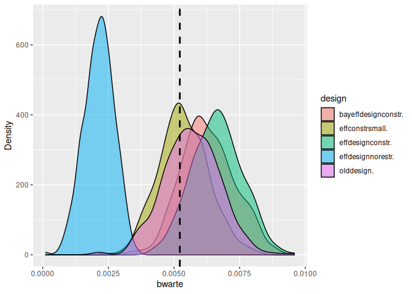

<!-- README.md is generated from README.Rmd. Please edit that file -->

# simulateDCE

<!-- badges: start -->
<!-- badges: end -->

The goal of simulateDCE is to make it easy to simulate choice experiment
datasets using designs from NGENE or `spdesign`. You have to store the
design file in a subfolder and need to specify certain parameters and
the utility functions for the data generating process. The package is
useful for

1.  Test different designs in terms of statistical power, efficiency and
    unbiasedness

2.  To test the effects of deviations from RUM, e.g. heuristics, on
    model performance for different designs.

3.  In teaching, using simulated data is useful, if you want to know the
    data generating process. It helps to demonstrate Maximum likelihood
    and choice models, knowing exactly what you should expect.

4.  You can use simulation in pre-registration to justify your sample
    size and design choice.

5.  Before data collection, you can use simulated data to estimate the
    models you plan to use in the actual analysis. You can thus make
    sure, you can estimate all effects for given sample sizes.

## Installation

You can install the development version of simulateDCE from gitlab. You
need to install the `remotes` package first. The current version is
alpha and there is no version on cran:

``` r
install.packages("remotes")
remotes::install_gitlab(repo = "dj44vuri/simulateDCE" , host = "https://git.idiv.de")
```

## Example

This is a basic example for a simulation:

``` r

rm(list=ls())
library(simulateDCE)
library(rlang)
library(formula.tools)
#> 
#> Attaching package: 'formula.tools'
#> The following object is masked from 'package:rlang':
#> 
#>     env


library(rlang)

designpath<- system.file("extdata","SE_DRIVE" ,package = "simulateDCE")

resps =120  # number of respondents
nosim= 2 # number of simulations to run (about 500 is minimum)


# bpreis = -0.036
# blade  = -0.034
# bwarte = -0.049


decisiongroups=c(0,0.7,1)

# wrong parameters

#
bpreis = -0.01
blade = -0.07
bwarte = 0.02

manipulations = list(alt1.x2=     expr(alt1.x2/10),
                     alt1.x3=     expr(alt1.x3/10),
                     alt2.x2=     expr(alt2.x2/10),
                     alt2.x3=     expr(alt2.x3/10)
)


#place your utility functions here
ul<-list( u1 =

           list(
             v1 =V.1~  bpreis * alt1.x1 + blade*alt1.x2 + bwarte*alt1.x3   ,
             v2 =V.2~  bpreis * alt2.x1 + blade*alt2.x2 + bwarte*alt2.x3
           )

         ,
         u2 = list(  v1 =V.1~  bpreis * alt1.x1    ,
                     v2 =V.2~  bpreis * alt2.x1)

)


destype="ngene"

sedrive <- sim_all(nosim = nosim, resps=resps, destype = destype,
                   designpath = designpath, u=ul)
#> Utility function used in simulation, ie the true utility: 
#> 
#> $u1
#> $u1$v1
#> V.1 ~ bpreis * alt1.x1 + blade * alt1.x2 + bwarte * alt1.x3
#> 
#> $u1$v2
#> V.2 ~ bpreis * alt2.x1 + blade * alt2.x2 + bwarte * alt2.x3
#> 
#> 
#> $u2
#> $u2$v1
#> V.1 ~ bpreis * alt1.x1
#> 
#> $u2$v2
#> V.2 ~ bpreis * alt2.x1
#> 
#> 
#> Utility function used for Logit estimation with mixl: 
#> 
#> [1] "U_1 = @bpreis *$alt1_x1 + @blade *$alt1_x2 + @bwarte *$alt1_x3 ;U_2 = @bpreis *$alt2_x1 + @blade *$alt2_x2 + @bwarte *$alt2_x3 ;"
#> New names:
#> • `Choice situation` -> `Choice.situation`
#> • `` -> `...10`
#>  
#>  does sou_gis exist:  FALSE 
#> 
#>  dataset final_set exists:  FALSE 
#> 
#>  decisiongroups exists:  TRUE
#>    1    2 
#> 1007  433 
#> 
#>  data has been made 
#> 
#>  First few observations 
#>    ID Choice_situation alt1_x1 alt1_x2 alt1_x3 alt2_x1 alt2_x2 alt2_x3 Block
#> 1  1                7      80     2.5    10.0      60    20.0      10     1
#> 2  1               19      20     2.5     5.0      60     2.5       0     1
#> 3  1               30      20    10.0     5.0      80     5.0      10     1
#> 4  1               32      40    20.0     2.5      80     2.5       0     1
#> 5  1               39      40    20.0     0.0      80    10.0      10     1
#> 6  1               48      60     5.0     2.5      20     5.0      10     1
#>   group    V_1    V_2         e_1         e_2       U_1        U_2 CHOICE
#> 1     1 -0.775 -1.800 -0.28937157  2.15097352 -1.064372  0.3509735      2
#> 2     1 -0.275 -0.775 -0.96139278 -0.20476786 -1.236393 -0.9797679      2
#> 3     1 -0.800 -0.950 -1.22764761 -0.06043672 -2.027648 -1.0104367      2
#> 4     1 -1.750 -0.975 -0.01653508  0.83311025 -1.766535 -0.1418897      2
#> 5     1 -1.800 -1.300  0.55064443 -0.20286674 -1.249356 -1.5028667      1
#> 6     1 -0.900 -0.350 -0.31623091  0.72473769 -1.216231  0.3747377      2
#> 
#>  
#>  This is Run number  1 
#>  does sou_gis exist:  FALSE 
#> 
#>  dataset final_set exists:  FALSE 
#> 
#>  decisiongroups exists:  TRUE
#>    1    2 
#> 1007  433 
#> 
#>  data has been made 
#> 
#>  First few observations 
#>    ID Choice_situation alt1_x1 alt1_x2 alt1_x3 alt2_x1 alt2_x2 alt2_x3 Block
#> 1  1                7      80     2.5    10.0      60    20.0      10     1
#> 2  1               19      20     2.5     5.0      60     2.5       0     1
#> 3  1               30      20    10.0     5.0      80     5.0      10     1
#> 4  1               32      40    20.0     2.5      80     2.5       0     1
#> 5  1               39      40    20.0     0.0      80    10.0      10     1
#> 6  1               48      60     5.0     2.5      20     5.0      10     1
#>   group    V_1    V_2        e_1        e_2        U_1        U_2 CHOICE
#> 1     1 -0.775 -1.800  0.4008023  4.3514331 -0.3741977  2.5514331      2
#> 2     1 -0.275 -0.775 -0.1892883 -0.7606078 -0.4642883 -1.5356078      1
#> 3     1 -0.800 -0.950  1.2266380 -0.2061132  0.4266380 -1.1561132      1
#> 4     1 -1.750 -0.975  1.5461599 -0.9432939 -0.2038401 -1.9182939      1
#> 5     1 -1.800 -1.300 -0.9309889  1.7478688 -2.7309889  0.4478688      2
#> 6     1 -0.900 -0.350  1.3557092  1.1181441  0.4557092  0.7681441      2
#> 
#>  
#>  This is the utility functions 
#>  U_1 = @bpreis *$alt1_x1 + @blade *$alt1_x2 + @bwarte *$alt1_x3 ;U_2 = @bpreis *$alt2_x1 + @blade *$alt2_x2 + @bwarte *$alt2_x3 ;Initial function value: -998.1319 
#> Initial gradient value:
#> bpreis  blade bwarte 
#>    140  -1110    320 
#> initial  value 998.131940 
#> iter   2 value 987.542841
#> iter   3 value 976.359534
#> iter   4 value 976.315710
#> iter   5 value 971.176423
#> iter   6 value 971.173751
#> iter   6 value 971.173748
#> iter   6 value 971.173748
#> final  value 971.173748 
#> converged
#> This is Run number  2 
#>  does sou_gis exist:  FALSE 
#> 
#>  dataset final_set exists:  FALSE 
#> 
#>  decisiongroups exists:  TRUE
#>    1    2 
#> 1007  433 
#> 
#>  data has been made 
#> 
#>  First few observations 
#>    ID Choice_situation alt1_x1 alt1_x2 alt1_x3 alt2_x1 alt2_x2 alt2_x3 Block
#> 1  1                7      80     2.5    10.0      60    20.0      10     1
#> 2  1               19      20     2.5     5.0      60     2.5       0     1
#> 3  1               30      20    10.0     5.0      80     5.0      10     1
#> 4  1               32      40    20.0     2.5      80     2.5       0     1
#> 5  1               39      40    20.0     0.0      80    10.0      10     1
#> 6  1               48      60     5.0     2.5      20     5.0      10     1
#>   group    V_1    V_2        e_1         e_2        U_1        U_2 CHOICE
#> 1     1 -0.775 -1.800 0.93025769  2.47570731  0.1552577  0.6757073      2
#> 2     1 -0.275 -0.775 1.60707885 -0.35547058  1.3320789 -1.1304706      1
#> 3     1 -0.800 -0.950 1.27471866 -0.07559595  0.4747187 -1.0255960      1
#> 4     1 -1.750 -0.975 0.39775368 -0.33144802 -1.3522463 -1.3064480      2
#> 5     1 -1.800 -1.300 1.28873901  1.16104216 -0.5112610 -0.1389578      2
#> 6     1 -0.900 -0.350 0.05237432  0.77241297 -0.8476257  0.4224130      2
#> 
#>  
#>  This is the utility functions 
#>  U_1 = @bpreis *$alt1_x1 + @blade *$alt1_x2 + @bwarte *$alt1_x3 ;U_2 = @bpreis *$alt2_x1 + @blade *$alt2_x2 + @bwarte *$alt2_x3 ;Initial function value: -998.1319 
#> Initial gradient value:
#> bpreis  blade bwarte 
#>   -520   -925    320 
#> initial  value 998.131940 
#> iter   2 value 989.267873
#> iter   3 value 979.462597
#> iter   4 value 979.399625
#> iter   5 value 974.067680
#> iter   6 value 974.065735
#> iter   6 value 974.065733
#> iter   6 value 974.065733
#> final  value 974.065733 
#> converged
#> 
#> 
#> ================  ====  ===  =====  ====  =====  =====  =====  ====
#> \                 vars    n   mean    sd    min    max  range    se
#> ================  ====  ===  =====  ====  =====  =====  =====  ====
#> est_bpreis           1    2  -0.01  0.00  -0.01  -0.01   0.00  0.00
#> est_blade            2    2  -0.05  0.00  -0.05  -0.04   0.00  0.00
#> est_bwarte           3    2   0.01  0.00   0.01   0.01   0.00  0.00
#> rob_pval0_bpreis     4    2   0.00  0.00   0.00   0.00   0.00  0.00
#> rob_pval0_blade      5    2   0.00  0.00   0.00   0.00   0.00  0.00
#> rob_pval0_bwarte     6    2   0.34  0.02   0.33   0.36   0.03  0.01
#> ================  ====  ===  =====  ====  =====  =====  =====  ====
#> 
#> FALSE 
#>   100 
#> Utility function used in simulation, ie the true utility: 
#> 
#> $u1
#> $u1$v1
#> V.1 ~ bpreis * alt1.x1 + blade * alt1.x2 + bwarte * alt1.x3
#> 
#> $u1$v2
#> V.2 ~ bpreis * alt2.x1 + blade * alt2.x2 + bwarte * alt2.x3
#> 
#> 
#> $u2
#> $u2$v1
#> V.1 ~ bpreis * alt1.x1
#> 
#> $u2$v2
#> V.2 ~ bpreis * alt2.x1
#> 
#> 
#> Utility function used for Logit estimation with mixl: 
#> 
#> [1] "U_1 = @bpreis *$alt1_x1 + @blade *$alt1_x2 + @bwarte *$alt1_x3 ;U_2 = @bpreis *$alt2_x1 + @blade *$alt2_x2 + @bwarte *$alt2_x3 ;"
#> New names:
#> • `Choice situation` -> `Choice.situation`
#> • `` -> `...10`
#>  
#>  does sou_gis exist:  FALSE 
#> 
#>  dataset final_set exists:  FALSE 
#> 
#>  decisiongroups exists:  TRUE
#>    1    2 
#> 1007  433 
#> 
#>  data has been made 
#> 
#>  First few observations 
#>    ID Choice_situation alt1_x1 alt1_x2 alt1_x3 alt2_x1 alt2_x2 alt2_x3 Block
#> 1  1               12      60     2.5     0.0      20    20.0      10     1
#> 2  1               16      20    10.0     5.0      40     5.0       0     1
#> 3  1               17      20    20.0     0.0      80    10.0      10     1
#> 4  1               25      60     5.0    10.0      20    20.0       5     1
#> 5  1               29      20     5.0    10.0      80     5.0       0     1
#> 6  1               32      40    10.0     2.5      80     2.5       5     1
#>   group    V_1    V_2        e_1        e_2        U_1        U_2 CHOICE
#> 1     1 -0.775 -1.400  0.5000790 -1.2708067 -0.2749210 -2.6708067      1
#> 2     1 -0.800 -0.750 -1.9947176 -0.6174753 -2.7947176 -1.3674753      2
#> 3     1 -1.600 -1.300  0.6003003  1.1010281 -0.9996997 -0.1989719      2
#> 4     1 -0.750 -1.500 -1.2502306  2.4331480 -2.0002306  0.9331480      2
#> 5     1 -0.350 -1.150  0.1058614  1.8360816 -0.2441386  0.6860816      2
#> 6     1 -1.050 -0.875  1.8917336  0.7028783  0.8417336 -0.1721217      1
#> 
#>  
#>  This is Run number  1 
#>  does sou_gis exist:  FALSE 
#> 
#>  dataset final_set exists:  FALSE 
#> 
#>  decisiongroups exists:  TRUE
#>    1    2 
#> 1007  433 
#> 
#>  data has been made 
#> 
#>  First few observations 
#>    ID Choice_situation alt1_x1 alt1_x2 alt1_x3 alt2_x1 alt2_x2 alt2_x3 Block
#> 1  1               12      60     2.5     0.0      20    20.0      10     1
#> 2  1               16      20    10.0     5.0      40     5.0       0     1
#> 3  1               17      20    20.0     0.0      80    10.0      10     1
#> 4  1               25      60     5.0    10.0      20    20.0       5     1
#> 5  1               29      20     5.0    10.0      80     5.0       0     1
#> 6  1               32      40    10.0     2.5      80     2.5       5     1
#>   group    V_1    V_2       e_1        e_2        U_1        U_2 CHOICE
#> 1     1 -0.775 -1.400 2.6464470  1.8930848  1.8714470  0.4930848      1
#> 2     1 -0.800 -0.750 0.6943881 -0.0951414 -0.1056119 -0.8451414      1
#> 3     1 -1.600 -1.300 3.0441699  2.6667389  1.4441699  1.3667389      1
#> 4     1 -0.750 -1.500 1.1984493  1.9151346  0.4484493  0.4151346      1
#> 5     1 -0.350 -1.150 3.5252196 -0.8557313  3.1752196 -2.0057313      1
#> 6     1 -1.050 -0.875 0.5099513 -0.4707311 -0.5400487 -1.3457311      1
#> 
#>  
#>  This is the utility functions 
#>  U_1 = @bpreis *$alt1_x1 + @blade *$alt1_x2 + @bwarte *$alt1_x3 ;U_2 = @bpreis *$alt2_x1 + @blade *$alt2_x2 + @bwarte *$alt2_x3 ;Initial function value: -998.1319 
#> Initial gradient value:
#>  bpreis   blade  bwarte 
#> -1440.0 -1057.5   510.0 
#> initial  value 998.131940 
#> iter   2 value 992.072549
#> iter   3 value 964.484472
#> iter   4 value 964.438157
#> iter   5 value 960.231915
#> iter   6 value 960.220989
#> iter   6 value 960.220975
#> iter   6 value 960.220975
#> final  value 960.220975 
#> converged
#> This is Run number  2 
#>  does sou_gis exist:  FALSE 
#> 
#>  dataset final_set exists:  FALSE 
#> 
#>  decisiongroups exists:  TRUE
#>    1    2 
#> 1007  433 
#> 
#>  data has been made 
#> 
#>  First few observations 
#>    ID Choice_situation alt1_x1 alt1_x2 alt1_x3 alt2_x1 alt2_x2 alt2_x3 Block
#> 1  1               12      60     2.5     0.0      20    20.0      10     1
#> 2  1               16      20    10.0     5.0      40     5.0       0     1
#> 3  1               17      20    20.0     0.0      80    10.0      10     1
#> 4  1               25      60     5.0    10.0      20    20.0       5     1
#> 5  1               29      20     5.0    10.0      80     5.0       0     1
#> 6  1               32      40    10.0     2.5      80     2.5       5     1
#>   group    V_1    V_2        e_1        e_2        U_1        U_2 CHOICE
#> 1     1 -0.775 -1.400 -0.8673571  0.5735753 -1.6423571 -0.8264247      2
#> 2     1 -0.800 -0.750  0.1338568  2.1243864 -0.6661432  1.3743864      2
#> 3     1 -1.600 -1.300  1.3074577 -0.1769248 -0.2925423 -1.4769248      1
#> 4     1 -0.750 -1.500  1.7452195 -0.7334989  0.9952195 -2.2334989      1
#> 5     1 -0.350 -1.150  3.2417667  0.8099365  2.8917667 -0.3400635      1
#> 6     1 -1.050 -0.875 -0.8125169 -0.6517018 -1.8625169 -1.5267018      2
#> 
#>  
#>  This is the utility functions 
#>  U_1 = @bpreis *$alt1_x1 + @blade *$alt1_x2 + @bwarte *$alt1_x3 ;U_2 = @bpreis *$alt2_x1 + @blade *$alt2_x2 + @bwarte *$alt2_x3 ;Initial function value: -998.1319 
#> Initial gradient value:
#>  bpreis   blade  bwarte 
#>  -640.0 -1295.0   362.5 
#> initial  value 998.131940 
#> iter   2 value 981.273463
#> iter   3 value 964.055548
#> iter   4 value 963.472083
#> iter   5 value 957.462611
#> iter   6 value 957.449595
#> iter   7 value 957.449577
#> iter   7 value 957.449577
#> iter   7 value 957.449577
#> final  value 957.449577 
#> converged
#> 
#> 
#> ================  ====  ===  =====  ====  =====  =====  =====  ====
#> \                 vars    n   mean    sd    min    max  range    se
#> ================  ====  ===  =====  ====  =====  =====  =====  ====
#> est_bpreis           1    2  -0.01  0.00  -0.01  -0.01   0.00  0.00
#> est_blade            2    2  -0.05  0.00  -0.06  -0.05   0.01  0.00
#> est_bwarte           3    2   0.01  0.01   0.00   0.01   0.01  0.01
#> rob_pval0_bpreis     4    2   0.00  0.00   0.00   0.00   0.00  0.00
#> rob_pval0_blade      5    2   0.00  0.00   0.00   0.00   0.00  0.00
#> rob_pval0_bwarte     6    2   0.53  0.52   0.16   0.90   0.74  0.37
#> ================  ====  ===  =====  ====  =====  =====  =====  ====
#> 
#> FALSE 
#>   100 
#> Utility function used in simulation, ie the true utility: 
#> 
#> $u1
#> $u1$v1
#> V.1 ~ bpreis * alt1.x1 + blade * alt1.x2 + bwarte * alt1.x3
#> 
#> $u1$v2
#> V.2 ~ bpreis * alt2.x1 + blade * alt2.x2 + bwarte * alt2.x3
#> 
#> 
#> $u2
#> $u2$v1
#> V.1 ~ bpreis * alt1.x1
#> 
#> $u2$v2
#> V.2 ~ bpreis * alt2.x1
#> 
#> 
#> Utility function used for Logit estimation with mixl: 
#> 
#> [1] "U_1 = @bpreis *$alt1_x1 + @blade *$alt1_x2 + @bwarte *$alt1_x3 ;U_2 = @bpreis *$alt2_x1 + @blade *$alt2_x2 + @bwarte *$alt2_x3 ;"
#> New names:
#> • `Choice situation` -> `Choice.situation`
#> • `` -> `...10`
#>  
#>  does sou_gis exist:  FALSE 
#> 
#>  dataset final_set exists:  FALSE 
#> 
#>  decisiongroups exists:  TRUE
#>    1    2 
#> 1007  433 
#> 
#>  data has been made 
#> 
#>  First few observations 
#>    ID Choice_situation alt1_x1 alt1_x2 alt1_x3 alt2_x1 alt2_x2 alt2_x3 Block
#> 1  1                3      80     5.0     0.0      20     5.0    10.0     1
#> 2  1                5      60     2.5     5.0      20    20.0     5.0     1
#> 3  1               10      80     2.5     2.5      20    20.0     0.0     1
#> 4  1               34      80     2.5     5.0      60     5.0     5.0     1
#> 5  1               37      40     5.0    10.0      60     5.0     2.5     1
#> 6  1               39      20    20.0     2.5      60     2.5     2.5     1
#>   group    V_1    V_2         e_1          e_2         U_1        U_2 CHOICE
#> 1     1 -1.150 -0.350 1.018356215 -0.622267218 -0.13164379 -0.9722672      1
#> 2     1 -0.675 -1.500 2.065375543  0.448415040  1.39037554 -1.0515850      1
#> 3     1 -0.925 -1.600 0.068572712  0.001884789 -0.85642729 -1.5981152      1
#> 4     1 -0.875 -0.850 4.451064209 -0.131594375  3.57606421 -0.9815944      1
#> 5     1 -0.550 -0.900 0.001325549  1.769899979 -0.54867445  0.8699000      2
#> 6     1 -1.550 -0.725 1.585052229 -0.559602808  0.03505223 -1.2846028      1
#> 
#>  
#>  This is Run number  1 
#>  does sou_gis exist:  FALSE 
#> 
#>  dataset final_set exists:  FALSE 
#> 
#>  decisiongroups exists:  TRUE
#>    1    2 
#> 1007  433 
#> 
#>  data has been made 
#> 
#>  First few observations 
#>    ID Choice_situation alt1_x1 alt1_x2 alt1_x3 alt2_x1 alt2_x2 alt2_x3 Block
#> 1  1                3      80     5.0     0.0      20     5.0    10.0     1
#> 2  1                5      60     2.5     5.0      20    20.0     5.0     1
#> 3  1               10      80     2.5     2.5      20    20.0     0.0     1
#> 4  1               34      80     2.5     5.0      60     5.0     5.0     1
#> 5  1               37      40     5.0    10.0      60     5.0     2.5     1
#> 6  1               39      20    20.0     2.5      60     2.5     2.5     1
#>   group    V_1    V_2         e_1        e_2         U_1        U_2 CHOICE
#> 1     1 -1.150 -0.350 -0.08786308 -0.5863325 -1.23786308 -0.9363325      2
#> 2     1 -0.675 -1.500  0.06248520  1.0111311 -0.61251480 -0.4888689      2
#> 3     1 -0.925 -1.600  0.95443352 -0.3946771  0.02943352 -1.9946771      1
#> 4     1 -0.875 -0.850 -0.76545318  1.6682085 -1.64045318  0.8182085      2
#> 5     1 -0.550 -0.900  1.13173817 -0.3986287  0.58173817 -1.2986287      1
#> 6     1 -1.550 -0.725  3.42387572  1.2824413  1.87387572  0.5574413      1
#> 
#>  
#>  This is the utility functions 
#>  U_1 = @bpreis *$alt1_x1 + @blade *$alt1_x2 + @bwarte *$alt1_x3 ;U_2 = @bpreis *$alt2_x1 + @blade *$alt2_x2 + @bwarte *$alt2_x3 ;Initial function value: -998.1319 
#> Initial gradient value:
#>  bpreis   blade  bwarte 
#>  -960.0 -1017.5   245.0 
#> initial  value 998.131940 
#> iter   2 value 994.181427
#> iter   3 value 972.722564
#> iter   4 value 971.807620
#> iter   5 value 969.894601
#> iter   6 value 969.892112
#> iter   6 value 969.892111
#> iter   6 value 969.892111
#> final  value 969.892111 
#> converged
#> This is Run number  2 
#>  does sou_gis exist:  FALSE 
#> 
#>  dataset final_set exists:  FALSE 
#> 
#>  decisiongroups exists:  TRUE
#>    1    2 
#> 1007  433 
#> 
#>  data has been made 
#> 
#>  First few observations 
#>    ID Choice_situation alt1_x1 alt1_x2 alt1_x3 alt2_x1 alt2_x2 alt2_x3 Block
#> 1  1                3      80     5.0     0.0      20     5.0    10.0     1
#> 2  1                5      60     2.5     5.0      20    20.0     5.0     1
#> 3  1               10      80     2.5     2.5      20    20.0     0.0     1
#> 4  1               34      80     2.5     5.0      60     5.0     5.0     1
#> 5  1               37      40     5.0    10.0      60     5.0     2.5     1
#> 6  1               39      20    20.0     2.5      60     2.5     2.5     1
#>   group    V_1    V_2        e_1         e_2        U_1        U_2 CHOICE
#> 1     1 -1.150 -0.350  0.6747222  0.25151850 -0.4752778 -0.0984815      2
#> 2     1 -0.675 -1.500  1.8163839 -0.09688587  1.1413839 -1.5968859      1
#> 3     1 -0.925 -1.600 -0.8974158  3.69592175 -1.8224158  2.0959217      2
#> 4     1 -0.875 -0.850 -0.5523539  3.18018561 -1.4273539  2.3301856      2
#> 5     1 -0.550 -0.900 -1.0057814  0.20974090 -1.5557814 -0.6902591      2
#> 6     1 -1.550 -0.725  0.9409876  0.52310305 -0.6090124 -0.2018970      2
#> 
#>  
#>  This is the utility functions 
#>  U_1 = @bpreis *$alt1_x1 + @blade *$alt1_x2 + @bwarte *$alt1_x3 ;U_2 = @bpreis *$alt2_x1 + @blade *$alt2_x2 + @bwarte *$alt2_x3 ;Initial function value: -998.1319 
#> Initial gradient value:
#>  bpreis   blade  bwarte 
#> -2920.0  -597.5   467.5 
#> initial  value 998.131940 
#> iter   2 value 988.559582
#> iter   3 value 984.350429
#> iter   4 value 984.238420
#> iter   5 value 967.198497
#> iter   6 value 967.168244
#> iter   7 value 967.168103
#> iter   7 value 967.168103
#> iter   7 value 967.168103
#> final  value 967.168103 
#> converged
#> 
#> 
#> ================  ====  ===  =====  ====  =====  =====  =====  ====
#> \                 vars    n   mean    sd    min    max  range    se
#> ================  ====  ===  =====  ====  =====  =====  =====  ====
#> est_bpreis           1    2  -0.01  0.00  -0.01  -0.01   0.00  0.00
#> est_blade            2    2  -0.04  0.01  -0.05  -0.04   0.01  0.00
#> est_bwarte           3    2   0.00  0.01  -0.01   0.01   0.01  0.01
#> rob_pval0_bpreis     4    2   0.00  0.00   0.00   0.00   0.00  0.00
#> rob_pval0_blade      5    2   0.00  0.00   0.00   0.00   0.00  0.00
#> rob_pval0_bwarte     6    2   0.52  0.11   0.44   0.59   0.15  0.07
#> ================  ====  ===  =====  ====  =====  =====  =====  ====
#> 
#> FALSE 
#>   100 
#> Utility function used in simulation, ie the true utility: 
#> 
#> $u1
#> $u1$v1
#> V.1 ~ bpreis * alt1.x1 + blade * alt1.x2 + bwarte * alt1.x3
#> 
#> $u1$v2
#> V.2 ~ bpreis * alt2.x1 + blade * alt2.x2 + bwarte * alt2.x3
#> 
#> 
#> $u2
#> $u2$v1
#> V.1 ~ bpreis * alt1.x1
#> 
#> $u2$v2
#> V.2 ~ bpreis * alt2.x1
#> 
#> 
#> Utility function used for Logit estimation with mixl: 
#> 
#> [1] "U_1 = @bpreis *$alt1_x1 + @blade *$alt1_x2 + @bwarte *$alt1_x3 ;U_2 = @bpreis *$alt2_x1 + @blade *$alt2_x2 + @bwarte *$alt2_x3 ;"
#> New names:
#> • `Choice situation` -> `Choice.situation`
#> • `` -> `...10`
#>  
#>  does sou_gis exist:  FALSE 
#> 
#>  dataset final_set exists:  FALSE 
#> 
#>  decisiongroups exists:  TRUE
#>    1    2 
#> 1007  433 
#> 
#>  data has been made 
#> 
#>  First few observations 
#>    ID Choice_situation alt1_x1 alt1_x2 alt1_x3 alt2_x1 alt2_x2 alt2_x3 Block
#> 1  1                9      80     5.0       0      60    20.0    10.0     1
#> 2  1               12      60     2.5      10      40    20.0     0.0     1
#> 3  1               13      20    20.0      10      80     2.5     0.0     1
#> 4  1               70      80     5.0      10      20    20.0     2.5     1
#> 5  1               71      60    20.0      10      80    10.0     0.0     1
#> 6  1               73      60    10.0       0      40    20.0    10.0     1
#>   group    V_1    V_2          e_1        e_2        U_1         U_2 CHOICE
#> 1     1 -1.150 -1.800  0.458928485  2.0701754 -0.6910715  0.27017541      2
#> 2     1 -0.575 -1.800  0.253655240 -0.6611997 -0.3213448 -2.46119970      1
#> 3     1 -1.400 -0.975 -0.102031250  0.2036489 -1.5020312 -0.77135113      2
#> 4     1 -0.950 -1.550 -0.559421410  0.8864091 -1.5094214 -0.66359093      2
#> 5     1 -1.800 -1.500  5.674505169  1.5661040  3.8745052  0.06610405      1
#> 6     1 -1.300 -1.600 -0.002309409  1.5711319 -1.3023094 -0.02886812      2
#> 
#>  
#>  This is Run number  1 
#>  does sou_gis exist:  FALSE 
#> 
#>  dataset final_set exists:  FALSE 
#> 
#>  decisiongroups exists:  TRUE
#>    1    2 
#> 1007  433 
#> 
#>  data has been made 
#> 
#>  First few observations 
#>    ID Choice_situation alt1_x1 alt1_x2 alt1_x3 alt2_x1 alt2_x2 alt2_x3 Block
#> 1  1                9      80     5.0       0      60    20.0    10.0     1
#> 2  1               12      60     2.5      10      40    20.0     0.0     1
#> 3  1               13      20    20.0      10      80     2.5     0.0     1
#> 4  1               70      80     5.0      10      20    20.0     2.5     1
#> 5  1               71      60    20.0      10      80    10.0     0.0     1
#> 6  1               73      60    10.0       0      40    20.0    10.0     1
#>   group    V_1    V_2         e_1         e_2       U_1        U_2 CHOICE
#> 1     1 -1.150 -1.800 -0.01463130 -0.22509832 -1.164631 -2.0250983      1
#> 2     1 -0.575 -1.800  2.36022782 -0.36376052  1.785228 -2.1637605      1
#> 3     1 -1.400 -0.975  1.59659499 -0.13121663  0.196595 -1.1062166      1
#> 4     1 -0.950 -1.550 -1.33824416  1.40724463 -2.288244 -0.1427554      2
#> 5     1 -1.800 -1.500  0.49308644  1.66211472 -1.306914  0.1621147      2
#> 6     1 -1.300 -1.600  0.04407743  0.04227857 -1.255923 -1.5577214      1
#> 
#>  
#>  This is the utility functions 
#>  U_1 = @bpreis *$alt1_x1 + @blade *$alt1_x2 + @bwarte *$alt1_x3 ;U_2 = @bpreis *$alt2_x1 + @blade *$alt2_x2 + @bwarte *$alt2_x3 ;Initial function value: -998.1319 
#> Initial gradient value:
#>  bpreis   blade  bwarte 
#> -2640.0 -3282.5  1152.5 
#> initial  value 998.131940 
#> iter   2 value 963.302525
#> iter   3 value 925.984100
#> iter   4 value 925.959587
#> iter   5 value 905.721674
#> iter   6 value 905.488066
#> iter   7 value 905.484178
#> iter   7 value 905.484176
#> iter   7 value 905.484176
#> final  value 905.484176 
#> converged
#> This is Run number  2 
#>  does sou_gis exist:  FALSE 
#> 
#>  dataset final_set exists:  FALSE 
#> 
#>  decisiongroups exists:  TRUE
#>    1    2 
#> 1007  433 
#> 
#>  data has been made 
#> 
#>  First few observations 
#>    ID Choice_situation alt1_x1 alt1_x2 alt1_x3 alt2_x1 alt2_x2 alt2_x3 Block
#> 1  1                9      80     5.0       0      60    20.0    10.0     1
#> 2  1               12      60     2.5      10      40    20.0     0.0     1
#> 3  1               13      20    20.0      10      80     2.5     0.0     1
#> 4  1               70      80     5.0      10      20    20.0     2.5     1
#> 5  1               71      60    20.0      10      80    10.0     0.0     1
#> 6  1               73      60    10.0       0      40    20.0    10.0     1
#>   group    V_1    V_2        e_1         e_2        U_1        U_2 CHOICE
#> 1     1 -1.150 -1.800  3.0041977  0.38322958  1.8541977 -1.4167704      1
#> 2     1 -0.575 -1.800  3.0101002  0.72197923  2.4351002 -1.0780208      1
#> 3     1 -1.400 -0.975  1.1260977  0.06998784 -0.2739023 -0.9050122      1
#> 4     1 -0.950 -1.550  1.9511131  0.39768983  1.0011131 -1.1523102      1
#> 5     1 -1.800 -1.500 -0.4686622 -0.83175553 -2.2686622 -2.3317555      1
#> 6     1 -1.300 -1.600  1.5102954  0.98561984  0.2102954 -0.6143802      1
#> 
#>  
#>  This is the utility functions 
#>  U_1 = @bpreis *$alt1_x1 + @blade *$alt1_x2 + @bwarte *$alt1_x3 ;U_2 = @bpreis *$alt2_x1 + @blade *$alt2_x2 + @bwarte *$alt2_x3 ;Initial function value: -998.1319 
#> Initial gradient value:
#>  bpreis   blade  bwarte 
#> -2840.0 -2792.5   980.0 
#> initial  value 998.131940 
#> iter   2 value 970.451816
#> iter   3 value 943.596118
#> iter   4 value 943.593445
#> iter   5 value 937.085850
#> iter   6 value 927.191585
#> iter   7 value 927.129298
#> iter   8 value 927.128981
#> iter   8 value 927.128980
#> final  value 927.128980 
#> converged
#> 
#> 
#> ================  ====  ===  =====  ====  =====  =====  =====  ====
#> \                 vars    n   mean    sd    min    max  range    se
#> ================  ====  ===  =====  ====  =====  =====  =====  ====
#> est_bpreis           1    2  -0.01  0.00  -0.01  -0.01   0.00  0.00
#> est_blade            2    2  -0.04  0.00  -0.05  -0.04   0.01  0.00
#> est_bwarte           3    2   0.01  0.00   0.01   0.02   0.00  0.00
#> rob_pval0_bpreis     4    2   0.00  0.00   0.00   0.00   0.00  0.00
#> rob_pval0_blade      5    2   0.00  0.00   0.00   0.00   0.00  0.00
#> rob_pval0_bwarte     6    2   0.05  0.06   0.01   0.09   0.08  0.04
#> ================  ====  ===  =====  ====  =====  =====  =====  ====
#> 
#> FALSE  TRUE 
#>    50    50 
#> Utility function used in simulation, ie the true utility: 
#> 
#> $u1
#> $u1$v1
#> V.1 ~ bpreis * alt1.x1 + blade * alt1.x2 + bwarte * alt1.x3
#> 
#> $u1$v2
#> V.2 ~ bpreis * alt2.x1 + blade * alt2.x2 + bwarte * alt2.x3
#> 
#> 
#> $u2
#> $u2$v1
#> V.1 ~ bpreis * alt1.x1
#> 
#> $u2$v2
#> V.2 ~ bpreis * alt2.x1
#> 
#> 
#> Utility function used for Logit estimation with mixl: 
#> 
#> [1] "U_1 = @bpreis *$alt1_x1 + @blade *$alt1_x2 + @bwarte *$alt1_x3 ;U_2 = @bpreis *$alt2_x1 + @blade *$alt2_x2 + @bwarte *$alt2_x3 ;"
#> New names:
#> • `Choice situation` -> `Choice.situation`
#>  
#>  does sou_gis exist:  FALSE 
#> 
#>  dataset final_set exists:  FALSE 
#> 
#>  decisiongroups exists:  TRUE
#>    1    2 
#> 1007  433 
#> 
#>  data has been made 
#> 
#>  First few observations 
#>    ID Choice_situation Block alt1_x1 alt2_x1 alt1_x2 alt2_x2 alt1_x3 alt2_x3
#> 1  1                1     1      80      20     2.5    20.0      10       5
#> 2  1                2     1      60      40     5.0    10.0       5      10
#> 3  1                3     1      60      20    20.0    20.0       0      10
#> 4  1                4     1      20      80    20.0     2.5       0      10
#> 5  1                5     1      40      80    10.0     5.0      10       5
#> 6  1                6     1      60      80     5.0     2.5       0       0
#>   group    V_1    V_2       e_1        e_2        U_1          U_2 CHOICE
#> 1     1 -0.775 -1.500 0.1987193 -1.0900058 -0.5762807 -2.590005753      1
#> 2     1 -0.850 -0.900 0.2937177  1.3988380 -0.5562823  0.498837973      2
#> 3     1 -2.000 -1.400 1.2142542  0.5244772 -0.7857458 -0.875522760      1
#> 4     1 -1.600 -0.775 2.2587676  0.2695545  0.6587676 -0.505445461      1
#> 5     1 -0.900 -1.050 0.7958478  1.0485339 -0.1041522 -0.001466141      2
#> 6     1 -0.950 -0.975 0.3019734 -0.4699530 -0.6480266 -1.444953045      1
#> 
#>  
#>  This is Run number  1 
#>  does sou_gis exist:  FALSE 
#> 
#>  dataset final_set exists:  FALSE 
#> 
#>  decisiongroups exists:  TRUE
#>    1    2 
#> 1007  433 
#> 
#>  data has been made 
#> 
#>  First few observations 
#>    ID Choice_situation Block alt1_x1 alt2_x1 alt1_x2 alt2_x2 alt1_x3 alt2_x3
#> 1  1                1     1      80      20     2.5    20.0      10       5
#> 2  1                2     1      60      40     5.0    10.0       5      10
#> 3  1                3     1      60      20    20.0    20.0       0      10
#> 4  1                4     1      20      80    20.0     2.5       0      10
#> 5  1                5     1      40      80    10.0     5.0      10       5
#> 6  1                6     1      60      80     5.0     2.5       0       0
#>   group    V_1    V_2        e_1        e_2        U_1        U_2 CHOICE
#> 1     1 -0.775 -1.500 -0.3472514  2.3168155 -1.1222514  0.8168155      2
#> 2     1 -0.850 -0.900  0.2943507 -1.7082525 -0.5556493 -2.6082525      1
#> 3     1 -2.000 -1.400  0.4742717  1.1619537 -1.5257283 -0.2380463      2
#> 4     1 -1.600 -0.775  0.5628095  2.7090502 -1.0371905  1.9340502      2
#> 5     1 -0.900 -1.050 -0.2128470 -1.3149155 -1.1128470 -2.3649155      1
#> 6     1 -0.950 -0.975  1.6192730  0.3695527  0.6692730 -0.6054473      1
#> 
#>  
#>  This is the utility functions 
#>  U_1 = @bpreis *$alt1_x1 + @blade *$alt1_x2 + @bwarte *$alt1_x3 ;U_2 = @bpreis *$alt2_x1 + @blade *$alt2_x2 + @bwarte *$alt2_x3 ;Initial function value: -998.1319 
#> Initial gradient value:
#> bpreis  blade bwarte 
#> -620.0 -877.5  407.5 
#> initial  value 998.131940 
#> iter   2 value 991.196029
#> iter   3 value 975.595269
#> iter   4 value 975.571052
#> iter   5 value 971.582698
#> iter   6 value 971.577726
#> iter   6 value 971.577720
#> iter   6 value 971.577720
#> final  value 971.577720 
#> converged
#> This is Run number  2 
#>  does sou_gis exist:  FALSE 
#> 
#>  dataset final_set exists:  FALSE 
#> 
#>  decisiongroups exists:  TRUE
#>    1    2 
#> 1007  433 
#> 
#>  data has been made 
#> 
#>  First few observations 
#>    ID Choice_situation Block alt1_x1 alt2_x1 alt1_x2 alt2_x2 alt1_x3 alt2_x3
#> 1  1                1     1      80      20     2.5    20.0      10       5
#> 2  1                2     1      60      40     5.0    10.0       5      10
#> 3  1                3     1      60      20    20.0    20.0       0      10
#> 4  1                4     1      20      80    20.0     2.5       0      10
#> 5  1                5     1      40      80    10.0     5.0      10       5
#> 6  1                6     1      60      80     5.0     2.5       0       0
#>   group    V_1    V_2       e_1        e_2        U_1        U_2 CHOICE
#> 1     1 -0.775 -1.500 0.5287428  1.2994989 -0.2462572 -0.2005011      2
#> 2     1 -0.850 -0.900 3.2064378  0.4735037  2.3564378 -0.4264963      1
#> 3     1 -2.000 -1.400 1.2595242  0.1146570 -0.7404758 -1.2853430      1
#> 4     1 -1.600 -0.775 4.2748306 -0.7146858  2.6748306 -1.4896858      1
#> 5     1 -0.900 -1.050 0.1088246  2.2911218 -0.7911754  1.2411218      2
#> 6     1 -0.950 -0.975 1.1654639  1.3627596  0.2154639  0.3877596      2
#> 
#>  
#>  This is the utility functions 
#>  U_1 = @bpreis *$alt1_x1 + @blade *$alt1_x2 + @bwarte *$alt1_x3 ;U_2 = @bpreis *$alt2_x1 + @blade *$alt2_x2 + @bwarte *$alt2_x3 ;Initial function value: -998.1319 
#> Initial gradient value:
#>  bpreis   blade  bwarte 
#>  -580.0 -1077.5   495.0 
#> initial  value 998.131940 
#> iter   2 value 984.134259
#> iter   3 value 967.898748
#> iter   4 value 967.884812
#> iter   5 value 960.128712
#> iter   6 value 960.126933
#> iter   6 value 960.126928
#> iter   6 value 960.126928
#> final  value 960.126928 
#> converged
#> 
#> 
#> ================  ====  ===  =====  ====  =====  =====  =====  ====
#> \                 vars    n   mean    sd    min    max  range    se
#> ================  ====  ===  =====  ====  =====  =====  =====  ====
#> est_bpreis           1    2  -0.01  0.00  -0.01  -0.01   0.00  0.00
#> est_blade            2    2  -0.05  0.01  -0.06  -0.05   0.01  0.00
#> est_bwarte           3    2   0.02  0.00   0.02   0.02   0.01  0.00
#> rob_pval0_bpreis     4    2   0.00  0.00   0.00   0.00   0.00  0.00
#> rob_pval0_blade      5    2   0.00  0.00   0.00   0.00   0.00  0.00
#> rob_pval0_bwarte     6    2   0.11  0.04   0.08   0.13   0.05  0.03
#> ================  ====  ===  =====  ====  =====  =====  =====  ====
#> 
#> FALSE 
#>   100 
#> 32.978 sec elapsed
#> $tic
#> elapsed 
#>     0.8 
#> 
#> $toc
#> elapsed 
#>  33.778 
#> 
#> $msg
#> logical(0)
#> 
#> $callback_msg
#> [1] "32.978 sec elapsed"
```


