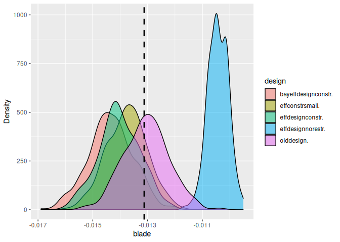

<!-- README.md is generated from README.Rmd. Please edit that file -->

# simulateDCE

<!-- badges: start -->
<!-- badges: end -->

The goal of simulateDCE is to make it easy to simulate choice experiment
datasets using designs from NGENE or `spdesign`. You have to store the
design file in a subfolder and need to specify certain parameters and
the utility functions for the data generating process. The package is
useful for

1.  Test different designs in terms of statistical power, efficiency and
    unbiasedness

2.  To test the effects of deviations from RUM, e.g. heuristics, on
    model performance for different designs.

3.  In teaching, using simulated data is useful, if you want to know the
    data generating process. It helps to demonstrate Maximum likelihood
    and choice models, knowing exactly what you should expect.

4.  You can use simulation in pre-registration to justify your sample
    size and design choice.

5.  Before data collection, you can use simulated data to estimate the
    models you plan to use in the actual analysis. You can thus make
    sure, you can estimate all effects for given sample sizes.

## Installation

You can install the development version of simulateDCE from gitlab. You
need to install the `remotes` package first. The current version is
alpha and there is no version on cran:

``` r
# FILL THIS IN! HOW CAN PEOPLE INSTALL YOUR DEV PACKAGE?
install.packages("remotes")
remotes::install_gitlab(repo = "dj44vuri/simulateDCE" , host = "https://git.idiv.de")
```

## Example

This is a basic example which shows you how to solve a common problem:

``` r
 library(simulateDCE)
library(rlang)

print("lests")
#> [1] "lests"

#set.seed(22233)

# Designpath indicates the folder where all designs that should be simulated are stored. Can be either ngd files (for NGENE) or Robjects for spdesign)
designpath<- system.file("extdata","SE_DRIVE" ,package = "simulateDCE")

# on your computer, it would be something like
# designpath <- "c:/myfancyDCE/Designs"


# number of respondents
resps =120

# number of simulations to run (about 200 is minimum if you want to be serious -- but it takes some time. always test your code with 2 simulations, and if it runs smoothly, go for more.)
nosim= 2 

# If you want to use different groups of respondents, use this. The following line means that you have one group of 70% size and one group of 30% size
decisiongroups=c(0,0.7,1)

# set the values of the parameters you want to use in the simulation
bpreis = -0.01
blade = -0.07
bwarte = 0.02

# If you want to do some manipulations in the design before you simulate, add a list called manipulations. Here, we devide some attributes by 10

manipulations = list(alt1.x2=     expr(alt1.x2/10),
                     alt1.x3=     expr(alt1.x3/10),
                     alt2.x2=     expr(alt2.x2/10),
                     alt2.x3=     expr(alt2.x3/10)
)


#place your utility functions here. We have two utility functions and two sets of utility functions. This is because we assume that 70% act according to the utility u1 and 30% act to the utility u2 (that is, they only decide according to the price and ignore the other attributes)
u<-list( u1 =

           list(
             v1 =V.1~  bpreis * alt1.x1 + blade*alt1.x2 + bwarte*alt1.x3   ,
             v2 =V.2~  bpreis * alt2.x1 + blade*alt2.x2 + bwarte*alt2.x3
           )

         ,
         u2 = list(  v1 =V.1~  bpreis * alt1.x1    ,
                     v2 =V.2~  bpreis * alt2.x1)

)

# specify the designtype "ngene" or "spdesign"
destype="ngene"


#lets go
sedrive <- simulateDCE::sim_all()
#> Utility function used in simulation, ie the true utility: 
#> 
#> $u1
#> $u1$v1
#> V.1 ~ bpreis * alt1.x1 + blade * alt1.x2 + bwarte * alt1.x3
#> 
#> $u1$v2
#> V.2 ~ bpreis * alt2.x1 + blade * alt2.x2 + bwarte * alt2.x3
#> 
#> 
#> $u2
#> $u2$v1
#> V.1 ~ bpreis * alt1.x1
#> 
#> $u2$v2
#> V.2 ~ bpreis * alt2.x1
#> 
#> 
#> Utility function used for Logit estimation with mixl: 
#> 
#> [1] "U_1 = @bpreis *$alt1_x1 + @blade *$alt1_x2 + @bwarte *$alt1_x3 ;U_2 = @bpreis *$alt2_x1 + @blade *$alt2_x2 + @bwarte *$alt2_x3 ;"
#> New names:
#> • `Choice situation` ->
#>   `Choice.situation`
#> • `` -> `...10`
#> Warning: One or more parsing issues, call
#> `problems()` on your data frame for
#> details, e.g.:
#>   dat <- vroom(...)
#>   problems(dat)
#>  
#>  does sou_gis exist:  FALSE 
#> 
#>  dataset final_set exists:  FALSE 
#> 
#>  decisiongroups exists:  TRUE
#>    1    2 
#> 1007  433 
#> 
#>  data has been made 
#> 
#>  First few observations 
#>    ID Choice_situation alt1_x1 alt1_x2
#> 1  1                7      80     2.5
#> 2  1               19      20     2.5
#> 3  1               30      20    10.0
#> 4  1               32      40    20.0
#> 5  1               39      40    20.0
#> 6  1               48      60     5.0
#>   alt1_x3 alt2_x1 alt2_x2 alt2_x3 Block
#> 1    10.0      60    20.0      10     1
#> 2     5.0      60     2.5       0     1
#> 3     5.0      80     5.0      10     1
#> 4     2.5      80     2.5       0     1
#> 5     0.0      80    10.0      10     1
#> 6     2.5      20     5.0      10     1
#>   group    V_1    V_2        e_1
#> 1     1 -0.775 -1.800  2.8927045
#> 2     1 -0.275 -0.775  2.1129458
#> 3     1 -0.800 -0.950 -0.3070059
#> 4     1 -1.750 -0.975  0.2125815
#> 5     1 -1.800 -1.300  0.5101632
#> 6     1 -0.900 -0.350 -0.9494807
#>           e_2       U_1       U_2 CHOICE
#> 1  0.09958433  2.117705 -1.700416      1
#> 2  3.47451776  1.837946  2.699518      2
#> 3 -0.28860974 -1.107006 -1.238610      1
#> 4  3.65240491 -1.537418  2.677405      2
#> 5 -0.14448942 -1.289837 -1.444489      1
#> 6 -1.04296995 -1.849481 -1.392970      2
#> 
#>  
#>  This is Run number  1 
#>  does sou_gis exist:  FALSE 
#> 
#>  dataset final_set exists:  FALSE 
#> 
#>  decisiongroups exists:  TRUE
#>    1    2 
#> 1007  433 
#> 
#>  data has been made 
#> 
#>  First few observations 
#>    ID Choice_situation alt1_x1 alt1_x2
#> 1  1                7      80     2.5
#> 2  1               19      20     2.5
#> 3  1               30      20    10.0
#> 4  1               32      40    20.0
#> 5  1               39      40    20.0
#> 6  1               48      60     5.0
#>   alt1_x3 alt2_x1 alt2_x2 alt2_x3 Block
#> 1    10.0      60    20.0      10     1
#> 2     5.0      60     2.5       0     1
#> 3     5.0      80     5.0      10     1
#> 4     2.5      80     2.5       0     1
#> 5     0.0      80    10.0      10     1
#> 6     2.5      20     5.0      10     1
#>   group    V_1    V_2         e_1
#> 1     1 -0.775 -1.800 -0.06362638
#> 2     1 -0.275 -0.775 -0.81571577
#> 3     1 -0.800 -0.950 -1.09388352
#> 4     1 -1.750 -0.975  0.28996875
#> 5     1 -1.800 -1.300  1.03059224
#> 6     1 -0.900 -0.350 -1.10504379
#>         e_2        U_1        U_2 CHOICE
#> 1 0.1958595 -0.8386264 -1.6041405      1
#> 2 0.1028995 -1.0907158 -0.6721005      2
#> 3 0.7165451 -1.8938835 -0.2334549      2
#> 4 1.4748351 -1.4600313  0.4998351      2
#> 5 4.5718398 -0.7694078  3.2718398      2
#> 6 0.8766732 -2.0050438  0.5266732      2
#> 
#>  
#>  This is the utility functions 
#>  U_1 = @bpreis *$alt1_x1 + @blade *$alt1_x2 + @bwarte *$alt1_x3 ;U_2 = @bpreis *$alt2_x1 + @blade *$alt2_x2 + @bwarte *$alt2_x3 ;Initial function value: -998.1319 
#> Initial gradient value:
#>  bpreis   blade  bwarte 
#>  -860.0 -1147.5   532.5 
#> initial  value 998.131940 
#> iter   2 value 988.178813
#> iter   3 value 959.683236
#> iter   4 value 959.648380
#> iter   5 value 955.999179
#> iter   6 value 955.979330
#> iter   7 value 955.979295
#> iter   7 value 955.979295
#> iter   7 value 955.979295
#> final  value 955.979295 
#> converged
#> This is Run number  2 
#>  does sou_gis exist:  FALSE 
#> 
#>  dataset final_set exists:  FALSE 
#> 
#>  decisiongroups exists:  TRUE
#>    1    2 
#> 1007  433 
#> 
#>  data has been made 
#> 
#>  First few observations 
#>    ID Choice_situation alt1_x1 alt1_x2
#> 1  1                7      80     2.5
#> 2  1               19      20     2.5
#> 3  1               30      20    10.0
#> 4  1               32      40    20.0
#> 5  1               39      40    20.0
#> 6  1               48      60     5.0
#>   alt1_x3 alt2_x1 alt2_x2 alt2_x3 Block
#> 1    10.0      60    20.0      10     1
#> 2     5.0      60     2.5       0     1
#> 3     5.0      80     5.0      10     1
#> 4     2.5      80     2.5       0     1
#> 5     0.0      80    10.0      10     1
#> 6     2.5      20     5.0      10     1
#>   group    V_1    V_2        e_1
#> 1     1 -0.775 -1.800 -0.8816771
#> 2     1 -0.275 -0.775  0.9004269
#> 3     1 -0.800 -0.950 -0.3108731
#> 4     1 -1.750 -0.975 -0.7695269
#> 5     1 -1.800 -1.300  2.8853455
#> 6     1 -0.900 -0.350 -0.1098324
#>          e_2        U_1         U_2
#> 1  0.6516580 -1.6566771 -1.14834197
#> 2  0.4584193  0.6254269 -0.31658066
#> 3  1.2184928 -1.1108731  0.26849278
#> 4 -0.1660211 -2.5195269 -1.14102109
#> 5 -0.5943992  1.0853455 -1.89439922
#> 6  0.3193140 -1.0098324 -0.03068595
#>   CHOICE
#> 1      2
#> 2      1
#> 3      2
#> 4      2
#> 5      1
#> 6      2
#> 
#>  
#>  This is the utility functions 
#>  U_1 = @bpreis *$alt1_x1 + @blade *$alt1_x2 + @bwarte *$alt1_x3 ;U_2 = @bpreis *$alt2_x1 + @blade *$alt2_x2 + @bwarte *$alt2_x3 ;Initial function value: -998.1319 
#> Initial gradient value:
#> bpreis  blade bwarte 
#>    120   -655    295 
#> initial  value 998.131940 
#> iter   2 value 994.305298
#> iter   3 value 990.053293
#> iter   4 value 989.940656
#> iter   5 value 987.629292
#> iter   6 value 987.628992
#> iter   6 value 987.628991
#> iter   6 value 987.628991
#> final  value 987.628991 
#> converged
#> 
#> 
#> ================  ====  ===  =====  ====  =====  =====  =====  ====
#> \                 vars    n   mean    sd    min    max  range    se
#> ================  ====  ===  =====  ====  =====  =====  =====  ====
#> est_bpreis           1    2  -0.01  0.01  -0.01   0.00   0.01  0.00
#> est_blade            2    2  -0.04  0.02  -0.06  -0.02   0.03  0.02
#> est_bwarte           3    2   0.02  0.00   0.02   0.03   0.01  0.00
#> rob_pval0_bpreis     4    2   0.04  0.06   0.00   0.09   0.09  0.04
#> rob_pval0_blade      5    2   0.00  0.00   0.00   0.00   0.00  0.00
#> rob_pval0_bwarte     6    2   0.04  0.03   0.02   0.06   0.04  0.02
#> ================  ====  ===  =====  ====  =====  =====  =====  ====
#> 
#> FALSE  TRUE 
#>    50    50 
#> Utility function used in simulation, ie the true utility: 
#> 
#> $u1
#> $u1$v1
#> V.1 ~ bpreis * alt1.x1 + blade * alt1.x2 + bwarte * alt1.x3
#> 
#> $u1$v2
#> V.2 ~ bpreis * alt2.x1 + blade * alt2.x2 + bwarte * alt2.x3
#> 
#> 
#> $u2
#> $u2$v1
#> V.1 ~ bpreis * alt1.x1
#> 
#> $u2$v2
#> V.2 ~ bpreis * alt2.x1
#> 
#> 
#> Utility function used for Logit estimation with mixl: 
#> 
#> [1] "U_1 = @bpreis *$alt1_x1 + @blade *$alt1_x2 + @bwarte *$alt1_x3 ;U_2 = @bpreis *$alt2_x1 + @blade *$alt2_x2 + @bwarte *$alt2_x3 ;"
#> New names:
#> • `Choice situation` ->
#>   `Choice.situation`
#> • `` -> `...10`
#> Warning: One or more parsing issues, call
#> `problems()` on your data frame for
#> details, e.g.:
#>   dat <- vroom(...)
#>   problems(dat)
#>  
#>  does sou_gis exist:  FALSE 
#> 
#>  dataset final_set exists:  FALSE 
#> 
#>  decisiongroups exists:  TRUE
#>    1    2 
#> 1007  433 
#> 
#>  data has been made 
#> 
#>  First few observations 
#>    ID Choice_situation alt1_x1 alt1_x2
#> 1  1               12      60     2.5
#> 2  1               16      20    10.0
#> 3  1               17      20    20.0
#> 4  1               25      60     5.0
#> 5  1               29      20     5.0
#> 6  1               32      40    10.0
#>   alt1_x3 alt2_x1 alt2_x2 alt2_x3 Block
#> 1     0.0      20    20.0      10     1
#> 2     5.0      40     5.0       0     1
#> 3     0.0      80    10.0      10     1
#> 4    10.0      20    20.0       5     1
#> 5    10.0      80     5.0       0     1
#> 6     2.5      80     2.5       5     1
#>   group    V_1    V_2         e_1
#> 1     1 -0.775 -1.400  1.20580231
#> 2     1 -0.800 -0.750 -0.72752412
#> 3     1 -1.600 -1.300 -0.05762304
#> 4     1 -0.750 -1.500 -0.83547157
#> 5     1 -0.350 -1.150  3.85444600
#> 6     1 -1.050 -0.875  1.64701776
#>           e_2        U_1        U_2
#> 1 -0.28691332  0.4308023 -1.6869133
#> 2  0.06648158 -1.5275241 -0.6835184
#> 3  1.68916541 -1.6576230  0.3891654
#> 4  0.40357792 -1.5854716 -1.0964221
#> 5  0.13880669  3.5044460 -1.0111933
#> 6  1.09745093  0.5970178  0.2224509
#>   CHOICE
#> 1      1
#> 2      2
#> 3      2
#> 4      2
#> 5      1
#> 6      1
#> 
#>  
#>  This is Run number  1 
#>  does sou_gis exist:  FALSE 
#> 
#>  dataset final_set exists:  FALSE 
#> 
#>  decisiongroups exists:  TRUE
#>    1    2 
#> 1007  433 
#> 
#>  data has been made 
#> 
#>  First few observations 
#>    ID Choice_situation alt1_x1 alt1_x2
#> 1  1               12      60     2.5
#> 2  1               16      20    10.0
#> 3  1               17      20    20.0
#> 4  1               25      60     5.0
#> 5  1               29      20     5.0
#> 6  1               32      40    10.0
#>   alt1_x3 alt2_x1 alt2_x2 alt2_x3 Block
#> 1     0.0      20    20.0      10     1
#> 2     5.0      40     5.0       0     1
#> 3     0.0      80    10.0      10     1
#> 4    10.0      20    20.0       5     1
#> 5    10.0      80     5.0       0     1
#> 6     2.5      80     2.5       5     1
#>   group    V_1    V_2         e_1
#> 1     1 -0.775 -1.400 -0.09932726
#> 2     1 -0.800 -0.750  2.18018219
#> 3     1 -1.600 -1.300  1.30134429
#> 4     1 -0.750 -1.500  1.55197796
#> 5     1 -0.350 -1.150  0.07874983
#> 6     1 -1.050 -0.875 -1.06565108
#>          e_2        U_1         U_2
#> 1  2.2497903 -0.8743273  0.84979034
#> 2  0.3329742  1.3801822 -0.41702578
#> 3  0.9046182 -0.2986557 -0.39538182
#> 4 -1.2414809  0.8019780 -2.74148090
#> 5 -0.8624243 -0.2712502 -2.01242427
#> 6  0.9398788 -2.1156511  0.06487882
#>   CHOICE
#> 1      2
#> 2      1
#> 3      1
#> 4      1
#> 5      1
#> 6      2
#> 
#>  
#>  This is the utility functions 
#>  U_1 = @bpreis *$alt1_x1 + @blade *$alt1_x2 + @bwarte *$alt1_x3 ;U_2 = @bpreis *$alt2_x1 + @blade *$alt2_x2 + @bwarte *$alt2_x3 ;Initial function value: -998.1319 
#> Initial gradient value:
#> bpreis  blade bwarte 
#>   -340  -1095    305 
#> initial  value 998.131940 
#> iter   2 value 984.073383
#> iter   3 value 978.081615
#> iter   4 value 977.767304
#> iter   5 value 971.033395
#> iter   6 value 971.027390
#> iter   6 value 971.027385
#> iter   6 value 971.027385
#> final  value 971.027385 
#> converged
#> This is Run number  2 
#>  does sou_gis exist:  FALSE 
#> 
#>  dataset final_set exists:  FALSE 
#> 
#>  decisiongroups exists:  TRUE
#>    1    2 
#> 1007  433 
#> 
#>  data has been made 
#> 
#>  First few observations 
#>    ID Choice_situation alt1_x1 alt1_x2
#> 1  1               12      60     2.5
#> 2  1               16      20    10.0
#> 3  1               17      20    20.0
#> 4  1               25      60     5.0
#> 5  1               29      20     5.0
#> 6  1               32      40    10.0
#>   alt1_x3 alt2_x1 alt2_x2 alt2_x3 Block
#> 1     0.0      20    20.0      10     1
#> 2     5.0      40     5.0       0     1
#> 3     0.0      80    10.0      10     1
#> 4    10.0      20    20.0       5     1
#> 5    10.0      80     5.0       0     1
#> 6     2.5      80     2.5       5     1
#>   group    V_1    V_2         e_1
#> 1     1 -0.775 -1.400  0.44334136
#> 2     1 -0.800 -0.750 -0.43185157
#> 3     1 -1.600 -1.300 -0.09584172
#> 4     1 -0.750 -1.500  2.74658736
#> 5     1 -0.350 -1.150 -0.51575280
#> 6     1 -1.050 -0.875 -0.33088933
#>         e_2        U_1        U_2 CHOICE
#> 1 0.3975165 -0.3316586 -1.0024835      1
#> 2 1.4211569 -1.2318516  0.6711569      2
#> 3 1.0034880 -1.6958417 -0.2965120      2
#> 4 0.8780181  1.9965874 -0.6219819      1
#> 5 0.9818505 -0.8657528 -0.1681495      2
#> 6 1.7042698 -1.3808893  0.8292698      2
#> 
#>  
#>  This is the utility functions 
#>  U_1 = @bpreis *$alt1_x1 + @blade *$alt1_x2 + @bwarte *$alt1_x3 ;U_2 = @bpreis *$alt2_x1 + @blade *$alt2_x2 + @bwarte *$alt2_x3 ;Initial function value: -998.1319 
#> Initial gradient value:
#> bpreis  blade bwarte 
#>   -280   -905    345 
#> initial  value 998.131940 
#> iter   2 value 988.003109
#> iter   3 value 983.732741
#> iter   4 value 983.724196
#> iter   5 value 979.048736
#> iter   6 value 979.044949
#> iter   6 value 979.044947
#> iter   6 value 979.044947
#> final  value 979.044947 
#> converged
#> 
#> 
#> ================  ====  ===  =====  ====  =====  =====  =====  ====
#> \                 vars    n   mean    sd    min    max  range    se
#> ================  ====  ===  =====  ====  =====  =====  =====  ====
#> est_bpreis           1    2  -0.01  0.00  -0.01  -0.01   0.00  0.00
#> est_blade            2    2  -0.04  0.01  -0.05  -0.04   0.01  0.01
#> est_bwarte           3    2   0.01  0.01   0.00   0.01   0.01  0.00
#> rob_pval0_bpreis     4    2   0.00  0.00   0.00   0.00   0.00  0.00
#> rob_pval0_blade      5    2   0.00  0.00   0.00   0.00   0.00  0.00
#> rob_pval0_bwarte     6    2   0.50  0.41   0.21   0.79   0.58  0.29
#> ================  ====  ===  =====  ====  =====  =====  =====  ====
#> 
#> FALSE 
#>   100 
#> Utility function used in simulation, ie the true utility: 
#> 
#> $u1
#> $u1$v1
#> V.1 ~ bpreis * alt1.x1 + blade * alt1.x2 + bwarte * alt1.x3
#> 
#> $u1$v2
#> V.2 ~ bpreis * alt2.x1 + blade * alt2.x2 + bwarte * alt2.x3
#> 
#> 
#> $u2
#> $u2$v1
#> V.1 ~ bpreis * alt1.x1
#> 
#> $u2$v2
#> V.2 ~ bpreis * alt2.x1
#> 
#> 
#> Utility function used for Logit estimation with mixl: 
#> 
#> [1] "U_1 = @bpreis *$alt1_x1 + @blade *$alt1_x2 + @bwarte *$alt1_x3 ;U_2 = @bpreis *$alt2_x1 + @blade *$alt2_x2 + @bwarte *$alt2_x3 ;"
#> New names:
#> • `Choice situation` ->
#>   `Choice.situation`
#> • `` -> `...10`
#> Warning: One or more parsing issues, call
#> `problems()` on your data frame for
#> details, e.g.:
#>   dat <- vroom(...)
#>   problems(dat)
#>  
#>  does sou_gis exist:  FALSE 
#> 
#>  dataset final_set exists:  FALSE 
#> 
#>  decisiongroups exists:  TRUE
#>    1    2 
#> 1007  433 
#> 
#>  data has been made 
#> 
#>  First few observations 
#>    ID Choice_situation alt1_x1 alt1_x2
#> 1  1                3      80     5.0
#> 2  1                5      60     2.5
#> 3  1               10      80     2.5
#> 4  1               34      80     2.5
#> 5  1               37      40     5.0
#> 6  1               39      20    20.0
#>   alt1_x3 alt2_x1 alt2_x2 alt2_x3 Block
#> 1     0.0      20     5.0    10.0     1
#> 2     5.0      20    20.0     5.0     1
#> 3     2.5      20    20.0     0.0     1
#> 4     5.0      60     5.0     5.0     1
#> 5    10.0      60     5.0     2.5     1
#> 6     2.5      60     2.5     2.5     1
#>   group    V_1    V_2         e_1
#> 1     1 -1.150 -0.350 -0.32663211
#> 2     1 -0.675 -1.500 -0.04162689
#> 3     1 -0.925 -1.600 -0.52492188
#> 4     1 -0.875 -0.850 -1.14189023
#> 5     1 -0.550 -0.900  0.19650068
#> 6     1 -1.550 -0.725  2.74825383
#>          e_2        U_1        U_2 CHOICE
#> 1  0.2288010 -1.4766321 -0.1211990      2
#> 2  1.0875948 -0.7166269 -0.4124052      2
#> 3  0.1472598 -1.4499219 -1.4527402      1
#> 4  0.5765191 -2.0168902 -0.2734809      2
#> 5 -0.5803934 -0.3534993 -1.4803934      1
#> 6 -0.8761884  1.1982538 -1.6011884      1
#> 
#>  
#>  This is Run number  1 
#>  does sou_gis exist:  FALSE 
#> 
#>  dataset final_set exists:  FALSE 
#> 
#>  decisiongroups exists:  TRUE
#>    1    2 
#> 1007  433 
#> 
#>  data has been made 
#> 
#>  First few observations 
#>    ID Choice_situation alt1_x1 alt1_x2
#> 1  1                3      80     5.0
#> 2  1                5      60     2.5
#> 3  1               10      80     2.5
#> 4  1               34      80     2.5
#> 5  1               37      40     5.0
#> 6  1               39      20    20.0
#>   alt1_x3 alt2_x1 alt2_x2 alt2_x3 Block
#> 1     0.0      20     5.0    10.0     1
#> 2     5.0      20    20.0     5.0     1
#> 3     2.5      20    20.0     0.0     1
#> 4     5.0      60     5.0     5.0     1
#> 5    10.0      60     5.0     2.5     1
#> 6     2.5      60     2.5     2.5     1
#>   group    V_1    V_2        e_1
#> 1     1 -1.150 -0.350  0.9214793
#> 2     1 -0.675 -1.500 -0.7937151
#> 3     1 -0.925 -1.600  0.5612728
#> 4     1 -0.875 -0.850  2.9230889
#> 5     1 -0.550 -0.900  0.1761764
#> 6     1 -1.550 -0.725  1.0340286
#>           e_2        U_1         U_2
#> 1  0.09295071 -0.2285207 -0.25704929
#> 2 -0.18278050 -1.4687151 -1.68278050
#> 3 -0.24595450 -0.3637272 -1.84595450
#> 4 -0.74954312  2.0480889 -1.59954312
#> 5 -0.52864852 -0.3738236 -1.42864852
#> 6  0.69916199 -0.5159714 -0.02583801
#>   CHOICE
#> 1      1
#> 2      1
#> 3      1
#> 4      1
#> 5      1
#> 6      2
#> 
#>  
#>  This is the utility functions 
#>  U_1 = @bpreis *$alt1_x1 + @blade *$alt1_x2 + @bwarte *$alt1_x3 ;U_2 = @bpreis *$alt2_x1 + @blade *$alt2_x2 + @bwarte *$alt2_x3 ;Initial function value: -998.1319 
#> Initial gradient value:
#>  bpreis   blade  bwarte 
#> -2640.0 -1060.0   662.5 
#> initial  value 998.131940 
#> iter   2 value 987.031183
#> iter   3 value 957.685378
#> iter   4 value 957.680370
#> iter   5 value 954.925156
#> iter   6 value 945.725076
#> iter   7 value 945.695285
#> iter   8 value 945.695175
#> iter   8 value 945.695175
#> final  value 945.695175 
#> converged
#> This is Run number  2 
#>  does sou_gis exist:  FALSE 
#> 
#>  dataset final_set exists:  FALSE 
#> 
#>  decisiongroups exists:  TRUE
#>    1    2 
#> 1007  433 
#> 
#>  data has been made 
#> 
#>  First few observations 
#>    ID Choice_situation alt1_x1 alt1_x2
#> 1  1                3      80     5.0
#> 2  1                5      60     2.5
#> 3  1               10      80     2.5
#> 4  1               34      80     2.5
#> 5  1               37      40     5.0
#> 6  1               39      20    20.0
#>   alt1_x3 alt2_x1 alt2_x2 alt2_x3 Block
#> 1     0.0      20     5.0    10.0     1
#> 2     5.0      20    20.0     5.0     1
#> 3     2.5      20    20.0     0.0     1
#> 4     5.0      60     5.0     5.0     1
#> 5    10.0      60     5.0     2.5     1
#> 6     2.5      60     2.5     2.5     1
#>   group    V_1    V_2        e_1
#> 1     1 -1.150 -0.350 -0.8218428
#> 2     1 -0.675 -1.500  0.4133131
#> 3     1 -0.925 -1.600  0.4824588
#> 4     1 -0.875 -0.850 -1.2658097
#> 5     1 -0.550 -0.900 -0.6930574
#> 6     1 -1.550 -0.725 -0.6815915
#>          e_2        U_1        U_2 CHOICE
#> 1 -0.6493651 -1.9718428 -0.9993651      2
#> 2  0.8461510 -0.2616869 -0.6538490      1
#> 3  0.3849732 -0.4425412 -1.2150268      1
#> 4 -0.2971578 -2.1408097 -1.1471578      2
#> 5 -0.8024491 -1.2430574 -1.7024491      1
#> 6 -0.4752339 -2.2315915 -1.2002339      2
#> 
#>  
#>  This is the utility functions 
#>  U_1 = @bpreis *$alt1_x1 + @blade *$alt1_x2 + @bwarte *$alt1_x3 ;U_2 = @bpreis *$alt2_x1 + @blade *$alt2_x2 + @bwarte *$alt2_x3 ;Initial function value: -998.1319 
#> Initial gradient value:
#>  bpreis   blade  bwarte 
#> -1320.0 -1027.5   537.5 
#> initial  value 998.131940 
#> iter   2 value 992.731937
#> iter   3 value 967.306984
#> iter   4 value 967.287995
#> iter   5 value 964.318376
#> iter   6 value 964.313823
#> iter   6 value 964.313820
#> iter   6 value 964.313820
#> final  value 964.313820 
#> converged
#> 
#> 
#> ================  ====  ===  =====  ====  =====  =====  =====  ====
#> \                 vars    n   mean    sd    min    max  range    se
#> ================  ====  ===  =====  ====  =====  =====  =====  ====
#> est_bpreis           1    2  -0.01  0.00  -0.01  -0.01   0.00  0.00
#> est_blade            2    2  -0.05  0.01  -0.06  -0.05   0.01  0.01
#> est_bwarte           3    2   0.02  0.00   0.02   0.02   0.00  0.00
#> rob_pval0_bpreis     4    2   0.00  0.00   0.00   0.00   0.00  0.00
#> rob_pval0_blade      5    2   0.00  0.00   0.00   0.00   0.00  0.00
#> rob_pval0_bwarte     6    2   0.06  0.01   0.06   0.07   0.01  0.01
#> ================  ====  ===  =====  ====  =====  =====  =====  ====
#> 
#> FALSE 
#>   100 
#> Utility function used in simulation, ie the true utility: 
#> 
#> $u1
#> $u1$v1
#> V.1 ~ bpreis * alt1.x1 + blade * alt1.x2 + bwarte * alt1.x3
#> 
#> $u1$v2
#> V.2 ~ bpreis * alt2.x1 + blade * alt2.x2 + bwarte * alt2.x3
#> 
#> 
#> $u2
#> $u2$v1
#> V.1 ~ bpreis * alt1.x1
#> 
#> $u2$v2
#> V.2 ~ bpreis * alt2.x1
#> 
#> 
#> Utility function used for Logit estimation with mixl: 
#> 
#> [1] "U_1 = @bpreis *$alt1_x1 + @blade *$alt1_x2 + @bwarte *$alt1_x3 ;U_2 = @bpreis *$alt2_x1 + @blade *$alt2_x2 + @bwarte *$alt2_x3 ;"
#> New names:
#> • `Choice situation` ->
#>   `Choice.situation`
#> • `` -> `...10`
#> Warning: One or more parsing issues, call
#> `problems()` on your data frame for
#> details, e.g.:
#>   dat <- vroom(...)
#>   problems(dat)
#>  
#>  does sou_gis exist:  FALSE 
#> 
#>  dataset final_set exists:  FALSE 
#> 
#>  decisiongroups exists:  TRUE
#>    1    2 
#> 1007  433 
#> 
#>  data has been made 
#> 
#>  First few observations 
#>    ID Choice_situation alt1_x1 alt1_x2
#> 1  1                9      80     5.0
#> 2  1               12      60     2.5
#> 3  1               13      20    20.0
#> 4  1               70      80     5.0
#> 5  1               71      60    20.0
#> 6  1               73      60    10.0
#>   alt1_x3 alt2_x1 alt2_x2 alt2_x3 Block
#> 1       0      60    20.0    10.0     1
#> 2      10      40    20.0     0.0     1
#> 3      10      80     2.5     0.0     1
#> 4      10      20    20.0     2.5     1
#> 5      10      80    10.0     0.0     1
#> 6       0      40    20.0    10.0     1
#>   group    V_1    V_2        e_1
#> 1     1 -1.150 -1.800  0.4772651
#> 2     1 -0.575 -1.800 -1.0611813
#> 3     1 -1.400 -0.975 -0.4549814
#> 4     1 -0.950 -1.550  1.0741179
#> 5     1 -1.800 -1.500  0.6850764
#> 6     1 -1.300 -1.600  2.1581413
#>           e_2        U_1        U_2
#> 1 -0.58862455 -0.6727349 -2.3886245
#> 2  1.67391615 -1.6361813 -0.1260839
#> 3  0.08433351 -1.8549814 -0.8906665
#> 4  0.16471135  0.1241179 -1.3852887
#> 5 -0.80503749 -1.1149236 -2.3050375
#> 6 -0.78193942  0.8581413 -2.3819394
#>   CHOICE
#> 1      1
#> 2      2
#> 3      2
#> 4      1
#> 5      1
#> 6      1
#> 
#>  
#>  This is Run number  1 
#>  does sou_gis exist:  FALSE 
#> 
#>  dataset final_set exists:  FALSE 
#> 
#>  decisiongroups exists:  TRUE
#>    1    2 
#> 1007  433 
#> 
#>  data has been made 
#> 
#>  First few observations 
#>    ID Choice_situation alt1_x1 alt1_x2
#> 1  1                9      80     5.0
#> 2  1               12      60     2.5
#> 3  1               13      20    20.0
#> 4  1               70      80     5.0
#> 5  1               71      60    20.0
#> 6  1               73      60    10.0
#>   alt1_x3 alt2_x1 alt2_x2 alt2_x3 Block
#> 1       0      60    20.0    10.0     1
#> 2      10      40    20.0     0.0     1
#> 3      10      80     2.5     0.0     1
#> 4      10      20    20.0     2.5     1
#> 5      10      80    10.0     0.0     1
#> 6       0      40    20.0    10.0     1
#>   group    V_1    V_2          e_1
#> 1     1 -1.150 -1.800 -0.284096565
#> 2     1 -0.575 -1.800 -0.020855208
#> 3     1 -1.400 -0.975  2.808193631
#> 4     1 -0.950 -1.550  1.512635398
#> 5     1 -1.800 -1.500 -0.869856696
#> 6     1 -1.300 -1.600  0.001496538
#>          e_2        U_1        U_2 CHOICE
#> 1  3.7852439 -1.4340966  1.9852439      2
#> 2  2.5441347 -0.5958552  0.7441347      2
#> 3 -0.1408644  1.4081936 -1.1158644      1
#> 4 -0.2739250  0.5626354 -1.8239250      1
#> 5 -0.2920285 -2.6698567 -1.7920285      2
#> 6  0.9243727 -1.2985035 -0.6756273      2
#> 
#>  
#>  This is the utility functions 
#>  U_1 = @bpreis *$alt1_x1 + @blade *$alt1_x2 + @bwarte *$alt1_x3 ;U_2 = @bpreis *$alt2_x1 + @blade *$alt2_x2 + @bwarte *$alt2_x3 ;Initial function value: -998.1319 
#> Initial gradient value:
#> bpreis  blade bwarte 
#>  -2400  -3680   1320 
#> initial  value 998.131940 
#> iter   2 value 956.785003
#> iter   3 value 912.039295
#> iter   4 value 911.870417
#> iter   5 value 885.881709
#> iter   6 value 885.187568
#> iter   7 value 885.171492
#> iter   8 value 885.171476
#> iter   8 value 885.171476
#> final  value 885.171476 
#> converged
#> This is Run number  2 
#>  does sou_gis exist:  FALSE 
#> 
#>  dataset final_set exists:  FALSE 
#> 
#>  decisiongroups exists:  TRUE
#>    1    2 
#> 1007  433 
#> 
#>  data has been made 
#> 
#>  First few observations 
#>    ID Choice_situation alt1_x1 alt1_x2
#> 1  1                9      80     5.0
#> 2  1               12      60     2.5
#> 3  1               13      20    20.0
#> 4  1               70      80     5.0
#> 5  1               71      60    20.0
#> 6  1               73      60    10.0
#>   alt1_x3 alt2_x1 alt2_x2 alt2_x3 Block
#> 1       0      60    20.0    10.0     1
#> 2      10      40    20.0     0.0     1
#> 3      10      80     2.5     0.0     1
#> 4      10      20    20.0     2.5     1
#> 5      10      80    10.0     0.0     1
#> 6       0      40    20.0    10.0     1
#>   group    V_1    V_2        e_1
#> 1     1 -1.150 -1.800  0.6645192
#> 2     1 -0.575 -1.800 -0.8450051
#> 3     1 -1.400 -0.975  0.1125148
#> 4     1 -0.950 -1.550  1.0543183
#> 5     1 -1.800 -1.500  1.1168013
#> 6     1 -1.300 -1.600 -0.1311416
#>          e_2        U_1        U_2 CHOICE
#> 1  2.3304233 -0.4854808  0.5304233      2
#> 2  0.2022020 -1.4200051 -1.5977980      1
#> 3 -0.1148274 -1.2874852 -1.0898274      2
#> 4 -1.3880265  0.1043183 -2.9380265      1
#> 5  0.1356148 -0.6831987 -1.3643852      1
#> 6  0.9455601 -1.4311416 -0.6544399      2
#> 
#>  
#>  This is the utility functions 
#>  U_1 = @bpreis *$alt1_x1 + @blade *$alt1_x2 + @bwarte *$alt1_x3 ;U_2 = @bpreis *$alt2_x1 + @blade *$alt2_x2 + @bwarte *$alt2_x3 ;Initial function value: -998.1319 
#> Initial gradient value:
#>  bpreis   blade  bwarte 
#> -3200.0 -2932.5  1142.5 
#> initial  value 998.131940 
#> iter   2 value 965.989359
#> iter   3 value 962.943975
#> iter   4 value 962.790350
#> iter   5 value 915.909913
#> iter   6 value 915.781694
#> iter   7 value 915.780836
#> iter   7 value 915.780833
#> iter   7 value 915.780833
#> final  value 915.780833 
#> converged
#> 
#> 
#> ================  ====  ===  =====  ====  =====  =====  =====  ====
#> \                 vars    n   mean    sd    min    max  range    se
#> ================  ====  ===  =====  ====  =====  =====  =====  ====
#> est_bpreis           1    2  -0.01  0.00  -0.01  -0.01   0.00  0.00
#> est_blade            2    2  -0.05  0.01  -0.05  -0.04   0.01  0.00
#> est_bwarte           3    2   0.02  0.00   0.02   0.02   0.00  0.00
#> rob_pval0_bpreis     4    2   0.00  0.00   0.00   0.00   0.00  0.00
#> rob_pval0_blade      5    2   0.00  0.00   0.00   0.00   0.00  0.00
#> rob_pval0_bwarte     6    2   0.01  0.02   0.00   0.03   0.03  0.01
#> ================  ====  ===  =====  ====  =====  =====  =====  ====
#> 
#> TRUE 
#>  100 
#> Utility function used in simulation, ie the true utility: 
#> 
#> $u1
#> $u1$v1
#> V.1 ~ bpreis * alt1.x1 + blade * alt1.x2 + bwarte * alt1.x3
#> 
#> $u1$v2
#> V.2 ~ bpreis * alt2.x1 + blade * alt2.x2 + bwarte * alt2.x3
#> 
#> 
#> $u2
#> $u2$v1
#> V.1 ~ bpreis * alt1.x1
#> 
#> $u2$v2
#> V.2 ~ bpreis * alt2.x1
#> 
#> 
#> Utility function used for Logit estimation with mixl: 
#> 
#> [1] "U_1 = @bpreis *$alt1_x1 + @blade *$alt1_x2 + @bwarte *$alt1_x3 ;U_2 = @bpreis *$alt2_x1 + @blade *$alt2_x2 + @bwarte *$alt2_x3 ;"
#> New names:
#> • `Choice situation` ->
#>   `Choice.situation`
#>  
#>  does sou_gis exist:  FALSE 
#> 
#>  dataset final_set exists:  FALSE 
#> 
#>  decisiongroups exists:  TRUE
#>    1    2 
#> 1007  433 
#> 
#>  data has been made 
#> 
#>  First few observations 
#>    ID Choice_situation Block alt1_x1
#> 1  1                1     1      80
#> 2  1                2     1      60
#> 3  1                3     1      60
#> 4  1                4     1      20
#> 5  1                5     1      40
#> 6  1                6     1      60
#>   alt2_x1 alt1_x2 alt2_x2 alt1_x3 alt2_x3
#> 1      20     2.5    20.0      10       5
#> 2      40     5.0    10.0       5      10
#> 3      20    20.0    20.0       0      10
#> 4      80    20.0     2.5       0      10
#> 5      80    10.0     5.0      10       5
#> 6      80     5.0     2.5       0       0
#>   group    V_1    V_2         e_1
#> 1     1 -0.775 -1.500  0.53504757
#> 2     1 -0.850 -0.900 -0.93293876
#> 3     1 -2.000 -1.400 -1.97083982
#> 4     1 -1.600 -0.775 -0.09847358
#> 5     1 -0.900 -1.050 -0.91059496
#> 6     1 -0.950 -0.975 -0.27261150
#>          e_2        U_1        U_2 CHOICE
#> 1  0.9131705 -0.2399524 -0.5868295      1
#> 2 -1.5528907 -1.7829388 -2.4528907      1
#> 3 -0.2159494 -3.9708398 -1.6159494      2
#> 4  0.1685500 -1.6984736 -0.6064500      2
#> 5  1.6256604 -1.8105950  0.5756604      2
#> 6  1.5055143 -1.2226115  0.5305143      2
#> 
#>  
#>  This is Run number  1 
#>  does sou_gis exist:  FALSE 
#> 
#>  dataset final_set exists:  FALSE 
#> 
#>  decisiongroups exists:  TRUE
#>    1    2 
#> 1007  433 
#> 
#>  data has been made 
#> 
#>  First few observations 
#>    ID Choice_situation Block alt1_x1
#> 1  1                1     1      80
#> 2  1                2     1      60
#> 3  1                3     1      60
#> 4  1                4     1      20
#> 5  1                5     1      40
#> 6  1                6     1      60
#>   alt2_x1 alt1_x2 alt2_x2 alt1_x3 alt2_x3
#> 1      20     2.5    20.0      10       5
#> 2      40     5.0    10.0       5      10
#> 3      20    20.0    20.0       0      10
#> 4      80    20.0     2.5       0      10
#> 5      80    10.0     5.0      10       5
#> 6      80     5.0     2.5       0       0
#>   group    V_1    V_2        e_1
#> 1     1 -0.775 -1.500 -0.2361754
#> 2     1 -0.850 -0.900  1.2985628
#> 3     1 -2.000 -1.400  2.6517108
#> 4     1 -1.600 -0.775 -0.3215271
#> 5     1 -0.900 -1.050 -1.1880836
#> 6     1 -0.950 -0.975  0.9386790
#>          e_2         U_1         U_2
#> 1 -0.2249671 -1.01117540 -1.72496708
#> 2  0.4231642  0.44856278 -0.47683584
#> 3  0.4632492  0.65171082 -0.93675077
#> 4  0.6960098 -1.92152712 -0.07899021
#> 5  1.0360301 -2.08808358 -0.01396992
#> 6 -0.1024565 -0.01132103 -1.07745654
#>   CHOICE
#> 1      1
#> 2      1
#> 3      1
#> 4      2
#> 5      2
#> 6      1
#> 
#>  
#>  This is the utility functions 
#>  U_1 = @bpreis *$alt1_x1 + @blade *$alt1_x2 + @bwarte *$alt1_x3 ;U_2 = @bpreis *$alt2_x1 + @blade *$alt2_x2 + @bwarte *$alt2_x3 ;Initial function value: -998.1319 
#> Initial gradient value:
#> bpreis  blade bwarte 
#> -140.0 -935.0  332.5 
#> initial  value 998.131940 
#> iter   2 value 978.973745
#> iter   3 value 978.139237
#> iter   4 value 978.053388
#> iter   5 value 974.539684
#> iter   6 value 974.530921
#> iter   6 value 974.530913
#> iter   6 value 974.530913
#> final  value 974.530913 
#> converged
#> This is Run number  2 
#>  does sou_gis exist:  FALSE 
#> 
#>  dataset final_set exists:  FALSE 
#> 
#>  decisiongroups exists:  TRUE
#>    1    2 
#> 1007  433 
#> 
#>  data has been made 
#> 
#>  First few observations 
#>    ID Choice_situation Block alt1_x1
#> 1  1                1     1      80
#> 2  1                2     1      60
#> 3  1                3     1      60
#> 4  1                4     1      20
#> 5  1                5     1      40
#> 6  1                6     1      60
#>   alt2_x1 alt1_x2 alt2_x2 alt1_x3 alt2_x3
#> 1      20     2.5    20.0      10       5
#> 2      40     5.0    10.0       5      10
#> 3      20    20.0    20.0       0      10
#> 4      80    20.0     2.5       0      10
#> 5      80    10.0     5.0      10       5
#> 6      80     5.0     2.5       0       0
#>   group    V_1    V_2        e_1
#> 1     1 -0.775 -1.500  0.2982044
#> 2     1 -0.850 -0.900  3.4745400
#> 3     1 -2.000 -1.400  3.5031943
#> 4     1 -1.600 -0.775  0.8386792
#> 5     1 -0.900 -1.050  1.8279937
#> 6     1 -0.950 -0.975 -1.1295965
#>           e_2        U_1        U_2
#> 1  0.85521723 -0.4767956 -0.6447828
#> 2  2.20601106  2.6245400  1.3060111
#> 3 -0.03275998  1.5031943 -1.4327600
#> 4  0.87875516 -0.7613208  0.1037552
#> 5 -0.45114524  0.9279937 -1.5011452
#> 6 -0.63521469 -2.0795965 -1.6102147
#>   CHOICE
#> 1      1
#> 2      1
#> 3      1
#> 4      2
#> 5      1
#> 6      2
#> 
#>  
#>  This is the utility functions 
#>  U_1 = @bpreis *$alt1_x1 + @blade *$alt1_x2 + @bwarte *$alt1_x3 ;U_2 = @bpreis *$alt2_x1 + @blade *$alt2_x2 + @bwarte *$alt2_x3 ;Initial function value: -998.1319 
#> Initial gradient value:
#> bpreis  blade bwarte 
#> -660.0 -925.0  442.5 
#> initial  value 998.131940 
#> iter   2 value 990.452175
#> iter   3 value 972.395315
#> iter   4 value 972.382101
#> iter   5 value 968.290249
#> iter   6 value 968.286828
#> iter   6 value 968.286823
#> iter   6 value 968.286823
#> final  value 968.286823 
#> converged
#> 
#> 
#> ================  ====  ===  =====  ====  =====  =====  =====  ====
#> \                 vars    n   mean    sd    min    max  range    se
#> ================  ====  ===  =====  ====  =====  =====  =====  ====
#> est_bpreis           1    2  -0.01  0.00  -0.01  -0.01   0.00  0.00
#> est_blade            2    2  -0.05  0.00  -0.05  -0.05   0.00  0.00
#> est_bwarte           3    2   0.01  0.01   0.01   0.02   0.01  0.00
#> rob_pval0_bpreis     4    2   0.00  0.00   0.00   0.00   0.00  0.00
#> rob_pval0_blade      5    2   0.00  0.00   0.00   0.00   0.00  0.00
#> rob_pval0_bwarte     6    2   0.20  0.13   0.10   0.29   0.19  0.09
#> ================  ====  ===  =====  ====  =====  =====  =====  ====
#> 
#> FALSE 
#>   100 
#> 34.002 sec elapsed
#> $tic
#> elapsed 
#>  672.76 
#> 
#> $toc
#> elapsed 
#> 706.762 
#> 
#> $msg
#> logical(0)
#> 
#> $callback_msg
#> [1] "34.002 sec elapsed"
```


