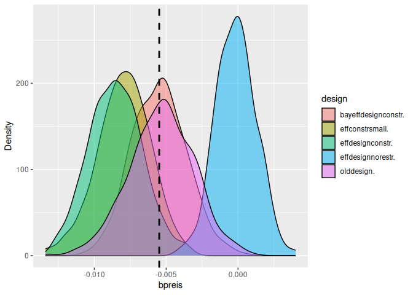

<!-- README.md is generated from README.Rmd. Please edit that file -->

# simulateDCE

<!-- badges: start -->

[](https://CRAN.R-project.org/package=simulateDCE)

<!-- badges: end -->

The goal of simulateDCE is to make it easy to simulate choice experiment
datasets using designs from NGENE, `idefix` or `spdesign`. You have to
store the design file(s) in a subfolder and need to specify certain
parameters and the utility functions for the data generating process.
The package is useful for:

1.  Test different designs in terms of statistical power, efficiency and
    unbiasedness

2.  To test the effects of deviations from RUM, e.g. heuristics, on
    model performance for different designs.

3.  In teaching, using simulated data is useful, if you want to know the
    data generating process. It helps to demonstrate Maximum likelihood
    and choice models, knowing exactly what you should expect.

4.  You can use simulation in pre-registration to justify your sample
    size and design choice.

5.  Before data collection, you can use simulated data to estimate the
    models you plan to use in the actual analysis. You can thus make
    sure, you can estimate all effects for given sample sizes.

## Installation

You can install simulateDCE directly from cran by

``` r
install.packages("simulateDCE") 
```

For the latest development version use this:

``` r
install.packages("devtools")
devtools::install_git('https://github.com/sagebiej/simulateDCE', ref = "devel")
```

## Example

This is a basic example for a simulation:

``` r
rm(list = ls())
library(simulateDCE)
library(rlang)
library(formula.tools)
#> 
#> Attaching package: 'formula.tools'
#> The following object is masked from 'package:rlang':
#> 
#>     env


designpath <- system.file("extdata", "SE_DRIVE", package = "simulateDCE")

resps <- 120 # number of respondents
nosim <- 4 # number of simulations to run (about 500 is minimum)


decisiongroups <- c(0, 0.7, 1)

# place b coefficients into an r list:
bcoeff <- list(
  bpreis = -0.01,
  blade = -0.07,
  bwarte = 0.02
)

manipulations <- list(
  alt1.x2 = expr(alt1.x2 / 10),
  alt1.x3 = expr(alt1.x3 / 10),
  alt2.x2 = expr(alt2.x2 / 10),
  alt2.x3 = expr(alt2.x3 / 10)
)


# place your utility functions here
ul <- list(
  u1 =

    list(
      v1 = V.1 ~ bpreis * alt1.x1 + blade * alt1.x2 + bwarte * alt1.x3,
      v2 = V.2 ~ bpreis * alt2.x1 + blade * alt2.x2 + bwarte * alt2.x3
    ),
  u2 = list(
    v1 = V.1 ~ bpreis * alt1.x1,
    v2 = V.2 ~ bpreis * alt2.x1
  )
)


destype <- "ngene"

sedrive <- sim_all(
  nosim = nosim, resps = resps, destype = destype,
  designpath = designpath, u = ul, bcoeff = bcoeff, decisiongroups = decisiongroups
)
#> 'simple' is deprecated and will be removed in the future. Use 'exact' instead.
#> bcoeff_lookup already exists; skipping modification.
#> 
#> Utility function used in simulation (true utility):
#> $u1
#> $u1$v1
#> V.1 ~ bpreis * alt1.x1 + blade * alt1.x2 + bwarte * alt1.x3
#> <environment: 0x63bacfec1cb8>
#> 
#> $u1$v2
#> V.2 ~ bpreis * alt2.x1 + blade * alt2.x2 + bwarte * alt2.x3
#> <environment: 0x63bacfe5c190>
#> 
#> 
#> $u2
#> $u2$v1
#> V.1 ~ bpreis * alt1.x1
#> <environment: 0x63bacfdc7a28>
#> 
#> $u2$v2
#> V.2 ~ bpreis * alt2.x1
#> <environment: 0x63bacfd5e178>
#> 'destype' is deprecated. Please use 'designtype' instead.
#> New names:
#> • `Choice situation` -> `Choice.situation`
#> • `` -> `...10`
#> assign keys for bcoeff): 0 sec elapsed
#> user entered manipulations: 0.009 sec elapsed
#> split dataframe into groups: 0.004 sec elapsed
#> for each group calculate utility: 0.763 sec elapsed
#> add random component: 0.05 sec elapsed
#> whole simulate choices: 0.836 sec elapsed
#> 
#>  No preprocess function provided. Proceeding without additional preprocessing.
#> 
#> 
#>  dataset preprossed_data exists: FALSE
#> 
#> 
#>  decisiongroups exists: TRUE
#> 
#> Group counts:
#> 
#>    1    2 
#> 1007  433 
#> 
#>  data has been created 
#> 
#> 
#> First few observations of the dataset
#>   ID Choice_situation alt1_x1 alt1_x2 alt1_x3 alt2_x1 alt2_x2 alt2_x3 Block
#> 1  1                7      80      25     100      60     200     100     1
#> 2  1               19      20      25      50      60      25       0     1
#> 3  1               30      20     100      50      80      50     100     1
#> 4  1               32      40     200      25      80      25       0     1
#> 5  1               39      40     200       0      80     100     100     1
#> 6  1               48      60      50      25      20      50     100     1
#>   group    V_1    V_2         e_1        e_2         U_1        U_2 CHOICE
#> 1     1  -0.55 -12.60  0.87205393  2.7212397   0.3220539 -9.8787603      1
#> 2     1  -0.95  -2.35  2.50466037  2.0344117   1.5546604 -0.3155883      1
#> 3     1  -6.20  -2.30 -0.04531185  0.5105373  -6.2453118 -1.7894627      2
#> 4     1 -13.90  -2.55  2.13064965  1.7306129 -11.7693504 -0.8193871      2
#> 5     1 -14.40  -5.80 -0.23305323 -0.4749703 -14.6330532 -6.2749703      2
#> 6     1  -3.60  -1.70 -0.39234397  0.3200480  -3.9923440 -1.3799520      2
#> assign keys for bcoeff): 0 sec elapsed
#> user entered manipulations: 0.01 sec elapsed
#> split dataframe into groups: 0.005 sec elapsed
#> for each group calculate utility: 0.991 sec elapsed
#> add random component: 0.055 sec elapsed
#> whole simulate choices: 1.071 sec elapsed
#> 
#>  No preprocess function provided. Proceeding without additional preprocessing.
#> 
#> 
#>  dataset preprossed_data exists: FALSE
#> 
#> 
#>  decisiongroups exists: TRUE
#> 
#> Group counts:
#> 
#>    1    2 
#> 1007  433 
#> 
#>  data has been created 
#> 
#> 
#> First few observations of the dataset
#>   ID Choice_situation alt1_x1 alt1_x2 alt1_x3 alt2_x1 alt2_x2 alt2_x3 Block
#> 1  1                7      80      25     100      60     200     100     1
#> 2  1               19      20      25      50      60      25       0     1
#> 3  1               30      20     100      50      80      50     100     1
#> 4  1               32      40     200      25      80      25       0     1
#> 5  1               39      40     200       0      80     100     100     1
#> 6  1               48      60      50      25      20      50     100     1
#>   group    V_1    V_2        e_1        e_2         U_1         U_2 CHOICE
#> 1     1  -0.55 -12.60 -0.8954505  1.5838295  -1.4454505 -11.0161705      1
#> 2     1  -0.95  -2.35  0.4581712  1.8586065  -0.4918288  -0.4913935      2
#> 3     1  -6.20  -2.30 -0.6642939  0.1084271  -6.8642939  -2.1915729      2
#> 4     1 -13.90  -2.55  2.5821550 -0.9726034 -11.3178450  -3.5226034      2
#> 5     1 -14.40  -5.80 -0.5853960  6.4944808 -14.9853960   0.6944808      2
#> 6     1  -3.60  -1.70 -1.0606336  1.0080913  -4.6606336  -0.6919087      2
#> assign keys for bcoeff): 0 sec elapsed
#> user entered manipulations: 0.01 sec elapsed
#> split dataframe into groups: 0.005 sec elapsed
#> for each group calculate utility: 0.923 sec elapsed
#> add random component: 0.043 sec elapsed
#> whole simulate choices: 0.991 sec elapsed
#> 
#>  No preprocess function provided. Proceeding without additional preprocessing.
#> 
#> 
#>  dataset preprossed_data exists: FALSE
#> 
#> 
#>  decisiongroups exists: TRUE
#> 
#> Group counts:
#> 
#>    1    2 
#> 1007  433 
#> 
#>  data has been created 
#> 
#> 
#> First few observations of the dataset
#>   ID Choice_situation alt1_x1 alt1_x2 alt1_x3 alt2_x1 alt2_x2 alt2_x3 Block
#> 1  1                7      80      25     100      60     200     100     1
#> 2  1               19      20      25      50      60      25       0     1
#> 3  1               30      20     100      50      80      50     100     1
#> 4  1               32      40     200      25      80      25       0     1
#> 5  1               39      40     200       0      80     100     100     1
#> 6  1               48      60      50      25      20      50     100     1
#>   group    V_1    V_2         e_1         e_2         U_1        U_2 CHOICE
#> 1     1  -0.55 -12.60  0.31343709 -0.54042533  -0.2365629 -13.140425      1
#> 2     1  -0.95  -2.35 -0.53471159 -0.14543346  -1.4847116  -2.495433      1
#> 3     1  -6.20  -2.30 -0.25968664  1.16187416  -6.4596866  -1.138126      2
#> 4     1 -13.90  -2.55  1.56132685  1.00850624 -12.3386731  -1.541494      2
#> 5     1 -14.40  -5.80  0.02436836  0.01878517 -14.3756316  -5.781215      2
#> 6     1  -3.60  -1.70  0.33427912  0.31509039  -3.2657209  -1.384910      2
#> assign keys for bcoeff): 0 sec elapsed
#> user entered manipulations: 0.009 sec elapsed
#> split dataframe into groups: 0.004 sec elapsed
#> for each group calculate utility: 0.75 sec elapsed
#> add random component: 0.038 sec elapsed
#> whole simulate choices: 0.812 sec elapsed
#> 
#>  No preprocess function provided. Proceeding without additional preprocessing.
#> 
#> 
#>  dataset preprossed_data exists: FALSE
#> 
#> 
#>  decisiongroups exists: TRUE
#> 
#> Group counts:
#> 
#>    1    2 
#> 1007  433 
#> 
#>  data has been created 
#> 
#> 
#> First few observations of the dataset
#>   ID Choice_situation alt1_x1 alt1_x2 alt1_x3 alt2_x1 alt2_x2 alt2_x3 Block
#> 1  1                7      80      25     100      60     200     100     1
#> 2  1               19      20      25      50      60      25       0     1
#> 3  1               30      20     100      50      80      50     100     1
#> 4  1               32      40     200      25      80      25       0     1
#> 5  1               39      40     200       0      80     100     100     1
#> 6  1               48      60      50      25      20      50     100     1
#>   group    V_1    V_2       e_1         e_2         U_1        U_2 CHOICE
#> 1     1  -0.55 -12.60 0.3324202 -0.53441977  -0.2175798 -13.134420      1
#> 2     1  -0.95  -2.35 1.1890124 -1.06812495   0.2390124  -3.418125      1
#> 3     1  -6.20  -2.30 1.8902114 -1.25816665  -4.3097886  -3.558167      2
#> 4     1 -13.90  -2.55 0.1614925 -0.98810524 -13.7385075  -3.538105      2
#> 5     1 -14.40  -5.80 2.0304296  0.93499834 -12.3695704  -4.865002      2
#> 6     1  -3.60  -1.70 1.7568673 -0.08023838  -1.8431327  -1.780238      2
#> 
#> 
#> 
#> Transformed utility function (type: simple):
#> [1] "U_1 = @bpreis * $alt1_x1 + @blade * $alt1_x2 + @bwarte * $alt1_x3 ;U_2 = @bpreis * $alt2_x1 + @blade * $alt2_x2 + @bwarte * $alt2_x3 ;"
#> Initial function value: -998.1319 
#> Initial gradient value:
#> bpreis  blade bwarte 
#>   6720 -39150   5400 
#> initial  value 998.131940 
#> iter   2 value 814.970351
#> iter   3 value 805.846680
#> iter   4 value 803.541830
#> iter   5 value 768.557360
#> iter   6 value 759.946571
#> iter   7 value 758.207673
#> iter   8 value 758.159802
#> iter   9 value 758.159633
#> iter  10 value 758.159614
#> iter  10 value 758.159614
#> iter  10 value 758.159606
#> final  value 758.159606 
#> converged
#> Initial function value: -998.1319 
#> Initial gradient value:
#> bpreis  blade bwarte 
#>   6700 -38275   6825 
#> initial  value 998.131940 
#> iter   2 value 820.928122
#> iter   3 value 810.981555
#> iter   4 value 810.478109
#> iter   5 value 772.492965
#> iter   6 value 764.024794
#> iter   7 value 762.566278
#> iter   8 value 762.533718
#> iter   9 value 762.533650
#> iter  10 value 762.533634
#> iter  10 value 762.533623
#> iter  10 value 762.533621
#> final  value 762.533621 
#> converged
#> Initial function value: -998.1319 
#> Initial gradient value:
#> bpreis  blade bwarte 
#>   6960 -38775   5600 
#> initial  value 998.131940 
#> iter   2 value 819.409108
#> iter   3 value 811.709169
#> iter   4 value 810.560821
#> iter   5 value 774.084860
#> iter   6 value 765.573244
#> iter   7 value 763.824955
#> iter   8 value 763.779265
#> iter   9 value 763.779125
#> iter  10 value 763.779110
#> iter  10 value 763.779110
#> iter  10 value 763.779105
#> final  value 763.779105 
#> converged
#> Initial function value: -998.1319 
#> Initial gradient value:
#> bpreis  blade bwarte 
#>   6220 -38300   7075 
#> initial  value 998.131940 
#> iter   2 value 819.588712
#> iter   3 value 807.433292
#> iter   4 value 806.008649
#> iter   5 value 768.413213
#> iter   6 value 759.953773
#> iter   7 value 758.595271
#> iter   8 value 758.567182
#> iter   9 value 758.567137
#> iter  10 value 758.567124
#> iter  10 value 758.567115
#> iter  10 value 758.567114
#> final  value 758.567114 
#> converged
#> start_estimation: 0.16 sec elapsed
#> 
#> Summary table:
#> 
#> 
#> ================  ====  ===  =====  ====  ======  =====  =====  =====  =====  ========  ====
#> \                 vars    n   mean    sd  median    min    max  range   skew  kurtosis    se
#> ================  ====  ===  =====  ====  ======  =====  =====  =====  =====  ========  ====
#> est_bpreis           1    4   0.00  0.00    0.00  -0.01   0.00   0.00   0.06     -2.20  0.00
#> est_blade            2    4  -0.01  0.00   -0.01  -0.01  -0.01   0.00  -0.13     -1.93  0.00
#> est_bwarte           3    4   0.01  0.00    0.01   0.00   0.01   0.00  -0.11     -2.28  0.00
#> rob_pval0_bpreis     4    4   0.12  0.12    0.09   0.02   0.28   0.27   0.37     -2.02  0.06
#> rob_pval0_blade      5    4   0.00  0.00    0.00   0.00   0.00   0.00   0.72     -1.71  0.00
#> rob_pval0_bwarte     6    4   0.00  0.00    0.00   0.00   0.00   0.00   0.73     -1.70  0.00
#> ================  ====  ===  =====  ====  ======  =====  =====  =====  =====  ========  ====
#> 
#> Power results:
#> 
#> FALSE  TRUE 
#>    50    50 
#> 'simple' is deprecated and will be removed in the future. Use 'exact' instead.
#> bcoeff_lookup already exists; skipping modification.
#> 
#> Utility function used in simulation (true utility):
#> $u1
#> $u1$v1
#> V.1 ~ bpreis * alt1.x1 + blade * alt1.x2 + bwarte * alt1.x3
#> <environment: 0x63bad241d1a8>
#> 
#> $u1$v2
#> V.2 ~ bpreis * alt2.x1 + blade * alt2.x2 + bwarte * alt2.x3
#> <environment: 0x63bad23f94d8>
#> 
#> 
#> $u2
#> $u2$v1
#> V.1 ~ bpreis * alt1.x1
#> <environment: 0x63bad23c9550>
#> 
#> $u2$v2
#> V.2 ~ bpreis * alt2.x1
#> <environment: 0x63bad2379c20>
#> 
#> 
#> 'destype' is deprecated. Please use 'designtype' instead.
#> New names:
#> assign keys for bcoeff): 0 sec elapsed
#> user entered manipulations: 0.009 sec elapsed
#> split dataframe into groups: 0.004 sec elapsed
#> for each group calculate utility: 0.82 sec elapsed
#> add random component: 0.068 sec elapsed
#> whole simulate choices: 0.911 sec elapsed
#> 
#>  No preprocess function provided. Proceeding without additional preprocessing.
#> 
#> 
#>  dataset preprossed_data exists: FALSE
#> 
#> 
#>  decisiongroups exists: TRUE
#> 
#> Group counts:
#> 
#>    1    2 
#> 1007  433 
#> 
#>  data has been created 
#> 
#> 
#> First few observations of the dataset
#>   ID Choice_situation alt1_x1 alt1_x2 alt1_x3 alt2_x1 alt2_x2 alt2_x3 Block
#> 1  1               12      60      25       0      20     200     100     1
#> 2  1               16      20     100      50      40      50       0     1
#> 3  1               17      20     200       0      80     100     100     1
#> 4  1               25      60      50     100      20     200      50     1
#> 5  1               29      20      50     100      80      50       0     1
#> 6  1               32      40     100      25      80      25      50     1
#>   group    V_1    V_2        e_1         e_2         U_1          U_2 CHOICE
#> 1     1  -2.35 -12.20  1.9420822  1.90063031  -0.4079178 -10.29936969      1
#> 2     1  -6.20  -3.90  0.2804252  0.03381737  -5.9195748  -3.86618263      2
#> 3     1 -14.20  -5.80  0.2034918  1.83367128 -13.9965082  -3.96632872      2
#> 4     1  -2.10 -13.20  2.5693145  0.01175361   0.4693145 -13.18824639      1
#> 5     1  -1.70  -4.30 -0.2707180 -0.50768644  -1.9707180  -4.80768644      1
#> 6     1  -6.90  -1.55 -1.2228834  1.58936404  -8.1228834   0.03936404      2
#> assign keys for bcoeff): 0 sec elapsed
#> user entered manipulations: 0.014 sec elapsed
#> split dataframe into groups: 0.005 sec elapsed
#> for each group calculate utility: 1.6 sec elapsed
#> add random component: 0.054 sec elapsed
#> whole simulate choices: 1.686 sec elapsed
#> 
#>  No preprocess function provided. Proceeding without additional preprocessing.
#> 
#> 
#>  dataset preprossed_data exists: FALSE
#> 
#> 
#>  decisiongroups exists: TRUE
#> 
#> Group counts:
#> 
#>    1    2 
#> 1007  433 
#> 
#>  data has been created 
#> 
#> 
#> First few observations of the dataset
#>   ID Choice_situation alt1_x1 alt1_x2 alt1_x3 alt2_x1 alt2_x2 alt2_x3 Block
#> 1  1               12      60      25       0      20     200     100     1
#> 2  1               16      20     100      50      40      50       0     1
#> 3  1               17      20     200       0      80     100     100     1
#> 4  1               25      60      50     100      20     200      50     1
#> 5  1               29      20      50     100      80      50       0     1
#> 6  1               32      40     100      25      80      25      50     1
#>   group    V_1    V_2        e_1        e_2        U_1         U_2 CHOICE
#> 1     1  -2.35 -12.20  1.2047383  0.1718643  -1.145262 -12.0281357      1
#> 2     1  -6.20  -3.90 -0.8002397 -0.4729363  -7.000240  -4.3729363      2
#> 3     1 -14.20  -5.80  1.3213734  1.4146832 -12.878627  -4.3853168      2
#> 4     1  -2.10 -13.20  0.9161737  1.4936751  -1.183826 -11.7063249      1
#> 5     1  -1.70  -4.30 -0.5110998  3.6067836  -2.211100  -0.6932164      2
#> 6     1  -6.90  -1.55 -1.1648678  2.7963566  -8.064868   1.2463566      2
#> assign keys for bcoeff): 0 sec elapsed
#> user entered manipulations: 0.013 sec elapsed
#> split dataframe into groups: 0.006 sec elapsed
#> for each group calculate utility: 1.331 sec elapsed
#> add random component: 0.044 sec elapsed
#> whole simulate choices: 1.407 sec elapsed
#> 
#>  No preprocess function provided. Proceeding without additional preprocessing.
#> 
#> 
#>  dataset preprossed_data exists: FALSE
#> 
#> 
#>  decisiongroups exists: TRUE
#> 
#> Group counts:
#> 
#>    1    2 
#> 1007  433 
#> 
#>  data has been created 
#> 
#> 
#> First few observations of the dataset
#>   ID Choice_situation alt1_x1 alt1_x2 alt1_x3 alt2_x1 alt2_x2 alt2_x3 Block
#> 1  1               12      60      25       0      20     200     100     1
#> 2  1               16      20     100      50      40      50       0     1
#> 3  1               17      20     200       0      80     100     100     1
#> 4  1               25      60      50     100      20     200      50     1
#> 5  1               29      20      50     100      80      50       0     1
#> 6  1               32      40     100      25      80      25      50     1
#>   group    V_1    V_2        e_1        e_2         U_1        U_2 CHOICE
#> 1     1  -2.35 -12.20  2.0032051  0.3086138  -0.3467949 -11.891386      1
#> 2     1  -6.20  -3.90  1.2224954  2.2071028  -4.9775046  -1.692897      2
#> 3     1 -14.20  -5.80  0.7560365 -0.1188132 -13.4439635  -5.918813      2
#> 4     1  -2.10 -13.20  0.2343899  1.7534618  -1.8656101 -11.446538      1
#> 5     1  -1.70  -4.30 -0.3385826  3.0051161  -2.0385826  -1.294884      2
#> 6     1  -6.90  -1.55 -1.6895331 -0.7702983  -8.5895331  -2.320298      2
#> assign keys for bcoeff): 0 sec elapsed
#> user entered manipulations: 0.018 sec elapsed
#> split dataframe into groups: 0.009 sec elapsed
#> for each group calculate utility: 0.908 sec elapsed
#> add random component: 0.045 sec elapsed
#> whole simulate choices: 0.994 sec elapsed
#> 
#>  No preprocess function provided. Proceeding without additional preprocessing.
#> 
#> 
#>  dataset preprossed_data exists: FALSE
#> 
#> 
#>  decisiongroups exists: TRUE
#> 
#> Group counts:
#> 
#>    1    2 
#> 1007  433 
#> 
#>  data has been created 
#> 
#> 
#> First few observations of the dataset
#>   ID Choice_situation alt1_x1 alt1_x2 alt1_x3 alt2_x1 alt2_x2 alt2_x3 Block
#> 1  1               12      60      25       0      20     200     100     1
#> 2  1               16      20     100      50      40      50       0     1
#> 3  1               17      20     200       0      80     100     100     1
#> 4  1               25      60      50     100      20     200      50     1
#> 5  1               29      20      50     100      80      50       0     1
#> 6  1               32      40     100      25      80      25      50     1
#>   group    V_1    V_2          e_1        e_2         U_1        U_2 CHOICE
#> 1     1  -2.35 -12.20 -0.178070683  1.1831270  -2.5280707 -11.016873      1
#> 2     1  -6.20  -3.90 -0.009572434  0.8830952  -6.2095724  -3.016905      2
#> 3     1 -14.20  -5.80  1.994978870 -0.5183966 -12.2050211  -6.318397      2
#> 4     1  -2.10 -13.20  0.403642911  0.1355700  -1.6963571 -13.064430      1
#> 5     1  -1.70  -4.30  1.816434647  1.0686647   0.1164346  -3.231335      1
#> 6     1  -6.90  -1.55  0.305666955  0.4342626  -6.5943330  -1.115737      2
#> 
#> 
#> 
#> Transformed utility function (type: simple):
#> [1] "U_1 = @bpreis * $alt1_x1 + @blade * $alt1_x2 + @bwarte * $alt1_x3 ;U_2 = @bpreis * $alt2_x1 + @blade * $alt2_x2 + @bwarte * $alt2_x3 ;"
#> Initial function value: -998.1319 
#> Initial gradient value:
#> bpreis  blade bwarte 
#>   5000 -37550   7750 
#> initial  value 998.131940 
#> iter   2 value 837.113333
#> iter   3 value 824.201723
#> iter   4 value 823.114947
#> iter   5 value 783.250406
#> iter   6 value 774.775521
#> iter   7 value 773.333944
#> iter   8 value 773.274803
#> iter   9 value 773.273733
#> iter  10 value 773.273537
#> iter  11 value 773.273321
#> iter  12 value 773.273149
#> iter  12 value 773.273149
#> iter  12 value 773.273149
#> final  value 773.273149 
#> converged
#> Initial function value: -998.1319 
#> Initial gradient value:
#> bpreis  blade bwarte 
#>   5080 -36850   7700 
#> initial  value 998.131940 
#> iter   2 value 846.837796
#> iter   3 value 834.476514
#> iter   4 value 833.888196
#> iter   5 value 792.919185
#> iter   6 value 784.663682
#> iter   7 value 783.261505
#> iter   8 value 783.212429
#> iter   9 value 783.211636
#> iter  10 value 783.211420
#> iter  11 value 783.211144
#> iter  12 value 783.210967
#> iter  12 value 783.210967
#> iter  12 value 783.210967
#> final  value 783.210967 
#> converged
#> Initial function value: -998.1319 
#> Initial gradient value:
#> bpreis  blade bwarte 
#>   4160 -37300   7875 
#> initial  value 998.131940 
#> iter   2 value 839.322514
#> iter   3 value 836.419091
#> iter   4 value 831.884234
#> iter   5 value 779.975314
#> iter   6 value 770.477811
#> iter   7 value 768.940431
#> iter   8 value 768.916574
#> iter   9 value 768.916429
#> iter  10 value 768.916344
#> iter  10 value 768.916344
#> iter  11 value 768.916327
#> iter  11 value 768.916318
#> iter  11 value 768.916318
#> final  value 768.916318 
#> converged
#> Initial function value: -998.1319 
#> Initial gradient value:
#> bpreis  blade bwarte 
#>   4640 -36400   8675 
#> initial  value 998.131940 
#> iter   2 value 846.465631
#> iter   3 value 830.772590
#> iter   4 value 830.350134
#> iter   5 value 789.366558
#> iter   6 value 781.509014
#> iter   7 value 780.563045
#> iter   8 value 780.531727
#> iter   9 value 780.531215
#> iter  10 value 780.531031
#> iter  11 value 780.530771
#> iter  12 value 780.530616
#> iter  12 value 780.530616
#> iter  12 value 780.530616
#> final  value 780.530616 
#> converged
#> start_estimation: 0.114 sec elapsed
#> 
#> Summary table:
#> 
#> 
#> ================  ====  ===  =====  ====  ======  =====  =====  =====  =====  ========  ===
#> \                 vars    n   mean    sd  median    min    max  range   skew  kurtosis   se
#> ================  ====  ===  =====  ====  ======  =====  =====  =====  =====  ========  ===
#> est_bpreis           1    4  -0.01  0.00   -0.01  -0.01  -0.01   0.01  -0.66     -1.75    0
#> est_blade            2    4  -0.01  0.00   -0.01  -0.01  -0.01   0.00  -0.39     -2.01    0
#> est_bwarte           3    4   0.01  0.00    0.01   0.00   0.01   0.00   0.02     -1.90    0
#> rob_pval0_bpreis     4    4   0.00  0.01    0.00   0.00   0.01   0.01   0.07     -2.33    0
#> rob_pval0_blade      5    4   0.00  0.00    0.00   0.00   0.00   0.00   0.01     -2.42    0
#> rob_pval0_bwarte     6    4   0.00  0.00    0.00   0.00   0.00   0.00   0.75     -1.69    0
#> ================  ====  ===  =====  ====  ======  =====  =====  =====  =====  ========  ===
#> 
#> Power results:
#> 
#> TRUE 
#>  100
#> total time for simulation and estimation: 15.901 sec elapsed
#> $tic
#> elapsed 
#>   0.957 
#> 
#> $toc
#> elapsed 
#>  16.858 
#> 
#> $msg
#> [1] "total time for simulation and estimation"
#> 
#> $callback_msg
#> [1] "total time for simulation and estimation: 15.901 sec elapsed"
#> 
#> Trying tidyr::pivot_longer for reshaping...
```


